# 3/4/5 节可充电电池保护 IC

# 产品概述

BM3451 系列是专业的 3/4/5 节可充电电池保护芯片，具有高集成度的特点，适用于电动工具，电动自行车以及 UPS 后备电源等。

BM3451 通过检测各节电池的电压、充放电电流以及环境温度等信息实现电池过充、过放、放电过电流、短路、充电过电流、温度保护等保护功能，通过外置电容来调节过充、过放、过电流保护延时。

BM3451 提供了电池容量平衡功能，消除电池包中各节电池容量差异，延长电池组寿命。

BM3451 可以实现多个芯片级联，对 6节或 6节以上电池包进行保护。

# 功能特点

⑴ 各节电池的高精度电压检测功能；

·过充电检测电压 3.6 V \~ 4.6 V 精度 $\pm 2 5 ~ \mathsf { m V }$ （ $. + 2 5 \mathrm { { \small C } }$ ）精度 $\pm 4 0 ~ \mathsf { m V }$ （ $- 4 0 ^ { \circ } C$ 至 $+ 8 5 \mathrm { { ‰} }$ ）·过充电滞后电压 0.1 V 精度 $\pm 5 0 ~ \mathsf { m V }$ ·过放电检测电压 1.6 V \~ 3.0 V 精度 $\pm 8 0 ~ \mathsf { m V }$ ·过放电滞后电压 0 / 0.2 / 0.4 V 精度 $\pm 1 0 0 \mathrm { m V }$

⑵ 3段放电过电流检测功能；

精度 $\pm 1 5 \mathrm { m V }$

·过电流检测电压 1 0.025 V \~ 0.30 V ( $5 0 ~ \mathsf { m V }$ 步进) ·过电流检测电压 2 0.2 / 0.3 / 0.4 / 0.6 V ·短路检测电压 0.8 / 1.2 V

⑶ 充电过电流检测功能；充电过电流检测电压 -0.03 /-0.05 / -0.1 / -0.15 / -0.2 V

⑷ 可应用于 3/4/5节电池组；

⑸ 延时外置可调；

·通过改变外接电容大小设置过充电、过放电、过电流 1、过电流 2检测延迟时间

⑹ 内置平衡控制端子；

⑺ 可通过外部信号控制充电、放电状态；

⑻ 充、放电控制端子最高输出电压 $_ { 1 2 \vee }$ ；

⑼ 温度保护功能；

⑽ 断线保护功能；

⑾ 低功耗；

·工作时（带温度保护） $2 5 \mu \mathsf { A }$ 典型值·工作时（无温度保护） $1 5 \mu \mathsf { A }$ 典型值·休眠时 $6 \mu \mathsf { A }$ 典型值

# 应用领域

·电动工具·电动自行车·UPS 后备电源

# 封装形式

·TSSOP28  
·TSSOP20

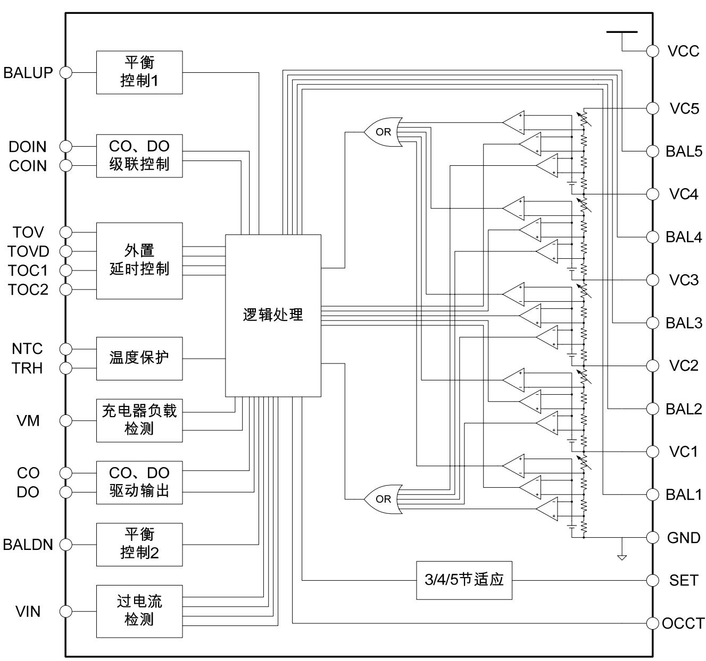  
功能框图  
图 1

# 产品选型

1. 产品命名

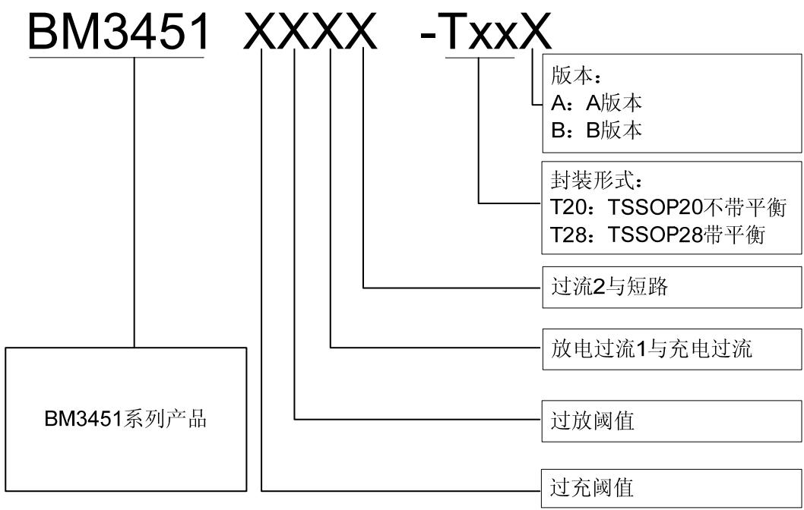  
图 2

# 2. 产品目录

<table><tr><td rowspan=1 colspan=1>型号/项目</td><td rowspan=1 colspan=1>过充电检测电压VDET1</td><td rowspan=1 colspan=1>过充电解除电压VREL1</td><td rowspan=1 colspan=1>过放电检测电压VDET2</td><td rowspan=1 colspan=1>过放电解除电压VREL2</td><td rowspan=1 colspan=1>放电过流1检测电压VoC1</td><td rowspan=1 colspan=1>放电过流2检测电压Voc2</td><td rowspan=1 colspan=1>短路检测电压VSHORT</td><td rowspan=1 colspan=1>充电过流检测电压Vovcc</td><td rowspan=1 colspan=1>平衡启动电压VBAL</td></tr><tr><td rowspan=1 colspan=1>BM3451HEDC-T28A</td><td rowspan=1 colspan=1>3.850V</td><td rowspan=1 colspan=1>3.750V</td><td rowspan=1 colspan=1>2.000V</td><td rowspan=1 colspan=1>2.500V</td><td rowspan=1 colspan=1>0.100V</td><td rowspan=1 colspan=1>0.400V</td><td rowspan=1 colspan=1>0.800V</td><td rowspan=1 colspan=1>-0.050V</td><td rowspan=1 colspan=1>3.590V</td></tr><tr><td rowspan=1 colspan=1>BM3451SMDC-T28A</td><td rowspan=1 colspan=1>4.225V</td><td rowspan=1 colspan=1>4.165V</td><td rowspan=1 colspan=1>2.750V</td><td rowspan=1 colspan=1>3.000V</td><td rowspan=1 colspan=1>0.100V</td><td rowspan=1 colspan=1>0.400V</td><td rowspan=1 colspan=1>0.800V</td><td rowspan=1 colspan=1>-0.050V</td><td rowspan=1 colspan=1>4.165V</td></tr><tr><td rowspan=1 colspan=1>BM3451UNDC-T28A</td><td rowspan=1 colspan=1>4.240V</td><td rowspan=1 colspan=1>4.180V</td><td rowspan=1 colspan=1>2.800V</td><td rowspan=1 colspan=1>3.000V</td><td rowspan=1 colspan=1>0.100V</td><td rowspan=1 colspan=1>0.400V</td><td rowspan=1 colspan=1>0.800V</td><td rowspan=1 colspan=1>-0.050V</td><td rowspan=1 colspan=1>4.180V</td></tr><tr><td rowspan=1 colspan=1>BM3451TNDC-T28A</td><td rowspan=1 colspan=1>4.250V</td><td rowspan=1 colspan=1>4.190V</td><td rowspan=1 colspan=1>2.800V</td><td rowspan=1 colspan=1>3.000V</td><td rowspan=1 colspan=1>0.100V</td><td rowspan=1 colspan=1>0.400V</td><td rowspan=1 colspan=1>0.800V</td><td rowspan=1 colspan=1>-0.050V</td><td rowspan=1 colspan=1>4.190V</td></tr><tr><td rowspan=1 colspan=1>BM3451TJDC-T28A</td><td rowspan=1 colspan=1>4.250V</td><td rowspan=1 colspan=1>4.190V</td><td rowspan=1 colspan=1>2.500V</td><td rowspan=1 colspan=1>2.700V</td><td rowspan=1 colspan=1>0.100V</td><td rowspan=1 colspan=1>0.400V</td><td rowspan=1 colspan=1>0.800V</td><td rowspan=1 colspan=1>-0.050V</td><td rowspan=1 colspan=1>4.190V</td></tr><tr><td rowspan=1 colspan=1>BM3451VJDC-T28A</td><td rowspan=1 colspan=1>4.300V</td><td rowspan=1 colspan=1>4.240V</td><td rowspan=1 colspan=1>2.500V</td><td rowspan=1 colspan=1>2.700V</td><td rowspan=1 colspan=1>0.100V</td><td rowspan=1 colspan=1>0.400V</td><td rowspan=1 colspan=1>0.800V</td><td rowspan=1 colspan=1>-0.050V</td><td rowspan=1 colspan=1>4.240V</td></tr><tr><td rowspan=1 colspan=1>BM3451HEDC-T20B</td><td rowspan=1 colspan=1>3.850V</td><td rowspan=1 colspan=1>3.750V</td><td rowspan=1 colspan=1>2.000V</td><td rowspan=1 colspan=1>2.500V</td><td rowspan=1 colspan=1>0.100V</td><td rowspan=1 colspan=1>0.400V</td><td rowspan=1 colspan=1>0.800V</td><td rowspan=1 colspan=1>-0.050V</td><td rowspan=1 colspan=1>:</td></tr><tr><td rowspan=1 colspan=1>BM3451SMDC-T20B</td><td rowspan=1 colspan=1>4.225V</td><td rowspan=1 colspan=1>4.110V</td><td rowspan=1 colspan=1>2.750V</td><td rowspan=1 colspan=1>3.000V</td><td rowspan=1 colspan=1>0.100V</td><td rowspan=1 colspan=1>0.400V</td><td rowspan=1 colspan=1>0.800V</td><td rowspan=1 colspan=1>-0.050V</td><td rowspan=1 colspan=1>:</td></tr><tr><td rowspan=1 colspan=1>BM3451TNDC-T20B</td><td rowspan=1 colspan=1>4.250V</td><td rowspan=1 colspan=1>4.130V</td><td rowspan=1 colspan=1>2.800V</td><td rowspan=1 colspan=1>3.000V</td><td rowspan=1 colspan=1>0.100V</td><td rowspan=1 colspan=1>0.400V</td><td rowspan=1 colspan=1>0.800V</td><td rowspan=1 colspan=1>-0.050V</td><td rowspan=1 colspan=1>-</td></tr><tr><td rowspan=1 colspan=1>BM3451TJDC-T20B</td><td rowspan=1 colspan=1>4.250V</td><td rowspan=1 colspan=1>4.130V</td><td rowspan=1 colspan=1>2.500V</td><td rowspan=1 colspan=1>2.700V</td><td rowspan=1 colspan=1>0.100V</td><td rowspan=1 colspan=1>0.400V</td><td rowspan=1 colspan=1>0.800V</td><td rowspan=1 colspan=1>-0.050V</td><td rowspan=1 colspan=1></td></tr></table>

表 1

# 引脚排布

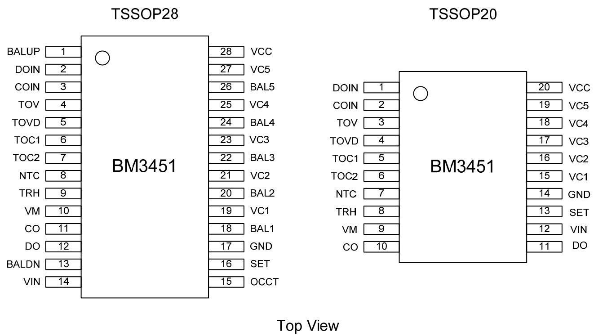  
图 3

<table><tr><td colspan="1" rowspan="1">TSSOP28引脚号</td><td colspan="1" rowspan="1">TSSOP20引脚号</td><td colspan="1" rowspan="1">名称</td><td colspan="1" rowspan="1">描述</td></tr><tr><td colspan="1" rowspan="1">1</td><td colspan="1" rowspan="1">-</td><td colspan="1" rowspan="1">BALUP</td><td colspan="1" rowspan="1">平衡信号传输端子</td></tr><tr><td colspan="1" rowspan="1">2</td><td colspan="1" rowspan="1">1</td><td colspan="1" rowspan="1">DOIN</td><td colspan="1" rowspan="1">DO 控制端子</td></tr><tr><td colspan="1" rowspan="1">3</td><td colspan="1" rowspan="1">2</td><td colspan="1" rowspan="1">COIN</td><td colspan="1" rowspan="1">CO 控制端子</td></tr><tr><td colspan="1" rowspan="1">4</td><td colspan="1" rowspan="1">3</td><td colspan="1" rowspan="1">TOV</td><td colspan="1" rowspan="1">接电容，用于控制过充电检测延时</td></tr><tr><td colspan="1" rowspan="1">5</td><td colspan="1" rowspan="1">4</td><td colspan="1" rowspan="1">TOVD</td><td colspan="1" rowspan="1">接电容，用于控制过放电检测延时</td></tr><tr><td colspan="1" rowspan="1">6</td><td colspan="1" rowspan="1">5</td><td colspan="1" rowspan="1">TOC1</td><td colspan="1" rowspan="1">接电容，用于控制过电流1检测延时</td></tr><tr><td colspan="1" rowspan="1">7</td><td colspan="1" rowspan="1">6</td><td colspan="1" rowspan="1">TOC2</td><td colspan="1" rowspan="1">接电容，用于控制过电流2检测延时</td></tr><tr><td colspan="1" rowspan="1">8</td><td colspan="1" rowspan="1">7</td><td colspan="1" rowspan="1">NTC</td><td colspan="1" rowspan="1">接负温度系数热敏电阻，用于温度检测</td></tr><tr><td colspan="1" rowspan="1">9</td><td colspan="1" rowspan="1">8</td><td colspan="1" rowspan="1">TRH</td><td colspan="1" rowspan="1">接电阻，用于调节高温保护温度</td></tr><tr><td colspan="1" rowspan="1">10</td><td colspan="1" rowspan="1">9</td><td colspan="1" rowspan="1">VM</td><td colspan="1" rowspan="1">过电流保护锁定、充电器及负载检测端子</td></tr><tr><td colspan="1" rowspan="1">11</td><td colspan="1" rowspan="1">10</td><td colspan="1" rowspan="1">CO</td><td colspan="1" rowspan="1">充电控制MOS 栅极连接端子，高电平与高阻态输出，最高12V</td></tr><tr><td colspan="1" rowspan="1">12</td><td colspan="1" rowspan="1">11</td><td colspan="1" rowspan="1">DO</td><td colspan="1" rowspan="1">放电控制MOS 栅极连接端子，CMOS 输出，最高12V</td></tr><tr><td colspan="1" rowspan="1">13</td><td colspan="1" rowspan="1">-</td><td colspan="1" rowspan="1">BALDN</td><td colspan="1" rowspan="1">平衡信号传输端子</td></tr><tr><td colspan="1" rowspan="1">14</td><td colspan="1" rowspan="1">12</td><td colspan="1" rowspan="1">VIN</td><td colspan="1" rowspan="1">放电过电流及充电过电流检测端子</td></tr><tr><td colspan="1" rowspan="1">15</td><td colspan="1" rowspan="1">:</td><td colspan="1" rowspan="1">OCCT</td><td colspan="1" rowspan="1">过流带载恢复控制端子</td></tr><tr><td colspan="1" rowspan="1">16</td><td colspan="1" rowspan="1">13</td><td colspan="1" rowspan="1">SET</td><td colspan="1" rowspan="1">3/4/5 节应用选择端子</td></tr><tr><td colspan="1" rowspan="1">17</td><td colspan="1" rowspan="1">14</td><td colspan="1" rowspan="1">GND</td><td colspan="1" rowspan="1">芯片的地、电池1的负电压连接端子</td></tr><tr><td colspan="1" rowspan="1">18</td><td colspan="1" rowspan="1">-</td><td colspan="1" rowspan="1">BAL1</td><td colspan="1" rowspan="1">电池1的平衡控制端子</td></tr><tr><td colspan="1" rowspan="1">19</td><td colspan="1" rowspan="1">15</td><td colspan="1" rowspan="1">VC1</td><td colspan="1" rowspan="1">电池1的正电压、电池2的负电压连接端子</td></tr><tr><td colspan="1" rowspan="1">20</td><td colspan="1" rowspan="1">-</td><td colspan="1" rowspan="1">BAL2</td><td colspan="1" rowspan="1">电池2的平衡控制端子</td></tr><tr><td colspan="1" rowspan="1">21</td><td colspan="1" rowspan="1">16</td><td colspan="1" rowspan="1">VC2</td><td colspan="1" rowspan="1">电池2的正电压、电池3的负电压连接端子</td></tr><tr><td colspan="1" rowspan="1">22</td><td colspan="1" rowspan="1">:</td><td colspan="1" rowspan="1">BAL3</td><td colspan="1" rowspan="1">电池3的平衡控制端子</td></tr><tr><td colspan="1" rowspan="1">23</td><td colspan="1" rowspan="1">17</td><td colspan="1" rowspan="1">VC3</td><td colspan="1" rowspan="1">电池3的正电压、电池4的负电压连接端子</td></tr><tr><td colspan="1" rowspan="1">24</td><td colspan="1" rowspan="1">-</td><td colspan="1" rowspan="1">BAL4</td><td colspan="1" rowspan="1">电池4的平衡控制端子</td></tr><tr><td colspan="1" rowspan="1">25</td><td colspan="1" rowspan="1">18</td><td colspan="1" rowspan="1">VC4</td><td colspan="1" rowspan="1">电池4的正电压、电池5的负电压连接端子</td></tr><tr><td colspan="1" rowspan="1">26</td><td colspan="1" rowspan="1">:</td><td colspan="1" rowspan="1">BAL5</td><td colspan="1" rowspan="1">电池5的平衡控制端子</td></tr><tr><td colspan="1" rowspan="1">27</td><td colspan="1" rowspan="1">19</td><td colspan="1" rowspan="1">VC5</td><td colspan="1" rowspan="1">电池5的正电压连接端子</td></tr><tr><td colspan="1" rowspan="1">28</td><td colspan="1" rowspan="1">20</td><td colspan="1" rowspan="1">VCC</td><td colspan="1" rowspan="1">芯片的电源、电池5的正电压连接端子</td></tr></table>

绝对最大额定值  
表 3  

<table><tr><td rowspan=1 colspan=1>项目</td><td rowspan=1 colspan=1>符号</td><td rowspan=1 colspan=1>适用端子</td><td rowspan=1 colspan=1>绝对最大额定值</td><td rowspan=1 colspan=1>单位</td></tr><tr><td rowspan=1 colspan=1>电源电压</td><td rowspan=1 colspan=1>VCC</td><td rowspan=1 colspan=1>1</td><td rowspan=1 colspan=1>GND-0.3 ~ GND+30</td><td rowspan=1 colspan=1>V</td></tr><tr><td rowspan=1 colspan=1>各节电池电压</td><td rowspan=1 colspan=1>VcELL</td><td rowspan=1 colspan=1>Vcell5、Vcell4、Vcell3、VcelI2、VcelI1</td><td rowspan=1 colspan=1>GND-0.3 ~ GND+6</td><td rowspan=1 colspan=1>V</td></tr><tr><td rowspan=1 colspan=1>VM 输入端子电压</td><td rowspan=1 colspan=1>VM</td><td rowspan=1 colspan=1>VM</td><td rowspan=1 colspan=1>GND-20 ~ GND+30</td><td rowspan=1 colspan=1>V</td></tr><tr><td rowspan=1 colspan=1>DO 输出端子电压</td><td rowspan=1 colspan=1>VDo</td><td rowspan=1 colspan=1>DO</td><td rowspan=1 colspan=1>GND-0.3 ~ VCC+0.3</td><td rowspan=1 colspan=1>V</td></tr><tr><td rowspan=1 colspan=1>CO 输出端子电压</td><td rowspan=1 colspan=1>Vco</td><td rowspan=1 colspan=1>CO</td><td rowspan=1 colspan=1>GND-20 ~ VCC+0.3</td><td rowspan=1 colspan=1>V</td></tr><tr><td rowspan=1 colspan=1>工作环境温度</td><td rowspan=1 colspan=1>TA</td><td rowspan=1 colspan=1>:</td><td rowspan=1 colspan=1>-40~85</td><td rowspan=1 colspan=1>℃</td></tr><tr><td rowspan=1 colspan=1>贮存温度</td><td rowspan=1 colspan=1>TSTG</td><td rowspan=1 colspan=1>-</td><td rowspan=1 colspan=1>-40~125</td><td rowspan=1 colspan=1>℃</td></tr></table>

注意：绝对最大额定值是指无论在任何条件下都不能超过的额定值。一旦超过此额定值，有可能造成产品劣化等物理性损伤。

电气特性  
（除特殊说明外： $T _ { \mathsf { A } } { = } 2 5 ^ { \circ } \mathsf { C }$ ）  

<table><tr><td rowspan=1 colspan=2>项目</td><td rowspan=1 colspan=1>符号</td><td rowspan=1 colspan=1>测试条件</td><td rowspan=1 colspan=1>最小值</td><td rowspan=1 colspan=1>典型值</td><td rowspan=1 colspan=1>最大值</td><td rowspan=1 colspan=1>单位</td><td rowspan=1 colspan=1>测试电路</td></tr><tr><td rowspan=1 colspan=2>电源电压</td><td rowspan=1 colspan=1>VCC</td><td rowspan=1 colspan=1>1</td><td rowspan=1 colspan=1>5</td><td rowspan=1 colspan=1>：</td><td rowspan=1 colspan=1>30</td><td rowspan=1 colspan=1>V</td><td rowspan=3 colspan=1>1</td></tr><tr><td rowspan=1 colspan=2>正常功耗</td><td rowspan=1 colspan=1>lvcc</td><td rowspan=1 colspan=1>V1=V2=V3=V4=V5=3.5V</td><td rowspan=1 colspan=1>-</td><td rowspan=1 colspan=1>-</td><td rowspan=1 colspan=1>25</td><td rowspan=1 colspan=1>UA</td></tr><tr><td rowspan=1 colspan=2>休眠功耗</td><td rowspan=1 colspan=1>IsTB</td><td rowspan=1 colspan=1>V1=V2=V3=V4=V5=2.0V</td><td rowspan=1 colspan=1>1</td><td rowspan=1 colspan=1>-</td><td rowspan=1 colspan=1>10</td><td rowspan=1 colspan=1>uA</td></tr><tr><td rowspan=5 colspan=1>过充电</td><td rowspan=1 colspan=1>保护阈值</td><td rowspan=1 colspan=1>VDET1</td><td rowspan=1 colspan=1>V1=V2=V3=V4=3.5VV5=3.5→4.4V</td><td rowspan=1 colspan=1>VDET1-0.025</td><td rowspan=1 colspan=1>VDET1</td><td rowspan=1 colspan=1>VDET1+0.025</td><td rowspan=1 colspan=1>V</td><td rowspan=9 colspan=1>2</td></tr><tr><td rowspan=1 colspan=1>保护延时</td><td rowspan=1 colspan=1>Tov</td><td rowspan=1 colspan=1>V1=V2=V3=V4=3.5VCov=0.1uF V5=3.5V→4.4V</td><td rowspan=1 colspan=1>0.5</td><td rowspan=1 colspan=1>1.0</td><td rowspan=1 colspan=1>1.5</td><td rowspan=1 colspan=1>s</td></tr><tr><td rowspan=1 colspan=1>解除阈值</td><td rowspan=1 colspan=1>VREL1</td><td rowspan=1 colspan=1>V1=V2=V3=V4=3.5VV5=4.4V→3.5V</td><td rowspan=1 colspan=1>VREL1-0.05</td><td rowspan=1 colspan=1>VREL1</td><td rowspan=1 colspan=1>VREL1+0.05</td><td rowspan=1 colspan=1>V</td></tr><tr><td rowspan=1 colspan=1>解除延时</td><td rowspan=1 colspan=1>TREL1</td><td rowspan=1 colspan=1>V1=V2=V3=V4=3.5VV5=4.4V→3.5V</td><td rowspan=1 colspan=1>10</td><td rowspan=1 colspan=1>20</td><td rowspan=1 colspan=1>30</td><td rowspan=1 colspan=1>ms</td></tr><tr><td rowspan=1 colspan=1>温度系数1</td><td rowspan=1 colspan=1>Ku1</td><td rowspan=1 colspan=1>Ta= -40°C to 85℃</td><td rowspan=1 colspan=1>-0.6</td><td rowspan=1 colspan=1>0</td><td rowspan=1 colspan=1>0.6</td><td rowspan=1 colspan=1>mV/C</td></tr><tr><td rowspan=4 colspan=1>过放电</td><td rowspan=1 colspan=1>保护阈值</td><td rowspan=1 colspan=1>VDET2</td><td rowspan=1 colspan=1>V1=V2=V3=V4=3.5VV5=3.5V→2.0V</td><td rowspan=1 colspan=1>VDET2-0.08</td><td rowspan=1 colspan=1>VDET2</td><td rowspan=1 colspan=1>VDET2+0.08</td><td rowspan=1 colspan=1>V</td></tr><tr><td rowspan=1 colspan=1>保护延时</td><td rowspan=1 colspan=1>TovD</td><td rowspan=1 colspan=1>V1=V2=V3=V4=3.5VCovD=0.1uF V5=3.5V→2.0V</td><td rowspan=1 colspan=1>0.5</td><td rowspan=1 colspan=1>1.0</td><td rowspan=1 colspan=1>1.5</td><td rowspan=1 colspan=1>s</td></tr><tr><td rowspan=1 colspan=1>解除阈值</td><td rowspan=1 colspan=1>VREL2</td><td rowspan=1 colspan=1>V1=V2=V3=V4=3.5VV5=2.0V→3.5V</td><td rowspan=1 colspan=1>VREL2-0.10</td><td rowspan=1 colspan=1>VREL2</td><td rowspan=1 colspan=1>VREL2+0.10</td><td rowspan=1 colspan=1>V</td></tr><tr><td rowspan=1 colspan=1>解除延时</td><td rowspan=1 colspan=1>TREL2</td><td rowspan=1 colspan=1>V1=V2=V3=V4=3.5VV5=2.0V→3.5V</td><td rowspan=1 colspan=1>10</td><td rowspan=1 colspan=1>20</td><td rowspan=1 colspan=1>30</td><td rowspan=1 colspan=1>ms</td></tr><tr><td rowspan=5 colspan=1>放电过流1</td><td rowspan=1 colspan=1>保护阈值</td><td rowspan=1 colspan=1>VoC1</td><td rowspan=1 colspan=1>V1=V2=V3=V4=V5=3.5VV6=0V→0.12V</td><td rowspan=1 colspan=1>Voc1*85%</td><td rowspan=1 colspan=1>Voc1</td><td rowspan=1 colspan=1>Voc1*115%</td><td rowspan=1 colspan=1>V</td><td rowspan=6 colspan=1>3</td></tr><tr><td rowspan=1 colspan=1>保护延时</td><td rowspan=1 colspan=1>ToC1</td><td rowspan=1 colspan=1>V1=V2=V3=V4=V5=3.5VCoc1=0.1uF V6=0V→0.12V</td><td rowspan=1 colspan=1>100</td><td rowspan=1 colspan=1>200</td><td rowspan=1 colspan=1>300</td><td rowspan=1 colspan=1>ms</td></tr><tr><td rowspan=1 colspan=1>解除延时</td><td rowspan=1 colspan=1>TROC1</td><td rowspan=1 colspan=1>V1=V2=V3=V4=V5=3.5VV6=0V→0.12V→0V</td><td rowspan=1 colspan=1>100</td><td rowspan=1 colspan=1>200</td><td rowspan=1 colspan=1>300</td><td rowspan=1 colspan=1>ms</td></tr><tr><td rowspan=1 colspan=1>过流下拉电阻</td><td rowspan=1 colspan=1>Rvms</td><td rowspan=1 colspan=1>V1=V2=V3=V4=V5=3.5VV6=0V→0.12V</td><td rowspan=1 colspan=1>100</td><td rowspan=1 colspan=1>300</td><td rowspan=1 colspan=1>500</td><td rowspan=1 colspan=1>k</td></tr><tr><td rowspan=1 colspan=1>温度系数2</td><td rowspan=1 colspan=1>Ku2</td><td rowspan=1 colspan=1>Ta= -40°C to 85℃</td><td rowspan=1 colspan=1>-0.1</td><td rowspan=1 colspan=1>0</td><td rowspan=1 colspan=1>0.1</td><td rowspan=1 colspan=1>mV/C</td></tr><tr><td rowspan=1 colspan=1>过流2</td><td rowspan=1 colspan=1>保护阈值</td><td rowspan=1 colspan=1>VoC2</td><td rowspan=1 colspan=1>V1=V2=V3=V4=V5=3.5VV6=0V→0.5V</td><td rowspan=1 colspan=1>Voc2*80%</td><td rowspan=1 colspan=1>Voc2</td><td rowspan=1 colspan=1>Voc2*120%</td><td rowspan=1 colspan=1>V</td></tr></table>

表 4  

<table><tr><td rowspan=1 colspan=2>项目</td><td rowspan=1 colspan=1>符号</td><td rowspan=1 colspan=1>测试条件*1</td><td rowspan=1 colspan=1>最小值</td><td rowspan=1 colspan=1>典型值</td><td rowspan=1 colspan=1>最大值</td><td rowspan=1 colspan=1>单位</td><td rowspan=1 colspan=1>测试电路</td></tr><tr><td rowspan=2 colspan=1>过流2</td><td rowspan=1 colspan=1>保护延时</td><td rowspan=1 colspan=1>ToC2</td><td rowspan=1 colspan=1>V1=V2=V3=V4=V5=3.5VCoc2=0.1uF V6=0V→0.5V</td><td rowspan=1 colspan=1>10</td><td rowspan=1 colspan=1>20</td><td rowspan=1 colspan=1>30</td><td rowspan=1 colspan=1>ms</td><td rowspan=2 colspan=1>3</td></tr><tr><td rowspan=1 colspan=1>解除延时</td><td rowspan=1 colspan=1>TR0C2</td><td rowspan=1 colspan=1>V1=V2=V3=V4=V5=3.5VV6=0V→0.5V→0V</td><td rowspan=1 colspan=1>100</td><td rowspan=1 colspan=1>200</td><td rowspan=1 colspan=1>300</td><td rowspan=1 colspan=1>ms</td></tr><tr><td rowspan=2 colspan=1>短路</td><td rowspan=1 colspan=1>保护阈值</td><td rowspan=1 colspan=1>VSHORT</td><td rowspan=1 colspan=1>V1=V2=V3=V4=V5=3.5VV6=0V→1.2V</td><td rowspan=1 colspan=1>VSHORT*80%</td><td rowspan=1 colspan=1>VSHORT</td><td rowspan=1 colspan=1>VSHORT*120%</td><td rowspan=1 colspan=1>V</td><td rowspan=2 colspan=1>3</td></tr><tr><td rowspan=1 colspan=1>保护延时</td><td rowspan=1 colspan=1>TSHORT</td><td rowspan=1 colspan=1>V1=V2=V3=V4=V5=3.5VV6=0V→1.2V→0V</td><td rowspan=1 colspan=1>100</td><td rowspan=1 colspan=1>300</td><td rowspan=1 colspan=1>600</td><td rowspan=1 colspan=1>us</td></tr><tr><td rowspan=2 colspan=1>充电过流</td><td rowspan=1 colspan=1>保护阈值</td><td rowspan=1 colspan=1>Vovcc</td><td rowspan=1 colspan=1>V1=V2=V3=V4=V5=3.5VV6=0V→-0.2V</td><td rowspan=1 colspan=1>Vovcc-0.03</td><td rowspan=1 colspan=1>Vovcc</td><td rowspan=1 colspan=1>Vovcc+0.03</td><td rowspan=1 colspan=1>V</td><td rowspan=2 colspan=1>4</td></tr><tr><td rowspan=1 colspan=1>保护延时</td><td rowspan=1 colspan=1>Tovcc</td><td rowspan=1 colspan=1>V1=V2=V3=V4=V5=3.5VV6=0V→-0.2V</td><td rowspan=1 colspan=1>10</td><td rowspan=1 colspan=1>20</td><td rowspan=1 colspan=1>30</td><td rowspan=1 colspan=1>ms</td></tr><tr><td rowspan=1 colspan=2>平衡启动阈值电压</td><td rowspan=1 colspan=1>VBAL</td><td rowspan=1 colspan=1>V1=V2=V3=V4=3.5VV5=3.5V→4.30V</td><td rowspan=1 colspan=1>VBAL-0.05</td><td rowspan=1 colspan=1>VBAL</td><td rowspan=1 colspan=1>VBAL+0.05</td><td rowspan=1 colspan=1>V</td><td rowspan=1 colspan=1>5</td></tr><tr><td rowspan=13 colspan=1>输出电阻</td><td rowspan=1 colspan=1>Co</td><td rowspan=1 colspan=1>Rco</td><td rowspan=1 colspan=1>正常态，，Co 为&quot;H&quot; (12V)</td><td rowspan=1 colspan=1>3</td><td rowspan=1 colspan=1>5</td><td rowspan=1 colspan=1>8</td><td rowspan=1 colspan=1>k</td><td rowspan=1 colspan=1>6</td></tr><tr><td rowspan=2 colspan=1>DO</td><td rowspan=2 colspan=1>RDo</td><td rowspan=1 colspan=1>正常态，Do 为&quot;H&quot;(12V)</td><td rowspan=1 colspan=1>3</td><td rowspan=1 colspan=1>5</td><td rowspan=1 colspan=1>8</td><td rowspan=2 colspan=1>k</td><td rowspan=2 colspan=1>7</td></tr><tr><td rowspan=1 colspan=1>保护态，Do 为&quot;L&quot;</td><td rowspan=1 colspan=1>0.20</td><td rowspan=1 colspan=1>0.35</td><td rowspan=1 colspan=1>0.50</td></tr><tr><td rowspan=2 colspan=1>BAL1</td><td rowspan=2 colspan=1>RBAL1</td><td rowspan=1 colspan=1>启动态为&quot;H&quot;</td><td rowspan=1 colspan=1>1.4</td><td rowspan=1 colspan=1>2.0</td><td rowspan=1 colspan=1>2.6</td><td rowspan=10 colspan=1>k</td><td rowspan=10 colspan=1>8</td></tr><tr><td rowspan=1 colspan=1>关断态为&quot;L&quot;</td><td rowspan=1 colspan=1>0.5</td><td rowspan=1 colspan=1>0.8</td><td rowspan=1 colspan=1>1.1</td></tr><tr><td rowspan=2 colspan=1>BAL2</td><td rowspan=2 colspan=1>RBAL2</td><td rowspan=1 colspan=1>启动态为&quot;H&quot;</td><td rowspan=1 colspan=1>1.4</td><td rowspan=1 colspan=1>2.0</td><td rowspan=1 colspan=1>2.6</td></tr><tr><td rowspan=1 colspan=1>关断态为&quot;L&quot;</td><td rowspan=1 colspan=1>0.5</td><td rowspan=1 colspan=1>0.8</td><td rowspan=1 colspan=1>1.1</td></tr><tr><td rowspan=2 colspan=1>BAL3</td><td rowspan=2 colspan=1>RBAL3</td><td rowspan=1 colspan=1>启动态为&quot;H&quot;</td><td rowspan=1 colspan=1>1.4</td><td rowspan=1 colspan=1>2.0</td><td rowspan=1 colspan=1>2.6</td></tr><tr><td rowspan=1 colspan=1>关断态为&quot;L&quot;</td><td rowspan=1 colspan=1>0.5</td><td rowspan=1 colspan=1>0.8</td><td rowspan=1 colspan=1>1.1</td></tr><tr><td rowspan=2 colspan=1>BAL4</td><td rowspan=2 colspan=1>RBAL4</td><td rowspan=1 colspan=1>启动态为&quot;H&quot;</td><td rowspan=1 colspan=1>1.4</td><td rowspan=1 colspan=1>2.0</td><td rowspan=1 colspan=1>2.6</td></tr><tr><td rowspan=1 colspan=1>关断态为&quot;L&quot;</td><td rowspan=1 colspan=1>0.5</td><td rowspan=1 colspan=1>0.8</td><td rowspan=1 colspan=1>1.1</td></tr><tr><td rowspan=2 colspan=1>BAL5</td><td rowspan=2 colspan=1>RBAL5</td><td rowspan=1 colspan=1>启动态为&quot;H&quot;</td><td rowspan=1 colspan=1>1.4</td><td rowspan=1 colspan=1>2.0</td><td rowspan=1 colspan=1>2.6</td></tr><tr><td rowspan=1 colspan=1>关断态为&quot;L&quot;</td><td rowspan=1 colspan=1>0.5</td><td rowspan=1 colspan=1>0.8</td><td rowspan=1 colspan=1>1.5</td></tr></table>

\*1：以上测试条件均以锂电参数参考设计，其他档位参数根据实际电压调整。

# 工作说明

# 1. 过充电

电池充电且 ${ \mathsf { V I N } } > { \mathsf { V } } _ { \mathsf { O V C C } }$ 即未发生充电过流时，只要 VC1、(VC2-VC1)、(VC3-VC2)、(VC4-VC3)或(VC5-VC4)中任意电压值高过 $\mathsf { V } _ { \mathsf { D E T } 1 }$ 并持续了一段时间 TOV，芯片即认为电池包中出现了过充电状态，CO 由高电平变为高阻态，被外接电阻下拉至低电平，将充电控制 MOS管关断，停止充电。满足下面两个条件之一即可解除过充电状态：

⑴ 所有电芯的电压都低于 $\mathsf { V } _ { \mathsf { R E L 1 } }$ 并持续 TREL1；  
⑵ VM> 100mV（接入负载），电池电压低于 $\mathsf { V } _ { \mathsf { D E T } 1 }$ 并持续 TREL1。

# 2. 过放电

电池放电且 $\mathsf { V I N } \boldsymbol { < } \ \mathsf { V } _ { \mathsf { O C } 1 }$ 即未发生放电过流时，只要 VC1、(VC2-VC1)、(VC3-VC2)、(VC4-VC3)或(VC5-VC4)中任意电压值低于 $V _ { \mathsf { D E T } 2 }$ 并持续了一段时间 TOVD，芯片即认为电池包中出现了过放电状态，DO 由高电平变为低电平，将放电控制 MOS 管关断，停止放电，此时芯片进入休眠模式。

满足下面两个条件之一即可解除过放电状态（休眠状态）：

⑴ $\mathsf { V } \mathsf { M } = 0$ 且所有电芯的电压都高于 VREL2并持续 TREL2；  
⑵ $\mathsf { V M } < - 1 0 0 \mathsf { m V }$ （接入充电器），电池电压高于 $\mathsf { V } _ { \mathsf { D E T } 2 }$ 并持续 TREL2。

# 3. 放电过电流

在放电时，放电电流随着负载而变化，VIN电压随着放电电流的增大而增大。当 VIN电压高于 $\mathsf { V } _ { \mathsf { O C } 1 }$ 并持续一段时间 $\mathsf { T } _ { \mathsf { O C } 1 }$ ，即认为出现了过电流 1；当 VIN电压高于 $\mathsf { V } _ { \mathsf { O C } 2 }$ 并持续TOC2，即认为出现了过电流 2；当 VIN 电压高于 $\mathsf { V } _ { \mathsf { S H O R T } }$ 并持续 TSHORT，即认为出现了短路。三种中任意一种状态出现后，DO 由高电平变为低电平，关断放电控制 MOS 管停止放电，同时，过流锁定端子 VM 端内部下拉电阻 RVMS接入。通常 $\mathsf { V } _ { 0 \mathsf { C } 1 } < \mathsf { V } _ { 0 \mathsf { C } 2 } < \mathsf { V } _ { \mathsf { S H O R T } }$ ， $\mathsf { T } _ { 0 \mathsf { C } 1 } > \mathsf { T } _ { 0 \mathsf { C } 2 } > \mathsf { T } _ { \mathsf { S H O R T } }$ 。过电流保护时 DO 被锁定为低电平，断开负载即可解除锁定。

# 4. 延时设置

过充电延时，过放电延时由下述公式计算（单位：s）：

$$
\mathsf { T o v } = 1 0 ^ { 7 } \times \mathsf { C o v } \qquad \mathsf { T o v d } = 1 0 ^ { 7 } \times \mathsf { C o v } \mathsf { D }
$$

放电过电流 1 延时由下述公式计算（单位：s）：

$$
\mathsf { T o c 1 } = 2 \times 1 0 ^ { 6 } \times \mathsf { C } _ { \infty 1 }
$$

放电过电流 2 延时由下述公式计算（单位：s）：

$$
\mathtt { T o c 2 } = 2 \times 1 0 ^ { 5 } \times \mathtt { C } _ { \mathtt { O C 2 } }
$$

# 5. 充电过电流

在充电时，如果充电电流过大且 $\mathsf { V I N } { \mathsf { < } } \mathsf { V } _ { \mathsf { O V C C } }$ 并持续了一段时间 T ，芯片认为发生了充电过电流状态，CO 被外接电阻下拉至低电平，充电控制 MOS 管关断，必须将充电器移除才能解除。

# 6. 平衡功能

电池容量平衡功能是用来平衡电池组中各节电池容量。在 BM3451 系列中，当 VC1、(VC2-VC1)、(VC3-VC2)、(VC4-VC3)或 (VC5-VC4)的电池电压都低于或都高于平衡启动阈值电压 $V _ { \mathsf { B A L } }$ 时，外置放电回路不会开启；否则电压高于平衡启动阈值 $\mathsf { V } _ { \mathsf { B A L } }$ 的电芯将开启本节平衡放电回路，将电池的电压放电至$V _ { \mathsf { B A L } }$ 之下。

在充电时，如果五节中电压最高的一节进入过充保护态且其平衡放电回路是开启的，充电控制 MOS 管关断，外置的平衡放电回路将开启使该节电池电压回到过充解除阈值电压 $\mathsf { V } _ { \mathsf { R E L 1 } }$ ，再打开充电控制 MOS 管继续充电。经过足够长时间的充放电循环后，所有的电池电压将全部充至 $V _ { \mathsf { B A L } }$ 之上，消除各节电池容量差异。

# 7. 温度保护

为了防止充放电过程中电芯温度过高给电芯带来的损坏，需要进行电芯高温保护。NTC端子连接热敏电阻用于感应温度变化，TRH端子连接电阻用于高温保护基准的设置。过温检测时，芯片默认为放电检测。仅当 $\lor 1 < - 1 0 0 \land V$ 时，芯片识别为充电检测。以充电过温保护为参考，假设充电过温保护时NTC电阻阻值RNTC，则TRH选取的电阻阻值为 $R _ { \mathsf { T R H } } { = } 2 ^ { \star } { \mathsf { R } } _ { \mathsf { N T C } }$ ，此时放电过温保护时对应的NTC阻值为 $0 . 5 4 ^ { \star }$ RNTC对应的温度。我们可通过调节 ${ \mathsf { R } } _ { { \mathsf { T R H } } }$ 大小来调节充放电过温保护的温度。

以 NTC 电阻选取 103AT-4 型号为例，常温下（ $\scriptscriptstyle 2 5 \textdegree$ ）为 $1 0 1 \times \Omega$ ，设定充电保护温度为 $5 5 \textdegree$ 。 $5 5 \%$ 时对应 $\mathsf { R } _ { \mathsf { N T C } } { = } 3 . 5 \mathsf { K }$ ，则选取 TRH 电阻阻值为 $R _ { \mathsf { T R H } } { = } 2 ^ { \star } { \mathsf { R } } _ { \mathsf { N T C } } { = } 7 { \mathsf { K } }$ ，放电过温保护时对应 NTC 电阻大小为$0 . 5 4 ^ { \star } \mathsf { R } _ { \mathsf { N T C } } = 1 . 8 9 \mathsf { K }$ ，对应温度为 $7 5 \%$ 。充电过温保护迟滞为 $5 \%$ ，放电过温保护迟滞为 $1 5 \%$ 。所以当充电温度高于保护温度 $5 5 \textdegree$ ，CO 变为高阻态，由外接电阻下拉至低电平，充电控制 MOS 管关断停止充电，当电芯温度降到 $5 0 \%$ 时，CO 变为高电平，充电控制 MOS 重新开启；当放电温度高于保护温度 $7 5 \%$ ，DO 变为低电平，放电 MOS 管关断停止放电，同时充电 MOS管也关断禁止充电，当电芯温度降到 $60 \%$ 时，DO 变为高电平，CO 变为高电平，充放电控制 MOS 重新开启。

# 8. 断线保护

当芯片检测到管脚 VC1、VC2、VC3、VC4、VC5 中任意一根或多根与电芯的连线断开，芯片判断为发生了断线，即将 CO 输出高阻态，DO 输出低电平，此保护状态称为断线保护状态。断线保护后，芯片进入低功耗。当断开的连线重新正确连接后，芯片退出断线保护状态。特别注意，单芯片应用与级联应用时，均不可将芯片引脚 GND 与电芯的连线断开，若断开，芯片无法正常工作，无法进入断线保护。

# 9. 3/4/5 节电池选择

表 5  

<table><tr><td rowspan=1 colspan=1>SET电位</td><td rowspan=1 colspan=1>选择节数</td><td rowspan=1 colspan=1>短接引脚</td></tr><tr><td rowspan=1 colspan=1>悬空</td><td rowspan=1 colspan=1>5</td><td rowspan=1 colspan=1>-</td></tr><tr><td rowspan=1 colspan=1>VCC</td><td rowspan=1 colspan=1>4</td><td rowspan=1 colspan=1>VC1=GND</td></tr><tr><td rowspan=1 colspan=1>GND</td><td rowspan=1 colspan=1>3</td><td rowspan=1 colspan=1>VC1=VC2=GND</td></tr></table>

# 10. 级联应用

级联应用时，各 IC均可将自身的过充电、过放电、平衡信息传输给相邻 IC。 以图 6为例， IC1的 DO、CO 信号通过 DOIN、COIN 传送给 IC2， IC2 根据 DOIN、COIN 状态判断是否关断充电、放电控制 MOS管。DOIN、COIN 优先于内部保护电路。IC 内部的平衡信息通过 BALUP、BALDN 端子进行传输，遵循先进行组内平衡，再进行组间平衡原则。以 A、B、C三颗 IC级联应用为例，其组间平衡原则如下：

<table><tr><td rowspan=1 colspan=1>A</td><td rowspan=1 colspan=1>B</td><td rowspan=1 colspan=1>C</td><td rowspan=1 colspan=1>A是否开启平衡</td><td rowspan=1 colspan=1>B 是否开启平衡</td><td rowspan=1 colspan=1>C 是否开启平衡</td></tr><tr><td rowspan=1 colspan=1>0</td><td rowspan=1 colspan=1>0</td><td rowspan=1 colspan=1>0</td><td rowspan=1 colspan=1>香</td><td rowspan=1 colspan=1>香</td><td rowspan=1 colspan=1>香</td></tr><tr><td rowspan=1 colspan=1>0</td><td rowspan=1 colspan=1>0</td><td rowspan=1 colspan=1>1</td><td rowspan=1 colspan=1>香</td><td rowspan=1 colspan=1>香</td><td rowspan=1 colspan=1>开</td></tr><tr><td rowspan=1 colspan=1>0</td><td rowspan=1 colspan=1>1</td><td rowspan=1 colspan=1>0</td><td rowspan=1 colspan=1>否</td><td rowspan=1 colspan=1>开</td><td rowspan=1 colspan=1>否</td></tr><tr><td rowspan=1 colspan=1>0</td><td rowspan=1 colspan=1>1</td><td rowspan=1 colspan=1>1</td><td rowspan=1 colspan=1>否</td><td rowspan=1 colspan=1>开</td><td rowspan=1 colspan=1>开</td></tr><tr><td rowspan=1 colspan=1>1</td><td rowspan=1 colspan=1>0</td><td rowspan=1 colspan=1>0</td><td rowspan=1 colspan=1>开</td><td rowspan=1 colspan=1>香</td><td rowspan=1 colspan=1>香</td></tr><tr><td rowspan=1 colspan=1>1</td><td rowspan=1 colspan=1>0</td><td rowspan=1 colspan=1>1</td><td rowspan=1 colspan=1>开</td><td rowspan=1 colspan=1>香</td><td rowspan=1 colspan=1>开</td></tr><tr><td rowspan=1 colspan=1>1</td><td rowspan=1 colspan=1>1</td><td rowspan=1 colspan=1>0</td><td rowspan=1 colspan=1>开</td><td rowspan=1 colspan=1>开</td><td rowspan=1 colspan=1>否</td></tr><tr><td rowspan=1 colspan=1>1</td><td rowspan=1 colspan=1>1</td><td rowspan=1 colspan=1>1</td><td rowspan=1 colspan=1>否</td><td rowspan=1 colspan=1>否</td><td rowspan=1 colspan=1>香</td></tr></table>

信号说明：IC 平衡状态：“1”表示电池组中所有电池均在平衡阈值以上，“0”表示电池组中有电池电压在平衡阈值以下。

# 工作时序图

# 1. 过充电、过放电保护

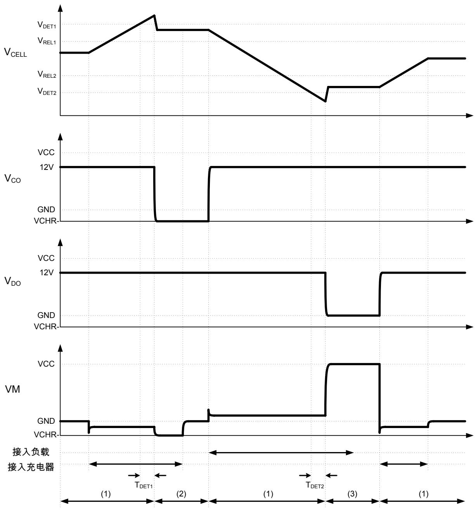  
图 4

假定为恒流充电，VCHR-为充电器空载时负端电压：

（1）通常状态；  
（2）过充电保护状态；  
（3）过放电保护状态。

# 2. 放电过电流、短路、充电过电流保护

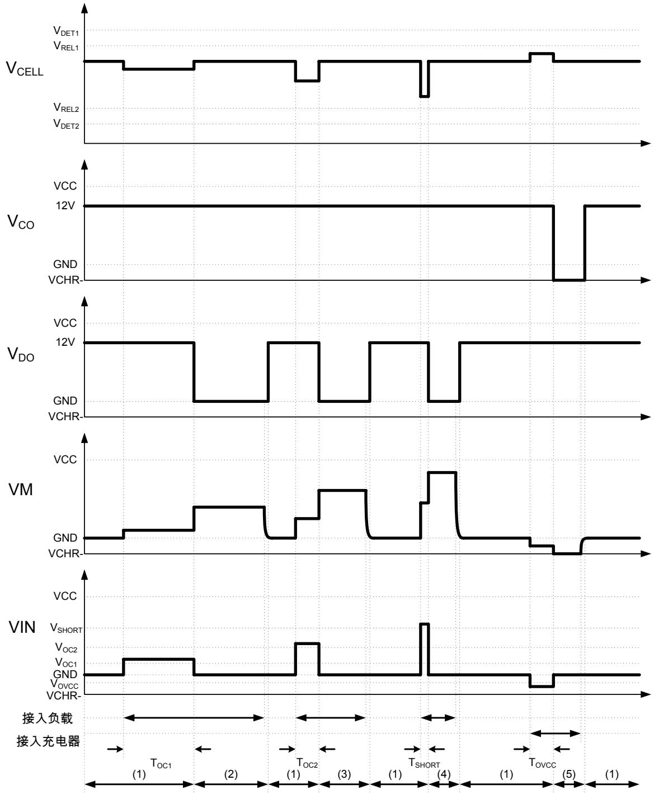  
图 5

假定为恒流充电，VCHR-为充电器空载时负端电压：

（1） 通常状态；  
（2） 放电过电流 1保护状态；  
（3） 放电过电流 2保护状态；  
（4） 短路保护状态；  
（5） 充电过电流保护状态。

# 应用电路

# 1. 单颗芯片应用

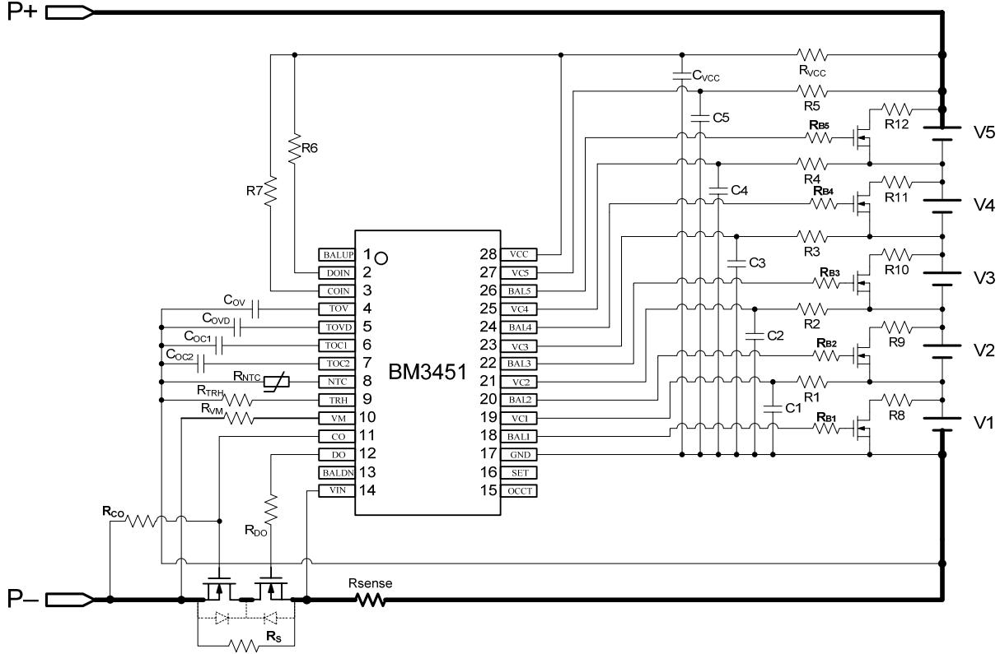  
图 6（a-1）5 串应用(SET 悬空)— —带平衡、充放电回路共用

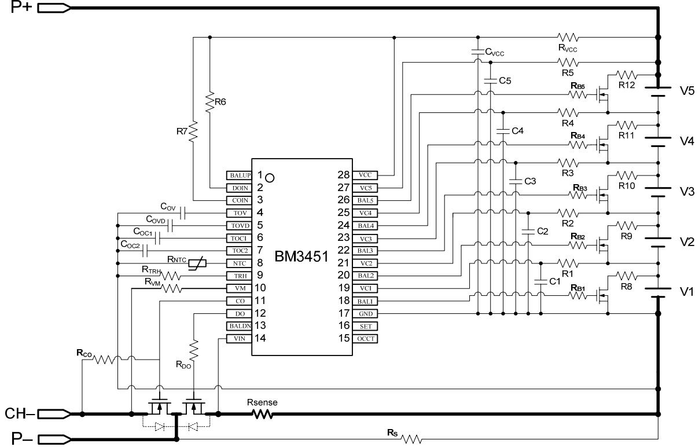  
图 6（a-2）5 串应用(SET 悬空)— —带平衡、充放电回路分开

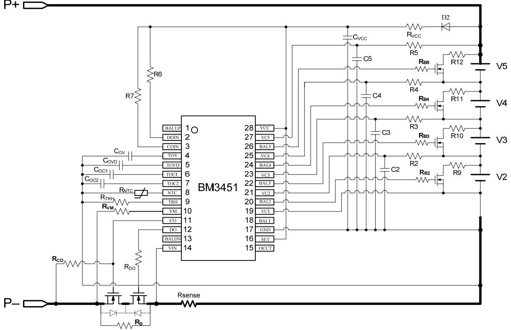  
图 6（b）4 串应用(SET 接 VCC)——带平衡

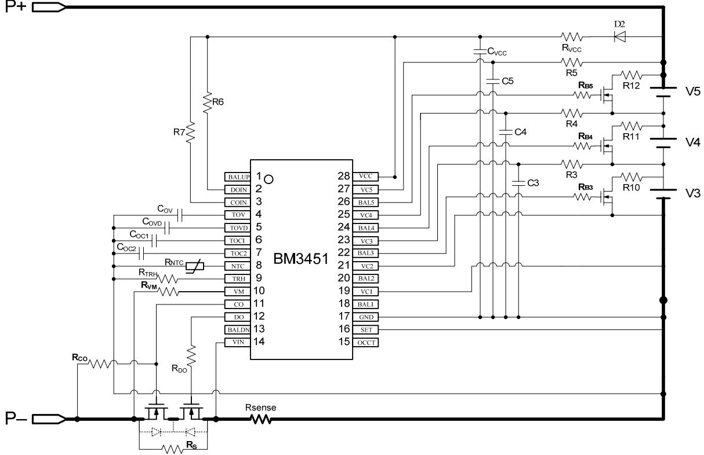  
图 6（c）3 串应用(SET 接 GND)——带平衡

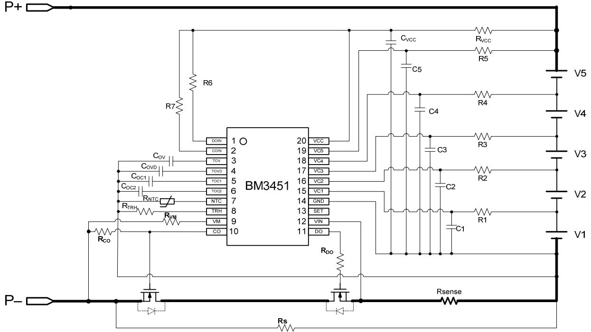  
图 6（d-1）5 串应用(SET 悬空)——不带平衡、充放电回路共用

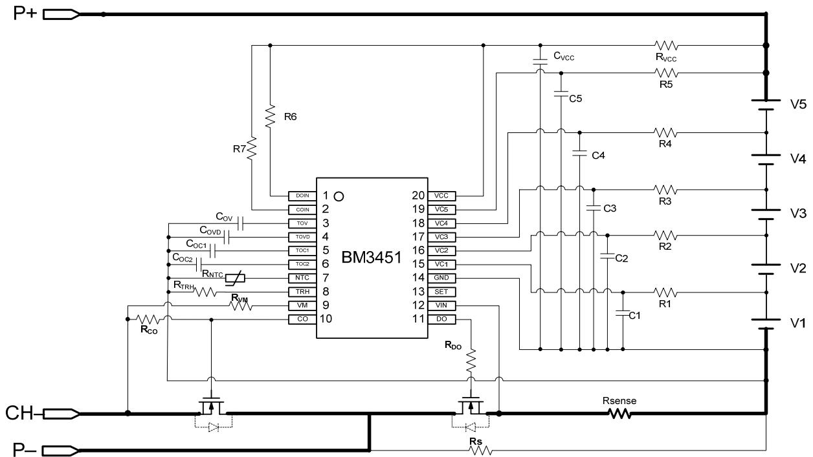  
图 6（d-2）5 串应用(SET 悬空)——不带平衡、充放电回路分开

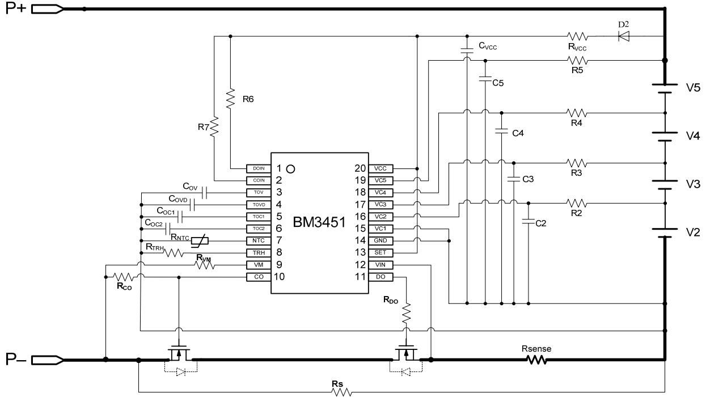  
图 6（e）4 串应用(SET 接 VCC)——不带平衡

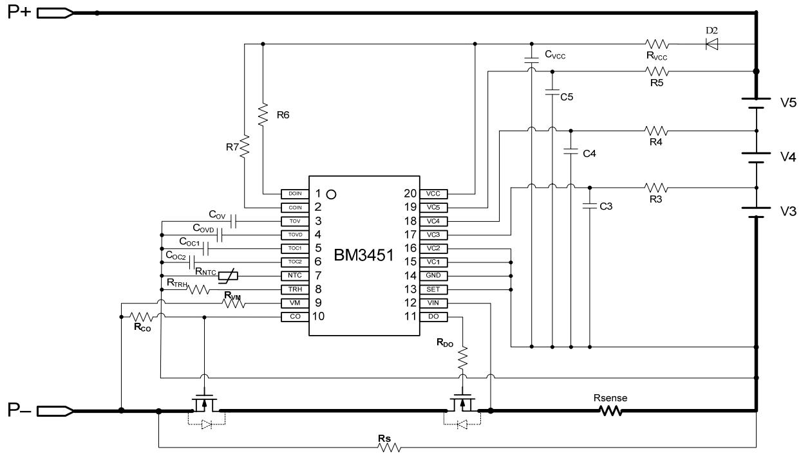  
图 6（f）3 串应用(SET 接 GND)——不带平衡

电阻、电容推荐值如下：  
表 6  

<table><tr><td rowspan=1 colspan=1>器件标号</td><td rowspan=1 colspan=1>典型值</td><td rowspan=1 colspan=2>范围</td><td rowspan=1 colspan=1>单位</td></tr><tr><td rowspan=1 colspan=1>R1、R2、R3、R4、R5</td><td rowspan=1 colspan=1>1000</td><td rowspan=1 colspan=2>100~1000</td><td rowspan=1 colspan=1>Ω</td></tr><tr><td rowspan=1 colspan=1>RB1、RB2、RB3、RB4、RB5</td><td rowspan=1 colspan=1>4.7</td><td rowspan=1 colspan=2>3~10</td><td rowspan=1 colspan=1>MΩ</td></tr><tr><td rowspan=1 colspan=1>Rvcc</td><td rowspan=1 colspan=1>1000</td><td rowspan=1 colspan=2>100~1000</td><td rowspan=1 colspan=1>Ω</td></tr><tr><td rowspan=1 colspan=1>R6、R7</td><td rowspan=1 colspan=1>1</td><td rowspan=1 colspan=2>0.5~2</td><td rowspan=1 colspan=1>MΩ</td></tr><tr><td rowspan=1 colspan=1>R8、R9、R10、R11、R12</td><td rowspan=1 colspan=1>47</td><td rowspan=1 colspan=2>10~200</td><td rowspan=1 colspan=1>Ω</td></tr><tr><td rowspan=1 colspan=1>RNTC</td><td rowspan=1 colspan=1>10</td><td rowspan=1 colspan=2>-</td><td rowspan=1 colspan=1>kΩ</td></tr><tr><td rowspan=1 colspan=1>RTRH</td><td rowspan=1 colspan=1>7</td><td rowspan=1 colspan=2>-</td><td rowspan=1 colspan=1>kΩ</td></tr><tr><td rowspan=1 colspan=1>RvM</td><td rowspan=1 colspan=1>220</td><td rowspan=1 colspan=2>10-500</td><td rowspan=1 colspan=1>kΩ</td></tr><tr><td rowspan=1 colspan=1>Rco、Rs</td><td rowspan=1 colspan=1>10</td><td rowspan=1 colspan=2>5~15</td><td rowspan=1 colspan=1>MΩ</td></tr><tr><td rowspan=1 colspan=1>RDo</td><td rowspan=1 colspan=1>2</td><td rowspan=1 colspan=2>0~10</td><td rowspan=1 colspan=1>kΩ</td></tr><tr><td rowspan=1 colspan=1>Rsense</td><td rowspan=1 colspan=1>5</td><td rowspan=1 colspan=2>1~20</td><td rowspan=1 colspan=1>mΩ</td></tr><tr><td rowspan=1 colspan=1>Cvcc</td><td rowspan=1 colspan=1>10</td><td rowspan=1 colspan=2>10~100</td><td rowspan=1 colspan=1>uF</td></tr><tr><td rowspan=1 colspan=1>C1、C2、C3、C4、C5</td><td rowspan=1 colspan=1>1.0</td><td rowspan=1 colspan=1>0.1~10</td><td rowspan=1 colspan=1>电容耐</td><td rowspan=1 colspan=1>μF</td></tr><tr><td rowspan=1 colspan=1>Cov、CovD、Coc1、Coc2</td><td rowspan=1 colspan=1>0.1</td><td rowspan=1 colspan=1>-</td><td rowspan=1 colspan=1>压&gt;50V</td><td rowspan=1 colspan=1>uF</td></tr></table>

# 2. 两颗芯片级联应用

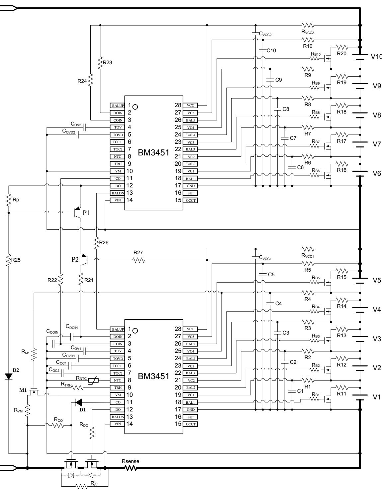  
图 7 10 串应用——带平衡

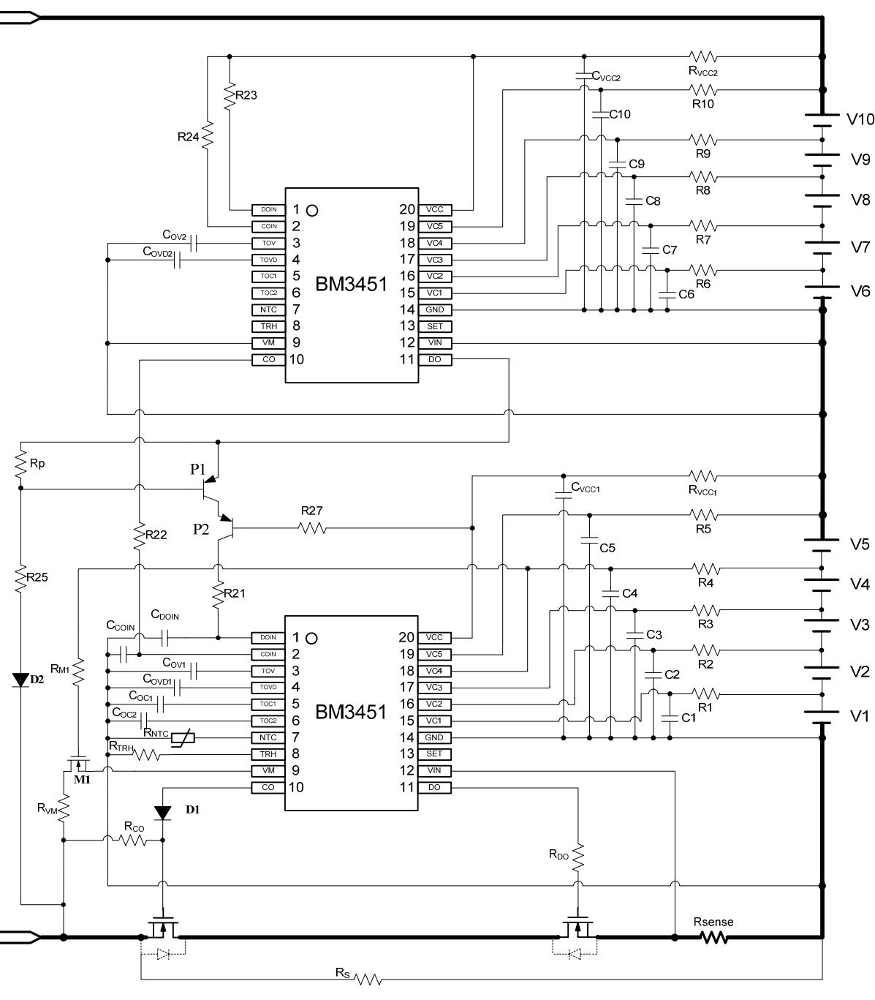  
图 8 10串应用——不带平衡

特别注意：MOS 管 M1、二极管 D1、D2和三极管 P1的耐压值务必大于应用时整个电池包总电压，并留足余量！ 以上 4 串、3 串、10 串各典型应用均为充放电回路共用，充放电回路分开电路参照 5 串典型应用即可！

电阻、电容推荐值如下：  
表 7  

<table><tr><td rowspan=1 colspan=1>器件标号</td><td rowspan=1 colspan=1>典型值</td><td rowspan=1 colspan=2>范围</td><td rowspan=1 colspan=1>单位</td></tr><tr><td rowspan=1 colspan=1>R1、R2、R3、R4、R5、R6、R7、R8、R9、R10</td><td rowspan=1 colspan=1>1000</td><td rowspan=1 colspan=2>100～ 1000</td><td rowspan=1 colspan=1>Ω</td></tr><tr><td rowspan=1 colspan=1>RB1、RB2、RB3、RB4、RB5、RB6、RB7、RB8、RB9、RB10</td><td rowspan=1 colspan=1>4.7</td><td rowspan=1 colspan=2>3~10</td><td rowspan=1 colspan=1>MΩ</td></tr><tr><td rowspan=1 colspan=1>Rvcc1、RvcC2</td><td rowspan=1 colspan=1>1000</td><td rowspan=1 colspan=2>100~1000</td><td rowspan=1 colspan=1>0</td></tr><tr><td rowspan=1 colspan=1>R11、R12、R13、R14、R15、R16、R17、R18、R19、R20</td><td rowspan=1 colspan=1>47</td><td rowspan=1 colspan=2>10~200</td><td rowspan=1 colspan=1>Ω</td></tr><tr><td rowspan=1 colspan=1>R21</td><td rowspan=1 colspan=1>2</td><td rowspan=1 colspan=2>0~5</td><td rowspan=1 colspan=1>kΩ</td></tr><tr><td rowspan=1 colspan=1>R22、R25</td><td rowspan=1 colspan=1>10</td><td rowspan=1 colspan=2>8~15</td><td rowspan=1 colspan=1>MΩ</td></tr><tr><td rowspan=1 colspan=1>R23、R24、Rp</td><td rowspan=1 colspan=1>1</td><td rowspan=1 colspan=2>1~2</td><td rowspan=1 colspan=1>MΩ</td></tr><tr><td rowspan=1 colspan=1>R26</td><td rowspan=1 colspan=1>1</td><td rowspan=1 colspan=2>0~5</td><td rowspan=1 colspan=1>k</td></tr><tr><td rowspan=1 colspan=1>R27</td><td rowspan=1 colspan=1>2</td><td rowspan=1 colspan=2>1~5</td><td rowspan=1 colspan=1>MΩ</td></tr><tr><td rowspan=1 colspan=1>RNTC</td><td rowspan=1 colspan=1>10</td><td rowspan=1 colspan=2>二</td><td rowspan=1 colspan=1>kΩ</td></tr><tr><td rowspan=1 colspan=1>RTRH</td><td rowspan=1 colspan=1>7</td><td rowspan=1 colspan=2>-</td><td rowspan=1 colspan=1>k</td></tr><tr><td rowspan=1 colspan=1>Rvm</td><td rowspan=1 colspan=1>220</td><td rowspan=1 colspan=2>10-500</td><td rowspan=1 colspan=1>kΩ</td></tr><tr><td rowspan=1 colspan=1>Rco、Rs</td><td rowspan=1 colspan=1>10</td><td rowspan=1 colspan=2>5~15</td><td rowspan=1 colspan=1>MΩ</td></tr><tr><td rowspan=1 colspan=1>RDo</td><td rowspan=1 colspan=1>2</td><td rowspan=1 colspan=2>0~10</td><td rowspan=1 colspan=1>kΩ</td></tr><tr><td rowspan=1 colspan=1>Rsense</td><td rowspan=1 colspan=1>5</td><td rowspan=1 colspan=2>1~20</td><td rowspan=1 colspan=1>m</td></tr><tr><td rowspan=1 colspan=1>Cvcc</td><td rowspan=1 colspan=1>10</td><td rowspan=1 colspan=1>10~100</td><td rowspan=2 colspan=1>电容耐</td><td rowspan=1 colspan=1>uF</td></tr><tr><td rowspan=1 colspan=1>C1、C2、C3、C4、C5、C6、、C7、C8、C9、C10</td><td rowspan=1 colspan=1>1.0</td><td rowspan=1 colspan=1>0~10</td><td rowspan=1 colspan=1>uF</td></tr><tr><td rowspan=1 colspan=1>Cov1、CovD1、Cov2、CoVD2、Coc1、Coc2</td><td rowspan=1 colspan=1>0.1</td><td rowspan=1 colspan=1>=</td><td rowspan=2 colspan=1>压&gt;50V</td><td rowspan=1 colspan=1>uF</td></tr><tr><td rowspan=1 colspan=1>CDOIN、CcOIN</td><td rowspan=1 colspan=1>10</td><td rowspan=1 colspan=1>2.2~100</td><td rowspan=1 colspan=1>nF</td></tr></table>

# 测试电路

本章说明是在 5节电池应用即 SET端子悬空情况下的 BM3451 系列测试方法。4节电池应用的情况下，SET 端子接VCC电平，并将 VC1短接至 GND；3节电池应用的情况下，SET 端子接 GND电平，并将VC1与 VC2短接至 GND。4节电池和 3节电池测试方法可按 5节电池的测试方法类推。

# 1. 正常功耗及休眠功耗

测试电路 1

⑴ 设定 $\scriptstyle \bigvee 1 = \bigvee 2 = \bigvee 3 = \bigvee 4 = \bigvee 5 = 3 . 5 \bigvee$ ，观察电流表的读数，流出 GND的电流即正常功耗。  
⑵ 在⑴的基础上，设定 $\scriptstyle \bigvee 1 = \bigvee 2 = \bigvee 3 = \bigvee 4 = \bigvee 5 = 2 . 0 \bigvee$ ，观察电流表的读数，流出 GND的电流即休眠功耗。

# 2. 过充电测试

测试电路 2

2.1过充电保护及保护解除阈值

设定 $\scriptstyle \bigvee 1 = \bigvee 2 = \bigvee 3 = \bigvee 4 = \bigvee 5 = 3 . 5 \bigvee$ ，确保 DO、CO 都为”H”。逐渐增大 V5，维持时间不小于过充电保护延时，当 CO 由”H”变”L”时的 V5电压即为过充电保护阈值电压（ $( \mathsf { V } _ { \mathsf { D E T } 1 } )$ ）；逐渐减小 V5，维持时间不小于过充电保护解除延时，当 CO 重新变为”H”时，V5 电压即为过充电保护解除阈值电压（ $\mathsf { N } _ { \mathsf { R E L 1 } }$ ）。

# 2.2过充电保护及过充电回复延时

⑴ 设定 $\scriptstyle \bigvee 1 = \bigvee 2 = \bigvee 3 = \bigvee 4 = \bigvee 5 = 3 . 5 \bigvee$ ，确保 DO、CO 都为”H”。将 V5骤升至 $4 . 4 \lor$ ，监控 CO 电压并维持段时间，CO 由”H”变”L”的时间间隔即为过充电延时。

⑵ 设定 $\vee 1 = \vee 2 = \vee 3 = \vee 4 = 3 . 5 \vee$ ， $\mathsf { V } 5 { = } 4 . 4 \mathsf { V }$ ，确保 DO 为”H”，CO 为”L”。将 V5 骤降至 $3 . 5 \mathsf { V }$ ，监控 CO 电压并维持一段时间，CO 由”L”变”H”的时间间隔即为过充电回复延时。

# 3. 过放电测试

测试电路 2

3.1过放电保护及过放电保护解除阈值

设定 $\scriptstyle \bigvee 1 = \bigvee 2 = \bigvee 3 = \bigvee 4 = \bigvee 5 = 3 . 5 \bigvee$ ，确保 DO、CO 都为”H”。逐渐减小 V5，维持时间不小于过放电保护延时，当 DO 由 $\ " \mathsf { H } ^ { \prime \prime }$ 变为”L”时的 V5电压即为过放电保护阈值电压 $( \mathsf { V } _ { \mathsf { D E T } 2 } )$ ）；逐渐增大 V5，维持时间不小于过放电保护解除延时，当 DO 重新变为”H”时，V5 电压即为过放电保护解除电压（ $( V _ { \mathsf { R E L 2 } } )$ ）。

# 3.2 过放及过放回复延时

⑴ 设定 $\scriptstyle \bigvee 1 = \bigvee 2 = \bigvee 3 = \bigvee 4 = \bigvee 5 = 3 . 5 \bigvee$ ，确保 DO、CO 都为”H”。将 V5 骤降至 $2 . 0 \lor$ ，监控 DO 电压并维持一段时间，DO 由”H”变为”L”的时间间隔即为过放电延时。

⑵ 设定 $\vee 1 = \vee 2 = \vee 3 = \vee 4 = 3 . 5 \vee$ ， $\mathsf { V } 5 { = } 2 . 0 \mathsf { V }$ ，确保 DO 为”L”，CO 为”H”。将 V5 骤升至 $3 . 5 \mathsf { V }$ ，监控 DO 电压并维持一段时间，DO 由”L”变为”H”的时间间隔即为过放电回复延时。

# 4. 放电过电流及短路测试

测试电路 3

4.1过电流及短路保护阈值

设定 $\scriptstyle \bigvee 1 = \bigvee 2 = \bigvee 3 = \bigvee 4 = \bigvee 5 = 3 . 5 \bigvee$ ， $\vee 6 = 0$ ，确保 DO、CO 都为”H”。逐渐增大 V6，维持时间不小于过电流1 保护延时，当 DO 由”H”变为”L”时的 V6 电压即为过电流 1 保护阈值（ $( \mathsf { V } _ { \mathsf { D E T } 3 } )$ ）。过电流 2 阈值（ $V _ { \mathsf { D E T 4 } } ,$ ）及短路阈值（ $\mathsf { V } _ { \mathsf { S H O R T } } ,$ ）的测试需同时根据设定的保护延时长短去判断。

# 4.2过电流及过电流回复延时

⑴ 设定 $\scriptstyle \bigvee 1 = \bigvee 2 = \bigvee 3 = \bigvee 4 = \bigvee 5 = 3 . 5 \bigvee$ ， $\vee 6 = 0$ ，确保 DO、CO 都为 $\ " \mathsf { H } ^ { \prime \prime }$ 。将 V6骤然增大至 $0 . 2 \mathsf { V }$ ，监控 DO

电压并维持一段时间，DO 由”H”变为”L”的时间间隔即为过电流 1延时。

⑵ 设定 $\scriptstyle \bigvee 1 = \bigvee 2 = \bigvee 3 = \bigvee 4 = \bigvee 5 = 3 . 5 \bigvee$ ， $\vee 6 = 0$ ，确保 DO、CO 都为”H”。逐步将 V6骤然增大，即每次增大至的 V6电压值比前一次大，同时监测 DO 由”H”变为”L”的延时，监测到的第一个比过电流 1短的延时对应的 V6的电压即为过电流 2阈值，这个延时即为过电流 2延时。

⑶ 设定 $\scriptstyle \bigvee 1 = \bigvee 2 = \bigvee 3 = \bigvee 4 = \bigvee 5 = 3 . 5 \bigvee$ ， $\vee 6 = 0$ ，确保 DO、CO 都为”H”。逐步将 V6骤然增大，即每次增大至的 V6电压值比前一次大，同时监测 DO 由”H”变为”L”的延时，监测到的第一个比过电流 2短的延时对应的 V6的电压即为短路阈值，这个延时即为短路延时。

⑷ 设定 $\scriptstyle \bigvee 1 = \bigvee 2 = \bigvee 3 = \bigvee 4 = \bigvee 5 = 3 . 5 \bigvee$ 、 $V 6 { = } 0 . 2 \lor$ ，确保 DO 为”L” ，CO 为”H”。将 V6 骤然降至 0V，监控DO 电压并维持一段时间，DO 由”L”变为”H”的时间间隔即为过电流 1 回复延时。同样的测试方法可以测出过电流 2回复延时及短路回复延时。

# 5. 充电过电流测试

测试电路 4

5.1充电过电流保护阈值

设定 $\scriptstyle \bigvee 1 = \bigvee 2 = \bigvee 3 = \bigvee 4 = \bigvee 5 = 3 . 5 \bigvee$ ， $\vee 7 = 0$ ，确保 DO、CO 都为”H”。 逐渐增大 V7，维持时间不小于充电过电流保护延时，Co由”H”变为”L”时 V7即为充电过电流保护阈值。

# 5.2充电过电流保护延时

设定 $\scriptstyle \bigvee 1 = \bigvee 2 = \bigvee 3 = \bigvee 4 = \bigvee 5 = 3 . 5 \bigvee$ ， $\vee 7 = 0 \vee$ ，确保 DO、CO 都为”H”。将 V7 骤然增大至 0.3V，监控 CO 电压并维持一段时间，CO 由”H”变为”L”的时间间隔即为充电过电流保护延时。

# 6. 平衡启动阈值

测试电路 5

设定 $\scriptstyle \bigvee 1 = \bigvee 2 = \bigvee 3 = \bigvee 4 = \bigvee 5 = 3 . 5 \bigvee$ ，确保 BAL1 为 0V，逐渐增大 V1，同时检测 BAL1 的电压，当 BAL1 由0V 变为高电平（V1的电压）时对应的 V1的电压即为平衡启动阈值电压（ $( \mathsf { V } _ { \mathsf { B A L } } )$ ），其他节测试方法类似。

# 7. 输入/输出电阻测试

7.1 CO、DO 输出电阻

（1）CO、DO 为高电平时的输出电阻  
测试电路 6  
设定 $\scriptstyle \bigvee 1 = \bigvee 2 = \bigvee 3 = \bigvee 4 = \bigvee 5 = 3 . 5 \bigvee$ ， $\mathsf { V } 6 { = } 1 2 . 0 \mathsf { V }$ ，开关 K 断开，确保此时 CO 输出为”H”，测量 CO 端的电压$\mathsf { V } _ { \mathsf { A } }$ ；闭合开关 K，V6 从 12V 开始降低，监测电流表的读数为 $\mathsf { I } _ { \mathsf { A } }$ ，当 $\mathsf { I } _ { \mathsf { A } } { = } 5 0 \mathsf { u } \mathsf { A }$ 时测得 CO 端的电压 ${ \mathsf { V } } _ { \mathsf { B } }$ ，则 CO 输出电阻 $R _ { \mathsf { C O H } } = ( { \mathsf { V } } _ { \mathsf { A } } - { \mathsf { V } } _ { \mathsf { B } } ) / 5 0$ (MΩ)  
同样的测试方法可用于测试 DO 输出电阻 $\mathsf { R o o H }$ ，只需将测试端子改为 DO 即可。

（2）DO 为低电平时的输出电阻测试电路 7设定 $\scriptstyle \bigvee 1 = \bigvee 2 = \bigvee 3 = \bigvee 4 = \bigvee 5 = 2 . 0 0 \bigvee$ 、 $\mathsf { V } 8 { = } 0 . 0 0 \mathsf { V }$ ，开关 $\mathsf { K }$ 断开，用电压表测试 DO 端电压，确保此时 DO 输出为 $0 \vee$ 。将开关 K 闭合，调节 V8 从 0V 开始上升，同时监测电流表的读数为 $\mathsf { I } _ { \mathsf { A } }$ ，当 $\mathsf { I } _ { \mathsf { A } } = - 5 0 \mathsf { u A }$ 时测得DO 电位为 $\mathsf { V } _ { \mathsf { D O } }$ ，则 DO 输出电阻 $\mathtt { R o l } \mathtt { = } \mathtt { V } _ { \mathtt { D O } } / 5 0$ (MΩ)。

# 7.2 平衡端子 BAL1、BAL2、BAL3、BAL4、BAL5 输出电阻

测试电路 8

（1）设定 $\mathsf { V } _ { \mathsf { B A L } } < \mathsf { V } 1 < \mathsf { V } _ { \mathsf { D E T } 1 }$ ， $\scriptstyle \bigvee 2 = \bigvee 3 = \bigvee 4 = \bigvee 5 = 3 . 5 \bigvee$ ，K1 闭合，K2、K3、K4、K5 断开， ${ \mathsf { V } } { \mathsf { 9 } } { \mathsf { = } } { \mathsf { V } } _ { { \mathsf { B A L } } }$ 开始下降，当电流表读数为 ${ 5 0 } { \ u } { \sf A }$ 时对应 V9 电压为 $\vee \_ 9$ ，则启动态输出电阻 $\mathsf { R } _ { \mathsf { B A L 1 H } } { = } ( \mathsf { V } \mathsf { 1 } { - } \mathsf { V } \mathsf { \_ { 9 } } ) / 5 0 \mathrm { ~ ( M \Omega ) }$ ；（2）设定 $\scriptstyle \bigvee 1 = \bigvee 2 = \bigvee 3 = \bigvee 4 = \bigvee 5 = 3 . 5 \bigvee$ ，K1 闭合，K2、K3、K4、K5 断开， $\vee 9 = 0 \vee$ 开始上升，当电流表读

数为-50uA 时对应 V9 电压为 $\vee \_ 9$ ，则关断态输出电阻 $\mathsf { R } _ { \mathsf { B A L } 1 \mathsf { L } } { = } \mathsf { V } \_ { 9 } / 5 0 \ ( \mathsf { I }$ MΩ)；

（3）设定 $\mathsf { V } _ { \mathsf { B A L } } < \mathsf { V } 2 < \mathsf { V } _ { \mathsf { D E T } 1 }$ ， $\vee 1 = \vee 3 = \vee 4 = \vee 5 = 3 . 5 \vee$ ， $\mathsf { K } 2$ 闭合，K1、K3、K4、K5 断开， $V 9 = V 1 + V _ { B A L }$ 开始下降，当电流表读数为 $5 0 \mu \ A$ 时对应 V9 电压为 $\vee \_ 9$ ，则启动态输出电阻 $\mathsf { R } _ { \mathsf { B A L 2 H } } { = } ( \mathsf { V } 1 { + } \mathsf { V } 2 { - } \mathsf { V } \_ { 9 } )$ /50 (MΩ)；

（4）设定 $\scriptstyle \bigvee 1 = \bigvee 2 = \bigvee 3 = \bigvee 4 = \bigvee 5 = 3 . 5 \bigvee$ ，K2 闭合，K1、K3、K4、K5 断开， $\vee 9 = \vee 1$ 开始上升，当电流表示数为-50uA 时对应 V9 电压为 $\vee \_ 9$ ，则关断态输出电阻 $\mathsf { R } _ { \mathsf { B A L 2 L } } = ( \mathsf { V } \_ { 9 } \mathsf { \Omega } \mathsf { V } 1 ) / 5 0 \ ( \mathsf { M } \Omega )$ ；

（5）设定 $\mathsf { V } _ { \mathsf { B A L } } < \mathsf { V } 3 < \mathsf { V } _ { \mathsf { D E T } 1 }$ ， $\scriptstyle \bigvee 1 = \bigvee 2 = \bigvee 4 = \bigvee 5 = 3 . 5 \bigvee$ ，K3 闭合，K1、K2、K4、K5 断开， $V 9 = V 1 + V 2 + V _ { B A L }$ 开 始 下 降 ， 当 电 流 表 读 数 为 50uA 时 对 应 V9 电 压 为 V_9 ， 则 启 动 态 输 出 电 阻$\mathsf { R } _ { \mathsf { B A L 3 H } } = ( \mathsf { V } 1 + \mathsf { V } 2 + \mathsf { V } 3 - \mathsf { V } \mathsf { \Omega } _ { - } 9 ) / 5 0 \ ( \mathsf { M } \Omega )$ ；

（6）设定 $\scriptstyle \bigvee 1 = \bigvee 2 = \bigvee 3 = \bigvee 4 = \bigvee 5 = 3 . 5 \bigvee$ ，K3 闭合，K1、K2、K4、K5 断开， $\mathsf { V } 9 = \mathsf { V } 1 + \mathsf { V } 2$ 开始上升，当电流表示数为-50uA 时对应 V9 电压为 $\vee \_ 9$ ，则关断态输出电阻 $\mathsf { R } _ { \mathsf { B A L 3 L } } = ( \mathsf { V } \_ 9 - \mathsf { V } \mathsf { 1 } - \mathsf { V } 2 ) / 5 0 \ ( \mathsf { M } \Omega )$ ；

（7）设定 $\mathsf { V } _ { \mathsf { B A L } } < \mathsf { V } 4 < \mathsf { V } _ { \mathsf { D E T } 1 }$ ， $\vee 1 = \vee 2 = \vee 3 = \vee 5 = 3 . 5 \vee$ ，K4 闭合，K1、K2、K3、K5 断开， $\scriptstyle \lor 9 = \lor 1 + \lor 2 + \lor 3 +$ $V _ { \mathsf { B A L } }$ 开始下降，当电流表读数为 50uA 时对应 V9 电压为 V_9 ，则启动态输出电阻$\mathsf { R } _ { \mathsf { B A L 4 H } } { = } ( \mathsf { V } 1 { + } \mathsf { V } 2 { + } \mathsf { V } 3 { + } \mathsf { V } 4 { - } \mathsf { V } \mathsf { \Omega } _ { - } 9 ) / 5 0 \ ( \mathsf { M } \Omega )$ ；

（8）设定 $\scriptstyle \bigvee 1 = \bigvee 2 = \bigvee 3 = \bigvee 4 = \bigvee 5 = 3 . 5 \bigvee$ ，K4 闭合，K1、K2、K3、K5 断开， $\scriptstyle { \bigcirc } = { \bigvee } 1 + { \bigvee } 2 + { \bigvee } 3$ 开始上升，当电流表读数为-50uA 时对应 V9 电压为 $\vee \_ 9$ ，则关断态输出电阻 $R _ { \mathsf { B A L 4 L } } = = ( \mathsf { V \_ 9 - V 1 - V 2 - V 3 } ) / 5 0 \ ( \mathsf { M } \Omega )$ ；

（9）设定 $\mathsf { V } _ { \mathsf { B A L } } < \mathsf { V } 5 < \mathsf { V } _ { \mathsf { D E T } 1 }$ ， $\vee 1 = \vee 2 = \vee 3 = \vee 4 = 3 . 5 \vee$ ，K5 闭合，K1、K2、K3、K4 断开， $\lor 9 = \lor 1 + \lor 2 + \lor 3 + \lor 4 +$ $V _ { \mathsf { B A L } }$ 开始下降，当电流表读数为 $5 0 \mathsf { u } \mathsf { A }$ 时对应 V9 电压为 $\vee \_ 9$ ，则启动态输出电阻$\mathsf { R } _ { \mathsf { B A L S H } } = ( \mathsf { V } 1 + \mathsf { V } 2 + \mathsf { V } 3 + \mathsf { V } 4 + \mathsf { V } 5 - \mathsf { V } \lrcorner 9 ) / 5 0 \ ( \mathsf { M } \Omega )$ ；

（10）设定 $\scriptstyle \bigvee 1 = \bigvee 2 = \bigvee 3 = \bigvee 4 = \bigvee 5 = 3 . 5 \bigvee$ ，K5 闭合，K1、K2、K3、K4 断开， $\scriptstyle \lor 9 = \lor 1 + \lor 2 + \lor 3 + \lor 4$ 开始上升，当电流表读数为-50uA 时对应 V9 电压为 V_9，则关断态输出电阻 $R _ { \Delta \Delta \Delta } = = ( V \_ 9 - V 1 - V 2 - V 3 - V 4 ) / 5 0$ (MΩ)；

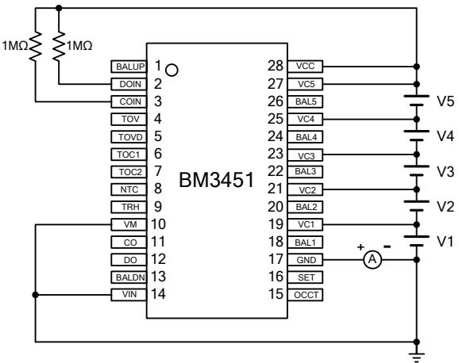  
测试电路 1

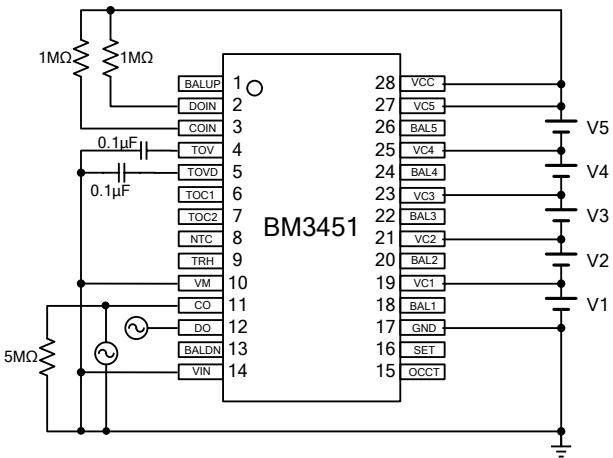  
测试电路 2

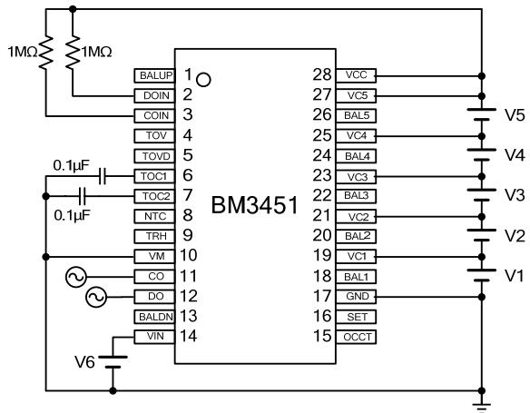  
测试电路 3

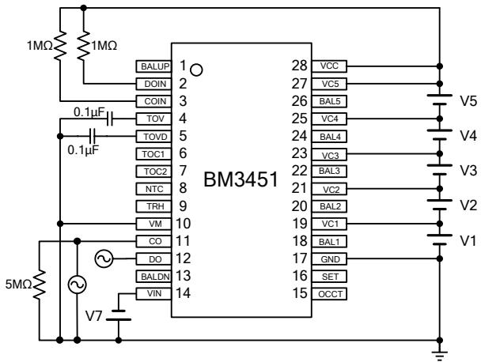  
测试电路 4

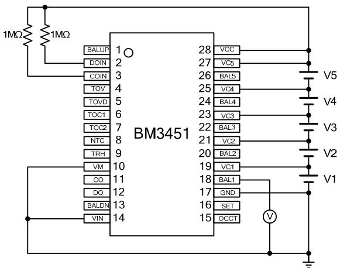  
测试电路 5

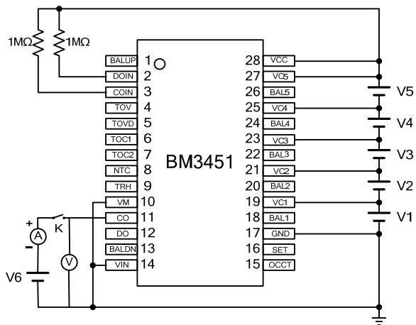  
测试电路 6

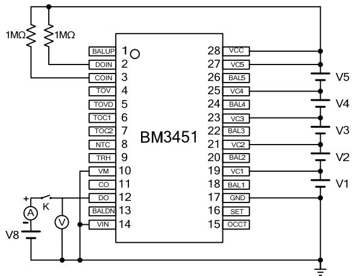  
测试电路 7

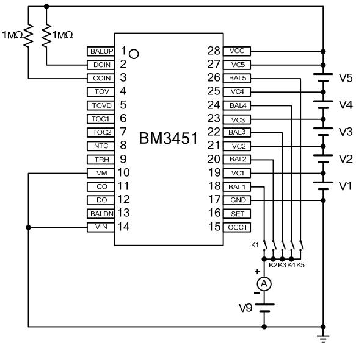  
测试电路 8

# 封装示意图及参数

# TSSOP28

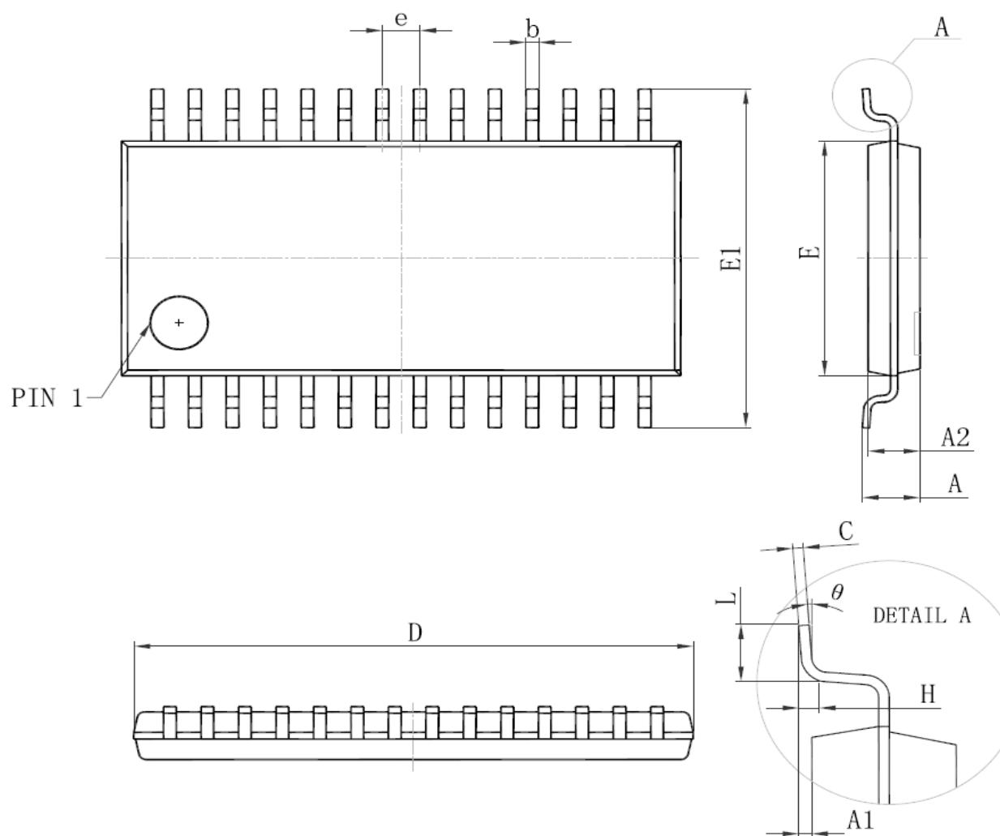

<table><tr><td rowspan=2 colspan=1>Symbol</td><td rowspan=1 colspan=2>Dimensions In Millimeters</td><td rowspan=1 colspan=2>Dimensions In Inches</td></tr><tr><td rowspan=1 colspan=1>Min</td><td rowspan=1 colspan=1>Max</td><td rowspan=1 colspan=1>Min</td><td rowspan=1 colspan=1>Max</td></tr><tr><td rowspan=1 colspan=1>D</td><td rowspan=1 colspan=1>9.600</td><td rowspan=1 colspan=1>9.800</td><td rowspan=1 colspan=1>0.378</td><td rowspan=1 colspan=1>0.386</td></tr><tr><td rowspan=1 colspan=1>E</td><td rowspan=1 colspan=1>4.300</td><td rowspan=1 colspan=1>4.500</td><td rowspan=1 colspan=1>0.169</td><td rowspan=1 colspan=1>0.177</td></tr><tr><td rowspan=1 colspan=1>b</td><td rowspan=1 colspan=1>0.190</td><td rowspan=1 colspan=1>0.300</td><td rowspan=1 colspan=1>0.007</td><td rowspan=1 colspan=1>0.012</td></tr><tr><td rowspan=1 colspan=1>C</td><td rowspan=1 colspan=1>0.090</td><td rowspan=1 colspan=1>0.200</td><td rowspan=1 colspan=1>0.004</td><td rowspan=1 colspan=1>0.008</td></tr><tr><td rowspan=1 colspan=1>E1</td><td rowspan=1 colspan=1>6.250</td><td rowspan=1 colspan=1>6.550</td><td rowspan=1 colspan=1>0.246</td><td rowspan=1 colspan=1>0.258</td></tr><tr><td rowspan=1 colspan=1>A</td><td rowspan=1 colspan=1></td><td rowspan=1 colspan=1>1.200</td><td rowspan=1 colspan=1></td><td rowspan=1 colspan=1>0.047</td></tr><tr><td rowspan=1 colspan=1>A2</td><td rowspan=1 colspan=1>0.800</td><td rowspan=1 colspan=1>1.000</td><td rowspan=1 colspan=1>0.031</td><td rowspan=1 colspan=1>0.039</td></tr><tr><td rowspan=1 colspan=1>A1</td><td rowspan=1 colspan=1>0.050</td><td rowspan=1 colspan=1>0.150</td><td rowspan=1 colspan=1>0.002</td><td rowspan=1 colspan=1>0.006</td></tr><tr><td rowspan=1 colspan=1>e</td><td rowspan=1 colspan=2>0.65(BSC)</td><td rowspan=1 colspan=2>0.026 (BSC)</td></tr><tr><td rowspan=1 colspan=1>L</td><td rowspan=1 colspan=1>0.500</td><td rowspan=1 colspan=1>0.700</td><td rowspan=1 colspan=1>0.020</td><td rowspan=1 colspan=1>0.028</td></tr><tr><td rowspan=1 colspan=1>H</td><td rowspan=1 colspan=2>0.25(TYP)</td><td rowspan=1 colspan=2>0.01(TYP)</td></tr><tr><td rowspan=1 colspan=1>0</td><td rowspan=1 colspan=1>1°</td><td rowspan=1 colspan=1>7°</td><td rowspan=1 colspan=1>1°</td><td rowspan=1 colspan=1>7°</td></tr></table>

# TSSOP20

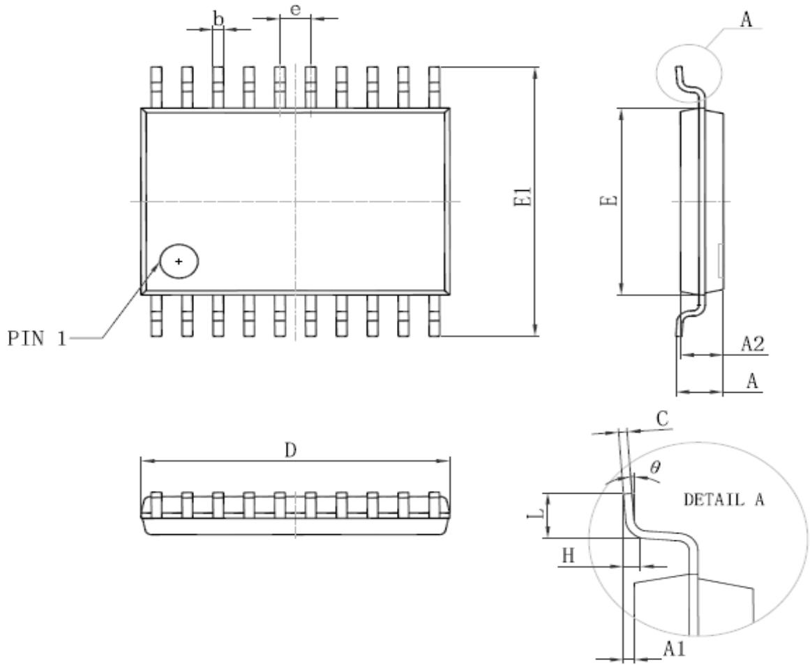

<table><tr><td rowspan=2 colspan=1>Symbo1</td><td rowspan=1 colspan=2>Dimensions In Millimeters</td><td rowspan=1 colspan=2>Dimensions In Inches</td></tr><tr><td rowspan=1 colspan=1>Min</td><td rowspan=1 colspan=1>Max</td><td rowspan=1 colspan=1>Min</td><td rowspan=1 colspan=1>Max</td></tr><tr><td rowspan=1 colspan=1>D</td><td rowspan=1 colspan=1>6.400</td><td rowspan=1 colspan=1>6.600</td><td rowspan=1 colspan=1>0.252</td><td rowspan=1 colspan=1>0.259</td></tr><tr><td rowspan=1 colspan=1>E</td><td rowspan=1 colspan=1>4.300</td><td rowspan=1 colspan=1>4.500</td><td rowspan=1 colspan=1>0.169</td><td rowspan=1 colspan=1>0.177</td></tr><tr><td rowspan=1 colspan=1>b</td><td rowspan=1 colspan=1>0.190</td><td rowspan=1 colspan=1>0.300</td><td rowspan=1 colspan=1>0.007</td><td rowspan=1 colspan=1>0.012</td></tr><tr><td rowspan=1 colspan=1>C</td><td rowspan=1 colspan=1>0.090</td><td rowspan=1 colspan=1>0.200</td><td rowspan=1 colspan=1>0.004</td><td rowspan=1 colspan=1>0.008</td></tr><tr><td rowspan=1 colspan=1>E1</td><td rowspan=1 colspan=1>6.250</td><td rowspan=1 colspan=1>6.550</td><td rowspan=1 colspan=1>0.246</td><td rowspan=1 colspan=1>0.258</td></tr><tr><td rowspan=1 colspan=1>A</td><td rowspan=1 colspan=1></td><td rowspan=1 colspan=1>1.200</td><td rowspan=1 colspan=1></td><td rowspan=1 colspan=1>。.047</td></tr><tr><td rowspan=1 colspan=1>A2</td><td rowspan=1 colspan=1>0.800</td><td rowspan=1 colspan=1>1.000</td><td rowspan=1 colspan=1>0.031</td><td rowspan=1 colspan=1>0.039</td></tr><tr><td rowspan=1 colspan=1>A1</td><td rowspan=1 colspan=1>0.050</td><td rowspan=1 colspan=1>0.150</td><td rowspan=1 colspan=1>0.002</td><td rowspan=1 colspan=1>。.006</td></tr><tr><td rowspan=1 colspan=1>e</td><td rowspan=1 colspan=2>0.65（BSC)</td><td rowspan=1 colspan=2>0.026(BSC)</td></tr><tr><td rowspan=1 colspan=1>L</td><td rowspan=1 colspan=1>0.500</td><td rowspan=1 colspan=1>0.700</td><td rowspan=1 colspan=1>0.020</td><td rowspan=1 colspan=1>0.028</td></tr><tr><td rowspan=1 colspan=1>H</td><td rowspan=1 colspan=2>0.25(TYP)</td><td rowspan=1 colspan=2>0.01(TYP)</td></tr><tr><td rowspan=1 colspan=1>0</td><td rowspan=1 colspan=1>1°</td><td rowspan=1 colspan=1>7°</td><td rowspan=1 colspan=1>1°</td><td rowspan=1 colspan=1>7°</td></tr></table>

• 本资料内容，随产品的改进，可能会有未经预告之修改，比亚迪微电子公司拥有优先修改权。  
• 尽管本公司一向致力于提高产品质量和可靠性，但是半导体产品有可能按某种概率发生故障或错误工作，为防止因故障或错误工作而产生人身事故，火灾事故，社会性损害等，请充分留意冗余设计、火灾蔓延对策设计、防止错误动作设计等安全设计。  
• 本资料内容未经本公司许可，严禁以其他目的加以转载及复制等。