# BQ25792 I2C Controlled, 1-4 Cell, 5-A Buck-Boost Battery Charger with Dual-Input Selector and USB PD 3.0 OTG Output

# 1 Features

High power density, high integration buck-boost charger for 1-4 cell batteries supporting any USB PD 3.0 profile – Integrates four switching MOSFETs, BATFET – Integrates input and charging current sensing • Highly efficient 750-kHz or 1.5-MHz switching frequencies 5-A charging current with 10-mA resolution • $9 6 . 5 \%$ efficient: 16-V battery at 3A from 20V • Supports a wide range of input sources 3.6-V to 24-V wide input operating voltage range with 30-V absolute maximum rating Maximum power tracking with input voltage dynamic power management (VINDPM) up to $_ { 2 2 \vee }$ and input current dynamic power management (IINDPM) up to 3.3 A Detects USB BC1.2, SDP, CDP, DCP, HVDCP and non-standard adapters

Dual-input power mux controller (optional) for source selection

• Narrow voltage DC (NVDC) power path management

• Powers USB port from battery (USB OTG) 2.8-V to 22-V OTG output voltage with $1 0 { \cdot } \mathsf { m V }$ resolution to support USB-PD PPS OTG output current regulation up to 3.32 A with 40-mA resolution

• Flexible autonomous and ${ \mathsf { I } } ^ { 2 } { \mathsf { C } }$ mode for optimal system performance

Integrated 16-bit ADC for voltage, current, and temperature monitoring

• Low battery quiescent current – $2 1 \mu \mathsf { A }$ for battery only operation – 600 nA in Charger Shutdown Mode • High accuracy $+ 0 . 6 5 \%$ to $- 0 . 8 5 \%$ charge voltage regulation for 2S-4S batteries $\pm 5 \%$ charge current regulation $\pm 5 \%$ input current regulation

• Safety

Thermal regulation and thermal shutdown Input/battery OVP and OCP Converter MOSFETs OCP Charging safety timer

• Package – 29-Pin 4 mm × 4 mm QFN

# 2 Applications

Video doorbell, Smart home control   
Data concentrators, Robotic lawn mower, Vacuum   
robot   
Asset tracking, Mobile POS   
Multiparameter patient monitor, Electrocardiogram   
(ECG), Ultrasound smart probe

# 3 Description

The BQ25792 is a fully integrated switch-mode buck-boost charger for 1-4 cell Li-ion batteries and Li-polymer batteries. The integration includes 4 switching MOSFETs $( \mathsf Q _ { 1 } , \mathsf Q _ { 2 } , \mathsf Q _ { 3 } , \mathsf Q _ { 4 } )$ , input and charging current sensing circuits, the battery FET $( Q _ { \mathsf { B A T } } )$ and all the loop compensation of the buck-boost converter. It uses NVDC power path management, regulating the system slightly above the battery voltage without dropping below a configurable minimum system voltage. When system power exceeds the input source rating, battery supplement mode supports the system without overloading the input source. BQ25792 supports the full input and output (OTG) voltage ranges for USB Type- $\cdot \mathsf { C } ^ { \mathsf { T M } }$ and USB power delivery (USB-PD) applications.

Device Information   

<table><tr><td rowspan=1 colspan=1>PART NUMBER</td><td rowspan=1 colspan=1>PACKAGE(1)</td><td rowspan=1 colspan=1>BODY SIZE (NOM)</td></tr><tr><td rowspan=1 colspan=1>BQ25792</td><td rowspan=1 colspan=1>QFN (29)</td><td rowspan=1 colspan=1>4.0 mm x 4.0 mm</td></tr></table>

(1) For all available packages, see the orderable addendum at the end of the data sheet.

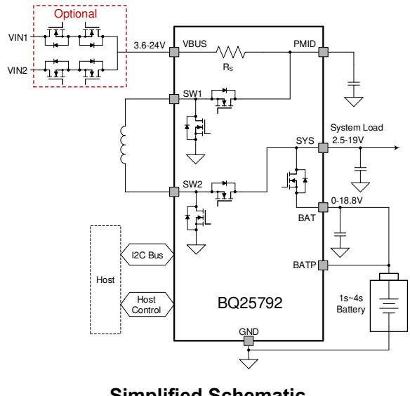  
Simplified Schematic

# Table of Contents

1 Features... .1   
2 Applications.. 1   
3 Description... .1   
4 Revision History.. . 2   
5 Device Comparison. . 3   
6 Description (continued).. 4   
7 Pin Configuration and Functions.. .5   
8 Specifications. 8   
8.1 Absolute Maximum Ratings.. 8   
8.2 ESD Ratings... 8   
8.3 Recommended Operating Conditions.. .8   
8.4 Thermal Information.. .9   
8.5 Electrical Characteristics.. .9   
8.6 Timing Requirements.. .19   
8.7 Typical Characteristics.. .20

# 9 Detailed Description.. . 24

9.1 Overview.. . 24   
9.2 Functional Block Diagram.. . 25   
9.3 Feature Description... .26   
9.4 Device Functional Modes.. .51   
9.5 Register Map.. .53   
10 Application and Implementation. 125   
10.1 Application Information. 125   
10.2 Typical Application.. 126   
11 Power Supply Recommendations.. .132   
12 Layout... .133   
12.1 Layout Guidelines.. 133   
12.2 Layout Example.. 134   
13 Device and Documentation Support.. .135   
13.1 Device Support.. 135   
13.2 Documentation Support.. 135   
13.3 Receiving Notification of Documentation Updates135   
13.4 Support Resources.. 135   
13.5 Trademarks... . 135   
13.6 Electrostatic Discharge Caution.. .135   
13.7 Glossary.... .135   
14 Mechanical, Packaging, and Orderable   
Information..

136

# 4 Revision History

NOTE: Page numbers for previous revisions may differ from page numbers in the current version.

# Changes from Revision B (March 2021) to Revision C (August 2022) Page

Updated Section 5 device comparison table.. 3   
Removed reference to /PG pin and IBAT pin throughout the datasheet.. .4   
Corrected common drain to common source in ACDRVx pin function in Section 7 . 5   
Added how to set max input current limit with ILIM_HIZ pin in Section 7 5   
Added SDRV connected to BAT when shipFET disabled as an option in Section 7 . 5   
Clarified /QON pull up voltage in Section 7 5   
Updated : System voltage regulation accuracy (when VBAT<VSYSMIN).. 9   
Updated: OTG mode voltage regulation accuracy..... ..9   
Added input sensing resistor to Section 9.2 . 25. 34. 34   
Clarified buck-boost switching operation in Section 9.3.6   
Added explanation of no battery operation in Section 9.3.6   
Clarified PFM peak inductor current in Section 9.3.6.3 . 35   
Clarified SYSMIN charge current clamp and settings in Section 9.3.9.2 . 39   
Clarified trickle to precharge regulation in Section 9.3.9.2 . 39   
Added SDRV typical output voltage and current to Section 9.3.12 . 46   
Updated I2C terminology in text and figures in Section 9.3.14 . . 49   
Clarified REG0x14 and REG0x33 regarding reporting IBAT discharge current in Section 9.5.1 .53   
Changed REG0x2E to no longer recommend 12-bit ADC setting in Section 9.5.1 53   
Corrected part number and device revision in REG0x48 in Section 9.5.1 .53   
Corrected voltage ADC readings as not being 2's complement in Section 9.5.1 ..53   
Added optional input snubber/TVS to apps diagram in Section 10.2 126

# Changes from Revision A (November 2020) to Revision B (March 2021) Page

• Consolidated voltage and current protections into list format in Section 9.3.13.1.. . 48

# Changes from Revision \* (June 2020) to Revision A (November 2020) Page

• Changed from Advance Information to Production Data...

# 5 Device Comparison

<table><tr><td rowspan=1 colspan=1>PART NUMBER</td><td rowspan=1 colspan=1>BQ25790</td><td rowspan=1 colspan=1>BQ25792</td><td rowspan=1 colspan=1>BQ25798</td></tr><tr><td rowspan=1 colspan=1>ACOVP Default Value</td><td rowspan=1 colspan=1>7V</td><td rowspan=1 colspan=1>26V</td><td rowspan=1 colspan=1>26V</td></tr><tr><td rowspan=1 colspan=1>ACOVP Options</td><td rowspan=1 colspan=1>7V, 12V, 18V or 26V</td><td rowspan=1 colspan=1>7V, 12V, 22V or 26V</td><td rowspan=1 colspan=1>7V, 12V, 22V or 26V</td></tr><tr><td rowspan=1 colspan=1>/PG pin</td><td rowspan=1 colspan=1>Yes</td><td rowspan=1 colspan=1>No</td><td rowspan=1 colspan=1>No</td></tr><tr><td rowspan=1 colspan=1>IBAT pin</td><td rowspan=1 colspan=1>Yes</td><td rowspan=1 colspan=1>No</td><td rowspan=1 colspan=1>No</td></tr><tr><td rowspan=1 colspan=1>BATN pin</td><td rowspan=1 colspan=1>Yes</td><td rowspan=1 colspan=1>No</td><td rowspan=1 colspan=1>No</td></tr><tr><td rowspan=1 colspan=1>MPPT</td><td rowspan=1 colspan=1>No</td><td rowspan=1 colspan=1>No</td><td rowspan=1 colspan=1>Yes</td></tr><tr><td rowspan=1 colspan=1>Backup Mode</td><td rowspan=1 colspan=1>No</td><td rowspan=1 colspan=1>No</td><td rowspan=1 colspan=1>Yes</td></tr><tr><td rowspan=1 colspan=1>Package</td><td rowspan=1 colspan=1>DSBGA 56, 2.9mm x 3.3mm</td><td rowspan=1 colspan=1>QFN 29, 4mm x 4mm</td><td rowspan=1 colspan=1>QFN 29, 4mm x 4mm</td></tr></table>

# 6 Description (continued)

The charger supports the narrow VDC power path management, in which the system is regulated at a voltage slightly higher than the battery voltage without being allowed to drop below the minimum system voltage. The minimum system voltage allows the system to operate even when the battery is completely discharged or removed. When system power exceeds the input source rating, battery supplement mode supports the system power requirement without overloading the input source.

The device charges a battery from a wide range of the input sources including legacy USB adapter to high voltage USB PD adapter and traditional barrel adapter. The charger automatically sets converter to be buck, boost or buck-boost configurations based on input voltage and battery voltage without the host control. The dual input source selector manages the power flowing from two different input sources. The inputs selection is controlled by the host through $\mathsf { I 2 C }$ with default source #1 (VAC1) as the primary input and the source #2 (VAC2) as the secondary input.

To support fast charging using adjustable high voltage adapter, the device provides $0 + 1 0 -$ handshake. The device is compliant with USB 2.0 and USB 3.0 power delivery specification with input current and voltage regulation. In addition, the Input Current Optimizer (ICO) allows the detection of maximum power point of an unknown input source.

Besides the ${ \mathsf { I } } ^ { 2 } { \mathsf { C } }$ host controlled charging mode, this charger also supports autonomous charging mode. After power up, the charging is enabled with default register settings. The device can complete a charging cycle without any software engagements. It detects battery voltage and charges the battery in different phases: trickle charging, pre-charging, constant current (CC) charging and constant voltage (CV) charging. At the end of the charging cycle, the charger automatically terminates when the charge current is below a pre-set limit (termination current) in the constant voltage phase. When the full battery falls below the recharge threshold, the charger will automatically start another charging cycle.

In the absence of input sources, this device supports USB On-the-Go (OTG) function, discharging battery to generate an adjustable 2.8-V to 22-V voltage on VBUS with $1 0 \mathrm { - m V }$ step size, which is compliant to the USB PD 3.0 specification defined programmable power supply (PPS) feature.

The charger provides various safety features for battery charging and system operations, including battery temperature negative thermistor monitoring, trickle charge, pre-charge and fast charge timers and over-voltage/ overcurrent protections on battery and input. The thermal regulation reduces charge current when the junction temperature exceeds a programmable threshold. The STAT output of the device reports the charging status and any fault conditions. The $\bar { | \mathsf { N T } }$ pin immediately notifies host when fault occurs.

The device also provides a 16-bit analog-to-digital converter (ADC) for monitoring charge current and input/ battery/system (VAC, VBUS, BAT, SYS, TS) voltages.

It is available in a 29-pin $4 \mathrm { m m } \times 4 \mathrm { m m }$ QFN package.

# 7 Pin Configuration and Functions

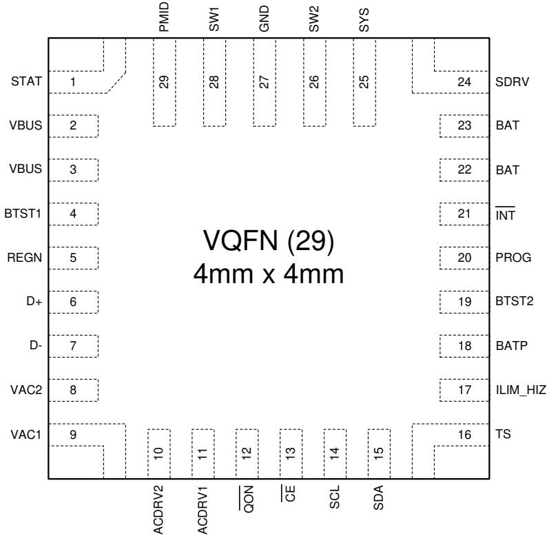  
Figure 7-1. RQM Package 29-Pin VQFN Top View

Table 7-1. Pin Functions   

<table><tr><td rowspan=1 colspan=2>PIN</td><td rowspan=2 colspan=1>I/O</td><td rowspan=2 colspan=1>DESCRIPTION</td></tr><tr><td rowspan=1 colspan=1>NAME</td><td rowspan=1 colspan=1>NO.</td></tr><tr><td rowspan=1 colspan=1>STAT</td><td rowspan=1 colspan=1>1</td><td rowspan=1 colspan=1>DO</td><td rowspan=1 colspan=1>Open Drain Charge Status Output  It indicates various charger operations. Connect to the pull uprail via a 10kΩ resistor. LOW indicates charging in progress. HIGH indicates charging completed orcharging disabled. When any fault condition occurs, STAT pin blinks at 1Hz. The STAT pin function canbe disabled when DIS_STAT bit is set to 1.</td></tr><tr><td rowspan=1 colspan=1>VBUS</td><td rowspan=1 colspan=1>2-3</td><td rowspan=1 colspan=1>P</td><td rowspan=1 colspan=1>Charger Input Voltage  The power input terminal of the charger. An input current sensing circuit isconnected between VBUS and PMID. The recommended capacitors at VBUS are 2 pieces of 10μF andone piece of 0.1µF ceramic capacitors. Place the 0.1µF ceramic capacitor as close as possible to thecharger IC.</td></tr><tr><td rowspan=1 colspan=1>BTST1</td><td rowspan=1 colspan=1>4</td><td rowspan=1 colspan=1>P</td><td rowspan=1 colspan=1>Input High Side Power MOSFET Gate Driver Power Supply - Connect a 10V or higher rating, 47nFceramic capacitor between SW1 and BTST1 as the bootstrap capacitor for driving high side switchingMOSFET (Q1).</td></tr><tr><td rowspan=1 colspan=1>REGN</td><td rowspan=1 colspan=1>5</td><td rowspan=1 colspan=1>P</td><td rowspan=1 colspan=1>The Charger Internal Linear Regulator Output  It is supplied from either VBUS or BAT dependenton which voltage is higher. Connect a 10V, 4.7μF ceramic capacitor from REGN to power ground. TheREGN LDO output is used for the internal MOSFETs gate driving voltage and the voltage bias for TSpin resistor divider.</td></tr><tr><td rowspan=1 colspan=1>D+</td><td rowspan=1 colspan=1>6</td><td rowspan=1 colspan=1>AIO</td><td rowspan=1 colspan=1>Positive Line of the USB Data Line Pair  D+/D- based USB host/charging port detection for VIN1input. The detection includes data contact detection (DCD), primary and secondary detection in BC1.2,and the adjustable high voltage adapter.</td></tr><tr><td rowspan=1 colspan=1>D-</td><td rowspan=1 colspan=1>7</td><td rowspan=1 colspan=1>AIO</td><td rowspan=1 colspan=1>Negative Line of the USB Data Line Pair - D+/D- based USB host/charging port detection for VIN1input. The detection includes data contact detection (DCD), primary and secondary detection in BC1.2,and the adjustable high voltage adapter.</td></tr><tr><td rowspan=1 colspan=1>VAC2</td><td rowspan=1 colspan=1>8</td><td rowspan=1 colspan=1>P</td><td rowspan=1 colspan=1>VAC2 Input Detection - When a voltage between 3.6V and 24V is applied on VAC2, it represents avalid input being plugged into port #2. Connect to VBUS if the ACFET2 and RBFET2 are not installed.</td></tr><tr><td rowspan=1 colspan=1>VAC1</td><td rowspan=1 colspan=1>9</td><td rowspan=1 colspan=1>P</td><td rowspan=1 colspan=1>VAC1 Input Detection - When a voltage between 3.6V and 24V is applied on VAC1, it represents avalid input being plugged into port #1. Connect to VBUS if the ACFET1 and RBFET1 are not installed.</td></tr></table>

Table 7-1. Pin Functions (continued)   

<table><tr><td rowspan=1 colspan=2>PIN</td><td rowspan=2 colspan=1>I/O</td><td rowspan=2 colspan=1>DESCRIPTION</td></tr><tr><td rowspan=1 colspan=1>NAME</td><td rowspan=1 colspan=1>NO.</td></tr><tr><td rowspan=1 colspan=1>ACDRV2</td><td rowspan=1 colspan=1>10</td><td rowspan=1 colspan=1>P</td><td rowspan=1 colspan=1>Input FETs Driver Pin 2 - The charge pump output to drive the port #2 input N-channel MOSFET(ACFET2) and the reverse blocking N-channel MOSFET (RBFET2). The charger turns on the back-to-back MOSFETs by increasing the ACDRV2 voltage 5V above the common source connection of theACFET2 and RBFET2 when the turn-on condition is met. Tie ACDRV2 to GND if no ACFET2 andRBFET2 installed.</td></tr><tr><td rowspan=1 colspan=1>ACDRV1</td><td rowspan=1 colspan=1>11</td><td rowspan=1 colspan=1>P</td><td rowspan=1 colspan=1>Input FETs Driver Pin 1 - The charge pump output to drive the port #1 input N-channel MOSFET(ACFET1) and the reverse blocking N-channel MOSFET (RBFET1). The charger turns on the back-to-back MOSFETs by increasing the ACDRV1 voltage 5V above the common source connection of theACFET1 and RBFET1 when the turn-on condition is met. Tie ACDRV1 to GND if no ACFET1 andRBFET1 installed.</td></tr><tr><td rowspan=1 colspan=1>QON</td><td rowspan=1 colspan=1>12</td><td rowspan=1 colspan=1>DI</td><td rowspan=1 colspan=1>Ship FET Enable or System Power Reset Control Input  When the device is in ship mode or in theshutdown mode, the SDRV turns off the external ship FET to minimize the battery leakage current. Alo low on this p with t duratin urns on hi FE o ore e devi  xit the himode. ow n h p wih  ura e t powr  n ohe h o (also setting the charger in HIZ mode when VBUS is high) and then turning on ship FET (also disablingar   e the charger applies a 30mA discharging current on SYS to discharge system voltage. The pin containsan internal pull-up through a RQon resistor. The typical output voltage is 3.6 V-3.8 V with VBUS andVBAT &gt; 5V.</td></tr><tr><td rowspan=1 colspan=1>CE</td><td rowspan=1 colspan=1>13</td><td rowspan=1 colspan=1>DI</td><td rowspan=1 colspan=1>Active Low Charge Enable Pin - Battery charging is enabled when EN_CHG bit is 1 and CE pin isLOW. CE pin must be pulled HIGH or LOW, do not leave floating.</td></tr><tr><td rowspan=1 colspan=1>SCL</td><td rowspan=1 colspan=1>14</td><td rowspan=1 colspan=1>DI</td><td rowspan=1 colspan=1>I2C Interface Clock - Connect SCL to the logic rail through a 10 kΩ resistor.</td></tr><tr><td rowspan=1 colspan=1>SDA</td><td rowspan=1 colspan=1>15</td><td rowspan=1 colspan=1>DIO</td><td rowspan=1 colspan=1>I2C Interface Data - Connect SDA to the logic rail through a 10 kΩ resistor.</td></tr><tr><td rowspan=1 colspan=1>TS</td><td rowspan=1 colspan=1>16</td><td rowspan=1 colspan=1>AI</td><td rowspan=1 colspan=1>Temperature Qualification Voltage Input  Connect a negative temperature coefficient thermistor.Program temperature window with a resistor divider from REGN to TS to GND. Charge suspends whenTS pin voltage is out of range. Recommend a 103AT-2 10kΩ thermistor.</td></tr><tr><td rowspan=1 colspan=1>ILIM_HIZ</td><td rowspan=1 colspan=1>17</td><td rowspan=1 colspan=1>Al</td><td rowspan=1 colspan=1>Input Current Limit Setting and HIZ Mode Control Pin - Program ILIMHIZ voltage by connectingiv pull  l  ILIZ  olt alclat V=  + 800mΩ × INDPM, in whih IINDPM is the target input current. The iput curret lmit usd bythe charger is the lower settig of ILIMHIZ pin and the INDPM register. When the pinvoltage is below0.75V, the buck-boost converter enters non-switching mode, similar to HiZ mode using EN_HIZ bit, butwith REGN on. When the pin voltage is above 1V, the converter resumes switching. Connect ILIM_HIZto REGN to set the maximum input current limit.</td></tr><tr><td rowspan=1 colspan=1>BATP</td><td rowspan=1 colspan=1>18</td><td rowspan=1 colspan=1>P</td><td rowspan=1 colspan=1>Positive Input for Battery Voltage Sensing - Connect to the positive terminal of battery pack. Place100Ω series resistance between this pin and the battery positive terminal.</td></tr><tr><td rowspan=1 colspan=1>BTST2</td><td rowspan=1 colspan=1>19</td><td rowspan=1 colspan=1>P</td><td rowspan=1 colspan=1>Output High Side Power MOSFET Gate Driver Power Supply - Connect a 10V or higher rating,47nF ceramic capacitor between SW2 and BTST2 as the bootstrap capacitor for driving high sideswitching MOSFET (Q4).</td></tr><tr><td rowspan=1 colspan=1>PROG</td><td rowspan=1 colspan=1>20</td><td rowspan=1 colspan=1>AI</td><td rowspan=1 colspan=1>Charger POR Default Settings Program - At power up, the charger detects the resistance tied toPROG pin to determine the default switching frequency and the default battery charging profile. Thesurface mount resistor with ±1% or ±2% tolerance is recommended. Please refer to more details in thesection of PROG Pin Configuration.</td></tr><tr><td rowspan=1 colspan=1>INT</td><td rowspan=1 colspan=1>21</td><td rowspan=1 colspan=1>DO</td><td rowspan=1 colspan=1>Open Drain Interrupt Output. - Connect the INT pin to a logic rail via a 10kΩ resistor. The INT pinsends an active low, 256µs pulse to the host to report the charger device status and faults.</td></tr><tr><td rowspan=1 colspan=1>BAT</td><td rowspan=1 colspan=1>22-23</td><td rowspan=1 colspan=1>P</td><td rowspan=1 colspan=1>The Battery Charging Power Connection - Connect to the positive terminal of the battery pack.The internal charging current sensing circuit is connected between SYS and BAT. The recommendedcapacitors at BAT are 2 pieces of 10μF ceramic capacitors.</td></tr><tr><td rowspan=1 colspan=1>SDRV</td><td rowspan=1 colspan=1>24</td><td rowspan=1 colspan=1>P</td><td rowspan=1 colspan=1>External N-channel Ship FET (SFET) Gate Driver Output - The driver pin of the external ship FET.The ship FET is always turned on when the ship mode is disabled, and it keeps off when the chargeris in ship mode or shutdown mode. Connect a 1nF, 50V rated, 0402 package, ceramic capacitor fromSDRV to GND or SDRV to BAT when the ship FET is not used.</td></tr><tr><td rowspan=1 colspan=1>SYS</td><td rowspan=1 colspan=1>25</td><td rowspan=1 colspan=1>P</td><td rowspan=1 colspan=1>The Charger Output Voltage to System - The internal N-channel high side MOSFET (Q4) isconnected between SYS and SW2 with drain on SYS and source on SW2. The recommendedcapacitors at SYS are 5 pieces of 10µF and one piece of 0.1µF ceramic capacitors. Place the 0.1µFceramic capacitor as close as possible to the charger IC.</td></tr><tr><td rowspan=1 colspan=1>SW2</td><td rowspan=1 colspan=1>26</td><td rowspan=1 colspan=1>P</td><td rowspan=1 colspan=1>Boost Side Half Bridge Switching Node Inductor connection to mid point of Q3 and Q4 switches.</td></tr><tr><td rowspan=1 colspan=1>GND</td><td rowspan=1 colspan=1>27</td><td rowspan=1 colspan=1>P</td><td rowspan=1 colspan=1>Ground Return</td></tr></table>

Table 7-1. Pin Functions (continued)   

<table><tr><td rowspan=1 colspan=2>PIN</td><td rowspan=2 colspan=1>I/O</td><td rowspan=2 colspan=1>DESCRIPTION</td></tr><tr><td rowspan=1 colspan=1>NAME</td><td rowspan=1 colspan=1>NO.</td></tr><tr><td rowspan=1 colspan=1>SW1</td><td rowspan=1 colspan=1>28</td><td rowspan=1 colspan=1>P</td><td rowspan=1 colspan=1>Buck Side Half Bridge Switching Node Inductor connection to mid point of Q1 and Q2 switches.</td></tr><tr><td rowspan=1 colspan=1> PMID</td><td rowspan=1 colspan=1>29</td><td rowspan=1 colspan=1>P</td><td rowspan=1 colspan=1>Q1 MOSFET Drain Connection - An internal N-channel high side MOSFET (Q1) is connectedbetween PMID and SW1 with drain on PMID and source on SW1. The recommended capacitors atPMID are 3 pieces of 10µF and one piece of 0.1µF ceramic capacitors. Place the 0.1μF ceramiccapacitor as close as possible to the charger IC.</td></tr></table>

# 8 Specifications

# 8.1 Absolute Maximum Ratings

over operating free-air temperature range (unless otherwise noted)(1)

<table><tr><td></td><td></td><td rowspan=1 colspan=1>MIN             MAX</td><td rowspan=1 colspan=1>UNIT</td></tr><tr><td rowspan=11 colspan=1>Voltage range (withrespect to GND)</td><td rowspan=1 colspan=1>VAC1, VAC2</td><td rowspan=1 colspan=1>-2               30</td><td rowspan=1 colspan=1>V</td></tr><tr><td rowspan=1 colspan=1>VBUS (converter not switching)</td><td rowspan=1 colspan=1>-2               30</td><td rowspan=1 colspan=1>V</td></tr><tr><td rowspan=1 colspan=1>PMID (converter not switching)</td><td rowspan=1 colspan=1>-0.3               30</td><td rowspan=1 colspan=1>V</td></tr><tr><td rowspan=1 colspan=1>ACDRV1, ACDRV2, BTST1</td><td rowspan=1 colspan=1>-0.3               32</td><td rowspan=1 colspan=1>V</td></tr><tr><td rowspan=1 colspan=1>SYS (converter not switching)</td><td rowspan=1 colspan=1>-0.3               23</td><td rowspan=1 colspan=1>V</td></tr><tr><td rowspan=1 colspan=1>BATP, BAT</td><td rowspan=1 colspan=1>-0.3               20</td><td rowspan=1 colspan=1>V</td></tr><tr><td rowspan=1 colspan=1>BTST2</td><td rowspan=1 colspan=1>-0.3               29</td><td rowspan=1 colspan=1>V</td></tr><tr><td rowspan=1 colspan=1>SDRV</td><td rowspan=1 colspan=1>-0.3               26</td><td rowspan=1 colspan=1>V</td></tr><tr><td rowspan=1 colspan=1>SW1</td><td rowspan=1 colspan=1>-2 (50ns)                30</td><td rowspan=1 colspan=1>V</td></tr><tr><td rowspan=1 colspan=1>SW2</td><td rowspan=1 colspan=1>-2 (50ns)               23</td><td rowspan=1 colspan=1>V</td></tr><tr><td rowspan=1 colspan=1>QON, D+, D-, CE, STAT, SCL, SDA, INT, ILIM_HIZ, PROG,TS, REGN</td><td rowspan=1 colspan=1>-0.3                6</td><td rowspan=1 colspan=1>V</td></tr><tr><td rowspan=1 colspan=1>Output Sink Current</td><td rowspan=1 colspan=1>INT, STAT</td><td rowspan=1 colspan=1>6</td><td rowspan=1 colspan=1>mA</td></tr><tr><td rowspan=4 colspan=1>Differential Voltage</td><td rowspan=1 colspan=1>BTST1-SW1, BTST2-SW2</td><td rowspan=1 colspan=1>-0.3                6</td><td rowspan=1 colspan=1>V</td></tr><tr><td rowspan=1 colspan=1>PMID-VBUS</td><td rowspan=1 colspan=1>-0.3                6</td><td rowspan=1 colspan=1>V</td></tr><tr><td rowspan=1 colspan=1>SYS-BAT</td><td rowspan=1 colspan=1>-0.3               16</td><td rowspan=1 colspan=1>V</td></tr><tr><td rowspan=1 colspan=1>SDRV-BAT</td><td rowspan=1 colspan=1>-0.3                6</td><td rowspan=1 colspan=1>V</td></tr><tr><td rowspan=1 colspan=1>TJ</td><td rowspan=1 colspan=1>Junction temperature</td><td rowspan=1 colspan=1>-40              150</td><td rowspan=1 colspan=1>°C</td></tr><tr><td rowspan=1 colspan=1>Tstg</td><td rowspan=1 colspan=1>Storage temperature</td><td rowspan=1 colspan=1>-55              150</td><td rowspan=1 colspan=1>C</td></tr></table>

(1) Stresses beyond those listed under Absolute Maximum Rating may cause permanent damage to the device. These are stress ratings only, which do not imply functional operation of the device at these or any other conditions beyond those indicated under Recommended Operating Condition. Exposure to absolute-maximum-rated conditions for extended periods may affect device reliability.

# 8.2 ESD Ratings

<table><tr><td></td><td></td><td></td><td rowspan=1 colspan=1>VALUE</td><td rowspan=1 colspan=1>UNIT</td></tr><tr><td rowspan=2 colspan=1>V(ESD)</td><td rowspan=2 colspan=1>Electrostatic discharge</td><td rowspan=1 colspan=1>Human body model (HBM), per ANSI/ESDA/JEDEC JS-001, all pins(1)</td><td rowspan=1 colspan=1>±2000</td><td rowspan=2 colspan=1>V</td></tr><tr><td rowspan=1 colspan=1>Charged device model (CDM), per JEDEC specification JESD22-C101, allpiis(2</td><td rowspan=1 colspan=1>±250</td></tr></table>

(1) JEDEC document JEP155 states that 500-V HBM allows safe manufacturing with a standard ESD control process.   
(2) JEDEC document JEP157 states that 250-V CDM allows safe manufacturing with a standard ESD control process.

# 8.3 Recommended Operating Conditions

over operating free-air temperature range (unless otherwise noted)

<table><tr><td></td><td></td><td rowspan=1 colspan=2>MIN     NOM     MAX</td><td rowspan=1 colspan=1>UNIT</td></tr><tr><td rowspan=1 colspan=1>VVBUs</td><td rowspan=1 colspan=1>Input voltage</td><td rowspan=1 colspan=2>3.6                    24</td><td rowspan=1 colspan=1>V</td></tr><tr><td rowspan=1 colspan=1>V_BAT</td><td rowspan=1 colspan=1>Battery voltage</td><td rowspan=1 colspan=2>18.8</td><td rowspan=1 colspan=1>V</td></tr><tr><td rowspan=1 colspan=1>IVBUS</td><td rowspan=1 colspan=1>Input current</td><td rowspan=1 colspan=2>3.3</td><td rowspan=1 colspan=1>A</td></tr><tr><td rowspan=1 colspan=1>Isw</td><td rowspan=1 colspan=1>Output current (SW)</td><td rowspan=1 colspan=2>5</td><td rowspan=1 colspan=1>A</td></tr><tr><td rowspan=3 colspan=1>BAT</td><td rowspan=1 colspan=1>Fast charging current</td><td rowspan=1 colspan=1></td><td rowspan=1 colspan=1>5</td><td rowspan=1 colspan=1>A</td></tr><tr><td rowspan=1 colspan=1>RMS discharge current (continuously)</td><td rowspan=1 colspan=1></td><td rowspan=1 colspan=1>6</td><td rowspan=1 colspan=1>A</td></tr><tr><td rowspan=1 colspan=1>Peak discharge current (upto 1 sec)</td><td rowspan=1 colspan=1></td><td rowspan=1 colspan=1>10</td><td rowspan=1 colspan=1>A</td></tr><tr><td rowspan=1 colspan=1>TA</td><td rowspan=1 colspan=1>Ambient temperature</td><td rowspan=1 colspan=1>-40</td><td rowspan=1 colspan=1>85</td><td rowspan=1 colspan=1>°C</td></tr></table>

# 8.3 Recommended Operating Conditions (continued)

over operating free-air temperature range (unless otherwise noted)

<table><tr><td></td><td></td><td rowspan=1 colspan=1>MIN     NOM      MAX</td><td rowspan=1 colspan=1>UNIT</td></tr><tr><td rowspan=1 colspan=1>TJ</td><td rowspan=1 colspan=1>Junction temperature</td><td rowspan=1 colspan=1>-40                   125</td><td rowspan=1 colspan=1>°C</td></tr><tr><td rowspan=1 colspan=1>CVBUS</td><td rowspan=1 colspan=1>Effective VBUS capacitance</td><td rowspan=1 colspan=1>2</td><td rowspan=1 colspan=1>$μF</td></tr><tr><td rowspan=1 colspan=1>CPMID</td><td rowspan=1 colspan=1>Effective PMID capacitance</td><td rowspan=1 colspan=1>4</td><td rowspan=1 colspan=1>$μFr$</td></tr><tr><td rowspan=1 colspan=1>CsYs</td><td rowspan=1 colspan=1>Effective SYS capacitance</td><td rowspan=1 colspan=1>6</td><td rowspan=1 colspan=1>$μFr$</td></tr><tr><td rowspan=1 colspan=1>CBAT</td><td rowspan=1 colspan=1>Effective BAT capacitance</td><td rowspan=1 colspan=1>3</td><td rowspan=1 colspan=1>$μFr$</td></tr></table>

# 8.4 Thermal Information

<table><tr><td colspan="2" rowspan="2">THERMAL METRIC(1)</td><td>BQ25792</td><td rowspan="3">UNIT</td></tr><tr><td>RQM (QFN)</td></tr><tr><td rowspan="2">Junction-to-ambient thermal resistance</td><td rowspan="2"></td><td>29-PIN</td><td></td></tr><tr><td>44.2</td><td>°C/W</td></tr><tr><td>RθJA ReJC(top)</td><td>Junction-to-case (top) thermal resistance</td><td>20.9</td><td>°C/W</td></tr><tr><td>RθJB</td><td>Junction-to-board thermal resistance</td><td>9.7</td><td>C/W</td></tr><tr><td>4\qra}$</td><td>Junction-to-top characterization parameter</td><td>0.5</td><td>°C/W</td></tr><tr><td>4JB$</td><td>Junction-to-board characterization parameter</td><td>9.7</td><td>°C/W</td></tr></table>

(1) For more information about traditional and new thermal metrics, see the Semiconductor and IC Package Thermal Metrics application report.

# 8.5 Electrical Characteristics

VVBUS_UVLOZ < VVBUS < VVBUS_OVP, $\mathsf { T } _ { \mathsf { J } } = - 4 0 ^ { \circ } \mathsf { C }$ to $+ 1 2 5 ^ { \circ } \mathrm { C }$ , and ${ \sf T } _ { \mathsf { J } } = 2 5 ^ { \circ } { \sf C }$ for typical values (unless otherwise noted)   

<table><tr><td rowspan=1 colspan=2>PARAMETER</td><td rowspan=1 colspan=1>TEST CONDITIONS</td><td rowspan=1 colspan=2>MIN    TYP   MAX</td><td rowspan=1 colspan=1>UNIT</td></tr><tr><td rowspan=1 colspan=5>QUIESCENT CURRENTS</td><td rowspan=1 colspan=1></td></tr><tr><td rowspan=1 colspan=1>IQ_BAT_ON</td><td rowspan=1 colspan=1>Quiescent battery current (BATP,BAT, SYS) when the charger is inthe battery only mode, battery FETis enabled, ADC is disabled</td><td rowspan=1 colspan=1>VBAT = 8V, No VBUS, BATFET isenabled, I2C enabled, ADC disabled, notin ship mode or shut down mode, systemis powered by battery. Tj &lt; 85 </td><td rowspan=1 colspan=2>17      24</td><td rowspan=1 colspan=1>μA</td></tr><tr><td rowspan=1 colspan=1>IQ_BAT_OFF</td><td rowspan=1 colspan=1>Quiescent battery current (BATP)for when the charger is in shipmode.</td><td rowspan=1 colspan=1>VBAT = 8V, No VBUS, I2C enabled, ADCdisabled, in ship mode, Tj &lt; 85 </td><td rowspan=1 colspan=1></td><td rowspan=1 colspan=1>11      16</td><td rowspan=1 colspan=1>μA</td></tr><tr><td rowspan=1 colspan=1>IsD_BAT</td><td rowspan=1 colspan=1>Shutdown battery current (BATP)when charger is in shut downmode.</td><td rowspan=1 colspan=1>VBAT = 8V, No VBUS, I2C disabled, ADCdisabled, in shut down mode, Tj &lt; 85 </td><td rowspan=1 colspan=1></td><td rowspan=1 colspan=1>0.5     0.7</td><td rowspan=1 colspan=1>μA</td></tr><tr><td rowspan=1 colspan=1>IQ_BAT_ON</td><td rowspan=1 colspan=1>Quiescent battery current (BATP,BAT, SYS) when the charger is inthe battery only mode, battery FETis enabled, ADC is enabled</td><td rowspan=1 colspan=1>VBAT = 8V, No VBUS, I2C enabled, ADCenabled, not in ship mode or shut downmode, Tj &lt; 85</td><td rowspan=1 colspan=1></td><td rowspan=1 colspan=1>540</td><td rowspan=1 colspan=1>μA</td></tr><tr><td rowspan=2 colspan=1>IQ_VBUS</td><td rowspan=2 colspan=1>Quiescent input current (VBUS)</td><td rowspan=1 colspan=1>VBUS = 15V, VBAT = 8V, chargedisabled, converter switching, ISYS = 0A,OOA disabled</td><td rowspan=1 colspan=1></td><td rowspan=1 colspan=1>3</td><td rowspan=1 colspan=1>mA</td></tr><tr><td rowspan=1 colspan=1>VBUS = 15V, VBAT = 8V, chargedisabled, converter switching, ISYS = 0A,OOA enabled</td><td rowspan=1 colspan=1></td><td rowspan=1 colspan=1>5</td><td rowspan=1 colspan=1>mA</td></tr><tr><td rowspan=2 colspan=1>IsD_VBUS</td><td rowspan=2 colspan=1>Shutdown input current (VBUS) inHIZ</td><td rowspan=1 colspan=1>VBUS = 15V, HIZ mode, no battery, ADCdisabled, ACDRV disabled</td><td rowspan=1 colspan=1></td><td rowspan=1 colspan=1>386</td><td rowspan=1 colspan=1>μA</td></tr><tr><td rowspan=1 colspan=1>VBUS = 15V, HIZ mode, no battery, ADCdisabled, ACDRV enabled</td><td rowspan=1 colspan=1></td><td rowspan=1 colspan=1>590</td><td rowspan=1 colspan=1>μA</td></tr></table>

# 8.5 Electrical Characteristics (continued)

<table><tr><td></td><td></td><td rowspan=1 colspan=4>VVBV &lt;VVB &lt; VvBVP Tj= -40° to+125°, anTj= 25° or typi valu (n hei </td></tr><tr><td rowspan=1 colspan=2>PARAMETER</td><td rowspan=1 colspan=1>TEST CONDITIONS</td><td rowspan=1 colspan=2>MIN    TYP    MAX</td><td rowspan=1 colspan=1>UNIT</td></tr><tr><td rowspan=2 colspan=1>IQ_OTG</td><td rowspan=2 colspan=1>Quiescent battery current (BATP,BAT, SYS) in OTG</td><td rowspan=1 colspan=1>VBAT = 8V, VBUS = 5V, OTG modeeabled, converter switching, IyBUs = 0A,OOA disabled</td><td rowspan=1 colspan=2>3</td><td rowspan=1 colspan=1>mA</td></tr><tr><td rowspan=1 colspan=1>VBAT = 8V, VBUS = 5V, OTG modeenabled, converter switching, IvBus = 0A,OOA enabled</td><td rowspan=1 colspan=2>5</td><td rowspan=1 colspan=1>mA</td></tr><tr><td rowspan=1 colspan=3>VBUS / VBAT SUPPLY</td><td rowspan=1 colspan=2></td><td rowspan=1 colspan=1></td></tr><tr><td rowspan=2 colspan=1>VVAC_PRESENT</td><td rowspan=1 colspan=1>VAC present rising threshold toturn on the ACFET-RBFET</td><td rowspan=1 colspan=1>For both VAC1 and VAC2</td><td rowspan=1 colspan=2>3.4     3.5</td><td rowspan=1 colspan=1>V</td></tr><tr><td rowspan=1 colspan=1>VAC present falling threshold toturn off the ACFET-RBFET</td><td rowspan=1 colspan=1>For both VAC1 and VAC2</td><td rowspan=1 colspan=2>3.1     3.2</td><td rowspan=1 colspan=1>V</td></tr><tr><td rowspan=8 colspan=1>VVAC_OVP</td><td rowspan=1 colspan=1>VAC overvoltage rising threshold,when VAC_OVP[1:0]=00</td><td rowspan=1 colspan=1>For both VAC1 and VAC2</td><td rowspan=1 colspan=2>25.2     26   26.8</td><td rowspan=1 colspan=1>V</td></tr><tr><td rowspan=1 colspan=1>VAC overvoltagefalling threshold, whenVAC_OVP[1:0]=00</td><td rowspan=1 colspan=1>For both VAC1 and VAC2</td><td rowspan=1 colspan=1>24.4</td><td rowspan=1 colspan=1>25.2   26.0</td><td rowspan=1 colspan=1>V</td></tr><tr><td rowspan=1 colspan=1>VAC overvoltagerising threshold, whenVAC_OVP[1:0]=01</td><td rowspan=1 colspan=1>For both VAC1 and VAC2</td><td rowspan=1 colspan=1>17.4</td><td rowspan=1 colspan=1>18.0    18.6</td><td rowspan=1 colspan=1>V</td></tr><tr><td rowspan=1 colspan=1>VAC overvoltagefalling threshold, whenVAC_OVP[1:0]=01</td><td rowspan=1 colspan=1>For both VAC1 and VAC2</td><td rowspan=1 colspan=1>16.9</td><td rowspan=1 colspan=1>17.5    18.1</td><td rowspan=1 colspan=1>V</td></tr><tr><td rowspan=1 colspan=1>VAC overvoltagerising threshold, whenVAC_OVP[1:0]=10</td><td rowspan=1 colspan=1>For both VAC1 and VAC2</td><td rowspan=1 colspan=1>11.6</td><td rowspan=1 colspan=1>12   12.4</td><td rowspan=1 colspan=1>V</td></tr><tr><td rowspan=1 colspan=1>VAC overvoltagefalling threshold, whenVAC_OVP[1:0]=10</td><td rowspan=1 colspan=1>For both VAC1 and VAC2</td><td rowspan=1 colspan=1>11.2</td><td rowspan=1 colspan=1>11.6    12.0</td><td rowspan=1 colspan=1>V</td></tr><tr><td rowspan=1 colspan=1>VAC overvoltagerising threshold, whenVAC_OVP[1:0]=11</td><td rowspan=1 colspan=1>For both VAC1 and VAC2</td><td rowspan=1 colspan=1>6.7</td><td rowspan=1 colspan=1>7     7.3</td><td rowspan=1 colspan=1>V</td></tr><tr><td rowspan=1 colspan=1>VAC overvoltagefalling threshold, whenVAC_OVP[1:0]=11</td><td rowspan=1 colspan=1>For both VAC1 and VAC2</td><td rowspan=1 colspan=2>6.5    6.8     7.1</td><td rowspan=1 colspan=1>V</td></tr><tr><td rowspan=1 colspan=1>VVBUS_OP</td><td rowspan=1 colspan=1>VBUS operating range</td><td rowspan=1 colspan=1></td><td rowspan=1 colspan=2>3.6                24</td><td rowspan=1 colspan=1>V</td></tr><tr><td rowspan=1 colspan=1>VvBUS_UVLOZ</td><td rowspan=1 colspan=1>VBUS rising for active I2C, nobattery</td><td rowspan=1 colspan=1>VBUS rising</td><td rowspan=1 colspan=1>3.25</td><td rowspan=1 colspan=1>3.4   3.55</td><td rowspan=1 colspan=1>V</td></tr><tr><td rowspan=1 colspan=1>VvBUS_UVLO</td><td rowspan=1 colspan=1>VBUS falling tourn off I2C, nattery</td><td rowspan=1 colspan=1>VBUS falling</td><td rowspan=1 colspan=1>3.05</td><td rowspan=1 colspan=1>3.2   3.35</td><td rowspan=1 colspan=1>V</td></tr><tr><td rowspan=1 colspan=1>VVBUS_PRESENT</td><td rowspan=1 colspan=1>VBUS to start switching</td><td rowspan=1 colspan=1>VBUS rising</td><td rowspan=1 colspan=2>3.3     3.4     3.5</td><td rowspan=1 colspan=1>V</td></tr><tr><td rowspan=1 colspan=1>VVBUS_PRESENTZ</td><td rowspan=1 colspan=1>VBUS to stop switching</td><td rowspan=1 colspan=1>VBUS falling</td><td rowspan=1 colspan=2>3.1     3.2     3.3</td><td rowspan=1 colspan=1>V</td></tr><tr><td rowspan=1 colspan=1>VBUS_OVP</td><td rowspan=1 colspan=1>VBUS overvoltage rising threshold</td><td rowspan=1 colspan=1>VBUS rising</td><td rowspan=1 colspan=2>25.2    25.7   26.2</td><td rowspan=1 colspan=1>V</td></tr><tr><td rowspan=1 colspan=1>VBUS_OVPZ</td><td rowspan=1 colspan=1>VBUS overvoltage fallingthreshold</td><td rowspan=1 colspan=1>VBUS falling</td><td rowspan=1 colspan=2>24.0    24.4   24.8</td><td rowspan=1 colspan=1>V</td></tr><tr><td rowspan=1 colspan=1>BUS_OCP</td><td rowspan=1 colspan=1>IBUS over-current rising threshold</td><td rowspan=1 colspan=1></td><td rowspan=1 colspan=2>7.0     8.0     9.0</td><td rowspan=1 colspan=1>A</td></tr><tr><td rowspan=1 colspan=1>|BUS_OCPZ</td><td rowspan=1 colspan=1>IBUS over-current falling threshold</td><td rowspan=1 colspan=1></td><td rowspan=1 colspan=2>6.5     7.5     8.5</td><td rowspan=1 colspan=1>A</td></tr><tr><td rowspan=2 colspan=1>VBAT_UVLOZ</td><td rowspan=2 colspan=1>BAT voltage for active I2C, noVBUS, no VAC</td><td rowspan=1 colspan=1>VBAT rising, when the charger is in shipmode</td><td rowspan=1 colspan=2>3.25    3.40   3.55</td><td rowspan=1 colspan=1>V</td></tr><tr><td rowspan=1 colspan=1>VBAT rising, when the charger is innormal mode</td><td rowspan=1 colspan=2>2.50    2.60   2.71</td><td rowspan=1 colspan=1>V</td></tr></table>

<table><tr><td rowspan=1 colspan=5>8.5 Electrical Characteristics (continued)VVBL &lt; VvB &lt;VvBP j = -40°  +125°C, and T = 25° r typal alue (nle hei</td></tr><tr><td rowspan=1 colspan=1></td><td rowspan=1 colspan=1>PARAMETER</td><td rowspan=1 colspan=1>TEST CONDITIONS</td><td rowspan=1 colspan=1>MIN   TYP</td><td rowspan=1 colspan=1> unit</td></tr><tr><td rowspan=2 colspan=1>VBAT_UVLO</td><td rowspan=2 colspan=1>BAT voltae o urnff I2C, VB no VAC</td><td rowspan=1 colspan=1>VBAT mode</td><td rowspan=1 colspan=1>3.05   3.20   3.31</td><td rowspan=1 colspan=1>V</td></tr><tr><td rowspan=1 colspan=1>VBAT ainormal mode</td><td rowspan=1 colspan=1>2.30   2.40   2.50</td><td rowspan=1 colspan=1>V</td></tr><tr><td rowspan=1 colspan=1>VBAT_OTG</td><td rowspan=1 colspan=1>BAT voltage rising threshold toenable OTG mode</td><td rowspan=1 colspan=1>VBAT rising</td><td rowspan=1 colspan=1>2.7    2.8    2.9</td><td rowspan=1 colspan=1>V</td></tr><tr><td rowspan=1 colspan=1>VBAT_OTGZ</td><td rowspan=1 colspan=1>BAT voltage falling threshold todisable OTG mode</td><td rowspan=1 colspan=1>VBAT falling</td><td rowspan=1 colspan=1>2.4    2.5    2.6</td><td rowspan=1 colspan=1>V</td></tr><tr><td rowspan=1 colspan=1>VPOORSRC</td><td rowspan=1 colspan=1>Bad adapter detection threshold</td><td rowspan=1 colspan=1>VBUS falling</td><td rowspan=1 colspan=1>3.3    3.4    3.5</td><td rowspan=1 colspan=1>V</td></tr><tr><td rowspan=1 colspan=1>VPOORSRC</td><td rowspan=1 colspan=1>Bad adapter detection thresholdhysteresis</td><td rowspan=1 colspan=1>VBUS rising above VpoORSRC</td><td rowspan=1 colspan=1>150    200    250</td><td rowspan=1 colspan=1>mV</td></tr><tr><td rowspan=1 colspan=1>IPOORSRC</td><td rowspan=1 colspan=1>Bad adapter detection currentsource</td><td rowspan=1 colspan=1></td><td rowspan=1 colspan=1>30</td><td rowspan=1 colspan=1>mA</td></tr><tr><td rowspan=1 colspan=1>RVBUS_PD</td><td rowspan=1 colspan=1>VBUS pull down resistance</td><td rowspan=1 colspan=1></td><td rowspan=1 colspan=1>6</td><td rowspan=1 colspan=1>kΩ</td></tr><tr><td rowspan=1 colspan=1>RVAC PD</td><td rowspan=1 colspan=1>VAC pull down resistance</td><td rowspan=1 colspan=1>For both VAC1 and VAC2</td><td rowspan=1 colspan=1>60</td><td rowspan=1 colspan=1>Q</td></tr><tr><td rowspan=1 colspan=1>POWER-PATH MANAGEMENT</td><td rowspan=1 colspan=1></td><td rowspan=1 colspan=1></td><td rowspan=1 colspan=1></td><td rowspan=1 colspan=1></td></tr><tr><td rowspan=1 colspan=1>VsYSMAX_REG_RNG</td><td rowspan=1 colspan=1>System voltage regulationrangemeasured on SYS</td><td rowspan=1 colspan=1></td><td rowspan=1 colspan=1>3.2                19</td><td rowspan=1 colspan=1>V</td></tr><tr><td rowspan=4 colspan=1>VSYSMAX_REG_ACC</td><td rowspan=4 colspan=1>System voltage regulationaccuracy (when VBAT&gt;VsYSMIN,charging isabled  disable</td><td rowspan=1 colspan=1>VBAT = 16.8V (4s default)</td><td rowspan=1 colspan=1>16.82  17.00  17.25</td><td rowspan=1 colspan=1>V</td></tr><tr><td rowspan=1 colspan=1>VBAT = 12.6V (3s default)</td><td rowspan=1 colspan=1>12.62  12.80  13.04</td><td rowspan=1 colspan=1>V</td></tr><tr><td rowspan=1 colspan=1>VBAT = 8.4V (2s default)</td><td rowspan=1 colspan=1>8.44   8.60   8.77</td><td rowspan=1 colspan=1>V</td></tr><tr><td rowspan=1 colspan=1>VBAT = 4.2V (1s default)</td><td rowspan=1 colspan=1>4.268   4.40  4.550</td><td rowspan=1 colspan=1>V</td></tr><tr><td rowspan=1 colspan=1>VSYSMIN_REG_RNG</td><td rowspan=1 colspan=1>VsYMIN regulation range,measured on SYS</td><td rowspan=1 colspan=1></td><td rowspan=1 colspan=1>2.5                16</td><td rowspan=1 colspan=1>V</td></tr><tr><td rowspan=1 colspan=1>VSYSMIN_REG_STEP</td><td rowspan=1 colspan=1> egulation  i</td><td rowspan=1 colspan=1></td><td rowspan=1 colspan=1>250</td><td rowspan=1 colspan=1>mV</td></tr><tr><td rowspan=4 colspan=1>VSYSMIN_REG_ACC</td><td rowspan=4 colspan=1></td><td rowspan=1 colspan=1>4s battery</td><td rowspan=1 colspan=1>11.9   12.2  12.75</td><td rowspan=1 colspan=1>V</td></tr><tr><td rowspan=1 colspan=1>3s battery</td><td rowspan=1 colspan=1>9.0    9.2   9.55</td><td rowspan=1 colspan=1>V</td></tr><tr><td rowspan=1 colspan=1>2s battery</td><td rowspan=1 colspan=1>7.12    7.2   7.52</td><td rowspan=1 colspan=1>V</td></tr><tr><td rowspan=1 colspan=1>1s battery</td><td rowspan=1 colspan=1>3.5    3.7    4.1</td><td rowspan=1 colspan=1>V</td></tr><tr><td rowspan=6 colspan=1>VsYS_OVP</td><td rowspan=1 colspan=1>VSYS overvoltage rising threshold</td><td rowspan=1 colspan=1>As a percentage of the system regulationo.</td><td rowspan=1 colspan=1>105.5  110.0  112.3</td><td rowspan=1 colspan=1>%</td></tr><tr><td rowspan=1 colspan=1>VSYS overvoltage rising threshold</td><td rowspan=1 colspan=1>VsYS_REG = 17V</td><td rowspan=1 colspan=1>18.36  18.70  19.04</td><td rowspan=1 colspan=1>V</td></tr><tr><td rowspan=1 colspan=1>VSYS overvoltage rising threshold</td><td rowspan=1 colspan=1>VsYS_REG = 8.6V</td><td rowspan=1 colspan=1>9.18   9.46   9.67</td><td rowspan=1 colspan=1>V</td></tr><tr><td rowspan=1 colspan=1>VSYS overvoltage falling threshold</td><td rowspan=1 colspan=1>As a percentage of the system regulationvoltage tre-nable the convr</td><td rowspan=1 colspan=1>95.5    100    102</td><td rowspan=1 colspan=1>%</td></tr><tr><td rowspan=1 colspan=1>VSYS ota llinol</td><td rowspan=1 colspan=1>VSsYS_REG = 17V</td><td rowspan=1 colspan=1>16.66     17  17.34</td><td rowspan=1 colspan=1>V</td></tr><tr><td rowspan=1 colspan=1>VSYSovervoltage falling threshold</td><td rowspan=1 colspan=1>VSYS_REG = 8.6V</td><td rowspan=1 colspan=1>8.31    8.6   8.78</td><td rowspan=1 colspan=1>V</td></tr><tr><td rowspan=1 colspan=1>VSsYsS_SHORT</td><td rowspan=1 colspan=1>VSYS short voltage fallingthreshold</td><td rowspan=1 colspan=1></td><td rowspan=1 colspan=1>2.1    2.2    2.3</td><td rowspan=1 colspan=1>V</td></tr><tr><td rowspan=1 colspan=1>BATTERY CHARGER</td><td rowspan=1 colspan=1></td><td></td><td></td><td rowspan=1 colspan=1></td></tr><tr><td rowspan=1 colspan=1>VREG_RANGE</td><td rowspan=1 colspan=1>Typical charge voltage regulationrange</td><td rowspan=1 colspan=1></td><td rowspan=1 colspan=1>3              18.8</td><td rowspan=1 colspan=1>V</td></tr><tr><td rowspan=1 colspan=1>VREG_STEP</td><td rowspan=1 colspan=1>Typical chargeoltae</td><td rowspan=1 colspan=1></td><td rowspan=1 colspan=1>10</td><td rowspan=1 colspan=1>mV</td></tr><tr><td rowspan=4 colspan=1>VREG_ACC</td><td rowspan=4 colspan=1>Charge voltage accuracy, Tj = -40° -85°</td><td rowspan=1 colspan=1>VREG = 16.8V</td><td rowspan=1 colspan=1>-0.65              0.55</td><td rowspan=1 colspan=1>%</td></tr><tr><td rowspan=1 colspan=1>VREG = 12.6V</td><td rowspan=1 colspan=1>-0.85              0.65</td><td rowspan=1 colspan=1>%</td></tr><tr><td rowspan=1 colspan=1>VREG = 8.4V</td><td rowspan=1 colspan=1>-0.25              0.65</td><td rowspan=1 colspan=1>%</td></tr><tr><td rowspan=1 colspan=1>VREG = 4.2V</td><td rowspan=1 colspan=1>-0.45              0.95</td><td rowspan=1 colspan=1>%</td></tr></table>

# 8.5 Electrical Characteristics (continued)

VVBUS_UVLOZ < VVBUS < VVBUS_OVP, ${ \sf T } _ { \sf J } = - 4 0 ^ { \circ } { \sf C }$ to $+ 1 2 5 ^ { \circ } \mathrm { C }$ , and ${ \sf T } _ { \mathsf { J } } = 2 5 ^ { \circ } { \sf C }$ for typical values (unless otherwise noted)   

<table><tr><td colspan="2">PARAMETER</td><td>TEST CONDITIONS</td><td colspan="2">TYP</td><td colspan="2">MAX UNIT</td></tr><tr><td></td><td>Typical charge current regulation</td><td></td><td>MIN</td><td></td><td></td><td>A</td></tr><tr><td>ICHG_RANGE</td><td>range Tcal harr </td><td></td><td>0.05</td><td></td><td>5</td><td></td></tr><tr><td>ICHG_STEP</td><td>step</td><td></td><td></td><td>10</td><td></td><td>mA</td></tr><tr><td rowspan="5">ICHG_ACC</td><td rowspan="4">Typical boost mode PWM charge current accuracy, VBUS &lt; VBAT, TJ = -40°C -85°</td><td>ICHG = 2.5A; VBAT=8V</td><td>-3</td><td></td><td>7</td><td>%</td></tr><tr><td>ICHG = 2A; VBAT=8V</td><td>-2</td><td></td><td>8</td><td>%</td></tr><tr><td>ICHG = 1.5A; VBAT=8V</td><td>0</td><td></td><td>10</td><td>%</td></tr><tr><td>ICHG = 1A; VBAT=8V</td><td>-2</td><td></td><td>8</td><td>%</td></tr><tr><td rowspan="4">ICHG_ACC</td><td rowspan="4">Typical buck mode PWM charge current accuracy, VBUS &gt; VBAT, Tj = -40°C-85°</td><td>ICHG = 0.5A; VBAT=8V</td><td>-7.5</td><td></td><td>7.5 %</td><td></td></tr><tr><td>ICHG = 4A; VBAT=8V</td><td>-5.5</td><td></td><td>2.5</td><td>%</td></tr><tr><td>ICHG = 2A; VBAT=8V</td><td>-6.5</td><td></td><td>3.5</td><td>%</td></tr><tr><td>ICHG = 1A; VBAT=8V</td><td>-5</td><td></td><td>5</td><td>%</td></tr><tr><td></td><td></td><td>ICHG = 0.5A; VBAT=8V</td><td>-7.5</td><td></td><td>7.5</td><td>%</td></tr><tr><td>IPRECHG_RANGE</td><td>Typical pre-charge current range Typical pre-charge current step</td><td></td><td>40</td><td></td><td>2000</td><td>mA</td></tr><tr><td>IPRECHG_STEP</td><td>Typical LDO mode charge current</td><td></td><td></td><td>40</td><td></td><td>mA</td></tr><tr><td rowspan="3">IPRECHG_ACC</td><td rowspan="3">accuracy when VBATP below VBUS &lt; VBAT Tj= - 4 - 85°C</td><td>IPRECHG = 480mA, VBAT = 6.5V</td><td>-8</td><td></td><td>8</td><td>%</td></tr><tr><td>IPRECHG = 200mA, VBAT = 6.5V</td><td>-20 -35</td><td></td><td>20</td><td>% %</td></tr><tr><td>IPRECHG = 120mA, VBAT = 6.5V</td><td>-4.5</td><td></td><td>35</td><td>%</td></tr><tr><td rowspan="4">IPRECHG_ACC</td><td rowspan="4">Typical LDO mode charge current accuracy when VBATP below VBUS VBATT=- 440- 85°C</td><td>IPRECHG = 1000mA, VBAT = 6.5V</td><td>-8</td><td></td><td>3.5 8</td><td></td></tr><tr><td>IPRECHG = 480mA, VBAT = 6.5V</td><td>-20</td><td></td><td></td><td>%</td></tr><tr><td>IPRECHG = 200mA, VBAT = 6.5V</td><td></td><td></td><td>20</td><td>%</td></tr><tr><td>IPRECHG = 120mA, VBAT = 6.5V</td><td>-30</td><td></td><td>30</td><td>%</td></tr><tr><td>ITERM_RANGE</td><td>Typical termination currentnge</td><td></td><td>40</td><td></td><td>1000</td><td>mA</td></tr><tr><td>ITERM_STEP</td><td>Typical termination current step Tenation ccT =</td><td>ITERM = 120mA, ICHG &lt; 1000mA</td><td>-20</td><td>40</td><td>20</td><td>mA %</td></tr><tr><td>ITERm_ACC</td><td>40 - 85</td><td>ITERM = 480mA, ICHG &gt; 1000mA</td><td>-14</td><td></td><td>14</td><td>%</td></tr><tr><td>VBAT_SHORTZ</td><td>Battery short voltage rising threshold to start pre-charge</td><td>VBAT rising</td><td></td><td>2.25</td><td></td><td>V</td></tr><tr><td>VBAT_SHORT</td><td>Battery short voltage falling threshold to stop pre-charge</td><td>VBAT falling</td><td></td><td>2.06</td><td></td><td>V</td></tr><tr><td>IBAT_SHORT</td><td>Battery short trickle charging current</td><td>VBAT &lt; VBAT_SHORTZ</td><td></td><td>100</td><td></td><td>mA</td></tr><tr><td rowspan="4">VBAT_LOWV_RISE</td><td rowspan="4">Battery voltage rising threshold to start fast-charge, as percentage of VREG</td><td>VBAT_LOWV_1:0=00</td><td>13</td><td>15</td><td>17</td><td></td></tr><tr><td>VBAT_LOWV_1:0=01</td><td>61.5</td><td>63.0</td><td></td><td>%</td></tr><tr><td>VBAT_LOWV_1:0=10</td><td></td><td></td><td>64.5</td><td>% %</td></tr><tr><td>VBAT_LOWV_1:0=11</td><td>67.0 71.0</td><td>68.0 72.5</td><td>69.0 74.0</td><td>%</td></tr><tr><td>VBAT_LOWV_HYS</td><td>Battery voltage threshold hysteresis to stop fast-charge on falling edge</td><td>VBAT falling, as percentage o VREG, VBAT_LOWV_1:0=11</td><td></td><td>1.4</td><td>%</td><td></td></tr><tr><td rowspan="2">VRECHG</td><td rowspan="2">Battery recharge threshold</td><td>VBAT falling, VRECHG=0011, VREG=8.4V</td><td></td><td>200</td><td>mV</td><td></td></tr><tr><td>VBAT falling, VRECHG=0111, VREG=16.8V</td><td></td><td>400</td><td></td><td>mV</td></tr><tr><td>IBAT_LOAD</td><td>Battery discharge load current</td><td></td><td></td><td>30</td><td></td><td>mA</td></tr><tr><td>ISYS_LOAD</td><td>System discharge load current</td><td></td><td></td><td>30</td><td></td><td>mA</td></tr><tr><td>RBATP</td><td>BATP Input Resistance</td><td></td><td></td><td>2.5</td><td>MQ</td><td></td></tr><tr><td>BATFET</td><td></td><td></td><td></td><td></td><td></td><td></td></tr></table>

# 8.5 Electrical Characteristics (continued)

VVBUS_UVLOZ < VVBUS < VVBUS_OVP, ${ \sf T } _ { \sf J } = - 4 0 ^ { \circ } { \sf C }$ to $+ 1 2 5 ^ { \circ } \mathrm { C }$ , and ${ \sf T } _ { \mathsf { J } } = 2 5 ^ { \circ } { \sf C }$ for typical values (unless otherwise noted)   

<table><tr><td rowspan=1 colspan=1></td><td rowspan=1 colspan=1>PARAMETER</td><td rowspan=1 colspan=1>TEST CONDITIONS</td><td rowspan=1 colspan=1>MIN    TYP   MAX</td><td rowspan=1 colspan=1>UNIT</td></tr><tr><td rowspan=1 colspan=1>VBATFET_FWD</td><td rowspan=1 colspan=1>BATFET forward voltage insupplement mode</td><td rowspan=1 colspan=1>BAT discharging current 10mA</td><td rowspan=1 colspan=1>30</td><td rowspan=1 colspan=1>mV</td></tr><tr><td rowspan=1 colspan=1>RBATFET</td><td rowspan=1 colspan=1>MOSFET on resistance from SYSo BAT</td><td rowspan=1 colspan=1></td><td rowspan=1 colspan=1>8</td><td rowspan=1 colspan=1>mΩ</td></tr><tr><td rowspan=1 colspan=1>BATTERY PROTECTIONS</td><td></td><td></td><td></td><td rowspan=1 colspan=1></td></tr><tr><td rowspan=6 colspan=1>VBAT_OVP</td><td rowspan=6 colspan=1>Battery overvoltage threshold</td><td rowspan=1 colspan=1>VBAT rising, as percentage of VREG</td><td rowspan=1 colspan=1>103    104    105</td><td rowspan=1 colspan=1>%</td></tr><tr><td rowspan=1 colspan=1>VBAT rising, VREG = 16.8V</td><td rowspan=1 colspan=1>17.30  17.47  17.64</td><td rowspan=1 colspan=1>V</td></tr><tr><td rowspan=1 colspan=1>VBAT rising, VREG = 8.4V</td><td rowspan=1 colspan=1>8.65    8.74   8.82</td><td rowspan=1 colspan=1>V</td></tr><tr><td rowspan=1 colspan=1>VBAT falling, as percentage of VREG</td><td rowspan=1 colspan=1>101    102    103</td><td rowspan=1 colspan=1>%</td></tr><tr><td rowspan=1 colspan=1>VBAT falling, VREG = 16.8V</td><td rowspan=1 colspan=1>16.97   17.14  17.30</td><td rowspan=1 colspan=1>V</td></tr><tr><td rowspan=1 colspan=1>VBAT falling, VREG = 8.4V</td><td rowspan=1 colspan=1>8.48    8.57   8.65</td><td rowspan=1 colspan=1>V</td></tr><tr><td rowspan=2 colspan=1>VBAT_SHORT</td><td rowspan=2 colspan=1>Battery short voltage</td><td rowspan=1 colspan=1>VBAT allin cla ehaicurrent as trickle charging current.</td><td rowspan=1 colspan=1>2.06</td><td rowspan=1 colspan=1>V</td></tr><tr><td rowspan=1 colspan=1>VBAT charging current clamp</td><td rowspan=1 colspan=1>2.25</td><td rowspan=1 colspan=1>v</td></tr><tr><td rowspan=1 colspan=1>IBAT_OCP</td><td rowspan=1 colspan=1>Battery discharging over-currentrising threshold</td><td rowspan=1 colspan=1></td><td rowspan=1 colspan=1>9.3</td><td rowspan=1 colspan=1>A</td></tr><tr><td rowspan=1 colspan=1>INPUT VOLTAGE / </td><td rowspan=1 colspan=1>INPUT VOLTAGE / CURRENT REGULATION</td><td></td><td></td><td rowspan=1 colspan=1></td></tr><tr><td rowspan=1 colspan=1>VINDPM_RANGE</td><td rowspan=1 colspan=1>Typical input voltage regulationrange</td><td rowspan=1 colspan=1></td><td rowspan=1 colspan=1>3.6                22</td><td rowspan=1 colspan=1>V</td></tr><tr><td rowspan=1 colspan=1>VINDPM_STEP</td><td rowspan=1 colspan=1>Typical input voltage regulationstep</td><td rowspan=1 colspan=1></td><td rowspan=1 colspan=1>100</td><td rowspan=1 colspan=1>mV</td></tr><tr><td rowspan=3 colspan=1>ViNDPM_ACC</td><td rowspan=3 colspan=1>Input voltage regulation accuracy</td><td rowspan=1 colspan=1>VINDPM=18.6V</td><td rowspan=1 colspan=1>-2                 2</td><td rowspan=1 colspan=1>%</td></tr><tr><td rowspan=1 colspan=1>VINDPM=10.6V</td><td rowspan=1 colspan=1>-3                 3</td><td rowspan=1 colspan=1>%</td></tr><tr><td rowspan=1 colspan=1>VINDPM=4.3V</td><td rowspan=1 colspan=1>-5                 5</td><td rowspan=1 colspan=1>%</td></tr><tr><td rowspan=1 colspan=1>INDPM_RANGE</td><td rowspan=1 colspan=1>Tpical iturange</td><td rowspan=1 colspan=1></td><td rowspan=1 colspan=1>0.1               3.3</td><td rowspan=1 colspan=1>A</td></tr><tr><td rowspan=1 colspan=1>INDPM_STEP</td><td rowspan=1 colspan=1>step</td><td rowspan=1 colspan=1></td><td rowspan=1 colspan=1>10</td><td rowspan=1 colspan=1>mA</td></tr><tr><td rowspan=4 colspan=1>INDPM_ACC</td><td rowspan=4 colspan=1>Input current regulation accuracy</td><td rowspan=1 colspan=1>IINDPM = 500mA, VBUS=9V</td><td rowspan=1 colspan=1>415    460    500</td><td rowspan=1 colspan=1>mA</td></tr><tr><td rowspan=1 colspan=1>IINDPM = 1000mA, VBUS=9V</td><td rowspan=1 colspan=1>880    940   1000</td><td rowspan=1 colspan=1>mA</td></tr><tr><td rowspan=1 colspan=1>IINDPM = 2000mA, VBUS=9V</td><td rowspan=1 colspan=1>1800   1880   1960</td><td rowspan=1 colspan=1>mA</td></tr><tr><td rowspan=1 colspan=1>IINDPM = 3000mA, VBUS=9V</td><td rowspan=1 colspan=1>2720   2820   2920</td><td rowspan=1 colspan=1>mA</td></tr><tr><td rowspan=1 colspan=1>VILI_REG_RNG</td><td rowspan=1 colspan=1>Voltage range for input currentegultion at ILIM_HIZ pin</td><td rowspan=1 colspan=1></td><td rowspan=1 colspan=1>1                  4</td><td rowspan=1 colspan=1>V</td></tr><tr><td rowspan=1 colspan=1>ILEAK_ILIM</td><td rowspan=1 colspan=1>ILIMHIZ pin leakae current</td><td rowspan=1 colspan=1>VILIM_HIZ = 4V</td><td rowspan=1 colspan=1>-1.5               1.5</td><td rowspan=1 colspan=1>HA</td></tr><tr><td rowspan=1 colspan=1>D+ / D- DETECTION</td><td rowspan=1 colspan=1></td><td rowspan=1 colspan=1></td><td rowspan=1 colspan=1></td><td rowspan=1 colspan=1></td></tr><tr><td rowspan=1 colspan=1>VD+_600MVSRC</td><td rowspan=1 colspan=1>D+ voltage source (600 mV)</td><td rowspan=1 colspan=1></td><td rowspan=1 colspan=1>500    600    700</td><td rowspan=1 colspan=1>mV</td></tr><tr><td rowspan=1 colspan=1>|D+_10OUASRC</td><td rowspan=1 colspan=1>D+ current source (10 μA)</td><td rowspan=1 colspan=1>VD+ = 200 mV,</td><td rowspan=1 colspan=1>7     10     14</td><td rowspan=1 colspan=1>μA</td></tr><tr><td rowspan=1 colspan=1>D+_100UASNK</td><td rowspan=1 colspan=1>D+ current sink (100 μA)</td><td rowspan=1 colspan=1>VD+ = 500 mV,</td><td rowspan=1 colspan=1>50     90    150</td><td rowspan=1 colspan=1>μA</td></tr><tr><td rowspan=1 colspan=1>VD+_OP325</td><td rowspan=1 colspan=1>D+ comparator threshold forSecondary Detection</td><td rowspan=1 colspan=1>D+ pin rising, DPDM_NSCOMP2</td><td rowspan=1 colspan=1>250               400</td><td rowspan=1 colspan=1>mV</td></tr><tr><td rowspan=1 colspan=1>VD+_OP8</td><td rowspan=1 colspan=1>D+ comparator threshold for DataContact Detection</td><td rowspan=1 colspan=1>D+ pin rising, DPDM_NSCOMP2</td><td rowspan=1 colspan=1>775    850    925</td><td rowspan=1 colspan=1>mV</td></tr><tr><td rowspan=1 colspan=1>|D+_LKG</td><td rowspan=1 colspan=1>Leakage current into D+</td><td rowspan=1 colspan=1>HIZ mode</td><td rowspan=1 colspan=1>-1                  1</td><td rowspan=1 colspan=1>μA</td></tr><tr><td rowspan=1 colspan=1>VD-_600MVSRC</td><td rowspan=1 colspan=1>Dvoltage source (600mV)</td><td rowspan=1 colspan=1></td><td rowspan=1 colspan=1>500    600   700</td><td rowspan=1 colspan=1>mV</td></tr><tr><td rowspan=1 colspan=1>ID_10OUASNK</td><td rowspan=1 colspan=1>D- current sink (100 μA)</td><td rowspan=1 colspan=1>VD_ = 500 mV,</td><td rowspan=1 colspan=1>50     90    150</td><td rowspan=1 colspan=1>μA</td></tr></table>

# 8.5 Electrical Characteristics (continued)

VVBUS_UVLOZ < VVBUS < VVBUS_OVP, ${ \sf T } _ { \sf J } = - 4 0 ^ { \circ } { \sf C }$ to $+ 1 2 5 ^ { \circ } \mathrm { C }$ , and ${ \sf T } _ { \mathsf { J } } = 2 5 ^ { \circ } { \sf C }$ for typical values (unless otherwise noted)   

<table><tr><td></td><td>PARAMETER</td><td>TEST CONDITIONS</td><td>MIN</td><td>TYP</td><td>MAX</td><td>UNIT</td></tr><tr><td>VD_OP325</td><td>D- comparator threshold for Primary Detection</td><td>D- pin Rising, DPDM_NSCOMP2</td><td>250</td><td></td><td>400</td><td>mV</td></tr><tr><td>ID-_LKG</td><td>Leakage current into D-</td><td>HIZ mode</td><td>-1</td><td></td><td>1</td><td>HA</td></tr><tr><td>RD_19K</td><td>D- resistor to ground (19 kΩ)</td><td>VD_ = 500mV</td><td>14.25</td><td></td><td>24.8</td><td>kΩ</td></tr><tr><td>VD+_2p8_hi</td><td>D+ high comparator threshold for 2.8V detection</td><td>D+ pin rising, DPDM_NSCOMP2</td><td>2.85</td><td>3</td><td>3.1</td><td>V</td></tr><tr><td>VD+_2p8_0</td><td>D+ low comparator threshold for 2.8V detection</td><td>D+ pin rising, NSCMP1Z</td><td>2.35</td><td>2.45</td><td>2.55</td><td>V</td></tr><tr><td>VD+_2p8</td><td>D+ comparator threshold for non- standard adapter</td><td>(combined VD+2p8_hi and VD+2p8_o</td><td>2.55</td><td></td><td>2.85</td><td>V</td></tr><tr><td>VD-_2p_hi</td><td>D- high comparator threshold for 2.8V detection</td><td>D- pin rising, DPDM_NSCOMP2</td><td>2.85</td><td>3</td><td>3.1</td><td>V</td></tr><tr><td>VD-_2β_l0</td><td>D- Iow comparator threshold for 2.8V detection</td><td>D- pin rising, NSCMP1Z</td><td>2.35</td><td>2.45</td><td>2.55</td><td>V</td></tr><tr><td>VD-_2p8</td><td>D- comparator threshold for non- standard adapter</td><td>(combined VD-_2p8_hi and VD-_2p8_lo)</td><td>2.55</td><td></td><td>2.85</td><td>V</td></tr><tr><td>VD+_2po_hi</td><td>D+ high comparator threshold for 2.0V detection</td><td>D+ pin rising, DPDM_NSCOMP2</td><td>2.15</td><td>2.25</td><td>2.35</td><td>V</td></tr><tr><td>VD+_2po_0</td><td>D+ low comparator threshold for 2.0V detection</td><td>D+ pin rising, NSCMP1Z</td><td>1.6</td><td>1.7</td><td>1.85</td><td>V</td></tr><tr><td>VD+_2p0</td><td>D+ comparator threshold for non- standard adapter</td><td>(ombne VD_i andVD_)</td><td>1.85</td><td></td><td>2.15</td><td>V</td></tr><tr><td>VD-_po_hi</td><td>D- high comparator threshold for 2.0V detection</td><td>D- pin rising, DPDM_NSCOMP2</td><td>2.15</td><td>2.25</td><td>2.35</td><td>V</td></tr><tr><td>VD-_2po_l0</td><td>D- Iow comparator threshold for 2.0V detection</td><td>D- pin rising, NSCMP1Z</td><td>1.6</td><td>1.7</td><td>1.85</td><td>V</td></tr><tr><td>VD-_2p0</td><td>comparator threshold for non- standard adapter</td><td>(combined VD-_2p0_hi and VD_2p0_lo)</td><td>1.85</td><td></td><td>2.15</td><td>V</td></tr><tr><td>VD+_1p2_hi</td><td>high comparator threshold for 1.2V detection</td><td>D+ pin rising, DPDM_NSCOMP2</td><td>1.35</td><td>1.5</td><td>1.6</td><td>V</td></tr><tr><td>VD+_1p2_0</td><td>D+ low comparator threshold for 1.2V detection</td><td>D+ pin rising, NSCPM1Z</td><td>0.85</td><td>0.95</td><td>1.05</td><td>V</td></tr><tr><td>VD+_1p2</td><td>D+ comparator threshold for non- standard adapter</td><td>(obiVDp2_iand VD_</td><td>1.05</td><td></td><td>1.35</td><td>V</td></tr><tr><td>VD-_1p2_hi</td><td>D- high comparator threshold for 1.2V detection</td><td>D- pin rising, DPDM_NSCOMP2</td><td>1.35</td><td>1.5</td><td>1.6</td><td>V</td></tr><tr><td>VD-_1p2_10</td><td>D- low comparator threshold for 1.2V detection</td><td>D- pin rising, NSCMP1Z</td><td>0.85</td><td>0.95</td><td>1.05</td><td>V</td></tr><tr><td>VD-_1p2</td><td>D- comparator threshold for non- standard adapter</td><td>(obiVp_iandV_</td><td>1.05</td><td></td><td>1.35</td><td>V</td></tr><tr><td colspan="7">THERMAL REGULATION AND THERMAL SHUTDOWN</td></tr><tr><td rowspan="3">TREG accuracy</td><td rowspan="3">Junction temperature regulation</td><td>TREG = 120°</td><td></td><td>120</td><td></td><td>°C</td></tr><tr><td>TREG = 100°</td><td></td><td>100</td><td></td><td>°C</td></tr><tr><td>TREG = 80</td><td></td><td>80</td><td></td><td>°C</td></tr><tr><td rowspan="3"></td><td rowspan="3"></td><td>TREG = 60</td><td></td><td>60</td><td></td><td>°C</td></tr><tr><td>Temperature increasing (TSHUT[1:0]=00)</td><td>130</td><td>150</td><td>170</td><td>°C</td></tr><tr><td>Temperature increasing (TSHUT[1:0]=01)</td><td>110</td><td>130</td><td>150</td><td>°C</td></tr><tr><td rowspan="3">TSsHut</td><td rowspan="3">Thermal shutdown rising threshold</td><td>Temperature increasing (TSHUT[1:0]=10)</td><td>100</td><td>120</td><td>140</td><td>°C</td></tr><tr><td>Temperature increasing (TSHUT[1:0]=11)</td><td></td><td></td><td>105</td><td>°C</td></tr><tr><td></td><td>65</td><td>85</td><td></td><td></td></tr></table>

# 8.5 Electrical Characteristics (continued)

VVBUS_UVLOZ < VVBUS < VVBUS_OVP, ${ \sf T } _ { \sf J } = - 4 0 ^ { \circ } { \sf C }$ to $+ 1 2 5 ^ { \circ } \mathrm { C }$ , and ${ \sf T } _ { \mathsf { J } } = 2 5 ^ { \circ } { \sf C }$ for typical values (unless otherwise noted)   

<table><tr><td></td><td>PARAMETER</td><td>TEST CONDITIONS</td><td>MIN</td><td>TYP</td><td>MAX</td><td>UNIT</td></tr><tr><td></td><td>Thermal shutdown falling</td><td></td><td></td><td></td><td></td><td></td></tr><tr><td>TShUt_Hys</td><td>hhysteresis</td><td>Temperature decreasing by TsHUT_HYS</td><td></td><td>30</td><td></td><td>°C</td></tr><tr><td>VT1_RISE</td><td>JEITA THERMISTOR COMPARATOR (CHARGE MODE) T1 comparator rising threshold. Charge  uspenddbo </td><td>As Percentage to REGN (0°C w/ 103AT)</td><td>72.4</td><td>73.3</td><td>74.2</td><td>%</td></tr><tr><td>VT1_FALL</td><td>voltage. T1 comparator falling threshold. Charge is re-enabled below this</td><td></td><td></td><td></td><td></td><td></td></tr><tr><td rowspan="5"></td><td rowspan="5">voltage.</td><td>As Percentage to REGN (3°C w/ 103AT) As Percentage of REGN, JEITA_T2=5°C</td><td>71.5</td><td>72</td><td>72.5</td><td>%</td></tr><tr><td>w/ 103AT As Percentage of REGN, JEITA_T2=10°C</td><td>70.6</td><td>71.1</td><td>71.6</td><td>%</td></tr><tr><td>w/ 103AT As Percentage of REGN, JEITA_T2=15°C</td><td>67.9</td><td>68.4</td><td>68.9</td><td>%</td></tr><tr><td>w/ 103AT As Percentage of REGN, JEITA_T2=20°C</td><td>65.0 61.9</td><td>65.5</td><td>66.0</td><td>%</td></tr><tr><td>w/ 103AT As Percentage of REGN, JEITA_T2=5°C</td><td></td><td>62.4</td><td>62.9</td><td>%</td></tr><tr><td rowspan="4">VT2_FALL</td><td rowspan="4">T2 comparator falling threshold.</td><td>w/ 103AT</td><td>69.3</td><td>69.8</td><td>70.3</td><td>%</td></tr><tr><td>As Percentage of REGN, JEITA_T2=10°C w/ 103AT As Percentage of REGN, JEITA_T2=15°C</td><td>66.6</td><td>67.1</td><td>67.6</td><td>%</td></tr><tr><td>w/ 103AT As Percentage of REGN, JEITA_T2=20°C</td><td>63.7</td><td>64.2</td><td>64.7</td><td>%</td></tr><tr><td>w/ 103AT</td><td>60.6</td><td>61.1</td><td>61.6</td><td>%</td></tr><tr><td rowspan="4">VT3_RISE</td><td rowspan="4">T3 comparator rising threshold.</td><td>As Percentage of REGN, JEITA_T3=40°C w/ 103AT</td><td>49.2</td><td>49.7</td><td>50.2</td><td>%</td></tr><tr><td>As Percentage of REGN, JEITA_T3=45°C w/ 103AT As Percentage of REGN, JEITA_T3=50°C</td><td>45.6</td><td>46.1</td><td>46.6</td><td>%</td></tr><tr><td>w/ 103AT As Percentage of REGN, JEITA_T3=55°C</td><td>42.0</td><td>42.5</td><td>43.0</td><td>%</td></tr><tr><td>w/ 103AT</td><td>38.5</td><td>39</td><td>39.5</td><td>%</td></tr><tr><td rowspan="4">VT3_FALL</td><td rowspan="4">T3 comparator falling threshold.</td><td>As Percentage of REGN, JEITA_T3=40°C w/ 103AT</td><td>47.9</td><td>48.4</td><td>48.9</td><td>%</td></tr><tr><td>As Percentage of REGN, JEITA_T3=45°C w/ 103AT As Percentage of REGN, JEITA_T3=50°C</td><td>44.3</td><td>44.8</td><td>45.3</td><td>%</td></tr><tr><td>w/ 103AT</td><td>40.7</td><td>41.2</td><td>41.7</td><td>%</td></tr><tr><td>As Percentage of REGN, JEITA_T3=55°C w/ 103AT</td><td>37.2</td><td>37.7</td><td>38.2</td><td>%</td></tr><tr><td>VT5_FALL</td><td>T5 comparator falling threshold. Charge is suspended below this voltage.</td><td>As Percentage of REGN (60°C w/ 103AT)</td><td>33.7</td><td>34.2</td><td>34.7</td><td>%</td></tr><tr><td>VT5_RISE</td><td>T5 comparator rising threshold. Charge is re-enabled above this voltage.</td><td>As Percentage of REGN (58°C w/ 103AT)</td><td>35</td><td>35.5</td><td>36</td><td>%</td></tr></table>

#

<table><tr><td rowspan=1 colspan=6>8.5 Electrical Characteristics (continued)VVB VL &lt;VvB &lt;VVB VP, Tj = -40°C  +125°, and Tj = 25°C fr typial value (unle thei</td></tr><tr><td rowspan=1 colspan=2>PARAMETER</td><td rowspan=1 colspan=1>TEST CONDITIONS</td><td rowspan=1 colspan=2>MIN   TYP</td><td rowspan=1 colspan=1>UNIT</td></tr><tr><td rowspan=1 colspan=5>COLD / HOT THERMISTOR COMPARATOR (OTG MODE)</td><td rowspan=1 colspan=1></td></tr><tr><td rowspan=2 colspan=1>VBCOLD_RISE</td><td rowspan=2 colspan=1>TCOLD comparator risingthreshold.</td><td rowspan=1 colspan=1>As Percentage of REGN (—20°C w/1103AT)</td><td rowspan=1 colspan=2>79.5   80.0   80.5</td><td rowspan=1 colspan=1>%</td></tr><tr><td rowspan=1 colspan=1>As Percentage of REGN (-10°C w/103AT)</td><td rowspan=1 colspan=2>76.6   77.1    77.6</td><td rowspan=1 colspan=1>%</td></tr><tr><td rowspan=2 colspan=1>VBCOLD_FALL</td><td rowspan=2 colspan=1>TCOLD comparator fallingthreshold.</td><td rowspan=1 colspan=1>As Percentage of REGN (-—20°C w/103AT)</td><td rowspan=1 colspan=2>78.2   78.7    79.2</td><td rowspan=1 colspan=1>%</td></tr><tr><td rowspan=1 colspan=1>As Percentage of REGN (-10°C w/ 103AT)</td><td rowspan=1 colspan=2>75.3   75.8    76.3</td><td rowspan=1 colspan=1>%</td></tr><tr><td rowspan=3 colspan=1>VBHOT_FALL</td><td rowspan=3 colspan=1>THOT comparator fallingtthreshold.</td><td rowspan=1 colspan=1>As Percentage of REGN, (55° w/103AT</td><td rowspan=1 colspan=2>37.2   37.7   38.2</td><td rowspan=1 colspan=1>%</td></tr><tr><td rowspan=1 colspan=1>As Percentage of REGN, (60°C w/103AT)</td><td rowspan=1 colspan=2>33.9   34.4   34.9</td><td rowspan=1 colspan=1>%</td></tr><tr><td rowspan=1 colspan=1>As Percentage of REGN, (65°C w/ 103AT)</td><td rowspan=1 colspan=2>30.8   31.3   31.8</td><td rowspan=1 colspan=1>%</td></tr><tr><td rowspan=3 colspan=1>VBHOT_RISE</td><td rowspan=3 colspan=1>THOT comparator rising threshold.</td><td rowspan=1 colspan=1>As Percentage of REGN, (55° w/103AT</td><td rowspan=1 colspan=2>38.8   39.3   39.8</td><td rowspan=1 colspan=1>%</td></tr><tr><td rowspan=1 colspan=1>As Percentage of REGN, (60°C w/103AT)</td><td rowspan=1 colspan=2>35.2   35.7   36.2</td><td rowspan=1 colspan=1>%</td></tr><tr><td rowspan=1 colspan=1>As Percentage of REGN, 65° w/103AT)</td><td rowspan=1 colspan=2>32.0   32.5   33.0</td><td rowspan=1 colspan=1>%</td></tr><tr><td rowspan=1 colspan=2>SWITCHING CONVERTER</td><td rowspan=1 colspan=1></td><td rowspan=1 colspan=2></td><td rowspan=1 colspan=1></td></tr><tr><td rowspan=2 colspan=1>Fsw</td><td rowspan=2 colspan=1>PWM switching frequency</td><td rowspan=2 colspan=1>Oscillator frequency</td><td rowspan=1 colspan=2>1.5</td><td rowspan=1 colspan=1>MHZ</td></tr><tr><td rowspan=1 colspan=1></td><td rowspan=1 colspan=1>750</td><td rowspan=1 colspan=1>kHz</td></tr><tr><td rowspan=1 colspan=1>IN_SS</td><td rowspan=1 colspan=1>Input current limit during converterstat up</td><td rowspan=1 colspan=1>VSYS below 2.2V, IINDPM above 500mA</td><td rowspan=1 colspan=2>500</td><td rowspan=1 colspan=1>mA</td></tr><tr><td rowspan=2 colspan=1>VBTST_REFRESH</td><td rowspan=2 colspan=1>Bootstrap refresh comparator threshold</td><td rowspan=1 colspan=1>VBTST1-VSW1 when Q2 refresh pulse isrequested, VBUS = 15V</td><td rowspan=1 colspan=2>2.5    3.0    3.6</td><td rowspan=1 colspan=1>V</td></tr><tr><td rowspan=1 colspan=1>VBTST2-VSW2 when Q3 refresh pulse isrequested, VBUS = 15V</td><td rowspan=1 colspan=1>2.5</td><td rowspan=1 colspan=1>3.0    3.6</td><td rowspan=1 colspan=1>V</td></tr><tr><td rowspan=2 colspan=1>VFD$</td><td rowspan=2 colspan=1>Integrated BTST diode forwardbias voltage</td><td rowspan=2 colspan=1>IF=20mA at 25°</td><td rowspan=1 colspan=1></td><td rowspan=1 colspan=1>0.8</td><td rowspan=1 colspan=1>V</td></tr><tr><td rowspan=1 colspan=1></td><td rowspan=1 colspan=1>0.8</td><td rowspan=1 colspan=1>V</td></tr><tr><td rowspan=2 colspan=1>VRD</td><td rowspan=2 colspan=1>Integrated BTST diode reversebreakdown voltage</td><td rowspan=2 colspan=1>IR=2μA at 25</td><td rowspan=1 colspan=1></td><td rowspan=1 colspan=1>20</td><td rowspan=1 colspan=1>V</td></tr><tr><td rowspan=1 colspan=1></td><td rowspan=1 colspan=1>20</td><td rowspan=1 colspan=1>V</td></tr><tr><td rowspan=1 colspan=1>SENSE RESISTANC</td><td rowspan=1 colspan=1>SENSE RESISTANCE and MOSFET Rdson</td><td rowspan=1 colspan=1></td><td rowspan=1 colspan=1></td><td rowspan=1 colspan=1></td><td rowspan=1 colspan=1></td></tr><tr><td rowspan=1 colspan=1>RsNS</td><td rowspan=1 colspan=1>VBUS to PMID input sensingresistance</td><td rowspan=1 colspan=1>Tj = -40°-85° (ypical value s n25°C</td><td rowspan=1 colspan=1></td><td rowspan=1 colspan=1>6</td><td rowspan=1 colspan=1>mΩ</td></tr><tr><td rowspan=1 colspan=1>RQ1_ON</td><td rowspan=1 colspan=1>Buck high-side switching MOSFETturnon resistance between PMIDand SW1</td><td rowspan=1 colspan=1>Tj = -40°-85°(typical value sunde25°C)</td><td rowspan=1 colspan=1></td><td rowspan=1 colspan=1>24</td><td rowspan=1 colspan=1>mΩ</td></tr><tr><td rowspan=1 colspan=1>RQ2_ON</td><td rowspan=1 colspan=1>Buck low-side switching MOSFETturnon resistance between SW1and PGND</td><td rowspan=1 colspan=1>T= -40°-85° (typial value i ne25C)</td><td rowspan=1 colspan=1></td><td rowspan=1 colspan=1>35</td><td rowspan=1 colspan=1>mΩ</td></tr><tr><td rowspan=1 colspan=1>RQ3_ON</td><td rowspan=1 colspan=1>Boost low-side switching MOSFETturnon resistance between SW2and PGND</td><td rowspan=1 colspan=1>Tj=-40°-85°typial value  n25°C)</td><td rowspan=1 colspan=1></td><td rowspan=1 colspan=1>28</td><td rowspan=1 colspan=1>mΩ</td></tr><tr><td rowspan=1 colspan=1>RQ4_ON</td><td rowspan=1 colspan=1>Boost high-side switchingMOSFET turnon resistancebetween SW2 and SYS</td><td rowspan=1 colspan=1>Tj = -40°-85° (typical value is under25°C)</td><td rowspan=1 colspan=1></td><td rowspan=1 colspan=1>17</td><td rowspan=1 colspan=1>mΩ</td></tr><tr><td rowspan=1 colspan=1>MOSFET CYCLE-BY</td><td rowspan=1 colspan=4>MOSFET CYCLE-BY-CYCLE CURRENT LIMIT</td><td rowspan=1 colspan=1></td></tr><tr><td rowspan=1 colspan=1>|Q1_CBC</td><td rowspan=1 colspan=1>  c</td><td rowspan=1 colspan=1></td><td rowspan=1 colspan=2>7.5</td><td rowspan=1 colspan=1>A</td></tr></table>

# 8.5 Electrical Characteristics (continued)

<table><tr><td rowspan=1 colspan=6>VVBVL &lt; VVB &lt; VvB VP Tj = -0° to +125°, an T = 25° for typial values (nlehe </td></tr><tr><td rowspan=1 colspan=2>PARAMETER</td><td rowspan=1 colspan=1>TEST CONDITIONS</td><td rowspan=1 colspan=2>MIN    TYP   MAX</td><td rowspan=1 colspan=1>UNIT</td></tr><tr><td rowspan=1 colspan=1>|Q2_CBC</td><td rowspan=1 colspan=1>Q2 ccle by cycle current limit</td><td rowspan=1 colspan=1></td><td rowspan=1 colspan=2>10</td><td rowspan=1 colspan=1>A</td></tr><tr><td rowspan=1 colspan=1>|Q3_CBC</td><td rowspan=1 colspan=1>Q3 cycle by cycle current limit</td><td rowspan=1 colspan=1></td><td rowspan=1 colspan=2>10</td><td rowspan=1 colspan=1>A</td></tr><tr><td rowspan=1 colspan=1>|Q4_CBC</td><td rowspan=1 colspan=1>Q4 cycle by cycle current limit</td><td rowspan=1 colspan=1></td><td rowspan=1 colspan=2>7.5</td><td rowspan=1 colspan=1>A</td></tr><tr><td rowspan=1 colspan=1>OTG MODE CONVERTER</td><td rowspan=1 colspan=1></td><td rowspan=1 colspan=1></td><td rowspan=1 colspan=2></td><td rowspan=1 colspan=1></td></tr><tr><td rowspan=1 colspan=1>VotG_RANgE</td><td rowspan=1 colspan=1>Typical OTG mode voltageregulation range</td><td rowspan=1 colspan=1></td><td rowspan=1 colspan=2>2.8                22</td><td rowspan=1 colspan=1>v</td></tr><tr><td rowspan=1 colspan=1>VotG_STEP</td><td rowspan=1 colspan=1>Typical OTG mode voltageregulation step</td><td rowspan=1 colspan=1></td><td rowspan=1 colspan=2>10</td><td rowspan=1 colspan=1>mV</td></tr><tr><td rowspan=3 colspan=1>VotG_Acc</td><td rowspan=3 colspan=1></td><td rowspan=1 colspan=1>IVBUS = 0A, VOTG = 20V</td><td rowspan=1 colspan=2>-3.5                 3</td><td rowspan=1 colspan=1>%</td></tr><tr><td rowspan=1 colspan=1>IVBUS = 0A, VOTG = 12V</td><td rowspan=1 colspan=2>-3.5                 3</td><td rowspan=1 colspan=1>%</td></tr><tr><td rowspan=1 colspan=1>IVBUS = 0A, VOTG = 5V</td><td rowspan=1 colspan=2>-3.5                 3</td><td rowspan=1 colspan=1>%</td></tr><tr><td rowspan=1 colspan=1>IOTG_RANGE</td><td rowspan=1 colspan=1>Typical OTG mode currentregulation range</td><td rowspan=1 colspan=1></td><td rowspan=1 colspan=2>0.12              3.32</td><td rowspan=1 colspan=1>A</td></tr><tr><td rowspan=1 colspan=1>IOTG_STEP</td><td rowspan=1 colspan=1>Typical OTG mode currentregulation step</td><td rowspan=1 colspan=1></td><td rowspan=1 colspan=2>40</td><td rowspan=1 colspan=1>mA</td></tr><tr><td rowspan=3 colspan=1>IOTG_ACC</td><td rowspan=3 colspan=1>OTG mode current regulationaccuracy</td><td rowspan=1 colspan=1>IOTG = 3.0A</td><td rowspan=1 colspan=2>-2.2               2.2</td><td rowspan=1 colspan=1>%</td></tr><tr><td rowspan=1 colspan=1>IOTG = 1.52A</td><td rowspan=1 colspan=2>-5                 3</td><td rowspan=1 colspan=1>%</td></tr><tr><td rowspan=1 colspan=1>IOTG = 0.52A</td><td rowspan=1 colspan=2>-15                 8</td><td rowspan=1 colspan=1>%</td></tr><tr><td rowspan=1 colspan=1>VoTG_UVP</td><td rowspan=1 colspan=1>OTG mode under voltage fallingthreshold</td><td rowspan=1 colspan=1></td><td rowspan=1 colspan=2>2.1    2.2    2.3</td><td rowspan=1 colspan=1>V</td></tr><tr><td rowspan=2 colspan=1>VoTG_OVP</td><td rowspan=1 colspan=1>OTG mode overvoltage risingthreshold</td><td rowspan=1 colspan=1>As percentage of VOTG regulation, OTGmode OOA disabled.</td><td rowspan=1 colspan=2>104    113    120</td><td rowspan=1 colspan=1>%</td></tr><tr><td rowspan=1 colspan=1>OTG mode overvoltage fallingthreshold</td><td rowspan=1 colspan=1>As percentage of VOTG regulation</td><td rowspan=1 colspan=2>90     98    104</td><td rowspan=1 colspan=1>%</td></tr><tr><td rowspan=3 colspan=1>IOTG_BAT</td><td rowspan=3 colspan=1>Battery current regulation in OTGmode</td><td rowspan=1 colspan=1>IBAT_REG_1:0 = 00, VBAT=8V,OTG=9V</td><td rowspan=1 colspan=2>2.8      3    3.2</td><td rowspan=1 colspan=1>A</td></tr><tr><td rowspan=1 colspan=1>IBAT_REG_1:0 = 01, VBAT=8V, VOTG=9V</td><td rowspan=1 colspan=2>3.8      4    4.2</td><td rowspan=1 colspan=1>A</td></tr><tr><td rowspan=1 colspan=1>IBAT_REG_1:0 = 10, VBAT=8V,VOTG=9V</td><td rowspan=1 colspan=2>4.8      5    5.3</td><td rowspan=1 colspan=1>A</td></tr><tr><td rowspan=1 colspan=1>REGN LDO</td><td rowspan=1 colspan=1></td><td rowspan=1 colspan=1></td><td rowspan=1 colspan=2></td><td rowspan=1 colspan=1></td></tr><tr><td rowspan=2 colspan=1>VREGN</td><td rowspan=2 colspan=1>REGN LDO output voltage</td><td rowspan=1 colspan=1>VVBUS = 5V, IREGN = 20mA</td><td rowspan=1 colspan=1>4.6</td><td rowspan=1 colspan=1>4.8      5</td><td rowspan=1 colspan=1>v</td></tr><tr><td rowspan=1 colspan=1>VvBUS = 15V, IREGN = 20mA</td><td rowspan=1 colspan=1>4.8</td><td rowspan=1 colspan=1>5    5.2</td><td rowspan=1 colspan=1>V</td></tr><tr><td rowspan=1 colspan=1>IREGN</td><td rowspan=1 colspan=1>REGN LDO current limit</td><td rowspan=1 colspan=1>VvBUS = 5V, VREGN = 4.5V</td><td rowspan=1 colspan=1>30</td><td rowspan=1 colspan=1></td><td rowspan=1 colspan=1>mA</td></tr><tr><td rowspan=1 colspan=1>I2C INTERFACE (SCL, SDA)</td><td rowspan=1 colspan=1>L, SDA)</td><td rowspan=1 colspan=1></td><td rowspan=1 colspan=2></td><td rowspan=1 colspan=1></td></tr><tr><td rowspan=1 colspan=1>VIH_SDA</td><td rowspan=1 colspan=1>Input high threshold level, SDA</td><td rowspan=1 colspan=1>Pull up rail 1.8V</td><td rowspan=1 colspan=2>1.3</td><td rowspan=1 colspan=1>V</td></tr><tr><td rowspan=1 colspan=1>VIL_SDA</td><td rowspan=1 colspan=1>Input low threshold level</td><td rowspan=1 colspan=1>Pull up rail 1.8V</td><td rowspan=1 colspan=1></td><td rowspan=1 colspan=1>0.4</td><td rowspan=1 colspan=1>V</td></tr><tr><td rowspan=1 colspan=1>VOL_SDA</td><td rowspan=1 colspan=1>Output low threshold level</td><td rowspan=1 colspan=1>Sink current = 5mA</td><td rowspan=1 colspan=1></td><td rowspan=1 colspan=1>0.4</td><td rowspan=1 colspan=1>V</td></tr><tr><td rowspan=1 colspan=1>|BIAS_SDA</td><td rowspan=1 colspan=1>High-level leakage current</td><td rowspan=1 colspan=1>Pull up rail 1.8V</td><td rowspan=1 colspan=2>1</td><td rowspan=1 colspan=1>μA</td></tr><tr><td rowspan=1 colspan=1>VIH_SCL</td><td rowspan=1 colspan=1>Input high threshold level, SDA</td><td rowspan=1 colspan=1>Pull up rail 1.8V</td><td rowspan=1 colspan=2>1.3</td><td rowspan=1 colspan=1>V</td></tr><tr><td rowspan=1 colspan=1>VIL_SCL</td><td rowspan=1 colspan=1>Input low threshold level</td><td rowspan=1 colspan=1>Pull up rail 1.8V</td><td rowspan=1 colspan=2>0.4</td><td rowspan=1 colspan=1>V</td></tr><tr><td rowspan=1 colspan=1>VOL_SCL</td><td rowspan=1 colspan=1>Output low threshold level</td><td rowspan=1 colspan=1>Sink current = 5mA</td><td rowspan=1 colspan=2>0.4</td><td rowspan=1 colspan=1>V</td></tr><tr><td rowspan=1 colspan=1>|BIAS_SCL</td><td rowspan=1 colspan=1>High-level leakage current</td><td rowspan=1 colspan=1>Pull up rail 1.8V</td><td rowspan=1 colspan=2>1</td><td rowspan=1 colspan=1>HA</td></tr><tr><td rowspan=1 colspan=1>LOGIC I PIN (CE, ILIM_HIZ, QON)</td><td rowspan=1 colspan=1></td><td rowspan=1 colspan=1></td><td rowspan=1 colspan=2></td><td rowspan=1 colspan=1></td></tr><tr><td rowspan=1 colspan=1>VIH_CE</td><td rowspan=1 colspan=1>Input high threshold level, CE</td><td rowspan=1 colspan=1></td><td rowspan=1 colspan=2>1.3</td><td rowspan=1 colspan=1>V</td></tr><tr><td rowspan=1 colspan=1>VIL_CE</td><td rowspan=1 colspan=1>Input low threshold level, CE</td><td rowspan=1 colspan=1></td><td rowspan=1 colspan=2>0.4</td><td rowspan=1 colspan=1>V</td></tr><tr><td rowspan=1 colspan=1>IN_BIAS_CE</td><td rowspan=1 colspan=1>High-level leakage current, CE</td><td rowspan=1 colspan=1>Pull up rail 1.8V</td><td rowspan=1 colspan=2>1</td><td rowspan=1 colspan=1>HA</td></tr></table>

# 8.5 Electrical Characteristics (continued)

VVBUS_UVLOZ < VVBUS < VVBUS_OVP, ${ \sf T } _ { \sf J } = - 4 0 ^ { \circ } { \sf C }$ to $+ 1 2 5 ^ { \circ } \mathrm { C }$ , and ${ \sf T } _ { \mathsf { J } } = 2 5 ^ { \circ } { \sf C }$ for typical values (unless otherwise noted)   

<table><tr><td rowspan=1 colspan=2>PARAMETER</td><td rowspan=1 colspan=1>TEST CONDITIONS</td><td rowspan=1 colspan=1>MIN    TYP   MAX</td><td rowspan=1 colspan=1>UNIT</td></tr><tr><td rowspan=1 colspan=1>VIH_QON</td><td rowspan=1 colspan=1>Input high threshold level, QON</td><td rowspan=1 colspan=1></td><td rowspan=1 colspan=1>1.3</td><td rowspan=1 colspan=1>V</td></tr><tr><td rowspan=1 colspan=1>VIL_QON</td><td rowspan=1 colspan=1>Input low threshold level, QON</td><td rowspan=1 colspan=1></td><td rowspan=1 colspan=1>0.4</td><td rowspan=1 colspan=1>V</td></tr><tr><td rowspan=1 colspan=1>VQoN</td><td rowspan=1 colspan=1>Internal QON pull up</td><td rowspan=1 colspan=1>QON is pulled up internally</td><td rowspan=1 colspan=1>3.2</td><td rowspan=1 colspan=1>V</td></tr><tr><td rowspan=1 colspan=1>RQoN</td><td rowspan=1 colspan=1>Internal QON pull up resistance</td><td rowspan=1 colspan=1></td><td rowspan=1 colspan=1>200</td><td rowspan=1 colspan=1>kΩ</td></tr><tr><td rowspan=1 colspan=1>ViH_LIm_HIZ</td><td rowspan=1 colspan=1>Input high threshold level,ILM_HIZ</td><td rowspan=1 colspan=1></td><td rowspan=1 colspan=1>1</td><td rowspan=1 colspan=1>V</td></tr><tr><td rowspan=1 colspan=1>VIL_ILIM_HIZ</td><td rowspan=1 colspan=1>Input low threshold level, ILIM_HIZ</td><td rowspan=1 colspan=1></td><td rowspan=1 colspan=1>0.75</td><td rowspan=1 colspan=1>V</td></tr></table>

<table><tr><td rowspan=1 colspan=1>VOL_INT</td><td rowspan=1 colspan=1>Output low threshold level, INT</td><td rowspan=1 colspan=1>Sink current = 5mA</td><td rowspan=1 colspan=1>0.4</td><td rowspan=1 colspan=1>V</td></tr><tr><td rowspan=1 colspan=1>IOUT_BIAS_INT</td><td rowspan=1 colspan=1>High-level leakage current, INT</td><td rowspan=1 colspan=1>Pull up rail 1.8V</td><td rowspan=1 colspan=1>1</td><td rowspan=1 colspan=1>μA</td></tr><tr><td rowspan=1 colspan=1>VOL_ STAT</td><td rowspan=1 colspan=1>Output low threshold level, STAT</td><td rowspan=1 colspan=1>Sink current = 5mA</td><td rowspan=1 colspan=1>0.4</td><td rowspan=1 colspan=1>V</td></tr><tr><td rowspan=1 colspan=1>IOUT_BIAS_STAT</td><td rowspan=1 colspan=1>High-level leakage current, STAT</td><td rowspan=1 colspan=1>Pull up rail 1.8V</td><td rowspan=1 colspan=1>1</td><td rowspan=1 colspan=1>μA</td></tr></table>

# ADC MEASUREMENT ACCURACY AND PERFORMANCE

<table><tr><td rowspan=4 colspan=1>tADC_CONV</td><td rowspan=4 colspan=1>Conversion time, eachmeasurement</td><td rowspan=1 colspan=1>ADC_SAMPLE[1:0] = 00</td><td rowspan=1 colspan=1>24</td><td rowspan=1 colspan=1>ms</td></tr><tr><td rowspan=1 colspan=1>ADC_SAMPLE[1:0] = 01</td><td rowspan=1 colspan=1>12</td><td rowspan=1 colspan=1>ms</td></tr><tr><td rowspan=1 colspan=1>ADC_SAMPLE[1:0] = 10</td><td rowspan=1 colspan=1>6</td><td rowspan=1 colspan=1>ms</td></tr><tr><td rowspan=1 colspan=1>ADC_SAMPLE[1:0] = 11 (NotRecommended</td><td rowspan=1 colspan=1>3</td><td rowspan=1 colspan=1>ms</td></tr><tr><td rowspan=4 colspan=1>ADCRES</td><td rowspan=4 colspan=1>Effective resolution</td><td rowspan=1 colspan=1>ADC_SAMPLE[1:0] = 00</td><td rowspan=1 colspan=1>14      15</td><td rowspan=1 colspan=1>bits</td></tr><tr><td rowspan=1 colspan=1>ADC_SAMPLE[1:0] = 01</td><td rowspan=1 colspan=1>13      14</td><td rowspan=1 colspan=1>bits</td></tr><tr><td rowspan=1 colspan=1>ADC_SAMPLE[1:0] = 10</td><td rowspan=1 colspan=1>12      13</td><td rowspan=1 colspan=1>bits</td></tr><tr><td rowspan=1 colspan=1>ADC_SAMPLE[1:0] = 11 (NotRecommended</td><td rowspan=1 colspan=1>10      11</td><td rowspan=1 colspan=1>bits</td></tr></table>

# ADC MEASUREMENT RANGE AND LSB

<table><tr><td rowspan=1 colspan=1>ADCIBUS_RANGE</td><td rowspan=1 colspan=1>ADC VBUS current reading range(forward and OTG)</td><td rowspan=1 colspan=1>Range</td><td rowspan=1 colspan=1>0                  5</td><td rowspan=1 colspan=1>A</td></tr><tr><td rowspan=1 colspan=1>ADCIBUS_STEP</td><td rowspan=1 colspan=1>ADC VBUS current reading step(forward and OTG)</td><td rowspan=1 colspan=1>LSB</td><td rowspan=1 colspan=1>1</td><td rowspan=1 colspan=1>mA</td></tr><tr><td rowspan=1 colspan=1>ADCVBUS_RANGE</td><td rowspan=1 colspan=1>ADC VBUS voltage reading range</td><td rowspan=1 colspan=1>Range</td><td rowspan=1 colspan=1>0                30</td><td rowspan=1 colspan=1>V</td></tr><tr><td rowspan=1 colspan=1>ADCVBUS_STEP</td><td rowspan=1 colspan=1>ADC VBUS voltage reading step</td><td rowspan=1 colspan=1>LSB</td><td rowspan=1 colspan=1>1</td><td rowspan=1 colspan=1>mV</td></tr><tr><td rowspan=1 colspan=1>ADCVAC_RANGE</td><td rowspan=1 colspan=1>ADC VAC voltage reading range</td><td rowspan=1 colspan=1>Range</td><td rowspan=1 colspan=1>0                30</td><td rowspan=1 colspan=1>V</td></tr><tr><td rowspan=1 colspan=1>ADCVAC_STEP</td><td rowspan=1 colspan=1>ADC VAC voltage reading step</td><td rowspan=1 colspan=1>LSB</td><td rowspan=1 colspan=1>1</td><td rowspan=1 colspan=1>mV</td></tr><tr><td rowspan=1 colspan=1>ADCVBAT_RANGE</td><td rowspan=1 colspan=1>ADC BAT voltage reading range</td><td rowspan=1 colspan=1>Range</td><td rowspan=1 colspan=1>0                20</td><td rowspan=1 colspan=1>V</td></tr><tr><td rowspan=1 colspan=1>ADCVBAT_STEP</td><td rowspan=1 colspan=1>ADC BAT voltage reading step</td><td rowspan=1 colspan=1>LSB</td><td rowspan=1 colspan=1>1</td><td rowspan=1 colspan=1>mV</td></tr><tr><td rowspan=1 colspan=1>ADCVSYS_RANGE</td><td rowspan=1 colspan=1>ADC SYS voltage reading range</td><td rowspan=1 colspan=1>Range</td><td rowspan=1 colspan=1>0                24</td><td rowspan=1 colspan=1>V</td></tr><tr><td rowspan=1 colspan=1>ADCVSYS_STEP</td><td rowspan=1 colspan=1>ADC SYS voltage reading step</td><td rowspan=1 colspan=1>LSB</td><td rowspan=1 colspan=1>1</td><td rowspan=1 colspan=1>mV</td></tr><tr><td rowspan=1 colspan=1>ADCIBAT_RANGE</td><td rowspan=1 colspan=1>ADC BAT current reading range</td><td rowspan=1 colspan=1>Range</td><td rowspan=1 colspan=1>0                  8</td><td rowspan=1 colspan=1>A</td></tr><tr><td rowspan=1 colspan=1>ADCIBAT_STEP</td><td rowspan=1 colspan=1>ADC BAT current reading step</td><td rowspan=1 colspan=1>LSB</td><td rowspan=1 colspan=1>1</td><td rowspan=1 colspan=1>mA</td></tr><tr><td rowspan=1 colspan=1>ADCTS_RANGE</td><td rowspan=1 colspan=1>ADC TS voltage reading range</td><td rowspan=1 colspan=1>Range</td><td rowspan=1 colspan=1>0              99.9</td><td rowspan=1 colspan=1>%</td></tr><tr><td rowspan=1 colspan=1>ADCTS_STEP</td><td rowspan=1 colspan=1>ADC TS voltage reading step</td><td rowspan=1 colspan=1>LSB</td><td rowspan=1 colspan=1>0.098</td><td rowspan=1 colspan=1>%</td></tr><tr><td rowspan=1 colspan=1>ADCTDIE_RANGE</td><td rowspan=1 colspan=1>ADC die temperature readingrange</td><td rowspan=1 colspan=1>Range</td><td rowspan=1 colspan=1>-40               150</td><td rowspan=1 colspan=1>C</td></tr><tr><td rowspan=1 colspan=1>ADCTDIE_STEP</td><td rowspan=1 colspan=1>ADC die temperature reading step</td><td rowspan=1 colspan=1>LSB</td><td rowspan=1 colspan=1>0.5</td><td rowspan=1 colspan=1>°C</td></tr></table>

# 8.6 Timing Requirements

<table><tr><td colspan="2">PARAMETER</td><td>TEST CONDITIONS</td><td>MIN</td><td>NOM</td><td>MAX</td><td>UNIT</td></tr><tr><td colspan="2">BATTERY CHARGER</td><td colspan="4"></td><td></td></tr><tr><td rowspan="4">TOP_OFF</td><td rowspan="2">Top-off timer accuracy</td><td></td><td>12</td><td>15</td><td>18</td><td>min</td></tr><tr><td></td><td>24</td><td>30</td><td>36</td><td>min</td></tr><tr><td></td><td></td><td>36</td><td>45</td><td>54</td><td>min</td></tr><tr><td>Charge safety timer in trickle charge</td><td></td><td>0.9</td><td>1</td><td>1.1</td><td>hr</td></tr><tr><td>SAFETY_PRECHG</td><td>Charge safety timer in pre-charge</td><td>PRECHG_TMR = 0</td><td>1.8</td><td>2</td><td>2.2</td><td>hr</td></tr><tr><td rowspan="4">TSAFETY</td><td rowspan="4">Charge safety timer accuracy</td><td>CHG_TMR[1:0] = 00</td><td>4.5</td><td>5</td><td>5.5</td><td>hr</td></tr><tr><td>CHG_TMR[1:0] = 01</td><td>7.2</td><td>8</td><td>8.8</td><td>hr</td></tr><tr><td>CHG_TMR[1:0] = 10</td><td>10.8</td><td></td><td></td><td></td></tr><tr><td>CHG_TMR[1:0] = 11</td><td>21.6</td><td>12 24</td><td>13.2</td><td>hr</td></tr><tr><td>I2C INTERFACE</td><td></td><td></td><td></td><td></td><td>26.4</td><td>hr</td></tr><tr><td>fscL</td><td>SCL clock frequency</td><td></td><td></td><td></td><td>1000 KHZ</td><td></td></tr><tr><td colspan="2">WATCHDOG TIMER</td><td colspan="3"></td><td></td><td></td></tr><tr><td>LP_WDT</td><td>Watchdog reset time</td><td>EN_HIZ = 1, WATCHDOG = 160s</td><td>100</td><td>160</td><td></td><td>S</td></tr><tr><td>tWDT</td><td>Watchdog reset time</td><td>EN_HIZ = 0, WATCHDOG = 160s</td><td>136</td><td>160</td><td></td><td>S</td></tr></table>

# 8.7 Typical Characteristics

$\mathsf { C } _ { \mathsf { V B U S } } = 2 ^ { \star } 1 0 \mu \mathsf { F }$ , $\mathsf { C } _ { \mathsf { P M I D } } = 3 ^ { \star } 1 0 \mu \mathsf { F }$ , $\mathsf { C } _ { \mathsf { S Y S } } = 5 ^ { \star } 1 0 \mu \mathsf { F }$ , $\mathsf { C } _ { \mathsf { B A T } } = 2 ^ { \star } 1 0 \mu \mathsf { F } ,$ $L 1 = 1 \mu \mathsf { H }$ (SPM6530T-1R0M120) and $\mathsf { L } 2 = 2 . 2 \mu \mathsf { H }$ (WELHMI-74437346022)

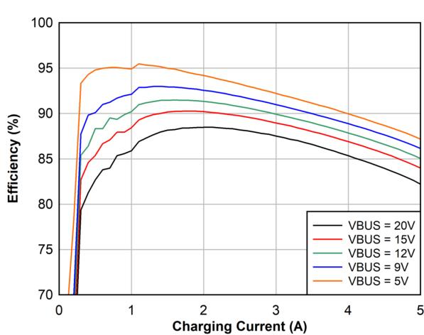  
${ \mathsf { V B A T } } = 4 { \mathsf { V } } _ { \mathrm { { i } } }$ $\mathsf { F s w } = 7 5 0 ~ \mathsf { k H z }$ with $\mathsf { L } 2 = 2 . 2 \mu \mathsf { H }$ , PFM disabled

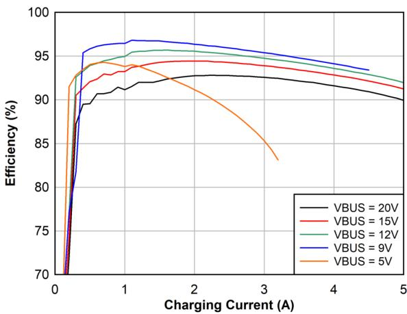  
Figure 8-1. 1s Battery Charge Efficiency, $7 5 0 k H z$   
${ \mathsf { V B A T } } = 8 { \mathsf { V } } _ { \mathrm { { i } } }$ Fs $\mathsf { v } = 7 5 0$ kHz with $\mathsf { L } 2 = 2 . 2 \mu \mathsf { H }$ , PFM disabled

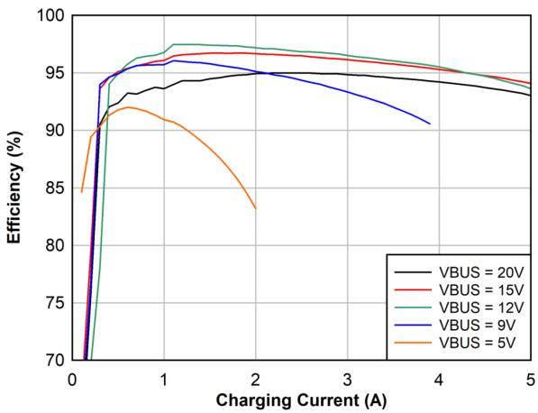  
Figure 8-3. 2s Battery Charge Efficiency, $7 5 0 k H z$   
${ \mathsf { V B A T } } = 1 2 { \mathsf { V } }$ , $\mathsf { F s w } = 7 5 0 ~ \mathsf { k H z }$ with $\mathsf { L } 2 = 2 . 2 \mu \mathsf { H }$ , PFM disabled   
Figure 8-5. 3s Battery Charge Efficiency, $7 5 0 k H z$

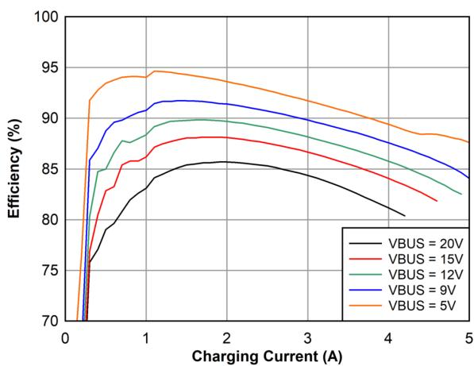  
${ \mathsf { V B A T } } = 4 { \mathsf { V } } , $ . $\mathsf { F s w } = 1 . 5 \mathsf { M H z }$ with $\mathsf { L } 1 = 1 . 0 \mu \mathsf { H }$ , PFM disabled

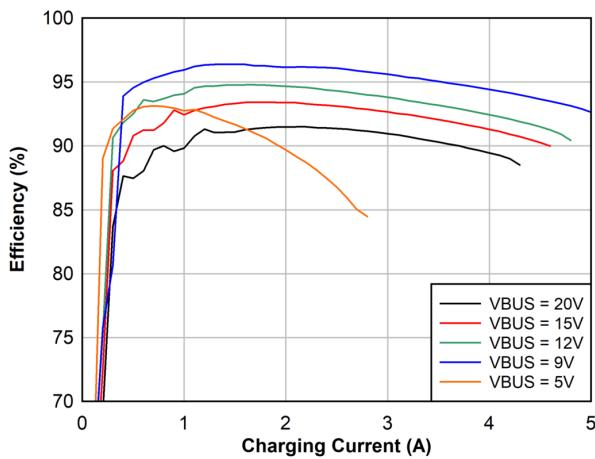  
Figure 8-2. 1s Battery Charge Efficiency, $1 . 5 M H z$   
VBAT $= 8 \mathsf { V }$ , $\mathsf { F s w } = 1 . 5 \mathsf { M H z }$ with $L 1 = 1 \mu \mathsf { H }$ , PFM disabled

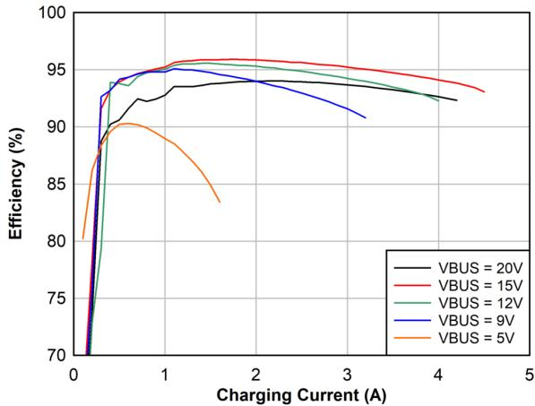  
Figure 8-4. 2s Battery Charge Efficiency, $1 . 5 M H z$   
${ \mathsf { V B A T } } = 1 2 { \mathsf { V } } _ { \mathrm { : } }$ , $\mathsf { F s w } = 1 . 5 \mathsf { M H z }$ with $L 1 = 1 \mu \mathsf { H }$ , PFM disabled   
Figure 8-6. 3s Battery Charge Efficiency, 1.5 MHz

# 8.7 Typical Characteristics (continued)

$\mathsf { C } _ { \mathsf { V B U S } } = 2 ^ { \star } 1 0 \mu \mathsf { F }$ , $\mathsf { C } _ { \mathsf { P M I D } } = 3 ^ { \star } 1 0 \mu \mathsf { F }$ , $\mathsf { C } _ { \mathsf { S Y S } } = 5 ^ { \star } 1 0 \mu \mathsf { F }$ , $\mathsf { C } _ { \mathsf { B A T } } = 2 ^ { \star } 1 0 \mu \mathsf { F } ,$ $L 1 = 1 \mu \mathsf { H }$ (SPM6530T-1R0M120) and $\mathsf { L } 2 = 2 . 2 \mu \mathsf { H }$ (WELHMI-74437346022)

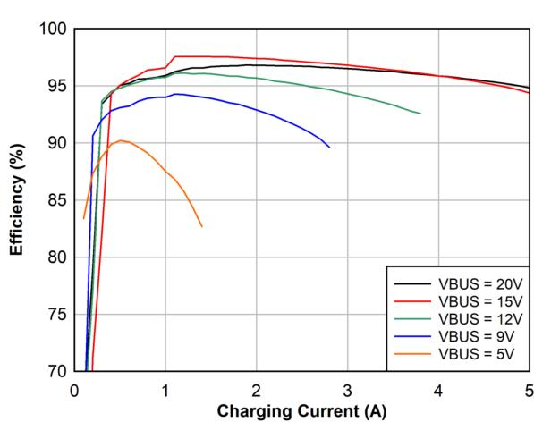  
VBA $\bar { \mathsf { T } } = 1 6 \mathsf { V }$ , $\mathsf { F s w } = 7 5 0 ~ \mathsf { k H z }$ with $\mathsf { L } 2 = 2 . 2 \mu \mathsf { H }$ , PFM disabled

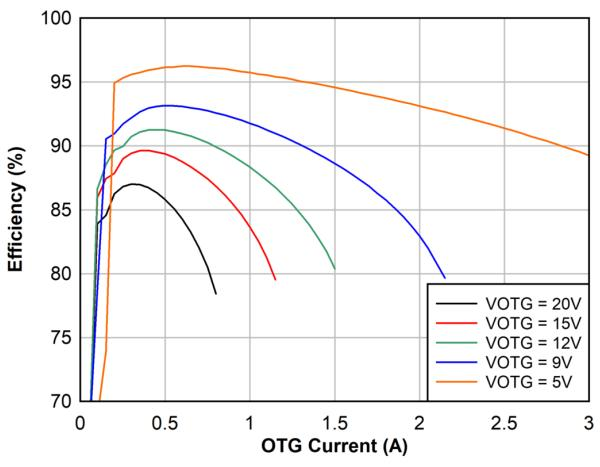  
Figure 8-7. 4s Battery Charge Efficiency, $7 5 0 k H z$   
$\mathsf { V B A T } = 4 . 2 \mathsf { V }$ , $\mathsf { F s w } = 7 5 0 ~ \mathsf { k H z }$ with $\mathsf { L } 2 = 2 . 2 \mu \mathsf { H }$ , PFM disabled

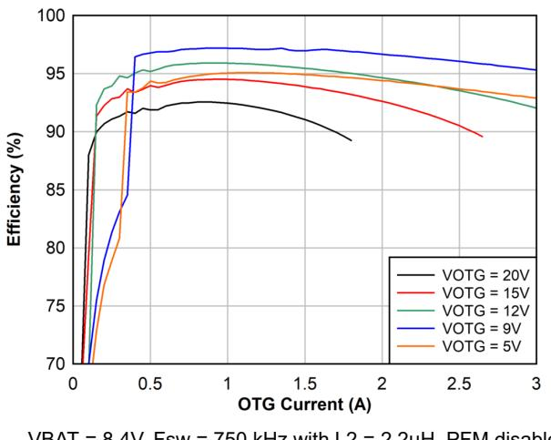  
Figure 8-9. 1s Battery OTG Efficiency, $7 5 0 k H z$   
$\mathsf { V B A T } = 8 . 4 \mathsf { V } ,$ , $\mathsf { F s w } = 7 5 0 ~ \mathsf { k H z }$ with $\mathsf { L } 2 = 2 . 2 \mu \mathsf { H }$ , PFM disabled   
Figure 8-11. 2s Battery OTG Efficiency, $7 5 0 k H z$

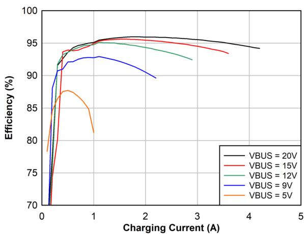  
${ \mathsf { V B A T } } = 1 6 { \mathsf { V } }$ , Fsw $= 1 . 5$ MHz with $L 1 = 1 \mu \mathsf { H }$ , PFM disabled   
Figure 8-8. 4s Battery Charge Efficiency, $1 . 5 M H z$

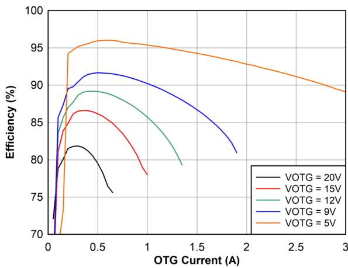  
VBAT $= 4 . 2 \lor$ , $\mathsf { F s w } = 1 . 5 \mathsf { M H z }$ with $L 1 = 1 \mu \mathsf { H }$ , PFM disabled

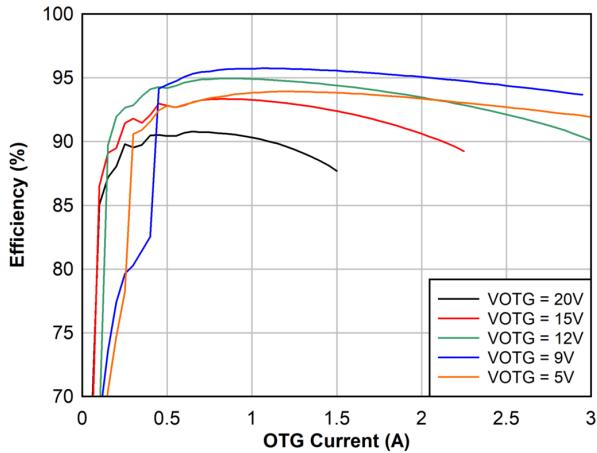  
Figure 8-10. 1s Battery OTG Efficiency, 1.5 MHz   
$\mathsf { V B A T } = 8 . 4 \mathsf { V }$ , $\mathsf { F s w } = 1 . 5 \mathsf { M H z }$ with $L 1 = 1 \mu \mathsf { H }$ , PFM disabled   
Figure 8-12. 2s Battery OTG Efficiency, 1.5 MHz

# 8.7 Typical Characteristics (continued)

$\mathsf { C } _ { \mathsf { V B U S } } = 2 ^ { \star } 1 0 \mu \mathsf { F }$ , $\mathsf { C } _ { \mathsf { P M I D } } = 3 ^ { \star } 1 0 \mu \mathsf { F }$ , $\mathsf { C } _ { \mathsf { S Y S } } = 5 ^ { \star } 1 0 \mu \mathsf { F }$ , $\mathsf { C } _ { \mathsf { B A T } } = 2 ^ { \star } 1 0 \mu \mathsf { F } ,$ $L 1 = 1 \mu \mathsf { H }$ (SPM6530T-1R0M120) and $\mathsf { L } 2 = 2 . 2 \mu \mathsf { H }$ (WELHMI-74437346022)

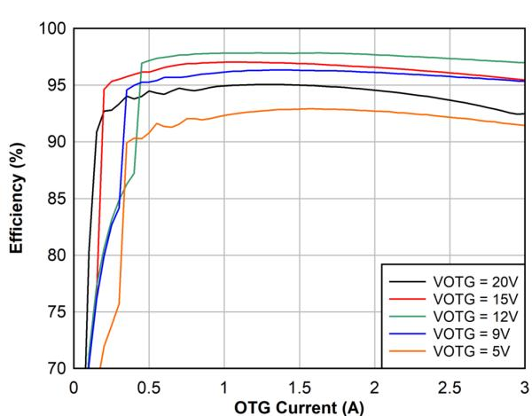  
$\mathsf { V B A T } = 1 2 . 6 \mathsf { V }$ , $\mathsf { F s w } = 7 5 0 ~ \mathsf { k H z }$ with $\mathsf { L } 2 = 2 . 2 \mu \mathsf { H }$ , PFM disabled

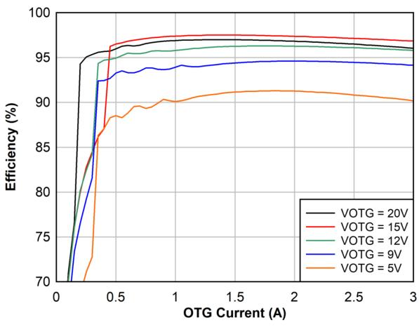  
Figure 8-13. 3s Battery OTG Efficiency, $7 5 0 k H z$   
$\mathsf { V B A T } = 1 6 . 8 \mathsf { V }$ , $\mathsf { F s w } = 7 5 0 ~ \mathsf { k H z }$ with $\mathsf { L } 2 = 2 . 2 \mu \mathsf { H }$ , PFM disabled

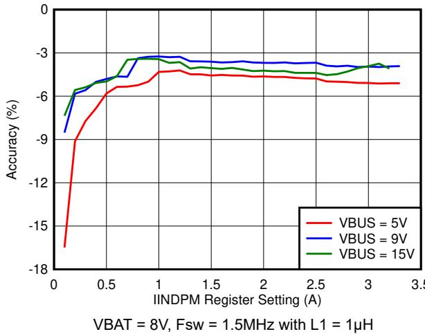  
Figure 8-15. 4s Battery OTG Efficiency, $7 5 0 k H z$   
Figure 8-17. Input Current Regulation (IINDPM) Accuracy

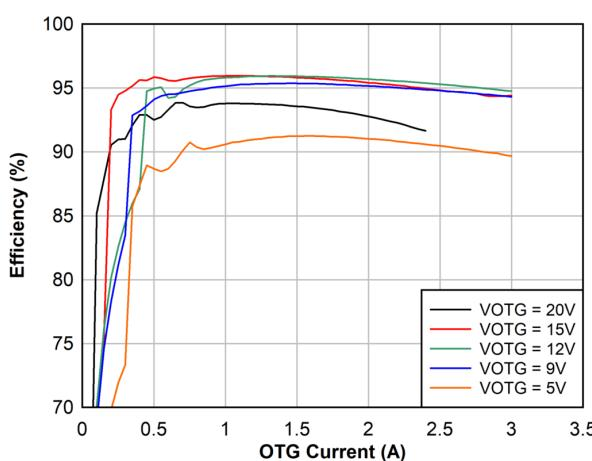  
$\mathsf { V B A T } = 1 2 . 6 \mathsf { V } .$ Fsw $= 1 . 5$ MHz with $L 1 = 1 \mu \mathsf { H }$ , PFM disabled   
Figure 8-14. 3s Battery OTG Efficiency, 1.5 MHz

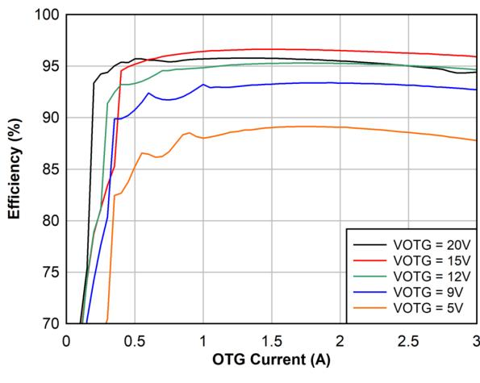  
$\mathsf { V B A T } = 1 6 . 8 \mathsf { V }$ , Fsw $= 1 . 5$ MHz with $L 1 = 1 \mu \mathsf { H }$ , PFM disabled

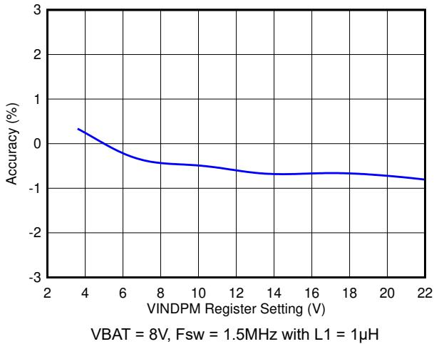  
Figure 8-16. 4s Battery OTG Efficiency, 1.5 MHz   
Figure 8-18. Input Voltage Regulation (VINDPM) Accuracy

# 8.7 Typical Characteristics (continued)

$\mathsf { C } _ { \mathsf { V B U S } } = 2 ^ { \star } 1 0 \mu \mathsf { F }$ , $\mathsf { C } _ { \mathsf { P M I D } } = 3 ^ { \star } 1 0 \mu \mathsf { F }$ , $\mathsf { C } _ { \mathsf { S Y S } } = 5 ^ { \star } 1 0 \mu \mathsf { F }$ , $\mathsf { C } _ { \mathsf { B A T } } = 2 ^ { \star } 1 0 \mu \mathsf { F } ,$ $L 1 = 1 \mu \mathsf { H }$ (SPM6530T-1R0M120) and $\mathsf { L } 2 = 2 . 2 \mu \mathsf { H }$ (WELHMI-74437346022)

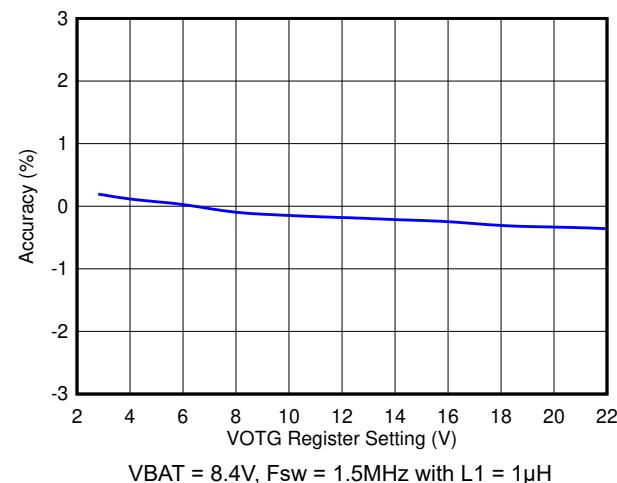  
Figure 8-19. OTG Voltage Regulation (VOTG) Accuracy

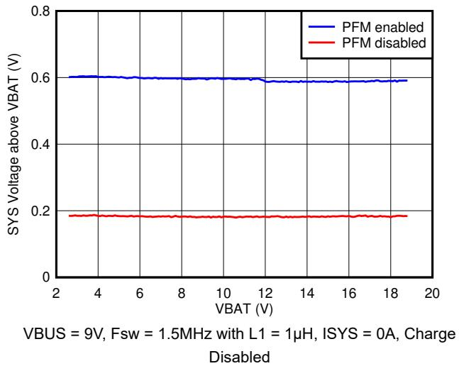  
Figure 8-20. Offset Voltage of SYS Regulation above VBAT

# 9 Detailed Description 9.1 Overview

The BQ25792 is a fully integrated, switch-mode buck-boost charger for a 1 cell \~ 4 cell Li-ion battery and Li-polymer battery. For compact design and minimum component count, the charger integrates the 4 switching MOSFETs $( \mathsf { Q } _ { 1 } , \mathsf { Q } _ { 2 } , \mathsf { Q } _ { 3 } , \mathsf { Q } _ { 4 } )$ , input and charging current sensing circuits, the battery FET (BATFET) and all the loop compensation of the buck-boost converter. It provides high power density and design flexibility to charge batteries across the full input voltage range for USB Type-C™ and USB-PD applications such as digital cameras, drones and mobile printers.

The charger supports narrow VDC (NVDC) power path management, in which the system is regulated at a voltage slightly higher than the battery voltage, without dropping below a configurable minimum system voltage. The system keeps operating even when the battery is completely discharged or removed. When load power exceeds the input source rating, the battery gets into supplement mode and prevents the input source from being overloaded and the system from crashing.

The device charges a battery from a wide range of input sources including legacy USB adapter to high voltage USB-PD adapter and traditional barrel adapter. The charger seamlessly transitions between buck, boost and buck-boost modes based on input voltage and battery voltage without host control. The optional dual-input source selector manages the power flowing from two different input sources, prioritizing the first available input source. The host may manually transition between input sources using ${ \mathsf { I } } ^ { 2 } { \mathsf { C } }$ .

To support fast charging using adjustable high voltage adapter (HVDCP), the device provides $0 + 1 0 -$ handshake. The device is compliant with USB 2.0 and USB 3.0 power delivery specification with input current and voltage regulation. In addition, the Input Current Optimizer (ICO) allows the detection of maximum power point of an unknown input source.

In addition to the ${ \mathsf { I } } ^ { 2 } { \mathsf { C } }$ host controlled charging mode, BQ25792 also supports autonomous charging mode. After power up, the charging is defaulted enabled with all the registers default settings. The device can complete a charging cycle without any software engagements. It detects battery voltage and charges the battery in different phases: trickle charging, pre-charging, constant current (CC) charging and constant voltage (CV) charging. At the end of the charging cycle, the charger automatically terminates when the charge current is below a pre-set limit (termination current) in the constant voltage phase. When the full battery falls below the recharge threshold, the charger will automatically start another charging cycle.

In the absence of input sources, BQ25792 supports USB On-the-Go (OTG) function, discharging the battery to generate an adjustable 2.8V\~22V voltage on VBUS with 10mV step size. This is compliant with the USB PD 3.0 specification defined PPS feature.

The charger provides various safety features for battery charging and system operations, including battery temperature negative thermistor (NTC) monitoring, trickle charge, pre-charge and fast charge timers and overvoltage/over-current protections on the battery and the charger power input pin. The thermal regulation reduces charge current when the die temperature exceeds a programmable threshold. The STAT output of the device reports the charging status and any fault conditions. The INT pin immediately notifies the host when a fault occurs.

The device also provides a 16-bit analog-to-digital converter (ADC) for monitoring charge current and input/ battery/system voltages, the TS pin voltage and the die temperature. It is available in a 29-pin $4 . 0 \ : \mathrm { m m } \times 4 . 0 \ : \mathrm { m m }$ QFN package.

# 9.2 Functional Block Diagram

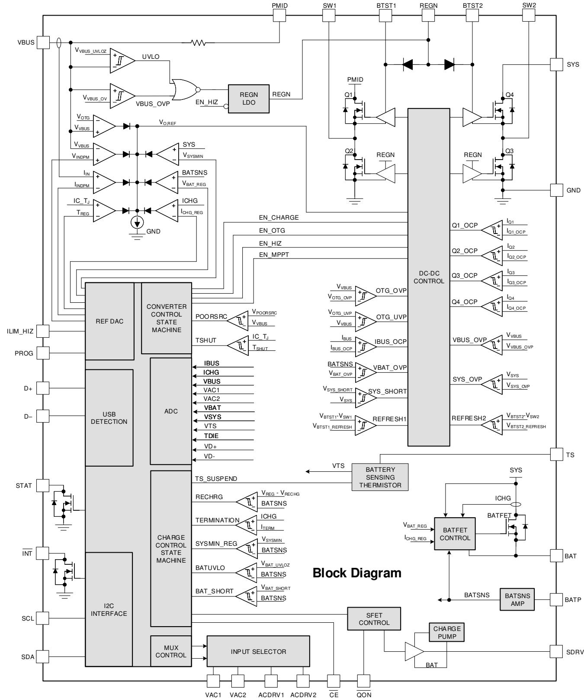

# 9.3 Feature Description

# 9.3.1 Device Power-On-Reset

The internal bias circuits of the BQ25792 are powered from the higher of either $\mathsf { V } _ { \mathsf { V B U S } }$ or $\mathsf { V } _ { \mathsf { B A T } }$ through an integrated power selector. The valid voltage to power up the device has to be greater than VVBUS_UVLOZ when powering from VBUS or VBAT_UVLOZ when powering from BAT. When $\lor _ { \lor \lor \lor \lor } < \lor _ { \ l }$ VBUS_UVLOZ, $\mathsf { V } _ { \mathsf { B A T } } \bar { < } \mathsf { V } _ { \mathsf { B A T } }$ _UVLOZ and a voltage higher than VAC_PRESENT is present at either VAC1 or VAC2, the device will be powered from $\mathsf { V } _ { \mathsf { A C } 1 }$ or $\mathsf { V } _ { \mathsf { A C } 2 }$ , depending on which comes first.

# 9.3.2 PROG Pin Configuration

At POR, the charger detects the PROG pin pull down resistance, then sets the charger default POR switching frequency and the battery cell count. Please follow the resistance list in Table 9-1 to set the desired POR switching frequency and battery cell count. The surface mount resistor with $\pm 1 \%$ or $\pm 2 \%$ tolerance is recommended.

Table 9-1. PROG Pin Resistance to Set Default Switching Frequency and Battery Cell Count   

<table><tr><td rowspan=1 colspan=1>SWITCHING FREQUENCY</td><td rowspan=1 colspan=1>CELL COUNT</td><td rowspan=1 colspan=1>TYPICAL RESISTANCE AT PROG PIN</td></tr><tr><td rowspan=1 colspan=1>1.5 MHz</td><td rowspan=1 colspan=1>1s</td><td rowspan=1 colspan=1>3.0 kΩ</td></tr><tr><td rowspan=1 colspan=1>750 kHz</td><td rowspan=1 colspan=1>1s</td><td rowspan=1 colspan=1>4.7 kΩ</td></tr><tr><td rowspan=1 colspan=1>1.5 MHz</td><td rowspan=1 colspan=1>2s</td><td rowspan=1 colspan=1>6.04 kΩ</td></tr><tr><td rowspan=1 colspan=1>750 kHz</td><td rowspan=1 colspan=1>2s</td><td rowspan=1 colspan=1>8.2 kΩ</td></tr><tr><td rowspan=1 colspan=1>1.5 MHz</td><td rowspan=1 colspan=1>3s</td><td rowspan=1 colspan=1>10.5 kΩ</td></tr><tr><td rowspan=1 colspan=1>750 kHz</td><td rowspan=1 colspan=1>3s</td><td rowspan=1 colspan=1>13.7 kΩ</td></tr><tr><td rowspan=1 colspan=1>1.5 MHz</td><td rowspan=1 colspan=1>4s</td><td rowspan=1 colspan=1>17.4 kΩ</td></tr><tr><td rowspan=1 colspan=1>750 kHz</td><td rowspan=1 colspan=1>4s</td><td rowspan=1 colspan=1>27.0 kΩ</td></tr></table>

Some of the charging parameters default values are determined by the battery cell count identified by PROG pin configuration, which are summarized in the table below.

Table 9-2. Charging Parameters Dependent on Battery Cell Count   

<table><tr><td rowspan=1 colspan=1>CELL (REG0x0A[7:6])</td><td rowspan=1 colspan=1>1s</td><td rowspan=1 colspan=1>2s</td><td rowspan=1 colspan=1>3s</td><td rowspan=1 colspan=1>4s</td></tr><tr><td rowspan=1 colspan=1>ICHG (REG0x03/04)</td><td rowspan=1 colspan=1>2A</td><td rowspan=1 colspan=1>2A</td><td rowspan=1 colspan=1>1A</td><td rowspan=1 colspan=1>1A</td></tr><tr><td rowspan=1 colspan=1>VSYSMIN (REG0x00[5:0])</td><td rowspan=1 colspan=1>3.5 V</td><td rowspan=1 colspan=1>7V</td><td rowspan=1 colspan=1>9 V</td><td rowspan=1 colspan=1>12 V</td></tr><tr><td rowspan=1 colspan=1>VREG (REG0x01/02)</td><td rowspan=1 colspan=1>4.2 V</td><td rowspan=1 colspan=1>8.4 V</td><td rowspan=1 colspan=1>12.6 V</td><td rowspan=1 colspan=1>16.8 V</td></tr><tr><td rowspan=1 colspan=1>VREG Range</td><td rowspan=1 colspan=1>3 V - 4.99 V</td><td rowspan=1 colspan=1>5 V - 9.99 V</td><td rowspan=1 colspan=1>10 V - 13.99 V</td><td rowspan=1 colspan=1>14 V - 18.8 V</td></tr></table>

After POR, the host can program the ICHG and VSYSMIN registers to any values within the ranges defined in the register tables. However, when programming the battery charging voltage (VREG), the host must ensure the VREG value is in the allowed range associated with the CELL register (REG0x0A[7:6]) setting defined in the table above. When the CELL register is changed, the ICHG, VSYSMIN and VREG registers are reset to the POR default values associated with the CELL setting.

For example, if the PROG pin resistance is a 2s battery configuration, the default POR CELL, ICHG, VSYSMIN and VREG settings will be 2s, 2 A, 7 V and $8 . 4 ~ \lor$ respectively. After POR, the host can change ICHG and VSYSMIN to any values, and can change VREG to any value between 5V and 9.99V. Assuming that the CELL bits remain at the 2s battery configuration, then when the REG_RST bit is set or the watchdog timer expires, the registers are reset to default values with ICHG, VSYSMIN and VREG automatically returing to 2 A, 7V and 8.4V respectively.

When the CELL register is 2s battery configuration, any write out of the range of VREG (5 V - 9.99 V) is ignored by the charger. If VREG needs to be programmed out of the $5 \vee - 9 . 9 \vee$ range, such as $1 1 \ \mathsf { V } _ { : }$ , the CELL bits have to be changed to the 3s setting. Setting the CELL bits will also cause the ICHG, VSYSMIN and VREG registers to reset to their 3s POR default values of 1 A, 9 V and $1 2 . 6 { \ : } \mathsf { V } .$ Then the host can program VREG in the range of

10 V - 13.99 V. If, after changing the CELL bits to 3S, the REG_RST bit is set or the watchdog timer expires, the ICHG, VSYSMIN and VREG will then be reset to 1 A, 9 V and $1 2 . 6 \lor ,$ regardless of the state of the PROG pin.

# 9.3.3 Device Power Up from Battery without Input Source

If only battery is present and the voltage is above UVLO threshold $( V _ { B A T \_ \cup V L O Z } )$ , the BATFET turns on and connects the battery to the system. The REGN LDO stays off to minimize the quiescent current. The low RDS(ON) of BATFET and the low quiescent current on BAT minimize the conduction loss and maximize the battery run time.

The POR sequence when the charger is powered from $\mathsf { V } _ { \mathsf { B A T } }$ is described as below:

1. 5 ms (typical) after $\mathsf { V } _ { \mathsf { B A T } } > \mathsf { V } _ { \mathsf { B A T \_ U V L O Z } }$ , the charger starts ACFET-RBFET detection, reads the resistance at the PROG pin, and then configures the charger POR register set accordingly. 2. 20 ms (typical) after $\mathsf { V } _ { \mathsf { B A T } } > \mathsf { V } _ { \mathsf { B A T } } \mathrm { ~ }$ UVLOZ, the $\mathsf { I 2 C }$ registers become accessible to the host.. 3. The charger turns the battery FET on to allow the battery to power the system.

# 9.3.4 Device Power Up from Input Source

When an input source is present at VBUS, the device checks the input source voltage to turn on REGN LDO and all the bias circuits. It detects and sets the input current limit before the buck-boost converter is started. The power up sequence from input source is as listed below:

1. The device begins the POR sequence when VVBUS > VVBUS_UVLOZ if there is a direct path from input to VBUS, or otherwise when $\mathsf { V } _ { \mathsf { A C } 1 }$ or $\mathsf { V } _ { \mathsf { A C } 2 } > \mathsf { V } _ { \mathsf { A C } }$ _PRESENT.   
2. 5 ms (typical) after a valid voltage is first present at either VBUS or VAC1/VAC2 pins, the charger starts the ACFET-RBFET detection, reads the resistance at PROG pin, and then configures the charger power on reset (POR) default register settings accordingly.   
3. If ACFET-RBFET are detected on the input source pathway, the corresponding ACDRV turns on the pair.   
4. $_ { 2 0 \mathsf { m s } }$ (typical) after valid voltage voltage presence, the ${ \mathsf { I } } ^ { 2 } { \mathsf { C } }$ registers become accessible to the host.   
5. As soon as $\mathsf { V } _ { \mathsf { V B U S } } > \mathsf { V } ,$ VBUS_UVLOZ (in step 1 or after step 3), VBUS_PRESENT_STAT is set to 1. 150 ms (typical) later, REGN is turned on.   
6. Once REGN is on, the charger starts the poor source detection. After a good input source is detected (typically 30 ms if there is no retry), PG_STAT is set to 1, then the ADC reads the ILIM_HIZ pin voltage and VBUS voltage and updates the IINDPM and VINDPM registers accordingly.   
7. When the poor source detection completes, the charger performs $0 + 1 0 -$ detection and updates the VBUS_STAT and IINDPM registers accordingly.   
8. $3 0 \mathrm { m s }$ (typical) after the $0 + 1 0 -$ detection completes, the converter starts switching to power SYS and charge the battery.

# 9.3.4.1 Power Up REGN LDO

When the device is powered up from VBUS, the LDO is turned on when VVBUS_PRESENT $< \mathsf { V B U S } < \mathsf { V } ,$ VBUS_OVP. When the device is powered up from battery only condition, the LDO is turned on at either one of the following conditions:

• The charger is operated in the OTG mode • VBAT is higher than 3.2V, and ADC TS channel is on $( \mathsf { A D C } \_ \mathsf { E N } = 1$ and TS_ADC_DIS = 0)

The REGN LDO supplies internal bias circuits and the MOSFETs gate drivers. The pull-up rails of ILIM_HIZ, TS, and STAT can be connected to REGN. The INT pin pull-up rail is recommended to be an external $1 . 8 \mathsf { V }$ or 3.3V voltage source, rather than REGN, because at battery only condition, the REGN might not be available. Except the charger related pull up rails, the REGN is not recommended to source any other external circuit. The REGN has to power the internal MOSFETs gate drivers, which is very critical for the charger normal operation.

# 9.3.4.2 Poor Source Qualification

After the REGN LDO powers up, the device checks the current capability of the input source. The input source has to meet the following requirements in order to move forward to the next power on steps.

1. VBUS voltage below VVBUS_OVP   
2. VBUS voltage above VPOORSRC when pulling IPOORSRC (typical 30 mA)

Once the conditions are met, the status register bit PG_STAT is set high and the INT pin is pulsed to signal the host.

If VBUS_OVP is detected (failing condition 1 above), the device automatically retries detection once the overvoltage fault goes away. If a poor source is detected (when pulling IPOORSRC, the VBUS voltage drops below VPOORSRC), the device repeats poor source qualification routine every 2 seconds. After 7 consecutive failures, the device sets $\mathsf { E N \_ H l } Z = 1$ and goes to HIZ mode. The device will remain in HIZ until either the adapter is re-plugged or the EN_HIZ bit is toggled, which will restart poor source detection with another 7 attempts. The EN_HIZ bit is cleared automatically when the adapter is plugged in. If either condition 1 or condition 2 is not met, it means the input source is not qualified; the PG_STAT bit remains low, and an INT pulse will be asserted and PG_FLAG will be set to 1, if PG_MASK $= 0$ .

# 9.3.4.3 ILIM_HIZ Pin

At POR, before the charger converter starts switching, the charger ADC reads the ILIM_HIZ pin voltage, and calculates the input current limit (ILIM) set by this ILIM_HIZ pin, according to:

$$
v _ { 1 \bot 1 \mathrm { M \_ H } } = 1 \lor + 8 0 0 \land \Omega \times 1 \lfloor 1 \mathsf { M }
$$

The ILIM_HIZ pin sets a high clamp for the IINDPM register. If the IINDPM setting from the $0 + 1 0 -$ detection or the POR default 3A IINDPM setting is higher than the ILIM clamp, the IINDPM register stays at this ILIM clamp. In addition, the host cannot program the IINDPM register to any values higher than this ILIM clamp after POR, unless the register bit EN_EXTILIM is set to 0.

The ILIM_HIZ pin can be biased from a resistor voltage divider tied to either REGN or another external voltage source. For both the forward charging mode and the OTG mode, when the ILIM_HIZ pin is pulled lower than 0.75V, the charger stops switching and REGN stays on. The charger resumes switching if the ILIM_HIZ pin voltage becomes higher than 1V.

If the ADC reads the ILIM_HIZ pin voltage is lower than 1.08V $\mathrm { 1 V + 8 0 0 ~ m \Omega \times 1 0 0 ~ m A }$ ), the charger considers the ILIM clamp to be 100mA, which is the minimal setting of the IINDPM register.

# 9.3.4.4 Default VINDPM Setting

In the POR sequence, right after the $0 + / 0 -$ detection, the charger initiates an ADC reading on the VBUS pin voltage without any load current (VBUS at no load condition, ${ \mathsf { V B U S } } _ { 0 }$ ) before the converter starts switching. The default VINDPM threshold is set to be $\mathsf { V B U S } _ { 0 } - 1 . 4 \mathsf { V }$ $\mathsf { V B U S } _ { 0 } > = 7 \mathsf { V } )$ or $\mathsf { V B U S } _ { 0 } - 0 . 7 \mathsf { V }$ $( \mathsf { V B U S } _ { 0 } < 7 \mathsf { V } _ { \cdot }$ .

The ${ \mathsf { V B U S } } _ { 0 }$ can be remeasured at any time by setting the register bit FORCE_VINDPM_DET $^ { \prime = 1 }$ . The converter stops switching, the ADC measures the VBUS voltage, the VINDPM register field is updated, and then the FORCE_VINDPM_DET bit returns to 0. The force VINDPM detection only can be done when VSYS_STAT $\mathbf { \omega } = \mathbf { \omega } _ { 0 }$ $0 \ ( \mathsf { V B A T } \ > \ \mathsf { V S Y S M I N } )$ , otherwise stopping the converter would cause VSYS to drop below VSYSMIN. If VSYS_STAT $= ~ 1$ (VBAT $<$ VSYSMIN), ${ \mathsf { V B U S } } _ { 0 }$ measurement does not start, the FORCE_VINDPM_DET bit resets to 0 and the VINDPM register retains its current value. The host must ensure there is a battery present prior to setting FORCE_VINDPDM_DET $= 1$ , or to allow system to be supported by the battery during detection.

When the measured ${ \mathsf { V B U S } } _ { 0 }$ is out of the VINDPM register range, the changer sets the VINDPM register to the minimum value (3.6V) or maximum (22V) value as appropriate.

# 9.3.4.5 Input Source Type Detection

After the input source is qualified, the charger runs Input Source Type Detection if AUTO_INDET_EN bit is set (default enabled).

The charger follows the USB Battery Charging Specification 1.2 (BC1.2) to detect SDP/CDP/DCP/HVDC input sources and the non-standard adapters through the USB $0 + 1 0 -$ lines. After BC1.2 detection is completed, the BC1.2_DONE_STAT bit is set to 1, and an $\overline { { | \mathsf { N } | } }$ pulse and BC1.2_DONE_FLAG are asserted if BC1.2_DONE_MASK $= 0$ . In addition, when USB DCP is detected, the charger initiates adjustable high voltage adapter handshake on $0 + / 0 -$ if HVDCP detection is enabled by the host. The input type might be changed after HVDCP detection is completed.

After input source type detection, the following registers are changed:

1. Input Current Limit (IINDPM) register is changed to set current limit   
2. VBUS_STAT bits change to reflect the detected source

After detection is completed, the host can over-write IINDPM registers to change the input current limit if necessary. The charger input current is limited by the lower of IINDPM register or ILIM_HIZ pin (when EN_EXTILIM $= ~ 1$ ) regardless of Input Current Optimizer (ICO) setting. When AUTO_INDET_EN is disabled, the Input Source Type Detection is bypassed, and the Input Current Limit (IINDPM) register remains unchanged from its previous value.

# 9.3.4.5.1 $\mathbf { D } { + } I \mathbf { D } { - }$ Detection Sets Input Current Limit

The device contains a $0 + 1 0 -$ based input source detection to set the input current limit. The $0 + 1 0 -$ detection has four major steps: Data Contact Detect (DCD), Primary Detection, Secondary Detection and High Voltage DCP (HVDCP) detection.

The $0 + / 0 -$ Primary Detection includes standard USB BC1.2 and non-standard adapters. When an input source is plugged in, the device starts standard USB BC1.2 detection first. The USB BC1.2 is capable of identifying Standard Downstream Port (SDP), Charging Downstream Port (CDP) and Dedicated Charging Port (DCP). The non-standard detection is used to distinguish vendor specific adapters based on the unique dividers they apply to the $0 + 1 0 -$ pins. The secondary detection is used to distinguish two types of charging ports, CDP and DCP.

A CDP usually requires the attached device to send back an enumeration within 2.5 seconds of CDP plug-in. Otherwise, the port will power cycle back to SDP even the $0 + / 0 -$ detection indicates CDP. This enumeration must be handled externally to the charger.

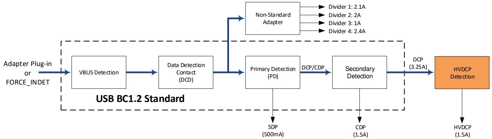  
Figure 9-1. $\mathbf { D } { + } I \mathbf { D } { - }$ Detection Flow

Table 9-3. Non-Standard Adapter Detection   

<table><tr><td rowspan=1 colspan=1>NON-STANDARDADAPTER</td><td rowspan=1 colspan=1>D+ THRESHOLD</td><td rowspan=1 colspan=1>D THRESHOLD</td><td rowspan=1 colspan=1>INPUT CURRENT LIMIT</td></tr><tr><td rowspan=1 colspan=1>Divider 1</td><td rowspan=1 colspan=1>VD+ within V2P8_VTH</td><td rowspan=1 colspan=1>VD_ within V2PO_VTH</td><td rowspan=1 colspan=1>2.1 A</td></tr><tr><td rowspan=1 colspan=1>Divider 2</td><td rowspan=1 colspan=1>VD+ within V1P2_VTH</td><td rowspan=1 colspan=1>VD+ within V1P2_VTH</td><td rowspan=1 colspan=1>2A</td></tr><tr><td rowspan=1 colspan=1>Divider 3</td><td rowspan=1 colspan=1>VD+ within V2P0_VTH</td><td rowspan=1 colspan=1>VD_ within V2P8_VTH</td><td rowspan=1 colspan=1>1A</td></tr><tr><td rowspan=1 colspan=1>Divider 4</td><td rowspan=1 colspan=1>VD+ within V2P8_VTH</td><td rowspan=1 colspan=1>VD_ within V2P8_VTH</td><td rowspan=1 colspan=1>2.4 A</td></tr></table>

When a Dedicated Charging Port (DCP) is detected, the charger initiates two high voltage adapter (HVDCP) handshakes to enable the corresponding adapter to output a higher voltage for fast charging. The HVDCP detection can be enabled by setting EN_HVDCP=1 and then setting either EN_ $\displaystyle { 9 V = 1 }$ to increase the input voltage to 9V or EN_ $1 2 \lor = 1$ to increase the input voltage to 12V. When EN_12V and EN_9V are both set to 1, the charger starts 12V first.

After the input source type detection is done, the DPDM_STAT bit is set to 0, an INT pulse and DPDM_DONE_FLAG are asserted if DPDM_DONE_MASK $= 0$ . In addition, REG06_Input_Current_Limit and VBUS_STAT are updated as shown in Table 9-4.

Table 9-4. Input Current Limit Setting from $\mathbf { D } { + } I \mathbf { D } { - }$ Detection   

<table><tr><td rowspan=1 colspan=1>D+/D DETECTION</td><td rowspan=1 colspan=1>INPUT CURRENT LIMIT (INDPM)</td><td rowspan=1 colspan=1>VBUS_STAT_3:0</td></tr><tr><td rowspan=1 colspan=1>USB SDP</td><td rowspan=1 colspan=1>500 mA</td><td rowspan=1 colspan=1>0001</td></tr><tr><td rowspan=1 colspan=1>USB CDP</td><td rowspan=1 colspan=1>1.5 A</td><td rowspan=1 colspan=1>0010</td></tr><tr><td rowspan=1 colspan=1>USB DCP</td><td rowspan=1 colspan=1>3.25 A</td><td rowspan=1 colspan=1>0011</td></tr><tr><td rowspan=1 colspan=1>Adjustable High Voltage DCP (HVDCP)</td><td rowspan=1 colspan=1>1.5A</td><td rowspan=1 colspan=1>0100</td></tr><tr><td rowspan=1 colspan=1>Unknown Adapter</td><td rowspan=1 colspan=1>3A</td><td rowspan=1 colspan=1>0101</td></tr><tr><td rowspan=1 colspan=1>Non-Standard Adapter, Divider 1</td><td rowspan=1 colspan=1>2.1A</td><td rowspan=1 colspan=1>0110</td></tr><tr><td rowspan=1 colspan=1>Non-Standard Adapter, Divider 2</td><td rowspan=1 colspan=1>2A</td><td rowspan=1 colspan=1>0110</td></tr><tr><td rowspan=1 colspan=1>Non-Standard Adapter, Divider 3</td><td rowspan=1 colspan=1>1A</td><td rowspan=1 colspan=1>0110</td></tr><tr><td rowspan=1 colspan=1>Non-Standard Adapter, Divider 4</td><td rowspan=1 colspan=1>2.4 A</td><td rowspan=1 colspan=1>0110</td></tr></table>

# 9.3.4.5.2 HVDCP Detection Procedure

Figure 9-1 shows that an HVDCP source is first qualified as a DCP source in the USB BC1.2 standard detection stage, then qualified in the following HVDCP detection stage as an HVDCP source. When the HVDCP is first qualified as a DCP, the charger sets an IINDPM limit of 3.25A. The IIDPM is then updated to the HVDCP limit of 1.5A after the HVDCP handshake completes. In some cases the higher IINDPM limit of 3.25A may interfere with the source's ability to transition to 9V or 12V if the transition is attemped before the IINDPM is updated to 1.5A.

The recommended procedure for enabling detection of HVDCP sources is completed in the following steps:

Before adapter insertion, the charger is configured with AUTO_INDET_EN $= 1$ and HVDCP_ $\mathsf { E N } = 0$ . EN_12V and EN_9V are set as desired for the system.   
When an adapter is inserted, it will be detected as SDP, CDP, DCP or a Non-Standard adapter and an $\mathsf { I 2 C }$ interrupt is sent to the host. If any detection other than DCP is made, the host proceeds as usual.   
If the adapter is detected as DCP (VBUS_STAT[3:0] = 0011), the host first changes the Input Current Limit register to 1.5A and then changes ${ \mathsf { H V D C P \_ E N } } = 1$ .   
After HVDCP detection is complete, the host sets HVDCP_EN $= 0$ to disable HVDCP support in preparation for the next input source detection sequence.

# 9.3.4.5.3 Connector Fault Detection

The host can apply different status on $\mathsf { D } +$ pin including HIZ, 0V, 0.6V, 1.2V, 2.0V, 2.7V, 3.3V or "short to $\mathsf { D } \llcorner \ "$ , and different status on D- pin including HIZ, 0.6V, 1.2V, 2.0V, 2.7V or 3.3V. The device also provides ADC readings of the $\mathsf { D } +$ and D- pin voltages. The host can use the information to determine if connector is normal or in any faults. The voltage values are set using the DPLUS_DAC and DMINUS_DAC register. The $0 + 1 0 -$ pins are only applied at the VAC1 input source. If the DPLUS_DAC or DMINUS_DAC are programmed when the adapter is plugged in and the $0 + / 0 .$ - detection is in process, the device will ignore the register programming.

# 9.3.5 Dual-Input Power Mux

The BQ25792 has two ACDRV drivers to control two optional sets of back-to-back power N-FETs, selecting and managing the power from two different input sources. In the POR sequence, the charger detects whether the ACFETs-RBFETs are present, then updates the ACRB1_STAT or ACRB2_STAT status bits accordingly. The ACFET1-RBFET1 or ACFET2-RBFET2 can be controlled by setting the register bit EN_ACDRV1 or EN_ACDRV2. If the external ACFET-RBFET is not present, then tie VAC1 / VAC2 to VBUS and connect ACDRV1 / ACDRV2 to GND. The power MUX drivers support three different application cases, which are elaborated below.

# 9.3.5.1 ACDRV Turn On Condition

The ACDRV1 and ACDRV2 control the input power MUX. In order to turn on either ACDRV1 or ACDRV2, all of the following conditions must be valid:

1. The corresponding ACFET-RBFET was detected at power on: ACDRV is not short to ground.   
2. VAC is above VVACpresent threshold   
3. VAC is below VACOVP threshold   
4. DIS_ACDRV_BOTH is not set to '1'

5. EN_HIZ is not set to '1'   
6. VBUS is below VVBUSpresent threshold

# 9.3.5.2 VBUS Input Only

In this configuration, only a single input is connected to VBUS, so that no power MOSFETs are required. VAC1 and VAC2 are shorted to VBUS, and ACDRV1 and ACDRV2 are pulled down to GND, as shown in Figure 9-2. At POR, the charger detects that no ACFETs or RBFETs are present by sensing that the ACDRV1 and ACDRV2 pins are both shorted to GND and configures power mux register fields as shown in Table 9-5.

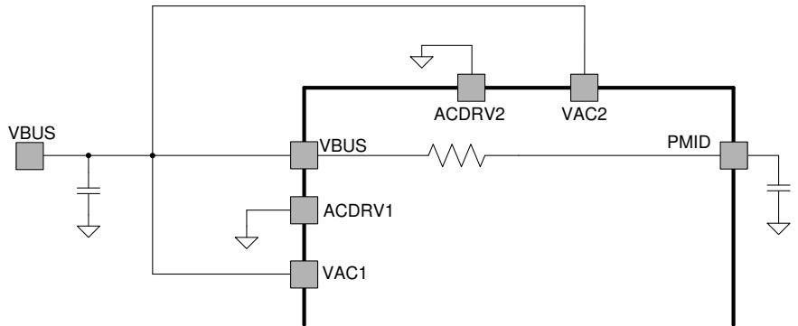  
Figure 9-2. Single Input Connected to VBUS Directly Without ACFET-RBFET

Table 9-5. Single Input Configuration Summary   

<table><tr><td rowspan=1 colspan=1>PIN OR REGISTER FIELD</td><td rowspan=1 colspan=1>STATE</td></tr><tr><td rowspan=1 colspan=1>External MOSFETs</td><td rowspan=1 colspan=1>No external power mux MOSFETs.</td></tr><tr><td rowspan=1 colspan=1>VAC1 pin</td><td rowspan=1 colspan=1>Shorted to VBUS</td></tr><tr><td rowspan=1 colspan=1>VAC2 pin</td><td rowspan=1 colspan=1>Shorted to VBUS</td></tr><tr><td rowspan=1 colspan=1>ACDRV1 pin</td><td rowspan=1 colspan=1>Shorted to GND</td></tr><tr><td rowspan=1 colspan=1>ACDRV2 pin</td><td rowspan=1 colspan=1>Shorted to GND</td></tr><tr><td rowspan=1 colspan=1>ACRB1_STAT</td><td rowspan=1 colspan=1>0 (Read Only)</td></tr><tr><td rowspan=1 colspan=1>ACRB2_STAT</td><td rowspan=1 colspan=1>0 (Read Only)</td></tr><tr><td rowspan=1 colspan=1>DIS_ACDRV</td><td rowspan=1 colspan=1>1</td></tr><tr><td rowspan=1 colspan=1>EN_ACDRV1</td><td rowspan=1 colspan=1>Locked at 0</td></tr><tr><td rowspan=1 colspan=1>EN_ACDRV2</td><td rowspan=1 colspan=1>Locked at 0</td></tr></table>

# 9.3.5.3 One ACFET-RBFET

In this configuration, only ACFET1-RBFET1 is present, ACFET2-RBFET2 is not. VAC1 is tied to the drain of ACFET1, ACDRV1 is connected to the gates of ACFET1 and RBFET1. VAC2 is shorted to VBUS, ACDRV2 is pulled down to GND. This structure is illustrated in Figure 9-3, which is able to support either single input (one from VAC1 to VBUS through ACFET1-RBFET1) or dual-input (one from VAC1 to VBUS through ACFET1-RBFET1, the other one connected directly to VBUS) applications. At POR, the charger detects only ACFET1-RBFET1 present and configures the power mux register fields as shown in Table 9-6.

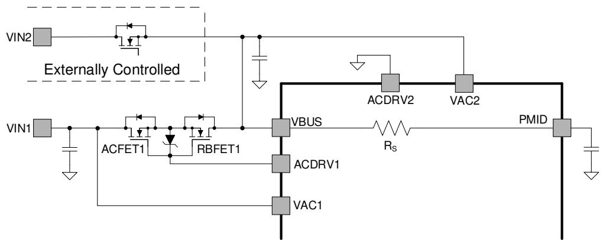  
Figure 9-3. One ACFET-RBFET Structure Supporting One Input at VAC1 and/or One Input at VBUS

Table 9-6. Single Input Configuration Summary   

<table><tr><td rowspan=1 colspan=1>PIN OR REGISTER FIELD</td><td rowspan=1 colspan=1>STATE</td></tr><tr><td rowspan=1 colspan=1>External MOSFETs</td><td rowspan=1 colspan=1>ACFET1 and RBFET1 only</td></tr><tr><td rowspan=1 colspan=1>VAC1</td><td rowspan=1 colspan=1>Connected to input source 1</td></tr><tr><td rowspan=1 colspan=1>VAC2</td><td rowspan=1 colspan=1>Shorted to VBUS</td></tr><tr><td rowspan=1 colspan=1>ACDRV1</td><td rowspan=1 colspan=1>Connected to ACFET1/RBFET1 gate terminals</td></tr><tr><td rowspan=1 colspan=1>ACDRV2</td><td rowspan=1 colspan=1>Shorted to GND</td></tr><tr><td rowspan=1 colspan=1>ACRB1_STAT</td><td rowspan=1 colspan=1>0: ACFET1/RBFET1 Open (Path Disabled)1: ACFET1/RBFET1 Closed (Path Enabled)</td></tr><tr><td rowspan=1 colspan=1>ACRB2_STAT</td><td rowspan=1 colspan=1>0 (Read Only)</td></tr><tr><td rowspan=1 colspan=1>DIS_ACDRV</td><td rowspan=1 colspan=1>0: Allow ACDRV1 On if all requirements met1: Force ACDRV1 Off</td></tr><tr><td rowspan=1 colspan=1>EN_ACDRV1</td><td rowspan=1 colspan=1>0: Force ACDRV1 Off1: Turn ACDRV1 On if all requirements met</td></tr><tr><td rowspan=1 colspan=1>EN_ACDRV2</td><td rowspan=1 colspan=1>Locked at 0</td></tr></table>

When a valid input is presented at VAC1, the charger will set EN_ACDRV1 $= ~ 1$ and turn ACFET1-RBFET1 on. To swap from the input at VAC1 to the input at VBUS, the host has to turn off the ACFET1-RBFET1 first by setting DIS_ACDRV $^ { \prime = 1 }$ (forcing EN_ACDRV1 $= 0$ ), then enable the other input source which is connected directly to VBUS. To swap from the input at VBUS to the input at VAC1, the host has to disable the input source connected to VBUS, wait for VBUS to fall below VBUS_PRESENT, then turn on the ACFET1-RBFET1 by setting DIS_ACDRV $= 0$ .

# 9.3.5.4 Two ACFETs-RBFETs

In this scenario, both ACFET1-RBFET1 and ACFET2-RBFET2 are present. VAC1 / VAC2 is tied to the drain of ACFET1 / ACFET2, ACDRV1 $/$ ACDRV2 is connected to the gate of ACFET1 / ACFET2. This structure is developed to support dual-input connected at VAC1 and VAC2. At POR, the charger detects both ACFET1- RBFET1 and ACFET2-RBFET2 present, then updates ACRB1_STAT and ACRB2_STAT to 1.

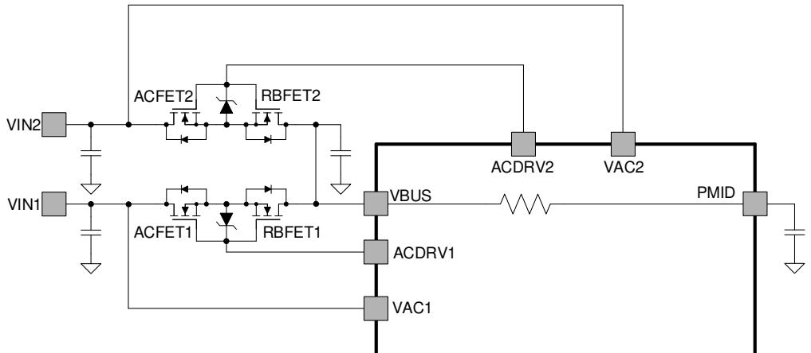  
Figure 9-4. Two ACFETs-RBFETs Structure Supporting One Input at VAC1 and One Input at VAC2

Table 9-7. Dual Input Configuration Summary   

<table><tr><td rowspan=1 colspan=1>PIN OR REGISTER FIELD</td><td rowspan=1 colspan=1>STATE</td></tr><tr><td rowspan=1 colspan=1>External MOSFETs</td><td rowspan=1 colspan=1>ACFET1, RBFET1, ACFET2, RBFET2</td></tr><tr><td rowspan=1 colspan=1>VAC1 pin</td><td rowspan=1 colspan=1>Connected to input source 1</td></tr><tr><td rowspan=1 colspan=1>VAC2 pin</td><td rowspan=1 colspan=1>Connected to input source 2</td></tr><tr><td rowspan=1 colspan=1>ACDRV1 pin</td><td rowspan=1 colspan=1>Connected to ACFET1/RBFET1 gate terminals</td></tr><tr><td rowspan=1 colspan=1>ACDRV2 pin</td><td rowspan=1 colspan=1>Connected to ACFET2/RBFET2 gate terminals</td></tr><tr><td rowspan=1 colspan=1>ACRB1_STAT</td><td rowspan=1 colspan=1>0: ACFET1/RBFET1 Open (Path Disabled)1: ACFET1/RBFET1 Closed (Path Enabled)</td></tr><tr><td rowspan=1 colspan=1>ACRB2_STAT</td><td rowspan=1 colspan=1>0: ACFET2/RBFET2 Open (Path Disabled)1: ACFET2/RBFET2 Closed (Path Enabled)</td></tr><tr><td rowspan=1 colspan=1>DIS_ACDRV</td><td rowspan=1 colspan=1>0: Allow ACDRV1 or ACDRV2 on if all requirements met1: Force ACDRV1 and ACDRV2 off</td></tr><tr><td rowspan=1 colspan=1>EN_ACDRV1</td><td rowspan=1 colspan=1>0: Force ACDRV1 Off1: Turn ACDRV1 On if all requirements met</td></tr><tr><td rowspan=1 colspan=1>EN_ACDRV2</td><td rowspan=1 colspan=1>0: Force ACDRV2 Off1: Turn ACDRV2 On if all requirements met</td></tr></table>

In dual input mode, the ACDRV automatically turns on the ACFET-RBFET of the path where a valid input is first presented, without host intervention. If a valid input is presented on the second path while the first path is already on with a valid input, the ACFET-RBFET of the second path remains off. If desired, the host may manually perform a switch between power paths by switching the values of EN_ACDRV1 and EN_ACDRV2. Both EN_ACDRV bits may be updated in a single $\mathsf { I 2 C }$ write operation to minimize the transition time. Note that programming EN_ACDRV1 $= 1$ , $\mathsf { E N \_ A C D R V } 2 = 1$ at the same time to turn on both ACFET1-RBFET1 and ACFET2-RBFET2 is not allowed, and will be ignored by the charger.

To transition from one input to the other, the device first turns off the initially active ACFET-RBFET pair, waits until the VBUS voltage drops lower than VBUS_PRESENT, and then enables the new ACFET-RBFET pair. During this change over, the converter stops switching for a short period of time. When no battery is present or the battery is depleted, the system output will fall. The user has to be aware of this and avoid the input source swap when the battery voltage is too low.

If two valid voltages are present at VAC1 and VAC2 and the source on the connected path becomes invalid because of VAC_UVLO, VAC_OV or IBUS_OC, the charger automatically swaps the input without any host engagement. Any time that the converter autonomously swaps the source paths, it will also update the EN_ACDRV1 and EN_ACDRV2 bits accordingly in order to indicate the active power path.

With only one valid input presented at either VAC1 or VAC2, the ACFET1-RBFET1 and ACFET2-RBFET2 can not be both turned off by setting $\mathsf { R E G 0 } \times 1 3 [ 7 ! 6 ] = 0 0$ . Instead, the host should set DIS_ACDRV $= 1$ to force both ACFET-RBFET pairs off. With input sources present at both VAC1 and VAC2, the host can turn off the two ACFET-RBFET pairs by setting either $\mathsf { R E G 0 } \times 1 3 [ 7 : 6 ] = 0 0$ or DIS_ACDRV $= 1$ .

# 9.3.6 Buck-Boost Converter Operation

The charger employs a synchronous buck-boost converter that allows charging the 1s to 4s battery from a legacy 5V USB input source, HVDCP and USB-PD power sources. The converter operates uninterruptedly and continuously in buck, boost or buck-boost mode depending on the input to system output voltage difference. When the input voltage is close to the system output voltage, the converter operates in a proprietary buck-boost mode.

With a battery attached at BAT and input power at VBUS, the charger can provide at least the MINSYS voltage at SYS and charge current for the battery at BAT. Once the battery voltage reaches the MINSYS voltage, the SYS voltage follows the BAT voltage up. With no battery attached to BAT and input power at VBUS, the voltages at SYS and BAT vary depending on the whether or not charge is enabled as explained below.

1. No battery or battery removed and charge disabled by CE pin or EN_CHG register or thermistor removed from TS pin - The charger keeps the BAT pin voltage at low-level, steady-state voltage and regulates SYS pin to MINSYS. The host can monitor the ADC BAT pin voltage and TS fault register to determine when a valid battery is attached.   
2. No battery or battery removed while charge enabled and TS pin function is disabled - The charger continuously tries to charge the BAT capacitance, typically resulting in the BAT voltage alternating between a low level and BATOVP fault. The SYS voltage follows the battery voltage up, potentially reaching SYSOVP fault. In order to determine if a battery is attached, the host must periodically disable charge, force IBAT discharge current and then read the ADC BAT pin voltage. Alternatively, the host can monitor the INT pin for rapid interrupts and then read the charge status bits for fast $^ { < 1 }$ s for typical BAT pin capacitance) toggling between charging, taper and termination.

# 9.3.6.1 Force Input Current Limit Detection

In host mode, the host can force the device to run Input Current Limit Detection by setting FORCE_INDET bit to 1. After the detection is completed, FORCE_INDET bit automatically returns to 0. After the detection is completed, the input REG06_Input_Current_Limit (IINDPM), and the VBUS_STAT bits may be changed by the device according to the detection result.

# 9.3.6.2 Input Current Optimizer (ICO)

The device provides Input Current Optimizer (ICO) to identify maximum power point in order to avoid overloading the input source. The algorithm automatically identifies maximum input current limit of an unknown power source and sets the charger IINDPM register properly, in order to prevent from entering the charger input voltage (VINDPM) regulation. This feature is disabled by default at POR (EN_ICO $= 0$ ) and only activates when EN_ICO bit is set to 1.

After DCP type input source is detected based on the procedures described in Section 9.3.4.5, the algorithm runs automatically if EN_ICO bit is set. The algorithm can also be forced to execute by setting FORCE_ICO bit regardless of input source type detected. Please note that $\mathsf { E N \_ l c o } = 1$ is required for FORCE_ICO to work.

The actual input current limit used by the Dynamic Power Management is reported in the ICO_ILIM register whether set by ICO if enabled or IINDPM register if not. In addition, the current limit is clamped by the ILIM_HIZ pin unless EN_EXT_ILIM bit is 0 to disable the ILIM_HIZ pin function.

When $\mathsf { V } ( \mathsf { B A T } ) > \mathsf { V M I N S Y S }$ , the ICO algorithm starts with the maximum allowed input current as reported in ICO_ILIM register as $5 0 0 ~ \mathsf { m A }$ then continually increases this limit until the optimal limit is found. When VBAT $<$ VSYSMIN, the battery voltage can be too low to supplement a large system load if the charger buck converter is limited to $5 0 0 ~ \mathsf { m A }$ and then ramped up by the ICO algorithm. Therefore, when a VBAT $<$ VSYSMIN, the ICO algorithm starts with the maximum allowed input current as reported in ICO_ILIM register to the input current-limit register value in REG0x06 and then continually decreses this limit until the optimal limit is found.

Once the optimal input current is identified, the ICO_STAT[1:0] and ICO_FLAG bits are set. The actual input current is reported in the ICO_ILIM register and does not change unless the algorithm is triggered again by the following events :

1. A new input source is plugged-in, or EN_HIZ bit is toggled   
2. IINDPM register is changed   
3. VINDPM register is changed   
4. FORCE_ICO bit is set to 1   
5. VBUS_OVP event

These events also reset the ICO_STAT[1:0] bits to 01

# 9.3.6.3 Pulse Frequency Modulation (PFM)

In order to improve converter light-load efficiency, the device switches to PFM control at light load condition. The effective switching frequency decreases accordingly as load current decreases. The PFM operation can be disabled by setting PFM_FWD_DIS $= 1$ . With PFM disabled, the converter stays at the PWM mode switching frequency and transitions into DCM operation at light load condition. The minimum effective switching frequency in PFM can be limited to $2 5 ~ \mathsf { k H z }$ to eliminate the audible noise concern if the out of audio (OOA) feature is enabled by setting DIS_FWD_ ${ \mathsf { O O A } } = 0$ . The host can disable the OOA by setting DIS_FWD_OOA $= 1$ , which may result in the converter effective switching frequency dropping below $2 5 ~ \mathsf { k H z }$ at extremely light load. The PFM operation of OTG mode can be independently controlled using the PFM_OTG_DIS and DIS_OTG_OOA bits. In PFM mode, the converter limits peak inductor current to $^ { 2 \mathsf { A } }$ , when OOA is enabled, and 3.3 A if OOA is disabled or if the load has increased close to the point of exiting PFM.

# 9.3.6.4 Device HIZ State

The charger enters HIZ mode when EN_HIZ bit is set to 1. The HIZ mode refers to a charger state, in which the REGN LDO is off, and the converter stops switching even if the adapter is present. Similar to the battery only condition, the charger is in a low quiescent current mode, turns off the ADC and turns on the BATFET to support the system load. The ADC can be re-enabled during HIZ by setting EN_ADC $= 1$ .

Some of the faults, such as VBUS_OVP, VSYS_OVP, VBAT_OVP and OTG_OVP, force the converter to stop switching but keep the REGN and other internal circuits powered on. Alternatively, some of the faults, like VSYS_SHORT and IBUS_OCP, force the charger into HIZ mode by setting $\mathsf { E N \_ H l } Z \mathsf { = } 1$ . More details could be found in the Section 9.3.13.

# 9.3.7 USB On-The-Go (OTG)

# 9.3.7.1 OTG Mode to Power External Devices

The device supports the OTG operation to deliver power from the battery to other external devices through the USB ports. The OTG voltage regulation is set in VOTG[10:0] register bits. The OTG current regulation is set in IOTG[6:0] register bits. To enable the OTG operation, the following conditions have to be valid:

The battery voltage is higher than VBAT_OTG rising threshold, and not trigger the VBAT_OVP protection. • The VBUS is below VVBUS_UVLO. • The voltage at TS pin is within the range configured by BHOT and BCOLD register bits

The population of ACFET1-RBFET1 and ACFET2-RBFET2 as detected at POR affects the operation of the converter in OTG mode as summarized in Table 9-8.

Table 9-8. OTG Behavior by Input Mux State   

<table><tr><td rowspan=1 colspan=1>ACRB1_STAT</td><td rowspan=1 colspan=1>ACRB2_STAT</td><td rowspan=1 colspan=1>DIS_ACDRV</td><td rowspan=1 colspan=1>OTG BEHAVIOR</td></tr><tr><td rowspan=1 colspan=1>0</td><td rowspan=1 colspan=1>0</td><td rowspan=1 colspan=1>0</td><td rowspan=1 colspan=1>Converter starts 5 ms after EN_OTG = 1</td></tr><tr><td rowspan=1 colspan=1>0</td><td rowspan=1 colspan=1>1</td><td rowspan=1 colspan=1>0</td><td rowspan=1 colspan=1>EN_OTG = 1 does not start converter until EN_ACDRV2 = 1</td></tr><tr><td rowspan=1 colspan=1>1</td><td rowspan=1 colspan=1>0</td><td rowspan=1 colspan=1>0</td><td rowspan=1 colspan=1>EN_OTG = 1 does not start converter until EN_ACDRV1 = 1</td></tr><tr><td rowspan=1 colspan=1>1</td><td rowspan=1 colspan=1>1</td><td rowspan=1 colspan=1>0</td><td rowspan=1 colspan=1>EN_OTG = 1 does not start converter until either EN_ACDRV1 = 1 orEN_ACDRV2 = 1</td></tr><tr><td rowspan=1 colspan=1>X</td><td rowspan=1 colspan=1>X</td><td rowspan=1 colspan=1>1</td><td rowspan=1 colspan=1>Converter starts 5 ms after EN_OTG = 1</td></tr></table>

For swapping the OTG output from port 1 to port 2, assuming EN_ACDRV2 is already 0, the host has to set EN_ACDRV1 $= 0$ to turn off ACFET1_RBFET1 first, which causes the converter to stop switching and VBUS to drop below VBUS_PRESENT. The host then sets EN_ACDRV2 $= 1$ , and the converter starts switching again and ACDRV2 turns on ACFET2-RBFET2, which allows VBUS to ramp up. The similar procedure can be applied to the case of swapping the OTG output from port 2 to port 1.

In OTG mode, the converter PFM operation can be disabled by setting PFM_OTG_DIS $=$ 1 and the OOA can be disabled by setting DIS_OTG_OOA $= 1$ .

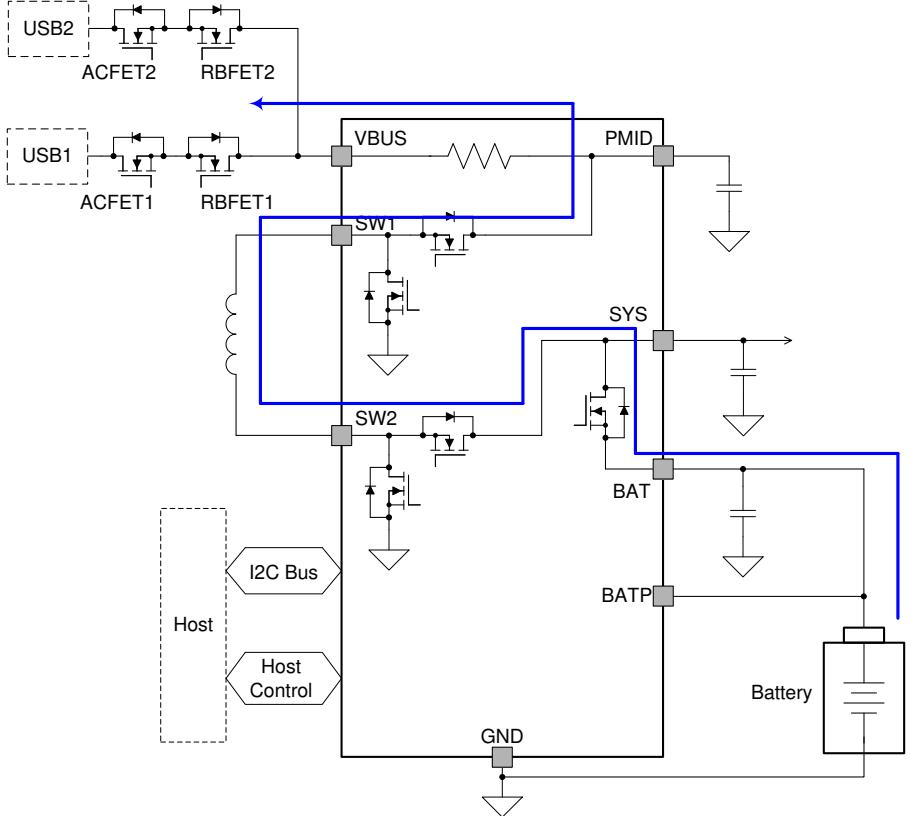  
Figure 9-5. The Simplified Application Diagram for the OTG Mode Operation

The simplified application diagram for the OTG mode operation is shown in Figure 9-5, in which the power flow is illustrated by the blue arrows.

The charger regulates the battery discharging current in OTG mode. When IBAT rises higher than the IBAT_REG[1:0] register setting, the charger reduces the OTG output current and prioritizes the system load current if there is any. The IBAT_REG_STAT bit is set to 1 and an INT pulse is asserted, and if IBAT_REG_ ${ \mathsf { M A S K } } = 0$ , the IBAT_REG_FLAG is set to 1. If the OTG output current is decreased to zero and the system load pulls even more current, the charger can no longer limit the battery discharging current.

When IBAT_REG[1:0] is set to 00, 01 or 10 (3A, 4A or 5A), there is a soft-start applied to the OTG ouput current.   
When IBAT_REG[1:0] is set to 11 (Disabled) no soft-start is applied.

# 9.3.8 Power Path Management

The device accommodates a wide range of input voltage range from $3 . 6 \mathsf { V }$ to 24V covering the legacy 5V USB input, HVDCP, USB-PD input and the wall adapter. The device provides automatic power path selection to supply the system (SYS) from input source (VBUS), battery (BAT) or both.

# 9.3.8.1 Narrow VDC Architecture

The device deploys Narrow VDC architecture (NVDC) with BATFET separating system from battery. The minimum system voltage is set by VSYSMIN bits. Even with a fully depleted battery, the system is regulated above the minimum system voltage. The default minimum system voltage at POR is determined according to the PROG pin configuration resistor.

The NVDC architecture also provides charging termination when the battery is fully charged. By turning off the BATFET, the adapter power is prioritized to support the system, which avoids having the battery continuously charged and discharged by the system load even if the adapter is present. This is important for extending the battery life time.

When the battery voltage is below the minimum system voltage setting, the BATFET operates in linear mode (LDO mode), and the system is regulated at around $2 0 0 ~ \mathsf { m V }$ above the minimum system voltage setting. As the battery voltage rises above the minimum system voltage, the BATFET is fully on and the voltage difference between the system and battery is the RDS(ON) of the BATFET multiplied by the charging current. When battery charging is disabled and VBAT is above the minimum system voltage setting or charging is terminated, the system is always regulated at $2 0 0 \mathsf { m V }$ (typical, PWM switching) or $6 0 0 \mathsf { m V }$ (typical, PFM switching) above battery voltage. The status register VSYS_STAT bit goes high when the system is in minimum system voltage regulation.

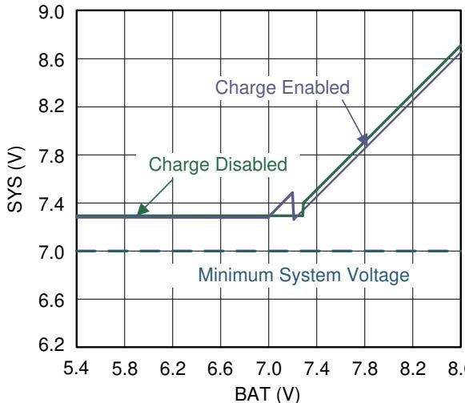  
Figure 9-6. Typical System Voltage vs Battery Voltage for a 2S Battery Configuration

# 9.3.8.2 Dynamic Power Management

To use the maximum available current from the input power source without over loading the adapter, the BQ25792 features Dynamic Power Management (DPM), which continuously monitors the input current and input voltage. When the input power at the VBUS pin is too low to support the load from SYS pin and the battery charge current from BAT pin, the charger engages either IINDPM to limit its current or VINDPM to prevent further reduction in VBUS pin voltage.

When the system voltage is regulated at VSYSMIN and SYS voltage temporarily drops lower than VSYSMIN, the VSYSMIN loop reduces charging current so that the SYS voltage remains at the VSYSMIN level. If the charge current falls to zero, but the input source is still overloaded, the SYS voltage will drop. Once the SYS voltage falls below the battery voltage, the device automatically enters supplement mode in which the BATFET turns on. The battery starts discharging so that the system is supported from both the input source and battery. The battery FET operates in ideal diode mode, driving the battery FET gate voltage to regulate the BATFET $\mathsf { V } _ { \mathsf { D S } }$ at $2 5 ~ \mathsf { m V }$ for low current. This prevents SYS voltage oscillations from entering and exiting the supplement mode. As the discharge current increases, the ideal diode loop drives the BATFET gate to a higher voltage, in order to reduce the battery FET RDS(ON) until the BATFET is fully turned on. Once the BATFET is fully on, the $\mathsf { V } _ { \mathsf { D S } }$ linearly increases with the discharge current. Figure 9-7 shows the V-I curve of the BATFET ideal diode operation. The BATFET turns off to exit supplement mode when the battery is below battery depletion threshold.

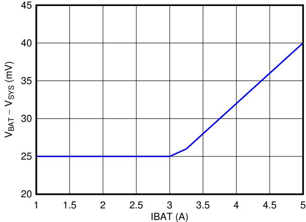  
Figure 9-7. BATFET I-V Curve

During DPM mode, the status register bits VINDPM_STAT (VINDPM) and/or IINDPM_STAT (IINDPM) go high. Figure 9-8 shows the DPM response with 5V/3A adapter, 6.4V battery, 1.5A charge current and 6.8V minimum system voltage setting.

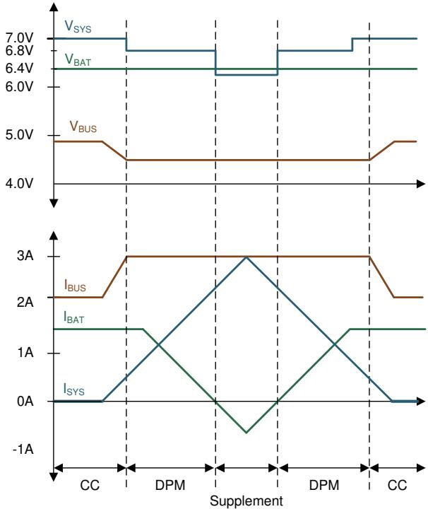  
Figure 9-8. DPM Response

# 9.3.9 Battery Charging Management

BQ25792 charges ${ 1 } \mathsf { S } { \sim } 4 \mathsf { S }$ Li-Ion batteries with up to 5A charge current for high capacity cells. The battery charging in different stages is controlled by the integrated BATFET. The low ${ \mathsf { R } } _ { \mathsf { D } \mathsf { S } ( \mathsf { O N } ) }$ BATFET improves charging efficiency and minimizes the voltage drop during discharging.

# 9.3.9.1 Autonomous Charging Cycle

When battery charging is enabled (EN_CHG bit $= 1$ and $\overline { { C E } }$ pin is LOW), the device autonomously completes a charging cycle without host involvement. The device default charging parameters are listed in Table 9-9. The host can always control the charging operation and optimize the charging parameters by writing to the corresponding registers through $\mathsf { I 2 C }$ .

Table 9-9. Charging Parameter Default Settings   

<table><tr><td rowspan=1 colspan=1>DEFAULT MODE</td><td rowspan=1 colspan=1>BQ25792</td></tr><tr><td rowspan=1 colspan=1>Charging voltage (REG01_Charge_Voltage_Limit)</td><td rowspan=1 colspan=1>4.2 V (1S), 8.4 V (2S), 12.6 V (3S), 16.8 V (4S)</td></tr><tr><td rowspan=1 colspan=1>Recharging voltage threshold (VRECHG)</td><td rowspan=1 colspan=1>200 mV</td></tr><tr><td rowspan=1 colspan=1>Fast charge current (REG03_Charge_Current_Limit)</td><td rowspan=1 colspan=1>2 A (1S and 2S), 1 A (3S and 4S)</td></tr><tr><td rowspan=1 colspan=1>Pre-charge current (IPRECHG)</td><td rowspan=1 colspan=1>120 mA</td></tr><tr><td rowspan=1 colspan=1>Trickle charge current (fixed value)</td><td rowspan=1 colspan=1>100 mA</td></tr><tr><td rowspan=1 colspan=1>Termination current (ITERM)</td><td rowspan=1 colspan=1>200 mA</td></tr><tr><td rowspan=1 colspan=1>Temperature profile (REG17_NTC_Control_0,REG18_NTC_Control_1)</td><td rowspan=1 colspan=1>JEITA</td></tr><tr><td rowspan=1 colspan=1>Fast charge safety timer (CHG_TMR)</td><td rowspan=1 colspan=1>12 hours</td></tr><tr><td rowspan=1 colspan=1>Pre-charge safety Timer (PRECHG_TMR)</td><td rowspan=1 colspan=1>2 hours</td></tr><tr><td rowspan=1 colspan=1>Trickle charge safety Timer (fixed value)</td><td rowspan=1 colspan=1>1 hour</td></tr></table>

A new charge cycle starts when the following conditions are valid:

• VBUS > VVBUS_PRESENT VBAT $<$ VRECHG for TRECHG deglitch time   
Battery charging is enabled by setting register bit EN $\mathsf { \Pi } _ { - } \mathsf { C H G } = 1$ and keeping CE pin LOW No thermistor fault on TS pin   
No safety timer fault

The charger automatically terminates the charging cycle when the charging current is below termination threshold, charge voltage is above recharge threshold, and the device is not in DPM mode or thermal regulation. When a fully charged battery voltage is discharged below recharge threshold (threshold selectable via VRECHG[1:0] bits), the device automatically starts a new charging cycle. After the charging terminates, toggling either CE pin or EN_CHG bit initiates a new charging cycle.

The STAT output indicates the charging status of: charging (LOW), charging complete or charging disabled (HIGH) or charging fault (Blinking). The STAT output can be disabled by setting DIS_STAT $= 1$ . In addition, the status register (CHG_STAT) indicates the different charging phases as:

• 000 – Not Charging 001 – Trickle Charge $( \mathsf { V B A T } < \mathsf { V _ { B A T } } \mathsf { \Omega } _ { \mathsf { S H O R T Z } } )$   
010 – Pre-charge (VBAT_SHORTZ $<$ VBAT < VBAT_LOWV)   
• 011 – Fast Charge (CC mode)   
100 – Taper Charge (CV mode)   
101 – Reserved 110 – Top-off Timer Active Charging 111 – Charge Termination Done

When the charger transitions to any of these states, including when the charge cycle completes, an INT is asserted to notify the host.

# 9.3.9.2 Battery Charging Profile

The device charges the battery in five phases: trickle charge, pre-charge, constant current, constant voltage, and top-off trickle charging (optional). At the beginning of a charging cycle, the device checks the battery voltage and regulates current/voltage accordingly.

Table 9-10. Default Charging Current Setting   

<table><tr><td rowspan=1 colspan=1>VBAT</td><td rowspan=1 colspan=1>CHARGING CURRENT</td><td rowspan=1 colspan=1>REGISTER DEFAULT SETTING</td><td rowspan=1 colspan=1>CHRG_STAT</td></tr><tr><td rowspan=1 colspan=1>&lt; VBAT_SHORT</td><td rowspan=1 colspan=1>IBAT_ SHORT</td><td rowspan=1 colspan=1>100 mA (fixed value)</td><td rowspan=1 colspan=1>001</td></tr><tr><td rowspan=1 colspan=1>VBAT_SHORTZ tO VBAT_LOWV</td><td rowspan=1 colspan=1>IPRECHG</td><td rowspan=1 colspan=1>120 mA</td><td rowspan=1 colspan=1>010</td></tr><tr><td rowspan=1 colspan=1>&gt; VBAT_LOWV</td><td rowspan=1 colspan=1>ICHG</td><td rowspan=1 colspan=1>2 A (1S and 2S)1 A (3S and 4S)</td><td rowspan=1 colspan=1>011</td></tr></table>

If the charger is in DPM regulation or thermal regulation during charging, the actual charging current is less than the programmed value. In this case, termination is temporarily disabled and the charging safety timer is counted at half the clock rate, as explained in Section 9.3.9.4.

During SYSMIN regulation with BATFET LDO operation, the charge current is limited to $^ { 2 \textsf { A } }$ , regardless of the charge current register setting, in order to protect the BATFET. It is not recommended to set the battery regulation voltage lower than the SYSMIN regulation voltage. The BATFET LDO operation can be disabled by setting DIS_LDO $= ~ 1$ . In this state, charge current is regulated according to Table 9-10 and SYS voltage is V(BAT) plus the IR drop through the BATFET, regardless of battery voltage. No VSYSMIN is maintained. Note that, when in trickle charge, setting DIS_LDO $= 1$ does not affect IBAT_SHORT.

$\mathsf { V } _ { \mathsf { B A T \_ S H O R T } Z }$ is the battery voltage treshold for transition from trickle charge to precharge, which is fixed at 2.25V typical. During the trickle charge to precharge transition, the charger regulates the battery voltage to 2.5V/cell typical for tBAT_SHORTZ duration. VBAT_LOWV is the battery voltage threshold for the transition from pre-charge to fast charge. It is defined as a ratio of battery voltage regulation limit (VREG).

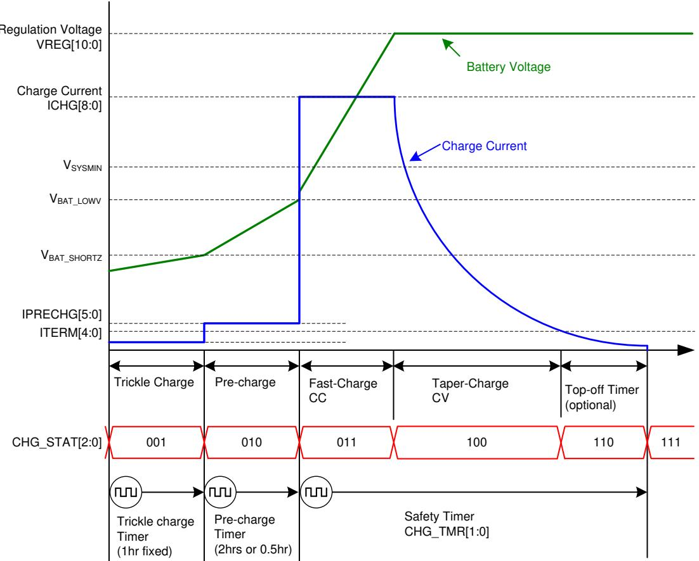  
Figure 9-9. Battery Charging Profile

# 9.3.9.3 Charging Termination

The device terminates a charge cycle when the battery voltage is above the recharge threshold, the converter is operated in the battery constant voltage regulation loop and the current is below the termination current. After the charging cycle is completed, the BATFET turns off. The converter keeps running to power the system and the BATFET can turn on again if the supplement mode is triggered.

When termination is done, the status register CHG_STAT is set to 111 and an INT pulse is asserted to the host. Termination is temporarily disabled when the charger device is in input current (IINDPM), input voltage (VINDPM) or thermal (TREG) regulation. Termination can be permanently disabled by writing 0 to EN_TERM bit prior to charging termination. Writing 0 to EN_TERM when the termination has already occurred or in the top-off charging stage does not disable termination, until the next charging cycle has been restarted. If termination is enabled by setting EN_TERM $= 1$ during an active charging cycle, the change is applied immediately.

At low termination currents (from $4 0 \mathsf { m } \mathsf { A }$ to $1 6 0 \mathsf { m A }$ ), due to the comparator offset, the actual termination current may be up to $2 0 \% { \sim } 4 0 \%$ higher than the termination target. In order to compensate for the comparator offset, a programmable top-off timer (default disabled) can be activated after termination. Whlie the top-off timer is running, the device continues to charge the battery in constant voltage mode (BATFET stays on) until the top-off time expires. The top-off timer follows safety timer constraints, such that if the safety timer is suspended, so is the top-off timer, and if the safety timer is doubled, so is the top-off timer. CHG_STAT reports whether the top off timer is active via the 110 code. Once the top-off timer expires, charging terminates, the CHG_STAT register is set to 111 and an $\overline { { | \mathsf { N } | } }$ pulse is asserted to the host.

The top-off timer gets reset (set to 0 and counting resumes when appropriate) for any of the following conditions:

1. Charge disable to enable   
2. Termination status low to high   
3. REG_RST register bit is set (disables top-off timer)

Once the charger detects termination, the charger reads the top-off timer (TOPOFF_TMR) settings. Programming the top-off timer value after termination has no effect unless a recharge cycle is initiated. The top-off timer only starts to count when the charger's termination criteria are met. If EN_TERM $= 0$ , the charger never terminates charging, so the top-off timer does not start counting, even if it is enabled. An INT is asserted to the host when the top-off timer starts counting as well as when the top-off timer expires. All charge cycle related INT pulses (including top-off timer INT pulse) can be masked by CHG_MASK bit.

# 9.3.9.4 Charging Safety Timer

The device has a built-in safety timer to prevent an extended charging cycle due to abnormal battery conditions. The user can program the fast charge safety timer through $\mathsf { I 2 C }$ (CHG_TMR bits). When the fast charge safety timer expires, the fault register CHG_TMR_STAT bit is set to 1, and an INT pulse is asserted to the host. The trickle charge timer is fixed 1 hour. The pre-charge safety timer is adjustable 2 hours (POR default) or 0.5 hour. The fast charging timer POR default setting is 12 hours.

The trickle charge, pre-charge and fast charge safety timers can be disabled by setting EN_TRICHG_TMR, EN_PRECHG_TMR or EN_CHG_TMR bit to 0. Each charging safety timer can be enabled anytime regardless of the current charging state. Each timer restarts counting when it is enabled. As soon as each charging stage is initiated, the associated safety timer starts to count, which is illustrated in the battery charging profile chart shown in Section 9.3.9.2.

During input voltage, current or thermal regulation, the safety timer counts at half-clock rate as the actual charge current is likely to be below the register setting. For example, if the charger is in input current regulation (IINDPM_STAT $= 1$ ) throughout the whole charging cycle, and the safety timer is set to 5 hours, then the timer will expire in 10 hours. This half-clock rate feature can be disabled by setting $\mathsf { T M R 2 X \_ E N } = 0$ . If the host disables the half-clock rate while the charger is already running at half-clock rate, the charger keeps running at the half-clock rate and the half-clock rate is not disabled until the charger exit the voltage, current or thermal regulation.

During faults which disable charging or supplement mode, the timer is suspended. Since the timer is not counting in this state, the TMR2X_EN bit has no effect. Once the fault goes away, the safety timer resumes. The pre-charge safety timer and the trickle charge safety timer follow the same rules as the fast charge safety timer in terms of getting suspended, reset and counting at half-rate when TMR2X_EN is set.

The fast charge timer is reset at the following events:

1. Charging cycle stop and restart (toggle CE pin, EN_CHG bit, or charged battery falls below recharge threshold after termination)   
2. BAT voltage changes from pre-charge to fast-charge or vice versa (in host-mode or default mode)   
3. A change of the value of CHG_TMR[1:0] register bits

The pre-charge timer is reset at the following events:

1. Charging cycle stop and restart (toggleCE pin, EN_CHG bit, or charged battery falls below recharge threshold)   
2. BAT voltage changes from trickle charge to pre-charge or vice versa, pre-charge to fast charge or vice versa (in host-mode or default mode)   
3. A change of the value of PRECHG_TMR register bit.

The trickle charge timer is reset at the following events:

1. Charging cycle stop and restart (toggleCE pin, EN_CHG bit, or charged battery falls below recharge threshold) 2. BAT voltage changes from trickle charge to pre-charge or vice versa (in host-mode or default mode)

# 9.3.9.5 Thermistor Qualification

The charger device provides a single thermistor input for battery temperature monitoring.

# 9.3.9.5.1 JEITA Guideline Compliance in Charge Mode

To improve the safety of charging Li-ion batteries, JEITA guideline was released on April 20, 2007. The guideline emphasized the importance of avoiding a high charge current and high charge voltage at certain low and high temperature ranges.

To initiate a charge cycle, the voltage on TS pin must be within the VT1 to VT5 thresholds. If TS voltage exceeds the VT1-VT5 range, the controller suspends charging and waits until the battery temperature is within the T1 to T5 range.

At cool temperature T1-T2, JEITA recommends to reduce the charge current to be lower than half of the charge current at normal temperature T2-T3. The device provides the programmability of the charge current at T1-T2, to be $20 \%$ , $40 \%$ or $100 \%$ of the charge current at T2-T3 or charge suspend, which is controlled by the register bits JEITA_ISETC.

The device provides the programmability of the charge voltage at T3-T5, to be with a voltage offset $( 0 \mathsf { m V } ,$ $1 0 0 \mathsf { m V }$ or $2 0 0 \mathsf { m V } )$ ) less than charge voltage at T2-T3 or charge suspend, which is controlled by the register bits JEITA_VSET.

The charger also provides flexible voltage/current settings beyond the JEITA requirements. The charge current setting at warm temperature T3-T5 can be configured to be $20 \%$ , $40 \%$ or $100 \%$ of the charge current at T2-T3 or charge suspend, which is programmed by the register bits JEITA_ISETH.

The charge termination is still enabled (when EN_TERM $= 1$ ) at cool temperature T1-T2 and warm temperature T3-T5. The termination current will be kept as the same in all different temperature ranges. In the normal operation, the charge will be terminated based on the charge current is lower than the termination current, the battery voltage is higher than the battery recharge voltage and the charger is in the battery voltage regulation loop. When the temperature enters T1-T2 or T3-T5, the charge current might drop to $20 \%$ or $40 \%$ of that at T2-T3, which might be lower than the termination current setting. If at this moment, the battery voltage is already higher than the battery recharge voltage and the charger is in the battery voltage regulation loop, the charge will be terminated.

At warm temperature T3-T5, the battery charge voltage will becomes lower. If the battery voltage is already very close to the battery charge voltage at T2-T3, to reduce the charge voltage by an offset might trigger the VBAT_OVP. The charger should response as the normal VBAT_OVP protection under this scenario.

At cool temperature T1-T2 or warm temperature T3-T5, the charge current will become different from that at the normal temperature range T2-T3, the safety timer should be adjusted accordingly. The safety timer will be suspended when the charge is suspended, and will run at half of the clock rate when the charge current is reduced to $20 \%$ or $40 \%$ , and will keep the same when the charge current is unchanged.

JEITA charging values are shown in Figure 9-10, in which the blue real line is the default setting and the red dash line is the programmable options.

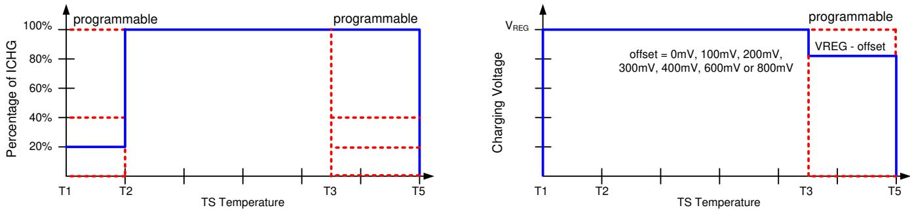  
Figure 9-10. TS Charging Values

The NTC monitoring on the battery temperature can be ignored by the charger if TS_IGNORE $\mathbf { \Phi } = \mathbf { \Phi } \cdot \mathbf { \Phi }$ 1. When the TS pin feedback is ignored, the charger considers the TS is always good for charging and OTG modes. The TS_STAT including TS_COLD_STAT, TS_COOL_STAT, TS_WARM_STAT and TS_HOT_STAT, always report 000 with TS_IGNORE $= 1$ .

When TS_IGNORE $= 0$ , the charger adjusts the charging profile based on the TS pin feedback information. When the battery temperature crosses from one temperature range to the other one, the associated TS status bits are updated accordingly. The TS flag bits are set for the temperature range for which the TS voltage is reporting, and an $\overline { { | \mathsf { N } | } }$ pulse is asserted to alert the host if TS_MASK is low. The FLAG and $\overline { { | \mathsf { N } | } }$ pulse can be individually masked by properly setting the associated mask bit, to prevent the INT pulse from alerting the host of battery temperature range changes.

The typical TS resistor network is illustrated in Figure 9-11.

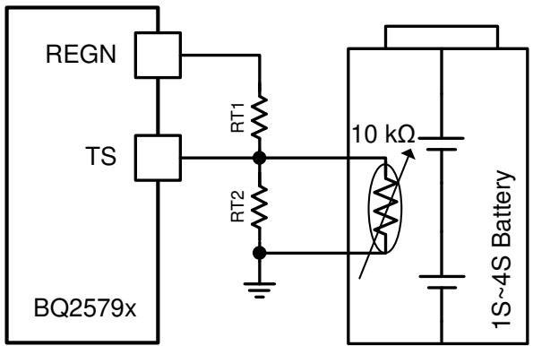  
Figure 9-11. TS Resistor Network

Assuming a 103AT NTC thermistor on the battery pack, the value of TSR1 and TSR2 can be determined by:

$$
R T 2 = \frac { R T H _ { C O L D } \times R T H _ { H O T } \times \left( \frac { 1 } { V T 1 } - \frac { 1 } { V T 5 } \right) } { R T H _ { H O T } \times \left( \frac { 1 } { V T 5 } - 1 \right) - R T H _ { C O L D } \times \left( \frac { 1 } { V T 1 } - 1 \right) }
$$

$$
R T 1 = \frac { \frac { 1 } { V T 1 } - 1 } { \frac { 1 } { R T 2 } + \frac { 1 } { R T H _ { C O L D } } }
$$

where VT# are the percentages of V(REGN) per the electrical spec table. The BQ25792 provides comparators with fixed thresholds for VT1 x V(REGN) and VT5 x V(REGN), and comparators with programmable thresholds for VT2 x V(REGN) and VT3 x V(REGN). The thresholds for VT2 x V(REGN) and VT3 x V(REGN) are controlled by TS_COOL and TS_WARM. This programmability gives more flexibility for the configuration of the JEITA profile. Select ${ \sf T } 1 { = } 0 ^ { \circ } \mathrm { C }$ and ${ \mathsf { T } } { \mathsf { S } } { = } 6 0 ^ { \circ } { \mathsf { C } }$ for Li-ion or Li-polymer battery, the RT1 and RT2 are calculated to be $5 . 2 4 \mathsf { K } \Omega$ and 30.31KΩ respectively.

# 9.3.9.5.2 Cold/Hot Temperature Window in OTG Mode

For battery protection during OTG mode, the device monitors the battery temperature to be within the VBCOLD to VBHOT thresholds. When RT1 is $5 . 2 4 ~ \mathsf { K } \Omega$ and RT2 is 31.31 KΩ, TBCOLD default is $\mathfrak { - 1 0 \circ } \mathsf { C }$ and TBHOT default is $6 0 ^ { \circ } \mathsf { C }$ . When the temperature is outside of this range, OTG mode is suspended, the converter stops switching. The charger waits in OTG mode $( \mathsf { E N \_ O T G } = 1 )$ . In addition, the VBUS_STAT bits are set to 000 and the corresponding TS_COLD_STAT or TS_HOT_STAT is reported. Once temperature returns to the normal temperature range, OTG mode is recovered and TS stauts bit is cleared. During TS fault, REGN remains on.

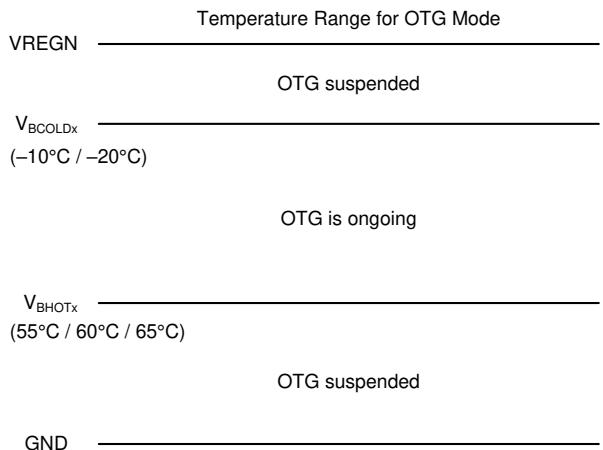  
Figure 9-12. TS Pin Thermistor Sense Threshold in OTG Mode

# 9.3.10 Integrated 16-Bit ADC for Monitoring

The device has an integrated 16-bit ADC to provide the user with critical system information for optimizing the behavior of the charger. The ADC is controlled through the ADC Control register. The ADC_EN bit provides the ability to disable the ADC in order to conserve power dissipation. The ADC_RATE bit allows continuous conversion or one-shot behavior. After a 1-shot conversion finishes, the ADC_EN bit is cleared, and must be reasserted to start a new conversion. The ADC_AVG bit enables or disables (default) averaging. ADC_AVG_INIT starts average using the existing (default) or using a new ADC value.

To enable the ADC, the ADC_EN bit must be set to 1. The ADC is allowed to operate if either $\mathsf { V B U S } > 3 . 4 \mathrm { ~ V ~ }$ or ${ \mathsf { V B A T } } > 2 . 9 \ { \mathsf { V } }$ is valid. If ADC_EN is set to 1 before VBUS or VBAT reaches its valid threshold, then the ADC conversion is postponed until one of the power supplies reaches the threshold. If the charger is in HIZ mode, the ADC still can be enabled by setting ADC_EN $= 1$ . At battery only condition, if the TS_ADC channel is enabled, the ADC only works when battery voltage is higher than $3 . 2 \mathsf { V } .$ , otherwise, the ADC works when the battery voltage is higher than $2 . 9 \mathsf { V } .$

The ADC_SAMPLE bits control the ADC sample speed, with conversion times of tADC_CONV. If the host changes the sample speed in the middle of an ADC conversion, the ADC conversion stops the channel being converted, and that channel is reconverted at the new rate. At that point, some of the ADC register values might have been converted with one sample rate and others with a different sample rate.

By default, all ADC channels are enabled with 1-shot or continuous conversion mode unless the channel is disabled in the ADC_Function_Disable_0 or ADC_Function_Disable_1 register. If an ADC channel is disabled by setting the corresponding register bit, then the value in that register is from the last valid ADC conversion or the default POR value (all zeros.) If an ADC channel is disabled in the middle of an ADC measurement cycle, the device finishes the conversion of that channel. Even though no conversion takes place when all ADC channels are disabled, the ADC circuitry is active and ready to begin conversion as soon as one of the bits in the ADC_Function_Disable_0 or ADC_Function_Disable_1 register is set to 0. In order to achieve the lowest quiescent current when disabling all ADC channels, set EN_ADC to 0 instead of disabling with ADC_Function_Disable_0 and ADC_Function_Disable_1.

The ADC_DONE_STAT and ADC_DONE_FLAG bits are set when a conversion is complete in 1-shot mode only. This event produces an INT pulse, which can be masked with ADC_DONE_MASK. During continuous conversion mode, the ADC_DONE_STAT and ADC_DONE_FLAG bits have no meaning and remain 0.

ADC conversion operates independently of the faults present in the device. ADC conversion continues even after a fault has occurred. ADC readings are only valid for DC states and not for transients.

If the host wants to exit the ADC more gracefully, it is recommended to write ADC_RATE to one-shot in order to force the ADC to stop at the end of a complete cycle of conversions.

ADC Measurement Channels:

IBUS (positive in forward converter mode) IBAT (positive for charging) • VBUS • VPMID • VBAT • VSYS • TS • TDIE

# 9.3.11 Status Outputs ( STAT, and INT)

# 9.3.11.1 Charging Status Indicator (STAT Pin)

The device indicates charging state on the open drain STAT pin. The STAT pin can drive an LED. The STAT pin function can be disabled via the DIS_STAT bit.

Table 9-11. STAT Pin State   

<table><tr><td rowspan=1 colspan=1>CHARGING STATE</td><td rowspan=1 colspan=1>STAT INDICATOR</td></tr><tr><td rowspan=1 colspan=1>Charging in progress (including recharge and charging in top-offtimer)</td><td rowspan=1 colspan=1>LOW</td></tr><tr><td rowspan=1 colspan=1>Charging complete</td><td rowspan=1 colspan=1>HIGH</td></tr><tr><td rowspan=1 colspan=1>HIZ mode, charge disable</td><td rowspan=1 colspan=1>HIGH</td></tr><tr><td rowspan=1 colspan=1>Battery only mode and OTG mode</td><td rowspan=1 colspan=1>HIGH</td></tr><tr><td rowspan=1 colspan=1>Charge suspend (A fault condition which disable charging)</td><td rowspan=1 colspan=1>Blinking at 1 Hz</td></tr></table>

# 9.3.11.2 Interrupt to Host $( \overline { { I N } } )$

In some applications, the host does not always monitor charger operation. The INT pin notifies the system host on the device operation. By default, the following events generate an active-low, 256µs INT pulse.

1. Good input source detected • VVBUS $< \mathsf { V }$ VBUS_OVP threshold • VVBUS > VPOORSRC (typical 3.4 V) when IPOORSRC (typical $3 0 ~ \mathsf { m A }$ ) current is applied (not a poor source)   
2. VBUS_STAT changes state (VBUS_STAT any bit change)   
3. Good input source removed   
4. Entering IINDPM regulation   
5. Entering VINDPM regulation   
6. Entering IC junction temperature regulation (TREG)

7. ${ \mathsf { I } } ^ { 2 } { \mathsf { C } }$ Watchdog timer expired   
• At initial power up, this INT gets asserted to signal $\mathsf { I 2 C }$ is ready for communication   
8. Charger status changes state (CHRG_STAT value change), including Charge Complete   
9. TS_STAT changes state (TS_STAT any bit change)   
10. VBUS over-voltage detected (VBUS_OVP)   
11. VAC over-voltage detected (VAC_OVP for VAC1 or VAC2)   
12. Junction temperature shutdown (TSHUT)   
13. Battery over-voltage detected (BATOVP)   
14. System over-voltage detected (VSYS_OVP)   
15. IBUS over-current detected (IBUS_OCP)   
16. IBAT over-current detected (IBAT_OCP)   
17. Charge safety timer expired, including trickle charge and pre-charge and fast charge safety ti   
18. A rising edge on any of the other \*_STAT bits

Each one of these INT sources can be masked off to prevent INT pulses from being sent out when they occur. Three bits exist for each one of these events:

The STAT bit holds the current status of each INT source The FLAG bit holds information on which source produced an INT, regardless of the current status • The MASK bit is used to prevent the device from sending out INT for each particular event

When one of the above conditions occurs (a rising edge on any of the \*_STAT bits), the device sends out an INT pulse and keeps track of which source generated the INT via the FLAG registers. The FLAG register bits are automatically reset to zero after the host reads them, and a new edge on STAT bit is required to re-assert the FLAG. This sequence is illustrated in Figure 9-13.

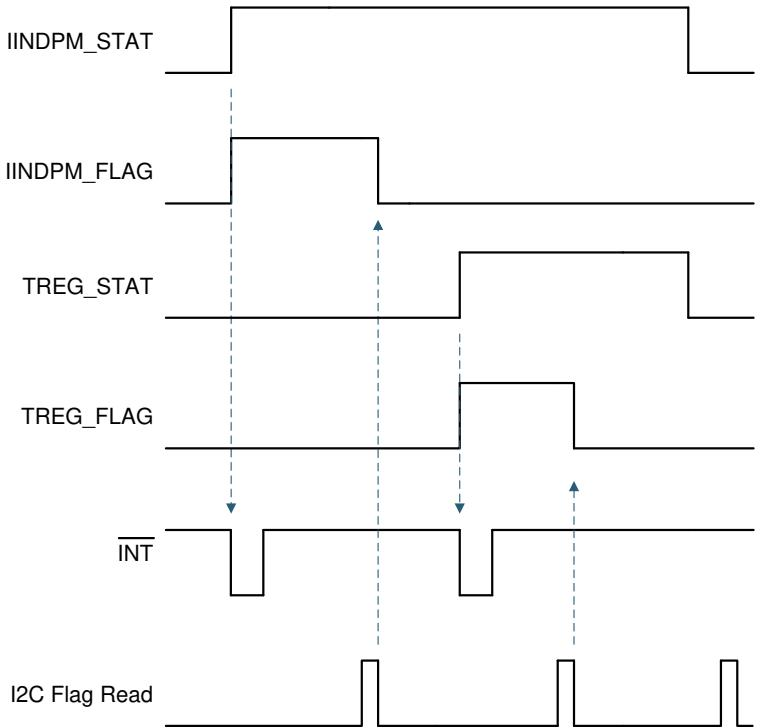  
Figure 9-13. INT Generation Behavior Example

# 9.3.12 Ship FET Control

The charger provides an N-FET driving pin (SDRV) to control an external ship FET. The SDRV pin is the output of a charge pump that provides 100 nA typical drive current to drive the ship FET gate to typically 5-V above the battery voltage. When this ship FET is off, it removes leakage current from the battery to the system. The ship FET is controlled by the SDRV_CTRL[1:0] register bits, to support the shutdown mode, ship mode and the system power reset.

IDLE Mode when SDRV_CTRL[1:0] $= 0 0$ , POR default. The external ship FET is fully on, ${ \mathsf { I } } ^ { 2 } { \mathsf { C } }$ is enabled. The internal BATFET status is determined by the charging status. This mode is valid with adapter present, during forward charging, in OTG mode or in the battery only condition.   
Shutdown Mode when SDRV_CTRL[1:0] $= 0 1$ . The ship FET turns and the internal BATFET are both off. The $\mathsf { I 2 C }$ is disabled. The charger is totally shutdown and can only be woken up by an adapter plug-in. This mode can only be entered when no adapter is present. If SDRV_CTRL[1:0] is written to 01 with an adapter present, the write is ignored.   
Ship Mode when SDRV_CTRL $[ 1 { : } 0 ] = 1 0$ . The ship FET turns off. The $\mathsf { I 2 C }$ is still enabled. The charger can be woken up by setting SDRV_CTRL[1:0] back to 00, or pulling the $\overline { { \mathsf { Q } \mathsf { O } \mathsf { N } } }$ pin low, or an adapter plug-in. This mode can only be entered when no adapter is present. If SDRV_CTRL[1:0] is written to 01 with an adapter present, the write is ignored.   
System Power Reset when SDRV_CTRL[1:0] = 11. The ship FET is turned off for typical 350ms to reset the system power (converter goes to HIZ mode if VBUS is high), then the ship FET is fully turned on again. The BATFET keeps the status unchanged during the system power reset. After the reset is done, SDRV_CTRL[1:0] goes back to 00.

When the host changes SDRV_CTRL[1:0] from 00 to the other values, the charger turns off the ship FET immediately or delays by tSM_DLY as configured by SDRV_DLY bit. The application diagram when the battery is connected to the charger through an external ship FET is illustrated in the figure below.

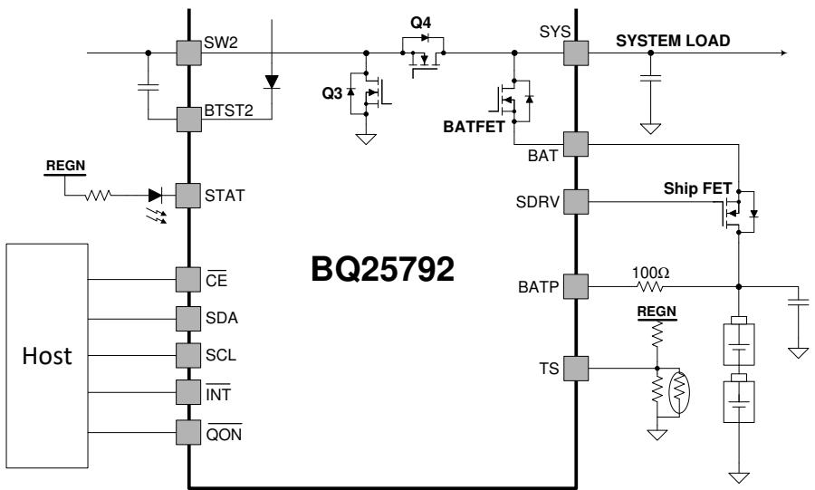  
Figure 9-14. The Application Diagram for the External Ship FET

# 9.3.12.1 Shutdown Mode

To further reduce battery leakage current, the host can shut down the charger by setting the register bits SDRV_CTRL[1:0] to 01. In this mode, the $\mathsf { I 2 C }$ is disabled and the charger is totally shut down. The device can only be woken up by plugging in an adapter.

After the SDRV_CTRL[1:0] is set to 01, the external ship FET turns off either immediately or after waiting for 10s as configured by SDRV_DLY register bit. When VBUS is high because of an adapter being present or the OTG mode being enable, SDRV_CTRL[1:0] will be reset to 00 if the host writes it to 01.

When the device exits shutdown mode, the SDRV_CTRL bits are reset to the POR default values (00).

# 9.3.12.2 Ship Mode

To extend battery life and minimize the system power loss when system is powered off during idle, shipping or storage, the device can turn off BATFET and external ship FET to minimize the battery leakage current. The ship mode is enabled when the host sets SDRV_CTRL[1:0] to 10. The $\mathsf { I 2 C }$ is still enabled, but the charger system clock slows down to minimize the device quiescent current.

After the SDRV_CTRL[1:0] is set to 10, the external ship FET is turned off either immediately or after waiting 10 seconds as configured by SDRV_DLY register bit. When VBUS is high because of an adapter being present or OTG mode being enabled, SDRV_CTRL[1:0] automatically resets to 00 if the host writes it to 10.

The following events will cause an exit from ship mode:

• Plug in an adapter   
Set SDRV_CTRL $[ 1 \mathopen { : } 0 ] = 0 0$   
Set REG_RST $= 1$ , to reset all the registers including SDRV_CTRL bits back to default (00)   
A logic low of tSM_EXIT (typical 1s or 15ms programmed by WKUP_DLY bit) duration on QON pin

The charger exits ship mode by turning on the ship FET and internal BATFET to reconnect the battery to the system and resetting SDRV_CTRL bits to their POR default value (00).

# 9.3.12.3 System Power Reset

The host can reset the system power by:

• Set the register bits SDRV_CTRL[1:0] to 11 • A logic low of tRST (typical 10s) duration on QON pin

When the system power reset is enabled, the device turns off the ship FET for tRST_SFET (typical 350ms) and also sets the charger in HIZ mode if VBUS is high. After the tRST_SFET completes, the device then turns on the ship FET and disables the charger HIZ mode. While the SFET is off, the charger applies a 30mA (typical ) sink current on SYS to discharge system voltage.

Regardless of whether the charger is at battery only condition or in the forward charging mode with adapter present, the charger resets the system power when the SDRV_CTRL[1:0] bits are set to 11 or the QON pin is pulled low for tRST duration.

# 9.3.13 Protections

# 9.3.13.1 Voltage and Current Monitoring

The device closely monitors the input, system and battery voltage and current, as well as internal FET currents for safe converter operation. It provides the following protection faults :

VAC Over-voltage Protection (VAC_OVP)   
VBUS Over-voltage Protection (VBUS_OVP)   
• VBUS Under-voltage Protection (POORSRC)   
System Over-voltage Protection (VSYS_OVP)   
System Short Protection (VSYS_SHORT)   
Battery Over-voltage Protection (VBAT_OVP)   
Battery Over-current Protection (IBAT_OCP)   
Input Over-current Protection (IBUS_OCP)   
OTG Over-voltage Protection (OTG_OVP)   
OTG Under-voltage Protection (OTG_UVP)

# 9.3.13.2 Thermal Regulation and Thermal Shutdown

The device monitors its internal junction temperature $( \mathsf { T } _ { \mathsf { J } } )$ to avoid overheating and to limit the IC surface temperature. When the internal junction temperature exceeds the preset thermal regulation limit (TREG bits), the device reduces the charge current or OTG output current to maintain the junction temperature at the thermal regulation limit. A wide thermal regulation range from $6 0 ^ { \circ } \mathsf { C }$ to $12 0 ^ { \circ } \mathsf { C }$ allows optimization of the system thermal performance. During thermal regulation, the actual charging current is usually below the programmed value in the ICHG registers. Therefore, termination is disabled, the fast charging safety timer runs at half the clock rate, the status register TREG_STAT bit goes high, TREG_FLAG bit is set to 1, and an $\overline { { | \mathsf { N } \top } }$ is asserted to alert host unless TREG_MASK is set to 1.

Additionally, the device has thermal shutdown to turn off the converter when the IC junction temperature exceeds the TSHUT threshold. The fault register bits TSHUT_STAT and TSHUT_FLAG are set and an INT pulse is asserted to the host, unless TSHUT_MASK is set to 1. The BATFET and the converter resumes normal operation when the IC die temperature decreases lower than TSHUT threshold by TSHUT_HYS.

# 9.3.14 Serial Interface

The device uses $\mathsf { I 2 C }$ compatible interface for flexible charging parameter programming and instantaneous device status reporting. $\mathsf { I 2 C }$ is a bi-directional 2-wire serial interface. Only two open-drain bus lines are required: a serial data line (SDA), and a serial clock line (SCL). Devices can be considered as controllers or targets when performing data transfers. A controller is a device which initiates a data transfer on the bus and generates the clock signals to permit that transfer. At that time, any device addressed is considered a target.

The device operates as a target device with 7-bit address $0 \times 6 8$ , receiving control inputs from the controller device like micro-controller or digital signal processor through REG00 – REG25. Register read beyond REG25 (0x25), returns 0xFF. The $\mathsf { I 2 C }$ interface supports both standard mode (up to 100 kbits/s), and fast mode (up to 400 kbits/s). When the bus is free, both lines are HIGH. The SDA and SCL pins are open drain and must be connected to the positive supply voltage via a current source or pull-up resistor.

# 9.3.14.1 Data Validity

The data on the SDA line must be stable during the HIGH period of the clock. The HIGH or LOW state of the data line can only change when the clock signal on SCL line is LOW. One clock pulse is generated for each data bit transferred.

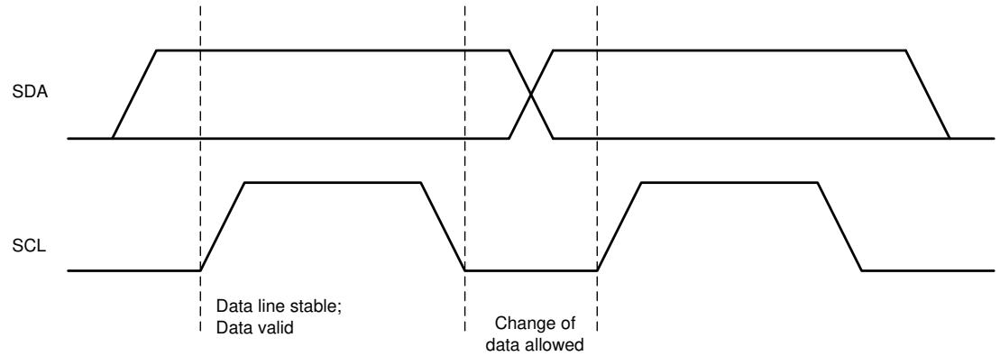  
Figure 9-15. Bit Transfers on the $\mathsf { I } ^ { 2 } \mathsf { C }$ Bus

# 9.3.14.2 START and STOP Conditions

All transactions begin with a START (S) and are terminated with a STOP (P). A HIGH to LOW transition on the SDA line while SCL is HIGH defines a START condition. A LOW to HIGH transition on the SDA line when the SCL is HIGH defines a STOP condition.

START and STOP conditions are always generated by the controller. The bus is considered busy after the START condition, and free after the STOP condition.

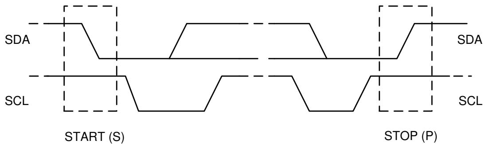  
Figure 9-16. START and STOP Conditions on the $\mathsf { I } ^ { 2 } \mathsf { C }$ Bus

# 9.3.14.3 Byte Format

Every byte on the SDA line must be 8 bits long. The number of bytes to be transmitted per transfer is unrestricted. Each byte has to be followed by an ACKNOWLEDGE (ACK) bit. Data is transferred with the

Most Significant Bit (MSB) first. If a target cannot receive or transmit another complete byte of data until it has performed some other function, it can hold the SCL line low to force the controller into a wait state (clock stretching). Data transfer then continues when the target is ready for another byte of data and releases the SCL line.

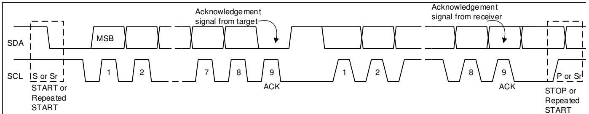  
Figure 9-17. Data Transfer on the $\mathsf { I } ^ { 2 } \mathsf { C }$ Bus

# 9.3.14.4 Acknowledge (ACK) and Not Acknowledge (NACK)

The ACK signaling takes place after each transmitted byte. The ACK bit allows the receiver to signal the transmitter that the byte was successfully received and another byte may be sent. All clock pulses, including the acknowledge ${ \mathfrak { g m } }$ clock pulse, are generated by the controller.

The transmitter releases the SDA line during the acknowledge clock pulse so the receiver can pull the SDA line LOW and it remains stable LOW during the HIGH period of this ${ \mathfrak { g m } }$ clock pulse.

A NACK is signaled when the SDA line remains HIGH during the ${ \mathfrak { g m } }$ clock pulse. The controller can the generate either a STOP to abort the transfer or a repeated START to start a new transfer.

# 9.3.14.5 Target Address and Data Direction Bit

After the START signal, a target address is sent. This address is 7 bits long, followed by the 8 bit as a data direction bit (bit $\mathsf { R } / \overline { { \mathsf { W } } }$ ). A zero indicates a transmission (WRITE) and a one indicates a request for data (READ). The BQ25792 7-bit address is defined as 1101 011' (0x6B). The address bit arrangement is shown below.

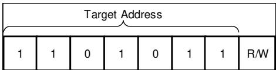  
Figure 9-18. 7-Bit Addressing (0x6B)

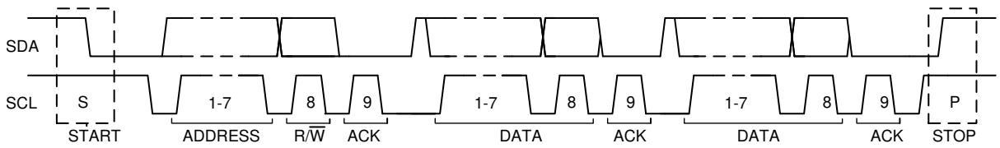  
Figure 9-19. Complete Data Transfer on the I2C Bus

# 9.3.14.6 Single Write and Read

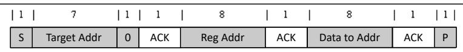  
Figure 9-20. Single Write

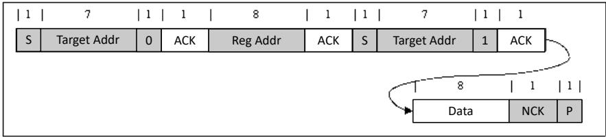  
Figure 9-21. Single Read

If the register address is not defined, the charger IC sends back NACK and returns to the idle state.

# 9.3.14.7 Multi-Write and Multi-Read

The charger device supports multi-byte read and multi-byte write of all registers. These multi-byte operations are allowed to cross register boundaries. For instance, the entire regiser map may be read in a single operation with a 49-byte read that starts at register address $0 { \times } 0$ .

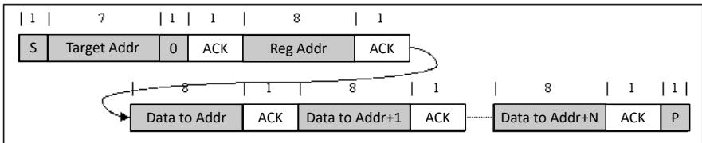  
Figure 9-22. Multi-Write

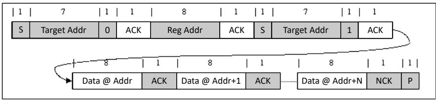  
Figure 9-23. Multi-Read

# 9.4 Device Functional Modes

# 9.4.1 Host Mode and Default Mode

The device is a host controlled charger, but it can operate in default mode without host management. In default mode, the device can be used as an autonomous charger with no host or while host is in sleep mode. When the charger is in default mode, WD_STAT bit becomes HIGH, WD_FLAG is set to 1, and an INT is asserted low to alert the host (unless masked by WD_MASK). The WD_FLAG bit would read as 1 upon the first read and then 0 upon subsequent reads. When the charger is in host mode, WD_STAT bit is LOW.

After power-on-reset, the device starts in default mode with watchdog timer expired. All the registers are in the default settings.

In default mode, the device keeps charging the battery with default 1-hour trickle charging safety timer, 2-hour pre-charging safety timer and the 12-hour fast charging safety timer. At the end of the 1-hour or 2-hour or 12-hour timer expired, the charging is stopped and the buck-boost converter continues to operate to supply system load.

A write to any $\mathsf { I 2 C }$ register transitions the charger from default mode to host mode, and initiates the watchdog timer. All the device parameters can be programmed by the host. To keep the device in host mode, the host has to reset the watchdog timer by writing 1 to WD_RST bit before the watchdog timer expires (WD_STAT bit is set), or disable watchdog timer by setting WATCHDOG bits $= 0 0$ .

When the watchdog timer is expired, the device returns to default mode and all registers are reset to default values except the ones described in Section 9.5. The watchdog timer will be reset on any write if the watchdog timer has expired. When watchdog timer expires, WD_STAT and WD_FLAG is set to 1, and an INT is asserted low to alert the host (unless masked by WD_MASK).

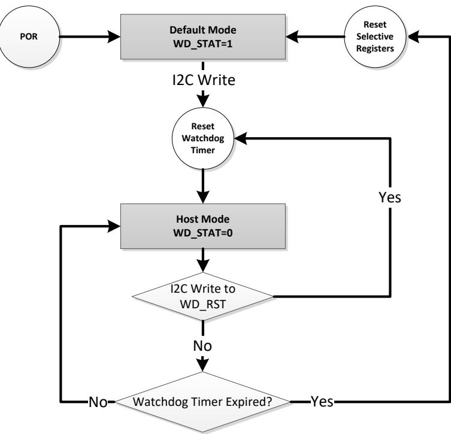  
Figure 9-24. Watchdog Timer Flow Chart

# 9.4.2 Register Bit Reset

Beside the register reset by the watchdog timer in the default mode, the register and the timer could be reset to the default value by writing the REG_RST bit to 1. The register bits, which can be reset by the REG_RST bit, are noted in the Register Map section. After the register reset, the REG_RST bit will go back from 1 to 0 automatically.

The register reset by the REG_RST bit will not initiate the ACFET-RBFET detection, which is only done at the charger first time POR. It will not repeat the open-circuit adapter measurements for the default VINDPM setting, which in only done when an adapter is plugged in. In addition, if the charger is in the process of forced ICO, the forced open-circuit adapter measurements or the forced $0 + 1 0 -$ detection, set the REG_RST to 1 will terminate all of these processes, because reset the register to default values will set FORCE_ICO, FORCE_INDET and FORCE_VINDPM_DET bits to 0.

# 9.5 Register Map

# 9.5.1 I2C Registers

Table 9-12 lists the I2C registers. All register offset addresses not listed in Table 9-12 should be considered as reserved locations and the register contents should not be modified.

Table 9-12. I2C Registers   

<table><tr><td>Offset</td><td>Acronym</td><td>Register Name</td><td>Section</td></tr><tr><td>Oh</td><td>REG00_Minimal_System_Voltage</td><td>Minimal System Voltage</td><td>Section 9.5.1.1</td></tr><tr><td>1h</td><td>REG01_Charge_Voltage_Limit</td><td>Charge Voltage Limit</td><td>Section 9.5.1.2</td></tr><tr><td>3h</td><td>REG03_Charge_Current_Limit</td><td>Charge Current Limit</td><td>Section 9.5.1.3</td></tr><tr><td>5h</td><td>REG05_Input_Voltage_Limit</td><td>Input Voltage Limit</td><td>Section 9.5.1.4</td></tr><tr><td>6h</td><td>REG06_Input_Current_Limit</td><td>Input Current Limit</td><td>Section 9.5.1.5</td></tr><tr><td>8h</td><td>REG08_Precharge_Control</td><td>Precharge Control</td><td>Section 9.5.1.6</td></tr><tr><td>9h</td><td>REG09_Termination_Control</td><td>Termination Control</td><td>Section 9.5.1.7</td></tr><tr><td>Ah</td><td>REGOA_Re-charge_Control</td><td>Re-charge Control</td><td>Section 9.5.1.8</td></tr><tr><td>Bh</td><td>REGOB_VOTG_regulation</td><td>VOTG regulation</td><td>Section 9.5.1.9</td></tr><tr><td>Dh</td><td>REGOD_IOTG_regulation</td><td>IOTG regulation</td><td>Section 9.5.1.10</td></tr><tr><td>Eh</td><td>REGOE_Timer_Control</td><td>Timer Control</td><td>Section 9.5.1.11</td></tr><tr><td>Fh</td><td>REGOF_Charger_Control_0</td><td>Charger Control 0</td><td>Section 9.5.1.12</td></tr><tr><td>10h</td><td>REG10_Charger_Control_1</td><td>Charger Control 1</td><td>Section 9.5.1.13</td></tr><tr><td>11h</td><td>REG11_Charger_Control_2</td><td>Charger Control 2</td><td>Section 9.5.1.14</td></tr><tr><td>12h</td><td>REG12_Charger_Control_3</td><td>Charger Control 3</td><td>Section 9.5.1.15</td></tr><tr><td>13h</td><td>REG13_Charger_Control_4</td><td>Charger Control 4</td><td>Section 9.5.1.16</td></tr><tr><td>14h</td><td>REG14_Charger_Control_5</td><td>Charger Control 5</td><td>Section 9.5.1.17</td></tr><tr><td>15h</td><td>REG15_Reserved</td><td>Reserved</td><td>Section 9.5.1.18</td></tr><tr><td>16h</td><td>REG16_Temperature_Control</td><td>Temperature Control</td><td>Section 9.5.1.19</td></tr><tr><td>17h</td><td>REG17_NTC_Control_0</td><td>NTC Control 0</td><td>Section 9.5.1.20</td></tr><tr><td>18h</td><td>REG18_NTC_Control_1</td><td>NTC Control 1</td><td>Section 9.5.1.21</td></tr><tr><td>19h</td><td>REG19_ICO_Current_Limit</td><td>ICO Current Limit</td><td>Section 9.5.1.22</td></tr><tr><td>1Bh</td><td>REG1B_Charger_Status_0</td><td>Charger Status 0</td><td>Section 9.5.1.23</td></tr><tr><td>1Ch</td><td>REG1C_Charger_Status_1</td><td>Charger Status 1</td><td>Section 9.5.1.24</td></tr><tr><td>1Dh</td><td>REG1D_Charger_Status_2</td><td>Charger Status 2</td><td>Section 9.5.1.25</td></tr><tr><td>1Eh</td><td>REG1E_Charger_Status_3</td><td>Charger Status 3</td><td>Section 9.5.1.26</td></tr><tr><td>1Fh</td><td>REG1F_Charger_Status_4</td><td>Charger Status 4</td><td>Section 9.5.1.27</td></tr><tr><td>20h</td><td>REG20_FAULT_Status_0</td><td>FAULT Status 0</td><td>Section 9.5.1.28</td></tr><tr><td>21h</td><td>REG21_FAULT_Status_1</td><td>FAULT Status 1</td><td>Section 9.5.1.29</td></tr><tr><td>22h</td><td>REG22_Charger_Flag_0</td><td>Charger Flag 0</td><td>Section 9.5.1.30</td></tr><tr><td>23h</td><td>REG23_Charger_Flag_1</td><td>Charger Flag 1</td><td>Section 9.5.1.31</td></tr><tr><td>24h</td><td>REG24_Charger_Flag_2</td><td>Charger Flag 2</td><td>Section 9.5.1.32</td></tr><tr><td>25h</td><td>REG25_Charger_Flag_3</td><td>Charger Flag 3</td><td>Section 9.5.1.33</td></tr><tr><td>26h</td><td>REG26_FAULT_Flag_0</td><td>FAULT Flag 0</td><td>Section 9.5.1.34</td></tr><tr><td>27h</td><td>REG27_FAULT_Flag_1</td><td>FAULT Flag 1</td><td>Section 9.5.1.35</td></tr><tr><td>28h</td><td>REG28_Charger_Mask_0</td><td>Charger Mask 0</td><td>Section 9.5.1.36</td></tr><tr><td>29h</td><td>REG29_Charger_Mask_1</td><td>Charger Mask 1</td><td>Section 9.5.1.37</td></tr><tr><td>2Ah</td><td>REG2A_Charger_Mask_2</td><td>Charger Mask 2</td><td>Section 9.5.1.38</td></tr><tr><td>2Bh</td><td>REG2B_Charger_Mask_3</td><td></td><td>Section 9.5.1.39</td></tr><tr><td>2Ch</td><td>REG2C_FAULT_Mask_0</td><td>Charger Mask 3 FAULT Mask 0</td><td>Section 9.5.1.40</td></tr><tr><td>2Dh</td><td>REG2D_FAULT_Mask_1</td><td>FAULT Mask 1</td><td>Section 9.5.1.41</td></tr></table>

Table 9-12. I2C Registers (continued)   

<table><tr><td>Offset</td><td>Acronym</td><td>Register Name</td><td>Section</td></tr><tr><td>2Eh</td><td>REG2E_ADC_Control</td><td>ADC Control</td><td>Section 9.5.1.42</td></tr><tr><td>2Fh</td><td>REG2F_ADC_Function_Disable_0</td><td>ADC Function Disable 0</td><td>Section 9.5.1.43</td></tr><tr><td>30h</td><td>REG30_ADC_Function_Disable_1</td><td>ADC Function Disable 1</td><td>Section 9.5.1.44</td></tr><tr><td>31h</td><td>REG31_IBUS_ADC</td><td>IBUS ADC</td><td>Section 9.5.1.45</td></tr><tr><td>33h</td><td>REG33_IBAT_ADC</td><td>IBAT ADC</td><td>Section 9.5.1.46</td></tr><tr><td>35h</td><td>REG35_VBUS_ADC</td><td>VBUS ADC</td><td>Section 9.5.1.47</td></tr><tr><td>37h</td><td>REG37_VAC1_ADC</td><td>VAC1 ADC</td><td>Section 9.5.1.48</td></tr><tr><td>39h</td><td>REG39_VAC2_ADC</td><td>VAC2 ADC</td><td>Section 9.5.1.49</td></tr><tr><td>3Bh</td><td>REG3B_VBAT_ADC</td><td>VBAT ADC</td><td>Section 9.5.1.50</td></tr><tr><td>3Dh</td><td>REG3D_VSYS_ADC</td><td>VSYS ADC</td><td>Section 9.5.1.51</td></tr><tr><td>3Fh</td><td>REG3F_TS_ADC</td><td>TS ADC</td><td>Section 9.5.1.52</td></tr><tr><td>41h</td><td>REG41_TDIE_ADC</td><td>TDIE_ADC</td><td>Section 9.5.1.53</td></tr><tr><td>43h</td><td>REG43_D+_ADC</td><td>D+ADC</td><td>Section 9.5.1.54</td></tr><tr><td>45h</td><td>REG45_D-_ADC</td><td>D- ADC</td><td>Section 9.5.1.55</td></tr><tr><td>47h</td><td>REG47_DPDM_Driver</td><td>DPDM Driver</td><td>Section 9.5.1.56</td></tr><tr><td>48h</td><td>REG48_Part_Information</td><td>Part Information</td><td>Section 9.5.1.57</td></tr></table>

Complex bit access types are encoded to fit into small table cells. The following table shows the codes that are used for access types in this section.

Table 9-13. I2C Access Type Codes   

<table><tr><td rowspan=1 colspan=1>Access Type</td><td rowspan=1 colspan=1>Code</td><td rowspan=1 colspan=1>Description</td></tr><tr><td rowspan=1 colspan=3>Read Type</td></tr><tr><td rowspan=1 colspan=1>R</td><td rowspan=1 colspan=1>R</td><td rowspan=1 colspan=1>Read</td></tr><tr><td rowspan=1 colspan=1>Write Type</td><td></td><td></td></tr><tr><td rowspan=1 colspan=1>W</td><td rowspan=1 colspan=1>W</td><td rowspan=1 colspan=1>Write</td></tr><tr><td rowspan=1 colspan=1>Others</td><td></td><td></td></tr><tr><td rowspan=1 colspan=1>Range</td><td rowspan=1 colspan=1></td><td rowspan=1 colspan=1>The register bits are only valid in this defined range.</td></tr><tr><td rowspan=1 colspan=1>Clamped Low</td><td rowspan=1 colspan=1></td><td rowspan=1 colspan=1>Any write on the register lower than the minimal value of the valid range, will beignored by the charger</td></tr><tr><td rowspan=1 colspan=1>Clamped High</td><td rowspan=1 colspan=1></td><td rowspan=1 colspan=1>Any write on the register higher than the maximum value of the valid range, will beignored by the charger</td></tr></table>

# 9.5.1.1 REG00_Minimal_System_Voltage Register (Offset $=$ 0h) [reset = X]

REG00_Minimal_System_Voltage is shown in Figure 9-25 and described in Table 9-14.

Return to the Table 9-12.

Minimal System Voltage

Figure 9-25. REG00_Minimal_System_Voltage Register   

<table><tr><td>7</td><td>6</td><td>5</td><td>4</td><td>3</td><td>2</td><td></td><td>0</td></tr><tr><td colspan="2">RESERVED</td><td colspan="5">VSYSMIN_5:0</td><td></td></tr><tr><td colspan="2">R/W-0h</td><td colspan="5">R/W-X</td><td></td></tr></table>

Table 9-14. REG00_Minimal_System_Voltage Register Field Descriptions   

<table><tr><td rowspan=1 colspan=1>Bit</td><td rowspan=1 colspan=1>Field</td><td rowspan=1 colspan=1>Type</td><td rowspan=1 colspan=1>Reset</td><td rowspan=1 colspan=1>Notes</td><td rowspan=1 colspan=1>Description</td></tr><tr><td rowspan=1 colspan=1>7-6</td><td rowspan=1 colspan=1>RESERVED</td><td rowspan=1 colspan=1>R/W</td><td rowspan=1 colspan=1>Oh</td><td rowspan=1 colspan=1></td><td rowspan=1 colspan=1>RESERVED</td></tr><tr><td rowspan=1 colspan=1>5-0</td><td rowspan=1 colspan=1>VSYSMIN_5:0</td><td rowspan=1 colspan=1>R/W</td><td rowspan=1 colspan=1>X</td><td rowspan=1 colspan=1>Reset by:REG_RST</td><td rowspan=1 colspan=1>Minimal System Voltage:During POR, the device reads the resistance tie toPROG pin, to identify the default battery cell count anddetermine the default power on VSYSMIN list below:1s: 3.5V2s: 7V3s: 9V4s: 12VType : RWRange : 2500mV-16000mVFixed Offset : 2500mVBit Step Size : 250mVClamped High</td></tr></table>

# 9.5.1.2 REG01_Charge_Voltage_Limit Register (Offse $\mathbf { t } = 1 \mathbf { h } ) \ [ \mathbf { r } ($ eset = X]

REG01_Charge_Voltage_Limit is shown in Figure 9-26 and described in Table 9-15.

Return to the Table 9-12.

Charge Voltage Limit

Figure 9-26. REG01_Charge_Voltage_Limit Register   

<table><tr><td colspan="4">15 14 13 12</td><td>11</td><td>10</td><td>9</td><td>8</td></tr><tr><td colspan="4">RESERVED</td><td></td><td colspan="3">VREG_10:0</td></tr><tr><td colspan="4">R-0h</td><td colspan="4">R/W-X</td></tr><tr><td>6</td><td>5</td><td>4</td><td>3</td><td>2</td><td></td><td>1</td><td>0</td></tr><tr><td colspan="8">VREG_10:0</td></tr><tr><td colspan="8">R/W-X</td></tr></table>

Table 9-15. REG01_Charge_Voltage_Limit Register Field Descriptions   

<table><tr><td rowspan=1 colspan=1>Bit</td><td rowspan=1 colspan=1>Field</td><td rowspan=1 colspan=1>Type</td><td rowspan=1 colspan=2>Reset</td><td rowspan=1 colspan=1>Notes</td><td rowspan=1 colspan=1>Description</td></tr><tr><td rowspan=1 colspan=1>15-11</td><td rowspan=1 colspan=1>RESERVED</td><td rowspan=1 colspan=1>R</td><td rowspan=1 colspan=2>Oh</td><td rowspan=1 colspan=1></td><td rowspan=1 colspan=1>RESERVED</td></tr><tr><td rowspan=5 colspan=1>10-0</td><td rowspan=5 colspan=1>VREG_10:0</td><td rowspan=4 colspan=1>R/W</td><td rowspan=2 colspan=2>X</td><td rowspan=5 colspan=1>Reset by:REGRST</td><td rowspan=5 colspan=1>Battery Voltage Limit:During POR, the device reads the resistance tie toPROG pin, to identify the default battery cell countand determine the default power-on battery voltageregulation limit:1: 4.2V2s: 8.4V3s: 12.6V4s: 16.8VType : RWRange : 3000mV-18800mVFixed Offset : 0mVBit Step Size : 10mVClamped Low</td></tr><tr><td rowspan=1 colspan=1></td><td rowspan=1 colspan=1></td></tr><tr><td rowspan=1 colspan=2></td></tr><tr><td rowspan=1 colspan=2></td></tr><tr><td rowspan=1 colspan=1></td><td rowspan=1 colspan=2></td></tr></table>

# 9.5.1.3 REG03_Charge_Current_Limit Register (Offset $=$ 3h) [reset = X]

REG03_Charge_Current_Limit is shown in Figure 9-27 and described in Table 9-16.

Return to the Table 9-12.

Charge Current Limit

Figure 9-27. REG03_Charge_Current_Limit Register   

<table><tr><td>15</td><td>14</td><td>13 12</td><td>11</td><td>10</td><td>9</td><td>8</td></tr><tr><td colspan="5">RESERVED</td><td></td><td>ICHG_8:0</td></tr><tr><td colspan="5">R-0h</td><td></td><td>R/W-X</td></tr><tr><td></td><td>6</td><td>5 4</td><td>3</td><td>2</td><td></td><td>0</td></tr><tr><td colspan="7">ICHG_8:0</td></tr><tr><td colspan="7">R/W-X</td></tr></table>

Table 9-16. REG03_Charge_Current_Limit Register Field Descriptions   

<table><tr><td rowspan=1 colspan=1>Bit</td><td rowspan=1 colspan=1>Field</td><td rowspan=1 colspan=1>Type</td><td rowspan=1 colspan=2>Reset</td><td rowspan=1 colspan=1>Notes</td><td rowspan=1 colspan=1>Description</td></tr><tr><td rowspan=1 colspan=1>15-9</td><td rowspan=1 colspan=1>RESERVED</td><td rowspan=1 colspan=1>R</td><td rowspan=1 colspan=2>Oh</td><td rowspan=1 colspan=1></td><td rowspan=1 colspan=1>RESERVED</td></tr><tr><td rowspan=3 colspan=1>8-0</td><td rowspan=3 colspan=1>ICHG_8:0</td><td rowspan=3 colspan=1>R/W</td><td rowspan=2 colspan=2>X</td><td rowspan=3 colspan=1>Reset by:WATCHDOGREG_RST</td><td rowspan=3 colspan=1>Charge Current LimitDuring POR, the device reads the resistance tie toPROG pin, to identify the default battery cell countand determine the default power-on battery chargingcurrent:1s and 2s:3s and 4s: 1AType : RWRange : 50mA-5000mAFixed Offset : 0mABit Step Size : 10mAClamped Low</td></tr><tr><td rowspan=1 colspan=2></td><td rowspan=1 colspan=1></td></tr><tr><td rowspan=1 colspan=2></td></tr></table>

# 9.5.1.4 REG05_Input_Voltage_Limit Register (Offset $=$ 5h) [reset $=$ 24h]

REG05_Input_Voltage_Limit is shown in Figure 9-28 and described in Table 9-17.

Return to the Table 9-12.

Input Voltage Limit

Figure 9-28. REG05_Input_Voltage_Limit Register   

<table><tr><td>7</td><td>6</td><td>5</td><td>4</td><td>3</td><td>2</td><td></td><td>0</td></tr><tr><td colspan="8">VINDPM_7:0</td></tr><tr><td colspan="8">R/W-24h</td></tr></table>

Table 9-17. REG05_Input_Voltage_Limit Register Field Descriptions   

<table><tr><td rowspan=1 colspan=1>Bit</td><td rowspan=1 colspan=1>Field</td><td rowspan=1 colspan=1>Type</td><td rowspan=1 colspan=1>Reset</td><td rowspan=1 colspan=1>Description</td></tr><tr><td rowspan=1 colspan=1>7-0</td><td rowspan=1 colspan=1>VINDPM_7:0</td><td rowspan=1 colspan=1>R/W</td><td rowspan=1 colspan=1>24h</td><td rowspan=1 colspan=1>Absolute VINDPM ThresholdVINDPM register is reset to 3600mV upon adapter unplugged andit is set to the value based on the VBUS measurement whenthe adapter plugs in. It is not reset by the REG_RST and theWATCHDOGType : RWPOR: 3600mV (24h)Range : 3600mV-22000mVFixed Offset : 0mVBit Step Size : 100mVClamped Low</td></tr></table>

# 9.5.1.5 REG06_Input_Current_Limit Register (Offset $=$ 6h) [reset $=$ 12Ch]

REG06_Input_Current_Limit is shown in Figure 9-29 and described in Table 9-18.

Return to the Table 9-12.

Input Current Limit

Figure 9-29. REG06_Input_Current_Limit Register   

<table><tr><td>15 14</td><td>13</td><td>12</td><td>11</td><td>10</td><td>9</td><td>8</td></tr><tr><td colspan="5">RESERVED</td><td></td><td>IINDPM_8:0</td></tr><tr><td colspan="5">R-Oh</td><td></td><td>R/W-12Ch</td></tr><tr><td></td><td>6</td><td>4</td><td>3</td><td>2</td><td></td><td>0</td></tr><tr><td colspan="7">IINDPM_8:0</td></tr><tr><td colspan="7">R/W-12Ch</td></tr></table>

Table 9-18. REG06_Input_Current_Limit Register Field Descriptions   

<table><tr><td rowspan=1 colspan=1>Bit</td><td rowspan=1 colspan=1>Field</td><td rowspan=1 colspan=1>Type</td><td rowspan=1 colspan=1>Reset</td><td rowspan=1 colspan=2>Notes</td><td rowspan=1 colspan=1>Description</td></tr><tr><td rowspan=1 colspan=1>15-9</td><td rowspan=1 colspan=1>RESERVED</td><td rowspan=1 colspan=1>R</td><td rowspan=1 colspan=1>Oh</td><td rowspan=1 colspan=2></td><td rowspan=1 colspan=1>RESERVED</td></tr><tr><td rowspan=3 colspan=1>8-0</td><td rowspan=3 colspan=1>IINDPM_8:0</td><td rowspan=3 colspan=1>R/W</td><td rowspan=1 colspan=1>12Ch</td><td rowspan=3 colspan=2>Reset by:REG_RST</td><td rowspan=3 colspan=1>Based on D+/D- detection results:USB SDP = 500mAUSB CDP = 1.5AUSB DCP = 3.25AAdjustable High Voltage DCP = 1.5AUnknown Adapter = 3ANon-Standard Adapter = 1A/2A/2.1A/2.4AType : RWPOR: 3000mA (12Ch)Range : 100mA-3300mAFixed Offset : OmABit Step Size : 10mAClamped Low</td></tr><tr><td rowspan=1 colspan=1></td><td rowspan=1 colspan=1>REG_RST</td></tr><tr><td rowspan=1 colspan=1></td></tr></table>

# 9.5.1.6 REG08_Precharge_Control Register (Offset $= 8 h$ ) [reset $=$ C3h]

REG08_Precharge_Control is shown in Figure 9-30 and described in Table 9-19.

Return to the Table 9-12.

Precharge Control

Figure 9-30. REG08_Precharge_Control Register   

<table><tr><td>7</td><td>6</td><td>5</td><td>4</td><td>3</td><td>2</td><td></td><td>0</td></tr><tr><td colspan="2">VBAT_LOWV_1:0</td><td colspan="5">IPRECHG_5:0</td><td></td></tr><tr><td colspan="2">R/W-3h</td><td colspan="5">R/W-3h</td></tr></table>

Table 9-19. REG08_Precharge_Control Register Field Descriptions   

<table><tr><td rowspan=1 colspan=1>Bit</td><td rowspan=1 colspan=1>Field</td><td rowspan=1 colspan=1>Type</td><td rowspan=1 colspan=1>Reset</td><td rowspan=1 colspan=1>Notes</td><td rowspan=1 colspan=1>Description</td></tr><tr><td rowspan=1 colspan=1>7-6</td><td rowspan=1 colspan=1>VBAT_LOWV_1:0</td><td rowspan=1 colspan=1>R/W</td><td rowspan=1 colspan=1>3h</td><td rowspan=1 colspan=1>Reset by:REG_RST</td><td rowspan=1 colspan=1>Battery voltage thresholds for the transition fromprecharge to fast charge, which is defined as a ratioof battery regulation limit (VREG)Type : RWPOR: 11b0h = 15%*VREG1h = 62.2%*VREG2h = 66.7%*VREG3h = 71.4%*VREG</td></tr><tr><td rowspan=1 colspan=1>5-0</td><td rowspan=1 colspan=1>IPRECHG_5:0</td><td rowspan=1 colspan=1>R/W</td><td rowspan=1 colspan=1>3h</td><td rowspan=1 colspan=1>Reset by:WATCHDOGREG_RST</td><td rowspan=1 colspan=1>Precharge current limitType : RWPOR: 120mA (3h)Range : 40mA-2000mAFixed Offset : OmABit Step Size : 40mAClamped Low</td></tr></table>

# 9.5.1.7 REG09_Termination_Control Register (Offset $=$ 9h) [reset $=$ 5h]

REG09_Termination_Control is shown in Figure 9-31 and described in Table 9-20.

Return to the Table 9-12.

Termination Control

Figure 9-31. REG09_Termination_Control Register   

<table><tr><td>7</td><td>6</td><td>5</td><td>4</td><td>3</td><td>2</td><td>1</td><td>0</td></tr><tr><td>RESERVED</td><td>REG_RST</td><td>RESERVED</td><td></td><td></td><td>ITERM_4:0</td><td></td><td></td></tr><tr><td>R-0h</td><td>R/W-0h</td><td>R/W-0h</td><td></td><td></td><td>R/W-5h</td><td></td><td></td></tr></table>

Table 9-20. REG09_Termination_Control Register Field Descriptions   

<table><tr><td rowspan=1 colspan=1>Bit</td><td rowspan=1 colspan=1>Field</td><td rowspan=1 colspan=1>Type</td><td rowspan=1 colspan=1>Reset</td><td rowspan=1 colspan=1>Notes</td><td rowspan=1 colspan=1>Description</td></tr><tr><td rowspan=1 colspan=1>7</td><td rowspan=1 colspan=1>RESERVED</td><td rowspan=1 colspan=1>R</td><td rowspan=1 colspan=1>Oh</td><td rowspan=1 colspan=1></td><td rowspan=1 colspan=1>RESERVED</td></tr><tr><td rowspan=1 colspan=1>6</td><td rowspan=1 colspan=1>REG_RST</td><td rowspan=1 colspan=1>R/W</td><td rowspan=1 colspan=1>0h</td><td rowspan=1 colspan=1></td><td rowspan=1 colspan=1>Reset registers to default values and reset timerType : RWPOR: 0bOh = Not reset1h = Reset</td></tr><tr><td rowspan=1 colspan=1>5</td><td rowspan=1 colspan=1>RESERVED</td><td rowspan=1 colspan=1>R/W</td><td rowspan=1 colspan=1>Oh</td><td rowspan=1 colspan=1></td><td rowspan=1 colspan=1>RESERVED</td></tr><tr><td rowspan=1 colspan=1>4-0</td><td rowspan=1 colspan=1>ITERM_4:0</td><td rowspan=1 colspan=1>R/W</td><td rowspan=1 colspan=1>5h</td><td rowspan=1 colspan=1>Reset by:WATCHDOGREG_RST</td><td rowspan=1 colspan=1>Termination currentType : RWPOR: 200mA (5h)Range : 40mA-1000mAFixed Offset : 0mABit Step Size : 40mAClamped Low</td></tr></table>

# 9.5.1.8 REG0A_Re-charge_Control Register (Offset $=$ Ah) [reset = X]

REG0A_Re-charge_Control is shown in Figure 9-32 and described in Table 9-21.

Return to the Table 9-12.

Re-charge Control

Figure 9-32. REG0A_Re-charge_Control Register   

<table><tr><td>7</td><td>6</td><td>5</td><td>4</td><td>3</td><td>2 1</td><td>0</td></tr><tr><td colspan="2">CELL_1:0</td><td colspan="2">TRECHG_1:0</td><td colspan="3">VRECHG_3:0</td></tr><tr><td colspan="2">R/W-X</td><td colspan="2">R/W-2h</td><td colspan="3">R/W-3h</td></tr></table>

Table 9-21. REG0A_Re-charge_Control Register Field Descriptions   

<table><tr><td rowspan=1 colspan=1>Bit</td><td rowspan=1 colspan=1>Field</td><td rowspan=1 colspan=1>Type</td><td rowspan=1 colspan=1>Reset</td><td rowspan=1 colspan=1>Notes</td><td rowspan=1 colspan=1>Description</td></tr><tr><td rowspan=1 colspan=1>7-6</td><td rowspan=1 colspan=1>CELL_1:0</td><td rowspan=1 colspan=1>R/W</td><td rowspan=1 colspan=1>×</td><td rowspan=1 colspan=1></td><td rowspan=1 colspan=1>At POR, the charger reads the PROG pin resistance todetermine the battery cell count and update this CELLbits accordingly.Type : RWOh = 1s1h = 2s2h = 3s3h = 4s</td></tr><tr><td rowspan=1 colspan=1>5-4</td><td rowspan=1 colspan=1>TRECHG_1:0</td><td rowspan=1 colspan=1>R/W</td><td rowspan=1 colspan=1>2h</td><td rowspan=1 colspan=1>Reset by:WATCHDOGREG_RST</td><td rowspan=1 colspan=1>Battery recharge deglich timeType : RWPOR: 10b0h = 64ms1h = 256ms2h = 1024ms (default)3h = 2048ms</td></tr><tr><td rowspan=1 colspan=1>3-0</td><td rowspan=1 colspan=1>VRECHG_3:0</td><td rowspan=1 colspan=1>R/W</td><td rowspan=1 colspan=1>3h</td><td rowspan=1 colspan=1>Reset by:WATCHDOGREG_RST</td><td rowspan=1 colspan=1>Battery Recharge Threshold Offset (Below VREG)Type : RWPOR: 200mV (3h)Range : 50mV-800mVFixed Offset : 50mVBit Step Size : 50mV</td></tr></table>

# 9.5.1.9 REG0B_VOTG_regulation Register (Offset $=$ Bh) [reset $=$ DCh]

REG0B_VOTG_regulation is shown in Figure 9-33 and described in Table 9-22.

Return to the Table 9-12.

VOTG regulation

Figure 9-33. REG0B_VOTG_regulation Register  

<table><tr><td colspan="4">15 14 13 12</td><td>11</td><td>10</td><td>9</td><td>8</td></tr><tr><td colspan="4">RESERVED</td><td></td><td></td><td>VOTG_10:0</td><td></td></tr><tr><td colspan="4">R-0h</td><td colspan="4">R/W-DCh</td></tr><tr><td>6</td><td>5</td><td>4</td><td>3</td><td></td><td>2</td><td>1</td><td>0</td></tr><tr><td colspan="8">VOTG_10:0</td></tr><tr><td colspan="8">R/W-DCh</td></tr></table>

Table 9-22. REG0B_VOTG_regulation Register Field Descriptions   

<table><tr><td rowspan=1 colspan=1>Bit</td><td rowspan=1 colspan=1>Field</td><td rowspan=1 colspan=1>Type</td><td rowspan=1 colspan=1>Reset</td><td rowspan=1 colspan=1>Notes</td><td rowspan=1 colspan=1>Description</td></tr><tr><td rowspan=1 colspan=1>15-11</td><td rowspan=1 colspan=1>RESERVED</td><td rowspan=1 colspan=1>R</td><td rowspan=1 colspan=1>Oh</td><td rowspan=1 colspan=1></td><td rowspan=1 colspan=1>RESERVED</td></tr><tr><td rowspan=1 colspan=1>10-0</td><td rowspan=1 colspan=1>VOTG_10:0</td><td rowspan=1 colspan=1>R/W</td><td rowspan=1 colspan=1>DCh</td><td rowspan=1 colspan=1>Reset by:WATCHDOGREG_RST</td><td rowspan=1 colspan=1>OTG mode regulation voltageType : RWPOR: 5000mV (DCh)Range : 2800mV-22000mVFixed Offset : 2800mVBit Step Size : 10mVClamped High</td></tr></table>

# 9.5.1.10 REG0D_IOTG_regulation Register (Offset $=$ Dh) [reset $=$ 4Bh]

REG0D_IOTG_regulation is shown in Figure 9-34 and described in Table 9-23.

Return to the Table 9-12.

IOTG regulation

Figure 9-34. REG0D_IOTG_regulation Register  

<table><tr><td>7</td><td>6</td><td>5</td><td>4</td><td>3</td><td>2</td><td>1</td><td>0</td></tr><tr><td>PRECHG_TMR</td><td colspan="5">IOTG_6:0</td><td></td><td></td></tr><tr><td>R/W-0h</td><td colspan="7">R/W-4Bh</td></tr></table>

Table 9-23. REG0D_IOTG_regulation Register Field Descriptions   

<table><tr><td rowspan=1 colspan=1>Bit</td><td rowspan=1 colspan=1>Field</td><td rowspan=1 colspan=1>Type</td><td rowspan=1 colspan=1>Reset</td><td rowspan=1 colspan=1>Notes</td><td rowspan=1 colspan=1>Description</td></tr><tr><td rowspan=1 colspan=1>7</td><td rowspan=1 colspan=1>PRECHG_TMR</td><td rowspan=1 colspan=1>R/W</td><td rowspan=1 colspan=1>Oh</td><td rowspan=1 colspan=1>Reset by:WATCHDOGREG_RST</td><td rowspan=1 colspan=1>Pre-charge safety timer settingType : RWPOR: 0b0h = 2 hrs (default)1h = 0.5 hrs</td></tr><tr><td rowspan=1 colspan=1>6-0</td><td rowspan=1 colspan=1>IOTG_6:0</td><td rowspan=1 colspan=1>R/W</td><td rowspan=1 colspan=1>4Bh</td><td rowspan=1 colspan=1>Reset by:WATCHDOGREG_RST</td><td rowspan=1 colspan=1>OTG current limitType : RWPOR: 3000mA (4Bh)Range : 120mA-3320mAFixed Offset : 0mABit Step Size : 40mAClamped Low</td></tr></table>

# 9.5.1.11 REG0E_Timer_Control Register (Offset $=$ Eh) [reset $=$ 3Dh]

REG0E_Timer_Control is shown in Figure 9-35 and described in Table 9-24.

Return to the Table 9-12.

Timer Control

Figure 9-35. REG0E_Timer_Control Register   

<table><tr><td>7</td><td>6</td><td>5</td><td>4</td><td>3</td><td>2</td><td>0</td></tr><tr><td>TOPOFF_TMR_1:0</td><td></td><td>EN_TRICHG_T MR</td><td>EN_PRECHG_ EN_CHG_TMR TMR</td><td></td><td>CHG_TMR_1:0</td><td>TMR2X_EN</td></tr><tr><td>R/W-0h</td><td>R/W-1h</td><td></td><td>R/W-1h</td><td>R/W-1h</td><td>R/W-2h</td><td>R/W-1h</td></tr></table>

Table 9-24. REG0E_Timer_Control Register Field Descriptions   

<table><tr><td></td><td></td><td rowspan=1 colspan=1>IC J-2t: T</td><td></td><td></td><td></td></tr><tr><td rowspan=1 colspan=1>Bit</td><td rowspan=1 colspan=1>Field</td><td rowspan=1 colspan=1>Type</td><td rowspan=1 colspan=1>Reset</td><td rowspan=1 colspan=1>Notes</td><td rowspan=1 colspan=1>Description</td></tr><tr><td rowspan=1 colspan=1>7-6</td><td rowspan=1 colspan=1>TOPOFF_TMR_1:0</td><td rowspan=1 colspan=1>R/W</td><td rowspan=1 colspan=1>Oh</td><td rowspan=1 colspan=1>Reset by:WATCHDOGREG_RST</td><td rowspan=1 colspan=1>Top-off timer controlType : RWPOR: 00b0h = Disabled (default)1h = 15 mins2h = 30 mins3h = 45 mins</td></tr><tr><td rowspan=1 colspan=1>5</td><td rowspan=1 colspan=1>EN_TRICHG_TMR</td><td rowspan=1 colspan=1>R/W</td><td rowspan=1 colspan=1>1h</td><td rowspan=1 colspan=1>Reset by:WATCHDOGREG_RST</td><td rowspan=1 colspan=1>Enable trickle charge timer (fixed as 1hr)Type : RWPOR: 1b0h = Disabled1h = Enabled (default)</td></tr><tr><td rowspan=1 colspan=1>4</td><td rowspan=1 colspan=1>EN_PRECHG_TMR</td><td rowspan=1 colspan=1>R/W</td><td rowspan=1 colspan=1>1h</td><td rowspan=1 colspan=1>Reset by:WATCHDOGREG_RST</td><td rowspan=1 colspan=1>Enable pre-charge timerType : RWPOR: 1b0h = Disabled1h = Enabled (default)</td></tr><tr><td rowspan=1 colspan=1>3</td><td rowspan=1 colspan=1>EN_CHG_TMR</td><td rowspan=1 colspan=1>R/W</td><td rowspan=1 colspan=1>1h</td><td rowspan=1 colspan=1>Reset by:WATCHDOG REGRST</td><td rowspan=1 colspan=1>Enable fast charge timerType : RWPOR: 1b0h = Disabled1h = Enabled (default)</td></tr><tr><td rowspan=1 colspan=1>2-1</td><td rowspan=1 colspan=1>CHG_TMR_1:0</td><td rowspan=1 colspan=1>R/W</td><td rowspan=1 colspan=1>2h</td><td rowspan=1 colspan=1>Reset by:WATCHDOG REGRST</td><td rowspan=1 colspan=1>Fast charge timer settingType : RW POR: 10bOh = 5 hrs1h = 8 hrs2h = 12 hrs (default)3h = 24 hrs</td></tr><tr><td rowspan=1 colspan=1>0</td><td rowspan=1 colspan=1>TMR2X_EN</td><td rowspan=1 colspan=1>R/W</td><td rowspan=1 colspan=1>1h</td><td rowspan=1 colspan=1>Reset by:WATCHDOGREG_RST</td><td rowspan=1 colspan=1>TMR2X_ENType : RWPOR: 1b0h = Trickle charge, pre-charge and fast charge timerNOT slowed by 2X during input DPM or thermalregulation.1h = Trickle charge, pre-charge and fast charge timerslowed by 2X during input DPM or thermal regulation(default)</td></tr></table>

# 9.5.1.12 REG0F_Charger_Control_0 Register (Offset $=$ Fh) [reset $=$ A2h]

REG0F_Charger_Control_0 is shown in Figure 9-36 and described in Table 9-25.

Return to the Table 9-12.

Charger Control 0

Figure 9-36. REG0F_Charger_Control_0 Register   

<table><tr><td>7</td><td>6</td><td>5</td><td>4</td><td>3</td><td>2</td><td>1</td><td>0</td></tr><tr><td>EN_AUTO_IBA TDIS</td><td>FORCE_IBATDI s</td><td>EN_CHG</td><td>EN_ICO</td><td>FORCE_ICO</td><td>EN_HIZ</td><td>EN_TERM</td><td>RESERVED</td></tr><tr><td>R/W-1h</td><td>R/W-0h</td><td>R/W-1h</td><td>R/W-0h</td><td>R/W-0h</td><td>R/W-0h</td><td>R/W-1h</td><td>R-0h</td></tr></table>

Table 9-25. REG0F_Charger_Control_0 Register Field Descriptions   

<table><tr><td rowspan=1 colspan=1>Bit</td><td rowspan=1 colspan=1>Field</td><td rowspan=1 colspan=1>Type</td><td rowspan=1 colspan=1>Reset</td><td rowspan=1 colspan=1>Notes</td><td rowspan=1 colspan=1>Description</td></tr><tr><td rowspan=1 colspan=1>7</td><td rowspan=1 colspan=1>EN_AUTO_IBATDIS</td><td rowspan=1 colspan=1>R/W</td><td rowspan=1 colspan=1>1h</td><td rowspan=1 colspan=1>Reset by:REG_RST</td><td rowspan=1 colspan=1>Enable the auto battery discharging during the battryOVP faultType : RWPOR: 1bOh = The charger will NOT apply a discharging currenton BAT during battery OVP1h = The charger will apply a discharging current onBAT during battery OVP</td></tr><tr><td rowspan=1 colspan=1>6</td><td rowspan=1 colspan=1>FORCE_IBATDIS</td><td rowspan=1 colspan=1>R/W</td><td rowspan=1 colspan=1>0h</td><td rowspan=1 colspan=1>Reset by:RREGRST</td><td rowspan=1 colspan=1>Force a battery discharging currentType : RWPOR: 0b0h = IDLE (default)1h = Force the charger to apply a discharging currenton BAT regardless the battery OVP status</td></tr><tr><td rowspan=1 colspan=1>5</td><td rowspan=1 colspan=1>EN_CHG</td><td rowspan=1 colspan=1>R/W</td><td rowspan=1 colspan=1>1h</td><td rowspan=1 colspan=1>Reset by:WATCHDOGREG_RST</td><td rowspan=1 colspan=1>Charger Enable ConfigurationType : RWPOR: 1b0h = Charge Disable1h = Charge Enable (default)</td></tr><tr><td rowspan=1 colspan=1>4</td><td rowspan=1 colspan=1>EN_ICO</td><td rowspan=1 colspan=1>R/W</td><td rowspan=1 colspan=1>0h</td><td rowspan=1 colspan=1>Reset by:REG_RST</td><td rowspan=1 colspan=1>Input Current Optimizer (ICO) EnableType : RWPOR: 0b0h = Disable ICO (default)1h = Enable ICO</td></tr><tr><td rowspan=1 colspan=1>3</td><td rowspan=1 colspan=1>FORCE_ICO</td><td rowspan=1 colspan=1>R/W</td><td rowspan=1 colspan=1>0h</td><td rowspan=1 colspan=1>Reset by:WATCHDOGREG_RST</td><td rowspan=1 colspan=1>Force start input current optimizer (ICO)Note: This bit can only be set and returns 0 after ICOstarts. This bit only valid when EN_ICO = 1Type : RWPOR: 0b0h = Do NOT force ICO (Default)1h = Force ICO start</td></tr><tr><td rowspan=1 colspan=1>2</td><td rowspan=1 colspan=1>EN_HIZ</td><td rowspan=1 colspan=1>R/W</td><td rowspan=1 colspan=1>0h</td><td rowspan=1 colspan=1>Reset by:REG_RST</td><td rowspan=1 colspan=1>Enable HIZ mode.This bit will be also reset to 0, when the adapter isplugged in at VBUS.Type : RWPOR: Ob0h = Disable (default)1h = Enable</td></tr><tr><td rowspan=1 colspan=1>1</td><td rowspan=1 colspan=1>EN_TERM</td><td rowspan=1 colspan=1>R/W</td><td rowspan=1 colspan=1>1h</td><td rowspan=1 colspan=1>Reset by:WATCHDOGREG_RST</td><td rowspan=1 colspan=1>Enable terminationType : RWPOR: 1bOh = Disable1h = Enable (default)</td></tr></table>

Table 9-25. REG0F_Charger_Control_0 Register Field Descriptions (continued)   

<table><tr><td rowspan=1 colspan=1>Bit</td><td rowspan=1 colspan=1>Field</td><td rowspan=1 colspan=1>Type</td><td rowspan=1 colspan=1>Reset</td><td rowspan=1 colspan=1>Notes</td><td rowspan=1 colspan=1>Description</td></tr><tr><td rowspan=1 colspan=1>0</td><td rowspan=1 colspan=1>RESERVED</td><td rowspan=1 colspan=1>R</td><td rowspan=1 colspan=1>0h</td><td rowspan=1 colspan=1></td><td rowspan=1 colspan=1>Reserved</td></tr></table>

# 9.5.1.13 REG10_Charger_Control_1 Register (Offset $=$ 10h) [reset $=$ 85h]

REG10_Charger_Control_1 is shown in Figure 9-37 and described in Table 9-26.

Return to the Table 9-12.

Charger Control 1

Figure 9-37. REG10_Charger_Control_1 Register   

<table><tr><td>7</td><td>6 5</td><td>4</td><td>3</td><td>2</td><td>1</td><td>0</td></tr><tr><td>RESERVED</td><td></td><td>VAC_OVP_1:0</td><td>WD_RST</td><td></td><td>WATCHDOG_2:0</td><td></td></tr><tr><td>R-0h</td><td></td><td>R/W-3h</td><td>R/W-0h</td><td></td><td>R/W-5h</td><td></td></tr></table>

Table 9-26. REG10_Charger_Control_1 Register Field Descriptions   

<table><tr><td rowspan=1 colspan=1>Bit</td><td rowspan=1 colspan=1>Field</td><td rowspan=1 colspan=1>Type</td><td rowspan=1 colspan=1>Reset</td><td rowspan=1 colspan=1>Notes</td><td rowspan=1 colspan=1>Description</td></tr><tr><td rowspan=1 colspan=1>7-6</td><td rowspan=1 colspan=1>RESERVED</td><td rowspan=1 colspan=1>R</td><td rowspan=1 colspan=1>Oh</td><td rowspan=1 colspan=1></td><td rowspan=1 colspan=1>Reserved</td></tr><tr><td rowspan=1 colspan=1>5-4</td><td rowspan=1 colspan=1>VAC_OVP_1:0</td><td rowspan=1 colspan=1>R/W</td><td rowspan=1 colspan=1>Oh</td><td rowspan=1 colspan=1>Reset by:REGRST</td><td rowspan=1 colspan=1>VAC_OVP thresholdsType : RWPOR: 00bOh = 26V (default)1h = 18V2h = 12V3h = 7V</td></tr><tr><td rowspan=1 colspan=1>3</td><td rowspan=1 colspan=1>WD_RST</td><td rowspan=1 colspan=1>R/W</td><td rowspan=1 colspan=1>0h</td><td rowspan=1 colspan=1>Reset by:WATCHDOGREGRST</td><td rowspan=1 colspan=1>I2C watch dog timer resetType : RWPOR: ObOh = Normal (default)1h = Reset (this bit goes back to 0 after timer resets)</td></tr><tr><td rowspan=1 colspan=1>2-0</td><td rowspan=1 colspan=1>WATCHDOG_2:0</td><td rowspan=1 colspan=1>R/W</td><td rowspan=1 colspan=1>5h</td><td rowspan=1 colspan=1>Reset by:RREG_RST</td><td rowspan=1 colspan=1>Watchdog timer settingsType : RWPR.: 101bOh = Disable1h = 0.5s2h = 1s3h = 2s4h = 20s5h = 40s (default)6h = 80s7h = 160s</td></tr></table>

# 9.5.1.14 REG11_Charger_Control_2 Register (Offset $=$ 11h) [reset $=$ 40h]

REG11_Charger_Control_2 is shown in Figure 9-38 and described in Table 9-27.

Return to the Table 9-12.

Charger Control 2

Figure 9-38. REG11_Charger_Control_2 Register   

<table><tr><td>7</td><td>6</td><td>5</td><td>4</td><td>3</td><td>2</td><td>1 0</td></tr><tr><td>FORCE_INDET</td><td>AUTO_INDET EN</td><td>EN_12V</td><td>EN_9V</td><td>HVDCP_EN</td><td>SDRV_CTRL_1:0</td><td>SDRV_DLY</td></tr><tr><td>R/W-0h</td><td>R/W-1h</td><td>R/W-0h</td><td>R/W-0h</td><td>R/W-0h</td><td>R/W-0h</td><td>R/W-0h</td></tr></table>

Table 9-27. REG11_Charger_Control_2 Register Field Descriptions   

<table><tr><td rowspan=1 colspan=1>Bit</td><td rowspan=1 colspan=1>Field</td><td rowspan=1 colspan=1>Type</td><td rowspan=1 colspan=1>Reset</td><td rowspan=1 colspan=1>Notes</td><td rowspan=1 colspan=1>Description</td></tr><tr><td rowspan=1 colspan=1>7</td><td rowspan=1 colspan=1>FORCE_INDET</td><td rowspan=1 colspan=1>R/W</td><td rowspan=1 colspan=1>Oh</td><td rowspan=1 colspan=1>Reset by:WATCHDOGREG_RST</td><td rowspan=1 colspan=1>Force D+/D- detectionType : RWPOR: Ob0h = Do NOT force D+/D- detection (default)1h = Force D+/D- algorithm, when D+/D- detection isdone, this bit will be reset to 0</td></tr><tr><td rowspan=1 colspan=1>6</td><td rowspan=1 colspan=1>AUTO_INDET_EN</td><td rowspan=1 colspan=1>R/W</td><td rowspan=1 colspan=1>1h</td><td rowspan=1 colspan=1>Reset by:WATCHDOGREG_RST</td><td rowspan=1 colspan=1>Automatic D+/D- Detection EnableType : RWPOR: 1b0h = Disable D+/D- detection when VBUS is plugged-in1h = Enable D+/D- detection when VBUS is plugged-in(default)</td></tr><tr><td rowspan=1 colspan=1>5</td><td rowspan=1 colspan=1>EN_12V</td><td rowspan=1 colspan=1>R/W</td><td rowspan=1 colspan=1>0h</td><td rowspan=1 colspan=1>Reset by:REG_RST</td><td rowspan=1 colspan=1>EN_12V HVDCType : RWPOR: Ob0h = Disable 12V mode in HVDCP (default)1h = Enable 12V mode in HVDCP</td></tr><tr><td rowspan=1 colspan=1>4</td><td rowspan=1 colspan=1>EN_9V</td><td rowspan=1 colspan=1>R/W</td><td rowspan=1 colspan=1>0h</td><td rowspan=1 colspan=1>Reset by:REG_RST</td><td rowspan=1 colspan=1>EN_9V HVDCType : RWPOR: 0b0h = Disable 9V mode in HVDCP (default)1h = Enable 9V mode in HVDCP</td></tr><tr><td rowspan=1 colspan=1>3</td><td rowspan=1 colspan=1>HVDCP_EN</td><td rowspan=1 colspan=1>R/W</td><td rowspan=1 colspan=1>0h</td><td rowspan=1 colspan=1>Reset by:REG_RST</td><td rowspan=1 colspan=1>High voltage DCP enable.Type : RWPOR: 0b0h = Disable HVDCP handshake (default)1h = Enable HVDCP handshake</td></tr><tr><td rowspan=1 colspan=1>2-1</td><td rowspan=1 colspan=1>SDRV_CTRL_1:0</td><td rowspan=1 colspan=1>R/W</td><td rowspan=1 colspan=1>0h</td><td rowspan=1 colspan=1>Reset by:REG_ST</td><td rowspan=1 colspan=1>SFET controlThe external ship FET control logic to force the deviceenter different modes.Type : RWPOR: 00b0h = IDLE (default)1h = Shutdown Mode2h = Ship Mode3h = System Power Reset</td></tr></table>

Table 9-27. REG11_Charger_Control_2 Register Field Descriptions (continued)   

<table><tr><td rowspan=1 colspan=1>Bit</td><td rowspan=1 colspan=1>Field</td><td rowspan=1 colspan=1>Type</td><td rowspan=1 colspan=1>Reset</td><td rowspan=1 colspan=1>Notes</td><td rowspan=1 colspan=1>Description</td></tr><tr><td rowspan=1 colspan=1>0</td><td rowspan=1 colspan=1>SDRV_DLY</td><td rowspan=1 colspan=1>R/W</td><td rowspan=1 colspan=1>0h</td><td rowspan=1 colspan=1>Reset by:REG_RST</td><td rowspan=1 colspan=1>Delay time added to the taking action in bit [2:1] of theSFET controlType : RWPOR: 0b0h = Add 10s delay time (default)1h = Do NOT add 10s delay time</td></tr></table>

# 9.5.1.15 REG12_Charger_Control_3 Register (Offset $=$ 12h) [reset $=$ 0h]

REG12_Charger_Control_3 is shown in Figure 9-39 and described in Table 9-28.

Return to the Table 9-12.

Charger Control 3

Figure 9-39. REG12_Charger_Control_3 Register   

<table><tr><td>7</td><td>6</td><td>5</td><td>4</td><td>3</td><td>2</td><td>1</td><td>0</td></tr><tr><td>DIS_ACDRV</td><td>EN_OTG</td><td>PFM_OTG_DIS</td><td>PFM_FWD_DIS</td><td>WKUP_DLY</td><td>DIS_LDO</td><td>DIS_OTG_OOA</td><td>DIS_FWD_0O A</td></tr><tr><td>R/W-0h</td><td>R/W-0h</td><td>R/W-0h</td><td>R/W-0h</td><td>R/W-0h</td><td>R/W-0h</td><td>R/W-0h</td><td>R/W-0h</td></tr></table>

Table 9-28. REG12_Charger_Control_3 Register Field Descriptions   

<table><tr><td rowspan=1 colspan=1>Bit</td><td rowspan=1 colspan=1>Field</td><td rowspan=1 colspan=1>Type</td><td rowspan=1 colspan=1>Reset</td><td rowspan=1 colspan=1>Notes</td><td rowspan=1 colspan=1>Description</td></tr><tr><td rowspan=1 colspan=1>7</td><td rowspan=1 colspan=1>DIS_ACDRV</td><td rowspan=1 colspan=1>R/W</td><td rowspan=1 colspan=1>Oh</td><td rowspan=1 colspan=1></td><td rowspan=1 colspan=1>When this bit is set, the charger will force bothEN_ACDRV1=0 and EN_ACDRV2=0Type : RWPR: 0b</td></tr><tr><td rowspan=1 colspan=1>6</td><td rowspan=1 colspan=1>EN_OTG</td><td rowspan=1 colspan=1>R/W</td><td rowspan=1 colspan=1>Oh</td><td rowspan=1 colspan=1>Reset by:WATCHDOGREG_RST</td><td rowspan=1 colspan=1>OTG mode controlType : RWPR: 0bOh = OTG Disable (default)1h = OTG Enable</td></tr><tr><td rowspan=1 colspan=1>5</td><td rowspan=1 colspan=1>PFM_OTG_DIS</td><td rowspan=1 colspan=1>R/W</td><td rowspan=1 colspan=1>0h</td><td rowspan=1 colspan=1>Reset by:WATCHDOGREG_RST</td><td rowspan=1 colspan=1>Disable PFM in OTG modeType : RWPOR: Ob0h = Enable (Default)1h = Disable</td></tr><tr><td rowspan=1 colspan=1>4</td><td rowspan=1 colspan=1>PFM_FWD_DIS</td><td rowspan=1 colspan=1>R/W</td><td rowspan=1 colspan=1>Oh</td><td rowspan=1 colspan=1>Reset by:REG_RST</td><td rowspan=1 colspan=1>Disable PFM in forward modeType : RWPOR: 0b0h = Enable (Default)1h = Disable</td></tr><tr><td rowspan=1 colspan=1>3</td><td rowspan=1 colspan=1>WKUP_DLY</td><td rowspan=1 colspan=1>R/W</td><td rowspan=1 colspan=1>0h</td><td rowspan=1 colspan=1>Reset by:RREGRST</td><td rowspan=1 colspan=1>When wake up the device from ship mode, how muchmsM_EXITis requie  pull low he QON pi.Type : RWPOR: 0bOh = 1s (Default)1h = 15ms</td></tr><tr><td rowspan=1 colspan=1>2</td><td rowspan=1 colspan=1>DIS_LDO</td><td rowspan=1 colspan=1>R/W</td><td rowspan=1 colspan=1>0h</td><td rowspan=1 colspan=1>Reset by:WATCHDOGREG_RST</td><td rowspan=1 colspan=1>Disable BATFET LDO mode in pre-charge stage.Type : RWPOR: Ob0h = Enable (Default)1h = Disable</td></tr><tr><td rowspan=1 colspan=1>1</td><td rowspan=1 colspan=1>DIS_OTG_OOA</td><td rowspan=1 colspan=1>R/W</td><td rowspan=1 colspan=1>0h</td><td rowspan=1 colspan=1>Reset by:WATCHDOGREG_RST</td><td rowspan=1 colspan=1>Disable OOA in OTG modeType : RWPOR: Ob0h = Enable (Default)1h = Disable</td></tr><tr><td rowspan=1 colspan=1>0</td><td rowspan=1 colspan=1>DIS_FWD_OOA</td><td rowspan=1 colspan=1>R/W</td><td rowspan=1 colspan=1>Oh</td><td rowspan=1 colspan=1>Reset by:RREG_RST</td><td rowspan=1 colspan=1>Disable OOA in forward modeType : RWPR: 0b0h = Enable (Default)1h = Disable</td></tr></table>

# 9.5.1.16 REG13_Charger_Control_4 Register (Offse $\mathbf { t } = \mathbf { \left. 1 3 h \right) }$ [reset = X]

REG13_Charger_Control_4 is shown in Figure 9-40 and described in Table 9-29.

Return to the Table 9-12.

Charger Control 4

Figure 9-40. REG13_Charger_Control_4 Register   

<table><tr><td>7</td><td>6</td><td>5</td><td>4</td><td>3</td><td>2</td><td>1</td><td>0</td></tr><tr><td>EN_ACDRV2</td><td>EN_ACDRV1</td><td>PWM_FREQ</td><td>DIS_STAT</td><td>DIS_VSYS_SH ORT</td><td>DIS_VOTG_UV P</td><td>FORCE_VINDP M_DET</td><td>EN_IBUS_OCP</td></tr><tr><td>R/W-0h</td><td>R/W-0h</td><td>R/W-X</td><td>R/W-0h</td><td>R/W-0h</td><td>R/W-0h</td><td>R/W-0h</td><td>R/W-1h</td></tr></table>

Table 9-29. REG13_Charger_Control_4 Register Field Descriptions   

<table><tr><td rowspan=1 colspan=1>Bit</td><td rowspan=1 colspan=1>Field</td><td rowspan=1 colspan=1>Type</td><td rowspan=1 colspan=1>Reset</td><td rowspan=1 colspan=1>Notes</td><td rowspan=1 colspan=1>Description</td></tr><tr><td rowspan=1 colspan=1>7</td><td rowspan=1 colspan=1>EN_ACDRV2</td><td rowspan=1 colspan=1>R/W</td><td rowspan=1 colspan=1>0h</td><td rowspan=1 colspan=1></td><td rowspan=1 colspan=1>External ACFET2-RBFET2 gate driver controlAt POR, if the charger detects that there is noACFET2-RBFET2 populated, this bit will be locked at 0Type : RWPOR: 0b0h = turn off (default)1h = turn on</td></tr><tr><td rowspan=1 colspan=1>6</td><td rowspan=1 colspan=1>EN_ACDRV1</td><td rowspan=1 colspan=1>R/W</td><td rowspan=1 colspan=1>0h</td><td rowspan=1 colspan=1></td><td rowspan=1 colspan=1>External ACFET1-RBFET1 gate driver controlAt POR, if the charger detects that there is noACFET1-RBFET1 populated, this bit will be locked at 0Type : RWPOR: Ob0h = turn off (default)1h = turn on</td></tr><tr><td rowspan=1 colspan=1>5</td><td rowspan=1 colspan=1>PWM_FREQ</td><td rowspan=1 colspan=1>R/W</td><td rowspan=1 colspan=1>X</td><td rowspan=1 colspan=1></td><td rowspan=1 colspan=1>Switching frequency selection, this bit POR defaultvalue is based on the PROG pin strapping.Type : RW0h = 1.5 MHz1h = 750 kHz</td></tr><tr><td rowspan=1 colspan=1>4</td><td rowspan=1 colspan=1>DIS_STAT</td><td rowspan=1 colspan=1>R/W</td><td rowspan=1 colspan=1>0h</td><td rowspan=1 colspan=1>Reset by:WATCHDOGREG_RST</td><td rowspan=1 colspan=1>Disable the STAT pin outputType : RWPOR: 0b0h = Enable (Default)1h = Disable</td></tr><tr><td rowspan=1 colspan=1>3</td><td rowspan=1 colspan=1>DIS_VSYS_SHORT</td><td rowspan=1 colspan=1>R/W</td><td rowspan=1 colspan=1>0h</td><td rowspan=1 colspan=1>Reset by:REG_RST</td><td rowspan=1 colspan=1>Disable forward mode VSYS short hiccup protection.Type : RWPOR: Ob0h = Enable (Default)1h = Disable</td></tr><tr><td rowspan=1 colspan=1>2</td><td rowspan=1 colspan=1>DIS_VOTG_UVP</td><td rowspan=1 colspan=1>R/W</td><td rowspan=1 colspan=1>0h</td><td rowspan=1 colspan=1>Reset by:REG_RST</td><td rowspan=1 colspan=1>Disable OTG mode VOTG UVP hiccup protection.Type : RWPR: 0b0h = Enable (Default)1h = Disable</td></tr><tr><td rowspan=1 colspan=1>1</td><td rowspan=1 colspan=1>FORCE_VINDPM_DET</td><td rowspan=1 colspan=1>R/W</td><td rowspan=1 colspan=1>0h</td><td rowspan=1 colspan=1>Reset by:REG_RST</td><td rowspan=1 colspan=1>Force VINDPM detectionNote: only when VBAT&gt;VSYSMIN, this bit can be setto 1. Once the VINDPM auto detection is done, thisbits returns to 0.Type : RWPOR: 0b0h = Do NOT force VINDPM detection (default)1h = Force the converter stop switching, and ADCmeasures the VBUS voltage without input current, thenthe charger updates the VINDPM register accordingly.</td></tr></table>

Table 9-29. REG13_Charger_Control_4 Register Field Descriptions (continued)   

<table><tr><td rowspan=1 colspan=1>Bit</td><td rowspan=1 colspan=1>Field</td><td rowspan=1 colspan=1>Type</td><td rowspan=1 colspan=1>Reset</td><td rowspan=1 colspan=1>Notes</td><td rowspan=1 colspan=1>Description</td></tr><tr><td rowspan=1 colspan=1>0</td><td rowspan=1 colspan=1>EN_IBUS_OCP</td><td rowspan=1 colspan=1>R/W</td><td rowspan=1 colspan=1>1h</td><td rowspan=1 colspan=1>Reset by:REG_RST</td><td rowspan=1 colspan=1>Enable IBUS_OCP in forward modeType : RWPOR: 1b0h = Disable1h = Enable (default)</td></tr></table>

# 9.5.1.17 REG14_Charger_Control_5 Register (Offset $=$ 14h) [reset $=$ 16h]

REG14_Charger_Control_5 is shown in Figure 9-41 and described in Table 9-30.

Return to the Table 9-12.

Charger Control 5

Figure 9-41. REG14_Charger_Control_5 Register   

<table><tr><td>7</td><td>6</td><td>5</td><td>4</td><td>3</td><td>2</td><td>1</td><td>0</td></tr><tr><td>SFET_PRESEN T</td><td>RESERVED</td><td>EN_IBAT</td><td>IBAT_REG_1:0</td><td></td><td>EN_IINDPM</td><td>EN_EXTILIM</td><td>EN_BATOC</td></tr><tr><td>R/W-0h</td><td>R-0h</td><td>R/W-0h</td><td>R/W-2h</td><td></td><td>R/W-1h</td><td>R/W-1h</td><td>R/W-0h</td></tr></table>

Table 9-30. REG14_Charger_Control_5 Register Field Descriptions   

<table><tr><td rowspan=1 colspan=1>Bit</td><td rowspan=1 colspan=1>Field</td><td rowspan=1 colspan=1>Type</td><td rowspan=1 colspan=1>Reset</td><td rowspan=1 colspan=1>Notes</td><td rowspan=1 colspan=1>Description</td></tr><tr><td rowspan=1 colspan=1>7</td><td rowspan=1 colspan=1>SFET_PRESENT</td><td rowspan=1 colspan=1>R/W</td><td rowspan=1 colspan=1>Oh</td><td rowspan=1 colspan=1></td><td rowspan=1 colspan=1>The user has to set this bit based on whether a shipFET is populated or not. The POR default value is0, which means the charger does not support all thefeatures associated with the ship FET. The register bitslist below all are locked at 0.EN_BATOC=0FORCE_SFET_OFF=0SDRV_CTRL=00When this bit is set to 1, the register bits list abovebecome programmable, and the charger can supportthe features associated with the ship FETType : RWPOR: 0b0h = No ship FET populated1h = Ship FET populated</td></tr><tr><td rowspan=1 colspan=1>6</td><td rowspan=1 colspan=1>RESERVED</td><td rowspan=1 colspan=1>R</td><td rowspan=1 colspan=1>0h</td><td rowspan=1 colspan=1></td><td rowspan=1 colspan=1>Reserved</td></tr><tr><td rowspan=1 colspan=1>5</td><td rowspan=1 colspan=1>EN_IBAT</td><td rowspan=1 colspan=1>R/W</td><td rowspan=1 colspan=1>0h</td><td rowspan=1 colspan=1>Reset by:WATCHDOGREG_RST</td><td rowspan=1 colspan=1>IBAT discharge current sensing enable for ADCType : RWPOR: 0b0h = Disable IBAT discharge current sensing for ADC(default)1h = Enable the IBAT discharge current sensing forADC</td></tr><tr><td rowspan=1 colspan=1>4-3</td><td rowspan=1 colspan=1>IBAT_REG_1:0</td><td rowspan=1 colspan=1>R/W</td><td rowspan=1 colspan=1>2h</td><td rowspan=1 colspan=1>Reset by:WATCHDOGREG_RST</td><td rowspan=1 colspan=1>Battery discharging current regulation in OTG modeType : RWPOR: 10b0h = 3A1h = 4A2h = 5A (default)3h = Disable</td></tr><tr><td rowspan=1 colspan=1>2</td><td rowspan=1 colspan=1>EN_INDPM</td><td rowspan=1 colspan=1>R/W</td><td rowspan=1 colspan=1>1h</td><td rowspan=1 colspan=1>Reset by:WATCHDOGREG_RST</td><td rowspan=1 colspan=1>Enable the internal lINDPM register input currentregulationType : RWPOR: 1b0h = Disable1h = Enable (default)</td></tr><tr><td rowspan=1 colspan=1>1</td><td rowspan=1 colspan=1>EN_EXTILIM</td><td rowspan=1 colspan=1>R/W</td><td rowspan=1 colspan=1>1h</td><td rowspan=1 colspan=1>Reset by:REG_RST</td><td rowspan=1 colspan=1>Enable the external ILIM_HIZ pin input currentregulationType : RWPOR: 1bOh = Disable1h = Enable (default)</td></tr></table>

Table 9-30. REG14_Charger_Control_5 Register Field Descriptions (continued)   

<table><tr><td>Bit</td><td>Field</td><td>Type</td><td>Reset</td><td>Notes</td><td>Description</td></tr><tr><td>0</td><td>EN_BATOC</td><td>R/W</td><td>0h</td><td>Reset by:</td><td>Enable the battery discharging current OCP</td></tr><tr><td rowspan="4"></td><td rowspan="4"></td><td rowspan="4"></td><td rowspan="4"></td><td>WATCHDOG Type : RW POR: 0b</td><td></td></tr><tr><td>REG_RST</td><td></td></tr><tr><td>0h = Disable (default)</td><td></td></tr><tr><td colspan="2"></td><td>1h = Enable</td></tr></table>

# 9.5.1.18 REG15_Reserved Register (Offset $=$ 15h) [reset $=$ 00h]

REG15_Reserved is shown in Figure 9-42 and described in Table 9-31.

Return to the Table 9-12.

Reserved Register

Figure 9-42. REG15_Reserved Register   

<table><tr><td></td><td>6</td><td>5</td><td>4</td><td>3</td><td>2</td><td></td><td>0</td></tr><tr><td colspan="8">RESERVED</td></tr><tr><td colspan="8">R-0h</td></tr></table>

Table 9-31. REG15_Reserved Register Field Descriptions   

<table><tr><td rowspan=1 colspan=1>Bit</td><td rowspan=1 colspan=1>Field</td><td rowspan=1 colspan=1>Type</td><td rowspan=1 colspan=1>Reset</td><td rowspan=1 colspan=1>Notes</td><td rowspan=1 colspan=1>Description</td></tr><tr><td rowspan=1 colspan=1>7-0</td><td rowspan=1 colspan=1>RESERVED</td><td rowspan=1 colspan=1>R</td><td rowspan=1 colspan=1>Oh</td><td rowspan=1 colspan=1></td><td rowspan=1 colspan=1>Reserved</td></tr></table>

# 9.5.1.19 REG16_Temperature_Control Register (Offset $=$ 16h) [reset $=$ C0h]

REG16_Temperature_Control is shown in Figure 9-43 and described in Table 9-32.

Return to the Table 9-12.

Temperature Control

Figure 9-43. REG16_Temperature_Control Register   

<table><tr><td>7</td><td>6</td><td>5 4</td><td>3</td><td>2</td><td>1</td><td>0</td></tr><tr><td>TREG_1:0</td><td></td><td>TSHUT_1:0</td><td>VBUS_PD_EN</td><td>VAC1_PD_EN</td><td>VAC2_PD_EN</td><td>RESERVED</td></tr><tr><td>R/W-3h</td><td></td><td>R/W-0h</td><td>R/W-0h</td><td>R/W-0h</td><td>R/W-0h</td><td>R-0h</td></tr></table>

Table 9-32. REG16_Temperature_Control Register Field Descriptions   

<table><tr><td rowspan=1 colspan=1>Bit</td><td rowspan=1 colspan=1>Field</td><td rowspan=1 colspan=1>Type</td><td rowspan=1 colspan=1>Reset</td><td rowspan=1 colspan=1>Notes</td><td rowspan=1 colspan=1>Description</td></tr><tr><td rowspan=1 colspan=1>7-6</td><td rowspan=1 colspan=1>TREG_1:0</td><td rowspan=1 colspan=1>R/W</td><td rowspan=1 colspan=1>3h</td><td rowspan=1 colspan=1>Reset by:WATCHDOGREG_RST</td><td rowspan=1 colspan=1>Thermal regulation thresholds.Type : RWPOR: 11bOh = 60°1h = 80°2h = 100°3h = 120°C (default)</td></tr><tr><td rowspan=1 colspan=1>5-4</td><td rowspan=1 colspan=1>TSHUT_1:0</td><td rowspan=1 colspan=1>R/W</td><td rowspan=1 colspan=1>0h</td><td rowspan=1 colspan=1>Reset by:WATCHDOGREG_RST</td><td rowspan=1 colspan=1>Thermal shutdown thresholds.Type : RWPOR: 00b0h = 150°C (default)1h = 1302h = 120°3h = 85°</td></tr><tr><td rowspan=1 colspan=1>3</td><td rowspan=1 colspan=1>VBUS_PD_EN</td><td rowspan=1 colspan=1>R/W</td><td rowspan=1 colspan=1>0h</td><td rowspan=1 colspan=1>Reset by:REG_RST</td><td rowspan=1 colspan=1>Enable VBUS pull down resistor (6k Ohm)Type : RWPOR: O0bOh = Disable (default)1h = Enable</td></tr><tr><td rowspan=1 colspan=1>2</td><td rowspan=1 colspan=1>VAC1_PD_EN</td><td rowspan=1 colspan=1>R/W</td><td rowspan=1 colspan=1>0h</td><td rowspan=1 colspan=1>Reset by:RREGRST</td><td rowspan=1 colspan=1>Enable VAC1 pull down resistorType : RWPOR: 0bOh = Disable (default)1h = Enable</td></tr><tr><td rowspan=1 colspan=1>1</td><td rowspan=1 colspan=1>VAC2_PD_EN</td><td rowspan=1 colspan=1>R/W</td><td rowspan=1 colspan=1>0h</td><td rowspan=1 colspan=1>Reset by:REG_RST</td><td rowspan=1 colspan=1>Enable VAC2 pull down resistorType : RWPOR: 0b0h = Disable (default)1h = Enable</td></tr><tr><td rowspan=1 colspan=1>0</td><td rowspan=1 colspan=1>RESERVED</td><td rowspan=1 colspan=1>R</td><td rowspan=1 colspan=1>Oh</td><td rowspan=1 colspan=1></td><td rowspan=1 colspan=1>Reserved</td></tr></table>

# 9.5.1.20 REG17_NTC_Control_0 Register (Offset $=$ 17h) [reset $=$ 7Ah]

REG17_NTC_Control_0 is shown in Figure 9-44 and described in Table 9-33.

Return to the Table 9-12.

NTC Control 0

Figure 9-44. REG17_NTC_Control_0 Register   

<table><tr><td>7</td><td>6</td><td>4</td><td>3</td><td>2 1</td><td>0</td></tr><tr><td></td><td>JEITA_VSET_2:0</td><td>JEITA_ISETH_1:0</td><td></td><td>JEITA_ISETC_1:0</td><td>RESERVED</td></tr><tr><td></td><td>R/W-3h</td><td>R/W-3h</td><td></td><td>R/W-1h</td><td>R-0h</td></tr></table>

Table 9-33. REG17_NTC_Control_0 Register Field Descriptions   

<table><tr><td rowspan=1 colspan=1>Bit</td><td rowspan=1 colspan=1>Field</td><td rowspan=1 colspan=1>Type</td><td rowspan=1 colspan=1>Reset</td><td rowspan=1 colspan=1>Notes</td><td rowspan=1 colspan=1>Description</td></tr><tr><td rowspan=1 colspan=1>7-5</td><td rowspan=1 colspan=1>JEITA_VSET_2:0</td><td rowspan=1 colspan=1>R/W</td><td rowspan=1 colspan=1>3h</td><td rowspan=1 colspan=1>Reset by:WATCHDOGREG_RST</td><td rowspan=1 colspan=1>JEITA high temperature range (TWARN - THOT)charge voltage settingType : RWPOR: 011bOh = Charge Suspend1h = Set VREG to VREG-800mV2h = Set VREG to VREG-600mV3h = Set VREG to VREG-400mV (default)4h = Set VREG to VREG-300mV5h = Set VREG to VREG-200mV6h = Set VREG to VREG-100mV7h = VREG unchanged</td></tr><tr><td rowspan=1 colspan=1>4-3</td><td rowspan=1 colspan=1>JEITA_ISETH_1:0</td><td rowspan=1 colspan=1>R/W</td><td rowspan=1 colspan=1>3h</td><td rowspan=1 colspan=1>Reset by:WATCHDOGREG_RST</td><td rowspan=1 colspan=1>JEITA high temperature range (TWARN - THOT)charge current settingType : RWPOR: 11bOh = Charge Suspend1h = Set ICHG to 20%* ICHG2h = Set ICHG to 40%* ICHG3h = ICHG unchanged (default)</td></tr><tr><td rowspan=1 colspan=1>2-1</td><td rowspan=1 colspan=1>JEITA_ISETC_1:0</td><td rowspan=1 colspan=1>R/W</td><td rowspan=1 colspan=1>1h</td><td rowspan=1 colspan=1>Reset by:WATCHDOGREG_RST</td><td rowspan=1 colspan=1>JEITA low temperature range (TCOLD - TCOOL)charge current settingType : RWPOR: 01b0h = Charge Suspend1h = Set ICHG to 20%* ICHG (default)2h = Set ICHG to 40%* ICHG3h = ICHG unchanged</td></tr><tr><td rowspan=1 colspan=1>0</td><td rowspan=1 colspan=1>RESERVED</td><td rowspan=1 colspan=1>R</td><td rowspan=1 colspan=1>0h</td><td rowspan=1 colspan=1></td><td rowspan=1 colspan=1>Reserved</td></tr></table>

# 9.5.1.21 REG18_NTC_Control_1 Register (Offset $=$ 18h) [reset $=$ 54h]

REG18_NTC_Control_1 is shown in Figure 9-45 and described in Table 9-34.

Return to the Table 9-12.

NTC Control 1

Figure 9-45. REG18_NTC_Control_1 Register   

<table><tr><td>7</td><td>6</td><td>5 4</td><td>3</td><td>2</td><td>1</td><td>0</td></tr><tr><td>TS_COOL_1:0</td><td></td><td>TS_WARM_1:0</td><td></td><td>BHOT_1:0</td><td>BCOLD</td><td>TS_IGNORE</td></tr><tr><td>R/W-1h</td><td></td><td>R/W-1h</td><td></td><td>R/W-1h</td><td>R/W-0h</td><td>R/W-0h</td></tr></table>

Table 9-34. REG18_NTC_Control_1 Register Field Descriptions   

<table><tr><td rowspan=1 colspan=1>Bit</td><td rowspan=1 colspan=1>Field</td><td rowspan=1 colspan=1>Type</td><td rowspan=1 colspan=1>Reset</td><td rowspan=1 colspan=1>Notes</td><td rowspan=1 colspan=1>Description</td></tr><tr><td rowspan=1 colspan=1>7-6</td><td rowspan=1 colspan=1>TS_COOL_1:0</td><td rowspan=1 colspan=1>R/W</td><td rowspan=1 colspan=1>1h</td><td rowspan=1 colspan=1>Reset by:WATCHDOGREG_RST</td><td rowspan=1 colspan=1>JEITA VT2 comparator voltage rising thresholds as apercentage of REGN. The corresponding temperaturein the brackets is achieved when a 103AT NTCthermistor is used, RT1=5.24kΩ and RT2=30.31kΩ.Type : RWPOR: 01b0h = 71.1% (5°C)1h = 68.4% (default) (10°C)2h = 65.5% (15°C)3h = 62.4% (20°C)</td></tr><tr><td rowspan=1 colspan=1>5-4</td><td rowspan=1 colspan=1>TS_WARM_1:0</td><td rowspan=1 colspan=1>R/W</td><td rowspan=1 colspan=1>1h</td><td rowspan=1 colspan=1>Reset by:WATCHDOGREG_RST</td><td rowspan=1 colspan=1>JEITA VT3 comparator voltage falling thresholds as apercentage of REGN. The corresponding temperaturein the brackets is achieved when a 103AT NTCthermistor is used, RT1=5.24kΩ and RT2=30.31kΩ.Type : RWPOR: 01b0h = 48.4% (40°C)1h = 44.8% (default) (45°C)2h = 41.2% (50°C)3h = 37.7% (55°C)</td></tr><tr><td rowspan=1 colspan=1>3-2</td><td rowspan=1 colspan=1>BHOT_1:0</td><td rowspan=1 colspan=1>R/W</td><td rowspan=1 colspan=1>1h</td><td rowspan=1 colspan=1>Reset by:WATCHDOGREG_RST</td><td rowspan=1 colspan=1>OTG mode TS HOT temperature thresholdType : RWPOR: 01b0h = 55°C1h = 60°C (default)2h = 65°3h = Disable</td></tr><tr><td rowspan=1 colspan=1>1</td><td rowspan=1 colspan=1>BCOLD</td><td rowspan=1 colspan=1>R/W</td><td rowspan=1 colspan=1>0h</td><td rowspan=1 colspan=1>Reset by:WATCHDOGREG_RST</td><td rowspan=1 colspan=1>OTG mode TS COLD temperature thresholdType : RWPOR: Ob0h = -10°C (default)1h = -20</td></tr><tr><td rowspan=1 colspan=1>0</td><td rowspan=1 colspan=1>TS_IGNORE</td><td rowspan=1 colspan=1>R/W</td><td rowspan=1 colspan=1>0h</td><td rowspan=1 colspan=1>Reset by:WATCHDOGREG_RST</td><td rowspan=1 colspan=1>Ignore the TS feedback, the charger considers the TSis always good to allow the charging and OTG modes,all the four TS status bits always stay at 0000 to reportthe normal condition.Type : RWPOR: 0b0h = NOT ignore (Default)1h = Ignore</td></tr></table>

# 9.5.1.22 REG19_ICO_Current_Limit Register (Offset $=$ 19h) [reset = 0h]

REG19_ICO_Current_Limit is shown in Figure 9-46 and described in Table 9-35.

Return to the Table 9-12.

ICO Current Limit

Figure 9-46. REG19_ICO_Current_Limit Register   

<table><tr><td>15 14</td><td>13</td><td>12</td><td>11</td><td>10</td><td>9</td><td>8</td></tr><tr><td colspan="5">RESERVED</td><td></td><td>ICO_ILIM_8:0</td></tr><tr><td colspan="5">R-Oh</td><td></td><td>R-0h</td></tr><tr><td></td><td>6</td><td>4</td><td>3</td><td>2</td><td></td><td>0</td></tr><tr><td colspan="7">ICO_ILIM_8:0</td></tr><tr><td colspan="7">R-0h</td></tr></table>

Table 9-35. REG19_ICO_Current_Limit Register Field Descriptions   

<table><tr><td>Bit</td><td>Field</td><td>Type</td><td>Reset</td><td>Description</td></tr><tr><td>15-9</td><td>RESERVED</td><td>R</td><td>Oh</td><td>RESERVED</td></tr><tr><td>8-0</td><td>ICO_ILIM_8:0</td><td>R</td><td>Oh</td><td>Input Current Limit obtained from ICO or ILIM_HIZ pin setting</td></tr><tr><td rowspan="4"></td><td rowspan="4"></td><td rowspan="4"></td><td rowspan="4"></td><td>Type : R POR: 0mA (0h)</td></tr><tr><td>Range : 100mA-3300mA</td></tr><tr><td>Fixed Offset : 0mA</td></tr><tr><td>Bit Step Size : 10mA Clamped Low</td></tr></table>

# 9.5.1.23 REG1B_Charger_Status_0 Register (Offset $=$ 1Bh) [reset = 0h]

REG1B_Charger_Status_0 is shown in Figure 9-47 and described in Table 9-36.

Return to the Table 9-12.

Charger Status 0

Figure 9-47. REG1B_Charger_Status_0 Register   

<table><tr><td>7</td><td>6</td><td>5</td><td>4</td><td>3</td><td>2</td><td>1</td><td>0</td></tr><tr><td>IINDPM_STAT</td><td>VINDPM_STAT</td><td>WD_STAT</td><td>POORSRC_ST AT</td><td>PG_STAT</td><td>AC2_PRESENT STAT</td><td>AC1_ PRESENT _STAT</td><td>VBUS_PRESE NT_STAT</td></tr><tr><td>R-Oh</td><td>R-0h</td><td>R-0h</td><td>R-0h</td><td>R-0h</td><td>R-0h</td><td>R-0h</td><td>R-0h</td></tr></table>

Table 9-36. REG1B_Charger_Status_0 Register Field Descriptions   

<table><tr><td>Bit</td><td>Field</td><td>Type</td><td>Reset</td><td>Description</td></tr><tr><td>7</td><td>IINDPM_STAT</td><td>R</td><td>Oh</td><td>IINDPM status (forward mode) or IOTG status (OTG mode) Type : R POR: 0b</td></tr><tr><td></td><td>VINDPM_STAT</td><td></td><td></td><td>Oh = Normal 1h = In lINDPM regulation or IOTG regulation</td></tr><tr><td></td><td></td><td></td><td>Oh</td><td>VINDPM status (forward mode) or VOTG status (OTG mode) Type : R POR: 0b Oh = Normal 1h = In VINDPM regulation or VOTG regualtion</td></tr><tr><td></td><td>WD_STAT</td><td>R</td><td>Oh</td><td>I2C watch dog timer status Type : R POR: 0b</td></tr><tr><td></td><td></td><td></td><td></td><td>Oh = Normal 1h = WD timer expired</td></tr><tr><td></td><td></td><td></td><td></td><td></td></tr><tr><td></td><td></td><td></td><td></td><td>Poor source detection status</td></tr><tr><td></td><td></td><td></td><td>Oh</td><td></td></tr><tr><td></td><td></td><td></td><td></td><td></td></tr><tr><td></td><td></td><td></td><td></td><td></td></tr><tr><td>4</td><td>POORSRC_STAT</td><td>R</td><td></td><td></td></tr><tr><td></td><td></td><td></td><td></td><td></td></tr><tr><td></td><td></td><td></td><td></td><td>Type : R</td></tr><tr><td></td><td></td><td></td><td></td><td></td></tr><tr><td></td><td></td><td></td><td></td><td>POR: 0b</td></tr><tr><td></td><td></td><td></td><td></td><td>Oh = Normal</td></tr><tr><td></td><td></td><td></td><td></td><td></td></tr><tr><td>3</td><td></td><td></td><td></td><td>1h = Weak adaptor detected</td></tr><tr><td></td><td>PG_STAT</td><td>R</td><td>0h</td><td>Power Good Status</td></tr><tr><td></td><td></td><td></td><td></td><td>Type : R</td></tr><tr><td></td><td></td><td></td><td></td><td>POR: Ob</td></tr><tr><td></td><td></td><td></td><td></td><td>0h = NOT in power good status</td></tr><tr><td></td><td></td><td></td><td></td><td>1h = Power good</td></tr><tr><td></td><td></td><td></td><td></td><td></td></tr><tr><td>2</td><td>AC2_PRESENT_STAT</td><td>R</td><td>Oh</td><td>VAC2 insert status</td></tr><tr><td></td><td></td><td></td><td></td><td>Type : R</td></tr><tr><td></td><td></td><td></td><td></td><td>POR: 0b</td></tr><tr><td></td><td></td><td></td><td></td><td></td></tr><tr><td></td><td></td><td></td><td></td><td>0h = VAC2 NOT present</td></tr><tr><td></td><td></td><td></td><td></td><td></td></tr><tr><td></td><td></td><td></td><td></td><td>1h = VAC2 present (above present threshold)</td></tr><tr><td></td><td></td><td></td><td></td><td></td></tr><tr><td></td><td></td><td></td><td></td><td></td></tr><tr><td></td><td></td><td></td><td></td><td></td></tr><tr><td></td><td></td><td></td><td></td><td></td></tr><tr><td></td><td></td><td></td><td></td><td></td></tr><tr><td></td><td></td><td></td><td></td><td></td></tr><tr><td></td><td></td><td></td><td></td><td></td></tr><tr><td></td><td></td><td></td><td></td><td></td></tr><tr><td></td><td></td><td></td><td></td><td></td></tr><tr><td></td><td></td><td></td><td></td><td></td></tr><tr><td></td><td></td><td></td><td></td><td></td></tr><tr><td></td><td></td><td></td><td></td><td></td></tr><tr><td></td><td></td><td></td><td></td><td></td></tr><tr><td></td><td></td><td></td><td></td><td></td></tr><tr><td></td><td></td><td></td><td></td><td></td></tr><tr><td></td><td></td><td></td><td></td><td></td></tr><tr><td></td><td></td><td></td><td></td><td></td></tr><tr><td></td><td></td><td></td><td></td><td></td></tr><tr><td></td><td></td><td></td><td></td><td></td></tr><tr><td></td><td></td><td></td><td></td><td></td></tr><tr><td></td><td></td><td></td><td></td><td></td></tr><tr><td></td><td></td><td></td><td></td><td></td></tr><tr><td></td><td></td><td></td><td></td><td></td></tr><tr><td></td><td></td><td></td><td></td><td></td></tr><tr><td></td><td></td><td></td><td></td><td></td></tr><tr><td></td><td></td><td></td><td></td><td></td></tr><tr><td></td><td></td><td></td><td></td><td></td></tr><tr><td></td><td></td><td></td><td></td><td></td></tr><tr><td></td><td></td><td></td><td></td><td></td></tr><tr><td></td><td></td><td></td><td></td><td></td></tr><tr><td></td><td></td><td></td><td></td><td></td></tr><tr><td></td><td></td><td></td><td></td><td></td></tr><tr><td></td><td></td><td></td><td></td><td></td></tr><tr><td></td><td></td><td></td><td></td><td></td></tr><tr><td></td><td></td><td></td><td></td><td></td></tr><tr><td></td><td></td><td></td><td></td><td></td></tr><tr><td></td><td></td><td></td><td></td><td></td></tr><tr><td></td><td></td><td></td><td></td><td></td></tr><tr><td></td><td></td><td></td><td></td><td></td></tr><tr></table>

Table 9-36. REG1B_Charger_Status_0 Register Field Descriptions (continued)   

<table><tr><td>Bit</td><td>Field</td><td>Type</td><td>Reset</td><td>Description</td></tr><tr><td>1</td><td>AC1_PRESENT_STAT</td><td>R</td><td>Oh</td><td>VAC1 insert status</td></tr><tr><td rowspan="3"></td><td rowspan="3"></td><td rowspan="3"></td><td rowspan="3"></td><td>Type : R</td></tr><tr><td>POR: 0b</td></tr><tr><td>0h = VAC1 NOT present 1h = VAC1 present (above present threshold)</td></tr><tr><td>0</td><td>VBUS_PRESENT_STAT</td><td>R</td><td>0h</td><td>VBUS present status</td></tr><tr><td rowspan="3"></td><td></td><td></td><td>Type : R</td><td></td></tr><tr><td></td><td></td><td>POR: 0b</td><td></td></tr><tr><td></td><td></td><td></td><td>0h = VBUS NOT present</td></tr><tr><td></td><td></td><td></td><td></td><td>1h = VBUS present (above present threshold)</td></tr></table>

# 9.5.1.24 REG1C_Charger_Status_1 Register (Offset $=$ 1Ch) [reset = 0h]

REG1C_Charger_Status_1 is shown in Figure 9-48 and described in Table 9-37.

Return to the Table 9-12.

Charger Status 1

Figure 9-48. REG1C_Charger_Status_1 Register   

<table><tr><td>7</td><td>6 5</td><td>4</td><td>3</td><td>2</td><td>1</td><td>0</td></tr><tr><td></td><td>CHG_STAT_2:0</td><td></td><td>VBUS_STAT_3:0</td><td></td><td></td><td>BC1.2_DONE STAT</td></tr><tr><td>R-0h</td><td></td><td></td><td>R-0h</td><td></td><td></td><td>R-0h</td></tr></table>

Table 9-37. REG1C_Charger_Status_1 Register Field Descriptions   

<table><tr><td>Bit 7-5</td><td>Field</td><td>Type R</td><td>Reset</td><td>Description</td></tr><tr><td></td><td>CHG_STAT_2:0</td><td></td><td>Oh</td><td>Charge Status bits Type : R POR: 000b</td></tr><tr><td rowspan="8">4-1</td><td rowspan="8">VBUS_STAT_3:0</td><td rowspan="8">R</td><td rowspan="8"></td><td>Oh = Not Charging</td></tr><tr><td>1h = Trickle Charge</td></tr><tr><td></td></tr><tr><td>2h = Pre-charge</td></tr><tr><td>3h = Fast charge (CC mode)</td></tr><tr><td>4h = Taper Charge (CV mode)</td></tr><tr><td>5h = Reserved</td></tr><tr><td>6h = Top-off Timer Active Charging 7h = Charge Termination Done</td><td></td></tr><tr><td rowspan="6"></td><td rowspan="6"></td><td rowspan="8">Oh</td><td>VBUS status bits</td></tr><tr><td></td></tr><tr><td>Oh: No Input or BHOT or BCOLD in OTG mode</td></tr><tr><td>1h: USB SDP (500mA) 2h: USB CDP (1.5A)</td></tr><tr><td>3h: USB DCP (3.25A)</td></tr><tr><td>4h: Adjustable High Voltage DCP (HVDCP) (1.5A) 5h: Unknown adaptor (3A)</td></tr><tr><td></td><td></td></tr><tr><td></td><td>6h: Non-Standard Adapter (1A/2A/2.1A/2.4A)</td></tr><tr><td></td><td></td></tr><tr><td></td><td>7h: In OTG mode</td></tr><tr><td>9h: Reserved</td><td>8h: Not qualified adaptor</td></tr><tr><td></td><td></td><td></td></tr><tr><td></td><td></td><td></td></tr><tr><td></td><td>Ah: Reserved</td><td></td></tr><tr><td></td><td></td><td></td><td>Bh: Device directly powered from VBUS</td></tr><tr><td></td><td></td><td></td><td></td></tr><tr><td></td><td></td><td></td><td>Ch: Reserved</td></tr><tr><td></td><td></td><td></td><td>Dh: Reserved</td></tr><tr><td></td><td></td><td></td><td>Eh: Reserved</td></tr><tr><td></td><td></td><td></td><td>Fh: Reserved</td></tr><tr><td></td><td></td><td></td><td></td></tr><tr><td></td><td></td><td></td><td>POR: O0h</td></tr><tr><td></td><td></td><td></td><td></td></tr><tr><td></td><td></td><td></td><td></td></tr><tr><td></td><td></td><td></td><td>Type : R</td></tr><tr><td></td><td></td><td></td><td></td></tr></table>

Table 9-37. REG1C_Charger_Status_1 Register Field Descriptions (continued)   

<table><tr><td>Bit</td><td>Field</td><td>Type</td><td>Reset</td><td>Description</td></tr><tr><td>0</td><td>BC1.2_DONE_STAT</td><td>R</td><td>0h</td><td>BC1.2 status bit</td></tr><tr><td rowspan="3"></td><td></td><td></td><td></td><td>Type : R</td></tr><tr><td></td><td></td><td></td><td>POR: Ob</td></tr><tr><td></td><td></td><td></td><td>0h = BC1.2 or non-standard detection NOT complete</td></tr><tr><td></td><td></td><td></td><td></td><td>1h = BC1.2 or non-standard detection complete</td></tr></table>

# 9.5.1.25 REG1D_Charger_Status_2 Register (Offset $=$ 1Dh) [reset = 0h]

REG1D_Charger_Status_2 is shown in Figure 9-49 and described in Table 9-38.

Return to the Table 9-12.

Charger Status 2

Figure 9-49. REG1D_Charger_Status_2 Register   

<table><tr><td>7 6</td><td>5</td><td>4</td><td>3 2</td><td>1</td><td>0</td></tr><tr><td>ICO_STAT_1:0</td><td></td><td>RESERVED</td><td>TREG_STAT</td><td>DPDM_STAT</td><td>VBAT_PRESEN T_STAT</td></tr><tr><td>R-0h</td><td>R-0h</td><td></td><td>R-0h</td><td>R-0h</td><td>R-0h</td></tr></table>

Table 9-38. REG1D_Charger_Status_2 Register Field Descriptions   

<table><tr><td>Bit</td><td>Field</td><td>Type</td><td>Reset</td><td>Description</td></tr><tr><td>7-6</td><td>ICO_STAT_1:0</td><td>R</td><td>Oh</td><td>Input Current Optimizer (ICO) status</td></tr><tr><td rowspan="4"></td><td rowspan="4"></td><td rowspan="4"></td><td rowspan="4"></td><td>Type : R POR: 00b</td></tr><tr><td>0h = ICO disabled</td></tr><tr><td>1h = ICO optimization in progress</td></tr><tr><td>2h = Maximum input current detected</td></tr><tr><td></td><td></td><td></td><td></td><td>3h = Reserved</td></tr><tr><td>5-3 2</td><td>RESERVED TREG_STAT</td><td>R R</td><td>oh Oh</td><td>RESERVED</td></tr><tr><td rowspan="4"></td><td rowspan="4"></td><td rowspan="4"></td><td rowspan="4"></td><td>IC thermal regulation status</td></tr><tr><td>Type : R</td></tr><tr><td>POR: 0b</td></tr><tr><td>Oh = Normal 1h = Device in thermal regulation</td></tr><tr><td rowspan="4">1</td><td rowspan="4">DPDM_STAT</td><td rowspan="4">R</td><td rowspan="4">0h</td><td>D+/D- detection status bits</td></tr><tr><td>Type : R</td></tr><tr><td>POR: 0b</td></tr><tr><td>0h = The D+/D- detection is NOT started yet, or the detection is done</td></tr><tr><td rowspan="2">0</td><td rowspan="2">VBAT_PRESENT_STAT</td><td rowspan="2">R</td><td rowspan="2">Oh</td><td>1h = The D+/D- detection is ongoing</td></tr><tr><td>Battery present status (VBAT &gt; VBAT_UVLOZ) Type : R</td></tr><tr><td rowspan="4"></td><td rowspan="4"></td><td rowspan="4"></td><td rowspan="4"></td><td></td></tr><tr><td>POR: Ob</td></tr><tr><td>Oh = VBAT NOT present</td></tr><tr><td>1h = VBAT present</td></tr></table>

# 9.5.1.26 REG1E_Charger_Status_3 Register (Offset $=$ 1Eh) [reset $=$ 0h]

REG1E_Charger_Status_3 is shown in Figure 9-50 and described in Table 9-39.

Return to the Table 9-12.

Charger Status 3

Figure 9-50. REG1E_Charger_Status_3 Register   

<table><tr><td>7</td><td>6</td><td>5</td><td>4</td><td>3</td><td>2</td><td>1</td><td>0</td></tr><tr><td>ACRB2_STAT</td><td>ACRB1_STAT</td><td>ADC_DONE_S TAT</td><td>VSYS_STAT</td><td>CHG_TMR_ST AT</td><td>TRICHG_TMR STAT</td><td>PRECHG_TMR _STAT</td><td>RESERVED</td></tr><tr><td>R-Oh</td><td>R-0h</td><td>R-0h</td><td>R-0h</td><td>R-0h</td><td>R-0h</td><td>R-0h</td><td>R-0h</td></tr></table>

Table 9-39. REG1E_Charger_Status_3 Register Field Descriptions   

<table><tr><td>Bit</td><td>Field</td><td>Type</td><td>Reset</td><td>Description</td></tr><tr><td>7</td><td>ACRB2_STAT</td><td>R</td><td>Oh</td><td>The ACFET2-RBFET2 status Type : R</td></tr><tr><td></td><td></td><td></td><td></td><td>POR: Ob</td></tr><tr><td></td><td></td><td></td><td></td><td>0h = ACFET2-RBFET2 is NOT placed</td></tr><tr><td>6</td><td>ACRB1_STAT</td><td></td><td></td><td>1h = ACFET2-RBFET2 is placed</td></tr><tr><td></td><td></td><td>R</td><td>Oh</td><td>The ACFET1-RBFET1 status</td></tr><tr><td></td><td></td><td></td><td></td><td>Type : R POR: Ob</td></tr><tr><td></td><td></td><td></td><td></td><td></td></tr><tr><td></td><td></td><td></td><td></td><td>0h = ACFET1-RBFET1 is NOT placed</td></tr><tr><td></td><td></td><td></td><td></td><td>1h = ACFET1-RBFET1 is placed</td></tr><tr><td>5</td><td>ADC_DONE_STAT</td><td>R</td><td>Oh</td><td>ADC Conversion Status (in one-shot mode only)</td></tr><tr><td></td><td></td><td></td><td></td><td>Type : R</td></tr><tr><td></td><td></td><td></td><td></td><td>POR: 0b</td></tr><tr><td></td><td></td><td></td><td></td><td>Oh = Conversion NOT complete</td></tr><tr><td></td><td></td><td></td><td></td><td>1h = Conversion complete</td></tr><tr><td>4</td><td>VSYS_STAT</td><td>R</td><td>Oh</td><td></td></tr><tr><td></td><td></td><td></td><td></td><td>VSYS Regulation Status (forward mode) Type : R</td></tr><tr><td></td><td></td><td></td><td></td><td>POR: Ob</td></tr><tr><td></td><td></td><td></td><td></td><td>Oh = Not in VSYSMIN regulation (VBAT &gt; VsYSMIN)</td></tr><tr><td></td><td></td><td></td><td></td><td>1h = In VSYSMIN regulation (VBAT &lt; VsYSMIN)</td></tr><tr><td>3</td><td>CHG_TMR_STAT</td><td>R</td><td></td><td></td></tr><tr><td></td><td></td><td></td><td>Oh</td><td>Fast charge timer status</td></tr><tr><td></td><td></td><td></td><td></td><td>Type : R POR: Ob</td></tr><tr><td></td><td></td><td></td><td></td><td></td></tr><tr><td></td><td></td><td></td><td></td><td>Oh = Normal</td></tr><tr><td>2</td><td></td><td></td><td></td><td>1h = Safety timer expired</td></tr><tr><td></td><td>TRICHG_TMR_STAT</td><td>R</td><td>Oh</td><td>Trickle charge timer status</td></tr><tr><td></td><td></td><td></td><td></td><td>Type : R</td></tr><tr><td></td><td></td><td></td><td></td><td>POR: 0b</td></tr><tr><td></td><td></td><td></td><td></td><td>Oh = Normal</td></tr><tr><td></td><td></td><td></td><td></td><td></td></tr><tr><td></td><td></td><td></td><td></td><td>1h = Safety timer expired</td></tr></table>

Table 9-39. REG1E_Charger_Status_3 Register Field Descriptions (continued)   

<table><tr><td rowspan=1 colspan=1>Bit</td><td rowspan=1 colspan=1>Field</td><td rowspan=1 colspan=1>Type</td><td rowspan=1 colspan=1>Reset</td><td rowspan=1 colspan=1>Description</td></tr><tr><td rowspan=1 colspan=1>1</td><td rowspan=1 colspan=1>PRECHG_TMR_STAT</td><td rowspan=1 colspan=1>R</td><td rowspan=1 colspan=1>0h</td><td rowspan=1 colspan=1>Pre-charge timer statusType : RPOR: 0b0h = Normal1h = Safety timer expired</td></tr><tr><td rowspan=1 colspan=1>0</td><td rowspan=1 colspan=1>RESERVED</td><td rowspan=1 colspan=1>R</td><td rowspan=1 colspan=1>0h</td><td rowspan=1 colspan=1>RESERVED</td></tr></table>

# 9.5.1.27 REG1F_Charger_Status_4 Register (Offset $=$ 1Fh) [reset $=$ 0h]

REG1F_Charger_Status_4 is shown in Figure 9-51 and described in Table 9-40.

Return to the Table 9-12.

Charger Status 4

Figure 9-51. REG1F_Charger_Status_4 Register   

<table><tr><td>7</td><td>6</td><td>5 4</td><td>3</td><td>2</td><td>1</td><td>0</td></tr><tr><td></td><td>RESERVED</td><td>VBATOTG_LO W_STAT</td><td>TS_COLD_STA T</td><td>TS_COOL_STA T</td><td>TS_WARM_ST AT</td><td>TS_HOT_STAT</td></tr><tr><td>R-0h</td><td></td><td>R-0h</td><td>R-0h</td><td>R-0h</td><td>R-0h</td><td>R-0h</td></tr></table>

Table 9-40. REG1F_Charger_Status_4 Register Field Descriptions   

<table><tr><td>Bit</td><td>Field</td><td>Type</td><td>Reset</td><td>Description</td></tr><tr><td>7-5</td><td>RESERVED</td><td>R</td><td>Oh</td><td>RESERVED</td></tr><tr><td>4</td><td>VBATOTG_LOW_STAT</td><td>R</td><td>0h</td><td>The battery voltage is too low to enable OTG mode.</td></tr><tr><td rowspan="5"></td><td rowspan="5"></td><td rowspan="5"></td><td></td><td>Type : R POR: 0b</td></tr><tr><td></td><td></td></tr><tr><td></td><td>Oh = The battery voltage is high enough to enable the OTG operation</td></tr><tr><td></td><td>1h = The battery volage is too low to enable the OTG operation</td></tr><tr><td>Oh</td><td>The TS temperature is in the cold range, lower than T1.</td></tr><tr><td rowspan="5"></td><td rowspan="5"></td><td rowspan="5"></td><td rowspan="5"></td><td></td></tr><tr><td>Type : R</td></tr><tr><td>POR: 0b</td></tr><tr><td>Oh = TS status is NOT in cold range</td></tr><tr><td>1h = TS status is in cold range</td></tr><tr><td rowspan="5">2</td><td rowspan="5">TS_COOL_STAT</td><td rowspan="5">R</td><td rowspan="5">Oh</td><td></td></tr><tr><td>The TS temperature is in the cool range, between T1 and T2. Type : R</td></tr><tr><td>POR: 0b</td></tr><tr><td>0h = TS status is NOT in cool range</td></tr><tr><td>1h = TS status is in cool range</td></tr><tr><td rowspan="5">1</td><td rowspan="5">TS_WARM_STAT</td><td rowspan="5">R</td><td>Oh</td><td></td></tr><tr><td>Type : R</td><td>The TS temperature is in the warm range, between T3 and T5.</td></tr><tr><td></td><td></td></tr><tr><td>POR: Ob</td><td></td></tr><tr><td></td><td>0h = TS status is NOT in warm range</td></tr><tr><td rowspan="5">0</td><td rowspan="5">TS_HOT_STAT</td><td>R</td><td></td><td>1h = TS status is in warm range</td></tr><tr><td></td><td>0Oh</td><td>The TS temperature is in the hot range, higher than T5.</td></tr><tr><td></td><td>Type : R POR: 0b</td><td></td></tr><tr><td></td><td></td><td></td></tr><tr><td></td><td></td><td></td></tr><tr><td></td><td></td><td></td><td></td><td>1h = TS status is in hot range</td></tr><tr><td></td><td></td><td></td><td></td><td>Oh = TS status is NOT in hot range</td></tr></table>

# 9.5.1.28 REG20_FAULT_Status_0 Register (Offset $=$ 20h) [reset $=$ 0h]

REG20_FAULT_Status_0 is shown in Figure 9-52 and described in Table 9-41.

Return to the Table 9-12.

FAULT Status 0

Figure 9-52. REG20_FAULT_Status_0 Register   

<table><tr><td>7</td><td>6</td><td>5</td><td>4</td><td>3</td><td>2</td><td>1</td><td>0</td></tr><tr><td>IBAT_REG_ST AT</td><td>VBUS_OVP_ST AT</td><td>VBAT_OVP_ST AT</td><td>IBUS_OCP_ST AT</td><td>IBAT_OCP_ST AT</td><td>CONV_OCP_S TAT</td><td>VAC2_OVP_ST AT</td><td>VAC1_ _OVP_ST AT</td></tr><tr><td>R-0h</td><td>R-0h</td><td>R-0h</td><td>R-0h</td><td>R-0h</td><td>R-0h</td><td>R-0h</td><td>R-0h</td></tr></table>

Table 9-41. REG20_FAULT_Status_0 Register Field Descriptions   

<table><tr><td>Bit</td><td>Field</td><td>Type</td><td>Reset</td><td>Description</td></tr><tr><td>7</td><td>IBAT_REG_STAT</td><td>R</td><td>Oh</td><td>IBAT regulation status</td></tr><tr><td></td><td></td><td></td><td></td><td>Type : R POR: 0b</td></tr><tr><td></td><td></td><td></td><td></td><td></td></tr><tr><td></td><td></td><td></td><td></td><td>Oh = Normal</td></tr><tr><td>6</td><td></td><td></td><td></td><td>1h = Device in battery discharging current regulation</td></tr><tr><td></td><td>VBUS_OVP_STAT</td><td>R</td><td>Oh</td><td>VBUS over-voltage status</td></tr><tr><td></td><td></td><td></td><td></td><td>Type : R POR: 0b</td></tr><tr><td></td><td></td><td></td><td></td><td></td></tr><tr><td></td><td></td><td></td><td></td><td>Oh = Normal</td></tr><tr><td>5</td><td></td><td></td><td></td><td>1h = Device in over voltage protection</td></tr><tr><td></td><td>VBAT_OVP_STAT</td><td>R</td><td>Oh</td><td>VBAT over-voltage status</td></tr><tr><td></td><td></td><td></td><td></td><td>Type : R</td></tr><tr><td></td><td></td><td></td><td></td><td>POR: 0b</td></tr><tr><td></td><td></td><td></td><td></td><td>Oh = Normal</td></tr><tr><td></td><td></td><td></td><td></td><td>1h = Device in over voltage protection</td></tr><tr><td>4</td><td>IBUS_OCP_STAT</td><td>R</td><td>Oh</td><td>IBUS over-current status</td></tr><tr><td></td><td></td><td></td><td></td><td>Type : R</td></tr><tr><td></td><td></td><td></td><td></td><td>POR: O0b</td></tr><tr><td></td><td></td><td></td><td></td><td>Oh = Normal</td></tr><tr><td></td><td></td><td></td><td></td><td>1h = Device in over current protection</td></tr><tr><td>3</td><td>IBAT_OCP_STAT</td><td>R</td><td>Oh</td><td>IBAT over-current status</td></tr><tr><td></td><td></td><td></td><td></td><td>Type : R</td></tr><tr><td></td><td></td><td></td><td></td><td>POR: 0b</td></tr><tr><td></td><td></td><td></td><td></td><td>Oh = Normal</td></tr><tr><td></td><td></td><td></td><td></td><td>1h = Device in over current protection</td></tr><tr><td>2</td><td>CONV_OCP_STAT</td><td>R</td><td>Oh</td><td>Converter over current status</td></tr><tr><td></td><td></td><td></td><td></td><td>Type : R</td></tr><tr><td></td><td></td><td></td><td></td><td>POR: 0b</td></tr><tr><td></td><td></td><td></td><td></td><td>Oh = Normal</td></tr><tr><td></td><td></td><td></td><td></td><td>1h = Converter in over current protection</td></tr><tr><td></td><td></td><td></td><td></td><td></td></tr></table>

Table 9-41. REG20_FAULT_Status_0 Register Field Descriptions (continued)   

<table><tr><td>Bit</td><td>Field</td><td>Type</td><td>Reset</td><td>Description</td></tr><tr><td>1</td><td>VAC2_OVP_STAT</td><td>R</td><td>Oh</td><td>VAC2 over-voltage status</td></tr><tr><td rowspan="3"></td><td rowspan="3"></td><td rowspan="3"></td><td></td><td>Type : R</td></tr><tr><td></td><td>POR: O0b</td></tr><tr><td>0h = Normal 1h = Device in over voltage protection</td><td></td></tr><tr><td rowspan="3">0</td><td>VAC1_OVP_STAT</td><td>R</td><td>Oh</td><td>VAC1 over-voltage status</td></tr><tr><td rowspan="3"></td><td rowspan="3"></td><td></td><td>Type : R</td></tr><tr><td></td><td>POR: 0b</td></tr><tr><td>Oh = Normal</td><td>1h = Device in over voltage protection</td></tr></table>

# 9.5.1.29 REG21_FAULT_Status_1 Register (Offset $=$ 21h) [reset $=$ 0h]

REG21_FAULT_Status_1 is shown in Figure 9-53 and described in Table 9-42.

Return to the Table 9-12.

FAULT Status 1

Figure 9-53. REG21_FAULT_Status_1 Register   

<table><tr><td>7</td><td>6</td><td>5</td><td>4</td><td>3</td><td>2</td><td>1</td><td>0</td></tr><tr><td>VSYS_SHORT STAT</td><td>VSYS_OVP_ST AT</td><td>OTG_OVP_ST AT</td><td>OTG_UVP_STA T</td><td>RESERVED</td><td>TSHUT_STAT</td><td colspan="2">RESERVED</td></tr><tr><td>R-0h</td><td>R-0h</td><td>R-0h</td><td>R-0h</td><td>R-0h</td><td>R-0h</td><td>R-0h</td><td></td></tr></table>

Table 9-42. REG21_FAULT_Status_1 Register Field Descriptions   

<table><tr><td>Bit</td><td>Field</td><td>Type</td><td>Reset</td><td>Description</td></tr><tr><td>7</td><td>VSYS_SHORT_STAT</td><td>R</td><td>Oh</td><td>VSYS short circuit status</td></tr><tr><td rowspan="5"></td><td rowspan="5"></td><td rowspan="5"></td><td rowspan="5"></td><td>Type : R</td></tr><tr><td>POR: 0b</td></tr><tr><td>Oh = Normal</td></tr><tr><td></td></tr><tr><td>1h = Device in SYS short circuit protection</td></tr><tr><td rowspan="5">6</td><td rowspan="5">VSYS_OVP_STAT</td><td rowspan="5">R</td><td rowspan="5">0h</td><td>VSYS over-voltage status</td></tr><tr><td>Type : R</td></tr><tr><td>POR: Ob</td></tr><tr><td>Oh = Normal</td></tr><tr><td>1h = Device in SYS over-voltage protection</td></tr><tr><td rowspan="5">5</td><td rowspan="5">OTG_OVP_STAT</td><td rowspan="5">R</td><td rowspan="5">Oh</td><td></td></tr><tr><td>OTG over voltage status Type : R</td></tr><tr><td>POR: Ob</td></tr><tr><td>Oh = Normal</td></tr><tr><td>1h = Device in OTG over-voltage</td></tr><tr><td rowspan="5">4</td><td rowspan="5">OTG_UVP_STAT</td><td rowspan="5">R</td><td rowspan="5">0h</td><td></td></tr><tr><td>OTG under voltage status. Type : R</td></tr><tr><td>POR: Ob</td></tr><tr><td>Oh = Normal</td></tr><tr><td>1h = Device in OTG under voltage</td></tr><tr><td>3</td><td>RESERVED</td><td>R</td><td></td><td></td></tr><tr><td rowspan="5">2</td><td rowspan="5">TSHUT_STAT</td><td rowspan="5">R</td><td rowspan="5">Oh Oh</td><td>RESERVED</td></tr><tr><td>IC temperature shutdown status</td></tr><tr><td>Type : R POR: Ob</td></tr><tr><td>Oh = Normal</td></tr><tr><td>1h = Device in thermal shutdown protection</td></tr><tr><td></td><td>RESERVED</td><td>R</td><td>Oh</td><td>RESERVED</td></tr></table>

# 9.5.1.30 REG22_Charger_Flag_0 Register (Offset $=$ 22h) [reset = 0h]

REG22_Charger_Flag_0 is shown in Figure 9-54 and described in Table 9-43.

Return to the Table 9-12.

Charger Flag 0

Figure 9-54. REG22_Charger_Flag_0 Register   

<table><tr><td>7</td><td>6</td><td>5</td><td>4</td><td>3</td><td>2</td><td>1</td><td>0</td></tr><tr><td>IINDPM_FLAG</td><td>VINDPM_FLAG</td><td>WD_FLAG</td><td>POORSRC_FL AG</td><td>PG_FLAG</td><td>AC2_PRESENT FLAG</td><td>AC1_ PRESENT FLAG</td><td>VBUS_PRESE NT_FLAG</td></tr><tr><td>R-Oh</td><td>R-0h</td><td>R-0h</td><td>R-0h</td><td>R-0h</td><td>R-0h</td><td>R-0h</td><td>R-0h</td></tr></table>

Table 9-43. REG22_Charger_Flag_0 Register Field Descriptions   

<table><tr><td>Bit</td><td>Field</td><td>Type</td><td>Reset</td><td>Description</td></tr><tr><td>7</td><td>IINDPM_FLAG</td><td>R</td><td>Oh</td><td>INDPM /IOTG flag</td></tr><tr><td></td><td></td><td></td><td></td><td>Type : R POR: O0b</td></tr><tr><td></td><td></td><td></td><td></td><td></td></tr><tr><td></td><td></td><td></td><td></td><td>Oh = Normal</td></tr><tr><td>6</td><td></td><td></td><td></td><td>1h = IINDPM / IOTG signal rising edge detected</td></tr><tr><td></td><td>VINDPM_FLAG</td><td>R</td><td>Oh</td><td>VINDPM / VOTG Flag</td></tr><tr><td></td><td></td><td></td><td></td><td>Type : R</td></tr><tr><td></td><td></td><td></td><td></td><td>POR: Ob</td></tr><tr><td></td><td></td><td></td><td></td><td>Oh = Normal</td></tr><tr><td></td><td></td><td></td><td></td><td>1h = VINDPM / VOTG regulation signal rising edge detected</td></tr><tr><td>5</td><td>WD_FLAG</td><td>R</td><td>Oh</td><td>I2C watchdog timer flag</td></tr><tr><td></td><td></td><td></td><td></td><td>Type : R</td></tr><tr><td></td><td></td><td></td><td></td><td>POR: O0b</td></tr><tr><td></td><td></td><td></td><td></td><td>Oh = Normal</td></tr><tr><td></td><td></td><td></td><td></td><td>1h = WD timer signal rising edge detected</td></tr><tr><td>4</td><td>POORSRC_FLAG</td><td>R</td><td>Oh</td><td>Poor source detection flag</td></tr><tr><td></td><td></td><td></td><td></td><td>Type : R</td></tr><tr><td></td><td></td><td></td><td></td><td>POR: 0b</td></tr><tr><td></td><td></td><td></td><td></td><td>Oh = Normal</td></tr><tr><td></td><td></td><td></td><td></td><td>1h = Poor source status rising edge detected</td></tr><tr><td>3</td><td>PG_FLAG</td><td>R</td><td>Oh</td><td>Power good flag</td></tr><tr><td></td><td></td><td></td><td></td><td>Type : R</td></tr><tr><td></td><td></td><td></td><td></td><td>POR: Ob</td></tr><tr><td></td><td></td><td></td><td></td><td>0h = Normal</td></tr><tr><td></td><td></td><td></td><td></td><td>1h = Any change in PG_STAT even (adapter good qualification or adapter good going away)</td></tr><tr><td>2</td><td>AC2_PRESENT_FLAG</td><td>R</td><td>Oh</td><td>VAC2 present flag</td></tr><tr><td></td><td></td><td></td><td></td><td>Type : R</td></tr><tr><td></td><td></td><td></td><td></td><td>POR: O0b</td></tr><tr><td></td><td></td><td></td><td></td><td>Oh = Normal</td></tr><tr><td></td><td></td><td></td><td></td><td></td></tr><tr><td></td><td></td><td></td><td></td><td>1h = VAC2 present status changed</td></tr></table>

Table 9-43. REG22_Charger_Flag_0 Register Field Descriptions (continued)   

<table><tr><td>Bit</td><td>Field</td><td>Type</td><td>Reset</td><td>Description</td></tr><tr><td>1</td><td>AC1_PRESENT_FLAG</td><td>R</td><td>Oh</td><td>VAC1 present flag</td></tr><tr><td rowspan="4"></td><td rowspan="4"></td><td rowspan="4"></td><td rowspan="4"></td><td>Type : R</td></tr><tr><td>POR: Ob</td></tr><tr><td>Oh = Normal</td></tr><tr><td>1h = VAC1 present status changed</td></tr><tr><td rowspan="4">0</td><td>VBUS_PRESENT_FLAG</td><td>R</td><td>Oh</td><td>VBUS present flag</td></tr><tr><td></td><td></td><td></td><td>Type : R</td></tr><tr><td></td><td></td><td></td><td>POR: Ob</td></tr><tr><td></td><td></td><td></td><td>Oh = Normal</td></tr><tr><td></td><td></td><td></td><td></td><td>1h = VBUS present status changed</td></tr></table>

# 9.5.1.31 REG23_Charger_Flag_1 Register (Offset $=$ 23h) [reset = 0h]

REG23_Charger_Flag_1 is shown in Figure 9-55 and described in Table 9-44.

Return to the Table 9-12.

Charger Flag 1

Figure 9-55. REG23_Charger_Flag_1 Register   

<table><tr><td>7</td><td>6</td><td>5</td><td>4</td><td>3</td><td>2</td><td>1</td><td>0</td></tr><tr><td>CHG_FLAG</td><td>ICO_FLAG</td><td>RESERVED</td><td>VBUS_FLAG</td><td>RESERVED</td><td>TREG_FLAG</td><td>VBAT_PRESEN T_FLAG</td><td>BC1.2_DONE FLAG</td></tr><tr><td>R-0h</td><td>R-0h</td><td>R-0h</td><td>R-0h</td><td>R-0h</td><td>R-0h</td><td>R-0h</td><td>R-0h</td></tr></table>

Table 9-44. REG23_Charger_Flag_1 Register Field Descriptions   

<table><tr><td>Bit</td><td>Field</td><td>Type</td><td>Reset</td><td>Description</td></tr><tr><td>7</td><td>CHG_FLAG</td><td>R</td><td>Oh</td><td>Charge status flag</td></tr><tr><td rowspan="4"></td><td rowspan="4"></td><td rowspan="4"></td><td rowspan="4"></td><td>Type : R</td></tr><tr><td>POR: 0b</td></tr><tr><td>Oh = Normal</td></tr><tr><td>1h = Charge status changed</td></tr><tr><td>6</td><td>ICO_FLAG</td><td>R</td><td>Oh</td><td>ICO status flag</td></tr><tr><td rowspan="4"></td><td></td><td></td><td></td><td>Type : R</td></tr><tr><td></td><td></td><td></td><td>POR: O0b</td></tr><tr><td></td><td></td><td></td><td>Oh = Normal</td></tr><tr><td></td><td></td><td></td><td>1h = ICO status changed</td></tr><tr><td>5 4</td><td>RESERVED VBUS_FLAG</td><td>R</td><td>Oh</td><td>RESERVED</td></tr><tr><td rowspan="4"></td><td></td><td>R</td><td>Oh</td><td>VBUS status flag</td></tr><tr><td></td><td></td><td></td><td>Type : R</td></tr><tr><td></td><td></td><td></td><td>POR: 0b</td></tr><tr><td></td><td></td><td></td><td>Oh = Normal</td></tr><tr><td>3</td><td>RESERVED</td><td>R</td><td></td><td>1h = VBUS status changed</td></tr><tr><td>2</td><td>TREG_FLAG</td><td>R</td><td>Oh</td><td>RESERVED</td></tr><tr><td rowspan="5"></td><td></td><td></td><td>Oh</td><td>IC thermal regulation flag</td></tr><tr><td></td><td></td><td></td><td>Type : R</td></tr><tr><td></td><td></td><td></td><td>POR: 0b</td></tr><tr><td></td><td></td><td></td><td>Oh = Normal</td></tr><tr><td></td><td></td><td></td><td>1h = TREG signal rising threshold detected</td></tr><tr><td>1</td><td>VBAT_PRESENT_FLAG</td><td>R</td><td>Oh</td><td></td></tr><tr><td rowspan="5"></td><td></td><td></td><td></td><td>VBAT present flag</td></tr><tr><td></td><td></td><td></td><td>Type : R POR: O0b</td></tr><tr><td></td><td></td><td></td><td></td></tr><tr><td></td><td></td><td></td><td>Oh = Normal</td></tr><tr><td></td><td></td><td></td><td></td><td>1h = VBAT present status changed</td></tr><tr><td></td><td></td><td></td><td></td><td></td></tr><tr><td></td><td></td><td></td><td></td><td></td></tr></table>

Table 9-44. REG23_Charger_Flag_1 Register Field Descriptions (continued)   

<table><tr><td>Bit</td><td>Field</td><td>Type</td><td>Reset</td><td>Description</td></tr><tr><td>0</td><td>BC1.2_DONE_FLAG</td><td>R</td><td>Oh</td><td>BC1.2 status Flag</td></tr><tr><td rowspan="4"></td><td></td><td></td><td>POR: Ob</td><td>Type : R</td></tr><tr><td></td><td></td><td></td><td></td></tr><tr><td></td><td></td><td></td><td>0h = Normal</td></tr><tr><td></td><td></td><td></td><td>1h = BC1.2 detection status changed</td></tr></table>

# 9.5.1.32 REG24_Charger_Flag_2 Register (Offset $=$ 24h) [reset = 0h]

REG24_Charger_Flag_2 is shown in Figure 9-56 and described in Table 9-45.

Return to the Table 9-12.

Charger Flag 2

Figure 9-56. REG24_Charger_Flag_2 Register   

<table><tr><td>7</td><td>6</td><td>5</td><td>4</td><td>3</td><td>2</td><td>1</td><td>0</td></tr><tr><td>RESERVED</td><td>DPDM_DONE FLAG</td><td>ADC_DONE_F LAG</td><td>VSYS_FLAG</td><td>CHG_TMR_FL AG</td><td>TRICHG_TMR_ FLAG</td><td>PRECHG_TMR _FLAG</td><td>TOPOFF_TMR _FLAG</td></tr><tr><td>R-0h</td><td>R-0h</td><td>R-0h</td><td>R-Oh</td><td>R-0h</td><td>R-0h</td><td>R-0h</td><td>R-0h</td></tr></table>

Table 9-45. REG24_Charger_Flag_2 Register Field Descriptions   

<table><tr><td>Bit</td><td>Field</td><td>Type</td><td>Reset</td><td>Description</td></tr><tr><td>7</td><td>RESERVED</td><td>R</td><td>Oh</td><td>RESERVED</td></tr><tr><td>6</td><td>DPDM_DONE_FLAG</td><td>R</td><td>Oh</td><td>D+/D-detection is done flag.</td></tr><tr><td rowspan="5"></td><td rowspan="5"></td><td rowspan="5"></td><td></td><td>Type : R</td></tr><tr><td></td><td>POR: Ob</td></tr><tr><td></td><td>0h = D+/D- detection is NOT started or still ongoing</td></tr><tr><td></td><td>1h = D+/D- detection is completed</td></tr><tr><td></td><td></td></tr><tr><td rowspan="5">5</td><td rowspan="5">ADC_DONE_FLAG</td><td rowspan="5">R</td><td rowspan="5">Oh</td><td>ADC conversion flag (only in one-shot mode)</td></tr><tr><td>Type : R</td></tr><tr><td>POR: 0b</td></tr><tr><td>Oh = Conversion NOT completed</td></tr><tr><td>1h = Conversion completed</td></tr><tr><td rowspan="5">4</td><td rowspan="5">VSYS_FLAG</td><td rowspan="5">R</td><td rowspan="5">Oh</td><td>VSYSMIN regulation flag</td></tr><tr><td>Type : R</td></tr><tr><td>POR: O0b</td></tr><tr><td>0h = Normal</td></tr><tr><td>1h = Entered or existed VSYSMIN regulation</td></tr><tr><td rowspan="5">3</td><td rowspan="5">CHG_TMR_FLAG</td><td rowspan="5">R</td><td rowspan="5">Oh</td><td></td></tr><tr><td>Fast charge timer flag Type : R</td></tr><tr><td>POR: 0b</td></tr><tr><td>Oh = Normal</td></tr><tr><td>1h = Fast charge timer expired rising edge detected</td></tr><tr><td rowspan="5">2</td><td rowspan="5">TRICHG_TMR_FLAG</td><td rowspan="5">R</td><td rowspan="5">Oh</td><td></td></tr><tr><td>Trickle charge timer flag Type : R</td></tr><tr><td>POR: 0b</td></tr><tr><td>Oh = Normal</td></tr><tr><td>1h = Trickle charger timer expired rising edge detected</td></tr><tr><td rowspan="5">1</td><td rowspan="5">PRECHG_TMR_FLAG</td><td rowspan="5">R</td><td rowspan="5">Oh</td><td>Pre-charge timer flag</td></tr><tr><td>Type : R</td></tr><tr><td>POR: 0b</td></tr><tr><td>Oh = Normal</td></tr><tr><td>1h = Pre-charge timer expired rising edge detected</td></tr><tr><td colspan="2"></td><td></td><td></td><td></td></tr></table>

Table 9-45. REG24_Charger_Flag_2 Register Field Descriptions (continued)   

<table><tr><td>Bit</td><td>Field</td><td>Type</td><td>Reset</td><td>Description</td></tr><tr><td>0</td><td>TOPOFF_TMR_FLAG</td><td>R</td><td>0h</td><td>Top off timer flag</td></tr><tr><td rowspan="3"></td><td></td><td></td><td></td><td>Type : R POR: Ob</td></tr><tr><td></td><td></td><td></td><td></td></tr><tr><td></td><td></td><td></td><td>0h = Normal</td></tr><tr><td></td><td></td><td></td><td></td><td>1h = Top off timer expired rising edge detected</td></tr></table>

# 9.5.1.33 REG25_Charger_Flag_3 Register (Offset $=$ 25h) [reset = 0h]

REG25_Charger_Flag_3 is shown in Figure 9-57 and described in Table 9-46.

Return to the Table 9-12.

Charger Flag 3

Figure 9-57. REG25_Charger_Flag_3 Register   

<table><tr><td>7</td><td>6 5</td><td>4</td><td>3</td><td>2</td><td>1</td><td>0</td></tr><tr><td>RESERVED</td><td></td><td>VBATOTG_LO W_FLAG</td><td>TS_COLD_FLA G</td><td>TS_COOL_FLA G</td><td>TS_WARM_FL AG</td><td>TS_HOT_FLAG</td></tr><tr><td>R-0h</td><td></td><td>R-0h</td><td>R-0h</td><td>R-0h</td><td>R-0h</td><td>R-0h</td></tr></table>

Table 9-46. REG25_Charger_Flag_3 Register Field Descriptions   

<table><tr><td>Bit</td><td>Field</td><td>Type</td><td>Reset</td><td>Description</td></tr><tr><td>7-5</td><td>RESERVED</td><td>R</td><td>Oh</td><td>RESERVED</td></tr><tr><td rowspan="4">4</td><td rowspan="4">VBATOTG_LOW_FLAG</td><td>R</td><td>Oh Type : R</td><td>VBAT too low to enable OTG flag</td></tr><tr><td></td><td></td><td></td></tr><tr><td></td><td>POR: 0b</td><td></td></tr><tr><td></td><td>Oh = Normal</td><td></td></tr><tr><td>3</td><td>TS_COLD_FLAG</td><td>R</td><td>Oh</td><td>1h = VBAT falls below the threshold to enable the OTG mode</td></tr><tr><td rowspan="4"></td><td></td><td></td><td></td><td>TS cold temperature flag Type : R</td></tr><tr><td></td><td></td><td></td><td>POR: 0b</td></tr><tr><td></td><td></td><td></td><td>Oh = Normal</td></tr><tr><td></td><td></td><td></td><td>1h = TS across cold temperature (T1) is detected</td></tr><tr><td rowspan="4">2</td><td>TS_COOL_FLAG</td><td>R</td><td></td><td>TS cool temperature flag</td></tr><tr><td></td><td></td><td>Oh</td><td>Type : R</td></tr><tr><td></td><td></td><td></td><td>POR: 0b</td></tr><tr><td></td><td></td><td></td><td>0h = Normal</td></tr><tr><td rowspan="4">1</td><td>TS_WARM_FLAG</td><td></td><td></td><td>1h = TS across cool temperature (T2) is detected</td></tr><tr><td></td><td>R</td><td>Oh</td><td>TS warm temperature flag</td></tr><tr><td></td><td></td><td></td><td>Type : R</td></tr><tr><td></td><td></td><td></td><td>POR: 0b</td></tr><tr><td rowspan="2">0</td><td></td><td></td><td></td><td>0h = Normal 1h = TS across warm temperature (T3) is detected</td></tr><tr><td>TS_HOT_FLAG</td><td>R</td><td></td><td></td></tr><tr><td rowspan="4"></td><td></td><td>Oh</td><td></td><td>TS hot temperature flag</td></tr><tr><td></td><td></td><td>Type : R</td><td></td></tr><tr><td></td><td></td><td></td><td>POR: 0b</td></tr><tr><td></td><td></td><td></td><td>Oh = Normal 1h = TS across hot temperature (T5) is detected</td></tr></table>

# 9.5.1.34 REG26_FAULT_Flag_0 Register (Offset $=$ 26h) [reset = 0h]

REG26_FAULT_Flag_0 is shown in Figure 9-58 and described in Table 9-47.

Return to the Table 9-12.

FAULT Flag 0

Figure 9-58. REG26_FAULT_Flag_0 Register   

<table><tr><td>7</td><td>6</td><td>5</td><td>4</td><td>3</td><td>2</td><td>1</td><td>0</td></tr><tr><td>IBAT_REG_FL AG</td><td>VBUS_OVP_FL AG</td><td>VBAT_OVP_FL AG</td><td>IBUS_OCP_FL AG</td><td>IBAT_OCP_FL AG</td><td>CONV_OCP_F LAG</td><td>VAC2_OVP_FL AG</td><td>VAC1_OVP_FL AG</td></tr><tr><td>R-0h</td><td>R-0h</td><td>R-0h</td><td>R-0h</td><td>R-0h</td><td>R-0h</td><td>R-0h</td><td>R-0h</td></tr></table>

Table 9-47. REG26_FAULT_Flag_0 Register Field Descriptions   

<table><tr><td>Bit</td><td>Field</td><td>Type</td><td>Reset</td><td>Description</td></tr><tr><td>7</td><td>IBAT_REG_FLAG</td><td>R</td><td>Oh</td><td> IBAT regulation flag</td></tr><tr><td></td><td></td><td></td><td></td><td>Type : R POR: 0b</td></tr><tr><td></td><td></td><td></td><td></td><td></td></tr><tr><td></td><td></td><td></td><td></td><td>Oh = Normal</td></tr><tr><td></td><td></td><td></td><td></td><td>1h = Enter or exit IBAT regulation</td></tr><tr><td>6</td><td>VBUS_OVP_FLAG</td><td>R</td><td>0h</td><td>VBUS over-voltage flag</td></tr><tr><td></td><td></td><td></td><td></td><td>Type : R</td></tr><tr><td></td><td></td><td></td><td></td><td>POR: 0b</td></tr><tr><td></td><td></td><td></td><td></td><td>Oh = Normal</td></tr><tr><td></td><td></td><td></td><td></td><td>1h = Enter VBUS OVP</td></tr><tr><td>5</td><td>VBAT_OVP_FLAG</td><td>R</td><td>Oh</td><td>VBAT over-voltage flag</td></tr><tr><td></td><td></td><td></td><td></td><td>Type : R</td></tr><tr><td></td><td></td><td></td><td></td><td>POR: 0b</td></tr><tr><td></td><td></td><td></td><td></td><td>Oh = Normal</td></tr><tr><td></td><td></td><td></td><td></td><td>1h = Enter VBAT OVP</td></tr><tr><td>4</td><td>IBUS_OCP_FLAG</td><td>R</td><td>Oh</td><td>IBUS over-current flag</td></tr><tr><td></td><td></td><td></td><td></td><td>Type : R</td></tr><tr><td></td><td></td><td></td><td></td><td>POR: 0b</td></tr><tr><td></td><td></td><td></td><td></td><td>Oh = Normal</td></tr><tr><td></td><td></td><td></td><td></td><td></td></tr><tr><td>3</td><td>IBAT_OCP_FLAG</td><td></td><td></td><td>1h = Enter IBUS OCP</td></tr><tr><td></td><td></td><td>R</td><td>0h</td><td>IBAT over-current flag Type : R</td></tr><tr><td></td><td></td><td></td><td></td><td>POR: 0b</td></tr><tr><td></td><td></td><td></td><td></td><td>Oh = Normal</td></tr><tr><td></td><td></td><td></td><td></td><td>1h = Enter discharged OCP</td></tr><tr><td>2</td><td>CONV_OCP_FLAG</td><td></td><td></td><td></td></tr><tr><td></td><td></td><td>R</td><td>Oh</td><td>Converter over-current flag</td></tr><tr><td></td><td></td><td></td><td></td><td>Type : R POR: Ob</td></tr><tr><td></td><td></td><td></td><td></td><td></td></tr><tr><td></td><td></td><td></td><td></td><td>Oh = Normal</td></tr><tr><td></td><td></td><td></td><td></td><td>1h = Enter converter OCP</td></tr></table>

Table 9-47. REG26_FAULT_Flag_0 Register Field Descriptions (continued)   

<table><tr><td>Bit</td><td>Field</td><td>Type</td><td>Reset</td><td>Description</td></tr><tr><td>1</td><td>VAC2_OVP_FLAG</td><td>R</td><td>Oh</td><td>VAC2 over-voltage flag</td></tr><tr><td rowspan="3"></td><td rowspan="3"></td><td rowspan="3"></td><td rowspan="3"></td><td>Type : R</td></tr><tr><td>POR: 0b</td></tr><tr><td>Oh = Normal</td></tr><tr><td>0</td><td>VAC1_OVP_FLAG</td><td>R</td><td>Oh</td><td>1h = Enter VAC2 OVP VAC1 over-voltage flag</td></tr><tr><td rowspan="3"></td><td></td><td></td><td></td><td>Type : R</td></tr><tr><td></td><td></td><td></td><td>POR: 0b</td></tr><tr><td></td><td></td><td></td><td>Oh = Normal</td></tr><tr><td></td><td></td><td></td><td></td><td>1h = Enter VAC1 OVP</td></tr></table>

# 9.5.1.35 REG27_FAULT_Flag_1 Register (Offset $=$ 27h) [reset = 0h]

REG27_FAULT_Flag_1 is shown in Figure 9-59 and described in Table 9-48.

Return to the Table 9-12.

FAULT Flag 1

Figure 9-59. REG27_FAULT_Flag_1 Register   

<table><tr><td>7</td><td>6</td><td>5</td><td>4</td><td>3</td><td>2</td><td>1</td><td>0</td></tr><tr><td>VSYS_SHORT FLAG</td><td>VSYS_OVP_FL AG</td><td>OTG_OVP_FLA G</td><td>OTG_UVP_FLA G</td><td>RESERVED</td><td>TSHUT_FLAG</td><td colspan="2">RESERVED</td></tr><tr><td>R-0h</td><td>R-0h</td><td>R-0h</td><td>R-0h</td><td>R-0h</td><td>R-0h</td><td>R-0h</td><td></td></tr></table>

Table 9-48. REG27_FAULT_Flag_1 Register Field Descriptions   

<table><tr><td>Bit</td><td>Field</td><td>Type</td><td>Reset</td><td>Description</td></tr><tr><td>7</td><td>VSYS_SHORT_FLAG</td><td>R</td><td>Oh</td><td>VSYS short circuit flag</td></tr><tr><td rowspan="5"></td><td rowspan="5"></td><td></td><td></td><td>Type : R</td></tr><tr><td></td><td></td><td>POR: 0b</td></tr><tr><td></td><td></td><td>0h = Normal</td></tr><tr><td></td><td></td><td>1h = Stop switching due to system short</td></tr><tr><td>R</td><td>Oh</td><td>VSYS over-voltage flag</td></tr><tr><td rowspan="5">6</td><td>VSYS_OVP_FLAG</td><td></td><td></td><td>Type : R</td></tr><tr><td></td><td></td><td></td><td>POR: Ob</td></tr><tr><td></td><td></td><td></td><td>Oh = Normal</td></tr><tr><td></td><td></td><td></td><td>1h = Stop switching due to system over-voltage</td></tr><tr><td>OTG_OVP_FLAG R</td><td>Oh</td><td></td><td></td></tr><tr><td rowspan="5">5</td><td></td><td></td><td></td><td>OTG over-voltage flag</td></tr><tr><td></td><td></td><td></td><td>Type : R POR: 0b</td></tr><tr><td></td><td></td><td></td><td>0h = Normal</td></tr><tr><td></td><td></td><td></td><td></td></tr><tr><td></td><td></td><td></td><td>1h = Stop OTG due to VBUS over voltage</td></tr><tr><td>4</td><td>OTG_UVP_FLAG</td><td>R</td><td>Oh</td><td>OTG under-voltage flag</td></tr><tr><td rowspan="5"></td><td></td><td></td><td></td><td>Type : R</td></tr><tr><td></td><td></td><td></td><td>POR: Ob</td></tr><tr><td></td><td></td><td></td><td>Oh = Normal</td></tr><tr><td></td><td></td><td></td><td>1h = Stop OTG due to VBUS under-voltage</td></tr><tr><td>RESERVED</td><td>R</td><td>Oh</td><td>RESERVED</td></tr><tr><td>3 2</td><td>TSHUT_FLAG</td><td>R</td><td>Oh</td><td>IC thermal shutdown flag</td></tr><tr><td></td><td></td><td></td><td></td><td>Type : R</td></tr><tr><td></td><td></td><td></td><td></td><td>POR: 0b</td></tr><tr><td></td><td></td><td></td><td></td><td>0h = Normal</td></tr><tr><td></td><td></td><td></td><td></td><td>1h = TS shutdown signal rising threshold detected</td></tr><tr><td>1-0</td><td>RESERVED</td><td>R</td><td>Oh</td><td>RESERVED</td></tr><tr><td></td><td></td><td></td><td></td><td></td></tr></table>

# 9.5.1.36 REG28_Charger_Mask_0 Register (Offset $=$ 28h) [reset = 0h]

REG28_Charger_Mask_0 is shown in Figure 9-60 and described in Table 9-49.

Return to the Table 9-12.

Charger Mask 0

Figure 9-60. REG28_Charger_Mask_0 Register   

<table><tr><td>7</td><td>6</td><td>5</td><td>4</td><td>3</td><td>2</td><td>1</td><td>0</td></tr><tr><td>IINDPM_MASK</td><td>VINDPM_MAS K</td><td>WD_MASK</td><td>POORSRC_MA SK</td><td>PG_MASK</td><td>AC2_PRESENT MASK</td><td>AC1_PRESENT MASK</td><td>VBUS_PRESE NT_MASK</td></tr><tr><td>R/W-0h</td><td>R/W-0h</td><td>R/W-0h</td><td>R/W-0h</td><td>R/W-0h</td><td>R/W-0h</td><td>R/W-0h</td><td>R/W-0h</td></tr></table>

Table 9-49. REG28_Charger_Mask_0 Register Field Descriptions   

<table><tr><td rowspan=1 colspan=1>Bit</td><td rowspan=1 colspan=1>Field</td><td rowspan=1 colspan=1>Type</td><td rowspan=1 colspan=1>Reset</td><td rowspan=1 colspan=1>Notes</td><td rowspan=1 colspan=1>Description</td></tr><tr><td rowspan=1 colspan=1>7</td><td rowspan=1 colspan=1>IINDPM_MASK</td><td rowspan=1 colspan=1>R/W</td><td rowspan=1 colspan=1>Oh</td><td rowspan=1 colspan=1>Reset by:REG_RST</td><td rowspan=1 colspan=1>IINDPM / IOTG mask flagType : RWPOR: 0b0h = Enter IINDPM / IOTG does produce INT pulse1h = Enter lINDPM / IOTG does NOT produce INTpulse</td></tr><tr><td rowspan=1 colspan=1>6</td><td rowspan=1 colspan=1>VINDPM_MASK</td><td rowspan=1 colspan=1>R/W</td><td rowspan=1 colspan=1>0h</td><td rowspan=1 colspan=1>Reset by:REG_RST</td><td rowspan=1 colspan=1>VINDPM / VOTG mask flagType : RWPOR: Ob0h = Enter VINDPM / VOTG does produce INT pulse1h = Enter VINDPM / VOTG does NOT produce INTpulse</td></tr><tr><td rowspan=1 colspan=1>5</td><td rowspan=1 colspan=1>WD_MASK</td><td rowspan=1 colspan=1>R/W</td><td rowspan=1 colspan=1>Oh</td><td rowspan=1 colspan=1>Reset by:REGRST</td><td rowspan=1 colspan=1>I2C watch dog timer mask flagType : RWPOR: Ob0h = I2C watch dog timer expired does produce INTpulse1h = I2C watch dog timer expired does NOT produceINT pulse</td></tr><tr><td rowspan=1 colspan=1>4</td><td rowspan=1 colspan=1>POORSRC_MASK</td><td rowspan=1 colspan=1>R/W</td><td rowspan=1 colspan=1>Oh</td><td rowspan=1 colspan=1>Reset by:REG_RST</td><td rowspan=1 colspan=1>Poor source detection mask flagType : RWPOR: ObOh = Poor source detected does produce INT1h = Poor source detected does NOT produce INT</td></tr><tr><td rowspan=1 colspan=1>3</td><td rowspan=1 colspan=1>PG_MASK</td><td rowspan=1 colspan=1>R/W</td><td rowspan=1 colspan=1>Oh</td><td rowspan=1 colspan=1>Reset by: REGRST</td><td rowspan=1 colspan=1>Power Good mask flagType : RWPOR: 0b0h = PG toggle does produce INT1h = PG toggle does NOT produce INT</td></tr><tr><td rowspan=1 colspan=1>2</td><td rowspan=1 colspan=1>AC2_PRESENT_MASK</td><td rowspan=1 colspan=1> R/W</td><td rowspan=1 colspan=1>Oh</td><td rowspan=1 colspan=1>Reset by:REG_RST</td><td rowspan=1 colspan=1>VAC2 present mask flagType : RWPOR: 0b0h = VAC2 present status change does produce INT1h = VAC2 present status change does NOT produceINT</td></tr><tr><td rowspan=1 colspan=1>1</td><td rowspan=1 colspan=1>AC1_PRESENT_MA R/WSK</td><td rowspan=1 colspan=1></td><td rowspan=1 colspan=1>Oh</td><td rowspan=1 colspan=1>Reset by:REG_RST</td><td rowspan=1 colspan=1>VAC1 present mask flagType : RWPOR: 0bOh = VAC1 present status change does produce INT1h = VAC1 present status change does NOT produceINT</td></tr></table>

Table 9-49. REG28_Charger_Mask_0 Register Field Descriptions (continued)   

<table><tr><td rowspan=1 colspan=1>Bit</td><td rowspan=1 colspan=1>Field</td><td rowspan=1 colspan=1>Type</td><td rowspan=1 colspan=1>Reset</td><td rowspan=1 colspan=1>Notes</td><td rowspan=1 colspan=1>Description</td></tr><tr><td rowspan=1 colspan=1>0</td><td rowspan=1 colspan=1>VBUS_PRESENT_MASK</td><td rowspan=1 colspan=1>R/W</td><td rowspan=1 colspan=1>Oh</td><td rowspan=1 colspan=1>Reset by:REG_RST</td><td rowspan=1 colspan=1>VBUS present mask flagType : RWPO 0b0h = VBUS present status change does produce INT1h = VBUS present status change does NOT produceINT</td></tr></table>

# 9.5.1.37 REG29_Charger_Mask_1 Register (Offset $=$ 29h) [reset $=$ 0h]

REG29_Charger_Mask_1 is shown in Figure 9-61 and described in Table 9-50.

Return to the Table 9-12.

Charger Mask 1

Figure 9-61. REG29_Charger_Mask_1 Register   

<table><tr><td>7</td><td>6</td><td>5</td><td>4</td><td>3</td><td>2</td><td>1</td><td>0</td></tr><tr><td>CHG_MASK</td><td>ICO_MASK</td><td>RESERVED</td><td>VBUS_MASK</td><td>RESERVED</td><td>TREG_MASK</td><td>VBAT_PRESEN T_MASK</td><td>BC1.2_DONE MASK</td></tr><tr><td>R/W-0h</td><td>R/W-0h</td><td>R-0h</td><td>R/W-0h</td><td>R-0h</td><td>R/W-0h</td><td>R/W-0h</td><td>R/W-0h</td></tr></table>

Table 9-50. REG29_Charger_Mask_1 Register Field Descriptions   

<table><tr><td rowspan=1 colspan=1>Bit</td><td rowspan=1 colspan=1>Field</td><td rowspan=1 colspan=1>Type</td><td rowspan=1 colspan=1>Reset</td><td rowspan=1 colspan=1>Notes</td><td rowspan=1 colspan=1>Description</td></tr><tr><td rowspan=1 colspan=1>7</td><td rowspan=1 colspan=1>CHG_MASK</td><td rowspan=1 colspan=1>R/W</td><td rowspan=1 colspan=1>Oh</td><td rowspan=1 colspan=1>Reset by:REG_RST</td><td rowspan=1 colspan=1>Charge status mask flagType : RWPOR: 0b0h = Charging status change does produce INT1h = Charging status change does NOT produce INT</td></tr><tr><td rowspan=1 colspan=1>6</td><td rowspan=1 colspan=1>ICO_MASK</td><td rowspan=1 colspan=1>R/W</td><td rowspan=1 colspan=1>0h</td><td rowspan=1 colspan=1>Reset by:REG_RST</td><td rowspan=1 colspan=1>ICO status mask flagType : RWPOR: 0b0h = ICO status change does produce INT1h = ICO status change does NOT produce INT</td></tr><tr><td rowspan=1 colspan=1>5</td><td rowspan=1 colspan=1>RESERVED</td><td rowspan=1 colspan=1>R</td><td rowspan=1 colspan=1>Oh</td><td rowspan=1 colspan=1></td><td rowspan=1 colspan=1>RESERVED</td></tr><tr><td rowspan=1 colspan=1>4</td><td rowspan=1 colspan=1>VBUS_MASK</td><td rowspan=1 colspan=1>R/W</td><td rowspan=1 colspan=1>Oh</td><td rowspan=1 colspan=1>Reset by:REG_RST</td><td rowspan=1 colspan=1>VBUS status mask flagType : RWPOR: 0b0h = VBUS status change does produce INT1h = VBUS status change does NOT produce INT</td></tr><tr><td rowspan=1 colspan=1>3</td><td rowspan=1 colspan=1>RESERVED</td><td rowspan=1 colspan=1>R</td><td rowspan=1 colspan=1>Oh</td><td rowspan=1 colspan=1></td><td rowspan=1 colspan=1>RESERVED</td></tr><tr><td rowspan=1 colspan=1>2</td><td rowspan=1 colspan=1>TREG_MASK</td><td rowspan=1 colspan=1>R/W</td><td rowspan=1 colspan=1>Oh</td><td rowspan=1 colspan=1>Reset by:REG_RST</td><td rowspan=1 colspan=1>IC thermal regulation mask flagType : RWPOR: 0b0h = entering TREG does produce INT1h = entering TREG does NOT produce INT</td></tr><tr><td rowspan=1 colspan=1>1</td><td rowspan=1 colspan=1>VBAT_PRESENT_MASK</td><td rowspan=1 colspan=1>R/W</td><td rowspan=1 colspan=1>Oh</td><td rowspan=1 colspan=1>Reset by:REG_RST</td><td rowspan=1 colspan=1>VBAT present mask flagType : RWPOR: Ob0h = VBAT present status change does produce INT1h = VBAT present status change does NOT produceINT</td></tr><tr><td rowspan=1 colspan=1>0</td><td rowspan=1 colspan=1>BC1.2_DONE_MASK</td><td rowspan=1 colspan=1>R/W</td><td rowspan=1 colspan=1>0h</td><td rowspan=1 colspan=1>Reset by:REG_RST</td><td rowspan=1 colspan=1>BC1.2 status mask flagType : RWPOR: 0b0h = BC1.2 status change does produce INT1h = BC1.2 status change does NOT produce INT</td></tr></table>

# 9.5.1.38 REG2A_Charger_Mask_2 Register (Offset $=$ 2Ah) [reset = 0h]

REG2A_Charger_Mask_2 is shown in Figure 9-62 and described in Table 9-51.

Return to the Table 9-12.

Charger Mask 2

Figure 9-62. REG2A_Charger_Mask_2 Register   

<table><tr><td>7</td><td>6</td><td>5</td><td>4</td><td>3</td><td>2</td><td>1</td><td>0</td></tr><tr><td>RESERVED</td><td>DPDM_DONE MASK</td><td>ADC_DONE_M ASK</td><td>VSYS_MASK</td><td>CHG_TMR_MA SK</td><td>TRICHG_TMR MASK</td><td>PRECHG_TMR _MASK</td><td>TOPOFF_TMR _MASK</td></tr><tr><td>R-Oh</td><td>R/W-0h</td><td>R/W-0h</td><td>R/W-0h</td><td>R/W-0h</td><td>R/W-0h</td><td>R/W-0h</td><td>R/W-0h</td></tr></table>

Table 9-51. REG2A_Charger_Mask_2 Register Field Descriptions   

<table><tr><td rowspan=1 colspan=1>Bit</td><td rowspan=1 colspan=1>Field</td><td rowspan=1 colspan=1>Type</td><td rowspan=1 colspan=1>Reset</td><td rowspan=1 colspan=1>Notes</td><td rowspan=1 colspan=1>Description</td></tr><tr><td rowspan=1 colspan=1>7</td><td rowspan=1 colspan=1>RESERVED</td><td rowspan=1 colspan=1>R</td><td rowspan=1 colspan=1>Oh</td><td rowspan=1 colspan=1></td><td rowspan=1 colspan=1>RESERVED</td></tr><tr><td rowspan=1 colspan=1>6</td><td rowspan=1 colspan=1>DPDM_DONE_MASK</td><td rowspan=1 colspan=1>R/W</td><td rowspan=1 colspan=1>Oh</td><td rowspan=1 colspan=1>Reset by:REGRST</td><td rowspan=1 colspan=1>D+/D- detection is done mask flagType : RWPR: 0b0h = D+/D- detection done does produce INT pulse1h = D+/D- detection done does NOT produce INTpulse</td></tr><tr><td rowspan=1 colspan=1>5</td><td rowspan=1 colspan=1>ADC_DONE_MASK</td><td rowspan=1 colspan=1>R/W</td><td rowspan=1 colspan=1>Oh</td><td rowspan=1 colspan=1>Reset by:REG_RST</td><td rowspan=1 colspan=1>ADC conversion mask flag (only in one-shot mode)Type : RWPOR: 0b0h = ADC conversion done does produce INT pulse1h = ADC conversion done does NOT produce INTpulse</td></tr><tr><td rowspan=1 colspan=1>4</td><td rowspan=1 colspan=1>VSYS_MASK</td><td rowspan=1 colspan=1>R/W</td><td rowspan=1 colspan=1>Oh</td><td rowspan=1 colspan=1>Reset by:REG_RST</td><td rowspan=1 colspan=1>VSYS min regulation mask flagType : RWPR: 0bOh = enter or exit VSYSMIN regulation does produceINT pulse1h = enter or exit VSYSMIN regulation does NOTproduce INT pulse</td></tr><tr><td rowspan=1 colspan=1>3</td><td rowspan=1 colspan=1>CHG_TMR_MASK</td><td rowspan=1 colspan=1>R/W</td><td rowspan=1 colspan=1>Oh</td><td rowspan=1 colspan=1>Reset by:REGRST</td><td rowspan=1 colspan=1>Fast charge timer mask flagType : RWPOR: ObOh = Fast charge timer expire does produce INT1h = Fast charge timer expire does NOT produce INT</td></tr><tr><td rowspan=1 colspan=1>2</td><td rowspan=1 colspan=1>TRICHG_TMR_MASK</td><td rowspan=1 colspan=1>R/W</td><td rowspan=1 colspan=1>Oh</td><td rowspan=1 colspan=1>Reset by:REG_RST</td><td rowspan=1 colspan=1>Trickle charge timer mask flagType : RWPOR: ObOh = Trickle charge timer expire does produce INT1h = Trickle charge timer expire does NOT produceINT</td></tr><tr><td rowspan=1 colspan=1>1</td><td rowspan=1 colspan=1>PRECHG_TMR_MASK</td><td rowspan=1 colspan=1> R/W</td><td rowspan=1 colspan=1>Oh</td><td rowspan=1 colspan=1>Reset by:REGRST</td><td rowspan=1 colspan=1>Pre-charge timer mask flagType : RWPOR: 0bOh = Pre-charge timer expire does produce INT1h = Pre-charge timer expire does NOT produce INT</td></tr><tr><td rowspan=1 colspan=1>0</td><td rowspan=1 colspan=1>TOPOFF_TMR_MASK</td><td rowspan=1 colspan=1>R/W</td><td rowspan=1 colspan=1>Oh</td><td rowspan=1 colspan=1>Reset by:REG_RST</td><td rowspan=1 colspan=1>Top off timer mask flagType : RWPOR: 0bOh = Top off timer expire does produce INT1h = Top off timer expire does NOT produce INT</td></tr><tr><td rowspan=1 colspan=1></td><td></td><td></td><td></td><td></td><td></td></tr></table>

# 9.5.1.39 REG2B_Charger_Mask_3 Register (Offset $=$ 2Bh) [reset = 0h]

REG2B_Charger_Mask_3 is shown in Figure 9-63 and described in Table 9-52.

Return to the Table 9-12.

Charger Mask 3

Figure 9-63. REG2B_Charger_Mask_3 Register   

<table><tr><td>7</td><td>6 5</td><td>4</td><td>3</td><td>2</td><td>1</td><td>0</td></tr><tr><td></td><td>RESERVED</td><td>VBATOTG_LO W_MASK</td><td>TS_COLD_MA SK</td><td>TS_COOL_MA SK</td><td>TS_WARM_MA SK</td><td>TS_HOT_MAS K</td></tr><tr><td>R-0h</td><td></td><td>R/W-0h</td><td>R/W-0h</td><td>R/W-0h</td><td>R/W-0h</td><td>R/W-0h</td></tr></table>

Table 9-52. REG2B_Charger_Mask_3 Register Field Descriptions   

<table><tr><td rowspan=1 colspan=1>Bit</td><td rowspan=1 colspan=1>Field</td><td rowspan=1 colspan=1>Type</td><td rowspan=1 colspan=1>Reset</td><td rowspan=1 colspan=1>Notes</td><td rowspan=1 colspan=1>Description</td></tr><tr><td rowspan=1 colspan=1>7-5</td><td rowspan=1 colspan=1>RESERVED</td><td rowspan=1 colspan=1>R</td><td rowspan=1 colspan=1>Oh</td><td rowspan=1 colspan=1></td><td rowspan=1 colspan=1>RESERVED</td></tr><tr><td rowspan=1 colspan=1>4</td><td rowspan=1 colspan=1>VBATOTG_LOW_MASK</td><td rowspan=1 colspan=1>R/W</td><td rowspan=1 colspan=1>Oh</td><td rowspan=1 colspan=1>Reset by:WATCHDOGREG_RST</td><td rowspan=1 colspan=1>VBAT too low to enable OTG maskType : RWPOR: 0b0h = VBAT falling below the threshold to enable theOTG mode, does produce INT1h = VBAT falling below the threshold to enable theOTG mode, does NOT produce INT</td></tr><tr><td rowspan=1 colspan=1>3</td><td rowspan=1 colspan=1>TS_COLD_MASK</td><td rowspan=1 colspan=1>R/W</td><td rowspan=1 colspan=1>0h</td><td rowspan=1 colspan=1>Reset by:WATCHDOGREG_RST</td><td rowspan=1 colspan=1>TS cold temperature interrupt maskType : RWPOR: 0b0h = TS across cold temperature (T1) does produceINT1h = TS across cold temperature (T1) does NOTproduce INT</td></tr><tr><td rowspan=1 colspan=1>2</td><td rowspan=1 colspan=1>TS_COOL_MASK</td><td rowspan=1 colspan=1>R/W</td><td rowspan=1 colspan=1>0h</td><td rowspan=1 colspan=1>Reset by:WATCHDOGREG_RST</td><td rowspan=1 colspan=1>TS cool temperature interrupt maskType : RWPR: 0b0h = TS across cool temperature (T2) does produceINT1h = TS across cool temperature (T2) does NOTproduce INT</td></tr><tr><td rowspan=1 colspan=1>1</td><td rowspan=1 colspan=1>TS_WARM_MASK</td><td rowspan=1 colspan=1>R/W</td><td rowspan=1 colspan=1>Oh</td><td rowspan=1 colspan=1>Reset by:WATCHDOGREG_RST</td><td rowspan=1 colspan=1>TS warm temperature interrupt maskType : RWPOR: 0b0h = TS across warm temperature (T3) does produceINT1h = TS across warm temperature (T3) does NOTproduce INT</td></tr><tr><td rowspan=1 colspan=1>0</td><td rowspan=1 colspan=1>TS_HOT_MASK</td><td rowspan=1 colspan=1>R/W</td><td rowspan=1 colspan=1>0h</td><td rowspan=1 colspan=1>Reset by:WATCHDOGREG_RST</td><td rowspan=1 colspan=1>TS hot temperature interrupt maskType : RWPOR: 0b0h = TS across hot temperature (T5) does produceINT1h = TS across hot temperature (T5) does NOTproduce INT</td></tr></table>

# 9.5.1.40 REG2C_FAULT_Mask_0 Register (Offset $=$ 2Ch) [reset $=$ 0h]

REG2C_FAULT_Mask_0 is shown in Figure 9-64 and described in Table 9-53.

Return to the Table 9-12.

FAULT Mask 0

Figure 9-64. REG2C_FAULT_Mask_0 Register   

<table><tr><td>7</td><td>6</td><td>5</td><td>4</td><td>3</td><td>2</td><td>1</td><td>0</td></tr><tr><td>IBAT_REG_MA SK</td><td>VBUS_OVP_M ASK</td><td>VBAT_OVP_M AK</td><td>IBUS_OCP_MA SK</td><td>IBAT_OCP_MA SK</td><td>CONV_OCP_M ASK</td><td>VAC2_OVP_M ASK</td><td>VAC1_OVP_M ASK</td></tr><tr><td>R/W-0h</td><td>R/W-0h</td><td>R/W-0h</td><td>R/W-0h</td><td>R/W-0h</td><td>R/W-0h</td><td>R/W-0h</td><td>R/W-0h</td></tr></table>

Table 9-53. REG2C_FAULT_Mask_0 Register Field Descriptions   

<table><tr><td rowspan=1 colspan=1>Bit</td><td rowspan=1 colspan=1>Field</td><td rowspan=1 colspan=1>Type</td><td rowspan=1 colspan=1>Reset</td><td rowspan=1 colspan=1>Notes</td><td rowspan=1 colspan=1>Description</td></tr><tr><td rowspan=1 colspan=1>7</td><td rowspan=1 colspan=1>IBAT_REG_MASK</td><td rowspan=1 colspan=1>R/W</td><td rowspan=1 colspan=1>Oh</td><td rowspan=1 colspan=1>Reset by:REG_RST</td><td rowspan=1 colspan=1>IBAT regulation mask flagType : RWPOR: ObOh = enter or exit IBAT regulation does produce INT1h = enter or exit IBAT regulation does NOT produceINT</td></tr><tr><td rowspan=1 colspan=1>6</td><td rowspan=1 colspan=1>VBUS_OVP_MASK</td><td rowspan=1 colspan=1>R/W</td><td rowspan=1 colspan=1>0h</td><td rowspan=1 colspan=1>Reset by:REG_RST</td><td rowspan=1 colspan=1>VBUS over-voltage mask flagType : RWPOR: Ob0h = entering VBUS OVP does produce INT1h = entering VBUS OVP does NOT produce INT</td></tr><tr><td rowspan=1 colspan=1>5</td><td rowspan=1 colspan=1>VBAT_OVP_MASK</td><td rowspan=1 colspan=1>R/W</td><td rowspan=1 colspan=1>0h</td><td rowspan=1 colspan=1>Reset by:REG_RST</td><td rowspan=1 colspan=1>VBAT over-voltage mask flagType : RWPOR: 0b0h = entering VBAT OVP does produce INT1h = entering VBAT OVP does NOT produce INT</td></tr><tr><td rowspan=1 colspan=1>4</td><td rowspan=1 colspan=1>IBUS_OCP_MASK</td><td rowspan=1 colspan=1>R/W</td><td rowspan=1 colspan=1>0h</td><td rowspan=1 colspan=1>Reset by:REG_RST</td><td rowspan=1 colspan=1>IBUS over-current mask flagType : RWPOR: O0b0h = IBUS OCP fault does produce INT1h = IBUS OCP fault does NOT produce INT</td></tr><tr><td rowspan=1 colspan=1>3</td><td rowspan=1 colspan=1>IBAT_OCP_MASK</td><td rowspan=1 colspan=1>R/W</td><td rowspan=1 colspan=1>Oh</td><td rowspan=1 colspan=1>Reset by:REG_RST</td><td rowspan=1 colspan=1>IBAT over-current mask flagType : RWPOR: Ob0h = IBAT OCP fault does produce INT1h = IBAT OCP fault does NOT produce INT</td></tr><tr><td rowspan=1 colspan=1>2</td><td rowspan=1 colspan=1>CONV_OCP_MASK</td><td rowspan=1 colspan=1>| R/W</td><td rowspan=1 colspan=1>0h</td><td rowspan=1 colspan=1>Reset by:REG_RST</td><td rowspan=1 colspan=1>Converter over-current mask flagType : RWPR: 0bOh = Converter OCP fault does produce INT1h = Converter OCP fault does NOT produce INT</td></tr><tr><td rowspan=1 colspan=1>1</td><td rowspan=1 colspan=1>VAC2_OVP_MASK</td><td rowspan=1 colspan=1>R/W</td><td rowspan=1 colspan=1>Oh</td><td rowspan=1 colspan=1>Reset by:REG_RST</td><td rowspan=1 colspan=1>VAC2 over-voltage mask flagType : RWPOR: 0b0h = entering VAC2 OVP does produce INT1h = entering VAC2 OVP does NOT produce INT</td></tr><tr><td rowspan=1 colspan=1>0</td><td rowspan=1 colspan=1>VAC1_OVP_MASK</td><td rowspan=1 colspan=1>R/W</td><td rowspan=1 colspan=1>Oh</td><td rowspan=1 colspan=1>Reset by:REG_RST</td><td rowspan=1 colspan=1>VAC1 over-voltage mask flagType : RWPOR: 0b0h = entering VAC1 OVP does produce INT1h = entering VAC1 OVP does NOT produce INT</td></tr></table>

# 9.5.1.41 REG2D_FAULT_Mask_1 Register (Offset $=$ 2Dh) [reset $=$ 0h]

REG2D_FAULT_Mask_1 is shown in Figure 9-65 and described in Table 9-54.

Return to the Table 9-12.

FAULT Mask 1

Figure 9-65. REG2D_FAULT_Mask_1 Register   

<table><tr><td>7</td><td>6</td><td>5</td><td>4</td><td>3</td><td>2</td><td>1</td><td>0</td></tr><tr><td>VSYS_SHORT MASK</td><td>VSYS_OVP_M ASK</td><td>OTG_OVP_MA SK</td><td>OTG_UVP_MA SK</td><td>RESERVED</td><td>TSHUT_MASK</td><td>RESERVED</td><td></td></tr><tr><td>R/W-0h</td><td>R/W-0h</td><td>R/W-0h</td><td>R/W-0h</td><td>R/W-0h</td><td>R/W-0h</td><td>R-0h</td><td></td></tr></table>

Table 9-54. REG2D_FAULT_Mask_1 Register Field Descriptions   

<table><tr><td rowspan=1 colspan=1>Bit</td><td rowspan=1 colspan=1>Field</td><td rowspan=1 colspan=1>Type</td><td rowspan=1 colspan=1>Reset</td><td rowspan=1 colspan=1>Notes</td><td rowspan=1 colspan=1>Description</td></tr><tr><td rowspan=1 colspan=1>7</td><td rowspan=1 colspan=1>VSYS_SHORT_MASK</td><td rowspan=1 colspan=1>R/W</td><td rowspan=1 colspan=1>Oh</td><td rowspan=1 colspan=1>Reset by:REG_RST</td><td rowspan=1 colspan=1>VSYS short circuit mask flagType : RWPOR: 0bOh = System short fault does produce INT1h = System short fault does NOT produce INT</td></tr><tr><td rowspan=1 colspan=1>6</td><td rowspan=1 colspan=1>VSYS_OVP_MASK</td><td rowspan=1 colspan=1>R/W</td><td rowspan=1 colspan=1>Oh</td><td rowspan=1 colspan=1>Reset by:REGRST</td><td rowspan=1 colspan=1>VSYS over-voltage mask flagType : RWPOR: 0b0h = System over-voltage fault does produce INT1h = System over-voltage fault does NOT produce INT</td></tr><tr><td rowspan=1 colspan=1>5</td><td rowspan=1 colspan=1>OTG_OVP_MASK</td><td rowspan=1 colspan=1>R/W</td><td rowspan=1 colspan=1>0h</td><td rowspan=1 colspan=1>Reset by: REGRST</td><td rowspan=1 colspan=1>OTG over-voltage mask flagType : RWPOR: 0b0h = OTG VBUS over-voltage fault does produce INT1h = OTG VBUS over-voltage fault does NOT produceINT</td></tr><tr><td rowspan=1 colspan=1>4</td><td rowspan=1 colspan=1>OTG_UVP_MASK</td><td rowspan=1 colspan=1>R/W</td><td rowspan=1 colspan=1>Oh</td><td rowspan=1 colspan=1>Reset by:REGRST</td><td rowspan=1 colspan=1>OTG under-voltage mask flagType : RWPOR: 0bOh = OTG VBUS under voltage fault does produce INT1h = OTG VBUS under voltage fault does NOTproduce INT</td></tr><tr><td rowspan=1 colspan=1>3</td><td rowspan=1 colspan=1>RESERVED</td><td rowspan=1 colspan=1>R/W</td><td rowspan=1 colspan=1>Oh</td><td rowspan=1 colspan=1></td><td rowspan=1 colspan=1>RESERVED</td></tr><tr><td rowspan=1 colspan=1>2</td><td rowspan=1 colspan=1>TSHUT_MASK</td><td rowspan=1 colspan=1>R/W</td><td rowspan=1 colspan=1>Oh</td><td rowspan=1 colspan=1>Reset by:REG_RST</td><td rowspan=1 colspan=1>IC thermal shutdown mask flagType : RWPOR: Ob0h = TSHUT does produce INT1h = TSHUT does NOT produce INT</td></tr><tr><td rowspan=1 colspan=1>1-0</td><td rowspan=1 colspan=1>RESERVED</td><td rowspan=1 colspan=1>R</td><td rowspan=1 colspan=1>Oh</td><td rowspan=1 colspan=1></td><td rowspan=1 colspan=1>RESERVED</td></tr></table>

# 9.5.1.42 REG2E_ADC_Control Register (Offset $=$ 2Eh) [reset $=$ 30h]

REG2E_ADC_Control is shown in Figure 9-66 and described in Table 9-55.

Return to the Table 9-12.

ADC Control

Figure 9-66. REG2E_ADC_Control Register   

<table><tr><td>7</td><td>6</td><td>5</td><td>4</td><td>3</td><td>2</td><td>1</td><td>0</td></tr><tr><td>ADC_EN</td><td>ADC_RATE</td><td>ADC_SAMPLE_1:0</td><td></td><td>ADC_AVG</td><td>ADC_AVG_INIT</td><td>RESERVED</td><td></td></tr><tr><td>R/W-0h</td><td>R/W-0h</td><td>R/W-3h</td><td></td><td>R/W-0h</td><td>R/W-0h</td><td colspan="2">R/W-0h</td></tr></table>

Table 9-55. REG2E_ADC_Control Register Field Descriptions   

<table><tr><td rowspan=1 colspan=1>Bit</td><td rowspan=1 colspan=1>Field</td><td rowspan=1 colspan=1>Type</td><td rowspan=1 colspan=1>Reset</td><td rowspan=1 colspan=1>Notes</td><td rowspan=1 colspan=1>Description</td></tr><tr><td rowspan=1 colspan=1>7</td><td rowspan=1 colspan=1>ADC_EN</td><td rowspan=1 colspan=1>R/W</td><td rowspan=1 colspan=1>Oh</td><td rowspan=1 colspan=1>Reset by:WATCHDOGREG_RST</td><td rowspan=1 colspan=1>ADC ControlType : RWPOR: 0bOh = Disable1h = Enable</td></tr><tr><td rowspan=1 colspan=1>6</td><td rowspan=1 colspan=1>ADC_RATE</td><td rowspan=1 colspan=1>R/W</td><td rowspan=1 colspan=1>Oh</td><td rowspan=1 colspan=1>Reset by:REG_RST</td><td rowspan=1 colspan=1>ADC conversion rate controlType : RWPOR: Ob0h = Continuous conversion1h = One shot conversion</td></tr><tr><td rowspan=1 colspan=1>5-4</td><td rowspan=1 colspan=1>ADC_SAMPLE_1:0</td><td rowspan=1 colspan=1>R/W</td><td rowspan=1 colspan=1>3h</td><td rowspan=1 colspan=1>Reset by:REG_RST</td><td rowspan=1 colspan=1>ADC sample speedType : RWPR: 11b0h = 15 bit effective resolution1h = 14 bit effective resolution2h = 13 bit effective resolution3h = 12 bit effective resolution (default - notrecommended</td></tr><tr><td rowspan=1 colspan=1>3</td><td rowspan=1 colspan=1>ADC_AVG</td><td rowspan=1 colspan=1>R/W</td><td rowspan=1 colspan=1>Oh</td><td rowspan=1 colspan=1>Reset by:REG_RST</td><td rowspan=1 colspan=1>ADC average controlType : RWPOR: ObOh = Single value1h = Running average</td></tr><tr><td rowspan=1 colspan=1>2</td><td rowspan=1 colspan=1>ADC_AVG_INIT</td><td rowspan=1 colspan=1>R/W</td><td rowspan=1 colspan=1>0h</td><td rowspan=1 colspan=1>Reset by:REG_RST</td><td rowspan=1 colspan=1>ADC average initial value controlType : RWPOR: 0bOh = Start average using the existing register value1h = Start average using a new ADC conversion</td></tr><tr><td rowspan=1 colspan=1>1-0</td><td rowspan=1 colspan=1>RESERVED</td><td rowspan=1 colspan=1>R/W</td><td rowspan=1 colspan=1>Oh</td><td rowspan=1 colspan=1></td><td rowspan=1 colspan=1>RESERVED</td></tr></table>

# 9.5.1.43 REG2F_ADC_Function_Disable_0 Register (Offset $=$ 2Fh) [reset = 0h]

REG2F_ADC_Function_Disable_0 is shown in Figure 9-67 and described in Table 9-56.

Return to the Table 9-12.

ADC Function Disable 0

Figure 9-67. REG2F_ADC_Function_Disable_0 Register   

<table><tr><td>7</td><td>6</td><td>5</td><td>4</td><td>3</td><td>2</td><td>1</td><td>0</td></tr><tr><td>IBUS_ADC_DIS</td><td>IBAT_ADC_DIS</td><td>VBUS_ADC_DI s</td><td>VBAT_ADC_DI s</td><td>VSYS_ADC_DI s</td><td>TS_ADC_DIS</td><td>TDIE_ADC_DIS</td><td>RESERVED</td></tr><tr><td>R/W-0h</td><td>R/W-0h</td><td>R/W-0h</td><td>R/W-0h</td><td>R/W-0h</td><td>R/W-0h</td><td>R/W-0h</td><td>R-Oh</td></tr></table>

Table 9-56. REG2F_ADC_Function_Disable_0 Register Field Descriptions   

<table><tr><td rowspan=1 colspan=1>Bit</td><td rowspan=1 colspan=1>Field</td><td rowspan=1 colspan=1>Type</td><td rowspan=1 colspan=1>Reset</td><td rowspan=1 colspan=1>Notes</td><td rowspan=1 colspan=1>Description</td></tr><tr><td rowspan=1 colspan=1>7</td><td rowspan=1 colspan=1>IBUS_ADC_DIS</td><td rowspan=1 colspan=1>R/W</td><td rowspan=1 colspan=1>Oh</td><td rowspan=1 colspan=1>Reset by:REG_RST</td><td rowspan=1 colspan=1>IBUS ADC controlType : RWPOR: Ob0h = Enable (Default)1h = Disable</td></tr><tr><td rowspan=1 colspan=1>6</td><td rowspan=1 colspan=1>IBAT_ADC_DIS</td><td rowspan=1 colspan=1>R/W</td><td rowspan=1 colspan=1>Oh</td><td rowspan=1 colspan=1>Reset by:REG_RST</td><td rowspan=1 colspan=1>IBAT ADC controlType : RWPOR: 0b0h = Enable (Default)1h = Disable</td></tr><tr><td rowspan=1 colspan=1>5</td><td rowspan=1 colspan=1>VBUS_ADC_DIS</td><td rowspan=1 colspan=1>R/W</td><td rowspan=1 colspan=1>Oh</td><td rowspan=1 colspan=1>Reset by: REGRST</td><td rowspan=1 colspan=1>VBUS ADC controlType : RWPOR: 0b0h = Enable (Default)1h = Disable</td></tr><tr><td rowspan=1 colspan=1>4</td><td rowspan=1 colspan=1>VBAT_ADC_DIS</td><td rowspan=1 colspan=1>R/W</td><td rowspan=1 colspan=1>Oh</td><td rowspan=1 colspan=1>Reset by:REG_RST</td><td rowspan=1 colspan=1>VBAT ADC controlType : RWPOR: 0b0h = Enable (Default)1h = Disable</td></tr><tr><td rowspan=1 colspan=1>3</td><td rowspan=1 colspan=1>VSYS_ADC_DIS</td><td rowspan=1 colspan=1>R/W</td><td rowspan=1 colspan=1>0h</td><td rowspan=1 colspan=1>Reset by:REGRST</td><td rowspan=1 colspan=1>VSYS ADC controlType : RWPR: 0b0h = Enable (Default)1h = Disable</td></tr><tr><td rowspan=1 colspan=1>2</td><td rowspan=1 colspan=1>TS_ADC_DIS</td><td rowspan=1 colspan=1>R/W</td><td rowspan=1 colspan=1>0h</td><td rowspan=1 colspan=1>Reset by:REG_RST</td><td rowspan=1 colspan=1>TS ADC controlType : RWPR: 0b0h = Enable (Default)1h = Disable</td></tr><tr><td rowspan=1 colspan=1>1</td><td rowspan=1 colspan=1>TDIE_ADC_DIS</td><td rowspan=1 colspan=1>R/W</td><td rowspan=1 colspan=1>0h</td><td rowspan=1 colspan=1>Reset by:REGRST</td><td rowspan=1 colspan=1>TDIE ADC controlType : RWPOR: 0b0h = Enable (Default)1h = Disable</td></tr><tr><td rowspan=1 colspan=1>0</td><td rowspan=1 colspan=1>RESERVED</td><td rowspan=1 colspan=1>R</td><td rowspan=1 colspan=1>Oh</td><td rowspan=1 colspan=1></td><td rowspan=1 colspan=1>RESERVED</td></tr></table>

# 9.5.1.44 REG30_ADC_Function_Disable_1 Register (Offset $=$ 30h) [reset = 0h]

REG30_ADC_Function_Disable_1 is shown in Figure 9-68 and described in Table 9-57.

Return to the Table 9-12.

ADC Function Disable 1

Figure 9-68. REG30_ADC_Function_Disable_1 Register   

<table><tr><td>7</td><td>6</td><td>5</td><td>4</td><td>3</td><td>2</td><td>1</td><td>0</td></tr><tr><td>DP_ADC_DIS</td><td>DM_ADC_DIS</td><td>VAC2_ADC_DI s</td><td>VAC1_ADC_DI s</td><td></td><td colspan="2">RESERVED</td><td></td></tr><tr><td>R/W-0h</td><td>R/W-0h</td><td>R/W-0h</td><td>R/W-0h</td><td></td><td>R-0h</td><td></td><td></td></tr></table>

Table 9-57. REG30_ADC_Function_Disable_1 Register Field Descriptions   

<table><tr><td rowspan=1 colspan=1>Bit</td><td rowspan=1 colspan=1>Field</td><td rowspan=1 colspan=1>Type</td><td rowspan=1 colspan=1>Reset</td><td rowspan=1 colspan=1>Notes</td><td rowspan=1 colspan=1>Description</td></tr><tr><td rowspan=1 colspan=1>7</td><td rowspan=1 colspan=1>DP_ADC_DIS</td><td rowspan=1 colspan=1>R/W</td><td rowspan=1 colspan=1>Oh</td><td rowspan=1 colspan=1>Reset by:REG_RST</td><td rowspan=1 colspan=1>D+ ADC ControlType : RWPOR: O0b0h = Enable (Default)1h = Disable</td></tr><tr><td rowspan=1 colspan=1>6</td><td rowspan=1 colspan=1>DM_ADC_DIS</td><td rowspan=1 colspan=1>R/W</td><td rowspan=1 colspan=1>0h</td><td rowspan=1 colspan=1>Reset by:REG_RST</td><td rowspan=1 colspan=1>D- ADC ControlType : RWPOR: 0bOh = Enable (Default)1h = Disable</td></tr><tr><td rowspan=1 colspan=1>5</td><td rowspan=1 colspan=1>VAC2_ADC_DIS</td><td rowspan=1 colspan=1>R/W</td><td rowspan=1 colspan=1>0h</td><td rowspan=1 colspan=1>Reset by:REG_RST</td><td rowspan=1 colspan=1>VAC2 ADC ControlType : RWPOR: O0bOh = Enable (Default)1h = Disable</td></tr><tr><td rowspan=1 colspan=1>4</td><td rowspan=1 colspan=1>VAC1_ADC_DIS</td><td rowspan=1 colspan=1>R/W</td><td rowspan=1 colspan=1>0h</td><td rowspan=1 colspan=1>Reset by:REG_RST</td><td rowspan=1 colspan=1>VAC1 ADC ControlType : RWPOR: Ob0h = Enable (Default)1h = Disable</td></tr><tr><td rowspan=1 colspan=1>3-0</td><td rowspan=1 colspan=1>RESERVED</td><td rowspan=1 colspan=1>R</td><td rowspan=1 colspan=1>0h</td><td rowspan=1 colspan=1></td><td rowspan=1 colspan=1>RESERVED</td></tr></table>

# 9.5.1.45 REG31_IBUS_ADC Register (Offset $=$ 31h) [reset $=$ 0h]

REG31_IBUS_ADC is shown in Figure 9-69 and described in Table 9-58.

Return to the Table 9-12.

IBUS ADC

Figure 9-69. REG31_IBUS_ADC Register   

<table><tr><td>15</td><td>14</td><td>13</td><td>12</td><td>11</td><td>10</td><td>9</td><td>8</td></tr><tr><td colspan="8">IBUS_ADC_15:0</td></tr><tr><td colspan="8">R-0h</td></tr><tr><td></td><td>6</td><td>5</td><td>4</td><td>3</td><td>2</td><td></td><td>0</td></tr><tr><td colspan="8">IBUS_ADC_15:0</td></tr><tr><td colspan="8">R-0h</td></tr></table>

Table 9-58. REG31_IBUS_ADC Register Field Descriptions   

<table><tr><td>Bit</td><td>Field</td><td>Type</td><td>Reset</td><td>Description</td></tr><tr><td>15-0</td><td>IBUS_ADC_15:0</td><td>R</td><td>Oh</td><td>IBUS ADC reading Reported in 2 &#x27;s Complement.</td></tr><tr><td rowspan="4"></td><td rowspan="4"></td><td rowspan="4"></td><td rowspan="4"></td><td>When the current is flowing from VBUS to PMID, IBUS ADC reports</td></tr><tr><td>positive value, and when the current is flowing from PMID to VBUS, IBUS ADC reports negative value.</td></tr><tr><td>Type : R</td></tr><tr><td>POR: OmA (0h) Range: 0mA-5000mA</td></tr></table>

# 9.5.1.46 REG33_IBAT_ADC Register (Offset $=$ 33h) [reset $=$ 0h]

REG33_IBAT_ADC is shown in Figure 9-70 and described in Table 9-59.

Return to the Table 9-12.

IBAT ADC

Figure 9-70. REG33_IBAT_ADC Register   

<table><tr><td>15</td><td>14</td><td>13</td><td>12</td><td>11</td><td>10</td><td>9</td><td>8</td></tr><tr><td colspan="8">IBAT_ADC_15:0</td></tr><tr><td colspan="8">R-0h</td></tr><tr><td></td><td>6</td><td>5</td><td>4</td><td>3</td><td>2</td><td></td><td>0</td></tr><tr><td colspan="8">IBAT_ADC_15:0</td></tr><tr><td colspan="8">R-0h</td></tr></table>

Table 9-59. REG33_IBAT_ADC Register Field Descriptions   

<table><tr><td>Bit</td><td>Field</td><td>Type</td><td>Reset</td><td>Description</td></tr><tr><td>15-0</td><td>IBAT_ADC_15:0</td><td>R</td><td>Oh</td><td>IBAT ADC reading Reported in 2 &#x27;s Complement.</td></tr><tr><td></td><td></td><td></td><td></td><td>The IBAT ADC reports positive value for the battery charging current, and negative value for the battery discharging current if EN_IBAT in REG0x14[5] = 1. Type : R POR: OmA (0h) Range: 0mA-8000mA</td></tr></table>

# 9.5.1.47 REG35_VBUS_ADC Register (Offset $=$ 35h) [reset = 0h]

REG35_VBUS_ADC is shown in Figure 9-71 and described in Table 9-60.

Return to the Table 9-12.

VBUS ADC

Figure 9-71. REG35_VBUS_ADC Register   

<table><tr><td>15</td><td>14</td><td>13</td><td>12</td><td>11</td><td>10</td><td>9</td><td>8</td></tr><tr><td colspan="8">VBUS_ADC_15:0</td></tr><tr><td colspan="8">R-0h</td></tr><tr><td></td><td>6</td><td>5</td><td>4</td><td>3</td><td>2</td><td></td><td>0</td></tr><tr><td colspan="8">VBUS_ADC_15:0</td></tr><tr><td colspan="8">R-0h</td></tr></table>

Table 9-60. REG35_VBUS_ADC Register Field Descriptions   

<table><tr><td>Bit</td><td>Field</td><td>Type</td><td>Reset</td><td>Description</td></tr><tr><td>15-0</td><td>VBUS_ADC_15:0</td><td>R</td><td>0h</td><td>VBUS ADC reading</td></tr><tr><td rowspan="4"></td><td></td><td></td><td>Type : R</td><td></td></tr><tr><td></td><td></td><td></td><td>POR: 0mV (0h)</td></tr><tr><td></td><td></td><td></td><td>Range : 0mV-30000mV</td></tr><tr><td></td><td></td><td></td><td>Fixed Offset : 0mV Bit Step Size : 1mV</td></tr></table>

# 9.5.1.48 REG37_VAC1_ADC Register (Offset $=$ 37h) [reset = 0h]

REG37_VAC1_ADC is shown in Figure 9-72 and described in Table 9-61.

Return to the Table 9-12.

VAC1 ADC

Figure 9-72. REG37_VAC1_ADC Register   

<table><tr><td>15</td><td>14</td><td>13</td><td>12</td><td>11</td><td>10</td><td>9</td><td>8</td></tr><tr><td colspan="8">VAC1_ADC_15:0</td></tr><tr><td colspan="8">R-0h</td></tr><tr><td></td><td>6</td><td>5</td><td>4</td><td>3</td><td>2</td><td></td><td>0</td></tr><tr><td colspan="8">VAC1_ADC_15:0</td></tr><tr><td colspan="8">R-0h</td></tr></table>

Table 9-61. REG37_VAC1_ADC Register Field Descriptions   

<table><tr><td>Bit</td><td>Field</td><td>Type</td><td>Reset</td><td>Description</td></tr><tr><td>15-0</td><td>VAC1_ADC_15:0</td><td>R</td><td>0h</td><td>VAC1 ADC reading.</td></tr><tr><td rowspan="4"></td><td></td><td></td><td>Type : R</td><td></td></tr><tr><td></td><td></td><td></td><td>POR: OmV (0h)</td></tr><tr><td></td><td></td><td></td><td>Range : 0mV-30000mV</td></tr><tr><td></td><td></td><td></td><td>Fixed Offset : 0mV Bit Step Size : 1mV</td></tr></table>

# 9.5.1.49 REG39_VAC2_ADC Register (Offset $=$ 39h) [reset = 0h]

REG39_VAC2_ADC is shown in Figure 9-73 and described in Table 9-62.

Return to the Table 9-12.

VAC2 ADC

Figure 9-73. REG39_VAC2_ADC Register   

<table><tr><td>15</td><td>14</td><td>13</td><td>12</td><td>11</td><td>10</td><td>9</td><td>8</td></tr><tr><td colspan="8">VAC2_ADC_15:0</td></tr><tr><td colspan="8">R-0h</td></tr><tr><td></td><td>6</td><td>5</td><td>4</td><td>3</td><td>2</td><td></td><td>0</td></tr><tr><td colspan="8">VAC2_ADC_15:0</td></tr><tr><td colspan="8">R-0h</td></tr></table>

Table 9-62. REG39_VAC2_ADC Register Field Descriptions   

<table><tr><td>Bit</td><td>Field</td><td>Type</td><td>Reset</td><td>Description</td></tr><tr><td>15-0</td><td>VAC2_ADC_15:0</td><td>R</td><td>0h</td><td>VAC2 ADC reading.</td></tr><tr><td rowspan="4"></td><td></td><td></td><td></td><td>Type : R</td></tr><tr><td></td><td></td><td></td><td>POR: OmV (0h)</td></tr><tr><td></td><td></td><td></td><td>Range : 0mV-30000mV</td></tr><tr><td></td><td></td><td></td><td>Fixed Offset : 0mV Bit Step Size : 1mV</td></tr></table>

# 9.5.1.50 REG3B_VBAT_ADC Register (Offset $=$ 3Bh) [reset $=$ 0h]

REG3B_VBAT_ADC is shown in Figure 9-74 and described in Table 9-63.

Return to the Table 9-12.

VBAT ADC

Figure 9-74. REG3B_VBAT_ADC Register   

<table><tr><td>15</td><td>14</td><td>13</td><td>12</td><td>11</td><td>10</td><td>9</td><td>8</td></tr><tr><td colspan="8">VBAT_ADC_15:0</td></tr><tr><td colspan="8">R-0h</td></tr><tr><td></td><td>6</td><td>5</td><td>4</td><td>3</td><td>2</td><td></td><td>0</td></tr><tr><td colspan="8">VBAT_ADC_15:0</td></tr><tr><td colspan="8">R-0h</td></tr></table>

Table 9-63. REG3B_VBAT_ADC Register Field Descriptions   

<table><tr><td>Bit</td><td>Field</td><td>Type</td><td>Reset</td><td>Description</td></tr><tr><td>15-0</td><td>VBAT_ADC_15:0</td><td>R</td><td>0h</td><td>The battery remote sensing voltage (VBATP-GND) ADC reading Type : R POR: OmV (0h)</td></tr></table>

# 9.5.1.51 REG3D_VSYS_ADC Register (Offset $=$ 3Dh) [reset $=$ 0h]

REG3D_VSYS_ADC is shown in Figure 9-75 and described in Table 9-64.

Return to the Table 9-12.

VSYS ADC

Figure 9-75. REG3D_VSYS_ADC Register   

<table><tr><td>15</td><td>14</td><td>13</td><td>12</td><td>11</td><td>10</td><td>9</td><td>8</td></tr><tr><td colspan="8">VSYS_ADC_15:0</td></tr><tr><td colspan="8">R-0h</td></tr><tr><td></td><td>6</td><td>5</td><td>4</td><td>3</td><td>2</td><td></td><td>0</td></tr><tr><td colspan="8">VSYS_ADC_15:0</td></tr><tr><td colspan="8">R-0h</td></tr></table>

Table 9-64. REG3D_VSYS_ADC Register Field Descriptions   

<table><tr><td>Bit</td><td>Field</td><td>Type</td><td>Reset</td><td>Description</td></tr><tr><td>15-0</td><td>VSYS_ADC_15:0</td><td>R</td><td>0h</td><td>VSYS ADC reading</td></tr><tr><td rowspan="4"></td><td></td><td></td><td>Type : R</td><td></td></tr><tr><td></td><td></td><td></td><td>POR: OmV (0h)</td></tr><tr><td></td><td></td><td></td><td>Range : 0mV-24000mV</td></tr><tr><td></td><td></td><td></td><td>Fixed Offset : 0mV Bit Step Size : 1mV</td></tr></table>

# 9.5.1.52 REG3F_TS_ADC Register (Offset $=$ 3Fh) [reset = 0h]

REG3F_TS_ADC is shown in Figure 9-76 and described in Table 9-65.

Return to the Table 9-12.

TS ADC

Figure 9-76. REG3F_TS_ADC Register   

<table><tr><td>15</td><td>14</td><td>13</td><td>12</td><td>11</td><td>10</td><td>9</td><td>8</td></tr><tr><td colspan="8">TS_ADC_15:0</td></tr><tr><td colspan="8">R-0h</td></tr><tr><td></td><td>6</td><td>5</td><td>4</td><td>3</td><td>2</td><td></td><td>0</td></tr><tr><td colspan="8">TS_ADC_15:0</td></tr><tr><td colspan="8">R-0h</td></tr></table>

Table 9-65. REG3F_TS_ADC Register Field Descriptions   

<table><tr><td>Bit</td><td>Field</td><td>Type</td><td>Reset</td><td>Description</td></tr><tr><td>15-0</td><td>TS_ADC_15:0</td><td>R</td><td>0h</td><td>TS ADC reading</td></tr><tr><td rowspan="4"></td><td></td><td></td><td></td><td>Type : R</td></tr><tr><td></td><td></td><td></td><td>POR: 0% (0h)</td></tr><tr><td></td><td></td><td></td><td>Range : 0%-99.9023%</td></tr><tr><td></td><td></td><td></td><td>Fixed Offset : 0% Bit Step Size : 0.0976563%</td></tr></table>

# 9.5.1.53 REG41_TDIE_ADC Register (Offset $=$ 41h) [reset $=$ 0h]

REG41_TDIE_ADC is shown in Figure 9-77 and described in Table 9-66.

Return to the Table 9-12.

TDIE_ADC

Figure 9-77. REG41_TDIE_ADC Register   

<table><tr><td>15</td><td>14</td><td>13</td><td>12</td><td>11</td><td>10</td><td>9</td><td>8</td></tr><tr><td colspan="8">TDIE_ADC_15:0</td></tr><tr><td colspan="8">R-0h</td></tr><tr><td></td><td>6</td><td>5</td><td>4</td><td>3</td><td>2</td><td></td><td>0</td></tr><tr><td colspan="8">TDIE_ADC_15:0</td></tr><tr><td colspan="8">R-0h</td></tr></table>

Table 9-66. REG41_TDIE_ADC Register Field Descriptions   

<table><tr><td>Bit</td><td>Field</td><td>Type</td><td>Reset</td><td>Description</td></tr><tr><td rowspan="5">15-0</td><td rowspan="5">TDIE_ADC_15:0</td><td rowspan="5">R</td><td rowspan="5">Oh</td><td>TDIE ADC reading</td></tr><tr><td>Reported in 2 &#x27;s Complement.</td></tr><tr><td>Type : R</td></tr><tr><td>POR: 0 (0h)</td></tr><tr><td>Range : -40°C-150°</td></tr><tr><td></td><td></td><td></td><td>Fixed Offset : 0°</td><td>Bit Step Size : 0.5°</td></tr></table>

# 9.5.1.54 REG43_D+_ADC Register (Offset $=$ 43h) [reset $=$ 0h]

REG43_D+_ADC is shown in Figure 9-78 and described in Table 9-67.

Return to the Table 9-12.

$\mathsf { D } +$ ADC

Figure 9-78. REG43_D+_ADC Register   

<table><tr><td>15</td><td>14</td><td>13</td><td>12</td><td>11</td><td>10</td><td>9</td><td>8</td></tr><tr><td colspan="8">D+_ADC_15:0</td></tr><tr><td colspan="8">R-0h</td></tr><tr><td></td><td>6</td><td>5</td><td>4</td><td>3</td><td>2</td><td></td><td>0</td></tr><tr><td colspan="8">D+_ADC_15:0</td></tr><tr><td colspan="8">R-0h</td></tr></table>

Table 9-67. REG43_D+_ADC Register Field Descriptions   

<table><tr><td>Bit</td><td>Field</td><td>Type</td><td>Reset</td><td>Description</td></tr><tr><td>15-0</td><td>D+_ADC_15:0</td><td>R</td><td>0h</td><td>D+ ADC reading</td></tr><tr><td rowspan="4"></td><td></td><td></td><td>Type : R</td><td></td></tr><tr><td></td><td></td><td></td><td>POR: OmV (0h)</td></tr><tr><td></td><td></td><td></td><td>Range : 0mV-3600mV</td></tr><tr><td></td><td></td><td></td><td>Fixed Offset : 0mV Bit Step Size : 1mV</td></tr></table>

# 9.5.1.55 REG45_D-_ADC Register (Offset $=$ 45h) [reset $=$ 0h]

REG45_D-_ADC is shown in Figure 9-79 and described in Table 9-68.

Return to the Table 9-12.

D- ADC

Figure 9-79. REG45_D-_ADC Register   

<table><tr><td>15</td><td>14</td><td>13</td><td>12</td><td>11</td><td>10</td><td>9</td><td>8</td></tr><tr><td colspan="8">D-_ADC_15:0</td></tr><tr><td colspan="8">R-0h</td></tr><tr><td></td><td>6</td><td>5</td><td>4</td><td>3</td><td>2</td><td></td><td>0</td></tr><tr><td colspan="8">D-_ADC_15:0</td></tr><tr><td colspan="8">R-0h</td></tr></table>

Table 9-68. REG45_D-_ADC Register Field Descriptions   

<table><tr><td>Bit</td><td>Field</td><td>Type</td><td>Reset</td><td>Description</td></tr><tr><td>15-0</td><td>D-_ADC_15:0</td><td>R</td><td>0h</td><td>D- ADC reading</td></tr><tr><td rowspan="4"></td><td></td><td></td><td>Type : R</td><td></td></tr><tr><td></td><td></td><td></td><td>POR: OmV (0h)</td></tr><tr><td></td><td></td><td></td><td>Range : 0mV-3600mV</td></tr><tr><td></td><td></td><td></td><td>Fixed Offset : 0mV Bit Step Size : 1mV</td></tr></table>

# 9.5.1.56 REG47_DPDM_Driver Register (Offset $=$ 47h) [reset $=$ 0h]

REG47_DPDM_Driver is shown in Figure 9-80 and described in Table 9-69.

Return to the Table 9-12.

DPDM Driver

Figure 9-80. REG47_DPDM_Driver Register   

<table><tr><td></td><td>6 5</td><td>4</td><td>3</td><td>2</td><td>1</td><td>0</td></tr><tr><td colspan="3">DPLUS_DAC_2:0</td><td colspan="3">DMINUS_DAC_2:0</td><td colspan="2">RESERVED</td></tr><tr><td colspan="3">R/W-0h</td><td colspan="3">R/W-0h</td><td colspan="2">R/W-0h</td></tr></table>

Table 9-69. REG47_DPDM_Driver Register Field Descriptions   

<table><tr><td rowspan=1 colspan=1>Bit</td><td rowspan=1 colspan=1>Field</td><td rowspan=1 colspan=1>Type</td><td rowspan=1 colspan=1>Reset</td><td rowspan=1 colspan=1>Description</td></tr><tr><td rowspan=1 colspan=1>7-5</td><td rowspan=1 colspan=1>DPLUS_DAC_2:0</td><td rowspan=1 colspan=1>R/W</td><td rowspan=1 colspan=1>0h</td><td rowspan=1 colspan=1>D+ Output DriverType : RWPOR: 000b0h = HIZ1h = 02h = 0.6V3h = 1.2V4h = 2.0V5h = 2.7V6h = 3.3V7h = D+/D- Short</td></tr><tr><td rowspan=1 colspan=1>4-2</td><td rowspan=1 colspan=1>DMINUS_DAC_2:0</td><td rowspan=1 colspan=1>R/W</td><td rowspan=1 colspan=1>0h</td><td rowspan=1 colspan=1>D- Output DriverType : RWPOR: 000bOh = HIZ1h = 02h = 0.6V3h = 1.2V4h = 2.0V5h = 2.7V6h = 3.3V7h = reserved</td></tr><tr><td rowspan=1 colspan=1>1-0</td><td rowspan=1 colspan=1>RESERVED</td><td rowspan=1 colspan=1>R/W</td><td rowspan=1 colspan=1>0h</td><td rowspan=1 colspan=1>RESERVED</td></tr></table>

# 9.5.1.57 REG48_Part_Information Register (Offset $=$ 48h) [reset $=$ 0h]

REG48_Part_Information is shown in Figure 9-81 and described in Table 9-70.

Return to the Table 9-12.

Part Information

Figure 9-81. REG48_Part_Information Register   

<table><tr><td>7</td><td>6</td><td>5</td><td>4</td><td>3 2</td><td>1</td><td></td><td>0</td></tr><tr><td>RESERVED</td><td></td><td></td><td>PN_2:0</td><td></td><td></td><td>DEV_REV_2:0</td><td></td></tr><tr><td colspan="2">R-0h</td><td colspan="3">R-Oh</td><td colspan="4">R-Oh</td></tr></table>

Table 9-70. REG48_Part_Information Register Field Descriptions   

<table><tr><td rowspan=1 colspan=1>Bit</td><td rowspan=1 colspan=1>Field</td><td rowspan=1 colspan=1>Type</td><td rowspan=1 colspan=1>Reset</td><td rowspan=1 colspan=1>Description</td></tr><tr><td rowspan=1 colspan=1>7-6</td><td rowspan=1 colspan=1>RESERVED</td><td rowspan=1 colspan=1>R</td><td rowspan=1 colspan=1>Oh</td><td rowspan=1 colspan=1>RESERVED</td></tr><tr><td rowspan=1 colspan=1>5-3</td><td rowspan=1 colspan=1>PN_2:0</td><td rowspan=1 colspan=1>R</td><td rowspan=1 colspan=1>1h</td><td rowspan=1 colspan=1>Device Part numberPOR: 001b = BQ25792All the other options are reservedType : R</td></tr><tr><td rowspan=1 colspan=1>2-0</td><td rowspan=1 colspan=1>DEV_REV_2:0</td><td rowspan=1 colspan=1>R</td><td rowspan=1 colspan=1>0h</td><td rowspan=1 colspan=1>Device RevisionPOR: 000b = BQ25792Type : R</td></tr></table>

# 10 Application and Implementation

# Note

Information in the following applications sections is not part of the TI component specification, and TI does not warrant its accuracy or completeness. TI’s customers are responsible for determining suitability of components for their purposes, as well as validating and testing their design implementation to confirm system functionality.

# 10.1 Application Information

A typical application consists of the device configured as an $\mathsf { I 2 C }$ controlled power path management device and a multi-cell battery charger for Li-Ion and Li-polymer batteries. It integrates the four switching MOSFETs $( \mathsf { Q } _ { 1 }$ to $\mathsf { Q } _ { 4 } \mathrm { . }$ ) for the buck-boost converter, and the battery FET (BATFET) between system and battery. The device also integrates the input current sensing and charging current sensing circuitries, the bootstrap diode for the high-side gate driving and the dual-input power mux for the power sources selection.

# 10.2 Typical Application

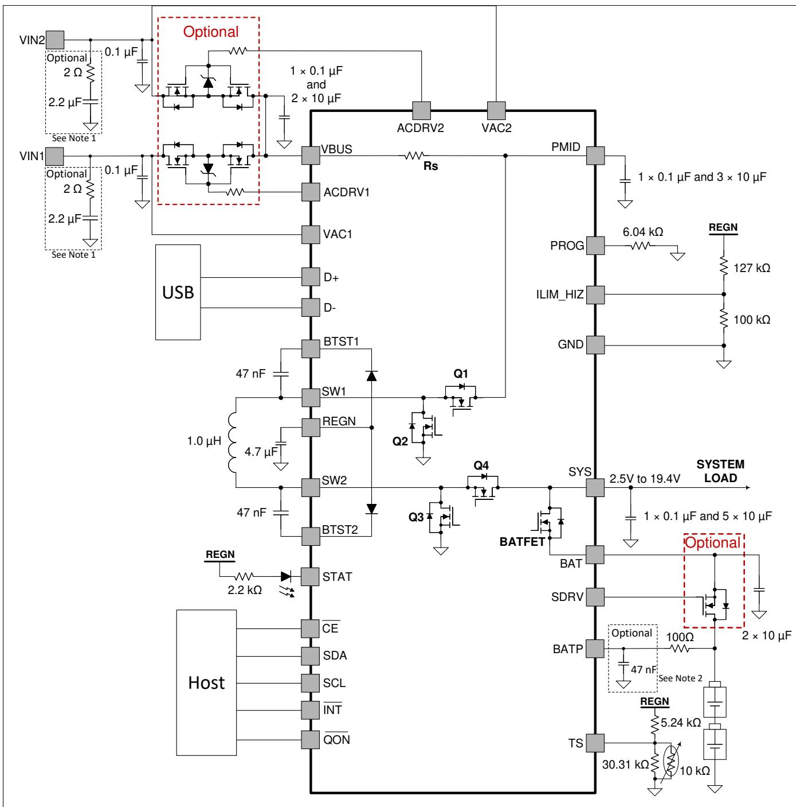  
Figure 10-1. BQ25792 Application Diagram with Two Input Sources and Ship FET

1. Recommended if hot plugging adapters $> 1 5 \lor .$ .   
2. Recommended if hot plugging 4S battery packs with long leads or PCB traces.   
1. Recommended if hot plugging adapters $> 1 5 \lor .$ .   
2. Recommended if hot plugging 4S battery packs with long leads or PCB traces.

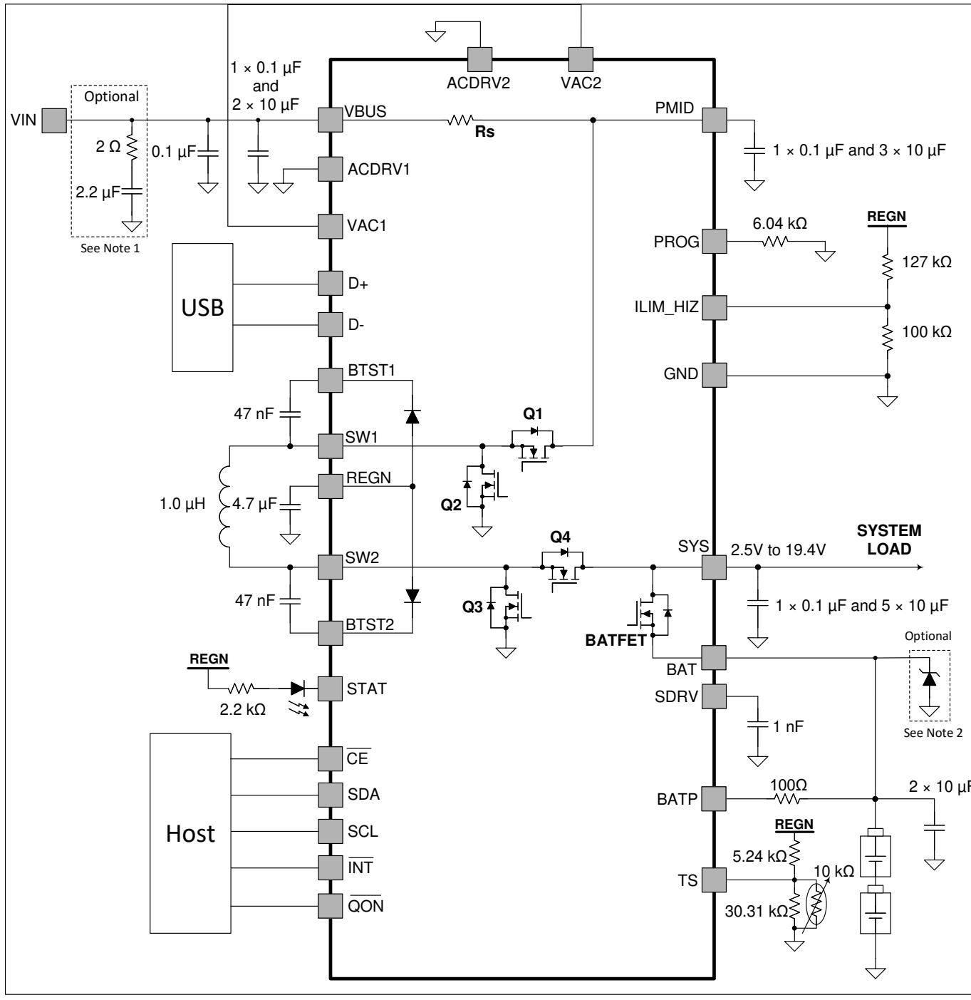  
Figure 10-2. BQ25792 Application Diagram with Single Input Source and No Ship FET

# 10.2.1 Design Requirements

For this design example, use the parameters shown in the table below.

Table 10-1. Design Parameters   

<table><tr><td rowspan=1 colspan=1>PARAMETER</td><td rowspan=1 colspan=1>VALUE</td></tr><tr><td rowspan=1 colspan=1>VBUS voltage range</td><td rowspan=1 colspan=1>5 V to 20 V</td></tr><tr><td rowspan=1 colspan=1>Input current limit (INDPM[8:0])</td><td rowspan=1 colspan=1>3.0 A</td></tr><tr><td rowspan=1 colspan=1>Fast charge current limit (ICHG[8:0])</td><td rowspan=1 colspan=1>3.0 A</td></tr><tr><td rowspan=1 colspan=1>Battery regulation voltage (VREG[10:0])</td><td rowspan=1 colspan=1>8.4 V</td></tr></table>

# 10.2.2 Detailed Design Procedure

# 10.2.2.1 Inductor Selection

The device has 1.5 MHz switching frequency to allow the use of small inductor (1µH) and capacitor values. It also provide the 750kHz switching frequency to achieve higher efficiency for the applications which have enough design space to accommodate the larger inductor $( 2 . 2 \mu \mathsf { H } )$ and capacitors. Please note that the $1 . 5 ~ \mathsf { M H z }$ switching frequency only works with the $1 \mu \mathsf { H }$ inductor and the $7 5 0 ~ \mathsf { k H z }$ switching frequency only works with the $2 . 2 \mu \mathsf { H }$ inductor.

Because the converter might be either operated in the buck mode or the boost mode, so the inductor current is equal to either the charging current or the input current. The inductor saturation current should be higher than the larger value of the input current $( \mathsf { I } _ { \mathsf { I N } } )$ or the charging current $( \mathsf { I } _ { \mathsf { C H G } } )$ plus half the ripple current (IRIPPLE):

$$
I _ { S A T } \geq M A X \left[ \left( I _ { I N } + \frac { I _ { R I P P L E } } { 2 } \right) , \left( I _ { C H G } + \frac { I _ { R I P P L E } } { 2 } \right) \right]
$$

The inductor ripple current (IRIPPLE) depends on the input voltage $( \mathsf { V } _ { \mathsf { B U S } } )$ , the output voltage $( \mathsf { V } \mathsf { s } \mathsf { v } \mathsf { s } )$ , the switching frequency $( \mathsf { F } _ { \mathsf { S W } } )$ and the inductance (L). The inductor current ripples for buck mode and boost mode are calculated with equations (4) and (5), respectively:

$$
\begin{array} { l } { { I _ { R I P P L E \_ B U C K } = \displaystyle \frac { V _ { S Y S } \times ( V _ { B U S } - V _ { S Y S } ) } { V _ { B U S } \times F _ { S W } \times L } } } \\ { { { } } } \\ { { I _ { R I P P L E \_ B O O S T } = \displaystyle \frac { V _ { B U S } \times ( V _ { S Y S } - V _ { B U S } ) } { V _ { S Y S } \times F _ { S W } \times L } } } \end{array}
$$

The inductor current ripple in the buck mode is usually larger than that in the boost mode, since the voltagesecond applied on the inductor is larger. The maximum inductor current ripple in the buck mode happens in the vicinity of $\mathsf { D } = \mathsf { V } _ { \mathsf { S Y S } } / \mathsf { V } _ { \mathsf { B U S } } = 0 . 5$ . The SYS voltage is approximately 8V for the 2s battery configuration, so the worst case for the inductor ripples is with the 15V or 20V input voltage.

# 10.2.2.2 Input (VBUS / PMID) Capacitor

In the buck mode operation, the input current is discontinuous, which dominates the input RMS ripple current and input voltage ripple. The input capacitors should have enough ripple current rating to absorb the input AC current and have large enough capacitance to maintain the small input voltage ripple. For the buck mode operation, the input RMS ripple current is calculated by the equation (6) and the input voltage ripple is calculated by the equation (7), where $\mathsf { D } = \mathsf { V } _ { \mathsf { S Y S } } / \mathsf { V } _ { \mathsf { B U S } }$ .

$$
I _ { C I N \_ B U C K } = I _ { C H G } \times \sqrt { D \times ( 1 - D ) }
$$

$$
\Delta V _ { I N \_ B U C K } = \frac { D \times ( 1 - D ) \times I _ { C H G } } { C _ { I N } \times F _ { S W } }
$$

The worst case input RMS ripple current and input voltage ripple both occur at 0.5 duty cycle condition. The SYS voltage is approximately 8V for the 2s battery configuration, so the worst case is when 15V to 20V VBUS condition. Low ESR ceramic capacitor such as X7R or X5R is preferred for the input decoupling capacitor and should be placed close to the PMID and GND pins of the IC. The voltage rating of the capacitor must be higher than the normal input voltage level. The capacitor with 25V or higher voltage rating is preferred for up to 20V input voltage. $1 ^ { \star } 0 . 1 \ \mu \mathsf { F } + 3 ^ { \star } 1 0 \ \mu \mathsf { F }$ ceramic capacitors are suggested for up to 3.3-A input current limit to support the converter in forward mode.

# 10.2.2.3 Output (VSYS) Capacitor

In the boost mode operation, the output current is discontinuous, which dominates the output RMS ripple current and output voltage ripple. The output capacitors should have enough ripple current rating to absorb the output AC current and have large enough capacitance to maintain the small output voltage ripple. For the boost mode operation, the output RMS ripple current is calculated by the equation (8) and the output voltage ripple is calculated by the equation (9), where $\mathsf { D } = ( 1 - \mathsf { V } _ { \mathsf { B U S } } / \mathsf { V } _ { \mathsf { S Y S } } )$ .

$$
I _ { C O U T \_ B O O S T } = I _ { C H G } \times \sqrt { \frac { D } { ( 1 - D ) } }
$$

$$
\Delta V _ { O U T \_ B O O S T } { = } \frac { I _ { C H G } \times D } { C _ { O U T } \times F _ { S W } }
$$

The worst case output RMS ripple current and output voltage ripple both occur at the lowest VBUS input voltage. The SYS voltage is approximately 8V for the 2s battery configuration, so the worst case is 5V VBUS condition. Low ESR ceramic capacitor such as X7R or X5R is preferred for the output decoupling capacitor and should be placed close to the SYS and GND pins of the IC. The voltage rating of the capacitor must be higher than the normal input voltage level. The capacitor with 16V or higher voltage rating is preferred for the 2s battery configuration. $1 ^ { \star } 0 . 1 \ \mu \mathsf { F } + 5 ^ { \star } 1 0 \ \mu \mathsf { F }$ capacitors are suggested for up to 5A charging current.

# 10.2.3 Application Curves

${ \mathsf { C } } _ { \mathsf { V B U S } } = 2 ^ { \star } 1 0 \mu { \mathsf { F } } _ { \mathrm { : } }$ , $\mathsf { C } _ { \mathsf { P M I D } } \mathsf { = } 3 ^ { \star } 1 0 \mu \mathsf { F }$ , $\mathsf { C } _ { \mathsf { S Y S } } = 5 ^ { \star } 1 0 \mu \mathsf { F }$ , $\mathsf { C } _ { \mathsf { B A T } } = 2 ^ { \star } 1 0 \mu \mathsf { F }$ , $L 1 = 1 \mu \mathsf { H }$ (SPM6530T-1R0M120), Fsw = 1.5MHz.

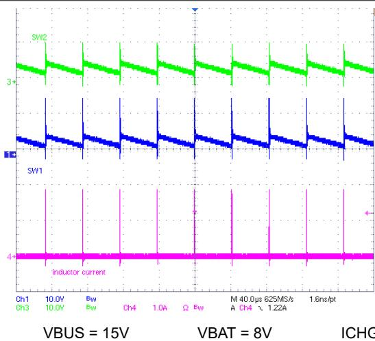  
Figure 10-3. Buck Mode PFM with OOA

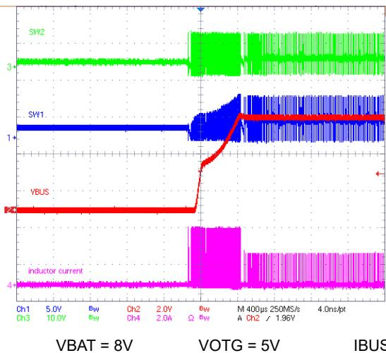  
Figure 10-5. OTG Startup at No Load

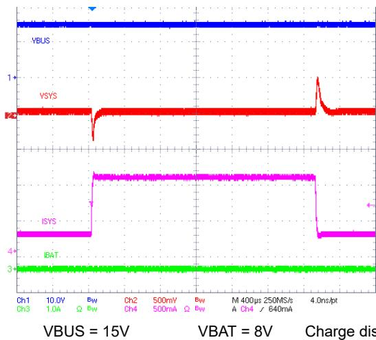  
Figure 10-7. VSYS Load Transient Response

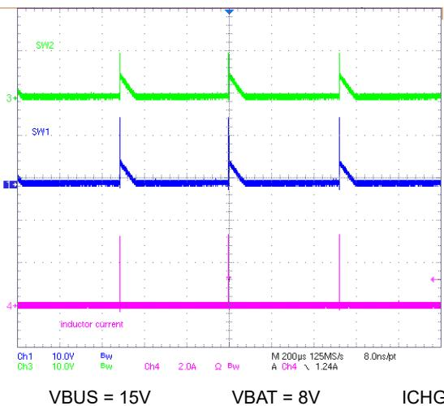  
Figure 10-4. Buck Mode PFM without OOA

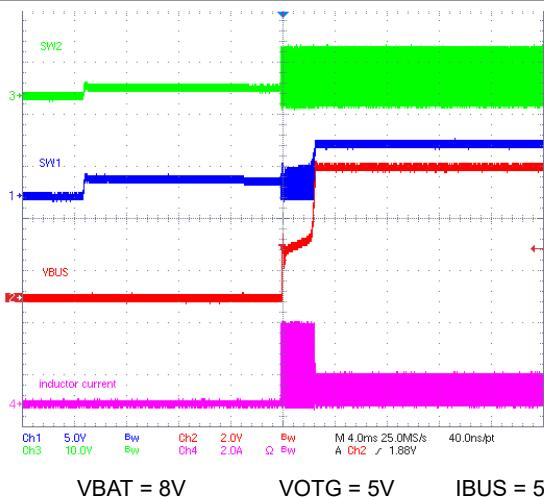  
Figure 10-6. OTG Startup at 500-mA Load

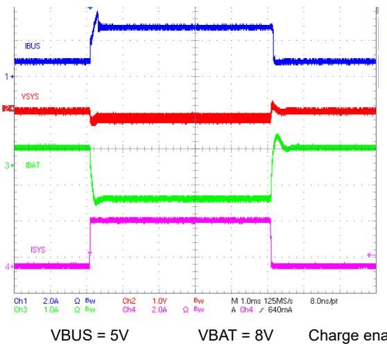  
Figure 10-8. IINDPM Transient Response

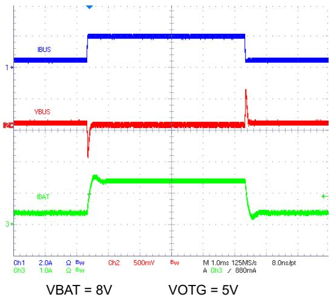  
Figure 10-9. VOTG Load Transient Response

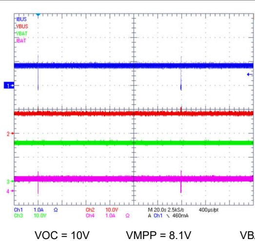  
Figure 10-10. MPPT Operation

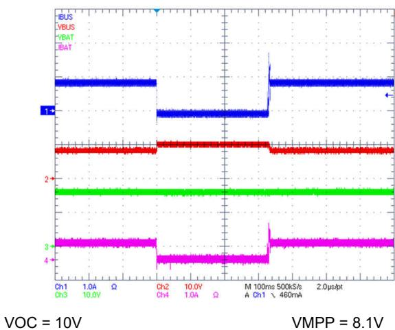  
Figure 10-11. MPPT Operation Zoom

VBAT = 8V

# 11 Power Supply Recommendations

In order to provide an output voltage on SYS, the device requires a power supply between $3 . 6 \lor$ and $^ { 2 4 \lor }$ input with recommended ${ > } 5 0 0 { \mathsf { m A } }$ current rating connected to VBUS or a 1s to 4s Li-Ion battery with voltage higher than VBAT_UVLO connected to BAT. The source current rating needs to be at least 3A for the buck-boost converter of the charger to provide maximum output power to SYS.

The charger does not support the testing condition when the battery connection is floating. The BAT pin has to be connected to a real battery or some devices which can emulate the battery, like the battery emulator or bulk capacitors. When the BAT pin is floating, please disable charge by setting EN_CHG to 0 or pulling low the CE pin. Otherwise, the voltage overshoot at SYS might trigger the SYSOVP protection periodically.

# 12 Layout

# 12.1 Layout Guidelines

The switching nodes rising and falling times should be minimized for minimum switching loss. Proper layout of the components to minimize the high frequency current path loops (shown in the figure below) is important to prevent the electrical and magnetic field radiation and the high frequency resonant problems. Here is a PCB layout priority list for proper layout. Layout PCB according to this specific order is essential.

1. Place the SYS output capacitors as close to SYS and GND as possible. Place a $0 . 1 \mu \mathsf { F }$ small size (such as 0402 or 0201) capacitor closer than the other $1 0 \mu \mathsf { F }$ capacitors. Ground connections need to be tied to the IC ground with a short copper trace connection or GND plane.   
2. Place the PMID input capacitors as close to PMID and GND as possible. Place a $0 . 1 \mu \mathsf { F }$ small size (such as 0402 or 0201) capacitor closer than the other $1 0 \mu \mathsf { F }$ capacitors. Ground connections need to be tied to the IC ground with a short copper trace connection or GND plane.   
3. Place the VBUS input capacitors as close to VBUS and GND as possible. Place a $0 . 1 \mu \mathsf { F }$ small size (such as 0402 or 0201) capacitor closer than the other $1 0 \mu \mathsf { F }$ capacitors. Ground connections need to be tied to the IC ground with a short copper trace connection or GND plane.   
4. The connection from SYS/PMID/VBUS to the $0 . 1 \mu \mathsf { F }$ has to be routed on the top layer of the PCB, the returning back to GND also has to be in the top layer. Keep the whole routing loop as small as possible.   
5. Place the inductor input terminal to SW1 and the inductor output terminal to SW2 as close as possible. Minimize the copper area of this trace to lower electrical and magnetic field radiation but make the trace wide enough to carry the inductor current. Minimize parasitic capacitance from this area to any other trace or plane.   
6. Place the BAT capacitors close to BAT and GND, place the VBUS capacitors close to VBUS and GND.   
7. The REGN decoupling capacitor and the bootstrap capacitors should be placed next to the IC and make trace connection as short as possible.   
8. Ensure that there are sufficient thermal vias directly under the power MOSFETs, connecting to copper on other layers.   
9. Via size and number should be enough for a given current path.   
10. Route BATP away from switching nodes such as SW1 and SW2.

Refer to the EVM design and more information in the BQ25792EVM, BQ25798EVM, and BQ25798BKUPEVM (BMS034) Evaluation Module for the recommended component placement with trace and via locations.

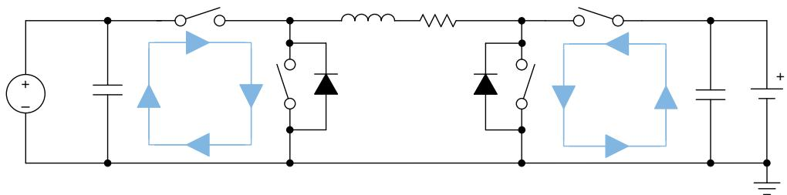  
Figure 12-1. Buck-Boost Converter High Frequency Current Path

# 12.2 Layout Example

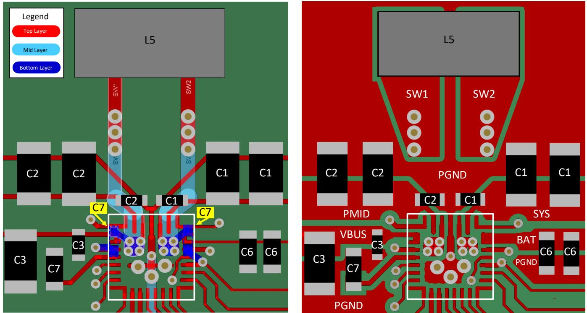  
Figure 12-2. PCB Layout Example (Top Layer Copper Pours Removed on Left, Shown on Right)

Figure 12-2 shows the recommended placement and routing of external components. The components are labelled with "R," "C" or "L" to indicate resistor, capacitor or inductor and a number that corresponds to the numbered list in Section 12.1. Since the layout guidelines are listed in priority order, this number also provides a priority for component placement.

The placement of C1 and ${ \mathsf { C } } 2 \ { \mathsf { 0 } } . { \mathsf { 1 } } \ { \mathsf { \mu } } { \mathsf { F } }$ PMID and SYS capacitors is critical for noise filtering. They should be placed on the same layer as the BQ25792, as close to the IC as possible. This will generally require that the traces to connect SW1 and SW2 to the inductor are routed on a different layer.

The SW1 and SW2 pins are routed to vias placed under the IC and then back out on an inner PCB layer. This supports the tightest placement of C1 and C2 capctiors as described above. These vias are also used to route to the C7 BTST1 and BTST2 capactiors on the bottom layer as shown.

# 13 Device and Documentation Support 13.1 Device Support

13.1.1 Third-Party Products Disclaimer

TI'S PUBLICATION OF INFORMATION REGARDING THIRD-PARTY PRODUCTS OR SERVICES DOES NOT CONSTITUTE AN ENDORSEMENT REGARDING THE SUITABILITY OF SUCH PRODUCTS OR SERVICES OR A WARRANTY, REPRESENTATION OR ENDORSEMENT OF SUCH PRODUCTS OR SERVICES, EITHER ALONE OR IN COMBINATION WITH ANY TI PRODUCT OR SERVICE.

# 13.2 Documentation Support

13.2.1 Related Documentation

For related documentation see the following: • BQ25792EVM, BQ25798EVM, and BQ25798BKUPEVM (BMS034) Evaluation Module

# 13.3 Receiving Notification of Documentation Updates

To receive notification of documentation updates, navigate to the device product folder on ti.com. Click on Subscribe to updates to register and receive a weekly digest of any product information that has changed. For change details, review the revision history included in any revised document.

# 13.4 Support Resources

TI E2E™ support forums are an engineer's go-to source for fast, verified answers and design help — straight from the experts. Search existing answers or ask your own question to get the quick design help you need.

Linked content is provided "AS IS" by the respective contributors. They do not constitute TI specifications and do not necessarily reflect TI's views; see TI's Terms of Use.

# 13.5 Trademarks

TI E2E™ is a trademark of Texas Instruments.   
All trademarks are the property of their respective owners.

# 13.6 Electrostatic Discharge Caution

This integrated circuit can be damaged by ESD. Texas Instruments recommends that all integrated circuits be handled with appropriate precautions. Failure to observe proper handling and installation procedures can cause damage.

ESD damage can range from subtle performance degradation to complete device failure. Precision integrated circuits may be more susceptible to damage because very small parametric changes could cause the device not to meet its published specifications.

# 13.7 Glossary

Glossary This glossary lists and explains terms, acronyms, and definitions.

# 14 Mechanical, Packaging, and Orderable Information

The following pages include mechanical, packaging, and orderable information. This information is the most current data available for the designated devices. This data is subject to change without notice and revision of this document. For browser-based versions of this data sheet, refer to the left-hand navigation.

# PACKAGING INFORMATION

<table><tr><td>Orderable part number</td><td>Status (1)</td><td>Material type (2)</td><td>Package | Pins</td><td>Package qty | Carrier</td><td>RoHS (3)</td><td>Lead finish/ a Bl material</td><td>MSL rating/ e ak reflow</td><td>Op temp ()</td><td>Part marking (6)</td></tr><tr><td>BQ25792RQMR</td><td>Active</td><td>Production</td><td>VQFN-HR (RQM) | 29</td><td>3000 | LARGE T&amp;R</td><td>Yes</td><td>(4) SN</td><td>(5) Level-2-260C-1 YEAR</td><td>-40 to 85</td><td>BQ25792</td></tr><tr><td>BQ25792RQMR.A</td><td>Active</td><td>Production</td><td>VQFN-HR (RQM) | 29</td><td>3000 | LARGE T&amp;R</td><td>Yes</td><td>SN</td><td>Level-2-260C-1 YEAR</td><td>-40 to 85</td><td>BQ25792</td></tr><tr><td>BQ25792RQMR.B</td><td>Active</td><td>Production</td><td>VQFN-HR (RQM) | 29 3000 | LARGE T&amp;R</td><td></td><td>Yes</td><td>SN</td><td>Level-2-260C-1 YEAR</td><td>-40 to 85</td><td>BQ25792</td></tr></table>

(1) Status: For more details on status, see our product life cycle.

(2) Material type: When designated, preproduction parts are prototypes/experimental devices, and are not yet approved or released for full production. Testing and final process, including without limitation quality assurance, reliability performance testing, and/or process qualification, may not yet be complete, and this item is subject to further changes or possible discontinuation. If available for ordering, purchases will be subject to an additional waiver at checkout, and are intended for early internal evaluation purposes only. These items are sold without warranties of any kind.

(3) RoHS values: Yes, No, RoHS Exempt. See the TI RoHS Statement for additional information and value definition.

(4) Lead finish/Ball material: Parts may have multiple material finish options. Finish options are separated by a vertical ruled line. Lead finish/Ball material values may wrap to two lines if the finish value exceeds the maximumcolumn width.

low: The moisture sensitivity level ratings and peak solder (reflow) temperatures. In the event that a part has multiple moisture sensitivity ratings, only the lowest level per JEDEC standards is shown.   
el for the actual reflow temperature that will be used to mount the part to the printed circuit board.

(6) Part marking: There may be an additional marking, which relates to the logo, the lot trace code information, or the environmental category of the part.

Multiple part markings will be inside parentheses. Only one part marking contained in parentheses and separated by a "\~" will appear on a part. If a line is indented then it is a continuation of the previous line and the two combined represent the entire part marking for that device.

Important Information and Disclaimer:The information provided on this page represents TI's knowledge and belief as of the date that it is provided. TI bases its knowledge and belief on information provided by third parties, and makes no representation or warranty as to the accuracy of such information. Efforts are underway to better integrate information from third parties. TI has taken and continues to take reasonable steps to provide representative and accurate information but may not have conducted destructive testing or chemical analysis on incoming materials and chemicals. TI and TI suppliers consider certain information to be proprietary, and thus CAS numbers and other limited information may not be available for release.

n no event shall TI's liability arising out of such information exceed the total purchase price of the TI part(s) at issue in this document sold by TI to Customer on an annual basis.

# TAPE AND REEL INFORMATION

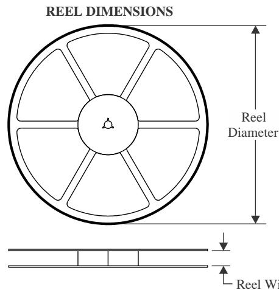

<table><tr><td rowspan=1 colspan=1>A0</td><td rowspan=1 colspan=1>A0 Dimension designed to accommodate the component width</td></tr><tr><td rowspan=1 colspan=1>B0</td><td rowspan=1 colspan=1>Dimension designed to accommodate the component length</td></tr><tr><td rowspan=1 colspan=1>K0</td><td rowspan=1 colspan=1>Dimension designed to accommodate the component thickness</td></tr><tr><td rowspan=1 colspan=1>W</td><td rowspan=1 colspan=1>Overall width of the carrier tape</td></tr><tr><td rowspan=1 colspan=1>P1</td><td rowspan=1 colspan=1>Pitch between successive cavity centers</td></tr></table>

# QUADRANT ASSIGNMENTS FOR PIN 1 ORIENTATION IN TAPE

\*All dimensions are nominal

<table><tr><td rowspan=1 colspan=1>Device</td><td rowspan=1 colspan=1>PackageType</td><td rowspan=1 colspan=1>PackageDrawing</td><td rowspan=1 colspan=1>Pins</td><td rowspan=1 colspan=1>SPQ</td><td rowspan=1 colspan=1>ReelDiameter(mm)</td><td rowspan=1 colspan=1>ReelWidthW1 (mm)</td><td rowspan=1 colspan=1>A0(mm)</td><td rowspan=1 colspan=1>B0(mm)</td><td rowspan=1 colspan=1>KO(mm)</td><td rowspan=1 colspan=1>P1(mm)</td><td rowspan=1 colspan=1>W(mm)</td><td rowspan=1 colspan=1>Pin1Quadrant</td></tr><tr><td rowspan=1 colspan=1>BQ25792RQMR</td><td rowspan=1 colspan=1>VQFN-HR</td><td rowspan=1 colspan=1>RQM</td><td rowspan=1 colspan=1>29</td><td rowspan=1 colspan=1>3000</td><td rowspan=1 colspan=1>330.0</td><td rowspan=1 colspan=1>12.4</td><td rowspan=1 colspan=1>4.25</td><td rowspan=1 colspan=1>4.25</td><td rowspan=1 colspan=1>1.15</td><td rowspan=1 colspan=1>8.0</td><td rowspan=1 colspan=1>12.0</td><td rowspan=1 colspan=1>Q2</td></tr></table>

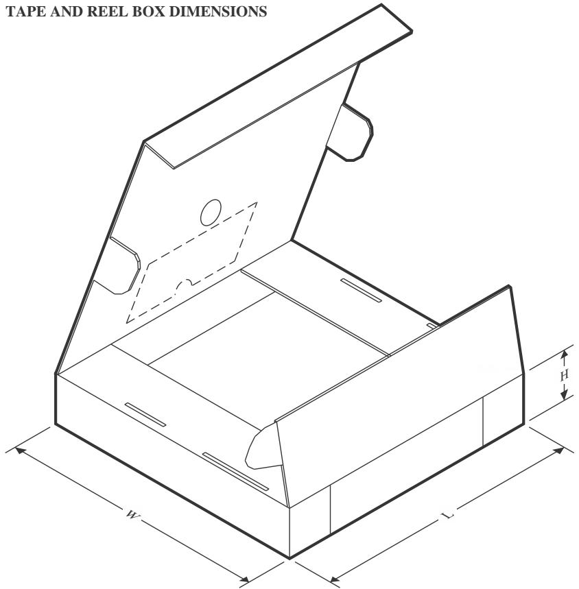

\*All dimensions are nominal

<table><tr><td rowspan=1 colspan=1>Device</td><td rowspan=1 colspan=1>Package Type</td><td rowspan=1 colspan=1>Package Drawing</td><td rowspan=1 colspan=1>Pins</td><td rowspan=1 colspan=1>SPQ</td><td rowspan=1 colspan=1>Length (mm)</td><td rowspan=1 colspan=1>Width (mm)</td><td rowspan=1 colspan=1>Height (mm)</td></tr><tr><td rowspan=1 colspan=1>BQ25792RQMR</td><td rowspan=1 colspan=1>VQFN-HR</td><td rowspan=1 colspan=1>RQM</td><td rowspan=1 colspan=1>29</td><td rowspan=1 colspan=1>3000</td><td rowspan=1 colspan=1>367.0</td><td rowspan=1 colspan=1>367.0</td><td rowspan=1 colspan=1>35.0</td></tr></table>

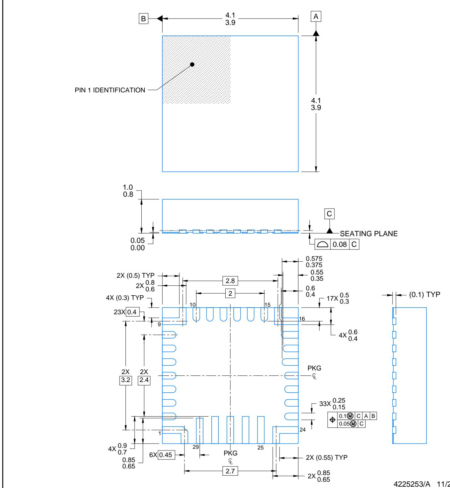  
PLASTIC QUAD FLATPACK- NO LEAD

# NOTES:

1. All linear dimensions are in millimeters. Any dimensions in parenthesis are for reference only. Dimensioning and tolerancing per ASME Y14.5M.   
2. This drawing is subject to change without notice.

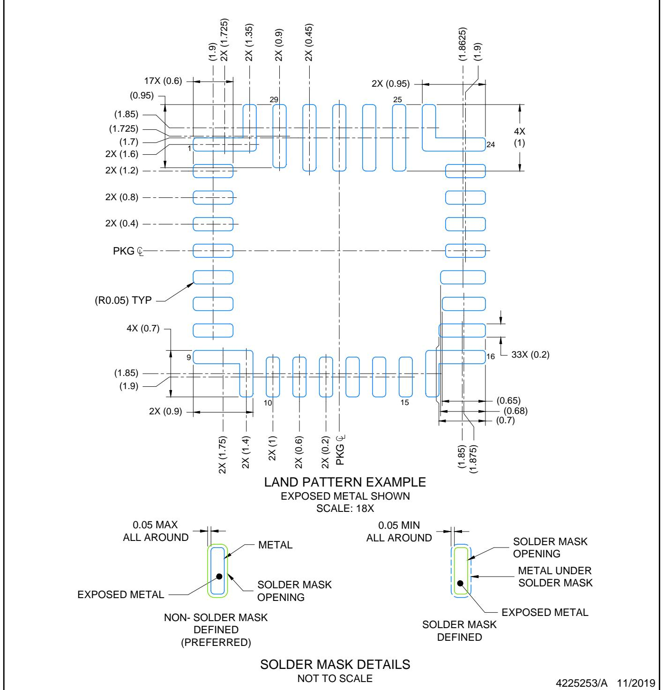  
PLASTIC QUAD FLATPACK- NO LEAD   
NOTES: (continued)

3. For more information, see Texas Instruments literature number SLUA271 (www.ti.com/lit/slua271).   
4. Solder mask tolerances between and around signal pads can vary based on board fabrication site.

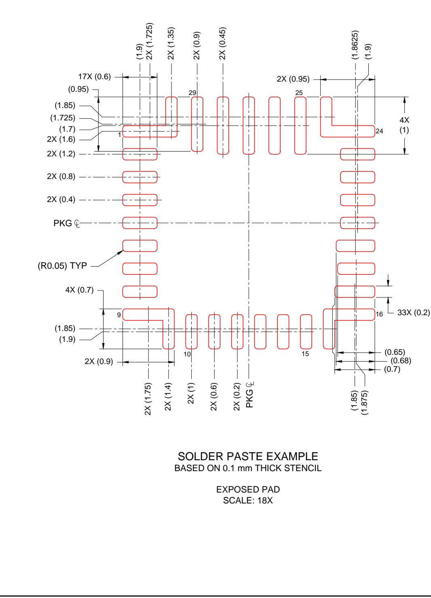  
NOTES: (continued)

5. Laser cutting apertures with trapezoidal walls and rounded corners may offer better paste release. IPC-7525 may have alternate design recommendations.

# IMPORTANT NOTICE AND DISCLAIMER

TI PROVIDES TECHNICAL AND RELIABILITY DATA (INCLUDING DATASHEETS), DESIGN RESOURCES (INCLUDING REFERENCE DESIGNS), APPLICATION OR OTHER DESIGN ADVICE, WEB TOOLS, SAFETY INFORMATION, AND OTHER RESOURCES “AS IS” AND WITH ALL FAULTS, AND DISCLAIMS ALL WARRANTIES, EXPRESS AND IMPLIED, INCLUDING WITHOUT LIMITATION ANY IMPLIED WARRANTIES OF MERCHANTABILITY, FITNESS FOR A PARTICULAR PURPOSE OR NON-INFRINGEMENT OF THIRD PARTY INTELLECTUAL PROPERTY RIGHTS.

These resources are intended for skilled developers designing with TI products. You are solely responsible for (1) selecting the appropriate TI products for your application, (2) designing, validating and testing your application, and (3) ensuring your application meets applicable standards, and any other safety, security, regulatory or other requirements.

These resources are subject to change without notice. TI grants you permission to use these resources only for development of an application that uses the TI products described in the resource. Other reproduction and display of these resources is prohibited. No license is granted to any other TI intellectual property right or to any third party intellectual property right. TI disclaims responsibility for, and you fully indemnify TI and its representatives against any claims, damages, costs, losses, and liabilities arising out of your use of these resources.

TI’s products are provided subject to TI’s Terms of Sale, TI’s General Quality Guidelines, or other applicable terms available either on ti.com or provided in conjunction with such TI products. TI’s provision of these resources does not expand or otherwise alter TI’s applicable warranties or warranty disclaimers for TI products. Unless TI explicitly designates a product as custom or customer-specified, TI products are standard, catalog, general purpose devices.

TI objects to and rejects any additional or different terms you may propose.