# BQ296xxx Overvoltage Protection for 2-Series, 3-Series, and 4-Series Cell Li-Ion Batteries with Regulated Output Supply

# 1 Features

• 2-series, 3-series, and 4-series cell overvoltage protection (OVP)

• Fixed delay timer to trigger FET drive output (3-s, 4-s, 5.5-s, or 6.5-s options)

• Factory programmed OVP threshold (threshold range 3.85V to 4.6V)

• Output options: active high • High-accuracy overvoltage protection: $\pm 1 0 \mathsf { m } \mathsf { V }$

Regulated supply output with self-disable and/or external enable/disable control – Options: 3.3V, 2.5V, and 1.8V (BQ2961) Options: 3.3V, 3.15V, 3.0V (BQ2962)

• Low power consumption $\mathsf { I } _ { \mathsf { C C } } \sim 4 \mu \mathsf { A }$ (VCELL(ALL) < VPROTECT)

• Extra low power consumption with reg output disabled, $\mathsf { I } _ { \mathsf { C C } } \sim 1 . 2 \mu \mathsf { A }$

• Low leakage current per cell input $< 1 0 0 { \mathsf { n A } }$ • Small package footprint – 8-Pin WSON $( 2 \mathsf { m m } \times 2 \mathsf { m m } )$

# 2 Applications

Notebook PC   
Ultrabooks   
Medical   
UPS battery backup

# 3 Description

The BQ296xxx family is a high-accuracy, low-power overvoltage protector with a 2mA regulated output supply for Li-ion battery pack applications.

Each cell in a 2-series to 4-series cell stack is individually monitored for an overvoltage condition. An internally fixed-delay timer is initiated upon detection of an overvoltage condition on any cell. Upon expiration of the delay timer, an output pin is triggered into an active state to indicate that an overvoltage condition has occurred.

The regulated output supply delivers up to 2mA (max) output current to drive always-on circuits, such as a real-time clock (RTC) oscillator. The BQ296xxx family has a self-disable function to turn off the regulated output if any cell voltage falls below a certain threshold, thereby preventing drain on the battery, and provides an external control to enable or disable the regulated output.

Package Information   

<table><tr><td rowspan=1 colspan=1>PART NUMBER</td><td rowspan=1 colspan=1>PACKAGE (1)</td><td rowspan=1 colspan=1>BODY SIZE (NOM)</td></tr><tr><td rowspan=1 colspan=1>BQ2961</td><td rowspan=2 colspan=1>WSON (8)</td><td rowspan=2 colspan=1>2.00mm × 2.00mm</td></tr><tr><td rowspan=1 colspan=1>BQ2962</td></tr></table>

(1) For all available packages, see the orderable addendum at the end of the data sheet.

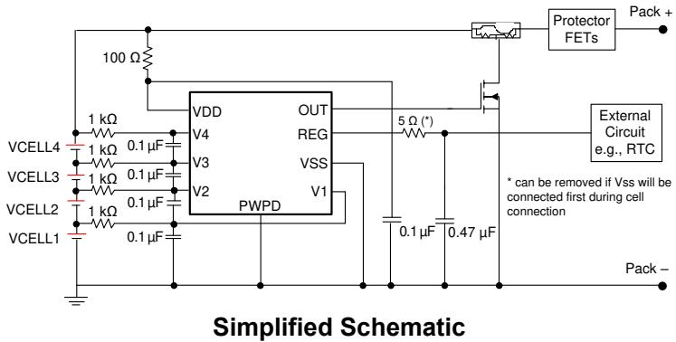

# Table of Contents

1 Features... .1   
2 Applications.. 1   
3 Description.. .1   
4 Device Comparison Table.. 3   
5 Pin Configuration and Functions.. .4   
6 Specifications.. 5   
6.1 Absolute Maximum Ratings.. 5   
6.2 ESD Ratings... 5   
6.3 Recommended Operating Conditions.. .5   
6.4 Thermal Information.. .5   
6.5 Electrical Characteristics.. .6   
6.6 Typical Characteristics.. 8

# 7 Detailed Description.. C

7.1 Overview... 9   
7.2 Functional Block Diagram.. .10   
7.3 Feature Description.... .10   
7.4 Device Functional Modes... .11

# 8 Application and Implementation.. 14

8.1 Application Information.. 14   
8.2 Typical Application.. 14

# 9 Power Supply Recommendations.. 17

10 Layout.. 17

10.1 Layout Guidelines.. 17   
10.2 Layout Example... 17

# 11 Device and Documentation Support. .18

11.1 Device Support... 18   
11.2 Receiving Notification of Documentation Updates.. 18   
11.3 Support Resources.. 18   
11.4 Trademarks.. 18   
11.5 Electrostatic Discharge Caution.. 18   
11.6 Glossary.... 18

# 12 Revision History.. 19

# 13 Mechanical, Packaging, and Orderable

Information. 19

# 4 Device Comparison Table

Table 4-1. BQ2961 Device Options   

<table><tr><td rowspan=1 colspan=1>BQ2961</td><td rowspan=1 colspan=1>OVP (V)</td><td rowspan=1 colspan=1>OVP DELAY (s)</td><td rowspan=1 colspan=1>UV (V)</td><td rowspan=1 colspan=1>LDO (V)</td></tr><tr><td rowspan=1 colspan=1>BQ296100</td><td rowspan=1 colspan=1>4.35</td><td rowspan=1 colspan=1>6.5</td><td rowspan=1 colspan=1>2.5</td><td rowspan=1 colspan=1>3.3</td></tr><tr><td rowspan=1 colspan=1>BQ296103</td><td rowspan=1 colspan=1>4.50</td><td rowspan=1 colspan=1>6.5</td><td rowspan=1 colspan=1>2.5</td><td rowspan=1 colspan=1>3.3</td></tr><tr><td rowspan=1 colspan=1>BQ296106</td><td rowspan=1 colspan=1>4.45</td><td rowspan=1 colspan=1>6.5</td><td rowspan=1 colspan=1>2.8</td><td rowspan=1 colspan=1>3.3</td></tr><tr><td rowspan=1 colspan=1>BQ296107</td><td rowspan=1 colspan=1>4.50</td><td rowspan=1 colspan=1>6.5</td><td rowspan=1 colspan=1>2.8</td><td rowspan=1 colspan=1>3.3</td></tr><tr><td rowspan=1 colspan=1>BQ296111</td><td rowspan=1 colspan=1>4.45</td><td rowspan=1 colspan=1>4.0</td><td rowspan=1 colspan=1>2.5</td><td rowspan=1 colspan=1>3.3</td></tr><tr><td rowspan=1 colspan=1>BQ296112</td><td rowspan=1 colspan=1>4.50</td><td rowspan=1 colspan=1>3.0</td><td rowspan=1 colspan=1>2.5</td><td rowspan=1 colspan=1>3.3</td></tr><tr><td rowspan=1 colspan=1>BQ296113</td><td rowspan=1 colspan=1>4.35</td><td rowspan=1 colspan=1>3.0</td><td rowspan=1 colspan=1>2.5</td><td rowspan=1 colspan=1>3.3</td></tr><tr><td rowspan=1 colspan=1>BQ296114</td><td rowspan=1 colspan=1>4.50</td><td rowspan=1 colspan=1>4.0</td><td rowspan=1 colspan=1>2.5</td><td rowspan=1 colspan=1>3.3</td></tr><tr><td rowspan=1 colspan=1>BQ296115</td><td rowspan=1 colspan=1>4.25</td><td rowspan=1 colspan=1>6.5</td><td rowspan=1 colspan=1>2.0</td><td rowspan=1 colspan=1>2.5</td></tr><tr><td rowspan=1 colspan=1>BQ296116(1)</td><td rowspan=1 colspan=1>4.50</td><td rowspan=1 colspan=1>6.5</td><td rowspan=1 colspan=1>2.5</td><td rowspan=1 colspan=1>1.8</td></tr><tr><td rowspan=1 colspan=1>BQ2961(1)</td><td rowspan=1 colspan=1>3.85V4.60V (50mV step)</td><td rowspan=1 colspan=1>3.0, 4.0, 5.5, 6.5</td><td rowspan=1 colspan=1>2.0V2.8V (50mV step)</td><td rowspan=1 colspan=1>1.8, 2.5, 3.3</td></tr></table>

(1) PRODUCT PREVIEW. Contact TI for more information.

Table 4-2. BQ2962 Device Options   

<table><tr><td rowspan=1 colspan=1>BQ2962</td><td rowspan=1 colspan=1>OVP (V)</td><td rowspan=1 colspan=1>OVP DELAY (s)</td><td rowspan=1 colspan=1>UV (V)</td><td rowspan=1 colspan=1>LDO (V)</td></tr><tr><td rowspan=1 colspan=1>BQ296202</td><td rowspan=1 colspan=1>4.45</td><td rowspan=1 colspan=1>6.5</td><td rowspan=1 colspan=1>2.5</td><td rowspan=1 colspan=1>3.3</td></tr><tr><td rowspan=1 colspan=1>BQ296203</td><td rowspan=1 colspan=1>4.50</td><td rowspan=1 colspan=1>6.5</td><td rowspan=1 colspan=1>2.5</td><td rowspan=1 colspan=1>3.3</td></tr><tr><td rowspan=1 colspan=1>BQ296212</td><td rowspan=1 colspan=1>4.50</td><td rowspan=1 colspan=1>3.0</td><td rowspan=1 colspan=1>2.5</td><td rowspan=1 colspan=1>3.3</td></tr><tr><td rowspan=1 colspan=1>BQ296213</td><td rowspan=1 colspan=1>4.35</td><td rowspan=1 colspan=1>3.0</td><td rowspan=1 colspan=1>2.5</td><td rowspan=1 colspan=1>3.3</td></tr><tr><td rowspan=1 colspan=1>BQ296215</td><td rowspan=1 colspan=1>4.50</td><td rowspan=1 colspan=1>6.5</td><td rowspan=1 colspan=1>2.5</td><td rowspan=1 colspan=1>3.0</td></tr><tr><td rowspan=1 colspan=1>BQ296216</td><td rowspan=1 colspan=1>4.55</td><td rowspan=1 colspan=1>6.5</td><td rowspan=1 colspan=1>2.5</td><td rowspan=1 colspan=1>3.0</td></tr><tr><td rowspan=1 colspan=1>BQ296217</td><td rowspan=1 colspan=1>4.55</td><td rowspan=1 colspan=1>6.5</td><td rowspan=1 colspan=1>2.8</td><td rowspan=1 colspan=1>3.3</td></tr><tr><td rowspan=1 colspan=1>BQ296221</td><td rowspan=1 colspan=1>4.55</td><td rowspan=1 colspan=1>6.5</td><td rowspan=1 colspan=1>2.5</td><td rowspan=1 colspan=1>3.3</td></tr><tr><td rowspan=1 colspan=1>BQ296222</td><td rowspan=1 colspan=1>4.50</td><td rowspan=1 colspan=1>6.5</td><td rowspan=1 colspan=1>3.0</td><td rowspan=1 colspan=1>3.0</td></tr><tr><td rowspan=1 colspan=1>BQ296223</td><td rowspan=1 colspan=1>4.50</td><td rowspan=1 colspan=1>6.5</td><td rowspan=1 colspan=1>2.5</td><td rowspan=1 colspan=1>3.3</td></tr><tr><td rowspan=1 colspan=1>BQ296224</td><td rowspan=1 colspan=1>4.50</td><td rowspan=1 colspan=1>6.5</td><td rowspan=1 colspan=1>2.5</td><td rowspan=1 colspan=1>3.0</td></tr><tr><td rowspan=1 colspan=1>BQ296226</td><td rowspan=1 colspan=1>4.50</td><td rowspan=1 colspan=1>6.5</td><td rowspan=1 colspan=1>2.8</td><td rowspan=1 colspan=1>3.3</td></tr><tr><td rowspan=1 colspan=1>BQ296227</td><td rowspan=1 colspan=1>4.55</td><td rowspan=1 colspan=1>6.5</td><td rowspan=1 colspan=1>2.8</td><td rowspan=1 colspan=1>3.3</td></tr><tr><td rowspan=1 colspan=1>BQ296228</td><td rowspan=1 colspan=1>4.55</td><td rowspan=1 colspan=1>6.5</td><td rowspan=1 colspan=1>2.5</td><td rowspan=1 colspan=1>3.0</td></tr><tr><td rowspan=1 colspan=1>bq296229</td><td rowspan=1 colspan=1>4.60</td><td rowspan=1 colspan=1>6.5</td><td rowspan=1 colspan=1>2.5</td><td rowspan=1 colspan=1>3.0</td></tr><tr><td rowspan=1 colspan=1>BQ296230</td><td rowspan=1 colspan=1>4.35</td><td rowspan=1 colspan=1>6.5</td><td rowspan=1 colspan=1>3.0</td><td rowspan=1 colspan=1>3.0</td></tr><tr><td rowspan=1 colspan=1>BQ296231</td><td rowspan=1 colspan=1>4.60</td><td rowspan=1 colspan=1>6.5</td><td rowspan=1 colspan=1>2.5</td><td rowspan=1 colspan=1>3.3</td></tr><tr><td rowspan=1 colspan=1>BQ296232</td><td rowspan=1 colspan=1>4.55</td><td rowspan=1 colspan=1>6.5</td><td rowspan=1 colspan=1>3.0</td><td rowspan=1 colspan=1>3.0</td></tr><tr><td rowspan=1 colspan=1>BQ296233</td><td rowspan=1 colspan=1>4.45</td><td rowspan=1 colspan=1>6.5</td><td rowspan=1 colspan=1>2.5</td><td rowspan=1 colspan=1>3.3</td></tr><tr><td rowspan=1 colspan=1>BQ296234</td><td rowspan=1 colspan=1>4.60</td><td rowspan=1 colspan=1>6.5</td><td rowspan=1 colspan=1>3.0</td><td rowspan=1 colspan=1>3.0</td></tr><tr><td rowspan=1 colspan=1>BQ296235</td><td rowspan=1 colspan=1>4.45</td><td rowspan=1 colspan=1>4</td><td rowspan=1 colspan=1>2.03</td><td rowspan=1 colspan=1>3.3</td></tr><tr><td rowspan=1 colspan=1>BQ2962(1)</td><td rowspan=1 colspan=1>3.85V4.60V (50mV step)</td><td rowspan=1 colspan=1>3.0, 4.0, 5.5, 6.5</td><td rowspan=1 colspan=1>2.0V3.5V (50mV step)</td><td rowspan=1 colspan=1>3, 3.15, 3.3</td></tr></table>

(1) PRODUCT PREVIEW. Contact TI for more information.

# 5 Pin Configuration and Functions

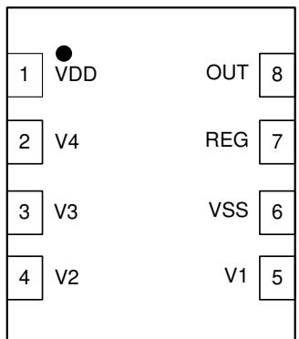  
Figure 5-1. 2-Series to 4-Series BQ2961 (Top View)  Figure 5-2. 2-Series to 4-Series BQ2962 (Top View)

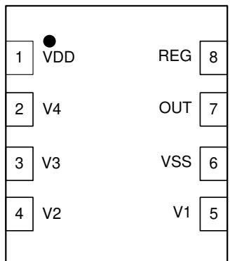

Table 5-1. Pin Functions   

<table><tr><td rowspan=1 colspan=2>PIN</td><td rowspan=1 colspan=1></td><td rowspan=2 colspan=1>TYPE(1)</td><td rowspan=2 colspan=1>DESCRIPTION</td></tr><tr><td rowspan=1 colspan=1>NAME</td><td rowspan=1 colspan=1>BQ2961</td><td rowspan=1 colspan=1>BQ2962</td></tr><tr><td rowspan=1 colspan=1>OUT</td><td rowspan=1 colspan=1>8</td><td rowspan=1 colspan=1>7</td><td rowspan=1 colspan=1>OA</td><td rowspan=1 colspan=1>Analog output drive for an overvoltage fault signal; CMOS output high or open-drain active low</td></tr><tr><td rowspan=1 colspan=1>PWPD</td><td rowspan=1 colspan=1>9</td><td rowspan=1 colspan=1>9</td><td rowspan=1 colspan=1>P</td><td rowspan=1 colspan=1>TI recommends connecting the exposed pad to VSS on PCB.</td></tr><tr><td rowspan=1 colspan=1>REG</td><td rowspan=1 colspan=1>7</td><td rowspan=1 colspan=1>8</td><td rowspan=1 colspan=1>OA</td><td rowspan=1 colspan=1>Regulated supply output. Requires an external ceramic capacitor for stability</td></tr><tr><td rowspan=1 colspan=1>V1</td><td rowspan=1 colspan=1>5</td><td rowspan=1 colspan=1>5</td><td rowspan=1 colspan=1>IA</td><td rowspan=1 colspan=1>Sense input for positive voltage of the lowest cell from the bottom of the stack</td></tr><tr><td rowspan=1 colspan=1>V2</td><td rowspan=1 colspan=1>4</td><td rowspan=1 colspan=1>4</td><td rowspan=1 colspan=1>IA</td><td rowspan=1 colspan=1>Sense input for positive voltage of the second cellfrom the bottom of the stack</td></tr><tr><td rowspan=1 colspan=1>V3</td><td rowspan=1 colspan=1>3</td><td rowspan=1 colspan=1>3</td><td rowspan=1 colspan=1>IA</td><td rowspan=1 colspan=1>Sense input for positive voltage of the third cel from the bottom of the stack</td></tr><tr><td rowspan=1 colspan=1>V4</td><td rowspan=1 colspan=1>2</td><td rowspan=1 colspan=1>2</td><td rowspan=1 colspan=1>IA</td><td rowspan=1 colspan=1>Sense input for positive voltage of the fourth cell from the bottom of the stack</td></tr><tr><td rowspan=1 colspan=1>VDD</td><td rowspan=1 colspan=1>1</td><td rowspan=1 colspan=1>1</td><td rowspan=1 colspan=1>P</td><td rowspan=1 colspan=1>Power supply input</td></tr><tr><td rowspan=1 colspan=1>VSS</td><td rowspan=1 colspan=1>6</td><td rowspan=1 colspan=1>6</td><td rowspan=1 colspan=1>P</td><td rowspan=1 colspan=1>Electrically connected to integrated circuit ground and negative terminal of thelowest cell in the stack</td></tr></table>

(1) $\mathsf { I A } =$ Analog input, OA $=$ Analog Output, $\mathsf { P } =$ Power connection

# 6 Specifications

# 6.1 Absolute Maximum Ratings

Over operating free-air temperature range (unless otherwise noted)(1)

<table><tr><td></td><td></td><td rowspan=1 colspan=1>MIN      MAX</td><td rowspan=1 colspan=1>UNIT</td></tr><tr><td rowspan=1 colspan=1>Supply voltage</td><td rowspan=1 colspan=1>VDD - VSS</td><td rowspan=1 colspan=1>-0.3      30</td><td rowspan=4 colspan=1>V</td></tr><tr><td rowspan=2 colspan=1>Input voltage</td><td rowspan=1 colspan=1>V4 - V3, V3 - V2, V2 - V1, V1 - VSS</td><td rowspan=1 colspan=1>-0.3      30</td></tr><tr><td rowspan=1 colspan=1>REG -VSS</td><td rowspan=1 colspan=1>-0.3      3.6</td></tr><tr><td rowspan=1 colspan=1>Output voltage</td><td rowspan=1 colspan=1>OUT - VSS</td><td rowspan=1 colspan=1>-0.3      30</td></tr><tr><td rowspan=1 colspan=2>Continuous total power dissipation, PToT</td><td rowspan=1 colspan=1>See Section 6.4.</td><td rowspan=1 colspan=1></td></tr><tr><td rowspan=1 colspan=2>Lead temperature (soldering, 10 s), TsOLDER</td><td rowspan=1 colspan=1>300      300</td><td rowspan=1 colspan=1>°C</td></tr><tr><td rowspan=1 colspan=2>Storage temperature, Tstg</td><td rowspan=1 colspan=1>-65      150</td><td rowspan=1 colspan=1>°C</td></tr></table>

(1) Operation outside the Absolute Maximum Ratings may cause permanent device damage. Absolute Maximum Ratings do not imply functional operation of the device at these or any other conditions beyond those listed under Recommended Operating Conditions. If outside the Recommended Operating Conditions but within the Absolute Maximum Ratings, the device may not be fully functional, and this may affect device reliability, functionality, performance, and shorten the device lifetime.

# 6.2 ESD Ratings

<table><tr><td></td><td></td><td rowspan=1 colspan=1>VALUE</td><td rowspan=1 colspan=1>UNIT</td></tr><tr><td rowspan=2 colspan=1>V(ESD)Electrostatic discharge</td><td rowspan=1 colspan=1>Human body model (HBM), per ANSI/ESDA/JEDEC JS-001(1)</td><td rowspan=1 colspan=1>2000</td><td rowspan=2 colspan=1>V</td></tr><tr><td rowspan=1 colspan=1>Charged device model (CDM), per JEDEC specification JESD22-C101(2)</td><td rowspan=1 colspan=1>500</td></tr></table>

(1) JEDEC document JEP155 states that 500V HBM allows safe manufacturing with a standard ESD control process.   
(2) JEDEC document JEP157 states that 250V CDM allows safe manufacturing with a standard ESD control process.

# 6.3 Recommended Operating Conditions

Over operating free-air temperature range (unless otherwise noted).

<table><tr><td></td><td></td><td rowspan=1 colspan=1>MIN</td><td rowspan=1 colspan=1>NOM</td><td rowspan=1 colspan=1>MAX</td><td rowspan=1 colspan=1>UNIT</td></tr><tr><td rowspan=2 colspan=1>Supply voltage,VDD(1)</td><td rowspan=1 colspan=1>Supply voltage, VDD(1)</td><td rowspan=1 colspan=3>3                 20</td><td rowspan=2 colspan=1>V</td></tr><tr><td rowspan=1 colspan=1>Supply voltage, VDD with REG output on</td><td rowspan=1 colspan=3>4</td></tr><tr><td rowspan=1 colspan=1>Input voltagerange</td><td rowspan=1 colspan=1>Vn - Vn-1, V1 - VSS</td><td rowspan=1 colspan=3>0                   5</td><td rowspan=1 colspan=1>V</td></tr><tr><td rowspan=1 colspan=2>Operating ambient temperature range, TA</td><td rowspan=1 colspan=3>-40                 110</td><td rowspan=1 colspan=1>°C</td></tr></table>

(1) See Section 8.2.

# 6.4 Thermal Information

<table><tr><td rowspan="2">THERMAL METRIC(1)</td><td colspan="2">BQ296xxx</td><td rowspan="2">UNIT</td></tr><tr><td>DSG (WSON)</td><td></td></tr><tr><td colspan="2">Junction-to-ambient thermal resistance</td><td>8 PINS</td><td></td></tr><tr><td>RJA</td><td>Junction-to-case(top) thermal resistance</td><td>62</td><td>°C/W °C/W</td></tr><tr><td>ReJC(top) RθJB</td><td>Junction-to-board thermal resistance</td><td>72</td><td>°C/W</td></tr><tr><td></td><td>Junction-to-top characterization parameter</td><td>32.5</td><td></td></tr><tr><td>4JT</td><td></td><td>1.6</td><td>°C/W</td></tr><tr><td>4JB</td><td>Junction-to-board characterization parameter</td><td>33</td><td>C/W</td></tr><tr><td>ReJC(bot)</td><td>Junction-to-case(bottom) thermal resistance</td><td>10</td><td>°C/W</td></tr></table>

(1) For more information about traditional and new thermal metrics, see the Semiconductor and IC Package Thermal Metrics application note.

# 6.5 Electrical Characteristics

<table><tr><td rowspan=1 colspan=6>Typial values tated whe TA = 25° and VDD = 14.4V, MIN/A values atd whe TA = 40°C o +10°, andVDD =3V to 15V (unless otherwise noted).</td></tr><tr><td rowspan=1 colspan=1>PARAMETER</td><td rowspan=1 colspan=2>TEST CONDITIONS</td><td rowspan=1 colspan=2>MIN   TYP  MAX</td><td rowspan=1 colspan=1>UNIT</td></tr><tr><td rowspan=1 colspan=1>Voltage Protection Thresholds</td><td></td><td></td><td></td><td></td><td></td></tr><tr><td rowspan=1 colspan=1>Vov         V(PROTECT) OvervoltageDetection</td><td rowspan=1 colspan=2>RiN = 1 kΩ</td><td rowspan=1 colspan=2>Applicable Voltage: 3.85V to4.6V in 50mV steps</td><td rowspan=1 colspan=1>V</td></tr><tr><td rowspan=1 colspan=1>VHYS         OV Detection Hysteresis</td><td rowspan=1 colspan=2></td><td rowspan=1 colspan=2>250   300   400</td><td rowspan=1 colspan=1>mV</td></tr><tr><td rowspan=1 colspan=1>VoA          OV Detection Accuracy</td><td rowspan=1 colspan=2>TA=25°C</td><td rowspan=1 colspan=2>-10              10</td><td rowspan=1 colspan=1>mV</td></tr><tr><td rowspan=5 colspan=1>VOADRIFT      OV Detection AccuracyAcross Temperature</td><td rowspan=1 colspan=2>TA=-40°C</td><td rowspan=1 colspan=2>-40              40</td><td rowspan=1 colspan=1>mV</td></tr><tr><td rowspan=1 colspan=2>TA= 0o$</td><td rowspan=1 colspan=2>-20              20</td><td rowspan=1 colspan=1>mV</td></tr><tr><td rowspan=1 colspan=2>TA = 60°C</td><td rowspan=1 colspan=2>-24              24</td><td rowspan=1 colspan=1>mV</td></tr><tr><td rowspan=1 colspan=2>$TA=110°</td><td rowspan=1 colspan=2>-54              54</td><td rowspan=1 colspan=1>mV</td></tr><tr><td rowspan=1 colspan=2>TA=110°C</td><td rowspan=1 colspan=2>-54              54</td><td rowspan=1 colspan=1>mV</td></tr><tr><td rowspan=1 colspan=1>Supply and Leakage Current</td><td rowspan=1 colspan=2></td><td rowspan=1 colspan=2></td><td rowspan=1 colspan=1></td></tr><tr><td rowspan=2 colspan=1>Supply Current with REGIDD           on</td><td rowspan=2 colspan=1>(n − Vn-1) = 2V to 4.15V, n = 1to 4, VDD = top Vn voltae(V1 -Vss) &gt;VUVREGREG=O0mA,</td><td rowspan=1 colspan=1>TA= 0°C to 60°C</td><td rowspan=1 colspan=2>4      6</td><td rowspan=1 colspan=1>μA</td></tr><tr><td rowspan=1 colspan=1>TA = -40°C to 110</td><td rowspan=1 colspan=2>8</td><td rowspan=1 colspan=1>μA</td></tr><tr><td rowspan=2 colspan=1>Supply Current with REG IDD           ooff</td><td rowspan=2 colspan=1>(Vn − Vn-1) = 2V to 4.15V, n = 1to 4, VDD = top V vot(V1 - Vss) &lt; VUVREG</td><td rowspan=1 colspan=1>TA = 0°C to 60°</td><td rowspan=1 colspan=2>1      2</td><td rowspan=1 colspan=1>μA</td></tr><tr><td rowspan=1 colspan=1>TA = -40°C to 110°</td><td rowspan=1 colspan=2>4</td><td rowspan=1 colspan=1>μA</td></tr><tr><td rowspan=1 colspan=1> IN            Input Current at Vx Pins</td><td rowspan=1 colspan=2>(− n-) = (1  ) = 3.8V, VDD = to V voltage,$TA= 25C$</td><td rowspan=1 colspan=2>-0.1              0.1</td><td rowspan=1 colspan=1>μA</td></tr><tr><td rowspan=1 colspan=1>Output Drive OUT, CMOS Active High</td><td></td><td></td><td></td><td></td><td rowspan=1 colspan=1></td></tr><tr><td rowspan=3 colspan=1>VouT         Output Drive Voltage,Active High</td><td rowspan=1 colspan=2>(Vn − Vn-1) or (V1 − Vss) &gt; Vov, IoH = 100μA, VDD =top Vn voltage</td><td rowspan=1 colspan=2>6      7      8</td><td rowspan=1 colspan=1>V</td></tr><tr><td rowspan=1 colspan=2>If three of four cells are short circuited, only one cellremains powered and &gt; Vov, VDD = Vn (the remainingcell voltage), IoH = 100μA</td><td rowspan=1 colspan=2>VDD -0.3</td><td rowspan=1 colspan=1>V</td></tr><tr><td rowspan=1 colspan=2>(Vn - Vn-1) and (V1 - Vss) &lt; Vov, VDD = sum of thecell stack voltage, IoL = 100μA measured into OUT pin</td><td rowspan=1 colspan=2>250   400</td><td rowspan=1 colspan=1>mV</td></tr><tr><td rowspan=1 colspan=1>OUT Source CurrentIOUTH         uring OV)</td><td rowspan=1 colspan=2>(Vn − Vn-1) (V3 - V2), or (V1 − Vss) &gt; Vov, VDD = topVn vvoltage,forced OUT = OV, measured out of OUT pin</td><td rowspan=1 colspan=2>4.5</td><td rowspan=1 colspan=1>mA</td></tr><tr><td rowspan=1 colspan=1>IOUTL         OUT Sink Current (noOV</td><td rowspan=1 colspan=2>(Vn − Vn-1) and (V1 − Vss) &lt; Vov, VDD = top Vnvoltae, for OUT = VDD maued int OUT p.Pull-up resistor Rpu = 5kΩ to VDD</td><td rowspan=1 colspan=2>0.5               14</td><td rowspan=1 colspan=1>mA</td></tr><tr><td rowspan=1 colspan=1>Internal Fixed Delay Timer</td><td rowspan=1 colspan=2></td><td rowspan=1 colspan=1></td><td rowspan=1 colspan=1></td><td rowspan=1 colspan=1></td></tr><tr><td rowspan=4 colspan=1>DELAY        OV Delay Time(1)</td><td rowspan=1 colspan=2>Internal Fixed Delay, 3-s delay option</td><td rowspan=1 colspan=1>2.4</td><td rowspan=1 colspan=1>3    3.6</td><td rowspan=1 colspan=1>S</td></tr><tr><td rowspan=1 colspan=2>Internal Fixed Delay, 4-s delay option</td><td rowspan=1 colspan=1>3.2</td><td rowspan=1 colspan=1>4    4.8</td><td rowspan=1 colspan=1>S</td></tr><tr><td rowspan=1 colspan=2>Internal Fixed Delay, 5.5-s delay option</td><td rowspan=1 colspan=1>4.4</td><td rowspan=1 colspan=1>5.5    6.6</td><td rowspan=1 colspan=1>s</td></tr><tr><td rowspan=1 colspan=2>Internal Fixed Delay, 6.5-s delay option</td><td rowspan=1 colspan=1>5.2</td><td rowspan=1 colspan=1>6.5    7.8</td><td rowspan=1 colspan=1>s</td></tr><tr><td rowspan=1 colspan=1>Fault Detection DelaytDELAY_CTM    Time in Test Mode OVDelay Time</td><td rowspan=1 colspan=2>Internal Fixed Delay</td><td rowspan=1 colspan=1></td><td rowspan=1 colspan=1>15</td><td rowspan=1 colspan=1>ms</td></tr><tr><td rowspan=1 colspan=1>OV delay timer countreset time; tDELAY resetstDELAY_RESET  when the cell voltagefalls below Voy forDELAY_RE EST</td><td rowspan=1 colspan=2>Internal Fixed Delay</td><td rowspan=1 colspan=1></td><td rowspan=1 colspan=1>0.6</td><td rowspan=1 colspan=1>ms</td></tr></table>

# 6.5 Electrical Characteristics (continued)

Typical values stated where ${ \bar { \mathsf { T } } } _ { \mathsf { A } } = 2 5 ^ { \circ } { \mathsf { C } }$ and V $\mathrm { \Delta ) D } = 1 4 . 4 \mathrm { V } ,$ , MIN/MAX values stated where $\mathsf { T } _ { \mathsf { A } } = - 4 0 ^ { \circ } \mathsf { C }$ to $+ 1 1 0 ^ { \circ } \mathrm { C }$ , and $\mathsf { V } _ { \mathsf { D D } } =$ 3V to 15V (unless otherwise noted).

<table><tr><td>PARAMETER</td><td colspan="2">TEST CONDITIONS</td><td>MIN</td><td>TYP</td><td>MAX</td><td>UNIT</td></tr><tr><td colspan="3">Regulated Supply Output, REG</td><td></td><td></td><td></td><td></td></tr><tr><td rowspan="4">REG Supply at VREG 500A load</td><td rowspan="4">VDD ≥ 4V, IREG = 500μA, CREG = 0.47μF</td><td>VREG = 3.3V, VREG = 3.15V,</td><td>3.234</td><td>3.300</td><td>3.366</td><td rowspan="4">V</td></tr><tr><td> BQ2962</td><td>3.087</td><td>3.150</td><td>3.213</td></tr><tr><td>VREG = 3.0V, BQ2962</td><td>2.940</td><td>3.000</td><td>3.060</td></tr><tr><td>VREG = 2.5V, BQ2961 VREG = 1.8V, BQ2961</td><td>2.450</td><td>2.500</td><td>2.550</td></tr><tr><td rowspan="6">VREG 2mA load</td><td rowspan="6">REG Supply from 0 to CREG = 0.47μF</td><td>VREG = 3.3V, BQ2961, BQ2962</td><td>1.764 3.200</td><td>1.800 3.300</td><td>1.836 3.400</td><td></td></tr><tr><td>VREG = 3.15V, VDD ≥ 4V, IREG = 0μA to 2mA,</td><td>3.050</td><td></td><td></td><td></td></tr><tr><td>Q2962 VREG = 3.0V, BQ2962</td><td></td><td>3.150</td><td>3.250</td><td>V</td></tr><tr><td></td><td>2.900</td><td>3.000</td><td>3.100</td><td></td></tr><tr><td>VREG = 2.5V, BQ2961</td><td>2.425</td><td>2.500</td><td>2.575</td><td></td></tr><tr><td>VREG = 1.8V, BQ2961</td><td>1.746</td><td>1.800</td><td></td><td>1.854</td></tr><tr><td>IREG REG Current Output REG Output Short Circuit</td><td colspan="2">VDD ≥ 4V, CREG = 0.47μF</td><td>0</td><td></td><td>2</td><td>mA</td></tr><tr><td>REG_ sC_Limit RREG_PD</td><td>Current Limit</td><td colspan="2">REG = Vss, CREG = 0.47μF</td><td>4</td><td></td><td></td><td>mA</td></tr><tr><td colspan="7">REG pull-down resistor REG is disabled. 20 30</td><td>45 kΩ</td></tr><tr><td></td><td>Regulated Supply Undervoltage Self-Disable Undervoltage detection</td><td colspan="2">Factory Configuration: 2.0V to 3.5V in 50mV steps, TA</td><td></td><td></td><td></td><td></td></tr><tr><td>VUVREG</td><td>Undervoltage Detection</td><td colspan="2">=25°</td><td>-50</td><td></td><td>50</td><td>mV</td></tr><tr><td>VUVHYS</td><td>Hysteresis Undervoltage Detection</td><td colspan="2"></td><td>250 4.5</td><td>300</td><td>400</td><td>mV</td></tr><tr><td>tUVDELAY VUVQUAL</td><td>Delay Cell voltage to qualify for UV detection</td><td colspan="2"></td><td></td><td>6 0.5</td><td>7.5</td><td>S V</td></tr></table>

# 6.6 Typical Characteristics

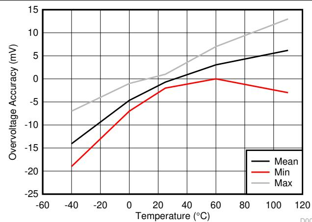  
Figure 6-1. Overvoltage Threshold $( \mathsf { v } _ { \mathsf { o v } } )$ vs. Temperature

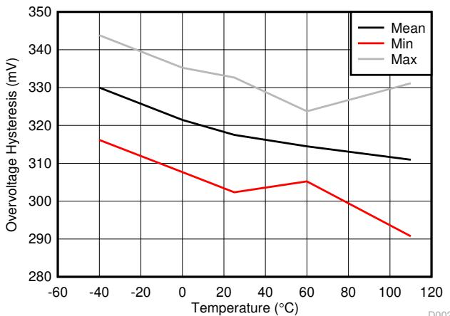  
Figure 6-2. Hysteresis $\forall _ { \mathsf { H Y S } }$ vs. Temperature

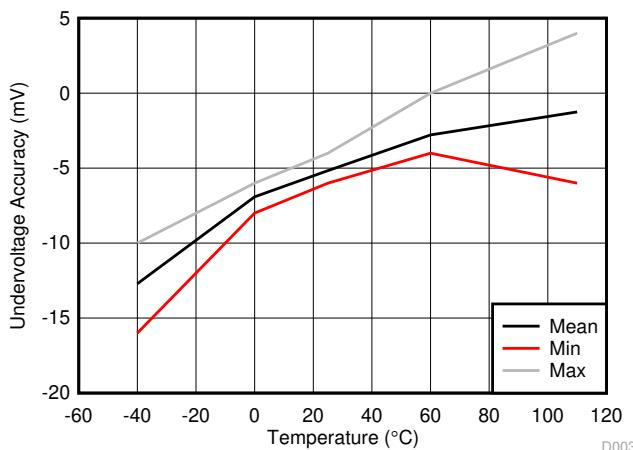  
Figure 6-3. Undervoltage Accuracy

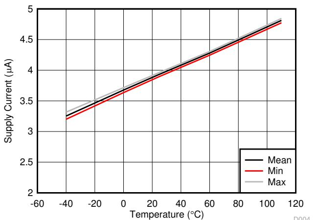  
Figure 6-4. IDD with Regulator On

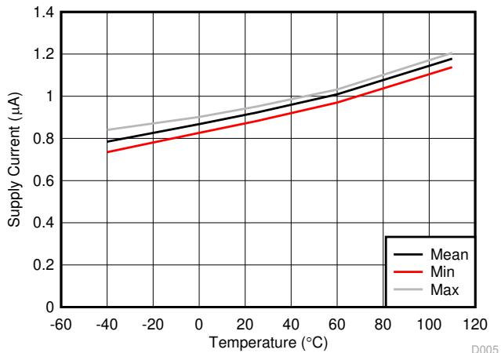  
Figure 6-5. IDD with Regulator Off

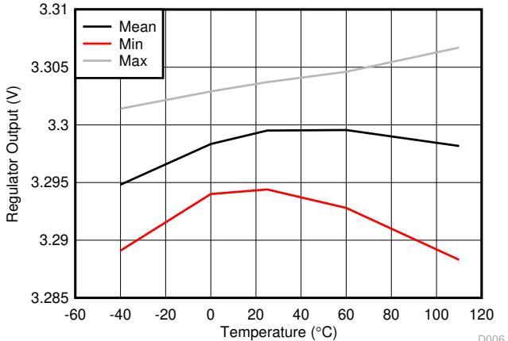  
Figure 6-6. Regulator Output Without Load

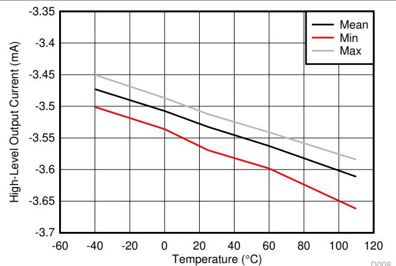  
Figure 6-7. IOUTH vs Temperature

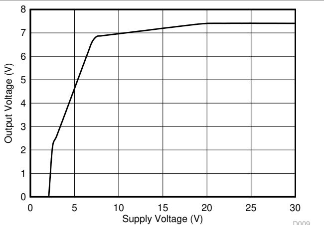  
Figure 6-8. VOUT vs VDD

# 7 Detailed Description

# 7.1 Overview

The BQ2961 and BQ2962 devices are second-level overvoltage (OV) protectors with a regulated output. Each cell is monitored independently by comparing the actual cell voltage to an overvoltage threshold $\mathsf { V } _ { \mathsf { O V } }$ . The overvoltage threshold is preprogrammed at the factory with a range between 3.85V to $4 . 6 5 \lor .$ .

The regulated output is enabled unless any of the cell voltages fall below the $\mathsf { V } _ { \mathsf { U V R E G } }$ threshold. This threshold is preprogrammed at the factory with a range between 2V to 2.8 (3.5V for future BQ2962 options).

Table 7-1. Programmable Parameters   

<table><tr><td>OVERVOLTAGE RANGE (V)</td><td>OVERVOLTAGE DELAY (s)</td><td>UNDERVOLTAGE RANGE (V)</td><td>REGULATOR (V)</td></tr><tr><td>3.85 to 4.6 in 50mV steps</td><td>3, 4, 5.5, 6.5</td><td>2.0 to 2.8 (3.5 for future BQ2962</td><td>1.8, 2.5, 3.3 (BQ2961)</td></tr><tr><td></td><td></td><td>options) in 50-mV steps</td><td>3.0, 3.15, 3.3 (BQ2962)</td></tr></table>

# 7.2 Functional Block Diagram

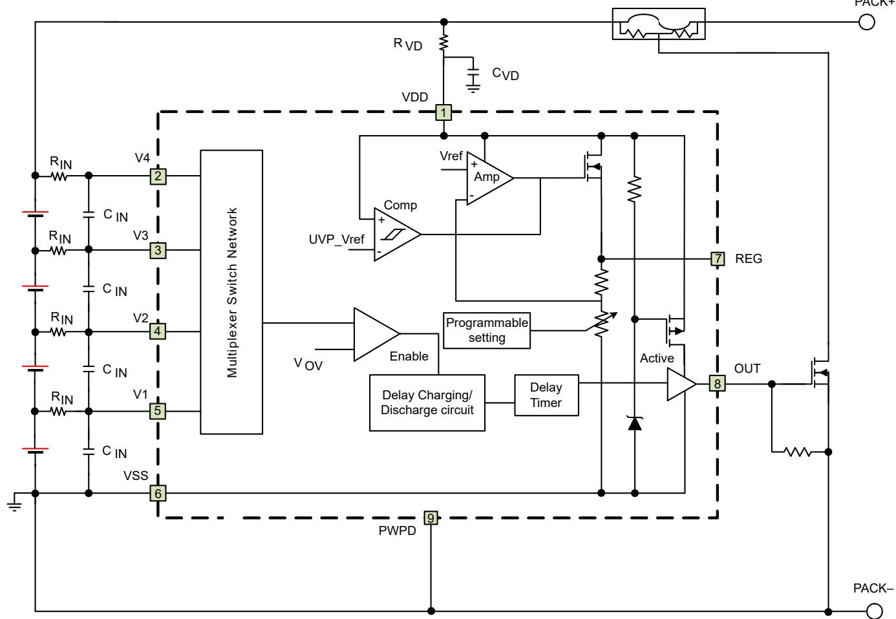

# 7.3 Feature Description

# 7.3.1 Pin Details

# 7.3.1.1 Input Sense Voltage, Vx

These inputs sense each battery cell voltage. A series resistor and a capacitor across the cell for each input is required for noise filtering and stable voltage monitoring.

# 7.3.1.2 Output Drive, OUT

This terminal serves as the fault signal output in active high.

# 7.3.1.3 Supply Input, VDD

This terminal is the unregulated input power source for the device. A series resistor is connected to limit the current, and a capacitor is connected to ground for noise filtering.

# 7.3.1.4 Regulated Supply Output, REG

This terminal is connected to an external capacitor and provides a regulated supply to power a circuit such as a real-time clock integrated circuit, or functions requiring a well-regulated supply. Maximum current load on this pin cannot exceed IREG mA.

The REG output has protection for overcurrent, using a current limit protection circuit, and also detects and protects for excessive power dissipation due to short circuit of the external load. This pin requires a ceramic 1µF capacitor connection to VSS for improved stability, noise immunity, and ESD performance of the supply output. This capacitor must be placed close to the REG and VSS pins for connection.

# 7.3.2 Overvoltage Sensing for OUT

In the BQ296xxx device, each cell is monitored independently. Overvoltage is detected by comparing the actual cell voltage to a protection voltage reference, $\mathsf { V } _ { \mathsf { O V } } .$ . If any cell voltage exceeds the programmed OV value, an internal timer circuit is activated. This timer circuit causes a factory pre-programmed fixed delay before the OUT terminal goes from inactive to active state.

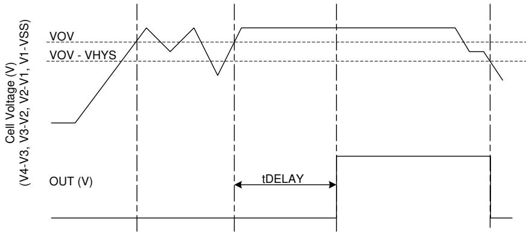  
Figure 7-1. Timing for Overvoltage Sensing for OUT

# 7.3.3 Regulated Output Voltage

For BQ2961, there are three factory-preprogrammed options for the regulated output voltage, 3.3V, 2.5V, and 1.8V. For BQ2962, the regulated output voltage options are 3.3V, 3.15V, and 3.0V. Potentially, the BQ2962xy device can provide other regulated voltage output between 3.3V to $3 . 0 \mathsf { V } .$ Contact Texas Instruments for details.

At power up, the regulated output is on by default. If any cell voltage is below VUVREG at device power up, the regulated output will remain on until the tUV_DELAY time has passed, the regulated output turns off after the delay time.

During discharge, if any cell voltage falls below the VUVREG threshold for tUV_DELAY time, the regulated output is self-disabled. The regulated output turns on again when all the cell voltages are above $V _ { \cup \lor \mathsf { R E G } } + \lor _ { \mathsf { U V F } }$ YS.

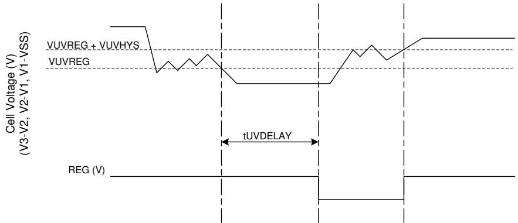  
Figure 7-2. REG Output Timing

# 7.4 Device Functional Modes

# 7.4.1 NORMAL Mode

When all of the cell voltages are below the $\mathsf { V } _ { \mathsf { O V } }$ threshold AND above VUVREG threshold, the device operates in NORMAL mode. The device monitors the differential cell voltages connected across (V1–VSS), (V2–V1), (V3– V2), and (V4–V3). The OUT pin is inactive in this mode. The regulated output is always enabled for BQ2961.

# 7.4.2 OVERVOLTAGE Mode

OVERVOLTAGE mode is detected if any of the cell voltages exceed the overvoltage threshold, $\mathsf { V } _ { \mathsf { O V } }$ , for a configured OV delay time. The OUT pin is activated after a delay time preprogrammed at the factory. The OUT pin will pull high internally. Then an external FET is turned on, shorting the fuse to ground, which allows the battery and/or charger power to blow the fuse. When all of the cell voltages fall below $( \mathsf { V } _ { \mathsf { O V } } - \mathsf { V } _ { \mathsf { H Y S } } )$ , the device returns to NORMAL mode. The regulated output (if enabled) remains on in this mode.

# 7.4.3 UNDERVOLTAGE Mode

The UNDERVOLTAGE mode is detected if any of the cell voltage across (V1–VSS), (V2–V1), (V3–V2), or $( \lor 4 -$ V3) is below the VUVREG threshold for tUV_DELAY time. In this mode, the regulated output is disabled. To return to the NORMAL mode, all the cell voltages must be above $( \mathsf { V } _ { \mathsf { U V R E G } } + \mathsf { V } _ { \mathsf { U V H Y S } } )$ .

For a low cell configuration, ${ \sf V } _ { \sf n }$ pin can be shorted to the $( \mathsf { V } _ { \mathsf { n } - 1 } )$ pin. The device ignores any differential cell voltage below VUVQUAL threshold for undervoltage detection.

# 7.4.4 CUSTOMER TEST Mode

The Customer Test Mode (CTM) helps to reduce test time for checking the overvoltage delay-timer parameter once the circuit is implemented into the battery pack. To enter CTM, the VDD pin should be set at least 10V higher than V4 (see Figure 7-3). The delay timer is greater than $1 0 \mathsf { m } \mathsf { s }$ , but considerably shorter than the timer delay in normal operation. To exit CTM, remove the VDD to V4 voltage differential of 10V, so that the decrease in the value automatically causes an exit.

# CAUTION

Avoid exceeding any Absolute Maximum Voltages on any pins when placing the device into CTM. Also avoid exceeding Absolute Maximum Voltages for the individual cell voltages (V4–V3), (V3–V2), (V2–V1) and (V1–VSS). Stressing the pins beyond the rated limits can cause permanent damage to the device.

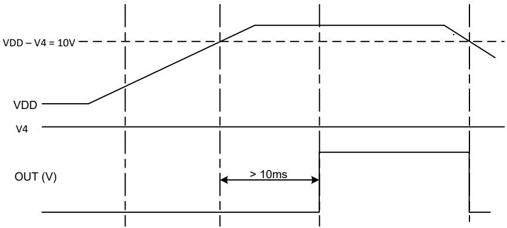  
Figure 7-3 shows the timing for the Customer Test Mode.   
Figure 7-3. Timing for Customer Test Mode

Figure 7-4 shows the measurement for current consumption of the product for both VDD and $\vee { \tt x }$ .

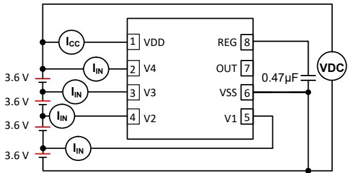  
Figure 7-4. Configuration for Integrated Circuit Current Consumption Test

# 8 Application and Implementation

# Note

Information in the following applications sections is not part of the TI component specification, and TI does not warrant its accuracy or completeness. TI’s customers are responsible for determining suitability of components for their purposes. Customers should validate and test their design implementation to confirm system functionality.

# 8.1 Application Information

The BQ296xxx family of second-level protectors is used for overvoltage protection of the battery pack in the application. A regulated output is available to drive a small circuit with maximum IREG loading. The device OUT pin is active high, which drives a NMOS FET that connects the fuse to ground in the event of a fault condition. This provides a shorted path to use the battery and/or charger power to blow the fuse and cut the power path.

# 8.2 Typical Application

Application Schematic shows the recommended reference design components.

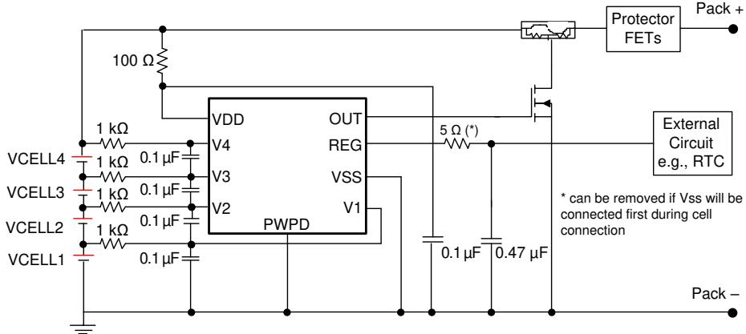  
Figure 8-1. Application Schematic

# 8.2.1 Design Requirements

# Note

Changes to the ranges shown in Table 8-1 will impact the accuracy of the cell measurements.

Table 8-1. Parameters   

<table><tr><td rowspan=1 colspan=1>PARAMETER</td><td rowspan=1 colspan=1>EXTERNAL COMPONENT</td><td rowspan=1 colspan=1>MIN</td><td rowspan=1 colspan=1>NOM</td><td rowspan=1 colspan=1>MAX</td><td rowspan=1 colspan=1>UNIT</td></tr><tr><td rowspan=1 colspan=1>Voltage monitor filter resistance</td><td rowspan=1 colspan=1>RIN</td><td rowspan=1 colspan=3>900         1000        4700</td><td rowspan=1 colspan=1>2</td></tr><tr><td rowspan=1 colspan=1>Voltage monitor filter capacitance</td><td rowspan=1 colspan=1>CIN</td><td rowspan=1 colspan=1>0.01</td><td rowspan=1 colspan=1>0.1</td><td rowspan=1 colspan=1>1.0</td><td rowspan=1 colspan=1>$μFr$</td></tr><tr><td rowspan=1 colspan=1>Supply voltage filter resistance</td><td rowspan=1 colspan=1>RvD</td><td rowspan=1 colspan=1>0.1</td><td rowspan=1 colspan=2>           1</td><td rowspan=1 colspan=1>KQ</td></tr><tr><td rowspan=1 colspan=1>Supplyvoltage filter apacitance</td><td rowspan=1 colspan=1>CVD</td><td rowspan=1 colspan=1>−</td><td rowspan=1 colspan=2>0.1          1.0</td><td rowspan=1 colspan=1>$μFr$</td></tr><tr><td rowspan=1 colspan=1>REG output capacitance</td><td rowspan=1 colspan=1>CREG</td><td rowspan=1 colspan=3>0.47          1           </td><td rowspan=1 colspan=1>$μFr$</td></tr></table>

# Note

The device is calibrated using an $\mathsf { R } _ { \mathsf { I N } }$ value $= 1 \mathsf { k } \Omega$ . Using a value other than the recommended value changes the accuracy of the cell voltage measurements and $\mathsf { V } _ { \mathsf { O V } }$ trigger level.

# 8.2.2 Detailed Design Procedure

# Note

The device VSS must be connected first during PCB test or cell attachment. Failure to do so can damage the REG pin.

1. If the VSS pin cannot be connected first, it is required to add a resistor of a minimum of 5Ω to a maximum of $1 0 \Omega$ (a 5Ω resistor is used in the reference schematic, Figure 8-2) in series with the REG capacitor. When VSS is floating, the REG capacitor always charges up to the VDD voltage. When VSS is finally connected, the REG capacitor will be discharged. Adding a small resistor in series reduces the current strength and avoids any potential damage to the REG pin. The $\boldsymbol { 5 \Omega }$ resistor can be placed in series with the REG connect circuit (as shown in Figure 8-2) or in series of the REG capacitor (as shown in Figure 8-3). Placing the resistor in series with the REG circuit results in a small drop of $\mathsf { V } _ { \mathsf { R E G } }$ (for example: max loading of IREG mA with a 5Ω resistor will drop 5mV on $\mathsf { V } _ { \mathsf { R E G } } )$ , but such a connection can protect again rush current discharge from a REG capacitor or an external filter capacitor connected to the REG pin. Placing the resistor in series with the REG capacitor is an alternative to avoiding an additional drop in $\mathsf { V } _ { \mathsf { R E G } }$ if the filter capacitor used by the external circuit is much smaller than the REG capacitor.

2. After VSS is connected, the device allows a random cell connection to the $\vee { \tt x }$ pin.

3. The cell should be connected to the lower ${ \sf V } _ { \sf n }$ pin; the unused ${ \sf V } _ { \sf n }$ pin should be shorted to the $( \mathsf { V } _ { \mathsf { n } - 1 } )$ pin. See Figure 8-2 for details.

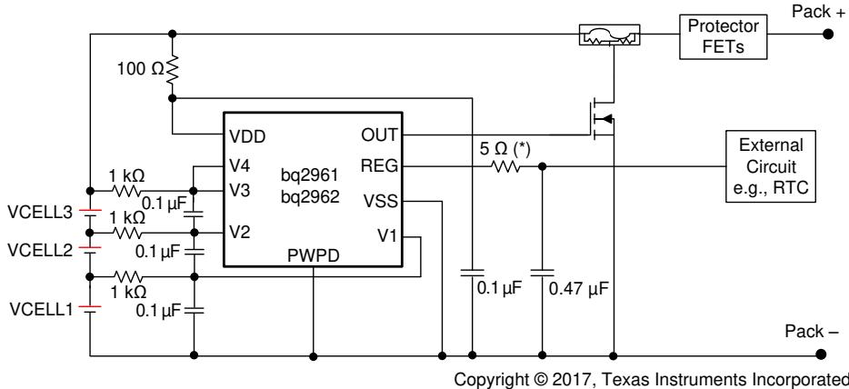  
Figure 8-2. 3-Series BQ2961 and BQ2962 Schematic

4. A Zener diode can be added to the REG pin to VSS, as shown in Figure 8-3. This is recommended to protect the circuit connected to the REG pin if floating VSS in the field is a risk concern. When VSS is floating (during cell connection when VSS is not connected first or in a system fault with a broken BAT– wire), the REG voltage always pulls up to VDD. In a 4-series configuration, the REG voltage can reach approximately 16V with VSS floating. Adding a Zener diode clamps the REG voltage to a safe level for the external circuits connected to the REG pin. Having the Zener diode can also protect the external circuits if the REG pin is shorted to the OUT pin or any other high-voltage output terminal. If a Zener diode is used, TI recommends putting the diode on the battery side with the BQ296xxx device to allow protection on the REG pin, as well as the circuit connected to REG under the floating VSS condition. The resistor in series with the REG pin is not required in this case.

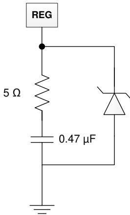  
The 5-üUHVLVWRUOLPLWVWKHUXVKFXUUHQW discharge from the capacitor during cell connection when Vss is not connected first.   
Figure 8-3. 5V Zener Diode

This resistor is not required if Vss is connected first in the cell connection sequence.

Loss of Vss connection or REG shorted to high voltage can bring the REG above the regulated range. This optional zener clamp can protect the downstream circuit under such an event.

# 8.2.3 Application Curves

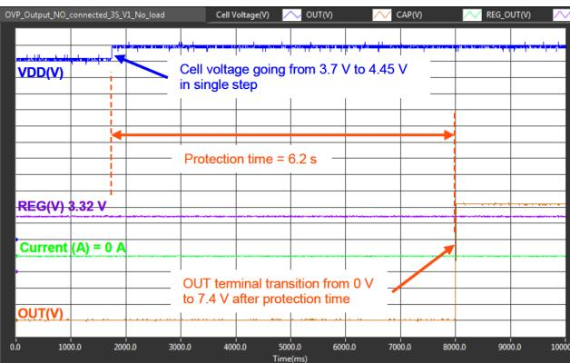  
Figure 8-4. Overvoltage Protection

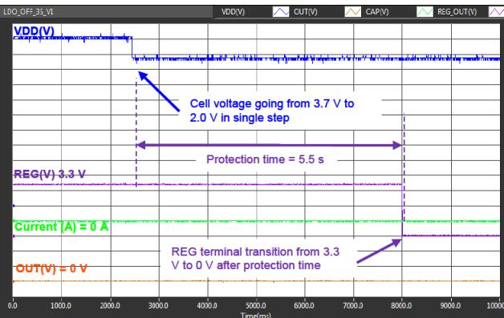  
Figure 8-6. Undervoltage Detection to Turn Off the Regulator

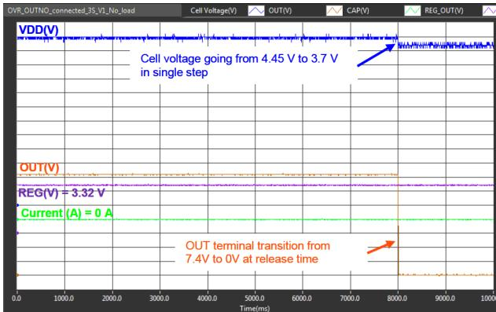  
Figure 8-5. Overvoltage Protection Release

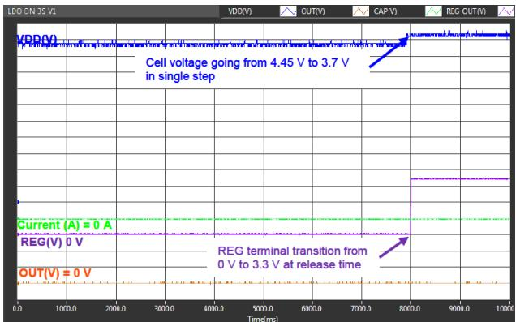  
Figure 8-7. Undervoltage Release to Switch On the Regulator

# 9 Power Supply Recommendations

The maximum power is 20V for BQ2961 and BQ2962 on VDD.

# Note

Connect VSS first during power-up.

# 10 Layout

# 10.1 Layout Guidelines

Use the following layout guidelines:

1. Ensure the RC filters for the Vx pins and VDD pin are placed as close as possible to the target terminal, reducing the tracing loop area.   
2. The capacitor for REG should be placed close to the device terminals.   
3. Ensure the trace connecting the fuse to the gate, source of the NFET to the Pack– is sufficient to withstand the current during a fuse blown event.

# 10.2 Layout Example

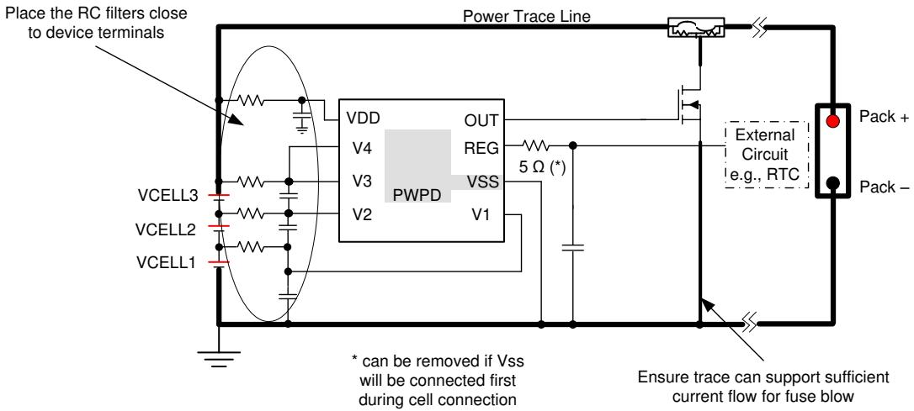  
Figure 10-1. Layout Example

# 11 Device and Documentation Support

# 11.1 Device Support

11.1.1 Third-Party Products Disclaimer

TI'S PUBLICATION OF INFORMATION REGARDING THIRD-PARTY PRODUCTS OR SERVICES DOES NOT CONSTITUTE AN ENDORSEMENT REGARDING THE SUITABILITY OF SUCH PRODUCTS OR SERVICES OR A WARRANTY, REPRESENTATION OR ENDORSEMENT OF SUCH PRODUCTS OR SERVICES, EITHER ALONE OR IN COMBINATION WITH ANY TI PRODUCT OR SERVICE.

# 11.2 Receiving Notification of Documentation Updates

To receive notification of documentation updates, navigate to the device product folder on ti.com. In the upper right corner, click on Alert me to register and receive a weekly digest of any product information that has changed. For change details, review the revision history included in any revised document.

# 11.3 Support Resources

TI E2E™ support forums are an engineer's go-to source for fast, verified answers and design help — straight from the experts. Search existing answers or ask your own question to get the quick design help you need.

Linked content is provided "AS IS" by the respective contributors. They do not constitute TI specifications and do not necessarily reflect TI's views; see TI's Terms of Use.

# 11.4 Trademarks

TI E2E™ is a trademark of Texas Instruments.   
All trademarks are the property of their respective owners.

# 11.5 Electrostatic Discharge Caution

This integrated circuit can be damaged by ESD. Texas Instruments recommends that all integrated circuits be handled with appropriate precautions. Failure to observe proper handling and installation procedures can cause damage.

ESD damage can range from subtle performance degradation to complete device failure. Precision integrated circuits may be more susceptible to damage because very small parametric changes could cause the device not to meet its published specifications.

# 11.6 Glossary

This glossary lists and explains terms, acronyms, and definitions.

# 12 Revision History

NOTE: Page numbers for previous revisions may differ from page numbers in the current version.

# Changes from Revision U (October 2024) to Revision V (September 2025) Page

Removed REG_EN pin from table in Pin Configuration and Functions .4 Removed REG_EN from Absolute Maximum Ratings . . 5.. 5 Removed REG_EN from Recommended Operating Conditions   
Removed REG_EN information from Electrical Characteristics   
Removed REG_EN pin from Functional Block Diagram 10 Changed references of V3 to V4. Corrected figures in Section 7.4.4 . .12

# m Revision T (August 2022) to Revision U (October 2024) Page

• Added the BQ296235 device to the Device Comparison Table 3

# Changes from Revision S (June 2022) to Revision T (August 2022) Page

• Noted in the Device Comparison Table that the increased UV range is for future BQ2962 devices only.. • Clarified future BQ2962 options.. 9

# Changes from Revision R (April 2022) to Revision S (June 2022) Page

• Increased the UV range for future BQ2962 device in the Device Comparison Table . .3

Changes from Revision Q (January 2022) to Revision R (April 2022) Page • Changed the BQ296234 device to Production Data in the Device Comparison Table . .3

Changes from Revision P (August 2021) to Revision Q (January 2022) Page • Added the BQ296234 PRODUCT PREVIEW device to the Device Comparison Table . 3

Changes from Revision O (July 2021) to Revision P (August 2021)

#

Changed the BQ296227 and BQ296233 devices to Production Data in the Device Comparison Table ........ .3

# 13 Mechanical, Packaging, and Orderable Information

The following pages include mechanical, packaging, and orderable information. This information is the most current data available for the designated devices. This data is subject to change without notice and revision of this document. For browser-based versions of this data sheet, refer to the left-hand navigation.

PACKAGING INFORMATION   

<table><tr><td>Orderable part number</td><td>Status (1)</td><td>Material type (2)</td><td>Package | Pins</td><td>Package qty |Carrier</td><td>RoHS (3)</td><td>Lead finish/ Bal material (4)</td><td>MSL rating/ e ak reflow</td><td>Op temp ()</td><td>Part marking (6)</td></tr><tr><td>BQ296100DSGR</td><td>Active</td><td>Production</td><td>WSON (DSG) | 8</td><td>3000 | LARGE T&amp;R</td><td>Yes</td><td>NIPDAU</td><td>(5) Level-1-260C-UNLIM</td><td>-40 to 110</td><td>6100</td></tr><tr><td>BQ296100DSGR.A</td><td>Active</td><td>Production</td><td>WSON (DSG) |8</td><td>3000 | LARGE T&amp;R</td><td>Yes</td><td>NIPDAU</td><td>Level-1-260C-UNLIM</td><td>-40 to 110</td><td>6100</td></tr><tr><td>BQ296100DSGT</td><td>Active</td><td>Production</td><td>WSON (DSG) | 8</td><td>250 | SMALL T&amp;R</td><td>Yes</td><td>NIPDAU</td><td>Level-1-260C-UNLIM</td><td>-40 to 110</td><td>6100</td></tr><tr><td>BQ296100DSGT.A</td><td>Active</td><td>Production</td><td>WSON (DSG) |8</td><td>250 | SMALL T&amp;R</td><td>Yes</td><td>NIPDAU</td><td>Level-1-260C-UNLIM</td><td>-40 to 110</td><td>6100</td></tr><tr><td>BQ296103DSGR</td><td>Active</td><td>Production</td><td>WSON (DSG) | 8</td><td>3000 | LARGE T&amp;R</td><td>Yes</td><td>NIPDAU</td><td>Level-1-260C-UNLIM</td><td>-40 to 110</td><td>6103</td></tr><tr><td>BQ296103DSGR.A</td><td>Active</td><td>Production</td><td>WSON (DSG) | 8</td><td>3000 | LARGE T&amp;R</td><td>Yes</td><td>NIPDAU</td><td>Level-1-260C-UNLIM</td><td>-40 to 110</td><td>6103</td></tr><tr><td>BQ296103DSGT</td><td>Active</td><td>Production</td><td>WSON (DSG) | 8</td><td>250 | SMALL T&amp;R</td><td>Yes</td><td>NIPDAU</td><td>Level-1-260C-UNLIM</td><td>-40 to 110</td><td>6103</td></tr><tr><td>BQ296103DSGT.A</td><td>Active</td><td>Production</td><td>WSON (DSG) | 8</td><td>250 | SMALL T&amp;R</td><td>Yes</td><td>NIPDAU</td><td>Level-1-260C-UNLIM</td><td>-40 to 110</td><td>6103</td></tr><tr><td>BQ296106DSGR</td><td>Active</td><td>Production</td><td>WSON (DSG) |8</td><td>3000 | LARGE T&amp;R</td><td>Yes</td><td>NIPDAU</td><td>Level-1-260C-UNLIM</td><td>-40 to 110</td><td>6106</td></tr><tr><td>BQ296106DSGR.A</td><td>Active</td><td>Production</td><td>WSON (DSG) | 8</td><td>3000 | LARGE T&amp;R</td><td>Yes</td><td>NIPDAU</td><td>Level-1-260C-UNLIM</td><td>-40 to 110</td><td>6106</td></tr><tr><td>BQ296106DSGT</td><td>Active</td><td>Production</td><td>WSON (DSG) |8</td><td>250 | SMALL T&amp;R</td><td>Yes</td><td>NIPDAU</td><td>Level-1-260C-UNLIM</td><td>-40 to 110</td><td>6106</td></tr><tr><td>BQ296106DSGT.A</td><td>Active</td><td>Production</td><td>WSON (DSG) |8</td><td>250 | SMALL T&amp;R</td><td>Yes</td><td>NIPDAU</td><td>Level-1-260C-UNLIM</td><td>-40 to 110</td><td>6106</td></tr><tr><td>BQ296107DSGR</td><td>Active</td><td>Production</td><td>WSON (DSG) | 8</td><td>3000 | LARGE T&amp;R</td><td>Yes</td><td>NIPDAU</td><td>Level-1-260C-UNLIM</td><td>-40 to 110</td><td>6107</td></tr><tr><td>BQ296107DSGR.A</td><td>Active</td><td>Production</td><td>WSON (DSG) |8</td><td>3000 | LARGE T&amp;R</td><td>Yes</td><td>NIPDAU</td><td>Level-1-260C-UNLIM</td><td>-40 to 110</td><td>6107</td></tr><tr><td>BQ296107DSGT</td><td>Active</td><td>Production</td><td>WSON (DSG) |8</td><td>250 | SMALL T&amp;R</td><td>Yes</td><td>NIPDAU</td><td>Level-1-260C-UNLIM</td><td>-40 to 110</td><td>6107</td></tr><tr><td>BQ296107DSGT.A</td><td>Active</td><td>Production</td><td>WSON (DSG) |8</td><td>250 | SMALL T&amp;R</td><td>Yes</td><td>NIPDAU</td><td>Level-1-260C-UNLIM</td><td>-40 to 110</td><td>6107</td></tr><tr><td>BQ296111DSGR</td><td>Active</td><td>Production</td><td>WSON (DSG) |8</td><td>3000 | LARGE T&amp;R</td><td>Yes</td><td>NIPDAU</td><td>Level-2-260C-1 YEAR</td><td>-40 to 110</td><td>6111</td></tr><tr><td>BQ296111DSGR.A</td><td>Active Active</td><td>Production</td><td>WSON (DSG) |8</td><td>3000 | LARGE T&amp;R</td><td>Yes</td><td>NIPDAU</td><td>Level-2-260C-1 YEAR</td><td>-40 to 110</td><td>6111</td></tr><tr><td>BQ296111DSGT</td><td>Active</td><td>Production</td><td>WSON (DSG) |8</td><td>250 | SMALL T&amp;R</td><td>Yes</td><td>NIPDAU</td><td>Level-1-260C-UNLIM</td><td>-40 to 110</td><td>6111</td></tr><tr><td>BQ296111DSGT.A</td><td>Active</td><td>Production Production</td><td>WSON (DSG) | 8 WSON (DSG) |8</td><td>250 | SMALL T&amp;R</td><td>Yes</td><td>NIPDAU</td><td>Level-1-260C-UNLIM</td><td>-40 to 110</td><td>6111</td></tr><tr><td>BQ296112DSGR</td><td>Active</td><td>Production</td><td>WSON (DSG) | 8</td><td>3000 | LARGE T&amp;R</td><td>Yes</td><td>NIPDAU NIPDAU</td><td>Level-2-260C-1 YEAR Level-2-260C-1 YEAR</td><td>-40 to 110</td><td>6112</td></tr><tr><td>BQ296112DSGR.A</td><td>Active</td><td>Production</td><td>WSON (DSG) |8</td><td>3000 | LARGE T&amp;R</td><td>Yes</td><td></td><td></td><td>-40 to 110</td><td>6112</td></tr><tr><td>BQ296112DSGT</td><td>Active</td><td>Production</td><td>WSON (DSG) | 8</td><td>250 | SMALL T&amp;R</td><td>Yes</td><td>NIPDAU</td><td>Level-2-260C-1 YEAR Level-2-260C-1 YEAR</td><td>-40 to 110</td><td>6112</td></tr><tr><td>BQ296112DSGT.A</td><td>Active</td><td>Production</td><td>WSON (DSG) |8</td><td>250 | SMALL T&amp;R</td><td>Yes</td><td>NIPDAU NIPDAU</td><td></td><td>-40 to 110</td><td>6112</td></tr><tr><td>BQ296113DSGR</td><td>Active</td><td>Production</td><td>WSON (DSG) | 8</td><td>3000 | LARGE T&amp;R</td><td>Yes Yes</td><td>NIPDAU</td><td>Level-1-260C-UNLIM Level-1-260C-UNLIM</td><td>-40 to 110</td><td>6113</td></tr><tr><td>BQ296113DSGR.A</td><td>Active</td><td>Production</td><td>WSON (DSG) |8</td><td>3000 | LARGE T&amp;R 250 | SMALL T&amp;R</td><td>Yes</td><td>NIPDAU</td><td>Level-1-260C-UNLIM</td><td>-40 to 110</td><td>6113</td></tr><tr><td>BQ296113DSGT BQ296113DSGT.A</td><td>Active</td><td>Production</td><td>WSON (DSG) |8</td><td>250 | SMALL T&amp;R</td><td>Yes</td><td>NIPDAU</td><td>Level-1-260C-UNLIM</td><td>-40 to 110 -40 to 110</td><td>6113</td></tr><tr><td>BQ296114DSGR</td><td>Active</td><td>Production</td><td>WSON (DSG) | 8</td><td>3000 | LARGE T&amp;R</td><td>Yes</td><td>NIPDAU</td><td>Level-1-260C-UNLIM</td><td>-40 to 110</td><td>6113 6114</td></tr><tr><td colspan="1" rowspan="2">Orderable part number</td><td colspan="1" rowspan="1">Status</td><td colspan="1" rowspan="1">Material type</td><td colspan="3" rowspan="1">Package | Pins  Package qty | Carrier</td><td colspan="1" rowspan="1">RoHS</td><td colspan="2" rowspan="1">Lead finish/        MSL rating/        Op temp (</td><td colspan="1" rowspan="2">Part marking(6)</td></tr><tr><td colspan="1" rowspan="1">(1)</td><td colspan="1" rowspan="1">(2)</td><td colspan="3" rowspan="1"></td><td colspan="1" rowspan="1">(3)</td><td colspan="2" rowspan="1">Ball material        Peak reflow(4)                  (5)</td></tr><tr><td colspan="1" rowspan="1">BQ296114DSGR.A</td><td colspan="1" rowspan="1">Active</td><td colspan="1" rowspan="1">Production</td><td colspan="3" rowspan="1">WSON (DSG) | 8   3000 | LARGE T&amp;R</td><td colspan="1" rowspan="1">Yes</td><td colspan="2" rowspan="1">NIPDAU      Level-1-260C-UNLIM     -40 to 110</td><td colspan="1" rowspan="1">6114</td></tr><tr><td colspan="1" rowspan="1">BQ296114DSGT</td><td colspan="1" rowspan="1">Active</td><td colspan="1" rowspan="1">Production</td><td colspan="3" rowspan="1">WSON (DSG) | 8   250 | SMALL T&amp;R</td><td colspan="1" rowspan="1">Yes</td><td colspan="1" rowspan="1">NIPDAU      Level-1-260C-UNLIM</td><td colspan="1" rowspan="1">-40 to 110</td><td colspan="1" rowspan="1">6114</td></tr><tr><td colspan="1" rowspan="1">BQ296114DSGT.A</td><td colspan="1" rowspan="1">Active</td><td colspan="1" rowspan="1">Production</td><td colspan="2" rowspan="1">WSON (DSG) | 8</td><td colspan="1" rowspan="1">250 | SMALL T&amp;R</td><td colspan="1" rowspan="1">Yes</td><td colspan="1" rowspan="1">NIPDAU      Level-1-260C-UNLIM</td><td colspan="1" rowspan="1">-40 to 110</td><td colspan="1" rowspan="1">6114</td></tr><tr><td colspan="1" rowspan="1">BQ296115DSGR</td><td colspan="1" rowspan="1">Active</td><td colspan="1" rowspan="1">Production</td><td colspan="2" rowspan="1">WSON (DSG) | 8</td><td colspan="1" rowspan="1">3000 | LARGE T&amp;R</td><td colspan="1" rowspan="1">Yes</td><td colspan="1" rowspan="1">NIPDAU      Level-1-260C-UNLIM</td><td colspan="1" rowspan="1">-40 to 110</td><td colspan="1" rowspan="1">6115</td></tr><tr><td colspan="1" rowspan="1">BQ296115DSGR.A</td><td colspan="1" rowspan="1">Active</td><td colspan="1" rowspan="1">Production</td><td colspan="1" rowspan="1">WSON (DSG) | 8</td><td colspan="1" rowspan="1">8</td><td colspan="1" rowspan="1">3000 | LARGE T&amp;R</td><td colspan="1" rowspan="1">Yes</td><td colspan="1" rowspan="1">NIPDAU      Level-1-260C-UNLIM</td><td colspan="1" rowspan="1">-40 to 110</td><td colspan="1" rowspan="1">6115</td></tr><tr><td colspan="1" rowspan="1">BQ296202DSGR</td><td colspan="1" rowspan="1">Active</td><td colspan="1" rowspan="1">Production</td><td colspan="1" rowspan="1">WSON (DSG) | 8</td><td colspan="1" rowspan="1">8</td><td colspan="1" rowspan="1">3000 | LARGE T&amp;R</td><td colspan="1" rowspan="1">Yes</td><td colspan="1" rowspan="1">NIPDAU      Level-1-260C-UNLIM</td><td colspan="1" rowspan="1">-40 to 110</td><td colspan="1" rowspan="1">6202</td></tr><tr><td colspan="1" rowspan="1">BQ296202DSGR.A</td><td colspan="1" rowspan="1">Active</td><td colspan="1" rowspan="1">Production</td><td colspan="1" rowspan="1">WSON (DSG) | 8</td><td colspan="1" rowspan="1">8</td><td colspan="1" rowspan="1">3000 | LARGE T&amp;R</td><td colspan="1" rowspan="1">Yes</td><td colspan="1" rowspan="1">NIPDAU      Level-1-260C-UNLIM</td><td colspan="1" rowspan="1">-40 to 110</td><td colspan="1" rowspan="1">6202</td></tr><tr><td colspan="1" rowspan="1">BQ296202DSGT</td><td colspan="1" rowspan="1">Active</td><td colspan="1" rowspan="1">Production</td><td colspan="1" rowspan="1">WSON (DSG) | 8</td><td colspan="2" rowspan="1">250 | SMALL T&amp;R</td><td colspan="1" rowspan="1">Yes</td><td colspan="1" rowspan="1">NIPDAU      Level-1-260C-UNLIM</td><td colspan="1" rowspan="1">-40 to 110</td><td colspan="1" rowspan="1">6202</td></tr><tr><td colspan="1" rowspan="1">BQ296202DSGT.A</td><td colspan="1" rowspan="1">Active</td><td colspan="1" rowspan="1">Production</td><td colspan="1" rowspan="1">WSON (DSG) | 8</td><td colspan="1" rowspan="1">8</td><td colspan="1" rowspan="1">250 | SMALL T&amp;R</td><td colspan="1" rowspan="1">Yes</td><td colspan="1" rowspan="1">NIPDAU      Level-1-260C-UNLIM</td><td colspan="1" rowspan="1">-40 to 110</td><td colspan="1" rowspan="1">6202</td></tr><tr><td colspan="1" rowspan="1">BQ296203DSGR</td><td colspan="1" rowspan="1">Active</td><td colspan="1" rowspan="1">Production</td><td colspan="1" rowspan="1">WSON (DSG) | 8</td><td colspan="1" rowspan="1">8</td><td colspan="1" rowspan="1">3000 | LARGE T&amp;R</td><td colspan="1" rowspan="1">Yes</td><td colspan="1" rowspan="1">NIPDAU      Level-1-260C-UNLIM</td><td colspan="1" rowspan="1">-40 to 110</td><td colspan="1" rowspan="1">6203</td></tr><tr><td colspan="1" rowspan="1">BQ296203DSGR.A</td><td colspan="1" rowspan="1">Active</td><td colspan="1" rowspan="1">Production</td><td colspan="1" rowspan="1">WSON (DSG) | 8</td><td colspan="1" rowspan="1">8</td><td colspan="1" rowspan="1">3000 | LARGE T&amp;R</td><td colspan="1" rowspan="1">Yes</td><td colspan="1" rowspan="1">NIPDAU      Level-1-260C-UNLIM</td><td colspan="1" rowspan="1">-40 to 110</td><td colspan="1" rowspan="1">6203</td></tr><tr><td colspan="1" rowspan="1">BQ296203DSGT</td><td colspan="1" rowspan="1">Active</td><td colspan="1" rowspan="1">Production</td><td colspan="1" rowspan="1">WSON (DSG) | 8</td><td colspan="1" rowspan="1">8</td><td colspan="1" rowspan="1">250 | SMALL T&amp;R</td><td colspan="1" rowspan="1">Yes</td><td colspan="1" rowspan="1">NIPDAU      Level-1-260C-UNLIM</td><td colspan="1" rowspan="1">-40 to 110</td><td colspan="1" rowspan="1">6203</td></tr><tr><td colspan="1" rowspan="1">BQ296203DSGT.A</td><td colspan="1" rowspan="1">Active</td><td colspan="1" rowspan="1">Production</td><td colspan="1" rowspan="1">WSON (DSG) |8</td><td colspan="1" rowspan="1">8</td><td colspan="1" rowspan="1">250 | SMALL T&amp;R</td><td colspan="1" rowspan="1">Yes</td><td colspan="1" rowspan="1">NIPDAU      Level-1-260C-UNLIM</td><td colspan="1" rowspan="1">-40 to 110</td><td colspan="1" rowspan="1">6203</td></tr><tr><td colspan="1" rowspan="1">BQ296212DSGR</td><td colspan="1" rowspan="1">Active</td><td colspan="1" rowspan="1">Production</td><td colspan="1" rowspan="1">WSON (DSG) | 8</td><td colspan="1" rowspan="1">8</td><td colspan="1" rowspan="1">3000 | LARGE T&amp;R</td><td colspan="1" rowspan="1">Yes</td><td colspan="1" rowspan="1">NIPDAU      Level-2-260C-1 YEAR</td><td colspan="1" rowspan="1">-40 to 110</td><td colspan="1" rowspan="1">6212</td></tr><tr><td colspan="1" rowspan="1">BQ296212DSGR.A</td><td colspan="1" rowspan="1">Active</td><td colspan="1" rowspan="1">Production</td><td colspan="1" rowspan="1">WSON (DSG) | 8</td><td colspan="1" rowspan="1">8</td><td colspan="1" rowspan="1">3000 | LARGE T&amp;R</td><td colspan="1" rowspan="1">Yes</td><td colspan="1" rowspan="1">NIPDAU      Level-2-260C-1 YEAR</td><td colspan="1" rowspan="1">-40 to 110</td><td colspan="1" rowspan="1">6212</td></tr><tr><td colspan="1" rowspan="1">BQ296212DSGT</td><td colspan="1" rowspan="1">Active</td><td colspan="1" rowspan="1">Production</td><td colspan="1" rowspan="1">WSON (DSG) | 8</td><td colspan="1" rowspan="1">8</td><td colspan="1" rowspan="1">250 | SMALL T&amp;R</td><td colspan="1" rowspan="1">Yes</td><td colspan="2" rowspan="1">NIPDAU      Level-2-260C-1 YEAR     -40 to 110</td><td colspan="1" rowspan="1">6212</td></tr><tr><td colspan="1" rowspan="1">BQ296212DSGT.A</td><td colspan="1" rowspan="1">Active</td><td colspan="1" rowspan="1">Production</td><td colspan="1" rowspan="1">WSON (DSG) | 8</td><td colspan="1" rowspan="1">8</td><td colspan="1" rowspan="1">250 | SMALL T&amp;R</td><td colspan="1" rowspan="1">Yes</td><td colspan="2" rowspan="1">NIPDAU      Level-2-260C-1 YEAR     -40 to 110</td><td colspan="1" rowspan="1">6212</td></tr><tr><td colspan="1" rowspan="1">BQ296213DSGR</td><td colspan="1" rowspan="1">Active</td><td colspan="1" rowspan="1">Production</td><td colspan="1" rowspan="1">WSON (DSG) | 8</td><td colspan="1" rowspan="1">8</td><td colspan="1" rowspan="1">3000 | LARGE T&amp;R</td><td colspan="1" rowspan="1">Yes</td><td colspan="1" rowspan="1">NIPDAU      Level-1-260C-UNLIM</td><td colspan="1" rowspan="1">-40 to 110</td><td colspan="1" rowspan="1">6213</td></tr><tr><td colspan="1" rowspan="1">BQ296213DSGR.A</td><td colspan="1" rowspan="1">Active</td><td colspan="1" rowspan="1">Production</td><td colspan="1" rowspan="1">WSON (DSG) | 8</td><td colspan="1" rowspan="1">8</td><td colspan="1" rowspan="1">3000 | LARGE T&amp;R</td><td colspan="1" rowspan="1">Yes</td><td colspan="1" rowspan="1">NIPDAU      Level-1-260C-UNLIM</td><td colspan="1" rowspan="1">-40 to 110</td><td colspan="1" rowspan="1">6213</td></tr><tr><td colspan="1" rowspan="1">BQ296213DSGT</td><td colspan="1" rowspan="1">Active</td><td colspan="1" rowspan="1">Production</td><td colspan="1" rowspan="1">WSON (DSG) | 8</td><td colspan="1" rowspan="1">8</td><td colspan="1" rowspan="1">250 | SMALL T&amp;R</td><td colspan="1" rowspan="1">Yes</td><td colspan="1" rowspan="1">NIPDAU      Level-1-260C-UNLIM</td><td colspan="1" rowspan="1">-40 to 110</td><td colspan="1" rowspan="1">6213</td></tr><tr><td colspan="1" rowspan="1">BQ296213DSGT.A</td><td colspan="1" rowspan="1">Active</td><td colspan="1" rowspan="1">Production</td><td colspan="1" rowspan="1">WSON (DSG) | 8</td><td colspan="1" rowspan="1">8</td><td colspan="1" rowspan="1">250 | SMALL T&amp;R</td><td colspan="1" rowspan="1">Yes</td><td colspan="1" rowspan="1">NIPDAU      Level-1-260C-UNLIM</td><td colspan="1" rowspan="1">-40 to 110</td><td colspan="1" rowspan="1">6213</td></tr><tr><td colspan="1" rowspan="1">BQ296215DSGR</td><td colspan="1" rowspan="1">Active</td><td colspan="1" rowspan="1">Production</td><td colspan="1" rowspan="1">WSON (DSG) | 8</td><td colspan="1" rowspan="1">8</td><td colspan="1" rowspan="1">3000 | LARGE T&amp;R</td><td colspan="1" rowspan="1">Yes</td><td colspan="2" rowspan="1">NIPDAU      Level-1-260C-UNLIM     -40 to 110</td><td colspan="1" rowspan="1">6215</td></tr><tr><td colspan="1" rowspan="1">BQ296215DSGR.A</td><td colspan="1" rowspan="1">Active</td><td colspan="1" rowspan="1">Production</td><td colspan="1" rowspan="1">WSON (DSG) | 8</td><td colspan="1" rowspan="1">8</td><td colspan="1" rowspan="1">3000 | LARGE T&amp;R</td><td colspan="1" rowspan="1">Yes</td><td colspan="2" rowspan="1">NIPDAU      Level-1-260C-UNLIM     -40 to 110</td><td colspan="1" rowspan="1">6215</td></tr><tr><td colspan="1" rowspan="1">BQ296215DSGT</td><td colspan="1" rowspan="1">Active</td><td colspan="1" rowspan="1">Production</td><td colspan="1" rowspan="1">WSON (DSG) | 8</td><td colspan="1" rowspan="1">8</td><td colspan="1" rowspan="1">250 | SMALL T&amp;R</td><td colspan="1" rowspan="1">Yes</td><td colspan="2" rowspan="1">NIPDAU      Level-1-260C-UNLIM     -40 to 110</td><td colspan="1" rowspan="1">6215</td></tr><tr><td colspan="1" rowspan="1">BQ296215DSGT.A</td><td colspan="1" rowspan="1">Active</td><td colspan="1" rowspan="1">Production</td><td colspan="1" rowspan="1">WSON (DSG) | 8</td><td colspan="1" rowspan="1">8</td><td colspan="1" rowspan="1">250 | SMALL T&amp;R</td><td colspan="1" rowspan="1">Yes</td><td colspan="1" rowspan="1">NIPDAU      Level-1-260C-UNLIM</td><td colspan="1" rowspan="1">-40 to 110</td><td colspan="1" rowspan="1">6215</td></tr><tr><td colspan="1" rowspan="1">BQ296216DSGR</td><td colspan="1" rowspan="1">Active</td><td colspan="1" rowspan="1">Production</td><td colspan="1" rowspan="1">WSON (DSG) | 8</td><td colspan="1" rowspan="1">8</td><td colspan="1" rowspan="1">3000 | LARGE T&amp;R</td><td colspan="1" rowspan="1">Yes</td><td colspan="1" rowspan="1">NIPDAU      Level-1-260C-UNLIM</td><td colspan="1" rowspan="1">-40 to 110</td><td colspan="1" rowspan="1">6216</td></tr><tr><td colspan="1" rowspan="1">BQ296216DSGR.A</td><td colspan="1" rowspan="1">Active</td><td colspan="1" rowspan="1">Production</td><td colspan="1" rowspan="1">WSON (DSG) |8</td><td colspan="1" rowspan="1">8</td><td colspan="1" rowspan="1">3000 | LARGE T&amp;R</td><td colspan="1" rowspan="1">Yes</td><td colspan="1" rowspan="1">NIPDAU      Level-1-260C-UNLIM</td><td colspan="1" rowspan="1">-40 to 110</td><td colspan="1" rowspan="1">6216</td></tr><tr><td colspan="1" rowspan="1">BQ296216DSGT</td><td colspan="1" rowspan="1">Active</td><td colspan="1" rowspan="1">Production</td><td colspan="1" rowspan="1">WSON (DSG) | 8</td><td colspan="2" rowspan="1">250 | SMALL T&amp;R</td><td colspan="1" rowspan="1">Yes</td><td colspan="2" rowspan="1">NIPDAU      Level-1-260C-UNLIM     -40 to 110</td><td colspan="1" rowspan="1">6216</td></tr><tr><td colspan="1" rowspan="1">BQ296216DSGT.A</td><td colspan="2" rowspan="1">Active  Production</td><td colspan="1" rowspan="1">WSON (DSG) |8</td><td colspan="2" rowspan="1">250 | SMALL T&amp;R</td><td colspan="1" rowspan="1">Yes</td><td colspan="2" rowspan="1">NIPDAU      Level-1-260C-UNLIM     -40 to 110</td><td colspan="1" rowspan="1">6216</td></tr><tr><td colspan="1" rowspan="1">BQ296217DSGR</td><td colspan="1" rowspan="1">Active</td><td colspan="1" rowspan="1">Production</td><td colspan="1" rowspan="1">WSON (DSG) | 8</td><td colspan="2" rowspan="1">3000 | LARGE T&amp;R</td><td colspan="1" rowspan="1">Yes</td><td colspan="2" rowspan="1">NIPDAU      Level-1-260C-UNLIM     -40 to 110</td><td colspan="1" rowspan="1">6217</td></tr><tr><td colspan="1" rowspan="1">BQ296217DSGR.A</td><td colspan="2" rowspan="1">Active   Production</td><td colspan="4" rowspan="1">WSON (DSG) | 8   3000 | LARGE T&amp;R     Yes</td><td colspan="2" rowspan="1">NIPDAU      Level-1-260C-UNLIM      -40 to 110</td><td colspan="1" rowspan="1">6217</td></tr></table>

<table><tr><td colspan="1" rowspan="2">Orderable part number</td><td colspan="1" rowspan="1">Status</td><td colspan="1" rowspan="1">Material type</td><td colspan="3" rowspan="1">Package | Pins  Package qty | Carrier</td><td colspan="1" rowspan="1">RoHS</td><td colspan="2" rowspan="1">Lead finish/        MSL rating/        Op temp (</td><td colspan="2" rowspan="2">Part marking(6)</td></tr><tr><td colspan="1" rowspan="1">(1)</td><td colspan="1" rowspan="1">(2)</td><td colspan="3" rowspan="1"></td><td colspan="1" rowspan="1">(3)</td><td colspan="3" rowspan="1">Ball material        Peak reflow(4)                  (5)</td></tr><tr><td colspan="1" rowspan="1">BQ296217DSGT</td><td colspan="1" rowspan="1">Active</td><td colspan="1" rowspan="1">Production</td><td colspan="3" rowspan="1">WSON (DSG) | 8    250 | SMALL T&amp;R</td><td colspan="1" rowspan="1">Yes</td><td colspan="2" rowspan="1">NIPDAU      Level-1-260C-UNLIM     -40 to 110</td><td colspan="2" rowspan="1">6217</td></tr><tr><td colspan="1" rowspan="1">BQ296217DSGT.A</td><td colspan="1" rowspan="1">Active</td><td colspan="1" rowspan="1">Production</td><td colspan="3" rowspan="1">WSON (DSG) | 8   250 | SMALL T&amp;R</td><td colspan="1" rowspan="1">Yes</td><td colspan="1" rowspan="1">NIPDAU      Level-1-260C-UNLIM</td><td colspan="1" rowspan="1">-40 to 110</td><td colspan="2" rowspan="1">6217</td></tr><tr><td colspan="1" rowspan="1">BQ296221DSGR</td><td colspan="1" rowspan="1">Active</td><td colspan="1" rowspan="1">Production</td><td colspan="2" rowspan="1">WSON (DSG) | 8</td><td colspan="1" rowspan="1">3000 | LARGE T&amp;R</td><td colspan="1" rowspan="1">Yes</td><td colspan="1" rowspan="1">SN        Level-2-260C-1 YEAR</td><td colspan="1" rowspan="1">-40 to 110</td><td colspan="2" rowspan="1">6221</td></tr><tr><td colspan="1" rowspan="1">BQ296221DSGR.A</td><td colspan="1" rowspan="1">Active</td><td colspan="1" rowspan="1">Production</td><td colspan="2" rowspan="1">WSON (DSG) | 8</td><td colspan="1" rowspan="1">3000 | LARGE T&amp;R</td><td colspan="1" rowspan="1">Yes</td><td colspan="2" rowspan="1">SN        Level-2-260C-1 YEAR     -40 to 110</td><td colspan="2" rowspan="1">6221</td></tr><tr><td colspan="1" rowspan="1">BQ296221DSGT</td><td colspan="1" rowspan="1">Active</td><td colspan="1" rowspan="1">Production</td><td colspan="1" rowspan="1">WSON (DSG) | 8</td><td colspan="2" rowspan="1">250 | SMALL T&amp;R</td><td colspan="1" rowspan="1">Yes</td><td colspan="1" rowspan="1">NIPDAU      Level-1-260C-UNLIM</td><td colspan="1" rowspan="1">-40 to 110</td><td colspan="2" rowspan="1">6221</td></tr><tr><td colspan="1" rowspan="1">BQ296221DSGT.A</td><td colspan="1" rowspan="1">Active</td><td colspan="1" rowspan="1">Production</td><td colspan="1" rowspan="1">WSON (DSG) |8</td><td colspan="1" rowspan="1">8</td><td colspan="1" rowspan="1">250 | SMALL T&amp;R</td><td colspan="1" rowspan="1">Yes</td><td colspan="1" rowspan="1">NIPDAU      Level-1-260C-UNLIM</td><td colspan="1" rowspan="1">-40 to 110</td><td colspan="2" rowspan="1">6221</td></tr><tr><td colspan="1" rowspan="1">BQ296222DSGR</td><td colspan="1" rowspan="1">Active</td><td colspan="1" rowspan="1">Production</td><td colspan="1" rowspan="1">WSON (DSG) | 8</td><td colspan="1" rowspan="1">8</td><td colspan="1" rowspan="1">3000 | LARGE T&amp;R</td><td colspan="1" rowspan="1">Yes</td><td colspan="1" rowspan="1">NIPDAU      Level-1-260C-UNLIM</td><td colspan="1" rowspan="1">-40 to 110</td><td colspan="2" rowspan="1">6222</td></tr><tr><td colspan="1" rowspan="1">BQ296222DSGR.A</td><td colspan="1" rowspan="1">Active</td><td colspan="1" rowspan="1">Production</td><td colspan="1" rowspan="1">WSON (DSG) | 8</td><td colspan="2" rowspan="1">3000 | LARGE T&amp;R</td><td colspan="1" rowspan="1">Yes</td><td colspan="1" rowspan="1">NIPDAU      Level-1-260C-UNLIM</td><td colspan="1" rowspan="1">-40 to 110</td><td colspan="2" rowspan="1">6222</td></tr><tr><td colspan="1" rowspan="1">BQ296222DSGT</td><td colspan="1" rowspan="1">Active</td><td colspan="1" rowspan="1">Production</td><td colspan="1" rowspan="1">WSON (DSG) | 8</td><td colspan="1" rowspan="1">8</td><td colspan="1" rowspan="1">250 | SMALL T&amp;R</td><td colspan="1" rowspan="1">Yes</td><td colspan="1" rowspan="1">NIPDAU      Level-1-260C-UNLIM</td><td colspan="1" rowspan="1">-40 to 110</td><td colspan="2" rowspan="1">6222</td></tr><tr><td colspan="1" rowspan="1">BQ296222DSGT.A</td><td colspan="1" rowspan="1">Active</td><td colspan="1" rowspan="1">Production</td><td colspan="1" rowspan="1">WSON (DSG) | 8</td><td colspan="1" rowspan="1">8</td><td colspan="1" rowspan="1">250 | SMALL T&amp;R</td><td colspan="1" rowspan="1">Yes</td><td colspan="1" rowspan="1">NIPDAU      Level-1-260C-UNLIM</td><td colspan="1" rowspan="1">-40 to 110</td><td colspan="2" rowspan="1">6222</td></tr><tr><td colspan="1" rowspan="1">BQ296223DSGR</td><td colspan="1" rowspan="1">Active</td><td colspan="1" rowspan="1">Production</td><td colspan="1" rowspan="1">WSON (DSG) | 8</td><td colspan="1" rowspan="1">8</td><td colspan="1" rowspan="1">3000 | LARGE T&amp;R</td><td colspan="1" rowspan="1">Yes</td><td colspan="1" rowspan="1">NIPDAU      Level-1-260C-UNLIM</td><td colspan="1" rowspan="1">-40 to 110</td><td colspan="2" rowspan="1">6223</td></tr><tr><td colspan="1" rowspan="1">BQ296223DSGR.A</td><td colspan="1" rowspan="1">Active</td><td colspan="1" rowspan="1">Production</td><td colspan="1" rowspan="1">WSON (DSG) | 8</td><td colspan="1" rowspan="1">8</td><td colspan="1" rowspan="1">3000 | LARGE T&amp;R</td><td colspan="1" rowspan="1">Yes</td><td colspan="1" rowspan="1">NIPDAU      Level-1-260C-UNLIM</td><td colspan="1" rowspan="1">-40 to 110</td><td colspan="2" rowspan="1">6223</td></tr><tr><td colspan="1" rowspan="1">BQ296223DSGT</td><td colspan="1" rowspan="1">Active</td><td colspan="1" rowspan="1">Production</td><td colspan="1" rowspan="1">WSON (DSG) |8</td><td colspan="1" rowspan="1">8</td><td colspan="1" rowspan="1">250 | SMALL T&amp;R</td><td colspan="1" rowspan="1">Yes</td><td colspan="1" rowspan="1">NIPDAU      Level-1-260C-UNLIM</td><td colspan="1" rowspan="1">-40 to 110</td><td colspan="2" rowspan="1">6223</td></tr><tr><td colspan="1" rowspan="1">BQ296223DSGT.A</td><td colspan="1" rowspan="1">Active</td><td colspan="1" rowspan="1">Production</td><td colspan="1" rowspan="1">WSON (DSG) | 8</td><td colspan="1" rowspan="1">8</td><td colspan="1" rowspan="1">250 | SMALL T&amp;R</td><td colspan="1" rowspan="1">Yes</td><td colspan="1" rowspan="1">NIPDAU      Level-1-260C-UNLIM</td><td colspan="1" rowspan="1">-40 to 110</td><td colspan="2" rowspan="1">6223</td></tr><tr><td colspan="1" rowspan="1">BQ296224DSGR</td><td colspan="1" rowspan="1">Active</td><td colspan="1" rowspan="1">Production</td><td colspan="1" rowspan="1">WSON (DSG) | 8</td><td colspan="1" rowspan="1">8</td><td colspan="1" rowspan="1">3000 | LARGE T&amp;R</td><td colspan="1" rowspan="1">Yes</td><td colspan="1" rowspan="1">NIPDAU      Level-1-260C-UNLIM</td><td colspan="1" rowspan="1">-40 to 110</td><td colspan="2" rowspan="1">6224</td></tr><tr><td colspan="1" rowspan="1">BQ296224DSGR.A</td><td colspan="1" rowspan="1">Active</td><td colspan="1" rowspan="1">Production</td><td colspan="1" rowspan="1">WSON (DSG) | 8</td><td colspan="1" rowspan="1">8</td><td colspan="1" rowspan="1">3000 | LARGE T&amp;R</td><td colspan="1" rowspan="1">Yes</td><td colspan="1" rowspan="1">NIPDAU      Level-1-260C-UNLIM</td><td colspan="1" rowspan="1">-40 to 110</td><td colspan="2" rowspan="1">6224</td></tr><tr><td colspan="1" rowspan="1">BQ296224DSGT</td><td colspan="1" rowspan="1">Active</td><td colspan="1" rowspan="1">Production</td><td colspan="1" rowspan="1">WSON (DSG) | 8</td><td colspan="1" rowspan="1">8</td><td colspan="1" rowspan="1">250 | SMALL T&amp;R</td><td colspan="1" rowspan="1">Yes</td><td colspan="1" rowspan="1">NIPDAU      Level-1-260C-UNLIM</td><td colspan="1" rowspan="1">-40 to 110</td><td colspan="2" rowspan="1">6224</td></tr><tr><td colspan="1" rowspan="1">BQ296224DSGT.A</td><td colspan="1" rowspan="1">Active</td><td colspan="1" rowspan="1">Production</td><td colspan="1" rowspan="1">WSON (DSG) | 8</td><td colspan="1" rowspan="1">8</td><td colspan="1" rowspan="1">250 | SMALL T&amp;R</td><td colspan="1" rowspan="1">Yes</td><td colspan="1" rowspan="1">NIPDAU      Level-1-260C-UNLIM</td><td colspan="1" rowspan="1">-40 to 110</td><td colspan="2" rowspan="1">6224</td></tr><tr><td colspan="1" rowspan="1">BQ296226DSGR</td><td colspan="1" rowspan="1">Active</td><td colspan="1" rowspan="1">Production</td><td colspan="1" rowspan="1">WSON (DSG) | 8</td><td colspan="1" rowspan="1">8</td><td colspan="1" rowspan="1">3000 | LARGE T&amp;R</td><td colspan="1" rowspan="1">Yes</td><td colspan="1" rowspan="1">NIPDAU      Level-1-260C-UNLIM</td><td colspan="1" rowspan="1">-40 to 110</td><td colspan="2" rowspan="1">6226</td></tr><tr><td colspan="1" rowspan="1">BQ296226DSGR.A</td><td colspan="1" rowspan="1">Active</td><td colspan="1" rowspan="1">Production</td><td colspan="1" rowspan="1">WSON (DSG) | 8</td><td colspan="1" rowspan="1">8</td><td colspan="1" rowspan="1">3000 | LARGE T&amp;R</td><td colspan="1" rowspan="1">Yes</td><td colspan="1" rowspan="1">NIPDAU      Level-1-260C-UNLIM</td><td colspan="1" rowspan="1">-40 to 110</td><td colspan="2" rowspan="1">6226</td></tr><tr><td colspan="1" rowspan="1">BQ296226DSGT</td><td colspan="1" rowspan="1">Active</td><td colspan="1" rowspan="1">Production</td><td colspan="1" rowspan="1">WSON (DSG) | 8</td><td colspan="1" rowspan="1">8</td><td colspan="1" rowspan="1">250 | SMALL T&amp;R</td><td colspan="1" rowspan="1">Yes</td><td colspan="1" rowspan="1">NIPDAU      Level-1-260C-UNLIM</td><td colspan="1" rowspan="1">-40 to 110</td><td colspan="2" rowspan="1">6226</td></tr><tr><td colspan="1" rowspan="1">BQ296226DSGT.A</td><td colspan="1" rowspan="1">Active</td><td colspan="1" rowspan="1">Production</td><td colspan="1" rowspan="1">WSON (DSG) | 8</td><td colspan="1" rowspan="1">8</td><td colspan="1" rowspan="1">250 | SMALL T&amp;R</td><td colspan="1" rowspan="1">Yes</td><td colspan="1" rowspan="1">NIPDAU      Level-1-260C-UNLIM</td><td colspan="1" rowspan="1">-40 to 110</td><td colspan="2" rowspan="1">6226</td></tr><tr><td colspan="1" rowspan="1">BQ296227DSGR</td><td colspan="1" rowspan="1">Active</td><td colspan="1" rowspan="1">Production</td><td colspan="1" rowspan="1">WSON (DSG) | 8</td><td colspan="1" rowspan="1">8</td><td colspan="1" rowspan="1">3000 | LARGE T&amp;R</td><td colspan="1" rowspan="1">Yes</td><td colspan="1" rowspan="1">NIPDAU      Level-1-260C-UNLIM</td><td colspan="1" rowspan="1">-40 to 110</td><td colspan="2" rowspan="1">6227</td></tr><tr><td colspan="1" rowspan="1">BQ296227DSGR.A</td><td colspan="1" rowspan="1">Active</td><td colspan="1" rowspan="1">Production</td><td colspan="1" rowspan="1">WSON (DSG) | 8</td><td colspan="1" rowspan="1">8</td><td colspan="1" rowspan="1">3000 | LARGE T&amp;R</td><td colspan="1" rowspan="1">Yes</td><td colspan="1" rowspan="1">NIPDAU      Level-1-260C-UNLIM</td><td colspan="1" rowspan="1">-40 to 110</td><td colspan="2" rowspan="1">6227</td></tr><tr><td colspan="1" rowspan="1">BQ296228DSGR</td><td colspan="1" rowspan="1">Active</td><td colspan="1" rowspan="1">Production</td><td colspan="1" rowspan="1">WSON (DSG) | 8</td><td colspan="1" rowspan="1">8</td><td colspan="1" rowspan="1">3000 | LARGE T&amp;R</td><td colspan="1" rowspan="1">Yes</td><td colspan="1" rowspan="1">NIPDAU      Level-1-260C-UNLIM</td><td colspan="1" rowspan="1">-40 to 110</td><td colspan="2" rowspan="1">6228</td></tr><tr><td colspan="1" rowspan="1">BQ296228DSGR.A</td><td colspan="1" rowspan="1">Active</td><td colspan="1" rowspan="1">Production</td><td colspan="1" rowspan="1">WSON (DSG) | 8</td><td colspan="1" rowspan="1">8</td><td colspan="1" rowspan="1">3000 | LARGE T&amp;R</td><td colspan="1" rowspan="1">Yes</td><td colspan="1" rowspan="1">NIPDAU      Level-1-260C-UNLIM</td><td colspan="1" rowspan="1">-40 to 110</td><td colspan="2" rowspan="1">6228</td></tr><tr><td colspan="1" rowspan="1">BQ296228DSGT</td><td colspan="1" rowspan="1">Active</td><td colspan="1" rowspan="1">Production</td><td colspan="1" rowspan="1">WSON (DSG) |8</td><td colspan="1" rowspan="1">8</td><td colspan="1" rowspan="1">250 | SMALL T&amp;R</td><td colspan="1" rowspan="1">Yes</td><td colspan="1" rowspan="1">NIPDAU      Level-1-260C-UNLIM</td><td colspan="1" rowspan="1">-40 to 110</td><td colspan="2" rowspan="1">6228</td></tr><tr><td colspan="1" rowspan="1">BQ296228DSGT.A</td><td colspan="1" rowspan="1">Active</td><td colspan="1" rowspan="1">Production</td><td colspan="1" rowspan="1">WSON (DSG) | 8</td><td colspan="1" rowspan="1">8</td><td colspan="1" rowspan="1">250 | SMALL T&amp;R</td><td colspan="1" rowspan="1">Yes</td><td colspan="1" rowspan="1">NIPDAU      Level-1-260C-UNLIM</td><td colspan="1" rowspan="1">-40 to 110</td><td colspan="2" rowspan="1">6228</td></tr><tr><td colspan="1" rowspan="1">BQ296229DSGR</td><td colspan="2" rowspan="1">Active  Production</td><td colspan="1" rowspan="1">WSON (DSG) |8</td><td colspan="3" rowspan="1">3000 | LARGE T&amp;R     Yes</td><td colspan="2" rowspan="1">NIPDAU      Level-1-260C-UNLIM     -40 to 110</td><td colspan="2" rowspan="1">6229</td></tr><tr><td colspan="1" rowspan="1">BQ296229DSGR.A</td><td colspan="2" rowspan="1">Active   Production</td><td colspan="1" rowspan="1">WSON (DSG) | 8</td><td colspan="2" rowspan="1">3000 | LARGE T&amp;R</td><td colspan="1" rowspan="1">Yes</td><td colspan="2" rowspan="1">NIPDAU      Level-1-260C-UNLIM     -40 to 110</td><td colspan="2" rowspan="1">6229</td></tr><tr><td colspan="1" rowspan="1">BQ296229DSGT</td><td colspan="2" rowspan="1">Active  Production</td><td colspan="4" rowspan="1">WSON (DSG) | 8   250 | SMALL T&amp;R      Yes</td><td colspan="2" rowspan="1">NIPDAU      Level-1-260C-UNLIM      -40 to 110</td><td colspan="2" rowspan="1">6229</td></tr><tr><td rowspan="2">Orderable part number</td><td rowspan="2">Status (1)</td><td rowspan="2">Material type (2)</td><td rowspan="2">Package | Pins</td><td rowspan="2">Package qty | Carrier</td><td rowspan="2">RoHS (3)</td><td rowspan="2">Lead finish/ a Bl material (4)</td><td rowspan="2">MSL rating/ Peak reflow (5)</td><td rowspan="2">Op temp ()</td><td rowspan="2">Part marking (6)</td></tr><tr><td></td></tr><tr><td>BQ296229DSGT.A</td><td>Active</td><td>Production</td><td>WSON (DSG) | 8</td><td>250 | SMALL T&amp;R</td><td>Yes</td><td>NIPDAU</td><td>Level-1-260C-UNLIM</td><td>-40 to 110</td><td>6229</td></tr><tr><td>BQ296230DSGR</td><td>Active</td><td>Production</td><td>WSON (DSG) | 8</td><td>3000 | LARGE T&amp;R</td><td>Yes</td><td>NIPDAU</td><td>Level-1-260C-UNLIM</td><td>-40 to 110</td><td>6230</td></tr><tr><td>BQ296230DSGR.A</td><td>Active</td><td>Production</td><td>WSON (DSG) | 8</td><td>3000 | LARGE T&amp;R</td><td>Yes</td><td>NIPDAU</td><td>Level-1-260C-UNLIM</td><td>-40 to 110</td><td>6230</td></tr><tr><td>BQ296230DSGT</td><td>Active</td><td>Production</td><td>WSON (DSG) | 8</td><td>250 | SMALL T&amp;R</td><td>Yes</td><td>NIPDAU</td><td>Level-1-260C-UNLIM</td><td>-40 to 110</td><td>6230</td></tr><tr><td>BQ296230DSGT.A</td><td>Active</td><td>Production</td><td>WSON (DSG) | 8</td><td>250 | SMALL T&amp;R</td><td>Yes</td><td>NIPDAU</td><td>Level-1-260C-UNLIM</td><td>-40 to 110</td><td>6230</td></tr><tr><td>BQ296231DSGR</td><td>Active</td><td>Production</td><td>WSON (DSG) | 8</td><td>3000 | LARGE T&amp;R</td><td>Yes</td><td>NIPDAU</td><td>Level-1-260C-UNLIM</td><td>-40 to 110</td><td>6231</td></tr><tr><td>BQ296231DSGR.A</td><td>Active</td><td>Production</td><td>WSON (DSG) | 8</td><td>3000 | LARGE T&amp;R</td><td>Yes</td><td>NIPDAU</td><td>Level-1-260C-UNLIM</td><td>-40 to 110</td><td>6231</td></tr><tr><td>BQ296231DSGT</td><td>Active</td><td>Production</td><td>WSON (DSG) | 8</td><td>250 | SMALL T&amp;R</td><td>Yes</td><td>NIPDAU</td><td>Level-1-260C-UNLIM</td><td>-40 to 110</td><td>6231</td></tr><tr><td>BQ296231DSGT.A</td><td>Active</td><td>Production</td><td>WSON (DSG) | 8</td><td>250 | SMALL T&amp;R</td><td>Yes</td><td>NIPDAU</td><td>Level-1-260C-UNLIM</td><td>-40 to 110</td><td>6231</td></tr><tr><td>BQ296232DSGR</td><td>Active</td><td>Production</td><td>WSON (DSG) | 8</td><td>3000 | LARGE T&amp;R</td><td>Yes</td><td>NIPDAU</td><td>Level-1-260C-UNLIM</td><td>-40 to 110</td><td>6232</td></tr><tr><td>BQ296232DSGR.A</td><td>Active</td><td>Production</td><td>WSON (DSG) | 8</td><td>3000 | LARGE T&amp;R</td><td>Yes</td><td>NIPDAU</td><td>Level-1-260C-UNLIM</td><td>-40 to 110</td><td>6232</td></tr><tr><td>BQ296232DSGT</td><td>Active</td><td>Production</td><td>WSON (DSG) | 8</td><td>250 | SMALL T&amp;R</td><td>Yes</td><td>NIPDAU</td><td>Level-1-260C-UNLIM</td><td>-40 to 110</td><td>6232</td></tr><tr><td>BQ296232DSGT.A</td><td>Active</td><td>Production</td><td>WSON (DSG) | 8</td><td>250 | SMALL T&amp;R</td><td>Yes</td><td>NIPDAU</td><td>Level-1-260C-UNLIM</td><td>-40 to 110</td><td>6232</td></tr><tr><td>BQ296233DSGR</td><td>Active</td><td>Production</td><td>WSON (DSG) | 8</td><td>3000 | LARGE T&amp;R</td><td>Yes</td><td>NIPDAU</td><td>Level-1-260C-UNLIM</td><td>-40 to 110</td><td>6233</td></tr><tr><td>BQ296233DSGR.A</td><td>Active</td><td>Production</td><td>WSON (DSG) | 8</td><td>3000 | LARGE T&amp;R</td><td>Yes</td><td>NIPDAU</td><td>Level-1-260C-UNLIM</td><td>-40 to 110</td><td>6233</td></tr><tr><td>BQ296234DSGR</td><td>Active</td><td>Production</td><td>WSON (DSG) | 8</td><td>3000 | LARGE T&amp;R</td><td>Yes</td><td>NIPDAU</td><td>Level-1-260C-UNLIM</td><td>-40 to 110</td><td>6234</td></tr><tr><td>BQ296234DSGR.A</td><td>Active</td><td>Production</td><td>WSON (DSG) | 8</td><td>3000 | LARGE T&amp;R</td><td>Yes</td><td>NIPDAU</td><td>Level-1-260C-UNLIM</td><td>-40 to 110</td><td>6234</td></tr><tr><td>BQ296235DSGR</td><td>Active</td><td>Production</td><td>WSON (DSG) | 8</td><td>3000 | LARGE T&amp;R</td><td>Yes</td><td>NIPDAU</td><td>Level-1-260C-UNLIM Level-1-260C-UNLIM</td><td>-40 to 110</td><td>6235</td></tr><tr><td>BQ296235DSGR.A</td><td>Active</td><td>Production</td><td>WSON (DSG) | 8</td><td>3000 | LARGE T&amp;R</td><td>Yes</td><td>NIPDAU</td><td></td><td>-40 to 110</td><td>6235</td></tr></table>

(1) Status: For more details on status, see our product life cycle.

(2) Material type: When designated, preproduction parts are prototypes/experimental devices, and are not yet approved or released for full production. Testing and final process, including without limitation quality assurance, reliability performance testing, and/or process qualification, may not yet be complete, and this item is subject to further changes or possible discontinuation. If available for ordering, purchases will be subject to an additional waiver at checkout, and are intended for early internal evaluation purposes only. These items are sold without warranties of any kind.

(3) RoHS values: Yes, No, RoHS Exempt. See the TI RoHS Statement for additional information and value definition.

(4) Lead finish/Ball material: Parts may have multiple material finish options. Finish options are separated by a vertical ruled line. Lead finish/Ball material values may wrap to two lines if the finish value exceeds the maximumcolumn width.

(5) MSL rating/Peak reflow: The moisture sensitivity level ratings and peak solder (reflow) temperatures. In the event that a part has multiple moisture sensitivity ratings, only the lowest level per JEDEC standards is shown.Refer to the shipping label for the actual reflow temperature that will be used to mount the part to the printed circuit board.

(6) Part marking: There may be an additional marking, which relates to the logo, the lot trace code information, or the environmental category of the part.

Multiple part markings will be inside parentheses. Only one part marking contained in parentheses and separated by a "\~" will appear on a part. If a line is indented then it is a continuation of the previous line and the two combined represent the entire part marking for that device.

Important Information and Disclaimer:The information provided on this page represents TI's knowledge and belief as of the date that it is provided. TI bases its knowledge and belief on information provided by third parties, and makes no representation or warranty as to the accuracy of such information. Efforts are underway to better integrate information from third parties. TI has taken and continues to take reasonable steps to provide representative and accurate information but may not have conducted destructive testing or chemical analysis on incoming materials and chemicals. TI and TI suppliers consider certain information to be proprietary, and thus CAS numbers and other limited information may not be available for release.

n no event shall TI's liability arising out of such information exceed the total purchase price of the TI part(s) at issue in this document sold by TI to Customer on an annual basis.

# TAPE AND REEL INFORMATION

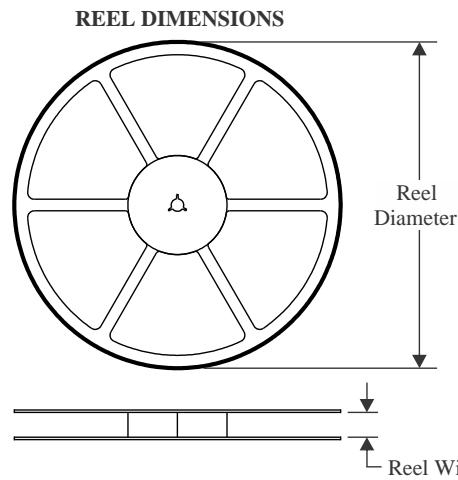

<table><tr><td rowspan=1 colspan=1>A0</td><td rowspan=1 colspan=1>A0 Dimension designed to accommodate the component width</td></tr><tr><td rowspan=1 colspan=1>B0</td><td rowspan=1 colspan=1>Dimension designed to accommodate the component length</td></tr><tr><td rowspan=1 colspan=1>K0</td><td rowspan=1 colspan=1>Dimension designed to accommodate the component thickness</td></tr><tr><td rowspan=1 colspan=1>W</td><td rowspan=1 colspan=1>Overall width of the carrier tape</td></tr><tr><td rowspan=1 colspan=1>P1</td><td rowspan=1 colspan=1>Pitch between successive cavity centers</td></tr></table>

# QUADRANT ASSIGNMENTS FOR PIN 1 ORIENTATION IN TAPE

\*All dimensions are nominal   

<table><tr><td colspan="1" rowspan="1">Device</td><td colspan="1" rowspan="1">PackageType</td><td colspan="1" rowspan="1">PackageDrawing</td><td colspan="1" rowspan="1">Pins</td><td colspan="1" rowspan="1">SPQ</td><td colspan="1" rowspan="1">ReelDiameter(mm)</td><td colspan="1" rowspan="1">ReelWidthW1 (mm)</td><td colspan="1" rowspan="1">A0(mm)</td><td colspan="1" rowspan="1">BO(mm)</td><td colspan="1" rowspan="1">KO(mm)</td><td colspan="1" rowspan="1">P1(mm)</td><td colspan="1" rowspan="1">W(mm)</td><td colspan="1" rowspan="1">Pin1Quadrant</td></tr><tr><td colspan="1" rowspan="1">BQ296100DSGR</td><td colspan="1" rowspan="1">WSON</td><td colspan="1" rowspan="1">DSG</td><td colspan="1" rowspan="1">8</td><td colspan="1" rowspan="1">3000</td><td colspan="1" rowspan="1">180.0</td><td colspan="1" rowspan="1">8.4</td><td colspan="1" rowspan="1">2.3</td><td colspan="1" rowspan="1">2.3</td><td colspan="1" rowspan="1">1.15</td><td colspan="1" rowspan="1">4.0</td><td colspan="1" rowspan="1">8.0</td><td colspan="1" rowspan="1">Q2</td></tr><tr><td colspan="1" rowspan="1">BQ296100DSGT</td><td colspan="1" rowspan="1">WSON</td><td colspan="1" rowspan="1">DSG</td><td colspan="1" rowspan="1">8</td><td colspan="1" rowspan="1">250</td><td colspan="1" rowspan="1">180.0</td><td colspan="1" rowspan="1">8.4</td><td colspan="1" rowspan="1">2.3</td><td colspan="1" rowspan="1">2.3</td><td colspan="1" rowspan="1">1.15</td><td colspan="1" rowspan="1">4.0</td><td colspan="1" rowspan="1">8.0</td><td colspan="1" rowspan="1">Q2</td></tr><tr><td colspan="1" rowspan="1">BQ296103DSGR</td><td colspan="1" rowspan="1">WSON</td><td colspan="1" rowspan="1">DSG</td><td colspan="1" rowspan="1">8</td><td colspan="1" rowspan="1">3000</td><td colspan="1" rowspan="1">180.0</td><td colspan="1" rowspan="1">8.4</td><td colspan="1" rowspan="1">2.3</td><td colspan="1" rowspan="1">2.3</td><td colspan="1" rowspan="1">1.15</td><td colspan="1" rowspan="1">4.0</td><td colspan="1" rowspan="1">8.0</td><td colspan="1" rowspan="1">Q2</td></tr><tr><td colspan="1" rowspan="1">BQ296103DSGT</td><td colspan="1" rowspan="1">WSON</td><td colspan="1" rowspan="1">DSG</td><td colspan="1" rowspan="1">8</td><td colspan="1" rowspan="1">250</td><td colspan="1" rowspan="1">180.0</td><td colspan="1" rowspan="1">8.4</td><td colspan="1" rowspan="1">2.3</td><td colspan="1" rowspan="1">2.3</td><td colspan="1" rowspan="1">1.15</td><td colspan="1" rowspan="1">4.0</td><td colspan="1" rowspan="1">8.0</td><td colspan="1" rowspan="1">Q2</td></tr><tr><td colspan="1" rowspan="1">BQ296106DSGR</td><td colspan="1" rowspan="1">WSON</td><td colspan="1" rowspan="1">DSG</td><td colspan="1" rowspan="1">8</td><td colspan="1" rowspan="1">3000</td><td colspan="1" rowspan="1">180.0</td><td colspan="1" rowspan="1">8.4</td><td colspan="1" rowspan="1">2.3</td><td colspan="1" rowspan="1">2.3</td><td colspan="1" rowspan="1">1.15</td><td colspan="1" rowspan="1">4.0</td><td colspan="1" rowspan="1">8.0</td><td colspan="1" rowspan="1">Q2</td></tr><tr><td colspan="1" rowspan="1">BQ296106DSGT</td><td colspan="1" rowspan="1">WSON</td><td colspan="1" rowspan="1">DSG</td><td colspan="1" rowspan="1">8</td><td colspan="1" rowspan="1">250</td><td colspan="1" rowspan="1">180.0</td><td colspan="1" rowspan="1">8.4</td><td colspan="1" rowspan="1">2.3</td><td colspan="1" rowspan="1">2.3</td><td colspan="1" rowspan="1">1.15</td><td colspan="1" rowspan="1">4.0</td><td colspan="1" rowspan="1">8.0</td><td colspan="1" rowspan="1">Q2</td></tr><tr><td colspan="1" rowspan="1">BQ296107DSGR</td><td colspan="1" rowspan="1">WSON</td><td colspan="1" rowspan="1">DSG</td><td colspan="1" rowspan="1">8</td><td colspan="1" rowspan="1">3000</td><td colspan="1" rowspan="1">180.0</td><td colspan="1" rowspan="1">8.4</td><td colspan="1" rowspan="1">2.3</td><td colspan="1" rowspan="1">2.3</td><td colspan="1" rowspan="1">1.15</td><td colspan="1" rowspan="1">4.0</td><td colspan="1" rowspan="1">8.0</td><td colspan="1" rowspan="1">Q2</td></tr><tr><td colspan="1" rowspan="1">BQ296107DSGT</td><td colspan="1" rowspan="1">WSON</td><td colspan="1" rowspan="1">DSG</td><td colspan="1" rowspan="1">8</td><td colspan="1" rowspan="1">250</td><td colspan="1" rowspan="1">180.0</td><td colspan="1" rowspan="1">8.4</td><td colspan="1" rowspan="1">2.3</td><td colspan="1" rowspan="1">2.3</td><td colspan="1" rowspan="1">1.15</td><td colspan="1" rowspan="1">4.0</td><td colspan="1" rowspan="1">8.0</td><td colspan="1" rowspan="1">Q2</td></tr><tr><td colspan="1" rowspan="1">BQ296111DSGR</td><td colspan="1" rowspan="1">WSON</td><td colspan="1" rowspan="1">DSG</td><td colspan="1" rowspan="1">8</td><td colspan="1" rowspan="1">3000</td><td colspan="1" rowspan="1">180.0</td><td colspan="1" rowspan="1">8.4</td><td colspan="1" rowspan="1">2.3</td><td colspan="1" rowspan="1">2.3</td><td colspan="1" rowspan="1">1.15</td><td colspan="1" rowspan="1">4.0</td><td colspan="1" rowspan="1">8.0</td><td colspan="1" rowspan="1">Q2</td></tr><tr><td colspan="1" rowspan="1">BQ296111DSGT</td><td colspan="1" rowspan="1">WSON</td><td colspan="1" rowspan="1">DSG</td><td colspan="1" rowspan="1">8</td><td colspan="1" rowspan="1">250</td><td colspan="1" rowspan="1">180.0</td><td colspan="1" rowspan="1">8.4</td><td colspan="1" rowspan="1">2.3</td><td colspan="1" rowspan="1">2.3</td><td colspan="1" rowspan="1">1.15</td><td colspan="1" rowspan="1">4.0</td><td colspan="1" rowspan="1">8.0</td><td colspan="1" rowspan="1">Q2</td></tr><tr><td colspan="1" rowspan="1">BQ296112DSGR</td><td colspan="1" rowspan="1">WSON</td><td colspan="1" rowspan="1">DSG</td><td colspan="1" rowspan="1">8</td><td colspan="1" rowspan="1">3000</td><td colspan="1" rowspan="1">180.0</td><td colspan="1" rowspan="1">8.4</td><td colspan="1" rowspan="1">2.3</td><td colspan="1" rowspan="1">2.3</td><td colspan="1" rowspan="1">1.15</td><td colspan="1" rowspan="1">4.0</td><td colspan="1" rowspan="1">8.0</td><td colspan="1" rowspan="1">Q2</td></tr><tr><td colspan="1" rowspan="1">BQ296112DSGT</td><td colspan="1" rowspan="1">WSON</td><td colspan="1" rowspan="1">DSG</td><td colspan="1" rowspan="1">8</td><td colspan="1" rowspan="1">250</td><td colspan="1" rowspan="1">180.0</td><td colspan="1" rowspan="1">8.4</td><td colspan="1" rowspan="1">2.3</td><td colspan="1" rowspan="1">2.3</td><td colspan="1" rowspan="1">1.15</td><td colspan="1" rowspan="1">4.0</td><td colspan="1" rowspan="1">8.0</td><td colspan="1" rowspan="1">Q2</td></tr><tr><td colspan="1" rowspan="1">BQ296113DSGR</td><td colspan="1" rowspan="1">WSON</td><td colspan="1" rowspan="1">DSG</td><td colspan="1" rowspan="1">8</td><td colspan="1" rowspan="1">3000</td><td colspan="1" rowspan="1">180.0</td><td colspan="1" rowspan="1">8.4</td><td colspan="1" rowspan="1">2.3</td><td colspan="1" rowspan="1">2.3</td><td colspan="1" rowspan="1">1.15</td><td colspan="1" rowspan="1">4.0</td><td colspan="1" rowspan="1">8.0</td><td colspan="1" rowspan="1">Q2</td></tr><tr><td colspan="1" rowspan="1">BQ296113DSGT</td><td colspan="1" rowspan="1">WSON</td><td colspan="1" rowspan="1">DSG</td><td colspan="1" rowspan="1">8</td><td colspan="1" rowspan="1">250</td><td colspan="1" rowspan="1">180.0</td><td colspan="1" rowspan="1">8.4</td><td colspan="1" rowspan="1">2.3</td><td colspan="1" rowspan="1">2.3</td><td colspan="1" rowspan="1">1.15</td><td colspan="1" rowspan="1">4.0</td><td colspan="1" rowspan="1">8.0</td><td colspan="1" rowspan="1">Q2</td></tr><tr><td colspan="1" rowspan="1">BQ296114DSGR</td><td colspan="1" rowspan="1">WSON</td><td colspan="1" rowspan="1">DSG</td><td colspan="1" rowspan="1">8</td><td colspan="1" rowspan="1">3000</td><td colspan="1" rowspan="1">180.0</td><td colspan="1" rowspan="1">8.4</td><td colspan="1" rowspan="1">2.3</td><td colspan="1" rowspan="1">2.3</td><td colspan="1" rowspan="1">1.15</td><td colspan="1" rowspan="1">4.0</td><td colspan="1" rowspan="1">8.0</td><td colspan="1" rowspan="1">Q2</td></tr><tr><td colspan="1" rowspan="1">BQ296114DSGT</td><td colspan="1" rowspan="1">WSON</td><td colspan="1" rowspan="1">DSG</td><td colspan="1" rowspan="1">8</td><td colspan="1" rowspan="1">250</td><td colspan="1" rowspan="1">180.0</td><td colspan="1" rowspan="1">8.4</td><td colspan="1" rowspan="1">2.3</td><td colspan="1" rowspan="1">2.3</td><td colspan="1" rowspan="1">1.15</td><td colspan="1" rowspan="1">4.0</td><td colspan="1" rowspan="1">8.0</td><td colspan="1" rowspan="1">Q2</td></tr><tr><td colspan="1" rowspan="1">BQ296115DSGR</td><td colspan="1" rowspan="1">WSON</td><td colspan="1" rowspan="1">DSG</td><td colspan="1" rowspan="1">8</td><td colspan="1" rowspan="1">3000</td><td colspan="1" rowspan="1">180.0</td><td colspan="1" rowspan="1">8.4</td><td colspan="1" rowspan="1">2.3</td><td colspan="1" rowspan="1">2.3</td><td colspan="1" rowspan="1">1.15</td><td colspan="1" rowspan="1">4.0</td><td colspan="1" rowspan="1">8.0</td><td colspan="1" rowspan="1">Q2</td></tr><tr><td colspan="1" rowspan="1">BQ296202DSGR</td><td colspan="1" rowspan="1">WSON</td><td colspan="1" rowspan="1">DSG</td><td colspan="1" rowspan="1">8</td><td colspan="1" rowspan="1">3000</td><td colspan="1" rowspan="1">180.0</td><td colspan="1" rowspan="1">8.4</td><td colspan="1" rowspan="1">2.3</td><td colspan="1" rowspan="1">2.3</td><td colspan="1" rowspan="1">1.15</td><td colspan="1" rowspan="1">4.0</td><td colspan="1" rowspan="1">8.0</td><td colspan="1" rowspan="1">Q2</td></tr><tr><td colspan="1" rowspan="1">BQ296202DSGT</td><td colspan="1" rowspan="1">WSON</td><td colspan="1" rowspan="1">DSG</td><td colspan="1" rowspan="1">8</td><td colspan="1" rowspan="1">250</td><td colspan="1" rowspan="1">180.0</td><td colspan="1" rowspan="1">8.4</td><td colspan="1" rowspan="1">2.3</td><td colspan="1" rowspan="1">2.3</td><td colspan="1" rowspan="1">1.15</td><td colspan="1" rowspan="1">4.0</td><td colspan="1" rowspan="1">8.0</td><td colspan="1" rowspan="1">Q2</td></tr><tr><td colspan="1" rowspan="1">BQ296203DSGR</td><td colspan="1" rowspan="1">WSON</td><td colspan="1" rowspan="1">DSG</td><td colspan="1" rowspan="1">8</td><td colspan="1" rowspan="1">3000</td><td colspan="1" rowspan="1">180.0</td><td colspan="1" rowspan="1">8.4</td><td colspan="1" rowspan="1">2.3</td><td colspan="1" rowspan="1">2.3</td><td colspan="1" rowspan="1">1.15</td><td colspan="1" rowspan="1">4.0</td><td colspan="1" rowspan="1">8.0</td><td colspan="1" rowspan="1">Q2</td></tr><tr><td colspan="1" rowspan="1">BQ296203DSGT</td><td colspan="1" rowspan="1">WSON</td><td colspan="1" rowspan="1">DSG</td><td colspan="1" rowspan="1">8</td><td colspan="1" rowspan="1">250</td><td colspan="1" rowspan="1">180.0</td><td colspan="1" rowspan="1">8.4</td><td colspan="1" rowspan="1">2.3</td><td colspan="1" rowspan="1">2.3</td><td colspan="1" rowspan="1">1.15</td><td colspan="1" rowspan="1">4.0</td><td colspan="1" rowspan="1">8.0</td><td colspan="1" rowspan="1">Q2</td></tr><tr><td colspan="1" rowspan="1">BQ296212DSGR</td><td colspan="1" rowspan="1">WSON</td><td colspan="1" rowspan="1">DSG</td><td colspan="1" rowspan="1">8</td><td colspan="1" rowspan="1">3000</td><td colspan="1" rowspan="1">180.0</td><td colspan="1" rowspan="1">8.4</td><td colspan="1" rowspan="1">2.3</td><td colspan="1" rowspan="1">2.3</td><td colspan="1" rowspan="1">1.15</td><td colspan="1" rowspan="1">4.0</td><td colspan="1" rowspan="1">8.0</td><td colspan="1" rowspan="1">Q2</td></tr><tr><td colspan="1" rowspan="1">BQ296212DSGT</td><td colspan="1" rowspan="1">WSON</td><td colspan="1" rowspan="1">DSG</td><td colspan="1" rowspan="1">8</td><td colspan="1" rowspan="1">250</td><td colspan="1" rowspan="1">180.0</td><td colspan="1" rowspan="1">8.4</td><td colspan="1" rowspan="1">2.3</td><td colspan="1" rowspan="1">2.3</td><td colspan="1" rowspan="1">1.15</td><td colspan="1" rowspan="1">4.0</td><td colspan="1" rowspan="1">8.0</td><td colspan="1" rowspan="1">Q2</td></tr><tr><td colspan="1" rowspan="1">BQ296213DSGR</td><td colspan="1" rowspan="1">WSON</td><td colspan="1" rowspan="1">DSG</td><td colspan="1" rowspan="1">8</td><td colspan="1" rowspan="1">3000</td><td colspan="1" rowspan="1">180.0</td><td colspan="1" rowspan="1">8.4</td><td colspan="1" rowspan="1">2.3</td><td colspan="1" rowspan="1">2.3</td><td colspan="1" rowspan="1">1.15</td><td colspan="1" rowspan="1">4.0</td><td colspan="1" rowspan="1">8.0</td><td colspan="1" rowspan="1">Q2</td></tr><tr><td colspan="1" rowspan="1">BQ296213DSGT</td><td colspan="1" rowspan="1">WSON</td><td colspan="1" rowspan="1">DSG</td><td colspan="1" rowspan="1">8</td><td colspan="1" rowspan="1">250</td><td colspan="1" rowspan="1">180.0</td><td colspan="1" rowspan="1">8.4</td><td colspan="1" rowspan="1">2.3</td><td colspan="1" rowspan="1">2.3</td><td colspan="1" rowspan="1">1.15</td><td colspan="1" rowspan="1">4.0</td><td colspan="1" rowspan="1">8.0</td><td colspan="1" rowspan="1">Q2</td></tr><tr><td colspan="1" rowspan="1">BQ296215DSGR</td><td colspan="1" rowspan="1">WSON</td><td colspan="1" rowspan="1">DSG</td><td colspan="1" rowspan="1">8</td><td colspan="1" rowspan="1">3000</td><td colspan="1" rowspan="1">180.0</td><td colspan="1" rowspan="1">8.4</td><td colspan="1" rowspan="1">2.3</td><td colspan="1" rowspan="1">2.3</td><td colspan="1" rowspan="1">1.15</td><td colspan="1" rowspan="1">4.0</td><td colspan="1" rowspan="1">8.0</td><td colspan="1" rowspan="1">Q2</td></tr><tr><td colspan="1" rowspan="1">BQ296215DSGT</td><td colspan="1" rowspan="1">WSON</td><td colspan="1" rowspan="1">DSG</td><td colspan="1" rowspan="1">8</td><td colspan="1" rowspan="1">250</td><td colspan="1" rowspan="1">180.0</td><td colspan="1" rowspan="1">8.4</td><td colspan="1" rowspan="1">2.3</td><td colspan="1" rowspan="1">2.3</td><td colspan="1" rowspan="1">1.15</td><td colspan="1" rowspan="1">4.0</td><td colspan="1" rowspan="1">8.0</td><td colspan="1" rowspan="1">Q2</td></tr><tr><td colspan="1" rowspan="1">BQ296216DSGR</td><td colspan="1" rowspan="1">WSON</td><td colspan="1" rowspan="1">DSG</td><td colspan="1" rowspan="1">8</td><td colspan="1" rowspan="1">3000</td><td colspan="1" rowspan="1">180.0</td><td colspan="1" rowspan="1">8.4</td><td colspan="1" rowspan="1">2.3</td><td colspan="1" rowspan="1">2.3</td><td colspan="1" rowspan="1">1.15</td><td colspan="1" rowspan="1">4.0</td><td colspan="1" rowspan="1">8.0</td><td colspan="1" rowspan="1">Q2</td></tr><tr><td colspan="1" rowspan="1">BQ296216DSGT</td><td colspan="1" rowspan="1">WSON</td><td colspan="1" rowspan="1">DSG</td><td colspan="1" rowspan="1">8</td><td colspan="1" rowspan="1">250</td><td colspan="1" rowspan="1">180.0</td><td colspan="1" rowspan="1">8.4</td><td colspan="1" rowspan="1">2.3</td><td colspan="1" rowspan="1">2.3</td><td colspan="1" rowspan="1">1.15</td><td colspan="1" rowspan="1">4.0</td><td colspan="1" rowspan="1">8.0</td><td colspan="1" rowspan="1">Q2</td></tr><tr><td colspan="1" rowspan="1">BQ296217DSGR</td><td colspan="1" rowspan="1">WSON</td><td colspan="1" rowspan="1">DSG</td><td colspan="1" rowspan="1">8</td><td colspan="1" rowspan="1">3000</td><td colspan="1" rowspan="1">180.0</td><td colspan="1" rowspan="1">8.4</td><td colspan="1" rowspan="1">2.3</td><td colspan="1" rowspan="1">2.3</td><td colspan="1" rowspan="1">1.15</td><td colspan="1" rowspan="1">4.0</td><td colspan="1" rowspan="1">8.0</td><td colspan="1" rowspan="1">Q2</td></tr><tr><td colspan="1" rowspan="1">BQ296217DSGT</td><td colspan="1" rowspan="1">WSON</td><td colspan="1" rowspan="1">DSG</td><td colspan="1" rowspan="1">8</td><td colspan="1" rowspan="1">250</td><td colspan="1" rowspan="1">180.0</td><td colspan="1" rowspan="1">8.4</td><td colspan="1" rowspan="1">2.3</td><td colspan="1" rowspan="1">2.3</td><td colspan="1" rowspan="1">1.15</td><td colspan="1" rowspan="1">4.0</td><td colspan="1" rowspan="1">8.0</td><td colspan="1" rowspan="1">Q2</td></tr><tr><td colspan="1" rowspan="1">BQ296221DSGR</td><td colspan="1" rowspan="1">WSON</td><td colspan="1" rowspan="1">DSG</td><td colspan="1" rowspan="1">8</td><td colspan="1" rowspan="1">3000</td><td colspan="1" rowspan="1">180.0</td><td colspan="1" rowspan="1">8.4</td><td colspan="1" rowspan="1">2.3</td><td colspan="1" rowspan="1">2.3</td><td colspan="1" rowspan="1">1.15</td><td colspan="1" rowspan="1">4.0</td><td colspan="1" rowspan="1">8.0</td><td colspan="1" rowspan="1">Q3</td></tr><tr><td colspan="1" rowspan="1">BQ296221DSGT</td><td colspan="1" rowspan="1">WSON</td><td colspan="1" rowspan="1">DSG</td><td colspan="1" rowspan="1">8</td><td colspan="1" rowspan="1">250</td><td colspan="1" rowspan="1">180.0</td><td colspan="1" rowspan="1">8.4</td><td colspan="1" rowspan="1">2.3</td><td colspan="1" rowspan="1">2.3</td><td colspan="1" rowspan="1">1.15</td><td colspan="1" rowspan="1">4.0</td><td colspan="1" rowspan="1">8.0</td><td colspan="1" rowspan="1">Q3</td></tr><tr><td colspan="1" rowspan="1">BQ296222DSGR</td><td colspan="1" rowspan="1">WSON</td><td colspan="1" rowspan="1">DSG</td><td colspan="1" rowspan="1">8</td><td colspan="1" rowspan="1">3000</td><td colspan="1" rowspan="1">180.0</td><td colspan="1" rowspan="1">8.4</td><td colspan="1" rowspan="1">2.3</td><td colspan="1" rowspan="1">2.3</td><td colspan="1" rowspan="1">1.15</td><td colspan="1" rowspan="1">4.0</td><td colspan="1" rowspan="1">8.0</td><td colspan="1" rowspan="1">Q3</td></tr><tr><td colspan="1" rowspan="1">BQ296222DSGT</td><td colspan="1" rowspan="1">WSON</td><td colspan="1" rowspan="1">DSG</td><td colspan="1" rowspan="1">8</td><td colspan="1" rowspan="1">250</td><td colspan="1" rowspan="1">180.0</td><td colspan="1" rowspan="1">8.4</td><td colspan="1" rowspan="1">2.3</td><td colspan="1" rowspan="1">2.3</td><td colspan="1" rowspan="1">1.15</td><td colspan="1" rowspan="1">4.0</td><td colspan="1" rowspan="1">8.0</td><td colspan="1" rowspan="1">Q3</td></tr><tr><td colspan="1" rowspan="1">BQ296223DSGR</td><td colspan="1" rowspan="1">WSON</td><td colspan="1" rowspan="1">DSG</td><td colspan="1" rowspan="1">8</td><td colspan="1" rowspan="1">3000</td><td colspan="1" rowspan="1">180.0</td><td colspan="1" rowspan="1">8.4</td><td colspan="1" rowspan="1">2.3</td><td colspan="1" rowspan="1">2.3</td><td colspan="1" rowspan="1">1.15</td><td colspan="1" rowspan="1">4.0</td><td colspan="1" rowspan="1">8.0</td><td colspan="1" rowspan="1">Q3</td></tr><tr><td colspan="1" rowspan="1">BQ296223DSGT</td><td colspan="1" rowspan="1">WSON</td><td colspan="1" rowspan="1">DSG</td><td colspan="1" rowspan="1">8</td><td colspan="1" rowspan="1">250</td><td colspan="1" rowspan="1">180.0</td><td colspan="1" rowspan="1">8.4</td><td colspan="1" rowspan="1">2.3</td><td colspan="1" rowspan="1">2.3</td><td colspan="1" rowspan="1">1.15</td><td colspan="1" rowspan="1">4.0</td><td colspan="1" rowspan="1">8.0</td><td colspan="1" rowspan="1">Q3</td></tr><tr><td colspan="1" rowspan="1">BQ296224DSGR</td><td colspan="1" rowspan="1">WSON</td><td colspan="1" rowspan="1">DSG</td><td colspan="1" rowspan="1">8</td><td colspan="1" rowspan="1">3000</td><td colspan="1" rowspan="1">180.0</td><td colspan="1" rowspan="1">8.4</td><td colspan="1" rowspan="1">2.3</td><td colspan="1" rowspan="1">2.3</td><td colspan="1" rowspan="1">1.15</td><td colspan="1" rowspan="1">4.0</td><td colspan="1" rowspan="1">8.0</td><td colspan="1" rowspan="1">Q3</td></tr><tr><td colspan="1" rowspan="1">BQ296224DSGT</td><td colspan="1" rowspan="1">WSON</td><td colspan="1" rowspan="1">DSG</td><td colspan="1" rowspan="1">8</td><td colspan="1" rowspan="1">250</td><td colspan="1" rowspan="1">180.0</td><td colspan="1" rowspan="1">8.4</td><td colspan="1" rowspan="1">2.3</td><td colspan="1" rowspan="1">2.3</td><td colspan="1" rowspan="1">1.15</td><td colspan="1" rowspan="1">4.0</td><td colspan="1" rowspan="1">8.0</td><td colspan="1" rowspan="1">Q3</td></tr><tr><td colspan="1" rowspan="1">BQ296226DSGR</td><td colspan="1" rowspan="1">WSON</td><td colspan="1" rowspan="1">DSG</td><td colspan="1" rowspan="1">8</td><td colspan="1" rowspan="1">3000</td><td colspan="1" rowspan="1">180.0</td><td colspan="1" rowspan="1">8.4</td><td colspan="1" rowspan="1">2.3</td><td colspan="1" rowspan="1">2.3</td><td colspan="1" rowspan="1">1.15</td><td colspan="1" rowspan="1">4.0</td><td colspan="1" rowspan="1">8.0</td><td colspan="1" rowspan="1">Q3</td></tr><tr><td colspan="1" rowspan="1">BQ296226DSGT</td><td colspan="1" rowspan="1">WSON</td><td colspan="1" rowspan="1">DSG</td><td colspan="1" rowspan="1">8</td><td colspan="1" rowspan="1">250</td><td colspan="1" rowspan="1">180.0</td><td colspan="1" rowspan="1">8.4</td><td colspan="1" rowspan="1">2.3</td><td colspan="1" rowspan="1">2.3</td><td colspan="1" rowspan="1">1.15</td><td colspan="1" rowspan="1">4.0</td><td colspan="1" rowspan="1">8.0</td><td colspan="1" rowspan="1">Q3</td></tr><tr><td colspan="1" rowspan="1">BQ296227DSGR</td><td colspan="1" rowspan="1">WSON</td><td colspan="1" rowspan="1">DSG</td><td colspan="1" rowspan="1">8</td><td colspan="1" rowspan="1">3000</td><td colspan="1" rowspan="1">180.0</td><td colspan="1" rowspan="1">8.4</td><td colspan="1" rowspan="1">2.3</td><td colspan="1" rowspan="1">2.3</td><td colspan="1" rowspan="1">1.15</td><td colspan="1" rowspan="1">4.0</td><td colspan="1" rowspan="1">8.0</td><td colspan="1" rowspan="1">Q3</td></tr><tr><td colspan="1" rowspan="1">BQ296228DSGR</td><td colspan="1" rowspan="1">WSON</td><td colspan="1" rowspan="1">DSG</td><td colspan="1" rowspan="1">8</td><td colspan="1" rowspan="1">3000</td><td colspan="1" rowspan="1">180.0</td><td colspan="1" rowspan="1">8.4</td><td colspan="1" rowspan="1">2.3</td><td colspan="1" rowspan="1">2.3</td><td colspan="1" rowspan="1">1.15</td><td colspan="1" rowspan="1">4.0</td><td colspan="1" rowspan="1">8.0</td><td colspan="1" rowspan="1">Q3</td></tr><tr><td colspan="1" rowspan="1">BQ296228DSGT</td><td colspan="1" rowspan="1">WSON</td><td colspan="1" rowspan="1">DSG</td><td colspan="1" rowspan="1">8</td><td colspan="1" rowspan="1">250</td><td colspan="1" rowspan="1">180.0</td><td colspan="1" rowspan="1">8.4</td><td colspan="1" rowspan="1">2.3</td><td colspan="1" rowspan="1">2.3</td><td colspan="1" rowspan="1">1.15</td><td colspan="1" rowspan="1">4.0</td><td colspan="1" rowspan="1">8.0</td><td colspan="1" rowspan="1">Q3</td></tr><tr><td colspan="1" rowspan="1">BQ296229DSGR</td><td colspan="1" rowspan="1">WSON</td><td colspan="1" rowspan="1">DSG</td><td colspan="1" rowspan="1">8</td><td colspan="1" rowspan="1">3000</td><td colspan="1" rowspan="1">180.0</td><td colspan="1" rowspan="1">8.4</td><td colspan="1" rowspan="1">2.3</td><td colspan="1" rowspan="1">2.3</td><td colspan="1" rowspan="1">1.15</td><td colspan="1" rowspan="1">4.0</td><td colspan="1" rowspan="1">8.0</td><td colspan="1" rowspan="1">Q3</td></tr><tr><td colspan="1" rowspan="1">BQ296229DSGT</td><td colspan="1" rowspan="1">WSON</td><td colspan="1" rowspan="1">DSG</td><td colspan="1" rowspan="1">8</td><td colspan="1" rowspan="1">250</td><td colspan="1" rowspan="1">180.0</td><td colspan="1" rowspan="1">8.4</td><td colspan="1" rowspan="1">2.3</td><td colspan="1" rowspan="1">2.3</td><td colspan="1" rowspan="1">1.15</td><td colspan="1" rowspan="1">4.0</td><td colspan="1" rowspan="1">8.0</td><td colspan="1" rowspan="1">Q3</td></tr><tr><td colspan="1" rowspan="1">BQ296230DSGR</td><td colspan="1" rowspan="1">WSON</td><td colspan="1" rowspan="1">DSG</td><td colspan="1" rowspan="1">8</td><td colspan="1" rowspan="1">3000</td><td colspan="1" rowspan="1">180.0</td><td colspan="1" rowspan="1">8.4</td><td colspan="1" rowspan="1">2.3</td><td colspan="1" rowspan="1">2.3</td><td colspan="1" rowspan="1">1.15</td><td colspan="1" rowspan="1">4.0</td><td colspan="1" rowspan="1">8.0</td><td colspan="1" rowspan="1">Q3</td></tr><tr><td colspan="1" rowspan="1">BQ296230DSGT</td><td colspan="1" rowspan="1">WSON</td><td colspan="1" rowspan="1">DSG</td><td colspan="1" rowspan="1">8</td><td colspan="1" rowspan="1">250</td><td colspan="1" rowspan="1">180.0</td><td colspan="1" rowspan="1">8.4</td><td colspan="1" rowspan="1">2.3</td><td colspan="1" rowspan="1">2.3</td><td colspan="1" rowspan="1">1.15</td><td colspan="1" rowspan="1">4.0</td><td colspan="1" rowspan="1">8.0</td><td colspan="1" rowspan="1">Q3</td></tr><tr><td colspan="1" rowspan="1">BQ296231DSGR</td><td colspan="1" rowspan="1">WSON</td><td colspan="1" rowspan="1">DSG</td><td colspan="1" rowspan="1">8</td><td colspan="1" rowspan="1">3000</td><td colspan="1" rowspan="1">180.0</td><td colspan="1" rowspan="1">8.4</td><td colspan="1" rowspan="1">2.3</td><td colspan="1" rowspan="1">2.3</td><td colspan="1" rowspan="1">1.15</td><td colspan="1" rowspan="1">4.0</td><td colspan="1" rowspan="1">8.0</td><td colspan="1" rowspan="1">Q3</td></tr><tr><td colspan="1" rowspan="1">BQ296231DSGT</td><td colspan="1" rowspan="1">WSON</td><td colspan="1" rowspan="1">DSG</td><td colspan="1" rowspan="1">8</td><td colspan="1" rowspan="1">250</td><td colspan="1" rowspan="1">180.0</td><td colspan="1" rowspan="1">8.4</td><td colspan="1" rowspan="1">2.3</td><td colspan="1" rowspan="1">2.3</td><td colspan="1" rowspan="1">1.15</td><td colspan="1" rowspan="1">4.0</td><td colspan="1" rowspan="1">8.0</td><td colspan="1" rowspan="1">Q3</td></tr><tr><td colspan="1" rowspan="1">BQ296232DSGR</td><td colspan="1" rowspan="1">WSON</td><td colspan="1" rowspan="1">DSG</td><td colspan="1" rowspan="1">8</td><td colspan="1" rowspan="1">3000</td><td colspan="1" rowspan="1">180.0</td><td colspan="1" rowspan="1">8.4</td><td colspan="1" rowspan="1">2.3</td><td colspan="1" rowspan="1">2.3</td><td colspan="1" rowspan="1">1.15</td><td colspan="1" rowspan="1">4.0</td><td colspan="1" rowspan="1">8.0</td><td colspan="1" rowspan="1">Q3</td></tr><tr><td colspan="1" rowspan="1">BQ296232DSGT</td><td colspan="1" rowspan="1">WSON</td><td colspan="1" rowspan="1">DSG</td><td colspan="1" rowspan="1">8</td><td colspan="1" rowspan="1">250</td><td colspan="1" rowspan="1">180.0</td><td colspan="1" rowspan="1">8.4</td><td colspan="1" rowspan="1">2.3</td><td colspan="1" rowspan="1">2.3</td><td colspan="1" rowspan="1">1.15</td><td colspan="1" rowspan="1">4.0</td><td colspan="1" rowspan="1">8.0</td><td colspan="1" rowspan="1">Q3</td></tr><tr><td colspan="1" rowspan="1">BQ296233DSGR</td><td colspan="1" rowspan="1">WSON</td><td colspan="1" rowspan="1">DSG</td><td colspan="1" rowspan="1">8</td><td colspan="1" rowspan="1">3000</td><td colspan="1" rowspan="1">180.0</td><td colspan="1" rowspan="1">8.4</td><td colspan="1" rowspan="1">2.3</td><td colspan="1" rowspan="1">2.3</td><td colspan="1" rowspan="1">1.15</td><td colspan="1" rowspan="1">4.0</td><td colspan="1" rowspan="1">8.0</td><td colspan="1" rowspan="1">Q3</td></tr><tr><td colspan="1" rowspan="1">BQ296234DSGR</td><td colspan="1" rowspan="1">WSON</td><td colspan="1" rowspan="1">DSG</td><td colspan="1" rowspan="1">8</td><td colspan="1" rowspan="1">3000</td><td colspan="1" rowspan="1">180.0</td><td colspan="1" rowspan="1">8.4</td><td colspan="1" rowspan="1">2.3</td><td colspan="1" rowspan="1">2.3</td><td colspan="1" rowspan="1">1.15</td><td colspan="1" rowspan="1">4.0</td><td colspan="1" rowspan="1">8.0</td><td colspan="1" rowspan="1">Q3</td></tr><tr><td colspan="1" rowspan="1">BQ296235DSGR</td><td colspan="1" rowspan="1">WSON</td><td colspan="1" rowspan="1">DSG</td><td colspan="1" rowspan="1">8</td><td colspan="1" rowspan="1">3000</td><td colspan="1" rowspan="1">180.0</td><td colspan="1" rowspan="1">8.4</td><td colspan="1" rowspan="1">2.3</td><td colspan="1" rowspan="1">2.3</td><td colspan="1" rowspan="1">1.15</td><td colspan="1" rowspan="1">4.0</td><td colspan="1" rowspan="1">8.0</td><td colspan="1" rowspan="1">Q3</td></tr></table>

\*All dimensions are nominal   

<table><tr><td colspan="1" rowspan="1">Device</td><td colspan="1" rowspan="1">Package Type</td><td colspan="1" rowspan="1">Package Drawing</td><td colspan="1" rowspan="1">Pins</td><td colspan="1" rowspan="1">SPQ</td><td colspan="1" rowspan="1">Length (mm)</td><td colspan="1" rowspan="1">Width (mm)</td><td colspan="1" rowspan="1">Height (mm)</td></tr><tr><td colspan="1" rowspan="1">BQ296100DSGR</td><td colspan="1" rowspan="1">WSON</td><td colspan="1" rowspan="1">DSG</td><td colspan="1" rowspan="1">8</td><td colspan="1" rowspan="1">3000</td><td colspan="1" rowspan="1">182.0</td><td colspan="1" rowspan="1">182.0</td><td colspan="1" rowspan="1">20.0</td></tr><tr><td colspan="1" rowspan="1">BQ296100DSGT</td><td colspan="1" rowspan="1">WSON</td><td colspan="1" rowspan="1">DSG</td><td colspan="1" rowspan="1">8</td><td colspan="1" rowspan="1">250</td><td colspan="1" rowspan="1">182.0</td><td colspan="1" rowspan="1">182.0</td><td colspan="1" rowspan="1">20.0</td></tr><tr><td colspan="1" rowspan="1">BQ296103DSGR</td><td colspan="1" rowspan="1">WSON</td><td colspan="1" rowspan="1">DSG</td><td colspan="1" rowspan="1">8</td><td colspan="1" rowspan="1">3000</td><td colspan="1" rowspan="1">182.0</td><td colspan="1" rowspan="1">182.0</td><td colspan="1" rowspan="1">20.0</td></tr><tr><td colspan="1" rowspan="1">BQ296103DSGT</td><td colspan="1" rowspan="1">WSON</td><td colspan="1" rowspan="1">DSG</td><td colspan="1" rowspan="1">8</td><td colspan="1" rowspan="1">250</td><td colspan="1" rowspan="1">182.0</td><td colspan="1" rowspan="1">182.0</td><td colspan="1" rowspan="1">20.0</td></tr><tr><td colspan="1" rowspan="1">BQ296106DSGR</td><td colspan="1" rowspan="1">WSON</td><td colspan="1" rowspan="1">DSG</td><td colspan="1" rowspan="1">8</td><td colspan="1" rowspan="1">3000</td><td colspan="1" rowspan="1">182.0</td><td colspan="1" rowspan="1">182.0</td><td colspan="1" rowspan="1">20.0</td></tr><tr><td colspan="1" rowspan="1">BQ296106DSGT</td><td colspan="1" rowspan="1">WSON</td><td colspan="1" rowspan="1">DSG</td><td colspan="1" rowspan="1">8</td><td colspan="1" rowspan="1">250</td><td colspan="1" rowspan="1">182.0</td><td colspan="1" rowspan="1">182.0</td><td colspan="1" rowspan="1">20.0</td></tr><tr><td colspan="1" rowspan="1">BQ296107DSGR</td><td colspan="1" rowspan="1">WSON</td><td colspan="1" rowspan="1">DSG</td><td colspan="1" rowspan="1">8</td><td colspan="1" rowspan="1">3000</td><td colspan="1" rowspan="1">182.0</td><td colspan="1" rowspan="1">182.0</td><td colspan="1" rowspan="1">20.0</td></tr><tr><td colspan="1" rowspan="1">BQ296107DSGT</td><td colspan="1" rowspan="1">WSON</td><td colspan="1" rowspan="1">DSG</td><td colspan="1" rowspan="1">8</td><td colspan="1" rowspan="1">250</td><td colspan="1" rowspan="1">182.0</td><td colspan="1" rowspan="1">182.0</td><td colspan="1" rowspan="1">20.0</td></tr><tr><td colspan="1" rowspan="1">BQ296111DSGR</td><td colspan="1" rowspan="1">WSON</td><td colspan="1" rowspan="1">DSG</td><td colspan="1" rowspan="1">8</td><td colspan="1" rowspan="1">3000</td><td colspan="1" rowspan="1">210.0</td><td colspan="1" rowspan="1">185.0</td><td colspan="1" rowspan="1">35.0</td></tr><tr><td colspan="1" rowspan="1">BQ296111DSGT</td><td colspan="1" rowspan="1">WSON</td><td colspan="1" rowspan="1">DSG</td><td colspan="1" rowspan="1">8</td><td colspan="1" rowspan="1">250</td><td colspan="1" rowspan="1">182.0</td><td colspan="1" rowspan="1">182.0</td><td colspan="1" rowspan="1">20.0</td></tr><tr><td colspan="1" rowspan="1">BQ296112DSGR</td><td colspan="1" rowspan="1">WSON</td><td colspan="1" rowspan="1">DSG</td><td colspan="1" rowspan="1">8</td><td colspan="1" rowspan="1">3000</td><td colspan="1" rowspan="1">210.0</td><td colspan="1" rowspan="1">185.0</td><td colspan="1" rowspan="1">35.0</td></tr><tr><td colspan="1" rowspan="1">BQ296112DSGT</td><td colspan="1" rowspan="1">WSON</td><td colspan="1" rowspan="1">DSG</td><td colspan="1" rowspan="1">8</td><td colspan="1" rowspan="1">250</td><td colspan="1" rowspan="1">210.0</td><td colspan="1" rowspan="1">185.0</td><td colspan="1" rowspan="1">35.0</td></tr><tr><td colspan="1" rowspan="1">BQ296113DSGR</td><td colspan="1" rowspan="1">WSON</td><td colspan="1" rowspan="1">DSG</td><td colspan="1" rowspan="1">8</td><td colspan="1" rowspan="1">3000</td><td colspan="1" rowspan="1">182.0</td><td colspan="1" rowspan="1">182.0</td><td colspan="1" rowspan="1">20.0</td></tr><tr><td colspan="1" rowspan="1">BQ296113DSGT</td><td colspan="1" rowspan="1">WSON</td><td colspan="1" rowspan="1">DSG</td><td colspan="1" rowspan="1">8</td><td colspan="1" rowspan="1">250</td><td colspan="1" rowspan="1">182.0</td><td colspan="1" rowspan="1">182.0</td><td colspan="1" rowspan="1">20.0</td></tr><tr><td colspan="1" rowspan="1">BQ296114DSGR</td><td colspan="1" rowspan="1">WSON</td><td colspan="1" rowspan="1">DSG</td><td colspan="1" rowspan="1">8</td><td colspan="1" rowspan="1">3000</td><td colspan="1" rowspan="1">182.0</td><td colspan="1" rowspan="1">182.0</td><td colspan="1" rowspan="1">20.0</td></tr><tr><td colspan="1" rowspan="1">BQ296114DSGT</td><td colspan="1" rowspan="1">WSON</td><td colspan="1" rowspan="1">DSG</td><td colspan="1" rowspan="1">8</td><td colspan="1" rowspan="1">250</td><td colspan="1" rowspan="1">182.0</td><td colspan="1" rowspan="1">182.0</td><td colspan="1" rowspan="1">20.0</td></tr><tr><td colspan="1" rowspan="1">BQ296115DSGR</td><td colspan="1" rowspan="1">WSON</td><td colspan="1" rowspan="1">DSG</td><td colspan="1" rowspan="1">8</td><td colspan="1" rowspan="1">3000</td><td colspan="1" rowspan="1">210.0</td><td colspan="1" rowspan="1">185.0</td><td colspan="1" rowspan="1">35.0</td></tr><tr><td colspan="1" rowspan="1">BQ296202DSGR</td><td colspan="1" rowspan="1">WSON</td><td colspan="1" rowspan="1">DSG</td><td colspan="1" rowspan="1">8</td><td colspan="1" rowspan="1">3000</td><td colspan="1" rowspan="1">182.0</td><td colspan="1" rowspan="1">182.0</td><td colspan="1" rowspan="1">20.0</td></tr><tr><td colspan="1" rowspan="1">BQ296202DSGT</td><td colspan="1" rowspan="1">WSON</td><td colspan="1" rowspan="1">DSG</td><td colspan="1" rowspan="1">8</td><td colspan="1" rowspan="1">250</td><td colspan="1" rowspan="1">182.0</td><td colspan="1" rowspan="1">182.0</td><td colspan="1" rowspan="1">20.0</td></tr><tr><td colspan="1" rowspan="1">BQ296203DSGR</td><td colspan="1" rowspan="1">WSON</td><td colspan="1" rowspan="1">DSG</td><td colspan="1" rowspan="1">8</td><td colspan="1" rowspan="1">3000</td><td colspan="1" rowspan="1">182.0</td><td colspan="1" rowspan="1">182.0</td><td colspan="1" rowspan="1">20.0</td></tr><tr><td colspan="1" rowspan="1">BQ296203DSGT</td><td colspan="1" rowspan="1">WSON</td><td colspan="1" rowspan="1">DSG</td><td colspan="1" rowspan="1">8</td><td colspan="1" rowspan="1">250</td><td colspan="1" rowspan="1">182.0</td><td colspan="1" rowspan="1">182.0</td><td colspan="1" rowspan="1">20.0</td></tr><tr><td colspan="1" rowspan="1">BQ296212DSGR</td><td colspan="1" rowspan="1">WSON</td><td colspan="1" rowspan="1">DSG</td><td colspan="1" rowspan="1">8</td><td colspan="1" rowspan="1">3000</td><td colspan="1" rowspan="1">210.0</td><td colspan="1" rowspan="1">185.0</td><td colspan="1" rowspan="1">35.0</td></tr><tr><td colspan="1" rowspan="1">BQ296212DSGT</td><td colspan="1" rowspan="1">WSON</td><td colspan="1" rowspan="1">DSG</td><td colspan="1" rowspan="1">8</td><td colspan="1" rowspan="1">250</td><td colspan="1" rowspan="1">210.0</td><td colspan="1" rowspan="1">185.0</td><td colspan="1" rowspan="1">35.0</td></tr><tr><td colspan="1" rowspan="1">BQ296213DSGR</td><td colspan="1" rowspan="1">WSON</td><td colspan="1" rowspan="1">DSG</td><td colspan="1" rowspan="1">8</td><td colspan="1" rowspan="1">3000</td><td colspan="1" rowspan="1">182.0</td><td colspan="1" rowspan="1">182.0</td><td colspan="1" rowspan="1">20.0</td></tr><tr><td colspan="1" rowspan="1">BQ296213DSGT</td><td colspan="1" rowspan="1">WSON</td><td colspan="1" rowspan="1">DSG</td><td colspan="1" rowspan="1">8</td><td colspan="1" rowspan="1">250</td><td colspan="1" rowspan="1">182.0</td><td colspan="1" rowspan="1">182.0</td><td colspan="1" rowspan="1">20.0</td></tr><tr><td colspan="1" rowspan="1">BQ296215DSGR</td><td colspan="1" rowspan="1">WSON</td><td colspan="1" rowspan="1">DSG</td><td colspan="1" rowspan="1">8</td><td colspan="1" rowspan="1">3000</td><td colspan="1" rowspan="1">210.0</td><td colspan="1" rowspan="1">185.0</td><td colspan="1" rowspan="1">35.0</td></tr><tr><td colspan="1" rowspan="1">BQ296215DSGT</td><td colspan="1" rowspan="1">WSON</td><td colspan="1" rowspan="1">DSG</td><td colspan="1" rowspan="1">8</td><td colspan="1" rowspan="1">250</td><td colspan="1" rowspan="1">210.0</td><td colspan="1" rowspan="1">185.0</td><td colspan="1" rowspan="1">35.0</td></tr><tr><td colspan="1" rowspan="1">BQ296216DSGR</td><td colspan="1" rowspan="1">WSON</td><td colspan="1" rowspan="1">DSG</td><td colspan="1" rowspan="1">8</td><td colspan="1" rowspan="1">3000</td><td colspan="1" rowspan="1">182.0</td><td colspan="1" rowspan="1">182.0</td><td colspan="1" rowspan="1">20.0</td></tr><tr><td colspan="1" rowspan="1">BQ296216DSGT</td><td colspan="1" rowspan="1">WSON</td><td colspan="1" rowspan="1">DSG</td><td colspan="1" rowspan="1">8</td><td colspan="1" rowspan="1">250</td><td colspan="1" rowspan="1">182.0</td><td colspan="1" rowspan="1">182.0</td><td colspan="1" rowspan="1">20.0</td></tr><tr><td colspan="1" rowspan="1">BQ296217DSGR</td><td colspan="1" rowspan="1">WSON</td><td colspan="1" rowspan="1">DSG</td><td colspan="1" rowspan="1">8</td><td colspan="1" rowspan="1">3000</td><td colspan="1" rowspan="1">182.0</td><td colspan="1" rowspan="1">182.0</td><td colspan="1" rowspan="1">20.0</td></tr><tr><td colspan="1" rowspan="1">BQ296217DSGT</td><td colspan="1" rowspan="1">WSON</td><td colspan="1" rowspan="1">DSG</td><td colspan="1" rowspan="1">8</td><td colspan="1" rowspan="1">250</td><td colspan="1" rowspan="1">182.0</td><td colspan="1" rowspan="1">182.0</td><td colspan="1" rowspan="1">20.0</td></tr><tr><td colspan="1" rowspan="1">BQ296221DSGR</td><td colspan="1" rowspan="1">WSON</td><td colspan="1" rowspan="1">DSG</td><td colspan="1" rowspan="1">8</td><td colspan="1" rowspan="1">3000</td><td colspan="1" rowspan="1">210.0</td><td colspan="1" rowspan="1">185.0</td><td colspan="1" rowspan="1">35.0</td></tr><tr><td colspan="1" rowspan="1">BQ296221DSGT</td><td colspan="1" rowspan="1">WSON</td><td colspan="1" rowspan="1">DSG</td><td colspan="1" rowspan="1">8</td><td colspan="1" rowspan="1">250</td><td colspan="1" rowspan="1">210.0</td><td colspan="1" rowspan="1">185.0</td><td colspan="1" rowspan="1">35.0</td></tr><tr><td colspan="1" rowspan="1">BQ296222DSGR</td><td colspan="1" rowspan="1">WSON</td><td colspan="1" rowspan="1">DSG</td><td colspan="1" rowspan="1">8</td><td colspan="1" rowspan="1">3000</td><td colspan="1" rowspan="1">210.0</td><td colspan="1" rowspan="1">185.0</td><td colspan="1" rowspan="1">35.0</td></tr><tr><td colspan="1" rowspan="1">BQ296222DSGT</td><td colspan="1" rowspan="1">WSON</td><td colspan="1" rowspan="1">DSG</td><td colspan="1" rowspan="1">8</td><td colspan="1" rowspan="1">250</td><td colspan="1" rowspan="1">210.0</td><td colspan="1" rowspan="1">185.0</td><td colspan="1" rowspan="1">35.0</td></tr><tr><td colspan="1" rowspan="1">BQ296223DSGR</td><td colspan="1" rowspan="1">WSON</td><td colspan="1" rowspan="1">DSG</td><td colspan="1" rowspan="1">8</td><td colspan="1" rowspan="1">3000</td><td colspan="1" rowspan="1">210.0</td><td colspan="1" rowspan="1">185.0</td><td colspan="1" rowspan="1">35.0</td></tr><tr><td colspan="1" rowspan="1">BQ296223DSGT</td><td colspan="1" rowspan="1">WSON</td><td colspan="1" rowspan="1">DSG</td><td colspan="1" rowspan="1">8</td><td colspan="1" rowspan="1">250</td><td colspan="1" rowspan="1">210.0</td><td colspan="1" rowspan="1">185.0</td><td colspan="1" rowspan="1">35.0</td></tr><tr><td colspan="1" rowspan="1">BQ296224DSGR</td><td colspan="1" rowspan="1">WSON</td><td colspan="1" rowspan="1">DSG</td><td colspan="1" rowspan="1">8</td><td colspan="1" rowspan="1">3000</td><td colspan="1" rowspan="1">210.0</td><td colspan="1" rowspan="1">185.0</td><td colspan="1" rowspan="1">35.0</td></tr><tr><td colspan="1" rowspan="1">BQ296224DSGT</td><td colspan="1" rowspan="1">WSON</td><td colspan="1" rowspan="1">DSG</td><td colspan="1" rowspan="1">8</td><td colspan="1" rowspan="1">250</td><td colspan="1" rowspan="1">210.0</td><td colspan="1" rowspan="1">185.0</td><td colspan="1" rowspan="1">35.0</td></tr><tr><td colspan="1" rowspan="1">BQ296226DSGR</td><td colspan="1" rowspan="1">WSON</td><td colspan="1" rowspan="1">DSG</td><td colspan="1" rowspan="1">8</td><td colspan="1" rowspan="1">3000</td><td colspan="1" rowspan="1">210.0</td><td colspan="1" rowspan="1">185.0</td><td colspan="1" rowspan="1">35.0</td></tr><tr><td colspan="1" rowspan="1">BQ296226DSGT</td><td colspan="1" rowspan="1">WSON</td><td colspan="1" rowspan="1">DSG</td><td colspan="1" rowspan="1">8</td><td colspan="1" rowspan="1">250</td><td colspan="1" rowspan="1">210.0</td><td colspan="1" rowspan="1">185.0</td><td colspan="1" rowspan="1">35.0</td></tr><tr><td colspan="1" rowspan="1">BQ296227DSGR</td><td colspan="1" rowspan="1">WSON</td><td colspan="1" rowspan="1">DSG</td><td colspan="1" rowspan="1">8</td><td colspan="1" rowspan="1">3000</td><td colspan="1" rowspan="1">210.0</td><td colspan="1" rowspan="1">185.0</td><td colspan="1" rowspan="1">35.0</td></tr><tr><td colspan="1" rowspan="1">BQ296228DSGR</td><td colspan="1" rowspan="1">WSON</td><td colspan="1" rowspan="1">DSG</td><td colspan="1" rowspan="1">8</td><td colspan="1" rowspan="1">3000</td><td colspan="1" rowspan="1">210.0</td><td colspan="1" rowspan="1">185.0</td><td colspan="1" rowspan="1">35.0</td></tr><tr><td colspan="1" rowspan="1">BQ296228DSGT</td><td colspan="1" rowspan="1">WSON</td><td colspan="1" rowspan="1">DSG</td><td colspan="1" rowspan="1">8</td><td colspan="1" rowspan="1">250</td><td colspan="1" rowspan="1">210.0</td><td colspan="1" rowspan="1">185.0</td><td colspan="1" rowspan="1">35.0</td></tr><tr><td colspan="1" rowspan="1">BQ296229DSGR</td><td colspan="1" rowspan="1">WSON</td><td colspan="1" rowspan="1">DSG</td><td colspan="1" rowspan="1">8</td><td colspan="1" rowspan="1">3000</td><td colspan="1" rowspan="1">210.0</td><td colspan="1" rowspan="1">185.0</td><td colspan="1" rowspan="1">35.0</td></tr><tr><td colspan="1" rowspan="1">BQ296229DSGT</td><td colspan="1" rowspan="1">WSON</td><td colspan="1" rowspan="1">DSG</td><td colspan="1" rowspan="1">8</td><td colspan="1" rowspan="1">250</td><td colspan="1" rowspan="1">210.0</td><td colspan="1" rowspan="1">185.0</td><td colspan="1" rowspan="1">35.0</td></tr><tr><td colspan="1" rowspan="1">BQ296230DSGR</td><td colspan="1" rowspan="1">WSON</td><td colspan="1" rowspan="1">DSG</td><td colspan="1" rowspan="1">8</td><td colspan="1" rowspan="1">3000</td><td colspan="1" rowspan="1">210.0</td><td colspan="1" rowspan="1">185.0</td><td colspan="1" rowspan="1">35.0</td></tr><tr><td colspan="1" rowspan="1">BQ296230DSGT</td><td colspan="1" rowspan="1">WSON</td><td colspan="1" rowspan="1">DSG</td><td colspan="1" rowspan="1">8</td><td colspan="1" rowspan="1">250</td><td colspan="1" rowspan="1">210.0</td><td colspan="1" rowspan="1">185.0</td><td colspan="1" rowspan="1">35.0</td></tr><tr><td colspan="1" rowspan="1">BQ296231DSGR</td><td colspan="1" rowspan="1">WSON</td><td colspan="1" rowspan="1">DSG</td><td colspan="1" rowspan="1">8</td><td colspan="1" rowspan="1">3000</td><td colspan="1" rowspan="1">210.0</td><td colspan="1" rowspan="1">185.0</td><td colspan="1" rowspan="1">35.0</td></tr><tr><td colspan="1" rowspan="1">BQ296231DSGT</td><td colspan="1" rowspan="1">WSON</td><td colspan="1" rowspan="1">DSG</td><td colspan="1" rowspan="1">8</td><td colspan="1" rowspan="1">250</td><td colspan="1" rowspan="1">210.0</td><td colspan="1" rowspan="1">185.0</td><td colspan="1" rowspan="1">35.0</td></tr><tr><td colspan="1" rowspan="1">BQ296232DSGR</td><td colspan="1" rowspan="1">WSON</td><td colspan="1" rowspan="1">DSG</td><td colspan="1" rowspan="1">8</td><td colspan="1" rowspan="1">3000</td><td colspan="1" rowspan="1">210.0</td><td colspan="1" rowspan="1">185.0</td><td colspan="1" rowspan="1">35.0</td></tr><tr><td colspan="1" rowspan="1">BQ296232DSGT</td><td colspan="1" rowspan="1">WSON</td><td colspan="1" rowspan="1">DSG</td><td colspan="1" rowspan="1">8</td><td colspan="1" rowspan="1">250</td><td colspan="1" rowspan="1">210.0</td><td colspan="1" rowspan="1">185.0</td><td colspan="1" rowspan="1">35.0</td></tr><tr><td colspan="1" rowspan="1">BQ296233DSGR</td><td colspan="1" rowspan="1">WSON</td><td colspan="1" rowspan="1">DSG</td><td colspan="1" rowspan="1">8</td><td colspan="1" rowspan="1">3000</td><td colspan="1" rowspan="1">210.0</td><td colspan="1" rowspan="1">185.0</td><td colspan="1" rowspan="1">35.0</td></tr><tr><td colspan="1" rowspan="1">BQ296234DSGR</td><td colspan="1" rowspan="1">WSON</td><td colspan="1" rowspan="1">DSG</td><td colspan="1" rowspan="1">8</td><td colspan="1" rowspan="1">3000</td><td colspan="1" rowspan="1">210.0</td><td colspan="1" rowspan="1">185.0</td><td colspan="1" rowspan="1">35.0</td></tr><tr><td colspan="1" rowspan="1">BQ296235DSGR</td><td colspan="1" rowspan="1">WSON</td><td colspan="1" rowspan="1">DSG</td><td colspan="1" rowspan="1">8</td><td colspan="1" rowspan="1">3000</td><td colspan="1" rowspan="1">210.0</td><td colspan="1" rowspan="1">185.0</td><td colspan="1" rowspan="1">35.0</td></tr></table>

# 2 x 2, 0.5 mm pitch

This image is a representation of the package family, actual package may vary. Refer to the product data sheet for package details.

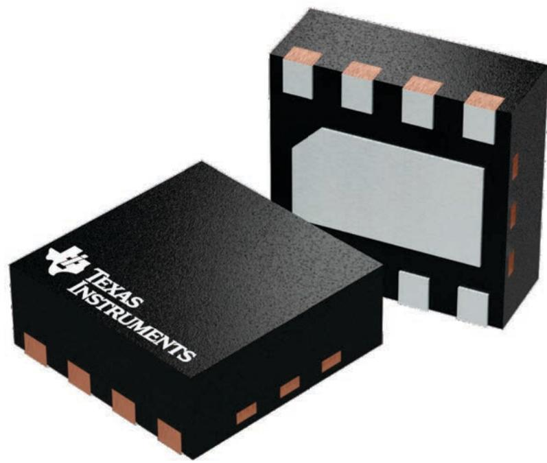

PLASTIC SMALL OUTLINE - NO LEAD

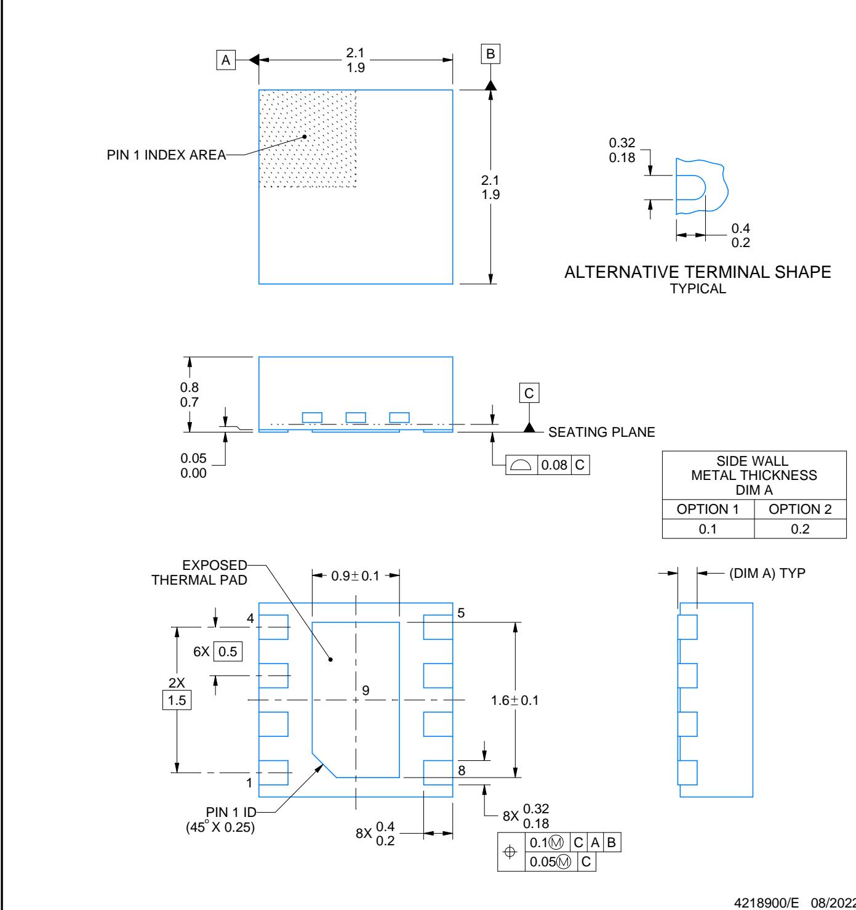

# NOTES:

1. All linear dimensions are in millimeters. Any dimensions in parenthesis are for reference only. Dimensioning and tolerancing per ASME $\Upsilon 1 4 . 5 \mathsf { M }$ .   
2. This drawing is subject to change without notice.   
3. The package thermal pad must be soldered to the printed circuit board for thermal and mechanical performance.

PLASTIC SMALL OUTLINE - NO LEAD

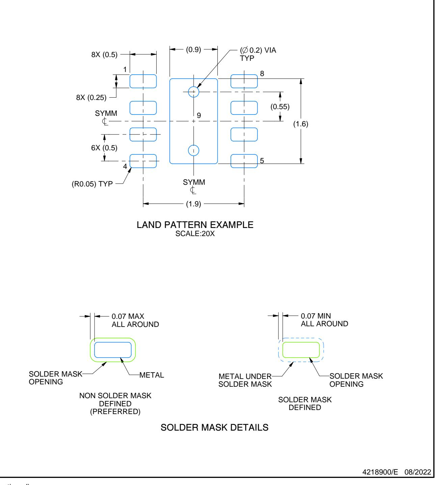  
NOTES: (continued)

4. This package is designed to be soldered to a thermal pad on the board. For more information, see Texas Instruments literature number SLUA271 (www.ti.com/lit/slua271).   
5. Vias are optional depending on application, refer to device data sheet. If any vias are implemented, refer to their locations shown on this view. It is recommended that vias under paste be filled, plugged or tented.

PLASTIC SMALL OUTLINE - NO LEAD

SOLDER PASTE EXAMPLE BASED ON $0 . 1 2 5 \ : \mathrm { m m }$ THICK STENCIL

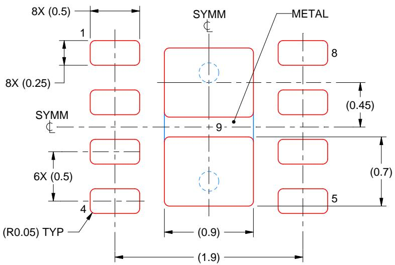  
NOTES: (continued)

EXPOSED PAD 9: $87 \%$ PRINTED SOLDER COVERAGE BY AREA UNDER PACKAGE SCALE:25X

6. Laser cutting apertures with trapezoidal walls and rounded corners may offer better paste release. IPC-7525 may have alternate design recommendations.

# IMPORTANT NOTICE AND DISCLAIMER

TI PROVIDES TECHNICAL AND RELIABILITY DATA (INCLUDING DATASHEETS), DESIGN RESOURCES (INCLUDING REFERENCE DESIGNS), APPLICATION OR OTHER DESIGN ADVICE, WEB TOOLS, SAFETY INFORMATION, AND OTHER RESOURCES “AS IS” AND WITH ALL FAULTS, AND DISCLAIMS ALL WARRANTIES, EXPRESS AND IMPLIED, INCLUDING WITHOUT LIMITATION ANY IMPLIED WARRANTIES OF MERCHANTABILITY, FITNESS FOR A PARTICULAR PURPOSE OR NON-INFRINGEMENT OF THIRD PARTY INTELLECTUAL PROPERTY RIGHTS.

These resources are intended for skilled developers designing with TI products. You are solely responsible for (1) selecting the appropriate TI products for your application, (2) designing, validating and testing your application, and (3) ensuring your application meets applicable standards, and any other safety, security, regulatory or other requirements.

These resources are subject to change without notice. TI grants you permission to use these resources only for development of an application that uses the TI products described in the resource. Other reproduction and display of these resources is prohibited. No license is granted to any other TI intellectual property right or to any third party intellectual property right. TI disclaims responsibility for, and you fully indemnify TI and its representatives against any claims, damages, costs, losses, and liabilities arising out of your use of these resources.

TI’s products are provided subject to TI’s Terms of Sale, TI’s General Quality Guidelines, or other applicable terms available either on ti.com or provided in conjunction with such TI products. TI’s provision of these resources does not expand or otherwise alter TI’s applicable warranties or warranty disclaimers for TI products. Unless TI explicitly designates a product as custom or customer-specified, TI products are standard, catalog, general purpose devices.

TI objects to and rejects any additional or different terms you may propose.