# BQ40Z50-R2 1-Series, 2-Series, 3-Series, and 4-Series Li-Ion Battery Pack Manager

# 1 Features

Fully integrated 1-series, 2-series, 3-series, and 4-series Li-ion or Li-polymer cell battery pack manager and protection

Next-generation patented Impedance Track™ technology accurately measures available charge in Li-ion and Li-polymer batteries

• High-side N-CH protection FET drive

Integrated cell balancing while charging or at rest • Suitable for batteries between $1 0 0 ~ \mathsf { m A h }$ and 29 Ah • Full array of programmable protection features

– Voltage Current Temperature Charge timeout CHG/DSG FETs AFE

• Sophisticated charge algorithms – JEITA Enhanced charging Adaptive charging Cell balancing

• Supports TURBO Mode 2.0 • Supports battery trip point (BTP)

Diagnostic lifetime data monitor and black box recorder

• LED display • SHA-1 authentication • IATA support

# 2 Applications

Tablets   
Drones   
UPS/battery backup systems   
Medical equipment   
Handheld vacuum cleaners and vacuum robots

# 3 Description

The BQ40Z50-R2 device, incorporating patented Impedance Track™ technology, is a fully integrated, single-chip, pack-based solution that provides a rich array of features for gas gauging, protection, and authentication for 1-series, 2-series, 3-series, and 4- series cell Li-ion and Li-polymer battery packs.

Using its integrated high-performance analog peripherals, the BQ40Z50-R2 device measures and maintains an accurate record of available capacity, voltage, current, temperature, and other critical parameters in Li-ion or Li-polymer batteries, and reports this information to the system host controller over an SMBus v1.1 compatible interface.

Device Information   

<table><tr><td rowspan=1 colspan=1>PART NUMBER</td><td rowspan=1 colspan=1>PACKAGE</td><td rowspan=1 colspan=1>BODY SIZE (NOM)</td></tr><tr><td rowspan=1 colspan=1>BQ40Z50-R2</td><td rowspan=1 colspan=1>VQFN (32)</td><td rowspan=1 colspan=1>4.00 mm × 4.00 mm</td></tr></table>

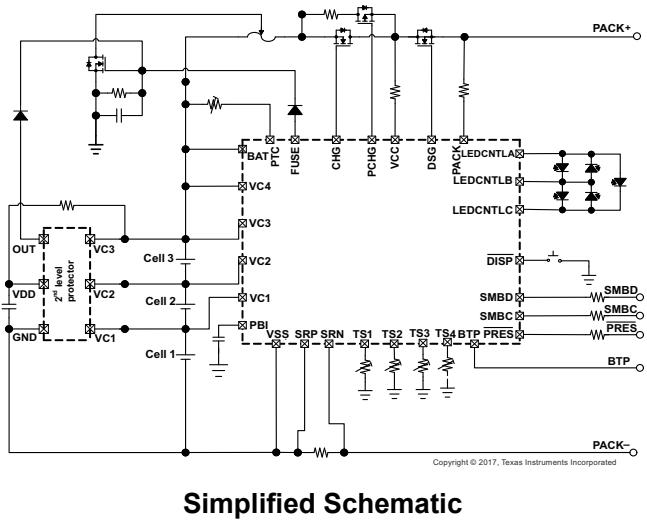

# Table of Contents

# 7 Specifications.. 8

7.1 Absolute Maximum Ratings. 7.2 ESD Ratings.. . 88   
7.3 Recommended Operating Conditions.. .8   
7.4 Thermal Information. .9   
7.5 Supply Current.. 9   
7.6 Power Supply Control.. 9   
7.7 AFE Power-On Reset.. 10   
7.8 AFE Watchdog Reset and Wake Timer.. 10   
7.9 Current Wake Comparator... 10   
7.10 VC1, VC2, VC3, VC4, BAT, PACK.. 11   
7.11 SMBD, SMBC.. .11   
7.12 PRES, BTP_INT, DISP .11   
7.13 LEDCNTLA, LEDCNTLB, LEDCNTLC.. . 12   
7.14 Coulomb Counter.. . 12   
7.15 CC Digital Filter.. . 12   
7.16 ADC.. 12   
7.17 ADC Digital Filter.. 13   
7.18 CHG, DSG FET Drive.. 13   
7.19 PCHG FET Drive.. 14   
7.20 FUSE Drive.. 14   
7.21 Internal Temperature Sensor.. 14   
7.22 TS1, TS2, TS3, TS4. .15   
7.23 PTC, PTCEN.. 15   
7.24 Internal 1.8-V LDO. 15   
7.25 High-Frequency Oscillator.. 15   
7.26 Low-Frequency Oscillator.. 7.27 Voltage Reference 1.. . 16 16   
7.28 Voltage Reference 2.. 16   
7.29 Instruction Flash.. .16   
7.30 Data Flash.. 17   
7.31 OLD, SCC, SCD1, SCD2 Current Protection   
Thresholds.. .17   
7.32 Timing Requirements: OLD, SCC, SCD1,   
SCD2 Current Protection Timing.. . 18   
7.33 Timing Requirements: SMBus.. 18   
7.34 Timing Requirements: SMBus XL. . 19   
7.35 Typical Characteristics.. .20

# 8 Detailed Description.. 2

8.1 Overview... . 24   
8.2 Functional Block Diagram.. . 24..25   
8.3 Feature Description...   
8.4 Device Functional Modes.. .28

# 9 Application and Implementation.. .29

9.1 Application Information. 29   
9.2 Typical Applications.. 30

# 10 Power Supply Recommendations.. .41

11 Layout.. 42

11.1 Layout Guidelines. 42   
11.2 Layout Example... 44

# 12 Device and Documentation Support.. .46

12.1 Third-Party Products Disclaimer.. . 46   
12.2 Documentation Support.. 46   
12.3 Support Resources.. 46   
12.4 Trademarks... .46   
12.5 Electrostatic Discharge Caution. . 46   
12.6 Glossary...... .46

# 13 Mechanical, Packaging, and Orderable

Information.. 46

# 4 Revision History

NOTE: Page numbers for previous revisions may differ from page numbers in the current version.

anges from Revision B (July 2018) to Revision C (April 2021)

Changed all occurrences of OCD to OLD throughout the data sheet .

# Changes from Revision A (October 2017) to Revision B (July 2018) Page

Changed Pin Configuration and Functions . . 5   
• Changed System Present . .34

# 5 Description (continued)

The BQ40Z50-R2 device supports TURBO Mode 2.0 by providing the available max power and max current to the host system. The device also supports Battery Trip Point to send a BTP interrupt signal to the host system at the preset state of charge thresholds.

The BQ40Z50-R2 provides software-based 1st- and 2nd-level safety protection against overvoltage, undervoltage, overcurrent, short-circuit current, overload, and overtemperature conditions, as well as other packand cell-related faults.

SHA-1 authentication, with secure memory for authentication keys, enables identification of genuine batter packs.

The compact 32-lead QFN package minimizes solution cost and size for smart batteries while providing maximum functionality and safety for battery gauging applications.

# 6 Pin Configuration and Functions

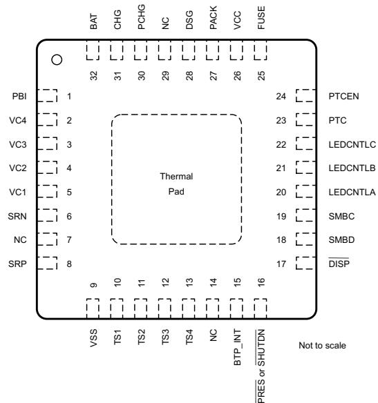

Table 6-1. Pin Functions   

<table><tr><td rowspan=1 colspan=1>PIN NUMBER</td><td rowspan=1 colspan=1>PIN NAME</td><td rowspan=1 colspan=1>TYPE</td><td rowspan=1 colspan=1>DESCRIPTION</td></tr><tr><td rowspan=1 colspan=1>1</td><td rowspan=1 colspan=1>PBI</td><td rowspan=1 colspan=1>P(1)</td><td rowspan=1 colspan=1>Power supply backup input pin. Connect to the 2.2-μF capacitor to VSS.</td></tr><tr><td rowspan=1 colspan=1>2</td><td rowspan=1 colspan=1>VC4</td><td rowspan=1 colspan=1>IA</td><td rowspan=1 colspan=1>Sense voltage input pin for the most positive cell, and balance current inputfor the most positive cell. Should be connected to the positive terminal of thefourth cell from the bottom of the stack with a 100-Ω series resistor and a0.1-µF capacitor to VC3. If not used, connect to VC3.</td></tr><tr><td rowspan=1 colspan=1>3</td><td rowspan=1 colspan=1>VC3</td><td rowspan=1 colspan=1>IA</td><td rowspan=1 colspan=1>Sense voltage input pin for the third-most positive cell, balance current inputfor the third-most positive cell, and return balance current for the mostpositive cell. Should be connected to the positive terminal of the third cell fromthe bottom of the stack with a 100-Ω series resistor and a 0.1-µF capacitor toVC2. If not used, connect to VC2.</td></tr><tr><td rowspan=1 colspan=1>4</td><td rowspan=1 colspan=1>VC2</td><td rowspan=1 colspan=1>IA</td><td rowspan=1 colspan=1>Sense voltage input pin for the second-most positive cell, balance currentinput for the second-most positive cell, and return balance current for thethird-most positive cell. Should be connected to the positive terminal of thesecond cell from the bottom of the stack with a 100-Ω series resistor and a0.1-µF capacitor to VC1. If not used, connect to VC1.</td></tr><tr><td rowspan=1 colspan=1>5</td><td rowspan=1 colspan=1>VC1</td><td rowspan=1 colspan=1>IA</td><td rowspan=1 colspan=1>Sense voltage input pin for the least positive cell, balance current input forthe least positive cell, and return balance current for the second-most positivecell. Should be connected to the positive terminal of the first cell from thebottom of the stack with a 100-Ω series resistor and a 0.1-µF capacitor toVSS.</td></tr></table>

<table><tr><td></td><td></td><td></td><td rowspan=1 colspan=1>Table 6-1. Pin Functions (continued)</td></tr><tr><td rowspan=1 colspan=1>PIN NUMBER</td><td rowspan=1 colspan=1>PIN NAME</td><td rowspan=1 colspan=1>TYPE</td><td rowspan=1 colspan=1>DESCRIPTION</td></tr><tr><td rowspan=1 colspan=1>6</td><td rowspan=1 colspan=1>SRN</td><td rowspan=1 colspan=1>I</td><td rowspan=1 colspan=1>Analog input pin connected to the internal coulomb counter peripheral forintegrating a small voltage between SRP and SRN where SRP is the top the sense resistor.</td></tr><tr><td rowspan=1 colspan=1>7</td><td rowspan=1 colspan=1>NC</td><td rowspan=1 colspan=1></td><td rowspan=1 colspan=1>Not internally connected. It is okay to leave floating or to tie to VSS.</td></tr><tr><td rowspan=1 colspan=1>8</td><td rowspan=1 colspan=1>SRP</td><td rowspan=1 colspan=1>I</td><td rowspan=1 colspan=1>Analog input pin connected to the internal coulomb counter peripheral forintegrating a small voltage between SRP and SRN where SRP is the top ofthe sense resistor.</td></tr><tr><td rowspan=1 colspan=1>9</td><td rowspan=1 colspan=1>vss</td><td rowspan=1 colspan=1>P</td><td rowspan=1 colspan=1>Device ground</td></tr><tr><td rowspan=1 colspan=1>10</td><td rowspan=1 colspan=1>TS1</td><td rowspan=1 colspan=1>IA</td><td rowspan=1 colspan=1>Temperature sensor 1 thermistor input pin. Connect to thermistor-1. If notused, connect directly to VSS and configure data flash accordingly.</td></tr><tr><td rowspan=1 colspan=1>11</td><td rowspan=1 colspan=1>TS2</td><td rowspan=1 colspan=1>IA</td><td rowspan=1 colspan=1>Temperature sensor 2 thermistor input pin. Connect to thermistor-2. If notused, connect directly to VSS and configure data flash accordingly.</td></tr><tr><td rowspan=1 colspan=1>12</td><td rowspan=1 colspan=1>TS3</td><td rowspan=1 colspan=1>IA</td><td rowspan=1 colspan=1>Temperature sensor 3 thermistor input pin. Connect to thermistor-3. If notused, connect directly to VSS and configure data flash accordingly.</td></tr><tr><td rowspan=1 colspan=1>13</td><td rowspan=1 colspan=1>TS4</td><td rowspan=1 colspan=1>IA</td><td rowspan=1 colspan=1>Temperature sensor 4 thermistor input pin. Connect to thermistor-4. If notused, connect directly to VSS and configure data flash accordingly.</td></tr><tr><td rowspan=1 colspan=1>14</td><td rowspan=1 colspan=1>NC</td><td rowspan=1 colspan=1></td><td rowspan=1 colspan=1>Not intenallycoe. It isoay  leve flatigr o VSS.</td></tr><tr><td rowspan=1 colspan=1>15</td><td rowspan=1 colspan=1>BTP_INT</td><td rowspan=1 colspan=1>O</td><td rowspan=1 colspan=1>Battry Trip Point BTP)interrupt output.  not used,connet drectly o VSS.</td></tr><tr><td rowspan=1 colspan=1>16</td><td rowspan=1 colspan=1>PRES or SHUTDN</td><td rowspan=1 colspan=1>I</td><td rowspan=1 colspan=1>Host system present input for removable battery pack or emergency systemshutdown input for embedded pack. A pullup is not required for this pin. If notused, connect directly to VSS.</td></tr><tr><td rowspan=1 colspan=1>17</td><td rowspan=1 colspan=1>DISP</td><td rowspan=1 colspan=1></td><td rowspan=1 colspan=1>Display control for LEDs. If not used, connect directly to VSS.</td></tr><tr><td rowspan=1 colspan=1>18</td><td rowspan=1 colspan=1>SMBD</td><td rowspan=1 colspan=1>I/OD</td><td rowspan=1 colspan=1>SMBus data pin</td></tr><tr><td rowspan=1 colspan=1>19</td><td rowspan=1 colspan=1>SMBC</td><td rowspan=1 colspan=1>I/OD</td><td rowspan=1 colspan=1>SMBus clock pin</td></tr><tr><td rowspan=1 colspan=1>20</td><td rowspan=1 colspan=1>LEDCNTLA</td><td rowspan=1 colspan=1></td><td rowspan=1 colspan=1>LED display segment that drives the external LEDs depending on the t   o  n   connected to VSS through a 20-kΩ resistor.</td></tr><tr><td rowspan=1 colspan=1>21</td><td rowspan=1 colspan=1>LEDCNTLB</td><td rowspan=1 colspan=1></td><td rowspan=1 colspan=1>LED display segment that drives the external LEDs depending on thefirmware configuration. If LEDs are not used, these pins can be left floating orconnected to VSS through a 20-kΩ resistor.</td></tr><tr><td rowspan=1 colspan=1>22</td><td rowspan=1 colspan=1>LEDCNTLC</td><td rowspan=1 colspan=1></td><td rowspan=1 colspan=1>LED display segment that drives the external LEDs depending on the t      tconnected to VSS through a 20-kΩ resistor.</td></tr><tr><td rowspan=1 colspan=1>23</td><td rowspan=1 colspan=1>PTC</td><td rowspan=1 colspan=1>IA</td><td rowspan=1 colspan=1>Safety PTC thermistor input pin. To disable, connect both PTC and PTCEN tovsSs.</td></tr><tr><td rowspan=1 colspan=1>24</td><td rowspan=1 colspan=1>PTCEN</td><td rowspan=1 colspan=1>IA</td><td rowspan=1 colspan=1>Safety PTC thermistor enable input pin. Connect to BAT. To disable, connectboth PTC and PTCEN to VSS.</td></tr><tr><td rowspan=1 colspan=1>25</td><td rowspan=1 colspan=1>FUSE</td><td rowspan=1 colspan=1>O</td><td rowspan=1 colspan=1>Fuse drive output pin. If not used, connect directly to VSS.</td></tr><tr><td rowspan=1 colspan=1>26</td><td rowspan=1 colspan=1>vcc</td><td rowspan=1 colspan=1>P</td><td rowspan=1 colspan=1>Secondary power supply input</td></tr><tr><td rowspan=1 colspan=1>27</td><td rowspan=1 colspan=1>PACK</td><td rowspan=1 colspan=1>IA</td><td rowspan=1 colspan=1>Pack sense input pin</td></tr><tr><td rowspan=1 colspan=1>28</td><td rowspan=1 colspan=1>DSG</td><td rowspan=1 colspan=1>O</td><td rowspan=1 colspan=1> u  ot e connected to VSS through a 20-kΩ resistor.</td></tr><tr><td rowspan=1 colspan=1>29</td><td rowspan=1 colspan=1>NC</td><td rowspan=1 colspan=1></td><td rowspan=1 colspan=1>Not internally connected. It is okay to leave floating or to tie to VSS.</td></tr><tr><td rowspan=1 colspan=1>30</td><td rowspan=1 colspan=1>PCHG</td><td rowspan=1 colspan=1>0</td><td rowspan=1 colspan=1>PMOS Precharge FET drive output pin. If not used, it can be left floating orconnected to VSS through a 20-kΩ resistor.</td></tr><tr><td rowspan=1 colspan=1>31</td><td rowspan=1 colspan=1>CHG</td><td rowspan=1 colspan=1>O</td><td rowspan=1 colspan=1>Char ivut   ot n  et ftconnected to VSS through a 20-kΩ resistor.</td></tr><tr><td rowspan=1 colspan=1>32</td><td rowspan=1 colspan=1>BAT</td><td rowspan=1 colspan=1>P</td><td rowspan=1 colspan=1>Primary power supply input pin</td></tr></table>

(1) $\mathsf { P } =$ Power Connection, ${ \sf O } =$ Digital Output, $\mathsf { A l } =$ Analog Input, $| =$ Digital Input, I/OD $=$ Digital Input/Output

# 6.1 Pin Equivalent Diagrams

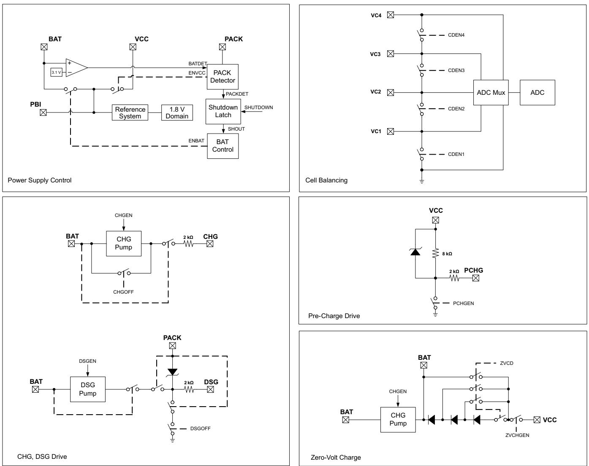  
Figure 6-1. Pin Equivalent Diagram 1

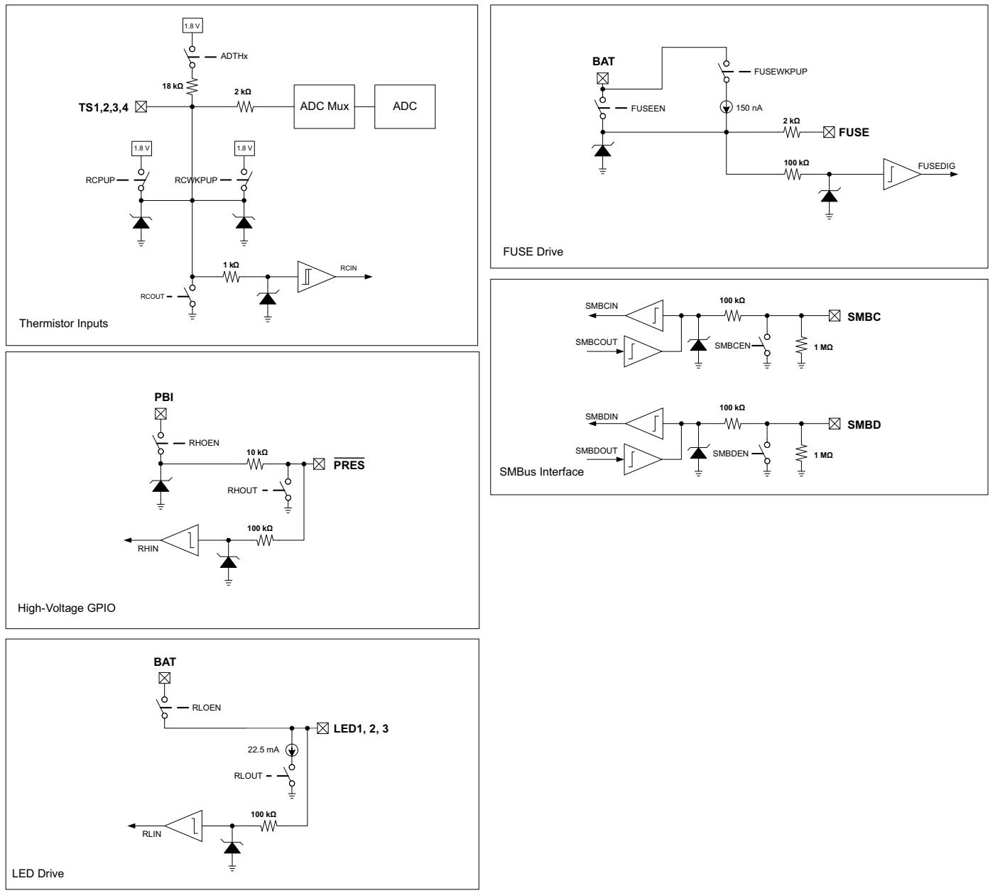  
Figure 6-2. Pin Equivalent Diagram 2

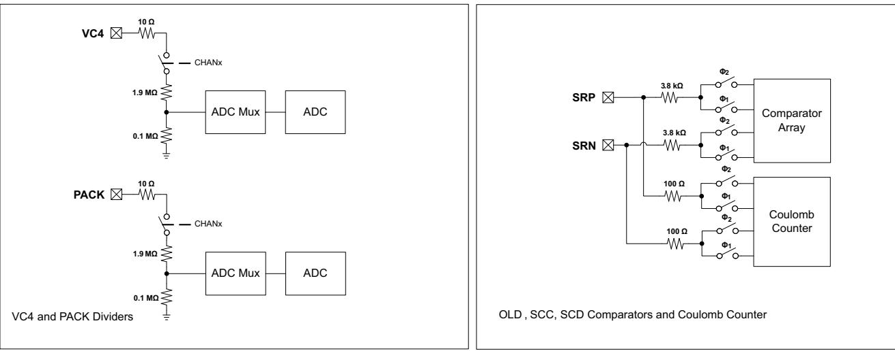  
Figure 6-3. Pin Equivalent Diagram 3

# 7 Specifications

# 7.1 Absolute Maximum Ratings

Over-operating free-air temperature range (unless otherwise noted)(1)

<table><tr><td></td><td></td><td rowspan=1 colspan=1>MIN</td><td rowspan=1 colspan=1>MAX</td><td rowspan=1 colspan=1>UNIT</td></tr><tr><td rowspan=1 colspan=1>Supply voltage range,Vcc</td><td rowspan=1 colspan=1>BAT, VCC, PBI</td><td rowspan=1 colspan=1>-0.3</td><td rowspan=1 colspan=1>30</td><td rowspan=1 colspan=1>V</td></tr><tr><td rowspan=8 colspan=1>Input voltage range, VIN</td><td rowspan=1 colspan=1>PACK, SMBC, SMBD, PRES or SHUTDN, BTP_INT, DISP</td><td rowspan=1 colspan=1>-0.3</td><td rowspan=1 colspan=1>30</td><td rowspan=1 colspan=1>V</td></tr><tr><td rowspan=1 colspan=1>TS1, TS2, TS3, TS4</td><td rowspan=1 colspan=1>-0.3</td><td rowspan=1 colspan=1>VREG + 0.3</td><td rowspan=1 colspan=1>V</td></tr><tr><td rowspan=1 colspan=1>PTC, PTCEN, LEDCNTLA, LEDCNTLB, LEDCNTLC</td><td rowspan=1 colspan=1>-0.3</td><td rowspan=1 colspan=1>VBAT + 0.3</td><td rowspan=1 colspan=1>V</td></tr><tr><td rowspan=1 colspan=1>SRP, SRN</td><td rowspan=1 colspan=1>-0.3</td><td rowspan=1 colspan=1>0.3</td><td rowspan=1 colspan=1>V</td></tr><tr><td rowspan=1 colspan=1>VC4</td><td rowspan=1 colspan=1>VC3 -0.3</td><td rowspan=1 colspan=1>VC3 + 8.5, orVSS + 30</td><td rowspan=1 colspan=1>V</td></tr><tr><td rowspan=1 colspan=1>VC3</td><td rowspan=1 colspan=1>VC2- 0.3</td><td rowspan=1 colspan=1>VC2 + 8.5, orVSS + 30</td><td rowspan=1 colspan=1>V</td></tr><tr><td rowspan=1 colspan=1>VC2</td><td rowspan=1 colspan=1>VC1- 0.3</td><td rowspan=1 colspan=1>VC1 + 8.5, orVSS + 30</td><td rowspan=1 colspan=1>V</td></tr><tr><td rowspan=1 colspan=1>VC1</td><td rowspan=1 colspan=1>VSS - 0.3</td><td rowspan=1 colspan=1>VSS + 8.5, orVSS + 30</td><td rowspan=1 colspan=1>V</td></tr><tr><td rowspan=2 colspan=1>Output voltage range,Vo</td><td rowspan=1 colspan=1>CHG, DSG</td><td rowspan=1 colspan=1>-0.3</td><td rowspan=1 colspan=1>32</td><td rowspan=1 colspan=1></td></tr><tr><td rowspan=1 colspan=1>PCHG, FUSE</td><td rowspan=1 colspan=1>-0.3</td><td rowspan=1 colspan=1>30</td><td rowspan=1 colspan=1>V</td></tr><tr><td rowspan=1 colspan=2>Maximum VSS current, Iss</td><td rowspan=1 colspan=1></td><td rowspan=1 colspan=1>50</td><td rowspan=1 colspan=1>mA</td></tr><tr><td rowspan=1 colspan=2>Storage temperature, TsTG</td><td rowspan=1 colspan=1>-65</td><td rowspan=1 colspan=1>150</td><td rowspan=1 colspan=1>°C</td></tr><tr><td rowspan=1 colspan=2>Lead temperature (soldering, 10 s), TsoLDER</td><td rowspan=1 colspan=2>300</td><td rowspan=1 colspan=1>°C</td></tr></table>

(1) Stresses beyond those listed under absolute maximum ratings may cause permanent damage to the device. These are stress ratings only, and functional operation of the device at these or any other conditions beyond those indicated under recommended operating conditions is not implied. Exposure to absolute–maximum–rated conditions for extended periods may affect device reliability.

# 7.2 ESD Ratings

<table><tr><td></td><td></td><td></td><td rowspan=1 colspan=1>VALUE</td><td rowspan=1 colspan=1>UNIT</td></tr><tr><td rowspan=2 colspan=1>ElectrostaticV(ESD)   discharge</td><td rowspan=1 colspan=2>Human-body model (HBM), per ANSI/ESDA/JEDEC JS-001(1)</td><td rowspan=1 colspan=1>±2000</td><td rowspan=2 colspan=1>V</td></tr><tr><td rowspan=1 colspan=2>Charged-device model (CDM), per JEDEC specification JESD22-C101(2)</td><td rowspan=1 colspan=1>±500</td></tr></table>

(1) JEDEC document JEP155 states that 500-V HBM allows safe manufacturing with a standard ESD control process.   
(2) JEDEC document JEP157 states that 250-V CDM allows safe manufacturing with a standard ESD control process.

# 7.3 Recommended Operating Conditions

Typical values stated where ${ \bar { \mathsf { T } } } _ { \mathsf { A } } = 2 5 ^ { \circ } { \mathsf { C } }$ and ${ \mathsf { V C C } } = 1 4 . 4 { \mathsf { V } }$ , Min/Max values stated where $\mathsf { T } _ { \mathsf { A } } = - 4 0 ^ { \circ } \mathsf { C }$ to $8 5 ^ { \circ } \mathsf { C }$ and ${ \mathsf { V C C } } =$ $_ { 2 . 2 \vee }$ to ${ } ^ { 2 6 \vee }$ (unless otherwise noted)

<table><tr><td colspan="3"></td><td>MIN</td><td>NOM</td><td>MAX</td><td>UNIT</td></tr><tr><td>Vcc</td><td>Supply voltage</td><td>BAT, VCC, PBI</td><td>2.2</td><td></td><td>26</td><td>V</td></tr><tr><td>VSHUTDOWN-</td><td>Shutdown voltage</td><td>VPACK &lt; VsHUTDOWN -</td><td>1.8</td><td>2.0</td><td>2.2</td><td>V</td></tr><tr><td>VsHUTDOWN+</td><td>Start-up voltage</td><td>VPACK &gt; VsHUTDOWN- + VHYS</td><td>2.05</td><td>2.25</td><td>2.45</td><td>V</td></tr><tr><td>VHYS</td><td>Shutdown voltage hysteresis</td><td>VSHUTDOWn+ - VsHUTDOWn-</td><td></td><td>250</td><td></td><td>mV</td></tr></table>

# 7.3 Recommended Operating Conditions (continued)

Typical values stated where ${ \bar { \mathsf { T } } } _ { \mathsf { A } } = 2 5 ^ { \circ } { \mathsf { C } }$ and ${ \mathsf { V C C } } = 1 4 . 4 { \mathsf { V } } _ { : }$ Min/Max values stated where $\mathsf { T } _ { \mathsf { A } } = - 4 0 ^ { \circ } \mathsf { C }$ to $8 5 ^ { \circ } \mathsf { C }$ and ${ \mathsf { V C C } } =$ $_ { 2 . 2 \vee }$ to 26 V (unless otherwise noted)

<table><tr><td rowspan=1 colspan=1></td><td></td><td></td><td rowspan=1 colspan=1>MIN</td><td rowspan=1 colspan=1>NOM</td><td rowspan=1 colspan=1>MAX</td><td rowspan=1 colspan=1>UNIT</td></tr><tr><td rowspan=8 colspan=1>VIN</td><td rowspan=8 colspan=1>Input voltage range</td><td rowspan=1 colspan=1>PACK, SMBC, SMBD, PRES, BTP_IN, DISP</td><td rowspan=1 colspan=3>26</td><td rowspan=8 colspan=1>V</td></tr><tr><td rowspan=1 colspan=1>TS1, TS2, TS3, TS4</td><td rowspan=1 colspan=2></td><td rowspan=1 colspan=1>VREG</td></tr><tr><td rowspan=1 colspan=1>PTC, PTCEN, LEDCNTLA, LEDCNTLB, LEDCNTLC</td><td rowspan=1 colspan=3>VBAT</td></tr><tr><td rowspan=1 colspan=1>SRP, SRN</td><td rowspan=1 colspan=2>-0.2</td><td rowspan=1 colspan=1>0.2</td></tr><tr><td rowspan=1 colspan=1>VC4</td><td rowspan=1 colspan=3>Vvc3          Vvc3 + 5</td></tr><tr><td rowspan=1 colspan=1>VC3</td><td rowspan=1 colspan=3>Vvc2          Vvc2 +5</td></tr><tr><td rowspan=1 colspan=1>VC2</td><td rowspan=1 colspan=2>Vvc1</td><td rowspan=1 colspan=1>Vvc1 +5</td></tr><tr><td rowspan=1 colspan=1>VC1</td><td rowspan=1 colspan=3>Vvss          Vvss +5</td></tr><tr><td rowspan=1 colspan=1>Vo</td><td rowspan=1 colspan=1>Output voltagerange</td><td rowspan=1 colspan=1>CHG, DSG, PCHG, FUSE</td><td rowspan=1 colspan=3>26</td><td rowspan=1 colspan=1>V</td></tr><tr><td rowspan=1 colspan=1>CPBI</td><td rowspan=1 colspan=1>External PBIcapacitor</td><td rowspan=1 colspan=1></td><td rowspan=1 colspan=3>2.2</td><td rowspan=1 colspan=1>μF</td></tr><tr><td rowspan=1 colspan=2>TOPR        Operatingtemperature</td><td rowspan=1 colspan=1></td><td rowspan=1 colspan=3>-40                85</td><td rowspan=1 colspan=1>°C</td></tr></table>

# 7.4 Thermal Information

<table><tr><td rowspan=3 colspan=1>THERMAL METRIC(1)</td><td rowspan=1 colspan=1>BQ40Z50-R2</td><td rowspan=3 colspan=1>UNIT</td></tr><tr><td rowspan=1 colspan=1>RSM (QFN)</td></tr><tr><td rowspan=1 colspan=1>32 PINS</td></tr><tr><td rowspan=1 colspan=1>ReJA, High K      Junction-to-ambient thermal resistance</td><td rowspan=1 colspan=1>47.4</td><td rowspan=1 colspan=1>°C/W</td></tr><tr><td rowspan=1 colspan=1>ReJC(top)         Junction-to-case(top) thermal resistance</td><td rowspan=1 colspan=1>40.3</td><td rowspan=1 colspan=1>°C/W</td></tr><tr><td rowspan=1 colspan=1>RθJB$            Junction-to-board thermal resistance</td><td rowspan=1 colspan=1>14.7</td><td rowspan=1 colspan=1>°C/W</td></tr><tr><td rowspan=1 colspan=1>4j\r             Junction-to-top characterization parameter</td><td rowspan=1 colspan=1>0.8</td><td rowspan=1 colspan=1>°C/W</td></tr><tr><td rowspan=1 colspan=1>4JB$             Junction-to-board characterization parameter</td><td rowspan=1 colspan=1>14.4</td><td rowspan=1 colspan=1>°C/W</td></tr><tr><td rowspan=1 colspan=1>ReJC(bottom)       Junction-to-case(bottom) thermal resistance</td><td rowspan=1 colspan=1>3.8</td><td rowspan=1 colspan=1>°C/W</td></tr></table>

(1) For more information about traditional and new thermal metrics, see the Semiconductor and IC Package Thermal Metrics application report, SPRA953.

# 7.5 Supply Current

Typical values stated where ${ \bar { \mathsf { T } } } _ { \mathsf { A } } = 2 5 ^ { \circ } { \mathsf { C } }$ and ${ \mathsf { V C C } } = 1 4 . 4 { \mathsf { V } } _ { : }$ Min/Max values stated where $\mathsf { T } _ { \mathsf { A } } = - 4 0 ^ { \circ } \mathsf { C }$ to $8 5 ^ { \circ } \mathsf { C }$ and ${ \mathsf { V C C } } =$ $_ { 2 . 2 \vee }$ to ${ } ^ { 2 0 \vee }$ (unless otherwise noted)   

<table><tr><td rowspan=1 colspan=1>PARAMETER</td><td rowspan=1 colspan=1>TEST CONDITIONS</td><td rowspan=1 colspan=1>MIN</td><td rowspan=1 colspan=1>TYP</td><td rowspan=1 colspan=1>MAX</td><td rowspan=1 colspan=1>UNIT</td></tr><tr><td rowspan=1 colspan=1>INORMAL      NORMAL mode</td><td rowspan=1 colspan=1>CHG on. DSG on, no Flash write</td><td rowspan=1 colspan=3>336</td><td rowspan=1 colspan=1>μA</td></tr><tr><td rowspan=2 colspan=1>ISLEEP       SLEEP mode</td><td rowspan=1 colspan=1>CHG off, DSG on, no SBS communication</td><td rowspan=1 colspan=3>75</td><td rowspan=2 colspan=1>μA</td></tr><tr><td rowspan=1 colspan=1>CHG off, DSG off, no SBS communication</td><td rowspan=1 colspan=3>52</td></tr><tr><td rowspan=1 colspan=1>ISHUTDOWN   SHUTDOWN mode</td><td rowspan=1 colspan=1></td><td rowspan=1 colspan=3>1.6</td><td rowspan=1 colspan=1>μA</td></tr></table>

# 7.6 Power Supply Control

Typical values stated where ${ \bar { \mathsf { T } } } _ { \mathsf { A } } = 2 5 ^ { \circ } { \mathsf { C } }$ and ${ \mathsf { V C C } } = 1 4 . 4 { \mathsf { V } }$ , Min/Max values stated where $\mathsf { T } _ { \mathsf { A } } = - 4 0 ^ { \circ } \mathsf { C }$ to $8 5 ^ { \circ } \mathsf { C }$ and ${ \mathsf { V C C } } =$ $_ { 2 . 2 \vee }$ to ${ } ^ { 2 6 \vee }$ (unless otherwise noted)

<table><tr><td rowspan=1 colspan=1>PARAMETER</td><td rowspan=1 colspan=1>TEST CONDITIONS</td><td rowspan=1 colspan=1>MIN</td><td rowspan=1 colspan=1>TYP</td><td rowspan=1 colspan=1>MAX</td><td rowspan=1 colspan=1>UNIT</td></tr><tr><td rowspan=1 colspan=1>BAT to VccVsWITCHOVER-  switchover voltage</td><td rowspan=1 colspan=1>VBAT &lt; VsWITCHOVER-</td><td rowspan=1 colspan=3>1.95     2.1     2.2</td><td rowspan=1 colspan=1>V</td></tr><tr><td rowspan=1 colspan=1>Vcc to BATVsWITCHOVER+  switchover voltage</td><td rowspan=1 colspan=1>VBAT &gt; VsWITCHOVER- + VHYS</td><td rowspan=1 colspan=3>2.9     3.1    3.25</td><td rowspan=1 colspan=1>V</td></tr></table>

# 7.6 Power Supply Control (continued)

Typical values stated where ${ \bar { \mathsf { T } } } _ { \mathsf { A } } = 2 5 ^ { \circ } { \mathsf { C } }$ and ${ \mathsf { V C C } } = 1 4 . 4 { \mathsf { V } } _ { : }$ Min/Max values stated where $\mathsf { T } _ { \mathsf { A } } = - 4 0 ^ { \circ } \mathsf { C }$ to $8 5 ^ { \circ } \mathsf { C }$ and ${ \mathsf { V C C } } =$ $_ { 2 . 2 \vee }$ to ${ } ^ { 2 6 \vee }$ (unless otherwise noted)

<table><tr><td rowspan=1 colspan=1>PARAMETER</td><td rowspan=1 colspan=1>TEST CONDITIONS</td><td rowspan=1 colspan=1>MIN</td><td rowspan=1 colspan=1>TYP</td><td rowspan=1 colspan=1>MAX</td><td rowspan=1 colspan=1>UNIT</td></tr><tr><td rowspan=1 colspan=1>VHYS           Switchovervoltage hysteresis</td><td rowspan=1 colspan=1>VsWITCHOVER+ - VSWITCHOVER</td><td rowspan=1 colspan=3>1000</td><td rowspan=1 colspan=1>mV</td></tr><tr><td rowspan=3 colspan=1>Input Leakage LKG            current</td><td rowspan=1 colspan=1>BAT pin, BAT = 0 V, VCC = 25 V, PACK = 25 V</td><td rowspan=1 colspan=1></td><td rowspan=1 colspan=2>1</td><td rowspan=3 colspan=1>μA</td></tr><tr><td rowspan=1 colspan=1>PACK pin, BAT = 25 V, VCC = 0 V, PACK = 0 V</td><td rowspan=1 colspan=3>1</td></tr><tr><td rowspan=1 colspan=1>BAT and PACK terminals, BAT = 0 V, VCC = 0 V, PACK =0 V, PBI = 25 V</td><td rowspan=1 colspan=3>1</td></tr></table>

# 7.7 AFE Power-On Reset

Typical values stated where ${ \bar { \mathsf { T } } } _ { \mathsf { A } } = 2 5 ^ { \circ } { \mathsf { C } }$ and ${ \mathsf { V C C } } = 1 4 . 4 { \mathsf { V } } _ { : }$ Min/Max values stated where $\mathsf { T } _ { \mathsf { A } } = - 4 0 ^ { \circ } \mathsf { C }$ to $8 5 ^ { \circ } \mathsf { C }$ and ${ \mathsf { V C C } } =$ $_ { 2 . 2 \vee }$ to ${ } ^ { 2 6 \vee }$ (unless otherwise noted)   

<table><tr><td colspan="2">PARAMETER</td><td>TEST CONDITIONS</td><td>MIN</td><td>TYP</td><td>MAX</td><td>UNIT</td></tr><tr><td>VREGIT-</td><td>Negative-going voltage input</td><td>VREG</td><td>1.51</td><td>1.55</td><td>1.59</td><td>V</td></tr><tr><td>VHYS</td><td>Power-on reset hysteresis</td><td>VREGIT+ - VREGIT-</td><td>70</td><td>100</td><td>130</td><td>mV</td></tr><tr><td>RST</td><td>Power-on reset time</td><td></td><td>200</td><td>300</td><td>400</td><td>μs</td></tr></table>

# 7.8 AFE Watchdog Reset and Wake Timer

Typical values stated where ${ \bar { \mathsf { T } } } _ { \mathsf { A } } = 2 5 ^ { \circ } { \mathsf { C } }$ and ${ \mathsf { V C C } } = 1 4 . 4 { \mathsf { V } } _ { : }$ Min/Max values stated where $\mathsf { T } _ { \mathsf { A } } = - 4 0 ^ { \circ } \mathsf { C }$ to $8 5 ^ { \circ } \mathsf { C }$ and ${ \mathsf { V C C } } =$ $_ { 2 . 2 \vee }$ to ${ } ^ { 2 6 \vee }$ (unless otherwise noted)

<table><tr><td colspan="2">PARAMETER</td><td>TEST CONDITIONS</td><td>MIN</td><td>TYP</td><td>MAX</td><td>UNIT</td></tr><tr><td rowspan="4">twDT</td><td rowspan="4">AFE watchdog timeout</td><td>WDT = 500</td><td>372</td><td>500</td><td>628</td><td rowspan="4"></td></tr><tr><td>twdt = 1000</td><td>744</td><td>1000</td><td>1256</td></tr><tr><td>tWDt = 2000</td><td>1488</td><td>2000</td><td>2512</td></tr><tr><td>twdt = 4000</td><td>2976</td><td>4000</td><td>5024</td></tr><tr><td rowspan="4">tWAKE</td><td rowspan="4">AFE wake timer</td><td>WAKE = 250</td><td>186</td><td>250</td><td>314</td><td rowspan="4">ms</td></tr><tr><td>tWAke = 500</td><td>372</td><td>500</td><td>628</td></tr><tr><td>tWAke = 1000</td><td>744</td><td>1000</td><td>1256</td></tr><tr><td>WAKE = 512</td><td>1488</td><td>2000</td><td>2512</td></tr><tr><td>FETOFF</td><td>FET off delay after reset</td><td>FETOFF = 512</td><td>409</td><td>512</td><td>614</td><td>ms</td></tr></table>

# 7.9 Current Wake Comparator

Typical values stated where ${ \bar { \mathsf { T } } } _ { \mathsf { A } } = 2 5 ^ { \circ } { \mathsf { C } }$ and ${ \mathsf { V C C } } = 1 4 . 4 { \mathsf { V } } _ { : }$ Min/Max values stated where $\mathsf { T } _ { \mathsf { A } } = - 4 0 ^ { \circ } \mathsf { C }$ to $8 5 ^ { \circ } \mathsf { C }$ and ${ \mathsf { V C C } } =$ $_ { 2 . 2 \vee }$ to ${ } ^ { 2 6 \vee }$ (unless otherwise noted)

<table><tr><td colspan="2">PARAMETER</td><td>TEST CONDITIONS</td><td>MIN</td><td>TYP</td><td>MAX</td><td>UNIT</td></tr><tr><td rowspan="4">VwAKE</td><td rowspan="4">Wake voltage threshold</td><td>VWAKE = ±0.625 mV</td><td>±0.3</td><td>±0.625</td><td>±0.9</td><td rowspan="4">mV</td></tr><tr><td>VWAKE = ±1.25 mV</td><td>±0.6</td><td>±1.25</td><td>±1.8</td></tr><tr><td>VWAKE = ±2.5 mV</td><td>±1.2</td><td>±2.5</td><td>±3.6</td></tr><tr><td>VwAKE = ±5 mV</td><td>±2.4</td><td>±5.0</td><td>±7.2</td></tr><tr><td>VWAKeE(DRIFT)</td><td>Temperature drift of VWAKE accuracy</td><td></td><td></td><td>0.5%</td><td></td><td>C</td></tr><tr><td>tWAKE</td><td>Time from application of current to wake interrupt</td><td></td><td></td><td></td><td>700</td><td>μs</td></tr></table>

# 7.9 Current Wake Comparator (continued)

Typical values stated where ${ \bar { \mathsf { T } } } _ { \mathsf { A } } = 2 5 ^ { \circ } { \mathsf { C } }$ and ${ \mathsf { V C C } } = 1 4 . 4 { \mathsf { V } } _ { : }$ Min/Max values stated where $\mathsf { T } _ { \mathsf { A } } = - 4 0 ^ { \circ } \mathsf { C }$ to $8 5 ^ { \circ } \mathsf { C }$ and ${ \mathsf { V C C } } =$ $_ { 2 . 2 \vee }$ to ${ } ^ { 2 6 \vee }$ (unless otherwise noted)

<table><tr><td>PARAMETER</td><td>TEST CONDITIONS</td><td>MIN</td><td></td><td>TYP</td><td>MAX UNIT</td><td></td></tr><tr><td>Wake comparator tWAKE(SU) startup time</td><td></td><td></td><td></td><td>500</td><td>1000</td><td>μs</td></tr></table>

# 7.10 VC1, VC2, VC3, VC4, BAT, PACK

Typical values stated where ${ \bar { \mathsf { T } } } _ { \mathsf { A } } = 2 5 ^ { \circ } { \mathsf { C } }$ and ${ \mathsf { V C C } } = 1 4 . 4 { \mathsf { V } } _ { : }$ Min/Max values stated where $\mathsf { T } _ { \mathsf { A } } = - 4 0 ^ { \circ } \mathsf { C }$ to $8 5 ^ { \circ } \mathsf { C }$ and ${ \mathsf { V C C } } =$ $_ { 2 . 2 \vee }$ to ${ } ^ { 2 6 \vee }$ (unless otherwise noted)

<table><tr><td>PARAMETER</td><td></td><td>TEST CONDITIONS</td><td>MIN</td><td>TYP</td><td>MAX</td><td>UNIT</td></tr><tr><td rowspan="3">K</td><td rowspan="3">Scaling factor</td><td>VC1-VSS, VC2VC1, VC3VC2, VC4VC3</td><td>0.1980</td><td>0.2000</td><td>0.2020</td><td rowspan="3"></td></tr><tr><td>BAT-VSS, PACK-VSS</td><td>0.049 0.050</td><td></td><td>0.051</td></tr><tr><td>VREF2</td><td>0.490</td><td>0.500</td><td>0.510</td></tr><tr><td rowspan="2">VIN</td><td rowspan="2">Input voltage range</td><td>VC1VSS, VC2VC1, VC3VC2, VC4-VC3</td><td>-0.2</td><td></td><td>5</td><td rowspan="2">V</td></tr><tr><td>BAT-VSS, PACK-VSS</td><td>-0.2</td><td></td><td>20</td></tr><tr><td>ILKG</td><td>Input leakage current</td><td>VC1, VC2, VC3, VC4, cell balancing off, cell detach detection off, ADC multiplexer off</td><td></td><td></td><td>1</td><td>HA</td></tr><tr><td>RCB</td><td>Internal cell balance resistance</td><td>RDS(oN) for internal FET switch at 2 V &lt; VDS &lt; 4 V</td><td></td><td></td><td>200</td><td>Q</td></tr><tr><td>ICD</td><td>Internal cell detach check current</td><td>VCx &gt; VSS + 0.8 V</td><td>30</td><td>50</td><td>70</td><td>μA</td></tr></table>

# 7.11 SMBD, SMBC

Typical values stated where ${ \bar { \mathsf { T } } } _ { \mathsf { A } } = 2 5 ^ { \circ } { \mathsf { C } }$ and ${ \mathsf { V C C } } = 1 4 . 4 { \mathsf { V } } _ { : }$ Min/Max values stated where $\mathsf { T } _ { \mathsf { A } } = - 4 0 ^ { \circ } \mathsf { C }$ to $8 5 ^ { \circ } \mathsf { C }$ and ${ \mathsf { V C C } } =$ $_ { 2 . 2 \vee }$ to ${ } ^ { 2 6 \vee }$ (unless otherwise noted)

<table><tr><td>PARAMETER</td><td></td><td>TEST CONDITIONS</td><td>MIN</td><td>TYP</td><td>MAX</td><td>UNIT</td></tr><tr><td>VIH</td><td>Input voltage high</td><td>SMBC, SMBD, VREG = 1.8 V</td><td>1.3</td><td></td><td></td><td>V</td></tr><tr><td>VIL</td><td>Input voltage low</td><td>SMBC, SMBD, VREG = 1.8 V</td><td></td><td></td><td>0.8</td><td>V</td></tr><tr><td>VoL</td><td>Output low voltage</td><td>SMBC, SMBD, VREG = 1.8 V, IOL = 1.5 mA</td><td></td><td></td><td>0.4</td><td>V</td></tr><tr><td>CIN</td><td>Input capacitance</td><td></td><td></td><td>5</td><td></td><td>$pF$</td></tr><tr><td>ILKG</td><td>Input leakage current</td><td></td><td></td><td></td><td>1</td><td>μA</td></tr><tr><td>RPD</td><td>Pulldown resistance</td><td></td><td>0.7</td><td>1.0</td><td>1.3</td><td>MΩ</td></tr></table>

# 7.12 PRES, BTP_INT, DISP

Typical values stated where ${ \bar { \mathsf { T } } } _ { \mathsf { A } } = 2 5 ^ { \circ } { \mathsf { C } }$ and ${ \mathsf { V C C } } = 1 4 . 4 { \mathsf { V } } _ { : }$ Min/Max values stated where $\mathsf { T } _ { \mathsf { A } } = - 4 0 ^ { \circ } \mathsf { C }$ to $8 5 ^ { \circ } \mathsf { C }$ and ${ \mathsf { V C C } } =$ $_ { 2 . 2 \vee }$ to 26 V (unless otherwise noted)

<table><tr><td rowspan=1 colspan=1>PARAMETER</td><td rowspan=1 colspan=1>TEST CONDITIONS</td><td rowspan=1 colspan=1>MIN</td><td rowspan=1 colspan=1>TYP</td><td rowspan=1 colspan=1>MAX</td><td rowspan=1 colspan=1>UNIT</td></tr><tr><td rowspan=1 colspan=1>VIH     High-level input</td><td rowspan=1 colspan=1></td><td rowspan=1 colspan=2>1.3</td><td rowspan=1 colspan=1></td><td rowspan=1 colspan=1>V</td></tr><tr><td rowspan=1 colspan=1>VIL     Low-level input</td><td rowspan=1 colspan=1></td><td rowspan=1 colspan=2></td><td rowspan=1 colspan=1>0.55</td><td rowspan=1 colspan=1>V</td></tr><tr><td rowspan=2 colspan=1>VoH    Output voltage high</td><td rowspan=1 colspan=1>VBAT &gt; 5.5 V, IOH = -0 μA</td><td rowspan=1 colspan=2>3.5</td><td rowspan=1 colspan=1></td><td rowspan=2 colspan=1>V</td></tr><tr><td rowspan=1 colspan=1>VBAT &gt; 5.5 V, IOH = -10 μA</td><td rowspan=1 colspan=2>1.8</td><td rowspan=1 colspan=1></td></tr><tr><td rowspan=1 colspan=1>VoL     Output voltage low</td><td rowspan=1 colspan=1>|OL = 1.5 mA</td><td rowspan=1 colspan=2></td><td rowspan=1 colspan=1>0.4</td><td rowspan=1 colspan=1>V</td></tr><tr><td rowspan=1 colspan=1>CIN     Input capacitance</td><td rowspan=1 colspan=1></td><td rowspan=1 colspan=2>5</td><td rowspan=1 colspan=1></td><td rowspan=1 colspan=1>$pF</td></tr><tr><td rowspan=1 colspan=1>ILKG     Input leakage current</td><td rowspan=1 colspan=1></td><td rowspan=1 colspan=2></td><td rowspan=1 colspan=1>1</td><td rowspan=1 colspan=1>μA</td></tr><tr><td rowspan=1 colspan=1>Ro      Output reverseresistance</td><td rowspan=1 colspan=1>Between PRES or BTP_INT or DISP and PBI</td><td rowspan=1 colspan=3>8</td><td rowspan=1 colspan=1>kΩ</td></tr></table>

# 7.13 LEDCNTLA, LEDCNTLB, LEDCNTLC

Typical values stated where ${ \bar { \mathsf { T } } } _ { \mathsf { A } } = 2 5 ^ { \circ } { \mathsf { C } }$ and ${ \mathsf { V C C } } = 1 4 . 4 { \mathsf { V } } _ { : }$ Min/Max values stated where $\mathsf { T } _ { \mathsf { A } } = - 4 0 ^ { \circ } \mathsf { C }$ to $8 5 ^ { \circ } \mathsf { C }$ and ${ \mathsf { V C C } } =$ $_ { 2 . 2 \vee }$ to 26 V (unless otherwise noted)

<table><tr><td>PARAMETER</td><td></td><td>TEST CONDITIONS</td><td>MIN</td><td>TYP</td><td>MAX</td><td>UNIT</td></tr><tr><td>VIH</td><td>High-level input</td><td></td><td>1.45</td><td></td><td></td><td>V</td></tr><tr><td>VIL</td><td>Low-level input</td><td></td><td></td><td></td><td>0.55</td><td>V</td></tr><tr><td>VoH</td><td>Output voltage high</td><td>VBAT &gt; 3.0 V, IOH = -22.5 mA</td><td>VBAT 1.6</td><td></td><td></td><td>V</td></tr><tr><td>VoL</td><td>Output voltage low</td><td>IOL = 1.5 mA</td><td></td><td></td><td>0.4</td><td>V</td></tr><tr><td>Isc</td><td>High level output current protection</td><td></td><td>-30</td><td>-45</td><td>-60</td><td>mA</td></tr><tr><td>IOL</td><td>Low level output current</td><td>VBAT &gt; 3.0 V, VoH = 0.4 V</td><td>15.75</td><td>22.5</td><td>29.25</td><td>mA</td></tr><tr><td>ILEDCNTLx</td><td>Current matching between LEDCNTLx</td><td>VBAT = VLEDCNTLx + 2.5 V</td><td></td><td>±1%</td><td></td><td></td></tr><tr><td>CIN</td><td>Input capacitance</td><td></td><td></td><td>20</td><td></td><td>$p$</td></tr><tr><td>ILKG</td><td>Input leakage current</td><td></td><td></td><td></td><td>1</td><td>μA</td></tr><tr><td>fLEDCNTLx pattern</td><td>Frequency of LED</td><td></td><td></td><td>124</td><td></td><td>Hz</td></tr></table>

# 7.14 Coulomb Counter

Typical values stated where ${ \bar { \mathsf { T } } } _ { \mathsf { A } } = 2 5 ^ { \circ } { \mathsf { C } }$ and ${ \mathsf { V C C } } = 1 4 . 4 { \mathsf { V } } _ { : }$ Min/Max values stated where $\mathsf { T } _ { \mathsf { A } } = - 4 0 ^ { \circ } \mathsf { C }$ to $8 5 ^ { \circ } \mathsf { C }$ and ${ \mathsf { V C C } } =$ 2.2 V to 26 V (unless otherwise noted)

<table><tr><td rowspan=1 colspan=1>PARAMETER</td><td rowspan=1 colspan=1>TEST CONDITIONS</td><td rowspan=1 colspan=1>MIN</td><td rowspan=1 colspan=1>TYP</td><td rowspan=1 colspan=1>MAX</td><td rowspan=1 colspan=1>UNIT</td></tr><tr><td rowspan=1 colspan=1>Input voltage range</td><td rowspan=1 colspan=1></td><td rowspan=1 colspan=3>-0.1                    0.1</td><td rowspan=1 colspan=1>V</td></tr><tr><td rowspan=1 colspan=1>Full scale range</td><td rowspan=1 colspan=1></td><td rowspan=1 colspan=1>-VREF1/10</td><td rowspan=1 colspan=2>VREF1/10</td><td rowspan=1 colspan=1>V</td></tr><tr><td rowspan=1 colspan=1>Integral nonlinearity(1)</td><td rowspan=1 colspan=1>16-bit, best fit over input voltage range</td><td rowspan=1 colspan=1></td><td rowspan=1 colspan=2>±5.2      ±22.3</td><td rowspan=1 colspan=1>LSB</td></tr><tr><td rowspan=1 colspan=1>Offset error</td><td rowspan=1 colspan=1>16-bit, Post-calibration</td><td rowspan=1 colspan=1></td><td rowspan=1 colspan=2>±5        ±10</td><td rowspan=1 colspan=1>μV</td></tr><tr><td rowspan=1 colspan=1>Offset error drift</td><td rowspan=1 colspan=1>15-bit + sign, Post-calibration</td><td rowspan=1 colspan=1></td><td rowspan=1 colspan=2>0.2        0.3</td><td rowspan=1 colspan=1>μV/</td></tr><tr><td rowspan=1 colspan=1>Gain error</td><td rowspan=1 colspan=1>15-bit + sign, over input voltage range</td><td rowspan=1 colspan=1></td><td rowspan=1 colspan=2>±0.2%     ±0.8%</td><td rowspan=1 colspan=1>FSR</td></tr><tr><td rowspan=1 colspan=1>Gain error drift</td><td rowspan=1 colspan=1>15-bit + sign, over input voltage range</td><td rowspan=1 colspan=1></td><td rowspan=1 colspan=1></td><td rowspan=1 colspan=1>150</td><td rowspan=1 colspan=1>PPM/</td></tr><tr><td rowspan=1 colspan=1>Effective input resistance</td><td rowspan=1 colspan=1></td><td rowspan=1 colspan=3>2.5</td><td rowspan=1 colspan=1>MΩ</td></tr></table>

(1)

# 7.15 CC Digital Filter

Typical values stated where ${ \bar { \mathsf { T } } } _ { \mathsf { A } } = 2 5 ^ { \circ } { \mathsf { C } }$ and ${ \mathsf { V C C } } = 1 4 . 4 { \mathsf { V } } _ { : }$ Min/Max values stated where $\mathsf { T } _ { \mathsf { A } } = - 4 0 ^ { \circ } \mathsf { C }$ to $8 5 ^ { \circ } \mathsf { C }$ and ${ \mathsf { V C C } } =$ $_ { 2 . 2 \vee }$ to ${ } ^ { 2 6 \vee }$ (unless otherwise noted)

<table><tr><td rowspan=1 colspan=1>PARAMETER</td><td rowspan=1 colspan=1>TEST CONDITIONS</td><td rowspan=1 colspan=1>MIN</td><td rowspan=1 colspan=1>TYP</td><td rowspan=1 colspan=1>MAX</td><td rowspan=1 colspan=1>UNIT</td></tr><tr><td rowspan=1 colspan=1>Conversion time</td><td rowspan=1 colspan=1>Single conversion</td><td rowspan=1 colspan=3>250</td><td rowspan=1 colspan=1>ms</td></tr><tr><td rowspan=1 colspan=1>Effective resolution</td><td rowspan=1 colspan=1>Single conversion</td><td rowspan=1 colspan=3>15</td><td rowspan=1 colspan=1>Bits</td></tr></table>

# 7.16 ADC

Typical values stated where ${ \bar { \mathsf { T } } } _ { \mathsf { A } } = 2 5 ^ { \circ } { \mathsf { C } }$ and ${ \mathsf { V C C } } = 1 4 . 4 { \mathsf { V } } _ { : }$ Min/Max values stated where $\mathsf { T } _ { \mathsf { A } } = - 4 0 ^ { \circ } \mathsf { C }$ to $8 5 ^ { \circ } \mathsf { C }$ and ${ \mathsf { V C C } } =$ $_ { 2 . 2 \vee }$ to 26 V (unless otherwise noted)

<table><tr><td rowspan=1 colspan=1>PARAMETER</td><td rowspan=1 colspan=1>TEST CONDITIONS</td><td rowspan=1 colspan=1>MIN</td><td rowspan=1 colspan=1>TYP</td><td rowspan=1 colspan=1>MAX</td><td rowspan=1 colspan=1>UNIT</td></tr><tr><td rowspan=2 colspan=1>Input voltage range</td><td rowspan=1 colspan=1>Internal reference (VREF1)</td><td rowspan=1 colspan=3>-0.2                       1</td><td rowspan=2 colspan=1>V</td></tr><tr><td rowspan=1 colspan=1>External reference (VREG)</td><td rowspan=1 colspan=3>-0.2              0.8 × VREG</td></tr><tr><td rowspan=1 colspan=1>Full scale range</td><td rowspan=1 colspan=1>VFS = VREF1 Or VREG</td><td rowspan=1 colspan=3>-VFs$                     $VF$</td><td rowspan=1 colspan=1>V</td></tr></table>

# 7.16 ADC (continued)

Typical values stated where ${ \bar { \mathsf { T } } } _ { \mathsf { A } } = 2 5 ^ { \circ } { \mathsf { C } }$ and ${ \mathsf { V C C } } = 1 4 . 4 { \mathsf { V } } _ { : }$ Min/Max values stated where $\mathsf { T } _ { \mathsf { A } } = - 4 0 ^ { \circ } \mathsf { C }$ to $8 5 ^ { \circ } \mathsf { C }$ and ${ \mathsf { V C C } } =$ $_ { 2 . 2 \vee }$ to ${ } ^ { 2 6 \vee }$ (unless otherwise noted)

<table><tr><td rowspan=1 colspan=1>PARAMETER</td><td rowspan=1 colspan=1>TEST CONDITIONS</td><td rowspan=1 colspan=1>MIN</td><td rowspan=1 colspan=1>TYP</td><td rowspan=1 colspan=1>MAX</td><td rowspan=1 colspan=1>UNIT</td></tr><tr><td rowspan=2 colspan=1>Integral nonlinearity(1)</td><td rowspan=1 colspan=1>1, est  0.1   0. 1</td><td rowspan=1 colspan=3>±6.6</td><td rowspan=2 colspan=1>LSB</td></tr><tr><td rowspan=1 colspan=1>16-bit, best fit, −0.2 V to -0.1 V</td><td rowspan=1 colspan=1></td><td rowspan=1 colspan=1></td><td rowspan=1 colspan=1>±13.1</td></tr><tr><td rowspan=1 colspan=1>Offset error(2)</td><td rowspan=1 colspan=1>16-bit, Post-calibration, VFs = VREF1</td><td rowspan=1 colspan=3>±67        ±157</td><td rowspan=1 colspan=1>μV</td></tr><tr><td rowspan=1 colspan=1>Offset error drift</td><td rowspan=1 colspan=1>16-bit, Post-calibration, VFs = VREF1</td><td rowspan=1 colspan=3>0.6           3</td><td rowspan=1 colspan=1>μV/</td></tr><tr><td rowspan=1 colspan=1>Gain error</td><td rowspan=1 colspan=1>16-bit, -0.1 V to 0.8 × VFs</td><td rowspan=1 colspan=3>±0.2%      ±0.8%</td><td rowspan=1 colspan=1>FSR</td></tr><tr><td rowspan=1 colspan=1>Gain error drift</td><td rowspan=1 colspan=1>16-bit, -0.1 V to 0.8 × VFs</td><td rowspan=1 colspan=3>150</td><td rowspan=1 colspan=1>PPM/</td></tr><tr><td rowspan=1 colspan=1>Effective input resistance</td><td rowspan=1 colspan=1></td><td rowspan=1 colspan=3>8</td><td rowspan=1 colspan=1>MΩ</td></tr></table>

(1) $1 \mathsf { L S B } = \mathsf { V _ { R E F 1 } } / ( 2 ^ { \mathsf { N } } ) = 1 . 2 2 5 / ( 2 ^ { 1 5 } ) = 3 7 . 4 \mu \mathsf { V }$ (when $\mathrm { t } _ { \mathsf { C O N V } } = 3 1 . 2 5 \mathrm { m s } )$ (2) For VC1–VSS, VC2–VC1, VC3–VC2, VC4–VC3, VC4–VSS, PACK–VSS, and $\mathsf { V } _ { \mathsf { R E F 1 } } / 2$ , the offset error is multiplied by (1/ADC multiplexer scaling factor (K)).

# 7.17 ADC Digital Filter

Typical values stated where ${ \bar { \mathsf { T } } } _ { \mathsf { A } } = 2 5 ^ { \circ } { \mathsf { C } }$ and ${ \mathsf { V C C } } = 1 4 . 4 { \mathsf { V } } _ { : }$ Min/Max values stated where $\mathsf { T } _ { \mathsf { A } } = - 4 0 ^ { \circ } \mathsf { C }$ to $8 5 ^ { \circ } \mathsf { C }$ and ${ \mathsf { V C C } } =$ $_ { 2 . 2 \vee }$ to ${ } ^ { 2 6 \vee }$ (unless otherwise noted)   

<table><tr><td rowspan=1 colspan=1>PARAMETER</td><td rowspan=1 colspan=1>TEST CONDITIONS</td><td rowspan=1 colspan=1>MIN</td><td rowspan=1 colspan=1>TYP</td><td rowspan=1 colspan=1>MAX</td><td rowspan=1 colspan=1>UNIT</td></tr><tr><td rowspan=4 colspan=1>Conversion time</td><td rowspan=1 colspan=1>Single conversion</td><td rowspan=1 colspan=3>31.25</td><td rowspan=4 colspan=1>ms</td></tr><tr><td rowspan=1 colspan=1>Single conversion</td><td rowspan=1 colspan=3>15.63</td></tr><tr><td rowspan=1 colspan=1>Single conversion</td><td rowspan=1 colspan=3>7.81</td></tr><tr><td rowspan=1 colspan=1>Single conversion</td><td rowspan=1 colspan=3>1.95</td></tr><tr><td rowspan=1 colspan=1>Resolution</td><td rowspan=1 colspan=1>No missing codes</td><td rowspan=1 colspan=3>16</td><td rowspan=1 colspan=1>Bits</td></tr><tr><td rowspan=4 colspan=1>Effective resolution</td><td rowspan=1 colspan=1>With sign, tconv = 31.25 ms</td><td rowspan=1 colspan=3>14       15</td><td rowspan=4 colspan=1>Bits</td></tr><tr><td rowspan=1 colspan=1>With sign, tconv = 15.63 ms</td><td rowspan=1 colspan=3>13        14</td></tr><tr><td rowspan=1 colspan=1>With sign, tconv = 7.81 ms</td><td rowspan=1 colspan=3>11        12</td></tr><tr><td rowspan=1 colspan=1>With sign, tconv = 1.95 ms</td><td rowspan=1 colspan=3>9       10</td></tr></table>

# 7.18 CHG, DSG FET Drive

Typical values stated where ${ \bar { \mathsf { T } } } _ { \mathsf { A } } = 2 5 ^ { \circ } { \mathsf { C } }$ and ${ \mathsf { V C C } } = 1 4 . 4 { \mathsf { V } } _ { : }$ Min/Max values stated where $\mathsf { T } _ { \mathsf { A } } = - 4 0 ^ { \circ } \mathsf { C }$ to $8 5 ^ { \circ } \mathsf { C }$ and ${ \mathsf { V C C } } =$ $_ { 2 . 2 \vee }$ to ${ } ^ { 2 6 \vee }$ (unless otherwise noted)   

<table><tr><td rowspan=1 colspan=1>PARAMETER</td><td rowspan=1 colspan=1>TEST CONDITIONS</td><td rowspan=1 colspan=1>MIN</td><td rowspan=1 colspan=1>TYP</td><td rowspan=1 colspan=1>MAX</td><td rowspan=1 colspan=1>UNIT</td></tr><tr><td rowspan=2 colspan=1>Output voltageratio</td><td rowspan=1 colspan=1>RatDSG = (VDSG - VBAT)/VBAT, 2.2 V &lt; VBAT &lt; 4.92 V, 10MΩ between PACK and DSG</td><td rowspan=1 colspan=3>2.133    2.333    2.433</td><td rowspan=2 colspan=1></td></tr><tr><td rowspan=1 colspan=1>RatiCHG = (VCHG - VBAT)/VBAT, 2.2 V &lt; VBAT &lt; 4.92 V, 10MΩ between BAT and CHG</td><td rowspan=1 colspan=1>2.133</td><td rowspan=1 colspan=1>2.333</td><td rowspan=1 colspan=1>2.433</td></tr><tr><td rowspan=2 colspan=1>V(FETON)   Output voltage,CHG and DSG on</td><td rowspan=1 colspan=1>VDSG(ON) = VDSG - VBAT, VBAT ≥ 4.92 V, 10 MΩ betweenPACK and DSG, VBAT = 18 V</td><td rowspan=1 colspan=1>10.5</td><td rowspan=1 colspan=1>11.5</td><td rowspan=1 colspan=1>12</td><td rowspan=2 colspan=1>V</td></tr><tr><td rowspan=1 colspan=1>VCHG() = VCHG - VBAT, VBAT ≥ 4.92 V, 10 MΩ betweenBAT and CHG, VBAT = 18 V</td><td rowspan=1 colspan=1>10.5</td><td rowspan=1 colspan=1>11.5</td><td rowspan=1 colspan=1>12</td></tr><tr><td rowspan=2 colspan=1>V(FETOFF)  Output voltage,CHG and DSG off</td><td rowspan=1 colspan=1>VDG(OFF) = VDSG - VPACK, 10 MΩ between PACK and DSG</td><td rowspan=1 colspan=2>-0.4</td><td rowspan=1 colspan=1>0.4</td><td rowspan=2 colspan=1>V</td></tr><tr><td rowspan=1 colspan=1>VCHG(OFF) = VCHG - VBAT, 10 MΩ between BAT and CHG</td><td rowspan=1 colspan=1>-0.4</td><td rowspan=1 colspan=1></td><td rowspan=1 colspan=1>0.4</td></tr><tr><td rowspan=2 colspan=1>tR          Rise time</td><td rowspan=1 colspan=1>VDSG from 0% to 35% VDSG (oN)(TYP), VBAT ≥ 2.2 V, CL =4.7 nF between DSG and PACK, 5.1 kΩ between DSGand CL, 10 MΩ between PACK and DSG</td><td rowspan=1 colspan=2>200</td><td rowspan=1 colspan=1>500</td><td rowspan=2 colspan=1>μs</td></tr><tr><td rowspan=1 colspan=1>VCHG from 0% to 35% VCHG (ON(TYP), VBAT ≥ 2.2 V, CL =4.7 nF between CHG and BAT, 5.1 kΩ between CHG andCL, 10 MΩ between BAT and CHG</td><td rowspan=1 colspan=3>200      500</td></tr></table>

# 7.18 CHG, DSG FET Drive (continued)

Typical values stated where ${ \bar { \mathsf { T } } } _ { \mathsf { A } } = 2 5 ^ { \circ } { \mathsf { C } }$ and ${ \mathsf { V C C } } = 1 4 . 4 { \mathsf { V } } _ { : }$ Min/Max values stated where $\mathsf { T } _ { \mathsf { A } } = - 4 0 ^ { \circ } \mathsf { C }$ to $8 5 ^ { \circ } \mathsf { C }$ and ${ \mathsf { V C C } } =$ $_ { 2 . 2 \vee }$ to ${ } ^ { 2 6 \vee }$ (unless otherwise noted)

<table><tr><td rowspan=1 colspan=1>PARAMETER</td><td rowspan=1 colspan=1>TEST CONDITIONS</td><td rowspan=1 colspan=1>MIN</td><td rowspan=1 colspan=1>TYP</td><td rowspan=1 colspan=1>MAX</td><td rowspan=1 colspan=1>UNIT</td></tr><tr><td rowspan=2 colspan=1>tF          Fall time</td><td rowspan=1 colspan=1>VDSG from VDsG(ON)(TYP) to 1 V, VBAT ≥ 2.2 V, CL = 4.7 nFbetween DSG and PACK, 5.1 kΩ between DSG and CL,10 MΩ between PACK and DSG</td><td rowspan=1 colspan=3>40       300</td><td rowspan=2 colspan=1>μs</td></tr><tr><td rowspan=1 colspan=1>VCHG from VcHG(ON)(TYP) to 1 V, VBAT ≥ 2.2 V, CL = 4.7 nFbetween CHG and BAT, 5.1 kΩ between CHG and CL, 10MΩ between BAT and CHG</td><td rowspan=1 colspan=3>40       200</td></tr></table>

# 7.19 PCHG FET Drive

Typical values stated where ${ \bar { \mathsf { T } } } _ { \mathsf { A } } = 2 5 ^ { \circ } { \mathsf { C } }$ and ${ \mathsf { V C C } } = 1 4 . 4 { \mathsf { V } } _ { : }$ Min/Max values stated where $\mathsf { T } _ { \mathsf { A } } = - 4 0 ^ { \circ } \mathsf { C }$ to $8 5 ^ { \circ } \mathsf { C }$ and ${ \mathsf { V C C } } =$ $_ { 2 . 2 \vee }$ to ${ } ^ { 2 6 \vee }$ (unless otherwise noted)

<table><tr><td rowspan=1 colspan=1>PARAMETER</td><td rowspan=1 colspan=1>TEST CONDITIONS</td><td rowspan=1 colspan=1>MIN</td><td rowspan=1 colspan=1>TYP</td><td rowspan=1 colspan=1>MAX</td><td rowspan=1 colspan=1>UNIT</td></tr><tr><td rowspan=1 colspan=1>Output voltage,V(FETON)   PCHG on</td><td rowspan=1 colspan=1>VPCHG() = Vcc - VPCHG, 10 MΩ between Vcc andPCHG</td><td rowspan=1 colspan=3>6         7        8</td><td rowspan=1 colspan=1>V</td></tr><tr><td rowspan=1 colspan=1>Output voltage,V(FETOFF)  PCHG off</td><td rowspan=1 colspan=1>VPCHG(FF) = Vcc - VPCHG, 10 MΩ betwen Vcc andPCHG</td><td rowspan=1 colspan=1>-0.4</td><td rowspan=1 colspan=1></td><td rowspan=1 colspan=1>0.4</td><td rowspan=1 colspan=1>V</td></tr><tr><td rowspan=1 colspan=1>tR         Rise time</td><td rowspan=1 colspan=1>VPCHG from 10% to 90% VpcHG(on)(TYP), VVcc ≥ 8 V, CL =4.7 nF between PCHG and Vcc, 5.1 kΩ between PCHGand CL, 10 MΩ between Vcc and CHG</td><td rowspan=1 colspan=1></td><td rowspan=1 colspan=1>40</td><td rowspan=1 colspan=1>200</td><td rowspan=1 colspan=1>μs</td></tr><tr><td rowspan=1 colspan=1>tF         Fall time</td><td rowspan=1 colspan=1>VPCHG from 90% to 10% VpcHG(ON)(TYP), Vcc ≥ 8 V, CL =4.7 nF between PCHG and Vcc, 5.1 kΩ between PCHGand CL, 10 MΩ between Vcc and CHG</td><td rowspan=1 colspan=3>40      200</td><td rowspan=1 colspan=1>μs</td></tr></table>

# 7.20 FUSE Drive

Typical values stated where ${ \bar { \mathsf { T } } } _ { \mathsf { A } } = 2 5 ^ { \circ } { \mathsf { C } }$ and ${ \mathsf { V C C } } = 1 4 . 4 { \mathsf { V } } _ { : }$ Min/Max values stated where $\mathsf { T } _ { \mathsf { A } } = - 4 0 ^ { \circ } \mathsf { C }$ to $8 5 ^ { \circ } \mathsf { C }$ and ${ \mathsf { V C C } } =$ $_ { 2 . 2 \vee }$ to 26 V (unless otherwise noted)

<table><tr><td colspan="2">PARAMETER</td><td>TEST CONDITIONS</td><td>MIN</td><td>TYP</td><td>MAX</td><td>UNIT</td></tr><tr><td rowspan="2">VoH</td><td rowspan="2">Output voltage high</td><td>VBAT ≥ 8 V, CL = 1 nF, IAFEFUSE = 0 μA</td><td>6</td><td>7</td><td>8.65</td><td rowspan="2">V</td></tr><tr><td>VBAT &lt; 8 V, CL = 1 nF, IAFEFUSE = 0 μA</td><td>V_BAT - 0.1</td><td></td><td>VBAT</td></tr><tr><td>VIH</td><td>High-level input</td><td></td><td>1.5</td><td>2.0</td><td>2.5</td><td>V</td></tr><tr><td>AFEFUSE(PU)</td><td>Internal pullup current</td><td>VBAT ≥ 8 V, VAFEFUSE = VSS</td><td></td><td>150</td><td>330</td><td>nA</td></tr><tr><td>RAFEFUSE</td><td>Output impedance</td><td></td><td>2</td><td>2.6</td><td>3.2</td><td>kΩ</td></tr><tr><td>CIN</td><td>Input capacitance</td><td></td><td></td><td>5</td><td></td><td>$p$</td></tr><tr><td>DELAY</td><td>Fuse trip detection delay</td><td></td><td>128</td><td></td><td>256</td><td>μs</td></tr><tr><td>TRISE</td><td>Fuse output rise time</td><td>VBAT ≥ 8 V, CL = 1 nF, VOH = 0 V to 5 V</td><td></td><td>5</td><td>20</td><td>μs</td></tr></table>

# 7.21 Internal Temperature Sensor

Typical values stated where ${ \bar { \mathsf { T } } } _ { \mathsf { A } } = 2 5 ^ { \circ } { \mathsf { C } }$ and ${ \mathsf { V C C } } = 1 4 . 4 { \mathsf { V } } _ { : }$ Min/Max values stated where $\mathsf { T } _ { \mathsf { A } } = - 4 0 ^ { \circ } \mathsf { C }$ to $8 5 ^ { \circ } \mathsf { C }$ and ${ \mathsf { V C C } } =$ $_ { 2 . 2 \vee }$ to ${ } ^ { 2 6 \vee }$ (unless otherwise noted)

<table><tr><td colspan="2">PARAMETER</td><td>TEST CONDITIONS</td><td>MIN</td><td>TYP</td><td>MAX</td><td>UNIT</td></tr><tr><td rowspan="3">VTEMP</td><td rowspan="3">Internal temperature</td><td>VTEMPP</td><td>-1.9</td><td>-2.0</td><td>-2.1</td><td rowspan="3">mV/</td></tr><tr><td>VTEMPP - VTEMPN, assured by design</td><td>0.177</td><td>0.178</td><td>0.179</td></tr><tr><td>sensor voltage drift</td><td></td><td></td><td></td></tr></table>

# 7.22 TS1, TS2, TS3, TS4

Typical values stated where ${ \bar { \mathsf { T } } } _ { \mathsf { A } } = 2 5 ^ { \circ } { \mathsf { C } }$ and ${ \mathsf { V C C } } = 1 4 . 4 { \mathsf { V } } _ { : }$ Min/Max values stated where $\mathsf { T } _ { \mathsf { A } } = - 4 0 ^ { \circ } \mathsf { C }$ to $8 5 ^ { \circ } \mathsf { C }$ and VCC $=$ $_ { 2 . 2 \vee }$ to ${ } ^ { 2 6 \vee }$ (unless otherwise noted)   

<table><tr><td rowspan=1 colspan=1>PARAMETER</td><td rowspan=1 colspan=1>TEST CONDITIONS</td><td rowspan=1 colspan=1>MIN</td><td rowspan=1 colspan=1>TYP</td><td rowspan=1 colspan=1>MAX</td><td rowspan=1 colspan=1>UNIT</td></tr><tr><td rowspan=2 colspan=1>VIN          Input voltagerange</td><td rowspan=1 colspan=1>TS1, TS2, TS3, TS4, VBIAS = VREF1</td><td rowspan=1 colspan=3>-0.2           0.8 × VREF1</td><td rowspan=2 colspan=1>V</td></tr><tr><td rowspan=1 colspan=1>TS1, TS2, TS3, TS4, VBIAS = VREG</td><td rowspan=1 colspan=2>-0.2</td><td rowspan=1 colspan=1>0.8 × VREG</td></tr><tr><td rowspan=1 colspan=1>Internal pullupRntC(PU)     resistance</td><td rowspan=1 colspan=1>TS1, TS2, TS3, TS4</td><td rowspan=1 colspan=3>14.4      18       21.6</td><td rowspan=1 colspan=1>kΩ</td></tr><tr><td rowspan=1 colspan=1>Resistance driftRNTC(DRIFT)   overtemperature</td><td rowspan=1 colspan=1>TS1, TS2, TS3, TS4</td><td rowspan=1 colspan=3>-360   -280       -200</td><td rowspan=1 colspan=1>PPM/</td></tr></table>

# 7.23 PTC, PTCEN

Typical values stated where ${ \bar { \mathsf { T } } } _ { \mathsf { A } } = 2 5 ^ { \circ } { \mathsf { C } }$ and ${ \mathsf { V C C } } = 1 4 . 4 { \mathsf { V } } _ { : }$ Min/Max values stated where $\mathsf { T } _ { \mathsf { A } } = - 4 0 ^ { \circ } \mathsf { C }$ to $8 5 ^ { \circ } \mathsf { C }$ and ${ \mathsf { V C C } } =$ $_ { 2 . 2 \vee }$ to ${ } ^ { 2 6 \vee }$ (unless otherwise noted)

<table><tr><td colspan="2">PARAMETER</td><td>TEST CONDITIONS</td><td>MIN</td><td>TYP</td><td>MAX</td><td>UNIT</td></tr><tr><td>RPTC(TRIP)</td><td>PTC trip resistance</td><td></td><td>1.2</td><td>2.5</td><td>3.95</td><td>MΩ</td></tr><tr><td>VPTC(TRIP)</td><td>PTC trip voltage</td><td>VPTC(TRIP) = VPTCEN - VPtC</td><td>200</td><td>500</td><td>890</td><td>mV</td></tr><tr><td> PTC</td><td>Internal PTC current bias</td><td>TA = -40°C to 110</td><td>200</td><td>290</td><td>350</td><td>nA</td></tr><tr><td>PTC(DELAY)</td><td>PTC delay time</td><td>TA = -40°C to 110°</td><td>40</td><td>80</td><td>145</td><td>ms</td></tr></table>

# 7.24 Internal 1.8-V LDO

Typical values stated where ${ \bar { \mathsf { T } } } _ { \mathsf { A } } = 2 5 ^ { \circ } { \mathsf { C } }$ and ${ \mathsf { V C C } } = 1 4 . 4 { \mathsf { V } } _ { : }$ Min/Max values stated where $\mathsf { T } _ { \mathsf { A } } = - 4 0 ^ { \circ } \mathsf { C }$ to $8 5 ^ { \circ } \mathsf { C }$ and ${ \mathsf { V C C } } =$ $_ { 2 . 2 \vee }$ to ${ } ^ { 2 6 \vee }$ (unless otherwise noted)

<table><tr><td colspan="2">PARAMETER</td><td>TEST CONDITIONS</td><td>MIN</td><td>TYP</td><td>MAX</td><td>UNIT</td></tr><tr><td>VREG</td><td>Regulator voltage</td><td></td><td>1.6</td><td>1.8</td><td>2.0</td><td>V</td></tr><tr><td>∆VO(TEMP)</td><td>Regulator output over temperature</td><td>ΔVREG/ΔTA, IREG = 10 mA</td><td colspan="3">±0.25%</td><td></td></tr><tr><td>ΔVO(LINE)</td><td>Line regulation</td><td>ΔVREG/ΔVBAT, VBAT = 10 mA</td><td colspan="3">-0.6%</td><td>0.5%</td></tr><tr><td>ΔVO(LOAD)</td><td>Load regulation</td><td>ΔVREG/ΔIREG, IREG = 0 mA to 10 mA</td><td colspan="3">-1.5%</td><td>1.5%</td></tr><tr><td>IREG</td><td>Regulator output current limit</td><td>VREG = 0.9 × VREG(NOM), ViN &gt; 2.2 V</td><td colspan="3">20</td><td>mA</td></tr><tr><td>|sc</td><td>Regulator short- circuit current limit</td><td>VREG = 0 × VREG(NOM)</td><td>25</td><td>40</td><td>55</td><td>mA</td></tr><tr><td>PSRRREG</td><td>Power supply rejection ratio</td><td>ΔVBAT/ΔVREG, IREG = 10 mA ,VIN &gt; 2.5 V, f = 10 Hz</td><td colspan="3">40</td><td>dB</td></tr><tr><td>VsLEW</td><td>Slew rate enhancement voltage threshold</td><td>VREG</td><td>1.58</td><td>1.65</td><td></td><td>V</td></tr></table>

# 7.25 High-Frequency Oscillator

Typical values stated where ${ \bar { \mathsf { T } } } _ { \mathsf { A } } = 2 5 ^ { \circ } { \mathsf { C } }$ and ${ \mathsf { V C C } } = 1 4 . 4 { \mathsf { V } } _ { : }$ Min/Max values stated where $\mathsf { T } _ { \mathsf { A } } = - 4 0 ^ { \circ } \mathsf { C }$ to $8 5 ^ { \circ } \mathsf { C }$ and VCC $=$ $_ { 2 . 2 \vee }$ to ${ } ^ { 2 6 \vee }$ (unless otherwise noted)

<table><tr><td rowspan=1 colspan=1>PARAMETER</td><td rowspan=1 colspan=1>TEST CONDITIONS</td><td rowspan=1 colspan=1>MIN</td><td rowspan=1 colspan=1>TYP</td><td rowspan=1 colspan=1>MAX</td><td rowspan=1 colspan=1>UNIT</td></tr><tr><td rowspan=1 colspan=1>fHFO       Operating frequency</td><td rowspan=1 colspan=1></td><td rowspan=1 colspan=3>16.78</td><td rowspan=1 colspan=1>MHz</td></tr><tr><td rowspan=2 colspan=1>fHFO(ERR) Frequency error</td><td rowspan=1 colspan=1>TA = -20°C to 70°, includes frequency drift</td><td rowspan=1 colspan=3>-2.5%  ±0.25%      2.5%</td><td rowspan=2 colspan=1></td></tr><tr><td rowspan=1 colspan=1>TA = -40°C to 85°C, includes frequency drift</td><td rowspan=1 colspan=3>-3.5%  ±0.25%      3.5%</td></tr></table>

# 7.25 High-Frequency Oscillator (continued)

Typical values stated where ${ \bar { \mathsf { T } } } _ { \mathsf { A } } = 2 5 ^ { \circ } { \mathsf { C } }$ and ${ \mathsf { V C C } } = 1 4 . 4 { \mathsf { V } } _ { : }$ Min/Max values stated where $\mathsf { T } _ { \mathsf { A } } = - 4 0 ^ { \circ } \mathsf { C }$ to $8 5 ^ { \circ } \mathsf { C }$ and ${ \mathsf { V C C } } =$ $_ { 2 . 2 \vee }$ to ${ } ^ { 2 6 \vee }$ (unless otherwise noted)

<table><tr><td colspan="2">PARAMETER</td><td>TEST CONDITIONS</td><td>MIN</td><td>TYP</td><td>MAX</td><td>UNIT</td></tr><tr><td rowspan="2">HFO(SU)</td><td rowspan="2">Start-up time</td><td>TA = -20°C to 85°C, oscillator frequency within +/- 3% of nominal</td><td></td><td></td><td>4</td><td>ms</td></tr><tr><td>oscillator frequency within +/-3% of nominal</td><td></td><td></td><td>100</td><td>μs</td></tr></table>

# 7.26 Low-Frequency Oscillator

Typical values stated where ${ \bar { \mathsf { T } } } _ { \mathsf { A } } = 2 5 ^ { \circ } { \mathsf { C } }$ and ${ \mathsf { V C C } } = 1 4 . 4 { \mathsf { V } } _ { : }$ Min/Max values stated where $\mathsf { T } _ { \mathsf { A } } = - 4 0 ^ { \circ } \mathsf { C }$ to $8 5 ^ { \circ } \mathsf { C }$ and ${ \mathsf { V C C } } =$ $_ { 2 . 2 \vee }$ to ${ } ^ { 2 6 \vee }$ (unless otherwise noted)

<table><tr><td colspan="2">PARAMETER</td><td>TEST CONDITIONS</td><td>MIN</td><td>TYP</td><td>MAX UNIT</td><td></td></tr><tr><td>fLFO</td><td>Operating frequency</td><td></td><td></td><td>262.144</td><td></td><td>kHz</td></tr><tr><td rowspan="2">fLFO(ER)</td><td rowspan="2">Frequency error</td><td>TA = -20° to 70°C, includes frequency drift</td><td>-1.5%</td><td>±0.25%</td><td>1.5%</td><td></td></tr><tr><td>TA = -40°C to 85°C, includes frequency drift</td><td>-2.5</td><td>±0.25</td><td>2.5</td><td></td></tr><tr><td>fLFO(FAIL)</td><td>Failure detection frequency</td><td></td><td>30</td><td>80</td><td>100</td><td>kHz</td></tr></table>

# 7.27 Voltage Reference 1

Typical values stated where ${ \bar { \mathsf { T } } } _ { \mathsf { A } } = 2 5 ^ { \circ } { \mathsf { C } }$ and ${ \mathsf { V C C } } = 1 4 . 4 { \mathsf { V } } _ { : }$ Min/Max values stated where $\mathsf { T } _ { \mathsf { A } } = - 4 0 ^ { \circ } \mathsf { C }$ to $8 5 ^ { \circ } \mathsf { C }$ and ${ \mathsf { V C C } } =$ $_ { 2 . 2 \vee }$ to ${ } ^ { 2 6 \vee }$ (unless otherwise noted)

<table><tr><td rowspan=1 colspan=1>PARAMETER</td><td rowspan=1 colspan=1>TEST CONDITIONS</td><td rowspan=1 colspan=1>MIN</td><td rowspan=1 colspan=1>TYP</td><td rowspan=1 colspan=1>MAX</td><td rowspan=1 colspan=1>UNIT</td></tr><tr><td rowspan=1 colspan=1>VREF1      Internal referencevoltage</td><td rowspan=1 colspan=1>TA = 25°C, after trim</td><td rowspan=1 colspan=3>1.21     1.215     1.22</td><td rowspan=1 colspan=1>V</td></tr><tr><td rowspan=2 colspan=1>Internal referenceVREF1(DRIFT)voltage drift</td><td rowspan=1 colspan=1>TA = 0°C to 60°, after trim</td><td rowspan=1 colspan=3>±50</td><td rowspan=2 colspan=1>PPM/</td></tr><tr><td rowspan=1 colspan=1>TA = -40°C to 85°C, after trim</td><td rowspan=1 colspan=3>±80</td></tr></table>

# 7.28 Voltage Reference 2

Typical values stated where ${ \bar { \mathsf { T } } } _ { \mathsf { A } } = 2 5 ^ { \circ } { \mathsf { C } }$ and ${ \mathsf { V C C } } = 1 4 . 4 { \mathsf { V } }$ , Min/Max values stated where $\mathsf { T } _ { \mathsf { A } } = - 4 0 ^ { \circ } \mathsf { C }$ to $8 5 ^ { \circ } \mathsf { C }$ and ${ \mathsf { V C C } } =$ $_ { 2 . 2 \vee }$ to ${ } ^ { 2 6 \vee }$ (unless otherwise noted)

<table><tr><td rowspan=1 colspan=1>PARAMETER</td><td rowspan=1 colspan=1>TEST CONDITIONS</td><td rowspan=1 colspan=1>MIN</td><td rowspan=1 colspan=1>TYP</td><td rowspan=1 colspan=1>MAX</td><td rowspan=1 colspan=1>UNIT</td></tr><tr><td rowspan=1 colspan=1>VREF2      Internal referencevoltage</td><td rowspan=1 colspan=1>TA = 25°C, after trim</td><td rowspan=1 colspan=3>1.22    1.225     1.23</td><td rowspan=1 colspan=1>V</td></tr><tr><td rowspan=2 colspan=1>Internal referenceVREF2(DRIFT)voltage drift</td><td rowspan=1 colspan=1>TA = 0°C to 60°, after trim</td><td rowspan=1 colspan=3>±50</td><td rowspan=2 colspan=1>PPM/</td></tr><tr><td rowspan=1 colspan=1>TA = -40°C to 85°C, after trim</td><td rowspan=1 colspan=3>±80</td></tr></table>

# 7.29 Instruction Flash

Typical values stated where ${ \bar { \mathsf { T } } } _ { \mathsf { A } } = 2 5 ^ { \circ } { \mathsf { C } }$ and ${ \mathsf { V C C } } = 1 4 . 4 { \mathsf { V } } _ { : }$ Min/Max values stated where $\mathsf { T } _ { \mathsf { A } } = - 4 0 ^ { \circ } \mathsf { C }$ to $8 5 ^ { \circ } \mathsf { C }$ and ${ \mathsf { V C C } } =$ $_ { 2 . 2 \vee }$ to ${ } ^ { 2 6 \vee }$ (unless otherwise noted)

<table><tr><td rowspan=1 colspan=1>PARAMETER</td><td rowspan=1 colspan=1>TEST CONDITIONS</td><td rowspan=1 colspan=1>MIN</td><td rowspan=1 colspan=1>TYP</td><td rowspan=1 colspan=1>MAX</td><td rowspan=1 colspan=1>UNIT</td></tr><tr><td rowspan=1 colspan=1>Data retention</td><td rowspan=1 colspan=1></td><td rowspan=1 colspan=3>10</td><td rowspan=1 colspan=1>Years</td></tr><tr><td rowspan=1 colspan=1>Flash programmingwrite cycles</td><td rowspan=1 colspan=1></td><td rowspan=1 colspan=1>1000</td><td rowspan=1 colspan=2></td><td rowspan=1 colspan=1>Cycles</td></tr><tr><td rowspan=1 colspan=1>Word programmingtPROGWORD  time</td><td rowspan=1 colspan=1>TA = -40°C to 85°</td><td rowspan=1 colspan=1></td><td rowspan=1 colspan=2>40</td><td rowspan=1 colspan=1>μs</td></tr><tr><td rowspan=1 colspan=1>MASSERASE  Mass-erase time</td><td rowspan=1 colspan=1>TA = -40°C to 85°</td><td rowspan=1 colspan=1></td><td rowspan=1 colspan=1></td><td rowspan=1 colspan=1>40</td><td rowspan=1 colspan=1>ms</td></tr><tr><td rowspan=1 colspan=1>PAGEERASE   Page-erase time</td><td rowspan=1 colspan=1>TA = -40°C to 85°</td><td rowspan=1 colspan=1></td><td rowspan=1 colspan=1></td><td rowspan=1 colspan=1>40</td><td rowspan=1 colspan=1>ms</td></tr><tr><td rowspan=1 colspan=1>FLASHREAD   Flash-read current</td><td rowspan=1 colspan=1>TA = -40°C to 85°</td><td rowspan=1 colspan=1></td><td rowspan=1 colspan=1></td><td rowspan=1 colspan=1>2</td><td rowspan=1 colspan=1>mA</td></tr><tr><td rowspan=1 colspan=1>IFLASHWRITE  Flash-write current</td><td rowspan=1 colspan=1>TA = -40°C to 85°</td><td rowspan=1 colspan=3>5</td><td rowspan=1 colspan=1>mA</td></tr></table>

# 7.29 Instruction Flash (continued)

Typical values stated where ${ \bar { \mathsf { T } } } _ { \mathsf { A } } = 2 5 ^ { \circ } { \mathsf { C } }$ and ${ \mathsf { V C C } } = 1 4 . 4 { \mathsf { V } } _ { : }$ Min/Max values stated where $\mathsf { T } _ { \mathsf { A } } = - 4 0 ^ { \circ } \mathsf { C }$ to $8 5 ^ { \circ } \mathsf { C }$ and ${ \mathsf { V C C } } =$ $_ { 2 . 2 \vee }$ to ${ } ^ { 2 6 \vee }$ (unless otherwise noted)

<table><tr><td rowspan=1 colspan=1>PARAMETER</td><td rowspan=1 colspan=1>TEST CONDITIONS</td><td rowspan=1 colspan=1>MIN</td><td rowspan=1 colspan=1>TYP</td><td rowspan=1 colspan=1>MAX</td><td rowspan=1 colspan=1>UNIT</td></tr><tr><td rowspan=1 colspan=1>IFLASHERASE  Flash-erase current</td><td rowspan=1 colspan=1>TA = -40°C to 85°</td><td rowspan=1 colspan=3>15</td><td rowspan=1 colspan=1>mA</td></tr></table>

# 7.30 Data Flash

Typical values stated where ${ \bar { \mathsf { T } } } _ { \mathsf { A } } = 2 5 ^ { \circ } { \mathsf { C } }$ and ${ \mathsf { V C C } } = 1 4 . 4 { \mathsf { V } } _ { : }$ Min/Max values stated where $\mathsf { T } _ { \mathsf { A } } = - 4 0 ^ { \circ } \mathsf { C }$ to $8 5 ^ { \circ } \mathsf { C }$ and ${ \mathsf { V C C } } =$ $_ { 2 . 2 \vee }$ to ${ } ^ { 2 6 \vee }$ (unless otherwise noted)

<table><tr><td rowspan=1 colspan=1>PARAMETER</td><td rowspan=1 colspan=1>TEST CONDITIONS</td><td rowspan=1 colspan=1>MIN</td><td rowspan=1 colspan=1>TYP</td><td rowspan=1 colspan=1>MAX</td><td rowspan=1 colspan=1>UNIT</td></tr><tr><td rowspan=1 colspan=1>Data retention</td><td rowspan=1 colspan=1></td><td rowspan=1 colspan=2>10</td><td rowspan=1 colspan=1></td><td rowspan=1 colspan=1>Years</td></tr><tr><td rowspan=1 colspan=1>Flash programmingwrite cycles</td><td rowspan=1 colspan=1></td><td rowspan=1 colspan=2>20000</td><td rowspan=1 colspan=1></td><td rowspan=1 colspan=1>Cycles</td></tr><tr><td rowspan=1 colspan=1>PROGWORD  Word programming time</td><td rowspan=1 colspan=1>TA= -40°C to 85°C</td><td rowspan=1 colspan=2></td><td rowspan=1 colspan=1>40</td><td rowspan=1 colspan=1>μs</td></tr><tr><td rowspan=1 colspan=1>MASSERASE  Mass-erase time</td><td rowspan=1 colspan=1>TA = -40°C to 85°C</td><td rowspan=1 colspan=2></td><td rowspan=1 colspan=1>40</td><td rowspan=1 colspan=1>ms</td></tr><tr><td rowspan=1 colspan=1>PAGEERASE  Page-erase time</td><td rowspan=1 colspan=1>TA = -40°C to 85°</td><td rowspan=1 colspan=2></td><td rowspan=1 colspan=1>40</td><td rowspan=1 colspan=1>ms</td></tr><tr><td rowspan=1 colspan=1>IFLASHREAD  Flash-read current</td><td rowspan=1 colspan=1>TA= -40°C to 85°C</td><td rowspan=1 colspan=2></td><td rowspan=1 colspan=1>1</td><td rowspan=1 colspan=1>mA</td></tr><tr><td rowspan=1 colspan=1>IFLASHWRITE  Flash-write current</td><td rowspan=1 colspan=1>TA = -40°C to 85°</td><td rowspan=1 colspan=2></td><td rowspan=1 colspan=1>5</td><td rowspan=1 colspan=1>mA</td></tr><tr><td rowspan=1 colspan=1>FLASHERASE Flash-erase current</td><td rowspan=1 colspan=1>TA = -40°C to 85°</td><td rowspan=1 colspan=2></td><td rowspan=1 colspan=1>15</td><td rowspan=1 colspan=1>mA</td></tr></table>

# 7.31 OLD, SCC, SCD1, SCD2 Current Protection Thresholds

Typical values stated where ${ \bar { \mathsf { T } } } _ { \mathsf { A } } = 2 5 ^ { \circ } { \mathsf { C } }$ and ${ \mathsf { V C C } } = 1 4 . 4 { \mathsf { V } } _ { : }$ Min/Max values stated where $\mathsf { T } _ { \mathsf { A } } = - 4 0 ^ { \circ } \mathsf { C }$ to $8 5 ^ { \circ } \mathsf { C }$ and ${ \mathsf { V C C } } =$ $_ { 2 . 2 \vee }$ to ${ } ^ { 2 6 \vee }$ (unless otherwise noted)

<table><tr><td rowspan=1 colspan=1>PARAMETER</td><td rowspan=1 colspan=1>TEST CONDITIONS</td><td rowspan=1 colspan=1>MIN</td><td rowspan=1 colspan=1>TYP</td><td rowspan=1 colspan=1>MAX</td><td rowspan=1 colspan=1>UNIT</td></tr><tr><td rowspan=2 colspan=1>VOLD     OLD detection thresholdvoltage range</td><td rowspan=1 colspan=1>Vold = VsRP - VsRN, AFE PRotECtIOnCONTROL[RSNS] = 1</td><td rowspan=1 colspan=3>-16.6                 -100</td><td rowspan=2 colspan=1>mV</td></tr><tr><td rowspan=1 colspan=1>VoLD = VsRP - VsRn, AFE PROtECtIONCONTROL[RSNS] = 0</td><td rowspan=1 colspan=1>-8.3</td><td rowspan=1 colspan=2>-50</td></tr><tr><td rowspan=2 colspan=1>ΔVOLD    OLD detection thresholdvoltage program step</td><td rowspan=1 colspan=1>VoLD = VsRP - VsRN, AFE PROtECtIONCONTROL[RSNS] = 1</td><td rowspan=1 colspan=1></td><td rowspan=1 colspan=2>-5.56</td><td rowspan=2 colspan=1>mV</td></tr><tr><td rowspan=1 colspan=1>VoLD = VsRP - VsRN, AFE PROTECtIONCONTROL[RSNS] = 0</td><td rowspan=1 colspan=1></td><td rowspan=1 colspan=2>-2.78</td></tr><tr><td rowspan=2 colspan=1>SCC detection thresholdVscc     voltage range</td><td rowspan=1 colspan=1>VscC = VsRP - VsRn, AFE PROTECtIONCONTROL[RSNS] = 1</td><td rowspan=1 colspan=1>44.4</td><td rowspan=1 colspan=2>200</td><td rowspan=2 colspan=1>mV</td></tr><tr><td rowspan=1 colspan=1>VscC = VsRP - VsRN, AFE PROTECtIONCONTROL[RSNS] = 0</td><td rowspan=1 colspan=1>22.2</td><td rowspan=1 colspan=2>100</td></tr><tr><td rowspan=2 colspan=1>SCC detection thresholdΔVscc   voltage program step</td><td rowspan=1 colspan=1>Vscc = VsRP - VsRN, AFE PROtECtIOnCONTROL[RSNS] = 1</td><td rowspan=1 colspan=1></td><td rowspan=1 colspan=2>22.2</td><td rowspan=2 colspan=1>mV</td></tr><tr><td rowspan=1 colspan=1>VscC = VsRP - VsRN, AFE PROTECtIONCONTROL[RSNS] = 0</td><td rowspan=1 colspan=1></td><td rowspan=1 colspan=2>11.1</td></tr><tr><td rowspan=2 colspan=1>VscD1    SCD1 detectionthreshold voltage range</td><td rowspan=1 colspan=1>VscD1 = VsRP - VsRN, AFE PROtECtIOnCONTROL[RSNS] = 1</td><td rowspan=1 colspan=1>-44.4</td><td rowspan=1 colspan=2>-200</td><td rowspan=2 colspan=1>mV</td></tr><tr><td rowspan=1 colspan=1>VsCD1 = VsRP - VsRN, AFE PROtECtIONCONTROL[RSNS] = 0</td><td rowspan=1 colspan=1>-22.2</td><td rowspan=1 colspan=2>-100</td></tr><tr><td rowspan=2 colspan=1>SCD1 detectionΔVscD1  threshold voltageprogram step</td><td rowspan=1 colspan=1>VscD1 = VsRP - VsRn, AFE PROtECtIOnCONTROL[RSNS] = 1</td><td rowspan=1 colspan=1></td><td rowspan=1 colspan=2>-22.2</td><td rowspan=2 colspan=1>mV</td></tr><tr><td rowspan=1 colspan=1>VscD1 = VsRP - VsRN, AFE PROtECtIOnCONTROL[RSNS] = 0</td><td rowspan=1 colspan=1></td><td rowspan=1 colspan=2>-11.1</td></tr><tr><td rowspan=2 colspan=1>SCD2 detectionVscD2    threshold voltage range</td><td rowspan=1 colspan=1>VsCD2 = VsRP - VsRN, AFE PROTECtIONCONTROL[RSNS] = 1</td><td rowspan=1 colspan=1>-44.4</td><td rowspan=1 colspan=2>-200</td><td rowspan=2 colspan=1>mV</td></tr><tr><td rowspan=1 colspan=1>Vscd2 = VsRP - VsRN, AFE PROtECtIOnCONTROL[RSNS] = 0</td><td rowspan=1 colspan=1>-22.2</td><td rowspan=1 colspan=2>-100</td></tr></table>

# 7.31 OLD, SCC, SCD1, SCD2 Current Protection Thresholds (continued)

Typical values stated where ${ \bar { \mathsf { T } } } _ { \mathsf { A } } = 2 5 ^ { \circ } { \mathsf { C } }$ and ${ \mathsf { V C C } } = 1 4 . 4 { \mathsf { V } } _ { : }$ Min/Max values stated where $\mathsf { T } _ { \mathsf { A } } = - 4 0 ^ { \circ } \mathsf { C }$ to $8 5 ^ { \circ } \mathsf { C }$ and ${ \mathsf { V C C } } =$ $_ { 2 . 2 \vee }$ to ${ } ^ { 2 6 \vee }$ (unless otherwise noted)

<table><tr><td rowspan=1 colspan=1>PARAMETER</td><td rowspan=1 colspan=1>TEST CONDITIONS</td><td rowspan=1 colspan=1>MIN</td><td rowspan=1 colspan=1>TYP</td><td rowspan=1 colspan=1>MAX</td><td rowspan=1 colspan=1>UNIT</td></tr><tr><td rowspan=2 colspan=1>SCD2 detectionΔVsCD2  threshold voltageprogram step</td><td rowspan=1 colspan=1>VscD2 = VsRP - VsRn, AFE PROtECtIOnCONTROL[RSNS] = 1</td><td rowspan=1 colspan=3>-22.2</td><td rowspan=2 colspan=1>mV</td></tr><tr><td rowspan=1 colspan=1>VsCD2 = VsRP - VsRN, AFE PROTECtIONCONTROL[RSNS] = 0</td><td rowspan=1 colspan=3>-11.1</td></tr><tr><td rowspan=1 colspan=1>VOFFsET  OLD, SCC, and SCDxoffset error</td><td rowspan=1 colspan=1>Post-trim</td><td rowspan=1 colspan=3>-2.5                  2.5</td><td rowspan=1 colspan=1>mV</td></tr><tr><td rowspan=2 colspan=1>OLD, SCC, and SCDxVsCALE   scale error</td><td rowspan=1 colspan=1>No trim</td><td rowspan=1 colspan=3>-10%                 10%</td><td rowspan=2 colspan=1></td></tr><tr><td rowspan=1 colspan=1>Post-trim</td><td rowspan=1 colspan=3>-5%                  5%</td></tr></table>

# 7.32 Timing Requirements: OLD, SCC, SCD1, SCD2 Current Protection Timing

Typical values stated where ${ \bar { \mathsf { T } } } _ { \mathsf { A } } = 2 5 ^ { \circ } { \mathsf { C } }$ and ${ \mathsf { V C C } } = 1 4 . 4 { \mathsf { V } } _ { : }$ Min/Max values stated where $\mathsf { T } _ { \mathsf { A } } = - 4 0 ^ { \circ } \mathsf { C }$ to $8 5 ^ { \circ } \mathsf { C }$ and ${ \mathsf { V C C } } =$ $_ { 2 . 2 \vee }$ to 26 V (unless otherwise noted)

<table><tr><td></td><td></td><td rowspan=1 colspan=1>MIN</td><td rowspan=1 colspan=1>NOM</td><td rowspan=1 colspan=1>MAX UNIT</td><td rowspan=1 colspan=1>MAX UNIT</td></tr><tr><td rowspan=1 colspan=1>OLD detectiontOLD     delay time</td><td rowspan=1 colspan=1></td><td rowspan=1 colspan=3>1                   31</td><td rowspan=1 colspan=1>ms</td></tr><tr><td rowspan=1 colspan=1>OLD detection∆tOLD    delay timeprogram step</td><td rowspan=1 colspan=1></td><td rowspan=1 colspan=3>2</td><td rowspan=1 colspan=1>ms</td></tr><tr><td rowspan=1 colspan=1>SCC detectiontscc     delay time</td><td rowspan=1 colspan=1></td><td rowspan=1 colspan=3>0                  915</td><td rowspan=1 colspan=1>μs</td></tr><tr><td rowspan=1 colspan=1>SCC detection∆tscc    delay timeprogram step</td><td rowspan=1 colspan=1></td><td rowspan=1 colspan=1></td><td rowspan=1 colspan=2>61</td><td rowspan=1 colspan=1>μs</td></tr><tr><td rowspan=2 colspan=1>SCD1 detectiontsCD1    delay time</td><td rowspan=1 colspan=1>AFE PROTECTION CONTROL[SCDDx2] = 0</td><td rowspan=1 colspan=1>0</td><td rowspan=1 colspan=2>915</td><td rowspan=2 colspan=1>μs</td></tr><tr><td rowspan=1 colspan=1>AFE PROTECTION CONTROL[SCDDx2] = 1</td><td rowspan=1 colspan=1>0</td><td rowspan=1 colspan=2>1850</td></tr><tr><td rowspan=2 colspan=1>SCD1 detection∆tsCD1   delay timeprogram step</td><td rowspan=1 colspan=1>AFE PROTECTION CONTROL[SCDDx2] = 0</td><td rowspan=1 colspan=1></td><td rowspan=1 colspan=1>61</td><td rowspan=1 colspan=1></td><td rowspan=2 colspan=1>μs</td></tr><tr><td rowspan=1 colspan=1>AFE PROTECTION CONTROL[SCDDx2] = 1</td><td rowspan=1 colspan=1></td><td rowspan=1 colspan=2>121</td></tr><tr><td rowspan=2 colspan=1>SCD2 detectiontsCD2    delay time</td><td rowspan=1 colspan=1>AFE PROTECTION CONTROL[SCDDx2] = 0</td><td rowspan=1 colspan=3>0                 458</td><td rowspan=2 colspan=1>μs</td></tr><tr><td rowspan=1 colspan=1>AFE PROTECTION CONTROL[SCDDx2] = 1</td><td rowspan=1 colspan=3>0                 915</td></tr><tr><td rowspan=2 colspan=1>SCD2 detection∆tsCD2   delay timeprogram step</td><td rowspan=1 colspan=1>AFE PROTECTION CONTROL[SCDDx2] = 0</td><td rowspan=1 colspan=3>30.5</td><td rowspan=2 colspan=1>μs</td></tr><tr><td rowspan=1 colspan=1>AFE PROTECTION CONTROL[SCDDx2] = 1</td><td rowspan=1 colspan=3>61</td></tr><tr><td rowspan=1 colspan=1>Current faulttDETECT  detect tme</td><td rowspan=1 colspan=1>VsRP - VsR = VT - 3 mV or OLD, SCD1, and SC2,VsRP - VsRN = VT + 3 mV for SCC</td><td rowspan=1 colspan=3>160</td><td rowspan=1 colspan=1>μs</td></tr><tr><td rowspan=1 colspan=1>Current fault delaytACC     time accuracy</td><td rowspan=1 colspan=1>Max delay setting</td><td rowspan=1 colspan=3>-10%                 10%</td><td rowspan=1 colspan=1></td></tr></table>

# 7.33 Timing Requirements: SMBus

Typical values stated where ${ \bar { \mathsf { T } } } _ { \mathsf { A } } = 2 5 ^ { \circ } { \mathsf { C } }$ and ${ \mathsf { V C C } } = 1 4 . 4 { \mathsf { V } }$ , Min/Max values stated where $\mathsf { T } _ { \mathsf { A } } = - 4 0 ^ { \circ } \mathsf { C }$ to $8 5 ^ { \circ } \mathsf { C }$ and ${ \mathsf { V C C } } =$ $_ { 2 . 2 \vee }$ to ${ } ^ { 2 6 \vee }$ (unless otherwise noted)

<table><tr><td></td><td></td><td rowspan=1 colspan=1>MIN</td><td rowspan=1 colspan=1>NOM</td><td rowspan=1 colspan=1>MAX</td><td rowspan=1 colspan=1>UNIT</td></tr><tr><td rowspan=1 colspan=1>fsMB          SMBus operatingfrequency</td><td rowspan=1 colspan=1>SLAVE mode, SMBC 50% duty cycle</td><td rowspan=1 colspan=3>10                  100</td><td rowspan=1 colspan=1>kHz</td></tr><tr><td rowspan=1 colspan=1>fMAS          SMBus master clockfrequency</td><td rowspan=1 colspan=1>MASTER mode, no clock low slave extend</td><td rowspan=1 colspan=3>51.2</td><td rowspan=1 colspan=1>kHz</td></tr><tr><td rowspan=1 colspan=1>Bus free time between startBUF         and stop</td><td rowspan=1 colspan=1></td><td rowspan=1 colspan=3>4.7</td><td rowspan=1 colspan=1>μs</td></tr></table>

# 7.33 Timing Requirements: SMBus (continued)

Typical values stated where ${ \bar { \mathsf { T } } } _ { \mathsf { A } } = 2 5 ^ { \circ } { \mathsf { C } }$ and ${ \mathsf { V C C } } = 1 4 . 4 { \mathsf { V } } _ { : }$ Min/Max values stated where $\mathsf { T } _ { \mathsf { A } } = - 4 0 ^ { \circ } \mathsf { C }$ to $8 5 ^ { \circ } \mathsf { C }$ and ${ \mathsf { V C C } } =$ $_ { 2 . 2 \vee }$ to 26 V (unless otherwise noted)

<table><tr><td></td><td></td><td rowspan=1 colspan=1>MIN</td><td rowspan=1 colspan=1>NOM</td><td rowspan=1 colspan=1>MAX</td><td rowspan=1 colspan=1>UNIT</td></tr><tr><td rowspan=1 colspan=1>Hold time after (repeated)HD(START)    start</td><td rowspan=1 colspan=1></td><td rowspan=1 colspan=3>4.0</td><td rowspan=1 colspan=1>μs</td></tr><tr><td rowspan=1 colspan=1>tSU(START)    Repeated start setup time</td><td rowspan=1 colspan=1></td><td rowspan=1 colspan=2>4.7</td><td rowspan=1 colspan=1></td><td rowspan=1 colspan=1>μs</td></tr><tr><td rowspan=1 colspan=1>tSU(STOP)     Stop setup time</td><td rowspan=1 colspan=1></td><td rowspan=1 colspan=2>4.0</td><td rowspan=1 colspan=1></td><td rowspan=1 colspan=1>μs</td></tr><tr><td rowspan=1 colspan=1>[HD(DATA)     Data hold time</td><td rowspan=1 colspan=1></td><td rowspan=1 colspan=2>300</td><td rowspan=1 colspan=1></td><td rowspan=1 colspan=1>ns</td></tr><tr><td rowspan=1 colspan=1>tSU(DATA)      Data setup time</td><td rowspan=1 colspan=1></td><td rowspan=1 colspan=2>250</td><td rowspan=1 colspan=1></td><td rowspan=1 colspan=1>ns</td></tr><tr><td rowspan=1 colspan=1>TIMEOUT      Error signal detect time</td><td rowspan=1 colspan=1></td><td rowspan=1 colspan=2>25</td><td rowspan=1 colspan=1>35</td><td rowspan=1 colspan=1>ms</td></tr><tr><td rowspan=1 colspan=1>LOW         Clock low period</td><td rowspan=1 colspan=1></td><td rowspan=1 colspan=2>4.7</td><td rowspan=1 colspan=1></td><td rowspan=1 colspan=1>μs</td></tr><tr><td rowspan=1 colspan=1>HIGH         Clock high period</td><td rowspan=1 colspan=1></td><td rowspan=1 colspan=2>4.0</td><td rowspan=1 colspan=1>50</td><td rowspan=1 colspan=1>μs</td></tr><tr><td rowspan=1 colspan=1>tR           Clock rise time</td><td rowspan=1 colspan=1>10% to 90%</td><td rowspan=1 colspan=2></td><td rowspan=1 colspan=1>1000</td><td rowspan=1 colspan=1>ns</td></tr><tr><td rowspan=1 colspan=1>tF            Clock fall time</td><td rowspan=1 colspan=1>90% to 10%</td><td rowspan=1 colspan=2></td><td rowspan=1 colspan=1>300</td><td rowspan=1 colspan=1>ns</td></tr><tr><td rowspan=1 colspan=1>Cumulative clock low slaveLOW(SEXT)    extend time</td><td rowspan=1 colspan=1></td><td rowspan=1 colspan=2></td><td rowspan=1 colspan=1>25</td><td rowspan=1 colspan=1>ms</td></tr><tr><td rowspan=1 colspan=1>Cumulative clock lowLOW(MEXT)    master extend time</td><td rowspan=1 colspan=1></td><td rowspan=1 colspan=3>10</td><td rowspan=1 colspan=1>ms</td></tr></table>

# 7.34 Timing Requirements: SMBus XL

Typical values stated where ${ \bar { \mathsf { T } } } _ { \mathsf { A } } = 2 5 ^ { \circ } { \mathsf { C } }$ and ${ \mathsf { V C C } } = 1 4 . 4 { \mathsf { V } } _ { : }$ Min/Max values stated where $\mathsf { T } _ { \mathsf { A } } = - 4 0 ^ { \circ } \mathsf { C }$ to $8 5 ^ { \circ } \mathsf { C }$ and ${ \mathsf { V C C } } =$ $_ { 2 . 2 \vee }$ to 26 V (unless otherwise noted)

<table><tr><td colspan="3"></td><td>MIN</td><td>NOM</td><td>MAX</td><td>UNIT</td></tr><tr><td>fsMBXL</td><td>SMBus XL operating frequency</td><td>SLAVE mode</td><td>40</td><td></td><td>400</td><td>kHz</td></tr><tr><td>BUF</td><td>Bus free time between start and stop</td><td></td><td>4.7</td><td></td><td></td><td>μs</td></tr><tr><td>HD(START)</td><td>Hold time after (repeated) start</td><td></td><td>4.0</td><td></td><td></td><td>μs</td></tr><tr><td>tSU(START)</td><td>Repeated start setup time</td><td></td><td>4.7</td><td></td><td></td><td>μs</td></tr><tr><td>SU(STOP)</td><td>Stop setup time</td><td></td><td>4.0</td><td></td><td></td><td>μs</td></tr><tr><td>TIMEOUT</td><td>Error signal detect time</td><td></td><td>5</td><td></td><td>20</td><td>ms</td></tr><tr><td>tLOW</td><td>Clock low period</td><td></td><td></td><td></td><td>20</td><td>μs</td></tr><tr><td>HIGH</td><td>Clock high period</td><td></td><td></td><td></td><td>20</td><td>μs</td></tr></table>

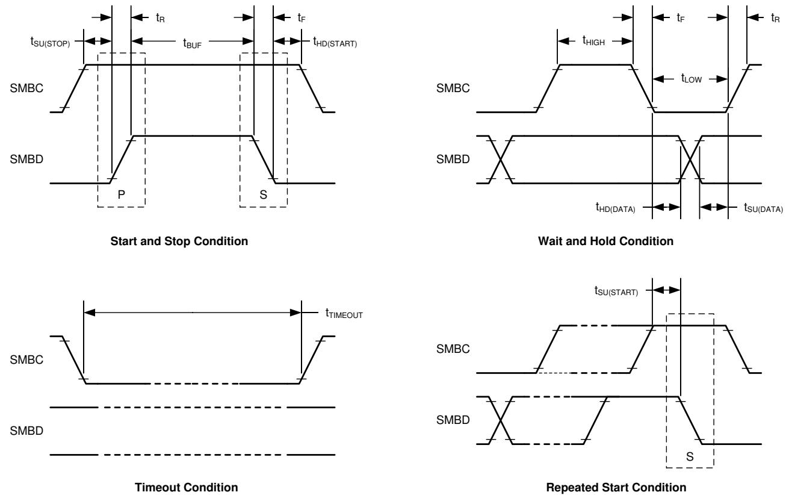  
Figure 7-1. SMBus Timing Diagram

# 7.35 Typical Characteristics

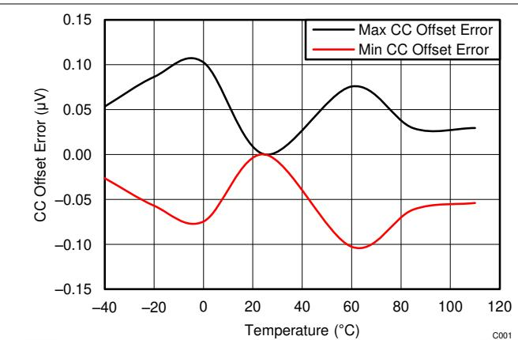  
Figure 7-2. CC Offset Error vs. Temperature

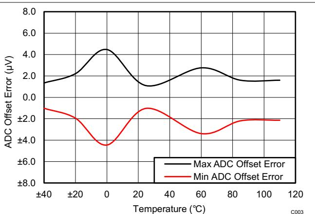  
Figure 7-3. ADC Offset Error vs. Temperature

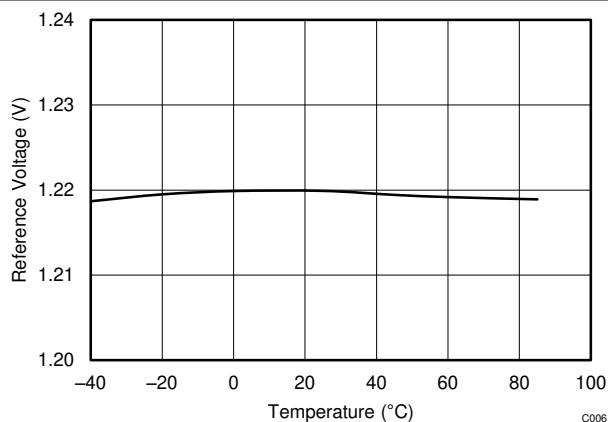  
Figure 7-4. Reference Voltage vs. Temperature

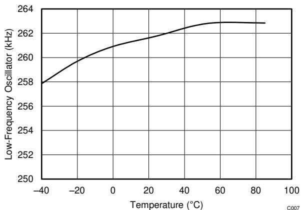  
Figure 7-5. Low-Frequency Oscillator vs. Temperature

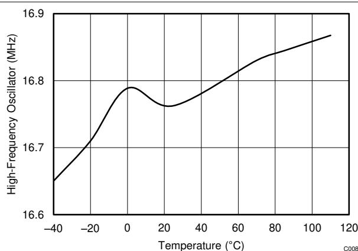  
Figure 7-6. High-Frequency Oscillator vs. Temperature

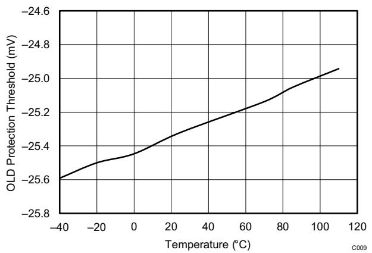  
Threshold setting is $- 2 5 \mathsf { m V } .$

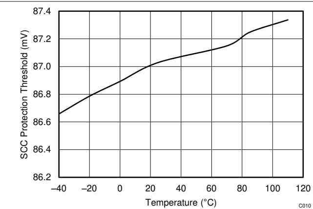  
Threshold setting is $8 8 . 8 5 \mathrm { m V } .$ .   
Figure 7-8. Short Circuit Charge Protection Threshold vs. Temperature

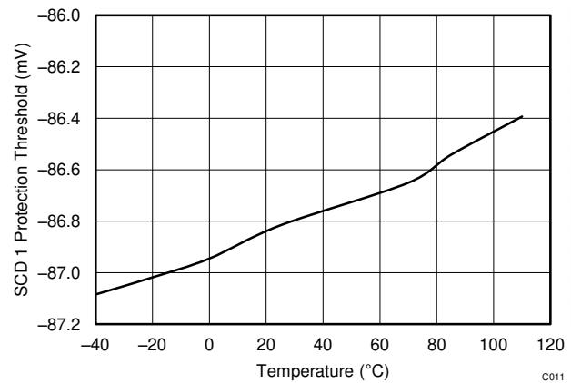  
Figure 7-7. Overcurrent Discharge Protection Threshold vs. Temperature   
Threshold setting is $- 8 8 . 8 5 \mathrm { m V } .$   
Figure 7-9. Short Circuit Discharge 1 Protection Threshold vs. Temperature

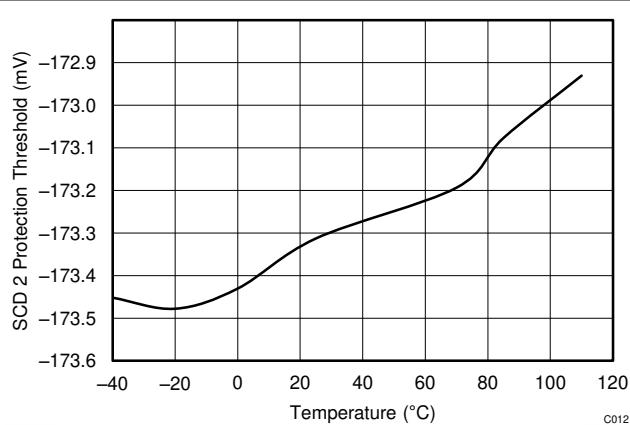  
Threshold setting is $- 1 7 7 . 7 \ : \mathrm { m V } .$

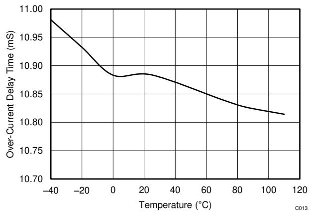  
Threshold setting is 11 ms.

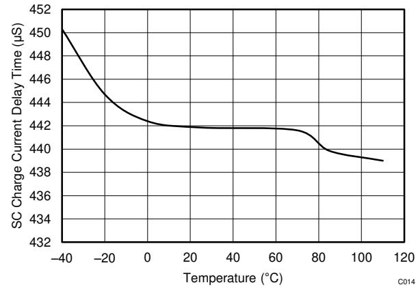  
Figure 7-10. Short Circuit Discharge 2 Protection Threshold vs. Temperature   
Threshold setting is $4 6 5 \mu \mathsf { s }$ .

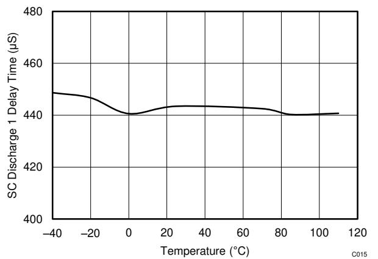  
Figure 7-11. Overcurrent Delay Time vs. Temperature   
Threshold setting is 465 µs (including internal delay).

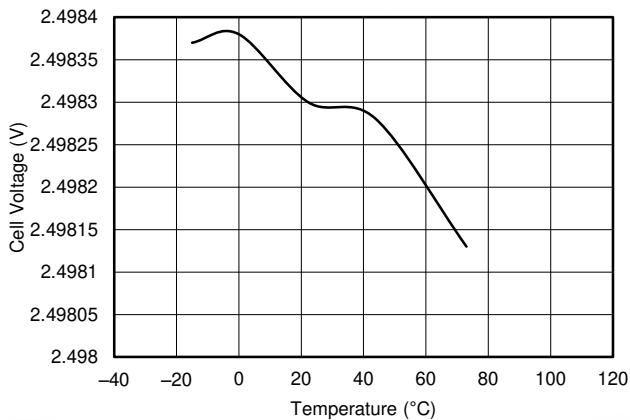  
Figure 7-12. Short Circuit Charge Current Delay Time vs. Temperature   
Figure 7-14. $\mathsf { v } _ { \mathsf { c E L L } }$ Measurement at 2.5-V vs. Temperature

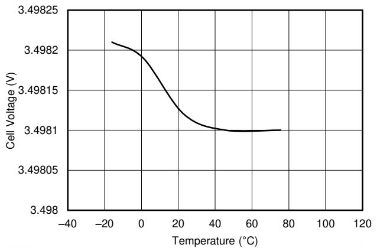  
Figure 7-13. Short Circuit Discharge 1 Delay Time vs. Temperature   
Figure 7-15. VCELL Measurement at 3.5-V vs. Temperature

This is the $\mathsf { V } _ { \mathsf { C E L } }$ average for single cell.

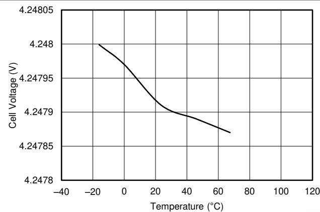  
Figure 7-16. $\mathsf { v } _ { \mathsf { c E L L } }$ Measurement at 4.25-V vs. Temperature

This is the $\mathsf { V } _ { \mathsf { C E L } }$ average for single cell.

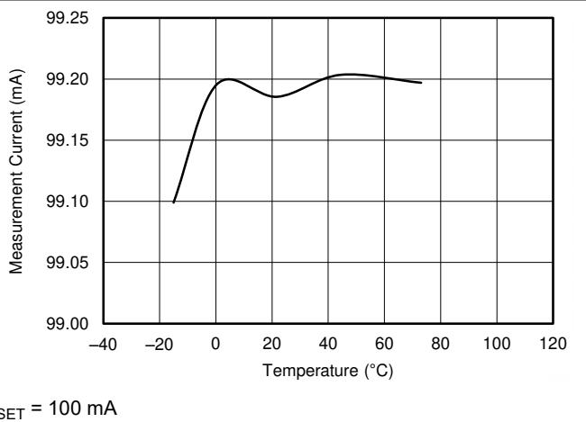  
Figure 7-17. I measured vs. Temperature

# 8 Detailed Description 8.1 Overview

The BQ40Z50-R2 device, incorporating patented Impedance Track™ technology, provides cell balancing while charging or at rest. This fully integrated, single-chip, pack-based solution, including a diagnostic lifetime data monitor and black box recorder, provides a rich array of features for gas gauging, protection, and authentication for 1-series, 2-series, 3-series, and 4-series cell Li-ion and Li-polymer battery packs.

# 8.2 Functional Block Diagram

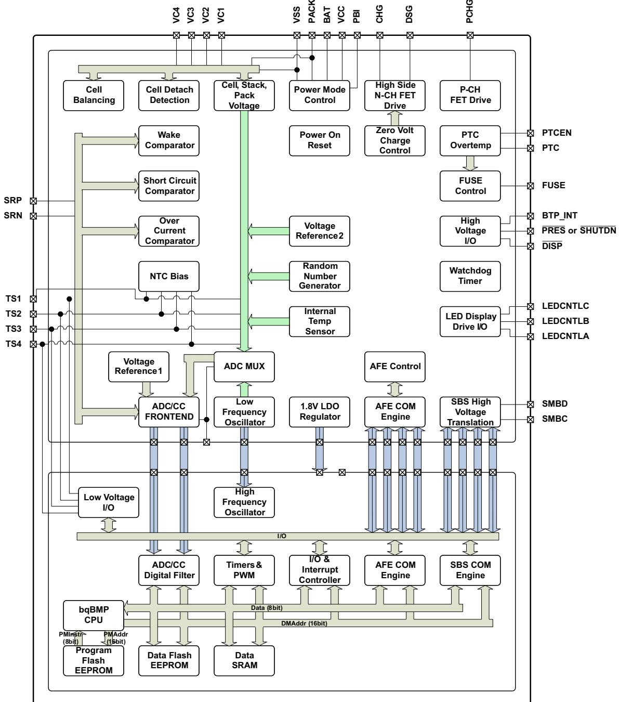

# 8.3 Feature Description

# 8.3.1 Primary (1st Level) Safety Features

The BQ40Z50-R2 supports a wide range of battery and system protection features that can easily be configured. See the BQ40Z50-R2 Technical Reference Manual (SLUUBK0) for detailed descriptions of each protection function.

The primary safety features include:

Cell Overvoltage Protection Cell Undervoltage Protection Cell Undervoltage Protection Compensated Overcurrent in Charge Protection Overcurrent in Discharge Protection Overload in Discharge Protection Short Circuit in Charge Protection Short Circuit in Discharge Protection Overtemperature in Charge Protection Overtemperature in Discharge Protection Undertemperature in Charge Protection Undertemperature in Discharge Protection Overtemperature FET protection , Precharge Timeout Protection Host Watchdog Timeout Protection Fast Charge Timeout Protection Overcharge Protection Overcharging Voltage Protection Overcharging Current Protection Over Precharge Current Protection

# 8.3.2 Secondary (2nd Level) Safety Features

The secondary safety features of the BQ40Z50-R2 can be used to indicate more serious faults via the FUSE pin. This pin can be used to blow an in-line fuse to permanently disable the battery pack from charging or discharging. See the BQ40Z50-R2 Technical Reference Manual (SLUUBK0) for detailed descriptions of each protection function.

The secondary safety features provide protection against:

Safety Overvoltage Permanent Failure Safety Undervoltage Permanent Failure Safety Overtemperature Permanent Failure Safety FET Overtemperature Permanent Failure Qmax Imbalance Permanent Failure Impedance Imbalance Permanent Failure Capacity Degradation Permanent Failure Cell Balancing Permanent Failure Fuse Failure Permanent Failure PTC Permanent Failure Voltage Imbalance At Rest Permanent Failure Voltage Imbalance Active Permanent Failure Charge FET Permanent Failure Discharge FET Permanent Failure AFE Register Permanent Failure AFE Communication Permanent Failure Second Level Protector Permanent Failure Instruction Flash Checksum Permanent Failure Open Cell Connection Permanent Failure

• Data Flash Permanent Failure • Open Thermistor Permanent Failure

# 8.3.3 Charge Control Features

The BQ40Z50-R2 charge control features include:

Supports JEITA temperature ranges. Reports charging voltage and charging current according to the active temperature range   
Handles more complex charging profiles. Allows for splitting the standard temperature range into two subranges and allows for varying the charging current according to the cell voltage   
Reports the appropriate charging current needed for constant current charging and the appropriate charging voltage needed for constant voltage charging to a smart charger using SMBus broadcasts   
Reduces the charge difference of the battery cells in a fully charged state of the battery pack gradually using a voltage-based cell balancing algorithm during charging. A voltage threshold can be set up for cell balancing to be active. This prevents fully charged cells from overcharging and causing excessive degradation and also increases the usable pack energy by preventing premature charge termination.   
Supports precharging/0-volt charging   
Supports charge inhibit and charge suspend if battery pack temperature is out of temperature range Reports charging fault and also indicates charge status via charge and discharge alarms

# 8.3.4 Gas Gauging

The BQ40Z50-R2 uses the Impedance Track algorithm to measure and calculate the available capacity in battery cells. The BQ40Z50-R2 accumulates a measure of charge and discharge currents and compensates the charge current measurement for the temperature and state-of-charge of the battery. The BQ40Z50-R2 estimates self-discharge of the battery and also adjusts the self-discharge estimation based on temperature. The device also has TURBO Mode 2.0 support, which enables the BQ40Z50-R2 to provide the necessary data for the MCU to determine what level of peak power consumption can be applied without causing a system reset or transient battery voltage level spike to trigger termination flags. See the BQ40Z50-R2 Technical Reference Manual (SLUUBK0) for further details.

# 8.3.5 Configuration

# 8.3.5.1 Oscillator Function

The BQ40Z50-R2 fully integrates the system oscillators and does not require any external components to support this feature.

# 8.3.5.2 System Present Operation

The BQ40Z50-R2 checks the PRES pin periodically (1 s). If PRES input is pulled to ground by the externa system, the BQ40Z50-R2 detects this as system present.

# 8.3.5.3 Emergency Shutdown

For battery maintenance, the emergency shutdown feature enables a push button action connecting the SHUTDN pin to shut down an embedded battery pack system before removing the battery. A high-to-low transition of the SHUTDN pin signals the BQ40Z50-R2 to turn off the CHG and DSG FETs, disconnecting the power from the system to safely remove the battery pack. The CHG and DSG FETs can be turned on again by another high-to-low transition detected by the SHUTDN pin or when a data flash configurable timeout is reached.

# 8.3.5.4 1-Series, 2-Series, 3-Series, or 4-Series Cell Configuration

In a 1-series cell configuration, VC4 is shorted to VC, VC2, and VC1. In a 2-series cell configuration, VC4 is shorted to VC3 and VC2. In a 3-series cell configuration, VC4 is shorted to VC3.

# 8.3.5.5 Cell Balancing

The device supports cell balancing by bypassing the current of each cell during charging or at rest. If the device's internal bypass is used, up to $1 0 ~ \mathsf { m A }$ can be bypassed and multiple cells can be bypassed at the same time. Higher cell balance current can be achieved by using an external cell balancing circuit. In external cell balancing mode, only one cell at a time can be balanced.

The cell balancing algorithm determines the amount of charge needed to be bypassed to balance the capacity of all cells.

# 8.3.6 Battery Parameter Measurements

# 8.3.6.1 Charge and Discharge Counting

The BQ40Z50-R2 uses an integrating delta-sigma analog-to-digital converter (ADC) for current measurement, and a second delta-sigma ADC for individual cell and battery voltage and temperature measurement.

The integrating delta-sigma ADC measures the charge/discharge flow of the battery by measuring the voltage drop across a small-value sense resistor between the SRP and SRN terminals. The integrating ADC measures bipolar signals from $- 0 . 1 \mathrm { ~ V ~ }$ to $0 . 1 ~ \mathsf { V } .$ The BQ40Z50-R2 detects charge activity when $\mathsf { V } _ { \mathsf { S R } } = \mathsf { V } _ { ( \mathsf { S R P } ) } - \mathsf { V } _ { ( \mathsf { S R N } ) }$ is positive, and discharge activity when $\mathsf { V } _ { \mathsf { S R } } = \mathsf { V } _ { ( \mathsf { S R P } ) } - \mathsf { V } _ { ( \mathsf { S R N } ) }$ is negative. The BQ40Z50-R2 continuously integrates the signal over time, using an internal counter. The fundamental rate of the counter is $0 . 2 6 \mathsf { n V } \mathsf { h }$ .

# 8.3.7 Battery Trip Point (BTP)

Required for WIN8 OS, the battery trip point (BTP) feature indicates when the RSOC of a battery pack has depleted to a certain value set in a DF register. This feature enables a host to program two capacity-based thresholds that govern the triggering of a BTP interrupt on the BTP_INT pin, and the setting or clearing of the OperationStatus[BTP_INT] on the basis of RemainingCapacity().

An internal weak pullup is applied when the BTP feature is active. Depending on the system design, an externa pullup may be required to put on the BTP_INT pin. See Section 7.12 for details.

# 8.3.8 Lifetime Data Logging Features

The BQ40Z50-R2 offers lifetime data logging for several critical battery parameters. The following parameters are updated every 10 hours if a difference is detected between values in RAM and data flash:

• Maximum and Minimum Cell Voltages Maximum Delta Cell Voltage Maximum Charge Current Maximum Discharge Current Maximum Average Discharge Current Maximum Average Discharge Power Maximum and Minimum Cell Temperature Maximum Delta Cell Temperature Maximum and Minimum Internal Sensor Temperature Maximum FET Temperature Number of Safety Events Occurrences and the Last Cycle of the Occurrence Number of Valid Charge Termination and the Last Cycle of the Valid Charge Termination Number of Qmax and Ra Updates and the Last Cycle of the Qmax and Ra Updates Number of Shutdown Events Cell Balancing Time for Each Cell (This data is updated every 2 hours if a difference is detected.) Total FW Runtime and Time Spent in Each Temperature Range (This data is updated every 2 hours if a difference is detected.)

# 8.3.9 Authentication

The BQ40Z50-R2 supports authentication by the host using SHA-1.

# 8.3.10 LED Display

The BQ40Z50-R2 can drive a 3-, 4-, or 5- segment LED display for remaining capacity indication and/or a permanent fail (PF) error code indication.

# 8.3.11 IATA Support

The BQ40Z50-R2 supports IATA with several new commands and procedures. See the BQ40Z50-R2 Technical Reference Manual (SLUUBK0) for further details.

# 8.3.12 Voltage

The BQ40Z50-R2 updates the individual series cell voltages at $0 . 2 5 – s$ intervals. The internal ADC of the BQ40Z50-R2 measures the voltage, and scales and calibrates it appropriately. This data is also used to calculate the impedance of the cell for the Impedance Track gas gauging.

# 8.3.13 Current

The BQ40Z50-R2 uses the SRP and SRN inputs to measure and calculate the battery charge and discharge current using a 1-mΩ to 3-mΩ typ. sense resistor.

# 8.3.14 Temperature

The BQ40Z50-R2 has an internal temperature sensor and inputs for four external temperature sensors. All five temperature sensor options can be individually enabled and configured for cell or FET temperature usage. Two configurable thermistor models are provided to allow the monitoring of cell temperature in addition to FET temperature, which use a different thermistor profile.

# 8.3.15 Communications

The BQ40Z50-R2 uses SMBus v1.1 with MASTER mode and packet error checking (PEC) options per the SBS specification.

# 8.3.15.1 SMBus On and Off State

The BQ40Z50-R2 detects an SMBus off state when SMBC and SMBD are low for two or more seconds. Clearing this state requires that either SMBC or SMBD transition high. The communication bus will resume activity within 1 ms.

# 8.3.15.2 SBS Commands

See the BQ40Z50-R2 Technical Reference Manual (SLUUBK0) for further details.

# 8.4 Device Functional Modes

The BQ40Z50-R2 supports three power modes to reduce power consumption:

In NORMAL mode, the BQ40Z50-R2 performs measurements, calculations, protection decisions, and data updates in 250-ms intervals. Between these intervals, the BQ40Z50-R2 is in a reduced power stage. In SLEEP mode, the BQ40Z50-R2 performs measurements, calculations, protection decisions, and data updates in adjustable time intervals. Between these intervals, the BQ40Z50-R2 is in a reduced power stage. The BQ40Z50-R2 has a wake function that enables exit from SLEEP mode when current flow or failure is detected.   
In SHUTDOWN mode, the BQ40Z50-R2 is completely disabled.

See the BQ40Z50-R2 Technical Reference Manual (SLUUBK0) for further details.

# 9 Application and Implementation

# Note

Information in the following applications sections is not part of the TI component specification, and TI does not warrant its accuracy or completeness. TI’s customers are responsible for determining suitability of components for their purposes, as well as validating and testing their design implementation to confirm system functionality.

# 9.1 Application Information

The BQ40Z50-R2 is a gas gauge with primary protection support, and can be used with 1-series to 4-series Li-ion/Li-polymer battery packs. To implement and design a comprehensive set of parameters for a specific battery pack, users need the Battery Management Studio (BQSTUDIO) graphical user-interface tool installed on a PC during development. The firmware installed on the BQSTUDIO tool has default values for this product, which are summarized in the BQ40Z50-R2 Technical Reference Manual (SLUUBK0). Using the BQSTUDIO tool, these default values can be changed to cater to specific application requirements during development once the system parameters, such as fault trigger thresholds for protection, enable/disable of certain features for operation, configuration of cells, chemistry that best matches the cell used, and more are known. This data is referred to as the "golden image."

# 9.2 Typical Applications

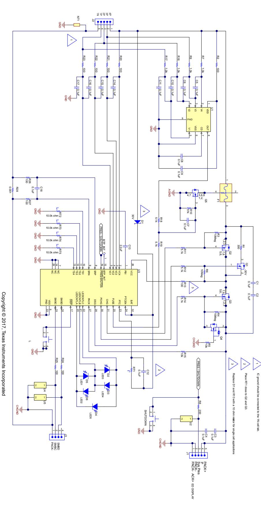  
Figure 9-1. Application Schematic

# 9.2.1 Design Requirements

Table 9-1 shows the default settings for the main parameters. Use the BQSTUDIO tool to update the settings to meet the specific application or battery pack configuration requirements.

The device should be calibrated before any gauging test. Follow the procedures on the BQSTUDIO Calibration page to calibrate the device, and use the information on the BQSTUDIO Chemistry page to update the match chemistry profile to the device.

Table 9-1. Design Parameters   

<table><tr><td rowspan=1 colspan=1>DESIGN PARAMETER</td><td rowspan=1 colspan=1>EXAMPLE</td></tr><tr><td rowspan=1 colspan=1>Cell Configuration</td><td rowspan=1 colspan=1>3s1p (3-series with 1 parallel)()</td></tr><tr><td rowspan=1 colspan=1>Design Capacity</td><td rowspan=1 colspan=1>4400 mAh</td></tr><tr><td rowspan=1 colspan=1>Device Chemistry</td><td rowspan=1 colspan=1>1210 (LiCoO2/graphitized carbon)</td></tr><tr><td rowspan=1 colspan=1>Cell Overvoltage at Standard Temperature</td><td rowspan=1 colspan=1>4300 mV</td></tr><tr><td rowspan=1 colspan=1>Cell Undervoltage</td><td rowspan=1 colspan=1>2500 mV</td></tr><tr><td rowspan=1 colspan=1>Shutdown Voltage</td><td rowspan=1 colspan=1>2300 mV</td></tr><tr><td rowspan=1 colspan=1>Overcurrent in CHARGE Mode</td><td rowspan=1 colspan=1>6000 mA</td></tr><tr><td rowspan=1 colspan=1>Overcurrent in DISCHARGE Mode</td><td rowspan=1 colspan=1>-6000 mA</td></tr><tr><td rowspan=1 colspan=1>Short Circuit in CHARGE Mode</td><td rowspan=1 colspan=1>0.1 V/Rsense across SRP, SRN</td></tr><tr><td rowspan=1 colspan=1>Short Circuit in DISCHARGE Mode</td><td rowspan=1 colspan=1>0.1 V/Rsense across SRP, SRN</td></tr><tr><td rowspan=1 colspan=1>Safety Overvoltage</td><td rowspan=1 colspan=1>4500 mV</td></tr><tr><td rowspan=1 colspan=1>Cell Balancing</td><td rowspan=1 colspan=1>Disabled</td></tr><tr><td rowspan=1 colspan=1>Internal and External Temperature Sensor</td><td rowspan=1 colspan=1>External temperature sensor is used.</td></tr><tr><td rowspan=1 colspan=1>Undertemperature Charging</td><td rowspan=1 colspan=1>0</td></tr><tr><td rowspan=1 colspan=1>Undertemperature Discharging</td><td rowspan=1 colspan=1>0°</td></tr><tr><td rowspan=1 colspan=1>BROADCAST Mode</td><td rowspan=1 colspan=1>Disabled</td></tr><tr><td rowspan=1 colspan=1>Battery Trip Point (BTP) with active high interrupt</td><td rowspan=1 colspan=1>Disabled</td></tr></table>

(1) When using the device the first time and if a 1-s or 2-s battery pack is used, then a charger or power supply should be connected to the $\mathsf { P A C K ^ { + } }$ terminal to prevent device shutdown. Then update the cell configuration (see the BQ40Z50-R2 Technical Reference Manual [SLUUBK0] for details) before removing the charger connection.

# 9.2.2 Detailed Design Procedure

# 9.2.2.1 High-Current Path

The high-current path begins at the $\mathsf { P A C K ^ { + } }$ terminal of the battery pack. As charge current travels through the pack, it finds its way through protection FETs, a chemical fuse, the Li-ion cells and cell connections, and the sense resistor, and then returns to the PACK– terminal (see Figure 9-2). In addition, some components are placed across the $\mathsf { P A C K ^ { + } }$ and PACK– terminals to reduce effects from electrostatic discharge.

# 9.2.2.1.1 Protection FETs

Select the N-channel charge and discharge FETs for a given application. Most portable battery applications are a good match for the CSD17308Q3. The TI CSD17308Q3 is a 47A, 30-V device with Rds(on) of $8 . 2 \mathsf { m } \Omega$ when the gate drive voltage is ${ } ^ { 8 \setminus }$

If a precharge FET is used, R1 is calculated to limit the precharge current to the desired rate. Be sure to account for the power dissipation of the series resistor. The precharge current is limited to $( \mathsf { V } _ { \mathsf { C H A R G E R } } - \mathsf { V } _ { \mathsf { B A T } } ) / \mathsf { R } 1$ and maximum power dissipation is $( \mathsf { V _ { c h a r g e r } } - \mathsf { V _ { b a t } } ) ^ { 2 } / \mathsf { R } 1$ .

The gates of all protection FETs are pulled to the source with a high-value resistor between the gate and source to ensure they are turned off if the gate drive is open.

Capacitors C1 and C2 help protect the FETs during an ESD event. Using two devices ensures normal operation if one becomes shorted. To have good ESD protection, the copper trace inductance of the capacitor leads

must be designed to be as short and wide as possible. Ensure that the voltage ratings of both C1 and C2 are adequate to hold off the applied voltage if one of the capacitors becomes shorted.

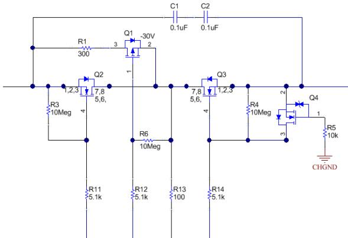  
Figure 9-2. BQ40Z50-R2 Protection FETs

# 9.2.2.1.2 Chemical Fuse

The chemical fuse (Dexerials, Uchihashi, and so on) is ignited under command from either the bq294700 secondary voltage protection IC or from the FUSE pin of the gas gauge. Either of these events applies a positive voltage to the gate of Q5, shown in Figure 9-3, which then sinks current from the third terminal of the fuse, causing it to ignite and open permanently.

It is important to carefully review the fuse specifications and match the required ignition current to that available from the N-channel FET. Ensure that the proper voltage, current, and Rds(on) ratings are used for this device. The fuse control circuit is discussed in detail in Section 9.2.2.2.5.

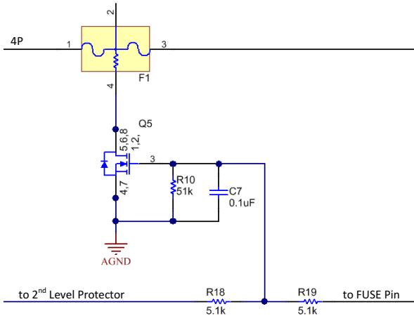  
Figure 9-3. FUSE Circuit

# 9.2.2.1.3 Li-Ion Cell Connections

For cell connections, it is important to remember that high current flows through the top and bottom connections; therefore, the voltage sense leads at these points must be made with a Kelvin connection to avoid any errors due to a drop in the high-current copper trace. The location marked 4P in Figure 9-4 indicates the Kelvin connection of the most positive battery node. The connection marked 1N is equally important. The VC5 pin (a ground reference for cell voltage measurement), which is in the older generation devices, is not in the BQ40Z50-R2 device. Therefore, the single-point connection at 1N to the low-current ground is needed to avoid an unwanted voltage drop through long traces while the gas gauge is measuring the bottom cell voltage.

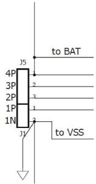  
Figure 9-4. Li-Ion Cell Connections

# 9.2.2.1.4 Sense Resistor

As with the cell connections, the quality of the Kelvin connections at the sense resistor is critical. The sense resistor must have a temperature coefficient no greater than 50 ppm in order to minimize current measurement drift with temperature. Choose the value of the sense resistor to correspond to the available overcurrent and short-circuit ranges of the BQ40Z50-R2 device. Select the smallest value possible to minimize the negative voltage generated on the BQ40Z50-R2 VSS node(s) during a short circuit. This pin has an absolute minimum of $- 0 . 3 \ V .$ Parallel resistors can be used as long as good Kelvin sensing is ensured. The device is designed to support a 1-mΩ to $_ { 3 - \mathsf { m } \Omega }$ sense resistor.

The BQ40Z50-R2 ground scheme is different from that of the older generation devices. In previous devices, the device ground (or low current ground) is connected to the SRN side of the RSENSE resistor pad. In the BQ40Z50-R2 device, however, it connects the low-current ground on the SRP side of the RSENSE resistor pad close to the battery 1N terminal (see Section 9.2.2.1.3). This is because the BQ40Z50-R2 device has one less VC pin (a ground reference pin VC5) compared to the previous devices. The pin was removed and was internally combined to SRP.

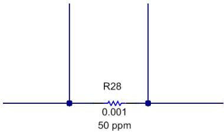  
Figure 9-5. Sense Resistor

# 9.2.2.1.5 ESD Mitigation

A pair of series $0 . 1 \mathsf { - } \mu \mathsf { F }$ ceramic capacitors is placed across the $\mathsf { P A C K ^ { + } }$ and PACK– terminals to help in the mitigation of external electrostatic discharges. The two devices in series ensure continued operation of the pack if one of the capacitors becomes shorted.

Optionally, a tranzorb such as the SMBJ2A can be placed across the terminals to further improve ESD immunity.

# 9.2.2.2 Gas Gauge Circuit

The gas gauge circuit includes the BQ40Z50-R2 and its peripheral components. These components are divided into the following groups: differential low-pass filter, PBI, system present, SMBus communication, fuse circuit, and LED.

# 9.2.2.2.1 Coulomb-Counting Interface

The BQ40Z50-R2 uses an integrating delta-sigma ADC for current measurements. Add a 100-Ω resistor from the sense resistor to the SRP and SRN inputs of the device. Place a 0.1-µF (C18) filter capacitor across the SRP and SRN inputs.

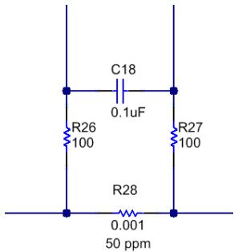  
Figure 9-6. Differential Filter

# 9.2.2.2.2 Power Supply Decoupling and PBI

The BQ40Z50-R2 device has an internal LDO that is internally compensated and does not require an externa decoupling capacitor.

The PBI pin is used as a power supply backup input pin, providing power during brief transient power outages. A standard $2 . 2 – \mu \mathsf { F }$ ceramic capacitor is connected from the PBI pin to ground, as shown in Figure 9-7.

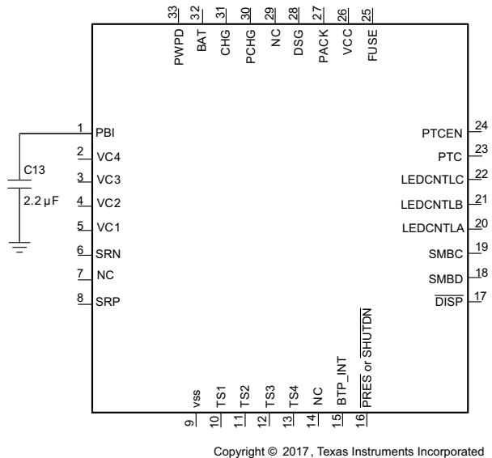  
Figure 9-7. Power Supply Decoupling

# 9.2.2.2.3 System Present

The system present signal informs the gas gauge whether the pack is installed into or removed from the system. In the host system, this pin is grounded. The PRES pin of the BQ40Z50-R2 device is occasionally sampled to test for system present. In ACTIVE mode, the PRES pin is pulsed every 250 ms for a duration of 5 ms (RHOEN is on), and just before it is turned off, the state of the PRES pin is checked to see if it is low or high. The average of the four measurements is used to determine if the PRES is asserted or not. In SLEEP mode, the PRES pin is pulsed every "Sleep Voltage Time," and the state of the PRES pin is determined. A resistor can be used to pull the signal low and the resistance must be ${ } ^ { 2 0 \mathsf { k } \Omega }$ or lower to ensure that the test pulse is lower than the $\mathsf { V } _ { \parallel }$ limit. The pullup current source is typically $1 0 ~ \mu \mathsf { A }$ to $2 0 ~ \mu \mathsf { A }$ . When the PRES pin is not pulsed, the PRES pin is tied internally to VSS (RHOUT is on), and any pullup on the PRES pin will cause a battery drain when not charging. Refer to the PRES pin diagram in

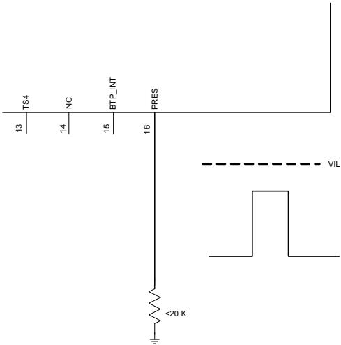  
Figure 9-8. System Present Pull-Down Resistor

Because the System Present signal is part of the pack connector interface to the outside world, it must be protected from external electrostatic discharge events. The PRES pin has integrated ESD protection to $2 \ \mathsf { k V } .$ External protection can be added to support higher ESD protection requirements. The TPD1E10B06 singlechannel ESD protection diode (U2) can protect the input up to $3 0 ~ \mathsf { k V } ,$ , and the R8 reduces the holding current to release the internal SCR in the event that it triggers.

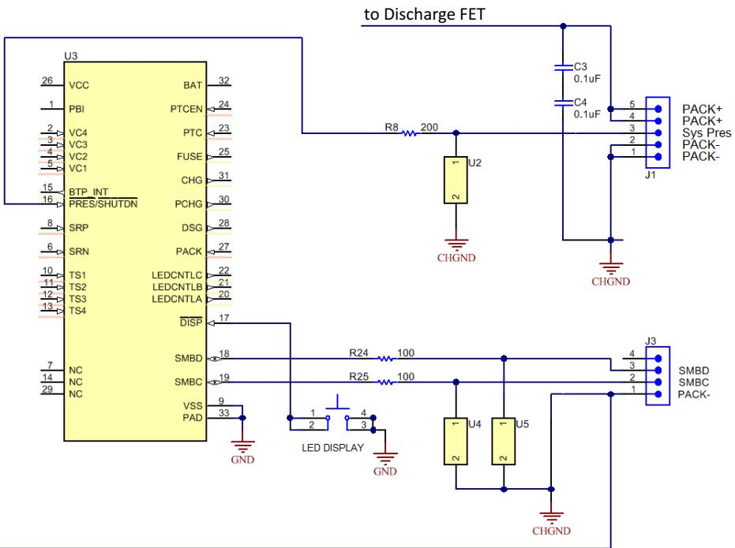  
Figure 9-9. System Present ESD and Short Protection

# 9.2.2.2.4 SMBus Communication

The SMBus clock and data pins have integrated high-voltage ESD protection circuits; however, adding TPD1E10B06 ESD protection diodes (U4 and U5) and series resistors (R24 and R25) provides more robust ESD performance.

The SMBus clock and data lines have internal pulldown. When the gas gauge senses that both lines are low (such as during removal of the pack), the device performs auto-offset calibration and then goes into SLEEP mode to conserve power.

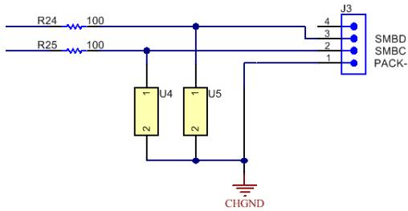  
Figure 9-10. ESD Protection for SMBus Communication

# 9.2.2.2.5 FUSE Circuitry

The FUSE pin of the BQ40Z50-R2 device is designed to ignite the chemical fuse if one of the various safety criteria is violated. The FUSE pin also monitors the state of the secondary-voltage protection IC. Q5 ignites the chemical fuse when its gate is high. The 7-V output of the bq294700 is divided by R18 and R19, which provides adequate gate drive for Q5 while guarding against excessive back current into the bq294700 if the FUSE signal is high.

Using C7 is generally a good practice, especially for RFI immunity. C7 may be removed, if desired, because the chemical fuse is a comparatively slow device and is not affected by any sub-microsecond glitches that come from the FUSE output during the cell connection process.

If the AFEFUSE output is not used, it should be connected to VSS.

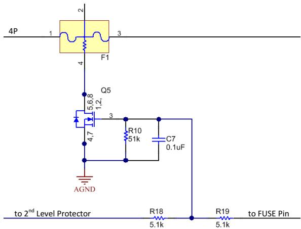  
Figure 9-11. FUSE Circuit

When the BQ40Z50-R2 device is commanded to ignite the chemical fuse, the FUSE pin activates to give a typical 8-V output. The new design makes it possible to use a higher Vgs FET for Q5. This improves the robustness of the system, as well as widens the choices for Q5.

# 9.2.2.3 Secondary-Current Protection

The BQ40Z50-R2 device provides secondary overcurrent and short-circuit protection, cell balancing, cell voltage multiplexing, and voltage translation. The following section examines cell and battery inputs, pack and FET control, temperature output, and cell balancing.

# 9.2.2.3.1 Cell and Battery Inputs

Each cell input is conditioned with a simple RC filter, which provides ESD protection during cell connect and acts to filter unwanted voltage transients. The resistor value allows some trade-off for cell balancing versus safety protection.

The integrated cell balancing FETs enable the AFE to bypass cell current around a given cell or numerous cells, effectively balancing the entire battery stack. External series resistors placed between the cell connections and the $\mathsf { V C } \times 1 / \mathsf { O }$ pins set the balancing current magnitude. The internal FETs provide a 200-Ω resistance $( 2 \lor < \lor \mathsf { D } \mathsf { S }$ $< 4 \vee$ ). Series input resistors between $1 0 0 \Omega$ and ${ 3 0 0 } \Omega$ are recommended for effective cell balancing.

The BAT input uses a diode (D1) to isolate and decouple it from the cells in the event of a transient dip in voltage caused by a short-circuit event.

Also, as described in Section 9.2.2.1, the top and bottom nodes of the cells must be sensed at the battery connections with a Kelvin connection to prevent voltage sensing errors caused by a drop in the high-current PCB copper.

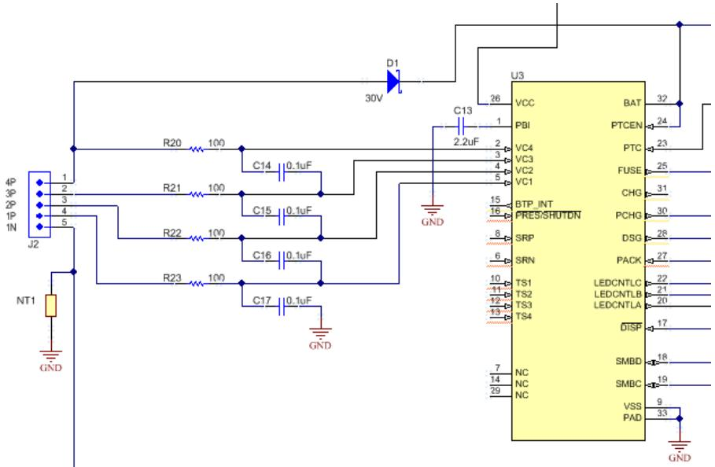  
Figure 9-12. Cell and BAT Inputs

# 9.2.2.3.2 External Cell Balancing

Internal cell balancing can only support up to $1 0 ~ \mathsf { m A }$ . External cell balancing is provided as another option for faster cell balancing. For details, refer to the application note, Fast Cell Balancing Using External MOSFET (SLUA420).

# 9.2.2.3.3 PACK and FET Control

The PACK and $\mathsf { V } _ { \mathsf { C C } }$ inputs provide power to the BQ40Z50-R2 device from the charger. The PACK input also provides a method to measure and detect the presence of a charger. The PACK input uses a $1 0 \mathbf { - k } \Omega$ resistor; whereas, the $\mathsf { V } _ { \mathsf { C C } }$ input uses an internal diode to guard against input transients and prevent a misoperation of the gate driver during short-circuit events.

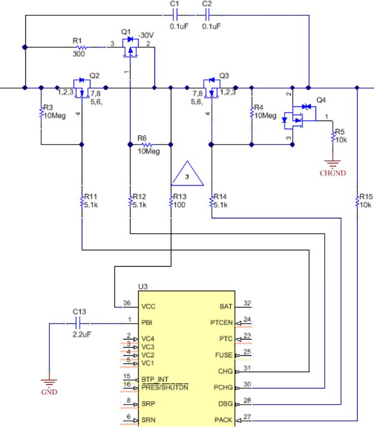  
Figure 9-13. BQ40Z50-R2 PACK and FET Control

The N-channel charge and discharge FETs are controlled with $5 . 1 \mathrm { - } \mathsf { k } \Omega$ series gate resistors, which provide a switching time constant of a few microseconds. The 10-MΩ resistors ensure that the FETs are off in the event of an open connection to the FET drivers. Q4 is provided to protect the discharge FET (Q3) in the event of a reverse-connected charger. Without Q4, Q3 can be driven into its linear region and suffer severe damage if the $\mathsf { P A C K ^ { + } }$ input becomes slightly negative.

Q4 turns on in that case to protect Q3 by shorting its gate to source. To use the simple ground gate circuit, the FET must have a low gate turn-on threshold. If it is desired to use a more standard device, such as the 2N7002 as the reference schematic, the gate should be biased up to $3 . 3 \ V$ with a high-value resistor. The BQ40Z50-R2 device has the capability to provide a current-limited charging path typically used for low battery voltage or low temperature charging. The BQ40Z50-R2 device uses an external P-channel, precharge FET controlled by PCHG.

# 9.2.2.3.4 Temperature Output

For the BQ40Z50-R2 device, TS1, TS2, TS3, and TS4 provide thermistor drive-under program control. Each pin can be enabled with an integrated $1 8 \mathbf { - k } \Omega$ (typical) linearization pullup resistor to support the use of a $1 0 \mathbf { - k } \Omega$ at $\boldsymbol { 2 5 ^ { \circ } \mathrm { C } }$ (103) NTC external thermistor, such as a Mitsubishi BN35-3H103. The reference design includes four $1 0 \mathbf { - k } \Omega$ thermistors: RT2, RT3, RT4, and RT5. The BQ40Z50-R2 device supports up to four external thermistors. Connect unused thermistor pins to $\vee _ { \mathsf { S S } }$ .

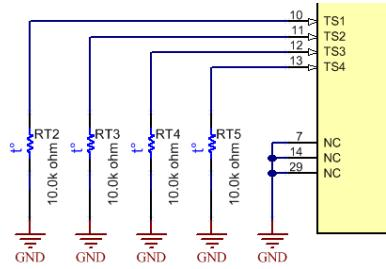  
Figure 9-14. Thermistor Drive

# 9.2.2.3.5 LEDs

Three LED control outputs provide constant current sinks for the driving external LEDs. These outputs are configured to provide voltage and control for up to five LEDs. No external bias voltage is required. Unused LEDCNTL pins can remain open or they can be connected to $\mathsf { V } _ { \mathsf { S S } }$ . The DISP pin should be connected to $\mathsf { V } _ { \mathsf { S S } }$ if the LED feature is not used.

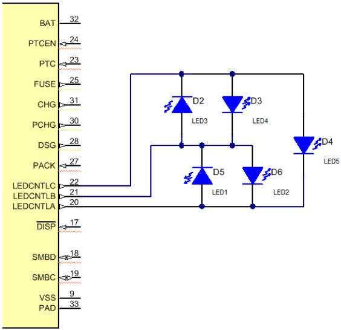  
Figure 9-15. LEDs

# 9.2.2.3.6 Safety PTC Thermistor

The BQ40Z50-R2 device provides support for a safety PTC thermistor. The PTC thermistor is connected between the PTC and BAT pins. It can be placed close to the CHG/DSG FETs to monitor the temperature. The PTC pin monitors the voltage at the pin and will trip if the thermistor resistance exceeds the defined threshold. A PTC fault is one of the permanent failure modes. It can only be cleared by a POR.

To disable, connect PTC and PTCEN to VSS.

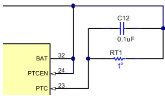  
Figure 9-16. PTC Thermistor

# 9.2.3 Application Curves

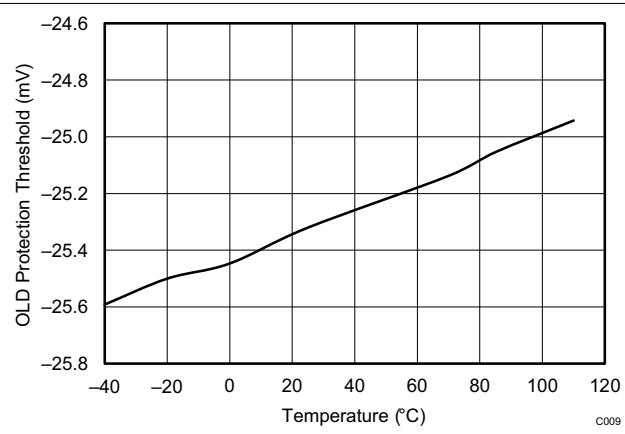  
Threshold setting is $- 2 5 \mathsf { m V } .$

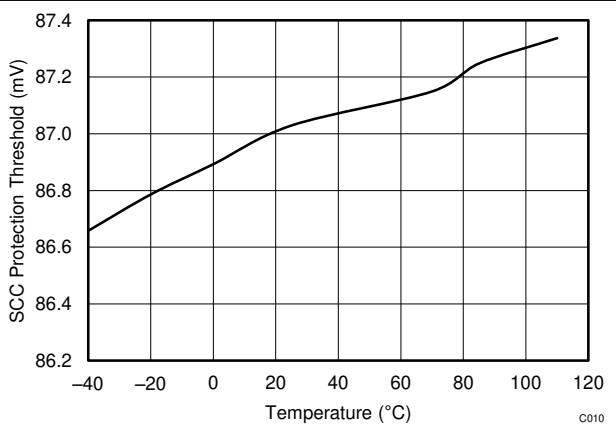  
Threshold setting is $8 8 . 8 5 \mathrm { m V } .$

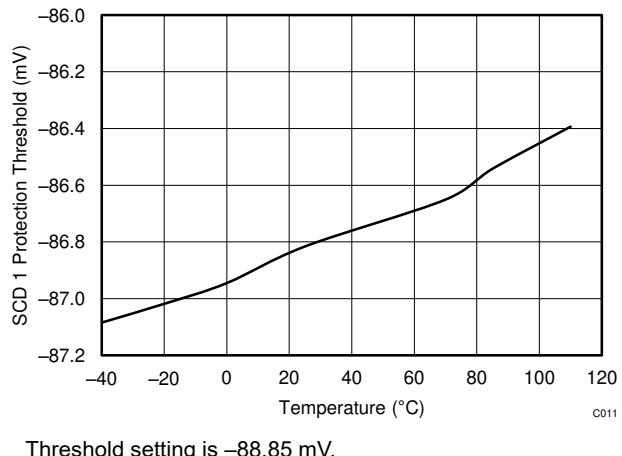  
Figure 9-17. Overcurrent Discharge Protection Threshold vs. Temperature

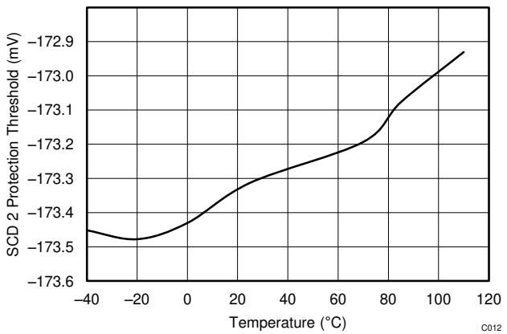  
Figure 9-18. Short Circuit Charge Protection Threshold vs. Temperature   
Threshold setting is $- 1 7 7 . 7 \ : \mathrm { m V } .$

  
Figure 9-19. Short Circuit Discharge 1 Protection Threshold vs. Temperature   
Threshold setting is $1 1 ~ \mathsf { m s }$

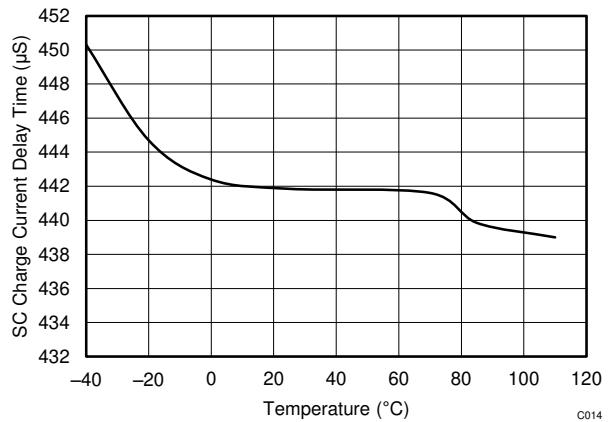  
Figure 9-20. Short Circuit Discharge 2 Protection Threshold vs. Temperature   
Threshold setting is $4 6 5 \mu \mathsf { s }$ .   
Figure 9-21. Overcurrent Delay Time vs. Temperature   
Figure 9-22. Short Circuit Charge Current Delay Time vs. Temperature

# 10 Power Supply Recommendations

The device manages its supply voltage dynamically according to the operation conditions. Normally, the BAT input is the primary power source to the device. The BAT pin should be connected to the positive termination of the battery stack. The input voltage for the BAT pin ranges from $_ { 2 . 2 \vee }$ to $2 6 \lor .$ .

The VCC pin is the secondary power input, which activates when the BAT voltage falls below minimum $\mathsf { V } _ { \mathsf { C C } }$ . This enables the device to source power from a charger (if present) connected to the PACK pin. The VCC pin should be connected to the common drain of the CHG and DSG FETs. The charger input should be connected to the PACK pin.

# 11 Layout 11.1 Layout Guidelines

A battery fuel gauge circuit board is a challenging environment due to the fundamental incompatibility of highcurrent traces and ultra-low current semiconductor devices. The best way to protect against unwanted trace-totrace coupling is with a component placement, such as that shown in Figure 11-1, where the high-current section is on the opposite side of the board from the electronic devices. Clearly, this is not possible in many situations due to mechanical constraints. Still, every attempt should be made to route high-current traces away from signal traces, which enter the BQ40Z50-R2 directly. IC references and registers can be disturbed and in rare cases damaged due to magnetic and capacitive coupling from the high-current path.

# Note

During surge current and ESD events, the high-current traces appear inductive and can couple unwanted noise into sensitive nodes of the gas gauge electronics, as illustrated in Figure 11-2.

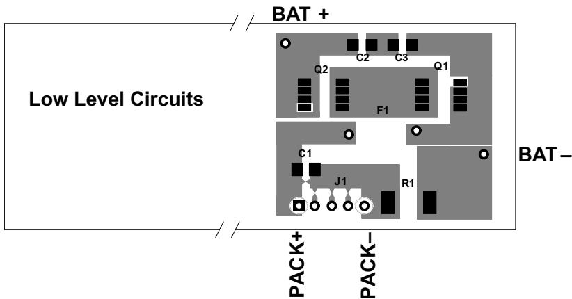  
Copyright $\circledcirc$ 2016, Texas Instruments Incorporated

# Figure 11-1. Separating High- and Low-Current Sections Provides an Advantage in Noise Immunity

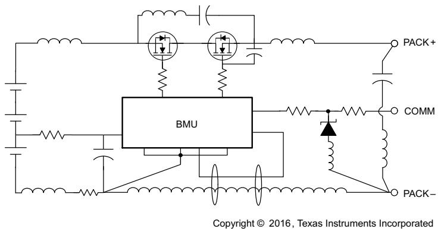  
Figure 11-2. Avoid Close Spacing Between High-Current and Low-Level Signal Lines

Kelvin voltage sensing is extremely important in order to accurately measure current and top and bottom cell voltages. Place all filter components as close as possible to the device. Route the traces from the sense resistor in parallel to the filter circuit. Adding a ground plane around the filter network can add additional noise immunity. Figure 11-3 and Figure 11-4 demonstrate correct Kelvin current sensing.

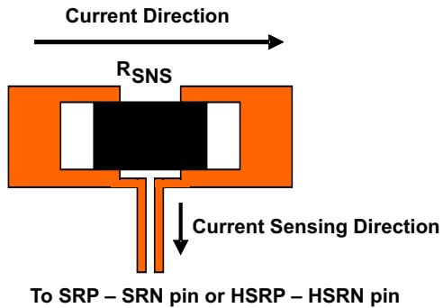  
Figure 11-3. Sensing Resistor PCB Layout

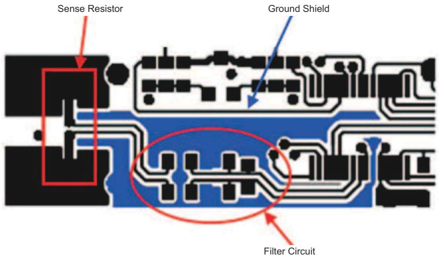  
Figure 11-4. Sense Resistor, Ground Shield, and Filter Circuit Layout

# 11.1.1 Protector FET Bypass and Pack Terminal Bypass Capacitors

Use wide copper traces to lower the inductance of the bypass capacitor circuit. Figure 11-5 shows an example layout, demonstrating this technique.

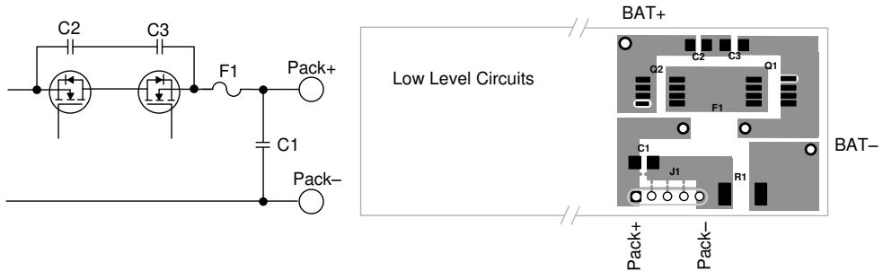  
Copyright $\circledcirc$ 2016, Texas Instruments Incorporated   
Figure 11-5. Use Wide Copper Traces to Lower the Inductance of Bypass Capacitors C1, C2, and C3

# 11.1.2 ESD Spark Gap

Protect SMBus clock, data, and other communication lines from ESD with a spark gap at the connector. The pattern in Figure 11-6 is recommended, with $0 . 2 \mathrm { - } \mathsf { m m }$ spacing between the points.

  
Figure 11-6. Recommended Spark-Gap Pattern Helps Protect Communication Lines from ESD

# 11.2 Layout Example

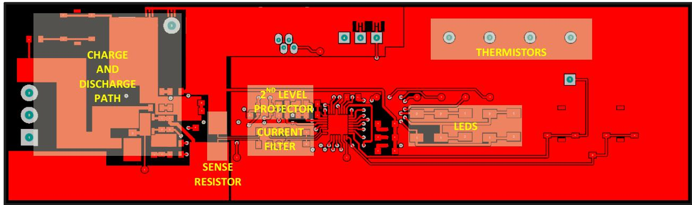  
Figure 11-7. Top Layer

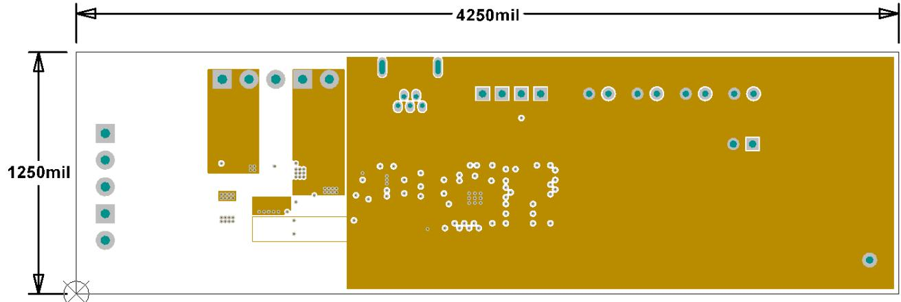  
Figure 11-8. Internal Layer 1

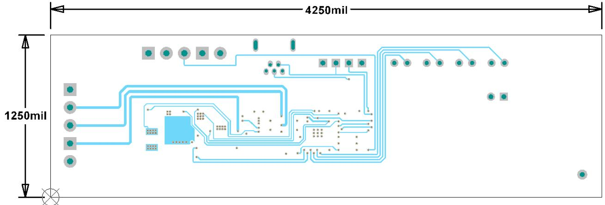  
Figure 11-9. Internal Layer 2

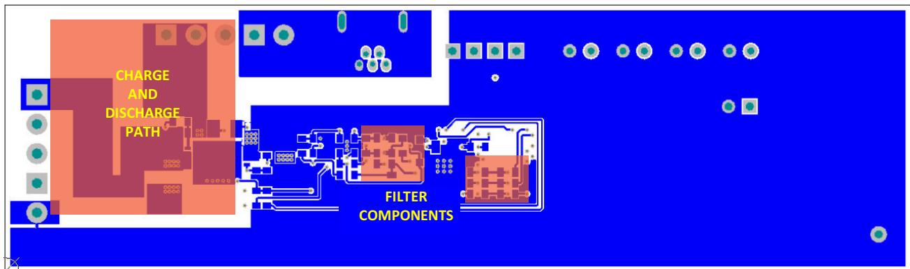  
Figure 11-10. Bottom Layer

# 12 Device and Documentation Support 12.1 Third-Party Products Disclaimer

TI'S PUBLICATION OF INFORMATION REGARDING THIRD-PARTY PRODUCTS OR SERVICES DOES NOT CONSTITUTE AN ENDORSEMENT REGARDING THE SUITABILITY OF SUCH PRODUCTS OR SERVICES OR A WARRANTY, REPRESENTATION OR ENDORSEMENT OF SUCH PRODUCTS OR SERVICES, EITHER ALONE OR IN COMBINATION WITH ANY TI PRODUCT OR SERVICE.

# 12.2 Documentation Support

12.2.1 Related Documentation

For related documentation, see the following from the BQ40Z50-R2 product page on TI.com: • BQ40Z50-R2 Technical Reference Manual (SLUUBK0) • BQ40Z50EVM Li-Ion Battery Pack Manager Evaluation Module User's Guide (SLUUAV7)

# 12.2.2 Receiving Notification of Documentation Updates

To receive notification of documentation updates, navigate to the device product folder on ti.com. In the upper right corner, click on Alert me to register and receive a weekly digest of any product information that has changed. For change details, review the revision history included in any revised document.

# 12.3 Support Resources

TI E2E™ support forums are an engineer's go-to source for fast, verified answers and design help — straight from the experts. Search existing answers or ask your own question to get the quick design help you need.

Linked content is provided "AS IS" by the respective contributors. They do not constitute TI specifications and do not necessarily reflect TI's views; see TI's Terms of Use.

# 12.4 Trademarks

Impedance Track™ and TI E2E™ are trademarks of Texas Instruments.   
All trademarks are the property of their respective owners.

# 12.5 Electrostatic Discharge Caution

This integrated circuit can be damaged by ESD. Texas Instruments recommends that all integrated circuits be handled with appropriate precautions. Failure to observe proper handling and installation procedures can cause damage.

ESD damage can range from subtle performance degradation to complete device failure. Precision integrated circuits may be more susceptible to damage because very small parametric changes could cause the device not to meet its published specifications.

# 12.6 Glossary

TI Glossary This glossary lists and explains terms, acronyms, and definitions.

# 13 Mechanical, Packaging, and Orderable Information

The following pages include mechanical, packaging, and orderable information. This information is the most current data available for the designated devices. This data is subject to change without notice and revision of this document. For browser-based versions of this data sheet, refer to the left-hand navigation.

PACKAGING INFORMATION   

<table><tr><td>Orderable part number</td><td>Status (1)</td><td>Material type (2)</td><td>Package | Pins</td><td>Package qty | Carrier</td><td>RoHS (3)</td><td>Lead finish/ al Bl material</td><td>MSL rating/ ak reflow</td><td>Op temp ()</td><td>Part marking (6)</td></tr><tr><td>BQ40Z50RSMR-R2</td><td>Active</td><td>Production</td><td>VQFN (RSM) | 32</td><td>3000 | LARGE T&amp;R</td><td>Yes</td><td>(4) NIPDAU</td><td>(5) Level-1-260C-UNLIM</td><td>-40 to 85</td><td>BQ40Z50</td></tr><tr><td>BQ40Z50RSMR-R2.A</td><td>Active</td><td>Production</td><td>VQFN (RSM) | 32</td><td>3000 | LARGE T&amp;R</td><td>Yes</td><td>NIPDAU</td><td>Level-1-260C-UNLIM</td><td>-40 to 85</td><td>BQ40Z50</td></tr><tr><td>BQ40Z50RSMR-R2.B</td><td>Active</td><td>Production</td><td>VQFN (RSM) | 32</td><td>3000 | LARGE T&amp;R</td><td>-</td><td>Call TI</td><td>Call TI</td><td>-40 to 85</td><td></td></tr><tr><td>BQ40Z50RSMR-R2G4</td><td>Active</td><td>Production</td><td>VQFN (RSM) | 32</td><td>3000 | LARGE T&amp;R</td><td>Yes</td><td>NIPDAU</td><td>Level-1-260C-UNLIM</td><td>-40 to 85</td><td>BQ40Z50</td></tr><tr><td>BQ40Z50RSMR-R2G4.A</td><td>Active</td><td>Production</td><td>VQFN (RSM) | 32</td><td>3000 | LARGE T&amp;R</td><td>Yes</td><td>NIPDAU</td><td>Level-1-260C-UNLIM</td><td>-40 to 85</td><td>BQ40Z50</td></tr><tr><td>BQ40Z50RSMR-R2G4.B</td><td>Active</td><td>Production</td><td>VQFN (RSM) | 32</td><td>3000 | LARGE T&amp;R</td><td>-</td><td>Call TI</td><td>Call TI</td><td>-40 to 85</td><td></td></tr><tr><td>BQ40Z50RSMT-R2</td><td>Active</td><td>Production</td><td>VQFN (RSM) | 32</td><td>250 | SMALL T&amp;R</td><td>Yes</td><td>NIPDAU</td><td>Level-1-260C-UNLIM</td><td>-40 to 85</td><td>BQ40Z50</td></tr><tr><td>BQ40Z50RSMT-R2.A</td><td>Active</td><td>Production</td><td>VQFN (RSM) | 32</td><td>250 | SMALL T&amp;R</td><td>Yes</td><td>NIPDAU</td><td>Level-1-260C-UNLIM</td><td>-40 to 85</td><td>BQ40Z50</td></tr><tr><td>BQ40Z50RSMT-R2.B</td><td>Active</td><td>Production</td><td>VQFN (RSM) | 32</td><td>250 | SMALL T&amp;R</td><td>-</td><td>Call TI</td><td>Call TI</td><td>-40 to 85</td><td></td></tr></table>

(1) Status: For more details on status, see our product life cycle.

(2) Material type: When designated, preproduction parts are prototypes/experimental devices, and are not yet approved or released for full production. Testing and final process, including without limitation quality assurance, reliability performance testing, and/or process qualification, may not yet be complete, and this item is subject to further changes or possible discontinuation. If available for ordering, purchases will be subject to an additional waiver at checkout, and are intended for early internal evaluation purposes only. These items are sold without warranties of any kind.

(3) RoHS values: Yes, No, RoHS Exempt. See the TI RoHS Statement for additional information and value definition.

(4) Lead finish/Ball material: Parts may have multiple material finish options. Finish options are separated by a vertical ruled line. Lead finish/Ball material values may wrap to two lines if the finish value exceeds the maximumcolumn width.

w: The moisture sensitivity level ratings and peak solder (reflow) temperatures. In the event that a part has multiple moisture sensitivity ratings, only the lowest level per JEDEC standards is shown.   
for the actual reflow temperature that will be used to mount the part to the printed circuit board.

(6) Part marking: There may be an additional marking, which relates to the logo, the lot trace code information, or the environmental category of the part.

Multiple part markings will be inside parentheses. Only one part marking contained in parentheses and separated by a "\~" will appear on a part. If a line is indented then it is a continuation of the previous line and the two combined represent the entire part marking for that device.

Important Information and Disclaimer:The information provided on this page represents TI's knowledge and belief as of the date that it is provided. TI bases its knowledge and belief on information provided by third parties, and makes no representation or warranty as to the accuracy of such information. Efforts are underway to better integrate information from third parties. TI has taken and continues to take reasonable steps to provide representative

and accurate information but may not have conducted destructive testing or chemical analysis on incoming materials and chemicals. TI and TI suppliers consider certain information to be proprietary, and thus CAS numbers and other limited information may not be available for release.

no event shall TI's liability arising out of such information exceed the total purchase price of the TI part(s) at issue in this document sold by TI to Customer on an annual basis.

# TAPE AND REEL INFORMATION

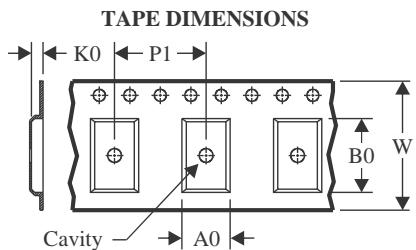

<table><tr><td rowspan=1 colspan=1>A0</td><td rowspan=1 colspan=1>A0 Dimension designed to accommodate the component width</td></tr><tr><td rowspan=1 colspan=1>B0</td><td rowspan=1 colspan=1>Dimension designed to accommodate the component length</td></tr><tr><td rowspan=1 colspan=1>K0</td><td rowspan=1 colspan=1>Dimension designed to accommodate the component thickness</td></tr><tr><td rowspan=1 colspan=1>W</td><td rowspan=1 colspan=1>Overall width of the carrier tape</td></tr><tr><td rowspan=1 colspan=1>P1</td><td rowspan=1 colspan=1>Pitch between successive cavity centers</td></tr></table>

# QUADRANT ASSIGNMENTS FOR PIN 1 ORIENTATION IN TAPE

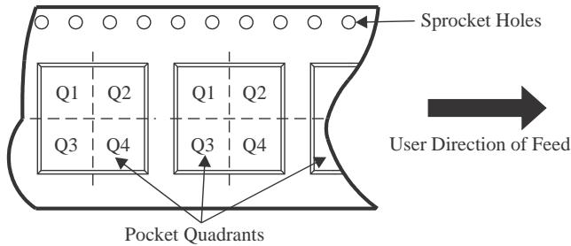

\*All dimensions are nominal   

<table><tr><td rowspan=1 colspan=1>Device</td><td rowspan=1 colspan=1>PackageType</td><td rowspan=1 colspan=1>PackageDrawing</td><td rowspan=1 colspan=1>Pins</td><td rowspan=1 colspan=1>SPQ</td><td rowspan=1 colspan=1>ReelDiameter(mm)</td><td rowspan=1 colspan=1>ReelWidthw1 (mm)</td><td rowspan=1 colspan=1>A0(mm)</td><td rowspan=1 colspan=1>B0(mm)</td><td rowspan=1 colspan=1>KO(mm)</td><td rowspan=1 colspan=1>P1(mm)</td><td rowspan=1 colspan=1>W(mm)</td><td rowspan=1 colspan=1>Pin1Quadrant</td></tr><tr><td rowspan=1 colspan=1>BQ40Z50RSMR-R2</td><td rowspan=1 colspan=1>VQFN</td><td rowspan=1 colspan=1>RSM</td><td rowspan=1 colspan=1>32</td><td rowspan=1 colspan=1>3000</td><td rowspan=1 colspan=1>330.0</td><td rowspan=1 colspan=1>12.4</td><td rowspan=1 colspan=1>4.25</td><td rowspan=1 colspan=1>4.25</td><td rowspan=1 colspan=1>1.15</td><td rowspan=1 colspan=1>8.0</td><td rowspan=1 colspan=1>12.0</td><td rowspan=1 colspan=1>Q2</td></tr><tr><td rowspan=1 colspan=1>BQ40Z50RSMR-R2G4</td><td rowspan=1 colspan=1>VQFN</td><td rowspan=1 colspan=1>RSM</td><td rowspan=1 colspan=1>32</td><td rowspan=1 colspan=1>3000</td><td rowspan=1 colspan=1>330.0</td><td rowspan=1 colspan=1>12.4</td><td rowspan=1 colspan=1>4.25</td><td rowspan=1 colspan=1>4.25</td><td rowspan=1 colspan=1>1.15</td><td rowspan=1 colspan=1>8.0</td><td rowspan=1 colspan=1>12.0</td><td rowspan=1 colspan=1>Q2</td></tr><tr><td rowspan=1 colspan=1>BQ40Z50RSMT-R2</td><td rowspan=1 colspan=1>VQFN</td><td rowspan=1 colspan=1>RSM</td><td rowspan=1 colspan=1>32</td><td rowspan=1 colspan=1>250</td><td rowspan=1 colspan=1>180.0</td><td rowspan=1 colspan=1>12.4</td><td rowspan=1 colspan=1>4.25</td><td rowspan=1 colspan=1>4.25</td><td rowspan=1 colspan=1>1.15</td><td rowspan=1 colspan=1>8.0</td><td rowspan=1 colspan=1>12.0</td><td rowspan=1 colspan=1>Q2</td></tr></table>

\*All dimensions are nominal   

<table><tr><td rowspan=1 colspan=1>Device</td><td rowspan=1 colspan=1>Package Type</td><td rowspan=1 colspan=1>Package Drawing</td><td rowspan=1 colspan=1>Pins</td><td rowspan=1 colspan=1>SPQ</td><td rowspan=1 colspan=1>Length (mm)</td><td rowspan=1 colspan=1>Width (mm)</td><td rowspan=1 colspan=1>Height (mm)</td></tr><tr><td rowspan=1 colspan=1>BQ40Z50RSMR-R2</td><td rowspan=1 colspan=1>VQFN</td><td rowspan=1 colspan=1>RSM</td><td rowspan=1 colspan=1>32</td><td rowspan=1 colspan=1>3000</td><td rowspan=1 colspan=1>367.0</td><td rowspan=1 colspan=1>367.0</td><td rowspan=1 colspan=1>35.0</td></tr><tr><td rowspan=1 colspan=1>BQ40Z50RSMR-R2G4</td><td rowspan=1 colspan=1>VQFN</td><td rowspan=1 colspan=1>RSM</td><td rowspan=1 colspan=1>32</td><td rowspan=1 colspan=1>3000</td><td rowspan=1 colspan=1>367.0</td><td rowspan=1 colspan=1>367.0</td><td rowspan=1 colspan=1>35.0</td></tr><tr><td rowspan=1 colspan=1>BQ40Z50RSMT-R2</td><td rowspan=1 colspan=1>VQFN</td><td rowspan=1 colspan=1>RSM</td><td rowspan=1 colspan=1>32</td><td rowspan=1 colspan=1>250</td><td rowspan=1 colspan=1>210.0</td><td rowspan=1 colspan=1>185.0</td><td rowspan=1 colspan=1>35.0</td></tr></table>

# 4 x 4, 0.4 mm pitch

This image is a representation of the package family, actual package may vary. Refer to the product data sheet for package details.

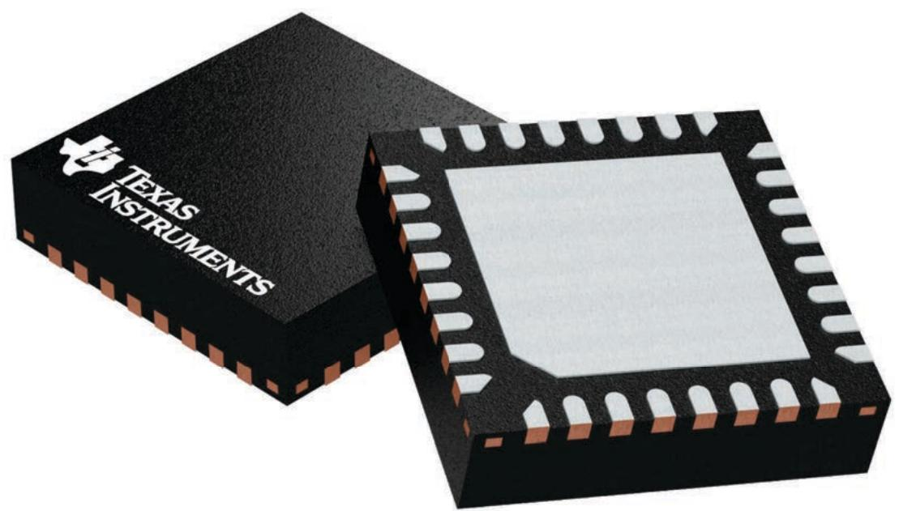

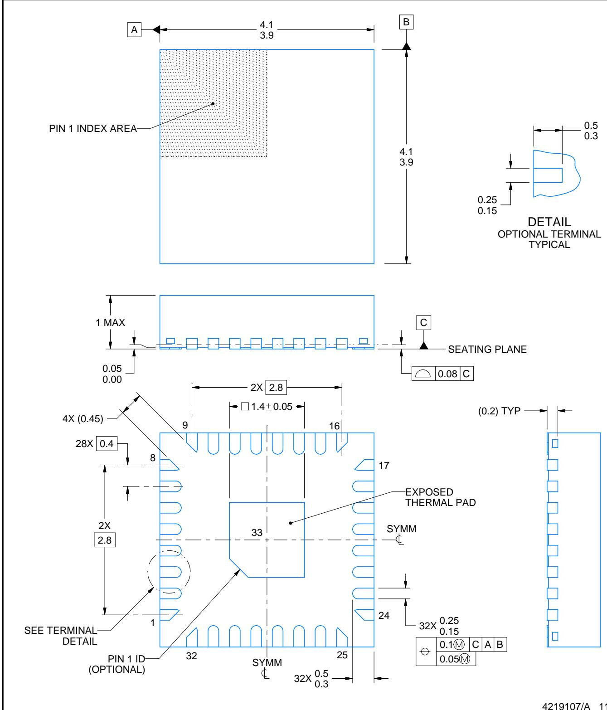

NOTES:

1. All linear dimensions are in millimeters. Any dimensions in parenthesis are for reference only. Dimensioning and tolerancing per ASME Y14.5M.   
2. This drawing is subject to change without notice.   
3. The package thermal pad must be soldered to the printed circuit board for thermal and mechanical performance.

PLASTIC QUAD FLATPACK - NO LEAD

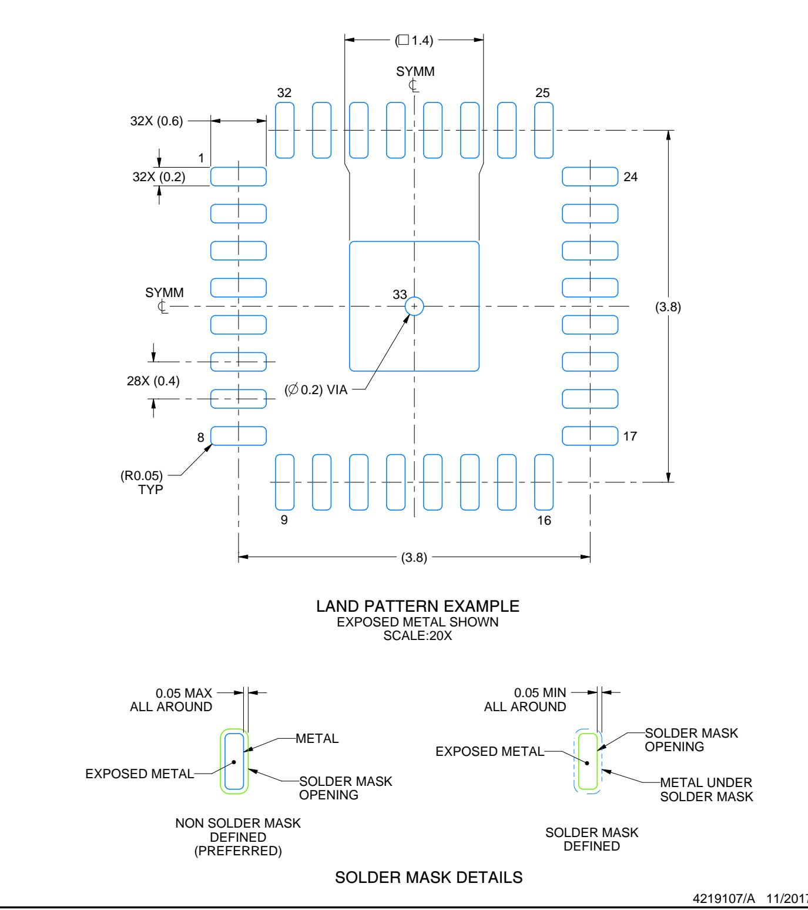  
NOTES: (continued)

4. This package is designed to be soldered to a thermal pad on the board. For more information, see Texas Instruments literature number SLUA271 (www.ti.com/lit/slua271).   
5. Vias are optional depending on application, refer to device data sheet. If any vias are implemented, refer to their locations shown on this view. It is recommended that vias under paste be filled, plugged or tented.

PLASTIC QUAD FLATPACK - NO LEAD

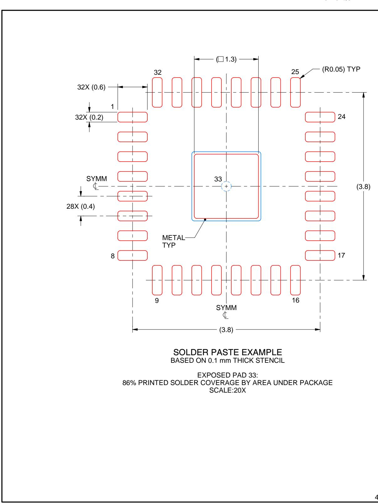  
NOTES: (continued)

6. Laser cutting apertures with trapezoidal walls and rounded corners may offer better paste release. IPC-7525 may have alternate design recommendations.

# IMPORTANT NOTICE AND DISCLAIMER

TI PROVIDES TECHNICAL AND RELIABILITY DATA (INCLUDING DATASHEETS), DESIGN RESOURCES (INCLUDING REFERENCE DESIGNS), APPLICATION OR OTHER DESIGN ADVICE, WEB TOOLS, SAFETY INFORMATION, AND OTHER RESOURCES “AS IS” AND WITH ALL FAULTS, AND DISCLAIMS ALL WARRANTIES, EXPRESS AND IMPLIED, INCLUDING WITHOUT LIMITATION ANY IMPLIED WARRANTIES OF MERCHANTABILITY, FITNESS FOR A PARTICULAR PURPOSE OR NON-INFRINGEMENT OF THIRD PARTY INTELLECTUAL PROPERTY RIGHTS.

These resources are intended for skilled developers designing with TI products. You are solely responsible for (1) selecting the appropriate TI products for your application, (2) designing, validating and testing your application, and (3) ensuring your application meets applicable standards, and any other safety, security, regulatory or other requirements.

These resources are subject to change without notice. TI grants you permission to use these resources only for development of an application that uses the TI products described in the resource. Other reproduction and display of these resources is prohibited. No license is granted to any other TI intellectual property right or to any third party intellectual property right. TI disclaims responsibility for, and you fully indemnify TI and its representatives against any claims, damages, costs, losses, and liabilities arising out of your use of these resources.

TI’s products are provided subject to TI’s Terms of Sale, TI’s General Quality Guidelines, or other applicable terms available either on ti.com or provided in conjunction with such TI products. TI’s provision of these resources does not expand or otherwise alter TI’s applicable warranties or warranty disclaimers for TI products. Unless TI explicitly designates a product as custom or customer-specified, TI products are standard, catalog, general purpose devices.

TI objects to and rejects any additional or different terms you may propose.