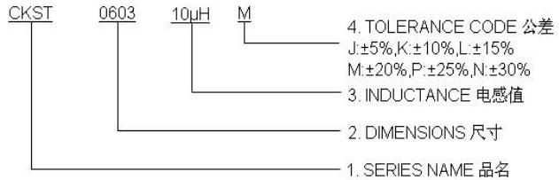
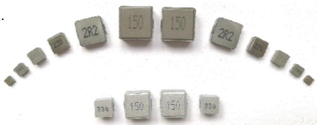
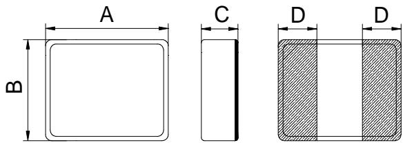
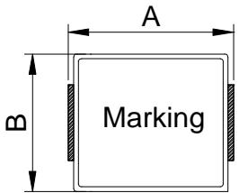
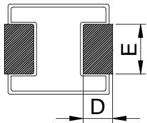
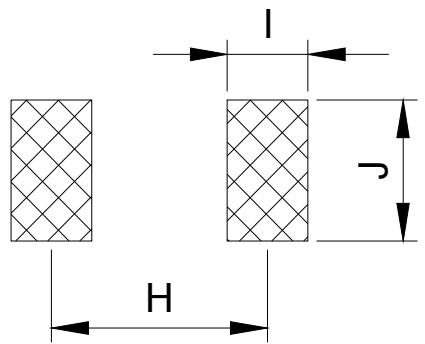
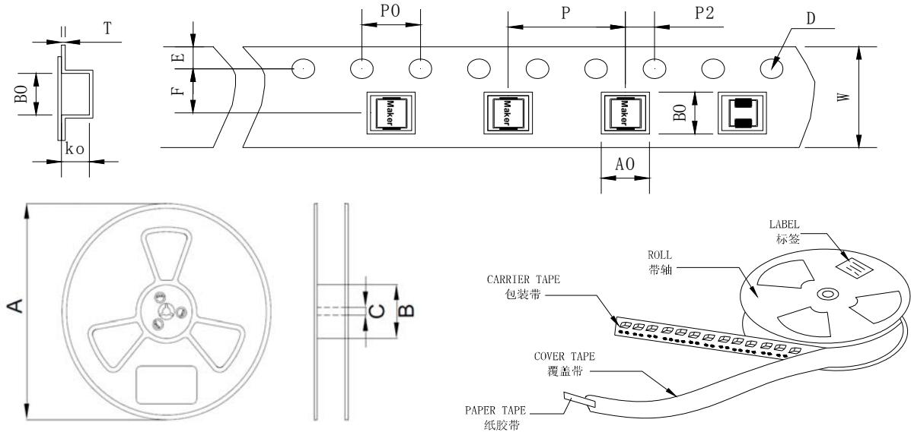

# ● FEATURES 特性

1.磁屏蔽结构,闭合磁路,抗电磁干扰强,超低蜂鸣声,可高密度安装.  
2.小体积,大电流,范围可到60A,在高频和高温环境下保持优良  
的温升电流及饱和电流特性.  
3.低损耗合金粉末压铸,低电阻.结构牢固,产品精准度高.  
4.工作频率范围广,可达5MHz以上. 无卤环保产品.

# ● APPLICATIONS 用途

PAD,笔记本电脑,台式机,服务器,音箱,网通,安防,手机,智能家居等

# ● PART NUMBERING SYSTEM 品名系统

# ● SHAPES AND DIMENSIONS 外形尺寸 (Unit:mm)

<table><tr><td rowspan=1 colspan=1>TYPE(</td><td rowspan=1 colspan=1>A</td><td rowspan=1 colspan=1>B</td><td rowspan=1 colspan=1>C</td><td rowspan=1 colspan=1>D</td><td rowspan=1 colspan=1>E</td><td rowspan=1 colspan=1>Fig</td></tr><tr><td rowspan=1 colspan=1>CKST201210</td><td rowspan=1 colspan=1>2.0±0.2</td><td rowspan=1 colspan=1>1.2±0.2</td><td rowspan=1 colspan=1>1.0 Max</td><td rowspan=1 colspan=1>0.6±0.3</td><td rowspan=1 colspan=1>|</td><td rowspan=1 colspan=1>1</td></tr><tr><td rowspan=1 colspan=1>CKST201610</td><td rowspan=1 colspan=1>2.0±0.2</td><td rowspan=1 colspan=1>1.6±0.2</td><td rowspan=1 colspan=1>1.0 Max</td><td rowspan=1 colspan=1>0.6±0.3</td><td rowspan=1 colspan=1>/</td><td rowspan=1 colspan=1>1</td></tr><tr><td rowspan=1 colspan=1>CKST252010</td><td rowspan=1 colspan=1>2.5±0.2</td><td rowspan=1 colspan=1>2.0±0.2</td><td rowspan=1 colspan=1>1.0 Max</td><td rowspan=1 colspan=1>0.8±0.3</td><td rowspan=1 colspan=1>|</td><td rowspan=1 colspan=1>1</td></tr><tr><td rowspan=1 colspan=1>CKST252012</td><td rowspan=1 colspan=1>2.5±0.2</td><td rowspan=1 colspan=1>2.0±0.2</td><td rowspan=1 colspan=1>1.2 Max</td><td rowspan=1 colspan=1>0.8±0.3</td><td rowspan=1 colspan=1>/</td><td rowspan=1 colspan=1>1</td></tr><tr><td rowspan=1 colspan=1>CKST322512</td><td rowspan=1 colspan=1>3.2±0.2</td><td rowspan=1 colspan=1>2.5±0.2</td><td rowspan=1 colspan=1>1.2 Max</td><td rowspan=1 colspan=1>0.8±0.3</td><td rowspan=1 colspan=1>|</td><td rowspan=1 colspan=1>1</td></tr><tr><td rowspan=1 colspan=1>CKST353220</td><td rowspan=1 colspan=1>3.5±0.2</td><td rowspan=1 colspan=1>3.2±0.2</td><td rowspan=1 colspan=1>2.0 Max</td><td rowspan=1 colspan=1>0.7±0.2</td><td rowspan=1 colspan=1>/</td><td rowspan=1 colspan=1>1</td></tr><tr><td rowspan=1 colspan=1>CKSTT0410</td><td rowspan=1 colspan=1>4.0±0.3</td><td rowspan=1 colspan=1>4.0±0.3</td><td rowspan=1 colspan=1>1.0 Max</td><td rowspan=1 colspan=1>1.1±0.3</td><td rowspan=1 colspan=1>/</td><td rowspan=1 colspan=1>1</td></tr><tr><td rowspan=1 colspan=1>CKST04012P</td><td rowspan=1 colspan=1>4.4±0.35</td><td rowspan=1 colspan=1>4.2±0.25</td><td rowspan=1 colspan=1>1.2 Max</td><td rowspan=1 colspan=1>0.8±0.3</td><td rowspan=1 colspan=1>2.0±0.3</td><td rowspan=1 colspan=1>2</td></tr><tr><td rowspan=1 colspan=1>CKST0402</td><td rowspan=1 colspan=1>4.6±0.25</td><td rowspan=1 colspan=1>4.1±0.35</td><td rowspan=1 colspan=1>2.0 Max</td><td rowspan=1 colspan=1>0.76±0.3</td><td rowspan=1 colspan=1>1.5±0.3</td><td rowspan=1 colspan=1>2</td></tr><tr><td rowspan=1 colspan=1>CKST0502</td><td rowspan=1 colspan=1>5.7±0.25</td><td rowspan=1 colspan=1>5.1±0.35</td><td rowspan=1 colspan=1>2.0 Max</td><td rowspan=1 colspan=1>1.3±0.3</td><td rowspan=1 colspan=1>2.3±0.3</td><td rowspan=1 colspan=1>2</td></tr><tr><td rowspan=1 colspan=1>CKST0503</td><td rowspan=1 colspan=1>5.7±0.25</td><td rowspan=1 colspan=1>5.1±0.35</td><td rowspan=1 colspan=1>3.0 Max</td><td rowspan=1 colspan=1>1.3±0.3</td><td rowspan=1 colspan=1>2.3±0.3</td><td rowspan=1 colspan=1>2</td></tr><tr><td rowspan=1 colspan=1>CKST0603</td><td rowspan=1 colspan=1>7.4 Max</td><td rowspan=1 colspan=1>6.6±0.2</td><td rowspan=1 colspan=1>3.0 Max</td><td rowspan=1 colspan=1>1.6±0.3</td><td rowspan=1 colspan=1>3.0±0.2</td><td rowspan=1 colspan=1>2</td></tr><tr><td rowspan=1 colspan=1>CKST0605</td><td rowspan=1 colspan=1>7.5 Max</td><td rowspan=1 colspan=1>6.6±0.2</td><td rowspan=1 colspan=1>5.0 Max</td><td rowspan=1 colspan=1>1.6±0.3</td><td rowspan=1 colspan=1>3.0±0.2</td><td rowspan=1 colspan=1>2</td></tr><tr><td rowspan=1 colspan=1>CKST1003</td><td rowspan=1 colspan=1>11.6 Max.</td><td rowspan=1 colspan=1>10.1±0.3</td><td rowspan=1 colspan=1>3.0 Max</td><td rowspan=1 colspan=1>2.5±0.5</td><td rowspan=1 colspan=1>3.0±0.5</td><td rowspan=1 colspan=1>2</td></tr><tr><td rowspan=1 colspan=1>CKST1004</td><td rowspan=1 colspan=1>11.6 Max.</td><td rowspan=1 colspan=1>10.1±0.3</td><td rowspan=1 colspan=1>4.0 Max</td><td rowspan=1 colspan=1>2.5±0.5</td><td rowspan=1 colspan=1>3.0±0.5</td><td rowspan=1 colspan=1>2</td></tr><tr><td rowspan=1 colspan=1>CKST1005</td><td rowspan=1 colspan=1>11.6 Max.</td><td rowspan=1 colspan=1>10.1±0.3</td><td rowspan=1 colspan=1>5.0 Max</td><td rowspan=1 colspan=1>2.5±0.5</td><td rowspan=1 colspan=1>3.0±0.5</td><td rowspan=1 colspan=1>2</td></tr><tr><td rowspan=1 colspan=1>CKST1205</td><td rowspan=1 colspan=1>13.8 Max.</td><td rowspan=1 colspan=1>12.6±0.3</td><td rowspan=1 colspan=1>5.0 Max</td><td rowspan=1 colspan=1>2.7±0.7</td><td rowspan=1 colspan=1>3.0±0.5/3.5±0.5</td><td rowspan=1 colspan=1>2</td></tr><tr><td rowspan=1 colspan=1>CKST1206</td><td rowspan=1 colspan=1>13.8 Max.</td><td rowspan=1 colspan=1>12.6±0.3</td><td rowspan=1 colspan=1>6.0 Max</td><td rowspan=1 colspan=1>2.7±0.7</td><td rowspan=1 colspan=1>3.0±0.5/3.5±0.5</td><td rowspan=1 colspan=1>2</td></tr><tr><td rowspan=1 colspan=1>CKST1707</td><td rowspan=1 colspan=1>17.5±1.0</td><td rowspan=1 colspan=1>17.5 Max.</td><td rowspan=1 colspan=1>7.0 Max</td><td rowspan=1 colspan=1>2.5±0.5</td><td rowspan=1 colspan=1>11.94±0.3</td><td rowspan=1 colspan=1>2</td></tr></table>

Version B3 / Issue date:2022-4-9

# ● Recommended patterns

<table><tr><td rowspan=1 colspan=1>TYPE(</td><td rowspan=1 colspan=1>H</td><td rowspan=1 colspan=1>I</td><td rowspan=1 colspan=1>J</td></tr><tr><td rowspan=1 colspan=1>CKST201210</td><td rowspan=1 colspan=1>1.5</td><td rowspan=1 colspan=1>1</td><td rowspan=1 colspan=1>1.5</td></tr><tr><td rowspan=1 colspan=1>CKST201610</td><td rowspan=1 colspan=1>1.5</td><td rowspan=1 colspan=1>1</td><td rowspan=1 colspan=1>1.8</td></tr><tr><td rowspan=1 colspan=1>CKST252010</td><td rowspan=1 colspan=1>2</td><td rowspan=1 colspan=1>1.2</td><td rowspan=1 colspan=1>2.2</td></tr><tr><td rowspan=1 colspan=1>CKST252012</td><td rowspan=1 colspan=1>2</td><td rowspan=1 colspan=1>1.2</td><td rowspan=1 colspan=1>2.2</td></tr><tr><td rowspan=1 colspan=1>CKST322512</td><td rowspan=1 colspan=1>2.5</td><td rowspan=1 colspan=1>1.2</td><td rowspan=1 colspan=1>2.9</td></tr><tr><td rowspan=1 colspan=1>CKST353220</td><td rowspan=1 colspan=1>3</td><td rowspan=1 colspan=1>1</td><td rowspan=1 colspan=1>3.5</td></tr><tr><td rowspan=1 colspan=1>CKSTT0410</td><td rowspan=1 colspan=1>3.5</td><td rowspan=1 colspan=1>1.5</td><td rowspan=1 colspan=1>4.5</td></tr><tr><td rowspan=1 colspan=1>CKST04012P</td><td rowspan=1 colspan=1>3.7</td><td rowspan=1 colspan=1>1.26</td><td rowspan=1 colspan=1>2.5</td></tr><tr><td rowspan=1 colspan=1>CKST0402</td><td rowspan=1 colspan=1>3.7</td><td rowspan=1 colspan=1>1.26</td><td rowspan=1 colspan=1>2.5</td></tr><tr><td rowspan=1 colspan=1>CKST0502</td><td rowspan=1 colspan=1>4.1</td><td rowspan=1 colspan=1>1.9</td><td rowspan=1 colspan=1>2.8</td></tr><tr><td rowspan=1 colspan=1>CKST0503</td><td rowspan=1 colspan=1>4.1</td><td rowspan=1 colspan=1>1.9</td><td rowspan=1 colspan=1>2.8</td></tr><tr><td rowspan=1 colspan=1>CKST0603</td><td rowspan=1 colspan=1>6.05</td><td rowspan=1 colspan=1>2.35</td><td rowspan=1 colspan=1>3.5</td></tr><tr><td rowspan=1 colspan=1>CKST0605</td><td rowspan=1 colspan=1>6.05</td><td rowspan=1 colspan=1>2.35</td><td rowspan=1 colspan=1>3.5</td></tr><tr><td rowspan=1 colspan=1>CKST1003</td><td rowspan=1 colspan=1>9.5</td><td rowspan=1 colspan=1>3.5</td><td rowspan=1 colspan=1>4.0</td></tr><tr><td rowspan=1 colspan=1>CKST1004</td><td rowspan=1 colspan=1>9.5</td><td rowspan=1 colspan=1>3.5</td><td rowspan=1 colspan=1>4.0</td></tr><tr><td rowspan=1 colspan=1>CKST1005</td><td rowspan=1 colspan=1>9.5</td><td rowspan=1 colspan=1>3.5</td><td rowspan=1 colspan=1>4.0</td></tr><tr><td rowspan=1 colspan=1>CKST1205</td><td rowspan=1 colspan=1>10.5</td><td rowspan=1 colspan=1>4</td><td rowspan=1 colspan=1>5.5</td></tr><tr><td rowspan=1 colspan=1>CKST1206</td><td rowspan=1 colspan=1>10.5</td><td rowspan=1 colspan=1>4</td><td rowspan=1 colspan=1>5.5</td></tr><tr><td rowspan=1 colspan=1>CKST1707</td><td rowspan=1 colspan=1>13.8</td><td rowspan=1 colspan=1>3.4</td><td rowspan=1 colspan=1>12.6</td></tr></table>

# ● SPECIFICATION TABLE:

<table><tr><td rowspan=2 colspan=1>PART NUMBER</td><td rowspan=2 colspan=1>INDUCTANCE(μH)</td><td rowspan=1 colspan=2>DCR (mΩ) @25</td><td rowspan=1 colspan=2>SaturationCurrent DCAmps. Isat (A)</td><td rowspan=1 colspan=2>Heat RatingCurrent DCAmps. Irms (A)</td></tr><tr><td rowspan=1 colspan=1>Typical</td><td rowspan=1 colspan=1>Maximum</td><td rowspan=1 colspan=1>Typical</td><td rowspan=1 colspan=1>Maximum</td><td rowspan=1 colspan=1>Typical</td><td rowspan=1 colspan=1>Maximum</td></tr><tr><td rowspan=1 colspan=1>CKST201210-0.47uH/M</td><td rowspan=1 colspan=1>0.47±20%</td><td rowspan=1 colspan=1>26.0</td><td rowspan=1 colspan=1>31.0</td><td rowspan=1 colspan=1>6.1</td><td rowspan=1 colspan=1>5.4</td><td rowspan=1 colspan=1>4.3</td><td rowspan=1 colspan=1>4.0</td></tr><tr><td rowspan=1 colspan=1>CKST201210-1uH/M</td><td rowspan=1 colspan=1>1±20%</td><td rowspan=1 colspan=1>60.0</td><td rowspan=1 colspan=1>70.0</td><td rowspan=1 colspan=1>4.2</td><td rowspan=1 colspan=1>3.5</td><td rowspan=1 colspan=1>3.6</td><td rowspan=1 colspan=1>3.0</td></tr><tr><td rowspan=1 colspan=1>CKST201210-2.2uH/M</td><td rowspan=1 colspan=1>2.2±20%</td><td rowspan=1 colspan=1>125.0</td><td rowspan=1 colspan=1>145.0</td><td rowspan=1 colspan=1>2.7</td><td rowspan=1 colspan=1>2.4</td><td rowspan=1 colspan=1>2.2</td><td rowspan=1 colspan=1>2.0</td></tr></table>

# ● SPECIFICATION TABLE:

<table><tr><td rowspan=2 colspan=1>PART NUMBER</td><td rowspan=2 colspan=1>INDUCTANCE(μH)</td><td rowspan=1 colspan=2>DCR (mΩ) @25</td><td rowspan=1 colspan=2>SaturationCurrent DCAmps. Isat (A)</td><td rowspan=1 colspan=2>Heat RatingCurrent DCAmps. Irms (A)</td></tr><tr><td rowspan=1 colspan=1>Typical</td><td rowspan=1 colspan=1>Maximum</td><td rowspan=1 colspan=1>Typical</td><td rowspan=1 colspan=1>Maximum</td><td rowspan=1 colspan=1>Typical</td><td rowspan=1 colspan=1>Maximum</td></tr><tr><td rowspan=1 colspan=1>CKST201610-0.24uH/M</td><td rowspan=1 colspan=1>0.24±20%</td><td rowspan=1 colspan=1>18.0</td><td rowspan=1 colspan=1>21.0</td><td rowspan=1 colspan=1>6.7</td><td rowspan=1 colspan=1>6.1</td><td rowspan=1 colspan=1>5.5</td><td rowspan=1 colspan=1>5.0</td></tr><tr><td rowspan=1 colspan=1>CKST201610-0.33uH/M</td><td rowspan=1 colspan=1>0.33±20%</td><td rowspan=1 colspan=1>20.0</td><td rowspan=1 colspan=1>23.0</td><td rowspan=1 colspan=1>6.5</td><td rowspan=1 colspan=1>6.0</td><td rowspan=1 colspan=1>5.3</td><td rowspan=1 colspan=1>4.7</td></tr><tr><td rowspan=1 colspan=1>CKST201610-0.47uH/M</td><td rowspan=1 colspan=1>0.47±20%</td><td rowspan=1 colspan=1>23.0</td><td rowspan=1 colspan=1>28.0</td><td rowspan=1 colspan=1>5.6</td><td rowspan=1 colspan=1>5.0</td><td rowspan=1 colspan=1>5.0</td><td rowspan=1 colspan=1>4.5</td></tr><tr><td rowspan=1 colspan=1>CKST201610-0.68uH/M</td><td rowspan=1 colspan=1>0.68±20%</td><td rowspan=1 colspan=1>30.0</td><td rowspan=1 colspan=1>35.0</td><td rowspan=1 colspan=1>5.1</td><td rowspan=1 colspan=1>4.8</td><td rowspan=1 colspan=1>4.3</td><td rowspan=1 colspan=1>3.8</td></tr><tr><td rowspan=1 colspan=1>CKST201610-1uH/M</td><td rowspan=1 colspan=1>1±20%</td><td rowspan=1 colspan=1>43.0</td><td rowspan=1 colspan=1>49.0</td><td rowspan=1 colspan=1>4.2</td><td rowspan=1 colspan=1>4.0</td><td rowspan=1 colspan=1>4.0</td><td rowspan=1 colspan=1>3.4</td></tr><tr><td rowspan=1 colspan=1>CKST201610-1.5uH/M</td><td rowspan=1 colspan=1>1.5±20%</td><td rowspan=1 colspan=1>66.0</td><td rowspan=1 colspan=1>74.0</td><td rowspan=1 colspan=1>3.5</td><td rowspan=1 colspan=1>3.2</td><td rowspan=1 colspan=1>3.2</td><td rowspan=1 colspan=1>2.8</td></tr><tr><td rowspan=1 colspan=1>CKST201610-2.2uH/M</td><td rowspan=1 colspan=1>2.2±20%</td><td rowspan=1 colspan=1>94.0</td><td rowspan=1 colspan=1>110.0</td><td rowspan=1 colspan=1>3.0</td><td rowspan=1 colspan=1>2.7</td><td rowspan=1 colspan=1>2.7</td><td rowspan=1 colspan=1>2.5</td></tr><tr><td rowspan=1 colspan=1>CKST201610-3.3uH/M</td><td rowspan=1 colspan=1>3.3±20%</td><td rowspan=1 colspan=1>188.0</td><td rowspan=1 colspan=1>216.0</td><td rowspan=1 colspan=1>2.2</td><td rowspan=1 colspan=1>2.0</td><td rowspan=1 colspan=1>1.8</td><td rowspan=1 colspan=1>1.5</td></tr><tr><td rowspan=1 colspan=1>CKST201610-4.7uH/M</td><td rowspan=1 colspan=1>4.7±20%</td><td rowspan=1 colspan=1>250.0</td><td rowspan=1 colspan=1>280.0</td><td rowspan=1 colspan=1>2.0</td><td rowspan=1 colspan=1>1.7</td><td rowspan=1 colspan=1>1.4</td><td rowspan=1 colspan=1>1.2</td></tr></table>

Remark: $\bullet$ All test data is reference to $2 5 \mathrm { { ^ \circ C } }$ ambient.

$\bullet$ Test Condition：1MHz，1Vrms   
$\bullet$ Isat: Max.Value, DC current at which the inductance drops less than $30 \%$ from its value without current; Typ. Value, DC current at which the inductance drops $30 \%$ from its value without current.   
$\bullet$ Irms: For Max. Value, $\Delta { \top } < 4 0 ^ { \circ } \mathrm { C }$ ；for Typ. Value, $\Delta \mathsf { T }$ is approximate $4 0 \mathrm { { ^ \circ C } }$ .   
$\bullet$ Operat between temperature range $- 4 0 ^ { \circ } C$ to $+ 1 2 5 \mathrm { ^ \circ C }$ (Including self - temperature rise)   
$\bullet$ Absolute maximum voltage: DC 25V

● SPECIFICATION TABLE:  

<table><tr><td rowspan=2 colspan=1>PART NUMBER</td><td rowspan=2 colspan=1>INDUCTANCE(μH)</td><td rowspan=1 colspan=2>DCR (mΩ) @25</td><td rowspan=1 colspan=2>SaturationCurrent DCAmps. Isat (A)</td><td rowspan=1 colspan=2>Heat RatingCurrent DCAmps. Irms (A)</td></tr><tr><td rowspan=1 colspan=1>Typical</td><td rowspan=1 colspan=1>Maximum</td><td rowspan=1 colspan=1>Typical</td><td rowspan=1 colspan=1>Maximum</td><td rowspan=1 colspan=1>Typical</td><td rowspan=1 colspan=1>Maximum</td></tr><tr><td rowspan=1 colspan=1>CKST252010-0.22uH/M</td><td rowspan=1 colspan=1>0.22±20%</td><td rowspan=1 colspan=1>15.0</td><td rowspan=1 colspan=1>19.0</td><td rowspan=1 colspan=1>8.3</td><td rowspan=1 colspan=1>8.0</td><td rowspan=1 colspan=1>5.7</td><td rowspan=1 colspan=1>5.1</td></tr><tr><td rowspan=1 colspan=1>CKST252010-0.33uH/M</td><td rowspan=1 colspan=1>0.33±20%</td><td rowspan=1 colspan=1>21.0</td><td rowspan=1 colspan=1>24.0</td><td rowspan=1 colspan=1>7.3</td><td rowspan=1 colspan=1>6.5</td><td rowspan=1 colspan=1>5.0</td><td rowspan=1 colspan=1>4.5</td></tr><tr><td rowspan=1 colspan=1>CKST252010-0.47uH/M</td><td rowspan=1 colspan=1>0.47±20%</td><td rowspan=1 colspan=1>23.0</td><td rowspan=1 colspan=1>27.0</td><td rowspan=1 colspan=1>6.1</td><td rowspan=1 colspan=1>5.6</td><td rowspan=1 colspan=1>4.8</td><td rowspan=1 colspan=1>4.3</td></tr><tr><td rowspan=1 colspan=1>CKST252010-0.68uH/M</td><td rowspan=1 colspan=1>0.68±20%</td><td rowspan=1 colspan=1>25.0</td><td rowspan=1 colspan=1>30.0</td><td rowspan=1 colspan=1>5.7</td><td rowspan=1 colspan=1>5.0</td><td rowspan=1 colspan=1>4.5</td><td rowspan=1 colspan=1>4.0</td></tr><tr><td rowspan=1 colspan=1>CKST252010-1uH/M</td><td rowspan=1 colspan=1>1±20%</td><td rowspan=1 colspan=1>40.0</td><td rowspan=1 colspan=1>46.0</td><td rowspan=1 colspan=1>4.5</td><td rowspan=1 colspan=1>4.0</td><td rowspan=1 colspan=1>3.7</td><td rowspan=1 colspan=1>3.4</td></tr><tr><td rowspan=1 colspan=1>CKST252010-1.5uH/M</td><td rowspan=1 colspan=1>1.5±20%</td><td rowspan=1 colspan=1>60.0</td><td rowspan=1 colspan=1>69.0</td><td rowspan=1 colspan=1>4.1</td><td rowspan=1 colspan=1>3.2</td><td rowspan=1 colspan=1>3.3</td><td rowspan=1 colspan=1>3.0</td></tr><tr><td rowspan=1 colspan=1>CKST252010-2.2uH/M</td><td rowspan=1 colspan=1>2.2±20%</td><td rowspan=1 colspan=1>82.0</td><td rowspan=1 colspan=1>94.0</td><td rowspan=1 colspan=1>3.5</td><td rowspan=1 colspan=1>3.0</td><td rowspan=1 colspan=1>2.5</td><td rowspan=1 colspan=1>2.2</td></tr><tr><td rowspan=1 colspan=1>CKST252010-4.7uH/M</td><td rowspan=1 colspan=1>4.7±20%</td><td rowspan=1 colspan=1>223.0</td><td rowspan=1 colspan=1>256.0</td><td rowspan=1 colspan=1>2.3</td><td rowspan=1 colspan=1>2.0</td><td rowspan=1 colspan=1>1.36</td><td rowspan=1 colspan=1>1.22</td></tr><tr><td rowspan=1 colspan=1>CKST252010L-4.7uH/M</td><td rowspan=1 colspan=1>4.7±20%</td><td rowspan=1 colspan=1>209.0</td><td rowspan=1 colspan=1>230.0</td><td rowspan=1 colspan=1>2.1</td><td rowspan=1 colspan=1>1.8</td><td rowspan=1 colspan=1>1.6</td><td rowspan=1 colspan=1>1.4</td></tr><tr><td rowspan=1 colspan=1>CKST252010-6.8uH/M</td><td rowspan=1 colspan=1>6.8±20%</td><td rowspan=1 colspan=1>251.0</td><td rowspan=1 colspan=1>290.0</td><td rowspan=1 colspan=1>2.1</td><td rowspan=1 colspan=1>1.8</td><td rowspan=1 colspan=1>1.3</td><td rowspan=1 colspan=1>1.1</td></tr><tr><td rowspan=1 colspan=1>CKST252010-10uH/M</td><td rowspan=1 colspan=1>10±20%</td><td rowspan=1 colspan=1>388.0</td><td rowspan=1 colspan=1>450.0</td><td rowspan=1 colspan=1>1.5</td><td rowspan=1 colspan=1>1.3</td><td rowspan=1 colspan=1>1.2</td><td rowspan=1 colspan=1>1.0</td></tr></table>

# ● SPECIFICATION TABLE:

<table><tr><td rowspan=2 colspan=1>PART NUMBER</td><td rowspan=2 colspan=1>INDUCTANCE(μH)</td><td rowspan=1 colspan=2>DCR (mΩ) @25</td><td rowspan=1 colspan=2>SaturationCurrent DCAmps. Isat (A)</td><td rowspan=1 colspan=2>Heat RatingCurrent DCAmps. Irms (A)</td></tr><tr><td rowspan=1 colspan=1>Typical</td><td rowspan=1 colspan=1>Maximum</td><td rowspan=1 colspan=1>Typical</td><td rowspan=1 colspan=1>Maximum</td><td rowspan=1 colspan=1>Typical</td><td rowspan=1 colspan=1>Maximum</td></tr><tr><td rowspan=1 colspan=1>CKST252012-0.24uH/M</td><td rowspan=1 colspan=1>0.24±20%</td><td rowspan=1 colspan=1>16.0</td><td rowspan=1 colspan=1>19.0</td><td rowspan=1 colspan=1>9.0</td><td rowspan=1 colspan=1>8.5</td><td rowspan=1 colspan=1>6.4</td><td rowspan=1 colspan=1>5.6</td></tr><tr><td rowspan=1 colspan=1>CKST252012-0.33uH/M</td><td rowspan=1 colspan=1>0.33±20%</td><td rowspan=1 colspan=1>16.0</td><td rowspan=1 colspan=1>19.0</td><td rowspan=1 colspan=1>7.5</td><td rowspan=1 colspan=1>6.6</td><td rowspan=1 colspan=1>6.4</td><td rowspan=1 colspan=1>5.6</td></tr><tr><td rowspan=1 colspan=1>CKST252012-0.47uH/M</td><td rowspan=1 colspan=1>0.47±20%</td><td rowspan=1 colspan=1>21.0</td><td rowspan=1 colspan=1>24.0</td><td rowspan=1 colspan=1>6.5</td><td rowspan=1 colspan=1>5.7</td><td rowspan=1 colspan=1>4.7</td><td rowspan=1 colspan=1>4.2</td></tr><tr><td rowspan=1 colspan=1>CKST252012-0.68uH/M</td><td rowspan=1 colspan=1>0.68±20%</td><td rowspan=1 colspan=1>23.0</td><td rowspan=1 colspan=1>30.0</td><td rowspan=1 colspan=1>5.3</td><td rowspan=1 colspan=1>4.6</td><td rowspan=1 colspan=1>4.5</td><td rowspan=1 colspan=1>4.0</td></tr><tr><td rowspan=1 colspan=1>CKST252012-1uH/M</td><td rowspan=1 colspan=1>1±20%</td><td rowspan=1 colspan=1>32.0</td><td rowspan=1 colspan=1>36.0</td><td rowspan=1 colspan=1>4.8</td><td rowspan=1 colspan=1>4.3</td><td rowspan=1 colspan=1>4.1</td><td rowspan=1 colspan=1>3.6</td></tr><tr><td rowspan=1 colspan=1>CKST252012-1.5uH/M</td><td rowspan=1 colspan=1>1.5±20%</td><td rowspan=1 colspan=1>46.0</td><td rowspan=1 colspan=1>53.0</td><td rowspan=1 colspan=1>4.2</td><td rowspan=1 colspan=1>3.6</td><td rowspan=1 colspan=1>3.7</td><td rowspan=1 colspan=1>3.4</td></tr><tr><td rowspan=1 colspan=1>CKST252012-2.2uH/M</td><td rowspan=1 colspan=1>2.2±20%</td><td rowspan=1 colspan=1>70.0</td><td rowspan=1 colspan=1>84.0</td><td rowspan=1 colspan=1>3.5</td><td rowspan=1 colspan=1>3.0</td><td rowspan=1 colspan=1>2.7</td><td rowspan=1 colspan=1>2.4</td></tr><tr><td rowspan=1 colspan=1>CKST252012-3.3uH/M</td><td rowspan=1 colspan=1>3.3±20%</td><td rowspan=1 colspan=1>100.0</td><td rowspan=1 colspan=1>120.0</td><td rowspan=1 colspan=1>2.5</td><td rowspan=1 colspan=1>2.2</td><td rowspan=1 colspan=1>2.0</td><td rowspan=1 colspan=1>1.7</td></tr><tr><td rowspan=1 colspan=1>CKST252012-4.7uH/M</td><td rowspan=1 colspan=1>4.7±20%</td><td rowspan=1 colspan=1>144.0</td><td rowspan=1 colspan=1>167.0</td><td rowspan=1 colspan=1>2.4</td><td rowspan=1 colspan=1>2.0</td><td rowspan=1 colspan=1>1.8</td><td rowspan=1 colspan=1>1.6</td></tr><tr><td rowspan=1 colspan=1>CKST252012-6.8uH/M</td><td rowspan=1 colspan=1>6.8±20%</td><td rowspan=1 colspan=1>234.0</td><td rowspan=1 colspan=1>269.0</td><td rowspan=1 colspan=1>1.9</td><td rowspan=1 colspan=1>1.5</td><td rowspan=1 colspan=1>1.6</td><td rowspan=1 colspan=1>1.4</td></tr><tr><td rowspan=1 colspan=1>CKST252012-10uH/M</td><td rowspan=1 colspan=1>10±20%</td><td rowspan=1 colspan=1>310.0</td><td rowspan=1 colspan=1>360.0</td><td rowspan=1 colspan=1>1.7</td><td rowspan=1 colspan=1>1.5</td><td rowspan=1 colspan=1>1.4</td><td rowspan=1 colspan=1>1.2</td></tr></table>

● All test data is reference to $2 5 \mathrm { { ^ \circ C } }$ ambient. $\bullet$ Test Condition：1MHz，1Vrms $\bullet$ Isat: Max.Value, DC current at which the inductance drops less than $30 \%$ from its value without current; Typ. Value, DC current at which the inductance drops $30 \%$ from its value without current. $\bullet$ Irms: For Max. Value, $\Delta { \top } < 4 0 ^ { \circ } \mathrm { C }$ ；for Typ. Value, $\Delta \mathsf { T }$ is approximate $4 0 \mathrm { { ^ \circ C } }$ . $\bullet$ Operat between temperature range $- 4 0 ^ { \circ } C$ to $+ 1 2 5 \mathrm { ^ \circ C }$ (Including self - temperature rise) $\bullet$ Absolute maximum voltage: DC 25V

● SPECIFICATION TABLE:  

<table><tr><td rowspan=2 colspan=1>PART NUMBER</td><td rowspan=2 colspan=1>INDUCTANCE(μH)</td><td rowspan=1 colspan=2>DCR (mΩ) @25</td><td rowspan=1 colspan=2>SaturationCurrent DCAmps. Isat (A)</td><td rowspan=1 colspan=2>Heat RatingCurrent DCAmps. Irms (A)</td></tr><tr><td rowspan=1 colspan=1>Typical</td><td rowspan=1 colspan=1>Maximum</td><td rowspan=1 colspan=1>Typical</td><td rowspan=1 colspan=1>Maximum</td><td rowspan=1 colspan=1>Typical</td><td rowspan=1 colspan=1>Maximum</td></tr><tr><td rowspan=1 colspan=1>CKST322512-0.47uH/M</td><td rowspan=1 colspan=1>0.47±20%</td><td rowspan=1 colspan=1>16.0</td><td rowspan=1 colspan=1>19.0</td><td rowspan=1 colspan=1>8.2</td><td rowspan=1 colspan=1>7.5</td><td rowspan=1 colspan=1>7.0</td><td rowspan=1 colspan=1>6.5</td></tr><tr><td rowspan=1 colspan=1>CKST322512-1uH/M</td><td rowspan=1 colspan=1>1±20%</td><td rowspan=1 colspan=1>26.0</td><td rowspan=1 colspan=1>30.0</td><td rowspan=1 colspan=1>6.5</td><td rowspan=1 colspan=1>5.7</td><td rowspan=1 colspan=1>5.5</td><td rowspan=1 colspan=1>5.0</td></tr><tr><td rowspan=1 colspan=1>CKST322512-1.5uH/M</td><td rowspan=1 colspan=1>1.5±20%</td><td rowspan=1 colspan=1>38.0</td><td rowspan=1 colspan=1>44.0</td><td rowspan=1 colspan=1>5.0</td><td rowspan=1 colspan=1>4.5</td><td rowspan=1 colspan=1>4.5</td><td rowspan=1 colspan=1>4.0</td></tr><tr><td rowspan=1 colspan=1>CKST322512-2.2uH/M</td><td rowspan=1 colspan=1>2.2±20%</td><td rowspan=1 colspan=1>58.0</td><td rowspan=1 colspan=1>67.0</td><td rowspan=1 colspan=1>4.5</td><td rowspan=1 colspan=1>4.0</td><td rowspan=1 colspan=1>4.1</td><td rowspan=1 colspan=1>3.7</td></tr><tr><td rowspan=1 colspan=1>CKST322512-3.3uH/M</td><td rowspan=1 colspan=1>3.3±20%</td><td rowspan=1 colspan=1>77.0</td><td rowspan=1 colspan=1>88.0</td><td rowspan=1 colspan=1>3.6</td><td rowspan=1 colspan=1>3.3</td><td rowspan=1 colspan=1>3.3</td><td rowspan=1 colspan=1>3.0</td></tr><tr><td rowspan=1 colspan=1>CKST322512-4.7uH/M</td><td rowspan=1 colspan=1>4.7±20%</td><td rowspan=1 colspan=1>102.0</td><td rowspan=1 colspan=1>115.0</td><td rowspan=1 colspan=1>3.0</td><td rowspan=1 colspan=1>2.7</td><td rowspan=1 colspan=1>3.0</td><td rowspan=1 colspan=1>2.6</td></tr><tr><td rowspan=1 colspan=1>CKST322512-6.8uH/M</td><td rowspan=1 colspan=1>6.8±20%</td><td rowspan=1 colspan=1>180.0</td><td rowspan=1 colspan=1>207.0</td><td rowspan=1 colspan=1>2.8</td><td rowspan=1 colspan=1>2.4</td><td rowspan=1 colspan=1>1.6</td><td rowspan=1 colspan=1>1.3</td></tr><tr><td rowspan=1 colspan=1>CKST322512-10uH/M</td><td rowspan=1 colspan=1>10±20%</td><td rowspan=1 colspan=1>250.0</td><td rowspan=1 colspan=1>288.0</td><td rowspan=1 colspan=1>1.9</td><td rowspan=1 colspan=1>1.5</td><td rowspan=1 colspan=1>1.0</td><td rowspan=1 colspan=1>0.9</td></tr></table>

# ● SPECIFICATION TABLE:

<table><tr><td rowspan=2 colspan=1>PART NUMBER</td><td rowspan=2 colspan=1>INDUCTANCE(μH)</td><td rowspan=1 colspan=2>DCR (mΩ) @25</td><td rowspan=1 colspan=2>SaturationCurrent DCAmps. Isat (A)</td><td rowspan=1 colspan=2>Heat RatingCurrent DCAmps. Irms (A)</td></tr><tr><td rowspan=1 colspan=1>Typical</td><td rowspan=1 colspan=1>Maximum</td><td rowspan=1 colspan=1>Typical</td><td rowspan=1 colspan=1>Maximum</td><td rowspan=1 colspan=1>Typical</td><td rowspan=1 colspan=1>Maximum</td></tr><tr><td rowspan=1 colspan=1>CKST353220-0.47uH/M</td><td rowspan=1 colspan=1>0.47±20%</td><td rowspan=1 colspan=1>13.0</td><td rowspan=1 colspan=1>15.0</td><td rowspan=1 colspan=1>11.0</td><td rowspan=1 colspan=1>9.0</td><td rowspan=1 colspan=1>8.5</td><td rowspan=1 colspan=1>8.0</td></tr><tr><td rowspan=1 colspan=1>CKST353220-1uH/M</td><td rowspan=1 colspan=1>1±20%</td><td rowspan=1 colspan=1>20.0</td><td rowspan=1 colspan=1>24.0</td><td rowspan=1 colspan=1>7.5</td><td rowspan=1 colspan=1>7.0</td><td rowspan=1 colspan=1>7.0</td><td rowspan=1 colspan=1>6.6</td></tr><tr><td rowspan=1 colspan=1>CKST353220-1.5uH/M</td><td rowspan=1 colspan=1>1.5±20%</td><td rowspan=1 colspan=1>28.0</td><td rowspan=1 colspan=1>33.0</td><td rowspan=1 colspan=1>7.1</td><td rowspan=1 colspan=1>6.6</td><td rowspan=1 colspan=1>5.5</td><td rowspan=1 colspan=1>5.2</td></tr><tr><td rowspan=1 colspan=1>CKST353220-2.2uH/M</td><td rowspan=1 colspan=1>2.2±20%</td><td rowspan=1 colspan=1>33.0</td><td rowspan=1 colspan=1>40.0</td><td rowspan=1 colspan=1>6.0</td><td rowspan=1 colspan=1>5.5</td><td rowspan=1 colspan=1>5.0</td><td rowspan=1 colspan=1>4.5</td></tr><tr><td rowspan=1 colspan=1>CKST353220-3.3uH/M</td><td rowspan=1 colspan=1>3.3±20%</td><td rowspan=1 colspan=1>58.0</td><td rowspan=1 colspan=1>64.0</td><td rowspan=1 colspan=1>5.5</td><td rowspan=1 colspan=1>5.0</td><td rowspan=1 colspan=1>4.0</td><td rowspan=1 colspan=1>3.5</td></tr><tr><td rowspan=1 colspan=1>CKST353220-4.7uH/M</td><td rowspan=1 colspan=1>4.7±20%</td><td rowspan=1 colspan=1>70.0</td><td rowspan=1 colspan=1>80.0</td><td rowspan=1 colspan=1>4.2</td><td rowspan=1 colspan=1>3.7</td><td rowspan=1 colspan=1>3.5</td><td rowspan=1 colspan=1>3.2</td></tr><tr><td rowspan=1 colspan=1>CKST353220-6.8uH/M</td><td rowspan=1 colspan=1>6.8±20%</td><td rowspan=1 colspan=1>151.0</td><td rowspan=1 colspan=1>174.0</td><td rowspan=1 colspan=1>3.3</td><td rowspan=1 colspan=1>2.8</td><td rowspan=1 colspan=1>2.9</td><td rowspan=1 colspan=1>2.6</td></tr><tr><td rowspan=1 colspan=1>CKST353220-10uH/M</td><td rowspan=1 colspan=1>10±20%</td><td rowspan=1 colspan=1>175.0</td><td rowspan=1 colspan=1>200.0</td><td rowspan=1 colspan=1>3.0</td><td rowspan=1 colspan=1>2.5</td><td rowspan=1 colspan=1>2.6</td><td rowspan=1 colspan=1>2.3</td></tr></table>

Remark: $\bullet$ All test data is reference to $2 5 \mathrm { { ^ \circ C } }$ ambient.

$\bullet$ Test Condition：1MHz，1Vrms   
$\bullet$ Isat: Max.Value, DC current at which the inductance drops less than $30 \%$ from its value without current; Typ. Value, DC current at which the inductance drops $30 \%$ from its value without current.   
$\bullet$ Irms: For Max. Value, $\Delta { \top } < 4 0 ^ { \circ } \mathrm { C }$ ；for Typ. Value, $\Delta \mathsf { T }$ is approximate $4 0 \mathrm { { ^ \circ C } }$ .   
$\bullet$ Operat between temperature range $- 4 0 ^ { \circ } C$ to $+ 1 2 5 \mathrm { ^ \circ C }$ (Including self - temperature rise)   
$\bullet$ Absolute maximum voltage: DC 25V

● SPECIFICATION TABLE:  

<table><tr><td rowspan=2 colspan=1>PART NUMBER</td><td rowspan=2 colspan=1>INDUCTANCE(μH)</td><td rowspan=1 colspan=2>DCR (mΩ) @25</td><td rowspan=1 colspan=2>SaturationCurrent DCAmps. Isat (A)</td><td rowspan=1 colspan=2>Heat RatingCurrent DCAmps. Irms (A)</td></tr><tr><td rowspan=1 colspan=1>Typical</td><td rowspan=1 colspan=1>Maximum</td><td rowspan=1 colspan=1>Typical</td><td rowspan=1 colspan=1>Maximum</td><td rowspan=1 colspan=1>Typical</td><td rowspan=1 colspan=1>Maximum</td></tr><tr><td rowspan=1 colspan=1>CKSTT0410-0.47uH/M</td><td rowspan=1 colspan=1>0.47±20%</td><td rowspan=1 colspan=1>17.0</td><td rowspan=1 colspan=1>20.0</td><td rowspan=1 colspan=1>8.5</td><td rowspan=1 colspan=1>7.5</td><td rowspan=1 colspan=1>7.5</td><td rowspan=1 colspan=1>6.5</td></tr><tr><td rowspan=1 colspan=1>CKSTT0410-1uH/M</td><td rowspan=1 colspan=1>1±20%</td><td rowspan=1 colspan=1>33.0</td><td rowspan=1 colspan=1>38.0</td><td rowspan=1 colspan=1>6.5</td><td rowspan=1 colspan=1>5.5</td><td rowspan=1 colspan=1>3.7</td><td rowspan=1 colspan=1>3.4</td></tr><tr><td rowspan=1 colspan=1>CKSTT0410-2.2uH/M</td><td rowspan=1 colspan=1>2.2±20%</td><td rowspan=1 colspan=1>58.0</td><td rowspan=1 colspan=1>67.0</td><td rowspan=1 colspan=1>5.3</td><td rowspan=1 colspan=1>4.7</td><td rowspan=1 colspan=1>3.6</td><td rowspan=1 colspan=1>3.2</td></tr><tr><td rowspan=1 colspan=1>CKSTT0410-4.7uH/M</td><td rowspan=1 colspan=1>4.7±20%</td><td rowspan=1 colspan=1>124.0</td><td rowspan=1 colspan=1>143.0</td><td rowspan=1 colspan=1>3.5</td><td rowspan=1 colspan=1>3.0</td><td rowspan=1 colspan=1>2.8</td><td rowspan=1 colspan=1>2.5</td></tr><tr><td rowspan=1 colspan=1>CKSTT0410-6.8uH/M</td><td rowspan=1 colspan=1>6.8±20%</td><td rowspan=1 colspan=1>155.0</td><td rowspan=1 colspan=1>180.0</td><td rowspan=1 colspan=1>3.0</td><td rowspan=1 colspan=1>2.5</td><td rowspan=1 colspan=1>2.3</td><td rowspan=1 colspan=1>2.1</td></tr><tr><td rowspan=1 colspan=1>CKSTT0410-10uH/M</td><td rowspan=1 colspan=1>10±20%</td><td rowspan=1 colspan=1>210.0</td><td rowspan=1 colspan=1>245.0</td><td rowspan=1 colspan=1>2.4</td><td rowspan=1 colspan=1>2.0</td><td rowspan=1 colspan=1>2.1</td><td rowspan=1 colspan=1>1.9</td></tr></table>

# ● SPECIFICATION TABLE:

<table><tr><td rowspan=2 colspan=1>PART NUMBER</td><td rowspan=2 colspan=1>INDUCTANCE(μH)</td><td rowspan=1 colspan=2>DCR (mΩ) @25</td><td rowspan=1 colspan=1>SaturationCurrent DCAmps. Isat (A)</td><td rowspan=1 colspan=1>Heat RatingCurrent DCAmps. Irms (A)</td></tr><tr><td rowspan=1 colspan=1>Typical</td><td rowspan=1 colspan=1>Maximum</td><td rowspan=1 colspan=1>Typical</td><td rowspan=1 colspan=1>Typical</td></tr><tr><td rowspan=1 colspan=1>CKST04012P-0.15uH/M</td><td rowspan=1 colspan=1>0.15±20%</td><td rowspan=1 colspan=1>8.0</td><td rowspan=1 colspan=1>9.0</td><td rowspan=1 colspan=1>12.0</td><td rowspan=1 colspan=1>6.8</td></tr><tr><td rowspan=1 colspan=1>CKST04012P-0.22uH/M</td><td rowspan=1 colspan=1>0.22±20%</td><td rowspan=1 colspan=1>8.3</td><td rowspan=1 colspan=1>11.0</td><td rowspan=1 colspan=1>8.8</td><td rowspan=1 colspan=1>6.5</td></tr><tr><td rowspan=1 colspan=1>CKST04012P-0.33uH/M</td><td rowspan=1 colspan=1>0.33±20%</td><td rowspan=1 colspan=1>13.5</td><td rowspan=1 colspan=1>19.0</td><td rowspan=1 colspan=1>6.7</td><td rowspan=1 colspan=1>5.7</td></tr><tr><td rowspan=1 colspan=1>CKST04012P-0.47uH/M</td><td rowspan=1 colspan=1>0.47±20%</td><td rowspan=1 colspan=1>16.0</td><td rowspan=1 colspan=1>21.0</td><td rowspan=1 colspan=1>5.4</td><td rowspan=1 colspan=1>5.2</td></tr><tr><td rowspan=1 colspan=1>CKST04012P-0.68uH/M</td><td rowspan=1 colspan=1>0.68±20%</td><td rowspan=1 colspan=1>21.0</td><td rowspan=1 colspan=1>36.0</td><td rowspan=1 colspan=1>4.8</td><td rowspan=1 colspan=1>4.2</td></tr><tr><td rowspan=1 colspan=1>CKST04012P-1uH/M</td><td rowspan=1 colspan=1>1±20%</td><td rowspan=1 colspan=1>40.0</td><td rowspan=1 colspan=1>47.0</td><td rowspan=1 colspan=1>4.4</td><td rowspan=1 colspan=1>3.8</td></tr><tr><td rowspan=1 colspan=1>CKST04012P-1.5uH/M</td><td rowspan=1 colspan=1>1.5±20%</td><td rowspan=1 colspan=1>50.0</td><td rowspan=1 colspan=1>75.0</td><td rowspan=1 colspan=1>3.2</td><td rowspan=1 colspan=1>2.7</td></tr><tr><td rowspan=1 colspan=1>CKST04012P-2.2uH/M</td><td rowspan=1 colspan=1>2.2±20%</td><td rowspan=1 colspan=1>73.0</td><td rowspan=1 colspan=1>83.0</td><td rowspan=1 colspan=1>2.4</td><td rowspan=1 colspan=1>2.2</td></tr></table>

Remark: $\bullet$ All test data is reference to $2 5 \mathrm { { ^ \circ C } }$ ambient.

$\bullet$ Test Condition：1MHz，1Vrms   
$\bullet$ Isat: Max.Value, DC current at which the inductance drops less than $30 \%$ from its value without current; Typ. Value, DC current at which the inductance drops $30 \%$ from its value without current.   
$\bullet$ Irms: For Max. Value, $\Delta { \top } < 4 0 ^ { \circ } \mathrm { C }$ ；for Typ. Value, $\Delta \mathsf { T }$ is approximate $4 0 \mathrm { { ^ \circ C } }$ .   
$\bullet$ Operat between temperature range $- 4 0 ^ { \circ } C$ to $+ 1 2 5 \mathrm { ^ \circ C }$ (Including self - temperature rise)   
$\bullet$ Absolute maximum voltage: DC 25V

● SPECIFICATION TABLE:  

<table><tr><td rowspan=2 colspan=1>PART NUMBER</td><td rowspan=2 colspan=1>INDUCTANCE(μH)</td><td rowspan=1 colspan=2>DCR (mΩ) @25</td><td rowspan=1 colspan=1>SaturationCurrent DCAmps. Isat (A)</td><td rowspan=1 colspan=1>Heat RatingCurrent DCAmps. Irms (A)</td></tr><tr><td rowspan=1 colspan=1>Typical</td><td rowspan=1 colspan=1>Maximum</td><td rowspan=1 colspan=1>Typical</td><td rowspan=1 colspan=1>Typical</td></tr><tr><td rowspan=1 colspan=1>CKST0402-0.1uH/N</td><td rowspan=1 colspan=1>0.1±30%</td><td rowspan=1 colspan=1>3.5</td><td rowspan=1 colspan=1>4.0</td><td rowspan=1 colspan=1>25.0</td><td rowspan=1 colspan=1>12.0</td></tr><tr><td rowspan=1 colspan=1>CKST0402-0.22uH/M</td><td rowspan=1 colspan=1>0.22±20%</td><td rowspan=1 colspan=1>6.0</td><td rowspan=1 colspan=1>6.6</td><td rowspan=1 colspan=1>12.5</td><td rowspan=1 colspan=1>9.0</td></tr><tr><td rowspan=1 colspan=1>CKST0402-0.33uH/M</td><td rowspan=1 colspan=1>0.33±20%</td><td rowspan=1 colspan=1>8.7</td><td rowspan=1 colspan=1>12.5</td><td rowspan=1 colspan=1>11.0</td><td rowspan=1 colspan=1>8.0</td></tr><tr><td rowspan=1 colspan=1>CKST0402-0.47uH/M</td><td rowspan=1 colspan=1>0.47±20%</td><td rowspan=1 colspan=1>12.5</td><td rowspan=1 colspan=1>14.0</td><td rowspan=1 colspan=1>10.0</td><td rowspan=1 colspan=1>7.0</td></tr><tr><td rowspan=1 colspan=1>CKST0402-0.56uH/M</td><td rowspan=1 colspan=1>0.56±20%</td><td rowspan=1 colspan=1>14.0</td><td rowspan=1 colspan=1>16.0</td><td rowspan=1 colspan=1>8.0</td><td rowspan=1 colspan=1>6.5</td></tr><tr><td rowspan=1 colspan=1>CKST0402-0.68uH/M</td><td rowspan=1 colspan=1>0.68±20%</td><td rowspan=1 colspan=1>16.0</td><td rowspan=1 colspan=1>18.0</td><td rowspan=1 colspan=1>8.0</td><td rowspan=1 colspan=1>5.2</td></tr><tr><td rowspan=1 colspan=1>CKST0402-1uH/M</td><td rowspan=1 colspan=1>1±20%</td><td rowspan=1 colspan=1>24.0</td><td rowspan=1 colspan=1>27.0</td><td rowspan=1 colspan=1>7.0</td><td rowspan=1 colspan=1>4.5</td></tr><tr><td rowspan=1 colspan=1>CKST0402-1.5uH/M</td><td rowspan=1 colspan=1>1.5±20%</td><td rowspan=1 colspan=1>38.0</td><td rowspan=1 colspan=1>46.0</td><td rowspan=1 colspan=1>6.0</td><td rowspan=1 colspan=1>4.0</td></tr><tr><td rowspan=1 colspan=1>CKST0402-2.2uH/M</td><td rowspan=1 colspan=1>2.2±20%</td><td rowspan=1 colspan=1>52.0</td><td rowspan=1 colspan=1>58.0</td><td rowspan=1 colspan=1>5.0</td><td rowspan=1 colspan=1>3.0</td></tr><tr><td rowspan=1 colspan=1>CKST0402-3.3uH/M</td><td rowspan=1 colspan=1>3.3±20%</td><td rowspan=1 colspan=1>74.0</td><td rowspan=1 colspan=1>87.0</td><td rowspan=1 colspan=1>4.0</td><td rowspan=1 colspan=1>2.5</td></tr><tr><td rowspan=1 colspan=1>CKST0402-4.7uH/M</td><td rowspan=1 colspan=1>4.7±20%</td><td rowspan=1 colspan=1>100.0</td><td rowspan=1 colspan=1>126.0</td><td rowspan=1 colspan=1>3.0</td><td rowspan=1 colspan=1>2.2</td></tr><tr><td rowspan=1 colspan=1>CKST0402-6.8uH/M</td><td rowspan=1 colspan=1>6.8±20%</td><td rowspan=1 colspan=1>162.0</td><td rowspan=1 colspan=1>178.0</td><td rowspan=1 colspan=1>2.5</td><td rowspan=1 colspan=1>2.0</td></tr><tr><td rowspan=1 colspan=1>CKST0402-8.2uH/M</td><td rowspan=1 colspan=1>8.2±20%</td><td rowspan=1 colspan=1>188.0</td><td rowspan=1 colspan=1>216.0</td><td rowspan=1 colspan=1>2.2</td><td rowspan=1 colspan=1>1.8</td></tr><tr><td rowspan=1 colspan=1>CKST0402-10uH/M</td><td rowspan=1 colspan=1>10±20%</td><td rowspan=1 colspan=1>256.0</td><td rowspan=1 colspan=1>294.0</td><td rowspan=1 colspan=1>2.0</td><td rowspan=1 colspan=1>1.2</td></tr></table>

# ● SPECIFICATION TABLE:

<table><tr><td rowspan=2 colspan=1>PART NUMBER</td><td rowspan=2 colspan=1>INDUCTANCE(μH)</td><td rowspan=1 colspan=2>DCR (mΩ) @25</td><td rowspan=1 colspan=1>SaturationCurrent DCAmps. Isat (A)</td><td rowspan=1 colspan=1>Heat RatingCurrent DCAmps. Irms (A)</td></tr><tr><td rowspan=1 colspan=1>Typical</td><td rowspan=1 colspan=1>Maximum</td><td rowspan=1 colspan=1>Typical</td><td rowspan=1 colspan=1>Typical</td></tr><tr><td rowspan=1 colspan=1>CKST0502-0.47uH/M</td><td rowspan=1 colspan=1>0.47±20%</td><td rowspan=1 colspan=1>7.2</td><td rowspan=1 colspan=1>10.0</td><td rowspan=1 colspan=1>12.0</td><td rowspan=1 colspan=1>7.5</td></tr><tr><td rowspan=1 colspan=1>CKST0502-0.68uH/M</td><td rowspan=1 colspan=1>0.68±20%</td><td rowspan=1 colspan=1>10.0</td><td rowspan=1 colspan=1>18.0</td><td rowspan=1 colspan=1>10.0</td><td rowspan=1 colspan=1>6.5</td></tr><tr><td rowspan=1 colspan=1>CKST0502-1uH/M</td><td rowspan=1 colspan=1>1±20%</td><td rowspan=1 colspan=1>14.0</td><td rowspan=1 colspan=1>20.0</td><td rowspan=1 colspan=1>9.0</td><td rowspan=1 colspan=1>6.0</td></tr><tr><td rowspan=1 colspan=1>CKST0502-1.5uH/M</td><td rowspan=1 colspan=1>1.5±20%</td><td rowspan=1 colspan=1>26.0</td><td rowspan=1 colspan=1>35.0</td><td rowspan=1 colspan=1>6.5</td><td rowspan=1 colspan=1>5.5</td></tr><tr><td rowspan=1 colspan=1>CKST0502-2.2uH/M</td><td rowspan=1 colspan=1>2.2±20%</td><td rowspan=1 colspan=1>32.0</td><td rowspan=1 colspan=1>45.0</td><td rowspan=1 colspan=1>6.0</td><td rowspan=1 colspan=1>4.0</td></tr><tr><td rowspan=1 colspan=1>CKST0502-3.3uH/M</td><td rowspan=1 colspan=1>3.3±20%</td><td rowspan=1 colspan=1>68.0</td><td rowspan=1 colspan=1>80.0</td><td rowspan=1 colspan=1>5.0</td><td rowspan=1 colspan=1>3.5</td></tr><tr><td rowspan=1 colspan=1>CKST0502-4.7uH/M</td><td rowspan=1 colspan=1>4.7±20%</td><td rowspan=1 colspan=1>82.0</td><td rowspan=1 colspan=1>95.0</td><td rowspan=1 colspan=1>4.0</td><td rowspan=1 colspan=1>3.0</td></tr><tr><td rowspan=1 colspan=1>CKST0502-5.6uH/M</td><td rowspan=1 colspan=1>5.6±20%</td><td rowspan=1 colspan=1>90.0</td><td rowspan=1 colspan=1>108.0</td><td rowspan=1 colspan=1>3.8</td><td rowspan=1 colspan=1>2.9</td></tr><tr><td rowspan=1 colspan=1>CKST0502-6.8uH/M</td><td rowspan=1 colspan=1>6.8±20%</td><td rowspan=1 colspan=1>108.0</td><td rowspan=1 colspan=1>130.0</td><td rowspan=1 colspan=1>3.5</td><td rowspan=1 colspan=1>2.8</td></tr><tr><td rowspan=1 colspan=1>CKST0502-10uH/M</td><td rowspan=1 colspan=1>10±20%</td><td rowspan=1 colspan=1>152.0</td><td rowspan=1 colspan=1>180.0</td><td rowspan=1 colspan=1>2.8</td><td rowspan=1 colspan=1>2.3</td></tr></table>

Remark: ● All test data is reference to $\mathrm { \ } 2 5 \mathrm { \% }$ ambient.

$\bullet$ Test Condition：100kHz，1Vrms   
$\bullet$ Isat ：DC current (A) that will cause L0 to drop approximately $30 \%$ Typ.   
$\bullet$ Irms： DC current (A) that will cause an approximate $\triangle \top$ of $4 0 \mathrm { { ^ \circ C } }$   
$\bullet$ Operat between temperature range $- 4 0 ^ { \circ } C$ to $+ 1 2 5 \mathrm { ^ \circ C }$ (Including self - temperature rise) $\bullet$ Absolute maximum voltage: DC 75V

# ● SPECIFICATION TABLE:

<table><tr><td rowspan=2 colspan=1>PART NUMBER</td><td rowspan=2 colspan=1>INDUCTANCE(μH)</td><td rowspan=1 colspan=2>DCR (mΩ) @25</td><td rowspan=1 colspan=1>SaturationCurrent DCAmps. Isat (A)</td><td rowspan=1 colspan=1>Heat RatingCurrent DCAmps. Irms (A)</td></tr><tr><td rowspan=1 colspan=1>Typical</td><td rowspan=1 colspan=1>Maximum</td><td rowspan=1 colspan=1>Typical</td><td rowspan=1 colspan=1>Typical</td></tr><tr><td rowspan=1 colspan=1>CKST0503-0.22uH/M</td><td rowspan=1 colspan=1>0.22±20%</td><td rowspan=1 colspan=1>3.6</td><td rowspan=1 colspan=1>4.5</td><td rowspan=1 colspan=1>28.0</td><td rowspan=1 colspan=1>16.0</td></tr><tr><td rowspan=1 colspan=1>CKST0503-0.33uH/M</td><td rowspan=1 colspan=1>0.33±20%</td><td rowspan=1 colspan=1>5.0</td><td rowspan=1 colspan=1>7.0</td><td rowspan=1 colspan=1>18.0</td><td rowspan=1 colspan=1>14.0</td></tr><tr><td rowspan=1 colspan=1>CKST0503-0.47uH/M</td><td rowspan=1 colspan=1>0.47±20%</td><td rowspan=1 colspan=1>6.5</td><td rowspan=1 colspan=1>7.5</td><td rowspan=1 colspan=1>12.0</td><td rowspan=1 colspan=1>10.0</td></tr><tr><td rowspan=1 colspan=1>CKST0503-0.68uH/M</td><td rowspan=1 colspan=1>0.68±20%</td><td rowspan=1 colspan=1>11.0</td><td rowspan=1 colspan=1>12.0</td><td rowspan=1 colspan=1>12.0</td><td rowspan=1 colspan=1>8.0</td></tr><tr><td rowspan=1 colspan=1>CKST0503-1uH/M</td><td rowspan=1 colspan=1>1±20%</td><td rowspan=1 colspan=1>13.0</td><td rowspan=1 colspan=1>15.0</td><td rowspan=1 colspan=1>9.0</td><td rowspan=1 colspan=1>7.0</td></tr><tr><td rowspan=1 colspan=1>CKST0503-1.2uH/M</td><td rowspan=1 colspan=1>1.2±20%</td><td rowspan=1 colspan=1>14.0</td><td rowspan=1 colspan=1>15.0</td><td rowspan=1 colspan=1>8.8</td><td rowspan=1 colspan=1>6.5</td></tr><tr><td rowspan=1 colspan=1>CKST0503-1.5uH/M</td><td rowspan=1 colspan=1>1.5±20%</td><td rowspan=1 colspan=1>17.0</td><td rowspan=1 colspan=1>25.0</td><td rowspan=1 colspan=1>8.5</td><td rowspan=1 colspan=1>6.0</td></tr><tr><td rowspan=1 colspan=1>CKST0503-2.2uH/M</td><td rowspan=1 colspan=1>2.2±20%</td><td rowspan=1 colspan=1>27.0</td><td rowspan=1 colspan=1>35.0</td><td rowspan=1 colspan=1>8.0</td><td rowspan=1 colspan=1>5.5</td></tr><tr><td rowspan=1 colspan=1>CKST0503-3.3uH/M</td><td rowspan=1 colspan=1>3.3±20%</td><td rowspan=1 colspan=1>35.0</td><td rowspan=1 colspan=1>46.0</td><td rowspan=1 colspan=1>6.0</td><td rowspan=1 colspan=1>4.5</td></tr><tr><td rowspan=1 colspan=1>CKST0503-4.7uH/M</td><td rowspan=1 colspan=1>4.7±20%</td><td rowspan=1 colspan=1>50.0</td><td rowspan=1 colspan=1>60.0</td><td rowspan=1 colspan=1>5.0</td><td rowspan=1 colspan=1>4.0</td></tr><tr><td rowspan=1 colspan=1>CKST0503-6.8uH/M</td><td rowspan=1 colspan=1>6.8±20%</td><td rowspan=1 colspan=1>69.0</td><td rowspan=1 colspan=1>86.0</td><td rowspan=1 colspan=1>4.5</td><td rowspan=1 colspan=1>3.5</td></tr><tr><td rowspan=1 colspan=1>CKST0503-8.2uH/M</td><td rowspan=1 colspan=1>8.2±20%</td><td rowspan=1 colspan=1>80.0</td><td rowspan=1 colspan=1>105.0</td><td rowspan=1 colspan=1>4.0</td><td rowspan=1 colspan=1>3.3</td></tr><tr><td rowspan=1 colspan=1>CKST0503-10uH/M</td><td rowspan=1 colspan=1>10±20%</td><td rowspan=1 colspan=1>115.0</td><td rowspan=1 colspan=1>126.0</td><td rowspan=1 colspan=1>3.5</td><td rowspan=1 colspan=1>2.5</td></tr><tr><td rowspan=1 colspan=1>CKST0503-15uH/M</td><td rowspan=1 colspan=1>15±20%</td><td rowspan=1 colspan=1>174.0</td><td rowspan=1 colspan=1>190.0</td><td rowspan=1 colspan=1>2.2</td><td rowspan=1 colspan=1>1.8</td></tr><tr><td rowspan=1 colspan=1>CKST0503-22uH/M</td><td rowspan=1 colspan=1>22±20%</td><td rowspan=1 colspan=1>230.0</td><td rowspan=1 colspan=1>260.0</td><td rowspan=1 colspan=1>1.9</td><td rowspan=1 colspan=1>1.3</td></tr></table>

Remark: $\bullet$ All test data is reference to $\mathrm { \ } 2 5 \mathrm { \% }$ ambient.

$\bullet$ Test Condition：100kHz，1Vrms   
$\bullet$ Isat ：DC current (A) that will cause L0 to drop approximately $30 \%$ Typ.   
$\bullet$ Irms： DC current (A) that will cause an approximate $\triangle \top$ of $4 0 \mathrm { { ^ \circ C } }$   
$\bullet$ Operat between temperature range $- 4 0 ^ { \circ } C$ to $+ 1 2 5 \mathrm { ^ \circ C }$ (Including self - temperature rise) $\bullet$ Absolute maximum voltage: DC 75V

# ● SPECIFICATION TABLE:

<table><tr><td rowspan=2 colspan=1>PART NUMBER</td><td rowspan=2 colspan=1>INDUCTANCE(μH)</td><td rowspan=1 colspan=2>DCR (mΩ)@25</td><td rowspan=1 colspan=1>SaturationCurrent DCAmps. Isat (A)</td><td rowspan=1 colspan=1>Heat RatingCurrent DCAmps. Irms (A)</td></tr><tr><td rowspan=1 colspan=1>Typical</td><td rowspan=1 colspan=1>Maximum</td><td rowspan=1 colspan=1>Typical</td><td rowspan=1 colspan=1>Typical</td></tr><tr><td rowspan=1 colspan=1>CKST0603-0.1uH/N</td><td rowspan=1 colspan=1>0.1±30%</td><td rowspan=1 colspan=1>1.5</td><td rowspan=1 colspan=1>1.7</td><td rowspan=1 colspan=1>60.0</td><td rowspan=1 colspan=1>32.5</td></tr><tr><td rowspan=1 colspan=1>CKST0603-0.15uH/M</td><td rowspan=1 colspan=1>0.15±20%</td><td rowspan=1 colspan=1>1.9</td><td rowspan=1 colspan=1>2.5</td><td rowspan=1 colspan=1>50.0</td><td rowspan=1 colspan=1>30.0</td></tr><tr><td rowspan=1 colspan=1>CKST0603-0.22uH/M</td><td rowspan=1 colspan=1>0.22±20%</td><td rowspan=1 colspan=1>2.5</td><td rowspan=1 colspan=1>3.0</td><td rowspan=1 colspan=1>34.0</td><td rowspan=1 colspan=1>23.0</td></tr><tr><td rowspan=1 colspan=1>CKST0603-0.33uH/M</td><td rowspan=1 colspan=1>0.33±20%</td><td rowspan=1 colspan=1>3.0</td><td rowspan=1 colspan=1>3.5</td><td rowspan=1 colspan=1>25.0</td><td rowspan=1 colspan=1>21.0</td></tr><tr><td rowspan=1 colspan=1>CKST0603-0.47uH/M</td><td rowspan=1 colspan=1>0.47±20%</td><td rowspan=1 colspan=1>3.5</td><td rowspan=1 colspan=1>4.1</td><td rowspan=1 colspan=1>20.0</td><td rowspan=1 colspan=1>18.0</td></tr><tr><td rowspan=1 colspan=1>CKST0603-0.68uH/M</td><td rowspan=1 colspan=1>0.68±20%</td><td rowspan=1 colspan=1>5.3</td><td rowspan=1 colspan=1>5.9</td><td rowspan=1 colspan=1>17.0</td><td rowspan=1 colspan=1>16.0</td></tr><tr><td rowspan=1 colspan=1>CKST0603-0.82uH/M</td><td rowspan=1 colspan=1>0.82±20%</td><td rowspan=1 colspan=1>6.0</td><td rowspan=1 colspan=1>7.0</td><td rowspan=1 colspan=1>16.0</td><td rowspan=1 colspan=1>14.0</td></tr><tr><td rowspan=1 colspan=1>CKST0603-1uH/M</td><td rowspan=1 colspan=1>1±20%</td><td rowspan=1 colspan=1>7.0</td><td rowspan=1 colspan=1>7.5</td><td rowspan=1 colspan=1>15.0</td><td rowspan=1 colspan=1>12.0</td></tr><tr><td rowspan=1 colspan=1>CKST0603-1.5uH/M</td><td rowspan=1 colspan=1>1.5±20%</td><td rowspan=1 colspan=1>10.6</td><td rowspan=1 colspan=1>12.1</td><td rowspan=1 colspan=1>12.5</td><td rowspan=1 colspan=1>11.0</td></tr><tr><td rowspan=1 colspan=1>CKST0603-2.2uH/M</td><td rowspan=1 colspan=1>2.2±20%</td><td rowspan=1 colspan=1>15.5</td><td rowspan=1 colspan=1>17.5</td><td rowspan=1 colspan=1>10.0</td><td rowspan=1 colspan=1>8.0</td></tr><tr><td rowspan=1 colspan=1>CKST0603-3.3uH/M</td><td rowspan=1 colspan=1>3.3±20%</td><td rowspan=1 colspan=1>23.0</td><td rowspan=1 colspan=1>26.0</td><td rowspan=1 colspan=1>9.5</td><td rowspan=1 colspan=1>6.0</td></tr><tr><td rowspan=1 colspan=1>CKST0603-4.7uH/M</td><td rowspan=1 colspan=1>4.7±20%</td><td rowspan=1 colspan=1>34.5</td><td rowspan=1 colspan=1>38.0</td><td rowspan=1 colspan=1>6.5</td><td rowspan=1 colspan=1>5.0</td></tr><tr><td rowspan=1 colspan=1>CKST0603-6.8uH/M</td><td rowspan=1 colspan=1>6.8±20%</td><td rowspan=1 colspan=1>47.0</td><td rowspan=1 colspan=1>50.0</td><td rowspan=1 colspan=1>6.0</td><td rowspan=1 colspan=1>4.5</td></tr><tr><td rowspan=1 colspan=1>CKST0603-8.2uH/M</td><td rowspan=1 colspan=1>8.2±20%</td><td rowspan=1 colspan=1>58.5</td><td rowspan=1 colspan=1>65.0</td><td rowspan=1 colspan=1>6.0</td><td rowspan=1 colspan=1>4.0</td></tr><tr><td rowspan=1 colspan=1>CKST0603-10uH/M</td><td rowspan=1 colspan=1>10±20%</td><td rowspan=1 colspan=1>64.0</td><td rowspan=1 colspan=1>68.0</td><td rowspan=1 colspan=1>5.0</td><td rowspan=1 colspan=1>4.0</td></tr><tr><td rowspan=1 colspan=1>CKST0603-15uH/M</td><td rowspan=1 colspan=1>15±20%</td><td rowspan=1 colspan=1>106.0</td><td rowspan=1 colspan=1>115.0</td><td rowspan=1 colspan=1>3.8</td><td rowspan=1 colspan=1>2.6</td></tr><tr><td rowspan=1 colspan=1>CKST0603-22uH/M</td><td rowspan=1 colspan=1>22±20%</td><td rowspan=1 colspan=1>165.0</td><td rowspan=1 colspan=1>189.0</td><td rowspan=1 colspan=1>3.1</td><td rowspan=1 colspan=1>2.3</td></tr><tr><td rowspan=1 colspan=1>CKST0603-33uH/M</td><td rowspan=1 colspan=1>33±20%</td><td rowspan=1 colspan=1>250.0</td><td rowspan=1 colspan=1>270.0</td><td rowspan=1 colspan=1>2.5</td><td rowspan=1 colspan=1>2.0</td></tr><tr><td rowspan=1 colspan=1>CKST0603-47uH/M</td><td rowspan=1 colspan=1>47±20%</td><td rowspan=1 colspan=1>300.0</td><td rowspan=1 colspan=1>350.0</td><td rowspan=1 colspan=1>2.0</td><td rowspan=1 colspan=1>1.7</td></tr></table>

Remark: $\bullet$ All test data is reference to $\mathrm { \ } 2 5 \mathrm { \% }$ ambient.

$\bullet$ Test Condition：100kHz，1Vrms   
$\bullet$ Isat ：DC current (A) that will cause L0 to drop approximately $30 \%$ Typ.   
$\bullet$ Irms： DC current (A) that will cause an approximate $\triangle \top$ of $4 0 \mathrm { { ^ \circ C } }$   
$\bullet$ Operat between temperature range $- 4 0 ^ { \circ } C$ to $+ 1 2 5 \mathrm { ^ \circ C }$ (Including self - temperature rise) $\bullet$ Absolute maximum voltage: DC 75V

# ● SPECIFICATION TABLE:

<table><tr><td rowspan=2 colspan=1>PART NUMBER</td><td rowspan=2 colspan=1>INDUCTANCE(μH)</td><td rowspan=1 colspan=2>DCR (mΩ)@25</td><td rowspan=1 colspan=1>SaturationCurrent DCAmps. Isat (A)</td><td rowspan=1 colspan=1>Heat RatingCurrent DCAmps. Irms (A)</td></tr><tr><td rowspan=1 colspan=1>Typical</td><td rowspan=1 colspan=1>Maximum</td><td rowspan=1 colspan=1>Typical</td><td rowspan=1 colspan=1>Typical</td></tr><tr><td rowspan=1 colspan=1>CKST0605-1uH/M</td><td rowspan=1 colspan=1>1±20%</td><td rowspan=1 colspan=1>5.6</td><td rowspan=1 colspan=1>6.5</td><td rowspan=1 colspan=1>13.0</td><td rowspan=1 colspan=1>12.0</td></tr><tr><td rowspan=1 colspan=1>CKST0605-1.5uH/M</td><td rowspan=1 colspan=1>1.5±20%</td><td rowspan=1 colspan=1>7.1</td><td rowspan=1 colspan=1>8.5</td><td rowspan=1 colspan=1>12.0</td><td rowspan=1 colspan=1>10.0</td></tr><tr><td rowspan=1 colspan=1>CKST0605-2.2uH/M</td><td rowspan=1 colspan=1>2.2±20%</td><td rowspan=1 colspan=1>11.6</td><td rowspan=1 colspan=1>13.5</td><td rowspan=1 colspan=1>10.0</td><td rowspan=1 colspan=1>7.0</td></tr><tr><td rowspan=1 colspan=1>CKST0605-3.3uH/M</td><td rowspan=1 colspan=1>3.3±20%</td><td rowspan=1 colspan=1>19.6</td><td rowspan=1 colspan=1>22.0</td><td rowspan=1 colspan=1>9.0</td><td rowspan=1 colspan=1>6.5</td></tr><tr><td rowspan=1 colspan=1>CKST0605-4.7uH/M</td><td rowspan=1 colspan=1>4.7±20%</td><td rowspan=1 colspan=1>27.0</td><td rowspan=1 colspan=1>30.0</td><td rowspan=1 colspan=1>8.0</td><td rowspan=1 colspan=1>5.7</td></tr><tr><td rowspan=1 colspan=1>CKST0605-6.8uH/M</td><td rowspan=1 colspan=1>6.8±20%</td><td rowspan=1 colspan=1>38.0</td><td rowspan=1 colspan=1>44.0</td><td rowspan=1 colspan=1>7.0</td><td rowspan=1 colspan=1>5.0</td></tr><tr><td rowspan=1 colspan=1>CKST0605-10uH/M</td><td rowspan=1 colspan=1>10±20%</td><td rowspan=1 colspan=1>46.0</td><td rowspan=1 colspan=1>55.0</td><td rowspan=1 colspan=1>6.0</td><td rowspan=1 colspan=1>4.5</td></tr><tr><td rowspan=1 colspan=1>CKST0605-15uH/M</td><td rowspan=1 colspan=1>15±20%</td><td rowspan=1 colspan=1>72.0</td><td rowspan=1 colspan=1>85.0</td><td rowspan=1 colspan=1>4.0</td><td rowspan=1 colspan=1>3.5</td></tr><tr><td rowspan=1 colspan=1>CKST0605-22uH/M</td><td rowspan=1 colspan=1>22±20%</td><td rowspan=1 colspan=1>115.0</td><td rowspan=1 colspan=1>130.0</td><td rowspan=1 colspan=1>3.2</td><td rowspan=1 colspan=1>2.8</td></tr><tr><td rowspan=1 colspan=1>CKST0605-33uH/M</td><td rowspan=1 colspan=1>33±20%</td><td rowspan=1 colspan=1>158.0</td><td rowspan=1 colspan=1>180.0</td><td rowspan=1 colspan=1>3.0</td><td rowspan=1 colspan=1>2.4</td></tr><tr><td rowspan=1 colspan=1>CKST0605-47uH/M</td><td rowspan=1 colspan=1>47±20%</td><td rowspan=1 colspan=1>260.0</td><td rowspan=1 colspan=1>290.0</td><td rowspan=1 colspan=1>2.5</td><td rowspan=1 colspan=1>2.0</td></tr><tr><td rowspan=1 colspan=1>CKST0605-68uH/M</td><td rowspan=1 colspan=1>68±20%</td><td rowspan=1 colspan=1>425.0</td><td rowspan=1 colspan=1>468.0</td><td rowspan=1 colspan=1>2.0</td><td rowspan=1 colspan=1>1.2</td></tr></table>

Remark: $\bullet$ All test data is reference to $\mathrm { \ } 2 5 \mathrm { \% }$ ambient.

$\bullet$ Test Condition：100kHz，1Vrms   
$\bullet$ Isat ：DC current (A) that will cause L0 to drop approximately $30 \%$ Typ.   
$\bullet$ Irms： DC current (A) that will cause an approximate $\triangle \top$ of $4 0 \mathrm { { ^ \circ C } }$   
$\bullet$ Operat between temperature range $- 4 0 ^ { \circ } C$ to $+ 1 2 5 \mathrm { ^ \circ C }$ (Including self - temperature rise) $\bullet$ Absolute maximum voltage: DC 75V

# ● SPECIFICATION TABLE:

<table><tr><td rowspan=2 colspan=1>PART NUMBER</td><td rowspan=2 colspan=1>INDUCTANCE(μH)</td><td rowspan=1 colspan=2>DCR (mΩ) @25</td><td rowspan=1 colspan=1>SaturationCurrent DCAmps. Isat (A)</td><td rowspan=1 colspan=1>Heat RatingCurrent DCAmps. Irms (A)</td></tr><tr><td rowspan=1 colspan=1>Typical</td><td rowspan=1 colspan=1>Maximum</td><td rowspan=1 colspan=1>Typical</td><td rowspan=1 colspan=1>Typical</td></tr><tr><td rowspan=1 colspan=1>CKST1003-0.22uH/M-B</td><td rowspan=1 colspan=1>0.22±20%</td><td rowspan=1 colspan=1>1.07</td><td rowspan=1 colspan=1>1.2</td><td rowspan=1 colspan=1>50.0</td><td rowspan=1 colspan=1>30.0</td></tr><tr><td rowspan=1 colspan=1>CKST1003-0.33uH/M-B</td><td rowspan=1 colspan=1>0.33±20%</td><td rowspan=1 colspan=1>1.3</td><td rowspan=1 colspan=1>1.6</td><td rowspan=1 colspan=1>32.0</td><td rowspan=1 colspan=1>23.0</td></tr><tr><td rowspan=1 colspan=1>CKST1003-0.47uH/M-B</td><td rowspan=1 colspan=1>0.47±20%</td><td rowspan=1 colspan=1>2.1</td><td rowspan=1 colspan=1>2.5</td><td rowspan=1 colspan=1>26.0</td><td rowspan=1 colspan=1>23.0</td></tr><tr><td rowspan=1 colspan=1>CKST1003-0.56uH/M-B</td><td rowspan=1 colspan=1>0.56±20%</td><td rowspan=1 colspan=1>2.4</td><td rowspan=1 colspan=1>3.0</td><td rowspan=1 colspan=1>24.0</td><td rowspan=1 colspan=1>22.0</td></tr><tr><td rowspan=1 colspan=1>CKST1003-0.68uH/M-B</td><td rowspan=1 colspan=1>0.68±20%</td><td rowspan=1 colspan=1>2.9</td><td rowspan=1 colspan=1>3.4</td><td rowspan=1 colspan=1>23.0</td><td rowspan=1 colspan=1>21.0</td></tr><tr><td rowspan=1 colspan=1>CKST1003-1uH/M</td><td rowspan=1 colspan=1>1±20%</td><td rowspan=1 colspan=1>5.5</td><td rowspan=1 colspan=1>6.0</td><td rowspan=1 colspan=1>21.0</td><td rowspan=1 colspan=1>15.0</td></tr><tr><td rowspan=1 colspan=1>CKST1003-1.5uH/M</td><td rowspan=1 colspan=1>1.5±20%</td><td rowspan=1 colspan=1>6.5</td><td rowspan=1 colspan=1>7.5</td><td rowspan=1 colspan=1>18.0</td><td rowspan=1 colspan=1>12.0</td></tr><tr><td rowspan=1 colspan=1>CKST1003-2.2uH/M</td><td rowspan=1 colspan=1>2.2±20%</td><td rowspan=1 colspan=1>8.0</td><td rowspan=1 colspan=1>9.0</td><td rowspan=1 colspan=1>12.0</td><td rowspan=1 colspan=1>11.0</td></tr><tr><td rowspan=1 colspan=1>CKST1003-3.3uH/M</td><td rowspan=1 colspan=1>3.3±20%</td><td rowspan=1 colspan=1>14.5</td><td rowspan=1 colspan=1>16.0</td><td rowspan=1 colspan=1>12.0</td><td rowspan=1 colspan=1>9.0</td></tr><tr><td rowspan=1 colspan=1>CKST1003-4.7uH/M</td><td rowspan=1 colspan=1>4.7±20%</td><td rowspan=1 colspan=1>20.5</td><td rowspan=1 colspan=1>25.0</td><td rowspan=1 colspan=1>10.0</td><td rowspan=1 colspan=1>7.0</td></tr><tr><td rowspan=1 colspan=1>CKST1003-5.6uH/M</td><td rowspan=1 colspan=1>5.6±20%</td><td rowspan=1 colspan=1>27.0</td><td rowspan=1 colspan=1>30.0</td><td rowspan=1 colspan=1>10.0</td><td rowspan=1 colspan=1>6.0</td></tr><tr><td rowspan=1 colspan=1>CKST1003-6.8uH/M</td><td rowspan=1 colspan=1>6.8±20%</td><td rowspan=1 colspan=1>30.0</td><td rowspan=1 colspan=1>35.0</td><td rowspan=1 colspan=1>7.5</td><td rowspan=1 colspan=1>5.5</td></tr><tr><td rowspan=1 colspan=1>CKST1003-8.2uH/M</td><td rowspan=1 colspan=1>8.2±20%</td><td rowspan=1 colspan=1>35.0</td><td rowspan=1 colspan=1>45.0</td><td rowspan=1 colspan=1>7.0</td><td rowspan=1 colspan=1>5.0</td></tr><tr><td rowspan=1 colspan=1>CKST1003-10uH/M</td><td rowspan=1 colspan=1>10±20%</td><td rowspan=1 colspan=1>50.0</td><td rowspan=1 colspan=1>55.0</td><td rowspan=1 colspan=1>6.5</td><td rowspan=1 colspan=1>4.5</td></tr><tr><td rowspan=1 colspan=1>CKST1003-15uH/M</td><td rowspan=1 colspan=1>15±20%</td><td rowspan=1 colspan=1>59.0</td><td rowspan=1 colspan=1>65.0</td><td rowspan=1 colspan=1>5.0</td><td rowspan=1 colspan=1>4.0</td></tr><tr><td rowspan=1 colspan=1>CKST1003-22uH/M</td><td rowspan=1 colspan=1>22±20%</td><td rowspan=1 colspan=1>90.0</td><td rowspan=1 colspan=1>99.0</td><td rowspan=1 colspan=1>4.0</td><td rowspan=1 colspan=1>3.0</td></tr></table>

Remark: $\bullet$ All test data is reference to $\mathrm { \ } 2 5 \mathrm { \% }$ ambient.

$\bullet$ Test Condition：100kHz，1Vrms   
$\bullet$ Isat ：DC current (A) that will cause L0 to drop approximately $30 \%$ Typ.   
$\bullet$ Irms： DC current (A) that will cause an approximate $\triangle \top$ of $4 0 \mathrm { { ^ \circ C } }$   
$\bullet$ Operat between temperature range $- 4 0 ^ { \circ } C$ to $+ 1 2 5 \mathrm { ^ \circ C }$ (Including self - temperature rise) $\bullet$ Absolute maximum voltage: DC 75V

# ● SPECIFICATION TABLE:

<table><tr><td rowspan=2 colspan=1>PART NUMBER</td><td rowspan=2 colspan=1>INDUCTANCE(μH)</td><td rowspan=1 colspan=2>DCR (mΩ) @25</td><td rowspan=1 colspan=1>SaturationCurrent DCAmps. Isat (A)</td><td rowspan=1 colspan=1>Heat RatingCurrent DCAmps. Irms (A)</td></tr><tr><td rowspan=1 colspan=1>Typical</td><td rowspan=1 colspan=1>Maximum</td><td rowspan=1 colspan=1>Typical</td><td rowspan=1 colspan=1>Typical</td></tr><tr><td rowspan=1 colspan=1>CKST1004-0.15uH/N-B</td><td rowspan=1 colspan=1>0.15±30%</td><td rowspan=1 colspan=1>0.53</td><td rowspan=1 colspan=1>0.65</td><td rowspan=1 colspan=1>45.0</td><td rowspan=1 colspan=1>75.0</td></tr><tr><td rowspan=1 colspan=1>CKST1004-0.22uH/M-B</td><td rowspan=1 colspan=1>0.22±20%</td><td rowspan=1 colspan=1>0.9</td><td rowspan=1 colspan=1>1.1</td><td rowspan=1 colspan=1>55.0</td><td rowspan=1 colspan=1>35.0</td></tr><tr><td rowspan=1 colspan=1>CKST1004-0.36uH/M-B</td><td rowspan=1 colspan=1>0.36±20%</td><td rowspan=1 colspan=1>1.05</td><td rowspan=1 colspan=1>1.2</td><td rowspan=1 colspan=1>42.0</td><td rowspan=1 colspan=1>34.0</td></tr><tr><td rowspan=1 colspan=1>CKST1004-0.47uH/M-B</td><td rowspan=1 colspan=1>0.47±20%</td><td rowspan=1 colspan=1>1.53</td><td rowspan=1 colspan=1>1.68</td><td rowspan=1 colspan=1>38.0</td><td rowspan=1 colspan=1>28.0</td></tr><tr><td rowspan=1 colspan=1>CKST1004-0.56uH/M-B</td><td rowspan=1 colspan=1>0.56±20%</td><td rowspan=1 colspan=1>1.6</td><td rowspan=1 colspan=1>1.8</td><td rowspan=1 colspan=1>32.0</td><td rowspan=1 colspan=1>27.0</td></tr><tr><td rowspan=1 colspan=1>CKST1004-0.68uH/M-B</td><td rowspan=1 colspan=1>0.68±20%</td><td rowspan=1 colspan=1>2.1</td><td rowspan=1 colspan=1>2.4</td><td rowspan=1 colspan=1>30.0</td><td rowspan=1 colspan=1>23.0</td></tr><tr><td rowspan=1 colspan=1>CKST1004-0.82uH/M-B</td><td rowspan=1 colspan=1>0.82±20%</td><td rowspan=1 colspan=1>2.7</td><td rowspan=1 colspan=1>3.9</td><td rowspan=1 colspan=1>26.0</td><td rowspan=1 colspan=1>20.0</td></tr><tr><td rowspan=1 colspan=1>CKST1004-1uH/M-B</td><td rowspan=1 colspan=1>1±20%</td><td rowspan=1 colspan=1>3.0</td><td rowspan=1 colspan=1>3.3</td><td rowspan=1 colspan=1>26.0</td><td rowspan=1 colspan=1>20.0</td></tr><tr><td rowspan=1 colspan=1>CKST1004-1.5uH/M-B</td><td rowspan=1 colspan=1>1.5±20%</td><td rowspan=1 colspan=1>3.8</td><td rowspan=1 colspan=1>4.2</td><td rowspan=1 colspan=1>22.0</td><td rowspan=1 colspan=1>16.0</td></tr><tr><td rowspan=1 colspan=1>CKST1004-2.2uH/M</td><td rowspan=1 colspan=1>2.2±20%</td><td rowspan=1 colspan=1>6.0</td><td rowspan=1 colspan=1>7.0</td><td rowspan=1 colspan=1>16.0</td><td rowspan=1 colspan=1>14.0</td></tr><tr><td rowspan=1 colspan=1>CKST1004-3.3uH/M</td><td rowspan=1 colspan=1>3.3±20%</td><td rowspan=1 colspan=1>10.8</td><td rowspan=1 colspan=1>11.8</td><td rowspan=1 colspan=1>13.0</td><td rowspan=1 colspan=1>11.0</td></tr><tr><td rowspan=1 colspan=1>CKST1004-4.7uH/M</td><td rowspan=1 colspan=1>4.7±20%</td><td rowspan=1 colspan=1>14.0</td><td rowspan=1 colspan=1>16.5</td><td rowspan=1 colspan=1>12.0</td><td rowspan=1 colspan=1>8.5</td></tr><tr><td rowspan=1 colspan=1>CKST1004-6.8uH/M</td><td rowspan=1 colspan=1>6.8±20%</td><td rowspan=1 colspan=1>22.5</td><td rowspan=1 colspan=1>25.0</td><td rowspan=1 colspan=1>10.0</td><td rowspan=1 colspan=1>8.0</td></tr><tr><td rowspan=1 colspan=1>CKST1004-8.2uH/M</td><td rowspan=1 colspan=1>8.2±20%</td><td rowspan=1 colspan=1>25.0</td><td rowspan=1 colspan=1>27.0</td><td rowspan=1 colspan=1>9.0</td><td rowspan=1 colspan=1>7.5</td></tr><tr><td rowspan=1 colspan=1>CKST1004-10uH/M</td><td rowspan=1 colspan=1>10±20%</td><td rowspan=1 colspan=1>27.0</td><td rowspan=1 colspan=1>30.0</td><td rowspan=1 colspan=1>7.0</td><td rowspan=1 colspan=1>6.5</td></tr><tr><td rowspan=1 colspan=1>CKST1004-15uH/M</td><td rowspan=1 colspan=1>15±20%</td><td rowspan=1 colspan=1>40.0</td><td rowspan=1 colspan=1>45.0</td><td rowspan=1 colspan=1>6.0</td><td rowspan=1 colspan=1>6.3</td></tr><tr><td rowspan=1 colspan=1>CKST1004-22uH/M</td><td rowspan=1 colspan=1>22±20%</td><td rowspan=1 colspan=1>60.0</td><td rowspan=1 colspan=1>66.0</td><td rowspan=1 colspan=1>5.5</td><td rowspan=1 colspan=1>5.0</td></tr><tr><td rowspan=1 colspan=1>CKST1004-33uH/M</td><td rowspan=1 colspan=1>33±20%</td><td rowspan=1 colspan=1>85.0</td><td rowspan=1 colspan=1>92.0</td><td rowspan=1 colspan=1>4.5</td><td rowspan=1 colspan=1>4.0</td></tr><tr><td rowspan=1 colspan=1>CKST10045-47uH/M</td><td rowspan=1 colspan=1>47±20%</td><td rowspan=1 colspan=1>130.0</td><td rowspan=1 colspan=1>150.0</td><td rowspan=1 colspan=1>4.0</td><td rowspan=1 colspan=1>3.0</td></tr><tr><td rowspan=1 colspan=1>CKST10045-68uH/M</td><td rowspan=1 colspan=1>68±20%</td><td rowspan=1 colspan=1>192.0</td><td rowspan=1 colspan=1>205.0</td><td rowspan=1 colspan=1>3.0</td><td rowspan=1 colspan=1>2.3</td></tr></table>

Remark: $\bullet$ All test data is reference to $\mathrm { \ } 2 5 \mathrm { \% }$ ambient.

$\bullet$ Test Condition： $1 0 0 \mathsf { k H z }$ ，1Vrms   
$\bullet$ Isat ：DC current (A) that will cause L0 to drop approximately $30 \%$ Typ.   
$\bullet$ Irms： DC current (A) that will cause an approximate $\triangle \top$ of $4 0 \mathrm { { ^ \circ C } }$   
$\bullet$ Operat between temperature range $- 4 0 ^ { \circ } C$ to $+ 1 2 5 \mathrm { ^ \circ C }$ (Including self - temperature rise) $\bullet$ Absolute maximum voltage: DC 75V

# ● SPECIFICATION TABLE:

<table><tr><td rowspan=2 colspan=1>PART NUMBER</td><td rowspan=2 colspan=1>INDUCTANCE(μH)</td><td rowspan=1 colspan=2>DCR (mΩ) @25</td><td rowspan=1 colspan=1>SaturationCurrent DCAmps. Isat (A)</td><td rowspan=1 colspan=1>Heat RatingCurrent DCAmps. Irms (A)</td></tr><tr><td rowspan=1 colspan=1>Typical</td><td rowspan=1 colspan=1>Maximum</td><td rowspan=1 colspan=1>Typical</td><td rowspan=1 colspan=1>Typical</td></tr><tr><td rowspan=1 colspan=1>CKST1005-0.22uH/M-B</td><td rowspan=1 colspan=1>0.22±20%</td><td rowspan=1 colspan=1>0.6</td><td rowspan=1 colspan=1>0.8</td><td rowspan=1 colspan=1>65.0</td><td rowspan=1 colspan=1>37.0</td></tr><tr><td rowspan=1 colspan=1>CKST1005-1uH/M-B</td><td rowspan=1 colspan=1>1±20%</td><td rowspan=1 colspan=1>2.3</td><td rowspan=1 colspan=1>3.0</td><td rowspan=1 colspan=1>28.0</td><td rowspan=1 colspan=1>19.0</td></tr><tr><td rowspan=1 colspan=1>CKST1005-1.5uH/M-B</td><td rowspan=1 colspan=1>1.5±20%</td><td rowspan=1 colspan=1>3.2</td><td rowspan=1 colspan=1>4.0</td><td rowspan=1 colspan=1>21.0</td><td rowspan=1 colspan=1>16.0</td></tr><tr><td rowspan=1 colspan=1>CKST1005-1.8uH/M-B</td><td rowspan=1 colspan=1>1.8±20%</td><td rowspan=1 colspan=1>3.5</td><td rowspan=1 colspan=1>5.0</td><td rowspan=1 colspan=1>20.0</td><td rowspan=1 colspan=1>15.0</td></tr><tr><td rowspan=1 colspan=1>CKST1005-2.2uH/M</td><td rowspan=1 colspan=1>2.2±20%</td><td rowspan=1 colspan=1>5.5</td><td rowspan=1 colspan=1>6.6</td><td rowspan=1 colspan=1>19.0</td><td rowspan=1 colspan=1>13.0</td></tr><tr><td rowspan=1 colspan=1>CKST1005-3.3uH/M</td><td rowspan=1 colspan=1>3.3±20%</td><td rowspan=1 colspan=1>9.2</td><td rowspan=1 colspan=1>11.0</td><td rowspan=1 colspan=1>18.0</td><td rowspan=1 colspan=1>11.0</td></tr><tr><td rowspan=1 colspan=1>CKST1005-4.7uH/M</td><td rowspan=1 colspan=1>4.7±20%</td><td rowspan=1 colspan=1>12.0</td><td rowspan=1 colspan=1>15.0</td><td rowspan=1 colspan=1>15.0</td><td rowspan=1 colspan=1>10.0</td></tr><tr><td rowspan=1 colspan=1>CKST1005-5.6uH/M</td><td rowspan=1 colspan=1>5.6±20%</td><td rowspan=1 colspan=1>14.0</td><td rowspan=1 colspan=1>18.0</td><td rowspan=1 colspan=1>14.0</td><td rowspan=1 colspan=1>8.5</td></tr><tr><td rowspan=1 colspan=1>CKST1005-6.8uH/M</td><td rowspan=1 colspan=1>6.8±20%</td><td rowspan=1 colspan=1>16.0</td><td rowspan=1 colspan=1>19.2</td><td rowspan=1 colspan=1>13.0</td><td rowspan=1 colspan=1>8.0</td></tr><tr><td rowspan=1 colspan=1>CKST1005-10uH/M</td><td rowspan=1 colspan=1>10±20%</td><td rowspan=1 colspan=1>23.0</td><td rowspan=1 colspan=1>28.0</td><td rowspan=1 colspan=1>10.0</td><td rowspan=1 colspan=1>7.0</td></tr><tr><td rowspan=1 colspan=1>CKST1005-15uH/M</td><td rowspan=1 colspan=1>15±20%</td><td rowspan=1 colspan=1>35.0</td><td rowspan=1 colspan=1>42.0</td><td rowspan=1 colspan=1>7.0</td><td rowspan=1 colspan=1>6.5</td></tr><tr><td rowspan=1 colspan=1>CKST1005-22uH/M</td><td rowspan=1 colspan=1>22±20%</td><td rowspan=1 colspan=1>58.0</td><td rowspan=1 colspan=1>70.0</td><td rowspan=1 colspan=1>6.0</td><td rowspan=1 colspan=1>5.5</td></tr><tr><td rowspan=1 colspan=1>CKST1005-33uH/M</td><td rowspan=1 colspan=1>33±20%</td><td rowspan=1 colspan=1>70.0</td><td rowspan=1 colspan=1>84.0</td><td rowspan=1 colspan=1>5.0</td><td rowspan=1 colspan=1>4.5</td></tr><tr><td rowspan=1 colspan=1>CKST1005-47uH/M</td><td rowspan=1 colspan=1>47±20%</td><td rowspan=1 colspan=1>130.0</td><td rowspan=1 colspan=1>150.0</td><td rowspan=1 colspan=1>4.5</td><td rowspan=1 colspan=1>3.0</td></tr><tr><td rowspan=1 colspan=1>CKST1005-68uH/M</td><td rowspan=1 colspan=1>68±20%</td><td rowspan=1 colspan=1>185.0</td><td rowspan=1 colspan=1>205.0</td><td rowspan=1 colspan=1>3.5</td><td rowspan=1 colspan=1>2.5</td></tr></table>

Remark: $\bullet$ All test data is reference to $\mathrm { \ } 2 5 \mathrm { \% }$ ambient.

$\bullet$ Test Condition：100kHz，1Vrms   
$\bullet$ Isat ：DC current (A) that will cause L0 to drop approximately $30 \%$ Typ.   
$\bullet$ Irms： DC current (A) that will cause an approximate $\triangle \top$ of $4 0 \mathrm { { ^ \circ C } }$   
$\bullet$ Operat between temperature range $- 4 0 ^ { \circ } C$ to $+ 1 2 5 \mathrm { ^ \circ C }$ (Including self - temperature rise) $\bullet$ Absolute maximum voltage: DC 75V

# ● SPECIFICATION TABLE:

<table><tr><td rowspan=2 colspan=1>PART NUMBER</td><td rowspan=2 colspan=1>INDUCTANCE(μH)</td><td rowspan=1 colspan=2>DCR (mΩ)@25</td><td rowspan=1 colspan=1>SaturationCurrent DCAmps. Isat (A)</td><td rowspan=1 colspan=1>Heat RatingCurrent DCAmps. Irms (A)</td></tr><tr><td rowspan=1 colspan=1>Typical</td><td rowspan=1 colspan=1>Maximum</td><td rowspan=1 colspan=1>Typical</td><td rowspan=1 colspan=1>Typical</td></tr><tr><td rowspan=1 colspan=1>CKST1205-0.33uH/M-B</td><td rowspan=1 colspan=1>0.33±20%</td><td rowspan=1 colspan=1>0.75</td><td rowspan=1 colspan=1>0.9</td><td rowspan=1 colspan=1>62.0</td><td rowspan=1 colspan=1>46.0</td></tr><tr><td rowspan=1 colspan=1>CKST1205-0.36uH/M-B</td><td rowspan=1 colspan=1>0.36±20%</td><td rowspan=1 colspan=1>0.77</td><td rowspan=1 colspan=1>1.1</td><td rowspan=1 colspan=1>60.0</td><td rowspan=1 colspan=1>41.0</td></tr><tr><td rowspan=1 colspan=1>CKST1205-0.47uH/M-B</td><td rowspan=1 colspan=1>0.47±20%</td><td rowspan=1 colspan=1>1.0</td><td rowspan=1 colspan=1>1.3</td><td rowspan=1 colspan=1>46.0</td><td rowspan=1 colspan=1>37.0</td></tr><tr><td rowspan=1 colspan=1>CKST1205-1uH/M-B</td><td rowspan=1 colspan=1>1±20%</td><td rowspan=1 colspan=1>1.9</td><td rowspan=1 colspan=1>2.5</td><td rowspan=1 colspan=1>37.0</td><td rowspan=1 colspan=1>29.0</td></tr><tr><td rowspan=1 colspan=1>CKST1205-1.5uH/M-B</td><td rowspan=1 colspan=1>1.5±20%</td><td rowspan=1 colspan=1>3.4</td><td rowspan=1 colspan=1>4.1</td><td rowspan=1 colspan=1>30.0</td><td rowspan=1 colspan=1>23.0</td></tr><tr><td rowspan=1 colspan=1>CKST1205-1.8uH/M-B</td><td rowspan=1 colspan=1>1.8±20%</td><td rowspan=1 colspan=1>3.5</td><td rowspan=1 colspan=1>4.5</td><td rowspan=1 colspan=1>26.0</td><td rowspan=1 colspan=1>18.0</td></tr><tr><td rowspan=1 colspan=1>CKST1205-2.2uH/M-B</td><td rowspan=1 colspan=1>2.2±20%</td><td rowspan=1 colspan=1>4.0</td><td rowspan=1 colspan=1>5.0</td><td rowspan=1 colspan=1>25.0</td><td rowspan=1 colspan=1>15.0</td></tr><tr><td rowspan=1 colspan=1>CKST1205-3.3uH/M</td><td rowspan=1 colspan=1>3.3±20%</td><td rowspan=1 colspan=1>7.5</td><td rowspan=1 colspan=1>9.0</td><td rowspan=1 colspan=1>20.0</td><td rowspan=1 colspan=1>12.0</td></tr><tr><td rowspan=1 colspan=1>CKST1205-4.7uH/M</td><td rowspan=1 colspan=1>4.7±20%</td><td rowspan=1 colspan=1>9.0</td><td rowspan=1 colspan=1>11.5</td><td rowspan=1 colspan=1>16.0</td><td rowspan=1 colspan=1>11.0</td></tr><tr><td rowspan=1 colspan=1>CKST1205-5.6uH/M</td><td rowspan=1 colspan=1>5.6±20%</td><td rowspan=1 colspan=1>13.0</td><td rowspan=1 colspan=1>15.0</td><td rowspan=1 colspan=1>15.0</td><td rowspan=1 colspan=1>10.5</td></tr><tr><td rowspan=1 colspan=1>CKST1205-6.8uH/M</td><td rowspan=1 colspan=1>6.8±20%</td><td rowspan=1 colspan=1>18.0</td><td rowspan=1 colspan=1>22.0</td><td rowspan=1 colspan=1>14.0</td><td rowspan=1 colspan=1>9.0</td></tr><tr><td rowspan=1 colspan=1>CKST1205-8.2uH/M</td><td rowspan=1 colspan=1>8.2±20%</td><td rowspan=1 colspan=1>19.0</td><td rowspan=1 colspan=1>24.0</td><td rowspan=1 colspan=1>13.0</td><td rowspan=1 colspan=1>8.5</td></tr><tr><td rowspan=1 colspan=1>CKST1205-10uH/M</td><td rowspan=1 colspan=1>10±20%</td><td rowspan=1 colspan=1>24.0</td><td rowspan=1 colspan=1>29.0</td><td rowspan=1 colspan=1>11.0</td><td rowspan=1 colspan=1>7.5</td></tr><tr><td rowspan=1 colspan=1>CKST1205-15uH/M</td><td rowspan=1 colspan=1>15±20%</td><td rowspan=1 colspan=1>27.0</td><td rowspan=1 colspan=1>32.0</td><td rowspan=1 colspan=1>9.0</td><td rowspan=1 colspan=1>6.0</td></tr><tr><td rowspan=1 colspan=1>CKST1205-22uH/M</td><td rowspan=1 colspan=1>22±20%</td><td rowspan=1 colspan=1>42.0</td><td rowspan=1 colspan=1>50.0</td><td rowspan=1 colspan=1>7.0</td><td rowspan=1 colspan=1>5.0</td></tr><tr><td rowspan=1 colspan=1>CKST1205-33uH/M</td><td rowspan=1 colspan=1>33±20%</td><td rowspan=1 colspan=1>60.0</td><td rowspan=1 colspan=1>84.0</td><td rowspan=1 colspan=1>6.0</td><td rowspan=1 colspan=1>3.5</td></tr><tr><td rowspan=1 colspan=1>CKST1205-47uH/M</td><td rowspan=1 colspan=1>47±20%</td><td rowspan=1 colspan=1>100.0</td><td rowspan=1 colspan=1>130.0</td><td rowspan=1 colspan=1>5.0</td><td rowspan=1 colspan=1>3.0</td></tr></table>

Remark: $\bullet$ All test data is reference to $\mathrm { \ } 2 5 \mathrm { \% }$ ambient.

$\bullet$ Test Condition：100kHz，1Vrms   
$\bullet$ Isat ：DC current (A) that will cause L0 to drop approximately $30 \%$ Typ.   
$\bullet$ Irms： DC current (A) that will cause an approximate $\triangle \top$ of $4 0 \mathrm { { ^ \circ C } }$   
$\bullet$ Operat between temperature range $- 4 0 ^ { \circ } C$ to $+ 1 2 5 \mathrm { ^ \circ C }$ (Including self - temperature rise) $\bullet$ Absolute maximum voltage: DC 75V

# ● SPECIFICATION TABLE:

<table><tr><td rowspan=2 colspan=1>PART NUMBER</td><td rowspan=2 colspan=1>INDUCTANCE(μH)</td><td rowspan=1 colspan=2>DCR (mΩ) @25</td><td rowspan=1 colspan=1>SaturationCurrent DCAmps. Isat (A)</td><td rowspan=1 colspan=1>Heat RatingCurrent DCAmps. Irms (A)</td></tr><tr><td rowspan=1 colspan=1>Typical</td><td rowspan=1 colspan=1>Maximum</td><td rowspan=1 colspan=1>Typical</td><td rowspan=1 colspan=1>Typical</td></tr><tr><td rowspan=1 colspan=1>CKST1206-0.33uH/M-B</td><td rowspan=1 colspan=1>0.33±20%</td><td rowspan=1 colspan=1>0.58</td><td rowspan=1 colspan=1>0.8</td><td rowspan=1 colspan=1>65.0</td><td rowspan=1 colspan=1>43.0</td></tr><tr><td rowspan=1 colspan=1>CKST1206-1uH/M-B</td><td rowspan=1 colspan=1>1±20%</td><td rowspan=1 colspan=1>1.4</td><td rowspan=1 colspan=1>1.7</td><td rowspan=1 colspan=1>35.0</td><td rowspan=1 colspan=1>24.0</td></tr><tr><td rowspan=1 colspan=1>CKST1206-1.5uH/M-B</td><td rowspan=1 colspan=1>1.5±20%</td><td rowspan=1 colspan=1>2.5</td><td rowspan=1 colspan=1>4.0</td><td rowspan=1 colspan=1>31.0</td><td rowspan=1 colspan=1>22.0</td></tr><tr><td rowspan=1 colspan=1>CKST1206-2.2uH/M-B</td><td rowspan=1 colspan=1>2.2±20%</td><td rowspan=1 colspan=1>4.2</td><td rowspan=1 colspan=1>6.0</td><td rowspan=1 colspan=1>26.0</td><td rowspan=1 colspan=1>18.0</td></tr><tr><td rowspan=1 colspan=1>CKST1206-3.3uH/M-B</td><td rowspan=1 colspan=1>3.3±20%</td><td rowspan=1 colspan=1>5.6</td><td rowspan=1 colspan=1>9.0</td><td rowspan=1 colspan=1>23.0</td><td rowspan=1 colspan=1>12.0</td></tr><tr><td rowspan=1 colspan=1>CKST1206-4.7uH/M-B</td><td rowspan=1 colspan=1>4.7±20%</td><td rowspan=1 colspan=1>7.2</td><td rowspan=1 colspan=1>10.5</td><td rowspan=1 colspan=1>18.0</td><td rowspan=1 colspan=1>11.5</td></tr><tr><td rowspan=1 colspan=1>CKST1206-6.8uH/M</td><td rowspan=1 colspan=1>6.8±20%</td><td rowspan=1 colspan=1>10.0</td><td rowspan=1 colspan=1>13.8</td><td rowspan=1 colspan=1>15.0</td><td rowspan=1 colspan=1>11.5</td></tr><tr><td rowspan=1 colspan=1>CKST1206-8.2uH/M</td><td rowspan=1 colspan=1>8.2±20%</td><td rowspan=1 colspan=1>13.6</td><td rowspan=1 colspan=1>16.0</td><td rowspan=1 colspan=1>13.5</td><td rowspan=1 colspan=1>11.0</td></tr><tr><td rowspan=1 colspan=1>CKST1206-10uH/M</td><td rowspan=1 colspan=1>10±20%</td><td rowspan=1 colspan=1>18.0</td><td rowspan=1 colspan=1>20.7</td><td rowspan=1 colspan=1>12.5</td><td rowspan=1 colspan=1>10.0</td></tr><tr><td rowspan=1 colspan=1>CKST1206-15uH/M</td><td rowspan=1 colspan=1>15±20%</td><td rowspan=1 colspan=1>25.0</td><td rowspan=1 colspan=1>29.0</td><td rowspan=1 colspan=1>9.0</td><td rowspan=1 colspan=1>6.0</td></tr><tr><td rowspan=1 colspan=1>CKST1206-18uH/M</td><td rowspan=1 colspan=1>18±20%</td><td rowspan=1 colspan=1>30.0</td><td rowspan=1 colspan=1>35.0</td><td rowspan=1 colspan=1>8.0</td><td rowspan=1 colspan=1>5.0</td></tr><tr><td rowspan=1 colspan=1>CKST1206-22uH/M</td><td rowspan=1 colspan=1>22±20%</td><td rowspan=1 colspan=1>34.0</td><td rowspan=1 colspan=1>39.5</td><td rowspan=1 colspan=1>7.5</td><td rowspan=1 colspan=1>5.0</td></tr><tr><td rowspan=1 colspan=1>CKST1206-27uH/M</td><td rowspan=1 colspan=1>27±20%</td><td rowspan=1 colspan=1>54.0</td><td rowspan=1 colspan=1>60.0</td><td rowspan=1 colspan=1>6.5</td><td rowspan=1 colspan=1>4.0</td></tr><tr><td rowspan=1 colspan=1>CKST1206-33uH/M</td><td rowspan=1 colspan=1>33±20%</td><td rowspan=1 colspan=1>65.0</td><td rowspan=1 colspan=1>75.0</td><td rowspan=1 colspan=1>6.0</td><td rowspan=1 colspan=1>4.0</td></tr><tr><td rowspan=1 colspan=1>CKST1206-47uH/M</td><td rowspan=1 colspan=1>47±20%</td><td rowspan=1 colspan=1>80.0</td><td rowspan=1 colspan=1>90.0</td><td rowspan=1 colspan=1>5.5</td><td rowspan=1 colspan=1>3.5</td></tr><tr><td rowspan=1 colspan=1>CKST1206-68uH/M</td><td rowspan=1 colspan=1>68±20%</td><td rowspan=1 colspan=1>115.0</td><td rowspan=1 colspan=1>130.0</td><td rowspan=1 colspan=1>4.5</td><td rowspan=1 colspan=1>3.3</td></tr><tr><td rowspan=1 colspan=1>CKST1206-82uH/M</td><td rowspan=1 colspan=1>82±20%</td><td rowspan=1 colspan=1>120.0</td><td rowspan=1 colspan=1>140.0</td><td rowspan=1 colspan=1>4.0</td><td rowspan=1 colspan=1>3.0</td></tr><tr><td rowspan=1 colspan=1>CKST1206-100uH/M</td><td rowspan=1 colspan=1>100±20%</td><td rowspan=1 colspan=1>180.0</td><td rowspan=1 colspan=1>200.0</td><td rowspan=1 colspan=1>3.5</td><td rowspan=1 colspan=1>2.5</td></tr><tr><td rowspan=1 colspan=1>CKST1206-120uH/M</td><td rowspan=1 colspan=1>120±20%</td><td rowspan=1 colspan=1>210.0</td><td rowspan=1 colspan=1>235.0</td><td rowspan=1 colspan=1>3.2</td><td rowspan=1 colspan=1>2.3</td></tr><tr><td rowspan=1 colspan=1>CKST1206-150uH/M</td><td rowspan=1 colspan=1>150±20%</td><td rowspan=1 colspan=1>300.0</td><td rowspan=1 colspan=1>350.0</td><td rowspan=1 colspan=1>2.7</td><td rowspan=1 colspan=1>2.0</td></tr></table>

Remark: $\bullet$ All test data is reference to $\mathrm { \ } 2 5 \mathrm { \% }$ ambient.

$\bullet$ Test Condition： $1 0 0 \mathsf { k H z }$ ，1Vrms   
$\bullet$ Isat ：DC current (A) that will cause L0 to drop approximately $30 \%$ Typ.   
$\bullet$ Irms： DC current (A) that will cause an approximate $\triangle \top$ of $4 0 \mathrm { { ^ \circ C } }$   
$\bullet$ Operat between temperature range $- 4 0 ^ { \circ } C$ to $+ 1 2 5 \mathrm { ^ \circ C }$ (Including self - temperature rise) $\bullet$ Absolute maximum voltage: DC 75V

# ● SPECIFICATION TABLE:

<table><tr><td rowspan=2 colspan=1>PART NUMBER</td><td rowspan=2 colspan=1>INDUCTANCE(μH)</td><td rowspan=1 colspan=2>DCR (mΩ) @25</td><td rowspan=1 colspan=1>SaturationCurrent DCAmps. Isat (A)</td><td rowspan=1 colspan=1>Heat RatingCurrent DCAmps. Irms (A)</td></tr><tr><td rowspan=1 colspan=1>Typical</td><td rowspan=1 colspan=1>Maximum</td><td rowspan=1 colspan=1>Typical</td><td rowspan=1 colspan=1>Typical</td></tr><tr><td rowspan=1 colspan=1>CKST1707-1uH/M</td><td rowspan=1 colspan=1>1±20%</td><td rowspan=1 colspan=1>1.5</td><td rowspan=1 colspan=1>1.9</td><td rowspan=1 colspan=1>55.5</td><td rowspan=1 colspan=1>32.0</td></tr><tr><td rowspan=1 colspan=1>CKST1707-1.5uH/M</td><td rowspan=1 colspan=1>1.5±20%</td><td rowspan=1 colspan=1>2.1</td><td rowspan=1 colspan=1>2.8</td><td rowspan=1 colspan=1>40.0</td><td rowspan=1 colspan=1>23.0</td></tr><tr><td rowspan=1 colspan=1>CKST1707-2.2uH/M</td><td rowspan=1 colspan=1>2.2±20%</td><td rowspan=1 colspan=1>2.3</td><td rowspan=1 colspan=1>3.0</td><td rowspan=1 colspan=1>40.0</td><td rowspan=1 colspan=1>18.0</td></tr><tr><td rowspan=1 colspan=1>CKST1707-3.3uH/M</td><td rowspan=1 colspan=1>3.3±20%</td><td rowspan=1 colspan=1>2.9</td><td rowspan=1 colspan=1>3.2</td><td rowspan=1 colspan=1>35.0</td><td rowspan=1 colspan=1>15.0</td></tr><tr><td rowspan=1 colspan=1>CKST1707-4.7uH/M</td><td rowspan=1 colspan=1>4.7±20%</td><td rowspan=1 colspan=1>4.4</td><td rowspan=1 colspan=1>5.8</td><td rowspan=1 colspan=1>30.0</td><td rowspan=1 colspan=1>13.0</td></tr><tr><td rowspan=1 colspan=1>CKST1707-6.8uH/M</td><td rowspan=1 colspan=1>6.8±20%</td><td rowspan=1 colspan=1>6.2</td><td rowspan=1 colspan=1>8.0</td><td rowspan=1 colspan=1>22.5</td><td rowspan=1 colspan=1>10.5</td></tr><tr><td rowspan=1 colspan=1>CKST1707-8.2uH/M</td><td rowspan=1 colspan=1>8.2±20%</td><td rowspan=1 colspan=1>10.0</td><td rowspan=1 colspan=1>13.0</td><td rowspan=1 colspan=1>20.0</td><td rowspan=1 colspan=1>9.5</td></tr><tr><td rowspan=1 colspan=1>CKST1707-10uH/M</td><td rowspan=1 colspan=1>10±20%</td><td rowspan=1 colspan=1>10.0</td><td rowspan=1 colspan=1>13.0</td><td rowspan=1 colspan=1>19.0</td><td rowspan=1 colspan=1>9.5</td></tr><tr><td rowspan=1 colspan=1>CKST1707-15uH/M</td><td rowspan=1 colspan=1>15±20%</td><td rowspan=1 colspan=1>16.5</td><td rowspan=1 colspan=1>22.0</td><td rowspan=1 colspan=1>14.0</td><td rowspan=1 colspan=1>9.0</td></tr><tr><td rowspan=1 colspan=1>CKST1707-22uH/M</td><td rowspan=1 colspan=1>22±20%</td><td rowspan=1 colspan=1>20.0</td><td rowspan=1 colspan=1>26.0</td><td rowspan=1 colspan=1>12.0</td><td rowspan=1 colspan=1>8.5</td></tr><tr><td rowspan=1 colspan=1>CKST1707-33uH/M</td><td rowspan=1 colspan=1>33±20%</td><td rowspan=1 colspan=1>30.0</td><td rowspan=1 colspan=1>38.5</td><td rowspan=1 colspan=1>10.7</td><td rowspan=1 colspan=1>8.0</td></tr><tr><td rowspan=1 colspan=1>CKST1707-47uH/M</td><td rowspan=1 colspan=1>47±20%</td><td rowspan=1 colspan=1>43.0</td><td rowspan=1 colspan=1>53.0</td><td rowspan=1 colspan=1>8.7</td><td rowspan=1 colspan=1>6.0</td></tr><tr><td rowspan=1 colspan=1>CKST1707-56uH/M</td><td rowspan=1 colspan=1>56±20%</td><td rowspan=1 colspan=1>55.0</td><td rowspan=1 colspan=1>60.5</td><td rowspan=1 colspan=1>7.2</td><td rowspan=1 colspan=1>5.2</td></tr><tr><td rowspan=1 colspan=1>CKST1707-68uH/M</td><td rowspan=1 colspan=1>68±20%</td><td rowspan=1 colspan=1>58.0</td><td rowspan=1 colspan=1>79.0</td><td rowspan=1 colspan=1>6.1</td><td rowspan=1 colspan=1>4.5</td></tr><tr><td rowspan=1 colspan=1>CKST1707-100uH/M</td><td rowspan=1 colspan=1>100±20%</td><td rowspan=1 colspan=1>103.0</td><td rowspan=1 colspan=1>123.0</td><td rowspan=1 colspan=1>5.0</td><td rowspan=1 colspan=1>4.0</td></tr></table>

Remark: $\bullet$ All test data is reference to $\mathrm { \ } 2 5 \mathrm { \% }$ ambient.

$\bullet$ Test Condition：100kHz，1Vrms   
$\bullet$ Isat ：DC current (A) that will cause L0 to drop approximately $30 \%$ Typ.   
$\bullet$ Irms： DC current (A) that will cause an approximate $\triangle \top$ of $4 0 \mathrm { { ^ \circ C } }$   
$\bullet$ Operat between temperature range $- 4 0 ^ { \circ } C$ to $+ 1 2 5 \mathrm { ^ \circ C }$ (Including self - temperature rise) $\bullet$ Absolute maximum voltage: DC 75V

# ● PACKAGING SPECIFICATION :

<table><tr><td rowspan=2 colspan=1>Type</td><td rowspan=1 colspan=6>Tape Dimension (mm)</td><td rowspan=1 colspan=3>Reel Dimension (mm)</td><td rowspan=2 colspan=1>Quantity(Pcs/Reel)</td><td rowspan=2 colspan=1>Quantity(Pcsl)Carton)</td></tr><tr><td rowspan=1 colspan=1>W</td><td rowspan=1 colspan=1>A0</td><td rowspan=1 colspan=1>BO</td><td rowspan=1 colspan=1>KO</td><td rowspan=1 colspan=1>DO</td><td rowspan=1 colspan=1>P</td><td rowspan=1 colspan=1>A</td><td rowspan=1 colspan=1>B</td><td rowspan=1 colspan=1>C</td></tr><tr><td rowspan=1 colspan=1>CKST201210</td><td rowspan=1 colspan=1>8.0</td><td rowspan=1 colspan=1>1.5</td><td rowspan=1 colspan=1>2.35</td><td rowspan=1 colspan=1>1.2</td><td rowspan=1 colspan=1>1.5</td><td rowspan=1 colspan=1>4.0</td><td rowspan=1 colspan=1>178</td><td rowspan=1 colspan=1>58</td><td rowspan=1 colspan=1>13</td><td rowspan=1 colspan=1>3000</td><td rowspan=1 colspan=1>75K</td></tr><tr><td rowspan=1 colspan=1>CKST201610</td><td rowspan=1 colspan=1>8.0</td><td rowspan=1 colspan=1>1.95</td><td rowspan=1 colspan=1>2.35</td><td rowspan=1 colspan=1>1.2</td><td rowspan=1 colspan=1>1.5</td><td rowspan=1 colspan=1>4.0</td><td rowspan=1 colspan=1>178</td><td rowspan=1 colspan=1>58</td><td rowspan=1 colspan=1>13</td><td rowspan=1 colspan=1>3000</td><td rowspan=1 colspan=1>75K</td></tr><tr><td rowspan=1 colspan=1>CKST252010</td><td rowspan=1 colspan=1>8.0</td><td rowspan=1 colspan=1>2.3</td><td rowspan=1 colspan=1>2.8</td><td rowspan=1 colspan=1>1.2</td><td rowspan=1 colspan=1>1.5</td><td rowspan=1 colspan=1>4.0</td><td rowspan=1 colspan=1>178</td><td rowspan=1 colspan=1>58</td><td rowspan=1 colspan=1>13</td><td rowspan=1 colspan=1>3000</td><td rowspan=1 colspan=1>75K</td></tr><tr><td rowspan=1 colspan=1>CKST252012</td><td rowspan=1 colspan=1>8.0</td><td rowspan=1 colspan=1>2.3</td><td rowspan=1 colspan=1>2.8</td><td rowspan=1 colspan=1>1.5</td><td rowspan=1 colspan=1>1.5</td><td rowspan=1 colspan=1>4.0</td><td rowspan=1 colspan=1>178</td><td rowspan=1 colspan=1>58</td><td rowspan=1 colspan=1>13</td><td rowspan=1 colspan=1>3000</td><td rowspan=1 colspan=1>75K</td></tr><tr><td rowspan=1 colspan=1>CKST322512</td><td rowspan=1 colspan=1>8.0</td><td rowspan=1 colspan=1>2.8</td><td rowspan=1 colspan=1>3.5</td><td rowspan=1 colspan=1>1.5</td><td rowspan=1 colspan=1>1.5</td><td rowspan=1 colspan=1>4.0</td><td rowspan=1 colspan=1>178</td><td rowspan=1 colspan=1>58</td><td rowspan=1 colspan=1>13</td><td rowspan=1 colspan=1>2000</td><td rowspan=1 colspan=1>50K</td></tr><tr><td rowspan=1 colspan=1>CKST353220</td><td rowspan=1 colspan=1>12.0</td><td rowspan=1 colspan=1>3.7</td><td rowspan=1 colspan=1>3.9</td><td rowspan=1 colspan=1>2.2</td><td rowspan=1 colspan=1>1.5</td><td rowspan=1 colspan=1>8.0</td><td rowspan=1 colspan=1>330</td><td rowspan=1 colspan=1>100</td><td rowspan=1 colspan=1>13</td><td rowspan=1 colspan=1>3000</td><td rowspan=1 colspan=1>18K</td></tr><tr><td rowspan=1 colspan=1>CKSTT0410</td><td rowspan=1 colspan=1>12.0</td><td rowspan=1 colspan=1>4.5</td><td rowspan=1 colspan=1>4.5</td><td rowspan=1 colspan=1>1.3</td><td rowspan=1 colspan=1>1.5</td><td rowspan=1 colspan=1>8.0</td><td rowspan=1 colspan=1>330</td><td rowspan=1 colspan=1>100</td><td rowspan=1 colspan=1>13</td><td rowspan=1 colspan=1>3000</td><td rowspan=1 colspan=1>18K</td></tr><tr><td rowspan=1 colspan=1>CKST04012P</td><td rowspan=1 colspan=1>12.0</td><td rowspan=1 colspan=1>4.4</td><td rowspan=1 colspan=1>4.9</td><td rowspan=1 colspan=1>1.5</td><td rowspan=1 colspan=1>1.5</td><td rowspan=1 colspan=1>8.0</td><td rowspan=1 colspan=1>330</td><td rowspan=1 colspan=1>100</td><td rowspan=1 colspan=1>13</td><td rowspan=1 colspan=1>3000</td><td rowspan=1 colspan=1>18K</td></tr><tr><td rowspan=1 colspan=1>CKST0402</td><td rowspan=1 colspan=1>12.0</td><td rowspan=1 colspan=1>4.4</td><td rowspan=1 colspan=1>5.2</td><td rowspan=1 colspan=1>2.2</td><td rowspan=1 colspan=1>1.5</td><td rowspan=1 colspan=1>8.0</td><td rowspan=1 colspan=1>330</td><td rowspan=1 colspan=1>100</td><td rowspan=1 colspan=1>13</td><td rowspan=1 colspan=1>3000</td><td rowspan=1 colspan=1>18K</td></tr><tr><td rowspan=1 colspan=1>CKST0502</td><td rowspan=1 colspan=1>16.0</td><td rowspan=1 colspan=1>5.6</td><td rowspan=1 colspan=1>6.0</td><td rowspan=1 colspan=1>2.2</td><td rowspan=1 colspan=1>1.5</td><td rowspan=1 colspan=1>12.0</td><td rowspan=1 colspan=1>330</td><td rowspan=1 colspan=1>100</td><td rowspan=1 colspan=1>13</td><td rowspan=1 colspan=1>2000</td><td rowspan=1 colspan=1>12K</td></tr><tr><td rowspan=1 colspan=1>CKST0503</td><td rowspan=1 colspan=1>16.0</td><td rowspan=1 colspan=1>5.6</td><td rowspan=1 colspan=1>6.0</td><td rowspan=1 colspan=1>3.3</td><td rowspan=1 colspan=1>1.5</td><td rowspan=1 colspan=1>12.0</td><td rowspan=1 colspan=1>330</td><td rowspan=1 colspan=1>100</td><td rowspan=1 colspan=1>13</td><td rowspan=1 colspan=1>1500</td><td rowspan=1 colspan=1>9K</td></tr><tr><td rowspan=1 colspan=1>CKST0603</td><td rowspan=1 colspan=1>16.0</td><td rowspan=1 colspan=1>7.2</td><td rowspan=1 colspan=1>8.0</td><td rowspan=1 colspan=1>3.3</td><td rowspan=1 colspan=1>1.5</td><td rowspan=1 colspan=1>12.0</td><td rowspan=1 colspan=1>330</td><td rowspan=1 colspan=1>100</td><td rowspan=1 colspan=1>13</td><td rowspan=1 colspan=1>1500</td><td rowspan=1 colspan=1>9K</td></tr><tr><td rowspan=1 colspan=1>CKST0605</td><td rowspan=1 colspan=1>16.0</td><td rowspan=1 colspan=1>7.2</td><td rowspan=1 colspan=1>8.0</td><td rowspan=1 colspan=1>5.5</td><td rowspan=1 colspan=1>1.5</td><td rowspan=1 colspan=1>12.0</td><td rowspan=1 colspan=1>330</td><td rowspan=1 colspan=1>100</td><td rowspan=1 colspan=1>13</td><td rowspan=1 colspan=1>1000</td><td rowspan=1 colspan=1>6K</td></tr><tr><td rowspan=1 colspan=1>CKST1003</td><td rowspan=1 colspan=1>24.0</td><td rowspan=1 colspan=1>10.7</td><td rowspan=1 colspan=1>11.4</td><td rowspan=1 colspan=1>3.3</td><td rowspan=1 colspan=1>1.5</td><td rowspan=1 colspan=1>16.0</td><td rowspan=1 colspan=1>330</td><td rowspan=1 colspan=1>100</td><td rowspan=1 colspan=1>13</td><td rowspan=1 colspan=1>1000</td><td rowspan=1 colspan=1>4K</td></tr><tr><td rowspan=1 colspan=1>CKST1004</td><td rowspan=1 colspan=1>24.0</td><td rowspan=1 colspan=1>10.7</td><td rowspan=1 colspan=1>11.4</td><td rowspan=1 colspan=1>4.3</td><td rowspan=1 colspan=1>1.5</td><td rowspan=1 colspan=1>16.0</td><td rowspan=1 colspan=1>330</td><td rowspan=1 colspan=1>100</td><td rowspan=1 colspan=1>13</td><td rowspan=1 colspan=1>1000</td><td rowspan=1 colspan=1>4K</td></tr><tr><td rowspan=1 colspan=1>CKST1005</td><td rowspan=1 colspan=1>24.0</td><td rowspan=1 colspan=1>10.7</td><td rowspan=1 colspan=1>11.4</td><td rowspan=1 colspan=1>5.5</td><td rowspan=1 colspan=1>1.5</td><td rowspan=1 colspan=1>16.0</td><td rowspan=1 colspan=1>330</td><td rowspan=1 colspan=1>100</td><td rowspan=1 colspan=1>13</td><td rowspan=1 colspan=1>800</td><td rowspan=1 colspan=1>3.2K</td></tr><tr><td rowspan=1 colspan=1>CKST1205</td><td rowspan=1 colspan=1>24.0</td><td rowspan=1 colspan=1>13.2</td><td rowspan=1 colspan=1>13.4</td><td rowspan=1 colspan=1>5.5</td><td rowspan=1 colspan=1>1.5</td><td rowspan=1 colspan=1>20.0</td><td rowspan=1 colspan=1>330</td><td rowspan=1 colspan=1>100</td><td rowspan=1 colspan=1>13</td><td rowspan=1 colspan=1>400</td><td rowspan=1 colspan=1>1.6K</td></tr><tr><td rowspan=1 colspan=1>CKST1206</td><td rowspan=1 colspan=1>24.0</td><td rowspan=1 colspan=1>13.2</td><td rowspan=1 colspan=1>13.4</td><td rowspan=1 colspan=1>6.8</td><td rowspan=1 colspan=1>1.5</td><td rowspan=1 colspan=1>20.0</td><td rowspan=1 colspan=1>330</td><td rowspan=1 colspan=1>100</td><td rowspan=1 colspan=1>13</td><td rowspan=1 colspan=1>400</td><td rowspan=1 colspan=1>1.6K</td></tr><tr><td rowspan=1 colspan=1>CKST1707</td><td rowspan=1 colspan=1>32.0</td><td rowspan=1 colspan=1>18.0</td><td rowspan=1 colspan=1>18.8</td><td rowspan=1 colspan=1>7.5</td><td rowspan=1 colspan=1>1.5</td><td rowspan=1 colspan=1>24.0</td><td rowspan=1 colspan=1>330</td><td rowspan=1 colspan=1>100</td><td rowspan=1 colspan=1>13</td><td rowspan=1 colspan=1>300</td><td rowspan=1 colspan=1>1.2K</td></tr></table>

# MODIFY RECORD

<table><tr><td rowspan=1 colspan=1>Version</td><td rowspan=1 colspan=1>Date</td><td rowspan=1 colspan=1>Content</td><td rowspan=1 colspan=1>Prepared</td><td rowspan=1 colspan=1>Approved</td></tr><tr><td rowspan=1 colspan=1>AO</td><td rowspan=1 colspan=1>2017/9/1</td><td rowspan=1 colspan=1>H </td><td rowspan=1 colspan=1>BR</td><td rowspan=1 colspan=1>H</td></tr><tr><td rowspan=1 colspan=1>A1</td><td rowspan=1 colspan=1>2017/12/1</td><td rowspan=1 colspan=1>1003</td><td rowspan=1 colspan=1></td><td rowspan=1 colspan=1>H</td></tr><tr><td rowspan=1 colspan=1>A2</td><td rowspan=1 colspan=1>2018/6/15</td><td rowspan=1 colspan=1>1707</td><td rowspan=1 colspan=1></td><td rowspan=1 colspan=1></td></tr><tr><td rowspan=1 colspan=1>A3</td><td rowspan=1 colspan=1>2018/9/20</td><td rowspan=1 colspan=1>0502</td><td rowspan=1 colspan=1>D</td><td rowspan=1 colspan=1>H</td></tr><tr><td rowspan=1 colspan=1>A4</td><td rowspan=1 colspan=1>2021/4/21</td><td rowspan=1 colspan=1>CKST057#16mm</td><td rowspan=1 colspan=1>F</td><td rowspan=1 colspan=1>E#E</td></tr><tr><td rowspan=1 colspan=1>A5</td><td rowspan=1 colspan=1>2021/5/26</td><td rowspan=1 colspan=1>CKST04012P,06012P,#201610</td><td rowspan=1 colspan=1>$\a$</td><td rowspan=1 colspan=1>EHE</td></tr><tr><td rowspan=1 colspan=1>BO</td><td rowspan=1 colspan=1>2021/8/5</td><td rowspan=1 colspan=1>CKST0401P,05012,06015,#252010,252012</td><td rowspan=1 colspan=1>Fj</td><td rowspan=1 colspan=1>E#E</td></tr><tr><td rowspan=1 colspan=1>B1</td><td rowspan=1 colspan=1>2021/12/10</td><td rowspan=1 colspan=1>T20,251CKST322512 CKST0410,0612,0615(</td><td rowspan=1 colspan=1>T</td><td rowspan=1 colspan=1>E#R</td></tr><tr><td rowspan=1 colspan=1>B2</td><td rowspan=1 colspan=1>2022/2/9</td><td rowspan=1 colspan=1>CKST201610-1uH/MM45mΩ MaxJ49mΩ Max</td><td rowspan=1 colspan=1></td><td rowspan=1 colspan=1>E#R</td></tr><tr><td rowspan=1 colspan=1>B3</td><td rowspan=1 colspan=1>2022/4/9</td><td rowspan=1 colspan=1>JCKST353220,CKSTT04107</td><td rowspan=1 colspan=1>T</td><td rowspan=1 colspan=1>E#E</td></tr></table>