# CLM1612 12A Series Device

# CLM1612 12A Series Device

# Description

Current Limiting Module (CLM) is a chip type surface mountable device that can protect against both overcurrent and overcharging. It comprises a fuse element to ensure stable operation under normal electrical current and to cut off the current when overcurrent occurs. It also comprises a resistive heating element that could be used in combination with a voltage detecting means, such as IC and FET. When overvoltage is detected, the heating element is electrically excited to generate heat to blow the fuse element to achieve overvoltage protection.

# Features

 Halogen-free  Surface mountable  Overcharging protection  Fast response time  Overcurrent protection

# Application

 Notebook  Cell phone  Camera  Ultrabook

 Tablet PC   
 Automotive applications   
 Printer   
 Security systems

# Agency Approval and Environmental Compliance

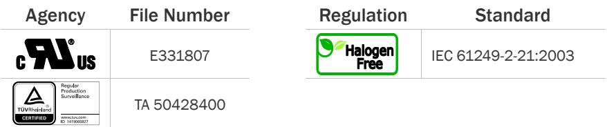

RoHS Directive: Compliance (this product complies with RoHS exemption requirements)

# Electrical Specifications

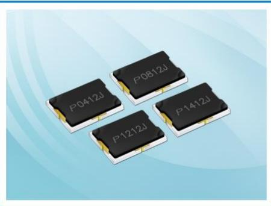

<table><tr><td rowspan=2 colspan=1>Part Number</td><td rowspan=2 colspan=1>Irated(A)</td><td rowspan=2 colspan=1>Cells inseries</td><td rowspan=2 colspan=1>Vmax(VDc)</td><td rowspan=2 colspan=1>Ibreak(A)</td><td rowspan=2 colspan=1>VoP(V)</td><td rowspan=1 colspan=2>Resistance</td><td rowspan=1 colspan=2>AgencyApproval</td></tr><tr><td rowspan=1 colspan=1>Rheater(Ω2)</td><td rowspan=1 colspan=1>Rfuse(mΩ)</td><td rowspan=1 colspan=1>us</td><td rowspan=1 colspan=1>ATOVRheinland</td></tr><tr><td rowspan=1 colspan=1>CLM1612P0412</td><td rowspan=1 colspan=1>12</td><td rowspan=1 colspan=1>1</td><td rowspan=1 colspan=1>36</td><td rowspan=1 colspan=1>50</td><td rowspan=1 colspan=1>3.0 ~ 4.5</td><td rowspan=1 colspan=1>0.6 ~ 1.5</td><td rowspan=1 colspan=1>1.5 ~ 3.5</td><td rowspan=1 colspan=1>✓</td><td rowspan=1 colspan=1>✓</td></tr><tr><td rowspan=1 colspan=1>CLM1612P0812</td><td rowspan=1 colspan=1>12</td><td rowspan=1 colspan=1>2</td><td rowspan=1 colspan=1>36</td><td rowspan=1 colspan=1>50</td><td rowspan=1 colspan=1>4.0 ~ 9.0</td><td rowspan=1 colspan=1>2.0 ~ 3.2</td><td rowspan=1 colspan=1>1.5 ~ 3.5</td><td rowspan=1 colspan=1>✓</td><td rowspan=1 colspan=1>✓</td></tr><tr><td rowspan=1 colspan=1>CLM1612P1212</td><td rowspan=1 colspan=1>12</td><td rowspan=1 colspan=1>3</td><td rowspan=1 colspan=1>36</td><td rowspan=1 colspan=1>50</td><td rowspan=1 colspan=1>7.4 ~ 13.8</td><td rowspan=1 colspan=1>5.7 ~ 9.9</td><td rowspan=1 colspan=1>1.5 ~ 3.5</td><td rowspan=1 colspan=1>✓</td><td rowspan=1 colspan=1>✓</td></tr><tr><td rowspan=1 colspan=1>CLM1612P1412</td><td rowspan=1 colspan=1>12</td><td rowspan=1 colspan=1>4</td><td rowspan=1 colspan=1>36</td><td rowspan=1 colspan=1>50</td><td rowspan=1 colspan=1>10.5 ~ 19.6</td><td rowspan=1 colspan=1>11.2 ~ 20.0</td><td rowspan=1 colspan=1>1.5 ~ 3.5</td><td rowspan=1 colspan=1>✓</td><td rowspan=1 colspan=1>✓</td></tr></table>

# CLM1612 12A Series Device

# Electrical Characteristics

<table><tr><td>Current Capacity</td><td>100% X Irated No Melting</td></tr><tr><td>Cut Time</td><td>200% X Irated &lt; 1 min</td></tr><tr><td>Interrupting Current</td><td>5 x Irated, power on 5 ms, power off 995 ms, 10000 cycles No Melting</td></tr><tr><td>Over Voltage Operation</td><td>In operation voltage range, the fusing time is &lt;1min.</td></tr></table>

# Note on Electrical Specifications & Characteristics

# ◼ Vocabulary

Irated $=$ Current carrying capacity that is measured at $4 0 \circ \mathsf { C }$ thermal equilibrium condition.   
Ibreak $=$ The current that the fuse element is able to interrupt.   
$\boldsymbol { \mathsf { V } } _ { \sf m a x }$ $=$ The maximum voltage that can be cut off by fuse.   
$\mathsf { V } _ { \mathsf { o p } }$ $=$ Range of operation voltage.   
Rheater $=$ The resistance of the heating element.   
Rfuse $=$ The resistance of the fuse element.   
Cells in series $=$ Number of battery cells connected in series in the circuit for CLM device to protect.

◼ Value specified is determined by using the PWB with $2 \mathsf { m m } ^ { \star } 2 \mathsf { o } z$ copper traces, AWG18 covered wire, and $0 . 6 \mathsf { m m }$ glass epoxy PCB.

◼ Specifications are subject to change without notice.

# AWARNING

# General

 Before and after mounted, the ultrasonic-cleaning or immersion-cleaning must not be done to CLM device. The flux on element would flow, and it would not be satisfied its specification when cleaning is done. In addition, a similar influence happens when the product comes in contact with cleaning-solution. These products after cleaning will not be guaranteed. Silicone-based oils, oils, solvents, gels, electrolytes, fuels, acids, and the like will adversely affect the properties of CLM devices, and shall not be used or applied. Please Do Not reuse the CLM device removed by the soldering process. CLM devices are secondary protection devices and are used solely for sporadic, accidental over-current or over-temperature error condition, and shall NOT be used if or when constant or repeated fault conditions (such fault conditions may be caused by, among others, incorrect pin-connection of a connector) or over-extensive trip events may occur. Operation over the maximum rating or other forms of improper use may cause failure, arcing, flame and/or other damage to the CLM devices. The performance of CLM devices will be adversely affected if they are improperly used under electronic, thermal and/or mechanical procedures and/or conditions non-conformant to those recommended by manufacturer. Customers shall be responsible for determining whether it is necessary to have back-up, failsafe and/or fool-proof protection to avoid or minimize damage that may result from extra-ordinary, irregular function or failure of CLM devices. There should be minimum of $0 . 1 \mathsf { m m }$ spacing between CLM and surrounding compounds, to maintain the product characteristics and avoid damage other surrounding compounds.   
 This product is designed and manufactured only for general-use of electronics devices. We do not recommend that it is used for the applications Military, Medical and so on which may cause direct damages on life, bodies or properties.

# CLM1612 12A Series Device

# Thermal Derating Characteristics

<table><tr><td rowspan=1 colspan=1>Ambient Temperature (°C)</td><td rowspan=1 colspan=1>25</td><td rowspan=1 colspan=1>40</td><td rowspan=1 colspan=1>60</td></tr><tr><td rowspan=1 colspan=1>Recommend Rated Current (A)</td><td rowspan=1 colspan=1>13.5</td><td rowspan=1 colspan=1>12.0</td><td rowspan=1 colspan=1>10.0</td></tr></table>

# Cut Time by Heater Operation

◼ Various heater wattage at $\mathtt { \pmb { 2 5 } \circ \mathbf { C } }$ ambient temperature.

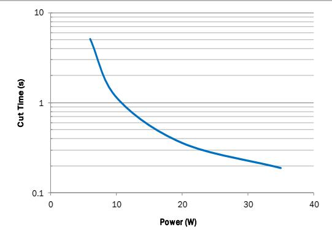

◼ Constant heater wattage at various ambient temperature.

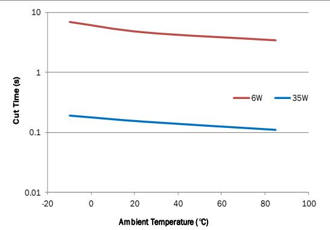

# Cut Time by Current Operation

◼ Various interrupting current at $\mathtt { 2 5 ^ { \circ } C }$ ambient temperature.

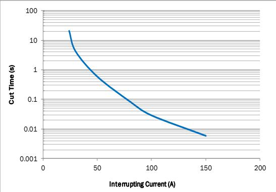

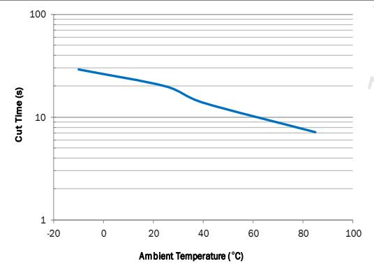  
◼ Constant 2x rated current at various ambient temperature.

# CLM1612 12A Series Device

# Device Circuit

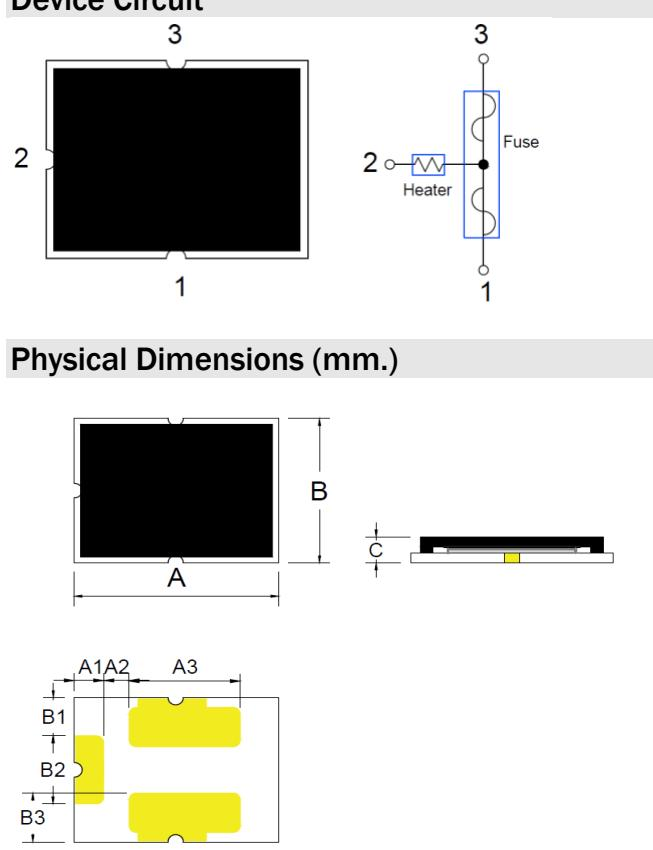

<table><tr><td rowspan=1 colspan=1>A</td><td rowspan=1 colspan=1>4.00 ± 0.2</td></tr><tr><td rowspan=1 colspan=1>B</td><td rowspan=1 colspan=1>3.00 ± 0.3</td></tr><tr><td rowspan=1 colspan=1>C</td><td rowspan=1 colspan=1>0.90 max</td></tr><tr><td rowspan=1 colspan=1>A1</td><td rowspan=1 colspan=1>0.58 ± 0.1</td></tr><tr><td rowspan=2 colspan=1>A2A3</td><td rowspan=1 colspan=1>0.50 ± 0.1</td></tr><tr><td rowspan=1 colspan=1>2.20 ± 0.1</td></tr></table>

<table><tr><td rowspan=1 colspan=1>B1</td><td rowspan=1 colspan=1>0.80 ± 0.1</td></tr><tr><td rowspan=1 colspan=1>B2</td><td rowspan=1 colspan=1>1.44 ± 0.1</td></tr><tr><td rowspan=1 colspan=1>B3</td><td rowspan=1 colspan=1>1.03 ± 0.1</td></tr><tr><td rowspan=1 colspan=1></td><td rowspan=1 colspan=1></td></tr><tr><td rowspan=1 colspan=1></td><td rowspan=1 colspan=1></td></tr></table>

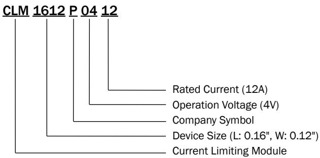  
Part Number System

<table><tr><td rowspan=1 colspan=2>Environmental Specifications</td></tr><tr><td rowspan=1 colspan=1>Storage Temperature</td><td rowspan=1 colspan=1>0~35°C,≤70%RH3 months after shipment</td></tr><tr><td rowspan=1 colspan=1>Operating Temperature</td><td rowspan=1 colspan=1>-10°C to +65 </td></tr><tr><td rowspan=1 colspan=1>Hot Passive Aging</td><td rowspan=1 colspan=1>100±5°, 250 hoursNo structural damage and functional failure</td></tr><tr><td rowspan=1 colspan=1>Humidity Aging</td><td rowspan=1 colspan=1>60°C±2°C, 90~95%R.H. 250 hoursNo structural damage and functional failure</td></tr><tr><td rowspan=1 colspan=1>Cold Passive Aging</td><td rowspan=1 colspan=1>-20±3°C, 500 hoursNo structural damage and functional failure</td></tr><tr><td rowspan=1 colspan=1>Thermal Shock</td><td rowspan=1 colspan=1>MIL-STD-202 Method 107G+125°C /-55°C, 100 timesNo structural damage and functional failure</td></tr></table>

# Board and Solder Layout Recommend (mm)

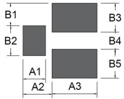

<table><tr><td rowspan=1 colspan=1>Material</td><td rowspan=1 colspan=1>Glass Epoxy PCB</td></tr><tr><td rowspan=1 colspan=1>Base Thickness</td><td rowspan=1 colspan=1>0.6mm</td></tr><tr><td rowspan=1 colspan=1>Copper Thickness</td><td rowspan=1 colspan=1>0.07mm</td></tr><tr><td rowspan=1 colspan=1>Covered Wire</td><td rowspan=1 colspan=1>AWG18</td></tr></table>

<table><tr><td rowspan=1 colspan=1>A1</td><td rowspan=1 colspan=1>1.20 ± 0.1</td><td rowspan=1 colspan=2></td><td rowspan=1 colspan=1>B1</td><td rowspan=1 colspan=1>1.20 ± 0.1</td></tr><tr><td rowspan=1 colspan=1>A2</td><td rowspan=1 colspan=1>1.55 ± 0.1</td><td rowspan=1 colspan=1></td><td rowspan=1 colspan=1></td><td rowspan=1 colspan=1>B2</td><td rowspan=1 colspan=1>1.60 ± 0.1</td></tr><tr><td rowspan=4 colspan=1>A3</td><td rowspan=1 colspan=1>2.40 ± 0.1</td><td rowspan=1 colspan=1></td><td rowspan=1 colspan=1></td><td rowspan=1 colspan=1>B3</td><td rowspan=1 colspan=1>1.55 ± 0.1</td></tr><tr><td rowspan=2 colspan=1></td><td rowspan=2 colspan=1></td><td></td><td rowspan=2 colspan=1>B4</td><td rowspan=2 colspan=1>0.90 ± 0.1</td></tr><tr><td></td></tr><tr><td rowspan=1 colspan=1></td><td rowspan=1 colspan=1></td><td rowspan=1 colspan=1></td><td rowspan=1 colspan=1>B5</td><td rowspan=1 colspan=1>1.55 ± 0.1</td></tr></table>

# Part Marking System

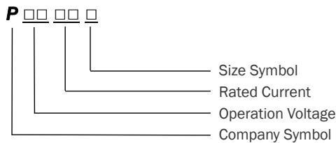

# CLM1612 12A Series Device

# Soldering Parameters

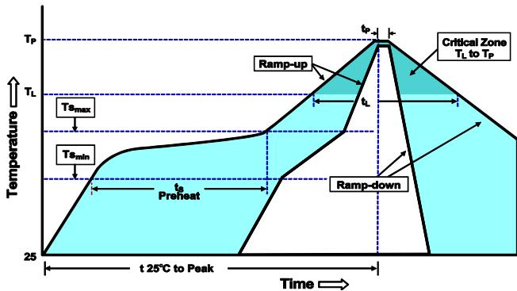

Note 1: The temperature shown above is the top-side surface temperature of the device. Note 2: If the soldering temperature profile deviates from the recommended profile, devices may not meet the performance requirements   

<table><tr><td rowspan=1 colspan=1>Average Ramp-Up Rate (TSmax to Tp)</td><td rowspan=1 colspan=1>3°C/second max.</td></tr><tr><td rowspan=1 colspan=1>Preheat-Temperature Min (TSmin)-Temperature Max (TSmax)-Time (TSmin to TSmax)</td><td rowspan=1 colspan=1>150200°60-120 seconds</td></tr><tr><td rowspan=1 colspan=1>Time maintained above:-Temperature (TL)-Time (tL)</td><td rowspan=1 colspan=1>21760-105 seconds</td></tr><tr><td rowspan=1 colspan=1>Peak Temperature (Tp)</td><td rowspan=1 colspan=1>255°C</td></tr><tr><td rowspan=1 colspan=1>Time within 5°C of actual PeakTemperature (tp)</td><td rowspan=1 colspan=1>5 seconds max.</td></tr><tr><td rowspan=1 colspan=1>Ramp-Down Rate</td><td rowspan=1 colspan=1>6°C /second max.</td></tr><tr><td rowspan=1 colspan=1>Time 25°C to Peak Temperature</td><td rowspan=1 colspan=1>8 minutes max.</td></tr></table>

# Tape & Reel Specification (mm.)

Devices are packaged per EIA481 and EIA-2 standard

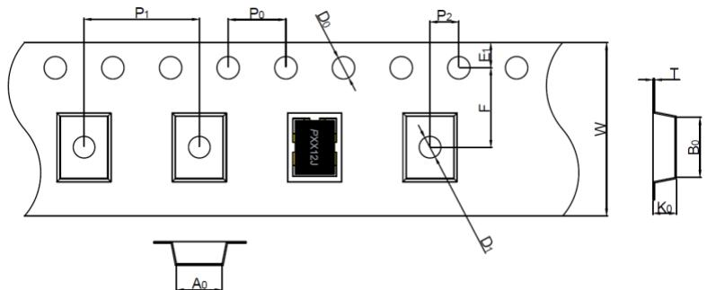

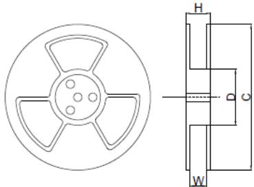

<table><tr><td rowspan=1 colspan=1>W</td><td rowspan=1 colspan=1>12.0 ± 0.30</td></tr><tr><td rowspan=1 colspan=1>F</td><td rowspan=1 colspan=1>5.50 ± 0.05</td></tr><tr><td rowspan=1 colspan=1>E1</td><td rowspan=1 colspan=1>1.75 ± 0.10</td></tr><tr><td rowspan=1 colspan=1>Do</td><td rowspan=1 colspan=1>1.55 ± 0.05</td></tr><tr><td rowspan=1 colspan=1>D1</td><td rowspan=1 colspan=1>1.50 ± 0.10</td></tr><tr><td rowspan=1 colspan=1>Po</td><td rowspan=1 colspan=1>4.00 ± 0.10</td></tr><tr><td rowspan=1 colspan=1>P1</td><td rowspan=1 colspan=1>8.00 ± 0.10</td></tr><tr><td rowspan=1 colspan=1>P2</td><td rowspan=1 colspan=1>2.00 ± 0.10</td></tr><tr><td rowspan=3 colspan=1>AoBoT</td><td rowspan=1 colspan=1>3.32 ± 0.10</td></tr><tr><td rowspan=1 colspan=1>4.32 ± 0.10</td></tr><tr><td rowspan=1 colspan=1>0.23 ± 0.05</td></tr><tr><td rowspan=1 colspan=1>Ko</td><td rowspan=1 colspan=1>1.30 ± 0.10</td></tr></table>

<table><tr><td rowspan=1 colspan=1>H</td><td rowspan=1 colspan=1>17.4 ± 1.0</td></tr><tr><td rowspan=1 colspan=1>W</td><td rowspan=1 colspan=1>13.4 ± 1.0</td></tr><tr><td rowspan=1 colspan=1>D</td><td rowspan=1 colspan=1>099.0 ± 0.5</td></tr><tr><td rowspan=1 colspan=1>C</td><td rowspan=1 colspan=1>0330 ± 1.0</td></tr></table>

# Packaging Quantity

<table><tr><td>Part Number</td><td>Tape &amp; Reel Quantity</td></tr><tr><td>CLM1612PXX12</td><td>5000</td></tr></table>