上海海栎创科技股份有限公司
**Hynitron Technology**

# **CST816D**

High-Performance Self-Capacitive Touch Chip V1.3
## **1. Overview**

CST816D self-capacitance touch chip, using high-speed MCU core and embedded DSP circuit,
combined with its own fast self-capacitance sensing technology, can widely support a variety
of self-capacitance patterns including triangles. It can realize single-point gestures and real
two-point operation, achieves extremely high sensitivity and low standby power
consumption.

## **2. Chip Features**

 **Built-in fast self-capacitance detection**
**circuit and high-performance DSP module**

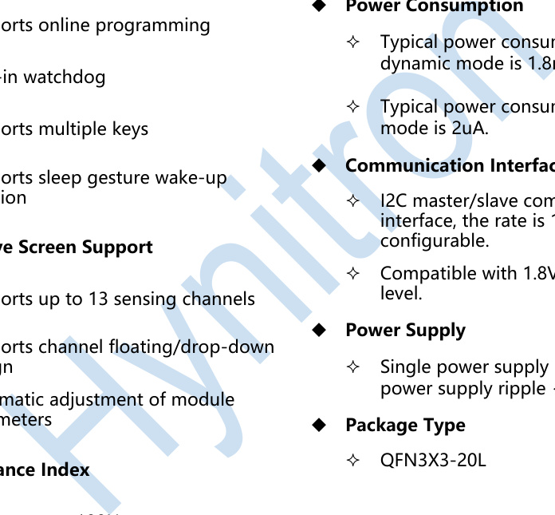

function

design

 **Performance Index**

 Report rate > 100Hz

## **3. Typical Applications**

 Single-point and two-point gesture
operation

Consumer electronics, watches and other products

Shanghai Hynitron Technology Co., Ltd - 1 

上海海栎创科技股份有限公司
**Hynitron Technology**
## **4. Reference Circuit**

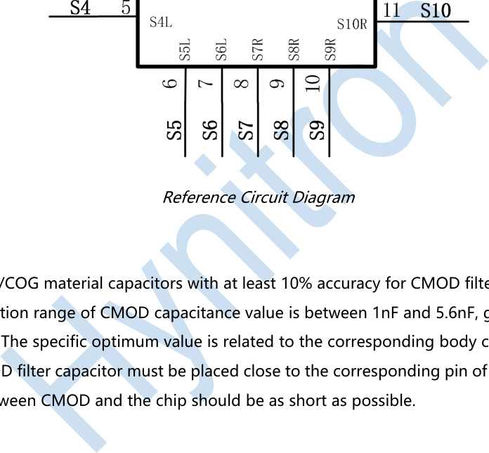

**Precautions：**

# **CST816D**

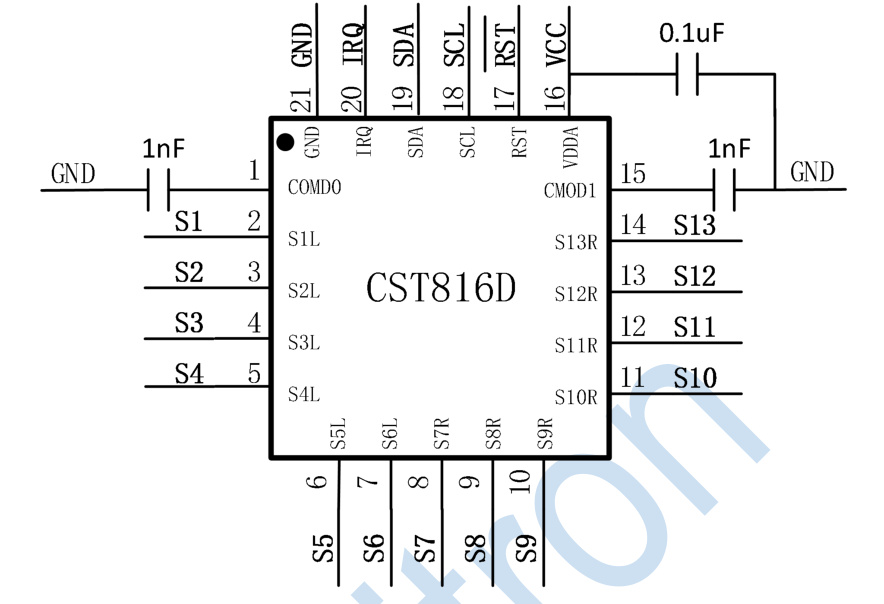
## **5. Ordering Information**

|Part No|Package|Marking|Packing|Description|
|---|---|---|---|---|
|CST816D|QFN3X3-20L||take-up package （5000）|Dot: Pin1 Mark point CST816D: Model character XXXXX: 5-digit production tracking code|

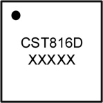

Shanghai Hynitron Technology Co., Ltd - 2 

上海海栎创科技股份有限公司
**Hynitron Technology**
## **6. Pinout/Description**

# **CST816D**

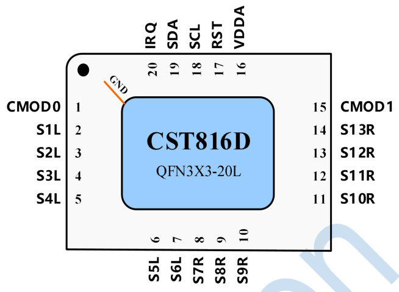

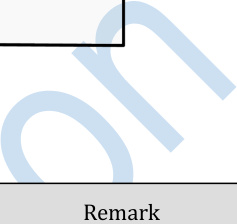

|Pin Name|Description|Remark|
|---|---|---|
|S01~S13|Sensors||
|VDDA|Power supply|2.8V~3.6V, connect to 2.2uF~ 10uF capacitor.|
|CMOD0/CMOD1|Voltage regulator capacitor|Connect to 1nF~5.6nF voltage regulator capacitor.|
|IRQ|Interrupt output|Rising/Falling edge selectable.|
|SCL/SDA|I2C|Optional internal pull-up/open-drain mode.|
|RST|Reset input|Low effective.|
|GND|Substrate|The substrate is GND and it must be connected.|

Pin Description Table

**Remark：**

1. CMOD0/CMOD1 must be connected to a voltage regulator capacitor between 1nF ~ 5.6nF;

Shanghai Hynitron Technology Co., Ltd - 3 

上海海栎创科技股份有限公司
**Hynitron Technology**
## **7. Function Description**

# **CST816D**

CST816D self-capacitance touch chip, with its built-in fast self-capacitance sensing module, it
can realize single-point gestures and real two-point functions on patterns such as triangles
without any external devices (except circuit bypass capacitors). Aside from its fast response, it
has extremely excellent anti-noise, waterproof and low power consumption performance.

**7.1.** **Power on and Reset**

The chip has a built-in power-on reset circuit, so there is no need to connect a dedicated reset
circuit externally.

The built-in power-on reset module will keep the chip in the reset state until the voltage is
normal. When the voltage is lower than a certain threshold, the chip will also be reset.

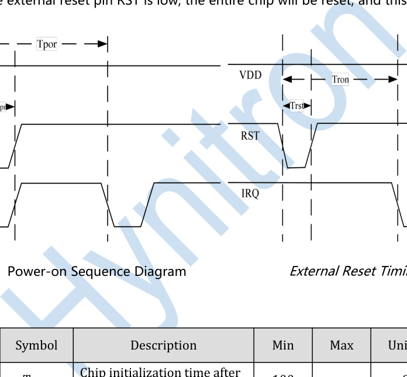

When the external reset pin RST is low, the entire chip will be reset, and this pin can be left
floating.

|Symbol|Description|Min|Max|Unit|
|---|---|---|---|---|
|Tpor|Chip initialization time after power-on|100|-|mS|
|Tpr|RST pin delayed pull-up time|5|-|mS|
|Tron|Chip reinitialization time after reset|100|-|mS|
|Trst|Reset pulse time|0.1|-|mS|

Power-on and Reset Timing Description

Shanghai Hynitron Technology Co., Ltd - 4 

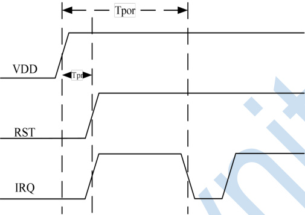

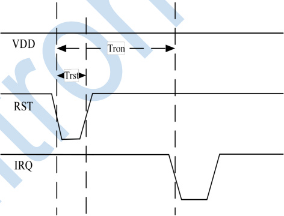
上海海栎创科技股份有限公司
**Hynitron Technology**

**7.2.** **Working Mode**

Working Mode Conversion

 Dynamic Mode

# **CST816D**

The IC is in this mode when there is frequent touch operation. In this mode, the touch chip
quickly performs self-capacitance scanning, and reports touch info to the host. After there is
no touch for 2 seconds, the IC will automatically enter standby mode (this function can be

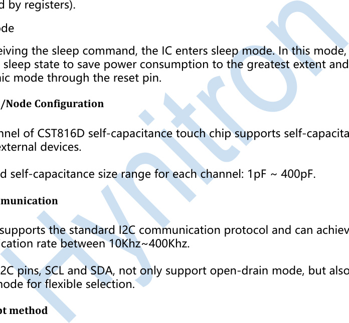
controlled by registers).

 Sleep Mode

**7.4.** **I2C Communication**

**7.5.** **Interrupt method**

The touch chip will notify the host to read valid data through the IRQ pin only when a valid
touch is detected and needs to be reported to the host, this can improve efficiency and
reduce the burden on the CPU.

The interrupt edge can be configured to be valid on the rising edge or valid on the falling
edge as required.

The IRQ pin is also used to wake up the host when a predefined gesture is matched in
standby mode.

**7.6.** **IIC Interface Description**

The chip itself supports IIC operation, and the IIC pin can also be used for simple IO operation.
Specific functions can be customized by the software according to specific projects.

Shanghai Hynitron Technology Co., Ltd - 5 

上海海栎创科技股份有限公司
**Hynitron Technology**

**a)** **IIC Address of The Device**

# **CST816D**

The 7-bit device address of the chip is generally 0x15, that is, the device write address is 0x2A,
and the read address is 0x2B.

The iic address of some projects may be different, please consult the corresponding project
and engineering personnel.

**b)** **I2C Speed**

In order to ensure the reliability of communication, it is recommended to use a maximum
communication rate of 400Kbps

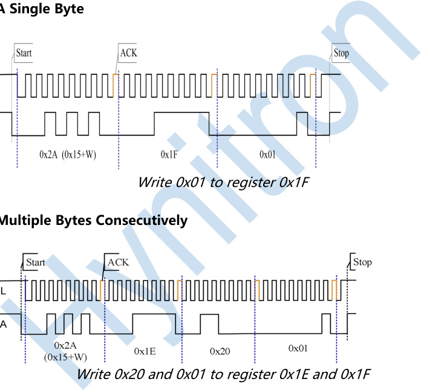

**c)** **Write A Single Byte**

**e)** **Read A Single Byte**

Read a single byte from register 0x21

Shanghai Hynitron Technology Co., Ltd - 6 

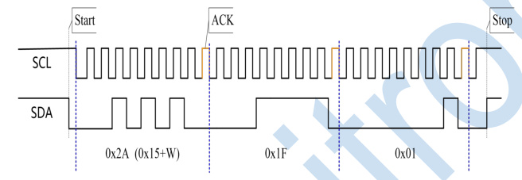

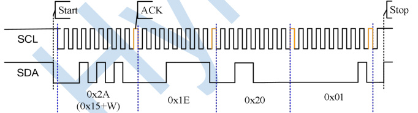

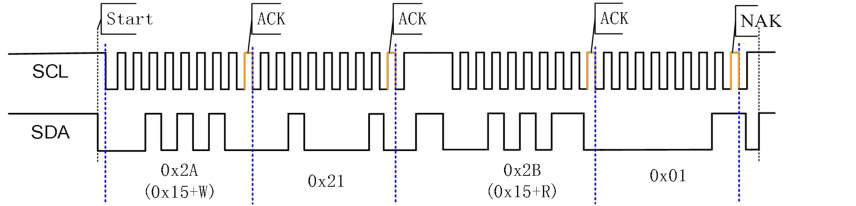
上海海栎创科技股份有限公司
**Hynitron Technology**

**f)** **Read Multiple Bytes Consecutively**

Read 3 bytes from registers 0x21, 0x22, 0x23

g) **Timing Description**

# **CST816D**

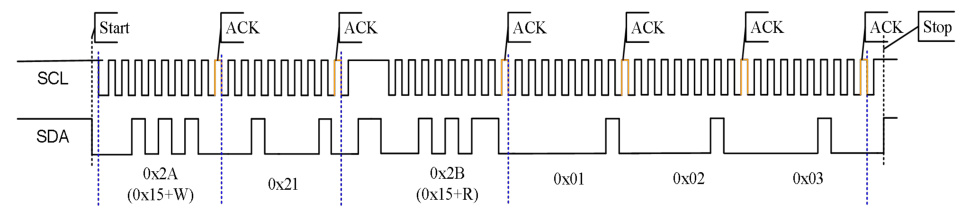

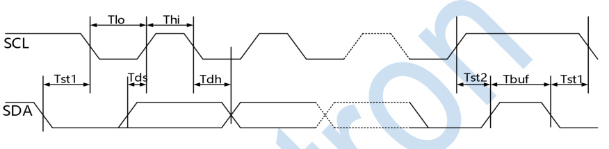

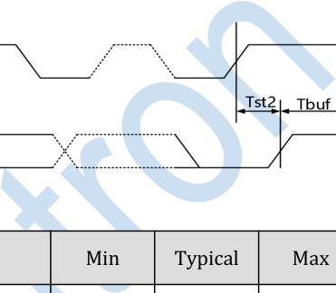

|Symbol|Description|Min|Typical|Max|Unit|
|---|---|---|---|---|---|
|Fscl|SCL clock frequency|10|-|400|kHz|
|Tst1|SCL hold time for START condition|0.6|-|-|us|
|Tlo|LOW period of SCL|1.3|-|-|us|
|Thi|HIGH period of SCL|0.6|-|-|us|
|Tds|SDA setup time|0.6|-|-|us|
|Tdh|SDA hold time|100|-|-|ns|
|Tst2|SCL setup time for STOP condition|0.6|-|-|us|
|Tbuf|Ready time between STOP and START|4.5|-|-|us|

IIC Timing Description

Shanghai Hynitron Technology Co., Ltd - 7 

上海海栎创科技股份有限公司
**Hynitron Technology**
## **8. Application Design Specifications**

**8.1.** **Power Supply Decoupling Capacitors**

# **CST816D**

Generally, a 0.1uF and 10uF ceramic capacitors are connected in parallel at the VDD and VSS
terminals of the chip to decouple and bypass.

The decoupling capacitor should be placed as close to the chip as possible to minimize the
current loop area.

**8.2.** **CMOD Filter Capacitor**

The filter capacitor uses NPO/COG material capacitors with at least 10% accuracy, and the
selection range of the capacitance value is between 1nF and 5.6nF, generally 1nF is selected.

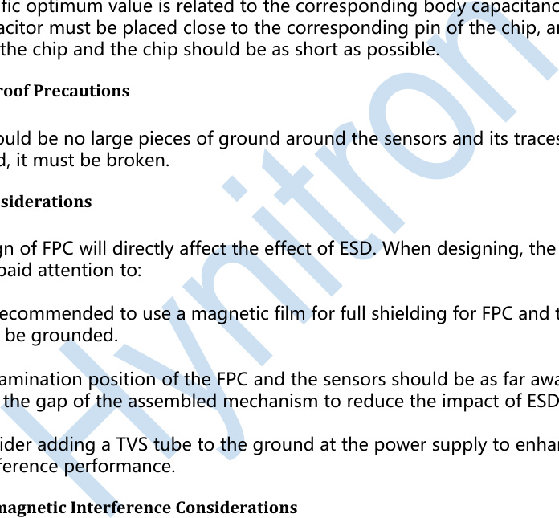

**8.4.** **ESD Considerations**

Sensor traces must be isolated from lines that may cause interference, such as power traces,
audio lines, LCD drive lines, Bluetooth antennas, RF antennas, etc. When the TP adopts a
full-fit design, it may be interfered by the LCD. In that case, the parameters of the TP need to
be specially adjusted.

**8.6.** **Ground**

The high-precision detection circuit inside the touch chip is sensitive to the ground wire. If
possible, the user should use a star ground to isolate the noise of other chips. At the same
time, it is recommended to insert a magnetic bead at ground to enhance the anti-interference
ability. If star grounding is difficult to achieve, the user should try to separate the ground of
the high-current device from the ground of the touch chip.

Shanghai Hynitron Technology Co., Ltd - 8 

上海海栎创科技股份有限公司
**Hynitron Technology**
## **9. Electrical Characteristics**

Absolute Maximum Parameters

# **CST816D**

|Symbol|Description|Min|Typical|Max|Unit|
|---|---|---|---|---|---|
|TSTG|Storage temperature|-40|25|125|℃|
|Ta|Operating ambient temperature when powered on|-20|-|85|℃|
|Vdd|Supply voltage relative to Vss|-0.3|-|+3.6|V|
|Vio|DC input voltage|VSS-0.3|-|VDD+0.3|V|
|LU|Latch-up current|-|200|-|mA|
|CDM|ESD Electrical Device Model|-|1000|-|V|
|HBM|ESD human model|-|8000|-|V|

|Symbol|Description|Min|Typical|Max|Unit|
|---|---|---|---|---|---|
|Fcpu |CPU frequency|-2%|20|+2%|MHz|
|F32k |Internal low-speed clock frequency|-5%|32|+5%|kHz|
|txRST |External reset pulse width|-|0.1|-|mS|
|tPOWERUP   |Time from end of POR to CPU execution of code|-|4|-|mS|
|FGPIO |GPIO switching frequency|-|2|-|MHz|
|tRISE |Pin level rise time, Cload=50pF|-|32|-|nS|
|tFAIL |Pin level fall time, Cload=50pF|-|11.2|-|nS|

AC Electrical Characteristics

Shanghai Hynitron Technology Co., Ltd - 9 

上海海栎创科技股份有限公司
**Hynitron Technology**

# **CST816D**

DC Electrical Performance (Ambient temperature 25℃, VDDA=3.3V VIO = VDD/1.8 )

|Symbol|Description|Min|Typical|Max|Unit|
|---|---|---|---|---|---|
|Vdd|Power supply|2.8|3.0|3.6|V|
|Rpu|Pull-up resistor|-|5|-|KΩ|
|Voh|High level output voltage|0.7* VIO|-|-|V|
|Vol|Low level output voltage|-|-|0.3* VIO|V|
|Ioh|High level output current|-|2.0|-|mA|
|Iol|Low level sink current|-|20.0|-|mA|
|Vil|Input low level voltage|-|-|0.3* VIO|V|
|Vih|Input high level voltage|0.7* VIO|-|-|V|
|Iil|Input leakage current|-|10|-|nA|
|Idd1|Operating current (dynamic mode)|-|1.8|-|mA|
|Idd3|Operating current (sleep mode)|-|2.0|-|uA|
|Vddp|Programming voltage|2.8|-|3.6|V|

Shanghai Hynitron Technology Co., Ltd - 10 

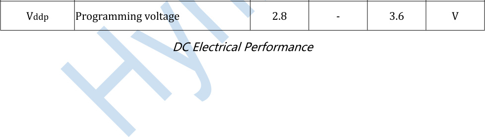
上海海栎创科技股份有限公司
**Hynitron Technology**
## **10.Product Packaging**

E

|Col1|D|Col3|Col4|
|---|---|---|---|
|||||
|||||
|||||

|Col1|Col2|Col3|Col4|Col5|Col6|A1 A3|Col8|Col9|
|---|---|---|---|---|---|---|---|---|
|||||||A1 A3|A3|A3|
||||||||||
||||||||||
|A2|A2|A2|A2|A2|A2|A2|A2|A2|

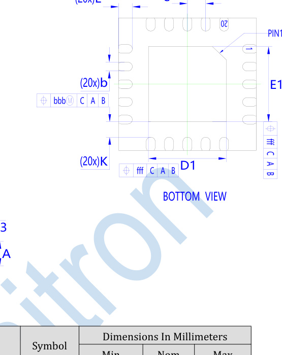

L e

# **CST816D**

|Item|Col2|Symbol|Dimensions In Millimeters|Col5|Col6|
|---|---|---|---|---|---|
|Item|Item|Symbol|Min|Nom|Max|
|Total Thickness|Total Thickness|A|0.5|0.55|0.6|
|Stand Off|Stand Off|A1|0|0.02|0.05|
|Mold Thickness|Mold Thickness|A2|0.4|0.4|0.4|
|L/F Thickness|L/F Thickness|A3|0.152|0.152|0.152|
|Body Size|X|D|3|3|3|
|Body Size|Y|E|3|3|3|
|Exposed Pad Size|X|D1|1.6|1.7|1.8|
|Exposed Pad Size|Y|E1|1.6|1.7|1.8|
|Lead Width|Lead Width|b|0.15|0.2|0.25|
|Lead Pitch|Lead Pitch|e|0.4|0.4|0.4|
|Lead Length|Lead Length|L|0.2|0.3|0.4|
|Lead Tip To Exposed Pad Edge|Lead Tip To Exposed Pad Edge|K|0.2|--|0.35|
|Package Edge Tolerance|Package Edge Tolerance|aaa|0.1|0.1|0.1|
|Lead Offset|Lead Offset|bbb|0.07|--|0.1|
|Mold Flatness|Mold Flatness|ccc|0.1|0.1|0.1|
|Coplanarity|Coplanarity|eee|0.08|0.08|0.08|
|Exposed Pad Offset|Exposed Pad Offset|fff|0.1|0.1|0.1|

Shanghai Hynitron Technology Co., Ltd - 11 

上海海栎创科技股份有限公司
**Hynitron Technology**
## **11.Revision History**

# **CST816D**

|Version|Modification|
|---|---|
|V1.0|Initial release|
|V1.1|Revise seal information Update unified package POD parameters|
|V1.2|Unify action package name|
|V1.3|Update Operating current|

**Disclaimer: Shanghai Hynitron Technology Co., Ltd. is not responsible for the use of any**
**circuits other than our company's products and does not provide its patent license.**
**Shanghai Hynitron Technology Co., Ltd. reserves the right to modify product**
**information and specifications at any time without any notice.**

Shanghai Hynitron Technology Co., Ltd - 12 

