# FUSB302B Programmable FUSB302B Programmable

# FUSB302B

# Description

The FUSB302B targets system designers looking to implement a DRP/SRC/SNK USB Type-C connector with low amount of programmability.

The FUSB302B enables the USB Type-C detection including attach, and orientation. The FUSB302B integrates the physical layer of the USB BMC power delivery protocol to allow up to $1 0 0 ~ \mathrm { W }$ of power and role swap. The BMC PD block enables full support for alternative interfaces of the Type-C specification.

# Features

# ORDERING INFORMATION

See detailed ordering and shipping information on page 2 of this data sheet.

• Dual-role Functionality with Autonomous DRP Toggle   
• Ability to Connect as Either a Host or a Device Based on What Has Been Attached   
Software Configurable Either as a Dedicated Host, Dedicated Device, or Dual Role ♦ Dedicated Devices can Operate both on a Type-C Receptacle or a Type-C Plug with a Fixed CC and VCONN Channel   
• Full Type-C 1.2 Support. Integrates the Following Functionality of the CC Pin: ♦ Attach/Detach Detection as Host ♦ Current Capability Indication as Host ♦ Current Capability Detection as Device ♦ Audio Adapter Accessory Mode ♦ Debug Accessory Mode ♦ Active Cable Detection

• Integrates CCx to VCONN Switch with Over-current Limiting for Powering USB3.1 Full Featured Cables

• USB Power Delivery (PD) 2.0, Version 1.2 Support: ♦ Automatic GoodCRC Packet Response $\bullet$ Automatic Retries of Sending a Packet if a GoodCRC is Not Received ♦ Automatic Soft Reset Packet Sent with Retries if Needed ♦ Automatic Hard Reset Ordered Set Sent

• Dead Battery Support (SNK Mode Support when No Power Applied)

• Low Power Operation: $\operatorname { I } _ { \mathrm { C C } } = 2 5 ~ \mu \mathrm { A }$ (Typical)

• AEC−Q100 Automotive Qualified Temperature Grade 2: ( $- 4 0 ^ { \circ } \mathrm { C }$ to $+ 1 0 5 ^ { \circ } \mathrm { C } _ { \iota }$ )

• Packaged in: ♦ 9-ball WLCSP $( 1 . 2 1 5 \ : \mathrm { m m } \times 1 . 2 6 0 \ : \mathrm { m m } )$ ) ♦ 14-lead MLP ( $2 . 5 \ : \mathrm { m m } \times 2 . 5 \ : \mathrm { m m }$ , $0 . 5 \mathrm { m m }$ Pitch)

# Applications

• Smartphones • Tablets • Laptops • Notebooks • Power Adapters • Cameras • Dongles • Automotive

# FUSB302B

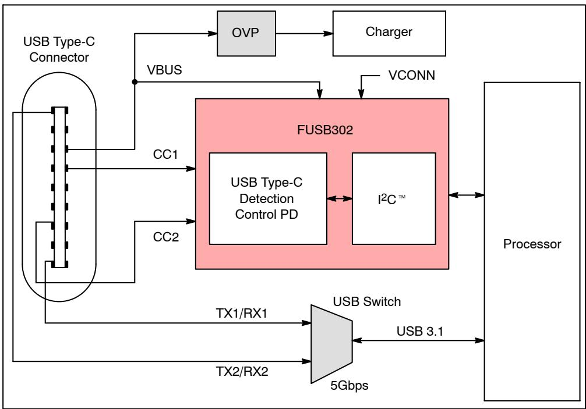  
Figure 1. Block Diagram

Table 1. ORDERING INFORMATION   

<table><tr><td rowspan=1 colspan=1>Part Number</td><td rowspan=1 colspan=1>Top Mark</td><td rowspan=1 colspan=1>OperatingTemperature Range</td><td rowspan=1 colspan=1>Package</td><td rowspan=1 colspan=1>Shippingt</td></tr><tr><td rowspan=1 colspan=1>FUSB302BUCX</td><td rowspan=1 colspan=1>H4</td><td rowspan=1 colspan=1>-40 to 85°</td><td rowspan=1 colspan=1>9-ball Wafer-level Chip ScalePackage (WLCSP), 0.4 mm Pitch</td><td rowspan=6 colspan=1>3,000 / Tape and Reel</td></tr><tr><td rowspan=1 colspan=1>FUSB302BMPX</td><td rowspan=1 colspan=1>UA</td><td rowspan=4 colspan=1>-40 to 85°C</td><td rowspan=5 colspan=1>14-lead MLP 2.5 mm × 2.5 mm,0.5 mm Pitch</td></tr><tr><td rowspan=1 colspan=1>FUSB302B01MPX</td><td rowspan=1 colspan=1>UP</td></tr><tr><td rowspan=1 colspan=1>FUSB302B10MPX</td><td rowspan=1 colspan=1>US</td></tr><tr><td rowspan=1 colspan=1>FUSB302B11MPX</td><td rowspan=1 colspan=1>UT</td></tr><tr><td rowspan=1 colspan=1>FUSB302BVMPX</td><td rowspan=1 colspan=1>DA</td><td rowspan=1 colspan=1>-40 to 105°C</td></tr></table>

†For information on tape and reel specifications, including part orientation and tape sizes, please refer to our Tape and Reel Packaging Specifications Brochure, BRD8011/D.

# FUSB302B

# TYPICAL APPLICATION

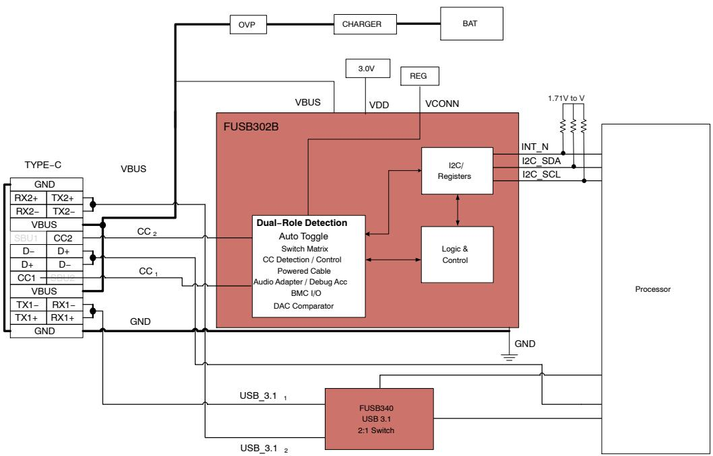  
Figure 2. Typical Application

# BLOCK DIAGRAM

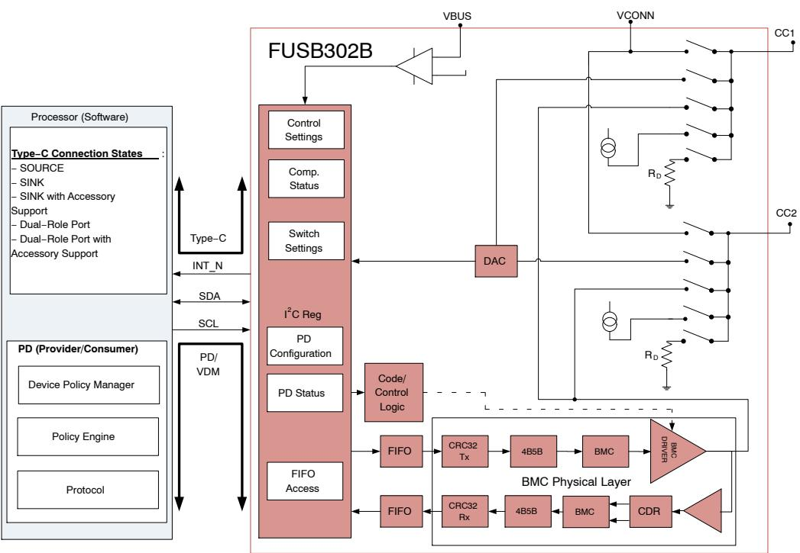  
Figure 3. Functional Block Diagram

# FUSB302B

# PIN CONFIGURATION

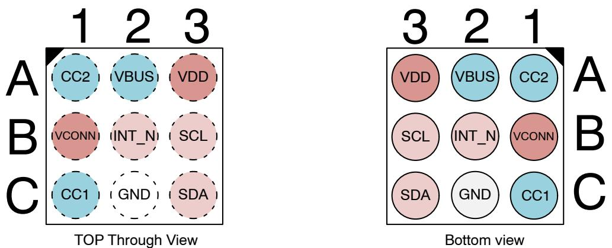  
Figure 4. FUSB302BUCX Pin Assignment

Table 2. PIN MAP   

<table><tr><td rowspan=1 colspan=1></td><td rowspan=1 colspan=1>Column 1</td><td rowspan=1 colspan=1>Column 2</td><td rowspan=1 colspan=1>Column 3</td></tr><tr><td rowspan=1 colspan=1>Row A</td><td rowspan=1 colspan=1>CC2</td><td rowspan=1 colspan=1>VBUS</td><td rowspan=1 colspan=1>VDD</td></tr><tr><td rowspan=1 colspan=1>Row B</td><td rowspan=1 colspan=1>VCONN</td><td rowspan=1 colspan=1>INT_N</td><td rowspan=1 colspan=1>SCL</td></tr><tr><td rowspan=1 colspan=1>Row C</td><td rowspan=1 colspan=1>CC1</td><td rowspan=1 colspan=1>GND</td><td rowspan=1 colspan=1>SDA</td></tr></table>

# FUSB302B

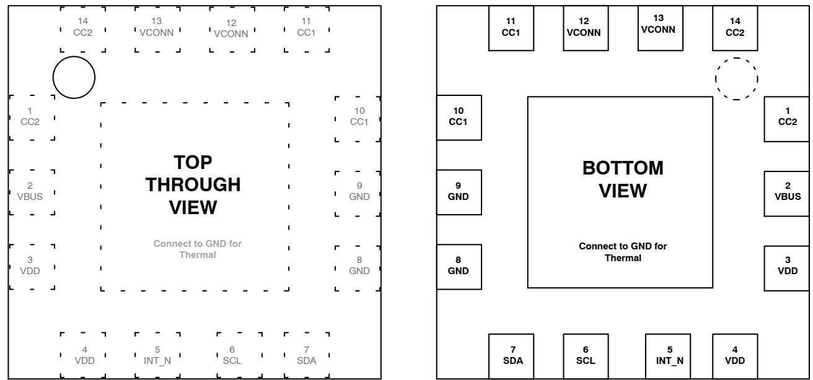  
Figure 5. FUSB302BMPX Pin Assignment $( { \pmb { \mathsf { N } } } / { \pmb { \mathsf { C } } } =$ No Connect)

Table 3. PIN DESCRIPTION   

<table><tr><td rowspan=1 colspan=3>Name           Type                                                  Description</td></tr><tr><td rowspan=1 colspan=3>USB TYPE-C CONNECTOR INTERFACE</td></tr><tr><td rowspan=1 colspan=1>CC1/CC2</td><td rowspan=1 colspan=1>I/O</td><td rowspan=1 colspan=1>Type-C connector Configuration Channel (CC) pins. Initially used to determine when an attach hasoccurred and what the orientation of the insertion is. Functionality after attach depends on mode ofoperation detected.Operating as a host:1. Sets the allowable charging current for VBUS to be sensed by the attached device2. Used to communicate with devices using USB BMC Power Delivery3. Used to detect when a detach has occurredOperating as a device:1. Indicates what the allowable sink current is from the attached host. Used to communicate withdevices using USB BMC Power Delivery</td></tr><tr><td rowspan=1 colspan=1>GND</td><td rowspan=1 colspan=1>Ground</td><td rowspan=1 colspan=1>Ground</td></tr><tr><td rowspan=1 colspan=1>VBUS</td><td rowspan=1 colspan=1>Input</td><td rowspan=1 colspan=1>VBUS input pin for attach and detach detection when operating as an upstream facing port(Device). Expected to be an OVP protected input.</td></tr></table>

# POWER INTERFACE

<table><tr><td rowspan=1 colspan=1>VDD</td><td rowspan=1 colspan=1>Power</td><td rowspan=1 colspan=1>Input supply voltage.</td></tr><tr><td rowspan=1 colspan=1>VCONN</td><td rowspan=1 colspan=1>Power Switch</td><td rowspan=1 colspan=1>Regulated input to be switched to correct CC pin as VCONN to power USB3.1 full-featured cablesand other accessories.</td></tr></table>

# SIGNAL INTERFACE

<table><tr><td rowspan=1 colspan=1>SCL</td><td rowspan=1 colspan=1>Input</td><td rowspan=1 colspan=1>C serial clock signal to be connected to the phone-based I²C master.</td></tr><tr><td rowspan=1 colspan=1>SDA</td><td rowspan=1 colspan=1>Open-Drain I/0</td><td rowspan=1 colspan=1>C serial data signal to be connected to the phone-based I2C master</td></tr><tr><td rowspan=1 colspan=1>INT_N</td><td rowspan=1 colspan=1>Open-DrainUutput</td><td rowspan=1 colspan=1>Active LOW open drain interrupt output used to prompt the processor to read the I2C register bits</td></tr></table>

# FUSB302B

# CONFIGURATION CHANNEL SWITCH

The FUSB302B integrates the control and detection functionality required to implement a USB Type-C host, device or dual-role port including:

• Device Port Pull-Down $\mathrm { ( R _ { D } ) }$   
• Host Port Pull-Up (IP)   
• VCONN Power Switch with OCP for Full-Featured USB3.1 Cables

• USB BMC Power Delivery Physical Layer • Configuration Channel (CC) Threshold Comparators

Each CC pin contains a flexible switch matrix that allows the host software to control what type of Type-C port is implemented. The switches are shown in Figure 6.

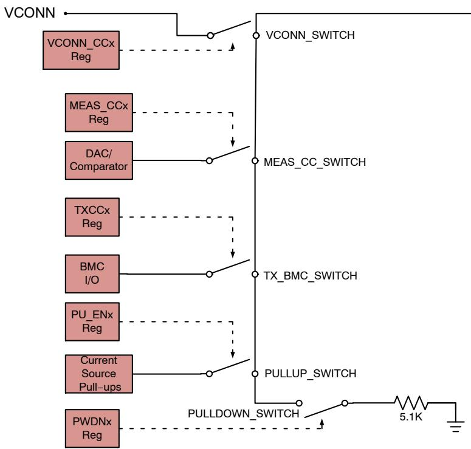  
Figure 6. Configuration Channel Switch Functionality

# TYPE-C DETECTION

The FUSB302B implements multiple comparators and a programmable DAC that can be used by software to determine the state of the CC and VBUS pins. This status information provides the processor all of the information required to determine attach, detach and charging current configuration of the Type-C port connection.

The FUSB302B has three fixed threshold comparators that match the USB Type-C specification for the three charging current levels that can be detected by a Type-C device. These comparators automatically cause BC_LVL and COMP interrupts to occur when there is a change of state. In addition to the fixed threshold comparators, the host software can use the 6-bit DAC to determine the state of the CC lines more accurately.

The FUSB302B also has a fixed comparator that monitors if VBUS has reached a valid threshold or not. The DAC can be used to measure VBUS up to $2 0 \mathrm { ~ V ~ }$ which allows the software to confirm that changes to the VBUS line have occurred as expected based on PD or other communication methods to change the charging level.

# Detection through Autonomous Device Toggle

The FUSB302B has the capability to do autonomous DRP toggle. In autonomous toggle the FUSB302B internally controls the PDWN1, PDWN2, PU_EN1 and PU_EN2, MEAS_CC1 and MEAS_CC2 and implements a fixed DRP toggle between presenting as a SRC and presenting as a SNK. Alternately, it can present as a SRC or SNK only and poll CC1 and CC2 continuously.

# FUSB302B

Table 4. PROCESSOR CONFIGURES THE FUSB302B THROUGH $\mathtt { P C }$   

<table><tr><td rowspan=1 colspan=1>I2C Registers/Bits</td><td rowspan=1 colspan=1>Value</td></tr><tr><td rowspan=1 colspan=1>TOGGLE</td><td rowspan=1 colspan=1>1</td></tr><tr><td rowspan=1 colspan=1>PWR</td><td rowspan=1 colspan=1>07H</td></tr><tr><td rowspan=1 colspan=1>HOST_CURO</td><td rowspan=1 colspan=1>1</td></tr><tr><td rowspan=1 colspan=1>HOST_CUR1</td><td rowspan=1 colspan=1>0</td></tr><tr><td rowspan=1 colspan=1>MEAS_VBUS</td><td rowspan=1 colspan=1>0</td></tr><tr><td rowspan=1 colspan=1>VCONN_CC1</td><td rowspan=1 colspan=1>0</td></tr><tr><td rowspan=1 colspan=1>VCONN_CC2</td><td rowspan=1 colspan=1>0</td></tr><tr><td rowspan=1 colspan=1>Mask Register</td><td rowspan=1 colspan=1>0xFE</td></tr><tr><td rowspan=1 colspan=1>Maska Register</td><td rowspan=1 colspan=1>0xBF</td></tr><tr><td rowspan=1 colspan=1>Maskb Register(Except _TOGDONE and I_BC_LVL Interrupt)</td><td rowspan=1 colspan=1>0x01</td></tr><tr><td rowspan=1 colspan=1>PWR[3:0]</td><td rowspan=1 colspan=1>0xBF</td></tr></table>

1. Once it has been determined what the role is of the FUSB302B, it returns I_TOGDONE and TOGSS1/2. 2. Processor then can perform a final manual check through $\mathsf { I 2 C }$ .

# Manual Device Toggle

The FUSB302B has the capability to do manual DRP toggle. In manual toggle the FUSB302B is configurable by the processor software by $\mathrm { I } ^ { 2 } \mathrm { C }$ and setting TOGGLE $= 0$ .

# Manual Device Detection and Configuration

A Type-C device must monitor VBUS to determine if it is attached or detached. The FUSB302B provides this information through the VBUSOK interrupt. After the Type-C device knows that a Type-C host has been attached, it needs to determine what type of termination is applied to each CC pin. The software determines if an Ra or Rd termination is present based on the BC_LVL and COMP interrupt and status bits.

Additionally, for Rd terminations, the software can further determine what charging current is allowed by the Type-C host by reading the BC_LVL status bits. This is summarized in Table 5.

Table 5. DEVICE INTERRUPT SUMMARY   

<table><tr><td rowspan=2 colspan=1>Status Type</td><td rowspan=1 colspan=4>Interrupt Status</td><td rowspan=2 colspan=1>Meaning</td></tr><tr><td rowspan=1 colspan=1>BC_LVL[1:0]</td><td rowspan=1 colspan=1>COMP</td><td rowspan=1 colspan=1>COMP Setting</td><td rowspan=1 colspan=1>VBUSOK</td></tr><tr><td rowspan=4 colspan=1>CC Detection</td><td rowspan=1 colspan=1>2&#x27;b00</td><td rowspan=1 colspan=1>NA</td><td rowspan=1 colspan=1>NA</td><td rowspan=1 colspan=1>1</td><td rowspan=1 colspan=1>vRA</td></tr><tr><td rowspan=1 colspan=1>2&#x27;b01</td><td rowspan=1 colspan=1>NA</td><td rowspan=1 colspan=1>NA</td><td rowspan=1 colspan=1>1</td><td rowspan=1 colspan=1>vRd-Connect and vRd-USB</td></tr><tr><td rowspan=1 colspan=1>2&#x27;b10</td><td rowspan=1 colspan=1>NA</td><td rowspan=1 colspan=1>NA</td><td rowspan=1 colspan=1>1</td><td rowspan=1 colspan=1>vRd-Connect and vRd-1.5</td></tr><tr><td rowspan=1 colspan=1>2&#x27;b11</td><td rowspan=1 colspan=1>0</td><td rowspan=1 colspan=1>6&#x27;b11_0100(2.05 V)</td><td rowspan=1 colspan=1>1</td><td rowspan=1 colspan=1>vRd-Connect and vRd-3.0</td></tr><tr><td rowspan=1 colspan=1>Attach</td><td rowspan=1 colspan=1>NA</td><td rowspan=1 colspan=1>NA</td><td rowspan=1 colspan=1>NA</td><td rowspan=1 colspan=1>1</td><td rowspan=1 colspan=1>Host Attached, VBUS Valid</td></tr><tr><td rowspan=1 colspan=1>Detach</td><td rowspan=1 colspan=1>NA</td><td rowspan=1 colspan=1>NA</td><td rowspan=1 colspan=1>NA</td><td rowspan=1 colspan=1>0</td><td rowspan=1 colspan=1>Host Detached, VBUS Invalid</td></tr></table>

# Toggle Functionality

When TOGGLE bit (Control2 register) is set the FUSB302B implements a fixed DRP toggle between presenting as a SRC and as a SNK. It can also be configured to present as a SRC only or SNK only and poll CC1 and CC2 continuously. This operation is turned on with TOGGLE $= 1$ and the processor should initially write HOST $\mathbf { C U R 1 } = 0$ HOST_ $\mathrm { C U R 0 } = 1$ (for default current), VCONN_ $\mathbf { \mathrm { C C 1 } } =$ VCONN_ $\mathbf { \mathrm { C C } } 2 = \mathbf { 0 }$ , Mask Register $= 0 \mathrm { x F E }$ , Maska register ${ \bf \mu } = 0 { \bf x } { \bf B } { \bf F } _ { \mathrm { ~ ~ } }$ , and Maskb register ${ \bf \mu } = 0 { \bf x } 0 1$ , and $\mathrm { P W R } =$ ${ \bf 0 } { \bf x 0 1 }$ . The processor should also read the interrupt register to clear them prior to setting the TOGGLE bit.

The high level software flow diagram for a Type-C device (SNK) is shown in Figure 7.

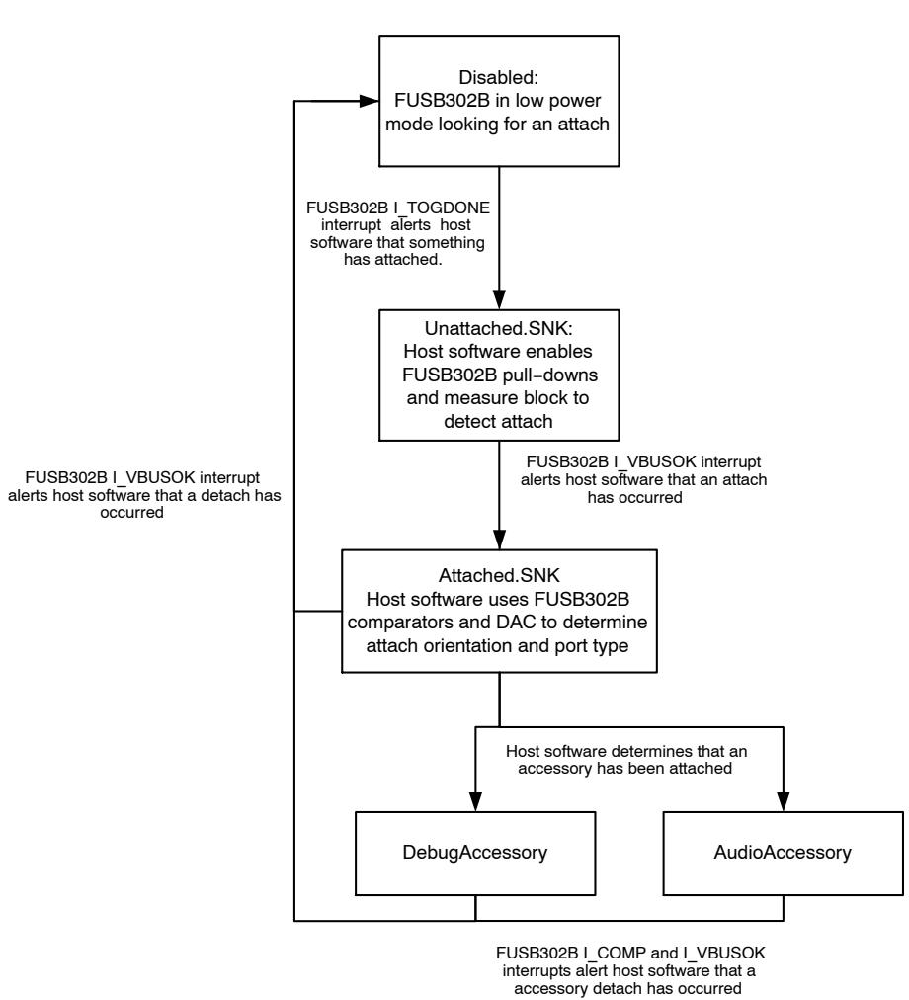  
Figure 7. SNK Software Flow

# Manual Host Detection and Configuration

When the FUSB302B is configured as a Type-C host, the software can use the status of the comparators and DAC to determine when a Type-C device has been attached or detached and what termination type has been attached to each CC pin.

The FUSB302B allows the host software to change the charging current capabilities of the port through the

HOST_CUR control bits. If the HOST_CUR bits are changed prior to attach, the FUSB302B automatically indicates the programmed current capability when a device is attached. If the current capabilities are changed after a device is attached, the FUSB302B immediately changes the CC line to the programmed capability.

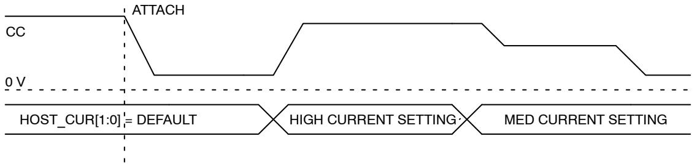  
Figure 8. HOST_CUR Changed after Attach

# FUSB302B

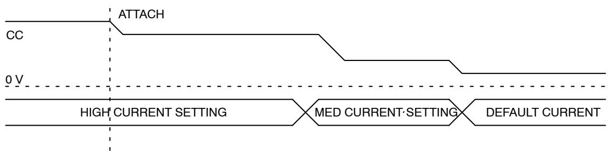  
Figure 9. HOST_CUR Changed prior to Attach

The Type-C specification outlines different attach and detach thresholds for a Type-C host that are based on how much current is supplied to each CC pin. Based on the programmed HOST_CUR setting, the software adjusts the

DAC comparator threshold to match the Type-C specification requirements. The BC_LVL comparators can also be used as part of the Ra detection flow. This is summarized in Table 6.

Table 6. HOST INTERRUPT SUMMARY   

<table><tr><td rowspan=2 colspan=1>Termination</td><td rowspan=2 colspan=1>HOST_CUR[1:0]</td><td rowspan=1 colspan=3>Interrupt Status</td><td rowspan=2 colspan=1>Attach/Detach</td></tr><tr><td rowspan=1 colspan=1>BC_LVL[1:0]</td><td rowspan=1 colspan=1>COMP</td><td rowspan=1 colspan=1>COMP Setting</td></tr><tr><td rowspan=3 colspan=1>Ra</td><td rowspan=1 colspan=1>2&#x27;b01</td><td rowspan=1 colspan=1>2&#x27;b00</td><td rowspan=1 colspan=1>NA</td><td rowspan=1 colspan=1>NA</td><td rowspan=3 colspan=1>NA</td></tr><tr><td rowspan=1 colspan=1>2&#x27;b10</td><td rowspan=1 colspan=1>2&#x27;b01</td><td rowspan=1 colspan=1>0</td><td rowspan=1 colspan=1>6&#x27;b00_1010 (0.42 V)</td></tr><tr><td rowspan=1 colspan=1>2&#x27;b11</td><td rowspan=1 colspan=1>2&#x27;b10</td><td rowspan=1 colspan=1>0</td><td rowspan=1 colspan=1>6&#x27;b01_0011 (0.8 V)</td></tr><tr><td rowspan=4 colspan=1>Rd</td><td rowspan=2 colspan=1>2&#x27;b01, 2&#x27;b10</td><td rowspan=1 colspan=1>NA</td><td rowspan=1 colspan=1>0</td><td rowspan=1 colspan=1>6&#x27;b10_0110 (1.6 V)</td><td rowspan=1 colspan=1>Attach</td></tr><tr><td rowspan=1 colspan=1>NA</td><td rowspan=1 colspan=1>1</td><td rowspan=1 colspan=1>6&#x27;b10_0110 (1.6 V)</td><td rowspan=1 colspan=1>Detach</td></tr><tr><td rowspan=2 colspan=1>2&#x27;b11</td><td rowspan=1 colspan=1>NA</td><td rowspan=1 colspan=1>0</td><td rowspan=1 colspan=1>6&#x27;b11_1110 (2.6 V)</td><td rowspan=1 colspan=1>Attach</td></tr><tr><td rowspan=1 colspan=1>NA</td><td rowspan=1 colspan=1>1</td><td rowspan=1 colspan=1>6&#x27;b11_1110 (2.6 V)</td><td rowspan=1 colspan=1>Detach</td></tr></table>

The high level software flow diagram for a Type-C Host (SRC) is shown below in Figure 10.

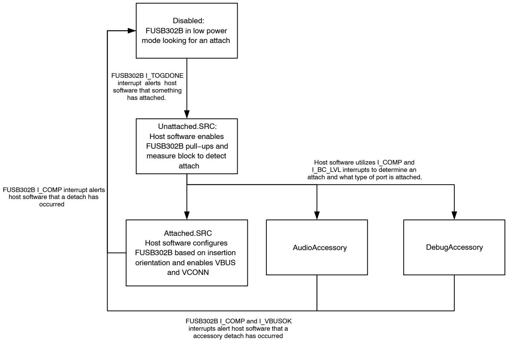  
Figure 10. SRC Software Flow

# Manual Dual-Role Detection and Configuration

The Type-C specification allows ports to be both a device and a host depending on what type of port has attached. This functionality is similar to USB OTG ports with the current USB connectors and is called a dual-role port. The

FUSB302B can be used to implement a dual-role port. A Type-C dual role port toggles between presenting as a Type-C device and a Type-C host. The host software controls the toggle time and configuration of the FUSB302B in each state as shown in Figure 11.

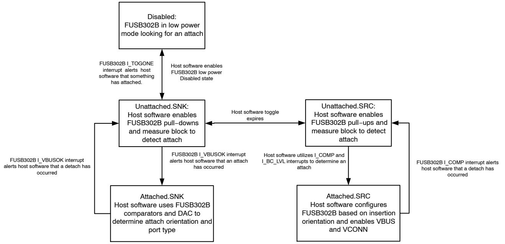  
Figure 11. DRP Software Flow

# FUSB302B

# BMC POWER DELIVERY

The Type-C connector allows USB Power Delivery (PD) to be communicated over the connected CC pin between two ports. The communication method is the BMC Power Delivery protocol and is used for many different reasons with the Type-C connector. Possible uses are outlined below.

• Negotiating and controlling charging power levels   
• Alternative Interfaces such as MHL, Display Port   
• Vendor specific interfaces for use with custom docks or accessories   
• Role swap for dual-role ports that want to switch who is the host or device   
• Communication with USB3.1 full featured cables

The FUSB302B integrates a thin BMC PD client which includes the BMC physical layer and packet FIFOs (48 bytes for transmit and 80 bytes for receive) which allows packets to be sent and received by the host software through $\mathrm { I } ^ { 2 } \mathrm { C }$ accesses. The FUSB302B allows host software to implement all features of USB BMC PD through writes and reads of the FIFO and control of the FUSB302B physical interface.

The FUSB302B uses tokens to control the transmission of BMC PD packets. These tokens are written to the transmit FIFO and control how the packet is transmitted on the CC pin. The tokens are designed to be flexible and support all aspects of the USB PD specification. The FUSB302B additionally enables control of the BMC transmitter through tokens. The transmitter can be enabled or disabled by specific token writes which allow faster packet processing by burst writing the FIFO with all the information required to transmit a packet.

The FUSB302B receiver stores the received data and the received CRC in the receive FIFO when a valid packet is received on the CC pin. The BMC receiver automatically enables the internal oscillator when an Activity is sensed on the CC pin and load to the FIFO when a packet is received. The I_ACTIVITY and I_CRC_CHK interrupts alert the host software that a valid packet was received.

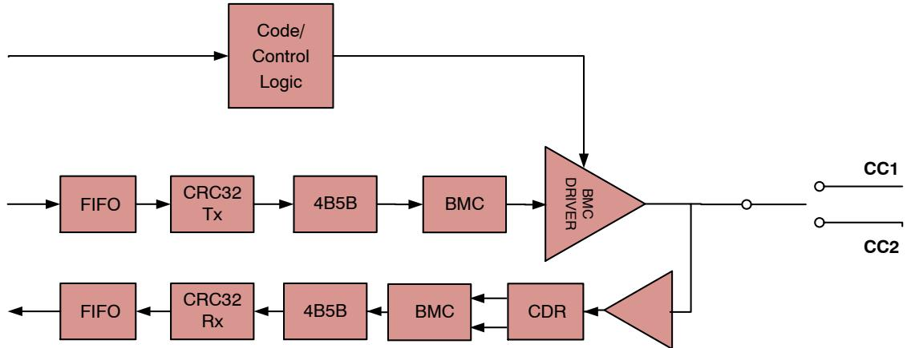  
Figure 12. USB BMC Power Delivery Blocks

# Power Level Determination

The Type-C specification outlines the order of precedence for power level determination which covers power levels from basic USB2.0 levels to the highest levels of USB PD. The host software is expected to follow the USB Type-C specification for charging current priority based on feedback from the FUSB302B detection, external BC1.2 detection and any USB Power Delivery communication.

The FUSB302B does not integrate BC1.2 charger detection which is assumed available in the USB transceiver or USB charger in the system.

# Power Up, Initialization and Reset

When power is first applied through VDD, the FUSB302B is reset and registers are initialized to the default values shown in the register map.

The FUSB302B can be reset through software by programming the SW_RES bit in the RESET register.

If no power applied to VDD then the SRC can recognize the FUSB302B as a SNK.

# PD Automatic Receive GoodCRC

The power delivery packets require a GoodCRC acknowledge packet to be sent for each received packet where the calculated CRC is the correct value. This calculation is done by the FUSB302B and triggers the I_CRC_CHK interrupt if the CRC is good. If the AUTO_CRC (Switches1 register bit) is set and AUTO_PRE $= 0$ , then the FUSB302B will automatically send the GoodCRC control packet in response to alleviate the local processor from responding quickly to the received packet. If GoodCRC is required for anything beyond SOP, then enable $\mathrm { S O P ^ { * } }$ .

# FUSB302B

# PD Send

The FUSB302B implements part of the PD protocol layer for sending packets in an autonomous fashion.

  
Figure 13.

# PD Automatic Sending Retries

If GoodCRC packet is not received and AUTO_RETRY is set, then a retry of the same message that was in the TxFIFO written by the processor is executed within tRetry and that is repeated for NRETRY times.

# PD Send Soft Reset

If the correct GoodCRC packet is still not received for all retries then I_RETRYFAIL interrupt is triggered and if AUTO_SOFT_RESET is set, then a Soft Reset packet is created (MessageID is set to 0 and the processor upon servicing I_RETRYFAIL would set the true MessageIDCounter to 0.

If this Soft Reset is sent successfully where a GoodCRC control packet is received with a MessageID $= 0$ then I_TXSENT interrupt occurs.

If not, this Soft Reset packet is retried NRETRIES times (MessageID is always 0 for all retries) if a GoodCRC acknowledge packet is not received with CRCReceiveTimer expiring (tReceive of $1 . 1 \ \mathrm { m s }$ max). If all retries fail, then I_SOFTFAIL interrupt is triggered.

# PD Send Hard Reset

If all retries of the soft reset packet fail and if AUTO_HARD_RESET is set, then a hard reset ordered set is sent by loading up the TxFIFO with RESET1, RESET1, RESET1, RESET2 and sending a hard reset. Note only one hard reset is sent since the typical retry mechanism doesn’t apply. The processor’s policy engine firmware is responsible for retrying the hard reset if it doesn’t receive the required response.

# Flush Rx-FIFO with BIST (Built-In Self Test) Test Data

During PD compliance testing, BIST test packets are used to test physical layer of the PD interface such as, frequency derivation, Amplitude measure and etc. The one BIST test data packet has 7 data objects (28byte data), header and CRC, but the message ID doesn’t change, the packet should be ignored and not acted on by the PD policy engine. The PD protocol layer does need to send a GoodCRC message back after every packet. The BIST data can arrive continuously from a tester, which could cause the FUSB302B Rx FIFO to overflow and the PD protocol layer to stop sending GoodCRC messages unless the FIFO is read or cleared quickly. The FUSB302B has a special register bit in the $\mathrm { \Delta } [ 2 \mathrm { C }$ registers, bit[5] of address 0x09, that when the bit is set, all the data received next will be flushed from the RxFIFO automatically and the PD protocol layer will keep sending GoodCRC messages back. Once BIST test is done, tester sends HardReset, so with the HardReset, processor has to write the bit back to disable. Also, if the bit can be de-selected anytime, then the coming packet has to be managed by protocol layer and policy engine.

# I 2C INTERFACE

The FUSB302B includes a full $\mathrm { I } ^ { 2 } \mathrm { C }$ slave controller. The $\mathrm { I } ^ { 2 } \mathrm { C }$ slave fully complies with the $\mathrm { I } ^ { 2 } \mathrm { C }$ specification version 6 requieremnts. This block is designed for Fast Mode Plus traffic up to 1 MHz SCL operation.

The TOGGLE features allow for very low power operation with slow clocking thus may not be fully compliant to the $1 \ : \mathrm { M H z }$ operation. Examples of an $\mathrm { I } ^ { 2 } \mathrm { C }$ write and read sequence are shown in Figure 14 and Figure 15 respectively.

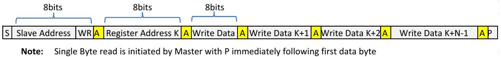  
Figure 14. I2C Write Example

# FUSB302B

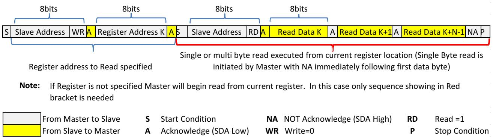  
Figure 15. I2C Read Example

Table 7. ABSOLUTE MAXIMUM RATINGS   

<table><tr><td rowspan=1 colspan=1>Symbol</td><td rowspan=1 colspan=1>Parameter</td><td rowspan=1 colspan=1>Min</td><td rowspan=1 colspan=1>Max</td><td rowspan=1 colspan=1>Unit</td></tr><tr><td rowspan=1 colspan=1>VVDD</td><td rowspan=1 colspan=1>Supply Voltage from VDD</td><td rowspan=1 colspan=1>-0.5</td><td rowspan=1 colspan=1>6.0</td><td rowspan=1 colspan=1>V</td></tr><tr><td rowspan=1 colspan=1>Vcc_HDDRP</td><td rowspan=1 colspan=1>CC pins when configured as Host, Device or Dual Role Port</td><td rowspan=1 colspan=1>-0.5</td><td rowspan=1 colspan=1>6.0</td><td rowspan=1 colspan=1>V</td></tr><tr><td rowspan=1 colspan=1>VvBUS</td><td rowspan=1 colspan=1>VBUS Supply Voltage</td><td rowspan=1 colspan=1>-0.5</td><td rowspan=1 colspan=1>28.0</td><td rowspan=1 colspan=1>V</td></tr><tr><td rowspan=1 colspan=1>TsTORAGE</td><td rowspan=1 colspan=1>Storage Temperature Range</td><td rowspan=1 colspan=1>-65</td><td rowspan=1 colspan=1>+150</td><td rowspan=1 colspan=1>°C</td></tr><tr><td rowspan=1 colspan=1>TJ</td><td rowspan=1 colspan=1>Maximum Junction Temperature</td><td rowspan=1 colspan=1>-</td><td rowspan=1 colspan=1>+150</td><td rowspan=1 colspan=1>ºC</td></tr><tr><td rowspan=1 colspan=1>TL</td><td rowspan=1 colspan=1>Lead Temperature (Soldering, 10 Seconds)</td><td rowspan=1 colspan=1>-</td><td rowspan=1 colspan=1>+260</td><td rowspan=1 colspan=1>ºC</td></tr><tr><td rowspan=2 colspan=1>ESD</td><td rowspan=1 colspan=1>Human Body Model, ANSI/ESDA/JEDEC JS-001-2012</td><td rowspan=1 colspan=1>4</td><td rowspan=1 colspan=1></td><td rowspan=2 colspan=1>kV</td></tr><tr><td rowspan=1 colspan=1>Charged Device Model, JEDEC JESD22-C101</td><td rowspan=1 colspan=1>1</td><td rowspan=1 colspan=1></td></tr></table>

Stresses exceeding those listed in the Maximum Ratings table may damage the device. If any of these limits are exceeded, device functionality should not be assumed, damage may occur and reliability may be affected.

Table 8. RECOMMENDED OPERATING CONDITIONS  

<table><tr><td rowspan=1 colspan=1>Symbol</td><td rowspan=1 colspan=1>Parameter</td><td rowspan=1 colspan=1>Min</td><td rowspan=1 colspan=1>Typ</td><td rowspan=1 colspan=1>Max</td><td rowspan=1 colspan=1>Unit</td></tr><tr><td rowspan=1 colspan=1>VvBUS</td><td rowspan=1 colspan=1>VBUS Supply Voltage</td><td rowspan=1 colspan=1>4.0</td><td rowspan=1 colspan=1>5.0</td><td rowspan=1 colspan=1>21.0</td><td rowspan=1 colspan=1>V</td></tr><tr><td rowspan=1 colspan=1>VvDD</td><td rowspan=1 colspan=1>VDD Supply Voltage</td><td rowspan=1 colspan=1>2.7 (Note 3)</td><td rowspan=1 colspan=1>3.3</td><td rowspan=1 colspan=1>5.5</td><td rowspan=1 colspan=1>V</td></tr><tr><td rowspan=1 colspan=1>VvconN</td><td rowspan=1 colspan=1>VCONN Supply Voltage</td><td rowspan=1 colspan=1>2.7</td><td rowspan=1 colspan=1></td><td rowspan=1 colspan=1>5.5</td><td rowspan=1 colspan=1>V</td></tr><tr><td rowspan=1 colspan=1>IvCoNN</td><td rowspan=1 colspan=1>VCONN Supply Current</td><td rowspan=1 colspan=1></td><td rowspan=1 colspan=1></td><td rowspan=1 colspan=1>560</td><td rowspan=1 colspan=1>mA</td></tr><tr><td rowspan=1 colspan=1>TA</td><td rowspan=1 colspan=1>Operating Temperature</td><td rowspan=1 colspan=1>-40</td><td rowspan=1 colspan=1></td><td rowspan=1 colspan=1>+85</td><td rowspan=1 colspan=1>C</td></tr><tr><td rowspan=1 colspan=1>TA</td><td rowspan=1 colspan=1>Operating Temperature (Note 11)</td><td rowspan=1 colspan=1>-40</td><td rowspan=1 colspan=1></td><td rowspan=1 colspan=1>+105</td><td rowspan=1 colspan=1>C</td></tr></table>

Functional operation above the stresses listed in the Recommended Operating Ranges is not implied. Extended exposure to stresses beyond the Recommended Operating Ranges limits may affect device reliability. 3. This is for functional operation only and not the lowest limit for all subsequent electrical specifications below. All electrical parameters have a minimum of $3 . 0 \ V$ operation.

# FUSB302B

# DC AND TRANSIENT CHARACTERISTICS

All typical values are at $\mathrm { T } _ { \mathrm { A } } = 2 5 ^ { \circ } \mathrm { C }$ unless otherwise specified.

# Table 9. BASEBAND PD

<table><tr><td rowspan=2 colspan=1>Symbol</td><td rowspan=2 colspan=1>Parameter</td><td rowspan=1 colspan=3>TA = -40 to +85°CTA = -40 to +105°C (Note 11)TJ = -40 to +125°C</td><td rowspan=2 colspan=1>Unit</td></tr><tr><td rowspan=1 colspan=1>Min</td><td rowspan=1 colspan=1>Typ</td><td rowspan=1 colspan=1>Max</td></tr><tr><td rowspan=1 colspan=1>UI</td><td rowspan=1 colspan=1>Unit Interval</td><td rowspan=1 colspan=1>3.03</td><td rowspan=1 colspan=1></td><td rowspan=1 colspan=1>3.70</td><td rowspan=1 colspan=1>μs</td></tr></table>

# TRANSMITTER

<table><tr><td rowspan=1 colspan=1>zDriver</td><td rowspan=1 colspan=1>Transmitter Output Impedance</td><td rowspan=1 colspan=1>33</td><td rowspan=1 colspan=1></td><td rowspan=1 colspan=1>75</td><td rowspan=1 colspan=1>Ω</td></tr><tr><td rowspan=1 colspan=1>tEndDriveBMC</td><td rowspan=1 colspan=1>Time  Cease Driving the Line afterhe end of the ast bf the rame</td><td rowspan=1 colspan=1></td><td rowspan=1 colspan=1></td><td rowspan=1 colspan=1>23</td><td rowspan=1 colspan=1>us</td></tr><tr><td rowspan=1 colspan=1>tHoldLowBMC</td><td rowspan=1 colspan=1>Time to Cease Driving the Line after the final High-to-Low Transition</td><td rowspan=1 colspan=1>1</td><td rowspan=1 colspan=1></td><td rowspan=1 colspan=1>-</td><td rowspan=1 colspan=1>μs</td></tr><tr><td rowspan=1 colspan=1>VoH</td><td rowspan=1 colspan=1>Logic High Voltage</td><td rowspan=1 colspan=1>1.05</td><td rowspan=1 colspan=1></td><td rowspan=1 colspan=1>1.20</td><td rowspan=1 colspan=1>V</td></tr><tr><td rowspan=1 colspan=1>VOL</td><td rowspan=1 colspan=1>Logic Low Voltage</td><td rowspan=1 colspan=1>0</td><td rowspan=1 colspan=1></td><td rowspan=1 colspan=1>75</td><td rowspan=1 colspan=1>mV</td></tr><tr><td rowspan=1 colspan=1>tStartDrive</td><td rowspan=1 colspan=1>Time before the start of the first bit of the preamble when the transmittershall start driving the line</td><td rowspan=1 colspan=1>-1</td><td rowspan=1 colspan=1></td><td rowspan=1 colspan=1>1</td><td rowspan=1 colspan=1>us</td></tr><tr><td rowspan=1 colspan=1>tRISE_TX</td><td rowspan=1 colspan=1>Rise Time</td><td rowspan=1 colspan=1>300</td><td rowspan=1 colspan=1></td><td rowspan=1 colspan=1></td><td rowspan=1 colspan=1>ns</td></tr><tr><td rowspan=1 colspan=1>tFALL_TX</td><td rowspan=1 colspan=1>Fall Time</td><td rowspan=1 colspan=1>300</td><td rowspan=1 colspan=1></td><td rowspan=1 colspan=1></td><td rowspan=1 colspan=1>ns</td></tr></table>

# RECEIVER

<table><tr><td rowspan=1 colspan=1>cReceiver</td><td rowspan=1 colspan=1>Receiver Capacitance when Driver isn&#x27;t Turned On</td><td rowspan=1 colspan=1></td><td rowspan=1 colspan=1>50</td><td rowspan=1 colspan=1></td><td rowspan=1 colspan=1>pF</td></tr><tr><td rowspan=1 colspan=1>zBmcRx</td><td rowspan=1 colspan=1>Receiver Input Impedance</td><td rowspan=1 colspan=1>1</td><td rowspan=1 colspan=1></td><td rowspan=1 colspan=1></td><td rowspan=1 colspan=1>MΩ</td></tr><tr><td rowspan=1 colspan=1>tRxFilter</td><td rowspan=1 colspan=1>Rx Bandwidth Limiting Filter (Note </td><td rowspan=1 colspan=1>100</td><td rowspan=1 colspan=1></td><td rowspan=1 colspan=1></td><td rowspan=1 colspan=1>ns</td></tr></table>

4. Guaranteed by Characterization and/or Design. Not production tested.

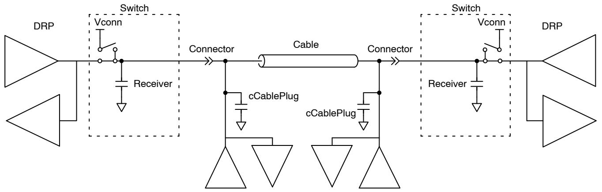  
Figure 16. Transmitter Test Load

# FUSB302B

Table 10. TYPE-C CC SWITCH   

<table><tr><td rowspan=2 colspan=1>Symbol</td><td rowspan=2 colspan=1>Parameter</td><td rowspan=1 colspan=3>TA = -40 to +85°CTA = -40 to +105°C (Note 11)Tj = -40 to +125°</td><td rowspan=2 colspan=1>Unit</td></tr><tr><td rowspan=1 colspan=1>Min</td><td rowspan=1 colspan=1>Typ</td><td rowspan=1 colspan=1>Max</td></tr><tr><td rowspan=1 colspan=1>Rsw_cCx</td><td rowspan=1 colspan=1>RDSON for SW1_CC1 and SW1_CC2, VCONN to CC1 &amp; CC2</td><td rowspan=1 colspan=1></td><td rowspan=1 colspan=1>0.4</td><td rowspan=1 colspan=1>1.2</td><td rowspan=1 colspan=1>Ω</td></tr><tr><td rowspan=1 colspan=1>Isw_ccx</td><td rowspan=1 colspan=1>Over-Current Protection (OCP) limit at which VCONN switch shuts offover the entire VCONN voltage range (OCPreg = 0Fh)</td><td rowspan=1 colspan=1>600</td><td rowspan=1 colspan=1>800</td><td rowspan=1 colspan=1>1000</td><td rowspan=1 colspan=1>mA</td></tr><tr><td rowspan=1 colspan=1>tSoftStart</td><td rowspan=1 colspan=1>Time taken for the VCONN switch to turn on during whichOver-Current Protection is disabled</td><td rowspan=1 colspan=1></td><td rowspan=1 colspan=1>1.5</td><td rowspan=1 colspan=1></td><td rowspan=1 colspan=1>ms</td></tr><tr><td rowspan=1 colspan=1>|80_CCX</td><td rowspan=1 colspan=1>SRC 80 µA CC current (Default) HOST_CUR1 = 0, HOST_CURO = 1</td><td rowspan=1 colspan=1>64</td><td rowspan=1 colspan=1>80</td><td rowspan=1 colspan=1>96</td><td rowspan=1 colspan=1>μA</td></tr><tr><td rowspan=1 colspan=1>|180_CCX</td><td rowspan=1 colspan=1>SRC 180 μA CC Current (1.5 A) HOST_CUR1 = 1, HOST_CUR0 = 0</td><td rowspan=1 colspan=1>166</td><td rowspan=1 colspan=1>180</td><td rowspan=1 colspan=1>194</td><td rowspan=1 colspan=1>μA</td></tr><tr><td rowspan=1 colspan=1>|330_CCX</td><td rowspan=1 colspan=1>SRC 330 μA CC Current (3 A) HOST_CUR1 = 1, HOST_CUR0 = 1</td><td rowspan=1 colspan=1>304</td><td rowspan=1 colspan=1>330</td><td rowspan=1 colspan=1>356</td><td rowspan=1 colspan=1>μA</td></tr><tr><td rowspan=1 colspan=1>VUFPDB</td><td rowspan=1 colspan=1>SNK Pull-down Voltage in Dead Battery under all Pull-up SRC Loads</td><td rowspan=1 colspan=1></td><td rowspan=1 colspan=1></td><td rowspan=1 colspan=1>2.18</td><td rowspan=1 colspan=1>V</td></tr><tr><td rowspan=1 colspan=1>RDEVICE</td><td rowspan=1 colspan=1>Device Pull-down Resistance (Note 5</td><td rowspan=1 colspan=1>4.6</td><td rowspan=1 colspan=1>5.1</td><td rowspan=1 colspan=1>5.6</td><td rowspan=1 colspan=1>kΩ</td></tr><tr><td rowspan=1 colspan=1>ZOPEN</td><td rowspan=1 colspan=1>CC Resistance for Disabled State</td><td rowspan=1 colspan=1>126</td><td rowspan=1 colspan=1></td><td rowspan=1 colspan=1></td><td rowspan=1 colspan=1>kΩ</td></tr><tr><td rowspan=1 colspan=1>WAKElow</td><td rowspan=1 colspan=1>Wake threshold for CC pin SRC or SNK LOW value. Assumesbandgap and wake circuit turned on ie PWR[0] = 1</td><td rowspan=1 colspan=1></td><td rowspan=1 colspan=1>0.25</td><td rowspan=1 colspan=1></td><td rowspan=1 colspan=1>V</td></tr><tr><td rowspan=1 colspan=1>WAKEhigh</td><td rowspan=1 colspan=1>Wake threshold for CC pin SRC or SNK HIGH value. Assumesbandgap and wake circuit turned on ie PWR[0] = 1</td><td rowspan=1 colspan=1></td><td rowspan=1 colspan=1>1.45</td><td rowspan=1 colspan=1></td><td rowspan=1 colspan=1>V</td></tr><tr><td rowspan=1 colspan=1>vBC_LVLhys</td><td rowspan=1 colspan=1>Hysteresis on the Ra and Rd Comparators (Note 7)</td><td rowspan=1 colspan=1></td><td rowspan=1 colspan=1>20</td><td rowspan=1 colspan=1></td><td rowspan=1 colspan=1>mV</td></tr><tr><td rowspan=1 colspan=1>vBC_LVL</td><td rowspan=1 colspan=1>CC Pin Thresholds, Assumes PWR = 4&#x27;h7BC = 2&#x27;b00BC = 2&#x27;b01BC = 2&#x27;b10</td><td rowspan=1 colspan=1>0.150.611.16</td><td rowspan=1 colspan=1>0.200.661.23</td><td rowspan=1 colspan=1>0.250.7011.31</td><td rowspan=1 colspan=1>V</td></tr><tr><td rowspan=1 colspan=1>vMDACstepCC</td><td rowspan=1 colspan=1>Measure block MDAC step size for each code in MDAC[5:0] register</td><td rowspan=1 colspan=1>-</td><td rowspan=1 colspan=1>42</td><td rowspan=1 colspan=1>-</td><td rowspan=1 colspan=1>mV</td></tr><tr><td rowspan=1 colspan=1>vMDACstepVBUS</td><td rowspan=1 colspan=1>Measure block MDAC step size for each code in MDAC[5:0] registerfor VBUS measurement</td><td rowspan=1 colspan=1></td><td rowspan=1 colspan=1>420</td><td rowspan=1 colspan=1>-</td><td rowspan=1 colspan=1>mV</td></tr><tr><td rowspan=1 colspan=1>VVBUSthr</td><td rowspan=1 colspan=1>VBUS threshold at which I_VBUSOK interrupt is triggered. Assumesmeasure block on ie PWR[2] = 1</td><td rowspan=1 colspan=1>-</td><td rowspan=1 colspan=1></td><td rowspan=1 colspan=1>4.0</td><td rowspan=1 colspan=1>V</td></tr><tr><td rowspan=1 colspan=1>tTOG1</td><td rowspan=1 colspan=1>When TOGGLE = 1, time at which internal versions ofPU_EN1 = PU_EN2 = 0 and PWDN1 = PDWN2 = 1 selected topresent externally as a SNK in the DRP toggle</td><td rowspan=1 colspan=1>30</td><td rowspan=1 colspan=1>45</td><td rowspan=1 colspan=1>60</td><td rowspan=1 colspan=1>ms</td></tr><tr><td rowspan=1 colspan=1>tTOG2</td><td rowspan=1 colspan=1>When TOGGLE = 1, time at which internal versions of PU_EN1 = 1or PU_EN2 = 1 and PWDN1 = PDWN2 = 0 selected to presentexternally as a SRC in the DRP toggle</td><td rowspan=1 colspan=1>20</td><td rowspan=1 colspan=1>30</td><td rowspan=1 colspan=1>40</td><td rowspan=1 colspan=1>ms</td></tr><tr><td rowspan=1 colspan=1>tDIS</td><td rowspan=1 colspan=1>Disable time after a full toggle (tTOG1 + tTOG2) cycle so as to savepowerTOG_SAVE_PWR2:1 = 00TOG_SAVE_PWR2:1 = 01TOG_SAVE_PWR2:1 = 10TOG_SAVE_PWR2:1 = 11</td><td rowspan=1 colspan=1></td><td rowspan=1 colspan=1>04080160</td><td rowspan=1 colspan=1></td><td rowspan=1 colspan=1>ms</td></tr><tr><td rowspan=1 colspan=1>Tshut</td><td rowspan=1 colspan=1>Temp. for Vconn Switch Off</td><td rowspan=1 colspan=1></td><td rowspan=1 colspan=1>145</td><td rowspan=1 colspan=1></td><td rowspan=1 colspan=1>C</td></tr><tr><td rowspan=1 colspan=1>Thys</td><td rowspan=1 colspan=1>Temp. Hysteresis for Vconn Switch Turn On</td><td rowspan=1 colspan=1></td><td rowspan=1 colspan=1>10</td><td rowspan=1 colspan=1></td><td rowspan=1 colspan=1>C</td></tr></table>

5. RDEVICE minimum and maximum specifications are only guaranteed when power is applied.

# FUSB302B

Table 11. CURRENT CONSUMPTION  

<table><tr><td rowspan=2 colspan=1>Symbol</td><td rowspan=2 colspan=1>Parameter</td><td rowspan=2 colspan=1>VDD (V)</td><td rowspan=2 colspan=1>Conditions</td><td rowspan=1 colspan=3>TA = -40 to +85°CTA = -40 to +105°C (Note 11)Tj = -40 to +125°C</td><td rowspan=2 colspan=1>Unit</td></tr><tr><td rowspan=1 colspan=1>Min</td><td rowspan=1 colspan=1>Typ</td><td rowspan=1 colspan=1>Max</td></tr><tr><td rowspan=1 colspan=1>Idisable</td><td rowspan=1 colspan=1>Disabled Current</td><td rowspan=1 colspan=1>3.0 to 5.5</td><td rowspan=1 colspan=1>Nothing Attached,No I2C Transactions</td><td rowspan=1 colspan=1></td><td rowspan=1 colspan=1>0.37</td><td rowspan=1 colspan=1>5.0</td><td rowspan=1 colspan=1>μA</td></tr><tr><td rowspan=1 colspan=1>Idisable</td><td rowspan=1 colspan=1>Disabled Current(Note 11)</td><td rowspan=1 colspan=1>3.0 to 5.5</td><td rowspan=1 colspan=1>Nothing Attached,No I2C Transactions</td><td rowspan=1 colspan=1></td><td rowspan=1 colspan=1>0.37</td><td rowspan=1 colspan=1>8.5</td><td rowspan=1 colspan=1>μA</td></tr><tr><td rowspan=1 colspan=1>Itog</td><td rowspan=1 colspan=1>Unattached (standby)Toggle Current</td><td rowspan=1 colspan=1>3.0 to 5.5</td><td rowspan=1 colspan=1>Nothing attached,TOGGLE = 1,PWR[3:0] = 1h,WAKE_EN = 0,TOG_SAVE_PWR2:1 = 01</td><td rowspan=1 colspan=1></td><td rowspan=1 colspan=1>25</td><td rowspan=1 colspan=1>40</td><td rowspan=1 colspan=1>μA</td></tr><tr><td rowspan=1 colspan=1>Ipd_stby_meas</td><td rowspan=1 colspan=1>BMC PD StandbyCurrent</td><td rowspan=1 colspan=1>3.0 to 5.5</td><td rowspan=1 colspan=1>Device Attached, BMC PDActive But Not Sending orReceiving Anything,PWR[3:0] = 7h</td><td rowspan=1 colspan=1></td><td rowspan=1 colspan=1>40</td><td rowspan=1 colspan=1></td><td rowspan=1 colspan=1>μA</td></tr></table>

Table 12. USB PD SPECIFIC PARAMETERS   

<table><tr><td rowspan=2 colspan=1>Symbol</td><td rowspan=2 colspan=1>Parameter</td><td rowspan=1 colspan=3>TA = -40 to +85°CTA = -40 to +105°C (Note 11)Tj = -40 to +125°</td><td rowspan=2 colspan=1>Unit</td></tr><tr><td rowspan=1 colspan=1>Min</td><td rowspan=1 colspan=1>Typ</td><td rowspan=1 colspan=1>Max</td></tr><tr><td rowspan=1 colspan=1>tHardReset</td><td rowspan=1 colspan=1>If a Soft Reset message fails, a Hard Reset is sent after tHardReset ofCRCReceiveTimer expiring</td><td rowspan=1 colspan=1></td><td rowspan=1 colspan=1></td><td rowspan=1 colspan=1>5</td><td rowspan=1 colspan=1>ms</td></tr><tr><td rowspan=1 colspan=1>tHardResetCComplete</td><td rowspan=1 colspan=1>If the FUSB302B cannot send a Hard Reset within tHardResetCompletetime because of a busy line, then a I_HARDFAIL interrupt is triggered</td><td rowspan=1 colspan=1></td><td rowspan=1 colspan=1></td><td rowspan=1 colspan=1>5</td><td rowspan=1 colspan=1>ms</td></tr><tr><td rowspan=1 colspan=1>tReceive</td><td rowspan=1 colspan=1>This is the value for which the CRCReceiveTimer expires.The CRCReceiveTimer is started upon the last bit of the EOP of thetransmitted packet</td><td rowspan=1 colspan=1>0.9</td><td rowspan=1 colspan=1></td><td rowspan=1 colspan=1>1.1</td><td rowspan=1 colspan=1>ms</td></tr><tr><td rowspan=1 colspan=1>tRetry</td><td rowspan=1 colspan=1>Once the CRCReceiveTimer expires, a retry packet has to be sent outwithin tRetry time. This time is hard to separate externally from tReceivesince they both happen sequentially with no visible difference in the CCoutput</td><td rowspan=1 colspan=1></td><td rowspan=1 colspan=1></td><td rowspan=1 colspan=1>75</td><td rowspan=1 colspan=1>μs</td></tr><tr><td rowspan=1 colspan=1>tSoftReset</td><td rowspan=1 colspan=1>If a GoodCRC packet is not received within tReceive for NRETRIES thena Soft Reset packet is sent within tSoftReset time.</td><td rowspan=1 colspan=1></td><td rowspan=1 colspan=1></td><td rowspan=1 colspan=1>5</td><td rowspan=1 colspan=1>ms</td></tr><tr><td rowspan=1 colspan=1>tTransmit</td><td rowspan=1 colspan=1>From receiving a packet, we have to send a GoodCRC in response withintTransmit time. It is measured from the last bit of the EOP of the receivedpacket to the first bit sent of the preamble of the GoodCRC packet</td><td rowspan=1 colspan=1></td><td rowspan=1 colspan=1></td><td rowspan=1 colspan=1>195</td><td rowspan=1 colspan=1>μs</td></tr></table>

Table 13. IO SPECIFICATIONS   

<table><tr><td rowspan=2 colspan=1>Symbol</td><td rowspan=2 colspan=1>Parameter</td><td rowspan=2 colspan=1>VDD (V)</td><td rowspan=2 colspan=1>Conditions</td><td rowspan=1 colspan=3>TA = -40 to +85°CTA = -40 to +105°C (Note 11)TJ = -40 to +125°C</td><td rowspan=2 colspan=1>Unit</td></tr><tr><td rowspan=1 colspan=1>Min</td><td rowspan=1 colspan=1>Typ</td><td rowspan=1 colspan=1>Max</td></tr></table>

# HOST INTERFACE PINS (INT_N)

<table><tr><td rowspan=1 colspan=1>VOLintN</td><td rowspan=1 colspan=1>Output Low Voltage</td><td rowspan=1 colspan=1>3.0 to 5.5</td><td rowspan=1 colspan=1>IOL = 4 mA</td><td rowspan=1 colspan=1></td><td rowspan=1 colspan=1></td><td rowspan=1 colspan=1>0.4</td><td rowspan=1 colspan=1>V</td></tr><tr><td rowspan=1 colspan=1>TinT_Mask</td><td rowspan=1 colspan=1>Time from global interruptmask bit cleared to whenINT_N goes LOW</td><td rowspan=1 colspan=1>3.0 to 5.5</td><td rowspan=1 colspan=1></td><td rowspan=1 colspan=1>50</td><td rowspan=1 colspan=1></td><td rowspan=1 colspan=1></td><td rowspan=1 colspan=1>μs</td></tr></table>

# I 2C INTERFACE PINS – STANDARD, FAST, OR FAST MODE PLUS SPEED MODE (SDA, SCL) (Note 6)

<table><tr><td rowspan=1 colspan=1>VILI2C</td><td rowspan=1 colspan=1>Low-Level Input Voltage</td><td rowspan=1 colspan=1>3.0 to 5.5</td><td rowspan=1 colspan=1></td><td rowspan=1 colspan=1></td><td rowspan=1 colspan=1></td><td rowspan=1 colspan=1>0.51</td><td rowspan=1 colspan=1>V</td></tr><tr><td rowspan=1 colspan=1>VIHI2C</td><td rowspan=1 colspan=1>High-Level Input Voltage</td><td rowspan=1 colspan=1>3.0 to 5.5</td><td rowspan=1 colspan=1></td><td rowspan=1 colspan=1>1.32</td><td rowspan=1 colspan=1></td><td rowspan=1 colspan=1></td><td rowspan=1 colspan=1>V</td></tr></table>

# FUSB302B

Table 13. IO SPECIFICATIONS   

<table><tr><td rowspan=2 colspan=1>Symbol</td><td rowspan=2 colspan=1>Parameter</td><td rowspan=2 colspan=1>VDD (V)</td><td rowspan=2 colspan=1>Conditions</td><td rowspan=1 colspan=3>TA = -40 to +85°CTA = -40 to +105°C (Note 11)TJ = -40 to +125°C</td><td rowspan=2 colspan=1>Unit</td></tr><tr><td rowspan=1 colspan=1>Min</td><td rowspan=1 colspan=1>Typ</td><td rowspan=1 colspan=1>Max</td></tr></table>

I 2C INTERFACE PINS – STANDARD, FAST, OR FAST MODE PLUS SPEED MODE (SDA, SCL) (Note 6)   

<table><tr><td rowspan=1 colspan=1>VHYS</td><td rowspan=1 colspan=1>Hysteresis of SchmittTrigger Inputs</td><td rowspan=1 colspan=1>3.0 to 5.5</td><td rowspan=1 colspan=1></td><td rowspan=1 colspan=1>94</td><td rowspan=1 colspan=1></td><td rowspan=1 colspan=1></td><td rowspan=1 colspan=1>mV</td></tr><tr><td rowspan=1 colspan=1>I2C</td><td rowspan=1 colspan=1>Input Current of SDA andSCL Pins</td><td rowspan=1 colspan=1>3.0 to 5.5</td><td rowspan=1 colspan=1>Input Voltage 0.26 V to 2.0 V</td><td rowspan=1 colspan=1>-10</td><td rowspan=1 colspan=1></td><td rowspan=1 colspan=1>10</td><td rowspan=1 colspan=1>μA</td></tr><tr><td rowspan=1 colspan=1>ICCTI2C</td><td rowspan=1 colspan=1>VDD Current when SDA orSCL is HIGH</td><td rowspan=1 colspan=1>3.0 to 5.5</td><td rowspan=1 colspan=1>Input Voltage 1.8 V</td><td rowspan=1 colspan=1>-10</td><td rowspan=1 colspan=1>1</td><td rowspan=1 colspan=1>10</td><td rowspan=1 colspan=1>μA</td></tr><tr><td rowspan=1 colspan=1>VOLsDA</td><td rowspan=1 colspan=1>Low-Level Output Voltage(Open-Drain)</td><td rowspan=1 colspan=1>3.0 to 5.5</td><td rowspan=1 colspan=1>IOL = 2 mA</td><td rowspan=1 colspan=1>0</td><td rowspan=1 colspan=1></td><td rowspan=1 colspan=1>0.35</td><td rowspan=1 colspan=1>V</td></tr><tr><td rowspan=1 colspan=1>IOLSDA</td><td rowspan=1 colspan=1>Low-Level Output Current(Open-Drain)</td><td rowspan=1 colspan=1>3.0 to 5.5</td><td rowspan=1 colspan=1>VOLsda = 0.4 V</td><td rowspan=1 colspan=1>20</td><td rowspan=1 colspan=1></td><td rowspan=1 colspan=1></td><td rowspan=1 colspan=1>mA</td></tr><tr><td rowspan=1 colspan=1>CI</td><td rowspan=1 colspan=1>Capacitance for Each I/0in(Note 7)</td><td rowspan=1 colspan=1>3.0 to 5.5</td><td rowspan=1 colspan=1></td><td rowspan=1 colspan=1></td><td rowspan=1 colspan=1>5</td><td rowspan=1 colspan=1></td><td rowspan=1 colspan=1>pF</td></tr></table>

6. I2C pull up voltage is required to be between 1.71 V and $\mathsf { V } _ { \mathsf { D D } }$

# Table 14. I2C SPECIFICATIONS FAST MODE PLUS $\mathsf { P C }$ SPECIFICATIONS

<table><tr><td rowspan=2 colspan=1>Symbol</td><td rowspan=2 colspan=1>Parameter</td><td rowspan=1 colspan=2>Fast Mode Plus</td><td rowspan=2 colspan=1>Unit</td></tr><tr><td rowspan=1 colspan=1>Min</td><td rowspan=1 colspan=1>Max</td></tr><tr><td rowspan=1 colspan=1>fscL</td><td rowspan=1 colspan=1>I2C_SCL Clock Frequency</td><td rowspan=1 colspan=1>0</td><td rowspan=1 colspan=1>1000</td><td rowspan=1 colspan=1>kHz</td></tr><tr><td rowspan=1 colspan=1>tHD;STA</td><td rowspan=1 colspan=1>Hold Time (Repeated) START Condition</td><td rowspan=1 colspan=1>0.26</td><td rowspan=1 colspan=1></td><td rowspan=1 colspan=1>μs</td></tr><tr><td rowspan=1 colspan=1>tLOW</td><td rowspan=1 colspan=1>Low Period of I2C_SCL Clock</td><td rowspan=1 colspan=1>0.5</td><td rowspan=1 colspan=1></td><td rowspan=1 colspan=1>μs</td></tr><tr><td rowspan=1 colspan=1>tHIGH</td><td rowspan=1 colspan=1>High Period of I2C_SCL Clock</td><td rowspan=1 colspan=1>0.26</td><td rowspan=1 colspan=1>-</td><td rowspan=1 colspan=1>μs</td></tr><tr><td rowspan=1 colspan=1>tsU;STA</td><td rowspan=1 colspan=1>Set-up Time for Repeated START Condition</td><td rowspan=1 colspan=1>0.26</td><td rowspan=1 colspan=1></td><td rowspan=1 colspan=1>μs</td></tr><tr><td rowspan=1 colspan=1>tHD;DAT</td><td rowspan=1 colspan=1>Data Hold Time</td><td rowspan=1 colspan=1>0</td><td rowspan=1 colspan=1></td><td rowspan=1 colspan=1>μs</td></tr><tr><td rowspan=1 colspan=1>tSU;DAT</td><td rowspan=1 colspan=1>Data Set-up Time</td><td rowspan=1 colspan=1>50</td><td rowspan=1 colspan=1></td><td rowspan=1 colspan=1>ns</td></tr><tr><td rowspan=1 colspan=1>tr</td><td rowspan=1 colspan=1>Rise Time of I2C_SDA and I2C_SCL Signals (Note 7)</td><td rowspan=1 colspan=1>-</td><td rowspan=1 colspan=1>120</td><td rowspan=1 colspan=1>ns</td></tr><tr><td rowspan=1 colspan=1>tf</td><td rowspan=1 colspan=1>Fall Time of I2C_SDA and I2C_SCL Signals (Note 7)</td><td rowspan=1 colspan=1>6</td><td rowspan=1 colspan=1>120</td><td rowspan=1 colspan=1>ns</td></tr><tr><td rowspan=1 colspan=1>tSU;STO</td><td rowspan=1 colspan=1>Set-up Time for STOP Condition</td><td rowspan=1 colspan=1>0.26</td><td rowspan=1 colspan=1>-</td><td rowspan=1 colspan=1>μs</td></tr><tr><td rowspan=1 colspan=1>tBUF</td><td rowspan=1 colspan=1>Bus-Free Time between STOP and START Conditions (Note 7)</td><td rowspan=1 colspan=1>0.5</td><td rowspan=1 colspan=1></td><td rowspan=1 colspan=1>μs</td></tr><tr><td rowspan=1 colspan=1>tsp</td><td rowspan=1 colspan=1>Pulse Width of Spikes that Must Be Suppressed by the Input Filter</td><td rowspan=1 colspan=1>0</td><td rowspan=1 colspan=1>50</td><td rowspan=1 colspan=1>ns</td></tr><tr><td rowspan=1 colspan=1>Cb</td><td rowspan=1 colspan=1>Capacitive Load for each Bus Line (Note 7</td><td rowspan=1 colspan=1>-</td><td rowspan=1 colspan=1>550</td><td rowspan=1 colspan=1>pF</td></tr><tr><td rowspan=1 colspan=1>tVD-DAT</td><td rowspan=1 colspan=1>Data Valid Time for Data from SCL LOW to SDA HIGH or LOW Output (Note 7)</td><td rowspan=1 colspan=1>0</td><td rowspan=1 colspan=1>0.45</td><td rowspan=1 colspan=1>μs</td></tr><tr><td rowspan=1 colspan=1>tvD-ACK</td><td rowspan=1 colspan=1>Data Valid Time for acknowledge from SCL LOW to SDA HIGH or LOW OutputNNote 7)</td><td rowspan=1 colspan=1>0</td><td rowspan=1 colspan=1>0.45</td><td rowspan=1 colspan=1>us</td></tr><tr><td rowspan=1 colspan=1>VnL</td><td rowspan=1 colspan=1>Noise Margin at the LOW Level (Note 7)</td><td rowspan=1 colspan=1>0.2</td><td rowspan=1 colspan=1></td><td rowspan=1 colspan=1>V</td></tr><tr><td rowspan=1 colspan=1>VnH</td><td rowspan=1 colspan=1>Noise Margin at the HIGH Level (Note 7)</td><td rowspan=1 colspan=1>0.4</td><td rowspan=1 colspan=1></td><td rowspan=1 colspan=1>V</td></tr></table>

7. Guaranteed by Characterization and/or Design. Not production tested.

# FUSB302B

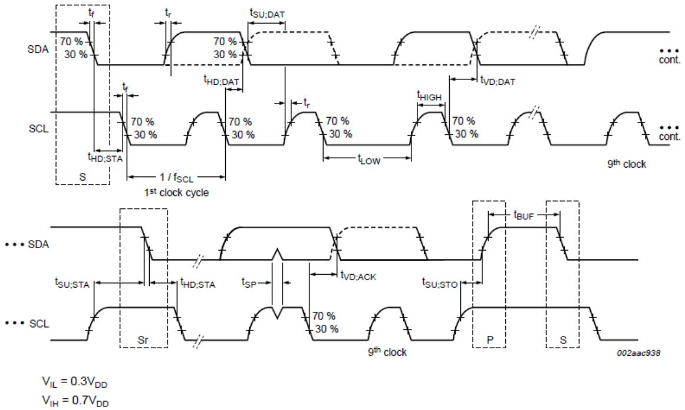  
Figure 17. Definition of Timing for Full-Speed Mode Devices on the $\mathtt { P C }$ Bus

Table 15. $\mathtt { P C }$ SLAVE ADDRESS   

<table><tr><td rowspan=1 colspan=1>Name</td><td rowspan=1 colspan=1>Bit 7</td><td rowspan=1 colspan=1>Bit 6</td><td rowspan=1 colspan=1>Bit 5</td><td rowspan=1 colspan=1>Bit 4</td><td rowspan=1 colspan=1>Bit 3</td><td rowspan=1 colspan=1>Bit 2</td><td rowspan=1 colspan=1>Bit 1</td><td rowspan=1 colspan=1>Bit 0</td></tr><tr><td rowspan=1 colspan=1>FUSB302BUCX,FUSB302BMPX,FUSB302BVMPX</td><td rowspan=1 colspan=1>0</td><td rowspan=1 colspan=1>1</td><td rowspan=1 colspan=1>0</td><td rowspan=1 colspan=1>0</td><td rowspan=1 colspan=1>0</td><td rowspan=1 colspan=1>1</td><td rowspan=1 colspan=1>0</td><td rowspan=1 colspan=1>R/W</td></tr><tr><td rowspan=1 colspan=1>FUSB302B01MPX</td><td rowspan=1 colspan=1>0</td><td rowspan=1 colspan=1>1</td><td rowspan=1 colspan=1>0</td><td rowspan=1 colspan=1>0</td><td rowspan=1 colspan=1>0</td><td rowspan=1 colspan=1>1</td><td rowspan=1 colspan=1>1</td><td rowspan=1 colspan=1>R/W</td></tr><tr><td rowspan=1 colspan=1>FUSB302B10MPX</td><td rowspan=1 colspan=1>0</td><td rowspan=1 colspan=1>1</td><td rowspan=1 colspan=1>0</td><td rowspan=1 colspan=1>0</td><td rowspan=1 colspan=1>1</td><td rowspan=1 colspan=1>0</td><td rowspan=1 colspan=1>0</td><td rowspan=1 colspan=1>R/W</td></tr><tr><td rowspan=1 colspan=1>FUSB302B11MPX</td><td rowspan=1 colspan=1>0</td><td rowspan=1 colspan=1>1</td><td rowspan=1 colspan=1>0</td><td rowspan=1 colspan=1>0</td><td rowspan=1 colspan=1>1</td><td rowspan=1 colspan=1>0</td><td rowspan=1 colspan=1>1</td><td rowspan=1 colspan=1>R/W</td></tr></table>

Table 16. REGISTER DEFINITIONS (Notes 8 and 9)   

<table><tr><td rowspan=1 colspan=1>Address</td><td rowspan=1 colspan=1>RegisterName</td><td rowspan=1 colspan=1>Type</td><td rowspan=1 colspan=1>RegValue</td><td rowspan=1 colspan=1>Bit 7</td><td rowspan=1 colspan=1>Bit 6</td><td rowspan=1 colspan=1>Bit 5</td><td rowspan=1 colspan=1>Bit 4</td><td rowspan=1 colspan=1>Bit 3</td><td rowspan=1 colspan=1>Bit 2</td><td rowspan=1 colspan=1>Bit 1</td><td rowspan=1 colspan=1>Bit 0</td></tr><tr><td rowspan=1 colspan=1>0x01</td><td rowspan=1 colspan=1>Device ID</td><td rowspan=1 colspan=1>R</td><td rowspan=1 colspan=1>9X</td><td rowspan=1 colspan=4>Version ID[3:0]</td><td rowspan=1 colspan=2>Product ID[1:0]</td><td rowspan=1 colspan=2>Revision ID[1:0]</td></tr><tr><td rowspan=1 colspan=1>0x02</td><td rowspan=1 colspan=1>Switches0</td><td rowspan=1 colspan=1>R/W</td><td rowspan=1 colspan=1>3</td><td rowspan=1 colspan=1>PU_EN2</td><td rowspan=1 colspan=1>PU_EN1</td><td rowspan=1 colspan=1>VCONN_C2</td><td rowspan=1 colspan=1>VCONN_C1</td><td rowspan=1 colspan=1>MEAS_MCC</td><td rowspan=1 colspan=1>MEAS_MC1</td><td rowspan=1 colspan=1>PDWN2</td><td rowspan=1 colspan=1>PDWN1</td></tr><tr><td rowspan=1 colspan=1>0x03</td><td rowspan=1 colspan=1>Switches1</td><td rowspan=1 colspan=1>R/W</td><td rowspan=1 colspan=1>20</td><td rowspan=1 colspan=1>POWERROLE</td><td rowspan=1 colspan=1>SPECREV1</td><td rowspan=1 colspan=1>SPECREVO</td><td rowspan=1 colspan=1>DATAROLE</td><td rowspan=1 colspan=1></td><td rowspan=1 colspan=1>AUTO_CRC</td><td rowspan=1 colspan=1>TXCC2</td><td rowspan=1 colspan=1>TXCC1</td></tr><tr><td rowspan=1 colspan=1>0x04</td><td rowspan=1 colspan=1>Measure</td><td rowspan=1 colspan=1>R/W</td><td rowspan=1 colspan=1>31</td><td rowspan=1 colspan=1></td><td rowspan=1 colspan=1>MEAS_M BUS</td><td rowspan=1 colspan=1>MDAC5</td><td rowspan=1 colspan=1>MDAC4</td><td rowspan=1 colspan=1>MDAC3</td><td rowspan=1 colspan=1>MDAC2</td><td rowspan=1 colspan=1>MDAC1</td><td rowspan=1 colspan=1>MDACO</td></tr><tr><td rowspan=1 colspan=1>0x05</td><td rowspan=1 colspan=1>Slice</td><td rowspan=1 colspan=1>R/W</td><td rowspan=1 colspan=1>60</td><td rowspan=1 colspan=1>SDAC_ HYS</td><td rowspan=1 colspan=1>SDAC_HYS</td><td rowspan=1 colspan=1>SDAC5</td><td rowspan=1 colspan=1>SDAC4</td><td rowspan=1 colspan=1>SDAC3</td><td rowspan=1 colspan=1>SDAC2</td><td rowspan=1 colspan=1>SDAC1</td><td rowspan=1 colspan=1>SDACO</td></tr><tr><td rowspan=1 colspan=1>0x06</td><td rowspan=1 colspan=1>Control0</td><td rowspan=1 colspan=1>R/W/C</td><td rowspan=1 colspan=1>24</td><td rowspan=1 colspan=1></td><td rowspan=1 colspan=1>TX_FLUSH</td><td rowspan=1 colspan=1>INT_MASK</td><td rowspan=1 colspan=1></td><td rowspan=1 colspan=1>HOSTCUR</td><td rowspan=1 colspan=1>HOSTCUROO</td><td rowspan=1 colspan=1>AUTO_APRE</td><td rowspan=1 colspan=1>TX_START</td></tr><tr><td rowspan=1 colspan=1>0x07</td><td rowspan=1 colspan=1>Control1</td><td rowspan=1 colspan=1>R//C</td><td rowspan=1 colspan=1>0</td><td rowspan=1 colspan=1></td><td rowspan=1 colspan=1>ENSOP2DB</td><td rowspan=1 colspan=1>ENSOP1DB</td><td rowspan=1 colspan=1>BISTMODE2</td><td rowspan=1 colspan=1></td><td rowspan=1 colspan=1>RX_LUSH</td><td rowspan=1 colspan=1>ENSOP2</td><td rowspan=1 colspan=1>ENSOP1</td></tr><tr><td rowspan=1 colspan=1>0x08</td><td rowspan=1 colspan=1>Control2</td><td rowspan=1 colspan=1>R/W</td><td rowspan=1 colspan=1>2</td><td rowspan=1 colspan=1>TOGSAVE WR2</td><td rowspan=1 colspan=1>TOG_AVEPWRT</td><td rowspan=1 colspan=1>TOG_RD_ONLY</td><td rowspan=1 colspan=1></td><td rowspan=1 colspan=1>WAKE_EN</td><td rowspan=1 colspan=2>MODE[1:0]</td><td rowspan=1 colspan=1>TOGGLE</td></tr><tr><td rowspan=2 colspan=1>0x09</td><td rowspan=2 colspan=1>Control3</td><td rowspan=2 colspan=1>R/W</td><td rowspan=2 colspan=1>6</td><td rowspan=2 colspan=1></td><td rowspan=1 colspan=1>SENDHARD</td><td rowspan=2 colspan=1>BISTMODE</td><td rowspan=2 colspan=1>AUTO_HARD RESET</td><td rowspan=1 colspan=1>AUTO_</td><td rowspan=2 colspan=2>N_RETRIES[1:0]</td><td rowspan=2 colspan=1>AUTO_ RETRY</td></tr><tr><td rowspan=1 colspan=1>RESET</td><td rowspan=1 colspan=1>SOF TRES</td></tr></table>

# FUSB302B

Table 16. REGISTER DEFINITIONS (Notes 8 and 9)   

<table><tr><td rowspan=1 colspan=1>Address</td><td rowspan=1 colspan=1>RegisterName</td><td rowspan=1 colspan=1>Type</td><td rowspan=1 colspan=1>RegValue</td><td rowspan=1 colspan=1>Bit 7</td><td rowspan=1 colspan=1>Bit 6</td><td rowspan=1 colspan=1>Bit 5</td><td rowspan=1 colspan=1>Bit 4</td><td rowspan=1 colspan=1>Bit 3</td><td rowspan=1 colspan=1>Bit 2</td><td rowspan=1 colspan=1>Bit 1</td><td rowspan=1 colspan=1>Bit 0</td></tr><tr><td rowspan=1 colspan=1>0x0A</td><td rowspan=1 colspan=1>Mask1</td><td rowspan=1 colspan=1>R/W</td><td rowspan=1 colspan=1>0</td><td rowspan=1 colspan=1>MVBÜSOK</td><td rowspan=1 colspan=1>M_ACTIVITY</td><td rowspan=1 colspan=1>M_COMP_CHING</td><td rowspan=1 colspan=1>M_CRC_CHK</td><td rowspan=1 colspan=1>M_ALERT</td><td rowspan=1 colspan=1>M_WAKE</td><td rowspan=1 colspan=1>MCOLLISION</td><td rowspan=1 colspan=1>M_BC_LVL</td></tr><tr><td rowspan=1 colspan=1>0x0B</td><td rowspan=1 colspan=1>Power</td><td rowspan=1 colspan=1>R/W</td><td rowspan=1 colspan=1>1</td><td rowspan=1 colspan=1></td><td rowspan=1 colspan=1></td><td rowspan=1 colspan=1></td><td rowspan=1 colspan=1></td><td rowspan=1 colspan=1>PWR3</td><td rowspan=1 colspan=1>PWR2</td><td rowspan=1 colspan=1>PWR1</td><td rowspan=1 colspan=1>PWRO</td></tr><tr><td rowspan=1 colspan=1>0x0C</td><td rowspan=1 colspan=1>Reset</td><td rowspan=1 colspan=1>W/C</td><td rowspan=1 colspan=1>0</td><td rowspan=1 colspan=1></td><td rowspan=1 colspan=1></td><td rowspan=1 colspan=1></td><td rowspan=1 colspan=1></td><td rowspan=1 colspan=1></td><td rowspan=1 colspan=1></td><td rowspan=1 colspan=1>PD_RESET</td><td rowspan=1 colspan=1>SW_RES</td></tr><tr><td rowspan=1 colspan=1>0x0D</td><td rowspan=1 colspan=1>OCPreg</td><td rowspan=1 colspan=1>R/W</td><td rowspan=1 colspan=1>OF</td><td rowspan=1 colspan=1></td><td rowspan=1 colspan=1></td><td rowspan=1 colspan=1></td><td rowspan=1 colspan=1></td><td rowspan=1 colspan=1>OCP_ ANGE</td><td rowspan=1 colspan=1>OCP_ CUR2</td><td rowspan=1 colspan=1>OCP_CURT</td><td rowspan=1 colspan=1>OCP_ CUR</td></tr><tr><td rowspan=1 colspan=1>0x0E</td><td rowspan=1 colspan=1>Maska</td><td rowspan=1 colspan=1>R/W</td><td rowspan=1 colspan=1>0</td><td rowspan=1 colspan=1>M_OCP_ TEMP</td><td rowspan=1 colspan=1>M_TOGDONE</td><td rowspan=1 colspan=1>M_SOFTFAIL</td><td rowspan=1 colspan=1>M_RETRYFAIL</td><td rowspan=1 colspan=1>M_HARDSENT</td><td rowspan=1 colspan=1>M_TXSENT</td><td rowspan=1 colspan=1>M_SOFTRST</td><td rowspan=1 colspan=1>M_HARDRST</td></tr><tr><td rowspan=1 colspan=1>0x0F</td><td rowspan=1 colspan=1>Maskb</td><td rowspan=1 colspan=1>R/W</td><td rowspan=1 colspan=1>0</td><td rowspan=1 colspan=1></td><td rowspan=1 colspan=1></td><td rowspan=1 colspan=1></td><td rowspan=1 colspan=1></td><td rowspan=1 colspan=1></td><td rowspan=1 colspan=1></td><td rowspan=1 colspan=1></td><td rowspan=1 colspan=1>M_GCRCSENT</td></tr><tr><td rowspan=1 colspan=1>0x10</td><td rowspan=1 colspan=1>Control4</td><td rowspan=1 colspan=1>R/W</td><td rowspan=1 colspan=1>0</td><td rowspan=1 colspan=1></td><td rowspan=1 colspan=1></td><td rowspan=1 colspan=1></td><td rowspan=1 colspan=1></td><td rowspan=1 colspan=1></td><td rowspan=1 colspan=1></td><td rowspan=1 colspan=1></td><td rowspan=1 colspan=1>TOG_EXITT_AUD</td></tr><tr><td rowspan=1 colspan=1>0x3C</td><td rowspan=1 colspan=1>Status0a</td><td rowspan=1 colspan=1>R</td><td rowspan=1 colspan=1>0</td><td rowspan=1 colspan=1></td><td rowspan=1 colspan=1></td><td rowspan=1 colspan=1>SOFTFAIL</td><td rowspan=1 colspan=1>RETRYFAIL</td><td rowspan=1 colspan=1>POWER3</td><td rowspan=1 colspan=1>POWER2</td><td rowspan=1 colspan=1>SOFTRST</td><td rowspan=1 colspan=1>HARDRST</td></tr><tr><td rowspan=1 colspan=1>0x3D</td><td rowspan=1 colspan=1>Status1a</td><td rowspan=1 colspan=1>R</td><td rowspan=1 colspan=1>0</td><td rowspan=1 colspan=1></td><td rowspan=1 colspan=1></td><td rowspan=1 colspan=1>TOGSS3</td><td rowspan=1 colspan=1>TOGSS2</td><td rowspan=1 colspan=1>TOGSS1</td><td rowspan=1 colspan=1>RXSOP2DB</td><td rowspan=1 colspan=1>RXSOP 1DB</td><td rowspan=1 colspan=1>RXSOP</td></tr><tr><td rowspan=1 colspan=1>0x3E</td><td rowspan=1 colspan=1>Interrupta</td><td rowspan=1 colspan=1>R/C</td><td rowspan=1 colspan=1>0</td><td rowspan=1 colspan=1>I_OCP TEMPP</td><td rowspan=1 colspan=1>TOGDONE</td><td rowspan=1 colspan=1>ISOFTFAIL</td><td rowspan=1 colspan=1>I_RETRYFAIL</td><td rowspan=1 colspan=1>I_HARDSENT</td><td rowspan=1 colspan=1>I_TXSENT</td><td rowspan=1 colspan=1>I_SOFTRST</td><td rowspan=1 colspan=1>I_HARDRST</td></tr><tr><td rowspan=1 colspan=1>0x3F</td><td rowspan=1 colspan=1>Interruptb</td><td rowspan=1 colspan=1>R/C</td><td rowspan=1 colspan=1>0</td><td rowspan=1 colspan=1></td><td rowspan=1 colspan=1></td><td rowspan=1 colspan=1></td><td rowspan=1 colspan=1></td><td rowspan=1 colspan=1></td><td rowspan=1 colspan=1></td><td rowspan=1 colspan=1></td><td rowspan=1 colspan=1>I_GCRCSENT</td></tr><tr><td rowspan=1 colspan=1>0x40</td><td rowspan=1 colspan=1>Status0</td><td rowspan=1 colspan=1>R</td><td rowspan=1 colspan=1>0</td><td rowspan=1 colspan=1>VBUSOK</td><td rowspan=1 colspan=1>ACTIVITY</td><td rowspan=1 colspan=1>COMP</td><td rowspan=1 colspan=1>CRC_CHK</td><td rowspan=1 colspan=1>ALERT</td><td rowspan=1 colspan=1>WAKE</td><td rowspan=1 colspan=1>BC_LVL1</td><td rowspan=1 colspan=1>BC_LVLO</td></tr><tr><td rowspan=1 colspan=1>0x41</td><td rowspan=1 colspan=1>Status1</td><td rowspan=1 colspan=1>R</td><td rowspan=1 colspan=1>28</td><td rowspan=1 colspan=1>RXSOP2</td><td rowspan=1 colspan=1>RXSOP1</td><td rowspan=1 colspan=1>RXEMPTY</td><td rowspan=1 colspan=1>RX_FULL</td><td rowspan=1 colspan=1>TX_EMPTY</td><td rowspan=1 colspan=1>TX_FULL</td><td rowspan=1 colspan=1>OVRTEMP</td><td rowspan=1 colspan=1>OCP</td></tr><tr><td rowspan=1 colspan=1>0x42</td><td rowspan=1 colspan=1>Interrupt</td><td rowspan=1 colspan=1>R/C</td><td rowspan=1 colspan=1>0</td><td rowspan=1 colspan=1>I_VBUSOK</td><td rowspan=1 colspan=1>ACTIVITY</td><td rowspan=1 colspan=1>I_COMP_CHING</td><td rowspan=1 colspan=1>I_CRC_CHK</td><td rowspan=1 colspan=1>_ALERT</td><td rowspan=1 colspan=1>I_WAKE</td><td rowspan=1 colspan=1>ICOLLISION</td><td rowspan=1 colspan=1>I_BC_LVL</td></tr><tr><td rowspan=1 colspan=1>0x43</td><td rowspan=1 colspan=1>FIFOs</td><td rowspan=1 colspan=1>R/W(Noe ote10)</td><td rowspan=1 colspan=1>0</td><td rowspan=1 colspan=8>Write to TX FIFO or read from RX FIFO repeatedly without address auto increment</td></tr></table>

<table><tr><td>Type C Bits</td><td>USB PD Bits</td><td>General Bits</td></tr><tr><td></td><td></td><td></td></tr></table>

8. Do not use registers that are blank. 9. Values read from undefined register bits are not defined and invalid. Do not write to undefined registers. 10.FIFO register is serially read/written without auto address increment. 11. Automotive Part Only; FUSB302BVMPX

# Table 17. DEVICE ID

(Address: 01h; Reset Value: 0x1001_XXXX; Type: Read)

<table><tr><td rowspan=1 colspan=1>Bit #</td><td rowspan=1 colspan=1>Name</td><td rowspan=1 colspan=1>R/W/C</td><td rowspan=1 colspan=1>Size (Bits)</td><td rowspan=1 colspan=1>Description</td></tr><tr><td rowspan=1 colspan=1>7:4</td><td rowspan=1 colspan=1>Version ID</td><td rowspan=1 colspan=1>R</td><td rowspan=1 colspan=1>4</td><td rowspan=1 colspan=1>Device version ID by Trim or etc.A_[Revision ID]: 1000 (e.g. A_revA)B_[Revision ID]: 1001C_[Revision ID]: 1010 etc</td></tr><tr><td rowspan=1 colspan=1>3:2</td><td rowspan=1 colspan=1>Product ID</td><td rowspan=1 colspan=1>R</td><td rowspan=1 colspan=1>2</td><td rowspan=1 colspan=1>&quot;01&quot;, &quot;10&quot; and &quot;11&quot; applies to MLP only:00: FUSB302BMPX/FUSB302BVMPX(Default) &amp; FUSB302BUCX01: FUSB302B01MPX10: FUSB302B10MPX11:FUSB302B11MPX</td></tr><tr><td rowspan=1 colspan=1>1:0</td><td rowspan=1 colspan=1>Revision ID</td><td rowspan=1 colspan=1>R</td><td rowspan=1 colspan=1>2</td><td rowspan=1 colspan=1>Revision History of each version[Version ID]_revA: 00(e.g. revA)[Version ID]_revB: 01 (e.g. revB)[Version ID]_revC: 10 (e.g. revC[Version ID]_revC: 11 (e.g. revD</td></tr></table>

# FUSB302B

Table 18. SWITCHES0 (Address: 02h; Reset Value: 0x0000_0011; Type: Read/Write)   

<table><tr><td rowspan=1 colspan=1>Bit #</td><td rowspan=1 colspan=1>Name</td><td rowspan=1 colspan=1>R/W/C</td><td rowspan=1 colspan=1>Size (Bits)</td><td rowspan=1 colspan=1>Description</td></tr><tr><td rowspan=1 colspan=1>7</td><td rowspan=1 colspan=1>PU_EN2</td><td rowspan=1 colspan=1>R/W</td><td rowspan=1 colspan=1>1</td><td rowspan=1 colspan=1>1:Apply host pull up current to CC2 pin</td></tr><tr><td rowspan=1 colspan=1>6</td><td rowspan=1 colspan=1>PU_EN1</td><td rowspan=1 colspan=1>R/W</td><td rowspan=1 colspan=1>1</td><td rowspan=1 colspan=1>1:Apply host pull up current to CC1 pin</td></tr><tr><td rowspan=1 colspan=1>5</td><td rowspan=1 colspan=1>VCONN_CC2</td><td rowspan=1 colspan=1>R/W</td><td rowspan=1 colspan=1>1</td><td rowspan=1 colspan=1>1:Turn on the VCONN current to CC2 pin</td></tr><tr><td rowspan=1 colspan=1>4</td><td rowspan=1 colspan=1>VCONN_CC1</td><td rowspan=1 colspan=1>R/W</td><td rowspan=1 colspan=1>1</td><td rowspan=1 colspan=1>1: Turn on the VCONN current to CC1 pin</td></tr><tr><td rowspan=1 colspan=1>3</td><td rowspan=1 colspan=1>MEAS_CC2</td><td rowspan=1 colspan=1>R/W</td><td rowspan=1 colspan=1>1</td><td rowspan=1 colspan=1>1:Use the measure block to monitor or measure the voltage onCC2</td></tr><tr><td rowspan=1 colspan=1>2</td><td rowspan=1 colspan=1>MEAS_CC1</td><td rowspan=1 colspan=1>R/W</td><td rowspan=1 colspan=1>1</td><td rowspan=1 colspan=1>1:Use the measure block to monitor or measure the voltage onCC1</td></tr><tr><td rowspan=1 colspan=1>1</td><td rowspan=1 colspan=1>PDWN2</td><td rowspan=1 colspan=1>R/W</td><td rowspan=1 colspan=1>1</td><td rowspan=1 colspan=1>1:Device pull down on CC2. 0: no pull down</td></tr><tr><td rowspan=1 colspan=1>0</td><td rowspan=1 colspan=1>PDWN1</td><td rowspan=1 colspan=1>R/W</td><td rowspan=1 colspan=1>1</td><td rowspan=1 colspan=1>1: Device pull down on CC1. 0: no pull down</td></tr></table>

Table 19. SWITCHES1 (Address: 03h; Reset Value: 0x0010_0000; Type: Read/Write)   

<table><tr><td rowspan=1 colspan=1>Bit #</td><td rowspan=1 colspan=1>Name</td><td rowspan=1 colspan=1>R/W/C</td><td rowspan=1 colspan=1>Size (Bits)</td><td rowspan=1 colspan=1>Description</td></tr><tr><td rowspan=1 colspan=1>7</td><td rowspan=1 colspan=1>POWERROLE</td><td rowspan=1 colspan=1>R/W</td><td rowspan=1 colspan=1>1</td><td rowspan=1 colspan=1>Bit used for constructing the GoodCRC acknowledge packet. Thisbit corresponds to the Port Power Role bit in the message header ifan SOP packet is received:1:Source if SOP0:Sink if SOP</td></tr><tr><td rowspan=1 colspan=1>6:5</td><td rowspan=1 colspan=1>SPECREV1:SPECREVO</td><td rowspan=1 colspan=1>R/W</td><td rowspan=1 colspan=1>2</td><td rowspan=1 colspan=1>Bit used for constructing the GoodCRC acknowledge packet.These bits correspond to the Specification Revision bits in themessage header:00 Revision 1.001:Revision 2.010:Do Not Use11: Do Not Use</td></tr><tr><td rowspan=1 colspan=1>4</td><td rowspan=1 colspan=1>DATAROLE</td><td rowspan=1 colspan=1>R/W</td><td rowspan=1 colspan=1>1</td><td rowspan=1 colspan=1>Bit used for constructing the GoodCRC acknowledge packet. Thisbit corresponds to the Port Data Role bit in the message header.For SOP:1:SRC0: SNK</td></tr><tr><td rowspan=1 colspan=1>3</td><td rowspan=1 colspan=1>Reserved</td><td rowspan=1 colspan=1>N/A</td><td rowspan=1 colspan=1>1</td><td rowspan=1 colspan=1>Do Not Use</td></tr><tr><td rowspan=1 colspan=1>2</td><td rowspan=1 colspan=1>AUTO_CRC</td><td rowspan=1 colspan=1>R/W</td><td rowspan=1 colspan=1>1</td><td rowspan=1 colspan=1>1:Starts the transmitter automatically when a message with agood CRC is received and automatically sends a GoodCRCacknowledge packet back to the relevant SOP*0: Feature disabled</td></tr><tr><td rowspan=1 colspan=1>1</td><td rowspan=1 colspan=1>TXCC2</td><td rowspan=1 colspan=1>R/W</td><td rowspan=1 colspan=1>1</td><td rowspan=1 colspan=1>1:Enable BMC transmit driver on CC2 pin</td></tr><tr><td rowspan=1 colspan=1>0</td><td rowspan=1 colspan=1>TXCC1</td><td rowspan=1 colspan=1>R/W</td><td rowspan=1 colspan=1>1</td><td rowspan=1 colspan=1>1:Enable BMC transmit driver on CC1 pin</td></tr></table>

# FUSB302B

Table 20. MEASURE (Address: 04h; ·Reset Value: 0x0011_0001; Type: Read/Write)   

<table><tr><td rowspan=1 colspan=1>Bit #</td><td rowspan=1 colspan=1>Name</td><td rowspan=1 colspan=1>R/W/C</td><td rowspan=1 colspan=1>Size (Bits)</td><td rowspan=1 colspan=1>Description</td></tr><tr><td rowspan=1 colspan=1>7</td><td rowspan=1 colspan=1>Reserved</td><td rowspan=1 colspan=1>N/A</td><td rowspan=1 colspan=1>1</td><td rowspan=1 colspan=1>Do Not Use</td></tr><tr><td rowspan=1 colspan=1>6</td><td rowspan=1 colspan=1>MEAS_VBUS</td><td rowspan=1 colspan=1>R/W</td><td rowspan=1 colspan=1>1</td><td rowspan=1 colspan=1>0: MDAC/comparator measurement is controlled by MEAS_CC*bits1:Measure VBUS with the MDAC/comparator. This requiresMEAS_CC* bits to be 0</td></tr><tr><td rowspan=1 colspan=1>5:0</td><td rowspan=1 colspan=1>MDAC[5:0]</td><td rowspan=1 colspan=1>R/W</td><td rowspan=1 colspan=1>6</td><td rowspan=1 colspan=1>Measure Block DAC data input. LSB is equivalent to 42 mV ofvoltage which is compared to the measured CC voltage.The measured CC is selected by MEAS_CC2, or MEAS_CC1 bits.MDAC[5:0]  MEAS_VBUS = 0 MEAS_VBUS = 1 Unit00_0000     0.042             0.420             V00_0001     0.084             0.840             V11_0000     2.058             20.58             V11_0011     2.184             21.84             V11110     2.646             26.46             V11_1111     &gt; 2.688           26.88             V</td></tr></table>

Table 21. SLICE (Address: 05h; Reset Value: 0x0110_0000; Type: Read/Write)   

<table><tr><td rowspan=1 colspan=1>Bit #</td><td rowspan=1 colspan=1>Name</td><td rowspan=1 colspan=1>R/W/C</td><td rowspan=1 colspan=1>Size (Bits)</td><td rowspan=1 colspan=1>Description</td></tr><tr><td rowspan=1 colspan=1>7:6</td><td rowspan=1 colspan=1>SDAC_HYS[1:0]</td><td rowspan=1 colspan=1>R/W</td><td rowspan=1 colspan=1>2</td><td rowspan=1 colspan=1>Adds hysteresis where there are now two thresholds, the lowerthreshold which is always the value programmed by SDAC[5:0]and the higher threshold that is:1 255 mV hysteresis: higher threshold = (SDAC value + 20hex)10: 170 mV hysteresis: higher threshold = (SDAC value + Ahex)085 mV hysteresis: higher threshold = (SDAC value + 5)00: No hysteresis: higher threshold = SDAC value</td></tr><tr><td rowspan=1 colspan=1>5:0</td><td rowspan=1 colspan=1>SDAC[5:0]</td><td rowspan=1 colspan=1>R/W</td><td rowspan=1 colspan=1>6</td><td rowspan=1 colspan=1>BMC Slicer DAC data input. Allows for a programmable thresholdso as to meet the BMC receive mask under all noise conditions.</td></tr></table>

Table 22. CONTROL0 (Address: 06h; Reset Value: 0x0010_0100; Type: (see column below))   

<table><tr><td rowspan=1 colspan=1>Bit #</td><td rowspan=1 colspan=1>Name</td><td rowspan=1 colspan=1>R/W/C</td><td rowspan=1 colspan=1>Size (Bits)</td><td rowspan=1 colspan=1>Description</td></tr><tr><td rowspan=1 colspan=1>7</td><td rowspan=1 colspan=1>Reserved</td><td rowspan=1 colspan=1>N/A</td><td rowspan=1 colspan=1>1</td><td rowspan=1 colspan=1>Do Not Use</td></tr><tr><td rowspan=1 colspan=1>6</td><td rowspan=1 colspan=1>TX_FLUSH</td><td rowspan=1 colspan=1>W/C</td><td rowspan=1 colspan=1>1</td><td rowspan=1 colspan=1>1:Self clearing bit to flush the content of the transmit FIFO</td></tr><tr><td rowspan=1 colspan=1>5</td><td rowspan=1 colspan=1>INT_MASK</td><td rowspan=1 colspan=1>R/W</td><td rowspan=1 colspan=1>1</td><td rowspan=1 colspan=1>1:Mask all interrupts0: Interrupts to host are enabled</td></tr><tr><td rowspan=1 colspan=1>4</td><td rowspan=1 colspan=1>Reserved</td><td rowspan=1 colspan=1>N/A</td><td rowspan=1 colspan=1>1</td><td rowspan=1 colspan=1>Do Not Use</td></tr><tr><td rowspan=1 colspan=1>3:2</td><td rowspan=1 colspan=1>HOST_CUR[1:0]</td><td rowspan=1 colspan=1>R/W</td><td rowspan=1 colspan=1>2</td><td rowspan=1 colspan=1>1:Controls the host pull up current enabled by PU_EN[2:1]:00:No current01:80 μA - Default USB power10:180 μA - Medium Current Mode: 1.5 A11:330 μA - High Current Mode: 3 A</td></tr><tr><td rowspan=1 colspan=1>1</td><td rowspan=1 colspan=1>AUTO_PRE</td><td rowspan=1 colspan=1>R/W</td><td rowspan=1 colspan=1>1</td><td rowspan=1 colspan=1>1: Starts the transmitter automatically when a message witha good CRC is received. This allows the software to take asmuch as 300 µS to respond after the I_CRC_CHK interrupt isreceived. Before starting the transmitter, an internal timerwaits for approximately 170 µS before executing the transmitstart and preamble0: Feature disabled</td></tr><tr><td rowspan=1 colspan=1>0</td><td rowspan=1 colspan=1>TX_START</td><td rowspan=1 colspan=1>W/C</td><td rowspan=1 colspan=1>1</td><td rowspan=1 colspan=1>1: Start transmitter using the data in the transmit FIFO. Preambleis started first. During the preamble period the transmit datacan start to be written to the transmit FIFO. Self clearing.</td></tr></table>

# FUSB302B

Table 23. CONTROL1 (Address: $\mathtt { 0 7 h }$ ; Reset Value: 0x0000_0000; Type: (see column below))   

<table><tr><td rowspan=1 colspan=1>Bit #</td><td rowspan=1 colspan=1>Name</td><td rowspan=1 colspan=1>R/W/C</td><td rowspan=1 colspan=1>Size (Bits)</td><td rowspan=1 colspan=1>Description</td></tr><tr><td rowspan=1 colspan=1>7</td><td rowspan=1 colspan=1>Reserved</td><td rowspan=1 colspan=1>N/A</td><td rowspan=1 colspan=1>1</td><td rowspan=1 colspan=1>Do Not Use</td></tr><tr><td rowspan=1 colspan=1>6</td><td rowspan=1 colspan=1>ENSOP2DB</td><td rowspan=1 colspan=1>R/W</td><td rowspan=1 colspan=1>1</td><td rowspan=1 colspan=1>1:Enable SOP&quot;_DEBUG (SOP double prime debug) packets0: Ignore SOP&quot;_DEBUG (SOP double prime debug) packets</td></tr><tr><td rowspan=1 colspan=1>5</td><td rowspan=1 colspan=1>ENSOP1DB</td><td rowspan=1 colspan=1>R/W</td><td rowspan=1 colspan=1>1</td><td rowspan=1 colspan=1>1: Enable SOP&#x27;_DEBUG (SOP prime debug) packets0: Ignore SOP&#x27;_DEBUG (SOP prime debug) packets</td></tr><tr><td rowspan=1 colspan=1>4</td><td rowspan=1 colspan=1>BIST_MODE2</td><td rowspan=1 colspan=1>R/W</td><td rowspan=1 colspan=1>1</td><td rowspan=1 colspan=1>1:Sent BIST Mode 01s pattern for testing</td></tr><tr><td rowspan=1 colspan=1>3</td><td rowspan=1 colspan=1>Reserved</td><td rowspan=1 colspan=1>N/A</td><td rowspan=1 colspan=1>1</td><td rowspan=1 colspan=1>Do Not Use</td></tr><tr><td rowspan=1 colspan=1>2</td><td rowspan=1 colspan=1>RX_FLUSH</td><td rowspan=1 colspan=1>W/C</td><td rowspan=1 colspan=1>1</td><td rowspan=1 colspan=1>1:Self clearing bit to flush the content of the receive FIFO</td></tr><tr><td rowspan=1 colspan=1>1</td><td rowspan=1 colspan=1>ENSOP2</td><td rowspan=1 colspan=1>R/W</td><td rowspan=1 colspan=1>1</td><td rowspan=1 colspan=1>1: Enable SOP&quot;(SOP double prime) packets0: Ignore SOP&quot;(SOP double prime) packets</td></tr><tr><td rowspan=1 colspan=1>0</td><td rowspan=1 colspan=1>ENSOP1</td><td rowspan=1 colspan=1>R/W</td><td rowspan=1 colspan=1>1</td><td rowspan=1 colspan=1>1: Enable SOP&#x27;(SOP prime) packets0: Ignore SOP&#x27;(SOP prime) packets</td></tr></table>

Table 24. CONTROL2 (Address: 08h; Reset Value: 0x0000_0010; Type: (see column below))   

<table><tr><td rowspan=1 colspan=1>Bit #</td><td rowspan=1 colspan=1>Name</td><td rowspan=1 colspan=1>R/W/C</td><td rowspan=1 colspan=1>Size (Bits)</td><td rowspan=1 colspan=1>Description</td></tr><tr><td rowspan=1 colspan=1>7:6</td><td rowspan=1 colspan=1>TOG_SAVE_PWR2:TOG_SAVE_PWR1</td><td rowspan=1 colspan=1>N/A</td><td rowspan=1 colspan=1>2</td><td rowspan=1 colspan=1>Don&#x27;t go into the DISABLE state after one cycle of toggle01:Wait between toggle cycles for tDis time of 40 ms10:Wait between toggle cycles for tDis time of 80 ms11:Wait between toggle cycles for tDis time of 160 ms</td></tr><tr><td rowspan=1 colspan=1>5</td><td rowspan=1 colspan=1>TOG_RD_ONLY</td><td rowspan=1 colspan=1>R/W</td><td rowspan=1 colspan=1>1</td><td rowspan=1 colspan=1>1: When TOGGLE=1 only Rd values will cause the TOGGLEstate machine to stop toggling and trigger the I_TOGGLEinterrupt0: When TOGGLE=1, Rd and Ra values will cause the TOGGLEstate machine to stop toggling</td></tr><tr><td rowspan=1 colspan=1>4</td><td rowspan=1 colspan=1>Reserved</td><td rowspan=1 colspan=1>N/A</td><td rowspan=1 colspan=1>1</td><td rowspan=1 colspan=1>Do Not Use</td></tr><tr><td rowspan=1 colspan=1>3</td><td rowspan=1 colspan=1>WAKE_EN</td><td rowspan=1 colspan=1>R/W</td><td rowspan=1 colspan=1>1</td><td rowspan=1 colspan=1>1: Enable Wake Detection functionality if the power state iscorrect0: Disable Wake Detection functionality</td></tr><tr><td rowspan=1 colspan=1>2:1</td><td rowspan=1 colspan=1>MODE</td><td rowspan=1 colspan=1>R/W</td><td rowspan=1 colspan=1>2</td><td rowspan=1 colspan=1>11:Enable SRC polling functionality if TOGGLE=110:Enable SNK polling functionality if TOGGLE=101:Enable DRP polling functionality if TOGGLE=100:Do Not Use</td></tr><tr><td rowspan=1 colspan=1>0</td><td rowspan=1 colspan=1>TOGGLE</td><td rowspan=1 colspan=1>R/W</td><td rowspan=1 colspan=1>1</td><td rowspan=1 colspan=1>1: Enable DRP, SNK or SRC Toggle autonomous functionality0: Disable DRP, SNK and SRC Toggle functionality</td></tr></table>

# FUSB302B

Table 25. CONTORL3 (Address: 09h; Reset Value: 0x0000_0110; Type: (see column below))   

<table><tr><td rowspan=1 colspan=1>Bit #</td><td rowspan=1 colspan=1>Name</td><td rowspan=1 colspan=1>R/W/C</td><td rowspan=1 colspan=1>Size (Bits)</td><td rowspan=1 colspan=1>Description</td></tr><tr><td rowspan=1 colspan=1>7</td><td rowspan=1 colspan=1>Reserved</td><td rowspan=1 colspan=1>N/A</td><td rowspan=1 colspan=1>1</td><td rowspan=1 colspan=1>Do Not Use</td></tr><tr><td rowspan=1 colspan=1>6</td><td rowspan=1 colspan=1>SEND_HARD_RESET</td><td rowspan=1 colspan=1>W/C</td><td rowspan=1 colspan=1>1</td><td rowspan=1 colspan=1>1:Send a hard reset packet (highest priority)0: Don&#x27;t send a soft reset packet</td></tr><tr><td rowspan=1 colspan=1>5</td><td rowspan=1 colspan=1>BIST_TMODE</td><td rowspan=1 colspan=1>R/W</td><td rowspan=1 colspan=1>1</td><td rowspan=1 colspan=1>1: BIST mode. Receive FIFO is cleared immediately aftersending GoodCRC response0: Normal operation, All packets are treated as usual</td></tr><tr><td rowspan=1 colspan=1>4</td><td rowspan=1 colspan=1>AUTO_HARDRESET</td><td rowspan=1 colspan=1>R/W</td><td rowspan=1 colspan=1>1</td><td rowspan=1 colspan=1>1: Enable automatic hard reset packet if soft reset fail0: Disable automatic hard reset packet if soft reset fail</td></tr><tr><td rowspan=1 colspan=1>3</td><td rowspan=1 colspan=1>AUTO_SOFTRESET</td><td rowspan=1 colspan=1>R/W</td><td rowspan=1 colspan=1>1</td><td rowspan=1 colspan=1>1: Enable automatic soft reset packet if retries fail0: Disable automatic soft reset packet if retries fail</td></tr><tr><td rowspan=1 colspan=1>2:1</td><td rowspan=1 colspan=1>N_RETRIES[1:0]</td><td rowspan=1 colspan=1>R/W</td><td rowspan=1 colspan=1>2</td><td rowspan=1 colspan=1>11:Three retries of packet (four total packets sent)10:Two retries of packet (three total packets sent)01:One retry of packet (two total packets sent)00:No retries (similar to disabling auto retry)</td></tr><tr><td rowspan=1 colspan=1>0</td><td rowspan=1 colspan=1>AUTO_RETRY</td><td rowspan=1 colspan=1>R/W</td><td rowspan=1 colspan=1>1</td><td rowspan=1 colspan=1>1: Enable automatic packet retries if GoodCRC is not received0: Disable automatic packet retries if GoodCRC not received</td></tr></table>

Table 26. MASK (Address: 0Ah; Reset Value: 0x0000_0000; Type: Read/Write)   

<table><tr><td rowspan=1 colspan=1>Bit #</td><td rowspan=1 colspan=1>Name</td><td rowspan=1 colspan=1>R/W/C</td><td rowspan=1 colspan=1>Size (Bits)</td><td rowspan=1 colspan=1>Description</td></tr><tr><td rowspan=1 colspan=1>7</td><td rowspan=1 colspan=1>M_VBUSOK</td><td rowspan=1 colspan=1>R/W</td><td rowspan=1 colspan=1>1</td><td rowspan=1 colspan=1>1:Mask I_VBUSOK interrupt bit0:Do not mask</td></tr><tr><td rowspan=1 colspan=1>6</td><td rowspan=1 colspan=1>M_ACTIVITY</td><td rowspan=1 colspan=1>R/W</td><td rowspan=1 colspan=1>1</td><td rowspan=1 colspan=1>1:Mask interrupt for a transition in CC bus activity0: Do not mask</td></tr><tr><td rowspan=1 colspan=1>5</td><td rowspan=1 colspan=1>M_COMP_CHNG</td><td rowspan=1 colspan=1>R/W</td><td rowspan=1 colspan=1>1</td><td rowspan=1 colspan=1>1:Mask I_COMP_CHNG interrupt for change is the value ofCOMP, the measure comparator0: Do not mask</td></tr><tr><td rowspan=1 colspan=1>4</td><td rowspan=1 colspan=1>M_CRC_CHK</td><td rowspan=1 colspan=1>R/W</td><td rowspan=1 colspan=1>1</td><td rowspan=1 colspan=1>1: Mask interrupt from CRC_CHK bit0: Do not mask</td></tr><tr><td rowspan=1 colspan=1>3</td><td rowspan=1 colspan=1>M_ALERT</td><td rowspan=1 colspan=1>R/W</td><td rowspan=1 colspan=1>1</td><td rowspan=1 colspan=1>1: Mask the I_ALERT interrupt bit0: Do not mask</td></tr><tr><td rowspan=1 colspan=1>2</td><td rowspan=1 colspan=1>M_WAKE</td><td rowspan=1 colspan=1>R/W</td><td rowspan=1 colspan=1>1</td><td rowspan=1 colspan=1>1:Mask the I_WAKE interrupt bit0: Do not mask</td></tr><tr><td rowspan=1 colspan=1>1</td><td rowspan=1 colspan=1>M_COLLISION</td><td rowspan=1 colspan=1>R/W</td><td rowspan=1 colspan=1>1</td><td rowspan=1 colspan=1>1:Mask the I_COLLISION interrupt bit0:Do not mask</td></tr><tr><td rowspan=1 colspan=1>0</td><td rowspan=1 colspan=1>M_BC_LVL</td><td rowspan=1 colspan=1>R/W</td><td rowspan=1 colspan=1>1</td><td rowspan=1 colspan=1>1: Mask a change in host requested current level0: Do not mask</td></tr></table>

Table 27. POWER (Address: 0Bh; Reset Value: 0x0000_0001; Type: Read/Write)   

<table><tr><td rowspan=1 colspan=1>Bit #</td><td rowspan=1 colspan=1>Name</td><td rowspan=1 colspan=1>R/W/C</td><td rowspan=1 colspan=1>Size (Bits)</td><td rowspan=1 colspan=1>Description</td></tr><tr><td rowspan=1 colspan=1>7:4</td><td rowspan=1 colspan=1>Reserved</td><td rowspan=1 colspan=1>N/A</td><td rowspan=1 colspan=1>4</td><td rowspan=1 colspan=1>Do Not Use</td></tr><tr><td rowspan=1 colspan=1>3:0</td><td rowspan=1 colspan=1>PWR[3:0]</td><td rowspan=1 colspan=1>R/W</td><td rowspan=1 colspan=1>4</td><td rowspan=1 colspan=1>Power enables:PWR[o]: Bandgap and wake circuitPWR[1]:Receiver powered and current references for MeasureblockPWR[2]:Measure block poweredPWR[3]:Enable internal oscillator</td></tr></table>

# FUSB302B

Table 28. RESET (Address: 0Ch; Reset Value: 0x0000_0000; Type: Write/Clear)   

<table><tr><td rowspan=1 colspan=1>Bit #</td><td rowspan=1 colspan=1>Name</td><td rowspan=1 colspan=1>R/W/C</td><td rowspan=1 colspan=1>Size (Bits)</td><td rowspan=1 colspan=1>Description</td></tr><tr><td rowspan=1 colspan=1>7:2</td><td rowspan=1 colspan=1>Reserved</td><td rowspan=1 colspan=1>N/A</td><td rowspan=1 colspan=1>6</td><td rowspan=1 colspan=1>Do Not Use</td></tr><tr><td rowspan=1 colspan=1>1</td><td rowspan=1 colspan=1>PD_RESET</td><td rowspan=1 colspan=1>W/C</td><td rowspan=1 colspan=1>1</td><td rowspan=1 colspan=1>1:Reset just the PD logic for both the PD transmitter andreceiver</td></tr><tr><td rowspan=1 colspan=1>0</td><td rowspan=1 colspan=1>SW_RES</td><td rowspan=1 colspan=1>W/C</td><td rowspan=1 colspan=1>1</td><td rowspan=1 colspan=1>1: Reset the FUSB302B including the I2C registers to theirdefault values</td></tr></table>

Table 29. OCPREG (Address: 0Dh; Reset Value: $0 \times 0 0 0 0$ _1111; Type: Read/Write)   

<table><tr><td rowspan=1 colspan=1>Bit #</td><td rowspan=1 colspan=1>Name</td><td rowspan=1 colspan=1>R/W/C</td><td rowspan=1 colspan=1>Size (Bits)</td><td rowspan=1 colspan=1>Description</td></tr><tr><td rowspan=1 colspan=1>7:4</td><td rowspan=1 colspan=1>Reserved</td><td rowspan=1 colspan=1>N/A</td><td rowspan=1 colspan=1>4</td><td rowspan=1 colspan=1>Do Not Use</td></tr><tr><td rowspan=1 colspan=1>3</td><td rowspan=1 colspan=1>OCP_RANGE</td><td rowspan=1 colspan=1>R/W</td><td rowspan=1 colspan=1>1</td><td rowspan=1 colspan=1>1:OCP range between 100-800 mA (max_range = 800 mA)0:OCP range between 10-80 mA (max_range = 80 mA)</td></tr><tr><td rowspan=1 colspan=1>2:0</td><td rowspan=1 colspan=1>OCP_CUR2,OCPCCUR1,OCP_CURO</td><td rowspan=1 colspan=1>R/W</td><td rowspan=1 colspan=1>3</td><td rowspan=1 colspan=1>111: max_range (see bit definition above for OCP_RANGE)110: 7 × max_range / 8101: 6 × max_range / 8100: 5 × max_range / 8011: 4 × max_range / 8010: 3 × max_range / 8001: 2 × max_range / 8000: max_range / 8</td></tr></table>

Table 30. MASKA (Address: 0Eh; Reset Value: 0x0000_0000; Type: Read/Write)   

<table><tr><td rowspan=1 colspan=1>Bit #</td><td rowspan=1 colspan=1>Name</td><td rowspan=1 colspan=1>R/W/C</td><td rowspan=1 colspan=1>Size (Bits)</td><td rowspan=1 colspan=1>Description</td></tr><tr><td rowspan=1 colspan=1>7</td><td rowspan=1 colspan=1>M_OCP_TEMP</td><td rowspan=1 colspan=1>R/W</td><td rowspan=1 colspan=1>1</td><td rowspan=1 colspan=1>1: Mask the _OCP_TEMP interrupt</td></tr><tr><td rowspan=1 colspan=1>6</td><td rowspan=1 colspan=1>M_TOGDONE</td><td rowspan=1 colspan=1>R/W</td><td rowspan=1 colspan=1>1</td><td rowspan=1 colspan=1>1: Mask the I_TOGDONE interrupt</td></tr><tr><td rowspan=1 colspan=1>5</td><td rowspan=1 colspan=1>M_SOFTFAIL</td><td rowspan=1 colspan=1>R/W</td><td rowspan=1 colspan=1>1</td><td rowspan=1 colspan=1>1: Mask the I_ SOFTFAIL interrupt</td></tr><tr><td rowspan=1 colspan=1>4</td><td rowspan=1 colspan=1>M_RETRYFAIL</td><td rowspan=1 colspan=1>R/W</td><td rowspan=1 colspan=1>1</td><td rowspan=1 colspan=1>1: Mask the I_RETRYFAIL interrupt</td></tr><tr><td rowspan=1 colspan=1>3</td><td rowspan=1 colspan=1>M_HARDSENT</td><td rowspan=1 colspan=1>R/W</td><td rowspan=1 colspan=1>1</td><td rowspan=1 colspan=1>1: Mask the _HARDSENT interrupt</td></tr><tr><td rowspan=1 colspan=1>2</td><td rowspan=1 colspan=1>M_TXSENT</td><td rowspan=1 colspan=1>R/W</td><td rowspan=1 colspan=1>1</td><td rowspan=1 colspan=1>1: Mask the I__TXSENT interrupt</td></tr><tr><td rowspan=1 colspan=1>1</td><td rowspan=1 colspan=1>M_SOFTRST</td><td rowspan=1 colspan=1>R/W</td><td rowspan=1 colspan=1>1</td><td rowspan=1 colspan=1>1: Mask the I_SOFTRST interrupt</td></tr><tr><td rowspan=1 colspan=1>0</td><td rowspan=1 colspan=1>M_HARDRST</td><td rowspan=1 colspan=1>R/W</td><td rowspan=1 colspan=1>1</td><td rowspan=1 colspan=1>1: Mask the I_HARDRST interrupt</td></tr></table>

Table 31. MASKB (Address: $0 \mathsf { F h }$ ; Reset Value: 0x0000_0000; Type: Read/Write)   

<table><tr><td rowspan=1 colspan=1>Bit #</td><td rowspan=1 colspan=1>Name</td><td rowspan=1 colspan=1>R/W/C</td><td rowspan=1 colspan=1>Size (Bits)</td><td rowspan=1 colspan=1>Description</td></tr><tr><td rowspan=1 colspan=1>7:1</td><td rowspan=1 colspan=1>Reserved</td><td rowspan=1 colspan=1>N/A</td><td rowspan=1 colspan=1>6</td><td rowspan=1 colspan=1>Do Not Use</td></tr><tr><td rowspan=1 colspan=1>0</td><td rowspan=1 colspan=1>M_GCRCSENT</td><td rowspan=1 colspan=1>R/W</td><td rowspan=1 colspan=1>1</td><td rowspan=1 colspan=1>1:Mask the I_GCRCSENT interrupt</td></tr></table>

Table 32. CONTROL4 (Address: 00h; Reset Value: 0x0000_0000; Type: Read/Write)   

<table><tr><td rowspan=1 colspan=1>Bit #</td><td rowspan=1 colspan=1>Name</td><td rowspan=1 colspan=1>R/W/C</td><td rowspan=1 colspan=1>Size (Bits)</td><td rowspan=1 colspan=1>Description</td></tr><tr><td rowspan=1 colspan=1>7:1</td><td rowspan=1 colspan=1>Reserved</td><td rowspan=1 colspan=1>N/A</td><td rowspan=1 colspan=1>6</td><td rowspan=1 colspan=1>Do Not Use</td></tr><tr><td rowspan=1 colspan=1>0</td><td rowspan=1 colspan=1>TOG_EXIT_AUD</td><td rowspan=1 colspan=1>R/W</td><td rowspan=1 colspan=1>1</td><td rowspan=1 colspan=1>1:In auto R only Toggle ode, stop Toggle at Audioaccessory(Ra on both CC)</td></tr></table>

# FUSB302B

Table 33. STATUS0A (Address: 3Ch; Reset Value: 0x0000_0000; Type: Read)   

<table><tr><td rowspan=1 colspan=1>Bit #</td><td rowspan=1 colspan=1>Name</td><td rowspan=1 colspan=1>R/W/C</td><td rowspan=1 colspan=1>Size (Bits)</td><td rowspan=1 colspan=1>Description</td></tr><tr><td rowspan=1 colspan=1>7:6</td><td rowspan=1 colspan=1>Reserved</td><td rowspan=1 colspan=1>N/A</td><td rowspan=1 colspan=1>2</td><td rowspan=1 colspan=1>Do Not Use</td></tr><tr><td rowspan=1 colspan=1>5</td><td rowspan=1 colspan=1>SOFTFAIL</td><td rowspan=1 colspan=1>R</td><td rowspan=1 colspan=1>1</td><td rowspan=1 colspan=1>All soft reset packets with retries have failed to geta GoodCRC acknowledge. This status is cleared whena START_TX, TXON or SEND_HARD_RESET is executed</td></tr><tr><td rowspan=1 colspan=1>4</td><td rowspan=1 colspan=1>RETRYFAIL</td><td rowspan=1 colspan=1>R</td><td rowspan=1 colspan=1>1</td><td rowspan=1 colspan=1>All packet retries have failed to get a GoodCRC acknowledge.This status is cleared when a START_TX, TXON orSEND_HARD_RESET is executed</td></tr><tr><td rowspan=1 colspan=1>3:2</td><td rowspan=1 colspan=1>POWER3:POWER2</td><td rowspan=1 colspan=1>R</td><td rowspan=1 colspan=1>2</td><td rowspan=1 colspan=1>Internal power state when logic internals needs to control thepower state. POWER3 corresponds to PWR3 bit and POWER2corresponds to PWR2 bit. The power state is the higher of bothPWR[3:0] and {POWER3, POWER2, PWR[1:0]} so that if one is03 and the other is F then the internal power state is F</td></tr><tr><td rowspan=1 colspan=1>1</td><td rowspan=1 colspan=1>SOFTRST</td><td rowspan=1 colspan=1>R</td><td rowspan=1 colspan=1>1</td><td rowspan=1 colspan=1>1:One of the packets received was a soft reset packet</td></tr><tr><td rowspan=1 colspan=1>0</td><td rowspan=1 colspan=1>HARDRST</td><td rowspan=1 colspan=1>R</td><td rowspan=1 colspan=1>1</td><td rowspan=1 colspan=1>1:Hard Reset PD ordered set has been received</td></tr></table>

Table 34. STATUS1A (Address: 3Dh; Reset Value: 0x0000_0000; Type: Read)   

<table><tr><td rowspan=1 colspan=1>Bit #</td><td rowspan=1 colspan=1>Name</td><td rowspan=1 colspan=1>R/W/C</td><td rowspan=1 colspan=1>Size (Bits)</td><td rowspan=1 colspan=1>Description</td></tr><tr><td rowspan=1 colspan=1>7:6</td><td rowspan=1 colspan=1>Reserved</td><td rowspan=1 colspan=1>N/A</td><td rowspan=1 colspan=1>2</td><td rowspan=1 colspan=1>Do Not Use</td></tr><tr><td rowspan=1 colspan=1>5:3</td><td rowspan=1 colspan=1>TOGSS3,TOGS,TOGSS1</td><td rowspan=1 colspan=1>R</td><td rowspan=1 colspan=1>3</td><td rowspan=1 colspan=1>000: Toggle logic running (processor has previously writtenTOGLE=1001: Toggle functionality has settled to SRCon CC1(STOP_SRC1 state)010: Toggle functionality has settled to SRCon CC2(STOP_SRC2 state)101: Toggle functionality has settled to SNKon CC1(STOP_SNK1 state)110: Toggle functionality has settled to SNKon CC2(STOP_SNK2 state)111: Toggle functionality has detected AudioAccessory with vRaon both CC1 and CC2 (settles to STOP_SRC1 state)Otherwise: Not defined (do not interpret)</td></tr><tr><td rowspan=1 colspan=1>2</td><td rowspan=1 colspan=1>RXSOP2DB</td><td rowspan=1 colspan=1>R</td><td rowspan=1 colspan=1>1</td><td rowspan=1 colspan=1>1: Indicates the last packet placed in the RxFIFO is typeSOP&quot;_DEBUG (SOP double prime debug)</td></tr><tr><td rowspan=1 colspan=1>1</td><td rowspan=1 colspan=1>RXSOP1DB</td><td rowspan=1 colspan=1>R</td><td rowspan=1 colspan=1>1</td><td rowspan=1 colspan=1>1: Indicates the last packet placed in the RxFIFO is typeSOP&#x27;_DEBUG (SOP prime debug)</td></tr><tr><td rowspan=1 colspan=1>0</td><td rowspan=1 colspan=1>RXSOP</td><td rowspan=1 colspan=1>R</td><td rowspan=1 colspan=1>1</td><td rowspan=1 colspan=1>1: Indicates the last packet placed in the RxFIFO is type SOP</td></tr></table>

# FUSB302B

Table 35. INTERRUPTA (Address: 3Eh; Reset Value: 0x0000_0000; Type: Read/Clear)   

<table><tr><td rowspan=1 colspan=1>Bit #</td><td rowspan=1 colspan=1>Name</td><td rowspan=1 colspan=1>R/W/C</td><td rowspan=1 colspan=1>Size (Bits)</td><td rowspan=1 colspan=1>Description</td></tr><tr><td rowspan=1 colspan=1>7</td><td rowspan=1 colspan=1>I_OCP_TEMP</td><td rowspan=1 colspan=1>R/C</td><td rowspan=1 colspan=1>1</td><td rowspan=1 colspan=1>1: Interrupt from either a OCP event on one of the VCONNswitches or an over-temperature event</td></tr><tr><td rowspan=1 colspan=1>6</td><td rowspan=1 colspan=1>I_TOGDONE</td><td rowspan=1 colspan=1>R/C</td><td rowspan=1 colspan=1>1</td><td rowspan=1 colspan=1>1:Interrupt indicating the TOGGLE functionality was terminatedbecause a device was detected</td></tr><tr><td rowspan=1 colspan=1>5</td><td rowspan=1 colspan=1>I_SOFTFAIL</td><td rowspan=1 colspan=1>R/C</td><td rowspan=1 colspan=1>1</td><td rowspan=1 colspan=1>1:Interrupt from automatic soft reset packets with retries havefailed</td></tr><tr><td rowspan=1 colspan=1>4</td><td rowspan=1 colspan=1>_RETRYFAIL</td><td rowspan=1 colspan=1>R/C</td><td rowspan=1 colspan=1>1</td><td rowspan=1 colspan=1>1:Interrupt from automatic packet retries have failed</td></tr><tr><td rowspan=1 colspan=1>3</td><td rowspan=1 colspan=1>I_HARDSENT</td><td rowspan=1 colspan=1>R/C</td><td rowspan=1 colspan=1>1</td><td rowspan=1 colspan=1>1:Interrupt from successfully sending a hard reset ordered set</td></tr><tr><td rowspan=1 colspan=1>2</td><td rowspan=1 colspan=1>I_TXSENT</td><td rowspan=1 colspan=1>R/C</td><td rowspan=1 colspan=1>1</td><td rowspan=1 colspan=1>1:Interrupt to alert that we sent a packet that was acknowledgedwith a GoodCRC response packet</td></tr><tr><td rowspan=1 colspan=1>1</td><td rowspan=1 colspan=1>I_SOFTRST</td><td rowspan=1 colspan=1>R/C</td><td rowspan=1 colspan=1>1</td><td rowspan=1 colspan=1>1:Received a soft reset packet</td></tr><tr><td rowspan=1 colspan=1>0</td><td rowspan=1 colspan=1>I_HARDRST</td><td rowspan=1 colspan=1>R/C</td><td rowspan=1 colspan=1>1</td><td rowspan=1 colspan=1>1:Received a hard reset ordered set</td></tr></table>

Table 36. INTERRUPTB (Address: 3Fh; Reset Value: 0x0000_0000; Type: Read/Clear)   

<table><tr><td rowspan=1 colspan=1>Bit #</td><td rowspan=1 colspan=1>Name</td><td rowspan=1 colspan=1>R/W/C</td><td rowspan=1 colspan=1>Size (Bits)</td><td rowspan=1 colspan=1>Description</td></tr><tr><td rowspan=1 colspan=1>7</td><td rowspan=1 colspan=1>Reserved</td><td rowspan=1 colspan=1>N/A</td><td rowspan=1 colspan=1>6</td><td rowspan=1 colspan=1>Do Not Use</td></tr><tr><td rowspan=1 colspan=1>0</td><td rowspan=1 colspan=1>I_GCRCSENT</td><td rowspan=1 colspan=1>R/C</td><td rowspan=1 colspan=1>1</td><td rowspan=1 colspan=1>1: Sent a GoodCRC acknowledge packet in response toan incoming packet that has the correct CRC value</td></tr></table>

# FUSB302B

Table 37. STATUS0 (Address: 40h; Reset Value: 0x0000_0000; Type: Read)   

<table><tr><td rowspan=1 colspan=1>Bit #</td><td rowspan=1 colspan=1>Name</td><td rowspan=1 colspan=1>R/W/C</td><td rowspan=1 colspan=1>Size (Bits)</td><td rowspan=1 colspan=1>Description</td></tr><tr><td rowspan=1 colspan=1>7</td><td rowspan=1 colspan=1>VBUSOK</td><td rowspan=1 colspan=1>R</td><td rowspan=1 colspan=1>1</td><td rowspan=1 colspan=1>1: Interrupt occurs when VBUS transitions through vVBUSthr.This bit typically is used to recognize port partner duringstartup</td></tr><tr><td rowspan=1 colspan=1>6</td><td rowspan=1 colspan=1>ACTIVITY</td><td rowspan=1 colspan=1>R</td><td rowspan=1 colspan=1>1</td><td rowspan=1 colspan=1>1: Transitions are detected on the active CC* line. This bit goeshigh after a minimum of 3 CC transitions, and goes low withno Transitions0: Inactive</td></tr><tr><td rowspan=1 colspan=1>5</td><td rowspan=1 colspan=1>COMP</td><td rowspan=1 colspan=1>R</td><td rowspan=1 colspan=1>1</td><td rowspan=1 colspan=1>1: Measured CC* input is higher than reference level driven fromthe MDAC0: Measured CC* input is lower than reference level drivenfrom the MDAC</td></tr><tr><td rowspan=1 colspan=1>4</td><td rowspan=1 colspan=1>CRC_CHK</td><td rowspan=1 colspan=1>R</td><td rowspan=1 colspan=1>1</td><td rowspan=1 colspan=1>1: Indicates the last received packet had the correct CRC. Thisbit remains set until the SOP of the next packet0: Packet received for an enabled SOP* and CRC for theenabled packet received was incorrect</td></tr><tr><td rowspan=1 colspan=1>3</td><td rowspan=1 colspan=1>ALERT</td><td rowspan=1 colspan=1>R</td><td rowspan=1 colspan=1>1</td><td rowspan=1 colspan=1>1: Alert software an error condition has occurred. An alert iscaused by:TX_FULL: the transmit FIFO is fullRX_FULL: the receive FIFO is fullSee Status1 bits</td></tr><tr><td rowspan=1 colspan=1>2</td><td rowspan=1 colspan=1>WAKE</td><td rowspan=1 colspan=1>R</td><td rowspan=1 colspan=1>1</td><td rowspan=1 colspan=1>1: Voltage on CC indicated a device attempting to attach0: WAKE either not enabled (WAKE_EN=0) or no deviceattached</td></tr><tr><td rowspan=1 colspan=1>1:0</td><td rowspan=1 colspan=1>BC_LVL[1:0]</td><td rowspan=1 colspan=1>R</td><td rowspan=1 colspan=1>2</td><td rowspan=1 colspan=1>Current voltage status of the measured CC pin interpreted as hostcurrent levels as follows:00: &lt; 200 mV01: &gt; 200 mV, &lt; 660 mV10: &gt; 660 mV, &lt; 1.23 V11: &gt; 1.23 VNote the software must measure these at an appropriate time,while there is no signaling activity on the selected CC line.BC_LVL is only defined when Measure block is on which is whenregister bits PWR[2]=1 and either MEAS_CC1=1 or MEAS_CC2=1</td></tr></table>

Table 38. STATUS1 (Address: 41h; Reset Value: 0x0010_1000; Type: Read)   

<table><tr><td rowspan=1 colspan=1>Bit #</td><td rowspan=1 colspan=1>Name</td><td rowspan=1 colspan=1>R/W/C</td><td rowspan=1 colspan=1>Size (Bits)</td><td rowspan=1 colspan=1>Description</td></tr><tr><td rowspan=1 colspan=1>7</td><td rowspan=1 colspan=1>RXSOP2</td><td rowspan=1 colspan=1>R</td><td rowspan=1 colspan=1>1</td><td rowspan=1 colspan=1>1: Indicates the last packet placed in the RxFIFO is type SOP&quot;(SOP double prime)</td></tr><tr><td rowspan=1 colspan=1>6</td><td rowspan=1 colspan=1>RXSOP1</td><td rowspan=1 colspan=1>R</td><td rowspan=1 colspan=1>1</td><td rowspan=1 colspan=1>1: Indicates the last packet placed in the RxFIFO is type SOP&#x27;(SOP prime)</td></tr><tr><td rowspan=1 colspan=1>5</td><td rowspan=1 colspan=1>RX_EMPTY</td><td rowspan=1 colspan=1>R</td><td rowspan=1 colspan=1>1</td><td rowspan=1 colspan=1>1:The receive FIFO is empty</td></tr><tr><td rowspan=1 colspan=1>4</td><td rowspan=1 colspan=1>RX_FULL</td><td rowspan=1 colspan=1>R</td><td rowspan=1 colspan=1>1</td><td rowspan=1 colspan=1>1: The receive FIFO is full</td></tr><tr><td rowspan=1 colspan=1>3</td><td rowspan=1 colspan=1>TX_EMPTY</td><td rowspan=1 colspan=1>R</td><td rowspan=1 colspan=1>1</td><td rowspan=1 colspan=1>1: The transmit FIFO is empty</td></tr><tr><td rowspan=1 colspan=1>2</td><td rowspan=1 colspan=1>TX_FULL</td><td rowspan=1 colspan=1>R</td><td rowspan=1 colspan=1>1</td><td rowspan=1 colspan=1>1: The transmit FIFO is full</td></tr><tr><td rowspan=1 colspan=1>1</td><td rowspan=1 colspan=1>OVRTEMP</td><td rowspan=1 colspan=1>R</td><td rowspan=1 colspan=1>1</td><td rowspan=1 colspan=1>1: Temperature of the device is too high</td></tr><tr><td rowspan=1 colspan=1>0</td><td rowspan=1 colspan=1>OCP</td><td rowspan=1 colspan=1>R</td><td rowspan=1 colspan=1>1</td><td rowspan=1 colspan=1>1: Indicates an over-current or short condition has occurred onthe VCONN switch</td></tr></table>

# FUSB302B

Table 39. INTERRUPT (Address: 42h; Reset Value: 0x0000_0000; Type: Read/Clear)   

<table><tr><td rowspan=1 colspan=1>Bit #</td><td rowspan=1 colspan=1>Name</td><td rowspan=1 colspan=1>R/W/C</td><td rowspan=1 colspan=1>Size (Bits)</td><td rowspan=1 colspan=1>Description</td></tr><tr><td rowspan=1 colspan=1>7</td><td rowspan=1 colspan=1>I_VBUSOK</td><td rowspan=1 colspan=1>R/C</td><td rowspan=1 colspan=1>1</td><td rowspan=1 colspan=1>1: Interrupt occurs when VBUS transitions through 4.5 V. This bittypically is used to recognize port partner during startup</td></tr><tr><td rowspan=1 colspan=1>6</td><td rowspan=1 colspan=1>I_ACTIVITY</td><td rowspan=1 colspan=1>R/C</td><td rowspan=1 colspan=1>1</td><td rowspan=1 colspan=1>1: A change in the value of ACTIVITY of the CC bus has oc-curred</td></tr><tr><td rowspan=1 colspan=1>5</td><td rowspan=1 colspan=1>I_COMP_CHNG</td><td rowspan=1 colspan=1>R/C</td><td rowspan=1 colspan=1>1</td><td rowspan=1 colspan=1>1: A change in the value of COMP has occurred. Indicates se-lected CC line has tripped a threshold programmed into theMDAC</td></tr><tr><td rowspan=1 colspan=1>4</td><td rowspan=1 colspan=1>I_CRC_CHK</td><td rowspan=1 colspan=1>R/C</td><td rowspan=1 colspan=1>1</td><td rowspan=1 colspan=1>1: The value of CRC_CHK newly valid. I.e. The validity of theincoming packet has been checked</td></tr><tr><td rowspan=1 colspan=1>3</td><td rowspan=1 colspan=1>I_ALERT</td><td rowspan=1 colspan=1>R/C</td><td rowspan=1 colspan=1>1</td><td rowspan=1 colspan=1>1: Alert software an error condition has occurred. An alert iscaused by:TX_FULL: the transmit FIFO is fullRX_FULL: the receive FIFO is fullSee Status1 bits</td></tr><tr><td rowspan=1 colspan=1>2</td><td rowspan=1 colspan=1>I_WAKE</td><td rowspan=1 colspan=1>R/C</td><td rowspan=1 colspan=1>1</td><td rowspan=1 colspan=1>1: Voltage on CC indicated a device attempting to attach.Software must then power up the clock and receiver blocks</td></tr><tr><td rowspan=1 colspan=1>1</td><td rowspan=1 colspan=1>I_COLLISION</td><td rowspan=1 colspan=1>R/C</td><td rowspan=1 colspan=1>1</td><td rowspan=1 colspan=1>1: When a transmit was attempted, activity was detected on theactive CC line. Transmit is not done. The packet is receivednormally</td></tr><tr><td rowspan=1 colspan=1>0</td><td rowspan=1 colspan=1>I_BC_LVL</td><td rowspan=1 colspan=1>R/C</td><td rowspan=1 colspan=1>1</td><td rowspan=1 colspan=1>1: A change in host requested current level has occurred</td></tr></table>

Table 40. FIFOS (Address: 43h; Reset Value: 0x0000_0000; Type: (see column below))   

<table><tr><td rowspan=1 colspan=1>Bit #</td><td rowspan=1 colspan=1>Name</td><td rowspan=1 colspan=1>R/W/C</td><td rowspan=1 colspan=1>Size (Bits)</td><td rowspan=1 colspan=1>Description</td></tr><tr><td rowspan=1 colspan=1>7:0</td><td rowspan=1 colspan=1>TX/RX Token</td><td rowspan=1 colspan=1>Read orWrite</td><td rowspan=1 colspan=1>8</td><td rowspan=1 colspan=1>Writing to this register writes a byte into the transmit FIFO.Reading from this register reads from the receive FIFO.Each byte is a coded token. Or a token followed by a fixed numberof packed data byte (see token coding in Table 41)</td></tr></table>

# Software Model

Port software interacts with the port chip in two primary ways:

• $\mathrm { I } ^ { 2 } \mathrm { C }$ Registers   
• 8 bit data tokens sent to or received from the FIFO register   
• All reserved bits written in the TxFIFO should be 0 and all reserved bit read from the RxFIFO should be ignored

# Transmit Data Tokens

Transmit data tokens provide in-sequence transmit control and data for the transmit logic. Note that the token codes, and their equivalent USB PD K-Code are not the same. Tokens are read one at a time when they reach the end of the TX FIFO. I.e., the specified token action is performed before the next token is read from the TX FIFO.

The tokens are defined as follows:

# FUSB302B

Table 41. TOKENS USED IN FIFO   

<table><tr><td rowspan=1 colspan=1>Code</td><td rowspan=1 colspan=1>Name</td><td rowspan=1 colspan=1>Size (Bytes)</td><td rowspan=1 colspan=1>Description</td></tr><tr><td rowspan=1 colspan=1>101x-xxx1(0xA1)</td><td rowspan=1 colspan=1>TXON</td><td rowspan=1 colspan=1>1</td><td rowspan=1 colspan=1>Alternative method for starting the transmitter with the TX-START bit. This is nota token written to the TxFIFO but a command much like TX_START but it ismore convenient to write it while writing to the TxFIFO in one contiguous writeoperation. It is preferred that the TxFIFO is first written with data and then TXONor TX_START is executed. It is expected that A1h will be written for TXON notany other bits where x is non-zero such as B1h, BFh, etc</td></tr><tr><td rowspan=1 colspan=1>0x12</td><td rowspan=1 colspan=1>SOP1</td><td rowspan=1 colspan=1>1</td><td rowspan=1 colspan=1>When reaching the end of the FIFO causes a Sync-1 symbol to be transmitted</td></tr><tr><td rowspan=1 colspan=1>0x13</td><td rowspan=1 colspan=1>SOP2</td><td rowspan=1 colspan=1>1</td><td rowspan=1 colspan=1>When reaching the end of the FIFO causes a Sync-2 symbol to be transmitted</td></tr><tr><td rowspan=1 colspan=1>0x1B</td><td rowspan=1 colspan=1>SOP3</td><td rowspan=1 colspan=1>1</td><td rowspan=1 colspan=1>When reaching the end of the FIFO causes a Sync-3 symbol to be transmitted</td></tr><tr><td rowspan=1 colspan=1>0x15</td><td rowspan=1 colspan=1>RESET1</td><td rowspan=1 colspan=1>1</td><td rowspan=1 colspan=1>When reaching the end of the FIFO causes a RST-1 symbol to be transmitted</td></tr><tr><td rowspan=1 colspan=1>0x16</td><td rowspan=1 colspan=1>RESET2</td><td rowspan=1 colspan=1>1</td><td rowspan=1 colspan=1>When reaching the end of the FIFO causes a RST-2 symbol to be transmitted</td></tr><tr><td rowspan=1 colspan=1>0x80</td><td rowspan=1 colspan=1>PACKSYM</td><td rowspan=1 colspan=1>1+N</td><td rowspan=1 colspan=1>This data token must be immediately followed by a sequence of N packed databytes. This token is defined by the 3 MSB&#x27;s being set to 3&#x27;b100. The 5 LSB&#x27;s arethe number of packed bytes being sent.Note: N cannot be less than 2 since the minimum control packet has a headerthat is 2 bytes and N cannot be greater than 30 since the maximum data packethas 30 bytes (2 byte header + 7 data objects each having 4 bytes)Packed data bytes have two 4 bit data fields. The 4 LSB&#x27;s are sent first, after4b5b conversion etc in the chip</td></tr><tr><td rowspan=1 colspan=1>0xFF</td><td rowspan=1 colspan=1>JAM_CRC</td><td rowspan=1 colspan=1>1</td><td rowspan=1 colspan=1>Causes the CRC, calculated by the hardware, to be inserted into the transmitstream when this token reaches the end of the TX FIFO</td></tr><tr><td rowspan=1 colspan=1>0x14</td><td rowspan=1 colspan=1>EOP</td><td rowspan=1 colspan=1>1</td><td rowspan=1 colspan=1>Causes an EOP symbol to be sent when this token reaches the end of the TXFIFO</td></tr><tr><td rowspan=1 colspan=1>OxFE</td><td rowspan=1 colspan=1>TXOFF</td><td rowspan=1 colspan=1>1</td><td rowspan=1 colspan=1>Turn off the transmit driver. Typically the next symbol after EOP</td></tr></table>

# RECEIVE DATA TOKENS

Receive data tokens provide in-sequence receive control and data for the receive logic. The RxFIFO can absorb as

many packets as the number of bytes in the RxFIFO (80 bytes). The tokens are defined as follows:

Table 42. TOKENS USED IN RxFIFO   

<table><tr><td rowspan=1 colspan=1>Code</td><td rowspan=1 colspan=1>Name</td><td rowspan=1 colspan=1>Size (Bytes)</td><td rowspan=1 colspan=1>Description</td></tr><tr><td rowspan=1 colspan=1>111b_bbbb</td><td rowspan=1 colspan=1>SOP</td><td rowspan=1 colspan=1>1</td><td rowspan=1 colspan=1>First byte of a received packet to indicate that the packet is an SOP packet(&quot;b&quot; is undefined and can be any bit)</td></tr><tr><td rowspan=1 colspan=1>110b_bbbb</td><td rowspan=1 colspan=1>SOP1</td><td rowspan=1 colspan=1>1</td><td rowspan=1 colspan=1>First byte of a received packet to indicate that the packet is an SOP&#x27; packetand occurs only if ENSOP1=1 (&quot;b&quot; is undefined and can be any bit)</td></tr><tr><td rowspan=1 colspan=1>101b_bbbb</td><td rowspan=1 colspan=1>SOP2</td><td rowspan=1 colspan=1>1</td><td rowspan=1 colspan=1>First byte of a received packet to indicate that the packet is an SOP&quot; packetand occurs only if ENSOP2=1 (&quot;b&quot; is undefined and can be any bit)</td></tr><tr><td rowspan=1 colspan=1>100b_bbbb</td><td rowspan=1 colspan=1>SOP1DB</td><td rowspan=1 colspan=1>1</td><td rowspan=1 colspan=1>First byte of a received packet to indicate that the packet is an SOP&#x27;_DEBUGpacket and occurs only if ENSOP1DB=1 (&quot;b&quot; is undefined and can be any bit)</td></tr><tr><td rowspan=1 colspan=1>011b_bbbb</td><td rowspan=1 colspan=1>SOP2DB</td><td rowspan=1 colspan=1>1</td><td rowspan=1 colspan=1>First byte of a received packet to indicate that the packet is an SOP&quot;_DEBUGpacket and occurs only if ENSOP2DB=1 (&quot;b&quot; is undefined and can be any bit)</td></tr><tr><td rowspan=1 colspan=1>010b_bbbb/001b_b/000bBb</td><td rowspan=1 colspan=1>Do Not Use</td><td rowspan=1 colspan=1>1</td><td rowspan=1 colspan=1>These can be used in future versions of this device and should not be reliedon to be any special value.b&quot; is undefined and can be any bit)</td></tr></table>

# FUSB302B

# REFERENCE SCHEMATIC

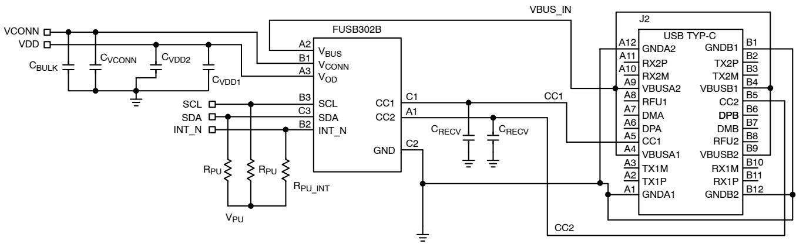  
Figure 18. FUSB302/FUSB302B Reference Schematic Diagram

# Table 43. RECOMMENDED COMPONENT VALUES FOR REFERENCE SCHEMATIC

<table><tr><td rowspan=2 colspan=1>Symbol</td><td rowspan=2 colspan=1>Parameter</td><td rowspan=1 colspan=3>Recommended Value</td><td rowspan=2 colspan=1>Unit</td></tr><tr><td rowspan=1 colspan=1>Min</td><td rowspan=1 colspan=1>Typ</td><td rowspan=1 colspan=1>Max</td></tr><tr><td rowspan=1 colspan=1>CRECV</td><td rowspan=1 colspan=1>CCx Receiver Capacitance</td><td rowspan=1 colspan=1>200</td><td rowspan=1 colspan=1>-</td><td rowspan=1 colspan=1>600</td><td rowspan=1 colspan=1>pF$</td></tr><tr><td rowspan=1 colspan=1>CBULK</td><td rowspan=1 colspan=1>VCONN Source Bulk Capacitance</td><td rowspan=1 colspan=1>10</td><td rowspan=1 colspan=1></td><td rowspan=1 colspan=1>220</td><td rowspan=1 colspan=1>μF</td></tr><tr><td rowspan=1 colspan=1>CVCoNN</td><td rowspan=1 colspan=1>VCONN Decoupling Capacitance</td><td rowspan=1 colspan=1>-</td><td rowspan=1 colspan=1>0.1</td><td rowspan=1 colspan=1></td><td rowspan=1 colspan=1>μF</td></tr><tr><td rowspan=1 colspan=1>CVDD1</td><td rowspan=1 colspan=1>VDD Decoupling Capacitance</td><td rowspan=1 colspan=1></td><td rowspan=1 colspan=1>0.1</td><td rowspan=1 colspan=1></td><td rowspan=1 colspan=1>μF</td></tr><tr><td rowspan=1 colspan=1>CVDD2</td><td rowspan=1 colspan=1>VDD Decoupling Capacitance</td><td rowspan=1 colspan=1>-</td><td rowspan=1 colspan=1>1.0</td><td rowspan=1 colspan=1>-</td><td rowspan=1 colspan=1>μF</td></tr><tr><td rowspan=1 colspan=1>Rpu</td><td rowspan=1 colspan=1>|2C Pull-up Resistors</td><td rowspan=1 colspan=1>-</td><td rowspan=1 colspan=1>4.7</td><td rowspan=1 colspan=1>-</td><td rowspan=1 colspan=1>kΩ</td></tr><tr><td rowspan=1 colspan=1>Rpu_int</td><td rowspan=1 colspan=1>INT_N Pull-up Resistor</td><td rowspan=1 colspan=1>1.0</td><td rowspan=1 colspan=1>4.7</td><td rowspan=1 colspan=1></td><td rowspan=1 colspan=1>kΩ</td></tr><tr><td rowspan=1 colspan=1>Vpu</td><td rowspan=1 colspan=1>|C Pull-up Voltage</td><td rowspan=1 colspan=1>1.71</td><td rowspan=1 colspan=1></td><td rowspan=1 colspan=1>VDD</td><td rowspan=1 colspan=1>V</td></tr></table>

The table below is in reference to the WLCSP package drawing on the following page.

Table 44. PRODUCT-SPECIFIC DIMENSIONS   

<table><tr><td rowspan=1 colspan=1>Product</td><td rowspan=1 colspan=1>D</td><td rowspan=1 colspan=1>E</td><td rowspan=1 colspan=1>X</td><td rowspan=1 colspan=1>Y</td></tr><tr><td rowspan=1 colspan=1>FUSB302BUCX</td><td rowspan=1 colspan=1>1.260 mm</td><td rowspan=1 colspan=1>1.215 mm</td><td rowspan=1 colspan=1>0.2075 mm</td><td rowspan=1 colspan=1>0.230 mm</td></tr></table>

WQFN14 2.5x2.5, 0.5PCASE 510BRISSUE O

DATE 31 AUG 2016

SCALE 4:1

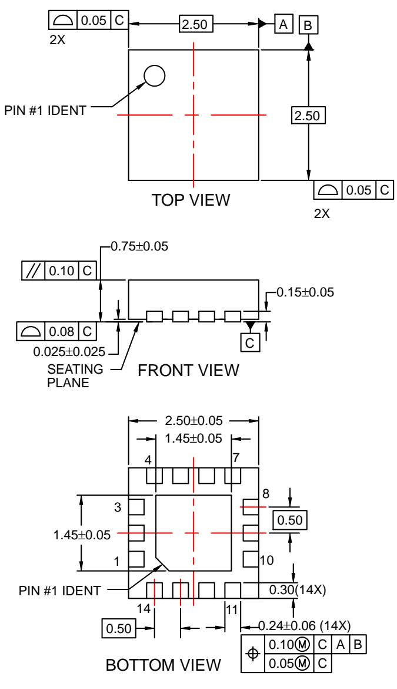

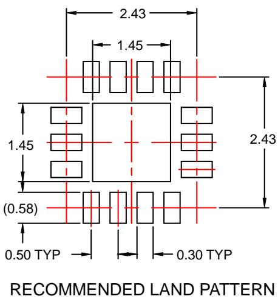

NOTES:

A. NO JEDEC REGISTRATION.   
B. DIMENSIONS ARE IN MILLIMETERS.   
C. DIMENSIONS AND TOLERANCES PER ASME Y14.5M, 2009.   
D. LAND PATTERN RECOMMENDATION IS EXISTING INDUSTRY LAND PATTERN.

<table><tr><td>DOCUMENT NUMBER:</td><td>98AON13629G</td><td colspan="2">Eleonnonol xpn  Don e. Pdvrsons  ncolleexcet when stampCONTROLD  .</td></tr><tr><td>DESCRIPTION:</td><td>WQFN14 2.5X2.5, 0.5P</td><td></td><td>PAGE 1 OF 1</td></tr></table>

onsemi and are trademarks of Semiconductor Components Industries, LLC dba onsemi or its subsidiaries in the United States and/or other countries. onsemi reserves the right to make changes without further notice to any products herein. onsemi makes no warranty, representation or guarantee regarding the suitability of its products for any particular purpose, nor does onsemi assume any liability arising out of the application or use of any product or circuit, and specifically disclaims any and all liability, including without limitation special, consequential or incidental damages. onsemi does not convey any license under its patent rights nor the rights of others.

DATE 31 MAR 2017

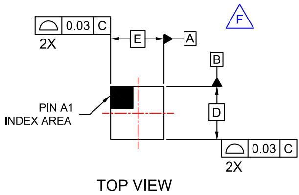

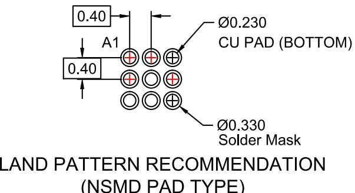

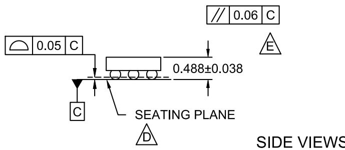

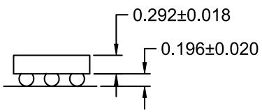

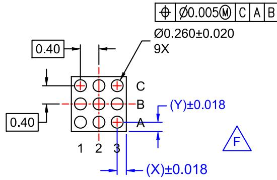  
BOTTOM VIEW

NOTES:

A. NO JEDEC REGISTRATION APPLIES. B. DIMENSIONS ARE IN MILLIMETERS. C. DIMENSIONS AND TOLERANCE PER ASME Y14.5M, 2009.

D.DATUM C IS DEFINED BY THE SPHERICAL CROWNS OF THE BALLS.   
PACKAGE NOMINAL HEIGHT IS 488 MICRONS ±38 MICRONS (450-526 MICRONS).

FOR DIMENSIONS D, E, X, AND Y SEE PRODUCT DATASHEET.

<table><tr><td>DOCUMENT NUMBER:</td><td>98AON13359G</td><td colspan="2">Priversons are ncntolleexcept when stampONTROLLD  </td></tr><tr><td>DESCRIPTION:</td><td>WLCSP9 1.26x1.215x0.526</td><td></td><td>PAGE 1 OF 1</td></tr></table>

onsemi and are trademarks of Semiconductor Components Industries, LLC dba onsemi or its subsidiaries in the United States and/or other countries. onsemi reserves the right to make changes without further notice to any products herein. onsemi makes no warranty, representation or guarantee regarding the suitability of its products for any particular purpose, nor does onsemi assume any liability arising out of the application or use of any product or circuit, and specifically disclaims any and all liability, including without limitation special, consequential or incidental damages. onsemi does not convey any license under its patent rights nor the rights of others.