### **GC9307**
##### **a-Si TFT LCD Single Chip Driver** **240RGBx320 Resolution and 262K color**

#### **DataSheet**

Version: V1.01

Created Date: 2018/04/24

**1** / **190**

**List Of Contents**

**GC9307** ................................................................................................................................................................ 1
List Of Contents ................................................................................................................................................... 2
1. Introduction .................................................................................................................................................. 6
2. Features ........................................................................................................................................................ 7
3. Block Diagram ............................................................................................................................................. 8
3.1. Block diagram .............................................................................................................................. 8
3.2. Pin Description ............................................................................................................................. 9
3.3 PAD coordinates ................................................................................................................................... 14
4. Interface setting .......................................................................................................................................... 20
4.1. MCU interfaces .......................................................................................................................... 20
4.1.1. MCU interface selection ..................................................................................................... 20
4.1.2. 8080-I Series Parallel Interface ......................................................................................... 21
4.1.3. Write Cycle Sequence ........................................................................................................ 22
4.1.4. Read Cycle Sequence ......................................................................................................... 23
4.1.5. 8080-Ⅱ Series Parallel Interface ....................................................................................... 24
4.1.6. Write Cycle Sequence ........................................................................................................ 25
4.1.7. Read Cycle Sequence ......................................................................................................... 26
Serial Interface ................................................................................................................................... 27
4.1.8. Write Cycle Sequence ........................................................................................................ 28
4.1.9. Read Cycle Sequence ......................................................................................................... 30
4.1.10. Data Transfer Break and Recovery ..................................................................................... 32
4.1.11. Data Transfer Pause ............................................................................................................ 34
4.1.12. Serial Interface Pause (3_wire) .......................................................................................... 35
4.1.13. Parallel Interface Pause ...................................................................................................... 35
4.1.14. Data Transfer Mode ............................................................................................................ 35
4.1.15. Data Transfer Method 1 ...................................................................................................... 36
4.1.16. Data Transfer Method 2 ...................................................................................................... 36
4.2. RGB Interface ............................................................................................................................ 37
4.2.1. RGB Interface Selection ..................................................................................................... 37
4.2.2. RGB Interface Timing ........................................................................................................ 40
4.3. VSYNC Interface ....................................................................................................................... 43
4.4. Display Data RAM (DDRAM) .................................................................................................. 44
4.5. Display Data Format .................................................................................................................. 44
4.5.1. 3-line Serial Interface ......................................................................................................... 44
4.5.2. 4-line Serial Interface ......................................................................................................... 47
4.5.3. 2-data-line mode ................................................................................................................. 49
4.5.4. 8-bit Parallel MCU Interface .............................................................................................. 51
4.5.5. 9-bit Parallel MCU Interface .............................................................................................. 54
4.5.6. 16-bit Parallel MCU Interface ............................................................................................ 56
4.5.7. 18-bit Parallel MCU Interface ............................................................................................ 62
4.5.8. 6-bit Parallel RGB Interface ............................................................................................... 66

**2** / **190**

4.5.9. 16-bit Parallel RGB Interface ............................................................................................. 67
4.5.10. 18-bit Parallel RGB Interface ............................................................................................. 68
5. Function Description .................................................................................................................................. 69
5.1. Display data GRAM mapping .................................................................................................... 69
5.2. Address Counter (AC) of GRAM ............................................................................................... 69
5.3. GRAM to display address mapping ........................................................................................... 72
5.3.1. Normal display on or partial mode on, vertical scroll off ................................................... 74
5.3.2. Vertical scroll display mode ............................................................................................... 76
5.3.3. Updating order on display active area in RGB interface mode .......................................... 79
5.4. Tearing effect output line ............................................................................................................ 81
5.4.1. Tearing effect line modes ................................................................................................... 81
5.4.2. Tearing effect line timing ................................................................................................... 82
5.5. Source driver .............................................................................................................................. 83
5.6. Gate driver .................................................................................................................................. 83
5.7. Scan mode setting ....................................................................................................................... 84
5.8. LCD power generation circuit .................................................................................................... 85
5.8.1. Power supply circuit ........................................................................................................... 85
5.8.2. LCD power generation scheme .......................................................................................... 86
5.9. Gamma Correction ..................................................................................................................... 87
5.10. Power Level Definition .............................................................................................................. 90
5.10.1. Power Levels ...................................................................................................................... 90
5.10.2. Power Flow Chart ............................................................................................................... 91
5.10.3.Brightness control block .................................................................................................................. 92
5.11. Input/output pin state .................................................................................................................. 93
5.11.1. Output pins ......................................................................................................................... 93
5.11.2. Input pins ............................................................................................................................ 93
6. Command ................................................................................................................................................... 94
6.1. Command List ............................................................................................................................ 94
6.2. Description of Level 1 Command .............................................................................................. 99
6.2.1. Read display identification information (04h) ...................................................................100
6.2.2. Read Display Status (09h) .................................................................................................101
6.2.3. Enter Sleep Mode (10h).....................................................................................................103
6.2.4. Sleep Out Mode (11h) .......................................................................................................104
6.2.5. Partial Mode ON (12h) ......................................................................................................106
6.2.6. Normal Display Mode ON (13h) .......................................................................................107
6.2.7. Display Inversion OFF (20h) .............................................................................................108
6.2.8. Display Inversion ON (21h) ..............................................................................................109
6.2.9. Display OFF (28h) ............................................................................................................. 110
6.2.10. Display ON (29h) .............................................................................................................. 111
6.2.11. Column Address Set (2Ah) ................................................................................................ 112
6.2.12. Row Address Set (2Bh) ..................................................................................................... 114
6.2.13. Memory Write (2Ch) ......................................................................................................... 116
6.2.14. Partial Area (30h) .............................................................................................................. 117
6.2.15. Vertical Scrolling Definition (33h) ....................................................................................120

**3** / **190**

6.2.16. Tearing Effect Line OFF (34h) ..........................................................................................124
6.2.17. Tearing Effect Line ON (35h) ...........................................................................................125
6.2.18. Memory Access Control(36h) ...........................................................................................127
6.2.19. Vertical Scrolling Start Address (37h) ...............................................................................130
6.2.20. Idle Mode OFF (38h) ........................................................................................................132
6.2.21. Idle Mode ON (39h) ..........................................................................................................133
6.2.22. COLMOD: Pixel Format Set (3Ah) ..................................................................................135
6.2.23. Write Memory Contiue (3Ch) ...........................................................................................137
6.2.24. Set_Tear_Scanline (44h) ...................................................................................................139
6.2.25. Get_Scanline (45h) ............................................................................................................141
6.2.26. Write Display Brightness (51h) .........................................................................................142
6.2.27. Write CTRL Display (53h) ................................................................................................143
6.2.28. Read ID1 (DAh) ................................................................................................................145
6.2.29. Read ID2 (DBh) ................................................................................................................147
6.2.30. Read ID3 (DCh) ................................................................................................................149
6.3. Description of Level 2 Command .............................................................................................150
6.3.1. RGB Interface Signal Control (B0h) .................................................................................150
6.3.2. Blanking Porch Control (B5h) ...........................................................................................152
6.3.3. Display Function Control (B6h) ........................................................................................154
6.3.4. Interface Control (F6h) ......................................................................................................157
6.4. Description of Level 3 Command .............................................................................................159
6.4.1. Frame Rate (E8h) ..............................................................................................................159
6.4.2. SPI 2DATA control(E9h) ...................................................................................................161
6.4.3. Power Control 1 (C1h) ......................................................................................................162
6.4.4. Power Control 2 (C3h) ......................................................................................................163
6.4.5. Power Control 3 (C4h) ......................................................................................................164
6.4.6. Power Control 4 (C9h) ......................................................................................................165
6.4.7. Power Control 6 (ECh) ......................................................................................................166
6.4.8. Power Control 7(A7h) .......................................................................................................168
6.4.9. Inter Register Enable1(FEh) ..............................................................................................169
6.4.10. Inter Register Enable2(EFh) ..............................................................................................170
6.4.11. SET_GAMMA1 (F0h) ......................................................................................................171
6.4.12. SET_GAMMA2 (F1h) ......................................................................................................173
6.4.13. SET_GAMMA3 (F2h) ......................................................................................................175
6.4.14. SET_GAMMA4 (F3h) ......................................................................................................177
7. Application ................................................................................................................................................179
8. Electrical Characteristics ...........................................................................................................................180
8.1. Absolute Maximum Ratings ......................................................................................................180
8.2. DC Characteristics .....................................................................................................................181
8.3. AC Characteristics .....................................................................................................................182
8.3.1. Display Parallel 18/16/9/8-bit Interface Timing Characteristics (8080-Ⅰ) ......................182
8.3.2. Display Parallel 18/16/9/8-bit Interface Timing Characteristics (8080-Ⅱ) ......................184
8.3.3. Display Serial Interface Timing Characteristics (3-line SPI system) ................................186
8.3.4. Display Serial Interface Timing Characteristics (4-line SPI system) ................................187

**4** / **190**

8.3.5. Parallel 18/16/6-bit RGB Interface Timing Characteristics ...............................................188
9. Revision History ........................................................................................................................................190

**5** / **190**

###### **1. Introduction**

The GC9307 is a 262,144-color single-chip SOC driver for a-TFT liquid crystal display with
resolution of 240RGBx320dots, comprising a 720-channel source driver, a 320-channel gate
driver, 172,800 bytes GRAM for graphic display data of 240RGBx320 dots, and power supply
circuit.
The GC9307 supports parallel 8-/9-/16-/18-bit data bus MCU interface, 6-/16-/18-bit data bus
RGB interface and 3-/4-line serial peripheral interface (SPI) and 2 lane SPI data transmission.
The moving picture area can be specified in internal GRAM by window address function. The
specified window area can be updated selectively, so that moving picture can be displayed
simultaneously independent of still picture area.
The GC9307 can operate with 1.65V ~ 3.3V I/O interface voltage and an incorporated voltage
follower circuit to generate voltage levels for driving an LCD. GC9307 supports full color,
8-color display mode and sleep mode for precise power control by software and these features
make the GC9307 an ideal LCD driver for medium or small size portable products such as digital
cellular phones, smart phone, MP3 and PMP where long battery life is a major concern.

**6** / **190**

###### **2. Features**

 No need for external electronic component
 Display resolution: [240xRGB](H) x 320(V)
 Output:

   - 720 source outputs

   - 320 gate outputs
 a-TFT LCD driver with on-chip full display RAM: 172,800 bytes
 System Interface

   - 8-bits, 9-bits, 16-bits, 18-bits interface with 8080-I /8080-II series MCU

   - 6-bits, 16-bits, 18-bits RGB interface with graphic controller

   - 8-bits, 9-bits Serial Peripheral Interface (SPI) and 2 data lane SPI
 Display mode:

   - Full color mode (Idle mode OFF): 262K-color (selectable color depth mode by
software)

   - Reduce color mode (Idle mode ON): 8-color
 Power saving mode:

   - Sleep mode
 On chip functions:

   - Timing generator

   - Oscillator

   - DC/DC converter

   - Dot/column inversion
 Low -power consumption architecture

   - Low operating power supplies:

 IOVCC = 1.65V ~ 3.3V (logic)
 VCI = 2.5V ~ 3.3V (analog)
 LCD Voltage drive:

   - Source/Gamma power supply voltage

 AVDD - GND = 6.5V ~7.5V
 AVEE - GND = -5.5V ~ -4.5V
 AVDD_SOU - GND = 6.5V ~ 7.5V
 AVEE_SOU - GND = -5.5V ~ -4.5V
 VCL - GND = -3.0V ~ -1.5V

   - Gate driver output voltage

 VGH - GND = 10.0V ~ 12.0V
 VGL - GND = -11.0V ~ -9.0V
 VGH - VGL ≦ 23V
 Operate temperature range: -40 ℃ to 80 ℃
 a-Si TFT LCD storage capacitor : Cst on Common structure only

**7** / **190**

###### **3. Block Diagram**

**3.1.** **Block diagram**

**Figure1**

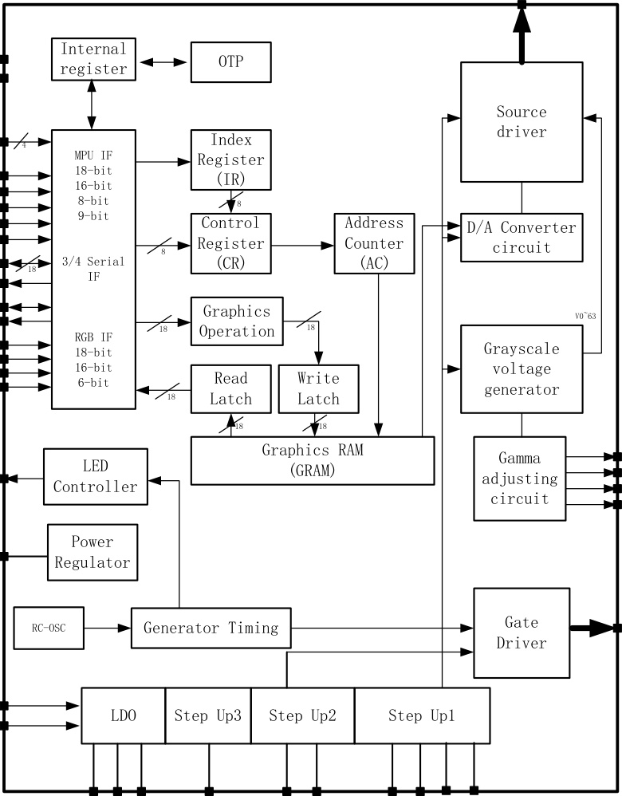

**IOVCC**

**VCI**

**IM[3:0]** ~~4~~

**RESX**

**S1~S720**

**CSX**

**RDX**

**WRX**

**D/CX**

**TE**

**SDA**
**SDO**

**HSYNC**
**VSYNC**
**DOTCLK**

**DE**

**VREG1A**

**VREG1B**
**VREG2A**

**VREG2B**

**G1~G320**

|Generator Timing|Col2|
|---|---|
|Generator Timing||

**VSSC**

**VSSA**

**8** / **190**

**3.2.** **Pin Description**

**Table 1.**

|Power Supply Pins|Col2|Col3|Col4|
|---|---|---|---|
|Pin Name|I/O|Type|Descriptions|
|IOVCC|I|Digital Power|Low voltage power supply for interface logic circuits(1.65~3.3V)|
|VCI|I|Analog Power|High voltage power supply for analog circuit blocks(2.5~3.3V)|
|VCORE|O|Digital Power|Regulated Low voltage level for interface circuits Don't apply any external power to this pad|
|VSSA|I|Analog Ground|System ground level for analog circuit blocks Connect to VSSA on the FPC to prevent noise.|
|VSSC|I|Digital Ground|System ground level for Digital circuit blocks Connect to VSSC on the FPC to prevent noise.|

**9** / **190**

**Table 2**

|IM3|IM2|IM1|IM0|MCU-Interface|Pins in use|Col7|
|---|---|---|---|---|---|---|
|IM3|IM2|IM1|IM0|MCU-Interface|Register|GRAM|
|0|0|0|0|8080 MCU 8-bit bus interface I|D[7:0]|D[7:0]|
|0|0|0|1|8080 MCU16-bit bus interface I|D[7:0]|D[15:0]|
|0|0|1|0|8080 MCU 9-bit bus interface I|D[7:0]|D[8:0]|
|0|0|1|1|8080 MCU18-bit bus interface I|D[7:0]|D[17:0]|
|0|1|0|1|3-wire 9-bit data serial interface I|SDA: In/OUT|SDA: In/OUT|
|0|1|1|0|4-wire 8-bit data serial interface I|SDA: In/OUT|SDA: In/OUT|
|0|1|0|0|3wires 24-bit data serial interface (ID0)|SDI, SDO, SCL, CSX|SDI, SDO, SCL, CSX|
|0|1|1|1|3wires 24-bit data serial interface (ID1)|SDI, SDO, SCL, CSX|SDI, SDO, SCL, CSX|
|1|0|0|0|8080 MCU 16-bit bus interface II|D[8:1]|D[17:10] ,D[8:1]|
|1|0|0|1|8080 MCU 8-bit bus interface II|D[17:10]|D[17:10]|
|1|0|1|0|8080 MCU 18-bit bus interface II|D[8:1]|D[17:0]|
|1|0|1|1|8080 MCU 9-bit bus interface II|D[17:10]|D[17:9]|
|1|1|0|1|3-wire 9-bit data serial interface II|SDI:In SDO:Out|SDI:In SDO:Out|
|1|1|1|0|4-wire 8-bit data serial interface II|SDI:In SDO:Out|SDI:In SDO:Out|

|Interface Logic Signals|Col2|Col3|Col4|
|---|---|---|---|
|Pin Name|I/O|Type|Descriptions|
|IM[3:0]|I|(IOVCC/GND)|-Select the MCU interface mode IM3 IM2 IM1 IM0 MCU-Interface Pins in use Register GRAM 0  0  0  0  8080 MCU 8-bit bus interface I D[7:0] D[7:0] 0  0  0  1  8080 MCU16-bit bus interface I D[7:0] D[15:0] 0  0  1  0  8080 MCU 9-bit bus interface I D[7:0] D[8:0] 0  0  1  1  8080 MCU18-bit bus interface I D[7:0] D[17:0] 0  1  0  1  3-wire 9-bit data serial interface I SDA: In/OUT 0  1  1  0  4-wire 8-bit data serial interface I SDA: In/OUT 0  1  0  0  3wires 24-bit data serial interface (ID0) SDI, SDO, SCL, CSX 0  1  1  1  3wires 24-bit data serial interface (ID1) SDI, SDO, SCL, CSX 1  0  0  0  8080 MCU 16-bit bus interface II D[8:1] D[17:10] ,D[8:1] 1  0  0  1  8080 MCU 8-bit bus interface II D[17:10] D[17:10] 1  0  1  0  8080 MCU 18-bit bus interface II D[8:1] D[17:0] 1  0  1  1  8080 MCU 9-bit bus interface II D[17:10] D[17:9] 1  1  0  1  3-wire 9-bit data serial interface II SDI:In SDO:Out 1  1  1  0  4-wire 8-bit data serial interface II SDI:In SDO:Out MPU Parallel interface bus and serial interface select If use RGB Interface must select serial interface. *:Fix this pin at IOVCC or GND.|
|RESX|I|MCU (IOVCC/GND)|This signal will reset the device and must be applied to properly initialize the chip. Signal is active low.|
|CSX|I|MCU (IOVCC/GND)|Chip select input pin( "Low" enable). This pin can be permanently fixed "Low" in MPU interface mode only.|
|D/CX (SCL)|I|MCU  (IOVCC/|This pin is used to select "Data or Command" in the parallel interface When DCX='1', data is selected.|

**10** / **190**

|Col1|Col2|GND)|When DCX='0', command is selected. This pin is used serial interface clock in 3-wire 9-bit/3-wire 24-bit / 4-wire 8-bit serial data interface. If not used, this pin should be connected to IOVCC or GND.|
|---|---|---|---|
|RDX|I|MCU (IOVCC/ GND)|8080-I/8080-II system (RDX): Serves as a read signal and MCU read data at the rising edge. Fix to IOVCC level when not in use|
|WRX (D/CX)|I|MCU (IOVCC/ GND)|8080-I/8080-II system (WRX): Serves as a write signal and writes data at the rising edge. 4-line system (D/CX): Serves as command or parameter select. 2 lane mode serial interface: Serves as the second SDA Fix to IOVCC level when not in use.|
|D[17:0]|I/O|MCU (IOVCC/ GND)|18-bit parallel bi-directional data bus for MCU system and RGB interface mode Fix to VSS level when not in use|
|SDI/SDA|I/O|MCU (IOVCC/ GND)|When IM[3]:Low, Serial in/out signal in 3-wire 9-bit/4-wire 8-bit serial data interface. When IM[3]:High, Serial input signal in 3-wire 9-bit/4-wire 8-bit serial data interface. The data is applied on the rising edge of the SCL signal. If not used, fix this pin at IOVCC or GND.|
|SDO|O|MCU  (IOVCC/GND)|Serial output signal. The data is outputted on the falling edge of the SCL signal. If not used, open this pin|
|TE|O|MCU (IOVCC/ GND)|Tearing effect output pin to synchronize MPU to frame writing, activated by S/W command. When this pin is not activated, this pin is low. If not used, open this pin.|
|DOTCLK|I|MCU  (IOVCC/GND)|Dot clock signal for RGB interface operation. Fix to IOVCC or VSSC level when not in use.|
|VSYNC|I|MCU  (IOVCC/GND)|Frame synchronizing signal for RGB interface operation. Fix to IOVCC or VSSC level when not in use.|
|HSYNC|I|MCU (IOVCC/ GND)|Line synchronizing signal for RGB interface operation. Fix to IOVCC or VSSC level when not in use.|
|DE|I|MCU (IOVCC/ GND)|Data enable signal for RGB interface operation. Fix to IOVCC or GND level when not in use.|

_**Note:**_

_1. If CSX is connected to GND in Parallel interface mode, there will be no abnormal visible effect to the display module. Also there will be no_

_restriction on using the Parallel Read/Write protocols, Power On/Off Sequences or other functions. Furthermore there will be no influence to_

_the Power Consumption of the display module._

_2. When CSX=’1’, there is no influence to the parallel and serial interface._

**11** / **190**

**Table 3**

|LCD Driver Input/Output Pins|Col2|Col3|Col4|
|---|---|---|---|
|Pin Name|I/O|Type|Descriptions|
|S720~S1|O|Source|Source output signals.. Leave the pin to open when not in use.|
|G320~G1|O|Gate|Gate output signals. Leave the pin to open when not in use.|
|VRDD|O|Power|Power supply for AVDD & AVDD_SOU.|
|VREE|O|Power|Power supply for AVEE & AVEE_SOU.|
|VRCL|O|Power|Power supply for VCL.|
|AVDD|O|Power|Output voltage of 1st step up circuit(3*VRDD).Input voltage to 2nd step up circuit. Generated power output pad for source driver block.|
|AVEE|O|Power|Output voltage of 1st step up circuit(-2*VREE).Input voltage to 2nd step up circuit. Generated power output pad for source driver block.|
|VGH|O|Power|Power supply for the gate driver(Positive).|
|VGL|O|Power|Power supply for the gate driver(Negative).|
|VCL|O|Power|Power supply for VGH and VGL. VCL=0~-VCI|
|VREG1A|O|Ref|internal generated stable power for source driver unit VREG1A is the highest positive grayscale reference voltage of source driver|
|VREG1B|O|Ref|internal generated stable power for source driver unit VREG1B is the lowest positive grayscale reference voltage of source driver|
|VREG2A|O|Ref|internal generated stable power for source driver unit VREG2A is the highest negative grayscale reference voltage of source driver|
|VREG2B|O|Ref|internal generated stable power for source driver unit VREG2B is the highest negative grayscale reference voltage of source driver|
|LEDPWM|O|Dig IO|Output pin for PWM(Pulse width Modulation) signal of LED driving. If not used,open this pad.|

**Table 4**

|Test Pins|Col2|Col3|Col4|
|---|---|---|---|
|Pin Name|I/O|Type|Descriptions|
|DUMMY|-|Open|Input pads used only for test purpose at IC-side. During normal operation,leave these pads open.|

**12** / **190**

**Liquid crystal power supply specifications Table**
**Table 5**

|No.|Item|Col3|Description|
|---|---|---|---|
|1|TFT Source Driver|TFT Source Driver|720 pins (240*RGB)|
|2|TFT Gate Driver|TFT Gate Driver|320 pins|
|3|TFT Display's Capacitor Structure|TFT Display's Capacitor Structure|Cst structure only (Cs on Common)|
|4|Liquid Crystal Drive Output|S1~S720|V0~V63 grayscales|
|4|Liquid Crystal Drive Output|G1~G320|VGH-VGL|
|5|Input Voltage|IOVCC|1.65~3.30V|
|5|Input Voltage|VCI|2.50~3.30V|
|6|Liquid Crystal Drive Voltages|AVDD|6.5~7.5V|
|6|Liquid Crystal Drive Voltages|AVEE|-5.5V~-4.5V|
|6|Liquid Crystal Drive Voltages|VGH|10.0~12.0V|
|6|Liquid Crystal Drive Voltages|VGL|-11.0~--9.0V|
|6|Liquid Crystal Drive Voltages|VCL|-3.0~-1.5V|
|6|Liquid Crystal Drive Voltages|VGH-VGL|Max.23.0V|
|6|Liquid Crystal Drive Voltages|AVDD_SOU|6.5-7.5V|
|6|Liquid Crystal Drive Voltages|AVEE_SOU|-5.5V~-4.5V|
|7|Internal Step-up Circuits|AVDD|VCI*3|
|7|Internal Step-up Circuits|AVEE|VCI*-2|
|7|Internal Step-up Circuits|VGH|VCI*5|
|7|Internal Step-up Circuits|VGL|VCI*-5|
|7|Internal Step-up Circuits|VCL|VCI*-1|

**13** / **190**

**3.3 PAD coordinates**

|Pad-No.|Pad-name|X|Y|Col5|Pad-No.|Pad-name|X|Y|Col10|Pad-No.|Pad-name|X|Y|Col15|Pad-No.|Pad-name|X|Y|Col20|Pad-No.|Pad-name|X|Y|
|---|---|---|---|---|---|---|---|---|---|---|---|---|---|---|---|---|---|---|---|---|---|---|---|
|1|DUMMY|-7292.5|-250.5||51|DUMMY|-4292.5|-250.5||101|VSSC|-1292.5|-250.5||151|BC|2245|-250.5||201|AVEE|5432.5|-250.5|
|2|DUMMY|-7232.5|-250.5||52|BGR_OUT|-4232.5|-250.5||102|VSSC|-1232.5|-250.5||152|VPP|2330|-250.5||202|AVEE|5492.5|-250.5|
|3|VCOM|-7172.5|-250.5||53|VRDD|-4172.5|-250.5||103|VSSC|-1172.5|-250.5||153|DUMMY|2402.5|-250.5||203|AVEE|5552.5|-250.5|
|4|VCOM|-7112.5|-250.5||54|VRDD|-4112.5|-250.5||104|VSSC|-1112.5|-250.5||154|DUMMY|2462.5|-250.5||204|AVEE|5612.5|-250.5|
|5|VCOM|-7052.5|-250.5||55|VRDD|-4052.5|-250.5||105|VSSC|-1052.5|-250.5||155|DUMMY|2535|-250.5||205|AVEE|5672.5|-250.5|
|6|VCOM|-6992.5|-250.5||56|VRDD|-3992.5|-250.5||106|DUMMY|-992.5|-250.5||156|DUMMY|2620|-250.5||206|VSSC|5732.5|-250.5|
|7|VCOM|-6932.5|-250.5||57|VRDD|-3932.5|-250.5||107|VSSC|-932.5|-250.5||157|DUMMY|2705|-250.5||207|VSSC|5792.5|-250.5|
|8|VCOM|-6872.5|-250.5||58|VRDD|-3872.5|-250.5||108|VSSC|-872.5|-250.5||158|DUMMY|2790|-250.5||208|VSSC|5852.5|-250.5|
|9|VCOM|-6812.5|-250.5||59|VRDD|-3812.5|-250.5||109|DUMMY|-812.5|-250.5||159|DUMMY|2875|-250.5||209|VSSC|5912.5|-250.5|
|10|VCOM|-6752.5|-250.5||60|VCORE|-3752.5|-250.5||110|IM<3>|-752.5|-250.5||160|DUMMY|2960|-250.5||210|VSSC|5972.5|-250.5|
|11|DUMMY|-6692.5|-250.5||61|VCORE|-3692.5|-250.5||111|IM<2>|-692.5|-250.5||161|DUMMY|3032.5|-250.5||211|VSSC|6032.5|-250.5|
|12|VGH|-6632.5|-250.5||62|VCORE|-3632.5|-250.5||112|IM<1>|-632.5|-250.5||162|IOVCC|3092.5|-250.5||212|VSSC|6092.5|-250.5|
|13|VGH|-6572.5|-250.5||63|VCORE|-3572.5|-250.5||113|IM<0>|-572.5|-250.5||163|IOVCC|3152.5|-250.5||213|VSSC|6152.5|-250.5|
|14|VGL|-6512.5|-250.5||64|VCORE|-3512.5|-250.5||114|RESX|-512.5|-250.5||164|IOVCC|3212.5|-250.5||214|GVDDN|6212.5|-250.5|
|15|VGL|-6452.5|-250.5||65|VCORE|-3452.5|-250.5||115|CSX|-452.5|-250.5||165|IOVCC|3272.5|-250.5||215|GVDDN|6272.5|-250.5|
|16|VCL|-6392.5|-250.5||66|VCORE|-3392.5|-250.5||116|DCX|-392.5|-250.5||166|IOVCC|3332.5|-250.5||216|GVDDN|6332.5|-250.5|
|17|VCL|-6332.5|-250.5||67|VSSC|-3332.5|-250.5||117|WRX|-332.5|-250.5||167|IOVCC|3392.5|-250.5||217|GVDDN|6392.5|-250.5|
|18|VRCL|-6272.5|-250.5||68|VSSC|-3272.5|-250.5||118|RDX|-272.5|-250.5||168|IOVCC|3452.5|-250.5||218|GVDDN|6452.5|-250.5|
|19|VRCL|-6212.5|-250.5||69|VSSC|-3212.5|-250.5||119|DUMMY|-212.5|-250.5||169|DUMMY|3512.5|-250.5||219|GVDDN|6512.5|-250.5|
|20|DUMMY|-6152.5|-250.5||70|VSSC|-3152.5|-250.5||120|VSYNC|-152.5|-250.5||170|DUMMY|3572.5|-250.5||220|GVDDN|6572.5|-250.5|
|21|DUMMY|-6092.5|-250.5||71|VSSC|-3092.5|-250.5||121|HSYNC|-92.5|-250.5||171|DUMMY|3632.5|-250.5||221|GVDDN|6632.5|-250.5|
|22|AVDD|-6032.5|-250.5||72|VSSC|-3032.5|-250.5||122|ENABL|-32.5|-250.5||172|DUMMY|3692.5|-250.5||222|GVDDN|6692.5|-250.5|
|23|AVDD|-5972.5|-250.5||73|VSSC|-2972.5|-250.5||123|DOTCLK|27.5|-250.5||173|DUMMY|3752.5|-250.5||223|VCOM|6752.5|-250.5|
|24|AVDD|-5912.5|-250.5||74|VCI|-2912.5|-250.5||124|DUMMY|87.5|-250.5||174|DUMMY|3812.5|-250.5||224|VCOM|6812.5|-250.5|
|25|DUMMY|-5852.5|-250.5||75|VCI|-2852.5|-250.5||125|SDA|160|-250.5||175|DUMMY|3872.5|-250.5||225|VCOM|6872.5|-250.5|
|26|DUMMY|-5792.5|-250.5||76|VCI|-2792.5|-250.5||126|DB<0>|245|-250.5||176|DUMMY|3932.5|-250.5||226|VCOM|6932.5|-250.5|
|27|DUMMY|-5732.5|-250.5||77|VCI|-2732.5|-250.5||127|DB<1>|330|-250.5||177|DUMMY|3992.5|-250.5||227|VCOM|6992.5|-250.5|
|28|DUMMY|-5672.5|-250.5||78|VCI|-2672.5|-250.5||128|DB<2>|415|-250.5||178|DUMMY|4052.5|-250.5||228|VCOM|7052.5|-250.5|
|29|DUMMY|-5612.5|-250.5||79|VCI|-2612.5|-250.5||129|DB<3>|500|-250.5||179|DUMMY|4112.5|-250.5||229|VCOM|7112.5|-250.5|
|30|DUMMY|-5552.5|-250.5||80|VCI|-2552.5|-250.5||130|DUMMY|572.5|-250.5||180|DUMMY|4172.5|-250.5||230|VCOM|7172.5|-250.5|
|31|AVEE_SOU|-5492.5|-250.5||81|VCI|-2492.5|-250.5||131|DB<4>|645|-250.5||181|DUMMY|4232.5|-250.5||231|DUMMY|7232.5|-250.5|
|32|AVDD_SOU|-5432.5|-250.5||82|VSSA|-2432.5|-250.5||132|DB<5>|730|-250.5||182|DUMMY|4292.5|-250.5||232|DUMMY|7292.5|-250.5|
|33|DUMMY|-5372.5|-250.5||83|VSSA|-2372.5|-250.5||133|DB<6>|815|-250.5||183|VREG1A|4352.5|-250.5||233|DUMMY|7399|233|
|34|DUMMY|-5312.5|-250.5||84|VSSA|-2312.5|-250.5||134|DB<7>|900|-250.5||184|DUMMY|4412.5|-250.5||234|DUMMY|7385|115|
|35|DUMMY|-5252.5|-250.5||85|VSSA|-2252.5|-250.5||135|DUMMY|972.5|-250.5||185|DUMMY|4472.5|-250.5||235|DUMMY|7371|233|
|36|DUMMY|-5192.5|-250.5||86|VSSA|-2192.5|-250.5||136|DB<8>|1045|-250.5||186|DUMMY|4532.5|-250.5||236|G<2>|7357|115|
|37|DUMMY|-5132.5|-250.5||87|VSSA|-2132.5|-250.5||137|DB<9>|1130|-250.5||187|GVDDP|4592.5|-250.5||237|G<4>|7343|233|
|38|DUMMY|-5072.5|-250.5||88|VSSA|-2072.5|-250.5||138|DB<10>|1215|-250.5||188|DUMMY|4652.5|-250.5||238|G<6>|7329|115|
|39|VX4|-5012.5|-250.5||89|VSSA|-2012.5|-250.5||139|DB<11>|1300|-250.5||189|DUMMY|4712.5|-250.5||239|G<8>|7315|233|
|40|DUMMY|-4952.5|-250.5||90|VSSA|-1952.5|-250.5||140|OSC_TEST|1372.5|-250.5||190|DUMMY|4772.5|-250.5||240|G<10>|7301|115|
|41|DUMMY|-4892.5|-250.5||91|VSSC|-1892.5|-250.5||141|DB<12>|1445|-250.5||191|DUMMY|4832.5|-250.5||241|G<12>|7287|233|
|42|DUMMY|-4832.5|-250.5||92|VSSC|-1832.5|-250.5||142|DB<13>|1530|-250.5||192|DUMMY|4892.5|-250.5||242|G<14>|7273|115|
|43|DUMMY|-4772.5|-250.5||93|VSSC|-1772.5|-250.5||143|DB<14>|1615|-250.5||193|VREF_OUT|4952.5|-250.5||243|G<16>|7259|233|
|44|DUMMY|-4712.5|-250.5||94|VSSC|-1712.5|-250.5||144|DB<15>|1700|-250.5||194|DUMMY|5012.5|-250.5||244|G<18>|7245|115|
|45|DUMMY|-4652.5|-250.5||95|VSSC|-1652.5|-250.5||145|DUMMY|1772.5|-250.5||195|DUMMY|5072.5|-250.5||245|G<20>|7231|233|
|46|DUMMY|-4592.5|-250.5||96|VSSC|-1592.5|-250.5||146|DB<16>|1845|-250.5||196|DUMMY|5132.5|-250.5||246|G<22>|7217|115|
|47|DUMMY|-4532.5|-250.5||97|VSSC|-1532.5|-250.5||147|DB<17>|1930|-250.5||197|DUMMY|5192.5|-250.5||247|G<24>|7203|233|
|48|DUMMY|-4472.5|-250.5||98|VSSC|-1472.5|-250.5||148|OSC_IN|2002.5|-250.5||198|AVEE|5252.5|-250.5||248|G<26>|7189|115|
|49|DUMMY|-4412.5|-250.5||99|VSSC|-1412.5|-250.5||149|TE|2075|-250.5||199|AVEE|5312.5|-250.5||249|G<28>|7175|233|
|50|DUMMY|-4352.5|-250.5||100|VSSC|-1352.5|-250.5||150|SDO|2160|-250.5||200|AVEE|5372.5|-250.5||250|G<30>|7161|115|

|Pad-No.|Pad-name|X|Y|Col5|Pad-No.|Pad-name|X|Y|Col10|Pad-No.|Pad-name|X|Y|Col15|Pad-No.|Pad-name|X|Y|Col20|Pad-No.|Pad-name|X|Y|
|---|---|---|---|---|---|---|---|---|---|---|---|---|---|---|---|---|---|---|---|---|---|---|---|
|251|G<32>|7147|233||301|G<132>|6447|233||351|G<232>|5747|233||401|S<715>|5005|233||451|S<665>|4305|233|
|252|G<34>|7133|115||302|G<134>|6433|115||352|G<234>|5733|115||402|S<714>|4991|115||452|S<664>|4291|115|
|253|G<36>|7119|233||303|G<136>|6419|233||353|G<236>|5719|233||403|S<713>|4977|233||453|S<663>|4277|233|
|254|G<38>|7105|115||304|G<138>|6405|115||354|G<238>|5705|115||404|S<712>|4963|115||454|S<662>|4263|115|
|255|G<40>|7091|233||305|G<140>|6391|233||355|G<240>|5691|233||405|S<711>|4949|233||455|S<661>|4249|233|
|256|G<42>|7077|115||306|G<142>|6377|115||356|G<242>|5677|115||406|S<710>|4935|115||456|S<660>|4235|115|
|257|G<44>|7063|233||307|G<144>|6363|233||357|G<244>|5663|233||407|S<709>|4921|233||457|S<659>|4221|233|
|258|G<46>|7049|115||308|G<146>|6349|115||358|G<246>|5649|115||408|S<708>|4907|115||458|S<658>|4207|115|
|259|G<48>|7035|233||309|G<148>|6335|233||359|G<248>|5635|233||409|S<707>|4893|233||459|S<657>|4193|233|

**14** / **190**

|260|G<50>|7021|115|Col5|310|G<150>|6321|115|Col10|360|G<250>|5621|115|Col15|410|S<706>|4879|115|Col20|460|S<656>|4179|115|
|---|---|---|---|---|---|---|---|---|---|---|---|---|---|---|---|---|---|---|---|---|---|---|---|
|261|G<52>|7007|233||311|G<152>|6307|233||361|G<252>|5607|233||411|S<705>|4865|233||461|S<655>|4165|233|
|262|G<54>|6993|115||312|G<154>|6293|115||362|G<254>|5593|115||412|S<704>|4851|115||462|S<654>|4151|115|
|263|G<56>|6979|233||313|G<156>|6279|233||363|G<256>|5579|233||413|S<703>|4837|233||463|S<653>|4137|233|
|264|G<58>|6965|115||314|G<158>|6265|115||364|G<258>|5565|115||414|S<702>|4823|115||464|S<652>|4123|115|
|265|G<60>|6951|233||315|G<160>|6251|233||365|G<260>|5551|233||415|S<701>|4809|233||465|S<651>|4109|233|
|266|G<62>|6937|115||316|G<162>|6237|115||366|G<262>|5537|115||416|S<700>|4795|115||466|S<650>|4095|115|
|267|G<64>|6923|233||317|G<164>|6223|233||367|G<264>|5523|233||417|S<699>|4781|233||467|S<649>|4081|233|
|268|G<66>|6909|115||318|G<166>|6209|115||368|G<266>|5509|115||418|S<698>|4767|115||468|S<648>|4067|115|
|269|G<68>|6895|233||319|G<168>|6195|233||369|G<268>|5495|233||419|S<697>|4753|233||469|S<647>|4053|233|
|270|G<70>|6881|115||320|G<170>|6181|115||370|G<270>|5481|115||420|S<696>|4739|115||470|S<646>|4039|115|
|271|G<72>|6867|233||321|G<172>|6167|233||371|G<272>|5467|233||421|S<695>|4725|233||471|S<645>|4025|233|
|272|G<74>|6853|115||322|G<174>|6153|115||372|G<274>|5453|115||422|S<694>|4711|115||472|S<644>|4011|115|
|273|G<76>|6839|233||323|G<176>|6139|233||373|G<276>|5439|233||423|S<693>|4697|233||473|S<643>|3997|233|
|274|G<78>|6825|115||324|G<178>|6125|115||374|G<278>|5425|115||424|S<692>|4683|115||474|S<642>|3983|115|
|275|G<80>|6811|233||325|G<180>|6111|233||375|G<280>|5411|233||425|S<691>|4669|233||475|S<641>|3969|233|
|276|G<82>|6797|115||326|G<182>|6097|115||376|G<282>|5397|115||426|S<690>|4655|115||476|S<640>|3955|115|
|277|G<84>|6783|233||327|G<184>|6083|233||377|G<284>|5383|233||427|S<689>|4641|233||477|S<639>|3941|233|
|278|G<86>|6769|115||328|G<186>|6069|115||378|G<286>|5369|115||428|S<688>|4627|115||478|S<638>|3927|115|
|279|G<88>|6755|233||329|G<188>|6055|233||379|G<288>|5355|233||429|S<687>|4613|233||479|S<637>|3913|233|
|280|G<90>|6741|115||330|G<190>|6041|115||380|G<290>|5341|115||430|S<686>|4599|115||480|S<636>|3899|115|
|281|G<92>|6727|233||331|G<192>|6027|233||381|G<292>|5327|233||431|S<685>|4585|233||481|S<635>|3885|233|
|282|G<94>|6713|115||332|G<194>|6013|115||382|G<294>|5313|115||432|S<684>|4571|115||482|S<634>|3871|115|
|283|G<96>|6699|233||333|G<196>|5999|233||383|G<296>|5299|233||433|S<683>|4557|233||483|S<633>|3857|233|
|284|G<98>|6685|115||334|G<198>|5985|115||384|G<298>|5285|115||434|S<682>|4543|115||484|S<632>|3843|115|
|285|G<100>|6671|233||335|G<200>|5971|233||385|G<300>|5271|233||435|S<681>|4529|233||485|S<631>|3829|233|
|286|G<102>|6657|115||336|G<202>|5957|115||386|G<302>|5257|115||436|S<680>|4515|115||486|S<630>|3815|115|
|287|G<104>|6643|233||337|G<204>|5943|233||387|G<304>|5243|233||437|S<679>|4501|233||487|S<629>|3801|233|
|288|G<106>|6629|115||338|G<206>|5929|115||388|G<306>|5229|115||438|S<678>|4487|115||488|S<628>|3787|115|
|289|G<108>|6615|233||339|G<208>|5915|233||389|G<308>|5215|233||439|S<677>|4473|233||489|S<627>|3773|233|
|290|G<110>|6601|115||340|G<210>|5901|115||390|G<310>|5201|115||440|S<676>|4459|115||490|S<626>|3759|115|
|291|G<112>|6587|233||341|G<212>|5887|233||391|G<312>|5187|233||441|S<675>|4445|233||491|S<625>|3745|233|
|292|G<114>|6573|115||342|G<214>|5873|115||392|G<314>|5173|115||442|S<674>|4431|115||492|S<624>|3731|115|
|293|G<116>|6559|233||343|G<216>|5859|233||393|G<316>|5159|233||443|S<673>|4417|233||493|S<623>|3717|233|
|294|G<118>|6545|115||344|G<218>|5845|115||394|G<318>|5145|115||444|S<672>|4403|115||494|S<622>|3703|115|
|295|G<120>|6531|233||345|G<220>|5831|233||395|G<320>|5131|233||445|S<671>|4389|233||495|S<621>|3689|233|
|296|G<122>|6517|115||346|G<222>|5817|115||396|S<720>|5075|115||446|S<670>|4375|115||496|S<620>|3675|115|
|297|G<124>|6503|233||347|G<224>|5803|233||397|S<719>|5061|233||447|S<669>|4361|233||497|S<619>|3661|233|
|298|G<126>|6489|115||348|G<226>|5789|115||398|S<718>|5047|115||448|S<668>|4347|115||498|S<618>|3647|115|
|299|G<128>|6475|233||349|G<228>|5775|233||399|S<717>|5033|233||449|S<667>|4333|233||499|S<617>|3633|233|
|300|G<130>|6461|115||350|G<230>|5761|115||400|S<716>|5019|115||450|S<666>|4319|115||500|S<616>|3619|115|

|Pad-No.|Pad-name|X|Y|Col5|Pad-No.|Pad-name|X|Y|Col10|Pad-No.|Pad-name|X|Y|Col15|Pad-No.|Pad-name|X|Y|Col20|Pad-No.|Pad-name|X|Y|
|---|---|---|---|---|---|---|---|---|---|---|---|---|---|---|---|---|---|---|---|---|---|---|---|
|501|S<615>|3605|233||551|S<565>|2905|233||601|S<515>|2205|233||651|S<465>|1505|233||701|S<415>|805|233|
|502|S<614>|3591|115||552|S<564>|2891|115||602|S<514>|2191|115||652|S<464>|1491|115||702|S<414>|791|115|
|503|S<613>|3577|233||553|S<563>|2877|233||603|S<513>|2177|233||653|S<463>|1477|233||703|S<413>|777|233|
|504|S<612>|3563|115||554|S<562>|2863|115||604|S<512>|2163|115||654|S<462>|1463|115||704|S<412>|763|115|
|505|S<611>|3549|233||555|S<561>|2849|233||605|S<511>|2149|233||655|S<461>|1449|233||705|S<411>|749|233|
|506|S<610>|3535|115||556|S<560>|2835|115||606|S<510>|2135|115||656|S<460>|1435|115||706|S<410>|735|115|
|507|S<609>|3521|233||557|S<559>|2821|233||607|S<509>|2121|233||657|S<459>|1421|233||707|S<409>|721|233|
|508|S<608>|3507|115||558|S<558>|2807|115||608|S<508>|2107|115||658|S<458>|1407|115||708|S<408>|707|115|
|509|S<607>|3493|233||559|S<557>|2793|233||609|S<507>|2093|233||659|S<457>|1393|233||709|S<407>|693|233|
|510|S<606>|3479|115||560|S<556>|2779|115||610|S<506>|2079|115||660|S<456>|1379|115||710|S<406>|679|115|
|511|S<605>|3465|233||561|S<555>|2765|233||611|S<505>|2065|233||661|S<455>|1365|233||711|S<405>|665|233|
|512|S<604>|3451|115||562|S<554>|2751|115||612|S<504>|2051|115||662|S<454>|1351|115||712|S<404>|651|115|
|513|S<603>|3437|233||563|S<553>|2737|233||613|S<503>|2037|233||663|S<453>|1337|233||713|S<403>|637|233|
|514|S<602>|3423|115||564|S<552>|2723|115||614|S<502>|2023|115||664|S<452>|1323|115||714|S<402>|623|115|
|515|S<601>|3409|233||565|S<551>|2709|233||615|S<501>|2009|233||665|S<451>|1309|233||715|S<401>|609|233|
|516|S<600>|3395|115||566|S<550>|2695|115||616|S<500>|1995|115||666|S<450>|1295|115||716|S<400>|595|115|
|517|S<599>|3381|233||567|S<549>|2681|233||617|S<499>|1981|233||667|S<449>|1281|233||717|S<399>|581|233|
|518|S<598>|3367|115||568|S<548>|2667|115||618|S<498>|1967|115||668|S<448>|1267|115||718|S<398>|567|115|
|519|S<597>|3353|233||569|S<547>|2653|233||619|S<497>|1953|233||669|S<447>|1253|233||719|S<397>|553|233|
|520|S<596>|3339|115||570|S<546>|2639|115||620|S<496>|1939|115||670|S<446>|1239|115||720|S<396>|539|115|
|521|S<595>|3325|233||571|S<545>|2625|233||621|S<495>|1925|233||671|S<445>|1225|233||721|S<395>|525|233|

**15** / **190**

|522|S<594>|3311|115|Col5|572|S<544>|2611|115|Col10|622|S<494>|1911|115|Col15|672|S<444>|1211|115|Col20|722|S<394>|511|115|
|---|---|---|---|---|---|---|---|---|---|---|---|---|---|---|---|---|---|---|---|---|---|---|---|
|523|S<593>|3297|233||573|S<543>|2597|233||623|S<493>|1897|233||673|S<443>|1197|233||723|S<393>|497|233|
|524|S<592>|3283|115||574|S<542>|2583|115||624|S<492>|1883|115||674|S<442>|1183|115||724|S<392>|483|115|
|525|S<591>|3269|233||575|S<541>|2569|233||625|S<491>|1869|233||675|S<441>|1169|233||725|S<391>|469|233|
|526|S<590>|3255|115||576|S<540>|2555|115||626|S<490>|1855|115||676|S<440>|1155|115||726|S<390>|455|115|
|527|S<589>|3241|233||577|S<539>|2541|233||627|S<489>|1841|233||677|S<439>|1141|233||727|S<389>|441|233|
|528|S<588>|3227|115||578|S<538>|2527|115||628|S<488>|1827|115||678|S<438>|1127|115||728|S<388>|427|115|
|529|S<587>|3213|233||579|S<537>|2513|233||629|S<487>|1813|233||679|S<437>|1113|233||729|S<387>|413|233|
|530|S<586>|3199|115||580|S<536>|2499|115||630|S<486>|1799|115||680|S<436>|1099|115||730|S<386>|399|115|
|531|S<585>|3185|233||581|S<535>|2485|233||631|S<485>|1785|233||681|S<435>|1085|233||731|S<385>|385|233|
|532|S<584>|3171|115||582|S<534>|2471|115||632|S<484>|1771|115||682|S<434>|1071|115||732|S<384>|371|115|
|533|S<583>|3157|233||583|S<533>|2457|233||633|S<483>|1757|233||683|S<433>|1057|233||733|S<383>|357|233|
|534|S<582>|3143|115||584|S<532>|2443|115||634|S<482>|1743|115||684|S<432>|1043|115||734|S<382>|343|115|
|535|S<581>|3129|233||585|S<531>|2429|233||635|S<481>|1729|233||685|S<431>|1029|233||735|S<381>|329|233|
|536|S<580>|3115|115||586|S<530>|2415|115||636|S<480>|1715|115||686|S<430>|1015|115||736|S<380>|315|115|
|537|S<579>|3101|233||587|S<529>|2401|233||637|S<479>|1701|233||687|S<429>|1001|233||737|S<379>|301|233|
|538|S<578>|3087|115||588|S<528>|2387|115||638|S<478>|1687|115||688|S<428>|987|115||738|S<378>|287|115|
|539|S<577>|3073|233||589|S<527>|2373|233||639|S<477>|1673|233||689|S<427>|973|233||739|S<377>|273|233|
|540|S<576>|3059|115||590|S<526>|2359|115||640|S<476>|1659|115||690|S<426>|959|115||740|S<376>|259|115|
|541|S<575>|3045|233||591|S<525>|2345|233||641|S<475>|1645|233||691|S<425>|945|233||741|S<375>|245|233|
|542|S<574>|3031|115||592|S<524>|2331|115||642|S<474>|1631|115||692|S<424>|931|115||742|S<374>|231|115|
|543|S<573>|3017|233||593|S<523>|2317|233||643|S<473>|1617|233||693|S<423>|917|233||743|S<373>|217|233|
|544|S<572>|3003|115||594|S<522>|2303|115||644|S<472>|1603|115||694|S<422>|903|115||744|S<372>|203|115|
|545|S<571>|2989|233||595|S<521>|2289|233||645|S<471>|1589|233||695|S<421>|889|233||745|S<371>|189|233|
|546|S<570>|2975|115||596|S<520>|2275|115||646|S<470>|1575|115||696|S<420>|875|115||746|S<370>|175|115|
|547|S<569>|2961|233||597|S<519>|2261|233||647|S<469>|1561|233||697|S<419>|861|233||747|S<369>|161|233|
|548|S<568>|2947|115||598|S<518>|2247|115||648|S<468>|1547|115||698|S<418>|847|115||748|S<368>|147|115|
|549|S<567>|2933|233||599|S<517>|2233|233||649|S<467>|1533|233||699|S<417>|833|233||749|S<367>|133|233|
|550|S<566>|2919|115||600|S<516>|2219|115||650|S<466>|1519|115||700|S<416>|819|115||750|S<366>|119|115|

|Pad-No.|Pad-name|X|Y|Col5|Pad-No.|Pad-name|X|Y|Col10|Pad-No.|Pad-name|X|Y|Col15|Pad-No.|Pad-name|X|Y|Col20|Pad-No.|Pad-name|X|Y|
|---|---|---|---|---|---|---|---|---|---|---|---|---|---|---|---|---|---|---|---|---|---|---|---|
|751|S<365>|105|233||801|S<315>|-679|233||851|S<265>|-1379|233||901|S<215>|-2079|233||951|S<165>|-2779|233|
|752|S<364>|91|115||802|S<314>|-693|115||852|S<264>|-1393|115||902|S<214>|-2093|115||952|S<164>|-2793|115|
|753|S<363>|77|233||803|S<313>|-707|233||853|S<263>|-1407|233||903|S<213>|-2107|233||953|S<163>|-2807|233|
|754|S<362>|63|115||804|S<312>|-721|115||854|S<262>|-1421|115||904|S<212>|-2121|115||954|S<162>|-2821|115|
|755|S<361>|49|233||805|S<311>|-735|233||855|S<261>|-1435|233||905|S<211>|-2135|233||955|S<161>|-2835|233|
|756|S<360>|-49|115||806|S<310>|-749|115||856|S<260>|-1449|115||906|S<210>|-2149|115||956|S<160>|-2849|115|
|757|S<359>|-63|233||807|S<309>|-763|233||857|S<259>|-1463|233||907|S<209>|-2163|233||957|S<159>|-2863|233|
|758|S<358>|-77|115||808|S<308>|-777|115||858|S<258>|-1477|115||908|S<208>|-2177|115||958|S<158>|-2877|115|
|759|S<357>|-91|233||809|S<307>|-791|233||859|S<257>|-1491|233||909|S<207>|-2191|233||959|S<157>|-2891|233|
|760|S<356>|-105|115||810|S<306>|-805|115||860|S<256>|-1505|115||910|S<206>|-2205|115||960|S<156>|-2905|115|
|761|S<355>|-119|233||811|S<305>|-819|233||861|S<255>|-1519|233||911|S<205>|-2219|233||961|S<155>|-2919|233|
|762|S<354>|-133|115||812|S<304>|-833|115||862|S<254>|-1533|115||912|S<204>|-2233|115||962|S<154>|-2933|115|
|763|S<353>|-147|233||813|S<303>|-847|233||863|S<253>|-1547|233||913|S<203>|-2247|233||963|S<153>|-2947|233|
|764|S<352>|-161|115||814|S<302>|-861|115||864|S<252>|-1561|115||914|S<202>|-2261|115||964|S<152>|-2961|115|
|765|S<351>|-175|233||815|S<301>|-875|233||865|S<251>|-1575|233||915|S<201>|-2275|233||965|S<151>|-2975|233|
|766|S<350>|-189|115||816|S<300>|-889|115||866|S<250>|-1589|115||916|S<200>|-2289|115||966|S<150>|-2989|115|
|767|S<349>|-203|233||817|S<299>|-903|233||867|S<249>|-1603|233||917|S<199>|-2303|233||967|S<149>|-3003|233|
|768|S<348>|-217|115||818|S<298>|-917|115||868|S<248>|-1617|115||918|S<198>|-2317|115||968|S<148>|-3017|115|
|769|S<347>|-231|233||819|S<297>|-931|233||869|S<247>|-1631|233||919|S<197>|-2331|233||969|S<147>|-3031|233|
|770|S<346>|-245|115||820|S<296>|-945|115||870|S<246>|-1645|115||920|S<196>|-2345|115||970|S<146>|-3045|115|
|771|S<345>|-259|233||821|S<295>|-959|233||871|S<245>|-1659|233||921|S<195>|-2359|233||971|S<145>|-3059|233|
|772|S<344>|-273|115||822|S<294>|-973|115||872|S<244>|-1673|115||922|S<194>|-2373|115||972|S<144>|-3073|115|
|773|S<343>|-287|233||823|S<293>|-987|233||873|S<243>|-1687|233||923|S<193>|-2387|233||973|S<143>|-3087|233|
|774|S<342>|-301|115||824|S<292>|-1001|115||874|S<242>|-1701|115||924|S<192>|-2401|115||974|S<142>|-3101|115|
|775|S<341>|-315|233||825|S<291>|-1015|233||875|S<241>|-1715|233||925|S<191>|-2415|233||975|S<141>|-3115|233|
|776|S<340>|-329|115||826|S<290>|-1029|115||876|S<240>|-1729|115||926|S<190>|-2429|115||976|S<140>|-3129|115|
|777|S<339>|-343|233||827|S<289>|-1043|233||877|S<239>|-1743|233||927|S<189>|-2443|233||977|S<139>|-3143|233|
|778|S<338>|-357|115||828|S<288>|-1057|115||878|S<238>|-1757|115||928|S<188>|-2457|115||978|S<138>|-3157|115|
|779|S<337>|-371|233||829|S<287>|-1071|233||879|S<237>|-1771|233||929|S<187>|-2471|233||979|S<137>|-3171|233|
|780|S<336>|-385|115||830|S<286>|-1085|115||880|S<236>|-1785|115||930|S<186>|-2485|115||980|S<136>|-3185|115|
|781|S<335>|-399|233||831|S<285>|-1099|233||881|S<235>|-1799|233||931|S<185>|-2499|233||981|S<135>|-3199|233|
|782|S<334>|-413|115||832|S<284>|-1113|115||882|S<234>|-1813|115||932|S<184>|-2513|115||982|S<134>|-3213|115|
|783|S<333>|-427|233||833|S<283>|-1127|233||883|S<233>|-1827|233||933|S<183>|-2527|233||983|S<133>|-3227|233|

**16** / **190**

|784|S<332>|-441|115|Col5|834|S<282>|-1141|115|Col10|884|S<232>|-1841|115|Col15|934|S<182>|-2541|115|Col20|984|S<132>|-3241|115|
|---|---|---|---|---|---|---|---|---|---|---|---|---|---|---|---|---|---|---|---|---|---|---|---|
|785|S<331>|-455|233||835|S<281>|-1155|233||885|S<231>|-1855|233||935|S<181>|-2555|233||985|S<131>|-3255|233|
|786|S<330>|-469|115||836|S<280>|-1169|115||886|S<230>|-1869|115||936|S<180>|-2569|115||986|S<130>|-3269|115|
|787|S<329>|-483|233||837|S<279>|-1183|233||887|S<229>|-1883|233||937|S<179>|-2583|233||987|S<129>|-3283|233|
|788|S<328>|-497|115||838|S<278>|-1197|115||888|S<228>|-1897|115||938|S<178>|-2597|115||988|S<128>|-3297|115|
|789|S<327>|-511|233||839|S<277>|-1211|233||889|S<227>|-1911|233||939|S<177>|-2611|233||989|S<127>|-3311|233|
|790|S<326>|-525|115||840|S<276>|-1225|115||890|S<226>|-1925|115||940|S<176>|-2625|115||990|S<126>|-3325|115|
|791|S<325>|-539|233||841|S<275>|-1239|233||891|S<225>|-1939|233||941|S<175>|-2639|233||991|S<125>|-3339|233|
|792|S<324>|-553|115||842|S<274>|-1253|115||892|S<224>|-1953|115||942|S<174>|-2653|115||992|S<124>|-3353|115|
|793|S<323>|-567|233||843|S<273>|-1267|233||893|S<223>|-1967|233||943|S<173>|-2667|233||993|S<123>|-3367|233|
|794|S<322>|-581|115||844|S<272>|-1281|115||894|S<222>|-1981|115||944|S<172>|-2681|115||994|S<122>|-3381|115|
|795|S<321>|-595|233||845|S<271>|-1295|233||895|S<221>|-1995|233||945|S<171>|-2695|233||995|S<121>|-3395|233|
|796|S<320>|-609|115||846|S<270>|-1309|115||896|S<220>|-2009|115||946|S<170>|-2709|115||996|S<120>|-3409|115|
|797|S<319>|-623|233||847|S<269>|-1323|233||897|S<219>|-2023|233||947|S<169>|-2723|233||997|S<119>|-3423|233|
|798|S<318>|-637|115||848|S<268>|-1337|115||898|S<218>|-2037|115||948|S<168>|-2737|115||998|S<118>|-3437|115|
|799|S<317>|-651|233||849|S<267>|-1351|233||899|S<217>|-2051|233||949|S<167>|-2751|233||999|S<117>|-3451|233|
|800|S<316>|-665|115||850|S<266>|-1365|115||900|S<216>|-2065|115||950|S<166>|-2765|115||1000|S<116>|-3465|115|

|Pad-No.|Pad-name|X|Y|Col5|Pad-No.|Pad-name|X|Y|Col10|Pad-No.|Pad-name|X|Y|Col15|Pad-No.|Pad-name|X|Y|Col20|Pad-No.|Pad-name|X|Y|
|---|---|---|---|---|---|---|---|---|---|---|---|---|---|---|---|---|---|---|---|---|---|---|---|
|1001|S<115>|-3479|233||1051|S<65>|-4179|233||1101|S<15>|-4879|233||1151|G<249>|-5621|233||1201|G<149>|-6321|233|
|1002|S<114>|-3493|115||1052|S<64>|-4193|115||1102|S<14>|-4893|115||1152|G<247>|-5635|115||1202|G<147>|-6335|115|
|1003|S<113>|-3507|233||1053|S<63>|-4207|233||1103|S<13>|-4907|233||1153|G<245>|-5649|233||1203|G<145>|-6349|233|
|1004|S<112>|-3521|115||1054|S<62>|-4221|115||1104|S<12>|-4921|115||1154|G<243>|-5663|115||1204|G<143>|-6363|115|
|1005|S<111>|-3535|233||1055|S<61>|-4235|233||1105|S<11>|-4935|233||1155|G<241>|-5677|233||1205|G<141>|-6377|233|
|1006|S<110>|-3549|115||1056|S<60>|-4249|115||1106|S<10>|-4949|115||1156|G<239>|-5691|115||1206|G<139>|-6391|115|
|1007|S<109>|-3563|233||1057|S<59>|-4263|233||1107|S<9>|-4963|233||1157|G<237>|-5705|233||1207|G<137>|-6405|233|
|1008|S<108>|-3577|115||1058|S<58>|-4277|115||1108|S<8>|-4977|115||1158|G<235>|-5719|115||1208|G<135>|-6419|115|
|1009|S<107>|-3591|233||1059|S<57>|-4291|233||1109|S<7>|-4991|233||1159|G<233>|-5733|233||1209|G<133>|-6433|233|
|1010|S<106>|-3605|115||1060|S<56>|-4305|115||1110|S<6>|-5005|115||1160|G<231>|-5747|115||1210|G<131>|-6447|115|
|1011|S<105>|-3619|233||1061|S<55>|-4319|233||1111|S<5>|-5019|233||1161|G<229>|-5761|233||1211|G<129>|-6461|233|
|1012|S<104>|-3633|115||1062|S<54>|-4333|115||1112|S<4>|-5033|115||1162|G<227>|-5775|115||1212|G<127>|-6475|115|
|1013|S<103>|-3647|233||1063|S<53>|-4347|233||1113|S<3>|-5047|233||1163|G<225>|-5789|233||1213|G<125>|-6489|233|
|1014|S<102>|-3661|115||1064|S<52>|-4361|115||1114|S<2>|-5061|115||1164|G<223>|-5803|115||1214|G<123>|-6503|115|
|1015|S<101>|-3675|233||1065|S<51>|-4375|233||1115|S<1>|-5075|233||1165|G<221>|-5817|233||1215|G<121>|-6517|233|
|1016|S<100>|-3689|115||1066|S<50>|-4389|115||1116|G<319>|-5131|115||1166|G<219>|-5831|115||1216|G<119>|-6531|115|
|1017|S<99>|-3703|233||1067|S<49>|-4403|233||1117|G<317>|-5145|233||1167|G<217>|-5845|233||1217|G<117>|-6545|233|
|1018|S<98>|-3717|115||1068|S<48>|-4417|115||1118|G<315>|-5159|115||1168|G<215>|-5859|115||1218|G<115>|-6559|115|
|1019|S<97>|-3731|233||1069|S<47>|-4431|233||1119|G<313>|-5173|233||1169|G<213>|-5873|233||1219|G<113>|-6573|233|
|1020|S<96>|-3745|115||1070|S<46>|-4445|115||1120|G<311>|-5187|115||1170|G<211>|-5887|115||1220|G<111>|-6587|115|
|1021|S<95>|-3759|233||1071|S<45>|-4459|233||1121|G<309>|-5201|233||1171|G<209>|-5901|233||1221|G<109>|-6601|233|
|1022|S<94>|-3773|115||1072|S<44>|-4473|115||1122|G<307>|-5215|115||1172|G<207>|-5915|115||1222|G<107>|-6615|115|
|1023|S<93>|-3787|233||1073|S<43>|-4487|233||1123|G<305>|-5229|233||1173|G<205>|-5929|233||1223|G<105>|-6629|233|
|1024|S<92>|-3801|115||1074|S<42>|-4501|115||1124|G<303>|-5243|115||1174|G<203>|-5943|115||1224|G<103>|-6643|115|
|1025|S<91>|-3815|233||1075|S<41>|-4515|233||1125|G<301>|-5257|233||1175|G<201>|-5957|233||1225|G<101>|-6657|233|
|1026|S<90>|-3829|115||1076|S<40>|-4529|115||1126|G<299>|-5271|115||1176|G<199>|-5971|115||1226|G<99>|-6671|115|
|1027|S<89>|-3843|233||1077|S<39>|-4543|233||1127|G<297>|-5285|233||1177|G<197>|-5985|233||1227|G<97>|-6685|233|
|1028|S<88>|-3857|115||1078|S<38>|-4557|115||1128|G<295>|-5299|115||1178|G<195>|-5999|115||1228|G<95>|-6699|115|
|1029|S<87>|-3871|233||1079|S<37>|-4571|233||1129|G<293>|-5313|233||1179|G<193>|-6013|233||1229|G<93>|-6713|233|
|1030|S<86>|-3885|115||1080|S<36>|-4585|115||1130|G<291>|-5327|115||1180|G<191>|-6027|115||1230|G<91>|-6727|115|
|1031|S<85>|-3899|233||1081|S<35>|-4599|233||1131|G<289>|-5341|233||1181|G<189>|-6041|233||1231|G<89>|-6741|233|
|1032|S<84>|-3913|115||1082|S<34>|-4613|115||1132|G<287>|-5355|115||1182|G<187>|-6055|115||1232|G<87>|-6755|115|
|1033|S<83>|-3927|233||1083|S<33>|-4627|233||1133|G<285>|-5369|233||1183|G<185>|-6069|233||1233|G<85>|-6769|233|
|1034|S<82>|-3941|115||1084|S<32>|-4641|115||1134|G<283>|-5383|115||1184|G<183>|-6083|115||1234|G<83>|-6783|115|
|1035|S<81>|-3955|233||1085|S<31>|-4655|233||1135|G<281>|-5397|233||1185|G<181>|-6097|233||1235|G<81>|-6797|233|
|1036|S<80>|-3969|115||1086|S<30>|-4669|115||1136|G<279>|-5411|115||1186|G<179>|-6111|115||1236|G<79>|-6811|115|
|1037|S<79>|-3983|233||1087|S<29>|-4683|233||1137|G<277>|-5425|233||1187|G<177>|-6125|233||1237|G<77>|-6825|233|
|1038|S<78>|-3997|115||1088|S<28>|-4697|115||1138|G<275>|-5439|115||1188|G<175>|-6139|115||1238|G<75>|-6839|115|
|1039|S<77>|-4011|233||1089|S<27>|-4711|233||1139|G<273>|-5453|233||1189|G<173>|-6153|233||1239|G<73>|-6853|233|
|1040|S<76>|-4025|115||1090|S<26>|-4725|115||1140|G<271>|-5467|115||1190|G<171>|-6167|115||1240|G<71>|-6867|115|
|1041|S<75>|-4039|233||1091|S<25>|-4739|233||1141|G<269>|-5481|233||1191|G<169>|-6181|233||1241|G<69>|-6881|233|
|1042|S<74>|-4053|115||1092|S<24>|-4753|115||1142|G<267>|-5495|115||1192|G<167>|-6195|115||1242|G<67>|-6895|115|
|1043|S<73>|-4067|233||1093|S<23>|-4767|233||1143|G<265>|-5509|233||1193|G<165>|-6209|233||1243|G<65>|-6909|233|
|1044|S<72>|-4081|115||1094|S<22>|-4781|115||1144|G<263>|-5523|115||1194|G<163>|-6223|115||1244|G<63>|-6923|115|
|1145|G<261>|-5537|231.5||1095|S<21>|-4795|233||1145|G<261>|-5537|233||1195|G<161>|-6237|233||1245|G<61>|-6937|233|

**17** / **190**

|1146|G<259>|-5551|109.5|Col5|1096|S<20>|-4809|115|Col10|1146|G<259>|-5551|115|Col15|1196|G<159>|-6251|115|Col20|1246|G<59>|-6951|115|
|---|---|---|---|---|---|---|---|---|---|---|---|---|---|---|---|---|---|---|---|---|---|---|---|
|1147|G<257>|-5565|231.5||1097|S<19>|-4823|233||1147|G<257>|-5565|233||1197|G<157>|-6265|233||1247|G<57>|-6965|233|
|1148|G<255>|-5579|109.5||1098|S<18>|-4837|115||1148|G<255>|-5579|115||1198|G<155>|-6279|115||1248|G<55>|-6979|115|
|1149|G<253>|-5593|231.5||1099|S<17>|-4851|233||1149|G<253>|-5593|233||1199|G<153>|-6293|233||1249|G<53>|-6993|233|
|1150|G<251>|-5607|109.5||1100|S<16>|-4865|115||1150|G<251>|-5607|115||1200|G<151>|-6307|115||1250|G<51>|-7007|115|

**18** / **190**

|Pad-No.|Pad-name|X|Y|
|---|---|---|---|
|1251|G<49>|-7021|233|
|1252|G<47>|-7035|115|
|1253|G<45>|-7049|233|
|1254|G<43>|-7063|115|
|1255|G<41>|-7077|233|
|1256|G<39>|-7091|115|
|1257|G<37>|-7105|233|
|1258|G<35>|-7119|115|
|1259|G<33>|-7133|233|
|1260|G<31>|-7147|115|
|1261|G<29>|-7161|233|
|1262|G<27>|-7175|115|
|1263|G<25>|-7189|233|
|1264|G<23>|-7203|115|
|1265|G<21>|-7217|233|
|1266|G<19>|-7231|115|
|1267|G<17>|-7245|233|
|1268|G<15>|-7259|115|
|1269|G<13>|-7273|233|
|1270|G<11>|-7287|115|
|1271|G<9>|-7301|233|
|1272|G<7>|-7315|115|
|1273|G<5>|-7329|233|
|1274|G<3>|-7343|115|
|1275|G<1>|-7357|233|
|1276|DUMMY<23>|-7371|115|
|1277|DUMMY<22>|-7385|233|
|1278|DUMMY<24>|-7399|115|
|||||
|||||
|||||
|||||
|||||
|||||
|||||
|||||
|||||
|||||
|||||
|||||
|||||
|||||
|||||
|||||
|||||
|||||
|||||
|||||
|||||
|||||

BUMP Size

|39|Col2|39|
|---|---|---|
||||
||||

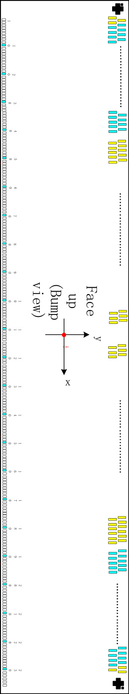

AVEE_SOUAVDD_SOUBGR_OUTDUMMYDUMMYDUMMYDUMMYDUMMYDUMMYDUMMYDUMMYDUMMYDUMMYDUMMYDUMMYDUMMYDUMMYDUMMYDUMMYDUMMYDUMMYDUMMYDUMMYDUMMYDUMMYDUMMYVCOREVCOREVCOREVCOREVCOREVCOREVCOREVSSCVSSCVSSCVSSCVSSCVSSCVSSCVSSAVSSAVSSAVSSAVSSAVSSAVSSAVSSAVSSAVSSCVSSCVSSCVSSCVSSCVSSCVSSCVSSCVSSCVSSCVRDDVRDDVRDDVRDDVRDDVRDDVRDDVCIVCIVCIVCIVCIVCIVCIVCIVX4

VSSCVSSCVSSCVSSCVSSCVREE
IM[3]IM[2]IM[1]IM[0]DUMMYVSSCVSSCRESX

DUMMYVSYNCHSYNCENABLCSXDCXWRXRDX

OSC_TESTDB[10]DB[11]DOTCLKDB[0]DB[1]DB[2]DB[3]DB[4]DB[5]DB[6]DB[7]DB[8]DB[9]DUMMYDUMMYDUMMYSDA

DB[12]DB[13]DB[14]DB[15]

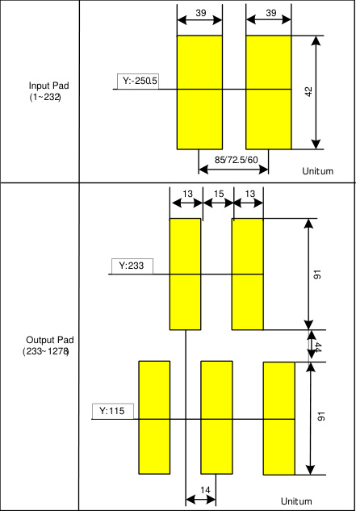

Chip Size: 15360 um x
640um

Chip thickness:
782um(typ.)

Pad Location: Pad Center.

Coordinate Origin: Chip
center

Au bump height: 9um(typ.)

Alignment Marks

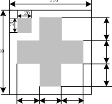

110

DUMMY<1>DUMMY<2>VSSCVSSCVSSCVSSCVSSCVSSCVSSCVSSC

DUMMYVRDDVRCLVRCLVGHVGHVGLVGLVCLVCL

DUMMY<4>DUMMYAVDDAVDDAVDD

110

G[11]G[13]G[15]G[1]G[3]G[5]G[7]G[9]DUMMYDUMMYDUMMY

G[303]G[305]G[307]G[309]G[311]G[313]G[315]G[317]G[319]

S[10]S[1]S[2]S[3]S[4]S[5]S[6]S[7]S[8]S[9]

S[355]S[356]S[357]S[358]S[359]S[360]

S[361]S[362]S[363]S[364]S[365]S[366]

S[709]S[710]S[711]S[712]S[713]S[714]S[715]S[716]S[717]S[718]S[719]S[720]

G[320]G[318]G[316]G[314]G[312]G[310]G[308]G[306]G[304]G[302]

G[16]G[14]G[12]G[10]G[8]G[6]G[4]G[2]DUMMYDUMMYDUMMY

30 Alignment 30 30
Mark:A1

30

30

30

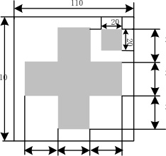

30

30

30

30 30 30

Alignment
Mark:A2

**19** / **190**

Bump View

Osc_in_testDUMMYDUMMYDUMMYDUMMYDUMMYDUMMYDUMMYDUMMYDB[16]DB[17]DUMMYSDOVPPTEBC

DUMMY

IOVCCIOVCCIOVCCIOVCCIOVCCIOVCCIOVCCDUMMYDUMMYDUMMYDUMMYDUMMYDUMMYDUMMYDUMMYDUMMYDUMMYDUMMYDUMMY

VREF_OUTVREG1ADUMMYDUMMYDUMMYGVDDPDUMMYDUMMYDUMMYDUMMYDUMMYDUMMYDUMMYDUMMYDUMMYDUMMYDUMMYAVEEAVEEAVEEAVEEAVEEAVEEAVEEAVEEVSSCVSSCVSSCVSSCVSSC

GVDDNGVDDNGVDDNGVDDNGVDDNGVDDNGVDDNGVDDNGVDDNVSSCVSSCVSSCVSSCVSSCVSSCVSSCVSSCVSSCVSSCVSSC

DUMMYDUMMY

DUMMYDUMMY
DUMMY

###### **4. Interface setting**

**4.1.** **MCU interfaces**

GC9307 provides the 8-/9-/16-/18-bit parallel system interface for 8080- I /8080- II series, and 3-/4-line

serial system interface for serial data input. The input system interface is selected by external pins IM [3:0]

and the bit formal per pixel color order is selected by DBI [2:0] 3-bits of 3Ah register.

**4.1.1.** **MCU interface selection**

The selection of interface is done by setting external pins IM [3:0] as shown in the following table.
**Table 6**

|IM3|IM2|IM1|IM0|MCU-Interface Mode|Pins in use|Col7|
|---|---|---|---|---|---|---|
|IM3|IM2|IM1|IM0|MCU-Interface Mode|Register/Content|GRAM|
|0|0|0|0|8080 MCU 8-bit bus interface I|D[7:0]|D[7:0],WRX,RDX,CSX,D/CX|
|0|0|0|1|8080 MCU 16-bit bus interface I|D[7:0]|D[15:0],WRX,RDX,CSX,D/CX|
|0|0|1|0|8080 MCU 9-bit bus interface I|D[7:0]|D[8:0],WRX,RDX,CSX,D/CX|
|0|0|1|1|8080 MCU 18-bit bus interface I|D[7:0]|D[17:0],WRX,RDX,CSX,D/CX|
|0|1|0|1|3-wire 9-bit data serial interface I|SCL,SDA,CSX|SCL,SDA,CSX|
|0|1|1|0|4-wire 8-bit data serial interface I|SCL,SDA,D/CX,CSX|SCL,SDA,D/CX,CSX|
|1|0|0|0|8080 MCU 16-bit bus interfaceII|D[8:1]|D[17:10],D[8:1],WRX,RDX,CSX,D/CX|
|1|0|0|1|8080 MCU 8-bit bus interfaceII|D[17:10]|D[17:10],WRX,RDX,CSX,D/CX|
|1|0|1|0|8080 MCU 18-bit bus interfaceII|D[8:1]|D[17:0],WRX,RDX,CSX,D/CX|
|1|0|1|1|8080 MCU 9-bit bus interfaceII|D[17:10]|D[17:9],WRX,RDX,CSX,D/CX|
|1|1|0|1|3-wire 9-bit data serial interfaceII|SCL,SDI,SDO,CSX|SCL,SDI,SDO,CSX|
|1|1|1|0|4-wire 8-bit data serial interfaceII|SCL,SDI,SDO,D/CX,CSX|SCL,SDI,SDO,D/CX,CSX|

**20** / **190**

**4.1.2.** **8080-** I **Series Parallel Interface**

GC9307 can be accessed via 8-/9-/16-/18-bit MCU 8080- I series parallel interface. The chip select CSX

(active low) is used to enable or disable GC9307 chip. The RESX (active low) is an external reset signal.

WRX is the parallel data write strobe, RDX is the parallel data read strobe and D[17:0] is parallel data bus.

GC9307 latches the input data at the rising edge of WRX signal. The D/CX is the signal of data/command

selection. When D/CX=’1’, D [17:0] bits are display RAM data or command’s parameters. When D/CX=’0’,

D[17:0] bits are commands.

The 8080- I series bi-directional interface can be used for communication between the MCU controller and

LCD driver chip. The 8080- I Interface selection is done when IM3 pin is low state (VSSC level). Interface

bus width can be selected by IM [2:0] bits.

The selection of 8080- I series parallel interface is shown as the table in the following.
**Table 7**

|IM3|IM2|IM1|IM0|MCU-Interface|CSX|WRX|RDX|D/CX|Function|
|---|---|---|---|---|---|---|---|---|---|
|0|0|0|0|8080 MCU 8-bit bus interface I|“L”||“H”|“L”|Write command code.|
|0|0|0|0|8080 MCU 8-bit bus interface I|“L”|“H”||“H”|Read internal status.|
|0|0|0|0|8080 MCU 8-bit bus interface I|“L”||“H”|“H”|Write parameter or display data.|
|0|0|0|0|8080 MCU 8-bit bus interface I|“L”|“H”||“H”|Reads parameter or display data.|
|0|0|0|1|8080 MCU 16-bit bus interface I|“L”||“H”|“L”|Write command code.|
|0|0|0|1|8080 MCU 16-bit bus interface I|“L”|“H”||“H”|Read internal status.|
|0|0|0|1|8080 MCU 16-bit bus interface I|“L”||“H”|“H”|Write parameter or display data.|
|0|0|0|1|8080 MCU 16-bit bus interface I|“L”|“H”||“H”|Reads parameter or display data.|
|0|0|1|0|8080 MCU 9-bit bus interface I|“L”||“H”|“L”|Write command code.|
|0|0|1|0|8080 MCU 9-bit bus interface I|“L”|“H”||“H”|Read internal status.|
|0|0|1|0|8080 MCU 9-bit bus interface I|“L”||“H”|“H”|Write parameter or display data.|
|0|0|1|0|8080 MCU 9-bit bus interface I|“L”|“H”||“H”|Reads parameter or display data.|
|0|0|1|1|8080 MCU 18-bit bus interface I|“L”||“H”|“L”|Write command code.|
|0|0|1|1|8080 MCU 18-bit bus interface I|“L”|“H”||“H”|Read internal status.|
|0|0|1|1|8080 MCU 18-bit bus interface I|“L”||“H”|“H”|Write parameter or display data.|
|0|0|1|1|8080 MCU 18-bit bus interface I|“L”|“H”||“H”|Reads parameter or display data.|

**21** / **190**

**4.1.3.** **Write Cycle Sequence**

The WRX signal is driven from high to low and then be pulled back to high during the write cycle. The host

processor provides information during the write cycle when the display module captures the information

from host processor on the rising edge of WRX. When the D/CX signal is driven to low level, then input

data on the interface is interpreted as command information. The D/CX signal also can be pulled high level

when the data on the interface is SRAM data or command’s parameter.

The following figure shows a write cycle for the 8080-I MCU interface.
**Figure 2.**

WRX

Data Bus
(D[17:0]) 、

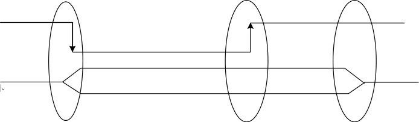
D[15:0] 、 D[8:0] 、

D[7:0]

The host negates D[17:0] 、
D[15:0] 、 D[8:0] or D[7:0] lines

The host asserts D[17:0] 、 D[15:0] 、 D[8:0] or
D[7:0] lines when there is falling edge of WRX

The slave reads D[17:0] 、 D[15:0] 、 D[8:0]
or D[7:0] lines when there is rising edge of
WRX

_Note: WRX is an unsynchronized signal (It can be stopped)_
**Figure 3.**

CSX

RESX

D/CX

WRX

RDX

D[17:0]

|Col1|Hi-Z|
|---|---|
|D[17:0](LCD to Host)|Hi-Z|
|D[17:0](LCD to Host)||

D[17:0](Host to LCD)

Command

Address

Command

Address

Command

Data

Command

Data

Signals on D[17:0],D/CX,RDX and WRX wires during CSX= ” H ”
are ignored

**22** / **190**

**4.1.4.** **Read Cycle Sequence**

The RDX signal is driven from high to low and then allowed to be pulled back to high during the read cycle.

The display module provides information to the host processor during the read cycle, while the host

processor reads the display module information on the rising edge of RDX signal. When the D/CX signal is

driven to low level, then input data on the interface is interpreted as command. The D/CX signal also can

be pulled high level when the data on the interface is RAM data or command parameter.

The following figure shows the read cycle for the 8080-I MCU interface .
**Figure 4.**

RDX

Data Bus

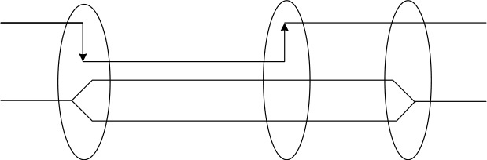
D[7:0] 、 D[8:0] or
D[15:0] 、 D[17:0]

The slave assers D[17:0] 、
D[15:0] 、 D[8:0] or D[7:0] lines
when there is a falling edge of
RDX

_Note: RDX is an unsynchronized signal (It can be stopped)._
**Figure 5.**

CSX

RESX

D/CX

WRX

RDX

The host reads D[17:0] 、
D[15:0] 、 D[8:0] or D[7:0]
lines when there is a rising
edge of RDX

The slave negates D[17:0] 、
D[15:0] 、 D[8:0] or D[7:0] lines

D[17:0]

D[17:0](Host to LCD)

D[17:0](LCD to Host)

Command

Address

Command

Hi-Z Hi-Z

Data (invalid) Data (valid)

Data (invalid) Data (valid)

Hi-Z

Signals on D[17:0],D/CX,RDX and WRX wires during CSX= ” H ”
are ignored

_Note: Read data is only valid when the D/CX input is pulled high. If D/CX is driven low during read then the display information outputs will be_

_High-Z._

**23** / **190**

**4.1.5.** **8080-** Ⅱ **Series Parallel Interface**

GC9307 can be accessed via 8-/9-/16-/18-bit MCU 8080- Ⅱ series parallel interface. The chip select CSX

(active low) is used to enable or disable GC9307 chip. The RESX (active low) is an external reset signal.

WRX is the parallel data write strobe, RDX is the parallel data read strobe and D[17:0] is parallel data bus.

GC9307 latches the input data at the rising edge of WRX signal. The D/CX is the signal of data/command

selection. When D/CX=’1’, D [17:0] bits are display RAM data or command’s parameters. When D/CX=’0’,

D[17:0] bits are commands.

The 8080- II series bi-directional interface can be used for communication between the MCU controller and

LCD driver chip. The 8080- II Interface selection is done when IM3 pin is high state (IOVCC level).

Interface bus width can be selected by IM [2:0] bits.

The selection of 8080- II series parallel interface is shown as the table in the following.
**Table 8**

|IM3|IM2|IM1|IM0|MCU-Interface|CSX|WRX|RDX|D/CX|Function|
|---|---|---|---|---|---|---|---|---|---|
|1|0|0|0|8080 MCU 16-bit bus interfaceII|“L”||“H”|“L”|Write command code.|
|1|0|0|0|8080 MCU 16-bit bus interfaceII|“L”|“H”||“H”|Read internal status.|
|1|0|0|0|8080 MCU 16-bit bus interfaceII|“L”||“H”|“H”|Write parameter or display data.|
|1|0|0|0|8080 MCU 16-bit bus interfaceII|“L”|“H”||“H”|Reads parameter or display data.|
|1|0|0|1|8080 MCU 8-bit bus interface II|“L”||“H”|“L”|Write command code.|
|1|0|0|1|8080 MCU 8-bit bus interface II|“L”|“H”||“H”|Read internal status.|
|1|0|0|1|8080 MCU 8-bit bus interface II|“L”||“H”|“H”|Write parameter or display data.|
|1|0|0|1|8080 MCU 8-bit bus interface II|“L”|“H”||“H”|Reads parameter or display data.|
|1|0|1|0|8080 MCU 18-bit bus interfaceII|“L”||“H”|“L”|Write command code.|
|1|0|1|0|8080 MCU 18-bit bus interfaceII|“L”|“H”||“H”|Read internal status.|
|1|0|1|0|8080 MCU 18-bit bus interfaceII|“L”||“H”|“H”|Write parameter or display data.|
|1|0|1|0|8080 MCU 18-bit bus interfaceII|“L”|“H”||“H”|Reads parameter or display data.|
|1|0|1|1|8080 MCU 9-bit bus interfaceII|“L”||“H”|“L”|Write command code.|
|1|0|1|1|8080 MCU 9-bit bus interfaceII|“L”|“H”||“H”|Read internal status.|
|1|0|1|1|8080 MCU 9-bit bus interfaceII|“L”||“H”|“H”|Write parameter or display data.|
|1|0|1|1|8080 MCU 9-bit bus interfaceII|“L”|“H”||“H”|Reads parameter or display data.|

**24** / **190**

**4.1.6.** **Write Cycle Sequence**

The WRX signal is driven from high to low and then be pulled back to high during the write cycle. The host

processor provides information during the write cycle when the display module captures the information

from host processor on the rising edge of WRX. When the D/CX signal is driven to low level, then input

data on the interface is interpreted as command information. The D/CX signal also can be pulled high level

when the data on the interface is RAM data or command’s parameter.

The following figure shows a write cycle for the 8080-II MCU interface.
**Figure 6.**

WRX

Data Bus

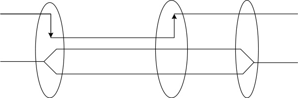
D[17:10] 、 D[17:9]
D[17:10] 、 D[8:1] 、
orD[17:0]

The host asserts D[17:0] 、
D[17:10] 、 D[8:1] 、 D[17:9] or
D[17:10] lines when there is falling
edge of WRX

_Note: WRX is an unsynchronized signal (It can be stopped)_
**Figure 7.**

CSX

RESX

D/CX

WRX

RDX

D[17:0]

|Col1|Hi-Z|
|---|---|
|D[17:0](LCD to Host)|Hi-Z|
|D[17:0](LCD to Host)||

D[17:0](Host to LCD)

Command

Address

Command

Address

The display read D[17:0] 、
D[17:10] 、 D[8:1] 、 D[17:9] or
D[17:10] lines when there is
rising edge of WRX

The host negates D[17:0] 、
D[17:10] 、 D[8:1] 、 D[17:9] or
D[17:10] lines

Commad

Data

Commad

Data

Signals on D[17:0],D/CX,RDX and WRX wires during CSX= ” H ”
are ignored

**25** / **190**

**4.1.7.** **Read Cycle Sequence**

The RDX signal is driven from high to low and then allowed to be pulled back to high during the read cycle.

The display module provides information to the host processor during the read cycle while the host

processor reads the display module information on the rising edge of RDX signal. When the D/CX signal is

driven to low level, then input data on the interface is interpreted as command. The D/CX signal also can

be pulled high level when the data on the interface is RAM data or command parameter.

The following figure shows the read cycle for the 8080-II MCU interface.
**Figure 8.**

RDX

Data Bus

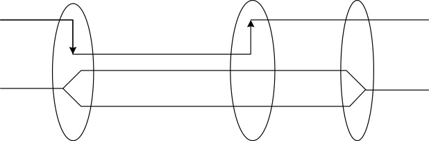
D[17:10] 、 D[17:9] 、

D[17:10] 、
D[8:1]orD[17:0]

The slave assers D[17:0] 、
D[17:10] 、 D[8:1] 、 D[17:9] or
D[17:10] lines when there is a
falling edge of RDX

_Note: RDX is an unsynchronized signal (It can be stopped)._
**Figure 9.**

CSX

RESX

D/CX

WRX

RDX

D[17:0]

D[17:0](Host to LCD)

D[17:0](LCD to Host)

The host reads D[17:0] 、
D[17:10] 、 D[8:1] 、 D[17:9] or
D[17:10] lines when there is a
rising edge of RDX

The slave negates D[17:0] 、
D[17:10] 、 D[8:1] 、 D[17:9] or
D[17:10] lines

Command

Address

Command

Data (invalid) Data (valid)

Hi-Z

|Col1|Col2|
|---|---|
|||

Hi-Z Hi-Z

Data (invalid) Data (valid)

|Col1|Col2|
|---|---|
|||

Signals on D[17:0],D/CX,RDX and WRX wires during
CSX= ” H ” are ignored

_Note: Read data is only valid when the D/CX input is pulled high. If D/CX is driven low during read then the display information outputs will be_

_High-Z._

**26** / **190**

**Serial Interface**

The selection of interface is done by IM [3:0] bits. Please refer to the Table in the following.
**Table 8.**

|IM3|IM2|IM1|IM0|MCU-Interface Mode|CSX|D/CX|SCL|Function|
|---|---|---|---|---|---|---|---|---|
|0|1|0|1|3-line serial interface|“L”|-||Read/Write command, parameter or display data.|
|0|1|1|0|4-line serial interface|“L”|"H/L"||Read/Write command, parameter or display data.|
|1|1|0|1|3-line serial interface|“L”|-||Read/Write command, parameter or display data.|
|1|1|1|0|4-line serial interface|“L”|"H/L"||Read/Write command, parameter or display data.|

GC9307 supplies 3-lines/ 9-bit and 4-line/8-bit bi-directional serial interfaces for communication between

host and GC9307. The 3-line serial mode consists of the chip enable input (CSX), the serial clock input

(SCL) and serial data Input/Output (SDA or SDI/SDO). The 4-line serial mode consists of the Data/

Command selection input (D/CX), chip enable input (CSX), the serial clock input (SCL) and serial data

Input/Output (SDA or SDI/SDO) for data transmission. The data bus (D [17:0]), which are not used, must

be connected to GND. Serial clock (SCL) is used for interface with MCU only, so it can be stopped when

no communication is necessary.

**27** / **190**

**4.1.8.** **Write Cycle Sequence**

The write mode of the interface means that host writes commands or data to GC9307. The 3-lines serial

data packet contains a data/command select bit (D/CX) and a transmission byte. If the D/CX bit is “low”,

the transmission byte is interpreted as a command byte. If the D/CX bit is “high”, the transmission byte is

stored as the display data RAM(Memory write command ),or command register as parameter.

Any instruction can be sent in any order to GC9307 and the MSB is transmitted first. The serial interface is

initialized when CSX is high status. In this state, SCL clock pulse and SDA data are no effect. A falling

edge on CSX enables the serial interface and indicates the start of data transmission. See the detailed

data format for 3-/4-line serial interface.
**Figure 10.**

Data Format for 3-line Serial Interface

|Transmission byte may|be Command or Data|
|---|---|
|||
|||

MSB LSB

|D/C D7 D6 D5 D4 D3 D2 D1 D0 X D/CX 8-bit Transmission Byte D/CX 8-bit Transmission Byte|Col2|D/C X|D7|D6|D5|Col7|D4|D3|D2|D1|D0|
|---|---|---|---|---|---|---|---|---|---|---|---|
|D/CX|8-bit Transmission Byte|8-bit Transmission Byte|8-bit Transmission Byte|D/CX|D/CX|8-bit Transmission Byte|8-bit Transmission Byte|8-bit Transmission Byte|8-bit Transmission Byte|8-bit Transmission Byte|8-bit Transmission Byte|
|||||||||||||
|||||||||||||

Data/Command selectbit

**Figure11.**

Data Format for 4-line Serial Interface

|Transmission byte may|be Command or Data|
|---|---|
|||
|||

MSB LSB

|D7 D6 D5 D4 D3 D2 D1 D0 8-bit Transmission 8-bit Transmission 8-bit Transmission Byte Byte Byte|Col2|D7|D6|D5|D4|Col7|D3|D2|D1|D0|
|---|---|---|---|---|---|---|---|---|---|---|
|8-bit Transmission Byte|8-bit Transmission Byte|8-bit Transmission Byte|8-bit Transmission Byte|8-bit Transmission Byte|8-bit Transmission Byte|8-bit Transmission Byte|8-bit Transmission Byte|8-bit Transmission Byte|8-bit Transmission Byte|8-bit Transmission Byte|

Host processor drives the CSX pin to low and starts by setting the D/CX bit on SDA. The bit is read by

GC9307 on the first rising edge of SCL signal. On the next falling edge of SCL, the MSB data bit (D7) is set

on SDA by the host. On the next falling edge of SCL, the next bit (D6) is set on SDA. If the optional D/CX

signal is used, a byte is eight read cycle width. The 3/4-line serial interface writes sequence described in

the figure as below.

**28** / **190**

**Figure 12.**

**Figure 13.**

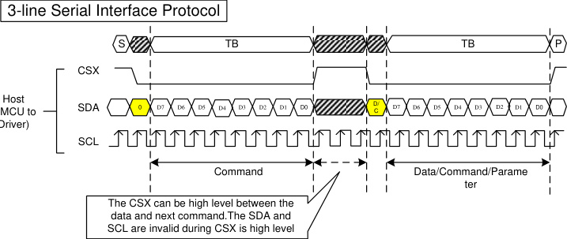

|Col1|P|
|---|---|
|||
|D0||

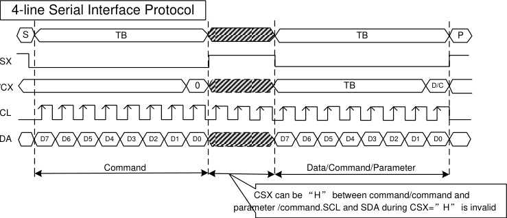

**29** / **190**

**4.1.9.** **Read Cycle Sequence**

The read mode of interface means that the host reads register’s parameter from GC9307. The host has to

send a command (Read ID or register command) and then the following byte is transmitted in the opposite

direction. GC9307 latches the SDA (input data) at the rising edges of SCL (serial clock), and then shifts

SDA (output data) at falling edges of SCL (serial clock). After the read status command has been sent, the

SDA line must be set to tri-state and no later than at the falling edge of SCL of the last bit. The read mode

has three types of transmitted command data (8-/24-/32-bit) according command code.
**Figure 14.**

|3-wire Serial Interface Protocol|Col2|Col3|
|---|---|---|
||3-wire Serial Protocol (for RDID1/RDID2/RDID3/0Ah/0Bh/0Ch/0Dh/0Eh/0Fh command:8-bit read)|3-wire Serial Protocol (for RDID1/RDID2/RDID3/0Ah/0Bh/0Ch/0Dh/0Eh/0Fh command:8-bit read)|

CSX

SCL

Interface I

Interface II

SDA

SDA

SDO

**Figure 15.**

CSX

SCL

|S T X L A D C/ D7 D6 D5 D4 D C/ D7 D6 D5 D4 A O Comma|B TB|F S D1 D0 D C D/ C D1 D0 utput|
|---|---|---|
|S T D/ C D7 D6 D5 D4 D/ C D7 D6 D5 D4 X L A A O Comma|D3 D2 D1 D0 D7 D6 D5 D4 D3 D2 D3 D2 D1 D0 D7 D6 D5 D4 D3 D2 nd Read data o|D3 D2 D1 D0 D7 D6 D5 D4 D3 D2 D3 D2 D1 D0 D7 D6 D5 D4 D3 D2 nd Read data o|

SDA

SDA

SDO

|Col1|Col2|Protocol (for RDDID command:24-bit|Col4|
|---|---|---|---|
||TB TB|TB TB|P S D2 D1 D0|
|S|S|S|S|
|||||
|| D7 D6 D5 D4 D3   D7 D6 D5 D4 D3 D/C D/C| D7 D6 D5 D4 D3   D7 D6 D5 D4 D3 D/C D/C| D7 D6 D5 D4 D3   D7 D6 D5 D4 D3 D/C D/C|
|| D7 D6 D5 D4 D3   D7 D6 D5 D4 D3 D/C D/C| D7 D6 D5 D4 D3   D7 D6 D5 D4 D3 D/C D/C||
|||||

CSX

SCL

SDA

SDA

SDO

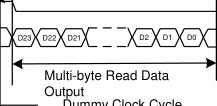

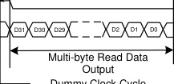

**Figure 16.**

Interface I

Interface II

Interface I

Interface II

D/C

D/C

D/C

D/C

|Col1|Col2|Protocol (for RDDST command:32-bit r|Col4|
|---|---|---|---|
||TB TB|TB TB|P S D2 D1 D0|
|S|S|S|S|
|||||
|| D7 D6 D5 D4 D3   D7 D6 D5 D4 D3 D/C D/C| D7 D6 D5 D4 D3   D7 D6 D5 D4 D3 D/C D/C| D7 D6 D5 D4 D3   D7 D6 D5 D4 D3 D/C D/C|
|| D7 D6 D5 D4 D3   D7 D6 D5 D4 D3 D/C D/C| D7 D6 D5 D4 D3   D7 D6 D5 D4 D3 D/C D/C||
|||||

**30** / **190**

**Figure 17.**

**Figure 18.**

|4-wire Serial Interface Protocol|Col2|Col3|
|---|---|---|
||4-wire Serial Protocol (for RDID1/RDID2/RDID3/0Ah/0Bh/0Ch/0Dh/0Eh/0Fh   command:8-bit read)|4-wire Serial Protocol (for RDID1/RDID2/RDID3/0Ah/0Bh/0Ch/0Dh/0Eh/0Fh   command:8-bit read)|

Interface I

Interface II

Interface I

Interface II

CSX

SCL

SDA

SDI

SDO

CSX

SCL

|S TB 0 D7 D6 D5 D4 D3 D2 D1 D0 D7 D6 D5 D4 D3 D2 D1 D0 Command|TB P|S|
|---|---|---|
|S TB D7 D6 D5 D4 D3 D2 D1 D0 D7 D6 D5 D4 D3 D2 D1 D0      Command  0|TB P||
|S TB D7 D6 D5 D4 D3 D2 D1 D0 D7 D6 D5 D4 D3 D2 D1 D0      Command  0|TB P||

SDA

SDI

SDO

4-wire Serial Protocol (for RDDID  command:24-bit read)

**Figure 19.**

|S TB X L 0 A D7 D6 D5 D4 D3 D2 D1 D0 D7 D6 D5 D4 D3 D2 D1 D0 I O Command|TB|
|---|---|
|S TB D7 D6 D5 D4 D3 D2 D1 D0 D7 D6 D5 D4 D3 D2 D1 D0 X L A I O Command  0||
|S TB D7 D6 D5 D4 D3 D2 D1 D0 D7 D6 D5 D4 D3 D2 D1 D0 X L A I O Command  0||

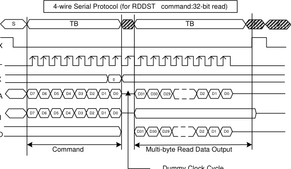

CSX

SCL

Interface I

Interface II

SDA

SDI

SDO

**31** / **190**

**4.1.10.** **Data Transfer Break and Recovery**

If there is a break in data transmission by RESX pulse, while transferring a command or multiple

parameter command data, before Bit D0 of the byte has been completed, then the driver will reject the

previous bits and have reset the interface such that it will be ready to receive command data again when

the chip select pin (CSX) is activated after RESX have been high state.
**Figure 20.**

CSX

RESX

Driver
(MPU to Driver)

SCL

SDA

|Col1|Col2|Col3|Col4|Col5|Col6|Col7|P|
|---|---|---|---|---|---|---|---|
||TB|TB|TB|||TB|TB|
|||||||||
|||||||||
|||||Wa|it for|it for|it for|
|||||||||
|||||||||
|||||||||
|||D2|D2|| D/C| D/C| D/C|

Command/
Parameter/Data Command

If there is a break in data transmission by CSX pulse, while transferring a command or frame memory data

or multiple parameter command data, before Bit D0 of the byte has been completed, then the driver will

reject the previous bits and have reset the interface such that it will be ready to receive the same byte

re-transmitted when the chip select pin (CSX) is next activated.
**Figure 21.**

CSX

Driver
(MPU to Driv ~~er)~~

SCL

SDA

|TB D/ C D7 D6 D5 D4 Command/ Break Parameter/Data|Col2|T D/ C D7 D6 D5 D4 Command/Pa|B P D3 D 2 D 1 D0 rameter/Data|
|---|---|---|---|
| TB   D7 D6 D5 D4 D/C Command/ Parameter/Data Break||||
| TB   D7 D6 D5 D4 D/C Command/ Parameter/Data Break||||

If a two or more parameter command is being sent and a break occurs while sending any parameter

before the last one and if the host then sends a new command rather than continue to send the remained

parameters that was interrupted, then the parameters which had been successfully sent are stored and the

parameter where the break occurred is rejected. The interface is ready to receive next byte as shown

below.

**32** / **190**

**Figure 22.**

|Break|Col2|
|---|---|
|||

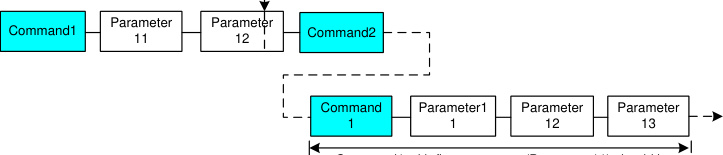

Command1 with first parameter (Parameter11) should be
executed again to write remained parameter (Parameter12

and Parameter13)
If a two or more parameter command is being sent and a break occurs by the other command before the

last one is sent, then the parameters which had been successfully sent are stored and the other parameter

of that command remains previous value.
**Figure 23.**

|Break|Col2|
|---|---|
|||

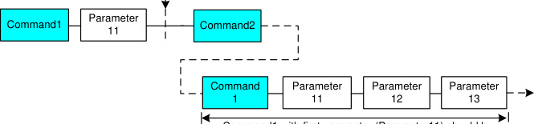

Command1 with first parameter (Parameter11) should be
executed again to write remained parameter (Parameter12

and Parameter13)

**33** / **190**

**4.1.11.** **Data Transfer Pause**

It will be possible when transferring a command, frame memory data or multiple parameter data to invoke

a pause in the data transmission. If the chip select pin (CSX) is released to high state after a whole byte of

a frame memory data or multiple parameter data has been completed, then GC9307 will wait and continue

the frame memory data or parameter data transmission from the point where it was paused. If the chip

select pin is released after a whole byte of a command has been completed, then the display module will

receive either the command’s parameters(if appropriate) or a new command when the chip select pin is

next enabled as shown below.

This applies to the following 4 conditions:

1) Command-Pause-Command

2) Command-Pause-Parameter

3) Parameter-Pause-Command

4) Parameter-Pause-Parameter
**Figure 24.**

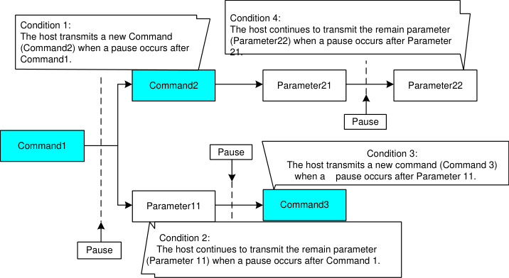

|Parameter11|Col2|
|---|---|
|Parameter11||

**34** / **190**

**4.1.12.** **Serial Interface Pause (3_wire)**

**Figure 25.**

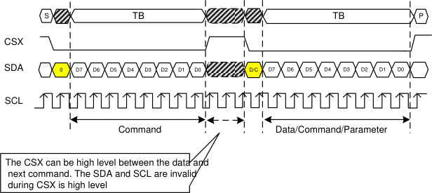

|TB|Col2|Col3|Col4|Col5|Col6|Col7|Col8|Col9|
|---|---|---|---|---|---|---|---|---|
| TB| TB| TB| TB| TB| TB| TB| TB||
| TB| TB| TB| TB| TB| TB| TB| TB||
| TB| TB| TB| TB| TB| TB| TB| TB||
| TB|D6|D5|D4|D3|D2|D1|D0||

Driver
(MPU to Driver)

|Col1|Col2|
|---|---|
|)|)|

**4.1.13.** **Parallel Interface Pause**

**Figure 26.**

CSX

D/CX

RDX

WRX

D[17:0] D17 to D0

Command/Parameter

**4.1.14.** **Data Transfer Mode**

Pause

D17 to D0

Pause Command/Parameter

GC9307 can provide two different kinds of color depth (16-bit/pixel and 18-bit/pixel) display data to the

graphic RAM. The data format is described for each interface. Data can be downloaded to the frame

memory by 2 methods.

**35** / **190**

**4.1.15.** **Data Transfer Method 1**

The image data is sent to the frame memory in the successive frame writing, each time the frame memory

is filled by image data, the frame memory pointer is reset to the start point and the next frame is written.
**Figure 27.**

|Start|Col2|Col3|Col4|Col5|Stop|
|---|---|---|---|---|---|
|Start Frame Memory Write|Image Data Frame 1|Image Data Frame 2|Image Data Frame 3||Any Command|
|Start Frame Memory Write|Image Data Frame 1|Image Data Frame 2|Image Data Frame 3|||

**4.1.16.** **Data Transfer Method 2**

Image data is sent and at the end of each frame memory download, a command is sent to stop frame

memory writing. Then start memory write command is sent, and a new frame is downloaded.
**Figure 28.**

|Start|Col2|Col3|Col4|Col5|Col6|Col7|Stop|
|---|---|---|---|---|---|---|---|
|Start Frame Memory Write|Image Data Frame 1|Any Command|Start Frame Memory Write|Image Data Frame 2|Any Command||Any Command|
|Start Frame Memory Write|Image Data Frame 1|Any Command|Start Frame Memory Write|Image Data Frame 2|Any Command|||

_Note 1: These methods are applied to all data transfer color modes on both serial and parallel interfaces._

_Note 2: The frame memory can contain both odd and even number of pixels for both methods. Only complete pixel data will be stored in the_

_frame memory._

**36** / **190**

**4.2.** **RGB Interface**

**4.2.1.** **RGB Interface Selection**

GC9307 has two kinds of RGB interface and these interfaces can be selected by RCM [1:0] bits. When

RCM [1:0] bits are set to “10”, the DE mode is selected which utilizes VSYNC, HSYNC, DOTCLK, DE, D

[17:0] pins; when RCM [1:0] bits are set to “11”, the SYNC mode is selected which utilizes which utilizes

VSYNC, HSYNC,DOTCLK, D [17:0] pins. Using RGB interface must selection serial interface.

GC9307 supports several pixel formats that can be selected by RIM bit of F6h command. The selection of

a given interfaces is done by setting RCM [1:0] as show in the following table.

**Table 9**

|RCM[1:0]|Col2|RIM|DPI[1:0]|Col5|Col6|RGB interface Mode|RGB Mode|Used Pins|
|---|---|---|---|---|---|---|---|---|
|1|0|0|1|1|0|18-bit RGB interface (262K colors)|DE Mode  Valid data is determined by the DE signal|VSYNC,HSYNC,DE,DOTCLK,D[17:0]|
|1|0|0|1|0|1|16-bit RGB interface (65K colors)|16-bit RGB interface (65K colors)|VSYNC,HSYNC,DE,DOTCLK,D[17:13] & D[11:1]|
|1|0|1|-|-|-|6-bit RGB interface (262K colors)|6-bit RGB interface (262K colors)|VSYNC,HSYNC,DE,DOTCLK,D[5:0]|
|1|1|0|1|1|0|18-bit RGB interface (262K colors)|SYNC Mode In SYNC mode, DE signal is ignored;blanking porch is determined by B5h command|VSYNC,HSYNC,DOTCLK, D[17:0]|
|1|1|0|1|0|1|16-bit RGB interface (65K colors)|16-bit RGB interface (65K colors)|VSYNC,HSYNC,DOTCLK, D[17:13] & D[11:1]|
|1|1|1|-|-|-|6-bit RGB interface (262K colors)|6-bit RGB interface (262K colors)|VSYNC,HSYNC,DOTCLK, D[5:0]|

18-bit data bus interface (D[17:0] is used), RIM=0
**Figure 29.**

|Col1|D17|D16|D15|D14|D13|D12|D11|D10|D9|D8|D7|D6|D5|D4|D3|D2|D1|D0|
|---|---|---|---|---|---|---|---|---|---|---|---|---|---|---|---|---|---|---|
|18bpp Frame Memory Write |R[5]|R[4]|R[3]|R[2]|R[1]|R[0]|G[5]|G[4]|G[3]|G[2]|G[1]|G[0]|B[5]|B[4]|B[3]|B[2]|B[1] |B[0]|

16-bit data bus interface (D[17:13] & D[11:1] is used), DPI[2:0] = 101, and RIM=0
**Figure 30.**

_The LSB data of red/blue color are same as MSB data._

|Col1|D17|D16|D15|D14|D13|D11|D10|D9|D8|D7|D6|D5|D4|D3|D2|D1|
|---|---|---|---|---|---|---|---|---|---|---|---|---|---|---|---|---|
|16bpp Frame Memory Write |R[4]  |R[3]  |R[2]  |R[1]  |R[0]  G  |[5]  |G[4] |G[3] |G[2] |G[1] |G[0] |B[4]|B[3]|B[2]|B[1]|B[0]|

6-bit data bus interface (D[5:0] is used), RIM=1
**Figure 31.**

|Col1|D5|D4|D3|D2|D1|D0|D5|D4|D3|D2|D1|D0|D5|D4|D3|D2|D1|D0|
|---|---|---|---|---|---|---|---|---|---|---|---|---|---|---|---|---|---|---|
|8bpp Frame Memory Write|R[5] |R[4] |R[3] |R[2] |R[1] |R[0] |G[5] |G[4] |G[3] |G[2] |G[1] |G[0] |B[5]|B[4]|B[3]|B[2]|B[1|]  B[0]|

Pixel clock (DOTCLK) is running all the time without stopping and used to enter VSYNC, HSYNC, DE and

**37** / **190**

D[17:0] states when there is a rising edge of the DOTCLK. Vertical synchronization (VSYNC) is used to tell

when there is received a new frame of the display. This is low enable and its state is read to the display

module by a rising edge of the DOTCLK signal.

Horizontal synchronization (HSYNC) is used to tell when there is received a new line of the frame. This is

low enable and its state is read to the display module by a rising edge of the DOTCLK signal.

In DE mode, Data Enable (DE) is used to tell when there is received RGB information that should be

transferred on the display. This is a high enable and its state is read to the display module by a rising edge

of the DOTCLK signal. D [17:0] are used to tell what is the information of the image that is transferred on

the display (When DE= ’0’ (low) and there is a rising edge of DOTCLK). D [17:0] can be ‘0’ (low) or ‘1’

(high). These lines are read by a rising edge of the DOTCLK signal. In SYNC mode, the valid display data

in inputted in pixel unit via D [17:0] according to HFP/HBP settings of HSYNC signal and VFP/VBP setting

of VSYNC. In both RGB interface modes, the input display data is written to GRAM first then outputs

corresponding source voltage according the gray data from GRAM.
**Figure32.**

|Col1|Col2|Col3|HBP Hsync|Col5|HAdr HFP|Col7|
|---|---|---|---|---|---|---|
||||_Hsync_ _HBP_||||
||||||||
|_Vsync_ _VBP_ _VAdr_|_Vsync_ _VBP_ _VAdr_||_(Vsync&VBP)-_Vertical interval when no valid display data is transferred from host to display|_(Vsync&VBP)-_Vertical interval when no valid display data is transferred from host to display|_(Hsync&HBP)-_Horizontal interval when no valid display data is sent from host to display|_(Hsync&HBP)-_Horizontal interval when no valid display data is sent from host to display|
|_Vsync_ _VBP_ _VAdr_|||||||
|_Vsync_ _VBP_ _VAdr_|||||_(VAdr+Hadr)-_Period when valid display data are transferred from host to display module|_(VAdr+Hadr)-_Period when valid display data are transferred from host to display module|
|_Vsync_ _VBP_ _VAdr_|||||||

**Table 10.**

|Parameters|Symbols|Condition|Min.|Typ.|Max.|Units|
|---|---|---|---|---|---|---|
|Horizontal Synchronization|Hsync||2|10|16|DOTCLK|
|Horizontal Back Porch|HBP||2|20|24|DOTCLK|
|Horizontal Address|HAdr||-|240|-|DOTCLK|
|Horizontal Front Porch|HFP||2|10|16|DOTCLK|
|Vertical Synchronization|Vsync||1|2|4|Line|
|Vertical Back Porch|VBP||1|2|-|Line|
|Vertical Address|VAdr||-|320|-|Line|
|Vertical Front Porch|VFP||3|4|-|Line|

_Notes:_

**38** / **190**

_1. Vertical period (one frame) shall be equal to the sum of VBP + VAdr + VFP._

_2. Horizontal period (one line) shall be equal to the sum of HBP + HAdr + HFP._

_3. Control signals Hsync shall be transmitted as specified at all times while valid pixels are transferred between the host processor and the_

_display module._

**39** / **190**

**4.2.2.** **RGB Interface Timing**

The timing chart of 18/16-bit RGB interface mode1 and mode 2 is shown as below.
**Figure33.**

SYNC Mode. RCM[1:0]=”11”

VSYNC

HSYNC

ENABLE

|Col1|Col2|Col3|Col4|Col5|
|---|---|---|---|---|
||||||
|Active Area Total Area VBP VFP|||||
|Active Area Total Area VBP VFP||Active Area Total Area|Active Area Total Area|Active Area Total Area|

HSYNC

ENABLE

DOTCLK

D[5:0]

|E K|Col2|Col3|Col4|Col5|Col6|Col7|Col8|Col9|Col10|
|---|---|---|---|---|---|---|---|---|---|
|K E|HBP|HBP|1 line time|HFP|HFP|HFP|HFP|HFP|HFP|
|||||||||||
|||||||||||

Mode1 RGB SYNC mode

**40** / **190**

SYNC Mode. RCM[1:0]=”10”

VSYNC

HSYNC

ENABLE

|Col1|Col2|Col3|Col4|Col5|
|---|---|---|---|---|
||||||
|Active Area Total Area VBP VFP|Active Area Total Area VBP VFP|Active Area|Active Area|Active Area|
|Active Area Total Area VBP VFP|Active Area Total Area VBP VFP| Total Area| Total Area| Total Area|

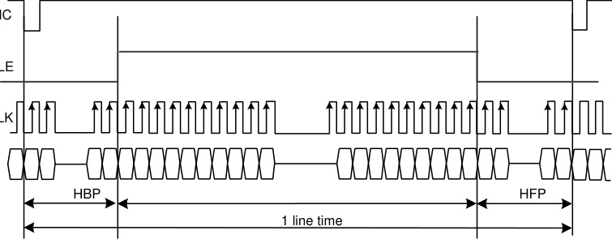

HSYNC

ENABLE

DOTCLK

D[5:0]

|1 line time|Col2|Col3|Col4|Col5|Col6|Col7|
|---|---|---|---|---|---|---|
|1 line time|HFP|HFP|HFP|HFP|HFP|HFP|
|1 line time|HFP||||||
|1 line time|HFP||||||

Mode2 RGB SYNC+DE mode

|C LE|Col2|
|---|---|
|K|K|

_Note 1: The DE signal is not needed when RGB interface SYNC mode is selected._

_Note 2: VSPL=’0’, HSPL=’0’, DPL=’0’ and EPL=’0’ of “Interface Mode Control (B0h)” command._

**41** / **190**

The timing chart of 6-bit RGB interface mode is shown as below:
**Figure34.**

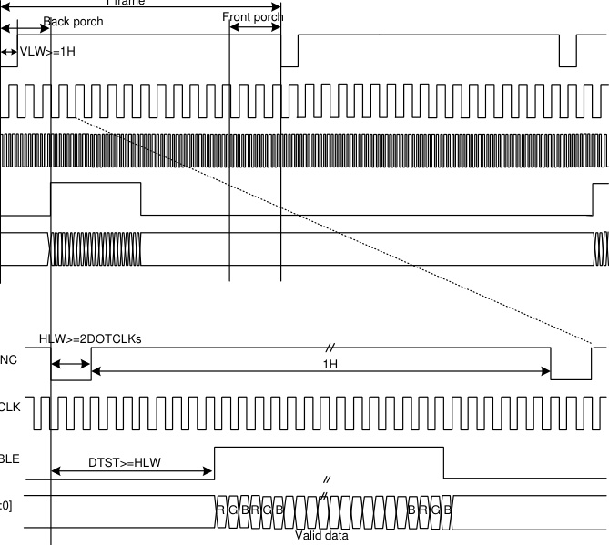

1 frame

HSYNC

DOTCLK

ENABLE

D[5:0]

HSYNC

DOTCLK

ENABLE

D[5:0]

VLW: VSYNC Low Width
HLW: HSYNC Low Width
DTST: Data Transfer Startup Time

_Note 1: 6-bit RGB interface mode only used in the DE interface._

_Note 2: VSPL=’0’, HSPL=’0’, DPL=’0’ and EPL=’0’ of “Interface Mode Control (B0h)” command._

_Note 3: In 6-bit RGB interface mode, each dot of one pixel (R, G and B) is transferred in synchronization with DOTCLK._

_Note 4: In 6-bit RGB interface mode, set the cycles of VSYNC, HSYNC and DE to 3 multiples of DOTCLK._

**42** / **190**

**4.3.** **VSYNC Interface**

GC9307 supports the VSYNC interface in synchronization with the frame-synchronizing signal VSYNC to

display the moving picture with the 8080- Ⅰ /8080- Ⅱ system interface. When the VSYNC interface is

selected to display a moving picture, the minimum GRAM update speed is limited and the VSYNC

interface is enabled by setting DM[1:0] = “10” and RM = “0”.
**Figure35.**

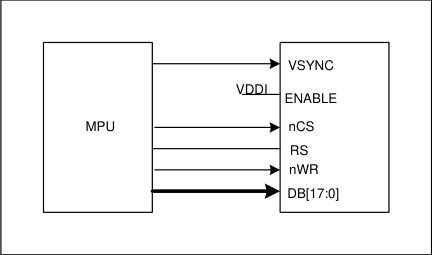

_Note 1:In the VSYNC mode,the pin ENABLE should connect to IOVCC._

In the VSYNC mode, the display operation is synchronized with the internal clock and VSYNC input and

the frame rate is determined by the pulse rate of VSYNC signal. All display data are stored in GRAM to

minimize total data transfer required for moving picture display.
**Figure36.**

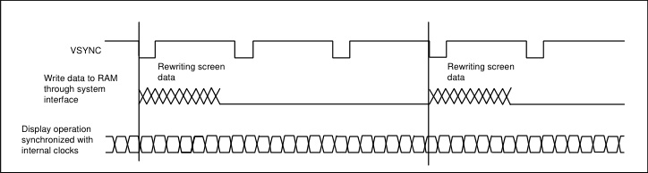

**Figure37.**

_Notes in using the VSYNC interface_

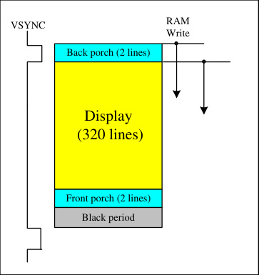

|Back porch (2 lines)|Col2|
|---|---|
|Display  (320 lines)|Display  (320 lines)|
|Front porch (2 lines)|Front porch (2 lines)|
|Black period|Black period|

**43** / **190**

1. The minimum GRAM write speed must be satisfied and the frequency variation must be taken into consideration.

2. The display frame rate is determined by the VSYNC signal and the period of VSYNC must be longer than the scan period of an entire

display.

3. When switching from the internal clock operation mode (DM[1:0] = “00”) to the VSYNC interface mode or inversely, the switching starts from

the next VSYNC cycle, i.e. after completing the display of the frame.

4. The partial display, vertical scroll, and interlaced scan functions are not available in VSYNC interface mode.
**Figure38.**

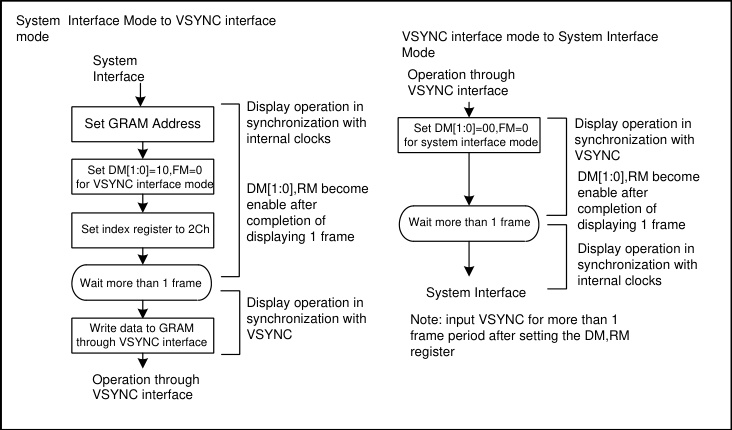

**4.4.** **Display Data RAM (DDRAM)**

GC9307 has an integrated 240x320x18-bit graphic type static RAM. This 172,800-byte memory allows

storing a 240xRGBx320 image with an 18-bit resolution (262K-color). There is no abnormal visible effect

on the display when there are simultaneous panel display read and interface read/write to the same

location of the frame memory.

**4.5.** **Display Data Format**

GC9307 supplies 18-/16-/9-/8-bit parallel MCU interface with 8080- Ⅰ /8080- Ⅱ series, 3-/4-line serial

interface and 6-/16-18-bit parallel RGB interface. The parallel MCU interface and serial interface mode can

be selected by external pins IM [3:0] and RGB interface mode can be selected by software command

parameters RCM[1:0].

**4.5.1.** **3-line Serial Interface**

The 3-line/9-bit serial bus interface of GC9307 can be used by setting external pin as IM [3:0] to “0101” for

serial interface I or IM [3:0] to “1101” for serial interface II. The shown figure is the example of 3-line SPI

interface.
**Figure39.**

**44** / **190**

3-line Serial Interface I

|MPU|Col2|Col3|SCL CSX SDA Driver D[17:0]|
|---|---|---|---|
|MPU||||

**Figure40.**

3-line Serial Interface II

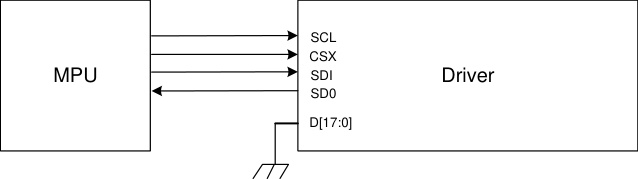

In 3-line serial interface, different display data format is available for two color depths supported by the

LCM listed below.

-65k colors, RGB 5, 6, 5 -bits input

-262k colors, RGB 6, 6, 6 -bits input.

**1)65K-Colors:16-bit/pixel(RGB 5, 6, 5 -bits input).**
**Figure41.**

16 bit/pixel color order (R:5-bit,G:6-bit,B:5-bit),65,536 colors

‘1’
RESX

IM[3:0] IM[3:0]=0101 or 1101

CSX

SDA

SCL

|Col1|D5 D4 D3 D2 D1 D0 D8 D7 D6 D5 D4 D3 D2 D1 D0 D8 D7 D6 Pixel n|D5 D4 D3 D2 D1 D0 D8 D7 D6 Pixel n+1|
|---|---|---|
||1 R1 4 R1 3 R1 2 R1 1 R1 0 G1 5 G1 4 G1 3 1 G1 2 G1 1 G1 0 B1 4 B1 3 B1 2 B1 1 B1 0 D5 D4 D3 D2 D1 D0 D8 D7 D6 D5 D4 D3 D2 D1 D0 D8 D7 D6|1 R2 4 R2 3 R2 2 R2 1 R2 0 G2 5 G2 4 G2 3 D5 D4 D3 D2 D1 D0 D8 D7 D6|
||||
|Look-Up Table for 65k Colors mapping (16-bit to 18-bit ) Frame memory R1 G1 B1 R2 G2 B2 R3 G3 B3 16-bit 18-bit|Look-Up Table for 65k Colors mapping (16-bit to 18-bit ) Frame memory R1 G1 B1 R2 G2 B2 R3 G3 B3 16-bit 18-bit|Look-Up Table for 65k Colors mapping (16-bit to 18-bit ) Frame memory R1 G1 B1 R2 G2 B2 R3 G3 B3 16-bit 18-bit|

|R1|G1|B1|R2|G2|B2|R3|G3|B3|
|---|---|---|---|---|---|---|---|---|
||||||||||

_Note 1: The pixel data with 16-bit color depth information._

_Note 2: The most significant bits are: Rx4, Gx5 and Bx4._

_Note 3: The least significant bits are: Rx0, Gx0 and Bx0._

_Note 4: ‘-‘= Don’t care –Can be set “0” or “1”._

**45** / **190**

**2)262K-Colors:18-bit/pixel(RGB 6, 6, 6 -bits input).**
**Figure42.**

18 bit/pixel color order (R:6-bit,G:6-bit,B:6-bit),262,144 colors

‘1’
RESX

IM[3:0] IM[3:0]=0101 or 1101

CSX

SDA

SCL

|Col1|D5 D4 D3 D2 D1 D0 D8 D7 D6 D5 D4 D3 D2 D1 D0 D8 D7 D6 D5 D4 D3 D2 D1 D0 D8 D7 D6 Pixel n|
|---|---|
||1 R1 5 R1 4 R1 3 R1 2 R1 1 R1 0 - - 1 G1 5 G1 4 G1 3 G1 2 G1 1 G1 0 - - 1 B1 5 B1 4 B1 3 B1 2 B1 1 B1 0 - - D5 D4 D3 D2 D1 D0 D8 D7 D6 D5 D4 D3 D2 D1 D0 D8 D7 D6 D5 D4 D3 D2 D1 D0 D8 D7 D6|
|||
|Frame memory R1 G1 B1 R2 G2 B2 R3 G3 B3 18-bit|Frame memory R1 G1 B1 R2 G2 B2 R3 G3 B3 18-bit|

|R1|G1|B1|R2|G2|B2|R3|G3|B3|
|---|---|---|---|---|---|---|---|---|
||||||||||

_Note 1: The pixel data with 18-bit color depth information._

_Note 2: The most significant bits are: Rx5, Gx5 and Bx5._

_Note 3: The least significant bits are : Rx0, Gx0 and Bx0._

_Note 4: ‘-‘= Don’t care - Can be set “0” or “1”._

**46** / **190**

**4.5.2.** **4-line Serial Interface**

The 4-line/8-bit serial bus interface of GC9307 can be used by setting external pin as IM [3:0] to “0110” for

serial interface I or IM [3:0] to “1110” for serial interface II. The shown figure is the example of 4-line SPI

interface.
**Figure43.**

4-line Serial Interface I

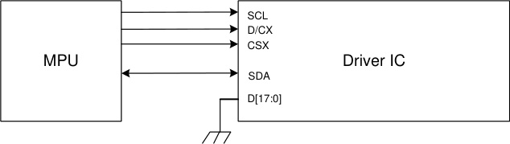

**Figure44.**

4-line Serial Interface II

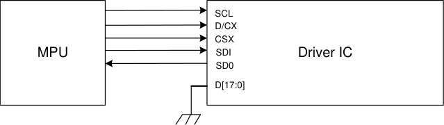

In 4-line serial interface, different display data format is available for two color depths supported by the

LCM listed below.

-65k colors, RGB 5, 6, 5 -bits input.

-262k colors, RGB 6, 6, 6 -bits input.
**Figure45.**

16 bit/pixel color order (R:5-bit,G:6-bit,B:5-bit),65,536 colors

‘1’
RESX

IM[3:0] IM[3:0]=0110 or 1110

CSX

D/CX

SDA/

SDI

SCL

1 1 1

|Col1|D5 D4 D3 D2 D1 D0 D7 D6 D5 D4 D3 D2 D1 D0 D7 D6 Pixel n|D5 D4 D3 D2 D1 D0 D7 D6 Pixel n+1 D7 D6 D5|
|---|---|---|
||R1 4 R1 3 R1 2 R1 1 R1 0 G1 5 G1 4 G1 3 G1 2 G1 1 G1 0 B1 4 B1 3 B1 2 B1 1 B1 0 D5 D4 D3 D2 D1 D0 D7 D6 D5 D4 D3 D2 D1 D0 D7 D6|R2 4 R2 3 R2 2 R2 1 R2 0 G2 5 G2 4 G2 3 D5 D4 D3 D2 D1 D0 D7 D6 G2 2 G2 1 G2 0 D7 D6 D5|
||||
|Look-Up Table for 65k Colors mapping (16-bit to 18-bit ) Frame memory R1 G1 B1 R2 G2 B2 R3 G3 B3 16-bit 18-bit|Look-Up Table for 65k Colors mapping (16-bit to 18-bit ) Frame memory R1 G1 B1 R2 G2 B2 R3 G3 B3 16-bit 18-bit|Look-Up Table for 65k Colors mapping (16-bit to 18-bit ) Frame memory R1 G1 B1 R2 G2 B2 R3 G3 B3 16-bit 18-bit|

|R1|G1|B1|R2|G2|B2|R3|G3|B3|
|---|---|---|---|---|---|---|---|---|
||||||||||

**47** / **190**

_Note 1: The pixel data with 16-bit color depth information._

_Note 2: The most significant bits are: Rx4, Gx5 and Bx4._

_Note 3: The least significant bits are: Rx0, Gx0 and Bx0._

_Note 4: ‘-‘= Don’t care –Can be set “0” or “1”._
**Figure46.**

18 bit/pixel color order (R:6-bit,G:6-bit,B:6-bit),65,536 colors

‘1’
RESX

IM[3:0] IM[3:0]=0110 or 1110

CSX

D/CX 1 1 1

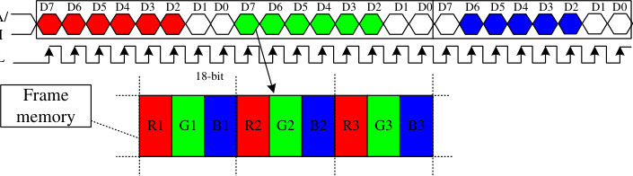

SDA/

SDI

SCL

Pixel n Pixel n+1

|R1|G1|B1|R2|G2|B2|R3|G3|B3|
|---|---|---|---|---|---|---|---|---|
||||||||||

_Note 1: The pixel data with 18-bit color depth information._

_Note 2: The most significant bits are: Rx5, Gx5 and Bx5._

_Note 3: The least significant bits are: Rx0, Gx0 and Bx0._

_Note 4: ‘-‘= Don’t care –Can be set “0” or “1”._

**48** / **190**

**4.5.3.** **2-data-line mode**

This mode is active when 2data_en (E9h[3]) set to “1” in 3-wire. Only frame pixle data write transitions are

sent in 2-data-line mode, register write/read is still sent in 3-wire.

The chip-select nCS (active low) enables and disables the serial interface. SCL is the serial data clock.

SDA and DCX are serial data lines.

Serial data must be input to SDA in the sequence A0, D15 to D10 and DCX in the sequence A0, D7 to D0.

The GC9307 reads the data at the rising edge of SCL signal. The first bit of serial data A0 is

data/command flag. It must be set to "1", D15 to D0 bits are display RAM data.
**Figure47.**

nCS

SCL

SDA

Five data formats are supported in 2-data-line mode, which is indicated by 2data_mdt (E9h[2:0]) .

**1)RGB565 1pixel/transition(65K color,2data_mdt[2:0]=’000’)**
**Figure48.**

nCS

SCL

SDA

A0 R4 R3 R2 R1 R0 G5 G4 G3

RS A0 G2 G1 G0 B4 B3 B2 B1 B0

**2)RGB666 1pixel/transition(262K color,2data_mdt[2:0]=’001’)**
**Figure49.**

nCS

SCL

SDA

A0 R5 R4 R3 R2 R1 R0 G5 G4 G3

RS A0 G2 G1 G0 B5 B4 B3 B2 B1 B0

A0 G2 G1 G0 B5 B4 B3 B2 B1

B5

**3)RGB666 2/3pixel/transition(262K color,2data_mdt[2:0]=’010’)**

**49** / **190**

**Figure50.**

nCS

SCL

|Col1|A0|R5|R4 R3 R2|R1 R0|A0 B5 B4 B3|B2 B1 B0|A0|G5|G4 G3 G2|G1 G0|
|---|---|---|---|---|---|---|---|---|---|---|
||||||||||||

RS

|Col1|A0|G5|G4 G3 G2|G1 G0|A0 R5 R4 R3|R2 R1 R0|A0|B5|B4 B3 B2|B1 B0|
|---|---|---|---|---|---|---|---|---|---|---|
||||||||||||

**4)RGB888 1pixel/transition(4M color,2data_mdt[2:0]=’100’)**
**Figure51.**

nCS

SCL

SDA

RS

|R7 R6 R5|R4|R3 R2 R1 R0|G7 G6 G5 G4|Col5|
|---|---|---|---|---|
|R6 R5 R7|R4|R3 R2 R0 R1|G6 G5 G4 G7||

**5)RGB888 2/3pixel/transition(4M color,2data_mdt[2:0]=’110’)**
**Figure52.**

nCS

SCL

|Col1|A0|R7|R6 R5 R4 R3|R2 R1 R0|A0 B7 B6|B5 B4 B3 B2 B1|B0|Col9|A0 G5 G4|G5 G4 G3|G2|G1|G0|Col15|
|---|---|---|---|---|---|---|---|---|---|---|---|---|---|---|
||||||||||||||||

RS

|Col1|A0|G7|G6 G5 G4 G3|G2 G1 G0|A0 R7 R6|R5 R4 R3 R2 R1|R0|Col9|A0 B5 B4|B5 B4 B3|B2|B1|B0|Col15|
|---|---|---|---|---|---|---|---|---|---|---|---|---|---|---|
||||||||||||||||

**50** / **190**

**4.5.4.** **8-bit Parallel MCU Interface**

The 8080- Ⅰ system 8-bit parallel bus interface of GC9307 can be used by setting external pin as IM [3:0]

to“0000”.The following shown figure is the example of interface with 8080- Ⅰ MCU system interface.

**Figure53.**

Different display data formats are available for two color depths supported by listed below.

- 65K-Colors, RGB 5, 6, 5 -bits input data.

- 262K-Colors, RGB 6, 6, 6 -bits input data.

**1) 65K-Colors:16-bit/pixel(RGB 5, 6, 5 -bits input).**

One pixel (3 sub-pixels) display data is sent by 2 byte transfers when DBI [2:0] bits of 3Ah register are set

to “101”.
**Table 11.**

|Count|0|1|2|3|4|…|477|478|479|480|
|---|---|---|---|---|---|---|---|---|---|---|
|**D/CX**|**0 **|**1 **|**1 **|**1 **|**1 **|**… **|**1 **|**1 **|**1 **|**1 **|
|**D7**|**C7**|**0R4**|**0G2**|**1R4**|**1G2**|**… **|**238R4**|**238G2**|**239R4**|**239G2**|
|**D6**|**C6**|**0R3**|**0G1**|**1R3**|**1G1**|**… **|**238R3**|**238G1**|**239R3**|**239G1**|
|**D5**|**C5**|**0R2**|**0G0**|**1R2**|**1G0**|**… **|**238R2**|**238G0**|**239R2**|**239G0**|
|**D4**|**C4**|**0R1**|**0B4**|**1R1**|**1B4**|**… **|**238R1**|**238B4**|**239R1**|**239B4**|
|**D3**|**C3**|**0R0**|**0B3**|**1R0**|**1B3**|**… **|**238R0**|**238B3**|**239R0**|**239B3**|
|**D2**|**C2**|**0G5**|**0B2**|**1G5**|**1B2**|**… **|**238G5**|**238B2**|**239G5**|**239B2**|
|**D1**|**C1**|**0G4**|**0B1**|**1G4**|**1B1**|**… **|**238G4**|**238B1**|**239G4**|**239B1**|
|**D0**|**C0**|**0G3**|**0B0**|**1G3**|**1B0**|**… **|**238G3**|**238B0**|**239G3**|**239B0**|

**2)** **262K-Colors:18-bit/pixel(RGB 6, 6, 6 -bits input).**

One pixel (3 sub-pixels) display data is sent by 3 bytes transfer when DBI [2:0] bits of 3Ah register are set

to “110”.

|Table12.|Col2|Col3|Col4|Col5|Col6|Col7|Col8|Col9|
|---|---|---|---|---|---|---|---|---|
|**Count**|**0 **|**1 **|**2 **|**3 **|**… **|**718**|**719**|**720**|
|**D/CX**|**0 **|**1 **|**1 **|**1 **|**… **|**1 **|**1 **|**1 **|
|**D7**|**C7**|**0R5**|**0G5**|**0B5**|**… **|**239R5**|**239G5**|**239B5**|
|**D6**|**C6**|**0R4**|**0G4**|**0B4**|**… **|**239R4**|**239G4**|**239B4**|
|**D5**|**C5**|**0R3**|**0G3**|**0B3**|**… **|**239R3**|**239G3**|**239B3**|
|**D4**|**C4**|**0R2**|**0G2**|**0B2**|**… **|**239R2**|**239G2**|**239B2**|

**51** / **190**

|D3|C3|0R1|0G1|0B1|…|239R1|239G1|239B1|
|---|---|---|---|---|---|---|---|---|
|**D2**|**C2**|**0R0**|**0G0**|**0B0**|**… **|**239R0**|**239G0**|**239B0**|
|**D1**|**C1**||||**… **||||
|**D0**|**C0**||||**… **||||

The 8080-II system 8-bit parallel bus interface of GC9307 can be used by settings as IM [3:0] =”1001”. The

following shown figure is the example of interface with 8080- Ⅱ MCU system interface.
**Figure54.**

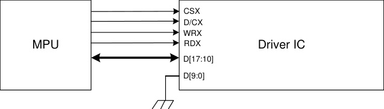

Different display data formats are available for two color depths supported by listed below.

- 65K-Colors, RGB 5, 6, 5 -bits input data.

- 262K-Colors, RGB 6, 6, 6 -bits input data.

**1)** **65K-Colors:16-bit/pixel(RGB 5, 6, 5 -bits input).**

One pixel (3 sub-pixels) display data is sent by 2 byte transfers when DBI [2:0] bits of 3Ah register are set

to “101”.
**Table13.**

|Count|0|1|2|3|4|…|477|478|479|480|
|---|---|---|---|---|---|---|---|---|---|---|
|**D/CX**|**0 **|**1 **|**1 **|**1 **|**1 **|**… **|**1 **|**1 **|**1 **|**1 **|
|**D17**|**C7**|**0R4**|**0G2**|**1R4**|**1G2**|**… **|**238R4**|**238G2**|**239R4**|**239G2**|
|**D16**|**C6**|**0R3**|**0G1**|**1R3**|**1G1**|**… **|**238R3**|**238G1**|**239R3**|**239G1**|
|**D15**|**C5**|**0R2**|**0G0**|**1R2**|**1G0**|**… **|**238R2**|**238G0**|**239R2**|**239G0**|
|**D14**|**C4**|**0R1**|**0B4**|**1R1**|**1B4**|**… **|**238R1**|**238B4**|**239R1**|**239B4**|
|**D13**|**C3**|**0R0**|**0B3**|**1R0**|**1B3**|**… **|**238R0**|**238B3**|**239R0**|**239B3**|
|**D12**|**C2**|**0G5**|**0B2**|**1G5**|**1B2**|**… **|**238G5**|**238B2**|**239G5**|**239B2**|
|**D11**|**C1**|**0G4**|**0B1**|**1G4**|**1B1**|**… **|**238G4**|**238B1**|**239G4**|**239B1**|
|**D10**|**C0**|**0G3**|**0B0**|**1G3**|**1B0**|**… **|**238G3**|**238B0**|**239G3**|**239B0**|

**2)** **262K-Colors:18-bit/pixel(RGB 6, 6, 6 -bits input).**

One pixel (3 sub-pixels) display data is sent by 3 bytes transfer when DBI [2:0] bits of 3Ah register are set

to“110”.

|Table14.|Col2|Col3|Col4|Col5|Col6|Col7|Col8|Col9|
|---|---|---|---|---|---|---|---|---|
|**Count**|**0 **|**1 **|**2 **|**3 **|**… **|**718**|**719**|**720**|
|**D/CX**|**0 **|**1 **|**1 **|**1 **|**… **|**1 **|**1 **|**1 **|
|**D17**|**C7**|**0R5**|**0G5**|**0B5**|**… **|**239R5**|**239G5**|**239B5**|
|**D16**|**C6**|**0R4**|**0G4**|**0B4**|**… **|**239R4**|**239G4**|**239B4**|
|**D15**|**C5**|**0R3**|**0G3**|**0B3**|**… **|**239R3**|**239G3**|**239B3**|
|**D14**|**C4**|**0R2**|**0G2**|**0B2**|**… **|**239R2**|**239G2**|**239B2**|

**52** / **190**

|D13|C3|0R1|0G1|0B1|…|239R1|239G1|239B1|
|---|---|---|---|---|---|---|---|---|
|**D12**|**C2**|**0R0**|**0G0**|**0B0**|**… **|**239R0**|**239G0**|**239B0**|
|**D11**|**C1**||||**… **||||
|**D10**|**C0**||||**… **||||

**53** / **190**

**4.5.5.** **9-bit Parallel MCU Interface**

The 8080- I system 9-bit parallel bus interface of GC9307 can be selected by setting hardware pin IM [3:0]

to “0010”. The following shown figure is the example of interface with 8080- Ⅰ MCU system interface.
**Figure55.**

**1)262K-Colors,:18-bit/pixel(RGB 6, 6, 6 -bits input).**

There are 2 pixels (6 sub-pixels) display data is sent by 4 transfers, when DBI [2:0] bits of 3Ah register are

set to “110”.

**Table15.**

|Count|0|1|2|3|4|…|477|478|479|480|
|---|---|---|---|---|---|---|---|---|---|---|
|**D/CX**|**0 **|**1 **|**1 **|**1 **|**1 **|**… **|**1 **|**1 **|**1 **|**1 **|
|**D8**||**0R5**|**0G2**|**1R5**|**1G2**|**… **|**238R5**|**238G2**|**239R5**|**239G2**|
|**D7**|**C7**|**0R4**|**0G1**|**1R4**|**1G1**|**… **|**238R4**|**238G1**|**239R4**|**239G1**|
|**D6**|**C6**|**0R3**|**0G0**|**1R3**|**1G0**|**… **|**238R3**|**238G0**|**239R3**|**239G0**|
|**D5**|**C5**|**0R2**|**0B5**|**1R2**|**1B5**|**… **|**238R2**|**238B5**|**239R2**|**239B5**|
|**D4**|**C4**|**0R1**|**0B4**|**1R1**|**1B4**|**… **|**238R1**|**238B4**|**239R1**|**239B4**|
|**D3**|**C3**|**0R0**|**0B3**|**1R0**|**1B3**|**… **|**238R0**|**238B3**|**239R0**|**239B3**|
|**D2**|**C2**|**0G5**|**0B2**|**1G5**|**1B2**|**… **|**238G5**|**238B2**|**239G5**|**239B2**|
|**D1**|**C1**|**0G4**|**0B1**|**1G4**|**1B1**|**… **|**238G4**|**238B1**|**239G4**|**239B1**|
|**D0**|**C0**|**0G3**|**0B0**|**1G3**|**1B0**|**… **|**238G3**|**238B0**|**239G3**|**239B0**|

**54** / **190**

The 8080- Ⅱ system 9-bit parallel bus interface of GC9307 can be selected by setting hardware pin IM

[3:0] to “1011”. The following shown figure is the example of interface with 8080- MCU system interface.
**Figure56.**

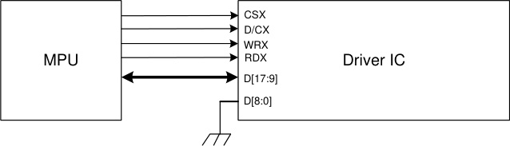

**1)262K-Colors,:18-bit/pixel(RGB 6, 6, 6 -bits input).**

There are 2 pixels (6 sub-pixels) display data is sent by 4 transfers, when DBI [2:0] bits of 3Ah register are

set to “110”.
**Table16.**

|Count|0|1|2|3|4|…|477|478|479|480|
|---|---|---|---|---|---|---|---|---|---|---|
|**D/CX**|**0 **|**1 **|**1 **|**1 **|**1 **|**… **|**1 **|**1 **|**1 **|**1 **|
|**D17**|**C7**|**0R5**|**0G2**|**1R5**|**1G2**|**… **|**238R5**|**238G2**|**239R5**|**239G2**|
|**D16**|**C6**|**0R4**|**0G1**|**1R4**|**1G1**|**… **|**238R4**|**238G1**|**239R4**|**239G1**|
|**D15**|**C5**|**0R3**|**0G0**|**1R3**|**1G0**|**… **|**238R3**|**238G0**|**239R3**|**239G0**|
|**D14**|**C4**|**0R2**|**0B5**|**1R2**|**1B5**|**… **|**238R2**|**238B5**|**239R2**|**239B5**|
|**D13**|**C3**|**0R1**|**0B4**|**1R1**|**1B4**|**… **|**238R1**|**238B4**|**239R1**|**239B4**|
|**D12**|**C2**|**0R0**|**0B3**|**1R0**|**1B3**|**… **|**238R0**|**238B3**|**239R0**|**239B3**|
|**D11**|**C1**|**0G5**|**0B2**|**1G5**|**1B2**|**… **|**238G5**|**238B2**|**239G5**|**239B2**|
|**D10**|**C0**|**0G4**|**0B1**|**1G4**|**1B1**|**… **|**238G4**|**238B1**|**239G4**|**239B1**|
|**D9**||**0G3**|**0B0**|**1G3**|**1B0**|**… **|**238G3**|**238B0**|**239G3**|**239B0**|

**55** / **190**

**4.5.6.** **16-bit Parallel MCU Interface**

The 8080- Ⅰ system 16-bit parallel bus interface of GC9307 can be selected by setting hardware pin IM[3:0]

to “0001”.The following shown figure is the example of interface with 8080- Ⅰ MCU system interface.
**Figure57.**

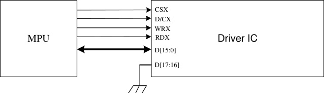

Different display data format is available for two colors depth supported by listed below.

- 65K-Colors, RGB 5, 6, 5 -bits input data.

- 262K-Colors, RGB 6, 6, 6 -bits input data.

**1)65K-Colors:16-bit/pixel(RGB 5, 6, 5 -bits input).**
One pixel (3 sub-pixels) display data is sent by 1 transfer when DBI [2:0] bits of 3Ah register are
set to “101”.

|Table17.|Col2|Col3|Col4|Col5|Col6|Col7|Col8|Col9|
|---|---|---|---|---|---|---|---|---|
|**Count**|**0 **|**1 **|**2 **|**3 **|**… **|**238**|**239**|**240**|
|**D/CX**|**0 **|**1 **|**1 **|**1 **|**… **|**1 **|**1 **|**1 **|
|**D15**||**0R4**|**1R4**|**2R4**|**… **|**237R4**|**238R4**|**239R4**|
|**D14**||**0R3**|**1R3**|**2R3**|**… **|**237R3**|**238R3**|**239R3**|
|**D13**||**0R2**|**1R2**|**2R2**|**… **|**237R2**|**238R2**|**239R2**|
|**D12**||**0R1**|**1R1**|**2R1**|**… **|**237R1**|**238R1**|**239R1**|
|**D11**||**0R0**|**1R0**|**2R0**|**… **|**237R0**|**238R0**|**239R0**|
|**D10**||**0G5**|**1G5**|**2G5**|**… **|**237G5**|**238G5**|**239G5**|
|**D9**||**0G4**|**1G4**|**2G4**|**… **|**237G4**|**238G4**|**239G4**|
|**D8**||**0G3**|**1G3**|**2G3**|**… **|**237G3**|**238G3**|**239G3**|
|**D7**|**C7**|**0G2**|**1G2**|**2G2**|**… **|**237G2**|**238G2**|**239G2**|
|**D6**|**C6**|**0G1**|**1G1**|**2G1**|**… **|**237G1**|**238G1**|**239G1**|
|**D5**|**C5**|**0G0**|**1G0**|**2G0**|**… **|**237G0**|**238G0**|**239G0**|
|**D4**|**C4**|**0B4**|**1B4**|**2B4**|**… **|**237B4**|**238B4**|**239B4**|
|**D3**|**C3**|**0B3**|**1B3**|**2B3**|**… **|**237B3**|**238B3**|**239B3**|
|**D2**|**C2**|**0B2**|**1B2**|**2B2**|**… **|**237B2**|**238B2**|**239B2**|
|**D1**|**C1**|**0B1**|**1B1**|**2B1**|**… **|**237B1**|**238B1**|**239B1**|
|**D0**|**C0**|**0B0**|**1B0**|**2B0**|**… **|**237B0**|**238B0**|**239B0**|

**2)262K-Colors:18-bit/pixel(RGB 6, 6, 6 -bits input).**

One pixel (3 sub-pixels) display data is sent by 2 transfers when DBI [2:0] bits of 3Ah register are set to

“110”.

**1)MDT[1:0]=** “ **00** ”
**Table18.**

**56** / **190**

|Count|0|1|2|3|…|238|239|240|
|---|---|---|---|---|---|---|---|---|
|**D/CX**|**0 **|**1 **|**1 **|**1 **|**… **|**1 **|**1 **|**1 **|
|**D15**||**0R5**|**0B5**|**1G5**|**… **|**238R5**|**238B5**|**239G5**|
|**D14**||**0R4**|**0B4**|**1G4**|**… **|**238R4**|**238B4**|**239G4**|
|**D13**||**0R3**|**0B3**|**1G3**|**… **|**238R3**|**238B3**|**239G3**|
|**D12**||**0R2**|**0B2**|**1G2**|**… **|**238R2**|**238B2**|**239G2**|
|**D11**||**0R1**|**0B1**|**1G1**|**… **|**238R1**|**238B1**|**239G1**|
|**D10**||**0R0**|**0B0**|**1G0**|**… **|**238R0**|**238B0**|**239G0**|
|**D9**|||||||||
|**D8**|||||||||
|**D7**|**C7**|**0G5**|**1R5**|**1B5**|**… **|**238G5**|**239R5**|**239B5**|
|**D6**|**C6**|**0G4**|**1R4**|**1B4**|**… **|**238G4**|**239R4**|**239B4**|
|**D5**|**C5**|**0G3**|**1R3**|**1B3**|**… **|**238G3**|**239R3**|**239B3**|
|**D4**|**C4**|**0G2**|**1R2**|**1B2**|**… **|**238G2**|**239R2**|**239B2**|
|**D3**|**C3**|**0G1**|**1R1**|**1B1**|**… **|**238G1**|**239R1**|**239B1**|
|**D2**|**C2**|**0G0**|**1R0**|**1B0**|**… **|**238G0**|**239R0**|**239B0**|
|**D1**|**C1**||||||||
|**D0**|**C0**||||||||

**2)MDT[1:0]=** “ **01** ”
**Table19.**

|Count|0|1|2|3|Col6|…|357|358|479|480|
|---|---|---|---|---|---|---|---|---|---|---|
|**D/CX**|**0 **|**1 **|**1 **|**1 **||**… **|**1 **|**1 **|**1 **|**1 **|
|**D15**||**0R5**|**0B5**|**1R5**|**1B5**|**… **|**238R5**|**238B5**|**239R5**|**239B5**|
|**D14**||**0R4**|**0B4**|**1R4**|**1B4**|**… **|**238R4**|**238B4**|**239R4**|**239B4**|
|**D13**||**0R3**|**0B3**|**1R3**|**1B3**|**… **|**238R3**|**238B3**|**239R3**|**239B3**|
|**D12**||**0R2**|**0B2**|**1R2**|**1B2**|**… **|**238R2**|**238B2**|**239R2**|**239B2**|
|**D11**||**0R1**|**0B1**|**1R1**|**1B1**|**… **|**238R1**|**238B1**|**239R1**|**239B1**|
|**D10**||**0R0**|**0B0**|**1R0**|**1B0**|**… **|**238R0**|**238B0**|**239R0**|**239B0**|
|**D9**||||||**… **|||||
|**D8**||||||**… **|||||
|**D7**|**C7**|**0G5**||**1G5**||**… **|**238G5**||**239G5**||
|**D6**|**C6**|**0G4**||**1G4**||**… **|**238G4**||**239G4**||
|**D5**|**C5**|**0G3**||**1G3**||**… **|**238G3**||**239G3**||
|**D4**|**C4**|**0G2**||**1G2**||**… **|**238G2**||**239G2**||
|**D3**|**C3**|**0G1**||**1G1**||**… **|**238G1**||**239G1**||
|**D2**|**C2**|**0G0**||**1G0**||**… **|**238G0**||**239G0**||
|**D1**|**C1**|||||**… **|||||
|**D0**|**C0**|||||**… **|||||

**3)MDT[1:0]=** “ **10** ”
**Table20.**

**Count** **0** **1** **2** **3** **…** **357** **358** **479** **480**

**57** / **190**

|D/CX|0|1|1|1|Col6|…|1|1|1|1|
|---|---|---|---|---|---|---|---|---|---|---|
|**D15**||**0R5**|**0B1**|**1R5**|**1B1**|**… **|**238R5**|**238B1**|**239R5**|**239B1**|
|**D14**||**0R4**|**0B0**|**1R4**|**1B0**|**… **|**238R4**|**238B0**|**239R4**|**239B0**|
|**D13**||**0R3**||**1R3**||**… **|**238R3**||**239R3**||
|**D12**||**0R2**||**1R2**||**… **|**238R2**||**239R2**||
|**D11**||**0R1**||**1R1**||**… **|**238R1**||**239R1**||
|**D10**||**0R0**||**1R0**||**… **|**238R0**||**239R0**||
|**D9**||**0G5**||**1G5**||**… **|**238G5**||**239G5**||
|**D8**||**0G4**||**1G4**||**… **|**238G4**||**239G4**||
|**D7**|**C7**|**0G3**||**1G3**||**… **|**238G3**||**239G3**||
|**D6**|**C6**|**0G2**||**1G2**||**… **|**238G2**||**239G2**||
|**D5**|**C5**|**0G1**||**1G1**||**… **|**238G1**||**239G1**||
|**D4**|**C4**|**0G0**||**1G0**||**… **|**238G0**||**239G0**||
|**D3**|**C3**|**0B5**||**1B5**||**… **|**238B5**||**239B5**||
|**D2**|**C2**|**0B4**||**1B4**||**… **|**238B4**||**239B4**||
|**D1**|**C1**|**0B3**||**1B3**||**… **|**238B3**||**239B3**||
|**D0**|**C0**|**0B2**||**1B2**||**… **|**238B2**||**239B2**||

**4)MDT[1:0]=** “ **11** ”
**Table21.**

|Count|0|1|2|3|Col6|…|357|358|479|480|
|---|---|---|---|---|---|---|---|---|---|---|
|**D/CX**|**0 **|**1 **|**1 **|**1 **||**… **|**1 **|**1 **|**1 **|**1 **|
|**D15**|||**0R3**||**1R3**|**… **||**238R3**||**239R3**|
|**D14**|||**0R2**||**1R2**|**… **||**238R2**||**239R2**|
|**D13**|||**0R1**||**1R1**|**… **||**238R1**||**239R1**|
|**D12**|||**0R0**||**1R0**|**… **||**238R0**||**239R0**|
|**D11**|||**0G5**||**1G5**|**… **||**238G5**||**239G5**|
|**D10**|||**0G4**||**1G4**|**… **||**238G4**||**239G4**|
|**D9**|||**0G3**||**1G3**|**… **||**238G3**||**239G3**|
|**D8**|||**0G2**||**1G2**|**… **||**238G2**||**239G2**|
|**D7**|**C7**||**0G1**||**1G1**|**… **||**238G1**||**239G1**|
|**D6**|**C6**||**0G0**||**1G0**|**… **||**238G0**||**239G0**|
|**D5**|**C5**||**0B5**||**1B5**|**… **||**238B5**||**239B5**|
|**D4**|**C4**||**0B4**||**1B4**|**… **||**238B4**||**239B4**|
|**D3**|**C3**||**0B3**||**1B3**|**… **||**238B3**||**239B3**|
|**D2**|**C2**||**0B2**||**1B2**|**… **||**238B2**||**239B2**|
|**D1**|**C1**|**0R5**|**0B1**|**1R5**|**1B1**|**… **|**238R5**|**238B1**|**239R5**|**239B1**|
|**D0**|**C0**|**0R4**|**0B0**|**1R4**|**1B0**|**… **|**238R4**|**238B0**|**239R4**|**239B0**|

The 8080- II system 16-bit parallel bus interface of GC9307 can be selected by settings IM [3:0] =”1000”.

The following shown figure is the example of interface with 8080- MCU system interface.
**Figure58.**

**58** / **190**

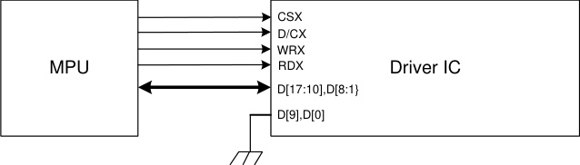

Different display data format is available for two colors depth supported by listed below.

- 65K-Colors, RGB 5, 6, 5 -bits input data.

- 262K-Colors, RGB 6, 6, 6 -bits input data.

**1) 65K-Colors:16-bit/pixel(RGB 5, 6, 5 -bits input).**

One pixel (3 sub-pixels) display data is sent by 1 transfer when DBI [2:0] bits of 3Ah register are set to

“101”.

|Table22.|Col2|Col3|Col4|Col5|Col6|Col7|Col8|Col9|
|---|---|---|---|---|---|---|---|---|
|**Count**|**0 **|**1 **|**2 **|**3 **|**… **|**238**|**239**|**240**|
|**D/CX**|**0 **|**1 **|**1 **|**1 **|**… **|**1 **|**1 **|**1 **|
|**D17**||**0R4**|**1R4**|**2R4**|**… **|**237R4**|**238R4**|**239R4**|
|**D16**||**0R3**|**1R3**|**2R3**|**… **|**237R3**|**238R3**|**239R3**|
|**D15**||**0R2**|**1R2**|**2R2**|**… **|**237R2**|**238R2**|**239R2**|
|**D14**||**0R1**|**1R1**|**2R1**|**… **|**237R1**|**238R1**|**239R1**|
|**D13**||**0R0**|**1R0**|**2R0**|**… **|**237R0**|**238R0**|**239R0**|
|**D12**||**0G5**|**1G5**|**2G5**|**… **|**237G5**|**238G5**|**239G5**|
|**D11**||**0G4**|**1G4**|**2G4**|**… **|**237G4**|**238G4**|**239G4**|
|**D10**||**0G3**|**1G3**|**2G3**|**… **|**237G3**|**238G3**|**239G3**|
|**D8**|**C7**|**0G2**|**1G2**|**2G2**|**… **|**237G2**|**238G2**|**239G2**|
|**D7**|**C6**|**0G1**|**1G1**|**2G1**|**… **|**237G1**|**238G1**|**239G1**|
|**D6**|**C5**|**0G0**|**1G0**|**2G0**|**… **|**237G0**|**238G0**|**239G0**|
|**D5**|**C4**|**0B4**|**1B4**|**2B4**|**… **|**237B4**|**238B4**|**239B4**|
|**D4**|**C3**|**0B3**|**1B3**|**2B3**|**… **|**237B3**|**238B3**|**239B3**|
|**D3**|**C2**|**0B2**|**1B2**|**2B2**|**… **|**237B2**|**238B2**|**239B2**|
|**D2**|**C1**|**0B1**|**1B1**|**2B1**|**… **|**237B1**|**238B1**|**239B1**|
|**D1**|**C0**|**0B0**|**1B0**|**2B0**|**… **|**237B0**|**238B0**|**239B0**|

**2)262K-Colors:18-bit/pixel(RGB 6, 6, 6 -bits input).**

One pixel (3 sub-pixels) display data is sent by 2 transfers when DBI [2:0] bits of 3Ah register are set to

“110”.

**1)MDT[1:0]=00**

|Table23.|Col2|Col3|Col4|Col5|Col6|Col7|Col8|Col9|
|---|---|---|---|---|---|---|---|---|
|**Count**|**0 **|**1 **|**2 **|**3 **|**… **|**238**|**239**|**240**|
|**D/CX**|**0 **|**1 **|**1 **|**1 **|**… **|**1 **|**1 **|**1 **|
|**D17**||**0R5**|**0B5**|**1G5**|**… **|**238R5**|**238B5**|**239G5**|
|**D16**||**0R4**|**0B4**|**1G4**|**… **|**238R4**|**238B4**|**239G4**|
|**D15**||**0R3**|**0B3**|**1G3**|**… **|**238R3**|**238B3**|**239G3**|

**59** / **190**

|D14|Col2|0R2|0B2|1G2|…|238R2|238B2|239G2|
|---|---|---|---|---|---|---|---|---|
|**D13**||**0R1**|**0B1**|**1G1**|**… **|**238R1**|**238B1**|**239G1**|
|**D12**||**0R0**|**0B0**|**1G0**|**… **|**238R0**|**238B0**|**239G0**|
|**D11**|||||||||
|**D10**|||||||||
|**D8**|**C7**|**0G5**|**1R5**|**1B5**|**… **|**238G5**|**239R5**|**239B5**|
|**D7**|**C6**|**0G4**|**1R4**|**1B4**|**… **|**238G4**|**239R4**|**239B4**|
|**D6**|**C5**|**0G3**|**1R3**|**1B3**|**… **|**238G3**|**239R3**|**239B3**|
|**D5**|**C4**|**0G2**|**1R2**|**1B2**|**… **|**238G2**|**239R2**|**239B2**|
|**D4**|**C3**|**0G1**|**1R1**|**1B1**|**… **|**238G1**|**239R1**|**239B1**|
|**D3**|**C2**|**0G0**|**1R0**|**1B0**|**… **|**238G0**|**239R0**|**239B0**|
|**D2**|**C1**||||||||
|**D1**|**C0**||||||||

**2)MDT[1:0]=01**
**Table24.**

|Count|0|1|2|3|Col6|…|357|358|479|480|
|---|---|---|---|---|---|---|---|---|---|---|
|**D/CX**|**0 **|**1 **|**1 **|**1 **||**… **|**1 **|**1 **|**1 **|**1 **|
|**D17**||**0R5**|**0B5**|**1R5**|**1B5**|**… **|**238R5**|**238B5**|**239R5**|**239B5**|
|**D16**||**0R4**|**0B4**|**1R4**|**1B4**|**… **|**238R4**|**238B4**|**239R4**|**239B4**|
|**D15**||**0R3**|**0B3**|**1R3**|**1B3**|**… **|**238R3**|**238B3**|**239R3**|**239B3**|
|**D14**||**0R2**|**0B2**|**1R2**|**1B2**|**… **|**238R2**|**238B2**|**239R2**|**239B2**|
|**D13**||**0R1**|**0B1**|**1R1**|**1B1**|**… **|**238R1**|**238B1**|**239R1**|**239B1**|
|**D12**||**0R0**|**0B0**|**1R0**|**1B0**|**… **|**238R0**|**238B0**|**239R0**|**239B0**|
|**D11**||||||**… **|||||
|**D10**||||||**… **|||||
|**D8**|**C7**|**0G5**||**1G5**||**… **|**238G5**||**239G5**||
|**D7**|**C6**|**0G4**||**1G4**||**… **|**238G4**||**239G4**||
|**D6**|**C5**|**0G3**||**1G3**||**… **|**238G3**||**239G3**||
|**D5**|**C4**|**0G2**||**1G2**||**… **|**238G2**||**239G2**||
|**D4**|**C3**|**0G1**||**1G1**||**… **|**238G1**||**239G1**||
|**D3**|**C2**|**0G0**||**1G0**||**… **|**238G0**||**239G0**||
|**D2**|**C1**|||||**… **|||||
|**D1**|**C0**|||||**… **|||||

**3)MDT[1:0]=10**
**Table25.**

|Count|0|1|2|3|Col6|…|357|358|479|480|
|---|---|---|---|---|---|---|---|---|---|---|
|**D/CX**|**0 **|**1 **|**1 **|**1 **||**… **|**1 **|**1 **|**1 **|**1 **|
|**D17**||**0R5**|**0B1**|**1R5**|**1B1**|**… **|**238R5**|**238B1**|**239R5**|**239B1**|
|**D16**||**0R4**|**0B0**|**1R4**|**1B0**|**… **|**238R4**|**238B0**|**239R4**|**239B0**|
|**D15**||**0R3**||**1R3**||**… **|**238R3**||**239R3**||

**60** / **190**

|D14|Col2|0R2|Col4|1R2|Col6|…|238R2|Col9|239R2|Col11|
|---|---|---|---|---|---|---|---|---|---|---|
|**D13**||**0R1**||**1R1**||**… **|**238R1**||**239R1**||
|**D12**||**0R0**||**1R0**||**… **|**238R0**||**239R0**||
|**D11**||**0G5**||**1G5**||**… **|**238G5**||**239G5**||
|**D10**||**0G4**||**1G4**||**… **|**238G4**||**239G4**||
|**D8**|**C7**|**0G3**||**1G3**||**… **|**238G3**||**239G3**||
|**D7**|**C6**|**0G2**||**1G2**||**… **|**238G2**||**239G2**||
|**D6**|**C5**|**0G1**||**1G1**||**… **|**238G1**||**239G1**||
|**D5**|**C4**|**0G0**||**1G0**||**… **|**238G0**||**239G0**||
|**D4**|**C3**|**0B5**||**1B5**||**… **|**238B5**||**239B5**||
|**D3**|**C2**|**0B4**||**1B4**||**… **|**238B4**||**239B4**||
|**D2**|**C1**|**0B3**||**1B3**||**… **|**238B3**||**239B3**||
|**D1**|**C0**|**0B2**||**1B2**||**… **|**238B2**||**239B2**||

**4)MDT[1:0]=11**
**Table26.**

|Count|0|1|2|3|Col6|…|357|358|479|480|
|---|---|---|---|---|---|---|---|---|---|---|
|**D/CX**|**0 **|**1 **|**1 **|**1 **||**… **|**1 **|**1 **|**1 **|**1 **|
|**D17**|||**0R3**||**1R3**|**… **||**238R3**||**239R3**|
|**D16**|||**0R2**||**1R2**|**… **||**238R2**||**239R2**|
|**D15**|||**0R1**||**1R1**|**… **||**238R1**||**239R1**|
|**D14**|||**0R0**||**1R0**|**… **||**238R0**||**239R0**|
|**D13**|||**0G5**||**1G5**|**… **||**238G5**||**239G5**|
|**D12**|||**0G4**||**1G4**|**… **||**238G4**||**239G4**|
|**D11**|||**0G3**||**1G3**|**… **||**238G3**||**239G3**|
|**D10**|||**0G2**||**1G2**|**… **||**238G2**||**239G2**|
|**D8**|**C7**||**0G1**||**1G1**|**… **||**238G1**||**239G1**|
|**D7**|**C6**||**0G0**||**1G0**|**… **||**238G0**||**239G0**|
|**D6**|**C5**||**0B5**||**1B5**|**… **||**238B5**||**239B5**|
|**D5**|**C4**||**0B4**||**1B4**|**… **||**238B4**||**239B4**|
|**D4**|**C3**||**0B3**||**1B3**|**… **||**238B3**||**239B3**|
|**D3**|**C2**||**0B2**||**1B2**|**… **||**238B2**||**239B2**|
|**D2**|**C1**|**0R5**|**0B1**|**1R5**|**1B1**|**… **|**238R5**|**238B1**|**239R5**|**239B1**|
|**D1**|**C0**|**0R4**|**0B0**|**1R4**|**1B0**|**… **|**238R4**|**238B0**|**239R4**|**239B0**|

**61** / **190**

**4.5.7.** **18-bit Parallel MCU Interface**

The 8080- I system 18-bit parallel bus interface of GC9307 can be selected by setting hardware pin IM[3:0]

to “0011”.The following shown figure is the example of interface with 8080- I MCU system interface.
**Figure58.**

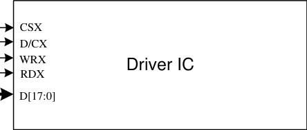

|.|Col2|
|---|---|
|MPU||
|MPU||

Different display data format is available for one color depth only supported by listed below.

- 65K-Colors, RGB 5, 6, 5 -bits input data.

- 262K-Colors, RGB 6, 6, 6 -bits input data.

**1) 65K-Colors:16-bit/pixel(RGB 5, 6, 5 -bits input).**

One pixel (3 sub-pixels) display data is sent by 1 transfer when DBI [2:0] bits of 3Ah register are set to

“101”.

|Table27.|Col2|Col3|Col4|Col5|Col6|Col7|Col8|Col9|
|---|---|---|---|---|---|---|---|---|
|**Count**|**0 **|**1 **|**2 **|**3 **|**… **|**238**|**239**|**240**|
|**D/CX**|**0 **|**1 **|**1 **|**1 **|**… **|**1 **|**1 **|**1 **|
|**D17**|||||||||
|**D16**|||||||||
|**D15**||**0R4**|**1R4**|**2R4**|**… **|**237R4**|**238R4**|**239R4**|
|**D14**||**0R3**|**1R3**|**2R3**|**… **|**237R3**|**238R3**|**239R3**|
|**D13**||**0R2**|**1R2**|**2R2**|**… **|**237R2**|**238R2**|**239R2**|
|**D12**||**0R1**|**1R1**|**2R1**|**… **|**237R1**|**238R1**|**239R1**|
|**D11**||**0R0**|**1R0**|**2R0**|**… **|**237R0**|**238R0**|**239R0**|
|**D10**||**0G5**|**1G5**|**2G5**|**… **|**237G5**|**238G5**|**239G5**|
|**D9**||**0G4**|**1G4**|**2G4**|**… **|**237G4**|**238G4**|**239G4**|
|**D8**||**0G3**|**1G3**|**2G3**|**… **|**237G3**|**238G3**|**239G3**|
|**D7**|**C7**|**0G2**|**1G2**|**2G2**|**… **|**237G2**|**238G2**|**239G2**|
|**D6**|**C6**|**0G1**|**1G1**|**2G1**|**… **|**237G1**|**238G1**|**239G1**|
|**D5**|**C5**|**0G0**|**1G0**|**2G0**|**… **|**237G0**|**238G0**|**239G0**|
|**D4**|**C4**|**0B4**|**1B4**|**2B4**|**… **|**237B4**|**238B4**|**239B4**|
|**D3**|**C3**|**0B3**|**1B3**|**2B3**|**… **|**237B3**|**238B3**|**239B3**|
|**D2**|**C2**|**0B2**|**1B2**|**2B2**|**… **|**237B2**|**238B2**|**239B2**|
|**D1**|**C1**|**0B1**|**1B1**|**2B1**|**… **|**237B1**|**238B1**|**239B1**|
|**D0**|**C0**|**0B0**|**1B0**|**2B0**|**… **|**237B0**|**238B0**|**239B0**|

**2)262K-Colors:18-bit/pixel(RGB 6, 6, 6 -bits input).**

**62** / **190**

One pixel (3 sub-pixels) display data is sent by 1 transfer when DBI [2:0] bits of 3Ah register are set to

“110”.

|Table28.|Col2|Col3|Col4|Col5|Col6|Col7|Col8|Col9|
|---|---|---|---|---|---|---|---|---|
|**Count**|**0 **|**1 **|**2 **|**3 **|**… **|**238**|**239**|**240**|
|**D/CX**|**0 **|**1 **|**1 **|**1 **|**… **|**1 **|**1 **|**1 **|
|**D17**||**0R5**|**1R5**|**2R5**|**… **|**237R5**|**238R5**|**239R5**|
|**D16**||**0R4**|**1R4**|**2R4**|**… **|**237R4**|**238R4**|**239R4**|
|**D15**||**0R3**|**1R3**|**2R3**|**… **|**237R3**|**238R3**|**239R3**|
|**D14**||**0R2**|**1R2**|**2R2**|**… **|**237R2**|**238R2**|**239R2**|
|**D13**||**0R1**|**1R1**|**2R1**|**… **|**237R1**|**238R1**|**239R1**|
|**D12**||**0R0**|**1R0**|**2R0**|**… **|**237R0**|**238R0**|**239R0**|
|**D11**||**0G5**|**1G5**|**2G5**|**… **|**237G5**|**238G5**|**239G5**|
|**D10**||**0G4**|**1G4**|**2G4**|**… **|**237G4**|**238G4**|**239G4**|
|**D9**||**0G3**|**1G3**|**2G3**|**… **|**237G3**|**238G3**|**239G3**|
|**D8**||**0G2**|**1G2**|**2G2**|**… **|**237G2**|**238G2**|**239G2**|
|**D7**|**C7**|**0G1**|**1G1**|**2G1**|**… **|**237G1**|**238G1**|**239G1**|
|**D6**|**C6**|**0G0**|**1G0**|**2G0**|**… **|**237G0**|**238G0**|**239G0**|
|**D5**|**C5**|**0B5**|**1B5**|**2B5**|**… **|**237B5**|**238B5**|**239B5**|
|**D4**|**C4**|**0B4**|**1B4**|**2B4**|**… **|**237B4**|**238B4**|**239B4**|
|**D3**|**C3**|**0B3**|**1B3**|**2B3**|**… **|**237B3**|**238B3**|**239B3**|
|**D2**|**C2**|**0B2**|**1B2**|**2B2**|**… **|**237B2**|**238B2**|**239B2**|
|**D1**|**C1**|**0B1**|**1B1**|**2B1**|**… **|**237B1**|**238B1**|**239B1**|
|**D0**|**C0**|**0B0**|**1B0**|**2B0**|**… **|**237B0**|**238B0**|**239B0**|

The 8080- II system 18-bit parallel bus interface mode can be selected by settings IM [3:0] =”1010”. The

following shown figure is the example of interface with 8080- MCU system interface.
**Figure59.**

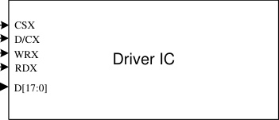

|MPU|Col2|
|---|---|
|MPU||

Different display data format is available for one color depth only supported by listed below.

- 65K-Colors, RGB 5, 6, 5 -bits input data.

- 262K-Colors, RGB 6, 6, 6 -bits input data.

**1)65K-Colors:16-bit/pixel(RGB 5, 6, 5 -bits input).**

One pixel (3 sub-pixels) display data is sent by 1 transfer when DBI [2:0] bits of 3Ah register are set to

“101”.

**63** / **190**

|Table29.|Col2|Col3|Col4|Col5|Col6|Col7|Col8|Col9|
|---|---|---|---|---|---|---|---|---|
|**Count**|**0 **|**1 **|**2 **|**3 **|**… **|**238**|**239**|**240**|
|**D/CX**|**0 **|**1 **|**1 **|**1 **|**… **|**1 **|**1 **|**1 **|
|**D17**|||||||||
|**D16**|||||||||
|**D15**||**0R4**|**1R4**|**2R4**|**… **|**237R4**|**238R4**|**239R4**|
|**D14**||**0R3**|**1R3**|**2R3**|**… **|**237R3**|**238R3**|**239R3**|
|**D13**||**0R2**|**1R2**|**2R2**|**… **|**237R2**|**238R2**|**239R2**|
|**D12**||**0R1**|**1R1**|**2R1**|**… **|**237R1**|**238R1**|**239R1**|
|**D11**||**0R0**|**1R0**|**2R0**|**… **|**237R0**|**238R0**|**239R0**|
|**D10**||**0G5**|**1G5**|**2G5**|**… **|**237G5**|**238G5**|**239G5**|
|**D9**||**0G4**|**1G4**|**2G4**|**… **|**237G4**|**238G4**|**239G4**|
|**D8**|**C7**|**0G3**|**1G3**|**2G3**|**… **|**237G3**|**238G3**|**239G3**|
|**D7**|**C6**|**0G2**|**1G2**|**2G2**|**… **|**237G2**|**238G2**|**239G2**|
|**D6**|**C5**|**0G1**|**1G1**|**2G1**|**… **|**237G1**|**238G1**|**239G1**|
|**D5**|**C4**|**0G0**|**1G0**|**2G0**|**… **|**237G0**|**238G0**|**239G0**|
|**D4**|**C3**|**0B4**|**1B4**|**2B4**|**… **|**237B4**|**238B4**|**239B4**|
|**D3**|**C2**|**0B3**|**1B3**|**2B3**|**… **|**237B3**|**238B3**|**239B3**|
|**D2**|**C1**|**0B2**|**1B2**|**2B2**|**… **|**237B2**|**238B2**|**239B2**|
|**D1**|**C0**|**0B1**|**1B1**|**2B1**|**… **|**237B1**|**238B1**|**239B1**|
|**D0**||**0B0**|**1B0**|**2B0**|**… **|**237B0**|**238B0**|**239B0**|

**2)262K-Colors:18-bit/pixel(RGB 6, 6, 6 -bits input).**

One pixel (3 sub-pixels) display data is sent by 1 transfer when DBI [2:0] bits of 3Ah register are set to

“110”.

|Table30.|Col2|Col3|Col4|Col5|Col6|Col7|Col8|Col9|
|---|---|---|---|---|---|---|---|---|
|**Count**|**0 **|**1 **|**2 **|**3 **|**… **|**238**|**239**|**240**|
|**D/CX**|**0 **|**1 **|**1 **|**1 **|**… **|**1 **|**1 **|**1 **|
|**D17**||**0R5**|**1R5**|**2R5**|**… **|**237R5**|**238R5**|**239R5**|
|**D16**||**0R4**|**1R4**|**2R4**|**… **|**237R4**|**238R4**|**239R4**|
|**D15**||**0R3**|**1R3**|**2R3**|**… **|**237R3**|**238R3**|**239R3**|
|**D14**||**0R2**|**1R2**|**2R2**|**… **|**237R2**|**238R2**|**239R2**|
|**D13**||**0R1**|**1R1**|**2R1**|**… **|**237R1**|**238R1**|**239R1**|
|**D12**||**0R0**|**1R0**|**2R0**|**… **|**237R0**|**238R0**|**239R0**|
|**D11**||**0G5**|**1G5**|**2G5**|**… **|**237G5**|**238G5**|**239G5**|
|**D10**||**0G4**|**1G4**|**2G4**|**… **|**237G4**|**238G4**|**239G4**|
|**D9**||**0G3**|**1G3**|**2G3**|**… **|**237G3**|**238G3**|**239G3**|
|**D8**|**C7**|**0G2**|**1G2**|**2G2**|**… **|**237G2**|**238G2**|**239G2**|
|**D7**|**C6**|**0G1**|**1G1**|**2G1**|**… **|**237G1**|**238G1**|**239G1**|
|**D6**|**C5**|**0G0**|**1G0**|**2G0**|**… **|**237G0**|**238G0**|**239G0**|
|**D5**|**C4**|**0B5**|**1B5**|**2B5**|**… **|**237B5**|**238B5**|**239B5**|
|**D4**|**C3**|**0B4**|**1B4**|**2B4**|**… **|**237B4**|**238B4**|**239B4**|

**64** / **190**

|D3|C2|0B3|1B3|2B3|…|237B3|238B3|239B3|
|---|---|---|---|---|---|---|---|---|
|**D2**|**C1**|**0B2**|**1B2**|**2B2**|**… **|**237B2**|**238B2**|**239B2**|
|**D1**|**C0**|**0B1**|**1B1**|**2B1**|**… **|**237B1**|**238B1**|**239B1**|
|**D0**||**0B0**|**1B0**|**2B0**|**… **|**237B0**|**238B0**|**239B0**|

**65** / **190**

**4.5.8.** **6-bit Parallel RGB Interface**

The 6-bit RGB interface is selected by setting the RIM bit to “1”. When RCM [1:0] are set to “10” and DE

mode is selected, the display operation is synchronized with VSYNC, HSYNC and DOTCLK signals. The

display data are transferred to the internal GRAM in synchronization with the display operation via 6-bit

RGB data bus (D [5:0]) according to the data enable signal (DE) when RCM [1:0] are set to “10”. the valid

display data is inputted in pixel unit via D [5:0] according to the VFP/VBP and HFP/HBP settings. Unused

pins must be connected to GND to ensure normally operation. Registers can be set by the SPI system

interface.

**1)262K-Colors:18-bit/pixel(RGB 6, 6, 6 -bits input).**
**Figure60.**

Input

Data

RGB
Assignment

|1st transfer|Col2|Col3|Col4|Col5|Col6|Col7|Col8|Col9|Col10|Col11|Col12|2nd transfer|Col14|Col15|Col16|Col17|Col18|Col19|Col20|Col21|Col22|Col23|Col24|3rd transfer|Col26|Col27|Col28|Col29|Col30|Col31|Col32|Col33|Col34|Col35|Col36|
|---|---|---|---|---|---|---|---|---|---|---|---|---|---|---|---|---|---|---|---|---|---|---|---|---|---|---|---|---|---|---|---|---|---|---|---|
|D5|D5|D4|D4| D3| D3| D2| D2|D1|D1|D0|D0|D5|D5|D4|D4|D3|D3|D2|D2|D1|D1|D0|D0|D5|D5|D4|D4|D3|D3|D2|D2|D1|D1|D0|D0|
|||||||||||||||||||||||||||||||||||||

GC9307 has data transfer counters to count the first, second, third data transfer in 6-bit RGB interface

mode. The transfer counter is always reset to the state of first data transfer on the falling edge of VSYNC.

If a mismatch arises in the number of each data transfer, the counter is reset to the state of first data

transfer at the start of the frame (i.e. on the falling edge of VSYNC) to restart data transfer in the correct

order from the next frame. This function is expedient for moving picture display, which requires

consecutive data transfer in light of minimizing effects from failed data transfer and enabling the system to

return to a normal state.

Note that internal display operation is performed in units of pixels (RGB: taking 3 inputs of

DOTCLK).Accordingly, the number of DOTCLK inputs in one frame period must be a multiple of 3 to

complete data transfer correctly. Otherwise it will affect the display of that frame as well as the next frame.

**66** / **190**

**4.5.9.** **16-bit Parallel RGB Interface**

The 16-bit RGB interface is selected by setting the DPI [2:0] bits to “101”. When RCM [1:0] are set to “10”

and DE mode is selected, the display operation is synchronized with VSYNC, HSYNC and DOTCLK

signals. The display data is transferred to the internal GRAM in synchronization with the display operation

via 16-bit RGB data bus (D[17:13] & D[11:0]) according to the data enable signal (DE). The RGB interface

SYNC mode is selected by setting the RCM [1:0] to “11”, the valid display data is inputted in pixel unit via

D[17:13] & D[11:0] according to the VFP/VBP and HFP/HBP settings. The unused D12 and D0 pins must

be connected to GND for ensure normally operation. Registers can be set by the SPI system interface.
**Figure62.**

Input

Data

Write

Data
Register

|D17|Col2|D16|Col4|D15|Col6|D14|Col8|D13|Col10|Col11|D11|Col13|D10|Col15|D9|Col17|D8|Col19|D7|Col21|D6|Col23|D5|Col25|D4|Col27|D3|Col29|D2|Col31|D1|Col33|Col34|
|---|---|---|---|---|---|---|---|---|---|---|---|---|---|---|---|---|---|---|---|---|---|---|---|---|---|---|---|---|---|---|---|---|---|
|||||||||||||||||||||||||||||||||||

GRAM Data &
RGB Mapping

|D17|Col2|D16|Col4|D15|Col6|D14|Col8|D13|Col10|Col11|D11|Col13|D10|Col15|D9|Col17|D8|Col19|D7|Col21|D6|Col23|D5|Col25|D4|Col27|D3|Col29|D2|Col31|D1|Col33|Col34|
|---|---|---|---|---|---|---|---|---|---|---|---|---|---|---|---|---|---|---|---|---|---|---|---|---|---|---|---|---|---|---|---|---|---|
|||||||||||||||||||||||||||||||||||
|Look-up Table for 65k colors mapping (16-bit to 18-bit)|Look-up Table for 65k colors mapping (16-bit to 18-bit)|Look-up Table for 65k colors mapping (16-bit to 18-bit)|Look-up Table for 65k colors mapping (16-bit to 18-bit)|Look-up Table for 65k colors mapping (16-bit to 18-bit)|Look-up Table for 65k colors mapping (16-bit to 18-bit)|Look-up Table for 65k colors mapping (16-bit to 18-bit)|Look-up Table for 65k colors mapping (16-bit to 18-bit)|Look-up Table for 65k colors mapping (16-bit to 18-bit)|Look-up Table for 65k colors mapping (16-bit to 18-bit)|Look-up Table for 65k colors mapping (16-bit to 18-bit)|Look-up Table for 65k colors mapping (16-bit to 18-bit)|Look-up Table for 65k colors mapping (16-bit to 18-bit)|Look-up Table for 65k colors mapping (16-bit to 18-bit)|Look-up Table for 65k colors mapping (16-bit to 18-bit)|Look-up Table for 65k colors mapping (16-bit to 18-bit)|Look-up Table for 65k colors mapping (16-bit to 18-bit)|Look-up Table for 65k colors mapping (16-bit to 18-bit)|Look-up Table for 65k colors mapping (16-bit to 18-bit)|Look-up Table for 65k colors mapping (16-bit to 18-bit)|Look-up Table for 65k colors mapping (16-bit to 18-bit)|Look-up Table for 65k colors mapping (16-bit to 18-bit)|Look-up Table for 65k colors mapping (16-bit to 18-bit)|Look-up Table for 65k colors mapping (16-bit to 18-bit)|Look-up Table for 65k colors mapping (16-bit to 18-bit)|Look-up Table for 65k colors mapping (16-bit to 18-bit)|Look-up Table for 65k colors mapping (16-bit to 18-bit)|Look-up Table for 65k colors mapping (16-bit to 18-bit)|Look-up Table for 65k colors mapping (16-bit to 18-bit)|Look-up Table for 65k colors mapping (16-bit to 18-bit)|Look-up Table for 65k colors mapping (16-bit to 18-bit)|Look-up Table for 65k colors mapping (16-bit to 18-bit)|Look-up Table for 65k colors mapping (16-bit to 18-bit)|Look-up Table for 65k colors mapping (16-bit to 18-bit)|
|||||||||||||||||||||||||||||||||||

**67** / **190**

**4.5.10.** **18-bit Parallel RGB Interface**

The 18-bit RGB interface is selected by setting the DPI [2:0] bits to “110”. When RCM [1:0] are set to “10”

and DE mode is selected, the display operation is synchronized with VSYNC, HSYNC and DOTCLK

signals. The display data are transferred to the internal GRAM in synchronization with the display

operation via 18-bit RGB data bus (D [17:0]) according to the data enable signal (DE) when RCM [1:0] are

set to “10”. The RGB interface SYNC mode is selected by setting the RCM [1:0] to “11”, the valid display

data is inputted in pixel unit via D[17:0] according to the VFP/VBP and HFP/HBP settings. Registers can

be set by the SPI system interface.
**Figure63.**

Input

Data

RGB

|D17|Col2|D16|Col4|D15|Col6|D14|Col8|D13|Col10|D12|Col12|D11|Col14|D10|Col16|D9|Col18|D8|Col20|D7|Col22|D6|Col24|D5|Col26|D4|Col28|D3|Col30|D2|Col32|D1|Col34|D0|Col36|
|---|---|---|---|---|---|---|---|---|---|---|---|---|---|---|---|---|---|---|---|---|---|---|---|---|---|---|---|---|---|---|---|---|---|---|---|
|||||||||||||||||||||||||||||||||||||

**68** / **190**

###### **5. Function Description**

**5.1.** **Display data GRAM mapping**

The display data RAM stores display dots and consists of 1,382,400 bits (240x18x320 bits). There is no

restriction on access to the RAM even when the display data on the same address is loaded to DAC.

There will be no abnormal visible effect on the display when there is a simultaneous Panel Read and

Interface Read or Write to the same location of the Frame Memory.

Every pixel (18-bit) data in GRAM is located by a (Page, Column) address (Y, X). By specifying the

arbitrary window address **SC, EC** bits and **SP, EP** bits, it is possible to access the GRAM by setting

RAMWR or RAMRD commands from start positions of the window address.

GRAM address for display panel position as shown in the following table

|ble31.|Col2|Col3|Col4|Col5|Col6|
|---|---|---|---|---|---|
|(00,00)h|(00,01)h|**…… …**|(00,ED)h|(00,EE)h|(00,EF)h|
|(01,00)h|(01,01)h|**…… …**|(01,ED)h|(01,EE)h|(01,EF)h|
|(02,00)h|(02,01)h|**…… …**|(02,ED)h|(02,EE)h|(02,EF)h|
|(03,00)h|(03,01)h|**…… …**|(03,ED)h|(03,EE)h|(03,EF)h|
|**.     .** **  .**|**.     .** **  .**| **.    .** **  .**|**.     .** **   .**|**.     .** **   .**|**.     .** **  .**|
|(13D,00)h|(13D,01)h|**…… …**|(13D,ED)h|(13D,EE)h|(13D,EF)h|
|(13E,00)h|(13E,01)h|**…… …**|(13E,ED)h|(13E,EE)h|(13E,EF)h|
|(13F,00)h|(13F,01)h|**…… …**|(13F,ED)h|(13F,EE)h|(13F,EF)h|

**5.2.** **Address Counter (AC) of GRAM**

The GC9307 contains an address counter (AC) which assigns address for writing/reading pixel data

to/from GRAM. The address pointers set the position of GRAM. Every time when a pixel data is written into

the GRAM, the X address or Y address of AC will be automatically increased by 1 (or decreased by 1),

which is decided by the register ( **MV, MX** and **MY** bits) setting.

To simplify the address control of GRAM access, the window address function allows for writing data only

to a window area of GRAM specified by registers. After data being written to the GRAM, the AC will be

increased or decreased within setting window address-range which is specified by the (start: **SC**, end: **EC** )

and the (start: **SP**, end: **EP** ). Therefore, the data can be written consecutively without thinking a data wrap

by those bit function.

**69** / **190**

Image data sending order from host and data stream update as shown in the following figure.
**Figure64.**

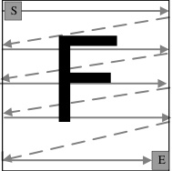

The data is written in the order illustrated above. The counter which dictates where in the physical memory

the data is to be written is controlled by **MV, MX** and **MY** bits setting

**Image data writing control:**
**Figure65.**

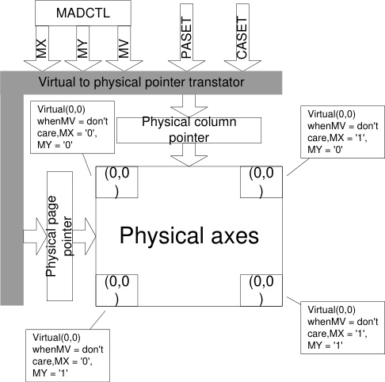

CASET and PASET control for physical column/page pointers:
**Table32.**

|MV|MX|MY|CASET|PASET|
|---|---|---|---|---|
|0|0|0|Direct to Physical Column Pointer|Direct to Physical Page Pointer|
|0|0|1|Direct to Physical Column Pointer|Direct to (319 - Physical Page Pointer)|
|0|1|0|Direct to (239 - Physical Column Pointer)|Direct to Physical Page Pointer|
|0|1|1|Direct to (239 - Physical Column Pointer)|Direct to (319 - Physical Page Pointer)|
|0|0|0|Direct to Physical Page Pointer|Direct to Physical Column Pointer|
|0|0|1|Direct to (319 - Physical Page Pointer)|Direct to Physical Column Pointer|
|0|1|0|Direct to Physical Page Pointer|Direct to (239 - Physical Column Pointer)|
|0|1|1|Direct to (319 - Physical Page Pointer)|Direct to (239 - Physical Column Pointer)|

**70** / **190**

|condition|Column Counter|Page Counter|
|---|---|---|
|When RAMWR/RAMRD command is accepted|Return to “Start Column”|Return to “Start Page”|
|Complete Pixel Pair Write/Read action|Increment by 1|No change|
|The Column counter value is larger than “End column.”|Return to “Start Column”|Increment by 1|
|The Page counter value is larger than “End page”.|Return to “Start column”|Return to “Start Page”|

The following figure depicts the GRAM address update method with MV, MX and MY bit setting.
**Table33.**

|Display data direction|MV|MX|MY|Image in the Host|Image in the Driver (GRAM)|
|---|---|---|---|---|---|
|normal|0|0|0| ~~F~~ ~~S~~ E| ~~F~~ ~~S~~ E H/W position (0,0) X/Y address (0,0)|
|Y-invert|0|0|1| ~~F~~ ~~S~~ E| ~~S~~ E H/W position (0,0) X/Y address (0,0)|
|X-invert|0|1|0| ~~F~~ ~~S~~ E| S E H/W position (0,0) X/Y address (0,0)|
|Y-invert X-invert|0|1|1| ~~F~~ ~~S~~ E| F S E H/W position (0,0) X/Y address (0,0)|
|X-Y exchange|1|0|0| ~~F~~ ~~S~~ E| S E H/W position (0,0) X/Y address (0,0)|

|F S|Col2|
|---|---|
|E|E|
|E|E|
|||

|F S|Col2|
|---|---|
|E|E|
|E|E|
|||

|S|Col2|
|---|---|
|  |  |
|||
|E|E|
|E|E|
|||

**71** / **190**

|F S|Col2|
|---|---|
|  ~~S~~|  ~~S~~|
|||
|E|E|
||E|

|X-Y exchange Y-invert|1|0|1|F S E|H/W position E (0,0) F X/Y address (0,0) S|
|---|---|---|---|---|---|
|X-Y exchange X-invert|1|1|0| ~~F~~ ~~S~~ E| F S E H/W position (0,0) X/Y address (0,0)|
|X-Y exchange Y-invert X-invert|1|1|1| ~~F~~ ~~S~~ E| S E H/W position (0,0) X/Y address (0,0)|

|S|Col2|
|---|---|
|  |  |
|||
|E|E|
|E|E|
|||

**5.3.** **GRAM to display address mapping**

By setting the **SS**, the relation between the source output channel and the GRAM address can be changed

as reverse display. By setting the **GS**, the relation between the gate output channel and the GRAM

address can be changed as reverse display. By setting the **BGR**, the relation between the source output

channel and the <R>, <G>, <B> dot allocation can be reversed for different LCD color filter arrangement.

The following Tables show relations among the GRAM data allocation, the source output channel, and the

R, G, B dot allocation.

GRAM X address and display panel position:
**Table34.**

|BGR="0"|Col2|Col3|Col4|Col5|Col6|Col7|Col8|Col9|Col10|Col11|Col12|Col13|Col14|
|---|---|---|---|---|---|---|---|---|---|---|---|---|---|
|**Source** **Output**|**SS="0"**|S1|S2|S3|S4|S5|S6|------|S715|S716 S7|17 S718|S719|S720|
|**Source** **Output**|**SS="1"**|S718|S719|S720|S715| S716|S717|------|S4|S5 S|6 S1|S2|S3|
|**GRAM X address**|**GRAM X address**|"00"h|"00"h|"00"h|"01"h|"01"h|"01"h|------|"EE"h|"EE"h|"EF"h|"EF"h|"EF"h|
|**RGB data**|**RGB data**|R|G|B|R|G|B|------|R|G  |B  R|G|B|
|**Pixel**|**Pixel**|Pixel1|Pixel1|Pixel1|Pixel2|Pixel2|Pixel2|------|Pixel239|Pixel239|Pixel240|Pixel240|Pixel240|
|**BGR="1"**|**BGR="1"**|**BGR="1"**|**BGR="1"**|**BGR="1"**|**BGR="1"**|**BGR="1"**|**BGR="1"**|**BGR="1"**|**BGR="1"**|**BGR="1"**|**BGR="1"**|**BGR="1"**|**BGR="1"**|
|**Source** **Output**|**SS="0"**|S3|S2|S1|S6|S5|S4|------|S717|S716 S7|15 S720|S719|S718|
|**Source** **Output**|**SS="1"**|S720|S719|S718|S717| S716|S715|------|S6|S5 S|4 S3|S2|S1|
|**GRAM X address**|**GRAM X address**|"00"h|"00"h|"00"h|"01"h|"01"h|"01"h|------|"EE"h|"EE"h|"EF"h|"EF"h|"EF"h|
|**RGB data**|**RGB data**|R|G|B|R|G|B|------|R|G  |B  R|G|B|
|**Pixel**|**Pixel**|Pixel1|Pixel1|Pixel1|Pixel2|Pixel2|Pixel2|------|Pixel239|Pixel239|Pixel240|Pixel240|Pixel240|

**72** / **190**

GRAM address and display panel position (GS_Panel =’0’):
**Table35.**

|S/G pins|S1|S2|S3|S4|S5|S6|S7|S8|S9|----|S712|S713|S714|S715|S716|S717|S718|S719|S720|
|---|---|---|---|---|---|---|---|---|---|---|---|---|---|---|---|---|---|---|---|
|**G1**|0000h|0000h|0000h|0001h|0001h|0001h|0002h|0002h|0002h|**----**|00EDh|00EDh|00EDh|00EEh|00EEh|00EEh|00EFh|00EFh|00EFh|
|**G2**|0100h|0100h|0100h|0101h|0101h|0101h|0102h|0102h|0102h|**----**|01EDh|01EDh|01EDh|01EEh|01EEh|01EEh|01EFh|01EFh|01EFh|
|**G3**|0200h|0200h|0200h|0201h|0201h|0201h|0202h|0202h|0202h|**----**|02EDh|02EDh|02EDh|02EEh|02EEh|02EEh|02EFh|02EFh|02EFh|
|**G4**|0300h|0300h|0300h|0301h|0301h|0301h|0302h|0302h|0302h|**----**|03EDh|03EDh|03EDh|03EEh|03EEh|03EEh|03EFh|03EFh|03EFh|
|**G5**|0400h|0400h|0400h|0401h|0401h|0401h|0402h|0402h|0402h|**----**|04EDh|04EDh|04EDh|04EEh|04EEh|04EEh|04EFh|04EFh|04EFh|
|**G6**|0500h|0500h|0500h|0501h|0501h|0501h|0502h|0502h|0502h|**----**|05EDh|05EDh|05EDh|05EEh|05EEh|05EEh|05EFh|05EFh|05EFh|
|**-----**|-----|-----|-----|-----|-----|-----|-----|-----|-----|-----|-----|-----|-----|-----|-----|-----|-----|-----|-----|
|**G315**|13A00h|13A00h|13A00h|13A01h|13A01h|13A01h|13A02h|13A02h|13A02h|**----**|13AEDh|13AEDh|13AEDh|13AEEh|13AEEh|13AEEh|13AEFh|13AEFh|13AEFh|
|**G316**|13B00h|13B00h|13B00h|13B01h|13B01h|13B01h|13B02h|13B02h|13B02h|**----**|13BEDh|13BEDh|13BEDh|13BEEh|13BEEh|13BEEh|13BEFh|13BEFh|13BEFh|
|**G317**|13C00h|13C00h|13C00h|13C01h|13C01h|13C01h|13C02h|13C02h|13C02h|**----**|13CEDh|13CEDh|13CEDh|13CEEh|13CEEh|13CEEh|13CEFh|13CEFh|13CEFh|
|**G318**|13D00h|13D00h|13D00h|13D01h|13D01h|13D01h|13D02h|13D02h|13D02h|**----**|13DEDh|13DEDh|13DEDh|13DEEh|13DEEh|13DEEh|13DEFh|13DEFh|13DEFh|
|**G319**|13E00h|13E00h|13E00h|13E01h|13E01h|13E01h|13E02h|13E02h|13E02h|**----**|13EEDh|13EEDh|13EEDh|13EEEh|13EEEh|13EEEh|13EEFh|13EEFh|13EEFh|
|**G320**|13F00h|13F00h|13F00h|13F01h|13F01h|13F01h|13F02h|13F02h|13F02h|**----**|13FEDh|13FEDh|13FEDh|13FEEh|13FEEh|13FEEh|13FEFh|13FEFh|13FEFh|

GRAM address and display panel position (GS_Panel =’1’):
**Table36.**

|S/G pins|S1|S2|S3|S4|S5|S6|S7|S8|S9|----|S712|S713|S714|S715|S716|S717|S718|S719|S720|
|---|---|---|---|---|---|---|---|---|---|---|---|---|---|---|---|---|---|---|---|
|**G320**|0000h|0000h|0000h|0001h|0001h|0001h|0002h|0002h|0002h|**----**|00EDh|00EDh|00EDh|00EEh|00EEh|00EEh|00EFh|00EFh|00EFh|
|**G319**|0100h|0100h|0100h|0101h|0101h|0101h|0102h|0102h|0102h|**----**|01EDh|01EDh|01EDh|01EEh|01EEh|01EEh|01EFh|01EFh|01EFh|
|**G318**|0200h|0200h|0200h|0201h|0201h|0201h|0202h|0202h|0202h|**----**|02EDh|02EDh|02EDh|02EEh|02EEh|02EEh|02EFh|02EFh|02EFh|
|**G317**|0300h|0300h|0300h|0301h|0301h|0301h|0302h|0302h|0302h|**----**|03EDh|03EDh|03EDh|03EEh|03EEh|03EEh|03EFh|03EFh|03EFh|
|**G316**|0400h|0400h|0400h|0401h|0401h|0401h|0402h|0402h|0402h|**----**|04EDh|04EDh|04EDh|04EEh|04EEh|04EEh|04EFh|04EFh|04EFh|
|**G315**|0500h|0500h|0500h|0501h|0501h|0501h|0502h|0502h|0502h|**----**|05EDh|05EDh|05EDh|05EEh|05EEh|05EEh|05EFh|05EFh|05EFh|
|**-----**|-----|-----|-----|-----|-----|-----|-----|-----|-----|-----|-----|-----|-----|-----|-----|-----|-----|-----|-----|
|**G6**|13A00h|13A00h|13A00h|13A01h|13A01h|13A01h|13A02h|13A02h|13A02h|**----**|13AEDh|13AEDh|13AEDh|13AEEh|13AEEh|13AEEh|13AEFh|13AEFh|13AEFh|
|**G5**|13B00h|13B00h|13B00h|13B01h|13B01h|13B01h|13B02h|13B02h|13B02h|**----**|13BEDh|13BEDh|13BEDh|13BEEh|13BEEh|13BEEh|13BEFh|13BEFh|13BEFh|
|**G4**|13C00h|13C00h|13C00h|13C01h|13C01h|13C01h|13C02h|13C02h|13C02h|**----**|13CEDh|13CEDh|13CEDh|13CEEh|13CEEh|13CEEh|13CEFh|13CEFh|13CEFh|
|**G3**|13D00h|13D00h|13D00h|13D01h|13D01h|13D01h|13D02h|13D02h|13D02h|**----**|13DEDh|13DEDh|13DEDh|13DEEh|13DEEh|13DEEh|13DEFh|13DEFh|13DEFh|
|**G2**|13E00h|13E00h|13E00h|13E01h|13E01h|13E01h|13E02h|13E02h|13E02h|**----**|13EEDh|13EEDh|13EEDh|13EEEh|13EEEh|13EEEh|13EEFh|13EEFh|13EEFh|
|**G1**|13F00h|13F00h|13F00h|13F01h|13F01h|13F01h|13F02h|13F02h|13F02h|**----**|13FEDh|13FEDh|13FEDh|13FEEh|13FEEh|13FEEh|13FEFh|13FEFh|13FEFh|

GC9307 supports three kinds of display mode: one is Normal Display Mode, the other is Partial Display

Mode, and Scrolling Display Mode.

**73** / **190**

**5.3.1.** **Normal display on or partial mode on, vertical scroll off**

In this mode, content of the frame memory within an area where column pointer is 0000h to 00EFh and

page pointer is 0000h to 013Fh is displayed.

To display a dot on leftmost top corner, store the dot data at (column pointer, page pointer) = (0,0)
**Figure66.**

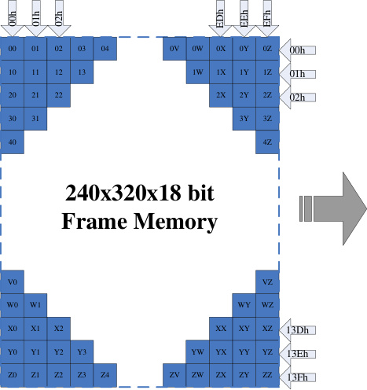

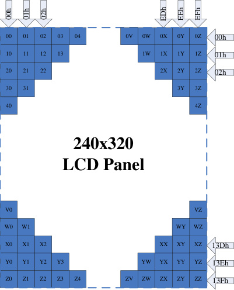

320
lines

|00|01|02|03|04|
|---|---|---|---|---|
|10|11|12|13|13|
|20|21|22|22|22|
|30|31|31|31|31|
|40|40|40|40|40|

|V0|Col2|Col3|Col4|Col5|
|---|---|---|---|---|
|W0|W1|W1|W1|W1|
|X0|X1|X2|X2|X2|
|Y0|Y1|Y2|Y3|Y3|
|Z0|Z1|Z2|Z3|Z4|

Example1:

|0V|0W|0X|0Y|0Z|
|---|---|---|---|---|
|0V|1W|1X|1Y|1Z|
|0V|1W|2X|2Y|2Z|
|0V|1W|2X|3Y|3Z|
|0V|1W|2X|3Y|4Z|

|00|01|02|03|04|
|---|---|---|---|---|
|10|11|12|13|13|
|20|21|22|22|22|
|30|31|31|31|31|
|40|40|40|40|40|

|0V|0W|0X|0Y|0Z|
|---|---|---|---|---|
|0V|1W|1X|1Y|1Z|
|0V|1W|2X|2Y|2Z|
|0V|1W|2X|3Y|3Z|
|0V|1W|2X|3Y|4Z|

240

|Col1|Col2|Col3|Col4|VZ|
|---|---|---|---|---|
||||WY|WZ|
|||XX|XY|XZ|
||YW|YX|YY|YZ|
|ZV|ZW|ZX|ZY|ZZ|

columns

|V0|Col2|Col3|Col4|Col5|
|---|---|---|---|---|
|W0|W1|W1|W1|W1|
|X0|X1|X2|X2|X2|
|Y0|Y1|Y2|Y3|Y3|
|Z0|Z1|Z2|Z3|Z4|

|Col1|Col2|Col3|Col4|VZ|
|---|---|---|---|---|
||||WY|WZ|
|||XX|XY|XZ|
||YW|YX|YY|YZ|
|ZV|ZW|ZX|ZY|ZZ|

(1) partial mode on (setting 12h)

(2) SR [15:0] =50DEC, ER [15:0] =150DEC, MADCTL’s **B4(ML)=’0’** (GS=’0’).
**Figure67.**

Non–display area

Non–display area

|~ 123456 ~ ~ABCDEF~|00h 01h Scan Direction 13Dh 13Eh|Col3|
|---|---|---|
|~ABCDEF~ ~ 123456 ~|Scan Direction 01h 00h 13Eh 13Dh||

Content of GRAM LCD Panel

Example2:

(1) partial mode on (setting 12h)

(2) SR [15:0] =50DEC, ER [15:0] =150DEC, MADCTL’s **B4(ML)=’1’** (GS=’0’).

**74** / **190**

**Figure68.**

~ 123456 ~

~ABCDEF~

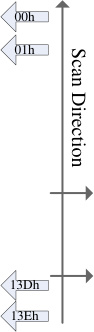

~ABCDEF~

Non–display area

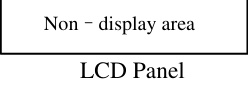

Content of GRAM LCD Panel

**75** / **190**

**5.3.2.** **Vertical scroll display mode**

When setting R37h, the scrolling display mode is active, and the vertical scrolling display

is specified by **TFA, VSA,BFA** bits (R33h) and **VSP** bits (R37h).
**Figure69.**

TFA

VSA

BFA

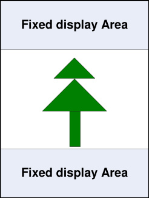

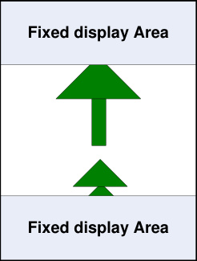

Orignal Scrolling

When Vertical Scrolling Definition Parameters (TFA+VSA+BFA) =320. In this case, scrolling is applied as

shown below.

**Example 1 .** TFA=’2d’, VSA=’318d’, BFA=’0d’, VSP=’3d’ (SS=’0’, GS=’0’)

Memory map of vertical scrolling 1:
**Figure70.**

|0V|0W|0X|0Y|
|---|---|---|---|
|0V|1W|1X|1Y|
|0V|1W|2X|2Y|
|0V|1W|2X|3Y|

|00|01|02|03|04|
|---|---|---|---|---|
|10|11|12|13|13|
|30|31|32|32|32|
|40|41|41|41|41|
|50|50|50|50|50|

|00h 01h 02h EDh EEh EFh 00 01 02 03 04 0V 0W 0X 0Y 0Z 00h area 10 11 12 13 1W 1X 1Y 1Z 01h 20 21 22 2X 2Y 2Z 02h 30 31 3Y 3Z Sroll pointer =03h 40 4Z 04h 240x320x18 bit Frame Memory V0 VZ 13Bh W0 W1 WY WZ 13Ch X0 X1 X2 XX XY XZ 13Dh Y0 Y1 Y2 Y3 YW YX YY YZ 13Eh Z0 Z1 Z2 Z3 Z4 ZV ZW ZX ZY ZZ 13Fh|Col2|Col3|Col4|Col5|Col6|Col7|
|---|---|---|---|---|---|---|
|area|00|01|02|03|04|04|
|area|10|11|12|13|13|13|
||20|21|22|22|22|22|
||30|31|31|31|31|31|
||30|31|31|31|31|oll pointer =03h|
||40|40|40|40|40|13Fh 13Eh 13Dh 13Ch 13Bh 04h|
||V0|V0|V0|V0|V0|V0|
||W0|W1|W1|W1|W1|W1|
||X0|X1|X2|X2|X2|X2|
||Y0|Y1|Y2|Y3|Y3|Y3|
||Z0|Z1|Z2|Z3|Z4|Z4|

|Col1|Col2|Col3|WY|
|---|---|---|---|
|||XX|XY|
||YW|YX|YY|
|ZV|ZW|ZX|ZY|

|W0|Col2|Col3|Col4|Col5|
|---|---|---|---|---|
|X0|X1|X1|X1|X1|
|Y0|Y1|Y2|Y2|Y2|
|Z0|Z1|Z2|Z3|Z3|
|20|21|22|23|24|

|0V|0W|0X|0Y|0Z|00h 01h|Col7|
|---|---|---|---|---|---|---|
|0V|1W|1X|1Y|1Z|1Z|1Z|
|0V|1W|1X|1Y|1Z|1Z||
|0V|1W|3X|3Y|3Z|02h 13Fh 13Eh 13Dh Scrolling   line =318 13Ch 13Bh 03h 04h||
|0V|1W|3X|4Y|4Z|4Z|4Z|
|0V|1W|3X|4Y|5Z|5Z|5Z|
|0V|1W|3X|4Y|WZ|WZ|WZ|
|0V|1W|3X|XY|XZ|XZ|XZ|
|0V|1W|YX|YY|YZ|YZ|YZ|
|0V|ZW|ZX|ZY|ZZ|ZZ|ZZ|
|2V|2W|2X|2Y|2Z|2Z|2Z|
|2V|2W|2X|2Y|2Z|2Z||

**Example 2 .** TFA=’2d’, VSA=’316d’, BFA=’2d’, VSP=’3d’ (SS=’0’, GS=’0’)

**76** / **190**

Memory map of vertical scrolling 2:
**Figure71.**

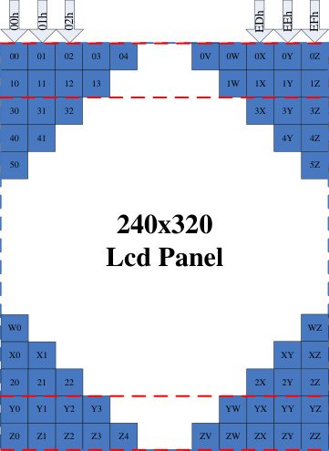

|0V|0W|0X|0Y|0Z|
|---|---|---|---|---|
|0V|1W|1X|1Y|1Z|
|0V|1W|2X|2Y|2Z|
|0V|1W|2X|3Y|3Z |
|0V|1W|2X|3Y|4Z|

|00|01|02|03|04|
|---|---|---|---|---|
|10|11|12|13|13|
|30|31|32|32|32|
|40|41|41|41|41|
|50|50|50|50|50|

|00h 01h 02h EDh EEh EFh fixed 00 01 02 03 04 0V 0W 0X 0Y 0Z 00h area 10 11 12 13 1W 1X 1Y 1Z 01h Top 20 21 22 2X 2Y 2Z 02h 30 31 3Y 3Z Sroll pointer =03h 40 4Z 04h 240x320x18 bit area Frame Memory Scrolling V0 VZ 13Bh W0 W1 WY WZ 13Ch X0 X1 X2 XX XY XZ 13Dh area Y0 Y1 Y2 Y3 YW YX YY YZ 13Eh fixed Z0 Z1 Z2 Z3 Z4 ZV ZW ZX ZY ZZ 13Fh|Col2|Col3|Col4|Col5|Col6|Col7|Col8|Col9|Col10|Col11|
|---|---|---|---|---|---|---|---|---|---|---|
|Top fixed area|00|01|02|03|04|04|04|04|04|04|
|Top fixed area|10|11|12|13|13|13|13|13|13|13|
| Scrolling   area  a|20|21|22|22|22|22|22|22|22|22|
| Scrolling   area  a|30|31|31|31|31|31|31|31|31|31|
| Scrolling   area  a|40|40|40|40|40|40|40|40|40|40|
| Scrolling   area  a|V0|V0|V0|V0|V0|V0|V0|V0|V0|VZ|
| Scrolling   area  a|W0|W1|W1|W1|W1|W1|W1|W1|WY|WZ|
| Scrolling   area  a|X0|X1|X2|X2|X2|X2|X2|XX|XY|XZ|
| fixed are|Y0|Y1|Y2|Y3|Z4 ZV|Z4 ZV|YW|YX|YY|YZ|
| fixed are|Z0|Z1|Z2|Z3|Z4|ZV|ZW|ZX|ZY|ZZ|

|Col1|Col2|Col3|Col4|Col5|0V|0W|0X|0Y|0Z|00h 01h|Col12|
|---|---|---|---|---|---|---|---|---|---|---|---|
||||||0V|1W|1X|1Y|1Z|1Z|1Z|
||||||0V|1W|1X|1Y|1Z|1Z||
||||||0V|1W|3X|3Y|3Z|02h 13Dh Scrolling   line =316 13Ch 13Bh 03h 04h||
||||||0V|1W|3X|4Y|4Z|4Z|4Z|
||||||0V|1W|3X|4Y|5Z|5Z|5Z|
|W0|W0|W0|W0|W0|W0|W0|W0|W0|WZ|WZ|WZ|
|X0|X1|X1|X1|X1|X1|X1|X1|XY|XZ|XZ|XZ|
|20|21|22|22|22|22|22|2X|2Y|2Z|2Z|2Z|
|20|21|22|22|22|22|22|2X|2Y|2Z|2Z||
|Y0|Y1|Y2|Y3|Z4 ZV|Z4 ZV|YW|YX|YY|YZ|13Fh 13Eh||
|Z0|Z1|Z2|Z3|Z4|ZV|ZW|ZX|ZY|ZZ|ZZ|ZZ|
|Z0|Z1|Z2|Z3|Z4|ZV|ZW|ZX|ZY|ZZ|ZZ||

**Example 3 .** TFA=’2d’, VSA=’316d’, BFA=’2d’, VSP=’4d’ (SS=’0’, GS=’0’)

Memory map of vertical scrolling 3:
**Figure72.**

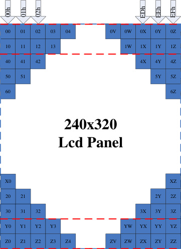

|0V|0W|0X|0Y|0Z|
|---|---|---|---|---|
|0V|1W|1X|1Y|1Z|
|0V|1W|2X|2Y|2Z|
|0V|1W|2X|3Y|3Z|
|0V|1W|2X|3Y|4Z |

|00|01|02|03|04|
|---|---|---|---|---|
|10|11|12|13|13|
|40|41|42|42|42|
|50|51|51|51|51|
|60|60|60|60|60|

|00h 01h 02h EDh EEh EFh fixed 00 01 02 03 04 0V 0W 0X 0Y 0Z 00h area 10 11 12 13 1W 1X 1Y 1Z 01h Top 20 21 22 2X 2Y 2Z 02h 30 31 3Y 3Z 03h Sroll pointer =04h 40 4Z 240x320x18 bit area Frame Memory Scrolling V0 VZ 13Bh W0 W1 WY WZ 13Ch X0 X1 X2 XX XY XZ 13Dh area Y0 Y1 Y2 Y3 YW YX YY YZ 13Eh fixed Z0 Z1 Z2 Z3 Z4 ZV ZW ZX ZY ZZ 13Fh|Col2|Col3|Col4|Col5|Col6|Col7|Col8|Col9|Col10|Col11|
|---|---|---|---|---|---|---|---|---|---|---|
|Top fixed area|00|01|02|03|04|04|04|04|04|04|
|Top fixed area|10|11|12|13|13|13|13|13|13|13|
| Scrolling  area  a|20|21|22|22|22|22|22|22|22|22|
| Scrolling  area  a|30|31|31|31|31|31|31|31|31|31|
| Scrolling  area  a|40|40|40|40|40|40|40|40|40|40|
| Scrolling  area  a|V0|V0|V0|V0|V0|V0|V0|V0|V0|VZ|
| Scrolling  area  a|W0|W1|W1|W1|W1|W1|W1|W1|WY|WZ|
| Scrolling  area  a|X0|X1|X2|X2|X2|X2|X2|XX|XY|XZ|
| fixed are|Y0|Y1|Y2|Y3|Z4 ZV|Z4 ZV|YW|YX|YY|YZ|
| fixed are|Z0|Z1|Z2|Z3|Z4|ZV|ZW|ZX|ZY|ZZ|

**77** / **190**

|Col1|Col2|Col3|Col4|Col5|0V|0W|0X|0Y|0Z|00h 01h|Col12|
|---|---|---|---|---|---|---|---|---|---|---|---|
||||||0V|1W|1X|1Y|1Z|1Z|1Z|
||||||0V|1W|1X|1Y|1Z|1Z||
||||||0V|1W|4X|4Y|4Z|02h 13Dh Scrolling   line =316 13Ch 13Bh 03h 04h||
||||||0V|1W|4X|5Y|5Z|5Z|5Z|
||||||0V|1W|4X|5Y|6Z|6Z|6Z|
|X0|X0|X0|X0|X0|X0|X0|X0|X0|XZ|XZ|XZ|
|20|21|21|21|21|21|21|21|2Y|2Z|2Z|2Z|
|30|31|32|32|32|32|32|3X|3Y|3Z|3Z|3Z|
|30|31|32|32|32|32|32|3X|3Y|3Z|3Z||
|Y0|Y1|Y2|Y3|Z4 ZV|Z4 ZV|YW|YX|YY|YZ|13Fh 13Eh||
|Z0|Z1|Z2|Z3|Z4|ZV|ZW|ZX|ZY|ZZ|ZZ|ZZ|
|Z0|Z1|Z2|Z3|Z4|ZV|ZW|ZX|ZY|ZZ|ZZ||

**Vertical scroll example**

There are 2 types of vertical scrolling, which are determined by the **TFA, VSA, BFA**

bits and **VSP** bits

Case 1: TFA + VSA + BFA ≠ ‘320d’

N/A. Do not set TFA + VSA + BFA ≠ ‘320d’. In that case, unexpected picture will be

shown.

Case 2: TFA + VSA + BFA = ‘320d’ (Scrolling)

Example (1) When TFA=’0d’, VSA=’320d’, BFA=’0d’ and VSP1=’40d’ & VSP2=’140d’ (SS =’0’,GS=’0’)
**Figure73.**

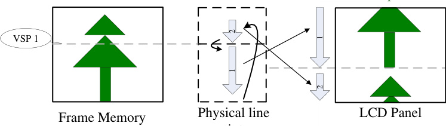

pointer

**Increment VSP**

|2 1 VSP 2 1 2|Col2|Col3|Col4|
|---|---|---|---|
|2 1 1 2 VSP 2||||
|2 1 1 2 VSP 2||||

|Col1|Col2|2|
|---|---|---|
|||1|

Physical line LCD Panel

pointer

**78** / **190**

Frame Memory

**5.3.3.** **Updating order on display active area in RGB interface mode**

There is defined different kind of updating orders for display in RGB interface mode

( **RCM [1:0]** =’1x’).

These updating are controlled by **MY** and **MX** bits. Data streaming direction from the host to the display is

described in the following figure.
**Figure74.**

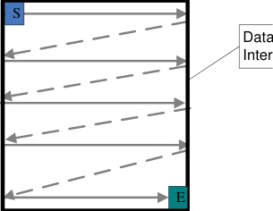

Data stream from RGB
Interface is like in this figure

**Updating order when MY = ‘0’ and MX = ‘0’**
**Figure75.**

Physical

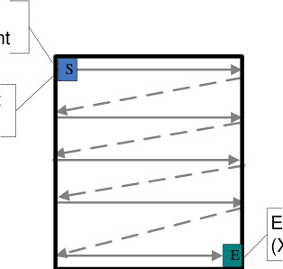
(0,0 ) Point

Start Point
(0,0)

**Updating order when MY = ‘0’ and MX = ‘1’**
**Figure76.**

Physical
(0,0 ) Point

End Point
(X,Y)

|S E|S|
|---|---|
|S E||
|E|E|

**Updating order when MY = ‘1’ and MX = ‘0’**
**Figure77.**

End Point
(X,Y)

Start Point
(0,0)

**79** / **190**

Physical
(0,0 ) Point

Start Point
(0,0)

End Point
(X,Y)

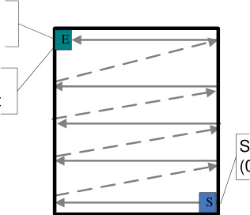

Start Point
(0,0)

|E S|E|
|---|---|
|~~S~~|~~S~~|
|||

**Updating order when MY = ‘1’ and MX = ‘1’**
**Figure78.**

End Point
(X,Y)

Physical
(0,0 ) Point

**Rules for updating order on display active area in RGB interface display mode:**
**Table37.**

|Condition|Horizontal Counter|Vertical Counter|
|---|---|---|
|An active VS signal is received|Return to 0|Return to 0|
|Single Pixel information of the active area is received|Increment by 1|No change|
|An active HS signal between two active area lines|Return to 0|Increment by 1|
|The Horizontal counter value is larger than X and the Vertical counter value is larger than Y|Return to 0 “Start Column”|Return to “Start Page”|

_Note: Pixel order is RGB on the display._

**80** / **190**

**5.4.** **Tearing effect output line**

The Tearing Effect output line supplies to the MPU a Panel synchronization signal. This signal can be

enabled or disabled by the Tearing Effect Line Off & On commands. The mode of the Tearing Effect signal

is defined by the parameter of the Tearing Effect Line On command. The signal can be used by the MPU

to synchronize Frame Memory Writing when displaying video images.

**5.4.1.** **Tearing effect line modes**

**Mode 1**, The Tearing Effect Output signal consists of V-Blanking Information only:
**Figure79.**

**tVdh** = The LCD display is not updated from the Frame Memory

**tvdl** = The LCD display is updated from the Frame Memory (except Invisible Line – see below)

**Mode 2**, The Tearing Effect Output signal consists of V-Blanking and H-Blanking

Information, there is one V-sync and 320 H-sync pulses per field.
**Figure80.**

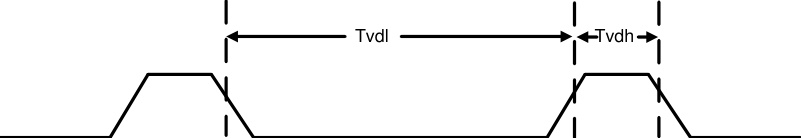

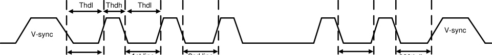

invisible line

1st line 2nd line 319th line 320th line

**thdh** = The LCD display is not updated from the Frame Memory

**thdl** = The LCD display is updated from the Frame Memory (except Invisible Line – see above)

**81** / **190**

**5.4.2.** **Tearing effect line timing**

The Tearing Effect signal is described below.
**Figure81.**

Vertical Timing

Horizontal Timing

Idle Mode Off (Frame Rate = 60 Hz)
**Table38.**

|Symbol|Parameter Min.|Spec.|Col4|Description|
|---|---|---|---|---|
|**Symbol**|**Parameter** **Min.**| **Max.**|**Unit**|**Unit**|
|tvdl|Vertical Timing Low Duration TBD| -|ms|-|
|tvdh|Vertical Timing High Duration 1000| -|us|-|
|thdl|Horizontal Timing Low Duration TBD| -|us|-|
|thdh|Horizontal Timing High Duration TBD| 500|us|-|

**Note:** Idle Mode Off (Frame Rate = 60 Hz),The signal’s rise and fall times (tf, tr) are stipulated to be equal to or less than 15ns.
**Figure82.**

tr tf

The Tearing Effect Output Line is fed back to the MCU and should be used to avoid Tearing Effect.

**82** / **190**

**5.5.** **Source driver**

The GC9307 contains a 720 channels of source driver (S1~S720) which is used for driving the source line

of TFT LCD panel. The source driver converts the digital data from GRAM into the analog voltage for 720

channels and generates corresponding

gray scale voltage output, which can realize a 262K colors display simultaneously. Since the output circuit

of this source driver incorporates an operational amplifier, a positive and a negative voltage can be

alternately outputted from each channel.

**5.6.** **Gate driver**

The GC9307 contains a 320 gate channels of gate driver (G1~G320) which is usedfor driving the gate.

The gate driver level is VGH when scan some line, VGL the other lines.

**83** / **190**

**5.7.** **Scan mode setting**

**GS:** Sets the direction of scan by the gate driver, The scan direction determined by GS = 0 can be

reversed by setting GS = 1.

**SM:** Sets the gate driver pin arrangement in combination with the GS bit to select the optimal scan mode

for the module.
**Table39.**

|SM|GS|Scan Direction|Gate Output Sequence|
|---|---|---|---|
|0|0|G1 G3 G317 G319 G2 G4 G318 G320 Even-number **Driver IC** G2 to G320 G1 to G319 **LCD** **Panel** |G1 G2 G3 G4 ---> G317 G318 G319 G320|
|0|1|G1 G3 G317 G319 G2 G4 G318 G320 **Driver IC** G320 to G2 G319 to G1 **LCD** **Panel** |G320 G319 G 318 G317 ---> G4 G3 G2 G1|
|1|0|G1 G319 G2 G320 Even-number **Driver IC** G2 to G320 G1 to G319 **LCD** **Panel** |G1 G3 ---> G317 G319 --> G2 G4 ---> G318 G320|
|1|1|G1 G319 G2 G320 **Driver IC** G320 to G2 **LCD** **Panel** |G320 G318 ---> G4 G2 --> G319 G317 ---> G3 G1|

**84** / **190**

**5.8.** **LCD power generation circuit**

**5.8.1.** **Power supply circuit**

The power circuit of GC9307 is used to generate supply voltages for LCD panel driving.
**Figure83.**

|Col1|Step VCL circuit3 AVDD AVEE Step circuit1 AVDD_SOU AVEE_SOU VCI VSSA VSSC Reference Voltage Generation Circuit VGL RVDD Reference Voltage Step Generation Circuit circuit2 VGH|Col3|Col4|
|---|---|---|---|
|||||
|||||
|||||
|||||
|||VGH||
|||||
|||||

**85** / **190**

**5.8.2.** **LCD power generation scheme**

The boost voltage generated is shown as below.
**Figure84.**

**LCD power generation scheme**

**86** / **190**

**5.9.** **Gamma Correction**

GC9307 incorporates the γ-correction function to display 262,144 colors for the LCD panel. The

γ-correction is performed with 3 groups of registers determining eight reference grayscale levels, which are

gradient adjustment, amplitude adjustment and fine-adjustment registers for positive and negative

polarities, to make GC9307 available with liquid crystal panels of various characteristics.
**Figure85.**

VREG1A

V0

V1

|Col1|Col2|Col3|
|---|---|---|
|||VP6 VN57|
|||VP13 VN50|
||||

V57
V58
V59
V60

V61

V62

V63

V2
V3
V4
V5
V6

V[7:12]

V13

V[14:19]

V20

V[21:26]

V27

V[28:35]

V36

V[37:42]

V43

V[44:49]

V50

V[51:56]

|Col1|Col2|Col3|
|---|---|---|
|||VP57 VN6|
|||VP59 VN4|
||||

|Col1|Col2|
|---|---|
|||
|~~4-bit~~ DAC ~~5-bit~~ DAC ~~4-bit~~ DAC VP4 VN59 VP6 VN57 VP13 VN50||
|~~4-bit~~ DAC ~~5-bit~~ DAC ~~4-bit~~ DAC VP4 VN59 VP6 VN57 VP13 VN50||
|~~4-bit~~ DAC ~~5-bit~~ DAC ~~4-bit~~ DAC VP4 VN59 VP6 VN57 VP13 VN50||
|~~4-bit~~ DAC ~~5-bit~~ DAC ~~4-bit~~ DAC VP4 VN59 VP6 VN57 VP13 VN50||
|~~4-bit~~ DAC ~~5-bit~~ DAC ~~4-bit~~ DAC VP4 VN59 VP6 VN57 VP13 VN50||
|~~4-bit~~ DAC ~~4-bit~~ DAC VP27 VN36 VP36 VN27||
|~~4-bit~~ DAC ~~4-bit~~ DAC VP27 VN36 VP36 VN27||
|~~4-bit~~ DAC ~~4-bit~~ DAC VP27 VN36 VP36 VN27||
|~~4-bit~~ DAC 5-bit DAC ~~4-bit~~ DAC VP50 VN13 VP57 VN6 VP59 VN4||
|~~4-bit~~ DAC 5-bit DAC ~~4-bit~~ DAC VP50 VN13 VP57 VN6 VP59 VN4||
|~~4-bit~~ DAC 5-bit DAC ~~4-bit~~ DAC VP50 VN13 VP57 VN6 VP59 VN4||
|~~4-bit~~ DAC 5-bit DAC ~~4-bit~~ DAC VP50 VN13 VP57 VN6 VP59 VN4||
|~~4-bit~~ DAC 5-bit DAC ~~4-bit~~ DAC VP50 VN13 VP57 VN6 VP59 VN4||
|~~4-bit~~ DAC 5-bit DAC ~~4-bit~~ DAC VP50 VN13 VP57 VN6 VP59 VN4||
|~~4-bit~~ DAC 5-bit DAC ~~4-bit~~ DAC VP50 VN13 VP57 VN6 VP59 VN4||
|~~4-bit~~ DAC 5-bit DAC ~~4-bit~~ DAC VP50 VN13 VP57 VN6 VP59 VN4||
|~~4-bit~~ DAC 5-bit DAC ~~4-bit~~ DAC VP50 VN13 VP57 VN6 VP59 VN4||

|Col1|VP0 4-bit VN63 DAC VP1 VN62 6-bit DAC VP2 VN61 6-bit DAC VP4 4-bit VN59 DAC VP6 VN57 5-bit VP13 DAC VN50 4-bit DAC VP20 VN43 7-bit DAC VP27 4-bit VN36 DAC VP36 4-bit VN27 DAC VP43 VN20 7-bit DAC VP50 4-bit VN13 DAC VP57 VN6 5-bit VP59 DAC VN4 4-bit DAC VP60 VN3 6-bit DAC VP61 6-bit VN2 DAC VP63 4-bit VN0 DAC|
|---|---|
|||
|||
|||
|||
|||
|||
|||
|||

VREG1B

**Figure86.**

**87** / **190**

VREG2B

|Col1|VP0 4-bit VN63 DAC VP1 VN62 6-bit DAC VP2 VN61 6-bit DAC VP4 4-bit VN59 DAC VP6 VN57 5-bit VP13 DAC VN50 4-bit DAC VP20 VN43 7-bit DAC VP27 4-bit VN36 DAC VP36 4-bit VN27 DAC VP43 VN20 7-bit DAC VP50 4-bit VN13 DAC VP57 VN6 5-bit VP59 DAC VN4 4-bit DAC VP60 VN3 6-bit DAC VP61 6-bit VN2 DAC VP63 4-bit VN0 DAC|
|---|---|
|||
|||
|||
|||
|||
|||
|||
|||

VREG2A

V0

V1

|Col1|Col2|Col3|
|---|---|---|
|||VP6 VN57|
|||VP13 VN50|
||||

V50

V[51:56]

V57
V58
V59
V60

V61

V62

V63

V2
V3
V4
V5
V6

V[7:12]

V13

V[14:19]

V20

V[21:26]

V27

V[28:35]

V36

V[37:42]

V43

V[44:49]

|Col1|Col2|Col3|
|---|---|---|
|||VP57 VN6|
|||VP59 VN4|
||||

|Col1|Col2|
|---|---|
|||
|~~4-bit~~ DAC ~~5-bit~~ DAC ~~4-bit~~ DAC VP4 VN59 VP6 VN57 VP13 VN50||
|~~4-bit~~ DAC ~~5-bit~~ DAC ~~4-bit~~ DAC VP4 VN59 VP6 VN57 VP13 VN50||
|~~4-bit~~ DAC ~~5-bit~~ DAC ~~4-bit~~ DAC VP4 VN59 VP6 VN57 VP13 VN50||
|~~4-bit~~ DAC ~~5-bit~~ DAC ~~4-bit~~ DAC VP4 VN59 VP6 VN57 VP13 VN50||
|~~4-bit~~ DAC ~~5-bit~~ DAC ~~4-bit~~ DAC VP4 VN59 VP6 VN57 VP13 VN50||
|~~4-bit~~ DAC ~~4-bit~~ DAC VP27 VN36 VP36 VN27||
|~~4-bit~~ DAC ~~4-bit~~ DAC VP27 VN36 VP36 VN27||
|~~4-bit~~ DAC ~~4-bit~~ DAC VP27 VN36 VP36 VN27||
|~~4-bit~~ DAC 5-bit DAC ~~4-bit~~ DAC VP50 VN13 VP57 VN6 VP59 VN4||
|~~4-bit~~ DAC 5-bit DAC ~~4-bit~~ DAC VP50 VN13 VP57 VN6 VP59 VN4||
|~~4-bit~~ DAC 5-bit DAC ~~4-bit~~ DAC VP50 VN13 VP57 VN6 VP59 VN4||
|~~4-bit~~ DAC 5-bit DAC ~~4-bit~~ DAC VP50 VN13 VP57 VN6 VP59 VN4||
|~~4-bit~~ DAC 5-bit DAC ~~4-bit~~ DAC VP50 VN13 VP57 VN6 VP59 VN4||
|~~4-bit~~ DAC 5-bit DAC ~~4-bit~~ DAC VP50 VN13 VP57 VN6 VP59 VN4||
|~~4-bit~~ DAC 5-bit DAC ~~4-bit~~ DAC VP50 VN13 VP57 VN6 VP59 VN4||
|~~4-bit~~ DAC 5-bit DAC ~~4-bit~~ DAC VP50 VN13 VP57 VN6 VP59 VN4||
|~~4-bit~~ DAC 5-bit DAC ~~4-bit~~ DAC VP50 VN13 VP57 VN6 VP59 VN4||

**Grayscale Voltage Generation**

**Figure87.Dot inversion**

**88** / **190**

**Negative polarity** **Positve polarity**

**Figure88.**

**VCOM is DC Voltage**

**V63**

**V0**

|Relationship between Source Output and VCOM .|Col2|Col3|
|---|---|---|
||||
||**Positive polarity** **Negative polarity**||
||||

**000000** **111111**

GRAM data

**89** / **190**

**5.10.** **Power Level Definition**

**5.10.1.** **Power Levels**

6 level modes are defined they are in order of Maximum Power consumption to Minimum Power

Consumption:

1. Normal Mode On (full display), Idle Mode Off, Sleep Out.

In this mode, the display is able to show maximum 262,144 colors.

2. Partial Mode On, Idle Mode Off, Sleep Out.

In this mode part of the display is used with maximum 262,144 colors.

3. Normal Mode On (full display), Idle Mode On, Sleep Out.

In this mode, the full display area is used but with 8 colors.

4. Partial Mode On, Idle Mode On, Sleep Out.

In this mode, part of the display is used but with 8 colors.

5. Sleep In Mode.

In this mode, the DC : DC converter, Internal oscillator and panel driver circuit are stopped. Only the

MCU interface and memory works with IOVCC power supply. Contents of the memory are safe.

6. Power Off Mode.

In this mode, both VCI and IOVCC are removed.

_Note1: Transition between modes 1-5 is controllable by MCU commands. Mode 6 is entered only when both Power supplies are removed._

**90** / **190**

**5.10.2.** **Power Flow Chart**

**Figure89.**

Normal display mode ON =NORON

Partial mode ON = PLTON

Idle mode OFF =IDMON

Sleep OUT = SLPOUT

Sleep IN = SLPIN

|Power ON sequence HW reset SW reset|Col2|
|---|---|
|||
|Sleep IN Normal display mode ON Idle mode OFF|Sleep IN Normal display mode ON Idle mode OFF|

|NORON Sleep OUT SLPIN Sleep IN NORON PLTON Normal display mode ON SLPOUT Normal display mode ON PLTON Idle mode OFF Idle mode OFF IDMON IDMOFF IDMON IDMOFF SLPIN Sleep OUT Sleep IN Normal display mode ON SLPOUT Normal display mode ON Idle mode ON Idle mode ON SLPIN Sleep OUT Sleep IN Partial mode ON Partial mode ON SLPOUT Idle mode OFF Idle mode OFF IDMON IDMOFF IDMON IDMOFF PLTON Sleep OUT SLPIN Sleep IN PLTON Partial mode ON Partial mode ON NORON Idle mode ON SLPOUT Idle mode ON NORON|Col2|Col3|Col4|
|---|---|---|---|
|Sleep OUT Normal display mode ON Idle mode OFF Sleep IN Normal display mode ON Idle mode OFF Sleep OUT Normal display mode ON Idle mode ON Sleep IN Normal display mode ON Idle mode ON Sleep OUT Partial mode ON Idle mode OFF Sleep IN Partial mode ON Idle mode OFF Sleep OUT Partial mode ON Idle mode ON Sleep IN Partial mode ON Idle mode ON SLPIN SLPOUT IDMON IDMOFF IDMON IDMOFF NORON PLTON NORON PLTON IDMON IDMOFF SLPIN SLPOUT SLPIN SLPOUT SLPIN SLPOUT IDMON IDMOFF NORON PLTON NORON PLTON|Sleep OUT Partial mode ON Idle mode ON|Sleep IN Partial mode ON Idle mode ON|Sleep IN Partial mode ON Idle mode ON|
|||||

_Note 1: There is not any abnormal visual effect when there is changing from one power mode to another power mode._

_Note 2: There is not any limitation, which is not specified by User, when there is changing from one power mode to another power mode._

**91** / **190**

**5.10.3.Brightness control block**

There is an external output signal from brightness block, LEDPWM to control the LED driver IC in order to

control display brightness.

There are resister bits, DBV[7:0] of R51h, for display brightness of manual brightness setting. The

LEDPWM duty is calculated as DBV[7:0]/255 x period (affected by OSC frequency).

For example: LEDPWM period = 3ms, and DBV[7:0] = ‘200DEC’. Then LEDPWM duty = 200 / 255=78.1%.

Correspond to the LEDPWM period = 3 ms, the high-level of LEDPWM (high effective) = 2.344ms, and the

low-level of LEDPWM = 0.656ms.
**Figure90.**

One period

ON

Display

LED PWM
Brightness

OFF

Duty=100%

OFF

Duty=100%

maximun

Duty=30% Duty=70%

LEDPWM output duty

**92** / **190**

**5.11.** **Input/output pin state**

**5.11.1.** **Output pins**

**Table40.**

|Output or Bi-directional pins|After Power On|After Hardware Reset|
|---|---|---|
|DB17 to DB0 (Output driver)|High-Z (Inactive)|High-Z (Inactive )|
|SDA|High-Z (Inactive)|High-Z (Inactive)|
|SDO|High-Z (Inactive)|High-Z (Inactive)|
|TE|Low|Low|
|LEDPWM|Low|Low|

Characteristics of output pins

**5.11.2.** **Input pins**

**Table41.**

|Input pins|During Power On Process|After Power On|After Hardware Reset|During Power Off Process|
|---|---|---|---|---|
|RESX|Input valid|Input valid|Input valid|Input valid|
|CSX|Input invalid|Input valid|Input valid|Input invalid|
|WRX|Input invalid|Input valid|Input valid|Input invalid|
|RDX|Input invalid|Input valid|Input valid|Input invalid|
|D/CX|Input invalid|Input valid|Input valid|Input invalid|
|SDA|Input invalid|Input valid|Input valid|Input invalid|
|VSYNC|Input invalid|Input valid|Input valid|Input invalid|
|HSYNC|Input invalid|Input valid|Input valid|Input invalid|
|DE|Input invalid|Input valid|Input valid|Input invalid|
|DOTCLK|Input invalid|Input valid|Input valid|Input invalid|
|D[17:0]|Input invalid|Input valid|Input valid|Input invalid|
|IM[3:0]|Input invalid|Input valid|Input valid|Input invalid|

Characteristics of input pins

**93** / **190**

###### **6. Command**

**6.1.** **Command List**

|Regulative Command Set|Col2|Col3|Col4|Col5|Col6|Col7|Col8|Col9|Col10|Col11|Col12|Col13|Col14|
|---|---|---|---|---|---|---|---|---|---|---|---|---|---|
|Command Function|D/CX|RDX|WRX|D17-8|D7|D6|D5|D4|D3|D2|D1|D0|HEX|
|Read Display Identification Information 2|0|1|↑|XX|0|0|0|0|0|1|0|0|04h|
|Read Display Identification Information 2|1|↑|1|XX|X|X|X|X|X|X|X|X|XX|
|Read Display Identification Information 2|1|↑|1|XX|ID_1[7:0]|ID_1[7:0]|ID_1[7:0]|ID_1[7:0]|ID_1[7:0]|ID_1[7:0]|ID_1[7:0]|ID_1[7:0]|00|
|Read Display Identification Information 2|1|↑|1|XX|ID_2[7:0]|ID_2[7:0]|ID_2[7:0]|ID_2[7:0]|ID_2[7:0]|ID_2[7:0]|ID_2[7:0]|ID_2[7:0]|93|
|Read Display Identification Information 2|1|↑|1|XX|ID_3[7:0]|ID_3[7:0]|ID_3[7:0]|ID_3[7:0]|ID_3[7:0]|ID_3[7:0]|ID_3[7:0]|ID_3[7:0]|07|
|Read Display Status|0|1|↑|XX|0|0|0|0|1|0|0|1|09h|
|Read Display Status|1|↑|1|XX|X|X|X|X|X|X|X|X|XX|
|Read Display Status|1|↑|1|XX|D[31:25]|D[31:25]|D[31:25]|D[31:25]|D[31:25]|D[31:25]|D[31:25]|X|00|
|Read Display Status|1|↑|1|XX|X|D[22:20]|D[22:20]|D[22:20]|D[19:16]|D[19:16]|D[19:16]|D[19:16]|61|
|Read Display Status|1|↑|1|XX|X|X|X|X|X|D[10:8]|D[10:8]|D[10:8]|00|
|Read Display Status|1|↑|1|XX|D[7:5]|D[7:5]|D[7:5]|X|X|X|X|X|00|
|Enter Sleep Mode|0|1|↑|XX|0|0|0|1|0|0|0|0|10h|
|Sleep OUT|0|1|↑|XX|0|0|0|1|0|0|0|1|11h|
|Partial Mode ON|0|1|↑|XX|0|0|0|1|0|0|1|0|12h|
|Normal Display Mode ON|0|1|↑|XX|0|0|0|1|0|0|1|1|13h|
|Display Inversion OFF|0|1|↑|XX|0|0|1|0|0|0|0|0|20h|
|Display Inversion ON|0|1|↑|XX|0|0|1|0|0|0|0|1|21h|
|Display OFF|0|1|↑|XX|0|0|1|0|1|0|0|0|28h|
|Display ON|0|1|↑|XX|0|0|1|0|1|0|0|1|29h|
|Column Address Set|0|1|↑|XX|0|0|1|0|1|0|1|0|2Ah|
|Column Address Set|1|1|↑|XX|SC[15:8]|SC[15:8]|SC[15:8]|SC[15:8]|SC[15:8]|SC[15:8]|SC[15:8]|SC[15:8]|00|
|Column Address Set|1|1|↑|XX|SC[7:0]|SC[7:0]|SC[7:0]|SC[7:0]|SC[7:0]|SC[7:0]|SC[7:0]|SC[7:0]|00|
|Column Address Set|1|1|↑|XX|EC[15:8]|EC[15:8]|EC[15:8]|EC[15:8]|EC[15:8]|EC[15:8]|EC[15:8]|EC[15:8]|00|
|Column Address Set|1|1|↑|XX|EC[7:0]|EC[7:0]|EC[7:0]|EC[7:0]|EC[7:0]|EC[7:0]|EC[7:0]|EC[7:0]|EFh|
|Page Address Set|0|1|↑|XX|0|0|1|0|1|0|1|1|2Bh|
|Page Address Set|1|1|↑|XX|SP[15:8]|SP[15:8]|SP[15:8]|SP[15:8]|SP[15:8]|SP[15:8]|SP[15:8]|SP[15:8]|00|
|Page Address Set|1|1|↑|XX|SP[7:0]|SP[7:0]|SP[7:0]|SP[7:0]|SP[7:0]|SP[7:0]|SP[7:0]|SP[7:0]|00|
|Page Address Set|1|1|↑|XX|EP[15:8]|EP[15:8]|EP[15:8]|EP[15:8]|EP[15:8]|EP[15:8]|EP[15:8]|EP[15:8]|01h|

**94** / **190**

|Col1|1|1|↑|XX|EP[7:0]|Col7|Col8|Col9|Col10|Col11|Col12|Col13|3Fh|
|---|---|---|---|---|---|---|---|---|---|---|---|---|---|
|Memory Write|0|1|↑|XX|0|0|1|0|1|1|0|0|2Ch|
|Memory Write|1|1|↑|D[17:0]|D[17:0]|D[17:0]|D[17:0]|D[17:0]|D[17:0]|D[17:0]|D[17:0]|D[17:0]|XX|
|Partial Area|0|1|↑|XX|0|0|1|1|0|0|0|0|30h|
|Partial Area|1|1|↑|XX|SR[15:8]|SR[15:8]|SR[15:8]|SR[15:8]|SR[15:8]|SR[15:8]|SR[15:8]|SR[15:8]|00|
|Partial Area|1|1|↑|XX|SR[7:0]|SR[7:0]|SR[7:0]|SR[7:0]|SR[7:0]|SR[7:0]|SR[7:0]|SR[7:0]|00|
|Partial Area|1|1|↑|XX|ER[15:8]|ER[15:8]|ER[15:8]|ER[15:8]|ER[15:8]|ER[15:8]|ER[15:8]|ER[15:8]|01|
|Partial Area|1|1|↑|XX|ER[7:0]|ER[7:0]|ER[7:0]|ER[7:0]|ER[7:0]|ER[7:0]|ER[7:0]|ER[7:0]|3F|
|Vertical Scrolling Definition|0|1|↑|XX|0|0|1|1|0|0|1|1|33h|
|Vertical Scrolling Definition|1|1|↑|XX|TFA[15:8]|TFA[15:8]|TFA[15:8]|TFA[15:8]|TFA[15:8]|TFA[15:8]|TFA[15:8]|TFA[15:8]|00|
|Vertical Scrolling Definition|1|1|↑|XX|TFA[7:0]|TFA[7:0]|TFA[7:0]|TFA[7:0]|TFA[7:0]|TFA[7:0]|TFA[7:0]|TFA[7:0]|00|
|Vertical Scrolling Definition|1|1|↑|XX|VSA[15:8]|VSA[15:8]|VSA[15:8]|VSA[15:8]|VSA[15:8]|VSA[15:8]|VSA[15:8]|VSA[15:8]|01|
|Vertical Scrolling Definition|1|1|↑|XX|VSA[7:0]|VSA[7:0]|VSA[7:0]|VSA[7:0]|VSA[7:0]|VSA[7:0]|VSA[7:0]|VSA[7:0]|40|
|Tearing Effect Line OFF|0|1|↑|XX|0|0|1|1|0|1|0|0|34h|
|Tearing Effect Line ON|0|1|↑|XX|0|0|1|1|0|1|0|1|35h|
|Tearing Effect Line ON|1|1|↑|XX|X|X|X|X|X|X|X|M|00|
|Memory Access Control|0|1|↑|XX|0|0|1|1|0|1|1|0|36h|
|Memory Access Control|1|1|↑|XX|MY|MX|MV|ML|BGR|MH|X|X|00|
|Vertical Scrolling Start Address|0|1|↑|XX|0|0|1|1|0|1|1|1|37h|
|Vertical Scrolling Start Address|1|1|↑|XX|VSP[15:8]|VSP[15:8]|VSP[15:8]|VSP[15:8]|VSP[15:8]|VSP[15:8]|VSP[15:8]|VSP[15:8]|00|
|Vertical Scrolling Start Address|1|1|↑|XX|VSP[7:0]|VSP[7:0]|VSP[7:0]|VSP[7:0]|VSP[7:0]|VSP[7:0]|VSP[7:0]|VSP[7:0]|00|
|Idle Mode OFF|0|1|↑|XX|0|0|1|1|1|0|0|0|38h|
|Idle Mode ON|0|1|↑|XX|0|0|1|1|1|0|0|1|39h|
|Pixel Format Set|0|1|↑|XX|0|0|1|1|1|0|1|0|3Ah|
|Pixel Format Set|1|1|↑|XX|X|DPI[2:0]|DPI[2:0]|DPI[2:0]|X|DBI[2:0]|DBI[2:0]|DBI[2:0]|66|
|Write Memory Continue|0|1|↑|XX|0|0|1|1|1|1|0|0|3Ch|
|Write Memory Continue|1|1|↑|D[17:0]|D[17:0]|D[17:0]|D[17:0]|D[17:0]|D[17:0]|D[17:0]|D[17:0]|D[17:0]|XX|
|Set Tear Scanline|0|1|↑|XX|0|1|0|0|0|1|0|0|44h|
|Set Tear Scanline|1|1|↑|XX|X|X|X|X|X|X|X|STS[8]|00|
|Set Tear Scanline|1|1|↑|XX|STS[7:0]|STS[7:0]|STS[7:0]|STS[7:0]|STS[7:0]|STS[7:0]|STS[7:0]|STS[7:0]|00|
|Get Scanline|0|1|↑|XX|0|1|0|0|0|1|0|1|45h|
|Get Scanline|1|↑|1|XX|X|X|X|X|X|X|X|X|XX|
|Get Scanline|1|↑|1|XX|X|X|X|X|X|X|X|GTS [8]|00|
|Get Scanline|1|↑|1|XX|GTS[7:0]|GTS[7:0]|GTS[7:0]|GTS[7:0]|GTS[7:0]|GTS[7:0]|GTS[7:0]|GTS[7:0]|00|
|Write Display Brightness|0|1|↑|XX|0|1|0|1|0|0|0|1|51h|
|Write Display Brightness|1|↑|1|XX|DBV[7:0]|DBV[7:0]|DBV[7:0]|DBV[7:0]|DBV[7:0]|DBV[7:0]|DBV[7:0]|DBV[7:0]|00|
|Write CTRL Display|0|1|↑|XX|0|1|0|1|0|0|1|1|53h|
|Write CTRL Display|1|1|↑|XX|X|X|BCTRL|X|DD|BL|X|X|00|
|Read ID1|0|1|↑|XX|1|1|0|1|1|0|1|0|DAh|
|Read ID1|1|↑|1|XX|X|X|X|X|X|X|X|X|XX|

**95** / **190**

|Col1|1|↑|1|XX|LCD Module / Driver ID [7:0]|Col7|Col8|Col9|Col10|Col11|Col12|Col13|00|
|---|---|---|---|---|---|---|---|---|---|---|---|---|---|
|Read ID2|0|1|↑|XX|1|1|0|1|1|0|1|1|DBh|
|Read ID2|1|↑|1|XX|X|X|X|X|X|X|X|X|XX|
|Read ID2|1|↑|1|XX|LCD Module / Driver ID [7:0]|LCD Module / Driver ID [7:0]|LCD Module / Driver ID [7:0]|LCD Module / Driver ID [7:0]|LCD Module / Driver ID [7:0]|LCD Module / Driver ID [7:0]|LCD Module / Driver ID [7:0]|LCD Module / Driver ID [7:0]|93|
|Read ID3|0|1|↑|XX|1|1|0|1|1|1|0|0|DCh|
|Read ID3|1|↑|1|XX|X|X|X|X|X|X|X|X|XX|
|Read ID3|1|↑|1|XX|LCD Module / Driver ID [7:0]|LCD Module / Driver ID [7:0]|LCD Module / Driver ID [7:0]|LCD Module / Driver ID [7:0]|LCD Module / Driver ID [7:0]|LCD Module / Driver ID [7:0]|LCD Module / Driver ID [7:0]|LCD Module / Driver ID [7:0]|07|

**96** / **190**

|Extended Command Set|Col2|Col3|Col4|Col5|Col6|Col7|Col8|Col9|Col10|Col11|Col12|Col13|Col14|
|---|---|---|---|---|---|---|---|---|---|---|---|---|---|
|Command Function|D/CX|RDX|WRX|D17-8|D7|D6|D5|D4|D3|D2|D1|D0|HEX|
|RGB Interface Signal Control|0|1|↑|XX|1|0|1|1|0|0|0|0|B0h|
|RGB Interface Signal Control|1|1|↑|XX|X|RCM[1:0]|RCM[1:0]|X|VSPL|HSPL|DPL|EPL|01|
|Blanking Porch Control|0|1|↑|XX|1|0|1|1|0|1|0|1|B5h|
|Blanking Porch Control|1|1|↑|XX|0|0|0|0|VFP[3:0]|VFP[3:0]|VFP[3:0]|VFP[3:0]|08|
|Blanking Porch Control|1|1|↑|XX|0|VBP[6:0]|VBP[6:0]|VBP[6:0]|VBP[6:0]|VBP[6:0]|VBP[6:0]|VBP[6:0]|02|
|Blanking Porch Control|1|1|↑|XX|0|0|0|HBP[4:0]|HBP[4:0]|HBP[4:0]|HBP[4:0]|HBP[4:0]|14|
|Display Function Control|0|1|1|XX|1|0|1|1|0|1|1|0|B6|
|Display Function Control|1|1|1|XX|X|X|X|X|X|X|X|X|00|
|Display Function Control|1|1|1|XX|X|GS|SS|SM|X|X|X|X|00|
|Display Function Control|1|1|1|XX|X|X|NL[5:0]|NL[5:0]|NL[5:0]|NL[5:0]|NL[5:0]|NL[5:0]|27|
|Interface Control|0|1|↑|XX|1|1|1|1|0|1|1|0|F6h|
|Interface Control|1|1|↑|XX|1|1|0|0|DM[1:0]|DM[1:0]|RM|RIM|C0|

|Inter Command Set|Col2|Col3|Col4|Col5|Col6|Col7|Col8|Col9|Col10|Col11|Col12|Col13|Col14|Col15|
|---|---|---|---|---|---|---|---|---|---|---|---|---|---|---|
|Command Function|D/CX|RDX|WRX|D17-8|D7|D6|D5|D4|D3|D2|D1|D1|D0|HEX|
|Power Criterion Control|0|1|↑|XX|1|1|0|0|0|0|0|0|1|C1h|
|Power Criterion Control|1|1|↑|XX|0|0|0|0|0|0|vcire|vcire|0|00|
|Vcore voltage  Control|0|1|↑|XX|1|0|1|0|0|1|1|1|1|A7h|
|Vcore voltage  Control|1|1|↑|XX|0|1|0|0|vdd_ad[3:0]|vdd_ad[3:0]|vdd_ad[3:0]|vdd_ad[3:0]|vdd_ad[3:0]|48|
|Vreg1a voltage  Control|0|1|↑|XX|1|1|0|0|0|0|1|1|1|C3h|
|Vreg1a voltage  Control|1|1|↑|XX|0|vreg1_vbp_d[6:0]|vreg1_vbp_d[6:0]|vreg1_vbp_d[6:0]|vreg1_vbp_d[6:0]|vreg1_vbp_d[6:0]|vreg1_vbp_d[6:0]|vreg1_vbp_d[6:0]|vreg1_vbp_d[6:0]|3C|
|Vreg1b voltage  Control|0|1|↑|XX|1|1|0|0|0|1|0|0|0|C4h|
|Vreg1b voltage  Control|1|1|↑|XX|0|vreg1_vbn_d[6:0]|vreg1_vbn_d[6:0]|vreg1_vbn_d[6:0]|vreg1_vbn_d[6:0]|vreg1_vbn_d[6:0]|vreg1_vbn_d[6:0]|vreg1_vbn_d[6:0]|vreg1_vbn_d[6:0]|3C|
|Vreg2a voltage  Control|0|1|↑|XX|1|1|0|0|1|0|0|0|1|C9h|
|Vreg2a voltage  Control|1|1|↑|XX|0|0|vrh[5:0]|vrh[5:0]|vrh[5:0]|vrh[5:0]|vrh[5:0]|vrh[5:0]|vrh[5:0]|28|
|Frame Rate|0|1|↑|XX|1|0|1|0|1|0|0|0|0|E8h|
|Frame Rate|1|1|↑|XX|0|DINV[2:0]|DINV[2:0]|DINV[2:0]|RTN1[3:0]|RTN1[3:0]|RTN1[3:0]|RTN1[3:0]|RTN1[3:0]|11|
|Frame Rate|1|1|↑|XX|RTN2[7:0]|RTN2[7:0]|RTN2[7:0]|RTN2[7:0]|RTN2[7:0]|RTN2[7:0]|RTN2[7:0]|RTN2[7:0]|RTN2[7:0]|40|
|SPI 2data control|0|1|↑|XX|1|1|1|0|1|0|0|0|1|E9h|
|SPI 2data control|1|1|↑|XX|||||2data_en|2data_mdt|2data_mdt|2data_mdt|2data_mdt|00|
|Charge Pump Frequent Control|0|1|↑|XX|1|1|1|0|1|1|0|0|0|ECh|
|Charge Pump Frequent Control|1|1|↑|XX||avdd_clk_ad[2:0]|avdd_clk_ad[2:0]|avdd_clk_ad[2:0]||avee_clk_ad[2:0]|avee_clk_ad[2:0]|avee_clk_ad[2:0]|avee_clk_ad[2:0]|33|
|Charge Pump Frequent Control|1|1|↑|XX||||||vcl_clk_ad[2:0]|vcl_clk_ad[2:0]|vcl_clk_ad[2:0]|vcl_clk_ad[2:0]|02|
|Charge Pump Frequent Control|1|1|↑|XX|vgh_clk_ad[3:0]|vgh_clk_ad[3:0]|vgh_clk_ad[3:0]|vgh_clk_ad[3:0]|vgl_clk_ad[3:0]|vgl_clk_ad[3:0]|vgl_clk_ad[3:0]|vgl_clk_ad[3:0]|vgl_clk_ad[3:0]|88|
|Inner register|0|1|↑|XX|1|1|1|1|1|1|1|1|0|FEh|

**97** / **190**

|enable 1|Col2|Col3|Col4|Col5|Col6|Col7|Col8|Col9|Col10|Col11|Col12|Col13|Col14|Col15|Col16|Col17|
|---|---|---|---|---|---|---|---|---|---|---|---|---|---|---|---|---|
|Inner register enable 2|0|1|↑|XX|1|1|1|0|1|1|1|1|1|1|1|EFh|
|SET_GAMMA1|0|1|↑|XX|1|1|1|1|0|0|0|0|0|0|0|F0h|
|SET_GAMMA1|1|1|↑|XX|dig2gam_di g2j0_n[1:0]|dig2gam_di g2j0_n[1:0]|dig2gam_vr1_n[5:0]|dig2gam_vr1_n[5:0]|dig2gam_vr1_n[5:0]|dig2gam_vr1_n[5:0]|dig2gam_vr1_n[5:0]|dig2gam_vr1_n[5:0]|dig2gam_vr1_n[5:0]|dig2gam_vr1_n[5:0]|dig2gam_vr1_n[5:0]|80|
|SET_GAMMA1|1|1|↑|XX|dig2gam_di g2j1_n[1:0]|dig2gam_di g2j1_n[1:0]|dig2gam_vr2_n[5:0]|dig2gam_vr2_n[5:0]|dig2gam_vr2_n[5:0]|dig2gam_vr2_n[5:0]|dig2gam_vr2_n[5:0]|dig2gam_vr2_n[5:0]|dig2gam_vr2_n[5:0]|dig2gam_vr2_n[5:0]|dig2gam_vr2_n[5:0]|03|
|SET_GAMMA1|1|1|↑|XX|0|0|0|dig2gam_vr4_n[4:0]|dig2gam_vr4_n[4:0]|dig2gam_vr4_n[4:0]|dig2gam_vr4_n[4:0]|dig2gam_vr4_n[4:0]|dig2gam_vr4_n[4:0]|dig2gam_vr4_n[4:0]|dig2gam_vr4_n[4:0]|08|
|SET_GAMMA1|1|1|↑|XX|0|0|0|dig2gam_vr6_n[4:0]|dig2gam_vr6_n[4:0]|dig2gam_vr6_n[4:0]|dig2gam_vr6_n[4:0]|dig2gam_vr6_n[4:0]|dig2gam_vr6_n[4:0]|dig2gam_vr6_n[4:0]|dig2gam_vr6_n[4:0]|06|
|SET_GAMMA1|1|1|↑|XX|dig2gam_vr0_n[3:0]|dig2gam_vr0_n[3:0]|dig2gam_vr0_n[3:0]|dig2gam_vr0_n[3:0]|dig2gam_vr0_n[3:0]|dig2gam_vr0_n[3:0]|dig2gam_vr13_n[3:0]|dig2gam_vr13_n[3:0]|dig2gam_vr13_n[3:0]|dig2gam_vr13_n[3:0]|dig2gam_vr13_n[3:0]|05|
|SET_GAMMA1|1|1|↑|XX|0|dig2gam_vr20_n[6:0]|dig2gam_vr20_n[6:0]|dig2gam_vr20_n[6:0]|dig2gam_vr20_n[6:0]|dig2gam_vr20_n[6:0]|dig2gam_vr20_n[6:0]|dig2gam_vr20_n[6:0]|dig2gam_vr20_n[6:0]|dig2gam_vr20_n[6:0]|dig2gam_vr20_n[6:0]|2B|
|SET_GAMMA2|0|1|↑|XX|1|1|1|1|0|0|0|0|0|0|1|F1h|
|SET_GAMMA2|1|1|↑|XX|0|dig2gam_vr43_n[6:0]|dig2gam_vr43_n[6:0]|dig2gam_vr43_n[6:0]|dig2gam_vr43_n[6:0]|dig2gam_vr43_n[6:0]|dig2gam_vr43_n[6:0]|dig2gam_vr43_n[6:0]|dig2gam_vr43_n[6:0]|dig2gam_vr43_n[6:0]|dig2gam_vr43_n[6:0]|41|
|SET_GAMMA2|1|1|↑|XX|dig2gam_vr27_n[2: 0]|dig2gam_vr27_n[2: 0]|dig2gam_vr27_n[2: 0]|dig2gam_vr57_n[4:0]|dig2gam_vr57_n[4:0]|dig2gam_vr57_n[4:0]|dig2gam_vr57_n[4:0]|dig2gam_vr57_n[4:0]|dig2gam_vr57_n[4:0]|dig2gam_vr57_n[4:0]|dig2gam_vr57_n[4:0]|97|
|SET_GAMMA2|1|1|↑|XX|dig2gam_vr36_n[2: 0]|dig2gam_vr36_n[2: 0]|dig2gam_vr36_n[2: 0]|dig2gam_vr59_n[4:0]|dig2gam_vr59_n[4:0]|dig2gam_vr59_n[4:0]|dig2gam_vr59_n[4:0]|dig2gam_vr59_n[4:0]|dig2gam_vr59_n[4:0]|dig2gam_vr59_n[4:0]|dig2gam_vr59_n[4:0]|98|
|SET_GAMMA2|1|1|↑|XX|0|0|dig2gam_vr61_n[5:0]|dig2gam_vr61_n[5:0]|dig2gam_vr61_n[5:0]|dig2gam_vr61_n[5:0]|dig2gam_vr61_n[5:0]|dig2gam_vr61_n[5:0]|dig2gam_vr61_n[5:0]|dig2gam_vr61_n[5:0]|dig2gam_vr61_n[5:0]|13|
|SET_GAMMA2|1|1|↑|XX|0|0|dig2gam_vr62_n[5:0]|dig2gam_vr62_n[5:0]|dig2gam_vr62_n[5:0]|dig2gam_vr62_n[5:0]|dig2gam_vr62_n[5:0]|dig2gam_vr62_n[5:0]|dig2gam_vr62_n[5:0]|dig2gam_vr62_n[5:0]|dig2gam_vr62_n[5:0]|17|
|SET_GAMMA2|1|1|↑|XX|dig2gam_vr50_n[3:0]|dig2gam_vr50_n[3:0]|dig2gam_vr50_n[3:0]|dig2gam_vr50_n[3:0]|dig2gam_vr50_n[3:0]|dig2gam_vr63_n[3:0]|dig2gam_vr63_n[3:0]|dig2gam_vr63_n[3:0]|dig2gam_vr63_n[3:0]|dig2gam_vr63_n[3:0]|dig2gam_vr63_n[3:0]|CD|
|SET_GAMMA3|0|1|↑|XX|1|1|1|1|0|0|0|0|0|1|0|F2h|
|SET_GAMMA3|1|1|↑|XX|dig2gam_di g2j0_p[1:0]|dig2gam_di g2j0_p[1:0]|dig2gam_vr1_p[5:0]|dig2gam_vr1_p[5:0]|dig2gam_vr1_p[5:0]|dig2gam_vr1_p[5:0]|dig2gam_vr1_p[5:0]|dig2gam_vr1_p[5:0]|dig2gam_vr1_p[5:0]|dig2gam_vr1_p[5:0]|dig2gam_vr1_p[5:0]|40|
|SET_GAMMA3|1|1|↑|XX|dig2gam_di g2j1_p[1:0]|dig2gam_di g2j1_p[1:0]|dig2gam_vr2_p[5:0]|dig2gam_vr2_p[5:0]|dig2gam_vr2_p[5:0]|dig2gam_vr2_p[5:0]|dig2gam_vr2_p[5:0]|dig2gam_vr2_p[5:0]|dig2gam_vr2_p[5:0]|dig2gam_vr2_p[5:0]|dig2gam_vr2_p[5:0]|03|
|SET_GAMMA3|1|1|↑|XX|0|0|0|dig2gam_vr4_p[4:0]|dig2gam_vr4_p[4:0]|dig2gam_vr4_p[4:0]|dig2gam_vr4_p[4:0]|dig2gam_vr4_p[4:0]|dig2gam_vr4_p[4:0]|dig2gam_vr4_p[4:0]|dig2gam_vr4_p[4:0]|08|
|SET_GAMMA3|1|1|↑|XX|0|0|0|dig2gam_vr6_p[4:0]|dig2gam_vr6_p[4:0]|dig2gam_vr6_p[4:0]|dig2gam_vr6_p[4:0]|dig2gam_vr6_p[4:0]|dig2gam_vr6_p[4:0]|dig2gam_vr6_p[4:0]|dig2gam_vr6_p[4:0]|0B|
|SET_GAMMA3|1|1|↑|XX|dig2gam_vr0_p[3:0]|dig2gam_vr0_p[3:0]|dig2gam_vr0_p[3:0]|dig2gam_vr0_p[3:0]|dig2gam_vr13_p[3:0]|dig2gam_vr13_p[3:0]|dig2gam_vr13_p[3:0]|dig2gam_vr13_p[3:0]|dig2gam_vr13_p[3:0]|dig2gam_vr13_p[3:0]|dig2gam_vr13_p[3:0]|08|
|SET_GAMMA3|1|1|↑|XX|0|dig2gam_vr20_p[6:0]|dig2gam_vr20_p[6:0]|dig2gam_vr20_p[6:0]|dig2gam_vr20_p[6:0]|dig2gam_vr20_p[6:0]|dig2gam_vr20_p[6:0]|dig2gam_vr20_p[6:0]|dig2gam_vr20_p[6:0]|dig2gam_vr20_p[6:0]|dig2gam_vr20_p[6:0]|2E|
|SET_GAMMA4|0|1|↑|XX|1|1|1|1|0|0|0|0|0|1|1|F3h|
|SET_GAMMA4|1|1|↑|XX|0|dig2gam_vr43_p[6:0]|dig2gam_vr43_p[6:0]|dig2gam_vr43_p[6:0]|dig2gam_vr43_p[6:0]|dig2gam_vr43_p[6:0]|dig2gam_vr43_p[6:0]|dig2gam_vr43_p[6:0]|dig2gam_vr43_p[6:0]|dig2gam_vr43_p[6:0]|dig2gam_vr43_p[6:0]|3F|
|SET_GAMMA4|1|1|↑|XX|dig2gam_vr27_p[2: 0]|dig2gam_vr27_p[2: 0]|dig2gam_vr27_p[2: 0]|dig2gam_vr57_p[4:0]|dig2gam_vr57_p[4:0]|dig2gam_vr57_p[4:0]|dig2gam_vr57_p[4:0]|dig2gam_vr57_p[4:0]|dig2gam_vr57_p[4:0]|dig2gam_vr57_p[4:0]|dig2gam_vr57_p[4:0]|98|
|SET_GAMMA4|1|1|↑|XX|dig2gam_vr36_p[2: 0]|dig2gam_vr36_p[2: 0]|dig2gam_vr36_p[2: 0]|dig2gam_vr59_p[4:0]|dig2gam_vr59_p[4:0]|dig2gam_vr59_p[4:0]|dig2gam_vr59_p[4:0]|dig2gam_vr59_p[4:0]|dig2gam_vr59_p[4:0]|dig2gam_vr59_p[4:0]|dig2gam_vr59_p[4:0]|B4|
|SET_GAMMA4|1|1|↑|XX|0|0|dig2gam_vr61_p[5:0]|dig2gam_vr61_p[5:0]|dig2gam_vr61_p[5:0]|dig2gam_vr61_p[5:0]|dig2gam_vr61_p[5:0]|dig2gam_vr61_p[5:0]|dig2gam_vr61_p[5:0]|dig2gam_vr61_p[5:0]|dig2gam_vr61_p[5:0]|14|
|SET_GAMMA4|1|1|↑|XX|0|0|dig2gam_vr62_p[5:0]|dig2gam_vr62_p[5:0]|dig2gam_vr62_p[5:0]|dig2gam_vr62_p[5:0]|dig2gam_vr62_p[5:0]|dig2gam_vr62_p[5:0]|dig2gam_vr62_p[5:0]|dig2gam_vr62_p[5:0]|dig2gam_vr62_p[5:0]|18|
|SET_GAMMA4|1|1|↑|XX|dig2gam_vr50_p[3:0]|dig2gam_vr50_p[3:0]|dig2gam_vr50_p[3:0]|dig2gam_vr50_p[3:0]|dig2gam_vr50_p[3:0]|dig2gam_vr50_p[3:0]|dig2gam_vr50_p[3:0]|dig2gam_vr63_p[3:0]|dig2gam_vr63_p[3:0]|dig2gam_vr63_p[3:0]|dig2gam_vr63_p[3:0]|CD|

**98** / **190**

**6.2.** **Description of Level 1 Command**

**99** / **190**

**6.2.1.** **Read display identification information (04h)**

|Status|Availability|
|---|---|
|Normal Mode On, Idle Mode Off, Sleep Out|Yes|
|Normal Mode On, Idle Mode On, Sleep Out|Yes|
|Partial Mode On, Idle Mode Off, Sleep Out|Yes|
|Partial Mode On, Idle Mode On, Sleep Out|Yes|
|Sleep In |Yes|

|Status|Default Value|
|---|---|
|Power On Sequence|24’h009307|
|SW Reset|24’h009307|
|HW Reset|24’h009307|

|04h|Read display identification information 2|Col3|Col4|Col5|Col6|Col7|Col8|Col9|Col10|Col11|Col12|Col13|Col14|
|---|---|---|---|---|---|---|---|---|---|---|---|---|---|
||D/CX|RDX|WRX|D17-8|D7|D6|D5|D4|D3|D2|D1|D0|HEX|
|Command|0|1|↑|XX|0|0|0|0|0|1|0|0|04h|
|1st Parameter|1|↑|1|XX|X|X|X|X|X|X|X|X|X|
|2nd Parameter|1|↑|1|XX|ID_1[7:0]|ID_1[7:0]|ID_1[7:0]|ID_1[7:0]|ID_1[7:0]|ID_1[7:0]|ID_1[7:0]|ID_1[7:0]|00|
|3rd Parameter|1|↑|1|XX|ID_2[7:0]|ID_2[7:0]|ID_2[7:0]|ID_2[7:0]|ID_2[7:0]|ID_2[7:0]|ID_2[7:0]|ID_2[7:0]|93|
|4th Parameter|1|↑|1|XX|ID_3[7:0]|ID_3[7:0]|ID_3[7:0]|ID_3[7:0]|ID_3[7:0]|ID_3[7:0]|ID_3[7:0]|ID_3[7:0]|07|
|Description|This read byte returns 24 bits display identification information. The 1st parameter is dummy data. The 2nd parameter (ID2_1 [7:0]): LCD module’s manufacturer ID. The 3rd parameter (ID2_2 [7:0]): LCD module/driver version ID. The 4th parameter (ID2_3 [7:0]): LCD module/driver ID.|This read byte returns 24 bits display identification information. The 1st parameter is dummy data. The 2nd parameter (ID2_1 [7:0]): LCD module’s manufacturer ID. The 3rd parameter (ID2_2 [7:0]): LCD module/driver version ID. The 4th parameter (ID2_3 [7:0]): LCD module/driver ID.|This read byte returns 24 bits display identification information. The 1st parameter is dummy data. The 2nd parameter (ID2_1 [7:0]): LCD module’s manufacturer ID. The 3rd parameter (ID2_2 [7:0]): LCD module/driver version ID. The 4th parameter (ID2_3 [7:0]): LCD module/driver ID.|This read byte returns 24 bits display identification information. The 1st parameter is dummy data. The 2nd parameter (ID2_1 [7:0]): LCD module’s manufacturer ID. The 3rd parameter (ID2_2 [7:0]): LCD module/driver version ID. The 4th parameter (ID2_3 [7:0]): LCD module/driver ID.|This read byte returns 24 bits display identification information. The 1st parameter is dummy data. The 2nd parameter (ID2_1 [7:0]): LCD module’s manufacturer ID. The 3rd parameter (ID2_2 [7:0]): LCD module/driver version ID. The 4th parameter (ID2_3 [7:0]): LCD module/driver ID.|This read byte returns 24 bits display identification information. The 1st parameter is dummy data. The 2nd parameter (ID2_1 [7:0]): LCD module’s manufacturer ID. The 3rd parameter (ID2_2 [7:0]): LCD module/driver version ID. The 4th parameter (ID2_3 [7:0]): LCD module/driver ID.|This read byte returns 24 bits display identification information. The 1st parameter is dummy data. The 2nd parameter (ID2_1 [7:0]): LCD module’s manufacturer ID. The 3rd parameter (ID2_2 [7:0]): LCD module/driver version ID. The 4th parameter (ID2_3 [7:0]): LCD module/driver ID.|This read byte returns 24 bits display identification information. The 1st parameter is dummy data. The 2nd parameter (ID2_1 [7:0]): LCD module’s manufacturer ID. The 3rd parameter (ID2_2 [7:0]): LCD module/driver version ID. The 4th parameter (ID2_3 [7:0]): LCD module/driver ID.|This read byte returns 24 bits display identification information. The 1st parameter is dummy data. The 2nd parameter (ID2_1 [7:0]): LCD module’s manufacturer ID. The 3rd parameter (ID2_2 [7:0]): LCD module/driver version ID. The 4th parameter (ID2_3 [7:0]): LCD module/driver ID.|This read byte returns 24 bits display identification information. The 1st parameter is dummy data. The 2nd parameter (ID2_1 [7:0]): LCD module’s manufacturer ID. The 3rd parameter (ID2_2 [7:0]): LCD module/driver version ID. The 4th parameter (ID2_3 [7:0]): LCD module/driver ID.|This read byte returns 24 bits display identification information. The 1st parameter is dummy data. The 2nd parameter (ID2_1 [7:0]): LCD module’s manufacturer ID. The 3rd parameter (ID2_2 [7:0]): LCD module/driver version ID. The 4th parameter (ID2_3 [7:0]): LCD module/driver ID.|This read byte returns 24 bits display identification information. The 1st parameter is dummy data. The 2nd parameter (ID2_1 [7:0]): LCD module’s manufacturer ID. The 3rd parameter (ID2_2 [7:0]): LCD module/driver version ID. The 4th parameter (ID2_3 [7:0]): LCD module/driver ID.|This read byte returns 24 bits display identification information. The 1st parameter is dummy data. The 2nd parameter (ID2_1 [7:0]): LCD module’s manufacturer ID. The 3rd parameter (ID2_2 [7:0]): LCD module/driver version ID. The 4th parameter (ID2_3 [7:0]): LCD module/driver ID.|
|Restriction||||||||||||||
|Register Availability|Status Availability Normal Mode On, Idle Mode Off, Sleep Out Yes Normal Mode On, Idle Mode On, Sleep Out Yes Partial Mode On, Idle Mode Off, Sleep Out Yes Partial Mode On, Idle Mode On, Sleep Out Yes Sleep In Yes |Status Availability Normal Mode On, Idle Mode Off, Sleep Out Yes Normal Mode On, Idle Mode On, Sleep Out Yes Partial Mode On, Idle Mode Off, Sleep Out Yes Partial Mode On, Idle Mode On, Sleep Out Yes Sleep In Yes |Status Availability Normal Mode On, Idle Mode Off, Sleep Out Yes Normal Mode On, Idle Mode On, Sleep Out Yes Partial Mode On, Idle Mode Off, Sleep Out Yes Partial Mode On, Idle Mode On, Sleep Out Yes Sleep In Yes |Status Availability Normal Mode On, Idle Mode Off, Sleep Out Yes Normal Mode On, Idle Mode On, Sleep Out Yes Partial Mode On, Idle Mode Off, Sleep Out Yes Partial Mode On, Idle Mode On, Sleep Out Yes Sleep In Yes |Status Availability Normal Mode On, Idle Mode Off, Sleep Out Yes Normal Mode On, Idle Mode On, Sleep Out Yes Partial Mode On, Idle Mode Off, Sleep Out Yes Partial Mode On, Idle Mode On, Sleep Out Yes Sleep In Yes |Status Availability Normal Mode On, Idle Mode Off, Sleep Out Yes Normal Mode On, Idle Mode On, Sleep Out Yes Partial Mode On, Idle Mode Off, Sleep Out Yes Partial Mode On, Idle Mode On, Sleep Out Yes Sleep In Yes |Status Availability Normal Mode On, Idle Mode Off, Sleep Out Yes Normal Mode On, Idle Mode On, Sleep Out Yes Partial Mode On, Idle Mode Off, Sleep Out Yes Partial Mode On, Idle Mode On, Sleep Out Yes Sleep In Yes |Status Availability Normal Mode On, Idle Mode Off, Sleep Out Yes Normal Mode On, Idle Mode On, Sleep Out Yes Partial Mode On, Idle Mode Off, Sleep Out Yes Partial Mode On, Idle Mode On, Sleep Out Yes Sleep In Yes |Status Availability Normal Mode On, Idle Mode Off, Sleep Out Yes Normal Mode On, Idle Mode On, Sleep Out Yes Partial Mode On, Idle Mode Off, Sleep Out Yes Partial Mode On, Idle Mode On, Sleep Out Yes Sleep In Yes |Status Availability Normal Mode On, Idle Mode Off, Sleep Out Yes Normal Mode On, Idle Mode On, Sleep Out Yes Partial Mode On, Idle Mode Off, Sleep Out Yes Partial Mode On, Idle Mode On, Sleep Out Yes Sleep In Yes |Status Availability Normal Mode On, Idle Mode Off, Sleep Out Yes Normal Mode On, Idle Mode On, Sleep Out Yes Partial Mode On, Idle Mode Off, Sleep Out Yes Partial Mode On, Idle Mode On, Sleep Out Yes Sleep In Yes |Status Availability Normal Mode On, Idle Mode Off, Sleep Out Yes Normal Mode On, Idle Mode On, Sleep Out Yes Partial Mode On, Idle Mode Off, Sleep Out Yes Partial Mode On, Idle Mode On, Sleep Out Yes Sleep In Yes |Status Availability Normal Mode On, Idle Mode Off, Sleep Out Yes Normal Mode On, Idle Mode On, Sleep Out Yes Partial Mode On, Idle Mode Off, Sleep Out Yes Partial Mode On, Idle Mode On, Sleep Out Yes Sleep In Yes |
|Default| Status Default Value Power On Sequence 24’h009307 SW Reset 24’h009307 HW Reset 24’h009307 | Status Default Value Power On Sequence 24’h009307 SW Reset 24’h009307 HW Reset 24’h009307 | Status Default Value Power On Sequence 24’h009307 SW Reset 24’h009307 HW Reset 24’h009307 | Status Default Value Power On Sequence 24’h009307 SW Reset 24’h009307 HW Reset 24’h009307 | Status Default Value Power On Sequence 24’h009307 SW Reset 24’h009307 HW Reset 24’h009307 | Status Default Value Power On Sequence 24’h009307 SW Reset 24’h009307 HW Reset 24’h009307 | Status Default Value Power On Sequence 24’h009307 SW Reset 24’h009307 HW Reset 24’h009307 | Status Default Value Power On Sequence 24’h009307 SW Reset 24’h009307 HW Reset 24’h009307 | Status Default Value Power On Sequence 24’h009307 SW Reset 24’h009307 HW Reset 24’h009307 | Status Default Value Power On Sequence 24’h009307 SW Reset 24’h009307 HW Reset 24’h009307 | Status Default Value Power On Sequence 24’h009307 SW Reset 24’h009307 HW Reset 24’h009307 | Status Default Value Power On Sequence 24’h009307 SW Reset 24’h009307 HW Reset 24’h009307 | Status Default Value Power On Sequence 24’h009307 SW Reset 24’h009307 HW Reset 24’h009307 |
|Flow Chart| Command Parameter Display Mode Sequential transfer Action RDDIDIF(04)              1st Parameter: Dummy Read              2nd Parameter: Send LCD module's manufacturer information              3rd Parameter: Send panel type and LCM/driver version information              4th Parameter: Send module/driver information Host Driver | Command Parameter Display Mode Sequential transfer Action RDDIDIF(04)              1st Parameter: Dummy Read              2nd Parameter: Send LCD module's manufacturer information              3rd Parameter: Send panel type and LCM/driver version information              4th Parameter: Send module/driver information Host Driver | Command Parameter Display Mode Sequential transfer Action RDDIDIF(04)              1st Parameter: Dummy Read              2nd Parameter: Send LCD module's manufacturer information              3rd Parameter: Send panel type and LCM/driver version information              4th Parameter: Send module/driver information Host Driver | Command Parameter Display Mode Sequential transfer Action RDDIDIF(04)              1st Parameter: Dummy Read              2nd Parameter: Send LCD module's manufacturer information              3rd Parameter: Send panel type and LCM/driver version information              4th Parameter: Send module/driver information Host Driver | Command Parameter Display Mode Sequential transfer Action RDDIDIF(04)              1st Parameter: Dummy Read              2nd Parameter: Send LCD module's manufacturer information              3rd Parameter: Send panel type and LCM/driver version information              4th Parameter: Send module/driver information Host Driver | Command Parameter Display Mode Sequential transfer Action RDDIDIF(04)              1st Parameter: Dummy Read              2nd Parameter: Send LCD module's manufacturer information              3rd Parameter: Send panel type and LCM/driver version information              4th Parameter: Send module/driver information Host Driver | Command Parameter Display Mode Sequential transfer Action RDDIDIF(04)              1st Parameter: Dummy Read              2nd Parameter: Send LCD module's manufacturer information              3rd Parameter: Send panel type and LCM/driver version information              4th Parameter: Send module/driver information Host Driver | Command Parameter Display Mode Sequential transfer Action RDDIDIF(04)              1st Parameter: Dummy Read              2nd Parameter: Send LCD module's manufacturer information              3rd Parameter: Send panel type and LCM/driver version information              4th Parameter: Send module/driver information Host Driver | Command Parameter Display Mode Sequential transfer Action RDDIDIF(04)              1st Parameter: Dummy Read              2nd Parameter: Send LCD module's manufacturer information              3rd Parameter: Send panel type and LCM/driver version information              4th Parameter: Send module/driver information Host Driver | Command Parameter Display Mode Sequential transfer Action RDDIDIF(04)              1st Parameter: Dummy Read              2nd Parameter: Send LCD module's manufacturer information              3rd Parameter: Send panel type and LCM/driver version information              4th Parameter: Send module/driver information Host Driver | Command Parameter Display Mode Sequential transfer Action RDDIDIF(04)              1st Parameter: Dummy Read              2nd Parameter: Send LCD module's manufacturer information              3rd Parameter: Send panel type and LCM/driver version information              4th Parameter: Send module/driver information Host Driver | Command Parameter Display Mode Sequential transfer Action RDDIDIF(04)              1st Parameter: Dummy Read              2nd Parameter: Send LCD module's manufacturer information              3rd Parameter: Send panel type and LCM/driver version information              4th Parameter: Send module/driver information Host Driver | Command Parameter Display Mode Sequential transfer Action RDDIDIF(04)              1st Parameter: Dummy Read              2nd Parameter: Send LCD module's manufacturer information              3rd Parameter: Send panel type and LCM/driver version information              4th Parameter: Send module/driver information Host Driver |

**100** / **190**

**6.2.2.** **Read Display Status (09h)**

|09h|Read Display Status|Col3|Col4|Col5|Col6|Col7|Col8|Col9|Col10|Col11|Col12|Col13|Col14|
|---|---|---|---|---|---|---|---|---|---|---|---|---|---|
||D/CX|RDX|WRX|D17-8|D7|D6|D5|D4|D3|D2|D1|D0|HEX|
|Command|0|1|↑|XX|0|0|0|0|1|0|0|1|09h|
|1st Parameter|1|↑|1|XX|X|X|X|X|X|X|X|X|X|
|2nd Parameter|1|↑|1|XX|D[31:25]|D[31:25]|D[31:25]|D[31:25]|D[31:25]|D[31:25]|D[31:25]|X|00|
|3rd Parameter|1|↑|1|XX|0|D[22:20]|D[22:20]|D[22:20]|D[19:16]|D[19:16]|D[19:16]|D[19:16]|61|
|4th Parameter|1|↑|1|XX|0|0|0|0|0|D[10:8]|D[10:8]|D[10:8]|00|
|5th Parameter|1|↑|1|XX|D[7:5]|D[7:5]|D[7:5]|0|0|0|0|0|00|
|Description|This command indicates the current status of the display as described in the table below:   Bit Description Value Status D31 Booster voltage status O  Booster OFF 1  Booster ON D30 Row address order O  Top to Bottom (When MADCTL B7='0') 1  Bottom to Top (When MADCTL B7='1') D29 Column address order O  Left to Right (When MADCTL B6='0'). 1   Right to Left (When MADCTL B6='1'). D28 Row/column exchange O  Normal Mode (When MADCTL B5='0'). 1   Reverse Mode (When MADCTL B5='1'). D27 Vertical refresh O  LCD Refresh Top to BoUom (When MADCTL B4='0') 1  LCD Refresh BoUom to Top (When MADCTL B4='1'). D26 RGB/BGR order O  RGB (When MADCTL B3='0') 1  BGR (When MADCTL B3='1') D25 Horizontal refresh order O  LCD Refresh Left to Right (When MADCTL B2='0') 1  LCD Refresh Right to Left (When MADCTL B2='1') D24 Not used O  -  D23 Not used O  -  D22 Interface color pixel format definition 101 16-bit/pixel D21 110 18-bit/pixel D20 D19 Idle mode ON/OFF O  Idle Mode OFF 1  Idle Mode ON D18 Partial mode ON/OFF O  Partial Mode OFF 1  Partial Mode ON|This command indicates the current status of the display as described in the table below:   Bit Description Value Status D31 Booster voltage status O  Booster OFF 1  Booster ON D30 Row address order O  Top to Bottom (When MADCTL B7='0') 1  Bottom to Top (When MADCTL B7='1') D29 Column address order O  Left to Right (When MADCTL B6='0'). 1   Right to Left (When MADCTL B6='1'). D28 Row/column exchange O  Normal Mode (When MADCTL B5='0'). 1   Reverse Mode (When MADCTL B5='1'). D27 Vertical refresh O  LCD Refresh Top to BoUom (When MADCTL B4='0') 1  LCD Refresh BoUom to Top (When MADCTL B4='1'). D26 RGB/BGR order O  RGB (When MADCTL B3='0') 1  BGR (When MADCTL B3='1') D25 Horizontal refresh order O  LCD Refresh Left to Right (When MADCTL B2='0') 1  LCD Refresh Right to Left (When MADCTL B2='1') D24 Not used O  -  D23 Not used O  -  D22 Interface color pixel format definition 101 16-bit/pixel D21 110 18-bit/pixel D20 D19 Idle mode ON/OFF O  Idle Mode OFF 1  Idle Mode ON D18 Partial mode ON/OFF O  Partial Mode OFF 1  Partial Mode ON|This command indicates the current status of the display as described in the table below:   Bit Description Value Status D31 Booster voltage status O  Booster OFF 1  Booster ON D30 Row address order O  Top to Bottom (When MADCTL B7='0') 1  Bottom to Top (When MADCTL B7='1') D29 Column address order O  Left to Right (When MADCTL B6='0'). 1   Right to Left (When MADCTL B6='1'). D28 Row/column exchange O  Normal Mode (When MADCTL B5='0'). 1   Reverse Mode (When MADCTL B5='1'). D27 Vertical refresh O  LCD Refresh Top to BoUom (When MADCTL B4='0') 1  LCD Refresh BoUom to Top (When MADCTL B4='1'). D26 RGB/BGR order O  RGB (When MADCTL B3='0') 1  BGR (When MADCTL B3='1') D25 Horizontal refresh order O  LCD Refresh Left to Right (When MADCTL B2='0') 1  LCD Refresh Right to Left (When MADCTL B2='1') D24 Not used O  -  D23 Not used O  -  D22 Interface color pixel format definition 101 16-bit/pixel D21 110 18-bit/pixel D20 D19 Idle mode ON/OFF O  Idle Mode OFF 1  Idle Mode ON D18 Partial mode ON/OFF O  Partial Mode OFF 1  Partial Mode ON|This command indicates the current status of the display as described in the table below:   Bit Description Value Status D31 Booster voltage status O  Booster OFF 1  Booster ON D30 Row address order O  Top to Bottom (When MADCTL B7='0') 1  Bottom to Top (When MADCTL B7='1') D29 Column address order O  Left to Right (When MADCTL B6='0'). 1   Right to Left (When MADCTL B6='1'). D28 Row/column exchange O  Normal Mode (When MADCTL B5='0'). 1   Reverse Mode (When MADCTL B5='1'). D27 Vertical refresh O  LCD Refresh Top to BoUom (When MADCTL B4='0') 1  LCD Refresh BoUom to Top (When MADCTL B4='1'). D26 RGB/BGR order O  RGB (When MADCTL B3='0') 1  BGR (When MADCTL B3='1') D25 Horizontal refresh order O  LCD Refresh Left to Right (When MADCTL B2='0') 1  LCD Refresh Right to Left (When MADCTL B2='1') D24 Not used O  -  D23 Not used O  -  D22 Interface color pixel format definition 101 16-bit/pixel D21 110 18-bit/pixel D20 D19 Idle mode ON/OFF O  Idle Mode OFF 1  Idle Mode ON D18 Partial mode ON/OFF O  Partial Mode OFF 1  Partial Mode ON|This command indicates the current status of the display as described in the table below:   Bit Description Value Status D31 Booster voltage status O  Booster OFF 1  Booster ON D30 Row address order O  Top to Bottom (When MADCTL B7='0') 1  Bottom to Top (When MADCTL B7='1') D29 Column address order O  Left to Right (When MADCTL B6='0'). 1   Right to Left (When MADCTL B6='1'). D28 Row/column exchange O  Normal Mode (When MADCTL B5='0'). 1   Reverse Mode (When MADCTL B5='1'). D27 Vertical refresh O  LCD Refresh Top to BoUom (When MADCTL B4='0') 1  LCD Refresh BoUom to Top (When MADCTL B4='1'). D26 RGB/BGR order O  RGB (When MADCTL B3='0') 1  BGR (When MADCTL B3='1') D25 Horizontal refresh order O  LCD Refresh Left to Right (When MADCTL B2='0') 1  LCD Refresh Right to Left (When MADCTL B2='1') D24 Not used O  -  D23 Not used O  -  D22 Interface color pixel format definition 101 16-bit/pixel D21 110 18-bit/pixel D20 D19 Idle mode ON/OFF O  Idle Mode OFF 1  Idle Mode ON D18 Partial mode ON/OFF O  Partial Mode OFF 1  Partial Mode ON|This command indicates the current status of the display as described in the table below:   Bit Description Value Status D31 Booster voltage status O  Booster OFF 1  Booster ON D30 Row address order O  Top to Bottom (When MADCTL B7='0') 1  Bottom to Top (When MADCTL B7='1') D29 Column address order O  Left to Right (When MADCTL B6='0'). 1   Right to Left (When MADCTL B6='1'). D28 Row/column exchange O  Normal Mode (When MADCTL B5='0'). 1   Reverse Mode (When MADCTL B5='1'). D27 Vertical refresh O  LCD Refresh Top to BoUom (When MADCTL B4='0') 1  LCD Refresh BoUom to Top (When MADCTL B4='1'). D26 RGB/BGR order O  RGB (When MADCTL B3='0') 1  BGR (When MADCTL B3='1') D25 Horizontal refresh order O  LCD Refresh Left to Right (When MADCTL B2='0') 1  LCD Refresh Right to Left (When MADCTL B2='1') D24 Not used O  -  D23 Not used O  -  D22 Interface color pixel format definition 101 16-bit/pixel D21 110 18-bit/pixel D20 D19 Idle mode ON/OFF O  Idle Mode OFF 1  Idle Mode ON D18 Partial mode ON/OFF O  Partial Mode OFF 1  Partial Mode ON|This command indicates the current status of the display as described in the table below:   Bit Description Value Status D31 Booster voltage status O  Booster OFF 1  Booster ON D30 Row address order O  Top to Bottom (When MADCTL B7='0') 1  Bottom to Top (When MADCTL B7='1') D29 Column address order O  Left to Right (When MADCTL B6='0'). 1   Right to Left (When MADCTL B6='1'). D28 Row/column exchange O  Normal Mode (When MADCTL B5='0'). 1   Reverse Mode (When MADCTL B5='1'). D27 Vertical refresh O  LCD Refresh Top to BoUom (When MADCTL B4='0') 1  LCD Refresh BoUom to Top (When MADCTL B4='1'). D26 RGB/BGR order O  RGB (When MADCTL B3='0') 1  BGR (When MADCTL B3='1') D25 Horizontal refresh order O  LCD Refresh Left to Right (When MADCTL B2='0') 1  LCD Refresh Right to Left (When MADCTL B2='1') D24 Not used O  -  D23 Not used O  -  D22 Interface color pixel format definition 101 16-bit/pixel D21 110 18-bit/pixel D20 D19 Idle mode ON/OFF O  Idle Mode OFF 1  Idle Mode ON D18 Partial mode ON/OFF O  Partial Mode OFF 1  Partial Mode ON|This command indicates the current status of the display as described in the table below:   Bit Description Value Status D31 Booster voltage status O  Booster OFF 1  Booster ON D30 Row address order O  Top to Bottom (When MADCTL B7='0') 1  Bottom to Top (When MADCTL B7='1') D29 Column address order O  Left to Right (When MADCTL B6='0'). 1   Right to Left (When MADCTL B6='1'). D28 Row/column exchange O  Normal Mode (When MADCTL B5='0'). 1   Reverse Mode (When MADCTL B5='1'). D27 Vertical refresh O  LCD Refresh Top to BoUom (When MADCTL B4='0') 1  LCD Refresh BoUom to Top (When MADCTL B4='1'). D26 RGB/BGR order O  RGB (When MADCTL B3='0') 1  BGR (When MADCTL B3='1') D25 Horizontal refresh order O  LCD Refresh Left to Right (When MADCTL B2='0') 1  LCD Refresh Right to Left (When MADCTL B2='1') D24 Not used O  -  D23 Not used O  -  D22 Interface color pixel format definition 101 16-bit/pixel D21 110 18-bit/pixel D20 D19 Idle mode ON/OFF O  Idle Mode OFF 1  Idle Mode ON D18 Partial mode ON/OFF O  Partial Mode OFF 1  Partial Mode ON|This command indicates the current status of the display as described in the table below:   Bit Description Value Status D31 Booster voltage status O  Booster OFF 1  Booster ON D30 Row address order O  Top to Bottom (When MADCTL B7='0') 1  Bottom to Top (When MADCTL B7='1') D29 Column address order O  Left to Right (When MADCTL B6='0'). 1   Right to Left (When MADCTL B6='1'). D28 Row/column exchange O  Normal Mode (When MADCTL B5='0'). 1   Reverse Mode (When MADCTL B5='1'). D27 Vertical refresh O  LCD Refresh Top to BoUom (When MADCTL B4='0') 1  LCD Refresh BoUom to Top (When MADCTL B4='1'). D26 RGB/BGR order O  RGB (When MADCTL B3='0') 1  BGR (When MADCTL B3='1') D25 Horizontal refresh order O  LCD Refresh Left to Right (When MADCTL B2='0') 1  LCD Refresh Right to Left (When MADCTL B2='1') D24 Not used O  -  D23 Not used O  -  D22 Interface color pixel format definition 101 16-bit/pixel D21 110 18-bit/pixel D20 D19 Idle mode ON/OFF O  Idle Mode OFF 1  Idle Mode ON D18 Partial mode ON/OFF O  Partial Mode OFF 1  Partial Mode ON|This command indicates the current status of the display as described in the table below:   Bit Description Value Status D31 Booster voltage status O  Booster OFF 1  Booster ON D30 Row address order O  Top to Bottom (When MADCTL B7='0') 1  Bottom to Top (When MADCTL B7='1') D29 Column address order O  Left to Right (When MADCTL B6='0'). 1   Right to Left (When MADCTL B6='1'). D28 Row/column exchange O  Normal Mode (When MADCTL B5='0'). 1   Reverse Mode (When MADCTL B5='1'). D27 Vertical refresh O  LCD Refresh Top to BoUom (When MADCTL B4='0') 1  LCD Refresh BoUom to Top (When MADCTL B4='1'). D26 RGB/BGR order O  RGB (When MADCTL B3='0') 1  BGR (When MADCTL B3='1') D25 Horizontal refresh order O  LCD Refresh Left to Right (When MADCTL B2='0') 1  LCD Refresh Right to Left (When MADCTL B2='1') D24 Not used O  -  D23 Not used O  -  D22 Interface color pixel format definition 101 16-bit/pixel D21 110 18-bit/pixel D20 D19 Idle mode ON/OFF O  Idle Mode OFF 1  Idle Mode ON D18 Partial mode ON/OFF O  Partial Mode OFF 1  Partial Mode ON|This command indicates the current status of the display as described in the table below:   Bit Description Value Status D31 Booster voltage status O  Booster OFF 1  Booster ON D30 Row address order O  Top to Bottom (When MADCTL B7='0') 1  Bottom to Top (When MADCTL B7='1') D29 Column address order O  Left to Right (When MADCTL B6='0'). 1   Right to Left (When MADCTL B6='1'). D28 Row/column exchange O  Normal Mode (When MADCTL B5='0'). 1   Reverse Mode (When MADCTL B5='1'). D27 Vertical refresh O  LCD Refresh Top to BoUom (When MADCTL B4='0') 1  LCD Refresh BoUom to Top (When MADCTL B4='1'). D26 RGB/BGR order O  RGB (When MADCTL B3='0') 1  BGR (When MADCTL B3='1') D25 Horizontal refresh order O  LCD Refresh Left to Right (When MADCTL B2='0') 1  LCD Refresh Right to Left (When MADCTL B2='1') D24 Not used O  -  D23 Not used O  -  D22 Interface color pixel format definition 101 16-bit/pixel D21 110 18-bit/pixel D20 D19 Idle mode ON/OFF O  Idle Mode OFF 1  Idle Mode ON D18 Partial mode ON/OFF O  Partial Mode OFF 1  Partial Mode ON|This command indicates the current status of the display as described in the table below:   Bit Description Value Status D31 Booster voltage status O  Booster OFF 1  Booster ON D30 Row address order O  Top to Bottom (When MADCTL B7='0') 1  Bottom to Top (When MADCTL B7='1') D29 Column address order O  Left to Right (When MADCTL B6='0'). 1   Right to Left (When MADCTL B6='1'). D28 Row/column exchange O  Normal Mode (When MADCTL B5='0'). 1   Reverse Mode (When MADCTL B5='1'). D27 Vertical refresh O  LCD Refresh Top to BoUom (When MADCTL B4='0') 1  LCD Refresh BoUom to Top (When MADCTL B4='1'). D26 RGB/BGR order O  RGB (When MADCTL B3='0') 1  BGR (When MADCTL B3='1') D25 Horizontal refresh order O  LCD Refresh Left to Right (When MADCTL B2='0') 1  LCD Refresh Right to Left (When MADCTL B2='1') D24 Not used O  -  D23 Not used O  -  D22 Interface color pixel format definition 101 16-bit/pixel D21 110 18-bit/pixel D20 D19 Idle mode ON/OFF O  Idle Mode OFF 1  Idle Mode ON D18 Partial mode ON/OFF O  Partial Mode OFF 1  Partial Mode ON|This command indicates the current status of the display as described in the table below:   Bit Description Value Status D31 Booster voltage status O  Booster OFF 1  Booster ON D30 Row address order O  Top to Bottom (When MADCTL B7='0') 1  Bottom to Top (When MADCTL B7='1') D29 Column address order O  Left to Right (When MADCTL B6='0'). 1   Right to Left (When MADCTL B6='1'). D28 Row/column exchange O  Normal Mode (When MADCTL B5='0'). 1   Reverse Mode (When MADCTL B5='1'). D27 Vertical refresh O  LCD Refresh Top to BoUom (When MADCTL B4='0') 1  LCD Refresh BoUom to Top (When MADCTL B4='1'). D26 RGB/BGR order O  RGB (When MADCTL B3='0') 1  BGR (When MADCTL B3='1') D25 Horizontal refresh order O  LCD Refresh Left to Right (When MADCTL B2='0') 1  LCD Refresh Right to Left (When MADCTL B2='1') D24 Not used O  -  D23 Not used O  -  D22 Interface color pixel format definition 101 16-bit/pixel D21 110 18-bit/pixel D20 D19 Idle mode ON/OFF O  Idle Mode OFF 1  Idle Mode ON D18 Partial mode ON/OFF O  Partial Mode OFF 1  Partial Mode ON|

|Bit|Description|Value|Status|
|---|---|---|---|
|D31|Booster voltage status|O|Booster OFF|
|D31|Booster voltage status|1|Booster ON|
|D30|Row address order|O|Top to Bottom (When MADCTL B7='0')|
|D30|Row address order|1|Bottom to Top (When MADCTL B7='1')|
|D29|Column address order|O|Left to Right (When MADCTL B6='0').|
|D29|Column address order|1|Right to Left (When MADCTL B6='1').|
|D28|Row/column exchange|O|Normal Mode (When MADCTL B5='0').|
|D28|Row/column exchange|1|Reverse Mode (When MADCTL B5='1').|
|D27|Vertical refresh|O|LCD Refresh Top to BoUom (When MADCTL B4='0')|
|D27|Vertical refresh|1|LCD Refresh BoUom to Top (When MADCTL B4='1').|
|D26|RGB/BGR order|O|RGB (When MADCTL B3='0')|
|D26|RGB/BGR order|1|BGR (When MADCTL B3='1')|
|D25|Horizontal refresh order|O|LCD Refresh Left to Right (When MADCTL B2='0')|
|D25|Horizontal refresh order|1|LCD Refresh Right to Left (When MADCTL B2='1')|
|D24|Not used|O|-|
|D23|Not used|O|-|
|D22|Interface color pixel format definition|101|16-bit/pixel|
|D21|D21|D21|D21|
|D21|D21|110|18-bit/pixel|
|D20|D20|D20|D20|
|D19|Idle mode ON/OFF|O|Idle Mode OFF|
|D19|Idle mode ON/OFF|1|Idle Mode ON|
|D18|Partial mode ON/OFF|O|Partial Mode OFF|
|D18|Partial mode ON/OFF|1|Partial Mode ON|

**101** / **190**

|D17|Sleep IN/OUT|O|Sleep IN Mode|
|---|---|---|---|
|D17|Sleep IN/OUT|1|Sleep OUT Mode|
|D16|Display normal mode ON/OFF|O|Display Normal Mode OFF.|
|D16|Display normal mode ON/OFF|1|Display Normal Mode ON.|
|D15|Vertical scrolling status|O|Scroll OFF|
|D14|Not used|O|-|
|D13|Inversion status|O|Not defined|
|D12|All pixel ON|O|Not defined|
|D11|All pixel OFF|O|Not defined|
|D10|Display ON/OFF|O||
|D10|Display ON/OFF|1|Display is ON|
|D9|Tearing effect line ON/OFF|O|Tearing Effect Line OFF|
|D9|Tearing effect line ON/OFF|1|Tearing Effect ON|
|D5|Tearing effect line mode|0|Mode 1, V-Blanking only|
|D5|Tearing effect line mode|1|Mode 2, both H-Blanking and V-Blanking|
|D4|Not used|O|-|
|D3|Not used|O|-|
|D2|Not used|O|-|
|D1|Not used|O|-|
|D0|Not used|O|-|

|Col1|O Sleep IN Mode D17 Sleep IN/OUT 1 Sleep OUT Mode Display normal mode O Display Normal Mode OFF. D16 ON/OFF 1 Display Normal Mode ON. D15 Vertical scrolling status O Scroll OFF D14 Not used O - D13 Inversion status O Not defined D12 All pixel ON O Not defined D11 All pixel OFF O Not defined O D10 Display ON/OFF 1 Display is ON Tearing effect line O Tearing Effect Line OFF D9 ON/OFF 1 Tearing Effect ON 0 Mode 1, V-Blanking only D5 Tearing effect line mode 1 Mode 2, both H-Blanking and V-Blanking D4 Not used O - D3 Not used O - D2 Not used O - D1 Not used O - D0 Not used O -|
|---|---|
|Restriction||
|Register Availability|Status Availability Normal Mode On, Idle Mode Off, Sleep Out Yes Partial Mode On, Idle Mode Off, Sleep Out Yes Partial Mode On, Idle Mode On, Sleep Out Yes Sleep In Yes |

|Status|Availability|
|---|---|
|Normal Mode On, Idle Mode Off, Sleep Out|Yes|
|Partial Mode On, Idle Mode Off, Sleep Out|Yes|
|Partial Mode On, Idle Mode On, Sleep Out|Yes|
|Sleep In |Yes|

**102** / **190**

**6.2.3.** **Enter Sleep Mode (10h)**

|Status|Availability|
|---|---|
|Normal Mode On, Idle Mode Off, Sleep Out|Yes|
|Normal Mode On, Idle Mode On, Sleep Out|Yes|
|Partial Mode On, Idle Mode Off, Sleep Out|Yes|
|Partial Mode On, Idle Mode On, Sleep Out|Yes|
|Sleep In|Yes|

|Status|Default Value|
|---|---|
|Power On Sequence|Sleep IN Mode|
|SW Reset|Sleep IN Mode|
|HW Reset|Sleep IN Mode|

|10h|Enter Sleep Mode|Col3|Col4|Col5|Col6|Col7|Col8|Col9|Col10|Col11|Col12|Col13|Col14|
|---|---|---|---|---|---|---|---|---|---|---|---|---|---|
||D/CX|RDX|WRX|D17-8|D7|D6|D5|D4|D3|D2|D1|D0|HEX|
|Command|0|1|↑|XX|0|0|0|1|0|0|0|0|10h|
|Parameter|No Parameter|No Parameter|No Parameter|No Parameter|No Parameter|No Parameter|No Parameter|No Parameter|No Parameter|No Parameter|No Parameter|No Parameter|No Parameter|
|Description|This command causes the LCD module to enter the minimum power consumption mode. In this mode e.g. the DC/DC converter is stopped, Internal oscillator is stopped, and panel scanning is stopped Out Blank STOP   MCU interface and memory are still working and the memory keeps its contents. X = Don’t care|This command causes the LCD module to enter the minimum power consumption mode. In this mode e.g. the DC/DC converter is stopped, Internal oscillator is stopped, and panel scanning is stopped Out Blank STOP   MCU interface and memory are still working and the memory keeps its contents. X = Don’t care|This command causes the LCD module to enter the minimum power consumption mode. In this mode e.g. the DC/DC converter is stopped, Internal oscillator is stopped, and panel scanning is stopped Out Blank STOP   MCU interface and memory are still working and the memory keeps its contents. X = Don’t care|This command causes the LCD module to enter the minimum power consumption mode. In this mode e.g. the DC/DC converter is stopped, Internal oscillator is stopped, and panel scanning is stopped Out Blank STOP   MCU interface and memory are still working and the memory keeps its contents. X = Don’t care|This command causes the LCD module to enter the minimum power consumption mode. In this mode e.g. the DC/DC converter is stopped, Internal oscillator is stopped, and panel scanning is stopped Out Blank STOP   MCU interface and memory are still working and the memory keeps its contents. X = Don’t care|This command causes the LCD module to enter the minimum power consumption mode. In this mode e.g. the DC/DC converter is stopped, Internal oscillator is stopped, and panel scanning is stopped Out Blank STOP   MCU interface and memory are still working and the memory keeps its contents. X = Don’t care|This command causes the LCD module to enter the minimum power consumption mode. In this mode e.g. the DC/DC converter is stopped, Internal oscillator is stopped, and panel scanning is stopped Out Blank STOP   MCU interface and memory are still working and the memory keeps its contents. X = Don’t care|This command causes the LCD module to enter the minimum power consumption mode. In this mode e.g. the DC/DC converter is stopped, Internal oscillator is stopped, and panel scanning is stopped Out Blank STOP   MCU interface and memory are still working and the memory keeps its contents. X = Don’t care|This command causes the LCD module to enter the minimum power consumption mode. In this mode e.g. the DC/DC converter is stopped, Internal oscillator is stopped, and panel scanning is stopped Out Blank STOP   MCU interface and memory are still working and the memory keeps its contents. X = Don’t care|This command causes the LCD module to enter the minimum power consumption mode. In this mode e.g. the DC/DC converter is stopped, Internal oscillator is stopped, and panel scanning is stopped Out Blank STOP   MCU interface and memory are still working and the memory keeps its contents. X = Don’t care|This command causes the LCD module to enter the minimum power consumption mode. In this mode e.g. the DC/DC converter is stopped, Internal oscillator is stopped, and panel scanning is stopped Out Blank STOP   MCU interface and memory are still working and the memory keeps its contents. X = Don’t care|This command causes the LCD module to enter the minimum power consumption mode. In this mode e.g. the DC/DC converter is stopped, Internal oscillator is stopped, and panel scanning is stopped Out Blank STOP   MCU interface and memory are still working and the memory keeps its contents. X = Don’t care|This command causes the LCD module to enter the minimum power consumption mode. In this mode e.g. the DC/DC converter is stopped, Internal oscillator is stopped, and panel scanning is stopped Out Blank STOP   MCU interface and memory are still working and the memory keeps its contents. X = Don’t care|
|Restriction|This command has no effect when module is already in sleep in mode. Sleep In Mode can only be left by the Sleep Out Command (11h). It will be necessary to wait 5msec before sending next to command, this is to allow time for the supply voltages and clock circuits to stabilize. It will be necessary to wait 120msec after sending Sleep Out command (when in Sleep In Mode) before Sleep In command can be sent.|This command has no effect when module is already in sleep in mode. Sleep In Mode can only be left by the Sleep Out Command (11h). It will be necessary to wait 5msec before sending next to command, this is to allow time for the supply voltages and clock circuits to stabilize. It will be necessary to wait 120msec after sending Sleep Out command (when in Sleep In Mode) before Sleep In command can be sent.|This command has no effect when module is already in sleep in mode. Sleep In Mode can only be left by the Sleep Out Command (11h). It will be necessary to wait 5msec before sending next to command, this is to allow time for the supply voltages and clock circuits to stabilize. It will be necessary to wait 120msec after sending Sleep Out command (when in Sleep In Mode) before Sleep In command can be sent.|This command has no effect when module is already in sleep in mode. Sleep In Mode can only be left by the Sleep Out Command (11h). It will be necessary to wait 5msec before sending next to command, this is to allow time for the supply voltages and clock circuits to stabilize. It will be necessary to wait 120msec after sending Sleep Out command (when in Sleep In Mode) before Sleep In command can be sent.|This command has no effect when module is already in sleep in mode. Sleep In Mode can only be left by the Sleep Out Command (11h). It will be necessary to wait 5msec before sending next to command, this is to allow time for the supply voltages and clock circuits to stabilize. It will be necessary to wait 120msec after sending Sleep Out command (when in Sleep In Mode) before Sleep In command can be sent.|This command has no effect when module is already in sleep in mode. Sleep In Mode can only be left by the Sleep Out Command (11h). It will be necessary to wait 5msec before sending next to command, this is to allow time for the supply voltages and clock circuits to stabilize. It will be necessary to wait 120msec after sending Sleep Out command (when in Sleep In Mode) before Sleep In command can be sent.|This command has no effect when module is already in sleep in mode. Sleep In Mode can only be left by the Sleep Out Command (11h). It will be necessary to wait 5msec before sending next to command, this is to allow time for the supply voltages and clock circuits to stabilize. It will be necessary to wait 120msec after sending Sleep Out command (when in Sleep In Mode) before Sleep In command can be sent.|This command has no effect when module is already in sleep in mode. Sleep In Mode can only be left by the Sleep Out Command (11h). It will be necessary to wait 5msec before sending next to command, this is to allow time for the supply voltages and clock circuits to stabilize. It will be necessary to wait 120msec after sending Sleep Out command (when in Sleep In Mode) before Sleep In command can be sent.|This command has no effect when module is already in sleep in mode. Sleep In Mode can only be left by the Sleep Out Command (11h). It will be necessary to wait 5msec before sending next to command, this is to allow time for the supply voltages and clock circuits to stabilize. It will be necessary to wait 120msec after sending Sleep Out command (when in Sleep In Mode) before Sleep In command can be sent.|This command has no effect when module is already in sleep in mode. Sleep In Mode can only be left by the Sleep Out Command (11h). It will be necessary to wait 5msec before sending next to command, this is to allow time for the supply voltages and clock circuits to stabilize. It will be necessary to wait 120msec after sending Sleep Out command (when in Sleep In Mode) before Sleep In command can be sent.|This command has no effect when module is already in sleep in mode. Sleep In Mode can only be left by the Sleep Out Command (11h). It will be necessary to wait 5msec before sending next to command, this is to allow time for the supply voltages and clock circuits to stabilize. It will be necessary to wait 120msec after sending Sleep Out command (when in Sleep In Mode) before Sleep In command can be sent.|This command has no effect when module is already in sleep in mode. Sleep In Mode can only be left by the Sleep Out Command (11h). It will be necessary to wait 5msec before sending next to command, this is to allow time for the supply voltages and clock circuits to stabilize. It will be necessary to wait 120msec after sending Sleep Out command (when in Sleep In Mode) before Sleep In command can be sent.|This command has no effect when module is already in sleep in mode. Sleep In Mode can only be left by the Sleep Out Command (11h). It will be necessary to wait 5msec before sending next to command, this is to allow time for the supply voltages and clock circuits to stabilize. It will be necessary to wait 120msec after sending Sleep Out command (when in Sleep In Mode) before Sleep In command can be sent.|
|Register Availability|   Status Availability Normal Mode On, Idle Mode Off, Sleep Out Yes Normal Mode On, Idle Mode On, Sleep Out Yes Partial Mode On, Idle Mode Off, Sleep Out Yes Partial Mode On, Idle Mode On, Sleep Out Yes Sleep In Yes |   Status Availability Normal Mode On, Idle Mode Off, Sleep Out Yes Normal Mode On, Idle Mode On, Sleep Out Yes Partial Mode On, Idle Mode Off, Sleep Out Yes Partial Mode On, Idle Mode On, Sleep Out Yes Sleep In Yes |   Status Availability Normal Mode On, Idle Mode Off, Sleep Out Yes Normal Mode On, Idle Mode On, Sleep Out Yes Partial Mode On, Idle Mode Off, Sleep Out Yes Partial Mode On, Idle Mode On, Sleep Out Yes Sleep In Yes |   Status Availability Normal Mode On, Idle Mode Off, Sleep Out Yes Normal Mode On, Idle Mode On, Sleep Out Yes Partial Mode On, Idle Mode Off, Sleep Out Yes Partial Mode On, Idle Mode On, Sleep Out Yes Sleep In Yes |   Status Availability Normal Mode On, Idle Mode Off, Sleep Out Yes Normal Mode On, Idle Mode On, Sleep Out Yes Partial Mode On, Idle Mode Off, Sleep Out Yes Partial Mode On, Idle Mode On, Sleep Out Yes Sleep In Yes |   Status Availability Normal Mode On, Idle Mode Off, Sleep Out Yes Normal Mode On, Idle Mode On, Sleep Out Yes Partial Mode On, Idle Mode Off, Sleep Out Yes Partial Mode On, Idle Mode On, Sleep Out Yes Sleep In Yes |   Status Availability Normal Mode On, Idle Mode Off, Sleep Out Yes Normal Mode On, Idle Mode On, Sleep Out Yes Partial Mode On, Idle Mode Off, Sleep Out Yes Partial Mode On, Idle Mode On, Sleep Out Yes Sleep In Yes |   Status Availability Normal Mode On, Idle Mode Off, Sleep Out Yes Normal Mode On, Idle Mode On, Sleep Out Yes Partial Mode On, Idle Mode Off, Sleep Out Yes Partial Mode On, Idle Mode On, Sleep Out Yes Sleep In Yes |   Status Availability Normal Mode On, Idle Mode Off, Sleep Out Yes Normal Mode On, Idle Mode On, Sleep Out Yes Partial Mode On, Idle Mode Off, Sleep Out Yes Partial Mode On, Idle Mode On, Sleep Out Yes Sleep In Yes |   Status Availability Normal Mode On, Idle Mode Off, Sleep Out Yes Normal Mode On, Idle Mode On, Sleep Out Yes Partial Mode On, Idle Mode Off, Sleep Out Yes Partial Mode On, Idle Mode On, Sleep Out Yes Sleep In Yes |   Status Availability Normal Mode On, Idle Mode Off, Sleep Out Yes Normal Mode On, Idle Mode On, Sleep Out Yes Partial Mode On, Idle Mode Off, Sleep Out Yes Partial Mode On, Idle Mode On, Sleep Out Yes Sleep In Yes |   Status Availability Normal Mode On, Idle Mode Off, Sleep Out Yes Normal Mode On, Idle Mode On, Sleep Out Yes Partial Mode On, Idle Mode Off, Sleep Out Yes Partial Mode On, Idle Mode On, Sleep Out Yes Sleep In Yes |   Status Availability Normal Mode On, Idle Mode Off, Sleep Out Yes Normal Mode On, Idle Mode On, Sleep Out Yes Partial Mode On, Idle Mode Off, Sleep Out Yes Partial Mode On, Idle Mode On, Sleep Out Yes Sleep In Yes |
|Default| Status Default Value Power On Sequence Sleep IN Mode SW Reset Sleep IN Mode HW Reset Sleep IN Mode | Status Default Value Power On Sequence Sleep IN Mode SW Reset Sleep IN Mode HW Reset Sleep IN Mode | Status Default Value Power On Sequence Sleep IN Mode SW Reset Sleep IN Mode HW Reset Sleep IN Mode | Status Default Value Power On Sequence Sleep IN Mode SW Reset Sleep IN Mode HW Reset Sleep IN Mode | Status Default Value Power On Sequence Sleep IN Mode SW Reset Sleep IN Mode HW Reset Sleep IN Mode | Status Default Value Power On Sequence Sleep IN Mode SW Reset Sleep IN Mode HW Reset Sleep IN Mode | Status Default Value Power On Sequence Sleep IN Mode SW Reset Sleep IN Mode HW Reset Sleep IN Mode | Status Default Value Power On Sequence Sleep IN Mode SW Reset Sleep IN Mode HW Reset Sleep IN Mode | Status Default Value Power On Sequence Sleep IN Mode SW Reset Sleep IN Mode HW Reset Sleep IN Mode | Status Default Value Power On Sequence Sleep IN Mode SW Reset Sleep IN Mode HW Reset Sleep IN Mode | Status Default Value Power On Sequence Sleep IN Mode SW Reset Sleep IN Mode HW Reset Sleep IN Mode | Status Default Value Power On Sequence Sleep IN Mode SW Reset Sleep IN Mode HW Reset Sleep IN Mode | Status Default Value Power On Sequence Sleep IN Mode SW Reset Sleep IN Mode HW Reset Sleep IN Mode |
|Flow Chart|Command Parameter Display   Mode Sequential transfer Action It takes 120msec to get into Sleep In mode after SLPIN command issued.   SPLIN (10h)   Display whole blank screen (Automatic No effect to DISP ON/OFF commands) Drain charge from LCD panel Stop DC/DC Converter Stop Internal Oscillator   Sleep In Mode   |Command Parameter Display   Mode Sequential transfer Action It takes 120msec to get into Sleep In mode after SLPIN command issued.   SPLIN (10h)   Display whole blank screen (Automatic No effect to DISP ON/OFF commands) Drain charge from LCD panel Stop DC/DC Converter Stop Internal Oscillator   Sleep In Mode   |Command Parameter Display   Mode Sequential transfer Action It takes 120msec to get into Sleep In mode after SLPIN command issued.   SPLIN (10h)   Display whole blank screen (Automatic No effect to DISP ON/OFF commands) Drain charge from LCD panel Stop DC/DC Converter Stop Internal Oscillator   Sleep In Mode   |Command Parameter Display   Mode Sequential transfer Action It takes 120msec to get into Sleep In mode after SLPIN command issued.   SPLIN (10h)   Display whole blank screen (Automatic No effect to DISP ON/OFF commands) Drain charge from LCD panel Stop DC/DC Converter Stop Internal Oscillator   Sleep In Mode   |Command Parameter Display   Mode Sequential transfer Action It takes 120msec to get into Sleep In mode after SLPIN command issued.   SPLIN (10h)   Display whole blank screen (Automatic No effect to DISP ON/OFF commands) Drain charge from LCD panel Stop DC/DC Converter Stop Internal Oscillator   Sleep In Mode   |Command Parameter Display   Mode Sequential transfer Action It takes 120msec to get into Sleep In mode after SLPIN command issued.   SPLIN (10h)   Display whole blank screen (Automatic No effect to DISP ON/OFF commands) Drain charge from LCD panel Stop DC/DC Converter Stop Internal Oscillator   Sleep In Mode   |Command Parameter Display   Mode Sequential transfer Action It takes 120msec to get into Sleep In mode after SLPIN command issued.   SPLIN (10h)   Display whole blank screen (Automatic No effect to DISP ON/OFF commands) Drain charge from LCD panel Stop DC/DC Converter Stop Internal Oscillator   Sleep In Mode   |Command Parameter Display   Mode Sequential transfer Action It takes 120msec to get into Sleep In mode after SLPIN command issued.   SPLIN (10h)   Display whole blank screen (Automatic No effect to DISP ON/OFF commands) Drain charge from LCD panel Stop DC/DC Converter Stop Internal Oscillator   Sleep In Mode   |Command Parameter Display   Mode Sequential transfer Action It takes 120msec to get into Sleep In mode after SLPIN command issued.   SPLIN (10h)   Display whole blank screen (Automatic No effect to DISP ON/OFF commands) Drain charge from LCD panel Stop DC/DC Converter Stop Internal Oscillator   Sleep In Mode   |Command Parameter Display   Mode Sequential transfer Action It takes 120msec to get into Sleep In mode after SLPIN command issued.   SPLIN (10h)   Display whole blank screen (Automatic No effect to DISP ON/OFF commands) Drain charge from LCD panel Stop DC/DC Converter Stop Internal Oscillator   Sleep In Mode   |Command Parameter Display   Mode Sequential transfer Action It takes 120msec to get into Sleep In mode after SLPIN command issued.   SPLIN (10h)   Display whole blank screen (Automatic No effect to DISP ON/OFF commands) Drain charge from LCD panel Stop DC/DC Converter Stop Internal Oscillator   Sleep In Mode   |Command Parameter Display   Mode Sequential transfer Action It takes 120msec to get into Sleep In mode after SLPIN command issued.   SPLIN (10h)   Display whole blank screen (Automatic No effect to DISP ON/OFF commands) Drain charge from LCD panel Stop DC/DC Converter Stop Internal Oscillator   Sleep In Mode   |Command Parameter Display   Mode Sequential transfer Action It takes 120msec to get into Sleep In mode after SLPIN command issued.   SPLIN (10h)   Display whole blank screen (Automatic No effect to DISP ON/OFF commands) Drain charge from LCD panel Stop DC/DC Converter Stop Internal Oscillator   Sleep In Mode   |

**103** / **190**

**6.2.4.** **Sleep Out Mode (11h)**

|11h|Sleep Out Mode|Col3|Col4|Col5|Col6|Col7|Col8|Col9|Col10|Col11|Col12|Col13|Col14|
|---|---|---|---|---|---|---|---|---|---|---|---|---|---|
||D/CX|RDX|WRX|D17-8|D7|D6|D5|D4|D3|D2|D1|D0|HEX|
|Command|0|1|↑|XX|0|0|0|1|0|0|0|1|11h|
|Parameter|No Parameter|No Parameter|No Parameter|No Parameter|No Parameter|No Parameter|No Parameter|No Parameter|No Parameter|No Parameter|No Parameter|No Parameter|No Parameter|
|Description|This command turns off sleep mode. the DC/DC converter is enabled, Internal oscillator is started, and panel scanning is started. X = Don’t care|This command turns off sleep mode. the DC/DC converter is enabled, Internal oscillator is started, and panel scanning is started. X = Don’t care|This command turns off sleep mode. the DC/DC converter is enabled, Internal oscillator is started, and panel scanning is started. X = Don’t care|This command turns off sleep mode. the DC/DC converter is enabled, Internal oscillator is started, and panel scanning is started. X = Don’t care|This command turns off sleep mode. the DC/DC converter is enabled, Internal oscillator is started, and panel scanning is started. X = Don’t care|This command turns off sleep mode. the DC/DC converter is enabled, Internal oscillator is started, and panel scanning is started. X = Don’t care|This command turns off sleep mode. the DC/DC converter is enabled, Internal oscillator is started, and panel scanning is started. X = Don’t care|This command turns off sleep mode. the DC/DC converter is enabled, Internal oscillator is started, and panel scanning is started. X = Don’t care|This command turns off sleep mode. the DC/DC converter is enabled, Internal oscillator is started, and panel scanning is started. X = Don’t care|This command turns off sleep mode. the DC/DC converter is enabled, Internal oscillator is started, and panel scanning is started. X = Don’t care|This command turns off sleep mode. the DC/DC converter is enabled, Internal oscillator is started, and panel scanning is started. X = Don’t care|This command turns off sleep mode. the DC/DC converter is enabled, Internal oscillator is started, and panel scanning is started. X = Don’t care|This command turns off sleep mode. the DC/DC converter is enabled, Internal oscillator is started, and panel scanning is started. X = Don’t care|
|Restriction|This command has no effect when module is already in sleep out mode. Sleep Out Mode can only be left by the Sleep In Command (10h). It will be necessary to wait 5msec before sending next command, this is to allow time for the supply voltages and clock circuits stabilize. The display module loads all display supplier’s factory default values to the registers during this 5msec and there cannot be any abnormal visual effect on the display image if factory default and register values are same when this load is done and when the display module is already Sleep Out –mode. The display module is doing self-diagnostic functions during this 5msec. It will be necessary to wait 120msec after sending Sleep In command (when in Sleep Out mode) before Sleep Out command can be sent.|This command has no effect when module is already in sleep out mode. Sleep Out Mode can only be left by the Sleep In Command (10h). It will be necessary to wait 5msec before sending next command, this is to allow time for the supply voltages and clock circuits stabilize. The display module loads all display supplier’s factory default values to the registers during this 5msec and there cannot be any abnormal visual effect on the display image if factory default and register values are same when this load is done and when the display module is already Sleep Out –mode. The display module is doing self-diagnostic functions during this 5msec. It will be necessary to wait 120msec after sending Sleep In command (when in Sleep Out mode) before Sleep Out command can be sent.|This command has no effect when module is already in sleep out mode. Sleep Out Mode can only be left by the Sleep In Command (10h). It will be necessary to wait 5msec before sending next command, this is to allow time for the supply voltages and clock circuits stabilize. The display module loads all display supplier’s factory default values to the registers during this 5msec and there cannot be any abnormal visual effect on the display image if factory default and register values are same when this load is done and when the display module is already Sleep Out –mode. The display module is doing self-diagnostic functions during this 5msec. It will be necessary to wait 120msec after sending Sleep In command (when in Sleep Out mode) before Sleep Out command can be sent.|This command has no effect when module is already in sleep out mode. Sleep Out Mode can only be left by the Sleep In Command (10h). It will be necessary to wait 5msec before sending next command, this is to allow time for the supply voltages and clock circuits stabilize. The display module loads all display supplier’s factory default values to the registers during this 5msec and there cannot be any abnormal visual effect on the display image if factory default and register values are same when this load is done and when the display module is already Sleep Out –mode. The display module is doing self-diagnostic functions during this 5msec. It will be necessary to wait 120msec after sending Sleep In command (when in Sleep Out mode) before Sleep Out command can be sent.|This command has no effect when module is already in sleep out mode. Sleep Out Mode can only be left by the Sleep In Command (10h). It will be necessary to wait 5msec before sending next command, this is to allow time for the supply voltages and clock circuits stabilize. The display module loads all display supplier’s factory default values to the registers during this 5msec and there cannot be any abnormal visual effect on the display image if factory default and register values are same when this load is done and when the display module is already Sleep Out –mode. The display module is doing self-diagnostic functions during this 5msec. It will be necessary to wait 120msec after sending Sleep In command (when in Sleep Out mode) before Sleep Out command can be sent.|This command has no effect when module is already in sleep out mode. Sleep Out Mode can only be left by the Sleep In Command (10h). It will be necessary to wait 5msec before sending next command, this is to allow time for the supply voltages and clock circuits stabilize. The display module loads all display supplier’s factory default values to the registers during this 5msec and there cannot be any abnormal visual effect on the display image if factory default and register values are same when this load is done and when the display module is already Sleep Out –mode. The display module is doing self-diagnostic functions during this 5msec. It will be necessary to wait 120msec after sending Sleep In command (when in Sleep Out mode) before Sleep Out command can be sent.|This command has no effect when module is already in sleep out mode. Sleep Out Mode can only be left by the Sleep In Command (10h). It will be necessary to wait 5msec before sending next command, this is to allow time for the supply voltages and clock circuits stabilize. The display module loads all display supplier’s factory default values to the registers during this 5msec and there cannot be any abnormal visual effect on the display image if factory default and register values are same when this load is done and when the display module is already Sleep Out –mode. The display module is doing self-diagnostic functions during this 5msec. It will be necessary to wait 120msec after sending Sleep In command (when in Sleep Out mode) before Sleep Out command can be sent.|This command has no effect when module is already in sleep out mode. Sleep Out Mode can only be left by the Sleep In Command (10h). It will be necessary to wait 5msec before sending next command, this is to allow time for the supply voltages and clock circuits stabilize. The display module loads all display supplier’s factory default values to the registers during this 5msec and there cannot be any abnormal visual effect on the display image if factory default and register values are same when this load is done and when the display module is already Sleep Out –mode. The display module is doing self-diagnostic functions during this 5msec. It will be necessary to wait 120msec after sending Sleep In command (when in Sleep Out mode) before Sleep Out command can be sent.|This command has no effect when module is already in sleep out mode. Sleep Out Mode can only be left by the Sleep In Command (10h). It will be necessary to wait 5msec before sending next command, this is to allow time for the supply voltages and clock circuits stabilize. The display module loads all display supplier’s factory default values to the registers during this 5msec and there cannot be any abnormal visual effect on the display image if factory default and register values are same when this load is done and when the display module is already Sleep Out –mode. The display module is doing self-diagnostic functions during this 5msec. It will be necessary to wait 120msec after sending Sleep In command (when in Sleep Out mode) before Sleep Out command can be sent.|This command has no effect when module is already in sleep out mode. Sleep Out Mode can only be left by the Sleep In Command (10h). It will be necessary to wait 5msec before sending next command, this is to allow time for the supply voltages and clock circuits stabilize. The display module loads all display supplier’s factory default values to the registers during this 5msec and there cannot be any abnormal visual effect on the display image if factory default and register values are same when this load is done and when the display module is already Sleep Out –mode. The display module is doing self-diagnostic functions during this 5msec. It will be necessary to wait 120msec after sending Sleep In command (when in Sleep Out mode) before Sleep Out command can be sent.|This command has no effect when module is already in sleep out mode. Sleep Out Mode can only be left by the Sleep In Command (10h). It will be necessary to wait 5msec before sending next command, this is to allow time for the supply voltages and clock circuits stabilize. The display module loads all display supplier’s factory default values to the registers during this 5msec and there cannot be any abnormal visual effect on the display image if factory default and register values are same when this load is done and when the display module is already Sleep Out –mode. The display module is doing self-diagnostic functions during this 5msec. It will be necessary to wait 120msec after sending Sleep In command (when in Sleep Out mode) before Sleep Out command can be sent.|This command has no effect when module is already in sleep out mode. Sleep Out Mode can only be left by the Sleep In Command (10h). It will be necessary to wait 5msec before sending next command, this is to allow time for the supply voltages and clock circuits stabilize. The display module loads all display supplier’s factory default values to the registers during this 5msec and there cannot be any abnormal visual effect on the display image if factory default and register values are same when this load is done and when the display module is already Sleep Out –mode. The display module is doing self-diagnostic functions during this 5msec. It will be necessary to wait 120msec after sending Sleep In command (when in Sleep Out mode) before Sleep Out command can be sent.|This command has no effect when module is already in sleep out mode. Sleep Out Mode can only be left by the Sleep In Command (10h). It will be necessary to wait 5msec before sending next command, this is to allow time for the supply voltages and clock circuits stabilize. The display module loads all display supplier’s factory default values to the registers during this 5msec and there cannot be any abnormal visual effect on the display image if factory default and register values are same when this load is done and when the display module is already Sleep Out –mode. The display module is doing self-diagnostic functions during this 5msec. It will be necessary to wait 120msec after sending Sleep In command (when in Sleep Out mode) before Sleep Out command can be sent.|
|Register Availability|   Status Availability Normal Mode On, Idle Mode Off, Sleep Out Yes Normal Mode On, Idle Mode On, Sleep Out Yes Partial Mode On, Idle Mode Off, Sleep Out Yes Partial Mode On, Idle Mode On, Sleep Out Yes Sleep In Yes |   Status Availability Normal Mode On, Idle Mode Off, Sleep Out Yes Normal Mode On, Idle Mode On, Sleep Out Yes Partial Mode On, Idle Mode Off, Sleep Out Yes Partial Mode On, Idle Mode On, Sleep Out Yes Sleep In Yes |   Status Availability Normal Mode On, Idle Mode Off, Sleep Out Yes Normal Mode On, Idle Mode On, Sleep Out Yes Partial Mode On, Idle Mode Off, Sleep Out Yes Partial Mode On, Idle Mode On, Sleep Out Yes Sleep In Yes |   Status Availability Normal Mode On, Idle Mode Off, Sleep Out Yes Normal Mode On, Idle Mode On, Sleep Out Yes Partial Mode On, Idle Mode Off, Sleep Out Yes Partial Mode On, Idle Mode On, Sleep Out Yes Sleep In Yes |   Status Availability Normal Mode On, Idle Mode Off, Sleep Out Yes Normal Mode On, Idle Mode On, Sleep Out Yes Partial Mode On, Idle Mode Off, Sleep Out Yes Partial Mode On, Idle Mode On, Sleep Out Yes Sleep In Yes |   Status Availability Normal Mode On, Idle Mode Off, Sleep Out Yes Normal Mode On, Idle Mode On, Sleep Out Yes Partial Mode On, Idle Mode Off, Sleep Out Yes Partial Mode On, Idle Mode On, Sleep Out Yes Sleep In Yes |   Status Availability Normal Mode On, Idle Mode Off, Sleep Out Yes Normal Mode On, Idle Mode On, Sleep Out Yes Partial Mode On, Idle Mode Off, Sleep Out Yes Partial Mode On, Idle Mode On, Sleep Out Yes Sleep In Yes |   Status Availability Normal Mode On, Idle Mode Off, Sleep Out Yes Normal Mode On, Idle Mode On, Sleep Out Yes Partial Mode On, Idle Mode Off, Sleep Out Yes Partial Mode On, Idle Mode On, Sleep Out Yes Sleep In Yes |   Status Availability Normal Mode On, Idle Mode Off, Sleep Out Yes Normal Mode On, Idle Mode On, Sleep Out Yes Partial Mode On, Idle Mode Off, Sleep Out Yes Partial Mode On, Idle Mode On, Sleep Out Yes Sleep In Yes |   Status Availability Normal Mode On, Idle Mode Off, Sleep Out Yes Normal Mode On, Idle Mode On, Sleep Out Yes Partial Mode On, Idle Mode Off, Sleep Out Yes Partial Mode On, Idle Mode On, Sleep Out Yes Sleep In Yes |   Status Availability Normal Mode On, Idle Mode Off, Sleep Out Yes Normal Mode On, Idle Mode On, Sleep Out Yes Partial Mode On, Idle Mode Off, Sleep Out Yes Partial Mode On, Idle Mode On, Sleep Out Yes Sleep In Yes |   Status Availability Normal Mode On, Idle Mode Off, Sleep Out Yes Normal Mode On, Idle Mode On, Sleep Out Yes Partial Mode On, Idle Mode Off, Sleep Out Yes Partial Mode On, Idle Mode On, Sleep Out Yes Sleep In Yes |   Status Availability Normal Mode On, Idle Mode Off, Sleep Out Yes Normal Mode On, Idle Mode On, Sleep Out Yes Partial Mode On, Idle Mode Off, Sleep Out Yes Partial Mode On, Idle Mode On, Sleep Out Yes Sleep In Yes |
|Default| Status Default Value Power On Sequence Sleep IN Mode SW Reset Sleep IN Mode HW Reset Sleep IN Mode | Status Default Value Power On Sequence Sleep IN Mode SW Reset Sleep IN Mode HW Reset Sleep IN Mode | Status Default Value Power On Sequence Sleep IN Mode SW Reset Sleep IN Mode HW Reset Sleep IN Mode | Status Default Value Power On Sequence Sleep IN Mode SW Reset Sleep IN Mode HW Reset Sleep IN Mode | Status Default Value Power On Sequence Sleep IN Mode SW Reset Sleep IN Mode HW Reset Sleep IN Mode | Status Default Value Power On Sequence Sleep IN Mode SW Reset Sleep IN Mode HW Reset Sleep IN Mode | Status Default Value Power On Sequence Sleep IN Mode SW Reset Sleep IN Mode HW Reset Sleep IN Mode | Status Default Value Power On Sequence Sleep IN Mode SW Reset Sleep IN Mode HW Reset Sleep IN Mode | Status Default Value Power On Sequence Sleep IN Mode SW Reset Sleep IN Mode HW Reset Sleep IN Mode | Status Default Value Power On Sequence Sleep IN Mode SW Reset Sleep IN Mode HW Reset Sleep IN Mode | Status Default Value Power On Sequence Sleep IN Mode SW Reset Sleep IN Mode HW Reset Sleep IN Mode | Status Default Value Power On Sequence Sleep IN Mode SW Reset Sleep IN Mode HW Reset Sleep IN Mode | Status Default Value Power On Sequence Sleep IN Mode SW Reset Sleep IN Mode HW Reset Sleep IN Mode |

|Status|Availability|
|---|---|
|Normal Mode On, Idle Mode Off, Sleep Out|Yes|
|Normal Mode On, Idle Mode On, Sleep Out|Yes|
|Partial Mode On, Idle Mode Off, Sleep Out|Yes|
|Partial Mode On, Idle Mode On, Sleep Out|Yes|
|Sleep In|Yes|

|Status|Default Value|
|---|---|
|Power On Sequence|Sleep IN Mode|
|SW Reset|Sleep IN Mode|
|HW Reset|Sleep IN Mode|

**104** / **190**

**105** / **190**

**6.2.5.** **Partial Mode ON (12h)**

|Status|Availability|
|---|---|
|Normal Mode On, Idle Mode Off, Sleep Out|Yes|
|Normal Mode On, Idle Mode On, Sleep Out|Yes|
|Partial Mode On, Idle Mode Off, Sleep Out|Yes|
|Partial Mode On, Idle Mode On, Sleep Out|Yes|
|Sleep In|Yes|

|Status|Default Value|
|---|---|
|Power On Sequence|Normal Display Mode ON|
|SW Reset|Normal Display Mode|
|HW Reset|Normal Display Mode ON|

|12h|Partial Mode ON|Col3|Col4|Col5|Col6|Col7|Col8|Col9|Col10|Col11|Col12|Col13|Col14|
|---|---|---|---|---|---|---|---|---|---|---|---|---|---|
||D/CX|RDX|WRX|D17-8|D7|D6|D5|D4|D3|D2|D1|D0|HEX|
|Command|0|1|↑|XX|0|0|0|1|0|0|1|0|12h|
|Parameter|No Parameter|No Parameter|No Parameter|No Parameter|No Parameter|No Parameter|No Parameter|No Parameter|No Parameter|No Parameter|No Parameter|No Parameter|No Parameter|
|Description|This command turns on partial mode The partial mode window is described by the Partial Area command (30H). To leave Partial mode, the Normal Display Mode On command (13H) should be written. X = Don’t care|This command turns on partial mode The partial mode window is described by the Partial Area command (30H). To leave Partial mode, the Normal Display Mode On command (13H) should be written. X = Don’t care|This command turns on partial mode The partial mode window is described by the Partial Area command (30H). To leave Partial mode, the Normal Display Mode On command (13H) should be written. X = Don’t care|This command turns on partial mode The partial mode window is described by the Partial Area command (30H). To leave Partial mode, the Normal Display Mode On command (13H) should be written. X = Don’t care|This command turns on partial mode The partial mode window is described by the Partial Area command (30H). To leave Partial mode, the Normal Display Mode On command (13H) should be written. X = Don’t care|This command turns on partial mode The partial mode window is described by the Partial Area command (30H). To leave Partial mode, the Normal Display Mode On command (13H) should be written. X = Don’t care|This command turns on partial mode The partial mode window is described by the Partial Area command (30H). To leave Partial mode, the Normal Display Mode On command (13H) should be written. X = Don’t care|This command turns on partial mode The partial mode window is described by the Partial Area command (30H). To leave Partial mode, the Normal Display Mode On command (13H) should be written. X = Don’t care|This command turns on partial mode The partial mode window is described by the Partial Area command (30H). To leave Partial mode, the Normal Display Mode On command (13H) should be written. X = Don’t care|This command turns on partial mode The partial mode window is described by the Partial Area command (30H). To leave Partial mode, the Normal Display Mode On command (13H) should be written. X = Don’t care|This command turns on partial mode The partial mode window is described by the Partial Area command (30H). To leave Partial mode, the Normal Display Mode On command (13H) should be written. X = Don’t care|This command turns on partial mode The partial mode window is described by the Partial Area command (30H). To leave Partial mode, the Normal Display Mode On command (13H) should be written. X = Don’t care|This command turns on partial mode The partial mode window is described by the Partial Area command (30H). To leave Partial mode, the Normal Display Mode On command (13H) should be written. X = Don’t care|
|Restriction|This command has no effect when Partial mode is active.|This command has no effect when Partial mode is active.|This command has no effect when Partial mode is active.|This command has no effect when Partial mode is active.|This command has no effect when Partial mode is active.|This command has no effect when Partial mode is active.|This command has no effect when Partial mode is active.|This command has no effect when Partial mode is active.|This command has no effect when Partial mode is active.|This command has no effect when Partial mode is active.|This command has no effect when Partial mode is active.|This command has no effect when Partial mode is active.|This command has no effect when Partial mode is active.|
|Register Availability|   Status Availability Normal Mode On, Idle Mode Off, Sleep Out Yes Normal Mode On, Idle Mode On, Sleep Out Yes Partial Mode On, Idle Mode Off, Sleep Out Yes Partial Mode On, Idle Mode On, Sleep Out Yes Sleep In Yes |   Status Availability Normal Mode On, Idle Mode Off, Sleep Out Yes Normal Mode On, Idle Mode On, Sleep Out Yes Partial Mode On, Idle Mode Off, Sleep Out Yes Partial Mode On, Idle Mode On, Sleep Out Yes Sleep In Yes |   Status Availability Normal Mode On, Idle Mode Off, Sleep Out Yes Normal Mode On, Idle Mode On, Sleep Out Yes Partial Mode On, Idle Mode Off, Sleep Out Yes Partial Mode On, Idle Mode On, Sleep Out Yes Sleep In Yes |   Status Availability Normal Mode On, Idle Mode Off, Sleep Out Yes Normal Mode On, Idle Mode On, Sleep Out Yes Partial Mode On, Idle Mode Off, Sleep Out Yes Partial Mode On, Idle Mode On, Sleep Out Yes Sleep In Yes |   Status Availability Normal Mode On, Idle Mode Off, Sleep Out Yes Normal Mode On, Idle Mode On, Sleep Out Yes Partial Mode On, Idle Mode Off, Sleep Out Yes Partial Mode On, Idle Mode On, Sleep Out Yes Sleep In Yes |   Status Availability Normal Mode On, Idle Mode Off, Sleep Out Yes Normal Mode On, Idle Mode On, Sleep Out Yes Partial Mode On, Idle Mode Off, Sleep Out Yes Partial Mode On, Idle Mode On, Sleep Out Yes Sleep In Yes |   Status Availability Normal Mode On, Idle Mode Off, Sleep Out Yes Normal Mode On, Idle Mode On, Sleep Out Yes Partial Mode On, Idle Mode Off, Sleep Out Yes Partial Mode On, Idle Mode On, Sleep Out Yes Sleep In Yes |   Status Availability Normal Mode On, Idle Mode Off, Sleep Out Yes Normal Mode On, Idle Mode On, Sleep Out Yes Partial Mode On, Idle Mode Off, Sleep Out Yes Partial Mode On, Idle Mode On, Sleep Out Yes Sleep In Yes |   Status Availability Normal Mode On, Idle Mode Off, Sleep Out Yes Normal Mode On, Idle Mode On, Sleep Out Yes Partial Mode On, Idle Mode Off, Sleep Out Yes Partial Mode On, Idle Mode On, Sleep Out Yes Sleep In Yes |   Status Availability Normal Mode On, Idle Mode Off, Sleep Out Yes Normal Mode On, Idle Mode On, Sleep Out Yes Partial Mode On, Idle Mode Off, Sleep Out Yes Partial Mode On, Idle Mode On, Sleep Out Yes Sleep In Yes |   Status Availability Normal Mode On, Idle Mode Off, Sleep Out Yes Normal Mode On, Idle Mode On, Sleep Out Yes Partial Mode On, Idle Mode Off, Sleep Out Yes Partial Mode On, Idle Mode On, Sleep Out Yes Sleep In Yes |   Status Availability Normal Mode On, Idle Mode Off, Sleep Out Yes Normal Mode On, Idle Mode On, Sleep Out Yes Partial Mode On, Idle Mode Off, Sleep Out Yes Partial Mode On, Idle Mode On, Sleep Out Yes Sleep In Yes |   Status Availability Normal Mode On, Idle Mode Off, Sleep Out Yes Normal Mode On, Idle Mode On, Sleep Out Yes Partial Mode On, Idle Mode Off, Sleep Out Yes Partial Mode On, Idle Mode On, Sleep Out Yes Sleep In Yes |
|Default| Status Default Value Power On Sequence Normal Display Mode ON SW Reset Normal Display Mode HW Reset Normal Display Mode ON | Status Default Value Power On Sequence Normal Display Mode ON SW Reset Normal Display Mode HW Reset Normal Display Mode ON | Status Default Value Power On Sequence Normal Display Mode ON SW Reset Normal Display Mode HW Reset Normal Display Mode ON | Status Default Value Power On Sequence Normal Display Mode ON SW Reset Normal Display Mode HW Reset Normal Display Mode ON | Status Default Value Power On Sequence Normal Display Mode ON SW Reset Normal Display Mode HW Reset Normal Display Mode ON | Status Default Value Power On Sequence Normal Display Mode ON SW Reset Normal Display Mode HW Reset Normal Display Mode ON | Status Default Value Power On Sequence Normal Display Mode ON SW Reset Normal Display Mode HW Reset Normal Display Mode ON | Status Default Value Power On Sequence Normal Display Mode ON SW Reset Normal Display Mode HW Reset Normal Display Mode ON | Status Default Value Power On Sequence Normal Display Mode ON SW Reset Normal Display Mode HW Reset Normal Display Mode ON | Status Default Value Power On Sequence Normal Display Mode ON SW Reset Normal Display Mode HW Reset Normal Display Mode ON | Status Default Value Power On Sequence Normal Display Mode ON SW Reset Normal Display Mode HW Reset Normal Display Mode ON | Status Default Value Power On Sequence Normal Display Mode ON SW Reset Normal Display Mode HW Reset Normal Display Mode ON | Status Default Value Power On Sequence Normal Display Mode ON SW Reset Normal Display Mode HW Reset Normal Display Mode ON |
|Flow Chart|See Partial Area (30h)|See Partial Area (30h)|See Partial Area (30h)|See Partial Area (30h)|See Partial Area (30h)|See Partial Area (30h)|See Partial Area (30h)|See Partial Area (30h)|See Partial Area (30h)|See Partial Area (30h)|See Partial Area (30h)|See Partial Area (30h)|See Partial Area (30h)|

**106** / **190**

**6.2.6.** **Normal Display Mode ON (13h)**

|Status|Availability|
|---|---|
|Normal Mode On, Idle Mode Off, Sleep Out|Yes|
|Normal Mode On, Idle Mode On, Sleep Out|Yes|
|Partial Mode On, Idle Mode Off, Sleep Out|Yes|
|Partial Mode On, Idle Mode On, Sleep Out|Yes|
|Sleep In|Yes|

|Status|Default Value|
|---|---|
|Power On Sequence|Normal Display Mode ON|
|SW Reset|Normal Display Mode|
|HW Reset|Normal Display Mode ON|

|13h|Normal Display Mode ON|Col3|Col4|Col5|Col6|Col7|Col8|Col9|Col10|Col11|Col12|Col13|Col14|
|---|---|---|---|---|---|---|---|---|---|---|---|---|---|
||D/CX|RDX|WRX|D17-8|D7|D6|D5|D4|D3|D2|D1|D0|HEX|
|Command|0|1|↑|XX|0|0|0|1|0|0|1|1|13h|
|Parameter|No Parameter|No Parameter|No Parameter|No Parameter|No Parameter|No Parameter|No Parameter|No Parameter|No Parameter|No Parameter|No Parameter|No Parameter|No Parameter|
|Description|This command returns the display to normal mode. Normal display mode on means Partial mode off. Exit from NORON by the Partial mode On command (12h) X = Don’t care|This command returns the display to normal mode. Normal display mode on means Partial mode off. Exit from NORON by the Partial mode On command (12h) X = Don’t care|This command returns the display to normal mode. Normal display mode on means Partial mode off. Exit from NORON by the Partial mode On command (12h) X = Don’t care|This command returns the display to normal mode. Normal display mode on means Partial mode off. Exit from NORON by the Partial mode On command (12h) X = Don’t care|This command returns the display to normal mode. Normal display mode on means Partial mode off. Exit from NORON by the Partial mode On command (12h) X = Don’t care|This command returns the display to normal mode. Normal display mode on means Partial mode off. Exit from NORON by the Partial mode On command (12h) X = Don’t care|This command returns the display to normal mode. Normal display mode on means Partial mode off. Exit from NORON by the Partial mode On command (12h) X = Don’t care|This command returns the display to normal mode. Normal display mode on means Partial mode off. Exit from NORON by the Partial mode On command (12h) X = Don’t care|This command returns the display to normal mode. Normal display mode on means Partial mode off. Exit from NORON by the Partial mode On command (12h) X = Don’t care|This command returns the display to normal mode. Normal display mode on means Partial mode off. Exit from NORON by the Partial mode On command (12h) X = Don’t care|This command returns the display to normal mode. Normal display mode on means Partial mode off. Exit from NORON by the Partial mode On command (12h) X = Don’t care|This command returns the display to normal mode. Normal display mode on means Partial mode off. Exit from NORON by the Partial mode On command (12h) X = Don’t care|This command returns the display to normal mode. Normal display mode on means Partial mode off. Exit from NORON by the Partial mode On command (12h) X = Don’t care|
|Restriction|This command has no effect when Normal Display mode is active.|This command has no effect when Normal Display mode is active.|This command has no effect when Normal Display mode is active.|This command has no effect when Normal Display mode is active.|This command has no effect when Normal Display mode is active.|This command has no effect when Normal Display mode is active.|This command has no effect when Normal Display mode is active.|This command has no effect when Normal Display mode is active.|This command has no effect when Normal Display mode is active.|This command has no effect when Normal Display mode is active.|This command has no effect when Normal Display mode is active.|This command has no effect when Normal Display mode is active.|This command has no effect when Normal Display mode is active.|
|Register Availability|   Status Availability Normal Mode On, Idle Mode Off, Sleep Out Yes Normal Mode On, Idle Mode On, Sleep Out Yes Partial Mode On, Idle Mode Off, Sleep Out Yes Partial Mode On, Idle Mode On, Sleep Out Yes Sleep In Yes |   Status Availability Normal Mode On, Idle Mode Off, Sleep Out Yes Normal Mode On, Idle Mode On, Sleep Out Yes Partial Mode On, Idle Mode Off, Sleep Out Yes Partial Mode On, Idle Mode On, Sleep Out Yes Sleep In Yes |   Status Availability Normal Mode On, Idle Mode Off, Sleep Out Yes Normal Mode On, Idle Mode On, Sleep Out Yes Partial Mode On, Idle Mode Off, Sleep Out Yes Partial Mode On, Idle Mode On, Sleep Out Yes Sleep In Yes |   Status Availability Normal Mode On, Idle Mode Off, Sleep Out Yes Normal Mode On, Idle Mode On, Sleep Out Yes Partial Mode On, Idle Mode Off, Sleep Out Yes Partial Mode On, Idle Mode On, Sleep Out Yes Sleep In Yes |   Status Availability Normal Mode On, Idle Mode Off, Sleep Out Yes Normal Mode On, Idle Mode On, Sleep Out Yes Partial Mode On, Idle Mode Off, Sleep Out Yes Partial Mode On, Idle Mode On, Sleep Out Yes Sleep In Yes |   Status Availability Normal Mode On, Idle Mode Off, Sleep Out Yes Normal Mode On, Idle Mode On, Sleep Out Yes Partial Mode On, Idle Mode Off, Sleep Out Yes Partial Mode On, Idle Mode On, Sleep Out Yes Sleep In Yes |   Status Availability Normal Mode On, Idle Mode Off, Sleep Out Yes Normal Mode On, Idle Mode On, Sleep Out Yes Partial Mode On, Idle Mode Off, Sleep Out Yes Partial Mode On, Idle Mode On, Sleep Out Yes Sleep In Yes |   Status Availability Normal Mode On, Idle Mode Off, Sleep Out Yes Normal Mode On, Idle Mode On, Sleep Out Yes Partial Mode On, Idle Mode Off, Sleep Out Yes Partial Mode On, Idle Mode On, Sleep Out Yes Sleep In Yes |   Status Availability Normal Mode On, Idle Mode Off, Sleep Out Yes Normal Mode On, Idle Mode On, Sleep Out Yes Partial Mode On, Idle Mode Off, Sleep Out Yes Partial Mode On, Idle Mode On, Sleep Out Yes Sleep In Yes |   Status Availability Normal Mode On, Idle Mode Off, Sleep Out Yes Normal Mode On, Idle Mode On, Sleep Out Yes Partial Mode On, Idle Mode Off, Sleep Out Yes Partial Mode On, Idle Mode On, Sleep Out Yes Sleep In Yes |   Status Availability Normal Mode On, Idle Mode Off, Sleep Out Yes Normal Mode On, Idle Mode On, Sleep Out Yes Partial Mode On, Idle Mode Off, Sleep Out Yes Partial Mode On, Idle Mode On, Sleep Out Yes Sleep In Yes |   Status Availability Normal Mode On, Idle Mode Off, Sleep Out Yes Normal Mode On, Idle Mode On, Sleep Out Yes Partial Mode On, Idle Mode Off, Sleep Out Yes Partial Mode On, Idle Mode On, Sleep Out Yes Sleep In Yes |   Status Availability Normal Mode On, Idle Mode Off, Sleep Out Yes Normal Mode On, Idle Mode On, Sleep Out Yes Partial Mode On, Idle Mode Off, Sleep Out Yes Partial Mode On, Idle Mode On, Sleep Out Yes Sleep In Yes |
|Default| Status Default Value Power On Sequence Normal Display Mode ON SW Reset Normal Display Mode HW Reset Normal Display Mode ON | Status Default Value Power On Sequence Normal Display Mode ON SW Reset Normal Display Mode HW Reset Normal Display Mode ON | Status Default Value Power On Sequence Normal Display Mode ON SW Reset Normal Display Mode HW Reset Normal Display Mode ON | Status Default Value Power On Sequence Normal Display Mode ON SW Reset Normal Display Mode HW Reset Normal Display Mode ON | Status Default Value Power On Sequence Normal Display Mode ON SW Reset Normal Display Mode HW Reset Normal Display Mode ON | Status Default Value Power On Sequence Normal Display Mode ON SW Reset Normal Display Mode HW Reset Normal Display Mode ON | Status Default Value Power On Sequence Normal Display Mode ON SW Reset Normal Display Mode HW Reset Normal Display Mode ON | Status Default Value Power On Sequence Normal Display Mode ON SW Reset Normal Display Mode HW Reset Normal Display Mode ON | Status Default Value Power On Sequence Normal Display Mode ON SW Reset Normal Display Mode HW Reset Normal Display Mode ON | Status Default Value Power On Sequence Normal Display Mode ON SW Reset Normal Display Mode HW Reset Normal Display Mode ON | Status Default Value Power On Sequence Normal Display Mode ON SW Reset Normal Display Mode HW Reset Normal Display Mode ON | Status Default Value Power On Sequence Normal Display Mode ON SW Reset Normal Display Mode HW Reset Normal Display Mode ON | Status Default Value Power On Sequence Normal Display Mode ON SW Reset Normal Display Mode HW Reset Normal Display Mode ON |
|Flow Chart|See Partial Area (30h)|See Partial Area (30h)|See Partial Area (30h)|See Partial Area (30h)|See Partial Area (30h)|See Partial Area (30h)|See Partial Area (30h)|See Partial Area (30h)|See Partial Area (30h)|See Partial Area (30h)|See Partial Area (30h)|See Partial Area (30h)|See Partial Area (30h)|

**107** / **190**

**6.2.7.** **Display Inversion OFF (20h)**

|Status|Availability|
|---|---|
|Normal Mode On, Idle Mode Off, Sleep Out|Yes|
|Normal Mode On, Idle Mode On, Sleep Out|Yes|
|Partial Mode On, Idle Mode Off, Sleep Out|Yes|
|Partial Mode On, Idle Mode On, Sleep Out|Yes|
|Sleep In|Yes|

|Status|Default Value|
|---|---|
|Power On Sequence|Display Inversion OFF|
|SW Reset|Display Inversion OFF|
|HW Reset|Display Inversion OFF|

|20h|Display Inversion OFF|Col3|Col4|Col5|Col6|Col7|Col8|Col9|Col10|Col11|Col12|Col13|Col14|
|---|---|---|---|---|---|---|---|---|---|---|---|---|---|
||D/CX|RDX|WRX|D17-8|D7|D6|D5|D4|D3|D2|D1|D0|HEX|
|Command|0|1|↑|XX|0|0|1|0|0|0|0|0|20h|
|Parameter|No Parameter|No Parameter|No Parameter|No Parameter|No Parameter|No Parameter|No Parameter|No Parameter|No Parameter|No Parameter|No Parameter|No Parameter|No Parameter|
|Description|This command is used to recover from display inversion mode. This command makes no change of the content of frame memory. This command doesn’t change any other status. memory Display Panel   X = Don’t care|This command is used to recover from display inversion mode. This command makes no change of the content of frame memory. This command doesn’t change any other status. memory Display Panel   X = Don’t care|This command is used to recover from display inversion mode. This command makes no change of the content of frame memory. This command doesn’t change any other status. memory Display Panel   X = Don’t care|This command is used to recover from display inversion mode. This command makes no change of the content of frame memory. This command doesn’t change any other status. memory Display Panel   X = Don’t care|This command is used to recover from display inversion mode. This command makes no change of the content of frame memory. This command doesn’t change any other status. memory Display Panel   X = Don’t care|This command is used to recover from display inversion mode. This command makes no change of the content of frame memory. This command doesn’t change any other status. memory Display Panel   X = Don’t care|This command is used to recover from display inversion mode. This command makes no change of the content of frame memory. This command doesn’t change any other status. memory Display Panel   X = Don’t care|This command is used to recover from display inversion mode. This command makes no change of the content of frame memory. This command doesn’t change any other status. memory Display Panel   X = Don’t care|This command is used to recover from display inversion mode. This command makes no change of the content of frame memory. This command doesn’t change any other status. memory Display Panel   X = Don’t care|This command is used to recover from display inversion mode. This command makes no change of the content of frame memory. This command doesn’t change any other status. memory Display Panel   X = Don’t care|This command is used to recover from display inversion mode. This command makes no change of the content of frame memory. This command doesn’t change any other status. memory Display Panel   X = Don’t care|This command is used to recover from display inversion mode. This command makes no change of the content of frame memory. This command doesn’t change any other status. memory Display Panel   X = Don’t care|This command is used to recover from display inversion mode. This command makes no change of the content of frame memory. This command doesn’t change any other status. memory Display Panel   X = Don’t care|
|Restriction|This command has no effect when module already is inversion OFF mode.|This command has no effect when module already is inversion OFF mode.|This command has no effect when module already is inversion OFF mode.|This command has no effect when module already is inversion OFF mode.|This command has no effect when module already is inversion OFF mode.|This command has no effect when module already is inversion OFF mode.|This command has no effect when module already is inversion OFF mode.|This command has no effect when module already is inversion OFF mode.|This command has no effect when module already is inversion OFF mode.|This command has no effect when module already is inversion OFF mode.|This command has no effect when module already is inversion OFF mode.|This command has no effect when module already is inversion OFF mode.|This command has no effect when module already is inversion OFF mode.|
|Register Availability|   Status Availability Normal Mode On, Idle Mode Off, Sleep Out Yes Normal Mode On, Idle Mode On, Sleep Out Yes Partial Mode On, Idle Mode Off, Sleep Out Yes Partial Mode On, Idle Mode On, Sleep Out Yes Sleep In Yes |   Status Availability Normal Mode On, Idle Mode Off, Sleep Out Yes Normal Mode On, Idle Mode On, Sleep Out Yes Partial Mode On, Idle Mode Off, Sleep Out Yes Partial Mode On, Idle Mode On, Sleep Out Yes Sleep In Yes |   Status Availability Normal Mode On, Idle Mode Off, Sleep Out Yes Normal Mode On, Idle Mode On, Sleep Out Yes Partial Mode On, Idle Mode Off, Sleep Out Yes Partial Mode On, Idle Mode On, Sleep Out Yes Sleep In Yes |   Status Availability Normal Mode On, Idle Mode Off, Sleep Out Yes Normal Mode On, Idle Mode On, Sleep Out Yes Partial Mode On, Idle Mode Off, Sleep Out Yes Partial Mode On, Idle Mode On, Sleep Out Yes Sleep In Yes |   Status Availability Normal Mode On, Idle Mode Off, Sleep Out Yes Normal Mode On, Idle Mode On, Sleep Out Yes Partial Mode On, Idle Mode Off, Sleep Out Yes Partial Mode On, Idle Mode On, Sleep Out Yes Sleep In Yes |   Status Availability Normal Mode On, Idle Mode Off, Sleep Out Yes Normal Mode On, Idle Mode On, Sleep Out Yes Partial Mode On, Idle Mode Off, Sleep Out Yes Partial Mode On, Idle Mode On, Sleep Out Yes Sleep In Yes |   Status Availability Normal Mode On, Idle Mode Off, Sleep Out Yes Normal Mode On, Idle Mode On, Sleep Out Yes Partial Mode On, Idle Mode Off, Sleep Out Yes Partial Mode On, Idle Mode On, Sleep Out Yes Sleep In Yes |   Status Availability Normal Mode On, Idle Mode Off, Sleep Out Yes Normal Mode On, Idle Mode On, Sleep Out Yes Partial Mode On, Idle Mode Off, Sleep Out Yes Partial Mode On, Idle Mode On, Sleep Out Yes Sleep In Yes |   Status Availability Normal Mode On, Idle Mode Off, Sleep Out Yes Normal Mode On, Idle Mode On, Sleep Out Yes Partial Mode On, Idle Mode Off, Sleep Out Yes Partial Mode On, Idle Mode On, Sleep Out Yes Sleep In Yes |   Status Availability Normal Mode On, Idle Mode Off, Sleep Out Yes Normal Mode On, Idle Mode On, Sleep Out Yes Partial Mode On, Idle Mode Off, Sleep Out Yes Partial Mode On, Idle Mode On, Sleep Out Yes Sleep In Yes |   Status Availability Normal Mode On, Idle Mode Off, Sleep Out Yes Normal Mode On, Idle Mode On, Sleep Out Yes Partial Mode On, Idle Mode Off, Sleep Out Yes Partial Mode On, Idle Mode On, Sleep Out Yes Sleep In Yes |   Status Availability Normal Mode On, Idle Mode Off, Sleep Out Yes Normal Mode On, Idle Mode On, Sleep Out Yes Partial Mode On, Idle Mode Off, Sleep Out Yes Partial Mode On, Idle Mode On, Sleep Out Yes Sleep In Yes |   Status Availability Normal Mode On, Idle Mode Off, Sleep Out Yes Normal Mode On, Idle Mode On, Sleep Out Yes Partial Mode On, Idle Mode Off, Sleep Out Yes Partial Mode On, Idle Mode On, Sleep Out Yes Sleep In Yes |
|Default| Status Default Value Power On Sequence Display Inversion OFF SW Reset Display Inversion OFF HW Reset Display Inversion OFF | Status Default Value Power On Sequence Display Inversion OFF SW Reset Display Inversion OFF HW Reset Display Inversion OFF | Status Default Value Power On Sequence Display Inversion OFF SW Reset Display Inversion OFF HW Reset Display Inversion OFF | Status Default Value Power On Sequence Display Inversion OFF SW Reset Display Inversion OFF HW Reset Display Inversion OFF | Status Default Value Power On Sequence Display Inversion OFF SW Reset Display Inversion OFF HW Reset Display Inversion OFF | Status Default Value Power On Sequence Display Inversion OFF SW Reset Display Inversion OFF HW Reset Display Inversion OFF | Status Default Value Power On Sequence Display Inversion OFF SW Reset Display Inversion OFF HW Reset Display Inversion OFF | Status Default Value Power On Sequence Display Inversion OFF SW Reset Display Inversion OFF HW Reset Display Inversion OFF | Status Default Value Power On Sequence Display Inversion OFF SW Reset Display Inversion OFF HW Reset Display Inversion OFF | Status Default Value Power On Sequence Display Inversion OFF SW Reset Display Inversion OFF HW Reset Display Inversion OFF | Status Default Value Power On Sequence Display Inversion OFF SW Reset Display Inversion OFF HW Reset Display Inversion OFF | Status Default Value Power On Sequence Display Inversion OFF SW Reset Display Inversion OFF HW Reset Display Inversion OFF | Status Default Value Power On Sequence Display Inversion OFF SW Reset Display Inversion OFF HW Reset Display Inversion OFF |
|Flow Chart| Command   Parameter   Display   Mode   Sequential transfer   Action   Display Inversion On Mode   Display Inversion Off Mode INVOFF(20h) | Command   Parameter   Display   Mode   Sequential transfer   Action   Display Inversion On Mode   Display Inversion Off Mode INVOFF(20h) | Command   Parameter   Display   Mode   Sequential transfer   Action   Display Inversion On Mode   Display Inversion Off Mode INVOFF(20h) | Command   Parameter   Display   Mode   Sequential transfer   Action   Display Inversion On Mode   Display Inversion Off Mode INVOFF(20h) | Command   Parameter   Display   Mode   Sequential transfer   Action   Display Inversion On Mode   Display Inversion Off Mode INVOFF(20h) | Command   Parameter   Display   Mode   Sequential transfer   Action   Display Inversion On Mode   Display Inversion Off Mode INVOFF(20h) | Command   Parameter   Display   Mode   Sequential transfer   Action   Display Inversion On Mode   Display Inversion Off Mode INVOFF(20h) | Command   Parameter   Display   Mode   Sequential transfer   Action   Display Inversion On Mode   Display Inversion Off Mode INVOFF(20h) | Command   Parameter   Display   Mode   Sequential transfer   Action   Display Inversion On Mode   Display Inversion Off Mode INVOFF(20h) | Command   Parameter   Display   Mode   Sequential transfer   Action   Display Inversion On Mode   Display Inversion Off Mode INVOFF(20h) | Command   Parameter   Display   Mode   Sequential transfer   Action   Display Inversion On Mode   Display Inversion Off Mode INVOFF(20h) | Command   Parameter   Display   Mode   Sequential transfer   Action   Display Inversion On Mode   Display Inversion Off Mode INVOFF(20h) | Command   Parameter   Display   Mode   Sequential transfer   Action   Display Inversion On Mode   Display Inversion Off Mode INVOFF(20h) |

**108** / **190**

**6.2.8.** **Display Inversion ON (21h)**

|Status|Availability|
|---|---|
|Normal Mode On, Idle Mode Off, Sleep Out|Yes|
|Normal Mode On, Idle Mode On, Sleep Out|Yes|
|Partial Mode On, Idle Mode Off, Sleep Out|Yes|
|Partial Mode On, Idle Mode On, Sleep Out|Yes|
|Sleep In|Yes|

|Status|Default Value|
|---|---|
|Power On Sequence|Display Inversion OFF|
|SW Reset|Display Inversion OFF|
|HW Reset|Display Inversion OFF|

|21h|Display Inversion ON|Col3|Col4|Col5|Col6|Col7|Col8|Col9|Col10|Col11|Col12|Col13|Col14|
|---|---|---|---|---|---|---|---|---|---|---|---|---|---|
||D/CX|RDX|WRX|D17-8|D7|D6|D5|D4|D3|D2|D1|D0|HEX|
|Command|0|1|↑|XX|0|0|1|0|0|0|0|1|21h|
|Parameter|No Parameter|No Parameter|No Parameter|No Parameter|No Parameter|No Parameter|No Parameter|No Parameter|No Parameter|No Parameter|No Parameter|No Parameter|No Parameter|
|Description|This command is used to enter into display inversion mode. This command makes no change of the content of frame memory. Every bit is inverted from the frame memory to the display. This command doesn’t change any other status. To exit Display inversion mode, the Display inversion OFF command (20h) should be written.. memory Display Panel   X = Don’t care|This command is used to enter into display inversion mode. This command makes no change of the content of frame memory. Every bit is inverted from the frame memory to the display. This command doesn’t change any other status. To exit Display inversion mode, the Display inversion OFF command (20h) should be written.. memory Display Panel   X = Don’t care|This command is used to enter into display inversion mode. This command makes no change of the content of frame memory. Every bit is inverted from the frame memory to the display. This command doesn’t change any other status. To exit Display inversion mode, the Display inversion OFF command (20h) should be written.. memory Display Panel   X = Don’t care|This command is used to enter into display inversion mode. This command makes no change of the content of frame memory. Every bit is inverted from the frame memory to the display. This command doesn’t change any other status. To exit Display inversion mode, the Display inversion OFF command (20h) should be written.. memory Display Panel   X = Don’t care|This command is used to enter into display inversion mode. This command makes no change of the content of frame memory. Every bit is inverted from the frame memory to the display. This command doesn’t change any other status. To exit Display inversion mode, the Display inversion OFF command (20h) should be written.. memory Display Panel   X = Don’t care|This command is used to enter into display inversion mode. This command makes no change of the content of frame memory. Every bit is inverted from the frame memory to the display. This command doesn’t change any other status. To exit Display inversion mode, the Display inversion OFF command (20h) should be written.. memory Display Panel   X = Don’t care|This command is used to enter into display inversion mode. This command makes no change of the content of frame memory. Every bit is inverted from the frame memory to the display. This command doesn’t change any other status. To exit Display inversion mode, the Display inversion OFF command (20h) should be written.. memory Display Panel   X = Don’t care|This command is used to enter into display inversion mode. This command makes no change of the content of frame memory. Every bit is inverted from the frame memory to the display. This command doesn’t change any other status. To exit Display inversion mode, the Display inversion OFF command (20h) should be written.. memory Display Panel   X = Don’t care|This command is used to enter into display inversion mode. This command makes no change of the content of frame memory. Every bit is inverted from the frame memory to the display. This command doesn’t change any other status. To exit Display inversion mode, the Display inversion OFF command (20h) should be written.. memory Display Panel   X = Don’t care|This command is used to enter into display inversion mode. This command makes no change of the content of frame memory. Every bit is inverted from the frame memory to the display. This command doesn’t change any other status. To exit Display inversion mode, the Display inversion OFF command (20h) should be written.. memory Display Panel   X = Don’t care|This command is used to enter into display inversion mode. This command makes no change of the content of frame memory. Every bit is inverted from the frame memory to the display. This command doesn’t change any other status. To exit Display inversion mode, the Display inversion OFF command (20h) should be written.. memory Display Panel   X = Don’t care|This command is used to enter into display inversion mode. This command makes no change of the content of frame memory. Every bit is inverted from the frame memory to the display. This command doesn’t change any other status. To exit Display inversion mode, the Display inversion OFF command (20h) should be written.. memory Display Panel   X = Don’t care|This command is used to enter into display inversion mode. This command makes no change of the content of frame memory. Every bit is inverted from the frame memory to the display. This command doesn’t change any other status. To exit Display inversion mode, the Display inversion OFF command (20h) should be written.. memory Display Panel   X = Don’t care|
|Restriction|This command has no effect when module already is inversion ON mode.|This command has no effect when module already is inversion ON mode.|This command has no effect when module already is inversion ON mode.|This command has no effect when module already is inversion ON mode.|This command has no effect when module already is inversion ON mode.|This command has no effect when module already is inversion ON mode.|This command has no effect when module already is inversion ON mode.|This command has no effect when module already is inversion ON mode.|This command has no effect when module already is inversion ON mode.|This command has no effect when module already is inversion ON mode.|This command has no effect when module already is inversion ON mode.|This command has no effect when module already is inversion ON mode.|This command has no effect when module already is inversion ON mode.|
|Register Availability|   Status Availability Normal Mode On, Idle Mode Off, Sleep Out Yes Normal Mode On, Idle Mode On, Sleep Out Yes Partial Mode On, Idle Mode Off, Sleep Out Yes Partial Mode On, Idle Mode On, Sleep Out Yes Sleep In Yes |   Status Availability Normal Mode On, Idle Mode Off, Sleep Out Yes Normal Mode On, Idle Mode On, Sleep Out Yes Partial Mode On, Idle Mode Off, Sleep Out Yes Partial Mode On, Idle Mode On, Sleep Out Yes Sleep In Yes |   Status Availability Normal Mode On, Idle Mode Off, Sleep Out Yes Normal Mode On, Idle Mode On, Sleep Out Yes Partial Mode On, Idle Mode Off, Sleep Out Yes Partial Mode On, Idle Mode On, Sleep Out Yes Sleep In Yes |   Status Availability Normal Mode On, Idle Mode Off, Sleep Out Yes Normal Mode On, Idle Mode On, Sleep Out Yes Partial Mode On, Idle Mode Off, Sleep Out Yes Partial Mode On, Idle Mode On, Sleep Out Yes Sleep In Yes |   Status Availability Normal Mode On, Idle Mode Off, Sleep Out Yes Normal Mode On, Idle Mode On, Sleep Out Yes Partial Mode On, Idle Mode Off, Sleep Out Yes Partial Mode On, Idle Mode On, Sleep Out Yes Sleep In Yes |   Status Availability Normal Mode On, Idle Mode Off, Sleep Out Yes Normal Mode On, Idle Mode On, Sleep Out Yes Partial Mode On, Idle Mode Off, Sleep Out Yes Partial Mode On, Idle Mode On, Sleep Out Yes Sleep In Yes |   Status Availability Normal Mode On, Idle Mode Off, Sleep Out Yes Normal Mode On, Idle Mode On, Sleep Out Yes Partial Mode On, Idle Mode Off, Sleep Out Yes Partial Mode On, Idle Mode On, Sleep Out Yes Sleep In Yes |   Status Availability Normal Mode On, Idle Mode Off, Sleep Out Yes Normal Mode On, Idle Mode On, Sleep Out Yes Partial Mode On, Idle Mode Off, Sleep Out Yes Partial Mode On, Idle Mode On, Sleep Out Yes Sleep In Yes |   Status Availability Normal Mode On, Idle Mode Off, Sleep Out Yes Normal Mode On, Idle Mode On, Sleep Out Yes Partial Mode On, Idle Mode Off, Sleep Out Yes Partial Mode On, Idle Mode On, Sleep Out Yes Sleep In Yes |   Status Availability Normal Mode On, Idle Mode Off, Sleep Out Yes Normal Mode On, Idle Mode On, Sleep Out Yes Partial Mode On, Idle Mode Off, Sleep Out Yes Partial Mode On, Idle Mode On, Sleep Out Yes Sleep In Yes |   Status Availability Normal Mode On, Idle Mode Off, Sleep Out Yes Normal Mode On, Idle Mode On, Sleep Out Yes Partial Mode On, Idle Mode Off, Sleep Out Yes Partial Mode On, Idle Mode On, Sleep Out Yes Sleep In Yes |   Status Availability Normal Mode On, Idle Mode Off, Sleep Out Yes Normal Mode On, Idle Mode On, Sleep Out Yes Partial Mode On, Idle Mode Off, Sleep Out Yes Partial Mode On, Idle Mode On, Sleep Out Yes Sleep In Yes |   Status Availability Normal Mode On, Idle Mode Off, Sleep Out Yes Normal Mode On, Idle Mode On, Sleep Out Yes Partial Mode On, Idle Mode Off, Sleep Out Yes Partial Mode On, Idle Mode On, Sleep Out Yes Sleep In Yes |
|Default| Status Default Value Power On Sequence Display Inversion OFF SW Reset Display Inversion OFF HW Reset Display Inversion OFF | Status Default Value Power On Sequence Display Inversion OFF SW Reset Display Inversion OFF HW Reset Display Inversion OFF | Status Default Value Power On Sequence Display Inversion OFF SW Reset Display Inversion OFF HW Reset Display Inversion OFF | Status Default Value Power On Sequence Display Inversion OFF SW Reset Display Inversion OFF HW Reset Display Inversion OFF | Status Default Value Power On Sequence Display Inversion OFF SW Reset Display Inversion OFF HW Reset Display Inversion OFF | Status Default Value Power On Sequence Display Inversion OFF SW Reset Display Inversion OFF HW Reset Display Inversion OFF | Status Default Value Power On Sequence Display Inversion OFF SW Reset Display Inversion OFF HW Reset Display Inversion OFF | Status Default Value Power On Sequence Display Inversion OFF SW Reset Display Inversion OFF HW Reset Display Inversion OFF | Status Default Value Power On Sequence Display Inversion OFF SW Reset Display Inversion OFF HW Reset Display Inversion OFF | Status Default Value Power On Sequence Display Inversion OFF SW Reset Display Inversion OFF HW Reset Display Inversion OFF | Status Default Value Power On Sequence Display Inversion OFF SW Reset Display Inversion OFF HW Reset Display Inversion OFF | Status Default Value Power On Sequence Display Inversion OFF SW Reset Display Inversion OFF HW Reset Display Inversion OFF | Status Default Value Power On Sequence Display Inversion OFF SW Reset Display Inversion OFF HW Reset Display Inversion OFF |
|Flow Chart| Command   Parameter   Display   Mode   Sequential transfer   Action   Display Inversion Off Mode   Display Inversion On Mode INVOFF(21h) | Command   Parameter   Display   Mode   Sequential transfer   Action   Display Inversion Off Mode   Display Inversion On Mode INVOFF(21h) | Command   Parameter   Display   Mode   Sequential transfer   Action   Display Inversion Off Mode   Display Inversion On Mode INVOFF(21h) | Command   Parameter   Display   Mode   Sequential transfer   Action   Display Inversion Off Mode   Display Inversion On Mode INVOFF(21h) | Command   Parameter   Display   Mode   Sequential transfer   Action   Display Inversion Off Mode   Display Inversion On Mode INVOFF(21h) | Command   Parameter   Display   Mode   Sequential transfer   Action   Display Inversion Off Mode   Display Inversion On Mode INVOFF(21h) | Command   Parameter   Display   Mode   Sequential transfer   Action   Display Inversion Off Mode   Display Inversion On Mode INVOFF(21h) | Command   Parameter   Display   Mode   Sequential transfer   Action   Display Inversion Off Mode   Display Inversion On Mode INVOFF(21h) | Command   Parameter   Display   Mode   Sequential transfer   Action   Display Inversion Off Mode   Display Inversion On Mode INVOFF(21h) | Command   Parameter   Display   Mode   Sequential transfer   Action   Display Inversion Off Mode   Display Inversion On Mode INVOFF(21h) | Command   Parameter   Display   Mode   Sequential transfer   Action   Display Inversion Off Mode   Display Inversion On Mode INVOFF(21h) | Command   Parameter   Display   Mode   Sequential transfer   Action   Display Inversion Off Mode   Display Inversion On Mode INVOFF(21h) | Command   Parameter   Display   Mode   Sequential transfer   Action   Display Inversion Off Mode   Display Inversion On Mode INVOFF(21h) |

**109** / **190**

**6.2.9.** **Display OFF (28h)**

|Status|Availability|
|---|---|
|Normal Mode On, Idle Mode Off, Sleep Out|Yes|
|Normal Mode On, Idle Mode On, Sleep Out|Yes|
|Partial Mode On, Idle Mode Off, Sleep Out|Yes|
|Partial Mode On, Idle Mode On, Sleep Out|Yes|
|Sleep In|Yes|

|Status|Default Value|
|---|---|
|Power On Sequence|Display OFF|
|SW Reset|Display OFF|
|HW Reset|Display OFF|

|28h|Display OFF|Col3|Col4|Col5|Col6|Col7|Col8|Col9|Col10|Col11|Col12|Col13|Col14|
|---|---|---|---|---|---|---|---|---|---|---|---|---|---|
||D/CX|RDX|WRX|D17-8|D7|D6|D5|D4|D3|D2|D1|D0|HEX|
|Command|0|1|↑|XX|0|0|1|0|1|0|0|0|28h|
|Parameter|No Parameter|No Parameter|No Parameter|No Parameter|No Parameter|No Parameter|No Parameter|No Parameter|No Parameter|No Parameter|No Parameter|No Parameter|No Parameter|
|Description|This command is used to enter into DISPLAY OFF mode. In this mode, the output from Frame Memory is disabled and blank page inserted. This command makes no change of contents of frame memory. This command does not change any other status. There will be no abnormal visible effect on the display. memory Display Panel   X = Don’t care|This command is used to enter into DISPLAY OFF mode. In this mode, the output from Frame Memory is disabled and blank page inserted. This command makes no change of contents of frame memory. This command does not change any other status. There will be no abnormal visible effect on the display. memory Display Panel   X = Don’t care|This command is used to enter into DISPLAY OFF mode. In this mode, the output from Frame Memory is disabled and blank page inserted. This command makes no change of contents of frame memory. This command does not change any other status. There will be no abnormal visible effect on the display. memory Display Panel   X = Don’t care|This command is used to enter into DISPLAY OFF mode. In this mode, the output from Frame Memory is disabled and blank page inserted. This command makes no change of contents of frame memory. This command does not change any other status. There will be no abnormal visible effect on the display. memory Display Panel   X = Don’t care|This command is used to enter into DISPLAY OFF mode. In this mode, the output from Frame Memory is disabled and blank page inserted. This command makes no change of contents of frame memory. This command does not change any other status. There will be no abnormal visible effect on the display. memory Display Panel   X = Don’t care|This command is used to enter into DISPLAY OFF mode. In this mode, the output from Frame Memory is disabled and blank page inserted. This command makes no change of contents of frame memory. This command does not change any other status. There will be no abnormal visible effect on the display. memory Display Panel   X = Don’t care|This command is used to enter into DISPLAY OFF mode. In this mode, the output from Frame Memory is disabled and blank page inserted. This command makes no change of contents of frame memory. This command does not change any other status. There will be no abnormal visible effect on the display. memory Display Panel   X = Don’t care|This command is used to enter into DISPLAY OFF mode. In this mode, the output from Frame Memory is disabled and blank page inserted. This command makes no change of contents of frame memory. This command does not change any other status. There will be no abnormal visible effect on the display. memory Display Panel   X = Don’t care|This command is used to enter into DISPLAY OFF mode. In this mode, the output from Frame Memory is disabled and blank page inserted. This command makes no change of contents of frame memory. This command does not change any other status. There will be no abnormal visible effect on the display. memory Display Panel   X = Don’t care|This command is used to enter into DISPLAY OFF mode. In this mode, the output from Frame Memory is disabled and blank page inserted. This command makes no change of contents of frame memory. This command does not change any other status. There will be no abnormal visible effect on the display. memory Display Panel   X = Don’t care|This command is used to enter into DISPLAY OFF mode. In this mode, the output from Frame Memory is disabled and blank page inserted. This command makes no change of contents of frame memory. This command does not change any other status. There will be no abnormal visible effect on the display. memory Display Panel   X = Don’t care|This command is used to enter into DISPLAY OFF mode. In this mode, the output from Frame Memory is disabled and blank page inserted. This command makes no change of contents of frame memory. This command does not change any other status. There will be no abnormal visible effect on the display. memory Display Panel   X = Don’t care|This command is used to enter into DISPLAY OFF mode. In this mode, the output from Frame Memory is disabled and blank page inserted. This command makes no change of contents of frame memory. This command does not change any other status. There will be no abnormal visible effect on the display. memory Display Panel   X = Don’t care|
|Restriction|This command has no effect when module is already in display off mode.|This command has no effect when module is already in display off mode.|This command has no effect when module is already in display off mode.|This command has no effect when module is already in display off mode.|This command has no effect when module is already in display off mode.|This command has no effect when module is already in display off mode.|This command has no effect when module is already in display off mode.|This command has no effect when module is already in display off mode.|This command has no effect when module is already in display off mode.|This command has no effect when module is already in display off mode.|This command has no effect when module is already in display off mode.|This command has no effect when module is already in display off mode.|This command has no effect when module is already in display off mode.|
|Register Availability|   Status Availability Normal Mode On, Idle Mode Off, Sleep Out Yes Normal Mode On, Idle Mode On, Sleep Out Yes Partial Mode On, Idle Mode Off, Sleep Out Yes Partial Mode On, Idle Mode On, Sleep Out Yes Sleep In Yes |   Status Availability Normal Mode On, Idle Mode Off, Sleep Out Yes Normal Mode On, Idle Mode On, Sleep Out Yes Partial Mode On, Idle Mode Off, Sleep Out Yes Partial Mode On, Idle Mode On, Sleep Out Yes Sleep In Yes |   Status Availability Normal Mode On, Idle Mode Off, Sleep Out Yes Normal Mode On, Idle Mode On, Sleep Out Yes Partial Mode On, Idle Mode Off, Sleep Out Yes Partial Mode On, Idle Mode On, Sleep Out Yes Sleep In Yes |   Status Availability Normal Mode On, Idle Mode Off, Sleep Out Yes Normal Mode On, Idle Mode On, Sleep Out Yes Partial Mode On, Idle Mode Off, Sleep Out Yes Partial Mode On, Idle Mode On, Sleep Out Yes Sleep In Yes |   Status Availability Normal Mode On, Idle Mode Off, Sleep Out Yes Normal Mode On, Idle Mode On, Sleep Out Yes Partial Mode On, Idle Mode Off, Sleep Out Yes Partial Mode On, Idle Mode On, Sleep Out Yes Sleep In Yes |   Status Availability Normal Mode On, Idle Mode Off, Sleep Out Yes Normal Mode On, Idle Mode On, Sleep Out Yes Partial Mode On, Idle Mode Off, Sleep Out Yes Partial Mode On, Idle Mode On, Sleep Out Yes Sleep In Yes |   Status Availability Normal Mode On, Idle Mode Off, Sleep Out Yes Normal Mode On, Idle Mode On, Sleep Out Yes Partial Mode On, Idle Mode Off, Sleep Out Yes Partial Mode On, Idle Mode On, Sleep Out Yes Sleep In Yes |   Status Availability Normal Mode On, Idle Mode Off, Sleep Out Yes Normal Mode On, Idle Mode On, Sleep Out Yes Partial Mode On, Idle Mode Off, Sleep Out Yes Partial Mode On, Idle Mode On, Sleep Out Yes Sleep In Yes |   Status Availability Normal Mode On, Idle Mode Off, Sleep Out Yes Normal Mode On, Idle Mode On, Sleep Out Yes Partial Mode On, Idle Mode Off, Sleep Out Yes Partial Mode On, Idle Mode On, Sleep Out Yes Sleep In Yes |   Status Availability Normal Mode On, Idle Mode Off, Sleep Out Yes Normal Mode On, Idle Mode On, Sleep Out Yes Partial Mode On, Idle Mode Off, Sleep Out Yes Partial Mode On, Idle Mode On, Sleep Out Yes Sleep In Yes |   Status Availability Normal Mode On, Idle Mode Off, Sleep Out Yes Normal Mode On, Idle Mode On, Sleep Out Yes Partial Mode On, Idle Mode Off, Sleep Out Yes Partial Mode On, Idle Mode On, Sleep Out Yes Sleep In Yes |   Status Availability Normal Mode On, Idle Mode Off, Sleep Out Yes Normal Mode On, Idle Mode On, Sleep Out Yes Partial Mode On, Idle Mode Off, Sleep Out Yes Partial Mode On, Idle Mode On, Sleep Out Yes Sleep In Yes |   Status Availability Normal Mode On, Idle Mode Off, Sleep Out Yes Normal Mode On, Idle Mode On, Sleep Out Yes Partial Mode On, Idle Mode Off, Sleep Out Yes Partial Mode On, Idle Mode On, Sleep Out Yes Sleep In Yes |
|Default| Status Default Value Power On Sequence Display OFF SW Reset Display OFF HW Reset Display OFF | Status Default Value Power On Sequence Display OFF SW Reset Display OFF HW Reset Display OFF | Status Default Value Power On Sequence Display OFF SW Reset Display OFF HW Reset Display OFF | Status Default Value Power On Sequence Display OFF SW Reset Display OFF HW Reset Display OFF | Status Default Value Power On Sequence Display OFF SW Reset Display OFF HW Reset Display OFF | Status Default Value Power On Sequence Display OFF SW Reset Display OFF HW Reset Display OFF | Status Default Value Power On Sequence Display OFF SW Reset Display OFF HW Reset Display OFF | Status Default Value Power On Sequence Display OFF SW Reset Display OFF HW Reset Display OFF | Status Default Value Power On Sequence Display OFF SW Reset Display OFF HW Reset Display OFF | Status Default Value Power On Sequence Display OFF SW Reset Display OFF HW Reset Display OFF | Status Default Value Power On Sequence Display OFF SW Reset Display OFF HW Reset Display OFF | Status Default Value Power On Sequence Display OFF SW Reset Display OFF HW Reset Display OFF | Status Default Value Power On Sequence Display OFF SW Reset Display OFF HW Reset Display OFF |
|Flow Chart| Command   Parameter   Display   Mode   Sequential transfer   Action   Display On Mode   Display Off Mode DISPOFF(28h) | Command   Parameter   Display   Mode   Sequential transfer   Action   Display On Mode   Display Off Mode DISPOFF(28h) | Command   Parameter   Display   Mode   Sequential transfer   Action   Display On Mode   Display Off Mode DISPOFF(28h) | Command   Parameter   Display   Mode   Sequential transfer   Action   Display On Mode   Display Off Mode DISPOFF(28h) | Command   Parameter   Display   Mode   Sequential transfer   Action   Display On Mode   Display Off Mode DISPOFF(28h) | Command   Parameter   Display   Mode   Sequential transfer   Action   Display On Mode   Display Off Mode DISPOFF(28h) | Command   Parameter   Display   Mode   Sequential transfer   Action   Display On Mode   Display Off Mode DISPOFF(28h) | Command   Parameter   Display   Mode   Sequential transfer   Action   Display On Mode   Display Off Mode DISPOFF(28h) | Command   Parameter   Display   Mode   Sequential transfer   Action   Display On Mode   Display Off Mode DISPOFF(28h) | Command   Parameter   Display   Mode   Sequential transfer   Action   Display On Mode   Display Off Mode DISPOFF(28h) | Command   Parameter   Display   Mode   Sequential transfer   Action   Display On Mode   Display Off Mode DISPOFF(28h) | Command   Parameter   Display   Mode   Sequential transfer   Action   Display On Mode   Display Off Mode DISPOFF(28h) | Command   Parameter   Display   Mode   Sequential transfer   Action   Display On Mode   Display Off Mode DISPOFF(28h) |

**110** / **190**

**6.2.10.** **Display ON (29h)**

|Status|Availability|
|---|---|
|Normal Mode On, Idle Mode Off, Sleep Out|Yes|
|Normal Mode On, Idle Mode On, Sleep Out|Yes|
|Partial Mode On, Idle Mode Off, Sleep Out|Yes|
|Partial Mode On, Idle Mode On, Sleep Out|Yes|
|Sleep In|Yes|

|Status|Default Value|
|---|---|
|Power On Sequence|Display OFF|
|SW Reset|Display OFF|
|HW Reset|Display OFF|

|29h|Display ON|Col3|Col4|Col5|Col6|Col7|Col8|Col9|Col10|Col11|Col12|Col13|Col14|
|---|---|---|---|---|---|---|---|---|---|---|---|---|---|
||D/CX|RDX|WRX|D17-8|D7|D6|D5|D4|D3|D2|D1|D0|HEX|
|Command|0|1|↑|XX|0|0|1|0|1|0|0|1|29h|
|Parameter|No Parameter|No Parameter|No Parameter|No Parameter|No Parameter|No Parameter|No Parameter|No Parameter|No Parameter|No Parameter|No Parameter|No Parameter|No Parameter|
|Description|This command is used to recover from DISPLAY OFF mode. Output from the Frame Memory is enabled. This command makes no change of contents of frame memory. This command does not change any other status. memory Display Panel   X = Don’t care|This command is used to recover from DISPLAY OFF mode. Output from the Frame Memory is enabled. This command makes no change of contents of frame memory. This command does not change any other status. memory Display Panel   X = Don’t care|This command is used to recover from DISPLAY OFF mode. Output from the Frame Memory is enabled. This command makes no change of contents of frame memory. This command does not change any other status. memory Display Panel   X = Don’t care|This command is used to recover from DISPLAY OFF mode. Output from the Frame Memory is enabled. This command makes no change of contents of frame memory. This command does not change any other status. memory Display Panel   X = Don’t care|This command is used to recover from DISPLAY OFF mode. Output from the Frame Memory is enabled. This command makes no change of contents of frame memory. This command does not change any other status. memory Display Panel   X = Don’t care|This command is used to recover from DISPLAY OFF mode. Output from the Frame Memory is enabled. This command makes no change of contents of frame memory. This command does not change any other status. memory Display Panel   X = Don’t care|This command is used to recover from DISPLAY OFF mode. Output from the Frame Memory is enabled. This command makes no change of contents of frame memory. This command does not change any other status. memory Display Panel   X = Don’t care|This command is used to recover from DISPLAY OFF mode. Output from the Frame Memory is enabled. This command makes no change of contents of frame memory. This command does not change any other status. memory Display Panel   X = Don’t care|This command is used to recover from DISPLAY OFF mode. Output from the Frame Memory is enabled. This command makes no change of contents of frame memory. This command does not change any other status. memory Display Panel   X = Don’t care|This command is used to recover from DISPLAY OFF mode. Output from the Frame Memory is enabled. This command makes no change of contents of frame memory. This command does not change any other status. memory Display Panel   X = Don’t care|This command is used to recover from DISPLAY OFF mode. Output from the Frame Memory is enabled. This command makes no change of contents of frame memory. This command does not change any other status. memory Display Panel   X = Don’t care|This command is used to recover from DISPLAY OFF mode. Output from the Frame Memory is enabled. This command makes no change of contents of frame memory. This command does not change any other status. memory Display Panel   X = Don’t care|This command is used to recover from DISPLAY OFF mode. Output from the Frame Memory is enabled. This command makes no change of contents of frame memory. This command does not change any other status. memory Display Panel   X = Don’t care|
|Restriction|This command has no effect when module is already in display on mode.|This command has no effect when module is already in display on mode.|This command has no effect when module is already in display on mode.|This command has no effect when module is already in display on mode.|This command has no effect when module is already in display on mode.|This command has no effect when module is already in display on mode.|This command has no effect when module is already in display on mode.|This command has no effect when module is already in display on mode.|This command has no effect when module is already in display on mode.|This command has no effect when module is already in display on mode.|This command has no effect when module is already in display on mode.|This command has no effect when module is already in display on mode.|This command has no effect when module is already in display on mode.|
|Register Availability|   Status Availability Normal Mode On, Idle Mode Off, Sleep Out Yes Normal Mode On, Idle Mode On, Sleep Out Yes Partial Mode On, Idle Mode Off, Sleep Out Yes Partial Mode On, Idle Mode On, Sleep Out Yes Sleep In Yes |   Status Availability Normal Mode On, Idle Mode Off, Sleep Out Yes Normal Mode On, Idle Mode On, Sleep Out Yes Partial Mode On, Idle Mode Off, Sleep Out Yes Partial Mode On, Idle Mode On, Sleep Out Yes Sleep In Yes |   Status Availability Normal Mode On, Idle Mode Off, Sleep Out Yes Normal Mode On, Idle Mode On, Sleep Out Yes Partial Mode On, Idle Mode Off, Sleep Out Yes Partial Mode On, Idle Mode On, Sleep Out Yes Sleep In Yes |   Status Availability Normal Mode On, Idle Mode Off, Sleep Out Yes Normal Mode On, Idle Mode On, Sleep Out Yes Partial Mode On, Idle Mode Off, Sleep Out Yes Partial Mode On, Idle Mode On, Sleep Out Yes Sleep In Yes |   Status Availability Normal Mode On, Idle Mode Off, Sleep Out Yes Normal Mode On, Idle Mode On, Sleep Out Yes Partial Mode On, Idle Mode Off, Sleep Out Yes Partial Mode On, Idle Mode On, Sleep Out Yes Sleep In Yes |   Status Availability Normal Mode On, Idle Mode Off, Sleep Out Yes Normal Mode On, Idle Mode On, Sleep Out Yes Partial Mode On, Idle Mode Off, Sleep Out Yes Partial Mode On, Idle Mode On, Sleep Out Yes Sleep In Yes |   Status Availability Normal Mode On, Idle Mode Off, Sleep Out Yes Normal Mode On, Idle Mode On, Sleep Out Yes Partial Mode On, Idle Mode Off, Sleep Out Yes Partial Mode On, Idle Mode On, Sleep Out Yes Sleep In Yes |   Status Availability Normal Mode On, Idle Mode Off, Sleep Out Yes Normal Mode On, Idle Mode On, Sleep Out Yes Partial Mode On, Idle Mode Off, Sleep Out Yes Partial Mode On, Idle Mode On, Sleep Out Yes Sleep In Yes |   Status Availability Normal Mode On, Idle Mode Off, Sleep Out Yes Normal Mode On, Idle Mode On, Sleep Out Yes Partial Mode On, Idle Mode Off, Sleep Out Yes Partial Mode On, Idle Mode On, Sleep Out Yes Sleep In Yes |   Status Availability Normal Mode On, Idle Mode Off, Sleep Out Yes Normal Mode On, Idle Mode On, Sleep Out Yes Partial Mode On, Idle Mode Off, Sleep Out Yes Partial Mode On, Idle Mode On, Sleep Out Yes Sleep In Yes |   Status Availability Normal Mode On, Idle Mode Off, Sleep Out Yes Normal Mode On, Idle Mode On, Sleep Out Yes Partial Mode On, Idle Mode Off, Sleep Out Yes Partial Mode On, Idle Mode On, Sleep Out Yes Sleep In Yes |   Status Availability Normal Mode On, Idle Mode Off, Sleep Out Yes Normal Mode On, Idle Mode On, Sleep Out Yes Partial Mode On, Idle Mode Off, Sleep Out Yes Partial Mode On, Idle Mode On, Sleep Out Yes Sleep In Yes |   Status Availability Normal Mode On, Idle Mode Off, Sleep Out Yes Normal Mode On, Idle Mode On, Sleep Out Yes Partial Mode On, Idle Mode Off, Sleep Out Yes Partial Mode On, Idle Mode On, Sleep Out Yes Sleep In Yes |
|Default| Status Default Value Power On Sequence Display OFF SW Reset Display OFF HW Reset Display OFF | Status Default Value Power On Sequence Display OFF SW Reset Display OFF HW Reset Display OFF | Status Default Value Power On Sequence Display OFF SW Reset Display OFF HW Reset Display OFF | Status Default Value Power On Sequence Display OFF SW Reset Display OFF HW Reset Display OFF | Status Default Value Power On Sequence Display OFF SW Reset Display OFF HW Reset Display OFF | Status Default Value Power On Sequence Display OFF SW Reset Display OFF HW Reset Display OFF | Status Default Value Power On Sequence Display OFF SW Reset Display OFF HW Reset Display OFF | Status Default Value Power On Sequence Display OFF SW Reset Display OFF HW Reset Display OFF | Status Default Value Power On Sequence Display OFF SW Reset Display OFF HW Reset Display OFF | Status Default Value Power On Sequence Display OFF SW Reset Display OFF HW Reset Display OFF | Status Default Value Power On Sequence Display OFF SW Reset Display OFF HW Reset Display OFF | Status Default Value Power On Sequence Display OFF SW Reset Display OFF HW Reset Display OFF | Status Default Value Power On Sequence Display OFF SW Reset Display OFF HW Reset Display OFF |
|Flow Chart| Command   Parameter   Display   Mode   Sequential transfer   Action   Display Off Mode   Display ON Mode DISPON(29h) | Command   Parameter   Display   Mode   Sequential transfer   Action   Display Off Mode   Display ON Mode DISPON(29h) | Command   Parameter   Display   Mode   Sequential transfer   Action   Display Off Mode   Display ON Mode DISPON(29h) | Command   Parameter   Display   Mode   Sequential transfer   Action   Display Off Mode   Display ON Mode DISPON(29h) | Command   Parameter   Display   Mode   Sequential transfer   Action   Display Off Mode   Display ON Mode DISPON(29h) | Command   Parameter   Display   Mode   Sequential transfer   Action   Display Off Mode   Display ON Mode DISPON(29h) | Command   Parameter   Display   Mode   Sequential transfer   Action   Display Off Mode   Display ON Mode DISPON(29h) | Command   Parameter   Display   Mode   Sequential transfer   Action   Display Off Mode   Display ON Mode DISPON(29h) | Command   Parameter   Display   Mode   Sequential transfer   Action   Display Off Mode   Display ON Mode DISPON(29h) | Command   Parameter   Display   Mode   Sequential transfer   Action   Display Off Mode   Display ON Mode DISPON(29h) | Command   Parameter   Display   Mode   Sequential transfer   Action   Display Off Mode   Display ON Mode DISPON(29h) | Command   Parameter   Display   Mode   Sequential transfer   Action   Display Off Mode   Display ON Mode DISPON(29h) | Command   Parameter   Display   Mode   Sequential transfer   Action   Display Off Mode   Display ON Mode DISPON(29h) |

**111** / **190**

**6.2.11.** **Column Address Set (2Ah)**

|Status|Availability|
|---|---|
|Normal Mode On, Idle Mode Off, Sleep Out|Yes|
|Normal Mode On, Idle Mode On, Sleep Out|Yes|
|Partial Mode On, Idle Mode Off, Sleep Out|Yes|
|Partial Mode On, Idle Mode On, Sleep Out|Yes|
|Sleep In|Yes|

|2Ah|Column Address Set|Col3|Col4|Col5|Col6|Col7|Col8|Col9|Col10|Col11|Col12|Col13|Col14|
|---|---|---|---|---|---|---|---|---|---|---|---|---|---|
||D/CX|RDX|WRX|D17-8|D7|D6|D5|D4|D3|D2|D1|D0|HEX|
|Command|0|1|↑|XX|0|0|1| 0|1|0|1|0|2Ah|
|1st Parameter|1|1|↑|XX|SC15|SC14|SC13|SC12|SC11|SC10|SC9|SC8|Note1|
|2nd Parameter|1|1|↑|XX|SC7|SC6|SC5|SC4|SC3|SC2|SC1|SC0|SC0|
|3rd Parameter|1|1|↑|XX|EC15|EC14|EC13|EC12|EC11|EC10|EC9|EC8|Note1|
|4th Parameter|1|1|↑|XX|EC7|EC6|EC5|EC4|EC3|EC2|EC1|EC0|EC0|
|Description|This command is used to define area of frame memory where MCU can access. This command makes no change on the other driver status. The values of SC [15:0] and EC [15:0] are referred when RAMWR command comes. Each value represents one column line in the Frame Memory.. SC[15:0] EC[15:0]   X = Don’t care|This command is used to define area of frame memory where MCU can access. This command makes no change on the other driver status. The values of SC [15:0] and EC [15:0] are referred when RAMWR command comes. Each value represents one column line in the Frame Memory.. SC[15:0] EC[15:0]   X = Don’t care|This command is used to define area of frame memory where MCU can access. This command makes no change on the other driver status. The values of SC [15:0] and EC [15:0] are referred when RAMWR command comes. Each value represents one column line in the Frame Memory.. SC[15:0] EC[15:0]   X = Don’t care|This command is used to define area of frame memory where MCU can access. This command makes no change on the other driver status. The values of SC [15:0] and EC [15:0] are referred when RAMWR command comes. Each value represents one column line in the Frame Memory.. SC[15:0] EC[15:0]   X = Don’t care|This command is used to define area of frame memory where MCU can access. This command makes no change on the other driver status. The values of SC [15:0] and EC [15:0] are referred when RAMWR command comes. Each value represents one column line in the Frame Memory.. SC[15:0] EC[15:0]   X = Don’t care|This command is used to define area of frame memory where MCU can access. This command makes no change on the other driver status. The values of SC [15:0] and EC [15:0] are referred when RAMWR command comes. Each value represents one column line in the Frame Memory.. SC[15:0] EC[15:0]   X = Don’t care|This command is used to define area of frame memory where MCU can access. This command makes no change on the other driver status. The values of SC [15:0] and EC [15:0] are referred when RAMWR command comes. Each value represents one column line in the Frame Memory.. SC[15:0] EC[15:0]   X = Don’t care|This command is used to define area of frame memory where MCU can access. This command makes no change on the other driver status. The values of SC [15:0] and EC [15:0] are referred when RAMWR command comes. Each value represents one column line in the Frame Memory.. SC[15:0] EC[15:0]   X = Don’t care|This command is used to define area of frame memory where MCU can access. This command makes no change on the other driver status. The values of SC [15:0] and EC [15:0] are referred when RAMWR command comes. Each value represents one column line in the Frame Memory.. SC[15:0] EC[15:0]   X = Don’t care|This command is used to define area of frame memory where MCU can access. This command makes no change on the other driver status. The values of SC [15:0] and EC [15:0] are referred when RAMWR command comes. Each value represents one column line in the Frame Memory.. SC[15:0] EC[15:0]   X = Don’t care|This command is used to define area of frame memory where MCU can access. This command makes no change on the other driver status. The values of SC [15:0] and EC [15:0] are referred when RAMWR command comes. Each value represents one column line in the Frame Memory.. SC[15:0] EC[15:0]   X = Don’t care|This command is used to define area of frame memory where MCU can access. This command makes no change on the other driver status. The values of SC [15:0] and EC [15:0] are referred when RAMWR command comes. Each value represents one column line in the Frame Memory.. SC[15:0] EC[15:0]   X = Don’t care|This command is used to define area of frame memory where MCU can access. This command makes no change on the other driver status. The values of SC [15:0] and EC [15:0] are referred when RAMWR command comes. Each value represents one column line in the Frame Memory.. SC[15:0] EC[15:0]   X = Don’t care|
|Restriction|SC [15:0] always must be equal to or less than EC [15:0]. Note 1: When SC [15:0] or EC [15:0] is greater than 00EFh (When MADCTL’s B5 = 0) or 013Fh (When MADCTL’s B5 = 1), data of out of range will be ignored|SC [15:0] always must be equal to or less than EC [15:0]. Note 1: When SC [15:0] or EC [15:0] is greater than 00EFh (When MADCTL’s B5 = 0) or 013Fh (When MADCTL’s B5 = 1), data of out of range will be ignored|SC [15:0] always must be equal to or less than EC [15:0]. Note 1: When SC [15:0] or EC [15:0] is greater than 00EFh (When MADCTL’s B5 = 0) or 013Fh (When MADCTL’s B5 = 1), data of out of range will be ignored|SC [15:0] always must be equal to or less than EC [15:0]. Note 1: When SC [15:0] or EC [15:0] is greater than 00EFh (When MADCTL’s B5 = 0) or 013Fh (When MADCTL’s B5 = 1), data of out of range will be ignored|SC [15:0] always must be equal to or less than EC [15:0]. Note 1: When SC [15:0] or EC [15:0] is greater than 00EFh (When MADCTL’s B5 = 0) or 013Fh (When MADCTL’s B5 = 1), data of out of range will be ignored|SC [15:0] always must be equal to or less than EC [15:0]. Note 1: When SC [15:0] or EC [15:0] is greater than 00EFh (When MADCTL’s B5 = 0) or 013Fh (When MADCTL’s B5 = 1), data of out of range will be ignored|SC [15:0] always must be equal to or less than EC [15:0]. Note 1: When SC [15:0] or EC [15:0] is greater than 00EFh (When MADCTL’s B5 = 0) or 013Fh (When MADCTL’s B5 = 1), data of out of range will be ignored|SC [15:0] always must be equal to or less than EC [15:0]. Note 1: When SC [15:0] or EC [15:0] is greater than 00EFh (When MADCTL’s B5 = 0) or 013Fh (When MADCTL’s B5 = 1), data of out of range will be ignored|SC [15:0] always must be equal to or less than EC [15:0]. Note 1: When SC [15:0] or EC [15:0] is greater than 00EFh (When MADCTL’s B5 = 0) or 013Fh (When MADCTL’s B5 = 1), data of out of range will be ignored|SC [15:0] always must be equal to or less than EC [15:0]. Note 1: When SC [15:0] or EC [15:0] is greater than 00EFh (When MADCTL’s B5 = 0) or 013Fh (When MADCTL’s B5 = 1), data of out of range will be ignored|SC [15:0] always must be equal to or less than EC [15:0]. Note 1: When SC [15:0] or EC [15:0] is greater than 00EFh (When MADCTL’s B5 = 0) or 013Fh (When MADCTL’s B5 = 1), data of out of range will be ignored|SC [15:0] always must be equal to or less than EC [15:0]. Note 1: When SC [15:0] or EC [15:0] is greater than 00EFh (When MADCTL’s B5 = 0) or 013Fh (When MADCTL’s B5 = 1), data of out of range will be ignored|SC [15:0] always must be equal to or less than EC [15:0]. Note 1: When SC [15:0] or EC [15:0] is greater than 00EFh (When MADCTL’s B5 = 0) or 013Fh (When MADCTL’s B5 = 1), data of out of range will be ignored|
|Register Availability|   Status Availability Normal Mode On, Idle Mode Off, Sleep Out Yes Normal Mode On, Idle Mode On, Sleep Out Yes Partial Mode On, Idle Mode Off, Sleep Out Yes Partial Mode On, Idle Mode On, Sleep Out Yes Sleep In Yes |   Status Availability Normal Mode On, Idle Mode Off, Sleep Out Yes Normal Mode On, Idle Mode On, Sleep Out Yes Partial Mode On, Idle Mode Off, Sleep Out Yes Partial Mode On, Idle Mode On, Sleep Out Yes Sleep In Yes |   Status Availability Normal Mode On, Idle Mode Off, Sleep Out Yes Normal Mode On, Idle Mode On, Sleep Out Yes Partial Mode On, Idle Mode Off, Sleep Out Yes Partial Mode On, Idle Mode On, Sleep Out Yes Sleep In Yes |   Status Availability Normal Mode On, Idle Mode Off, Sleep Out Yes Normal Mode On, Idle Mode On, Sleep Out Yes Partial Mode On, Idle Mode Off, Sleep Out Yes Partial Mode On, Idle Mode On, Sleep Out Yes Sleep In Yes |   Status Availability Normal Mode On, Idle Mode Off, Sleep Out Yes Normal Mode On, Idle Mode On, Sleep Out Yes Partial Mode On, Idle Mode Off, Sleep Out Yes Partial Mode On, Idle Mode On, Sleep Out Yes Sleep In Yes |   Status Availability Normal Mode On, Idle Mode Off, Sleep Out Yes Normal Mode On, Idle Mode On, Sleep Out Yes Partial Mode On, Idle Mode Off, Sleep Out Yes Partial Mode On, Idle Mode On, Sleep Out Yes Sleep In Yes |   Status Availability Normal Mode On, Idle Mode Off, Sleep Out Yes Normal Mode On, Idle Mode On, Sleep Out Yes Partial Mode On, Idle Mode Off, Sleep Out Yes Partial Mode On, Idle Mode On, Sleep Out Yes Sleep In Yes |   Status Availability Normal Mode On, Idle Mode Off, Sleep Out Yes Normal Mode On, Idle Mode On, Sleep Out Yes Partial Mode On, Idle Mode Off, Sleep Out Yes Partial Mode On, Idle Mode On, Sleep Out Yes Sleep In Yes |   Status Availability Normal Mode On, Idle Mode Off, Sleep Out Yes Normal Mode On, Idle Mode On, Sleep Out Yes Partial Mode On, Idle Mode Off, Sleep Out Yes Partial Mode On, Idle Mode On, Sleep Out Yes Sleep In Yes |   Status Availability Normal Mode On, Idle Mode Off, Sleep Out Yes Normal Mode On, Idle Mode On, Sleep Out Yes Partial Mode On, Idle Mode Off, Sleep Out Yes Partial Mode On, Idle Mode On, Sleep Out Yes Sleep In Yes |   Status Availability Normal Mode On, Idle Mode Off, Sleep Out Yes Normal Mode On, Idle Mode On, Sleep Out Yes Partial Mode On, Idle Mode Off, Sleep Out Yes Partial Mode On, Idle Mode On, Sleep Out Yes Sleep In Yes |   Status Availability Normal Mode On, Idle Mode Off, Sleep Out Yes Normal Mode On, Idle Mode On, Sleep Out Yes Partial Mode On, Idle Mode Off, Sleep Out Yes Partial Mode On, Idle Mode On, Sleep Out Yes Sleep In Yes |   Status Availability Normal Mode On, Idle Mode Off, Sleep Out Yes Normal Mode On, Idle Mode On, Sleep Out Yes Partial Mode On, Idle Mode Off, Sleep Out Yes Partial Mode On, Idle Mode On, Sleep Out Yes Sleep In Yes |
|Default| Status Default Value Power On Sequence SC [15:0]=0000h EC [15:0]=00EFh SW Reset SC [15:0]=0000h If MADCTL’s B5 = 0: EC [15:0]=00EFh If MADCTL’s B5 = 1: EC [15:0]=013Fh HW Reset SC [15:0]=0000h EC [15:0]=00EFh | Status Default Value Power On Sequence SC [15:0]=0000h EC [15:0]=00EFh SW Reset SC [15:0]=0000h If MADCTL’s B5 = 0: EC [15:0]=00EFh If MADCTL’s B5 = 1: EC [15:0]=013Fh HW Reset SC [15:0]=0000h EC [15:0]=00EFh | Status Default Value Power On Sequence SC [15:0]=0000h EC [15:0]=00EFh SW Reset SC [15:0]=0000h If MADCTL’s B5 = 0: EC [15:0]=00EFh If MADCTL’s B5 = 1: EC [15:0]=013Fh HW Reset SC [15:0]=0000h EC [15:0]=00EFh | Status Default Value Power On Sequence SC [15:0]=0000h EC [15:0]=00EFh SW Reset SC [15:0]=0000h If MADCTL’s B5 = 0: EC [15:0]=00EFh If MADCTL’s B5 = 1: EC [15:0]=013Fh HW Reset SC [15:0]=0000h EC [15:0]=00EFh | Status Default Value Power On Sequence SC [15:0]=0000h EC [15:0]=00EFh SW Reset SC [15:0]=0000h If MADCTL’s B5 = 0: EC [15:0]=00EFh If MADCTL’s B5 = 1: EC [15:0]=013Fh HW Reset SC [15:0]=0000h EC [15:0]=00EFh | Status Default Value Power On Sequence SC [15:0]=0000h EC [15:0]=00EFh SW Reset SC [15:0]=0000h If MADCTL’s B5 = 0: EC [15:0]=00EFh If MADCTL’s B5 = 1: EC [15:0]=013Fh HW Reset SC [15:0]=0000h EC [15:0]=00EFh | Status Default Value Power On Sequence SC [15:0]=0000h EC [15:0]=00EFh SW Reset SC [15:0]=0000h If MADCTL’s B5 = 0: EC [15:0]=00EFh If MADCTL’s B5 = 1: EC [15:0]=013Fh HW Reset SC [15:0]=0000h EC [15:0]=00EFh | Status Default Value Power On Sequence SC [15:0]=0000h EC [15:0]=00EFh SW Reset SC [15:0]=0000h If MADCTL’s B5 = 0: EC [15:0]=00EFh If MADCTL’s B5 = 1: EC [15:0]=013Fh HW Reset SC [15:0]=0000h EC [15:0]=00EFh | Status Default Value Power On Sequence SC [15:0]=0000h EC [15:0]=00EFh SW Reset SC [15:0]=0000h If MADCTL’s B5 = 0: EC [15:0]=00EFh If MADCTL’s B5 = 1: EC [15:0]=013Fh HW Reset SC [15:0]=0000h EC [15:0]=00EFh | Status Default Value Power On Sequence SC [15:0]=0000h EC [15:0]=00EFh SW Reset SC [15:0]=0000h If MADCTL’s B5 = 0: EC [15:0]=00EFh If MADCTL’s B5 = 1: EC [15:0]=013Fh HW Reset SC [15:0]=0000h EC [15:0]=00EFh | Status Default Value Power On Sequence SC [15:0]=0000h EC [15:0]=00EFh SW Reset SC [15:0]=0000h If MADCTL’s B5 = 0: EC [15:0]=00EFh If MADCTL’s B5 = 1: EC [15:0]=013Fh HW Reset SC [15:0]=0000h EC [15:0]=00EFh | Status Default Value Power On Sequence SC [15:0]=0000h EC [15:0]=00EFh SW Reset SC [15:0]=0000h If MADCTL’s B5 = 0: EC [15:0]=00EFh If MADCTL’s B5 = 1: EC [15:0]=013Fh HW Reset SC [15:0]=0000h EC [15:0]=00EFh | Status Default Value Power On Sequence SC [15:0]=0000h EC [15:0]=00EFh SW Reset SC [15:0]=0000h If MADCTL’s B5 = 0: EC [15:0]=00EFh If MADCTL’s B5 = 1: EC [15:0]=013Fh HW Reset SC [15:0]=0000h EC [15:0]=00EFh |

|Status|Default Value|Col3|
|---|---|---|
|Power On Sequence|SC [15:0]=0000h|EC [15:0]=00EFh|
|SW Reset|SC [15:0]=0000h|If MADCTL’s B5 = 0: EC [15:0]=00EFh|
|SW Reset|SC [15:0]=0000h|If MADCTL’s B5 = 1: EC [15:0]=013Fh|
|HW Reset|SC [15:0]=0000h|EC [15:0]=00EFh|

**112** / **190**

**113** / **190**

**6.2.12.** **Row Address Set (2Bh)**

|Status|Availability|
|---|---|
|Normal Mode On, Idle Mode Off, Sleep Out|Yes|
|Normal Mode On, Idle Mode On, Sleep Out|Yes|
|Partial Mode On, Idle Mode Off, Sleep Out|Yes|
|Partial Mode On, Idle Mode On, Sleep Out|Yes|
|Sleep In|Yes|

|2Bh|Row Address Set|Col3|Col4|Col5|Col6|Col7|Col8|Col9|Col10|Col11|Col12|Col13|Col14|
|---|---|---|---|---|---|---|---|---|---|---|---|---|---|
||D/CX|RDX|WRX|D17-8|D7|D6|D5|D4|D3|D2|D1|D0|HEX|
|Command|0|1|↑|XX|0|0|1| 0|1|0|1|1|2Bh|
|1st Parameter|1|1|↑|XX|SP15|SP14|SP13|SP12|SP11|SP10|SP9|SP8|Note1|
|2nd Parameter|1|1|↑|XX|SP7|SP6|SP5|SP4|SP3|SP2|SP1|SP0|SP0|
|3rd Parameter|1|1|↑|XX|EP15|EP14|EP13|EP12|EP11|EP10|EP9|EP8|Note1|
|4th Parameter|1|1|↑|XX|EP7|EP6|EP5|EP4|EP3|EP2|EP1|EP0|EP0|
|Description|This command is used to define area of frame memory where MCU can access. This command makes no change on the other driver status. The values of SP [15:0] and EP [15:0] are referred when RAMWR command comes. Each value represents one Page line in the Frame Memory. Sc[15:0] EC[15:0]     X = Don’t care|This command is used to define area of frame memory where MCU can access. This command makes no change on the other driver status. The values of SP [15:0] and EP [15:0] are referred when RAMWR command comes. Each value represents one Page line in the Frame Memory. Sc[15:0] EC[15:0]     X = Don’t care|This command is used to define area of frame memory where MCU can access. This command makes no change on the other driver status. The values of SP [15:0] and EP [15:0] are referred when RAMWR command comes. Each value represents one Page line in the Frame Memory. Sc[15:0] EC[15:0]     X = Don’t care|This command is used to define area of frame memory where MCU can access. This command makes no change on the other driver status. The values of SP [15:0] and EP [15:0] are referred when RAMWR command comes. Each value represents one Page line in the Frame Memory. Sc[15:0] EC[15:0]     X = Don’t care|This command is used to define area of frame memory where MCU can access. This command makes no change on the other driver status. The values of SP [15:0] and EP [15:0] are referred when RAMWR command comes. Each value represents one Page line in the Frame Memory. Sc[15:0] EC[15:0]     X = Don’t care|This command is used to define area of frame memory where MCU can access. This command makes no change on the other driver status. The values of SP [15:0] and EP [15:0] are referred when RAMWR command comes. Each value represents one Page line in the Frame Memory. Sc[15:0] EC[15:0]     X = Don’t care|This command is used to define area of frame memory where MCU can access. This command makes no change on the other driver status. The values of SP [15:0] and EP [15:0] are referred when RAMWR command comes. Each value represents one Page line in the Frame Memory. Sc[15:0] EC[15:0]     X = Don’t care|This command is used to define area of frame memory where MCU can access. This command makes no change on the other driver status. The values of SP [15:0] and EP [15:0] are referred when RAMWR command comes. Each value represents one Page line in the Frame Memory. Sc[15:0] EC[15:0]     X = Don’t care|This command is used to define area of frame memory where MCU can access. This command makes no change on the other driver status. The values of SP [15:0] and EP [15:0] are referred when RAMWR command comes. Each value represents one Page line in the Frame Memory. Sc[15:0] EC[15:0]     X = Don’t care|This command is used to define area of frame memory where MCU can access. This command makes no change on the other driver status. The values of SP [15:0] and EP [15:0] are referred when RAMWR command comes. Each value represents one Page line in the Frame Memory. Sc[15:0] EC[15:0]     X = Don’t care|This command is used to define area of frame memory where MCU can access. This command makes no change on the other driver status. The values of SP [15:0] and EP [15:0] are referred when RAMWR command comes. Each value represents one Page line in the Frame Memory. Sc[15:0] EC[15:0]     X = Don’t care|This command is used to define area of frame memory where MCU can access. This command makes no change on the other driver status. The values of SP [15:0] and EP [15:0] are referred when RAMWR command comes. Each value represents one Page line in the Frame Memory. Sc[15:0] EC[15:0]     X = Don’t care|This command is used to define area of frame memory where MCU can access. This command makes no change on the other driver status. The values of SP [15:0] and EP [15:0] are referred when RAMWR command comes. Each value represents one Page line in the Frame Memory. Sc[15:0] EC[15:0]     X = Don’t care|
|Restriction|SP [15:0] always must be equal to or less than EP [15:0] Note 1: When SP [15:0] or EP [15:0] is greater than 013Fh (When MADCTL’s B5 = 0) or 00EFh (When MADCTL’s B5 = 1), data of out of range will be ignored.|SP [15:0] always must be equal to or less than EP [15:0] Note 1: When SP [15:0] or EP [15:0] is greater than 013Fh (When MADCTL’s B5 = 0) or 00EFh (When MADCTL’s B5 = 1), data of out of range will be ignored.|SP [15:0] always must be equal to or less than EP [15:0] Note 1: When SP [15:0] or EP [15:0] is greater than 013Fh (When MADCTL’s B5 = 0) or 00EFh (When MADCTL’s B5 = 1), data of out of range will be ignored.|SP [15:0] always must be equal to or less than EP [15:0] Note 1: When SP [15:0] or EP [15:0] is greater than 013Fh (When MADCTL’s B5 = 0) or 00EFh (When MADCTL’s B5 = 1), data of out of range will be ignored.|SP [15:0] always must be equal to or less than EP [15:0] Note 1: When SP [15:0] or EP [15:0] is greater than 013Fh (When MADCTL’s B5 = 0) or 00EFh (When MADCTL’s B5 = 1), data of out of range will be ignored.|SP [15:0] always must be equal to or less than EP [15:0] Note 1: When SP [15:0] or EP [15:0] is greater than 013Fh (When MADCTL’s B5 = 0) or 00EFh (When MADCTL’s B5 = 1), data of out of range will be ignored.|SP [15:0] always must be equal to or less than EP [15:0] Note 1: When SP [15:0] or EP [15:0] is greater than 013Fh (When MADCTL’s B5 = 0) or 00EFh (When MADCTL’s B5 = 1), data of out of range will be ignored.|SP [15:0] always must be equal to or less than EP [15:0] Note 1: When SP [15:0] or EP [15:0] is greater than 013Fh (When MADCTL’s B5 = 0) or 00EFh (When MADCTL’s B5 = 1), data of out of range will be ignored.|SP [15:0] always must be equal to or less than EP [15:0] Note 1: When SP [15:0] or EP [15:0] is greater than 013Fh (When MADCTL’s B5 = 0) or 00EFh (When MADCTL’s B5 = 1), data of out of range will be ignored.|SP [15:0] always must be equal to or less than EP [15:0] Note 1: When SP [15:0] or EP [15:0] is greater than 013Fh (When MADCTL’s B5 = 0) or 00EFh (When MADCTL’s B5 = 1), data of out of range will be ignored.|SP [15:0] always must be equal to or less than EP [15:0] Note 1: When SP [15:0] or EP [15:0] is greater than 013Fh (When MADCTL’s B5 = 0) or 00EFh (When MADCTL’s B5 = 1), data of out of range will be ignored.|SP [15:0] always must be equal to or less than EP [15:0] Note 1: When SP [15:0] or EP [15:0] is greater than 013Fh (When MADCTL’s B5 = 0) or 00EFh (When MADCTL’s B5 = 1), data of out of range will be ignored.|SP [15:0] always must be equal to or less than EP [15:0] Note 1: When SP [15:0] or EP [15:0] is greater than 013Fh (When MADCTL’s B5 = 0) or 00EFh (When MADCTL’s B5 = 1), data of out of range will be ignored.|
|Register Availability|   Status Availability Normal Mode On, Idle Mode Off, Sleep Out Yes Normal Mode On, Idle Mode On, Sleep Out Yes Partial Mode On, Idle Mode Off, Sleep Out Yes Partial Mode On, Idle Mode On, Sleep Out Yes Sleep In Yes |   Status Availability Normal Mode On, Idle Mode Off, Sleep Out Yes Normal Mode On, Idle Mode On, Sleep Out Yes Partial Mode On, Idle Mode Off, Sleep Out Yes Partial Mode On, Idle Mode On, Sleep Out Yes Sleep In Yes |   Status Availability Normal Mode On, Idle Mode Off, Sleep Out Yes Normal Mode On, Idle Mode On, Sleep Out Yes Partial Mode On, Idle Mode Off, Sleep Out Yes Partial Mode On, Idle Mode On, Sleep Out Yes Sleep In Yes |   Status Availability Normal Mode On, Idle Mode Off, Sleep Out Yes Normal Mode On, Idle Mode On, Sleep Out Yes Partial Mode On, Idle Mode Off, Sleep Out Yes Partial Mode On, Idle Mode On, Sleep Out Yes Sleep In Yes |   Status Availability Normal Mode On, Idle Mode Off, Sleep Out Yes Normal Mode On, Idle Mode On, Sleep Out Yes Partial Mode On, Idle Mode Off, Sleep Out Yes Partial Mode On, Idle Mode On, Sleep Out Yes Sleep In Yes |   Status Availability Normal Mode On, Idle Mode Off, Sleep Out Yes Normal Mode On, Idle Mode On, Sleep Out Yes Partial Mode On, Idle Mode Off, Sleep Out Yes Partial Mode On, Idle Mode On, Sleep Out Yes Sleep In Yes |   Status Availability Normal Mode On, Idle Mode Off, Sleep Out Yes Normal Mode On, Idle Mode On, Sleep Out Yes Partial Mode On, Idle Mode Off, Sleep Out Yes Partial Mode On, Idle Mode On, Sleep Out Yes Sleep In Yes |   Status Availability Normal Mode On, Idle Mode Off, Sleep Out Yes Normal Mode On, Idle Mode On, Sleep Out Yes Partial Mode On, Idle Mode Off, Sleep Out Yes Partial Mode On, Idle Mode On, Sleep Out Yes Sleep In Yes |   Status Availability Normal Mode On, Idle Mode Off, Sleep Out Yes Normal Mode On, Idle Mode On, Sleep Out Yes Partial Mode On, Idle Mode Off, Sleep Out Yes Partial Mode On, Idle Mode On, Sleep Out Yes Sleep In Yes |   Status Availability Normal Mode On, Idle Mode Off, Sleep Out Yes Normal Mode On, Idle Mode On, Sleep Out Yes Partial Mode On, Idle Mode Off, Sleep Out Yes Partial Mode On, Idle Mode On, Sleep Out Yes Sleep In Yes |   Status Availability Normal Mode On, Idle Mode Off, Sleep Out Yes Normal Mode On, Idle Mode On, Sleep Out Yes Partial Mode On, Idle Mode Off, Sleep Out Yes Partial Mode On, Idle Mode On, Sleep Out Yes Sleep In Yes |   Status Availability Normal Mode On, Idle Mode Off, Sleep Out Yes Normal Mode On, Idle Mode On, Sleep Out Yes Partial Mode On, Idle Mode Off, Sleep Out Yes Partial Mode On, Idle Mode On, Sleep Out Yes Sleep In Yes |   Status Availability Normal Mode On, Idle Mode Off, Sleep Out Yes Normal Mode On, Idle Mode On, Sleep Out Yes Partial Mode On, Idle Mode Off, Sleep Out Yes Partial Mode On, Idle Mode On, Sleep Out Yes Sleep In Yes |
|Default| Status Default Value Power On Sequence SP [15:0]=0000h EP [15:0]=013Fh SW Reset SP [15:0]=0000h If MADCTL’s B5 = 0: EP [15:0]=013Fh If MADCTL’s B5 = 1: EP [15:0]=0EFh| Status Default Value Power On Sequence SP [15:0]=0000h EP [15:0]=013Fh SW Reset SP [15:0]=0000h If MADCTL’s B5 = 0: EP [15:0]=013Fh If MADCTL’s B5 = 1: EP [15:0]=0EFh| Status Default Value Power On Sequence SP [15:0]=0000h EP [15:0]=013Fh SW Reset SP [15:0]=0000h If MADCTL’s B5 = 0: EP [15:0]=013Fh If MADCTL’s B5 = 1: EP [15:0]=0EFh| Status Default Value Power On Sequence SP [15:0]=0000h EP [15:0]=013Fh SW Reset SP [15:0]=0000h If MADCTL’s B5 = 0: EP [15:0]=013Fh If MADCTL’s B5 = 1: EP [15:0]=0EFh| Status Default Value Power On Sequence SP [15:0]=0000h EP [15:0]=013Fh SW Reset SP [15:0]=0000h If MADCTL’s B5 = 0: EP [15:0]=013Fh If MADCTL’s B5 = 1: EP [15:0]=0EFh| Status Default Value Power On Sequence SP [15:0]=0000h EP [15:0]=013Fh SW Reset SP [15:0]=0000h If MADCTL’s B5 = 0: EP [15:0]=013Fh If MADCTL’s B5 = 1: EP [15:0]=0EFh| Status Default Value Power On Sequence SP [15:0]=0000h EP [15:0]=013Fh SW Reset SP [15:0]=0000h If MADCTL’s B5 = 0: EP [15:0]=013Fh If MADCTL’s B5 = 1: EP [15:0]=0EFh| Status Default Value Power On Sequence SP [15:0]=0000h EP [15:0]=013Fh SW Reset SP [15:0]=0000h If MADCTL’s B5 = 0: EP [15:0]=013Fh If MADCTL’s B5 = 1: EP [15:0]=0EFh| Status Default Value Power On Sequence SP [15:0]=0000h EP [15:0]=013Fh SW Reset SP [15:0]=0000h If MADCTL’s B5 = 0: EP [15:0]=013Fh If MADCTL’s B5 = 1: EP [15:0]=0EFh| Status Default Value Power On Sequence SP [15:0]=0000h EP [15:0]=013Fh SW Reset SP [15:0]=0000h If MADCTL’s B5 = 0: EP [15:0]=013Fh If MADCTL’s B5 = 1: EP [15:0]=0EFh| Status Default Value Power On Sequence SP [15:0]=0000h EP [15:0]=013Fh SW Reset SP [15:0]=0000h If MADCTL’s B5 = 0: EP [15:0]=013Fh If MADCTL’s B5 = 1: EP [15:0]=0EFh| Status Default Value Power On Sequence SP [15:0]=0000h EP [15:0]=013Fh SW Reset SP [15:0]=0000h If MADCTL’s B5 = 0: EP [15:0]=013Fh If MADCTL’s B5 = 1: EP [15:0]=0EFh| Status Default Value Power On Sequence SP [15:0]=0000h EP [15:0]=013Fh SW Reset SP [15:0]=0000h If MADCTL’s B5 = 0: EP [15:0]=013Fh If MADCTL’s B5 = 1: EP [15:0]=0EFh|

|Status|Default Value|Col3|
|---|---|---|
|Power On Sequence|SP [15:0]=0000h|EP [15:0]=013Fh|
|SW Reset|SP [15:0]=0000h|If MADCTL’s B5 = 0: EP [15:0]=013Fh|
|SW Reset|SP [15:0]=0000h|If MADCTL’s B5 = 1: EP [15:0]=0EFh|

**114** / **190**

|Col1|HW Reset SP [15:0]=0000h EP [15:0]=013Fh|
|---|---|
|Flow Chart|   Command   Parameter   Display   Mode   Sequential transfer   Action CASET(2Ah) 1st Parameter: SC[15:8] 2nd Parameter: SC[7:0] 3rd Parameter: EC[15:8] 4th Parmeter EC[7:0] PASET(2Bh) 1st Parameter: SP[15:8] 2nd Parameter: SP[7:0] 3rd Parameter: EP[15:8] 4th Parameter: EP[7:0] RAMWR(2Ch) Image Data D1[17:0],D2[17:0]..Dn[17:0] Any Commend If Needed If Needed |

**115** / **190**

**6.2.13.** **Memory Write (2Ch)**

|Status|Availability|
|---|---|
|Normal Mode On, Idle Mode Off, Sleep Out|Yes|
|Normal Mode On, Idle Mode On, Sleep Out|Yes|
|Partial Mode On, Idle Mode Off, Sleep Out|Yes|
|Partial Mode On, Idle Mode On, Sleep Out|Yes|
|Sleep In|Yes|

|Status|Default Value|
|---|---|
|Power On Sequence|Contents of memory is set randomly|
|SW Reset|Contents of memory is not cleared Contents of memory is not cleared|
|HW Reset|HW Reset|

|2Ch|Memory Write|Col3|Col4|Col5|Col6|Col7|Col8|Col9|Col10|Col11|Col12|Col13|Col14|
|---|---|---|---|---|---|---|---|---|---|---|---|---|---|
||D/CX|RDX|WRX|D17-8|D7|D6|D5|D4|D3|D2|D1|D0|HEX|
|Command|0|1|↑|XX|0|0|1| 0|1|1|0|0|2Ch|
|1st Parameter|1|1|↑|D1 [17:0]|D1 [17:0]|D1 [17:0]|D1 [17:0]|D1 [17:0]|D1 [17:0]|D1 [17:0]|D1 [17:0]|D1 [17:0]|XX|
|:|1|1|↑|Dx [17:0]|Dx [17:0]|Dx [17:0]|Dx [17:0]|Dx [17:0]|Dx [17:0]|Dx [17:0]|Dx [17:0]|Dx [17:0]|XX|
|Nth Parameter|1|1|↑|Dn [17:0]|Dn [17:0]|Dn [17:0]|Dn [17:0]|Dn [17:0]|Dn [17:0]|Dn [17:0]|Dn [17:0]|Dn [17:0]|XX|
|Description|This command is used to transfer data from MCU to frame memory. This command makes no change to the other driver status. When this command is accepted, the column register and the page register are reset to the Start Column/Start Page positions. The Start Column/Start Page positions are different in accordance with MADCTL setting.) Then D [17:0] isstored in frame memory and the column register and the page register incremented. Sending any other command can stop frame Write. X = Don’t care.|This command is used to transfer data from MCU to frame memory. This command makes no change to the other driver status. When this command is accepted, the column register and the page register are reset to the Start Column/Start Page positions. The Start Column/Start Page positions are different in accordance with MADCTL setting.) Then D [17:0] isstored in frame memory and the column register and the page register incremented. Sending any other command can stop frame Write. X = Don’t care.|This command is used to transfer data from MCU to frame memory. This command makes no change to the other driver status. When this command is accepted, the column register and the page register are reset to the Start Column/Start Page positions. The Start Column/Start Page positions are different in accordance with MADCTL setting.) Then D [17:0] isstored in frame memory and the column register and the page register incremented. Sending any other command can stop frame Write. X = Don’t care.|This command is used to transfer data from MCU to frame memory. This command makes no change to the other driver status. When this command is accepted, the column register and the page register are reset to the Start Column/Start Page positions. The Start Column/Start Page positions are different in accordance with MADCTL setting.) Then D [17:0] isstored in frame memory and the column register and the page register incremented. Sending any other command can stop frame Write. X = Don’t care.|This command is used to transfer data from MCU to frame memory. This command makes no change to the other driver status. When this command is accepted, the column register and the page register are reset to the Start Column/Start Page positions. The Start Column/Start Page positions are different in accordance with MADCTL setting.) Then D [17:0] isstored in frame memory and the column register and the page register incremented. Sending any other command can stop frame Write. X = Don’t care.|This command is used to transfer data from MCU to frame memory. This command makes no change to the other driver status. When this command is accepted, the column register and the page register are reset to the Start Column/Start Page positions. The Start Column/Start Page positions are different in accordance with MADCTL setting.) Then D [17:0] isstored in frame memory and the column register and the page register incremented. Sending any other command can stop frame Write. X = Don’t care.|This command is used to transfer data from MCU to frame memory. This command makes no change to the other driver status. When this command is accepted, the column register and the page register are reset to the Start Column/Start Page positions. The Start Column/Start Page positions are different in accordance with MADCTL setting.) Then D [17:0] isstored in frame memory and the column register and the page register incremented. Sending any other command can stop frame Write. X = Don’t care.|This command is used to transfer data from MCU to frame memory. This command makes no change to the other driver status. When this command is accepted, the column register and the page register are reset to the Start Column/Start Page positions. The Start Column/Start Page positions are different in accordance with MADCTL setting.) Then D [17:0] isstored in frame memory and the column register and the page register incremented. Sending any other command can stop frame Write. X = Don’t care.|This command is used to transfer data from MCU to frame memory. This command makes no change to the other driver status. When this command is accepted, the column register and the page register are reset to the Start Column/Start Page positions. The Start Column/Start Page positions are different in accordance with MADCTL setting.) Then D [17:0] isstored in frame memory and the column register and the page register incremented. Sending any other command can stop frame Write. X = Don’t care.|This command is used to transfer data from MCU to frame memory. This command makes no change to the other driver status. When this command is accepted, the column register and the page register are reset to the Start Column/Start Page positions. The Start Column/Start Page positions are different in accordance with MADCTL setting.) Then D [17:0] isstored in frame memory and the column register and the page register incremented. Sending any other command can stop frame Write. X = Don’t care.|This command is used to transfer data from MCU to frame memory. This command makes no change to the other driver status. When this command is accepted, the column register and the page register are reset to the Start Column/Start Page positions. The Start Column/Start Page positions are different in accordance with MADCTL setting.) Then D [17:0] isstored in frame memory and the column register and the page register incremented. Sending any other command can stop frame Write. X = Don’t care.|This command is used to transfer data from MCU to frame memory. This command makes no change to the other driver status. When this command is accepted, the column register and the page register are reset to the Start Column/Start Page positions. The Start Column/Start Page positions are different in accordance with MADCTL setting.) Then D [17:0] isstored in frame memory and the column register and the page register incremented. Sending any other command can stop frame Write. X = Don’t care.|This command is used to transfer data from MCU to frame memory. This command makes no change to the other driver status. When this command is accepted, the column register and the page register are reset to the Start Column/Start Page positions. The Start Column/Start Page positions are different in accordance with MADCTL setting.) Then D [17:0] isstored in frame memory and the column register and the page register incremented. Sending any other command can stop frame Write. X = Don’t care.|
|Restriction|In all color modes, there is no restriction on length of parameters.|In all color modes, there is no restriction on length of parameters.|In all color modes, there is no restriction on length of parameters.|In all color modes, there is no restriction on length of parameters.|In all color modes, there is no restriction on length of parameters.|In all color modes, there is no restriction on length of parameters.|In all color modes, there is no restriction on length of parameters.|In all color modes, there is no restriction on length of parameters.|In all color modes, there is no restriction on length of parameters.|In all color modes, there is no restriction on length of parameters.|In all color modes, there is no restriction on length of parameters.|In all color modes, there is no restriction on length of parameters.|In all color modes, there is no restriction on length of parameters.|
|Register Availability|   Status Availability Normal Mode On, Idle Mode Off, Sleep Out Yes Normal Mode On, Idle Mode On, Sleep Out Yes Partial Mode On, Idle Mode Off, Sleep Out Yes Partial Mode On, Idle Mode On, Sleep Out Yes Sleep In Yes |   Status Availability Normal Mode On, Idle Mode Off, Sleep Out Yes Normal Mode On, Idle Mode On, Sleep Out Yes Partial Mode On, Idle Mode Off, Sleep Out Yes Partial Mode On, Idle Mode On, Sleep Out Yes Sleep In Yes |   Status Availability Normal Mode On, Idle Mode Off, Sleep Out Yes Normal Mode On, Idle Mode On, Sleep Out Yes Partial Mode On, Idle Mode Off, Sleep Out Yes Partial Mode On, Idle Mode On, Sleep Out Yes Sleep In Yes |   Status Availability Normal Mode On, Idle Mode Off, Sleep Out Yes Normal Mode On, Idle Mode On, Sleep Out Yes Partial Mode On, Idle Mode Off, Sleep Out Yes Partial Mode On, Idle Mode On, Sleep Out Yes Sleep In Yes |   Status Availability Normal Mode On, Idle Mode Off, Sleep Out Yes Normal Mode On, Idle Mode On, Sleep Out Yes Partial Mode On, Idle Mode Off, Sleep Out Yes Partial Mode On, Idle Mode On, Sleep Out Yes Sleep In Yes |   Status Availability Normal Mode On, Idle Mode Off, Sleep Out Yes Normal Mode On, Idle Mode On, Sleep Out Yes Partial Mode On, Idle Mode Off, Sleep Out Yes Partial Mode On, Idle Mode On, Sleep Out Yes Sleep In Yes |   Status Availability Normal Mode On, Idle Mode Off, Sleep Out Yes Normal Mode On, Idle Mode On, Sleep Out Yes Partial Mode On, Idle Mode Off, Sleep Out Yes Partial Mode On, Idle Mode On, Sleep Out Yes Sleep In Yes |   Status Availability Normal Mode On, Idle Mode Off, Sleep Out Yes Normal Mode On, Idle Mode On, Sleep Out Yes Partial Mode On, Idle Mode Off, Sleep Out Yes Partial Mode On, Idle Mode On, Sleep Out Yes Sleep In Yes |   Status Availability Normal Mode On, Idle Mode Off, Sleep Out Yes Normal Mode On, Idle Mode On, Sleep Out Yes Partial Mode On, Idle Mode Off, Sleep Out Yes Partial Mode On, Idle Mode On, Sleep Out Yes Sleep In Yes |   Status Availability Normal Mode On, Idle Mode Off, Sleep Out Yes Normal Mode On, Idle Mode On, Sleep Out Yes Partial Mode On, Idle Mode Off, Sleep Out Yes Partial Mode On, Idle Mode On, Sleep Out Yes Sleep In Yes |   Status Availability Normal Mode On, Idle Mode Off, Sleep Out Yes Normal Mode On, Idle Mode On, Sleep Out Yes Partial Mode On, Idle Mode Off, Sleep Out Yes Partial Mode On, Idle Mode On, Sleep Out Yes Sleep In Yes |   Status Availability Normal Mode On, Idle Mode Off, Sleep Out Yes Normal Mode On, Idle Mode On, Sleep Out Yes Partial Mode On, Idle Mode Off, Sleep Out Yes Partial Mode On, Idle Mode On, Sleep Out Yes Sleep In Yes |   Status Availability Normal Mode On, Idle Mode Off, Sleep Out Yes Normal Mode On, Idle Mode On, Sleep Out Yes Partial Mode On, Idle Mode Off, Sleep Out Yes Partial Mode On, Idle Mode On, Sleep Out Yes Sleep In Yes |
|Default| Status Default Value Power On Sequence Contents of memory is set randomly SW Reset Contents of memory is not cleared HW Reset Contents of memory is not cleared | Status Default Value Power On Sequence Contents of memory is set randomly SW Reset Contents of memory is not cleared HW Reset Contents of memory is not cleared | Status Default Value Power On Sequence Contents of memory is set randomly SW Reset Contents of memory is not cleared HW Reset Contents of memory is not cleared | Status Default Value Power On Sequence Contents of memory is set randomly SW Reset Contents of memory is not cleared HW Reset Contents of memory is not cleared | Status Default Value Power On Sequence Contents of memory is set randomly SW Reset Contents of memory is not cleared HW Reset Contents of memory is not cleared | Status Default Value Power On Sequence Contents of memory is set randomly SW Reset Contents of memory is not cleared HW Reset Contents of memory is not cleared | Status Default Value Power On Sequence Contents of memory is set randomly SW Reset Contents of memory is not cleared HW Reset Contents of memory is not cleared | Status Default Value Power On Sequence Contents of memory is set randomly SW Reset Contents of memory is not cleared HW Reset Contents of memory is not cleared | Status Default Value Power On Sequence Contents of memory is set randomly SW Reset Contents of memory is not cleared HW Reset Contents of memory is not cleared | Status Default Value Power On Sequence Contents of memory is set randomly SW Reset Contents of memory is not cleared HW Reset Contents of memory is not cleared | Status Default Value Power On Sequence Contents of memory is set randomly SW Reset Contents of memory is not cleared HW Reset Contents of memory is not cleared | Status Default Value Power On Sequence Contents of memory is set randomly SW Reset Contents of memory is not cleared HW Reset Contents of memory is not cleared | Status Default Value Power On Sequence Contents of memory is set randomly SW Reset Contents of memory is not cleared HW Reset Contents of memory is not cleared |
|Flow Chart| Command   Parameter   Display   Mode   Sequential transfer   Action CASET(2Ah) 1st Parameter: SC[15:8] 2nd Parameter: SC[7:0] 3rd Parameter: EC[15:8] 4th Parmeter EC[7:0] PASET(2Bh) 1st Parameter: SP[15:8] 2nd Parameter: SP[7:0] 3rd Parameter: EP[15:8] 4th Parameter: EP[7:0] RAMWR(2Ch) Image Data D1[17:0],D2[17:0]..Dn[17:0] Any Commend If Needed If Needed | Command   Parameter   Display   Mode   Sequential transfer   Action CASET(2Ah) 1st Parameter: SC[15:8] 2nd Parameter: SC[7:0] 3rd Parameter: EC[15:8] 4th Parmeter EC[7:0] PASET(2Bh) 1st Parameter: SP[15:8] 2nd Parameter: SP[7:0] 3rd Parameter: EP[15:8] 4th Parameter: EP[7:0] RAMWR(2Ch) Image Data D1[17:0],D2[17:0]..Dn[17:0] Any Commend If Needed If Needed | Command   Parameter   Display   Mode   Sequential transfer   Action CASET(2Ah) 1st Parameter: SC[15:8] 2nd Parameter: SC[7:0] 3rd Parameter: EC[15:8] 4th Parmeter EC[7:0] PASET(2Bh) 1st Parameter: SP[15:8] 2nd Parameter: SP[7:0] 3rd Parameter: EP[15:8] 4th Parameter: EP[7:0] RAMWR(2Ch) Image Data D1[17:0],D2[17:0]..Dn[17:0] Any Commend If Needed If Needed | Command   Parameter   Display   Mode   Sequential transfer   Action CASET(2Ah) 1st Parameter: SC[15:8] 2nd Parameter: SC[7:0] 3rd Parameter: EC[15:8] 4th Parmeter EC[7:0] PASET(2Bh) 1st Parameter: SP[15:8] 2nd Parameter: SP[7:0] 3rd Parameter: EP[15:8] 4th Parameter: EP[7:0] RAMWR(2Ch) Image Data D1[17:0],D2[17:0]..Dn[17:0] Any Commend If Needed If Needed | Command   Parameter   Display   Mode   Sequential transfer   Action CASET(2Ah) 1st Parameter: SC[15:8] 2nd Parameter: SC[7:0] 3rd Parameter: EC[15:8] 4th Parmeter EC[7:0] PASET(2Bh) 1st Parameter: SP[15:8] 2nd Parameter: SP[7:0] 3rd Parameter: EP[15:8] 4th Parameter: EP[7:0] RAMWR(2Ch) Image Data D1[17:0],D2[17:0]..Dn[17:0] Any Commend If Needed If Needed | Command   Parameter   Display   Mode   Sequential transfer   Action CASET(2Ah) 1st Parameter: SC[15:8] 2nd Parameter: SC[7:0] 3rd Parameter: EC[15:8] 4th Parmeter EC[7:0] PASET(2Bh) 1st Parameter: SP[15:8] 2nd Parameter: SP[7:0] 3rd Parameter: EP[15:8] 4th Parameter: EP[7:0] RAMWR(2Ch) Image Data D1[17:0],D2[17:0]..Dn[17:0] Any Commend If Needed If Needed | Command   Parameter   Display   Mode   Sequential transfer   Action CASET(2Ah) 1st Parameter: SC[15:8] 2nd Parameter: SC[7:0] 3rd Parameter: EC[15:8] 4th Parmeter EC[7:0] PASET(2Bh) 1st Parameter: SP[15:8] 2nd Parameter: SP[7:0] 3rd Parameter: EP[15:8] 4th Parameter: EP[7:0] RAMWR(2Ch) Image Data D1[17:0],D2[17:0]..Dn[17:0] Any Commend If Needed If Needed | Command   Parameter   Display   Mode   Sequential transfer   Action CASET(2Ah) 1st Parameter: SC[15:8] 2nd Parameter: SC[7:0] 3rd Parameter: EC[15:8] 4th Parmeter EC[7:0] PASET(2Bh) 1st Parameter: SP[15:8] 2nd Parameter: SP[7:0] 3rd Parameter: EP[15:8] 4th Parameter: EP[7:0] RAMWR(2Ch) Image Data D1[17:0],D2[17:0]..Dn[17:0] Any Commend If Needed If Needed | Command   Parameter   Display   Mode   Sequential transfer   Action CASET(2Ah) 1st Parameter: SC[15:8] 2nd Parameter: SC[7:0] 3rd Parameter: EC[15:8] 4th Parmeter EC[7:0] PASET(2Bh) 1st Parameter: SP[15:8] 2nd Parameter: SP[7:0] 3rd Parameter: EP[15:8] 4th Parameter: EP[7:0] RAMWR(2Ch) Image Data D1[17:0],D2[17:0]..Dn[17:0] Any Commend If Needed If Needed | Command   Parameter   Display   Mode   Sequential transfer   Action CASET(2Ah) 1st Parameter: SC[15:8] 2nd Parameter: SC[7:0] 3rd Parameter: EC[15:8] 4th Parmeter EC[7:0] PASET(2Bh) 1st Parameter: SP[15:8] 2nd Parameter: SP[7:0] 3rd Parameter: EP[15:8] 4th Parameter: EP[7:0] RAMWR(2Ch) Image Data D1[17:0],D2[17:0]..Dn[17:0] Any Commend If Needed If Needed | Command   Parameter   Display   Mode   Sequential transfer   Action CASET(2Ah) 1st Parameter: SC[15:8] 2nd Parameter: SC[7:0] 3rd Parameter: EC[15:8] 4th Parmeter EC[7:0] PASET(2Bh) 1st Parameter: SP[15:8] 2nd Parameter: SP[7:0] 3rd Parameter: EP[15:8] 4th Parameter: EP[7:0] RAMWR(2Ch) Image Data D1[17:0],D2[17:0]..Dn[17:0] Any Commend If Needed If Needed | Command   Parameter   Display   Mode   Sequential transfer   Action CASET(2Ah) 1st Parameter: SC[15:8] 2nd Parameter: SC[7:0] 3rd Parameter: EC[15:8] 4th Parmeter EC[7:0] PASET(2Bh) 1st Parameter: SP[15:8] 2nd Parameter: SP[7:0] 3rd Parameter: EP[15:8] 4th Parameter: EP[7:0] RAMWR(2Ch) Image Data D1[17:0],D2[17:0]..Dn[17:0] Any Commend If Needed If Needed | Command   Parameter   Display   Mode   Sequential transfer   Action CASET(2Ah) 1st Parameter: SC[15:8] 2nd Parameter: SC[7:0] 3rd Parameter: EC[15:8] 4th Parmeter EC[7:0] PASET(2Bh) 1st Parameter: SP[15:8] 2nd Parameter: SP[7:0] 3rd Parameter: EP[15:8] 4th Parameter: EP[7:0] RAMWR(2Ch) Image Data D1[17:0],D2[17:0]..Dn[17:0] Any Commend If Needed If Needed |

**116** / **190**

**6.2.14.** **Partial Area (30h)**

|30h|Partial Area|Col3|Col4|Col5|Col6|Col7|Col8|Col9|Col10|Col11|Col12|Col13|Col14|
|---|---|---|---|---|---|---|---|---|---|---|---|---|---|
||D/CX|RDX|WRX|D17-8|D7|D6|D5|D4|D3|D2|D1|D0|HEX|
|Command|0|1|↑|XX|0|0|1|1|0|0|0|0|30h|
|1st Parameter|1|1|↑|XX|SR15|SR14|SR13|SR12|SR11|SR10|SR9|SR8|00|
|2nd Parameter|1|1|↑|XX|SR7|SR6|SR5|SR4|SR3|SR2|SR1|SR0|00|
|3rd Parameter|1|1|↑|XX|ER15|ER14|ER13|ER12|ER11|ER10|ER9|ER8|01|
|4th Parameter|1|1|↑|XX|ER7|ER6|ER5|ER4|ER3|ER2|ER1|ER0|3F|
|Description|This command defines the partial mode’s display area. There are 2 parameters associated with this command, the first defines the Start Row (SR) and the second the End Row (ER), as illustrated in the figures below. SR and ER refer to the Frame Memory Line Pointer. If End Row>Start Row when MADCTL B4=0:- Start Row SR[15:0] Etart Row ER[15:0] Partial Area   If End Row>Start Row when MADCTL B4=1:- Start Row SR[15:0] Etart Row ER[15:0] Partial Area   If End Row<Start Row when MADCTL B4=0:- Start Row SR[15:0] Etart Row ER[15:0] Partial Area Partial Area |This command defines the partial mode’s display area. There are 2 parameters associated with this command, the first defines the Start Row (SR) and the second the End Row (ER), as illustrated in the figures below. SR and ER refer to the Frame Memory Line Pointer. If End Row>Start Row when MADCTL B4=0:- Start Row SR[15:0] Etart Row ER[15:0] Partial Area   If End Row>Start Row when MADCTL B4=1:- Start Row SR[15:0] Etart Row ER[15:0] Partial Area   If End Row<Start Row when MADCTL B4=0:- Start Row SR[15:0] Etart Row ER[15:0] Partial Area Partial Area |This command defines the partial mode’s display area. There are 2 parameters associated with this command, the first defines the Start Row (SR) and the second the End Row (ER), as illustrated in the figures below. SR and ER refer to the Frame Memory Line Pointer. If End Row>Start Row when MADCTL B4=0:- Start Row SR[15:0] Etart Row ER[15:0] Partial Area   If End Row>Start Row when MADCTL B4=1:- Start Row SR[15:0] Etart Row ER[15:0] Partial Area   If End Row<Start Row when MADCTL B4=0:- Start Row SR[15:0] Etart Row ER[15:0] Partial Area Partial Area |This command defines the partial mode’s display area. There are 2 parameters associated with this command, the first defines the Start Row (SR) and the second the End Row (ER), as illustrated in the figures below. SR and ER refer to the Frame Memory Line Pointer. If End Row>Start Row when MADCTL B4=0:- Start Row SR[15:0] Etart Row ER[15:0] Partial Area   If End Row>Start Row when MADCTL B4=1:- Start Row SR[15:0] Etart Row ER[15:0] Partial Area   If End Row<Start Row when MADCTL B4=0:- Start Row SR[15:0] Etart Row ER[15:0] Partial Area Partial Area |This command defines the partial mode’s display area. There are 2 parameters associated with this command, the first defines the Start Row (SR) and the second the End Row (ER), as illustrated in the figures below. SR and ER refer to the Frame Memory Line Pointer. If End Row>Start Row when MADCTL B4=0:- Start Row SR[15:0] Etart Row ER[15:0] Partial Area   If End Row>Start Row when MADCTL B4=1:- Start Row SR[15:0] Etart Row ER[15:0] Partial Area   If End Row<Start Row when MADCTL B4=0:- Start Row SR[15:0] Etart Row ER[15:0] Partial Area Partial Area |This command defines the partial mode’s display area. There are 2 parameters associated with this command, the first defines the Start Row (SR) and the second the End Row (ER), as illustrated in the figures below. SR and ER refer to the Frame Memory Line Pointer. If End Row>Start Row when MADCTL B4=0:- Start Row SR[15:0] Etart Row ER[15:0] Partial Area   If End Row>Start Row when MADCTL B4=1:- Start Row SR[15:0] Etart Row ER[15:0] Partial Area   If End Row<Start Row when MADCTL B4=0:- Start Row SR[15:0] Etart Row ER[15:0] Partial Area Partial Area |This command defines the partial mode’s display area. There are 2 parameters associated with this command, the first defines the Start Row (SR) and the second the End Row (ER), as illustrated in the figures below. SR and ER refer to the Frame Memory Line Pointer. If End Row>Start Row when MADCTL B4=0:- Start Row SR[15:0] Etart Row ER[15:0] Partial Area   If End Row>Start Row when MADCTL B4=1:- Start Row SR[15:0] Etart Row ER[15:0] Partial Area   If End Row<Start Row when MADCTL B4=0:- Start Row SR[15:0] Etart Row ER[15:0] Partial Area Partial Area |This command defines the partial mode’s display area. There are 2 parameters associated with this command, the first defines the Start Row (SR) and the second the End Row (ER), as illustrated in the figures below. SR and ER refer to the Frame Memory Line Pointer. If End Row>Start Row when MADCTL B4=0:- Start Row SR[15:0] Etart Row ER[15:0] Partial Area   If End Row>Start Row when MADCTL B4=1:- Start Row SR[15:0] Etart Row ER[15:0] Partial Area   If End Row<Start Row when MADCTL B4=0:- Start Row SR[15:0] Etart Row ER[15:0] Partial Area Partial Area |This command defines the partial mode’s display area. There are 2 parameters associated with this command, the first defines the Start Row (SR) and the second the End Row (ER), as illustrated in the figures below. SR and ER refer to the Frame Memory Line Pointer. If End Row>Start Row when MADCTL B4=0:- Start Row SR[15:0] Etart Row ER[15:0] Partial Area   If End Row>Start Row when MADCTL B4=1:- Start Row SR[15:0] Etart Row ER[15:0] Partial Area   If End Row<Start Row when MADCTL B4=0:- Start Row SR[15:0] Etart Row ER[15:0] Partial Area Partial Area |This command defines the partial mode’s display area. There are 2 parameters associated with this command, the first defines the Start Row (SR) and the second the End Row (ER), as illustrated in the figures below. SR and ER refer to the Frame Memory Line Pointer. If End Row>Start Row when MADCTL B4=0:- Start Row SR[15:0] Etart Row ER[15:0] Partial Area   If End Row>Start Row when MADCTL B4=1:- Start Row SR[15:0] Etart Row ER[15:0] Partial Area   If End Row<Start Row when MADCTL B4=0:- Start Row SR[15:0] Etart Row ER[15:0] Partial Area Partial Area |This command defines the partial mode’s display area. There are 2 parameters associated with this command, the first defines the Start Row (SR) and the second the End Row (ER), as illustrated in the figures below. SR and ER refer to the Frame Memory Line Pointer. If End Row>Start Row when MADCTL B4=0:- Start Row SR[15:0] Etart Row ER[15:0] Partial Area   If End Row>Start Row when MADCTL B4=1:- Start Row SR[15:0] Etart Row ER[15:0] Partial Area   If End Row<Start Row when MADCTL B4=0:- Start Row SR[15:0] Etart Row ER[15:0] Partial Area Partial Area |This command defines the partial mode’s display area. There are 2 parameters associated with this command, the first defines the Start Row (SR) and the second the End Row (ER), as illustrated in the figures below. SR and ER refer to the Frame Memory Line Pointer. If End Row>Start Row when MADCTL B4=0:- Start Row SR[15:0] Etart Row ER[15:0] Partial Area   If End Row>Start Row when MADCTL B4=1:- Start Row SR[15:0] Etart Row ER[15:0] Partial Area   If End Row<Start Row when MADCTL B4=0:- Start Row SR[15:0] Etart Row ER[15:0] Partial Area Partial Area |This command defines the partial mode’s display area. There are 2 parameters associated with this command, the first defines the Start Row (SR) and the second the End Row (ER), as illustrated in the figures below. SR and ER refer to the Frame Memory Line Pointer. If End Row>Start Row when MADCTL B4=0:- Start Row SR[15:0] Etart Row ER[15:0] Partial Area   If End Row>Start Row when MADCTL B4=1:- Start Row SR[15:0] Etart Row ER[15:0] Partial Area   If End Row<Start Row when MADCTL B4=0:- Start Row SR[15:0] Etart Row ER[15:0] Partial Area Partial Area |

**117** / **190**

|Status|Availability|
|---|---|
|Normal Mode On, Idle Mode Off, Sleep Out|Yes|
|Normal Mode On, Idle Mode On, Sleep Out|Yes|
|Partial Mode On, Idle Mode Off, Sleep Out|Yes|
|Partial Mode On, Idle Mode On, Sleep Out|Yes|
|Sleep In|Yes|

|Col1|If End Row = Start Row then the Partial Area will be one row deep. X = Don’t care.|
|---|---|
|Restriction|SR [15…0] and ER [15…0] cannot be 0000h nor exceed 013Fh.|
|Register Availability|   Status Availability Normal Mode On, Idle Mode Off, Sleep Out Yes Normal Mode On, Idle Mode On, Sleep Out Yes Partial Mode On, Idle Mode Off, Sleep Out Yes Partial Mode On, Idle Mode On, Sleep Out Yes Sleep In Yes |
|Default|Status Default Value SR [15:0] ER [15:0] Power On Sequence 16’h0000h 16’h013Fh SW Reset 16’h0000h 16’h013Fh HW Reset 16’h0000h 16’h013Fh |

|Status|Default Value|Col3|
|---|---|---|
|Status|SR [15:0]|ER [15:0]|
|Power On Sequence|16’h0000h|16’h013Fh|
|SW Reset|16’h0000h|16’h013Fh|
|HW Reset|16’h0000h |16’h013Fh|

**118** / **190**

**119** / **190**

**6.2.15.** **Vertical Scrolling Definition (33h)**

|Col1|Col2|Col3|Col4|Col5|Col6|Col7|Col8|Col9|Col10|Col11|Col12|Col13|Col14|Col15|Col16|
|---|---|---|---|---|---|---|---|---|---|---|---|---|---|---|---|
||||||T|p|Fix|ed|Ar|ea||||||
|||||||||||||||||
|||||||||||||||||
|||||||||||||||||
|||||||||||||||||
|||||||||||||||||
|||||||||||||||||
|||||||||||||||||
|||||||||||||||||
|||||||||||||||||
||||||o|to||ix|d|r|a|||||
|||||||||||||||||
|||||||||||||||||

|33h|Vertical Scrolling Definition|Col3|Col4|Col5|Col6|Col7|Col8|Col9|Col10|Col11|Col12|Col13|Col14|
|---|---|---|---|---|---|---|---|---|---|---|---|---|---|
||D/CX|RDX|WRX|D17-8|D7|D 6|D5|D4|D3|D2|D1|D0|HEX|
|Command|0|1|↑|XX|0|0|1|1|0|0|1|1|33h|
|1st Parameter|1|1|↑|XX|TFA [15:8]|TFA [15:8]|TFA [15:8]|TFA [15:8]|TFA [15:8]|TFA [15:8]|TFA [15:8]|TFA [15:8]|00|
|2nd Parameter|1|1|↑|XX|TFA [7:0]|TFA [7:0]|TFA [7:0]|TFA [7:0]|TFA [7:0]|TFA [7:0]|TFA [7:0]|TFA [7:0]|00|
|3rd Parameter|1|1|↑|XX|VSA [15:8]|VSA [15:8]|VSA [15:8]|VSA [15:8]|VSA [15:8]|VSA [15:8]|VSA [15:8]|VSA [15:8]|01|
|4th Parameter|1|1|↑|XX|VSA [7:0]|VSA [7:0]|VSA [7:0]|VSA [7:0]|VSA [7:0]|VSA [7:0]|VSA [7:0]|VSA [7:0]|40|
|Description|This command defines the Vertical Scrolling Area of the display. When MADCTL B4=0 The 1st & 2nd parameter TFA [15...0] describes the Top Fixed Area (in No. of lines from Top of the Frame Memory and Display). The 3rd & 4th parameter VSA [15...0] describes the height of the Vertical Scrolling Area (in No. of lines of the Frame Memory [not the display] from the Vertical Scrolling Start Address). The first line read from Frame Memory appears immediately after the bottom most line of the Top Fixed Area. TFA[15:0] Scroll Area VSA[15:0] Top Fixed Area Bottom Fixed Area First line read from memory   When MADCTL B4=1 The 1st & 2nd parameter TFA [15...0] describes the Top Fixed Area (in No. of lines from Bottom of the Frame Memory and Display). The 3rd & 4th parameter VSA [15...0] describes the height of the Vertical Scrolling Area (in No. of lines of the Frame Memory [not the display] from the Vertical Scrolling Start Address). The first line read from Frame Memory appears immediately after the top most line of the Top Fixed Area.|This command defines the Vertical Scrolling Area of the display. When MADCTL B4=0 The 1st & 2nd parameter TFA [15...0] describes the Top Fixed Area (in No. of lines from Top of the Frame Memory and Display). The 3rd & 4th parameter VSA [15...0] describes the height of the Vertical Scrolling Area (in No. of lines of the Frame Memory [not the display] from the Vertical Scrolling Start Address). The first line read from Frame Memory appears immediately after the bottom most line of the Top Fixed Area. TFA[15:0] Scroll Area VSA[15:0] Top Fixed Area Bottom Fixed Area First line read from memory   When MADCTL B4=1 The 1st & 2nd parameter TFA [15...0] describes the Top Fixed Area (in No. of lines from Bottom of the Frame Memory and Display). The 3rd & 4th parameter VSA [15...0] describes the height of the Vertical Scrolling Area (in No. of lines of the Frame Memory [not the display] from the Vertical Scrolling Start Address). The first line read from Frame Memory appears immediately after the top most line of the Top Fixed Area.|This command defines the Vertical Scrolling Area of the display. When MADCTL B4=0 The 1st & 2nd parameter TFA [15...0] describes the Top Fixed Area (in No. of lines from Top of the Frame Memory and Display). The 3rd & 4th parameter VSA [15...0] describes the height of the Vertical Scrolling Area (in No. of lines of the Frame Memory [not the display] from the Vertical Scrolling Start Address). The first line read from Frame Memory appears immediately after the bottom most line of the Top Fixed Area. TFA[15:0] Scroll Area VSA[15:0] Top Fixed Area Bottom Fixed Area First line read from memory   When MADCTL B4=1 The 1st & 2nd parameter TFA [15...0] describes the Top Fixed Area (in No. of lines from Bottom of the Frame Memory and Display). The 3rd & 4th parameter VSA [15...0] describes the height of the Vertical Scrolling Area (in No. of lines of the Frame Memory [not the display] from the Vertical Scrolling Start Address). The first line read from Frame Memory appears immediately after the top most line of the Top Fixed Area.|This command defines the Vertical Scrolling Area of the display. When MADCTL B4=0 The 1st & 2nd parameter TFA [15...0] describes the Top Fixed Area (in No. of lines from Top of the Frame Memory and Display). The 3rd & 4th parameter VSA [15...0] describes the height of the Vertical Scrolling Area (in No. of lines of the Frame Memory [not the display] from the Vertical Scrolling Start Address). The first line read from Frame Memory appears immediately after the bottom most line of the Top Fixed Area. TFA[15:0] Scroll Area VSA[15:0] Top Fixed Area Bottom Fixed Area First line read from memory   When MADCTL B4=1 The 1st & 2nd parameter TFA [15...0] describes the Top Fixed Area (in No. of lines from Bottom of the Frame Memory and Display). The 3rd & 4th parameter VSA [15...0] describes the height of the Vertical Scrolling Area (in No. of lines of the Frame Memory [not the display] from the Vertical Scrolling Start Address). The first line read from Frame Memory appears immediately after the top most line of the Top Fixed Area.|This command defines the Vertical Scrolling Area of the display. When MADCTL B4=0 The 1st & 2nd parameter TFA [15...0] describes the Top Fixed Area (in No. of lines from Top of the Frame Memory and Display). The 3rd & 4th parameter VSA [15...0] describes the height of the Vertical Scrolling Area (in No. of lines of the Frame Memory [not the display] from the Vertical Scrolling Start Address). The first line read from Frame Memory appears immediately after the bottom most line of the Top Fixed Area. TFA[15:0] Scroll Area VSA[15:0] Top Fixed Area Bottom Fixed Area First line read from memory   When MADCTL B4=1 The 1st & 2nd parameter TFA [15...0] describes the Top Fixed Area (in No. of lines from Bottom of the Frame Memory and Display). The 3rd & 4th parameter VSA [15...0] describes the height of the Vertical Scrolling Area (in No. of lines of the Frame Memory [not the display] from the Vertical Scrolling Start Address). The first line read from Frame Memory appears immediately after the top most line of the Top Fixed Area.|This command defines the Vertical Scrolling Area of the display. When MADCTL B4=0 The 1st & 2nd parameter TFA [15...0] describes the Top Fixed Area (in No. of lines from Top of the Frame Memory and Display). The 3rd & 4th parameter VSA [15...0] describes the height of the Vertical Scrolling Area (in No. of lines of the Frame Memory [not the display] from the Vertical Scrolling Start Address). The first line read from Frame Memory appears immediately after the bottom most line of the Top Fixed Area. TFA[15:0] Scroll Area VSA[15:0] Top Fixed Area Bottom Fixed Area First line read from memory   When MADCTL B4=1 The 1st & 2nd parameter TFA [15...0] describes the Top Fixed Area (in No. of lines from Bottom of the Frame Memory and Display). The 3rd & 4th parameter VSA [15...0] describes the height of the Vertical Scrolling Area (in No. of lines of the Frame Memory [not the display] from the Vertical Scrolling Start Address). The first line read from Frame Memory appears immediately after the top most line of the Top Fixed Area.|This command defines the Vertical Scrolling Area of the display. When MADCTL B4=0 The 1st & 2nd parameter TFA [15...0] describes the Top Fixed Area (in No. of lines from Top of the Frame Memory and Display). The 3rd & 4th parameter VSA [15...0] describes the height of the Vertical Scrolling Area (in No. of lines of the Frame Memory [not the display] from the Vertical Scrolling Start Address). The first line read from Frame Memory appears immediately after the bottom most line of the Top Fixed Area. TFA[15:0] Scroll Area VSA[15:0] Top Fixed Area Bottom Fixed Area First line read from memory   When MADCTL B4=1 The 1st & 2nd parameter TFA [15...0] describes the Top Fixed Area (in No. of lines from Bottom of the Frame Memory and Display). The 3rd & 4th parameter VSA [15...0] describes the height of the Vertical Scrolling Area (in No. of lines of the Frame Memory [not the display] from the Vertical Scrolling Start Address). The first line read from Frame Memory appears immediately after the top most line of the Top Fixed Area.|This command defines the Vertical Scrolling Area of the display. When MADCTL B4=0 The 1st & 2nd parameter TFA [15...0] describes the Top Fixed Area (in No. of lines from Top of the Frame Memory and Display). The 3rd & 4th parameter VSA [15...0] describes the height of the Vertical Scrolling Area (in No. of lines of the Frame Memory [not the display] from the Vertical Scrolling Start Address). The first line read from Frame Memory appears immediately after the bottom most line of the Top Fixed Area. TFA[15:0] Scroll Area VSA[15:0] Top Fixed Area Bottom Fixed Area First line read from memory   When MADCTL B4=1 The 1st & 2nd parameter TFA [15...0] describes the Top Fixed Area (in No. of lines from Bottom of the Frame Memory and Display). The 3rd & 4th parameter VSA [15...0] describes the height of the Vertical Scrolling Area (in No. of lines of the Frame Memory [not the display] from the Vertical Scrolling Start Address). The first line read from Frame Memory appears immediately after the top most line of the Top Fixed Area.|This command defines the Vertical Scrolling Area of the display. When MADCTL B4=0 The 1st & 2nd parameter TFA [15...0] describes the Top Fixed Area (in No. of lines from Top of the Frame Memory and Display). The 3rd & 4th parameter VSA [15...0] describes the height of the Vertical Scrolling Area (in No. of lines of the Frame Memory [not the display] from the Vertical Scrolling Start Address). The first line read from Frame Memory appears immediately after the bottom most line of the Top Fixed Area. TFA[15:0] Scroll Area VSA[15:0] Top Fixed Area Bottom Fixed Area First line read from memory   When MADCTL B4=1 The 1st & 2nd parameter TFA [15...0] describes the Top Fixed Area (in No. of lines from Bottom of the Frame Memory and Display). The 3rd & 4th parameter VSA [15...0] describes the height of the Vertical Scrolling Area (in No. of lines of the Frame Memory [not the display] from the Vertical Scrolling Start Address). The first line read from Frame Memory appears immediately after the top most line of the Top Fixed Area.|This command defines the Vertical Scrolling Area of the display. When MADCTL B4=0 The 1st & 2nd parameter TFA [15...0] describes the Top Fixed Area (in No. of lines from Top of the Frame Memory and Display). The 3rd & 4th parameter VSA [15...0] describes the height of the Vertical Scrolling Area (in No. of lines of the Frame Memory [not the display] from the Vertical Scrolling Start Address). The first line read from Frame Memory appears immediately after the bottom most line of the Top Fixed Area. TFA[15:0] Scroll Area VSA[15:0] Top Fixed Area Bottom Fixed Area First line read from memory   When MADCTL B4=1 The 1st & 2nd parameter TFA [15...0] describes the Top Fixed Area (in No. of lines from Bottom of the Frame Memory and Display). The 3rd & 4th parameter VSA [15...0] describes the height of the Vertical Scrolling Area (in No. of lines of the Frame Memory [not the display] from the Vertical Scrolling Start Address). The first line read from Frame Memory appears immediately after the top most line of the Top Fixed Area.|This command defines the Vertical Scrolling Area of the display. When MADCTL B4=0 The 1st & 2nd parameter TFA [15...0] describes the Top Fixed Area (in No. of lines from Top of the Frame Memory and Display). The 3rd & 4th parameter VSA [15...0] describes the height of the Vertical Scrolling Area (in No. of lines of the Frame Memory [not the display] from the Vertical Scrolling Start Address). The first line read from Frame Memory appears immediately after the bottom most line of the Top Fixed Area. TFA[15:0] Scroll Area VSA[15:0] Top Fixed Area Bottom Fixed Area First line read from memory   When MADCTL B4=1 The 1st & 2nd parameter TFA [15...0] describes the Top Fixed Area (in No. of lines from Bottom of the Frame Memory and Display). The 3rd & 4th parameter VSA [15...0] describes the height of the Vertical Scrolling Area (in No. of lines of the Frame Memory [not the display] from the Vertical Scrolling Start Address). The first line read from Frame Memory appears immediately after the top most line of the Top Fixed Area.|This command defines the Vertical Scrolling Area of the display. When MADCTL B4=0 The 1st & 2nd parameter TFA [15...0] describes the Top Fixed Area (in No. of lines from Top of the Frame Memory and Display). The 3rd & 4th parameter VSA [15...0] describes the height of the Vertical Scrolling Area (in No. of lines of the Frame Memory [not the display] from the Vertical Scrolling Start Address). The first line read from Frame Memory appears immediately after the bottom most line of the Top Fixed Area. TFA[15:0] Scroll Area VSA[15:0] Top Fixed Area Bottom Fixed Area First line read from memory   When MADCTL B4=1 The 1st & 2nd parameter TFA [15...0] describes the Top Fixed Area (in No. of lines from Bottom of the Frame Memory and Display). The 3rd & 4th parameter VSA [15...0] describes the height of the Vertical Scrolling Area (in No. of lines of the Frame Memory [not the display] from the Vertical Scrolling Start Address). The first line read from Frame Memory appears immediately after the top most line of the Top Fixed Area.|This command defines the Vertical Scrolling Area of the display. When MADCTL B4=0 The 1st & 2nd parameter TFA [15...0] describes the Top Fixed Area (in No. of lines from Top of the Frame Memory and Display). The 3rd & 4th parameter VSA [15...0] describes the height of the Vertical Scrolling Area (in No. of lines of the Frame Memory [not the display] from the Vertical Scrolling Start Address). The first line read from Frame Memory appears immediately after the bottom most line of the Top Fixed Area. TFA[15:0] Scroll Area VSA[15:0] Top Fixed Area Bottom Fixed Area First line read from memory   When MADCTL B4=1 The 1st & 2nd parameter TFA [15...0] describes the Top Fixed Area (in No. of lines from Bottom of the Frame Memory and Display). The 3rd & 4th parameter VSA [15...0] describes the height of the Vertical Scrolling Area (in No. of lines of the Frame Memory [not the display] from the Vertical Scrolling Start Address). The first line read from Frame Memory appears immediately after the top most line of the Top Fixed Area.|

**120** / **190**

|Col1|Col2|Col3|Col4|Col5|Col6|Col7|Col8|Col9|Col10|Col11|Col12|Col13|Col14|Col15|Col16|
|---|---|---|---|---|---|---|---|---|---|---|---|---|---|---|---|
||||||T|p|Fix|ed|Ar|ea||||||
|||||||||||||||||
|||||||||||||||||
|||||||||||||||||
|||||||||||||||||
|||||||||||||||||
|||||||||||||||||
|||||||||||||||||
|||||||||||||||||
|||||||||||||||||
||||||o|to||ix|d|r|a|||||
|||||||||||||||||
|||||||||||||||||

|Status|Availability|
|---|---|
|Normal Mode On, Idle Mode Off, Sleep Out|Yes|
|Normal Mode On, Idle Mode On, Sleep Out|Yes|
|Partial Mode On, Idle Mode Off, Sleep Out|Yes|
|Partial Mode On, Idle Mode On, Sleep Out|Yes|
|Sleep In|Yes|

|Col1|Top Fixed Area Scroll Area VSA[15:0] First line read from memory TFA[15:0] Bottom Fixed Area X = Don’t care.|
|---|---|
|Restriction||
|Register Availability|   Status Availability Normal Mode On, Idle Mode Off, Sleep Out Yes Normal Mode On, Idle Mode On, Sleep Out Yes Partial Mode On, Idle Mode Off, Sleep Out Yes Partial Mode On, Idle Mode On, Sleep Out Yes Sleep In Yes |
|Default|Status Default Value TFA [15:0]  VSA [15:0]  Power On Sequence 16’h0000h 16’h0140h SW Reset 16’h0000h 16’h0140h HW Reset 16’h0000h 16’h0140h |

|Status|Default Value|Col3|
|---|---|---|
|Status|TFA [15:0]|VSA [15:0]|
|Power On Sequence|16’h0000h|16’h0140h|
|SW Reset|16’h0000h|16’h0140h|
|HW Reset|16’h0000h |16’h0140h|

**121** / **190**

**122** / **190**

**123** / **190**

**6.2.16.** **Tearing Effect Line OFF (34h)**

|Status|Availability|
|---|---|
|Normal Mode On, Idle Mode Off, Sleep Out|Yes|
|Normal Mode On, Idle Mode On, Sleep Out|Yes|
|Partial Mode On, Idle Mode Off, Sleep Out|Yes|
|Partial Mode On, Idle Mode On, Sleep Out|Yes|
|Sleep In|Yes|

|Status|Default Value|
|---|---|
|Power On Sequence|OFF|
|SW Reset|OFF|
|HW Reset|OFF|

|34h|Tearing Effect Line OFF|Col3|Col4|Col5|Col6|Col7|Col8|Col9|Col10|Col11|Col12|Col13|Col14|
|---|---|---|---|---|---|---|---|---|---|---|---|---|---|
||D/CX|RDX|WRX|D17-8|D7|D6|D5|D4|D3|D2|D1|D0|HEX|
|Command|0|1|↑|XX|0|0|1|1|0|1|0|0|34h|
|Parameter|No Parameter|No Parameter|No Parameter|No Parameter|No Parameter|No Parameter|No Parameter|No Parameter|No Parameter|No Parameter|No Parameter|No Parameter|No Parameter|
|Description|This command is used to turn OFF (Active Low) the Tearing Effect output signal from the TE signal line. X = Don’t care.|This command is used to turn OFF (Active Low) the Tearing Effect output signal from the TE signal line. X = Don’t care.|This command is used to turn OFF (Active Low) the Tearing Effect output signal from the TE signal line. X = Don’t care.|This command is used to turn OFF (Active Low) the Tearing Effect output signal from the TE signal line. X = Don’t care.|This command is used to turn OFF (Active Low) the Tearing Effect output signal from the TE signal line. X = Don’t care.|This command is used to turn OFF (Active Low) the Tearing Effect output signal from the TE signal line. X = Don’t care.|This command is used to turn OFF (Active Low) the Tearing Effect output signal from the TE signal line. X = Don’t care.|This command is used to turn OFF (Active Low) the Tearing Effect output signal from the TE signal line. X = Don’t care.|This command is used to turn OFF (Active Low) the Tearing Effect output signal from the TE signal line. X = Don’t care.|This command is used to turn OFF (Active Low) the Tearing Effect output signal from the TE signal line. X = Don’t care.|This command is used to turn OFF (Active Low) the Tearing Effect output signal from the TE signal line. X = Don’t care.|This command is used to turn OFF (Active Low) the Tearing Effect output signal from the TE signal line. X = Don’t care.|This command is used to turn OFF (Active Low) the Tearing Effect output signal from the TE signal line. X = Don’t care.|
|Restriction|This command has no effect when Tearing Effect output is already OFF.|This command has no effect when Tearing Effect output is already OFF.|This command has no effect when Tearing Effect output is already OFF.|This command has no effect when Tearing Effect output is already OFF.|This command has no effect when Tearing Effect output is already OFF.|This command has no effect when Tearing Effect output is already OFF.|This command has no effect when Tearing Effect output is already OFF.|This command has no effect when Tearing Effect output is already OFF.|This command has no effect when Tearing Effect output is already OFF.|This command has no effect when Tearing Effect output is already OFF.|This command has no effect when Tearing Effect output is already OFF.|This command has no effect when Tearing Effect output is already OFF.|This command has no effect when Tearing Effect output is already OFF.|
|Register Availability|     Status Availability Normal Mode On, Idle Mode Off, Sleep Out Yes Normal Mode On, Idle Mode On, Sleep Out Yes Partial Mode On, Idle Mode Off, Sleep Out Yes Partial Mode On, Idle Mode On, Sleep Out Yes Sleep In Yes |     Status Availability Normal Mode On, Idle Mode Off, Sleep Out Yes Normal Mode On, Idle Mode On, Sleep Out Yes Partial Mode On, Idle Mode Off, Sleep Out Yes Partial Mode On, Idle Mode On, Sleep Out Yes Sleep In Yes |     Status Availability Normal Mode On, Idle Mode Off, Sleep Out Yes Normal Mode On, Idle Mode On, Sleep Out Yes Partial Mode On, Idle Mode Off, Sleep Out Yes Partial Mode On, Idle Mode On, Sleep Out Yes Sleep In Yes |     Status Availability Normal Mode On, Idle Mode Off, Sleep Out Yes Normal Mode On, Idle Mode On, Sleep Out Yes Partial Mode On, Idle Mode Off, Sleep Out Yes Partial Mode On, Idle Mode On, Sleep Out Yes Sleep In Yes |     Status Availability Normal Mode On, Idle Mode Off, Sleep Out Yes Normal Mode On, Idle Mode On, Sleep Out Yes Partial Mode On, Idle Mode Off, Sleep Out Yes Partial Mode On, Idle Mode On, Sleep Out Yes Sleep In Yes |     Status Availability Normal Mode On, Idle Mode Off, Sleep Out Yes Normal Mode On, Idle Mode On, Sleep Out Yes Partial Mode On, Idle Mode Off, Sleep Out Yes Partial Mode On, Idle Mode On, Sleep Out Yes Sleep In Yes |     Status Availability Normal Mode On, Idle Mode Off, Sleep Out Yes Normal Mode On, Idle Mode On, Sleep Out Yes Partial Mode On, Idle Mode Off, Sleep Out Yes Partial Mode On, Idle Mode On, Sleep Out Yes Sleep In Yes |     Status Availability Normal Mode On, Idle Mode Off, Sleep Out Yes Normal Mode On, Idle Mode On, Sleep Out Yes Partial Mode On, Idle Mode Off, Sleep Out Yes Partial Mode On, Idle Mode On, Sleep Out Yes Sleep In Yes |     Status Availability Normal Mode On, Idle Mode Off, Sleep Out Yes Normal Mode On, Idle Mode On, Sleep Out Yes Partial Mode On, Idle Mode Off, Sleep Out Yes Partial Mode On, Idle Mode On, Sleep Out Yes Sleep In Yes |     Status Availability Normal Mode On, Idle Mode Off, Sleep Out Yes Normal Mode On, Idle Mode On, Sleep Out Yes Partial Mode On, Idle Mode Off, Sleep Out Yes Partial Mode On, Idle Mode On, Sleep Out Yes Sleep In Yes |     Status Availability Normal Mode On, Idle Mode Off, Sleep Out Yes Normal Mode On, Idle Mode On, Sleep Out Yes Partial Mode On, Idle Mode Off, Sleep Out Yes Partial Mode On, Idle Mode On, Sleep Out Yes Sleep In Yes |     Status Availability Normal Mode On, Idle Mode Off, Sleep Out Yes Normal Mode On, Idle Mode On, Sleep Out Yes Partial Mode On, Idle Mode Off, Sleep Out Yes Partial Mode On, Idle Mode On, Sleep Out Yes Sleep In Yes |     Status Availability Normal Mode On, Idle Mode Off, Sleep Out Yes Normal Mode On, Idle Mode On, Sleep Out Yes Partial Mode On, Idle Mode Off, Sleep Out Yes Partial Mode On, Idle Mode On, Sleep Out Yes Sleep In Yes |
|Default| Status Default Value Power On Sequence OFF SW Reset OFF HW Reset OFF | Status Default Value Power On Sequence OFF SW Reset OFF HW Reset OFF | Status Default Value Power On Sequence OFF SW Reset OFF HW Reset OFF | Status Default Value Power On Sequence OFF SW Reset OFF HW Reset OFF | Status Default Value Power On Sequence OFF SW Reset OFF HW Reset OFF | Status Default Value Power On Sequence OFF SW Reset OFF HW Reset OFF | Status Default Value Power On Sequence OFF SW Reset OFF HW Reset OFF | Status Default Value Power On Sequence OFF SW Reset OFF HW Reset OFF | Status Default Value Power On Sequence OFF SW Reset OFF HW Reset OFF | Status Default Value Power On Sequence OFF SW Reset OFF HW Reset OFF | Status Default Value Power On Sequence OFF SW Reset OFF HW Reset OFF | Status Default Value Power On Sequence OFF SW Reset OFF HW Reset OFF | Status Default Value Power On Sequence OFF SW Reset OFF HW Reset OFF |
|Flow Chart|   Command   Parameter   Display   Mode   Sequential transfer   Action TE Line Output OFF TEOFF(34h) TE Line Output ON |   Command   Parameter   Display   Mode   Sequential transfer   Action TE Line Output OFF TEOFF(34h) TE Line Output ON |   Command   Parameter   Display   Mode   Sequential transfer   Action TE Line Output OFF TEOFF(34h) TE Line Output ON |   Command   Parameter   Display   Mode   Sequential transfer   Action TE Line Output OFF TEOFF(34h) TE Line Output ON |   Command   Parameter   Display   Mode   Sequential transfer   Action TE Line Output OFF TEOFF(34h) TE Line Output ON |   Command   Parameter   Display   Mode   Sequential transfer   Action TE Line Output OFF TEOFF(34h) TE Line Output ON |   Command   Parameter   Display   Mode   Sequential transfer   Action TE Line Output OFF TEOFF(34h) TE Line Output ON |   Command   Parameter   Display   Mode   Sequential transfer   Action TE Line Output OFF TEOFF(34h) TE Line Output ON |   Command   Parameter   Display   Mode   Sequential transfer   Action TE Line Output OFF TEOFF(34h) TE Line Output ON |   Command   Parameter   Display   Mode   Sequential transfer   Action TE Line Output OFF TEOFF(34h) TE Line Output ON |   Command   Parameter   Display   Mode   Sequential transfer   Action TE Line Output OFF TEOFF(34h) TE Line Output ON |   Command   Parameter   Display   Mode   Sequential transfer   Action TE Line Output OFF TEOFF(34h) TE Line Output ON |   Command   Parameter   Display   Mode   Sequential transfer   Action TE Line Output OFF TEOFF(34h) TE Line Output ON |

**124** / **190**

**6.2.17.** **Tearing Effect Line ON (35h)**

|35h|Tearing Effect Line ON|Col3|Col4|Col5|Col6|Col7|Col8|Col9|Col10|Col11|
|---|---|---|---|---|---|---|---|---|---|---|
||D/CX|RDX|WRX|D17-8|D7|D6 D5|D4 D3 D2|D1|D0|HEX|
|Command|0|1|↑|XX|0|0  1  |1  0  1|0|1|35h|
|Parameter|1|1|↑|XX|0|0  0  |0  0  0|0|M|00|
|Description|This command is used to turn ON the Tearing Effect output signal from the TE signal line. This output is not affected by changing MADCTL bit B4. The Tearing Effect Line On has one parameter which describes the mode of the Tearing Effect Output Line.   When**M=0**:  The Tearing Effect Output line consists of V-Blanking information only: Vertical Time Scale tvdl tvdh   When**M=1**:  The Tearing Effect Output Line consists of both V-Blanking and H-Blanking information: Vertical Time Scale tvdl tvdh   Note: During Sleep In Mode with Tearing Effect Line On, Tearing Effect Output pin will be active Low. X = Don’t care.|This command is used to turn ON the Tearing Effect output signal from the TE signal line. This output is not affected by changing MADCTL bit B4. The Tearing Effect Line On has one parameter which describes the mode of the Tearing Effect Output Line.   When**M=0**:  The Tearing Effect Output line consists of V-Blanking information only: Vertical Time Scale tvdl tvdh   When**M=1**:  The Tearing Effect Output Line consists of both V-Blanking and H-Blanking information: Vertical Time Scale tvdl tvdh   Note: During Sleep In Mode with Tearing Effect Line On, Tearing Effect Output pin will be active Low. X = Don’t care.|This command is used to turn ON the Tearing Effect output signal from the TE signal line. This output is not affected by changing MADCTL bit B4. The Tearing Effect Line On has one parameter which describes the mode of the Tearing Effect Output Line.   When**M=0**:  The Tearing Effect Output line consists of V-Blanking information only: Vertical Time Scale tvdl tvdh   When**M=1**:  The Tearing Effect Output Line consists of both V-Blanking and H-Blanking information: Vertical Time Scale tvdl tvdh   Note: During Sleep In Mode with Tearing Effect Line On, Tearing Effect Output pin will be active Low. X = Don’t care.|This command is used to turn ON the Tearing Effect output signal from the TE signal line. This output is not affected by changing MADCTL bit B4. The Tearing Effect Line On has one parameter which describes the mode of the Tearing Effect Output Line.   When**M=0**:  The Tearing Effect Output line consists of V-Blanking information only: Vertical Time Scale tvdl tvdh   When**M=1**:  The Tearing Effect Output Line consists of both V-Blanking and H-Blanking information: Vertical Time Scale tvdl tvdh   Note: During Sleep In Mode with Tearing Effect Line On, Tearing Effect Output pin will be active Low. X = Don’t care.|This command is used to turn ON the Tearing Effect output signal from the TE signal line. This output is not affected by changing MADCTL bit B4. The Tearing Effect Line On has one parameter which describes the mode of the Tearing Effect Output Line.   When**M=0**:  The Tearing Effect Output line consists of V-Blanking information only: Vertical Time Scale tvdl tvdh   When**M=1**:  The Tearing Effect Output Line consists of both V-Blanking and H-Blanking information: Vertical Time Scale tvdl tvdh   Note: During Sleep In Mode with Tearing Effect Line On, Tearing Effect Output pin will be active Low. X = Don’t care.|This command is used to turn ON the Tearing Effect output signal from the TE signal line. This output is not affected by changing MADCTL bit B4. The Tearing Effect Line On has one parameter which describes the mode of the Tearing Effect Output Line.   When**M=0**:  The Tearing Effect Output line consists of V-Blanking information only: Vertical Time Scale tvdl tvdh   When**M=1**:  The Tearing Effect Output Line consists of both V-Blanking and H-Blanking information: Vertical Time Scale tvdl tvdh   Note: During Sleep In Mode with Tearing Effect Line On, Tearing Effect Output pin will be active Low. X = Don’t care.|This command is used to turn ON the Tearing Effect output signal from the TE signal line. This output is not affected by changing MADCTL bit B4. The Tearing Effect Line On has one parameter which describes the mode of the Tearing Effect Output Line.   When**M=0**:  The Tearing Effect Output line consists of V-Blanking information only: Vertical Time Scale tvdl tvdh   When**M=1**:  The Tearing Effect Output Line consists of both V-Blanking and H-Blanking information: Vertical Time Scale tvdl tvdh   Note: During Sleep In Mode with Tearing Effect Line On, Tearing Effect Output pin will be active Low. X = Don’t care.|This command is used to turn ON the Tearing Effect output signal from the TE signal line. This output is not affected by changing MADCTL bit B4. The Tearing Effect Line On has one parameter which describes the mode of the Tearing Effect Output Line.   When**M=0**:  The Tearing Effect Output line consists of V-Blanking information only: Vertical Time Scale tvdl tvdh   When**M=1**:  The Tearing Effect Output Line consists of both V-Blanking and H-Blanking information: Vertical Time Scale tvdl tvdh   Note: During Sleep In Mode with Tearing Effect Line On, Tearing Effect Output pin will be active Low. X = Don’t care.|This command is used to turn ON the Tearing Effect output signal from the TE signal line. This output is not affected by changing MADCTL bit B4. The Tearing Effect Line On has one parameter which describes the mode of the Tearing Effect Output Line.   When**M=0**:  The Tearing Effect Output line consists of V-Blanking information only: Vertical Time Scale tvdl tvdh   When**M=1**:  The Tearing Effect Output Line consists of both V-Blanking and H-Blanking information: Vertical Time Scale tvdl tvdh   Note: During Sleep In Mode with Tearing Effect Line On, Tearing Effect Output pin will be active Low. X = Don’t care.|This command is used to turn ON the Tearing Effect output signal from the TE signal line. This output is not affected by changing MADCTL bit B4. The Tearing Effect Line On has one parameter which describes the mode of the Tearing Effect Output Line.   When**M=0**:  The Tearing Effect Output line consists of V-Blanking information only: Vertical Time Scale tvdl tvdh   When**M=1**:  The Tearing Effect Output Line consists of both V-Blanking and H-Blanking information: Vertical Time Scale tvdl tvdh   Note: During Sleep In Mode with Tearing Effect Line On, Tearing Effect Output pin will be active Low. X = Don’t care.|
|Restriction|This command has no effect when Tearing Effect output is already ON|This command has no effect when Tearing Effect output is already ON|This command has no effect when Tearing Effect output is already ON|This command has no effect when Tearing Effect output is already ON|This command has no effect when Tearing Effect output is already ON|This command has no effect when Tearing Effect output is already ON|This command has no effect when Tearing Effect output is already ON|This command has no effect when Tearing Effect output is already ON|This command has no effect when Tearing Effect output is already ON|This command has no effect when Tearing Effect output is already ON|
|Register Availability|   Status Availability Normal Mode On, Idle Mode Off, Sleep Out Yes Normal Mode On, Idle Mode On, Sleep Out Yes Partial Mode On, Idle Mode Off, Sleep Out Yes Partial Mode On, Idle Mode On, Sleep Out Yes Sleep In Yes |   Status Availability Normal Mode On, Idle Mode Off, Sleep Out Yes Normal Mode On, Idle Mode On, Sleep Out Yes Partial Mode On, Idle Mode Off, Sleep Out Yes Partial Mode On, Idle Mode On, Sleep Out Yes Sleep In Yes |   Status Availability Normal Mode On, Idle Mode Off, Sleep Out Yes Normal Mode On, Idle Mode On, Sleep Out Yes Partial Mode On, Idle Mode Off, Sleep Out Yes Partial Mode On, Idle Mode On, Sleep Out Yes Sleep In Yes |   Status Availability Normal Mode On, Idle Mode Off, Sleep Out Yes Normal Mode On, Idle Mode On, Sleep Out Yes Partial Mode On, Idle Mode Off, Sleep Out Yes Partial Mode On, Idle Mode On, Sleep Out Yes Sleep In Yes |   Status Availability Normal Mode On, Idle Mode Off, Sleep Out Yes Normal Mode On, Idle Mode On, Sleep Out Yes Partial Mode On, Idle Mode Off, Sleep Out Yes Partial Mode On, Idle Mode On, Sleep Out Yes Sleep In Yes |   Status Availability Normal Mode On, Idle Mode Off, Sleep Out Yes Normal Mode On, Idle Mode On, Sleep Out Yes Partial Mode On, Idle Mode Off, Sleep Out Yes Partial Mode On, Idle Mode On, Sleep Out Yes Sleep In Yes |   Status Availability Normal Mode On, Idle Mode Off, Sleep Out Yes Normal Mode On, Idle Mode On, Sleep Out Yes Partial Mode On, Idle Mode Off, Sleep Out Yes Partial Mode On, Idle Mode On, Sleep Out Yes Sleep In Yes |   Status Availability Normal Mode On, Idle Mode Off, Sleep Out Yes Normal Mode On, Idle Mode On, Sleep Out Yes Partial Mode On, Idle Mode Off, Sleep Out Yes Partial Mode On, Idle Mode On, Sleep Out Yes Sleep In Yes |   Status Availability Normal Mode On, Idle Mode Off, Sleep Out Yes Normal Mode On, Idle Mode On, Sleep Out Yes Partial Mode On, Idle Mode Off, Sleep Out Yes Partial Mode On, Idle Mode On, Sleep Out Yes Sleep In Yes |   Status Availability Normal Mode On, Idle Mode Off, Sleep Out Yes Normal Mode On, Idle Mode On, Sleep Out Yes Partial Mode On, Idle Mode Off, Sleep Out Yes Partial Mode On, Idle Mode On, Sleep Out Yes Sleep In Yes |
|Default| Status Default Value Power On Sequence OFF SW Reset OFF HW Reset OFF | Status Default Value Power On Sequence OFF SW Reset OFF HW Reset OFF | Status Default Value Power On Sequence OFF SW Reset OFF HW Reset OFF | Status Default Value Power On Sequence OFF SW Reset OFF HW Reset OFF | Status Default Value Power On Sequence OFF SW Reset OFF HW Reset OFF | Status Default Value Power On Sequence OFF SW Reset OFF HW Reset OFF | Status Default Value Power On Sequence OFF SW Reset OFF HW Reset OFF | Status Default Value Power On Sequence OFF SW Reset OFF HW Reset OFF | Status Default Value Power On Sequence OFF SW Reset OFF HW Reset OFF | Status Default Value Power On Sequence OFF SW Reset OFF HW Reset OFF |

|Status|Availability|
|---|---|
|Normal Mode On, Idle Mode Off, Sleep Out|Yes|
|Normal Mode On, Idle Mode On, Sleep Out|Yes|
|Partial Mode On, Idle Mode Off, Sleep Out|Yes|
|Partial Mode On, Idle Mode On, Sleep Out|Yes|
|Sleep In|Yes|

|Status|Default Value|
|---|---|
|Power On Sequence|OFF|
|SW Reset|OFF|
|HW Reset|OFF|

**125** / **190**

**126** / **190**

**6.2.18.** **Memory Access Control(36h)**

|Bit|Name|Description|
|---|---|---|
|MY|Row Address Order|These 3 bits control MCU to memory write/read direction.|
|MX|Column Address Order|Column Address Order|
|MV|Row / Column Exchange|Row / Column Exchange|
|ML|Vertical Refresh Order|LCD vertical refresh direction control.|
|BGR|RGB-BGR Order|Color selector switch control (0=RGB color filter panel, 1=BGR color filter panel)|
|MH|Horizontal Refresh ORDER|LCD horizontal refreshing direction control.|

|36h|Tearing Effect Line ON|Col3|Col4|Col5|Col6|Col7|Col8|Col9|Col10|Col11|Col12|Col13|Col14|
|---|---|---|---|---|---|---|---|---|---|---|---|---|---|
||D/CX|RDX|WRX|D17-8|D7|D6|D5|D4|D3|D2|D1|D0|HEX|
|Command|0|1|↑|XX|0|0|1| 1|0|1|1|0|36h|
|Parameter|1|1|↑|XX|MY|MX|MV|ML|BGR|MH|0|0|00|
|Description|This command defines read/write scanning direction of frame memory. This command makes no change on the other driver status. Bit Name Description MY Row Address Order These 3 bits control MCU to memory write/read direction. MX Column Address Order MV Row / Column Exchange ML Vertical Refresh Order LCD vertical refresh direction control. BGR RGB-BGR Order Color selector switch control (0=RGB color filter panel, 1=BGR color filter panel) MH Horizontal Refresh ORDER LCD horizontal refreshing direction control. _Note: When BGR bit is changed, the new setting is active immediately without update the content in Frame Memory_ _again._ X = Don’t care. MV(Row / Column Exchange bit)="0" MV(Row / Column Exchange bit)="1" memory display memory display overwrite   memory display MV(Vertical refresh order bit)="0" MV(Vertical refresh order bit)="1" Send 1st (1) Send 2nd (2) Send 3rd (3) Send last (320) Top-Left (0,0) Top-Left (0,0) memory display Send 1st (1) Send 2nd (2) Send 3rd (3) Send last (320) Top-Left (0,0) Top-Left (0,0) |This command defines read/write scanning direction of frame memory. This command makes no change on the other driver status. Bit Name Description MY Row Address Order These 3 bits control MCU to memory write/read direction. MX Column Address Order MV Row / Column Exchange ML Vertical Refresh Order LCD vertical refresh direction control. BGR RGB-BGR Order Color selector switch control (0=RGB color filter panel, 1=BGR color filter panel) MH Horizontal Refresh ORDER LCD horizontal refreshing direction control. _Note: When BGR bit is changed, the new setting is active immediately without update the content in Frame Memory_ _again._ X = Don’t care. MV(Row / Column Exchange bit)="0" MV(Row / Column Exchange bit)="1" memory display memory display overwrite   memory display MV(Vertical refresh order bit)="0" MV(Vertical refresh order bit)="1" Send 1st (1) Send 2nd (2) Send 3rd (3) Send last (320) Top-Left (0,0) Top-Left (0,0) memory display Send 1st (1) Send 2nd (2) Send 3rd (3) Send last (320) Top-Left (0,0) Top-Left (0,0) |This command defines read/write scanning direction of frame memory. This command makes no change on the other driver status. Bit Name Description MY Row Address Order These 3 bits control MCU to memory write/read direction. MX Column Address Order MV Row / Column Exchange ML Vertical Refresh Order LCD vertical refresh direction control. BGR RGB-BGR Order Color selector switch control (0=RGB color filter panel, 1=BGR color filter panel) MH Horizontal Refresh ORDER LCD horizontal refreshing direction control. _Note: When BGR bit is changed, the new setting is active immediately without update the content in Frame Memory_ _again._ X = Don’t care. MV(Row / Column Exchange bit)="0" MV(Row / Column Exchange bit)="1" memory display memory display overwrite   memory display MV(Vertical refresh order bit)="0" MV(Vertical refresh order bit)="1" Send 1st (1) Send 2nd (2) Send 3rd (3) Send last (320) Top-Left (0,0) Top-Left (0,0) memory display Send 1st (1) Send 2nd (2) Send 3rd (3) Send last (320) Top-Left (0,0) Top-Left (0,0) |This command defines read/write scanning direction of frame memory. This command makes no change on the other driver status. Bit Name Description MY Row Address Order These 3 bits control MCU to memory write/read direction. MX Column Address Order MV Row / Column Exchange ML Vertical Refresh Order LCD vertical refresh direction control. BGR RGB-BGR Order Color selector switch control (0=RGB color filter panel, 1=BGR color filter panel) MH Horizontal Refresh ORDER LCD horizontal refreshing direction control. _Note: When BGR bit is changed, the new setting is active immediately without update the content in Frame Memory_ _again._ X = Don’t care. MV(Row / Column Exchange bit)="0" MV(Row / Column Exchange bit)="1" memory display memory display overwrite   memory display MV(Vertical refresh order bit)="0" MV(Vertical refresh order bit)="1" Send 1st (1) Send 2nd (2) Send 3rd (3) Send last (320) Top-Left (0,0) Top-Left (0,0) memory display Send 1st (1) Send 2nd (2) Send 3rd (3) Send last (320) Top-Left (0,0) Top-Left (0,0) |This command defines read/write scanning direction of frame memory. This command makes no change on the other driver status. Bit Name Description MY Row Address Order These 3 bits control MCU to memory write/read direction. MX Column Address Order MV Row / Column Exchange ML Vertical Refresh Order LCD vertical refresh direction control. BGR RGB-BGR Order Color selector switch control (0=RGB color filter panel, 1=BGR color filter panel) MH Horizontal Refresh ORDER LCD horizontal refreshing direction control. _Note: When BGR bit is changed, the new setting is active immediately without update the content in Frame Memory_ _again._ X = Don’t care. MV(Row / Column Exchange bit)="0" MV(Row / Column Exchange bit)="1" memory display memory display overwrite   memory display MV(Vertical refresh order bit)="0" MV(Vertical refresh order bit)="1" Send 1st (1) Send 2nd (2) Send 3rd (3) Send last (320) Top-Left (0,0) Top-Left (0,0) memory display Send 1st (1) Send 2nd (2) Send 3rd (3) Send last (320) Top-Left (0,0) Top-Left (0,0) |This command defines read/write scanning direction of frame memory. This command makes no change on the other driver status. Bit Name Description MY Row Address Order These 3 bits control MCU to memory write/read direction. MX Column Address Order MV Row / Column Exchange ML Vertical Refresh Order LCD vertical refresh direction control. BGR RGB-BGR Order Color selector switch control (0=RGB color filter panel, 1=BGR color filter panel) MH Horizontal Refresh ORDER LCD horizontal refreshing direction control. _Note: When BGR bit is changed, the new setting is active immediately without update the content in Frame Memory_ _again._ X = Don’t care. MV(Row / Column Exchange bit)="0" MV(Row / Column Exchange bit)="1" memory display memory display overwrite   memory display MV(Vertical refresh order bit)="0" MV(Vertical refresh order bit)="1" Send 1st (1) Send 2nd (2) Send 3rd (3) Send last (320) Top-Left (0,0) Top-Left (0,0) memory display Send 1st (1) Send 2nd (2) Send 3rd (3) Send last (320) Top-Left (0,0) Top-Left (0,0) |This command defines read/write scanning direction of frame memory. This command makes no change on the other driver status. Bit Name Description MY Row Address Order These 3 bits control MCU to memory write/read direction. MX Column Address Order MV Row / Column Exchange ML Vertical Refresh Order LCD vertical refresh direction control. BGR RGB-BGR Order Color selector switch control (0=RGB color filter panel, 1=BGR color filter panel) MH Horizontal Refresh ORDER LCD horizontal refreshing direction control. _Note: When BGR bit is changed, the new setting is active immediately without update the content in Frame Memory_ _again._ X = Don’t care. MV(Row / Column Exchange bit)="0" MV(Row / Column Exchange bit)="1" memory display memory display overwrite   memory display MV(Vertical refresh order bit)="0" MV(Vertical refresh order bit)="1" Send 1st (1) Send 2nd (2) Send 3rd (3) Send last (320) Top-Left (0,0) Top-Left (0,0) memory display Send 1st (1) Send 2nd (2) Send 3rd (3) Send last (320) Top-Left (0,0) Top-Left (0,0) |This command defines read/write scanning direction of frame memory. This command makes no change on the other driver status. Bit Name Description MY Row Address Order These 3 bits control MCU to memory write/read direction. MX Column Address Order MV Row / Column Exchange ML Vertical Refresh Order LCD vertical refresh direction control. BGR RGB-BGR Order Color selector switch control (0=RGB color filter panel, 1=BGR color filter panel) MH Horizontal Refresh ORDER LCD horizontal refreshing direction control. _Note: When BGR bit is changed, the new setting is active immediately without update the content in Frame Memory_ _again._ X = Don’t care. MV(Row / Column Exchange bit)="0" MV(Row / Column Exchange bit)="1" memory display memory display overwrite   memory display MV(Vertical refresh order bit)="0" MV(Vertical refresh order bit)="1" Send 1st (1) Send 2nd (2) Send 3rd (3) Send last (320) Top-Left (0,0) Top-Left (0,0) memory display Send 1st (1) Send 2nd (2) Send 3rd (3) Send last (320) Top-Left (0,0) Top-Left (0,0) |This command defines read/write scanning direction of frame memory. This command makes no change on the other driver status. Bit Name Description MY Row Address Order These 3 bits control MCU to memory write/read direction. MX Column Address Order MV Row / Column Exchange ML Vertical Refresh Order LCD vertical refresh direction control. BGR RGB-BGR Order Color selector switch control (0=RGB color filter panel, 1=BGR color filter panel) MH Horizontal Refresh ORDER LCD horizontal refreshing direction control. _Note: When BGR bit is changed, the new setting is active immediately without update the content in Frame Memory_ _again._ X = Don’t care. MV(Row / Column Exchange bit)="0" MV(Row / Column Exchange bit)="1" memory display memory display overwrite   memory display MV(Vertical refresh order bit)="0" MV(Vertical refresh order bit)="1" Send 1st (1) Send 2nd (2) Send 3rd (3) Send last (320) Top-Left (0,0) Top-Left (0,0) memory display Send 1st (1) Send 2nd (2) Send 3rd (3) Send last (320) Top-Left (0,0) Top-Left (0,0) |This command defines read/write scanning direction of frame memory. This command makes no change on the other driver status. Bit Name Description MY Row Address Order These 3 bits control MCU to memory write/read direction. MX Column Address Order MV Row / Column Exchange ML Vertical Refresh Order LCD vertical refresh direction control. BGR RGB-BGR Order Color selector switch control (0=RGB color filter panel, 1=BGR color filter panel) MH Horizontal Refresh ORDER LCD horizontal refreshing direction control. _Note: When BGR bit is changed, the new setting is active immediately without update the content in Frame Memory_ _again._ X = Don’t care. MV(Row / Column Exchange bit)="0" MV(Row / Column Exchange bit)="1" memory display memory display overwrite   memory display MV(Vertical refresh order bit)="0" MV(Vertical refresh order bit)="1" Send 1st (1) Send 2nd (2) Send 3rd (3) Send last (320) Top-Left (0,0) Top-Left (0,0) memory display Send 1st (1) Send 2nd (2) Send 3rd (3) Send last (320) Top-Left (0,0) Top-Left (0,0) |This command defines read/write scanning direction of frame memory. This command makes no change on the other driver status. Bit Name Description MY Row Address Order These 3 bits control MCU to memory write/read direction. MX Column Address Order MV Row / Column Exchange ML Vertical Refresh Order LCD vertical refresh direction control. BGR RGB-BGR Order Color selector switch control (0=RGB color filter panel, 1=BGR color filter panel) MH Horizontal Refresh ORDER LCD horizontal refreshing direction control. _Note: When BGR bit is changed, the new setting is active immediately without update the content in Frame Memory_ _again._ X = Don’t care. MV(Row / Column Exchange bit)="0" MV(Row / Column Exchange bit)="1" memory display memory display overwrite   memory display MV(Vertical refresh order bit)="0" MV(Vertical refresh order bit)="1" Send 1st (1) Send 2nd (2) Send 3rd (3) Send last (320) Top-Left (0,0) Top-Left (0,0) memory display Send 1st (1) Send 2nd (2) Send 3rd (3) Send last (320) Top-Left (0,0) Top-Left (0,0) |This command defines read/write scanning direction of frame memory. This command makes no change on the other driver status. Bit Name Description MY Row Address Order These 3 bits control MCU to memory write/read direction. MX Column Address Order MV Row / Column Exchange ML Vertical Refresh Order LCD vertical refresh direction control. BGR RGB-BGR Order Color selector switch control (0=RGB color filter panel, 1=BGR color filter panel) MH Horizontal Refresh ORDER LCD horizontal refreshing direction control. _Note: When BGR bit is changed, the new setting is active immediately without update the content in Frame Memory_ _again._ X = Don’t care. MV(Row / Column Exchange bit)="0" MV(Row / Column Exchange bit)="1" memory display memory display overwrite   memory display MV(Vertical refresh order bit)="0" MV(Vertical refresh order bit)="1" Send 1st (1) Send 2nd (2) Send 3rd (3) Send last (320) Top-Left (0,0) Top-Left (0,0) memory display Send 1st (1) Send 2nd (2) Send 3rd (3) Send last (320) Top-Left (0,0) Top-Left (0,0) |This command defines read/write scanning direction of frame memory. This command makes no change on the other driver status. Bit Name Description MY Row Address Order These 3 bits control MCU to memory write/read direction. MX Column Address Order MV Row / Column Exchange ML Vertical Refresh Order LCD vertical refresh direction control. BGR RGB-BGR Order Color selector switch control (0=RGB color filter panel, 1=BGR color filter panel) MH Horizontal Refresh ORDER LCD horizontal refreshing direction control. _Note: When BGR bit is changed, the new setting is active immediately without update the content in Frame Memory_ _again._ X = Don’t care. MV(Row / Column Exchange bit)="0" MV(Row / Column Exchange bit)="1" memory display memory display overwrite   memory display MV(Vertical refresh order bit)="0" MV(Vertical refresh order bit)="1" Send 1st (1) Send 2nd (2) Send 3rd (3) Send last (320) Top-Left (0,0) Top-Left (0,0) memory display Send 1st (1) Send 2nd (2) Send 3rd (3) Send last (320) Top-Left (0,0) Top-Left (0,0) |

|Col1|Col2|Col3|Col4|Col5|Col6|Col7|Col8|
|---|---|---|---|---|---|---|---|
|||||||||
|||||||||
|||||||||
|||||||||
|||||||||
|||||||||
|||||||||

**127** / **190**

|Col1|Col2|Col3|Col4|Col5|Col6|Col7|Col8|
|---|---|---|---|---|---|---|---|
|||||||||
|||||||||
|||||||||
|||||||||
|||||||||
|||||||||
|||||||||

|Col1|Col2|Col3|Col4|Col5|Col6|Col7|Col8|
|---|---|---|---|---|---|---|---|
|||||||||
|||||||||
|||||||||
|||||||||
|||||||||
|||||||||
|||||||||

|Col1|Col2|Col3|Col4|Col5|Col6|Col7|Col8|
|---|---|---|---|---|---|---|---|
|||||||||
|||||||||
|||||||||
|||||||||
|||||||||
|||||||||
|||||||||
|Send 1st (1)|Send 2nd (2)|Send 3rd (3)|||||Send last (320)|
|Send 1st (1)|Send 2nd (2)|Send 3rd (3)||||||
|||||||||
|||||||||
|||||||||
|||||||||
|||||||||
|||||||||
|||||||||
|||||||||

|Col1|Col2|Col3|Col4|Col5|Col6|Col7|Col8|
|---|---|---|---|---|---|---|---|
|||||||||
|||||||||
|||||||||
|||||||||
|||||||||
|||||||||
|||||||||
|Send last (320)|Send last (320)|Send last (320)|Send last (320)|Send last (320)|Send 3rd (3)|Send 2nd (2)|Send 1st (1)|
|Send last (320)||||||||
|||||||||
|||||||||
|||||||||
|||||||||
|||||||||
|||||||||
|||||||||
|||||||||

|Col1|BGR(RGB-BGR Order control bit)="0" BGR(RGB-BGR Order control bit)="1" R G B Driver IC R G B R G B Driver IC R G B SIG1 SIG2 SIG240 SIG1 SIG2 SIG240 SIG1 SIG2 SIG240 SIG1 SIG2 SIG240 R G B R G B R G B B G R B G R B G R R G B R G B LCD Panel R G B B G R B G R LCD Panel B G R MH(Horizontal refresh order control bit)="0" MH(Horizontal refresh order control bit)="1" display display Top-Left (0,0) Top-Left (0,0) (1) (2) (3) (320) Send Send Send Send Send 1st Send 2nd Send 3rd Send last (320) last (3) 3rd (2) 2nd (1) 1st Top-Left (0,0) Top-Left (0,0) memory memory Note: Top-Left (0,0) means a physical memory location.|
|---|---|
|Restriction|This command has no effect when Tearing Effect output is already ON|
|Register Availability|   Status Availability Normal Mode On, Idle Mode Off, Sleep Out Yes Normal Mode On, Idle Mode On, Sleep Out Yes Partial Mode On, Idle Mode Off, Sleep Out Yes Partial Mode On, Idle Mode On, Sleep Out Yes Sleep In Yes |
|Default| Status Default Value Power On Sequence 8’h00h SW Reset No change HW Reset 8’h00h |

|Status|Availability|
|---|---|
|Normal Mode On, Idle Mode Off, Sleep Out|Yes|
|Normal Mode On, Idle Mode On, Sleep Out|Yes|
|Partial Mode On, Idle Mode Off, Sleep Out|Yes|
|Partial Mode On, Idle Mode On, Sleep Out|Yes|
|Sleep In|Yes|

|Status|Default Value|
|---|---|
|Power On Sequence|8’h00h|
|SW Reset|No change|
|HW Reset|8’h00h|

**128** / **190**

**129** / **190**

**6.2.19.** **Vertical Scrolling Start Address (37h)**

|37h|VSCRSADD (Vertical Scrolling Start Address)|Col3|Col4|Col5|Col6|Col7|Col8|Col9|Col10|Col11|Col12|Col13|Col14|
|---|---|---|---|---|---|---|---|---|---|---|---|---|---|
||D/CX|RDX|WRX|D17-8|D7|D6|D5|D4|D3|D2|D1|D0|HEX|
|Command|0|1|↑|XX|0|0|1| 1|0|1|1|1|37h|
|1stParameter|1|1|↑|XX|VSP [15:8]|VSP [15:8]|VSP [15:8]|VSP [15:8]|VSP [15:8]|VSP [15:8]|VSP [15:8]|VSP [15:8]|00|
|2ndParameter|1|1|↑|XX|VSP [7:0]|VSP [7:0]|VSP [7:0]|VSP [7:0]|VSP [7:0]|VSP [7:0]|VSP [7:0]|VSP [7:0]|00|
|Description|This command is used together with Vertical Scrolling Definition (33h). These two commands describe the scrolling area and the scrolling mode. The Vertical Scrolling Start Address command has one parameter which describes the address of the line in the Frame Memory that will be written as the first line after the last line of the Top Fixed Area on the display as illustrated below:- When MADCTL B4=0 Example: When Top Fixed Area = Bottom Fixed Area = 00, Vertical Scrolling Area = 320 and VSP=’3’. 0 1 2 3 4 -- 317 318 319 -- -- Frame Memory Display Pointer B4=0 (0, 0) Line Pointer VSP[15:0] (0, 319)   When MADCTL B4=1 Example: When Top Fixed Area = Bottom Fixed Area = 00, Vertical Scrolling Area = 320 and VSP=’3’. 0 1 2 3 4 -- 317 318 319 -- -- Frame Memory Display Pointer B4=1 (0, 0) Line Pointer VSP[15:0] (0, 319)   _Note: (1) When new Pointer position and Picture Data are sent, the result on the display will happen at the next_ _Panel Scan to avoid tearing effect. VSP refers to the Frame Memory line Pointer._ _(2) This command is ignored when the GC9307 enters Partial mode._ X = Don’t care|This command is used together with Vertical Scrolling Definition (33h). These two commands describe the scrolling area and the scrolling mode. The Vertical Scrolling Start Address command has one parameter which describes the address of the line in the Frame Memory that will be written as the first line after the last line of the Top Fixed Area on the display as illustrated below:- When MADCTL B4=0 Example: When Top Fixed Area = Bottom Fixed Area = 00, Vertical Scrolling Area = 320 and VSP=’3’. 0 1 2 3 4 -- 317 318 319 -- -- Frame Memory Display Pointer B4=0 (0, 0) Line Pointer VSP[15:0] (0, 319)   When MADCTL B4=1 Example: When Top Fixed Area = Bottom Fixed Area = 00, Vertical Scrolling Area = 320 and VSP=’3’. 0 1 2 3 4 -- 317 318 319 -- -- Frame Memory Display Pointer B4=1 (0, 0) Line Pointer VSP[15:0] (0, 319)   _Note: (1) When new Pointer position and Picture Data are sent, the result on the display will happen at the next_ _Panel Scan to avoid tearing effect. VSP refers to the Frame Memory line Pointer._ _(2) This command is ignored when the GC9307 enters Partial mode._ X = Don’t care|This command is used together with Vertical Scrolling Definition (33h). These two commands describe the scrolling area and the scrolling mode. The Vertical Scrolling Start Address command has one parameter which describes the address of the line in the Frame Memory that will be written as the first line after the last line of the Top Fixed Area on the display as illustrated below:- When MADCTL B4=0 Example: When Top Fixed Area = Bottom Fixed Area = 00, Vertical Scrolling Area = 320 and VSP=’3’. 0 1 2 3 4 -- 317 318 319 -- -- Frame Memory Display Pointer B4=0 (0, 0) Line Pointer VSP[15:0] (0, 319)   When MADCTL B4=1 Example: When Top Fixed Area = Bottom Fixed Area = 00, Vertical Scrolling Area = 320 and VSP=’3’. 0 1 2 3 4 -- 317 318 319 -- -- Frame Memory Display Pointer B4=1 (0, 0) Line Pointer VSP[15:0] (0, 319)   _Note: (1) When new Pointer position and Picture Data are sent, the result on the display will happen at the next_ _Panel Scan to avoid tearing effect. VSP refers to the Frame Memory line Pointer._ _(2) This command is ignored when the GC9307 enters Partial mode._ X = Don’t care|This command is used together with Vertical Scrolling Definition (33h). These two commands describe the scrolling area and the scrolling mode. The Vertical Scrolling Start Address command has one parameter which describes the address of the line in the Frame Memory that will be written as the first line after the last line of the Top Fixed Area on the display as illustrated below:- When MADCTL B4=0 Example: When Top Fixed Area = Bottom Fixed Area = 00, Vertical Scrolling Area = 320 and VSP=’3’. 0 1 2 3 4 -- 317 318 319 -- -- Frame Memory Display Pointer B4=0 (0, 0) Line Pointer VSP[15:0] (0, 319)   When MADCTL B4=1 Example: When Top Fixed Area = Bottom Fixed Area = 00, Vertical Scrolling Area = 320 and VSP=’3’. 0 1 2 3 4 -- 317 318 319 -- -- Frame Memory Display Pointer B4=1 (0, 0) Line Pointer VSP[15:0] (0, 319)   _Note: (1) When new Pointer position and Picture Data are sent, the result on the display will happen at the next_ _Panel Scan to avoid tearing effect. VSP refers to the Frame Memory line Pointer._ _(2) This command is ignored when the GC9307 enters Partial mode._ X = Don’t care|This command is used together with Vertical Scrolling Definition (33h). These two commands describe the scrolling area and the scrolling mode. The Vertical Scrolling Start Address command has one parameter which describes the address of the line in the Frame Memory that will be written as the first line after the last line of the Top Fixed Area on the display as illustrated below:- When MADCTL B4=0 Example: When Top Fixed Area = Bottom Fixed Area = 00, Vertical Scrolling Area = 320 and VSP=’3’. 0 1 2 3 4 -- 317 318 319 -- -- Frame Memory Display Pointer B4=0 (0, 0) Line Pointer VSP[15:0] (0, 319)   When MADCTL B4=1 Example: When Top Fixed Area = Bottom Fixed Area = 00, Vertical Scrolling Area = 320 and VSP=’3’. 0 1 2 3 4 -- 317 318 319 -- -- Frame Memory Display Pointer B4=1 (0, 0) Line Pointer VSP[15:0] (0, 319)   _Note: (1) When new Pointer position and Picture Data are sent, the result on the display will happen at the next_ _Panel Scan to avoid tearing effect. VSP refers to the Frame Memory line Pointer._ _(2) This command is ignored when the GC9307 enters Partial mode._ X = Don’t care|This command is used together with Vertical Scrolling Definition (33h). These two commands describe the scrolling area and the scrolling mode. The Vertical Scrolling Start Address command has one parameter which describes the address of the line in the Frame Memory that will be written as the first line after the last line of the Top Fixed Area on the display as illustrated below:- When MADCTL B4=0 Example: When Top Fixed Area = Bottom Fixed Area = 00, Vertical Scrolling Area = 320 and VSP=’3’. 0 1 2 3 4 -- 317 318 319 -- -- Frame Memory Display Pointer B4=0 (0, 0) Line Pointer VSP[15:0] (0, 319)   When MADCTL B4=1 Example: When Top Fixed Area = Bottom Fixed Area = 00, Vertical Scrolling Area = 320 and VSP=’3’. 0 1 2 3 4 -- 317 318 319 -- -- Frame Memory Display Pointer B4=1 (0, 0) Line Pointer VSP[15:0] (0, 319)   _Note: (1) When new Pointer position and Picture Data are sent, the result on the display will happen at the next_ _Panel Scan to avoid tearing effect. VSP refers to the Frame Memory line Pointer._ _(2) This command is ignored when the GC9307 enters Partial mode._ X = Don’t care|This command is used together with Vertical Scrolling Definition (33h). These two commands describe the scrolling area and the scrolling mode. The Vertical Scrolling Start Address command has one parameter which describes the address of the line in the Frame Memory that will be written as the first line after the last line of the Top Fixed Area on the display as illustrated below:- When MADCTL B4=0 Example: When Top Fixed Area = Bottom Fixed Area = 00, Vertical Scrolling Area = 320 and VSP=’3’. 0 1 2 3 4 -- 317 318 319 -- -- Frame Memory Display Pointer B4=0 (0, 0) Line Pointer VSP[15:0] (0, 319)   When MADCTL B4=1 Example: When Top Fixed Area = Bottom Fixed Area = 00, Vertical Scrolling Area = 320 and VSP=’3’. 0 1 2 3 4 -- 317 318 319 -- -- Frame Memory Display Pointer B4=1 (0, 0) Line Pointer VSP[15:0] (0, 319)   _Note: (1) When new Pointer position and Picture Data are sent, the result on the display will happen at the next_ _Panel Scan to avoid tearing effect. VSP refers to the Frame Memory line Pointer._ _(2) This command is ignored when the GC9307 enters Partial mode._ X = Don’t care|This command is used together with Vertical Scrolling Definition (33h). These two commands describe the scrolling area and the scrolling mode. The Vertical Scrolling Start Address command has one parameter which describes the address of the line in the Frame Memory that will be written as the first line after the last line of the Top Fixed Area on the display as illustrated below:- When MADCTL B4=0 Example: When Top Fixed Area = Bottom Fixed Area = 00, Vertical Scrolling Area = 320 and VSP=’3’. 0 1 2 3 4 -- 317 318 319 -- -- Frame Memory Display Pointer B4=0 (0, 0) Line Pointer VSP[15:0] (0, 319)   When MADCTL B4=1 Example: When Top Fixed Area = Bottom Fixed Area = 00, Vertical Scrolling Area = 320 and VSP=’3’. 0 1 2 3 4 -- 317 318 319 -- -- Frame Memory Display Pointer B4=1 (0, 0) Line Pointer VSP[15:0] (0, 319)   _Note: (1) When new Pointer position and Picture Data are sent, the result on the display will happen at the next_ _Panel Scan to avoid tearing effect. VSP refers to the Frame Memory line Pointer._ _(2) This command is ignored when the GC9307 enters Partial mode._ X = Don’t care|This command is used together with Vertical Scrolling Definition (33h). These two commands describe the scrolling area and the scrolling mode. The Vertical Scrolling Start Address command has one parameter which describes the address of the line in the Frame Memory that will be written as the first line after the last line of the Top Fixed Area on the display as illustrated below:- When MADCTL B4=0 Example: When Top Fixed Area = Bottom Fixed Area = 00, Vertical Scrolling Area = 320 and VSP=’3’. 0 1 2 3 4 -- 317 318 319 -- -- Frame Memory Display Pointer B4=0 (0, 0) Line Pointer VSP[15:0] (0, 319)   When MADCTL B4=1 Example: When Top Fixed Area = Bottom Fixed Area = 00, Vertical Scrolling Area = 320 and VSP=’3’. 0 1 2 3 4 -- 317 318 319 -- -- Frame Memory Display Pointer B4=1 (0, 0) Line Pointer VSP[15:0] (0, 319)   _Note: (1) When new Pointer position and Picture Data are sent, the result on the display will happen at the next_ _Panel Scan to avoid tearing effect. VSP refers to the Frame Memory line Pointer._ _(2) This command is ignored when the GC9307 enters Partial mode._ X = Don’t care|This command is used together with Vertical Scrolling Definition (33h). These two commands describe the scrolling area and the scrolling mode. The Vertical Scrolling Start Address command has one parameter which describes the address of the line in the Frame Memory that will be written as the first line after the last line of the Top Fixed Area on the display as illustrated below:- When MADCTL B4=0 Example: When Top Fixed Area = Bottom Fixed Area = 00, Vertical Scrolling Area = 320 and VSP=’3’. 0 1 2 3 4 -- 317 318 319 -- -- Frame Memory Display Pointer B4=0 (0, 0) Line Pointer VSP[15:0] (0, 319)   When MADCTL B4=1 Example: When Top Fixed Area = Bottom Fixed Area = 00, Vertical Scrolling Area = 320 and VSP=’3’. 0 1 2 3 4 -- 317 318 319 -- -- Frame Memory Display Pointer B4=1 (0, 0) Line Pointer VSP[15:0] (0, 319)   _Note: (1) When new Pointer position and Picture Data are sent, the result on the display will happen at the next_ _Panel Scan to avoid tearing effect. VSP refers to the Frame Memory line Pointer._ _(2) This command is ignored when the GC9307 enters Partial mode._ X = Don’t care|This command is used together with Vertical Scrolling Definition (33h). These two commands describe the scrolling area and the scrolling mode. The Vertical Scrolling Start Address command has one parameter which describes the address of the line in the Frame Memory that will be written as the first line after the last line of the Top Fixed Area on the display as illustrated below:- When MADCTL B4=0 Example: When Top Fixed Area = Bottom Fixed Area = 00, Vertical Scrolling Area = 320 and VSP=’3’. 0 1 2 3 4 -- 317 318 319 -- -- Frame Memory Display Pointer B4=0 (0, 0) Line Pointer VSP[15:0] (0, 319)   When MADCTL B4=1 Example: When Top Fixed Area = Bottom Fixed Area = 00, Vertical Scrolling Area = 320 and VSP=’3’. 0 1 2 3 4 -- 317 318 319 -- -- Frame Memory Display Pointer B4=1 (0, 0) Line Pointer VSP[15:0] (0, 319)   _Note: (1) When new Pointer position and Picture Data are sent, the result on the display will happen at the next_ _Panel Scan to avoid tearing effect. VSP refers to the Frame Memory line Pointer._ _(2) This command is ignored when the GC9307 enters Partial mode._ X = Don’t care|This command is used together with Vertical Scrolling Definition (33h). These two commands describe the scrolling area and the scrolling mode. The Vertical Scrolling Start Address command has one parameter which describes the address of the line in the Frame Memory that will be written as the first line after the last line of the Top Fixed Area on the display as illustrated below:- When MADCTL B4=0 Example: When Top Fixed Area = Bottom Fixed Area = 00, Vertical Scrolling Area = 320 and VSP=’3’. 0 1 2 3 4 -- 317 318 319 -- -- Frame Memory Display Pointer B4=0 (0, 0) Line Pointer VSP[15:0] (0, 319)   When MADCTL B4=1 Example: When Top Fixed Area = Bottom Fixed Area = 00, Vertical Scrolling Area = 320 and VSP=’3’. 0 1 2 3 4 -- 317 318 319 -- -- Frame Memory Display Pointer B4=1 (0, 0) Line Pointer VSP[15:0] (0, 319)   _Note: (1) When new Pointer position and Picture Data are sent, the result on the display will happen at the next_ _Panel Scan to avoid tearing effect. VSP refers to the Frame Memory line Pointer._ _(2) This command is ignored when the GC9307 enters Partial mode._ X = Don’t care|This command is used together with Vertical Scrolling Definition (33h). These two commands describe the scrolling area and the scrolling mode. The Vertical Scrolling Start Address command has one parameter which describes the address of the line in the Frame Memory that will be written as the first line after the last line of the Top Fixed Area on the display as illustrated below:- When MADCTL B4=0 Example: When Top Fixed Area = Bottom Fixed Area = 00, Vertical Scrolling Area = 320 and VSP=’3’. 0 1 2 3 4 -- 317 318 319 -- -- Frame Memory Display Pointer B4=0 (0, 0) Line Pointer VSP[15:0] (0, 319)   When MADCTL B4=1 Example: When Top Fixed Area = Bottom Fixed Area = 00, Vertical Scrolling Area = 320 and VSP=’3’. 0 1 2 3 4 -- 317 318 319 -- -- Frame Memory Display Pointer B4=1 (0, 0) Line Pointer VSP[15:0] (0, 319)   _Note: (1) When new Pointer position and Picture Data are sent, the result on the display will happen at the next_ _Panel Scan to avoid tearing effect. VSP refers to the Frame Memory line Pointer._ _(2) This command is ignored when the GC9307 enters Partial mode._ X = Don’t care|
|Restriction|This command has no effect when Tearing Effect output is already ON|This command has no effect when Tearing Effect output is already ON|This command has no effect when Tearing Effect output is already ON|This command has no effect when Tearing Effect output is already ON|This command has no effect when Tearing Effect output is already ON|This command has no effect when Tearing Effect output is already ON|This command has no effect when Tearing Effect output is already ON|This command has no effect when Tearing Effect output is already ON|This command has no effect when Tearing Effect output is already ON|This command has no effect when Tearing Effect output is already ON|This command has no effect when Tearing Effect output is already ON|This command has no effect when Tearing Effect output is already ON|This command has no effect when Tearing Effect output is already ON|

**130** / **190**

|Status|Availability|
|---|---|
|Normal Mode On, Idle Mode Off, Sleep Out|Yes|
|Normal Mode On, Idle Mode On, Sleep Out|Yes|
|Partial Mode On, Idle Mode Off, Sleep Out|No|
|Partial Mode On, Idle Mode On, Sleep Out|No|
|Sleep In|Yes|

|Status|Default Value|
|---|---|
|Status|VSP [15:0]|
|Power On Sequence|16’h0000h|
|SW Reset|16’h0000h|
|HW Reset|16’h0000h|

|Register Availability|Status Availability Normal Mode On, Idle Mode Off, Sleep Out Yes Normal Mode On, Idle Mode On, Sleep Out Yes Partial Mode On, Idle Mode Off, Sleep Out No Partial Mode On, Idle Mode On, Sleep Out No Sleep In Yes|
|---|---|
|Default| Status Default Value VSP [15:0] Power On Sequence 16’h0000h SW Reset 16’h0000h HW Reset 16’h0000h |
|Flow Chart|See Vertical Scrolling Definition (33h) description.|

**131** / **190**

**6.2.20.** **Idle Mode OFF (38h)**

|Status|Availability|
|---|---|
|Normal Mode On, Idle Mode Off, Sleep Out|Yes|
|Normal Mode On, Idle Mode On, Sleep Out|Yes|
|Partial Mode On, Idle Mode Off, Sleep Out|Yes|
|Partial Mode On, Idle Mode On, Sleep Out|Yes|
|Sleep In|Yes|

|Status|Default Value|
|---|---|
|Power On Sequence|Idle mode OFF|
|SW Reset|Idle mode OFF|
|HW Reset|Idle mode OFF|

|38h|Idle Mode OFF|Col3|Col4|Col5|Col6|Col7|Col8|Col9|Col10|Col11|Col12|Col13|Col14|
|---|---|---|---|---|---|---|---|---|---|---|---|---|---|
||D/CX|RDX|WRX|D17-8|D7|D6|D5|D4|D3|D2|D1|D0|HEX|
|Command|0|1|↑|XX|0|0|1|1|1|0|0|0|38h|
|Parameter|No Parameter|No Parameter|No Parameter|No Parameter|No Parameter|No Parameter|No Parameter|No Parameter|No Parameter|No Parameter|No Parameter|No Parameter|No Parameter|
|Description|This command is used to recover from Idle mode on. In the idle off mode, LCD can display maximum 262,144 colors. X = Don’t care.|This command is used to recover from Idle mode on. In the idle off mode, LCD can display maximum 262,144 colors. X = Don’t care.|This command is used to recover from Idle mode on. In the idle off mode, LCD can display maximum 262,144 colors. X = Don’t care.|This command is used to recover from Idle mode on. In the idle off mode, LCD can display maximum 262,144 colors. X = Don’t care.|This command is used to recover from Idle mode on. In the idle off mode, LCD can display maximum 262,144 colors. X = Don’t care.|This command is used to recover from Idle mode on. In the idle off mode, LCD can display maximum 262,144 colors. X = Don’t care.|This command is used to recover from Idle mode on. In the idle off mode, LCD can display maximum 262,144 colors. X = Don’t care.|This command is used to recover from Idle mode on. In the idle off mode, LCD can display maximum 262,144 colors. X = Don’t care.|This command is used to recover from Idle mode on. In the idle off mode, LCD can display maximum 262,144 colors. X = Don’t care.|This command is used to recover from Idle mode on. In the idle off mode, LCD can display maximum 262,144 colors. X = Don’t care.|This command is used to recover from Idle mode on. In the idle off mode, LCD can display maximum 262,144 colors. X = Don’t care.|This command is used to recover from Idle mode on. In the idle off mode, LCD can display maximum 262,144 colors. X = Don’t care.|This command is used to recover from Idle mode on. In the idle off mode, LCD can display maximum 262,144 colors. X = Don’t care.|
|Restriction|This command has no effect when module is already in idle off mode.|This command has no effect when module is already in idle off mode.|This command has no effect when module is already in idle off mode.|This command has no effect when module is already in idle off mode.|This command has no effect when module is already in idle off mode.|This command has no effect when module is already in idle off mode.|This command has no effect when module is already in idle off mode.|This command has no effect when module is already in idle off mode.|This command has no effect when module is already in idle off mode.|This command has no effect when module is already in idle off mode.|This command has no effect when module is already in idle off mode.|This command has no effect when module is already in idle off mode.|This command has no effect when module is already in idle off mode.|
|Register Availability|   Status Availability Normal Mode On, Idle Mode Off, Sleep Out Yes Normal Mode On, Idle Mode On, Sleep Out Yes Partial Mode On, Idle Mode Off, Sleep Out Yes Partial Mode On, Idle Mode On, Sleep Out Yes Sleep In Yes |   Status Availability Normal Mode On, Idle Mode Off, Sleep Out Yes Normal Mode On, Idle Mode On, Sleep Out Yes Partial Mode On, Idle Mode Off, Sleep Out Yes Partial Mode On, Idle Mode On, Sleep Out Yes Sleep In Yes |   Status Availability Normal Mode On, Idle Mode Off, Sleep Out Yes Normal Mode On, Idle Mode On, Sleep Out Yes Partial Mode On, Idle Mode Off, Sleep Out Yes Partial Mode On, Idle Mode On, Sleep Out Yes Sleep In Yes |   Status Availability Normal Mode On, Idle Mode Off, Sleep Out Yes Normal Mode On, Idle Mode On, Sleep Out Yes Partial Mode On, Idle Mode Off, Sleep Out Yes Partial Mode On, Idle Mode On, Sleep Out Yes Sleep In Yes |   Status Availability Normal Mode On, Idle Mode Off, Sleep Out Yes Normal Mode On, Idle Mode On, Sleep Out Yes Partial Mode On, Idle Mode Off, Sleep Out Yes Partial Mode On, Idle Mode On, Sleep Out Yes Sleep In Yes |   Status Availability Normal Mode On, Idle Mode Off, Sleep Out Yes Normal Mode On, Idle Mode On, Sleep Out Yes Partial Mode On, Idle Mode Off, Sleep Out Yes Partial Mode On, Idle Mode On, Sleep Out Yes Sleep In Yes |   Status Availability Normal Mode On, Idle Mode Off, Sleep Out Yes Normal Mode On, Idle Mode On, Sleep Out Yes Partial Mode On, Idle Mode Off, Sleep Out Yes Partial Mode On, Idle Mode On, Sleep Out Yes Sleep In Yes |   Status Availability Normal Mode On, Idle Mode Off, Sleep Out Yes Normal Mode On, Idle Mode On, Sleep Out Yes Partial Mode On, Idle Mode Off, Sleep Out Yes Partial Mode On, Idle Mode On, Sleep Out Yes Sleep In Yes |   Status Availability Normal Mode On, Idle Mode Off, Sleep Out Yes Normal Mode On, Idle Mode On, Sleep Out Yes Partial Mode On, Idle Mode Off, Sleep Out Yes Partial Mode On, Idle Mode On, Sleep Out Yes Sleep In Yes |   Status Availability Normal Mode On, Idle Mode Off, Sleep Out Yes Normal Mode On, Idle Mode On, Sleep Out Yes Partial Mode On, Idle Mode Off, Sleep Out Yes Partial Mode On, Idle Mode On, Sleep Out Yes Sleep In Yes |   Status Availability Normal Mode On, Idle Mode Off, Sleep Out Yes Normal Mode On, Idle Mode On, Sleep Out Yes Partial Mode On, Idle Mode Off, Sleep Out Yes Partial Mode On, Idle Mode On, Sleep Out Yes Sleep In Yes |   Status Availability Normal Mode On, Idle Mode Off, Sleep Out Yes Normal Mode On, Idle Mode On, Sleep Out Yes Partial Mode On, Idle Mode Off, Sleep Out Yes Partial Mode On, Idle Mode On, Sleep Out Yes Sleep In Yes |   Status Availability Normal Mode On, Idle Mode Off, Sleep Out Yes Normal Mode On, Idle Mode On, Sleep Out Yes Partial Mode On, Idle Mode Off, Sleep Out Yes Partial Mode On, Idle Mode On, Sleep Out Yes Sleep In Yes |
|Default| Status Default Value Power On Sequence Idle mode OFF SW Reset Idle mode OFF HW Reset Idle mode OFF | Status Default Value Power On Sequence Idle mode OFF SW Reset Idle mode OFF HW Reset Idle mode OFF | Status Default Value Power On Sequence Idle mode OFF SW Reset Idle mode OFF HW Reset Idle mode OFF | Status Default Value Power On Sequence Idle mode OFF SW Reset Idle mode OFF HW Reset Idle mode OFF | Status Default Value Power On Sequence Idle mode OFF SW Reset Idle mode OFF HW Reset Idle mode OFF | Status Default Value Power On Sequence Idle mode OFF SW Reset Idle mode OFF HW Reset Idle mode OFF | Status Default Value Power On Sequence Idle mode OFF SW Reset Idle mode OFF HW Reset Idle mode OFF | Status Default Value Power On Sequence Idle mode OFF SW Reset Idle mode OFF HW Reset Idle mode OFF | Status Default Value Power On Sequence Idle mode OFF SW Reset Idle mode OFF HW Reset Idle mode OFF | Status Default Value Power On Sequence Idle mode OFF SW Reset Idle mode OFF HW Reset Idle mode OFF | Status Default Value Power On Sequence Idle mode OFF SW Reset Idle mode OFF HW Reset Idle mode OFF | Status Default Value Power On Sequence Idle mode OFF SW Reset Idle mode OFF HW Reset Idle mode OFF | Status Default Value Power On Sequence Idle mode OFF SW Reset Idle mode OFF HW Reset Idle mode OFF |
|Flow Chart|   Command   Parameter   Display   Mode   Sequential transfer   Action Idle mode off IDMOFF(38h) Idle mode on |   Command   Parameter   Display   Mode   Sequential transfer   Action Idle mode off IDMOFF(38h) Idle mode on |   Command   Parameter   Display   Mode   Sequential transfer   Action Idle mode off IDMOFF(38h) Idle mode on |   Command   Parameter   Display   Mode   Sequential transfer   Action Idle mode off IDMOFF(38h) Idle mode on |   Command   Parameter   Display   Mode   Sequential transfer   Action Idle mode off IDMOFF(38h) Idle mode on |   Command   Parameter   Display   Mode   Sequential transfer   Action Idle mode off IDMOFF(38h) Idle mode on |   Command   Parameter   Display   Mode   Sequential transfer   Action Idle mode off IDMOFF(38h) Idle mode on |   Command   Parameter   Display   Mode   Sequential transfer   Action Idle mode off IDMOFF(38h) Idle mode on |   Command   Parameter   Display   Mode   Sequential transfer   Action Idle mode off IDMOFF(38h) Idle mode on |   Command   Parameter   Display   Mode   Sequential transfer   Action Idle mode off IDMOFF(38h) Idle mode on |   Command   Parameter   Display   Mode   Sequential transfer   Action Idle mode off IDMOFF(38h) Idle mode on |   Command   Parameter   Display   Mode   Sequential transfer   Action Idle mode off IDMOFF(38h) Idle mode on |   Command   Parameter   Display   Mode   Sequential transfer   Action Idle mode off IDMOFF(38h) Idle mode on |

**132** / **190**

**6.2.21.** **Idle Mode ON (39h)**

|Col1|Memory Contents vs. Display Color|Col3|Col4|
|---|---|---|---|
||R5 R4 R3 R2 R1 R0|G5 G4 G3 G2 G1 G0|B5 B4 B3 B2 B1 B0|
|Black|0XXXXX|0XXXXX|0XXXXX|
|Blue|0XXXXX|0XXXXX|1XXXXX|
|Red|1XXXXX|0XXXXX|0XXXXX|
|Magenta|1XXXXX|0XXXXX|1XXXXX|
|Green|0XXXXX|1XXXXX|0XXXXX|
|Cyan|0XXXXX|1XXXXX|1XXXXX|
|Yellow|1XXXXX|1XXXXX|0XXXXX|
|White|1XXXXX|1XXXXX|1XXXXX|

|39h|Idle Mode ON|Col3|Col4|Col5|Col6|Col7|Col8|Col9|Col10|Col11|Col12|Col13|Col14|
|---|---|---|---|---|---|---|---|---|---|---|---|---|---|
||D/CX|RDX|WRX|D17-8|D7|D6|D5|D4|D3|D2|D1|D0|HEX|
|Command|0|1|↑|XX|0|0|1|1|1|0|0|1|39h|
|Parameter|No Parameter|No Parameter|No Parameter|No Parameter|No Parameter|No Parameter|No Parameter|No Parameter|No Parameter|No Parameter|No Parameter|No Parameter|No Parameter|
|Description|This command is used to enter into Idle mode on. In the idle on mode, color expression is reduced. The primary and the secondary colors using MSB of each R, G and B in the Frame Memory, 8 color depth data is displayed. Memory Panel Display     Memory Contents vs. Display Color   R5 R4 R3 R2 R1 R0 G5 G4 G3 G2 G1 G0 B5 B4 B3 B2 B1 B0 Black 0XXXXX 0XXXXX 0XXXXX Blue 0XXXXX 0XXXXX 1XXXXX Red 1XXXXX 0XXXXX 0XXXXX Magenta 1XXXXX 0XXXXX 1XXXXX Green 0XXXXX 1XXXXX 0XXXXX Cyan 0XXXXX 1XXXXX 1XXXXX Yellow 1XXXXX 1XXXXX 0XXXXX White 1XXXXX 1XXXXX 1XXXXX X = Don’t care. |This command is used to enter into Idle mode on. In the idle on mode, color expression is reduced. The primary and the secondary colors using MSB of each R, G and B in the Frame Memory, 8 color depth data is displayed. Memory Panel Display     Memory Contents vs. Display Color   R5 R4 R3 R2 R1 R0 G5 G4 G3 G2 G1 G0 B5 B4 B3 B2 B1 B0 Black 0XXXXX 0XXXXX 0XXXXX Blue 0XXXXX 0XXXXX 1XXXXX Red 1XXXXX 0XXXXX 0XXXXX Magenta 1XXXXX 0XXXXX 1XXXXX Green 0XXXXX 1XXXXX 0XXXXX Cyan 0XXXXX 1XXXXX 1XXXXX Yellow 1XXXXX 1XXXXX 0XXXXX White 1XXXXX 1XXXXX 1XXXXX X = Don’t care. |This command is used to enter into Idle mode on. In the idle on mode, color expression is reduced. The primary and the secondary colors using MSB of each R, G and B in the Frame Memory, 8 color depth data is displayed. Memory Panel Display     Memory Contents vs. Display Color   R5 R4 R3 R2 R1 R0 G5 G4 G3 G2 G1 G0 B5 B4 B3 B2 B1 B0 Black 0XXXXX 0XXXXX 0XXXXX Blue 0XXXXX 0XXXXX 1XXXXX Red 1XXXXX 0XXXXX 0XXXXX Magenta 1XXXXX 0XXXXX 1XXXXX Green 0XXXXX 1XXXXX 0XXXXX Cyan 0XXXXX 1XXXXX 1XXXXX Yellow 1XXXXX 1XXXXX 0XXXXX White 1XXXXX 1XXXXX 1XXXXX X = Don’t care. |This command is used to enter into Idle mode on. In the idle on mode, color expression is reduced. The primary and the secondary colors using MSB of each R, G and B in the Frame Memory, 8 color depth data is displayed. Memory Panel Display     Memory Contents vs. Display Color   R5 R4 R3 R2 R1 R0 G5 G4 G3 G2 G1 G0 B5 B4 B3 B2 B1 B0 Black 0XXXXX 0XXXXX 0XXXXX Blue 0XXXXX 0XXXXX 1XXXXX Red 1XXXXX 0XXXXX 0XXXXX Magenta 1XXXXX 0XXXXX 1XXXXX Green 0XXXXX 1XXXXX 0XXXXX Cyan 0XXXXX 1XXXXX 1XXXXX Yellow 1XXXXX 1XXXXX 0XXXXX White 1XXXXX 1XXXXX 1XXXXX X = Don’t care. |This command is used to enter into Idle mode on. In the idle on mode, color expression is reduced. The primary and the secondary colors using MSB of each R, G and B in the Frame Memory, 8 color depth data is displayed. Memory Panel Display     Memory Contents vs. Display Color   R5 R4 R3 R2 R1 R0 G5 G4 G3 G2 G1 G0 B5 B4 B3 B2 B1 B0 Black 0XXXXX 0XXXXX 0XXXXX Blue 0XXXXX 0XXXXX 1XXXXX Red 1XXXXX 0XXXXX 0XXXXX Magenta 1XXXXX 0XXXXX 1XXXXX Green 0XXXXX 1XXXXX 0XXXXX Cyan 0XXXXX 1XXXXX 1XXXXX Yellow 1XXXXX 1XXXXX 0XXXXX White 1XXXXX 1XXXXX 1XXXXX X = Don’t care. |This command is used to enter into Idle mode on. In the idle on mode, color expression is reduced. The primary and the secondary colors using MSB of each R, G and B in the Frame Memory, 8 color depth data is displayed. Memory Panel Display     Memory Contents vs. Display Color   R5 R4 R3 R2 R1 R0 G5 G4 G3 G2 G1 G0 B5 B4 B3 B2 B1 B0 Black 0XXXXX 0XXXXX 0XXXXX Blue 0XXXXX 0XXXXX 1XXXXX Red 1XXXXX 0XXXXX 0XXXXX Magenta 1XXXXX 0XXXXX 1XXXXX Green 0XXXXX 1XXXXX 0XXXXX Cyan 0XXXXX 1XXXXX 1XXXXX Yellow 1XXXXX 1XXXXX 0XXXXX White 1XXXXX 1XXXXX 1XXXXX X = Don’t care. |This command is used to enter into Idle mode on. In the idle on mode, color expression is reduced. The primary and the secondary colors using MSB of each R, G and B in the Frame Memory, 8 color depth data is displayed. Memory Panel Display     Memory Contents vs. Display Color   R5 R4 R3 R2 R1 R0 G5 G4 G3 G2 G1 G0 B5 B4 B3 B2 B1 B0 Black 0XXXXX 0XXXXX 0XXXXX Blue 0XXXXX 0XXXXX 1XXXXX Red 1XXXXX 0XXXXX 0XXXXX Magenta 1XXXXX 0XXXXX 1XXXXX Green 0XXXXX 1XXXXX 0XXXXX Cyan 0XXXXX 1XXXXX 1XXXXX Yellow 1XXXXX 1XXXXX 0XXXXX White 1XXXXX 1XXXXX 1XXXXX X = Don’t care. |This command is used to enter into Idle mode on. In the idle on mode, color expression is reduced. The primary and the secondary colors using MSB of each R, G and B in the Frame Memory, 8 color depth data is displayed. Memory Panel Display     Memory Contents vs. Display Color   R5 R4 R3 R2 R1 R0 G5 G4 G3 G2 G1 G0 B5 B4 B3 B2 B1 B0 Black 0XXXXX 0XXXXX 0XXXXX Blue 0XXXXX 0XXXXX 1XXXXX Red 1XXXXX 0XXXXX 0XXXXX Magenta 1XXXXX 0XXXXX 1XXXXX Green 0XXXXX 1XXXXX 0XXXXX Cyan 0XXXXX 1XXXXX 1XXXXX Yellow 1XXXXX 1XXXXX 0XXXXX White 1XXXXX 1XXXXX 1XXXXX X = Don’t care. |This command is used to enter into Idle mode on. In the idle on mode, color expression is reduced. The primary and the secondary colors using MSB of each R, G and B in the Frame Memory, 8 color depth data is displayed. Memory Panel Display     Memory Contents vs. Display Color   R5 R4 R3 R2 R1 R0 G5 G4 G3 G2 G1 G0 B5 B4 B3 B2 B1 B0 Black 0XXXXX 0XXXXX 0XXXXX Blue 0XXXXX 0XXXXX 1XXXXX Red 1XXXXX 0XXXXX 0XXXXX Magenta 1XXXXX 0XXXXX 1XXXXX Green 0XXXXX 1XXXXX 0XXXXX Cyan 0XXXXX 1XXXXX 1XXXXX Yellow 1XXXXX 1XXXXX 0XXXXX White 1XXXXX 1XXXXX 1XXXXX X = Don’t care. |This command is used to enter into Idle mode on. In the idle on mode, color expression is reduced. The primary and the secondary colors using MSB of each R, G and B in the Frame Memory, 8 color depth data is displayed. Memory Panel Display     Memory Contents vs. Display Color   R5 R4 R3 R2 R1 R0 G5 G4 G3 G2 G1 G0 B5 B4 B3 B2 B1 B0 Black 0XXXXX 0XXXXX 0XXXXX Blue 0XXXXX 0XXXXX 1XXXXX Red 1XXXXX 0XXXXX 0XXXXX Magenta 1XXXXX 0XXXXX 1XXXXX Green 0XXXXX 1XXXXX 0XXXXX Cyan 0XXXXX 1XXXXX 1XXXXX Yellow 1XXXXX 1XXXXX 0XXXXX White 1XXXXX 1XXXXX 1XXXXX X = Don’t care. |This command is used to enter into Idle mode on. In the idle on mode, color expression is reduced. The primary and the secondary colors using MSB of each R, G and B in the Frame Memory, 8 color depth data is displayed. Memory Panel Display     Memory Contents vs. Display Color   R5 R4 R3 R2 R1 R0 G5 G4 G3 G2 G1 G0 B5 B4 B3 B2 B1 B0 Black 0XXXXX 0XXXXX 0XXXXX Blue 0XXXXX 0XXXXX 1XXXXX Red 1XXXXX 0XXXXX 0XXXXX Magenta 1XXXXX 0XXXXX 1XXXXX Green 0XXXXX 1XXXXX 0XXXXX Cyan 0XXXXX 1XXXXX 1XXXXX Yellow 1XXXXX 1XXXXX 0XXXXX White 1XXXXX 1XXXXX 1XXXXX X = Don’t care. |This command is used to enter into Idle mode on. In the idle on mode, color expression is reduced. The primary and the secondary colors using MSB of each R, G and B in the Frame Memory, 8 color depth data is displayed. Memory Panel Display     Memory Contents vs. Display Color   R5 R4 R3 R2 R1 R0 G5 G4 G3 G2 G1 G0 B5 B4 B3 B2 B1 B0 Black 0XXXXX 0XXXXX 0XXXXX Blue 0XXXXX 0XXXXX 1XXXXX Red 1XXXXX 0XXXXX 0XXXXX Magenta 1XXXXX 0XXXXX 1XXXXX Green 0XXXXX 1XXXXX 0XXXXX Cyan 0XXXXX 1XXXXX 1XXXXX Yellow 1XXXXX 1XXXXX 0XXXXX White 1XXXXX 1XXXXX 1XXXXX X = Don’t care. |This command is used to enter into Idle mode on. In the idle on mode, color expression is reduced. The primary and the secondary colors using MSB of each R, G and B in the Frame Memory, 8 color depth data is displayed. Memory Panel Display     Memory Contents vs. Display Color   R5 R4 R3 R2 R1 R0 G5 G4 G3 G2 G1 G0 B5 B4 B3 B2 B1 B0 Black 0XXXXX 0XXXXX 0XXXXX Blue 0XXXXX 0XXXXX 1XXXXX Red 1XXXXX 0XXXXX 0XXXXX Magenta 1XXXXX 0XXXXX 1XXXXX Green 0XXXXX 1XXXXX 0XXXXX Cyan 0XXXXX 1XXXXX 1XXXXX Yellow 1XXXXX 1XXXXX 0XXXXX White 1XXXXX 1XXXXX 1XXXXX X = Don’t care. |
|Restriction|This command has no effect when module is already in idle off mode.|This command has no effect when module is already in idle off mode.|This command has no effect when module is already in idle off mode.|This command has no effect when module is already in idle off mode.|This command has no effect when module is already in idle off mode.|This command has no effect when module is already in idle off mode.|This command has no effect when module is already in idle off mode.|This command has no effect when module is already in idle off mode.|This command has no effect when module is already in idle off mode.|This command has no effect when module is already in idle off mode.|This command has no effect when module is already in idle off mode.|This command has no effect when module is already in idle off mode.|This command has no effect when module is already in idle off mode.|
|Register Availability|Status Availability Normal Mode On, Idle Mode Off, Sleep Out Yes Normal Mode On, Idle Mode On, Sleep Out Yes Partial Mode On, Idle Mode Off, Sleep Out Yes Partial Mode On, Idle Mode On, Sleep Out Yes Sleep In Yes |Status Availability Normal Mode On, Idle Mode Off, Sleep Out Yes Normal Mode On, Idle Mode On, Sleep Out Yes Partial Mode On, Idle Mode Off, Sleep Out Yes Partial Mode On, Idle Mode On, Sleep Out Yes Sleep In Yes |Status Availability Normal Mode On, Idle Mode Off, Sleep Out Yes Normal Mode On, Idle Mode On, Sleep Out Yes Partial Mode On, Idle Mode Off, Sleep Out Yes Partial Mode On, Idle Mode On, Sleep Out Yes Sleep In Yes |Status Availability Normal Mode On, Idle Mode Off, Sleep Out Yes Normal Mode On, Idle Mode On, Sleep Out Yes Partial Mode On, Idle Mode Off, Sleep Out Yes Partial Mode On, Idle Mode On, Sleep Out Yes Sleep In Yes |Status Availability Normal Mode On, Idle Mode Off, Sleep Out Yes Normal Mode On, Idle Mode On, Sleep Out Yes Partial Mode On, Idle Mode Off, Sleep Out Yes Partial Mode On, Idle Mode On, Sleep Out Yes Sleep In Yes |Status Availability Normal Mode On, Idle Mode Off, Sleep Out Yes Normal Mode On, Idle Mode On, Sleep Out Yes Partial Mode On, Idle Mode Off, Sleep Out Yes Partial Mode On, Idle Mode On, Sleep Out Yes Sleep In Yes |Status Availability Normal Mode On, Idle Mode Off, Sleep Out Yes Normal Mode On, Idle Mode On, Sleep Out Yes Partial Mode On, Idle Mode Off, Sleep Out Yes Partial Mode On, Idle Mode On, Sleep Out Yes Sleep In Yes |Status Availability Normal Mode On, Idle Mode Off, Sleep Out Yes Normal Mode On, Idle Mode On, Sleep Out Yes Partial Mode On, Idle Mode Off, Sleep Out Yes Partial Mode On, Idle Mode On, Sleep Out Yes Sleep In Yes |Status Availability Normal Mode On, Idle Mode Off, Sleep Out Yes Normal Mode On, Idle Mode On, Sleep Out Yes Partial Mode On, Idle Mode Off, Sleep Out Yes Partial Mode On, Idle Mode On, Sleep Out Yes Sleep In Yes |Status Availability Normal Mode On, Idle Mode Off, Sleep Out Yes Normal Mode On, Idle Mode On, Sleep Out Yes Partial Mode On, Idle Mode Off, Sleep Out Yes Partial Mode On, Idle Mode On, Sleep Out Yes Sleep In Yes |Status Availability Normal Mode On, Idle Mode Off, Sleep Out Yes Normal Mode On, Idle Mode On, Sleep Out Yes Partial Mode On, Idle Mode Off, Sleep Out Yes Partial Mode On, Idle Mode On, Sleep Out Yes Sleep In Yes |Status Availability Normal Mode On, Idle Mode Off, Sleep Out Yes Normal Mode On, Idle Mode On, Sleep Out Yes Partial Mode On, Idle Mode Off, Sleep Out Yes Partial Mode On, Idle Mode On, Sleep Out Yes Sleep In Yes |Status Availability Normal Mode On, Idle Mode Off, Sleep Out Yes Normal Mode On, Idle Mode On, Sleep Out Yes Partial Mode On, Idle Mode Off, Sleep Out Yes Partial Mode On, Idle Mode On, Sleep Out Yes Sleep In Yes |

|Status|Availability|
|---|---|
|Normal Mode On, Idle Mode Off, Sleep Out|Yes|
|Normal Mode On, Idle Mode On, Sleep Out|Yes|
|Partial Mode On, Idle Mode Off, Sleep Out|Yes|
|Partial Mode On, Idle Mode On, Sleep Out|Yes|
|Sleep In|Yes|

**133** / **190**

|Status|Default Value|
|---|---|
|Power On Sequence|Idle mode OFF|
|SW Reset|Idle mode OFF|
|HW Reset|Idle mode OFF|

|Default|Status Default Value Power On Sequence Idle mode OFF SW Reset Idle mode OFF HW Reset Idle mode OFF|
|---|---|
|Flow Chart|   Command   Parameter   Display   Mode   Sequential transfer   Action Idle mode off IDMON(39h) Idle mode on |

**134** / **190**

**6.2.22.** **COLMOD: Pixel Format Set (3Ah)**

|DPI [2:0]|Col2|Col3|RGB Interface Format|
|---|---|---|---|
|0|0|0|Reserved|
|0|0|1|Reserved|
|0|1|0|Reserved|
|0|1|1|Reserved|
|1|0|0|Reserved|
|1|0|1|16 bits / pixel|
|1|1|0|18 bits / pixel|
|1|1|1|Reserved|

|DBI [2:0]|Col2|Col3|MCU Interface Format|
|---|---|---|---|
|0|0|0|Reserved|
|0|0|1|Reserved|
|0|1|0|Reserved|
|0|1|1|Reserved|
|1|0|0|Reserved|
|1|0|1|16 bits / pixel|
|1|1|0|18 bits / pixel|
|1|1|1|Reserved|

|Status|Availability|
|---|---|
|Normal Mode On, Idle Mode Off, Sleep Out|Yes|
|Normal Mode On, Idle Mode On, Sleep Out|Yes|
|Partial Mode On, Idle Mode Off, Sleep Out|Yes|
|Partial Mode On, Idle Mode On, Sleep Out|Yes|
|Sleep In|Yes|

|3Ah|Pixel Format Set|Col3|Col4|Col5|Col6|Col7|Col8|Col9|Col10|Col11|Col12|Col13|Col14|
|---|---|---|---|---|---|---|---|---|---|---|---|---|---|
||D/CX|RDX|WRX|D17-8|D7|D6|D5|D4|D3|D2|D1|D0|HEX|
|Command|0|1|↑|XX|0|0|1| 1|1|0|1|0|3Ah|
|Parameter|1|1|↑|XX|0|DPI [2:0]|DPI [2:0]|DPI [2:0]|0|DBI [2:0]|DBI [2:0]|DBI [2:0]|66|
|Description|This command sets the pixel format for the RGB image data used by the interface. DPI [2:0] is the pixel format select of RGB interface and DBI [2:0] is the pixel format of MCU interface. If a particular interface, either RGB interface or MCU interface, is not used then the corresponding bits in the parameter are ignored. The pixel format is shown in the table below. DPI [2:0] RGB Interface Format   DBI [2:0] MCU Interface Format 0  0  0  Reserved   0  0  0  Reserved 0  0  1  Reserved   0  0  1  Reserved 0  1  0  Reserved   0  1  0  Reserved 0  1  1  Reserved   0  1  1  Reserved 1  0  0  Reserved   1  0  0  Reserved 1  0  1  16 bits / pixel   1  0  1  16 bits / pixel 1  1  0  18 bits / pixel   1  1  0  18 bits / pixel 1  1  1  Reserved   1  1  1  Reserved If using RGB Interface must selection serial interface. X = Don’t care.|This command sets the pixel format for the RGB image data used by the interface. DPI [2:0] is the pixel format select of RGB interface and DBI [2:0] is the pixel format of MCU interface. If a particular interface, either RGB interface or MCU interface, is not used then the corresponding bits in the parameter are ignored. The pixel format is shown in the table below. DPI [2:0] RGB Interface Format   DBI [2:0] MCU Interface Format 0  0  0  Reserved   0  0  0  Reserved 0  0  1  Reserved   0  0  1  Reserved 0  1  0  Reserved   0  1  0  Reserved 0  1  1  Reserved   0  1  1  Reserved 1  0  0  Reserved   1  0  0  Reserved 1  0  1  16 bits / pixel   1  0  1  16 bits / pixel 1  1  0  18 bits / pixel   1  1  0  18 bits / pixel 1  1  1  Reserved   1  1  1  Reserved If using RGB Interface must selection serial interface. X = Don’t care.|This command sets the pixel format for the RGB image data used by the interface. DPI [2:0] is the pixel format select of RGB interface and DBI [2:0] is the pixel format of MCU interface. If a particular interface, either RGB interface or MCU interface, is not used then the corresponding bits in the parameter are ignored. The pixel format is shown in the table below. DPI [2:0] RGB Interface Format   DBI [2:0] MCU Interface Format 0  0  0  Reserved   0  0  0  Reserved 0  0  1  Reserved   0  0  1  Reserved 0  1  0  Reserved   0  1  0  Reserved 0  1  1  Reserved   0  1  1  Reserved 1  0  0  Reserved   1  0  0  Reserved 1  0  1  16 bits / pixel   1  0  1  16 bits / pixel 1  1  0  18 bits / pixel   1  1  0  18 bits / pixel 1  1  1  Reserved   1  1  1  Reserved If using RGB Interface must selection serial interface. X = Don’t care.|This command sets the pixel format for the RGB image data used by the interface. DPI [2:0] is the pixel format select of RGB interface and DBI [2:0] is the pixel format of MCU interface. If a particular interface, either RGB interface or MCU interface, is not used then the corresponding bits in the parameter are ignored. The pixel format is shown in the table below. DPI [2:0] RGB Interface Format   DBI [2:0] MCU Interface Format 0  0  0  Reserved   0  0  0  Reserved 0  0  1  Reserved   0  0  1  Reserved 0  1  0  Reserved   0  1  0  Reserved 0  1  1  Reserved   0  1  1  Reserved 1  0  0  Reserved   1  0  0  Reserved 1  0  1  16 bits / pixel   1  0  1  16 bits / pixel 1  1  0  18 bits / pixel   1  1  0  18 bits / pixel 1  1  1  Reserved   1  1  1  Reserved If using RGB Interface must selection serial interface. X = Don’t care.|This command sets the pixel format for the RGB image data used by the interface. DPI [2:0] is the pixel format select of RGB interface and DBI [2:0] is the pixel format of MCU interface. If a particular interface, either RGB interface or MCU interface, is not used then the corresponding bits in the parameter are ignored. The pixel format is shown in the table below. DPI [2:0] RGB Interface Format   DBI [2:0] MCU Interface Format 0  0  0  Reserved   0  0  0  Reserved 0  0  1  Reserved   0  0  1  Reserved 0  1  0  Reserved   0  1  0  Reserved 0  1  1  Reserved   0  1  1  Reserved 1  0  0  Reserved   1  0  0  Reserved 1  0  1  16 bits / pixel   1  0  1  16 bits / pixel 1  1  0  18 bits / pixel   1  1  0  18 bits / pixel 1  1  1  Reserved   1  1  1  Reserved If using RGB Interface must selection serial interface. X = Don’t care.|This command sets the pixel format for the RGB image data used by the interface. DPI [2:0] is the pixel format select of RGB interface and DBI [2:0] is the pixel format of MCU interface. If a particular interface, either RGB interface or MCU interface, is not used then the corresponding bits in the parameter are ignored. The pixel format is shown in the table below. DPI [2:0] RGB Interface Format   DBI [2:0] MCU Interface Format 0  0  0  Reserved   0  0  0  Reserved 0  0  1  Reserved   0  0  1  Reserved 0  1  0  Reserved   0  1  0  Reserved 0  1  1  Reserved   0  1  1  Reserved 1  0  0  Reserved   1  0  0  Reserved 1  0  1  16 bits / pixel   1  0  1  16 bits / pixel 1  1  0  18 bits / pixel   1  1  0  18 bits / pixel 1  1  1  Reserved   1  1  1  Reserved If using RGB Interface must selection serial interface. X = Don’t care.|This command sets the pixel format for the RGB image data used by the interface. DPI [2:0] is the pixel format select of RGB interface and DBI [2:0] is the pixel format of MCU interface. If a particular interface, either RGB interface or MCU interface, is not used then the corresponding bits in the parameter are ignored. The pixel format is shown in the table below. DPI [2:0] RGB Interface Format   DBI [2:0] MCU Interface Format 0  0  0  Reserved   0  0  0  Reserved 0  0  1  Reserved   0  0  1  Reserved 0  1  0  Reserved   0  1  0  Reserved 0  1  1  Reserved   0  1  1  Reserved 1  0  0  Reserved   1  0  0  Reserved 1  0  1  16 bits / pixel   1  0  1  16 bits / pixel 1  1  0  18 bits / pixel   1  1  0  18 bits / pixel 1  1  1  Reserved   1  1  1  Reserved If using RGB Interface must selection serial interface. X = Don’t care.|This command sets the pixel format for the RGB image data used by the interface. DPI [2:0] is the pixel format select of RGB interface and DBI [2:0] is the pixel format of MCU interface. If a particular interface, either RGB interface or MCU interface, is not used then the corresponding bits in the parameter are ignored. The pixel format is shown in the table below. DPI [2:0] RGB Interface Format   DBI [2:0] MCU Interface Format 0  0  0  Reserved   0  0  0  Reserved 0  0  1  Reserved   0  0  1  Reserved 0  1  0  Reserved   0  1  0  Reserved 0  1  1  Reserved   0  1  1  Reserved 1  0  0  Reserved   1  0  0  Reserved 1  0  1  16 bits / pixel   1  0  1  16 bits / pixel 1  1  0  18 bits / pixel   1  1  0  18 bits / pixel 1  1  1  Reserved   1  1  1  Reserved If using RGB Interface must selection serial interface. X = Don’t care.|This command sets the pixel format for the RGB image data used by the interface. DPI [2:0] is the pixel format select of RGB interface and DBI [2:0] is the pixel format of MCU interface. If a particular interface, either RGB interface or MCU interface, is not used then the corresponding bits in the parameter are ignored. The pixel format is shown in the table below. DPI [2:0] RGB Interface Format   DBI [2:0] MCU Interface Format 0  0  0  Reserved   0  0  0  Reserved 0  0  1  Reserved   0  0  1  Reserved 0  1  0  Reserved   0  1  0  Reserved 0  1  1  Reserved   0  1  1  Reserved 1  0  0  Reserved   1  0  0  Reserved 1  0  1  16 bits / pixel   1  0  1  16 bits / pixel 1  1  0  18 bits / pixel   1  1  0  18 bits / pixel 1  1  1  Reserved   1  1  1  Reserved If using RGB Interface must selection serial interface. X = Don’t care.|This command sets the pixel format for the RGB image data used by the interface. DPI [2:0] is the pixel format select of RGB interface and DBI [2:0] is the pixel format of MCU interface. If a particular interface, either RGB interface or MCU interface, is not used then the corresponding bits in the parameter are ignored. The pixel format is shown in the table below. DPI [2:0] RGB Interface Format   DBI [2:0] MCU Interface Format 0  0  0  Reserved   0  0  0  Reserved 0  0  1  Reserved   0  0  1  Reserved 0  1  0  Reserved   0  1  0  Reserved 0  1  1  Reserved   0  1  1  Reserved 1  0  0  Reserved   1  0  0  Reserved 1  0  1  16 bits / pixel   1  0  1  16 bits / pixel 1  1  0  18 bits / pixel   1  1  0  18 bits / pixel 1  1  1  Reserved   1  1  1  Reserved If using RGB Interface must selection serial interface. X = Don’t care.|This command sets the pixel format for the RGB image data used by the interface. DPI [2:0] is the pixel format select of RGB interface and DBI [2:0] is the pixel format of MCU interface. If a particular interface, either RGB interface or MCU interface, is not used then the corresponding bits in the parameter are ignored. The pixel format is shown in the table below. DPI [2:0] RGB Interface Format   DBI [2:0] MCU Interface Format 0  0  0  Reserved   0  0  0  Reserved 0  0  1  Reserved   0  0  1  Reserved 0  1  0  Reserved   0  1  0  Reserved 0  1  1  Reserved   0  1  1  Reserved 1  0  0  Reserved   1  0  0  Reserved 1  0  1  16 bits / pixel   1  0  1  16 bits / pixel 1  1  0  18 bits / pixel   1  1  0  18 bits / pixel 1  1  1  Reserved   1  1  1  Reserved If using RGB Interface must selection serial interface. X = Don’t care.|This command sets the pixel format for the RGB image data used by the interface. DPI [2:0] is the pixel format select of RGB interface and DBI [2:0] is the pixel format of MCU interface. If a particular interface, either RGB interface or MCU interface, is not used then the corresponding bits in the parameter are ignored. The pixel format is shown in the table below. DPI [2:0] RGB Interface Format   DBI [2:0] MCU Interface Format 0  0  0  Reserved   0  0  0  Reserved 0  0  1  Reserved   0  0  1  Reserved 0  1  0  Reserved   0  1  0  Reserved 0  1  1  Reserved   0  1  1  Reserved 1  0  0  Reserved   1  0  0  Reserved 1  0  1  16 bits / pixel   1  0  1  16 bits / pixel 1  1  0  18 bits / pixel   1  1  0  18 bits / pixel 1  1  1  Reserved   1  1  1  Reserved If using RGB Interface must selection serial interface. X = Don’t care.|This command sets the pixel format for the RGB image data used by the interface. DPI [2:0] is the pixel format select of RGB interface and DBI [2:0] is the pixel format of MCU interface. If a particular interface, either RGB interface or MCU interface, is not used then the corresponding bits in the parameter are ignored. The pixel format is shown in the table below. DPI [2:0] RGB Interface Format   DBI [2:0] MCU Interface Format 0  0  0  Reserved   0  0  0  Reserved 0  0  1  Reserved   0  0  1  Reserved 0  1  0  Reserved   0  1  0  Reserved 0  1  1  Reserved   0  1  1  Reserved 1  0  0  Reserved   1  0  0  Reserved 1  0  1  16 bits / pixel   1  0  1  16 bits / pixel 1  1  0  18 bits / pixel   1  1  0  18 bits / pixel 1  1  1  Reserved   1  1  1  Reserved If using RGB Interface must selection serial interface. X = Don’t care.|
|Restriction|This command has no effect when module is already in idle off mode.|This command has no effect when module is already in idle off mode.|This command has no effect when module is already in idle off mode.|This command has no effect when module is already in idle off mode.|This command has no effect when module is already in idle off mode.|This command has no effect when module is already in idle off mode.|This command has no effect when module is already in idle off mode.|This command has no effect when module is already in idle off mode.|This command has no effect when module is already in idle off mode.|This command has no effect when module is already in idle off mode.|This command has no effect when module is already in idle off mode.|This command has no effect when module is already in idle off mode.|This command has no effect when module is already in idle off mode.|
|Register Availability|   Status Availability Normal Mode On, Idle Mode Off, Sleep Out Yes Normal Mode On, Idle Mode On, Sleep Out Yes Partial Mode On, Idle Mode Off, Sleep Out Yes Partial Mode On, Idle Mode On, Sleep Out Yes Sleep In Yes |   Status Availability Normal Mode On, Idle Mode Off, Sleep Out Yes Normal Mode On, Idle Mode On, Sleep Out Yes Partial Mode On, Idle Mode Off, Sleep Out Yes Partial Mode On, Idle Mode On, Sleep Out Yes Sleep In Yes |   Status Availability Normal Mode On, Idle Mode Off, Sleep Out Yes Normal Mode On, Idle Mode On, Sleep Out Yes Partial Mode On, Idle Mode Off, Sleep Out Yes Partial Mode On, Idle Mode On, Sleep Out Yes Sleep In Yes |   Status Availability Normal Mode On, Idle Mode Off, Sleep Out Yes Normal Mode On, Idle Mode On, Sleep Out Yes Partial Mode On, Idle Mode Off, Sleep Out Yes Partial Mode On, Idle Mode On, Sleep Out Yes Sleep In Yes |   Status Availability Normal Mode On, Idle Mode Off, Sleep Out Yes Normal Mode On, Idle Mode On, Sleep Out Yes Partial Mode On, Idle Mode Off, Sleep Out Yes Partial Mode On, Idle Mode On, Sleep Out Yes Sleep In Yes |   Status Availability Normal Mode On, Idle Mode Off, Sleep Out Yes Normal Mode On, Idle Mode On, Sleep Out Yes Partial Mode On, Idle Mode Off, Sleep Out Yes Partial Mode On, Idle Mode On, Sleep Out Yes Sleep In Yes |   Status Availability Normal Mode On, Idle Mode Off, Sleep Out Yes Normal Mode On, Idle Mode On, Sleep Out Yes Partial Mode On, Idle Mode Off, Sleep Out Yes Partial Mode On, Idle Mode On, Sleep Out Yes Sleep In Yes |   Status Availability Normal Mode On, Idle Mode Off, Sleep Out Yes Normal Mode On, Idle Mode On, Sleep Out Yes Partial Mode On, Idle Mode Off, Sleep Out Yes Partial Mode On, Idle Mode On, Sleep Out Yes Sleep In Yes |   Status Availability Normal Mode On, Idle Mode Off, Sleep Out Yes Normal Mode On, Idle Mode On, Sleep Out Yes Partial Mode On, Idle Mode Off, Sleep Out Yes Partial Mode On, Idle Mode On, Sleep Out Yes Sleep In Yes |   Status Availability Normal Mode On, Idle Mode Off, Sleep Out Yes Normal Mode On, Idle Mode On, Sleep Out Yes Partial Mode On, Idle Mode Off, Sleep Out Yes Partial Mode On, Idle Mode On, Sleep Out Yes Sleep In Yes |   Status Availability Normal Mode On, Idle Mode Off, Sleep Out Yes Normal Mode On, Idle Mode On, Sleep Out Yes Partial Mode On, Idle Mode Off, Sleep Out Yes Partial Mode On, Idle Mode On, Sleep Out Yes Sleep In Yes |   Status Availability Normal Mode On, Idle Mode Off, Sleep Out Yes Normal Mode On, Idle Mode On, Sleep Out Yes Partial Mode On, Idle Mode Off, Sleep Out Yes Partial Mode On, Idle Mode On, Sleep Out Yes Sleep In Yes |   Status Availability Normal Mode On, Idle Mode Off, Sleep Out Yes Normal Mode On, Idle Mode On, Sleep Out Yes Partial Mode On, Idle Mode Off, Sleep Out Yes Partial Mode On, Idle Mode On, Sleep Out Yes Sleep In Yes |
|Default| Status Default Value DPI [2:0] DBI [2:0] Power On Sequence 3’b110 3’b110 SW Reset No Change No Change HW Reset 3’b110 3’b110 | Status Default Value DPI [2:0] DBI [2:0] Power On Sequence 3’b110 3’b110 SW Reset No Change No Change HW Reset 3’b110 3’b110 | Status Default Value DPI [2:0] DBI [2:0] Power On Sequence 3’b110 3’b110 SW Reset No Change No Change HW Reset 3’b110 3’b110 | Status Default Value DPI [2:0] DBI [2:0] Power On Sequence 3’b110 3’b110 SW Reset No Change No Change HW Reset 3’b110 3’b110 | Status Default Value DPI [2:0] DBI [2:0] Power On Sequence 3’b110 3’b110 SW Reset No Change No Change HW Reset 3’b110 3’b110 | Status Default Value DPI [2:0] DBI [2:0] Power On Sequence 3’b110 3’b110 SW Reset No Change No Change HW Reset 3’b110 3’b110 | Status Default Value DPI [2:0] DBI [2:0] Power On Sequence 3’b110 3’b110 SW Reset No Change No Change HW Reset 3’b110 3’b110 | Status Default Value DPI [2:0] DBI [2:0] Power On Sequence 3’b110 3’b110 SW Reset No Change No Change HW Reset 3’b110 3’b110 | Status Default Value DPI [2:0] DBI [2:0] Power On Sequence 3’b110 3’b110 SW Reset No Change No Change HW Reset 3’b110 3’b110 | Status Default Value DPI [2:0] DBI [2:0] Power On Sequence 3’b110 3’b110 SW Reset No Change No Change HW Reset 3’b110 3’b110 | Status Default Value DPI [2:0] DBI [2:0] Power On Sequence 3’b110 3’b110 SW Reset No Change No Change HW Reset 3’b110 3’b110 | Status Default Value DPI [2:0] DBI [2:0] Power On Sequence 3’b110 3’b110 SW Reset No Change No Change HW Reset 3’b110 3’b110 | Status Default Value DPI [2:0] DBI [2:0] Power On Sequence 3’b110 3’b110 SW Reset No Change No Change HW Reset 3’b110 3’b110 |

|Status|Default Value|Col3|
|---|---|---|
|Status|DPI [2:0]|DBI [2:0]|
|Power On Sequence|3’b110|3’b110|
|SW Reset|No Change|No Change|
|HW Reset|3’b110|3’b110|

**135** / **190**

**136** / **190**

**6.2.23.** **Write Memory Contiue (3Ch)**

|3Ch|write_memory_continue|Col3|Col4|Col5|Col6|Col7|Col8|Col9|Col10|Col11|Col12|Col13|Col14|
|---|---|---|---|---|---|---|---|---|---|---|---|---|---|
||D/CX|RDX|WRX|D17-8|D7|D6|D5|D4|D3|D2|D1|D0|HEX|
|Command|0|1|↑|D1[17..8]|0|0|1|1|1|1|0|0|3Ch|
|1st Parameter|1|1|↑|Dx[17..8]|D1[7]|D1[6]|D1[5]|D1[4]|D1[3]|D1[2]|D1[1]|D1[0]|0003FF|
|Xth Parameter|1|1|↑|D1[17..8]|Dx[7]|Dx[6]|Dx[5]|Dx[4]|Dx[3]|Dx[2]|Dx[1]|Dx[0]|0003FF|
|Nth Parameter|1|1|↑|Dn[17..8]|Dn[7]|Dn[6]|Dn[5]|Dn[4]|Dn[3]|Dn[2]|Dn[1]|Dn[0]|0003FF|
|Description|This command transfers image data from the host processor to the display module’s frame memory continuing from the pixel location following the previous write_memory_continue or write_memory_start command. **If set_address_mode B5 = 0:** Data is written continuing from the pixel location after the write range of the previous write_memory_start or write_memory_continue. The column register is then incremented and pixels are written to the frame memory until the column register equals the End Column (EC) value. The column register is then reset to SC and the page register is incremented. Pixels are written to the frame memory until the page register equals the End Page (EP) value and the column register equals the EC value, or the host processor sends another command. If the number of pixels exceeds (EC –SC + 1) * (EP – SP + 1) the extra pixels are ignored. **If set_address_mode B5 = 1:** Data is written continuing from the pixel location after the write range of the previous write_memory_start or write_memory_continue. The page register is then incremented and pixels are written to the frame memory until the page register equals the End Page (EP) value. The page register is then reset to SP and the column register is incremented. Pixels are written to the frame memory until the column register equals the End column (EC) value and the page register equals the EP value, or the host processor sends another command. If the number of pixels exceeds (EC – SC + 1) * (EP –SP + 1) the extra pixels are ignored. Sending any other command can stop frame Write. Frame Memory Access and Interface setting (B3h), WEMODE=0 When the transfer number of data exceeds (EC-SC+1)*(EP-SP+1), the exceeding data will be ignored. Frame Memory Access and Interface setting (B3h), WEMODE=1 When the transfer number of data exceeds (EC-SC+1)*(EP-SP+1), the column and page number will be reset, and the exceeding data will be written into the following column and page.|This command transfers image data from the host processor to the display module’s frame memory continuing from the pixel location following the previous write_memory_continue or write_memory_start command. **If set_address_mode B5 = 0:** Data is written continuing from the pixel location after the write range of the previous write_memory_start or write_memory_continue. The column register is then incremented and pixels are written to the frame memory until the column register equals the End Column (EC) value. The column register is then reset to SC and the page register is incremented. Pixels are written to the frame memory until the page register equals the End Page (EP) value and the column register equals the EC value, or the host processor sends another command. If the number of pixels exceeds (EC –SC + 1) * (EP – SP + 1) the extra pixels are ignored. **If set_address_mode B5 = 1:** Data is written continuing from the pixel location after the write range of the previous write_memory_start or write_memory_continue. The page register is then incremented and pixels are written to the frame memory until the page register equals the End Page (EP) value. The page register is then reset to SP and the column register is incremented. Pixels are written to the frame memory until the column register equals the End column (EC) value and the page register equals the EP value, or the host processor sends another command. If the number of pixels exceeds (EC – SC + 1) * (EP –SP + 1) the extra pixels are ignored. Sending any other command can stop frame Write. Frame Memory Access and Interface setting (B3h), WEMODE=0 When the transfer number of data exceeds (EC-SC+1)*(EP-SP+1), the exceeding data will be ignored. Frame Memory Access and Interface setting (B3h), WEMODE=1 When the transfer number of data exceeds (EC-SC+1)*(EP-SP+1), the column and page number will be reset, and the exceeding data will be written into the following column and page.|This command transfers image data from the host processor to the display module’s frame memory continuing from the pixel location following the previous write_memory_continue or write_memory_start command. **If set_address_mode B5 = 0:** Data is written continuing from the pixel location after the write range of the previous write_memory_start or write_memory_continue. The column register is then incremented and pixels are written to the frame memory until the column register equals the End Column (EC) value. The column register is then reset to SC and the page register is incremented. Pixels are written to the frame memory until the page register equals the End Page (EP) value and the column register equals the EC value, or the host processor sends another command. If the number of pixels exceeds (EC –SC + 1) * (EP – SP + 1) the extra pixels are ignored. **If set_address_mode B5 = 1:** Data is written continuing from the pixel location after the write range of the previous write_memory_start or write_memory_continue. The page register is then incremented and pixels are written to the frame memory until the page register equals the End Page (EP) value. The page register is then reset to SP and the column register is incremented. Pixels are written to the frame memory until the column register equals the End column (EC) value and the page register equals the EP value, or the host processor sends another command. If the number of pixels exceeds (EC – SC + 1) * (EP –SP + 1) the extra pixels are ignored. Sending any other command can stop frame Write. Frame Memory Access and Interface setting (B3h), WEMODE=0 When the transfer number of data exceeds (EC-SC+1)*(EP-SP+1), the exceeding data will be ignored. Frame Memory Access and Interface setting (B3h), WEMODE=1 When the transfer number of data exceeds (EC-SC+1)*(EP-SP+1), the column and page number will be reset, and the exceeding data will be written into the following column and page.|This command transfers image data from the host processor to the display module’s frame memory continuing from the pixel location following the previous write_memory_continue or write_memory_start command. **If set_address_mode B5 = 0:** Data is written continuing from the pixel location after the write range of the previous write_memory_start or write_memory_continue. The column register is then incremented and pixels are written to the frame memory until the column register equals the End Column (EC) value. The column register is then reset to SC and the page register is incremented. Pixels are written to the frame memory until the page register equals the End Page (EP) value and the column register equals the EC value, or the host processor sends another command. If the number of pixels exceeds (EC –SC + 1) * (EP – SP + 1) the extra pixels are ignored. **If set_address_mode B5 = 1:** Data is written continuing from the pixel location after the write range of the previous write_memory_start or write_memory_continue. The page register is then incremented and pixels are written to the frame memory until the page register equals the End Page (EP) value. The page register is then reset to SP and the column register is incremented. Pixels are written to the frame memory until the column register equals the End column (EC) value and the page register equals the EP value, or the host processor sends another command. If the number of pixels exceeds (EC – SC + 1) * (EP –SP + 1) the extra pixels are ignored. Sending any other command can stop frame Write. Frame Memory Access and Interface setting (B3h), WEMODE=0 When the transfer number of data exceeds (EC-SC+1)*(EP-SP+1), the exceeding data will be ignored. Frame Memory Access and Interface setting (B3h), WEMODE=1 When the transfer number of data exceeds (EC-SC+1)*(EP-SP+1), the column and page number will be reset, and the exceeding data will be written into the following column and page.|This command transfers image data from the host processor to the display module’s frame memory continuing from the pixel location following the previous write_memory_continue or write_memory_start command. **If set_address_mode B5 = 0:** Data is written continuing from the pixel location after the write range of the previous write_memory_start or write_memory_continue. The column register is then incremented and pixels are written to the frame memory until the column register equals the End Column (EC) value. The column register is then reset to SC and the page register is incremented. Pixels are written to the frame memory until the page register equals the End Page (EP) value and the column register equals the EC value, or the host processor sends another command. If the number of pixels exceeds (EC –SC + 1) * (EP – SP + 1) the extra pixels are ignored. **If set_address_mode B5 = 1:** Data is written continuing from the pixel location after the write range of the previous write_memory_start or write_memory_continue. The page register is then incremented and pixels are written to the frame memory until the page register equals the End Page (EP) value. The page register is then reset to SP and the column register is incremented. Pixels are written to the frame memory until the column register equals the End column (EC) value and the page register equals the EP value, or the host processor sends another command. If the number of pixels exceeds (EC – SC + 1) * (EP –SP + 1) the extra pixels are ignored. Sending any other command can stop frame Write. Frame Memory Access and Interface setting (B3h), WEMODE=0 When the transfer number of data exceeds (EC-SC+1)*(EP-SP+1), the exceeding data will be ignored. Frame Memory Access and Interface setting (B3h), WEMODE=1 When the transfer number of data exceeds (EC-SC+1)*(EP-SP+1), the column and page number will be reset, and the exceeding data will be written into the following column and page.|This command transfers image data from the host processor to the display module’s frame memory continuing from the pixel location following the previous write_memory_continue or write_memory_start command. **If set_address_mode B5 = 0:** Data is written continuing from the pixel location after the write range of the previous write_memory_start or write_memory_continue. The column register is then incremented and pixels are written to the frame memory until the column register equals the End Column (EC) value. The column register is then reset to SC and the page register is incremented. Pixels are written to the frame memory until the page register equals the End Page (EP) value and the column register equals the EC value, or the host processor sends another command. If the number of pixels exceeds (EC –SC + 1) * (EP – SP + 1) the extra pixels are ignored. **If set_address_mode B5 = 1:** Data is written continuing from the pixel location after the write range of the previous write_memory_start or write_memory_continue. The page register is then incremented and pixels are written to the frame memory until the page register equals the End Page (EP) value. The page register is then reset to SP and the column register is incremented. Pixels are written to the frame memory until the column register equals the End column (EC) value and the page register equals the EP value, or the host processor sends another command. If the number of pixels exceeds (EC – SC + 1) * (EP –SP + 1) the extra pixels are ignored. Sending any other command can stop frame Write. Frame Memory Access and Interface setting (B3h), WEMODE=0 When the transfer number of data exceeds (EC-SC+1)*(EP-SP+1), the exceeding data will be ignored. Frame Memory Access and Interface setting (B3h), WEMODE=1 When the transfer number of data exceeds (EC-SC+1)*(EP-SP+1), the column and page number will be reset, and the exceeding data will be written into the following column and page.|This command transfers image data from the host processor to the display module’s frame memory continuing from the pixel location following the previous write_memory_continue or write_memory_start command. **If set_address_mode B5 = 0:** Data is written continuing from the pixel location after the write range of the previous write_memory_start or write_memory_continue. The column register is then incremented and pixels are written to the frame memory until the column register equals the End Column (EC) value. The column register is then reset to SC and the page register is incremented. Pixels are written to the frame memory until the page register equals the End Page (EP) value and the column register equals the EC value, or the host processor sends another command. If the number of pixels exceeds (EC –SC + 1) * (EP – SP + 1) the extra pixels are ignored. **If set_address_mode B5 = 1:** Data is written continuing from the pixel location after the write range of the previous write_memory_start or write_memory_continue. The page register is then incremented and pixels are written to the frame memory until the page register equals the End Page (EP) value. The page register is then reset to SP and the column register is incremented. Pixels are written to the frame memory until the column register equals the End column (EC) value and the page register equals the EP value, or the host processor sends another command. If the number of pixels exceeds (EC – SC + 1) * (EP –SP + 1) the extra pixels are ignored. Sending any other command can stop frame Write. Frame Memory Access and Interface setting (B3h), WEMODE=0 When the transfer number of data exceeds (EC-SC+1)*(EP-SP+1), the exceeding data will be ignored. Frame Memory Access and Interface setting (B3h), WEMODE=1 When the transfer number of data exceeds (EC-SC+1)*(EP-SP+1), the column and page number will be reset, and the exceeding data will be written into the following column and page.|This command transfers image data from the host processor to the display module’s frame memory continuing from the pixel location following the previous write_memory_continue or write_memory_start command. **If set_address_mode B5 = 0:** Data is written continuing from the pixel location after the write range of the previous write_memory_start or write_memory_continue. The column register is then incremented and pixels are written to the frame memory until the column register equals the End Column (EC) value. The column register is then reset to SC and the page register is incremented. Pixels are written to the frame memory until the page register equals the End Page (EP) value and the column register equals the EC value, or the host processor sends another command. If the number of pixels exceeds (EC –SC + 1) * (EP – SP + 1) the extra pixels are ignored. **If set_address_mode B5 = 1:** Data is written continuing from the pixel location after the write range of the previous write_memory_start or write_memory_continue. The page register is then incremented and pixels are written to the frame memory until the page register equals the End Page (EP) value. The page register is then reset to SP and the column register is incremented. Pixels are written to the frame memory until the column register equals the End column (EC) value and the page register equals the EP value, or the host processor sends another command. If the number of pixels exceeds (EC – SC + 1) * (EP –SP + 1) the extra pixels are ignored. Sending any other command can stop frame Write. Frame Memory Access and Interface setting (B3h), WEMODE=0 When the transfer number of data exceeds (EC-SC+1)*(EP-SP+1), the exceeding data will be ignored. Frame Memory Access and Interface setting (B3h), WEMODE=1 When the transfer number of data exceeds (EC-SC+1)*(EP-SP+1), the column and page number will be reset, and the exceeding data will be written into the following column and page.|This command transfers image data from the host processor to the display module’s frame memory continuing from the pixel location following the previous write_memory_continue or write_memory_start command. **If set_address_mode B5 = 0:** Data is written continuing from the pixel location after the write range of the previous write_memory_start or write_memory_continue. The column register is then incremented and pixels are written to the frame memory until the column register equals the End Column (EC) value. The column register is then reset to SC and the page register is incremented. Pixels are written to the frame memory until the page register equals the End Page (EP) value and the column register equals the EC value, or the host processor sends another command. If the number of pixels exceeds (EC –SC + 1) * (EP – SP + 1) the extra pixels are ignored. **If set_address_mode B5 = 1:** Data is written continuing from the pixel location after the write range of the previous write_memory_start or write_memory_continue. The page register is then incremented and pixels are written to the frame memory until the page register equals the End Page (EP) value. The page register is then reset to SP and the column register is incremented. Pixels are written to the frame memory until the column register equals the End column (EC) value and the page register equals the EP value, or the host processor sends another command. If the number of pixels exceeds (EC – SC + 1) * (EP –SP + 1) the extra pixels are ignored. Sending any other command can stop frame Write. Frame Memory Access and Interface setting (B3h), WEMODE=0 When the transfer number of data exceeds (EC-SC+1)*(EP-SP+1), the exceeding data will be ignored. Frame Memory Access and Interface setting (B3h), WEMODE=1 When the transfer number of data exceeds (EC-SC+1)*(EP-SP+1), the column and page number will be reset, and the exceeding data will be written into the following column and page.|This command transfers image data from the host processor to the display module’s frame memory continuing from the pixel location following the previous write_memory_continue or write_memory_start command. **If set_address_mode B5 = 0:** Data is written continuing from the pixel location after the write range of the previous write_memory_start or write_memory_continue. The column register is then incremented and pixels are written to the frame memory until the column register equals the End Column (EC) value. The column register is then reset to SC and the page register is incremented. Pixels are written to the frame memory until the page register equals the End Page (EP) value and the column register equals the EC value, or the host processor sends another command. If the number of pixels exceeds (EC –SC + 1) * (EP – SP + 1) the extra pixels are ignored. **If set_address_mode B5 = 1:** Data is written continuing from the pixel location after the write range of the previous write_memory_start or write_memory_continue. The page register is then incremented and pixels are written to the frame memory until the page register equals the End Page (EP) value. The page register is then reset to SP and the column register is incremented. Pixels are written to the frame memory until the column register equals the End column (EC) value and the page register equals the EP value, or the host processor sends another command. If the number of pixels exceeds (EC – SC + 1) * (EP –SP + 1) the extra pixels are ignored. Sending any other command can stop frame Write. Frame Memory Access and Interface setting (B3h), WEMODE=0 When the transfer number of data exceeds (EC-SC+1)*(EP-SP+1), the exceeding data will be ignored. Frame Memory Access and Interface setting (B3h), WEMODE=1 When the transfer number of data exceeds (EC-SC+1)*(EP-SP+1), the column and page number will be reset, and the exceeding data will be written into the following column and page.|This command transfers image data from the host processor to the display module’s frame memory continuing from the pixel location following the previous write_memory_continue or write_memory_start command. **If set_address_mode B5 = 0:** Data is written continuing from the pixel location after the write range of the previous write_memory_start or write_memory_continue. The column register is then incremented and pixels are written to the frame memory until the column register equals the End Column (EC) value. The column register is then reset to SC and the page register is incremented. Pixels are written to the frame memory until the page register equals the End Page (EP) value and the column register equals the EC value, or the host processor sends another command. If the number of pixels exceeds (EC –SC + 1) * (EP – SP + 1) the extra pixels are ignored. **If set_address_mode B5 = 1:** Data is written continuing from the pixel location after the write range of the previous write_memory_start or write_memory_continue. The page register is then incremented and pixels are written to the frame memory until the page register equals the End Page (EP) value. The page register is then reset to SP and the column register is incremented. Pixels are written to the frame memory until the column register equals the End column (EC) value and the page register equals the EP value, or the host processor sends another command. If the number of pixels exceeds (EC – SC + 1) * (EP –SP + 1) the extra pixels are ignored. Sending any other command can stop frame Write. Frame Memory Access and Interface setting (B3h), WEMODE=0 When the transfer number of data exceeds (EC-SC+1)*(EP-SP+1), the exceeding data will be ignored. Frame Memory Access and Interface setting (B3h), WEMODE=1 When the transfer number of data exceeds (EC-SC+1)*(EP-SP+1), the column and page number will be reset, and the exceeding data will be written into the following column and page.|This command transfers image data from the host processor to the display module’s frame memory continuing from the pixel location following the previous write_memory_continue or write_memory_start command. **If set_address_mode B5 = 0:** Data is written continuing from the pixel location after the write range of the previous write_memory_start or write_memory_continue. The column register is then incremented and pixels are written to the frame memory until the column register equals the End Column (EC) value. The column register is then reset to SC and the page register is incremented. Pixels are written to the frame memory until the page register equals the End Page (EP) value and the column register equals the EC value, or the host processor sends another command. If the number of pixels exceeds (EC –SC + 1) * (EP – SP + 1) the extra pixels are ignored. **If set_address_mode B5 = 1:** Data is written continuing from the pixel location after the write range of the previous write_memory_start or write_memory_continue. The page register is then incremented and pixels are written to the frame memory until the page register equals the End Page (EP) value. The page register is then reset to SP and the column register is incremented. Pixels are written to the frame memory until the column register equals the End column (EC) value and the page register equals the EP value, or the host processor sends another command. If the number of pixels exceeds (EC – SC + 1) * (EP –SP + 1) the extra pixels are ignored. Sending any other command can stop frame Write. Frame Memory Access and Interface setting (B3h), WEMODE=0 When the transfer number of data exceeds (EC-SC+1)*(EP-SP+1), the exceeding data will be ignored. Frame Memory Access and Interface setting (B3h), WEMODE=1 When the transfer number of data exceeds (EC-SC+1)*(EP-SP+1), the column and page number will be reset, and the exceeding data will be written into the following column and page.|This command transfers image data from the host processor to the display module’s frame memory continuing from the pixel location following the previous write_memory_continue or write_memory_start command. **If set_address_mode B5 = 0:** Data is written continuing from the pixel location after the write range of the previous write_memory_start or write_memory_continue. The column register is then incremented and pixels are written to the frame memory until the column register equals the End Column (EC) value. The column register is then reset to SC and the page register is incremented. Pixels are written to the frame memory until the page register equals the End Page (EP) value and the column register equals the EC value, or the host processor sends another command. If the number of pixels exceeds (EC –SC + 1) * (EP – SP + 1) the extra pixels are ignored. **If set_address_mode B5 = 1:** Data is written continuing from the pixel location after the write range of the previous write_memory_start or write_memory_continue. The page register is then incremented and pixels are written to the frame memory until the page register equals the End Page (EP) value. The page register is then reset to SP and the column register is incremented. Pixels are written to the frame memory until the column register equals the End column (EC) value and the page register equals the EP value, or the host processor sends another command. If the number of pixels exceeds (EC – SC + 1) * (EP –SP + 1) the extra pixels are ignored. Sending any other command can stop frame Write. Frame Memory Access and Interface setting (B3h), WEMODE=0 When the transfer number of data exceeds (EC-SC+1)*(EP-SP+1), the exceeding data will be ignored. Frame Memory Access and Interface setting (B3h), WEMODE=1 When the transfer number of data exceeds (EC-SC+1)*(EP-SP+1), the column and page number will be reset, and the exceeding data will be written into the following column and page.|
|Restriction|A write_memory_start should follow a set_column_address, set_page_address or set_address_mode to define the write address. Otherwise, data written with write_memory_continue is written to undefined addresses.|A write_memory_start should follow a set_column_address, set_page_address or set_address_mode to define the write address. Otherwise, data written with write_memory_continue is written to undefined addresses.|A write_memory_start should follow a set_column_address, set_page_address or set_address_mode to define the write address. Otherwise, data written with write_memory_continue is written to undefined addresses.|A write_memory_start should follow a set_column_address, set_page_address or set_address_mode to define the write address. Otherwise, data written with write_memory_continue is written to undefined addresses.|A write_memory_start should follow a set_column_address, set_page_address or set_address_mode to define the write address. Otherwise, data written with write_memory_continue is written to undefined addresses.|A write_memory_start should follow a set_column_address, set_page_address or set_address_mode to define the write address. Otherwise, data written with write_memory_continue is written to undefined addresses.|A write_memory_start should follow a set_column_address, set_page_address or set_address_mode to define the write address. Otherwise, data written with write_memory_continue is written to undefined addresses.|A write_memory_start should follow a set_column_address, set_page_address or set_address_mode to define the write address. Otherwise, data written with write_memory_continue is written to undefined addresses.|A write_memory_start should follow a set_column_address, set_page_address or set_address_mode to define the write address. Otherwise, data written with write_memory_continue is written to undefined addresses.|A write_memory_start should follow a set_column_address, set_page_address or set_address_mode to define the write address. Otherwise, data written with write_memory_continue is written to undefined addresses.|A write_memory_start should follow a set_column_address, set_page_address or set_address_mode to define the write address. Otherwise, data written with write_memory_continue is written to undefined addresses.|A write_memory_start should follow a set_column_address, set_page_address or set_address_mode to define the write address. Otherwise, data written with write_memory_continue is written to undefined addresses.|A write_memory_start should follow a set_column_address, set_page_address or set_address_mode to define the write address. Otherwise, data written with write_memory_continue is written to undefined addresses.|

**137** / **190**

|Status|Availability|
|---|---|
|Normal Mode On, Idle Mode Off, Sleep Out|Yes|
|Normal Mode On, Idle Mode On, Sleep Out|Yes|
|Partial Mode On, Idle Mode Off, Sleep Out|Yes|
|Partial Mode On, Idle Mode On, Sleep Out|Yes|
|Sleep In|Yes|

|Status|Default Value|
|---|---|
|Power On Sequence|Random value|
|SW Reset|No change|
|HW Reset|No change|

|Register Availability|Status Availability Normal Mode On, Idle Mode Off, Sleep Out Yes Normal Mode On, Idle Mode On, Sleep Out Yes Partial Mode On, Idle Mode Off, Sleep Out Yes Partial Mode On, Idle Mode On, Sleep Out Yes Sleep In Yes|
|---|---|
|Default| Status Default Value Power On Sequence Random value SW Reset No change HW Reset No change |
|Flow Chart|   Command   Parameter   Display   Mode   Sequential transfer   Action write_memory_continue Next  Command Image data |

**138** / **190**

**6.2.24.** **Set_Tear_Scanline (44h)**

|44h|Set_Tear_Scanline|Col3|Col4|Col5|Col6|Col7|Col8|Col9|Col10|Col11|Col12|Col13|Col14|
|---|---|---|---|---|---|---|---|---|---|---|---|---|---|
||D/CX|RDX|WRX|D17-8|D7|D6|D5|D4|D3|D2|D1|D0|HEX|
|Command|0|1|↑|XX|0|1|0|0|0|1|0|0|44h|
|1st Parameter|1|1|↑|XX|0|0|0|0|0|0|0|STS [8]|00|
|2nd Parameter|1|1|↑|XX|STS [7]|STS [6]|STS [5]|STS [4]|STS [3]|STS [2]|STS [1]|STS [0]|00|
|Description|This command turns on the display Tearing Effect output signal on the TE signal line when the display reaches line equal the value of STS[8:0] Vertical Time Scale tvdl tvdh   Note:that set_tear_scanline with STS is equivalent to set_tear_on with 8+GateN(N=1、2、3...320) eg:when the STS[8:0]=8,the TE will output at the position of Gate1.   when the STS[8:0]=9,the TE will output at the position of Gate2. when the STS[8:0]=10,the TE will output at the position of Gate3. ………. The Tearing Effect Output line shall be active low when the display module is in Sleep mode.|This command turns on the display Tearing Effect output signal on the TE signal line when the display reaches line equal the value of STS[8:0] Vertical Time Scale tvdl tvdh   Note:that set_tear_scanline with STS is equivalent to set_tear_on with 8+GateN(N=1、2、3...320) eg:when the STS[8:0]=8,the TE will output at the position of Gate1.   when the STS[8:0]=9,the TE will output at the position of Gate2. when the STS[8:0]=10,the TE will output at the position of Gate3. ………. The Tearing Effect Output line shall be active low when the display module is in Sleep mode.|This command turns on the display Tearing Effect output signal on the TE signal line when the display reaches line equal the value of STS[8:0] Vertical Time Scale tvdl tvdh   Note:that set_tear_scanline with STS is equivalent to set_tear_on with 8+GateN(N=1、2、3...320) eg:when the STS[8:0]=8,the TE will output at the position of Gate1.   when the STS[8:0]=9,the TE will output at the position of Gate2. when the STS[8:0]=10,the TE will output at the position of Gate3. ………. The Tearing Effect Output line shall be active low when the display module is in Sleep mode.|This command turns on the display Tearing Effect output signal on the TE signal line when the display reaches line equal the value of STS[8:0] Vertical Time Scale tvdl tvdh   Note:that set_tear_scanline with STS is equivalent to set_tear_on with 8+GateN(N=1、2、3...320) eg:when the STS[8:0]=8,the TE will output at the position of Gate1.   when the STS[8:0]=9,the TE will output at the position of Gate2. when the STS[8:0]=10,the TE will output at the position of Gate3. ………. The Tearing Effect Output line shall be active low when the display module is in Sleep mode.|This command turns on the display Tearing Effect output signal on the TE signal line when the display reaches line equal the value of STS[8:0] Vertical Time Scale tvdl tvdh   Note:that set_tear_scanline with STS is equivalent to set_tear_on with 8+GateN(N=1、2、3...320) eg:when the STS[8:0]=8,the TE will output at the position of Gate1.   when the STS[8:0]=9,the TE will output at the position of Gate2. when the STS[8:0]=10,the TE will output at the position of Gate3. ………. The Tearing Effect Output line shall be active low when the display module is in Sleep mode.|This command turns on the display Tearing Effect output signal on the TE signal line when the display reaches line equal the value of STS[8:0] Vertical Time Scale tvdl tvdh   Note:that set_tear_scanline with STS is equivalent to set_tear_on with 8+GateN(N=1、2、3...320) eg:when the STS[8:0]=8,the TE will output at the position of Gate1.   when the STS[8:0]=9,the TE will output at the position of Gate2. when the STS[8:0]=10,the TE will output at the position of Gate3. ………. The Tearing Effect Output line shall be active low when the display module is in Sleep mode.|This command turns on the display Tearing Effect output signal on the TE signal line when the display reaches line equal the value of STS[8:0] Vertical Time Scale tvdl tvdh   Note:that set_tear_scanline with STS is equivalent to set_tear_on with 8+GateN(N=1、2、3...320) eg:when the STS[8:0]=8,the TE will output at the position of Gate1.   when the STS[8:0]=9,the TE will output at the position of Gate2. when the STS[8:0]=10,the TE will output at the position of Gate3. ………. The Tearing Effect Output line shall be active low when the display module is in Sleep mode.|This command turns on the display Tearing Effect output signal on the TE signal line when the display reaches line equal the value of STS[8:0] Vertical Time Scale tvdl tvdh   Note:that set_tear_scanline with STS is equivalent to set_tear_on with 8+GateN(N=1、2、3...320) eg:when the STS[8:0]=8,the TE will output at the position of Gate1.   when the STS[8:0]=9,the TE will output at the position of Gate2. when the STS[8:0]=10,the TE will output at the position of Gate3. ………. The Tearing Effect Output line shall be active low when the display module is in Sleep mode.|This command turns on the display Tearing Effect output signal on the TE signal line when the display reaches line equal the value of STS[8:0] Vertical Time Scale tvdl tvdh   Note:that set_tear_scanline with STS is equivalent to set_tear_on with 8+GateN(N=1、2、3...320) eg:when the STS[8:0]=8,the TE will output at the position of Gate1.   when the STS[8:0]=9,the TE will output at the position of Gate2. when the STS[8:0]=10,the TE will output at the position of Gate3. ………. The Tearing Effect Output line shall be active low when the display module is in Sleep mode.|This command turns on the display Tearing Effect output signal on the TE signal line when the display reaches line equal the value of STS[8:0] Vertical Time Scale tvdl tvdh   Note:that set_tear_scanline with STS is equivalent to set_tear_on with 8+GateN(N=1、2、3...320) eg:when the STS[8:0]=8,the TE will output at the position of Gate1.   when the STS[8:0]=9,the TE will output at the position of Gate2. when the STS[8:0]=10,the TE will output at the position of Gate3. ………. The Tearing Effect Output line shall be active low when the display module is in Sleep mode.|This command turns on the display Tearing Effect output signal on the TE signal line when the display reaches line equal the value of STS[8:0] Vertical Time Scale tvdl tvdh   Note:that set_tear_scanline with STS is equivalent to set_tear_on with 8+GateN(N=1、2、3...320) eg:when the STS[8:0]=8,the TE will output at the position of Gate1.   when the STS[8:0]=9,the TE will output at the position of Gate2. when the STS[8:0]=10,the TE will output at the position of Gate3. ………. The Tearing Effect Output line shall be active low when the display module is in Sleep mode.|This command turns on the display Tearing Effect output signal on the TE signal line when the display reaches line equal the value of STS[8:0] Vertical Time Scale tvdl tvdh   Note:that set_tear_scanline with STS is equivalent to set_tear_on with 8+GateN(N=1、2、3...320) eg:when the STS[8:0]=8,the TE will output at the position of Gate1.   when the STS[8:0]=9,the TE will output at the position of Gate2. when the STS[8:0]=10,the TE will output at the position of Gate3. ………. The Tearing Effect Output line shall be active low when the display module is in Sleep mode.|This command turns on the display Tearing Effect output signal on the TE signal line when the display reaches line equal the value of STS[8:0] Vertical Time Scale tvdl tvdh   Note:that set_tear_scanline with STS is equivalent to set_tear_on with 8+GateN(N=1、2、3...320) eg:when the STS[8:0]=8,the TE will output at the position of Gate1.   when the STS[8:0]=9,the TE will output at the position of Gate2. when the STS[8:0]=10,the TE will output at the position of Gate3. ………. The Tearing Effect Output line shall be active low when the display module is in Sleep mode.|
|Restriction||||||||||||||
|Register Availability|   Status Availability Normal Mode On, Idle Mode Off, Sleep Out Yes Normal Mode On, Idle Mode On, Sleep Out Yes Partial Mode On, Idle Mode Off, Sleep Out Yes Partial Mode On, Idle Mode On, Sleep Out Yes Sleep In Yes |   Status Availability Normal Mode On, Idle Mode Off, Sleep Out Yes Normal Mode On, Idle Mode On, Sleep Out Yes Partial Mode On, Idle Mode Off, Sleep Out Yes Partial Mode On, Idle Mode On, Sleep Out Yes Sleep In Yes |   Status Availability Normal Mode On, Idle Mode Off, Sleep Out Yes Normal Mode On, Idle Mode On, Sleep Out Yes Partial Mode On, Idle Mode Off, Sleep Out Yes Partial Mode On, Idle Mode On, Sleep Out Yes Sleep In Yes |   Status Availability Normal Mode On, Idle Mode Off, Sleep Out Yes Normal Mode On, Idle Mode On, Sleep Out Yes Partial Mode On, Idle Mode Off, Sleep Out Yes Partial Mode On, Idle Mode On, Sleep Out Yes Sleep In Yes |   Status Availability Normal Mode On, Idle Mode Off, Sleep Out Yes Normal Mode On, Idle Mode On, Sleep Out Yes Partial Mode On, Idle Mode Off, Sleep Out Yes Partial Mode On, Idle Mode On, Sleep Out Yes Sleep In Yes |   Status Availability Normal Mode On, Idle Mode Off, Sleep Out Yes Normal Mode On, Idle Mode On, Sleep Out Yes Partial Mode On, Idle Mode Off, Sleep Out Yes Partial Mode On, Idle Mode On, Sleep Out Yes Sleep In Yes |   Status Availability Normal Mode On, Idle Mode Off, Sleep Out Yes Normal Mode On, Idle Mode On, Sleep Out Yes Partial Mode On, Idle Mode Off, Sleep Out Yes Partial Mode On, Idle Mode On, Sleep Out Yes Sleep In Yes |   Status Availability Normal Mode On, Idle Mode Off, Sleep Out Yes Normal Mode On, Idle Mode On, Sleep Out Yes Partial Mode On, Idle Mode Off, Sleep Out Yes Partial Mode On, Idle Mode On, Sleep Out Yes Sleep In Yes |   Status Availability Normal Mode On, Idle Mode Off, Sleep Out Yes Normal Mode On, Idle Mode On, Sleep Out Yes Partial Mode On, Idle Mode Off, Sleep Out Yes Partial Mode On, Idle Mode On, Sleep Out Yes Sleep In Yes |   Status Availability Normal Mode On, Idle Mode Off, Sleep Out Yes Normal Mode On, Idle Mode On, Sleep Out Yes Partial Mode On, Idle Mode Off, Sleep Out Yes Partial Mode On, Idle Mode On, Sleep Out Yes Sleep In Yes |   Status Availability Normal Mode On, Idle Mode Off, Sleep Out Yes Normal Mode On, Idle Mode On, Sleep Out Yes Partial Mode On, Idle Mode Off, Sleep Out Yes Partial Mode On, Idle Mode On, Sleep Out Yes Sleep In Yes |   Status Availability Normal Mode On, Idle Mode Off, Sleep Out Yes Normal Mode On, Idle Mode On, Sleep Out Yes Partial Mode On, Idle Mode Off, Sleep Out Yes Partial Mode On, Idle Mode On, Sleep Out Yes Sleep In Yes |   Status Availability Normal Mode On, Idle Mode Off, Sleep Out Yes Normal Mode On, Idle Mode On, Sleep Out Yes Partial Mode On, Idle Mode Off, Sleep Out Yes Partial Mode On, Idle Mode On, Sleep Out Yes Sleep In Yes |
|Default| Status Default Value Power On Sequence STS [8:0]=0000h SW Reset STS [8:0]=0000h HW Reset STS [8:0]=0000h | Status Default Value Power On Sequence STS [8:0]=0000h SW Reset STS [8:0]=0000h HW Reset STS [8:0]=0000h | Status Default Value Power On Sequence STS [8:0]=0000h SW Reset STS [8:0]=0000h HW Reset STS [8:0]=0000h | Status Default Value Power On Sequence STS [8:0]=0000h SW Reset STS [8:0]=0000h HW Reset STS [8:0]=0000h | Status Default Value Power On Sequence STS [8:0]=0000h SW Reset STS [8:0]=0000h HW Reset STS [8:0]=0000h | Status Default Value Power On Sequence STS [8:0]=0000h SW Reset STS [8:0]=0000h HW Reset STS [8:0]=0000h | Status Default Value Power On Sequence STS [8:0]=0000h SW Reset STS [8:0]=0000h HW Reset STS [8:0]=0000h | Status Default Value Power On Sequence STS [8:0]=0000h SW Reset STS [8:0]=0000h HW Reset STS [8:0]=0000h | Status Default Value Power On Sequence STS [8:0]=0000h SW Reset STS [8:0]=0000h HW Reset STS [8:0]=0000h | Status Default Value Power On Sequence STS [8:0]=0000h SW Reset STS [8:0]=0000h HW Reset STS [8:0]=0000h | Status Default Value Power On Sequence STS [8:0]=0000h SW Reset STS [8:0]=0000h HW Reset STS [8:0]=0000h | Status Default Value Power On Sequence STS [8:0]=0000h SW Reset STS [8:0]=0000h HW Reset STS [8:0]=0000h | Status Default Value Power On Sequence STS [8:0]=0000h SW Reset STS [8:0]=0000h HW Reset STS [8:0]=0000h |

|Status|Availability|
|---|---|
|Normal Mode On, Idle Mode Off, Sleep Out|Yes|
|Normal Mode On, Idle Mode On, Sleep Out|Yes|
|Partial Mode On, Idle Mode Off, Sleep Out|Yes|
|Partial Mode On, Idle Mode On, Sleep Out|Yes|
|Sleep In|Yes|

|Status|Default Value|
|---|---|
|Power On Sequence|STS [8:0]=0000h|
|SW Reset|STS [8:0]=0000h|
|HW Reset|STS [8:0]=0000h|

**139** / **190**

**140** / **190**

**6.2.25.** **Get_Scanline (45h)**

|Status|Availability|
|---|---|
|Normal Mode On, Idle Mode Off, Sleep Out|Yes|
|Normal Mode On, Idle Mode On, Sleep Out|Yes|
|Partial Mode On, Idle Mode Off, Sleep Out|Yes|
|Partial Mode On, Idle Mode On, Sleep Out|Yes|
|Sleep In |Yes|

|Status|Default Value|
|---|---|
|Power On Sequence|GTS [9:0]=0000h|
|SW Reset|GTS [9:0]=0000h|
|HW Reset|GTS [9:0]=0000h|

|45h|Get_Scanline|Col3|Col4|Col5|Col6|Col7|Col8|Col9|Col10|Col11|Col12|Col13|Col14|
|---|---|---|---|---|---|---|---|---|---|---|---|---|---|
||D/CX|RDX|WRX|D17-8|D7|D6|D5|D4|D3|D2|D1|D0|HEX|
|Command|0|1|↑|XX|0|1|0|0|0|1|0|1|45h|
|1st Parameter|1|↑|1|XX|0|0|0|0|0|0|0|GTS [8]|00|
|2nd Parameter|1|↑|1|XX|GTS [7]|GTS [6]|GTS [5]|GTS [4]|GTS [3]|GTS [2]|GTS [1]|GTS [0]|00|
|Description|This command returns the setting value of STS[8:0] .  When in Sleep Mode, the value returned by get_scanline is undefined.|This command returns the setting value of STS[8:0] .  When in Sleep Mode, the value returned by get_scanline is undefined.|This command returns the setting value of STS[8:0] .  When in Sleep Mode, the value returned by get_scanline is undefined.|This command returns the setting value of STS[8:0] .  When in Sleep Mode, the value returned by get_scanline is undefined.|This command returns the setting value of STS[8:0] .  When in Sleep Mode, the value returned by get_scanline is undefined.|This command returns the setting value of STS[8:0] .  When in Sleep Mode, the value returned by get_scanline is undefined.|This command returns the setting value of STS[8:0] .  When in Sleep Mode, the value returned by get_scanline is undefined.|This command returns the setting value of STS[8:0] .  When in Sleep Mode, the value returned by get_scanline is undefined.|This command returns the setting value of STS[8:0] .  When in Sleep Mode, the value returned by get_scanline is undefined.|This command returns the setting value of STS[8:0] .  When in Sleep Mode, the value returned by get_scanline is undefined.|This command returns the setting value of STS[8:0] .  When in Sleep Mode, the value returned by get_scanline is undefined.|This command returns the setting value of STS[8:0] .  When in Sleep Mode, the value returned by get_scanline is undefined.|This command returns the setting value of STS[8:0] .  When in Sleep Mode, the value returned by get_scanline is undefined.|
|Restriction|None|None|None|None|None|None|None|None|None|None|None|None|None|
|Register Availability|Status Availability Normal Mode On, Idle Mode Off, Sleep Out Yes Normal Mode On, Idle Mode On, Sleep Out Yes Partial Mode On, Idle Mode Off, Sleep Out Yes Partial Mode On, Idle Mode On, Sleep Out Yes Sleep In Yes |Status Availability Normal Mode On, Idle Mode Off, Sleep Out Yes Normal Mode On, Idle Mode On, Sleep Out Yes Partial Mode On, Idle Mode Off, Sleep Out Yes Partial Mode On, Idle Mode On, Sleep Out Yes Sleep In Yes |Status Availability Normal Mode On, Idle Mode Off, Sleep Out Yes Normal Mode On, Idle Mode On, Sleep Out Yes Partial Mode On, Idle Mode Off, Sleep Out Yes Partial Mode On, Idle Mode On, Sleep Out Yes Sleep In Yes |Status Availability Normal Mode On, Idle Mode Off, Sleep Out Yes Normal Mode On, Idle Mode On, Sleep Out Yes Partial Mode On, Idle Mode Off, Sleep Out Yes Partial Mode On, Idle Mode On, Sleep Out Yes Sleep In Yes |Status Availability Normal Mode On, Idle Mode Off, Sleep Out Yes Normal Mode On, Idle Mode On, Sleep Out Yes Partial Mode On, Idle Mode Off, Sleep Out Yes Partial Mode On, Idle Mode On, Sleep Out Yes Sleep In Yes |Status Availability Normal Mode On, Idle Mode Off, Sleep Out Yes Normal Mode On, Idle Mode On, Sleep Out Yes Partial Mode On, Idle Mode Off, Sleep Out Yes Partial Mode On, Idle Mode On, Sleep Out Yes Sleep In Yes |Status Availability Normal Mode On, Idle Mode Off, Sleep Out Yes Normal Mode On, Idle Mode On, Sleep Out Yes Partial Mode On, Idle Mode Off, Sleep Out Yes Partial Mode On, Idle Mode On, Sleep Out Yes Sleep In Yes |Status Availability Normal Mode On, Idle Mode Off, Sleep Out Yes Normal Mode On, Idle Mode On, Sleep Out Yes Partial Mode On, Idle Mode Off, Sleep Out Yes Partial Mode On, Idle Mode On, Sleep Out Yes Sleep In Yes |Status Availability Normal Mode On, Idle Mode Off, Sleep Out Yes Normal Mode On, Idle Mode On, Sleep Out Yes Partial Mode On, Idle Mode Off, Sleep Out Yes Partial Mode On, Idle Mode On, Sleep Out Yes Sleep In Yes |Status Availability Normal Mode On, Idle Mode Off, Sleep Out Yes Normal Mode On, Idle Mode On, Sleep Out Yes Partial Mode On, Idle Mode Off, Sleep Out Yes Partial Mode On, Idle Mode On, Sleep Out Yes Sleep In Yes |Status Availability Normal Mode On, Idle Mode Off, Sleep Out Yes Normal Mode On, Idle Mode On, Sleep Out Yes Partial Mode On, Idle Mode Off, Sleep Out Yes Partial Mode On, Idle Mode On, Sleep Out Yes Sleep In Yes |Status Availability Normal Mode On, Idle Mode Off, Sleep Out Yes Normal Mode On, Idle Mode On, Sleep Out Yes Partial Mode On, Idle Mode Off, Sleep Out Yes Partial Mode On, Idle Mode On, Sleep Out Yes Sleep In Yes |Status Availability Normal Mode On, Idle Mode Off, Sleep Out Yes Normal Mode On, Idle Mode On, Sleep Out Yes Partial Mode On, Idle Mode Off, Sleep Out Yes Partial Mode On, Idle Mode On, Sleep Out Yes Sleep In Yes |
|Default|Status Default Value Power On Sequence GTS [9:0]=0000h SW Reset GTS [9:0]=0000h HW Reset GTS [9:0]=0000h |Status Default Value Power On Sequence GTS [9:0]=0000h SW Reset GTS [9:0]=0000h HW Reset GTS [9:0]=0000h |Status Default Value Power On Sequence GTS [9:0]=0000h SW Reset GTS [9:0]=0000h HW Reset GTS [9:0]=0000h |Status Default Value Power On Sequence GTS [9:0]=0000h SW Reset GTS [9:0]=0000h HW Reset GTS [9:0]=0000h |Status Default Value Power On Sequence GTS [9:0]=0000h SW Reset GTS [9:0]=0000h HW Reset GTS [9:0]=0000h |Status Default Value Power On Sequence GTS [9:0]=0000h SW Reset GTS [9:0]=0000h HW Reset GTS [9:0]=0000h |Status Default Value Power On Sequence GTS [9:0]=0000h SW Reset GTS [9:0]=0000h HW Reset GTS [9:0]=0000h |Status Default Value Power On Sequence GTS [9:0]=0000h SW Reset GTS [9:0]=0000h HW Reset GTS [9:0]=0000h |Status Default Value Power On Sequence GTS [9:0]=0000h SW Reset GTS [9:0]=0000h HW Reset GTS [9:0]=0000h |Status Default Value Power On Sequence GTS [9:0]=0000h SW Reset GTS [9:0]=0000h HW Reset GTS [9:0]=0000h |Status Default Value Power On Sequence GTS [9:0]=0000h SW Reset GTS [9:0]=0000h HW Reset GTS [9:0]=0000h |Status Default Value Power On Sequence GTS [9:0]=0000h SW Reset GTS [9:0]=0000h HW Reset GTS [9:0]=0000h |Status Default Value Power On Sequence GTS [9:0]=0000h SW Reset GTS [9:0]=0000h HW Reset GTS [9:0]=0000h |
|Flow Chart|   Command   Parameter   Display   Mode   Sequential transfer   Action get_scanline Dummy Read Send 2nd parameter GTS[7:0] Wait 3us Send 1st parameter GTS[8] |   Command   Parameter   Display   Mode   Sequential transfer   Action get_scanline Dummy Read Send 2nd parameter GTS[7:0] Wait 3us Send 1st parameter GTS[8] |   Command   Parameter   Display   Mode   Sequential transfer   Action get_scanline Dummy Read Send 2nd parameter GTS[7:0] Wait 3us Send 1st parameter GTS[8] |   Command   Parameter   Display   Mode   Sequential transfer   Action get_scanline Dummy Read Send 2nd parameter GTS[7:0] Wait 3us Send 1st parameter GTS[8] |   Command   Parameter   Display   Mode   Sequential transfer   Action get_scanline Dummy Read Send 2nd parameter GTS[7:0] Wait 3us Send 1st parameter GTS[8] |   Command   Parameter   Display   Mode   Sequential transfer   Action get_scanline Dummy Read Send 2nd parameter GTS[7:0] Wait 3us Send 1st parameter GTS[8] |   Command   Parameter   Display   Mode   Sequential transfer   Action get_scanline Dummy Read Send 2nd parameter GTS[7:0] Wait 3us Send 1st parameter GTS[8] |   Command   Parameter   Display   Mode   Sequential transfer   Action get_scanline Dummy Read Send 2nd parameter GTS[7:0] Wait 3us Send 1st parameter GTS[8] |   Command   Parameter   Display   Mode   Sequential transfer   Action get_scanline Dummy Read Send 2nd parameter GTS[7:0] Wait 3us Send 1st parameter GTS[8] |   Command   Parameter   Display   Mode   Sequential transfer   Action get_scanline Dummy Read Send 2nd parameter GTS[7:0] Wait 3us Send 1st parameter GTS[8] |   Command   Parameter   Display   Mode   Sequential transfer   Action get_scanline Dummy Read Send 2nd parameter GTS[7:0] Wait 3us Send 1st parameter GTS[8] |   Command   Parameter   Display   Mode   Sequential transfer   Action get_scanline Dummy Read Send 2nd parameter GTS[7:0] Wait 3us Send 1st parameter GTS[8] |   Command   Parameter   Display   Mode   Sequential transfer   Action get_scanline Dummy Read Send 2nd parameter GTS[7:0] Wait 3us Send 1st parameter GTS[8] |

**141** / **190**

**6.2.26.** **Write Display Brightness (51h)**

|Status|Availability|
|---|---|
|Normal Mode On, Idle Mode Off, Sleep Out|Yes|
|Normal Mode On, Idle Mode On, Sleep Out|Yes|
|Partial Mode On, Idle Mode Off, Sleep Out|Yes|
|Partial Mode On, Idle Mode On, Sleep Out|Yes|
|Sleep In|Yes|

|Status|Default Value|
|---|---|
|Power On Sequence|DBV [7:0]= 8’h00|
|SW Reset|DBV [7:0]= 8’h00|
|HW Reset|DBV [7:0]= 8’h00|

|51h|Write Display Brightness|Col3|Col4|Col5|Col6|Col7|Col8|Col9|Col10|Col11|Col12|Col13|Col14|
|---|---|---|---|---|---|---|---|---|---|---|---|---|---|
||D/CX|RDX|WRX|D17-8|D7|D6|D5|D4|D3|D2|D1|D0|HEX|
|Command|0|1|↑|XX|0|1|0|1|0|0|0|1|51h|
|1st Parameter|1|1|↑|XX|DBV[7]|DBV[6]|DBV[5]|DBV[4]|DBV[3]|DBV[6]|DBV[5]|DBV[4]|00|
|Description|This command is used to adjust the brightness value of the display. It should be checked what is the relationship between this written value and output brightness of the display. This relationship is defined on the display module specification. In principle relationship is that 00h value means the lowest brightness and FFh value means the highest brightness.|This command is used to adjust the brightness value of the display. It should be checked what is the relationship between this written value and output brightness of the display. This relationship is defined on the display module specification. In principle relationship is that 00h value means the lowest brightness and FFh value means the highest brightness.|This command is used to adjust the brightness value of the display. It should be checked what is the relationship between this written value and output brightness of the display. This relationship is defined on the display module specification. In principle relationship is that 00h value means the lowest brightness and FFh value means the highest brightness.|This command is used to adjust the brightness value of the display. It should be checked what is the relationship between this written value and output brightness of the display. This relationship is defined on the display module specification. In principle relationship is that 00h value means the lowest brightness and FFh value means the highest brightness.|This command is used to adjust the brightness value of the display. It should be checked what is the relationship between this written value and output brightness of the display. This relationship is defined on the display module specification. In principle relationship is that 00h value means the lowest brightness and FFh value means the highest brightness.|This command is used to adjust the brightness value of the display. It should be checked what is the relationship between this written value and output brightness of the display. This relationship is defined on the display module specification. In principle relationship is that 00h value means the lowest brightness and FFh value means the highest brightness.|This command is used to adjust the brightness value of the display. It should be checked what is the relationship between this written value and output brightness of the display. This relationship is defined on the display module specification. In principle relationship is that 00h value means the lowest brightness and FFh value means the highest brightness.|This command is used to adjust the brightness value of the display. It should be checked what is the relationship between this written value and output brightness of the display. This relationship is defined on the display module specification. In principle relationship is that 00h value means the lowest brightness and FFh value means the highest brightness.|This command is used to adjust the brightness value of the display. It should be checked what is the relationship between this written value and output brightness of the display. This relationship is defined on the display module specification. In principle relationship is that 00h value means the lowest brightness and FFh value means the highest brightness.|This command is used to adjust the brightness value of the display. It should be checked what is the relationship between this written value and output brightness of the display. This relationship is defined on the display module specification. In principle relationship is that 00h value means the lowest brightness and FFh value means the highest brightness.|This command is used to adjust the brightness value of the display. It should be checked what is the relationship between this written value and output brightness of the display. This relationship is defined on the display module specification. In principle relationship is that 00h value means the lowest brightness and FFh value means the highest brightness.|This command is used to adjust the brightness value of the display. It should be checked what is the relationship between this written value and output brightness of the display. This relationship is defined on the display module specification. In principle relationship is that 00h value means the lowest brightness and FFh value means the highest brightness.|This command is used to adjust the brightness value of the display. It should be checked what is the relationship between this written value and output brightness of the display. This relationship is defined on the display module specification. In principle relationship is that 00h value means the lowest brightness and FFh value means the highest brightness.|
|Restriction|None|None|None|None|None|None|None|None|None|None|None|None|None|
|Register Availability|   Status Availability Normal Mode On, Idle Mode Off, Sleep Out Yes Normal Mode On, Idle Mode On, Sleep Out Yes Partial Mode On, Idle Mode Off, Sleep Out Yes Partial Mode On, Idle Mode On, Sleep Out Yes Sleep In Yes |   Status Availability Normal Mode On, Idle Mode Off, Sleep Out Yes Normal Mode On, Idle Mode On, Sleep Out Yes Partial Mode On, Idle Mode Off, Sleep Out Yes Partial Mode On, Idle Mode On, Sleep Out Yes Sleep In Yes |   Status Availability Normal Mode On, Idle Mode Off, Sleep Out Yes Normal Mode On, Idle Mode On, Sleep Out Yes Partial Mode On, Idle Mode Off, Sleep Out Yes Partial Mode On, Idle Mode On, Sleep Out Yes Sleep In Yes |   Status Availability Normal Mode On, Idle Mode Off, Sleep Out Yes Normal Mode On, Idle Mode On, Sleep Out Yes Partial Mode On, Idle Mode Off, Sleep Out Yes Partial Mode On, Idle Mode On, Sleep Out Yes Sleep In Yes |   Status Availability Normal Mode On, Idle Mode Off, Sleep Out Yes Normal Mode On, Idle Mode On, Sleep Out Yes Partial Mode On, Idle Mode Off, Sleep Out Yes Partial Mode On, Idle Mode On, Sleep Out Yes Sleep In Yes |   Status Availability Normal Mode On, Idle Mode Off, Sleep Out Yes Normal Mode On, Idle Mode On, Sleep Out Yes Partial Mode On, Idle Mode Off, Sleep Out Yes Partial Mode On, Idle Mode On, Sleep Out Yes Sleep In Yes |   Status Availability Normal Mode On, Idle Mode Off, Sleep Out Yes Normal Mode On, Idle Mode On, Sleep Out Yes Partial Mode On, Idle Mode Off, Sleep Out Yes Partial Mode On, Idle Mode On, Sleep Out Yes Sleep In Yes |   Status Availability Normal Mode On, Idle Mode Off, Sleep Out Yes Normal Mode On, Idle Mode On, Sleep Out Yes Partial Mode On, Idle Mode Off, Sleep Out Yes Partial Mode On, Idle Mode On, Sleep Out Yes Sleep In Yes |   Status Availability Normal Mode On, Idle Mode Off, Sleep Out Yes Normal Mode On, Idle Mode On, Sleep Out Yes Partial Mode On, Idle Mode Off, Sleep Out Yes Partial Mode On, Idle Mode On, Sleep Out Yes Sleep In Yes |   Status Availability Normal Mode On, Idle Mode Off, Sleep Out Yes Normal Mode On, Idle Mode On, Sleep Out Yes Partial Mode On, Idle Mode Off, Sleep Out Yes Partial Mode On, Idle Mode On, Sleep Out Yes Sleep In Yes |   Status Availability Normal Mode On, Idle Mode Off, Sleep Out Yes Normal Mode On, Idle Mode On, Sleep Out Yes Partial Mode On, Idle Mode Off, Sleep Out Yes Partial Mode On, Idle Mode On, Sleep Out Yes Sleep In Yes |   Status Availability Normal Mode On, Idle Mode Off, Sleep Out Yes Normal Mode On, Idle Mode On, Sleep Out Yes Partial Mode On, Idle Mode Off, Sleep Out Yes Partial Mode On, Idle Mode On, Sleep Out Yes Sleep In Yes |   Status Availability Normal Mode On, Idle Mode Off, Sleep Out Yes Normal Mode On, Idle Mode On, Sleep Out Yes Partial Mode On, Idle Mode Off, Sleep Out Yes Partial Mode On, Idle Mode On, Sleep Out Yes Sleep In Yes |
|Default| Status Default Value Power On Sequence DBV [7:0]= 8’h00 SW Reset DBV [7:0]= 8’h00 HW Reset DBV [7:0]= 8’h00 | Status Default Value Power On Sequence DBV [7:0]= 8’h00 SW Reset DBV [7:0]= 8’h00 HW Reset DBV [7:0]= 8’h00 | Status Default Value Power On Sequence DBV [7:0]= 8’h00 SW Reset DBV [7:0]= 8’h00 HW Reset DBV [7:0]= 8’h00 | Status Default Value Power On Sequence DBV [7:0]= 8’h00 SW Reset DBV [7:0]= 8’h00 HW Reset DBV [7:0]= 8’h00 | Status Default Value Power On Sequence DBV [7:0]= 8’h00 SW Reset DBV [7:0]= 8’h00 HW Reset DBV [7:0]= 8’h00 | Status Default Value Power On Sequence DBV [7:0]= 8’h00 SW Reset DBV [7:0]= 8’h00 HW Reset DBV [7:0]= 8’h00 | Status Default Value Power On Sequence DBV [7:0]= 8’h00 SW Reset DBV [7:0]= 8’h00 HW Reset DBV [7:0]= 8’h00 | Status Default Value Power On Sequence DBV [7:0]= 8’h00 SW Reset DBV [7:0]= 8’h00 HW Reset DBV [7:0]= 8’h00 | Status Default Value Power On Sequence DBV [7:0]= 8’h00 SW Reset DBV [7:0]= 8’h00 HW Reset DBV [7:0]= 8’h00 | Status Default Value Power On Sequence DBV [7:0]= 8’h00 SW Reset DBV [7:0]= 8’h00 HW Reset DBV [7:0]= 8’h00 | Status Default Value Power On Sequence DBV [7:0]= 8’h00 SW Reset DBV [7:0]= 8’h00 HW Reset DBV [7:0]= 8’h00 | Status Default Value Power On Sequence DBV [7:0]= 8’h00 SW Reset DBV [7:0]= 8’h00 HW Reset DBV [7:0]= 8’h00 | Status Default Value Power On Sequence DBV [7:0]= 8’h00 SW Reset DBV [7:0]= 8’h00 HW Reset DBV [7:0]= 8’h00 |
|Flow Chart| Command   Parameter   Display   Mode   Sequential transfer   Action WRDISBV DBV[7:0] New Display Brightness Value Loaded | Command   Parameter   Display   Mode   Sequential transfer   Action WRDISBV DBV[7:0] New Display Brightness Value Loaded | Command   Parameter   Display   Mode   Sequential transfer   Action WRDISBV DBV[7:0] New Display Brightness Value Loaded | Command   Parameter   Display   Mode   Sequential transfer   Action WRDISBV DBV[7:0] New Display Brightness Value Loaded | Command   Parameter   Display   Mode   Sequential transfer   Action WRDISBV DBV[7:0] New Display Brightness Value Loaded | Command   Parameter   Display   Mode   Sequential transfer   Action WRDISBV DBV[7:0] New Display Brightness Value Loaded | Command   Parameter   Display   Mode   Sequential transfer   Action WRDISBV DBV[7:0] New Display Brightness Value Loaded | Command   Parameter   Display   Mode   Sequential transfer   Action WRDISBV DBV[7:0] New Display Brightness Value Loaded | Command   Parameter   Display   Mode   Sequential transfer   Action WRDISBV DBV[7:0] New Display Brightness Value Loaded | Command   Parameter   Display   Mode   Sequential transfer   Action WRDISBV DBV[7:0] New Display Brightness Value Loaded | Command   Parameter   Display   Mode   Sequential transfer   Action WRDISBV DBV[7:0] New Display Brightness Value Loaded | Command   Parameter   Display   Mode   Sequential transfer   Action WRDISBV DBV[7:0] New Display Brightness Value Loaded | Command   Parameter   Display   Mode   Sequential transfer   Action WRDISBV DBV[7:0] New Display Brightness Value Loaded |

**142** / **190**

**6.2.27.** **Write CTRL Display (53h)**

|Status|Availability|
|---|---|
|Normal Mode On, Idle Mode Off, Sleep Out|Yes|
|Normal Mode On, Idle Mode On, Sleep Out|Yes|
|Partial Mode On, Idle Mode Off, Sleep Out|Yes|
|Partial Mode On, Idle Mode On, Sleep Out|Yes|
|Sleep In|Yes|

|53h|Write CTRL Display|Col3|Col4|Col5|Col6|Col7|Col8|Col9|Col10|Col11|Col12|Col13|Col14|
|---|---|---|---|---|---|---|---|---|---|---|---|---|---|
||D/CX|RDX|WRX|D17-8|D7|D6|D5|D4|D3|D2|D1|D0|HEX|
|Command|0|1|↑|XX|0|1|0|1|0|0|1|1|53h|
|1st Parameter|1|1|↑|XX|0|0|BCTRL|0|DD|BL|0|0|00|
|Description|This command is used to return brightness setting. **BCTRL**: Brightness Control Block On/Off, ‘0’ = Off (Brightness registers are 00h) ‘1’ = On (Brightness registers are active, according to the DBV[7..0] parameters.) **DD**: Display Dimming ‘0’ = Display Dimming is off ‘1’ = Display Dimming is on **BL**: Backlight On/Off ‘0’ = Off (Completely turn off backlight circuit. Control lines must be low. ) ‘1’ = On|This command is used to return brightness setting. **BCTRL**: Brightness Control Block On/Off, ‘0’ = Off (Brightness registers are 00h) ‘1’ = On (Brightness registers are active, according to the DBV[7..0] parameters.) **DD**: Display Dimming ‘0’ = Display Dimming is off ‘1’ = Display Dimming is on **BL**: Backlight On/Off ‘0’ = Off (Completely turn off backlight circuit. Control lines must be low. ) ‘1’ = On|This command is used to return brightness setting. **BCTRL**: Brightness Control Block On/Off, ‘0’ = Off (Brightness registers are 00h) ‘1’ = On (Brightness registers are active, according to the DBV[7..0] parameters.) **DD**: Display Dimming ‘0’ = Display Dimming is off ‘1’ = Display Dimming is on **BL**: Backlight On/Off ‘0’ = Off (Completely turn off backlight circuit. Control lines must be low. ) ‘1’ = On|This command is used to return brightness setting. **BCTRL**: Brightness Control Block On/Off, ‘0’ = Off (Brightness registers are 00h) ‘1’ = On (Brightness registers are active, according to the DBV[7..0] parameters.) **DD**: Display Dimming ‘0’ = Display Dimming is off ‘1’ = Display Dimming is on **BL**: Backlight On/Off ‘0’ = Off (Completely turn off backlight circuit. Control lines must be low. ) ‘1’ = On|This command is used to return brightness setting. **BCTRL**: Brightness Control Block On/Off, ‘0’ = Off (Brightness registers are 00h) ‘1’ = On (Brightness registers are active, according to the DBV[7..0] parameters.) **DD**: Display Dimming ‘0’ = Display Dimming is off ‘1’ = Display Dimming is on **BL**: Backlight On/Off ‘0’ = Off (Completely turn off backlight circuit. Control lines must be low. ) ‘1’ = On|This command is used to return brightness setting. **BCTRL**: Brightness Control Block On/Off, ‘0’ = Off (Brightness registers are 00h) ‘1’ = On (Brightness registers are active, according to the DBV[7..0] parameters.) **DD**: Display Dimming ‘0’ = Display Dimming is off ‘1’ = Display Dimming is on **BL**: Backlight On/Off ‘0’ = Off (Completely turn off backlight circuit. Control lines must be low. ) ‘1’ = On|This command is used to return brightness setting. **BCTRL**: Brightness Control Block On/Off, ‘0’ = Off (Brightness registers are 00h) ‘1’ = On (Brightness registers are active, according to the DBV[7..0] parameters.) **DD**: Display Dimming ‘0’ = Display Dimming is off ‘1’ = Display Dimming is on **BL**: Backlight On/Off ‘0’ = Off (Completely turn off backlight circuit. Control lines must be low. ) ‘1’ = On|This command is used to return brightness setting. **BCTRL**: Brightness Control Block On/Off, ‘0’ = Off (Brightness registers are 00h) ‘1’ = On (Brightness registers are active, according to the DBV[7..0] parameters.) **DD**: Display Dimming ‘0’ = Display Dimming is off ‘1’ = Display Dimming is on **BL**: Backlight On/Off ‘0’ = Off (Completely turn off backlight circuit. Control lines must be low. ) ‘1’ = On|This command is used to return brightness setting. **BCTRL**: Brightness Control Block On/Off, ‘0’ = Off (Brightness registers are 00h) ‘1’ = On (Brightness registers are active, according to the DBV[7..0] parameters.) **DD**: Display Dimming ‘0’ = Display Dimming is off ‘1’ = Display Dimming is on **BL**: Backlight On/Off ‘0’ = Off (Completely turn off backlight circuit. Control lines must be low. ) ‘1’ = On|This command is used to return brightness setting. **BCTRL**: Brightness Control Block On/Off, ‘0’ = Off (Brightness registers are 00h) ‘1’ = On (Brightness registers are active, according to the DBV[7..0] parameters.) **DD**: Display Dimming ‘0’ = Display Dimming is off ‘1’ = Display Dimming is on **BL**: Backlight On/Off ‘0’ = Off (Completely turn off backlight circuit. Control lines must be low. ) ‘1’ = On|This command is used to return brightness setting. **BCTRL**: Brightness Control Block On/Off, ‘0’ = Off (Brightness registers are 00h) ‘1’ = On (Brightness registers are active, according to the DBV[7..0] parameters.) **DD**: Display Dimming ‘0’ = Display Dimming is off ‘1’ = Display Dimming is on **BL**: Backlight On/Off ‘0’ = Off (Completely turn off backlight circuit. Control lines must be low. ) ‘1’ = On|This command is used to return brightness setting. **BCTRL**: Brightness Control Block On/Off, ‘0’ = Off (Brightness registers are 00h) ‘1’ = On (Brightness registers are active, according to the DBV[7..0] parameters.) **DD**: Display Dimming ‘0’ = Display Dimming is off ‘1’ = Display Dimming is on **BL**: Backlight On/Off ‘0’ = Off (Completely turn off backlight circuit. Control lines must be low. ) ‘1’ = On|This command is used to return brightness setting. **BCTRL**: Brightness Control Block On/Off, ‘0’ = Off (Brightness registers are 00h) ‘1’ = On (Brightness registers are active, according to the DBV[7..0] parameters.) **DD**: Display Dimming ‘0’ = Display Dimming is off ‘1’ = Display Dimming is on **BL**: Backlight On/Off ‘0’ = Off (Completely turn off backlight circuit. Control lines must be low. ) ‘1’ = On|
|Restriction|The display module is sending 2nd parameter value on the data lines if the MCU wants to read more than one parameter (= more than 2 RDX cycle) on DBI. Only 2nd parameter is sent on DSI (The 1st parameter is not sent).|The display module is sending 2nd parameter value on the data lines if the MCU wants to read more than one parameter (= more than 2 RDX cycle) on DBI. Only 2nd parameter is sent on DSI (The 1st parameter is not sent).|The display module is sending 2nd parameter value on the data lines if the MCU wants to read more than one parameter (= more than 2 RDX cycle) on DBI. Only 2nd parameter is sent on DSI (The 1st parameter is not sent).|The display module is sending 2nd parameter value on the data lines if the MCU wants to read more than one parameter (= more than 2 RDX cycle) on DBI. Only 2nd parameter is sent on DSI (The 1st parameter is not sent).|The display module is sending 2nd parameter value on the data lines if the MCU wants to read more than one parameter (= more than 2 RDX cycle) on DBI. Only 2nd parameter is sent on DSI (The 1st parameter is not sent).|The display module is sending 2nd parameter value on the data lines if the MCU wants to read more than one parameter (= more than 2 RDX cycle) on DBI. Only 2nd parameter is sent on DSI (The 1st parameter is not sent).|The display module is sending 2nd parameter value on the data lines if the MCU wants to read more than one parameter (= more than 2 RDX cycle) on DBI. Only 2nd parameter is sent on DSI (The 1st parameter is not sent).|The display module is sending 2nd parameter value on the data lines if the MCU wants to read more than one parameter (= more than 2 RDX cycle) on DBI. Only 2nd parameter is sent on DSI (The 1st parameter is not sent).|The display module is sending 2nd parameter value on the data lines if the MCU wants to read more than one parameter (= more than 2 RDX cycle) on DBI. Only 2nd parameter is sent on DSI (The 1st parameter is not sent).|The display module is sending 2nd parameter value on the data lines if the MCU wants to read more than one parameter (= more than 2 RDX cycle) on DBI. Only 2nd parameter is sent on DSI (The 1st parameter is not sent).|The display module is sending 2nd parameter value on the data lines if the MCU wants to read more than one parameter (= more than 2 RDX cycle) on DBI. Only 2nd parameter is sent on DSI (The 1st parameter is not sent).|The display module is sending 2nd parameter value on the data lines if the MCU wants to read more than one parameter (= more than 2 RDX cycle) on DBI. Only 2nd parameter is sent on DSI (The 1st parameter is not sent).|The display module is sending 2nd parameter value on the data lines if the MCU wants to read more than one parameter (= more than 2 RDX cycle) on DBI. Only 2nd parameter is sent on DSI (The 1st parameter is not sent).|
|Register Availability|   Status Availability Normal Mode On, Idle Mode Off, Sleep Out Yes Normal Mode On, Idle Mode On, Sleep Out Yes Partial Mode On, Idle Mode Off, Sleep Out Yes Partial Mode On, Idle Mode On, Sleep Out Yes Sleep In Yes |   Status Availability Normal Mode On, Idle Mode Off, Sleep Out Yes Normal Mode On, Idle Mode On, Sleep Out Yes Partial Mode On, Idle Mode Off, Sleep Out Yes Partial Mode On, Idle Mode On, Sleep Out Yes Sleep In Yes |   Status Availability Normal Mode On, Idle Mode Off, Sleep Out Yes Normal Mode On, Idle Mode On, Sleep Out Yes Partial Mode On, Idle Mode Off, Sleep Out Yes Partial Mode On, Idle Mode On, Sleep Out Yes Sleep In Yes |   Status Availability Normal Mode On, Idle Mode Off, Sleep Out Yes Normal Mode On, Idle Mode On, Sleep Out Yes Partial Mode On, Idle Mode Off, Sleep Out Yes Partial Mode On, Idle Mode On, Sleep Out Yes Sleep In Yes |   Status Availability Normal Mode On, Idle Mode Off, Sleep Out Yes Normal Mode On, Idle Mode On, Sleep Out Yes Partial Mode On, Idle Mode Off, Sleep Out Yes Partial Mode On, Idle Mode On, Sleep Out Yes Sleep In Yes |   Status Availability Normal Mode On, Idle Mode Off, Sleep Out Yes Normal Mode On, Idle Mode On, Sleep Out Yes Partial Mode On, Idle Mode Off, Sleep Out Yes Partial Mode On, Idle Mode On, Sleep Out Yes Sleep In Yes |   Status Availability Normal Mode On, Idle Mode Off, Sleep Out Yes Normal Mode On, Idle Mode On, Sleep Out Yes Partial Mode On, Idle Mode Off, Sleep Out Yes Partial Mode On, Idle Mode On, Sleep Out Yes Sleep In Yes |   Status Availability Normal Mode On, Idle Mode Off, Sleep Out Yes Normal Mode On, Idle Mode On, Sleep Out Yes Partial Mode On, Idle Mode Off, Sleep Out Yes Partial Mode On, Idle Mode On, Sleep Out Yes Sleep In Yes |   Status Availability Normal Mode On, Idle Mode Off, Sleep Out Yes Normal Mode On, Idle Mode On, Sleep Out Yes Partial Mode On, Idle Mode Off, Sleep Out Yes Partial Mode On, Idle Mode On, Sleep Out Yes Sleep In Yes |   Status Availability Normal Mode On, Idle Mode Off, Sleep Out Yes Normal Mode On, Idle Mode On, Sleep Out Yes Partial Mode On, Idle Mode Off, Sleep Out Yes Partial Mode On, Idle Mode On, Sleep Out Yes Sleep In Yes |   Status Availability Normal Mode On, Idle Mode Off, Sleep Out Yes Normal Mode On, Idle Mode On, Sleep Out Yes Partial Mode On, Idle Mode Off, Sleep Out Yes Partial Mode On, Idle Mode On, Sleep Out Yes Sleep In Yes |   Status Availability Normal Mode On, Idle Mode Off, Sleep Out Yes Normal Mode On, Idle Mode On, Sleep Out Yes Partial Mode On, Idle Mode Off, Sleep Out Yes Partial Mode On, Idle Mode On, Sleep Out Yes Sleep In Yes |   Status Availability Normal Mode On, Idle Mode Off, Sleep Out Yes Normal Mode On, Idle Mode On, Sleep Out Yes Partial Mode On, Idle Mode Off, Sleep Out Yes Partial Mode On, Idle Mode On, Sleep Out Yes Sleep In Yes |
|Default| Status Default Value BCTRL DD BL Power On Sequence 1’b0 1’b0 1’b0 SW Reset 1’b0 1’b0 1’b0 HW Reset 1’b0 1’b0 1’b0 | Status Default Value BCTRL DD BL Power On Sequence 1’b0 1’b0 1’b0 SW Reset 1’b0 1’b0 1’b0 HW Reset 1’b0 1’b0 1’b0 | Status Default Value BCTRL DD BL Power On Sequence 1’b0 1’b0 1’b0 SW Reset 1’b0 1’b0 1’b0 HW Reset 1’b0 1’b0 1’b0 | Status Default Value BCTRL DD BL Power On Sequence 1’b0 1’b0 1’b0 SW Reset 1’b0 1’b0 1’b0 HW Reset 1’b0 1’b0 1’b0 | Status Default Value BCTRL DD BL Power On Sequence 1’b0 1’b0 1’b0 SW Reset 1’b0 1’b0 1’b0 HW Reset 1’b0 1’b0 1’b0 | Status Default Value BCTRL DD BL Power On Sequence 1’b0 1’b0 1’b0 SW Reset 1’b0 1’b0 1’b0 HW Reset 1’b0 1’b0 1’b0 | Status Default Value BCTRL DD BL Power On Sequence 1’b0 1’b0 1’b0 SW Reset 1’b0 1’b0 1’b0 HW Reset 1’b0 1’b0 1’b0 | Status Default Value BCTRL DD BL Power On Sequence 1’b0 1’b0 1’b0 SW Reset 1’b0 1’b0 1’b0 HW Reset 1’b0 1’b0 1’b0 | Status Default Value BCTRL DD BL Power On Sequence 1’b0 1’b0 1’b0 SW Reset 1’b0 1’b0 1’b0 HW Reset 1’b0 1’b0 1’b0 | Status Default Value BCTRL DD BL Power On Sequence 1’b0 1’b0 1’b0 SW Reset 1’b0 1’b0 1’b0 HW Reset 1’b0 1’b0 1’b0 | Status Default Value BCTRL DD BL Power On Sequence 1’b0 1’b0 1’b0 SW Reset 1’b0 1’b0 1’b0 HW Reset 1’b0 1’b0 1’b0 | Status Default Value BCTRL DD BL Power On Sequence 1’b0 1’b0 1’b0 SW Reset 1’b0 1’b0 1’b0 HW Reset 1’b0 1’b0 1’b0 | Status Default Value BCTRL DD BL Power On Sequence 1’b0 1’b0 1’b0 SW Reset 1’b0 1’b0 1’b0 HW Reset 1’b0 1’b0 1’b0 |

|Status|Default Value|Col3|Col4|
|---|---|---|---|
|Status|BCTRL|DD|BL|
|Power On Sequence|1’b0|1’b0|1’b0|
|SW Reset|1’b0|1’b0|1’b0|
|HW Reset|1’b0|1’b0|1’b0|

**143** / **190**

**144** / **190**

**6.2.28.** **Read ID1 (DAh)**

|Status|Availability|
|---|---|
|Normal Mode On, Idle Mode Off, Sleep Out|Yes|
|Normal Mode On, Idle Mode On, Sleep Out|Yes|
|Partial Mode On, Idle Mode Off, Sleep Out|Yes|
|Partial Mode On, Idle Mode On, Sleep Out|Yes|
|Sleep In|Yes|

|DCh|Read ID2|Col3|Col4|Col5|Col6|Col7|Col8|Col9|Col10|Col11|Col12|Col13|Col14|
|---|---|---|---|---|---|---|---|---|---|---|---|---|---|
||D/CX|RDX|WRX|D17-8|D7|D6|D5|D4|D3|D2|D1|D0|HEX|
|Command|0|1|↑|XX|1|1|0|1|1|0|1|0|DAh|
|1st Parameter|1|↑|1|XX|X|X|X|X|X|X|X|X|X|
|2nd Parameter|1|↑|1|XX|ID3 [7:0]|ID3 [7:0]|ID3 [7:0]|ID3 [7:0]|ID3 [7:0]|ID3 [7:0]|ID3 [7:0]|ID3 [7:0]|Program value|
|Description|This read byte is used to track the LCD module/driver version. It is defined by display supplier (with User’s agreement) and changes each time a revision is made to the display, material or construction specifications. The 1st parameter is dummy data. The 2nd parameter is LCD module/driver version ID The ID3 can be programmed by MTP function. X = Don’t care|This read byte is used to track the LCD module/driver version. It is defined by display supplier (with User’s agreement) and changes each time a revision is made to the display, material or construction specifications. The 1st parameter is dummy data. The 2nd parameter is LCD module/driver version ID The ID3 can be programmed by MTP function. X = Don’t care|This read byte is used to track the LCD module/driver version. It is defined by display supplier (with User’s agreement) and changes each time a revision is made to the display, material or construction specifications. The 1st parameter is dummy data. The 2nd parameter is LCD module/driver version ID The ID3 can be programmed by MTP function. X = Don’t care|This read byte is used to track the LCD module/driver version. It is defined by display supplier (with User’s agreement) and changes each time a revision is made to the display, material or construction specifications. The 1st parameter is dummy data. The 2nd parameter is LCD module/driver version ID The ID3 can be programmed by MTP function. X = Don’t care|This read byte is used to track the LCD module/driver version. It is defined by display supplier (with User’s agreement) and changes each time a revision is made to the display, material or construction specifications. The 1st parameter is dummy data. The 2nd parameter is LCD module/driver version ID The ID3 can be programmed by MTP function. X = Don’t care|This read byte is used to track the LCD module/driver version. It is defined by display supplier (with User’s agreement) and changes each time a revision is made to the display, material or construction specifications. The 1st parameter is dummy data. The 2nd parameter is LCD module/driver version ID The ID3 can be programmed by MTP function. X = Don’t care|This read byte is used to track the LCD module/driver version. It is defined by display supplier (with User’s agreement) and changes each time a revision is made to the display, material or construction specifications. The 1st parameter is dummy data. The 2nd parameter is LCD module/driver version ID The ID3 can be programmed by MTP function. X = Don’t care|This read byte is used to track the LCD module/driver version. It is defined by display supplier (with User’s agreement) and changes each time a revision is made to the display, material or construction specifications. The 1st parameter is dummy data. The 2nd parameter is LCD module/driver version ID The ID3 can be programmed by MTP function. X = Don’t care|This read byte is used to track the LCD module/driver version. It is defined by display supplier (with User’s agreement) and changes each time a revision is made to the display, material or construction specifications. The 1st parameter is dummy data. The 2nd parameter is LCD module/driver version ID The ID3 can be programmed by MTP function. X = Don’t care|This read byte is used to track the LCD module/driver version. It is defined by display supplier (with User’s agreement) and changes each time a revision is made to the display, material or construction specifications. The 1st parameter is dummy data. The 2nd parameter is LCD module/driver version ID The ID3 can be programmed by MTP function. X = Don’t care|This read byte is used to track the LCD module/driver version. It is defined by display supplier (with User’s agreement) and changes each time a revision is made to the display, material or construction specifications. The 1st parameter is dummy data. The 2nd parameter is LCD module/driver version ID The ID3 can be programmed by MTP function. X = Don’t care|This read byte is used to track the LCD module/driver version. It is defined by display supplier (with User’s agreement) and changes each time a revision is made to the display, material or construction specifications. The 1st parameter is dummy data. The 2nd parameter is LCD module/driver version ID The ID3 can be programmed by MTP function. X = Don’t care|This read byte is used to track the LCD module/driver version. It is defined by display supplier (with User’s agreement) and changes each time a revision is made to the display, material or construction specifications. The 1st parameter is dummy data. The 2nd parameter is LCD module/driver version ID The ID3 can be programmed by MTP function. X = Don’t care|
|Restriction|None|None|None|None|None|None|None|None|None|None|None|None|None|
|Register Availability|   Status Availability Normal Mode On, Idle Mode Off, Sleep Out Yes Normal Mode On, Idle Mode On, Sleep Out Yes Partial Mode On, Idle Mode Off, Sleep Out Yes Partial Mode On, Idle Mode On, Sleep Out Yes Sleep In Yes |   Status Availability Normal Mode On, Idle Mode Off, Sleep Out Yes Normal Mode On, Idle Mode On, Sleep Out Yes Partial Mode On, Idle Mode Off, Sleep Out Yes Partial Mode On, Idle Mode On, Sleep Out Yes Sleep In Yes |   Status Availability Normal Mode On, Idle Mode Off, Sleep Out Yes Normal Mode On, Idle Mode On, Sleep Out Yes Partial Mode On, Idle Mode Off, Sleep Out Yes Partial Mode On, Idle Mode On, Sleep Out Yes Sleep In Yes |   Status Availability Normal Mode On, Idle Mode Off, Sleep Out Yes Normal Mode On, Idle Mode On, Sleep Out Yes Partial Mode On, Idle Mode Off, Sleep Out Yes Partial Mode On, Idle Mode On, Sleep Out Yes Sleep In Yes |   Status Availability Normal Mode On, Idle Mode Off, Sleep Out Yes Normal Mode On, Idle Mode On, Sleep Out Yes Partial Mode On, Idle Mode Off, Sleep Out Yes Partial Mode On, Idle Mode On, Sleep Out Yes Sleep In Yes |   Status Availability Normal Mode On, Idle Mode Off, Sleep Out Yes Normal Mode On, Idle Mode On, Sleep Out Yes Partial Mode On, Idle Mode Off, Sleep Out Yes Partial Mode On, Idle Mode On, Sleep Out Yes Sleep In Yes |   Status Availability Normal Mode On, Idle Mode Off, Sleep Out Yes Normal Mode On, Idle Mode On, Sleep Out Yes Partial Mode On, Idle Mode Off, Sleep Out Yes Partial Mode On, Idle Mode On, Sleep Out Yes Sleep In Yes |   Status Availability Normal Mode On, Idle Mode Off, Sleep Out Yes Normal Mode On, Idle Mode On, Sleep Out Yes Partial Mode On, Idle Mode Off, Sleep Out Yes Partial Mode On, Idle Mode On, Sleep Out Yes Sleep In Yes |   Status Availability Normal Mode On, Idle Mode Off, Sleep Out Yes Normal Mode On, Idle Mode On, Sleep Out Yes Partial Mode On, Idle Mode Off, Sleep Out Yes Partial Mode On, Idle Mode On, Sleep Out Yes Sleep In Yes |   Status Availability Normal Mode On, Idle Mode Off, Sleep Out Yes Normal Mode On, Idle Mode On, Sleep Out Yes Partial Mode On, Idle Mode Off, Sleep Out Yes Partial Mode On, Idle Mode On, Sleep Out Yes Sleep In Yes |   Status Availability Normal Mode On, Idle Mode Off, Sleep Out Yes Normal Mode On, Idle Mode On, Sleep Out Yes Partial Mode On, Idle Mode Off, Sleep Out Yes Partial Mode On, Idle Mode On, Sleep Out Yes Sleep In Yes |   Status Availability Normal Mode On, Idle Mode Off, Sleep Out Yes Normal Mode On, Idle Mode On, Sleep Out Yes Partial Mode On, Idle Mode Off, Sleep Out Yes Partial Mode On, Idle Mode On, Sleep Out Yes Sleep In Yes |   Status Availability Normal Mode On, Idle Mode Off, Sleep Out Yes Normal Mode On, Idle Mode On, Sleep Out Yes Partial Mode On, Idle Mode Off, Sleep Out Yes Partial Mode On, Idle Mode On, Sleep Out Yes Sleep In Yes |
|Default| Status Default Value (After MTP program) Power On Sequence 8’h00 SW Reset 8’h00 HW Reset 8’h00 | Status Default Value (After MTP program) Power On Sequence 8’h00 SW Reset 8’h00 HW Reset 8’h00 | Status Default Value (After MTP program) Power On Sequence 8’h00 SW Reset 8’h00 HW Reset 8’h00 | Status Default Value (After MTP program) Power On Sequence 8’h00 SW Reset 8’h00 HW Reset 8’h00 | Status Default Value (After MTP program) Power On Sequence 8’h00 SW Reset 8’h00 HW Reset 8’h00 | Status Default Value (After MTP program) Power On Sequence 8’h00 SW Reset 8’h00 HW Reset 8’h00 | Status Default Value (After MTP program) Power On Sequence 8’h00 SW Reset 8’h00 HW Reset 8’h00 | Status Default Value (After MTP program) Power On Sequence 8’h00 SW Reset 8’h00 HW Reset 8’h00 | Status Default Value (After MTP program) Power On Sequence 8’h00 SW Reset 8’h00 HW Reset 8’h00 | Status Default Value (After MTP program) Power On Sequence 8’h00 SW Reset 8’h00 HW Reset 8’h00 | Status Default Value (After MTP program) Power On Sequence 8’h00 SW Reset 8’h00 HW Reset 8’h00 | Status Default Value (After MTP program) Power On Sequence 8’h00 SW Reset 8’h00 HW Reset 8’h00 | Status Default Value (After MTP program) Power On Sequence 8’h00 SW Reset 8’h00 HW Reset 8’h00 |
|Flow Chart| Command   Parameter   Display   Mode Action RDID3(DCh) 1st Parameter: Dummy Read 2nd Parameter: Send ID3[7:0] Host Driver | Command   Parameter   Display   Mode Action RDID3(DCh) 1st Parameter: Dummy Read 2nd Parameter: Send ID3[7:0] Host Driver | Command   Parameter   Display   Mode Action RDID3(DCh) 1st Parameter: Dummy Read 2nd Parameter: Send ID3[7:0] Host Driver | Command   Parameter   Display   Mode Action RDID3(DCh) 1st Parameter: Dummy Read 2nd Parameter: Send ID3[7:0] Host Driver | Command   Parameter   Display   Mode Action RDID3(DCh) 1st Parameter: Dummy Read 2nd Parameter: Send ID3[7:0] Host Driver | Command   Parameter   Display   Mode Action RDID3(DCh) 1st Parameter: Dummy Read 2nd Parameter: Send ID3[7:0] Host Driver | Command   Parameter   Display   Mode Action RDID3(DCh) 1st Parameter: Dummy Read 2nd Parameter: Send ID3[7:0] Host Driver | Command   Parameter   Display   Mode Action RDID3(DCh) 1st Parameter: Dummy Read 2nd Parameter: Send ID3[7:0] Host Driver | Command   Parameter   Display   Mode Action RDID3(DCh) 1st Parameter: Dummy Read 2nd Parameter: Send ID3[7:0] Host Driver | Command   Parameter   Display   Mode Action RDID3(DCh) 1st Parameter: Dummy Read 2nd Parameter: Send ID3[7:0] Host Driver | Command   Parameter   Display   Mode Action RDID3(DCh) 1st Parameter: Dummy Read 2nd Parameter: Send ID3[7:0] Host Driver | Command   Parameter   Display   Mode Action RDID3(DCh) 1st Parameter: Dummy Read 2nd Parameter: Send ID3[7:0] Host Driver | Command   Parameter   Display   Mode Action RDID3(DCh) 1st Parameter: Dummy Read 2nd Parameter: Send ID3[7:0] Host Driver |

|Status|Default Value (After MTP program)|
|---|---|
|Power On Sequence|8’h00|
|SW Reset|8’h00|
|HW Reset|8’h00|

**145** / **190**

**146** / **190**

**6.2.29.** **Read ID2 (DBh)**

|Status|Availability|
|---|---|
|Normal Mode On, Idle Mode Off, Sleep Out|Yes|
|Normal Mode On, Idle Mode On, Sleep Out|Yes|
|Partial Mode On, Idle Mode Off, Sleep Out|Yes|
|Partial Mode On, Idle Mode On, Sleep Out|Yes|
|Sleep In|Yes|

|DCh|Read ID2|Col3|Col4|Col5|Col6|Col7|Col8|Col9|Col10|Col11|Col12|Col13|Col14|
|---|---|---|---|---|---|---|---|---|---|---|---|---|---|
||D/CX|RDX|WRX|D17-8|D7|D6|D5|D4|D3|D2|D1|D0|HEX|
|Command|0|1|↑|XX|1|1|0|1|1|0|1|1|DBh|
|1st Parameter|1|↑|1|XX|X|X|X|X|X|X|X|X|X|
|2nd Parameter|1|↑|1|XX|ID3 [7:0]|ID3 [7:0]|ID3 [7:0]|ID3 [7:0]|ID3 [7:0]|ID3 [7:0]|ID3 [7:0]|ID3 [7:0]|Program value|
|Description|This read byte is used to track the LCD module/driver version. It is defined by display supplier (with User’s agreement) and changes each time a revision is made to the display, material or construction specifications. The 1st parameter is dummy data. The 2nd parameter is LCD module/driver version ID The ID3 can be programmed by MTP function. X = Don’t care|This read byte is used to track the LCD module/driver version. It is defined by display supplier (with User’s agreement) and changes each time a revision is made to the display, material or construction specifications. The 1st parameter is dummy data. The 2nd parameter is LCD module/driver version ID The ID3 can be programmed by MTP function. X = Don’t care|This read byte is used to track the LCD module/driver version. It is defined by display supplier (with User’s agreement) and changes each time a revision is made to the display, material or construction specifications. The 1st parameter is dummy data. The 2nd parameter is LCD module/driver version ID The ID3 can be programmed by MTP function. X = Don’t care|This read byte is used to track the LCD module/driver version. It is defined by display supplier (with User’s agreement) and changes each time a revision is made to the display, material or construction specifications. The 1st parameter is dummy data. The 2nd parameter is LCD module/driver version ID The ID3 can be programmed by MTP function. X = Don’t care|This read byte is used to track the LCD module/driver version. It is defined by display supplier (with User’s agreement) and changes each time a revision is made to the display, material or construction specifications. The 1st parameter is dummy data. The 2nd parameter is LCD module/driver version ID The ID3 can be programmed by MTP function. X = Don’t care|This read byte is used to track the LCD module/driver version. It is defined by display supplier (with User’s agreement) and changes each time a revision is made to the display, material or construction specifications. The 1st parameter is dummy data. The 2nd parameter is LCD module/driver version ID The ID3 can be programmed by MTP function. X = Don’t care|This read byte is used to track the LCD module/driver version. It is defined by display supplier (with User’s agreement) and changes each time a revision is made to the display, material or construction specifications. The 1st parameter is dummy data. The 2nd parameter is LCD module/driver version ID The ID3 can be programmed by MTP function. X = Don’t care|This read byte is used to track the LCD module/driver version. It is defined by display supplier (with User’s agreement) and changes each time a revision is made to the display, material or construction specifications. The 1st parameter is dummy data. The 2nd parameter is LCD module/driver version ID The ID3 can be programmed by MTP function. X = Don’t care|This read byte is used to track the LCD module/driver version. It is defined by display supplier (with User’s agreement) and changes each time a revision is made to the display, material or construction specifications. The 1st parameter is dummy data. The 2nd parameter is LCD module/driver version ID The ID3 can be programmed by MTP function. X = Don’t care|This read byte is used to track the LCD module/driver version. It is defined by display supplier (with User’s agreement) and changes each time a revision is made to the display, material or construction specifications. The 1st parameter is dummy data. The 2nd parameter is LCD module/driver version ID The ID3 can be programmed by MTP function. X = Don’t care|This read byte is used to track the LCD module/driver version. It is defined by display supplier (with User’s agreement) and changes each time a revision is made to the display, material or construction specifications. The 1st parameter is dummy data. The 2nd parameter is LCD module/driver version ID The ID3 can be programmed by MTP function. X = Don’t care|This read byte is used to track the LCD module/driver version. It is defined by display supplier (with User’s agreement) and changes each time a revision is made to the display, material or construction specifications. The 1st parameter is dummy data. The 2nd parameter is LCD module/driver version ID The ID3 can be programmed by MTP function. X = Don’t care|This read byte is used to track the LCD module/driver version. It is defined by display supplier (with User’s agreement) and changes each time a revision is made to the display, material or construction specifications. The 1st parameter is dummy data. The 2nd parameter is LCD module/driver version ID The ID3 can be programmed by MTP function. X = Don’t care|
|Restriction|None|None|None|None|None|None|None|None|None|None|None|None|None|
|Register Availability|   Status Availability Normal Mode On, Idle Mode Off, Sleep Out Yes Normal Mode On, Idle Mode On, Sleep Out Yes Partial Mode On, Idle Mode Off, Sleep Out Yes Partial Mode On, Idle Mode On, Sleep Out Yes Sleep In Yes |   Status Availability Normal Mode On, Idle Mode Off, Sleep Out Yes Normal Mode On, Idle Mode On, Sleep Out Yes Partial Mode On, Idle Mode Off, Sleep Out Yes Partial Mode On, Idle Mode On, Sleep Out Yes Sleep In Yes |   Status Availability Normal Mode On, Idle Mode Off, Sleep Out Yes Normal Mode On, Idle Mode On, Sleep Out Yes Partial Mode On, Idle Mode Off, Sleep Out Yes Partial Mode On, Idle Mode On, Sleep Out Yes Sleep In Yes |   Status Availability Normal Mode On, Idle Mode Off, Sleep Out Yes Normal Mode On, Idle Mode On, Sleep Out Yes Partial Mode On, Idle Mode Off, Sleep Out Yes Partial Mode On, Idle Mode On, Sleep Out Yes Sleep In Yes |   Status Availability Normal Mode On, Idle Mode Off, Sleep Out Yes Normal Mode On, Idle Mode On, Sleep Out Yes Partial Mode On, Idle Mode Off, Sleep Out Yes Partial Mode On, Idle Mode On, Sleep Out Yes Sleep In Yes |   Status Availability Normal Mode On, Idle Mode Off, Sleep Out Yes Normal Mode On, Idle Mode On, Sleep Out Yes Partial Mode On, Idle Mode Off, Sleep Out Yes Partial Mode On, Idle Mode On, Sleep Out Yes Sleep In Yes |   Status Availability Normal Mode On, Idle Mode Off, Sleep Out Yes Normal Mode On, Idle Mode On, Sleep Out Yes Partial Mode On, Idle Mode Off, Sleep Out Yes Partial Mode On, Idle Mode On, Sleep Out Yes Sleep In Yes |   Status Availability Normal Mode On, Idle Mode Off, Sleep Out Yes Normal Mode On, Idle Mode On, Sleep Out Yes Partial Mode On, Idle Mode Off, Sleep Out Yes Partial Mode On, Idle Mode On, Sleep Out Yes Sleep In Yes |   Status Availability Normal Mode On, Idle Mode Off, Sleep Out Yes Normal Mode On, Idle Mode On, Sleep Out Yes Partial Mode On, Idle Mode Off, Sleep Out Yes Partial Mode On, Idle Mode On, Sleep Out Yes Sleep In Yes |   Status Availability Normal Mode On, Idle Mode Off, Sleep Out Yes Normal Mode On, Idle Mode On, Sleep Out Yes Partial Mode On, Idle Mode Off, Sleep Out Yes Partial Mode On, Idle Mode On, Sleep Out Yes Sleep In Yes |   Status Availability Normal Mode On, Idle Mode Off, Sleep Out Yes Normal Mode On, Idle Mode On, Sleep Out Yes Partial Mode On, Idle Mode Off, Sleep Out Yes Partial Mode On, Idle Mode On, Sleep Out Yes Sleep In Yes |   Status Availability Normal Mode On, Idle Mode Off, Sleep Out Yes Normal Mode On, Idle Mode On, Sleep Out Yes Partial Mode On, Idle Mode Off, Sleep Out Yes Partial Mode On, Idle Mode On, Sleep Out Yes Sleep In Yes |   Status Availability Normal Mode On, Idle Mode Off, Sleep Out Yes Normal Mode On, Idle Mode On, Sleep Out Yes Partial Mode On, Idle Mode Off, Sleep Out Yes Partial Mode On, Idle Mode On, Sleep Out Yes Sleep In Yes |
|Default| Status Default Value (After MTP program) Power On Sequence 8’h93 SW Reset 8’h93 HW Reset 8’h93 | Status Default Value (After MTP program) Power On Sequence 8’h93 SW Reset 8’h93 HW Reset 8’h93 | Status Default Value (After MTP program) Power On Sequence 8’h93 SW Reset 8’h93 HW Reset 8’h93 | Status Default Value (After MTP program) Power On Sequence 8’h93 SW Reset 8’h93 HW Reset 8’h93 | Status Default Value (After MTP program) Power On Sequence 8’h93 SW Reset 8’h93 HW Reset 8’h93 | Status Default Value (After MTP program) Power On Sequence 8’h93 SW Reset 8’h93 HW Reset 8’h93 | Status Default Value (After MTP program) Power On Sequence 8’h93 SW Reset 8’h93 HW Reset 8’h93 | Status Default Value (After MTP program) Power On Sequence 8’h93 SW Reset 8’h93 HW Reset 8’h93 | Status Default Value (After MTP program) Power On Sequence 8’h93 SW Reset 8’h93 HW Reset 8’h93 | Status Default Value (After MTP program) Power On Sequence 8’h93 SW Reset 8’h93 HW Reset 8’h93 | Status Default Value (After MTP program) Power On Sequence 8’h93 SW Reset 8’h93 HW Reset 8’h93 | Status Default Value (After MTP program) Power On Sequence 8’h93 SW Reset 8’h93 HW Reset 8’h93 | Status Default Value (After MTP program) Power On Sequence 8’h93 SW Reset 8’h93 HW Reset 8’h93 |
|Flow Chart| Command   Parameter   Display   Mode Action RDID3(DCh) 1st Parameter: Dummy Read 2nd Parameter: Send ID3[7:0] Host Driver | Command   Parameter   Display   Mode Action RDID3(DCh) 1st Parameter: Dummy Read 2nd Parameter: Send ID3[7:0] Host Driver | Command   Parameter   Display   Mode Action RDID3(DCh) 1st Parameter: Dummy Read 2nd Parameter: Send ID3[7:0] Host Driver | Command   Parameter   Display   Mode Action RDID3(DCh) 1st Parameter: Dummy Read 2nd Parameter: Send ID3[7:0] Host Driver | Command   Parameter   Display   Mode Action RDID3(DCh) 1st Parameter: Dummy Read 2nd Parameter: Send ID3[7:0] Host Driver | Command   Parameter   Display   Mode Action RDID3(DCh) 1st Parameter: Dummy Read 2nd Parameter: Send ID3[7:0] Host Driver | Command   Parameter   Display   Mode Action RDID3(DCh) 1st Parameter: Dummy Read 2nd Parameter: Send ID3[7:0] Host Driver | Command   Parameter   Display   Mode Action RDID3(DCh) 1st Parameter: Dummy Read 2nd Parameter: Send ID3[7:0] Host Driver | Command   Parameter   Display   Mode Action RDID3(DCh) 1st Parameter: Dummy Read 2nd Parameter: Send ID3[7:0] Host Driver | Command   Parameter   Display   Mode Action RDID3(DCh) 1st Parameter: Dummy Read 2nd Parameter: Send ID3[7:0] Host Driver | Command   Parameter   Display   Mode Action RDID3(DCh) 1st Parameter: Dummy Read 2nd Parameter: Send ID3[7:0] Host Driver | Command   Parameter   Display   Mode Action RDID3(DCh) 1st Parameter: Dummy Read 2nd Parameter: Send ID3[7:0] Host Driver | Command   Parameter   Display   Mode Action RDID3(DCh) 1st Parameter: Dummy Read 2nd Parameter: Send ID3[7:0] Host Driver |

|Status|Default Value (After MTP program)|
|---|---|
|Power On Sequence|8’h93|
|SW Reset|8’h93|
|HW Reset|8’h93|

**147** / **190**

**148** / **190**

**6.2.30.** **Read ID3 (DCh)**

|Status|Availability|
|---|---|
|Normal Mode On, Idle Mode Off, Sleep Out|Yes|
|Normal Mode On, Idle Mode On, Sleep Out|Yes|
|Partial Mode On, Idle Mode Off, Sleep Out|Yes|
|Partial Mode On, Idle Mode On, Sleep Out|Yes|
|Sleep In|Yes|

|DCh|Read ID2|Col3|Col4|Col5|Col6|Col7|Col8|Col9|Col10|Col11|Col12|Col13|Col14|
|---|---|---|---|---|---|---|---|---|---|---|---|---|---|
||D/CX|RDX|WRX|D17-8|D7|D6|D5|D4|D3|D2|D1|D0|HEX|
|Command|0|1|↑|XX|1|1|0|1|1|1|0|0|DCh|
|1st Parameter|1|↑|1|XX|X|X|X|X|X|X|X|X|X|
|2nd Parameter|1|↑|1|XX|ID3 [7:0]|ID3 [7:0]|ID3 [7:0]|ID3 [7:0]|ID3 [7:0]|ID3 [7:0]|ID3 [7:0]|ID3 [7:0]|Program value|
|Description|This read byte is used to track the LCD module/driver version. It is defined by display supplier (with User’s agreement) and changes each time a revision is made to the display, material or construction specifications. The 1st parameter is dummy data. The 2nd parameter is LCD module/driver version ID The ID3 can be programmed by MTP function. X = Don’t care|This read byte is used to track the LCD module/driver version. It is defined by display supplier (with User’s agreement) and changes each time a revision is made to the display, material or construction specifications. The 1st parameter is dummy data. The 2nd parameter is LCD module/driver version ID The ID3 can be programmed by MTP function. X = Don’t care|This read byte is used to track the LCD module/driver version. It is defined by display supplier (with User’s agreement) and changes each time a revision is made to the display, material or construction specifications. The 1st parameter is dummy data. The 2nd parameter is LCD module/driver version ID The ID3 can be programmed by MTP function. X = Don’t care|This read byte is used to track the LCD module/driver version. It is defined by display supplier (with User’s agreement) and changes each time a revision is made to the display, material or construction specifications. The 1st parameter is dummy data. The 2nd parameter is LCD module/driver version ID The ID3 can be programmed by MTP function. X = Don’t care|This read byte is used to track the LCD module/driver version. It is defined by display supplier (with User’s agreement) and changes each time a revision is made to the display, material or construction specifications. The 1st parameter is dummy data. The 2nd parameter is LCD module/driver version ID The ID3 can be programmed by MTP function. X = Don’t care|This read byte is used to track the LCD module/driver version. It is defined by display supplier (with User’s agreement) and changes each time a revision is made to the display, material or construction specifications. The 1st parameter is dummy data. The 2nd parameter is LCD module/driver version ID The ID3 can be programmed by MTP function. X = Don’t care|This read byte is used to track the LCD module/driver version. It is defined by display supplier (with User’s agreement) and changes each time a revision is made to the display, material or construction specifications. The 1st parameter is dummy data. The 2nd parameter is LCD module/driver version ID The ID3 can be programmed by MTP function. X = Don’t care|This read byte is used to track the LCD module/driver version. It is defined by display supplier (with User’s agreement) and changes each time a revision is made to the display, material or construction specifications. The 1st parameter is dummy data. The 2nd parameter is LCD module/driver version ID The ID3 can be programmed by MTP function. X = Don’t care|This read byte is used to track the LCD module/driver version. It is defined by display supplier (with User’s agreement) and changes each time a revision is made to the display, material or construction specifications. The 1st parameter is dummy data. The 2nd parameter is LCD module/driver version ID The ID3 can be programmed by MTP function. X = Don’t care|This read byte is used to track the LCD module/driver version. It is defined by display supplier (with User’s agreement) and changes each time a revision is made to the display, material or construction specifications. The 1st parameter is dummy data. The 2nd parameter is LCD module/driver version ID The ID3 can be programmed by MTP function. X = Don’t care|This read byte is used to track the LCD module/driver version. It is defined by display supplier (with User’s agreement) and changes each time a revision is made to the display, material or construction specifications. The 1st parameter is dummy data. The 2nd parameter is LCD module/driver version ID The ID3 can be programmed by MTP function. X = Don’t care|This read byte is used to track the LCD module/driver version. It is defined by display supplier (with User’s agreement) and changes each time a revision is made to the display, material or construction specifications. The 1st parameter is dummy data. The 2nd parameter is LCD module/driver version ID The ID3 can be programmed by MTP function. X = Don’t care|This read byte is used to track the LCD module/driver version. It is defined by display supplier (with User’s agreement) and changes each time a revision is made to the display, material or construction specifications. The 1st parameter is dummy data. The 2nd parameter is LCD module/driver version ID The ID3 can be programmed by MTP function. X = Don’t care|
|Restriction|None|None|None|None|None|None|None|None|None|None|None|None|None|
|Register Availability|   Status Availability Normal Mode On, Idle Mode Off, Sleep Out Yes Normal Mode On, Idle Mode On, Sleep Out Yes Partial Mode On, Idle Mode Off, Sleep Out Yes Partial Mode On, Idle Mode On, Sleep Out Yes Sleep In Yes |   Status Availability Normal Mode On, Idle Mode Off, Sleep Out Yes Normal Mode On, Idle Mode On, Sleep Out Yes Partial Mode On, Idle Mode Off, Sleep Out Yes Partial Mode On, Idle Mode On, Sleep Out Yes Sleep In Yes |   Status Availability Normal Mode On, Idle Mode Off, Sleep Out Yes Normal Mode On, Idle Mode On, Sleep Out Yes Partial Mode On, Idle Mode Off, Sleep Out Yes Partial Mode On, Idle Mode On, Sleep Out Yes Sleep In Yes |   Status Availability Normal Mode On, Idle Mode Off, Sleep Out Yes Normal Mode On, Idle Mode On, Sleep Out Yes Partial Mode On, Idle Mode Off, Sleep Out Yes Partial Mode On, Idle Mode On, Sleep Out Yes Sleep In Yes |   Status Availability Normal Mode On, Idle Mode Off, Sleep Out Yes Normal Mode On, Idle Mode On, Sleep Out Yes Partial Mode On, Idle Mode Off, Sleep Out Yes Partial Mode On, Idle Mode On, Sleep Out Yes Sleep In Yes |   Status Availability Normal Mode On, Idle Mode Off, Sleep Out Yes Normal Mode On, Idle Mode On, Sleep Out Yes Partial Mode On, Idle Mode Off, Sleep Out Yes Partial Mode On, Idle Mode On, Sleep Out Yes Sleep In Yes |   Status Availability Normal Mode On, Idle Mode Off, Sleep Out Yes Normal Mode On, Idle Mode On, Sleep Out Yes Partial Mode On, Idle Mode Off, Sleep Out Yes Partial Mode On, Idle Mode On, Sleep Out Yes Sleep In Yes |   Status Availability Normal Mode On, Idle Mode Off, Sleep Out Yes Normal Mode On, Idle Mode On, Sleep Out Yes Partial Mode On, Idle Mode Off, Sleep Out Yes Partial Mode On, Idle Mode On, Sleep Out Yes Sleep In Yes |   Status Availability Normal Mode On, Idle Mode Off, Sleep Out Yes Normal Mode On, Idle Mode On, Sleep Out Yes Partial Mode On, Idle Mode Off, Sleep Out Yes Partial Mode On, Idle Mode On, Sleep Out Yes Sleep In Yes |   Status Availability Normal Mode On, Idle Mode Off, Sleep Out Yes Normal Mode On, Idle Mode On, Sleep Out Yes Partial Mode On, Idle Mode Off, Sleep Out Yes Partial Mode On, Idle Mode On, Sleep Out Yes Sleep In Yes |   Status Availability Normal Mode On, Idle Mode Off, Sleep Out Yes Normal Mode On, Idle Mode On, Sleep Out Yes Partial Mode On, Idle Mode Off, Sleep Out Yes Partial Mode On, Idle Mode On, Sleep Out Yes Sleep In Yes |   Status Availability Normal Mode On, Idle Mode Off, Sleep Out Yes Normal Mode On, Idle Mode On, Sleep Out Yes Partial Mode On, Idle Mode Off, Sleep Out Yes Partial Mode On, Idle Mode On, Sleep Out Yes Sleep In Yes |   Status Availability Normal Mode On, Idle Mode Off, Sleep Out Yes Normal Mode On, Idle Mode On, Sleep Out Yes Partial Mode On, Idle Mode Off, Sleep Out Yes Partial Mode On, Idle Mode On, Sleep Out Yes Sleep In Yes |
|Default| Status Default Value (After MTP program) Power On Sequence 8’h07 SW Reset 8’h07 HW Reset 8’h07 | Status Default Value (After MTP program) Power On Sequence 8’h07 SW Reset 8’h07 HW Reset 8’h07 | Status Default Value (After MTP program) Power On Sequence 8’h07 SW Reset 8’h07 HW Reset 8’h07 | Status Default Value (After MTP program) Power On Sequence 8’h07 SW Reset 8’h07 HW Reset 8’h07 | Status Default Value (After MTP program) Power On Sequence 8’h07 SW Reset 8’h07 HW Reset 8’h07 | Status Default Value (After MTP program) Power On Sequence 8’h07 SW Reset 8’h07 HW Reset 8’h07 | Status Default Value (After MTP program) Power On Sequence 8’h07 SW Reset 8’h07 HW Reset 8’h07 | Status Default Value (After MTP program) Power On Sequence 8’h07 SW Reset 8’h07 HW Reset 8’h07 | Status Default Value (After MTP program) Power On Sequence 8’h07 SW Reset 8’h07 HW Reset 8’h07 | Status Default Value (After MTP program) Power On Sequence 8’h07 SW Reset 8’h07 HW Reset 8’h07 | Status Default Value (After MTP program) Power On Sequence 8’h07 SW Reset 8’h07 HW Reset 8’h07 | Status Default Value (After MTP program) Power On Sequence 8’h07 SW Reset 8’h07 HW Reset 8’h07 | Status Default Value (After MTP program) Power On Sequence 8’h07 SW Reset 8’h07 HW Reset 8’h07 |
|Flow Chart| Command   Parameter   Display   Mode Action RDID3(DCh) 1st Parameter: Dummy Read 2nd Parameter: Send ID3[7:0] Host Driver | Command   Parameter   Display   Mode Action RDID3(DCh) 1st Parameter: Dummy Read 2nd Parameter: Send ID3[7:0] Host Driver | Command   Parameter   Display   Mode Action RDID3(DCh) 1st Parameter: Dummy Read 2nd Parameter: Send ID3[7:0] Host Driver | Command   Parameter   Display   Mode Action RDID3(DCh) 1st Parameter: Dummy Read 2nd Parameter: Send ID3[7:0] Host Driver | Command   Parameter   Display   Mode Action RDID3(DCh) 1st Parameter: Dummy Read 2nd Parameter: Send ID3[7:0] Host Driver | Command   Parameter   Display   Mode Action RDID3(DCh) 1st Parameter: Dummy Read 2nd Parameter: Send ID3[7:0] Host Driver | Command   Parameter   Display   Mode Action RDID3(DCh) 1st Parameter: Dummy Read 2nd Parameter: Send ID3[7:0] Host Driver | Command   Parameter   Display   Mode Action RDID3(DCh) 1st Parameter: Dummy Read 2nd Parameter: Send ID3[7:0] Host Driver | Command   Parameter   Display   Mode Action RDID3(DCh) 1st Parameter: Dummy Read 2nd Parameter: Send ID3[7:0] Host Driver | Command   Parameter   Display   Mode Action RDID3(DCh) 1st Parameter: Dummy Read 2nd Parameter: Send ID3[7:0] Host Driver | Command   Parameter   Display   Mode Action RDID3(DCh) 1st Parameter: Dummy Read 2nd Parameter: Send ID3[7:0] Host Driver | Command   Parameter   Display   Mode Action RDID3(DCh) 1st Parameter: Dummy Read 2nd Parameter: Send ID3[7:0] Host Driver | Command   Parameter   Display   Mode Action RDID3(DCh) 1st Parameter: Dummy Read 2nd Parameter: Send ID3[7:0] Host Driver |

|Status|Default Value (After MTP program)|
|---|---|
|Power On Sequence|8’h07|
|SW Reset|8’h07|
|HW Reset|8’h07|

**149** / **190**

**6.3.** **Description of Level 2 Command**

**6.3.1.** **RGB Interface Signal Control (B0h)**

|B0h|RGB Interface Signal Control|Col3|Col4|Col5|Col6|Col7|Col8|Col9|Col10|Col11|Col12|Col13|Col14|Col15|Col16|Col17|Col18|Col19|
|---|---|---|---|---|---|---|---|---|---|---|---|---|---|---|---|---|---|---|
||D/C X|RDX|RDX|WRX|WRX|D17-8|D17-8|D7|D6|D5|D5|D4|D3|D2|D2|D1|D0|HEX|
|Command|0|1|1|↑|↑|XX|XX|1|0|1|1|1|0|0|0|0|0|B0h|
|1st Parameter|1|1|1|↑|↑|XX|XX|0|RCM[1]|RCM[0]|RCM[0]|0|VSPL|HSPL|HSPL|DPL|EPL|01|
|Description|Sets the operation status of the display interface. The setting becomes effective as soon as the command is received. **EPL**: DE polarity (“0”= High enable for RGB interface, “1”= Low enable for RGB interface) **DPL**: DOTCLK polarity set (“0”= data fetched at the rising time, “1”= data fetched at the falling time) **HSPL**: HSYNC polarity (“0”= Low level sync clock, “1”= High level sync clock) **VSPL**: VSYNC polarity (“0”= Low level sync clock, “1”= High level sync clock) **RCM [1:0]:**RGB interface selection (refer to the RGB interface section).|Sets the operation status of the display interface. The setting becomes effective as soon as the command is received. **EPL**: DE polarity (“0”= High enable for RGB interface, “1”= Low enable for RGB interface) **DPL**: DOTCLK polarity set (“0”= data fetched at the rising time, “1”= data fetched at the falling time) **HSPL**: HSYNC polarity (“0”= Low level sync clock, “1”= High level sync clock) **VSPL**: VSYNC polarity (“0”= Low level sync clock, “1”= High level sync clock) **RCM [1:0]:**RGB interface selection (refer to the RGB interface section).|Sets the operation status of the display interface. The setting becomes effective as soon as the command is received. **EPL**: DE polarity (“0”= High enable for RGB interface, “1”= Low enable for RGB interface) **DPL**: DOTCLK polarity set (“0”= data fetched at the rising time, “1”= data fetched at the falling time) **HSPL**: HSYNC polarity (“0”= Low level sync clock, “1”= High level sync clock) **VSPL**: VSYNC polarity (“0”= Low level sync clock, “1”= High level sync clock) **RCM [1:0]:**RGB interface selection (refer to the RGB interface section).|Sets the operation status of the display interface. The setting becomes effective as soon as the command is received. **EPL**: DE polarity (“0”= High enable for RGB interface, “1”= Low enable for RGB interface) **DPL**: DOTCLK polarity set (“0”= data fetched at the rising time, “1”= data fetched at the falling time) **HSPL**: HSYNC polarity (“0”= Low level sync clock, “1”= High level sync clock) **VSPL**: VSYNC polarity (“0”= Low level sync clock, “1”= High level sync clock) **RCM [1:0]:**RGB interface selection (refer to the RGB interface section).|Sets the operation status of the display interface. The setting becomes effective as soon as the command is received. **EPL**: DE polarity (“0”= High enable for RGB interface, “1”= Low enable for RGB interface) **DPL**: DOTCLK polarity set (“0”= data fetched at the rising time, “1”= data fetched at the falling time) **HSPL**: HSYNC polarity (“0”= Low level sync clock, “1”= High level sync clock) **VSPL**: VSYNC polarity (“0”= Low level sync clock, “1”= High level sync clock) **RCM [1:0]:**RGB interface selection (refer to the RGB interface section).|Sets the operation status of the display interface. The setting becomes effective as soon as the command is received. **EPL**: DE polarity (“0”= High enable for RGB interface, “1”= Low enable for RGB interface) **DPL**: DOTCLK polarity set (“0”= data fetched at the rising time, “1”= data fetched at the falling time) **HSPL**: HSYNC polarity (“0”= Low level sync clock, “1”= High level sync clock) **VSPL**: VSYNC polarity (“0”= Low level sync clock, “1”= High level sync clock) **RCM [1:0]:**RGB interface selection (refer to the RGB interface section).|Sets the operation status of the display interface. The setting becomes effective as soon as the command is received. **EPL**: DE polarity (“0”= High enable for RGB interface, “1”= Low enable for RGB interface) **DPL**: DOTCLK polarity set (“0”= data fetched at the rising time, “1”= data fetched at the falling time) **HSPL**: HSYNC polarity (“0”= Low level sync clock, “1”= High level sync clock) **VSPL**: VSYNC polarity (“0”= Low level sync clock, “1”= High level sync clock) **RCM [1:0]:**RGB interface selection (refer to the RGB interface section).|Sets the operation status of the display interface. The setting becomes effective as soon as the command is received. **EPL**: DE polarity (“0”= High enable for RGB interface, “1”= Low enable for RGB interface) **DPL**: DOTCLK polarity set (“0”= data fetched at the rising time, “1”= data fetched at the falling time) **HSPL**: HSYNC polarity (“0”= Low level sync clock, “1”= High level sync clock) **VSPL**: VSYNC polarity (“0”= Low level sync clock, “1”= High level sync clock) **RCM [1:0]:**RGB interface selection (refer to the RGB interface section).|Sets the operation status of the display interface. The setting becomes effective as soon as the command is received. **EPL**: DE polarity (“0”= High enable for RGB interface, “1”= Low enable for RGB interface) **DPL**: DOTCLK polarity set (“0”= data fetched at the rising time, “1”= data fetched at the falling time) **HSPL**: HSYNC polarity (“0”= Low level sync clock, “1”= High level sync clock) **VSPL**: VSYNC polarity (“0”= Low level sync clock, “1”= High level sync clock) **RCM [1:0]:**RGB interface selection (refer to the RGB interface section).|Sets the operation status of the display interface. The setting becomes effective as soon as the command is received. **EPL**: DE polarity (“0”= High enable for RGB interface, “1”= Low enable for RGB interface) **DPL**: DOTCLK polarity set (“0”= data fetched at the rising time, “1”= data fetched at the falling time) **HSPL**: HSYNC polarity (“0”= Low level sync clock, “1”= High level sync clock) **VSPL**: VSYNC polarity (“0”= Low level sync clock, “1”= High level sync clock) **RCM [1:0]:**RGB interface selection (refer to the RGB interface section).|Sets the operation status of the display interface. The setting becomes effective as soon as the command is received. **EPL**: DE polarity (“0”= High enable for RGB interface, “1”= Low enable for RGB interface) **DPL**: DOTCLK polarity set (“0”= data fetched at the rising time, “1”= data fetched at the falling time) **HSPL**: HSYNC polarity (“0”= Low level sync clock, “1”= High level sync clock) **VSPL**: VSYNC polarity (“0”= Low level sync clock, “1”= High level sync clock) **RCM [1:0]:**RGB interface selection (refer to the RGB interface section).|Sets the operation status of the display interface. The setting becomes effective as soon as the command is received. **EPL**: DE polarity (“0”= High enable for RGB interface, “1”= Low enable for RGB interface) **DPL**: DOTCLK polarity set (“0”= data fetched at the rising time, “1”= data fetched at the falling time) **HSPL**: HSYNC polarity (“0”= Low level sync clock, “1”= High level sync clock) **VSPL**: VSYNC polarity (“0”= Low level sync clock, “1”= High level sync clock) **RCM [1:0]:**RGB interface selection (refer to the RGB interface section).|Sets the operation status of the display interface. The setting becomes effective as soon as the command is received. **EPL**: DE polarity (“0”= High enable for RGB interface, “1”= Low enable for RGB interface) **DPL**: DOTCLK polarity set (“0”= data fetched at the rising time, “1”= data fetched at the falling time) **HSPL**: HSYNC polarity (“0”= Low level sync clock, “1”= High level sync clock) **VSPL**: VSYNC polarity (“0”= Low level sync clock, “1”= High level sync clock) **RCM [1:0]:**RGB interface selection (refer to the RGB interface section).|Sets the operation status of the display interface. The setting becomes effective as soon as the command is received. **EPL**: DE polarity (“0”= High enable for RGB interface, “1”= Low enable for RGB interface) **DPL**: DOTCLK polarity set (“0”= data fetched at the rising time, “1”= data fetched at the falling time) **HSPL**: HSYNC polarity (“0”= Low level sync clock, “1”= High level sync clock) **VSPL**: VSYNC polarity (“0”= Low level sync clock, “1”= High level sync clock) **RCM [1:0]:**RGB interface selection (refer to the RGB interface section).|Sets the operation status of the display interface. The setting becomes effective as soon as the command is received. **EPL**: DE polarity (“0”= High enable for RGB interface, “1”= Low enable for RGB interface) **DPL**: DOTCLK polarity set (“0”= data fetched at the rising time, “1”= data fetched at the falling time) **HSPL**: HSYNC polarity (“0”= Low level sync clock, “1”= High level sync clock) **VSPL**: VSYNC polarity (“0”= Low level sync clock, “1”= High level sync clock) **RCM [1:0]:**RGB interface selection (refer to the RGB interface section).|Sets the operation status of the display interface. The setting becomes effective as soon as the command is received. **EPL**: DE polarity (“0”= High enable for RGB interface, “1”= Low enable for RGB interface) **DPL**: DOTCLK polarity set (“0”= data fetched at the rising time, “1”= data fetched at the falling time) **HSPL**: HSYNC polarity (“0”= Low level sync clock, “1”= High level sync clock) **VSPL**: VSYNC polarity (“0”= Low level sync clock, “1”= High level sync clock) **RCM [1:0]:**RGB interface selection (refer to the RGB interface section).|Sets the operation status of the display interface. The setting becomes effective as soon as the command is received. **EPL**: DE polarity (“0”= High enable for RGB interface, “1”= Low enable for RGB interface) **DPL**: DOTCLK polarity set (“0”= data fetched at the rising time, “1”= data fetched at the falling time) **HSPL**: HSYNC polarity (“0”= Low level sync clock, “1”= High level sync clock) **VSPL**: VSYNC polarity (“0”= Low level sync clock, “1”= High level sync clock) **RCM [1:0]:**RGB interface selection (refer to the RGB interface section).|Sets the operation status of the display interface. The setting becomes effective as soon as the command is received. **EPL**: DE polarity (“0”= High enable for RGB interface, “1”= Low enable for RGB interface) **DPL**: DOTCLK polarity set (“0”= data fetched at the rising time, “1”= data fetched at the falling time) **HSPL**: HSYNC polarity (“0”= Low level sync clock, “1”= High level sync clock) **VSPL**: VSYNC polarity (“0”= Low level sync clock, “1”= High level sync clock) **RCM [1:0]:**RGB interface selection (refer to the RGB interface section).|
|Description|RCM[1:0 ]|RCM[1:0 ]|RI M|RI M|DPI[1:0]|DPI[1:0]|DPI[1:0]|RGB interface Mode|RGB interface Mode|RGB interface Mode|RGB Mode|RGB Mode|RGB Mode|RGB Mode|Used Pins|Used Pins|Used Pins|Used Pins|
|Description|1|0|0|0|1|1|0|18-bit RGB interface (262K colors)|18-bit RGB interface (262K colors)|18-bit RGB interface (262K colors)|DE Mode Valid data is determined by the DE signal|DE Mode Valid data is determined by the DE signal|DE Mode Valid data is determined by the DE signal|DE Mode Valid data is determined by the DE signal|VSYNC,HSYNC,DE,DOTC LK,D[17:0]|VSYNC,HSYNC,DE,DOTC LK,D[17:0]|VSYNC,HSYNC,DE,DOTC LK,D[17:0]|VSYNC,HSYNC,DE,DOTC LK,D[17:0]|
|Description|1|0|0|0|1|0|1|16-bit RGB interface (65K colors)|16-bit RGB interface (65K colors)|16-bit RGB interface (65K colors)|16-bit RGB interface (65K colors)|16-bit RGB interface (65K colors)|16-bit RGB interface (65K colors)|16-bit RGB interface (65K colors)|VSYNC,HSYNC,DE,DOTC LK,D[17:13] & D[11:1]|VSYNC,HSYNC,DE,DOTC LK,D[17:13] & D[11:1]|VSYNC,HSYNC,DE,DOTC LK,D[17:13] & D[11:1]|VSYNC,HSYNC,DE,DOTC LK,D[17:13] & D[11:1]|
|Description|1|0|1|1|-|-|-|6-bit RGB interface (262K colors)|6-bit RGB interface (262K colors)|6-bit RGB interface (262K colors)|6-bit RGB interface (262K colors)|6-bit RGB interface (262K colors)|6-bit RGB interface (262K colors)|6-bit RGB interface (262K colors)|VSYNC,HSYNC,DE,DOTC LK,D[5:0]|VSYNC,HSYNC,DE,DOTC LK,D[5:0]|VSYNC,HSYNC,DE,DOTC LK,D[5:0]|VSYNC,HSYNC,DE,DOTC LK,D[5:0]|
|Description|1|1|0|0|1|1|0|18-bit RGB interface (262K colors)|18-bit RGB interface (262K colors)|18-bit RGB interface (262K colors)|SYNC Mode In SYNC mode, DE signal is ignored; blanking porch is determined by B5h command|SYNC Mode In SYNC mode, DE signal is ignored; blanking porch is determined by B5h command|SYNC Mode In SYNC mode, DE signal is ignored; blanking porch is determined by B5h command|SYNC Mode In SYNC mode, DE signal is ignored; blanking porch is determined by B5h command|VSYNC,HSYNC,DOTCLK, D[17:0]|VSYNC,HSYNC,DOTCLK, D[17:0]|VSYNC,HSYNC,DOTCLK, D[17:0]|VSYNC,HSYNC,DOTCLK, D[17:0]|
|Description|1|1|0|0|1|0|1|16-bit RGB interface (65K colors)|16-bit RGB interface (65K colors)|16-bit RGB interface (65K colors)|16-bit RGB interface (65K colors)|16-bit RGB interface (65K colors)|16-bit RGB interface (65K colors)|16-bit RGB interface (65K colors)|VSYNC,HSYNC,DOTCLK, D[17:13] & D[11:1]|VSYNC,HSYNC,DOTCLK, D[17:13] & D[11:1]|VSYNC,HSYNC,DOTCLK, D[17:13] & D[11:1]|VSYNC,HSYNC,DOTCLK, D[17:13] & D[11:1]|
|Description|1|1|1|1|-|-|-|6-bit RGB interface (262K colors)|6-bit RGB interface (262K colors)|6-bit RGB interface (262K colors)|6-bit RGB interface (262K colors)|6-bit RGB interface (262K colors)|6-bit RGB interface (262K colors)|6-bit RGB interface (262K colors)|VSYNC,HSYNC,DOTCLK, D[5:0]|VSYNC,HSYNC,DOTCLK, D[5:0]|VSYNC,HSYNC,DOTCLK, D[5:0]|VSYNC,HSYNC,DOTCLK, D[5:0]|
|Description|||||||||||||||||||
|Restriction|||||||||||||||||||
|Register Availability|Status Availability Normal Mode On, Idle Mode Off, Sleep Out Yes Normal Mode On, Idle Mode On, Sleep Out Yes Partial Mode On, Idle Mode Off, Sleep Out Yes Partial Mode On, Idle Mode On, Sleep Out Yes Sleep In Yes |Status Availability Normal Mode On, Idle Mode Off, Sleep Out Yes Normal Mode On, Idle Mode On, Sleep Out Yes Partial Mode On, Idle Mode Off, Sleep Out Yes Partial Mode On, Idle Mode On, Sleep Out Yes Sleep In Yes |Status Availability Normal Mode On, Idle Mode Off, Sleep Out Yes Normal Mode On, Idle Mode On, Sleep Out Yes Partial Mode On, Idle Mode Off, Sleep Out Yes Partial Mode On, Idle Mode On, Sleep Out Yes Sleep In Yes |Status Availability Normal Mode On, Idle Mode Off, Sleep Out Yes Normal Mode On, Idle Mode On, Sleep Out Yes Partial Mode On, Idle Mode Off, Sleep Out Yes Partial Mode On, Idle Mode On, Sleep Out Yes Sleep In Yes |Status Availability Normal Mode On, Idle Mode Off, Sleep Out Yes Normal Mode On, Idle Mode On, Sleep Out Yes Partial Mode On, Idle Mode Off, Sleep Out Yes Partial Mode On, Idle Mode On, Sleep Out Yes Sleep In Yes |Status Availability Normal Mode On, Idle Mode Off, Sleep Out Yes Normal Mode On, Idle Mode On, Sleep Out Yes Partial Mode On, Idle Mode Off, Sleep Out Yes Partial Mode On, Idle Mode On, Sleep Out Yes Sleep In Yes |Status Availability Normal Mode On, Idle Mode Off, Sleep Out Yes Normal Mode On, Idle Mode On, Sleep Out Yes Partial Mode On, Idle Mode Off, Sleep Out Yes Partial Mode On, Idle Mode On, Sleep Out Yes Sleep In Yes |Status Availability Normal Mode On, Idle Mode Off, Sleep Out Yes Normal Mode On, Idle Mode On, Sleep Out Yes Partial Mode On, Idle Mode Off, Sleep Out Yes Partial Mode On, Idle Mode On, Sleep Out Yes Sleep In Yes |Status Availability Normal Mode On, Idle Mode Off, Sleep Out Yes Normal Mode On, Idle Mode On, Sleep Out Yes Partial Mode On, Idle Mode Off, Sleep Out Yes Partial Mode On, Idle Mode On, Sleep Out Yes Sleep In Yes |Status Availability Normal Mode On, Idle Mode Off, Sleep Out Yes Normal Mode On, Idle Mode On, Sleep Out Yes Partial Mode On, Idle Mode Off, Sleep Out Yes Partial Mode On, Idle Mode On, Sleep Out Yes Sleep In Yes |Status Availability Normal Mode On, Idle Mode Off, Sleep Out Yes Normal Mode On, Idle Mode On, Sleep Out Yes Partial Mode On, Idle Mode Off, Sleep Out Yes Partial Mode On, Idle Mode On, Sleep Out Yes Sleep In Yes |Status Availability Normal Mode On, Idle Mode Off, Sleep Out Yes Normal Mode On, Idle Mode On, Sleep Out Yes Partial Mode On, Idle Mode Off, Sleep Out Yes Partial Mode On, Idle Mode On, Sleep Out Yes Sleep In Yes |Status Availability Normal Mode On, Idle Mode Off, Sleep Out Yes Normal Mode On, Idle Mode On, Sleep Out Yes Partial Mode On, Idle Mode Off, Sleep Out Yes Partial Mode On, Idle Mode On, Sleep Out Yes Sleep In Yes |Status Availability Normal Mode On, Idle Mode Off, Sleep Out Yes Normal Mode On, Idle Mode On, Sleep Out Yes Partial Mode On, Idle Mode Off, Sleep Out Yes Partial Mode On, Idle Mode On, Sleep Out Yes Sleep In Yes |Status Availability Normal Mode On, Idle Mode Off, Sleep Out Yes Normal Mode On, Idle Mode On, Sleep Out Yes Partial Mode On, Idle Mode Off, Sleep Out Yes Partial Mode On, Idle Mode On, Sleep Out Yes Sleep In Yes |Status Availability Normal Mode On, Idle Mode Off, Sleep Out Yes Normal Mode On, Idle Mode On, Sleep Out Yes Partial Mode On, Idle Mode Off, Sleep Out Yes Partial Mode On, Idle Mode On, Sleep Out Yes Sleep In Yes |Status Availability Normal Mode On, Idle Mode Off, Sleep Out Yes Normal Mode On, Idle Mode On, Sleep Out Yes Partial Mode On, Idle Mode Off, Sleep Out Yes Partial Mode On, Idle Mode On, Sleep Out Yes Sleep In Yes |Status Availability Normal Mode On, Idle Mode Off, Sleep Out Yes Normal Mode On, Idle Mode On, Sleep Out Yes Partial Mode On, Idle Mode Off, Sleep Out Yes Partial Mode On, Idle Mode On, Sleep Out Yes Sleep In Yes |

|Status|Availability|
|---|---|
|Normal Mode On, Idle Mode Off, Sleep Out|Yes|
|Normal Mode On, Idle Mode On, Sleep Out|Yes|
|Partial Mode On, Idle Mode Off, Sleep Out|Yes|
|Partial Mode On, Idle Mode On, Sleep Out|Yes|
|Sleep In |Yes|

**150** / **190**

|Status|Default Value|Col3|Col4|Col5|Col6|
|---|---|---|---|---|---|
|Status|RCM[1:0]|VSPL|HSPL|DPL|EPL|
|Power On Sequence|2’b00|1’b0|1’b0|1’b0|1’b1|
|SW Reset|2’b00|1’b0|1’b0|1’b0|1’b1|
|HW Reset|2’b00|1’b0|1’b0|1’b0|1’b1|

**151** / **190**

**6.3.2.** **Blanking Porch Control (B5h)**

|VFP [6:0] VBP [6:0]|Number of HSYNC of front/back porch|VFP [6:0] VBP [6:0]|Number of HSYNC of front/back porch|
|---|---|---|---|
|0000000|Setting inhibited|1000000|64|
|0000001|Setting inhibited|1000001|65|
|0000010|2|1000010|66|
|0000011|3|1000011|67|
|0000100|4|1000100|68|
|0000101|5|1000101|69|
|:  :|:  :|:  :|:  :|
|0111101|61|1111101|125|
|0111110|62|1111110|109.5|
|0111111|63|1111111|127|

|B5h|Blanking Porch Control|Col3|Col4|Col5|Col6|Col7|Col8|Col9|Col10|Col11|Col12|Col13|Col14|
|---|---|---|---|---|---|---|---|---|---|---|---|---|---|
||D/CX|RDX|WRX|D17-8|D7|D6|D5|D4|D3|D2|D1|D0|HEX|
|Command|0|1|↑|XX|1|0|1|1|0|1|0|1|B5h|
|1st Parameter|1|1|↑|XX|0|0|0|0|VFP [3:0]|VFP [3:0]|VFP [3:0]|VFP [3:0]|08|
|2nd Parameter|1|1|↑|XX|0|VBP [6:0]|VBP [6:0]|VBP [6:0]|VBP [6:0]|VBP [6:0]|VBP [6:0]|VBP [6:0]|02|
|3rd Parameter|1|1|↑|XX|0|0|0|HBP [4:0]|HBP [4:0]|HBP [4:0]|HBP [4:0]|HBP [4:0]|14|
|Description|**Note:**The Third parameter must write,but it is not valid. **VFP [6:0] / VBP [6:0]:**The VFP [6:0] and VBP [6:0] bits specify the line number of vertical front and back porch period respectively. VFP [6:0] VBP [6:0] Number of HSYNC of  front/back porch VFP [6:0] VBP [6:0] Number of HSYNC of front/back porch 0000000 Setting inhibited 1000000 64 0000001 Setting inhibited 1000001 65 0000010 2  1000010 66 0000011 3  1000011 67 0000100 4  1000100 68 0000101 5  1000101 69 :  :  :  :  :  :  :  :  0111101 61 1111101 125 0111110 62 1111110 109.5 0111111 63 1111111 127 _Note: VFP + VBP_≦ _254 HSYNC signals_ **HBP [4:0]:**HBP [4:0] bits specify the line number of horizontal back porch period respectively. HBP [4:0] Number of HSYNC of f ont/back porch 00000 Setting inhibited 00001 Setting inhibited 00010 2  00011 3  00100 4  00101 5  :  :  :  :  11101 30 11110 31 11111 32|**Note:**The Third parameter must write,but it is not valid. **VFP [6:0] / VBP [6:0]:**The VFP [6:0] and VBP [6:0] bits specify the line number of vertical front and back porch period respectively. VFP [6:0] VBP [6:0] Number of HSYNC of  front/back porch VFP [6:0] VBP [6:0] Number of HSYNC of front/back porch 0000000 Setting inhibited 1000000 64 0000001 Setting inhibited 1000001 65 0000010 2  1000010 66 0000011 3  1000011 67 0000100 4  1000100 68 0000101 5  1000101 69 :  :  :  :  :  :  :  :  0111101 61 1111101 125 0111110 62 1111110 109.5 0111111 63 1111111 127 _Note: VFP + VBP_≦ _254 HSYNC signals_ **HBP [4:0]:**HBP [4:0] bits specify the line number of horizontal back porch period respectively. HBP [4:0] Number of HSYNC of f ont/back porch 00000 Setting inhibited 00001 Setting inhibited 00010 2  00011 3  00100 4  00101 5  :  :  :  :  11101 30 11110 31 11111 32|**Note:**The Third parameter must write,but it is not valid. **VFP [6:0] / VBP [6:0]:**The VFP [6:0] and VBP [6:0] bits specify the line number of vertical front and back porch period respectively. VFP [6:0] VBP [6:0] Number of HSYNC of  front/back porch VFP [6:0] VBP [6:0] Number of HSYNC of front/back porch 0000000 Setting inhibited 1000000 64 0000001 Setting inhibited 1000001 65 0000010 2  1000010 66 0000011 3  1000011 67 0000100 4  1000100 68 0000101 5  1000101 69 :  :  :  :  :  :  :  :  0111101 61 1111101 125 0111110 62 1111110 109.5 0111111 63 1111111 127 _Note: VFP + VBP_≦ _254 HSYNC signals_ **HBP [4:0]:**HBP [4:0] bits specify the line number of horizontal back porch period respectively. HBP [4:0] Number of HSYNC of f ont/back porch 00000 Setting inhibited 00001 Setting inhibited 00010 2  00011 3  00100 4  00101 5  :  :  :  :  11101 30 11110 31 11111 32|**Note:**The Third parameter must write,but it is not valid. **VFP [6:0] / VBP [6:0]:**The VFP [6:0] and VBP [6:0] bits specify the line number of vertical front and back porch period respectively. VFP [6:0] VBP [6:0] Number of HSYNC of  front/back porch VFP [6:0] VBP [6:0] Number of HSYNC of front/back porch 0000000 Setting inhibited 1000000 64 0000001 Setting inhibited 1000001 65 0000010 2  1000010 66 0000011 3  1000011 67 0000100 4  1000100 68 0000101 5  1000101 69 :  :  :  :  :  :  :  :  0111101 61 1111101 125 0111110 62 1111110 109.5 0111111 63 1111111 127 _Note: VFP + VBP_≦ _254 HSYNC signals_ **HBP [4:0]:**HBP [4:0] bits specify the line number of horizontal back porch period respectively. HBP [4:0] Number of HSYNC of f ont/back porch 00000 Setting inhibited 00001 Setting inhibited 00010 2  00011 3  00100 4  00101 5  :  :  :  :  11101 30 11110 31 11111 32|**Note:**The Third parameter must write,but it is not valid. **VFP [6:0] / VBP [6:0]:**The VFP [6:0] and VBP [6:0] bits specify the line number of vertical front and back porch period respectively. VFP [6:0] VBP [6:0] Number of HSYNC of  front/back porch VFP [6:0] VBP [6:0] Number of HSYNC of front/back porch 0000000 Setting inhibited 1000000 64 0000001 Setting inhibited 1000001 65 0000010 2  1000010 66 0000011 3  1000011 67 0000100 4  1000100 68 0000101 5  1000101 69 :  :  :  :  :  :  :  :  0111101 61 1111101 125 0111110 62 1111110 109.5 0111111 63 1111111 127 _Note: VFP + VBP_≦ _254 HSYNC signals_ **HBP [4:0]:**HBP [4:0] bits specify the line number of horizontal back porch period respectively. HBP [4:0] Number of HSYNC of f ont/back porch 00000 Setting inhibited 00001 Setting inhibited 00010 2  00011 3  00100 4  00101 5  :  :  :  :  11101 30 11110 31 11111 32|**Note:**The Third parameter must write,but it is not valid. **VFP [6:0] / VBP [6:0]:**The VFP [6:0] and VBP [6:0] bits specify the line number of vertical front and back porch period respectively. VFP [6:0] VBP [6:0] Number of HSYNC of  front/back porch VFP [6:0] VBP [6:0] Number of HSYNC of front/back porch 0000000 Setting inhibited 1000000 64 0000001 Setting inhibited 1000001 65 0000010 2  1000010 66 0000011 3  1000011 67 0000100 4  1000100 68 0000101 5  1000101 69 :  :  :  :  :  :  :  :  0111101 61 1111101 125 0111110 62 1111110 109.5 0111111 63 1111111 127 _Note: VFP + VBP_≦ _254 HSYNC signals_ **HBP [4:0]:**HBP [4:0] bits specify the line number of horizontal back porch period respectively. HBP [4:0] Number of HSYNC of f ont/back porch 00000 Setting inhibited 00001 Setting inhibited 00010 2  00011 3  00100 4  00101 5  :  :  :  :  11101 30 11110 31 11111 32|**Note:**The Third parameter must write,but it is not valid. **VFP [6:0] / VBP [6:0]:**The VFP [6:0] and VBP [6:0] bits specify the line number of vertical front and back porch period respectively. VFP [6:0] VBP [6:0] Number of HSYNC of  front/back porch VFP [6:0] VBP [6:0] Number of HSYNC of front/back porch 0000000 Setting inhibited 1000000 64 0000001 Setting inhibited 1000001 65 0000010 2  1000010 66 0000011 3  1000011 67 0000100 4  1000100 68 0000101 5  1000101 69 :  :  :  :  :  :  :  :  0111101 61 1111101 125 0111110 62 1111110 109.5 0111111 63 1111111 127 _Note: VFP + VBP_≦ _254 HSYNC signals_ **HBP [4:0]:**HBP [4:0] bits specify the line number of horizontal back porch period respectively. HBP [4:0] Number of HSYNC of f ont/back porch 00000 Setting inhibited 00001 Setting inhibited 00010 2  00011 3  00100 4  00101 5  :  :  :  :  11101 30 11110 31 11111 32|**Note:**The Third parameter must write,but it is not valid. **VFP [6:0] / VBP [6:0]:**The VFP [6:0] and VBP [6:0] bits specify the line number of vertical front and back porch period respectively. VFP [6:0] VBP [6:0] Number of HSYNC of  front/back porch VFP [6:0] VBP [6:0] Number of HSYNC of front/back porch 0000000 Setting inhibited 1000000 64 0000001 Setting inhibited 1000001 65 0000010 2  1000010 66 0000011 3  1000011 67 0000100 4  1000100 68 0000101 5  1000101 69 :  :  :  :  :  :  :  :  0111101 61 1111101 125 0111110 62 1111110 109.5 0111111 63 1111111 127 _Note: VFP + VBP_≦ _254 HSYNC signals_ **HBP [4:0]:**HBP [4:0] bits specify the line number of horizontal back porch period respectively. HBP [4:0] Number of HSYNC of f ont/back porch 00000 Setting inhibited 00001 Setting inhibited 00010 2  00011 3  00100 4  00101 5  :  :  :  :  11101 30 11110 31 11111 32|**Note:**The Third parameter must write,but it is not valid. **VFP [6:0] / VBP [6:0]:**The VFP [6:0] and VBP [6:0] bits specify the line number of vertical front and back porch period respectively. VFP [6:0] VBP [6:0] Number of HSYNC of  front/back porch VFP [6:0] VBP [6:0] Number of HSYNC of front/back porch 0000000 Setting inhibited 1000000 64 0000001 Setting inhibited 1000001 65 0000010 2  1000010 66 0000011 3  1000011 67 0000100 4  1000100 68 0000101 5  1000101 69 :  :  :  :  :  :  :  :  0111101 61 1111101 125 0111110 62 1111110 109.5 0111111 63 1111111 127 _Note: VFP + VBP_≦ _254 HSYNC signals_ **HBP [4:0]:**HBP [4:0] bits specify the line number of horizontal back porch period respectively. HBP [4:0] Number of HSYNC of f ont/back porch 00000 Setting inhibited 00001 Setting inhibited 00010 2  00011 3  00100 4  00101 5  :  :  :  :  11101 30 11110 31 11111 32|**Note:**The Third parameter must write,but it is not valid. **VFP [6:0] / VBP [6:0]:**The VFP [6:0] and VBP [6:0] bits specify the line number of vertical front and back porch period respectively. VFP [6:0] VBP [6:0] Number of HSYNC of  front/back porch VFP [6:0] VBP [6:0] Number of HSYNC of front/back porch 0000000 Setting inhibited 1000000 64 0000001 Setting inhibited 1000001 65 0000010 2  1000010 66 0000011 3  1000011 67 0000100 4  1000100 68 0000101 5  1000101 69 :  :  :  :  :  :  :  :  0111101 61 1111101 125 0111110 62 1111110 109.5 0111111 63 1111111 127 _Note: VFP + VBP_≦ _254 HSYNC signals_ **HBP [4:0]:**HBP [4:0] bits specify the line number of horizontal back porch period respectively. HBP [4:0] Number of HSYNC of f ont/back porch 00000 Setting inhibited 00001 Setting inhibited 00010 2  00011 3  00100 4  00101 5  :  :  :  :  11101 30 11110 31 11111 32|**Note:**The Third parameter must write,but it is not valid. **VFP [6:0] / VBP [6:0]:**The VFP [6:0] and VBP [6:0] bits specify the line number of vertical front and back porch period respectively. VFP [6:0] VBP [6:0] Number of HSYNC of  front/back porch VFP [6:0] VBP [6:0] Number of HSYNC of front/back porch 0000000 Setting inhibited 1000000 64 0000001 Setting inhibited 1000001 65 0000010 2  1000010 66 0000011 3  1000011 67 0000100 4  1000100 68 0000101 5  1000101 69 :  :  :  :  :  :  :  :  0111101 61 1111101 125 0111110 62 1111110 109.5 0111111 63 1111111 127 _Note: VFP + VBP_≦ _254 HSYNC signals_ **HBP [4:0]:**HBP [4:0] bits specify the line number of horizontal back porch period respectively. HBP [4:0] Number of HSYNC of f ont/back porch 00000 Setting inhibited 00001 Setting inhibited 00010 2  00011 3  00100 4  00101 5  :  :  :  :  11101 30 11110 31 11111 32|**Note:**The Third parameter must write,but it is not valid. **VFP [6:0] / VBP [6:0]:**The VFP [6:0] and VBP [6:0] bits specify the line number of vertical front and back porch period respectively. VFP [6:0] VBP [6:0] Number of HSYNC of  front/back porch VFP [6:0] VBP [6:0] Number of HSYNC of front/back porch 0000000 Setting inhibited 1000000 64 0000001 Setting inhibited 1000001 65 0000010 2  1000010 66 0000011 3  1000011 67 0000100 4  1000100 68 0000101 5  1000101 69 :  :  :  :  :  :  :  :  0111101 61 1111101 125 0111110 62 1111110 109.5 0111111 63 1111111 127 _Note: VFP + VBP_≦ _254 HSYNC signals_ **HBP [4:0]:**HBP [4:0] bits specify the line number of horizontal back porch period respectively. HBP [4:0] Number of HSYNC of f ont/back porch 00000 Setting inhibited 00001 Setting inhibited 00010 2  00011 3  00100 4  00101 5  :  :  :  :  11101 30 11110 31 11111 32|**Note:**The Third parameter must write,but it is not valid. **VFP [6:0] / VBP [6:0]:**The VFP [6:0] and VBP [6:0] bits specify the line number of vertical front and back porch period respectively. VFP [6:0] VBP [6:0] Number of HSYNC of  front/back porch VFP [6:0] VBP [6:0] Number of HSYNC of front/back porch 0000000 Setting inhibited 1000000 64 0000001 Setting inhibited 1000001 65 0000010 2  1000010 66 0000011 3  1000011 67 0000100 4  1000100 68 0000101 5  1000101 69 :  :  :  :  :  :  :  :  0111101 61 1111101 125 0111110 62 1111110 109.5 0111111 63 1111111 127 _Note: VFP + VBP_≦ _254 HSYNC signals_ **HBP [4:0]:**HBP [4:0] bits specify the line number of horizontal back porch period respectively. HBP [4:0] Number of HSYNC of f ont/back porch 00000 Setting inhibited 00001 Setting inhibited 00010 2  00011 3  00100 4  00101 5  :  :  :  :  11101 30 11110 31 11111 32|
|Restriction|EXTC should be high to enable this command|EXTC should be high to enable this command|EXTC should be high to enable this command|EXTC should be high to enable this command|EXTC should be high to enable this command|EXTC should be high to enable this command|EXTC should be high to enable this command|EXTC should be high to enable this command|EXTC should be high to enable this command|EXTC should be high to enable this command|EXTC should be high to enable this command|EXTC should be high to enable this command|EXTC should be high to enable this command|

|HBP [4:0]|Number of HSYNC of f ont/back porch|
|---|---|
|00000|Setting inhibited|
|00001|Setting inhibited|
|00010|2|
|00011|3|
|00100|4|
|00101|5|
|:  :|:  :|
|11101|30|
|11110|31|
|11111|32|

**152** / **190**

|Status|Availability|
|---|---|
|Normal Mode On, Idle Mode Off, Sleep Out|Yes|
|Normal Mode On, Idle Mode On, Sleep Out|Yes|
|Partial Mode On, Idle Mode Off, Sleep Out|Yes|
|Partial Mode On, Idle Mode On, Sleep Out|Yes|
|Sleep In|Yes|

|Register Availability|Status Availability Normal Mode On, Idle Mode Off, Sleep Out Yes Normal Mode On, Idle Mode On, Sleep Out Yes Partial Mode On, Idle Mode Off, Sleep Out Yes Partial Mode On, Idle Mode On, Sleep Out Yes Sleep In Yes|
|---|---|
|Default| Status Default Value VFP [6:0] VBP [6:0] HBP [4:0] Power On Sequence 7’h08 7’h02 5’h14 SW Reset 7’h08 7’h02 5’h14 HW Reset 7’h08 7’h02 5’h14 |

|Status|Default Value|Col3|Col4|
|---|---|---|---|
|Status|VFP [6:0]|VBP [6:0]|HBP [4:0]|
|Power On Sequence|7’h08|7’h02|5’h14|
|SW Reset|7’h08|7’h02|5’h14|
|HW Reset|7’h08|7’h02|5’h14|

**153** / **190**

**6.3.3.** **Display Function Control (B6h)**

|SS|Sourc Output Scan Direction|
|---|---|
|0|S1 → S720|
|1|S720 → S1|

|GS|Gate Output Scan Direction|
|---|---|
|0|G1→G320|
|1|G320→G1|

|B6h|Display Function Control|Col3|Col4|Col5|Col6|Col7|Col8|Col9|Col10|Col11|Col12|Col13|Col14|
|---|---|---|---|---|---|---|---|---|---|---|---|---|---|
||D/CX|RDX|WRX|D17-8|D7|D6|D5|D4|D3|D2|D1|D0|HEX|
|Command|0|1|↑|XX|1|0|1|1|0|1|1|0|B6h|
|1st Parameter|1|1|↑|XX|X|X|X|X|X|X|X|X|XX|
|2nd Parameter|1|1|↑|XX|X|GS|SS|SM|X|X|X|X|00|
|3rd Parameter|1|1|↑|XX|0|0|NL [5:0]|NL [5:0]|NL [5:0]|NL [5:0]|NL [5:0]|NL [5:0]|27|
|Description|**note:**the first parameter must write,but it is not valid. **SS:**Select the shift direction of outputs from the source driver. SS Sourc   Output Scan Direction 0  S1 → S720 1  S720 → S1 In addition to the shift direction, the settings for both SS and BGR bits are required to change the assignment of R, G, and B dots to the source driver pins. To assign R, G, B dots to the source driver pins from S1 to S720, set SS = 0. To assign R, G, B dots to the source driver pins from S720 to S1, set SS = 1. **GS:**Sets the direction of scan by the gate driver in the range determined by SCN [4:0] and NL [4:0]. The scan direction determined by GS = 0 can be reversed by setting GS = 1. GS Gate Output Scan Direction 0  G1→G320 1  G320→G1 **SM:**Sets the gate driver pin arrangement in combination with the GS bit to select the optimal scan mode for the module .**SM** **GS** **Scan Direction** ** Gate Output Sequence** 0  0    G1  G2  G3  G4 → G317  G318  G319  G320 0  1    G320  G319  G 318  G317 → G4 G3  G2  G1|**note:**the first parameter must write,but it is not valid. **SS:**Select the shift direction of outputs from the source driver. SS Sourc   Output Scan Direction 0  S1 → S720 1  S720 → S1 In addition to the shift direction, the settings for both SS and BGR bits are required to change the assignment of R, G, and B dots to the source driver pins. To assign R, G, B dots to the source driver pins from S1 to S720, set SS = 0. To assign R, G, B dots to the source driver pins from S720 to S1, set SS = 1. **GS:**Sets the direction of scan by the gate driver in the range determined by SCN [4:0] and NL [4:0]. The scan direction determined by GS = 0 can be reversed by setting GS = 1. GS Gate Output Scan Direction 0  G1→G320 1  G320→G1 **SM:**Sets the gate driver pin arrangement in combination with the GS bit to select the optimal scan mode for the module .**SM** **GS** **Scan Direction** ** Gate Output Sequence** 0  0    G1  G2  G3  G4 → G317  G318  G319  G320 0  1    G320  G319  G 318  G317 → G4 G3  G2  G1|**note:**the first parameter must write,but it is not valid. **SS:**Select the shift direction of outputs from the source driver. SS Sourc   Output Scan Direction 0  S1 → S720 1  S720 → S1 In addition to the shift direction, the settings for both SS and BGR bits are required to change the assignment of R, G, and B dots to the source driver pins. To assign R, G, B dots to the source driver pins from S1 to S720, set SS = 0. To assign R, G, B dots to the source driver pins from S720 to S1, set SS = 1. **GS:**Sets the direction of scan by the gate driver in the range determined by SCN [4:0] and NL [4:0]. The scan direction determined by GS = 0 can be reversed by setting GS = 1. GS Gate Output Scan Direction 0  G1→G320 1  G320→G1 **SM:**Sets the gate driver pin arrangement in combination with the GS bit to select the optimal scan mode for the module .**SM** **GS** **Scan Direction** ** Gate Output Sequence** 0  0    G1  G2  G3  G4 → G317  G318  G319  G320 0  1    G320  G319  G 318  G317 → G4 G3  G2  G1|**note:**the first parameter must write,but it is not valid. **SS:**Select the shift direction of outputs from the source driver. SS Sourc   Output Scan Direction 0  S1 → S720 1  S720 → S1 In addition to the shift direction, the settings for both SS and BGR bits are required to change the assignment of R, G, and B dots to the source driver pins. To assign R, G, B dots to the source driver pins from S1 to S720, set SS = 0. To assign R, G, B dots to the source driver pins from S720 to S1, set SS = 1. **GS:**Sets the direction of scan by the gate driver in the range determined by SCN [4:0] and NL [4:0]. The scan direction determined by GS = 0 can be reversed by setting GS = 1. GS Gate Output Scan Direction 0  G1→G320 1  G320→G1 **SM:**Sets the gate driver pin arrangement in combination with the GS bit to select the optimal scan mode for the module .**SM** **GS** **Scan Direction** ** Gate Output Sequence** 0  0    G1  G2  G3  G4 → G317  G318  G319  G320 0  1    G320  G319  G 318  G317 → G4 G3  G2  G1|**note:**the first parameter must write,but it is not valid. **SS:**Select the shift direction of outputs from the source driver. SS Sourc   Output Scan Direction 0  S1 → S720 1  S720 → S1 In addition to the shift direction, the settings for both SS and BGR bits are required to change the assignment of R, G, and B dots to the source driver pins. To assign R, G, B dots to the source driver pins from S1 to S720, set SS = 0. To assign R, G, B dots to the source driver pins from S720 to S1, set SS = 1. **GS:**Sets the direction of scan by the gate driver in the range determined by SCN [4:0] and NL [4:0]. The scan direction determined by GS = 0 can be reversed by setting GS = 1. GS Gate Output Scan Direction 0  G1→G320 1  G320→G1 **SM:**Sets the gate driver pin arrangement in combination with the GS bit to select the optimal scan mode for the module .**SM** **GS** **Scan Direction** ** Gate Output Sequence** 0  0    G1  G2  G3  G4 → G317  G318  G319  G320 0  1    G320  G319  G 318  G317 → G4 G3  G2  G1|**note:**the first parameter must write,but it is not valid. **SS:**Select the shift direction of outputs from the source driver. SS Sourc   Output Scan Direction 0  S1 → S720 1  S720 → S1 In addition to the shift direction, the settings for both SS and BGR bits are required to change the assignment of R, G, and B dots to the source driver pins. To assign R, G, B dots to the source driver pins from S1 to S720, set SS = 0. To assign R, G, B dots to the source driver pins from S720 to S1, set SS = 1. **GS:**Sets the direction of scan by the gate driver in the range determined by SCN [4:0] and NL [4:0]. The scan direction determined by GS = 0 can be reversed by setting GS = 1. GS Gate Output Scan Direction 0  G1→G320 1  G320→G1 **SM:**Sets the gate driver pin arrangement in combination with the GS bit to select the optimal scan mode for the module .**SM** **GS** **Scan Direction** ** Gate Output Sequence** 0  0    G1  G2  G3  G4 → G317  G318  G319  G320 0  1    G320  G319  G 318  G317 → G4 G3  G2  G1|**note:**the first parameter must write,but it is not valid. **SS:**Select the shift direction of outputs from the source driver. SS Sourc   Output Scan Direction 0  S1 → S720 1  S720 → S1 In addition to the shift direction, the settings for both SS and BGR bits are required to change the assignment of R, G, and B dots to the source driver pins. To assign R, G, B dots to the source driver pins from S1 to S720, set SS = 0. To assign R, G, B dots to the source driver pins from S720 to S1, set SS = 1. **GS:**Sets the direction of scan by the gate driver in the range determined by SCN [4:0] and NL [4:0]. The scan direction determined by GS = 0 can be reversed by setting GS = 1. GS Gate Output Scan Direction 0  G1→G320 1  G320→G1 **SM:**Sets the gate driver pin arrangement in combination with the GS bit to select the optimal scan mode for the module .**SM** **GS** **Scan Direction** ** Gate Output Sequence** 0  0    G1  G2  G3  G4 → G317  G318  G319  G320 0  1    G320  G319  G 318  G317 → G4 G3  G2  G1|**note:**the first parameter must write,but it is not valid. **SS:**Select the shift direction of outputs from the source driver. SS Sourc   Output Scan Direction 0  S1 → S720 1  S720 → S1 In addition to the shift direction, the settings for both SS and BGR bits are required to change the assignment of R, G, and B dots to the source driver pins. To assign R, G, B dots to the source driver pins from S1 to S720, set SS = 0. To assign R, G, B dots to the source driver pins from S720 to S1, set SS = 1. **GS:**Sets the direction of scan by the gate driver in the range determined by SCN [4:0] and NL [4:0]. The scan direction determined by GS = 0 can be reversed by setting GS = 1. GS Gate Output Scan Direction 0  G1→G320 1  G320→G1 **SM:**Sets the gate driver pin arrangement in combination with the GS bit to select the optimal scan mode for the module .**SM** **GS** **Scan Direction** ** Gate Output Sequence** 0  0    G1  G2  G3  G4 → G317  G318  G319  G320 0  1    G320  G319  G 318  G317 → G4 G3  G2  G1|**note:**the first parameter must write,but it is not valid. **SS:**Select the shift direction of outputs from the source driver. SS Sourc   Output Scan Direction 0  S1 → S720 1  S720 → S1 In addition to the shift direction, the settings for both SS and BGR bits are required to change the assignment of R, G, and B dots to the source driver pins. To assign R, G, B dots to the source driver pins from S1 to S720, set SS = 0. To assign R, G, B dots to the source driver pins from S720 to S1, set SS = 1. **GS:**Sets the direction of scan by the gate driver in the range determined by SCN [4:0] and NL [4:0]. The scan direction determined by GS = 0 can be reversed by setting GS = 1. GS Gate Output Scan Direction 0  G1→G320 1  G320→G1 **SM:**Sets the gate driver pin arrangement in combination with the GS bit to select the optimal scan mode for the module .**SM** **GS** **Scan Direction** ** Gate Output Sequence** 0  0    G1  G2  G3  G4 → G317  G318  G319  G320 0  1    G320  G319  G 318  G317 → G4 G3  G2  G1|**note:**the first parameter must write,but it is not valid. **SS:**Select the shift direction of outputs from the source driver. SS Sourc   Output Scan Direction 0  S1 → S720 1  S720 → S1 In addition to the shift direction, the settings for both SS and BGR bits are required to change the assignment of R, G, and B dots to the source driver pins. To assign R, G, B dots to the source driver pins from S1 to S720, set SS = 0. To assign R, G, B dots to the source driver pins from S720 to S1, set SS = 1. **GS:**Sets the direction of scan by the gate driver in the range determined by SCN [4:0] and NL [4:0]. The scan direction determined by GS = 0 can be reversed by setting GS = 1. GS Gate Output Scan Direction 0  G1→G320 1  G320→G1 **SM:**Sets the gate driver pin arrangement in combination with the GS bit to select the optimal scan mode for the module .**SM** **GS** **Scan Direction** ** Gate Output Sequence** 0  0    G1  G2  G3  G4 → G317  G318  G319  G320 0  1    G320  G319  G 318  G317 → G4 G3  G2  G1|**note:**the first parameter must write,but it is not valid. **SS:**Select the shift direction of outputs from the source driver. SS Sourc   Output Scan Direction 0  S1 → S720 1  S720 → S1 In addition to the shift direction, the settings for both SS and BGR bits are required to change the assignment of R, G, and B dots to the source driver pins. To assign R, G, B dots to the source driver pins from S1 to S720, set SS = 0. To assign R, G, B dots to the source driver pins from S720 to S1, set SS = 1. **GS:**Sets the direction of scan by the gate driver in the range determined by SCN [4:0] and NL [4:0]. The scan direction determined by GS = 0 can be reversed by setting GS = 1. GS Gate Output Scan Direction 0  G1→G320 1  G320→G1 **SM:**Sets the gate driver pin arrangement in combination with the GS bit to select the optimal scan mode for the module .**SM** **GS** **Scan Direction** ** Gate Output Sequence** 0  0    G1  G2  G3  G4 → G317  G318  G319  G320 0  1    G320  G319  G 318  G317 → G4 G3  G2  G1|**note:**the first parameter must write,but it is not valid. **SS:**Select the shift direction of outputs from the source driver. SS Sourc   Output Scan Direction 0  S1 → S720 1  S720 → S1 In addition to the shift direction, the settings for both SS and BGR bits are required to change the assignment of R, G, and B dots to the source driver pins. To assign R, G, B dots to the source driver pins from S1 to S720, set SS = 0. To assign R, G, B dots to the source driver pins from S720 to S1, set SS = 1. **GS:**Sets the direction of scan by the gate driver in the range determined by SCN [4:0] and NL [4:0]. The scan direction determined by GS = 0 can be reversed by setting GS = 1. GS Gate Output Scan Direction 0  G1→G320 1  G320→G1 **SM:**Sets the gate driver pin arrangement in combination with the GS bit to select the optimal scan mode for the module .**SM** **GS** **Scan Direction** ** Gate Output Sequence** 0  0    G1  G2  G3  G4 → G317  G318  G319  G320 0  1    G320  G319  G 318  G317 → G4 G3  G2  G1|**note:**the first parameter must write,but it is not valid. **SS:**Select the shift direction of outputs from the source driver. SS Sourc   Output Scan Direction 0  S1 → S720 1  S720 → S1 In addition to the shift direction, the settings for both SS and BGR bits are required to change the assignment of R, G, and B dots to the source driver pins. To assign R, G, B dots to the source driver pins from S1 to S720, set SS = 0. To assign R, G, B dots to the source driver pins from S720 to S1, set SS = 1. **GS:**Sets the direction of scan by the gate driver in the range determined by SCN [4:0] and NL [4:0]. The scan direction determined by GS = 0 can be reversed by setting GS = 1. GS Gate Output Scan Direction 0  G1→G320 1  G320→G1 **SM:**Sets the gate driver pin arrangement in combination with the GS bit to select the optimal scan mode for the module .**SM** **GS** **Scan Direction** ** Gate Output Sequence** 0  0    G1  G2  G3  G4 → G317  G318  G319  G320 0  1    G320  G319  G 318  G317 → G4 G3  G2  G1|

|.SM|GS|Scan Direction|Gate Output Sequence|
|---|---|---|---|
|0|0||G1  G2  G3  G4 → G317  G318  G319  G320|
|0|1||G320  G319  G 318  G317 → G4 G3  G2  G1|

**154** / **190**

|1|0|Col3|G1 G3 →G317 G319 →G2 G4 → G318 G320|
|---|---|---|---|
|1|1||G320  G318  →  G4  G2 →  G319 G317  →  G3  G1|

|NL [5:0]|Col2|Col3|Col4|Col5|Col6|LCD Drive Line|Col8|Col9|NL [5:0]|Col11|Col12|Col13|Col14|Col15|LCD Drive Line|
|---|---|---|---|---|---|---|---|---|---|---|---|---|---|---|---|
|0|0|0|0|0|0|Setting prohibited|||0|1|0|1|0|1|176 lines|
|0|0|0|0|0|1|16 lines|||0|1|0|1|1|0|184 lines|
|0|0|0|0|1|0|24 lines|||0|1|0|1|1|1|192 lines|
|0|0|0|0|1|1|32 lines|||0|1|1|0|0|0|200 lines|
|0|0|0|1|0|0|40 lines|||0|1|1|0|0|1|208 lines|
|0|0|0|1|0|1|48 lines|||0|1|1|0|1|0|216 lines|
|0|0|0|1|1|0|56 lines|||0|1|1|0|1|1|224 lines|
|0|0|0|1|1|1|64 lines|||0|1|1|1|0|0|232 lines|
|0|0|1|0|0|0|72 lines|||0|1|1|1|0|1|240 lines|
|0|0|1|0|0|1|80 lines|||0|1|1|1|1|0|248 lines|
|0|0|1|0|1|0|88 lines|||0|1|1|1|1|1|256 lines|
|0|0|1|0|1|1|96 lines|||1|0|0|0|0|0|264 lines|
|0|0|1|1|0|0|104 lines|||1|0|0|0|0|1|272 lines|
|0|0|1|1|0|1|112 lines|||1|0|0|0|1|0|280 lines|
|0|0|1|1|1|0|120 lines|||1|0|0|0|1|1|288 lines|
|0|0|1|1|1|1|128 lines|||1|0|0|1|0|0|296 lines|
|0|1|0|0|0|0|136 lines|||1|0|0|1|0|1|304 lines|

**155** / **190**

|Col1|Col2|Col3|0|1|0|0|0|1|144 lines|Col11|Col12|1|0|0|1|Col17|1|0|312 lines|Col21|Col22|
|---|---|---|---|---|---|---|---|---|---|---|---|---|---|---|---|---|---|---|---|---|---|
||||0|1|0|0|1|0|152 lines|||1|0|0|1|1|1|1|320 lines|320 lines|320 lines|
||||0|1|0|0|1|1|160 lines|||Others|Others|Others|Others|Others|Others|Others|Setting prohibited|Setting prohibited|Setting prohibited|
|Restriction|EXTC should be high to enable this command|EXTC should be high to enable this command|EXTC should be high to enable this command|EXTC should be high to enable this command|EXTC should be high to enable this command|EXTC should be high to enable this command|EXTC should be high to enable this command|EXTC should be high to enable this command|EXTC should be high to enable this command|EXTC should be high to enable this command|EXTC should be high to enable this command|EXTC should be high to enable this command|EXTC should be high to enable this command|EXTC should be high to enable this command|EXTC should be high to enable this command|EXTC should be high to enable this command|EXTC should be high to enable this command|EXTC should be high to enable this command|EXTC should be high to enable this command|EXTC should be high to enable this command|EXTC should be high to enable this command|
|Register Availability||Status|Status|Status|Status|Status|Status|Status|Status|Status|Status|Status|Status|Status|Status|Availability|Availability|Availability|Availability|Availability||
|Register Availability||Normal Mode On, Idle Mode Off, Sleep Out|Normal Mode On, Idle Mode Off, Sleep Out|Normal Mode On, Idle Mode Off, Sleep Out|Normal Mode On, Idle Mode Off, Sleep Out|Normal Mode On, Idle Mode Off, Sleep Out|Normal Mode On, Idle Mode Off, Sleep Out|Normal Mode On, Idle Mode Off, Sleep Out|Normal Mode On, Idle Mode Off, Sleep Out|Normal Mode On, Idle Mode Off, Sleep Out|Normal Mode On, Idle Mode Off, Sleep Out|Normal Mode On, Idle Mode Off, Sleep Out|Normal Mode On, Idle Mode Off, Sleep Out|Normal Mode On, Idle Mode Off, Sleep Out|Normal Mode On, Idle Mode Off, Sleep Out|Yes|Yes|Yes|Yes|Yes|Yes|
|Register Availability||Normal Mode On, Idle Mode On, Sleep Out|Normal Mode On, Idle Mode On, Sleep Out|Normal Mode On, Idle Mode On, Sleep Out|Normal Mode On, Idle Mode On, Sleep Out|Normal Mode On, Idle Mode On, Sleep Out|Normal Mode On, Idle Mode On, Sleep Out|Normal Mode On, Idle Mode On, Sleep Out|Normal Mode On, Idle Mode On, Sleep Out|Normal Mode On, Idle Mode On, Sleep Out|Normal Mode On, Idle Mode On, Sleep Out|Normal Mode On, Idle Mode On, Sleep Out|Normal Mode On, Idle Mode On, Sleep Out|Normal Mode On, Idle Mode On, Sleep Out|Normal Mode On, Idle Mode On, Sleep Out|Yes|Yes|Yes|Yes|Yes|Yes|
|Register Availability||Partial Mode On, Idle Mode Off, Sleep Out|Partial Mode On, Idle Mode Off, Sleep Out|Partial Mode On, Idle Mode Off, Sleep Out|Partial Mode On, Idle Mode Off, Sleep Out|Partial Mode On, Idle Mode Off, Sleep Out|Partial Mode On, Idle Mode Off, Sleep Out|Partial Mode On, Idle Mode Off, Sleep Out|Partial Mode On, Idle Mode Off, Sleep Out|Partial Mode On, Idle Mode Off, Sleep Out|Partial Mode On, Idle Mode Off, Sleep Out|Partial Mode On, Idle Mode Off, Sleep Out|Partial Mode On, Idle Mode Off, Sleep Out|Partial Mode On, Idle Mode Off, Sleep Out|Partial Mode On, Idle Mode Off, Sleep Out|Yes|Yes|Yes|Yes|Yes|Yes|
|Register Availability||Partial Mode On, Idle Mode On, Sleep Out|Partial Mode On, Idle Mode On, Sleep Out|Partial Mode On, Idle Mode On, Sleep Out|Partial Mode On, Idle Mode On, Sleep Out|Partial Mode On, Idle Mode On, Sleep Out|Partial Mode On, Idle Mode On, Sleep Out|Partial Mode On, Idle Mode On, Sleep Out|Partial Mode On, Idle Mode On, Sleep Out|Partial Mode On, Idle Mode On, Sleep Out|Partial Mode On, Idle Mode On, Sleep Out|Partial Mode On, Idle Mode On, Sleep Out|Partial Mode On, Idle Mode On, Sleep Out|Partial Mode On, Idle Mode On, Sleep Out|Partial Mode On, Idle Mode On, Sleep Out|Yes|Yes|Yes|Yes|Yes|Yes|
|Register Availability||Sleep In |Sleep In |Sleep In |Sleep In |Sleep In |Sleep In |Sleep In |Sleep In |Sleep In |Sleep In |Sleep In |Sleep In |Sleep In |Sleep In |Yes|Yes|Yes|Yes|Yes|Yes|
|Default| Status Default Value -  GS SS SM NL[5:0] Power On Sequence -  1’b0 1’b0 1’b0 6’h27 HW Reset -  1’b0 1’b0 1’b0 6’h27 | Status Default Value -  GS SS SM NL[5:0] Power On Sequence -  1’b0 1’b0 1’b0 6’h27 HW Reset -  1’b0 1’b0 1’b0 6’h27 | Status Default Value -  GS SS SM NL[5:0] Power On Sequence -  1’b0 1’b0 1’b0 6’h27 HW Reset -  1’b0 1’b0 1’b0 6’h27 | Status Default Value -  GS SS SM NL[5:0] Power On Sequence -  1’b0 1’b0 1’b0 6’h27 HW Reset -  1’b0 1’b0 1’b0 6’h27 | Status Default Value -  GS SS SM NL[5:0] Power On Sequence -  1’b0 1’b0 1’b0 6’h27 HW Reset -  1’b0 1’b0 1’b0 6’h27 | Status Default Value -  GS SS SM NL[5:0] Power On Sequence -  1’b0 1’b0 1’b0 6’h27 HW Reset -  1’b0 1’b0 1’b0 6’h27 | Status Default Value -  GS SS SM NL[5:0] Power On Sequence -  1’b0 1’b0 1’b0 6’h27 HW Reset -  1’b0 1’b0 1’b0 6’h27 | Status Default Value -  GS SS SM NL[5:0] Power On Sequence -  1’b0 1’b0 1’b0 6’h27 HW Reset -  1’b0 1’b0 1’b0 6’h27 | Status Default Value -  GS SS SM NL[5:0] Power On Sequence -  1’b0 1’b0 1’b0 6’h27 HW Reset -  1’b0 1’b0 1’b0 6’h27 | Status Default Value -  GS SS SM NL[5:0] Power On Sequence -  1’b0 1’b0 1’b0 6’h27 HW Reset -  1’b0 1’b0 1’b0 6’h27 | Status Default Value -  GS SS SM NL[5:0] Power On Sequence -  1’b0 1’b0 1’b0 6’h27 HW Reset -  1’b0 1’b0 1’b0 6’h27 | Status Default Value -  GS SS SM NL[5:0] Power On Sequence -  1’b0 1’b0 1’b0 6’h27 HW Reset -  1’b0 1’b0 1’b0 6’h27 | Status Default Value -  GS SS SM NL[5:0] Power On Sequence -  1’b0 1’b0 1’b0 6’h27 HW Reset -  1’b0 1’b0 1’b0 6’h27 | Status Default Value -  GS SS SM NL[5:0] Power On Sequence -  1’b0 1’b0 1’b0 6’h27 HW Reset -  1’b0 1’b0 1’b0 6’h27 | Status Default Value -  GS SS SM NL[5:0] Power On Sequence -  1’b0 1’b0 1’b0 6’h27 HW Reset -  1’b0 1’b0 1’b0 6’h27 | Status Default Value -  GS SS SM NL[5:0] Power On Sequence -  1’b0 1’b0 1’b0 6’h27 HW Reset -  1’b0 1’b0 1’b0 6’h27 | Status Default Value -  GS SS SM NL[5:0] Power On Sequence -  1’b0 1’b0 1’b0 6’h27 HW Reset -  1’b0 1’b0 1’b0 6’h27 | Status Default Value -  GS SS SM NL[5:0] Power On Sequence -  1’b0 1’b0 1’b0 6’h27 HW Reset -  1’b0 1’b0 1’b0 6’h27 | Status Default Value -  GS SS SM NL[5:0] Power On Sequence -  1’b0 1’b0 1’b0 6’h27 HW Reset -  1’b0 1’b0 1’b0 6’h27 | Status Default Value -  GS SS SM NL[5:0] Power On Sequence -  1’b0 1’b0 1’b0 6’h27 HW Reset -  1’b0 1’b0 1’b0 6’h27 | Status Default Value -  GS SS SM NL[5:0] Power On Sequence -  1’b0 1’b0 1’b0 6’h27 HW Reset -  1’b0 1’b0 1’b0 6’h27 |

|Status|Default Value|Col3|Col4|Col5|Col6|
|---|---|---|---|---|---|
|Status|-|GS|SS|SM|NL[5:0]|
|Power On Sequence|-|1’b0|1’b0|1’b0|6’h27|
|HW Reset|-|1’b0|1’b0|1’b0|6’h27|

**156** / **190**

**6.3.4.** **Interface Control (F6h)**

|DM[1]|DM[0]|Display Operation Mode|
|---|---|---|
|0|0|Internal clock operation|
|0|1|RGB Interface Mode|
|1|0|VSYNC interface Mode|
|1|1|Setting disabled|

|RM|Interface for RAM Access|
|---|---|
|0|System interface/VSYNC interface|
|1|RGB interface|

|RIM|COLMOD [6:4]|RGB Interface Mode|
|---|---|---|
|0|110 (262K color)|18- bit RGB interface (1 transfer/pixel)|
|0|101 (65K color)|16- bit RGB interface (1 transfer/pixel)|
|1|(262K color)|6- bit RGB interface (3 transfer/pixel)|

|F6h|Interface Control|Col3|Col4|Col5|Col6|Col7|Col8|Col9|Col10|Col11|Col12|Col13|Col14|
|---|---|---|---|---|---|---|---|---|---|---|---|---|---|
||D/CX|RDX|WRX|D17-8|D7|D6|D5|D4|D3|D2|D1|D0|HEX|
|Command|0|1|↑|XX|1|1|1|1|0|1|1|0|F6h|
|1st Parameter|1|1|1|XX|1|1|0|0|DM [1:0]|DM [1:0]|RM|RIM|C0|
|Description|**DM [1:0]:**Select the display operation mode. DM[1] DM[0] Display Operation Mode 0  0  Internal clock operation 0  1  RGB Interface Mode 1  0  VSYNC interface Mode 1  1  Setting disabled **RM:**Select the interface to access the GRAM. Set RM to “1” when writing display data by the RGB interface. RM  Interface for RAM Access 0  System interface/VSYNC interface 1   RGB interface **RIM:**Specify the RGB interface mode when the RGB interface is used. These bits should be set before display operation through the RGB interface and should not be set during operation. RIM COLMOD [6:4] RGB Interface Mode 0  110 (262K color) 18- bit RGB interface (1 transfer/pixel) 101 (65K color) 16- bit RGB interface (1 transfer/pixel) 1  (262K color) 6- bit RGB interface (3 transfer/pixel)|**DM [1:0]:**Select the display operation mode. DM[1] DM[0] Display Operation Mode 0  0  Internal clock operation 0  1  RGB Interface Mode 1  0  VSYNC interface Mode 1  1  Setting disabled **RM:**Select the interface to access the GRAM. Set RM to “1” when writing display data by the RGB interface. RM  Interface for RAM Access 0  System interface/VSYNC interface 1   RGB interface **RIM:**Specify the RGB interface mode when the RGB interface is used. These bits should be set before display operation through the RGB interface and should not be set during operation. RIM COLMOD [6:4] RGB Interface Mode 0  110 (262K color) 18- bit RGB interface (1 transfer/pixel) 101 (65K color) 16- bit RGB interface (1 transfer/pixel) 1  (262K color) 6- bit RGB interface (3 transfer/pixel)|**DM [1:0]:**Select the display operation mode. DM[1] DM[0] Display Operation Mode 0  0  Internal clock operation 0  1  RGB Interface Mode 1  0  VSYNC interface Mode 1  1  Setting disabled **RM:**Select the interface to access the GRAM. Set RM to “1” when writing display data by the RGB interface. RM  Interface for RAM Access 0  System interface/VSYNC interface 1   RGB interface **RIM:**Specify the RGB interface mode when the RGB interface is used. These bits should be set before display operation through the RGB interface and should not be set during operation. RIM COLMOD [6:4] RGB Interface Mode 0  110 (262K color) 18- bit RGB interface (1 transfer/pixel) 101 (65K color) 16- bit RGB interface (1 transfer/pixel) 1  (262K color) 6- bit RGB interface (3 transfer/pixel)|**DM [1:0]:**Select the display operation mode. DM[1] DM[0] Display Operation Mode 0  0  Internal clock operation 0  1  RGB Interface Mode 1  0  VSYNC interface Mode 1  1  Setting disabled **RM:**Select the interface to access the GRAM. Set RM to “1” when writing display data by the RGB interface. RM  Interface for RAM Access 0  System interface/VSYNC interface 1   RGB interface **RIM:**Specify the RGB interface mode when the RGB interface is used. These bits should be set before display operation through the RGB interface and should not be set during operation. RIM COLMOD [6:4] RGB Interface Mode 0  110 (262K color) 18- bit RGB interface (1 transfer/pixel) 101 (65K color) 16- bit RGB interface (1 transfer/pixel) 1  (262K color) 6- bit RGB interface (3 transfer/pixel)|**DM [1:0]:**Select the display operation mode. DM[1] DM[0] Display Operation Mode 0  0  Internal clock operation 0  1  RGB Interface Mode 1  0  VSYNC interface Mode 1  1  Setting disabled **RM:**Select the interface to access the GRAM. Set RM to “1” when writing display data by the RGB interface. RM  Interface for RAM Access 0  System interface/VSYNC interface 1   RGB interface **RIM:**Specify the RGB interface mode when the RGB interface is used. These bits should be set before display operation through the RGB interface and should not be set during operation. RIM COLMOD [6:4] RGB Interface Mode 0  110 (262K color) 18- bit RGB interface (1 transfer/pixel) 101 (65K color) 16- bit RGB interface (1 transfer/pixel) 1  (262K color) 6- bit RGB interface (3 transfer/pixel)|**DM [1:0]:**Select the display operation mode. DM[1] DM[0] Display Operation Mode 0  0  Internal clock operation 0  1  RGB Interface Mode 1  0  VSYNC interface Mode 1  1  Setting disabled **RM:**Select the interface to access the GRAM. Set RM to “1” when writing display data by the RGB interface. RM  Interface for RAM Access 0  System interface/VSYNC interface 1   RGB interface **RIM:**Specify the RGB interface mode when the RGB interface is used. These bits should be set before display operation through the RGB interface and should not be set during operation. RIM COLMOD [6:4] RGB Interface Mode 0  110 (262K color) 18- bit RGB interface (1 transfer/pixel) 101 (65K color) 16- bit RGB interface (1 transfer/pixel) 1  (262K color) 6- bit RGB interface (3 transfer/pixel)|**DM [1:0]:**Select the display operation mode. DM[1] DM[0] Display Operation Mode 0  0  Internal clock operation 0  1  RGB Interface Mode 1  0  VSYNC interface Mode 1  1  Setting disabled **RM:**Select the interface to access the GRAM. Set RM to “1” when writing display data by the RGB interface. RM  Interface for RAM Access 0  System interface/VSYNC interface 1   RGB interface **RIM:**Specify the RGB interface mode when the RGB interface is used. These bits should be set before display operation through the RGB interface and should not be set during operation. RIM COLMOD [6:4] RGB Interface Mode 0  110 (262K color) 18- bit RGB interface (1 transfer/pixel) 101 (65K color) 16- bit RGB interface (1 transfer/pixel) 1  (262K color) 6- bit RGB interface (3 transfer/pixel)|**DM [1:0]:**Select the display operation mode. DM[1] DM[0] Display Operation Mode 0  0  Internal clock operation 0  1  RGB Interface Mode 1  0  VSYNC interface Mode 1  1  Setting disabled **RM:**Select the interface to access the GRAM. Set RM to “1” when writing display data by the RGB interface. RM  Interface for RAM Access 0  System interface/VSYNC interface 1   RGB interface **RIM:**Specify the RGB interface mode when the RGB interface is used. These bits should be set before display operation through the RGB interface and should not be set during operation. RIM COLMOD [6:4] RGB Interface Mode 0  110 (262K color) 18- bit RGB interface (1 transfer/pixel) 101 (65K color) 16- bit RGB interface (1 transfer/pixel) 1  (262K color) 6- bit RGB interface (3 transfer/pixel)|**DM [1:0]:**Select the display operation mode. DM[1] DM[0] Display Operation Mode 0  0  Internal clock operation 0  1  RGB Interface Mode 1  0  VSYNC interface Mode 1  1  Setting disabled **RM:**Select the interface to access the GRAM. Set RM to “1” when writing display data by the RGB interface. RM  Interface for RAM Access 0  System interface/VSYNC interface 1   RGB interface **RIM:**Specify the RGB interface mode when the RGB interface is used. These bits should be set before display operation through the RGB interface and should not be set during operation. RIM COLMOD [6:4] RGB Interface Mode 0  110 (262K color) 18- bit RGB interface (1 transfer/pixel) 101 (65K color) 16- bit RGB interface (1 transfer/pixel) 1  (262K color) 6- bit RGB interface (3 transfer/pixel)|**DM [1:0]:**Select the display operation mode. DM[1] DM[0] Display Operation Mode 0  0  Internal clock operation 0  1  RGB Interface Mode 1  0  VSYNC interface Mode 1  1  Setting disabled **RM:**Select the interface to access the GRAM. Set RM to “1” when writing display data by the RGB interface. RM  Interface for RAM Access 0  System interface/VSYNC interface 1   RGB interface **RIM:**Specify the RGB interface mode when the RGB interface is used. These bits should be set before display operation through the RGB interface and should not be set during operation. RIM COLMOD [6:4] RGB Interface Mode 0  110 (262K color) 18- bit RGB interface (1 transfer/pixel) 101 (65K color) 16- bit RGB interface (1 transfer/pixel) 1  (262K color) 6- bit RGB interface (3 transfer/pixel)|**DM [1:0]:**Select the display operation mode. DM[1] DM[0] Display Operation Mode 0  0  Internal clock operation 0  1  RGB Interface Mode 1  0  VSYNC interface Mode 1  1  Setting disabled **RM:**Select the interface to access the GRAM. Set RM to “1” when writing display data by the RGB interface. RM  Interface for RAM Access 0  System interface/VSYNC interface 1   RGB interface **RIM:**Specify the RGB interface mode when the RGB interface is used. These bits should be set before display operation through the RGB interface and should not be set during operation. RIM COLMOD [6:4] RGB Interface Mode 0  110 (262K color) 18- bit RGB interface (1 transfer/pixel) 101 (65K color) 16- bit RGB interface (1 transfer/pixel) 1  (262K color) 6- bit RGB interface (3 transfer/pixel)|**DM [1:0]:**Select the display operation mode. DM[1] DM[0] Display Operation Mode 0  0  Internal clock operation 0  1  RGB Interface Mode 1  0  VSYNC interface Mode 1  1  Setting disabled **RM:**Select the interface to access the GRAM. Set RM to “1” when writing display data by the RGB interface. RM  Interface for RAM Access 0  System interface/VSYNC interface 1   RGB interface **RIM:**Specify the RGB interface mode when the RGB interface is used. These bits should be set before display operation through the RGB interface and should not be set during operation. RIM COLMOD [6:4] RGB Interface Mode 0  110 (262K color) 18- bit RGB interface (1 transfer/pixel) 101 (65K color) 16- bit RGB interface (1 transfer/pixel) 1  (262K color) 6- bit RGB interface (3 transfer/pixel)|**DM [1:0]:**Select the display operation mode. DM[1] DM[0] Display Operation Mode 0  0  Internal clock operation 0  1  RGB Interface Mode 1  0  VSYNC interface Mode 1  1  Setting disabled **RM:**Select the interface to access the GRAM. Set RM to “1” when writing display data by the RGB interface. RM  Interface for RAM Access 0  System interface/VSYNC interface 1   RGB interface **RIM:**Specify the RGB interface mode when the RGB interface is used. These bits should be set before display operation through the RGB interface and should not be set during operation. RIM COLMOD [6:4] RGB Interface Mode 0  110 (262K color) 18- bit RGB interface (1 transfer/pixel) 101 (65K color) 16- bit RGB interface (1 transfer/pixel) 1  (262K color) 6- bit RGB interface (3 transfer/pixel)|
|Restriction|EXTC should be high to enable this command|EXTC should be high to enable this command|EXTC should be high to enable this command|EXTC should be high to enable this command|EXTC should be high to enable this command|EXTC should be high to enable this command|EXTC should be high to enable this command|EXTC should be high to enable this command|EXTC should be high to enable this command|EXTC should be high to enable this command|EXTC should be high to enable this command|EXTC should be high to enable this command|EXTC should be high to enable this command|
|Register Availability|   Status Availability Normal Mode On, Idle Mode Off, Sleep Out Yes Normal Mode On, Idle Mode On, Sleep Out Yes Partial Mode On, Idle Mode Off, Sleep Out Yes Partial Mode On, Idle Mode On, Sleep Out Yes Sleep In Yes |   Status Availability Normal Mode On, Idle Mode Off, Sleep Out Yes Normal Mode On, Idle Mode On, Sleep Out Yes Partial Mode On, Idle Mode Off, Sleep Out Yes Partial Mode On, Idle Mode On, Sleep Out Yes Sleep In Yes |   Status Availability Normal Mode On, Idle Mode Off, Sleep Out Yes Normal Mode On, Idle Mode On, Sleep Out Yes Partial Mode On, Idle Mode Off, Sleep Out Yes Partial Mode On, Idle Mode On, Sleep Out Yes Sleep In Yes |   Status Availability Normal Mode On, Idle Mode Off, Sleep Out Yes Normal Mode On, Idle Mode On, Sleep Out Yes Partial Mode On, Idle Mode Off, Sleep Out Yes Partial Mode On, Idle Mode On, Sleep Out Yes Sleep In Yes |   Status Availability Normal Mode On, Idle Mode Off, Sleep Out Yes Normal Mode On, Idle Mode On, Sleep Out Yes Partial Mode On, Idle Mode Off, Sleep Out Yes Partial Mode On, Idle Mode On, Sleep Out Yes Sleep In Yes |   Status Availability Normal Mode On, Idle Mode Off, Sleep Out Yes Normal Mode On, Idle Mode On, Sleep Out Yes Partial Mode On, Idle Mode Off, Sleep Out Yes Partial Mode On, Idle Mode On, Sleep Out Yes Sleep In Yes |   Status Availability Normal Mode On, Idle Mode Off, Sleep Out Yes Normal Mode On, Idle Mode On, Sleep Out Yes Partial Mode On, Idle Mode Off, Sleep Out Yes Partial Mode On, Idle Mode On, Sleep Out Yes Sleep In Yes |   Status Availability Normal Mode On, Idle Mode Off, Sleep Out Yes Normal Mode On, Idle Mode On, Sleep Out Yes Partial Mode On, Idle Mode Off, Sleep Out Yes Partial Mode On, Idle Mode On, Sleep Out Yes Sleep In Yes |   Status Availability Normal Mode On, Idle Mode Off, Sleep Out Yes Normal Mode On, Idle Mode On, Sleep Out Yes Partial Mode On, Idle Mode Off, Sleep Out Yes Partial Mode On, Idle Mode On, Sleep Out Yes Sleep In Yes |   Status Availability Normal Mode On, Idle Mode Off, Sleep Out Yes Normal Mode On, Idle Mode On, Sleep Out Yes Partial Mode On, Idle Mode Off, Sleep Out Yes Partial Mode On, Idle Mode On, Sleep Out Yes Sleep In Yes |   Status Availability Normal Mode On, Idle Mode Off, Sleep Out Yes Normal Mode On, Idle Mode On, Sleep Out Yes Partial Mode On, Idle Mode Off, Sleep Out Yes Partial Mode On, Idle Mode On, Sleep Out Yes Sleep In Yes |   Status Availability Normal Mode On, Idle Mode Off, Sleep Out Yes Normal Mode On, Idle Mode On, Sleep Out Yes Partial Mode On, Idle Mode Off, Sleep Out Yes Partial Mode On, Idle Mode On, Sleep Out Yes Sleep In Yes |   Status Availability Normal Mode On, Idle Mode Off, Sleep Out Yes Normal Mode On, Idle Mode On, Sleep Out Yes Partial Mode On, Idle Mode Off, Sleep Out Yes Partial Mode On, Idle Mode On, Sleep Out Yes Sleep In Yes |

|Status|Availability|
|---|---|
|Normal Mode On, Idle Mode Off, Sleep Out|Yes|
|Normal Mode On, Idle Mode On, Sleep Out|Yes|
|Partial Mode On, Idle Mode Off, Sleep Out|Yes|
|Partial Mode On, Idle Mode On, Sleep Out|Yes|
|Sleep In|Yes|

**157** / **190**

|Status|Default Value|Col3|Col4|Col5|
|---|---|---|---|---|
|Status|MDT[1:0]|DM [1:0]|RM|RIM|
|Power On Sequence|2’b00|2’b00|1’b0|1’b0|
|SW Reset|2’b00|2’b00|1’b0|1’b0|
|HW Reset|2’b00|2’b00|1’b0|1’b0|

**158** / **190**

**6.4.** **Description of Level 3 Command**

**6.4.1.** **Frame Rate (E8h)**

|DINV[3:0]|Inversion|
|---|---|
|0|column inversion|
|1|1 dot inversion|
|2|2 dot inversion|
|3|4 dot inversion|
|4|8 dot inversion|

|E8h|Frame Rate|Col3|Col4|Col5|Col6|Col7|Col8|Col9|Col10|Col11|Col12|Col13|Col14|
|---|---|---|---|---|---|---|---|---|---|---|---|---|---|
||D/CX|RDX|WRX|D17-8|D7|D6|D5|D4|D3|D2|D1|D0|HEX|
|Command|0|1|↑|XX|1|1|1|0|1|0|0|0|E8h|
|1st Parameter|1|1|↑|XX|DINV[3:0]|DINV[3:0]|DINV[3:0]|DINV[3:0]|RTN1[3:0]|RTN1[3:0]|RTN1[3:0]|RTN1[3:0]|11|
|2nd Parameter|1|1|↑|XX|RTN2[7:0]|RTN2[7:0]|RTN2[7:0]|RTN2[7:0]|RTN2[7:0]|RTN2[7:0]|RTN2[7:0]|RTN2[7:0]|40|
|Description|**DINV[3:0] :** Set display inversion mode DINV[3:0] Inversion 0  column inversion 1  1 dot inversion 2  2 dot inversion 3  4 dot inversion 4  8 dot inversion   **RTN1[3:0]/RTN2[7:0] :**Set the frame rate when the internal resistor is used for oscillator circuit. Frame Rate = 47.62KHz/(136*(RTN1+4)+RTN2)）  **note: set rtn1 =1** rtn2[7:0] TE(Hz) rtn2[7:0] TE(Hz) rtn2[7:0] TE(Hz) rtn2[7:0] TE Hz) 8'd00 70.0 8'd10 68.4 8'd20 66.9 8'd30 65.4 8'd01 69.9 8'd11 68.3 8'd21 66.8 8'd31 65.3 8'd02 69.8 8'd12 68.2 8'd22 66.7 8'd32 65.2 8'd03 69.7 8'd13 68.1 8'd23 66.6 8'd33 65.1 8'd04 69.6 8'd14 68.0 8'd24 66.5 8'd34 65.1 8'd05 69.5 8'd15 67.9 8'd25 66.4 8'd35 65.0 8'd06 69.4 8'd16 67.8 8'd26 66.3 8'd36 64.9 8'd07 69.3 8'd17 67.7 8'd27 66.2 8'd37 64.8 8'd08 69.2 8'd18 67.6 8'd28 66.1 8'd38 64.7 8'd09 69.1 8'd19 67.5 8'd29 66.0 8'd39 64.6 8'd0A 69.0 8'd1A 67.4 8'd2A 66.0 8'd3A 64.5 8'd0B 68.9 8'd1B 67.4 8'd2B 65.9 8'd3B 64.4 8'd0C 68.8 8'd1C 67.3 8'd2C 65.8 8'd3C 64.4 8'd0D 68.7 8'd1D 67.2 8'd2D 65.7 8'd3D 64.3 8'd0E 68.6 8'd1E 67.1 8'd2E 65.6 8'd3E 64.2 8'd0F 68.5 8'd1F 67.0 8'd2F 65.5 8'd3F 64.1 rtn2[7:0] TE(Hz) rtn2[7:0] TE(Hz) rtn2[7:0] TE(Hz) rtn2[7:0] TE(Hz) 8'd40 64.0 8'd50 62.7 8'd60 61.4 8'd70 60.1 8'd41 63.9 8'd51 62.6 8'd61 61.3 8'd71 60.0|**DINV[3:0] :** Set display inversion mode DINV[3:0] Inversion 0  column inversion 1  1 dot inversion 2  2 dot inversion 3  4 dot inversion 4  8 dot inversion   **RTN1[3:0]/RTN2[7:0] :**Set the frame rate when the internal resistor is used for oscillator circuit. Frame Rate = 47.62KHz/(136*(RTN1+4)+RTN2)）  **note: set rtn1 =1** rtn2[7:0] TE(Hz) rtn2[7:0] TE(Hz) rtn2[7:0] TE(Hz) rtn2[7:0] TE Hz) 8'd00 70.0 8'd10 68.4 8'd20 66.9 8'd30 65.4 8'd01 69.9 8'd11 68.3 8'd21 66.8 8'd31 65.3 8'd02 69.8 8'd12 68.2 8'd22 66.7 8'd32 65.2 8'd03 69.7 8'd13 68.1 8'd23 66.6 8'd33 65.1 8'd04 69.6 8'd14 68.0 8'd24 66.5 8'd34 65.1 8'd05 69.5 8'd15 67.9 8'd25 66.4 8'd35 65.0 8'd06 69.4 8'd16 67.8 8'd26 66.3 8'd36 64.9 8'd07 69.3 8'd17 67.7 8'd27 66.2 8'd37 64.8 8'd08 69.2 8'd18 67.6 8'd28 66.1 8'd38 64.7 8'd09 69.1 8'd19 67.5 8'd29 66.0 8'd39 64.6 8'd0A 69.0 8'd1A 67.4 8'd2A 66.0 8'd3A 64.5 8'd0B 68.9 8'd1B 67.4 8'd2B 65.9 8'd3B 64.4 8'd0C 68.8 8'd1C 67.3 8'd2C 65.8 8'd3C 64.4 8'd0D 68.7 8'd1D 67.2 8'd2D 65.7 8'd3D 64.3 8'd0E 68.6 8'd1E 67.1 8'd2E 65.6 8'd3E 64.2 8'd0F 68.5 8'd1F 67.0 8'd2F 65.5 8'd3F 64.1 rtn2[7:0] TE(Hz) rtn2[7:0] TE(Hz) rtn2[7:0] TE(Hz) rtn2[7:0] TE(Hz) 8'd40 64.0 8'd50 62.7 8'd60 61.4 8'd70 60.1 8'd41 63.9 8'd51 62.6 8'd61 61.3 8'd71 60.0|**DINV[3:0] :** Set display inversion mode DINV[3:0] Inversion 0  column inversion 1  1 dot inversion 2  2 dot inversion 3  4 dot inversion 4  8 dot inversion   **RTN1[3:0]/RTN2[7:0] :**Set the frame rate when the internal resistor is used for oscillator circuit. Frame Rate = 47.62KHz/(136*(RTN1+4)+RTN2)）  **note: set rtn1 =1** rtn2[7:0] TE(Hz) rtn2[7:0] TE(Hz) rtn2[7:0] TE(Hz) rtn2[7:0] TE Hz) 8'd00 70.0 8'd10 68.4 8'd20 66.9 8'd30 65.4 8'd01 69.9 8'd11 68.3 8'd21 66.8 8'd31 65.3 8'd02 69.8 8'd12 68.2 8'd22 66.7 8'd32 65.2 8'd03 69.7 8'd13 68.1 8'd23 66.6 8'd33 65.1 8'd04 69.6 8'd14 68.0 8'd24 66.5 8'd34 65.1 8'd05 69.5 8'd15 67.9 8'd25 66.4 8'd35 65.0 8'd06 69.4 8'd16 67.8 8'd26 66.3 8'd36 64.9 8'd07 69.3 8'd17 67.7 8'd27 66.2 8'd37 64.8 8'd08 69.2 8'd18 67.6 8'd28 66.1 8'd38 64.7 8'd09 69.1 8'd19 67.5 8'd29 66.0 8'd39 64.6 8'd0A 69.0 8'd1A 67.4 8'd2A 66.0 8'd3A 64.5 8'd0B 68.9 8'd1B 67.4 8'd2B 65.9 8'd3B 64.4 8'd0C 68.8 8'd1C 67.3 8'd2C 65.8 8'd3C 64.4 8'd0D 68.7 8'd1D 67.2 8'd2D 65.7 8'd3D 64.3 8'd0E 68.6 8'd1E 67.1 8'd2E 65.6 8'd3E 64.2 8'd0F 68.5 8'd1F 67.0 8'd2F 65.5 8'd3F 64.1 rtn2[7:0] TE(Hz) rtn2[7:0] TE(Hz) rtn2[7:0] TE(Hz) rtn2[7:0] TE(Hz) 8'd40 64.0 8'd50 62.7 8'd60 61.4 8'd70 60.1 8'd41 63.9 8'd51 62.6 8'd61 61.3 8'd71 60.0|**DINV[3:0] :** Set display inversion mode DINV[3:0] Inversion 0  column inversion 1  1 dot inversion 2  2 dot inversion 3  4 dot inversion 4  8 dot inversion   **RTN1[3:0]/RTN2[7:0] :**Set the frame rate when the internal resistor is used for oscillator circuit. Frame Rate = 47.62KHz/(136*(RTN1+4)+RTN2)）  **note: set rtn1 =1** rtn2[7:0] TE(Hz) rtn2[7:0] TE(Hz) rtn2[7:0] TE(Hz) rtn2[7:0] TE Hz) 8'd00 70.0 8'd10 68.4 8'd20 66.9 8'd30 65.4 8'd01 69.9 8'd11 68.3 8'd21 66.8 8'd31 65.3 8'd02 69.8 8'd12 68.2 8'd22 66.7 8'd32 65.2 8'd03 69.7 8'd13 68.1 8'd23 66.6 8'd33 65.1 8'd04 69.6 8'd14 68.0 8'd24 66.5 8'd34 65.1 8'd05 69.5 8'd15 67.9 8'd25 66.4 8'd35 65.0 8'd06 69.4 8'd16 67.8 8'd26 66.3 8'd36 64.9 8'd07 69.3 8'd17 67.7 8'd27 66.2 8'd37 64.8 8'd08 69.2 8'd18 67.6 8'd28 66.1 8'd38 64.7 8'd09 69.1 8'd19 67.5 8'd29 66.0 8'd39 64.6 8'd0A 69.0 8'd1A 67.4 8'd2A 66.0 8'd3A 64.5 8'd0B 68.9 8'd1B 67.4 8'd2B 65.9 8'd3B 64.4 8'd0C 68.8 8'd1C 67.3 8'd2C 65.8 8'd3C 64.4 8'd0D 68.7 8'd1D 67.2 8'd2D 65.7 8'd3D 64.3 8'd0E 68.6 8'd1E 67.1 8'd2E 65.6 8'd3E 64.2 8'd0F 68.5 8'd1F 67.0 8'd2F 65.5 8'd3F 64.1 rtn2[7:0] TE(Hz) rtn2[7:0] TE(Hz) rtn2[7:0] TE(Hz) rtn2[7:0] TE(Hz) 8'd40 64.0 8'd50 62.7 8'd60 61.4 8'd70 60.1 8'd41 63.9 8'd51 62.6 8'd61 61.3 8'd71 60.0|**DINV[3:0] :** Set display inversion mode DINV[3:0] Inversion 0  column inversion 1  1 dot inversion 2  2 dot inversion 3  4 dot inversion 4  8 dot inversion   **RTN1[3:0]/RTN2[7:0] :**Set the frame rate when the internal resistor is used for oscillator circuit. Frame Rate = 47.62KHz/(136*(RTN1+4)+RTN2)）  **note: set rtn1 =1** rtn2[7:0] TE(Hz) rtn2[7:0] TE(Hz) rtn2[7:0] TE(Hz) rtn2[7:0] TE Hz) 8'd00 70.0 8'd10 68.4 8'd20 66.9 8'd30 65.4 8'd01 69.9 8'd11 68.3 8'd21 66.8 8'd31 65.3 8'd02 69.8 8'd12 68.2 8'd22 66.7 8'd32 65.2 8'd03 69.7 8'd13 68.1 8'd23 66.6 8'd33 65.1 8'd04 69.6 8'd14 68.0 8'd24 66.5 8'd34 65.1 8'd05 69.5 8'd15 67.9 8'd25 66.4 8'd35 65.0 8'd06 69.4 8'd16 67.8 8'd26 66.3 8'd36 64.9 8'd07 69.3 8'd17 67.7 8'd27 66.2 8'd37 64.8 8'd08 69.2 8'd18 67.6 8'd28 66.1 8'd38 64.7 8'd09 69.1 8'd19 67.5 8'd29 66.0 8'd39 64.6 8'd0A 69.0 8'd1A 67.4 8'd2A 66.0 8'd3A 64.5 8'd0B 68.9 8'd1B 67.4 8'd2B 65.9 8'd3B 64.4 8'd0C 68.8 8'd1C 67.3 8'd2C 65.8 8'd3C 64.4 8'd0D 68.7 8'd1D 67.2 8'd2D 65.7 8'd3D 64.3 8'd0E 68.6 8'd1E 67.1 8'd2E 65.6 8'd3E 64.2 8'd0F 68.5 8'd1F 67.0 8'd2F 65.5 8'd3F 64.1 rtn2[7:0] TE(Hz) rtn2[7:0] TE(Hz) rtn2[7:0] TE(Hz) rtn2[7:0] TE(Hz) 8'd40 64.0 8'd50 62.7 8'd60 61.4 8'd70 60.1 8'd41 63.9 8'd51 62.6 8'd61 61.3 8'd71 60.0|**DINV[3:0] :** Set display inversion mode DINV[3:0] Inversion 0  column inversion 1  1 dot inversion 2  2 dot inversion 3  4 dot inversion 4  8 dot inversion   **RTN1[3:0]/RTN2[7:0] :**Set the frame rate when the internal resistor is used for oscillator circuit. Frame Rate = 47.62KHz/(136*(RTN1+4)+RTN2)）  **note: set rtn1 =1** rtn2[7:0] TE(Hz) rtn2[7:0] TE(Hz) rtn2[7:0] TE(Hz) rtn2[7:0] TE Hz) 8'd00 70.0 8'd10 68.4 8'd20 66.9 8'd30 65.4 8'd01 69.9 8'd11 68.3 8'd21 66.8 8'd31 65.3 8'd02 69.8 8'd12 68.2 8'd22 66.7 8'd32 65.2 8'd03 69.7 8'd13 68.1 8'd23 66.6 8'd33 65.1 8'd04 69.6 8'd14 68.0 8'd24 66.5 8'd34 65.1 8'd05 69.5 8'd15 67.9 8'd25 66.4 8'd35 65.0 8'd06 69.4 8'd16 67.8 8'd26 66.3 8'd36 64.9 8'd07 69.3 8'd17 67.7 8'd27 66.2 8'd37 64.8 8'd08 69.2 8'd18 67.6 8'd28 66.1 8'd38 64.7 8'd09 69.1 8'd19 67.5 8'd29 66.0 8'd39 64.6 8'd0A 69.0 8'd1A 67.4 8'd2A 66.0 8'd3A 64.5 8'd0B 68.9 8'd1B 67.4 8'd2B 65.9 8'd3B 64.4 8'd0C 68.8 8'd1C 67.3 8'd2C 65.8 8'd3C 64.4 8'd0D 68.7 8'd1D 67.2 8'd2D 65.7 8'd3D 64.3 8'd0E 68.6 8'd1E 67.1 8'd2E 65.6 8'd3E 64.2 8'd0F 68.5 8'd1F 67.0 8'd2F 65.5 8'd3F 64.1 rtn2[7:0] TE(Hz) rtn2[7:0] TE(Hz) rtn2[7:0] TE(Hz) rtn2[7:0] TE(Hz) 8'd40 64.0 8'd50 62.7 8'd60 61.4 8'd70 60.1 8'd41 63.9 8'd51 62.6 8'd61 61.3 8'd71 60.0|**DINV[3:0] :** Set display inversion mode DINV[3:0] Inversion 0  column inversion 1  1 dot inversion 2  2 dot inversion 3  4 dot inversion 4  8 dot inversion   **RTN1[3:0]/RTN2[7:0] :**Set the frame rate when the internal resistor is used for oscillator circuit. Frame Rate = 47.62KHz/(136*(RTN1+4)+RTN2)）  **note: set rtn1 =1** rtn2[7:0] TE(Hz) rtn2[7:0] TE(Hz) rtn2[7:0] TE(Hz) rtn2[7:0] TE Hz) 8'd00 70.0 8'd10 68.4 8'd20 66.9 8'd30 65.4 8'd01 69.9 8'd11 68.3 8'd21 66.8 8'd31 65.3 8'd02 69.8 8'd12 68.2 8'd22 66.7 8'd32 65.2 8'd03 69.7 8'd13 68.1 8'd23 66.6 8'd33 65.1 8'd04 69.6 8'd14 68.0 8'd24 66.5 8'd34 65.1 8'd05 69.5 8'd15 67.9 8'd25 66.4 8'd35 65.0 8'd06 69.4 8'd16 67.8 8'd26 66.3 8'd36 64.9 8'd07 69.3 8'd17 67.7 8'd27 66.2 8'd37 64.8 8'd08 69.2 8'd18 67.6 8'd28 66.1 8'd38 64.7 8'd09 69.1 8'd19 67.5 8'd29 66.0 8'd39 64.6 8'd0A 69.0 8'd1A 67.4 8'd2A 66.0 8'd3A 64.5 8'd0B 68.9 8'd1B 67.4 8'd2B 65.9 8'd3B 64.4 8'd0C 68.8 8'd1C 67.3 8'd2C 65.8 8'd3C 64.4 8'd0D 68.7 8'd1D 67.2 8'd2D 65.7 8'd3D 64.3 8'd0E 68.6 8'd1E 67.1 8'd2E 65.6 8'd3E 64.2 8'd0F 68.5 8'd1F 67.0 8'd2F 65.5 8'd3F 64.1 rtn2[7:0] TE(Hz) rtn2[7:0] TE(Hz) rtn2[7:0] TE(Hz) rtn2[7:0] TE(Hz) 8'd40 64.0 8'd50 62.7 8'd60 61.4 8'd70 60.1 8'd41 63.9 8'd51 62.6 8'd61 61.3 8'd71 60.0|**DINV[3:0] :** Set display inversion mode DINV[3:0] Inversion 0  column inversion 1  1 dot inversion 2  2 dot inversion 3  4 dot inversion 4  8 dot inversion   **RTN1[3:0]/RTN2[7:0] :**Set the frame rate when the internal resistor is used for oscillator circuit. Frame Rate = 47.62KHz/(136*(RTN1+4)+RTN2)）  **note: set rtn1 =1** rtn2[7:0] TE(Hz) rtn2[7:0] TE(Hz) rtn2[7:0] TE(Hz) rtn2[7:0] TE Hz) 8'd00 70.0 8'd10 68.4 8'd20 66.9 8'd30 65.4 8'd01 69.9 8'd11 68.3 8'd21 66.8 8'd31 65.3 8'd02 69.8 8'd12 68.2 8'd22 66.7 8'd32 65.2 8'd03 69.7 8'd13 68.1 8'd23 66.6 8'd33 65.1 8'd04 69.6 8'd14 68.0 8'd24 66.5 8'd34 65.1 8'd05 69.5 8'd15 67.9 8'd25 66.4 8'd35 65.0 8'd06 69.4 8'd16 67.8 8'd26 66.3 8'd36 64.9 8'd07 69.3 8'd17 67.7 8'd27 66.2 8'd37 64.8 8'd08 69.2 8'd18 67.6 8'd28 66.1 8'd38 64.7 8'd09 69.1 8'd19 67.5 8'd29 66.0 8'd39 64.6 8'd0A 69.0 8'd1A 67.4 8'd2A 66.0 8'd3A 64.5 8'd0B 68.9 8'd1B 67.4 8'd2B 65.9 8'd3B 64.4 8'd0C 68.8 8'd1C 67.3 8'd2C 65.8 8'd3C 64.4 8'd0D 68.7 8'd1D 67.2 8'd2D 65.7 8'd3D 64.3 8'd0E 68.6 8'd1E 67.1 8'd2E 65.6 8'd3E 64.2 8'd0F 68.5 8'd1F 67.0 8'd2F 65.5 8'd3F 64.1 rtn2[7:0] TE(Hz) rtn2[7:0] TE(Hz) rtn2[7:0] TE(Hz) rtn2[7:0] TE(Hz) 8'd40 64.0 8'd50 62.7 8'd60 61.4 8'd70 60.1 8'd41 63.9 8'd51 62.6 8'd61 61.3 8'd71 60.0|**DINV[3:0] :** Set display inversion mode DINV[3:0] Inversion 0  column inversion 1  1 dot inversion 2  2 dot inversion 3  4 dot inversion 4  8 dot inversion   **RTN1[3:0]/RTN2[7:0] :**Set the frame rate when the internal resistor is used for oscillator circuit. Frame Rate = 47.62KHz/(136*(RTN1+4)+RTN2)）  **note: set rtn1 =1** rtn2[7:0] TE(Hz) rtn2[7:0] TE(Hz) rtn2[7:0] TE(Hz) rtn2[7:0] TE Hz) 8'd00 70.0 8'd10 68.4 8'd20 66.9 8'd30 65.4 8'd01 69.9 8'd11 68.3 8'd21 66.8 8'd31 65.3 8'd02 69.8 8'd12 68.2 8'd22 66.7 8'd32 65.2 8'd03 69.7 8'd13 68.1 8'd23 66.6 8'd33 65.1 8'd04 69.6 8'd14 68.0 8'd24 66.5 8'd34 65.1 8'd05 69.5 8'd15 67.9 8'd25 66.4 8'd35 65.0 8'd06 69.4 8'd16 67.8 8'd26 66.3 8'd36 64.9 8'd07 69.3 8'd17 67.7 8'd27 66.2 8'd37 64.8 8'd08 69.2 8'd18 67.6 8'd28 66.1 8'd38 64.7 8'd09 69.1 8'd19 67.5 8'd29 66.0 8'd39 64.6 8'd0A 69.0 8'd1A 67.4 8'd2A 66.0 8'd3A 64.5 8'd0B 68.9 8'd1B 67.4 8'd2B 65.9 8'd3B 64.4 8'd0C 68.8 8'd1C 67.3 8'd2C 65.8 8'd3C 64.4 8'd0D 68.7 8'd1D 67.2 8'd2D 65.7 8'd3D 64.3 8'd0E 68.6 8'd1E 67.1 8'd2E 65.6 8'd3E 64.2 8'd0F 68.5 8'd1F 67.0 8'd2F 65.5 8'd3F 64.1 rtn2[7:0] TE(Hz) rtn2[7:0] TE(Hz) rtn2[7:0] TE(Hz) rtn2[7:0] TE(Hz) 8'd40 64.0 8'd50 62.7 8'd60 61.4 8'd70 60.1 8'd41 63.9 8'd51 62.6 8'd61 61.3 8'd71 60.0|**DINV[3:0] :** Set display inversion mode DINV[3:0] Inversion 0  column inversion 1  1 dot inversion 2  2 dot inversion 3  4 dot inversion 4  8 dot inversion   **RTN1[3:0]/RTN2[7:0] :**Set the frame rate when the internal resistor is used for oscillator circuit. Frame Rate = 47.62KHz/(136*(RTN1+4)+RTN2)）  **note: set rtn1 =1** rtn2[7:0] TE(Hz) rtn2[7:0] TE(Hz) rtn2[7:0] TE(Hz) rtn2[7:0] TE Hz) 8'd00 70.0 8'd10 68.4 8'd20 66.9 8'd30 65.4 8'd01 69.9 8'd11 68.3 8'd21 66.8 8'd31 65.3 8'd02 69.8 8'd12 68.2 8'd22 66.7 8'd32 65.2 8'd03 69.7 8'd13 68.1 8'd23 66.6 8'd33 65.1 8'd04 69.6 8'd14 68.0 8'd24 66.5 8'd34 65.1 8'd05 69.5 8'd15 67.9 8'd25 66.4 8'd35 65.0 8'd06 69.4 8'd16 67.8 8'd26 66.3 8'd36 64.9 8'd07 69.3 8'd17 67.7 8'd27 66.2 8'd37 64.8 8'd08 69.2 8'd18 67.6 8'd28 66.1 8'd38 64.7 8'd09 69.1 8'd19 67.5 8'd29 66.0 8'd39 64.6 8'd0A 69.0 8'd1A 67.4 8'd2A 66.0 8'd3A 64.5 8'd0B 68.9 8'd1B 67.4 8'd2B 65.9 8'd3B 64.4 8'd0C 68.8 8'd1C 67.3 8'd2C 65.8 8'd3C 64.4 8'd0D 68.7 8'd1D 67.2 8'd2D 65.7 8'd3D 64.3 8'd0E 68.6 8'd1E 67.1 8'd2E 65.6 8'd3E 64.2 8'd0F 68.5 8'd1F 67.0 8'd2F 65.5 8'd3F 64.1 rtn2[7:0] TE(Hz) rtn2[7:0] TE(Hz) rtn2[7:0] TE(Hz) rtn2[7:0] TE(Hz) 8'd40 64.0 8'd50 62.7 8'd60 61.4 8'd70 60.1 8'd41 63.9 8'd51 62.6 8'd61 61.3 8'd71 60.0|**DINV[3:0] :** Set display inversion mode DINV[3:0] Inversion 0  column inversion 1  1 dot inversion 2  2 dot inversion 3  4 dot inversion 4  8 dot inversion   **RTN1[3:0]/RTN2[7:0] :**Set the frame rate when the internal resistor is used for oscillator circuit. Frame Rate = 47.62KHz/(136*(RTN1+4)+RTN2)）  **note: set rtn1 =1** rtn2[7:0] TE(Hz) rtn2[7:0] TE(Hz) rtn2[7:0] TE(Hz) rtn2[7:0] TE Hz) 8'd00 70.0 8'd10 68.4 8'd20 66.9 8'd30 65.4 8'd01 69.9 8'd11 68.3 8'd21 66.8 8'd31 65.3 8'd02 69.8 8'd12 68.2 8'd22 66.7 8'd32 65.2 8'd03 69.7 8'd13 68.1 8'd23 66.6 8'd33 65.1 8'd04 69.6 8'd14 68.0 8'd24 66.5 8'd34 65.1 8'd05 69.5 8'd15 67.9 8'd25 66.4 8'd35 65.0 8'd06 69.4 8'd16 67.8 8'd26 66.3 8'd36 64.9 8'd07 69.3 8'd17 67.7 8'd27 66.2 8'd37 64.8 8'd08 69.2 8'd18 67.6 8'd28 66.1 8'd38 64.7 8'd09 69.1 8'd19 67.5 8'd29 66.0 8'd39 64.6 8'd0A 69.0 8'd1A 67.4 8'd2A 66.0 8'd3A 64.5 8'd0B 68.9 8'd1B 67.4 8'd2B 65.9 8'd3B 64.4 8'd0C 68.8 8'd1C 67.3 8'd2C 65.8 8'd3C 64.4 8'd0D 68.7 8'd1D 67.2 8'd2D 65.7 8'd3D 64.3 8'd0E 68.6 8'd1E 67.1 8'd2E 65.6 8'd3E 64.2 8'd0F 68.5 8'd1F 67.0 8'd2F 65.5 8'd3F 64.1 rtn2[7:0] TE(Hz) rtn2[7:0] TE(Hz) rtn2[7:0] TE(Hz) rtn2[7:0] TE(Hz) 8'd40 64.0 8'd50 62.7 8'd60 61.4 8'd70 60.1 8'd41 63.9 8'd51 62.6 8'd61 61.3 8'd71 60.0|**DINV[3:0] :** Set display inversion mode DINV[3:0] Inversion 0  column inversion 1  1 dot inversion 2  2 dot inversion 3  4 dot inversion 4  8 dot inversion   **RTN1[3:0]/RTN2[7:0] :**Set the frame rate when the internal resistor is used for oscillator circuit. Frame Rate = 47.62KHz/(136*(RTN1+4)+RTN2)）  **note: set rtn1 =1** rtn2[7:0] TE(Hz) rtn2[7:0] TE(Hz) rtn2[7:0] TE(Hz) rtn2[7:0] TE Hz) 8'd00 70.0 8'd10 68.4 8'd20 66.9 8'd30 65.4 8'd01 69.9 8'd11 68.3 8'd21 66.8 8'd31 65.3 8'd02 69.8 8'd12 68.2 8'd22 66.7 8'd32 65.2 8'd03 69.7 8'd13 68.1 8'd23 66.6 8'd33 65.1 8'd04 69.6 8'd14 68.0 8'd24 66.5 8'd34 65.1 8'd05 69.5 8'd15 67.9 8'd25 66.4 8'd35 65.0 8'd06 69.4 8'd16 67.8 8'd26 66.3 8'd36 64.9 8'd07 69.3 8'd17 67.7 8'd27 66.2 8'd37 64.8 8'd08 69.2 8'd18 67.6 8'd28 66.1 8'd38 64.7 8'd09 69.1 8'd19 67.5 8'd29 66.0 8'd39 64.6 8'd0A 69.0 8'd1A 67.4 8'd2A 66.0 8'd3A 64.5 8'd0B 68.9 8'd1B 67.4 8'd2B 65.9 8'd3B 64.4 8'd0C 68.8 8'd1C 67.3 8'd2C 65.8 8'd3C 64.4 8'd0D 68.7 8'd1D 67.2 8'd2D 65.7 8'd3D 64.3 8'd0E 68.6 8'd1E 67.1 8'd2E 65.6 8'd3E 64.2 8'd0F 68.5 8'd1F 67.0 8'd2F 65.5 8'd3F 64.1 rtn2[7:0] TE(Hz) rtn2[7:0] TE(Hz) rtn2[7:0] TE(Hz) rtn2[7:0] TE(Hz) 8'd40 64.0 8'd50 62.7 8'd60 61.4 8'd70 60.1 8'd41 63.9 8'd51 62.6 8'd61 61.3 8'd71 60.0|**DINV[3:0] :** Set display inversion mode DINV[3:0] Inversion 0  column inversion 1  1 dot inversion 2  2 dot inversion 3  4 dot inversion 4  8 dot inversion   **RTN1[3:0]/RTN2[7:0] :**Set the frame rate when the internal resistor is used for oscillator circuit. Frame Rate = 47.62KHz/(136*(RTN1+4)+RTN2)）  **note: set rtn1 =1** rtn2[7:0] TE(Hz) rtn2[7:0] TE(Hz) rtn2[7:0] TE(Hz) rtn2[7:0] TE Hz) 8'd00 70.0 8'd10 68.4 8'd20 66.9 8'd30 65.4 8'd01 69.9 8'd11 68.3 8'd21 66.8 8'd31 65.3 8'd02 69.8 8'd12 68.2 8'd22 66.7 8'd32 65.2 8'd03 69.7 8'd13 68.1 8'd23 66.6 8'd33 65.1 8'd04 69.6 8'd14 68.0 8'd24 66.5 8'd34 65.1 8'd05 69.5 8'd15 67.9 8'd25 66.4 8'd35 65.0 8'd06 69.4 8'd16 67.8 8'd26 66.3 8'd36 64.9 8'd07 69.3 8'd17 67.7 8'd27 66.2 8'd37 64.8 8'd08 69.2 8'd18 67.6 8'd28 66.1 8'd38 64.7 8'd09 69.1 8'd19 67.5 8'd29 66.0 8'd39 64.6 8'd0A 69.0 8'd1A 67.4 8'd2A 66.0 8'd3A 64.5 8'd0B 68.9 8'd1B 67.4 8'd2B 65.9 8'd3B 64.4 8'd0C 68.8 8'd1C 67.3 8'd2C 65.8 8'd3C 64.4 8'd0D 68.7 8'd1D 67.2 8'd2D 65.7 8'd3D 64.3 8'd0E 68.6 8'd1E 67.1 8'd2E 65.6 8'd3E 64.2 8'd0F 68.5 8'd1F 67.0 8'd2F 65.5 8'd3F 64.1 rtn2[7:0] TE(Hz) rtn2[7:0] TE(Hz) rtn2[7:0] TE(Hz) rtn2[7:0] TE(Hz) 8'd40 64.0 8'd50 62.7 8'd60 61.4 8'd70 60.1 8'd41 63.9 8'd51 62.6 8'd61 61.3 8'd71 60.0|

|rtn2[7:0]|TE(Hz)|rtn2[7:0]|TE(Hz)|rtn2[7:0]|TE(Hz)|rtn2[7:0]|TE Hz)|
|---|---|---|---|---|---|---|---|
|8'd00|70.0|8'd10|68.4|8'd20|66.9|8'd30|65.4|
|8'd01|69.9|8'd11|68.3|8'd21|66.8|8'd31|65.3|
|8'd02|69.8|8'd12|68.2|8'd22|66.7|8'd32|65.2|
|8'd03|69.7|8'd13|68.1|8'd23|66.6|8'd33|65.1|
|8'd04|69.6|8'd14|68.0|8'd24|66.5|8'd34|65.1|
|8'd05|69.5|8'd15|67.9|8'd25|66.4|8'd35|65.0|
|8'd06|69.4|8'd16|67.8|8'd26|66.3|8'd36|64.9|
|8'd07|69.3|8'd17|67.7|8'd27|66.2|8'd37|64.8|
|8'd08|69.2|8'd18|67.6|8'd28|66.1|8'd38|64.7|
|8'd09|69.1|8'd19|67.5|8'd29|66.0|8'd39|64.6|
|8'd0A|69.0|8'd1A|67.4|8'd2A|66.0|8'd3A|64.5|
|8'd0B|68.9|8'd1B|67.4|8'd2B|65.9|8'd3B|64.4|
|8'd0C|68.8|8'd1C|67.3|8'd2C|65.8|8'd3C|64.4|
|8'd0D|68.7|8'd1D|67.2|8'd2D|65.7|8'd3D|64.3|
|8'd0E|68.6|8'd1E|67.1|8'd2E|65.6|8'd3E|64.2|
|8'd0F|68.5|8'd1F|67.0|8'd2F|65.5|8'd3F|64.1|
|rtn2[7:0]|TE(Hz)|rtn2[7:0]|TE(Hz)|rtn2[7:0]|TE(Hz)|rtn2[7:0]|TE(Hz)|
|8'd40|64.0|8'd50|62.7|8'd60|61.4|8'd70|60.1|
|8'd41|63.9|8'd51|62.6|8'd61|61.3|8'd71|60.0|

**159** / **190**

|8'd42|63.8|8'd52|62.5|8'd62|61.2|8'd72|60.0|
|---|---|---|---|---|---|---|---|
|8'd44|63.7|8'd55|62.2|8'd66|60.9|8'd77|59.6|
|8'd44|63.7|8'd54|62.3|8'd64|61.1|8'd74|59.8|
|8'd45|63.6|8'd55|62.2|8'd65|61.0|8'd75|59.7|
|8'd46|63.5|8'd56|62.2|8'd66|60.9|8'd76|59.7|
|8'd47|63.4|8'd57|62.1|8'd67|60.8|8'd77|59.6|
|8'd48|63.3|8'd58|62.0|8'd68|60.7|8'd78|59.5|
|8'd49|63.2|8'd59|61.9|8'd69|60.7|8'd79|59.4|
|8'd4A|63.2|8'd5A|61.8|8'd6A|60.6|8'd7A|59.4|
|8'd4B|63.1|8'd5B|61.8|8'd6B|60.5|8'd7B|59.3|
|8'd4C|63.0|8'd5C|61.7|8'd6C|60.4|8'd7C|59.2|
|8'd4D|62.9|8'd5D|61.6|8'd6D|60.4|8'd7D|59.2|
|8'd4E|62.8|8'd5E|61.5|8'd6E|60.3|8'd7E|59.1|
|8'd4F|62.7|8'd5F|61.4|8'd6F|60.2|8'd7F|59.0|
|rtn2[7:0]|TE(Hz)|rtn2[7:0]|TE(Hz)|rtn2[7:0]|TE(Hz)|rtn2[7:0]|TE(Hz)|
|8'd80|58.9|8'd84|58.6|||||
|8'd81|58.9|8'd85|58.6|||||
|8'd82|58.8|8'd86|58.5|||||
|8'd83|58.4|8'd87|58.4|||||

|rtn1[3:0]|TE(Hz)|rtn1[3:0]|TE(Hz)|rtn1[3:0]|TE(Hz)|rtn1[3:0]|TE(Hz)|
|---|---|---|---|---|---|---|---|
|8'd00|78.3|8'd04|41.3|8'd08|28.1|8'd0C|21.3|
|8'd01|64.0|8'd05|37.0|8'd09|26.0|8'd0D|20.0|
|8'd02|54.1|8'd06|33.4|8'd0A|24.2|8'd0E|19.0|
|8'd03|46.9|8'd07|30.5|8'd0B|22.6|8'd0F|18.0|

|Status|Availability|
|---|---|
|Normal Mode On, Idle Mode Off, Sleep Out|Yes|
|Normal Mode On, Idle Mode On, Sleep Out|Yes|
|Partial Mode On, Idle Mode Off, Sleep Out|Yes|
|Partial Mode On, Idle Mode On, Sleep Out|Yes|
|Sleep In |Yes|

|Col1|8'd42 63.8 8'd52 62.5 8'd62 61.2 8'd72 60.0 8'd44 63.7 8'd55 62.2 8'd66 60.9 8'd77 59.6 8'd44 63.7 8'd54 62.3 8'd64 61.1 8'd74 59.8 8'd45 63.6 8'd55 62.2 8'd65 61.0 8'd75 59.7 8'd46 63.5 8'd56 62.2 8'd66 60.9 8'd76 59.7 8'd47 63.4 8'd57 62.1 8'd67 60.8 8'd77 59.6 8'd48 63.3 8'd58 62.0 8'd68 60.7 8'd78 59.5 8'd49 63.2 8'd59 61.9 8'd69 60.7 8'd79 59.4 8'd4A 63.2 8'd5A 61.8 8'd6A 60.6 8'd7A 59.4 8'd4B 63.1 8'd5B 61.8 8'd6B 60.5 8'd7B 59.3 8'd4C 63.0 8'd5C 61.7 8'd6C 60.4 8'd7C 59.2 8'd4D 62.9 8'd5D 61.6 8'd6D 60.4 8'd7D 59.2 8'd4E 62.8 8'd5E 61.5 8'd6E 60.3 8'd7E 59.1 8'd4F 62.7 8'd5F 61.4 8'd6F 60.2 8'd7F 59.0 rtn2[7:0] TE(Hz) rtn2[7:0] TE(Hz) rtn2[7:0] TE(Hz) rtn2[7:0] TE(Hz) 8'd80 58.9 8'd84 58.6 8'd81 58.9 8'd85 58.6 8'd82 58.8 8'd86 58.5 8'd83 58.4 8'd87 58.4 note: set rtn2=0x40 rtn1[3:0] TE(Hz) rtn1[3:0] TE(Hz) rtn1[3:0] TE(Hz) rtn1[3:0] TE(Hz) 8'd00 78.3 8'd04 41.3 8'd08 28.1 8'd0C 21.3 8'd01 64.0 8'd05 37.0 8'd09 26.0 8'd0D 20.0 8'd02 54.1 8'd06 33.4 8'd0A 24.2 8'd0E 19.0 8'd03 46.9 8'd07 30.5 8'd0B 22.6 8'd0F 18.0|
|---|---|
|Restriction|Inter_command should be set high to enable this command|
|Register Availability|   Status Availability Normal Mode On, Idle Mode Off, Sleep Out Yes Normal Mode On, Idle Mode On, Sleep Out Yes Partial Mode On, Idle Mode Off, Sleep Out Yes Partial Mode On, Idle Mode On, Sleep Out Yes Sleep In Yes |
|Default| Status Default Value DINV[3:0] RTN1[3:0] RTN2[7:0] Power On Sequence 4’h1 4’h1 8’h40 SW Reset 4’h1 4’h1 8’h40 HW Reset 4’h1 4’h1 8’h40 |

|Status|Default Value|Col3|Col4|
|---|---|---|---|
|Status|DINV[3:0]|RTN1[3:0]|RTN2[7:0]|
|Power On Sequence|4’h1|4’h1|8’h40|
|SW Reset|4’h1|4’h1|8’h40|
|HW Reset|4’h1|4’h1|8’h40|

**160** / **190**

**6.4.2.** **SPI 2DATA control(E9h)**

|2DATA_MDT[2:0]|Data Format|
|---|---|
|000|65K color 1pixle/transition|
|001|262K color 1pixle/transition|
|010|262K color 2/3pixle/transition|
|100|4M color 1pixle/transition|
|110|4M color 2/3pixle/transition|

|Status|Availability|
|---|---|
|Normal Mode On, Idle Mode Off, Sleep Out|Yes|
|Normal Mode On, Idle Mode On, Sleep Out|Yes|
|Partial Mode On, Idle Mode Off, Sleep Out|Yes|
|Partial Mode On, Idle Mode On, Sleep Out|Yes|
|Sleep In |Yes|

|E9h|SPI 2DATA control|Col3|Col4|Col5|Col6|Col7|Col8|Col9|Col10|Col11|Col12|Col13|Col14|
|---|---|---|---|---|---|---|---|---|---|---|---|---|---|
||D/CX|RDX|WRX|D17-8|D7|D6|D5|D4|D3|D2|D1|D0|HEX|
|Command|0|1|↑|XX|1|1|1|0|1|0|0|1|E9h|
|1st Parameter|1|1|↑|XX|X|X|X|X|2data_en|2data_mdt[2:0]|2data_mdt[2:0]|2data_mdt[2:0]|00|
|Description|**2DATA_EN:**Set 2_data_line mode in 3-wire/4-wire SPI. **2DATA_MDT[2:0]**Set pixel data format in 2_data_line mode.   **2DATA_MDT[2:0]** **Data Format** 000 65K color 1pixle/transition 001 262K color 1pixle/transition 010 262K color 2/3pixle/transition 100 4M color 1pixle/transition 110 4M color 2/3pixle/transition |**2DATA_EN:**Set 2_data_line mode in 3-wire/4-wire SPI. **2DATA_MDT[2:0]**Set pixel data format in 2_data_line mode.   **2DATA_MDT[2:0]** **Data Format** 000 65K color 1pixle/transition 001 262K color 1pixle/transition 010 262K color 2/3pixle/transition 100 4M color 1pixle/transition 110 4M color 2/3pixle/transition |**2DATA_EN:**Set 2_data_line mode in 3-wire/4-wire SPI. **2DATA_MDT[2:0]**Set pixel data format in 2_data_line mode.   **2DATA_MDT[2:0]** **Data Format** 000 65K color 1pixle/transition 001 262K color 1pixle/transition 010 262K color 2/3pixle/transition 100 4M color 1pixle/transition 110 4M color 2/3pixle/transition |**2DATA_EN:**Set 2_data_line mode in 3-wire/4-wire SPI. **2DATA_MDT[2:0]**Set pixel data format in 2_data_line mode.   **2DATA_MDT[2:0]** **Data Format** 000 65K color 1pixle/transition 001 262K color 1pixle/transition 010 262K color 2/3pixle/transition 100 4M color 1pixle/transition 110 4M color 2/3pixle/transition |**2DATA_EN:**Set 2_data_line mode in 3-wire/4-wire SPI. **2DATA_MDT[2:0]**Set pixel data format in 2_data_line mode.   **2DATA_MDT[2:0]** **Data Format** 000 65K color 1pixle/transition 001 262K color 1pixle/transition 010 262K color 2/3pixle/transition 100 4M color 1pixle/transition 110 4M color 2/3pixle/transition |**2DATA_EN:**Set 2_data_line mode in 3-wire/4-wire SPI. **2DATA_MDT[2:0]**Set pixel data format in 2_data_line mode.   **2DATA_MDT[2:0]** **Data Format** 000 65K color 1pixle/transition 001 262K color 1pixle/transition 010 262K color 2/3pixle/transition 100 4M color 1pixle/transition 110 4M color 2/3pixle/transition |**2DATA_EN:**Set 2_data_line mode in 3-wire/4-wire SPI. **2DATA_MDT[2:0]**Set pixel data format in 2_data_line mode.   **2DATA_MDT[2:0]** **Data Format** 000 65K color 1pixle/transition 001 262K color 1pixle/transition 010 262K color 2/3pixle/transition 100 4M color 1pixle/transition 110 4M color 2/3pixle/transition |**2DATA_EN:**Set 2_data_line mode in 3-wire/4-wire SPI. **2DATA_MDT[2:0]**Set pixel data format in 2_data_line mode.   **2DATA_MDT[2:0]** **Data Format** 000 65K color 1pixle/transition 001 262K color 1pixle/transition 010 262K color 2/3pixle/transition 100 4M color 1pixle/transition 110 4M color 2/3pixle/transition |**2DATA_EN:**Set 2_data_line mode in 3-wire/4-wire SPI. **2DATA_MDT[2:0]**Set pixel data format in 2_data_line mode.   **2DATA_MDT[2:0]** **Data Format** 000 65K color 1pixle/transition 001 262K color 1pixle/transition 010 262K color 2/3pixle/transition 100 4M color 1pixle/transition 110 4M color 2/3pixle/transition |**2DATA_EN:**Set 2_data_line mode in 3-wire/4-wire SPI. **2DATA_MDT[2:0]**Set pixel data format in 2_data_line mode.   **2DATA_MDT[2:0]** **Data Format** 000 65K color 1pixle/transition 001 262K color 1pixle/transition 010 262K color 2/3pixle/transition 100 4M color 1pixle/transition 110 4M color 2/3pixle/transition |**2DATA_EN:**Set 2_data_line mode in 3-wire/4-wire SPI. **2DATA_MDT[2:0]**Set pixel data format in 2_data_line mode.   **2DATA_MDT[2:0]** **Data Format** 000 65K color 1pixle/transition 001 262K color 1pixle/transition 010 262K color 2/3pixle/transition 100 4M color 1pixle/transition 110 4M color 2/3pixle/transition |**2DATA_EN:**Set 2_data_line mode in 3-wire/4-wire SPI. **2DATA_MDT[2:0]**Set pixel data format in 2_data_line mode.   **2DATA_MDT[2:0]** **Data Format** 000 65K color 1pixle/transition 001 262K color 1pixle/transition 010 262K color 2/3pixle/transition 100 4M color 1pixle/transition 110 4M color 2/3pixle/transition |**2DATA_EN:**Set 2_data_line mode in 3-wire/4-wire SPI. **2DATA_MDT[2:0]**Set pixel data format in 2_data_line mode.   **2DATA_MDT[2:0]** **Data Format** 000 65K color 1pixle/transition 001 262K color 1pixle/transition 010 262K color 2/3pixle/transition 100 4M color 1pixle/transition 110 4M color 2/3pixle/transition |
|Restriction|Inter command should be set high to enable this command|Inter command should be set high to enable this command|Inter command should be set high to enable this command|Inter command should be set high to enable this command|Inter command should be set high to enable this command|Inter command should be set high to enable this command|Inter command should be set high to enable this command|Inter command should be set high to enable this command|Inter command should be set high to enable this command|Inter command should be set high to enable this command|Inter command should be set high to enable this command|Inter command should be set high to enable this command|Inter command should be set high to enable this command|
|Register Availability|   Status Availability Normal Mode On, Idle Mode Off, Sleep Out Yes Normal Mode On, Idle Mode On, Sleep Out Yes Partial Mode On, Idle Mode Off, Sleep Out Yes Partial Mode On, Idle Mode On, Sleep Out Yes Sleep In Yes |   Status Availability Normal Mode On, Idle Mode Off, Sleep Out Yes Normal Mode On, Idle Mode On, Sleep Out Yes Partial Mode On, Idle Mode Off, Sleep Out Yes Partial Mode On, Idle Mode On, Sleep Out Yes Sleep In Yes |   Status Availability Normal Mode On, Idle Mode Off, Sleep Out Yes Normal Mode On, Idle Mode On, Sleep Out Yes Partial Mode On, Idle Mode Off, Sleep Out Yes Partial Mode On, Idle Mode On, Sleep Out Yes Sleep In Yes |   Status Availability Normal Mode On, Idle Mode Off, Sleep Out Yes Normal Mode On, Idle Mode On, Sleep Out Yes Partial Mode On, Idle Mode Off, Sleep Out Yes Partial Mode On, Idle Mode On, Sleep Out Yes Sleep In Yes |   Status Availability Normal Mode On, Idle Mode Off, Sleep Out Yes Normal Mode On, Idle Mode On, Sleep Out Yes Partial Mode On, Idle Mode Off, Sleep Out Yes Partial Mode On, Idle Mode On, Sleep Out Yes Sleep In Yes |   Status Availability Normal Mode On, Idle Mode Off, Sleep Out Yes Normal Mode On, Idle Mode On, Sleep Out Yes Partial Mode On, Idle Mode Off, Sleep Out Yes Partial Mode On, Idle Mode On, Sleep Out Yes Sleep In Yes |   Status Availability Normal Mode On, Idle Mode Off, Sleep Out Yes Normal Mode On, Idle Mode On, Sleep Out Yes Partial Mode On, Idle Mode Off, Sleep Out Yes Partial Mode On, Idle Mode On, Sleep Out Yes Sleep In Yes |   Status Availability Normal Mode On, Idle Mode Off, Sleep Out Yes Normal Mode On, Idle Mode On, Sleep Out Yes Partial Mode On, Idle Mode Off, Sleep Out Yes Partial Mode On, Idle Mode On, Sleep Out Yes Sleep In Yes |   Status Availability Normal Mode On, Idle Mode Off, Sleep Out Yes Normal Mode On, Idle Mode On, Sleep Out Yes Partial Mode On, Idle Mode Off, Sleep Out Yes Partial Mode On, Idle Mode On, Sleep Out Yes Sleep In Yes |   Status Availability Normal Mode On, Idle Mode Off, Sleep Out Yes Normal Mode On, Idle Mode On, Sleep Out Yes Partial Mode On, Idle Mode Off, Sleep Out Yes Partial Mode On, Idle Mode On, Sleep Out Yes Sleep In Yes |   Status Availability Normal Mode On, Idle Mode Off, Sleep Out Yes Normal Mode On, Idle Mode On, Sleep Out Yes Partial Mode On, Idle Mode Off, Sleep Out Yes Partial Mode On, Idle Mode On, Sleep Out Yes Sleep In Yes |   Status Availability Normal Mode On, Idle Mode Off, Sleep Out Yes Normal Mode On, Idle Mode On, Sleep Out Yes Partial Mode On, Idle Mode Off, Sleep Out Yes Partial Mode On, Idle Mode On, Sleep Out Yes Sleep In Yes |   Status Availability Normal Mode On, Idle Mode Off, Sleep Out Yes Normal Mode On, Idle Mode On, Sleep Out Yes Partial Mode On, Idle Mode Off, Sleep Out Yes Partial Mode On, Idle Mode On, Sleep Out Yes Sleep In Yes |
|Default| Status Default Value 2DATA_EN 2DATA_MDT[2:0] Power On Sequence 1’b0 3’b000 SW Reset 1’b0 3’b000 HW Reset 1’b0 3’b000 | Status Default Value 2DATA_EN 2DATA_MDT[2:0] Power On Sequence 1’b0 3’b000 SW Reset 1’b0 3’b000 HW Reset 1’b0 3’b000 | Status Default Value 2DATA_EN 2DATA_MDT[2:0] Power On Sequence 1’b0 3’b000 SW Reset 1’b0 3’b000 HW Reset 1’b0 3’b000 | Status Default Value 2DATA_EN 2DATA_MDT[2:0] Power On Sequence 1’b0 3’b000 SW Reset 1’b0 3’b000 HW Reset 1’b0 3’b000 | Status Default Value 2DATA_EN 2DATA_MDT[2:0] Power On Sequence 1’b0 3’b000 SW Reset 1’b0 3’b000 HW Reset 1’b0 3’b000 | Status Default Value 2DATA_EN 2DATA_MDT[2:0] Power On Sequence 1’b0 3’b000 SW Reset 1’b0 3’b000 HW Reset 1’b0 3’b000 | Status Default Value 2DATA_EN 2DATA_MDT[2:0] Power On Sequence 1’b0 3’b000 SW Reset 1’b0 3’b000 HW Reset 1’b0 3’b000 | Status Default Value 2DATA_EN 2DATA_MDT[2:0] Power On Sequence 1’b0 3’b000 SW Reset 1’b0 3’b000 HW Reset 1’b0 3’b000 | Status Default Value 2DATA_EN 2DATA_MDT[2:0] Power On Sequence 1’b0 3’b000 SW Reset 1’b0 3’b000 HW Reset 1’b0 3’b000 | Status Default Value 2DATA_EN 2DATA_MDT[2:0] Power On Sequence 1’b0 3’b000 SW Reset 1’b0 3’b000 HW Reset 1’b0 3’b000 | Status Default Value 2DATA_EN 2DATA_MDT[2:0] Power On Sequence 1’b0 3’b000 SW Reset 1’b0 3’b000 HW Reset 1’b0 3’b000 | Status Default Value 2DATA_EN 2DATA_MDT[2:0] Power On Sequence 1’b0 3’b000 SW Reset 1’b0 3’b000 HW Reset 1’b0 3’b000 | Status Default Value 2DATA_EN 2DATA_MDT[2:0] Power On Sequence 1’b0 3’b000 SW Reset 1’b0 3’b000 HW Reset 1’b0 3’b000 |

|Status|Default Value|Col3|
|---|---|---|
|Status|2DATA_EN|2DATA_MDT[2:0]|
|Power On Sequence|1’b0|3’b000|
|SW Reset|1’b0|3’b000|
|HW Reset|1’b0|3’b000|

**161** / **190**

**6.4.3.** **Power Control 1 (C1h)**

|VCIRE=0|Internal reference voltage 2.5V (default)|
|---|---|
|VCIRE =1|External reference voltage Vci|

|C1h|Power Control 1|Col3|Col4|Col5|Col6|Col7|Col8|Col9|Col10|Col11|Col12|Col13|Col14|
|---|---|---|---|---|---|---|---|---|---|---|---|---|---|
||D/CX|RDX|WRX|D17-8|D7|D6|D5|D4|D3|D2|D1|D0|HEX|
|Command|0|1|↑|XX|1|1|0|0|0|0|0|1|C1h|
|1st Parameter|1|1|1|XX|X|X|X|X|0|0|VCIRE|0|00|
|Description|**VCIRE:**Select the external reference voltage Vci or internal reference voltage VCIR. VCIRE=0 Internal reference voltage 2.5V (default) VCIRE =1 External reference voltage Vci |**VCIRE:**Select the external reference voltage Vci or internal reference voltage VCIR. VCIRE=0 Internal reference voltage 2.5V (default) VCIRE =1 External reference voltage Vci |**VCIRE:**Select the external reference voltage Vci or internal reference voltage VCIR. VCIRE=0 Internal reference voltage 2.5V (default) VCIRE =1 External reference voltage Vci |**VCIRE:**Select the external reference voltage Vci or internal reference voltage VCIR. VCIRE=0 Internal reference voltage 2.5V (default) VCIRE =1 External reference voltage Vci |**VCIRE:**Select the external reference voltage Vci or internal reference voltage VCIR. VCIRE=0 Internal reference voltage 2.5V (default) VCIRE =1 External reference voltage Vci |**VCIRE:**Select the external reference voltage Vci or internal reference voltage VCIR. VCIRE=0 Internal reference voltage 2.5V (default) VCIRE =1 External reference voltage Vci |**VCIRE:**Select the external reference voltage Vci or internal reference voltage VCIR. VCIRE=0 Internal reference voltage 2.5V (default) VCIRE =1 External reference voltage Vci |**VCIRE:**Select the external reference voltage Vci or internal reference voltage VCIR. VCIRE=0 Internal reference voltage 2.5V (default) VCIRE =1 External reference voltage Vci |**VCIRE:**Select the external reference voltage Vci or internal reference voltage VCIR. VCIRE=0 Internal reference voltage 2.5V (default) VCIRE =1 External reference voltage Vci |**VCIRE:**Select the external reference voltage Vci or internal reference voltage VCIR. VCIRE=0 Internal reference voltage 2.5V (default) VCIRE =1 External reference voltage Vci |**VCIRE:**Select the external reference voltage Vci or internal reference voltage VCIR. VCIRE=0 Internal reference voltage 2.5V (default) VCIRE =1 External reference voltage Vci |**VCIRE:**Select the external reference voltage Vci or internal reference voltage VCIR. VCIRE=0 Internal reference voltage 2.5V (default) VCIRE =1 External reference voltage Vci |**VCIRE:**Select the external reference voltage Vci or internal reference voltage VCIR. VCIRE=0 Internal reference voltage 2.5V (default) VCIRE =1 External reference voltage Vci |
|Restriction|Inter_command should be set high to enable this command|Inter_command should be set high to enable this command|Inter_command should be set high to enable this command|Inter_command should be set high to enable this command|Inter_command should be set high to enable this command|Inter_command should be set high to enable this command|Inter_command should be set high to enable this command|Inter_command should be set high to enable this command|Inter_command should be set high to enable this command|Inter_command should be set high to enable this command|Inter_command should be set high to enable this command|Inter_command should be set high to enable this command|Inter_command should be set high to enable this command|
|Default|Status Default Value VCIRE Power On Sequence 1’b0 SW Reset 1’b0 HW Reset 1’b0 |Status Default Value VCIRE Power On Sequence 1’b0 SW Reset 1’b0 HW Reset 1’b0 |Status Default Value VCIRE Power On Sequence 1’b0 SW Reset 1’b0 HW Reset 1’b0 |Status Default Value VCIRE Power On Sequence 1’b0 SW Reset 1’b0 HW Reset 1’b0 |Status Default Value VCIRE Power On Sequence 1’b0 SW Reset 1’b0 HW Reset 1’b0 |Status Default Value VCIRE Power On Sequence 1’b0 SW Reset 1’b0 HW Reset 1’b0 |Status Default Value VCIRE Power On Sequence 1’b0 SW Reset 1’b0 HW Reset 1’b0 |Status Default Value VCIRE Power On Sequence 1’b0 SW Reset 1’b0 HW Reset 1’b0 |Status Default Value VCIRE Power On Sequence 1’b0 SW Reset 1’b0 HW Reset 1’b0 |Status Default Value VCIRE Power On Sequence 1’b0 SW Reset 1’b0 HW Reset 1’b0 |Status Default Value VCIRE Power On Sequence 1’b0 SW Reset 1’b0 HW Reset 1’b0 |Status Default Value VCIRE Power On Sequence 1’b0 SW Reset 1’b0 HW Reset 1’b0 |Status Default Value VCIRE Power On Sequence 1’b0 SW Reset 1’b0 HW Reset 1’b0 |

|Status|Default Value|
|---|---|
|Status|VCIRE|
|Power On Sequence|1’b0|
|SW Reset|1’b0|
|HW Reset|1’b0|

**162** / **190**

**6.4.4.** **Power Control 2 (C3h)**

|vreg1_vbp_d[6:0]|VREG1A/V|VREG1B/V|
|---|---|---|
|7'h00|4.8|0.3|
|…|…|…|
|N|(N+40)*0.02+4|N*0.02+0.3|
|…|…|…|
|7’h3C|6|1.5|
|…|…||
|7’h7F|7.34|2.84|

|Status|Availability|
|---|---|
|Normal Mode On, Idle Mode Off, Sleep Out|Yes|
|Normal Mode On, Idle Mode On, Sleep Out|Yes|
|Partial Mode On, Idle Mode Off, Sleep Out|Yes|
|Partial Mode On, Idle Mode On, Sleep Out|Yes|
|Sleep In |Yes|

|C3h|Power Control 2|Col3|Col4|Col5|Col6|Col7|Col8|Col9|Col10|Col11|Col12|Col13|Col14|
|---|---|---|---|---|---|---|---|---|---|---|---|---|---|
||D/CX|RDX|WRX|D17-8|D7|D6|D5|D4|D3|D2|D1|D0|HEX|
|Command|0|1|↑|XX|1|1|0|0|0|0|1|1|C3h|
|1st Parameter|1|1|↑|XX|X|vreg1_vbp_d[6:0]|vreg1_vbp_d[6:0]|vreg1_vbp_d[6:0]|vreg1_vbp_d[6:0]|vreg1_vbp_d[6:0]|vreg1_vbp_d[6:0]|vreg1_vbp_d[6:0]|3C|
|Description|Set the voltage level value to output the VREG1A and VREG1B OUT level, which is a reference level for the grayscale voltage level.(Table is valid when vrh=0x28) **VREG1A=(vrh+vbp_d)*0.02+4** **VREG1B=vbp_d*0.02+0.3** **vreg1_vbp_d[6:0]** **VREG1A/V** **VREG1B/V** 7'h00 4.8 0.3 …  …  …  N  (N+40)*0.02+4 N*0.02+0.3 …  …  …  7’h3C 6  1.5 …  …    7’h7F 7.34 2.84 |Set the voltage level value to output the VREG1A and VREG1B OUT level, which is a reference level for the grayscale voltage level.(Table is valid when vrh=0x28) **VREG1A=(vrh+vbp_d)*0.02+4** **VREG1B=vbp_d*0.02+0.3** **vreg1_vbp_d[6:0]** **VREG1A/V** **VREG1B/V** 7'h00 4.8 0.3 …  …  …  N  (N+40)*0.02+4 N*0.02+0.3 …  …  …  7’h3C 6  1.5 …  …    7’h7F 7.34 2.84 |Set the voltage level value to output the VREG1A and VREG1B OUT level, which is a reference level for the grayscale voltage level.(Table is valid when vrh=0x28) **VREG1A=(vrh+vbp_d)*0.02+4** **VREG1B=vbp_d*0.02+0.3** **vreg1_vbp_d[6:0]** **VREG1A/V** **VREG1B/V** 7'h00 4.8 0.3 …  …  …  N  (N+40)*0.02+4 N*0.02+0.3 …  …  …  7’h3C 6  1.5 …  …    7’h7F 7.34 2.84 |Set the voltage level value to output the VREG1A and VREG1B OUT level, which is a reference level for the grayscale voltage level.(Table is valid when vrh=0x28) **VREG1A=(vrh+vbp_d)*0.02+4** **VREG1B=vbp_d*0.02+0.3** **vreg1_vbp_d[6:0]** **VREG1A/V** **VREG1B/V** 7'h00 4.8 0.3 …  …  …  N  (N+40)*0.02+4 N*0.02+0.3 …  …  …  7’h3C 6  1.5 …  …    7’h7F 7.34 2.84 |Set the voltage level value to output the VREG1A and VREG1B OUT level, which is a reference level for the grayscale voltage level.(Table is valid when vrh=0x28) **VREG1A=(vrh+vbp_d)*0.02+4** **VREG1B=vbp_d*0.02+0.3** **vreg1_vbp_d[6:0]** **VREG1A/V** **VREG1B/V** 7'h00 4.8 0.3 …  …  …  N  (N+40)*0.02+4 N*0.02+0.3 …  …  …  7’h3C 6  1.5 …  …    7’h7F 7.34 2.84 |Set the voltage level value to output the VREG1A and VREG1B OUT level, which is a reference level for the grayscale voltage level.(Table is valid when vrh=0x28) **VREG1A=(vrh+vbp_d)*0.02+4** **VREG1B=vbp_d*0.02+0.3** **vreg1_vbp_d[6:0]** **VREG1A/V** **VREG1B/V** 7'h00 4.8 0.3 …  …  …  N  (N+40)*0.02+4 N*0.02+0.3 …  …  …  7’h3C 6  1.5 …  …    7’h7F 7.34 2.84 |Set the voltage level value to output the VREG1A and VREG1B OUT level, which is a reference level for the grayscale voltage level.(Table is valid when vrh=0x28) **VREG1A=(vrh+vbp_d)*0.02+4** **VREG1B=vbp_d*0.02+0.3** **vreg1_vbp_d[6:0]** **VREG1A/V** **VREG1B/V** 7'h00 4.8 0.3 …  …  …  N  (N+40)*0.02+4 N*0.02+0.3 …  …  …  7’h3C 6  1.5 …  …    7’h7F 7.34 2.84 |Set the voltage level value to output the VREG1A and VREG1B OUT level, which is a reference level for the grayscale voltage level.(Table is valid when vrh=0x28) **VREG1A=(vrh+vbp_d)*0.02+4** **VREG1B=vbp_d*0.02+0.3** **vreg1_vbp_d[6:0]** **VREG1A/V** **VREG1B/V** 7'h00 4.8 0.3 …  …  …  N  (N+40)*0.02+4 N*0.02+0.3 …  …  …  7’h3C 6  1.5 …  …    7’h7F 7.34 2.84 |Set the voltage level value to output the VREG1A and VREG1B OUT level, which is a reference level for the grayscale voltage level.(Table is valid when vrh=0x28) **VREG1A=(vrh+vbp_d)*0.02+4** **VREG1B=vbp_d*0.02+0.3** **vreg1_vbp_d[6:0]** **VREG1A/V** **VREG1B/V** 7'h00 4.8 0.3 …  …  …  N  (N+40)*0.02+4 N*0.02+0.3 …  …  …  7’h3C 6  1.5 …  …    7’h7F 7.34 2.84 |Set the voltage level value to output the VREG1A and VREG1B OUT level, which is a reference level for the grayscale voltage level.(Table is valid when vrh=0x28) **VREG1A=(vrh+vbp_d)*0.02+4** **VREG1B=vbp_d*0.02+0.3** **vreg1_vbp_d[6:0]** **VREG1A/V** **VREG1B/V** 7'h00 4.8 0.3 …  …  …  N  (N+40)*0.02+4 N*0.02+0.3 …  …  …  7’h3C 6  1.5 …  …    7’h7F 7.34 2.84 |Set the voltage level value to output the VREG1A and VREG1B OUT level, which is a reference level for the grayscale voltage level.(Table is valid when vrh=0x28) **VREG1A=(vrh+vbp_d)*0.02+4** **VREG1B=vbp_d*0.02+0.3** **vreg1_vbp_d[6:0]** **VREG1A/V** **VREG1B/V** 7'h00 4.8 0.3 …  …  …  N  (N+40)*0.02+4 N*0.02+0.3 …  …  …  7’h3C 6  1.5 …  …    7’h7F 7.34 2.84 |Set the voltage level value to output the VREG1A and VREG1B OUT level, which is a reference level for the grayscale voltage level.(Table is valid when vrh=0x28) **VREG1A=(vrh+vbp_d)*0.02+4** **VREG1B=vbp_d*0.02+0.3** **vreg1_vbp_d[6:0]** **VREG1A/V** **VREG1B/V** 7'h00 4.8 0.3 …  …  …  N  (N+40)*0.02+4 N*0.02+0.3 …  …  …  7’h3C 6  1.5 …  …    7’h7F 7.34 2.84 |Set the voltage level value to output the VREG1A and VREG1B OUT level, which is a reference level for the grayscale voltage level.(Table is valid when vrh=0x28) **VREG1A=(vrh+vbp_d)*0.02+4** **VREG1B=vbp_d*0.02+0.3** **vreg1_vbp_d[6:0]** **VREG1A/V** **VREG1B/V** 7'h00 4.8 0.3 …  …  …  N  (N+40)*0.02+4 N*0.02+0.3 …  …  …  7’h3C 6  1.5 …  …    7’h7F 7.34 2.84 |
|Restriction|Inter_command should be set high to enable this command|Inter_command should be set high to enable this command|Inter_command should be set high to enable this command|Inter_command should be set high to enable this command|Inter_command should be set high to enable this command|Inter_command should be set high to enable this command|Inter_command should be set high to enable this command|Inter_command should be set high to enable this command|Inter_command should be set high to enable this command|Inter_command should be set high to enable this command|Inter_command should be set high to enable this command|Inter_command should be set high to enable this command|Inter_command should be set high to enable this command|
|Register Availability|   Status Availability Normal Mode On, Idle Mode Off, Sleep Out Yes Normal Mode On, Idle Mode On, Sleep Out Yes Partial Mode On, Idle Mode Off, Sleep Out Yes Partial Mode On, Idle Mode On, Sleep Out Yes Sleep In Yes |   Status Availability Normal Mode On, Idle Mode Off, Sleep Out Yes Normal Mode On, Idle Mode On, Sleep Out Yes Partial Mode On, Idle Mode Off, Sleep Out Yes Partial Mode On, Idle Mode On, Sleep Out Yes Sleep In Yes |   Status Availability Normal Mode On, Idle Mode Off, Sleep Out Yes Normal Mode On, Idle Mode On, Sleep Out Yes Partial Mode On, Idle Mode Off, Sleep Out Yes Partial Mode On, Idle Mode On, Sleep Out Yes Sleep In Yes |   Status Availability Normal Mode On, Idle Mode Off, Sleep Out Yes Normal Mode On, Idle Mode On, Sleep Out Yes Partial Mode On, Idle Mode Off, Sleep Out Yes Partial Mode On, Idle Mode On, Sleep Out Yes Sleep In Yes |   Status Availability Normal Mode On, Idle Mode Off, Sleep Out Yes Normal Mode On, Idle Mode On, Sleep Out Yes Partial Mode On, Idle Mode Off, Sleep Out Yes Partial Mode On, Idle Mode On, Sleep Out Yes Sleep In Yes |   Status Availability Normal Mode On, Idle Mode Off, Sleep Out Yes Normal Mode On, Idle Mode On, Sleep Out Yes Partial Mode On, Idle Mode Off, Sleep Out Yes Partial Mode On, Idle Mode On, Sleep Out Yes Sleep In Yes |   Status Availability Normal Mode On, Idle Mode Off, Sleep Out Yes Normal Mode On, Idle Mode On, Sleep Out Yes Partial Mode On, Idle Mode Off, Sleep Out Yes Partial Mode On, Idle Mode On, Sleep Out Yes Sleep In Yes |   Status Availability Normal Mode On, Idle Mode Off, Sleep Out Yes Normal Mode On, Idle Mode On, Sleep Out Yes Partial Mode On, Idle Mode Off, Sleep Out Yes Partial Mode On, Idle Mode On, Sleep Out Yes Sleep In Yes |   Status Availability Normal Mode On, Idle Mode Off, Sleep Out Yes Normal Mode On, Idle Mode On, Sleep Out Yes Partial Mode On, Idle Mode Off, Sleep Out Yes Partial Mode On, Idle Mode On, Sleep Out Yes Sleep In Yes |   Status Availability Normal Mode On, Idle Mode Off, Sleep Out Yes Normal Mode On, Idle Mode On, Sleep Out Yes Partial Mode On, Idle Mode Off, Sleep Out Yes Partial Mode On, Idle Mode On, Sleep Out Yes Sleep In Yes |   Status Availability Normal Mode On, Idle Mode Off, Sleep Out Yes Normal Mode On, Idle Mode On, Sleep Out Yes Partial Mode On, Idle Mode Off, Sleep Out Yes Partial Mode On, Idle Mode On, Sleep Out Yes Sleep In Yes |   Status Availability Normal Mode On, Idle Mode Off, Sleep Out Yes Normal Mode On, Idle Mode On, Sleep Out Yes Partial Mode On, Idle Mode Off, Sleep Out Yes Partial Mode On, Idle Mode On, Sleep Out Yes Sleep In Yes |   Status Availability Normal Mode On, Idle Mode Off, Sleep Out Yes Normal Mode On, Idle Mode On, Sleep Out Yes Partial Mode On, Idle Mode Off, Sleep Out Yes Partial Mode On, Idle Mode On, Sleep Out Yes Sleep In Yes |
|Default|Status Default Value vreg1_vbp_d[6:0] Power On Sequence 7h3c SW Reset 7h3c HW Reset 7h3c |Status Default Value vreg1_vbp_d[6:0] Power On Sequence 7h3c SW Reset 7h3c HW Reset 7h3c |Status Default Value vreg1_vbp_d[6:0] Power On Sequence 7h3c SW Reset 7h3c HW Reset 7h3c |Status Default Value vreg1_vbp_d[6:0] Power On Sequence 7h3c SW Reset 7h3c HW Reset 7h3c |Status Default Value vreg1_vbp_d[6:0] Power On Sequence 7h3c SW Reset 7h3c HW Reset 7h3c |Status Default Value vreg1_vbp_d[6:0] Power On Sequence 7h3c SW Reset 7h3c HW Reset 7h3c |Status Default Value vreg1_vbp_d[6:0] Power On Sequence 7h3c SW Reset 7h3c HW Reset 7h3c |Status Default Value vreg1_vbp_d[6:0] Power On Sequence 7h3c SW Reset 7h3c HW Reset 7h3c |Status Default Value vreg1_vbp_d[6:0] Power On Sequence 7h3c SW Reset 7h3c HW Reset 7h3c |Status Default Value vreg1_vbp_d[6:0] Power On Sequence 7h3c SW Reset 7h3c HW Reset 7h3c |Status Default Value vreg1_vbp_d[6:0] Power On Sequence 7h3c SW Reset 7h3c HW Reset 7h3c |Status Default Value vreg1_vbp_d[6:0] Power On Sequence 7h3c SW Reset 7h3c HW Reset 7h3c |Status Default Value vreg1_vbp_d[6:0] Power On Sequence 7h3c SW Reset 7h3c HW Reset 7h3c |

|Status|Default Value|
|---|---|
|Status|vreg1_vbp_d[6:0]|
|Power On Sequence|7h3c|
|SW Reset|7h3c|
|HW Reset|7h3c|

**163** / **190**

**6.4.5.** **Power Control 3 (C4h)**

|vreg1_vbn_d[6:0]|VREG2A/V|VREG2B/V|
|---|---|---|
|7'h00|-4.2|0.3|
|…|…|…|
|N|N*0.02-4.2|N*0.02+0.3|
|…|…|…|
|7’h3C|-3|1.5|
|…|…|…|
|7’h7F|-1.66|2.84|

|Status|Availability|
|---|---|
|Normal Mode On, Idle Mode Off, Sleep Out|Yes|
|Normal Mode On, Idle Mode On, Sleep Out|Yes|
|Partial Mode On, Idle Mode Off, Sleep Out|Yes|
|Partial Mode On, Idle Mode On, Sleep Out|Yes|
|Sleep In |Yes|

|C4h|Power Control 3|Col3|Col4|Col5|Col6|Col7|Col8|Col9|Col10|Col11|Col12|Col13|Col14|
|---|---|---|---|---|---|---|---|---|---|---|---|---|---|
||D/CX|RDX|WRX|D17-8|D7|D6|D5|D4|D3|D2|D1|D0|HEX|
|Command|0|1|↑|XX|1|1|0|0|0|1|0|0|C4h|
|1st Parameter|1|1|↑|XX|X|vreg1_vbn_d[6:0]|vreg1_vbn_d[6:0]|vreg1_vbn_d[6:0]|vreg1_vbn_d[6:0]|vreg1_vbn_d[6:0]|vreg1_vbn_d[6:0]|vreg1_vbn_d[6:0]|3C|
|Description|Set the voltage level value to output the VREG2A OUT level, which is a reference level for the grayscale voltage level(Table is valid when vrh=0x28) **VREG2A=(vbn_d-vrh)*0.02-3.4** **VREG2B=vbn_d*0.02+0.3** **vreg1_vbn_d[6:0]** **VREG2A/V** **VREG2B/V** 7'h00 -4.2 0.3 …  …  …  N  N*0.02-4.2 N*0.02+0.3 …  …  …  7’h3C -3 1.5 …  …  …  7’h7F -1.66 2.84 |Set the voltage level value to output the VREG2A OUT level, which is a reference level for the grayscale voltage level(Table is valid when vrh=0x28) **VREG2A=(vbn_d-vrh)*0.02-3.4** **VREG2B=vbn_d*0.02+0.3** **vreg1_vbn_d[6:0]** **VREG2A/V** **VREG2B/V** 7'h00 -4.2 0.3 …  …  …  N  N*0.02-4.2 N*0.02+0.3 …  …  …  7’h3C -3 1.5 …  …  …  7’h7F -1.66 2.84 |Set the voltage level value to output the VREG2A OUT level, which is a reference level for the grayscale voltage level(Table is valid when vrh=0x28) **VREG2A=(vbn_d-vrh)*0.02-3.4** **VREG2B=vbn_d*0.02+0.3** **vreg1_vbn_d[6:0]** **VREG2A/V** **VREG2B/V** 7'h00 -4.2 0.3 …  …  …  N  N*0.02-4.2 N*0.02+0.3 …  …  …  7’h3C -3 1.5 …  …  …  7’h7F -1.66 2.84 |Set the voltage level value to output the VREG2A OUT level, which is a reference level for the grayscale voltage level(Table is valid when vrh=0x28) **VREG2A=(vbn_d-vrh)*0.02-3.4** **VREG2B=vbn_d*0.02+0.3** **vreg1_vbn_d[6:0]** **VREG2A/V** **VREG2B/V** 7'h00 -4.2 0.3 …  …  …  N  N*0.02-4.2 N*0.02+0.3 …  …  …  7’h3C -3 1.5 …  …  …  7’h7F -1.66 2.84 |Set the voltage level value to output the VREG2A OUT level, which is a reference level for the grayscale voltage level(Table is valid when vrh=0x28) **VREG2A=(vbn_d-vrh)*0.02-3.4** **VREG2B=vbn_d*0.02+0.3** **vreg1_vbn_d[6:0]** **VREG2A/V** **VREG2B/V** 7'h00 -4.2 0.3 …  …  …  N  N*0.02-4.2 N*0.02+0.3 …  …  …  7’h3C -3 1.5 …  …  …  7’h7F -1.66 2.84 |Set the voltage level value to output the VREG2A OUT level, which is a reference level for the grayscale voltage level(Table is valid when vrh=0x28) **VREG2A=(vbn_d-vrh)*0.02-3.4** **VREG2B=vbn_d*0.02+0.3** **vreg1_vbn_d[6:0]** **VREG2A/V** **VREG2B/V** 7'h00 -4.2 0.3 …  …  …  N  N*0.02-4.2 N*0.02+0.3 …  …  …  7’h3C -3 1.5 …  …  …  7’h7F -1.66 2.84 |Set the voltage level value to output the VREG2A OUT level, which is a reference level for the grayscale voltage level(Table is valid when vrh=0x28) **VREG2A=(vbn_d-vrh)*0.02-3.4** **VREG2B=vbn_d*0.02+0.3** **vreg1_vbn_d[6:0]** **VREG2A/V** **VREG2B/V** 7'h00 -4.2 0.3 …  …  …  N  N*0.02-4.2 N*0.02+0.3 …  …  …  7’h3C -3 1.5 …  …  …  7’h7F -1.66 2.84 |Set the voltage level value to output the VREG2A OUT level, which is a reference level for the grayscale voltage level(Table is valid when vrh=0x28) **VREG2A=(vbn_d-vrh)*0.02-3.4** **VREG2B=vbn_d*0.02+0.3** **vreg1_vbn_d[6:0]** **VREG2A/V** **VREG2B/V** 7'h00 -4.2 0.3 …  …  …  N  N*0.02-4.2 N*0.02+0.3 …  …  …  7’h3C -3 1.5 …  …  …  7’h7F -1.66 2.84 |Set the voltage level value to output the VREG2A OUT level, which is a reference level for the grayscale voltage level(Table is valid when vrh=0x28) **VREG2A=(vbn_d-vrh)*0.02-3.4** **VREG2B=vbn_d*0.02+0.3** **vreg1_vbn_d[6:0]** **VREG2A/V** **VREG2B/V** 7'h00 -4.2 0.3 …  …  …  N  N*0.02-4.2 N*0.02+0.3 …  …  …  7’h3C -3 1.5 …  …  …  7’h7F -1.66 2.84 |Set the voltage level value to output the VREG2A OUT level, which is a reference level for the grayscale voltage level(Table is valid when vrh=0x28) **VREG2A=(vbn_d-vrh)*0.02-3.4** **VREG2B=vbn_d*0.02+0.3** **vreg1_vbn_d[6:0]** **VREG2A/V** **VREG2B/V** 7'h00 -4.2 0.3 …  …  …  N  N*0.02-4.2 N*0.02+0.3 …  …  …  7’h3C -3 1.5 …  …  …  7’h7F -1.66 2.84 |Set the voltage level value to output the VREG2A OUT level, which is a reference level for the grayscale voltage level(Table is valid when vrh=0x28) **VREG2A=(vbn_d-vrh)*0.02-3.4** **VREG2B=vbn_d*0.02+0.3** **vreg1_vbn_d[6:0]** **VREG2A/V** **VREG2B/V** 7'h00 -4.2 0.3 …  …  …  N  N*0.02-4.2 N*0.02+0.3 …  …  …  7’h3C -3 1.5 …  …  …  7’h7F -1.66 2.84 |Set the voltage level value to output the VREG2A OUT level, which is a reference level for the grayscale voltage level(Table is valid when vrh=0x28) **VREG2A=(vbn_d-vrh)*0.02-3.4** **VREG2B=vbn_d*0.02+0.3** **vreg1_vbn_d[6:0]** **VREG2A/V** **VREG2B/V** 7'h00 -4.2 0.3 …  …  …  N  N*0.02-4.2 N*0.02+0.3 …  …  …  7’h3C -3 1.5 …  …  …  7’h7F -1.66 2.84 |Set the voltage level value to output the VREG2A OUT level, which is a reference level for the grayscale voltage level(Table is valid when vrh=0x28) **VREG2A=(vbn_d-vrh)*0.02-3.4** **VREG2B=vbn_d*0.02+0.3** **vreg1_vbn_d[6:0]** **VREG2A/V** **VREG2B/V** 7'h00 -4.2 0.3 …  …  …  N  N*0.02-4.2 N*0.02+0.3 …  …  …  7’h3C -3 1.5 …  …  …  7’h7F -1.66 2.84 |
|Restriction|Inter_command should be set high to enable this command|Inter_command should be set high to enable this command|Inter_command should be set high to enable this command|Inter_command should be set high to enable this command|Inter_command should be set high to enable this command|Inter_command should be set high to enable this command|Inter_command should be set high to enable this command|Inter_command should be set high to enable this command|Inter_command should be set high to enable this command|Inter_command should be set high to enable this command|Inter_command should be set high to enable this command|Inter_command should be set high to enable this command|Inter_command should be set high to enable this command|
|Register Availability|   Status Availability Normal Mode On, Idle Mode Off, Sleep Out Yes Normal Mode On, Idle Mode On, Sleep Out Yes Partial Mode On, Idle Mode Off, Sleep Out Yes Partial Mode On, Idle Mode On, Sleep Out Yes Sleep In Yes |   Status Availability Normal Mode On, Idle Mode Off, Sleep Out Yes Normal Mode On, Idle Mode On, Sleep Out Yes Partial Mode On, Idle Mode Off, Sleep Out Yes Partial Mode On, Idle Mode On, Sleep Out Yes Sleep In Yes |   Status Availability Normal Mode On, Idle Mode Off, Sleep Out Yes Normal Mode On, Idle Mode On, Sleep Out Yes Partial Mode On, Idle Mode Off, Sleep Out Yes Partial Mode On, Idle Mode On, Sleep Out Yes Sleep In Yes |   Status Availability Normal Mode On, Idle Mode Off, Sleep Out Yes Normal Mode On, Idle Mode On, Sleep Out Yes Partial Mode On, Idle Mode Off, Sleep Out Yes Partial Mode On, Idle Mode On, Sleep Out Yes Sleep In Yes |   Status Availability Normal Mode On, Idle Mode Off, Sleep Out Yes Normal Mode On, Idle Mode On, Sleep Out Yes Partial Mode On, Idle Mode Off, Sleep Out Yes Partial Mode On, Idle Mode On, Sleep Out Yes Sleep In Yes |   Status Availability Normal Mode On, Idle Mode Off, Sleep Out Yes Normal Mode On, Idle Mode On, Sleep Out Yes Partial Mode On, Idle Mode Off, Sleep Out Yes Partial Mode On, Idle Mode On, Sleep Out Yes Sleep In Yes |   Status Availability Normal Mode On, Idle Mode Off, Sleep Out Yes Normal Mode On, Idle Mode On, Sleep Out Yes Partial Mode On, Idle Mode Off, Sleep Out Yes Partial Mode On, Idle Mode On, Sleep Out Yes Sleep In Yes |   Status Availability Normal Mode On, Idle Mode Off, Sleep Out Yes Normal Mode On, Idle Mode On, Sleep Out Yes Partial Mode On, Idle Mode Off, Sleep Out Yes Partial Mode On, Idle Mode On, Sleep Out Yes Sleep In Yes |   Status Availability Normal Mode On, Idle Mode Off, Sleep Out Yes Normal Mode On, Idle Mode On, Sleep Out Yes Partial Mode On, Idle Mode Off, Sleep Out Yes Partial Mode On, Idle Mode On, Sleep Out Yes Sleep In Yes |   Status Availability Normal Mode On, Idle Mode Off, Sleep Out Yes Normal Mode On, Idle Mode On, Sleep Out Yes Partial Mode On, Idle Mode Off, Sleep Out Yes Partial Mode On, Idle Mode On, Sleep Out Yes Sleep In Yes |   Status Availability Normal Mode On, Idle Mode Off, Sleep Out Yes Normal Mode On, Idle Mode On, Sleep Out Yes Partial Mode On, Idle Mode Off, Sleep Out Yes Partial Mode On, Idle Mode On, Sleep Out Yes Sleep In Yes |   Status Availability Normal Mode On, Idle Mode Off, Sleep Out Yes Normal Mode On, Idle Mode On, Sleep Out Yes Partial Mode On, Idle Mode Off, Sleep Out Yes Partial Mode On, Idle Mode On, Sleep Out Yes Sleep In Yes |   Status Availability Normal Mode On, Idle Mode Off, Sleep Out Yes Normal Mode On, Idle Mode On, Sleep Out Yes Partial Mode On, Idle Mode Off, Sleep Out Yes Partial Mode On, Idle Mode On, Sleep Out Yes Sleep In Yes |
|Default|Status Default Value vreg1_vbn_d[6:0] Power On Sequence 7’h3C SW Reset 7’h3C HW Reset 7’h3C |Status Default Value vreg1_vbn_d[6:0] Power On Sequence 7’h3C SW Reset 7’h3C HW Reset 7’h3C |Status Default Value vreg1_vbn_d[6:0] Power On Sequence 7’h3C SW Reset 7’h3C HW Reset 7’h3C |Status Default Value vreg1_vbn_d[6:0] Power On Sequence 7’h3C SW Reset 7’h3C HW Reset 7’h3C |Status Default Value vreg1_vbn_d[6:0] Power On Sequence 7’h3C SW Reset 7’h3C HW Reset 7’h3C |Status Default Value vreg1_vbn_d[6:0] Power On Sequence 7’h3C SW Reset 7’h3C HW Reset 7’h3C |Status Default Value vreg1_vbn_d[6:0] Power On Sequence 7’h3C SW Reset 7’h3C HW Reset 7’h3C |Status Default Value vreg1_vbn_d[6:0] Power On Sequence 7’h3C SW Reset 7’h3C HW Reset 7’h3C |Status Default Value vreg1_vbn_d[6:0] Power On Sequence 7’h3C SW Reset 7’h3C HW Reset 7’h3C |Status Default Value vreg1_vbn_d[6:0] Power On Sequence 7’h3C SW Reset 7’h3C HW Reset 7’h3C |Status Default Value vreg1_vbn_d[6:0] Power On Sequence 7’h3C SW Reset 7’h3C HW Reset 7’h3C |Status Default Value vreg1_vbn_d[6:0] Power On Sequence 7’h3C SW Reset 7’h3C HW Reset 7’h3C |Status Default Value vreg1_vbn_d[6:0] Power On Sequence 7’h3C SW Reset 7’h3C HW Reset 7’h3C |

|Status|Default Value|
|---|---|
|Status|vreg1_vbn_d[6:0]|
|Power On Sequence|7’h3C|
|SW Reset|7’h3C|
|HW Reset|7’h3C|

**164** / **190**

**6.4.6.** **Power Control 4 (C9h)**

|vrh[5:0]|VREG1A/V|VREG2A/V|
|---|---|---|
|6'h00|5.2|-2.2|
|…|…|…|
|N|(N+60)*0.02+4|(100-N)*0.02-4.2|
|…|…|…|
|6’h28|6|-3|
|…|…|…|
|6’h3F|6.46|-3.46|

|Status|Availability|
|---|---|
|Normal Mode On, Idle Mode Off, Sleep Out|Yes|
|Normal Mode On, Idle Mode On, Sleep Out|Yes|
|Partial Mode On, Idle Mode Off, Sleep Out|Yes|
|Partial Mode On, Idle Mode On, Sleep Out|Yes|
|Sleep In |Yes|

|C9h|Power Control 4|Col3|Col4|Col5|Col6|Col7|Col8|Col9|Col10|Col11|Col12|Col13|Col14|
|---|---|---|---|---|---|---|---|---|---|---|---|---|---|
||D/CX|RDX|WRX|D17-8|D7|D6|D5|D4|D3|D2|D1|D0|HEX|
|Command|0|1|↑|XX|1|1|0|0|1|0|0|1|C9h|
|1st Parameter|1|1|↑|XX|X|X|vrh[5:0]|vrh[5:0]|vrh[5:0]|vrh[5:0]|vrh[5:0]|vrh[5:0]|28|
|Description|Set the voltage level value to output the VREG1A OUT level, which is a reference level for the grayscale voltage level. (Table is valid when vbp_d=0x3C and vbn_d=0x3C) **VREG1A=(vrh+vbp_d)*0.02+4** **VREG2A=(vbn_d-vrh)*0.02-3.4** **vrh[5:0]** **VREG1A/V** **VREG2A/V** 6'h00 5.2 -2.2 …  …  …  N  (N+60)*0.02+4 (100-N)*0.02-4.2 …  …  …  6’h28 6  -3 …  …  …  6’h3F 6.46 -3.46 |Set the voltage level value to output the VREG1A OUT level, which is a reference level for the grayscale voltage level. (Table is valid when vbp_d=0x3C and vbn_d=0x3C) **VREG1A=(vrh+vbp_d)*0.02+4** **VREG2A=(vbn_d-vrh)*0.02-3.4** **vrh[5:0]** **VREG1A/V** **VREG2A/V** 6'h00 5.2 -2.2 …  …  …  N  (N+60)*0.02+4 (100-N)*0.02-4.2 …  …  …  6’h28 6  -3 …  …  …  6’h3F 6.46 -3.46 |Set the voltage level value to output the VREG1A OUT level, which is a reference level for the grayscale voltage level. (Table is valid when vbp_d=0x3C and vbn_d=0x3C) **VREG1A=(vrh+vbp_d)*0.02+4** **VREG2A=(vbn_d-vrh)*0.02-3.4** **vrh[5:0]** **VREG1A/V** **VREG2A/V** 6'h00 5.2 -2.2 …  …  …  N  (N+60)*0.02+4 (100-N)*0.02-4.2 …  …  …  6’h28 6  -3 …  …  …  6’h3F 6.46 -3.46 |Set the voltage level value to output the VREG1A OUT level, which is a reference level for the grayscale voltage level. (Table is valid when vbp_d=0x3C and vbn_d=0x3C) **VREG1A=(vrh+vbp_d)*0.02+4** **VREG2A=(vbn_d-vrh)*0.02-3.4** **vrh[5:0]** **VREG1A/V** **VREG2A/V** 6'h00 5.2 -2.2 …  …  …  N  (N+60)*0.02+4 (100-N)*0.02-4.2 …  …  …  6’h28 6  -3 …  …  …  6’h3F 6.46 -3.46 |Set the voltage level value to output the VREG1A OUT level, which is a reference level for the grayscale voltage level. (Table is valid when vbp_d=0x3C and vbn_d=0x3C) **VREG1A=(vrh+vbp_d)*0.02+4** **VREG2A=(vbn_d-vrh)*0.02-3.4** **vrh[5:0]** **VREG1A/V** **VREG2A/V** 6'h00 5.2 -2.2 …  …  …  N  (N+60)*0.02+4 (100-N)*0.02-4.2 …  …  …  6’h28 6  -3 …  …  …  6’h3F 6.46 -3.46 |Set the voltage level value to output the VREG1A OUT level, which is a reference level for the grayscale voltage level. (Table is valid when vbp_d=0x3C and vbn_d=0x3C) **VREG1A=(vrh+vbp_d)*0.02+4** **VREG2A=(vbn_d-vrh)*0.02-3.4** **vrh[5:0]** **VREG1A/V** **VREG2A/V** 6'h00 5.2 -2.2 …  …  …  N  (N+60)*0.02+4 (100-N)*0.02-4.2 …  …  …  6’h28 6  -3 …  …  …  6’h3F 6.46 -3.46 |Set the voltage level value to output the VREG1A OUT level, which is a reference level for the grayscale voltage level. (Table is valid when vbp_d=0x3C and vbn_d=0x3C) **VREG1A=(vrh+vbp_d)*0.02+4** **VREG2A=(vbn_d-vrh)*0.02-3.4** **vrh[5:0]** **VREG1A/V** **VREG2A/V** 6'h00 5.2 -2.2 …  …  …  N  (N+60)*0.02+4 (100-N)*0.02-4.2 …  …  …  6’h28 6  -3 …  …  …  6’h3F 6.46 -3.46 |Set the voltage level value to output the VREG1A OUT level, which is a reference level for the grayscale voltage level. (Table is valid when vbp_d=0x3C and vbn_d=0x3C) **VREG1A=(vrh+vbp_d)*0.02+4** **VREG2A=(vbn_d-vrh)*0.02-3.4** **vrh[5:0]** **VREG1A/V** **VREG2A/V** 6'h00 5.2 -2.2 …  …  …  N  (N+60)*0.02+4 (100-N)*0.02-4.2 …  …  …  6’h28 6  -3 …  …  …  6’h3F 6.46 -3.46 |Set the voltage level value to output the VREG1A OUT level, which is a reference level for the grayscale voltage level. (Table is valid when vbp_d=0x3C and vbn_d=0x3C) **VREG1A=(vrh+vbp_d)*0.02+4** **VREG2A=(vbn_d-vrh)*0.02-3.4** **vrh[5:0]** **VREG1A/V** **VREG2A/V** 6'h00 5.2 -2.2 …  …  …  N  (N+60)*0.02+4 (100-N)*0.02-4.2 …  …  …  6’h28 6  -3 …  …  …  6’h3F 6.46 -3.46 |Set the voltage level value to output the VREG1A OUT level, which is a reference level for the grayscale voltage level. (Table is valid when vbp_d=0x3C and vbn_d=0x3C) **VREG1A=(vrh+vbp_d)*0.02+4** **VREG2A=(vbn_d-vrh)*0.02-3.4** **vrh[5:0]** **VREG1A/V** **VREG2A/V** 6'h00 5.2 -2.2 …  …  …  N  (N+60)*0.02+4 (100-N)*0.02-4.2 …  …  …  6’h28 6  -3 …  …  …  6’h3F 6.46 -3.46 |Set the voltage level value to output the VREG1A OUT level, which is a reference level for the grayscale voltage level. (Table is valid when vbp_d=0x3C and vbn_d=0x3C) **VREG1A=(vrh+vbp_d)*0.02+4** **VREG2A=(vbn_d-vrh)*0.02-3.4** **vrh[5:0]** **VREG1A/V** **VREG2A/V** 6'h00 5.2 -2.2 …  …  …  N  (N+60)*0.02+4 (100-N)*0.02-4.2 …  …  …  6’h28 6  -3 …  …  …  6’h3F 6.46 -3.46 |Set the voltage level value to output the VREG1A OUT level, which is a reference level for the grayscale voltage level. (Table is valid when vbp_d=0x3C and vbn_d=0x3C) **VREG1A=(vrh+vbp_d)*0.02+4** **VREG2A=(vbn_d-vrh)*0.02-3.4** **vrh[5:0]** **VREG1A/V** **VREG2A/V** 6'h00 5.2 -2.2 …  …  …  N  (N+60)*0.02+4 (100-N)*0.02-4.2 …  …  …  6’h28 6  -3 …  …  …  6’h3F 6.46 -3.46 |Set the voltage level value to output the VREG1A OUT level, which is a reference level for the grayscale voltage level. (Table is valid when vbp_d=0x3C and vbn_d=0x3C) **VREG1A=(vrh+vbp_d)*0.02+4** **VREG2A=(vbn_d-vrh)*0.02-3.4** **vrh[5:0]** **VREG1A/V** **VREG2A/V** 6'h00 5.2 -2.2 …  …  …  N  (N+60)*0.02+4 (100-N)*0.02-4.2 …  …  …  6’h28 6  -3 …  …  …  6’h3F 6.46 -3.46 |
|Restriction|Inter_command should be set high to enable this command|Inter_command should be set high to enable this command|Inter_command should be set high to enable this command|Inter_command should be set high to enable this command|Inter_command should be set high to enable this command|Inter_command should be set high to enable this command|Inter_command should be set high to enable this command|Inter_command should be set high to enable this command|Inter_command should be set high to enable this command|Inter_command should be set high to enable this command|Inter_command should be set high to enable this command|Inter_command should be set high to enable this command|Inter_command should be set high to enable this command|
|Register Availability|   Status Availability Normal Mode On, Idle Mode Off, Sleep Out Yes Normal Mode On, Idle Mode On, Sleep Out Yes Partial Mode On, Idle Mode Off, Sleep Out Yes Partial Mode On, Idle Mode On, Sleep Out Yes Sleep In Yes |   Status Availability Normal Mode On, Idle Mode Off, Sleep Out Yes Normal Mode On, Idle Mode On, Sleep Out Yes Partial Mode On, Idle Mode Off, Sleep Out Yes Partial Mode On, Idle Mode On, Sleep Out Yes Sleep In Yes |   Status Availability Normal Mode On, Idle Mode Off, Sleep Out Yes Normal Mode On, Idle Mode On, Sleep Out Yes Partial Mode On, Idle Mode Off, Sleep Out Yes Partial Mode On, Idle Mode On, Sleep Out Yes Sleep In Yes |   Status Availability Normal Mode On, Idle Mode Off, Sleep Out Yes Normal Mode On, Idle Mode On, Sleep Out Yes Partial Mode On, Idle Mode Off, Sleep Out Yes Partial Mode On, Idle Mode On, Sleep Out Yes Sleep In Yes |   Status Availability Normal Mode On, Idle Mode Off, Sleep Out Yes Normal Mode On, Idle Mode On, Sleep Out Yes Partial Mode On, Idle Mode Off, Sleep Out Yes Partial Mode On, Idle Mode On, Sleep Out Yes Sleep In Yes |   Status Availability Normal Mode On, Idle Mode Off, Sleep Out Yes Normal Mode On, Idle Mode On, Sleep Out Yes Partial Mode On, Idle Mode Off, Sleep Out Yes Partial Mode On, Idle Mode On, Sleep Out Yes Sleep In Yes |   Status Availability Normal Mode On, Idle Mode Off, Sleep Out Yes Normal Mode On, Idle Mode On, Sleep Out Yes Partial Mode On, Idle Mode Off, Sleep Out Yes Partial Mode On, Idle Mode On, Sleep Out Yes Sleep In Yes |   Status Availability Normal Mode On, Idle Mode Off, Sleep Out Yes Normal Mode On, Idle Mode On, Sleep Out Yes Partial Mode On, Idle Mode Off, Sleep Out Yes Partial Mode On, Idle Mode On, Sleep Out Yes Sleep In Yes |   Status Availability Normal Mode On, Idle Mode Off, Sleep Out Yes Normal Mode On, Idle Mode On, Sleep Out Yes Partial Mode On, Idle Mode Off, Sleep Out Yes Partial Mode On, Idle Mode On, Sleep Out Yes Sleep In Yes |   Status Availability Normal Mode On, Idle Mode Off, Sleep Out Yes Normal Mode On, Idle Mode On, Sleep Out Yes Partial Mode On, Idle Mode Off, Sleep Out Yes Partial Mode On, Idle Mode On, Sleep Out Yes Sleep In Yes |   Status Availability Normal Mode On, Idle Mode Off, Sleep Out Yes Normal Mode On, Idle Mode On, Sleep Out Yes Partial Mode On, Idle Mode Off, Sleep Out Yes Partial Mode On, Idle Mode On, Sleep Out Yes Sleep In Yes |   Status Availability Normal Mode On, Idle Mode Off, Sleep Out Yes Normal Mode On, Idle Mode On, Sleep Out Yes Partial Mode On, Idle Mode Off, Sleep Out Yes Partial Mode On, Idle Mode On, Sleep Out Yes Sleep In Yes |   Status Availability Normal Mode On, Idle Mode Off, Sleep Out Yes Normal Mode On, Idle Mode On, Sleep Out Yes Partial Mode On, Idle Mode Off, Sleep Out Yes Partial Mode On, Idle Mode On, Sleep Out Yes Sleep In Yes |
|Default|Status Default Value vrh[5:0] Power On Sequence 6’h28 SW Reset 6’h28 HW Reset 6’h28 |Status Default Value vrh[5:0] Power On Sequence 6’h28 SW Reset 6’h28 HW Reset 6’h28 |Status Default Value vrh[5:0] Power On Sequence 6’h28 SW Reset 6’h28 HW Reset 6’h28 |Status Default Value vrh[5:0] Power On Sequence 6’h28 SW Reset 6’h28 HW Reset 6’h28 |Status Default Value vrh[5:0] Power On Sequence 6’h28 SW Reset 6’h28 HW Reset 6’h28 |Status Default Value vrh[5:0] Power On Sequence 6’h28 SW Reset 6’h28 HW Reset 6’h28 |Status Default Value vrh[5:0] Power On Sequence 6’h28 SW Reset 6’h28 HW Reset 6’h28 |Status Default Value vrh[5:0] Power On Sequence 6’h28 SW Reset 6’h28 HW Reset 6’h28 |Status Default Value vrh[5:0] Power On Sequence 6’h28 SW Reset 6’h28 HW Reset 6’h28 |Status Default Value vrh[5:0] Power On Sequence 6’h28 SW Reset 6’h28 HW Reset 6’h28 |Status Default Value vrh[5:0] Power On Sequence 6’h28 SW Reset 6’h28 HW Reset 6’h28 |Status Default Value vrh[5:0] Power On Sequence 6’h28 SW Reset 6’h28 HW Reset 6’h28 |Status Default Value vrh[5:0] Power On Sequence 6’h28 SW Reset 6’h28 HW Reset 6’h28 |

|Status|Default Value|
|---|---|
|Status|vrh[5:0]|
|Power On Sequence|6’h28|
|SW Reset|6’h28|
|HW Reset|6’h28|

**165** / **190**

**6.4.7.** **Power Control 6 (ECh)**

|ECh|Power Control 6|Col3|Col4|Col5|Col6|Col7|Col8|Col9|Col10|Col11|Col12|Col13|Col14|Col15|Col16|Col17|Col18|
|---|---|---|---|---|---|---|---|---|---|---|---|---|---|---|---|---|---|
||D/CX|RDX|RDX|WRX|D17-8|D7|D6|D5|D4|D4|D3|D2|D2|D1|D0|D0|HEX|
|Command|0|1|1|↑|XX|1|1|1|0|0|1|1|1|0|0|0|ECh|
|1st Parameter|1|1|1|↑|XX||avdd_clk_ad[2:0]|avdd_clk_ad[2:0]|avdd_clk_ad[2:0]|avdd_clk_ad[2:0]||avee_clk_ad[2:0]|avee_clk_ad[2:0]|avee_clk_ad[2:0]|avee_clk_ad[2:0]|avee_clk_ad[2:0]|33|
|2st Parameter|1|1|1|↑|XX|||||||vcl_clk_ad[2:0]|vcl_clk_ad[2:0]|vcl_clk_ad[2:0]|vcl_clk_ad[2:0]|vcl_clk_ad[2:0]|02|
|3st Parameter|1|1|1|↑|XX|vgh_clk_ad[3:0]|vgh_clk_ad[3:0]|vgh_clk_ad[3:0]|vgh_clk_ad[3:0]|vgh_clk_ad[3:0]|vgl_clk_ad[3:0]|vgl_clk_ad[3:0]|vgl_clk_ad[3:0]|vgl_clk_ad[3:0]|vgl_clk_ad[3:0]|vgl_clk_ad[3:0]|88|
|Description|Set the ChargePump frequence output(Fosc is equal to RC oscillator )|Set the ChargePump frequence output(Fosc is equal to RC oscillator )|Set the ChargePump frequence output(Fosc is equal to RC oscillator )|Set the ChargePump frequence output(Fosc is equal to RC oscillator )|Set the ChargePump frequence output(Fosc is equal to RC oscillator )|Set the ChargePump frequence output(Fosc is equal to RC oscillator )|Set the ChargePump frequence output(Fosc is equal to RC oscillator )|Set the ChargePump frequence output(Fosc is equal to RC oscillator )|Set the ChargePump frequence output(Fosc is equal to RC oscillator )|Set the ChargePump frequence output(Fosc is equal to RC oscillator )|Set the ChargePump frequence output(Fosc is equal to RC oscillator )|Set the ChargePump frequence output(Fosc is equal to RC oscillator )|Set the ChargePump frequence output(Fosc is equal to RC oscillator )|Set the ChargePump frequence output(Fosc is equal to RC oscillator )|Set the ChargePump frequence output(Fosc is equal to RC oscillator )|Set the ChargePump frequence output(Fosc is equal to RC oscillator )|Set the ChargePump frequence output(Fosc is equal to RC oscillator )|
|Description|vcl_clk_ ad[2:0]|vcl_clk_ ad[2:0]|vcl_clk_ ad[2:0]|vcl_clk_ ad[2:0]|vcl_clk(Mhz)|vcl_clk(Mhz)|vcl_clk(Mhz)|avee_clk _ad[2:0]|avee_clk _ad[2:0]|avee_clk(Mh z)|avee_clk(Mh z)|avee_clk(Mh z)|avdd_clk_ ad[2:0]|avdd_clk_ ad[2:0]|avdd_clk_ ad[2:0]|avdd_clk(Mh z)|avdd_clk(Mh z)|
|Description|3'h00|3'h00|3'h00|3'h00|Fosc*(3/4)|Fosc*(3/4)|Fosc*(3/4)|3'h00|3'h00|Fosc*(2/4)|Fosc*(2/4)|Fosc*(2/4)|3'h00|3'h00|3'h00|Fosc*(2/4)|Fosc*(2/4)|
|Description|3'h01|3'h01|3'h01|3'h01|Fosc*(4/4)|Fosc*(4/4)|Fosc*(4/4)|3'h01|3'h01|Fosc*(3/4)|Fosc*(3/4)|Fosc*(3/4)|3'h01|3'h01|3'h01|Fosc*(3/4)|Fosc*(3/4)|
|Description|3'h02|3'h02|3'h02|3'h02|Fosc*(5/4)|Fosc*(5/4)|Fosc*(5/4)|3'h02|3'h02|Fosc*(4/4)|Fosc*(4/4)|Fosc*(4/4)|3'h02|3'h02|3'h02|Fosc*(4/4)|Fosc*(4/4)|
|Description|3'h03|3'h03|3'h03|3'h03|Fosc*(6/4)|Fosc*(6/4)|Fosc*(6/4)|3'h03|3'h03|Fosc*(5/4)|Fosc*(5/4)|Fosc*(5/4)|3'h03|3'h03|3'h03|Fosc*(5/4)|Fosc*(5/4)|
|Description|3'h04|3'h04|3'h04|3'h04|Fosc*(7/4)|Fosc*(7/4)|Fosc*(7/4)|3'h04|3'h04|Fosc*(6/4)|Fosc*(6/4)|Fosc*(6/4)|3'h04|3'h04|3'h04|Fosc*(6/4)|Fosc*(6/4)|
|Description|3'h05|3'h05|3'h05|3'h05|Fosc*(8/4)|Fosc*(8/4)|Fosc*(8/4)|3'h05|3'h05|Fosc*(7/4)|Fosc*(7/4)|Fosc*(7/4)|3'h05|3'h05|3'h05|Fosc*(7/4)|Fosc*(7/4)|
|Description|3'h06|3'h06|3'h06|3'h06|Fosc*(9/4)|Fosc*(9/4)|Fosc*(9/4)|3'h06|3'h06|Fosc*(8/4)|Fosc*(8/4)|Fosc*(8/4)|3'h06|3'h06|3'h06|Fosc*(8/4)|Fosc*(8/4)|
|Description|3'h07|3'h07|3'h07|3'h07|Fosc*(10/4)|Fosc*(10/4)|Fosc*(10/4)|3'h07|3'h07|Fosc*(9/4)|Fosc*(9/4)|Fosc*(9/4)|3'h07|3'h07|3'h07|Fosc*(9/4)|Fosc*(9/4)|
|Description|vgh_clk _ad[3:0]|vgh_clk _ad[3:0]|vgh_clk (Mhz)|vgh_clk (Mhz)|vgh_clk_ ad[3:0]|vgh_clk (Mhz)|vgh_clk (Mhz)|vgl_clk_ ad[3:0]|vgl_clk_ ad[3:0]|vgl_clk (Mhz)|vgl_clk (Mhz)|vgl_clk (Mhz)|vgl_clk_ ad[3:0]|vgl_clk_ ad[3:0]|vgl_clk_ ad[3:0]|vgl_clk(Mhz)|vgl_clk(Mhz)|
|Description|4'h00|4'h00|Fosc*(5/4)|Fosc*(5/4)|4'h08|Fosc*(20/4)|Fosc*(20/4)|4'h00|4'h00|Fosc*(5/4)|Fosc*(5/4)|Fosc*(5/4)|4'h08|4'h08|4'h08|Fosc*(20/4)|Fosc*(20/4)|
|Description|4'h01|4'h01|Fosc*(6/4)|Fosc*(6/4)|4'h09|Fosc*(22/4)|Fosc*(22/4)|4'h01|4'h01|Fosc*(6/4)|Fosc*(6/4)|Fosc*(6/4)|4'h09|4'h09|4'h09|Fosc*(22/4)|Fosc*(22/4)|
|Description|4'h02|4'h02|Fosc*(8/4)|Fosc*(8/4)|4'h0a|Fosc*(24/4)|Fosc*(24/4)|4'h02|4'h02|Fosc*(8/4)|Fosc*(8/4)|Fosc*(8/4)|4'h0a|4'h0a|4'h0a|Fosc*(24/4)|Fosc*(24/4)|
|Description|4'h03|4'h03|Fosc*(10/4)|Fosc*(10/4)|4'h0b|Fosc*(26/4)|Fosc*(26/4)|4'h03|4'h03|Fosc*(10/4)|Fosc*(10/4)|Fosc*(10/4)|4'h0b|4'h0b|4'h0b|Fosc*(26/4)|Fosc*(26/4)|
|Description|4'h04|4'h04|Fosc*(12/4)|Fosc*(12/4)|4'h0c|Fosc*(28/4)|Fosc*(28/4)|4'h04|4'h04|Fosc*(12/4)|Fosc*(12/4)|Fosc*(12/4)|4'h0c|4'h0c|4'h0c|Fosc*(28/4)|Fosc*(28/4)|
|Description|4'h05|4'h05|Fosc*(14/4)|Fosc*(14/4)|4'h0d|Fosc*(30/4)|Fosc*(30/4)|4'h05|4'h05|Fosc*(14/4)|Fosc*(14/4)|Fosc*(14/4)|4'h0d|4'h0d|4'h0d|Fosc*(30/4)|Fosc*(30/4)|
|Description|4'h06|4'h06|Fosc*(16/4)|Fosc*(16/4)|4'h0e|Fosc*(40/4)|Fosc*(40/4)|4'h06|4'h06|Fosc*(16/4)|Fosc*(16/4)|Fosc*(16/4)|4'h0e|4'h0e|4'h0e|Fosc*(40/4)|Fosc*(40/4)|
|Description|4'h07|4'h07|Fosc*(18/4)|Fosc*(18/4)|4'h0f|Fosc*(50/4)|Fosc*(50/4)|4'h07|4'h07|Fosc*(18/4)|Fosc*(18/4)|Fosc*(18/4)|4'h0f|4'h0f|4'h0f|Fosc*(50/4)|Fosc*(50/4)|
|Restriction|Inter_command should be set high to enable this command|Inter_command should be set high to enable this command|Inter_command should be set high to enable this command|Inter_command should be set high to enable this command|Inter_command should be set high to enable this command|Inter_command should be set high to enable this command|Inter_command should be set high to enable this command|Inter_command should be set high to enable this command|Inter_command should be set high to enable this command|Inter_command should be set high to enable this command|Inter_command should be set high to enable this command|Inter_command should be set high to enable this command|Inter_command should be set high to enable this command|Inter_command should be set high to enable this command|Inter_command should be set high to enable this command|Inter_command should be set high to enable this command|Inter_command should be set high to enable this command|
|Register Availability|Status Availability Normal Mode On, Idle Mode Off, Sleep Out Yes Normal Mode On, Idle Mode On, Sleep Out Yes Partial Mode On, Idle Mode Off, Sleep Out Yes Partial Mode On, Idle Mode On, Sleep Out Yes Sleep In Yes |Status Availability Normal Mode On, Idle Mode Off, Sleep Out Yes Normal Mode On, Idle Mode On, Sleep Out Yes Partial Mode On, Idle Mode Off, Sleep Out Yes Partial Mode On, Idle Mode On, Sleep Out Yes Sleep In Yes |Status Availability Normal Mode On, Idle Mode Off, Sleep Out Yes Normal Mode On, Idle Mode On, Sleep Out Yes Partial Mode On, Idle Mode Off, Sleep Out Yes Partial Mode On, Idle Mode On, Sleep Out Yes Sleep In Yes |Status Availability Normal Mode On, Idle Mode Off, Sleep Out Yes Normal Mode On, Idle Mode On, Sleep Out Yes Partial Mode On, Idle Mode Off, Sleep Out Yes Partial Mode On, Idle Mode On, Sleep Out Yes Sleep In Yes |Status Availability Normal Mode On, Idle Mode Off, Sleep Out Yes Normal Mode On, Idle Mode On, Sleep Out Yes Partial Mode On, Idle Mode Off, Sleep Out Yes Partial Mode On, Idle Mode On, Sleep Out Yes Sleep In Yes |Status Availability Normal Mode On, Idle Mode Off, Sleep Out Yes Normal Mode On, Idle Mode On, Sleep Out Yes Partial Mode On, Idle Mode Off, Sleep Out Yes Partial Mode On, Idle Mode On, Sleep Out Yes Sleep In Yes |Status Availability Normal Mode On, Idle Mode Off, Sleep Out Yes Normal Mode On, Idle Mode On, Sleep Out Yes Partial Mode On, Idle Mode Off, Sleep Out Yes Partial Mode On, Idle Mode On, Sleep Out Yes Sleep In Yes |Status Availability Normal Mode On, Idle Mode Off, Sleep Out Yes Normal Mode On, Idle Mode On, Sleep Out Yes Partial Mode On, Idle Mode Off, Sleep Out Yes Partial Mode On, Idle Mode On, Sleep Out Yes Sleep In Yes |Status Availability Normal Mode On, Idle Mode Off, Sleep Out Yes Normal Mode On, Idle Mode On, Sleep Out Yes Partial Mode On, Idle Mode Off, Sleep Out Yes Partial Mode On, Idle Mode On, Sleep Out Yes Sleep In Yes |Status Availability Normal Mode On, Idle Mode Off, Sleep Out Yes Normal Mode On, Idle Mode On, Sleep Out Yes Partial Mode On, Idle Mode Off, Sleep Out Yes Partial Mode On, Idle Mode On, Sleep Out Yes Sleep In Yes |Status Availability Normal Mode On, Idle Mode Off, Sleep Out Yes Normal Mode On, Idle Mode On, Sleep Out Yes Partial Mode On, Idle Mode Off, Sleep Out Yes Partial Mode On, Idle Mode On, Sleep Out Yes Sleep In Yes |Status Availability Normal Mode On, Idle Mode Off, Sleep Out Yes Normal Mode On, Idle Mode On, Sleep Out Yes Partial Mode On, Idle Mode Off, Sleep Out Yes Partial Mode On, Idle Mode On, Sleep Out Yes Sleep In Yes |Status Availability Normal Mode On, Idle Mode Off, Sleep Out Yes Normal Mode On, Idle Mode On, Sleep Out Yes Partial Mode On, Idle Mode Off, Sleep Out Yes Partial Mode On, Idle Mode On, Sleep Out Yes Sleep In Yes |Status Availability Normal Mode On, Idle Mode Off, Sleep Out Yes Normal Mode On, Idle Mode On, Sleep Out Yes Partial Mode On, Idle Mode Off, Sleep Out Yes Partial Mode On, Idle Mode On, Sleep Out Yes Sleep In Yes |Status Availability Normal Mode On, Idle Mode Off, Sleep Out Yes Normal Mode On, Idle Mode On, Sleep Out Yes Partial Mode On, Idle Mode Off, Sleep Out Yes Partial Mode On, Idle Mode On, Sleep Out Yes Sleep In Yes |Status Availability Normal Mode On, Idle Mode Off, Sleep Out Yes Normal Mode On, Idle Mode On, Sleep Out Yes Partial Mode On, Idle Mode Off, Sleep Out Yes Partial Mode On, Idle Mode On, Sleep Out Yes Sleep In Yes |Status Availability Normal Mode On, Idle Mode Off, Sleep Out Yes Normal Mode On, Idle Mode On, Sleep Out Yes Partial Mode On, Idle Mode Off, Sleep Out Yes Partial Mode On, Idle Mode On, Sleep Out Yes Sleep In Yes |

|Status|Availability|
|---|---|
|Normal Mode On, Idle Mode Off, Sleep Out|Yes|
|Normal Mode On, Idle Mode On, Sleep Out|Yes|
|Partial Mode On, Idle Mode Off, Sleep Out|Yes|
|Partial Mode On, Idle Mode On, Sleep Out|Yes|
|Sleep In |Yes|

**166** / **190**

|Status|Default Value|Col3|Col4|Col5|Col6|
|---|---|---|---|---|---|
| Status|avdd_clk_ad[2:0]|avee_clk_ad[2:0]|vcl_clk_ad[2:0]|vgh_clk_ad[3:0]|vgl_clk_ad[3:0]|
|Power On Sequence|3’h3|3’h3|3’h2|4’h8|4’h8|
|SW Reset|3’h3|3’h3|3’h2|4’h8|4’h8|
|HW Reset|3’h3|3’h3 |3’h2|4’h8|4’h8|

**167** / **190**

**6.4.8.** **Power Control 7(A7h)**

|vdd_ad[3:0]|VCORE(V)|vdd_ad[3:0]|VCORE(V)|
|---|---|---|---|
|4'h00|1.483|4'h08|1.994|
|4'h01|1.545|4'h09|2.109|
|4'h02|1.590|4'h0a|2.193|
|4'h03|1.638|4'h0b|2.286|
|4'h04|1.714|4'h0c|2.385|
|4'h05|1.279|4'h0d|1.713|
|4'h06|1.859|4'h0e|1.713|
|4'h07|1.925|4'h0f|1.713|

|Status|Availability|
|---|---|
|Normal Mode On, Idle Mode Off, Sleep Out|Yes|
|Normal Mode On, Idle Mode On, Sleep Out|Yes|
|Partial Mode On, Idle Mode Off, Sleep Out|Yes|
|Partial Mode On, Idle Mode On, Sleep Out|Yes|
|Sleep In |Yes|

|A7h|Power Control 7|Col3|Col4|Col5|Col6|Col7|Col8|Col9|Col10|Col11|Col12|Col13|Col14|
|---|---|---|---|---|---|---|---|---|---|---|---|---|---|
||D/CX|RDX|WRX|D17-8|D7|D6|D5|D4|D3|D2|D1|D0|HEX|
|Command|0|1|↑|XX|1|0|1|0|0|1|1|1|A7h|
|1st Parameter|1|1|↑|XX|0|1|0|0|vdd_ad[3:0]|vdd_ad[3:0]|vdd_ad[3:0]|vdd_ad[3:0]|48|
|Description|**vdd_ad:** Set the voltage level value to output the VCORE level, **vdd_ad[3:0]**  **VCORE(V)**  **vdd_ad[3:0]**  **VCORE(V)**  4'h00 1.483 4'h08 1.994 4'h01 1.545 4'h09 2.109 4'h02 1.590 4'h0a 2.193 4'h03 1.638 4'h0b 2.286 4'h04 1.714 4'h0c 2.385 4'h05 1.279 4'h0d 1.713 4'h06 1.859 4'h0e 1.713 4'h07 1.925 4'h0f 1.713 |**vdd_ad:** Set the voltage level value to output the VCORE level, **vdd_ad[3:0]**  **VCORE(V)**  **vdd_ad[3:0]**  **VCORE(V)**  4'h00 1.483 4'h08 1.994 4'h01 1.545 4'h09 2.109 4'h02 1.590 4'h0a 2.193 4'h03 1.638 4'h0b 2.286 4'h04 1.714 4'h0c 2.385 4'h05 1.279 4'h0d 1.713 4'h06 1.859 4'h0e 1.713 4'h07 1.925 4'h0f 1.713 |**vdd_ad:** Set the voltage level value to output the VCORE level, **vdd_ad[3:0]**  **VCORE(V)**  **vdd_ad[3:0]**  **VCORE(V)**  4'h00 1.483 4'h08 1.994 4'h01 1.545 4'h09 2.109 4'h02 1.590 4'h0a 2.193 4'h03 1.638 4'h0b 2.286 4'h04 1.714 4'h0c 2.385 4'h05 1.279 4'h0d 1.713 4'h06 1.859 4'h0e 1.713 4'h07 1.925 4'h0f 1.713 |**vdd_ad:** Set the voltage level value to output the VCORE level, **vdd_ad[3:0]**  **VCORE(V)**  **vdd_ad[3:0]**  **VCORE(V)**  4'h00 1.483 4'h08 1.994 4'h01 1.545 4'h09 2.109 4'h02 1.590 4'h0a 2.193 4'h03 1.638 4'h0b 2.286 4'h04 1.714 4'h0c 2.385 4'h05 1.279 4'h0d 1.713 4'h06 1.859 4'h0e 1.713 4'h07 1.925 4'h0f 1.713 |**vdd_ad:** Set the voltage level value to output the VCORE level, **vdd_ad[3:0]**  **VCORE(V)**  **vdd_ad[3:0]**  **VCORE(V)**  4'h00 1.483 4'h08 1.994 4'h01 1.545 4'h09 2.109 4'h02 1.590 4'h0a 2.193 4'h03 1.638 4'h0b 2.286 4'h04 1.714 4'h0c 2.385 4'h05 1.279 4'h0d 1.713 4'h06 1.859 4'h0e 1.713 4'h07 1.925 4'h0f 1.713 |**vdd_ad:** Set the voltage level value to output the VCORE level, **vdd_ad[3:0]**  **VCORE(V)**  **vdd_ad[3:0]**  **VCORE(V)**  4'h00 1.483 4'h08 1.994 4'h01 1.545 4'h09 2.109 4'h02 1.590 4'h0a 2.193 4'h03 1.638 4'h0b 2.286 4'h04 1.714 4'h0c 2.385 4'h05 1.279 4'h0d 1.713 4'h06 1.859 4'h0e 1.713 4'h07 1.925 4'h0f 1.713 |**vdd_ad:** Set the voltage level value to output the VCORE level, **vdd_ad[3:0]**  **VCORE(V)**  **vdd_ad[3:0]**  **VCORE(V)**  4'h00 1.483 4'h08 1.994 4'h01 1.545 4'h09 2.109 4'h02 1.590 4'h0a 2.193 4'h03 1.638 4'h0b 2.286 4'h04 1.714 4'h0c 2.385 4'h05 1.279 4'h0d 1.713 4'h06 1.859 4'h0e 1.713 4'h07 1.925 4'h0f 1.713 |**vdd_ad:** Set the voltage level value to output the VCORE level, **vdd_ad[3:0]**  **VCORE(V)**  **vdd_ad[3:0]**  **VCORE(V)**  4'h00 1.483 4'h08 1.994 4'h01 1.545 4'h09 2.109 4'h02 1.590 4'h0a 2.193 4'h03 1.638 4'h0b 2.286 4'h04 1.714 4'h0c 2.385 4'h05 1.279 4'h0d 1.713 4'h06 1.859 4'h0e 1.713 4'h07 1.925 4'h0f 1.713 |**vdd_ad:** Set the voltage level value to output the VCORE level, **vdd_ad[3:0]**  **VCORE(V)**  **vdd_ad[3:0]**  **VCORE(V)**  4'h00 1.483 4'h08 1.994 4'h01 1.545 4'h09 2.109 4'h02 1.590 4'h0a 2.193 4'h03 1.638 4'h0b 2.286 4'h04 1.714 4'h0c 2.385 4'h05 1.279 4'h0d 1.713 4'h06 1.859 4'h0e 1.713 4'h07 1.925 4'h0f 1.713 |**vdd_ad:** Set the voltage level value to output the VCORE level, **vdd_ad[3:0]**  **VCORE(V)**  **vdd_ad[3:0]**  **VCORE(V)**  4'h00 1.483 4'h08 1.994 4'h01 1.545 4'h09 2.109 4'h02 1.590 4'h0a 2.193 4'h03 1.638 4'h0b 2.286 4'h04 1.714 4'h0c 2.385 4'h05 1.279 4'h0d 1.713 4'h06 1.859 4'h0e 1.713 4'h07 1.925 4'h0f 1.713 |**vdd_ad:** Set the voltage level value to output the VCORE level, **vdd_ad[3:0]**  **VCORE(V)**  **vdd_ad[3:0]**  **VCORE(V)**  4'h00 1.483 4'h08 1.994 4'h01 1.545 4'h09 2.109 4'h02 1.590 4'h0a 2.193 4'h03 1.638 4'h0b 2.286 4'h04 1.714 4'h0c 2.385 4'h05 1.279 4'h0d 1.713 4'h06 1.859 4'h0e 1.713 4'h07 1.925 4'h0f 1.713 |**vdd_ad:** Set the voltage level value to output the VCORE level, **vdd_ad[3:0]**  **VCORE(V)**  **vdd_ad[3:0]**  **VCORE(V)**  4'h00 1.483 4'h08 1.994 4'h01 1.545 4'h09 2.109 4'h02 1.590 4'h0a 2.193 4'h03 1.638 4'h0b 2.286 4'h04 1.714 4'h0c 2.385 4'h05 1.279 4'h0d 1.713 4'h06 1.859 4'h0e 1.713 4'h07 1.925 4'h0f 1.713 |**vdd_ad:** Set the voltage level value to output the VCORE level, **vdd_ad[3:0]**  **VCORE(V)**  **vdd_ad[3:0]**  **VCORE(V)**  4'h00 1.483 4'h08 1.994 4'h01 1.545 4'h09 2.109 4'h02 1.590 4'h0a 2.193 4'h03 1.638 4'h0b 2.286 4'h04 1.714 4'h0c 2.385 4'h05 1.279 4'h0d 1.713 4'h06 1.859 4'h0e 1.713 4'h07 1.925 4'h0f 1.713 |
|Restriction|Inter_command should be set high to enable this command|Inter_command should be set high to enable this command|Inter_command should be set high to enable this command|Inter_command should be set high to enable this command|Inter_command should be set high to enable this command|Inter_command should be set high to enable this command|Inter_command should be set high to enable this command|Inter_command should be set high to enable this command|Inter_command should be set high to enable this command|Inter_command should be set high to enable this command|Inter_command should be set high to enable this command|Inter_command should be set high to enable this command|Inter_command should be set high to enable this command|
|Register Availability|Status Availability Normal Mode On, Idle Mode Off, Sleep Out Yes Normal Mode On, Idle Mode On, Sleep Out Yes Partial Mode On, Idle Mode Off, Sleep Out Yes Partial Mode On, Idle Mode On, Sleep Out Yes Sleep In Yes |Status Availability Normal Mode On, Idle Mode Off, Sleep Out Yes Normal Mode On, Idle Mode On, Sleep Out Yes Partial Mode On, Idle Mode Off, Sleep Out Yes Partial Mode On, Idle Mode On, Sleep Out Yes Sleep In Yes |Status Availability Normal Mode On, Idle Mode Off, Sleep Out Yes Normal Mode On, Idle Mode On, Sleep Out Yes Partial Mode On, Idle Mode Off, Sleep Out Yes Partial Mode On, Idle Mode On, Sleep Out Yes Sleep In Yes |Status Availability Normal Mode On, Idle Mode Off, Sleep Out Yes Normal Mode On, Idle Mode On, Sleep Out Yes Partial Mode On, Idle Mode Off, Sleep Out Yes Partial Mode On, Idle Mode On, Sleep Out Yes Sleep In Yes |Status Availability Normal Mode On, Idle Mode Off, Sleep Out Yes Normal Mode On, Idle Mode On, Sleep Out Yes Partial Mode On, Idle Mode Off, Sleep Out Yes Partial Mode On, Idle Mode On, Sleep Out Yes Sleep In Yes |Status Availability Normal Mode On, Idle Mode Off, Sleep Out Yes Normal Mode On, Idle Mode On, Sleep Out Yes Partial Mode On, Idle Mode Off, Sleep Out Yes Partial Mode On, Idle Mode On, Sleep Out Yes Sleep In Yes |Status Availability Normal Mode On, Idle Mode Off, Sleep Out Yes Normal Mode On, Idle Mode On, Sleep Out Yes Partial Mode On, Idle Mode Off, Sleep Out Yes Partial Mode On, Idle Mode On, Sleep Out Yes Sleep In Yes |Status Availability Normal Mode On, Idle Mode Off, Sleep Out Yes Normal Mode On, Idle Mode On, Sleep Out Yes Partial Mode On, Idle Mode Off, Sleep Out Yes Partial Mode On, Idle Mode On, Sleep Out Yes Sleep In Yes |Status Availability Normal Mode On, Idle Mode Off, Sleep Out Yes Normal Mode On, Idle Mode On, Sleep Out Yes Partial Mode On, Idle Mode Off, Sleep Out Yes Partial Mode On, Idle Mode On, Sleep Out Yes Sleep In Yes |Status Availability Normal Mode On, Idle Mode Off, Sleep Out Yes Normal Mode On, Idle Mode On, Sleep Out Yes Partial Mode On, Idle Mode Off, Sleep Out Yes Partial Mode On, Idle Mode On, Sleep Out Yes Sleep In Yes |Status Availability Normal Mode On, Idle Mode Off, Sleep Out Yes Normal Mode On, Idle Mode On, Sleep Out Yes Partial Mode On, Idle Mode Off, Sleep Out Yes Partial Mode On, Idle Mode On, Sleep Out Yes Sleep In Yes |Status Availability Normal Mode On, Idle Mode Off, Sleep Out Yes Normal Mode On, Idle Mode On, Sleep Out Yes Partial Mode On, Idle Mode Off, Sleep Out Yes Partial Mode On, Idle Mode On, Sleep Out Yes Sleep In Yes |Status Availability Normal Mode On, Idle Mode Off, Sleep Out Yes Normal Mode On, Idle Mode On, Sleep Out Yes Partial Mode On, Idle Mode Off, Sleep Out Yes Partial Mode On, Idle Mode On, Sleep Out Yes Sleep In Yes |
|Default|Status Default Value vdd_ad[3:0] Power On Sequence 4’b48 SW Reset 4’b48  HW Reset 4’b48  |Status Default Value vdd_ad[3:0] Power On Sequence 4’b48 SW Reset 4’b48  HW Reset 4’b48  |Status Default Value vdd_ad[3:0] Power On Sequence 4’b48 SW Reset 4’b48  HW Reset 4’b48  |Status Default Value vdd_ad[3:0] Power On Sequence 4’b48 SW Reset 4’b48  HW Reset 4’b48  |Status Default Value vdd_ad[3:0] Power On Sequence 4’b48 SW Reset 4’b48  HW Reset 4’b48  |Status Default Value vdd_ad[3:0] Power On Sequence 4’b48 SW Reset 4’b48  HW Reset 4’b48  |Status Default Value vdd_ad[3:0] Power On Sequence 4’b48 SW Reset 4’b48  HW Reset 4’b48  |Status Default Value vdd_ad[3:0] Power On Sequence 4’b48 SW Reset 4’b48  HW Reset 4’b48  |Status Default Value vdd_ad[3:0] Power On Sequence 4’b48 SW Reset 4’b48  HW Reset 4’b48  |Status Default Value vdd_ad[3:0] Power On Sequence 4’b48 SW Reset 4’b48  HW Reset 4’b48  |Status Default Value vdd_ad[3:0] Power On Sequence 4’b48 SW Reset 4’b48  HW Reset 4’b48  |Status Default Value vdd_ad[3:0] Power On Sequence 4’b48 SW Reset 4’b48  HW Reset 4’b48  |Status Default Value vdd_ad[3:0] Power On Sequence 4’b48 SW Reset 4’b48  HW Reset 4’b48  |

|Status|Default Value|
|---|---|
|Status|vdd_ad[3:0]|
|Power On Sequence|4’b48|
|SW Reset|4’b48|
|HW Reset|4’b48|

**168** / **190**

**6.4.9.** **Inter Register Enable1(FEh)**

|FEh|Inter register enable 1|Col3|Col4|Col5|Col6|Col7|Col8|Col9|Col10|Col11|Col12|Col13|Col14|
|---|---|---|---|---|---|---|---|---|---|---|---|---|---|
||D/CX|RDX|WRX|D17-8|D7|D6|D5|D4|D3|D2|D1|D0|HEX|
|Command|0|1|↑|XX|1|1|1|1|1|1|1|0|FEh|
|Parameter|No Parameter|No Parameter|No Parameter|No Parameter|No Parameter|No Parameter|No Parameter|No Parameter|No Parameter|No Parameter|No Parameter|No Parameter|No Parameter|
|Description|This command is used for Inter_command controlling. To set Inter_command high,you should write Inter register enable 1 (FEh) and Inter register enable 2 (EFh) continuously. Once Inter_command is set high, only hardware or software reset can turn it to low.   Command   Parameter   Display   Mode   Sequential transfer   Action  write command Inter register enable 1 (FEh) Inter_command is low Inter_command is high  write command Inter register enable 2 (EFh)   |This command is used for Inter_command controlling. To set Inter_command high,you should write Inter register enable 1 (FEh) and Inter register enable 2 (EFh) continuously. Once Inter_command is set high, only hardware or software reset can turn it to low.   Command   Parameter   Display   Mode   Sequential transfer   Action  write command Inter register enable 1 (FEh) Inter_command is low Inter_command is high  write command Inter register enable 2 (EFh)   |This command is used for Inter_command controlling. To set Inter_command high,you should write Inter register enable 1 (FEh) and Inter register enable 2 (EFh) continuously. Once Inter_command is set high, only hardware or software reset can turn it to low.   Command   Parameter   Display   Mode   Sequential transfer   Action  write command Inter register enable 1 (FEh) Inter_command is low Inter_command is high  write command Inter register enable 2 (EFh)   |This command is used for Inter_command controlling. To set Inter_command high,you should write Inter register enable 1 (FEh) and Inter register enable 2 (EFh) continuously. Once Inter_command is set high, only hardware or software reset can turn it to low.   Command   Parameter   Display   Mode   Sequential transfer   Action  write command Inter register enable 1 (FEh) Inter_command is low Inter_command is high  write command Inter register enable 2 (EFh)   |This command is used for Inter_command controlling. To set Inter_command high,you should write Inter register enable 1 (FEh) and Inter register enable 2 (EFh) continuously. Once Inter_command is set high, only hardware or software reset can turn it to low.   Command   Parameter   Display   Mode   Sequential transfer   Action  write command Inter register enable 1 (FEh) Inter_command is low Inter_command is high  write command Inter register enable 2 (EFh)   |This command is used for Inter_command controlling. To set Inter_command high,you should write Inter register enable 1 (FEh) and Inter register enable 2 (EFh) continuously. Once Inter_command is set high, only hardware or software reset can turn it to low.   Command   Parameter   Display   Mode   Sequential transfer   Action  write command Inter register enable 1 (FEh) Inter_command is low Inter_command is high  write command Inter register enable 2 (EFh)   |This command is used for Inter_command controlling. To set Inter_command high,you should write Inter register enable 1 (FEh) and Inter register enable 2 (EFh) continuously. Once Inter_command is set high, only hardware or software reset can turn it to low.   Command   Parameter   Display   Mode   Sequential transfer   Action  write command Inter register enable 1 (FEh) Inter_command is low Inter_command is high  write command Inter register enable 2 (EFh)   |This command is used for Inter_command controlling. To set Inter_command high,you should write Inter register enable 1 (FEh) and Inter register enable 2 (EFh) continuously. Once Inter_command is set high, only hardware or software reset can turn it to low.   Command   Parameter   Display   Mode   Sequential transfer   Action  write command Inter register enable 1 (FEh) Inter_command is low Inter_command is high  write command Inter register enable 2 (EFh)   |This command is used for Inter_command controlling. To set Inter_command high,you should write Inter register enable 1 (FEh) and Inter register enable 2 (EFh) continuously. Once Inter_command is set high, only hardware or software reset can turn it to low.   Command   Parameter   Display   Mode   Sequential transfer   Action  write command Inter register enable 1 (FEh) Inter_command is low Inter_command is high  write command Inter register enable 2 (EFh)   |This command is used for Inter_command controlling. To set Inter_command high,you should write Inter register enable 1 (FEh) and Inter register enable 2 (EFh) continuously. Once Inter_command is set high, only hardware or software reset can turn it to low.   Command   Parameter   Display   Mode   Sequential transfer   Action  write command Inter register enable 1 (FEh) Inter_command is low Inter_command is high  write command Inter register enable 2 (EFh)   |This command is used for Inter_command controlling. To set Inter_command high,you should write Inter register enable 1 (FEh) and Inter register enable 2 (EFh) continuously. Once Inter_command is set high, only hardware or software reset can turn it to low.   Command   Parameter   Display   Mode   Sequential transfer   Action  write command Inter register enable 1 (FEh) Inter_command is low Inter_command is high  write command Inter register enable 2 (EFh)   |This command is used for Inter_command controlling. To set Inter_command high,you should write Inter register enable 1 (FEh) and Inter register enable 2 (EFh) continuously. Once Inter_command is set high, only hardware or software reset can turn it to low.   Command   Parameter   Display   Mode   Sequential transfer   Action  write command Inter register enable 1 (FEh) Inter_command is low Inter_command is high  write command Inter register enable 2 (EFh)   |This command is used for Inter_command controlling. To set Inter_command high,you should write Inter register enable 1 (FEh) and Inter register enable 2 (EFh) continuously. Once Inter_command is set high, only hardware or software reset can turn it to low.   Command   Parameter   Display   Mode   Sequential transfer   Action  write command Inter register enable 1 (FEh) Inter_command is low Inter_command is high  write command Inter register enable 2 (EFh)   |
|Restriction||||||||||||||
|Register Availability|   Status Availability Normal Mode On, Idle Mode Off, Sleep Out Yes Normal Mode On, Idle Mode On, Sleep Out Yes Partial Mode On, Idle Mode Off, Sleep Out Yes Partial Mode On, Idle Mode On, Sleep Out Yes Sleep In Yes |   Status Availability Normal Mode On, Idle Mode Off, Sleep Out Yes Normal Mode On, Idle Mode On, Sleep Out Yes Partial Mode On, Idle Mode Off, Sleep Out Yes Partial Mode On, Idle Mode On, Sleep Out Yes Sleep In Yes |   Status Availability Normal Mode On, Idle Mode Off, Sleep Out Yes Normal Mode On, Idle Mode On, Sleep Out Yes Partial Mode On, Idle Mode Off, Sleep Out Yes Partial Mode On, Idle Mode On, Sleep Out Yes Sleep In Yes |   Status Availability Normal Mode On, Idle Mode Off, Sleep Out Yes Normal Mode On, Idle Mode On, Sleep Out Yes Partial Mode On, Idle Mode Off, Sleep Out Yes Partial Mode On, Idle Mode On, Sleep Out Yes Sleep In Yes |   Status Availability Normal Mode On, Idle Mode Off, Sleep Out Yes Normal Mode On, Idle Mode On, Sleep Out Yes Partial Mode On, Idle Mode Off, Sleep Out Yes Partial Mode On, Idle Mode On, Sleep Out Yes Sleep In Yes |   Status Availability Normal Mode On, Idle Mode Off, Sleep Out Yes Normal Mode On, Idle Mode On, Sleep Out Yes Partial Mode On, Idle Mode Off, Sleep Out Yes Partial Mode On, Idle Mode On, Sleep Out Yes Sleep In Yes |   Status Availability Normal Mode On, Idle Mode Off, Sleep Out Yes Normal Mode On, Idle Mode On, Sleep Out Yes Partial Mode On, Idle Mode Off, Sleep Out Yes Partial Mode On, Idle Mode On, Sleep Out Yes Sleep In Yes |   Status Availability Normal Mode On, Idle Mode Off, Sleep Out Yes Normal Mode On, Idle Mode On, Sleep Out Yes Partial Mode On, Idle Mode Off, Sleep Out Yes Partial Mode On, Idle Mode On, Sleep Out Yes Sleep In Yes |   Status Availability Normal Mode On, Idle Mode Off, Sleep Out Yes Normal Mode On, Idle Mode On, Sleep Out Yes Partial Mode On, Idle Mode Off, Sleep Out Yes Partial Mode On, Idle Mode On, Sleep Out Yes Sleep In Yes |   Status Availability Normal Mode On, Idle Mode Off, Sleep Out Yes Normal Mode On, Idle Mode On, Sleep Out Yes Partial Mode On, Idle Mode Off, Sleep Out Yes Partial Mode On, Idle Mode On, Sleep Out Yes Sleep In Yes |   Status Availability Normal Mode On, Idle Mode Off, Sleep Out Yes Normal Mode On, Idle Mode On, Sleep Out Yes Partial Mode On, Idle Mode Off, Sleep Out Yes Partial Mode On, Idle Mode On, Sleep Out Yes Sleep In Yes |   Status Availability Normal Mode On, Idle Mode Off, Sleep Out Yes Normal Mode On, Idle Mode On, Sleep Out Yes Partial Mode On, Idle Mode Off, Sleep Out Yes Partial Mode On, Idle Mode On, Sleep Out Yes Sleep In Yes |   Status Availability Normal Mode On, Idle Mode Off, Sleep Out Yes Normal Mode On, Idle Mode On, Sleep Out Yes Partial Mode On, Idle Mode Off, Sleep Out Yes Partial Mode On, Idle Mode On, Sleep Out Yes Sleep In Yes |
|Default|   |   |   |   |   |   |   |   |   |   |   |   |   |

|Status|Availability|
|---|---|
|Normal Mode On, Idle Mode Off, Sleep Out|Yes|
|Normal Mode On, Idle Mode On, Sleep Out|Yes|
|Partial Mode On, Idle Mode Off, Sleep Out|Yes|
|Partial Mode On, Idle Mode On, Sleep Out|Yes|
|Sleep In|Yes|

**169** / **190**

**6.4.10.** **Inter Register Enable2(EFh)**

|EFh|Inter register enable 2|Col3|Col4|Col5|Col6|Col7|Col8|Col9|Col10|Col11|Col12|Col13|Col14|
|---|---|---|---|---|---|---|---|---|---|---|---|---|---|
||D/CX|RDX|WRX|D17-8|D7|D6|D5|D4|D3|D2|D1|D0|HEX|
|Command|0|1|↑|XX|1|1|1|0|1|1|1|1|EFh|
|Parameter|No Parameter|No Parameter|No Parameter|No Parameter|No Parameter|No Parameter|No Parameter|No Parameter|No Parameter|No Parameter|No Parameter|No Parameter|No Parameter|
|Description|This command is used for Inter_command controlling. To set Inter_command high,you should write Inter register enable 1 (FEh) and Inter register enable 2 (EFh) continuously. Once Inter_command is set high, only hardware or software reset can turn it to low.   Command   Parameter   Display   Mode   Sequential transfer   Action  write command Inter register enable 1 (FEh) Inter_command is low Inter_command is high  write command Inter register enable 2 (EFh)   |This command is used for Inter_command controlling. To set Inter_command high,you should write Inter register enable 1 (FEh) and Inter register enable 2 (EFh) continuously. Once Inter_command is set high, only hardware or software reset can turn it to low.   Command   Parameter   Display   Mode   Sequential transfer   Action  write command Inter register enable 1 (FEh) Inter_command is low Inter_command is high  write command Inter register enable 2 (EFh)   |This command is used for Inter_command controlling. To set Inter_command high,you should write Inter register enable 1 (FEh) and Inter register enable 2 (EFh) continuously. Once Inter_command is set high, only hardware or software reset can turn it to low.   Command   Parameter   Display   Mode   Sequential transfer   Action  write command Inter register enable 1 (FEh) Inter_command is low Inter_command is high  write command Inter register enable 2 (EFh)   |This command is used for Inter_command controlling. To set Inter_command high,you should write Inter register enable 1 (FEh) and Inter register enable 2 (EFh) continuously. Once Inter_command is set high, only hardware or software reset can turn it to low.   Command   Parameter   Display   Mode   Sequential transfer   Action  write command Inter register enable 1 (FEh) Inter_command is low Inter_command is high  write command Inter register enable 2 (EFh)   |This command is used for Inter_command controlling. To set Inter_command high,you should write Inter register enable 1 (FEh) and Inter register enable 2 (EFh) continuously. Once Inter_command is set high, only hardware or software reset can turn it to low.   Command   Parameter   Display   Mode   Sequential transfer   Action  write command Inter register enable 1 (FEh) Inter_command is low Inter_command is high  write command Inter register enable 2 (EFh)   |This command is used for Inter_command controlling. To set Inter_command high,you should write Inter register enable 1 (FEh) and Inter register enable 2 (EFh) continuously. Once Inter_command is set high, only hardware or software reset can turn it to low.   Command   Parameter   Display   Mode   Sequential transfer   Action  write command Inter register enable 1 (FEh) Inter_command is low Inter_command is high  write command Inter register enable 2 (EFh)   |This command is used for Inter_command controlling. To set Inter_command high,you should write Inter register enable 1 (FEh) and Inter register enable 2 (EFh) continuously. Once Inter_command is set high, only hardware or software reset can turn it to low.   Command   Parameter   Display   Mode   Sequential transfer   Action  write command Inter register enable 1 (FEh) Inter_command is low Inter_command is high  write command Inter register enable 2 (EFh)   |This command is used for Inter_command controlling. To set Inter_command high,you should write Inter register enable 1 (FEh) and Inter register enable 2 (EFh) continuously. Once Inter_command is set high, only hardware or software reset can turn it to low.   Command   Parameter   Display   Mode   Sequential transfer   Action  write command Inter register enable 1 (FEh) Inter_command is low Inter_command is high  write command Inter register enable 2 (EFh)   |This command is used for Inter_command controlling. To set Inter_command high,you should write Inter register enable 1 (FEh) and Inter register enable 2 (EFh) continuously. Once Inter_command is set high, only hardware or software reset can turn it to low.   Command   Parameter   Display   Mode   Sequential transfer   Action  write command Inter register enable 1 (FEh) Inter_command is low Inter_command is high  write command Inter register enable 2 (EFh)   |This command is used for Inter_command controlling. To set Inter_command high,you should write Inter register enable 1 (FEh) and Inter register enable 2 (EFh) continuously. Once Inter_command is set high, only hardware or software reset can turn it to low.   Command   Parameter   Display   Mode   Sequential transfer   Action  write command Inter register enable 1 (FEh) Inter_command is low Inter_command is high  write command Inter register enable 2 (EFh)   |This command is used for Inter_command controlling. To set Inter_command high,you should write Inter register enable 1 (FEh) and Inter register enable 2 (EFh) continuously. Once Inter_command is set high, only hardware or software reset can turn it to low.   Command   Parameter   Display   Mode   Sequential transfer   Action  write command Inter register enable 1 (FEh) Inter_command is low Inter_command is high  write command Inter register enable 2 (EFh)   |This command is used for Inter_command controlling. To set Inter_command high,you should write Inter register enable 1 (FEh) and Inter register enable 2 (EFh) continuously. Once Inter_command is set high, only hardware or software reset can turn it to low.   Command   Parameter   Display   Mode   Sequential transfer   Action  write command Inter register enable 1 (FEh) Inter_command is low Inter_command is high  write command Inter register enable 2 (EFh)   |This command is used for Inter_command controlling. To set Inter_command high,you should write Inter register enable 1 (FEh) and Inter register enable 2 (EFh) continuously. Once Inter_command is set high, only hardware or software reset can turn it to low.   Command   Parameter   Display   Mode   Sequential transfer   Action  write command Inter register enable 1 (FEh) Inter_command is low Inter_command is high  write command Inter register enable 2 (EFh)   |
|Restriction||||||||||||||
|Register Availability|   Status Availability Normal Mode On, Idle Mode Off, Sleep Out Yes Normal Mode On, Idle Mode On, Sleep Out Yes Partial Mode On, Idle Mode Off, Sleep Out Yes Partial Mode On, Idle Mode On, Sleep Out Yes Sleep In Yes |   Status Availability Normal Mode On, Idle Mode Off, Sleep Out Yes Normal Mode On, Idle Mode On, Sleep Out Yes Partial Mode On, Idle Mode Off, Sleep Out Yes Partial Mode On, Idle Mode On, Sleep Out Yes Sleep In Yes |   Status Availability Normal Mode On, Idle Mode Off, Sleep Out Yes Normal Mode On, Idle Mode On, Sleep Out Yes Partial Mode On, Idle Mode Off, Sleep Out Yes Partial Mode On, Idle Mode On, Sleep Out Yes Sleep In Yes |   Status Availability Normal Mode On, Idle Mode Off, Sleep Out Yes Normal Mode On, Idle Mode On, Sleep Out Yes Partial Mode On, Idle Mode Off, Sleep Out Yes Partial Mode On, Idle Mode On, Sleep Out Yes Sleep In Yes |   Status Availability Normal Mode On, Idle Mode Off, Sleep Out Yes Normal Mode On, Idle Mode On, Sleep Out Yes Partial Mode On, Idle Mode Off, Sleep Out Yes Partial Mode On, Idle Mode On, Sleep Out Yes Sleep In Yes |   Status Availability Normal Mode On, Idle Mode Off, Sleep Out Yes Normal Mode On, Idle Mode On, Sleep Out Yes Partial Mode On, Idle Mode Off, Sleep Out Yes Partial Mode On, Idle Mode On, Sleep Out Yes Sleep In Yes |   Status Availability Normal Mode On, Idle Mode Off, Sleep Out Yes Normal Mode On, Idle Mode On, Sleep Out Yes Partial Mode On, Idle Mode Off, Sleep Out Yes Partial Mode On, Idle Mode On, Sleep Out Yes Sleep In Yes |   Status Availability Normal Mode On, Idle Mode Off, Sleep Out Yes Normal Mode On, Idle Mode On, Sleep Out Yes Partial Mode On, Idle Mode Off, Sleep Out Yes Partial Mode On, Idle Mode On, Sleep Out Yes Sleep In Yes |   Status Availability Normal Mode On, Idle Mode Off, Sleep Out Yes Normal Mode On, Idle Mode On, Sleep Out Yes Partial Mode On, Idle Mode Off, Sleep Out Yes Partial Mode On, Idle Mode On, Sleep Out Yes Sleep In Yes |   Status Availability Normal Mode On, Idle Mode Off, Sleep Out Yes Normal Mode On, Idle Mode On, Sleep Out Yes Partial Mode On, Idle Mode Off, Sleep Out Yes Partial Mode On, Idle Mode On, Sleep Out Yes Sleep In Yes |   Status Availability Normal Mode On, Idle Mode Off, Sleep Out Yes Normal Mode On, Idle Mode On, Sleep Out Yes Partial Mode On, Idle Mode Off, Sleep Out Yes Partial Mode On, Idle Mode On, Sleep Out Yes Sleep In Yes |   Status Availability Normal Mode On, Idle Mode Off, Sleep Out Yes Normal Mode On, Idle Mode On, Sleep Out Yes Partial Mode On, Idle Mode Off, Sleep Out Yes Partial Mode On, Idle Mode On, Sleep Out Yes Sleep In Yes |   Status Availability Normal Mode On, Idle Mode Off, Sleep Out Yes Normal Mode On, Idle Mode On, Sleep Out Yes Partial Mode On, Idle Mode Off, Sleep Out Yes Partial Mode On, Idle Mode On, Sleep Out Yes Sleep In Yes |
|Default|   |   |   |   |   |   |   |   |   |   |   |   |   |

|Status|Availability|
|---|---|
|Normal Mode On, Idle Mode Off, Sleep Out|Yes|
|Normal Mode On, Idle Mode On, Sleep Out|Yes|
|Partial Mode On, Idle Mode Off, Sleep Out|Yes|
|Partial Mode On, Idle Mode On, Sleep Out|Yes|
|Sleep In|Yes|

**170** / **190**

**6.4.11.** **SET_GAMMA1 (F0h)**

|Status|Availability|
|---|---|
|Normal Mode On, Idle Mode Off, Sleep Out|Yes|
|Normal Mode On, Id  e Mode On, Sleep Out|Yes|
|Partial Mode On, Idle Mode Off, Sleep Out|Yes|
|Partial Mode On, Idle Mode On, Sleep Out|Yes|
|Sleep In|Yes|

|F0h|SET_GAMMA1|Col3|Col4|Col5|Col6|Col7|Col8|Col9|Col10|Col11|Col12|Col13|Col14|
|---|---|---|---|---|---|---|---|---|---|---|---|---|---|
||D/CX|RDX|WRX|D17-8|D7|D6|D5|D4|D3|D2|D1|D0|HEX|
|Command|0|1|↑|XX|1|1|1|1|0|0|0|0|F0h|
|1st Parameter|1|1|↑|XX|dig2gam_dig 2j0_n[1:0]|dig2gam_dig 2j0_n[1:0]|dig2gam_vr1_n[5:0]|dig2gam_vr1_n[5:0]|dig2gam_vr1_n[5:0]|dig2gam_vr1_n[5:0]|dig2gam_vr1_n[5:0]|dig2gam_vr1_n[5:0]|80|
|2nd Parameter|1|1|↑|XX|dig2gam_dig 2j1_n[1:0]|dig2gam_dig 2j1_n[1:0]|dig2gam_vr2_n[5:0]|dig2gam_vr2_n[5:0]|dig2gam_vr2_n[5:0]|dig2gam_vr2_n[5:0]|dig2gam_vr2_n[5:0]|dig2gam_vr2_n[5:0]|03|
|3st Parameter|1|1|↑|XX||||dig2gam_vr4_n[4:0]|dig2gam_vr4_n[4:0]|dig2gam_vr4_n[4:0]|dig2gam_vr4_n[4:0]|dig2gam_vr4_n[4:0]|08|
|4nd Parameter|1|1|↑|XX||||dig2gam_vr6_n[4:0]|dig2gam_vr6_n[4:0]|dig2gam_vr6_n[4:0]|dig2gam_vr6_n[4:0]|dig2gam_vr6_n[4:0]|06|
|5st Parameter|1|1|↑|XX|dig2gam_vr0_n[3:0]|dig2gam_vr0_n[3:0]|dig2gam_vr0_n[3:0]|dig2gam_vr0_n[3:0]|dig2gam_vr13_n[3:0]|dig2gam_vr13_n[3:0]|dig2gam_vr13_n[3:0]|dig2gam_vr13_n[3:0]|05|
|6nd Parameter|1|1|↑|XX||dig2gam_vr20_n[6:0]|dig2gam_vr20_n[6:0]|dig2gam_vr20_n[6:0]|dig2gam_vr20_n[6:0]|dig2gam_vr20_n[6:0]|dig2gam_vr20_n[6:0]|dig2gam_vr20_n[6:0]|2B|
|Description|dig2gam_dig2j0_n[1:0]: γ gradient adjustment register for negative polarity dig2gam_dig2j1_n[1:0]: γ gradient adjustment register for negative polarity dig2gam_vr0_n[3:0]: γ gradient adjustment register for negative polarity dig2gam_vr1_n[5:0]: γ gradient adjustment register for negative polarity dig2gam_vr2_n[5:0]: γ gradient adjustment register for negative polarity dig2gam_vr4_n[4:0]: γ gradient adjustment register for negative polarity dig2gam_vr6_n[4:0]: γ gradient adjustment register for negative polarity dig2gam_vr13_n[3:0]: γ gradient adjustment register for negative polarity dig2gam_vr20_n[6:0]: γ gradient adjustment register for negative polarity|dig2gam_dig2j0_n[1:0]: γ gradient adjustment register for negative polarity dig2gam_dig2j1_n[1:0]: γ gradient adjustment register for negative polarity dig2gam_vr0_n[3:0]: γ gradient adjustment register for negative polarity dig2gam_vr1_n[5:0]: γ gradient adjustment register for negative polarity dig2gam_vr2_n[5:0]: γ gradient adjustment register for negative polarity dig2gam_vr4_n[4:0]: γ gradient adjustment register for negative polarity dig2gam_vr6_n[4:0]: γ gradient adjustment register for negative polarity dig2gam_vr13_n[3:0]: γ gradient adjustment register for negative polarity dig2gam_vr20_n[6:0]: γ gradient adjustment register for negative polarity|dig2gam_dig2j0_n[1:0]: γ gradient adjustment register for negative polarity dig2gam_dig2j1_n[1:0]: γ gradient adjustment register for negative polarity dig2gam_vr0_n[3:0]: γ gradient adjustment register for negative polarity dig2gam_vr1_n[5:0]: γ gradient adjustment register for negative polarity dig2gam_vr2_n[5:0]: γ gradient adjustment register for negative polarity dig2gam_vr4_n[4:0]: γ gradient adjustment register for negative polarity dig2gam_vr6_n[4:0]: γ gradient adjustment register for negative polarity dig2gam_vr13_n[3:0]: γ gradient adjustment register for negative polarity dig2gam_vr20_n[6:0]: γ gradient adjustment register for negative polarity|dig2gam_dig2j0_n[1:0]: γ gradient adjustment register for negative polarity dig2gam_dig2j1_n[1:0]: γ gradient adjustment register for negative polarity dig2gam_vr0_n[3:0]: γ gradient adjustment register for negative polarity dig2gam_vr1_n[5:0]: γ gradient adjustment register for negative polarity dig2gam_vr2_n[5:0]: γ gradient adjustment register for negative polarity dig2gam_vr4_n[4:0]: γ gradient adjustment register for negative polarity dig2gam_vr6_n[4:0]: γ gradient adjustment register for negative polarity dig2gam_vr13_n[3:0]: γ gradient adjustment register for negative polarity dig2gam_vr20_n[6:0]: γ gradient adjustment register for negative polarity|dig2gam_dig2j0_n[1:0]: γ gradient adjustment register for negative polarity dig2gam_dig2j1_n[1:0]: γ gradient adjustment register for negative polarity dig2gam_vr0_n[3:0]: γ gradient adjustment register for negative polarity dig2gam_vr1_n[5:0]: γ gradient adjustment register for negative polarity dig2gam_vr2_n[5:0]: γ gradient adjustment register for negative polarity dig2gam_vr4_n[4:0]: γ gradient adjustment register for negative polarity dig2gam_vr6_n[4:0]: γ gradient adjustment register for negative polarity dig2gam_vr13_n[3:0]: γ gradient adjustment register for negative polarity dig2gam_vr20_n[6:0]: γ gradient adjustment register for negative polarity|dig2gam_dig2j0_n[1:0]: γ gradient adjustment register for negative polarity dig2gam_dig2j1_n[1:0]: γ gradient adjustment register for negative polarity dig2gam_vr0_n[3:0]: γ gradient adjustment register for negative polarity dig2gam_vr1_n[5:0]: γ gradient adjustment register for negative polarity dig2gam_vr2_n[5:0]: γ gradient adjustment register for negative polarity dig2gam_vr4_n[4:0]: γ gradient adjustment register for negative polarity dig2gam_vr6_n[4:0]: γ gradient adjustment register for negative polarity dig2gam_vr13_n[3:0]: γ gradient adjustment register for negative polarity dig2gam_vr20_n[6:0]: γ gradient adjustment register for negative polarity|dig2gam_dig2j0_n[1:0]: γ gradient adjustment register for negative polarity dig2gam_dig2j1_n[1:0]: γ gradient adjustment register for negative polarity dig2gam_vr0_n[3:0]: γ gradient adjustment register for negative polarity dig2gam_vr1_n[5:0]: γ gradient adjustment register for negative polarity dig2gam_vr2_n[5:0]: γ gradient adjustment register for negative polarity dig2gam_vr4_n[4:0]: γ gradient adjustment register for negative polarity dig2gam_vr6_n[4:0]: γ gradient adjustment register for negative polarity dig2gam_vr13_n[3:0]: γ gradient adjustment register for negative polarity dig2gam_vr20_n[6:0]: γ gradient adjustment register for negative polarity|dig2gam_dig2j0_n[1:0]: γ gradient adjustment register for negative polarity dig2gam_dig2j1_n[1:0]: γ gradient adjustment register for negative polarity dig2gam_vr0_n[3:0]: γ gradient adjustment register for negative polarity dig2gam_vr1_n[5:0]: γ gradient adjustment register for negative polarity dig2gam_vr2_n[5:0]: γ gradient adjustment register for negative polarity dig2gam_vr4_n[4:0]: γ gradient adjustment register for negative polarity dig2gam_vr6_n[4:0]: γ gradient adjustment register for negative polarity dig2gam_vr13_n[3:0]: γ gradient adjustment register for negative polarity dig2gam_vr20_n[6:0]: γ gradient adjustment register for negative polarity|dig2gam_dig2j0_n[1:0]: γ gradient adjustment register for negative polarity dig2gam_dig2j1_n[1:0]: γ gradient adjustment register for negative polarity dig2gam_vr0_n[3:0]: γ gradient adjustment register for negative polarity dig2gam_vr1_n[5:0]: γ gradient adjustment register for negative polarity dig2gam_vr2_n[5:0]: γ gradient adjustment register for negative polarity dig2gam_vr4_n[4:0]: γ gradient adjustment register for negative polarity dig2gam_vr6_n[4:0]: γ gradient adjustment register for negative polarity dig2gam_vr13_n[3:0]: γ gradient adjustment register for negative polarity dig2gam_vr20_n[6:0]: γ gradient adjustment register for negative polarity|dig2gam_dig2j0_n[1:0]: γ gradient adjustment register for negative polarity dig2gam_dig2j1_n[1:0]: γ gradient adjustment register for negative polarity dig2gam_vr0_n[3:0]: γ gradient adjustment register for negative polarity dig2gam_vr1_n[5:0]: γ gradient adjustment register for negative polarity dig2gam_vr2_n[5:0]: γ gradient adjustment register for negative polarity dig2gam_vr4_n[4:0]: γ gradient adjustment register for negative polarity dig2gam_vr6_n[4:0]: γ gradient adjustment register for negative polarity dig2gam_vr13_n[3:0]: γ gradient adjustment register for negative polarity dig2gam_vr20_n[6:0]: γ gradient adjustment register for negative polarity|dig2gam_dig2j0_n[1:0]: γ gradient adjustment register for negative polarity dig2gam_dig2j1_n[1:0]: γ gradient adjustment register for negative polarity dig2gam_vr0_n[3:0]: γ gradient adjustment register for negative polarity dig2gam_vr1_n[5:0]: γ gradient adjustment register for negative polarity dig2gam_vr2_n[5:0]: γ gradient adjustment register for negative polarity dig2gam_vr4_n[4:0]: γ gradient adjustment register for negative polarity dig2gam_vr6_n[4:0]: γ gradient adjustment register for negative polarity dig2gam_vr13_n[3:0]: γ gradient adjustment register for negative polarity dig2gam_vr20_n[6:0]: γ gradient adjustment register for negative polarity|dig2gam_dig2j0_n[1:0]: γ gradient adjustment register for negative polarity dig2gam_dig2j1_n[1:0]: γ gradient adjustment register for negative polarity dig2gam_vr0_n[3:0]: γ gradient adjustment register for negative polarity dig2gam_vr1_n[5:0]: γ gradient adjustment register for negative polarity dig2gam_vr2_n[5:0]: γ gradient adjustment register for negative polarity dig2gam_vr4_n[4:0]: γ gradient adjustment register for negative polarity dig2gam_vr6_n[4:0]: γ gradient adjustment register for negative polarity dig2gam_vr13_n[3:0]: γ gradient adjustment register for negative polarity dig2gam_vr20_n[6:0]: γ gradient adjustment register for negative polarity|dig2gam_dig2j0_n[1:0]: γ gradient adjustment register for negative polarity dig2gam_dig2j1_n[1:0]: γ gradient adjustment register for negative polarity dig2gam_vr0_n[3:0]: γ gradient adjustment register for negative polarity dig2gam_vr1_n[5:0]: γ gradient adjustment register for negative polarity dig2gam_vr2_n[5:0]: γ gradient adjustment register for negative polarity dig2gam_vr4_n[4:0]: γ gradient adjustment register for negative polarity dig2gam_vr6_n[4:0]: γ gradient adjustment register for negative polarity dig2gam_vr13_n[3:0]: γ gradient adjustment register for negative polarity dig2gam_vr20_n[6:0]: γ gradient adjustment register for negative polarity|
|Restriction|Inter_command should be set high to enable this command|Inter_command should be set high to enable this command|Inter_command should be set high to enable this command|Inter_command should be set high to enable this command|Inter_command should be set high to enable this command|Inter_command should be set high to enable this command|Inter_command should be set high to enable this command|Inter_command should be set high to enable this command|Inter_command should be set high to enable this command|Inter_command should be set high to enable this command|Inter_command should be set high to enable this command|Inter_command should be set high to enable this command|Inter_command should be set high to enable this command|
|Register Availability|   Status Availability Normal Mode On, Idle Mode Off, Sleep Out Yes Normal Mode On, Id e Mode On, Sleep Out Yes Partial Mode On, Idle Mode Off, Sleep Out Yes Partial Mode On, Idle Mode On, Sleep Out Yes Sleep In Yes |   Status Availability Normal Mode On, Idle Mode Off, Sleep Out Yes Normal Mode On, Id e Mode On, Sleep Out Yes Partial Mode On, Idle Mode Off, Sleep Out Yes Partial Mode On, Idle Mode On, Sleep Out Yes Sleep In Yes |   Status Availability Normal Mode On, Idle Mode Off, Sleep Out Yes Normal Mode On, Id e Mode On, Sleep Out Yes Partial Mode On, Idle Mode Off, Sleep Out Yes Partial Mode On, Idle Mode On, Sleep Out Yes Sleep In Yes |   Status Availability Normal Mode On, Idle Mode Off, Sleep Out Yes Normal Mode On, Id e Mode On, Sleep Out Yes Partial Mode On, Idle Mode Off, Sleep Out Yes Partial Mode On, Idle Mode On, Sleep Out Yes Sleep In Yes |   Status Availability Normal Mode On, Idle Mode Off, Sleep Out Yes Normal Mode On, Id e Mode On, Sleep Out Yes Partial Mode On, Idle Mode Off, Sleep Out Yes Partial Mode On, Idle Mode On, Sleep Out Yes Sleep In Yes |   Status Availability Normal Mode On, Idle Mode Off, Sleep Out Yes Normal Mode On, Id e Mode On, Sleep Out Yes Partial Mode On, Idle Mode Off, Sleep Out Yes Partial Mode On, Idle Mode On, Sleep Out Yes Sleep In Yes |   Status Availability Normal Mode On, Idle Mode Off, Sleep Out Yes Normal Mode On, Id e Mode On, Sleep Out Yes Partial Mode On, Idle Mode Off, Sleep Out Yes Partial Mode On, Idle Mode On, Sleep Out Yes Sleep In Yes |   Status Availability Normal Mode On, Idle Mode Off, Sleep Out Yes Normal Mode On, Id e Mode On, Sleep Out Yes Partial Mode On, Idle Mode Off, Sleep Out Yes Partial Mode On, Idle Mode On, Sleep Out Yes Sleep In Yes |   Status Availability Normal Mode On, Idle Mode Off, Sleep Out Yes Normal Mode On, Id e Mode On, Sleep Out Yes Partial Mode On, Idle Mode Off, Sleep Out Yes Partial Mode On, Idle Mode On, Sleep Out Yes Sleep In Yes |   Status Availability Normal Mode On, Idle Mode Off, Sleep Out Yes Normal Mode On, Id e Mode On, Sleep Out Yes Partial Mode On, Idle Mode Off, Sleep Out Yes Partial Mode On, Idle Mode On, Sleep Out Yes Sleep In Yes |   Status Availability Normal Mode On, Idle Mode Off, Sleep Out Yes Normal Mode On, Id e Mode On, Sleep Out Yes Partial Mode On, Idle Mode Off, Sleep Out Yes Partial Mode On, Idle Mode On, Sleep Out Yes Sleep In Yes |   Status Availability Normal Mode On, Idle Mode Off, Sleep Out Yes Normal Mode On, Id e Mode On, Sleep Out Yes Partial Mode On, Idle Mode Off, Sleep Out Yes Partial Mode On, Idle Mode On, Sleep Out Yes Sleep In Yes |   Status Availability Normal Mode On, Idle Mode Off, Sleep Out Yes Normal Mode On, Id e Mode On, Sleep Out Yes Partial Mode On, Idle Mode Off, Sleep Out Yes Partial Mode On, Idle Mode On, Sleep Out Yes Sleep In Yes |
|Default| Status Default Value dig2gam_dig 2j0_n[1:0] dig2gam_di g2j1_n[1:0] dig2gam_vr 0_n[3:0] dig2gam_vr 1_n[5:0] dig2gam_vr 2_n[5:0] dig2gam_vr 4_n[4:0] Power On Sequence 2’h02 2’h00 4’h00 6’h00 6’h03 5’h08 SW Reset 2’h02 2’h00 4’h00 6’h00 6’h03 5’h08 HW Reset 2’h02 2’h00 4’h00 6’h00 6’h03 5’h08 | Status Default Value dig2gam_dig 2j0_n[1:0] dig2gam_di g2j1_n[1:0] dig2gam_vr 0_n[3:0] dig2gam_vr 1_n[5:0] dig2gam_vr 2_n[5:0] dig2gam_vr 4_n[4:0] Power On Sequence 2’h02 2’h00 4’h00 6’h00 6’h03 5’h08 SW Reset 2’h02 2’h00 4’h00 6’h00 6’h03 5’h08 HW Reset 2’h02 2’h00 4’h00 6’h00 6’h03 5’h08 | Status Default Value dig2gam_dig 2j0_n[1:0] dig2gam_di g2j1_n[1:0] dig2gam_vr 0_n[3:0] dig2gam_vr 1_n[5:0] dig2gam_vr 2_n[5:0] dig2gam_vr 4_n[4:0] Power On Sequence 2’h02 2’h00 4’h00 6’h00 6’h03 5’h08 SW Reset 2’h02 2’h00 4’h00 6’h00 6’h03 5’h08 HW Reset 2’h02 2’h00 4’h00 6’h00 6’h03 5’h08 | Status Default Value dig2gam_dig 2j0_n[1:0] dig2gam_di g2j1_n[1:0] dig2gam_vr 0_n[3:0] dig2gam_vr 1_n[5:0] dig2gam_vr 2_n[5:0] dig2gam_vr 4_n[4:0] Power On Sequence 2’h02 2’h00 4’h00 6’h00 6’h03 5’h08 SW Reset 2’h02 2’h00 4’h00 6’h00 6’h03 5’h08 HW Reset 2’h02 2’h00 4’h00 6’h00 6’h03 5’h08 | Status Default Value dig2gam_dig 2j0_n[1:0] dig2gam_di g2j1_n[1:0] dig2gam_vr 0_n[3:0] dig2gam_vr 1_n[5:0] dig2gam_vr 2_n[5:0] dig2gam_vr 4_n[4:0] Power On Sequence 2’h02 2’h00 4’h00 6’h00 6’h03 5’h08 SW Reset 2’h02 2’h00 4’h00 6’h00 6’h03 5’h08 HW Reset 2’h02 2’h00 4’h00 6’h00 6’h03 5’h08 | Status Default Value dig2gam_dig 2j0_n[1:0] dig2gam_di g2j1_n[1:0] dig2gam_vr 0_n[3:0] dig2gam_vr 1_n[5:0] dig2gam_vr 2_n[5:0] dig2gam_vr 4_n[4:0] Power On Sequence 2’h02 2’h00 4’h00 6’h00 6’h03 5’h08 SW Reset 2’h02 2’h00 4’h00 6’h00 6’h03 5’h08 HW Reset 2’h02 2’h00 4’h00 6’h00 6’h03 5’h08 | Status Default Value dig2gam_dig 2j0_n[1:0] dig2gam_di g2j1_n[1:0] dig2gam_vr 0_n[3:0] dig2gam_vr 1_n[5:0] dig2gam_vr 2_n[5:0] dig2gam_vr 4_n[4:0] Power On Sequence 2’h02 2’h00 4’h00 6’h00 6’h03 5’h08 SW Reset 2’h02 2’h00 4’h00 6’h00 6’h03 5’h08 HW Reset 2’h02 2’h00 4’h00 6’h00 6’h03 5’h08 | Status Default Value dig2gam_dig 2j0_n[1:0] dig2gam_di g2j1_n[1:0] dig2gam_vr 0_n[3:0] dig2gam_vr 1_n[5:0] dig2gam_vr 2_n[5:0] dig2gam_vr 4_n[4:0] Power On Sequence 2’h02 2’h00 4’h00 6’h00 6’h03 5’h08 SW Reset 2’h02 2’h00 4’h00 6’h00 6’h03 5’h08 HW Reset 2’h02 2’h00 4’h00 6’h00 6’h03 5’h08 | Status Default Value dig2gam_dig 2j0_n[1:0] dig2gam_di g2j1_n[1:0] dig2gam_vr 0_n[3:0] dig2gam_vr 1_n[5:0] dig2gam_vr 2_n[5:0] dig2gam_vr 4_n[4:0] Power On Sequence 2’h02 2’h00 4’h00 6’h00 6’h03 5’h08 SW Reset 2’h02 2’h00 4’h00 6’h00 6’h03 5’h08 HW Reset 2’h02 2’h00 4’h00 6’h00 6’h03 5’h08 | Status Default Value dig2gam_dig 2j0_n[1:0] dig2gam_di g2j1_n[1:0] dig2gam_vr 0_n[3:0] dig2gam_vr 1_n[5:0] dig2gam_vr 2_n[5:0] dig2gam_vr 4_n[4:0] Power On Sequence 2’h02 2’h00 4’h00 6’h00 6’h03 5’h08 SW Reset 2’h02 2’h00 4’h00 6’h00 6’h03 5’h08 HW Reset 2’h02 2’h00 4’h00 6’h00 6’h03 5’h08 | Status Default Value dig2gam_dig 2j0_n[1:0] dig2gam_di g2j1_n[1:0] dig2gam_vr 0_n[3:0] dig2gam_vr 1_n[5:0] dig2gam_vr 2_n[5:0] dig2gam_vr 4_n[4:0] Power On Sequence 2’h02 2’h00 4’h00 6’h00 6’h03 5’h08 SW Reset 2’h02 2’h00 4’h00 6’h00 6’h03 5’h08 HW Reset 2’h02 2’h00 4’h00 6’h00 6’h03 5’h08 | Status Default Value dig2gam_dig 2j0_n[1:0] dig2gam_di g2j1_n[1:0] dig2gam_vr 0_n[3:0] dig2gam_vr 1_n[5:0] dig2gam_vr 2_n[5:0] dig2gam_vr 4_n[4:0] Power On Sequence 2’h02 2’h00 4’h00 6’h00 6’h03 5’h08 SW Reset 2’h02 2’h00 4’h00 6’h00 6’h03 5’h08 HW Reset 2’h02 2’h00 4’h00 6’h00 6’h03 5’h08 | Status Default Value dig2gam_dig 2j0_n[1:0] dig2gam_di g2j1_n[1:0] dig2gam_vr 0_n[3:0] dig2gam_vr 1_n[5:0] dig2gam_vr 2_n[5:0] dig2gam_vr 4_n[4:0] Power On Sequence 2’h02 2’h00 4’h00 6’h00 6’h03 5’h08 SW Reset 2’h02 2’h00 4’h00 6’h00 6’h03 5’h08 HW Reset 2’h02 2’h00 4’h00 6’h00 6’h03 5’h08 |

|Status|Default Value|Col3|Col4|Col5|Col6|Col7|
|---|---|---|---|---|---|---|
| Status|dig2gam_dig 2j0_n[1:0]|dig2gam_di g2j1_n[1:0]|dig2gam_vr 0_n[3:0]|dig2gam_vr 1_n[5:0]|dig2gam_vr 2_n[5:0]|dig2gam_vr 4_n[4:0]|
|Power On Sequence|2’h02|2’h00|4’h00|6’h00|6’h03|5’h08|
|SW Reset|2’h02|2’h00|4’h00|6’h00|6’h03|5’h08|
|HW Reset|2’h02|2’h00|4’h00|6’h00|6’h03|5’h08|

**171** / **190**

|Status|Default Value|Col3|Col4|Col5|Col6|Col7|
|---|---|---|---|---|---|---|
| Status|dig2gam_vr6 _n[4:0]|dig2gam_vr 13_n[3:0]|dig2gam_vr 20_n[6:0]||||
|Power On Sequence|5’h06|4’h05|7’h2b||||
|SW Reset|5’h06|4’h05|7’h2b||||
|HW Reset|5’h06|4’h05|7’h2b ||||

**172** / **190**

**6.4.12.** **SET_GAMMA2 (F1h)**

|Status|Availability|
|---|---|
|Normal Mode On, Idle Mode Off, Sleep Out|Yes|
|Normal Mo  e On, Idle Mode On, Sleep Out|Yes|
|Partial Mode On, Idle Mode Off, Sleep Out|Yes|
|Partial Mode On, Idle Mode On, Sleep Out|Yes|
|Sleep In|Yes|

|F1h|SET_GAMMA2|Col3|Col4|Col5|Col6|Col7|Col8|Col9|Col10|Col11|Col12|Col13|Col14|
|---|---|---|---|---|---|---|---|---|---|---|---|---|---|
||D/CX|RDX|WRX|D17-8|D7|D6|D5|D4|D3|D2|D1|D0|HEX|
|Command|0|1|↑|XX|1|1|1|1|0|0|0|1|F1h|
|1st Parameter|1|1|↑|XX||dig2gam_vr43_n[6:0]|dig2gam_vr43_n[6:0]|dig2gam_vr43_n[6:0]|dig2gam_vr43_n[6:0]|dig2gam_vr43_n[6:0]|dig2gam_vr43_n[6:0]|dig2gam_vr43_n[6:0]|41|
|2nd Parameter|1|1|↑|XX|dig2gam_vr27_n[2:0]|dig2gam_vr27_n[2:0]|dig2gam_vr27_n[2:0]|dig2gam_vr57_n[4:0]|dig2gam_vr57_n[4:0]|dig2gam_vr57_n[4:0]|dig2gam_vr57_n[4:0]|dig2gam_vr57_n[4:0]|97|
|3st Parameter|1|1|↑|XX|dig2gam_vr36_n[2:0]|dig2gam_vr36_n[2:0]|dig2gam_vr36_n[2:0]|dig2gam_vr59_n[4:0]|dig2gam_vr59_n[4:0]|dig2gam_vr59_n[4:0]|dig2gam_vr59_n[4:0]|dig2gam_vr59_n[4:0]|98|
|4nd Parameter|1|1|↑|XX|||dig2gam_vr61_n[5:0]|dig2gam_vr61_n[5:0]|dig2gam_vr61_n[5:0]|dig2gam_vr61_n[5:0]|dig2gam_vr61_n[5:0]|dig2gam_vr61_n[5:0]|13|
|5st Parameter|1|1|↑|XX|||dig2gam_vr62_n[5:0]|dig2gam_vr62_n[5:0]|dig2gam_vr62_n[5:0]|dig2gam_vr62_n[5:0]|dig2gam_vr62_n[5:0]|dig2gam_vr62_n[5:0]|17|
|6nd Parameter|1|1|↑|XX|dig2gam_vr50_n[3:0]|dig2gam_vr50_n[3:0]|dig2gam_vr50_n[3:0]|dig2gam_vr50_n[3:0]|dig2gam_vr63_n[3:0]|dig2gam_vr63_n[3:0]|dig2gam_vr63_n[3:0]|dig2gam_vr63_n[3:0]|CD|
|Description|dig2gam_vr43_p[6:0]: γ gradient adjustment register for negative polarity dig2gam_vr27_p[2:0]: γ gradient adjustment register for negative polarity dig2gam_vr57_p[4:0]: γ gradient adjustment register for negative polarity dig2gam_vr59_p[4:0]: γ gradient adjustment register for negative polarity dig2gam_vr36_p[2:0]: γ gradient adjustment register for negative polarity dig2gam_vr61_p[5:0]: γ gradient adjustment register for negative polarity dig2gam_vr62_p[5:0]: γ gradient adjustment register for negative polarity dig2gam_vr50_p[3:0]: γ gradient adjustment register for negative polarity dig2gam_vr63_p[3:0]: γ gradient adjustment register for negative polarity|dig2gam_vr43_p[6:0]: γ gradient adjustment register for negative polarity dig2gam_vr27_p[2:0]: γ gradient adjustment register for negative polarity dig2gam_vr57_p[4:0]: γ gradient adjustment register for negative polarity dig2gam_vr59_p[4:0]: γ gradient adjustment register for negative polarity dig2gam_vr36_p[2:0]: γ gradient adjustment register for negative polarity dig2gam_vr61_p[5:0]: γ gradient adjustment register for negative polarity dig2gam_vr62_p[5:0]: γ gradient adjustment register for negative polarity dig2gam_vr50_p[3:0]: γ gradient adjustment register for negative polarity dig2gam_vr63_p[3:0]: γ gradient adjustment register for negative polarity|dig2gam_vr43_p[6:0]: γ gradient adjustment register for negative polarity dig2gam_vr27_p[2:0]: γ gradient adjustment register for negative polarity dig2gam_vr57_p[4:0]: γ gradient adjustment register for negative polarity dig2gam_vr59_p[4:0]: γ gradient adjustment register for negative polarity dig2gam_vr36_p[2:0]: γ gradient adjustment register for negative polarity dig2gam_vr61_p[5:0]: γ gradient adjustment register for negative polarity dig2gam_vr62_p[5:0]: γ gradient adjustment register for negative polarity dig2gam_vr50_p[3:0]: γ gradient adjustment register for negative polarity dig2gam_vr63_p[3:0]: γ gradient adjustment register for negative polarity|dig2gam_vr43_p[6:0]: γ gradient adjustment register for negative polarity dig2gam_vr27_p[2:0]: γ gradient adjustment register for negative polarity dig2gam_vr57_p[4:0]: γ gradient adjustment register for negative polarity dig2gam_vr59_p[4:0]: γ gradient adjustment register for negative polarity dig2gam_vr36_p[2:0]: γ gradient adjustment register for negative polarity dig2gam_vr61_p[5:0]: γ gradient adjustment register for negative polarity dig2gam_vr62_p[5:0]: γ gradient adjustment register for negative polarity dig2gam_vr50_p[3:0]: γ gradient adjustment register for negative polarity dig2gam_vr63_p[3:0]: γ gradient adjustment register for negative polarity|dig2gam_vr43_p[6:0]: γ gradient adjustment register for negative polarity dig2gam_vr27_p[2:0]: γ gradient adjustment register for negative polarity dig2gam_vr57_p[4:0]: γ gradient adjustment register for negative polarity dig2gam_vr59_p[4:0]: γ gradient adjustment register for negative polarity dig2gam_vr36_p[2:0]: γ gradient adjustment register for negative polarity dig2gam_vr61_p[5:0]: γ gradient adjustment register for negative polarity dig2gam_vr62_p[5:0]: γ gradient adjustment register for negative polarity dig2gam_vr50_p[3:0]: γ gradient adjustment register for negative polarity dig2gam_vr63_p[3:0]: γ gradient adjustment register for negative polarity|dig2gam_vr43_p[6:0]: γ gradient adjustment register for negative polarity dig2gam_vr27_p[2:0]: γ gradient adjustment register for negative polarity dig2gam_vr57_p[4:0]: γ gradient adjustment register for negative polarity dig2gam_vr59_p[4:0]: γ gradient adjustment register for negative polarity dig2gam_vr36_p[2:0]: γ gradient adjustment register for negative polarity dig2gam_vr61_p[5:0]: γ gradient adjustment register for negative polarity dig2gam_vr62_p[5:0]: γ gradient adjustment register for negative polarity dig2gam_vr50_p[3:0]: γ gradient adjustment register for negative polarity dig2gam_vr63_p[3:0]: γ gradient adjustment register for negative polarity|dig2gam_vr43_p[6:0]: γ gradient adjustment register for negative polarity dig2gam_vr27_p[2:0]: γ gradient adjustment register for negative polarity dig2gam_vr57_p[4:0]: γ gradient adjustment register for negative polarity dig2gam_vr59_p[4:0]: γ gradient adjustment register for negative polarity dig2gam_vr36_p[2:0]: γ gradient adjustment register for negative polarity dig2gam_vr61_p[5:0]: γ gradient adjustment register for negative polarity dig2gam_vr62_p[5:0]: γ gradient adjustment register for negative polarity dig2gam_vr50_p[3:0]: γ gradient adjustment register for negative polarity dig2gam_vr63_p[3:0]: γ gradient adjustment register for negative polarity|dig2gam_vr43_p[6:0]: γ gradient adjustment register for negative polarity dig2gam_vr27_p[2:0]: γ gradient adjustment register for negative polarity dig2gam_vr57_p[4:0]: γ gradient adjustment register for negative polarity dig2gam_vr59_p[4:0]: γ gradient adjustment register for negative polarity dig2gam_vr36_p[2:0]: γ gradient adjustment register for negative polarity dig2gam_vr61_p[5:0]: γ gradient adjustment register for negative polarity dig2gam_vr62_p[5:0]: γ gradient adjustment register for negative polarity dig2gam_vr50_p[3:0]: γ gradient adjustment register for negative polarity dig2gam_vr63_p[3:0]: γ gradient adjustment register for negative polarity|dig2gam_vr43_p[6:0]: γ gradient adjustment register for negative polarity dig2gam_vr27_p[2:0]: γ gradient adjustment register for negative polarity dig2gam_vr57_p[4:0]: γ gradient adjustment register for negative polarity dig2gam_vr59_p[4:0]: γ gradient adjustment register for negative polarity dig2gam_vr36_p[2:0]: γ gradient adjustment register for negative polarity dig2gam_vr61_p[5:0]: γ gradient adjustment register for negative polarity dig2gam_vr62_p[5:0]: γ gradient adjustment register for negative polarity dig2gam_vr50_p[3:0]: γ gradient adjustment register for negative polarity dig2gam_vr63_p[3:0]: γ gradient adjustment register for negative polarity|dig2gam_vr43_p[6:0]: γ gradient adjustment register for negative polarity dig2gam_vr27_p[2:0]: γ gradient adjustment register for negative polarity dig2gam_vr57_p[4:0]: γ gradient adjustment register for negative polarity dig2gam_vr59_p[4:0]: γ gradient adjustment register for negative polarity dig2gam_vr36_p[2:0]: γ gradient adjustment register for negative polarity dig2gam_vr61_p[5:0]: γ gradient adjustment register for negative polarity dig2gam_vr62_p[5:0]: γ gradient adjustment register for negative polarity dig2gam_vr50_p[3:0]: γ gradient adjustment register for negative polarity dig2gam_vr63_p[3:0]: γ gradient adjustment register for negative polarity|dig2gam_vr43_p[6:0]: γ gradient adjustment register for negative polarity dig2gam_vr27_p[2:0]: γ gradient adjustment register for negative polarity dig2gam_vr57_p[4:0]: γ gradient adjustment register for negative polarity dig2gam_vr59_p[4:0]: γ gradient adjustment register for negative polarity dig2gam_vr36_p[2:0]: γ gradient adjustment register for negative polarity dig2gam_vr61_p[5:0]: γ gradient adjustment register for negative polarity dig2gam_vr62_p[5:0]: γ gradient adjustment register for negative polarity dig2gam_vr50_p[3:0]: γ gradient adjustment register for negative polarity dig2gam_vr63_p[3:0]: γ gradient adjustment register for negative polarity|dig2gam_vr43_p[6:0]: γ gradient adjustment register for negative polarity dig2gam_vr27_p[2:0]: γ gradient adjustment register for negative polarity dig2gam_vr57_p[4:0]: γ gradient adjustment register for negative polarity dig2gam_vr59_p[4:0]: γ gradient adjustment register for negative polarity dig2gam_vr36_p[2:0]: γ gradient adjustment register for negative polarity dig2gam_vr61_p[5:0]: γ gradient adjustment register for negative polarity dig2gam_vr62_p[5:0]: γ gradient adjustment register for negative polarity dig2gam_vr50_p[3:0]: γ gradient adjustment register for negative polarity dig2gam_vr63_p[3:0]: γ gradient adjustment register for negative polarity|dig2gam_vr43_p[6:0]: γ gradient adjustment register for negative polarity dig2gam_vr27_p[2:0]: γ gradient adjustment register for negative polarity dig2gam_vr57_p[4:0]: γ gradient adjustment register for negative polarity dig2gam_vr59_p[4:0]: γ gradient adjustment register for negative polarity dig2gam_vr36_p[2:0]: γ gradient adjustment register for negative polarity dig2gam_vr61_p[5:0]: γ gradient adjustment register for negative polarity dig2gam_vr62_p[5:0]: γ gradient adjustment register for negative polarity dig2gam_vr50_p[3:0]: γ gradient adjustment register for negative polarity dig2gam_vr63_p[3:0]: γ gradient adjustment register for negative polarity|
|Restriction|Inter_command should be set high to enable this command|Inter_command should be set high to enable this command|Inter_command should be set high to enable this command|Inter_command should be set high to enable this command|Inter_command should be set high to enable this command|Inter_command should be set high to enable this command|Inter_command should be set high to enable this command|Inter_command should be set high to enable this command|Inter_command should be set high to enable this command|Inter_command should be set high to enable this command|Inter_command should be set high to enable this command|Inter_command should be set high to enable this command|Inter_command should be set high to enable this command|
|Register Availability|   Status Availability Normal Mode On, Idle Mode Off, Sleep Out Yes Normal Mo e On, Idle Mode On, Sleep Out Yes Partial Mode On, Idle Mode Off, Sleep Out Yes Partial Mode On, Idle Mode On, Sleep Out Yes Sleep In Yes |   Status Availability Normal Mode On, Idle Mode Off, Sleep Out Yes Normal Mo e On, Idle Mode On, Sleep Out Yes Partial Mode On, Idle Mode Off, Sleep Out Yes Partial Mode On, Idle Mode On, Sleep Out Yes Sleep In Yes |   Status Availability Normal Mode On, Idle Mode Off, Sleep Out Yes Normal Mo e On, Idle Mode On, Sleep Out Yes Partial Mode On, Idle Mode Off, Sleep Out Yes Partial Mode On, Idle Mode On, Sleep Out Yes Sleep In Yes |   Status Availability Normal Mode On, Idle Mode Off, Sleep Out Yes Normal Mo e On, Idle Mode On, Sleep Out Yes Partial Mode On, Idle Mode Off, Sleep Out Yes Partial Mode On, Idle Mode On, Sleep Out Yes Sleep In Yes |   Status Availability Normal Mode On, Idle Mode Off, Sleep Out Yes Normal Mo e On, Idle Mode On, Sleep Out Yes Partial Mode On, Idle Mode Off, Sleep Out Yes Partial Mode On, Idle Mode On, Sleep Out Yes Sleep In Yes |   Status Availability Normal Mode On, Idle Mode Off, Sleep Out Yes Normal Mo e On, Idle Mode On, Sleep Out Yes Partial Mode On, Idle Mode Off, Sleep Out Yes Partial Mode On, Idle Mode On, Sleep Out Yes Sleep In Yes |   Status Availability Normal Mode On, Idle Mode Off, Sleep Out Yes Normal Mo e On, Idle Mode On, Sleep Out Yes Partial Mode On, Idle Mode Off, Sleep Out Yes Partial Mode On, Idle Mode On, Sleep Out Yes Sleep In Yes |   Status Availability Normal Mode On, Idle Mode Off, Sleep Out Yes Normal Mo e On, Idle Mode On, Sleep Out Yes Partial Mode On, Idle Mode Off, Sleep Out Yes Partial Mode On, Idle Mode On, Sleep Out Yes Sleep In Yes |   Status Availability Normal Mode On, Idle Mode Off, Sleep Out Yes Normal Mo e On, Idle Mode On, Sleep Out Yes Partial Mode On, Idle Mode Off, Sleep Out Yes Partial Mode On, Idle Mode On, Sleep Out Yes Sleep In Yes |   Status Availability Normal Mode On, Idle Mode Off, Sleep Out Yes Normal Mo e On, Idle Mode On, Sleep Out Yes Partial Mode On, Idle Mode Off, Sleep Out Yes Partial Mode On, Idle Mode On, Sleep Out Yes Sleep In Yes |   Status Availability Normal Mode On, Idle Mode Off, Sleep Out Yes Normal Mo e On, Idle Mode On, Sleep Out Yes Partial Mode On, Idle Mode Off, Sleep Out Yes Partial Mode On, Idle Mode On, Sleep Out Yes Sleep In Yes |   Status Availability Normal Mode On, Idle Mode Off, Sleep Out Yes Normal Mo e On, Idle Mode On, Sleep Out Yes Partial Mode On, Idle Mode Off, Sleep Out Yes Partial Mode On, Idle Mode On, Sleep Out Yes Sleep In Yes |   Status Availability Normal Mode On, Idle Mode Off, Sleep Out Yes Normal Mo e On, Idle Mode On, Sleep Out Yes Partial Mode On, Idle Mode Off, Sleep Out Yes Partial Mode On, Idle Mode On, Sleep Out Yes Sleep In Yes |
|Default|   Status Default Value dig2gam_vr4 3_p[6:0] dig2gam_vr 27_p[2:0] dig2gam_vr 57_p[4:0] dig2gam_vr 59_p[4:0] dig2gam_vr 36_p[2:0] dig2gam_vr 61_p[5:0] Power On Sequence 7’h41 3’h04 5’h17 5’h18 3’h04 6’h13 SW Reset 7’h41 3’h04 5’h17 5’h18 3’h04 6’h13 HW Reset 7’h41 3’h04 5’h17 5’h18 3’h04 6’h13 |   Status Default Value dig2gam_vr4 3_p[6:0] dig2gam_vr 27_p[2:0] dig2gam_vr 57_p[4:0] dig2gam_vr 59_p[4:0] dig2gam_vr 36_p[2:0] dig2gam_vr 61_p[5:0] Power On Sequence 7’h41 3’h04 5’h17 5’h18 3’h04 6’h13 SW Reset 7’h41 3’h04 5’h17 5’h18 3’h04 6’h13 HW Reset 7’h41 3’h04 5’h17 5’h18 3’h04 6’h13 |   Status Default Value dig2gam_vr4 3_p[6:0] dig2gam_vr 27_p[2:0] dig2gam_vr 57_p[4:0] dig2gam_vr 59_p[4:0] dig2gam_vr 36_p[2:0] dig2gam_vr 61_p[5:0] Power On Sequence 7’h41 3’h04 5’h17 5’h18 3’h04 6’h13 SW Reset 7’h41 3’h04 5’h17 5’h18 3’h04 6’h13 HW Reset 7’h41 3’h04 5’h17 5’h18 3’h04 6’h13 |   Status Default Value dig2gam_vr4 3_p[6:0] dig2gam_vr 27_p[2:0] dig2gam_vr 57_p[4:0] dig2gam_vr 59_p[4:0] dig2gam_vr 36_p[2:0] dig2gam_vr 61_p[5:0] Power On Sequence 7’h41 3’h04 5’h17 5’h18 3’h04 6’h13 SW Reset 7’h41 3’h04 5’h17 5’h18 3’h04 6’h13 HW Reset 7’h41 3’h04 5’h17 5’h18 3’h04 6’h13 |   Status Default Value dig2gam_vr4 3_p[6:0] dig2gam_vr 27_p[2:0] dig2gam_vr 57_p[4:0] dig2gam_vr 59_p[4:0] dig2gam_vr 36_p[2:0] dig2gam_vr 61_p[5:0] Power On Sequence 7’h41 3’h04 5’h17 5’h18 3’h04 6’h13 SW Reset 7’h41 3’h04 5’h17 5’h18 3’h04 6’h13 HW Reset 7’h41 3’h04 5’h17 5’h18 3’h04 6’h13 |   Status Default Value dig2gam_vr4 3_p[6:0] dig2gam_vr 27_p[2:0] dig2gam_vr 57_p[4:0] dig2gam_vr 59_p[4:0] dig2gam_vr 36_p[2:0] dig2gam_vr 61_p[5:0] Power On Sequence 7’h41 3’h04 5’h17 5’h18 3’h04 6’h13 SW Reset 7’h41 3’h04 5’h17 5’h18 3’h04 6’h13 HW Reset 7’h41 3’h04 5’h17 5’h18 3’h04 6’h13 |   Status Default Value dig2gam_vr4 3_p[6:0] dig2gam_vr 27_p[2:0] dig2gam_vr 57_p[4:0] dig2gam_vr 59_p[4:0] dig2gam_vr 36_p[2:0] dig2gam_vr 61_p[5:0] Power On Sequence 7’h41 3’h04 5’h17 5’h18 3’h04 6’h13 SW Reset 7’h41 3’h04 5’h17 5’h18 3’h04 6’h13 HW Reset 7’h41 3’h04 5’h17 5’h18 3’h04 6’h13 |   Status Default Value dig2gam_vr4 3_p[6:0] dig2gam_vr 27_p[2:0] dig2gam_vr 57_p[4:0] dig2gam_vr 59_p[4:0] dig2gam_vr 36_p[2:0] dig2gam_vr 61_p[5:0] Power On Sequence 7’h41 3’h04 5’h17 5’h18 3’h04 6’h13 SW Reset 7’h41 3’h04 5’h17 5’h18 3’h04 6’h13 HW Reset 7’h41 3’h04 5’h17 5’h18 3’h04 6’h13 |   Status Default Value dig2gam_vr4 3_p[6:0] dig2gam_vr 27_p[2:0] dig2gam_vr 57_p[4:0] dig2gam_vr 59_p[4:0] dig2gam_vr 36_p[2:0] dig2gam_vr 61_p[5:0] Power On Sequence 7’h41 3’h04 5’h17 5’h18 3’h04 6’h13 SW Reset 7’h41 3’h04 5’h17 5’h18 3’h04 6’h13 HW Reset 7’h41 3’h04 5’h17 5’h18 3’h04 6’h13 |   Status Default Value dig2gam_vr4 3_p[6:0] dig2gam_vr 27_p[2:0] dig2gam_vr 57_p[4:0] dig2gam_vr 59_p[4:0] dig2gam_vr 36_p[2:0] dig2gam_vr 61_p[5:0] Power On Sequence 7’h41 3’h04 5’h17 5’h18 3’h04 6’h13 SW Reset 7’h41 3’h04 5’h17 5’h18 3’h04 6’h13 HW Reset 7’h41 3’h04 5’h17 5’h18 3’h04 6’h13 |   Status Default Value dig2gam_vr4 3_p[6:0] dig2gam_vr 27_p[2:0] dig2gam_vr 57_p[4:0] dig2gam_vr 59_p[4:0] dig2gam_vr 36_p[2:0] dig2gam_vr 61_p[5:0] Power On Sequence 7’h41 3’h04 5’h17 5’h18 3’h04 6’h13 SW Reset 7’h41 3’h04 5’h17 5’h18 3’h04 6’h13 HW Reset 7’h41 3’h04 5’h17 5’h18 3’h04 6’h13 |   Status Default Value dig2gam_vr4 3_p[6:0] dig2gam_vr 27_p[2:0] dig2gam_vr 57_p[4:0] dig2gam_vr 59_p[4:0] dig2gam_vr 36_p[2:0] dig2gam_vr 61_p[5:0] Power On Sequence 7’h41 3’h04 5’h17 5’h18 3’h04 6’h13 SW Reset 7’h41 3’h04 5’h17 5’h18 3’h04 6’h13 HW Reset 7’h41 3’h04 5’h17 5’h18 3’h04 6’h13 |   Status Default Value dig2gam_vr4 3_p[6:0] dig2gam_vr 27_p[2:0] dig2gam_vr 57_p[4:0] dig2gam_vr 59_p[4:0] dig2gam_vr 36_p[2:0] dig2gam_vr 61_p[5:0] Power On Sequence 7’h41 3’h04 5’h17 5’h18 3’h04 6’h13 SW Reset 7’h41 3’h04 5’h17 5’h18 3’h04 6’h13 HW Reset 7’h41 3’h04 5’h17 5’h18 3’h04 6’h13 |

|Status|Default Value|Col3|Col4|Col5|Col6|Col7|
|---|---|---|---|---|---|---|
| Status|dig2gam_vr4 3_p[6:0]|dig2gam_vr 27_p[2:0]|dig2gam_vr 57_p[4:0]|dig2gam_vr 59_p[4:0]|dig2gam_vr 36_p[2:0]|dig2gam_vr 61_p[5:0]|
|Power On Sequence|7’h41|3’h04|5’h17|5’h18|3’h04|6’h13|
|SW Reset|7’h41|3’h04|5’h17|5’h18|3’h04|6’h13|
|HW Reset|7’h41|3’h04|5’h17|5’h18|3’h04|6’h13|

**173** / **190**

|Status|Default Value|Col3|Col4|Col5|Col6|Col7|
|---|---|---|---|---|---|---|
| Status|dig2gam_vr6 2_p[5:0]|dig2gam_vr 50_p[3:0]|dig2gam_vr 63_p[3:0]||||
|Power On Sequence|6’h17|4’h0C|4’h0D||||
|SW Reset|6’h17|4’h0C|4’h0D||||
|HW Reset|6’h17|4’h0C|4’h0D||||

**174** / **190**

**6.4.13.** **SET_GAMMA3 (F2h)**

|Status|Availability|
|---|---|
|Normal Mode On, Idle M  de Off, Sleep Out|Yes|
|Normal Mode On, Idle Mode On, Sleep Out|Yes|
|Partial Mode On, Idle Mode Off, Sleep Out|Yes|
|Partial Mode On, Idle Mode On, Sleep Out|Yes|
|Sleep In|Yes|

|F2h|SET_GAMMA3|Col3|Col4|Col5|Col6|Col7|Col8|Col9|Col10|Col11|Col12|Col13|Col14|
|---|---|---|---|---|---|---|---|---|---|---|---|---|---|
||D/CX|RDX|WRX|D17-8|D7|D6|D5|D4|D3|D2|D1|D0|HEX|
|Command|0|1|↑|XX|1|1|1|1|0|0|1|0|F2h|
|1st Parameter|1|1|↑|XX|dig2gam_dig 2j0_p[1:0]|dig2gam_dig 2j0_p[1:0]|dig2gam_vr1_p[5:0]|dig2gam_vr1_p[5:0]|dig2gam_vr1_p[5:0]|dig2gam_vr1_p[5:0]|dig2gam_vr1_p[5:0]|dig2gam_vr1_p[5:0]|40|
|2nd Parameter|1|1|↑|XX|dig2gam_dig 2j1_p[1:0]|dig2gam_dig 2j1_p[1:0]|dig2gam_vr2_p[5:0]|dig2gam_vr2_p[5:0]|dig2gam_vr2_p[5:0]|dig2gam_vr2_p[5:0]|dig2gam_vr2_p[5:0]|dig2gam_vr2_p[5:0]|03|
|3st Parameter|1|1|↑|XX||||dig2gam_vr4_p[4:0]|dig2gam_vr4_p[4:0]|dig2gam_vr4_p[4:0]|dig2gam_vr4_p[4:0]|dig2gam_vr4_p[4:0]|08|
|4nd Parameter|1|1|↑|XX||||dig2gam_vr6_p[4:0]|dig2gam_vr6_p[4:0]|dig2gam_vr6_p[4:0]|dig2gam_vr6_p[4:0]|dig2gam_vr6_p[4:0]|0B|
|5st Parameter|1|1|↑|XX|dig2gam_vr0_p[3:0]|dig2gam_vr0_p[3:0]|dig2gam_vr0_p[3:0]|dig2gam_vr0_p[3:0]|dig2gam_vr13_p[3:0]|dig2gam_vr13_p[3:0]|dig2gam_vr13_p[3:0]|dig2gam_vr13_p[3:0]|08|
|6nd Parameter|1|1|↑|XX||dig2gam_vr20_p[6:0]|dig2gam_vr20_p[6:0]|dig2gam_vr20_p[6:0]|dig2gam_vr20_p[6:0]|dig2gam_vr20_p[6:0]|dig2gam_vr20_p[6:0]|dig2gam_vr20_p[6:0]|2E|
|Description|dig2gam_dig2j0_p[1:0]: γ gradient adjustment register for positive polarity dig2gam_dig2j1_p[1:0]: γ gradient adjustment register for positive polarity dig2gam_vr1_p[5:0]: γ gradient adjustment register for positive polarity dig2gam_vr2_p[5:0]: γ gradient adjustment register for positive polarity dig2gam_vr4_p[4:0]: γ gradient adjustment register for positive polarity dig2gam_vr6_p[4:0]: γ gradient adjustment register for positive polarity dig2gam_vr0_p[3:0]: γ gradient adjustment register for positive polarity dig2gam_vr13_p[3:0]: γ gradient adjustment register for positive polarity dig2gam_vr20_p[6:0]: γ gradient adjustment register for positive polarity |dig2gam_dig2j0_p[1:0]: γ gradient adjustment register for positive polarity dig2gam_dig2j1_p[1:0]: γ gradient adjustment register for positive polarity dig2gam_vr1_p[5:0]: γ gradient adjustment register for positive polarity dig2gam_vr2_p[5:0]: γ gradient adjustment register for positive polarity dig2gam_vr4_p[4:0]: γ gradient adjustment register for positive polarity dig2gam_vr6_p[4:0]: γ gradient adjustment register for positive polarity dig2gam_vr0_p[3:0]: γ gradient adjustment register for positive polarity dig2gam_vr13_p[3:0]: γ gradient adjustment register for positive polarity dig2gam_vr20_p[6:0]: γ gradient adjustment register for positive polarity |dig2gam_dig2j0_p[1:0]: γ gradient adjustment register for positive polarity dig2gam_dig2j1_p[1:0]: γ gradient adjustment register for positive polarity dig2gam_vr1_p[5:0]: γ gradient adjustment register for positive polarity dig2gam_vr2_p[5:0]: γ gradient adjustment register for positive polarity dig2gam_vr4_p[4:0]: γ gradient adjustment register for positive polarity dig2gam_vr6_p[4:0]: γ gradient adjustment register for positive polarity dig2gam_vr0_p[3:0]: γ gradient adjustment register for positive polarity dig2gam_vr13_p[3:0]: γ gradient adjustment register for positive polarity dig2gam_vr20_p[6:0]: γ gradient adjustment register for positive polarity |dig2gam_dig2j0_p[1:0]: γ gradient adjustment register for positive polarity dig2gam_dig2j1_p[1:0]: γ gradient adjustment register for positive polarity dig2gam_vr1_p[5:0]: γ gradient adjustment register for positive polarity dig2gam_vr2_p[5:0]: γ gradient adjustment register for positive polarity dig2gam_vr4_p[4:0]: γ gradient adjustment register for positive polarity dig2gam_vr6_p[4:0]: γ gradient adjustment register for positive polarity dig2gam_vr0_p[3:0]: γ gradient adjustment register for positive polarity dig2gam_vr13_p[3:0]: γ gradient adjustment register for positive polarity dig2gam_vr20_p[6:0]: γ gradient adjustment register for positive polarity |dig2gam_dig2j0_p[1:0]: γ gradient adjustment register for positive polarity dig2gam_dig2j1_p[1:0]: γ gradient adjustment register for positive polarity dig2gam_vr1_p[5:0]: γ gradient adjustment register for positive polarity dig2gam_vr2_p[5:0]: γ gradient adjustment register for positive polarity dig2gam_vr4_p[4:0]: γ gradient adjustment register for positive polarity dig2gam_vr6_p[4:0]: γ gradient adjustment register for positive polarity dig2gam_vr0_p[3:0]: γ gradient adjustment register for positive polarity dig2gam_vr13_p[3:0]: γ gradient adjustment register for positive polarity dig2gam_vr20_p[6:0]: γ gradient adjustment register for positive polarity |dig2gam_dig2j0_p[1:0]: γ gradient adjustment register for positive polarity dig2gam_dig2j1_p[1:0]: γ gradient adjustment register for positive polarity dig2gam_vr1_p[5:0]: γ gradient adjustment register for positive polarity dig2gam_vr2_p[5:0]: γ gradient adjustment register for positive polarity dig2gam_vr4_p[4:0]: γ gradient adjustment register for positive polarity dig2gam_vr6_p[4:0]: γ gradient adjustment register for positive polarity dig2gam_vr0_p[3:0]: γ gradient adjustment register for positive polarity dig2gam_vr13_p[3:0]: γ gradient adjustment register for positive polarity dig2gam_vr20_p[6:0]: γ gradient adjustment register for positive polarity |dig2gam_dig2j0_p[1:0]: γ gradient adjustment register for positive polarity dig2gam_dig2j1_p[1:0]: γ gradient adjustment register for positive polarity dig2gam_vr1_p[5:0]: γ gradient adjustment register for positive polarity dig2gam_vr2_p[5:0]: γ gradient adjustment register for positive polarity dig2gam_vr4_p[4:0]: γ gradient adjustment register for positive polarity dig2gam_vr6_p[4:0]: γ gradient adjustment register for positive polarity dig2gam_vr0_p[3:0]: γ gradient adjustment register for positive polarity dig2gam_vr13_p[3:0]: γ gradient adjustment register for positive polarity dig2gam_vr20_p[6:0]: γ gradient adjustment register for positive polarity |dig2gam_dig2j0_p[1:0]: γ gradient adjustment register for positive polarity dig2gam_dig2j1_p[1:0]: γ gradient adjustment register for positive polarity dig2gam_vr1_p[5:0]: γ gradient adjustment register for positive polarity dig2gam_vr2_p[5:0]: γ gradient adjustment register for positive polarity dig2gam_vr4_p[4:0]: γ gradient adjustment register for positive polarity dig2gam_vr6_p[4:0]: γ gradient adjustment register for positive polarity dig2gam_vr0_p[3:0]: γ gradient adjustment register for positive polarity dig2gam_vr13_p[3:0]: γ gradient adjustment register for positive polarity dig2gam_vr20_p[6:0]: γ gradient adjustment register for positive polarity |dig2gam_dig2j0_p[1:0]: γ gradient adjustment register for positive polarity dig2gam_dig2j1_p[1:0]: γ gradient adjustment register for positive polarity dig2gam_vr1_p[5:0]: γ gradient adjustment register for positive polarity dig2gam_vr2_p[5:0]: γ gradient adjustment register for positive polarity dig2gam_vr4_p[4:0]: γ gradient adjustment register for positive polarity dig2gam_vr6_p[4:0]: γ gradient adjustment register for positive polarity dig2gam_vr0_p[3:0]: γ gradient adjustment register for positive polarity dig2gam_vr13_p[3:0]: γ gradient adjustment register for positive polarity dig2gam_vr20_p[6:0]: γ gradient adjustment register for positive polarity |dig2gam_dig2j0_p[1:0]: γ gradient adjustment register for positive polarity dig2gam_dig2j1_p[1:0]: γ gradient adjustment register for positive polarity dig2gam_vr1_p[5:0]: γ gradient adjustment register for positive polarity dig2gam_vr2_p[5:0]: γ gradient adjustment register for positive polarity dig2gam_vr4_p[4:0]: γ gradient adjustment register for positive polarity dig2gam_vr6_p[4:0]: γ gradient adjustment register for positive polarity dig2gam_vr0_p[3:0]: γ gradient adjustment register for positive polarity dig2gam_vr13_p[3:0]: γ gradient adjustment register for positive polarity dig2gam_vr20_p[6:0]: γ gradient adjustment register for positive polarity |dig2gam_dig2j0_p[1:0]: γ gradient adjustment register for positive polarity dig2gam_dig2j1_p[1:0]: γ gradient adjustment register for positive polarity dig2gam_vr1_p[5:0]: γ gradient adjustment register for positive polarity dig2gam_vr2_p[5:0]: γ gradient adjustment register for positive polarity dig2gam_vr4_p[4:0]: γ gradient adjustment register for positive polarity dig2gam_vr6_p[4:0]: γ gradient adjustment register for positive polarity dig2gam_vr0_p[3:0]: γ gradient adjustment register for positive polarity dig2gam_vr13_p[3:0]: γ gradient adjustment register for positive polarity dig2gam_vr20_p[6:0]: γ gradient adjustment register for positive polarity |dig2gam_dig2j0_p[1:0]: γ gradient adjustment register for positive polarity dig2gam_dig2j1_p[1:0]: γ gradient adjustment register for positive polarity dig2gam_vr1_p[5:0]: γ gradient adjustment register for positive polarity dig2gam_vr2_p[5:0]: γ gradient adjustment register for positive polarity dig2gam_vr4_p[4:0]: γ gradient adjustment register for positive polarity dig2gam_vr6_p[4:0]: γ gradient adjustment register for positive polarity dig2gam_vr0_p[3:0]: γ gradient adjustment register for positive polarity dig2gam_vr13_p[3:0]: γ gradient adjustment register for positive polarity dig2gam_vr20_p[6:0]: γ gradient adjustment register for positive polarity |dig2gam_dig2j0_p[1:0]: γ gradient adjustment register for positive polarity dig2gam_dig2j1_p[1:0]: γ gradient adjustment register for positive polarity dig2gam_vr1_p[5:0]: γ gradient adjustment register for positive polarity dig2gam_vr2_p[5:0]: γ gradient adjustment register for positive polarity dig2gam_vr4_p[4:0]: γ gradient adjustment register for positive polarity dig2gam_vr6_p[4:0]: γ gradient adjustment register for positive polarity dig2gam_vr0_p[3:0]: γ gradient adjustment register for positive polarity dig2gam_vr13_p[3:0]: γ gradient adjustment register for positive polarity dig2gam_vr20_p[6:0]: γ gradient adjustment register for positive polarity |
|Restriction|Inter_command should be set high to enable this command|Inter_command should be set high to enable this command|Inter_command should be set high to enable this command|Inter_command should be set high to enable this command|Inter_command should be set high to enable this command|Inter_command should be set high to enable this command|Inter_command should be set high to enable this command|Inter_command should be set high to enable this command|Inter_command should be set high to enable this command|Inter_command should be set high to enable this command|Inter_command should be set high to enable this command|Inter_command should be set high to enable this command|Inter_command should be set high to enable this command|
|Register Availability|   Status Availability Normal Mode On, Idle M de Off, Sleep Out Yes Normal Mode On, Idle Mode On, Sleep Out Yes Partial Mode On, Idle Mode Off, Sleep Out Yes Partial Mode On, Idle Mode On, Sleep Out Yes Sleep In Yes |   Status Availability Normal Mode On, Idle M de Off, Sleep Out Yes Normal Mode On, Idle Mode On, Sleep Out Yes Partial Mode On, Idle Mode Off, Sleep Out Yes Partial Mode On, Idle Mode On, Sleep Out Yes Sleep In Yes |   Status Availability Normal Mode On, Idle M de Off, Sleep Out Yes Normal Mode On, Idle Mode On, Sleep Out Yes Partial Mode On, Idle Mode Off, Sleep Out Yes Partial Mode On, Idle Mode On, Sleep Out Yes Sleep In Yes |   Status Availability Normal Mode On, Idle M de Off, Sleep Out Yes Normal Mode On, Idle Mode On, Sleep Out Yes Partial Mode On, Idle Mode Off, Sleep Out Yes Partial Mode On, Idle Mode On, Sleep Out Yes Sleep In Yes |   Status Availability Normal Mode On, Idle M de Off, Sleep Out Yes Normal Mode On, Idle Mode On, Sleep Out Yes Partial Mode On, Idle Mode Off, Sleep Out Yes Partial Mode On, Idle Mode On, Sleep Out Yes Sleep In Yes |   Status Availability Normal Mode On, Idle M de Off, Sleep Out Yes Normal Mode On, Idle Mode On, Sleep Out Yes Partial Mode On, Idle Mode Off, Sleep Out Yes Partial Mode On, Idle Mode On, Sleep Out Yes Sleep In Yes |   Status Availability Normal Mode On, Idle M de Off, Sleep Out Yes Normal Mode On, Idle Mode On, Sleep Out Yes Partial Mode On, Idle Mode Off, Sleep Out Yes Partial Mode On, Idle Mode On, Sleep Out Yes Sleep In Yes |   Status Availability Normal Mode On, Idle M de Off, Sleep Out Yes Normal Mode On, Idle Mode On, Sleep Out Yes Partial Mode On, Idle Mode Off, Sleep Out Yes Partial Mode On, Idle Mode On, Sleep Out Yes Sleep In Yes |   Status Availability Normal Mode On, Idle M de Off, Sleep Out Yes Normal Mode On, Idle Mode On, Sleep Out Yes Partial Mode On, Idle Mode Off, Sleep Out Yes Partial Mode On, Idle Mode On, Sleep Out Yes Sleep In Yes |   Status Availability Normal Mode On, Idle M de Off, Sleep Out Yes Normal Mode On, Idle Mode On, Sleep Out Yes Partial Mode On, Idle Mode Off, Sleep Out Yes Partial Mode On, Idle Mode On, Sleep Out Yes Sleep In Yes |   Status Availability Normal Mode On, Idle M de Off, Sleep Out Yes Normal Mode On, Idle Mode On, Sleep Out Yes Partial Mode On, Idle Mode Off, Sleep Out Yes Partial Mode On, Idle Mode On, Sleep Out Yes Sleep In Yes |   Status Availability Normal Mode On, Idle M de Off, Sleep Out Yes Normal Mode On, Idle Mode On, Sleep Out Yes Partial Mode On, Idle Mode Off, Sleep Out Yes Partial Mode On, Idle Mode On, Sleep Out Yes Sleep In Yes |   Status Availability Normal Mode On, Idle M de Off, Sleep Out Yes Normal Mode On, Idle Mode On, Sleep Out Yes Partial Mode On, Idle Mode Off, Sleep Out Yes Partial Mode On, Idle Mode On, Sleep Out Yes Sleep In Yes |
|Default|   Status Default Value dig2gam_dig 2j0_p[1:0] dig2gam_di g2j1_p[1:0] dig2gam_vr 1_p[5:0] dig2gam_vr 2_p[5:0] dig2gam_vr 4_p[4:0] dig2gam_vr 6_p[4:0] Power On Sequence 2’h01 2’h00 6’h00 6’h03 5’h08 5’h0B SW Reset 2’h01 2’h00 6’h00 6’h03 5’h08 5’h0B HW Reset 2’h01 2’h00 6’h00 6’h03 5’h08 5’h0B |   Status Default Value dig2gam_dig 2j0_p[1:0] dig2gam_di g2j1_p[1:0] dig2gam_vr 1_p[5:0] dig2gam_vr 2_p[5:0] dig2gam_vr 4_p[4:0] dig2gam_vr 6_p[4:0] Power On Sequence 2’h01 2’h00 6’h00 6’h03 5’h08 5’h0B SW Reset 2’h01 2’h00 6’h00 6’h03 5’h08 5’h0B HW Reset 2’h01 2’h00 6’h00 6’h03 5’h08 5’h0B |   Status Default Value dig2gam_dig 2j0_p[1:0] dig2gam_di g2j1_p[1:0] dig2gam_vr 1_p[5:0] dig2gam_vr 2_p[5:0] dig2gam_vr 4_p[4:0] dig2gam_vr 6_p[4:0] Power On Sequence 2’h01 2’h00 6’h00 6’h03 5’h08 5’h0B SW Reset 2’h01 2’h00 6’h00 6’h03 5’h08 5’h0B HW Reset 2’h01 2’h00 6’h00 6’h03 5’h08 5’h0B |   Status Default Value dig2gam_dig 2j0_p[1:0] dig2gam_di g2j1_p[1:0] dig2gam_vr 1_p[5:0] dig2gam_vr 2_p[5:0] dig2gam_vr 4_p[4:0] dig2gam_vr 6_p[4:0] Power On Sequence 2’h01 2’h00 6’h00 6’h03 5’h08 5’h0B SW Reset 2’h01 2’h00 6’h00 6’h03 5’h08 5’h0B HW Reset 2’h01 2’h00 6’h00 6’h03 5’h08 5’h0B |   Status Default Value dig2gam_dig 2j0_p[1:0] dig2gam_di g2j1_p[1:0] dig2gam_vr 1_p[5:0] dig2gam_vr 2_p[5:0] dig2gam_vr 4_p[4:0] dig2gam_vr 6_p[4:0] Power On Sequence 2’h01 2’h00 6’h00 6’h03 5’h08 5’h0B SW Reset 2’h01 2’h00 6’h00 6’h03 5’h08 5’h0B HW Reset 2’h01 2’h00 6’h00 6’h03 5’h08 5’h0B |   Status Default Value dig2gam_dig 2j0_p[1:0] dig2gam_di g2j1_p[1:0] dig2gam_vr 1_p[5:0] dig2gam_vr 2_p[5:0] dig2gam_vr 4_p[4:0] dig2gam_vr 6_p[4:0] Power On Sequence 2’h01 2’h00 6’h00 6’h03 5’h08 5’h0B SW Reset 2’h01 2’h00 6’h00 6’h03 5’h08 5’h0B HW Reset 2’h01 2’h00 6’h00 6’h03 5’h08 5’h0B |   Status Default Value dig2gam_dig 2j0_p[1:0] dig2gam_di g2j1_p[1:0] dig2gam_vr 1_p[5:0] dig2gam_vr 2_p[5:0] dig2gam_vr 4_p[4:0] dig2gam_vr 6_p[4:0] Power On Sequence 2’h01 2’h00 6’h00 6’h03 5’h08 5’h0B SW Reset 2’h01 2’h00 6’h00 6’h03 5’h08 5’h0B HW Reset 2’h01 2’h00 6’h00 6’h03 5’h08 5’h0B |   Status Default Value dig2gam_dig 2j0_p[1:0] dig2gam_di g2j1_p[1:0] dig2gam_vr 1_p[5:0] dig2gam_vr 2_p[5:0] dig2gam_vr 4_p[4:0] dig2gam_vr 6_p[4:0] Power On Sequence 2’h01 2’h00 6’h00 6’h03 5’h08 5’h0B SW Reset 2’h01 2’h00 6’h00 6’h03 5’h08 5’h0B HW Reset 2’h01 2’h00 6’h00 6’h03 5’h08 5’h0B |   Status Default Value dig2gam_dig 2j0_p[1:0] dig2gam_di g2j1_p[1:0] dig2gam_vr 1_p[5:0] dig2gam_vr 2_p[5:0] dig2gam_vr 4_p[4:0] dig2gam_vr 6_p[4:0] Power On Sequence 2’h01 2’h00 6’h00 6’h03 5’h08 5’h0B SW Reset 2’h01 2’h00 6’h00 6’h03 5’h08 5’h0B HW Reset 2’h01 2’h00 6’h00 6’h03 5’h08 5’h0B |   Status Default Value dig2gam_dig 2j0_p[1:0] dig2gam_di g2j1_p[1:0] dig2gam_vr 1_p[5:0] dig2gam_vr 2_p[5:0] dig2gam_vr 4_p[4:0] dig2gam_vr 6_p[4:0] Power On Sequence 2’h01 2’h00 6’h00 6’h03 5’h08 5’h0B SW Reset 2’h01 2’h00 6’h00 6’h03 5’h08 5’h0B HW Reset 2’h01 2’h00 6’h00 6’h03 5’h08 5’h0B |   Status Default Value dig2gam_dig 2j0_p[1:0] dig2gam_di g2j1_p[1:0] dig2gam_vr 1_p[5:0] dig2gam_vr 2_p[5:0] dig2gam_vr 4_p[4:0] dig2gam_vr 6_p[4:0] Power On Sequence 2’h01 2’h00 6’h00 6’h03 5’h08 5’h0B SW Reset 2’h01 2’h00 6’h00 6’h03 5’h08 5’h0B HW Reset 2’h01 2’h00 6’h00 6’h03 5’h08 5’h0B |   Status Default Value dig2gam_dig 2j0_p[1:0] dig2gam_di g2j1_p[1:0] dig2gam_vr 1_p[5:0] dig2gam_vr 2_p[5:0] dig2gam_vr 4_p[4:0] dig2gam_vr 6_p[4:0] Power On Sequence 2’h01 2’h00 6’h00 6’h03 5’h08 5’h0B SW Reset 2’h01 2’h00 6’h00 6’h03 5’h08 5’h0B HW Reset 2’h01 2’h00 6’h00 6’h03 5’h08 5’h0B |   Status Default Value dig2gam_dig 2j0_p[1:0] dig2gam_di g2j1_p[1:0] dig2gam_vr 1_p[5:0] dig2gam_vr 2_p[5:0] dig2gam_vr 4_p[4:0] dig2gam_vr 6_p[4:0] Power On Sequence 2’h01 2’h00 6’h00 6’h03 5’h08 5’h0B SW Reset 2’h01 2’h00 6’h00 6’h03 5’h08 5’h0B HW Reset 2’h01 2’h00 6’h00 6’h03 5’h08 5’h0B |

|Status|Default Value|Col3|Col4|Col5|Col6|Col7|
|---|---|---|---|---|---|---|
| Status|dig2gam_dig 2j0_p[1:0]|dig2gam_di g2j1_p[1:0]|dig2gam_vr 1_p[5:0]|dig2gam_vr 2_p[5:0]|dig2gam_vr 4_p[4:0]|dig2gam_vr 6_p[4:0]|
|Power On Sequence|2’h01|2’h00|6’h00|6’h03|5’h08|5’h0B|
|SW Reset|2’h01|2’h00|6’h00|6’h03|5’h08|5’h0B|
|HW Reset|2’h01|2’h00|6’h00|6’h03|5’h08|5’h0B|

**175** / **190**

|Status|Default Value|Col3|Col4|Col5|Col6|Col7|
|---|---|---|---|---|---|---|
| Status|dig2gam_vr0 _p[3:0]|dig2gam_vr 13_p[3:0]|dig2gam_vr 20_p[6:0]||||
|Power On Sequence|4’h00|4’h08|7’h2E||||
|SW Reset|4’h00|4’h08|7’h2E||||
|HW Reset|4’h00|4’h08|7’h2E||||

**176** / **190**

**6.4.14.** **SET_GAMMA4 (F3h)**

|Status|Avail bility|
|---|---|
|Normal Mode On, Idle Mode Off, Sleep Out|Yes|
|Normal Mode On, Idle Mode On, Sleep Out|Yes|
|Partial Mode On, Idle Mode Off, Sleep Out|Yes|
|Partial Mode On, Idle Mode On, Sleep Out|Yes|
|Sleep In|Yes|

|F3h|SET_GAMMA4|Col3|Col4|Col5|Col6|Col7|Col8|Col9|Col10|Col11|Col12|Col13|Col14|
|---|---|---|---|---|---|---|---|---|---|---|---|---|---|
||D/CX|RDX|WRX|D17-8|D7|D6|D5|D4|D3|D2|D1|D0|HEX|
|Command|0|1|↑|XX|1|1|1|1|0|0|1|1|F3h|
|1st Parameter|1|1|↑|XX||dig2gam_vr43_p[6:0]|dig2gam_vr43_p[6:0]|dig2gam_vr43_p[6:0]|dig2gam_vr43_p[6:0]|dig2gam_vr43_p[6:0]|dig2gam_vr43_p[6:0]|dig2gam_vr43_p[6:0]|3F|
|2nd Parameter|1|1|↑|XX|dig2gam_vr27_p[2:0]|dig2gam_vr27_p[2:0]|dig2gam_vr27_p[2:0]|dig2gam_vr57_p[4:0]|dig2gam_vr57_p[4:0]|dig2gam_vr57_p[4:0]|dig2gam_vr57_p[4:0]|dig2gam_vr57_p[4:0]|98|
|3st Parameter|1|1|↑|XX|dig2gam_vr36_p[2:0]|dig2gam_vr36_p[2:0]|dig2gam_vr36_p[2:0]|dig2gam_vr59_p[4:0]|dig2gam_vr59_p[4:0]|dig2gam_vr59_p[4:0]|dig2gam_vr59_p[4:0]|dig2gam_vr59_p[4:0]|B4|
|4nd Parameter|1|1|↑|XX|||dig2gam_vr61_p[5:0]|dig2gam_vr61_p[5:0]|dig2gam_vr61_p[5:0]|dig2gam_vr61_p[5:0]|dig2gam_vr61_p[5:0]|dig2gam_vr61_p[5:0]|14|
|5st Parameter|1|1|↑|XX|||dig2gam_vr62_p[5:0]|dig2gam_vr62_p[5:0]|dig2gam_vr62_p[5:0]|dig2gam_vr62_p[5:0]|dig2gam_vr62_p[5:0]|dig2gam_vr62_p[5:0]|18|
|6nd Parameter|1|1|↑|XX|dig2gam_vr50_p[3:0]|dig2gam_vr50_p[3:0]|dig2gam_vr50_p[3:0]|dig2gam_vr50_p[3:0]|dig2gam_vr63_p[3:0]|dig2gam_vr63_p[3:0]|dig2gam_vr63_p[3:0]|dig2gam_vr63_p[3:0]|CD|
|Description|dig2gam_vr43_p[6:0]: γ gradient adjustment register for positive polarity dig2gam_vr27_p[2:0]: γ gradient adjustment register for positive polarity dig2gam_vr57_p[4:0]: γ gradient adjustment register for positive polarity dig2gam_vr36_p[2:0]: γ gradient adjustment register for positive polarity dig2gam_vr59_p[4:0]: γ gradient adjustment register for positive polarity dig2gam_vr61_p[5:0]: γ gradient adjustment register for positive polarity dig2gam_vr62_p[5:0]: γ gradient adjustment register for positive polarity dig2gam_vr50_p[3:0]: γ gradient adjustment register for positive polarity dig2gam_vr63_p[3:0]: γ gradient adjustment register for positive polarity|dig2gam_vr43_p[6:0]: γ gradient adjustment register for positive polarity dig2gam_vr27_p[2:0]: γ gradient adjustment register for positive polarity dig2gam_vr57_p[4:0]: γ gradient adjustment register for positive polarity dig2gam_vr36_p[2:0]: γ gradient adjustment register for positive polarity dig2gam_vr59_p[4:0]: γ gradient adjustment register for positive polarity dig2gam_vr61_p[5:0]: γ gradient adjustment register for positive polarity dig2gam_vr62_p[5:0]: γ gradient adjustment register for positive polarity dig2gam_vr50_p[3:0]: γ gradient adjustment register for positive polarity dig2gam_vr63_p[3:0]: γ gradient adjustment register for positive polarity|dig2gam_vr43_p[6:0]: γ gradient adjustment register for positive polarity dig2gam_vr27_p[2:0]: γ gradient adjustment register for positive polarity dig2gam_vr57_p[4:0]: γ gradient adjustment register for positive polarity dig2gam_vr36_p[2:0]: γ gradient adjustment register for positive polarity dig2gam_vr59_p[4:0]: γ gradient adjustment register for positive polarity dig2gam_vr61_p[5:0]: γ gradient adjustment register for positive polarity dig2gam_vr62_p[5:0]: γ gradient adjustment register for positive polarity dig2gam_vr50_p[3:0]: γ gradient adjustment register for positive polarity dig2gam_vr63_p[3:0]: γ gradient adjustment register for positive polarity|dig2gam_vr43_p[6:0]: γ gradient adjustment register for positive polarity dig2gam_vr27_p[2:0]: γ gradient adjustment register for positive polarity dig2gam_vr57_p[4:0]: γ gradient adjustment register for positive polarity dig2gam_vr36_p[2:0]: γ gradient adjustment register for positive polarity dig2gam_vr59_p[4:0]: γ gradient adjustment register for positive polarity dig2gam_vr61_p[5:0]: γ gradient adjustment register for positive polarity dig2gam_vr62_p[5:0]: γ gradient adjustment register for positive polarity dig2gam_vr50_p[3:0]: γ gradient adjustment register for positive polarity dig2gam_vr63_p[3:0]: γ gradient adjustment register for positive polarity|dig2gam_vr43_p[6:0]: γ gradient adjustment register for positive polarity dig2gam_vr27_p[2:0]: γ gradient adjustment register for positive polarity dig2gam_vr57_p[4:0]: γ gradient adjustment register for positive polarity dig2gam_vr36_p[2:0]: γ gradient adjustment register for positive polarity dig2gam_vr59_p[4:0]: γ gradient adjustment register for positive polarity dig2gam_vr61_p[5:0]: γ gradient adjustment register for positive polarity dig2gam_vr62_p[5:0]: γ gradient adjustment register for positive polarity dig2gam_vr50_p[3:0]: γ gradient adjustment register for positive polarity dig2gam_vr63_p[3:0]: γ gradient adjustment register for positive polarity|dig2gam_vr43_p[6:0]: γ gradient adjustment register for positive polarity dig2gam_vr27_p[2:0]: γ gradient adjustment register for positive polarity dig2gam_vr57_p[4:0]: γ gradient adjustment register for positive polarity dig2gam_vr36_p[2:0]: γ gradient adjustment register for positive polarity dig2gam_vr59_p[4:0]: γ gradient adjustment register for positive polarity dig2gam_vr61_p[5:0]: γ gradient adjustment register for positive polarity dig2gam_vr62_p[5:0]: γ gradient adjustment register for positive polarity dig2gam_vr50_p[3:0]: γ gradient adjustment register for positive polarity dig2gam_vr63_p[3:0]: γ gradient adjustment register for positive polarity|dig2gam_vr43_p[6:0]: γ gradient adjustment register for positive polarity dig2gam_vr27_p[2:0]: γ gradient adjustment register for positive polarity dig2gam_vr57_p[4:0]: γ gradient adjustment register for positive polarity dig2gam_vr36_p[2:0]: γ gradient adjustment register for positive polarity dig2gam_vr59_p[4:0]: γ gradient adjustment register for positive polarity dig2gam_vr61_p[5:0]: γ gradient adjustment register for positive polarity dig2gam_vr62_p[5:0]: γ gradient adjustment register for positive polarity dig2gam_vr50_p[3:0]: γ gradient adjustment register for positive polarity dig2gam_vr63_p[3:0]: γ gradient adjustment register for positive polarity|dig2gam_vr43_p[6:0]: γ gradient adjustment register for positive polarity dig2gam_vr27_p[2:0]: γ gradient adjustment register for positive polarity dig2gam_vr57_p[4:0]: γ gradient adjustment register for positive polarity dig2gam_vr36_p[2:0]: γ gradient adjustment register for positive polarity dig2gam_vr59_p[4:0]: γ gradient adjustment register for positive polarity dig2gam_vr61_p[5:0]: γ gradient adjustment register for positive polarity dig2gam_vr62_p[5:0]: γ gradient adjustment register for positive polarity dig2gam_vr50_p[3:0]: γ gradient adjustment register for positive polarity dig2gam_vr63_p[3:0]: γ gradient adjustment register for positive polarity|dig2gam_vr43_p[6:0]: γ gradient adjustment register for positive polarity dig2gam_vr27_p[2:0]: γ gradient adjustment register for positive polarity dig2gam_vr57_p[4:0]: γ gradient adjustment register for positive polarity dig2gam_vr36_p[2:0]: γ gradient adjustment register for positive polarity dig2gam_vr59_p[4:0]: γ gradient adjustment register for positive polarity dig2gam_vr61_p[5:0]: γ gradient adjustment register for positive polarity dig2gam_vr62_p[5:0]: γ gradient adjustment register for positive polarity dig2gam_vr50_p[3:0]: γ gradient adjustment register for positive polarity dig2gam_vr63_p[3:0]: γ gradient adjustment register for positive polarity|dig2gam_vr43_p[6:0]: γ gradient adjustment register for positive polarity dig2gam_vr27_p[2:0]: γ gradient adjustment register for positive polarity dig2gam_vr57_p[4:0]: γ gradient adjustment register for positive polarity dig2gam_vr36_p[2:0]: γ gradient adjustment register for positive polarity dig2gam_vr59_p[4:0]: γ gradient adjustment register for positive polarity dig2gam_vr61_p[5:0]: γ gradient adjustment register for positive polarity dig2gam_vr62_p[5:0]: γ gradient adjustment register for positive polarity dig2gam_vr50_p[3:0]: γ gradient adjustment register for positive polarity dig2gam_vr63_p[3:0]: γ gradient adjustment register for positive polarity|dig2gam_vr43_p[6:0]: γ gradient adjustment register for positive polarity dig2gam_vr27_p[2:0]: γ gradient adjustment register for positive polarity dig2gam_vr57_p[4:0]: γ gradient adjustment register for positive polarity dig2gam_vr36_p[2:0]: γ gradient adjustment register for positive polarity dig2gam_vr59_p[4:0]: γ gradient adjustment register for positive polarity dig2gam_vr61_p[5:0]: γ gradient adjustment register for positive polarity dig2gam_vr62_p[5:0]: γ gradient adjustment register for positive polarity dig2gam_vr50_p[3:0]: γ gradient adjustment register for positive polarity dig2gam_vr63_p[3:0]: γ gradient adjustment register for positive polarity|dig2gam_vr43_p[6:0]: γ gradient adjustment register for positive polarity dig2gam_vr27_p[2:0]: γ gradient adjustment register for positive polarity dig2gam_vr57_p[4:0]: γ gradient adjustment register for positive polarity dig2gam_vr36_p[2:0]: γ gradient adjustment register for positive polarity dig2gam_vr59_p[4:0]: γ gradient adjustment register for positive polarity dig2gam_vr61_p[5:0]: γ gradient adjustment register for positive polarity dig2gam_vr62_p[5:0]: γ gradient adjustment register for positive polarity dig2gam_vr50_p[3:0]: γ gradient adjustment register for positive polarity dig2gam_vr63_p[3:0]: γ gradient adjustment register for positive polarity|dig2gam_vr43_p[6:0]: γ gradient adjustment register for positive polarity dig2gam_vr27_p[2:0]: γ gradient adjustment register for positive polarity dig2gam_vr57_p[4:0]: γ gradient adjustment register for positive polarity dig2gam_vr36_p[2:0]: γ gradient adjustment register for positive polarity dig2gam_vr59_p[4:0]: γ gradient adjustment register for positive polarity dig2gam_vr61_p[5:0]: γ gradient adjustment register for positive polarity dig2gam_vr62_p[5:0]: γ gradient adjustment register for positive polarity dig2gam_vr50_p[3:0]: γ gradient adjustment register for positive polarity dig2gam_vr63_p[3:0]: γ gradient adjustment register for positive polarity|
|Restriction|Inter_command should be set high to enable this command|Inter_command should be set high to enable this command|Inter_command should be set high to enable this command|Inter_command should be set high to enable this command|Inter_command should be set high to enable this command|Inter_command should be set high to enable this command|Inter_command should be set high to enable this command|Inter_command should be set high to enable this command|Inter_command should be set high to enable this command|Inter_command should be set high to enable this command|Inter_command should be set high to enable this command|Inter_command should be set high to enable this command|Inter_command should be set high to enable this command|
|Register Availability|   Status Avail bility Normal Mode On, Idle Mode Off, Sleep Out Yes Normal Mode On, Idle Mode On, Sleep Out Yes Partial Mode On, Idle Mode Off, Sleep Out Yes Partial Mode On, Idle Mode On, Sleep Out Yes Sleep In Yes |   Status Avail bility Normal Mode On, Idle Mode Off, Sleep Out Yes Normal Mode On, Idle Mode On, Sleep Out Yes Partial Mode On, Idle Mode Off, Sleep Out Yes Partial Mode On, Idle Mode On, Sleep Out Yes Sleep In Yes |   Status Avail bility Normal Mode On, Idle Mode Off, Sleep Out Yes Normal Mode On, Idle Mode On, Sleep Out Yes Partial Mode On, Idle Mode Off, Sleep Out Yes Partial Mode On, Idle Mode On, Sleep Out Yes Sleep In Yes |   Status Avail bility Normal Mode On, Idle Mode Off, Sleep Out Yes Normal Mode On, Idle Mode On, Sleep Out Yes Partial Mode On, Idle Mode Off, Sleep Out Yes Partial Mode On, Idle Mode On, Sleep Out Yes Sleep In Yes |   Status Avail bility Normal Mode On, Idle Mode Off, Sleep Out Yes Normal Mode On, Idle Mode On, Sleep Out Yes Partial Mode On, Idle Mode Off, Sleep Out Yes Partial Mode On, Idle Mode On, Sleep Out Yes Sleep In Yes |   Status Avail bility Normal Mode On, Idle Mode Off, Sleep Out Yes Normal Mode On, Idle Mode On, Sleep Out Yes Partial Mode On, Idle Mode Off, Sleep Out Yes Partial Mode On, Idle Mode On, Sleep Out Yes Sleep In Yes |   Status Avail bility Normal Mode On, Idle Mode Off, Sleep Out Yes Normal Mode On, Idle Mode On, Sleep Out Yes Partial Mode On, Idle Mode Off, Sleep Out Yes Partial Mode On, Idle Mode On, Sleep Out Yes Sleep In Yes |   Status Avail bility Normal Mode On, Idle Mode Off, Sleep Out Yes Normal Mode On, Idle Mode On, Sleep Out Yes Partial Mode On, Idle Mode Off, Sleep Out Yes Partial Mode On, Idle Mode On, Sleep Out Yes Sleep In Yes |   Status Avail bility Normal Mode On, Idle Mode Off, Sleep Out Yes Normal Mode On, Idle Mode On, Sleep Out Yes Partial Mode On, Idle Mode Off, Sleep Out Yes Partial Mode On, Idle Mode On, Sleep Out Yes Sleep In Yes |   Status Avail bility Normal Mode On, Idle Mode Off, Sleep Out Yes Normal Mode On, Idle Mode On, Sleep Out Yes Partial Mode On, Idle Mode Off, Sleep Out Yes Partial Mode On, Idle Mode On, Sleep Out Yes Sleep In Yes |   Status Avail bility Normal Mode On, Idle Mode Off, Sleep Out Yes Normal Mode On, Idle Mode On, Sleep Out Yes Partial Mode On, Idle Mode Off, Sleep Out Yes Partial Mode On, Idle Mode On, Sleep Out Yes Sleep In Yes |   Status Avail bility Normal Mode On, Idle Mode Off, Sleep Out Yes Normal Mode On, Idle Mode On, Sleep Out Yes Partial Mode On, Idle Mode Off, Sleep Out Yes Partial Mode On, Idle Mode On, Sleep Out Yes Sleep In Yes |   Status Avail bility Normal Mode On, Idle Mode Off, Sleep Out Yes Normal Mode On, Idle Mode On, Sleep Out Yes Partial Mode On, Idle Mode Off, Sleep Out Yes Partial Mode On, Idle Mode On, Sleep Out Yes Sleep In Yes |
|Default|   Status Default Value dig2gam_vr4 3_p[6:0] dig2gam_vr 27_p[2:0] dig2gam_vr 57_p[4:0] dig2gam_vr 36_p[2:0] dig2gam_vr 59_p[4:0] dig2gam_vr 61_p[5:0] Power On Sequence 7’h3F 3’h04 5’h18 3’h05 5’h14 6’h14 SW Reset 7’h3F 3’h04 5’h18 3’h05 5’h14 6’h14 HW Reset 7’h3F 3’h04 5’h18 3’h05 5’h14 6’h14 |   Status Default Value dig2gam_vr4 3_p[6:0] dig2gam_vr 27_p[2:0] dig2gam_vr 57_p[4:0] dig2gam_vr 36_p[2:0] dig2gam_vr 59_p[4:0] dig2gam_vr 61_p[5:0] Power On Sequence 7’h3F 3’h04 5’h18 3’h05 5’h14 6’h14 SW Reset 7’h3F 3’h04 5’h18 3’h05 5’h14 6’h14 HW Reset 7’h3F 3’h04 5’h18 3’h05 5’h14 6’h14 |   Status Default Value dig2gam_vr4 3_p[6:0] dig2gam_vr 27_p[2:0] dig2gam_vr 57_p[4:0] dig2gam_vr 36_p[2:0] dig2gam_vr 59_p[4:0] dig2gam_vr 61_p[5:0] Power On Sequence 7’h3F 3’h04 5’h18 3’h05 5’h14 6’h14 SW Reset 7’h3F 3’h04 5’h18 3’h05 5’h14 6’h14 HW Reset 7’h3F 3’h04 5’h18 3’h05 5’h14 6’h14 |   Status Default Value dig2gam_vr4 3_p[6:0] dig2gam_vr 27_p[2:0] dig2gam_vr 57_p[4:0] dig2gam_vr 36_p[2:0] dig2gam_vr 59_p[4:0] dig2gam_vr 61_p[5:0] Power On Sequence 7’h3F 3’h04 5’h18 3’h05 5’h14 6’h14 SW Reset 7’h3F 3’h04 5’h18 3’h05 5’h14 6’h14 HW Reset 7’h3F 3’h04 5’h18 3’h05 5’h14 6’h14 |   Status Default Value dig2gam_vr4 3_p[6:0] dig2gam_vr 27_p[2:0] dig2gam_vr 57_p[4:0] dig2gam_vr 36_p[2:0] dig2gam_vr 59_p[4:0] dig2gam_vr 61_p[5:0] Power On Sequence 7’h3F 3’h04 5’h18 3’h05 5’h14 6’h14 SW Reset 7’h3F 3’h04 5’h18 3’h05 5’h14 6’h14 HW Reset 7’h3F 3’h04 5’h18 3’h05 5’h14 6’h14 |   Status Default Value dig2gam_vr4 3_p[6:0] dig2gam_vr 27_p[2:0] dig2gam_vr 57_p[4:0] dig2gam_vr 36_p[2:0] dig2gam_vr 59_p[4:0] dig2gam_vr 61_p[5:0] Power On Sequence 7’h3F 3’h04 5’h18 3’h05 5’h14 6’h14 SW Reset 7’h3F 3’h04 5’h18 3’h05 5’h14 6’h14 HW Reset 7’h3F 3’h04 5’h18 3’h05 5’h14 6’h14 |   Status Default Value dig2gam_vr4 3_p[6:0] dig2gam_vr 27_p[2:0] dig2gam_vr 57_p[4:0] dig2gam_vr 36_p[2:0] dig2gam_vr 59_p[4:0] dig2gam_vr 61_p[5:0] Power On Sequence 7’h3F 3’h04 5’h18 3’h05 5’h14 6’h14 SW Reset 7’h3F 3’h04 5’h18 3’h05 5’h14 6’h14 HW Reset 7’h3F 3’h04 5’h18 3’h05 5’h14 6’h14 |   Status Default Value dig2gam_vr4 3_p[6:0] dig2gam_vr 27_p[2:0] dig2gam_vr 57_p[4:0] dig2gam_vr 36_p[2:0] dig2gam_vr 59_p[4:0] dig2gam_vr 61_p[5:0] Power On Sequence 7’h3F 3’h04 5’h18 3’h05 5’h14 6’h14 SW Reset 7’h3F 3’h04 5’h18 3’h05 5’h14 6’h14 HW Reset 7’h3F 3’h04 5’h18 3’h05 5’h14 6’h14 |   Status Default Value dig2gam_vr4 3_p[6:0] dig2gam_vr 27_p[2:0] dig2gam_vr 57_p[4:0] dig2gam_vr 36_p[2:0] dig2gam_vr 59_p[4:0] dig2gam_vr 61_p[5:0] Power On Sequence 7’h3F 3’h04 5’h18 3’h05 5’h14 6’h14 SW Reset 7’h3F 3’h04 5’h18 3’h05 5’h14 6’h14 HW Reset 7’h3F 3’h04 5’h18 3’h05 5’h14 6’h14 |   Status Default Value dig2gam_vr4 3_p[6:0] dig2gam_vr 27_p[2:0] dig2gam_vr 57_p[4:0] dig2gam_vr 36_p[2:0] dig2gam_vr 59_p[4:0] dig2gam_vr 61_p[5:0] Power On Sequence 7’h3F 3’h04 5’h18 3’h05 5’h14 6’h14 SW Reset 7’h3F 3’h04 5’h18 3’h05 5’h14 6’h14 HW Reset 7’h3F 3’h04 5’h18 3’h05 5’h14 6’h14 |   Status Default Value dig2gam_vr4 3_p[6:0] dig2gam_vr 27_p[2:0] dig2gam_vr 57_p[4:0] dig2gam_vr 36_p[2:0] dig2gam_vr 59_p[4:0] dig2gam_vr 61_p[5:0] Power On Sequence 7’h3F 3’h04 5’h18 3’h05 5’h14 6’h14 SW Reset 7’h3F 3’h04 5’h18 3’h05 5’h14 6’h14 HW Reset 7’h3F 3’h04 5’h18 3’h05 5’h14 6’h14 |   Status Default Value dig2gam_vr4 3_p[6:0] dig2gam_vr 27_p[2:0] dig2gam_vr 57_p[4:0] dig2gam_vr 36_p[2:0] dig2gam_vr 59_p[4:0] dig2gam_vr 61_p[5:0] Power On Sequence 7’h3F 3’h04 5’h18 3’h05 5’h14 6’h14 SW Reset 7’h3F 3’h04 5’h18 3’h05 5’h14 6’h14 HW Reset 7’h3F 3’h04 5’h18 3’h05 5’h14 6’h14 |   Status Default Value dig2gam_vr4 3_p[6:0] dig2gam_vr 27_p[2:0] dig2gam_vr 57_p[4:0] dig2gam_vr 36_p[2:0] dig2gam_vr 59_p[4:0] dig2gam_vr 61_p[5:0] Power On Sequence 7’h3F 3’h04 5’h18 3’h05 5’h14 6’h14 SW Reset 7’h3F 3’h04 5’h18 3’h05 5’h14 6’h14 HW Reset 7’h3F 3’h04 5’h18 3’h05 5’h14 6’h14 |

|Status|Default Value|Col3|Col4|Col5|Col6|Col7|
|---|---|---|---|---|---|---|
| Status|dig2gam_vr4 3_p[6:0]|dig2gam_vr 27_p[2:0]|dig2gam_vr 57_p[4:0]|dig2gam_vr 36_p[2:0]|dig2gam_vr 59_p[4:0]|dig2gam_vr 61_p[5:0]|
|Power On Sequence|7’h3F|3’h04|5’h18|3’h05|5’h14|6’h14|
|SW Reset|7’h3F|3’h04|5’h18|3’h05|5’h14|6’h14|
|HW Reset|7’h3F|3’h04|5’h18|3’h05|5’h14|6’h14|

**177** / **190**

|Status|Default Value|Col3|Col4|Col5|Col6|Col7|
|---|---|---|---|---|---|---|
| Status|dig2gam_vr6 2_p[5:0]|dig2gam_vr 50_p[3:0]|dig2gam_vr 63_p[3:0]||||
|Power On Sequence|6’h18|4’h0C|4’h0D||||
|SW Reset|6’h18|4’h0C|4’h0D||||
|HW Reset|6’h18|4’h0C|4’h0D||||

**178** / **190**

###### **7. Application**

|VCI I I R D RM M E[ [ C DS3 1 X XX] ] I I C WM M[ [ S RX X2 0] ] DH OS TY CN LC VS DY ENC K D DB B[ [0 2] ] D DS B B[ [DA 1 3] ] D DB B[ [5 7] ] D DB B[ [4 6] ] DD BB [[ 19 1] ] DD BB [[ 18 0] ] D DB B[ [1 13 5] ] D DB B[ [1 12 4] ] DB[17] DB[16] SDO TE VPP IOVCC|<20ohm <20ohm <5ohm <10ohm <5ohm <5ohm <5ohm <<<<<<<<<666666666000000000 ooooooooohhhhhhhhhmmmmmmmmm <<6600 oohhmm|cDD VDDUU DMM VMM [[YY PDCCCCCCCC<< ]]12 YU>> MVVVVVVVVV MRSSSSSSSS YSSSSSSSS SSSSSSSSSSSS[[[[[DDD [[[[[[[[[[[[13579UUU 777777777777]]]]]MMM 011111111112MMM 901234567890YYY GGGGGGGG nVV B_MGG D CtHH GGG GGGG[[[ DDD[[[[SSSSSS111 UUU1111[[[[[[135 MMM4206333333]]] 01 VVVVVVVVMMVVVV SSSSSSSSMMGGCC MMMMMLLLL DDVV UURR _CC OLL DDiD RUUD AAA U U VVV M DDD M SSSSSSSS_YYM DDD 67eY CCCCCCCCOY 02 D U DDDDD UUUUU MMMMM < YYYYY 4 > A OA DDDDDDDBV UV D UUUUUUUGDDDDD DDDDDDDDDDDDDDE DDD U MMMMMMMUUUUUVUUUUUUUUUUUUR UUUUUUUUUUUUUUE UUD M MMMMMMMMMMMM MMMMMMMMMMMMMM_ MMTC_ M YYYYYYYMMMMM MMMMMMMMMMMMMMS LS Y YYYYY YYYYYYYYYYYYYYO YYSKO TU TU 03 GGGGGGGGG [[[[[[[[[ SSSSSSSSS333333333 [[[[[[[[[000011111 123456789357913579 MMM]]]]555556]]]]]]]]]]]]]]]]]] DDDDDDDDDDDD MMMMMMMMMMMM MMX MMMMMMMMMMMM MM4 YYYYYYYYYYYY 04 05 DVVVVVVV UFRRRRRRR MDDDDDDD MDDDDDDD YYU S [ 1 0 ] VVVVVVV CCCCCCC OOOOOOO RRRRRRR EEEEEEE 06 BBVVVVVVV SSSSSSS SSSSSSS MMECCCCCCC 0 7 UVVVVVV CCCCCC MIIIIII VV CC II 0 8 VVVVVVVVVVVVVVVVVVVVVVVVVVV SSSSSSSSSSSSSSSSSSSSSSSSRSS SSSSSSSSSSSSSSSSSSSSSSSSESS AAAAAAAAACCCCCCCCCCCCCCCECC 0 9 view) (Bump Face up 00 1 YYY567890 ]]]]]]]]]]]]]]]]]] DIIII UMMMM M P[[[[ M 3210 Y Y]]]] 01 1 R CDWR E SCRDMYYA S XXXX X y DVHE USSN MNNB YCCL GGGGSSSSSS [[[[[[[[[[ 8642333333 ]]]]666666 ]]]123456 ]]]]]] 02 1 D D DDDDDDDDDDDD O U BBBBUBBBBUBB S T MD [[[[ M A0123 Y ]]]] M [[[[ M 4567 Y ]]]] x 03 1 M M 89 Y DD BB [[ 11 01 ]] OS OC s_ DDDD T BBBB _ [[[[ 1111 2345 ]]]] 04 1 [[ M 11 ]]s _ S T D E O t 05 1 06 1 IIIIIII OOOOOOO VVVVVVV CCCCCCC CCCCCCC 07 1 08 1 DDDDGDDDDD UUUUVUUUUU MMMMDMMMMM MMMMDMMMMM YYYYPYYYYY GGGGGGG [[[[[[[ 3333333 1111102 8642080 ]]]]]]] 09 1 DDDD E UUUU MMMM MMMM YYYY T AAAAAAAAVVVVVVVV VVVVVVVVSSSSSSSS EEEEEEEESSSSSSSS EEEEEEEECCCCCCCC [[[ 333 000 642 00 2 01 2 GGGGGGGGG VVVVVVVVV DDDDDDDDD DDDDDDDDD NNNNNNNNN 02 2 03 2|
|---|---|---|
|VCI IM[3] IM[2] IM[1] IM[0] RESX CSX DCX WRX RDX VSYNC HSYNC DE DOTCLK SDA DB[0] DB[1] DB[2] DB[3] DB[4] DB[5] DB[6] DB[7] DB[8] DB[9] DB[10] DB[11] DB[12] DB[13] DB[14] DB[15] DB[16] DB[17] TE SDO VPP IOVCC|  <60 ohm  <60 ohm  <60 ohm  <60 ohm  <60 ohm  <60 ohm  <60 ohm  <60 ohm  <60 ohm  <60 ohm  <60 ohm  <60 ohm  <60 ohm  <60 ohm  <60 ohm  <60 ohm  <60 ohm  <60 ohm  <60 ohm  <60 ohm  <60 ohm  <60 ohm  <60 ohm  <60 ohm  <30 ohm  <5ohm  <20ohm  <20ohm|  <60 ohm  <60 ohm  <60 ohm  <60 ohm  <60 ohm  <60 ohm  <60 ohm  <60 ohm  <60 ohm  <60 ohm  <60 ohm  <60 ohm  <60 ohm  <60 ohm  <60 ohm  <60 ohm  <60 ohm  <60 ohm  <60 ohm  <60 ohm  <60 ohm  <60 ohm  <60 ohm  <60 ohm  <30 ohm  <5ohm  <20ohm  <20ohm|

**179** / **190**

###### **8. Electrical Characteristics**

**8.1.** **Absolute Maximum Ratings**

The absolute maximum rating is listed on following table. When GC9307 is used out of the absolute

maximum ratings, GC9307 may be permanently damaged. To use GC9307 within the following electrical

characteristics limitation is strongly recommended for normal operation. If these electrical characteristic

conditions are exceeded during normal operation, GC9307 will malfunction and cause poor reliability.
**Table43.**

|Item|Symbol|Unit|Value|
|---|---|---|---|
|Supply voltage|VCI|V|-0.3~+4.6|
|Supply voltage(Logic)|IOVCC|V|-0.3~+4.6|
|Supply voltage(Digital)|VCORE|V|-0.3~+2.0|
|Driver supply voltage|VGH-VGL|V|-0.3~+32.0|
|Logic input voltage range|VIN|V|-0.3~IOVCC+0.3|
|Logic output voltage range|VO|V|-0.3~IOVCC+0.3|
|Operation temperature|Topr|℃|-40~+85|
|Storage temperature|Tstg|℃|-55~+110|
|_Note: If the absolute maximum rating of even is one of the above parameters is exceeded even momentarily, the quality of the product may_ _be degraded. Absolute maximum ratings, therefore specify the values exceeding which the product may be physically damaged. Be sure to_ _use the product within the range of the absolute maximum ratings._|_Note: If the absolute maximum rating of even is one of the above parameters is exceeded even momentarily, the quality of the product may_ _be degraded. Absolute maximum ratings, therefore specify the values exceeding which the product may be physically damaged. Be sure to_ _use the product within the range of the absolute maximum ratings._|_Note: If the absolute maximum rating of even is one of the above parameters is exceeded even momentarily, the quality of the product may_ _be degraded. Absolute maximum ratings, therefore specify the values exceeding which the product may be physically damaged. Be sure to_ _use the product within the range of the absolute maximum ratings._|_Note: If the absolute maximum rating of even is one of the above parameters is exceeded even momentarily, the quality of the product may_ _be degraded. Absolute maximum ratings, therefore specify the values exceeding which the product may be physically damaged. Be sure to_ _use the product within the range of the absolute maximum ratings._|

**180** / **190**

**8.2.** **DC Characteristics**

**General DC Characteristics**
**Table44.**

|Item|Symbol|Unit|Condition|Min.|Typ.|Max.|Note|
|---|---|---|---|---|---|---|---|
|Power and Operation Voltage|Power and Operation Voltage|Power and Operation Voltage|Power and Operation Voltage|Power and Operation Voltage|Power and Operation Voltage|Power and Operation Voltage|Power and Operation Voltage|
|Analog Operating Voltage|VCI|V|Operating voltage|2.5|2.8|3.3|Note2|
|Logic Operating Voltage|IOVCC|V|I/O supply voltage|1.65|2.8|3.3|Note2|
|Digital Operating voltage|VCORE|V|Digital supply voltage|-|1.34|-|Note2|
|Gate Driver High Voltage|VGH|V|-|10.0|-|12.0|Note3|
|Gate Driver Low Voltage|VGL|V|-|-11.0|-|-9.0|Note3|
|Driver Supply Voltage|-|V||VGH-VGL||19|-|23|Note3|
|Input and Output|Input and Output|Input and Output|Input and Output|Input and Output|Input and Output|Input and Output|Input and Output|
|Logic High Level Input Voltage|VIH|V|-|0.7*IOV CC|-|IOVCC|Note1,2,3|
|Logic Low Level Input Voltage|VIL|V|-|VSSC|-|0.3*IOV CC|Note1,2,3|
|Logic High Level Output Voltage|VOH|V|IOL=-1.0mA|0.8*IOV CC|-|IOVCC|Note1,2,3|
|Logic Low Level Output Voltage|VOL|V|IOL=1.0mA|VSSC|-|0.2*IOV CC|Note1,2,3|
|Logic High Level Input Current|IIH|uA|-|-|-|1|Note1,2,3|
|Logic Low Level Input Current|IIL|uA|-|-1|-|-|Note1,2,3|
|Logic Input Leakage Current|ILEA|uA|VIN=IOVCC or VSSC|-0.1|-|+0.1|Note1,2,3|
|Source Driver|Source Driver|Source Driver|Source Driver|Source Driver|Source Driver|Source Driver|Source Driver|
|Source Output Range|Vsout|V|-|VREG2|-|VREG1|Note4|

_Note 1: IOVCC=1.65 to 3.3V, VCI=2.5 to 3.3V, AGND=VSS=0V, Ta=-30 to 70 (to +85 no damage)_ ℃

_Note2: Please supply digital IOVCC voltage equal or less than analog VCI voltage._

_Note3: CSX, RDX, WRX, D[17:0], D/CX, RESX, TE, DOTCLK, VSYNC, HSYNC, DE, SDA, SCL, IM3, IM2, IM1,IM0, and Test pins._

_Note4: When the measurements are performed with LCD module. Measurement Points are like Note3._

_Note5: VCI=2.6V_

_Note6: VCI=3.3V_

_Note7: The Max. Value is between with Note 4 measure point and Gamma setting value_

**181** / **190**

**8.3.** **AC Characteristics**

**8.3.1.** **Display Parallel 18/16/9/8-bit Interface Timing Characteristics (8080-**

Ⅰ **)**

**Figure90.**

D/CX

WRX

D[17:0]

(Write)

RDX

D[17:0]

(Read)
**Table45.**

|tchw|Col2|Col3|Col4|tchw|
|---|---|---|---|---|
|tchw|||||
|tchw|tast tcs taht tcsf twc ~~t~~wrl |tast tcs taht tcsf twc ~~t~~wrl |tast tcs taht tcsf twc ~~t~~wrl |tast tcs taht tcsf twc ~~t~~wrl |
||||||
||||twc ~~t~~wrl|twc ~~t~~wrl|
||||||
||||||

|Signal|Symbol|Parameter|min|max|Unit|Description|
|---|---|---|---|---|---|---|
|DCX|tast|Address setup time|0|-|ns||
|DCX|taht|Address hold time(Write/Read)|0|-|ns||
|CSX|tchw|CSX "H" pulse width|0|-|ns||
|CSX|tcs|Chip Select setup time(Write)|15|-|ns||
|CSX|trcs|Chip Select setup time(Read ID)|45|-|ns||
|CSX|trcsfm|Chip Select setup time(Read FM)|355|-|ns||
|CSX|tcsf|Chip Select Wait time (Write/Read)|10|-|ns||
|WRX|twc|Write Cycle|66|-|ns||
|WRX|twrh|Write Control pulse H duration|15|-|ns||
|WRX|twrl|Write Control pulse L duration|15|-|ns||
|RDX(FM)|trcfm|Read Cycle (FM)|380|-|ns||
|RDX(FM)|trdhfm|Read Control H duration(FM)|180|-|ns||
|RDX(FM)|trdlfm|Read Control L duration(FM)|200|-|ns||
|RDX(ID)|trc|Read Cycle (ID)|160|-|ns||
|RDX(ID)|trdh|Read Control H pulse duration|90|-|ns||
|RDX(ID)|trdl|Read Control L pulse duration|70|-|ns||
|D[17:0],D[1 5:0],D[8:0], D[7:0]|tdst|Write data setup time|10|-|ns|For maximum CL=30pF For minimum CL=8pF|
|D[17:0],D[1 5:0],D[8:0], D[7:0]|tdht|Write data hold time|10|-|ns|ns|
|D[17:0],D[1 5:0],D[8:0], D[7:0]|trat|Read access time|-|40|ns|ns|

**182** / **190**

|Col1|tratfm|Read access time|-|340|ns|Col7|
|---|---|---|---|---|---|---|
||trod|Read output disable time|20|80|ns|ns|

_Note: Ta = -30 to 70 °C, IOVCC=1.65V to 3.3V, VCI=2.5V to 3.3V, VSS=0V_
**Figure91.**

CSX timings :
**Figure92.**

CSX

WRX

RDX

|tchw tcsf Min.5ns|Col2|Col3|Col4|
|---|---|---|---|
|tchw     tcsf Min.5ns|Min.5ns|Min.5ns|Min.5ns|
|tchw     tcsf Min.5ns||||

_Note: Logic high and low levels are specified as 30% and 70% of IOVCC for Input signals._

Write to read or read to write timings:
**Figure92.**

CSX

WRX

RDX

‘0’

|X|Col2|Col3|Col4|Col5|Col6|Col7|Col8|
|---|---|---|---|---|---|---|---|
|X||||||||
|X||||||||
|X|||||trdh  |||
|X|twrh|||| trdhfm| trdhfm| trdhfm|

_Note: Logic high and low levels are specified as 30% and 70% of IOVCC for Input signals._

**183** / **190**

**8.3.2.** **Display Parallel 18/16/9/8-bit Interface Timing Characteristics (8080-**

Ⅱ **)**

**Figure93.**

D/CX

WRX

D[17:0]

(Write)

RDX

D[17:0]

(Read)
**Table46.**

|tchw|Col2|Col3|Col4|Col5|tchw|
|---|---|---|---|---|---|
|tchw||||||
|tchw|tast tcs taht tcsf twc ~~t~~wrl |tast tcs taht tcsf twc ~~t~~wrl |tast tcs taht tcsf twc ~~t~~wrl |tast tcs taht tcsf twc ~~t~~wrl |tast tcs taht tcsf twc ~~t~~wrl |
|||||||
||||twc ~~t~~wrl|twc ~~t~~wrl|twc ~~t~~wrl|
||||twc ~~t~~wrl|||
|||||||
|||||||

|Signal|Symbol|Parameter|min|max|Unit|Description|
|---|---|---|---|---|---|---|
|DCX|tast|Address setup time|0|-|ns||
|DCX|taht|Address hold time(Write/Read)|0|-|ns||
|CSX|tchw|CSX "H" pulse width|0|-|ns||
|CSX|tcs|Chip Select setup time(Write)|15|-|ns||
|CSX|trcs|Chip Select setup time(Read ID)|45|-|ns||
|CSX|trcsfm|Chip Select setup time(Read FM)|355|-|ns||
|CSX|tcsf|Chip Select Wait time (Write/Read)|10|-|ns||
|WRX|twc|Write Cycle|66|-|ns||
|WRX|twrh|Write Control pulse H duration|15|-|ns||
|WRX|twrl|Write Control pulse L duration|15|-|ns||
|RDX(FM)|trcfm|Read Cycle (FM)|380|-|ns||
|RDX(FM)|trdhfm|Read Control H duration(FM)|180|-|ns||
|RDX(FM)|trdlfm|Read Control L duration(FM)|200|-|ns||
|RDX(ID)|trc|Read Cycle (ID)|160|-|ns||
|RDX(ID)|trdh|Read Control pulse H duration|90|-|ns||
|RDX(ID)|trdl|Read Control pulse L duration|70|-|ns||
|D[17:0],D[1 7:10]&D[8: 1],D[17:10] ,D[17:9]|tdst|Write data setup time|10|-|ns|For maximum CL=30pF  For minimum CL=8pF|
|D[17:0],D[1 7:10]&D[8: 1],D[17:10] ,D[17:9]|tdht|Write data hold time|10|-|ns|ns|
|D[17:0],D[1 7:10]&D[8: 1],D[17:10] ,D[17:9]|trat|Read access time|-|40|ns|ns|
|D[17:0],D[1 7:10]&D[8: 1],D[17:10] ,D[17:9]|tratfm|Read access time|-|340|ns|ns|
|D[17:0],D[1 7:10]&D[8: 1],D[17:10] ,D[17:9]|trod|Read output disable time|20|80|ns|ns|

**184** / **190**

_Note: Ta = -30 to 70 °C, IOVCC=1.65V to 3.3V, VCI=2.5V to 3.3V, VSS=0V._
**Figure94.**

CSX timings :
**Figure95.**

CSX

WRX

RDX

|tchw tcsf Min.5ns|Col2|Col3|Col4|
|---|---|---|---|
|tchw     tcsf Min.5ns|Min.5ns|Min.5ns|Min.5ns|
|tchw     tcsf Min.5ns||||

_Note: Logic high and low levels are specified as 30% and 70% of IOVCC for Input signals._

Write to read or read to write timings:
**Figure96.**

CSX

WRX

RDX

‘0’

|X|Col2|Col3|Col4|Col5|Col6|Col7|Col8|
|---|---|---|---|---|---|---|---|
|X||||||||
|X||||||||
|X|||||trdh  |||
|X|twrh|||| trdhfm| trdhfm| trdhfm|

_Note: Logic high and low levels are specified as 30% and 70% of IOVCC for Input signals._

**185** / **190**

**8.3.3.** **Display Serial Interface Timing Characteristics (3-line SPI system)**

**Figure97.**

tchw

tchw

CSX

SCL

SDA(DIN)

(Host)

SDA(DOUT)

|Col1|Col2|
|---|---|
|tslw tslr||
|tslw tslr||

(Driver)

**Table47.**

|Signal|Symbol|Parameter|min|max|Unit|Description|
|---|---|---|---|---|---|---|
|SCL|tscycw|Serial Clock Cycle (Write)|10|-|ns||
|SCL|tshw|SCL "H" Pulse Width (Write)|5|-|ns||
|SCL|tslw|SCL "L" Pulse Width (Write)|5|-|ns||
|SCL|tscycr|Serial Clock Cycle (Read)|150|-|ns||
|SCL|tshr|SCL "H" Pulse Width (Read)|60|-|ns||
|SCL|tslr|SCL "L" Pulse Width (Read)|60|-|ns||
|SDA/SDI (Input)|tsds|Data setup time (Write)|5|-|ns||
|SDA/SDI (Input)|tsdh|Data hold time (Write)|5|-|ns||
|SDA/SD0(Outp)|tacc|Access time (Read)|10|-|ns||
|CSX|tscc|SCL-CSX|10|-|ns||
|CSX|tchw|CSX "H" Pulse Width|10|-|ns||
|CSX|tcss|CSX-SCL Time|20|-|ns||
|CSX|tcsh|tcsh|40|-|ns||

_Note: Ta = 25 °C, IOVCC=1.65V to 3.3V, VCI=2.5V to 3.3V, VSSA=VSSC=0V_
**Figure98.**

**186** / **190**

**8.3.4.** **Display Serial Interface Timing Characteristics (4-line SPI system)**

**Figure98.**

CSX

D/CX

SCL

SDA(SDI)

|Col1|tcss|Col3|Col4|Col5|Col6|
|---|---|---|---|---|---|
|||||||
|||||||
|||||||
|||||||
|||tds|tds|tds|tds|
|||||||

SDA(SDO)

**Table48.**

|Signal|Symbol|Parameter|min|max|Unit|Description|
|---|---|---|---|---|---|---|
|CSX|tcss|Chip select time (Write)|20|-|ns||
|CSX|tcsh|Chip select hold time (Read)|40|-|ns||
|SCL|twc|Serial Clock Cycle (Write)|10|-|ns||
|SCL|twrh|SCL "H" Pulse Width (Write)|5|-|ns||
|SCL|twrl|SCL "L" Pulse Width (Write)|5|-|ns||
|SCL|trc|Serial Clock Cycle (Read)|150|-|ns||
|SCL|trdh|SCL "H" Pulse Width (Read)|60|-|ns||
|SCL|trdl|SCL "L" Pulse Width (Read)|60|-|ns||
|D/CX|tas|D/CX setup time|10|-|ns||
|D/CX|tah|D/CX hold time (Write/Read)|10|-|ns||
|SDA/SDI (Input)|tds|Data setup time (Write)|5|-|ns||
|SDA/SDI (Input)|tdh|Data hold time (Write)|5|-|ns||
|SDA/SD0 (Output)|tacc|Access time (Read)|10|-|ns||

_Note: Ta = 25 °C, IOVCC=1.65V to 3.3V, VCI=2.5V to 3.3V, AGND=VSS=0V_
**Figure99.**

**187** / **190**

**8.3.5.** **Parallel 18/16/6-bit RGB Interface Timing Characteristics**

**Figure100.**

DOTCLK

|Col1|tsyncs|Col3|Col4|Col5|Col6|Col7|
|---|---|---|---|---|---|---|
||tsyncs |tsyncs |||||
||VIH VIL|VIH VIL|||||
||tens |tens |tenh |tenh |tenh |tenh |
|||VIH VIL |VIH VIL||||
||trgbr PWDL|trgbr PWDL|PWDH  |PWDH  |PWDH  |PWDH  |
|VIH |VIL VIL|VIL VIL|VIH VIH t|VIH VIH t|||
|VIH |||cycd |cycd |||
|VIH |~~t~~pds|~~t~~pds|~~t~~pdh|~~t~~pdh|~~t~~pdh|~~t~~pdh|
||VIH VIL VIH VIL Write Data|VIH VIL VIH VIL Write Data|VIH VIL VIH VIL Write Data|VIH VIL VIH VIL Write Data|||
||||||||

**Table49.**

|Signal|Symbol|Parameter|min|max|Unit|Description|
|---|---|---|---|---|---|---|
|VSYNC/HSYNC|tsyncs|VSYNC/HSYNC setup time|15|-|ns|18/16-bit bus RGB interface mode|
|VSYNC/HSYNC|tsynch|VSYNC/HSYNC hold time|15|-|ns|ns|
|DE|tens|DE setup time|15|-|ns|ns|
|DE|tenh|DE hold time|15|-|ns|ns|
|D[17:0]|tpos|Data setup time|15|-|ns|ns|
|D[17:0]|tpdh|Date hold time|15|-|ns|ns|
|DOTCLK|PWDH|DOTCLK high-level period|15|-|ns|ns|
|DOTCLK|PWDL|DOTCLK low-level period|15|-|ns|ns|
|DOTCLK|tcycd|DOTCLK cycle time|100|-|ns|ns|
|DOTCLK|trgbr,trgbf|DOTCLK,HSYNC,VSYNC rise/fall time|-|15|ns|ns|
|VSYNC/HSYNC|tsyncs|VSYNC/HSYNC setup time|15|-|ns|6-bit bus RGB interface mode|
|VSYNC/HSYNC|tsynch|VSYNC/HSYNC hold time|15|-|ns|ns|
|DE|tens|DE setup time|15|-|ns|ns|
|DE|tenh|DE hold time|15|-|ns|ns|
|D[17:0]|tpos|Data setup time|15|-|ns|ns|
|D[17:0]|tpdh|Date hold time|15|-|ns|ns|
|DOTCLK|PWDH|DOTCLK high-level pulse period|15|-|ns|ns|
|DOTCLK|PWDL|DOTCLK low-level pulse period|15|-|ns|ns|
|DOTCLK|tcycd|DOTCLK cycle time|100|-|ns|ns|
|DOTCLK|trgbr,trgbf|DOTCLK,HSYNC,VSYNC rise/fall time|-|15|ns|ns|

_Note: Ta = -30 to 70 °C, IOVCC=1.65V to 3.3V, VCI=2.5V to 3.3V, AGND=VSS=0V_

**188** / **190**

**Figure101.**

**189** / **190**

###### **9. Revision History**

|Version No.|Date|Page|Description|
|---|---|---|---|
|V1.00|2017-06-21|All|New Created|
|V1.01|2018-04-24|94-177|Vreg & gamma registers corrected|
|||||
|||||
|||||
|||||
|||||
|||||
|||||

**190** / **190**

