# INA3221 26V, Triple Channel, 13-Bit, I2C Output Current and Voltage Monitor With Alerts

# 1 Features

# 3 Description

• Senses bus voltages from 0V to 26V • Reports shunt and bus voltage

• High accuracy: Offset voltage: $\pm 8 0 \mu \nu$ (maximum) – Gain error: $0 . 2 5 \%$ (maximum)

• Configurable averaging options Four programmable addresses Programmable alert and warning outputs c Power-supply operation: 2.7V to 5.5V

# 2 Applications

Computers Power management Telecom equipment Battery chargers Power supplies Test equipment Data Centers

The INA3221 is a three-channel, high-side current and bus voltage monitor with an $1 ^ { 2 } { \mathsf { C } } _ { - } ^ { \bar { 2 } }$ and SMBUScompatible interface. The INA3221 monitors both shunt voltage drops and bus supply voltages, in addition to having programmable conversion times and averaging modes for these signals. The INA3221 offers both critical and warning alerts to detect multiple programmable out-of-range conditions for each channel.

The INA3221 senses current on buses that can vary from 0V to 26V. The device is powered from a single 2.7V to 5.5V supply, and draws $3 5 0 \mu \mathsf { A }$ (typ) of supply current. The INA3221 is specified over the operating temperature range of $\ 4 0 ^ { \circ } \mathsf { C }$ to $+ 1 2 5 ^ { \circ } \mathrm { C }$ . The $1 ^ { 2 } 0 -$ and SMBUS-compatible interface features four programmable addresses.

Package Information   

<table><tr><td rowspan=1 colspan=1>PART NUMBER</td><td rowspan=1 colspan=1>PACKAGE(1)</td><td rowspan=1 colspan=1>PACKAGE SIZE((2)</td></tr><tr><td rowspan=1 colspan=1>INA3221</td><td rowspan=1 colspan=1>RGV (VQFN, 16)</td><td rowspan=1 colspan=1>4.00mm × 4.00mm</td></tr></table>

(1) For all available packages, see the package option addendum at the end of the data sheet.   
(2) The package size (length $\times$ width) is a nominal value and includes pins, where applicable.

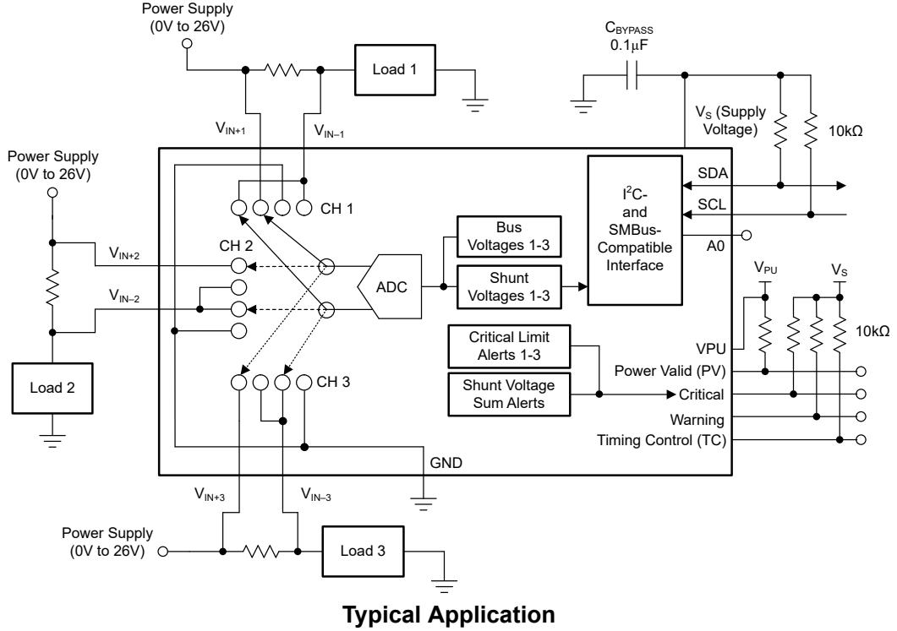

# Table of Contents

1 Features.. .1   
2 Applications.. 1   
3 Description.. .1   
4 Device Comparison Table.. .3   
5 Pin Configuration and Functions.. .3   
6 Specifications.. 4   
6.1 Absolute Maximum Ratings.. 4   
6.2 ESD Ratings... 4   
6.3 Recommended Operating Conditions.. .4   
6.4 Thermal Information.. .4   
6.5 Electrical Characteristics.. .5   
6.6 Typical Characteristics.. 7

# 7 Detailed Description.. .10

7.1 Overview.. 10   
7.2 Functional Block Diagram.. 10   
7.3 Feature Description... .11   
7.4 Device Functional Modes. .16   
7.5 Programming.. 20

# 7.6 Register Maps.. . 24

# 8 Application and Implementation.. 37

8.1 Application Information.. . 37. 37. 38   
8.2 Typical Application..   
8.3 Power Supply Recommendations..   
8.4 Layout..

# 9 Device and Documentation Support.. .40

9.1 Device Support.. 40   
9.2 Documentation Support.. 40   
9.3 Receiving Notification of Documentation Updates....40   
9.4 Support Resources.. 40   
9.5 Trademarks.. .40   
9.6 Electrostatic Discharge Caution.. . 40   
9.7 Glossary... .40

# 10 Revision History.. 40

# 11 Mechanical, Packaging, and Orderable

Information.. 4

# 4 Device Comparison Table

<table><tr><td rowspan=1 colspan=1>DEVICE</td><td rowspan=1 colspan=1>DESCRIPTION</td></tr><tr><td rowspan=1 colspan=1>INA226</td><td rowspan=1 colspan=1>36, Bidirectional, Ultrahigh Accuracy, Low- or High-Side, IC Out, Current and Power Monitor With Alert</td></tr><tr><td rowspan=1 colspan=1>INA219</td><td rowspan=1 colspan=1>26V, Bidirectional, Zero-Drift, High-Side, I2C Out, Current and Power Monitor</td></tr><tr><td rowspan=1 colspan=1>INA209</td><td rowspan=1 colspan=1>26V, Bidirectional, Low- or High-Side, I2C Out, Current and Power Monitor and High-Speed Comparator</td></tr><tr><td rowspan=1 colspan=1>INA210, INA211, INA212,INA213, INA214</td><td rowspan=1 colspan=1>26V, Bidirectional, Zero-Drift, High-Accuracy, Low- or High-Side, Voltage Out, Current Shunt Monitor</td></tr></table>

# 5 Pin Configuration and Functions

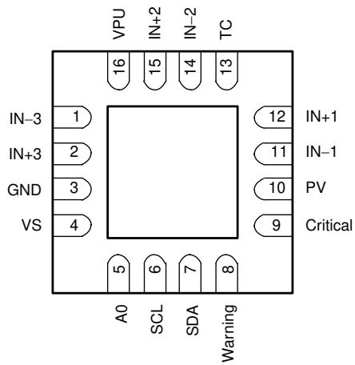  
Figure 5-1. RGV Package 16-Pin VQFN Top View

Table 5-1. Pin Functions   

<table><tr><td rowspan=1 colspan=2>PIN</td><td rowspan=2 colspan=1>Type</td><td rowspan=2 colspan=1>DESCRIPTION</td></tr><tr><td rowspan=1 colspan=1>NAME</td><td rowspan=1 colspan=1>NO.</td></tr><tr><td rowspan=1 colspan=1>AO</td><td rowspan=1 colspan=1>5</td><td rowspan=1 colspan=1>Digital input</td><td rowspan=1 colspan=1>Address pin. Connect to GND, SCL, SDA, or V. Table 7-1 shows pin settings andcorresponding addresses.</td></tr><tr><td rowspan=1 colspan=1>Critical</td><td rowspan=1 colspan=1>9</td><td rowspan=1 colspan=1>Digital output</td><td rowspan=1 colspan=1>Conversion-triggeredcritical alert;open-drainoutput.</td></tr><tr><td rowspan=1 colspan=1>GND</td><td rowspan=1 colspan=1>3</td><td rowspan=1 colspan=1>Analog</td><td rowspan=1 colspan=1>Ground</td></tr><tr><td rowspan=1 colspan=1>IN-1</td><td rowspan=1 colspan=1>11</td><td rowspan=1 colspan=1>Analog input</td><td rowspan=1 colspan=1>Connect to load side of the channel 1 shunt resistor. Bus voltage is the measurementfrom this pin to ground.</td></tr><tr><td rowspan=1 colspan=1>IN+1</td><td rowspan=1 colspan=1>12</td><td rowspan=1 colspan=1>Analog input</td><td rowspan=1 colspan=1>Connect to supply side of the channel 1 shunt resistor.</td></tr><tr><td rowspan=1 colspan=1>IN-2</td><td rowspan=1 colspan=1>14</td><td rowspan=1 colspan=1>Analog input</td><td rowspan=1 colspan=1>Connect to load side of the channel 2 shunt resistor. Bus voltage is the measurementfrom this pin to ground.</td></tr><tr><td rowspan=1 colspan=1>IN+2</td><td rowspan=1 colspan=1>15</td><td rowspan=1 colspan=1>Analog input</td><td rowspan=1 colspan=1>Connect to supply side of the channel 2 shunt resistor.</td></tr><tr><td rowspan=1 colspan=1>IN-3</td><td rowspan=1 colspan=1>1</td><td rowspan=1 colspan=1>Analog input</td><td rowspan=1 colspan=1>Connect to load side of the channel 3 shunt resistor. Bus voltage is the measurementfrom this pin to ground.</td></tr><tr><td rowspan=1 colspan=1>IN+3</td><td rowspan=1 colspan=1>2</td><td rowspan=1 colspan=1>Analog input</td><td rowspan=1 colspan=1>Connect to supply side of the channel 3 shunt resistor.</td></tr><tr><td rowspan=1 colspan=1>PV</td><td rowspan=1 colspan=1>10</td><td rowspan=1 colspan=1>Digital output</td><td rowspan=1 colspan=1>Powervalid alert; open-drain output.</td></tr><tr><td rowspan=1 colspan=1>SCL</td><td rowspan=1 colspan=1>6</td><td rowspan=1 colspan=1>Digital input</td><td rowspan=1 colspan=1>Serial bus clock line; open-drain iput.</td></tr><tr><td rowspan=1 colspan=1>SDA</td><td rowspan=1 colspan=1>7</td><td rowspan=1 colspan=1>Digital I/O</td><td rowspan=1 colspan=1>Serial bus data line; open-drain input/outut.</td></tr><tr><td rowspan=1 colspan=1>TC</td><td rowspan=1 colspan=1>13</td><td rowspan=1 colspan=1>Digital output</td><td rowspan=1 colspan=1>Timing control alert; open-drainoutput.</td></tr><tr><td rowspan=1 colspan=1>VPU</td><td rowspan=1 colspan=1>16</td><td rowspan=1 colspan=1>Analog input</td><td rowspan=1 colspan=1>ull pvlu</td></tr><tr><td rowspan=1 colspan=1>vS</td><td rowspan=1 colspan=1>4</td><td rowspan=1 colspan=1>Analog</td><td rowspan=1 colspan=1>Power supply, 2.7V to 5.5V.</td></tr><tr><td rowspan=1 colspan=1>Warning</td><td rowspan=1 colspan=1>8</td><td rowspan=1 colspan=1>Digital output</td><td rowspan=1 colspan=1>Averaged measurement warning alert; open-drain output.</td></tr><tr><td rowspan=1 colspan=1>ThermalPad</td><td rowspan=1 colspan=1>-</td><td rowspan=1 colspan=1>-</td><td rowspan=1 colspan=1>This pad must be connected to groundor left flating.</td></tr></table>

# 6 Specifications

# 6.1 Absolute Maximum Ratings

over operating free-air temperature range (unless otherwise noted)(1)

<table><tr><td></td><td></td><td></td><td rowspan=1 colspan=2>MIN         MAX</td><td rowspan=1 colspan=1>UNIT</td></tr><tr><td rowspan=1 colspan=1>Voltage</td><td rowspan=1 colspan=2>Supply, Vs</td><td rowspan=1 colspan=1></td><td rowspan=1 colspan=1>6</td><td rowspan=1 colspan=1>V</td></tr><tr><td rowspan=3 colspan=1>Analog inputs</td><td rowspan=2 colspan=1>IN+, IN-</td><td rowspan=1 colspan=1>Differential (VN+) -(N)</td><td rowspan=1 colspan=1>-26</td><td rowspan=1 colspan=1>26</td><td rowspan=3 colspan=1>V</td></tr><tr><td rowspan=1 colspan=1>Common-mode (VIN+) + (ViN-) / 2</td><td rowspan=1 colspan=1>-0.3</td><td rowspan=1 colspan=1>26</td></tr><tr><td rowspan=1 colspan=2>VPU</td><td rowspan=1 colspan=1></td><td rowspan=1 colspan=1>26</td></tr><tr><td rowspan=2 colspan=1>Digital outputs</td><td rowspan=1 colspan=2>Critical, warning, power valid</td><td rowspan=1 colspan=1></td><td rowspan=1 colspan=1>6</td><td rowspan=2 colspan=1>V</td></tr><tr><td rowspan=1 colspan=2>Timing control</td><td rowspan=1 colspan=1></td><td rowspan=1 colspan=1>26</td></tr><tr><td rowspan=2 colspan=1>Serial bus</td><td rowspan=1 colspan=2>Data line, SDA</td><td rowspan=1 colspan=1>(GND - 0.3)</td><td rowspan=1 colspan=1>6</td><td rowspan=2 colspan=1>V</td></tr><tr><td rowspan=1 colspan=2>Clock line, SCL</td><td rowspan=1 colspan=1>(GND - 0.3)</td><td rowspan=1 colspan=1>(Vs +0.3)</td></tr><tr><td rowspan=2 colspan=1>Current</td><td rowspan=1 colspan=2>Input, into any pin</td><td rowspan=1 colspan=1></td><td rowspan=1 colspan=1>5</td><td rowspan=2 colspan=1>mA</td></tr><tr><td rowspan=1 colspan=2>Open-drain, digital output</td><td rowspan=1 colspan=1></td><td rowspan=1 colspan=1>10</td></tr><tr><td rowspan=3 colspan=1>Temperature</td><td rowspan=1 colspan=2>Operating, TA</td><td rowspan=1 colspan=1>-40</td><td rowspan=1 colspan=1>125</td><td rowspan=3 colspan=1>C</td></tr><tr><td rowspan=1 colspan=2>Junction, TJ</td><td rowspan=1 colspan=1></td><td rowspan=1 colspan=1>150</td></tr><tr><td rowspan=1 colspan=2>Storage, Tstg</td><td rowspan=1 colspan=1>-65</td><td rowspan=1 colspan=1>150</td></tr></table>

(1) Stresses beyond those listed under Absolute Maximum Ratings may cause permanent damage to the device. These are stress ratings only, which do not imply functional operation of the device at these or any other conditions beyond those indicated under Recommended Operating Conditions. Exposure to absolute-maximum-rated conditions for extended periods may affect device reliability.   
(2) $\vee _ { { \mathbb N } + }$ and $V _ { \parallel N - }$ – can have a differential voltage of $- 2 6 \lor$ to $\mathtt { \Gamma } + 2 6 \mathtt { V }$ ; however, the voltage at these pins must not exceed the range of $- 0 . 3 \lor$ to $\mathtt { \Gamma } + 2 6 0$ .

# 6.2 ESD Ratings

<table><tr><td></td><td></td><td rowspan=1 colspan=1>VALUE</td><td rowspan=1 colspan=1>UNIT</td></tr><tr><td rowspan=3 colspan=1>V(ESD)   Electrostatic discharge</td><td rowspan=1 colspan=1>Human-body model (HBM), per ANSI/ESDA/JEDEC JS-001(1)</td><td rowspan=1 colspan=1>±2500</td><td rowspan=2 colspan=1>V</td></tr><tr><td rowspan=1 colspan=1>Charged-device model (CDM), per JEDEC specification JESD22-C101(2)</td><td rowspan=1 colspan=1>±1000</td></tr><tr><td rowspan=1 colspan=1>Machine model</td><td rowspan=1 colspan=1>±200</td><td rowspan=1 colspan=1></td></tr></table>

(1) JEDEC document JEP155 states that 500V HBM allows safe manufacturing with a standard ESD control process.   
(2) JEDEC document JEP157 states that 250V CDM allows safe manufacturing with a standard ESD control process.

# 6.3 Recommended Operating Conditions

over operating free-air temperature range (unless otherwise noted)

<table><tr><td></td><td>MIN</td><td>NOM</td><td>MAX</td><td>UNIT</td></tr><tr><td>Operating supply voltage</td><td>2.7</td><td></td><td>5.5</td><td>V</td></tr><tr><td>Operating temperature, TA</td><td>-40</td><td></td><td>125</td><td>°C</td></tr></table>

# 6.4 Thermal Information

<table><tr><td colspan="1" rowspan="3">THERMAL METRIC(1)</td><td colspan="1" rowspan="1">INA3221</td><td colspan="1" rowspan="3">UNIT</td></tr><tr><td colspan="1" rowspan="1">RGV (VQFN)</td></tr><tr><td colspan="1" rowspan="1">16 PINS</td></tr><tr><td colspan="1" rowspan="1">RJA          Junction-to-ambient thermal resistance</td><td colspan="1" rowspan="1">36.5</td><td colspan="1" rowspan="1">C/W</td></tr><tr><td colspan="1" rowspan="1">ReJC(top)      Junction-to-case (top) thermal resistance</td><td colspan="1" rowspan="1">42.7</td><td colspan="1" rowspan="1">C/W</td></tr><tr><td colspan="1" rowspan="1">R_JB          Junction-to-board thermal resistance</td><td colspan="1" rowspan="1">14.7</td><td colspan="1" rowspan="1">°C/W</td></tr><tr><td colspan="1" rowspan="1"> \qr          Junction-to-top characterization parameter</td><td colspan="1" rowspan="1">0.5</td><td colspan="1" rowspan="1">C/W</td></tr><tr><td colspan="1" rowspan="1">4JB          Junction-to-board characterization parameter</td><td colspan="1" rowspan="1">14.8</td><td colspan="1" rowspan="1">°C/W</td></tr><tr><td colspan="1" rowspan="1">ReJC(bot)       Junction-to-case (bottom) thermal resistance</td><td colspan="1" rowspan="1">3.3</td><td colspan="1" rowspan="1">°C/W</td></tr></table>

(1) For more information about traditional and new thermal metrics, see the Semiconductor and IC Package Thermal Metrics application report (SPRA953).

# 6.5 Electrical Characteristics

at $\mathsf { T } _ { \mathsf { A } } = 2 5 ^ { \circ } \mathsf { C }$ , $\mathsf { V } _ { \mathsf { S } } = 3 . 3 \mathsf { V }$ , $\vee _ { 1 \mathsf { N } + } = 1 2 \vee , \vee _ { \mathsf { S H U N T } } = ( \vee _ { 1 \mathsf { N } + } ) - ( \vee _ { 1 \mathsf { N } - } ) = 0 \mathsf { m V } ,$ and $\mathsf { V } _ { \mathsf { B U S } } = \mathsf { V } _ { \mathsf { I N } - } = 1 2 \mathsf { V }$ (unless otherwise noted)   

<table><tr><td></td><td></td><td></td><td></td><td></td><td></td><td></td></tr><tr><td>PARAMETER</td><td></td><td>TEST CONDITIONS</td><td>MIN</td><td>TYP</td><td>MAX</td><td>UNIT</td></tr><tr><td colspan="3">INPUT</td><td></td><td></td><td></td><td></td></tr><tr><td>VSHUNT</td><td colspan="2">Shunt voltage input</td><td>-163.84</td><td></td><td>163.8</td><td>mV</td></tr><tr><td>VBUS</td><td colspan="2">Bus voltage input</td><td>0</td><td></td><td>26</td><td>V</td></tr><tr><td>CMR</td><td colspan="2">Common-mode rejection VIN+ = 0V to +26V</td><td>110</td><td>120</td><td></td><td>dB</td></tr><tr><td rowspan="2">Vos</td><td colspan="2">TA = -40°C to +125°C</td><td></td><td>±40</td><td>±80</td><td>μV</td></tr><tr><td colspan="2">Shunt offset voltage, RTI(1)</td><td></td><td>0.1</td><td>0.5</td><td>μV/C</td></tr><tr><td>PSRR</td><td rowspan="3"></td><td>vs power supply, Vs = 2.7V to 5.5V</td><td></td><td>15</td><td></td><td>μVN</td></tr><tr><td>Vos</td><td>TA = -40°C to +125°C</td><td></td><td>±8</td><td>±16</td><td>mV</td></tr><tr><td colspan="2">Bus offset voltage, RTI(1)</td><td></td><td></td><td>80</td><td>μV/C</td></tr><tr><td>PSRR</td><td colspan="2">Input bias current at IN+</td><td></td><td>0.5</td><td></td><td>mVNV</td></tr><tr><td>IN+</td><td colspan="2">Input bias current at IN-</td><td></td><td>10</td><td></td><td>μA</td></tr><tr><td>IN-</td><td></td><td></td><td></td><td>10 || 670</td><td></td><td>μA∥| k</td></tr><tr><td colspan="2">Input leakage(2)</td><td>(IN+ pin) + (IN- pin), power-down mode</td><td></td><td>0.1</td><td>0.5</td><td>μA</td></tr><tr><td colspan="3">DC ACCURACY ADC native resolution</td><td></td><td></td><td></td><td></td></tr><tr><td colspan="2"></td><td>Shunt voltage</td><td></td><td>13</td><td></td><td>Bits</td></tr><tr><td colspan="2">1LSB step size</td><td>Bus voltage</td><td></td><td>40</td><td></td><td>μV</td></tr><tr><td colspan="2"></td><td></td><td></td><td>8</td><td></td><td>mV</td></tr><tr><td colspan="2">Shunt voltage gain error</td><td></td><td></td><td>0.1%</td><td>0.25%</td><td></td></tr><tr><td colspan="2"></td><td>TA = -40°C to +125°</td><td></td><td>10</td><td>50</td><td>ppm/</td></tr><tr><td colspan="2">Bus voltage gain error</td><td></td><td></td><td>0.1%</td><td>0.25%</td><td></td></tr><tr><td colspan="2">DNL Differential nonlinearity</td><td>TA = -40°C to +125°</td><td></td><td>10</td><td>50</td><td>ppm/</td></tr><tr><td rowspan="12">ONVERT ADC conversion ime</td><td rowspan="8"></td><td>CT bit = 000</td><td></td><td>±0.1</td><td></td><td>LSB</td></tr><tr><td>CT bit = 001</td><td></td><td>140</td><td>154</td><td></td></tr><tr><td>CT bit = 010</td><td></td><td>204</td><td>224</td><td>μs</td></tr><tr><td>CT bit = 011</td><td></td><td>332</td><td>365</td><td></td></tr><tr><td></td><td></td><td>588</td><td>646</td><td></td></tr><tr><td>CT bit = 100</td><td></td><td>1.1</td><td>1.21</td><td></td></tr><tr><td>CT bit = 101</td><td></td><td>2.116</td><td>2.328</td><td>ms</td></tr><tr><td>CT bit = 110 CT bit = 111</td><td></td><td>4.156</td><td>4.572</td><td></td></tr><tr><td colspan="2">SMBus</td><td></td><td>8.244</td><td>9.068</td><td></td></tr><tr><td colspan="2">SMBus timeout(3)</td><td></td><td></td><td>28</td><td></td><td>ms</td></tr><tr><td colspan="2">DIGITAL INPUT/OUTPUT</td><td></td><td></td><td></td><td>35</td><td></td></tr><tr><td colspan="3">C Input capacitance</td><td></td><td>3</td><td></td><td>$pF$</td></tr><tr><td colspan="3">Leakage input current OV≤ VIN≤ Vs</td><td></td><td>0.1</td><td>1</td><td>μA</td></tr><tr><td colspan="3">VIH High-level input voltage</td><td>0.7(Vs)</td><td></td><td>6</td><td>V</td></tr><tr><td colspan="2">VIL Low-level input voltage</td><td></td><td>-0.5</td><td></td><td>0.3 (Vs)</td><td>V</td></tr><tr><td colspan="2">Low-level output</td><td>SDA, critical, warning, PV Vs&gt; +2.7V, IoL = 3mA</td><td>0</td><td></td><td>0.4</td><td></td></tr><tr><td colspan="2">VoL oltage</td><td>Vs&gt;+2.7V,IoL = 1.2mA</td><td>0</td><td></td><td>0.4</td><td>V</td></tr><tr><td colspan="2">Vhys Hysteresis voltage</td><td></td><td></td><td>500</td><td></td><td>mV</td></tr><tr><td colspan="3">POWER SUPPLY</td><td></td><td></td><td></td><td></td></tr></table>

$\mathsf { T } _ { \mathsf { A } } = 2 5 ^ { \circ } \mathsf { C }$ , $\mathsf { V } _ { \mathsf { S } } = 3 . 3 \mathsf { V }$ $\mathsf { V } _ { 1 \mathsf { N } + } = 1 2 \mathsf { V } , \mathsf { V } _ { \mathsf { S H M N T } } = ( \mathsf { V } _ { 1 \mathsf { N } + } ) - ( \mathsf { V } _ { 1 \mathsf { N } - } ) = 0 \mathsf { m V } ,$ and $\mathsf { V } _ { \mathsf { B U S } } = \mathsf { V } _ { \mathsf { I N } - } = 1 2 \mathsf { V }$ (unless otherwise noted)   

<table><tr><td>PARAMETER</td><td>TEST CONDITIONS</td><td>MIN</td><td>TYP</td><td>MAX</td><td>UNIT</td></tr><tr><td rowspan="2">Quiescent current</td><td></td><td></td><td>350</td><td>450</td><td rowspan="2">μA</td></tr><tr><td>Power-down mode</td><td></td><td>0.5</td><td>2</td></tr><tr><td>Power-on reset threshold</td><td></td><td></td><td>2</td><td></td><td>V</td></tr></table>

(1) RTI $=$ Referred-to-input.   
(2) Input leakage is positive (current flows into the pin) for the conditions shown at the top of this table. Negative leakage currents can occur under different input conditions.   
(3) SMBus timeouts in the INA3221 reset the interface whenever SCL is low for more than 28ms.

# 6.6 Typical Characteristics

at $\mathsf { T } _ { \mathsf { A } } = 2 5 ^ { \circ } \mathsf { C }$ , VS = 3.3V,VIN+ = 12V, $\mathsf { V } _ { \mathsf { S H U N T } } = ( \mathsf { V } _ { \mathsf { I N } + } ) - ( \mathsf { V } _ { \mathsf { I N } - } ) = 0 \mathsf { m V } ,$ , and $\mathsf { V } _ { \mathsf { B U S } } = \mathsf { V } _ { \mathsf { I N } - } = 1 2 \mathsf { V }$ (unless otherwise noted)

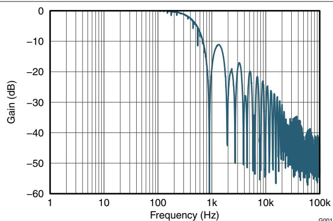  
Figure 6-1. Frequency Response

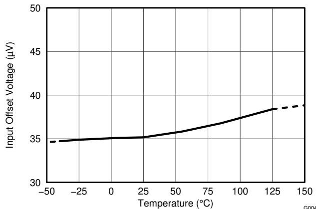  
Figure 6-3. Shunt Input Offset Voltage vs. Temperature

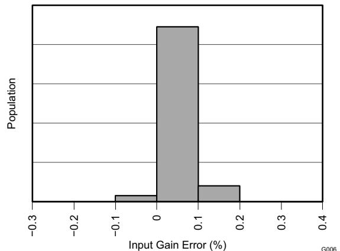  
Figure 6-5. Shunt Input Gain Error Production Distribution

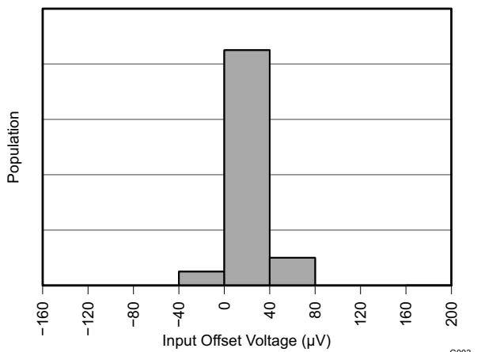  
Figure 6-2. Shunt Input Offset Voltage Production Distribution

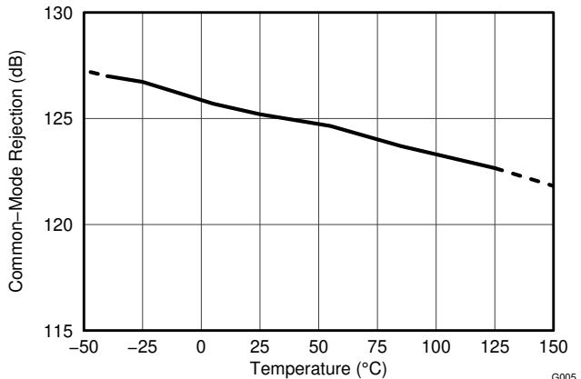  
Figure 6-4. Shunt Input Common-Mode Rejection Ratio vs. Temperature

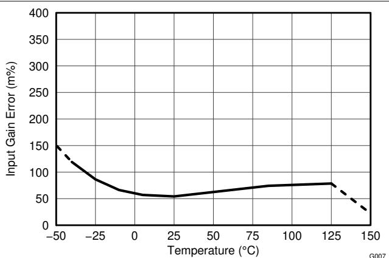  
Figure 6-6. Shunt Input Gain Error vs. Temperature

# 6.6 Typical Characteristics (continued)

at $\mathsf { T } _ { \mathsf { A } } = 2 5 ^ { \circ } \mathsf { C }$ , $\mathsf { V } _ { \mathbb { S } } = 3 . 3 \mathsf { V } , \mathsf { V } _ { \mathsf { I N } + } = 1 2 \mathsf { V } , \mathsf { V } _ { \mathbb { S } \mathsf { H M N T } } = ( \mathsf { V } _ { \mathsf { I N } + } ) - ( \mathsf { V } _ { \mathsf { I N } - } ) = 0 \mathsf { m V } ,$ , and $\mathsf { V } _ { \mathsf { B U S } } = \mathsf { V } _ { \mathsf { I N } - } = 1 2 \mathsf { V }$ (unless otherwise noted)

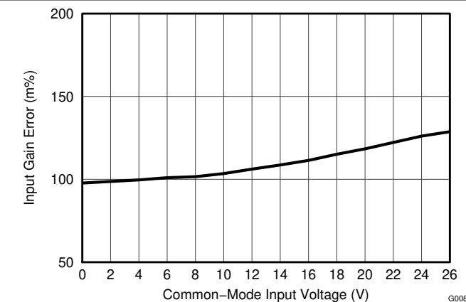  
Figure 6-7. Shunt Input Gain Error vs. Common-Mode Voltage

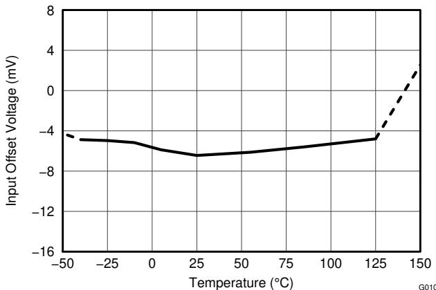  
Figure 6-9. Bus Input Offset Voltage vs. Temperature

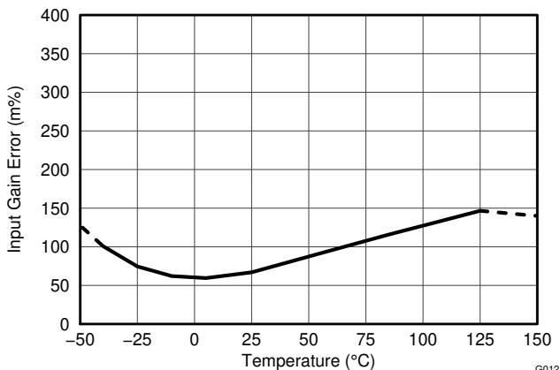  
Figure 6-11. Bus Input Gain Error vs. Temperature

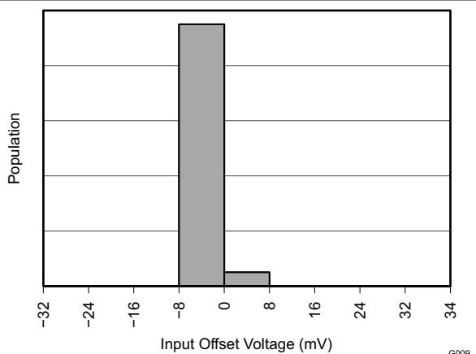  
Figure 6-8. Bus Input Offset Voltage Production Distribution

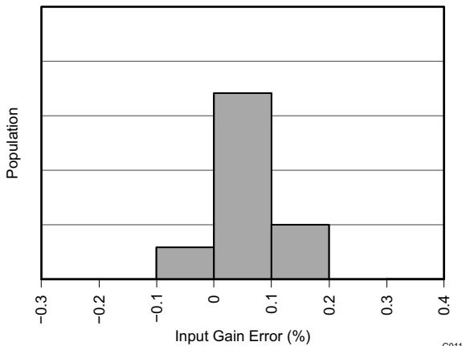  
Figure 6-10. Bus Input Gain Error Production Distribution

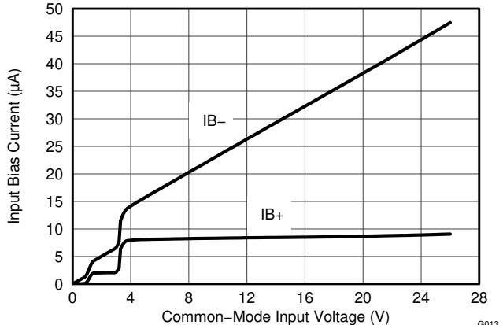  
Figure 6-12. Input Bias Current vs. Common-Mode Voltage

# 6.6 Typical Characteristics (continued)

at $\mathsf { T } _ { \mathsf { A } } = 2 5 ^ { \circ } \mathsf { C }$ , $\mathsf { V } _ { \mathbb { S } } = 3 . 3 \mathsf { V } , \mathsf { V } _ { \mathsf { I N } + } = 1 2 \mathsf { V } , \mathsf { V } _ { \mathbb { S } \mathsf { H M N T } } = ( \mathsf { V } _ { \mathsf { I N } + } ) - ( \mathsf { V } _ { \mathsf { I N } - } ) = 0 \mathsf { m V } ,$ , and $\mathsf { V } _ { \mathsf { B U S } } = \mathsf { V } _ { \mathsf { I N } - } = 1 2 \mathsf { V }$ (unless otherwise noted)

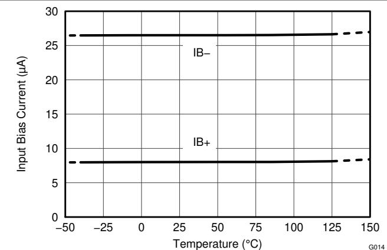  
Figure 6-13. Input Bias Current vs. Temperature

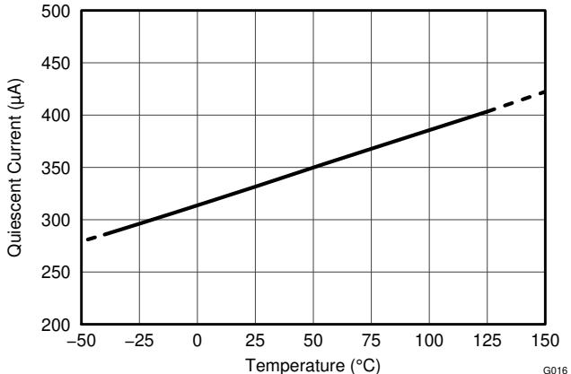  
Figure 6-15. Active $\mathsf { I } _ { \mathsf { Q } }$ vs. Temperature

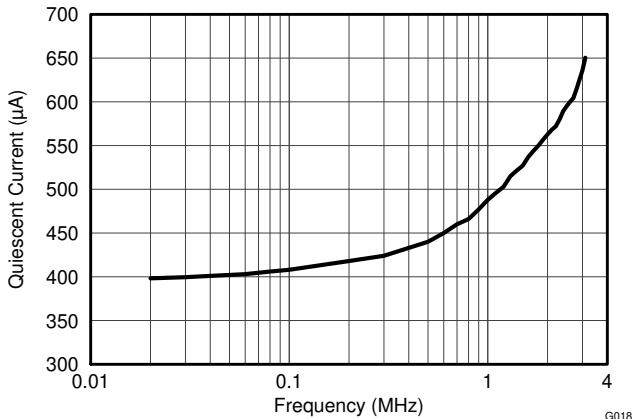  
Figure 6-17. Active $\mathsf { I } _ { \mathsf { Q } }$ vs. $\mathsf { P C }$ Clock Frequency

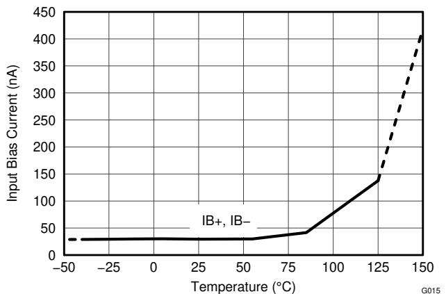  
Figure 6-14. Input Bias Current vs. Temperature (Shutdown)

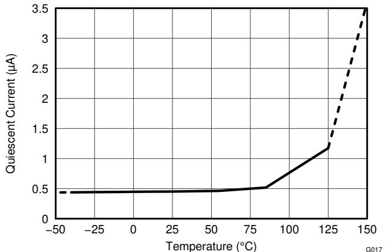  
Figure 6-16. Shutdown $\mathsf { I } _ { \mathsf { Q } }$ vs. Temperature

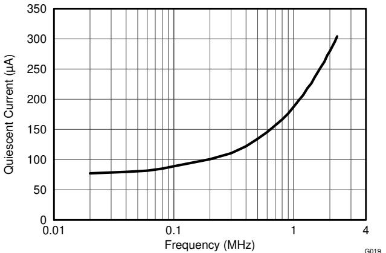  
Figure 6-18. Shutdown $\mathsf { I } _ { \mathsf { Q } }$ vs. $\mathsf { I } ^ { 2 } \mathsf { C }$ Clock Frequency

# 7 Detailed Description

# 7.1 Overview

The INA3221 is a current-shunt and bus voltage monitor that communicates over an $1 ^ { 2 } { \mathsf { C } } -$ and SMBus-compatible interface. The INA3221 provides digital shunt and bus voltage readings necessary for accurate decision making in precisely-controlled systems, and also monitors multiple rails to maintain compliance voltages. Programmable registers offer flexible configuration for measurement precision, and continuous versus single-shot operation. The Register Maps section provides details of the INA3221 registers, beginning with Table 7-3.

# 7.2 Functional Block Diagram

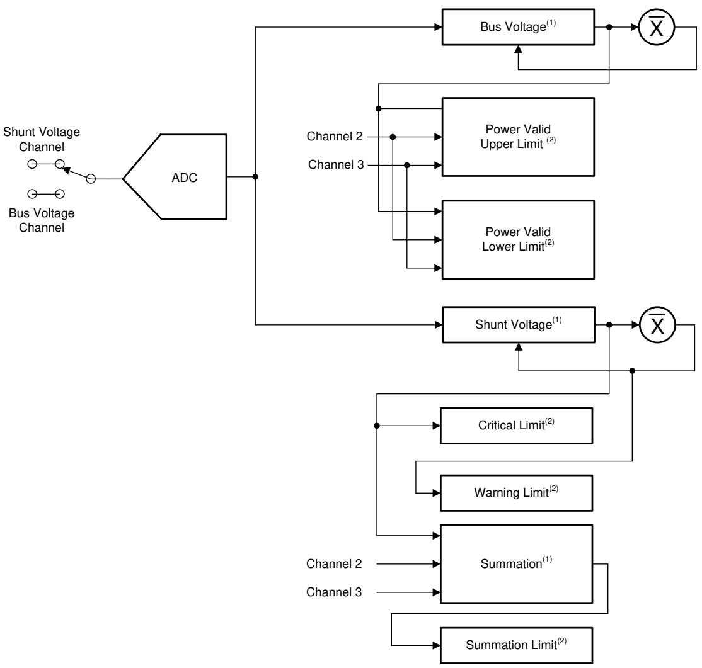

A. Read-only.   
B. Read/write.

# 7.3 Feature Description

# 7.3.1 Basic ADC Functions

The INA3221 performs two measurements on up to three power supplies of interest. The voltage developed from the load current passing through a shunt resistor creates a shunt voltage that is measured between the $\mathsf { N } +$ and IN– pins. The device also internally measures the power-supply bus voltage at the IN– pin for each channel. The differential shunt voltage is measured with respect to the IN– pin, and the bus voltage is measured with respect to ground.

The INA3221 is typically powered by a separate power supply that ranges from 2.7V to 5.5V. The monitored supply buses range from 0V to 26V.

# CAUTION

Based on the fixed $8 \mathsf { m V }$ bus-voltage register LSB (for any channel), a full-scale register value results in 32.76V. However, the actual voltage applied to the INA3221 input pins must not exceed 26V.

There are no special power-supply sequencing considerations between the common-mode input ranges and the device power-supply voltage because each are independent of the other; therefore, the bus voltages can be present with the supply voltage off and reciprocally.

The INA3221 takes two measurements for each channel: one for shunt voltage and one for bus voltage. Each measurement can be independently or sequentially measured, based on the mode setting (bits 2-0 in the Configuration register). When the INA3221 is in normal operating mode (that is, the MODE bits of the Configuration register are set to 111), the device continuously converts a shunt-voltage reading followed by a bus-voltage reading. This procedure converts one channel, and then continues to the shunt voltage reading of the next enabled channel, followed by the bus-voltage reading for that channel, and so on, until all enabled channels have been measured. The programmed Configuration register mode setting applies to all channels. Any channels that are not enabled are bypassed in the measurement sequence, regardless of mode setting.

The INA3221 has two operating modes, continuous and single-shot, that determine the internal ADC operation after these conversions complete. When the INA3221 is set to continuous mode (using the MODE bit settings), the device continues to cycle through all enabled channels until a new configuration setting is programmed.

The Configuration register MODE control bits also enable modes to be selected that convert only the shunt or bus voltage. This feature further allows the device to fit specific application requirements.

In single-shot (triggered) mode, setting any single-shot convert mode to the Configuration register (that is, the Configuration register MODE bits set to 001, 010, or 011) triggers a single-shot conversion. This action produces a single set of measurements for all enabled channels. To trigger another single-shot conversion, write to the Configuration register a second time, even if the mode does not change. When a single-shot conversion is initiated, all enabled channels are measured one time and then the device enters a power-down state. The INA3221 registers can be read at any time, even while in power-down. The data present in these registers are from the last completed conversion results for the corresponding register. The conversion ready flag bit (Mask/ Enable register, CVRF bit) helps coordinate single-shot conversions, and is especially helpful during longer conversion time settings. The CVRF bit is set after all conversions are complete. The CVRF bit clears under the following conditions:

1. Writing to the Configuration register, except when configuring the MODE bits for power-down mode; or   
2. Reading the Mask/Enable register.

In addition to the two operating modes (continuous and single-shot), the INA3221 also has a separate selectable power-down mode that reduces the quiescent current and turns off current into the INA3221 inputs. Power-down mode reduces the impact of supply drain when the device is not used. Full recovery from power-down mode requires $4 0 \mu \ s$ . The INA3221 registers can be written to and read from while the device is in power-down mode. The device remains in power-down mode until one of the active MODE settings are written to the Configuration register.

# 7.3.2 Alert Monitoring

The INA3221 allows programmable thresholds that make sure the intended application operates within the desired operating conditions. Multiple monitoring functions are available using four alert pins: Critical, Warning, PV (power valid), and TC (timing control). These alert pins are open-drain connections.

# 7.3.2.1 Critical Alert

The critical-alert feature monitors functions based on individual conversions of each shunt-voltage channel. The critical-alert limit feature compares the shunt-voltage conversion for each shunt-voltage channel to the value programmed into the corresponding limit register, to determine if the measured value exceeds the intended limit. Exceeding the programmed limit indicates that the current through the shunt resistor is too high.

At power-up, the default critical-alert limit value for each channel is set to the positive full-scale value, effectively disabling the alert. Program the corresponding limit registers at any time to begin monitoring for out-of-range conditions. The Critical alert pin pulls low if any channel measurement exceeds the limit present in the corresponding-channel critical-alert limit register. When the Critical alert pulls low, read the Mask/Enable register to determine which channel caused the critical alert flag indicator bit (CF1-3) to assert $( = 1 )$ .

# 7.3.2.1.1 Summation Control Function

The INA3221 also allows the Critical alert pin to be controlled by the summation control function. This function adds the single shunt-voltage conversions for the desired channels (set by SCC1-3 in the Mask/Enable register) to compare the combined sum to the programmed limit.

The SCC bits either disable the summation control function or allow the summation control function to switch between including two or three channels in the Shunt-Voltage Sum register. The Shunt-Voltage Sum Limit register contains the programmed value that is compared to the value in the Shunt-Voltage Sum register to determine if the total summed limit is exceeded. If the shunt-voltage sum limit value is exceeded, the Critical alert pin pulls low. Either the summation alert flag indicator bit (SF) or the individual critical alert limit bits (CF1-3) in the Mask/Enable register determine the source of the alert when the Critical alert pin pulls low.

For the summation limit to have a meaningful value, use the same shunt-resistor value on all included channels. Unless equal shunt-resistor values are used for each channel, do not use this function to add the individual conversion values directly together in the Shunt-Voltage Sum register to report the total current.

# 7.3.2.2 Warning Alert

The warning alert monitors the averaged value of each shunt-voltage channel. The averaged value of each shunt-voltage channel is based on the number of averages set with the averaging mode bits (AVG1-3) in the Configuration register. The average value updates in the shunt-voltage output register each time there is a conversion on the corresponding channel. The device compares the averaged value to the value programmed in the corresponding-channel Warning Alert Limit register to determine if the averaged value has been exceeded, indicating whether the average current is too high. At power-up, the default warning-alert limit value for each channel is set to the positive full-scale value, effectively disabling the alert. The corresponding limit registers can be programmed at any time to begin monitoring for out-of-range conditions. The Warning alert pin pulls low if any channel measurements exceed the limit present in the corresponding-channel Warning Alert Limit register. When the Warning alert pin pulls low, read the Mask/Enable register to determine which channel warning alert flag indicator bit (WF1-3) is asserted $( = 1 )$ .

# 7.3.2.3 Power-Valid Alert

The power-valid alert verifies if all power rails are above the required levels. This feature manages power sequencing, and validates the reported measurements based on system configuration. Power-valid mode starts at power-up, and detects when each channel exceeds a 10V threshold. This 10V level is the default value programmed into the Power-Valid Upper-Limit register. This value can be reprogrammed when the INA3221 is powered up to a valid supply-voltage level of at least 2.7V. When all three bus-voltage measurements reach the programmed value loaded to the Power-Valid Upper-Limit register, the power-valid (PV) alert pin pulls high. PV powers up in a low state, and does not pull high until the power-valid conditions are met, indicating all bus-voltage rails are above the power-valid upper-limit value. This sequence is shown in Figure 7-1.

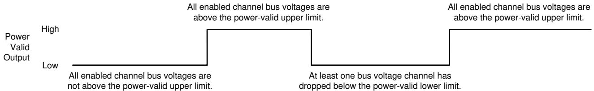  
Figure 7-1. Power-Valid State Diagram

When the power-valid conditions are met, and the PV pin pulls high, the INA3221 monitors if any bus-voltage measurements drop below 9V. This 9V level is the default value programmed into the Power-Valid Lower-Limit register. This value can also be reprogrammed when the INA3221 powers up to a supply voltage of at least 2.7V. If any bus-voltage measurement on the three channels drops below the Power-Valid Lower-Limit register value, the PV pin goes low, indicating that the power-valid condition is no longer met. At this point, the INA3221 resumes monitoring the power rails for a power-valid condition set in the Power-Valid Upper-Limit register.

The power-valid alert function is based on the power-valid conditions requirement that all three channels reach the intended Power-Valid Upper-Limit register value. If all three channels are not used, connect the unusedchannel IN– pin externally to one of the used channels to use the power-valid alert function. If the unused channel is not connected to a valid rail, the power-valid alert function cannot detect if all three channels reach the power-valid level. Float the unused channel $\mathsf { N } +$ pin.

The power-valid function also requires that bus-voltage measurements are monitored. To detect changes in the power-valid state, enable bus-voltage measurements through one of the corresponding MODE-bit settings in the Configuration register. The single-shot bus-voltage mode periodically cycles between the bus-voltage measurements to make sure that the power-valid conditions are met.

When all three bus-voltage measurements are completed, the device compares the results to the power-valid threshold values to determine the power-valid state. The bus-voltage measurement values remain in the corresponding channel output registers until the bus-voltage measurements are taken again, thus updating the output registers. When the output registers are updated, the values are again compared to the power-valid thresholds. Without taking periodic bus-voltage measurements, the INA3221 is unable to determine if the powervalid conditions are maintained.

The PV pin allows for a 0V output that indicates a power-invalid condition. An output equal to the pull-up supply voltage connected to the VPU pin indicates a power-valid condition, as shown in Figure 7-2. Dividing down the high power-valid pull-up voltage by adding a resistor to ground at the PV output is also possible, thus allowing this function to interface with lower-voltage circuitry, if needed.

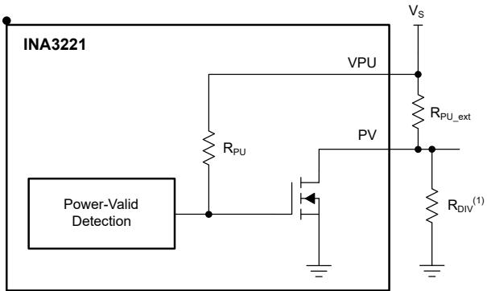  
Figure 7-2. Power-Valid Output Structure

A. RDIV can be used to level-shift the PV output high.

# 7.3.2.4 Timing-Control Alert

The INA3221 timing-control alert function helps verify proper power-supply sequencing. At power-up, the default INA3221 setting is continuous shunt- and bus-voltage conversion mode, and the INA3221 internally begins comparing the channel-1 bus voltage to determine when a 1.2V level is reached. This comparison is made each time the sequence returns to the channel-1 bus-voltage measurement. When a 1.2V level is detected on the channel-1 bus-voltage measurement, the INA3221 begins checking for a 1.2V level present on the channel-2 bus-voltage measurement. After a 1.2V level is detected on channel 1, if the INA3221 does not detect a 1.2V value or greater on the bus voltage measurement following four complete cycles of all three channels, the timing control (TC) alert pin pulls low to indicate that the INA3221 has not detected a valid power rail on channel 2. As shown in Figure 7-3, this sequence allows for approximately 28.6ms from the time 1.2V is detected on channel 1 for a valid voltage to be detected on channel 2. Figure 7-4 illustrates the state diagram for the TC alert pin.

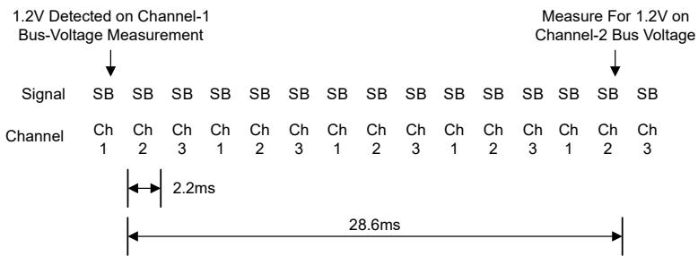

NOTE: The signal refers to the corresponding shunt (S) and bus (B) voltage measurement for each channel.

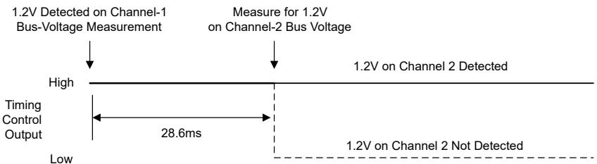  
Figure 7-3. Timing Control Timing Diagram   
Figure 7-4. Timing Control State Diagram

The timing control alert function is only monitored at power-up or when a software reset is issued by setting the reset bit (RST, bit 15) in the Configuration register. The timing control alert function timing is based on the default device settings at power-up. Writing to the Configuration register before the timing control alert function completes the full sequence results in disabling the timing control alert until power is cycled or a software reset is issued.

# 7.3.2.5 Default Settings

The default register power-up states are listed in the Register Maps section. These registers are volatile; if programmed to a value other than the default values shown in Table 7-3, the registers must be reprogrammed every time the device powers up.

# 7.3.3 Software Reset

The INA3221 features a software reset that reinitializes the device and register settings to default power-up values without having to cycle power to the device. Use bit 15 (RST) of the Configuration register to perform a software reset. Setting RST reinitializes all registers and settings to the default power state with the exception of the power-valid output state.

If a software reset is issued, the INA3221 holds the output of the PV pin until the power-valid detection sequence completes. The Power-Valid Upper Limit and Power-Valid Lower limit registers return to the default state when the software reset has been issued. Therefore, any reprogrammed limit registers are reset, resulting in the original power-valid thresholds validating the power-valid conditions. This architecture prevents interruption to circuitry connected to the power valid output during a software reset event.

# 7.4 Device Functional Modes

# 7.4.1 Averaging Function

The INA3221 includes three channels to monitor up to three independent supply buses; however, multichannel monitoring sometimes results in poor shunt-resistor placement. Ideally, shunt resistors are placed as close as possible to the corresponding channel input pins. However, because of system layout and multiple power-supply rails, one or more shunt resistors can require being located further away, thus presenting potentially larger measurement errors. These errors result from additional trace inductance and other parasitic impedances between the shunt resistor and input pins. Longer traces also create an additional potential for coupling noise into the signal if the traces are routed near noise-generating sections of the board.

The INA3221 averaging function mitigates this potential problem by limiting the impact that any single measurement has on the averaged value of each measured signal. This limitation reduces the influence that noise has on the averaged value, thereby effectively creating an input-signal filter.

The averaging function is illustrated in Figure 7-5. Operation begins by first measuring the shunt input signal on channel 1. This value is then subtracted from the previous value that was present in the corresponding data output register. This difference is then divided by the value programmed by the averaging mode setting (AVG2-0, Configuration register bits 11-9) and stored in an internal accumulation register. The computed result is then added to the previously-loaded data output register value, and the resulting value is loaded to the corresponding data output register. After the update, the next signal to be measured follows the same process. The larger the value selected for the averaging mode setting, the less impact or influence any new conversion has on the average value, as shown in Figure 7-6. This averaging feature functions as a filter to reduce input noise from the averaged measurement value.

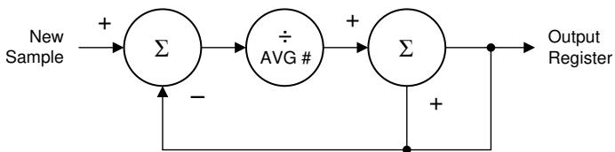  
Figure 7-5. Averaging Function Block Diagram

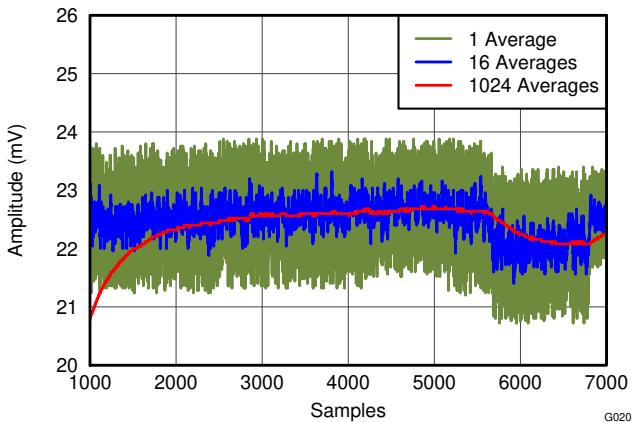  
Figure 7-6. Average Setting Example

# 7.4.2 Multiple Channel Monitoring

The INA3221 monitors shunt and voltage measurements for up to three unique power-supply rails, and measures up to six different signals. Adjust the number of channels and signals being measured by setting the channel enable $( { \mathsf { C H 1 } } _ { \mathsf { e n } }$ to $\mathsf { C H 3 _ { e n , } }$ ) and mode (MODE3-1) bits in the Configuration register. This adjustment allows the device to be optimized based on application requirements for the system in use.

# 7.4.2.1 Channel Configuration

If all three channels must be monitored at power-up, but only one channel must be monitored after the system has stabilized, disable the other two channels after power-up. This configuration allows the INA3221 to only monitor the power-supply rail of interest. Disable unused channels to help improve system response time by more quickly returning to sampling the channel of interest. The INA3221 linearly monitors the enabled channels. That is, if all three channels are enabled for both shunt- and bus-voltage measurements, an additional five conversions complete after a signal is measured before the device returns to that particular signal to begin another conversion. To reduce this requirement down to two conversions before the device begins a new conversion on a particular channel again, change the operating mode to monitor only the shunt voltage.

A timing aspect is also involved in reducing the measured signals. The amount of time to complete an allchannel, shunt- and bus-voltage sequence is equal to the sum of the shunt-voltage conversion time and the bus-voltage conversion time (programmed by the CT bits in the Configuration register) multiplied by the three channels. The conversion times for the shunt- and bus-voltage measurements are programmed independently; however, the selected shunt- and bus-voltage conversion times apply to all channels.

Enable a single channel with only one signal measured to allow for that particular signal to be monitored solely. This setting enables the fastest response over time to changes in that specific input signal because there is no delay from the end of one conversion before the next conversion begins on that channel. Conversion time is not affected by enabling or disabling other channels. Selecting both the shunt- and bus-voltage settings, as well as enabling additional channels, extends the time from the end of one conversion on a signal before the beginning of the next conversion of that signal.

# 7.4.2.2 Averaging and Conversion-Time Considerations

The INA3221 has programmable conversion times for both the shunt- and bus-voltage measurements. The selectable conversion times for these measurements range from $1 4 0 \mu \ s$ to 8.244ms. The conversion-time settings, along with the programmable-averaging mode, enable the INA3221 to optimize available timing requirements in a given application. For example, if a system requires data to be read every 2ms with all three channels monitored, configure the INA3221 with the conversion times for the shunt- and bus-voltage measurements set to $3 3 2 \mu \ s$ .

The INA3221 can also be configured with a different conversion-time setting for the shunt- and bus-voltage measurements. This approach is common in applications where the bus voltage tends to be relatively stable, and allows for the time focused on the bus voltage measurement to be reduced relative to the shunt-voltage measurement. For example, the shunt-voltage conversion time can be set to 4.156ms with the bus-voltage conversion time set to $5 8 8 \mu \ s$ for a 5ms update time.

There are trade-offs associated with the conversion-time and averaging-mode settings. The averaging feature significantly improves the measurement accuracy by effectively filtering the signal. This approach allows the INA3221 to reduce the amount of noise in the measurement caused by noise coupling into the signal. A greater number of averages allows the INA3221 to be more effective in reducing the measurement noise component. The trade-off to this noise reduction is that the averaged value has a longer response time to input-signal changes. This aspect of the averaging feature is mitigated to some extent with the critical-alert feature that compares each single conversion to determine if a measured signal (with noise component) has exceeded the maximum acceptable level.

The selected conversion times also have an impact on measurement accuracy. This effect can seen in Figure 7-7. The multiple conversion times shown in Figure 7-7 illustrate the impact of noise on measurement. These curves shown do not use averaging. to achieve the highest-accuracy measurement possible, use a combination of the longest allowable conversion times and highest number of averages, based on system timing requirements.

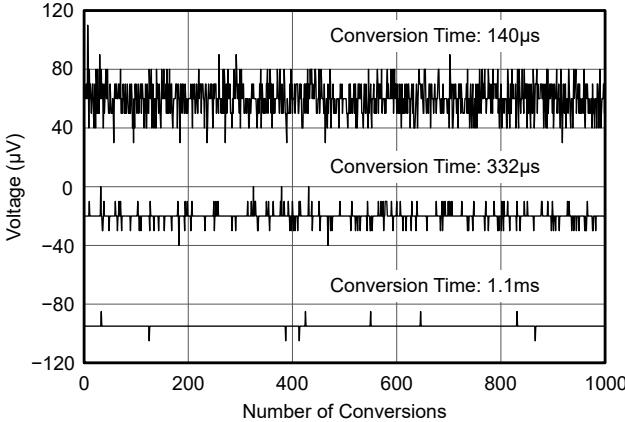  
Figure 7-7. Noise Versus Conversion Time

# 7.4.3 Filtering and Input Considerations

Measuring current is often noisy, and such noise can be difficult to define. The INA3221 offers several filtering options by allowing conversion times and the number of averages to be selected independently in the Configuration register. The conversion times can be set independently for the shunt- and bus-voltage measurements as well, for added flexibility in configuring power-supply bus monitoring.

The internal ADC is based on a delta-sigma $( \Delta \Sigma )$ front-end with a $5 0 0 \mathsf { k H z }$ $( \pm 3 0 \% )$ typical sampling rate. This architecture has good inherent noise rejection; however, transients that occur at or very close to the samplingrate harmonics can cause problems. These transient signals are at 1MHz and higher; therefore, the signals are managed by incorporating filtering at the INA3221 input. High-frequency signals allow for the use of low-value series resistors on the filter, with negligible effects on measurement accuracy. In general, filtering the INA3221 input is only necessary if there are transients at exact harmonics of the 500kHz $( \pm 3 0 \% )$ sampling rate that are greater than 1MHz. Filter using the lowest-possible series resistance (typically $1 0 \Omega$ or less) and a ceramic capacitor. Recommended capacitor values are $0 . 1 \mu \mathsf { F }$ to $1 . 0 \mu \ F .$ . Figure 7-8 shows the INA3221 with an additional filter added at the input.

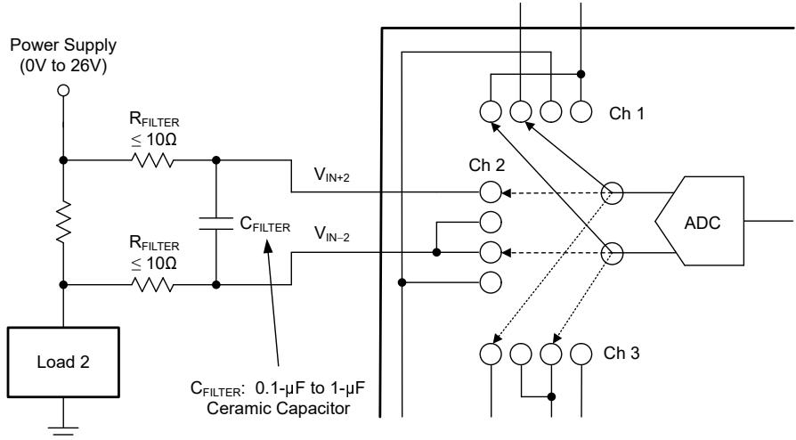  
Figure 7-8. INA3221 With Input Filtering

The INA3221 inputs are specified to tolerate 26V across the inputs. However, overload conditions are another consideration for the INA3221 inputs. For example, a large differential-input scenario can be a short to ground on the load side of the shunt. This type of event results in the full power-supply voltage applied across the shunt, if supported by the power supply or energy-storage capacitors. Keep in mind that removing a short to ground can result in inductive kickbacks that can exceed the 26V differential and common-mode rating of the INA3221. Inductive kickback voltages are best controlled by zener-type transient-absorbing devices (commonly called transzorbs) combined with sufficient energy-storage capacitance.

In applications that do not have large energy-storage electrolytic capacitors on one or both sides of the shunt, an input overstress condition can result from an excessive dV/dt of the voltage applied to the input. A hard physical short is the most likely cause of this event, particularly in applications without large electrolytic capacitors present. This problem occurs because an excessive dV/dt can activate the INA3221 ESD protection in systems where large currents are available. Testing has demonstrated that the addition of $1 0 \Omega$ resistors in series with each INA3221 input sufficiently protects the inputs against this dV/dt failure up to the 26V device rating.

# 7.5 Programming

# 7.5.1 Bus Overview

The INA3221 offers compatibility with both $\mathsf { I 2 C }$ and SMBus interfaces. The $\mathsf { I 2 C }$ and SMBus protocols are essentially compatible with one another.

The $\mathsf { I 2 C }$ interface is used throughout this data sheet as the primary example, with the SMBus protocol specified only when a difference between the two systems is discussed. Two I/O lines, the serial clock (SCL) and data signal line (SDA), connect the INA3221 to the bus. Both SCL and SDA are open-drain connections.

The device that initiates a data transfer is called a controller, and the devices controlled by the controller are targets. The bus must be controlled by the controller device that generates the SCL, controls the bus access, and generates start and stop conditions.

To address a specific device, the controller initiates a start condition by pulling SDA from a high to a low logic level while SCL is high. All targets on the bus shift in the target address byte on the SCL rising edge, with the last bit indicating whether a read or write operation is intended. During the ninth clock pulse, the target being addressed responds to the controller by generating an acknowledge bit and pulling SDA low.

Data transfer is then initiated and eight bits of data are sent, followed by an acknowledge bit. During data transfer, SDA must remain stable while SCL is high. Any change in SDA while SCL is high is interpreted as a start or stop condition.

After all data are transferred, the controller generates a stop condition by pulling SDA from low to high while SC is high. The INA3221 includes a 28ms timeout on the interface to prevent locking up the bus.

# 7.5.1.1 Serial Bus Address

To communicate with the INA3221, the controller must first address target devices with a target address byte. This byte consists of seven address bits and a direction bit to indicate whether the intended action is a read or write operation.

The INA3221 has one address pin, A0. Table 7-1 describes the pin logic levels for each of the four possible addresses. The state of the A0 pin is sampled on every bus communication and must be set before any activity on the interface occurs.

Table 7-1. Address Pins and Target Addresses   

<table><tr><td rowspan=1 colspan=1>A0</td><td rowspan=1 colspan=1>TARGET ADDRESS</td></tr><tr><td rowspan=1 colspan=1>GND</td><td rowspan=1 colspan=1>1000000</td></tr><tr><td rowspan=1 colspan=1>VS</td><td rowspan=1 colspan=1>1000001</td></tr><tr><td rowspan=1 colspan=1>SDA</td><td rowspan=1 colspan=1>1000010</td></tr><tr><td rowspan=1 colspan=1>SCL</td><td rowspan=1 colspan=1>1000011</td></tr></table>

# 7.5.1.2 Serial Interface

The INA3221 only operates as a target device on the $\mathsf { I 2 C }$ bus and SMBus. Bus connections are made using the open-drain $_ { 1 / \bigcirc }$ lines, SDA and SCL. The SDA and SCL pins feature integrated spike-suppression filters and Schmitt triggers to minimize the effects of input spikes and bus noise. While there is spike suppression integrated into the digital $_ { 1 / 0 }$ lines, use proper layout to minimize the amount of coupling into the communication lines. Noise introduction occurs from capacitively coupling signal edges between the two communication lines themselves, or from other switching noise sources present in the system. Routing traces in parallel with ground between layers on a printed circuit board (PCB) typically reduces the effects of coupling between the communication lines. Shield communication lines to reduce the possibility of unintended noise coupling into the digital $_ { 1 / 0 }$ lines that can be incorrectly interpreted as start or stop commands.

The INA3221 supports a transmission protocol for Fast (1kHz to 400kHz) and High-speed (1kHz to 2.44MHz) modes. All data bytes are transmitted MSB first.

# 7.5.2 Writing To and Reading From the INA3221

To access a specific INA3221 register, write the appropriate value to the register pointer. See Table 7-3 for a complete list of registers and corresponding addresses. The value for the register pointer, as shown in Figure 7-9, is the first byte transferred after the target address byte with the $\mathsf { R } / \mathsf { W }$ bit low. Every write operation to the INA3221 requires a register pointer value.

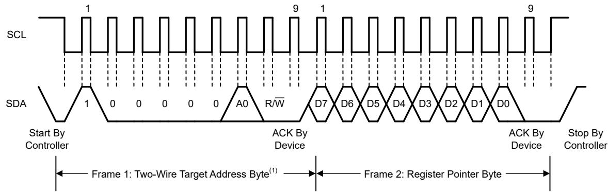  
Figure 7-9. Typical Register Pointer Set

A. The value of the Target Address Byte is determined by the A0 pin setting; see Table 7-1.

Register writes begin with the first byte transmitted by the controller. This byte is the target address, with the R/ W bit low. The INA3221 then acknowledges receipt of a valid address. The next byte transmitted by the controller is the register address that data are written to. This register address value updates the register pointer to the desired register. The next two bytes are written to the register addressed by the register pointer. The INA3221 acknowledges receipt of each data byte. The controller terminates data transfer by generating a start or stop condition.

When reading from the INA3221, the last value stored in the register pointer by a write operation determines which register is read during a read operation. To change the register pointer for a read operation, write a new value to the register pointer. This write is accomplished by issuing a target address byte with the R/ W bit low, followed by the register pointer byte. No additional data are required. The controller then generates a start condition and sends the target address byte with the $\textsf { R I W }$ bit high to initiate the read command. The next byte is transmitted by the target and is the most significant byte of the register indicated by the register pointer. This byte is followed by an acknowledge from the controller; then the target transmits the least significant byte. The controller acknowledges receipt of the data byte. The controller terminates data transfer by generating a not-acknowledge after receiving any data byte, or generating a start or stop condition. If repeated reads from the same register are desired, it is not necessary to continually send the register pointer bytes; the INA3221 retains the register pointer value until the value is changed by the next write operation.

Figure 7-10 and Figure 7-11 show the write and read operation timing diagrams, respectively. Note that registe bytes are sent most-significant byte first, followed by the least significant byte.

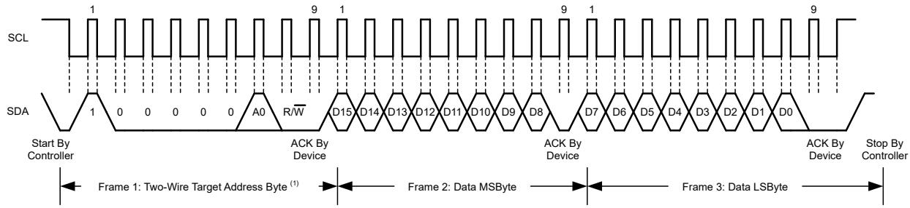  
Figure 7-10. Timing Diagram for Write Word Format

A. The value of the target address byte is determined by the A0 pin setting; see Table 7-1.

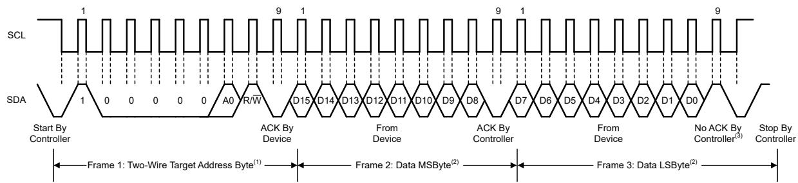  
Figure 7-11. Timing Diagram for Read Word Format

A. The value of the target address byte is determined by the A0 pin setting; see Table 7-1.   
B. Read data are from the last register pointer location. If a new register is desired, the register pointer must be updated. See Figure 7-9.   
C. The controller can also send an ACK.

Figure 7-12 shows the timing diagram for the SMBus Alert response operation.

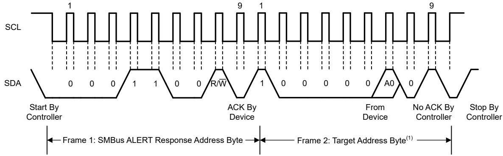  
Figure 7-12. Timing Diagram for SMBus Alert

A. The value of the Target Address Byte is determined by the A0 pin setting; see Table 7-1.

# 7.5.2.1 High-Speed $\mathsf { I } ^ { 2 } \mathsf { C }$ Mode

When the bus is idle, the SDA and SCL lines are pulled high by the pull-up resistors. The controller generates a start condition followed by a valid serial byte with the high-speed (Hs) controller code 00001XXX. This transmission is made in fast (400kHz) or standard (100kHz) (F/S) mode at no more than 400kHz. The INA3221 does not acknowledge the Hs controller code, but does recognize the code and switches the internal filters to support 2.44MHz operation.

The controller then generates a repeated start condition (a repeated start condition has the same timing as the start condition). After this repeated start condition, the protocol is the same as F/S mode, except that transmission speeds up to 2.44MHz are allowed. Instead of using a stop condition, the controller uses a repeated start conditions to secure the bus in Hs mode. A stop condition ends the Hs mode, and switches all internal INA3221 filters to support F/S mode.

Figure 7-13 shows the bus timing, and Table 7-2 lists the bus timing definitions.

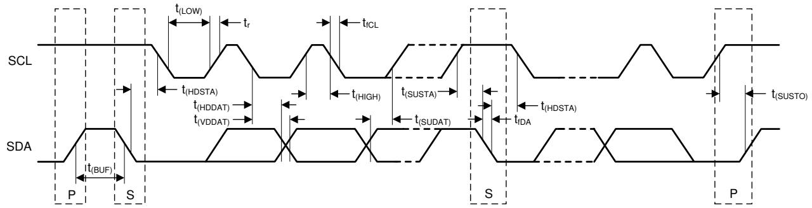  
Figure 7-13. Bus Timing

Table 7-2. Bus Timing Definitions (1)   

<table><tr><td colspan="2" rowspan="2">PARAMETER</td><td colspan="2">FAST MODE</td><td colspan="2">HIGH-SPEED MODE</td><td rowspan="2">UNIT</td></tr><tr><td>MIN</td><td>MAX</td><td>MIN</td><td>MAX</td></tr><tr><td>f(sCL)</td><td>SCL operating frequency</td><td>0.001</td><td>0.4</td><td>0.001</td><td>2.44</td><td>MHz</td></tr><tr><td>t(BUF)</td><td>Bus free time between stop and start conditions</td><td>1300</td><td></td><td>160</td><td></td><td>ns</td></tr><tr><td>t(HDSTA)</td><td>Hold time after repeated START condition. After this period, the first clock is generated.</td><td>600</td><td></td><td>160</td><td></td><td>ns</td></tr><tr><td>t(SUSTA)</td><td>Repeated start condition setup time</td><td>600</td><td></td><td>160</td><td></td><td>ns</td></tr><tr><td>t(SUSTO)</td><td>STOP condition setup time</td><td>600</td><td></td><td>160</td><td></td><td>ns</td></tr><tr><td>[(HDDAT)</td><td>Data hold time</td><td>0</td><td></td><td>0</td><td></td><td>ns</td></tr><tr><td>(VDDAT)</td><td>Data valid time</td><td></td><td>1200</td><td></td><td>260</td><td>ns</td></tr><tr><td>t(SUDAT)</td><td>Data setup time</td><td>100</td><td></td><td>10</td><td></td><td>ns</td></tr><tr><td>t(LOW)</td><td>SCL clock low period</td><td>1300</td><td></td><td>270</td><td></td><td>ns</td></tr><tr><td>[(HIGH)</td><td>SCL clock high period</td><td>600</td><td></td><td>60</td><td></td><td>ns</td></tr><tr><td>ADA</td><td>Data fall time</td><td></td><td>500</td><td></td><td>150</td><td>ns</td></tr><tr><td>tfCL</td><td>Clock fall time</td><td></td><td>300</td><td></td><td>40</td><td>ns</td></tr><tr><td rowspan="2">tr</td><td>Clock rise time</td><td></td><td>300</td><td></td><td>40</td><td>ns</td></tr><tr><td>Clock rise time for SCLK ≤ 100kHz</td><td></td><td>1000</td><td></td><td></td><td>ns</td></tr></table>

(1) Values based on a statistical analysis of a one-time sample of devices. Minimum and maximum values are not production tested. $\mathsf { A } 0 = \mathsf { A } 1 = 0$ .

# 7.5.3 SMBus Alert Response

The INA3221 responds to the SMBus alert response address. The SMBus alert response provides a quick fault identification for simple target devices. When an alert occurs, the controller broadcasts the alert response target address (0001 100) with the R/ W bit set high. Following this alert response, any target devices that generated an alert self-identifies by acknowledging the alert response, and sending the respective address on the bus.

The alert response can activate several different target devices simultaneously, similar to the $\mathsf { I 2 C }$ general call. If more than one target attempts to respond, bus arbitration rules apply. The losing device does not generate an acknowledge, and continues to hold the alert line low until the interrupt is cleared. Alerts must be in Latch mode to function.

# 7.6 Register Maps

The INA3221 uses a bank of registers for holding configuration settings, measurement results, minimum and maximum limits, and status information. Table 7-3 summarizes the INA3221 registers; see the Functional Block Diagram section for an illustration of the registers.

# 7.6.1 Summary of Register Set

Table 7-3. Summary of Register Set   
(1) Type: ${ \sf R } =$ read-only, $\mathsf { R } I$ W $=$ read/write.   

<table><tr><td rowspan=2 colspan=1>POINTERADRESS(Hex)</td><td rowspan=2 colspan=1>REGISTER NAME</td><td rowspan=2 colspan=1>DESCRIPTION</td><td rowspan=1 colspan=2>POWER-ON RESET</td><td rowspan=2 colspan=1>TYPE(1)</td></tr><tr><td rowspan=1 colspan=1>BINARY</td><td rowspan=1 colspan=1>HEX</td></tr><tr><td rowspan=1 colspan=1>0</td><td rowspan=1 colspan=1>Configuration</td><td rowspan=1 colspan=1>All-register reset, shunt and bus voltage ADC conversion times andaveraging, operating mode.</td><td rowspan=1 colspan=1>01110001 00100111</td><td rowspan=1 colspan=1>7127</td><td rowspan=1 colspan=1>R/W</td></tr><tr><td rowspan=1 colspan=1>1</td><td rowspan=1 colspan=1>Channel-1 Shunt Voltage</td><td rowspan=1 colspan=1>Averaged shunt voltage value.</td><td rowspan=1 colspan=1>000000000000000</td><td rowspan=1 colspan=1>0000</td><td rowspan=1 colspan=1>R</td></tr><tr><td rowspan=1 colspan=1>2</td><td rowspan=1 colspan=1>Channel-1 Bus Voltage</td><td rowspan=1 colspan=1>Averaged bus voltage value.</td><td rowspan=1 colspan=1>000000000000</td><td rowspan=1 colspan=1>0000</td><td rowspan=1 colspan=1>R</td></tr><tr><td rowspan=1 colspan=1>3</td><td rowspan=1 colspan=1>Channel-2 Shunt Voltage</td><td rowspan=1 colspan=1>Averaged shunt voltage value.</td><td rowspan=1 colspan=1>000000000000000</td><td rowspan=1 colspan=1>0000</td><td rowspan=1 colspan=1>R</td></tr><tr><td rowspan=1 colspan=1>4</td><td rowspan=1 colspan=1>Channel-2 Bus Voltage</td><td rowspan=1 colspan=1>Averaged bus voltage value.</td><td rowspan=1 colspan=1>0000000000000000</td><td rowspan=1 colspan=1>0000</td><td rowspan=1 colspan=1>R</td></tr><tr><td rowspan=1 colspan=1>5</td><td rowspan=1 colspan=1>Channel-3 Shunt Voltage</td><td rowspan=1 colspan=1>Averaged shunt voltage value.</td><td rowspan=1 colspan=1>000000000000000</td><td rowspan=1 colspan=1>0000</td><td rowspan=1 colspan=1>R</td></tr><tr><td rowspan=1 colspan=1>6</td><td rowspan=1 colspan=1>Channel-3 Bus Voltage</td><td rowspan=1 colspan=1>Averaged bus voltage value.</td><td rowspan=1 colspan=1>0000000000000000</td><td rowspan=1 colspan=1>0000</td><td rowspan=1 colspan=1>R</td></tr><tr><td rowspan=1 colspan=1>7</td><td rowspan=1 colspan=1>Channel-1 Critical AlertLimit</td><td rowspan=1 colspan=1>Cif the corresponding limit has been exceeded.</td><td rowspan=1 colspan=1>0111111 11111000</td><td rowspan=1 colspan=1>7FF8</td><td rowspan=1 colspan=1>R/W</td></tr><tr><td rowspan=1 colspan=1>8</td><td rowspan=1 colspan=1>Channel-1 Warning AlertLimit</td><td rowspan=1 colspan=1>Contains limit value to compare to averaged measurement todetermine if the corresponding limit has been exceeded.</td><td rowspan=1 colspan=1>011111 1111000</td><td rowspan=1 colspan=1>7FF8</td><td rowspan=1 colspan=1>R/W</td></tr><tr><td rowspan=1 colspan=1>9</td><td rowspan=1 colspan=1>Channel-2 Critical AlertLimit</td><td rowspan=1 colspan=1>Contains limit value to compare each conversion value to determineif the corresponding limit has been exceeded.</td><td rowspan=1 colspan=1>01111111 1111000</td><td rowspan=1 colspan=1>7FF8</td><td rowspan=1 colspan=1>R/W</td></tr><tr><td rowspan=1 colspan=1>A</td><td rowspan=1 colspan=1>Channel-2 Warning AlertLimit</td><td rowspan=1 colspan=1>Contains limit value to compare to averaged measurement todetermine if the corresponding limit has been exceeded.</td><td rowspan=1 colspan=1>01111111 1111000</td><td rowspan=1 colspan=1>7FF8</td><td rowspan=1 colspan=1>R/W</td></tr><tr><td rowspan=1 colspan=1>B</td><td rowspan=1 colspan=1>Channel-3 Critical AlertLimit</td><td rowspan=1 colspan=1>Contains limit value to compare each conversion value to determineif the corresponding limit has been exceeded.</td><td rowspan=1 colspan=1>0111111 11111000</td><td rowspan=1 colspan=1>7FF8</td><td rowspan=1 colspan=1>R/W</td></tr><tr><td rowspan=1 colspan=1>C</td><td rowspan=1 colspan=1>Channel-3 Warning AlertLimit</td><td rowspan=1 colspan=1>Contains limit value to compare to averaged measurement todetermine if the corresponding limit has been exceeded.</td><td rowspan=1 colspan=1>0111111 11111000</td><td rowspan=1 colspan=1>7FF8</td><td rowspan=1 colspan=1>R/W</td></tr><tr><td rowspan=1 colspan=1>D</td><td rowspan=1 colspan=1>Shunt-Voltage Sum</td><td rowspan=1 colspan=1>Contains the summed value of the each of the selected shuntvoltage conversions.</td><td rowspan=1 colspan=1>000000000000000</td><td rowspan=1 colspan=1>0000</td><td rowspan=1 colspan=1>R</td></tr><tr><td rowspan=1 colspan=1>E</td><td rowspan=1 colspan=1>Shunt-Voltage Sum Limit</td><td rowspan=1 colspan=1>Contains limit value to compare to the Shunt Voltage Sum register todetermine if the corresponding limit has been exceeded.</td><td rowspan=1 colspan=1>01111111111110</td><td rowspan=1 colspan=1>7FFE</td><td rowspan=1 colspan=1>R/W</td></tr><tr><td rowspan=1 colspan=1>F</td><td rowspan=1 colspan=1>Mask/Enable</td><td rowspan=1 colspan=1>Alert configuration, alert status indication, summation control andstatus.</td><td rowspan=1 colspan=1>000000000000010</td><td rowspan=1 colspan=1>0002</td><td rowspan=1 colspan=1>R/W</td></tr><tr><td rowspan=1 colspan=1>10</td><td rowspan=1 colspan=1>Power-Valid Upper Limit</td><td rowspan=1 colspan=1>Contains limit value to compare all bus voltage conversions todetermine if the Power Valid level has been reached.</td><td rowspan=1 colspan=1>00100111 00010000</td><td rowspan=1 colspan=1>2710</td><td rowspan=1 colspan=1>R/W</td></tr><tr><td rowspan=1 colspan=1>11</td><td rowspan=1 colspan=1>Power-Valid Lower Limit</td><td rowspan=1 colspan=1>Contains limit value to compare all bus voltage conversions todetermine if the any voltage rail has dropped below the Power Validrange.</td><td rowspan=1 colspan=1>00100011 00101000</td><td rowspan=1 colspan=1>2328</td><td rowspan=1 colspan=1>R/W</td></tr><tr><td rowspan=1 colspan=1>FE</td><td rowspan=1 colspan=1>Manufacturer ID</td><td rowspan=1 colspan=1>Contains unique manufacturer identification number.</td><td rowspan=1 colspan=1>01010100 01001001</td><td rowspan=1 colspan=1>5449</td><td rowspan=1 colspan=1>R</td></tr><tr><td rowspan=1 colspan=1>FF</td><td rowspan=1 colspan=1>Die ID</td><td rowspan=1 colspan=1>Contains unique die identification number.</td><td rowspan=1 colspan=1>00110010 00100000</td><td rowspan=1 colspan=1>3220</td><td rowspan=1 colspan=1>R</td></tr></table>

# 7.6.2 Register Descriptions

All 16-bit INA3221 registers are two 8-bit bytes via the $\mathsf { I 2 C }$ interface. Table 7-4 shows a register map for the INA3221.

Table 7-4. Register Map   

<table><tr><td rowspan=1 colspan=1>REGISTER</td><td rowspan=1 colspan=1>ADDRESS(Hex)</td><td rowspan=1 colspan=1>D15</td><td rowspan=1 colspan=1>D14</td><td rowspan=1 colspan=1>D13</td><td rowspan=1 colspan=1>D12</td><td rowspan=1 colspan=1>D11</td><td rowspan=1 colspan=1>D10</td><td rowspan=1 colspan=1>D9</td><td rowspan=1 colspan=1>D8</td><td rowspan=1 colspan=1>D7</td><td rowspan=1 colspan=1>D6</td><td rowspan=1 colspan=1>D5</td><td rowspan=1 colspan=1>D4</td><td rowspan=1 colspan=1>D3</td><td rowspan=1 colspan=1>D2</td><td rowspan=1 colspan=1>D1</td><td rowspan=1 colspan=1>DO</td></tr><tr><td rowspan=1 colspan=1>Configuration</td><td rowspan=1 colspan=1>00</td><td rowspan=1 colspan=1>RST</td><td rowspan=1 colspan=1>CH1en</td><td rowspan=1 colspan=1>CH2en</td><td rowspan=1 colspan=1>CH3en</td><td rowspan=1 colspan=1>AVG2</td><td rowspan=1 colspan=1>AVG1</td><td rowspan=1 colspan=1>AVGO</td><td rowspan=1 colspan=1>VBUSCT2</td><td rowspan=1 colspan=1>VBUSCT1</td><td rowspan=1 colspan=1>VBUSCTO</td><td rowspan=1 colspan=1>VsHCT2</td><td rowspan=1 colspan=1>VsHCT1</td><td rowspan=1 colspan=1>VsHCTo</td><td rowspan=1 colspan=1>MODE3</td><td rowspan=1 colspan=1>MODE2</td><td rowspan=1 colspan=1>MODE1</td></tr><tr><td rowspan=1 colspan=1>Channel-1 Shunt Voltage</td><td rowspan=1 colspan=1>01</td><td rowspan=1 colspan=1>SIGN</td><td rowspan=1 colspan=1>SD11</td><td rowspan=1 colspan=1>SD10</td><td rowspan=1 colspan=1>SD9</td><td rowspan=1 colspan=1>SD8</td><td rowspan=1 colspan=1>SD7</td><td rowspan=1 colspan=1>SD6</td><td rowspan=1 colspan=1>SD5</td><td rowspan=1 colspan=1>SD4</td><td rowspan=1 colspan=1>SD3</td><td rowspan=1 colspan=1>SD2</td><td rowspan=1 colspan=1>SD1</td><td rowspan=1 colspan=1>SD0</td><td rowspan=1 colspan=1></td><td rowspan=1 colspan=1>—</td><td rowspan=1 colspan=1>—</td></tr><tr><td rowspan=1 colspan=1>Channel-1 Bus Voltage</td><td rowspan=1 colspan=1>02</td><td rowspan=1 colspan=1>SIGN</td><td rowspan=1 colspan=1>BD11</td><td rowspan=1 colspan=1>BD10</td><td rowspan=1 colspan=1>BD9</td><td rowspan=1 colspan=1>BD8</td><td rowspan=1 colspan=1>BD7</td><td rowspan=1 colspan=1>BD6</td><td rowspan=1 colspan=1>BD5</td><td rowspan=1 colspan=1>BD4</td><td rowspan=1 colspan=1>BD3</td><td rowspan=1 colspan=1>BD2</td><td rowspan=1 colspan=1>BD1</td><td rowspan=1 colspan=1>BD0</td><td rowspan=1 colspan=1></td><td rowspan=1 colspan=1></td><td rowspan=1 colspan=1>—</td></tr><tr><td rowspan=1 colspan=1>Channel-2 Shunt Voltage</td><td rowspan=1 colspan=1>03</td><td rowspan=1 colspan=1>SIGN</td><td rowspan=1 colspan=1>SD11</td><td rowspan=1 colspan=1>SD10</td><td rowspan=1 colspan=1>SD9</td><td rowspan=1 colspan=1>SD8</td><td rowspan=1 colspan=1>SD7</td><td rowspan=1 colspan=1>SD6</td><td rowspan=1 colspan=1>SD5</td><td rowspan=1 colspan=1>SD4</td><td rowspan=1 colspan=1>SD3</td><td rowspan=1 colspan=1>SD2</td><td rowspan=1 colspan=1>SD1</td><td rowspan=1 colspan=1>SD0</td><td rowspan=1 colspan=1></td><td rowspan=1 colspan=1></td><td rowspan=1 colspan=1></td></tr><tr><td rowspan=1 colspan=1>Channel-2 Bus Voltage</td><td rowspan=1 colspan=1>04</td><td rowspan=1 colspan=1>SIGN</td><td rowspan=1 colspan=1>BD11</td><td rowspan=1 colspan=1>BD10</td><td rowspan=1 colspan=1>BD9</td><td rowspan=1 colspan=1>BD8</td><td rowspan=1 colspan=1>BD7</td><td rowspan=1 colspan=1>BD6</td><td rowspan=1 colspan=1>BD5</td><td rowspan=1 colspan=1>BD4</td><td rowspan=1 colspan=1>BD3</td><td rowspan=1 colspan=1>BD2</td><td rowspan=1 colspan=1>BD1</td><td rowspan=1 colspan=1>BD0</td><td rowspan=1 colspan=1>—</td><td rowspan=1 colspan=1>—</td><td rowspan=1 colspan=1>—</td></tr><tr><td rowspan=1 colspan=1>Channel-3 Shunt Voltage</td><td rowspan=1 colspan=1>05</td><td rowspan=1 colspan=1>SIGN</td><td rowspan=1 colspan=1>SD11</td><td rowspan=1 colspan=1>SD10</td><td rowspan=1 colspan=1>SD9</td><td rowspan=1 colspan=1>SD8</td><td rowspan=1 colspan=1>SD7</td><td rowspan=1 colspan=1>SD6</td><td rowspan=1 colspan=1>SD5</td><td rowspan=1 colspan=1>SD4</td><td rowspan=1 colspan=1>SD3</td><td rowspan=1 colspan=1>SD2</td><td rowspan=1 colspan=1>SD1</td><td rowspan=1 colspan=1>SDO</td><td rowspan=1 colspan=1>—</td><td rowspan=1 colspan=1>—</td><td rowspan=1 colspan=1>—</td></tr><tr><td rowspan=1 colspan=1>Channel-3 Bus Voltage</td><td rowspan=1 colspan=1>06</td><td rowspan=1 colspan=1>SIGN</td><td rowspan=1 colspan=1>BD11</td><td rowspan=1 colspan=1>BD10</td><td rowspan=1 colspan=1>BD9</td><td rowspan=1 colspan=1>BD8</td><td rowspan=1 colspan=1>BD7</td><td rowspan=1 colspan=1>BD6</td><td rowspan=1 colspan=1>BD5</td><td rowspan=1 colspan=1>BD4</td><td rowspan=1 colspan=1>BD3</td><td rowspan=1 colspan=1>BD2</td><td rowspan=1 colspan=1>BD1</td><td rowspan=1 colspan=1>BDO</td><td rowspan=1 colspan=1></td><td rowspan=1 colspan=1></td><td rowspan=1 colspan=1>—</td></tr><tr><td rowspan=1 colspan=1>Channel-1 Critical-AlertLimit</td><td rowspan=1 colspan=1>07</td><td rowspan=1 colspan=1>C1L12</td><td rowspan=1 colspan=1>C1L11</td><td rowspan=1 colspan=1>C1L10</td><td rowspan=1 colspan=1>C1L9</td><td rowspan=1 colspan=1>C1L8</td><td rowspan=1 colspan=1>C1L7</td><td rowspan=1 colspan=1>C1L6</td><td rowspan=1 colspan=1>C1L5</td><td rowspan=1 colspan=1>C1L4</td><td rowspan=1 colspan=1>C1L3</td><td rowspan=1 colspan=1>C1L2</td><td rowspan=1 colspan=1>C1L1</td><td rowspan=1 colspan=1>C1L0</td><td rowspan=1 colspan=1>−</td><td rowspan=1 colspan=1>—</td><td rowspan=1 colspan=1>−</td></tr><tr><td rowspan=1 colspan=1>Channel-1 Warning-AlertLimit</td><td rowspan=1 colspan=1>08</td><td rowspan=1 colspan=1>W1L12</td><td rowspan=1 colspan=1>W1L11</td><td rowspan=1 colspan=1>W1L10</td><td rowspan=1 colspan=1>W1L9</td><td rowspan=1 colspan=1>W1L8</td><td rowspan=1 colspan=1>W1L7</td><td rowspan=1 colspan=1>W1L6</td><td rowspan=1 colspan=1>W1L5</td><td rowspan=1 colspan=1>W1L4</td><td rowspan=1 colspan=1>W1L3</td><td rowspan=1 colspan=1>W1L2</td><td rowspan=1 colspan=1>W1L1</td><td rowspan=1 colspan=1>W1L0</td><td rowspan=1 colspan=1>—</td><td rowspan=1 colspan=1>—</td><td rowspan=1 colspan=1>—</td></tr><tr><td rowspan=1 colspan=1>Channel-2 Critical-AlertLimit</td><td rowspan=1 colspan=1>09</td><td rowspan=1 colspan=1>C2L12</td><td rowspan=1 colspan=1>C2L11</td><td rowspan=1 colspan=1>C2L10</td><td rowspan=1 colspan=1>C2L9</td><td rowspan=1 colspan=1>C2L8</td><td rowspan=1 colspan=1>C2L7</td><td rowspan=1 colspan=1>C2L6</td><td rowspan=1 colspan=1>C2L5</td><td rowspan=1 colspan=1>C2L4</td><td rowspan=1 colspan=1>C2L3</td><td rowspan=1 colspan=1>C2L2</td><td rowspan=1 colspan=1>C2L1</td><td rowspan=1 colspan=1>C2LO</td><td rowspan=1 colspan=1></td><td rowspan=1 colspan=1></td><td rowspan=1 colspan=1></td></tr><tr><td rowspan=1 colspan=1>Channel-2 Warning-AlertLimit</td><td rowspan=1 colspan=1>0A</td><td rowspan=1 colspan=1>W2L12</td><td rowspan=1 colspan=1>W2L11</td><td rowspan=1 colspan=1>W2L10</td><td rowspan=1 colspan=1>W2L9</td><td rowspan=1 colspan=1>W2L8</td><td rowspan=1 colspan=1>W2L7</td><td rowspan=1 colspan=1>W2L6</td><td rowspan=1 colspan=1>W2L5</td><td rowspan=1 colspan=1>W2L4</td><td rowspan=1 colspan=1>W2L3</td><td rowspan=1 colspan=1>W2L2</td><td rowspan=1 colspan=1>W2L1</td><td rowspan=1 colspan=1>W2L0</td><td rowspan=1 colspan=1></td><td rowspan=1 colspan=1></td><td rowspan=1 colspan=1></td></tr><tr><td rowspan=1 colspan=1>Channel-3 Critical-AlertLimit</td><td rowspan=1 colspan=1>OB</td><td rowspan=1 colspan=1>C3L12</td><td rowspan=1 colspan=1>C3L11</td><td rowspan=1 colspan=1>C3L10</td><td rowspan=1 colspan=1>C3L9</td><td rowspan=1 colspan=1>C3L8</td><td rowspan=1 colspan=1>C3L7</td><td rowspan=1 colspan=1>C3L6</td><td rowspan=1 colspan=1>C3L5</td><td rowspan=1 colspan=1>C3L4</td><td rowspan=1 colspan=1>C3L3</td><td rowspan=1 colspan=1>C3L2</td><td rowspan=1 colspan=1>C3L1</td><td rowspan=1 colspan=1>C3LO</td><td rowspan=1 colspan=1></td><td rowspan=1 colspan=1></td><td rowspan=1 colspan=1>−</td></tr><tr><td rowspan=1 colspan=1>Channel-3 Warning-AlertLimit</td><td rowspan=1 colspan=1>0C</td><td rowspan=1 colspan=1>W3L12</td><td rowspan=1 colspan=1>W3L11</td><td rowspan=1 colspan=1>W3L10</td><td rowspan=1 colspan=1>W3L9</td><td rowspan=1 colspan=1>W3L8</td><td rowspan=1 colspan=1>W3L7</td><td rowspan=1 colspan=1>W3L6</td><td rowspan=1 colspan=1>W3L5</td><td rowspan=1 colspan=1>W3L4</td><td rowspan=1 colspan=1>W3L3</td><td rowspan=1 colspan=1>W3L2</td><td rowspan=1 colspan=1>W3L1</td><td rowspan=1 colspan=1>W3L0</td><td rowspan=1 colspan=1>—</td><td rowspan=1 colspan=1>—</td><td rowspan=1 colspan=1></td></tr><tr><td rowspan=1 colspan=1>Shunt-Voltage Sum</td><td rowspan=1 colspan=1>OD</td><td rowspan=1 colspan=1>SIGN</td><td rowspan=1 colspan=1>SV13</td><td rowspan=1 colspan=1>SV12</td><td rowspan=1 colspan=1>SV11</td><td rowspan=1 colspan=1>SV10</td><td rowspan=1 colspan=1>SV9</td><td rowspan=1 colspan=1>SV8</td><td rowspan=1 colspan=1>SV7</td><td rowspan=1 colspan=1>SV6</td><td rowspan=1 colspan=1>SV5</td><td rowspan=1 colspan=1>SV4</td><td rowspan=1 colspan=1>SV3</td><td rowspan=1 colspan=1>SV2</td><td rowspan=1 colspan=1>SV1</td><td rowspan=1 colspan=1>SVO</td><td rowspan=1 colspan=1></td></tr><tr><td rowspan=1 colspan=1>Shunt-Voltage Sum Limit</td><td rowspan=1 colspan=1>OE</td><td rowspan=1 colspan=1>SIGN</td><td rowspan=1 colspan=1>SVL13</td><td rowspan=1 colspan=1>SVL12</td><td rowspan=1 colspan=1>SVL11</td><td rowspan=1 colspan=1>SVL10</td><td rowspan=1 colspan=1>SVL9</td><td rowspan=1 colspan=1>SVL8</td><td rowspan=1 colspan=1>SVL7</td><td rowspan=1 colspan=1>SVL6</td><td rowspan=1 colspan=1>SVL5</td><td rowspan=1 colspan=1>SVL4</td><td rowspan=1 colspan=1>SVL3</td><td rowspan=1 colspan=1>SVL2</td><td rowspan=1 colspan=1>SVL1</td><td rowspan=1 colspan=1>SVLO</td><td rowspan=1 colspan=1>−</td></tr><tr><td rowspan=1 colspan=1>Mask/Enable</td><td rowspan=1 colspan=1>OF</td><td rowspan=1 colspan=1>—</td><td rowspan=1 colspan=1>SCC1</td><td rowspan=1 colspan=1>SCC2</td><td rowspan=1 colspan=1>SCC3</td><td rowspan=1 colspan=1>WEN</td><td rowspan=1 colspan=1>CEN</td><td rowspan=1 colspan=1>CF1</td><td rowspan=1 colspan=1>CF2</td><td rowspan=1 colspan=1>CF3</td><td rowspan=1 colspan=1>SF</td><td rowspan=1 colspan=1>WF1</td><td rowspan=1 colspan=1>WF2</td><td rowspan=1 colspan=1>WF3</td><td rowspan=1 colspan=1>PVF</td><td rowspan=1 colspan=1>TCF</td><td rowspan=1 colspan=1>CVRF</td></tr><tr><td rowspan=1 colspan=1>Power-Valid Upper Limit</td><td rowspan=1 colspan=1>10</td><td rowspan=1 colspan=1>SIGN</td><td rowspan=1 colspan=1>PVU11</td><td rowspan=1 colspan=1>PVU10</td><td rowspan=1 colspan=1>PVU9</td><td rowspan=1 colspan=1>PVU8</td><td rowspan=1 colspan=1>PVU7</td><td rowspan=1 colspan=1>PVU6</td><td rowspan=1 colspan=1>PVU5</td><td rowspan=1 colspan=1>PVU4</td><td rowspan=1 colspan=1>PVU3</td><td rowspan=1 colspan=1>PVU2</td><td rowspan=1 colspan=1>PVU1</td><td rowspan=1 colspan=1>PVUO</td><td rowspan=1 colspan=1>−</td><td rowspan=1 colspan=1>−</td><td rowspan=1 colspan=1>−</td></tr><tr><td rowspan=1 colspan=1>Power-Valid Lower Limit</td><td rowspan=1 colspan=1>11</td><td rowspan=1 colspan=1>SIGN</td><td rowspan=1 colspan=1>PVL11</td><td rowspan=1 colspan=1>PVL10</td><td rowspan=1 colspan=1>PVL9</td><td rowspan=1 colspan=1>PVL8</td><td rowspan=1 colspan=1>PVL7</td><td rowspan=1 colspan=1>PVL6</td><td rowspan=1 colspan=1>PVL5</td><td rowspan=1 colspan=1>PVL4</td><td rowspan=1 colspan=1>PVL3</td><td rowspan=1 colspan=1>PVL2</td><td rowspan=1 colspan=1>PVL1</td><td rowspan=1 colspan=1>PVLO</td><td rowspan=1 colspan=1></td><td rowspan=1 colspan=1></td><td rowspan=1 colspan=1>−</td></tr><tr><td rowspan=1 colspan=1>Manufacturer ID</td><td rowspan=1 colspan=1>FE</td><td rowspan=1 colspan=1>0</td><td rowspan=1 colspan=1>1</td><td rowspan=1 colspan=1>0</td><td rowspan=1 colspan=1>1</td><td rowspan=1 colspan=1>0</td><td rowspan=1 colspan=1>1</td><td rowspan=1 colspan=1>0</td><td rowspan=1 colspan=1>0</td><td rowspan=1 colspan=1>0</td><td rowspan=1 colspan=1>1</td><td rowspan=1 colspan=1>0</td><td rowspan=1 colspan=1>0</td><td rowspan=1 colspan=1>1</td><td rowspan=1 colspan=1>0</td><td rowspan=1 colspan=1>0</td><td rowspan=1 colspan=1>1</td></tr><tr><td rowspan=1 colspan=1>Die ID</td><td rowspan=1 colspan=1>FF</td><td rowspan=1 colspan=1>0</td><td rowspan=1 colspan=1>0</td><td rowspan=1 colspan=1>1</td><td rowspan=1 colspan=1>1</td><td rowspan=1 colspan=1>0</td><td rowspan=1 colspan=1>0</td><td rowspan=1 colspan=1>1</td><td rowspan=1 colspan=1>0</td><td rowspan=1 colspan=1>0</td><td rowspan=1 colspan=1>0</td><td rowspan=1 colspan=1>1</td><td rowspan=1 colspan=1>0</td><td rowspan=1 colspan=1>0</td><td rowspan=1 colspan=1>0</td><td rowspan=1 colspan=1>0</td><td rowspan=1 colspan=1>0</td></tr></table>

# 7.6.2.1 Configuration Register (address $\mathbf { \mu = 0 0 h }$ ) [reset $=$ 7127h]

The Configuration register settings control the operating modes for the shunt- and bus-voltage measurements for the three input channels. This register controls the conversion time settings for both the shunt- and bus-voltage measurements and the averaging mode used. The Configuration register is used to independently enable or disable each channel, as well as select the operating mode that controls which signals are selected to be measured.

This register can be read from at any time without impacting or affecting either device settings or conversions in progress. Writing to this register halts any conversion in progress until the write sequence is completed, resulting in a new conversion starting, based on the new Configuration register contents. This architecture prevents any uncertainty in the conditions used for the next completed conversion.

Table 7-5. Configuration Register   

<table><tr><td>15</td><td>14</td><td>13</td><td>12</td><td>11</td><td>10</td><td>9</td><td>8</td><td>7</td><td>6</td><td>5</td><td>4</td><td>3</td><td>2</td><td></td><td>1</td><td>0</td></tr><tr><td>RST</td><td>CH1en</td><td>CH2en</td><td>CH3en</td><td>AVG2</td><td>AVG1</td><td>AVGO</td><td>VBUS</td><td>CT2</td><td>VBUS CT1</td><td>VBUS CTOO</td><td>VsH CT2</td><td>VsH}$ CCT1</td><td>VsH CTOO</td><td>MODE 3</td><td>MODE 2</td><td>MODE 1</td></tr><tr><td>RW-0</td><td>RW-1</td><td>RW-1</td><td>RW-1</td><td>RW-0</td><td>RW-0</td><td>RW-0</td><td>RW-1</td><td></td><td>RW-0</td><td>RW-0</td><td>RW-1</td><td>RW-0</td><td>RW-0</td><td>RW-1</td><td>RW-1</td><td>RW-1</td></tr></table>

LEGEND: R/W $=$ Read/Write; $\mathsf { R } =$ Read only; $- \mathsf { n } =$ value after reset

Table 7-6. Configuration Register Field Descriptions   

<table><tr><td rowspan=1 colspan=1>Bit</td><td rowspan=1 colspan=1>Field</td><td rowspan=1 colspan=1>Type</td><td rowspan=1 colspan=1>Reset</td><td rowspan=1 colspan=1>Description</td></tr><tr><td rowspan=1 colspan=1>15</td><td rowspan=1 colspan=1>RST</td><td rowspan=1 colspan=1>R/W</td><td rowspan=1 colspan=1>0h</td><td rowspan=1 colspan=1>Reset bit. Set this bit = 1 to generate a system reset that is thesame as a power-on reset (POR). This bit resets all registers todefault values and self-clears.</td></tr><tr><td rowspan=1 colspan=1>14</td><td rowspan=1 colspan=1>CH1en</td><td rowspan=3 colspan=1>R/W</td><td rowspan=3 colspan=1>7h</td><td rowspan=3 colspan=1>Channel enable mode. These bits allow each channel to beindependently enabled or disabled.0 = Channel disable1 = Channel enable (default)</td></tr><tr><td rowspan=1 colspan=1>13</td><td rowspan=1 colspan=1>CH2en</td></tr><tr><td rowspan=1 colspan=1>12</td><td rowspan=1 colspan=1>CH3en</td></tr><tr><td rowspan=1 colspan=1>11-9</td><td rowspan=1 colspan=1>AVG2-0</td><td rowspan=1 colspan=1>R/W</td><td rowspan=1 colspan=1>0h</td><td rowspan=1 colspan=1>Averaging mode. These bits set the number of samples that arecollected and averaged together.000 = 1 (default)001 = 4010= 16011 = 64100 = 128101 = 256110 = 512111 = 1024</td></tr><tr><td rowspan=1 colspan=1>8-6</td><td rowspan=1 colspan=1>VBUSCT2-0</td><td rowspan=1 colspan=1>R/W</td><td rowspan=1 colspan=1>4h</td><td rowspan=1 colspan=1>Bus-voltage conversion time. These bits set the conversion timefor the bus-voltage measurement.000 = 140μs001 = 204μs010 = 332μs011 = 588μs100 = 1.1ms (default)101= 2.116ms110 = 4.156ms111 = 8.244ms</td></tr><tr><td rowspan=1 colspan=1>5-3</td><td rowspan=1 colspan=1>VsHCT2-0</td><td rowspan=1 colspan=1>R/W</td><td rowspan=1 colspan=1>4h</td><td rowspan=1 colspan=1>Shunt-voltage conversion time. These bits set the conversiontime for the shunt-voltage measurement.The conversion-time bit settings for VsHCT2-0 are the same asVBusCT2-0 (bits 8-6) listed in the previous row.</td></tr></table>

Table 7-6. Configuration Register Field Descriptions (continued)   

<table><tr><td rowspan=1 colspan=1>Bit</td><td rowspan=1 colspan=1>Field</td><td rowspan=1 colspan=1>Type</td><td rowspan=1 colspan=1>Reset</td><td rowspan=1 colspan=1>Description</td></tr><tr><td rowspan=1 colspan=1>2-0</td><td rowspan=1 colspan=1>MODE3-1</td><td rowspan=1 colspan=1>R/W</td><td rowspan=1 colspan=1>7h</td><td rowspan=1 colspan=1>Operating mode. These bits select continuous, single-shot(triggered), or power-down mode of operation. These bits defaultto continuous shunt and bus mode.000 = Power-down001 = Shunt voltage, single-shot (triggered)010 = Bus voltage, single-shot (triggered)011 = Shunt and bus, single-shot (triggered)100 = Power-down101 = Shunt voltage, continuous110 = Bus voltage, continuous111 = Shunt and bus, continuous (default)</td></tr></table>

# 7.6.2.2 Channel-1 Shunt-Voltage Register (address $\mathbf { \lambda } = \mathbf { 0 } \mathbf { 1 } \mathbf { h }$ ), [reset $= \pmb { 0 0 h } ]$

This register contains the averaged shunt-voltage measurement for channel 1. This register stores the current shunt-voltage reading, $\mathsf { V } _ { \mathsf { S H U N T } }$ , for channel 1. Negative numbers are represented in twos complement format. Generate the twos complement of a negative number by complementing the absolute value binary number and adding 1. Extend the sign, denoting a negative number by setting $\mathsf { M S B } = 1$ .

Full-scale range $= 1 6 3 . 8 \mathrm { m V }$ (decimal $=$ 7FF8); LSB (SD0): $4 0 \mu \nu .$

Example: For a value of $\mathsf { V } _ { \mathsf { S H U N T } } = - 8 0 \mathsf { m V } .$ :

1. Take the absolute value: $8 0 \mathsf { m V }$   
2. Translate this number to a whole decimal number $( 8 0 \mathsf { m V } / 4 0 \mu \mathsf { V } ) = 2 0 0 0$   
3. Convert this number to binary $= 0 1 1$ 1110 1000 0_ _ _ (last three bits are set to 0)   
4. Complement the binary result $= 1 0 0 0 0 0 0 1$ 0111 1111   
5. Add 1 to the complement to create the twos complement result $=$ 100 0001 1000 0000   
6. Extend the sign and create the 16-bit word: 1100 0001 1000 0000 $=$ C180h

Table 7-7. Channel-1 Shunt-Voltage Register   

<table><tr><td>15</td><td>14</td><td>13</td><td>12</td><td>11</td><td>10</td><td>9</td><td>8</td><td>7</td><td>6</td><td>5</td><td>4</td><td>3</td><td>2</td><td>1</td><td>0</td></tr><tr><td>SIGN</td><td>SD11</td><td>SD10</td><td>SD9</td><td>SD8</td><td>SD7</td><td>SD6</td><td>SD5</td><td>SD4</td><td>SD3</td><td>SD2</td><td>SD1</td><td>SDO</td><td></td><td></td><td></td></tr><tr><td>R-0</td><td>R-0</td><td>R-0</td><td>R-0</td><td>R-0</td><td>R-0</td><td>R-0</td><td>R-0</td><td>R-0</td><td>R-0</td><td>R-0</td><td>R-0</td><td>R-0</td><td>R-0</td><td>R-0</td><td>R-0</td></tr></table>

LEGEND: R/W $=$ Read/Write; $\mathsf { R } =$ Read only; $- \mathsf { n } =$ value after reset

Table 7-8. Channel-1 Shunt-Voltage Register Field Descriptions   

<table><tr><td rowspan=1 colspan=1>Bit</td><td rowspan=1 colspan=1>Field</td><td rowspan=1 colspan=1>Type</td><td rowspan=1 colspan=1>Reset</td><td rowspan=1 colspan=1>Description</td></tr><tr><td rowspan=1 colspan=1>15</td><td rowspan=1 colspan=1>SIGN</td><td rowspan=1 colspan=1>R</td><td rowspan=1 colspan=1>Oh</td><td rowspan=1 colspan=1>Sign bit.0 = positive number1 = negative number in twos complement format</td></tr><tr><td rowspan=1 colspan=1>14-3</td><td rowspan=1 colspan=1>SD11-0</td><td rowspan=1 colspan=1>R</td><td rowspan=1 colspan=1>Oh</td><td rowspan=1 colspan=1>Channel-1 shunt-voltage data bits</td></tr><tr><td rowspan=1 colspan=1>2-0</td><td rowspan=1 colspan=1>Reserved</td><td rowspan=1 colspan=1>R</td><td rowspan=1 colspan=1>Oh</td><td rowspan=1 colspan=1>Reserved</td></tr></table>

# 7.6.2.3 Channel-1 Bus-Voltage Register (address $\mathbf { \beta } = \mathbf { 0 } 2 \mathbf { h }$ ) [reset $= 0 0 \mathsf { h } ]$

This register stores the bus voltage reading, $\mathsf { V } _ { \mathsf { B U S } }$ , for channel 1. Full-scale range $= 3 2 . 7 6 \mathrm { V }$ (decimal $=$ 7FF8); LSB $( \mathsf { B D 0 } ) = 8 \mathsf { m V } .$ Although the input range is $2 6 \mathsf { V } _ { \mathrm { i } }$ , the full-scale range of the ADC scaling is 32.76V. Do not apply more than $2 6 \lor .$ .

Table 7-9. Channel-1 Bus-Voltage Register   

<table><tr><td>15</td><td>14</td><td>13</td><td>12</td><td>11</td><td>10</td><td>9</td><td>8</td><td>7</td><td>6</td><td>5</td><td>4</td><td>3</td><td>2</td><td>1</td><td></td><td>0</td></tr><tr><td>SIGN</td><td>BD11</td><td>BD10</td><td>BD9</td><td>BD8</td><td>BD7</td><td>BD6</td><td>BD5</td><td></td><td>BD4</td><td>BD3</td><td>BD2</td><td>BD1</td><td>BDO</td><td>—</td><td>—</td><td>—</td></tr><tr><td>R-0</td><td>R-0</td><td>R-0</td><td>R-0</td><td>R-0</td><td>R-0</td><td>R-0</td><td>R-0</td><td>R-0</td><td>R-0</td><td></td><td>R-0</td><td>R-0</td><td>R-0</td><td>R-0</td><td>R-0</td><td>R-0</td></tr></table>

LEGEND: R/W $=$ Read/Write; $\mathsf { R } =$ Read only; $- \mathsf { n } =$ value after reset

Table 7-10. Channel-1 Bus-Voltage Register Field Descriptions   

<table><tr><td rowspan=1 colspan=1>Bit</td><td rowspan=1 colspan=1>Field</td><td rowspan=1 colspan=1>Type</td><td rowspan=1 colspan=1>Reset</td><td rowspan=1 colspan=1>Description</td></tr><tr><td rowspan=1 colspan=1>15</td><td rowspan=1 colspan=1>SIGN</td><td rowspan=1 colspan=1>R</td><td rowspan=1 colspan=1>0h</td><td rowspan=1 colspan=1>Sign bit.0 = positive number1 = negative number in twos complement format.</td></tr><tr><td rowspan=1 colspan=1>14-3</td><td rowspan=1 colspan=1>BD11-0</td><td rowspan=1 colspan=1>R</td><td rowspan=1 colspan=1>Oh</td><td rowspan=1 colspan=1>Channel-1 bus-voltage data bits</td></tr><tr><td rowspan=1 colspan=1>2-0</td><td rowspan=1 colspan=1>Reserved</td><td rowspan=1 colspan=1>R</td><td rowspan=1 colspan=1>Oh</td><td rowspan=1 colspan=1>Reserved</td></tr></table>

# 7.6.2.4 Channel-2 Shunt-Voltage Register (address $= 0 3 \hslash$ ) [reset $= \pmb { 0 0 h } ]$

This register contains the averaged shunt voltage measurement for channel 2. Full-scale range $= ~ 1 6 3 . 8 \mathrm { m V }$ (decimal $=$ 7FF8); LSB (SD0): $4 0 \mu \nu .$ Although the input range is $2 6 \mathsf { V } ,$ , the full-scale range of the ADC scaling is 32.76V. Do not apply more than 26V.

Table 7-11. Channel-2 Shunt-Voltage Register   

<table><tr><td>15</td><td>14</td><td>13</td><td>12</td><td>11</td><td>10</td><td>9</td><td>8</td><td>7</td><td>6</td><td>5</td><td>4</td><td>3</td><td>2</td><td>1</td><td></td><td>0</td></tr><tr><td>SIGN</td><td>SD11</td><td>SD10</td><td>SD9</td><td>SD8</td><td>SD7</td><td>SD6</td><td>SD5</td><td></td><td>SD4</td><td>SD3</td><td>SD2</td><td>SD1</td><td>SDO</td><td>—</td><td>—</td><td>—</td></tr><tr><td>R-0</td><td>R-0</td><td>R-0</td><td>R-0</td><td>R-0</td><td>R-0</td><td>R-0</td><td>R-0</td><td>R-0</td><td>R-0</td><td></td><td>R-0</td><td>R-0</td><td>R-0</td><td>R-0</td><td>R-0</td><td>R-0</td></tr></table>

LEGEND: R/W $=$ Read/Write; $\mathsf { R } =$ Read only; $- \mathsf { n } =$ value after reset

Table 7-12. Channel-2 Shunt-Voltage Register Field Descriptions   

<table><tr><td rowspan=1 colspan=1>Bit</td><td rowspan=1 colspan=1>Field</td><td rowspan=1 colspan=1>Type</td><td rowspan=1 colspan=1>Reset</td><td rowspan=1 colspan=1>Description</td></tr><tr><td rowspan=1 colspan=1>15</td><td rowspan=1 colspan=1>SIGN</td><td rowspan=1 colspan=1>R</td><td rowspan=1 colspan=1>Oh</td><td rowspan=1 colspan=1>Sign bit.0 = positive number1 = negative number in twos complement format</td></tr><tr><td rowspan=1 colspan=1>14-3</td><td rowspan=1 colspan=1>SD11-0</td><td rowspan=1 colspan=1>R</td><td rowspan=1 colspan=1>Oh</td><td rowspan=1 colspan=1>Channel-2 shunt-voltage data bits</td></tr><tr><td rowspan=1 colspan=1>2-0</td><td rowspan=1 colspan=1>Reserved</td><td rowspan=1 colspan=1>R</td><td rowspan=1 colspan=1>Oh</td><td rowspan=1 colspan=1>Reserved</td></tr></table>

# 7.6.2.5 Channel-2 Bus-Voltage Register (address $\mathbf { \lambda } = \mathfrak { o } 4 \mathfrak { h }$ ) [reset $= 0 0 \mathsf { h } ]$

This register stores the bus voltage reading, $\mathsf { V } _ { \mathsf { B U S } }$ , for channel 2. Full-scale range $= 3 2 . 7 6 \mathrm { V }$ (decimal $=$ 7FF8); LSB $( \mathsf { B D 0 } ) = 8 \mathsf { m V } .$ Although the input range is $2 6 \mathsf { V } _ { \mathrm { i } }$ , the full-scale range of the ADC scaling is $3 2 . 7 6 \mathrm { V } .$ Do not apply more than 26V.

Table 7-13. Channel-2 Bus-Voltage Register   

<table><tr><td>15</td><td>14</td><td>13</td><td>12</td><td>11</td><td>10</td><td>9</td><td>8</td><td>7</td><td>6</td><td></td><td>5</td><td>4</td><td>3</td><td>2</td><td>1</td><td>0</td></tr><tr><td>SIGN</td><td>BD11</td><td>BD10</td><td>BD9</td><td>BD8</td><td>BD7</td><td>BD6</td><td>BD5</td><td>BD4</td><td></td><td>BD3</td><td>BD2</td><td>BD1</td><td>BDO</td><td>—</td><td>—</td><td></td></tr><tr><td>R-0</td><td>R-0</td><td>R-0</td><td>R-0</td><td>R-0</td><td>R-0</td><td>R-0</td><td>R-0</td><td>R-0</td><td>R-0</td><td></td><td>R-0</td><td>R-0</td><td>R-0</td><td>R-0</td><td>R-0</td><td>R-0</td></tr></table>

LEGEND: R/W $=$ Read/Write; $\mathsf { R } =$ Read only; $- \mathsf { n } =$ value after reset

Table 7-14. Channel-2 Bus-Voltage Register Field Descriptions   

<table><tr><td rowspan=1 colspan=1>Bit</td><td rowspan=1 colspan=1>Field</td><td rowspan=1 colspan=1>Type</td><td rowspan=1 colspan=1>Reset</td><td rowspan=1 colspan=1>Description</td></tr><tr><td rowspan=1 colspan=1>15</td><td rowspan=1 colspan=1>SIGN</td><td rowspan=1 colspan=1>R</td><td rowspan=1 colspan=1>Oh</td><td rowspan=1 colspan=1>Sign bit.0 = positive number1 = negative number in twos complement format</td></tr><tr><td rowspan=1 colspan=1>14-3</td><td rowspan=1 colspan=1>BD11-0</td><td rowspan=1 colspan=1>R</td><td rowspan=1 colspan=1>Oh</td><td rowspan=1 colspan=1>Channel-2 bus-voltage data bits</td></tr><tr><td rowspan=1 colspan=1>2-0</td><td rowspan=1 colspan=1>Reserved</td><td rowspan=1 colspan=1>R</td><td rowspan=1 colspan=1>Oh</td><td rowspan=1 colspan=1>Reserved</td></tr></table>

# 7.6.2.6 Channel-3 Shunt-Voltage Register (address $\mathbf { \lambda } = 0 . 5 \mathbf { h }$ ) [reset $= \pmb { 0 0 h } ]$

This register contains the averaged shunt voltage measurement for channel 3. Full-scale range $= ~ 1 6 3 . 8 \mathrm { m V }$ (decimal $=$ 7FF8); LSB (SD0): $4 0 \mu \nu .$ .

Table 7-15. Channel-3 Shunt-Voltage Register   

<table><tr><td>15</td><td>14</td><td>13</td><td>12</td><td>11</td><td>10</td><td>9</td><td>8</td><td>7</td><td>6</td><td>5</td><td>4</td><td>3</td><td>2</td><td>1</td><td></td><td>0</td></tr><tr><td>SIGN</td><td>SD11</td><td>SD10</td><td>SD9</td><td>SD8</td><td>SD7</td><td>SD6</td><td>SD5</td><td>SD4</td><td></td><td>SD3</td><td>SD2</td><td>SD1</td><td>SDO</td><td>—</td><td>—</td><td>—</td></tr><tr><td>R-0</td><td>R-0</td><td>R-0</td><td>R-0</td><td>R-0</td><td>R-0</td><td>R-0</td><td>R-0</td><td>R-0</td><td>R-0</td><td></td><td>R-0</td><td>R-0</td><td>R-0</td><td>R-0</td><td>R-0</td><td>R-0</td></tr></table>

LEGEND: R/W $=$ Read/Write; $\mathsf { R } =$ Read only; $- \mathsf { n } =$ value after reset

Table 7-16. Channel-3 Shunt-Voltage Register Field Descriptions   

<table><tr><td rowspan=1 colspan=1>Bit</td><td rowspan=1 colspan=1>Field</td><td rowspan=1 colspan=1>Type</td><td rowspan=1 colspan=1>Reset</td><td rowspan=1 colspan=1>Description</td></tr><tr><td rowspan=1 colspan=1>15</td><td rowspan=1 colspan=1>SIGN</td><td rowspan=1 colspan=1>R</td><td rowspan=1 colspan=1>Oh</td><td rowspan=1 colspan=1>Sign bit.0 = positive number1 = negative number in twos complement format</td></tr><tr><td rowspan=1 colspan=1>14-3</td><td rowspan=1 colspan=1>SD11-0</td><td rowspan=1 colspan=1>R</td><td rowspan=1 colspan=1>Oh</td><td rowspan=1 colspan=1>Channel-3 shunt-voltage data bits</td></tr><tr><td rowspan=1 colspan=1>2-0</td><td rowspan=1 colspan=1>Reserved</td><td rowspan=1 colspan=1>R</td><td rowspan=1 colspan=1>Oh</td><td rowspan=1 colspan=1>Reserved</td></tr></table>

# 7.6.2.7 Channel-3 Bus-Voltage Register (address $\mathbf { \delta } = \mathbf { 0 } 6 \mathbf { h }$ ) [reset $= 0 0 \mathsf { h } ]$

This register stores the bus voltage reading, $\mathsf { V } _ { \mathsf { B U S } }$ , for channel 3. Full-scale range $= 3 2 . 7 6 \mathrm { V }$ (decimal $=$ 7FF8); LSB $( \mathsf { B D 0 } ) = \mathsf { 8 m V } .$ . Although the input range is $2 6 \mathsf { V } _ { \mathrm { i } }$ , the full-scale range of the ADC scaling is $3 2 . 7 6 \mathrm { V } .$ Do not apply more than $2 6 \lor .$ .

Table 7-17. Channel-3 Bus-Voltage Register   

<table><tr><td>15</td><td>14</td><td>13</td><td>12</td><td>11</td><td>10</td><td>9</td><td>8</td><td>7</td><td>6</td><td>5</td><td>4</td><td>3</td><td>2</td><td>1</td><td></td><td>0</td></tr><tr><td>SIGN</td><td>BD11</td><td>BD10</td><td>BD9</td><td>BD8</td><td>BD7</td><td>BD6</td><td>BD5</td><td></td><td>BD4</td><td>BD3</td><td>BD2</td><td>BD1</td><td>BDO</td><td></td><td>—</td><td></td></tr><tr><td>R-0</td><td>R-0</td><td>R-0</td><td>R-0</td><td>R-0</td><td>R-0</td><td>R-0</td><td>R-0</td><td>R-0</td><td></td><td>R-0</td><td>R-0</td><td>R-0</td><td>R-0</td><td>R-0</td><td>R-0</td><td>R-0</td></tr></table>

LEGEND: R/W $=$ Read/Write; $\mathsf { R } =$ Read only; $- \mathsf { n } =$ value after reset

Table 7-18. Channel-3 Bus-Voltage Register Field Descriptions   

<table><tr><td rowspan=1 colspan=1>Bit</td><td rowspan=1 colspan=1>Field</td><td rowspan=1 colspan=1>Type</td><td rowspan=1 colspan=1>Reset</td><td rowspan=1 colspan=1>Description</td></tr><tr><td rowspan=1 colspan=1>15</td><td rowspan=1 colspan=1>SIGN</td><td rowspan=1 colspan=1>R</td><td rowspan=1 colspan=1>Oh</td><td rowspan=1 colspan=1>Sign bit.0 = positive number1 = negative number in twos complement format</td></tr><tr><td rowspan=1 colspan=1>14-3</td><td rowspan=1 colspan=1>BD11-0</td><td rowspan=1 colspan=1>R</td><td rowspan=1 colspan=1>Oh</td><td rowspan=1 colspan=1>Channel-3 bus-voltage data bits</td></tr><tr><td rowspan=1 colspan=1>2-0</td><td rowspan=1 colspan=1>Reserved</td><td rowspan=1 colspan=1>R</td><td rowspan=1 colspan=1>Oh</td><td rowspan=1 colspan=1>Reserved</td></tr></table>

# 7.6.2.8 Channel-1 Critical-Alert Limit Register (address $\mathbf { \lambda } = \mathbf { 0 } 7 \mathbf { h }$ ) [reset $=$ 7FF8h]

This register contains the value used to compare to each shunt voltage conversion on channel 1 to detect fast overcurrent events.

Table 7-19. Channel-1 Critical-Alert Limit Register   

<table><tr><td>15</td><td>14</td><td>13</td><td>12</td><td>11</td><td>10</td><td>9</td><td>8</td><td>7</td><td>6</td><td>5</td><td>4</td><td>3</td><td>2</td><td>1</td><td></td><td>0</td></tr><tr><td>C1L12</td><td>C1L11</td><td>C1L10</td><td>C1L9</td><td>C1L8</td><td>C1L7</td><td>C1L6</td><td>C1L5</td><td>C1L4</td><td></td><td>C1L3</td><td>C1L2</td><td>C1L1</td><td>C1L0</td><td>—</td><td>—</td><td>—</td></tr><tr><td>RW-0</td><td>RW-1</td><td>RW-1</td><td>RW-1</td><td>RW-1</td><td>RW-1</td><td>RW-1</td><td>RW-1</td><td>RW-1</td><td>RW-1</td><td></td><td>RW-1</td><td>RW-1</td><td>RW-1</td><td>RW-0</td><td>RW-0</td><td>RW-0</td></tr></table>

LEGEND: R/W $=$ Read/Write; $\mathsf { R } =$ Read only; $- \mathsf { n } =$ value after reset

Table 7-20. Channel-1 Critical-Alert Limit Register Field Descriptions   

<table><tr><td rowspan=1 colspan=1>Bit</td><td rowspan=1 colspan=1>Field</td><td rowspan=1 colspan=1>Type</td><td rowspan=1 colspan=1>Reset</td><td rowspan=1 colspan=1>Description</td></tr><tr><td rowspan=1 colspan=1>15-3</td><td rowspan=1 colspan=1>C1L12-0</td><td rowspan=1 colspan=1>R/W</td><td rowspan=1 colspan=1>FFFh</td><td rowspan=1 colspan=1>Channel-1 critical-alert-limit data bits</td></tr><tr><td rowspan=1 colspan=1>2-0</td><td rowspan=1 colspan=1>Reserved</td><td rowspan=1 colspan=1>R/W</td><td rowspan=1 colspan=1>0h</td><td rowspan=1 colspan=1>Reserved</td></tr></table>

# 7.6.2.9 Warning-Alert Channel-1 Limit Register (address $\mathbf { \beta = 0 8 h }$ ) [reset $=$ 7FF8h]

This register contains the value used to compare to the averaged shunt voltage value of channel 1 to detect a longer duration overcurrent event.

Table 7-21. Channel-1 Warning-Alert Limit Register   

<table><tr><td>15</td><td>14</td><td>13</td><td>12</td><td>11</td><td>10</td><td>9</td><td>8</td><td>7</td><td>6</td><td>5</td><td>4</td><td>3</td><td>2</td><td>1</td><td></td><td>0</td></tr><tr><td>W1L12</td><td>W1L11</td><td>W1L10</td><td>W1L9</td><td>W1L8</td><td>W1L7</td><td>W1L6</td><td>W1L5</td><td>W1L4</td><td></td><td>W1L3</td><td>W1L2</td><td>W1L1</td><td>W1L0</td><td></td><td></td><td>—</td></tr><tr><td>RW-0</td><td>RW-1</td><td>RW-1</td><td>RW-1</td><td>RW-1</td><td>RW-1</td><td>RW-1</td><td>RW-1</td><td>RW-1</td><td>RW-1</td><td></td><td>RW-1</td><td>RW-1</td><td>RW-1</td><td>RW-0</td><td>RW-0</td><td>RW-0</td></tr></table>

LEGEND: R/W $=$ Read/Write; $\mathsf { R } =$ Read only; $- \mathsf { n } =$ value after reset

Table 7-22. Channel-1 Warning-Alert Limit Register Field Descriptions   

<table><tr><td rowspan=1 colspan=1>Bit</td><td rowspan=1 colspan=1>Field</td><td rowspan=1 colspan=1>Type</td><td rowspan=1 colspan=1>Reset</td><td rowspan=1 colspan=1>Description</td></tr><tr><td rowspan=1 colspan=1>15-3</td><td rowspan=1 colspan=1>W1L12-0</td><td rowspan=1 colspan=1>R/W</td><td rowspan=1 colspan=1>FFFh</td><td rowspan=1 colspan=1>Channel-1 warning-alert-limit data bits</td></tr><tr><td rowspan=1 colspan=1>2-0</td><td rowspan=1 colspan=1>Reserved</td><td rowspan=1 colspan=1>R/W</td><td rowspan=1 colspan=1>0h</td><td rowspan=1 colspan=1>Reserved</td></tr></table>

# 7.6.2.10 Channel-2 Critical-Alert Limit Register (address $\mathbf { \beta } = \mathbf { 0 } \mathfrak { s h }$ ) [reset $\mathbf { \equiv } =$ 7FF8h]

This register contains the value used to compare to each shunt voltage conversion on channel 2 to detect fast overcurrent events.

Table 7-23. Channel-2 Critical-Alert Limit Register   

<table><tr><td>15</td><td>14</td><td>13</td><td>12</td><td>11</td><td>10</td><td>9</td><td>8</td><td>7</td><td>6</td><td>5</td><td>4</td><td></td><td>3 2</td><td>1</td><td></td><td>0</td></tr><tr><td>C2L12</td><td>C2L11</td><td>C2L10</td><td>C2L9</td><td>C2L8</td><td>C2L7</td><td>C2L6</td><td>C2L5</td><td>C2L4</td><td></td><td>C2L3</td><td>C2L2</td><td>C2L1</td><td>C2L0</td><td></td><td></td><td>—</td></tr><tr><td>RW-0</td><td>RW-1</td><td>RW-1</td><td>RW-1</td><td>RW-1</td><td>RW-1</td><td>RW-1</td><td>RW-1</td><td>RW-1</td><td></td><td>RW-1</td><td>RW-1</td><td>RW-1</td><td>RW-1</td><td>RW-0</td><td>RW-0</td><td>RW-0</td></tr></table>

LEGEND: R/W $=$ Read/Write; $\mathsf { R } =$ Read only; $- \mathsf { n } =$ value after reset

Table 7-24. Channel-2 Critical-Alert Limit Register Field Descriptions   

<table><tr><td rowspan=1 colspan=1>Bit</td><td rowspan=1 colspan=1>Field</td><td rowspan=1 colspan=1>Type</td><td rowspan=1 colspan=1>Reset</td><td rowspan=1 colspan=1>Description</td></tr><tr><td rowspan=1 colspan=1>15-3</td><td rowspan=1 colspan=1>C2L12-0</td><td rowspan=1 colspan=1>R/W</td><td rowspan=1 colspan=1>FFFh</td><td rowspan=1 colspan=1>Channel-2 critical-alert-limit data bits</td></tr><tr><td rowspan=1 colspan=1>2-0</td><td rowspan=1 colspan=1>Reserved</td><td rowspan=1 colspan=1>R/W</td><td rowspan=1 colspan=1>Oh</td><td rowspan=1 colspan=1>Reserved</td></tr></table>

# 7.6.2.11 Channel-2 Warning-Alert Limit Register (address $\mathbf { \lambda } = \mathbf { 0 } \mathsf { A } \mathbf { h }$ ) [reset $=$ 7FF8h]

This register contains the value used to compare to the averaged shunt voltage value of channel 2 to detect a longer duration overcurrent event.

Table 7-25. Channel-2 Warning-Alert Limit Register   

<table><tr><td>15</td><td>14</td><td>13</td><td>12</td><td>11</td><td>10</td><td>9</td><td>8</td><td>7</td><td>6</td><td>5</td><td>4</td><td>3</td><td>2</td><td>1</td><td></td><td>0</td></tr><tr><td>W2L12</td><td>W2L11</td><td>W2L10</td><td>W2L9</td><td>W2L8</td><td>W2L7</td><td>W2L6</td><td>W2L5</td><td>W2L4</td><td></td><td>W2L3</td><td>W2L2</td><td>W2L1</td><td>W2L0</td><td></td><td>—</td><td>—</td></tr><tr><td>RW-0</td><td>RW-1</td><td>RW-1</td><td>RW-1</td><td>RW-1</td><td>RW-1</td><td>RW-1</td><td>RW-1</td><td>RW-1</td><td>RW-1</td><td></td><td>RW-1</td><td>RW-1</td><td>RW-1</td><td>RW-0</td><td>RW-0</td><td>RW-0</td></tr></table>

LEGEND: R/W $=$ Read/Write; $\mathsf { R } =$ Read only; $- \mathsf { n } =$ value after reset

Table 7-26. Channel-2 Warning-Alert Limit Register Field Descriptions   

<table><tr><td rowspan=1 colspan=1>Bit</td><td rowspan=1 colspan=1>Field</td><td rowspan=1 colspan=1>Type</td><td rowspan=1 colspan=1>Reset</td><td rowspan=1 colspan=1>Description</td></tr><tr><td rowspan=1 colspan=1>15-3</td><td rowspan=1 colspan=1>W2L12-0</td><td rowspan=1 colspan=1>R/W</td><td rowspan=1 colspan=1>FFFh</td><td rowspan=1 colspan=1>Channel-2 warning-alert-limit data bits</td></tr><tr><td rowspan=1 colspan=1>2-0</td><td rowspan=1 colspan=1>Reserved</td><td rowspan=1 colspan=1>R/W</td><td rowspan=1 colspan=1>0h</td><td rowspan=1 colspan=1>Reserved</td></tr></table>

# 7.6.2.12 Channel-3 Critical-Alert Limit Register (address $\mathbf { \beta } = \mathbf { 0 } \mathbf { B } \mathbf { h }$ ) [reset $=$ 7FF8h]

This register contains the value used to compare to each shunt voltage conversion on channel 3 to detect fast overcurrent events.

Table 7-27. Channel-3 Critical-Alert Limit Register   

<table><tr><td>15</td><td>14</td><td>13</td><td>12</td><td>11</td><td>10</td><td>9</td><td>8</td><td>7</td><td>6</td><td>5</td><td>4</td><td></td><td>3 2</td><td>1</td><td></td><td>0</td></tr><tr><td>C3L12</td><td>C3L11</td><td>C3L10</td><td>C3L9</td><td>C3L8</td><td>C3L7</td><td>C3L6</td><td>C3L5</td><td>C3L4</td><td></td><td>C3L3</td><td>C3L2</td><td>C3L1</td><td>C3L0</td><td></td><td></td><td>—</td></tr><tr><td>RW-0</td><td>RW-1</td><td>RW-1</td><td>RW-1</td><td>RW-1</td><td>RW-1</td><td>RW-1</td><td>RW-1</td><td>RW-1</td><td>RW-1</td><td></td><td>RW-1</td><td>RW-1</td><td>RW-1</td><td>RW-0</td><td>RW-0</td><td>RW-0</td></tr></table>

LEGEND: R/W $=$ Read/Write; $\mathsf { R } =$ Read only; $- \mathsf { n } =$ value after reset

Table 7-28. Channel-3 Critical-Alert Limit Register Field Descriptions   

<table><tr><td rowspan=1 colspan=1>Bit</td><td rowspan=1 colspan=1>Field</td><td rowspan=1 colspan=1>Type</td><td rowspan=1 colspan=1>Reset</td><td rowspan=1 colspan=1>Description</td></tr><tr><td rowspan=1 colspan=1>15-3</td><td rowspan=1 colspan=1>C3L12-0</td><td rowspan=1 colspan=1>R/W</td><td rowspan=1 colspan=1>FFFh</td><td rowspan=1 colspan=1>Channel-3 critical-alert-limit data bits</td></tr><tr><td rowspan=1 colspan=1>2-0</td><td rowspan=1 colspan=1>Reserved</td><td rowspan=1 colspan=1>R/W</td><td rowspan=1 colspan=1>0h</td><td rowspan=1 colspan=1>Reserved</td></tr></table>

# 7.6.2.13 Channel-3 Warning-Alert Limit Register (address $= 0 0 \mathbf { h }$ ) [reset $=$ 7FF8h]

This register contains the value used to compare to the averaged shunt voltage value of channel 3 to detect a longer duration overcurrent event.

Table 7-29. Channel-3 Warning-Alert Limit Register   

<table><tr><td>15</td><td>14</td><td>13</td><td>12</td><td>11</td><td>10</td><td>9</td><td>8</td><td>7</td><td>6</td><td>5</td><td>4</td><td>3</td><td>2</td><td>1</td><td></td><td>0</td></tr><tr><td>W3L12</td><td>W3L11</td><td>W3L10</td><td>W3L9</td><td>W3L8</td><td>W3L7</td><td>W3L6</td><td>W3L5</td><td>W3L4</td><td>W3L3</td><td></td><td>W3L2</td><td>W3L1</td><td>W3L0</td><td></td><td></td><td>—</td></tr><tr><td>RW-0</td><td>RW-1</td><td>RW-1</td><td>RW-1</td><td>RW-1</td><td>RW-1</td><td>RW-1</td><td>RW-1</td><td>RW-1</td><td>RW-1</td><td></td><td>RW-1</td><td>RW-1</td><td>RW-1</td><td>RW-0</td><td>RW-0</td><td>RW-0</td></tr></table>

LEGEND: R/W $=$ Read/Write; $\mathsf { R } =$ Read only; $- \mathsf { n } =$ value after reset

Table 7-30. Channel-3 Warning-Alert Limit Register Field Descriptions   

<table><tr><td rowspan=1 colspan=1>Bit</td><td rowspan=1 colspan=1>Field</td><td rowspan=1 colspan=1>Type</td><td rowspan=1 colspan=1>Reset</td><td rowspan=1 colspan=1>Description</td></tr><tr><td rowspan=1 colspan=1>15-3</td><td rowspan=1 colspan=1>W3L12-0</td><td rowspan=1 colspan=1>R/W</td><td rowspan=1 colspan=1>FFFh</td><td rowspan=1 colspan=1>Channel-3 warning-alert limit data bits</td></tr><tr><td rowspan=1 colspan=1>2-0</td><td rowspan=1 colspan=1>Reserved</td><td rowspan=1 colspan=1>R/W</td><td rowspan=1 colspan=1>Oh</td><td rowspan=1 colspan=1>Reserved</td></tr></table>

# 7.6.2.14 Shunt-Voltage Sum Register (address $=$ 0Dh) [reset $=$ 00h]

This register contains the sum of the single conversion shunt voltages of the selected channels based on the summation control bits 12, 13, and 14 in the Mask/Enable register.

This register is updated with the most recent sum following each complete cycle of all selected channels. The Shunt-Voltage Sum register LSB value is $4 0 \mu \nu .$ .

Table 7-31. Shunt-Voltage Sum Register   

<table><tr><td>15</td><td>14</td><td>13</td><td>12</td><td>11</td><td>10</td><td>9</td><td>8</td><td>7</td><td>6</td><td>5</td><td>4</td><td>3</td><td>2</td><td>1</td><td>0</td></tr><tr><td>SIGN</td><td>SV13</td><td>SV12</td><td>SV11</td><td>SV10</td><td>SV9</td><td>SV8</td><td>SV7</td><td>SV6</td><td>SV5</td><td>SV4</td><td>SV3</td><td>SV2</td><td>SV1</td><td>SVO</td><td></td></tr><tr><td>R-0</td><td>R-0</td><td>R-0</td><td>R-0</td><td>R-0</td><td>R-0</td><td>R-0</td><td>R-0</td><td>R-0</td><td>R-0</td><td>R-0</td><td>R-0</td><td>R-0</td><td>R-0</td><td>R-0</td><td>R-0</td></tr></table>

LEGEND: R/W $=$ Read/Write; $\mathsf { R } =$ Read only; $- \mathsf { n } =$ value after reset

Table 7-32. Shunt-Voltage Sum Register Field Descriptions   

<table><tr><td rowspan=1 colspan=1>Bit</td><td rowspan=1 colspan=1>Field</td><td rowspan=1 colspan=1>Type</td><td rowspan=1 colspan=1>Reset</td><td rowspan=1 colspan=1>Description</td></tr><tr><td rowspan=1 colspan=1>15</td><td rowspan=1 colspan=1>SIGN</td><td rowspan=1 colspan=1>R</td><td rowspan=1 colspan=1>0h</td><td rowspan=1 colspan=1>Sign bit.0 = positive number1 = negative number in twos complement format</td></tr><tr><td rowspan=1 colspan=1>14-1</td><td rowspan=1 colspan=1>SV13-0</td><td rowspan=1 colspan=1>R</td><td rowspan=1 colspan=1>Oh</td><td rowspan=1 colspan=1>Shunt-voltage sum data bits</td></tr><tr><td rowspan=1 colspan=1>0</td><td rowspan=1 colspan=1>Reserved</td><td rowspan=1 colspan=1>R</td><td rowspan=1 colspan=1>Oh</td><td rowspan=1 colspan=1>Reserved</td></tr></table>

# 7.6.2.15 Shunt-Voltage Sum-Limit Register (address $\mathbf { \mu } = \mathfrak { o } \mathbf { e } \mathbf { h }$ ) [reset $\mathbf { \equiv } =$ 7FFEh]

This register contains the value that is compared to the Shunt-Voltage Sum register value following each completed cycle of all selected channels to detect for system overcurrent events. The Shunt-Voltage Sum-Limit register LSB value is $4 0 \mu \nu .$

Table 7-33. Shunt-Voltage Sum-Limit Register   

<table><tr><td>15</td><td>14</td><td>13</td><td>12</td><td>11</td><td>10</td><td>9</td><td>8</td><td>7</td><td>6</td><td>5</td><td></td><td>4</td><td>3 2</td><td>1</td><td></td><td>0</td></tr><tr><td>SIGN</td><td>SVL13</td><td>SVL12</td><td>SVL11</td><td>SVL10</td><td>SVL9</td><td>SVL8</td><td>SVL7</td><td></td><td>SVL6</td><td>SVL5</td><td>SVL4</td><td>SVL3</td><td>SVL2</td><td>SVL1</td><td>SVLO</td><td></td></tr><tr><td>RW-0</td><td>RW-1</td><td>RW-1</td><td>RW-1</td><td>RW-1</td><td>RW-1</td><td>RW-1</td><td>RW-1</td><td>RW-1</td><td></td><td>RW-1</td><td>RW-1</td><td>RW-1</td><td>RW-1</td><td>RW-1</td><td>RW-1</td><td>RW-0</td></tr></table>

LEGEND: R/W $=$ Read/Write; $\mathsf { R } =$ Read only; $- \mathsf { n } =$ value after reset

Table 7-34. Shunt-Voltage Sum-Limit Register Field Descriptions   

<table><tr><td rowspan=1 colspan=1>Bit</td><td rowspan=1 colspan=1>Field</td><td rowspan=1 colspan=1>Type</td><td rowspan=1 colspan=1>Reset</td><td rowspan=1 colspan=1>Description</td></tr><tr><td rowspan=1 colspan=1>15</td><td rowspan=1 colspan=1>SIGN</td><td rowspan=1 colspan=1>R</td><td rowspan=1 colspan=1>Oh</td><td rowspan=1 colspan=1>Sign bit.0 = positive number1 = negative number in twos complement format</td></tr><tr><td rowspan=1 colspan=1>14-1</td><td rowspan=1 colspan=1>SVL13-0</td><td rowspan=1 colspan=1>R</td><td rowspan=1 colspan=1>Oh</td><td rowspan=1 colspan=1>Shunt-voltage sum-limit data bits</td></tr><tr><td rowspan=1 colspan=1>0</td><td rowspan=1 colspan=1>Reserved</td><td rowspan=1 colspan=1>R</td><td rowspan=1 colspan=1>Oh</td><td rowspan=1 colspan=1>Reserved</td></tr></table>

# 7.6.2.16 Mask/Enable Register (address $\mathbf { \equiv } =$ 0Fh) [reset $=$ 0002h]

This register selects which function is enabled to control the Critical alert and Warning alert pins, and how each warning alert responds to the corresponding channel. Read the Mask/Enable register to clear any flag results present. Writing to this register does not clear the flag bit status. To make sure that there is no uncertainty in the warning function setting that resulted in a flag bit being set, the Mask/Enable register must be read from to clear the flag bit status before changing the warning function setting.

Table 7-35. Mask/Enable Register   

<table><tr><td>15</td><td>14</td><td>13</td><td>12</td><td>11</td><td>10</td><td>9</td><td>8</td><td>7</td><td>6</td><td>5</td><td></td><td>4</td><td>3 2</td><td>1</td><td></td><td>0</td></tr><tr><td>—</td><td>SCC1</td><td>SCC2</td><td>SCC3</td><td>WEN</td><td>CEN</td><td>CF1</td><td>CF2</td><td></td><td>CF3</td><td>SF</td><td>WF1</td><td>WF2</td><td>WF3</td><td>PVF</td><td>TCF</td><td>CVRF</td></tr><tr><td>RW-0</td><td>RW-0</td><td>RW-0</td><td>RW-0</td><td>RW-0</td><td>RW-0</td><td>RW-0</td><td>RW-0</td><td>RW-0</td><td></td><td>RW-0</td><td>RW-0</td><td>RW-0</td><td>RW-0</td><td>RW-0</td><td>RW-1</td><td>RW-0</td></tr></table>

LEGEND: R/W $=$ Read/Write; $\mathsf { R } =$ Read only; $- \mathsf { n } =$ value after reset

Table 7-36. Mask/Enable Register Field Descriptions   

<table><tr><td rowspan=1 colspan=1>Bit</td><td rowspan=1 colspan=1>Field</td><td rowspan=1 colspan=1>Type</td><td rowspan=1 colspan=1>Reset</td><td rowspan=1 colspan=1>Description</td></tr><tr><td rowspan=1 colspan=1>15</td><td rowspan=1 colspan=1>Reserved</td><td rowspan=1 colspan=1>R/W</td><td rowspan=1 colspan=1>0h</td><td rowspan=1 colspan=1>Reserved</td></tr><tr><td rowspan=1 colspan=1>14-12</td><td rowspan=1 colspan=1>SCC1-3</td><td rowspan=1 colspan=1>R/W</td><td rowspan=1 colspan=1>0h</td><td rowspan=1 colspan=1>Summation channel control. These bits determine which shunt voltage measurementchannels are enabled to fill the Shunt-Voltage Sum register. The selection of these bitsdoes not impact the individual channel enable or disable status, or the correspondingchannel measurements. The corresponding bit is used to select if the channel is usedto fillthe Shunt-Voltage Sum register.0 = Disabled (default)1 = Enabled</td></tr><tr><td rowspan=1 colspan=1>11</td><td rowspan=1 colspan=1>WEN</td><td rowspan=1 colspan=1>R/W</td><td rowspan=1 colspan=1>0h</td><td rowspan=1 colspan=1>Warning alert latch enable. These bits configure the latching feature of the Warningalert pin.0 = Transparent (default)1 = Latch enabled</td></tr><tr><td rowspan=1 colspan=1>10</td><td rowspan=1 colspan=1>CEN</td><td rowspan=1 colspan=1>R/W</td><td rowspan=1 colspan=1>Oh</td><td rowspan=1 colspan=1>Critical alert latch enable. These bits configure the latching feature of the Critical alertpin.0 = Transparent (default)1 = Latch enabled</td></tr><tr><td rowspan=1 colspan=1>9-7</td><td rowspan=1 colspan=1>CF1-3</td><td rowspan=1 colspan=1>R/W</td><td rowspan=1 colspan=1>Oh</td><td rowspan=1 colspan=1>Critical-alert flag indicator. These bits are asserted if the corresponding channelmeasurement has exceeded the critical alert limit resulting in the Critical alert pin beingasserted. Read these bits to determine which channel caused the critical alert. Thecritical alert flag bits are cleared when the Mask/Enable register is read back.</td></tr><tr><td rowspan=1 colspan=1>6</td><td rowspan=1 colspan=1>SF</td><td rowspan=1 colspan=1>R/W</td><td rowspan=1 colspan=1>0h</td><td rowspan=1 colspan=1>Summation-alert flag indicator. This bit is asserted if the Shunt Voltage Sum registerexceeds the Shunt Voltage Sum Limit register. If the summation alert flag is asserted,the Critical alert pin is also asserted. The Summation Alert Flag bit is cleared when theMask/Enable register is read back.</td></tr><tr><td rowspan=1 colspan=1>5-3</td><td rowspan=1 colspan=1>WF1-3</td><td rowspan=1 colspan=1>R/W</td><td rowspan=1 colspan=1>0h</td><td rowspan=1 colspan=1>Warning-alert flag indicator. These bits are asserted if the corresponding channelaveraged measurement has exceeded the warning alert limit, resulting in the Warningalert pin being asserted. Read these bits to determine which channel caused thewarning alert. The Warning Alert Flag bits clear when the Mask/Enable register is readback.</td></tr><tr><td rowspan=1 colspan=1>2</td><td rowspan=1 colspan=1>PVF</td><td rowspan=1 colspan=1>R/W</td><td rowspan=1 colspan=1>0h</td><td rowspan=1 colspan=1>Power-valid-alert flag indicator. This bit can be used to be able to determine if thepower valid (PV) alert pin has been asserted through software rather than hardware.The bit setting corresponds to the status of the PV pin. This bit does not clear until thecondition that caused the alert is removed, and the PV pin has cleared.</td></tr><tr><td rowspan=1 colspan=1>1</td><td rowspan=1 colspan=1>TCF</td><td rowspan=1 colspan=1>R/W</td><td rowspan=1 colspan=1>11h</td><td rowspan=1 colspan=1>Timing-control-alert flag indicator. Use this bit to determine if the timing control (TC)alert pin has been asserted through software rather than hardware. The bit settingcorresponds to the status of the TC pin. This bit does not clear after it has beenasserted unless the power is recycled or a software reset is issued. The default statefor the timing control alert flag is high.</td></tr></table>

Table 7-36. Mask/Enable Register Field Descriptions (continued)   

<table><tr><td>Bit</td><td>Field</td><td>Type</td><td>Reset</td><td>Description</td></tr><tr><td>0</td><td>CVRF</td><td>R/W</td><td>0h</td><td>Conversion-ready flag. Although the INA3221 can be read at any time, and the data from the last conversion are available, the conversion ready bit is provided to help coordinate single-shot conversions. The conversion bit is set after all conversions are complete. Conversion ready clears under the following conditions: Writing the Configuration register (except for power-down or disable-mode selections). 2. Reading the Mask/Enable register.</td></tr></table>

# 7.6.2.17 Power-valid Upper-limit Register (address $\mathbf { \equiv } =$ 10h) [reset $\mathbf { \equiv } =$ 2710h]

This register contains the value used to determine if the power-valid conditions are met. The power-valid condition is reached when all bus-voltage channels exceed the value set in this limit register. When the powervalid condition is met, the PV alert pin asserts high to indicate that the INA3221 has confirmed all bus voltage channels are above the power-valid upper-limit value. For the power-valid conditions to be monitored, the bus measurements must be enabled through one of the corresponding MODE bits set in the Configuration register. The power-valid upper-limit LSB value is $\mathsf { s m V } .$ Power-on reset value is $2 7 1 0 \mathsf { h } = 1 0 . 0 0 0 \mathsf { V } .$

Table 7-37. Power-Valid Upper-Limit Register   

<table><tr><td>15</td><td>14</td><td>13</td><td>12</td><td>11</td><td>10</td><td>9</td><td>8</td><td>7</td><td>6</td><td>5</td><td></td><td>4</td><td>3</td><td>2</td><td>1</td><td>0</td></tr><tr><td>SIGN</td><td>PVU11</td><td>PVU10</td><td>PVU9</td><td>PVU8</td><td>PVU7</td><td>PVU6</td><td>PVU5</td><td></td><td>PVU4</td><td>PVU3</td><td>PVU2</td><td>PVU1</td><td>PVU0</td><td></td><td>—</td><td>—</td></tr><tr><td>R-0</td><td>RW-0</td><td>RW-1</td><td>RW-0</td><td>RW-0</td><td>RW-1</td><td>RW-1</td><td>RW-1</td><td></td><td>RW-0</td><td>RW-0</td><td>RW-0</td><td>RW-1</td><td>RW-0</td><td>RW-0</td><td>RW-0</td><td>RW-0</td></tr></table>

LEGEND: R/W $=$ Read/Write; $\mathsf { R } =$ Read only; $- \mathsf { n } =$ value after reset

Table 7-38. Power-Valid Upper-Limit Register Field Descriptions   

<table><tr><td rowspan=1 colspan=1>Bit</td><td rowspan=1 colspan=1>Field</td><td rowspan=1 colspan=1>Type</td><td rowspan=1 colspan=1>Reset</td><td rowspan=1 colspan=1>Description</td></tr><tr><td rowspan=1 colspan=1>15</td><td rowspan=1 colspan=1>SIGN</td><td rowspan=1 colspan=1>R</td><td rowspan=1 colspan=1>Oh</td><td rowspan=1 colspan=1>Power-valid upper-limit data bits</td></tr><tr><td rowspan=1 colspan=1>14-3</td><td rowspan=1 colspan=1>PVU11-0</td><td rowspan=1 colspan=1>R/W</td><td rowspan=1 colspan=1>4E2h</td><td rowspan=1 colspan=1>Power-valid upper-limit data bits</td></tr><tr><td rowspan=1 colspan=1>2-0</td><td rowspan=1 colspan=1>Reserved</td><td rowspan=1 colspan=1>R/W</td><td rowspan=1 colspan=1>Oh</td><td rowspan=1 colspan=1>Reserved</td></tr></table>

# 7.6.2.18 Power-Valid Lower-Limit Register (address $\mathbf { \equiv } =$ 11h) [reset $=$ 2328h]

This register contains the value used to determine if any of the bus-voltage channels drops below the powervalid lower-limit when the power-valid conditions are met. This limit contains the value used to compare all bus-channel readings to verify that all channels remain above the power-valid lower-limit, thus maintaining the power-valid condition. If any bus-voltage channel drops below the power-valid lower-limit, the PV alert pin pulls low to indicate that the INA3221 detects a bus voltage reading below the power-valid lower-limit. For the power-valid condition to be monitored, the bus measurements must be enabled through the mode (MODE3-1) bits set in the Configuration register. The power-valid lower-limit LSB value is 8mV. Power-on reset value is $2 3 2 8 \mathsf { h } = 9 . 0 0 0 \mathsf { V } .$ .

Table 7-39. Power-Valid Lower-Limit Register   

<table><tr><td>15</td><td>14</td><td>13</td><td>12</td><td>11</td><td>10</td><td>9</td><td>8</td><td>7</td><td>6</td><td>5</td><td>4</td><td></td><td>3 2</td><td></td><td>1</td><td>0</td></tr><tr><td>SIGN</td><td>PVL11</td><td>PVL10</td><td>PVL9</td><td>PVL8</td><td>PVL7</td><td>PVL6</td><td>PVL5</td><td>PVL4</td><td></td><td>PVL3</td><td>PVL2</td><td>PVL1</td><td>PVLO</td><td></td><td></td><td>—</td></tr><tr><td>R-0</td><td>RW-0</td><td>RW-1</td><td>RW-0</td><td>RW-0</td><td>RW-0</td><td>RW-1</td><td>RW-1</td><td>RW-0</td><td></td><td>RW-0</td><td>RW-1</td><td>RW-0</td><td>RW-1</td><td>RW-0</td><td>RW-0</td><td>RW-0</td></tr></table>

LEGEND: R/W $=$ Read/Write; $\mathsf { R } =$ Read only; $- \mathsf { n } =$ value after reset

Table 7-40. Power-Valid Lower-Limit Register Field Descriptions   

<table><tr><td rowspan=1 colspan=1>Bit</td><td rowspan=1 colspan=1>Field</td><td rowspan=1 colspan=1>Type</td><td rowspan=1 colspan=1>Reset</td><td rowspan=1 colspan=1>Description</td></tr><tr><td rowspan=1 colspan=1>15</td><td rowspan=1 colspan=1>SIGN</td><td rowspan=1 colspan=1>R</td><td rowspan=1 colspan=1>Oh</td><td rowspan=1 colspan=1>Power-valid lower-limit data bits</td></tr><tr><td rowspan=1 colspan=1>14-3</td><td rowspan=1 colspan=1>PVL11-0</td><td rowspan=1 colspan=1>R/W</td><td rowspan=1 colspan=1>465h</td><td rowspan=1 colspan=1>Power-valid lower-limit data bits</td></tr></table>

Table 7-40. Power-Valid Lower-Limit Register Field Descriptions (continued)   

<table><tr><td rowspan=1 colspan=1>Bit</td><td rowspan=1 colspan=1>Field</td><td rowspan=1 colspan=1>Type</td><td rowspan=1 colspan=1>Reset</td><td rowspan=1 colspan=1>Description</td></tr><tr><td rowspan=1 colspan=1>2-0</td><td rowspan=1 colspan=1>Reserved</td><td rowspan=1 colspan=1>R/W</td><td rowspan=1 colspan=1>Oh</td><td rowspan=1 colspan=1>Reserved</td></tr></table>

# 7.6.2.19 Manufacturer ID Register (address $\mathbf { \equiv } =$ FEh) [reset $\mathbf { \equiv } =$ 5449h]

This register contains a factory-programmable identification value that identifies this device as being manufactured by Texas Instruments. This register distinguishes this device from other devices that are on the same ${ \mathsf { I } } ^ { 2 } { \mathsf { C } }$ bus. The contents of this register are 5449h, or TI in ASCII.

Table 7-41. Manufacturer ID Register   

<table><tr><td>15</td><td>14</td><td>13</td><td>12</td><td>11</td><td>10</td><td>9</td><td>8</td><td>7</td><td>6</td><td>5</td><td>4</td><td>3</td><td>2</td><td>1</td><td></td><td>0</td></tr><tr><td>D15</td><td>D14</td><td>D13</td><td>D12</td><td>D11</td><td>D10</td><td>D9</td><td>D8</td><td>D7</td><td></td><td>D6</td><td>D5</td><td>D4</td><td>D3</td><td>D2</td><td>D1</td><td>DO</td></tr><tr><td>R-0</td><td>R-1</td><td>R-0</td><td>R-1</td><td>R-0</td><td>R-1</td><td>R-0</td><td>R-0</td><td>R-0</td><td></td><td>R-1</td><td>R-0</td><td>R-0</td><td>R-1</td><td>R-0</td><td>R-0</td><td>R-1</td></tr></table>

LEGEND: R/W $=$ Read/Write; $\mathsf { R } =$ Read only; $- \mathsf { n } =$ value after reset

Table 7-42. Manufacturer ID Register Field Descriptions   

<table><tr><td rowspan=1 colspan=1>Bit</td><td rowspan=1 colspan=1>Field</td><td rowspan=1 colspan=1>Type</td><td rowspan=1 colspan=1>Reset</td><td rowspan=1 colspan=1>Description</td></tr><tr><td rowspan=1 colspan=1>15-0</td><td rowspan=1 colspan=1>D15-0</td><td rowspan=1 colspan=1>R</td><td rowspan=1 colspan=1>5449h</td><td rowspan=1 colspan=1>Manufacturer ID bits</td></tr></table>

# 7.6.2.20 Die ID Register (address $=$ FFh) [reset $=$ 3220]

This register contains a factory-programmable identification value that identifies this device as an INA3221. This register distinguishes this device from other devices that are on the same ${ \mathsf { I } } ^ { 2 } { \mathsf { C } }$ bus. The Die ID for the INA3221 is 3220h.

Table 7-43. Die ID Register   

<table><tr><td>15</td><td>14</td><td>13</td><td>12</td><td>11</td><td>10</td><td>9</td><td>8</td><td>7</td><td>6</td><td>5</td><td>4</td><td>3</td><td>2</td><td>1</td><td>0</td></tr><tr><td>D15</td><td>D14</td><td>D13</td><td>D12</td><td>D11</td><td>D10</td><td>D9</td><td>D8</td><td>D7</td><td>D6</td><td>D5</td><td>D4</td><td>D3</td><td>D2</td><td>D1</td><td>DO</td></tr><tr><td>R-0</td><td>R-0</td><td>R-1</td><td>R-1</td><td>R-0</td><td>R-0</td><td>R-1</td><td>R-0</td><td>R-0</td><td>R-0</td><td>R-1</td><td>R-0</td><td>R-0</td><td>R-0</td><td>R-0</td><td>R-0</td></tr></table>

LEGEND: R/W $=$ Read/Write; $\mathsf { R } =$ Read only; $- \mathsf { n } =$ value after reset

Table 7-44. Die ID Register Field Descriptions   

<table><tr><td rowspan=1 colspan=1>Bit</td><td rowspan=1 colspan=1>Field</td><td rowspan=1 colspan=1>Type</td><td rowspan=1 colspan=1>Reset</td><td rowspan=1 colspan=1>Description</td></tr><tr><td rowspan=1 colspan=1>15-0</td><td rowspan=1 colspan=1>D15-0</td><td rowspan=1 colspan=1>R</td><td rowspan=1 colspan=1>3220h</td><td rowspan=1 colspan=1>Die ID bits</td></tr></table>

# 8 Application and Implementation

# Note

Information in the following applications sections is not part of the TI component specification, and TI does not warrant its accuracy or completeness. TI’s customers are responsible for determining suitability of components for their purposes, as well as validating and testing their design implementation to confirm system functionality.

# 8.1 Application Information

INA3221 is a three-channel current and bus voltage monitor with ${ \mathsf { I } } ^ { 2 } { \mathsf { C } } I$ SMBUS-compatible interface. It features programmable conversion times and averaging modes and offers both critical and warning alerts to detect multiple programmable out-of-range conditions for each channel.

# 8.2 Typical Application

The INA3221 measures the voltage developed across a current-sensing resistor when current passes through the resistor. The device also measures the bus supply voltage at the IN- pin. Multiple monitoring functions are supported using four alert pins: Critical, Warning, PV, and TC. Programmable thresholds make sure operation is within desired operating conditions. This design illustrates the ability of the Critical alert pin to respond to a set threshold.

Figure 8-1 illustrates a typical INA3221 application circuit using all three channels. For best performance, use a $0 . 1 \mu \mathsf { F }$ ceramic capacitor for power-supply bypassing, placed as close as possible to the supply and ground pins. The digital pins (SCL, SDA, Critical, Warning, TC) are connected to supply through pull-up resistors. The power valid (PV) alert pin is connected to the VPU pin through a pull-up resistor to enable power-valid monitoring.

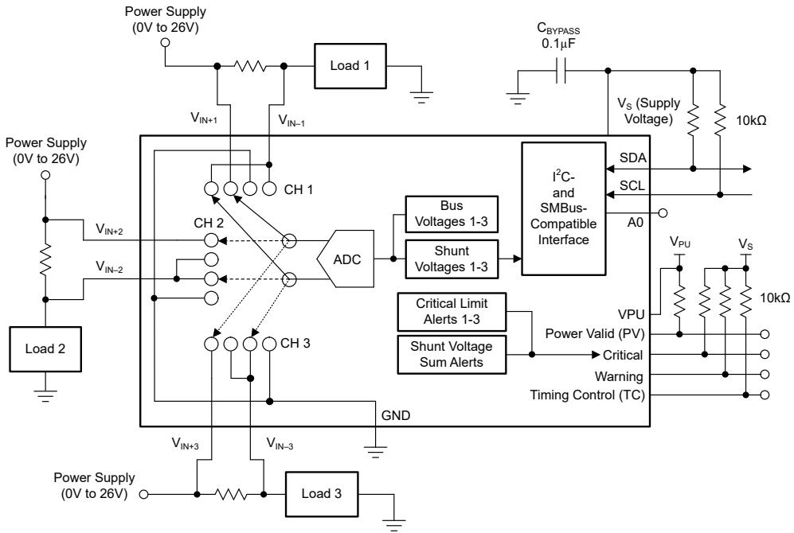  
Figure 8-1. INA3221 as an Overcurrent Sensor

# 8.2.1 Design Requirements

or this design example, use the input parameters shown in Table 8-1. All other register settings are default.   
Table 8-1. Design Parameters   

<table><tr><td rowspan=1 colspan=1>DESIGN PARAMETER</td><td rowspan=1 colspan=1>EXAMPLE VALUE</td></tr><tr><td rowspan=1 colspan=1>Supply voltage, Vs</td><td rowspan=1 colspan=1>5V</td></tr><tr><td rowspan=1 colspan=1>Pull-up resistors</td><td rowspan=1 colspan=1>10kΩ</td></tr><tr><td rowspan=1 colspan=1>Input range</td><td rowspan=1 colspan=1>-163.84 to +163.8</td></tr><tr><td rowspan=1 colspan=1>Enabled channel</td><td rowspan=1 colspan=1>CH1</td></tr><tr><td rowspan=1 colspan=1>Operating mode</td><td rowspan=1 colspan=1>Shunt voltage, continuous</td></tr><tr><td rowspan=1 colspan=1>Average setting</td><td rowspan=1 colspan=1>1</td></tr><tr><td rowspan=1 colspan=1>Critical alert limit</td><td rowspan=1 colspan=1>80mV</td></tr><tr><td rowspan=1 colspan=1>Critical Alert Limit register setting</td><td rowspan=1 colspan=1>7D0h</td></tr></table>

# 8.2.2 Detailed Design Procedure

This design shows two shunt voltage conversion times to demonstrate the difference in the alert response times. This design generates a critical-alert response when the input voltage exceeds $8 0 \mathsf { m V }$ on channel 1. See Table 8-1 for all design parameters.

For the first example the shunt voltage conversion time is set to $1 . 1 \mathsf { m s }$ . When the input signal exceeds $8 0 \mathsf { m } \mathsf { V } ,$ the Critical alert pin pulls low after the conversion cycle completes, indicating an overcurrent condition, as shown in Figure 8-2.

For the second example, the conversion time is set to $5 8 8 \mu \ s$ , and the response is shown in Figure 8-3.

# 8.2.3 Application Curves

Figure 8-2 shows the Critical alert pin response to a shunt voltage overlimit of $8 0 \mathsf { m V }$ for a conversion time of 1.1ms. Figure 8-3 shows the response for the same limit, but with the conversion time reduced to $5 8 8 \mu \ s$ .

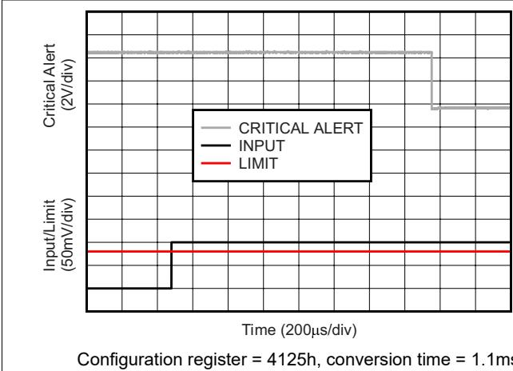  
Figure 8-2. Critical Alert Response for 1.1ms Conversion Time

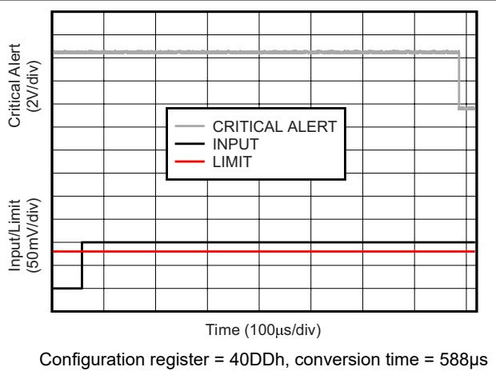  
Figure 8-3. Critical Alert Response for $5 8 8 \mu \ s$ Conversion Time

# 8.3 Power Supply Recommendations

The input circuitry of the device can accurately measure signals on common-mode voltages beyond the power supply voltage, $\mathsf { V } _ { \mathsf { S } }$ . For example, the voltage applied to the $\mathsf { V } _ { \mathsf { S } }$ power supply terminal can be $5 \mathsf { V } ,$ whereas the load power-supply voltage being monitored (the common-mode voltage) on any one of the three channels can be as high as $2 6 \mathrm { V } .$ Note also that the device can withstand the full 0V to $2 6 \mathsf { V }$ range at the input terminals, regardless of whether the device has power applied or not. Place the required power-supply bypass capacitors as close as possible to the supply and ground terminals of the device to provide stability. A typical value for this supply bypass capacitor is $0 . 1 \mu \mathsf { F } .$ . Applications with noisy or high-impedance power supplies can require additional decoupling capacitors to reject power-supply noise.

# 8.4 Layout

# 8.4.1 Layout Guidelines

Connect the input pins $\mathsf { I N } +$ and IN–) of all the used channels to the sensing resistor using a Kelvin connection or a 4-wire connection. These connection techniques verify that only the current-sensing resistor impedance is detected between the input pins. Poor routing of the current-sensing resistor commonly results in additional resistance present between the input pins. Given the very low ohmic value of the current-sensing resistor, any additional high-current carrying impedance causes significant measurement errors. Place the power-supply bypass capacitor as close as possible to the supply and ground pins.

# 8.4.2 Layout Example

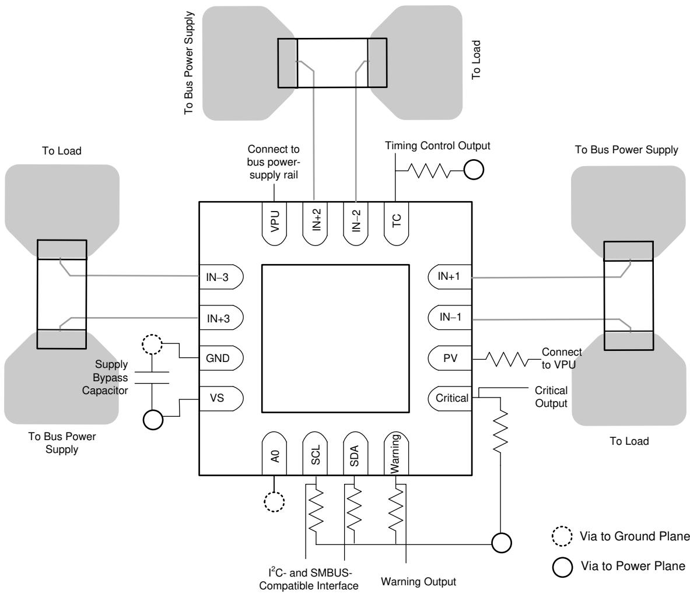  
Figure 8-4. Layout Example

# 9 Device and Documentation Support

# 9.1 Device Support

9.1.1 Development Support

• For INA3221 evaluation module (EVM), go to www.ti.com/tool/INA3221EVM

# 9.2 Documentation Support

9.2.1 Related Documentation

• Texas Instruments, INA3221EVM User Guide

# 9.3 Receiving Notification of Documentation Updates

To receive notification of documentation updates, navigate to the device product folder on ti.com. Click on Notifications to register and receive a weekly digest of any product information that has changed. For change details, review the revision history included in any revised document.

# 9.4 Support Resources

TI E2E™ support forums are an engineer's go-to source for fast, verified answers and design help — straight from the experts. Search existing answers or ask your own question to get the quick design help you need.

Linked content is provided "AS IS" by the respective contributors. They do not constitute TI specifications and do not necessarily reflect TI's views; see TI's Terms of Use.

# 9.5 Trademarks

TI E2E™ is a trademark of Texas Instruments.   
All trademarks are the property of their respective owners.

# 9.6 Electrostatic Discharge Caution

This integrated circuit can be damaged by ESD. Texas Instruments recommends that all integrated circuits be handled with appropriate precautions. Failure to observe proper handling and installation procedures can cause damage.

ESD damage can range from subtle performance degradation to complete device failure. Precision integrated circuits may be more susceptible to damage because very small parametric changes could cause the device not to meet its published specifications.

# 9.7 Glossary

TI Glossary

This glossary lists and explains terms, acronyms, and definitions.

# 10 Revision History

NOTE: Page numbers for previous revisions may differ from page numbers in the current version.

Changes from Revision B (September 2014) to Revision C (September 2025)

# Changes from Revision A (June 2013) to Revision B (September 2014)

#

Added Device Informationand ESD Ratings tables, and Feature Description, Device Functional Modes, Application and Implementation, Power Supply Recommendations, Layout, Device and Documentation Support, and Mechanical, Packaging, and Orderable Information sections.. 1 Deleted trace from SDA to SCL, and added missing connector dot to $\mathsf { V } _ { \mathsf { S } }$ in front-page diagram 1 Added $\left( \mathsf { V } _ { | \mathsf { N } + } \right) + \left( \mathsf { V } _ { | \mathsf { N } - } \right) / 2$ to common-mode analog inputs in the Absolute Maximum Ratings table . 4 Deleted VBUS from analog inputs in Absolute Maximum Ratings table 4 Added operating temperature to Absolute Maximum Ratings table. 4 Changed all VSENSE to $\mathsf { V } _ { \mathsf { S H U N T } }$ throughout data sheet for consistency.. 5 Changed "Status register" to "Mask/Enable register" to clarify register name in Basic ADC Functions section...

Changed Critical Alert section text for clarity. . 12. 12. 13 Added Summation Control Function section..   
Changed external "RPU" to "RPU_ext" in Figure 20..   
Changed Multiple Channel Monitoring section text for clarity.   
Added X and Y axis labels to Figure 25.. 18 Changed "bidirectional" to "I/O" in second paragraph of Bus Overview section.. 20 Changed $\mathsf { V } _ { \mathsf { S } + }$ to VS in Table 1.. .20 Changed references in Figure 30 to point to correct notes. 21 Changed Figure 31...... . 22 Changed values in Table 2, Bus Timing Definitions 22 Added data valid time to Table 2, Bus Timing Definitions .. .22 Changed fall time to split data and clock times in Table 2, Bus Timing Definitions . . 22 Deleted rise time for data in Table 2, Bus Timing Definitions . . 22 Deleted trace from SDA to SCL, and added missing connector dot to $\mathsf { V } _ { \mathsf { S } }$ in Figure 52 37

# Changes from Revision \* (May 2012) to Revision A (June 2013) Page

Changed Shunt voltage input range parameter values in Electrical Characteristics table.. .. 5 Updated Figure 19... . 13. 20 Changed second paragraph of Serial Bus Address section...   
Updated Figure 27 and note (1)... . 21. 21 Updated Figure 28 and note (1)..   
Updated Figure 29 and note (1). 21 Updated Figure 30 and note (1).. . 21. 35. 35 Changed bit D15 in Power Valid Upper Limit Register..   
Changed bit D15 in Power Valid Lower Limit Register..

# 11 Mechanical, Packaging, and Orderable Information

The following pages include mechanical, packaging, and orderable information. This information is the most current data available for the designated devices. This data is subject to change without notice and revision of this document. For browser-based versions of this data sheet, refer to the left-hand navigation.

# PACKAGING INFORMATION

<table><tr><td>Orderable part number</td><td>Status (1)</td><td>Material type (2)</td><td>Package | Pins</td><td>Package qty | Carrier</td><td>RoHS (3)</td><td>Lead finish/ Bal material (4)</td><td>MSL rating/ e ak reflow (5)</td><td>Op temp ()</td><td>Part marking (6)</td></tr><tr><td>INA3221AIRGVR</td><td>Active</td><td>Production</td><td>VQFN (RGV) | 16</td><td>2500 | LARGE T&amp;R</td><td>Yes</td><td>NIPDAU</td><td>Level-1-260C-UNLIM</td><td>-40 to 125</td><td>INA 3221</td></tr><tr><td>INA3221AIRGVR.B</td><td>Active</td><td>Production</td><td>VQFN (RGV) | 16</td><td>2500 | LARGE T&amp;R</td><td>Yes</td><td>NIPDAU</td><td>Level-1-260C-UNLIM</td><td>-40 to 125</td><td>INA 3221</td></tr><tr><td>INA3221AIRGVRG4</td><td>Active</td><td>Production</td><td>VQFN (RGV) | 16</td><td>2500 | LARGE T&amp;R</td><td>Yes</td><td>NIPDAU</td><td>Level-1-260C-UNLIM</td><td>-40 to 125</td><td>INA 3221</td></tr><tr><td>INA3221AIRGVRG4.B</td><td>Active</td><td>Production</td><td>VQFN (RGV) | 16</td><td>2500 | LARGE T&amp;R</td><td>Yes</td><td>NIPDAU</td><td>Level-1-260C-UNLIM</td><td>-40 to 125</td><td>INA 3221</td></tr></table>

(1) Status: For more details on status, see our product life cycle.

(2) Material type: When designated, preproduction parts are prototypes/experimental devices, and are not yet approved or released for full production. Testing and final process, including without limitation quality assurance, reliability performance testing, and/or process qualification, may not yet be complete, and this item is subject to further changes or possible discontinuation. If available for ordering, purchases will be subject to an additional waiver at checkout, and are intended for early internal evaluation purposes only. These items are sold without warranties of any kind.

(3) RoHS values: Yes, No, RoHS Exempt. See the TI RoHS Statement for additional information and value definition.

ial: Parts may have multiple material finish options. Finish options are separated by a vertical ruled line. Lead finish/Ball material values may wrap to two lines if the finish value exceeds the maximum (5) MSL rating/Peak reflow: The moisture sensitivity level ratings and peak solder (reflow) temperatures. In the event that a part has multiple moisture sensitivity ratings, only the lowest level per JEDEC standards is shown.Refer to the shipping label for the actual reflow temperature that will be used to mount the part to the printed circuit board.

(6) Part marking: There may be an additional marking, which relates to the logo, the lot trace code information, or the environmental category of the part.

Multiple part markings will be inside parentheses. Only one part marking contained in parentheses and separated by a "\~" will appear on a part. If a line is indented then it is a continuation of the previous line and the two combined represent the entire part marking for that device.

Important Information and Disclaimer:The information provided on this page represents TI's knowledge and belief as of the date that it is provided. TI bases its knowledge and belief on information provided by third parties, and makes no representation or warranty as to the accuracy of such information. Efforts are underway to better integrate information from third parties. TI has taken and continues to take reasonable steps to provide representative and accurate information but may not have conducted destructive testing or chemical analysis on incoming materials and chemicals. TI and TI suppliers consider certain information to be proprietary, and thus CAS numbers and other limited information may not be available for release.

no event shall TI's liability arising out of such information exceed the total purchase price of the TI part(s) at issue in this document sold by TI to Customer on an annual basis.

# OTHER QUALIFIED VERSIONS OF INA3221 :

Automotive : INA3221-Q1

NOTE: Qualified Version Definitions:

• Automotive - Q100 devices qualified for high-reliability automotive applications targeting zero defects

# TAPE AND REEL INFORMATION

<table><tr><td rowspan=1 colspan=1>A0</td><td rowspan=1 colspan=1>A0 Dimension designed to accommodate the component width</td></tr><tr><td rowspan=1 colspan=1>B0</td><td rowspan=1 colspan=1>Dimension designed to accommodate the component length</td></tr><tr><td rowspan=1 colspan=1>K0</td><td rowspan=1 colspan=1>Dimension designed to accommodate the component thickness</td></tr><tr><td rowspan=1 colspan=1>W</td><td rowspan=1 colspan=1>Overall width of the carrier tape</td></tr><tr><td rowspan=1 colspan=1>P1</td><td rowspan=1 colspan=1>Pitch between successive cavity centers</td></tr></table>

# QUADRANT ASSIGNMENTS FOR PIN 1 ORIENTATION IN TAPE

\*All dimensions are nominal   

<table><tr><td rowspan=1 colspan=1>Device</td><td rowspan=1 colspan=1>PackageType</td><td rowspan=1 colspan=1>PackageDrawing</td><td rowspan=1 colspan=1>Pins</td><td rowspan=1 colspan=1>SPQ</td><td rowspan=1 colspan=1>ReelDiameter(mm)</td><td rowspan=1 colspan=1>ReelWidthW1 (mm)</td><td rowspan=1 colspan=1>A0(mm)</td><td rowspan=1 colspan=1>B0(mm)</td><td rowspan=1 colspan=1>KO(mm)</td><td rowspan=1 colspan=1>P1(mm)</td><td rowspan=1 colspan=1>W(mm)</td><td rowspan=1 colspan=1>Pin1Quadrant</td></tr><tr><td rowspan=1 colspan=1>INA3221AIRGVR</td><td rowspan=1 colspan=1>VQFN</td><td rowspan=1 colspan=1>RGV</td><td rowspan=1 colspan=1>16</td><td rowspan=1 colspan=1>2500</td><td rowspan=1 colspan=1>330.0</td><td rowspan=1 colspan=1>12.4</td><td rowspan=1 colspan=1>4.25</td><td rowspan=1 colspan=1>4.25</td><td rowspan=1 colspan=1>1.15</td><td rowspan=1 colspan=1>8.0</td><td rowspan=1 colspan=1>12.0</td><td rowspan=1 colspan=1>Q2</td></tr><tr><td rowspan=1 colspan=1>INA3221AIRGVRG4</td><td rowspan=1 colspan=1>VQFN</td><td rowspan=1 colspan=1>RGV</td><td rowspan=1 colspan=1>16</td><td rowspan=1 colspan=1>2500</td><td rowspan=1 colspan=1>330.0</td><td rowspan=1 colspan=1>12.4</td><td rowspan=1 colspan=1>4.25</td><td rowspan=1 colspan=1>4.25</td><td rowspan=1 colspan=1>1.15</td><td rowspan=1 colspan=1>8.0</td><td rowspan=1 colspan=1>12.0</td><td rowspan=1 colspan=1>Q2</td></tr></table>

\*All dimensions are nominal   

<table><tr><td rowspan=1 colspan=1>Device</td><td rowspan=1 colspan=1>Package Type</td><td rowspan=1 colspan=1>Package Drawing</td><td rowspan=1 colspan=1>Pins</td><td rowspan=1 colspan=1>SPQ</td><td rowspan=1 colspan=1>Length (mm)</td><td rowspan=1 colspan=1>Width (mm)</td><td rowspan=1 colspan=1>Height (mm)</td></tr><tr><td rowspan=1 colspan=1>INA3221AIRGVR</td><td rowspan=1 colspan=1>VQFN</td><td rowspan=1 colspan=1>RGV</td><td rowspan=1 colspan=1>16</td><td rowspan=1 colspan=1>2500</td><td rowspan=1 colspan=1>346.0</td><td rowspan=1 colspan=1>346.0</td><td rowspan=1 colspan=1>33.0</td></tr><tr><td rowspan=1 colspan=1>INA3221AIRGVRG4</td><td rowspan=1 colspan=1>VQFN</td><td rowspan=1 colspan=1>RGV</td><td rowspan=1 colspan=1>16</td><td rowspan=1 colspan=1>2500</td><td rowspan=1 colspan=1>346.0</td><td rowspan=1 colspan=1>346.0</td><td rowspan=1 colspan=1>33.0</td></tr></table>

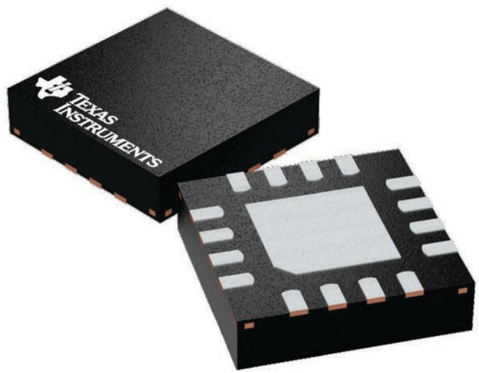

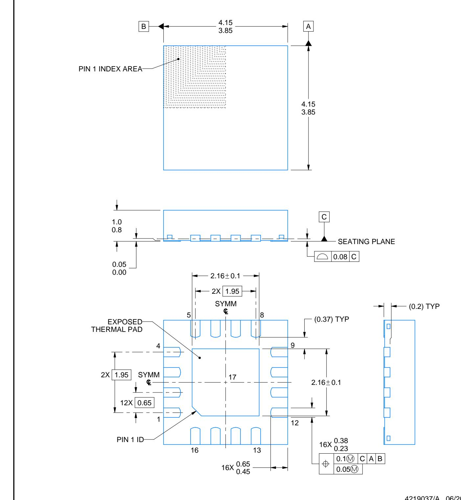

4219037/A 06/2019

# NOTES:

1. All linear dimensions are in millimeters. Any dimensions in parenthesis are for reference only. Dimensioning and tolerancing per ASME $\Upsilon 1 4 . 5 {  { \mathsf { M } } }$ .   
2. This drawing is subject to change without notice.   
3. The package thermal pad must be soldered to the printed circuit board for thermal and mechanical performance.

PLASTIC QUAD FLATPACK - NO LEAD

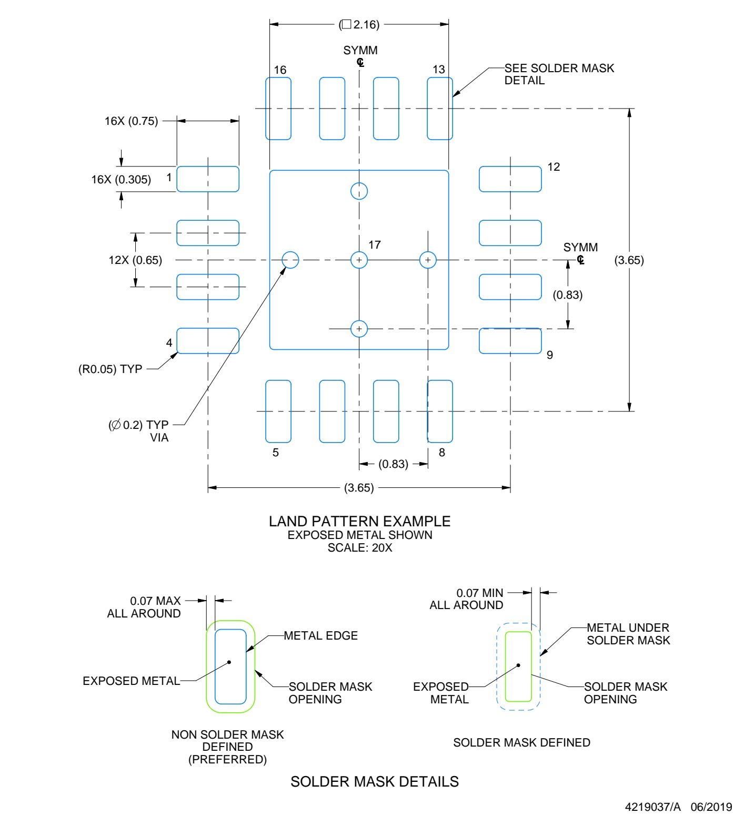  
NOTES: (continued)

4. This package is designed to be soldered to a thermal pad on the board. For more information, see Texas Instruments literature number SLUA271 (www.ti.com/lit/slua271).   
5. Vias are optional depending on application, refer to device data sheet. If any vias are implemented, refer to their locations shown on this view. It is recommended that vias under paste be filled, plugged or tented.

PLASTIC QUAD FLATPACK - NO LEAD

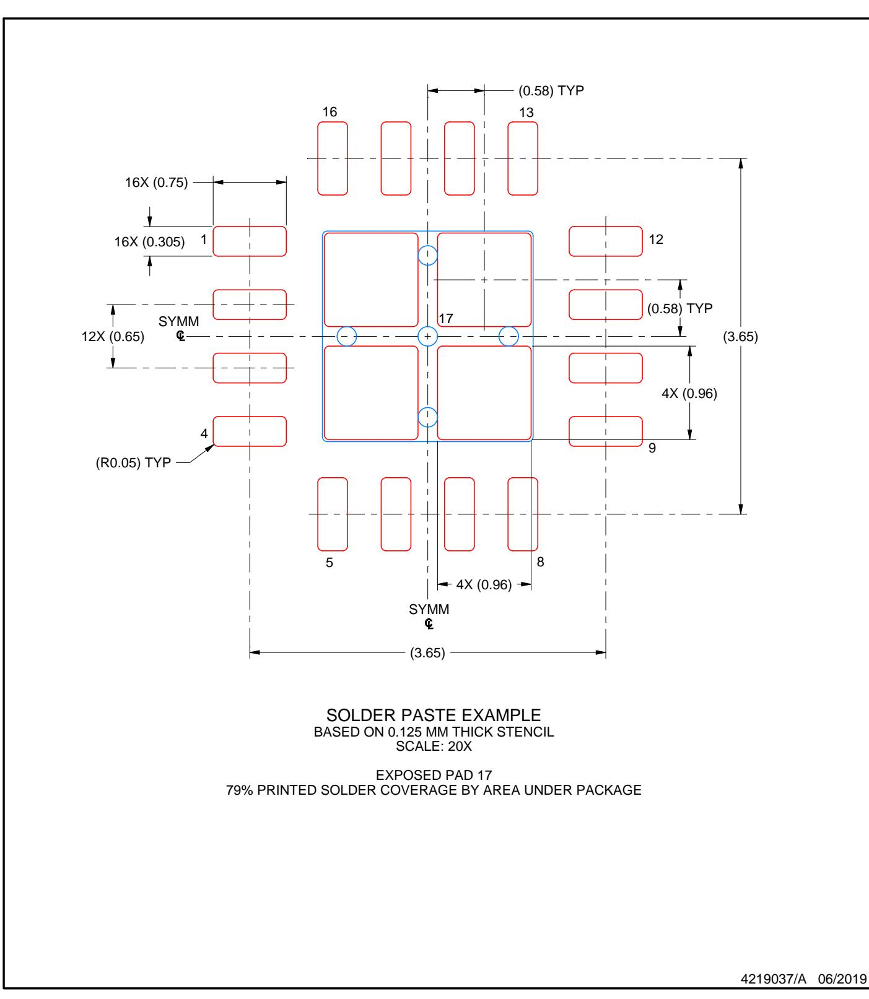  
NOTES: (continued)

6. Laser cutting apertures with trapezoidal walls and rounded corners may offer better paste release. IPC-7525 may have alternate design recommendations.

# IMPORTANT NOTICE AND DISCLAIMER

TI PROVIDES TECHNICAL AND RELIABILITY DATA (INCLUDING DATASHEETS), DESIGN RESOURCES (INCLUDING REFERENCE DESIGNS), APPLICATION OR OTHER DESIGN ADVICE, WEB TOOLS, SAFETY INFORMATION, AND OTHER RESOURCES “AS IS” AND WITH ALL FAULTS, AND DISCLAIMS ALL WARRANTIES, EXPRESS AND IMPLIED, INCLUDING WITHOUT LIMITATION ANY IMPLIED WARRANTIES OF MERCHANTABILITY, FITNESS FOR A PARTICULAR PURPOSE OR NON-INFRINGEMENT OF THIRD PARTY INTELLECTUAL PROPERTY RIGHTS.

These resources are intended for skilled developers designing with TI products. You are solely responsible for (1) selecting the appropriate TI products for your application, (2) designing, validating and testing your application, and (3) ensuring your application meets applicable standards, and any other safety, security, regulatory or other requirements.

These resources are subject to change without notice. TI grants you permission to use these resources only for development of an application that uses the TI products described in the resource. Other reproduction and display of these resources is prohibited. No license is granted to any other TI intellectual property right or to any third party intellectual property right. TI disclaims responsibility for, and you fully indemnify TI and its representatives against any claims, damages, costs, losses, and liabilities arising out of your use of these resources.

TI’s products are provided subject to TI’s Terms of Sale, TI’s General Quality Guidelines, or other applicable terms available either on ti.com or provided in conjunction with such TI products. TI’s provision of these resources does not expand or otherwise alter TI’s applicable warranties or warranty disclaimers for TI products. Unless TI explicitly designates a product as custom or customer-specified, TI products are standard, catalog, general purpose devices.

TI objects to and rejects any additional or different terms you may propose.