# Self Control Protector (SCP) - SFJ series Datasheet

# Table of Contents

Table of Contents 2   
SFJ series Specification 3   
Dimensions & Equivalent Circuit 11   
Terminal Size & Reflow Soldering profile 12   
Current Operation 13   
Voltage Operation 14   
Current Carrying Capacity 20   
Handling of data in this document 21   
Notice 22

# SFJ-xx22T Series Specification

# Products Lineup

<table><tr><td rowspan=1 colspan=1>Applicable Cells in series</td><td rowspan=1 colspan=3>1 cell</td><td rowspan=1 colspan=3>2 cells</td><td rowspan=1 colspan=3>3 cells LFP</td><td rowspan=1 colspan=3>3 cells</td><td rowspan=1 colspan=3>4 cells</td><td rowspan=1 colspan=3>5 cells</td><td rowspan=1 colspan=3>6 cells</td></tr><tr><td rowspan=1 colspan=1>Product</td><td rowspan=1 colspan=3>SFJ-0422T</td><td rowspan=1 colspan=3>SFJ-0822T</td><td rowspan=1 colspan=3>SFJ-1022T</td><td rowspan=1 colspan=3>SFJ-1222T</td><td rowspan=1 colspan=3>SFJ-1422T</td><td rowspan=1 colspan=3>SFJ-2022T</td><td rowspan=1 colspan=3>SFJ-2422T</td></tr><tr><td rowspan=1 colspan=1>Rated Current</td><td rowspan=1 colspan=21>22 A</td></tr><tr><td rowspan=1 colspan=1>Size</td><td rowspan=1 colspan=21>4.0+0.3/.2 3.00302x 0.85±0.1m</td></tr><tr><td rowspan=1 colspan=1>Fuse Resistance (Typical)</td><td rowspan=1 colspan=21>0.9 m-ohm</td></tr><tr><td rowspan=1 colspan=1>Operating Voltage</td><td rowspan=1 colspan=3>3.5 - 5.0 V</td><td rowspan=1 colspan=3>6.0 - 9.8 V</td><td rowspan=1 colspan=3>7.5 - 11.4 V</td><td rowspan=1 colspan=3>9.0 - 15.2 V</td><td rowspan=1 colspan=3>12.0 - 19.6 V</td><td rowspan=1 colspan=3>15.9 - 24.5 V</td><td rowspan=1 colspan=3>20.0 - 27.5 V</td></tr><tr><td rowspan=1 colspan=1>Heater Resistance</td><td rowspan=1 colspan=3>0.68 - 1.00ohm</td><td rowspan=1 colspan=3>2.29 - 3.30ohm</td><td rowspan=1 colspan=3>3.38 - 5.16ohm</td><td rowspan=1 colspan=3>5.30 - 7.50ohm</td><td rowspan=1 colspan=3>9.75 - 13.25ohm</td><td rowspan=1 colspan=3>16.10 - 23.10ohm</td><td rowspan=1 colspan=3>21.60 - 31.90ohm</td></tr><tr><td rowspan=1 colspan=1>Marking</td><td rowspan=1 colspan=1></td><td rowspan=1 colspan=1>22AJ1TI</td><td rowspan=1 colspan=1></td><td rowspan=1 colspan=1></td><td rowspan=1 colspan=1>22AJ2TI</td><td rowspan=1 colspan=1></td><td rowspan=1 colspan=1></td><td rowspan=1 colspan=1>22AJAT</td><td rowspan=1 colspan=1></td><td rowspan=1 colspan=1></td><td rowspan=1 colspan=1>22AJ3TI</td><td rowspan=1 colspan=1></td><td rowspan=1 colspan=1></td><td rowspan=1 colspan=1>22AJ4TI</td><td rowspan=1 colspan=1></td><td rowspan=1 colspan=1></td><td rowspan=1 colspan=1>22AJ5TI</td><td rowspan=1 colspan=1></td><td rowspan=1 colspan=1></td><td rowspan=1 colspan=1>22AJ6T</td><td rowspan=1 colspan=1></td></tr></table>

<table><tr><td rowspan=1 colspan=2>Items</td><td rowspan=1 colspan=1>General Specification</td></tr><tr><td rowspan=1 colspan=2>Environmental Compliance</td><td rowspan=1 colspan=1>Compliance with RoHS</td></tr><tr><td rowspan=1 colspan=2>Halogen Free</td><td rowspan=1 colspan=1>Bromine (Br)=900 ppm or less, Chlorine (Cl)=900 ppm or less, Br+Cl=1500 ppm or less (By weht)</td></tr><tr><td rowspan=1 colspan=2>Antimony Free</td><td rowspan=1 colspan=1>700 ppm or less</td></tr><tr><td rowspan=1 colspan=2>Lead Free</td><td rowspan=1 colspan=1>1000ppm or less</td></tr><tr><td rowspan=1 colspan=2>Certification</td><td rowspan=1 colspan=1>UL248-14 (File No. E167588),TUV (Certificate No. J9650637)</td></tr><tr><td rowspan=2 colspan=1>Rated Breaking CapacityRated Votage</td><td rowspan=1 colspan=1>UL</td><td rowspan=1 colspan=1>50 A at 36 VDC , 200 A at 48 VDC , 300 A at 25 VDC , 80 A at 62 VDC</td></tr><tr><td rowspan=1 colspan=1>TUV</td><td rowspan=1 colspan=1>80 A at 62 VDC</td></tr><tr><td rowspan=1 colspan=2>Reflow Temp.MAX)</td><td rowspan=1 colspan=1>260 °</td></tr></table>

\*Notice: The specification may be subject to change without prior notice in the future.

# SFJ-xx22U Series Specification

# Products Lineup

<table><tr><td rowspan=1 colspan=1>Applicable Cells in series</td><td rowspan=1 colspan=3>1 cell</td><td rowspan=1 colspan=3>2 cells</td><td rowspan=1 colspan=3>3 cells</td><td rowspan=1 colspan=3>4 cells</td><td rowspan=1 colspan=3>5 cells</td></tr><tr><td rowspan=1 colspan=1>Product</td><td rowspan=1 colspan=3>SFJ-0422U</td><td rowspan=1 colspan=3>SFJ-0822U</td><td rowspan=1 colspan=3>SFJ-1222U</td><td rowspan=1 colspan=3>SFJ-1422U</td><td rowspan=1 colspan=3>SFJ-2022U</td></tr><tr><td rowspan=1 colspan=1>Rated Current</td><td rowspan=1 colspan=15>22A</td></tr><tr><td rowspan=1 colspan=1>Size</td><td rowspan=1 colspan=15>4.0+0.02 x 3.0+0.3/0.2x 0.85±0.1 mm</td></tr><tr><td rowspan=1 colspan=1>Fuse Resistance (Typical)</td><td rowspan=1 colspan=15>0.9 m-ohm</td></tr><tr><td rowspan=1 colspan=1>Operating Voltage</td><td rowspan=1 colspan=3>3.5 - 4.7 V</td><td rowspan=1 colspan=3>6.0 - 9.2 V</td><td rowspan=1 colspan=3>9.0 - 13.8 V</td><td rowspan=1 colspan=3>12.0 - 18.5 V</td><td rowspan=1 colspan=3>15.9 - 23.1 V</td></tr><tr><td rowspan=1 colspan=1>Heater Resistance</td><td rowspan=1 colspan=3>0.68 - 1.00 ohm</td><td rowspan=1 colspan=3>2.29 - 3.30 ohm</td><td rowspan=1 colspan=3>5.30 - 7.50 ohm</td><td rowspan=1 colspan=3>9.75 - 13.25 ohm</td><td rowspan=1 colspan=3>16.10 - 23.10 ohm</td></tr><tr><td rowspan=1 colspan=1>Marking</td><td rowspan=1 colspan=1></td><td rowspan=1 colspan=1>22AJ1UI</td><td rowspan=1 colspan=1></td><td rowspan=1 colspan=1></td><td rowspan=1 colspan=1>22AJ2UI</td><td rowspan=1 colspan=1></td><td rowspan=1 colspan=1></td><td rowspan=1 colspan=1>22AJ3UI</td><td rowspan=1 colspan=1></td><td rowspan=1 colspan=1></td><td rowspan=1 colspan=1>22AJ4UI</td><td rowspan=1 colspan=1></td><td rowspan=1 colspan=1></td><td rowspan=1 colspan=1>22AJ5UI</td><td rowspan=1 colspan=1></td></tr></table>

<table><tr><td rowspan=1 colspan=2>Items</td><td rowspan=1 colspan=1>General Specification</td></tr><tr><td rowspan=1 colspan=2>Environmental Compliance</td><td rowspan=1 colspan=1>Compliance with RoHS</td></tr><tr><td rowspan=1 colspan=2>Halogen Free</td><td rowspan=1 colspan=1>Bromine (Br)=900 ppm or less, Chlorine (Cl)=900 ppm or less, Br+Cl=1500 ppm or less (By weight)</td></tr><tr><td rowspan=1 colspan=2>Antimony Free</td><td rowspan=1 colspan=1>700 ppm or less</td></tr><tr><td rowspan=1 colspan=2>Certification</td><td rowspan=1 colspan=1>UL248-14 (File No. E167588), TUV (Certificate No. J9650637)</td></tr><tr><td rowspan=1 colspan=1>Rated Breaking Capacity</td><td rowspan=1 colspan=1>UL</td><td rowspan=1 colspan=1>50 A at 36 VDC , 200 A at 48 VDC , 300 A at 25 VDC , 80 A at 62 VDC</td></tr><tr><td rowspan=1 colspan=1>Rated VVoltage</td><td rowspan=1 colspan=1>TUV</td><td rowspan=1 colspan=1>80 A at 62 VDC</td></tr><tr><td rowspan=1 colspan=2>Reflow Temp.MAX)</td><td rowspan=1 colspan=1>260 °</td></tr></table>

\*Notice: The specification may be subject to change without prior notice in the future.

# SFJ-xx15T Series Specification

# Products Lineup

<table><tr><td rowspan=1 colspan=2>Applicable Cells in series</td><td rowspan=1 colspan=2>1 cell</td><td rowspan=1 colspan=1>2 cells</td><td rowspan=1 colspan=1>3 cells</td><td rowspan=1 colspan=1>4 cells</td><td rowspan=1 colspan=1>5 cells</td><td rowspan=1 colspan=1>6-7cells</td><td rowspan=1 colspan=1>8 cells</td><td rowspan=1 colspan=1>9-10cells</td><td rowspan=1 colspan=1>11-12cells</td><td rowspan=1 colspan=1>13-14cells</td></tr><tr><td rowspan=1 colspan=2>Product</td><td rowspan=1 colspan=2>SFJ-0415T</td><td rowspan=1 colspan=1>SFJ-0815T</td><td rowspan=1 colspan=1>SFJ-1215T</td><td rowspan=1 colspan=1>SFJ-1415T</td><td rowspan=1 colspan=1>SFJ-2015T</td><td rowspan=1 colspan=1>SFJ-2815T</td><td rowspan=1 colspan=1>SFJ-3215T</td><td rowspan=1 colspan=1>SFJ-4015T</td><td rowspan=1 colspan=1>SFJ-4815T</td><td rowspan=1 colspan=1>SFJ-5615T</td></tr><tr><td rowspan=1 colspan=2>Rated Current</td><td rowspan=1 colspan=11>15 A</td></tr><tr><td rowspan=1 colspan=2>Size</td><td rowspan=1 colspan=11>4.0+0.3/0.x 3.0302x 0.85±0.1mm</td></tr><tr><td rowspan=1 colspan=2>Fuse Resistance (Typical)</td><td rowspan=1 colspan=11>1.5 m-ohm</td></tr><tr><td rowspan=1 colspan=2>Operating Voltage</td><td rowspan=1 colspan=2>3.0-5.0 V</td><td rowspan=1 colspan=1>5.0 - 9.8V</td><td rowspan=1 colspan=1>7.4 - 14.6v</td><td rowspan=1 colspan=1>10.5-19.6 V</td><td rowspan=1 colspan=1>12.5 -24.0 V</td><td rowspan=1 colspan=1>19.8 -32.9 V</td><td rowspan=1 colspan=1>24.0 -37.6 V</td><td rowspan=1 colspan=1>32.0 -47.0 V</td><td rowspan=1 colspan=1>35.0 -52.8 V</td><td rowspan=1 colspan=1>41.0 -61.6 V</td></tr><tr><td rowspan=1 colspan=2>Heater Resistance</td><td rowspan=1 colspan=2>0.53-0.90ohm</td><td rowspan=1 colspan=1>2.01-2.94 ohm</td><td rowspan=1 colspan=1>4.45-6.44 ohm</td><td rowspan=1 colspan=1>8.10-12.90ohm</td><td rowspan=1 colspan=1>12.00 -188.30ohm</td><td rowspan=1 colspan=1>31.00 -46.10ohm</td><td rowspan=1 colspan=1>44.20 -67.70ohm</td><td rowspan=1 colspan=1>76.20 -120.0ohm</td><td rowspan=1 colspan=1>96.20 -144.0ohm</td><td rowspan=1 colspan=1>136.0 -10.0ohm</td></tr><tr><td rowspan=1 colspan=2>Marking</td><td rowspan=1 colspan=2>15AJ1TI</td><td rowspan=1 colspan=1>15AJ2TI</td><td rowspan=1 colspan=1>15AJ3TI</td><td rowspan=1 colspan=1>15AJ4TI</td><td rowspan=1 colspan=1>15AJ5T</td><td rowspan=1 colspan=1>15AJ7TI</td><td rowspan=1 colspan=1>15AJ8TI</td><td rowspan=1 colspan=1>15AJ10TI</td><td rowspan=1 colspan=1>15AJ12TI</td><td rowspan=1 colspan=1>15A14T</td></tr><tr><td rowspan=1 colspan=3>Items</td><td rowspan=1 colspan=10>General Specification</td></tr><tr><td rowspan=1 colspan=3>Environmental Compliance</td><td rowspan=1 colspan=10>Compliance with RoHS</td></tr><tr><td rowspan=1 colspan=3>Halogen Free</td><td rowspan=1 colspan=10>Bromine (Br)=900 ppm or less, Chlorine (Cl)=900 ppm or less,Br+Cl=1500 ppm or less (By weight)</td></tr><tr><td rowspan=1 colspan=3>Antimony Free</td><td rowspan=1 colspan=10>700 ppm or less</td></tr><tr><td rowspan=1 colspan=3>Lead Free</td><td rowspan=1 colspan=10>1000 ppm or less</td></tr><tr><td rowspan=1 colspan=3>Certification</td><td rowspan=1 colspan=10>UL248-14 (File No. E167588), TUV (Certificate No. J9650637)</td></tr><tr><td rowspan=2 colspan=1>Rated Breaking CapacityRated Voltage</td><td rowspan=1 colspan=2>UL</td><td rowspan=1 colspan=10>50 A at 36 VDC , 200 A at 48 VDC , 250 A at 25 VDC ,70 A at 62 VDC</td></tr><tr><td rowspan=1 colspan=2>TUV</td><td rowspan=1 colspan=10>70 A at 62 VDC</td></tr><tr><td rowspan=1 colspan=3>Reflow Temp.(MAX)</td><td rowspan=1 colspan=10>260 °</td></tr></table>

\*Notice: The specification may be subject to change without prior notice in the future.

# SFJ-xx15U Series Specification

# Products Lineup

<table><tr><td rowspan=1 colspan=1>Applicable Cells in series</td><td rowspan=1 colspan=1>1 cell</td><td rowspan=1 colspan=3>2 cells</td><td rowspan=1 colspan=3>3 cells</td><td rowspan=1 colspan=3>4 cells</td><td rowspan=1 colspan=3>5 cells</td></tr><tr><td rowspan=1 colspan=1>Product</td><td rowspan=1 colspan=1></td><td rowspan=1 colspan=3>SFJ-0815U</td><td rowspan=1 colspan=3>SFJ-1215U</td><td rowspan=1 colspan=3>SFJ-1415U</td><td rowspan=1 colspan=3>SFJ-2015U</td></tr><tr><td rowspan=1 colspan=1>Rated Current</td><td rowspan=1 colspan=1></td><td rowspan=1 colspan=12>15A</td></tr><tr><td rowspan=1 colspan=1>Size</td><td rowspan=1 colspan=1></td><td rowspan=1 colspan=12>4.0+0.3-0.2 x 3.0+0.3/-0.2 x 0.85±0.1mm</td></tr><tr><td rowspan=1 colspan=1>Fuse Resistance (Typical)</td><td rowspan=1 colspan=1></td><td rowspan=1 colspan=12>1.5 m-ohm</td></tr><tr><td rowspan=1 colspan=1>Operating Voltage</td><td rowspan=1 colspan=1></td><td rowspan=1 colspan=3>5.0 - 9.0 V</td><td rowspan=1 colspan=3>7.4 - 13.8 V</td><td rowspan=1 colspan=3>10.5 - 19.6 V</td><td rowspan=1 colspan=3>14.4 - 23.5 V</td></tr><tr><td rowspan=1 colspan=1>Heater Resistance</td><td rowspan=1 colspan=1></td><td rowspan=1 colspan=3>2.20 - 3.30 ohm</td><td rowspan=1 colspan=3>5.50 - 8.40 ohm</td><td rowspan=1 colspan=3>10.40 - 15.80 ohm</td><td rowspan=1 colspan=3>17.90 - 29.10 ohm</td></tr><tr><td rowspan=1 colspan=1>Marking</td><td rowspan=1 colspan=1></td><td rowspan=1 colspan=1></td><td rowspan=1 colspan=1>15AJ2UI</td><td rowspan=1 colspan=1></td><td rowspan=1 colspan=1></td><td rowspan=1 colspan=1>15AJ3UI</td><td rowspan=1 colspan=1></td><td rowspan=1 colspan=1></td><td rowspan=1 colspan=1>15AJ4UI</td><td rowspan=1 colspan=1></td><td rowspan=1 colspan=1></td><td rowspan=1 colspan=1>15AJ5UI</td><td rowspan=1 colspan=1></td></tr></table>

<table><tr><td rowspan=1 colspan=2>Items</td><td rowspan=1 colspan=1>General Specification</td></tr><tr><td rowspan=1 colspan=2>Environmental Compliance</td><td rowspan=1 colspan=1>Compliance with RoHS</td></tr><tr><td rowspan=1 colspan=2>Halogen Free</td><td rowspan=1 colspan=1>Bromine (Br)=900 ppm or less, Chlorine (Cl)=900 ppm or less, Br+Cl=1500 ppm or less (By weight)</td></tr><tr><td rowspan=1 colspan=2>Antimony Free</td><td rowspan=1 colspan=1>700 ppm or less</td></tr><tr><td rowspan=1 colspan=2>Certification</td><td rowspan=1 colspan=1>UL248-14 (File No. E167588), TUV (Certificate No. J9650637)</td></tr><tr><td rowspan=2 colspan=1>Rated Breaking CapacityRated Voltage</td><td rowspan=1 colspan=1>UL</td><td rowspan=1 colspan=1>50 A at 36 VDC , 200 A at 48 VDC , 250 A at 25 VDC , 70 A at 62 VDC</td></tr><tr><td rowspan=1 colspan=1>TUV</td><td rowspan=1 colspan=1>70 A at 62 VDC</td></tr><tr><td rowspan=1 colspan=2>Reflow Temp.(MAX)</td><td rowspan=1 colspan=1>260 °</td></tr></table>

\*Notice: The specification may be subject to change without prior notice in the future.

# SFJ-xx15W Series Specification

# Products Lineup

<table><tr><td rowspan=1 colspan=1>Applicable Cells in series</td><td rowspan=1 colspan=1>1 cell</td><td rowspan=1 colspan=1>2 cells</td><td rowspan=1 colspan=1>3 cells</td><td rowspan=1 colspan=1>4 cells</td><td rowspan=1 colspan=1>5 cells</td><td rowspan=1 colspan=1>6 cells</td><td rowspan=1 colspan=1>7 cells</td><td rowspan=1 colspan=1>8 cells</td><td rowspan=1 colspan=1>9-10cels</td><td rowspan=1 colspan=1>11-12cells</td><td rowspan=1 colspan=1>13-14cells</td></tr><tr><td rowspan=1 colspan=1>Product</td><td rowspan=1 colspan=1>SFJ-0415W</td><td rowspan=1 colspan=1>SFJ-0815W</td><td rowspan=1 colspan=1>SFJ-1215W</td><td rowspan=1 colspan=1>SFJ-1415W</td><td rowspan=1 colspan=1>SFJ-2015W</td><td rowspan=1 colspan=1>SFJ-2415W</td><td rowspan=1 colspan=1>SFJ-2815W</td><td rowspan=1 colspan=1>SFJ-3215W</td><td rowspan=1 colspan=1>SFJ-4015W</td><td rowspan=1 colspan=1>SFJ-4815W</td><td rowspan=1 colspan=1>SFJ-5615W</td></tr><tr><td rowspan=1 colspan=1>Rated Current</td><td rowspan=1 colspan=11>15 A</td></tr><tr><td rowspan=1 colspan=1>Size</td><td rowspan=1 colspan=11>4.00.3/0.2 x 3.0+0.3/-0.2x 0.85±0.1 mm</td></tr><tr><td rowspan=1 colspan=1>Fuse Resistance (Typical)</td><td rowspan=1 colspan=11>2.0 m-ohm</td></tr><tr><td rowspan=1 colspan=1>Operating Voltage</td><td rowspan=1 colspan=1>3.0 - 5.0V</td><td rowspan=1 colspan=1>5.0 - 9.0v</td><td rowspan=1 colspan=1>7.4 -13.8 V</td><td rowspan=1 colspan=1>10.5 -19.6 V</td><td rowspan=1 colspan=1>13.0 -23.5 V</td><td rowspan=1 colspan=1>14.1-28.0 V</td><td rowspan=1 colspan=1>16.5 -31.5 V</td><td rowspan=1 colspan=1>18.8 -36.0 V</td><td rowspan=1 colspan=1>25.0 -47.0 V</td><td rowspan=1 colspan=1>32.0 -56.4 V</td><td rowspan=1 colspan=1>35.0 -62.0 V</td></tr><tr><td rowspan=1 colspan=1>Heater Resistance</td><td rowspan=1 colspan=1>0.77 -1.29ohm</td><td rowspan=1 colspan=1>2.38 -3.58ohm</td><td rowspan=1 colspan=1>5.44-8.16ohm</td><td rowspan=1 colspan=1>11.00 -16.50ohm</td><td rowspan=1 colspan=1>16.00-24.00ohm</td><td rowspan=1 colspan=1>22.50 -0.50ohm</td><td rowspan=1 colspan=1>28.40 -40.80ohm</td><td rowspan=1 colspan=1>37.10 -53.30ohm</td><td rowspan=1 colspan=1>74.00 -105.0ohm</td><td rowspan=1 colspan=1>106.0 -170.0ohm</td><td rowspan=1 colspan=1>129.0 -02.0ohm</td></tr><tr><td rowspan=1 colspan=1>Marking</td><td rowspan=1 colspan=1>15AJ1WI</td><td rowspan=1 colspan=1>15AJ2WI</td><td rowspan=1 colspan=1>15AJ3WI</td><td rowspan=1 colspan=1>15AJ4WI</td><td rowspan=1 colspan=1>15AJ5WI</td><td rowspan=1 colspan=1>15AJ6WI</td><td rowspan=1 colspan=1>15AJ7WI</td><td rowspan=1 colspan=1>15AJ8WI</td><td rowspan=1 colspan=1>15AJ10WI</td><td rowspan=1 colspan=1>15AJ12WI</td><td rowspan=1 colspan=1>15AJ14WI</td></tr></table>

<table><tr><td rowspan=1 colspan=2>Items</td><td rowspan=1 colspan=1>General Specification</td></tr><tr><td rowspan=1 colspan=2>Environmental Compliance</td><td rowspan=1 colspan=1>Compliance with RoHS</td></tr><tr><td rowspan=1 colspan=2>Halogen Free</td><td rowspan=1 colspan=1>Bromine (Br)=900 ppm or less, Chlorine (Cl)=900 ppm or less, Br+Cl=1500 ppm or less (By weight)</td></tr><tr><td rowspan=1 colspan=2>Antimony Free</td><td rowspan=1 colspan=1>700 ppm or less</td></tr><tr><td rowspan=1 colspan=2>Certification</td><td rowspan=1 colspan=1>UL248-14 (File No. E167588), TUV (Certificate No. J9650637)</td></tr><tr><td rowspan=2 colspan=1>Rated Breaking CapacityRated Voltage</td><td rowspan=1 colspan=1>UL</td><td rowspan=1 colspan=1>50 A at 36 VDC , 200 A at 48 VDC , 250 A at 25 VDC ,70 A at 62 VDC</td></tr><tr><td rowspan=1 colspan=1>TUV</td><td rowspan=1 colspan=1>70 A at 62 VDC</td></tr><tr><td rowspan=1 colspan=2>Reflow Temp.(MAX)</td><td rowspan=1 colspan=1>260 </td></tr></table>

\*Notice: The specification may be subject to change without prior notice in the future.

# SFJ-xx12W Series Specification

# Products Lineup

<table><tr><td rowspan=1 colspan=1>Applicable Cells in series</td><td rowspan=1 colspan=3>1 cell</td><td rowspan=1 colspan=2>2 cells</td><td rowspan=1 colspan=3>3 cells</td><td rowspan=1 colspan=2>4 cells</td></tr><tr><td rowspan=1 colspan=1>Product</td><td rowspan=1 colspan=3>SFJ-0412W</td><td rowspan=1 colspan=2>SFJ-0812W</td><td rowspan=1 colspan=3>SFJ-1212W</td><td rowspan=1 colspan=2>SFJ-1412W</td></tr><tr><td rowspan=1 colspan=1>Rated Current</td><td rowspan=1 colspan=10>12 A</td></tr><tr><td rowspan=1 colspan=1>Size</td><td rowspan=1 colspan=10>4.0+0.3/0.2 x 3.0+0.3/-0.2 x 0.85±0.1 mm</td></tr><tr><td rowspan=1 colspan=1>Fuse Resistance (Typical)</td><td rowspan=1 colspan=10>2.4 m-ohm</td></tr><tr><td rowspan=1 colspan=1>Operating Voltage</td><td rowspan=1 colspan=3>3.0 - 5.5 V</td><td rowspan=1 colspan=2>4.0 - 9.0 V</td><td rowspan=1 colspan=3>7.4 - 13.8 V</td><td rowspan=1 colspan=2>10.5 - 19.6 V</td></tr><tr><td rowspan=1 colspan=1>Heater Resistance</td><td rowspan=1 colspan=3>1.00 - 1.50 ohm</td><td rowspan=1 colspan=2>2.00 - 3.20 ohm</td><td rowspan=1 colspan=3>5.70 - 9.90 ohm</td><td rowspan=1 colspan=2>11.20 - 20.00 ohm</td></tr><tr><td rowspan=1 colspan=1>Marking</td><td rowspan=1 colspan=1></td><td rowspan=1 colspan=1>12AJ1WI</td><td rowspan=1 colspan=1></td><td rowspan=1 colspan=1>12AJ2WL</td><td rowspan=1 colspan=1></td><td rowspan=1 colspan=1></td><td rowspan=1 colspan=1>12AJ3WD</td><td rowspan=1 colspan=1></td><td rowspan=1 colspan=1>12AJ4WI</td><td rowspan=1 colspan=1></td></tr></table>

<table><tr><td rowspan=1 colspan=2>Items</td><td rowspan=1 colspan=1>General Specification</td></tr><tr><td rowspan=1 colspan=2>Environmental Compliance</td><td rowspan=1 colspan=1>Compliance with RoHS</td></tr><tr><td rowspan=1 colspan=2>Halogen Free</td><td rowspan=1 colspan=1>Bromine (Br)=900 ppm or less, Chlorine (Cl)=900 ppm or less, Br+Cl=1500 ppm or less (By weight)</td></tr><tr><td rowspan=1 colspan=2>Antimony Free</td><td rowspan=1 colspan=1>700 ppm or less</td></tr><tr><td rowspan=1 colspan=2>Certification</td><td rowspan=1 colspan=1>UL248-14 (File No. E167588), TUV (Certificate No. J9650637)</td></tr><tr><td rowspan=1 colspan=1>Rated Breaking Capacity</td><td rowspan=1 colspan=1>UL</td><td rowspan=1 colspan=1>50 A at 36 VDC , 200 A at 48 VDC , 250 A at 25 VDC</td></tr><tr><td rowspan=1 colspan=1>atd Voltage</td><td rowspan=1 colspan=1>TUV</td><td rowspan=1 colspan=1>50 A at 36 VDC</td></tr><tr><td rowspan=1 colspan=2>Reflow Temp.(MAX)</td><td rowspan=1 colspan=1>260 </td></tr></table>

\*Notice: The specification may be subject to change without prior notice in the future.

# SFJ-xx12Y Series Specification

# Products Lineup

<table><tr><td rowspan=1 colspan=1>Applicable Cells in series</td><td rowspan=1 colspan=1>1 cell</td><td rowspan=1 colspan=2>2 cells</td><td rowspan=1 colspan=1>3 cells</td><td rowspan=1 colspan=1>4 cells</td></tr><tr><td rowspan=1 colspan=1>Product</td><td rowspan=1 colspan=1></td><td rowspan=1 colspan=2>SFJ-0812Y</td><td rowspan=1 colspan=1>SFJ-1212Y</td><td rowspan=1 colspan=1></td></tr><tr><td rowspan=1 colspan=1>Rated Current</td><td rowspan=1 colspan=1></td><td rowspan=1 colspan=3>12 A</td><td rowspan=1 colspan=1></td></tr><tr><td rowspan=1 colspan=1>Size</td><td rowspan=1 colspan=1></td><td rowspan=1 colspan=3>4.0+0.3/0.2 x 3.0+0.3/-0.2 x 0.85±0.1 mm</td><td rowspan=1 colspan=1></td></tr><tr><td rowspan=1 colspan=1>Fuse Resistance (Typical)</td><td rowspan=1 colspan=1></td><td rowspan=1 colspan=3>2.4 m-ohm</td><td rowspan=1 colspan=1></td></tr><tr><td rowspan=1 colspan=1>Operating Voltage</td><td rowspan=1 colspan=1></td><td rowspan=1 colspan=2>5.0 - 10.0 V</td><td rowspan=1 colspan=1>7.4 - 15.0 V</td><td rowspan=1 colspan=1></td></tr><tr><td rowspan=1 colspan=1>Heater Resistance</td><td rowspan=1 colspan=1></td><td rowspan=1 colspan=2>2.90 - 5.00 ohm</td><td rowspan=1 colspan=1>6.50 - 10.10 ohm</td><td rowspan=1 colspan=1></td></tr><tr><td rowspan=1 colspan=1>Marking</td><td rowspan=1 colspan=1></td><td rowspan=1 colspan=1></td><td rowspan=1 colspan=1>12AJ2YI</td><td rowspan=1 colspan=1>12AJ3YI</td><td rowspan=1 colspan=1></td></tr></table>

<table><tr><td rowspan=1 colspan=2>Items</td><td rowspan=1 colspan=1>General Specification</td></tr><tr><td rowspan=1 colspan=2>Environmental Compliance</td><td rowspan=1 colspan=1>Compliance with RoHS</td></tr><tr><td rowspan=1 colspan=2>Halogen Free</td><td rowspan=1 colspan=1>Bromine (Br)=900 ppm or less, Chlorine (Cl)=900 ppm or less, Br+Cl=1500 ppm or less (By weight)</td></tr><tr><td rowspan=1 colspan=2>Antimony Free</td><td rowspan=1 colspan=1>700 ppm or less</td></tr><tr><td rowspan=1 colspan=2>Certification</td><td rowspan=1 colspan=1>UL248-14 (File No. E167588), TUV (Certificate No. J9650637)</td></tr><tr><td rowspan=1 colspan=1>Rated Breaking Capacity</td><td rowspan=1 colspan=1>UL</td><td rowspan=1 colspan=1>50 A at 36 VDC , 200 A at 48 VDC , 250 A at 25 VDC</td></tr><tr><td rowspan=1 colspan=1>Rated Voltage</td><td rowspan=1 colspan=1>TUV</td><td rowspan=1 colspan=1>50 A at 36 VDC</td></tr><tr><td rowspan=1 colspan=2>Reflow Temp.(MAX)</td><td rowspan=1 colspan=1>260 </td></tr></table>

\*Notice: The specification may be subject to change without prior notice in the future.

# SFJ-xx12U Series Specification

# Products Lineup

<table><tr><td rowspan=1 colspan=1>Applicable Cells in series</td><td rowspan=1 colspan=2>1 cell</td><td rowspan=1 colspan=1>2 cells</td><td rowspan=1 colspan=3>3 cells</td><td rowspan=1 colspan=2>4 cells</td></tr><tr><td rowspan=1 colspan=1>Product</td><td rowspan=1 colspan=2>SFJ-0412U</td><td rowspan=1 colspan=1>SFJ-0812U</td><td rowspan=1 colspan=3>SFJ-1212U</td><td rowspan=1 colspan=2>SFJ-1412U</td></tr><tr><td rowspan=1 colspan=1>Rated Current</td><td rowspan=1 colspan=8>12 A</td></tr><tr><td rowspan=1 colspan=1>Size</td><td rowspan=1 colspan=8>4.0+0.3/0.2 x 3.0+0.3/-0.2 x 0.85±0.1 mm</td></tr><tr><td rowspan=1 colspan=1>Fuse Resistance (Typical)</td><td rowspan=1 colspan=8>2.4 m-ohm</td></tr><tr><td rowspan=1 colspan=1>Operating Voltage</td><td rowspan=1 colspan=2>3.0 - 4.5 V</td><td rowspan=1 colspan=1>4.0 - 9.0 V</td><td rowspan=1 colspan=3>7.4 - 13.8 V</td><td rowspan=1 colspan=2>10.5 - 19.6 V</td></tr><tr><td rowspan=1 colspan=1>Heater Resistance</td><td rowspan=1 colspan=2>0.60 - 1.50 ohm</td><td rowspan=1 colspan=1>2.00 - 3.20 ohm</td><td rowspan=1 colspan=3>5.70 - 9.90 ohm</td><td rowspan=1 colspan=2>11.20 - 20.00 ohm</td></tr><tr><td rowspan=1 colspan=1>Marking</td><td rowspan=1 colspan=1></td><td rowspan=1 colspan=1>12AJ1UI</td><td rowspan=1 colspan=1>12AJ2UI</td><td rowspan=1 colspan=1></td><td rowspan=1 colspan=1>12AJ3UI</td><td rowspan=1 colspan=1></td><td rowspan=1 colspan=1>12AJ4UI</td><td rowspan=1 colspan=1></td></tr></table>

<table><tr><td rowspan=1 colspan=2>Items</td><td rowspan=1 colspan=1>General Specification</td></tr><tr><td rowspan=1 colspan=2>Environmental Compliance</td><td rowspan=1 colspan=1>Compliance with RoHS</td></tr><tr><td rowspan=1 colspan=2>Halogen Free</td><td rowspan=1 colspan=1>i (r00 ppm r esChlone =900 ppm r essr+Cl=100 pm r less (y h)</td></tr><tr><td rowspan=1 colspan=2>Certification</td><td rowspan=1 colspan=1>UL248-14 (File No. E167588), TUV (Certificate No. J9650637)</td></tr><tr><td rowspan=2 colspan=1>Rated Breaking CapacityRated Voltage</td><td rowspan=1 colspan=1>UL</td><td rowspan=1 colspan=1>50 A at 36 VDC , 200 A at 48 VDC , 250 A at 25 VDC</td></tr><tr><td rowspan=1 colspan=1>TUV</td><td rowspan=1 colspan=1>50 A at 36 VDC</td></tr><tr><td rowspan=1 colspan=2>Reflow Temp.(MAX)</td><td rowspan=1 colspan=1>260 °</td></tr></table>

\*Notice: The specification may be subject to change without prior notice in the future.

# External View & Equivalent Circuit

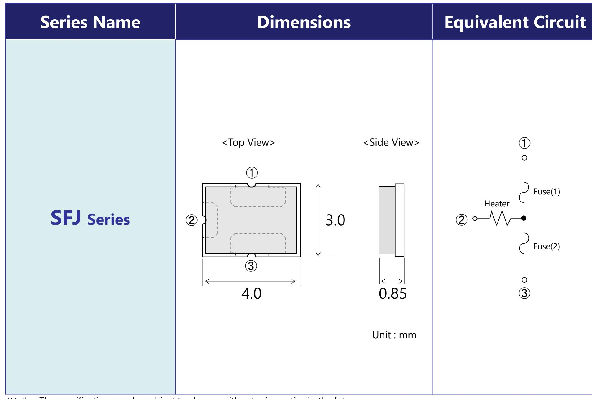  
\*Notice: The specification may be subject to change without prior notice in the future.

# Terminal Size & Reflow Soldering

Terminal Size (Unit: mm. Not in scale.)

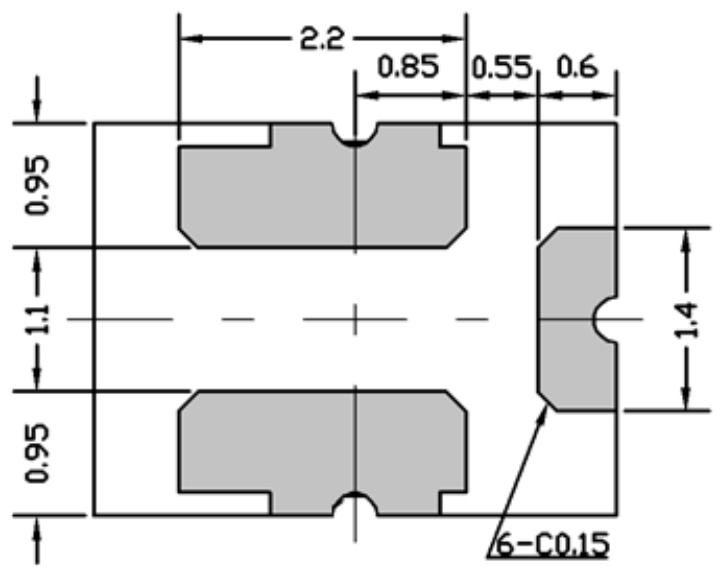

●Reflow Soldering Profile (Temperature shown below is measured at the electrode portion of SCP.)

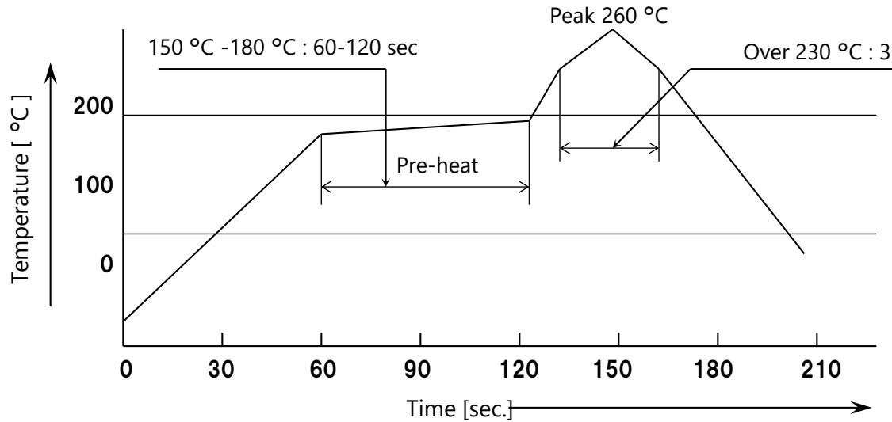  
\*Notice: The specification may be subject to change without prior notice in the future.

# Current Operation

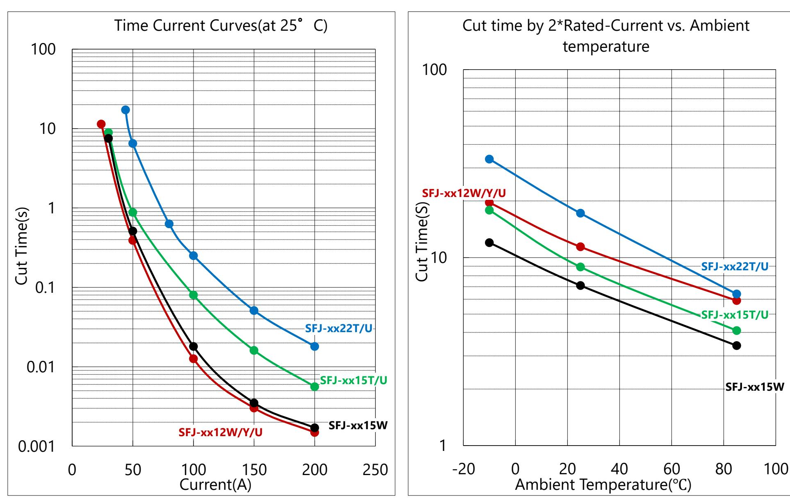  
$( { } ^ { \star } \mathsf { N o t e } )$ This is the typical evaluation value with our PCB $\langle 0 . 6 \mathsf { m m }$ thickness glass-epoxy single-sided copper-clad laminates).

# Heater Operation

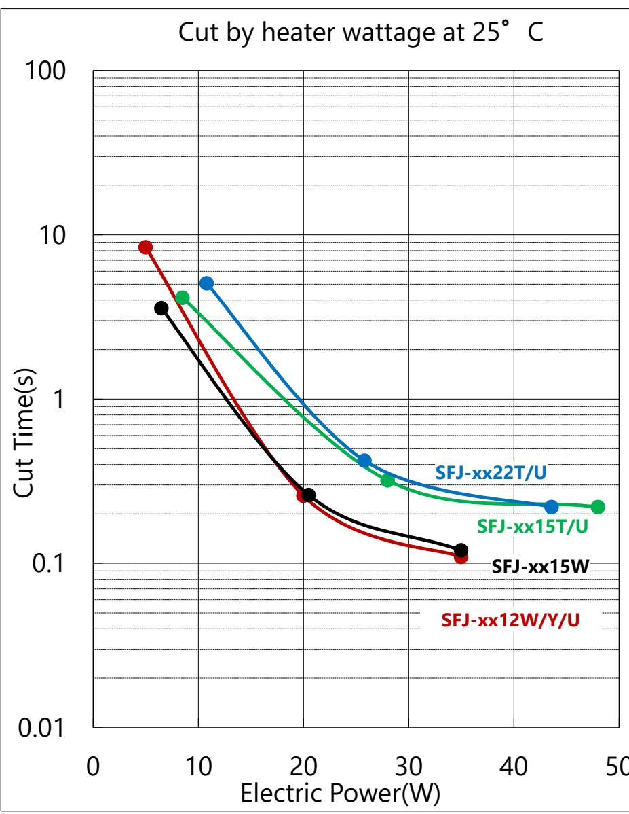

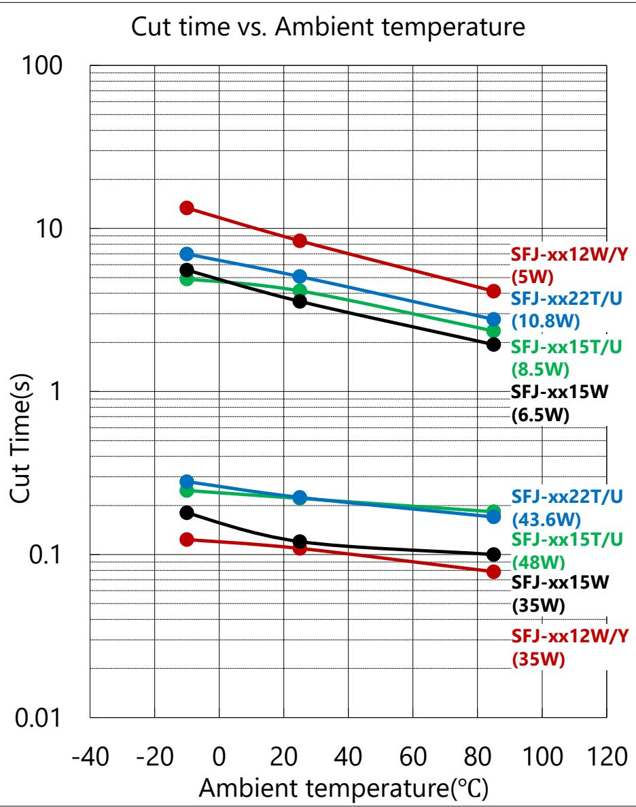

# Cut By Heater Voltage at 25°C

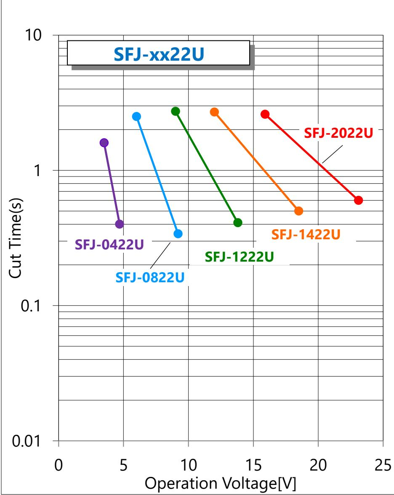

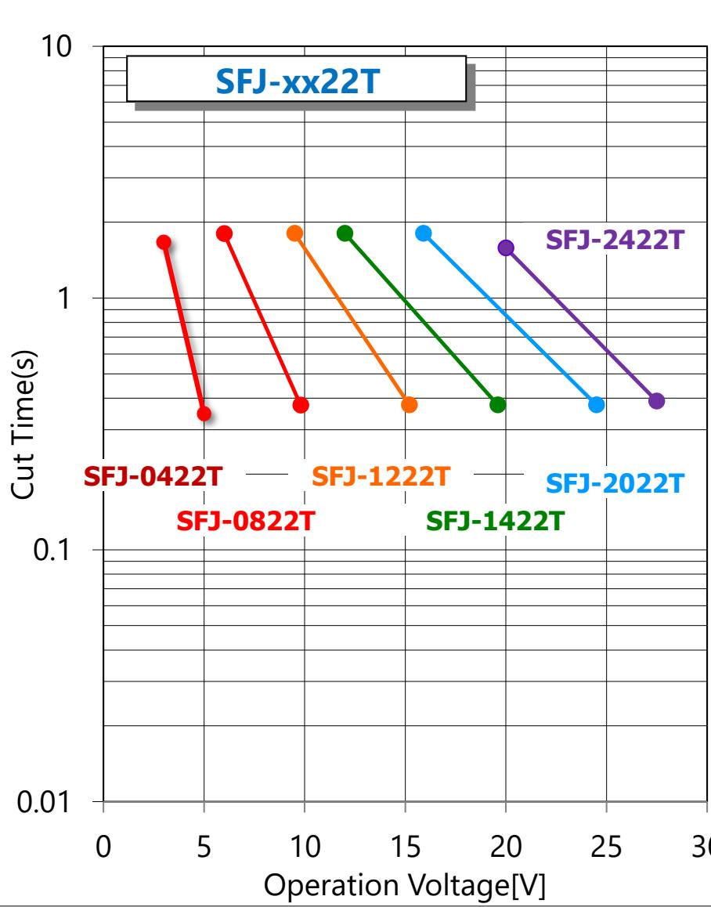

# Cut By Heater Voltage at 25°C

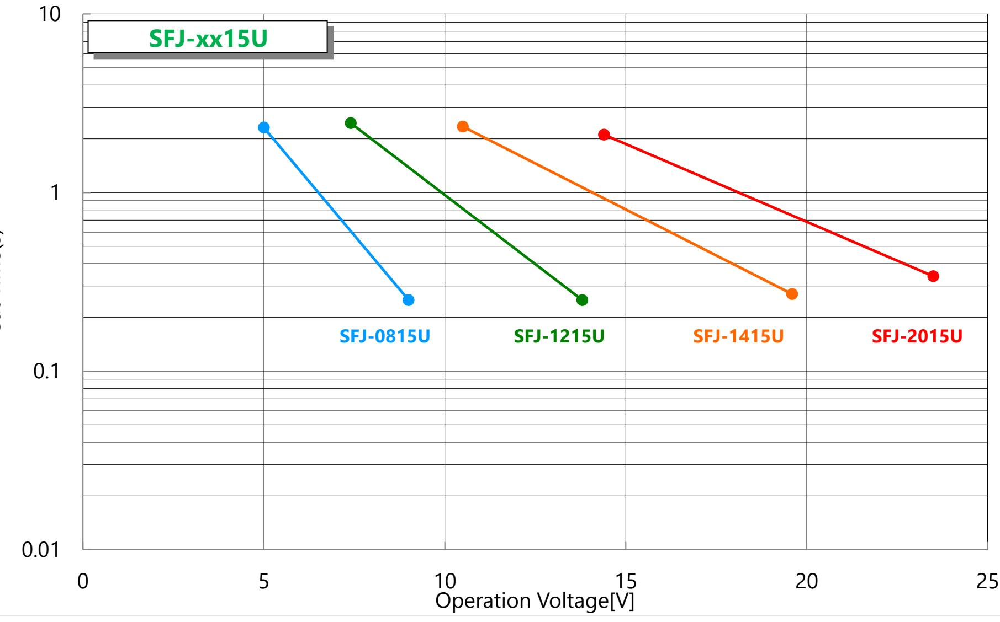

(\*Note) This is the typical evaluation value with our PCB $\langle 0 . 6 \mathsf { m m }$ thickness glass-epoxy single-sided copper-clad laminates).   
(\*Caution)The specification may be subject to change without prior notice in the future.

# Cut By Heater Voltage at 25°C

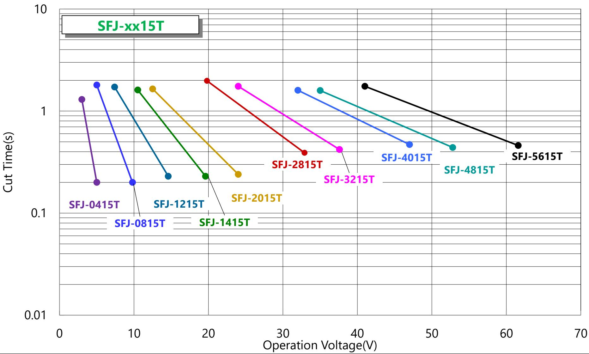  
(\*Note) This is the typical evaluation value with our PCB $\langle 0 . 6 \mathsf { m m }$ thickness glass-epoxy single-sided copper-clad laminates). (\*Caution)The specification may be subject to change without prior notice in the future.

# Cut By Heater Voltage at 25°C

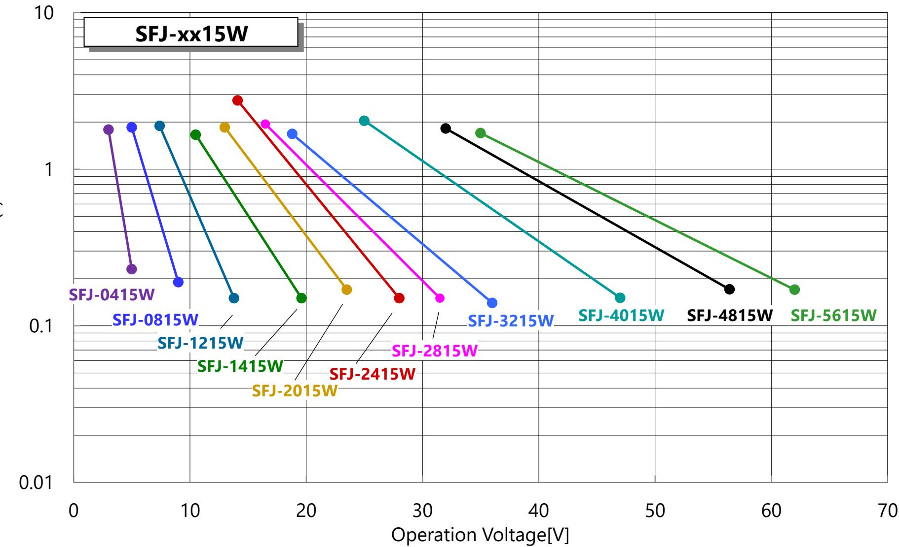  
(\*Note) This is the typical evaluation value with our PCB $\langle 0 . 6 \mathsf { m m }$ thickness glass-epoxy single-sided copper-clad laminates). (\*Caution)The specification may be subject to change without prior notice in the future.

# Cut By Heater Voltage at 25°C

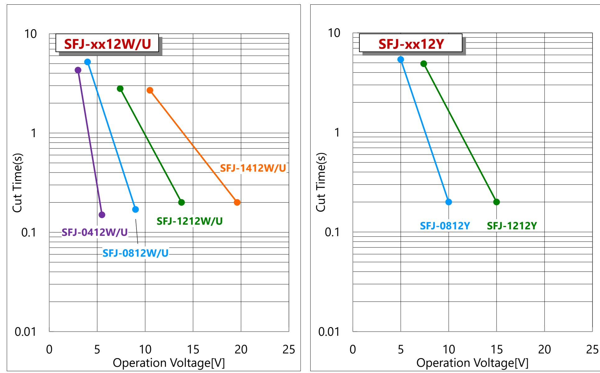  
(\*Note) This is the typical evaluation value with our PCB $\langle 0 . 6 \mathsf { m m }$ thickness glass-epoxy single-sided copper-clad laminates). (\*Caution)The specification may be subject to change without prior notice in the future.

# Current Carrying Capacity

<table><tr><td rowspan=2 colspan=1>Product Name</td><td rowspan=2 colspan=1>NominalRatedcurrent</td><td rowspan=1 colspan=3>Current-Carrying Capacit</td><td rowspan=2 colspan=1>CurrentRush Withstand(*2)</td></tr><tr><td rowspan=1 colspan=1>25 °</td><td rowspan=1 colspan=1>40 °</td><td rowspan=1 colspan=1>60 </td></tr><tr><td rowspan=1 colspan=1>SFJ-xx22T/U</td><td rowspan=1 colspan=1>22 A</td><td rowspan=1 colspan=1>27.0 A</td><td rowspan=1 colspan=1>24.0 A</td><td rowspan=1 colspan=1>20.0 A</td><td rowspan=1 colspan=1>145 A-10 ms</td></tr><tr><td rowspan=1 colspan=1>SFJ-xx15T/U</td><td rowspan=1 colspan=1>15 A</td><td rowspan=1 colspan=1>18.0 A</td><td rowspan=1 colspan=1>16.0 A</td><td rowspan=1 colspan=1>13.5 A</td><td rowspan=1 colspan=1>100 A-10 ms</td></tr><tr><td rowspan=1 colspan=1>SFJ-xx15W</td><td rowspan=1 colspan=1>15 A</td><td rowspan=1 colspan=1>18.0 A</td><td rowspan=1 colspan=1>16.0 A</td><td rowspan=1 colspan=1>13.5 A</td><td rowspan=1 colspan=1>80 A-10 ms</td></tr><tr><td rowspan=1 colspan=1>SFJ-xx12W/Y/U</td><td rowspan=1 colspan=1>12 A</td><td rowspan=1 colspan=1>13.0 A</td><td rowspan=1 colspan=1>11.5 A</td><td rowspan=1 colspan=1>9.5 A</td><td rowspan=1 colspan=1>80 A-10 ms</td></tr></table>

1. This is the standard value derived from a temperature of 100 degrees Celsius, a temperature at which we have verified the reliability using our company’s standard PCB (0.6 t Glass Epoxy single-sided copper-clad laminates). The thermal capacity of the PCB can affect it, so we recommend verifying it with your specific PCB.

$ 2 5 ^ { \circ } \mathsf { C } , 4 0 ^ { \circ } \mathsf { C }$ and $60 \textdegree$ are ambient temperature.   
- $\cdot >$ The temperature at which we verified reliability is not a critical condition. SCP fusing-off temperature is $2 0 0 ~ ^ { \circ } \mathsf C$ or more.   
$- >$ The current-carrying capacity is measured under thermal equilibrium conditions. Therefore, if the duration of current-carrying is short, the current-carrying capacity will increase.

Reliability was confirmed under the test conditions (10 ms-On, 9990 ms-Off, 500 cycle). However, this does not mean critical conditions for SCP.

# Handling of data in this document

1. Please confirm the latest product information before a design. You can confirm the latest information about SCP on the following website. http://www.dexerials.jp/en/products/c3/

2. SCP complies with following environmental regulation. 1) RoHS. 2) General requirement for Halogen Free.

1) These data is not a guaranteed value.   
2) These data is measured with our company’s standard PCB (0.6t Glass Epoxy single-sided copper-clad laminates). The characteristics are influenced by thermal capacity of PCB. Generally, as the thermal capacity of the PCB increases, the current-carrying capacity will also increase, and the clearing time will be longer.

Dexerials PCB For SFJ-12A/15A(Cu:70um) For SFJ-22A (Cu:70um)

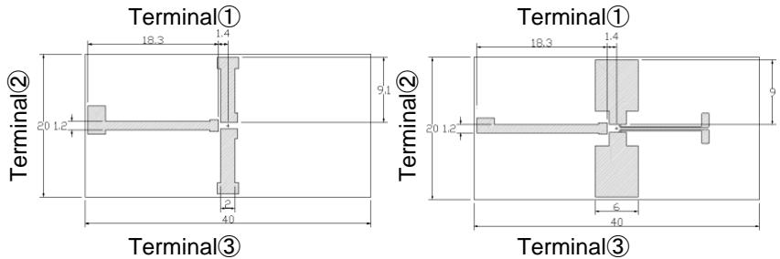

4. Please select the product on the basis of [Current-carrying capacity] and [Heater operation characteristics].

1) Nominal rated current is provided on the basis of UL standard (The maximum temperature rise on body or contact that is passed the current shall not exceed $7 5 \ : ^ { \circ } \mathrm { C } )$ and so it is not Current-carrying capacity. Therefore, please select a product on the basis of Currentcarrying capacity instead of Nominal rated current.   
2) [Current-carrying capacity] and [Heater operation characteristics] are influenced by thermal capacity of PCB and so on. Therefore, we recommend checking it on your PCB.   
3) We can perform tests using your printed circuit boards (current-carrying characteristics, clearing characteristics, etc.).Please feel free to contact us.

5. Current-carrying capacity

1) The current-carrying capacity is the value at which SCP reaches the temperature that we have verified for reliability within our company. 2) The temperature at which we have confirmed reliability is 100 degrees Celsius. However, this is not a critical condition for SCP. For instance, if SCP’s temperature exceeds this, it does not immediately fuse off like a typical thermal fuse. SCP’s fusing-off temperature is 200 degrees Celsius or higher, indicating that it has a significant capacity to withstand temperature increases.   
3) The current-carrying capacity is measured under thermal equilibrium conditions. Therefore, if the duration of current-carrying is short, the current-carrying capacity will increase.

6. Precautions regarding handling

1) Make sure that the terminals of this product are connected on the lands of the circuit board, and that the heater resistance is rated value. 2) Ultrasonic cleaning, immersion cleaning, and similar methods should not be applied to SCP either before or after mounting. If cleaning is performed, the flux on the element could flow, potentially causing it to fail to meet its specifications. Additionally, similar influence can occur when the product comes into contact with a cleaning solution. Any products cleaned in this manner will not be guaranteed.   
3) Please avoid contacting SCP and resin-mold. The resin might infiltrate into the product, and it doesn’t meet the specification when the resin-mold is done to this product. These products after resin-mold will not be guaranteed.   
4) Please do not re-use of the SCP removed by the solder correction.   
5) SCP should be stored in a shaded, low-dust area with a temperature of $4 0 ^ { \circ } \mathrm { C }$ or lower, without sudden temperature changes. The relative humidity should be $60 \%$ or less, and the air should be free of corrosive gases. Under these conditions, the maximum storage period is 1 year from the delivery date.

The test fixtures and test results described in this document are reference information provided by Dexerials Corporation for the benefit of customers purchasing this product.

Dexerials Corporation does not warrant to the Customer or any third party that the test results, etc. are error-free. Dexerials Corporation shall not be liable for any loss or damage incurred by customer or any third party due to errors in the test results, etc., unless such errors are caused by Dexerials Corporation's willful misconduct or gross negligence.

If you require a delivery specification sheet describing the shipping inspection data of this product, please contact Dexerials Corporation.

Before using this product, please read this document carefully to ensure that you fully understand its contents. The contents of this document are correct at the time of publication and are subject to change without notice. Please be sure to confirm the contents of the latest version.

In the event of any conflict between the contents of this document and any other contents (whether written or oral), the contents of this document shall prevail.

Dexerials Corporation assumes no responsibility for any malfunction, failure, or accident resulting from the use of this product in violation of the precautions described in this document or in the instruction manual of this product.

When considering the use of the product in equipment or devices (medical equipment, transportation equipment, traffic equipment, aerospace equipment, nuclear power control equipment, fuel control, various safety devices, etc.) that require extremely high reliability and whose failure or malfunction could result in danger or damage to human life or body, or other serious damage, the product should be fully verified through prior evaluation and considered for implementation at the customer's own risk.

This product is not designed to be mounted on weapons, weapons of mass destruction, parts or accessories of weapons.

This material is copyrighted by Dexerials Corporation.   
Unauthorized reproduction or distribution of this material is prohibited.