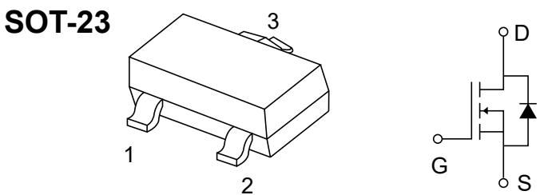
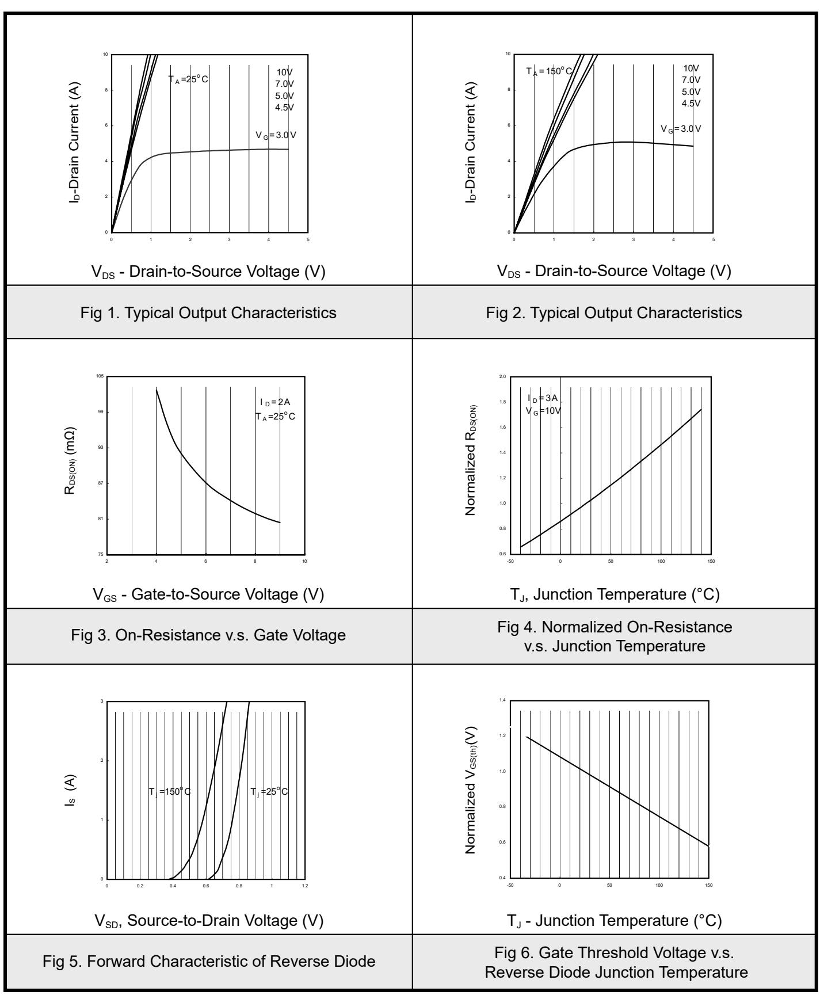
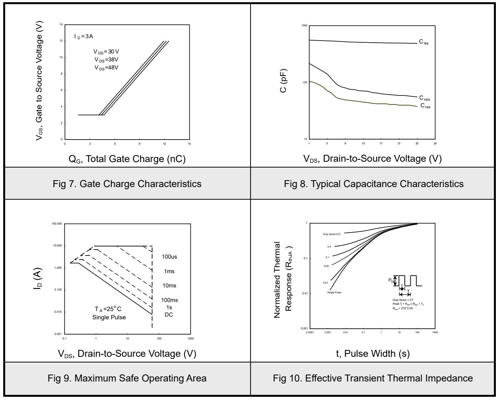
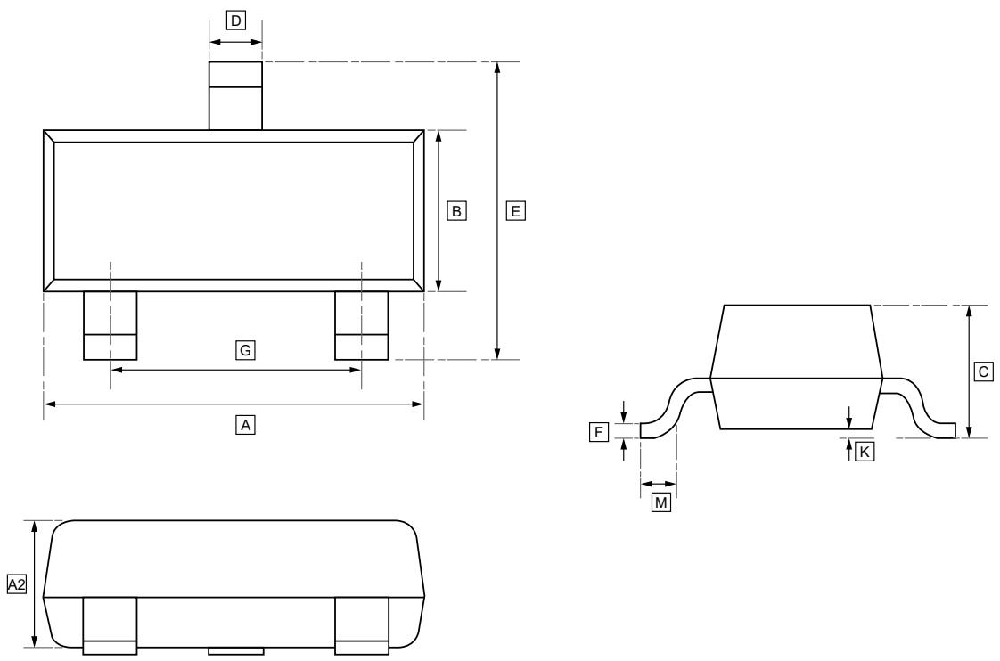
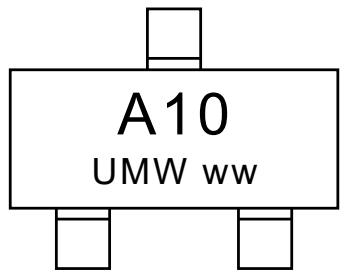

60V N-ChanneI MOSFET

# 1.Features

VDS(V)=60V   
ID=3A   
RDS(ON)<80mΩ(VGS=10V) RDS(ON)<95mΩ(VGS=4.5V)

# 2.Applications

Load/Power Switching   
Interfacing Switching   
Logic Level Shift   
Battery Management for Ultra Small   
Portable

# 3.Pinning information

<table><tr><td rowspan=1 colspan=1>Pin</td><td rowspan=1 colspan=1>Symbol</td><td rowspan=1 colspan=1>Description</td></tr><tr><td rowspan=1 colspan=1>1</td><td rowspan=1 colspan=1>G</td><td rowspan=1 colspan=1>GATE</td></tr><tr><td rowspan=1 colspan=1>2</td><td rowspan=1 colspan=1>s</td><td rowspan=1 colspan=1>SOURCE</td></tr><tr><td rowspan=1 colspan=1>3</td><td rowspan=1 colspan=1>D</td><td rowspan=1 colspan=1>DRAIN</td></tr></table>

# 4.Absolute Maximum Ratings $T _ { \mathsf { A } } \equiv 2 5 ^ { \circ } \mathsf { C }$

<table><tr><td rowspan=1 colspan=2>Parameter</td><td rowspan=1 colspan=1>Symbol</td><td rowspan=1 colspan=1>Value</td><td rowspan=1 colspan=1>Units</td></tr><tr><td rowspan=1 colspan=2>Drain-Source Voltage</td><td rowspan=1 colspan=1>VDs</td><td rowspan=1 colspan=1>60</td><td rowspan=1 colspan=1>V</td></tr><tr><td rowspan=1 colspan=2>Gate-Source Voltage</td><td rowspan=1 colspan=1>Vos</td><td rowspan=1 colspan=1>±20</td><td rowspan=1 colspan=1>V</td></tr><tr><td rowspan=2 colspan=1>Continuous Drain Current</td><td rowspan=1 colspan=1>TA=25°C</td><td rowspan=2 colspan=1>ID</td><td rowspan=1 colspan=1>3</td><td rowspan=3 colspan=1>A</td></tr><tr><td rowspan=1 colspan=1>TA=70°C</td><td rowspan=1 colspan=1>2.3</td></tr><tr><td rowspan=1 colspan=2>Pulsed Drain Current *</td><td rowspan=1 colspan=1>IDM</td><td rowspan=1 colspan=1>10</td></tr><tr><td rowspan=1 colspan=1>Power Dissipation</td><td rowspan=1 colspan=1>TA=25°C</td><td rowspan=1 colspan=1>PD</td><td rowspan=1 colspan=1>1.38</td><td rowspan=1 colspan=1>W</td></tr><tr><td rowspan=1 colspan=2>Linear Derating Factor</td><td rowspan=1 colspan=1></td><td rowspan=1 colspan=1>0.01</td><td rowspan=1 colspan=1>W/</td></tr><tr><td rowspan=1 colspan=2>Thermal Resistance.Junction-to-ambient</td><td rowspan=1 colspan=1>RtJa</td><td rowspan=1 colspan=1>90</td><td rowspan=1 colspan=1>C/W</td></tr><tr><td rowspan=1 colspan=2>Junction and Storage Temperature Range</td><td rowspan=1 colspan=1>TJ,TSTG</td><td rowspan=1 colspan=1>-55 to 150</td><td rowspan=1 colspan=1>°C</td></tr></table>

\*2.Pulse width ≤ 300us ,duty cycle $\leq 2 \%$ .

60V N-ChanneI MOSFET

# 5.Electrical Characteristics $T _ { \mathsf { A } } \equiv 2 5 ^ { \circ } \mathsf { C }$

<table><tr><td rowspan=1 colspan=1>Parameter</td><td rowspan=1 colspan=1>Symbol</td><td rowspan=1 colspan=3>Conditions</td><td rowspan=1 colspan=1>Min</td><td rowspan=1 colspan=1>Typ</td><td rowspan=1 colspan=1>Max</td><td rowspan=1 colspan=1>Units</td></tr><tr><td rowspan=1 colspan=1>Drain-Source Breakdown Voltage</td><td rowspan=1 colspan=1>VDss</td><td rowspan=1 colspan=3>ID=250μA, Vgs=0V</td><td rowspan=1 colspan=1>60</td><td rowspan=1 colspan=1></td><td rowspan=1 colspan=1></td><td rowspan=1 colspan=1>V</td></tr><tr><td rowspan=2 colspan=1>Zero Gate Voltage Drain Current</td><td rowspan=2 colspan=1>Idss</td><td rowspan=1 colspan=3>VDs=60V, VGs=0V</td><td rowspan=1 colspan=1></td><td rowspan=1 colspan=1></td><td rowspan=1 colspan=1>10</td><td rowspan=2 colspan=1>μA</td></tr><tr><td rowspan=1 colspan=3>VDs=48V, Vgs=0V, T=70°C</td><td rowspan=1 colspan=1></td><td rowspan=1 colspan=1></td><td rowspan=1 colspan=1>25</td></tr><tr><td rowspan=1 colspan=1>Gate-Body leakage current</td><td rowspan=1 colspan=1>Igss</td><td rowspan=1 colspan=3>VDs=0V, VGs=±20V</td><td rowspan=1 colspan=1></td><td rowspan=1 colspan=1></td><td rowspan=1 colspan=1>±100</td><td rowspan=1 colspan=1>nA</td></tr><tr><td rowspan=1 colspan=1>Gate Threshold Voltage</td><td rowspan=1 colspan=1>VGs(th)</td><td rowspan=1 colspan=3>VDs=VGs, ID=-250μA</td><td rowspan=1 colspan=1>1</td><td rowspan=1 colspan=1></td><td rowspan=1 colspan=1>3</td><td rowspan=1 colspan=1>V</td></tr><tr><td rowspan=2 colspan=1>Static Drain-Source On-Resistance</td><td rowspan=2 colspan=1>RDs(oN)</td><td rowspan=1 colspan=3>VGs=10V, ID=3A</td><td rowspan=1 colspan=1></td><td rowspan=1 colspan=1>67</td><td rowspan=1 colspan=1>80</td><td rowspan=2 colspan=1>mΩ</td></tr><tr><td rowspan=1 colspan=3>Vos=4.5V, ID=2A</td><td rowspan=1 colspan=1></td><td rowspan=1 colspan=1>77</td><td rowspan=1 colspan=1>95</td></tr><tr><td rowspan=1 colspan=1>Forward Transconductance</td><td rowspan=1 colspan=1>gFs</td><td rowspan=1 colspan=3>VDs=5V, ID=3A</td><td rowspan=1 colspan=1></td><td rowspan=1 colspan=1>5</td><td rowspan=1 colspan=1></td><td rowspan=1 colspan=1>S</td></tr><tr><td rowspan=1 colspan=1>Input Capacitance</td><td rowspan=1 colspan=1>Ciss</td><td rowspan=2 colspan=3>VGs=0V, VDs=25V, f=1MHz</td><td rowspan=1 colspan=1></td><td rowspan=1 colspan=1>490</td><td rowspan=1 colspan=1>780</td><td rowspan=3 colspan=1>pF</td></tr><tr><td rowspan=1 colspan=1>Output Capacitance</td><td rowspan=1 colspan=1>Coss</td><td rowspan=1 colspan=1></td><td rowspan=1 colspan=1>55</td><td rowspan=1 colspan=1></td></tr><tr><td rowspan=1 colspan=1>Reverse Transfer Capacitance</td><td rowspan=1 colspan=1>Crs</td><td rowspan=1 colspan=3></td><td rowspan=1 colspan=1></td><td rowspan=1 colspan=1>40</td><td rowspan=1 colspan=1></td></tr><tr><td rowspan=1 colspan=1>Total Gate Charge</td><td rowspan=1 colspan=1>Qg</td><td rowspan=1 colspan=3>VDs=48V</td><td rowspan=1 colspan=1></td><td rowspan=1 colspan=1>6</td><td rowspan=1 colspan=1>10</td><td rowspan=3 colspan=1>nC</td></tr><tr><td rowspan=1 colspan=1>Gate Source Charge</td><td rowspan=1 colspan=1>Qgs</td><td rowspan=1 colspan=2>VGs=4.5V</td><td rowspan=1 colspan=2></td><td rowspan=1 colspan=1></td><td rowspan=1 colspan=1>1.6</td><td rowspan=1 colspan=1></td></tr><tr><td rowspan=1 colspan=1>Gate Drain Charge</td><td rowspan=1 colspan=1>Qgd</td><td rowspan=1 colspan=3>ID=3A</td><td rowspan=1 colspan=1></td><td rowspan=1 colspan=1>3</td><td rowspan=1 colspan=1></td></tr><tr><td rowspan=1 colspan=1>Turn-On DelayTime</td><td rowspan=1 colspan=1>to(n)</td><td rowspan=4 colspan=3>VGs=10V, VDs=30VRp=30Ω, RGEN=3.3ΩI=1A</td><td rowspan=1 colspan=1></td><td rowspan=1 colspan=1>6</td><td rowspan=1 colspan=1></td><td rowspan=5 colspan=1>ns</td></tr><tr><td rowspan=1 colspan=1>Turn-On Rise Time</td><td rowspan=1 colspan=1>t</td><td rowspan=1 colspan=1></td><td rowspan=1 colspan=1>5</td><td rowspan=1 colspan=1></td></tr><tr><td rowspan=1 colspan=1>Turn-Off DelayTime</td><td rowspan=1 colspan=1>tD(offf)</td><td rowspan=1 colspan=1></td><td rowspan=1 colspan=1>16</td><td rowspan=1 colspan=1></td></tr><tr><td rowspan=1 colspan=1>Turn-Off Fall Time</td><td rowspan=1 colspan=1>tf</td><td rowspan=1 colspan=1></td><td rowspan=1 colspan=1>3</td><td rowspan=1 colspan=1></td></tr><tr><td rowspan=1 colspan=1>Body Diode Reverse Recovery Time</td><td rowspan=1 colspan=1>trr</td><td rowspan=1 colspan=3>Is=3A, dI/dt=100A/μs</td><td rowspan=1 colspan=1></td><td rowspan=1 colspan=1>25</td><td rowspan=1 colspan=1></td></tr><tr><td rowspan=1 colspan=1>Body Diode Reverse Recovery Charge</td><td rowspan=1 colspan=1>Qrr</td><td rowspan=1 colspan=3>Is=3A, dI/dt=100A/μs</td><td rowspan=1 colspan=1></td><td rowspan=1 colspan=1>26</td><td rowspan=1 colspan=1></td><td rowspan=1 colspan=1>nC</td></tr><tr><td rowspan=1 colspan=1>Diode Forward Voltage</td><td rowspan=1 colspan=1>VsD</td><td rowspan=1 colspan=3>Is=1.2A, VGs=0V</td><td rowspan=1 colspan=1></td><td rowspan=1 colspan=1></td><td rowspan=1 colspan=1>1.2</td><td rowspan=1 colspan=1>v</td></tr></table>

60V N-ChanneI MOSFET

# 6.1Typical Characterisitics

60V N-ChanneI MOSFET

# 6.2Typical Characterisitics

60V N-ChanneI MOSFET

# 7.SOT-23 Package Outline Dimensions

# DIMENSIONS (mm are the original dimensions)

<table><tr><td rowspan=1 colspan=1>Symbol</td><td rowspan=1 colspan=1>A</td><td rowspan=1 colspan=1>B</td><td rowspan=1 colspan=1>C</td><td rowspan=1 colspan=1>D</td><td rowspan=1 colspan=1>E</td><td rowspan=1 colspan=1>G</td><td rowspan=1 colspan=1>K</td><td rowspan=1 colspan=1>M</td><td rowspan=1 colspan=1>A2</td><td rowspan=1 colspan=1>F</td></tr><tr><td rowspan=1 colspan=1>Min</td><td rowspan=1 colspan=1>2.85</td><td rowspan=1 colspan=1>1.20</td><td rowspan=1 colspan=1>0.90</td><td rowspan=1 colspan=1>0.40</td><td rowspan=1 colspan=1>2.25</td><td rowspan=1 colspan=1>1.80</td><td rowspan=1 colspan=1>0.00</td><td rowspan=1 colspan=1>0.30</td><td rowspan=1 colspan=1>0.95</td><td rowspan=1 colspan=1>0.095</td></tr><tr><td rowspan=1 colspan=1>Max</td><td rowspan=1 colspan=1>3.04</td><td rowspan=1 colspan=1>1.40</td><td rowspan=1 colspan=1>1.10</td><td rowspan=1 colspan=1>0.50</td><td rowspan=1 colspan=1>2.55</td><td rowspan=1 colspan=1>2.00</td><td rowspan=1 colspan=1>0.10</td><td rowspan=1 colspan=1>-</td><td rowspan=1 colspan=1>1.05</td><td rowspan=1 colspan=1>0.115</td></tr></table>

60V N-ChanneI MOSFET

# 8.Ordering information

ww: Batch Code

<table><tr><td rowspan=1 colspan=1>Order Code</td><td rowspan=1 colspan=1>Package</td><td rowspan=1 colspan=1>Base QTY</td><td rowspan=1 colspan=1>Delivery Mode</td></tr><tr><td rowspan=1 colspan=1>UMW SI2310A</td><td rowspan=1 colspan=1>SOT-23</td><td rowspan=1 colspan=1>3000</td><td rowspan=1 colspan=1>Tape and reel</td></tr></table>

60V N-ChanneI MOSFET

# 9.Disclaimer

UMW reserves the right to make changes to all products, specifications. Customers should obtain the latest version of product documentation and verify the completeness and currency of the information before placing an order.

When applying our products, please do not exceed the maximum rated values, as this may affect the reliability of the entire system. Under certain conditions, any semiconductor product may experience faults or failures. Buyers are responsible for adhering to safety standards and implementing safety measures during system design, prototyping, and manufacturing when using our products to prevent potential failure risks that could lead to personal injury or property damage.

Unless explicitly stated in writing, UMW products are not intended for use in medical, life-saving, or life-sustaining applications, nor for any other applications where product failure could result in personal injury or death. If customers use or sell the product for such applications without explicit authorization, they assume all associated risks.

When reselling, applying, or exporting, please comply with export control laws and regulations of China, the United States, the United Kingdom, the European Union, and other relevant countries, regions, and international organizations.

This document and any actions by UMW do not grant any intellectual property rights, whether express or implied, by estoppel or otherwise. The product names and marks mentioned herein may be trademarks of their respective owners.