四刀双掷 5V 低阻模拟开关芯片 CH440G/P/R

双刀双掷 5V 低阻模拟开关芯片 CH442Q/E

单刀双掷 5V 低阻模拟开关芯片 CH443K/L

双刀四掷5V 低阻模拟开关芯片CH444G/P

单刀十六掷、或差分通道双刀八掷 5V 低阻模拟开关芯片 CH448F/U

# 四刀双掷 3.3V 低阻模拟开关芯片 CH445P

手册  
版本：3E  
https://wch.cn

# 1、概述

CH440G、CH440P、CH440R、CH442Q、CH442E、CH443K、CH443L、CH444G、CH444P、CH448F 和 CH448U是额定5V电源电压的模拟开关芯片，高带宽，低导通电阻，可以支持 3.3V或更低电源电压。

CH445P 是额定 3.3V 电源电压的模拟开关芯片，高带宽，低导通电阻，可以支持 2.5V 或更低电源电压。

CH440 和 CH445 包含 4 路二选一低阻宽带双向模拟开关，四通道 2:1 MUX 合计 QPDT，可以用于视频或者USB信号二选一切换。

CH442 包含 2 路二选一低阻宽带双向模拟开关，双通道 2:1 MUX 合计 DPDT，可以用于视频或者USB差分信号二选一切换。

CH443 包含 1 路二选一低阻宽带双向模拟开关，单通道 2:1 MUX 即 SPDT，可以用于视频等信号二选一切换，或用于与/或/非等简单逻辑门功能，或用于两个电压域下数字信号电平转换。

CH444 包含 2 路四选一低阻宽带双向模拟开关，双通道 4:1 MUX 合计 DPQT，可以用于视频或者USB差分信号四选一切换。

CH448 包含一对差分信号八选一低阻宽带双向模拟开关，双通道 8:1 MUX 合计 DPOT，可以用于视频或者 USB 信号八选一切换。另外，CH448F 通过对两通道全局使能引脚进行组合控制还可以实现16:1 MUX 即十六选一。

# 2、特点

$\bullet$ 低导通电阻，Ron典型值约为 $5 \Omega$ 。  
$\bullet$ 高带宽，支持视频信号，支持低速、全速和 480Mbps高速USB信号。  
$\bullet$ 切换快速，Ton/Toff 典型值小于 5nS。  
$\bullet$ ESD 支持 2KV HBM。  
$\bullet$ CH440/CH442/CH444/CH445/CH448 提供全局使能引脚，多通道模拟开关统一使能、统一切换。  
$\bullet$ CH448支持差分信号，并且CH448F为两个信号通道提供独立的全局使能引脚。  
$\bullet$ CH448/440/442/443/444 控制信号独立于电源电压，支持 5V、3.3V、2.5V 控制信号。  
$\bullet$ 宽电源电压范围，低静态功耗。5V开关芯片支持额定5V电源电压（支持 $5 \mathsf { V } { \sim } 2 . 5 \mathsf { V }$ 控制信号），低至2.5V 电源可用；3.3V 开关芯片支持额定 3.3V 电源电压（支持 $3 . 3 \lor \sim 2 . 5 \lor$ 控制信号），低至 1.8V 电源可用。  
$\bullet$ 提供 SOP16、TSSOP16、QFN10、QFN16、QFN24、MSOP10 和 SOT363 等封装形式，兼容 RoHS。

# 3、引脚排列

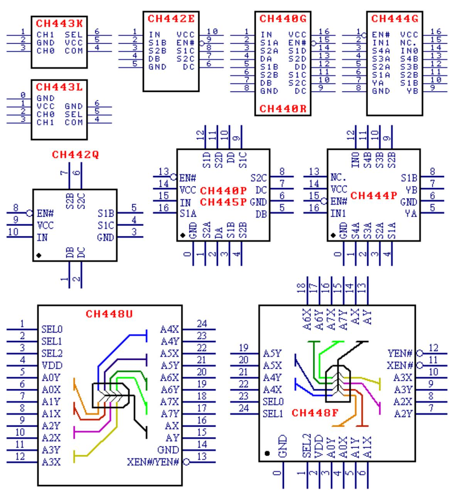

<table><tr><td rowspan=1 colspan=1>封装形式</td><td rowspan=1 colspan=1>塑体尺寸</td><td rowspan=1 colspan=2>引脚节距</td><td rowspan=1 colspan=1>封装说明</td><td rowspan=1 colspan=1>订货型号</td></tr><tr><td rowspan=1 colspan=1>SOP16</td><td rowspan=1 colspan=1>3.9*10mm</td><td rowspan=1 colspan=1>1. 27mm</td><td rowspan=1 colspan=1>50mil</td><td rowspan=1 colspan=1>标准的16脚贴片</td><td rowspan=1 colspan=1>CH440G</td></tr><tr><td rowspan=1 colspan=1>QFN16</td><td rowspan=1 colspan=1>3*3mm</td><td rowspan=1 colspan=1>0.50mm</td><td rowspan=1 colspan=1>19.7mi1</td><td rowspan=1 colspan=1>方形无引线16脚</td><td rowspan=1 colspan=1>CH440P</td></tr><tr><td rowspan=1 colspan=1>TSSOP16</td><td rowspan=1 colspan=1>4.4*5mm</td><td rowspan=1 colspan=1>0.65mm</td><td rowspan=1 colspan=1>25miI</td><td rowspan=1 colspan=1>薄小型的16脚贴片</td><td rowspan=1 colspan=1>CH440R</td></tr><tr><td rowspan=1 colspan=1>QFN10_14X18</td><td rowspan=1 colspan=1>1. 4*1. 8mm</td><td rowspan=1 colspan=1>0.40mm</td><td rowspan=1 colspan=1>15. 7mil</td><td rowspan=1 colspan=1>方形无引线10脚</td><td rowspan=1 colspan=1>CH442Q</td></tr><tr><td rowspan=1 colspan=1>MSOP10</td><td rowspan=1 colspan=1>3*3mm</td><td rowspan=1 colspan=1>0.50mm</td><td rowspan=1 colspan=1>19.7mil</td><td rowspan=1 colspan=1>微小型的10脚贴片</td><td rowspan=1 colspan=1>CH442E</td></tr><tr><td rowspan=1 colspan=1>SOT363(SC70-6L)</td><td rowspan=1 colspan=1>1. 25*2. 1mm</td><td rowspan=1 colspan=1>0. 65mm</td><td rowspan=1 colspan=1>26mil</td><td rowspan=1 colspan=1>缩小型6脚贴片</td><td rowspan=1 colspan=1>CH443K</td></tr><tr><td rowspan=1 colspan=1>DFN6_1.2X1.2</td><td rowspan=1 colspan=1>1. 2*1. 2mm</td><td rowspan=1 colspan=1>0.4mm</td><td rowspan=1 colspan=1>15.7mil</td><td rowspan=1 colspan=1>双边无引线6脚</td><td rowspan=1 colspan=1>CH443L</td></tr><tr><td rowspan=1 colspan=1>SOP16</td><td rowspan=1 colspan=1>3.9*10mm</td><td rowspan=1 colspan=1>1. 27mm</td><td rowspan=1 colspan=1>50mil</td><td rowspan=1 colspan=1>标准的16脚贴片</td><td rowspan=1 colspan=1>CH444G</td></tr><tr><td rowspan=1 colspan=1>QFN16</td><td rowspan=1 colspan=1>3*3mm</td><td rowspan=1 colspan=1>0.50mm</td><td rowspan=1 colspan=1>19. 7mi l</td><td rowspan=1 colspan=1>方形无引线16脚</td><td rowspan=1 colspan=1>CH444P</td></tr><tr><td rowspan=1 colspan=1>QFN16_3X3X0.5</td><td rowspan=1 colspan=1>3*3mm</td><td rowspan=1 colspan=1>0.50mm</td><td rowspan=1 colspan=1>19.7mil</td><td rowspan=1 colspan=1>方形无引线16脚</td><td rowspan=1 colspan=1>CH445P</td></tr><tr><td rowspan=1 colspan=1>QFN24</td><td rowspan=1 colspan=1>4*4mm</td><td rowspan=1 colspan=1>0.50mm</td><td rowspan=1 colspan=1>19.7mil</td><td rowspan=1 colspan=1>方形无引线24脚</td><td rowspan=1 colspan=1>CH448F</td></tr><tr><td rowspan=1 colspan=1>QSOP24</td><td rowspan=1 colspan=1>3.9*8.7mm</td><td rowspan=1 colspan=1>0.635mm</td><td rowspan=1 colspan=1>25mil</td><td rowspan=1 colspan=1>1/4尺寸24脚贴片</td><td rowspan=1 colspan=1>CH448U</td></tr></table>

注：1、体积小通常寄生 L/C 小，对高频信号应用，建议优先选用 QFN 或 DFN 等小封装形式。

2、QFN或DFN封装的底板标示为0#引脚，对于 CH448F 是必要连接。

3、CH442Q 与 CH9442Q 引脚兼容，CH9442Q 支持 Type-C 充电口 USB 信号，耐压 28V。

4、原型号 CH440E 已用新型号 CH442E 代替，引脚和功能相同。

5、CH443K为盘装，每盘整包装数量为3000只。

6、CH442Q、CH443K、CH443L 封装体积较小，正面印字仅有代号 42、43、43 而不含全部型号。

# 4、引脚定义

4.1. CH440G/P/R、CH445P 引脚  

<table><tr><td rowspan=1 colspan=1>CH440GCH440R</td><td rowspan=1 colspan=1>CH440PCH445P</td><td rowspan=1 colspan=1>引脚名称</td><td rowspan=1 colspan=1>类型</td><td rowspan=1 colspan=1>引脚说明</td></tr><tr><td rowspan=1 colspan=1>16</td><td rowspan=1 colspan=1>14</td><td rowspan=1 colspan=1>VCC</td><td rowspan=1 colspan=1>电源</td><td rowspan=1 colspan=1>正电源</td></tr><tr><td rowspan=1 colspan=1>8</td><td rowspan=1 colspan=1>6、0</td><td rowspan=1 colspan=1>GND</td><td rowspan=1 colspan=1>电源</td><td rowspan=1 colspan=1>公共接地，数字信号参考地</td></tr><tr><td rowspan=1 colspan=1>15</td><td rowspan=1 colspan=1>13</td><td rowspan=1 colspan=1>EN#</td><td rowspan=1 colspan=1>输入</td><td rowspan=1 colspan=1>全局使能输入，低电平有效</td></tr><tr><td rowspan=1 colspan=1>1</td><td rowspan=1 colspan=1>15</td><td rowspan=1 colspan=1>IN</td><td rowspan=1 colspan=1>输入</td><td rowspan=1 colspan=1>二选一模拟开关选择输入：高电平选择 2#端（S2x)；低电平选择1#端（S1x）</td></tr><tr><td rowspan=1 colspan=1>4、7、9、12</td><td rowspan=1 colspan=1>2、5、7、10</td><td rowspan=1 colspan=1>DA、DB、DC、DD</td><td rowspan=1 colspan=1>模拟</td><td rowspan=1 colspan=1>二选一模拟开关的公共端</td></tr><tr><td rowspan=1 colspan=1>2、5、11、14</td><td rowspan=1 colspan=1>16、3、9、12</td><td rowspan=1 colspan=1>S1A、S1B、S1C、S1D</td><td rowspan=1 colspan=1>模拟</td><td rowspan=1 colspan=1>二选一模拟开关的1#端,IN引脚输入低电平选中</td></tr><tr><td rowspan=1 colspan=1>3、6、10、13</td><td rowspan=1 colspan=1>1、4、8、11</td><td rowspan=1 colspan=1>S2A、S2B、S2C、S2D</td><td rowspan=1 colspan=1>模拟</td><td rowspan=1 colspan=1>二选一模拟开关的2#端，IN引脚输入高电平选中</td></tr></table>

4.2. CH442Q/E 引脚   

<table><tr><td rowspan=1 colspan=1>CH442Q</td><td rowspan=1 colspan=1>CH442E</td><td rowspan=1 colspan=1>引脚名称</td><td rowspan=1 colspan=1>类型</td><td rowspan=1 colspan=1>引脚说明</td></tr><tr><td rowspan=1 colspan=1>9</td><td rowspan=1 colspan=1>10</td><td rowspan=1 colspan=1>VCC</td><td rowspan=1 colspan=1>电源</td><td rowspan=1 colspan=1>正电源</td></tr><tr><td rowspan=1 colspan=1>3</td><td rowspan=1 colspan=1>5</td><td rowspan=1 colspan=1>GND</td><td rowspan=1 colspan=1>电源</td><td rowspan=1 colspan=1>公共接地，数字信号参考地</td></tr><tr><td rowspan=1 colspan=1>8</td><td rowspan=1 colspan=1>9</td><td rowspan=1 colspan=1>EN#</td><td rowspan=1 colspan=1>输入</td><td rowspan=1 colspan=1>全局使能输入，低电平有效</td></tr><tr><td rowspan=1 colspan=1>10</td><td rowspan=1 colspan=1>1</td><td rowspan=1 colspan=1>IN</td><td rowspan=1 colspan=1>输入</td><td rowspan=1 colspan=1>二选一模拟开关选择输入：高电平选择2#端（S2x)；低电平选择1#端（S1x)</td></tr><tr><td rowspan=1 colspan=1>1、2</td><td rowspan=1 colspan=1>4、6</td><td rowspan=1 colspan=1>DB、DC</td><td rowspan=1 colspan=1>模拟</td><td rowspan=1 colspan=1>二选一模拟开关的公共端</td></tr><tr><td rowspan=1 colspan=1>5、4</td><td rowspan=1 colspan=1>2、8</td><td rowspan=1 colspan=1>S1B、S1C</td><td rowspan=1 colspan=1>模拟</td><td rowspan=1 colspan=1>二选一模拟开关的1#端，IN引脚输入低电平选中</td></tr><tr><td rowspan=1 colspan=1>7、6</td><td rowspan=1 colspan=1>3、7</td><td rowspan=1 colspan=1>S2B、S2C</td><td rowspan=1 colspan=1>模拟</td><td rowspan=1 colspan=1>二选一模拟开关的2#端，IN引脚输入高电平选中</td></tr></table>

4.3. CH443K/L 引脚  

<table><tr><td rowspan=1 colspan=1>CH443K</td><td rowspan=1 colspan=1>CH443L</td><td rowspan=1 colspan=1>引脚名称</td><td rowspan=1 colspan=1>类型</td><td rowspan=1 colspan=1>引脚说明</td></tr><tr><td rowspan=1 colspan=1>5</td><td rowspan=1 colspan=1>1</td><td rowspan=1 colspan=1>VCC</td><td rowspan=1 colspan=1>电源</td><td rowspan=1 colspan=1>正电源</td></tr><tr><td rowspan=1 colspan=1>2</td><td rowspan=1 colspan=1>6、0</td><td rowspan=1 colspan=1>GND</td><td rowspan=1 colspan=1>电源</td><td rowspan=1 colspan=1>公共接地，数字信号参考地</td></tr><tr><td rowspan=1 colspan=1>6</td><td rowspan=1 colspan=1>5</td><td rowspan=1 colspan=1>SEL  (IN)</td><td rowspan=1 colspan=1>输入</td><td rowspan=1 colspan=1>二选一模拟开关选择输入：高电平选择CH1端；低电平选择CHO 端</td></tr><tr><td rowspan=1 colspan=1>4</td><td rowspan=1 colspan=1>4</td><td rowspan=1 colspan=1>COM  （DB)</td><td rowspan=1 colspan=1>模拟</td><td rowspan=1 colspan=1>二选一模拟开关的公共端</td></tr><tr><td rowspan=1 colspan=1>3</td><td rowspan=1 colspan=1>2</td><td rowspan=1 colspan=1>CHO  (S1B)</td><td rowspan=1 colspan=1>模拟</td><td rowspan=1 colspan=1>二选一模拟开关的CHO端，SEL引脚输入低电平选中</td></tr><tr><td rowspan=1 colspan=1>1</td><td rowspan=1 colspan=1>3</td><td rowspan=1 colspan=1>CH1  (S2B)</td><td rowspan=1 colspan=1>模拟</td><td rowspan=1 colspan=1>二选一模拟开关的CH1端，SEL引脚输入高电平选中</td></tr></table>

4.4. CH444G/P 引脚  

<table><tr><td rowspan=1 colspan=1>CH444G</td><td rowspan=1 colspan=1>CH444P</td><td rowspan=1 colspan=1>引脚名称</td><td rowspan=1 colspan=1>类型</td><td rowspan=1 colspan=1>引脚说明</td></tr><tr><td rowspan=1 colspan=1>16</td><td rowspan=1 colspan=1>14</td><td rowspan=1 colspan=1>VCC</td><td rowspan=1 colspan=1>电源</td><td rowspan=1 colspan=1>正电源</td></tr><tr><td rowspan=1 colspan=1>8</td><td rowspan=1 colspan=1>6、0</td><td rowspan=1 colspan=1>GND</td><td rowspan=1 colspan=1>电源</td><td rowspan=1 colspan=1>公共接地，数字信号参考地</td></tr><tr><td rowspan=1 colspan=1>1</td><td rowspan=1 colspan=1>15</td><td rowspan=1 colspan=1>EN#</td><td rowspan=1 colspan=1>输入</td><td rowspan=1 colspan=1>全局使能输入，低电平有效</td></tr><tr><td rowspan=1 colspan=1>2、14</td><td rowspan=1 colspan=1>16、12</td><td rowspan=1 colspan=1>IN1、INO</td><td rowspan=1 colspan=1>输入</td><td rowspan=1 colspan=1>四选一模拟开关选择输入：00 选择1#端（S1×)；01选择 2#端（S2x)；10 选择3#端（S3x)；11选择 4#端（S4x)</td></tr><tr><td rowspan=1 colspan=1>7、9</td><td rowspan=1 colspan=1>5、7</td><td rowspan=1 colspan=1>YA、YB</td><td rowspan=1 colspan=1>模拟</td><td rowspan=1 colspan=1>四选一模拟开关的公共端</td></tr><tr><td rowspan=1 colspan=1>6、10</td><td rowspan=1 colspan=1>4、8</td><td rowspan=1 colspan=1>S1A、S1B</td><td rowspan=1 colspan=1>模拟</td><td rowspan=1 colspan=1>四选 -模拟开关的1#端，IN1&amp;0 引脚输入00选中</td></tr><tr><td rowspan=1 colspan=1>5、11</td><td rowspan=1 colspan=1>3、9</td><td rowspan=1 colspan=1>S2A、S2B</td><td rowspan=1 colspan=1>模拟</td><td rowspan=1 colspan=1>四选 模拟开关的2#端，IN1&amp;0引脚输入01选中</td></tr><tr><td rowspan=1 colspan=1>4、12</td><td rowspan=1 colspan=1>2、10</td><td rowspan=1 colspan=1>S3A、S3B</td><td rowspan=1 colspan=1>模拟</td><td rowspan=1 colspan=1>四选- 模拟开关的3#端， IN1&amp;0 引脚输入10选中</td></tr><tr><td rowspan=1 colspan=1>3、13</td><td rowspan=1 colspan=1>1、11</td><td rowspan=1 colspan=1>S4A、S4B</td><td rowspan=1 colspan=1>模拟</td><td rowspan=1 colspan=1>四选- -模拟开关的4#端，IN1&amp;0 引脚输入11选中</td></tr><tr><td rowspan=1 colspan=1>15</td><td rowspan=1 colspan=1>13</td><td rowspan=1 colspan=1>NC.</td><td rowspan=1 colspan=1>空脚</td><td rowspan=1 colspan=1>保留引脚，禁止连接</td></tr></table>

# 4.5. CH448F/U 引脚

<table><tr><td rowspan=1 colspan=1>CH448F</td><td rowspan=1 colspan=1>CH448U</td><td rowspan=1 colspan=1>引脚名称</td><td rowspan=1 colspan=1>类型</td><td rowspan=1 colspan=1>引脚说明</td></tr><tr><td rowspan=1 colspan=1>2</td><td rowspan=1 colspan=1>4</td><td rowspan=1 colspan=1>VDD</td><td rowspan=1 colspan=1>电源</td><td rowspan=1 colspan=1>正电源</td></tr><tr><td rowspan=1 colspan=1>0</td><td rowspan=1 colspan=1>14</td><td rowspan=1 colspan=1>GND</td><td rowspan=1 colspan=1>电源</td><td rowspan=1 colspan=1>公共接地，数字信号参考地</td></tr><tr><td rowspan=1 colspan=1>11</td><td rowspan=2 colspan=1>13</td><td rowspan=1 colspan=1>XEN#</td><td rowspan=1 colspan=1>输入</td><td rowspan=1 colspan=1>×通道全局使能输入，低电平有效</td></tr><tr><td rowspan=1 colspan=1>12</td><td rowspan=1 colspan=1>YEN#</td><td rowspan=1 colspan=1>输入</td><td rowspan=1 colspan=1>Y通道全局使能输入，低电平有效</td></tr><tr><td rowspan=1 colspan=1>1、24、23</td><td rowspan=1 colspan=1>3、2、1</td><td rowspan=1 colspan=1>SEL2、SEL1、SELO</td><td rowspan=1 colspan=1>输入</td><td rowspan=1 colspan=1>八选一模拟开关的选择输入：000 选择0#端（A0*)；001 选择1#端（A1*)；010选择2#端（A2*)；011选择3#端（A3*)；100选择4#端（A4*）；101选择5#端（A5*)；110选择6#端（A6*)；111选择7#端（A7*）</td></tr><tr><td rowspan=1 colspan=1>14</td><td rowspan=1 colspan=1>16</td><td rowspan=1 colspan=1>AX</td><td rowspan=1 colspan=1>模拟</td><td rowspan=1 colspan=1>X通道八选一-模拟开关的公共端</td></tr><tr><td rowspan=1 colspan=1>13</td><td rowspan=1 colspan=1>15</td><td rowspan=1 colspan=1>AY</td><td rowspan=1 colspan=1>模拟</td><td rowspan=1 colspan=1>Y通道八选一-模拟开关的公共端</td></tr><tr><td rowspan=1 colspan=1>4、3</td><td rowspan=1 colspan=1>6、5</td><td rowspan=1 colspan=1>AOX、AOY</td><td rowspan=1 colspan=1>模拟</td><td rowspan=1 colspan=1>八选一模拟开关的0#端，SEL2&amp;1&amp;0引脚输入000选中</td></tr><tr><td rowspan=1 colspan=1>6、5</td><td rowspan=1 colspan=1>8、7</td><td rowspan=1 colspan=1>A1X、A1Y</td><td rowspan=1 colspan=1>模拟</td><td rowspan=1 colspan=1>八选模拟开关的1#端，SEL2&amp;1&amp;0 引脚输入001选中</td></tr><tr><td rowspan=1 colspan=1>8、7</td><td rowspan=1 colspan=1>10、9</td><td rowspan=1 colspan=1>A2X、A2Y</td><td rowspan=1 colspan=1>模拟</td><td rowspan=1 colspan=1>八选 模拟开关的2#端，SEL2&amp;1&amp;0引脚输入010选中</td></tr><tr><td rowspan=1 colspan=1>10、9</td><td rowspan=1 colspan=1>12、11</td><td rowspan=1 colspan=1>A3X、A3Y</td><td rowspan=1 colspan=1>模拟</td><td rowspan=1 colspan=1>八选模拟开关的3#端，SEL2&amp;1&amp;0引脚输入011选中</td></tr><tr><td rowspan=1 colspan=1>22、21</td><td rowspan=1 colspan=1>24、23</td><td rowspan=1 colspan=1>A4X、A4Y</td><td rowspan=1 colspan=1>模拟</td><td rowspan=1 colspan=1>八选模拟开关的4#端，SEL2&amp;1&amp;0引脚输入100选中</td></tr><tr><td rowspan=1 colspan=1>20、19</td><td rowspan=1 colspan=1>22、21</td><td rowspan=1 colspan=1>A5X、A5Y</td><td rowspan=1 colspan=1>模拟</td><td rowspan=1 colspan=1>八选模拟开关的5#端，SEL2&amp;1&amp;0 引脚输入101选中</td></tr><tr><td rowspan=1 colspan=1>18、17</td><td rowspan=1 colspan=1>20、19</td><td rowspan=1 colspan=1>A6X、A6Y</td><td rowspan=1 colspan=1>模拟</td><td rowspan=1 colspan=1>八选模拟开关的6#端，SEL2&amp;1&amp;0引脚输入110选中</td></tr><tr><td rowspan=1 colspan=1>16、15</td><td rowspan=1 colspan=1>18、17</td><td rowspan=1 colspan=1>A7X、A7Y</td><td rowspan=1 colspan=1>模拟</td><td rowspan=1 colspan=1>八选一模拟开关的7#端，SEL2&amp;1&amp;0引脚输入111选中</td></tr></table>

# 5、功能说明

5.1. CH440G/P/R、CH445P

CH440G、CH440P、CH440R 和 CH445P 是 QPDT 模拟开关芯片，包含 4 路单刀双掷二选一开关。

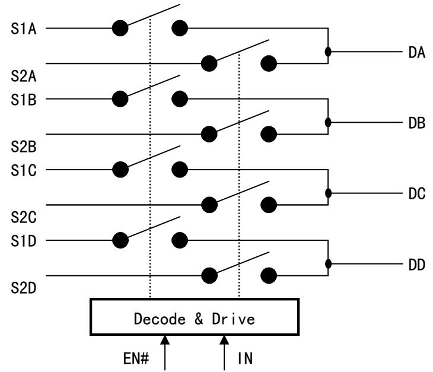

CH440G/P/R 和 CH445P 由 EN#引脚控制实现统一使能，由 IN 引脚选择进行统一切换。下表是其控制表。

<table><tr><td rowspan=1 colspan=1>EN#</td><td rowspan=1 colspan=1>IN</td><td rowspan=1 colspan=1>DA</td><td rowspan=1 colspan=1>DB</td><td rowspan=1 colspan=1>DC</td><td rowspan=1 colspan=1>DD</td></tr><tr><td rowspan=1 colspan=1>0</td><td rowspan=1 colspan=1>0</td><td rowspan=1 colspan=1>选择S1A</td><td rowspan=1 colspan=1>选择S1B</td><td rowspan=1 colspan=1>选择S1C</td><td rowspan=1 colspan=1>选择S1D</td></tr><tr><td rowspan=1 colspan=1>0</td><td rowspan=1 colspan=1>1</td><td rowspan=1 colspan=1>选择S2A</td><td rowspan=1 colspan=1>选择S2B</td><td rowspan=1 colspan=1>选择S2C</td><td rowspan=1 colspan=1>选择S2D</td></tr><tr><td rowspan=1 colspan=1>1</td><td rowspan=1 colspan=1>X</td><td rowspan=1 colspan=1>全部断开</td><td rowspan=1 colspan=1>全部断开</td><td rowspan=1 colspan=1>全部断开</td><td rowspan=1 colspan=1>全部断开</td></tr></table>

# 5.2. CH442Q/E

CH442Q 和 CH442E 是 DPDT 模拟开关芯片，包含 2 路单刀双掷二选一开关，支持 USB 等高速差分信号，差分信号B和C可以根据PCB设计优化的需要设定为 $+ / -$ （ $\mathsf { p } / \mathsf { n }$ ）或反之。

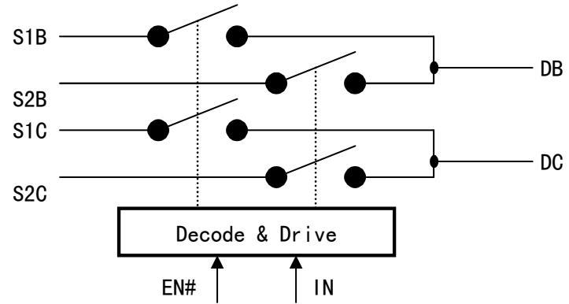

CH442Q/E由EN#引脚控制实现统一使能，由 IN引脚选择进行统一切换。下表是其控制表。

<table><tr><td rowspan=1 colspan=1>EN#</td><td rowspan=1 colspan=1>IN</td><td rowspan=1 colspan=1>DB</td><td rowspan=1 colspan=1>DC</td></tr><tr><td rowspan=1 colspan=1>0</td><td rowspan=1 colspan=1>0</td><td rowspan=1 colspan=1>选择S1B</td><td rowspan=1 colspan=1>选择S1C</td></tr><tr><td rowspan=1 colspan=1>0</td><td rowspan=1 colspan=1>1</td><td rowspan=1 colspan=1>选择S2B</td><td rowspan=1 colspan=1>选择S2C</td></tr><tr><td rowspan=1 colspan=1>1</td><td rowspan=1 colspan=1>X</td><td rowspan=1 colspan=1>全部断开</td><td rowspan=1 colspan=1>全部断开</td></tr></table>

# 5.3. CH443K/L

CH443K 和 CH443L 是 SPDT 单刀双掷模拟开关芯片，也可用于与/或/非等简单逻辑门功能，以及用于两个不同电压域下的数字信号的电平转换。

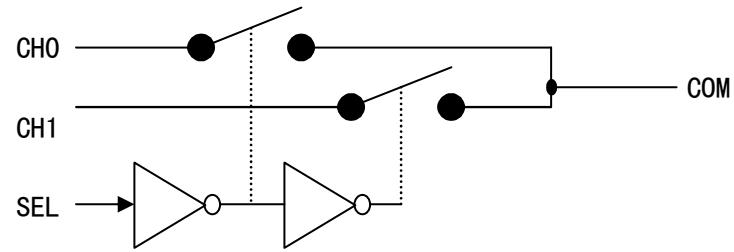

CH443K/L由SEL引脚选择进行切换。下表是其控制表。

<table><tr><td rowspan=2 colspan=1>SEL</td><td></td></tr><tr><td rowspan=1 colspan=1>COM</td></tr><tr><td rowspan=1 colspan=1>0</td><td rowspan=1 colspan=1>选择CHO</td></tr><tr><td rowspan=1 colspan=1>1</td><td rowspan=1 colspan=1>选择CH1</td></tr></table>

# 5.4. CH444G/P

CH444G 和 CH444P 是 DPQT 模拟开关芯片，包含 2 路单刀四掷四选一开关。

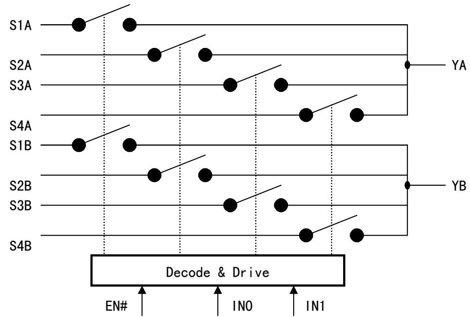

CH444G/P 由 EN#引脚控制实现统一使能，由 IN1 和 IN0 引脚选择进行统一切换。下表是其控制表。

<table><tr><td rowspan=1 colspan=1>EN#</td><td rowspan=1 colspan=1>IN1</td><td rowspan=1 colspan=1>INO</td><td rowspan=1 colspan=1>YA</td><td rowspan=1 colspan=1>YB</td></tr><tr><td rowspan=1 colspan=1>0</td><td rowspan=1 colspan=1>0</td><td rowspan=1 colspan=1>0</td><td rowspan=1 colspan=1>选择S1A</td><td rowspan=1 colspan=1>选择S1B</td></tr><tr><td rowspan=1 colspan=1>0</td><td rowspan=1 colspan=1>0</td><td rowspan=1 colspan=1>1</td><td rowspan=1 colspan=1>选择S2A</td><td rowspan=1 colspan=1>选择S2B</td></tr><tr><td rowspan=1 colspan=1>0</td><td rowspan=1 colspan=1>1</td><td rowspan=1 colspan=1>0</td><td rowspan=1 colspan=1>选择S3A</td><td rowspan=1 colspan=1>选择S3B</td></tr><tr><td rowspan=1 colspan=1>0</td><td rowspan=1 colspan=1>1</td><td rowspan=1 colspan=1>1</td><td rowspan=1 colspan=1>选择S4A</td><td rowspan=1 colspan=1>选择S4B</td></tr><tr><td rowspan=1 colspan=1>1</td><td rowspan=1 colspan=1>X</td><td rowspan=1 colspan=1>X</td><td rowspan=1 colspan=1>全部断开</td><td rowspan=1 colspan=1>全部断开</td></tr></table>

5.5. CH448F/U

CH448F 和 CH448U 是 DPOT 模拟开关芯片，包含 2 路单刀八掷八选一开关。

CH448F 的 AX 和 AY 两个通道可以独立使能，当两者不同时使能、并且短接 AX 和 AY 作为公共端时，可以构成单刀十六掷16选一开关。这种模式下，模拟信号带宽将下降到约 $2 5 0 M H z$ 。

AX和AY两个通道统一使能时，构成高速差分通道，差分信号X 和Y 可以根据 PCB设计优化的需要设定为 $+ / -$ （p/n）或反之。

CH448F/U 的数字输入引脚包括 SEL2、SEL1、SEL0、XEN#和 YEN#引脚，其信号通常由外部单片机的I/O驱动，上述数字引脚的电压可以独立于 CH448的电源电压 VDD。

<table><tr><td rowspan=2 colspan=2>CH448电源电压与数字引脚控制电压的组合</td><td rowspan=1 colspan=3>CH448电源电压VDD、模拟信号的最高电压</td></tr><tr><td rowspan=1 colspan=1>5V</td><td rowspan=1 colspan=1>3.3V</td><td rowspan=1 colspan=1>2. 5V</td></tr><tr><td rowspan=4 colspan=1>单片机I/0电压即 CH448数字输入引脚电压</td><td rowspan=1 colspan=1>5V</td><td rowspan=1 colspan=1>√</td><td rowspan=1 colspan=1>√</td><td rowspan=1 colspan=1>√</td></tr><tr><td rowspan=1 colspan=1>3.3V</td><td rowspan=1 colspan=1>功能支持</td><td rowspan=1 colspan=1>√</td><td rowspan=1 colspan=1>√</td></tr><tr><td rowspan=1 colspan=1>2.5V</td><td rowspan=1 colspan=1>功能支持</td><td rowspan=1 colspan=1>功能支持</td><td rowspan=1 colspan=1>√</td></tr><tr><td rowspan=1 colspan=1>1. 8V</td><td rowspan=1 colspan=1>×</td><td rowspan=1 colspan=1>功能支持</td><td rowspan=1 colspan=1>功能支持</td></tr></table>

注：上表中的功能支持是指功能完全实现，但 CH448 可能会增加静态功耗（不超过 600uA）。

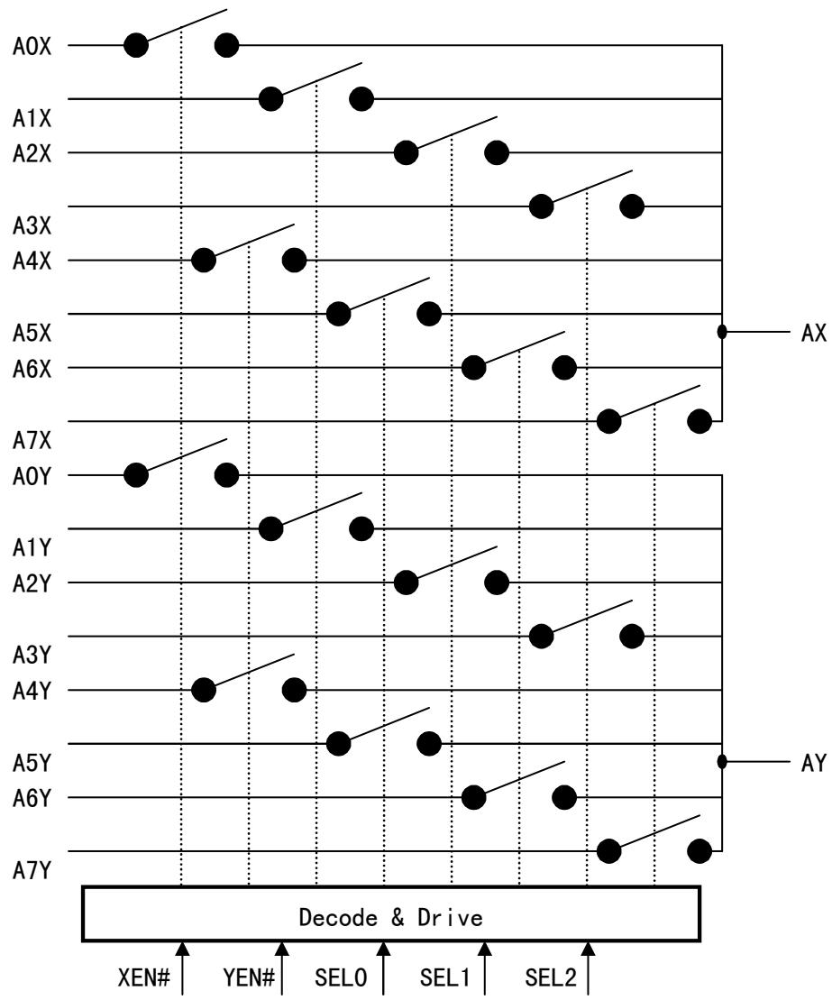

差分通道八选一模式下，CH448F/U由XEN#和 YEN#引脚短接后共同控制实现统一使能，由SEL2、SEL1、SEL0引脚选择进行统一切换。下表是其控制表。

<table><tr><td colspan="1" rowspan="1">XEN#</td><td colspan="1" rowspan="1">YEN#</td><td colspan="1" rowspan="1">SEL2</td><td colspan="1" rowspan="1">SEL1</td><td colspan="1" rowspan="1">SELO</td><td colspan="1" rowspan="1">AX</td><td colspan="1" rowspan="1">AY</td></tr><tr><td colspan="2" rowspan="1">0</td><td colspan="1" rowspan="1">0</td><td colspan="1" rowspan="1">0</td><td colspan="1" rowspan="1">0</td><td colspan="1" rowspan="1">选择AOX</td><td colspan="1" rowspan="1">选择AOY</td></tr><tr><td colspan="2" rowspan="1">0</td><td colspan="1" rowspan="1">0</td><td colspan="1" rowspan="1">0</td><td colspan="1" rowspan="1">1</td><td colspan="1" rowspan="1">选择A1X</td><td colspan="1" rowspan="1">选择A1Y</td></tr><tr><td colspan="2" rowspan="1">0</td><td colspan="1" rowspan="1">0</td><td colspan="1" rowspan="1">1</td><td colspan="1" rowspan="1">0</td><td colspan="1" rowspan="1">选择A2X</td><td colspan="1" rowspan="1">选择A2Y</td></tr><tr><td colspan="2" rowspan="1">0</td><td colspan="1" rowspan="1">0</td><td colspan="1" rowspan="1">1</td><td colspan="1" rowspan="1">1</td><td colspan="1" rowspan="1">选择A3X</td><td colspan="1" rowspan="1">选择A3Y</td></tr><tr><td colspan="1" rowspan="1">0</td><td colspan="1" rowspan="1">1</td><td colspan="1" rowspan="1">0</td><td colspan="1" rowspan="1">0</td><td colspan="1" rowspan="1">选择A4X</td><td colspan="2" rowspan="1">选择A4Y</td></tr><tr><td colspan="1" rowspan="1">0</td><td colspan="1" rowspan="1">1</td><td colspan="1" rowspan="1">0</td><td colspan="1" rowspan="1">1</td><td colspan="1" rowspan="1">选择A5X</td><td colspan="2" rowspan="1">选择A5Y</td></tr><tr><td colspan="1" rowspan="1">0</td><td colspan="1" rowspan="1">1</td><td colspan="1" rowspan="1">1</td><td colspan="1" rowspan="1">0</td><td colspan="1" rowspan="1">选择A6X</td><td colspan="2" rowspan="1">选择A6Y</td></tr><tr><td colspan="1" rowspan="1">0</td><td colspan="1" rowspan="1">1</td><td colspan="1" rowspan="1">1</td><td colspan="1" rowspan="1">1</td><td colspan="1" rowspan="1">选择A7X</td><td colspan="2" rowspan="1">选择A7Y</td></tr><tr><td colspan="1" rowspan="1">1</td><td colspan="1" rowspan="1">X</td><td colspan="1" rowspan="1">X</td><td colspan="1" rowspan="1">X</td><td colspan="1" rowspan="1">全部断开</td><td colspan="2" rowspan="1">全部断开</td></tr></table>

单端信号十六选一模式下，AX和AY短接后作为模拟开关的公共端，CH448F由 XEN#和 YEN#引脚独立控制实现不同时使能，配合SEL2、SEL1、SEL0引脚选择进行 16选一切换。下表是其控制表。

<table><tr><td rowspan=1 colspan=1>XEN#</td><td rowspan=1 colspan=1>YEN#</td><td rowspan=1 colspan=1>SEL2</td><td rowspan=1 colspan=1>SEL1</td><td rowspan=1 colspan=1>SELO</td><td rowspan=1 colspan=1>AX</td><td rowspan=1 colspan=1>AY</td></tr><tr><td rowspan=1 colspan=1>0</td><td rowspan=1 colspan=1>1</td><td rowspan=1 colspan=1>0</td><td rowspan=1 colspan=1>0</td><td rowspan=1 colspan=1>0</td><td rowspan=1 colspan=1>选择AOX</td><td rowspan=1 colspan=1></td></tr><tr><td rowspan=1 colspan=1>0</td><td rowspan=1 colspan=1>1</td><td rowspan=1 colspan=1>0</td><td rowspan=1 colspan=1>0</td><td rowspan=1 colspan=1>1</td><td rowspan=1 colspan=1>选择A1X</td><td rowspan=1 colspan=1></td></tr><tr><td rowspan=1 colspan=1>0</td><td rowspan=1 colspan=1>1</td><td rowspan=1 colspan=1>0</td><td rowspan=1 colspan=1>1</td><td rowspan=1 colspan=1>0</td><td rowspan=1 colspan=1>选择A2X</td><td rowspan=1 colspan=1></td></tr><tr><td rowspan=1 colspan=1>0</td><td rowspan=1 colspan=1>1</td><td rowspan=1 colspan=1>0</td><td rowspan=1 colspan=1>1</td><td rowspan=1 colspan=1>1</td><td rowspan=1 colspan=1>选择A3X</td><td rowspan=1 colspan=1></td></tr><tr><td rowspan=1 colspan=1>0</td><td rowspan=1 colspan=1>1</td><td rowspan=1 colspan=1>1</td><td rowspan=1 colspan=1>0</td><td rowspan=1 colspan=1>0</td><td rowspan=1 colspan=1>选择A4X</td><td rowspan=1 colspan=1></td></tr><tr><td rowspan=1 colspan=1>0</td><td rowspan=1 colspan=1>1</td><td rowspan=1 colspan=1>1</td><td rowspan=1 colspan=1>0</td><td rowspan=1 colspan=1>1</td><td rowspan=1 colspan=1>选择A5X</td><td rowspan=1 colspan=1></td></tr><tr><td rowspan=1 colspan=1>0</td><td rowspan=1 colspan=1>1</td><td rowspan=1 colspan=1>1</td><td rowspan=1 colspan=1>1</td><td rowspan=1 colspan=1>0</td><td rowspan=1 colspan=1>选择A6X</td><td rowspan=1 colspan=1></td></tr><tr><td rowspan=1 colspan=1>0</td><td rowspan=1 colspan=1>1</td><td rowspan=1 colspan=1>1</td><td rowspan=1 colspan=1>1</td><td rowspan=1 colspan=1>1</td><td rowspan=1 colspan=1>选择A7X</td><td rowspan=1 colspan=1></td></tr><tr><td rowspan=1 colspan=1>1</td><td rowspan=1 colspan=1>0</td><td rowspan=1 colspan=1>0</td><td rowspan=1 colspan=1>0</td><td rowspan=1 colspan=1>0</td><td rowspan=1 colspan=1></td><td rowspan=1 colspan=1>选择AOY</td></tr><tr><td rowspan=1 colspan=1>1</td><td rowspan=1 colspan=1>0</td><td rowspan=1 colspan=1>0</td><td rowspan=1 colspan=1>0</td><td rowspan=1 colspan=1>1</td><td rowspan=1 colspan=1></td><td rowspan=1 colspan=1>选择A1Y</td></tr><tr><td rowspan=1 colspan=1>1</td><td rowspan=1 colspan=1>0</td><td rowspan=1 colspan=1>0</td><td rowspan=1 colspan=1>1</td><td rowspan=1 colspan=1>0</td><td rowspan=1 colspan=1></td><td rowspan=1 colspan=1>选择A2Y</td></tr><tr><td rowspan=1 colspan=1>1</td><td rowspan=1 colspan=1>0</td><td rowspan=1 colspan=1>0</td><td rowspan=1 colspan=1>1</td><td rowspan=1 colspan=1>1</td><td rowspan=1 colspan=1></td><td rowspan=1 colspan=1>选择A3Y</td></tr><tr><td rowspan=1 colspan=1>1</td><td rowspan=1 colspan=1>0</td><td rowspan=1 colspan=1>1</td><td rowspan=1 colspan=1>0</td><td rowspan=1 colspan=1>0</td><td rowspan=1 colspan=1></td><td rowspan=1 colspan=1>选择A4Y</td></tr><tr><td rowspan=1 colspan=1>1</td><td rowspan=1 colspan=1>0</td><td rowspan=1 colspan=1>1</td><td rowspan=1 colspan=1>0</td><td rowspan=1 colspan=1>1</td><td rowspan=1 colspan=1></td><td rowspan=1 colspan=1>选择A5Y</td></tr><tr><td rowspan=1 colspan=1>1</td><td rowspan=1 colspan=1>0</td><td rowspan=1 colspan=1>1</td><td rowspan=1 colspan=1>1</td><td rowspan=1 colspan=1>0</td><td rowspan=1 colspan=1></td><td rowspan=1 colspan=1>选择A6Y</td></tr><tr><td rowspan=1 colspan=1>1</td><td rowspan=1 colspan=1>0</td><td rowspan=1 colspan=1>1</td><td rowspan=1 colspan=1>1</td><td rowspan=1 colspan=1>1</td><td rowspan=1 colspan=1></td><td rowspan=1 colspan=1>选择A7Y</td></tr><tr><td rowspan=1 colspan=1>1</td><td rowspan=1 colspan=1>1</td><td rowspan=1 colspan=1>X</td><td rowspan=1 colspan=1>X</td><td rowspan=1 colspan=1>X</td><td rowspan=1 colspan=2>全部断开</td></tr></table>

# 6、参数

6.1. 绝对最大值（临界或者超过绝对最大值将可能导致芯片工作不正常甚至损坏）

<table><tr><td rowspan=1 colspan=1>名称</td><td rowspan=1 colspan=1>参数说明</td><td rowspan=1 colspan=1>最小值</td><td rowspan=1 colspan=1>最大值</td><td rowspan=1 colspan=1>单位</td></tr><tr><td rowspan=1 colspan=1>TA</td><td rowspan=1 colspan=1>工作时的环境温度</td><td rowspan=1 colspan=1>-40</td><td rowspan=1 colspan=1>85</td><td rowspan=1 colspan=1>℃</td></tr><tr><td rowspan=1 colspan=1>TJ</td><td rowspan=1 colspan=1>工作结温</td><td rowspan=1 colspan=1>-40</td><td rowspan=1 colspan=1>125</td><td rowspan=1 colspan=1>℃</td></tr><tr><td rowspan=1 colspan=1>TS</td><td rowspan=1 colspan=1>储存时的环境温度</td><td rowspan=1 colspan=1>-55</td><td rowspan=1 colspan=1>150</td><td rowspan=1 colspan=1>℃</td></tr><tr><td rowspan=2 colspan=1>VCC</td><td rowspan=1 colspan=1>5V芯片的电源电压（VCC/VDD 接电源，GND接地）</td><td rowspan=1 colspan=1>-0.5</td><td rowspan=1 colspan=1>6.5</td><td rowspan=1 colspan=1>V</td></tr><tr><td rowspan=1 colspan=1>3.3V芯片的电源电压（VCC/VDD 接电源，GND接地）</td><td rowspan=1 colspan=1>-0.5</td><td rowspan=1 colspan=1>4.4</td><td rowspan=1 colspan=1>V</td></tr><tr><td rowspan=1 colspan=1>VI0</td><td rowspan=1 colspan=1>模拟输入或者输出引脚上的电压</td><td rowspan=1 colspan=1>-0.5</td><td rowspan=1 colspan=1>VCC+0. 4</td><td rowspan=1 colspan=1>V</td></tr><tr><td rowspan=2 colspan=1>VID</td><td rowspan=1 colspan=1>CH445数字输入引脚上的电压</td><td rowspan=1 colspan=1>-0.5</td><td rowspan=1 colspan=1>VCC+0.4</td><td rowspan=1 colspan=1>V</td></tr><tr><td rowspan=1 colspan=1>CH440/CH442/CH443/CH444/CH448数字控制输入引脚上的电压</td><td rowspan=1 colspan=1>-0.5</td><td rowspan=1 colspan=1>6.5</td><td rowspan=1 colspan=1>V</td></tr><tr><td rowspan=1 colspan=1>Isw</td><td rowspan=1 colspan=1>模拟开关的连续通过电流</td><td rowspan=1 colspan=1>0</td><td rowspan=1 colspan=1>30</td><td rowspan=1 colspan=1>mA</td></tr><tr><td rowspan=1 colspan=1>lall</td><td rowspan=1 colspan=1>所有模拟开关的连续通过电流的总和</td><td rowspan=1 colspan=1>0</td><td rowspan=1 colspan=1>120</td><td rowspan=1 colspan=1>mA</td></tr></table>

注：各参数表中 VCC与VDD等价。

6.2. 额定5V芯片电气参数 $\mathtt { \textregistered 5 1 }$ （测试条件： $\mathtt { T A } = 2 5 ^ { \circ } C$ ， $V C C = V D D = 5 V$ ，不含 CH445）

<table><tr><td rowspan=1 colspan=1>名称</td><td rowspan=1 colspan=1>参数说明</td><td rowspan=1 colspan=1>最小值</td><td rowspan=1 colspan=1>典型值</td><td rowspan=1 colspan=1>最大值</td><td rowspan=1 colspan=1>单位</td></tr><tr><td rowspan=1 colspan=1>VCC</td><td rowspan=1 colspan=1>VCC/VDD 电源电压</td><td rowspan=1 colspan=1>4.0</td><td rowspan=1 colspan=1>5.0</td><td rowspan=1 colspan=1>5.5</td><td rowspan=1 colspan=1>V</td></tr><tr><td rowspan=1 colspan=1>ICC</td><td rowspan=1 colspan=1>静态电源电流，所有数字引脚接VCC或GND</td><td rowspan=1 colspan=1></td><td rowspan=1 colspan=1>0.1</td><td rowspan=1 colspan=1>10</td><td rowspan=1 colspan=1>uA</td></tr><tr><td rowspan=1 colspan=1>ICCX</td><td rowspan=1 colspan=1>静态电源电流，所有数字引脚3.4V</td><td rowspan=1 colspan=1></td><td rowspan=1 colspan=1>0.15</td><td rowspan=1 colspan=1>1</td><td rowspan=1 colspan=1>mA</td></tr><tr><td rowspan=1 colspan=1>VIL</td><td rowspan=1 colspan=1>CH440/2/3/4数字引脚低电平输入电压</td><td rowspan=1 colspan=1>0</td><td rowspan=1 colspan=1></td><td rowspan=1 colspan=1>1. 0</td><td rowspan=1 colspan=1>V</td></tr><tr><td rowspan=1 colspan=1>VIH</td><td rowspan=1 colspan=1>CH440/2/3/4数字引脚高电平输入电压</td><td rowspan=1 colspan=1>2.0</td><td rowspan=1 colspan=1></td><td rowspan=1 colspan=1>5.5</td><td rowspan=1 colspan=1>V</td></tr><tr><td rowspan=1 colspan=1>VIL8</td><td rowspan=1 colspan=1>CH448数字引脚低电平输入电压</td><td rowspan=1 colspan=1>0</td><td rowspan=1 colspan=1></td><td rowspan=1 colspan=1>1.1</td><td rowspan=1 colspan=1>V</td></tr><tr><td rowspan=1 colspan=1>VIH8</td><td rowspan=1 colspan=1>CH448数字引脚高电平输入电压</td><td rowspan=1 colspan=1>2. 2</td><td rowspan=1 colspan=1></td><td rowspan=1 colspan=1>5.5</td><td rowspan=1 colspan=1>V</td></tr><tr><td rowspan=1 colspan=1>ILEAK</td><td rowspan=1 colspan=1>数字引脚的输入泄漏电流</td><td rowspan=1 colspan=1></td><td rowspan=1 colspan=1>0.1</td><td rowspan=1 colspan=1>10</td><td rowspan=1 colspan=1>uA</td></tr><tr><td rowspan=1 colspan=1>10FF</td><td rowspan=1 colspan=1>模拟开关在关闭状态下的泄漏电流</td><td rowspan=1 colspan=1></td><td rowspan=1 colspan=1>±0.01</td><td rowspan=1 colspan=1>±1</td><td rowspan=1 colspan=1>uA</td></tr><tr><td rowspan=1 colspan=1>VANA</td><td rowspan=1 colspan=1>推荐的模拟信号的电压范围</td><td rowspan=1 colspan=1>0</td><td rowspan=1 colspan=1></td><td rowspan=1 colspan=1>2.8</td><td rowspan=1 colspan=1>V</td></tr><tr><td rowspan=1 colspan=1>VANAX</td><td rowspan=1 colspan=1>允许的模拟信号的电压范围</td><td rowspan=1 colspan=1>-0.3</td><td rowspan=1 colspan=1></td><td rowspan=1 colspan=1>VCC+0. 3</td><td rowspan=1 colspan=1>V</td></tr><tr><td rowspan=1 colspan=1>RON1</td><td rowspan=1 colspan=1>模拟开关导通电阻，模拟信号电压为OV</td><td rowspan=1 colspan=1></td><td rowspan=1 colspan=1>4</td><td rowspan=1 colspan=1>6</td><td rowspan=1 colspan=1>Ω</td></tr><tr><td rowspan=1 colspan=1>RON2</td><td rowspan=1 colspan=1>模拟开关导通电阻，模拟信号电压为 2V</td><td rowspan=1 colspan=1></td><td rowspan=1 colspan=1>5</td><td rowspan=1 colspan=1>8</td><td rowspan=1 colspan=1>Ω</td></tr><tr><td rowspan=1 colspan=1>RON3</td><td rowspan=1 colspan=1>模拟开关导通电阻，模拟信号电压为3.4V</td><td rowspan=1 colspan=1></td><td rowspan=1 colspan=1>9</td><td rowspan=1 colspan=1>13</td><td rowspan=1 colspan=1>Ω</td></tr><tr><td rowspan=1 colspan=1>RON4</td><td rowspan=1 colspan=1>模拟开关导通电阻，模拟信号电压为5V</td><td rowspan=1 colspan=1></td><td rowspan=1 colspan=1>6</td><td rowspan=1 colspan=1>9</td><td rowspan=1 colspan=1>Ω</td></tr></table>

6.3. 额定 5V 芯片电气参数 $@ 3 . 3 \lor$ （测试条件： $\mathsf { T } \mathsf { A } \mathsf { = } 2 5 ^ { \circ } \mathrm { C }$ ， $\mathtt { V C C = V D D = 3 . 3 V }$ ，不含 CH445）

<table><tr><td rowspan=1 colspan=1>名称</td><td rowspan=1 colspan=1>参数说明</td><td rowspan=1 colspan=1>最小值</td><td rowspan=1 colspan=1>典型值</td><td rowspan=1 colspan=1>最大值</td><td rowspan=1 colspan=1>单位</td></tr><tr><td rowspan=1 colspan=1>VCC3</td><td rowspan=1 colspan=1>VCC/VDD电源电压</td><td rowspan=1 colspan=1>2.1</td><td rowspan=1 colspan=1>3.3</td><td rowspan=1 colspan=1>3.9</td><td rowspan=1 colspan=1>V</td></tr><tr><td rowspan=1 colspan=1>ICC3</td><td rowspan=1 colspan=1>静态电源电流，所有数字引脚接VCC或GND</td><td rowspan=1 colspan=1></td><td rowspan=1 colspan=1>0.1</td><td rowspan=1 colspan=1>5</td><td rowspan=1 colspan=1>uA</td></tr><tr><td rowspan=1 colspan=1>ICCX3</td><td rowspan=1 colspan=1>静态电源电流，所有数字引脚2.3V</td><td rowspan=1 colspan=1></td><td rowspan=1 colspan=1>0.05</td><td rowspan=1 colspan=1>0.5</td><td rowspan=1 colspan=1>mA</td></tr><tr><td rowspan=1 colspan=1>VIL3</td><td rowspan=1 colspan=1>CH440/2/3/4数字引脚低电平输入电压</td><td rowspan=1 colspan=1>0</td><td rowspan=1 colspan=1></td><td rowspan=1 colspan=1>0.7</td><td rowspan=1 colspan=1>V</td></tr><tr><td rowspan=1 colspan=1>VIH3</td><td rowspan=1 colspan=1>CH440/2/3/4数字引脚高电平输入电压</td><td rowspan=1 colspan=1>1.8</td><td rowspan=1 colspan=1></td><td rowspan=1 colspan=1>5.5</td><td rowspan=1 colspan=1>V</td></tr><tr><td rowspan=1 colspan=1>VIL38</td><td rowspan=1 colspan=1>CH448数字引脚低电平输入电压</td><td rowspan=1 colspan=1>0</td><td rowspan=1 colspan=1></td><td rowspan=1 colspan=1>0.7</td><td rowspan=1 colspan=1>V</td></tr><tr><td rowspan=1 colspan=1>VIH38</td><td rowspan=1 colspan=1>CH448 数字引脚高电平输入电压</td><td rowspan=1 colspan=1>1.8</td><td rowspan=1 colspan=1></td><td rowspan=1 colspan=1>5.5</td><td rowspan=1 colspan=1>V</td></tr><tr><td rowspan=1 colspan=1>ILEAK3</td><td rowspan=1 colspan=1>数字引脚的输入泄漏电流</td><td rowspan=1 colspan=1></td><td rowspan=1 colspan=1>0.1</td><td rowspan=1 colspan=1>5</td><td rowspan=1 colspan=1>uA</td></tr><tr><td rowspan=1 colspan=1>IOFF3</td><td rowspan=1 colspan=1>模拟开关在关闭状态下的泄漏电流</td><td rowspan=1 colspan=1></td><td rowspan=1 colspan=1>±0.005</td><td rowspan=1 colspan=1>±0.5</td><td rowspan=1 colspan=1>uA</td></tr><tr><td rowspan=1 colspan=1>VANA3</td><td rowspan=1 colspan=1>推荐的模拟信号的电压范围</td><td rowspan=1 colspan=1>0</td><td rowspan=1 colspan=1></td><td rowspan=1 colspan=1>1.5</td><td rowspan=1 colspan=1>V</td></tr><tr><td rowspan=1 colspan=1>VANAX3</td><td rowspan=1 colspan=1>允许的模拟信号的电压范围</td><td rowspan=1 colspan=1>-0.3</td><td rowspan=1 colspan=1></td><td rowspan=1 colspan=1>VCC3+0.3</td><td rowspan=1 colspan=1>V</td></tr><tr><td rowspan=1 colspan=1>RON1</td><td rowspan=1 colspan=1>模拟开关导通电阻，模拟信号电压为OV</td><td rowspan=1 colspan=1></td><td rowspan=1 colspan=1>5</td><td rowspan=1 colspan=1>8</td><td rowspan=1 colspan=1>Ω</td></tr><tr><td rowspan=1 colspan=1>RON2</td><td rowspan=1 colspan=1>模拟开关导通电阻，模拟信号电压为1.2V</td><td rowspan=1 colspan=1></td><td rowspan=1 colspan=1>9</td><td rowspan=1 colspan=1>14</td><td rowspan=1 colspan=1>Ω</td></tr><tr><td rowspan=1 colspan=1>RON3</td><td rowspan=1 colspan=1>模拟开关导通电阻，模拟信号电压为2.0V</td><td rowspan=1 colspan=1></td><td rowspan=1 colspan=1>17</td><td rowspan=1 colspan=1>30</td><td rowspan=1 colspan=1>Ω</td></tr><tr><td rowspan=1 colspan=1>RON4</td><td rowspan=1 colspan=1>模拟开关导通电阻，模拟信号电压为3.3V</td><td rowspan=1 colspan=1></td><td rowspan=1 colspan=1>8</td><td rowspan=1 colspan=1>12</td><td rowspan=1 colspan=1>Ω</td></tr></table>

6.4. 额定 5V 芯片模拟开关时序参数（测试条件： $\mathtt { T A } = 2 5 ^ { \circ } \mathrm { C }$ ， $V C C = V D D = 5 V$ ， $V A N A = O V$ ，不含 CH445）

<table><tr><td colspan="1" rowspan="1">名称</td><td colspan="1" rowspan="1">参数说明</td><td colspan="1" rowspan="1">最小值</td><td colspan="1" rowspan="1">典型值</td><td colspan="1" rowspan="1">最大值</td><td colspan="1" rowspan="1">单位</td></tr><tr><td colspan="1" rowspan="1">CIN</td><td colspan="1" rowspan="1">数字输入引脚电容，F=1MHz</td><td colspan="1" rowspan="1"></td><td colspan="1" rowspan="1">4</td><td colspan="1" rowspan="1">8</td><td colspan="1" rowspan="1">pF</td></tr><tr><td colspan="1" rowspan="1">COFF</td><td colspan="1" rowspan="1">CH448开关关闭时模拟信号引脚电容，F=1MHz</td><td colspan="1" rowspan="1"></td><td colspan="1" rowspan="1">5</td><td colspan="1" rowspan="1">10</td><td colspan="1" rowspan="1">pF</td></tr><tr><td colspan="1" rowspan="1">CON</td><td colspan="1" rowspan="1">CH448开关导通时模拟信号引脚电容，F=1MHz</td><td colspan="1" rowspan="1"></td><td colspan="1" rowspan="1">8</td><td colspan="1" rowspan="1">14</td><td colspan="1" rowspan="1">pF</td></tr><tr><td colspan="1" rowspan="1">COFFQ</td><td colspan="1" rowspan="1">CH440/CH442/CH443/CH444开关关闭时模拟信号引脚电容，F=1MHz</td><td colspan="1" rowspan="1"></td><td colspan="1" rowspan="1">3</td><td colspan="1" rowspan="1">8</td><td colspan="1" rowspan="1">pF</td></tr><tr><td colspan="1" rowspan="1">CONQ</td><td colspan="1" rowspan="1">CH440/CH442/CH443/CH444开关导通时模拟信号引脚电容，F=1MHz</td><td colspan="1" rowspan="1"></td><td colspan="1" rowspan="1">4</td><td colspan="1" rowspan="1">10</td><td colspan="1" rowspan="1">pF</td></tr><tr><td colspan="1" rowspan="1">BW</td><td colspan="1" rowspan="1">CH448 模拟开关-3dB带宽</td><td colspan="1" rowspan="1">350</td><td colspan="1" rowspan="1">550</td><td colspan="1" rowspan="1"></td><td colspan="1" rowspan="1">MHz</td></tr><tr><td colspan="1" rowspan="1">BW4</td><td colspan="1" rowspan="1">CH444模拟开关-3dB带宽</td><td colspan="1" rowspan="1">300</td><td colspan="1" rowspan="1">450</td><td colspan="1" rowspan="1"></td><td colspan="1" rowspan="1">MHz</td></tr><tr><td colspan="1" rowspan="1">BWQ</td><td colspan="1" rowspan="1">CH440/2/3模拟开关-3dB带宽</td><td colspan="1" rowspan="1">450</td><td colspan="1" rowspan="1">650</td><td colspan="1" rowspan="1"></td><td colspan="1" rowspan="1">MHz</td></tr><tr><td colspan="1" rowspan="1">TON</td><td colspan="1" rowspan="1">模拟开关开启延时，RL=75Ω，CL=10pF</td><td colspan="1" rowspan="1"></td><td colspan="1" rowspan="1">3</td><td colspan="1" rowspan="1">7</td><td colspan="1" rowspan="1">nS</td></tr><tr><td colspan="1" rowspan="1">TOFF</td><td colspan="1" rowspan="1">模拟开关关闭延时，RL=75Ω，CL=10pF</td><td colspan="1" rowspan="1"></td><td colspan="1" rowspan="1">2</td><td colspan="1" rowspan="1">7</td><td colspan="1" rowspan="1">nS</td></tr></table>

6.5. 额定 3.3V 芯片电气参数 $@ 3 . 3 \lor$ （测试条件： $\mathsf { T A } \mathsf { = } 2 5 ^ { \circ } \mathrm { C }$ ， $\mathsf { V C C } = 3 , \mathsf { 3 V }$ ，仅 CH445）  

<table><tr><td rowspan=1 colspan=1>名称</td><td rowspan=1 colspan=1>参数说明</td><td rowspan=1 colspan=1>最小值</td><td rowspan=1 colspan=1>典型值</td><td rowspan=1 colspan=1>最大值</td><td rowspan=1 colspan=1>单位</td></tr><tr><td rowspan=1 colspan=1>VCC</td><td rowspan=1 colspan=1>电源电压</td><td rowspan=1 colspan=1>2.9</td><td rowspan=1 colspan=1>3.3</td><td rowspan=1 colspan=1>3.7</td><td rowspan=1 colspan=1>V</td></tr><tr><td rowspan=1 colspan=1>ICC</td><td rowspan=1 colspan=1>静态电源电流，所有数字引脚接VCC或GND</td><td rowspan=1 colspan=1></td><td rowspan=1 colspan=1>0.1</td><td rowspan=1 colspan=1>6</td><td rowspan=1 colspan=1>uA</td></tr><tr><td rowspan=1 colspan=1>ICCX</td><td rowspan=1 colspan=1>静态电源电流，所有数字引脚2.3V</td><td rowspan=1 colspan=1></td><td rowspan=1 colspan=1>0.07</td><td rowspan=1 colspan=1>0.3</td><td rowspan=1 colspan=1>mA</td></tr><tr><td rowspan=1 colspan=1>VIL</td><td rowspan=1 colspan=1>数字引脚低电平输入电压</td><td rowspan=1 colspan=1>0</td><td rowspan=1 colspan=1></td><td rowspan=1 colspan=1>0.9</td><td rowspan=1 colspan=1>V</td></tr><tr><td rowspan=1 colspan=1>VIH</td><td rowspan=1 colspan=1>数字引脚高电平输入电压</td><td rowspan=1 colspan=1>2.0</td><td rowspan=1 colspan=1></td><td rowspan=1 colspan=1>VCC</td><td rowspan=1 colspan=1>V</td></tr><tr><td rowspan=1 colspan=1>ILEAK</td><td rowspan=1 colspan=1>数字引脚的输入泄漏电流</td><td rowspan=1 colspan=1></td><td rowspan=1 colspan=1>0.1</td><td rowspan=1 colspan=1>6</td><td rowspan=1 colspan=1>uA</td></tr><tr><td rowspan=1 colspan=1>I0FF</td><td rowspan=1 colspan=1>模拟开关在关闭状态下的泄漏电流</td><td rowspan=1 colspan=1></td><td rowspan=1 colspan=1>±0.01</td><td rowspan=1 colspan=1>±1</td><td rowspan=1 colspan=1>uA</td></tr><tr><td rowspan=1 colspan=1>VANA</td><td rowspan=1 colspan=1>推荐的模拟信号的电压范围</td><td rowspan=1 colspan=1>0</td><td rowspan=1 colspan=1></td><td rowspan=1 colspan=1>2.0</td><td rowspan=1 colspan=1>V</td></tr><tr><td rowspan=1 colspan=1>VANAX</td><td rowspan=1 colspan=1>允许的模拟信号的电压范围</td><td rowspan=1 colspan=1>-0.3</td><td rowspan=1 colspan=1></td><td rowspan=1 colspan=1>VCC+0. 3</td><td rowspan=1 colspan=1>V</td></tr><tr><td rowspan=1 colspan=1>RON1</td><td rowspan=1 colspan=1>模拟开关导通电阻，模拟信号电压为OV</td><td rowspan=1 colspan=1></td><td rowspan=1 colspan=1>3.5</td><td rowspan=1 colspan=1>6</td><td rowspan=1 colspan=1>Ω</td></tr><tr><td rowspan=1 colspan=1>RON2</td><td rowspan=1 colspan=1>模拟开关导通电阻，模拟信号电压为1.5V</td><td rowspan=1 colspan=1></td><td rowspan=1 colspan=1>4.5</td><td rowspan=1 colspan=1>8</td><td rowspan=1 colspan=1>Ω</td></tr><tr><td rowspan=1 colspan=1>RON3</td><td rowspan=1 colspan=1>模拟开关导通电阻，模拟信号电压为2.3V</td><td rowspan=1 colspan=1></td><td rowspan=1 colspan=1>7</td><td rowspan=1 colspan=1>11</td><td rowspan=1 colspan=1>Ω</td></tr><tr><td rowspan=1 colspan=1>RON4</td><td rowspan=1 colspan=1>模拟开关导通电阻，模拟信号电压为3.3V</td><td rowspan=1 colspan=1></td><td rowspan=1 colspan=1>5.5</td><td rowspan=1 colspan=1>9</td><td rowspan=1 colspan=1>Ω</td></tr></table>

6.6. 额定 3.3V 芯片电气参数 $@ 2 . 5 \lor$ （测试条件： $\mathsf { T A } \mathsf { = } 2 5 ^ { \circ } \mathrm { C }$ ， $\mathsf { V C C } = 2 , \mathsf { 5 V }$ ，仅 CH445）  

<table><tr><td rowspan=1 colspan=1>名称</td><td rowspan=1 colspan=1>参数说明</td><td rowspan=1 colspan=1>最小值</td><td rowspan=1 colspan=1>典型值</td><td rowspan=1 colspan=1>最大值</td><td rowspan=1 colspan=1>单位</td></tr><tr><td rowspan=1 colspan=1>VCC2</td><td rowspan=1 colspan=1>电源电压</td><td rowspan=1 colspan=1>1.5</td><td rowspan=1 colspan=1>2.5</td><td rowspan=1 colspan=1>2.8</td><td rowspan=1 colspan=1>V</td></tr><tr><td rowspan=1 colspan=1>ICC2</td><td rowspan=1 colspan=1>静态电源电流，所有数字引脚接VCC或GND</td><td rowspan=1 colspan=1></td><td rowspan=1 colspan=1>0.05</td><td rowspan=1 colspan=1>3</td><td rowspan=1 colspan=1>uA</td></tr><tr><td rowspan=1 colspan=1>ICCX2</td><td rowspan=1 colspan=1>静态电源电流，所有数字引脚1.8V</td><td rowspan=1 colspan=1></td><td rowspan=1 colspan=1>0.04</td><td rowspan=1 colspan=1>0.2</td><td rowspan=1 colspan=1>mA</td></tr><tr><td rowspan=1 colspan=1>VIL2</td><td rowspan=1 colspan=1>数字引脚低电平输入电压</td><td rowspan=1 colspan=1>0</td><td rowspan=1 colspan=1></td><td rowspan=1 colspan=1>0.7</td><td rowspan=1 colspan=1>V</td></tr><tr><td rowspan=1 colspan=1>VIH2</td><td rowspan=1 colspan=1>数字引脚高电平输入电压</td><td rowspan=1 colspan=1>1. 5</td><td rowspan=1 colspan=1></td><td rowspan=1 colspan=1>VCC2</td><td rowspan=1 colspan=1>V</td></tr><tr><td rowspan=1 colspan=1>ILEAK2</td><td rowspan=1 colspan=1>数字引脚的输入泄漏电流</td><td rowspan=1 colspan=1></td><td rowspan=1 colspan=1>0.05</td><td rowspan=1 colspan=1>3</td><td rowspan=1 colspan=1>uA</td></tr><tr><td rowspan=1 colspan=1>I0FF2</td><td rowspan=1 colspan=1>模拟开关在关闭状态下的泄漏电流</td><td rowspan=1 colspan=1></td><td rowspan=1 colspan=1>±0.005</td><td rowspan=1 colspan=1>±0.5</td><td rowspan=1 colspan=1>uA</td></tr><tr><td rowspan=1 colspan=1>VANA2</td><td rowspan=1 colspan=1>推荐的模拟信号的电压范围</td><td rowspan=1 colspan=1>0</td><td rowspan=1 colspan=1></td><td rowspan=1 colspan=1>1.3</td><td rowspan=1 colspan=1>V</td></tr><tr><td rowspan=1 colspan=1>VANAX2</td><td rowspan=1 colspan=1>允许的模拟信号的电压范围</td><td rowspan=1 colspan=1>-0.3</td><td rowspan=1 colspan=1></td><td rowspan=1 colspan=1>VCC2+0.3</td><td rowspan=1 colspan=1>V</td></tr><tr><td rowspan=1 colspan=1>RON1</td><td rowspan=1 colspan=1>模拟开关导通电阻，模拟信号电压为0V</td><td rowspan=1 colspan=1></td><td rowspan=1 colspan=1>4.5</td><td rowspan=1 colspan=1>7</td><td rowspan=1 colspan=1>Ω</td></tr><tr><td rowspan=1 colspan=1>RON2</td><td rowspan=1 colspan=1>模拟开关导通电阻，模拟信号电压为1.1V</td><td rowspan=1 colspan=1></td><td rowspan=1 colspan=1>6</td><td rowspan=1 colspan=1>9</td><td rowspan=1 colspan=1>Ω</td></tr><tr><td rowspan=1 colspan=1>RON3</td><td rowspan=1 colspan=1>模拟开关导通电阻，模拟信号电压为1.8V</td><td rowspan=1 colspan=1></td><td rowspan=1 colspan=1>11</td><td rowspan=1 colspan=1>16</td><td rowspan=1 colspan=1>Ω</td></tr><tr><td rowspan=1 colspan=1>RON4</td><td rowspan=1 colspan=1>模拟开关导通电阻，模拟信号电压为2.5V</td><td rowspan=1 colspan=1></td><td rowspan=1 colspan=1>7.5</td><td rowspan=1 colspan=1>11</td><td rowspan=1 colspan=1>Ω</td></tr></table>

6.7. 额定 3.3V 芯片模拟开关时序参数（测试条件： $\mathsf { T A } \mathsf { = } 2 5 ^ { \circ } \mathrm { C }$ ， $\mathsf { V C C } = 3 , \mathsf { 3 V }$ ， $V A N A = 0 V$ ，仅 CH445）

<table><tr><td colspan="1" rowspan="1">名称</td><td colspan="1" rowspan="1">参数说明</td><td colspan="1" rowspan="1">最小值</td><td colspan="1" rowspan="1">典型值</td><td colspan="1" rowspan="1">最大值</td><td colspan="1" rowspan="1">单位</td></tr><tr><td colspan="1" rowspan="1">CIN</td><td colspan="1" rowspan="1">数字输入引脚电容，F=1MHz</td><td colspan="1" rowspan="1"></td><td colspan="1" rowspan="1">3</td><td colspan="1" rowspan="1">6</td><td colspan="1" rowspan="1">pF</td></tr><tr><td colspan="1" rowspan="1">COFF</td><td colspan="1" rowspan="1">开关关闭时模拟信号引脚电容，F=1MHz</td><td colspan="1" rowspan="1"></td><td colspan="1" rowspan="1">5</td><td colspan="1" rowspan="1">10</td><td colspan="1" rowspan="1">pF</td></tr><tr><td colspan="1" rowspan="1">CON</td><td colspan="1" rowspan="1">开关导通时模拟信号引脚电容，F=1MHz</td><td colspan="1" rowspan="1"></td><td colspan="1" rowspan="1">8</td><td colspan="1" rowspan="1">15</td><td colspan="1" rowspan="1">pF</td></tr><tr><td colspan="1" rowspan="1">BW</td><td colspan="1" rowspan="1">模拟开关-3dB带宽</td><td colspan="1" rowspan="1">350</td><td colspan="1" rowspan="1">500</td><td colspan="1" rowspan="1"></td><td colspan="1" rowspan="1">MHz</td></tr><tr><td colspan="1" rowspan="1">TON</td><td colspan="1" rowspan="1">模拟开关开启延时，RL=75Ω，CL=10pF</td><td colspan="1" rowspan="1"></td><td colspan="1" rowspan="1">2.5</td><td colspan="1" rowspan="1">5</td><td colspan="1" rowspan="1">nS</td></tr><tr><td colspan="1" rowspan="1">TOFF</td><td colspan="1" rowspan="1">模拟开关关闭延时，RL=75Ω，CL=10pF</td><td colspan="1" rowspan="1"></td><td colspan="1" rowspan="1">2</td><td colspan="1" rowspan="1">5</td><td colspan="1" rowspan="1">ns</td></tr></table>

# 6.8. 特性图示

6.8.1 CH440/2/3/4/8 的模拟开关导通电阻 RON 与模拟信号电压 VCOM 的相关性（ $\mathsf { T } \mathsf { A } \mathsf { = } 2 5 ^ { \circ } \mathrm { C }$ ）

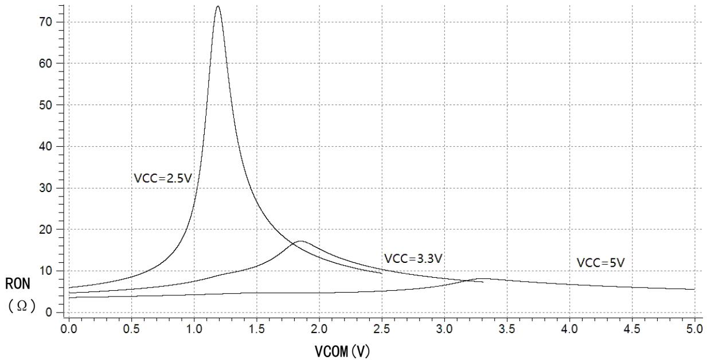

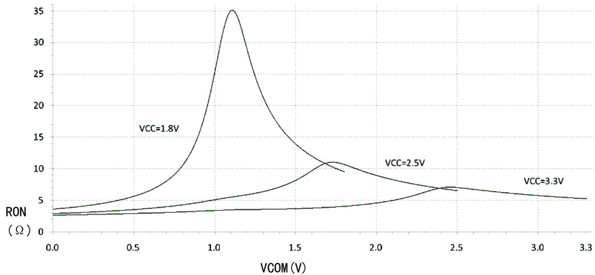  
6.8.2 CH445 的模拟开关导通电阻 RON 与模拟信号电压 VCOM 的相关性（ $\mathsf { T A } \mathsf { = } 2 5 ^ { \circ } \mathrm { C }$ ）

# 7、应用

# 7.1. 视频信号切换

CH44X的高带宽和低电阻特性可用于视频信号切换，例如从 2路或者 4路视频信号源中选择。更多复杂路由的矩阵信号切换可以参考CH449手册。

由于模拟电路与数字电路共用VCC/VDD和 GND，为减少干扰，GND引脚必须接触良好，VCC或 VDD引脚需外接退耦电容，并且建议将数字输入信号的边沿适当放缓，降低传输频率。

# 7.2. USB 信号切换

CH44X 的各模拟开关是对称的，用于差分信号时可以任意指定 $^ +$ 和-，方便 PCB 走线。CH44X 支持低速、全速或者480Mbps高速USB信号切换。超速USB3.0 信号切换可以参考CH482和 CH483手册。

# 7.3. CH443 单门逻辑 GATE 功能

<table><tr><td rowspan=1 colspan=1>简称</td><td rowspan=1 colspan=1>说明</td><td rowspan=1 colspan=1>SEL端</td><td rowspan=1 colspan=1>CHO端</td><td rowspan=1 colspan=1>CH1端</td><td rowspan=1 colspan=1>COM端</td></tr><tr><td rowspan=1 colspan=1>BUF</td><td rowspan=1 colspan=1>强驱动推挽输出的缓冲器</td><td rowspan=1 colspan=1>输入A</td><td rowspan=1 colspan=1>接GND</td><td rowspan=1 colspan=1>接VCC</td><td rowspan=1 colspan=1>输出=A</td></tr><tr><td rowspan=1 colspan=1>INV</td><td rowspan=1 colspan=1>强驱动推挽输出的反相器</td><td rowspan=1 colspan=1>输入A</td><td rowspan=1 colspan=1>接VCC</td><td rowspan=1 colspan=1>接GND</td><td rowspan=1 colspan=1>输出=！A</td></tr><tr><td rowspan=1 colspan=1>AND</td><td rowspan=1 colspan=1>与门</td><td rowspan=1 colspan=1>输入A</td><td rowspan=1 colspan=1>接GND</td><td rowspan=1 colspan=1>输入B</td><td rowspan=1 colspan=1>输出=A&amp;B</td></tr><tr><td rowspan=1 colspan=1>IAND</td><td rowspan=1 colspan=1>先非再与</td><td rowspan=1 colspan=1>输入A</td><td rowspan=1 colspan=1>输入B</td><td rowspan=1 colspan=1>接GND</td><td rowspan=1 colspan=1>输出=！A&amp;B</td></tr><tr><td rowspan=1 colspan=1>OR</td><td rowspan=1 colspan=1>或门</td><td rowspan=1 colspan=1>输入A</td><td rowspan=1 colspan=1>输入B</td><td rowspan=1 colspan=1>接VCC</td><td rowspan=1 colspan=1>输出=A丨B</td></tr><tr><td rowspan=1 colspan=1>IOR</td><td rowspan=1 colspan=1>先非再或</td><td rowspan=1 colspan=1>输入A</td><td rowspan=1 colspan=1>接VCC</td><td rowspan=1 colspan=1>输入B</td><td rowspan=1 colspan=1>输出=！A丨B</td></tr><tr><td rowspan=1 colspan=1>MUX</td><td rowspan=1 colspan=1>选择器</td><td rowspan=1 colspan=1>输入S</td><td rowspan=1 colspan=1>输入A</td><td rowspan=1 colspan=1>输入B</td><td rowspan=1 colspan=1>输出=S？B:A</td></tr><tr><td rowspan=1 colspan=1>BUF_OD</td><td rowspan=1 colspan=1>开漏 (开源)输出的缓冲器</td><td rowspan=1 colspan=1>输入A</td><td rowspan=1 colspan=1>接GND</td><td rowspan=1 colspan=1>悬空</td><td rowspan=1 colspan=1>输出=A？z:0</td></tr><tr><td rowspan=1 colspan=1>INV_OD</td><td rowspan=1 colspan=1>开漏 (开源)输出的反相器</td><td rowspan=1 colspan=1>输入A</td><td rowspan=1 colspan=1>悬空</td><td rowspan=1 colspan=1>接GND</td><td rowspan=1 colspan=1>输出=A？0：z</td></tr><tr><td rowspan=1 colspan=1>TLBUF</td><td rowspan=1 colspan=1>低使能输出的三态输出门</td><td rowspan=1 colspan=1>输入OE</td><td rowspan=1 colspan=1>输入A</td><td rowspan=1 colspan=1>悬空</td><td rowspan=1 colspan=1>输出=！OE？A:z</td></tr><tr><td rowspan=1 colspan=1>THBUF</td><td rowspan=1 colspan=1>高使能输出的三态输出门</td><td rowspan=1 colspan=1>输入OE</td><td rowspan=1 colspan=1>悬空</td><td rowspan=1 colspan=1>输入A</td><td rowspan=1 colspan=1>输出=OE？A:z</td></tr></table>

# 7.4. CH443 数字信号电平转换

CH443 可以用于单路数字信号电平转换，支持电压升或降。SEL 端作为数字信号输入引脚，COM端作为数字信号输出引脚。SEL端信号通常由外部单片机的 I/O驱动，其电压可以独立于 CH443的电源电压 VCC。COM 端信号幅度由 CH0 和 CH1 端所连接的电压值决定，CH0 和 CH1 引脚的电压必须小于或等于CH443的电源电压VCC。

<table><tr><td rowspan=1 colspan=1>源控制电压</td><td rowspan=1 colspan=1>目标电压</td><td rowspan=1 colspan=1>CH443 供电VCC</td><td rowspan=1 colspan=1>SEL输入</td><td rowspan=1 colspan=1>CHO端</td><td rowspan=1 colspan=1>CH1端</td><td rowspan=1 colspan=1>COM端输出</td></tr><tr><td rowspan=1 colspan=1>5V</td><td rowspan=1 colspan=1>3.3V</td><td rowspan=1 colspan=1>5V或3.3V</td><td rowspan=1 colspan=1>0/5V</td><td rowspan=1 colspan=1>接GND</td><td rowspan=1 colspan=1>接3.3V</td><td rowspan=1 colspan=1>SEL 降5-&gt;3.3</td></tr><tr><td rowspan=1 colspan=1>5V</td><td rowspan=1 colspan=1>2.5V</td><td rowspan=1 colspan=1>5V或3.3V或2.5V</td><td rowspan=1 colspan=1>0/5V</td><td rowspan=1 colspan=1>接GND</td><td rowspan=1 colspan=1>接2.5V</td><td rowspan=1 colspan=1>SEL降5-&gt;2.5</td></tr><tr><td rowspan=1 colspan=1>5V</td><td rowspan=1 colspan=1>1.8V</td><td rowspan=1 colspan=1>5V或3.3V或2.5V</td><td rowspan=1 colspan=1>0/5V</td><td rowspan=1 colspan=1>接GND</td><td rowspan=1 colspan=1>接1.8V</td><td rowspan=1 colspan=1>SEL 降5-&gt;1.8</td></tr><tr><td rowspan=1 colspan=1>3.3V</td><td rowspan=1 colspan=1>2.5V</td><td rowspan=1 colspan=1>3.3V或5V或2.5V</td><td rowspan=1 colspan=1>0/3.3V</td><td rowspan=1 colspan=1>接GND</td><td rowspan=1 colspan=1>接2.5V</td><td rowspan=1 colspan=1>SEL降3.3-&gt;2.5</td></tr><tr><td rowspan=1 colspan=1>3.3V</td><td rowspan=1 colspan=1>1.8V</td><td rowspan=1 colspan=1>3.3V或5V或2.5V</td><td rowspan=1 colspan=1>0/3.3V</td><td rowspan=1 colspan=1>接GND</td><td rowspan=1 colspan=1>接1.8V</td><td rowspan=1 colspan=1>SEL降3.3-&gt;1.8</td></tr><tr><td rowspan=1 colspan=1>2.5V</td><td rowspan=1 colspan=1>1. 8V</td><td rowspan=1 colspan=1>2.5V或3.3V或5V</td><td rowspan=1 colspan=1>0/2.5V</td><td rowspan=1 colspan=1>接GND</td><td rowspan=1 colspan=1>接1.8V</td><td rowspan=1 colspan=1>SEL 降2.5-&gt;1.8</td></tr><tr><td rowspan=1 colspan=1>3.3V</td><td rowspan=1 colspan=1>5V</td><td rowspan=1 colspan=1>5V</td><td rowspan=1 colspan=1>0/3.3V</td><td rowspan=1 colspan=1>接GND</td><td rowspan=1 colspan=1>接5V</td><td rowspan=1 colspan=1>SEL升3.3-&gt;5</td></tr><tr><td rowspan=1 colspan=1>2.5V</td><td rowspan=1 colspan=1>5V</td><td rowspan=1 colspan=1>5V</td><td rowspan=1 colspan=1>0/2.5V</td><td rowspan=1 colspan=1>接GND</td><td rowspan=1 colspan=1>接5V</td><td rowspan=1 colspan=1>SEL升2.5-&gt;5</td></tr><tr><td rowspan=1 colspan=1>1.8V</td><td rowspan=1 colspan=1>5V</td><td rowspan=1 colspan=1>5V</td><td rowspan=1 colspan=1>0/1.8V</td><td rowspan=1 colspan=1>接GND</td><td rowspan=1 colspan=1>接5V</td><td rowspan=1 colspan=1>可用，但不建议</td></tr><tr><td rowspan=1 colspan=1>2.5V</td><td rowspan=1 colspan=1>3.3V</td><td rowspan=1 colspan=1>3.3V或5V</td><td rowspan=1 colspan=1>0/2.5V</td><td rowspan=1 colspan=1>接GND</td><td rowspan=1 colspan=1>接3.3V</td><td rowspan=1 colspan=1>SEL升2.5-&gt;3.3</td></tr><tr><td rowspan=1 colspan=1>1. 8V</td><td rowspan=1 colspan=1>3.3V</td><td rowspan=1 colspan=1>3.3V或5V</td><td rowspan=1 colspan=1>0/1.8V</td><td rowspan=1 colspan=1>接GND</td><td rowspan=1 colspan=1>接3.3V</td><td rowspan=1 colspan=1>SEL升1.8-&gt;3.3</td></tr><tr><td rowspan=1 colspan=1>1. 8V</td><td rowspan=1 colspan=1>2. 5V</td><td rowspan=1 colspan=1>2.5V或3.3V或5V</td><td rowspan=1 colspan=1>0/1.8V</td><td rowspan=1 colspan=1>接GND</td><td rowspan=1 colspan=1>接2.5V</td><td rowspan=1 colspan=1>SEL升1.8-&gt;2.5</td></tr><tr><td rowspan=1 colspan=1>同上述</td><td rowspan=1 colspan=1>同上述</td><td rowspan=1 colspan=1>同上述</td><td rowspan=1 colspan=1>同上述</td><td rowspan=1 colspan=2>按上述CHO/1对换</td><td rowspan=1 colspan=1>反相降压或升压</td></tr></table>

注：当源控制电源电压低于CH443供电VCC电压时，CH443 芯片可能会有不超过 $6 0 0 \mathsf { u } \mathsf { A }$ 的静态功耗。

# 8、封装信息

说明：尺寸标注的单位是mm（毫米），引脚中心间距是标称值，除此之外的尺寸误差不大于±0.2mm。

8.1. SOP16

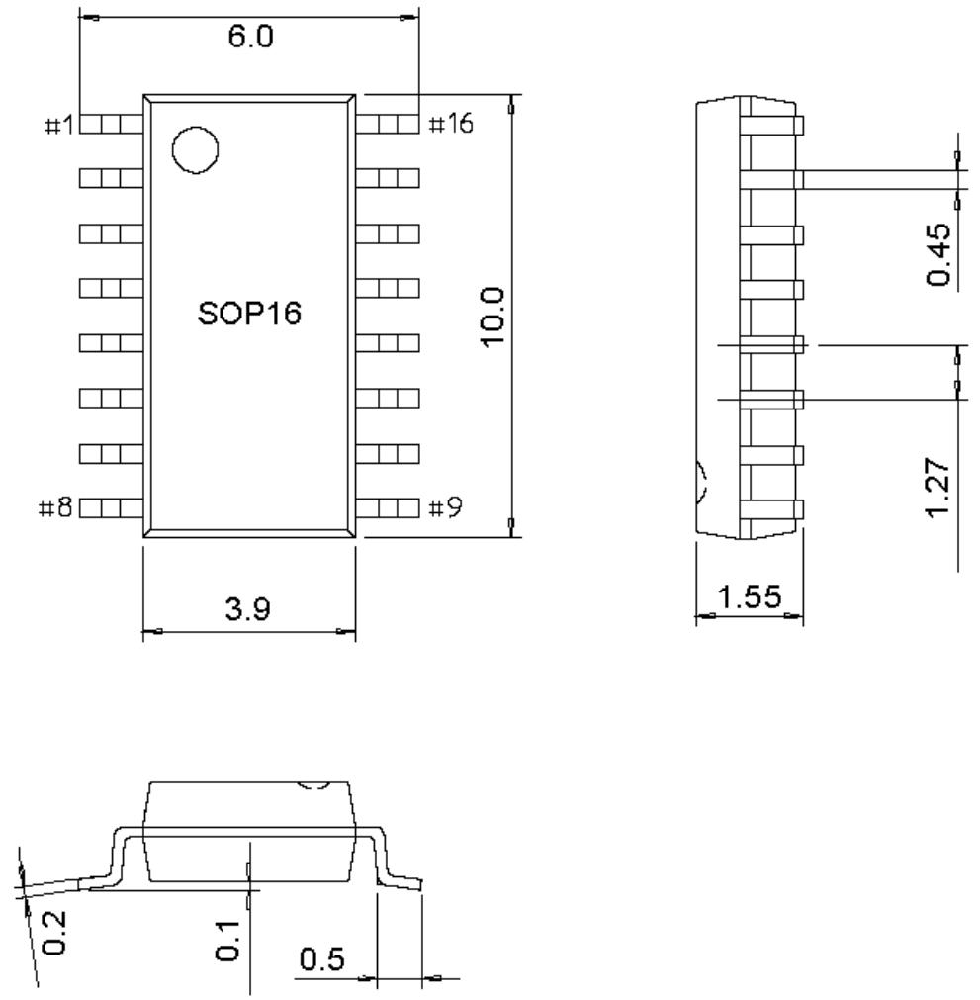  
8.2. QFN16-3X3X0.75 (CH440P/CH444P)

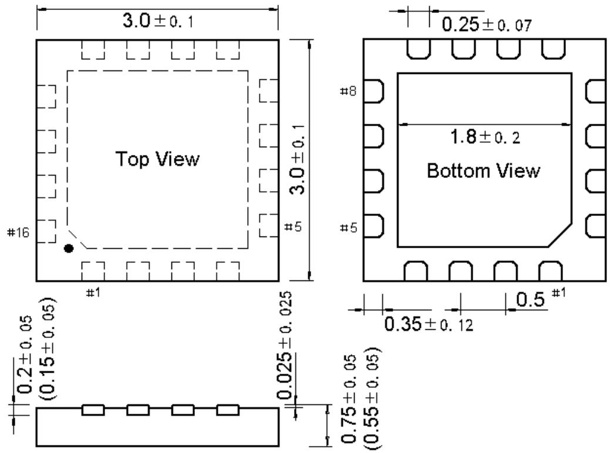

# 8.3. QFN16-3X3X0.5 (CH445P)

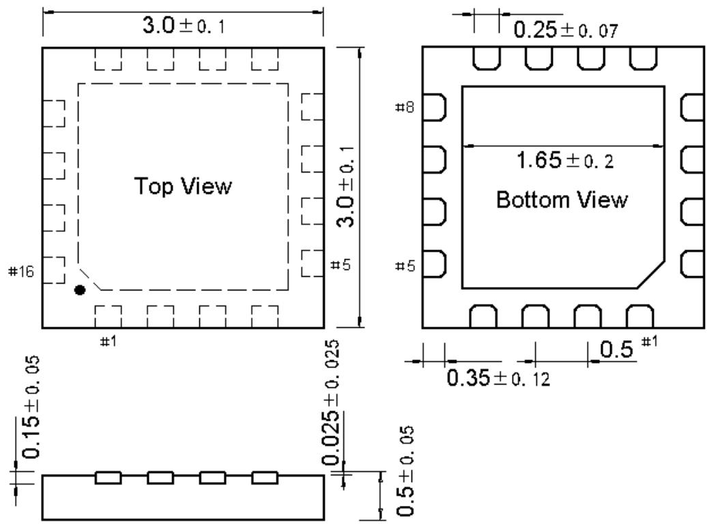

# 8.4. QFN10-1.4X1.8

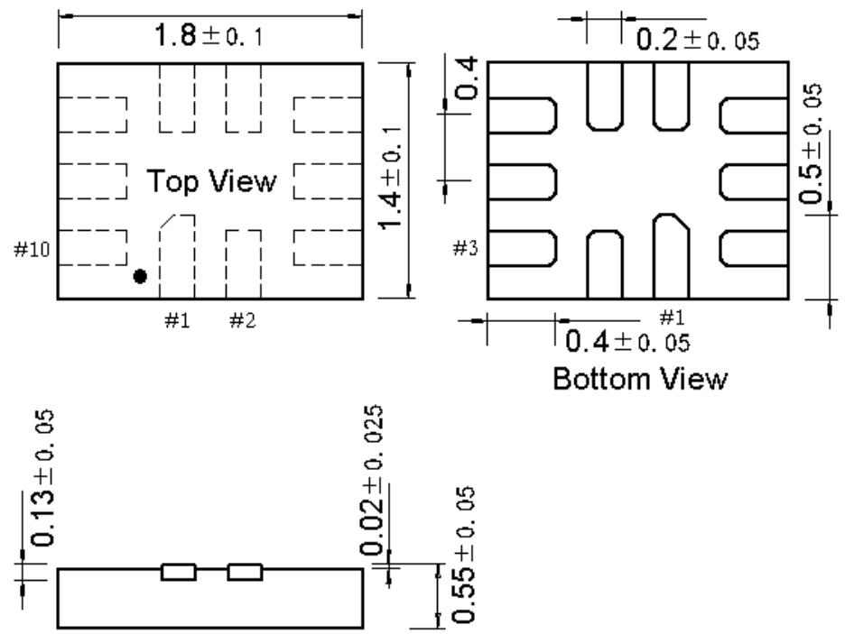

CH442Q 正面印字仅有代号 42。

# 8.5. QFN24-4X4

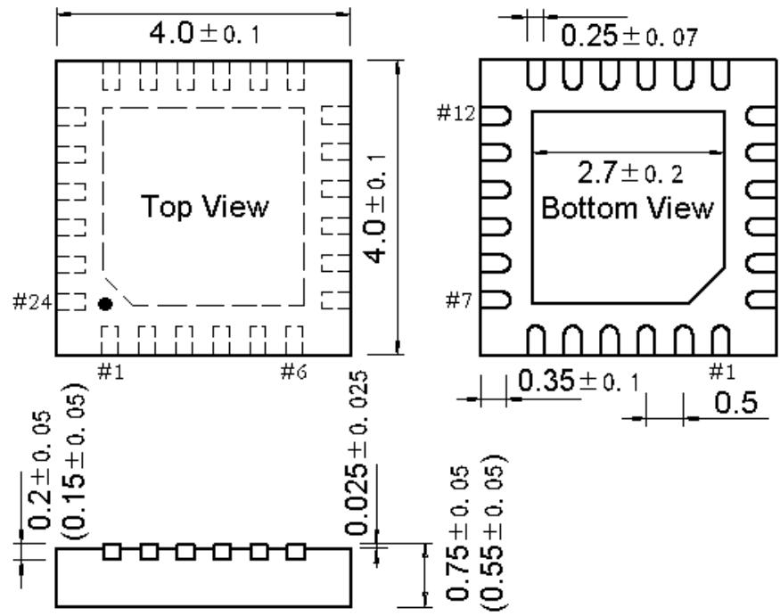

# 8.6. TSSOP16

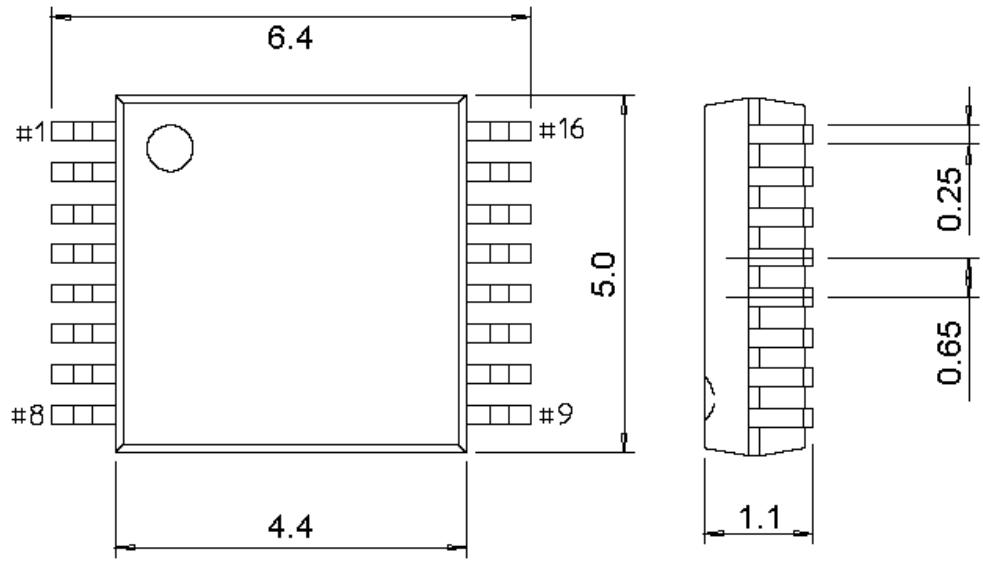

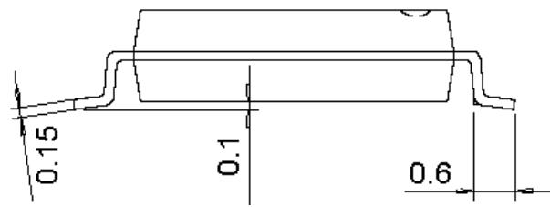

# 8.7. MSOP10

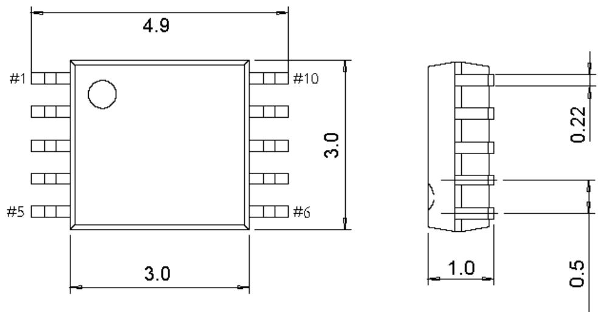

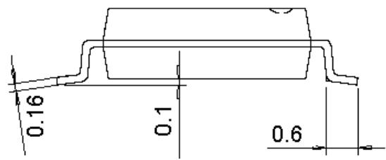

8.8. QSOP24

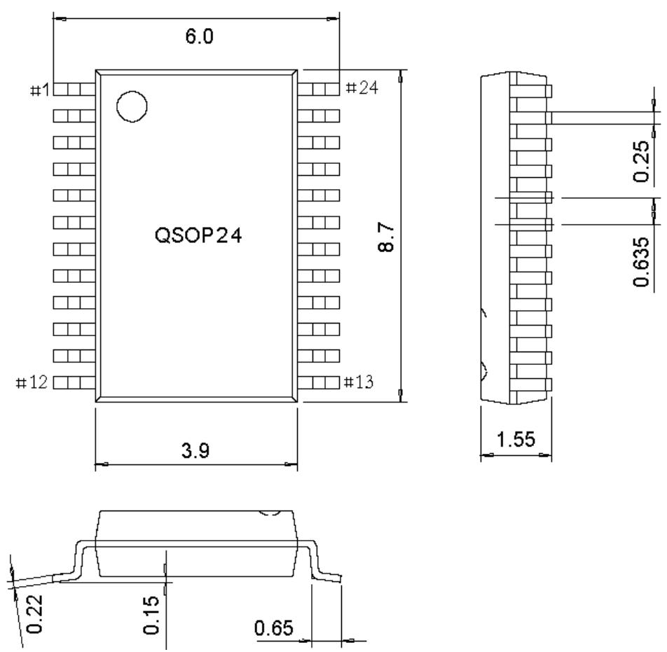

# 8.9. SOT363 (SC70-6L)

下图是 SOT363（SC70-6L）封装尺寸。  

<table><tr><td rowspan=2 colspan=1>符号</td><td rowspan=1 colspan=3>公制，单位为mm</td><td rowspan=1 colspan=3>英制，单位为mil</td></tr><tr><td rowspan=1 colspan=1>Min</td><td rowspan=1 colspan=1>Type</td><td rowspan=1 colspan=1>Max</td><td rowspan=1 colspan=1>Min</td><td rowspan=1 colspan=1>Type</td><td rowspan=1 colspan=1>Max</td></tr><tr><td rowspan=1 colspan=1>A</td><td rowspan=1 colspan=1>0.9</td><td rowspan=1 colspan=1>1. 0</td><td rowspan=1 colspan=1>1. 1</td><td rowspan=1 colspan=1>35</td><td rowspan=1 colspan=1>39</td><td rowspan=1 colspan=1>43</td></tr><tr><td rowspan=1 colspan=1>A1</td><td rowspan=1 colspan=1>0.0</td><td rowspan=1 colspan=1>0.05</td><td rowspan=1 colspan=1>0.1</td><td rowspan=1 colspan=1>0</td><td rowspan=1 colspan=1>2</td><td rowspan=1 colspan=1>4</td></tr><tr><td rowspan=1 colspan=1>b</td><td rowspan=1 colspan=1>0.15</td><td rowspan=1 colspan=1>0.25</td><td rowspan=1 colspan=1>0.35</td><td rowspan=1 colspan=1>6</td><td rowspan=1 colspan=1>10</td><td rowspan=1 colspan=1>14</td></tr><tr><td rowspan=1 colspan=1>C</td><td rowspan=1 colspan=1>0.08</td><td rowspan=1 colspan=1>0.12</td><td rowspan=1 colspan=1>0. 15</td><td rowspan=1 colspan=1>3</td><td rowspan=1 colspan=1>5</td><td rowspan=1 colspan=1>6</td></tr><tr><td rowspan=1 colspan=1>D</td><td rowspan=1 colspan=1>2.0</td><td rowspan=1 colspan=1>2.1</td><td rowspan=1 colspan=1>2.2</td><td rowspan=1 colspan=1>79</td><td rowspan=1 colspan=1>83</td><td rowspan=1 colspan=1>87</td></tr><tr><td rowspan=1 colspan=1>E</td><td rowspan=1 colspan=1>1. 15</td><td rowspan=1 colspan=1>1. 25</td><td rowspan=1 colspan=1>1. 35</td><td rowspan=1 colspan=1>45</td><td rowspan=1 colspan=1>49</td><td rowspan=1 colspan=1>53</td></tr><tr><td rowspan=1 colspan=1>E1</td><td rowspan=1 colspan=1>2. 15</td><td rowspan=1 colspan=1>2.3</td><td rowspan=1 colspan=1>2. 45</td><td rowspan=1 colspan=1>85</td><td rowspan=1 colspan=1>91</td><td rowspan=1 colspan=1>96</td></tr><tr><td rowspan=1 colspan=1>e</td><td rowspan=1 colspan=1></td><td rowspan=1 colspan=1>0.65</td><td rowspan=1 colspan=1></td><td rowspan=1 colspan=1></td><td rowspan=1 colspan=1>26</td><td rowspan=1 colspan=1></td></tr><tr><td rowspan=1 colspan=1>L</td><td rowspan=1 colspan=1></td><td rowspan=1 colspan=1>0.53</td><td rowspan=1 colspan=1></td><td rowspan=1 colspan=1></td><td rowspan=1 colspan=1>21</td><td rowspan=1 colspan=1></td></tr><tr><td rowspan=1 colspan=1>L1</td><td rowspan=1 colspan=1>0.25</td><td rowspan=1 colspan=1>0. 35</td><td rowspan=1 colspan=1>0.45</td><td rowspan=1 colspan=1>10</td><td rowspan=1 colspan=1>14</td><td rowspan=1 colspan=1>18</td></tr><tr><td rowspan=1 colspan=1>0</td><td rowspan=1 colspan=1>0°</td><td rowspan=1 colspan=1></td><td rowspan=1 colspan=1>8°</td><td rowspan=1 colspan=1>0°</td><td rowspan=1 colspan=1></td><td rowspan=1 colspan=1>8°</td></tr></table>

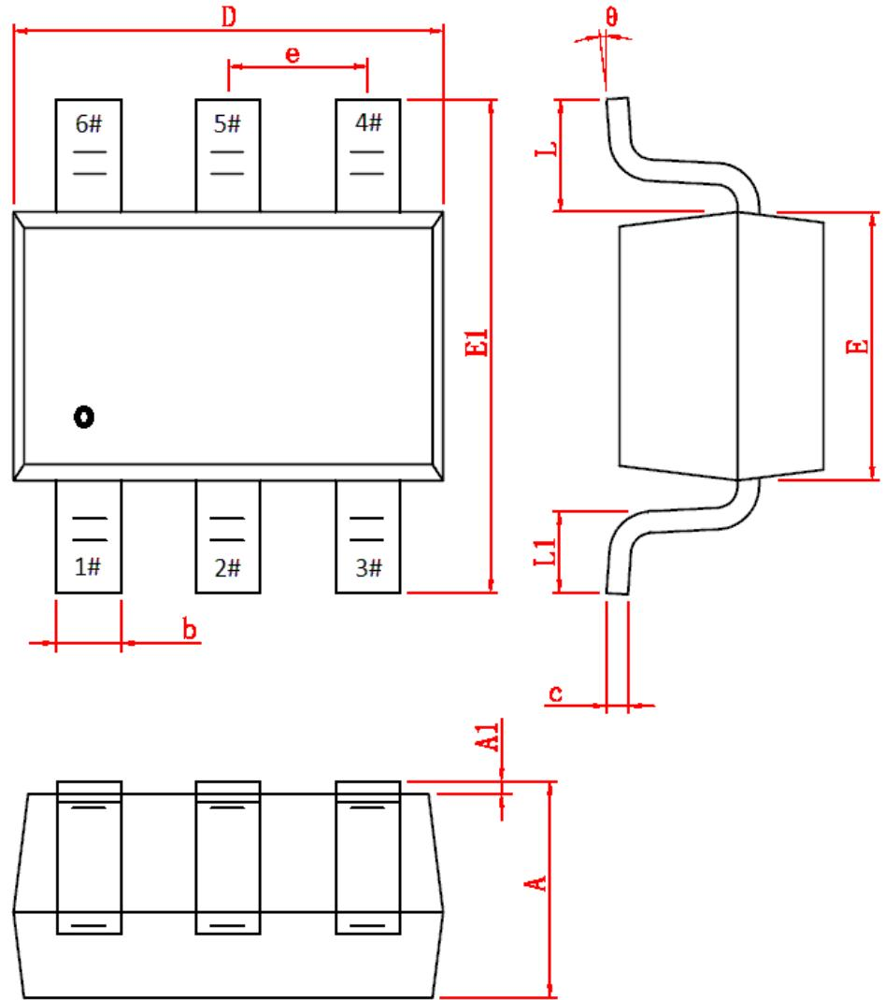

# 8.10. DFN6-1.2X1.2

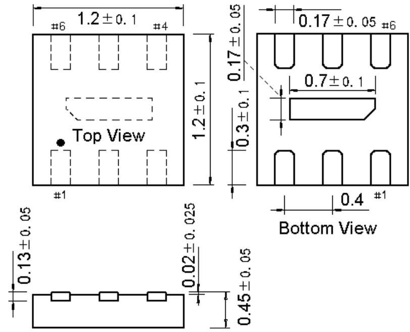

CH443L正面印字仅有代号43。