# Technical Reference

# Preface... 11

# Introduction .. 12

# Protections .. 13

2.1 Introduction.. 13   
2.2 Cell Undervoltage Protection . 13   
2.3 Cell Undervoltage Compensated Protection. 13   
2.4 Cell Overvoltage Protection ..... 14   
2.5 Overcurrent in Charge Protection .. 15   
2.6 Overcurrent in Discharge Protection... 15   
2.7 Hardware-Based Protection.... 16   
2.7.1 Overload in Discharge Protection . 17   
2.7.2 Short Circuit in Charge Protection .... 17   
2.7.3 Short Circuit in Discharge Protection . 18   
2.8 Temperature Protections .... 18   
2.9 Overtemperature in Charge Protection. 19   
2.10 Overtemperature in Discharge Protection... 19   
2.11 Overtemperature FET Protection... 19   
2.12 Undertemperature in Charge Protection . 20   
2.13 Undertemperature in Discharge Protection . 20   
2.14 SBS Host Watchdog Protection .... 20   
2.15 Precharge Timeout Protection... 20   
2.16 Fast Charge Timeout Protection . 21   
2.17 Overcharge Protection.... 21   
2.18 OverChargingVoltage() Protection . 22   
2.19 OverChargingCurrent() Protection ... 2222   
2.20 OverPreChargingCurrent() Protection .

# Permanent Fail. 24

# 3.1 Introduction..... 24

3.1.1 Black Box Recorder....... 2525   
3.2 Safety Cell Undervoltage Permanent Fail...   
3.2.1 SUV Check Option .. 2525   
3.3 Safety Cell Overvoltage Permanent Fail ..   
3.4 Safety Overcurrent in Charge Permanent Fail . 2626   
3.5 Safety Overcurrent in Discharge Permanent Fail ...   
3.6 Safety Overtemperature Cell Permanent Fail . 2626   
3.7 Safety Overtemperature FET Permanent Fail.   
3.8 QMax Imbalance Permanent Fail ..... 27   
3.9 Cell Balancing Permanent Fail . 2727   
3.10 Impedance Permanent Fail .   
3.11 Capacity Degradation Permanent Fail.. 2828   
3.12 Voltage Imbalance At Rest Permanent Fail   
3.13 Voltage Imbalance Active Permanent Fail ... 2828   
3.14 Charge FET Permanent Fail....   
3.15 Discharge FET Permanent Fail.. 29   
3.16 Chemical Fuse Permanent Fail..... 29

#

3.17 AFE Register Permanent Fail.... 29   
3.18 AFE Communication Permanent Fail.. 29   
3.19 PTC Permanent Fail ..... 30   
3.20 Second Level Protection Permanent Fail .... 30   
3.21 Instruction Flash (IF) Checksum Permanent Fail .... 30   
3.22 Data Flash (DF) Permanent Fail . 31   
3.23 Open Thermistor Permanent Fail (TS1, TS2, TS3, TS4) .. 31   
Advanced Charge Algorithm... 33   
4.1 Introduction..... 3333   
4.2 Charge Temperature Ranges.....   
4.3 Voltage Range.... 34   
4.3.1 RelativeStateofCharge() Range ... 35   
4.3.2 Cell Overvoltage Latch Permanent Failure ..... 35   
4.4 Charging Current .... 35   
4.5 Charging Voltage ........ 36   
4.6 Valid Charge Termination .. 36   
4.7 Charge and Discharge Termination Flags . 37   
4.8 Terminate Charge and Discharge Alarms... 38   
4.9 Precharge .... 39   
4.10 Maintenance Charge....... 39   
4.11 Charge Control SMBus Broadcasts.. 39   
4.12 Charge Disable and Discharge Disable . 40   
4.13 Charge Inhibit .... 40   
4.14 Charge Suspend ... 41   
4.15 ChargingVoltage() Rate of Change ..... 41   
4.16 ChargingCurrent() Rate of Change .. 41   
4.17 Charging Loss Compensation .... 42   
4.18 Cycle Count/SOH Based Degradation of Charging Voltage and Current.. 42   
4.18.1 Cycle Count Based Degradation .... 42   
4.18.2 SOH Based Degradation. 42   
4.18.3 Charging Voltage Degradation Process. 43   
4.18.4 Optional Charging Current Degradation.. 43   
4.18.5 Charging Current Degradation Process 43   
4.19 Compensation for IR Drop in BMU.... 44   
4.20 Cell Swelling Control (via Charging Voltage Degradation) .. 44

# Power Modes ... 46

5.1 Introduction..... 46   
5.2 NORMAL Mode. 46   
5.2.1 BATTERY PACK REMOVED Mode/System Present Detection . 46   
5.3 SLEEP Mode.... 46   
5.3.1 Device Sleep.... 46   
5.3.2 IN SYSTEM SLEEP Mode 47   
5.3.3 ManufacturerAccess() MAC Sleep .. 48   
5.3.4 Wake Function.. 48   
5.4 SHUTDOWN Mode .... 48   
5.4.1 VOLTAGE BASED SHUTDOWN . 48   
5.4.2 ManufacturerAccess() MAC Shutdown... 49   
5.4.3 Time Based Shutdown .. 49   
5.4.4 Power Save Shutdown ... 49   
5.5 Option to Manage Unintended Wakeup from Shutdown.. 50   
5.6 Emergency FET Shutdown (EMSHUT) 50   
5.6.1 Enter Emergency FET Shutdown Through SHUTDN . 51   
5.6.2 Enter Emergency FET Shutdown Through MFC...... 51

#

# 5.6.3 Exit Emergency FET Shutdown ... 51

# auging . 52

# 6.1 Introduction.... 52

6.2 Impedance Track Configuration .... 5253   
6.3 Gas Gauge Modes .   
6.4 QMax and Ra ...... 55   
6.4.1 QMax Initial Values ... 55   
6.4.2 QMax Update Conditions.... 56   
6.4.3 Fast Qmax Update Conditions .. 56   
6.4.4 QMax and Fast Qmax Update Boundary Check ... 57   
6.4.5 Ra Table Initial Values....... 57   
6.4.6 Ra Table Update Conditions... 58   
6.4.7 Application of Resistance Scaling.. 58   
6.5 FullChargeCapacity(FCC), RemainingCapacity(RemCap), and RelativeStateOfCharge(RSOC) . 58   
6.6 Impedance Track Configuration Options ..... 58   
6.7 State-of-Health (SOH) 61   
6.8 TURBO Mode 2.0 .. 61   
6.9 Battery Trip Point (BTP) .... 62   
6.10 Cell Interconnect IR Compensation Scheme (to Prevent Premature Cell EDV Detection).... 62   
6.11 RSOC Rounding Option..... 64

# Cell Balancing.. 65

7.1 Introduction......... 65   
7.2 Cell Balancing Setup..... 66   
7.3 Balancing Multiple Cells . 69   
7.4 Cell Balancing Operation... 69

# LED Display.... 72

# 8.1 Introduction..... 72

8.1.1 LED Display of State-of-Charge.. 72   
8.1.2 LED Display of PF Error Code ... 727373   
8.1.3 LED Display on Exit of a Reset...   
8.1.4 LED Display Control Through ManufacturerAccess() .   
8.1.5 LED Operation Under CUV Conditions...   
8.1.6 LED Blinking Option for State of Charge...... 74

# IATA Support ... 75

9.1 Initiating IATA Shutdown (Before Shipping) . 7575   
9.2 After Wakeup (Charging Is Connected for a Short Period to Wake) .

# Lifetime Data Collection . 77

# 10.1 Description .. 77

# Device Security ... 79

11.1 Introduction...... 7979   
11.2 SHA-1 Description...   
11.3 HMAC Description... 79   
11.4 Authentication..... 79   
11.5 Security Modes .... 80   
11.5.1 FULL ACCESS or UNSEALED to SEALED . 80   
11.5.2 SEALED to UNSEALED..... 80   
11.5.3 UNSEALED to FULL ACCESS...... 80

# 12 Manufacture Production..... 81

# 12.1 Manufacture Testing ........ 81

# 12.2 Calibration . 81

12.2.1 Calibration Data Flash.. 82

# 13 Device SMBus Address..... ....................................... 90

14 SBS Commands ............ ................................... 91   
14.1 0x00 ManufacturerAccess() and 0x44 ManufacturerBlockAccess() ................................................. 91   
14.1.1 ManufacturerAccess() 0x0000...... ............................................................ 93   
14.1.2 ManufacturerAccess() 0x0001 Device Type... ..................................................... 93   
14.1.3 ManufacturerAccess() 0x0002 Firmware Version............................................................ 93   
14.1.4 ManufacturerAccess() 0x0003 Hardware Version ... ................................... .... 94   
14.1.5 ManufacturerAccess() 0x0004 Instruction Flash Signature. .................................. 94   
14.1.6 ManufacturerAccess() 0x0005 Static DF Signature .... ........................................... .... 94   
14.1.7 ManufacturerAccess() 0x0006 Chemical ID ..... ........................................................ 94   
14.1.8 ManufacturerAccess() 0x0008 Static Chem DF Signature ................................................. 94   
14.1.9 ManufacturerAccess() 0x0009 All DF Signature ............................................................. 94   
14.1.10 ManufacturerAccess() 0x0010 SHUTDOWN Mode .... ................................................. 94   
14.1.11 ManufacturerAccess() 0x0011 SLEEP Mode .... ....................................................... 94   
14.1.12 ManufacturerAccess() 0x0013 AutoCCOffset............................................................... 95   
14.1.13 ManufacturerAccess() 0x001D Fuse Toggle ................................................................ 95   
14.1.14 ManufacturerAccess() 0x001E PCHG FET Toggle ........................................................ 95   
14.1.15 ManufacturerAccess() 0x001F CHG FET Toggle . .................................................... 95   
14.1.16 ManufacturerAccess() 0x0020 DSG FET Toggle.... ................................................... 9595   
14.1.17 ManufacturerAccess() 0x0021 Gauging ... .......................................   
14.1.18 ManufacturerAccess() 0x0022 FET Control. ....................................... 96   
14.1.19 ManufacturerAccess() 0x0023 Lifetime Data Collection.... ....................................... ..... 96   
14.1.20 ManufacturerAccess() 0x0024 Permanent Failure ...... .................................................. 96   
14.1.21 ManufacturerAccess() 0x0025 Black Box Recorder ....................................................... 96   
14.1.22 ManufacturerAccess() 0x0026 Fuse .......... ....................................................... 96   
14.1.23 ManufacturerAccess() 0x0027 LED DISPLAY Enable.... .............................................. 96   
14.1.24 ManufacturerAccess() 0x0028 Lifetime Data Reset..... .................................................. 97   
14.1.25 ManufacturerAccess() 0x0029 Permanent Fail Data Reset............................................... 97   
14.1.26 ManufacturerAccess() 0x002A Black Box Recorder Reset ............................................... 97   
14.1.27 ManufacturerAccess() 0x002B LED TOGGLE.............................................................. 97   
14.1.28 ManufacturerAccess() 0x002C LED DISPLAY PRESS .............................................. 97   
14.1.29 ManufacturerAccess() 0x002D CALIBRATION Mode . ........................................... 97   
14.1.30 ManufacturerAccess() 0x002E Lifetime Data Flush... ………………………………… 97   
14.1.31 ManufacturerAccess() 0x002F Lifetime Data SPEED UP Mode . ........................... .... 97   
14.1.32 ManufacturerAccess() 0x0030 Seal Device ... ................................... .... 97   
14.1.33 ManufacturerAccess() 0x0035 Security Keys....... ..................................................... 97   
14.1.34 ManufacturerAccess() 0x0037 Authentication Key ......................................................... 98   
14.1.35 ManufacturerAccess() 0x0041 Device Reset ............................................................... 98   
14.1.36 ManufacturerAccess() 0x0050 SafetyAlert ....... ........................................................... 99   
14.1.37 ManufacturerAccess() 0x0051 SafetyStatus.......................................................... 101   
14.1.38 ManufacturerAccess() 0x0052 PFAlert..... .................................................... 103   
14.1.39 ManufacturerAccess() 0x0053 PFStatus............................................................... 105   
14.1.40 ManufacturerAccess() 0x0054 OperationStatus .......................................................... 107   
14.1.41 ManufacturerAccess() 0x0055 ChargingStatus .......................................................... 109   
14.1.42 ManufacturerAccess() 0x0056 GaugingStatus ..... ................................................ 111   
14.1.43 ManufacturerAccess() 0x0057 ManufacturingStatus ... ...................................... 113   
14.1.44 ManufacturerAccess() 0x0058 AFE Register... ................................... 114   
14.1.45 ManufacturerAccess() 0x005A NoLoadRemCap ..... ......................................... .... 114   
14.1.46 ManufacturerAccess() 0x0060 Lifetime Data Block 1 ..... ............................................... 115   
14.1.47 ManufacturerAccess() 0x0061 Lifetime Data Block 2 .... ............................................... 115   
14.1.48 ManufacturerAccess() 0x0062 Lifetime Data Block 3 .................................................... 116   
14.1.49 ManufacturerAccess() 0x0063 Lifetime Data Block 4 .... ........................................... 116   
14.1.50 ManufacturerAccess() 0x0064 Lifetime Data Block 5 ... ........................................... 116

www.ti.com 14.1.51 ManufacturerAccess() 0x0070 ManufacturerInfo ......................................................... 117 14.1.52 ManufacturerAccess() 0x0071 DAStatus1 ................................................................. 117 14.1.53 ManufacturerAccess() 0x0072 DAStatus2 ................................................................. 118 14.1.54 ManufacturerAccess() 0x0073 GaugeStatus1............................................................. 118 14.1.55 ManufacturerAccess() 0x0074 GaugeStatus2............................................................. 119 14.1.56 ManufacturerAccess() 0x0075 GaugeStatus3............................................................. 119 14.1.57 ManufacturerAccess() 0x0076 CBStatus .................................................................. 120 14.1.58 ManufacturerAccess() 0x0077 State-of-Health............................................................ 120 14.1.59 ManufacturerAccess() 0x0078 FilterCapacity ............................................................. 120 14.1.60 ManufacturerAccess() 0x0079 RSOC_WRITE ............................................................ 121 14.1.61 ManufacturerAccess() 0x007A ManufacturerInfoB ....................................................... 121 14.1.62 ManufacturerAccess() 0x00F0 IATA_SHUTDOWN ...................................................... 121 14.1.63 ManufacturerAccess() 0x00F1 IATA_RM .................................................................. 121 14.1.64 ManufacturerAccess() 0x00F2 IATA_FCC................................................................. 121 14.1.65 ManufacturerAccess() 0x0F00 ROM Mode ................................................................ 121 14.1.66 ManufacturerAccess() 0x3008 WRITE_TEMP . .... ...................................................... 121 14.1.67 0x4000–0x5FFF Data Flash Access()........ .................................................. 122 14.1.68 ManufacturerAccess() 0xF080 Exit Calibration Output Mode ........................................... 122 14.1.69 ManufacturerAccess() 0xF081 Output CCADC Cal ...................................................... 122123 14.1.70 ManufacturerAccess() 0xF082 Output Shorted CCADC Cal ............................................   
14.2 0x01 RemainingCapacityAlarm() ..................... .................................................. 124   
14.3 0x02 RemainingTimeAlarm()..... ................................................................................. 124   
14.4 0x03 BatteryMode()....... ................................................................................. 124   
14.5 0x04 AtRate()........ ................................................................................... 125   
14.6 0x05 AtRateTimeToFull() ... ....................................................................................... 125   
14.7 0x06 AtRateTimeToEmpty().... ................................................................................... 125   
14.8 14.9 0x07 AtRateOK()......0x08 Temperature() .. .......................................................................................... 126126   
14.10 0x09 Voltage() ..... ........................................................................................... 126   
14.11 0x0A Current() ..............14.12 0x0B AverageCurrent() .... .............................................................................................. ..............................................................................................   
14.13 0x0C MaxError() ......... ...............................................................................   
14.14 0x0D RelativeStateOfCharge() . ............................................................................   
14.15 0x0E AbsoluteStateOfCharge()..... ...........................................................................   
14.16 0x0F RemainingCapacity() ..... ............................................................................   
14.17 0x10 FullChargeCapacity().... .............................................................................   
14.18 0x11 RunTimeToEmpty()...... ............................................................................ 128   
14.19 0x12 AverageTimeToEmpty().................................................................................... 128   
14.20 0x13 AverageTimeToFull() .....14.21 0x14 ChargingCurrent()......... ................................................................................ 128129129   
14.22 0x15 ChargingVoltage() ..... .................................................................................   
14.23 0x16 BatteryStatus() ....... .................................................................................. 129   
14.24 0x17 CycleCount().......... ................................................................................... 130   
14.25 0x18 DesignCapacity()............................................................................................ 130   
14.26 0x19 DesignVoltage() .......14.27 0x1A SpecificationInfo() .... ................................................................................... ......................................................................................   
14.28 0x1B ManufacturerDate()................................................................................................   
14.29 0x1C SerialNumber().....................................................................................................   
14.30 0x20 ManufacturerName() .................. ...................................................................   
14.31 0x21 DeviceName() .......................... ....................................................................   
14.32 0x22 DeviceChemistry() .............................................................................................   
14.33 0x23 ManufacturerData() .............................................................................................   
14.34 0x2F Authenticate() ...................................................................................................... 132

#

14.35 0x3C CellVoltage4().. 132   
14.36 0x3D CellVoltage3(). 133   
14.37 0x3E CellVoltage2().. 133   
14.38 0x3F CellVoltage1() .. 133   
14.39 0x4A BTPDischargeSet(). 133   
14.40 0x4B BTPChargeSet() . 133   
14.41 0x4F State-of-Health (SOH).. 134   
14.42 0x50 SafetyAlert .... 134   
14.43 0x51 SafetyStatus . 134   
14.44 0x52 PFAlert ..... 134   
14.45 0x53 PFStatus ...... 134   
14.46 0x54 OperationStatus.. 134   
14.47 0x55 ChargingStatus... 135   
14.48 0x56 GaugingStatus .... 135   
14.49 0x57 ManufacturingStatus.. 135   
14.50 0x58 AFE Register ... 135   
14.51 0x59 MaxTurboPwr().... 135   
14.52 0x5A SusTurboPwr()..... 135   
14.53 0x5B TURBO_PACK_R .. 136   
14.54 0x5C TURBO_SYS_R ... 136   
14.55 0x5D TURBO_EDV . 136   
14.56 0x5E MaxTurboCurr().... 136   
14.57 0x5F SusTurboCurr() ....... 136   
14.58 0x60 Lifetime Data Block 1. 136   
14.59 0x61 Lifetime Data Block 2.. 137   
14.60 0x62 Lifetime Data Block 3.... 137   
14.61 0x63 Lifetime Data Block 4.. 137   
14.62 0x64 Lifetime Data Block 5.. 137   
14.63 0x70 ManufacturerInfo ..... 137   
14.64 0x71 DAStatus1 .. 137   
14.65 0x72 DAStatus2 .... 138   
14.66 0x73 GaugeStatus1 .... 138   
14.67 0x74 GaugeStatus2 . 138   
14.68 0x75 GaugeStatus3 . 138   
14.69 0x76 CBStatus ....... 138   
14.70 0x77 State-of-Health . 139   
14.71 0x78 FilteredCapacity.... 139

# 5 Data Flash Values ... 140

# 15.1 Data Formats ...... 140

15.1.1 Unsigned Integer.. 140   
15.1.2 Integer ... 140   
15.1.3 Floating Point.. 140   
15.1.4 Hex ... 141   
15.1.5 String . 141   
15.2.1 Configuration ... 141   
15.2.2 Fuse . 155   
15.2.3 BTP .... 158   
15.2.4 Protection . 158   
15.2.5 Permanent Failure .. 161   
15.2.6 AFE .. 164   
15.2.7 ZVCHG Exit Threshold.. 165

15.3 Manufacturing . 165

#

15.3.1 Manufacturing Status Init ................................................................................... ... 165   
15.4 Advanced Charging Algorithm .......................................................................................... 166   
15.4.1 Temperature Ranges........................................................................................... 166   
15.4.2 Low Temp Charging ............................................................................................ 167   
15.4.3 Standard Temp Low Charging ................................................................................ 167   
15.4.4 Standard Temp High Charging ............................................................................... 168   
15.4.5 High Temp Charging ........................................................................................... 169   
15.4.6 Rec Temp Charging ............................................................................................ 169   
15.4.7 PreCharging ..................................................................................................... 170   
15.4.8 Maintenance Charging ......................................................................................... 170   
15.4.9 Voltage Range ...... .................................................................................... 170   
15.4.10 Termination Config ...... .................................................................................... 171   
15.4.11 Charging Rate of Change ...... ..................................................................... 172   
15.4.12 Charge Loss Compensation ................................................................................. 172   
15.4.13 Cell Balancing Config ......................................................................................... 172   
15.4.14 Degrade Mode 1 .............................................................................................. 174   
15.4.15 Degrade Mode 2 .............................................................................................. 175   
15.4.16 Degrade Mode 3 .............................................................................................. 175   
15.4.17 IR Correction................................................................................................... 176   
15.4.18 CS Degrade .................................................................................................... 176   
15.5 Power....................................................................................................................... 177   
15.5.2 15.5.1 Power............................................................................................................. 177 Shutdown ........................................................................................................ 178   
15.5.3 Sleep ............................................................................................................. 178   
15.5.4 Ship ............ .................................................................................................. 179   
15.5.5 Power Off ........................................................................................................ 180   
15.5.6 Manual FET Control ............................................................................................ 180   
15.5.7 IATA .............................................................................................................. 180   
15.5.8 IATA STORE .................................................................................................... 182   
15.5.9 Unintended Wakeup............................................................................................ 183   
15.6 LED Support........ ............................................................................................ 183   
15.6.1 LED Config . ................................................................................................ 183   
15.7 System Data............................................................................................................... 186   
15.7.1 Manufacturer Info ............................................................................................... 186   
15.7.2 Static DF Signature........... .................................................................................. 186   
15.7.3 Static Chem DF ................................................................................................. 186   
15.7.4 All DF Signature ................................................................................................ 186   
15.8 Lifetimes ......... 15.8.1 Voltage ........................................................................................................... 186 .................................................................................................. 186   
15.8.2 Current ........................................................................................................... 188   
15.8.3 Temperature..................................................................................................... 188   
15.8.4 Safety Events ................................................................................................... 189   
15.8.5 Charging Events ................................................................................................ 193   
15.8.6 Gauging Events ................................................................................................. 193   
15.8.7 Power Events ................................................................................................... 194   
15.8.8 Cell Balancing ................................................................................................... 194   
15.8.9 Time .............. .............................................................................................. 195   
15.9 196   
15.9.1 CUV—Cell Undervoltage ............................................................................... • . •• 196   
15.9.2 CUVC—Cell Undervoltage .................................................................................... 196   
15.9.3 COV—Cell Overvoltage........................................................................................ 197   
15.9.4 OCC1—Overcurrent In Charge 1............................................................................. 199   
15.9.5 OCC2—Overcurrent In Charge 2............................................................................. 199   
15.9.6 OCC—Overcurrent In Charge Recovery ...... 200   
15.9.7 OCD1—Overcurrent In Discharge 1 . 200   
15.9.8 OCD2—Overcurrent In Discharge 2 . 200   
15.9.9 OCD—Overcurrent In Discharge Recovery . 201   
15.9.10 AOLD—Overload in Discharge... ... 201   
15.9.11 ASCC—Short Circuit In Charge. …… 202   
15.9.12 ASCD—Short Circuit in Discharge..... ....................... ……………………… .... 203   
15.9.13 OTC—Overtemperature in Charge . ... .................................................................... 204   
15.9.14 OTD—Overtemperature in Discharge ...................................................................... 205   
15.9.15 OTF—Overtemperature FET ................................................................................ 205   
15.9.16 UTC—Undertemperature in Charge . .. ................................................................. 206   
15.9.17 UTD—Undertemperature in Discharge... ........................................................... 206   
15.9.18 HWD—Host Watchdog ..... .......................................................... •• 207   
15.9.19 PTO—PreCHARGE mode Time Out ....................................................................... 207   
15.9.20 CTO—Fast Charge Mode Time Out ........................................................................ 207   
15.9.21 OC—Overcharge........ .............................................................. 208   
15.9.22 CHGV—ChargingVoltage .................................................................................... 209   
15.9.23 CHGC—ChargingCurrent ..... .................................................................. •• 209   
15.9.24 PCHGC—Pre-ChargingCurrent . ................................................................ 210   
15.10 Permanent Fail.... ....................................................................... 210   
15.10.1 SUV—Safety Cell Undervoltage ....................................................................... 210   
15.10.2 SOV—Safety Cell Overvoltage..... ..................................................................... 211   
15.10.3 SOCC—Safety Overcurrent in Charge ..................................................................... 211   
15.10.4 SOCD—Safety Overcurrent in Discharge.. ......................................................... 211   
15.10.5 SOT—Overtemperature Cell... ..................................................... 212   
15.10.6 SOTF—Overtemperature FET.. ....................................................... 212   
15.10.7 Open Thermistor—NTC Thermistor Failure ............................................................... 212   
15.10.8 QIM—QMax Imbalance ......... ..................................................................... 213   
15.10.9 CB—Cell Balance ...... .......................................................... 213   
15.10.10 VIMR—Voltage Imbalance At Rest........................................................................ 214   
15.10.11 VIMA—Voltage Imbalance Active ..... .............................................................. 215   
15.10.12 IMP—Impedance Imbalance . ........................................................... 215   
15.10.13 CD—Capacity Degradation..... ................................................................. ... 216   
15.10.14 CFET—CHG FET Failure . ....................................................................... 216   
15.10.15 DFET—DFET Failure ....................................................................................... 216   
15.10.16 FUSE—FUSE Failure ....................................................................................... 217   
15.10.17 AFER—AFE Register ....................................................................................... 217   
15.10.18 AFEC—AFE Communication.... .................................................................... 218   
15.10.19 2LVL—2nd Level OV... .......................................................................... 218   
15.11 PF Status ..... ................................................................................ 218   
15.11.1 Device Status Data ........................................................................................... 218   
15.11.2 Device Voltage Data (at the Time of PF Event)... ................................................. 222   
15.11.3 Device Current Data ........ ........................................................... 223   
15.11.4 Device Temperature Data (at the Time of PF Event) .................................................... 223   
15.11.5 Device Gauging Data (at the Time of PF Event).. ...................................... 224   
15.11.6 AFE Regs ........ .................................................... 225   
15.12 Black Box .. ................................................................................ 228   
15.12.1 Safety Status................................................................................................... 228   
15.12.2 PF Status ....................................................................................................... 228   
15.13 Gas Gauging .............................................................................................................. 229   
15.13.1 Current Thresholds.... ................................................................ 229   
15.13.2 Design ... .................................................................................... 230   
15.13.3 Cycle ............................................................................................................ 230

#

15.13.4 FD . 230   
15.13.5 FC . 231   
15.13.6 TD ..... ......................................................................... ............ 232   
15.13.7 TC .. 232   
15.13.8 State ....... ............... 233   
15.13.9 Cycle Count ..... 236   
15.13.10 IT Config ..... 236   
15.13.11 Condition Flag.... 242   
15.13.12 Max Error ............................. 242   
15.13.13 SOH ........ 243   
15.13.14 Turbo Cfg ... 243   
15.14 RA Table........ 244   
15.14.1 R_a0 ... 244   
15.14.2 R_a1 . ....................... 245   
15.14.3 R_a2 .. 245   
15.14.4 R_a3 .... ....................................... 246   
15.14.5 R_a0x .... ................................. 247   
15.14.6 R_a1x ..... ....................................... 248   
15.14.7 R_a2x ... 248   
15.14.8 R_a3x ..... ......................................... 249   
15.15 SBS Configuration... 250   
15.15.1 Data .......... ……………………………………………………… 250   
15.16 Data Flash Summary ................... 253

# AFE Threshold and Delay Settings..... 271

A.1 Overload in Discharge Protection (AOLD)....... 271   
A.2 Short Circuit in Charge (ASCC).... 272   
A.3 Short Circuit in Discharge (ASCD1 and ASCD2). 272

# Sample Filter Settings ...... 274

Revision History .... 275

# Read this First

This manual discusses the bq40z50-R2 device's modules and peripherals, and how each is used to build a complete battery pack gas gauge and protection solution. See the bq40z50-R2 1-Series to 4-Series LiIon Battery Pack Manager data sheet (SLUSCS4) for bq40z50-R2 electrical specifications.

# Notational Conventions

The following notation is used if SBS commands and data flash values are mentioned within a text block:

SBS Commands: italics with parentheses and no breaking spaces; for example, RemainingCapacity() Data Flash: italics, bold, and breaking spaces; for example, Design Capacity Register Bits and Flags: italics and brackets; for example, [TDA] Data Flash Bits: italics and bold; for example, [LED1] Modes and States: ALL CAPITALS; for example, UNSEALED

The reference format for SBS commands is: SBS:Command Name(Command No.): Manufacturer Access(MA No.)[Flag]; for example:

SBS:Voltage(0x09), or SBS:ManufacturerAccess(0x00): Seal Device(0x0020)

# Trademarks

Impedance Track is a trademark of Texas Instruments.   
All other trademarks are the property of their respective owners.

# Definitions

A Battery Glossary is available at the Battery University on ti.com.

# Glossary

TI Glossary —This glossary lists and explains terms, acronyms, and definitions.

The bq40z50-R2 device provides a feature-rich gas gauging solution for 1-series cell to 4-series cell battery-pack applications. The bq40z50-R2 device has extended capabilities, including:

Low Power Modes – LOW POWER – SLEEP

• Full Array of Programmable Protection Features

Voltage – Current Temperature Charge Timeout CHG/DSG FETs Cell Imbalance

Sophisticated Charge Algorithms – JEITA – Advanced Charging Algorithm • Diagnostic Lifetime Data Monitor • Black Box Event Recorder • Supports Two-Wire SMBus v1.1 Interface • SHA-1 Authentication • Ultra-Compact Package: 32-Lead QFN

# 2.1 Introduction

The bq40z50-R2 provides recoverable protection. When the protection is triggered, charging and/or discharging is disabled. This is indicated by the OperationStatus $( ) [ X C H G ] = 1$ when charging is disabled, and/or the OperationStatus $( ) I X D S G ] = 1$ when discharging is disabled. Once the protection is recovered, charging and discharging resume. All protection items can be enabled or disabled under Settings:Enabled Protections A, Settings:Enabled Protections B, Settings:Enabled Protections C, and Settings:Enabled Protections D.

When the protections and permanent fails are triggered, the BatteryStatus()[TCA][TDA][FD][OCA][OTA] is set according to the type of safety protections. A summary of the set conditions of the various alarms flags is available in Section 4.8.

# 2.2 Cell Undervoltage Protection

The bq40z50-R2 device can detect cell undervoltage in batteries and protect cells from damage by preventing further discharge.

<table><tr><td rowspan=1 colspan=1>Status</td><td rowspan=1 colspan=1>Condition</td><td rowspan=1 colspan=1>Action</td></tr><tr><td rowspan=1 colspan=1>Normal</td><td rowspan=1 colspan=1>Min cell voltage1 ..4 &gt; CUV:Threshold</td><td rowspan=1 colspan=1>SafetyAlert()[CUV] = 0BatteryStatus([TDA] = 0</td></tr><tr><td rowspan=1 colspan=1>Alert</td><td rowspan=1 colspan=1>Min cell voltage1..4 ≤ CUV:Threshold</td><td rowspan=1 colspan=1>SafetyAlert()[CUV] = 1BatteryStatus()[TDA] = 1</td></tr><tr><td rowspan=1 colspan=1>Trip</td><td rowspan=1 colspan=1>Min cell voltage1.4 ≤ CUV:Threshold for CUV:Delay duration</td><td rowspan=1 colspan=1>SafetyAlert()[CUV] = 0SafetyStatus()[CUV] = 1BatteryStatus()[FD]= 1, [TDA] = 0OperationStatus()[XDSG] = 1</td></tr><tr><td rowspan=2 colspan=1>Recovery</td><td rowspan=1 colspan=1>Condition 1:SafetyStatus()[CUV] = 1 ANDMin cell voltage1..4 ≥ cUV:Recovery ANDProtection Configuration[CUV_RECOV_CHG] = 0</td><td rowspan=2 colspan=1>SafetyStatus()[CUV] = 0BatteryStatus([FD]= 0, [TDA] = 0OperationStatus()[XDSG] = 0</td></tr><tr><td rowspan=1 colspan=1>OR Condition 2:SafetyStatus()[CUV] = 1 ANDMin cell voltage1..4 ≥ cUV:Recovery ANDProtection Configuration[CUV_RECOV_CHG] = 1 ANDCharging detected (that is, BatteryStatus()[DSG] = 0)</td></tr></table>

# 2.3 Cell Undervoltage Compensated Protection

The bq40z50-R2 device can detect cell undervoltage in batteries and protect cells from damage by preventing further discharge. The protection is compensated by the Current() $\times$ Cell Resistance1..4.

<table><tr><td colspan="1" rowspan="1">Status</td><td colspan="1" rowspan="1">Condition</td><td colspan="1" rowspan="1">Action</td></tr><tr><td colspan="1" rowspan="1">Normal</td><td colspan="1" rowspan="1">Min cell voltage1 ..4 - Current() x Cell Resistance &gt;CUVC: Threshold</td><td colspan="1" rowspan="1">SafetyAlert()[CUVC] = 0BatteryStatus()[TDA] = 0</td></tr><tr><td colspan="1" rowspan="1">Alert</td><td colspan="1" rowspan="1">Min cell voltage1..4 - Current() x Cell Resistance ≤CUVC: Threshold</td><td colspan="1" rowspan="1">SafetyAlert()[CUVC] = 1BatteryStatus()[TDA] = 1</td></tr><tr><td colspan="1" rowspan="1">Trip</td><td colspan="1" rowspan="1">Min cell voltage1.4 - Current() x Cell Resistance ≤CUVC: Threshold for CUVC:Delay duration</td><td colspan="1" rowspan="1">SafetyAlert()[CUVC] = 0SafetyStatus()(CUVC]= 0BatteryStatus([FD] = 1, [TDA]= 0OperationStatus()[XDSG]= 1</td></tr><tr><td>Recovery</td><td>Condition 1: SafetyAlert()[CUVC] = 1 AND Min cell voltage1..4 - Current() x Cell Resistance &gt; CUVC: Recovery AND Protection Configuration[CUV_RECOV_CHG] = 0 OR Condition 2: SafetyAlert()[CUVC] = 1 AND Min cell voltage1..4 - Current() x Cell Resistance &gt;</td><td>SafetyStatus()[CUVC] = 0 BatteryStatus()[FD] = 0, [TDA] = 0 OperationStatus()[XDSG] = 0</td></tr></table>

# 2.4 Cell Overvoltage Protection

The bq40z50-R2 device can detect cell overvoltage in batteries and protect cells from damage by preventing further charging.

NOTE: The protection detection threshold may be influenced by the temperature settings of the advanced charging algorithm and the measured temperature. Additionally, this protection feature can be enabled to create a PF by setting the [COVL] bit in the Enabled PF A register.

<table><tr><td colspan="1" rowspan="1">Status</td><td colspan="1" rowspan="1">Condition</td><td colspan="1" rowspan="1">Action</td></tr><tr><td colspan="1" rowspan="1">Normal,ChargingStatus()[U] or [LT]= 1</td><td colspan="1" rowspan="1">Max cell voltage1..4 &lt; COV:Threshold Low Temp</td><td colspan="1" rowspan="5">SafetyAlert()([COV] = 0PFAler()[COVL]= 0Decrement COVL counter by oneafter each COV:Counter Dec Delayperiod if COVL counter &gt; 0</td></tr><tr><td colspan="1" rowspan="1">Normal,ChargingStatus()[STL]= 1</td><td colspan="1" rowspan="1">Max cell voltage1 ..4 &lt; COV:Threshold Standard Temp Low</td></tr><tr><td colspan="1" rowspan="1">Normal,ChargingStatus()[STH] = 1</td><td colspan="1" rowspan="1">Max cell voltage1 ..4 &lt; COV:Threshold Standard Temp High</td></tr><tr><td colspan="1" rowspan="1">Normal,ChargingStatus()[RT] = 1</td><td colspan="1" rowspan="1">Max cell voltage1..4 &lt; COV:Threshold Rec Temp</td></tr><tr><td colspan="1" rowspan="1">Normal,ChargingStatus()[HT] or []= 1</td><td colspan="1" rowspan="1">Max cell voltage1..4 &lt; COV:Threshold High Temp</td></tr><tr><td colspan="1" rowspan="1">Alert,ChargingStatus()[UT] or [LT] = 1</td><td colspan="1" rowspan="1">Max cell voltage1..4 ≥ CoV:Threshold Low Temp</td><td colspan="1" rowspan="5">SafetyAlert()[COV] = 1BatteryStatus()[TCA]= 1</td></tr><tr><td colspan="1" rowspan="1">Alert,ChargingStatus([STL]= 1</td><td colspan="1" rowspan="1">Max cell voltage1..4 ≥ COV:Threshold Standard Temp Low</td></tr><tr><td colspan="1" rowspan="1">Alert,ChargingStatus()[STH] = 1</td><td colspan="1" rowspan="1">Max cell voltage1.4 ≥ COV:Threshold Standard Temp High</td></tr><tr><td colspan="1" rowspan="1">Alert,ChargingStatus()[RT] = 1</td><td colspan="1" rowspan="1">Max cell voltage1..4 ≥ COV:Threshold Rec Temp</td></tr><tr><td colspan="1" rowspan="1">Alert,ChargingStatus()[HT] or []= 1</td><td colspan="1" rowspan="1">Max cell voltage1..4 ≥ COV:Threshold High Temp</td></tr><tr><td colspan="1" rowspan="1">Trip,Cart(  ]= 1</td><td colspan="1" rowspan="1">Max cell voltage1 ..4 ≥ COV:Threshold Low Temp forCOV:Delay duration</td><td colspan="1" rowspan="5">SafetyAlert()[COV] = 0SafetyStatus((COV] = 1BatteryStatus([TCA]= 0OperationStatus()[XCHG]= 1Increment COVL counter</td></tr><tr><td colspan="1" rowspan="1">Trip,ChargingStatus()[STL]= 1</td><td colspan="1" rowspan="1">Max cell voltage1..4 ≥ COV:Threshold Standard Temp Lowfor COV:Delay duration</td></tr><tr><td colspan="1" rowspan="1">Trip,ChargingStatus()[STH]= 1</td><td colspan="1" rowspan="1">Max cell voltage1.4 ≥ COV:Threshold Standard Temp Highfor COV:Delay duration</td></tr><tr><td colspan="1" rowspan="1">Trip,ChargingStatus()[RT] = 1</td><td colspan="1" rowspan="1">Max cell voltage1 ..4≥ COV:Threshold Rec Temp forCOV:Delay duration</td></tr><tr><td colspan="1" rowspan="1">Trip,ChargingStatus()HT] or []= 1</td><td colspan="1" rowspan="1">Max cell voltage1..4 ≥ COV:Threshold High Temp forCOV:Delay duration</td></tr><tr><td colspan="1" rowspan="1">Recovery,ChargingStatus()[UT] or [LT] = 1</td><td colspan="1" rowspan="1">SafetyStatus()[COV] = 1 ANDMax cell voltage1..4 ≤ cOV:Recovery Low Temp</td><td colspan="1" rowspan="5">SafetyStatus()[COV]= 0BatteryStatus()[TCA]= 0OperationStatus()[XCHG]= 0</td></tr><tr><td colspan="1" rowspan="1">Recovery,ChargingStatus()[STL]= 1</td><td colspan="1" rowspan="1">SafetyStatus()[COV] = 1 ANDMax cell voltage1 ..4 ≤ COV:Recovery Standard Temp Low</td></tr><tr><td colspan="1" rowspan="1">Recovery,ChargingStatus()[STH] = 1</td><td colspan="1" rowspan="1">SafetyStatus()[COV] = 1 ANDMax cell voltage1..4 ≤ COV:Recovery Standard Temp High</td></tr><tr><td colspan="1" rowspan="1">Recovery,ChargingStatus()[RT] = 1</td><td colspan="1" rowspan="1">SafetyStatus()[COV] = 1 ANDMax cell voltage1.4 ≤ cOV:Recovery Rec Temp</td></tr><tr><td colspan="1" rowspan="1">Recovery,ChargingStatus()[HT] or [0T] = 1</td><td colspan="1" rowspan="1">SafetyStatus()[COV] = 1 ANDMax cell voltage1 ..4 ≤ COV:Recovery High Temp</td></tr><tr><td colspan="1" rowspan="1">Latch Alert</td><td colspan="1" rowspan="1">COVL counter &gt; 0</td><td colspan="1" rowspan="1">SafetyAlert()[COVL] = 1 ifEnabledProtections[COVL] is set.PFAlert()[COVL] = 1 ifEnabledPF()[COVL] is set.</td></tr><tr><td colspan="1" rowspan="1">Latch Trip</td><td colspan="1" rowspan="1">COVL counter ≥ COV:Latch limit</td><td colspan="1" rowspan="1">SafetyStatus()[COVL]= 1 ifEnabledProtections[COVL] is setPFStatus([COVL]= 1 ifEnabledPF()[COVL] is set.PFAlert()[COVL] = 1SafetyAlert()[COVL] = 0OperationStatus()[XCHG]= 1</td></tr><tr><td colspan="1" rowspan="1">Latch Reset([NR]=0)</td><td colspan="1" rowspan="1">SafetyStatus()[COVL] = 1 AND DA Configuration[NR] = 0 ANDLow-high-low transition on PRES pin</td><td colspan="1" rowspan="1">SafetyStatus()[COVL] = 0Reset COVL counter.OperationStatus[XCHG] = 0 ifSafetyStatus()[COV] = 0</td></tr><tr><td colspan="1" rowspan="1">Latch Reset([NR]=1)</td><td colspan="1" rowspan="1">(SafetyStatus()[COVL] = 1 AND DA Configuration[NR]=1 forCOV:Reset time</td><td colspan="1" rowspan="1">SafetyStatus()[COVL] = 0Reset COVL counter.OperationStatus[XCHG] = 0 ifSafetyStatus()[COV] = 0</td></tr></table>

# 2.5 Overcurrent in Charge Protection

The bq40z50-R2 device has two independent overcurrent in charge protections that can be set to different current and delay thresholds to accommodate different charging behaviors.

<table><tr><td rowspan=1 colspan=1>Status</td><td rowspan=1 colspan=1>Condition</td><td rowspan=1 colspan=1>Action</td></tr><tr><td rowspan=1 colspan=1>Normal</td><td rowspan=1 colspan=1>Current() &lt; OCC1:Threshold</td><td rowspan=1 colspan=1>SafetyAlert()[OCC1]= 0</td></tr><tr><td rowspan=1 colspan=1>Normal</td><td rowspan=1 colspan=1>Current() &lt; OCC2:Threshold</td><td rowspan=1 colspan=1>SafetyAlert()[OCC2] = 0</td></tr><tr><td rowspan=1 colspan=1>Alert</td><td rowspan=1 colspan=1>Current() ≥ OCC1:Threshold</td><td rowspan=1 colspan=1>SafetyAlert()[OCC1]= 1.BatteryStatus()[TCÅ] = 1</td></tr><tr><td rowspan=1 colspan=1>Alert</td><td rowspan=1 colspan=1>Current() ≥ OCC2:Threshold</td><td rowspan=1 colspan=1>SafetyAlert([OCC2]= 1.BatteryStatus()[TCÅ] = 1</td></tr><tr><td rowspan=1 colspan=1>Trip</td><td rowspan=1 colspan=1>Current() continuous ≥ OCC1:Threshold for OCC1:Delayduration</td><td rowspan=1 colspan=1>SafetyAlert()[OCC1]= 0SafetyStatus()[0CC1]= 1BatteryStatus()[TCA] = 0Charging is not allowed.OperationStatus()[XCHG] = 1</td></tr><tr><td rowspan=1 colspan=1>Trip</td><td rowspan=1 colspan=1>Current() continuous ≥ OCC2:Threshold for OCC2:Delayduration</td><td rowspan=1 colspan=1>SafetyAlert()([OCC2] = 0SafetyStatus()[0CC2]= 1BatteryStatus()[TCA]= 0OperationStatus()[XCHG]= 1</td></tr><tr><td rowspan=1 colspan=1>Recovery</td><td rowspan=1 colspan=1>SafetyStatus()[OCC1]= 1 ANDCurrent() continuous ≤ OcC:Recovery Threshold forOCC:Recovery Delay time</td><td rowspan=1 colspan=1>SafetyStatus()[OCC1]= 0BatteryStatus()[TCA]= 0OperationStatus()[XCHG] = 0</td></tr><tr><td rowspan=1 colspan=1>Recovery</td><td rowspan=1 colspan=1>SafetyStatus()[OCC2]= 1 ANDCurrent() continuous ≤ OCC:Recovery Threshold forOCC:Recovery Delay time</td><td rowspan=1 colspan=1>SafetyStatus()[OCC2] = 0BatteryStatus()[TCA]= 0OperationStatus()[XCHG]= 0</td></tr></table>

# 2.6 Overcurrent in Discharge Protection

The bq40z50-R2 device has two independent overcurrent in discharge protections that can be set to different current and delay thresholds to accommodate different load behaviors. Additionally, this protection feature can be enabled to create a PF by setting the [OCDL] bit in Enabled PF C register.

<table><tr><td colspan="1" rowspan="1">Status</td><td colspan="1" rowspan="1">Condition</td><td colspan="1" rowspan="1">Action</td></tr><tr><td colspan="1" rowspan="1">Normal</td><td colspan="1" rowspan="1">Current() &gt; OCD1:Threshold</td><td colspan="1" rowspan="1">SafetyAlert()[OCD1]= 0SafetyAlert([OCDL]= 0PFAlert([SOCDL] = 0Decrement OCDL1 counter by one after eachOCD:Counter Dec Delay period, if OCDL1 counter &gt; 0</td></tr><tr><td colspan="1" rowspan="1">Normal</td><td colspan="1" rowspan="1">Current() &gt; OCD2:Threshold</td><td colspan="1" rowspan="1">SafetyAlert()[OCD2] = 0SafetyAlert()[OCDL] = 0PFAlert()[SOCDL] = 0Decrement OCDL2 counter by one after eachOCD:Counter Dec Delay period if OCDL2 counter &gt; 0</td></tr><tr><td colspan="1" rowspan="1">Alert</td><td colspan="1" rowspan="1">Current() ≤ OCD1:Threshold</td><td colspan="1" rowspan="1">SafetyAlert()[OCD1] = 1BatteryStatus([TDA] = 1</td></tr><tr><td colspan="1" rowspan="1">Alert</td><td colspan="1" rowspan="1">Current() ≤ OCD2:Threshold</td><td colspan="1" rowspan="1">SafetyAlert([OCD2] = 1BatteryStatus()[TDA] = 1</td></tr><tr><td colspan="1" rowspan="1">Trip</td><td colspan="1" rowspan="1">Current() continuous ≤ OCD1:Threshold for OCD1:Delayduration</td><td colspan="1" rowspan="1">SafetyAlert()[OCD1] = 0SafetyStatus()[OCD1] = 1BatteryStatus()[TDA] = 0OperationStatus()[XDSG] = 1Increment OCDL1 counter</td></tr><tr><td colspan="1" rowspan="1">Trip</td><td colspan="1" rowspan="1">Current() continuous ≤ OCD2:Threshold for OCD2:Delayduration</td><td colspan="1" rowspan="1">SafetyAlert()([OCD2]= 0SafetyStatus()[OCD2] = 1BatteryStatus()[TDA]= 0OperationStatus()[XDSG]= 1Increment OCDL2 counter</td></tr><tr><td colspan="1" rowspan="1">Recovery</td><td colspan="1" rowspan="1">SafetyStatus()[OCD1] = 1 ANDCurrent() continuous ≥ OcD:Recovery Threshold forOCD:Recovery Delay time</td><td colspan="1" rowspan="1">SafetyStatus()[OCD1]= 0BatteryStatus()[TDA] = 0OperationStatus()[XDSG]= 0</td></tr><tr><td colspan="1" rowspan="1">Recovery</td><td colspan="1" rowspan="1">SafetyStatus()[OCD2] = 1 ANDCurrent() continuous ≥ OCD:Recovery Threshold forOCD:Recovery Delay time</td><td colspan="1" rowspan="1">SafetyStatus()[OCD2] = 0BatteryStatus([TDA]= 0OperationStatus()[XDSG] = 0</td></tr><tr><td colspan="1" rowspan="1">Recovery</td><td colspan="1" rowspan="1">SafetyStatus()[OCD2] = 1 ANDCurrent() continuous ≥ OCD:Recovery Threshold forOCD:Recovery Delay time</td><td colspan="1" rowspan="1">SafetyStatus()[OCD2]=0OperationStatus()[XDSG]=0BatteryStatus()[TDA] = 0</td></tr><tr><td colspan="1" rowspan="1">Latch Alert</td><td colspan="1" rowspan="1">OCDL counter &gt; 0</td><td colspan="1" rowspan="1">SafetyAlert()[OCDL]= 1 if SafetyEnable[OCDL] is set.PFAlert()[SOCDL]= 1 if PFEnable()[AOCDL] is set.</td></tr><tr><td colspan="1" rowspan="1">Latch Trip</td><td colspan="1" rowspan="1">OCDL counter ≥ OCD:Latch limit</td><td colspan="1" rowspan="1">SafetyStatus()[OCDL]= 1 if SafetyEnable[OCDL] is set.PFStatus([SOCDL]= 1 if PFEnable()[SCOV] is set.SafetyAlert([OCDL] = PFAlert()[SOCDL] = 0</td></tr><tr><td colspan="1" rowspan="1">Latch Reset([NR] =0)</td><td colspan="1" rowspan="1">SafetyStatus()[OCDL] = 1 AND DA Configuration[NR] = 0 ANDLow-high-low transition on PRES pin</td><td colspan="1" rowspan="1">SafetyStatus()[OCDL] = 0Reset OCDL counter.OperationStatus[XDSG] = 0 if SafetyStatus()[OCD1] = 0 andSafetyStatus()[OCD2] = 0</td></tr><tr><td colspan="1" rowspan="1">Latch Reset([NR] =1)</td><td colspan="1" rowspan="1">(SafetyStatus()[OCDL]= 1 AND DA Configuration[NR] = 1 forOCD:Reset time</td><td colspan="1" rowspan="1">SafetyStatus()[OCDL] = 0Reset OCDL counter.OperationStatus[XDSG] = 0 if SafetyStatus()[OCD1]= 0 andSafetyStatus()[OCD2] = 0</td></tr></table>

# 2.7 Hardware-Based Protection

The bq40z50-R2 device has three main hardware-based protections—AOLD, ASCC, and ASCD1,2—with adjustable current and delay time. Setting AFE Protection Configuration[RSNS] divides the threshold value in half. The Threshold settings are in $\mathsf { m V }$ ; therefore, the actual current that triggers the protection is based on the $\mathsf { R } _ { \mathsf { S E N S E } }$ used in the schematic design.

In addition, setting the AFE Protection Configuration[SCDDx2] bit provides an option to double all of the SCD1,2 delay times for maximum flexibility towards the application's needs.

For details on how to configure the AFE hardware protection, refer to the tables in Appendix A.

All of the hardware-based protections provide a Trip/Latch Alert/Recovery protection. The latch feature stops the FETs from toggling on and off continuously on a persistent faulty condition.

In general, when a fault is detected after the Delay time, the CHG and DSG FETs will be disabled (Trip stage), and an internal fault counter will be incremented (Alert stage). Since both FETs are off, the current will drop to $0 \mathsf { m } \mathsf { A }$ . After Recovery time, the CHG and DSG FETs will be turned on again (Recovery stage).

If the alert is caused by a current spike, the fault count will be decremented after Counter Dec Delay time. If this is a persistent faulty condition, the device will enter the Trip stage after Delay time, and repeat the Trip/Latch Alert/Recovery cycle. The internal fault counter is incremented every time the device goes through the Trip/Latch Alert/Recovery cycle. Once the internal fault counter hits the Latch Limit, the protection enters a Latch stage and the fault will only be cleared through the Latch Reset condition.

The Trip/Latch Alert/Recovery/Latch stages are documented in each of the following hardware-based protection sections.

The recovery condition for removable pack $( I N R { \bar { R } } I = 0 )$ is based on the transition on the PRES pin, while the recovery condition for embedded pack $\begin{array} { r } { ( I N R { \bf 7 } = 1 } \end{array}$ ) is based on the Reset time.

# 2.7.1 Overload in Discharge Protection

The bq40z50-R2 device has a hardware-based overload in discharge protection with adjustable current and delay. Additionally, this protection feature can be enabled to also create a PF by setting the [AOLDL] bit in Enabled PF B register.

<table><tr><td rowspan=1 colspan=1>Status</td><td rowspan=1 colspan=1>Condition</td><td rowspan=1 colspan=1>Action</td></tr><tr><td rowspan=1 colspan=1>Normal</td><td rowspan=1 colspan=1>Current() &gt; (OLD Threshold[3:0]/RSENSE)</td><td rowspan=1 colspan=1>SafetyAlert()[AOLDL] = 0, if OLDL counter = 0PFAlert()[SAOLDL] = 0Decrement AOLDL counter by one after each OLD:Counter DecDelay period, if AOLDL counter &gt; 0</td></tr><tr><td rowspan=1 colspan=1>Trip</td><td rowspan=1 colspan=1>Current() continuous ≤ (OLDThold30 OLDThreshold[7:4] duration</td><td rowspan=1 colspan=1>SafetyStatus()[AOLD]= 1OperationStatus()[XDSG] = 1Increment AOLDL counter</td></tr><tr><td rowspan=1 colspan=1>Recovery</td><td rowspan=1 colspan=1>SafetyStatus([AOLD] = 1 for OLD:Recoverytime</td><td rowspan=1 colspan=1>SafetyStatus()[AOLD] = 0OperationStatus()[XDSG]= 0 if SafetyStatus()[AOLDL]= 0.</td></tr><tr><td rowspan=1 colspan=1>Latch Alert</td><td rowspan=1 colspan=1>AOLDL counter &gt; 0</td><td rowspan=1 colspan=1>SafetyAlert()[AOLDL] = 1PFAlert([SAOLDL] = 1, if PFEnable()[SAOLDL] is set.</td></tr><tr><td rowspan=1 colspan=1>Latch Trip</td><td rowspan=1 colspan=1>AOLDL counter ≥ OLD:Latch Limit</td><td rowspan=1 colspan=1>SafetyAlert()[AOLDL] = 0SafetyStatus()[AOLDL]= 1OperationStatus()[XDSG] = 1PFAlert([(AOLDL]= 0PFStatus()[AOLDL]= 1, if PFEnable()[AOLDL] is set.</td></tr><tr><td rowspan=1 colspan=1>Latch Reset ([NR] = 0)</td><td rowspan=1 colspan=1>SafetyStatus()[AOLDL]= 1 ANDDA Configuration[NR] = 0 ANDLow-high-low transition on PRES pin</td><td rowspan=1 colspan=1>SafetyStatus()[AOLDL] = 0Reset AOLDL counter.OperationStatus()[XDSG] = 0 if SafetyStatus()[AOLD] = 0.</td></tr><tr><td rowspan=1 colspan=1>Latch Reset ([NR] = 1)</td><td rowspan=1 colspan=1>SafetyStatus()[AOLDL] = 1 ANDDA Configuration[NR] = 1 for OLD:Resettime</td><td rowspan=1 colspan=1>SafetyStatus()[AOLDL] = 0Reset AOLDL counter.OperationStatus()[XDSG] = 0 if SafetyStatus()[AOLD] = 0.</td></tr></table>

# 2.7.2 Short Circuit in Charge Protection

The bq40z50-R2 device has a hardware-based short circuit in charge protection with adjustable current and delay. Additionally, this protection feature can be enabled to also create a PF by setting the [ASCCL] bit in Enabled PF B register.

<table><tr><td rowspan=1 colspan=1>Status</td><td rowspan=1 colspan=1>Condition</td><td rowspan=1 colspan=1>Action</td></tr><tr><td rowspan=1 colspan=1>Normal</td><td rowspan=1 colspan=1>Current() &lt; (SCC Threshold[2:0]/RsENSE)</td><td rowspan=1 colspan=1>SafetyAlert([ASCCL] = 0, if ASCCL counter = 0PFAlert()[ASCCL]= 0Decrement ASCCL counter by one after each SCC:Counter DecDelay period, if ASCCL counter &gt; 0</td></tr><tr><td rowspan=1 colspan=1>Trip</td><td rowspan=1 colspan=1>Current() continuous ≥ (SCCThreshold[2:01RsENSE) or SCCThreshold[7:4] duration</td><td rowspan=1 colspan=1>SafetyStatus()[ASCC] = 1BatteryStatus([TCA]= 1OperationStatus()[XCHG] = 1increment ASCCL counter</td></tr><tr><td rowspan=1 colspan=1>Recovery</td><td rowspan=1 colspan=1>SafetyStatus()[ASCC] = 1 for SCC:Recoverytime</td><td rowspan=1 colspan=1>SafetyStatus()[ASCC] = 0BatteryStatus()[TCA]= 0OperationStatus()[XCHG]= 0 if SafetyStatus()[ASCCL]= 0.</td></tr><tr><td rowspan=1 colspan=1>Latch Alert</td><td rowspan=1 colspan=1>ASCCL counter &gt; 0</td><td rowspan=1 colspan=1>SafetyAlert()[ASCCL] = 1PFAlert()[ASCCL] = 1, if PFEnable()[ASCCL] is set.</td></tr><tr><td rowspan=1 colspan=1>Latch Trip</td><td rowspan=1 colspan=1>ASCCL counter ≥ SCC:Latch Limit</td><td rowspan=1 colspan=1>SafetyAlert()[ASCCL] = 0SafetyStatus()[ASCL] = 1OperationStatus()[XCHG] = 1PFAler()([ASCCL]= 0PFStatus()[ASCCL]= 1, if PFEnable()[ASCCLis st.</td></tr><tr><td rowspan=1 colspan=1>Latch Reset ([NR] = 0)</td><td rowspan=1 colspan=1>SafetyStatus()[ASCCL] = 1 ANDDA Configuration[NR] = 0 ANDLow-high-low transition on PRES pin</td><td rowspan=1 colspan=1>SafetyStatus()[ASCCL] = 0OperationStatus()[XCHG] = 0 if SafetyStatus()[ASCC] = 0Reset ASCCL counter.</td></tr><tr><td rowspan=1 colspan=1>Latch Reset ([NR] = 1)</td><td rowspan=1 colspan=1>SafetyStatus()[ASCCL] = 1 ANDDA Configuration[NR] = 1 for SCC:Reset time</td><td rowspan=1 colspan=1>SafetyStatus()[ASCCL] = 0OperationStatus()[XCHG] = 0 if SafetyStatus()[ASCC] = 0Reset ASCCL counter.</td></tr></table>

# 2.7.3 Short Circuit in Discharge Protection

The bq40z50-R2 device has a hardware-based short circuit in discharge protection with adjustable current and delay. Additionally, this protection feature can be enabled to also create a PF by setting the [ASCDL] bit in Enabled PF B register.

<table><tr><td rowspan=1 colspan=1>Status</td><td rowspan=1 colspan=1>Condition</td><td rowspan=1 colspan=1>Action</td></tr><tr><td rowspan=1 colspan=1>Normal</td><td rowspan=1 colspan=1>Current() &gt; (SCD1 Threshold[2:0]/RsENSE) ANDCurrent() &gt; (SCD2 Threshold[2:0]/RSENSE)</td><td rowspan=1 colspan=1>SafetyAlert()[ASCDL] = 0 if ASCDL counter = 0PFAlert()[ASCDL] = 0Decrement ASCDL counter by one after each SCD:Counter DecDelay period, if ASCDL counter &gt; 0</td></tr><tr><td rowspan=1 colspan=1>Trip</td><td rowspan=1 colspan=1>Current() continuous ≤ (SCD1Threshold[2:0]/RsENSE) for SCD1 Threshold[7:4]durationORCurrent() continuous ≤ (SCD2Threshold[2:0]/RsENsE) for SCD2 Threshold[7:4]duration</td><td rowspan=1 colspan=1>SafetyStatus()[ASCD] = 1OperationStatus()[XDSG] = 1Increment ASCDL counter</td></tr><tr><td rowspan=1 colspan=1>Recovery</td><td rowspan=1 colspan=1>SafetyStatus()[ASCD] = 1 for SCD:Recovery time</td><td rowspan=1 colspan=1>SafetyStatus()[ASCD] = 0OperationStatus()[XDSG] = 0 if SafetyStatus()[ASCDL] = 0.</td></tr><tr><td rowspan=1 colspan=1>Latch Alert</td><td rowspan=1 colspan=1>ASCDL counter &gt; 0</td><td rowspan=1 colspan=1>SafetyAlert()[ASCDL] = 1PFAlert()[ASCDL]= 1, if PFEnable()[ASCDL] is set.</td></tr><tr><td rowspan=1 colspan=1>Latch Trip</td><td rowspan=1 colspan=1>SCD counter ≥ SCD:Latch Limit</td><td rowspan=1 colspan=1>SafetyStatus()[ASCD] = 0SafetyStatus()[ASCDL] = 1OperationStatus()[XDG] = 1SafetyAlert()[ASCDL] = 0PFAlert()[ASCDL]= 0PFStatus()[ASCDL] = 1, if PFEnable()[ASCDL] is set.</td></tr><tr><td rowspan=1 colspan=1>Latch Reset ([NR] = 0)</td><td rowspan=1 colspan=1>SafetyStatus()[ASCDL] = 1 ANDDA Configuration[NR] = 0 ANDLow-high-low transition on PRES pin</td><td rowspan=1 colspan=1>SafetyStatus()[ASCDL]= 0OperationStatus()[XDSG] = 0 if SafetyStatus()[ASCD] = 0Reset ASCDL counter</td></tr><tr><td rowspan=1 colspan=1>Latch Reset ([NR] = 1)</td><td rowspan=1 colspan=1>SafetyStatus()[ASCCL] = 1 ANDDA Configuration[NR] = 1 for SCD:Reset time</td><td rowspan=1 colspan=1>SafetyStatus()[ASCDL] = 0OperationStatus()[XDSG] = 0 if SafetyStatus()[ASCD] = 0Reset ASCDL counter</td></tr></table>

# 2.8 Temperature Protections

The bq40z50-R2 device provides overtemperature and undertemperature protections, based on cell temperature measurement and FET temperature measurements. The cell temperature based protections are further divided into a protection-in-charging direction and discharging directions. This section describes in detail each of the protection functions.

For temperature reporting, the device supports a maximum of four external thermistors and one internal temperature sensor. Unused temperature sensors must be disabled by clearing the corresponding flag in Settings:Temperature Enable[TS4][TS3][TS2][TS1][TSInt].

Each of the external thermistors and the internal temperature sensor can be set up individually as a source for cell temperature or FET temperature reporting. Setting the corresponding flag to 1 in Settings:Temperature Mode[TS4 Mode][TS3 Mode][TS2 Mode][TS1 Mode][TSInt Mode] configures that temperature sensor to report for FET temperature. Clearing the corresponding flag sets that temperature sensor to report for cell temperature. The Settings:DA Configuration[FTEMP] enables users to use the maximal (setting the corresponding flag to 0) or the average (setting the corresponding flag to 1) of the source temperature sensors for FET temperature reporting.

The Settings:DA Configuration[CTEMP1][CTEMP0] enables users to define which temperature sensor's output is displayed by the SBS Temperature() command (a setting of 1, 0 allows the temperature sensor with the lowest temperature to be displayed, while a setting of 0, 1 displays an average of all the sensors, and a setting of 0, 0 displays the temperature sensor with the highest temperature). Cell temperature protections will work automatically such that for the undertemperature check, only the MIN cell temperature will be used, while for over temperature check only the MAX cell temperature will be used.

The Temperature() command returns the cell temperature measurement. The MAC and extended command DAStatus2() also returns the temperature measurement from the internal temperature sensor, the external thermistors TS1, TS2, TS3, and TS4, and the cell and FET temperatures.

If set, the Settings:SBS Configuration[SMB_CELL_TEMP] bit enables the host to write via the MAC command $0 { \times } 3 0 0 8$ to the temperature register (this is the register from which the Temperature() command returns a read). On power up, if $I S M B \_ C E L L \_ T E M P J = 1$ , the temperature register is written to $2 9 3 ^ { \circ } \mathsf { K }$ (that is, $2 0 ^ { \circ } \mathrm { C } )$ . When this feature is used, the temperature must be written in $0 . 1 ^ { \circ } \mathsf { K }$ . Additionally, since the gauge’s TS inputs are not being used, then the TS1 through TS4 settings (in register Temperature Enable) are irrelevant (as are CTEMP1 and CTEMP0). This feature is helpful on PCBs that do not have the area or height to include thermistors, but do have a host that is capable of using its own onboard measurement of cell temperature (as well as bypassing the gauge’s cell temperature inputs, TS1 through TS3, and setting it using an SMBus command).

The cell temperature based overtemperature and undertemperature safety provides protections in charge and discharge conditions. The battery pack is in CHARGE mode when BatteryStatus $\mathrm { \hbar } \mathrm { \langle } D S G ] = 0$ , where Current() $>$ Chg Current Threshold. The overtemperature and undertemperature in charging protections are active in this mode. BatteryStatus()[DSG] is set to 1 in a non-CHARGE mode condition, which includes RELAX and DISCHARGE modes. The overtemperature and undertemperature in discharge protections are active in these two modes. See Section 6.3 for detailed descriptions of the gas gauge modes.

# 2.9 Overtemperature in Charge Protection

The bq40z50-R2 device has an overtemperature protection for cells under charge.

<table><tr><td rowspan=1 colspan=1>Status</td><td rowspan=1 colspan=1>Condition</td><td rowspan=1 colspan=1>Action</td></tr><tr><td rowspan=1 colspan=1>Normal</td><td rowspan=1 colspan=1>Max Cell Temp &lt; OTC:Threshold OR not charging</td><td rowspan=1 colspan=1>SafetyAlert()[OTC] = 0</td></tr><tr><td rowspan=1 colspan=1>Alert</td><td rowspan=1 colspan=1>Max Cell Temp ≥ OTC:Threshold AND charging</td><td rowspan=1 colspan=1>SafetyAlert()[OTC] = 1BatteryStatus()[TA] = 1</td></tr><tr><td rowspan=1 colspan=1>Trip</td><td rowspan=1 colspan=1>Max Cell Temp ≥ OTC:Threshold ANDCharging for OTC:Delay duration</td><td rowspan=1 colspan=1>SafetyAlert([OTC]= 0SafetyStatus()[oTC]= 1BatteryStatus()[OTÅ] = 1BatteryStatus([TCA] = 0OperationStatus()[XCHG] = 1 if FET Options[OTFET] = 1</td></tr><tr><td rowspan=1 colspan=1>Recovery</td><td rowspan=1 colspan=1>SafetyStatus()[OTC] ANDMax Cell Temp ≤ OTC:Recovery</td><td rowspan=1 colspan=1>SafetyStatus()[OTC]= 0BatteryStatus()[OTÅ]= 0BatteryStatus()[TCA] = 0OperationStatus()[XCHG] = 0</td></tr></table>

# 2.10 Overtemperature in Discharge Protection

The bq40z50-R2 device has an overtemperature protection for cells in the DISCHARGE or RELAX state (that is, non-charging state with BatteryStatus $\begin{array} { r } { [ D S G ] = 1 } \end{array}$ ).

<table><tr><td rowspan=1 colspan=1>Status</td><td rowspan=1 colspan=1>Condition</td><td rowspan=1 colspan=1>Action</td></tr><tr><td rowspan=1 colspan=1>Normal</td><td rowspan=1 colspan=1>Max Cell Temp &lt; OTD:Threshold OR charging</td><td rowspan=1 colspan=1>SafetyAlert()[OTD] = 0</td></tr><tr><td rowspan=1 colspan=1>Alert</td><td rowspan=1 colspan=1>Max Cell Temp ≥ OTD:Threshold ANDNot charging (that is, BatteryStatus[DSG]= 1)</td><td rowspan=1 colspan=1>SafetyAlert()[OTD] = 1BatteryStatus()[TDA] = 1</td></tr><tr><td rowspan=1 colspan=1>Trip</td><td rowspan=1 colspan=1>Max Cell Temp ≥ OTD:Threshold ANDNot charging (that is, BatteryStatus[DSG] = 1) forOTD:Delay duration</td><td rowspan=1 colspan=1>SafetyAlert()[OTD]= 0SafetyStatus([0TD] = 1BatteryStatus()[OTÅ] = 1OperationStatus()[XDSG] = 1 if FET Options[OTFET] = 1BatteryStatus()[TDA] = 0</td></tr><tr><td rowspan=1 colspan=1>Recovery</td><td rowspan=1 colspan=1>SafetyStatus()[OTD] ANDMax Cell Temp ≤ OTD:Recovery</td><td rowspan=1 colspan=1>SafetyStatus()[OTD]= 0BatteryStatus([OTA]= 0OperationStatus()[XDSG] = 0BatteryStatus([TDA] = 0</td></tr></table>

# 2.11 Overtemperature FET Protection

The bq40z50-R2 device has an overtemperature protection to limit the FET temperature.

<table><tr><td rowspan=1 colspan=1>Status</td><td rowspan=1 colspan=1>Condition</td><td rowspan=1 colspan=1>Action</td></tr><tr><td rowspan=1 colspan=1>Normal</td><td rowspan=1 colspan=1>FET Temperature in DAStatus2() &lt; OTF:Threshold</td><td rowspan=1 colspan=1>SafetyAlert()[OTF] = 0</td></tr><tr><td rowspan=1 colspan=1>Alert</td><td rowspan=1 colspan=1>FET Temperature in DAStatus2() ≥ OTF:Threshold</td><td rowspan=1 colspan=1>SafetyAlert()[OTF] = 1BatteryStatus([TDA]= 1, [TCA]= 1</td></tr><tr><td rowspan=1 colspan=1>Trip</td><td rowspan=1 colspan=1>FET Temperature in DAStatus() ≥ OTF:Threshold forOTF:Delay duration</td><td rowspan=1 colspan=1>SafetyAlert([OTF]= 0SafetyStatus()[OTF]= 1BatteryStatus()[OTA]= 1BatteryStatus([TDA]= 0, [TCA]= 0OperationStatus()[XCHG][XDSG] = 1,1 if FET Options[OTFET] = 1</td></tr><tr><td rowspan=1 colspan=1>Recovery</td><td rowspan=1 colspan=1>SafetyStatus()[OTF] ANDFET Temperature in DAStatus2() ≤ OTF:Recovery</td><td rowspan=1 colspan=1>SafetyStatus()[OTF = 0BatteryStatus()[OTA]= 0BatteryStatus([TDA]= 0, [TCA]= 0OperationStatus()[XCHG][XDSG] = 0,0</td></tr></table>

# 2.12 Undertemperature in Charge Protection

The bq40z50-R2 device has an undertemperature protection for cells in charge direction.

<table><tr><td>Status</td><td>Condition</td><td>Action</td></tr><tr><td>Normal</td><td>Min Cell Temp &gt; UTC:Threshold OR not charging</td><td>SafetyAlert()[UTC]= 0</td></tr><tr><td>Alert</td><td>Min Cell Temp ≤ UTC:Threshold AND charging</td><td>SafetyAlert()[UTC] = 1</td></tr><tr><td>Trip</td><td>Min Cell Temp ≤ UTC:Threshold AND Charging for UTC:Delay duration</td><td>SafetyAlert()[UTC]= 0 SafetyStatus()[UTC]= 1 OperationStatus()[XCHG]= 1</td></tr><tr><td>Recovery</td><td>SafetyStatus()[UTC] AND Min Cell Temp ≥ UTC:Recovery</td><td>SafetyStatus()[UTC]= 0 OperationStatus()[XCHG]= 0</td></tr></table>

# 2.13 Undertemperature in Discharge Protection

The bq40z50-R2 device has an undertemperature protection for cells in the DISCHARGE or RELAX state (that is, non-charging state with BatteryStatus $\begin{array} { r } { [ D S G ] = 1 } \end{array}$ ).

<table><tr><td rowspan=1 colspan=1>Status</td><td rowspan=1 colspan=1>Condition</td><td rowspan=1 colspan=1>Action</td></tr><tr><td rowspan=1 colspan=1>Normal</td><td rowspan=1 colspan=1>Min Cell Temp &gt; UTD:Threshold OR charging</td><td rowspan=1 colspan=1>SafetyAlert()[UTD] = 0</td></tr><tr><td rowspan=1 colspan=1>Alert</td><td rowspan=1 colspan=1>Min Cell Temp ≤ UTD:Threshold ANDNot charging (that is, BatteryStatus[DSG]= 1)</td><td rowspan=1 colspan=1>SafetyAlert([UTD] = 1</td></tr><tr><td rowspan=1 colspan=1>Trip</td><td rowspan=1 colspan=1>Min Cell Temp ≤ UTD:Threshold ANDNot charging (that is, BatteryStatus[DSG]= 1) forUTD:Delay duration</td><td rowspan=1 colspan=1>SafetyAlert()[UTD]= 0SafetyStatus()[UTD]= 1OperationStatus()[XDSG]= 1</td></tr><tr><td rowspan=1 colspan=1>Recovery</td><td rowspan=1 colspan=1>SafetyStatus()[UTD] ANDMin Cell Temp ≥ UTD:Recovery</td><td rowspan=1 colspan=1>SafetyStatus()[UTD]= 0OperationStatus()[XDSG]= 0</td></tr></table>

# 2.14 SBS Host Watchdog Protection

The bq40z50-R2 device can check periodic communication over SBS and prevent usage of the battery pack if no valid communication is detected.

<table><tr><td rowspan=1 colspan=1>Status</td><td rowspan=1 colspan=1>Condition</td><td rowspan=1 colspan=1>Action</td></tr><tr><td rowspan=1 colspan=1>Trip</td><td rowspan=1 colspan=1>No valid SBS transaction for HwD:Delay duration</td><td rowspan=1 colspan=1>SafetyStatus()[HWD]= 1OperationStatus()[XCHG]= 1</td></tr><tr><td rowspan=1 colspan=1>Recovery</td><td rowspan=1 colspan=1>Valid SBS transaction detected</td><td rowspan=1 colspan=1>SafetyStatus()[HWD]= 0OperationStatus()[XCHG]= 0</td></tr></table>

# 2.15 Precharge Timeout Protection

The bq40z50-R2 device can measure the precharge time and stop charging if it exceeds the adjustable period.

<table><tr><td rowspan=1 colspan=1>Status</td><td rowspan=1 colspan=1>Condition</td><td rowspan=1 colspan=1>Action</td></tr><tr><td rowspan=1 colspan=1>Enable</td><td rowspan=1 colspan=1>Current() &gt; PTO:Charge Threshold ANDChargingStatus()[PV] = 1</td><td rowspan=1 colspan=1>Start PTO timerSafetyAlert()[PTOS] = 0</td></tr><tr><td rowspan=1 colspan=1>Suspend or Recovery</td><td rowspan=1 colspan=1>Current() &lt; PTO:Suspend Threshold</td><td rowspan=1 colspan=1>Stop PTO timerSafetyAlert()[PTOS] = 1</td></tr><tr><td rowspan=1 colspan=1>Trip</td><td rowspan=1 colspan=1>PTO timer &gt; PTO:Delay</td><td rowspan=1 colspan=1>Stop PTO timerSafetyStatus()[PTO]= 1BatteryStatus()[TCA]= 1OperationStatus()[XCHG]= 1</td></tr><tr><td rowspan=1 colspan=1>Reset</td><td rowspan=1 colspan=1>SafetyStatus()[PT0]= 1 ANDDA Configuration[NR] = 0 AND(Discharge by an amount of PTO:Reset ORlow-high-low transition on PRES)</td><td rowspan=1 colspan=1>Stop and reset PTO timerSafetyAlert()[PTOS] = 0SafetyStatus()[PTO]= 0BatteryStatus([TCA]= 0OperationStatus()[XCHG]= 0</td></tr><tr><td rowspan=1 colspan=1>Reset</td><td rowspan=1 colspan=1>SafetyStatus()[PTO] = 1 ANDDA Configuration[NR] = 1 AND(Discharge by an amount of PTO:Reset)</td><td rowspan=1 colspan=1>Stop and reset PTO timerSafetyAlert()[PTOS] = 0SafetyStatus()[PT0]= 0BatteryStatus([TCA]= 0OperationStatus()[XCHG]= 0</td></tr></table>

# 2.16 Fast Charge Timeout Protection

The bq40z50-R2 device can measure the charge time and stop charging if it exceeds the adjustable period.

<table><tr><td rowspan=1 colspan=1>Status</td><td rowspan=1 colspan=1>Condition</td><td rowspan=1 colspan=1>Action</td></tr><tr><td rowspan=1 colspan=1>Enable</td><td rowspan=1 colspan=1>Current() &gt; CTO:Charge Threshold AND(ChargingStatus()[LV]= 1 ORChargingStatus([MV] = 1 ORChargingStatus([HV] = 1</td><td rowspan=1 colspan=1>Start CTO timerSafetyAler()[CTOS] = 0</td></tr><tr><td rowspan=1 colspan=1>Suspend or Recovery</td><td rowspan=1 colspan=1>Current() &lt; CTO:Suspend Threshold</td><td rowspan=1 colspan=1>Stop CTO timerSafetyAlert()[CTOS] = 1</td></tr><tr><td rowspan=1 colspan=1>Trip</td><td rowspan=1 colspan=1>CTO time &gt; CTO:Delay</td><td rowspan=1 colspan=1>Stop CTO timerSafetyStatus([CTO]= 1OperationStatus()[XCHG]= 1</td></tr><tr><td rowspan=1 colspan=1>Reset</td><td rowspan=1 colspan=1>SafetyStatus([CTO]= 1 ANDDA Configuration[NR] = 0 AND(Discharge by an amount of CTO:Reset ORlow-high-low transition on PRES)</td><td rowspan=1 colspan=1>Stop and reset CTO timerSafetyAlert()[CTOS]= 0SafetyStatus()[CTO]= 0OperationStatus()[XCHG] = 0</td></tr><tr><td rowspan=1 colspan=1>Reset</td><td rowspan=1 colspan=1>SafetyStatus()[CTO] = 1 ANDDA Configuration[NR] = 1 AND(Discharge by an amount of CTO:Reset)</td><td rowspan=1 colspan=1>Stop and reset CTO timerSafetyAler()[CTOS]= 0SafetyStatus()[CTO] = 0OperationStatus()[XCHG]= 0</td></tr></table>

# 2.17 Overcharge Protection

The bq40z50-R2 device can prevent continuing charging if the pack is charged in excess over FullChargeCapacity().

<table><tr><td colspan="1" rowspan="1">Status</td><td colspan="1" rowspan="1">Condition</td><td colspan="1" rowspan="1">Action</td></tr><tr><td colspan="1" rowspan="1">Normal</td><td colspan="1" rowspan="1">RemainingCapacity() &lt; FullChargeCapacity()</td><td colspan="1" rowspan="1">SafetyAlert()[OC] = 0</td></tr><tr><td colspan="1" rowspan="1">Alert</td><td colspan="1" rowspan="1">RemainingCapacity() ≥ FulIChargeCapacity() ANDInternal charge counter &gt; 0</td><td colspan="1" rowspan="1">SafetyAlert()[OC] = 1BatteryStatus()[TCA] = 1</td></tr><tr><td colspan="1" rowspan="1">Trip</td><td colspan="1" rowspan="1">RemainingCapacity() ≥ FulIChargeCapacity() ANDInternal charge counter ≥ OC:Threshold</td><td colspan="1" rowspan="1">SafetyAlert()[OC]= 0SafetyStatus()[0C] = 1BatteryStatus()[TCA]= 0, [OCA]= 1 if the device is in chargestate (that is, BatteryStatus[DSG] = 0).OperationStatus()[XCHG] = 1</td></tr><tr><td colspan="1" rowspan="1">Recovery,[NR] = 0</td><td colspan="1" rowspan="1">SafetyStatus()[OC] = 1 ANDDA Configuration[NR] = 0 AND(Low-high-low transition on PRES pin)</td><td colspan="1" rowspan="1">SafetyStatus()[OC] = 0BatteryStatus()[TA]= 0, [OCA] = 0OperationStatus()[XCHG] = 0</td></tr><tr><td colspan="1" rowspan="2">Recovery[NR] =1</td><td colspan="1" rowspan="1">Condition 1:SafetyStatus()[OC]= 1 ANDDA Configuration[NR] = 1 ANDcontinuous discharge of Recovery</td><td colspan="1" rowspan="2">SafetyStatus()[OC] = 0BatteryStatus()[TA] = 0, [OCA]= 0OperationStatus()[XCHG] = 0</td></tr><tr><td colspan="1" rowspan="1">OR Condition 2:SafetyStatus()[OC]= 1 ANDDA Configuration[NR] = 1 ANDRelativeStateOfCharge() &lt; OC:RSOC Recovery</td></tr></table>

# 2.18 OverChargingVoltage() Protection

The bq40z50-R2 device can stop charging if it measures a difference between the requested ChargingVoltage() and the delivered voltage from the charger. This feature only operates when the device is in CHARGE mode.

NOTE: ChargingVoltage() will be set to $0 \mathsf { m V }$ when the protection is tripped. The ChargingVoltage() for the recovery is the intended or targeted charging voltage, not the $0 \mathsf { m V }$ that was set due to the trip of protection.

<table><tr><td rowspan=1 colspan=1>Status</td><td rowspan=1 colspan=1>Condition</td><td rowspan=1 colspan=1>Action</td></tr><tr><td rowspan=1 colspan=1>Normal</td><td rowspan=1 colspan=1>Pack pin voltage in DAStatus1() &lt; ChargingVoltage() +CHGV:Threshold × Number of series cells</td><td rowspan=1 colspan=1>SafetyAlert()([CHGV] = 0</td></tr><tr><td rowspan=1 colspan=1>Alert</td><td rowspan=1 colspan=1>Pack pin voltage in DAStatus1() ≥ ChargingVoltage() +CHGV:Threshold × Number of series cells</td><td rowspan=1 colspan=1>SafetyAlert()[CHGV] = 1BatteryStatus()[TCÁ] = 1</td></tr><tr><td rowspan=1 colspan=1>Trip</td><td rowspan=1 colspan=1>Pack pin voltage in DAStatus1() continuous ≥ChargingVoltage() +CHGV:Threshold x Number of series cells forCHGV:Delay period</td><td rowspan=1 colspan=1>SafetyAlert()[CHGV] = 0SafetyStatus()[CHGV] = 1BatteryStatus()[TCA]= 0OperationStatus()[XCHG] = 1</td></tr><tr><td rowspan=1 colspan=1>Recovery</td><td rowspan=1 colspan=1>SafetyStatus()[CHGV] = 1 ANDPack pin voltage in DAStatus 1() ≤intended ChargingVoltage() + CHGV Recovery x Numberof series cells</td><td rowspan=1 colspan=1>SafetyStatus()[CHGV] = 0BatteryStatus()[TCA]= 0OperationStatus()[XCHG] = 0</td></tr></table>

# 2.19 OverChargingCurrent() Protection

The bq40z50-R2 device can stop charging if it measures a difference between the requested ChargingCurrent() and the delivered current from the charger. This protection is designed to recover by a discharge event; therefore, CHGC:Recovery should be set to a negative value in data flash.

<table><tr><td rowspan=1 colspan=1>Status</td><td rowspan=1 colspan=1>Condition</td><td rowspan=1 colspan=1>Action</td></tr><tr><td rowspan=1 colspan=1>Normal</td><td rowspan=1 colspan=1>Current() &lt; ChargingCurrent() + CHGC:Threshold</td><td rowspan=1 colspan=1>SafetyAlert()[CHGC] = 0</td></tr><tr><td rowspan=1 colspan=1>Alert</td><td rowspan=1 colspan=1>Current() ≥ ChargingCurrent() + CHGC:Threshold</td><td rowspan=1 colspan=1>SafetyAlert()[CHGC]= 1BatteryStatus()[TCÅ] = 1</td></tr><tr><td rowspan=1 colspan=1>Trip</td><td rowspan=1 colspan=1>Current() continuous ≥ ChargingCurrent() +CHGC:Threshold for CHGC:Delay period</td><td rowspan=1 colspan=1>SafetyAlert()[CHGC]= 0SafetyStatus()[CHGC] = 1BatteryStatus([TCA]= 0OperationStatus()[XCHG]= 1</td></tr><tr><td rowspan=1 colspan=1>Recovery</td><td rowspan=1 colspan=1>SafetyStatus()[CHGC] = 1 ANDCurrent() ≤ CHGC:Recovery Threshold forCHGC:Recovery Delay time</td><td rowspan=1 colspan=1>SafetyStatus()[CHGC] = 0BatteryStatus()[TCA]= 0OperationStatus()[XCHG]= 0</td></tr></table>

# 2.20 OverPreChargingCurrent() Protection

The bq40z50-R2 device can stop charging if it measures a difference between the requested ChargingCurrent() and the delivered current from the charger during precharge. This protection is designed to recover by a discharge event; therefore, PCHGC:Recovery should be set to a negative value in data flash.

<table><tr><td rowspan=1 colspan=1>Status</td><td rowspan=1 colspan=1>Condition</td><td rowspan=1 colspan=1>Action</td></tr><tr><td rowspan=1 colspan=1>Normal</td><td rowspan=1 colspan=1>Current() &lt; ChargingCurrent() + PCHGC:Threshold ANDChargingStatus()[PV] = 1</td><td rowspan=1 colspan=1>SafetyAlert()[PCHGC] = 0</td></tr><tr><td rowspan=1 colspan=1>Alert</td><td rowspan=1 colspan=1>Current() ≥ ChargingCurrent() + PCHGC:Threshold ANDChargingStatus()[PV] = 1</td><td rowspan=1 colspan=1>SafetyAlert()[PCHGC] = 1BatteryStatus()[TCA]= 1</td></tr><tr><td rowspan=1 colspan=1>Trip</td><td rowspan=1 colspan=1>Current() continuous ≥ ChargingCurrent() +PCHGC:Threshold for PCHGC:Delay period ANDChargingStatus()[PV] = 1</td><td rowspan=1 colspan=1>SafetyAlert()[PCHGC] = 0SafetyStatus()[PCHGC] = 1If charging, BatteryStatus()[TCA] = 0OperationStatus()[XCHG]= 1</td></tr><tr><td rowspan=1 colspan=1>Recovery</td><td rowspan=1 colspan=1>SafetyStatus()[PCHGC] = 1 ANDCurrent() ≤ PCHGC:Recovery Threshold forPCHGC:Recovery Delay time</td><td rowspan=1 colspan=1>SafetyStatus()[PCHGC] = 0BatteryStatus()[TCA]= 0OperationStatus()[XCHG]= 0</td></tr></table>

# 3.1 Introduction

The bq40z50-R2 device can permanently disable the battery pack in certain cases, as discussed in this chapter. The permanent failure checks, except for IFC and DFW, can be enabled or disabled individually by setting the appropriate bit in Settings:Enabled PF A, Settings:Enabled PF B, Settings:Enabled PF C, and Settings:Enabled PF D. All permanent failure checks, except for IFC and DFW, are disabled until ManufacturingStatus $( ) [ P F ]$ is set. When any PFStatus() bit is set, the device enters PERMANENT FAIL mode and the following actions are taken in sequence:

1. Precharge, charge, and discharge FETs are turned off.   
2. OperationStatus $( ) [ P F ] = 1$ , $I X C H G ] = 1$ , $[ X D S G ] = 1$   
3. The following SBS data is changed: BatteryStatus( $\mathit { \Pi } ) [ T C A ] = 1$ , BatteryStatus( $) [ T D A ] = 1$ , ChargingCurrent() $= 0$ , and $C h a r g i n g V o I t a g e ( ) = 0$ .   
4. A backup of the internal AFE hardware registers are written to data flash: AFE Interrupt Status, AFE FET Status, AFE RXIN, AFE Latch Status, AFE Interrupt Enable, AFE FET Control, AFE RXIEN, AFE RLOUT, AFE RHOUT, AFE RHINT, AFE Cell Balance, AFE AD/CC Control, AFE ADC Mux, AFE LED Output, AFE State Control, AFE LED/Wake Control, AFE Protection Control, AFE OCD, AFE SCC, AFE SCD1, and AFE SCD2.

5. The black box data of the last three SafetyStatus() changes leading up to PF with the time difference is written into the black box data flash along with the 1st PFStatus() value.

6. The following SBS values are preserved in data flash for failure analysis:

• SafetyAlert()   
• SafetyStatus()   
• PFAlert()   
• PFStatus()   
• OperationStatus() ChargingStatus()   
• GaugingStatus()   
• Voltages in DAStatus1()   
• Current()   
• TSINT, TS1, TS2, TS3, and TS4 from DAStatus2()   
• Cell DOD0 and passed charge

7. Data flash writing is disabled (except to store subsequent PFStatus() flags).

8. The FUSE pin is driven high if configured for specific failures and Voltage() is above Min Blow Fuse Voltage or there is a CHG FET (CFETF) or DSG FET (DFETF) failure. The FUSE pin will remain asserted until the Fuse Blow Timeout expired.

NOTE: If $I P A C K \_ F U S E I = 0$ , Voltage() is used to check for Min Blow Fuse Voltage, indicating the fuse is connected to the BAT side. I $l P A C K \_ F U S E ] = 1$ (that is, the fuse is connected to the PACK side and is required to have a charger connected in order to blow the fuse), then the pack voltage is used to check for Min Blow Fuse Voltage threshold.

While the device is in PERMANENT FAIL mode, any new SafetyAlert(), SafetyStatus(), PFAlert(), and PFStatus() flags that are set are added to the permanent fail log. Any new PFStatus() flags that occur during PERMANENT FAIL mode can trigger the FUSE pin. In addition, new PFStatus() flags are recorded in the Black Box Recorder $2 ^ { \mathsf { n d } }$ and $3 ^ { \mathsf { r d } }$ PF Status entries.

# 3.1.1 Black Box Recorder

The Black Box Recorder maintains the last three updates of SafetyStatus() in memory. When entering PERMANENT FAIL mode, this information is written to data flash together with the first three updates of PFStatus() after the PF event.

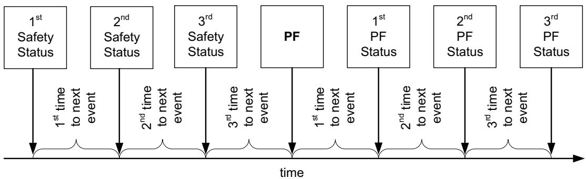

NOTE: This information is useful in failure analysis, and can provide a full recording of the events and conditions leading up to the permanent failure. If there were less than three safety events before PF, then some information will be left blank.

# 3.2 Safety Cell Undervoltage Permanent Fail

The bq40z50-R2 device can permanently disable the battery in the case of significant undervoltage in any of the cells.

<table><tr><td rowspan=1 colspan=1>Status</td><td rowspan=1 colspan=1>Condition</td><td rowspan=1 colspan=1>Action</td></tr><tr><td rowspan=1 colspan=1>Normal</td><td rowspan=1 colspan=1>Min cell voltage1 ..4 &gt; SUV:Threshold</td><td rowspan=1 colspan=1>PFAlert([SUV] = 0BatteryStatus()[TDA] = 0</td></tr><tr><td rowspan=1 colspan=1>Alert</td><td rowspan=1 colspan=1>Min cell voltage1..4 ≤ SUV:Threshold</td><td rowspan=1 colspan=1>PFAlert()[SUV] = 1BatteryStatus()[TDA] = 1</td></tr><tr><td rowspan=1 colspan=1>Trip</td><td rowspan=1 colspan=1>Min cell voltage1..4 continuous ≤ SUV:Threshold forSUV:Delay duration</td><td rowspan=1 colspan=1>PFAlert()[SUV] = 0PFStatus()[SUV] = 1BatteryStatus()[FD] = 1</td></tr></table>

# 3.2.1 SUV Check Option

When Protection Configuration[SUV_MODE] is set, the SUV PF check only applies when the gauge wakes up from shutdown. The CHG and DSG FETs are disabled for the duration of the test (SUV:Delay) to prevent an applied charge voltage from masking a copper deposition condition.

# 3.3 Safety Cell Overvoltage Permanent Fail

The bq40z50-R2 device can permanently disable the battery in the case of significant overvoltage in any of the cells.

<table><tr><td colspan="1" rowspan="1">Status</td><td colspan="1" rowspan="1">Condition</td><td colspan="1" rowspan="1">Action</td></tr><tr><td colspan="1" rowspan="1">Normal</td><td colspan="1" rowspan="1">Max cell voltage1 ..4 &lt; SOV:Threshold</td><td colspan="1" rowspan="1">PFAlert()[SOV] = 0</td></tr><tr><td colspan="1" rowspan="1">Alert</td><td colspan="1" rowspan="1">Max cell voltage1 ..4 ≥ SOV:Threshold</td><td colspan="1" rowspan="1">PFAlert()[SOV] = 1BatteryStatus([TCA] = 1</td></tr><tr><td colspan="1" rowspan="1">Trip</td><td colspan="1" rowspan="1">Max cell voltage1..4 continuous ≥ SOV:Threshold forSOV:Delay duration</td><td colspan="1" rowspan="1">PFAlert()[SOV] = 0PFStatus()[SOV] = 1</td></tr></table>

# 3.4 Safety Overcurrent in Charge Permanent Fail

The bq40z50-R2 device can permanently disable the battery in the case of significant overcurrent in the CHARGE state.

<table><tr><td rowspan=1 colspan=1>Status</td><td rowspan=1 colspan=1>Condition</td><td rowspan=1 colspan=1>Action</td></tr><tr><td rowspan=1 colspan=1>Normal</td><td rowspan=1 colspan=1>Current() &lt; SOCC:Threshold</td><td rowspan=1 colspan=1>PFAlert()[SOCC] = 0</td></tr><tr><td rowspan=1 colspan=1>Alert</td><td rowspan=1 colspan=1>Current() ≥ SOCC:Threshold</td><td rowspan=1 colspan=1>PFAlert([SOCC]= 1BatteryStatus()[TCA] = 1</td></tr><tr><td rowspan=1 colspan=1>Trip</td><td rowspan=1 colspan=1>Current() ≥ SOCC:Threshold for SOCC:Delay duration</td><td rowspan=1 colspan=1>PFAlert()[SOCC] = 1PFStatus([SOCC]= 1</td></tr></table>

# 3.5 Safety Overcurrent in Discharge Permanent Fail

The bq40z50-R2 device can permanently disable the battery in the case of significant overcurrent in the DISCHARGE or RELAX state.

<table><tr><td rowspan=1 colspan=1>Status</td><td rowspan=1 colspan=1>Condition</td><td rowspan=1 colspan=1>Action</td></tr><tr><td rowspan=1 colspan=1>Normal</td><td rowspan=1 colspan=1>Current() &gt; SOCD:Threshold</td><td rowspan=1 colspan=1>PFAlert()[SOCD] = 0</td></tr><tr><td rowspan=1 colspan=1>Alert</td><td rowspan=1 colspan=1>Current() ≤ SOCD:Threshold</td><td rowspan=1 colspan=1>PFAlert()[SOCD] = 1BatteryStatus()[TDA]= 1</td></tr><tr><td rowspan=1 colspan=1>Trip</td><td rowspan=1 colspan=1>Current() ≤ SOCD:Threshold for SOCD:Delay duration</td><td rowspan=1 colspan=1>PFAlert()[SOCD]= 1PFStatus()[SOCD] = 1</td></tr></table>

# 3.6 Safety Overtemperature Cell Permanent Fail

The bq40z50-R2 device can permanently disable the battery pack in case of significant overtemperature of the cells detected using the external TS1..4 temperature sensor(s), which are configured to report as cell temperature, Temperature(). For Safety Overtemperature Cell Permanent Fail, the temperature sensor with the highest (Max) temperature is used.

<table><tr><td rowspan=1 colspan=1>Status</td><td rowspan=1 colspan=1>Condition</td><td rowspan=1 colspan=1>Action</td></tr><tr><td rowspan=1 colspan=1>Normal</td><td rowspan=1 colspan=1>Max Cell Temp &lt; SOT:Threshold</td><td rowspan=1 colspan=1>PFAlert()[SOT] = 0</td></tr><tr><td rowspan=1 colspan=1>Alert</td><td rowspan=1 colspan=1>Max Cell Temp ≥ SOT:Threshold</td><td rowspan=1 colspan=1>PFAlert()[SOT]= 1BatteryStatus()[OTA]= 0</td></tr><tr><td rowspan=1 colspan=1>Trip</td><td rowspan=1 colspan=1>Max Cell Temp continuous ≥ SOT:Threshold for SOT:Delayduration</td><td rowspan=1 colspan=1>PFAlert()[SOT] = 0PFStatus([SOT]= 1BatteryStatus()[OTA] = 1</td></tr></table>

# 3.7 Safety Overtemperature FET Permanent Fail

The bq40z50-R2 device can permanently disable the battery pack in case of significant overtemperature on the power FET. The temperature sensor(s) can be configured to report as FET temperature in DAStatus2() by setting the corresponding flag in Temperature Mode and DA Configuration[FTEMP].

<table><tr><td rowspan=1 colspan=1>Status</td><td rowspan=1 colspan=1>Condition</td><td rowspan=1 colspan=1>Action</td></tr><tr><td rowspan=1 colspan=1>Normal</td><td rowspan=1 colspan=1>FET Temperature in DAStatus2() &lt; SOTF:Threshold</td><td rowspan=1 colspan=1>PFAlert()[SOTF] = 0</td></tr><tr><td rowspan=1 colspan=1>Alert</td><td rowspan=1 colspan=1>FET Temperature in DAStatus2() ≥ SOTF:Threshold</td><td rowspan=1 colspan=1>PFAlert([SOTF]= 1BatteryStatus()[OTA]= 0</td></tr><tr><td rowspan=1 colspan=1>Trip</td><td rowspan=1 colspan=1>FET Temperature in DAStatus2() continuous SOTF:Threshold for SOTF:Delay duration</td><td rowspan=1 colspan=1>PFAlert([SOTF]= 0PFStatus([SOTF]= 1BatteryStatus()[OTA] = 1</td></tr></table>

# 3.8 QMax Imbalance Permanent Fail

The bq40z50-R2 device can permanently disable the battery pack in case the capacity of one of the cells is much lower than the others.

<table><tr><td rowspan=1 colspan=1>Status</td><td rowspan=1 colspan=1>Condition</td><td rowspan=1 colspan=1>Action</td></tr><tr><td rowspan=1 colspan=1>Normal</td><td rowspan=1 colspan=1>[Max(QMax Cell 1..4)  Min(QMax1..4)]/Qmax Pack x 100 &lt;QIM:Delta Threshold</td><td rowspan=1 colspan=1>PFAlert([QIM] = 0</td></tr><tr><td rowspan=1 colspan=1>Alert</td><td rowspan=1 colspan=1>[Max(QMax Cell 1..4) - Min(QMax1..4)]/Qmax Pack x 100 &gt;QIM:Delta Threshold</td><td rowspan=1 colspan=1>PFAlert()[QIM] = 1</td></tr><tr><td rowspan=1 colspan=1>Trip</td><td rowspan=1 colspan=1>[Max(QMax Cell 1..4)  Min(QMax1..4)]/Qmax Pack x 100continuous ≥ QiM:Delta Threshold for number ofQIM:Delay(1) updates</td><td rowspan=1 colspan=1>PFAlert([QIM] = 0PFStatus()[QIM] = 1</td></tr></table>

(1) The delay for this check is counted each time QMax Cycle Count is updated.

# 3.9 Cell Balancing Permanent Fail

The bq40z50-R2 device can permanently disable the battery pack in case one of the cells in the stack is cell-balanced much more than the others.

<table><tr><td rowspan=1 colspan=1>Status</td><td rowspan=1 colspan=1>Condition</td><td rowspan=1 colspan=1>Action</td></tr><tr><td rowspan=1 colspan=1>Normal</td><td rowspan=1 colspan=1>∆(CB Time Cell 1..4) &lt; CB:Delta Threshold</td><td rowspan=1 colspan=1>PFAlert()[CB] = 0</td></tr><tr><td rowspan=1 colspan=1>Alert</td><td rowspan=1 colspan=1>Δ(CB Time Cell 1..4) ≥ CB:Delta Threshold</td><td rowspan=1 colspan=1>PFAlert()[CB] = 1</td></tr><tr><td rowspan=1 colspan=1>Trip</td><td rowspan=1 colspan=1>∆(CB Time Cell 1..4) continuous ≥ CB:Delta Threshold forCB:Delay(1)cycles</td><td rowspan=1 colspan=1>PFAlert()[CB] = 0PFStatus()[CB]= 1BatteryStatus()[TCA] = 1BatteryStatus()[TDA] = 1</td></tr><tr><td rowspan=1 colspan=1>Trip</td><td rowspan=1 colspan=1>Max (CB Time Cell 1..4) ≥ CB:Max Threshold</td><td rowspan=1 colspan=1>PFAlert()[CB] = 0PFStatus()[CB] = 1</td></tr></table>

(1) The delay for this check is counted each time QMax Cycle Count is updated.

# 3.10 Impedance Permanent Fail

The bq40z50-R2 device can permanently disable the battery pack in case the impedance of one of the cells is much higher than the others.

NOTE: Reference Grid is configurable from 0 (resistance at fully charged cell) to 14 (resistance at fully discharged cell). The default setting of Reference $\pmb { G r i d } = 4$ is a good typical value to use because it is close to the average in the range of $20 \%$ to $100 \%$ SOC. Design Resistance is automatically calculated and updated during the learning cycle and is part of the golden image).

This check is only performed when the gauge updates the Ra data for the Reference Grid directly. If a selected grid point is typically being scaled rather than directly updated by the gauge (for example, grid point 0 or grid point 14), this check is effectively disabled. It is recommended to use the default Design Resistance setting.

<table><tr><td colspan="1" rowspan="1">Status</td><td colspan="1" rowspan="1">Condition</td><td colspan="1" rowspan="1">Action</td></tr><tr><td colspan="1" rowspan="1">Normal</td><td colspan="1" rowspan="1">∆(Cell 1.,4 R_a at IT Cfg:Reference Grid) &lt;(IMP:Delta Threshold xiT Cfg:Design Resistance)</td><td colspan="1" rowspan="1">PFAlert()[IMP] = 0</td></tr><tr><td colspan="1" rowspan="1">Alert</td><td colspan="1" rowspan="1">∆(Cell 1..4 R_a at IT Cfg:Reference Grid) ≥(IMP:Delta Threshold xIT Cfg:Design Resistance)</td><td colspan="1" rowspan="1">PFAlert([IMP] = 1</td></tr><tr><td colspan="1" rowspan="1">Trip</td><td colspan="1" rowspan="1">∆(Cell 1..4 R_a at IT Cfg:Reference Grid) ≥(IMP:Delta Threshold xiT Cfg:Design Resistance) for IMP:Ra Update Counts</td><td colspan="1" rowspan="1">PFAlert()[IMP]= 0PFStatus()[IMP]= 1BatteryStatus()[TCA]= 1BatteryStatus()[TDA] = 1</td></tr><tr><td colspan="1" rowspan="1">Trip</td><td colspan="1" rowspan="1">∆(Cell 1..4 R_a at IT Cfg:Reference Grid) ≥(IMP:Max Threshold x IT Cfg:Design Resistance)</td><td colspan="1" rowspan="1">PFAlert()[MP] = 0PFStatus([IMP] = 1</td></tr></table>

# 3.11 Capacity Degradation Permanent Fail

The bq40z50-R2 device can permanently disable the battery pack in case the capacity of the battery is degraded below a threshold.

<table><tr><td rowspan=1 colspan=1>Status</td><td rowspan=1 colspan=1>Condition</td><td rowspan=1 colspan=1>Action</td></tr><tr><td rowspan=1 colspan=1>Normal</td><td rowspan=1 colspan=1>QMax pack &gt; CD:Threshold</td><td rowspan=1 colspan=1>PFAlert()[CD] = 0</td></tr><tr><td rowspan=1 colspan=1>Alert</td><td rowspan=1 colspan=1>QMax pack ≤ CD:Threshold</td><td rowspan=1 colspan=1>PFAlert()[CD] = 1</td></tr><tr><td rowspan=1 colspan=1>Trip</td><td rowspan=1 colspan=1>QMax pack continuous ≤ CD:Threshold for CD:Delay() cycles</td><td rowspan=1 colspan=1>PFAlert([CD] = 0PFStatus()[CD] = 1</td></tr></table>

(1) The delay for this check is counted each time QMax Cycle Count is updated.

# 3.12 Voltage Imbalance At Rest Permanent Fail

The bq40z50-R2 device can permanently disable the battery pack in case of a voltage difference between the cells in a stack while at rest.

<table><tr><td rowspan=1 colspan=1>Status</td><td rowspan=1 colspan=1>Condition</td><td rowspan=1 colspan=1>Action</td></tr><tr><td rowspan=1 colspan=1>Normal</td><td rowspan=1 colspan=1>Max cell voltage1..4 &lt; VIMR:Check Voltage OR|Current()| &gt; VIMR:Check Current ORMax cell voltage1 ..4  Min cell voltage1 ..4 &lt; VIMR:DeltaThreshold</td><td rowspan=1 colspan=1>PFAlert([VIMR] = 0</td></tr><tr><td rowspan=1 colspan=1>Alert</td><td rowspan=1 colspan=1>(Max cell voltage1 ..4 ≥ VIMR:Check Voltage AND|Current()| &lt; VIMR:Check Current) for VIMR:Duration ANDMax cell voltage1 ..4 - Min cell voltage1 ..4 ≥ VIMR:DeltaThreshold</td><td rowspan=1 colspan=1>PFAlert()[VIMR] = 1</td></tr><tr><td rowspan=1 colspan=1>Trip</td><td rowspan=1 colspan=1>(Max cell voltage1..4 ≥ VIMR:Check Voltage AND|Current()| &lt; VIMR:Check Current) for VIMR:Duration ANDMax cell voltage1 ..4 — Min cell voltage1..4 ≥ VIMR:DeltaThreshold for VIMR:Delta Delay</td><td rowspan=1 colspan=1>PFAlert()[VIMR] = 0PFStatus()[VIMR] = 1</td></tr></table>

# 3.13 Voltage Imbalance Active Permanent Fail

The bq40z50-R2 device can permanently disable the battery pack in case of a voltage difference between the cells in a stack while active.

<table><tr><td rowspan=1 colspan=1>Status</td><td rowspan=1 colspan=1>Condition</td><td rowspan=1 colspan=1>Action</td></tr><tr><td rowspan=1 colspan=1>Normal</td><td rowspan=1 colspan=1>Max cell voltage1 ..4 &lt; VIMA:Check Voltage ORCurrent() &lt; VIMA:Check Current ORMax cell voltage1 ..4 - Min cell voltage1 ..4 &lt; VIMA:DeltaThreshold</td><td rowspan=1 colspan=1>PFAlert()[VIMA] = 0</td></tr><tr><td rowspan=1 colspan=1>Alert</td><td rowspan=1 colspan=1>Max Cell voltage ≥ VIMA:Check Voltage ANDCurrent() &gt; VIMA:Check Current ANDMax cell voltage1..4 - Min cell voltage1 ..4 ≥ VIMA:DeltaThreshold</td><td rowspan=1 colspan=1>PFAlert([VIMA] = 1</td></tr><tr><td rowspan=1 colspan=1>Trip</td><td rowspan=1 colspan=1>(Max cell voltage1 ..4 ≥ VIMA:Check Voltage ANDCurrent() &gt; VIMA:Check Current ANDMax cell voltage1 ..4  Min cell voltage1..4 ≥ VIMA:DeltaThreshold) for VIMA:Delay</td><td rowspan=1 colspan=1>PFAlert()[VIMA]= 0PFStatus()[VIMA] = 1</td></tr></table>

# 3.14 Charge FET Permanent Fail

The bq40z50-R2 device can permanently disable the battery pack in case the charge FET is not working properly.

<table><tr><td rowspan=1 colspan=1>Status</td><td rowspan=1 colspan=1>Condition</td><td rowspan=1 colspan=1>Action</td></tr><tr><td rowspan=1 colspan=1>Normal</td><td rowspan=1 colspan=1>CHG FET off AND Current() &lt; CFET:OFF Threshold</td><td rowspan=1 colspan=1>PFAlert()[CFETF] = 0</td></tr><tr><td rowspan=1 colspan=1>Alert</td><td rowspan=1 colspan=1>CHG FET off AND Current() ≥ CFET:OFF Threshold</td><td rowspan=1 colspan=1>PFAlert()[CFETF] = 1</td></tr><tr><td rowspan=1 colspan=1>Trip</td><td rowspan=1 colspan=1>CHG FET off AND Current() continuously ≥ CFET:OFFThreshold for CFET:OFF Delay duration</td><td rowspan=1 colspan=1>PFAlert()[CFETF] = 0PFStatus()[CFETF] = 1</td></tr></table>

# 3.15 Discharge FET Permanent Fail

The bq40z50-R2 device can permanently disable the battery pack in case the discharge FET is not working properly.

<table><tr><td rowspan=1 colspan=1>Status</td><td rowspan=1 colspan=1>Condition</td><td rowspan=1 colspan=1>Action</td></tr><tr><td rowspan=1 colspan=1>Normal</td><td rowspan=1 colspan=1>DSG FET off AND Current() &gt; DFET:OFF Threshold</td><td rowspan=1 colspan=1>PFAlert()[DFETF] = 0</td></tr><tr><td rowspan=1 colspan=1>Alert</td><td rowspan=1 colspan=1>DSG FET off AND Current() ≤ DFET:OFF Threshold</td><td rowspan=1 colspan=1>PFAlert()[DFETF] = 1</td></tr><tr><td rowspan=1 colspan=1>Trip</td><td rowspan=1 colspan=1>DSG FET off AND Current() continuously ≤ DFET:OFFThreshold for DFET:OFF Delay duration</td><td rowspan=1 colspan=1>PFAlert()[DFETF] = 0PFStatus()[DFETF] = 1</td></tr></table>

# 3.16 Chemical Fuse Permanent Fail

The bq40z50-R2 device can detect a non-working fuse. It cannot disable the battery pack permanently, but can record this event for analysis.

<table><tr><td rowspan=1 colspan=1>Status</td><td rowspan=1 colspan=1>Condition</td><td rowspan=1 colspan=1>Action</td></tr><tr><td rowspan=1 colspan=1>Normal</td><td rowspan=1 colspan=1>FUSE pin = high AND |Current()| &lt; FUSE:Threshold</td><td rowspan=1 colspan=1>PFAlert()[FUSE] = 0</td></tr><tr><td rowspan=1 colspan=1>Alert</td><td rowspan=1 colspan=1>FUSE pin = high AND |Current()| ≥ FUSE:Threshold</td><td rowspan=1 colspan=1>PFAlert()[FUSE] = 1</td></tr><tr><td rowspan=1 colspan=1>Trip</td><td rowspan=1 colspan=1>FUSE pin = high AND |Current()| continuous ≥FUSE:Threshold for FUSE:Delay duration</td><td rowspan=1 colspan=1>PFAlert()[FUSE]= 0PFStatus()[FUSE] = 1</td></tr></table>

# 3.17 AFE Register Permanent Fail

The bq40z50-R2 device compares the AFE hardware register periodically with a RAM backup and corrects any errors. If any errors are found during the check, the device increments the AFE register fail counter. If the comparison fails too many times, the device disables the pack permanently.

<table><tr><td rowspan=1 colspan=1>Status</td><td rowspan=1 colspan=1>Condition</td><td rowspan=1 colspan=1>Action</td></tr><tr><td rowspan=1 colspan=1>Normal</td><td rowspan=1 colspan=1>AFE register fail counter = 0</td><td rowspan=1 colspan=1>PFAlert()[AFER] = 0Compare AFE register and RAM backup everyAFER:Compare Period</td></tr><tr><td rowspan=1 colspan=1>Alert</td><td rowspan=1 colspan=1>AFE register fail counter &gt; 0</td><td rowspan=1 colspan=1>PFAlert()[AFER] = 1,Decrement AFE register fail counter by one aftereach AFER:Delay PeriodCompare AFE register and RAM backup everyAFER:Compare Period</td></tr><tr><td rowspan=1 colspan=1>Trip</td><td rowspan=1 colspan=1>AFE register fail counter ≥ AFER:Threshold</td><td rowspan=1 colspan=1>PFAlert()[AFER] = 0PFStatus()[AFER] = 1</td></tr></table>

# 3.18 AFE Communication Permanent Fail

The bq40z50-R2 device monitors the internal communication to the AFE hardware and increments the AFE read/write fail counter on any communication error. If the read or write fails exceed a limit within a configurable timeframe, the device disables the pack permanently.

<table><tr><td rowspan=1 colspan=1>Status</td><td rowspan=1 colspan=1>Condition</td><td rowspan=1 colspan=1>Action</td></tr><tr><td rowspan=1 colspan=1>Normal</td><td rowspan=1 colspan=1>AFE read/write fail counter = 0</td><td rowspan=1 colspan=1>PFAlert()[AFEC] = 0</td></tr><tr><td rowspan=1 colspan=1>Alert</td><td rowspan=1 colspan=1>AFE read/write fail counter &gt; 0</td><td rowspan=1 colspan=1>PFAlert()[AFEC] = 1Decrement AFE read/write fail counter by oneafter each AFEC:Delay Period</td></tr><tr><td rowspan=1 colspan=1>Trip</td><td rowspan=1 colspan=1>Read and Write Fail counter ≥ AFEC:Threshold</td><td rowspan=1 colspan=1>PFAlert()[AFEC] = 0PFStatus()[AFÉC] = 1</td></tr></table>

# 3.19 PTC Permanent Fail

The bq40z50-R2 device can detect overtemperature using a positive temperature coefficient (PTC) resistor connected to the PTC pin. This protection also works in SHUTDOWN mode.

If the device detects a PTC pin high state, the CHG and DSG FETs are turned off, and the pack is disabled permanently. For manufacturer testing, the fault state can be reset by a full power cycle of the device.

This is a hardware controlled feature. To enable this feature, the PTCEN pin should be tied to BAT. To disable this feature, connect the PTCEN pin to ground.

<table><tr><td rowspan=1 colspan=1>Status</td><td rowspan=1 colspan=1>Condition</td><td rowspan=1 colspan=1>Action</td></tr><tr><td rowspan=1 colspan=1>Normal</td><td rowspan=1 colspan=1>Reset AFE and PTC pin = low</td><td rowspan=1 colspan=1>PFStatus()[PTC] = 0</td></tr><tr><td rowspan=1 colspan=1>Trip</td><td rowspan=1 colspan=1>PTC pin = high</td><td rowspan=1 colspan=1>PFStatus()[PTC] = 1FUSE = highBatteryStatus()[TCA] = 1BatteryStatus([TDA] = 1</td></tr></table>

# 3.20 Second Level Protection Permanent Fail

The bq40z50-R2 device can detect an external trigger of the chemical fuse by an external protection circuit such as a 2nd-level protector by monitoring the FUSE pin state.

If the device detects a FUSE pin high state, the CHG and DSG FETs are turned off.

Setting Enabled P $F C l 2 L V L J = 0$ will not prevent the second level protector from triggering and blowing the fuse, setting $[ 2 L V L ] = 0$ will only prevent the gauge from detecting the FUSE state.

<table><tr><td rowspan=1 colspan=1>Status</td><td rowspan=1 colspan=1>Condition</td><td rowspan=1 colspan=1>Action</td></tr><tr><td rowspan=1 colspan=1>Normal</td><td rowspan=1 colspan=1>Reset AFE and FUSE pin = low ANDNo FUSE trigger by firmware</td><td rowspan=1 colspan=1>PFAlert()[2LVL] = 0</td></tr><tr><td rowspan=1 colspan=1>Alert</td><td rowspan=1 colspan=1>FUSE pin = high ANDNo FUSE trigger by firmware</td><td rowspan=1 colspan=1>PFAlert()[2LVL] = 1Reset AFE FUSE bit</td></tr><tr><td rowspan=1 colspan=1>Trip</td><td rowspan=1 colspan=1>FUSE pin continuously high for 2LVL:Delay period ANDNo FUSE trigger by firmware</td><td rowspan=1 colspan=1>PFAlert()[2LVL] = 0PFStatus()[2LVL] = 1</td></tr></table>

# 3.21 Instruction Flash (IF) Checksum Permanent Fail

The bq40z50-R2 device can permanently disable the battery if it detects a difference between the stored IF checksum and the calculated IF checksum only following a device reset.

<table><tr><td rowspan=1 colspan=1>Status</td><td rowspan=1 colspan=1>Condition</td><td rowspan=1 colspan=1>Action</td></tr><tr><td rowspan=1 colspan=1>Normal</td><td rowspan=1 colspan=1>Stored and calculated IF checksum match</td><td rowspan=1 colspan=1></td></tr><tr><td rowspan=1 colspan=1>Trip</td><td rowspan=1 colspan=1>Stored and calculated IF checksum after reset does not match</td><td rowspan=1 colspan=1>PFStatus()[IFC] = 1</td></tr></table>

# 3.22 Data Flash (DF) Permanent Fail

The bq40z50-R2 device can permanently disable the battery in case a data flash write fails.

NOTE: A DF write failure causes the gauge to disable further DF writes.

<table><tr><td rowspan=1 colspan=1>Status</td><td rowspan=1 colspan=1>Condition</td><td rowspan=1 colspan=1>Action</td></tr><tr><td rowspan=1 colspan=1>Normal</td><td rowspan=1 colspan=1>Data flash write OK</td><td rowspan=1 colspan=1>—</td></tr><tr><td rowspan=1 colspan=1>Trip</td><td rowspan=1 colspan=1>Data flash write not successful</td><td rowspan=1 colspan=1>PFStatus()[DFW] = 1</td></tr></table>

# 3.23 Open Thermistor Permanent Fail (TS1, TS2, TS3, TS4)

The bq40z50-R2 device can permanently disable the battery if it detects an open thermistor on TS1, TS2, TS3, or TS4. The state of TS1..4 and the internal temperature sensor is available in DAStatus2().

<table><tr><td colspan="1" rowspan="1">Status</td><td colspan="1" rowspan="1">Condition</td><td colspan="1" rowspan="1">Action</td></tr><tr><td colspan="1" rowspan="1">Normal,TS1</td><td colspan="1" rowspan="1">TS1 Temperature &gt; Open Thermistor:ThresholdORInternal Temperature ≤ TS1 Temperature + Cell Delta ifTemperature Mode[TS1 Mode] = 0ORInternal Temperature ≤ TS1 Temperature + FET Delta ifTemperature Mode[TS1 Mode] = 1</td><td colspan="1" rowspan="1">PFAlert()[TS1] = 0</td></tr><tr><td colspan="1" rowspan="1">Normal,TS2</td><td colspan="1" rowspan="1">TS2 Temperature &gt; Open Thermistor:ThresholdORInternal Temperature ≤ TS2 Temperature + Cell Delta ifTemperature Mode[TS2 Mode] = 0ORInternal Temperature ≤ TS2 Temperature + FET Delta ifTemperature Mode[TS2 Mode] = 1</td><td colspan="1" rowspan="1">PFAlert([TS2] = 0</td></tr><tr><td colspan="1" rowspan="1">Normal,TS3</td><td colspan="1" rowspan="1">TS3 Temperature &gt; Open Thermistor:ThresholdORInternal Temperature ≤ TS3 Temperature + Cell Delta ifTemperature Mode[TS3 Mode] = 0ORInternal Temperature ≤ TS3 Temperature + FET Delta ifTemperature Mode[TS3 Mode] = 1</td><td colspan="1" rowspan="1">PFAlert()[TS3] = 0</td></tr><tr><td colspan="1" rowspan="1">Normal,TS4</td><td colspan="1" rowspan="1">TS4 Temperature &gt; Open Thermistor:ThresholdORInternal Temperature ≤ TS4 Temperature + Cell Delta ifTemperature Mode[TS4 Mode] = 0ORInternal Temperature ≤ TS4 Temperature + FET Delta ifTemperature Mode[TS4 Mode] = 1</td><td colspan="1" rowspan="1">PFAlert()[TS4] = 0</td></tr><tr><td colspan="1" rowspan="2">Alert,TS1</td><td colspan="1" rowspan="1">Condition 1:TS1 Temperature ≤ Open Thermistor:Threshold ANDInternal Temperature &gt; TS1 Temperature + Cell Delta ifTemperature Mode[TS1 Mode] = 0</td><td colspan="1" rowspan="2">PFAlert()[TS1] = 1</td></tr><tr><td colspan="1" rowspan="1">OR Condition 2:TS1 Temperature ≤ Open Thermistor:Threshold ANDInternal Temperature &gt; TS1 Temperature + FET Delta ifTemperature Mode[TS1 Mode] = 1</td></tr><tr><td colspan="1" rowspan="2">Alert,TS2</td><td colspan="1" rowspan="1">Condition 1:TS2 Temperature ≤ Open Thermistor:Threshold ANDInternal Temperature &gt; TS2 Temperature + Cell Delta ifTemperature Mode[TS2 Mode] = 0</td><td colspan="1" rowspan="2">PFAlert()[TS1] = 1</td></tr><tr><td colspan="1" rowspan="1">OR Condition 2:TS2 Temperature ≤ Open Thermistor:Threshold ANDInternal Temperature &gt; TS2 Temperature + FET Delta ifTemperature Mode[TS2 Mode] = 1</td></tr><tr><td rowspan="2">Alert, TS3</td><td>Condition 1: TS3 Temperature ≤ Open Thermistor:Threshold AND Internal Temperature &gt; TS3 Temperature + Cell Delta if Temperature Mode[TS3 Mode] = 0</td><td rowspan="2">PFAlert()[TS 1] = 1</td></tr><tr><td colspan="1">OR Condition 2: TS3 Temperature ≤ Open Thermistor:Threshold AND Internal Temperature &gt; TS3 Temperature + FET Delta if</td></tr><tr><td rowspan="2">Alert, TS4</td><td>Temperature Mode[TS3 Mode] = 1 Condition 1: TS4 Temperature ≤ Open Thermistor:Threshold AND Internal Temperature &gt; TS4 Temperature + Cell Delta if</td><td rowspan="2">PFAlert([TS1] = 1</td></tr><tr><td colspan="1">Temperature Mode[TS4 Mode] = 0 OR Condition 2: TS4 Temperature ≤ Open Thermistor:Threshold AND Internal Temperature &gt; TS4 Temperature + FET Delta if Temperature Mode[TS4 Mode] = 1</td></tr><tr><td rowspan="2">Trip, TS1</td><td>Condition 1: TS1 Temperature ≤ Open Thermistor:Threshold AND Internal Temperature &gt; TS1 Temperature + Cell Delta for Open Thermistor:Delay duration if Temperature Mode[TS1 Mode] = 0</td><td>PFAlert()[TS1] = 0</td></tr><tr><td>OR Condition 2: TS1 Temperature ≤ Open Thermistor:Threshold AND Internal Temperature &gt; TS1 Temperature + FET Delta for OpenThermistor:Delay duration if Temperature Mode[TS1 Mode] = 1 Condition 1:</td><td colspan="1">PFStatus()[T1] = 1</td></tr><tr><td>Trip, TS2</td><td>TS2 Temperature ≤ Open Thermistor:Threshold AND Internal Temperature &gt; TS2 Temperature + Cell Delta for Open Thermistor:Delay duration if Temperature Mode[TS2 Mode] = 0 OR Condition 2: TS2 Temperature ≤ Open Thermistor:Threshold AND Internal Temperature &gt; TS2 Temperature + FET Delta for OpenThermistor:Delay duration if Temperature Mode[TS2 Mode] = 1</td><td>PFAlert()[TS2] = 0 PFStatus()[TS2] = 1</td></tr><tr><td rowspan="2">Trip, TS3</td><td>Condition 1: TS3 Temperature ≤ Open Thermistor:Threshold AND Internal Temperature &gt; TS3 Temperature + Cell Delta for Open Thermistor:Delay duration if Temperature Mode[TS3 Mode] = 0 OR Condition 2:</td><td rowspan="2">PFAlert()[TS3] = 0 PFStatus()[TS3] = 1</td></tr><tr><td colspan="1">TS3 Temperature ≤ Open Thermistor:Threshold AND Internal Temperature &gt; TS3 Temperature + FET Delta for OpenThermistor:Delay duration if Temperature Mode[TS3 Mode] = 1</td></tr><tr><td rowspan="2">Trip, TS4 Temperature Mode[TS4 Mode] = 1</td><td>Condition 1: TS4 Temperature ≤ Open Thermistor:Threshold AND Internal Temperature &gt; TS4 Temperature + Cell Delta for Open Thermistor:Delay duration if</td><td rowspan="2">PFAlert()[TS4] = 0 PFStatus()[T4] = 1</td></tr><tr><td colspan="1">Temperature Mode[TS4 Mode] = 0 OR Condition 2: TS4 Temperature ≤ Open Thermistor:Threshold AND Internal Temperature &gt; TS4 Temperature + FET Delta for OpenThermistor:Delay duration if</td></tr></table>

# 4.1 Introduction

The bq40z50-R2 device can change the values of ChargingVoltage() and ChargingCurrent() based on Temperature() and cell voltage1..4 or RelativeStateofCharge(). Its flexible charging algorithm is JEITA compatible and can also meet other specific cell manufacturer charge requirements. The ChargingStatus() register shows the state of the charging algorithm.

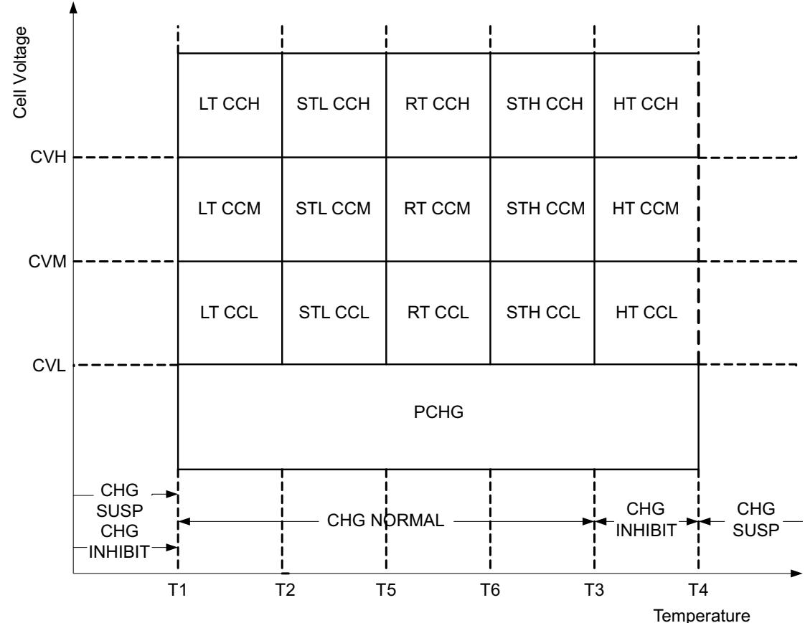

# 4.2 Charge Temperature Ranges

The measured temperature is segmented into several temperature ranges. The charging algorithm adjusts ChargingCurrent() and ChargingVoltage() according to the temperature range. The temperature ranges set in data flash should adhere to the following format:

$$
T 1 \leq T 2 \leq T 5 \leq T 6 \leq T 3 \leq T 4 .
$$

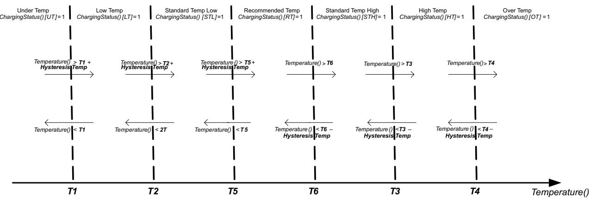

# 4.3 Voltage Range

The measured cell voltage is segmented into several voltage ranges. The charging algorithm adjusts ChargingCurrent() according to the temperature range and voltage range. The voltage ranges set in data flash need to adhere to the following format:

Charging Voltage Low ≤ Charging Voltage Med ≤ Charging Voltage High ≤ × Temp Charging:Voltage

where $\times$ is Standard or Rec. Depending on the specific charging profile, the Low Temp Charging:Voltage and High Temp Charging:Voltage settings do not necessarily have the highest setting values.

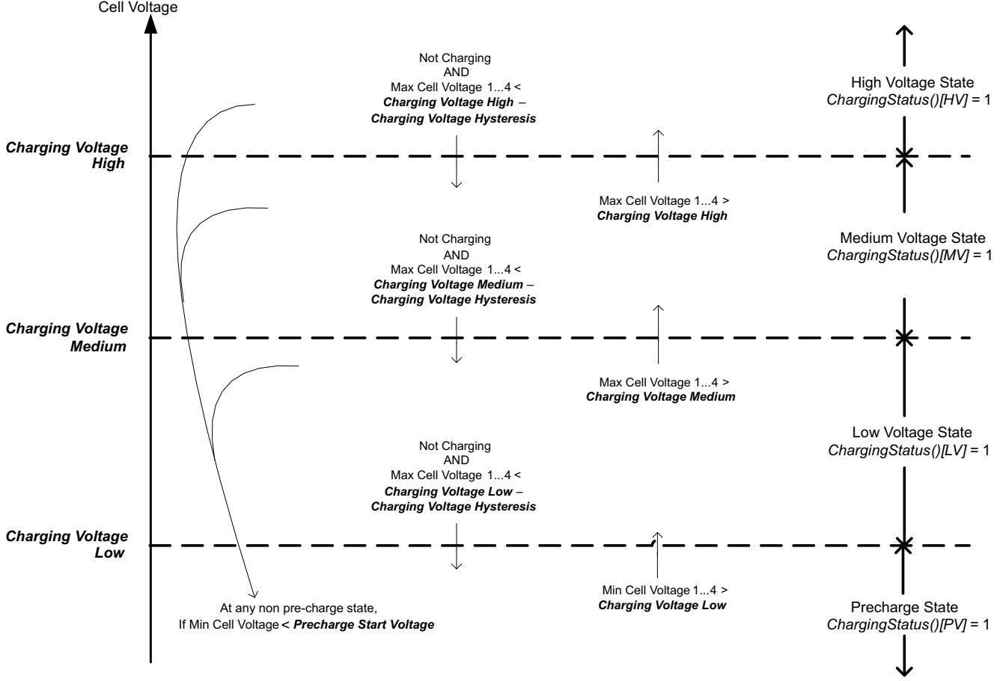

# 4.3.1 RelativeStateofCharge() Range

If [SOC_CHARGE] in Charging Configuration is set, then the voltages threshold control, as described in Section 4.3, is replaced with RelativeStateOfCharge() control.

With this method, the following changes in control transitions occur:   
a. [LV] state and RelativeStateOfCharge() $>$ Charging SOC Mid; move to [MV].   
b. [MV] state and RelativeStateOfCharge() $>$ Charging SOC High; move to [HV].   
c. [MV] state $[ \mathsf { D S G } ] = 1$ , and RelativeStateOfCharge() $<$ Charging SOC Mid – SOC Hysteresis; move to [LV].   
d. [HV] state $[ \mathsf { D S G } ] = 1$ , and RelativeStateOfCharge() $<$ Charging SOC High – Charging SOC Hysteresis; move to [MV].

Table 4-1. RelativeStateofCharge() Range   

<table><tr><td rowspan=1 colspan=1>Class</td><td rowspan=1 colspan=1>Subclass</td><td rowspan=1 colspan=1>Name</td><td rowspan=1 colspan=1>Type</td><td rowspan=1 colspan=1>Min Value</td><td rowspan=1 colspan=1>Max Value</td><td rowspan=1 colspan=1>DefaultValue</td><td rowspan=1 colspan=1>Unit</td></tr><tr><td rowspan=1 colspan=1>Advanced ChargeAlgorithm</td><td rowspan=1 colspan=1>SOC Range</td><td rowspan=1 colspan=1>Charging SOC Mid</td><td rowspan=1 colspan=1>U1</td><td rowspan=1 colspan=1>0</td><td rowspan=1 colspan=1>100</td><td rowspan=1 colspan=1>50</td><td rowspan=1 colspan=1>%</td></tr><tr><td rowspan=1 colspan=1>Advanced Chargelgorithm</td><td rowspan=1 colspan=1>SOC Range</td><td rowspan=1 colspan=1>Charging SOC High</td><td rowspan=1 colspan=1>U1</td><td rowspan=1 colspan=1>0</td><td rowspan=1 colspan=1>100</td><td rowspan=1 colspan=1>75</td><td rowspan=1 colspan=1>%</td></tr><tr><td rowspan=1 colspan=1>Advanced ChargeAlgorithm</td><td rowspan=1 colspan=1>SOC Range</td><td rowspan=1 colspan=1>Charging SOC Hysteresis</td><td rowspan=1 colspan=1>U1</td><td rowspan=1 colspan=1>0</td><td rowspan=1 colspan=1>100</td><td rowspan=1 colspan=1>1</td><td rowspan=1 colspan=1>%</td></tr></table>

# 4.3.2 Cell Overvoltage Latch Permanent Failure

The bq40z50-R2 device can permanently disable the battery in the case of repeated cell overvoltage events. The PFAlert()[COVL] and PFStatus() $I C O V L J$ use the same logic and data flash settings as SafetyAlert()[COVL] and SafetyStatus()[COVL] with the exception of there being no recovery mechanism. It is recommended to not have both PFStatus()[COVL] and SafetyStatus()[COVL] enabled at the same time.

# 4.4 Charging Current

The ChargingCurrent() value changes depending on the detected temperature and voltage per the charging algorithm.

The Charging Configuration[CRATE] flag provides an option to adjust the ChargingCurrent() based on FullChargeCapacity()/DesignCapacity().

For example, with $\begin{array} { r } { I C R A T E J = 1 } \end{array}$ , if FullChargeCapacity()/DesignCapacity() $) = 9 0 \%$ and Rec Temp Charging: Current Med is active per the charging algorithm, the ChargeCurrent() $=$ Rec Temp Charging: Current Med $\times 9 0 \%$ .

NOTE: Table priority is top to bottom.

<table><tr><td rowspan=1 colspan=2>Temp Range</td><td rowspan=1 colspan=1>Voltage Range</td><td rowspan=1 colspan=1>Condition</td><td rowspan=1 colspan=1>Action</td></tr><tr><td rowspan=1 colspan=2>Any</td><td rowspan=1 colspan=1>Any</td><td rowspan=1 colspan=1>OperationStatus()[XCHG]= 1</td><td rowspan=1 colspan=1>ChargingCurrent() = 0</td></tr><tr><td rowspan=1 colspan=2>UT or OT</td><td rowspan=1 colspan=1>Any</td><td rowspan=1 colspan=1></td><td rowspan=1 colspan=1>ChargingCurrent() = 0</td></tr><tr><td rowspan=1 colspan=2>Any</td><td rowspan=1 colspan=1>PV</td><td rowspan=1 colspan=1></td><td rowspan=1 colspan=1>ChargingCurrent() = Pre-Charging:Current</td></tr><tr><td rowspan=1 colspan=2>Any</td><td rowspan=1 colspan=1>LV, MV, or HV</td><td rowspan=1 colspan=1>ChargingStatus()[MCHG]= 1</td><td rowspan=1 colspan=1>ChargingCurrent() = MaintenanceCharging:Current</td></tr><tr><td rowspan=3 colspan=2>LT</td><td rowspan=1 colspan=1>LV</td><td rowspan=1 colspan=1></td><td rowspan=1 colspan=1>ChargingCurrent() = Low TempCharging:Current Low</td></tr><tr><td rowspan=1 colspan=1></td><td rowspan=1 colspan=1>MV</td><td rowspan=1 colspan=1></td><td rowspan=1 colspan=1>ChargingCurrent() = Low TempCharging:Current Med</td></tr><tr><td rowspan=1 colspan=1>HV</td><td rowspan=1 colspan=1></td><td rowspan=1 colspan=1>ChargingCurrent() = Low TempCharging:Current High</td></tr></table>

<table><tr><td rowspan=1 colspan=1>Temp Range</td><td rowspan=1 colspan=1>Voltage Range</td><td rowspan=1 colspan=1>Condition</td><td rowspan=1 colspan=1>Action</td></tr><tr><td rowspan=3 colspan=1>STL</td><td rowspan=1 colspan=1>LV</td><td rowspan=1 colspan=1></td><td rowspan=1 colspan=1>ChargingCurrent() = Standard Temp LowCharging:Current Low</td></tr><tr><td rowspan=1 colspan=1>MV</td><td rowspan=1 colspan=1></td><td rowspan=1 colspan=1>ChargingCurrent() = Standard Temp LowCharging:Current Med</td></tr><tr><td rowspan=1 colspan=1>HV</td><td rowspan=1 colspan=1></td><td rowspan=1 colspan=1>ChargingCurrent() = Standard Temp LowCharging:Current High</td></tr><tr><td rowspan=3 colspan=1>STH</td><td rowspan=1 colspan=1>LV</td><td rowspan=1 colspan=1></td><td rowspan=1 colspan=1>ChargingCurrent() = Standard Temp HighCharging:Current Low</td></tr><tr><td rowspan=1 colspan=1>MV</td><td rowspan=1 colspan=1></td><td rowspan=1 colspan=1>ChargingCurrent() = Standard Temp HighCharging:Current Med</td></tr><tr><td rowspan=1 colspan=1>HV</td><td rowspan=1 colspan=1></td><td rowspan=1 colspan=1>ChargingCurrent() = Standard Temp HighCharging:Current High</td></tr><tr><td rowspan=3 colspan=1>RT</td><td rowspan=1 colspan=1>LV</td><td rowspan=1 colspan=1></td><td rowspan=1 colspan=1>ChargingCurrent() = Rec Temp Charging:CurrentLow</td></tr><tr><td rowspan=1 colspan=1>MV</td><td rowspan=1 colspan=1></td><td rowspan=1 colspan=1>ChargingCurrent() = Rec Temp Charging:CurrentMed</td></tr><tr><td rowspan=1 colspan=1>HV</td><td rowspan=1 colspan=1></td><td rowspan=1 colspan=1>ChargingCurrent() = Rec Temp Charging:CurrentHigh</td></tr><tr><td rowspan=3 colspan=1>HT</td><td rowspan=1 colspan=1>LV</td><td rowspan=1 colspan=1></td><td rowspan=1 colspan=1>ChargingCurrent() = High TempCharging:Current Low</td></tr><tr><td rowspan=1 colspan=1>MV</td><td rowspan=1 colspan=1></td><td rowspan=1 colspan=1>ChargingCurrent() = High TempCharging:Current Med</td></tr><tr><td rowspan=1 colspan=1>HV</td><td rowspan=1 colspan=1></td><td rowspan=1 colspan=1>ChargingCurrent() = High TempCharging:Current High</td></tr></table>

# 4.5 Charging Voltage

The ChargingVoltage() changes depending on the detected temperature per the charge algorithm.

NOTE: Table priority is top to bottom.

<table><tr><td rowspan=1 colspan=1>Temp Range</td><td rowspan=1 colspan=1>Condition</td><td rowspan=1 colspan=1>Action</td></tr><tr><td rowspan=1 colspan=1>Any</td><td rowspan=1 colspan=1>OperationStatus()[XCHG]= 1</td><td rowspan=1 colspan=1>ChargingVoltage() = 0</td></tr><tr><td rowspan=1 colspan=1>UT or OT</td><td rowspan=1 colspan=1></td><td rowspan=1 colspan=1>ChargingVoltage() = 0</td></tr><tr><td rowspan=1 colspan=1>LT</td><td rowspan=1 colspan=1></td><td rowspan=1 colspan=1>ChargingVoltage() = Low Temp Charging:Voltage x (DAConfiguration[CC1:CCO]+ 1)</td></tr><tr><td rowspan=1 colspan=1>STL</td><td rowspan=1 colspan=1></td><td rowspan=1 colspan=1>ChargingVoltage() = STL:Voltage x (DA Configuration[CC1:CCO]+ 1)</td></tr><tr><td rowspan=1 colspan=1>STH</td><td rowspan=1 colspan=1></td><td rowspan=1 colspan=1>ChargingVoltage() = STH:Voltage x (DA Configuration[CC1:CCO] + 1)</td></tr><tr><td rowspan=1 colspan=1>RT</td><td rowspan=1 colspan=1></td><td rowspan=1 colspan=1>ChargingVoltage() = Rec Temp Charging:Voltage x (DAConfiguration[CC1:CCO] + 1)</td></tr><tr><td rowspan=1 colspan=1>HT</td><td rowspan=1 colspan=1></td><td rowspan=1 colspan=1>ChargingVoltage() = High Temp Charging:Voltage x (DAConfiguration[CC1:CC0] + 1)</td></tr></table>

# 4.6 Valid Charge Termination

The charge termination condition must be met to enable valid charge termination. The bq40z50-R2 device has the following actions at charge termination, based on the flags settings:

• If SBS Gauging Configuration[CSYNC] $= 1$ , RemainingCapacity() $=$ FullChargeCapacity(). If SBS Gauging Configuration[ $\ R s o c L \rfloor = 1$ , RelativeStateOfCharge() and RemainingCapacity() are held at $9 9 \%$ until charge termination occurs. Only on entering charge termination is $100 \%$ displayed. If SBS Gauging Configuration[RSOCL] $\begin{array} { r } { { \cal I } = 0 } \end{array}$ , RelativeStateOfCharge() and RemainingCapacity() are not held at $9 9 \%$ until charge termination occurs. Fractions of $\%$ greater than $9 9 \%$ are rounded up to display $100 \%$ .

<table><tr><td>Status</td><td>Condition</td><td>Action</td></tr><tr><td>Charging</td><td>GaugingStatus()[DSG] = 0 All of the following conditions must occur for</td><td>Charge Algorithm active</td></tr><tr><td>Valid Charge Termination</td><td>two consecutive 40-s periods: Charging (that is, BatteryStatus[DSG] = 0) AND AverageCurrent() &lt; Charge Term Taper Current AND Max cell voltage1..4 + Charge Term Voltage ≥ ChargingVoltage() / number of cells in series AND The accumulated change in capacity &gt; 0.25 mAh.</td><td>ChargingStatus()[VCT] = 1 ChargingStatus()[MCHG] = 1 ChargingVoltage() = Charging Algorithm ChargingCurrent() = Charging Algorithm BatteryStatus()[FC]= 1 and GaugingStatus()[FC]= 1 if SOCFlagConfig A[FCSETVCT] = 1 BatteryStatus()[TCA]= 1 and GaugingStatus()[TCA]= 1 if SOCFlagConfig B[TCASETVCT] = 1</td></tr></table>

# 4.7 Charge and Discharge Termination Flags

The $I T C J$ and $I F C ]$ bits in GaugingStatus() can be set at charge termination as well as based on RSOC or cell voltages. If multiple set and clear conditions are selected, then the corresponding flag will be set whenever a valid set or clear condition is met. If both set and clear conditions are true at the same time, the flag will clear. The same functionality is applied to the $\left[ T D \right]$ and $[ F D ]$ bits in GaugingStatus().

NOTE: GaugingStatus()[TC][TD][FC][FD] are the status flags based on the gauging conditions only. These flags are set and cleared based on SOC Flag Config A and SOC Flag Config B. The BatteryStatus()[TAC][FC][TDA][FD] flags will be set and cleared according to the BatteryStatus()[TC][FC][TD][FD] flags, as well as the safety and permanent failure protections status. For more information, see Section 4.8.

# When GaugingStatus()[TC] is set AND FET Options[CHGFET] $= 1$ , the CHG FET turns off.

The $I F C ]$ flag is identical between gauging status and battery status, but not [TD]. The table below summarizes the options to set and clear the $I T C ]$ and $I F C ]$ flags in GaugingStatus().

<table><tr><td rowspan=1 colspan=1>Flag</td><td rowspan=1 colspan=1>Set Criteria</td><td rowspan=1 colspan=1>Set Condition</td><td rowspan=1 colspan=1>Enable</td></tr><tr><td rowspan=3 colspan=1>[TC]</td><td rowspan=1 colspan=1>cell voltage</td><td rowspan=1 colspan=1>Max cell voltage1.4 ≥ TC: Set VoltageThreshold</td><td rowspan=1 colspan=1>SOC Flag Config A[TCSetV] = 1</td></tr><tr><td rowspan=1 colspan=1>RSOC</td><td rowspan=1 colspan=1>RelativeStateOfCharge() ≥ TC: Set %RSOC Threshold</td><td rowspan=1 colspan=1>SOC Flag Config A[TCSetRSOC] = 1</td></tr><tr><td rowspan=1 colspan=1>Valid Charge Termination(enable by default)</td><td rowspan=1 colspan=1>When ChargingStatus[VCT] = 1</td><td rowspan=1 colspan=1>SOC Flag Config A[TCSetVCT] = 1</td></tr><tr><td rowspan=3 colspan=1>[FC]</td><td rowspan=1 colspan=1>cell voltage</td><td rowspan=1 colspan=1>Max cell voltage1..4 ≥ FC: Set VoltageThreshold</td><td rowspan=1 colspan=1>SOC Flag Config B[FCSetV] = 1</td></tr><tr><td rowspan=1 colspan=1>RSOC</td><td rowspan=1 colspan=1>RelativeStateOfCharge()≥ C: Set % RSCThreshold</td><td rowspan=1 colspan=1>SOC Flag Config B[FCSetRSOC] = 1</td></tr><tr><td rowspan=1 colspan=1>Valid Charge Termination(enable by default)</td><td rowspan=1 colspan=1>When ChargingStatus[VCT] = 1</td><td rowspan=1 colspan=1>SOC Flag Config A[FCSetVCT] = 1</td></tr></table>

<table><tr><td rowspan=1 colspan=1>Flag</td><td rowspan=1 colspan=1>Clear Criteria</td><td rowspan=1 colspan=1>Clear Condition</td><td rowspan=1 colspan=1>Enable</td></tr><tr><td rowspan=2 colspan=1>[TC]</td><td rowspan=1 colspan=1>cell voltage</td><td rowspan=1 colspan=1>Max cell voltage1.4 ≤ TC: Clear VoltageThreshold</td><td rowspan=1 colspan=1>SOC Flag Config A[TCClearV] = 1</td></tr><tr><td rowspan=1 colspan=1>RSOC (enable by default)</td><td rowspan=1 colspan=1>RelativeStateOfCharge() ≤ TC: Clear %RSOC Threshold</td><td rowspan=1 colspan=1>SOC Flag Config A[TCClearRSOC] = 1</td></tr><tr><td rowspan=2 colspan=1>[FC]</td><td rowspan=1 colspan=1>cell voltage</td><td rowspan=1 colspan=1>Max cell voltage1..4 ≤ FC: Clear VoltageThreshold</td><td rowspan=1 colspan=1>SOC Flag Config B[FCClearV] = 1</td></tr><tr><td rowspan=1 colspan=1>RSOC (enable by default)</td><td rowspan=1 colspan=1>RelativeState OfCharge() ≤ FC: Clear %RSOC Threshold</td><td rowspan=1 colspan=1>SOC Flag Config B[FCClearRSOC] = 1</td></tr></table>

[TD] and [FD] both have extra conditions. If gauging status [FD] is set, then battery status is always set, but clearing also depends on some safety conditions (CUV/SUV).

The table below summarizes the various options to set and clear the [TD] and [FD] flags in GaugingStatus().

<table><tr><td rowspan=1 colspan=1>Flag</td><td rowspan=1 colspan=1>Set Criteria</td><td rowspan=1 colspan=1>Set Condition</td><td rowspan=1 colspan=1>Enable</td></tr><tr><td rowspan=2 colspan=1>[TD]</td><td rowspan=1 colspan=1>cell voltage</td><td rowspan=1 colspan=1>Min cell voltage1.4 ≤ TD: Set VoltageThreshold</td><td rowspan=1 colspan=1>SOC Flag Config A[TDSetV] = 1</td></tr><tr><td rowspan=1 colspan=1>RSOC (enable by default)</td><td rowspan=1 colspan=1>RelativeStateOfCharge() &lt; = TD: Set %RSOC Threshold</td><td rowspan=1 colspan=1>SOC Flag Config A[TDSetRSOC] = 1</td></tr><tr><td rowspan=2 colspan=1>[FD]</td><td rowspan=1 colspan=1>cell voltage</td><td rowspan=1 colspan=1>Min cell voltage1.4 ≤ FD: Set VoltageThreshold</td><td rowspan=1 colspan=1>SOC Flag Config B[FDSetV] = 1</td></tr><tr><td rowspan=1 colspan=1>RSOC (enable by default)</td><td rowspan=1 colspan=1>RelativeStateOfCharge() &lt; = FD: Set %RSOC Threshold</td><td rowspan=1 colspan=1>SOC Flag Config B[FDSetRSOC] = 1</td></tr></table>

<table><tr><td rowspan=1 colspan=1>Flag</td><td rowspan=1 colspan=1>Clear Criteria</td><td rowspan=1 colspan=1>Clear Condition</td><td rowspan=1 colspan=1>Enable</td></tr><tr><td rowspan=2 colspan=1>[TD]</td><td rowspan=1 colspan=1>cell voltage</td><td rowspan=1 colspan=1>Min cell voltage1.4 ≥ TD: Clear VoltageThreshold</td><td rowspan=1 colspan=1>SOC Flag Config A[TDClearV] = 1</td></tr><tr><td rowspan=1 colspan=1>RSOC (enable by default)</td><td rowspan=1 colspan=1>RelativeStateOfCharge() ≥ TD: Clear %RSOC Threshold</td><td rowspan=1 colspan=1>SOC Flag Config A[TDClearRSOC] = 1</td></tr><tr><td rowspan=2 colspan=1>[FD]</td><td rowspan=1 colspan=1>cell voltage</td><td rowspan=1 colspan=1>Min cell voltage1.4 ≥ FD: Clear VoltageThreshold</td><td rowspan=1 colspan=1>SOC Flag Config B[FDClearV] = 1</td></tr><tr><td rowspan=1 colspan=1>RSOC (enable by default)</td><td rowspan=1 colspan=1>RelativeStateOfCharge() ≥ FD: Clear %RSOC Threshold</td><td rowspan=1 colspan=1>SOC Flag Config B[FDClearRSOC] = 1</td></tr></table>

# 4.8 Terminate Charge and Discharge Alarms

When the protections and permanent fails are triggered, BatteryStatus()[TCA][TDA][FD][OCA][OTA][FC] will be set according to the type of safety protections. Here is a summary of the set conditions of the various alarms flags.

$\begin{array} { r } { [ T C A ] = 1 } \end{array}$ if

• SafetyAlert()[OCC1], [OCC2], [COV], [OTC], [OTF], [OC], [CHGC], [CHGV], or $[ P C H G C ] = 1$ OR PFAlert()[SOV] or $\boldsymbol { \it { I S O C C } } \boldsymbol { \it { I } } = 1$ OR Any $P F S t a t u s ( ) = 1 ~ ( $ OR OperationStatus $( ) I P R E S ] = 0 ~ \cdot$ OR GaugingStatus $( ) [ T C ] = 1$ AND in CHARGE mode

$[ \mathsf { F C } ] = 1$   
• if GaugingStatus $\mathit { ( ) [ F C ] = 1 }$   
$\begin{array} { r } { I O C A J = 1 } \end{array}$ if   
• SafetyStatus $( ) [ O C ] = 1$ AND in CHARGE mode

$[ T D A ] = 1$ if

• SafetyAlert()[OCD1], [OCD2], [CUV], [CUVC], [OTD], or $\boldsymbol { I } 0 \boldsymbol { T } \boldsymbol { F } \boldsymbol { J } = \boldsymbol { 1 }$ OR   
• PFAlert()[SUV] or $I S O C D J = 1$ OR   
• Any PFStatus() $= 1$ OR OperationStatus( $) I P R E S J = 0$ GaugingStatus( $\mathit { \Delta } ) [ T D ] = 1$ AND in DISCHARGE mode

$[ F D ] = 1$ if

• SafetyStatus( $) [ C U V ] = 1$ OR

PFStatus()[SUV] = 1 OR • GaugingStatus()[FD]

$I O T A l = 1$ if

SafetyStatus()[OTC], [OTD], or $\boldsymbol { I } \boldsymbol { O } \boldsymbol { T } \boldsymbol { F } \boldsymbol { J } = \boldsymbol { 1 }$ OR • PFStatus()[SOT] or $I S O T F ] = 1$

# 4.9 Precharge

The gauge enters PRECHARGE mode if,

1. Min cell voltage1.. $. 4 <$ Precharge Start Voltage OR

2. Max cell voltage1.. $. 4 <$ Charging Voltage Low – Charging Voltage Hysteresis and not in CHARGE mode

Depending on the FET Options[PCHG_COMM] settings, the external precharge FET or CHG FET can be used in PRECHARGE mode. Setting Precharge Start Voltage and Charging Voltage Lo ${ \pmb v } = 0 \mathrm { \ m V }$ disables the precharge function.

<table><tr><td>[PCHG_COMM] = 0</td><td>[PCHG_COMM] = 1</td></tr><tr><td>FET USED: external precharge FET</td><td>FET USED: CHG FET</td></tr></table>

The bq40z50-R2 device also supports 0-V charging using either an external precharge FET or CHG FET. If [PCHG_COMM] $= 1$ , the gauge enables the hardware $0 { - } \mathsf { V }$ charging circuit automatically when the battery stack voltage is below the minimum operation voltage of the device (see the bq40z50-R2 1-Series to 4-Series Li-Ion Battery Pack Manager data sheet [SLUSCS4] for bq40z50-R2 electrical specifications).

# 4.10 Maintenance Charge

Maintenance charge can be configured to provide charge current after charge termination is reached.

If overcharge protection is enabled, Enabled Protections $c _ { l } o c _ { l } = 1$ , an extra margin may be needed for OC:Threshold to prevent triggering the OC protection by the maintenance charging.

<table><tr><td rowspan=1 colspan=1>Status</td><td rowspan=1 colspan=1>Condition</td><td rowspan=1 colspan=1>Action</td></tr><tr><td rowspan=1 colspan=1>Set</td><td rowspan=1 colspan=1>ChargingStatus()[IN] = 0 ANDChargingStatus()[SU] = 0 ANDChargingStatus([PV]= 0 ANDGaugingStatus()[TCA]= 1</td><td rowspan=1 colspan=1>ChargingStatus()[MCHG] = 1ChargingVoltage() = Charging AlgorithmChargingCurrent() = Charging Algorithm</td></tr><tr><td rowspan=1 colspan=1>Clear</td><td rowspan=1 colspan=1>ChargingStatus()[IN]= 1 ORChargingStatus()[SU] = 1 ORChargingStatus()[PV]= 1 ORGaugingStatus()[TCA] = 0</td><td rowspan=1 colspan=1>ChargingStatus()[MCHG] = 0ChargingVoltage() = Charging AlgorithmChargingCurrent() = Charging Algorithm</td></tr></table>

# 4.11 Charge Control SMBus Broadcasts

If the [HPE] bit is enabled, MASTER mode broadcasts to the host address are PEC enabled. If the [CPE] bit is enabled, MASTER mode broadcasts to the smart-charger address are PEC enabled. The [BCAST] bit enables all broadcasts to a host or a smart charger. When the [BCAST] bit is enabled, the following broadcasts are sent:

ChargingVoltage() and ChargingCurrent() broadcasts are sent to the smart-charger device address (0x12) every $\boldsymbol { 1 0 \thinspace s }$ to ${ \tt6 0 \thinspace s }$ .   
If any of the [OCA], [TCA], [OTA], [TDA], [RCA], [RTA] flags are set, the AlarmWarning() broadcast is sent to the host device address (0x14) every 10 s. Broadcasts stop when all flags above have been cleared.   
If any of the [OCA], [TCA], [OTA], [TDA] flags are set, the AlarmWarning() broadcast is sent to a smartcharger device address every 10 s. Broadcasts stop when all flags above have been cleared.

# 4.12 Charge Disable and Discharge Disable

The bq40z50-R2 device can disable charging if certain safety conditions are detected, setting the OperationStatus $( ) I X C H G J = 0$ .

<table><tr><td rowspan=1 colspan=1>Status</td><td rowspan=1 colspan=1>Condition</td><td rowspan=1 colspan=1>Action</td></tr><tr><td rowspan=1 colspan=1>Normal</td><td rowspan=1 colspan=1>ALL PFStatus() = 0 ANDSafetyStatus()[COV] = 0 ANDSafetyStatus()[OCC1][OCC2] = 0,0 ANDSafetyStatus()[ASCC] = 0 ANDSafetyStatus()[ASCCL] = 0 ANDSafetyStatus()[CTO] = 0 ANDSafetyStatus()[PTO] = 0 ANDOperationStatus()[PRES] = 1 ANDGaugingStatus()[TCA] = 0 if FETOptions[CHGFET] = 1</td><td rowspan=1 colspan=1>ChargingVoltage() = Charging AlgorithmChargingCurrent() = Charging AlgorithmOperationStatus()[XCHG]= 0</td></tr><tr><td rowspan=1 colspan=1>Trip</td><td rowspan=1 colspan=1>ManufacturingStatus()[FET_EN] = 0 ORANY PFStatus()[] = 1 ORSafetyStatus()[COV] = 1 ORSafetyStatus()[OCC1]= 1 ORSafetyStatus()[OCC2]= 1 ORSafetyStatus()[ASCC] = 1 ORSafetyStatus()[ASCCL] = 1 ORSafetyStatus()[CTO] = 1 ORSafetyStatus()[PTO] = 1 ORSafetyStatus()[HWDF] = 1 ORSafetyStatus()[OC] = 1 ORSafetyStatus()[CHGC] = 1 ORSafetyStatus()[CHGV] = 1 ORSafetyStatus()[PCHGC] = 1 ORSafetyStatus()[UTC] = 1 ORSafetyStatus()[OTC] = 1 if [OTFET]= 1 ORChargingStatus()[IN] = 1 if [CHGIN] = 1 ORChargingStatus()[SU] = 1 if [CHGSU] = 1OROperationStatus()[SLEEP] = 1 if [NR] = 1AND [SLEEPCHG] = 0 OROperationStatus()[EMSHUT] = 1 OROperationStatus()[PRES]= 0 ORGaugingStatus()[TCA] = 1 if FETOptions[CHGFET]= 1</td><td rowspan=1 colspan=1>ChargingVoltage() = 0ChargingCurrent() = 0OperationStatus()[XCHG] = 1</td></tr></table>

Similarly, the device can disable discharge if any of the following conditions are detected, setting the OperationStatus $( ) I X D S G ] = 1$ .

• ManufacturingStatus $( ) I F E T \_ E N ] = 0$ OR Any PFStatus() set OR SafetyStatus()[OCD1] or [OCD2] or [CUV] or [CUVC] or [AOLD] or [AOLDL] or [ASCD] or [ASCDL] or $\bar { l } \bar { U } \bar { T } \bar { D ^ { } } = 1$ OR SafetyStatus()[OTD] or $\boldsymbol { I  O T F 7 } = \boldsymbol { 1 }$ if $\scriptstyle { I O T F E T J } = 1 \ { \mathrm { O F } }$ OperationStatus( $\mathrm { \Sigma ^ { \prime } } ) I P R E S J = 0 \mathrm { \Sigma } \mathrm { C }$ R OperationStatus()[EMSHUT] = 1 OR OperationStatus() $\boldsymbol { l } S D M \boldsymbol { J } = 1$ AND delay time $>$ FET Off Time OR OperationStatus( $\mathit { \Delta } ^ { \prime } ) [ S D V ] = 1$ AND low voltage time $\geq$ Shutdown Time

# 4.13 Charge Inhibit

The bq40z50-R2 device can inhibit the start of charging at high and low temperatures to prevent damage of the cells. This feature prevents the start of charging when the temperature is at the inhibit range; therefore, if the device is already in the charging state when the temperature reaches the inhibit range, a FET action will not take place even if FET Options[CHGIN] $= 1$ .

<table><tr><td>Status</td><td>Condition</td><td>Action</td></tr><tr><td rowspan="4">Normal</td><td>ChargingStatus()[LT]= 1 OR</td><td>ChargingStatus()[IN] = 0</td></tr><tr><td>ChargingStatus()[STL]= 1 OR ChargingStatus()[RT]= 1 OR</td><td>ChargingVoltage() = charging algorithm ChargingCurrent() = charging algorithm</td></tr><tr><td>ChargingStatus()[STH] = 1</td><td></td></tr><tr><td></td><td>ChargingStatus()[IN] = 1</td></tr><tr><td rowspan="4">Trip</td><td>Not charging AND (ChargingStatus()[HT] = 1 OR</td><td>ChargingStatus()[SU] = 0</td></tr><tr><td>ChargingStatus()[OT] = 1 OR</td><td>ChargingVoltage() = 0</td></tr><tr><td>ChargingStatus()[UT] = 1</td><td>ChargingCurrent() = 0.</td></tr><tr><td></td><td>OperationStatus()[XCHG] = 1 if FET Options[CHGIN] = 1</td></tr></table>

# 4.14 Charge Suspend

The bq40z50-R2 device can stop charging at high and low temperatures to prevent damage of the cells.

The ChargingStatus()[SU] condition is only active in the CHARGING mode. Once CHARGE SUSPEND is triggered, the gauge will exit CHARGING mode after Chg Relax Time and the CHARGE SUSPEND will change to CHARGE INHIBIT.

<table><tr><td rowspan=1 colspan=1>Status</td><td rowspan=1 colspan=1>Condition</td><td rowspan=1 colspan=1>Action</td></tr><tr><td rowspan=1 colspan=1>Normal</td><td rowspan=1 colspan=1>ChargingStatus()[LT] = 1 ORChargingStatus()[STL] = 1 ORChargingStatus()[RT]= 1 ORChargingStatus[STH] = 1 ORChargingStatus()[HT] = 1</td><td rowspan=1 colspan=1>ChargingStatus()[SU] = 0ChargingVoltage() = charging algorithmChargingCurrent() = charging algorithm</td></tr><tr><td rowspan=1 colspan=1>Trip</td><td rowspan=1 colspan=1>ChargingStatus()[UT]= 1 ORChargingStatus()[0T] = 1</td><td rowspan=1 colspan=1>ChargingStatus()[SU] = 1ChargingVoltage() = 0ChargingCurrent() = 0OperationStatus()[XCHG]= 1 if FET Options[CHGSU] = 1</td></tr></table>

# 4.15 ChargingVoltage() Rate of Change

The bq40z50-R2 device can slope the value changes from one range to another to avoid jumping between different voltage ranges. Setting the Voltage Rate to 1 disables this feature, because the ChargingVoltage() changes in one step. The gauge will not apply any voltage stepping if Voltage Rate is set to 1.

NOTE: The host needs to read ChargingVoltage() at least once a second during charging to adjust the charger accordingly.

<table><tr><td rowspan=1 colspan=1>Status</td><td rowspan=1 colspan=1>Condition</td><td rowspan=1 colspan=1>Action</td></tr><tr><td rowspan=1 colspan=1>Trip</td><td rowspan=1 colspan=1>ChargingVoltage() Change</td><td rowspan=1 colspan=1>ChargingStatus()[CVR] = 1ChargingVoltage() = Old + n x (New - Old)/Voltage Rate, whereOld = present ChargingVoltage()New = the target ChargingVoltage() that the device will change ton = 1.. Voltage Rate, increments in steps of one per second.</td></tr></table>

# 4.16 ChargingCurrent() Rate of Change

The bq40z50-R2 device can slope the value changes from one range to another to avoid jumping between different current ranges. Setting the Current Rate to 1 disables this feature because the ChargingCurrent() changes in one step. The gauge will not do any current stepping if Current Rate is set to 1.

NOTE: The host needs to read ChargingCurrent() at least once a second during charging to adjust the charger accordingly.

<table><tr><td>Status</td><td>Condition</td><td>Action</td></tr><tr><td>Trip</td><td>ChargingCurrent() Change</td><td>ChargingStatus()[CCR] = 1 ChargingCurrent() = Old + n x (New - Old)/Current Rate, where Old = present ChargingCurrent() New = the target ChargingCurrent() that the device will change to n = 1..Current Rate, increment in steps of 1 per second.</td></tr></table>

# 4.17 Charging Loss Compensation

The bq40z50-R2 device can modify ChargingVoltage() and ChargingCurrent() to compensate losses caused by the FETs, the fuse, and the sense resistor by measuring the cell voltages directly and adjusting ChargingCurrent() and ChargingVoltage() accordingly.

In CONSTANT CURRENT mode, the device can increase the ChargingVoltage() value to compensate the drop losses. This feature can be enabled by setting Configuration[CCC] $= 1$ and configuring the CCC Current Threshold.

NOTE: The host must read ChargingVoltage() and/or ChargingCurrent() at least once a second during charging to adjust the charger accordingly.

<table><tr><td rowspan=1 colspan=1>Status</td><td rowspan=1 colspan=1>Condition</td><td rowspan=1 colspan=1>Action</td></tr><tr><td rowspan=1 colspan=1>Normal</td><td rowspan=1 colspan=1>Current() &gt; CCC Current Threshold ANDVoltage() = Charging algorithm voltage</td><td rowspan=1 colspan=1>ChargingStatus()[CCC] = 0ChargingVoltage() = Charging Algorithm</td></tr><tr><td rowspan=1 colspan=1>Active</td><td rowspan=1 colspan=1>Current() &gt; CCC Current Threshold ANDVoltage() &lt; Charging algorithm voltage</td><td rowspan=1 colspan=1>ChargingStatus()[CCC] = 1ChargingVoltage() = Charging Algorithm + (PackVoltage() -Voltage())</td></tr><tr><td rowspan=1 colspan=1>Limit</td><td rowspan=1 colspan=1>(Pack pin voltage in DAStatus1() -Voltage() &gt; CCC Voltage Threshold</td><td rowspan=1 colspan=1>ChargingVoltage() = Charging Algorithm + Ccc VoltageThreshold</td></tr></table>

# 4.18 Cycle Count/SOH Based Degradation of Charging Voltage and Current

This feature, if enabled by setting either [Cycle_Based_Degrade] or [SOH_Based_Degrade] in the charging configuration register, reduces the ChargingVoltage() and/or ChargingCurrent() levels based on Cycle Count or SOH. This helps to reduce the ChargingVoltage() and/or ChargingCurrent() as the battery pack ages in order to increase the longevity of the battery pack. These degradations are at the cell level. Additionally, these degradations can be selected to trigger off either specific cycle counts or specific SOH values.

# 4.18.1 Cycle Count Based Degradation

There are three programmable stages/levels entered using Cycle Count (when enabled by setting [Cycle_Degrade]).

NORMAL mode (Cycle Count is equal to or more than Cycle Threshold for Mode 1.)

Cycle Count Mode 1 (Cycle Threshold for Mode 1 with default 50 cycles is reached.)

Cycle Count Mode 2 (Cycle Threshold for Mode 2 with default 150 cycles is reached.)

Cycle Count Mode 3 (Cycle Threshold for Mode 3 with default 350 cycles is reached.)

# 4.18.2 SOH Based Degradation

In addition, when using the configuration bit [SOH_Degrade], SOH can be used as a selector (like Cycle Count) for voltage degradation. There are three programmable stages/levels of SOH entered:

NORMAL mode (SOH is equal to or lower than SOH Threshold for Mode 1.)

SOH Mode 1 (SOH Threshold for Mode 1 with SOH of default $9 5 \%$ )

SOH Mode 2 (SOH Threshold for Mode 2 with SOH of default $80 \%$ )

# SOH Mode 3 (SOH Threshold for Mode 3 with SOH of default $60 \%$ )

# 4.18.3 Charging Voltage Degradation Process

The following is the charging voltage degradation process (using Cycle Count as an example, although it would be the same for SOH):

In NORMAL mode, no ChargingVoltage() adjustment, moving to Cycle Count Mode 1, ChargingVoltage() is reduced by CV Degradation Mode 1 (assuming the Cycle Count 1 entry conditions are met), then moving to Cycle Count Mode 2, ChargingVoltage() is further reduced by CV Degradation Mode 2 (assuming Cycle Count 2 entry conditions are met). It is similar for Cycle Count Mode 3. The charging voltage mode transition is a one-way transition. The gauge only goes from Normal $ \mathsf { L v l } 1  \mathsf { L v l } 2  \mathsf { L v l } 3$ . The three degradation points each occur one time when that level is reached with the amount of voltage degradation based on the related register.

Charging voltage degradation on reaching CC/SOH Mode 1 (Degrade Mode 1:Voltage Degradation with default 10 mV / cell)   
Charging voltage degradation on reaching CC/SOH Mode 2 (Degrade Mode 2:Voltage Degradation with default $4 0 \mathrm { \ : m V / \bar { c } e 1 l ) }$ b   
Charging voltage degradation on reaching CC/SOH Mode 3 (Degrade Mode 3:Voltage Degradation with default 70 mV / cell)

This charging voltage degradation scheme (if enabled) will need to work in conjunction with any other existing degradation/increments (such as charging loss compensation).

# 4.18.4 Optional Charging Current Degradation

Optionally (with Cycle Count and SOH based degradations), by setting the configuration bit [Degrade_CC], charging current can also be degraded (in addition to charging voltage degrading). The level of degradation can be programmed using the following data flash:

• Charging current degradation on reaching CC/SOH Mode 1 (Degrade Mode 1:Current Degradation with default $10 \%$ ) Charging current degradation on reaching CC/SOH Mode 2 (Degrade Mode 2:Current Degradation with default $20 \%$ ) Charging current degradation on reaching CC/SOH Mode 3 (Degrade Mode 3:Current Degradation with default $40 \%$ )

# 4.18.5 Charging Current Degradation Process

The following is the charging current degradation process (using Cycle Count as an example, although it would be the same for SOH).

In NORMAL mode (no ChargingCurrent() adjustment), ChargingCurrent() is reduced by CC Degradation Mode 1 (assuming the Cycle Count 1 entry conditions are met), then moving to Cycle Count Mode 2, ChargingCurrent() is further reduced by CC Degradation Mode 2 (assuming Cycle Count 2 entry conditions are met). This is similar for Cycle Count Mode 3.

The charging current mode transition is a one-way transition. The gauge only goes from Normal $ \mathsf { L v } \mathsf { l } \uparrow $ $\mathsf { L } \mathsf { v } \mathsf { l } 2 \to \mathsf { L } \mathsf { v } \mathsf { l } 3$ . The three degradation points each occur one time when that level is reached, with the amount of voltage degradation based on the related register.

This charging current degradation scheme (if enabled) must work in conjunction with any other existing degradation/increments (such as charge loss compensation).

The following table shows how charging voltage and charging current are degraded at different points:

<table><tr><td rowspan=1 colspan=1>Cycle Count (in counts)/SOH (in %)(One or the other must be enabled.(1)</td><td rowspan=1 colspan=1>Charging Voltage (CV)(CV degradation is available bydefault.)</td><td rowspan=1 colspan=1>Charging Current (CC)(CC degradation is available if enabled[Degrade_CC].(2)</td></tr><tr><td rowspan=1 colspan=1>Normal</td><td rowspan=1 colspan=1>No CV Degradation</td><td rowspan=1 colspan=1>No CC Degradation</td></tr></table>

(1) Only SOH or Cycle Count can be used at a time. Both must not be enabled together.   
(2) Only [Degrade CC] or [CRATE] can be used at a time. Both must not be enabled together.

<table><tr><td rowspan=1 colspan=1>Cycle Count (in counts)/SOH (in %)(One or the other must be enabled.)</td><td rowspan=1 colspan=1>Charging Voltage (CV)(CV degradation is available bydefault.)</td><td rowspan=1 colspan=1>Charging Current (CC)(CC degradation is available if enabled[Degrade_CC](2)</td></tr><tr><td rowspan=1 colspan=1>Mode 1</td><td rowspan=1 colspan=1>CV Degradation (default 10 mV / cell)</td><td rowspan=1 colspan=1>CC Degradation (default 10%)</td></tr><tr><td rowspan=1 colspan=1>Mode 2</td><td rowspan=1 colspan=1>CV Degradation (default 40 mV / cell)</td><td rowspan=1 colspan=1>CC Degradation (default 20%)</td></tr><tr><td rowspan=1 colspan=1>Mode 3</td><td rowspan=1 colspan=1>CV Degradation (default 70 mV / cell)</td><td rowspan=1 colspan=1>CC Degradation (default 40%)</td></tr></table>

# 4.19 Compensation for IR Drop in BMU

A voltage compensation scheme is required to handle system level IR drops to ensure the correct voltage level required for a specific charging voltage at the battery terminals. Where ‘R’ is the added “system level” resistance, the user would program in the System Resistance register. This feature is enabled by setting the configuration bit [COMP_IR] in (default 0) the Charging Configuration register.

This scheme will work as follows: SBS.ChargingVoltage $=$ Nominal_Charging_Voltage $^ +$ IR

# 4.20 Cell Swelling Control (via Charging Voltage Degradation)

It is possible that cell swelling can occur when the cell temperature and cell voltage are above certain thresholds. In these situations, the charging voltage can be stepped down gradually until the cell temperature and cell voltage move back down.

This scheme works (as shown in Figure 4-1) when enabled by setting $\begin{array} { r } { I C S \_ C V I = 1 } \end{array}$ (default 0) in the Charging Configuration register. When the max cell voltage1..4 and cell temperature are above the Voltage Threshold and Temperature Threshold, respectively, for the period defined by Time Interval, then the charging voltage is stepped down by Delta Voltage. This step down continues until either the max cell voltage1..4 and cell temperature conditions go away (that is, cell swelling reduces) or the step down reaches Min CV.

The charging voltage reduction/degradation resulting from this feature is reset when exiting CHARGE mode.

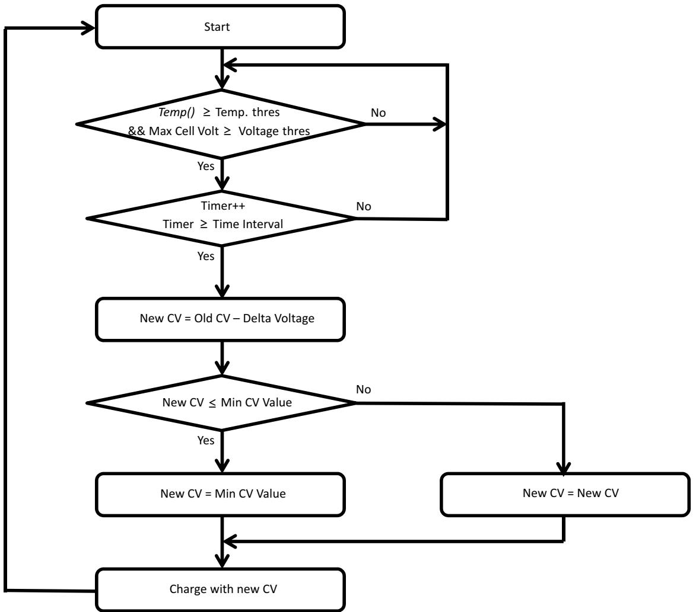  
Figure 4-1. Cell Swelling Control

# 5.1 Introduction

To enhance battery life, the bq40z50-R2 device supports several power modes to minimize power consumption during operation.

# 5.2 NORMAL Mode

In NORMAL mode, the device takes voltage, current, and temperature readings every 250 ms, performs protection and gauging calculations, updates SBS data, and makes status decisions at 1-s intervals. Between these periods of activity, the device is in a reduced power state.

If the [NR] bit is set, the PRES input can be left floating, as it is not monitored.

# 5.2.1 BATTERY PACK REMOVED Mode/System Present Detection

# 5.2.1.1 System Present

PRES is sampled four times per second, and if PRES is high for 4 samples (one second), the OperationStatus[PRES] flag is cleared. If PRES is low for 4 samples (one second), the OperationStatus [PRES] flag is set, indicating the system is present (the battery is inserted). If the [NR] bit is set, the PRES input is ignored and can be left floating.

# 5.2.1.2 Battery Pack Removed

The bq40z50-R2 device detects the BATTERY PACK REMOVED mode if the [NR] bit is set to 0 AND the PRES input is high $( I P R E S ] = 0 ,$ ).

On entry to the BATTERY PACK REMOVED mode, the [TCA] and [TDA] flags are set, ChargingCurrent() and ChargingVoltage() are set to 0, the CHG and DSG FETs are turned off, and the precharge FET is turned off (if used).

Polling of the PRES pin continues at a rate of once every 1 s.

The bq40z50-R2 exits the BATTERY PACK REMOVED state if the [NR] flag is set to 0 AND the PRES input is low $\left( I P R E S { } J = 1 \right)$ ). When this occurs, the [TCA] and [TDA] flags are reset.

# 5.3 SLEEP Mode

# 5.3.1 Device Sleep

When the sleep conditions are met, the device goes into SLEEP mode with periodic wakeups for voltage, temperature, and current measurements to reduce power consumption.

OperationStatus()[SLPAD] is set when the gauge wakes to measure voltage and temperature. Similarly, the $_ { I S L P C C ] }$ is set when the gauge wakes for current measurement. In general, it is not possible to read these flags because an SMBus communication will wake up the gauge.

The bq40z50-R2 device returns to NORMAL mode if any exit sleep condition is met.

<table><tr><td>Status</td><td>Condition SMBus low for Bus Timeout(1) if</td><td>Action</td></tr><tr><td>Activate</td><td>[IN_SYSTEM_SLEEP]= 0, or no communication for Bus Timeout if [IN_SYSTEM_SLEEP] = 1 AND DA Config[SLEEP]= 1(1) AND |Current()| ≤ Sleep Current AND Voltage Time &gt; 0 AND (OperationStatus()[PRES]= 0 OR DA Config[NR] = 1) AND OperationStatus()[SDM]= 0 AND No PFAlert() bits set AND() No PFStatus() bits set AND No SafetyAlert() bits set AND(2) No [AOLD], [AÖLDL], [ASCC], [ASCCL], [ASCD], [ASCDL] set in SafetyStatus()</td><td>Turn off CHG FET and PCHG FET if FET Options[SLEEPCHG] = 0.(3) The device goes to sleep. The device wakes up every Sleep:Voltage Time period to measure voltage and temperature. The device wakes up every Sleep:Current Time period to measure current.</td></tr><tr><td>Exit</td><td>SMBus connected (1)OR SMBus command received (4)OR DA Config[SLEEP]= 1(1)OR |Current()| &gt; Sleep Current OR Wake comparator activates (5)OR Voltage Time = 0 OR (OperationStatus()[PRES] = 1 AND DA Config[NR] = 0) OR OperationStatus()[SDM] = 1 OR PFAlert() bits set OR PFStatus() bits set OR SafetyAlert() bits set OR [AOLD], [AOLDL], [ASCC], [ASCCL], [ASCD], [ASCDL] set in SafetyStatus()</td><td>Return to NORMAL mode</td></tr></table>

(1) DA Config[SLEEP] and SMBus low are not checked if the ManufacturerAccess() SLEEP mode command is used to enter SLEEP mode. (2) SafetyAlert()[PTO], [PTOS], [CTO], [CTOS] or PFAlert()[QIM], [OC], [IMP], [CB] will not prevent the gauge to enter SLEEP mode. (3) For $\scriptstyle { I N R l } = 0$ , the CHG FET and PCHG FET remains on in SLEEP mode if $\begin{array} { r } { I ^ { S L E E P C H G } ] = 1 } \end{array}$ , but if the battery pack is removed from the system, the CHG FET is off because the system present takes higher priority than [SLEEPCHG]. (4) Wake on SMBus command is only possible when the gas gauge is put to sleep using the ManufacturerAccess() SLEEP mode command or [IN_SYSTEM_SLEEP] is enabled with Bus Timeout $= 0$ . Otherwise, the gas gauge wakes on an SMBus connection (clock or data high). (5) The wake comparator threshold is set through Power.WakeComparator[WK1,WK0] (see Section 5.3.4).

# 5.3.2 IN SYSTEM SLEEP Mode

The bq40z50-R2 device provides an option for removable packs (that is, DA Config[ $N R I = 0$ ) to enter SLEEP mode in-system. When the DA Config[IN_SYSTEM_ $\pmb { S L E E P } \pmb { l } = 1$ , the device will enter SLEEP mode even if the OperationStatus $( ) I P R E S I = 1$ . This option ignores the PRES pin status only. Additionally, in this option, the SMBus low state is not a condition to enter SLEEP mode (instead, no communication must occur for Bus Timeout to enter SLEEP). All the other sleep conditions must be met for the device to enter SLEEP mode.

In IN SYSTEM SLEEP mode, it is possible to read the $I S L P A C J$ and [SLPCC] flags if [IN_SYSTEM_ $\pmb { S L E E P } \pmb { l } = 1$ and Bus Timeout $= 0$ . This setting allows the gauge to enter SLEEP mode with active communication in progress.

# 5.3.3 ManufacturerAccess() MAC Sleep

The SLEEP MAC command can override the requirement for bus low to enter sleep. In this case, the bq40z50-R2 clock and data high condition is ignored for sleep to exit, though sleep will also exit if there is any further SMBus communication. The bq40z50-R2 device can be sent to sleep with ManufacturerAccess() if specific sleep entry conditions are met.

# 5.3.4 Wake Function

The bq40z50-R2 device can exit SLEEP mode if enabled by the presence of a voltage across SRP and SRN. The voltage threshold needed for the device to wake from SLEEP mode is programmed in Power:Wake Comparator. This allows the gauge to wake up quickly in response to a higher current detection. Otherwise, the gauge only wakes up every Sleep Current Time to detect if |Current()| is $>$ Sleep Current.

Reserved (Bits 7–4, 1–0): Reserved. Do not use.

WK1,0 (Bits 3–2): Wake Comparator Threshold

<table><tr><td rowspan=1 colspan=1>WK1</td><td rowspan=1 colspan=1>WKO</td><td rowspan=1 colspan=1>Voltage</td></tr><tr><td rowspan=1 colspan=1>0</td><td rowspan=1 colspan=1>0</td><td rowspan=1 colspan=1>±0.625 mV</td></tr><tr><td rowspan=1 colspan=1>0</td><td rowspan=1 colspan=1>1</td><td rowspan=1 colspan=1>±1.25 mV</td></tr><tr><td rowspan=1 colspan=1>1</td><td rowspan=1 colspan=1>0</td><td rowspan=1 colspan=1>±2.5 mV</td></tr><tr><td rowspan=1 colspan=1>1</td><td rowspan=1 colspan=1>1</td><td rowspan=1 colspan=1>±5 mV</td></tr></table>

# 5.4 SHUTDOWN Mode

# 5.4.1 VOLTAGE BASED SHUTDOWN

To minimize power consumption and to avoid draining the battery, the device can be configured to shut down at a programmable stack voltage threshold. This function also works in PERMANENT FAILURE mode. When the device is in PERMANENT FAILURE mode, the parameters PF Shutdown Voltage and PF Shutdown Time configure the shutdown threshold.

Table 5-1. PF Shutdown Voltage   

<table><tr><td rowspan=1 colspan=1>Status</td><td rowspan=1 colspan=1>Condition</td><td rowspan=1 colspan=1>Action</td></tr><tr><td rowspan=1 colspan=1>Enable</td><td rowspan=1 colspan=1>Min cell voltage &lt; Shutdown Voltage</td><td rowspan=1 colspan=1>OperationStatus()[SDV] = 1</td></tr><tr><td rowspan=1 colspan=1>Trip</td><td rowspan=1 colspan=1>Min cell voltage continuous &lt; ShutdownVoltage for Shutdown Time</td><td rowspan=1 colspan=1>Turn DSG FET off</td></tr><tr><td rowspan=1 colspan=1>Shutdown</td><td rowspan=1 colspan=1>Voltage at PACK pin &lt; Charger PresentThreshold</td><td rowspan=1 colspan=1>Send device into SHUTDOWN mode</td></tr><tr><td rowspan=1 colspan=1>Exit</td><td rowspan=1 colspan=1>Voltage at PACK pin &gt; VTARTUP</td><td rowspan=1 colspan=1>OperationStatus()[SDV] = 0Return to NORMAL mode</td></tr></table>

Table 5-2. PF Shutdown Time   

<table><tr><td rowspan=1 colspan=1>Class</td><td rowspan=1 colspan=1>Subclass</td><td rowspan=1 colspan=1>Name</td><td rowspan=1 colspan=1>Format</td><td rowspan=1 colspan=1>Size inBytes</td><td rowspan=1 colspan=1>Min Value</td><td rowspan=1 colspan=1>Max Value</td><td rowspan=1 colspan=1>DefaultValue</td><td rowspan=1 colspan=1>Unit</td></tr><tr><td rowspan=1 colspan=1>Power</td><td rowspan=1 colspan=1>Shutdown</td><td rowspan=1 colspan=1>PF ShutdownVoltage</td><td rowspan=1 colspan=1>Int</td><td rowspan=1 colspan=1>2</td><td rowspan=1 colspan=1>0</td><td rowspan=1 colspan=1>32767</td><td rowspan=1 colspan=1>1750</td><td rowspan=1 colspan=1>mV</td></tr></table>

<table><tr><td rowspan=1 colspan=1>Class</td><td rowspan=1 colspan=1>Subclass</td><td rowspan=1 colspan=1>Name</td><td rowspan=1 colspan=1>Format</td><td rowspan=1 colspan=1>Size inBytes</td><td rowspan=1 colspan=1>Min Value</td><td rowspan=1 colspan=1>Max Value</td><td rowspan=1 colspan=1>DefaultValue</td><td rowspan=1 colspan=1>Unit</td></tr><tr><td rowspan=1 colspan=1>Power</td><td rowspan=1 colspan=1>Shutdown</td><td rowspan=1 colspan=1>PF Shutdown Time</td><td rowspan=1 colspan=1>UnsignedInt</td><td rowspan=1 colspan=1>1</td><td rowspan=1 colspan=1>0</td><td rowspan=1 colspan=1>255</td><td rowspan=1 colspan=1>10</td><td rowspan=1 colspan=1>s</td></tr></table>

NOTE: The bq40z50-R2 device goes through a full reset when exiting from SHUTDOWN mode, which means the device will reinitialize. On power up, the gauge will check some special memory locations. If the memory checksum is incorrect, or if the gauge or the AFE watchdog has been triggered, the gauge will do a full reset.

If the memory checksum is good, for example, in a case of a short power glitch, the gauge will do a partial reset. The initialization is faster in a partial reset, and certain memory data will not be reinitialized (for example, all SBS registers, last known FET state, last ADC and CC readings, and so on), and so a partial reset is usually transparent to the host.

# 5.4.2 ManufacturerAccess() MAC Shutdown

In SHUTDOWN mode, the device turns off the FETs after FET Off Time, and then shuts down to minimize power consumption after Delay time. FET Off Time and Delay time are referenced to the time the gauge receives the command. Thus, the Delay time must be set longer than FET Off Time. The bq40z50-R2 device returns to NORMAL mode when the voltage at the PACK pi $\tau > \mathsf { V } _ { \mathsf { S T A R T U P } }$ . The $\mathsf { b q 4 0 z 5 0 \cdot }$ R2 device can be sent to this mode with the ManufacturerAccess() Shutdown command. Charger voltage must not be present for the device to enter SHIP SHUTDOWN mode.

NOTE: If the gauge is sealed and the MAC Shutdown() command is sent twice in a row, the gauge will execute the shutdown sequence immediately and skip the normal delay sequence.

# 5.4.3 Time Based Shutdown

The bq40z50-R2 device can be configured to shut down after staying in SLEEP mode without communication for a preset time interval specified in Auto Ship Time. Setting the PowerConfig[AUTO_SHIP_ $\pmb { { \cal E } } { \pmb { M } } { \pmb { l } } = 1$ enables this feature. Any communication to the device restarts the timer. When the timer reaches Auto Ship Time, the time-based shutdown effectively triggers the MAC shutdown command to start the shutdown sequence. The bq40z50-R2 device returns to NORMAL mode when voltage at PACK pin $> \mathsf { V }$ STARTUP.

# 5.4.4 Power Save Shutdown

Power Save Shutdown is enabled when [PWR_SAVE_VSHUT] is set. The bq40z50-R2 enters Power Save Shutdown when the lowest cell voltage is below PS Shutdown Voltage and when: NoLoadRemCap() ≤ PS No Load Res Cap Threshold.

<table><tr><td rowspan=1 colspan=1>Status</td><td rowspan=1 colspan=1>Condition</td><td rowspan=1 colspan=1>Action</td></tr><tr><td rowspan=1 colspan=1>Enable</td><td rowspan=1 colspan=1>Min cell voltage &lt; PS Shutdown Voltage</td><td rowspan=1 colspan=1>OperationStatus()[PSSHUT] = 1</td></tr><tr><td rowspan=1 colspan=1>Trip</td><td rowspan=1 colspan=1>Min cell voltage continuous &lt; PS Shutdown VoltageAND NoLoadRemCap() ≤ PS No Load Res Cap ANDRSOC = 0% AND the [REST] bit must be set.</td><td rowspan=1 colspan=1>Turn DSG FET off</td></tr><tr><td rowspan=1 colspan=1>Shutdown</td><td rowspan=1 colspan=1>Voltage at PACK pin &lt; Charger Present Threshold</td><td rowspan=1 colspan=1>Send device into SHUTDOWN mode.</td></tr><tr><td rowspan=1 colspan=1>Exit</td><td rowspan=1 colspan=1>Voltage at PACK pin &gt; VsTARTUP</td><td rowspan=1 colspan=1>OperationStatus()[PSSHUT] = 0Return to NORMAL mode</td></tr></table>

Table 5-3. PS Shutdown Voltage   

<table><tr><td rowspan=1 colspan=1>Class</td><td rowspan=1 colspan=1>Subclass</td><td rowspan=1 colspan=1>Name</td><td rowspan=1 colspan=1>Format</td><td rowspan=1 colspan=1>Size inBytes</td><td rowspan=1 colspan=1>Min Value</td><td rowspan=1 colspan=1>Max Value</td><td rowspan=1 colspan=1>DefaultValue</td><td rowspan=1 colspan=1>Unit</td></tr><tr><td rowspan=1 colspan=1>Power</td><td rowspan=1 colspan=1>Shutdown</td><td rowspan=1 colspan=1>PS ShutdownVoltage</td><td rowspan=1 colspan=1>Int</td><td rowspan=1 colspan=1>2</td><td rowspan=1 colspan=1>0</td><td rowspan=1 colspan=1>32767</td><td rowspan=1 colspan=1>2500</td><td rowspan=1 colspan=1>mV</td></tr></table>

Table 5-4. PS No Load Res Cap   

<table><tr><td rowspan=1 colspan=1>Class</td><td rowspan=1 colspan=1>Subclass</td><td rowspan=1 colspan=1>Name</td><td rowspan=1 colspan=1>Format</td><td rowspan=1 colspan=1>Size inBytes</td><td rowspan=1 colspan=1>Min Value</td><td rowspan=1 colspan=1>Max Value</td><td rowspan=1 colspan=1>DefaultValue</td><td rowspan=1 colspan=1>Unit</td></tr><tr><td rowspan=1 colspan=1>Power</td><td rowspan=1 colspan=1>Shutdown</td><td rowspan=1 colspan=1>PS No LoadRes Cap</td><td rowspan=1 colspan=1>UnsignedInt</td><td rowspan=1 colspan=1>2</td><td rowspan=1 colspan=1>0</td><td rowspan=1 colspan=1>32767</td><td rowspan=1 colspan=1>0</td><td rowspan=1 colspan=1>mAh</td></tr></table>

# 5.5 Option to Manage Unintended Wakeup from Shutdown

In some user systems, there can be glitches on the supply line during mass production. This can result in a glitch getting to the PACK pin $( \mathsf { V } _ { \mathsf { P A C K } } )$ , which can then unintentionally wake up a device that was in shutdown.

The feature to manage an unintended wakeup from shutdown, if enabled (with the [CHECK_WAKE] bit), manages a shutdown of the gauge by any allowed shutdown process (except for VOLTAGE BASED SHUTDOWN and POWER SAVE SHUTDOWN, both of which are excluded from this feature). This feature does not function on a wake/start up from a reset.

When this feature is active on wake up from shutdown, the gauge starts a Delay timer (with the default of 2 s) and looks for communication to the gauge during this time—with CHG and DSG FETs remaining off. If during the Delay timer period there is no valid communication with the device, then the device goes back into shutdown (with FETs turned off). If there is valid communication within the Delay timer period, then the device stays in wake and continues like a normal wakeup. Valid communication means the gauge receives a valid address and a command. (It does not matter if the command is invalid. Invalid commands are OK with a valid address.)

One variant to this is the wake up from an IATA shutdown. In this case, each time the gauge wakes up, the IATA function will be called as usual. However, if the gauge then goes back into shutdown (because it was an unintended wakeup from shutdown), then the [IATA_SHUT] bit will be set before going into shutdown again and the FCC and RemCap stored during the original IATA shutdown will still be kept for the next wakeup.

Additionally, the number of times the gauge wakes up from shutdown unintentionally is recorded. This "unintentional wakeup" counter is reset when the gauge wakes up and sees valid communication. If this count exceeds a threshold (Count, with the default of 3), then the next time the gauge wakes up from shutdown, it will execute a normal wakeup without looking for valid communication (and the counter recording wakeup will be reset). If the Count is set to 0, then no threshold exists and the gauge will only wake up with valid communications.

NOTE: If this feature is enabled ([CHECK_WAKE] set high), then by default the CHG and DSG FETs are off on wake up from SHUTDOWN (during the Delay timer period); thus, the FETs will turn on only if the gauge enters a normal wakeup. However, if the [CHECK_WAKE_FET] bit is set (default it is low), then the FETs will not be forced off during the Delay timer period.

# 5.6 Emergency FET Shutdown (EMSHUT)

The Emergency FET Shutdown function provides an option to disable the battery power to the system by opening up the CHG and DSG FETs before removing an embedded battery pack. There are two ways to enter the EMERGENCY FET SHUTDOWN state:

a. Use an external signal (for example, a push-button switch) to detect a low-level threshold signal on the SHUTDN pin.   
b. Send a Manual FET Control (MFC) sequence to ManufacturerAccess().

When the gauge is in the EMERGENCY FET SHUTDOWN state, the OperationStatus()[EMSHUT] = 1.

# 5.6.1 Enter Emergency FET Shutdown Through SHUTDN

When a high-to-low transition on the SHUTDN pin is detected with a debounce delay of about 1 s for the low level threshold, the gauge will turn off the CHG and DSG FETs immediately. This entry method only applies if $\begin{array} { r } { I N R } { I } = 1  \end{array}$ and DA Configuration[EMSHUT] $= 1$ . If $\begin{array} { r } { I N R { 1 } = 0 } \end{array}$ , the SHUTDN pin will restore to the regular system present detection.

# 5.6.2 Enter Emergency FET Shutdown Through MFC

Alternatively, sending a manual FET control (MFC) sequence using the steps below also puts the gauge to the EMERGENCY FET SHUTDOWN state. This entry method applies to $\scriptstyle { I N R l } = 0$ and $\begin{array} { r } { [ N R ] = 1 } \end{array}$ .

a. Send word $0 \times 2 7 0 0$ to ManufacturerAccess() $( 0 \times 0 0 )$ to enable the MFC.   
b. Within $4 \thinspace s$ , send word $0 \times 0 4 3 \mathsf { D }$ to ManufacturerAccess() $( 0 \times 0 0 )$ to turn off CHG and DSG FETs.   
c. The CHG and DSG FETs will be off after Manual FET Control Delay.

# 5.6.3 Exit Emergency FET Shutdown

Regardless of which EMSHUT entry method is used, the gauge can exit the EMSHUT mode by turning on the CHG and DSG FETs with any one of the following conditions:

A high-to-low transition on the SHUTDN pin is detected with a debounce delay of 1 s for the low level threshold. For example, a push button is pressed again. This exit condition can be disabled by setting the [EMSHUT_PEXIT_DIS] bit in the DA Configuration register.   
Send word $0 { \times } 2 3 { \mathsf { A } } 7$ to ManufacturerAccess() (0x00).   
Voltage at Pack pin $>$ Charger Present Threshold for two sample periods (that is, ${ \sim } 5 0 0 ~ \mathrm { m s }$ ). This exit condition requires the [EMSHUT_EXIT_VPACK] bit to be set.   
Valid SMBus communication is received. Valid SMBus communication means a valid gauge address and any command is received (that is, an invalid command with a valid address is OK). This exit condition requires the [EMSHUT_EXIT_COMM] bit to be set. When using this exit option, the Manual FET Control (MFC) Delay should be set to a minimum of 4 seconds.

In addition to these exit conditions, if the gauge enters EMSHUT (via a push button, for example), it can exit the EMSHUT mode after a shutdown restore timeout defined by the Timeout parameter. When setting the timeout is equal to 0, it will not exit EMSHUT mode.

For the case of $\begin{array} { r } { I N R { 1 } = 0 } \end{array}$ , a battery insertion will also exit the EMERGENCY FET SHUTDOWN mode.

In EMSHUT mode, to detect the voltage level at the Pack pin quickly (even while in SLEEP), the AD conversion will occur every second.

# 6.1 Introduction

The bq40z50-R2 measures individual cell voltages, pack voltage, temperature, and current. It determines battery state-of-charge by analyzing individual cell voltages when a certain relax time has passed since the last charge or discharge activity of the battery.

The bq40z50-R2 measures charge and discharge activity by monitoring the voltage across a small-value series sense resistor (1-mΩ typical) between the negative terminal of the cell stack and the negative terminal of the battery pack. The battery state-of-charge is subsequently adjusted during a load or charger application using the integrated charge passed through the battery. The bq40z50-R2 device is capable of supporting a maximum battery pack capacity of 32 Ah. See the Theory and Implementation of Impedance Track™ Battery Fuel-Gauging Algorithm in bq20zxx Product Family (SLUA364) for further details.

The default for Impedance Track gauging is off. To enable the gauging function, set Manufacturing Status[GAUGE_ $E N \bar { y } = \mathrm { 1 }$ . The gauging function will be enabled after a reset or a seal command is set. Alternatively, the Gauging() MAC command can be used to turn on and off the gauging function. The Gauging() command will take effect immediately and the [GAUGE_EN] will be updated accordingly.

The GaugeStatus1(), GaugeStatus2(), and GaugeStatus3() commands return various gauging related information that is useful for problem analysis.

# 6.2 Impedance Track Configuration

Load Mode — During normal operation, the battery-impedance profile compensation of the Impedance Track algorithm can provide more accurate full-charge and remaining state-of-charge information if the typical load type is known. The two selectable options are constant current (Load Mode $= 0$ ) and constant power (Load Mode $= 1$ ).

Load Select — To compensate for the ${ \sf I } \times { \sf R }$ drop near the end of discharge, the bq40z50-R2 must be configured for the current (or power) that will flow in the future. While it cannot be exactly known, the bq40z50-R2 can use load history, such as the average current of the present discharge, to make a sufficiently accurate prediction.

The bq40z50-R2 can be configured to use several methods of this prediction by setting the Load Select value. Because this estimate has only a second-order effect on remaining capacity accuracy, different measurement-based methods (methods 0–3 and method 7) result in only minor differences in accuracy. However, methods 4–6, where an estimate is arbitrarily user-assigned, can result in a significant error if a fixed estimate is far from the actual load. For highly variable loads, selection 7 provides the most conservative estimate and is preferable.

Constant Current (Load Mode $= 0$ $0 =$ Avg I Last Run $\uparrow =$ Present average discharge current ${ \boldsymbol { 2 } } =$ Current() $\mathfrak { z } =$ AverageCurrent() $4 =$ Design Capacity mAh/5 $5 =$ AtRate() (mA) ${ \mathfrak { b } } =$ User Rate-mA $7 =$ Max Avg I Last Run (default)

Constant Power (Load Mode $= 1$ )   
Avg P Last Run   
Present average discharge power   
Current() $\times$ Voltage()   
AverageCurrent() $\times$ average Voltage()   
Design Capacity cWh/5   
AtRate() (cW)   
User Rate-cW   
Max Avg P Last Run

Pulsed Load Compensation and Termination Voltage — To take into account pulsed loads while calculating remaining capacity until Term Voltage threshold is reached, the bq40z50-R2 monitors not only average load but also short load spikes. The maximum voltage deviation during a load spike is continuously updated during discharge and stored in Delta Voltage.

Reserve Battery Capacity — The bq40z50-R2 allows an amount of capacity to be reserved in either mAh (Reserve Cap-mAh, Load Mode $= 0$ ) or cWh (Reserve Cap-cWh, Load Mode $= 1$ ) units between the point where the RemainingCapacity() function reports zero capacity and the absolute minimum pack voltage, Term Voltage. This enables a system to report zero energy, but still have enough reserve energy to perform a controlled shutdown or provide an extended sleep period for the host system.

The reserve capacity is compensated at the present discharge rate as selected by Load Select.

No Load Reserve Capacity — The PS No Load Res Cap threshold is programmed to a value in mAh based on how much capacity to reserve for powering the RTC for a period of time after RSOC is $0 \%$ .

Table 6-1. PS No Load Res Cap   

<table><tr><td rowspan=1 colspan=1>Class</td><td rowspan=1 colspan=1>Subclass</td><td rowspan=1 colspan=1>Name</td><td rowspan=1 colspan=1>Format</td><td rowspan=1 colspan=1>Size inBytes</td><td rowspan=1 colspan=1>Min</td><td rowspan=1 colspan=1>Max</td><td rowspan=1 colspan=1>Default</td><td rowspan=1 colspan=1>Unit</td></tr><tr><td rowspan=1 colspan=1>Power</td><td rowspan=1 colspan=1>Shutdown</td><td rowspan=1 colspan=1>PS No LoadRes Cap</td><td rowspan=1 colspan=1>Unsigned Int</td><td rowspan=1 colspan=1>2</td><td rowspan=1 colspan=1>0</td><td rowspan=1 colspan=1>32767</td><td rowspan=1 colspan=1>0</td><td rowspan=1 colspan=1>mAh</td></tr></table>

NOTE: There is no requirement to change Term Voltage, and this can remain set to the minimum system operation voltage.

Pack Based and Cell Based Termination — The bq40z50-R2 forces RemainingCapacity() to 0 mAh when the battery stack voltage reaches the Term Voltage for a period of Term V Hold Time. If IT Gauging Configuration[CELL_ ${ \boldsymbol { T } } { \boldsymbol { E } } { \boldsymbol { R } } { \boldsymbol { M } } { \boldsymbol { ] } } = { \boldsymbol { \mathrm { 1 } } }$ , the battery can terminate based on cell voltage or pack voltage. When the cell-based termination is used, the Term Min Cell V threshold is checked for the termination condition. The cell-based termination can provide an option to enable the gauge to reach $0 \%$ before the device triggers CUV for a pack imbalance.

Table 6-2. Term V Hold Time   

<table><tr><td rowspan=1 colspan=1>Class</td><td rowspan=1 colspan=1>Subclass</td><td rowspan=1 colspan=1>Name</td><td rowspan=1 colspan=1>Format</td><td rowspan=1 colspan=1>Size inBytes</td><td rowspan=1 colspan=1>Min Value</td><td rowspan=1 colspan=1>Max Value</td><td rowspan=1 colspan=1>DefaultValue</td><td rowspan=1 colspan=1>Unit</td></tr><tr><td rowspan=1 colspan=1>GasGauging</td><td rowspan=1 colspan=1>IT Cfg</td><td rowspan=1 colspan=1>Term V HoldTime</td><td rowspan=1 colspan=1>Unsigned Int</td><td rowspan=1 colspan=1>1</td><td rowspan=1 colspan=1>0</td><td rowspan=1 colspan=1>255</td><td rowspan=1 colspan=1>1</td><td rowspan=1 colspan=1>s</td></tr></table>

# 6.3 Gas Gauge Modes

Resistance updates take place only in DISCHARGE mode, while open circuit voltage (OCV) and QMax updates only take place in RELAX mode. If Fast Qmax is enabled, the Qmax also updates at the end of discharge given a minimum of $3 7 \%$ delta change of charge. Entry and exit of each mode is controlled by data flash parameters in the subclass Gas Gauging: Current Thresholds section. When the device is determined to be in RELAX mode and OCV is taken, the GaugingStatus()[REST] flag is set. In RELAX mode or DISCHARGE mode, the DSG flag in BatteryStatus() is set.

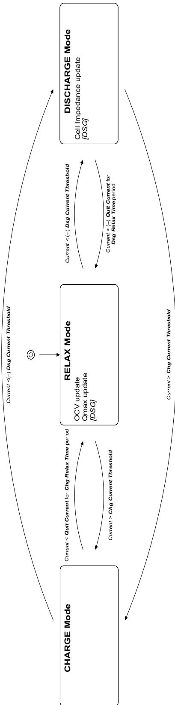  
Figure 6-1. Gas Gauge Operating Modes

CHARGE mode is exited and RELAX mode is entered when current goes below Quit Current for a period of Chg Relax Time. DISCHARGE mode is entered when current goes below $( - ) D s g$ Current Threshold.

DISCHARGE mode is exited and RELAX mode is entered when current goes above (–)Quit Current threshold for a period of Dsg Relax Time.

• CHARGE mode is entered when current goes above Chg Current Threshold.

<table><tr><td rowspan=1 colspan=1>[DSG]</td><td rowspan=1 colspan=1>1</td><td rowspan=1 colspan=1>0</td><td rowspan=1 colspan=1>1</td><td rowspan=1 colspan=1>1</td><td rowspan=1 colspan=1>0</td><td rowspan=1 colspan=1>1</td><td rowspan=1 colspan=1>1</td></tr></table>

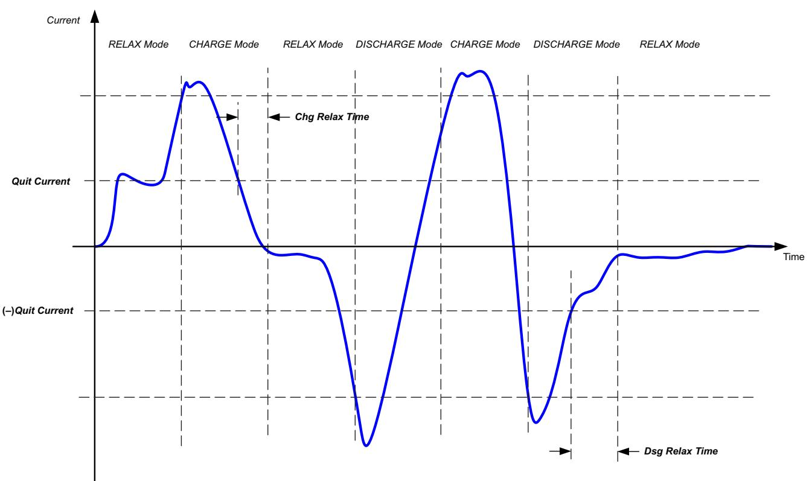  
Figure 6-2. Gas Gauge Operating Mode Example

# 6.4 QMax and Ra

The total battery capacity is found by comparing states of charge before and after charge and discharge with the amount of charge passed. When an applications load is applied, the impedance of each cell is measured by comparing the open circuit voltage (OCV) obtained from a predefined function for present state-of-charge with the measured voltage under load.

Measurements of OCV and charge integration determine chemical state-of-charge and chemical capacity (QMax).

The bq40z50-R2 acquires and updates the battery-impedance profile during normal battery usage. It uses this profile, along with state-of-charge and the QMax values, to determine FullChargeCapacity and RelativeStateOfCharge specifically for the present load and temperature. FullChargeCapacity reports a capacity or energy available from a fully charged battery reduced by Reserve Cap-mAh or Reserve CapcWh under the present load and present temperature until voltage reaches the Term Voltage.

# 6.4.1 QMax Initial Values

The initial QMax Pack, QMax Cell 0, QMax Cell 1, QMax Cell 2, and QMax Cell 3 values should be taken from the cell manufacturers' data sheet multiplied by the number of parallel cells, and are also used for the DesignCapacity function value in the Design Capacity data flash value.

See the Theory and Implementation of Impedance Track Battery Fuel-Gauging Algorithm in bq20zxx Product Family Application Report (SLUA364) for further details.

# 6.4.2 QMax Update Conditions

A QMax update is enabled when gauging is enabled. This is indicated by the GaugingStatus()[QEN] flag. The bq40z50-R2 updates the no-load full capacity (QMax) when two open circuit voltage (OCV) readings are taken. These OCV readings are taken when the battery is in a relaxed state before and after charge or discharge activity. A relaxed state is achieved if the battery voltage has a dV/dt $0 \mathsf { f } < 4 \mu \mathsf { V } / \mathsf { s }$ . Typically, it takes 2 hours in a charged state and 5 hours in a discharged state to ensure that the dV/dt condition is satisfied. If 5 hours is exceeded, a reading is taken even if the dV/dt condition was not satisfied. The GaugingStatus()[REST] flag is set when a valid OCV reading occurs. If a valid DOD0 (taken at the previous QMax update) is available, then QMax will also be updated when a valid charge termination is detected.

The flag is cleared at the exit of a relaxed state. A QMax update is disqualified under the following conditions:

Temperature — If Temperature() is outside of the range $1 0 ^ { \circ } \mathsf { C }$ to $4 0 ^ { \circ } \mathsf { C }$ .

Delta Capacity — If the capacity change between suitable battery rest periods is less than $3 7 \%$

Voltage — If CellVoltage4..1() is inside a flat voltage region. (See the Support of Multiple Li-Ion Chemistries with Impedance Track Gas Gauges Application Report (SLUA372) for the voltage ranges of other chemistries.) This flat region is different with different chemistry. The GaugingStatus()[OCVFR] flag indicates if the cell voltage is inside this flat region.

Offset Error — If offset error accumulated during time passed from previous OCV reading exceeds $1 \%$ of Design Capacity, update is disqualified. Offset error current is calculated as Coulomb Counter Deadband / sense resistor value.

Several flags in GaugingStatus() are helpful to track for QMax update conditions. The [REST] flag indicates an OCV is taken in RELAX mode. The [VOK] flag indicates the last OCV reading is qualified for the QMax update. The [VOK] is set when charge or discharge starts. It clears when the QMax update occurs, when the offset error for a QMax disqualification is met, or when there is a full reset. The [QMax] flag will be toggled when the QMax update occurs. GaugeStatus2() and GaugeStatus3() return the QMax and DOD (depth of discharge, corresponding to the OCV reading) data.

The bq40z50-R2 device includes a check in which, during discharge, there must be a minimum change in Voltage() programmed in Min Delta Voltage. There is also a maximum change set in Max Delta Voltage.

Table 6-3. Min DeltaV   

<table><tr><td rowspan=1 colspan=1>Class</td><td rowspan=1 colspan=1>Subclass</td><td rowspan=1 colspan=1>Name</td><td rowspan=1 colspan=1>Format</td><td rowspan=1 colspan=1>Size inBytes</td><td rowspan=1 colspan=1>Min Value</td><td rowspan=1 colspan=1>Max Value</td><td rowspan=1 colspan=1>DefaultD Value</td><td rowspan=1 colspan=1>Unit</td></tr><tr><td rowspan=1 colspan=1>GasGauging</td><td rowspan=1 colspan=1>IT Cfg</td><td rowspan=1 colspan=1>Min Deltaoltage</td><td rowspan=1 colspan=1>Int</td><td rowspan=1 colspan=1>2</td><td rowspan=1 colspan=1>-32768</td><td rowspan=1 colspan=1>32767</td><td rowspan=1 colspan=1>0</td><td rowspan=1 colspan=1>mV</td></tr></table>

Table 6-4. Max DeltaV   

<table><tr><td rowspan=1 colspan=1>Class</td><td rowspan=1 colspan=1>Subclass</td><td rowspan=1 colspan=1>Name</td><td rowspan=1 colspan=1>Format</td><td rowspan=1 colspan=1>Min Value</td><td rowspan=1 colspan=1>Max Value</td><td rowspan=1 colspan=1>Default Value</td><td rowspan=1 colspan=1>Unit</td></tr><tr><td rowspan=1 colspan=1>Gas Gauging</td><td rowspan=1 colspan=1>IT Cfg</td><td rowspan=1 colspan=1>Max DeltaVoltage</td><td rowspan=1 colspan=1>I2</td><td rowspan=1 colspan=1>-32768</td><td rowspan=1 colspan=1>32767</td><td rowspan=1 colspan=1>200</td><td rowspan=1 colspan=1>mV</td></tr></table>

# 6.4.3 Fast Qmax Update Conditions

The Fast Qmax update conditions are very similar to the QMax update conditions with the following differences:

Instead of taking two OCV readings for QMax update, a Fast Qmax update requires only one OCV reading AND   
• The battery pack should discharge below $10 \%$ RSOC.

The differences in requirements allow the Fast Qmax feature to have a QMax update at the end of discharge (given one OCV reading is already available and discharge below $1 0 \%$ RSOC) without a longer relax time after a discharge event. Typically, it can take up to 5 hours in a discharge state to ensure the d $\mathsf { V } / \mathsf { d } \mathsf { t } < 4 ~ \mathsf { \mu } \mathsf { V } / \mathsf { s }$ condition is satisfied. The temperature, delta capacity, voltage, and offset error requirements for QMax update are still required for the Fast Qmax update.

This feature is particularly useful for reducing production QMax learning cycle time or for an application that is mostly in charge or discharge stage with infrequent relaxation. Setting $\pmb { \cal { \cal { T } } }$ Gauging Configuration[FAST_QMAX_ $L R N ] = 1$ enables Fast Qmax during production learning only (that is, Update Status $= 6$ ). When setting $\pmb { \cal { \cal { T } } }$ Gauging Configuration[FAST_QMAX_ $\pmb { F } \pmb { L } \pmb { D } \pmb { J } = \bar { \mathcal { 1 } }$ , Fast Qmax is enabled when Impedance Track is enabled and Update Status $\geq 6$ .

# 6.4.4 QMax and Fast Qmax Update Boundary Check

The bq40z50-R2 implements a QMax and Fast Qmax check prior to saving the value to data flash. This improves the robustness of the QMax update in case of potential QMax corruption during the update process.

The verifications are as follows:

1. Verify that the updating QMax or Fast Qmax value is within Qmax Delta Percent, which is the maximum allowed QMax change for each update. If the updating value is outside of this data flash parameter, the bq40z50-R2 caps the change to Qmax Delta Percent of the Design Capacity.   
2. Bound the absolute QMax value, Qmax Upper Bound. This is the maximum allowed QMax value ove the lifetime of the pack.   
3. Ensure that QMax is greater than 0 before saving to data flash.

# 6.4.5 Ra Table Initial Values

The Ra table is part of the impedance profile that updates during discharge when gauging is enabled. The initial Cell 0 R_a0...14, Cell 1 R_a0...14, Cell 2 R_a0...14, Cell 3 R_a0...14 values should be programmed by selecting the correct chemistry data during data flash configuration. A chemistry database is constantly updating, and can be downloaded from the Gas Gauge Chemistry Updater product web page (http://www.ti.com/tool/gasgaugechem-sw). The initial xCell 0 R_a0...14, xCell 1 R_a0...14, xCell 2 R_a0...14, xCell 3 R_a0...14 values are a copy of the non-x data set. Two sets of Ra tables are used alternatively when gauging is enabled to prevent wearing out the data flash.

The Cell 0 R_a Flag, Cell 1 R_a Flag, Cell 2 R_a Flag, Cell 3 R_a Flag and the xCell 0 R_a Flag, xCell 1 R_a Flag, xCell 2 R_a Flag, xCell 3 R_a Flag indicate the validity of the cell impedance table for each cell.

NOTE: FW updates these values: It is not recommended to change them manually.   

<table><tr><td rowspan=1 colspan=1>High Byte</td><td rowspan=1 colspan=1></td><td rowspan=1 colspan=1>Low Byte</td><td rowspan=1 colspan=1></td></tr><tr><td rowspan=1 colspan=1>0x00</td><td rowspan=1 colspan=1>Cell impedance and QMaxupdated</td><td rowspan=1 colspan=1>0x00</td><td rowspan=1 colspan=1>Table is not used and QMaxupdated.</td></tr><tr><td rowspan=1 colspan=1>0x05</td><td rowspan=1 colspan=1>RELAX mode and QMaxupdate in progress</td><td rowspan=1 colspan=1>0x05</td><td rowspan=1 colspan=1>RSVD</td></tr><tr><td rowspan=1 colspan=1>0x55</td><td rowspan=1 colspan=1>DISCHARGE mode and cellimpedance updated</td><td rowspan=1 colspan=1>0x55</td><td rowspan=1 colspan=1>Table is used.</td></tr><tr><td rowspan=1 colspan=1>0xFF</td><td rowspan=1 colspan=1>Cell impedance never updated</td><td rowspan=1 colspan=1>0xFF</td><td rowspan=1 colspan=1>A Fast Qmax update withoutOCV read will also clear theR_DIS flag. Table is neverused, no QMax or cellimpedance update.</td></tr></table>

# 6.4.6 Ra Table Update Conditions

The impedance is different across different DOD states. Each cell has $1 5 \mathsf { R a }$ grid points presenting the impedance from $0 \% { - } 1 0 0 \%$ DOD. In general, the Ra table is updated during discharge. The GaugingStatus $( ) [ R X ]$ flag will toggle when the Ra grid point is updated. The Ra update is disabled if any of the following conditions are met. The GaugingStatus $( ) \dot { \left[ R \_ D / S \right] }$ is set to indicate the Ra update is disabled.

During the optimization cycle, the Ra update is disabled until QMax is updated (that is, Ra will no updated if Update Status $= 4$ ) OR   
Ra update is disabled if the charge accumulation error $> 2 \%$ of Design Capacity OR   
During a discharge, a bad Ra value is calculated:   
– A negative Ra is calculated or   
– A bad RaScale value is calculated.

A valid OCV reading during RELAX mode or a Fast Qmax update without an OCV read will clear the [R_DIS] flag.

# 6.4.7 Application of Resistance Scaling

As a part of the Impedance Track algorithm, the bq40z50-R2 calculates an RScale value. The RScale value can be applied in two ways:

When DOD_RSCALE_ $\mathsf { E N } = 0$ in IT Gauging Configuration and when the new RScale is calculated, it is applied across all DODs.   
When DOD_RSCALE_ $\mathsf { E N } = 1$ in IT Gauging Configuration, the new RScale is only applied to DODs higher than the DOD where the new RScale was calculated.

This can prevent early termination of certain simulations, as the RScale will not be applied in computing voltages at DODs below RScale DOD. As a result, sensitivity to passed charge error is drastically decreased for low resistance and high resistance cells.

# 6.5 FullChargeCapacity(FCC), RemainingCapacity(RemCap), and RelativeStateOfCharge(RSOC)

The Impedance Track algorithm applies QMax, impedance, temperature, voltage, and current data to predict the runtime FullChargeCapacity(), RemainingCapacity(), and RelativeStateOfCharge(). These values are updated if any of the following conditions are met, reflecting the battery capacity at real time.

• QMax update occurs   
• Ra update occurs   
• At onset of charge and discharge   
• Valid charge termination   
• Every 5 hours in RELAX mode If temperature changes more than $5 \textdegree C$

# 6.6 Impedance Track Configuration Options

The bq40z50-R2 provides several Impedance Track (IT) configuration options to fine-tune the gauging performance. These configurations can be turned on or off through the corresponding flags in SBS Gauging Configuration or IT Gauging Configuration.

[LOCK0]: After a discharge event, cell voltage will usually recover to a slightly higher voltage during RELAX state. A new OCV reading during this time can result in a slightly higher state-of-charge. This flag provides an option to keep RemainingCapacity() and RelativeStateOfCharge() jumping back during relaxation after $0 \%$ and FD are reached during discharge.

[RSOC_HOLD]: An IT simulation will run at the onset of discharge. If charge terminates at a low temperature and a discharge occurs at a higher temperature, the difference in temperature could cause a small rise of RSOC for a short period of time at the beginning of discharge. This flag option prevents RSOC rises during discharge. RSOC will be held until the calculated value falls below the actual state.

[RSOC_HOLD] should not be used when [SMOOTH] is set.

[RSOCL]: When set, RSOC will be held at $9 9 \%$ until charge termination is detected. When the device exits reset and $[ R S O C L ] = 1$ , then even if the battery is fully charged $( I F C ] = 1 )$ ), only a value of $\leq 9 9 \%$ is reported by RelativeStateOfCharge() until a valid charge termination is detected. See Section 4.6 for more details.

[RFACTSTEP]: The gauge keeps track of an Ra factor of the (old Ra)/(new Ra) during the Ra update. This factor is used for Ra scaling. It is limited to 3 max. During an Ra update, if (old Ra)/(new Ra) is $> 3$ , the gauge can take on two different actions based on the setting of this flag.

If this flag is set to 1 (default), the gauge allows Ra to update once using the max factor of 3, then disables the Ra update. If this flag is set to 0, the gauge will not update Ra and also disables the Ra update. It is recommended to keep the default setting.

[OCVFR]: An OCV reading is taken when a dV/dt condition is met. This is not the case if charging stops within the flat voltage region.

By default, this flag is set. The bq40z50-R2 device will take a 48-hour wait before taking an OCV reading if charge stops below the FlatVoltMax. A discharge will not cancel this 48-hour wait. The 48-hour wait will only be cleared if charging stops above the FlatVoltMax level. Setting this flag to 0 removes the 48-hour wait requirement, and OCV is taken when the dV/dt condition is met. Removing the 48-hour requirement can be useful sometimes to reduce test time during evaluation.

[DOD0EW]: DOD0 readings have an associated error based on the elapsed time since the reading, the conditions at the time of the reading (reset, charge termination, and so on), the temperature, and the amount of relax time at the time of the reading, among others. This flag provides an option to take into account both the previous and new calculated DOD0, which are weighted according to their respective accuracies. This can result in improved accuracy and in a reduction of RSOC jumps after relaxation.

[LFP_RELAX]: This is an option for LiFePO4 chemistry. This flag can be enabled even if non-LiFePO4 chemistry is programmed. The bq40z50-R2 device will check for the chemistry ID (that is, ChemID $=$ 4xx series) before activating this function.

The LiFePO4 has a unique slow Configuration relaxation near full charge. Detailed, in-house test data suggests that the relaxation after a full charge takes a few days to settle. The slow decaying voltage causes RSOC to continue to drop every 5 hours. Depending on the full charge taper current, the fully settled voltage could be close to or even below FlatVoltMax in some cases. For the chemID 4xx (LiFePO4) series, the condition to exit the long RELAX mode is if the pack had previously charged to full or near full state, and then either a significant long relaxation or a non-trivial discharge has happened, such that when in relaxation, the OCV $<$ FlatVoltMax.

The QMax update is disabled because DOD will not be taken as long as it is in LFP_relax mode. By the time the gas gauge exits the LFP_relax mode, the OCV is already in the flat zone. Therefore, the QMax update takes an alternative approach: Once full charge occurs ([FC] bit set), DOD0 $\Vdash$ Dod_at_EOC is automatically assigned and valid for a QMax update. [VOK] is set if there is no QMax update. If QMax is updated, [VOK] is cleared. The DOD error as a result of this action is zero or negligible because in the LiFePO4 table, OCV voltage corresponding to $\mathsf { D O D } = 0$ is much lower.

[Fast_QMAX_LRN] and [Fast_QMAX_FLD]: The first flag enables Fast Qmax during the learning cycle when Update Status $= 0 6$ . The second flag enables Fast Qmax in the field when Update Status $\geq 0 6$ . See Section 6.4.3 for more details.

[RSOC_CONV]: This function is also called fast scaling. It is an option to address the convergence of RSOC to $0 \%$ at a low temperature and a very high rate of discharge. Under such conditions, it is possible to have a drop of RSOC to $0 \%$ , especially if the termination voltage is reached at the DOD region with a widely spaced Ra grid interval. To account for the error caused by the low granularity of the impedance grid interval, the [RSOC_CONV], when enabled, applies a scale factor to impedance, allowing more frequent impedance data updates used for RemCap simulation leading up to $0 \%$ RSOC.

If [RSOC_CONV] is enabled, it is recommended to start this function around the knee region of the discharge curve. This is usually around $10 \%$ of RSOC or around $3 . 3 \ V { - 3 . 5 \ V }$ . This function will check for the cell voltage and RSOC status and start the function when either condition is met. The RSOC and cell voltage setting can be configured through Fast Scale Start SOC or Term Voltage Delta.

[FF_NEAR_EDV]: Fast Filter Near EDV. If this flag is set, the gauge applies an alternative filter, Near EDV Ra Param Filter, for an Ra update in the fast scaling region (starting around $10 \%$ RSOC). This flag should be kept to 1 as default. When this flag is 0, the gauge uses the regular Ra filter, Resistance Parameter Filter. Both of the DF filters should not be changed from the default.

[SMOOTH]: A change in temperature or current rate can cause a significant change in remaining capacity (RemCap) and full charge capacity (FCC), resulting in a jump or drop in the Relative State-of-Charge (RSOC). This function provides an option to prevent an RSOC jump or drop during charge and discharge.

If a jump or drop of RSOC occurs, the device examines the amount of RSOC jump or drop versus the expected end point (that is, the charge termination for the charging condition or the EDV for the discharge condition) and automatically smooths the change of RSOC, and always converges with the filtered (or smoothed) value to the actual charge termination or EDV point. The actual and filtered values are always available. The [SMOOTH] flag selects either the actual or filtered values are returned by the SBS commands.

[RELAX_JUMP_OK] and [RELAX_SMOOTH_OK]: When the battery enters RELAX mode from CHARGE or DISCHARGE mode, the transient voltage may change to RSOC as the battery goes into its RELAX state. Once the battery is in RELAX mode, a change in temperature or self-discharge may also cause a change in RSOC.

If [RELAX_JUMP_ $\mathbf { \boldsymbol { o } } \kappa \mathbf { \boldsymbol { l } } = 1$ , this allows the RSOC jump to occur during RELAX mode. Otherwise, RSOC holds constant during RELAX mode and any RSOC jump will be passed into the onset of the charge or discharge phase.

If [RELAX_SMOOTH_ $\mathbf { \boldsymbol { o } } \kappa \mathbf { \boldsymbol { l } } = 1$ , this allows the amount of the RSOC jump to be smoothed out over a period of Smooth Relax Time. Otherwise, the additional RSOC jump amount will be passed into the onset of charge or discharge phase.

If both flags are set to 1, the [RELAX_JUMP_ $\mathbf { \theta } _ { \mathbf { \theta } } \mathbf { \tilde { \theta } } _ { \mathbf { \tilde { \theta } } } = \mathbf { \frac { \partial } { \partial t } }$ takes higher priority and the RSOC jump is allowed during RELAX mode.

[TDELAV]: This flag setting defines how the Delta Voltage is calculated. By setting this flag to 1, the gauge will calculate Delta Voltage that corresponds to the power spike defined in Min Turbo Power. This flag must be set to 1 if TURBO BOOST mode is used. Otherwise, leaving this flag set to 0 as default enables the gauge to calculate Delta Voltage by using the maximal difference between instantaneous and average voltage.

[CELL_TERM]: This flag provides an option to have a cell voltage based discharge termination. If the minimum cell voltage reaches Term Min Cell V, RemainingCapacity() will be forced to 0 mAh. For more details, see the Pack Based and Cell Based Termination section in Section 6.2.

[CSYNC]: This flag, if set to 1, will synchronize RemainingCapacity() to FullChargeCapacity() at valid charge termination.

[CCT]: This flag provides an option to use FullChargeCapacity() $( I C C T ] = 1 )$ ) or DesignCapacity() $\begin{array} { r l } { ( I C C T ) = } \end{array}$ 0) for a Cycle Count threshold calculation. If FullChargeCapacity() is selected for a Cycle Count threshold calculation, the minimum Cycle Count threshold is always $10 \%$ of Design Capacity. This is to avoid any erroneous Cycle Count increment caused by extremely low FullChargeCapacity().

[CHG_100_SMOOTH_OK]: This handles smoothing in the charge direction to $100 \%$ . For jumps to $100 \%$ during charge, this feature uses the taper termination detection logic to predict when charge termination will occur. The taper termination logic requires two consecutive $4 0 - 5$ windows that meet all taper conditions. After the first 40-s window is satisfied, time-based smoothing will be initiated, smoothing RemCap to smoothed FCC over the next 40-s window. It is important to note that smoothed RemCap will converge to smoothed FCC and not True RemCap.

[TS1, TS0]: These two flags together provide an option to select which one of the individual temperature sensors (TS 1…4) is used by the IT algorithm.

[DSG_0_SMOOTH_OK]: Allows smoothing in the discharge direction when there is a jump to $0 \%$ . For preventing jumps to $0 \%$ during discharge, two DF parameters are used: Term Smooth Start Cell V Delta and Term Smooth Time. Once pack voltage is below Term Smooth Start Cell V Delta and discharging, time-based smoothing is initiated. This smooths RemCap to 0 mAh over the next Term Smooth Time seconds. Term Smooth Start Cell V Delta is a per cell voltage delta. This value is multiplied by the number of cells, added to Terminate Voltage, and checked against Pack Voltage. Smoothing will continue to $0 \%$ unless charging starts (even in RELAX mode).

To assure that the gauge reports $0 \%$ in low voltage situations, the DF Term Smooth Final Cell V Delta is used. This value is multiplied by the number of cells, subtracted from Terminate Voltage, and checked against Pack Voltage. Once voltage passes this threshold, $0 \%$ will be forced even if smoothing was not completed.

NOTE: Term Smooth Final Cell V Delta can be disabled by setting to 0 and is typically expected to be set low enough to enable the system to shut down properly (without brownout).

[DELAY_DROP_TO_0]: If an IT simulation produces zero remaining capacity during DISCHARGE mode, fast scaling is activated before reporting $0 \%$ on RelativeStateofCharge() using [DELAY_DROP_TO_0] $=$ 1.

If the drop in capacity was caused by an error in the Ra table, it will be corrected by the scale and IT simulation from fast scaling. If $I S M O O T H J = 0$ , this would prevent reporting $0 \%$ on RelativeStateofCharge() briefly. If $\begin{array} { r } { [ S M O O T H J = 1 } \end{array}$ , this would prevent RelativeStateofCharge() from being held at or smoothed to $0 \%$ (depending on the setting of [DSG_0_SMOOTH_OK]).

This feature only works if [RSOC_CONV] $= 1$ .

# 6.7 State-of-Health (SOH)

The bq40z50-R2 implements a new state-of-health (SOH) function. Previously, the SOH of a battery was typically represented by the actual runtime FullChargeCapacity/Design Capacity (or FCC/DC). Using the runtime FCC, however, was not a very good representation for the state-of-health because the runtime FCC reflects the usable capacity under load. A high current load reduces the runtime FCC. If using just the FCC/DC calculation for SOH, the SOH under high load will be worse than the SOH under typical load. However, a smaller usable capacity at high load does not mean the SOH of a battery is degraded. This is the same when FCC is reduced at a lower temperature.

The bq40z50-R2 implementation of state-of-health addresses these issues. It provides the SOH of the battery through an SBS command, SOH(). The $s O H ( )$ is calculated using the FCC simulated at $\mathsf { 2 5 ^ { \circ } C }$ with current specified by SOH Load Rate. The SOH Load Rate can be set to the typical current of the application, and it is specified in hour-rate (that is, Design Capacity/SOH Load Rate will be the current used for the SOH simulation). This data flash setting is used for $s \bar { O } H ( \ l )$ calculation only. This SOH FCC is updated at the same time ASOC and RSOC are updated. Since this implementation removes the variation of current or temperature, it is a better representation of a battery’s state-of-health. The SOH FCC is available on MAC StateofHealth().

# 6.8 TURBO Mode 2.0

A system with TURBO Mode 2.0 applies short high-power load pulses (for example, up to 4 C-rate for as long as $1 0 ~ \mathsf { m } \mathsf { s }$ ). In addition, 10-s load pulses of 2 C-rate can occur in some cases prior to 10-ms pulses, resulting in a combined effect during the turbo boost operation. The 10-s pulse support is new (relative to TURBO Mode 1.0).

These high-power pulses may drop down battery voltage. If the battery voltage drops below the Shutdown Voltage, the system will shut down. To avoid shutting down the system during turbo boost operation, the system should never apply a pulse that would cause the system voltage to drop below the termination voltage (or exceed the recommended current threshold) that could result in a shutdown, reducing the total available run time.

The TURBO Mode in the bq40z50-R2 helps the system to adjust the power level by providing information about maximal power, depending on the battery state-of-charge, temperature, and present battery impedance. In particular, the gauge informs the system about the power level above which would either cause the system voltage to drop below termination after the 10-s pulse, called the sustained peak power (SPP). In addition, the gauge also reports the maximum power for the combined 10-s and 10-ms pulses called the maximum peak power (MPP).

The SPP is computed using a 10-s effective resistance that is temperature- and DOD-dependent. The computation of MPP uses the high frequency resistance along with the 10-s effective resistance. Both of these resistances are chemistry-specific. In addition, the Pack Resistance and System Resistance are important parameters used in the calculation of these two powers. The computed TURBO mode currents, the sustained peak current, and the maximum peak current are capped to their respective maximum discharge rates. Depending on how often the system polls the peak power data and how fast the system can switch to a lower power mode, it is possible to exceed the reported peak power levels during the present power consumption. To avoid any system shutdown, the gauge provides a Reserve Energy $\%$ setting, which can serve as a buffer to ensure there is available energy at the present average discharge rate.

# 6.9 Battery Trip Point (BTP)

Required for WIN8 OS, the battery trip point (BTP) feature indicates when the RSOC of a battery pack has depleted to a certain value set in a DF register.

The BTP feature allows a host to program two capacity-based thresholds that govern the triggering of a BTP interrupt on the BTP_INT pin and the setting or clearing of the OperationStatus()[BTP_INT] on the basis of RemainingCapacity(). The interrupt is enabled or disabled via Settings.Configuration.IO Config[BTP_EN]. Similarly, the polarity of the interrupt is configurable based on the value set in Settings.Configuration.IO Config[BTP_POL].

OperationStatus()[BTP_INT] is set when: – Current $> 0$ and RemCap $>$ “clear” threshold (“charge set threshold”). This threshold is initialized at reset from Settings.BTP.Init Charge Set. Current $\leq 0$ and RemCap $<$ “set” threshold (“discharge set threshold”). This threshold is initialized at reset from Settings.BTP.Init Discharge Set.   
When OperationStatus()[BTP_INT] is set, if Settings.Configuration.IO Config[BTP_EN] is set, then the BTP_INT pin output is asserted. – If Settings.Configuration.IO Config[BTP_POL] is set, it will assert high; otherwise, it will assert low.   
When either BTPDischargeSet() or BTPChargeSet() commands are received, OperationStatus()[BTP_INT] will clear and the pin will be deasserted. The new threshold is written to either BTPDischargeSet() or BTPChargeSet().   
At reset, the pin is set to the deasserted state. – If [BTP_POL] is changed, one of the BTP commands must be reset or sent to “clear" the state.

# 6.10 Cell Interconnect IR Compensation Scheme (to Prevent Premature Cell EDV Detection)

The gauge forces RemainingCapacity() to 0 mAh when the battery stack voltage reaches the Term Voltage for a period of Term V Hold Time. If IT Gauging Configuration[CELL_TERM] $= 1$ or 0, the battery can terminate based on either cell voltage or pack voltage. When the cell-based termination is used, the Term Min Cell V threshold is checked for the termination condition. The cell-based termination can provide an option to enable the gauge to reach $0 \%$ before the device triggers CUV for a pack imbalance.

However, there may be scenarios where (when using cell-based termination), due to varying cell interconnect differences, EDV detection could happen earlier than necessary. For example, if Cell 1 and Cell 3 have 0-Ω cell interconnect, while Cell 2 has $2 0 0 { \cdot } { \mathsf { mOmega } }$ interconnect, Cell 2 would always cause EDV detection early because it has $2 0 0 \cdot \mathsf { mOmega }$ extra resistance to it, while the cell itself was actually not that low.

A solution to handle this potential premature cell-based EDV detection is to use the Cell 1..4 Interconnect Resistance (values entered by the user) to calculate the related IR drop and adjust in firmware either the Term Min Cell V (or measured cell voltage) when doing the comparison of Term Min Cell V to cell voltages, thus preventing premature EDV detection. This choice to “add back” the interconnect related IR drop to the cell voltage (or lower the Term Min Cell V) can be made optional with a configuration bit [CELL_INTER_IR]. Additionally, IT simulation would also need to include this IR drop in the calculation so that the simulation does not estimate the EDV too early.

# 6.11 RSOC Rounding Option

By default, if there is an RSOC of 20.1 through 20.9, then the RSOC becomes 21 (ceiling function). However, the following shows how the RSOC rounding feature works when enabled by setting [RSOC_RND_ $\boldsymbol { o } \boldsymbol { F } \boldsymbol { F } \boldsymbol { J } = \mathrm { 1 }$ (default is 0) in the SBS Gauging Configuration register:

Round-off applies to charging and discharging between an RSOC $0 \%$ to $9 9 \%$ if, for example: There is an RSOC of 20.1 through 20.4, then the RSOC becomes 20 (round off). There is an RSOC of 20.5 through 20.9, then the RSOC becomes 21 (round off).

Round-down applies for charging and discharging between an RSOC of $9 9 \%$ to $9 9 . 9 \%$ if: There is an RSOC of 99.1 or 99.9, then the RSOC becomes 99 (round down). In charge, RSOC is set to $100 \%$ only when FC is set.

# 7.1 Introduction

The bq40z50-R2 can determine the chemical state-of-charge of each cell using the Impedance Track algorithm. The cell balancing algorithm used in the device decreases the differences in imbalanced cells in a fully charged state gradually, which prevents fully charged cells from becoming overcharged, causing excessive degradation. This increases overall pack energy by preventing premature charge termination.

The algorithm determines the amount of charge needed to fully charge each cell. There is a bypass FET in parallel with each cell connected to the gas gauge. The FET is enabled for each cell with a charge greater than the lowest charged cell to reduce charge current through those cells. Each FET is enabled for a precalculated time as calculated by the cell balancing algorithm. When any bypass FET is turned on, then the OperationStatus()[CB] operation status flag is set; otherwise, the [CB] flag is cleared.

The gas gauge balances the cells by balancing the SOC difference. Thus, a field updated QMax (Update Status $= 0 \mathsf E$ ) is required prior to any attempt of cell balance time calculation. This ensures the accurate SOC delta is calculated for the cell balancing operation. If the Qmax update has only occurred once (Update Status $= 0 6$ ), then the gauge will only attempt to calculate the cell balance time if a fully charged state is reached, GaugingStatus $\bar { ( ) } \bar { \vert F C \vert } = 1$ .

The cell balancing is enabled if Settings:Balancing Configuration $\scriptstyle { I C B } = 1$ . The cell balancing at rest can be enabled separately by setting Balancing Configuration $\scriptstyle { I C B R l } = 1$ . If Settings:Balancing Configuration $\begin{array} { r } { I C B J = 0 } \end{array}$ , both cell balancing at charging and at rest are disabled.

The cell balancing at rest can be configured by determining the data flash Min Start Balance Delta, Relax Balance Interval, and Min RSOC for Balancing. For the data flash setting description, see Section 15.4.13. The gas gauge balances cells by bypassing the energy. It is recommended to perform cell balancing at rest when there is capacity in the battery pack.

# 7.2 Cell Balancing Setup

The bq40z50-R2 is required to be in RELAX mode before it can determine if the cells are unbalanced and how much balancing is required. The bq40z50-R2 enters RELAX mode when:

|Current()|< Quit Current for at least Dsg Relax Time when coming from DISCHARGE mode or Chg Relax Time when coming from CHARGE mode.

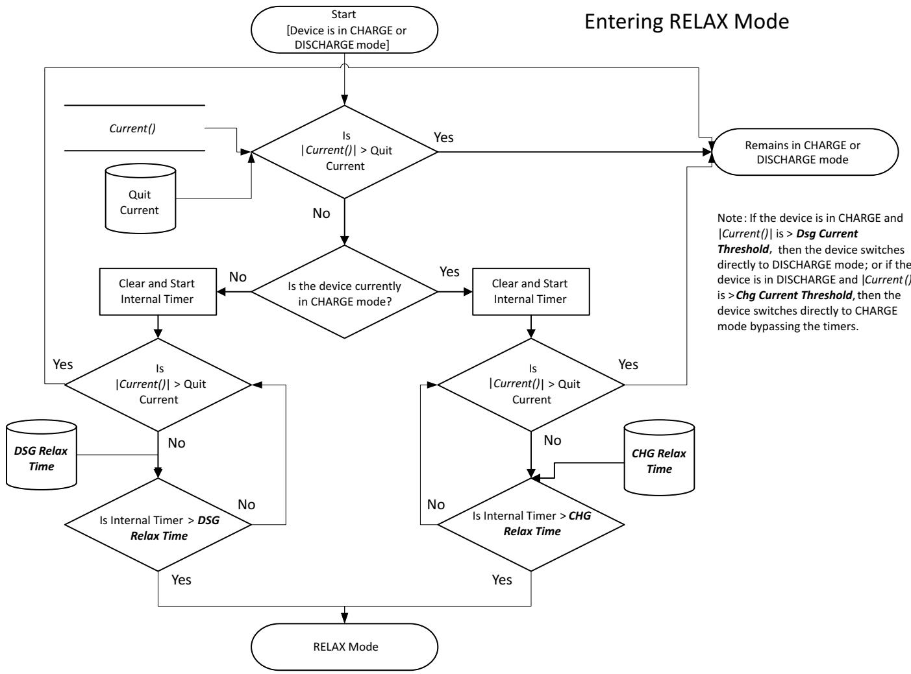  
Figure 7-1. Entering CHARGE or RELAX Mode

Once in RELAX mode, the bq40z50-R2 waits until an OCV measurement is taken, which occurs after:

1. A dV/dt condition of $< 4 \mu \mathsf { V } / \mathsf { s }$ is satisfied,   
2. Five hours from when |Current()| $<$ Quit Current,   
3. Upon gas gauge reset,   
4. An IT Enable command is issued.

The determination of when to update the OCV data is part of the normal Impedance Track algorithm and is not specific to the cell balancing algorithm.

Note: If charge stop below the flat voltage max (this value is part of the chemistry data and is different from $\scriptstyle ( ) [ O C V F R ] = 1 ,$

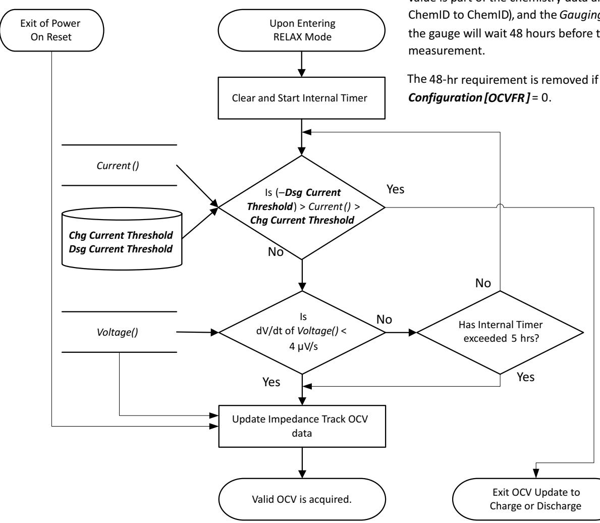  
Figure 7-2. OCV Measurement

The bq40z50-R2 then calculates the amount of charge difference between cells with a higher state-ofcharge than the lowest cell SOC. The value, dQ, is determined for each cell based by converting the measured OCV to Depth-of-Discharge (DOD) percentages using a temperature-compensated DOD versus OCV table lookup table. If the measured OCV does not coincide with a specific table entry, then the DOD value is linearly interpolated from the two adjacent DODs of the respective table adjacent OCVs.

The delta in $00 \%$ between each cell and the cell of lowest SOC is multiplied by the respective cells QMax to create dQ: for example, dQ $=$ CellnDOD – CellLOWEST_SOC DOD $\times$ CellnQMax (mAh).

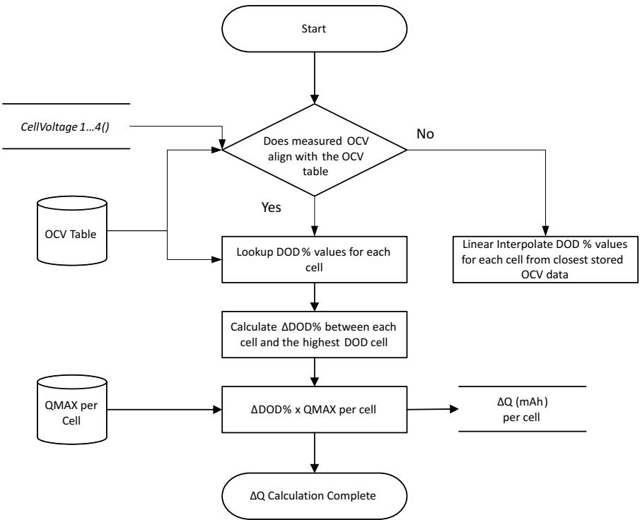  
Figure 7-3. ΔQ Calculation

The bq40z50-R2 calculates the required balancing time using dQ and Bal Time/mAh Cell 1 (for Cell 1) or Bal Time/mAh Cell 2–4 (for cells 2–4). The value of Bal Time/mAh Cell 1 and Bal Time/mAh Cell 2–4 are fixed value determined based on key system factors and is calculated by:

Internal Cell Balancing:

$$
B a l a n c e T i m e p e r m A h \ C e I I \ : 2 - 4 = \frac { 3 6 0 0 \ : m A s \times ( 2 \times R V C x + R c b ) } { V c e I I \times \ : D u t y }
$$

External Cell Balancing:

Balance Time per mAh Cell 1 = 3600 × ( + mAs RVCx Rcb) || Rext $? I m e p e r m A h ~ C e I I ~ 2 - 4 = { \frac { 3 6 0 0 ~ m A s \times ( 2 \times R V C x + R c b ) ~ | | ~ R e x t } { V c e I I \times D u t y } }$

Where:

$\mathsf { V } _ { \mathsf { C E L L } } =$ average cell voltage (for example, $3 7 0 0 ~ \mathrm { m V }$ for most chemistries)   
$\mathsf { R V C } \mathsf { x } =$ resistor value in series to VCx input (for example, ${ 1 0 0 \Omega }$ , based on the reference schematic)   
$\mathsf { R } _ { \mathsf { c b } } = \mathsf { c e l l }$ balancing FET ${ \mathsf { R } } _ { \mathsf { d s o n } }$ , which is $_ { 2 0 0 \Omega }$ (Max)   
DUTY $=$ cell balancing duty cycle, which is $7 5 \%$ typ

The cell balancing time for each cell to be balanced is calculated by: dQCelln $\times$ Bal Time/mAh Cell 1 for Cell 1 or and dQCelln $\times$ Bal Time/mAh Cell $\pmb { 2 } \mathrm { - } \pmb { 4 }$ for Cell 2–4. The cell balancing time is stored in the 16- bit RAM register CellnBalanceTimer, providing a maximum calculated time of 65535 s (or 18.2 hrs). This update only occurs if a valid QMax update has been made; otherwise, they are all set to 0.

# 7.3 Balancing Multiple Cells

The bq40z50-R2 can balance multiple cells simultaneously if internal cell balancing is selected, Balancing Configuration $\boldsymbol { \mathbf { \ell } } C B M \boldsymbol { \mathbf { \mathit { J } } } = 0$ .

If external cell balancing is selected, $\begin{array} { r } { I C B M ] = 1 } \end{array}$ , the gauge will perform a rotation cell balancing with only one cell to be balanced at a time, starting on the cell with highest dQ. For example, at time 0, Cell 1 has the highest dQ while Cell 2 has the second highest dQ on a 3-series pack. Cell balancing will start to balance Cell 1 first. As time progresses, the dQ in the cell reduces, and Cell 2 becomes the cell with the highest dQ. The gauge then switches to balance Cell 2. The cell balancing rotation between Cell 1 and Cell 2 continues until all the cells are balanced.

# 7.4 Cell Balancing Operation

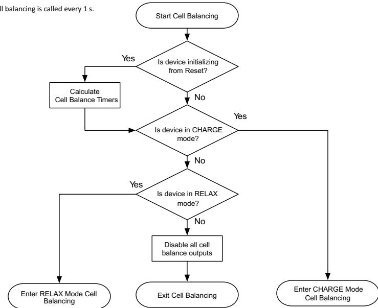  
Figure 7-4. Cell Balance Mode Detection

The bq40z50-R2 calls the cell balancing algorithm every 1 s during normal operation. Cell balancing is no called when the device is in SLEEP mode. All algorithm decisions are made on this same 1-s timer.

In RELAX mode, if cell balancing at rest is enabled, Balancing Configuration $\begin{array} { r } { [ C B R ] = 1 } \end{array}$ , the gauge will verify if the dv/dt condition is met at the entry of the RELAX mode. If so, then the cell balance at rest will start when all of the conditions below are met:

• Any of the precalculated cell balance timer is non-zero AND • RelativeStateofCharge() $>$ Min RSOC for Balancing

The gauge will attempt to recalculate the cell balancing time in RELAX mode every Relax Balance Interval. The cell balancing time is updated if the conditions below are met:

• The Relax Balance Interval has passed AND • A OCV measurement is taken AND • The max cell voltage delta $>$ Min Start Balance Delta

On exit of the RELAX mode, cell balancing time is recalculated as long as a valid OCV update is   
available. NOTE: Cell balancing is paused during OCV measurement.

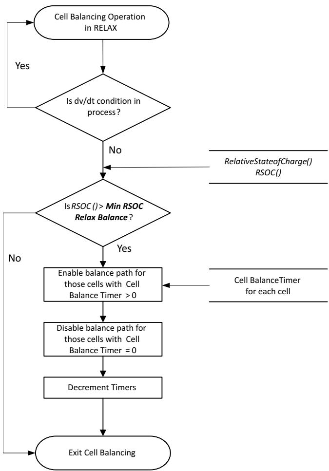  
Figure 7-5. Cell Balance Operation in RELAX Mode

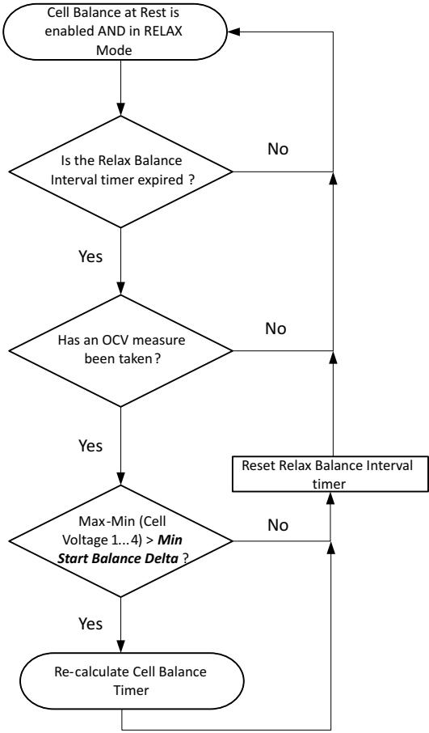

When the bq40z50-R2 is in CHARGE mode, it follows these steps during cell balancing: a. Check if any of the precalculated cell balance timers are $> 0$ . b. The cell balance FETs are turned ON for the corresponding cell balance timers that are $\neq 0$ .

Note: Cell balancing is called every 1 s so this loop will execute every 1 s as long as the appropriate conditions exist.

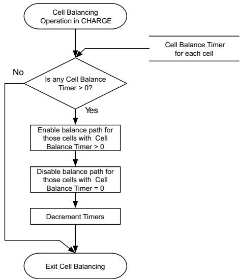  
Figure 7-6. Cell Balance Operation in CHARGE Mode

Cell balancing in sleep can be enabled, by setting Balancing Configuration $\begin{array} { r } { [ C B S ] = 1 } \end{array}$

Once enabled, then cell balancing in sleep will start under the following conditions:

A. The bq40z50-R2 device has been in SLEEP for a duration $>$ Start Time for Bal in Sleep (default 100 hrs) AND   
B. The value of RSOC $>$ Start Rsoc for Bal in Sleep (default $9 5 \%$ ).

Once the cell balancing in sleep is started, it will end when:

A. The value of RSOC $<$ End Rsoc for Bal in Sleep (default $60 \%$ ).

# 8.1 Introduction

The bq40z50-R2 device has an LED display that shows various status information when a high-to-low transition of the $\overline { { \mathsf { D } \mathsf { I S P } } }$ pin is detected. The LED display is available in SLEEP mode, but is disabled during device shutdown or under CUV conditions (assuming neither charging nor PFs are active). However, under PF conditions, if [LEDPFON] is set, then LED functionality is available. Additionally, even under CUV conditions, if the charger is connected and charging is active, then the LED functionality is allowed.

# 8.1.1 LED Display of State-of-Charge

When the DISP pin is pressed and a high-to-low transition of the pin is detected, the LED display shows the state-of-charge for LED Hold Time. The state-of-charge can display the RelativeStateOfCharge() or AbsoluteStateOfCharge(), based on the [LEDMODE] setting.

The state-of-charge threshold can be set according to the number of LEDs available. The following table shows an example for data flash setting with 5-LED display.

<table><tr><td rowspan=1 colspan=1></td><td rowspan=1 colspan=2>State-of-Charge (1)(2)</td></tr><tr><td rowspan=1 colspan=1></td><td rowspan=1 colspan=1>Current() &gt; 0</td><td rowspan=1 colspan=1>Current() ≤ 0</td></tr><tr><td rowspan=1 colspan=1>LED1</td><td rowspan=1 colspan=1>CHG Thresh 1 to 100%</td><td rowspan=1 colspan=1>DSG Thresh 1 to 100%</td></tr><tr><td rowspan=1 colspan=1>LED2</td><td rowspan=1 colspan=1>CHG Thresh 2 to 100%</td><td rowspan=1 colspan=1>DSG Thresh 2 to 100%</td></tr><tr><td rowspan=1 colspan=1>LED3</td><td rowspan=1 colspan=1>CHG Thresh 3 to 100%</td><td rowspan=1 colspan=1>DSG Thresh 3 to 100%</td></tr><tr><td rowspan=1 colspan=1>LED4</td><td rowspan=1 colspan=1>CHG Thresh 4 to 100%</td><td rowspan=1 colspan=1>DSG Thresh 4 to 100%</td></tr><tr><td rowspan=1 colspan=1>LED5</td><td rowspan=1 colspan=1>CHG Thresh 5 to 100%</td><td rowspan=1 colspan=1>DSG Thresh 5 to 100%</td></tr></table>

(1) If $\scriptstyle { I L E D C H G } ] = 1$ , then the LED display will stay on (that is, no $\mathtt { D I S P }$ pin press is needed), showing the state-of-charge during charging while Current() $>$ Charge Current Threshold. (2) Typically, once full charge (FC) is achieved, the LEDs are turned-off. If the [LEDONFC] bit is set, then the LEDs will be allowed to remain on after FC is achieved, if the charger remains connected. The LEDs will remain on after FC for a period defined by LED FC Time. It is not recommended to leave the LED on for extended periods after FC because of the potential for short charge / discharge cycling.

# If SOC drops below the flash alarm thresholds in charge or discharge, then the LED display will also flash with LED Flash Period per the CHG Flash Alarm or DSG Flash Alarm setting shown below.

<table><tr><td rowspan=1 colspan=1></td><td rowspan=1 colspan=2>State-of-Charge(1)</td></tr><tr><td rowspan=1 colspan=1></td><td rowspan=1 colspan=1>Current() &gt; 0</td><td rowspan=1 colspan=1>Current() ≤ 0</td></tr><tr><td rowspan=1 colspan=1>Flash Alert</td><td rowspan=1 colspan=1>0% to CHG Flash Alarm</td><td rowspan=1 colspan=1>0% to DSG Flash Alarm</td></tr></table>

(1) If $\scriptstyle { I L E D R C A J = 1 }$ , then the LED will also flash at LED Flash Period when remaining capacity $<$ RemainingCapacityAlarm() while in DISCHARGE or RELAX mode (that is, the RCA bit is set).

# 8.1.2 LED Display of PF Error Code

If [LEDPF1, $L E D P F O J = 0 , 1$ , then the LED display shows each PF code for $_ { 2 \times }$ the LED Hold Time after showing the state-of-charge information.

The following table shows each PF error code. Each code is shown with the lowest to highest priority order.

<table><tr><td rowspan=1 colspan=1>PF Flag</td><td rowspan=1 colspan=1>Priority</td><td rowspan=1 colspan=1>LED3</td><td rowspan=1 colspan=1>LED2</td><td rowspan=1 colspan=1>LED1</td></tr><tr><td rowspan=1 colspan=1>No PF</td><td rowspan=1 colspan=1>0</td><td rowspan=1 colspan=1>LED Blink Period</td><td rowspan=1 colspan=1>off</td><td rowspan=1 colspan=1>off</td></tr><tr><td rowspan=1 colspan=1>SUV</td><td rowspan=1 colspan=1>0</td><td rowspan=1 colspan=1>LED Blink Period</td><td rowspan=1 colspan=1>on</td><td rowspan=1 colspan=1>off</td></tr><tr><td rowspan=1 colspan=1>SOV</td><td rowspan=1 colspan=1>1</td><td rowspan=1 colspan=1>LED Blink Period</td><td rowspan=1 colspan=1>LED Flash Period</td><td rowspan=1 colspan=1>off</td></tr><tr><td rowspan=1 colspan=1>SOCC</td><td rowspan=1 colspan=1>2</td><td rowspan=1 colspan=1>LED Blink Period</td><td rowspan=1 colspan=1>off</td><td rowspan=1 colspan=1>on</td></tr><tr><td rowspan=1 colspan=1>SOCD</td><td rowspan=1 colspan=1>3</td><td rowspan=1 colspan=1>LED Blink Period</td><td rowspan=1 colspan=1>on</td><td rowspan=1 colspan=1>on</td></tr><tr><td rowspan=1 colspan=1>SOT</td><td rowspan=1 colspan=1>4</td><td rowspan=1 colspan=1>LED Blink Period</td><td rowspan=1 colspan=1>LED Flash Period</td><td rowspan=1 colspan=1>on</td></tr><tr><td rowspan=1 colspan=1>COVL</td><td rowspan=1 colspan=1>5</td><td rowspan=1 colspan=1>LED Blink Period</td><td rowspan=1 colspan=1>off</td><td rowspan=1 colspan=1>LED Flash Period</td></tr><tr><td rowspan=1 colspan=1>SOTF</td><td rowspan=1 colspan=1>6</td><td rowspan=1 colspan=1>LED Blink Period</td><td rowspan=1 colspan=1>on</td><td rowspan=1 colspan=1>LED Flash Period</td></tr><tr><td rowspan=1 colspan=1>QIM</td><td rowspan=1 colspan=1>7</td><td rowspan=1 colspan=1>LED Blink Period</td><td rowspan=1 colspan=1>LED Flash Period</td><td rowspan=1 colspan=1>LED Flash Period</td></tr><tr><td rowspan=1 colspan=1>CB</td><td rowspan=1 colspan=1>8</td><td rowspan=1 colspan=1>LED Blink Period</td><td rowspan=1 colspan=1>off</td><td rowspan=1 colspan=1>LED Blink Period</td></tr><tr><td rowspan=1 colspan=1>IMP</td><td rowspan=1 colspan=1>9</td><td rowspan=1 colspan=1>LED Blink Period</td><td rowspan=1 colspan=1>on</td><td rowspan=1 colspan=1>LED Blink Period</td></tr><tr><td rowspan=1 colspan=1>CD</td><td rowspan=1 colspan=1>10</td><td rowspan=1 colspan=1>LED Flash Period</td><td rowspan=1 colspan=1>LED Blink Period</td><td rowspan=1 colspan=1>off</td></tr><tr><td rowspan=1 colspan=1>VIMR</td><td rowspan=1 colspan=1>11</td><td rowspan=1 colspan=1>off</td><td rowspan=1 colspan=1>LED Blink Period</td><td rowspan=1 colspan=1>off</td></tr><tr><td rowspan=1 colspan=1>VIMA</td><td rowspan=1 colspan=1>12</td><td rowspan=1 colspan=1>on</td><td rowspan=1 colspan=1>LED Blink Period</td><td rowspan=1 colspan=1>off</td></tr><tr><td rowspan=1 colspan=1>OLDL</td><td rowspan=1 colspan=1>13</td><td rowspan=1 colspan=1>LED Flash Period</td><td rowspan=1 colspan=1>LED Blink Period</td><td rowspan=1 colspan=1>on</td></tr><tr><td rowspan=1 colspan=1>SCCL</td><td rowspan=1 colspan=1>14</td><td rowspan=1 colspan=1>off</td><td rowspan=1 colspan=1>LED Blink Period</td><td rowspan=1 colspan=1>on</td></tr><tr><td rowspan=1 colspan=1>SCDL</td><td rowspan=1 colspan=1>15</td><td rowspan=1 colspan=1>on</td><td rowspan=1 colspan=1>LED Blink Period</td><td rowspan=1 colspan=1>on</td></tr><tr><td rowspan=1 colspan=1>CFETF</td><td rowspan=1 colspan=1>16</td><td rowspan=1 colspan=1>LED Flash Period</td><td rowspan=1 colspan=1>LED Blink Period</td><td rowspan=1 colspan=1>LED Flash Period</td></tr><tr><td rowspan=1 colspan=1>DFETF</td><td rowspan=1 colspan=1>17</td><td rowspan=1 colspan=1>off</td><td rowspan=1 colspan=1>LED Blink Period</td><td rowspan=1 colspan=1>LED Flash Period</td></tr><tr><td rowspan=1 colspan=1>OCDL</td><td rowspan=1 colspan=1>18</td><td rowspan=1 colspan=1>on</td><td rowspan=1 colspan=1>LED Blink Period</td><td rowspan=1 colspan=1>LED Flash Period</td></tr><tr><td rowspan=1 colspan=1>FUSE</td><td rowspan=1 colspan=1>19</td><td rowspan=1 colspan=1>LED Flash Period</td><td rowspan=1 colspan=1>LED Blink Period</td><td rowspan=1 colspan=1>LED Blink Period</td></tr><tr><td rowspan=1 colspan=1>AFER</td><td rowspan=1 colspan=1>20</td><td rowspan=1 colspan=1>off</td><td rowspan=1 colspan=1>LED Blink Period</td><td rowspan=1 colspan=1>LED Blink Period</td></tr><tr><td rowspan=1 colspan=1>AFEC</td><td rowspan=1 colspan=1>21</td><td rowspan=1 colspan=1>on</td><td rowspan=1 colspan=1>off</td><td rowspan=1 colspan=1>LED Blink Period</td></tr><tr><td rowspan=1 colspan=1>2LVL</td><td rowspan=1 colspan=1>22</td><td rowspan=1 colspan=1>LED Flash Period</td><td rowspan=1 colspan=1>off</td><td rowspan=1 colspan=1>LED Blink Period</td></tr><tr><td rowspan=1 colspan=1>PTC</td><td rowspan=1 colspan=1>23</td><td rowspan=1 colspan=1>off</td><td rowspan=1 colspan=1>off</td><td rowspan=1 colspan=1>LED Blink Period</td></tr><tr><td rowspan=1 colspan=1>IFC</td><td rowspan=1 colspan=1>24</td><td rowspan=1 colspan=1>on</td><td rowspan=1 colspan=1>on</td><td rowspan=1 colspan=1>LED Blink Period</td></tr><tr><td rowspan=1 colspan=1>DF</td><td rowspan=1 colspan=1>26</td><td rowspan=1 colspan=1>off</td><td rowspan=1 colspan=1>on</td><td rowspan=1 colspan=1>LED Blink Period</td></tr><tr><td rowspan=1 colspan=1>Reserved</td><td rowspan=1 colspan=1>27</td><td rowspan=1 colspan=1>on</td><td rowspan=1 colspan=1>LED Flash Period</td><td rowspan=1 colspan=1>LED Blink Period</td></tr><tr><td rowspan=1 colspan=1>Open Therm TS1</td><td rowspan=1 colspan=1>28</td><td rowspan=1 colspan=1>LED Flash Period</td><td rowspan=1 colspan=1>LED Flash Period</td><td rowspan=1 colspan=1>LED Blink Period</td></tr><tr><td rowspan=1 colspan=1>Open Therm TS2</td><td rowspan=1 colspan=1>29</td><td rowspan=1 colspan=1>off</td><td rowspan=1 colspan=1>LED Flash Period</td><td rowspan=1 colspan=1>LED Blink Period</td></tr><tr><td rowspan=1 colspan=1>Open Therm TS3</td><td rowspan=1 colspan=1>30</td><td rowspan=1 colspan=1>on</td><td rowspan=1 colspan=1>LED Blink Period</td><td rowspan=1 colspan=1>LED Blink Period</td></tr><tr><td rowspan=1 colspan=1>Open Therm TS4</td><td rowspan=1 colspan=1>31</td><td rowspan=1 colspan=1>LED Flash Period</td><td rowspan=1 colspan=1>LED Blink Period</td><td rowspan=1 colspan=1>LED Blink Period</td></tr></table>

If [LEDPF1, LEDPF0] $\mathit { \Theta } = 1 { , } 0$ , then under PF conditions, if the DISP button is pressed (high-to-low transition of the $\overrightarrow { \mathsf { D } \mathsf { I } \mathsf { S } \mathsf { P } }$ pin is detected), the LED display immediately shows each PF code for $_ { 2 \times }$ the LED Hold Time (without showing the state-of-charge information).

# 8.1.3 LED Display on Exit of a Reset

If the $\scriptstyle { \mathit { I L E D R 1 } } = 1$ and a reset occurs, then on exit from reset, the LED display shows the state-of-charge for LED Hold Time. Additionally, if [LEDPF1, LEDPF0] $= 0 , 1$ , the LED display also shows each of the PF error code for $_ { 2 \times }$ of the LED Hold Time afterward.

# 8.1.4 LED Display Control Through ManufacturerAccess()

The gauge provides the ManufacturerAccess() command (MAC) for testing purposes. The MAC LED Toggle() command can toggle the LED display on and off. The MAC LED Display Press() command can trigger the LED display and simulate $100 \%$ RSOC to demonstrate with all LEDs in actions.

# 8.1.5 LED Operation Under CUV Conditions

Typically under CUV (Cell Undervoltage) conditions, the LED operation is not allowed to preserve remaining battery charge. However, under certain situations even under CUV conditions, the LED operation will be allowed; that is, either with PF active with the [LEDPFON] bit set or with the charger connected with charging active. Additionally, an option is provided to turn on the LED even under CUV without the charger present by setting the [LEDIFCUV] bit in the LED configuration register. This option must be used with care so as to not run the battery too low.

# 8.1.6 LED Blinking Option for State of Charge

This LED feature enables LED blinking until the midpoint of each LED segment. The blinking occurs between the bottom and the midway point of each programmed segment level; thus, providing more granularity as to where the charge level is within that LED segment. If the LED configuration bit [BLINKMIDPT] is set, then this blinking feature will work as indicated below:

With this feature disabled, as the charging or discharging occurs (assuming the segments programmed are $0 \%$ , $20 \%$ , $40 \%$ , $60 \%$ , and $80 \%$ of SOC), the LED display of state-of-charge ranges are as follows:

80 to $100 \%$ LED5 on solid, else LED 5 off, if SOC is lower $\%$ .   
60 to $80 \%$ LED4 on solid, else LED 4 off, if SOC is lower $\%$ .   
40 to $60 \%$ LED3 on solid, else LED 3 off, if SOC is lower $\%$ .   
20 to $40 \%$ LED2 on solid, else LED 2 off, if SOC is lower $\%$ .   
0 to $20 \%$ LED1 on solid

With the blinking feature enabled, as either charge or discharge occurs (assuming the segments programmed are $0 \%$ , $20 \%$ , $40 \%$ , $60 \%$ , and $80 \%$ of RSOC), the state-of-charge ranges are as follows:

90 to $100 \%$ LED5 on solid   
80 to $90 \%$ LED5 on Blink, else LED5 off, if SOC is lower $\%$ .   
70 to $80 \%$ LED4 on solid   
60 to $70 \%$ LED4 on Blink, else LED4 off, if SOC is lower $\%$ .   
50 to $60 \%$ LED3 on solid   
40 to $50 \%$ LED3 on Blink, else LED3 off, if SOC is lower $\%$ .   
30 to $40 \%$ LED2 on solid   
20 to $30 \%$ LED2 on Blink, else LED2 off, if SOC is lower $\%$ .   
10 to $20 \%$ LED1 on solid   
0 to $10 \%$ LED1 on Blink

The blinking occurs between the bottom and the midway point of each of the programmed segments during charge or discharge. In this example, the segments programmed are $0 \%$ , $20 \%$ , $40 \%$ , $60 \%$ , and $80 \%$ ; the midway points are $10 \%$ , $30 \%$ , $50 \%$ , $70 \%$ , and $90 \%$ . If the range is defined differently, then the midpoint where the blinking occurs is accordingly different. If the segments are programmed such that the midway point is a decimal point, then it rounds down to get to the next whole number. The blinking follows the LED Blink Period. If this feature is enabled, it will work when [LEDCHG] is set or cleared. When the LED is operating due to the $\overline { { \mathsf { D } \mathsf { I S P } } }$ being pressed, the LEDs are on for LED Hold Time (default is $4 \thinspace s$ , so at a default a blink rate of ${ \sim } 5 0 0 ~ \mathrm { m s }$ , there would be at least 7 to 8 blinks in the 4 s—if [BLINKMIDPT] is set).

The gauge provides International Air Transport Association (IATA) support with the following commands and procedures.

# 9.1 Initiating IATA Shutdown (Before Shipping)

1. Initiate IATA shutdown through either a) a separate IATA_SHUTDOWN() MAC command, or b) the standard ShutdownMode() MAC command (works in SEALED and UNSEALED modes):

a. With the IATA_SHUTDOWN() MAC command, the device sets the [IATA_SHUT] bit. b. With the standard ShutdownMode() MAC command, the [IATA_SHUT] bit must be set to enable IATA_SHUTDOWN. c. The IATA_SHUTDOWN() MAC command is ignored if IATA Delay Time has not expired.

2. Check if true RSOC is below (less than or equal to) a certain IATA RSOC Threshold, then continue to Step 3. If not, then stop shutdown and clear the [IATA_SHUT] bit.

a. If IATA RSOC Threshold $= 0 \%$ , then the gauge will not check or care about the condition of the true RSOC. It clears the [IATA_SHUT] bit and enters the normal command shutdown (Step 4).

3. Store the true remaining capacity and FCC in the data flash registers IATA RM and IATA FCC, respectively.   
4. Enter the device command shutdown procedure.   
5. Shut down the gauge (same as before).

9.2 After Wakeup (Charging Is Connected for a Short Period to Wake)

1. Check if the [IATA_SHUT] bit is set. If it is, continue with Step 2. If not, then True FCC and RC are used.

1. The [IATA_SHUT] bit should always be cleared in this step.

2. Check the following conditions: If all are true (AND), continue with Step 3. If ANY are NOT True, then True FCC and RC are used.

a. The delta cell voltage difference between max cell voltage and min cell voltage is within an IATA DeltaV Threshold (The default is $5 0 ~ \mathsf { m V } ,$ . If this threshold is set to $0 \vee$ , this delta cell voltage check is disabled.) AND   
b. The temperature is greater than or equal to $\left( \geq \right)$ IATA MIN Temperature (default 10C) and less than or equal to (≤) IATA MAX Temperature (default 40C) AND   
c. Min cell voltage is greater than or equal to $\left( \geq \right)$ IATA Min Voltage (default $3 0 0 0 ~ \mathrm { { m V } }$ ) and less than or equal to (≤) IATA MAX Voltage (default $3 6 0 0 \mathrm { m V } ,$ ).

3. Display the remaining capacity and FCC from the DF registers IATA RM and IATA FCC, respectively ([ISTORE_FCC], [ISTORE_RM] bits are set [the default]). Must be ready before the INIT (battery status) is ready. The [ISTORE_FCC] and [ISTORE_RM] configuration bits, when set, define whether the stored value or true value is displayed during the IATA Delay Time period. However, the IATA Delay Time can be set to zero OR to a value greater than zero.

# a. If IATA Delay Time $> 0$ :

On wake up from IATA shutdown, the remaining capacity and FCC will be displayed from IATA RM and IATA FCC, respectively, for the duration programmed in IATA Delay Time. At the end of this period, the displayed values will be transitioned from stored value to the true value of remaining capacity and FCC using the smoothing engine. Smoothing must be enabled. If it is not, the display will jump to the true values immediately.

# b. If IATA Delay $T i m e = 0$

On wake up from IATA shutdown, if true RSOC $\leq$ IATA Wake AbsRSOC (default $10 \%$ ), then the true value of remaining capacity and FCC will only be displayed. On wake up from IATA shutdown, if true RSOC $>$ IATA Wake AbsRSOC (default $10 \%$ ), then the remaining capacity and FCC will be displayed from IATA RM and IATA FCC. Subsequently, the Delta true RSOC (change in true RSOC from wakeup) is monitored. The display will switch from the IATA RM and IATA FCC values to the true value of remaining capacity and FCC only if Delta true RSOC $\geq$ IATA Delta RSOC (default $3 \%$ ).

At this point, if smoothing is not enabled, the display will jump to the true values immediately. However, if smoothing is enabled, the displayed values will transition from the stored value to the true value of remaining capacity and FCC using the smoothing engine.

4. There are two additional MAC commands, IATA_RM() and $I A T A \_ F C C ( )$ , that read IATA RM and IATA FCC, respectively, and that work in SEALED and UNSEALED modes.

# 10.1 Description

Useful for analysis, the device has extensive capabilities for logging events over the life of the battery. The Lifetime Data Collection is enabled by setting ManufacturingStatus $( ) I L F \_ E N J = 1$ . The data is collected in RAM and only written to DF under the following conditions to avoid wear out of the data flash:

• Every 10 hours if RAM content is different from flash. In permanent fail, before data flash updates are disabled. A reset counter increments. The lifetime RAM data is reset; therefore, only the reset counters are updated to data flash. Before scheduled shutdown Before low voltage shutdown and the voltage is above the Valid Update Voltage.

The Lifetime Data stops collecting under following conditions:

• After permanent fail • Lifetime Data Collection is disabled by setting ManufacturingStatus $( ) I L F \_ E N ] = 0$ .

When the gauge is unsealed, the following ManufacturingStatus() can be used for testing Lifetime Data.

Lifetime Data Reset() can be used to reset the Lifetime Data.   
Lifetime Data Flush() can be used to flush out RAM Lifetime Data to data flash.   
Lifetime Data Speedup Mode() can be used to increase the rate the Lifetime Data is incremented.

Total firmware runtime starts when Lifetime Data is enabled.

• Voltage – Max/Min Cell Voltage each cell – Max Delta Cell Voltage at any given time (that is, the max cell imbalance voltage)

• Current

Max charge/discharge current – Max average discharge current Max average discharge power

Safety events that trigger the SafetyStatus() (The 12 most common are tracked.) – Number of safety events – Cycle Count at last safety event(s)

• Charging Events

– Number of valid charge terminations (That is, the number of times [VCT] is set.) – Cycle Count at last charge termination

• Gauging Events

Number of QMax updates Cycle Count at last QMax update Number of RA updates and disable Cycle Count at Last RA update and disable

• Power Events

– Number of resets, partial resets, and watchdog resets – Number of shutdowns

Cell balancing (This data is stored with a resolution of 2 hours up to a limit of 510 hours.) – Cell balancing time each cell

• Temperature

– Max/Min Cell Temperature Delta Cell Temp (max delta cell temperature across the thermistors that are used to report cell temperature)   
– Max/Min Int Temperature Sensor Max FET Temperature

• Time (This data is stored with a resolution of 2 hours.)

– Total runtime – Time spent different temperature ranges

# 11.1 Introduction

There are three levels of secured operation within the device. To switch between the levels, different operations are needed with different keys. The three levels are SEALED, UNSEALED, and FULL ACCESS. The bq40z50-R2 device also supports SHA-1 HMAC authentication with the host system.

# 11.2 SHA-1 Description

As of March 2012, the latest revision is FIPS 180-4. SHA-1, or secure hash algorithm, is used to compute a condensed representation of a message or data also known as hash. For messages $< 2 ^ { 6 4 }$ , the SHA-1 algorithm produces a 160-bit output called a digest.

In a SHA-1 one-way hash function, there is no known mathematical method of computing the input given, only the output. The specification of SHA-1, as defined by FIPS 180-4, states that the input consists of 512-bit blocks with a total input length less than 264 bits. Inputs that do not conform to integer multiples of 512-bit blocks are padded before any block is input to the hash function. The SHA-1 algorithm outputs the 160-bit digest.

The bq40z50-R2 device generates a SHA-1 input block of 288 bits (total input $= 1 6 0 \cdot$ -bit message $+ \nobreakspace 1 2 8 \nobreakspace$ -bit key). To complete the 512-bit block size requirement of the SHA-1 function, the device pads the key and message with a 1, followed by 159 0s, followed by the 64 bit value for 288 (000...00100100000), which conforms to the pad requirements specified by FIPS 180-4.

Detailed information about the SHA-1 algorithm can be found here:

1. http://www.nist.gov/itl/   
2. http://csrc.nist.gov/publications/fips   
3. www.faqs.org/rfcs/rfc3174.html

# 11.3 HMAC Description

The SHA-1 engine calculates a modified HMAC value. Using a public message and a secret key, the HMAC output is considered to be a secure fingerprint that authenticates the device used to generate the HMAC.

To compute the HMAC: Let H designate the SHA-1 hash function, M designate the message transmitted to the device, and KD designate the unique 128-bit Authentication key of the device. HMAC(M) is defined as:

$\mathsf { H } [ \mathsf { K D } \parallel \mathsf { H } ( \mathsf { K D } \parallel \mathsf { M } ) ]$ , where $\Vert$ symbolizes an append operation.

The message, M, is appended to the authentication key, KD, and padded to become the input to the SHA1 hash. The output of this first calculation is then appended to the authentication key, KD, padded again, and cycled through the SHA-1 hash a second time. The output is the HMAC digest value.

# 11.4 Authentication

1. Generate 160-bit message M using a random number generator that meets approved random number generators described in FIPS PUB 140–2.

2. Generate SHA-1 input block B1 of 512 bytes (total input $= 1 2 8$ -bit authentication key $K \mathsf { D } + 1 6 0$ -bit message $\mathsf { M } + 1 + 1 5 9 0 \mathsf { s } + 1 0 0 1 0 0 0 0 0 )$ .

3. Generate SHA-1 hash HMAC1 using B1.

4. Generate SHA-1 input block B2 of 512 bytes (total input $= 1 2 8$ -bit authentication key $K \mathsf { D } + 1 6 0$ -bit hash

$\mathsf { H M A C 1 } + 1 + 1 5 9 0 \mathsf { s } + 1 0 0 1 0 0 0 0 0 )$ .

5. Generate SHA-1 hash HMAC2 using B2.

6. With no active Authenticate() data waiting, write 160-bit message M to Authenticate() in the format: 0xAABBCCDDEEFFGGHHIIJJKKLLMMNNOOPPQQRRSSTT, where AA is LSB.

7. Wait ${ 2 5 0 } \mathsf { m s }$ , then read Authenticate() for HMAC3.

8. Compare host HMAC2 with device HMAC3. If it matches, both host and device have the same key KD and the device is authenticated.

# 11.5 Security Modes

# 11.5.1 FULL ACCESS or UNSEALED to SEALED

The MAC Seal Device() command instructs the device to limit access to the SBS functions and data flash space, and sets the [SEC1][SEC0] flags. In SEALED mode, standard SBS functions have access (per the Smart Battery Data Specification). Most of the extended SBS functions and data flash are not accessible. Refer to Chapter 14 where each command has documented the accessibility information. Once in SEALED mode, the gauge can never permanently return to UNSEALED or FULL ACCESS modes.

# 11.5.2 SEALED to UNSEALED

SEALED to UNSEALED instructs the device to extend access to the SBS and data flash space and clears the [SEC1][SEC0] flags. In UNSEALED mode, all data, SBS, and DF have read/write access. Note that although writing to most of the SBS commands are accepted by the gauge, the written data will be immediately overwritten by the gauge and the write action is ignored. Unsealing is a two-step command performed by writing the first word of the unseal key to ManufacturerAccess() (MAC), followed by the second word of the unseal key to ManufacturerAccess(). The two words must be sent within $4 \thinspace s ,$ . The unseal key can be read and changed via the MAC SecurityKey() command when in the FULL ACCESS mode. To return to the SEALED mode, either a hardware reset is needed or the MAC Seal Device() command is needed to transit from FULL ACCESS or UNSEALED to SEALED.

The default UNSEAL key is 0x0414 and 0x3672. To go from SEALED to UNSEALED, these two words must be sent to ManufacturerAccess() (MAC), first 0x0414 followed by 0x3672, both sent sequentially with the second word sent within 4 seconds of the first.

# 11.5.3 UNSEALED to FULL ACCESS

UNSEALED to FULL ACCESS instructs the device to allow full access to all SBS commands and data flash. The bq40z50-R2 device is shipped from TI in this mode. The keys for UNSEALED to FULL ACCESS can be read and changed via the SecurityKey() MAC command when in FULL ACCESS mode. Changing from UNSEALED to FULL ACCESS is performed by using the ManufacturerAccess() command, by writing the first word of the Full Access Key to ManufacturerAccess(), followed by the second word of the Full Access Key to ManufacturerAccess(). The two words must be sent within 4 s. In FULL ACCESS mode, the command to go to boot ROM can be sent.

NOTE: If the gauge is sealed, it will always return to the SEALED state after POR even if the gauge is unsealed prior to a POR. If the SREC of a sealed gauge is extracted and then programmed into another gauge, the other gauge will also power up in the SEALED state. The only way to permanently restore the UNSEALED state is to reflash the gauge with an unsealed SREC.

# 12.1 Manufacture Testing

To improve the manufacture testing flow, the gas gauge device allows certain features to be toggled on or off through ManufacturerAccess() commands; for example, the PCHG FET(), CHG FET(), DSG FET(), Lifetime Data Collection(), Calibration(), among others. Enabling only the feature under test can simplify the test flow in production by avoiding any feature interference. The ManufacturerAccess() commands that toggle the ManufacturingStatus()[CAL_EN], [LT_TEST], [DSG_TEST], [CHG_TEST], and [PCHG_TEST] will only set the RAM data, meaning the conditions set by these commands will be cleared if a reset or seal is issued to the gauge. The ManufacturerAccess() commands that toggle the ManufacturingStatus()[LED_EN], [FUSE_EN], [BBR_EN], [PF_EN], and [LT_EN], [FET_EN], [GAUGE_EN] will be updated to data flash and synchronized between ManufacturingStatus() and Mfg Status Init. The ManufacturingStatus() keeps track of the status (enabled or disabled) of each feature.

The Mfg Status Init provides the option to enable or disable individual features for normal operation. Upon a reset or a seal command, ManufacturingStatus() will be reloaded from data flash Mfg Status Init. This means if an update is made to Mfg Status Init to enable or disable a feature, the gauge will only take the new setting if a reset or seal command is sent.

# 12.2 Calibration

Refer to the bq40zxx Manufacture, Production, and Calibration Application Note (SLUA734) for the detailed calibration procedure.

The bq40z50-R2 device has integrated routines that support calibration of current, voltage, and temperature readings, accessible after writing 0xF081 or $0 \times \mathsf { F } 0 8 2$ to ManufacturerAccess() when the ManufacturingStatus()[CAL] bit is ON. While the calibration is active, the raw ADC data is available on ManufacturerData(). The bq40z50-R2 device stops reporting calibration data on ManufacturerData() if any other MAC commands are sent or the device is reset or sealed.

NOTE: The ManufacturingStatus()[CAL] bit must be turned OFF after calibration is completed. The ManufacturingStatus()[CAL] bit is set by default when the Manufacturing Status Init is set to 0. This bit is cleared at reset or after sealing.

The ManufacturerData() output format is: ZZYYaaAAbbBBccCCddDDeeEEffFFggGGhhHHiiIIjjJJkkKK, where:   

<table><tr><td rowspan=1 colspan=1>ManufacturerAccess()</td><td rowspan=1 colspan=1>Description</td></tr><tr><td rowspan=1 colspan=1>0x002D</td><td rowspan=1 colspan=1>Enables/Disables ManufacturingStatus()[CAL]</td></tr><tr><td rowspan=1 colspan=1>0xF080</td><td rowspan=1 colspan=1>Disables raw ADC data output on ManufacturerData()</td></tr><tr><td rowspan=1 colspan=1>0xF081</td><td rowspan=1 colspan=1>Outputs raw ADC data of voltage, current, and temperature on ManufacturerData()</td></tr><tr><td rowspan=1 colspan=1>OxF082</td><td rowspan=1 colspan=1>Oututs raw ADC data of voltage, current, and temperature on ManufacturerData(. This mode enables aninternal short on the coulomb counter inputs (SRP, SRN).</td></tr></table>

<table><tr><td colspan="1" rowspan="1">Value</td><td colspan="1" rowspan="1">Format</td><td colspan="1" rowspan="1">Description</td></tr><tr><td colspan="1" rowspan="1">ZZ</td><td colspan="1" rowspan="1">byte</td><td colspan="1" rowspan="1">8-bit counter, increments when raw ADC values are refreshed (every 250 ms)</td></tr><tr><td colspan="1" rowspan="1">YY</td><td colspan="1" rowspan="1">byte</td><td colspan="1" rowspan="1">Output statusManufacturerAccess() = 0xF081: 1ManufacturerAccess() = 0xF082: 2</td></tr><tr><td colspan="1" rowspan="1">AAaa</td><td colspan="1" rowspan="1">2's comp</td><td colspan="1" rowspan="1">Current (coulomb counter)</td></tr><tr><td colspan="1" rowspan="1">BBbb</td><td colspan="1" rowspan="1">2's comp</td><td colspan="1" rowspan="1">Cell Voltage 1</td></tr><tr><td colspan="1" rowspan="1">CCcc</td><td colspan="1" rowspan="1">2's comp</td><td colspan="1" rowspan="1">Cell Voltage 2</td></tr><tr><td colspan="1" rowspan="1">DDdd</td><td colspan="1" rowspan="1">2's comp</td><td colspan="1" rowspan="1">Cell Voltage 3</td></tr><tr><td colspan="1" rowspan="1">EEee</td><td colspan="1" rowspan="1">2's comp</td><td colspan="1" rowspan="1">Cell Voltage 4</td></tr><tr><td colspan="1" rowspan="1">FFff</td><td colspan="1" rowspan="1">2's comp</td><td colspan="1" rowspan="1">PACK Voltage</td></tr><tr><td colspan="1" rowspan="1">GGgg</td><td colspan="1" rowspan="1">2's comp</td><td colspan="1" rowspan="1">BAT Voltage</td></tr><tr><td colspan="1" rowspan="1">HHhh</td><td colspan="1" rowspan="1">2's comp</td><td colspan="1" rowspan="1">Cell Current 1</td></tr><tr><td colspan="1" rowspan="1">Ilii</td><td colspan="1" rowspan="1">2's comp</td><td colspan="1" rowspan="1">Cell Current 2</td></tr><tr><td colspan="1" rowspan="1">Jj</td><td colspan="1" rowspan="1">2's comp</td><td colspan="1" rowspan="1">Cell Current 3</td></tr><tr><td colspan="1" rowspan="1">KKkk</td><td colspan="1" rowspan="1">2's comp</td><td colspan="1" rowspan="1">Cell Current 4</td></tr></table>

# 12.2.1 Calibration Data Flash

# 12.2.1.1 Voltage

<table><tr><td rowspan=1 colspan=1>Class</td><td rowspan=1 colspan=1>Subclass</td><td rowspan=1 colspan=1>Name</td><td rowspan=1 colspan=1>Type</td><td rowspan=1 colspan=1>Min</td><td rowspan=1 colspan=1>Max</td><td rowspan=1 colspan=1>Default</td><td rowspan=1 colspan=1>Unit</td><td rowspan=1 colspan=1>Description</td></tr><tr><td rowspan=1 colspan=1>Calibration</td><td rowspan=1 colspan=1>Voltage</td><td rowspan=1 colspan=1>Cell Gain</td><td rowspan=1 colspan=1>12</td><td rowspan=1 colspan=1>-32767</td><td rowspan=1 colspan=1>32767</td><td rowspan=1 colspan=1>12101(1)</td><td rowspan=1 colspan=1></td><td rowspan=1 colspan=1>VC[n]−VC[n-1] gain</td></tr><tr><td rowspan=1 colspan=1>Calibration</td><td rowspan=1 colspan=1>Voltage</td><td rowspan=1 colspan=1>PACK Gain</td><td rowspan=1 colspan=1>U2</td><td rowspan=1 colspan=1>0</td><td rowspan=1 colspan=1>65535</td><td rowspan=1 colspan=1>49669 (1)</td><td rowspan=1 colspan=1></td><td rowspan=1 colspan=1>PACK-VSS gain</td></tr><tr><td rowspan=1 colspan=1>Calibration</td><td rowspan=1 colspan=1>Voltage</td><td rowspan=1 colspan=1>BAT Gain</td><td rowspan=1 colspan=1>U2</td><td rowspan=1 colspan=1>0</td><td rowspan=1 colspan=1>65535</td><td rowspan=1 colspan=1>48936(1)</td><td rowspan=1 colspan=1></td><td rowspan=1 colspan=1>BAT-VSS gain</td></tr></table>

(1) Setting this value to 0 causes the gauge to use the internal factory calibration default.

# 12.2.1.2 Current

<table><tr><td rowspan=1 colspan=1>Class</td><td rowspan=1 colspan=1>Subclass</td><td rowspan=1 colspan=1>Name</td><td rowspan=1 colspan=1>Type</td><td rowspan=1 colspan=1>Min</td><td rowspan=1 colspan=1>Max</td><td rowspan=1 colspan=1>Default</td><td rowspan=1 colspan=1>Description</td></tr><tr><td rowspan=1 colspan=1>Calibration</td><td rowspan=1 colspan=1>Current</td><td rowspan=1 colspan=1>CC Gain</td><td rowspan=1 colspan=1>F4</td><td rowspan=1 colspan=1>1.00E-001</td><td rowspan=1 colspan=1>4.00E+000</td><td rowspan=1 colspan=1>3.58422</td><td rowspan=1 colspan=1>Coulomb Counter Gain</td></tr><tr><td rowspan=1 colspan=1>Calibration</td><td rowspan=1 colspan=1>Current</td><td rowspan=1 colspan=1>Capacity Gain</td><td rowspan=1 colspan=1>F4</td><td rowspan=1 colspan=1>2.98E+004</td><td rowspan=1 colspan=1>1.19E+006</td><td rowspan=1 colspan=1>1069035.256</td><td rowspan=1 colspan=1>Capacity Gain</td></tr></table>

# 12.2.1.3 Current Offset

# 12.2.1.3.1 CC Offset

<table><tr><td rowspan=1 colspan=1>Class</td><td rowspan=1 colspan=1>Subclass</td><td rowspan=1 colspan=1>Name</td><td rowspan=1 colspan=1>Type</td><td rowspan=1 colspan=1>Min</td><td rowspan=1 colspan=1>Max</td><td rowspan=1 colspan=1>Default</td><td rowspan=1 colspan=1>Unit</td></tr><tr><td rowspan=1 colspan=1>Calibration</td><td rowspan=1 colspan=1>Current Offset</td><td rowspan=1 colspan=1>CC Offset</td><td rowspan=1 colspan=1>I2</td><td rowspan=1 colspan=1>-32767</td><td rowspan=1 colspan=1>32767</td><td rowspan=1 colspan=1>0</td><td rowspan=1 colspan=1>—</td></tr></table>

Description: Coulomb counter offset. This offset is used for Current() and AverageCurrent() measurement.

# 12.2.1.3.2 Coulomb Counter Offset Samples

<table><tr><td rowspan=1 colspan=1>Class</td><td rowspan=1 colspan=1>Subclass</td><td rowspan=1 colspan=1>Name</td><td rowspan=1 colspan=1>Type</td><td rowspan=1 colspan=1>Min</td><td rowspan=1 colspan=1>Max</td><td rowspan=1 colspan=1>Default</td><td rowspan=1 colspan=1>Unit</td></tr><tr><td rowspan=1 colspan=1>Calibration</td><td rowspan=1 colspan=1>Current Offset</td><td rowspan=1 colspan=1>Coulomb CounterOffset Samples</td><td rowspan=1 colspan=1>U2</td><td rowspan=1 colspan=1>0</td><td rowspan=1 colspan=1>65535</td><td rowspan=1 colspan=1>64</td><td rowspan=1 colspan=1>—</td></tr></table>

Description: Coulomb Counter Offset Samples is used for averaging.

# 12.2.1.3.3 Board Offset

<table><tr><td rowspan=1 colspan=1>Class</td><td rowspan=1 colspan=1>Subclass</td><td rowspan=1 colspan=1>Name</td><td rowspan=1 colspan=1>Type</td><td rowspan=1 colspan=1>Min</td><td rowspan=1 colspan=1>Max</td><td rowspan=1 colspan=1>Default</td><td rowspan=1 colspan=1>Unit</td></tr><tr><td rowspan=1 colspan=1>Calibration</td><td rowspan=1 colspan=1>Current Offset</td><td rowspan=1 colspan=1>Board Offset</td><td rowspan=1 colspan=1>I2</td><td rowspan=1 colspan=1>-32768</td><td rowspan=1 colspan=1>32767</td><td rowspan=1 colspan=1>0</td><td rowspan=1 colspan=1></td></tr></table>

Description: PCB board offset

# 12.2.1.4 CC Auto Config

<table><tr><td rowspan=1 colspan=1>Class</td><td rowspan=1 colspan=1>Subclass</td><td rowspan=1 colspan=1>Name</td><td rowspan=1 colspan=1>Type</td><td rowspan=1 colspan=1>Min</td><td rowspan=1 colspan=1>Max</td><td rowspan=1 colspan=1>Default</td><td rowspan=1 colspan=1>Units</td></tr><tr><td rowspan=1 colspan=1>Calibration</td><td rowspan=1 colspan=1>Current Offset</td><td rowspan=1 colspan=1>CC Auto Config</td><td rowspan=1 colspan=1>H1</td><td rowspan=1 colspan=1>0x00</td><td rowspan=1 colspan=1>0x07</td><td rowspan=1 colspan=1>0x03</td><td rowspan=1 colspan=1>Hex</td></tr></table>

<table><tr><td>7</td><td>6</td><td>5</td><td>4</td><td>3</td><td>2</td><td>1</td><td>0</td></tr><tr><td>RSVD</td><td>RSVD</td><td>RSVD</td><td>RSVD</td><td>RSVD</td><td>OFFSET_ TAKEN</td><td>AUTO_ NESTON</td><td>AUTO_ CAL_EN</td></tr></table>

SpecificationInformation() values RSVD (Bits 7–3): Reserved. Do not use.

OFFSET_TAKEN (Bit 2): CC Auto Offset is taken. $1 = c c$ Auto Offset has been measured. $0 =$ CC Auto Offset has not been measured.

AUTO_NESTON (Bit 1): NEST Circuit ON

$\uparrow =$ When [OFFSET_TAKEN] $= 1$ , FW automatically controls the HW NEST circuit for best current and cell current measurements.

$0 =$ HW NEST circuit is always on. Individual cell current measurement may have error relative to Current(), but the Current() accuracy is not impacted.

AUTO_CAL_EN (Bit 0): Auto CC Offset calibration enable

$\uparrow =$ FW performs auto CC calibration on entry into SLEEP mode. A min auto CC calibration interval is set to 10 hours to prevent flash wear out. The result is saved to CC Auto Offset. $0 =$ Auto CC Offset calibration is disabled.

# 12.2.1.5 CC Auto Offset

<table><tr><td rowspan=1 colspan=1>Class</td><td rowspan=1 colspan=1>Subclass</td><td rowspan=1 colspan=1>Name</td><td rowspan=1 colspan=1>Type</td><td rowspan=1 colspan=1>Min</td><td rowspan=1 colspan=1>Max</td><td rowspan=1 colspan=1>Default</td></tr><tr><td rowspan=1 colspan=1>Calibration</td><td rowspan=1 colspan=1>Current Offset</td><td rowspan=1 colspan=1>CC Auto Offset</td><td rowspan=1 colspan=1>I2</td><td rowspan=1 colspan=1>-10000</td><td rowspan=1 colspan=1>10000</td><td rowspan=1 colspan=1>0</td></tr></table>

Description: CC Offset collected via CC Auto Calibration. This offset is used for cell current measurement and is different than CC Offset.

# 12.2.1.6 Temperature

# 12.2.1.6.1 Internal Temp Offset

<table><tr><td rowspan=1 colspan=1>Class</td><td rowspan=1 colspan=1>Subclass</td><td rowspan=1 colspan=1>Name</td><td rowspan=1 colspan=1>Type</td><td rowspan=1 colspan=1>Min</td><td rowspan=1 colspan=1>Max</td><td rowspan=1 colspan=1>Default</td><td rowspan=1 colspan=1>Unit</td></tr><tr><td rowspan=1 colspan=1>Calibration</td><td rowspan=1 colspan=1>Temperature</td><td rowspan=1 colspan=1>Internal Temp Offset</td><td rowspan=1 colspan=1>I1</td><td rowspan=1 colspan=1>-128</td><td rowspan=1 colspan=1>127</td><td rowspan=1 colspan=1>0</td><td rowspan=1 colspan=1>0.1</td></tr></table>

Description: Internal temperature sensor reading offset

# 12.2.1.6.2 External 1 Temp Offset

<table><tr><td rowspan=1 colspan=1>Class</td><td rowspan=1 colspan=1>Subclass</td><td rowspan=1 colspan=1>Name</td><td rowspan=1 colspan=1>Type</td><td rowspan=1 colspan=1>Min</td><td rowspan=1 colspan=1>Max</td><td rowspan=1 colspan=1>Default</td><td rowspan=1 colspan=1>Unit</td></tr><tr><td rowspan=1 colspan=1>Calibration</td><td rowspan=1 colspan=1>Temperature</td><td rowspan=1 colspan=1>External 1 Temp Offset</td><td rowspan=1 colspan=1>I1</td><td rowspan=1 colspan=1>-128</td><td rowspan=1 colspan=1>127</td><td rowspan=1 colspan=1>0</td><td rowspan=1 colspan=1>0.1</td></tr></table>

Description: TS1 temperature sensor reading offset

# 12.2.1.6.3 External 2 Temp Offset

<table><tr><td rowspan=1 colspan=1>Class</td><td rowspan=1 colspan=1>Subclass</td><td rowspan=1 colspan=1>Name</td><td rowspan=1 colspan=1>Type</td><td rowspan=1 colspan=1>Min</td><td rowspan=1 colspan=1>Max</td><td rowspan=1 colspan=1>Default</td><td rowspan=1 colspan=1>Unit</td></tr><tr><td rowspan=1 colspan=1>Calibration</td><td rowspan=1 colspan=1>Temperature</td><td rowspan=1 colspan=1>External 2 Temp Offset</td><td rowspan=1 colspan=1>I1</td><td rowspan=1 colspan=1>-128</td><td rowspan=1 colspan=1>127</td><td rowspan=1 colspan=1>0</td><td rowspan=1 colspan=1>0.1</td></tr></table>

Description: TS2 temperature sensor reading offset

# 12.2.1.6.4 External 3 Temp Offset

<table><tr><td rowspan=1 colspan=1>Class</td><td rowspan=1 colspan=1>Subclass</td><td rowspan=1 colspan=1>Name</td><td rowspan=1 colspan=1>Type</td><td rowspan=1 colspan=1>Min</td><td rowspan=1 colspan=1>Max</td><td rowspan=1 colspan=1>Default</td><td rowspan=1 colspan=1>Unit</td></tr><tr><td rowspan=1 colspan=1>Calibration</td><td rowspan=1 colspan=1>Temperature</td><td rowspan=1 colspan=1>External 3 Temp Offset</td><td rowspan=1 colspan=1>I1</td><td rowspan=1 colspan=1>-128</td><td rowspan=1 colspan=1>127</td><td rowspan=1 colspan=1>0</td><td rowspan=1 colspan=1>0.1</td></tr></table>

Description: TS3 temperature sensor reading offset

# 12.2.1.6.5 External 4 Temp Offset

<table><tr><td rowspan=1 colspan=1>Class</td><td rowspan=1 colspan=1>Subclass</td><td rowspan=1 colspan=1>Name</td><td rowspan=1 colspan=1>Type</td><td rowspan=1 colspan=1>Min</td><td rowspan=1 colspan=1>Max</td><td rowspan=1 colspan=1>Default</td><td rowspan=1 colspan=1>Unit</td></tr><tr><td rowspan=1 colspan=1>Calibration</td><td rowspan=1 colspan=1>Temperature</td><td rowspan=1 colspan=1>External 4 Temp Offset</td><td rowspan=1 colspan=1>I1</td><td rowspan=1 colspan=1>-128</td><td rowspan=1 colspan=1>127</td><td rowspan=1 colspan=1>0</td><td rowspan=1 colspan=1>0.1</td></tr></table>

Description: TS4 temperature sensor reading offset

# 12.2.1.7 Internal Temp Model

# 12.2.1.7.1 Int Gain

<table><tr><td rowspan=1 colspan=1>Class</td><td rowspan=1 colspan=1>Subclass</td><td rowspan=1 colspan=1>Name</td><td rowspan=1 colspan=1>Type</td><td rowspan=1 colspan=1>Min</td><td rowspan=1 colspan=1>Max</td><td rowspan=1 colspan=1>Default</td><td rowspan=1 colspan=1>Unit</td></tr><tr><td rowspan=1 colspan=1>Calibration</td><td rowspan=1 colspan=1>Internal TempModel</td><td rowspan=1 colspan=1>Int Gain</td><td rowspan=1 colspan=1>I2</td><td rowspan=1 colspan=1>-32768</td><td rowspan=1 colspan=1>32767</td><td rowspan=1 colspan=1>-12143</td><td rowspan=1 colspan=1>—</td></tr></table>

Description: Internal temperature gain

# 12.2.1.7.2 Int Base Offset

<table><tr><td rowspan=1 colspan=1>Class</td><td rowspan=1 colspan=1>Subclass</td><td rowspan=1 colspan=1>Name</td><td rowspan=1 colspan=1>Type</td><td rowspan=1 colspan=1>Min</td><td rowspan=1 colspan=1>Max</td><td rowspan=1 colspan=1>Default</td><td rowspan=1 colspan=1>Unit</td></tr><tr><td rowspan=1 colspan=1>Calibration</td><td rowspan=1 colspan=1>Internal TempModel</td><td rowspan=1 colspan=1>Int Base Offset</td><td rowspan=1 colspan=1>I2</td><td rowspan=1 colspan=1>-32768</td><td rowspan=1 colspan=1>32767</td><td rowspan=1 colspan=1>6232</td><td rowspan=1 colspan=1></td></tr></table>

Description: Internal temperature base offset

# 12.2.1.7.3 Int Minimum AD

<table><tr><td rowspan=1 colspan=1>Class</td><td rowspan=1 colspan=1>Subclass</td><td rowspan=1 colspan=1>Name</td><td rowspan=1 colspan=1>Type</td><td rowspan=1 colspan=1>Min</td><td rowspan=1 colspan=1>Max</td><td rowspan=1 colspan=1>Default</td><td rowspan=1 colspan=1>Unit</td></tr><tr><td rowspan=1 colspan=1>Calibration</td><td rowspan=1 colspan=1>Internal TempModel</td><td rowspan=1 colspan=1>Int Minimum AD</td><td rowspan=1 colspan=1>I2</td><td rowspan=1 colspan=1>-32768</td><td rowspan=1 colspan=1>32767</td><td rowspan=1 colspan=1>0</td><td rowspan=1 colspan=1>—</td></tr></table>

Description: Minimum AD count used for calculation

# 12.2.1.7.4 Int Maximum Temp

<table><tr><td rowspan=1 colspan=1>Class</td><td rowspan=1 colspan=1>Subclass</td><td rowspan=1 colspan=1>Name</td><td rowspan=1 colspan=1>Type</td><td rowspan=1 colspan=1>Min</td><td rowspan=1 colspan=1>Max</td><td rowspan=1 colspan=1>Default</td><td rowspan=1 colspan=1>Unit</td></tr><tr><td rowspan=1 colspan=1>Calibration</td><td rowspan=1 colspan=1>Internal TempModel</td><td rowspan=1 colspan=1>Int Maximum Temp</td><td rowspan=1 colspan=1>I2</td><td rowspan=1 colspan=1>-32768</td><td rowspan=1 colspan=1>32767</td><td rowspan=1 colspan=1>6232</td><td rowspan=1 colspan=1>0.1 °K</td></tr></table>

Description: Maximum Temperature boundary

# 12.2.1.8 Cell Temp Model

# 12.2.1.8.1 Coefficient a1

<table><tr><td rowspan=1 colspan=1>Class</td><td rowspan=1 colspan=1>Subclass</td><td rowspan=1 colspan=1>Name</td><td rowspan=1 colspan=1>Type</td><td rowspan=1 colspan=1>Min</td><td rowspan=1 colspan=1>Max</td><td rowspan=1 colspan=1>Default</td><td rowspan=1 colspan=1>Unit</td></tr><tr><td rowspan=1 colspan=1>Calibration</td><td rowspan=1 colspan=1>Cell Temp Model</td><td rowspan=1 colspan=1>Coefficient a1</td><td rowspan=1 colspan=1>I2</td><td rowspan=1 colspan=1>-32768</td><td rowspan=1 colspan=1>32767</td><td rowspan=1 colspan=1>-11130</td><td rowspan=1 colspan=1></td></tr></table>

Description: Cell temperature calculation polynomial a1

# 12.2.1.8.2 Coefficient a2

<table><tr><td rowspan=1 colspan=1>Class</td><td rowspan=1 colspan=1>Subclass</td><td rowspan=1 colspan=1>Name</td><td rowspan=1 colspan=1>Type</td><td rowspan=1 colspan=1>Min</td><td rowspan=1 colspan=1>Max</td><td rowspan=1 colspan=1>Default</td><td rowspan=1 colspan=1>Unit</td></tr><tr><td rowspan=1 colspan=1>Calibration</td><td rowspan=1 colspan=1>Cell Temp Model</td><td rowspan=1 colspan=1>Coefficient a2</td><td rowspan=1 colspan=1>I2</td><td rowspan=1 colspan=1>-32768</td><td rowspan=1 colspan=1>32767</td><td rowspan=1 colspan=1>19142</td><td rowspan=1 colspan=1></td></tr></table>

Description: Cell temperature calculation polynomial a2

# 12.2.1.8.3 Coefficient a3

<table><tr><td rowspan=1 colspan=1>Class</td><td rowspan=1 colspan=1>Subclass</td><td rowspan=1 colspan=1>Name</td><td rowspan=1 colspan=1>Type</td><td rowspan=1 colspan=1>Min</td><td rowspan=1 colspan=1>Max</td><td rowspan=1 colspan=1>Default</td><td rowspan=1 colspan=1>Unit</td></tr><tr><td rowspan=1 colspan=1>Calibration</td><td rowspan=1 colspan=1>Cell Temp Model</td><td rowspan=1 colspan=1>Coefficient a3</td><td rowspan=1 colspan=1>I2</td><td rowspan=1 colspan=1>-32768</td><td rowspan=1 colspan=1>32767</td><td rowspan=1 colspan=1>-19262</td><td rowspan=1 colspan=1></td></tr></table>

Description: Cell temperature calculation polynomial a3

# 12.2.1.8.4 Coefficient a4

<table><tr><td rowspan=1 colspan=1>Class</td><td rowspan=1 colspan=1>Subclass</td><td rowspan=1 colspan=1>Name</td><td rowspan=1 colspan=1>Type</td><td rowspan=1 colspan=1>Min</td><td rowspan=1 colspan=1>Max</td><td rowspan=1 colspan=1>Default</td><td rowspan=1 colspan=1>Unit</td></tr><tr><td rowspan=1 colspan=1>Calibration</td><td rowspan=1 colspan=1>Cell Temp Model</td><td rowspan=1 colspan=1>Coefficient a4</td><td rowspan=1 colspan=1>I2</td><td rowspan=1 colspan=1>-32768</td><td rowspan=1 colspan=1>32767</td><td rowspan=1 colspan=1>28203</td><td rowspan=1 colspan=1></td></tr></table>

Description: Cell temperature calculation polynomial a4

# 12.2.1.8.5 Coefficient a5

<table><tr><td rowspan=1 colspan=1>Class</td><td rowspan=1 colspan=1>Subclass</td><td rowspan=1 colspan=1>Name</td><td rowspan=1 colspan=1>Type</td><td rowspan=1 colspan=1>Min</td><td rowspan=1 colspan=1>Max</td><td rowspan=1 colspan=1>Default</td><td rowspan=1 colspan=1>Unit</td></tr><tr><td rowspan=1 colspan=1>Calibration</td><td rowspan=1 colspan=1>Cell Temp Model</td><td rowspan=1 colspan=1>Coefficient a5</td><td rowspan=1 colspan=1>I2</td><td rowspan=1 colspan=1>-32768</td><td rowspan=1 colspan=1>32767</td><td rowspan=1 colspan=1>892</td><td rowspan=1 colspan=1>—</td></tr></table>

Description: Cell temperature calculation polynomial a5

# 12.2.1.8.6 Coefficient b1

<table><tr><td rowspan=1 colspan=1>Class</td><td rowspan=1 colspan=1>Subclass</td><td rowspan=1 colspan=1>Name</td><td rowspan=1 colspan=1>Type</td><td rowspan=1 colspan=1>Min</td><td rowspan=1 colspan=1>Max</td><td rowspan=1 colspan=1>Default</td><td rowspan=1 colspan=1>Unit</td></tr><tr><td rowspan=1 colspan=1>Calibration</td><td rowspan=1 colspan=1>Cell Temp Model</td><td rowspan=1 colspan=1>Coefficient b1</td><td rowspan=1 colspan=1>I2</td><td rowspan=1 colspan=1>-32768</td><td rowspan=1 colspan=1>32767</td><td rowspan=1 colspan=1>328</td><td rowspan=1 colspan=1></td></tr></table>

Description: Cell temperature calculation polynomial b1

# 12.2.1.8.7 Coefficient b2

<table><tr><td rowspan=1 colspan=1>Class</td><td rowspan=1 colspan=1>Subclass</td><td rowspan=1 colspan=1>Name</td><td rowspan=1 colspan=1>Type</td><td rowspan=1 colspan=1>Min</td><td rowspan=1 colspan=1>Max</td><td rowspan=1 colspan=1>Default</td><td rowspan=1 colspan=1>Unit</td></tr><tr><td rowspan=1 colspan=1>Calibration</td><td rowspan=1 colspan=1>Cell Temp Model</td><td rowspan=1 colspan=1>Coefficient b2</td><td rowspan=1 colspan=1>I2</td><td rowspan=1 colspan=1>-32768</td><td rowspan=1 colspan=1>32767</td><td rowspan=1 colspan=1>-605</td><td rowspan=1 colspan=1></td></tr></table>

Description: Cell temperature calculation polynomial b2

# 12.2.1.8.8 Coefficient b3

<table><tr><td rowspan=1 colspan=1>Class</td><td rowspan=1 colspan=1>Subclass</td><td rowspan=1 colspan=1>Name</td><td rowspan=1 colspan=1>Type</td><td rowspan=1 colspan=1>Min</td><td rowspan=1 colspan=1>Max</td><td rowspan=1 colspan=1>Default</td><td rowspan=1 colspan=1>Unit</td></tr><tr><td rowspan=1 colspan=1>Calibration</td><td rowspan=1 colspan=1>Cell Temp Model</td><td rowspan=1 colspan=1>Coefficient b3</td><td rowspan=1 colspan=1>I2</td><td rowspan=1 colspan=1>-32768</td><td rowspan=1 colspan=1>32767</td><td rowspan=1 colspan=1>-2443</td><td rowspan=1 colspan=1></td></tr></table>

Description: Cell temperature calculation polynomial b3

# 12.2.1.8.9 Coefficient b4

<table><tr><td rowspan=1 colspan=1>Class</td><td rowspan=1 colspan=1>Subclass</td><td rowspan=1 colspan=1>Name</td><td rowspan=1 colspan=1>Type</td><td rowspan=1 colspan=1>Min</td><td rowspan=1 colspan=1>Max</td><td rowspan=1 colspan=1>Default</td><td rowspan=1 colspan=1>Unit</td></tr><tr><td rowspan=1 colspan=1>Calibration</td><td rowspan=1 colspan=1>Cell Temp Model</td><td rowspan=1 colspan=1>Coefficient b4</td><td rowspan=1 colspan=1>I2</td><td rowspan=1 colspan=1>-32768</td><td rowspan=1 colspan=1>32767</td><td rowspan=1 colspan=1>4969</td><td rowspan=1 colspan=1></td></tr></table>

Description: Cell temperature calculation polynomial b4

# 12.2.1.8.10 Rc0

<table><tr><td rowspan=1 colspan=1>Class</td><td rowspan=1 colspan=1>Subclass</td><td rowspan=1 colspan=1>Name</td><td rowspan=1 colspan=1>Type</td><td rowspan=1 colspan=1>Min</td><td rowspan=1 colspan=1>Max</td><td rowspan=1 colspan=1>Default</td><td rowspan=1 colspan=1>Unit</td></tr><tr><td rowspan=1 colspan=1>Calibration</td><td rowspan=1 colspan=1>Cell Temp Model</td><td rowspan=1 colspan=1>Rc0</td><td rowspan=1 colspan=1>I2</td><td rowspan=1 colspan=1>-32768</td><td rowspan=1 colspan=1>32767</td><td rowspan=1 colspan=1>11703</td><td rowspan=1 colspan=1>Ω</td></tr></table>

Description: Resistance at $\mathsf { 2 5 ^ { \circ } C }$

# 12.2.1.8.11 Adc0

<table><tr><td rowspan=1 colspan=1>Class</td><td rowspan=1 colspan=1>Subclass</td><td rowspan=1 colspan=1>Name</td><td rowspan=1 colspan=1>Type</td><td rowspan=1 colspan=1>Min</td><td rowspan=1 colspan=1>Max</td><td rowspan=1 colspan=1>Default</td><td rowspan=1 colspan=1>Unit</td></tr><tr><td rowspan=1 colspan=1>Calibration</td><td rowspan=1 colspan=1>Cell Temp Model</td><td rowspan=1 colspan=1>Adc0</td><td rowspan=1 colspan=1>I2</td><td rowspan=1 colspan=1>-32768</td><td rowspan=1 colspan=1>32767</td><td rowspan=1 colspan=1>11703</td><td rowspan=1 colspan=1></td></tr></table>

Description: ADC reading at $\mathsf { 2 5 ^ { \circ } C }$

# 12.2.1.8.12 Rpad

<table><tr><td rowspan=1 colspan=1>Class</td><td rowspan=1 colspan=1>Subclass</td><td rowspan=1 colspan=1>Name</td><td rowspan=1 colspan=1>Type</td><td rowspan=1 colspan=1>Min</td><td rowspan=1 colspan=1>Max</td><td rowspan=1 colspan=1>Default</td><td rowspan=1 colspan=1>Unit</td></tr><tr><td rowspan=1 colspan=1>Calibration</td><td rowspan=1 colspan=1>Cell Temp Model</td><td rowspan=1 colspan=1>Rpad</td><td rowspan=1 colspan=1>I2</td><td rowspan=1 colspan=1>-32768</td><td rowspan=1 colspan=1>32767</td><td rowspan=1 colspan=1>0(1)</td><td rowspan=1 colspan=1>Ω</td></tr></table>

(1) Setting this value to 0 causes the gauge to use the internal factory calibration default.

Description: Pad Resistance (0 to use factory calibration)

# 12.2.1.8.13 Rint

<table><tr><td rowspan=1 colspan=1>Class</td><td rowspan=1 colspan=1>Subclass</td><td rowspan=1 colspan=1>Name</td><td rowspan=1 colspan=1>Type</td><td rowspan=1 colspan=1>Min</td><td rowspan=1 colspan=1>Max</td><td rowspan=1 colspan=1>Default</td><td rowspan=1 colspan=1>Unit</td></tr><tr><td rowspan=1 colspan=1>Calibration</td><td rowspan=1 colspan=1>Cell Temp Model</td><td rowspan=1 colspan=1>Rint</td><td rowspan=1 colspan=1>I2</td><td rowspan=1 colspan=1>-32768</td><td rowspan=1 colspan=1>32767</td><td rowspan=1 colspan=1>0(1)</td><td rowspan=1 colspan=1>Ω</td></tr></table>

(1) Setting this value to 0 causes the gauge to use the internal factory calibration default.

Description: Pullup resistor resistance (0 to use factory calibration)

# 12.2.1.9 FET Temp Model

# 12.2.1.9.1 Coefficient a1

<table><tr><td rowspan=1 colspan=1>Class</td><td rowspan=1 colspan=1>Subclass</td><td rowspan=1 colspan=1>Name</td><td rowspan=1 colspan=1>Type</td><td rowspan=1 colspan=1>Min</td><td rowspan=1 colspan=1>Max</td><td rowspan=1 colspan=1>Default</td><td rowspan=1 colspan=1>Unit</td></tr><tr><td rowspan=1 colspan=1>Calibration</td><td rowspan=1 colspan=1>FET Temp Model</td><td rowspan=1 colspan=1>Coefficient a1</td><td rowspan=1 colspan=1>I2</td><td rowspan=1 colspan=1>-32768</td><td rowspan=1 colspan=1>32767</td><td rowspan=1 colspan=1>-11130</td><td rowspan=1 colspan=1>—</td></tr></table>

Description: FET temperature calculation polynomial a1

# 12.2.1.9.2 Coefficient a2

<table><tr><td rowspan=1 colspan=1>Class</td><td rowspan=1 colspan=1>Subclass</td><td rowspan=1 colspan=1>Name</td><td rowspan=1 colspan=1>Type</td><td rowspan=1 colspan=1>Min</td><td rowspan=1 colspan=1>Max</td><td rowspan=1 colspan=1>Default</td><td rowspan=1 colspan=1>Unit</td></tr><tr><td rowspan=1 colspan=1>Calibration</td><td rowspan=1 colspan=1>FET Temp Model</td><td rowspan=1 colspan=1>Coefficient a2</td><td rowspan=1 colspan=1>I2</td><td rowspan=1 colspan=1>-32768</td><td rowspan=1 colspan=1>32767</td><td rowspan=1 colspan=1>19142</td><td rowspan=1 colspan=1></td></tr></table>

Description: FET temperature calculation polynomial a2

# 12.2.1.9.3 Coefficient a3

<table><tr><td rowspan=1 colspan=1>Class</td><td rowspan=1 colspan=1>Subclass</td><td rowspan=1 colspan=1>Name</td><td rowspan=1 colspan=1>Type</td><td rowspan=1 colspan=1>Min</td><td rowspan=1 colspan=1>Max</td><td rowspan=1 colspan=1>Default</td><td rowspan=1 colspan=1>Unit</td></tr><tr><td rowspan=1 colspan=1>Calibration</td><td rowspan=1 colspan=1>FET Temp Model</td><td rowspan=1 colspan=1>Coefficient a3</td><td rowspan=1 colspan=1>I2</td><td rowspan=1 colspan=1>-32768</td><td rowspan=1 colspan=1>32767</td><td rowspan=1 colspan=1>-19262</td><td rowspan=1 colspan=1>—</td></tr></table>

Description: FET temperature calculation polynomial a3

# 12.2.1.9.4 Coefficient a4

<table><tr><td rowspan=1 colspan=1>Class</td><td rowspan=1 colspan=1>Subclass</td><td rowspan=1 colspan=1>Name</td><td rowspan=1 colspan=1>Type</td><td rowspan=1 colspan=1>Min</td><td rowspan=1 colspan=1>Max</td><td rowspan=1 colspan=1>Default</td><td rowspan=1 colspan=1>Unit</td></tr><tr><td rowspan=1 colspan=1>Calibration</td><td rowspan=1 colspan=1>FET Temp Model</td><td rowspan=1 colspan=1>Coefficient a4</td><td rowspan=1 colspan=1>I2</td><td rowspan=1 colspan=1>-32768</td><td rowspan=1 colspan=1>32767</td><td rowspan=1 colspan=1>28203</td><td rowspan=1 colspan=1></td></tr></table>

Description: FET temperature calculation polynomial a4

# 12.2.1.9.5 Coefficient a5

<table><tr><td rowspan=1 colspan=1>Class</td><td rowspan=1 colspan=1>Subclass</td><td rowspan=1 colspan=1>Name</td><td rowspan=1 colspan=1>Type</td><td rowspan=1 colspan=1>Min</td><td rowspan=1 colspan=1>Max</td><td rowspan=1 colspan=1>Default</td><td rowspan=1 colspan=1>Unit</td></tr><tr><td rowspan=1 colspan=1>Calibration</td><td rowspan=1 colspan=1>FET Temp Model</td><td rowspan=1 colspan=1>Coefficient a5</td><td rowspan=1 colspan=1>I2</td><td rowspan=1 colspan=1>-32768</td><td rowspan=1 colspan=1>32767</td><td rowspan=1 colspan=1>892</td><td rowspan=1 colspan=1>—</td></tr></table>

Description: FET temperature calculation polynomial a5

# 12.2.1.9.6 Coefficient b1

<table><tr><td rowspan=1 colspan=1>Class</td><td rowspan=1 colspan=1>Subclass</td><td rowspan=1 colspan=1>Name</td><td rowspan=1 colspan=1>Type</td><td rowspan=1 colspan=1>Min</td><td rowspan=1 colspan=1>Max</td><td rowspan=1 colspan=1>Default</td><td rowspan=1 colspan=1>Unit</td></tr><tr><td rowspan=1 colspan=1>Calibration</td><td rowspan=1 colspan=1>FET Temp Model</td><td rowspan=1 colspan=1>Coefficient b1</td><td rowspan=1 colspan=1>I2</td><td rowspan=1 colspan=1>-32768</td><td rowspan=1 colspan=1>32767</td><td rowspan=1 colspan=1>328</td><td rowspan=1 colspan=1></td></tr></table>

Description: FET temperature calculation polynomial b1

# 12.2.1.9.7 Coefficient b2

<table><tr><td rowspan=1 colspan=1>Class</td><td rowspan=1 colspan=1>Subclass</td><td rowspan=1 colspan=1>Name</td><td rowspan=1 colspan=1>Type</td><td rowspan=1 colspan=1>Min</td><td rowspan=1 colspan=1>Max</td><td rowspan=1 colspan=1>Default</td><td rowspan=1 colspan=1>Unit</td></tr><tr><td rowspan=1 colspan=1>Calibration</td><td rowspan=1 colspan=1>FET Temp Model</td><td rowspan=1 colspan=1>Coefficient b2</td><td rowspan=1 colspan=1>I2</td><td rowspan=1 colspan=1>-32768</td><td rowspan=1 colspan=1>32767</td><td rowspan=1 colspan=1>-605</td><td rowspan=1 colspan=1>—</td></tr></table>

Description: FET temperature calculation polynomial b2

# 12.2.1.9.8 Coefficient b3

<table><tr><td rowspan=1 colspan=1>Class</td><td rowspan=1 colspan=1>Subclass</td><td rowspan=1 colspan=1>Name</td><td rowspan=1 colspan=1>Type</td><td rowspan=1 colspan=1>Min</td><td rowspan=1 colspan=1>Max</td><td rowspan=1 colspan=1>Default</td><td rowspan=1 colspan=1>Unit</td></tr><tr><td rowspan=1 colspan=1>Calibration</td><td rowspan=1 colspan=1>FET Temp Model</td><td rowspan=1 colspan=1>Coefficient b3</td><td rowspan=1 colspan=1>I2</td><td rowspan=1 colspan=1>-32768</td><td rowspan=1 colspan=1>32767</td><td rowspan=1 colspan=1>-2443</td><td rowspan=1 colspan=1></td></tr></table>

Description: FET temperature calculation polynomial b3

# 12.2.1.9.9 Coefficient b4

<table><tr><td rowspan=1 colspan=1>Class</td><td rowspan=1 colspan=1>Subclass</td><td rowspan=1 colspan=1>Name</td><td rowspan=1 colspan=1>Type</td><td rowspan=1 colspan=1>Min</td><td rowspan=1 colspan=1>Max</td><td rowspan=1 colspan=1>Default</td><td rowspan=1 colspan=1>Unit</td></tr><tr><td rowspan=1 colspan=1>Calibration</td><td rowspan=1 colspan=1>FET Temp Model</td><td rowspan=1 colspan=1>Coefficient b4</td><td rowspan=1 colspan=1>I2</td><td rowspan=1 colspan=1>-32768</td><td rowspan=1 colspan=1>32767</td><td rowspan=1 colspan=1>4969</td><td rowspan=1 colspan=1>—</td></tr></table>

Description: FET temperature calculation polynomial b4

# 12.2.1.9.10 Rc0

<table><tr><td rowspan=1 colspan=1>Class</td><td rowspan=1 colspan=1>Subclass</td><td rowspan=1 colspan=1>Name</td><td rowspan=1 colspan=1>Type</td><td rowspan=1 colspan=1>Min</td><td rowspan=1 colspan=1>Max</td><td rowspan=1 colspan=1>Default</td><td rowspan=1 colspan=1>Unit</td></tr><tr><td rowspan=1 colspan=1>Calibration</td><td rowspan=1 colspan=1>FET Temp Model</td><td rowspan=1 colspan=1>Rc0</td><td rowspan=1 colspan=1>I2</td><td rowspan=1 colspan=1>-32768</td><td rowspan=1 colspan=1>32767</td><td rowspan=1 colspan=1>11703</td><td rowspan=1 colspan=1>Ω</td></tr></table>

Description: Resistance at $\mathsf { 2 5 ^ { \circ } C }$

# 12.2.1.9.11 Adc0

<table><tr><td rowspan=1 colspan=1>Class</td><td rowspan=1 colspan=1>Subclass</td><td rowspan=1 colspan=1>Name</td><td rowspan=1 colspan=1>Type</td><td rowspan=1 colspan=1>Min</td><td rowspan=1 colspan=1>Max</td><td rowspan=1 colspan=1>Default</td><td rowspan=1 colspan=1>Unit</td></tr><tr><td rowspan=1 colspan=1>Calibration</td><td rowspan=1 colspan=1>FET Temp Model</td><td rowspan=1 colspan=1>Adc0</td><td rowspan=1 colspan=1>I2</td><td rowspan=1 colspan=1>-32768</td><td rowspan=1 colspan=1>32767</td><td rowspan=1 colspan=1>11703</td><td rowspan=1 colspan=1></td></tr></table>

Description: ADC reading at $\mathsf { 2 5 ^ { \circ } C }$

# 12.2.1.9.12 Rpad

<table><tr><td rowspan=1 colspan=1>Class</td><td rowspan=1 colspan=1>Subclass</td><td rowspan=1 colspan=1>Name</td><td rowspan=1 colspan=1>Type</td><td rowspan=1 colspan=1>Min</td><td rowspan=1 colspan=1>Max</td><td rowspan=1 colspan=1>Default</td><td rowspan=1 colspan=1>Unit</td></tr><tr><td rowspan=1 colspan=1>Calibration</td><td rowspan=1 colspan=1>FET Temp Model</td><td rowspan=1 colspan=1>Rpad</td><td rowspan=1 colspan=1>I2</td><td rowspan=1 colspan=1>-32768</td><td rowspan=1 colspan=1>32767</td><td rowspan=1 colspan=1>0(1)</td><td rowspan=1 colspan=1>Ω</td></tr></table>

(1) Setting this value to 0 causes the gauge to use the internal factory calibration default.

Description: Pad Resistance (0 to use factory calibration)

# 12.2.1.9.13 Rint

<table><tr><td rowspan=1 colspan=1>Class</td><td rowspan=1 colspan=1>Subclass</td><td rowspan=1 colspan=1>Name</td><td rowspan=1 colspan=1>Type</td><td rowspan=1 colspan=1>Min</td><td rowspan=1 colspan=1>Max</td><td rowspan=1 colspan=1>Default</td><td rowspan=1 colspan=1>Unit</td></tr><tr><td rowspan=1 colspan=1>Calibration</td><td rowspan=1 colspan=1>FET Temp Model</td><td rowspan=1 colspan=1>Rint</td><td rowspan=1 colspan=1>I2</td><td rowspan=1 colspan=1>-32768</td><td rowspan=1 colspan=1>32767</td><td rowspan=1 colspan=1>0(1)</td><td rowspan=1 colspan=1>Ω</td></tr></table>

(1) Setting this value to 0 causes the gauge to use the internal factory calibration default.

Description: Pullup resistor resistance (0 to use factory calibration)

# 12.2.1.10 Current Deadband

# 12.2.1.10.1 Deadband

<table><tr><td rowspan=1 colspan=1>Class</td><td rowspan=1 colspan=1>Subclass</td><td rowspan=1 colspan=1>Name</td><td rowspan=1 colspan=1>Type</td><td rowspan=1 colspan=1>Min</td><td rowspan=1 colspan=1>Max</td><td rowspan=1 colspan=1>Default</td><td rowspan=1 colspan=1>Unit</td></tr><tr><td rowspan=1 colspan=1>Calibration</td><td rowspan=1 colspan=1>Current Deadband</td><td rowspan=1 colspan=1>Deadband</td><td rowspan=1 colspan=1>U1</td><td rowspan=1 colspan=1>0</td><td rowspan=1 colspan=1>255</td><td rowspan=1 colspan=1>3</td><td rowspan=1 colspan=1>mA</td></tr></table>

# Description: Pack-based Deadband to report 0 mA

# 12.2.1.10.2 Coulomb Counter Deadband

<table><tr><td rowspan=1 colspan=1>Class</td><td rowspan=1 colspan=1>Subclass</td><td rowspan=1 colspan=1>Name</td><td rowspan=1 colspan=1>Type</td><td rowspan=1 colspan=1>Min</td><td rowspan=1 colspan=1>Max</td><td rowspan=1 colspan=1>Default</td><td rowspan=1 colspan=1>Unit</td></tr><tr><td rowspan=1 colspan=1>Calibration</td><td rowspan=1 colspan=1>Current Deadband</td><td rowspan=1 colspan=1>Coulomb CounterDeadband</td><td rowspan=1 colspan=1>U1</td><td rowspan=1 colspan=1>0</td><td rowspan=1 colspan=1>255</td><td rowspan=1 colspan=1>9</td><td rowspan=1 colspan=1>116 nV</td></tr></table>

Description: Coulomb counter deadband to report 0 charge (This setting should not be modified.)

The bq40z50-R2 SMBus address (default 0x16) can be changed. The target address should be programmed in Address and the 2’s complement of that value should be programmed in Address Check.

The bq40z50-R2 will check these values upon exit from POR, and if the two data flash values are not valid or the programmed address is $0 \times 0 0$ or 0xFF, then the device defaults to $0 \times 1 6$ .

Table 13-1. Address   

<table><tr><td rowspan=1 colspan=1>Class</td><td rowspan=1 colspan=1>Subclass</td><td rowspan=1 colspan=1>Name</td><td rowspan=1 colspan=1>Format</td><td rowspan=1 colspan=1>Size inBytes</td><td rowspan=1 colspan=1>Min Value</td><td rowspan=1 colspan=1>Max Value</td><td rowspan=1 colspan=1>DefaultValue</td><td rowspan=1 colspan=1>Unit</td></tr><tr><td rowspan=1 colspan=1>Settings</td><td rowspan=1 colspan=1>SMBus</td><td rowspan=1 colspan=1>Address</td><td rowspan=1 colspan=1>Hex</td><td rowspan=1 colspan=1>1</td><td rowspan=1 colspan=1>0x00</td><td rowspan=1 colspan=1>0xFF</td><td rowspan=1 colspan=1>0x16</td><td rowspan=1 colspan=1></td></tr></table>

Table 13-2. Address Check   

<table><tr><td rowspan=1 colspan=1>Class</td><td rowspan=1 colspan=1>Subclass</td><td rowspan=1 colspan=1>Name</td><td rowspan=1 colspan=1>Format</td><td rowspan=1 colspan=1>Size inBytes</td><td rowspan=1 colspan=1>Min Value</td><td rowspan=1 colspan=1>Max Value</td><td rowspan=1 colspan=1>DefaultValue</td><td rowspan=1 colspan=1>Unit</td></tr><tr><td rowspan=1 colspan=1>Settings</td><td rowspan=1 colspan=1>SMBus</td><td rowspan=1 colspan=1>AddressCheck</td><td rowspan=1 colspan=1>Hex</td><td rowspan=1 colspan=1>1</td><td rowspan=1 colspan=1>0x00</td><td rowspan=1 colspan=1>0xFF</td><td rowspan=1 colspan=1>0xEA</td><td rowspan=1 colspan=1></td></tr></table>

For details on SMBus specifications, visit http://www.smbus.org/specs/.

# 14.1 0x00 ManufacturerAccess() and $\pmb { 0 } \pmb { \times } \pmb { 4 4 }$ ManufacturerBlockAccess()

ManufacturerBlockAccess() provides a method of reading and writing data in the Manufacturer Access System (MAC). This block MAC access method is standard for the bq40zxy family. The MAC command is sent via ManufacturerBlockAccess() by the SMBus block protocol. The result is returned on ManufacturerBlockAccess() via an SMBus block read.

Example: Send a MAC Gauging() to enable IT via ManufacturerBlockAccess().   
1. With Impedance Track disabled, send Gauging() $( 0 \times 0 0 2 1 )$ to ManufacturerBlockAccess() a. SMBus block write. Command $= 0 { \times } 4 4$ . Dat $\mathfrak { i } = 2 1 \ 0 0$ (data must be sent in little endian)   
2. IT is enabled, ManufacturingStatus $\langle \rangle [ G A U G E \_ E N ] = 1$ .   
Example: Read Chemical ID() $( 0 \times 0 0 0 6 )$ via ManufacturerBlockAccess().   
1. Send Chemical ID() to ManufacturerBlockAccess(). a. SMBus block write. Command $= 0 { \times } 4 4$ . Data sent $= 0 6 0 0$ (data must be sent in little endian)   
2. Read the result from ManufacturerBlockAccess(). a. SMBus block read. Command $= 0 { \times } 4 4$ . Data read $=$ 06 00 00 01 (each data entity is returned in little endian). b. The first 2 bytes, $" 0 6 0 0 "$ , is the MAC command. c. The second 2 bytes, $" 0 0 0 1 "$ , is the chem ID returning in little endian. That is 0x0100, chem ID 10

For backwards compatibility with the bq30zxy families, sending MAC commands via ManufacturerAccess() (0x00) as well as the returning data on ManufacturerData() are supported in bq40z50-R2. Note that MAC commands are sent through ManufacturerAccess() (0x00) by an SMBus write word protocol. The result reading from ManufacturerData() does not include the MAC command.

Example: Send a MAC Gauging() to enable IT via ManufacturerAccess().   
1. With Impedance Track disabled, send Gauging() (0x0021) to ManufacturerAccess(). a. SMBus word write. Command $= 0 { \times } 0 0$ . Data $= 0 0 \ : 2 1$ (Data to address $0 \times 0 0$ is not little endian.)   
2. IT is enabled, ManufacturingStatus $\langle \rangle [ G A U G E \_ E N ] = 1$ .   
Example: Read Chemical ID() $( 0 \times 0 0 0 6 )$ via ManufacturerAccess().   
1. Send Chemical ID() to ManufacturerAccess(). a. SMBus word write. Command $= 0 { \times } 0 0$ . Data sent $= 0 0 0 6$ (Data to address 0x00 is not little endian.)   
2. Read the result from ManufacturerData(). a. SMBus block read. Command ${ \bf { \sigma } } = 0 { \bf { \times } } 2 3 $ . Data read $= 0 0$ 01 (Each data entity is returned in little endian.) b. That is $0 \times 0 1 0 0$ , chem ID 100.

The ManufacturerAccess() and ManufacturerBlockAccess() are interchangeable. The result can be read from ManufacturerData() or ManufacturerBlockAccess(), regardless of how the MAC command is sent.

Table 14-1. ManufacturerAccess() Command List   

<table><tr><td rowspan=1 colspan=1>Command</td><td rowspan=1 colspan=1>Function</td><td rowspan=1 colspan=1>Access</td><td rowspan=1 colspan=1>Format</td><td rowspan=1 colspan=1>Data Read on0x44 or 0x23</td><td rowspan=1 colspan=1>Data Read on0x2F</td><td rowspan=1 colspan=1>Available inSEALED Mode</td><td rowspan=1 colspan=1>Type</td><td rowspan=1 colspan=1>Unit</td></tr><tr><td rowspan=1 colspan=1>0x0001</td><td rowspan=1 colspan=1>DeviceType</td><td rowspan=1 colspan=1>R</td><td rowspan=1 colspan=1>Block</td><td rowspan=1 colspan=1>Yes</td><td rowspan=1 colspan=1></td><td rowspan=1 colspan=1>Yes</td><td rowspan=1 colspan=1>Hex</td><td rowspan=1 colspan=1>−</td></tr><tr><td rowspan=1 colspan=1>0x0002</td><td rowspan=1 colspan=1>FirmwareVersion</td><td rowspan=1 colspan=1>R</td><td rowspan=1 colspan=1>Block</td><td rowspan=1 colspan=1>Yes</td><td rowspan=1 colspan=1></td><td rowspan=1 colspan=1>Yes</td><td rowspan=1 colspan=1>Hex</td><td rowspan=1 colspan=1></td></tr><tr><td rowspan=1 colspan=1>0x0003</td><td rowspan=1 colspan=1>HardwareVersion</td><td rowspan=1 colspan=1>R</td><td rowspan=1 colspan=1>Block</td><td rowspan=1 colspan=1>Yes</td><td rowspan=1 colspan=1></td><td rowspan=1 colspan=1>Yes</td><td rowspan=1 colspan=1>Hex</td><td rowspan=1 colspan=1>−</td></tr><tr><td rowspan=1 colspan=1>0x0004</td><td rowspan=1 colspan=1>IFChecksum</td><td rowspan=1 colspan=1>R</td><td rowspan=1 colspan=1>Block</td><td rowspan=1 colspan=1>Yes</td><td rowspan=1 colspan=1></td><td rowspan=1 colspan=1>Yes</td><td rowspan=1 colspan=1>Hex</td><td rowspan=1 colspan=1></td></tr><tr><td rowspan=1 colspan=1>0x0005</td><td rowspan=1 colspan=1>StaticDFSignature</td><td rowspan=1 colspan=1>R</td><td rowspan=1 colspan=1>Block</td><td rowspan=1 colspan=1>Yes</td><td rowspan=1 colspan=1></td><td rowspan=1 colspan=1>Yes</td><td rowspan=1 colspan=1>Hex</td><td rowspan=1 colspan=1>−</td></tr><tr><td rowspan=1 colspan=1>0x0006</td><td rowspan=1 colspan=1>ChemID</td><td rowspan=1 colspan=1>R</td><td rowspan=1 colspan=1>Block</td><td rowspan=1 colspan=1>Yes</td><td rowspan=1 colspan=1></td><td rowspan=1 colspan=1>Yes</td><td rowspan=1 colspan=1>Hex</td><td rowspan=1 colspan=1>−</td></tr><tr><td rowspan=1 colspan=1>0x0008</td><td rowspan=1 colspan=1>StaticChemDFSignature</td><td rowspan=1 colspan=1>R</td><td rowspan=1 colspan=1>Block</td><td rowspan=1 colspan=1>Yes</td><td rowspan=1 colspan=1></td><td rowspan=1 colspan=1>Yes</td><td rowspan=1 colspan=1>Hex</td><td rowspan=1 colspan=1></td></tr><tr><td rowspan=1 colspan=1>0x0009</td><td rowspan=1 colspan=1>AlIDFSignature</td><td rowspan=1 colspan=1>R</td><td rowspan=1 colspan=1>Block</td><td rowspan=1 colspan=1>Yes</td><td rowspan=1 colspan=1></td><td rowspan=1 colspan=1>Yes</td><td rowspan=1 colspan=1>Hex</td><td rowspan=1 colspan=1>−</td></tr><tr><td rowspan=1 colspan=1>0x0010</td><td rowspan=1 colspan=1>ShutdownMode</td><td rowspan=1 colspan=1>W</td><td rowspan=1 colspan=1>−</td><td rowspan=1 colspan=1>−</td><td rowspan=1 colspan=1></td><td rowspan=1 colspan=1>Yes</td><td rowspan=1 colspan=1>Hex</td><td rowspan=1 colspan=1></td></tr><tr><td rowspan=1 colspan=1>0x0011</td><td rowspan=1 colspan=1>SleepMode</td><td rowspan=1 colspan=1>W</td><td rowspan=1 colspan=1></td><td rowspan=1 colspan=1></td><td rowspan=1 colspan=1></td><td rowspan=1 colspan=1></td><td rowspan=1 colspan=1>Hex</td><td rowspan=1 colspan=1>−</td></tr><tr><td rowspan=1 colspan=1>0x0013</td><td rowspan=1 colspan=1>AutoCCOfset</td><td rowspan=1 colspan=1>W</td><td rowspan=1 colspan=1></td><td rowspan=1 colspan=1></td><td rowspan=1 colspan=1></td><td rowspan=1 colspan=1></td><td rowspan=1 colspan=1>Hex</td><td rowspan=1 colspan=1>−</td></tr><tr><td rowspan=1 colspan=1>0x001D</td><td rowspan=1 colspan=1>FuseToggle</td><td rowspan=1 colspan=1>W</td><td rowspan=1 colspan=1></td><td rowspan=1 colspan=1></td><td rowspan=1 colspan=1></td><td rowspan=1 colspan=1></td><td rowspan=1 colspan=1>Hex</td><td rowspan=1 colspan=1></td></tr><tr><td rowspan=1 colspan=1>0x001E</td><td rowspan=1 colspan=1>PrechargeFETToggle</td><td rowspan=1 colspan=1>W</td><td rowspan=1 colspan=1>−</td><td rowspan=1 colspan=1></td><td rowspan=1 colspan=1></td><td rowspan=1 colspan=1></td><td rowspan=1 colspan=1>Hex</td><td rowspan=1 colspan=1>−</td></tr><tr><td rowspan=1 colspan=1>0x001F</td><td rowspan=1 colspan=1>ChargeFETToggle</td><td rowspan=1 colspan=1>W</td><td rowspan=1 colspan=1></td><td rowspan=1 colspan=1>−</td><td rowspan=1 colspan=1>−</td><td rowspan=1 colspan=1>−</td><td rowspan=1 colspan=1>Hex</td><td rowspan=1 colspan=1></td></tr><tr><td rowspan=1 colspan=1>0x0020</td><td rowspan=1 colspan=1>DischargeFETToggle</td><td rowspan=1 colspan=1>W</td><td rowspan=1 colspan=1>1</td><td rowspan=1 colspan=1></td><td rowspan=1 colspan=1></td><td rowspan=1 colspan=1>−</td><td rowspan=1 colspan=1>Hex</td><td rowspan=1 colspan=1></td></tr><tr><td rowspan=1 colspan=1>0x0021</td><td rowspan=1 colspan=1>Gauging</td><td rowspan=1 colspan=1>W</td><td rowspan=1 colspan=1></td><td rowspan=1 colspan=1>—</td><td rowspan=1 colspan=1></td><td rowspan=1 colspan=1></td><td rowspan=1 colspan=1>Hex</td><td rowspan=1 colspan=1></td></tr><tr><td rowspan=1 colspan=1>0x0022</td><td rowspan=1 colspan=1>FETControl</td><td rowspan=1 colspan=1>W</td><td rowspan=1 colspan=1></td><td rowspan=1 colspan=1>−</td><td rowspan=1 colspan=1></td><td rowspan=1 colspan=1></td><td rowspan=1 colspan=1>Hex</td><td rowspan=1 colspan=1></td></tr><tr><td rowspan=1 colspan=1>0x0023</td><td rowspan=1 colspan=1>LifetimeDataCollection</td><td rowspan=1 colspan=1>W</td><td rowspan=1 colspan=1></td><td rowspan=1 colspan=1></td><td rowspan=1 colspan=1></td><td rowspan=1 colspan=1></td><td rowspan=1 colspan=1>Hex</td><td rowspan=1 colspan=1>−</td></tr><tr><td rowspan=1 colspan=1>0x0024</td><td rowspan=1 colspan=1>PermanentFailure</td><td rowspan=1 colspan=1>W</td><td rowspan=1 colspan=1></td><td rowspan=1 colspan=1></td><td rowspan=1 colspan=1></td><td rowspan=1 colspan=1></td><td rowspan=1 colspan=1>Hex</td><td rowspan=1 colspan=1>−</td></tr><tr><td rowspan=1 colspan=1>0x0025</td><td rowspan=1 colspan=1>BlackBoxRecorder</td><td rowspan=1 colspan=1>W</td><td rowspan=1 colspan=1></td><td rowspan=1 colspan=1></td><td rowspan=1 colspan=1></td><td rowspan=1 colspan=1></td><td rowspan=1 colspan=1>Hex</td><td rowspan=1 colspan=1>−</td></tr><tr><td rowspan=1 colspan=1>0x0026</td><td rowspan=1 colspan=1>Fuse</td><td rowspan=1 colspan=1>W</td><td rowspan=1 colspan=1>−</td><td rowspan=1 colspan=1></td><td rowspan=1 colspan=1></td><td rowspan=1 colspan=1></td><td rowspan=1 colspan=1>Hex</td><td rowspan=1 colspan=1>−</td></tr><tr><td rowspan=1 colspan=1>0x0027</td><td rowspan=1 colspan=1>LEDDisplayEnable</td><td rowspan=1 colspan=1>W</td><td rowspan=1 colspan=1></td><td rowspan=1 colspan=1></td><td rowspan=1 colspan=1>—</td><td rowspan=1 colspan=1>−</td><td rowspan=1 colspan=1>Hex</td><td rowspan=1 colspan=1></td></tr><tr><td rowspan=1 colspan=1>0x0028</td><td rowspan=1 colspan=1>LifetimeDataReset</td><td rowspan=1 colspan=1>W</td><td rowspan=1 colspan=1></td><td rowspan=1 colspan=1></td><td rowspan=1 colspan=1></td><td rowspan=1 colspan=1>−</td><td rowspan=1 colspan=1>Hex</td><td rowspan=1 colspan=1></td></tr><tr><td rowspan=1 colspan=1>0x0029</td><td rowspan=1 colspan=1>PermanentFailureDataReset</td><td rowspan=1 colspan=1>W</td><td rowspan=1 colspan=1></td><td rowspan=1 colspan=1></td><td rowspan=1 colspan=1></td><td rowspan=1 colspan=1></td><td rowspan=1 colspan=1>Hex</td><td rowspan=1 colspan=1></td></tr><tr><td rowspan=1 colspan=1>0x002A</td><td rowspan=1 colspan=1>BlackBoxRecorderReset</td><td rowspan=1 colspan=1>W</td><td rowspan=1 colspan=1>−</td><td rowspan=1 colspan=1></td><td rowspan=1 colspan=1></td><td rowspan=1 colspan=1></td><td rowspan=1 colspan=1>Hex</td><td rowspan=1 colspan=1>−</td></tr><tr><td rowspan=1 colspan=1>0x002B</td><td rowspan=1 colspan=1>LEDToggle</td><td rowspan=1 colspan=1>W</td><td rowspan=1 colspan=1></td><td rowspan=1 colspan=1></td><td rowspan=1 colspan=1></td><td rowspan=1 colspan=1></td><td rowspan=1 colspan=1>Hex</td><td rowspan=1 colspan=1></td></tr><tr><td rowspan=1 colspan=1>0x002C</td><td rowspan=1 colspan=1>LEDDisplayPress</td><td rowspan=1 colspan=1>W</td><td rowspan=1 colspan=1>−</td><td rowspan=1 colspan=1>−</td><td rowspan=1 colspan=1></td><td rowspan=1 colspan=1></td><td rowspan=1 colspan=1>Hex</td><td rowspan=1 colspan=1>−</td></tr><tr><td rowspan=1 colspan=1>0x002D</td><td rowspan=1 colspan=1>CalibrationMode</td><td rowspan=1 colspan=1>W</td><td rowspan=1 colspan=1></td><td rowspan=1 colspan=1></td><td rowspan=1 colspan=1></td><td rowspan=1 colspan=1>—</td><td rowspan=1 colspan=1>Hex</td><td rowspan=1 colspan=1></td></tr><tr><td rowspan=1 colspan=1>0x002E</td><td rowspan=1 colspan=1>LifetimeDataFlush</td><td rowspan=1 colspan=1>W</td><td rowspan=1 colspan=1></td><td rowspan=1 colspan=1></td><td rowspan=1 colspan=1></td><td rowspan=1 colspan=1></td><td rowspan=1 colspan=1>Hex</td><td rowspan=1 colspan=1></td></tr><tr><td rowspan=1 colspan=1>0x002F</td><td rowspan=1 colspan=1>LifetimeDataSpeedUpMode</td><td rowspan=1 colspan=1>W</td><td rowspan=1 colspan=1>−</td><td rowspan=1 colspan=1></td><td rowspan=1 colspan=1></td><td rowspan=1 colspan=1></td><td rowspan=1 colspan=1>Hex</td><td rowspan=1 colspan=1></td></tr><tr><td rowspan=1 colspan=1>0x0030</td><td rowspan=1 colspan=1>SealDevice</td><td rowspan=1 colspan=1>W</td><td rowspan=1 colspan=1>−</td><td rowspan=1 colspan=1>−</td><td rowspan=1 colspan=1></td><td rowspan=1 colspan=1></td><td rowspan=1 colspan=1>Hex</td><td rowspan=1 colspan=1>−</td></tr><tr><td rowspan=1 colspan=1>0x0035</td><td rowspan=1 colspan=1>SecurityKeys</td><td rowspan=1 colspan=1>R/W</td><td rowspan=1 colspan=1>Block</td><td rowspan=1 colspan=1>Yes</td><td rowspan=1 colspan=1></td><td rowspan=1 colspan=1></td><td rowspan=1 colspan=1>Hex</td><td rowspan=1 colspan=1>−</td></tr><tr><td rowspan=1 colspan=1>0x0037</td><td rowspan=1 colspan=1>AuthenticationKey</td><td rowspan=1 colspan=1>R/W</td><td rowspan=1 colspan=1>Block</td><td rowspan=1 colspan=1>−</td><td rowspan=1 colspan=1>Yes</td><td rowspan=1 colspan=1></td><td rowspan=1 colspan=1>Hex</td><td rowspan=1 colspan=1>−</td></tr><tr><td rowspan=1 colspan=1>0x0041</td><td rowspan=1 colspan=1>DeviceReset</td><td rowspan=1 colspan=1>W</td><td rowspan=1 colspan=1>−</td><td rowspan=1 colspan=1></td><td rowspan=1 colspan=1></td><td rowspan=1 colspan=1>−</td><td rowspan=1 colspan=1>Hex</td><td rowspan=1 colspan=1>−</td></tr><tr><td rowspan=1 colspan=1>0x0050</td><td rowspan=1 colspan=1>SafetyAlert</td><td rowspan=1 colspan=1>R</td><td rowspan=1 colspan=1>Block</td><td rowspan=1 colspan=1>Yes</td><td rowspan=1 colspan=1></td><td rowspan=1 colspan=1>Yes</td><td rowspan=1 colspan=1>Hex</td><td rowspan=1 colspan=1>−</td></tr><tr><td rowspan=1 colspan=1>0x0051</td><td rowspan=1 colspan=1>SafetyStatus</td><td rowspan=1 colspan=1>R</td><td rowspan=1 colspan=1>Block</td><td rowspan=1 colspan=1>Yes</td><td rowspan=1 colspan=1></td><td rowspan=1 colspan=1>Yes</td><td rowspan=1 colspan=1>Hex</td><td rowspan=1 colspan=1>−</td></tr><tr><td rowspan=1 colspan=1>0x0052</td><td rowspan=1 colspan=1>PFAlert</td><td rowspan=1 colspan=1>R</td><td rowspan=1 colspan=1>Block</td><td rowspan=1 colspan=1>Yes</td><td rowspan=1 colspan=1>−</td><td rowspan=1 colspan=1>Yes</td><td rowspan=1 colspan=1>Hex</td><td rowspan=1 colspan=1>−</td></tr><tr><td rowspan=1 colspan=1>0x0053</td><td rowspan=1 colspan=1>PFStatus</td><td rowspan=1 colspan=1>R</td><td rowspan=1 colspan=1>Block</td><td rowspan=1 colspan=1>Yes</td><td rowspan=1 colspan=1></td><td rowspan=1 colspan=1>Yes</td><td rowspan=1 colspan=1>Hex</td><td rowspan=1 colspan=1>−</td></tr><tr><td rowspan=1 colspan=1>0x0054</td><td rowspan=1 colspan=1>OperationStatus</td><td rowspan=1 colspan=1>R</td><td rowspan=1 colspan=1>Block</td><td rowspan=1 colspan=1>Yes</td><td rowspan=1 colspan=1></td><td rowspan=1 colspan=1>Yes</td><td rowspan=1 colspan=1>Hex</td><td rowspan=1 colspan=1>−</td></tr><tr><td rowspan=1 colspan=1>0x0055</td><td rowspan=1 colspan=1>ChargingStatus</td><td rowspan=1 colspan=1>R</td><td rowspan=1 colspan=1>Block</td><td rowspan=1 colspan=1>Yes</td><td rowspan=1 colspan=1></td><td rowspan=1 colspan=1>Yes</td><td rowspan=1 colspan=1>Hex</td><td rowspan=1 colspan=1>−</td></tr><tr><td rowspan=1 colspan=1>0x0056</td><td rowspan=1 colspan=1>GaugingStatus</td><td rowspan=1 colspan=1>R</td><td rowspan=1 colspan=1>Block</td><td rowspan=1 colspan=1>Yes</td><td rowspan=1 colspan=1></td><td rowspan=1 colspan=1>Yes</td><td rowspan=1 colspan=1>Hex</td><td rowspan=1 colspan=1></td></tr><tr><td rowspan=1 colspan=1>0x0057</td><td rowspan=1 colspan=1>ManufacturingStatus</td><td rowspan=1 colspan=1>R</td><td rowspan=1 colspan=1>Block</td><td rowspan=1 colspan=1>Yes</td><td rowspan=1 colspan=1></td><td rowspan=1 colspan=1>Yes</td><td rowspan=1 colspan=1>Hex</td><td rowspan=1 colspan=1>−</td></tr><tr><td rowspan=1 colspan=1>0x0058</td><td rowspan=1 colspan=1>AFERegister</td><td rowspan=1 colspan=1>R</td><td rowspan=1 colspan=1>Block</td><td rowspan=1 colspan=1>Yes</td><td rowspan=1 colspan=1></td><td rowspan=1 colspan=1>Yes</td><td rowspan=1 colspan=1>Hex</td><td rowspan=1 colspan=1>−</td></tr><tr><td rowspan=1 colspan=1>0x005A</td><td rowspan=1 colspan=1>NoLoadRemCap</td><td rowspan=1 colspan=1>R</td><td rowspan=1 colspan=1>Block</td><td rowspan=1 colspan=1>Yes</td><td rowspan=1 colspan=1></td><td rowspan=1 colspan=1>Yes</td><td rowspan=1 colspan=1>Mixed</td><td rowspan=1 colspan=1>Mixed</td></tr><tr><td rowspan=1 colspan=1>0x0060</td><td rowspan=1 colspan=1>LifetimeDataBlock1</td><td rowspan=1 colspan=1>R</td><td rowspan=1 colspan=1>Block</td><td rowspan=1 colspan=1>Yes</td><td rowspan=1 colspan=1></td><td rowspan=1 colspan=1>Yes</td><td rowspan=1 colspan=1>Mixed</td><td rowspan=1 colspan=1>Mixed</td></tr><tr><td rowspan=1 colspan=1>0x0061</td><td rowspan=1 colspan=1>LifetimeDataBlock2</td><td rowspan=1 colspan=1>R</td><td rowspan=1 colspan=1>Block</td><td rowspan=1 colspan=1>Yes</td><td rowspan=1 colspan=1></td><td rowspan=1 colspan=1>Yes</td><td rowspan=1 colspan=1>Mixed</td><td rowspan=1 colspan=1>Mixed</td></tr><tr><td rowspan=1 colspan=1>0x0062</td><td rowspan=1 colspan=1>LifetimeDataBlock3</td><td rowspan=1 colspan=1>R</td><td rowspan=1 colspan=1>Block</td><td rowspan=1 colspan=1>Yes</td><td rowspan=1 colspan=1></td><td rowspan=1 colspan=1>Yes</td><td rowspan=1 colspan=1>Mixed</td><td rowspan=1 colspan=1>Mixed</td></tr><tr><td rowspan=1 colspan=1>0x0063</td><td rowspan=1 colspan=1>LifetimeDataBlock4</td><td rowspan=1 colspan=1>R</td><td rowspan=1 colspan=1>Block</td><td rowspan=1 colspan=1>Yes</td><td rowspan=1 colspan=1></td><td rowspan=1 colspan=1>Yes</td><td rowspan=1 colspan=1>Mixed</td><td rowspan=1 colspan=1>Mixed</td></tr><tr><td rowspan=1 colspan=1>0x0064</td><td rowspan=1 colspan=1>LifetimeDataBlock5</td><td rowspan=1 colspan=1>R</td><td rowspan=1 colspan=1>Block</td><td rowspan=1 colspan=1>Yes</td><td rowspan=1 colspan=1></td><td rowspan=1 colspan=1>Yes</td><td rowspan=1 colspan=1>Mixed</td><td rowspan=1 colspan=1>Mixed</td></tr><tr><td rowspan=1 colspan=1>0x0070</td><td rowspan=1 colspan=1>ManufacturerInfo</td><td rowspan=1 colspan=1>R</td><td rowspan=1 colspan=1>Block</td><td rowspan=1 colspan=1>Yes</td><td rowspan=1 colspan=1></td><td rowspan=1 colspan=1>Yes</td><td rowspan=1 colspan=1>Hex</td><td rowspan=1 colspan=1></td></tr></table>

Table 14-1. ManufacturerAccess() Command List (continued)   

<table><tr><td rowspan=1 colspan=1>Command</td><td rowspan=1 colspan=1>Function</td><td rowspan=1 colspan=1>Access</td><td rowspan=1 colspan=1>Format</td><td rowspan=1 colspan=1>Data Read on0x44 or 0x23</td><td rowspan=1 colspan=1>Data Read on0x2F</td><td rowspan=1 colspan=1>Available inSEALED Mode</td><td rowspan=1 colspan=1>Type</td><td rowspan=1 colspan=1>Unit</td></tr><tr><td rowspan=1 colspan=1>0x0071</td><td rowspan=1 colspan=1>DAStatus1</td><td rowspan=1 colspan=1>R</td><td rowspan=1 colspan=1>Block</td><td rowspan=1 colspan=1>Yes</td><td rowspan=1 colspan=1>−</td><td rowspan=1 colspan=1>Yes</td><td rowspan=1 colspan=1>Mixed</td><td rowspan=1 colspan=1>Mixed</td></tr><tr><td rowspan=1 colspan=1>0x0072</td><td rowspan=1 colspan=1>DAStatus2</td><td rowspan=1 colspan=1>R</td><td rowspan=1 colspan=1>Block</td><td rowspan=1 colspan=1>Yes</td><td rowspan=1 colspan=1>−</td><td rowspan=1 colspan=1>Yes</td><td rowspan=1 colspan=1>Mixed</td><td rowspan=1 colspan=1>Mixed</td></tr><tr><td rowspan=1 colspan=1>0x0073</td><td rowspan=1 colspan=1>GaugeStatus1</td><td rowspan=1 colspan=1>R</td><td rowspan=1 colspan=1>Block</td><td rowspan=1 colspan=1>Yes</td><td rowspan=1 colspan=1></td><td rowspan=1 colspan=1>Yes</td><td rowspan=1 colspan=1>Mixed</td><td rowspan=1 colspan=1>Mixed</td></tr><tr><td rowspan=1 colspan=1>0x0074</td><td rowspan=1 colspan=1>GaugeStatus2</td><td rowspan=1 colspan=1>R</td><td rowspan=1 colspan=1>Block</td><td rowspan=1 colspan=1>Yes</td><td rowspan=1 colspan=1>−</td><td rowspan=1 colspan=1>Yes</td><td rowspan=1 colspan=1>Mixed</td><td rowspan=1 colspan=1>Mixed</td></tr><tr><td rowspan=1 colspan=1>0x0075</td><td rowspan=1 colspan=1>GaugeStatus3</td><td rowspan=1 colspan=1>R</td><td rowspan=1 colspan=1>Block</td><td rowspan=1 colspan=1>Yes</td><td rowspan=1 colspan=1></td><td rowspan=1 colspan=1>Yes</td><td rowspan=1 colspan=1>Mixed</td><td rowspan=1 colspan=1>Mixed</td></tr><tr><td rowspan=1 colspan=1>0x0076</td><td rowspan=1 colspan=1>CBStatus</td><td rowspan=1 colspan=1>R</td><td rowspan=1 colspan=1>Block</td><td rowspan=1 colspan=1>Yes</td><td rowspan=1 colspan=1></td><td rowspan=1 colspan=1>Yes</td><td rowspan=1 colspan=1>Mixed</td><td rowspan=1 colspan=1>Mixed</td></tr><tr><td rowspan=1 colspan=1>0x0077</td><td rowspan=1 colspan=1>StateofHealth</td><td rowspan=1 colspan=1>R</td><td rowspan=1 colspan=1>Block</td><td rowspan=1 colspan=1>Yes</td><td rowspan=1 colspan=1></td><td rowspan=1 colspan=1>Yes</td><td rowspan=1 colspan=1>Mixed</td><td rowspan=1 colspan=1>Mixed</td></tr><tr><td rowspan=1 colspan=1>0x0078</td><td rowspan=1 colspan=1>FilterCapacity</td><td rowspan=1 colspan=1>R</td><td rowspan=1 colspan=1>Block</td><td rowspan=1 colspan=1>Yes</td><td rowspan=1 colspan=1>−</td><td rowspan=1 colspan=1>Yes</td><td rowspan=1 colspan=1>Mixed</td><td rowspan=1 colspan=1>Mixed</td></tr><tr><td rowspan=1 colspan=1>0x0079</td><td rowspan=1 colspan=1>RSOC_Write</td><td rowspan=1 colspan=1>W</td><td rowspan=1 colspan=1></td><td rowspan=1 colspan=1>−</td><td rowspan=1 colspan=1></td><td rowspan=1 colspan=1>−</td><td rowspan=1 colspan=1>Hex</td><td rowspan=1 colspan=1></td></tr><tr><td rowspan=1 colspan=1>0x007A</td><td rowspan=1 colspan=1>ManufacturerInfoB</td><td rowspan=1 colspan=1>R</td><td rowspan=1 colspan=1>Block</td><td rowspan=1 colspan=1>Yes</td><td rowspan=1 colspan=1>−</td><td rowspan=1 colspan=1>Yes</td><td rowspan=1 colspan=1>Hex</td><td rowspan=1 colspan=1></td></tr><tr><td rowspan=1 colspan=1>0x00F0</td><td rowspan=1 colspan=1>IATA_SHUTDOWN</td><td rowspan=1 colspan=1>W</td><td rowspan=1 colspan=1>−</td><td rowspan=1 colspan=1>−</td><td rowspan=1 colspan=1>−</td><td rowspan=1 colspan=1>−</td><td rowspan=1 colspan=1>Hex</td><td rowspan=1 colspan=1></td></tr><tr><td rowspan=1 colspan=1>0x00F1</td><td rowspan=1 colspan=1>IATA_RM</td><td rowspan=1 colspan=1>W</td><td rowspan=1 colspan=1>−</td><td rowspan=1 colspan=1></td><td rowspan=1 colspan=1>−</td><td rowspan=1 colspan=1></td><td rowspan=1 colspan=1>Hex</td><td rowspan=1 colspan=1>−</td></tr><tr><td rowspan=1 colspan=1>0x00F2</td><td rowspan=1 colspan=1>IATA_FCC</td><td rowspan=1 colspan=1>W</td><td rowspan=1 colspan=1></td><td rowspan=1 colspan=1></td><td rowspan=1 colspan=1></td><td rowspan=1 colspan=1></td><td rowspan=1 colspan=1>Hex</td><td rowspan=1 colspan=1></td></tr><tr><td rowspan=1 colspan=1>0x0F00</td><td rowspan=1 colspan=1>ROMMode</td><td rowspan=1 colspan=1>W</td><td rowspan=1 colspan=1>−</td><td rowspan=1 colspan=1>−</td><td rowspan=1 colspan=1></td><td rowspan=1 colspan=1>−</td><td rowspan=1 colspan=1>Hex</td><td rowspan=1 colspan=1>−</td></tr><tr><td rowspan=1 colspan=1>0xF080</td><td rowspan=1 colspan=1>ExitCalibrationOutput</td><td rowspan=1 colspan=1>R/W</td><td rowspan=1 colspan=1>Block</td><td rowspan=1 colspan=1>Yes</td><td rowspan=1 colspan=1></td><td rowspan=1 colspan=1></td><td rowspan=1 colspan=1>Hex</td><td rowspan=1 colspan=1>−</td></tr><tr><td rowspan=1 colspan=1>0xF081</td><td rowspan=1 colspan=1>Output CCADC Cal</td><td rowspan=1 colspan=1>R/W</td><td rowspan=1 colspan=1>Block</td><td rowspan=1 colspan=1>Yes</td><td rowspan=1 colspan=1></td><td rowspan=1 colspan=1></td><td rowspan=1 colspan=1>Hex</td><td rowspan=1 colspan=1></td></tr><tr><td rowspan=1 colspan=1>0xF082</td><td rowspan=1 colspan=1>Output Shorted CCADC Cal</td><td rowspan=1 colspan=1>R/W</td><td rowspan=1 colspan=1>Block</td><td rowspan=1 colspan=1>Yes</td><td rowspan=1 colspan=1>—</td><td rowspan=1 colspan=1></td><td rowspan=1 colspan=1>Hex</td><td rowspan=1 colspan=1></td></tr></table>

# 14.1.1 ManufacturerAccess() 0x0000

A read word on this command returns the lowest 16 bits of the OperationStatus() data.

# 14.1.2 ManufacturerAccess() 0x0001 Device Type

The bq40z50-R2 device can be checked for the IC part number. The IC part number returns on a subsequent read on ManufacturerBlockAccess() or ManufacturerData() in the following format: aaAA, where:

<table><tr><td>Value</td><td>Description</td></tr><tr><td>AAaa</td><td>Device Type</td></tr></table>

# 14.1.3 ManufacturerAccess() 0x0002 Firmware Version

The bq40z50-R2 device can be checked for the firmware version of the IC. The firmware revision returns   
on ManufacturerBlockAccess() or ManufacturerData() in the following format:   
DDddVVvvBBbbTTZZzzRREE, where:

<table><tr><td rowspan=1 colspan=1>Value</td><td rowspan=1 colspan=1>Description</td></tr><tr><td rowspan=1 colspan=1>DDdd</td><td rowspan=1 colspan=1>Device Number</td></tr><tr><td rowspan=1 colspan=1>VVvv</td><td rowspan=1 colspan=1>Version</td></tr><tr><td rowspan=1 colspan=1>BBbb</td><td rowspan=1 colspan=1>Build Number</td></tr><tr><td rowspan=1 colspan=1>TT</td><td rowspan=1 colspan=1>Firmware Type</td></tr><tr><td rowspan=1 colspan=1>ZZ2z</td><td rowspan=1 colspan=1>Impedance Track Version</td></tr><tr><td rowspan=1 colspan=1>RR</td><td rowspan=1 colspan=1>Reserved</td></tr><tr><td rowspan=1 colspan=1>EE</td><td rowspan=1 colspan=1>Reserved</td></tr></table>

# 14.1.4 ManufacturerAccess() 0x0003 Hardware Version

The bq40z50-R2 device can be checked for the hardware version of the IC. The hardware revision returns on a subsequent read on ManufacturerBlockAccess() or ManufacturerData().

# 14.1.5 ManufacturerAccess() 0x0004 Instruction Flash Signature

The bq40z50-R2 device can return the instruction flash signature. The IF signature returns on a subsequent read on ManufacturerBlockAccess() or ManufacturerData().

# 14.1.6 ManufacturerAccess() 0x0005 Static DF Signature

The bq40z50-R2 device can return the data flash checksum. The signature of all static DF returns on a subsequent read on ManufacturerBlockAccess() or ManufacturerData(). MSB is set to 1 if the calculated signature does not match the signature stored in DF.

# 14.1.7 ManufacturerAccess() 0x0006 Chemical ID

This command returns the chemical ID of the OCV tables used in the gauging algorithm. The chemical ID returns on a subsequent read on ManufacturerBlockAccess() or ManufacturerData().

# 14.1.8 ManufacturerAccess() 0x0008 Static Chem DF Signature

The bq40z50-R2 device can return the data flash checksum. The signature of all static chemistry DF returns on subsequent read on ManufacturerBlockAccess() or ManufacturerData(). MSB is set to 1 if the calculated signature does not match the signature stored in DF.

# 14.1.9 ManufacturerAccess() 0x0009 All DF Signature

The bq40z50-R2 device can return the data flash checksum. The signature of all DF parameters returns on a subsequent read on ManufacturerBlockAccess() or ManufacturerData(). MSB is set to 1 if the calculated signature does not match the signature stored in DF. It is expected that this signature will change due to updates of lifetime, gauging, and other information.

# 14.1.10 ManufacturerAccess() 0x0010 SHUTDOWN Mode

To reduce power consumption, the device can be sent to SHUTDOWN mode before shipping. After sending this command, the OperationStatus( $\mathit { \Delta } ^ { \prime } ) [ S D M ] = 1$ , an internal counter will start, and the CHG and DSG FETs will be turned off when the counter reaches Ship FET Off Time. When the counter reaches Ship Delay time, the device will enter SHUTDOWN mode if no charger present is detected.

If the device is SEALED, this feature requires the command to be sent twice in a row within 4 seconds (for safety purposes). If the device is in UNSEALED or FULL ACCESS mode, sending the command the second time will cancel the delay and enter shutdown immediately.

To wake up the device, a voltage $>$ Charger Present Threshold must apply to the PACK pin. The bq40z50-R2 device will power up and a full reset is applied.

# 14.1.11 ManufacturerAccess() 0x0011 SLEEP Mode

If the sleep conditions are met, the device can be sent to sleep with ManufacturerAccess().

<table><tr><td colspan="1" rowspan="1">Status</td><td colspan="1" rowspan="1">Condition</td><td colspan="1" rowspan="1">Action</td></tr><tr><td colspan="1" rowspan="1">Enable</td><td colspan="1" rowspan="1">0x0011 to ManufacturerAccess()</td><td colspan="1" rowspan="1">OperationStatus()[SLEEPM] = 1</td></tr><tr><td colspan="1" rowspan="1">Activate</td><td colspan="1" rowspan="1">DA Configuration[NR] = 0 ANDOperationStatus()[PRES] = 0 AND|Current()| &lt; Power:Sleep Current</td><td colspan="1" rowspan="1">Turn off CHG FET, DSG FET, PCHG FETThe device goes to sleep.The device wakes up every Power:Sleep Voltage Time period to measure voltageand temperature.The device wakes up every Power:Sleep Current Time period to measure current.</td></tr><tr><td colspan="1" rowspan="1">Activate</td><td colspan="1" rowspan="1">DA Configuration[NR] = 1 AND|Current() &lt; Power:Sleep Current</td><td colspan="1" rowspan="1">Turn off PCHG FETTurn off CHG FET if FET Options[SLEEPCHG] = 0The device goes to sleep.The device wakes up every Power:Sleep Voltage Time period to measure voltageand temperature.The device wakes up every Power:Sleep Current Time period to measure current.</td></tr><tr><td colspan="1" rowspan="1">Exit</td><td colspan="1" rowspan="1">DA Configuration[NR] = 0 ANDOperationStatus()[PRES]= 1</td><td colspan="1" rowspan="1">OperationStatus()[SLEEPM] = 0Return to NORMAL mode</td></tr><tr><td colspan="1" rowspan="1">Exit</td><td colspan="1" rowspan="1">|Current()| &gt; Configuration:Sleep Current</td><td colspan="1" rowspan="1">OperationStatus()[SLEEPM] = 0Return to NORMAL mode</td></tr><tr><td colspan="1" rowspan="1">Exit</td><td colspan="1" rowspan="1">Wake Comparator trips</td><td colspan="1" rowspan="1">OperationStatus()[SLEEPM] = 0Return to NORMAL mode</td></tr><tr><td colspan="1" rowspan="1">Exit</td><td colspan="1" rowspan="1">SafetyAlert() flag or PFAlert() flag st</td><td colspan="1" rowspan="1">OperationStatus()[SLEEPM] = 0Return to NORMAL mode</td></tr></table>

# 14.1.12 ManufacturerAccess() 0x0013 AutoCCOffset

This command manually starts an Auto CC Offset calibration. The calibration takes about $1 6 \thinspace \mathsf { s }$

This value is updated to CC Auto Offset, and is used for cell current measurement when the device is in CHARGING or DISCHARGING state. This offset is not used during RELAX mode. The cell current measurement is a current measurement taken simultaneously as the cell voltage measurement.

# 14.1.13 ManufacturerAccess() 0x001D Fuse Toggle

This command manually activates/deactivates the FUSE output to ease testing during manufacturing. If the OperationStatus $( ) I F U S E { I = 0 }$ indicates the FUSE output is low. Sending this command toggles the FUSE output to be high and the OperationStatus $( ) [ F U S E ] = 1$ .

# 14.1.14 ManufacturerAccess() 0x001E PCHG FET Toggle

This command turns on/off the PCHG FET drive function to ease testing during manufacturing. If the ManufacturingStatus()[PCHG_ $\tau { \cal E S T I } = 0$ , sending this command will turn on the PCHG FET and the ManufacturingStatus $\mathit { ( ) } \mathit { I } \mathit { P } \mathit { C } \mathit { H } \mathit { G } \_ { T E S } \mathit { T } \mathit { I } = 1$ and vice versa. This toggling command is only enabled if ManufacturingStatus $( ) I F E T \_ E N ] = 0$ , indicating an FW FET control is not active and manual control is allowed. A reset clears the [PCHG_TEST] flag and turns off the PCHG FET.

# 14.1.15 ManufacturerAccess() 0x001F CHG FET Toggle

This command turns on/off the CHG FET drive function to ease testing during manufacturing. If the ManufacturingStatus()[CHG_ $\scriptstyle { T E S T J } = 0$ , sending this command turns on the CHG FET and the ManufacturingStatus $) I C H G \_ T E S T J = 1$ and vice versa. This toggling command is only enabled if ManufacturingStatus $( ) I F E T \_ E N ] = 0$ , indicating an FW FET control is not active and manual control is allowed. A reset clears the [CHG_TEST] flag and turns off the CHG FET.

# 14.1.16 ManufacturerAccess() 0x0020 DSG FET Toggle

This command turns on/off DSG FET drive function to ease testing during manufacturing. If the ManufacturingStatus()[DSG_ $\tau { \cal E S T I } = 0$ , sending this command turns on the DSG FET and the ManufacturingStatus $( \mathit { ) } \mathit { ! } \mathit { D } S G _ { - } \mathit { T } E S \mathit { T } \mathit { ] } = 1$ and vice versa. This toggling command is only enabled if ManufacturingStatus $( ) I F E T \_ E N ] = 0$ , indicating an FW FET control is not active and manual control is allowed. A reset clears the [DSG_TEST] flag and turns off the DSG FET.

# 14.1.17 ManufacturerAccess() 0x0021 Gauging

This command enables or disables the gauging function to ease testing during manufacturing. The initial setting is loaded from Mfg Status Init[GAUGE_EN]. If the ManufacturingStatus $\mathcal { I } / G A U G E \_ E N ] = 0$ , sending this command will enable gauging and the ManufacturingStatus()[GAUGE_ $E N J = 1$ and vice versa. In UNSEALED mode, the ManufacturingStatus()[GAUGE_EN] status is copied to Mfg Status Init[GAUGE_EN] when the command is received by the gauge. The bq40z50-R2 device remains on its latest gauging status prior to a reset.

# 14.1.18 ManufacturerAccess() 0x0022 FET Control

This command disables/enables control of the CHG, DSG, and PCHG FET by the firmware. The initial setting is loaded from Mfg Status Init[FET_EN]. If the ManufacturingStatus $( ) \dot { I } F E T \_ E N ] = 0$ , sending this command allows the FW to control the PCHG, CHG, and DSG FETs and the ManufacturingStatus $( ) I F E T \_ E N ] = 1$ and vice versa.

In UNSEALED mode, the ManufacturingStatus()[FET_EN] status is copied to Mfg Status Init[FET_EN] when the command is received by the gauge. The bq40z50-R2 device remains on its latest FET control status prior to a reset.

# 14.1.19 ManufacturerAccess() 0x0023 Lifetime Data Collection

This command disables/enables Lifetime Data Collection to help streamline production testing. The initial setting is loaded from Mfg Status Init[LF_EN]. If the ManufacturingStatus( $) [ L \dot { F } \_ E N ] = 0$ , sending this command starts the Lifetime Data Collection and the ManufacturingStatus $\mathit { ( ) } \mathit { l } \mathit { L } \mathit { F \_ } \mathit { E N } \mathit { l } = 1$ and vice versa.

In UNSEALED mode, the ManufacturingStatus()[LF_EN] status is copied to Mfg Status Init[LF_EN] when the command is received by the gauge. The bq40z50-R2 device remains on its latest Lifetime Data Collection setting prior to a reset.

# 14.1.20 ManufacturerAccess() 0x0024 Permanent Failure

This command disables/enables Permanent Failure to help streamline production testing.

The initial setting is loaded from Mfg Status Init[PF_EN]. If the ManufacturingStatus $\mathrm { \langle ) } I P F \_ E N = 0$ , sending this command enables Permanent Failure protections and the ManufacturingStatus $( ) I P F \_ E N J = 1$ and vice versa.

In UNSEALED mode, ManufacturingStatus()[PF_EN] status is copied to Mfg Status Init[PF_EN] when the command is received by the gauge. The bq40z50-R2 device remains on its PF enable/disable setting prior to a reset.

# 14.1.21 ManufacturerAccess() 0x0025 Black Box Recorder

This command enables/disables Black Box Recorder function to help streamline production testing. The initial setting is loaded from Mfg Status Init[BBR_EN]. If the ManufacturingStatus()[BBR_ $E N J = 0$ , sending this command enables the Black Box Recorder and the ManufacturingStatus()[BBR_ $E N J = 1$ and vice versa.

In UNSEALED mode, the ManufacturingStatus()[BBR_EN] status is copied to Mfg Status Init[BBR_EN] when the command is received by the gauge. The bq40z50-R2 device remains on its latest Black Box Recorder enable/disable setting prior to a reset.

# 14.1.22 ManufacturerAccess() 0x0026 Fuse

This command disables/enables firmware-based fuse activation to ease testing during manufacturing. The initial setting is loaded from Mfg Status Init[FUSE_EN]. If the ManufacturingStatus()[FUSE_ $E N J = 0$ , sending this command allows the FW to control the FUSE output and the   
ManufacturingStatus $( ) [ F U S E \_ E N ] = 1$ and vice versa.

In UNSEALED mode, the ManufacturingStatus()[FUSE_EN] status is copied to Mfg Status Init[FUSE_EN] when the command is received by the gauge. The bq40z50-R2 device remains on its latest Fuse Control setting prior to a reset.

# 14.1.23 ManufacturerAccess() 0x0027 LED DISPLAY Enable

This command enables or disables the LED display function to ease testing during manufacturing. The initial setting is loaded from Mfg Status Init[LED_EN]. If the ManufacturingStatus $( \jmath { l } L E D \_ E N ] = 0$ , sending this command will enable the LED display and the ManufacturingStatus $( ) [ \bar { L } E D \_ E N ] = 1$ and vice versa. In UNSEALED mode, the ManufacturingStatus()[LED_EN] status is copied to Mfg Status Init[LED_EN] when the command is received by the gauge. The bq40z50-R2 device remains on its latest setting prior to a reset.

# 14.1.24 ManufacturerAccess() 0x0028 Lifetime Data Reset

Sending this command resets Lifetime Data in data flash to help streamline production testing.

# 14.1.25 ManufacturerAccess() 0x0029 Permanent Fail Data Reset

Sending this command resets PF data in data flash to help streamline production testing.

14.1.26 ManufacturerAccess() 0x002A Black Box Recorder Reset

Sending this command resets the Black Box Recorder data in data flash to help streamline production testing.

# 14.1.27 ManufacturerAccess() 0x002B LED TOGGLE

This command toggles the LED display on or off to help streamline testing during manufacturing. When the LED display is off, the OperationStatus $\langle \rangle [ L E D ] = 0$ . Sending this command turns on all LED displays with OperationStatus()[LED] set to 1, and vice versa.

# 14.1.28 ManufacturerAccess() 0x002C LED DISPLAY PRESS

This command simulates a low-high-low detection of the DISP pin, activating the LED display according to the LED Support data flash setting. This command forces RSOC to $100 \%$ in order to demonstrate all LEDs in use, the full speed, and the brightness.

# 14.1.29 ManufacturerAccess() 0x002D CALIBRATION Mode

This command disables/enables entry into CALIBRATION mode. Status is indicated by the ManufacturingStatus()[CAL_EN] flag. CALIBRATION mode is disabled upon a reset.

<table><tr><td rowspan=1 colspan=1>Status</td><td rowspan=1 colspan=1>Condition</td><td rowspan=1 colspan=1>Action</td></tr><tr><td rowspan=1 colspan=1>Disable</td><td rowspan=1 colspan=1>ManufacturingStatus([CAL_EN] = 1 AND0x002D to ManufacturerAccess()</td><td rowspan=1 colspan=1>ManufacturingStatus([CAL_EN] = 0Disable output f ADC and CC raw data on ManufacturingData()</td></tr><tr><td rowspan=1 colspan=1>Enable</td><td rowspan=1 colspan=1>ManufacturingStatus()[CAL_EN] = 0 AND0x002D to ManufacturerAccess()</td><td rowspan=1 colspan=1>ManufacturingStatus()[CAL_EN] = 1Enable output of ADC and CC raw data on ManufacturingData(),controllable with 0xF081 and 0xF082 on ManufacturerAccess()</td></tr></table>

# 14.1.30 ManufacturerAccess() 0x002E Lifetime Data Flush

This command flushes the RAM Lifetime Data to data flash to help streamline evaluation testing.

# 14.1.31 ManufacturerAccess() 0x002F Lifetime Data SPEED UP Mode

For ease of evaluation testing, this command enables a lifetime SPEED UP mode where every 1 s in real time counts as 2 hours in FW time. When the lifetime SPEED UP mode is enabled, the ManufacturingStatus $) I L T _ { - } T E S T J = 1$ .

The SPEED UP mode will be disabled if this command is sent again when $I L T _ { - } T E S T _ { - } = 1$ , the MAC LifetimeDataReset() command is sent, the MAC SealDevice() command is sent, or the device is reset.

# 14.1.32 ManufacturerAccess() 0x0030 Seal Device

This command seals the device for the field, disabling certain SBS commands and access to data flash.   
See Table 14-1 and Chapter 14 for details.

When the device is sealed, the OperationStatus()[SEC1, $S E C O J = 1 , 1$ . All the test features in ManufacturingStatus() will also be disabled.

# 14.1.33 ManufacturerAccess() 0x0035 Security Keys

This is a read/write command for 2-word UNSEAL and FULL ACCESS keys.

When reading the keys, data can be read from ManufacturerData() or ManufacturerBlockAccess(). The keys are returned in the following format: aaAAbbBBccCCddDD, where:

<table><tr><td rowspan=1 colspan=1>Value</td><td rowspan=1 colspan=1>Description</td></tr><tr><td rowspan=1 colspan=1>AAaa</td><td rowspan=1 colspan=1>First word of the UNSEAL key</td></tr><tr><td rowspan=1 colspan=1>BBbb</td><td rowspan=1 colspan=1>Second word of the UNSEAL key</td></tr><tr><td rowspan=1 colspan=1>CCcc</td><td rowspan=1 colspan=1>First word of the FULL ACCESS key</td></tr><tr><td rowspan=1 colspan=1>DDdd</td><td rowspan=1 colspan=1>Second word of the FULL ACCESS key</td></tr></table>

The default UNSEAL key is $0 { \times } 0 4 1 4$ and $0 { \times } 3 6 7 2$ . The default FULL ACCESS key is 0xFFFF and 0xFFFF.

It is highly recommended to change the UNSEAL and FULL ACCESS keys from default.

The keys can only be changed through the ManufacturerBlockAccess().

Example: Change UNSEAL key to 0x1234, 0x5678, and leave the FULL ACCESS as default. Send an SMBus block write with Command $= 0 { \times } 4 4$ .

Data $=$ MAC command $^ +$ New UNSEAL key $^ +$ New FULL ACCESS KEY = 35 00 34 12 78 56 FF FF FF FF

NOTE: The first word of the keys cannot be the same. That means an UNSEAL key with 0xABCD 0x1234 and FULL ACCESS key with 0xABCD 0x5678 are not valid because the first word is the same. This is because the first word is used as a “detection” for the right command. This also means the first word cannot be the same as any existing MAC command.

# 14.1.34 ManufacturerAccess() 0x0037 Authentication Key

This command enables the update of the authentication key into the device. The bq40z50-R2 device must be in FULL ACCESS mode for the authentication key to update.

To update a new authentication key:

Send the AuthenticationKey() $^ +$ the new 128-bit authentication key to ManufacturerBlockAccess() OR Send the AuthenticationKey() to ManufacturerAccess(), then send the 128-bit authentication key to Authenticate().

There is no direct read access to the authentication key. After writing the new authentication to the gauge, the gauge will generate an all-zero challenge and provide the corresponding response for verification.

To verify the new authentication key:

• Read the response from ManufacturerBlockAccess() after updating the new authentication key OR • Read the response from Authenticate() after updating the new authentication key.

The bq40z50-R2 device also includes the capability to store the authentication key in secure memory. This is controlled using the SHA1_SECURE data flash bit; however, the authentication key cannot be written into the device using AuthenticationKey() as described above. It must be programmed using a separate method. Also, when using secure memory, the authentication key can only be written once and cannot be changed after it is written.

# 14.1.35 ManufacturerAccess() 0x0041 Device Reset

This command resets the device.

NOTE: Command 0x0012 also resets the device (for backwards compatibility with the bq30zxy device).

# 14.1.36 ManufacturerAccess() 0x0050 SafetyAlert

This command returns the SafetyAlert() flags on ManufacturerBlockAccess() or ManufacturerData().   

<table><tr><td>31</td><td>30</td><td>29</td><td>28</td><td>27</td><td>26</td><td>25</td><td>24</td><td>23</td><td>22</td><td>21</td><td>20</td><td>19</td><td>18</td><td>17</td><td>16</td></tr><tr><td>RSVD</td><td>RSVD</td><td>OCDL</td><td>COVL</td><td>UTD</td><td>UTC</td><td>PCHG C</td><td>CHGV</td><td>CHGC</td><td>OC</td><td>CTOS</td><td>CTO</td><td>PTOS</td><td>PTO</td><td>RSVD</td><td>OTF</td></tr><tr><td>15</td><td>14</td><td>13</td><td>12</td><td>11</td><td>10</td><td>9</td><td>8</td><td>7</td><td>6</td><td>5</td><td>4</td><td>3</td><td>2</td><td>1</td><td>0</td></tr><tr><td>RSVD</td><td>CUVC</td><td>OTD</td><td>OTC</td><td>ASC DL</td><td>RSVD</td><td>ASC CL</td><td>RSVD</td><td>AOLD L</td><td>RSVD</td><td>OCD2</td><td>OCD1</td><td>OCC2</td><td>OCC1</td><td>COV</td><td>CUV</td></tr></table>

RSVD (Bits 31–30): Reserved. Do not use.

OCDL (Bit 29): Overcurrent in Discharge $\uparrow =$ Detected $0 =$ Not Detected

COVL (Bit 28): Cell Overvoltage Latch $\uparrow =$ Detected $0 =$ Not Detected

UTD (Bit 27): Undertemperature During Discharge $\uparrow =$ Detected $0 =$ Not Detected

UTC (Bit 26): Undertemperature During Charge $\uparrow =$ Detected $0 =$ Not Detected

PCHGC (Bit 25): Over-Precharge Current $\uparrow =$ Detected $0 =$ Not Detected

CHGV (Bit 24): Overcharging Voltage $\uparrow =$ Detected $0 =$ Not Detected

CHGC (Bit 23): Overcharging Current $\uparrow =$ Detected $0 =$ Not Detected

OC (Bit 22): Overcharge $\uparrow =$ Detected $0 =$ Not Detected

CTOS (Bit 21): Charge Timeout Suspend $\uparrow =$ Detected $0 =$ Not Detected

CTO (Bit 20): Charge Timeout $\uparrow =$ Detected $0 =$ Not Detected

PTOS (Bit 19): Precharge Timeout Suspend $\uparrow =$ Detected $0 =$ Not Detected

PTO (Bit 18): Precharge Timeout $\uparrow =$ Detected

$0 =$ Not Detected

RSVD (Bit 17): Reserved. Do not use.

OTF (Bit 16): Overtemperature FET $\uparrow =$ Detected $0 =$ Not Detected

RSVD (Bit 15): Reserved. Do not use.

CUVC (Bit 14): Cell Undervoltage Compensated $\uparrow =$ Detected $0 =$ Not Detected

OTD (Bit 13): Overtemperature During Discharge $\uparrow =$ Detected $0 =$ Not Detected

OTC (Bit 12): Overtemperature During Charge $\uparrow =$ Detected $0 =$ Not Detected

ASCDL (Bit 11): Short-Circuit During Discharge Latch $\uparrow =$ Detected $0 =$ Not Detected

RSVD (Bit 10): Reserved. Do not use.

ASCCL (Bit 9): Short-Circuit During Charge Latch $\uparrow =$ Detected $0 =$ Not Detected

RSVD (Bit 8): Reserved. Do not use.

AOLDL (Bit 7): Overload During Discharge Latch $\uparrow =$ Detected $0 =$ Not Detected

RSVD (Bit 6): Reserved. Do not use.

OCD2 (Bit 5): Overcurrent During Discharge 2 $\uparrow =$ Detected $0 =$ Not Detected

OCD1 (Bit 4): Overcurrent During Discharge 1 $\uparrow =$ Detected $0 =$ Not Detected

OCC2 (Bit 4): Overcurrent During Charge 2 $\uparrow =$ Detected $0 =$ Not Detected

OCC1 (Bit 2): Overcurrent During Charge 1 $\uparrow =$ Detected $0 =$ Not Detected

COV (Bit 1): Cell Overvoltage $\uparrow =$ Detected $0 =$ Not Detected

CUV (Bit 0): Cell Undervoltage

$\uparrow =$ Detected $0 =$ Not Detected

# 14.1.37 ManufacturerAccess() 0x0051 SafetyStatus

This command returns the SafetyStatus() flags on ManufacturerBlockAccess() or ManufacturerData().   

<table><tr><td>31</td><td>30</td><td>29</td><td>28</td><td>27</td><td>26</td><td>25</td><td>24</td><td>23</td><td>22</td><td>21</td><td>20</td><td>19</td><td>18</td><td>17</td><td>16</td></tr><tr><td>RSVD</td><td>RSVD</td><td>OCDL</td><td>COVL</td><td>UTD</td><td>UTC</td><td>PCHG C</td><td>CHGV</td><td>CHGC</td><td>OC</td><td>RSVD</td><td>CTO</td><td>RSVD</td><td>PTO</td><td>RSVD</td><td>OTF</td></tr><tr><td>15</td><td>14</td><td>13</td><td>12</td><td>11</td><td>10</td><td>9</td><td>8</td><td>7</td><td>6</td><td>5</td><td>4</td><td>3</td><td>2</td><td>1</td><td>0</td></tr><tr><td>RSVD</td><td>CUVC</td><td>OTD</td><td>OTC</td><td>ASC DL</td><td>ASCD</td><td>ASC CL</td><td>ASCC</td><td>AOLD L</td><td>AOLD</td><td>OCD2</td><td>OCD1</td><td>OCC2</td><td>OCC1</td><td>COV</td><td>CUV</td></tr></table>

RSVD (Bits 31–30): Reserved. Do not use.

OCDL (Bit 29): Overcurrent in Discharge $\uparrow =$ Detected $0 =$ Not Detected

COVL (Bit 28): Cell Overvoltage Latch $\uparrow =$ Detected $0 =$ Not Detected

UTD (Bit 27): Undertemperature During Discharge $\uparrow =$ Detected $0 =$ Not Detected

UTC (Bit 26): Undertemperature During Charge $\uparrow =$ Detected $0 =$ Not Detected

PCHGC (Bit 25): Over-Precharge Current $\uparrow =$ Detected $0 =$ Not Detected

CHGV (Bit 24): Overcharging Voltage $\uparrow =$ Detected $0 =$ Not Detected

CHGC (Bit 23): Overcharging Current $\uparrow =$ Detected $0 =$ Not Detected

OC (Bit 22): Overcharge $\uparrow =$ Detected $0 =$ Not Detected

RSVD (Bit 21): Reserved. Do not use.

CTO (Bit 20): Charge Timeout $\uparrow =$ Detected $0 =$ Not Detected

RSVD (Bit 19): Reserved. Do not use.

PTO (Bit 18): Precharge Timeout $\uparrow =$ Detected

$0 =$ Not Detected

RSVD (Bit 17): Reserved. Do not use.

OTF (Bit 16): Overtemperature FET $\uparrow =$ Detected $0 =$ Not Detected

RSVD (Bit 15): Reserved. Do not use.

CUVC (Bit 14): Cell Undervoltage Compensated $\uparrow =$ Detected $0 =$ Not Detected

OTD (Bit 13): Overtemperature During Discharge $\uparrow =$ Detected $0 =$ Not Detected

OTC (Bit 12): Overtemperature During Charge $\uparrow =$ Detected $0 =$ Not Detected

ASCDL (Bit 11): Short-circuit During Discharge Latch $\uparrow =$ Detected $0 =$ Not Detected

ASCD (Bit 10): Short-circuit During Discharge $\uparrow =$ Detected $0 =$ Not Detected

ASCCL (Bit 9): Short-circuit During Charge Latch $\uparrow =$ Detected $0 =$ Not Detected

ASCC (Bit 8): Short-circuit During Charge $\uparrow =$ Detected $0 =$ Not Detected

AOLDL (Bit 7): Overload During Discharge Latch $\uparrow =$ Detected $0 =$ Not Detected

AOLD (Bit 6): Overload During Discharge $\uparrow =$ Detected $0 =$ Not Detected

OCD2 (Bit 5): Overcurrent During Discharge 2 $\uparrow =$ Detected $0 =$ Not Detected

OCD1 (Bit 4): Overcurrent During Discharge 1 $\uparrow =$ Detected $0 =$ Not Detected

OCC2 (Bit 3): Overcurrent During Charge 2 $\uparrow =$ Detected $0 =$ Not Detected

OCC1 (Bit 2): Overcurrent During Charge 1 $\uparrow =$ Detected

$0 =$ Not Detected   
COV (Bit 1): Cell Overvoltage $\uparrow =$ Detected $0 =$ Not Detected   
CUV (Bit 0): Cell Undervoltage $\uparrow =$ Detected $0 =$ Not Detected

# 14.1.38 ManufacturerAccess() 0x0052 PFAlert

This command returns the PFAlert() flags on ManufacturerBlockAccess() or ManufacturerData().

<table><tr><td>31</td><td>30</td><td>29</td><td>28</td><td>27</td><td>26</td><td>25</td><td>24</td><td>23</td><td>22</td><td>21</td><td>20</td><td>19</td><td>18</td><td>17</td><td>16</td></tr><tr><td>TS4</td><td>TS3</td><td>TS2</td><td>TS1</td><td>RSVD</td><td>RSVD</td><td>RSVD</td><td>RSVD</td><td>RSVD</td><td>2LVL</td><td>AFEC</td><td>AFER</td><td>FUSE</td><td>OCDL</td><td>DFE TF</td><td>CFE TF</td></tr><tr><td>15</td><td>14</td><td>13</td><td>12</td><td>11</td><td>10</td><td>9</td><td>8</td><td>7</td><td>6</td><td>5</td><td>4</td><td>3</td><td>2</td><td>1</td><td>0</td></tr><tr><td>ASC DL</td><td>ASC CL</td><td>AOL DL</td><td>VIMA</td><td>VIMR</td><td>CD</td><td>IMP</td><td>CB</td><td>QIM</td><td>SOTF</td><td>COVL</td><td>SOT</td><td>SOCD</td><td>SOCC</td><td>SOV</td><td>SUV</td></tr></table>

TS4 (Bit 31): Open Thermistor–TS4 Failure

$\uparrow =$ Detected $0 =$ Not Detected

TS3 (Bit 30): Open Thermistor–TS3 Failure $\uparrow =$ Detected $0 =$ Not Detected

TS2 (Bit 29): Open Thermistor–TS2 Failure $\uparrow =$ Detected $0 =$ Not Detected

TS1 (Bit 28): Open Thermistor–TS1 Failure $\uparrow =$ Detected $0 =$ Not Detected

RSVD (Bits 27–23): Reserved. Do not use.

2LVL (Bit 22): Second Level Protector Failure $\uparrow =$ Detected $0 =$ Not Detected

AFEC (Bit 21): AFE Communication Failure $\uparrow =$ Detected $0 =$ Not Detected

AFER (Bit 20): AFE Register Failure $\uparrow =$ Detected $0 =$ Not Detected

FUSE (Bit 19): Chemical Fuse Failure $\uparrow =$ Detected $0 =$ Not Detected

OCDL (Bit 18): Overcurrent in Discharge $\uparrow =$ Detected

$0 =$ Not Detected DFETF (Bit 17): Discharge FET Failure $\uparrow =$ Detected $0 =$ Not Detected CFETF (Bit 16): Charge FET Failure $\uparrow =$ Detected $0 =$ Not Detected ASCDL (Bit 15): Short Circuit in Discharge $\uparrow =$ Detected $0 =$ Not Detected ASCCL (Bit 14): Short Circuit in Charge $\uparrow =$ Detected $0 =$ Not Detected AOLDL (Bit 13): Overload in Discharge $\uparrow =$ Detected $0 =$ Not Detected VIMA (Bit 12): Voltage Imbalance While Pack Is Active Failure $\uparrow =$ Detected $0 =$ Not Detected VIMR (Bit 11): Voltage Imbalance While Pack Is At Rest Failure $\uparrow =$ Detected $0 =$ Not Detected CD (Bit 10): Capacity Degradation Failure $\uparrow =$ Detected $0 =$ Not Detected IMP (Bit 9): Impedance Failure $\uparrow =$ Detected $0 =$ Not Detected CB (Bit 8): Cell Balancing Failure $\uparrow =$ Detected $0 =$ Not Detected QIM (Bit 7): QMax Imbalance Failure $\uparrow =$ Detected $0 =$ Not Detected SOTF (Bit 6): Safety Overtemperature FET Failure $\uparrow =$ Detected $0 =$ Not Detected COVL (Bit 5): Cell Overvoltage Latch $\uparrow =$ Detected $0 =$ Not Detected SOT (Bit 4): Safety Overtemperature Cell Failure $\uparrow =$ Detected $0 =$ Not Detected SOCD (Bit 3): Safety Overcurrent in Discharge

SOCC (Bit 2): Safety Overcurrent in Charge $\uparrow =$ Detected $0 =$ Not Detected

SOV (Bit 1): Safety Cell Overvoltage Failure $\uparrow =$ Detected $0 =$ Not Detected

SUV (Bit 0): Safety Cell Undervoltage Failure $\uparrow =$ Detected $0 =$ Not Detected

# 14.1.39 ManufacturerAccess() 0x0053 PFStatus

This command returns the PFStatus() flags on ManufacturerBlockAccess() or ManufacturerData().

<table><tr><td>31</td><td>30</td><td>29</td><td>28</td><td>27</td><td>26</td><td>25</td><td>24</td><td>23</td><td>22</td><td>21</td><td>20</td><td>19</td><td>18</td><td>17</td><td>16</td></tr><tr><td>TS4</td><td>TS3</td><td>TS2</td><td>TS1</td><td>RSVD</td><td>DFW</td><td>RSVD</td><td>IFC</td><td>PTC</td><td>2LVL</td><td>AFEC</td><td>AFER</td><td>FUSE</td><td>OCDL</td><td>DFE TF</td><td>CFE TF</td></tr><tr><td>15</td><td>14</td><td>13</td><td>12</td><td>11</td><td>10</td><td>9</td><td>8</td><td>7</td><td>6</td><td>5</td><td>4</td><td>3</td><td>2</td><td>1</td><td>0</td></tr><tr><td>ASC</td><td>ASC</td><td>AOL</td><td>VIMA</td><td>VIMR</td><td>CD</td><td>IMP</td><td>CB</td><td>QIM</td><td>SOTF</td><td>COVL</td><td>SOT</td><td>SOCD</td><td>SOCC</td><td>SOV</td><td>SUV</td></tr><tr><td>DL</td><td>CL</td><td>DL</td><td></td><td></td><td></td><td></td><td></td><td></td><td></td><td></td><td></td><td></td><td></td><td></td><td></td></tr></table>

TS4 (Bit 31): Open Thermistor–TS4 Failure

$\uparrow =$ Detected $0 =$ Not Detected

TS3 (Bit 30): Open Thermistor–TS3 Failure $\uparrow =$ Detected $0 =$ Not Detected

TS2 (Bit 29): Open Thermistor–TS2 Failure $\uparrow =$ Detected $0 =$ Not Detected

TS1 (Bit 28): Open Thermistor–TS1 Failure $\uparrow =$ Detected $0 =$ Not Detected

RSVD (Bit 27): Reserved. Do not use.

DFW (Bit 26): Data Flash Wearout Failure $\uparrow =$ Detected $0 =$ Not Detected

RSVD (Bit 25): Reserved. Do not use.

IFC (Bit 24): Instruction Flash Checksum Failure $\uparrow =$ Detected $0 =$ Not Detected

PTC (Bit 23): PTC Failure $\uparrow =$ Detected $0 =$ Not Detected

$0 =$ Not Detected   
AFEC (Bit 21): AFE Communication Failure $\uparrow =$ Detected $0 =$ Not Detected   
AFER (Bit 20): AFE Register Failure $\uparrow =$ Detected $0 =$ Not Detected   
FUSE (Bit 19): Chemical Fuse Failure $\uparrow =$ Detected $0 =$ Not Detected   
OCDL (Bit 18): Overcurrent in Discharge $\uparrow =$ Detected $0 =$ Not Detected   
DFETF (Bit 17): Discharge FET Failure $\uparrow =$ Detected $0 =$ Not Detected   
CFETF (Bit 16): Charge FET Failure $\uparrow =$ Detected $0 =$ Not Detected   
ASCDL (Bit 15): Short Circuit in Discharge $\uparrow =$ Detected $0 =$ Not Detected   
ASCCL (Bit 14): Short Circuit in Charge $\uparrow =$ Detected $0 =$ Not Detected   
AOLDL (Bit 13): Overload in Discharge $\uparrow =$ Detected $0 =$ Not Detected   
VIMA (Bit 12): Voltage Imbalance While Pack Is Active Failure $\uparrow =$ Detected $0 =$ Not Detected   
VIMR (Bit 11): Voltage Imbalance While Pack At Rest Failure $\uparrow =$ Detected $0 =$ Not Detected   
CD (Bit 10): Capacity Degradation Failure $\uparrow =$ Detected $0 =$ Not Detected   
IMP (Bit 9): Impedance Failure $\uparrow =$ Detected $0 =$ Not Detected   
CB (Bit 8): Cell Balancing Failure $\uparrow =$ Detected $0 =$ Not Detected   
QIM (Bit 7): QMax Imbalance Failure $\uparrow =$ Detected $0 =$ Not Detected   
SOTF (Bit 6): Safety Overtemperature FET Failure $\uparrow =$ Detected $0 =$ Not Detected   
COVL (Bit 5): Cell Overvoltage Latch $\uparrow =$ Detected $0 =$ Not Detected   
SOT (Bit 4): Safety Overtemperature Cell Failure $\uparrow =$ Detected $0 =$ Not Detected   
SOCD (Bit 3): Safety Overcurrent in Discharge $\uparrow =$ Detected $0 =$ Not Detected   
SOCC (Bit 2): Safety Overcurrent in Charge 1 Detected 0 Not Detected   
SOV (Bit 1): Safety Cell Overvoltage Failure $\uparrow =$ Detected $0 =$ Not Detected   
SUV (Bit 0): Safety Cell Undervoltage Failure $\uparrow =$ Detected $0 =$ Not Detected

# 14.1.40 ManufacturerAccess() 0x0054 OperationStatus

This command returns the OperationStatus() flags on ManufacturerBlockAccess() or ManufacturerData().

<table><tr><td>31</td><td>30</td><td>29</td><td>28</td><td>27</td><td>26</td><td>25</td><td>24</td><td>23</td><td>22</td><td>21</td><td>20</td><td>19</td><td>18</td><td>17</td><td>16</td></tr><tr><td>RSVD</td><td>RSVD</td><td>EM SHUT</td><td>CB</td><td>SLP cC</td><td>SLP AD</td><td>SMBL CAL</td><td>INIT</td><td>SLEE PM</td><td>XL</td><td>CAL_ OF SSET</td><td>CAL</td><td>AUTO CALM</td><td>AUTH</td><td>LED</td><td>SDM</td></tr><tr><td>15</td><td>14</td><td>13</td><td>12</td><td>11</td><td>10</td><td>9</td><td>8</td><td>7</td><td>6</td><td>5</td><td>4</td><td>3</td><td>2</td><td>1</td><td>0</td></tr><tr><td>SLEE P</td><td>XCHG</td><td>XDSG</td><td>PF</td><td>SS</td><td>SDV</td><td>SEC1</td><td>SECO</td><td>BTP_ INT</td><td>RSVD</td><td>FUSE</td><td>RSVD</td><td>PCHG</td><td>CHG</td><td>DSG</td><td>PRES</td></tr></table>

RSVD (Bits 31–30): Reserved. Do not use.   
EMSHUT (Bit 29): Emergency FET Shutdown $\begin{array} { l } { 1 = \mathsf { A c t i v e } } \\ { 0 = \mathsf { I n a c t i v e } } \end{array}$   
CB (Bit 28): Cell balancing status $\begin{array} { l } { 1 = \mathsf { A c t i v e } } \\ { 0 = \mathsf { I n a c t i v e } } \end{array}$   
SLPCC (Bit 27): CC Measurement in SLEEP mode $\uparrow =$ Active

$0 =$ Inactive

SLPAD (Bit 26): ADC Measurement in SLEEP mode $\begin{array} { l } { 1 = \mathsf { A c t i v e } } \\ { 0 = \mathsf { I n a c t i v e } } \end{array}$

SMBLCAL (Bit 25): Auto CC calibration when the bus is low. This bit may not be read by the host because the FW will clear it when a communication is detected.

$\uparrow =$ Auto CC calibration starts   
$0 =$ When the bus is high or communication is detected for the case of [IN_SYSTEM_SLEEP] = 1.

INIT (Bit 24): Initialization after full reset $\begin{array} { l } { 1 = \mathsf { A c t i v e } } \\ { 0 = \mathsf { I n a c t i v e } } \end{array}$

SLEEPM (Bit 23): SLEEP mode triggered via command $\begin{array} { l } { 1 = \mathsf { A c t i v e } } \\ { 0 = \mathsf { I n a c t i v e } } \end{array}$

XL (Bit 22): 400-kHz SMBus mode $\uparrow =$ Active $0 =$ Inactive

CAL_OFFSET (Bit 21): Calibration Output (raw CC offset data)

$\uparrow =$ Active when MAC OutputShortedCCADCCal() is sent and the raw shorted CC data for calibration is available.   
$0 =$ When the raw shorted CC data for calibration is not available.

CAL (Bit 20): Calibration Output (raw ADC and CC data) $\uparrow =$ Active when either the MAC OutputCCADCCal() or OutputShortedCCADCCal() is sent and the raw CC and ADC data for calibration is available. $0 =$ When the raw CC and ADC data for calibration is not available.

AUTOCALM (Bit 19): Auto CC Offset Calibration by MAC AutoCCOffset() $\uparrow =$ The gauge receives the MAC AutoCCOffset() and starts the Auto CC Offset calibration. $0 =$ Clear when the calibration is completed.

AUTH (Bit 18): Authentication in progress $\begin{array} { l } { 1 = \mathsf { A c t i v e } } \\ { 0 = \mathsf { I n a c t i v e } } \end{array}$

LED (Bit 17): LED Display $\uparrow =$ LED display is on. $0 =$ LED display is off.

SDM (Bit 16): Shutdown triggered via command $\begin{array} { l } { 1 = \mathsf { A c t i v e } } \\ { 0 = \mathsf { I n a c t i v e } } \end{array}$

SLEEP (Bit 15): SLEEP mode conditions met $\begin{array} { l } { 1 = \mathsf { A c t i v e } } \\ { 0 = \mathsf { I n a c t i v e } } \end{array}$

XCHG (Bit 14): Charging disabled $\begin{array} { l } { 1 = \mathsf { A c t i v e } } \\ { 0 = \mathsf { I n a c t i v e } } \end{array}$

XDSG (Bit 13): Discharging disabled

$\uparrow =$ Active $0 =$ Inactive   
PF (Bit 12): PERMANENT FAILURE mode status $\uparrow =$ Active $0 =$ Inactive   
SS (Bit 11): SAFETY status. This is the ORd value of all the Safety Status bits. $\begin{array} { l } { 1 = \mathsf { A c t i v e } } \\ { 0 = \mathsf { I n a c t i v e } } \end{array}$   
SDV (Bit 10): Shutdown triggered via low pack voltage $\begin{array} { l } { 1 = \mathsf { A c t i v e } } \\ { 0 = \mathsf { I n a c t i v e } } \end{array}$   
SEC1, SEC0 (Bits 9–8): SECURITY mode 0, $0 =$ Reserved 0, $\uparrow =$ Full Access 1, $0 =$ Unsealed 1, $\uparrow =$ Sealed   
BTP_INT (Bit 7): Battery Trip Point Interrupt. Setting and clearing this bit depends on various conditions. See Section 6.9 for details.   
RSVD (Bit 6): Reserved. Do not use.   
FUSE (Bit 5): Fuse status $\begin{array} { l } { 1 = \mathsf { A c t i v e } } \\ { 0 = \mathsf { I n a c t i v e } } \end{array}$   
RSVD (Bit 4): Reserved. Do not use.   
PCHG (Bit 3): Precharge FET status $\begin{array} { l } { 1 = \mathsf { A c t i v e } } \\ { 0 = \mathsf { I n a c t i v e } } \end{array}$   
CHG (Bit 2): CHG FET status $\begin{array} { l } { 1 = \mathsf { A c t i v e } } \\ { 0 = \mathsf { I n a c t i v e } } \end{array}$   
DSG (Bit 1): DSG FET status $\begin{array} { l } { 1 = \mathsf { A c t i v e } } \\ { 0 = \mathsf { I n a c t i v e } } \end{array}$   
PRES (Bit 0): System present low $\uparrow =$ Active $0 =$ Inactive

# 14.1.41 ManufacturerAccess() 0x0055 ChargingStatus

This command returns the ChargingStatus() and Temperature Range flags on ManufacturerBlockAccess() or ManufacturerData().

<table><tr><td colspan="7"></td><td></td><td>23</td><td>22</td><td>21</td><td>20</td><td>19</td><td>18</td><td>17</td><td>16</td></tr><tr><td></td><td></td><td></td><td></td><td></td><td></td><td></td><td></td><td>RSVD</td><td>RSVD</td><td>RSVD</td><td>RSVD</td><td>NCT</td><td>CCC</td><td>CVR</td><td>CCR</td></tr><tr><td>15</td><td>14</td><td>13</td><td>12</td><td>11</td><td>10</td><td>9</td><td>8</td><td>7</td><td>6</td><td>5</td><td>4</td><td>3</td><td>2</td><td>1</td><td>0</td></tr><tr><td>VCT</td><td>MCHG</td><td>SU</td><td>IN</td><td>HV</td><td>MV</td><td>LV</td><td>PV</td><td>RSVD</td><td>OT</td><td>HT</td><td>STH</td><td>RT</td><td>STL</td><td>LT</td><td>UT</td></tr></table>

# Charging Status Flags (Bits 23–8):

RSVD (Bits 23–20): Reserved. Do not use.

NCT (Bit 19): Near Charge Termination. This flag indicates the pack may be within 40 seconds of charge termination. When smoothing is enabled and while NCT is high, RemainingCapacity() will be smoothed to $100 \%$ over the next 40 seconds.

$\begin{array} { l } { 1 = \mathsf { A c t i v e } } \\ { 0 = \mathsf { I n a c t i v e } } \end{array}$ CCC (Bit 18): Charging Loss Compensation $\begin{array} { l } { 1 = \mathsf { A c t i v e } } \\ { 0 = \mathsf { I n a c t i v e } } \end{array}$ CVR (Bit 17): Charging Voltage Rate of Change $\begin{array} { l } { 1 = \mathsf { A c t i v e } } \\ { 0 = \mathsf { I n a c t i v e } } \end{array}$ CCR (Bit 16): Charging Current Rate of Change $\begin{array} { l } { 1 = \mathsf { A c t i v e } } \\ { 0 = \mathsf { I n a c t i v e } } \end{array}$ VCT (Bit 15): Charge Termination $\begin{array} { l } { 1 = \mathsf { A c t i v e } } \\ { 0 = \mathsf { I n a c t i v e } } \end{array}$ MCHG (Bit 14): Maintenance Charge $\begin{array} { l } { 1 = \mathsf { A c t i v e } } \\ { 0 = \mathsf { I n a c t i v e } } \end{array}$ SU (Bit 13): Suspend Charge $\begin{array} { l } { 1 = \mathsf { A c t i v e } } \\ { 0 = \mathsf { I n a c t i v e } } \end{array}$ IN (Bit 12): Charge Inhibit $\begin{array} { l } { 1 = \mathsf { A c t i v e } } \\ { 0 = \mathsf { I n a c t i v e } } \end{array}$ HV (Bit 11): High Voltage Region $\begin{array} { l } { 1 = \mathsf { A c t i v e } } \\ { 0 = \mathsf { I n a c t i v e } } \end{array}$ MV (Bit 10): Mid Voltage Region $\begin{array} { l } { 1 = \mathsf { A c t i v e } } \\ { 0 = \mathsf { I n a c t i v e } } \end{array}$ LV (Bit 9): Low Voltage Region $\begin{array} { l } { 1 = \mathsf { A c t i v e } } \\ { 0 = \mathsf { I n a c t i v e } } \end{array}$ PV (Bit 8): Precharge Voltage Region $\begin{array} { l } { 1 = \mathsf { A c t i v e } } \\ { 0 = \mathsf { I n a c t i v e } } \end{array}$ Temperature Range Flags (Bits 7–0):

RSVD (Bit 7): Reserved. Do not use.

OT (Bit 6): Overtemperature Region 1 = Active

$0 =$ Inactive   
HT (Bit 5): High Temperature Region $\uparrow =$ Active $0 =$ Inactive   
STH (Bit 4): Standard Temperature High Region $\uparrow =$ Active $0 =$ Inactive   
RT (Bit 3): Recommended Temperature Region $\uparrow =$ Active $0 =$ Inactive   
STL (Bit 2): Standard Temperature Low Region $\uparrow =$ Active $0 =$ Inactive   
LT (Bit 1): Low Temperature Region $\uparrow =$ Active $0 =$ Inactive   
UT (Bit 0): Undertemperature Region $\begin{array} { l } { 1 = \mathsf { A c t i v e } } \\ { 0 = \mathsf { I n a c t i v e } } \end{array}$

# 14.1.42 ManufacturerAccess() 0x0056 GaugingStatus

This command returns the GaugingStatus() flags on ManufacturerBlockAccess() or ManufacturerData().

<table><tr><td colspan="10"></td><td>21</td><td></td><td>20</td><td>19</td><td>18</td><td>17</td><td>16</td></tr><tr><td></td><td></td><td></td><td></td><td colspan="2"></td><td></td><td></td><td>RSVD</td><td>22 RSVD</td><td>RSVD</td><td>OCV FR</td><td>LDMD</td><td>RX</td><td>QMax</td><td>VDQ</td></tr><tr><td>15</td><td>14</td><td>13</td><td>12</td><td>11</td><td>10</td><td>9</td><td>8</td><td>7</td><td>6</td><td>5</td><td>4</td><td>3</td><td>2</td><td>1</td><td>0</td></tr><tr><td>NSFM</td><td>RSVD</td><td>SLP QMax</td><td>QEN</td><td>VOK</td><td>R_DIS</td><td>RSVD</td><td>REST</td><td>CF</td><td>DSG</td><td>EDV</td><td>BAL EN</td><td>TC</td><td>TD</td><td>FC</td><td>FD</td></tr></table>

RSVD (Bits 21 –23): Reserved. Do not use.

OCVFR (Bit 20): Open Circuit Voltage in Flat Region (during RELAX) $\uparrow =$ Detected $0 =$ Not Detected

LDMD (Bit 19): LOAD mode $\uparrow =$ Constant Power $0 =$ Constant Current

RX (Bit 18): Resistance Update (toggles after every resistance update)

QMax (Bit 17): QMax Update (toggles after every QMax update)

VDQ (Bit 16): Discharge Qualified for Learning (opposite of the R_DIS flag) $\uparrow =$ Detected $0 =$ Not Detected

NSFM (Bit 15): Negative Scale Factor Mode $\uparrow =$ Negative Ra Scaling Factor Detected $0 =$ Negative Ra Scaling Factor Not Detected

RSVD (Bit 14): Reserved. Do not use.

SLPQMax (Bit 13): OCV update in SLEEP mode $\uparrow =$ Active. OCV reading in process $0 =$ Inactive. Completed OCV reading

QEN (Bit 12): Impedance Track Gauging (Ra and QMax updates are enabled.) $\uparrow =$ Enabled $0 =$ Disabled

VOK (Bit 11): Voltages are OK for QMax update. This flag is updated at exit of the RELAX mode. $\uparrow =$ A DOD is saved for next QMax update. $0 =$ No DOD saved and QMax update is not possible.

R_DIS (Bit 10): Resistance Updates $\uparrow =$ Disabled $0 =$ Enabled

RSVD (Bit 9): Reserved. Do not use.

REST (Bit 8): Rest $1 = \mathsf { O C V }$ Reading Taken $0 = \mathsf { O C V }$ Reading Not Taken or Not in RELAX

CF (Bit 7): Condition Flag $1 = \ M a x E r r o r ( ) > \mathsf { M a x }$ Error Limit (condition cycle needed) $0 = \ M a x E r r o r ( ) < \mathsf { M a x }$ Error Limit (condition cycle not neede

DSG (Bit 6): Discharge/Relax $\uparrow =$ Charging Not Detected $0 =$ Charging Detected

EDV (Bit 5): End-of-Discharge Termination Voltage $\uparrow =$ Termination voltage reached during discharge $0 =$ Termination voltage not reached, or not in DISCHARGE mode

BAL_EN (Bit 4): Cell Balancing $\uparrow =$ Cell balancing is possible if enabled. $0 =$ Cell balancing is not allowed.

TC (Bit 3): Terminate Charge $\uparrow =$ Detected $0 =$ Not Detected

TD (Bit 2): Terminate Discharge $\uparrow =$ Detected $0 =$ Not Detected

FC (Bits 1): Fully Charged $\uparrow =$ Detected $0 =$ Not Detected

FD (Bit 0): Fully Discharged $\uparrow =$ Detected $0 =$ Not Detected

# 14.1.43 ManufacturerAccess() 0x0057 ManufacturingStatus

This command returns the ManufacturingStatus() flags on ManufacturerBlockAccess() or ManufacturerData().

<table><tr><td>15 CAL_TEST</td><td>14</td><td>13</td><td>12 RSVD</td><td>11</td><td>10</td><td>9</td><td>8</td></tr><tr><td></td><td>LT_TEST</td><td>RSVD</td><td></td><td>RSVD</td><td>RSVD</td><td>LED_EN</td><td>FUSE_EN</td></tr><tr><td>7</td><td>6</td><td>5</td><td>4</td><td>3</td><td>2</td><td>1</td><td>0</td></tr><tr><td>BBR_EN</td><td>PF_EN</td><td>LF_EN</td><td>FET_EN</td><td>GAUGE_EN</td><td>DSG_EN</td><td>CHG_EN</td><td>PCHG_EN</td></tr></table>

# CAL_TEST (Bit 15): CALIBRATION mode

$\uparrow =$ Enabled $0 =$ Disabled

LT_TEST (Bit 14): LIFETIME SPEED UP mode $\uparrow =$ Enabled $0 =$ Disabled

RSVD (Bits 13–10): Reserved. Do not use.

LED_EN (Bit 9): LED display is enabled with the push button. $\uparrow =$ LED display is on when the push button is pressed. $0 =$ LED display is off when the push button is pressed.

FUSE_EN (Bit 8): Fuse action $\uparrow =$ Enabled $0 =$ Disabled

BBR_EN (Bit 7): Black Box Recorder $\uparrow =$ Enabled $0 =$ Disabled

PF_EN (Bit 6): Permanent Failure $\uparrow =$ Enabled $0 =$ Disabled

LF_EN (Bit 5): Lifetime Data Collection $\uparrow =$ Enabled $0 =$ Disabled

FET_EN (Bit 4): All FET Action $\uparrow =$ Enabled $0 =$ Disabled

GAUGE_EN (Bit 3): Gas Gauging $\uparrow =$ Enabled $0 =$ Disabled

DSG_EN (Bit 2): Discharge FET test $\uparrow =$ Discharge FET test activated $0 =$ Disabled

CHG_EN (Bit 1): Charge FET test $\uparrow =$ Charge FET test activated $0 =$ Disabled

PCHG_EN (Bit 0): Precharge FET test

$\uparrow =$ Precharge FET test activated $0 =$ Disabled

# 14.1.44 ManufacturerAccess() 0x0058 AFE Register

This command returns the AFERegister() values on ManufacturerBlockAccess() or ManufacturerData().   
These are the AFE hardware registers and are intended for internal debug use only.

<table><tr><td>Status</td><td>Condition</td></tr><tr><td>Activate</td><td>0x0058 to ManufacturerAccess()</td></tr></table>

# Action: Output AFE Register values on ManufacturerBlockAccess() or ManufacturerData() in the following format: AABBCCDDEEFFGGHHIIJJKKLLMMNNOOPPQQRRSSTTUU where:

<table><tr><td rowspan=1 colspan=1>Value</td><td rowspan=1 colspan=1>Description</td></tr><tr><td rowspan=1 colspan=1>AA</td><td rowspan=1 colspan=1>A Interrupt Status. FE Hardware interrupt status (or example, wake time, push-button, and so on</td></tr><tr><td rowspan=1 colspan=1>BB</td><td rowspan=1 colspan=1>AFE FET Status. AFE FET status (for example, CHG FET, DSG FET, PCHG FET, FUSE input, and so on)</td></tr><tr><td rowspan=1 colspan=1>CC</td><td rowspan=1 colspan=1>AFE RXIN. AFE I/O port input status</td></tr><tr><td rowspan=1 colspan=1>DD</td><td rowspan=1 colspan=1>AFE Latch Status. AFE protection latch status</td></tr><tr><td rowspan=1 colspan=1>EE</td><td rowspan=1 colspan=1>AFE Interrupt Enable. AFE interrupt control settings</td></tr><tr><td rowspan=1 colspan=1>FF</td><td rowspan=1 colspan=1>AFE Control. AFE FET control enable setting</td></tr><tr><td rowspan=1 colspan=1>GG</td><td rowspan=1 colspan=1>AFE RXIEN. AFE I/O input enable settings</td></tr><tr><td rowspan=1 colspan=1>HH</td><td rowspan=1 colspan=1>AFE RLOUT. AFE I/O pins output status</td></tr><tr><td rowspan=1 colspan=1>&quot;I</td><td rowspan=1 colspan=1>AFE RHOUT. AFE I/O pins output status</td></tr><tr><td rowspan=1 colspan=1>JJ</td><td rowspan=1 colspan=1>AFE RHINT. AFE I/O pins interrupt status</td></tr><tr><td rowspan=1 colspan=1>KK</td><td rowspan=1 colspan=1>AFE Cell Balance. AFE cell balancing enable settings and status</td></tr><tr><td rowspan=1 colspan=1>LL</td><td rowspan=1 colspan=1>AFE ADC/CC Control. AFE ADC/CC Control settings</td></tr><tr><td rowspan=1 colspan=1>MM</td><td rowspan=1 colspan=1>AFE ADC Mux Control. AFE ADC channel selections</td></tr><tr><td rowspan=1 colspan=1>NN</td><td rowspan=1 colspan=1>AFE LED Control</td></tr><tr><td rowspan=1 colspan=1>0O</td><td rowspan=1 colspan=1>AFE Control. AFE control on various HW based features</td></tr><tr><td rowspan=1 colspan=1>PP</td><td rowspan=1 colspan=1>AFE Timer Control. AFE comparator and timer control</td></tr><tr><td rowspan=1 colspan=1>QQ</td><td rowspan=1 colspan=1>AFE Protection. AFE protection delay time control</td></tr><tr><td rowspan=1 colspan=1>RR</td><td rowspan=1 colspan=1>AFE OCD. AFE OCD settings</td></tr><tr><td rowspan=1 colspan=1>SS</td><td rowspan=1 colspan=1>AFE SCC. AFE SCC settings</td></tr><tr><td rowspan=1 colspan=1>TT</td><td rowspan=1 colspan=1>AFE SCD1. AFE SCD1 settings</td></tr><tr><td rowspan=1 colspan=1>UU</td><td rowspan=1 colspan=1>AFE SCD2. AFE SCD2 settings</td></tr></table>

# 14.1.45 ManufacturerAccess() 0x005A NoLoadRemCap

This read-only word command returns the equivalent of RemainingCapacity() under a no load condition.

a. RemainingCapacity() is calculated by the device with compensation based on Load Select (for example, max, average, current last run, and so on).

b. Because the RTC power consumption is expected to be relatively small, the new parameter provides a better representation of how much actual capacity is available when only powering the RTC circuit.

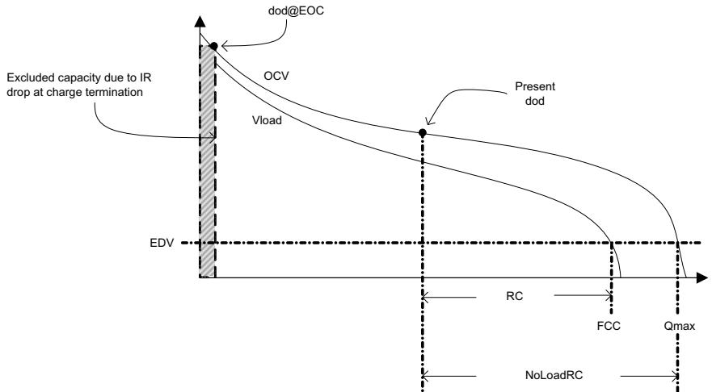  
Figure 14-1. No Load

# 14.1.46 ManufacturerAccess() 0x0060 Lifetime Data Block 1

This command returns the Lifetime Data with the following format:

aaAAbbBBccCCddDDeeEEffFFggGGhhHHiiIIjjJJkkKKllLLmmMMNNOOPPQQRRSS.

<table><tr><td rowspan=1 colspan=1>Value</td><td rowspan=1 colspan=1>Description</td></tr><tr><td rowspan=1 colspan=1>AAaa</td><td rowspan=1 colspan=1>Cell 1 Max Voltage</td></tr><tr><td rowspan=1 colspan=1>BBbb</td><td rowspan=1 colspan=1>Cell 2 Max Voltage</td></tr><tr><td rowspan=1 colspan=1>CCcc</td><td rowspan=1 colspan=1>Cell 3 Max Voltage</td></tr><tr><td rowspan=1 colspan=1>DDdd</td><td rowspan=1 colspan=1>Cell 4 Max Voltage</td></tr><tr><td rowspan=1 colspan=1>EEee</td><td rowspan=1 colspan=1>Cell 1 Min Voltage</td></tr><tr><td rowspan=1 colspan=1>FFff</td><td rowspan=1 colspan=1>Cell 2 Min Voltage</td></tr><tr><td rowspan=1 colspan=1>GGgg</td><td rowspan=1 colspan=1>Cell 3 Min Voltage</td></tr><tr><td rowspan=1 colspan=1>HHhh</td><td rowspan=1 colspan=1>Cell 4 Min Voltage</td></tr><tr><td rowspan=1 colspan=1>Ilii</td><td rowspan=1 colspan=1>Max Delta Cell Voltage</td></tr><tr><td rowspan=1 colspan=1>Jj</td><td rowspan=1 colspan=1>Max Charge Current</td></tr><tr><td rowspan=1 colspan=1>KKkk</td><td rowspan=1 colspan=1>Max Discharge Current</td></tr><tr><td rowspan=1 colspan=1>LLII</td><td rowspan=1 colspan=1>Max Avg Dsg Current</td></tr><tr><td rowspan=1 colspan=1>MMmm</td><td rowspan=1 colspan=1>Max Avg Dsg Power</td></tr><tr><td rowspan=1 colspan=1>NN</td><td rowspan=1 colspan=1>Max Temp Cell</td></tr><tr><td rowspan=1 colspan=1>00</td><td rowspan=1 colspan=1>Min Temp Cell</td></tr><tr><td rowspan=1 colspan=1>PP</td><td rowspan=1 colspan=1>Max Delta Cell Temperature</td></tr><tr><td rowspan=1 colspan=1>QQ</td><td rowspan=1 colspan=1>Max Temp Int Sensor</td></tr><tr><td rowspan=1 colspan=1>RR</td><td rowspan=1 colspan=1>Min Temp Int Sensor</td></tr><tr><td rowspan=1 colspan=1>SS</td><td rowspan=1 colspan=1>Max Temp FET</td></tr></table>

# 14.1.47 ManufacturerAccess() 0x0061 Lifetime Data Block 2

This command returns the Lifetime Data with the following format: AABBCCDDEEFFGGHH.

<table><tr><td colspan="1" rowspan="1">Value</td><td colspan="1" rowspan="1">Description</td></tr><tr><td colspan="1" rowspan="1">AA</td><td colspan="1" rowspan="1">No. of Shutdowns</td></tr><tr><td colspan="1" rowspan="1">BB</td><td colspan="1" rowspan="1">No. of Partial Resets</td></tr><tr><td colspan="1" rowspan="1">cc</td><td colspan="1" rowspan="1">No. of Full Resets</td></tr><tr><td colspan="1" rowspan="1">DD</td><td colspan="1" rowspan="1">No. of WDT resets</td></tr><tr><td colspan="1" rowspan="1">EE</td><td colspan="1" rowspan="1">CB Time Cell 1</td></tr><tr><td colspan="1" rowspan="1">FF</td><td colspan="1" rowspan="1">CB Time Cell 2</td></tr><tr><td colspan="1" rowspan="1">GG</td><td colspan="1" rowspan="1">CB Time Cell 3</td></tr><tr><td colspan="1" rowspan="1">HH</td><td colspan="1" rowspan="1">CB Time Cell 4</td></tr></table>

# 14.1.48 ManufacturerAccess() 0x0062 Lifetime Data Block 3

This command returns the Lifetime Data with the following format:

aaAAbbBBccCCddDDeeEEffFFggGGhhHH.

<table><tr><td rowspan=1 colspan=1>Value</td><td rowspan=1 colspan=1>Description</td></tr><tr><td rowspan=1 colspan=1>AAaa</td><td rowspan=1 colspan=1>Total FW Runtime</td></tr><tr><td rowspan=1 colspan=1>BBbb</td><td rowspan=1 colspan=1>Time Spent in UT</td></tr><tr><td rowspan=1 colspan=1>CCcc</td><td rowspan=1 colspan=1>Time Spent in LT</td></tr><tr><td rowspan=1 colspan=1>DDdd</td><td rowspan=1 colspan=1>Time Spent in STL</td></tr><tr><td rowspan=1 colspan=1>EEee</td><td rowspan=1 colspan=1>Time Spent in RT</td></tr><tr><td rowspan=1 colspan=1>FFff</td><td rowspan=1 colspan=1>Time Spent in STH</td></tr><tr><td rowspan=1 colspan=1>GGgg</td><td rowspan=1 colspan=1>Time Spent in HT</td></tr><tr><td rowspan=1 colspan=1>HHhh</td><td rowspan=1 colspan=1>Time Spent in OT</td></tr></table>

# 14.1.49 ManufacturerAccess() 0x0063 Lifetime Data Block 4

This command returns the Lifetime Data with the following format:

aaAAbbBBccCCddDDeeEEffFFggGGhhHHllLLmmMMnnNNooOOppPP.

<table><tr><td rowspan=1 colspan=1>Value</td><td rowspan=1 colspan=1>Description</td></tr><tr><td rowspan=1 colspan=1>AAaa</td><td rowspan=1 colspan=1>No. of COV Events</td></tr><tr><td rowspan=1 colspan=1>BBbb</td><td rowspan=1 colspan=1>Last COV Event</td></tr><tr><td rowspan=1 colspan=1>CCcc</td><td rowspan=1 colspan=1>No. of CUV Events</td></tr><tr><td rowspan=1 colspan=1>DDdd</td><td rowspan=1 colspan=1>Last CUV Event</td></tr><tr><td rowspan=1 colspan=1>EEee</td><td rowspan=1 colspan=1>No. of OCD1 Events</td></tr><tr><td rowspan=1 colspan=1>FFff</td><td rowspan=1 colspan=1>Last OCD1 Event</td></tr><tr><td rowspan=1 colspan=1>GGgg</td><td rowspan=1 colspan=1>No. of OCD2 Events</td></tr><tr><td rowspan=1 colspan=1>HHhh</td><td rowspan=1 colspan=1>Last OCD2 Event</td></tr><tr><td rowspan=1 colspan=1>Ilii</td><td rowspan=1 colspan=1>No. of OCC1 Events</td></tr><tr><td rowspan=1 colspan=1>JJjj</td><td rowspan=1 colspan=1>Last OCC1 Event</td></tr><tr><td rowspan=1 colspan=1>KKkk</td><td rowspan=1 colspan=1>No. of OCC2 Events</td></tr><tr><td rowspan=1 colspan=1>LLII</td><td rowspan=1 colspan=1>Last OCC2 Event</td></tr><tr><td rowspan=1 colspan=1>MMmm</td><td rowspan=1 colspan=1>No. of AOLD Events</td></tr><tr><td rowspan=1 colspan=1>NNnn</td><td rowspan=1 colspan=1>Last AOLD Event</td></tr><tr><td rowspan=1 colspan=1>0000</td><td rowspan=1 colspan=1>No. of ASCD Events</td></tr><tr><td rowspan=1 colspan=1>PPpp</td><td rowspan=1 colspan=1>Last ASCD Event</td></tr></table>

# 14.1.50 ManufacturerAccess() 0x0064 Lifetime Data Block 5

This command returns the Lifetime Data with the following format:

aaAAbbBBccCCddDDeeEEffFFggGGhhHHllLLmmMMnnNNooOOppPP.

<table><tr><td colspan="1" rowspan="1">Value</td><td colspan="1" rowspan="1">Description</td></tr><tr><td colspan="1" rowspan="1">AAaa</td><td colspan="1" rowspan="1">No. of ASCC Events</td></tr><tr><td colspan="1" rowspan="1">BBbb</td><td colspan="1" rowspan="1">Last ASCC Event</td></tr><tr><td colspan="1" rowspan="1">CCcc</td><td colspan="1" rowspan="1">No. of OTC Events</td></tr><tr><td colspan="1" rowspan="1">DDdd</td><td colspan="1" rowspan="1">Last OTC Event</td></tr><tr><td colspan="1" rowspan="1">EEee</td><td colspan="1" rowspan="1">No. of OTD Events</td></tr><tr><td colspan="1" rowspan="1">FFff</td><td colspan="1" rowspan="1">Last OTD Event</td></tr><tr><td colspan="1" rowspan="1">GGgg</td><td colspan="1" rowspan="1">No. of OTF Events</td></tr><tr><td colspan="1" rowspan="1">HHhh</td><td colspan="1" rowspan="1">Last OTF Event</td></tr><tr><td colspan="1" rowspan="1">Ilii</td><td colspan="1" rowspan="1">No. Valid Charge Term</td></tr><tr><td colspan="1" rowspan="1">Jj</td><td colspan="1" rowspan="1">Last Valid Charge Term</td></tr><tr><td colspan="1" rowspan="1">KKkk</td><td colspan="1" rowspan="1">No. of Qmax Updates</td></tr><tr><td colspan="1" rowspan="1">LLII</td><td colspan="1" rowspan="1">Last Qmax Update</td></tr><tr><td colspan="1" rowspan="1">MMmm</td><td colspan="1" rowspan="1">No. of Ra Updates</td></tr><tr><td colspan="1" rowspan="1">NNnn</td><td colspan="1" rowspan="1">Last Ra Update</td></tr><tr><td colspan="1" rowspan="1">0000</td><td colspan="1" rowspan="1">No. of Ra Disable</td></tr><tr><td colspan="1" rowspan="1">PPpp</td><td colspan="1" rowspan="1">Last Ra Disable</td></tr></table>

# 14.1.51 ManufacturerAccess() 0x0070 ManufacturerInfo

This command returns ManufacturerInfo on ManufacturerBlockAccess() or ManufacturerData().

<table><tr><td rowspan=1 colspan=1>Status</td><td rowspan=1 colspan=1>Condition</td><td rowspan=1 colspan=1>Action</td></tr><tr><td rowspan=1 colspan=1>Activate</td><td rowspan=1 colspan=1>0x0070 to ManufacturerAccess()</td><td rowspan=1 colspan=1>Output 32 bytes of ManufacturerInfo on ManufacturerBlockAccess() or ManufacturerData() inthe following format: AABBCCDDEEFFGGHHIIJJKKLLMMNNOOPPQQRRSSTTUUVVWWXXVVZZ112233 445566</td></tr></table>

# 14.1.52 ManufacturerAccess() 0x0071 DAStatus1

This command returns the cell voltages, pack voltage, bat voltage, cell currents, cell powers, power, and average power on ManufacturerBlockAccess() or ManufacturerData().

<table><tr><td>Status</td><td>Condition</td></tr><tr><td></td><td></td></tr><tr><td>Activate</td><td rowspan="2">0x0071 to ManufacturerBlockAccess() or ManufacturerAccess()</td></tr><tr><td></td></tr></table>

# Action: Output 32 bytes of data on ManufacturerBlockAccess() or ManufacturerData() in the following format: aaAAbbBBccCCddDDeeEEffFFggGGhhHHiiIIjjJJkkKKllLLmmMMnnNNooOOppPP where:

<table><tr><td rowspan=1 colspan=1>Value</td><td rowspan=1 colspan=1>Description</td><td rowspan=1 colspan=1>Unit</td></tr><tr><td rowspan=1 colspan=1>AAaa</td><td rowspan=1 colspan=1>Cell Voltage 1</td><td rowspan=1 colspan=1>mV</td></tr><tr><td rowspan=1 colspan=1>BBbb</td><td rowspan=1 colspan=1>Cell Voltage 2</td><td rowspan=1 colspan=1>mV</td></tr><tr><td rowspan=1 colspan=1>CCcc</td><td rowspan=1 colspan=1>Cell Voltage 3</td><td rowspan=1 colspan=1>mV</td></tr><tr><td rowspan=1 colspan=1>DDdd</td><td rowspan=1 colspan=1>Cell Voltage 4</td><td rowspan=1 colspan=1>mV</td></tr><tr><td rowspan=1 colspan=1>EEee</td><td rowspan=1 colspan=1> Voo     i Vo h  e u cell voltages.</td><td rowspan=1 colspan=1>mV</td></tr><tr><td rowspan=1 colspan=1>FFff</td><td rowspan=1 colspan=1>PACK Voltage</td><td rowspan=1 colspan=1>mV</td></tr><tr><td rowspan=1 colspan=1>GGgg</td><td rowspan=1 colspan=1>Cell Current 1. Simultaneous current measured during Cell Voltage1 measurement</td><td rowspan=1 colspan=1>mA</td></tr><tr><td rowspan=1 colspan=1>HHhh</td><td rowspan=1 colspan=1>Cell Current 2. Simultaneous current measured during Cell Voltage2 measurement</td><td rowspan=1 colspan=1>mA</td></tr><tr><td rowspan=1 colspan=1>Ilii</td><td rowspan=1 colspan=1>Cell Current 3. Simultaneous current measured during Cell Voltage3 measurement</td><td rowspan=1 colspan=1>mA</td></tr><tr><td rowspan=1 colspan=1>Jjj</td><td rowspan=1 colspan=1>Cell Current 4. Simultaneous current measured during Cell Voltage 4 measurement</td><td rowspan=1 colspan=1>mA</td></tr><tr><td rowspan=1 colspan=1>KKkk</td><td rowspan=1 colspan=1>Cell Power 1. Calculated using Cell Voltage1 and Cell Current 1 data</td><td rowspan=1 colspan=1>mA</td></tr><tr><td rowspan=1 colspan=1>LLII</td><td rowspan=1 colspan=1>Cell Power 2. Calculated using Cell Voltage2 and Cell Current 2 data</td><td rowspan=1 colspan=1>cW</td></tr><tr><td rowspan=1 colspan=1>MMmm</td><td rowspan=1 colspan=1>Cell Power 3. Calculated using Cell Voltage3 and Cell Current 3 data</td><td rowspan=1 colspan=1>cW</td></tr><tr><td rowspan=1 colspan=1>NNnn</td><td rowspan=1 colspan=1>Cell Power 4. Calculated using Cell Voltage4 and Cell Current 4 data</td><td rowspan=1 colspan=1>cW</td></tr><tr><td rowspan=1 colspan=1>0000</td><td rowspan=1 colspan=1>Power calculated by Voltage() x Current()</td><td rowspan=1 colspan=1>cW</td></tr><tr><td rowspan=1 colspan=1>PPpp</td><td rowspan=1 colspan=1>Average Power</td><td rowspan=1 colspan=1>cw</td></tr></table>

# 14.1.53 ManufacturerAccess() 0x0072 DAStatus2

This command returns the internal temperature sensor, TS1, TS2, TS3, TS4, cell temperature, FET temperature, and gauging temperature on ManufacturerBlockAccess() or ManufacturerData().

<table><tr><td>Status</td><td>Condition</td></tr><tr><td>Activate</td><td>0x0072 to ManufacturerBlockAccess() or ManufacturerAccess()</td></tr></table>

Action: Output 16 bytes of temperature data values on ManufacturerBlockAccess() or ManufacturerData() in the following format: aaAAbbBBccCCddDDeeEEffFFggGGhhHH where:

<table><tr><td rowspan=1 colspan=1>Value</td><td rowspan=1 colspan=1>Description</td><td rowspan=1 colspan=1>Unit</td></tr><tr><td rowspan=1 colspan=1>AAaa</td><td rowspan=1 colspan=1>Int Temperature</td><td rowspan=1 colspan=1>0.1°K</td></tr><tr><td rowspan=1 colspan=1>BBbb</td><td rowspan=1 colspan=1>TS1 Temperature</td><td rowspan=1 colspan=1>0.1°K</td></tr><tr><td rowspan=1 colspan=1>CCcc</td><td rowspan=1 colspan=1>TS2 Temperature</td><td rowspan=1 colspan=1>0.1°K</td></tr><tr><td rowspan=1 colspan=1>DDdd</td><td rowspan=1 colspan=1>TS3 Temperature</td><td rowspan=1 colspan=1>0.1°K</td></tr><tr><td rowspan=1 colspan=1>EEee</td><td rowspan=1 colspan=1>TS4 Temperature</td><td rowspan=1 colspan=1>0.1°K</td></tr><tr><td rowspan=1 colspan=1>FFff</td><td rowspan=1 colspan=1>Cell Temperature</td><td rowspan=1 colspan=1>0.1°K</td></tr><tr><td rowspan=1 colspan=1>GGgg</td><td rowspan=1 colspan=1>FET Temperature</td><td rowspan=1 colspan=1>0.1°K</td></tr><tr><td rowspan=1 colspan=1>HHhh</td><td rowspan=1 colspan=1>Gauging Temperature</td><td rowspan=1 colspan=1>0.1°K</td></tr></table>

# 14.1.54 ManufacturerAccess() 0x0073 GaugeStatus1

This command instructs the device to return Impedance Track related gauging information on ManufacturerBlockAccess() or ManufacturerData().

Action: Output 32 bytes of IT data values on ManufacturerBlockAccess() or ManufacturerData() in the following format: aaAAbbBBccCCddDDeeEEffFFggGGhhHHIiiIIjjJJkkKKllLLmmMMnnNNooOOppPPqqQQ where:   

<table><tr><td>Status</td><td>Condition</td></tr><tr><td>Activate</td><td>0x0073 to ManufacturerBlockAccess() or ManufacturerAccess()</td></tr></table>

<table><tr><td rowspan=1 colspan=1>Value</td><td rowspan=1 colspan=1>Description</td><td rowspan=1 colspan=1>Unit</td></tr><tr><td rowspan=1 colspan=1>AAaa</td><td rowspan=1 colspan=1>True Rem Q. True remaining capacity in mAh from IT simulation before any filtering orsmoothing function. This value can be negative or higher than FCC.</td><td rowspan=1 colspan=1>mAh</td></tr><tr><td rowspan=1 colspan=1>BBbb</td><td rowspan=1 colspan=1>True Rem E. True remaining energy in cWh from IT simulation before any filtering or smoothingfunction. This value can be negative or higher than FCC.</td><td rowspan=1 colspan=1>cWh</td></tr><tr><td rowspan=1 colspan=1>CCcc</td><td rowspan=1 colspan=1>Initial Q. Initial capacity calculated from IT simulation</td><td rowspan=1 colspan=1>mAh</td></tr><tr><td rowspan=1 colspan=1>DDdd</td><td rowspan=1 colspan=1>Initial E. Initial energy calculated from IT simulation</td><td rowspan=1 colspan=1>cWh</td></tr><tr><td rowspan=1 colspan=1>EEee</td><td rowspan=1 colspan=1>True FCC Q. True full charge capacity from IT simulation without the effects of any smoothingfunction</td><td rowspan=1 colspan=1>mAh</td></tr><tr><td rowspan=1 colspan=1>FFff</td><td rowspan=1 colspan=1>True FCC E. True full charge energy from IT simulation without the effects of any smoothingfunction</td><td rowspan=1 colspan=1>cWh</td></tr><tr><td rowspan=1 colspan=1>GGgg</td><td rowspan=1 colspan=1>T_sim. Temperature during the last simulation run.</td><td rowspan=1 colspan=1>0.1°K</td></tr><tr><td rowspan=1 colspan=1>HHhh</td><td rowspan=1 colspan=1>T_ambient. Current assumed ambient temperature used by the IT algorithm for thermal modeling</td><td rowspan=1 colspan=1>0.1°K</td></tr><tr><td rowspan=1 colspan=1>Ilii</td><td rowspan=1 colspan=1>RaScale O. Ra table scaling factor of Cell 1</td><td rowspan=1 colspan=1></td></tr><tr><td rowspan=1 colspan=1>Jj</td><td rowspan=1 colspan=1>RaScale 1. Ra table scaling factor of Cell 2</td><td rowspan=1 colspan=1>−</td></tr><tr><td rowspan=1 colspan=1>KKkk</td><td rowspan=1 colspan=1>RaScale 2. Ra table scaling factor of Cell 3</td><td rowspan=1 colspan=1></td></tr><tr><td rowspan=1 colspan=1>LLII</td><td rowspan=1 colspan=1>RaScale 3. Ra table scaling factor of Cell 4</td><td rowspan=1 colspan=1></td></tr><tr><td rowspan=1 colspan=1>MMmm</td><td rowspan=1 colspan=1>CompRes O. Last temperature compensated Resistance of Cell 1</td><td rowspan=1 colspan=1>$2-10r$</td></tr><tr><td rowspan=1 colspan=1>NNnn</td><td rowspan=1 colspan=1>CompRes 1. Last temperature compensated Resistance of Cell 2</td><td rowspan=1 colspan=1>$2-10r$</td></tr><tr><td rowspan=1 colspan=1>0000</td><td rowspan=1 colspan=1>CompRes 2. Last temperature compensated Resistance of Cell 3</td><td rowspan=1 colspan=1>$2-1or$</td></tr><tr><td rowspan=1 colspan=1>PPpp</td><td rowspan=1 colspan=1>CompRes 3. Last temperature compensated Resistance of Cell 4</td><td rowspan=1 colspan=1>2-10</td></tr></table>

# 14.1.55 ManufacturerAccess() 0x0074 GaugeStatus2

This command instructs the device to return Impedance Track related gauging information on ManufacturerBlockAccess() or ManufacturerData().

<table><tr><td>Status</td><td>Condition</td></tr><tr><td>Activate</td><td>0x0074 to ManufacturerBlockAccess() or ManufacturerAccess()</td></tr></table>

Action: Output 32 bytes of IT data values on ManufacturerBlockAccess() or ManufacturerData() in the following format: AABBCCDDEEFFggGGhhHHiiIIjjJJkkKKllLLmmMMnnNNooOOppPPqqQQrrRRssSS where:

<table><tr><td rowspan=1 colspan=1>Value</td><td rowspan=1 colspan=1>Description</td><td rowspan=1 colspan=1>Unit</td></tr><tr><td rowspan=1 colspan=1>AA</td><td rowspan=1 colspan=1>Pack Grid. Active pack grid point (minimum of CellGrid0 to Cell Grid3). This data is only validduring DISCHARGE mode when [R_DIS]= 0. If [R_DIS] = 1 or not discharging, this value is notupdated.</td><td rowspan=1 colspan=1></td></tr><tr><td rowspan=1 colspan=1>BB</td><td rowspan=1 colspan=1>BB: LStatus—Learned status of resistance tableBit 3 |Bit 2 |Bit 1| Bit 0QMax | ITEN | CF1 | CF0CF1, CF0: QMax Status0,0 = Battery OK0,1 = QMax is first updated in learning cycle.1,0 = QMax and resistance table updated in learning cycleITEN: IT enable0 = IT disabled1 = IT enabledQMax: QMax update in field0 = QMax has not been updated in the field.1= QMax updated in the field.</td><td rowspan=1 colspan=1></td></tr><tr><td rowspan=1 colspan=1>CC</td><td rowspan=1 colspan=1>Cell Grid 0. Active grid point of Cell 1. This data is only valid during DISCHARGE mode when[R_DIS] = 0. If [R_DIS]= 1 or not discharging, this value is not updated.</td><td rowspan=1 colspan=1></td></tr><tr><td rowspan=1 colspan=1>DD</td><td rowspan=1 colspan=1>Cell Grid 1. Active grid point of Cell 2. This data is only valid during DISCHARGE mode when[R_DIS] = 0. If [R_DIS] = 1 or not discharging, this value is not updated.</td><td rowspan=1 colspan=1></td></tr><tr><td rowspan=1 colspan=1>EE</td><td rowspan=1 colspan=1>Cell Grid 2. Active grid point of Cell 3. This data is only valid during DISCHARGE mode when[R_DIS] = 0. If [R_DIS] = 1 or not discharging, this value is not updated.</td><td rowspan=1 colspan=1></td></tr><tr><td rowspan=1 colspan=1>FF</td><td rowspan=1 colspan=1>Cell Grid 3. Active grid point of Cell 4. This data is only valid during DISCHARGE mode when[R_DIS] = 0. If [R_DIS] = 1 or not discharging, this value is not updated.</td><td rowspan=1 colspan=1></td></tr><tr><td rowspan=1 colspan=1>GGggHHhh</td><td rowspan=1 colspan=1>State Time. Time passed since last state change (DISCHARGE, CHARGE, REST)</td><td rowspan=1 colspan=1>S</td></tr><tr><td rowspan=1 colspan=1>Ilii</td><td rowspan=1 colspan=1>DOD0_0. Depth of discharge for Cell 1</td><td rowspan=1 colspan=1></td></tr><tr><td rowspan=1 colspan=1>Jj</td><td rowspan=1 colspan=1>DOD0_1. Depth of discharge for Cell 2</td><td rowspan=1 colspan=1>—</td></tr><tr><td rowspan=1 colspan=1>KKkk</td><td rowspan=1 colspan=1>DOD0_2. Depth of discharge for Cell 3</td><td rowspan=1 colspan=1></td></tr><tr><td rowspan=1 colspan=1>LLII</td><td rowspan=1 colspan=1>DOD0_3. Depth of discharge for Cell 4</td><td rowspan=1 colspan=1>−</td></tr><tr><td rowspan=1 colspan=1>MMmm</td><td rowspan=1 colspan=1>DOD0 Passed Q. Passed capacity since the last DOD0 update</td><td rowspan=1 colspan=1>mAh</td></tr><tr><td rowspan=1 colspan=1>NNnn</td><td rowspan=1 colspan=1>DOD0 Passed E. Passed energy since last DOD0 update</td><td rowspan=1 colspan=1>cWh</td></tr><tr><td rowspan=1 colspan=1>0000</td><td rowspan=1 colspan=1>DOD0 Time. Time passed since the last DOD0 update</td><td rowspan=1 colspan=1>hr/16</td></tr><tr><td rowspan=1 colspan=1>PPpp</td><td rowspan=1 colspan=1>DODEOC 0. Depth of discharge at end of charge of Cell 1</td><td rowspan=1 colspan=1>−</td></tr><tr><td rowspan=1 colspan=1>QQqq</td><td rowspan=1 colspan=1>DODEOC 1. Depth of discharge at end of charge of Cell 2</td><td rowspan=1 colspan=1></td></tr><tr><td rowspan=1 colspan=1>RRrr</td><td rowspan=1 colspan=1>DODEOC 2. Depth of discharge at end of charge of Cell 3</td><td rowspan=1 colspan=1></td></tr><tr><td rowspan=1 colspan=1>SSss</td><td rowspan=1 colspan=1>DODEOC 3. Depth of discharge at end of charge of Cell 4</td><td rowspan=1 colspan=1></td></tr></table>

# 14.1.56 ManufacturerAccess() 0x0075 GaugeStatus3

This command instructs the device to return Impedance Track related gauging information on ManufacturerBlockAccess() or ManufacturerData().

<table><tr><td>Status</td><td>Condition</td></tr><tr><td>Activate</td><td colspan="3">0x0075 to ManufacturerBlockAccess() or ManufacturerAccess()</td></tr></table>

Action: Output 24 bytes of IT data values on ManufacturerBlockAccess() or ManufacturerData() in the following format: aaAAbbBBccCCddDDeeEEffFFggGGhhHHIiiIIjjJJkkKKllLL where:

<table><tr><td rowspan=1 colspan=1>Value</td><td rowspan=1 colspan=1>Description</td><td rowspan=1 colspan=1>Unit</td></tr><tr><td rowspan=1 colspan=1>AAaa</td><td rowspan=1 colspan=1>QMax 0. QMax of Cell 1</td><td rowspan=1 colspan=1>mAh</td></tr><tr><td rowspan=1 colspan=1>BBbb</td><td rowspan=1 colspan=1>QMax 1. QMax of Cell 2</td><td rowspan=1 colspan=1>mAh</td></tr><tr><td rowspan=1 colspan=1>CCcc</td><td rowspan=1 colspan=1>QMax 2. QMax of Cell 3</td><td rowspan=1 colspan=1>mAh</td></tr><tr><td rowspan=1 colspan=1>DDdd</td><td rowspan=1 colspan=1>QMax 3. QMax of Cell 4</td><td rowspan=1 colspan=1>mAh</td></tr><tr><td rowspan=1 colspan=1>EEee</td><td rowspan=1 colspan=1>QMax DODo_0. DOD0 saved to be used for next QMax update of Cell 1. The value is only validwhen [VOK]= 1.</td><td rowspan=1 colspan=1></td></tr><tr><td rowspan=1 colspan=1>Fff</td><td rowspan=1 colspan=1>QMax DOD0_1. DOD0 saved to be used for next QMax update of Cell 2. The value is only validwhen [VOK]= 1.</td><td rowspan=1 colspan=1></td></tr><tr><td rowspan=1 colspan=1>GGgg</td><td rowspan=1 colspan=1>QMax DOD0_2. DOD0 saved to be used for next QMax update of Cell 3 . The value is only validwhen [VOK]= 1.</td><td rowspan=1 colspan=1></td></tr><tr><td rowspan=1 colspan=1>HHhh</td><td rowspan=1 colspan=1>QMax DOD0_3. DOD0 saved to be used for next QMax update of Cell 4. The value is only validwhen [VOK] = 1.</td><td rowspan=1 colspan=1></td></tr><tr><td rowspan=1 colspan=1>Ili</td><td rowspan=1 colspan=1>QMax Passed Q. Pass capacity since last QMax DOD value is saved.</td><td rowspan=1 colspan=1>mAh</td></tr><tr><td rowspan=1 colspan=1>Jj</td><td rowspan=1 colspan=1>QMax Time. Time passed since last QMax DOD value is saved.</td><td rowspan=1 colspan=1>hr/16</td></tr><tr><td rowspan=1 colspan=1>KKkk</td><td rowspan=1 colspan=1>Temp k. Thermal Model temperature factor</td><td rowspan=1 colspan=1></td></tr><tr><td rowspan=1 colspan=1>LLII</td><td rowspan=1 colspan=1>Temp a. Thermal Model temperature</td><td rowspan=1 colspan=1>—</td></tr></table>

# 14.1.57 ManufacturerAccess() 0x0076 CBStatus

This command instructs the device to return cell balance time information on ManufacturerBlockAccess() or ManufacturerData().

<table><tr><td></td><td></td></tr><tr><td>Status</td><td>Condition</td></tr><tr><td>Activate</td><td rowspan="2">0x0076 to ManufacturerBlockAccess() or ManufacturerAccess()</td></tr><tr><td></td></tr></table>

# Action: Output 18 bytes of IT data values on ManufacturerBlockAccess() or ManufacturerData() in the following format: aaAAbbBBccCCddDDeeEEffFFggGGhhHHiiII where:

<table><tr><td rowspan=1 colspan=1>Value</td><td rowspan=1 colspan=1>Description</td><td rowspan=1 colspan=1>Unit</td></tr><tr><td rowspan=1 colspan=1>AAaa</td><td rowspan=1 colspan=1>Cell balance time O. Calculated cell balancing time of Cell 1</td><td rowspan=1 colspan=1>s</td></tr><tr><td rowspan=1 colspan=1>BBbb</td><td rowspan=1 colspan=1>Cell balance time 1. Calculated cell balancing time of Cell 2</td><td rowspan=1 colspan=1>S</td></tr><tr><td rowspan=1 colspan=1>CCcc</td><td rowspan=1 colspan=1>Cell balance time 2. Calculated cell balancing time of Cell 3</td><td rowspan=1 colspan=1>S</td></tr><tr><td rowspan=1 colspan=1>DDdd</td><td rowspan=1 colspan=1>Cell balance time 3. Calculated cell balancing time of Cell 4</td><td rowspan=1 colspan=1>S</td></tr><tr><td rowspan=1 colspan=1>EEee</td><td rowspan=1 colspan=1>Cell 1 balance DOD</td><td rowspan=1 colspan=1>−</td></tr><tr><td rowspan=1 colspan=1>FFff</td><td rowspan=1 colspan=1>Cell 2 balance DOD</td><td rowspan=1 colspan=1>−</td></tr><tr><td rowspan=1 colspan=1>GGgg</td><td rowspan=1 colspan=1>Cell 3 balance DOD</td><td rowspan=1 colspan=1></td></tr><tr><td rowspan=1 colspan=1>HHhh</td><td rowspan=1 colspan=1>Cell 4 balance DOD</td><td rowspan=1 colspan=1></td></tr><tr><td rowspan=1 colspan=1>Ilii</td><td rowspan=1 colspan=1>Total DOD Charge</td><td rowspan=1 colspan=1></td></tr></table>

# 14.1.58 ManufacturerAccess() 0x0077 State-of-Health

This command returns the state-of-health FCC in mAh and energy in cWh with the following format: aaAAbbBB.

<table><tr><td rowspan=1 colspan=1>Value</td><td rowspan=1 colspan=1>Description</td><td rowspan=1 colspan=1>Unit</td></tr><tr><td rowspan=1 colspan=1>AAaa</td><td rowspan=1 colspan=1>State-of-Health FCC</td><td rowspan=1 colspan=1>mAh</td></tr><tr><td rowspan=1 colspan=1>BBbb</td><td rowspan=1 colspan=1>State-of-Health energy</td><td rowspan=1 colspan=1>cWh</td></tr></table>

# 14.1.59 ManufacturerAccess() 0x0078 FilterCapacity

This command instructs the device to return the filtered remaining capacity and full charge capacity even if $I S M O O T H J = 0$ on ManufacturerBlockAccess() or ManufacturerData().

<table><tr><td>Status</td><td>Condition</td></tr><tr><td>Activate</td><td>0x0078 to ManufacturerBlockAccess() or ManufacturerAccess()</td></tr></table>

Action: Output 8 bytes of IT data values on ManufacturerBlockAccess() or ManufacturerData() in the following format: aaAAbbBBccCCddDD where:

<table><tr><td rowspan=1 colspan=1>Value</td><td rowspan=1 colspan=1>Description</td><td rowspan=1 colspan=1>Unit</td></tr><tr><td rowspan=1 colspan=1>AAaa</td><td rowspan=1 colspan=1>Filtered remaining capacity</td><td rowspan=1 colspan=1>mAh</td></tr><tr><td rowspan=1 colspan=1>BBbb</td><td rowspan=1 colspan=1>Filtered remaining energy</td><td rowspan=1 colspan=1>cWh</td></tr><tr><td rowspan=1 colspan=1>CCcc</td><td rowspan=1 colspan=1>Filtered full charge capacity</td><td rowspan=1 colspan=1>mAh</td></tr><tr><td rowspan=1 colspan=1>DDdd</td><td rowspan=1 colspan=1>Filtered full charge energy</td><td rowspan=1 colspan=1>cWh</td></tr></table>

# 14.1.60 ManufacturerAccess() 0x0079 RSOC_WRITE

This command is typically used for testing purposes and will allow a specific value to be loaded into RSOC. However, subsequent IT simulation can overwrite this value. This command works only in UNSEALED mode. Additionally, this command will work with or without smoothing enabled.

# 14.1.61 ManufacturerAccess() 0x007A ManufacturerInfoB

This command returns ManufacturerInfoB on ManufacturerBlockAccess() or ManufacturerData().

<table><tr><td rowspan=1 colspan=1>Status</td><td rowspan=1 colspan=1>Condition</td><td rowspan=1 colspan=1>Action</td></tr><tr><td rowspan=1 colspan=1>Activate</td><td rowspan=1 colspan=1>0x007A to ManufacturerAccess()</td><td rowspan=1 colspan=1>Output 4 bytes of ManufacturerInfo2 onManufacturerBlockAccess() or ManufacturerData() in the followingformat: AABBCCDD</td></tr></table>

# 14.1.62 ManufacturerAccess() 0x00F0 IATA_SHUTDOWN

This command, when used in conjunction with the [IATA_SHUT] bit in the IATA Flag register, enables the gauge to enter IATA shutdown (provided certain other requirements are met).

# 14.1.63 ManufacturerAccess() 0x00F1 IATA_RM

This command is used in relation to IATA to read out the stored IATA_RM value.

# 14.1.64 ManufacturerAccess() 0x00F2 IATA_FCC

This command is used in relation to IATA to read out the stored IATA_FCC value.

# 14.1.65 ManufacturerAccess() 0x0F00 ROM Mode

This command sends the device into ROM mode in preparation for firmware reprogramming. To enter ROM mode, the device must be in FULL ACCESS mode. To return from ROM mode to FW mode, issue the SMBus command 0x08.

NOTE: Command $0 \times 0 0 3 3$ also puts the device in ROM mode (for backwards compatibility with the bq30zxy device).

# 14.1.66 ManufacturerAccess() 0x3008 WRITE_TEMP

This command, available in SEALED and UNSEALED modes, is used to write the temperature register (when enabled by setting [SMB_CELL_TEMP] $= 1$ in the SBS Configuration register. In this case, the gauge’s cell temperature inputs (TS1 through TS3) are ignored.

# 14.1.67 0x4000–0x5FFF Data Flash Access()

Accessing data flash (DF) is only supported by the ManufacturerBlockAccess() by addressing the physical address.

To write to the DF, send the starting address, followed by the DF data block. The DF data block is the intended revised DF data to be updated to DF. The size of the DF data block ranges from 1 byte to 32 bytes. All individual data must be sent in little endian.

Write to DF example:

Assuming: data1 locates at address 0x4000 and data2 locates at address 0x4002. Both data1 and data2 are U2 type.

To update data1 and data2, send an SMBus block write with command $= 0 { \times } 4 4$ block $=$ starting address $^ +$ DF data block $=$ $0 { \times } 0 0 + 0 { \times } 4 0 +$ data1_LowByte $^ +$ data1_HighByte $^ +$ data2_LowByte $^ +$ data2_HighByte

To read the DF, send an SMBus block write to the ManufacturerBlockAccess(), followed by the starting address, then send an SMBus block read to the ManufacturerBlockAccess(). The return data contains the starting address followed by 32 bytes of DF data in little endian.

Read from DF example:

Taking the same assuming from the read DF example, to read DF,   
a. Send SMBus write block with command $0 { \times } 4 4$ , block $= 0 { \times } 0 0 + 0 { \times } 4 0$   
b. Send SMBus read block with command $0 { \times } 4 4$ The returned block $= a$ starting address $^ { + 3 2 }$ bytes of DF data $= 0 { \times } 0 0 + 0 { \times } 4 0 +$ data1_LowByte $^ +$ data1_HighByte $^ +$ data2_LowByte $^ +$ data2_HighByte.... data32_LowByte $^ +$ data32_HighByte

The gauge supports an auto-increment on the address during a DF read. This greatly reduces the time required to read out the entire DF. Continue with the read from the DF example. If another SMBus read block is sent with command $0 { \times } 4 4$ , the gauge returns another 32 bytes of DF data, starting with address 0x4020.

# 14.1.68 ManufacturerAccess() 0xF080 Exit Calibration Output Mode

This command stops the output of calibration data to the ManufacturerBlockAccess() or ManufacturerData() command. Any other MAC command sent to the gauge will also stop the output of the calibration data.

<table><tr><td rowspan=1 colspan=1>Status</td><td rowspan=1 colspan=1>Condition</td><td rowspan=1 colspan=1>Action</td></tr><tr><td rowspan=1 colspan=1>Activate</td><td rowspan=1 colspan=1>ManufacturerBlockAccess() ORManufacturerData() = 1 AND0xF080 to ManufacturerAccess()</td><td rowspan=1 colspan=1>Stop output of ADC or CC data on ManufacturerBlockAccess() orManufacturerData()</td></tr></table>

# 14.1.69 ManufacturerAccess() 0xF081 Output CCADC Cal

This command instructs the device to output the raw values for calibration purposes on ManufacturerBlockAccess() or ManufacturerData(). All values are updated every 250 ms and the format of each value is 2's complement, MSB first.

<table><tr><td>Status</td><td>Condition</td></tr><tr><td>Disable</td><td>ManufacturingStatus()[CAL] = 1 AND 0xF080 to ManufacturerAccess()</td></tr></table>

Action: OperationStatus( $\mathrm { \prime } ) [ C A L ] = 0$ , $\begin{array} { r } { { I C A L \_ O F F S E T } = 0 } \end{array}$ Stop output of ADC and CC data on ManufacturerBlockAccess() or ManufacturerData()

Action: OperationStatus $\mathit { \Pi } ^ { \prime } ) [ C A L ] = 1$ , $\begin{array} { r } { { I C A L \_ O F F S E T } = 0 } \end{array}$ Outputs the raw CC and AD values on ManufacturerBlockAccess() or ManufacturerData() in the format of ZZYYaaAAbbBBccCCddDDeeEEffFFggGGhhHHiiIIjjJJkkKK:   

<table><tr><td>Status</td><td>Condition</td></tr><tr><td>Enable</td><td>0xF081 to ManufacturerAccess()</td></tr></table>

<table><tr><td rowspan=1 colspan=1>Value</td><td rowspan=1 colspan=1>Description</td></tr><tr><td rowspan=1 colspan=1>Z2</td><td rowspan=1 colspan=1>Rolling 8-bit counter, increments when values are refreshed.</td></tr><tr><td rowspan=1 colspan=1>YY</td><td rowspan=1 colspan=1>Status, 1 when ManufacturerAccess() = 0xF081, 2 when ManufacturerAccess() = 0xF082</td></tr><tr><td rowspan=1 colspan=1>AAaa</td><td rowspan=1 colspan=1>Current (coulomb counter)</td></tr><tr><td rowspan=1 colspan=1>BBbb</td><td rowspan=1 colspan=1>Cell Voltage 1</td></tr><tr><td rowspan=1 colspan=1>CCcc</td><td rowspan=1 colspan=1>Cell Voltage 2</td></tr><tr><td rowspan=1 colspan=1>DDdd</td><td rowspan=1 colspan=1>Cell Voltage 3</td></tr><tr><td rowspan=1 colspan=1>EEee</td><td rowspan=1 colspan=1>Cell Voltage 4</td></tr><tr><td rowspan=1 colspan=1>FFff</td><td rowspan=1 colspan=1>PACK Voltage</td></tr><tr><td rowspan=1 colspan=1>GGgg</td><td rowspan=1 colspan=1>BAT Voltage</td></tr><tr><td rowspan=1 colspan=1>HHhh</td><td rowspan=1 colspan=1>Cell Current 1</td></tr><tr><td rowspan=1 colspan=1>Ilii</td><td rowspan=1 colspan=1>Cell Current 2</td></tr><tr><td rowspan=1 colspan=1>JJj</td><td rowspan=1 colspan=1>Cell Current 3</td></tr><tr><td rowspan=1 colspan=1>KKkk</td><td rowspan=1 colspan=1>Cell Current 4</td></tr></table>

# 14.1.70 ManufacturerAccess() 0xF082 Output Shorted CCADC Cal

This command instructs the device to output the raw values for calibration purposes on ManufacturerBlockAccess() or ManufacturerData(). All values are updated every 250 ms and the format of each value is 2's complement, MSB first. This mode includes an internal short on the coulomb counter inputs for measuring offset.

<table><tr><td>Status</td><td>Condition</td></tr><tr><td>Disable</td><td>ManufacturingStatus()[CAL] = 1 AND 0xF080 to ManufacturerAccess()</td></tr></table>

# Action: OperationStatus $( ) [ C A L ] = 0$ , [CAL_OFFSET] = 0 Stop output of ADC and CC data on ManufacturerBlockAccess() or ManufacturerData()

Action: OperationStatus $\mathit { ( ) [ C A L ] = 1 }$ , [CAL_OFFSET] = 1 Outputs the raw CC and AD values on ManufacturerBlockAccess() or ManufacturerData() in the format of ZZYYaaAAbbBBccCCddDDeeEEffFFggGGhhHHiiIIjjJJkkKK:   

<table><tr><td>Status</td><td>Condition</td></tr><tr><td>Enable</td><td>0xF081 to ManufacturerAccess()</td></tr></table>

<table><tr><td colspan="1" rowspan="1">Value</td><td colspan="1" rowspan="1">Description</td></tr><tr><td colspan="1" rowspan="1">ZZ</td><td colspan="1" rowspan="1">Rolling 8-bit counter, increments when values are refreshed.</td></tr><tr><td colspan="1" rowspan="1">YY</td><td colspan="1" rowspan="1">Status, 1 when ManufacturerAccess() = 0xF081, 2 when ManufacturerAccess() = 0xF082</td></tr><tr><td colspan="1" rowspan="1">AAaa</td><td colspan="1" rowspan="1">Current (coulomb counter)</td></tr><tr><td colspan="1" rowspan="1">BBbb</td><td colspan="1" rowspan="1">Cell Voltage 1</td></tr><tr><td colspan="1" rowspan="1">CCcc</td><td colspan="1" rowspan="1">Cell Voltage 2</td></tr><tr><td colspan="1" rowspan="1">DDdd</td><td colspan="1" rowspan="1">Cell Voltage 3</td></tr><tr><td colspan="1" rowspan="1">EEee</td><td colspan="1" rowspan="1">Cell Voltage 4</td></tr><tr><td colspan="1" rowspan="1">FFff</td><td colspan="1" rowspan="1">PACK Voltage</td></tr><tr><td colspan="1" rowspan="1">GGgg</td><td colspan="1" rowspan="1">BAT Voltage</td></tr><tr><td colspan="1" rowspan="1">HHhh</td><td colspan="1" rowspan="1">Cell Current 1</td></tr><tr><td colspan="1" rowspan="1">Iliii</td><td colspan="1" rowspan="1">Cell Current 2</td></tr><tr><td colspan="1" rowspan="1">Jj</td><td colspan="1" rowspan="1">Cell Current 3</td></tr><tr><td>KKkk</td><td>Cell Current 4</td></tr></table>

# 14.2 0x01 RemainingCapacityAlarm()

This read/write word function sets a low capacity alarm threshold for the cell stack.

<table><tr><td rowspan=2 colspan=1>SBSCmd</td><td rowspan=2 colspan=1>Name</td><td rowspan=1 colspan=2>Access</td><td rowspan=2 colspan=1>Proto-ccol</td><td rowspan=2 colspan=1>Type</td><td rowspan=2 colspan=1>Min</td><td rowspan=2 colspan=1>Max</td><td rowspan=2 colspan=1>Default</td><td rowspan=2 colspan=1>Unit</td></tr><tr><td rowspan=1 colspan=1>SE    US</td><td rowspan=1 colspan=1>FA</td></tr><tr><td rowspan=2 colspan=1>0x01</td><td rowspan=2 colspan=1>RemainingCapacityAlarm()</td><td rowspan=2 colspan=2>R/W</td><td rowspan=2 colspan=1>Word</td><td rowspan=2 colspan=1>U2</td><td rowspan=2 colspan=1>0</td><td rowspan=2 colspan=1>700</td><td rowspan=2 colspan=1>300</td><td rowspan=1 colspan=1>mAh</td></tr><tr><td rowspan=1 colspan=1>cWh</td></tr></table>

NOTE: If BatteryMode( $\mathrm { \Delta } ^ { \prime } ) [ C A P M ] = 0$ , then the data reports in mAh. If BatteryMode( $) [ C A P M ] = 1$ , then the data reports in cWh.

# 14.3 0x02 RemainingTimeAlarm()

This read/write word function sets a low remaining time-to-fully discharge alarm threshold for the cell stack.

<table><tr><td rowspan=2 colspan=1>SBSCmd</td><td rowspan=2 colspan=1>Name</td><td rowspan=1 colspan=1>Access</td><td rowspan=2 colspan=1>Proto-col</td><td rowspan=2 colspan=1>Type</td><td rowspan=2 colspan=1>Min</td><td rowspan=2 colspan=1>Max</td><td rowspan=2 colspan=1>Default</td><td rowspan=2 colspan=1>Unit</td></tr><tr><td rowspan=1 colspan=1>SE     US      FA</td></tr><tr><td rowspan=1 colspan=1>0x02</td><td rowspan=1 colspan=1>RemainingTimeAlarm()</td><td rowspan=1 colspan=1>R/W</td><td rowspan=1 colspan=1>Word</td><td rowspan=1 colspan=1>U2</td><td rowspan=1 colspan=1>0</td><td rowspan=1 colspan=1>30</td><td rowspan=1 colspan=1>10</td><td rowspan=1 colspan=1>min</td></tr></table>

# 14.4 0x03 BatteryMode()

This read/write word function sets various battery operating mode options.

<table><tr><td rowspan=2 colspan=1>SBSCmd</td><td rowspan=2 colspan=1>Name</td><td rowspan=1 colspan=1>Access</td><td rowspan=2 colspan=1>Protocol</td><td rowspan=2 colspan=1>Type</td><td rowspan=2 colspan=1>Min</td><td rowspan=2 colspan=1>Max</td><td rowspan=2 colspan=1>Unit</td></tr><tr><td rowspan=1 colspan=1>SE     US      FA</td></tr><tr><td rowspan=1 colspan=1>0x03</td><td rowspan=1 colspan=1>BatteryMode()</td><td rowspan=1 colspan=1>R/W</td><td rowspan=1 colspan=1>Word</td><td rowspan=1 colspan=1>H2</td><td rowspan=1 colspan=1>0x0000</td><td rowspan=1 colspan=1>0xFFFF</td><td rowspan=1 colspan=1></td></tr></table>

<table><tr><td>15</td><td>14</td><td>13</td><td>12</td><td>11</td><td>10</td><td>9</td><td>8</td></tr><tr><td>CAPM</td><td>CHGM</td><td>AM</td><td>RSVD</td><td>RSVD</td><td>RSVD</td><td>PB</td><td>cC</td></tr><tr><td>7</td><td>6</td><td>5</td><td>4</td><td>3</td><td>2</td><td>1</td><td>0</td></tr><tr><td>CF</td><td>RSVD</td><td>RSVD</td><td>RSVD</td><td>RSVD</td><td>RSVD</td><td>PBS</td><td>ICC</td></tr></table>

CAPM (Bit 15): CAPACITY Mode (R/W) $0 =$ Reports in mA or mAh (default) $\uparrow =$ Reports in cW or cWh

CHGM (Bit 14): CHARGER Mode (R/W) $0 =$ Enables ChargingVoltage() and ChargingCurrent() broadcasts to the host and smart battery charger $\uparrow =$ Disables ChargingVoltage() and ChargingCurrent() broadcasts to the host and smart battery charger (default)

AM (Bit 13): ALARM Mode (R/W) $0 =$ Enables alarm warning broadcasts to the host and smart battery charger (default) $\uparrow =$ Disables alarm warning broadcasts to the host and smart battery charger

RSVD (Bits 12–10): Reserved. Do not use.

PB (Bit 9): Primary Battery $0 =$ Battery operating in its secondary role (default) $\uparrow =$ Battery operating in its primary role

CC (Bit 8): Charge Controller Enabled (R/W) $0 =$ Internal charge controller disabled (default) $\uparrow =$ Internal charge controller enabled

CF (Bit 7): Condition Flag (R) $0 =$ Battery OK $\uparrow =$ Conditioning cycle requested

RSVD (Bits 6–2): Reserved. Do not use.

PBS (Bit 1): Primary Battery Support (R) $0 =$ Function is not supported. (default) $\uparrow =$ Primary or Secondary Battery Support

ICC (Bit 0): Internal Charge Controller (R) $0 =$ Function is not supported. (default) $\uparrow =$ Function is supported.

# 14.5 0x04 AtRate()

This read/write word function sets the value used in calculating AtRateTimeToFull() and AtRateTimeToEmpty().

<table><tr><td rowspan=2 colspan=1>SBSCmd</td><td rowspan=2 colspan=1>Name</td><td rowspan=1 colspan=2>Access</td><td rowspan=2 colspan=1>Protocol</td><td rowspan=2 colspan=1>Type</td><td rowspan=2 colspan=1>Min</td><td rowspan=2 colspan=1>Max</td><td rowspan=2 colspan=1>Default</td><td rowspan=2 colspan=1>Unit</td></tr><tr><td rowspan=1 colspan=1>SE</td><td rowspan=1 colspan=1>US     FA</td></tr><tr><td rowspan=2 colspan=1>0x04</td><td rowspan=2 colspan=1>AtRate()</td><td rowspan=2 colspan=2>R/W</td><td rowspan=2 colspan=1>Word</td><td rowspan=2 colspan=1>I2</td><td rowspan=2 colspan=1>-32768</td><td rowspan=2 colspan=1>32767</td><td rowspan=2 colspan=1>0</td><td rowspan=1 colspan=1>mA</td></tr><tr><td rowspan=1 colspan=1>cW</td></tr></table>

NOTE: If BatteryMode() $\begin{array} { r } { [ C A P M ] = 0 } \end{array}$ , then the data reports in mA. If BatteryMode() $\begin{array} { r } { [ C A P M ] = 1 } \end{array}$ , then the data reports in cW.

# 14.6 0x05 AtRateTimeToFull()

This word read function returns the remaining time-to-fully charge the battery stack.

<table><tr><td rowspan=2 colspan=1>SBSd</td><td rowspan=2 colspan=1>Name</td><td rowspan=1 colspan=1>Access</td><td rowspan=2 colspan=1>Protocol</td><td rowspan=2 colspan=1>Type</td><td rowspan=2 colspan=1>Min</td><td rowspan=2 colspan=1>Max</td><td rowspan=2 colspan=1>Unit</td></tr><tr><td rowspan=1 colspan=1>SE     US     FA</td></tr><tr><td rowspan=1 colspan=1>0x05</td><td rowspan=1 colspan=1>AtRateTime ToFull()</td><td rowspan=1 colspan=1>R</td><td rowspan=1 colspan=1>Word</td><td rowspan=1 colspan=1>U2</td><td rowspan=1 colspan=1>0</td><td rowspan=1 colspan=1>65535</td><td rowspan=1 colspan=1>min</td></tr></table>

NOTE: 65535 indicates not being charged.

# 14.7 0x06 AtRateTimeToEmpty()

This word read function returns the remaining time-to-fully discharge the battery stack.

<table><tr><td rowspan=2 colspan=1>SBSCmd</td><td rowspan=2 colspan=1>Name</td><td rowspan=1 colspan=1>Access</td><td rowspan=2 colspan=1>Protocol</td><td rowspan=2 colspan=1>Type</td><td rowspan=2 colspan=1>Min</td><td rowspan=2 colspan=1>Max</td><td rowspan=2 colspan=1>Unit</td></tr><tr><td rowspan=1 colspan=1>SE    US     FA</td></tr><tr><td rowspan=1 colspan=1>0x06</td><td rowspan=1 colspan=1>AtRateTimeToEmpty()</td><td rowspan=1 colspan=1>R</td><td rowspan=1 colspan=1>Word</td><td rowspan=1 colspan=1>U2</td><td rowspan=1 colspan=1>0</td><td rowspan=1 colspan=1>65535</td><td rowspan=1 colspan=1>min</td></tr></table>

NOTE: 65535 indicates not being charged.

# 14.8 0x07 AtRateOK()

This read-word function returns a Boolean value that indicates whether the battery can deliver AtRate() for at least $\boldsymbol { 1 0 \thinspace s }$ .

<table><tr><td rowspan=2 colspan=1>SBSCmd</td><td rowspan=2 colspan=1>Name</td><td rowspan=1 colspan=1>Access</td><td rowspan=2 colspan=1>Protocol</td><td rowspan=2 colspan=1>Type</td><td rowspan=2 colspan=1>Min</td><td rowspan=2 colspan=1>Max</td><td rowspan=2 colspan=1>Unit</td></tr><tr><td rowspan=1 colspan=1>SE     US     FA</td></tr><tr><td rowspan=1 colspan=1>0x07</td><td rowspan=1 colspan=1>AtRateOK()</td><td rowspan=1 colspan=1>R</td><td rowspan=1 colspan=1>Word</td><td rowspan=1 colspan=1>U2</td><td rowspan=1 colspan=1>0</td><td rowspan=1 colspan=1>65535</td><td rowspan=1 colspan=1></td></tr></table>

NOTE: $0 =$ False. The gauge cannot deliver energy for $\boldsymbol { 1 0 \ s }$ , based on the discharge rate indicated in AtRate(). $>$ than $0 =$ True. The gauge can deliver energy for $\boldsymbol { 1 0 \thinspace s }$ , based on the discharge rate indicated in AtRate().

# 14.9 0x08 Temperature()

This read-word function returns the temperature in units $0 . 1 ^ { \circ } \mathsf { K }$ . The source of this temperature is configured by TSx Mode and the [CTEMP1], [CTEMP0] bits in DA Configuration. This temperature is used for all cell-related protections, permanent fail, and the advanced charging algorithm.

The temperature used for FET-related protections and permanent fail is FET Temperature, which is configured by the TSx Mode and FTEMP bits in DA Configuration, and is read with DAStatus2().

The temperature used for gauging is Gauging Temperature, which is configured by the [TS1], [TS0] bits in the IT Gauging Ext configuration, and is read with DASTATUS2(). The recommended configuration for Gauging Temperature is the minimum cell temperature.

<table><tr><td rowspan=2 colspan=1>SBSCmd</td><td rowspan=2 colspan=1>Name</td><td rowspan=1 colspan=1>Access</td><td rowspan=2 colspan=1>Protocol</td><td rowspan=2 colspan=1>Type</td><td rowspan=2 colspan=1>Min</td><td rowspan=2 colspan=1>Max</td><td rowspan=2 colspan=1>Unit</td></tr><tr><td rowspan=1 colspan=1>SE    US     FA</td></tr><tr><td rowspan=1 colspan=1>0x08</td><td rowspan=1 colspan=1>Temperature()</td><td rowspan=1 colspan=1>R</td><td rowspan=1 colspan=1>Word</td><td rowspan=1 colspan=1>U2</td><td rowspan=1 colspan=1>0</td><td rowspan=1 colspan=1>65535</td><td rowspan=1 colspan=1>0.1°K</td></tr></table>

# 14.10 0x09 Voltage()

This read-word function returns the sum of the measured cell voltages.

<table><tr><td rowspan=2 colspan=1>SBSCmd</td><td rowspan=2 colspan=1>Name</td><td rowspan=1 colspan=1>Access</td><td rowspan=2 colspan=1>Protocol</td><td rowspan=2 colspan=1>Type</td><td rowspan=2 colspan=1>Min</td><td rowspan=2 colspan=1>Max</td><td rowspan=2 colspan=1>Unit</td></tr><tr><td rowspan=1 colspan=1>SE   US    FA</td></tr><tr><td rowspan=1 colspan=1>0x09</td><td rowspan=1 colspan=1>Voltage()</td><td rowspan=1 colspan=1>R</td><td rowspan=1 colspan=1>Word</td><td rowspan=1 colspan=1>U2</td><td rowspan=1 colspan=1>0</td><td rowspan=1 colspan=1>65535</td><td rowspan=1 colspan=1>mV</td></tr></table>

# 14.11 0x0A Current()

This read-word function returns the measured current from the coulomb counter. If the input to the device exceeds the maximum value, the value is clamped at the maximum and does not roll over.

<table><tr><td rowspan=2 colspan=1>SBSCmd</td><td rowspan=2 colspan=1>Name</td><td rowspan=1 colspan=1>Access</td><td rowspan=2 colspan=1>Protocol</td><td rowspan=2 colspan=1>Type</td><td rowspan=2 colspan=1>Min</td><td rowspan=2 colspan=1>Max</td><td rowspan=2 colspan=1>Unit</td></tr><tr><td rowspan=1 colspan=1>SE    US     FA</td></tr><tr><td rowspan=1 colspan=1>0x0A</td><td rowspan=1 colspan=1>Current()</td><td rowspan=1 colspan=1>R</td><td rowspan=1 colspan=1>Word</td><td rowspan=1 colspan=1>I2</td><td rowspan=1 colspan=1>-32767</td><td rowspan=1 colspan=1>32768</td><td rowspan=1 colspan=1>mA</td></tr></table>

# 14.12 0x0B AverageCurrent()

<table><tr><td rowspan=2 colspan=1>SBSCmd</td><td rowspan=2 colspan=1>Name</td><td rowspan=1 colspan=1>Access</td><td rowspan=2 colspan=1>Protocol</td><td rowspan=2 colspan=1>Type</td><td rowspan=2 colspan=1>Min</td><td rowspan=2 colspan=1>Max</td><td rowspan=2 colspan=1>Unit</td></tr><tr><td rowspan=1 colspan=1>SE    US     FA</td></tr><tr><td rowspan=1 colspan=1>0x0B</td><td rowspan=1 colspan=1>AverageCurrent()</td><td rowspan=1 colspan=1>R</td><td rowspan=1 colspan=1>Word</td><td rowspan=1 colspan=1>I2</td><td rowspan=1 colspan=1>-32767</td><td rowspan=1 colspan=1>32768</td><td rowspan=1 colspan=1>mA</td></tr></table>

# 14.13 0x0C MaxError()

This read-word function returns the expected margin of error, in $\%$ , in the state-of-charge calculation with a range of 1 to $100 \%$ .

<table><tr><td rowspan=2 colspan=1>SBSCmd</td><td rowspan=2 colspan=1>Name</td><td rowspan=1 colspan=3>Access</td><td rowspan=2 colspan=1>Protocol</td><td rowspan=2 colspan=1>Type</td><td rowspan=2 colspan=1>Min</td><td rowspan=2 colspan=1>Max</td><td rowspan=2 colspan=1>Unit</td></tr><tr><td rowspan=1 colspan=1>SE</td><td rowspan=1 colspan=1>US</td><td rowspan=1 colspan=1>FA</td></tr><tr><td rowspan=1 colspan=1>0x0C</td><td rowspan=1 colspan=1>MaxError()</td><td rowspan=1 colspan=3>R</td><td rowspan=1 colspan=1>Word</td><td rowspan=1 colspan=1>U1</td><td rowspan=1 colspan=1>0</td><td rowspan=1 colspan=1>100</td><td rowspan=1 colspan=1>%</td></tr></table>

<table><tr><td rowspan=1 colspan=1>Condition</td><td rowspan=1 colspan=1>Action</td></tr><tr><td rowspan=1 colspan=1>Full device reset</td><td rowspan=1 colspan=1>MaxError() = 100%</td></tr><tr><td rowspan=1 colspan=1>RA-table only updated</td><td rowspan=1 colspan=1>MaxError() = 5%</td></tr><tr><td rowspan=1 colspan=1>QMax only updated</td><td rowspan=1 colspan=1>MaxError() = 3%</td></tr><tr><td rowspan=1 colspan=1>RA-table and QMax updated</td><td rowspan=1 colspan=1>MaxError() = 1%</td></tr><tr><td rowspan=1 colspan=1>Each Cycle Count increment after last valid QMax update</td><td rowspan=1 colspan=1>MaxError() increment by 0.05%</td></tr><tr><td rowspan=1 colspan=1>The Configuration:Max Error Time Cycle Equivalent period passedsince the last valid QMax update</td><td rowspan=1 colspan=1>MaxError() increment by 0.05%.</td></tr></table>

# 14.14 0x0D RelativeStateOfCharge()

This read-word function returns the predicted remaining battery capacity as a percentage of FullChargeCapacity().

<table><tr><td rowspan=2 colspan=1>SBSCmd</td><td rowspan=2 colspan=1>Name</td><td rowspan=1 colspan=2>Access</td><td rowspan=2 colspan=1>Protocol</td><td rowspan=2 colspan=1>Type</td><td rowspan=2 colspan=1>Min</td><td rowspan=2 colspan=1>Max</td><td rowspan=2 colspan=1>Unit</td></tr><tr><td rowspan=1 colspan=1>SE</td><td rowspan=1 colspan=1>US      FA</td></tr><tr><td rowspan=1 colspan=1>0x0D</td><td rowspan=1 colspan=1>RelativeStateOfCharge()</td><td rowspan=1 colspan=2>R</td><td rowspan=1 colspan=1>Word</td><td rowspan=1 colspan=1>U1</td><td rowspan=1 colspan=1>0</td><td rowspan=1 colspan=1>100</td><td rowspan=1 colspan=1>%</td></tr></table>

# 14.15 0x0E AbsoluteStateOfCharge()

This read-word function returns the predicted remaining battery capacity as a percentage.

<table><tr><td rowspan=2 colspan=1>SBSCmd</td><td rowspan=2 colspan=1>Name</td><td rowspan=1 colspan=2>Access</td><td rowspan=2 colspan=1>Protocol</td><td rowspan=2 colspan=1>Type</td><td rowspan=2 colspan=1>Min</td><td rowspan=2 colspan=1>Max</td><td rowspan=2 colspan=1>Unit</td></tr><tr><td rowspan=1 colspan=1>SE       US</td><td rowspan=1 colspan=1>FA</td></tr><tr><td rowspan=1 colspan=1>Ox0E</td><td rowspan=1 colspan=1>AbsoluteStateOfCharge()</td><td rowspan=1 colspan=2>R</td><td rowspan=1 colspan=1>Word</td><td rowspan=1 colspan=1>U1</td><td rowspan=1 colspan=1>0</td><td rowspan=1 colspan=1>100</td><td rowspan=1 colspan=1>%</td></tr></table>

# 14.16 0x0F RemainingCapacity()

This read-word function returns the predicted remaining battery capacity.

<table><tr><td rowspan=2 colspan=1>SBSCmd</td><td rowspan=2 colspan=1>Name</td><td rowspan=1 colspan=3>Access</td><td rowspan=2 colspan=1>Protocol</td><td rowspan=2 colspan=1>Type</td><td rowspan=2 colspan=1>Min</td><td rowspan=2 colspan=1>Max</td><td rowspan=2 colspan=1>Unit</td></tr><tr><td rowspan=1 colspan=1>SE</td><td rowspan=1 colspan=1>US</td><td rowspan=1 colspan=1>FA</td></tr><tr><td rowspan=2 colspan=1>0x0F</td><td rowspan=2 colspan=1>RemainingCapacity()</td><td rowspan=2 colspan=1>R</td><td rowspan=2 colspan=1>R</td><td rowspan=2 colspan=1>R</td><td rowspan=2 colspan=1>Word</td><td rowspan=2 colspan=1>U2</td><td rowspan=2 colspan=1>0</td><td rowspan=2 colspan=1>65535</td><td rowspan=1 colspan=1>mAh</td></tr><tr><td rowspan=1 colspan=1>cWh</td></tr></table>

NOTE: If BatteryMode $\mathcal { O } [ C A P M ] = 0$ , then the data reports in mAh. If BatteryMode( $\mathit { \Delta } ^ { \prime } ) [ C A P M ] = 1$ , then the data reports in cWh.

# 14.17 0x10 FullChargeCapacity()

This read-word function returns the predicted battery capacity when fully charged. The value returned will not be updated during charging.

<table><tr><td rowspan=2 colspan=1>SBSCmd</td><td rowspan=2 colspan=1>Name</td><td rowspan=1 colspan=3>Access</td><td rowspan=2 colspan=1>Protocol</td><td rowspan=2 colspan=1>Type</td><td rowspan=2 colspan=1>Min</td><td rowspan=2 colspan=1>Max</td><td rowspan=2 colspan=1>Unit</td></tr><tr><td rowspan=1 colspan=1>SE</td><td rowspan=1 colspan=1>US</td><td rowspan=1 colspan=1>FA</td></tr><tr><td rowspan=2 colspan=1>0x10</td><td rowspan=2 colspan=1>FullChargeCapacity()</td><td rowspan=2 colspan=1>R</td><td rowspan=2 colspan=1>R</td><td rowspan=2 colspan=1>R</td><td rowspan=2 colspan=1>Word</td><td rowspan=2 colspan=1>U2</td><td rowspan=2 colspan=1>0</td><td rowspan=2 colspan=1>65535</td><td rowspan=1 colspan=1>mAh</td></tr><tr><td rowspan=1 colspan=1>cWh</td></tr></table>

NOTE: If BatteryMode() $) [ C A P M ] = 0$ , then the data reports in mAh. If BatteryMode( $) [ C A P M ] = 1$ , then the data reports in cWh.

# 14.18 0x11 RunTimeToEmpty()

This read-word function returns the predicted remaining battery capacity based on the present rate of discharge.

<table><tr><td rowspan=2 colspan=1>SBSCmd</td><td rowspan=2 colspan=1>Name</td><td rowspan=1 colspan=3>Access</td><td rowspan=2 colspan=1>Protocol</td><td rowspan=2 colspan=1>Type</td><td rowspan=2 colspan=1>Min</td><td rowspan=2 colspan=1>Max</td><td rowspan=2 colspan=1>Unit</td></tr><tr><td rowspan=1 colspan=1>SE</td><td rowspan=1 colspan=1>US</td><td rowspan=1 colspan=1>FA</td></tr><tr><td rowspan=1 colspan=1>0x11</td><td rowspan=1 colspan=1>RunTimeToEmpty()</td><td rowspan=1 colspan=1>R</td><td rowspan=1 colspan=1>R</td><td rowspan=1 colspan=1>R</td><td rowspan=1 colspan=1>Word</td><td rowspan=1 colspan=1>U2</td><td rowspan=1 colspan=1>0</td><td rowspan=1 colspan=1>65535</td><td rowspan=1 colspan=1>min</td></tr></table>

NOTE: $6 5 5 3 5 =$ Battery is not being discharged.

# 14.19 0x12 AverageTimeToEmpty()

This read-word function returns the predicted remaining battery capacity based on AverageCurrent().

<table><tr><td rowspan=2 colspan=1>SBSCmd</td><td rowspan=2 colspan=1>Name</td><td rowspan=1 colspan=3>Access</td><td rowspan=2 colspan=1>Protocol</td><td rowspan=2 colspan=1>Type</td><td rowspan=2 colspan=1>Min</td><td rowspan=2 colspan=1>Max</td><td rowspan=2 colspan=1>Unit</td></tr><tr><td rowspan=1 colspan=1>SE</td><td rowspan=1 colspan=1>US</td><td rowspan=1 colspan=1>FA</td></tr><tr><td rowspan=1 colspan=1>0x12</td><td rowspan=1 colspan=1>AverageTime ToEmpty()</td><td rowspan=1 colspan=1>R</td><td rowspan=1 colspan=1>R</td><td rowspan=1 colspan=1>R</td><td rowspan=1 colspan=1>Word</td><td rowspan=1 colspan=1>U2</td><td rowspan=1 colspan=1>0</td><td rowspan=1 colspan=1>65535</td><td rowspan=1 colspan=1>min</td></tr></table>

NOTE: $6 5 5 3 5 =$ Battery is not being discharged.

# 14.20 0x13 AverageTimeToFull()

This read-word function returns the predicted time-to-full charge based on AverageCurrent().

<table><tr><td rowspan=2 colspan=1>SBSCmd</td><td rowspan=2 colspan=1>Name</td><td rowspan=1 colspan=3>Access</td><td rowspan=2 colspan=1>Protocol</td><td rowspan=2 colspan=1>Type</td><td rowspan=2 colspan=1>Min</td><td rowspan=2 colspan=1>Max</td><td rowspan=2 colspan=1>Unit</td></tr><tr><td rowspan=1 colspan=1>SE</td><td rowspan=1 colspan=1>US</td><td rowspan=1 colspan=1>FA</td></tr><tr><td rowspan=1 colspan=1>0x13</td><td rowspan=1 colspan=1>AverageTimeToFull()</td><td rowspan=1 colspan=1>R</td><td rowspan=1 colspan=1>R</td><td rowspan=1 colspan=1>R</td><td rowspan=1 colspan=1>Word</td><td rowspan=1 colspan=1>U2</td><td rowspan=1 colspan=1>0</td><td rowspan=1 colspan=1>65535</td><td rowspan=1 colspan=1>min</td></tr></table>

NOTE: $6 5 5 3 5 =$ Battery is not being discharged.

# 14.21 0x14 ChargingCurrent()

This read-word function returns the desired charging current.

<table><tr><td rowspan=2 colspan=1>SBSCmd</td><td rowspan=2 colspan=1>Name</td><td rowspan=1 colspan=3>Access</td><td rowspan=2 colspan=1>Protocol</td><td rowspan=2 colspan=1>Type</td><td rowspan=2 colspan=1>Min</td><td rowspan=2 colspan=1>Max</td><td rowspan=2 colspan=1>Unit</td></tr><tr><td rowspan=1 colspan=1>SE</td><td rowspan=1 colspan=1>US</td><td rowspan=1 colspan=1>FA</td></tr><tr><td rowspan=1 colspan=1>0x14</td><td rowspan=1 colspan=1>ChargingCurrent()</td><td rowspan=1 colspan=1>R</td><td rowspan=1 colspan=1>R</td><td rowspan=1 colspan=1>R</td><td rowspan=1 colspan=1>Word</td><td rowspan=1 colspan=1>U2</td><td rowspan=1 colspan=1>0</td><td rowspan=1 colspan=1>65535</td><td rowspan=1 colspan=1>mA</td></tr></table>

NOTE: $6 5 5 3 5 =$ Request maximum current

# 14.22 0x15 ChargingVoltage()

This read-word function returns the desired charging voltage.

<table><tr><td rowspan=2 colspan=1>SBSCmd</td><td rowspan=2 colspan=1>Name</td><td rowspan=1 colspan=3>Access</td><td rowspan=2 colspan=1>Protocol</td><td rowspan=2 colspan=1>Type</td><td rowspan=2 colspan=1>Min</td><td rowspan=2 colspan=1>Max</td><td rowspan=2 colspan=1>Unit</td></tr><tr><td rowspan=1 colspan=1>SE</td><td rowspan=1 colspan=1>US</td><td rowspan=1 colspan=1>FA</td></tr><tr><td rowspan=1 colspan=1>0x15</td><td rowspan=1 colspan=1>ChargingVoltage()</td><td rowspan=1 colspan=1>R</td><td rowspan=1 colspan=1>R</td><td rowspan=1 colspan=1>R</td><td rowspan=1 colspan=1>Word</td><td rowspan=1 colspan=1>U2</td><td rowspan=1 colspan=1>0</td><td rowspan=1 colspan=1>65535</td><td rowspan=1 colspan=1>mV</td></tr></table>

NOTE: $6 5 5 3 5 =$ Request maximum voltage

# 14.23 0x16 BatteryStatus()

This read-word function returns various battery status information.

<table><tr><td rowspan=2 colspan=1>SBSCmd</td><td rowspan=2 colspan=1>Name</td><td rowspan=1 colspan=3>Access</td><td rowspan=2 colspan=1>Protocol</td><td rowspan=2 colspan=1>Type</td><td rowspan=2 colspan=1>Min</td><td rowspan=2 colspan=1>Max</td></tr><tr><td rowspan=1 colspan=1>SE</td><td rowspan=1 colspan=1>US</td><td rowspan=1 colspan=1>FA</td></tr><tr><td rowspan=1 colspan=1>0x16</td><td rowspan=1 colspan=1>BatteryStatus()</td><td rowspan=1 colspan=1>R</td><td rowspan=1 colspan=1>R</td><td rowspan=1 colspan=1>R</td><td rowspan=1 colspan=1>Word</td><td rowspan=1 colspan=1>H2</td><td rowspan=1 colspan=1></td><td rowspan=1 colspan=1></td></tr></table>

<table><tr><td>15</td><td>14</td><td>13</td><td>12</td><td>11</td><td>10</td><td>9</td><td>8</td></tr><tr><td>OCA</td><td>TCA</td><td>RSVD</td><td>OTA</td><td>TDA</td><td>RSVD</td><td>RCA</td><td>RTA</td></tr><tr><td>7</td><td>6 5</td><td></td><td>4</td><td>3</td><td>2</td><td>1</td><td>0</td></tr><tr><td>INIT</td><td>DSG</td><td>FC</td><td>FD</td><td>EC3</td><td>EC2</td><td>EC1</td><td>ECO</td></tr></table>

OCA (Bit 15): Overcharged Alarm $\uparrow =$ Detected $0 =$ Not Detected

TCA (Bit 14): Terminate Charge Alarm $\uparrow =$ Detected $0 =$ Not Detected

RSVD (Bit 13): Undefined

OTA (Bit 12): Overtemperature Alarm $\uparrow =$ Detected $0 =$ Not Detected

TDA (Bit 11): Terminate Discharge Alarm $\uparrow =$ Detected $0 =$ Not Detected

RSVD (Bit 10): Undefined

RCA (Bit 9): Remaining Capacity Alarm $\uparrow =$ RemainingCapacity() $<$ RemainingCapacityAlarm() when in DISCHARGE or RELAX mode $0 =$ RemainingCapacity() $\geq$ RemainingCapacityAlarm()

RTA (Bit 8): Remaining Time Alarm $\uparrow =$ AverageTimeToEmpty() $<$ RemainingTimeAlarm() or $0 =$ AverageTimeToEmpty() $\geq$ RemainingTimeAlarm()

INIT (Bit 7): Initialization $\uparrow =$ Gauge initialization is complete. $0 =$ Initialization is in progress.

DSG (Bit 6): Discharging or Relax $\uparrow =$ Battery is in DISCHARGE or RELAX mode. $0 =$ Battery is in CHARGE mode.

FC (Bit 5): Fully Charged $\uparrow =$ Battery fully charged when GaugingStatus $\mathit { ( ) [ F C ] = 1 }$ $0 =$ Battery not fully charged

FD (Bit 4): Fully Discharged $\uparrow =$ Battery fully depleted $0 =$ Battery not depleted

EC3,EC2,EC1,EC0 (Bits 3–0): Error Code $0 \times 0 = \ 0 \mathsf { K }$ $0 { \times } 1 = \mathsf { B u s y }$ ${ 0 } { \times } { 2 } =$ Reserved Command $0 { \times } 3 =$ Unsupported Command $0 { \times } 4 =$ AccessDenied $0 \times 5 =$ Overflow/Underflow $0 \times 6 =$ BadSize $0 { \times } 7 =$ UnknownError

# 14.24 0x17 CycleCount()

This read-word function returns the number of discharge cycles the battery has experienced. The default value is stored in the data flash value Cycle Count, which is updated in runtime.

<table><tr><td rowspan=2 colspan=1>SBSCmd</td><td rowspan=2 colspan=1>Name</td><td rowspan=1 colspan=3>Access</td><td rowspan=2 colspan=1>Protocol</td><td rowspan=2 colspan=1>Type</td><td rowspan=2 colspan=1>Min</td><td rowspan=2 colspan=1>Max</td><td rowspan=2 colspan=1>Unit</td></tr><tr><td rowspan=1 colspan=1>SE</td><td rowspan=1 colspan=1>US</td><td rowspan=1 colspan=1>FA</td></tr><tr><td rowspan=1 colspan=1>0x17</td><td rowspan=1 colspan=1>Cycle Count</td><td rowspan=1 colspan=1>R</td><td rowspan=1 colspan=1>R/W</td><td rowspan=1 colspan=1>R/W</td><td rowspan=1 colspan=1>Word</td><td rowspan=1 colspan=1>U2</td><td rowspan=1 colspan=1>0</td><td rowspan=1 colspan=1>65535</td><td rowspan=1 colspan=1>cycles</td></tr></table>

# 14.25 0x18 DesignCapacity()

This read-word function returns the theoretical pack capacity. The default value is stored in the data flash value Design Capacity mAh or Design Capacity cWh.

<table><tr><td rowspan=2 colspan=1>SBSCmd</td><td rowspan=2 colspan=1>Name</td><td rowspan=1 colspan=3>Access</td><td rowspan=2 colspan=1>Protocol</td><td rowspan=2 colspan=1>Type</td><td rowspan=2 colspan=1>Min</td><td rowspan=2 colspan=1>Max</td><td rowspan=2 colspan=1>Default</td><td rowspan=2 colspan=1>Unit</td></tr><tr><td rowspan=1 colspan=1>SE</td><td rowspan=1 colspan=1>US</td><td rowspan=1 colspan=1>FA</td></tr><tr><td rowspan=2 colspan=1>0x18</td><td rowspan=2 colspan=1>DesignCapacity)</td><td rowspan=2 colspan=1>R</td><td rowspan=2 colspan=1>R/W</td><td rowspan=2 colspan=1>R/W</td><td rowspan=2 colspan=1>Word</td><td rowspan=2 colspan=1>U2</td><td rowspan=2 colspan=1>0</td><td rowspan=2 colspan=1>65535</td><td rowspan=1 colspan=1>4400</td><td rowspan=1 colspan=1>mAh</td></tr><tr><td rowspan=1 colspan=1>6336</td><td rowspan=1 colspan=1>cWh</td></tr></table>

NOTE: If BatteryMode $\mathcal { O } [ C A P M ] = 0$ , then the data reports in mAh. If BatteryMode( $\mathit { \Delta } ^ { \prime } ) [ C A P M ] = 1$ , then the data reports in cWh.

# 14.26 0x19 DesignVoltage()

This read-word function returns the theoretical pack voltage. The default value is stored in the data flash value Design Voltage.

<table><tr><td rowspan=2 colspan=1>SBSCmd</td><td rowspan=2 colspan=1>Name</td><td rowspan=1 colspan=3>Access</td><td rowspan=2 colspan=1>Protocol</td><td rowspan=2 colspan=1>Type</td><td rowspan=2 colspan=1>Min</td><td rowspan=2 colspan=1>Max</td><td rowspan=2 colspan=1>Default</td><td rowspan=2 colspan=1>Unit</td></tr><tr><td rowspan=1 colspan=1>SE</td><td rowspan=1 colspan=1>US</td><td rowspan=1 colspan=1>FA</td></tr><tr><td rowspan=1 colspan=1>0x19</td><td rowspan=1 colspan=1>DesignVoltage()</td><td rowspan=1 colspan=1>R</td><td rowspan=1 colspan=1>R/W</td><td rowspan=1 colspan=1>R/W</td><td rowspan=1 colspan=1>Word</td><td rowspan=1 colspan=1>U2</td><td rowspan=1 colspan=1>7000</td><td rowspan=1 colspan=1>18000</td><td rowspan=1 colspan=1>14400</td><td rowspan=1 colspan=1>mV</td></tr></table>

# 14.27 0x1A SpecificationInfo()

<table><tr><td rowspan=2 colspan=1>SBSCmd</td><td rowspan=2 colspan=1>Name</td><td rowspan=1 colspan=3>Access</td><td rowspan=2 colspan=1>Protocol</td><td rowspan=2 colspan=1>Type</td><td rowspan=2 colspan=1>Min</td><td rowspan=2 colspan=1>Max</td></tr><tr><td rowspan=1 colspan=1>SE</td><td rowspan=1 colspan=1>US</td><td rowspan=1 colspan=1>FA</td></tr><tr><td rowspan=1 colspan=1>0x1A</td><td rowspan=1 colspan=1>SpecificationInfo()</td><td rowspan=1 colspan=1>R</td><td rowspan=1 colspan=1>R/W</td><td rowspan=1 colspan=1>R/W</td><td rowspan=1 colspan=1>Word</td><td rowspan=1 colspan=1>H2</td><td rowspan=1 colspan=1>0x0000</td><td rowspan=1 colspan=1>0xFFFF</td></tr></table>

<table><tr><td>15</td><td>14</td><td>13</td><td>12</td><td>11</td><td>10</td><td>9</td><td>8</td></tr><tr><td>IPScale</td><td>IPScale</td><td>IPScale</td><td>IPScale</td><td>VScale</td><td>VScale</td><td>VScale</td><td>VScale</td></tr><tr><td>7 6</td><td colspan="5">5 4 3 2</td><td>1</td><td>0</td></tr><tr><td>Version</td><td>Version</td><td>Version</td><td>Version</td><td>Revision</td><td>Revision</td><td>Revision</td><td>Revision</td></tr></table>

IPScale (Bits 15–12): IP Scale Factor Not supported by the gas gauge MUST be set to 0, 0, 0, 0.

VScale (Bits 11–8): Voltage Scale Factor Not supported by the gas gauge MUST be set to 0, 0, 0, 0.

Version (Bits 7–4): Version $0 { , } 0 { , } 0 { , } 1 =$ Version 1.0 $0 , 0 , 1 , 1 =$ Version 1.1 $0 , 0 , 1 , 1 =$ Version 1.1 with optional PEC support

Revision (Bits 3–0): Revision $0 { , } 0 { , } 0 { , } 1 =$ Version 1.0 and 1.1 (default)

# 14.28 0x1B ManufacturerDate()

This read-word function returns the pack's manufacturer date.

<table><tr><td rowspan=2 colspan=1>SBSCmd</td><td rowspan=2 colspan=1>Name</td><td rowspan=1 colspan=3>Access</td><td rowspan=2 colspan=1>Protocol</td><td rowspan=2 colspan=1>Type</td><td rowspan=2 colspan=1>Min</td><td rowspan=2 colspan=1>Max</td><td rowspan=2 colspan=1>Default</td></tr><tr><td rowspan=1 colspan=1>SE</td><td rowspan=1 colspan=1>US</td><td rowspan=1 colspan=1>FA</td></tr><tr><td rowspan=1 colspan=1>0x1B</td><td rowspan=1 colspan=1>ManufacturerDate()</td><td rowspan=1 colspan=1>R</td><td rowspan=1 colspan=1>R/W</td><td rowspan=1 colspan=1>R/M</td><td rowspan=1 colspan=1>Word</td><td rowspan=1 colspan=1>U2</td><td rowspan=1 colspan=1></td><td rowspan=1 colspan=1>65535</td><td rowspan=1 colspan=1>0</td></tr></table>

NOTE: ManufacturerDate() value in the following format: Day $^ +$ Month\*32 + (Year–1980)\*512

# 14.29 0x1C SerialNumber()

This read-word function returns the assigned pack serial number.

<table><tr><td rowspan=2 colspan=1>SBSCmd</td><td rowspan=2 colspan=1>Name</td><td rowspan=1 colspan=3>Access</td><td rowspan=2 colspan=1>Protocol</td><td rowspan=2 colspan=1>Type</td><td rowspan=2 colspan=1>Min</td><td rowspan=2 colspan=1>Max</td><td rowspan=2 colspan=1>Default</td><td rowspan=2 colspan=1>Unit</td></tr><tr><td rowspan=1 colspan=1>SE</td><td rowspan=1 colspan=1>US</td><td rowspan=1 colspan=1>FA</td></tr><tr><td rowspan=1 colspan=1>0x1C</td><td rowspan=1 colspan=1>SerialNumber()</td><td rowspan=1 colspan=1>R</td><td rowspan=1 colspan=1>R/W</td><td rowspan=1 colspan=1>R/W</td><td rowspan=1 colspan=1>Word</td><td rowspan=1 colspan=1>H2</td><td rowspan=1 colspan=1>0x0000</td><td rowspan=1 colspan=1>0xFFFF</td><td rowspan=1 colspan=1>0x0001</td><td rowspan=1 colspan=1></td></tr></table>

# 14.30 0x20 ManufacturerName()

This read-block function returns the pack manufacturer's name.

<table><tr><td rowspan=2 colspan=1>SBSCmd</td><td rowspan=2 colspan=1>Name</td><td rowspan=1 colspan=3>Access</td><td rowspan=2 colspan=1>Protocol</td><td rowspan=2 colspan=1>Type</td><td rowspan=2 colspan=1>Min</td><td rowspan=2 colspan=1>Max</td><td rowspan=2 colspan=1>Default</td><td rowspan=2 colspan=1>Unit</td></tr><tr><td rowspan=1 colspan=1>SE</td><td rowspan=1 colspan=1>US</td><td rowspan=1 colspan=1>FA</td></tr><tr><td rowspan=1 colspan=1>0x20</td><td rowspan=1 colspan=1>ManufacturerName()</td><td rowspan=1 colspan=1>R</td><td rowspan=1 colspan=1>R</td><td rowspan=1 colspan=1>R</td><td rowspan=1 colspan=1>Block</td><td rowspan=1 colspan=1>S20+1</td><td rowspan=1 colspan=1></td><td rowspan=1 colspan=1></td><td rowspan=1 colspan=1>Texas Inst.</td><td rowspan=1 colspan=1>ASCII</td></tr></table>

# 14.31 0x21 DeviceName()

This read-block function returns the assigned pack name.

<table><tr><td rowspan=2 colspan=1>SBSCmd</td><td rowspan=2 colspan=1>Name</td><td rowspan=1 colspan=3>Access</td><td rowspan=2 colspan=1>Protocol</td><td rowspan=2 colspan=1>Type</td><td rowspan=2 colspan=1>Min</td><td rowspan=2 colspan=1>Max</td><td rowspan=2 colspan=1>Default</td><td rowspan=2 colspan=1>Unit</td></tr><tr><td rowspan=1 colspan=1>SE</td><td rowspan=1 colspan=1>US</td><td rowspan=1 colspan=1>FA</td></tr><tr><td rowspan=1 colspan=1>0x21</td><td rowspan=1 colspan=1>DeviceName()</td><td rowspan=1 colspan=1>R</td><td rowspan=1 colspan=1>R</td><td rowspan=1 colspan=1>R</td><td rowspan=1 colspan=1>Block</td><td rowspan=1 colspan=1>S20+1</td><td rowspan=1 colspan=1>—</td><td rowspan=1 colspan=1></td><td rowspan=1 colspan=1>bq40z50-R2</td><td rowspan=1 colspan=1>ASCII</td></tr></table>

# 14.32 0x22 DeviceChemistry()

This read-block function returns the battery chemistry used in the pack.

<table><tr><td rowspan=2 colspan=1>SBSCmd</td><td rowspan=2 colspan=1>Name</td><td rowspan=1 colspan=3>Access</td><td rowspan=2 colspan=1>Protocol</td><td rowspan=2 colspan=1>Type</td><td rowspan=2 colspan=1>Min</td><td rowspan=2 colspan=1>Max</td><td rowspan=2 colspan=1>Default</td><td rowspan=2 colspan=1>Unit</td></tr><tr><td rowspan=1 colspan=1>SE</td><td rowspan=1 colspan=1>US</td><td rowspan=1 colspan=1>FA</td></tr><tr><td rowspan=1 colspan=1>0x22</td><td rowspan=1 colspan=1>DeviceChemistry()</td><td rowspan=1 colspan=1>R</td><td rowspan=1 colspan=1>R</td><td rowspan=1 colspan=1>R</td><td rowspan=1 colspan=1>Block</td><td rowspan=1 colspan=1>S4+1</td><td rowspan=1 colspan=1></td><td rowspan=1 colspan=1>—</td><td rowspan=1 colspan=1>LION</td><td rowspan=1 colspan=1>ASCII</td></tr></table>

# 14.33 0x23 ManufacturerData()

This read-block function returns ManufacturerInfo by default. The command also returns a response to MAC command in order to maintain compatibility of the MAC system in bq30zxy family.

<table><tr><td rowspan=2 colspan=1>SBSCmd</td><td rowspan=2 colspan=1>Name</td><td rowspan=1 colspan=3>Access</td><td rowspan=2 colspan=1>Protocol</td><td rowspan=2 colspan=1>Type</td><td rowspan=2 colspan=1>Min</td><td rowspan=2 colspan=1>Max</td><td rowspan=2 colspan=1>Unit</td></tr><tr><td rowspan=1 colspan=1>SE</td><td rowspan=1 colspan=1>US</td><td rowspan=1 colspan=1>FA</td></tr><tr><td rowspan=1 colspan=1>0x23</td><td rowspan=1 colspan=1>ManufacturerData()</td><td rowspan=1 colspan=1>R</td><td rowspan=1 colspan=1>R</td><td rowspan=1 colspan=1>R</td><td rowspan=1 colspan=1>Block</td><td rowspan=1 colspan=1>Mixed</td><td rowspan=1 colspan=1></td><td rowspan=1 colspan=1></td><td rowspan=1 colspan=1></td></tr></table>

# 14.34 0x2F Authenticate()

This read/write block function provides SHA-1 authentication to send the challenge and read the response in the default mode. It is also used to input a new authentication key when the MAC AuthenticationKey() is used.

<table><tr><td rowspan=2 colspan=1>SBSCmd</td><td rowspan=2 colspan=1>Name</td><td rowspan=1 colspan=3>Access</td><td rowspan=2 colspan=1>Protocol</td><td rowspan=2 colspan=1>Type</td><td rowspan=2 colspan=1>Min</td><td rowspan=2 colspan=1>Max</td><td rowspan=2 colspan=1>Unit</td></tr><tr><td rowspan=1 colspan=1>SE</td><td rowspan=1 colspan=1>US</td><td rowspan=1 colspan=1>FA</td></tr><tr><td rowspan=1 colspan=1>0x2F</td><td rowspan=1 colspan=1>Authenticate()</td><td rowspan=1 colspan=1>R/W</td><td rowspan=1 colspan=1>R/W</td><td rowspan=1 colspan=1>R/M</td><td rowspan=1 colspan=1>Block</td><td rowspan=1 colspan=1>H20+1</td><td rowspan=1 colspan=1></td><td rowspan=1 colspan=1></td><td rowspan=1 colspan=1></td></tr></table>

# 14.35 0x3C CellVoltage4()

This read-word function returns the Cell 4 voltage.

<table><tr><td rowspan=2 colspan=1>SBSCmd</td><td rowspan=2 colspan=1>Name</td><td rowspan=1 colspan=3>Access</td><td rowspan=2 colspan=1>Protocol</td><td rowspan=2 colspan=1>Type</td><td rowspan=2 colspan=1>Min</td><td rowspan=2 colspan=1>Max</td><td rowspan=2 colspan=1>Default</td><td rowspan=2 colspan=1>Unit</td></tr><tr><td rowspan=1 colspan=1>SE</td><td rowspan=1 colspan=1>US</td><td rowspan=1 colspan=1>FA</td></tr><tr><td rowspan=1 colspan=1>0x3C</td><td rowspan=1 colspan=1>CellVoltage4()</td><td rowspan=1 colspan=1>R</td><td rowspan=1 colspan=1>R</td><td rowspan=1 colspan=1>R</td><td rowspan=1 colspan=1>Word</td><td rowspan=1 colspan=1>U2</td><td rowspan=1 colspan=1>—</td><td rowspan=1 colspan=1>65535</td><td rowspan=1 colspan=1>0</td><td rowspan=1 colspan=1>mV</td></tr></table>

# 14.36 0x3D CellVoltage3()

This read-word function returns the Cell 3 voltage.

<table><tr><td rowspan=2 colspan=1>SBSCmd</td><td rowspan=2 colspan=1>Name</td><td rowspan=1 colspan=3>Access</td><td rowspan=2 colspan=1>Protocol</td><td rowspan=2 colspan=1>Type</td><td rowspan=2 colspan=1>Min</td><td rowspan=2 colspan=1>Max</td><td rowspan=2 colspan=1>Default</td><td rowspan=2 colspan=1>Unit</td></tr><tr><td rowspan=1 colspan=1>SE</td><td rowspan=1 colspan=1>US</td><td rowspan=1 colspan=1>FA</td></tr><tr><td rowspan=1 colspan=1>0x3D</td><td rowspan=1 colspan=1>CellVoltage3()</td><td rowspan=1 colspan=1>R</td><td rowspan=1 colspan=1>R</td><td rowspan=1 colspan=1>R</td><td rowspan=1 colspan=1>Word</td><td rowspan=1 colspan=1>U2</td><td rowspan=1 colspan=1>—</td><td rowspan=1 colspan=1>65535</td><td rowspan=1 colspan=1>0</td><td rowspan=1 colspan=1>mV</td></tr></table>

# 14.37 0x3E CellVoltage2()

This read-word function returns the Cell 2 voltage.

<table><tr><td rowspan=2 colspan=1>SBSCmd</td><td rowspan=2 colspan=1>Name</td><td rowspan=1 colspan=3>Access</td><td rowspan=2 colspan=1>Protocol</td><td rowspan=2 colspan=1>Type</td><td rowspan=2 colspan=1>Min</td><td rowspan=2 colspan=1>Max</td><td rowspan=2 colspan=1>Default</td><td rowspan=2 colspan=1>Unit</td></tr><tr><td rowspan=1 colspan=1>SE</td><td rowspan=1 colspan=1>US</td><td rowspan=1 colspan=1>FA</td></tr><tr><td rowspan=1 colspan=1>0x3E</td><td rowspan=1 colspan=1>CellVoltage2()</td><td rowspan=1 colspan=1>R</td><td rowspan=1 colspan=1>R</td><td rowspan=1 colspan=1>R</td><td rowspan=1 colspan=1>Word</td><td rowspan=1 colspan=1>U2</td><td rowspan=1 colspan=1></td><td rowspan=1 colspan=1>65535</td><td rowspan=1 colspan=1>0</td><td rowspan=1 colspan=1>mV</td></tr></table>

# 14.38 0x3F CellVoltage1()

This read-word function returns the Cell 1 voltage.

<table><tr><td rowspan=2 colspan=1>SBSCmd</td><td rowspan=2 colspan=1>Name</td><td rowspan=1 colspan=3>Access</td><td rowspan=2 colspan=1>Protocol</td><td rowspan=2 colspan=1>Type</td><td rowspan=2 colspan=1>Min</td><td rowspan=2 colspan=1>Max</td><td rowspan=2 colspan=1>Default</td><td rowspan=2 colspan=1>Unit</td></tr><tr><td rowspan=1 colspan=1>SE</td><td rowspan=1 colspan=1>US</td><td rowspan=1 colspan=1>FA</td></tr><tr><td rowspan=1 colspan=1>0x3F</td><td rowspan=1 colspan=1>CellVoltage1()</td><td rowspan=1 colspan=1>R</td><td rowspan=1 colspan=1>R</td><td rowspan=1 colspan=1>R</td><td rowspan=1 colspan=1>Word</td><td rowspan=1 colspan=1>U2</td><td rowspan=1 colspan=1></td><td rowspan=1 colspan=1>65535</td><td rowspan=1 colspan=1>0</td><td rowspan=1 colspan=1>mV</td></tr></table>

# 14.39 0x4A BTPDischargeSet()

This read-/write-word command updates the BTP set threshold for DISCHARGE mode for the next BTP interrupt, deasserts the present BTP interrupt, and clears the OperationStatus()[BTP_INT] bit.

<table><tr><td rowspan=2 colspan=1>SBSCmd</td><td rowspan=2 colspan=1>Name</td><td rowspan=1 colspan=3>Access</td><td rowspan=2 colspan=1>Format</td><td rowspan=2 colspan=1>Size inBytes</td><td rowspan=2 colspan=1>Min</td><td rowspan=2 colspan=1>Max</td><td rowspan=2 colspan=1>Default</td><td rowspan=2 colspan=1>Unit</td></tr><tr><td rowspan=1 colspan=1>SE</td><td rowspan=1 colspan=1>US</td><td rowspan=1 colspan=1>FA</td></tr><tr><td rowspan=1 colspan=1>0x4A</td><td rowspan=1 colspan=1>BTPDischargeSet()</td><td rowspan=1 colspan=1>R/W</td><td rowspan=1 colspan=1>R/W</td><td rowspan=1 colspan=1>R/W</td><td rowspan=1 colspan=1>Signed Int</td><td rowspan=1 colspan=1>2</td><td rowspan=1 colspan=1></td><td rowspan=1 colspan=1>65535</td><td rowspan=1 colspan=1>150</td><td rowspan=1 colspan=1>mAh</td></tr></table>

# 14.40 0x4B BTPChargeSet()

The read-/write-word command updates the BTP set threshold for CHARGE mode for the next BTP interrupt, deasserts the present BTP interrupt, and clears the OperationStatus()[BTP_INT] bit.

<table><tr><td rowspan=2 colspan=1>SBSCmd</td><td rowspan=2 colspan=1>Name</td><td rowspan=1 colspan=3>Access</td><td rowspan=2 colspan=1>Format</td><td rowspan=2 colspan=1>Size inBytes</td><td rowspan=2 colspan=1>Min</td><td rowspan=2 colspan=1>Max</td><td rowspan=2 colspan=1>Default</td><td rowspan=2 colspan=1>Unit</td></tr><tr><td rowspan=1 colspan=1>SE</td><td rowspan=1 colspan=1>US</td><td rowspan=1 colspan=1>FA</td></tr><tr><td rowspan=1 colspan=1>0x4B</td><td rowspan=1 colspan=1>BTPChargeSet()</td><td rowspan=1 colspan=1>R/W</td><td rowspan=1 colspan=1>R/W</td><td rowspan=1 colspan=1>R/W</td><td rowspan=1 colspan=1>Signed Int</td><td rowspan=1 colspan=1>2</td><td rowspan=1 colspan=1></td><td rowspan=1 colspan=1>65535</td><td rowspan=1 colspan=1>175</td><td rowspan=1 colspan=1>mAh</td></tr></table>

# 14.41 0x4F State-of-Health (SOH)

This read-word command returns the SOH information of the battery in percentage of Design Capacity and Design Capacity cWh.

# 14.42 0x50 SafetyAlert

This command returns the SafetyAlert() flags. For a description of each bit flag, see the ManufacturerAccess() version of the same command in Section 14.1.

<table><tr><td rowspan=2 colspan=1>SBSCmd</td><td rowspan=2 colspan=1>Name</td><td rowspan=1 colspan=3>Access</td><td rowspan=2 colspan=1>Protocol</td><td rowspan=2 colspan=1>Type</td><td rowspan=2 colspan=1>Min</td><td rowspan=2 colspan=1>Max</td><td rowspan=2 colspan=1>Default</td><td rowspan=2 colspan=1>Unit</td></tr><tr><td rowspan=1 colspan=1>SE</td><td rowspan=1 colspan=1>US</td><td rowspan=1 colspan=1>FA</td></tr><tr><td rowspan=1 colspan=1>0x50</td><td rowspan=1 colspan=1>SafetyAlert()</td><td rowspan=1 colspan=1></td><td rowspan=1 colspan=1>R</td><td rowspan=1 colspan=1>R</td><td rowspan=1 colspan=1>Block</td><td rowspan=1 colspan=1>H4</td><td rowspan=1 colspan=1>0x00000000</td><td rowspan=1 colspan=1>0xFFFFFFFF</td><td rowspan=1 colspan=1></td><td rowspan=1 colspan=1></td></tr></table>

# 14.43 0x51 SafetyStatus

This command returns the SafetyStatus() flags. For a description of each bit flag, see the ManufacturerAccess() version of the same command in Section 14.1.

<table><tr><td rowspan=2 colspan=1>SBSCmd</td><td rowspan=2 colspan=1>Name</td><td rowspan=1 colspan=3>Access</td><td rowspan=2 colspan=1>Protocol</td><td rowspan=2 colspan=1>Type</td><td rowspan=2 colspan=1>Min</td><td rowspan=2 colspan=1>Max</td><td rowspan=2 colspan=1>Default</td><td rowspan=2 colspan=1>Unit</td></tr><tr><td rowspan=1 colspan=1>SE</td><td rowspan=1 colspan=1>US</td><td rowspan=1 colspan=1>FA</td></tr><tr><td rowspan=1 colspan=1>0x51</td><td rowspan=1 colspan=1>SafetyStatus()</td><td rowspan=1 colspan=1></td><td rowspan=1 colspan=1>R</td><td rowspan=1 colspan=1>R</td><td rowspan=1 colspan=1>Block</td><td rowspan=1 colspan=1>H4</td><td rowspan=1 colspan=1>0x00000000</td><td rowspan=1 colspan=1>0xFFFFFFFF</td><td rowspan=1 colspan=1></td><td rowspan=1 colspan=1></td></tr></table>

# 14.44 0x52 PFAlert

This command returns the PFAlert() flags. For a description of each bit flag, see the ManufacturerAccess() version of the same command in Section 14.1.

<table><tr><td rowspan=2 colspan=1>SBSCmd</td><td rowspan=2 colspan=1>Name</td><td rowspan=1 colspan=3>Access</td><td rowspan=2 colspan=1>Protocol</td><td rowspan=2 colspan=1>Type</td><td rowspan=2 colspan=1>Min</td><td rowspan=2 colspan=1>Max</td><td rowspan=2 colspan=1>Default</td><td rowspan=2 colspan=1>Unit</td></tr><tr><td rowspan=1 colspan=1>SE</td><td rowspan=1 colspan=1>US</td><td rowspan=1 colspan=1>FA</td></tr><tr><td rowspan=1 colspan=1>0x52</td><td rowspan=1 colspan=1>PFAlert()</td><td rowspan=1 colspan=1></td><td rowspan=1 colspan=1>R</td><td rowspan=1 colspan=1>R</td><td rowspan=1 colspan=1>Block</td><td rowspan=1 colspan=1>H4</td><td rowspan=1 colspan=1>Ox00000000</td><td rowspan=1 colspan=1>0xFFFFFFFF</td><td rowspan=1 colspan=1>—</td><td rowspan=1 colspan=1>—</td></tr></table>

# 14.45 0x53 PFStatus

This command returns the PFStatus() flags. For a description of each bit flag, see the ManufacturerAccess() version of the same command in Section 14.1.

<table><tr><td rowspan=2 colspan=1>SBSCmd</td><td rowspan=2 colspan=1>Name</td><td rowspan=1 colspan=3>Access</td><td rowspan=2 colspan=1>Protocol</td><td rowspan=2 colspan=1>Type</td><td rowspan=2 colspan=1>Min</td><td rowspan=2 colspan=1>Max</td><td rowspan=2 colspan=1>Default</td><td rowspan=2 colspan=1>Unit</td></tr><tr><td rowspan=1 colspan=1>SE</td><td rowspan=1 colspan=1>US</td><td rowspan=1 colspan=1>FA</td></tr><tr><td rowspan=1 colspan=1>0x53</td><td rowspan=1 colspan=1>PFStatus()</td><td rowspan=1 colspan=1></td><td rowspan=1 colspan=1>R</td><td rowspan=1 colspan=1>R</td><td rowspan=1 colspan=1>Block</td><td rowspan=1 colspan=1>H4</td><td rowspan=1 colspan=1>0x00000000</td><td rowspan=1 colspan=1>0xFFFFFFFF</td><td rowspan=1 colspan=1>—</td><td rowspan=1 colspan=1></td></tr></table>

# 14.46 0x54 OperationStatus

This command returns the OperationStatus() flags. For a description of each bit flag, see the ManufacturerAccess() version of the same command in Section 14.1.

<table><tr><td rowspan=2 colspan=1>SBSCmd</td><td rowspan=2 colspan=1>Name</td><td rowspan=1 colspan=3>Access</td><td rowspan=2 colspan=1>Protocol</td><td rowspan=2 colspan=1>Type</td><td rowspan=2 colspan=1>Min</td><td rowspan=2 colspan=1>Max</td><td rowspan=2 colspan=1>Default</td><td rowspan=2 colspan=1>Unit</td></tr><tr><td rowspan=1 colspan=1>SE</td><td rowspan=1 colspan=1>US</td><td rowspan=1 colspan=1>FA</td></tr><tr><td rowspan=1 colspan=1>0x54</td><td rowspan=1 colspan=1>OperationStatus()</td><td rowspan=1 colspan=1></td><td rowspan=1 colspan=1>R</td><td rowspan=1 colspan=1>R</td><td rowspan=1 colspan=1>Block</td><td rowspan=1 colspan=1>H4</td><td rowspan=1 colspan=1>0x0000000</td><td rowspan=1 colspan=1>0xFFFFFFFF</td><td rowspan=1 colspan=1>—</td><td rowspan=1 colspan=1></td></tr></table>

# 14.47 0x55 ChargingStatus

This command returns the ChargingStatus() flags. For a description of each bit flag, see the ManufacturerAccess() version of the same command in Section 14.1.

<table><tr><td rowspan=2 colspan=1>SBSCmd</td><td rowspan=2 colspan=1>Name</td><td rowspan=1 colspan=3>Access</td><td rowspan=2 colspan=1>Protocol</td><td rowspan=2 colspan=1>Type</td><td rowspan=2 colspan=1>Min</td><td rowspan=2 colspan=1>Max</td><td rowspan=2 colspan=1>Default</td><td rowspan=2 colspan=1>Unit</td></tr><tr><td rowspan=1 colspan=1>SE</td><td rowspan=1 colspan=1>US</td><td rowspan=1 colspan=1>FA</td></tr><tr><td rowspan=1 colspan=1>0x55</td><td rowspan=1 colspan=1>ChargingStatus()</td><td rowspan=1 colspan=1></td><td rowspan=1 colspan=1>R</td><td rowspan=1 colspan=1>R</td><td rowspan=1 colspan=1>Block</td><td rowspan=1 colspan=1>H4</td><td rowspan=1 colspan=1>0x00000000</td><td rowspan=1 colspan=1>0xFFFFFFFF</td><td rowspan=1 colspan=1>—</td><td rowspan=1 colspan=1></td></tr></table>

# 14.48 0x56 GaugingStatus

This command returns the GaugingStatus() flags. For a description of each bit flag, see the ManufacturerAccess() version of the same command in Section 14.1.

<table><tr><td rowspan=2 colspan=1>SBSCmd</td><td rowspan=2 colspan=1>Name</td><td rowspan=1 colspan=3>Access</td><td rowspan=2 colspan=1>Protocol</td><td rowspan=2 colspan=1>Type</td><td rowspan=2 colspan=1>Min</td><td rowspan=2 colspan=1>Max</td><td rowspan=2 colspan=1>Default</td><td rowspan=2 colspan=1>Unit</td></tr><tr><td rowspan=1 colspan=1>SE</td><td rowspan=1 colspan=1>US</td><td rowspan=1 colspan=1>FA</td></tr><tr><td rowspan=1 colspan=1>0x56</td><td rowspan=1 colspan=1>GaugingStatus()</td><td rowspan=1 colspan=1></td><td rowspan=1 colspan=1>R</td><td rowspan=1 colspan=1>R</td><td rowspan=1 colspan=1>Block</td><td rowspan=1 colspan=1>H4</td><td rowspan=1 colspan=1>Ox00000000</td><td rowspan=1 colspan=1>0xFFFFFFFF</td><td rowspan=1 colspan=1>—</td><td rowspan=1 colspan=1>—</td></tr></table>

# 14.49 0x57 ManufacturingStatus

This command returns the ManufacturingStatus() flags. For a description of each bit flag, see the ManufacturerAccess() version of the same command in Section 14.1.

<table><tr><td rowspan=2 colspan=1>SBSCmd</td><td rowspan=2 colspan=1>Name</td><td rowspan=1 colspan=3>Access</td><td rowspan=2 colspan=1>Protocol</td><td rowspan=2 colspan=1>Type</td><td rowspan=2 colspan=1>Min</td><td rowspan=2 colspan=1>Max</td><td rowspan=2 colspan=1>Default</td><td rowspan=2 colspan=1>Unit</td></tr><tr><td rowspan=1 colspan=1>SE</td><td rowspan=1 colspan=1>US</td><td rowspan=1 colspan=1>FA</td></tr><tr><td rowspan=1 colspan=1>0x57</td><td rowspan=1 colspan=1>ManufacturingStatus()</td><td rowspan=1 colspan=1></td><td rowspan=1 colspan=1>R</td><td rowspan=1 colspan=1>R</td><td rowspan=1 colspan=1>Block</td><td rowspan=1 colspan=1>H4</td><td rowspan=1 colspan=1>0x00000000</td><td rowspan=1 colspan=1>0xFFFFFFFF</td><td rowspan=1 colspan=1>—</td><td rowspan=1 colspan=1></td></tr></table>

# 14.50 0x58 AFE Register

This command returns a snapshot of the AFE register settings. For a description of returned data values, see the ManufacturerAccess() version of the same command in Section 14.1.

<table><tr><td rowspan=2 colspan=1>SBSCmd</td><td rowspan=2 colspan=1>Name</td><td rowspan=1 colspan=3>Access</td><td rowspan=2 colspan=1>Protocol</td><td rowspan=2 colspan=1>Type</td><td rowspan=2 colspan=1>Min</td><td rowspan=2 colspan=1>Max</td><td rowspan=2 colspan=1>Default</td><td rowspan=2 colspan=1>Unit</td></tr><tr><td rowspan=1 colspan=1>SE</td><td rowspan=1 colspan=1>US</td><td rowspan=1 colspan=1>FA</td></tr><tr><td rowspan=1 colspan=1>0x58</td><td rowspan=1 colspan=1>AFERegister()</td><td rowspan=1 colspan=1>−</td><td rowspan=1 colspan=1>R</td><td rowspan=1 colspan=1>R</td><td rowspan=1 colspan=1>Block</td><td rowspan=1 colspan=1></td><td rowspan=1 colspan=1></td><td rowspan=1 colspan=1></td><td rowspan=1 colspan=1></td><td rowspan=1 colspan=1></td></tr></table>

# 14.51 0x59 MaxTurboPwr()

This command reads the maximal peak power value for 10-ms pulse occurring on top of 10-s 2 C-rate pulse.

<table><tr><td rowspan=2 colspan=1>SBSCmd</td><td rowspan=2 colspan=1>Name</td><td rowspan=1 colspan=3>Access</td><td rowspan=2 colspan=1>Protocol</td><td rowspan=2 colspan=1>Type</td><td rowspan=2 colspan=1>Min</td><td rowspan=2 colspan=1>Max</td><td rowspan=2 colspan=1>Default</td><td rowspan=2 colspan=1>Unit</td></tr><tr><td rowspan=1 colspan=1>SE</td><td rowspan=1 colspan=1>US</td><td rowspan=1 colspan=1>FA</td></tr><tr><td rowspan=1 colspan=1>0x59</td><td rowspan=1 colspan=1>MaxTurboPwr()</td><td rowspan=1 colspan=1>R/W</td><td rowspan=1 colspan=1>R/W</td><td rowspan=1 colspan=1>R/W</td><td rowspan=1 colspan=1>Word</td><td rowspan=1 colspan=1>−</td><td rowspan=1 colspan=1></td><td rowspan=1 colspan=1></td><td rowspan=1 colspan=1></td><td rowspan=1 colspan=1>cW</td></tr></table>

# 14.52 0x5A SusTurboPwr()

This command reads the maximal peak power value for 10-s pulse, sustained turbo power, in cW.

<table><tr><td rowspan=2 colspan=1>SBSCmd</td><td rowspan=2 colspan=1>Name</td><td rowspan=1 colspan=3>Access</td><td rowspan=2 colspan=1>Protocol</td><td rowspan=2 colspan=1>Type</td><td rowspan=2 colspan=1>Min</td><td rowspan=2 colspan=1>Max</td><td rowspan=2 colspan=1>Default</td><td rowspan=2 colspan=1>Unit</td></tr><tr><td rowspan=1 colspan=1>SE</td><td rowspan=1 colspan=1>US</td><td rowspan=1 colspan=1>FA</td></tr><tr><td rowspan=1 colspan=1>0x5A</td><td rowspan=1 colspan=1>SusTurboPwr()</td><td rowspan=1 colspan=1>R/W</td><td rowspan=1 colspan=1>R/W</td><td rowspan=1 colspan=1>R/W</td><td rowspan=1 colspan=1>Word</td><td rowspan=1 colspan=1>—</td><td rowspan=1 colspan=1>—</td><td rowspan=1 colspan=1></td><td rowspan=1 colspan=1></td><td rowspan=1 colspan=1>cW</td></tr></table>

# 14.53 0x5B TURBO_PACK_R

TURBO_PACK_R() sets the Pack Resistance value of the battery pack serial resistance, including resistance associated with FETs, traces, sense resistors, and so on TURBO_PACK_R() accesses to the data flash value Pack Resistance.

<table><tr><td rowspan=2 colspan=1>SBSCmd</td><td rowspan=2 colspan=1>Name</td><td rowspan=1 colspan=3>Access</td><td rowspan=2 colspan=1>Protocol</td><td rowspan=2 colspan=1>Type</td><td rowspan=2 colspan=1>Min</td><td rowspan=2 colspan=1>Max</td><td rowspan=2 colspan=1>Default</td><td rowspan=2 colspan=1>Unit</td></tr><tr><td rowspan=1 colspan=1>SE</td><td rowspan=1 colspan=1>US</td><td rowspan=1 colspan=1>FA</td></tr><tr><td rowspan=1 colspan=1>0x5B</td><td rowspan=1 colspan=1>TURBO_PACK_R()</td><td rowspan=1 colspan=1>R/W</td><td rowspan=1 colspan=1>R/W</td><td rowspan=1 colspan=1>R/W</td><td rowspan=1 colspan=1>Word</td><td rowspan=1 colspan=1></td><td rowspan=1 colspan=1></td><td rowspan=1 colspan=1></td><td rowspan=1 colspan=1></td><td rowspan=1 colspan=1>mΩ</td></tr></table>

# 14.54 0x5C TURBO_SYS_R

TURBO_SYS_R() sets the System Resistance value of the system serial resistance along the path from battery to system power converter input that includes FETs, traces, sense resistors, and so on TURBO_SYS_R() accesses to the data flash value System Resistance.

<table><tr><td rowspan=2 colspan=1>SBSCmd</td><td rowspan=2 colspan=1>Name</td><td rowspan=1 colspan=3>Access</td><td rowspan=2 colspan=1>Protocol</td><td rowspan=2 colspan=1>Type</td><td rowspan=2 colspan=1>Min</td><td rowspan=2 colspan=1>Max</td><td rowspan=2 colspan=1>Default</td><td rowspan=2 colspan=1>Unit</td></tr><tr><td rowspan=1 colspan=1>SE</td><td rowspan=1 colspan=1>US</td><td rowspan=1 colspan=1>FA</td></tr><tr><td rowspan=1 colspan=1>0x5C</td><td rowspan=1 colspan=1>TURBO_SYS_R()</td><td rowspan=1 colspan=1>R/W</td><td rowspan=1 colspan=1>R/W</td><td rowspan=1 colspan=1>R/W</td><td rowspan=1 colspan=1>Word</td><td rowspan=1 colspan=1></td><td rowspan=1 colspan=1></td><td rowspan=1 colspan=1></td><td rowspan=1 colspan=1></td><td rowspan=1 colspan=1>mΩ</td></tr></table>

# 14.55 0x5D TURBO_EDV

TURBO_EDV() sets the minimal voltage at the system power converter input at which the system will still operate. TURBO_EDV() is written to the data flash value Terminate Voltage. Write it once on first use to adjust for possible changes in system design from the time the battery pack was designed.

<table><tr><td rowspan=2 colspan=1>SBSCmd</td><td rowspan=2 colspan=1>Name</td><td rowspan=1 colspan=3>Access</td><td rowspan=2 colspan=1>Protocol</td><td rowspan=2 colspan=1>Type</td><td rowspan=2 colspan=1>Min</td><td rowspan=2 colspan=1>Max</td><td rowspan=2 colspan=1>Default</td><td rowspan=2 colspan=1>Unit</td></tr><tr><td rowspan=1 colspan=1>SE</td><td rowspan=1 colspan=1>US</td><td rowspan=1 colspan=1>FA</td></tr><tr><td rowspan=1 colspan=1>0x5D</td><td rowspan=1 colspan=1>MIN_SYS_V()</td><td rowspan=1 colspan=1>R/W</td><td rowspan=1 colspan=1>R/W</td><td rowspan=1 colspan=1>R/W</td><td rowspan=1 colspan=1>Word</td><td rowspan=1 colspan=1></td><td rowspan=1 colspan=1></td><td rowspan=1 colspan=1></td><td rowspan=1 colspan=1></td><td rowspan=1 colspan=1>mV</td></tr></table>

# 14.56 0x5E MaxTurboCurr()

This command reads the maximal peak current value, max turbo current, in mA. The gauge computes a new RAM value of max turbo current every second. Max turbo current is initialized to present the value of max turbo current on reset or power up.

<table><tr><td rowspan=2 colspan=1>SBSCmd</td><td rowspan=2 colspan=1>Name</td><td rowspan=1 colspan=3>Access</td><td rowspan=2 colspan=1>Protocol</td><td rowspan=2 colspan=1>Type</td><td rowspan=2 colspan=1>Min</td><td rowspan=2 colspan=1>Max</td><td rowspan=2 colspan=1>Default</td><td rowspan=2 colspan=1>Unit</td></tr><tr><td rowspan=1 colspan=1>SE</td><td rowspan=1 colspan=1>US</td><td rowspan=1 colspan=1>FA</td></tr><tr><td rowspan=1 colspan=1>0x5E</td><td rowspan=1 colspan=1>MaxTurboCurr()</td><td rowspan=1 colspan=1>R/W</td><td rowspan=1 colspan=1>R/W</td><td rowspan=1 colspan=1>R/W</td><td rowspan=1 colspan=1>Word</td><td rowspan=1 colspan=1></td><td rowspan=1 colspan=1>−</td><td rowspan=1 colspan=1></td><td rowspan=1 colspan=1></td><td rowspan=1 colspan=1>mA</td></tr></table>

# 14.57 0x5F SusTurboCurr()

This command reads the sustained peak current value, sustained turbo current, in mA. The gauge computes a new RAM value sustained turbo current every second. Sustained turbo current is initialized to the present value of max turbo current on reset or power up.

<table><tr><td rowspan=2 colspan=1>SBSCmd</td><td rowspan=2 colspan=1>Name</td><td rowspan=1 colspan=3>Access</td><td rowspan=2 colspan=1>Protocol</td><td rowspan=2 colspan=1>Type</td><td rowspan=2 colspan=1>Min</td><td rowspan=2 colspan=1>Max</td><td rowspan=2 colspan=1>Default</td><td rowspan=2 colspan=1>Unit</td></tr><tr><td rowspan=1 colspan=1>SE</td><td rowspan=1 colspan=1>US</td><td rowspan=1 colspan=1>FA</td></tr><tr><td rowspan=1 colspan=1>0x5F</td><td rowspan=1 colspan=1>SusTurboCurr()</td><td rowspan=1 colspan=1></td><td rowspan=1 colspan=1>R/W</td><td rowspan=1 colspan=1>R/W</td><td rowspan=1 colspan=1>Word</td><td rowspan=1 colspan=1>—</td><td rowspan=1 colspan=1></td><td rowspan=1 colspan=1></td><td rowspan=1 colspan=1></td><td rowspan=1 colspan=1>mA</td></tr></table>

# 14.58 0x60 Lifetime Data Block 1

This command returns the first block of Lifetime Data. For a description of returned data values, see the ManufacturerAccess() version of the same command in Section 14.1.

<table><tr><td rowspan=2 colspan=1>SBSCmd</td><td rowspan=2 colspan=1>Name</td><td rowspan=1 colspan=3>Access</td><td rowspan=2 colspan=1>Protocol</td><td rowspan=2 colspan=1>Type</td><td rowspan=2 colspan=1>Min</td><td rowspan=2 colspan=1>Max</td><td rowspan=2 colspan=1>Default</td><td rowspan=2 colspan=1>Unit</td></tr><tr><td rowspan=1 colspan=1>SE</td><td rowspan=1 colspan=1>US</td><td rowspan=1 colspan=1>FA</td></tr><tr><td rowspan=1 colspan=1>0x60</td><td rowspan=1 colspan=1>LifeTimeDataBlock1()</td><td rowspan=1 colspan=1>—</td><td rowspan=1 colspan=1>R</td><td rowspan=1 colspan=1>R</td><td rowspan=1 colspan=1>Block</td><td rowspan=1 colspan=1></td><td rowspan=1 colspan=1></td><td rowspan=1 colspan=1></td><td rowspan=1 colspan=1></td><td rowspan=1 colspan=1></td></tr></table>

# 14.59 0x61 Lifetime Data Block 2

This command returns the second block of Lifetime Data. For a description of returned data values, see the ManufacturerAccess() version of the same command in Section 14.1.

<table><tr><td rowspan=2 colspan=1>SBSCmd</td><td rowspan=2 colspan=1>Name</td><td rowspan=1 colspan=3>Access</td><td rowspan=2 colspan=1>Protocol</td><td rowspan=2 colspan=1>Type</td><td rowspan=2 colspan=1>Min</td><td rowspan=2 colspan=1>Max</td><td rowspan=2 colspan=1>Default</td><td rowspan=2 colspan=1>Unit</td></tr><tr><td rowspan=1 colspan=1>SE</td><td rowspan=1 colspan=1>US</td><td rowspan=1 colspan=1>FA</td></tr><tr><td rowspan=1 colspan=1>0x61</td><td rowspan=1 colspan=1>LifeTimeDataBlock2()</td><td rowspan=1 colspan=1>—</td><td rowspan=1 colspan=1>R</td><td rowspan=1 colspan=1>R</td><td rowspan=1 colspan=1>Block</td><td rowspan=1 colspan=1>—</td><td rowspan=1 colspan=1>—</td><td rowspan=1 colspan=1></td><td rowspan=1 colspan=1></td><td rowspan=1 colspan=1>—</td></tr></table>

# 14.60 0x62 Lifetime Data Block 3

This command returns the third block of Lifetime Data. For a description of returned data values, see the ManufacturerAccess() version of the same command in Section 14.1.

<table><tr><td rowspan=2 colspan=1>SBSCmd</td><td rowspan=2 colspan=1>Name</td><td rowspan=1 colspan=3>Access</td><td rowspan=2 colspan=1>Protocol</td><td rowspan=2 colspan=1>Type</td><td rowspan=2 colspan=1>Min</td><td rowspan=2 colspan=1>Max</td><td rowspan=2 colspan=1>Default</td><td rowspan=2 colspan=1>Unit</td></tr><tr><td rowspan=1 colspan=1>SE</td><td rowspan=1 colspan=1>US</td><td rowspan=1 colspan=1>FA</td></tr><tr><td rowspan=1 colspan=1>0x62</td><td rowspan=1 colspan=1>LifeTimeDataBlock3()</td><td rowspan=1 colspan=1>—</td><td rowspan=1 colspan=1>R</td><td rowspan=1 colspan=1>R</td><td rowspan=1 colspan=1>Block</td><td rowspan=1 colspan=1>—</td><td rowspan=1 colspan=1>—</td><td rowspan=1 colspan=1></td><td rowspan=1 colspan=1></td><td rowspan=1 colspan=1>—</td></tr></table>

# 14.61 0x63 Lifetime Data Block 4

This command returns the third block of Lifetime Data. For a description of returned data values, see the ManufacturerAccess() version of the same command in Section $1 4 . 1$ .

<table><tr><td rowspan=2 colspan=1>SBSCmd</td><td rowspan=2 colspan=1>Name</td><td rowspan=1 colspan=3>Access</td><td rowspan=2 colspan=1>Protocol</td><td rowspan=2 colspan=1>Type</td><td rowspan=2 colspan=1>Min</td><td rowspan=2 colspan=1>Max</td><td rowspan=2 colspan=1>Default</td><td rowspan=2 colspan=1>Unit</td></tr><tr><td rowspan=1 colspan=1>SE</td><td rowspan=1 colspan=1>US</td><td rowspan=1 colspan=1>FA</td></tr><tr><td rowspan=1 colspan=1>0x63</td><td rowspan=1 colspan=1>LifeTimeDataBlock4()</td><td rowspan=1 colspan=1>−</td><td rowspan=1 colspan=1>R</td><td rowspan=1 colspan=1>R</td><td rowspan=1 colspan=1>Block</td><td rowspan=1 colspan=1></td><td rowspan=1 colspan=1></td><td rowspan=1 colspan=1></td><td rowspan=1 colspan=1>—</td><td rowspan=1 colspan=1></td></tr></table>

# 14.62 0x64 Lifetime Data Block 5

This command returns the third block of Lifetime Data. For a description of returned data values, see the ManufacturerAccess() version of the same command in Section 14.1.

<table><tr><td rowspan=2 colspan=1>SBSCmd</td><td rowspan=2 colspan=1>Name</td><td rowspan=1 colspan=3>Access</td><td rowspan=2 colspan=1>Protocol</td><td rowspan=2 colspan=1>Type</td><td rowspan=2 colspan=1>Min</td><td rowspan=2 colspan=1>Max</td><td rowspan=2 colspan=1>Default</td><td rowspan=2 colspan=1>Unit</td></tr><tr><td rowspan=1 colspan=1>SE</td><td rowspan=1 colspan=1>US</td><td rowspan=1 colspan=1>FA</td></tr><tr><td rowspan=1 colspan=1>0x64</td><td rowspan=1 colspan=1>LifeTimeDataBlock5()</td><td rowspan=1 colspan=1>−</td><td rowspan=1 colspan=1>R</td><td rowspan=1 colspan=1>R</td><td rowspan=1 colspan=1>Block</td><td rowspan=1 colspan=1></td><td rowspan=1 colspan=1></td><td rowspan=1 colspan=1></td><td rowspan=1 colspan=1></td><td rowspan=1 colspan=1></td></tr></table>

# 14.63 $\pmb { 0 } \times 7 \pmb { 0 }$ ManufacturerInfo

This command returns manufacturer information. For a description of returned data values, see the ManufacturerAccess() version of the same command in Section 14.1.

<table><tr><td rowspan=2 colspan=1>SBSCmd</td><td rowspan=2 colspan=1>Name</td><td rowspan=1 colspan=3>Access</td><td rowspan=2 colspan=1>Protocol</td><td rowspan=2 colspan=1>Type</td><td rowspan=2 colspan=1>Min</td><td rowspan=2 colspan=1>Max</td><td rowspan=2 colspan=1>Default</td><td rowspan=2 colspan=1>Unit</td></tr><tr><td rowspan=1 colspan=1>SE</td><td rowspan=1 colspan=1>US</td><td rowspan=1 colspan=1>FA</td></tr><tr><td rowspan=1 colspan=1>0x70</td><td rowspan=1 colspan=1>ManufacturerInfo()</td><td rowspan=1 colspan=1>R</td><td rowspan=1 colspan=1>R/W</td><td rowspan=1 colspan=1>R/W</td><td rowspan=1 colspan=1>Block</td><td rowspan=1 colspan=1></td><td rowspan=1 colspan=1></td><td rowspan=1 colspan=1></td><td rowspan=1 colspan=1></td><td rowspan=1 colspan=1></td></tr></table>

# 14.64 0x71 DAStatus1

This command returns the cell voltages, pack voltage, bat voltage, cell currents, cell powers, power, and average power. For a description of returned data values, see the ManufacturerAccess() version of the same command in Section 14.1.

<table><tr><td rowspan=2 colspan=1>SBSCmd</td><td rowspan=2 colspan=1>Name</td><td rowspan=1 colspan=3>Access</td><td rowspan=2 colspan=1>Protocol</td><td rowspan=2 colspan=1>Type</td><td rowspan=2 colspan=1>Min</td><td rowspan=2 colspan=1>Max</td><td rowspan=2 colspan=1>Default</td><td rowspan=2 colspan=1>Unit</td></tr><tr><td rowspan=1 colspan=1>SE</td><td rowspan=1 colspan=1>US</td><td rowspan=1 colspan=1>FA</td></tr><tr><td rowspan=1 colspan=1>0x71</td><td rowspan=1 colspan=1>DAStatus1()</td><td rowspan=1 colspan=1></td><td rowspan=1 colspan=1>R</td><td rowspan=1 colspan=1>R</td><td rowspan=1 colspan=1>Block</td><td rowspan=1 colspan=1></td><td rowspan=1 colspan=1></td><td rowspan=1 colspan=1></td><td rowspan=1 colspan=1></td><td rowspan=1 colspan=1>—</td></tr></table>

# 14.65 0x72 DAStatus2

This command returns the internal temperature sensor, TS1, TS2, TS3, TS4, cell temperature, FET temperature, and gauging temperature. For a description of returned data values, see the ManufacturerAccess() version of the same command in Section 14.1.

<table><tr><td rowspan=2 colspan=1>SBSCmd</td><td rowspan=2 colspan=1>Name</td><td rowspan=1 colspan=3>Access</td><td rowspan=2 colspan=1>Protocol</td><td rowspan=2 colspan=1>Type</td><td rowspan=2 colspan=1>Min</td><td rowspan=2 colspan=1>Max</td><td rowspan=2 colspan=1>Default</td><td rowspan=2 colspan=1>Unit</td></tr><tr><td rowspan=1 colspan=1>SE</td><td rowspan=1 colspan=1>US</td><td rowspan=1 colspan=1>FA</td></tr><tr><td rowspan=1 colspan=1>0x72</td><td rowspan=1 colspan=1>DAStatus2()</td><td rowspan=1 colspan=1></td><td rowspan=1 colspan=1>R</td><td rowspan=1 colspan=1>R</td><td rowspan=1 colspan=1>Block</td><td rowspan=1 colspan=1></td><td rowspan=1 colspan=1></td><td rowspan=1 colspan=1></td><td rowspan=1 colspan=1></td><td rowspan=1 colspan=1></td></tr></table>

# 14.66 0x73 GaugeStatus1

This command instructs the device to return Impedance Track related gauging information. For a description of returned data values, see the ManufacturerAccess() version of the same command in Section $1 4 . 1$ .

<table><tr><td rowspan=2 colspan=1>SBSCmd</td><td rowspan=2 colspan=1>Name</td><td rowspan=1 colspan=3>Access</td><td rowspan=2 colspan=1>Protocol</td><td rowspan=2 colspan=1>Type</td><td rowspan=2 colspan=1>Min</td><td rowspan=2 colspan=1>Max</td><td rowspan=2 colspan=1>Default</td><td rowspan=2 colspan=1>Unit</td></tr><tr><td rowspan=1 colspan=1>SE</td><td rowspan=1 colspan=1>US</td><td rowspan=1 colspan=1>FA</td></tr><tr><td rowspan=1 colspan=1>0x73</td><td rowspan=1 colspan=1>GaugeStatus1()</td><td rowspan=1 colspan=1></td><td rowspan=1 colspan=1>R</td><td rowspan=1 colspan=1>R</td><td rowspan=1 colspan=1>Block</td><td rowspan=1 colspan=1>−</td><td rowspan=1 colspan=1></td><td rowspan=1 colspan=1></td><td rowspan=1 colspan=1></td><td rowspan=1 colspan=1></td></tr></table>

# 14.67 0x74 GaugeStatus2

This command instructs the device to return Impedance Track related gauging information. For a description of returned data values, see the ManufacturerAccess() version of the same command in Section 14.1.

<table><tr><td rowspan=2 colspan=1>SBSCmd</td><td rowspan=2 colspan=1>Name</td><td rowspan=1 colspan=3>Access</td><td rowspan=2 colspan=1>Protocol</td><td rowspan=2 colspan=1>Type</td><td rowspan=2 colspan=1>Min</td><td rowspan=2 colspan=1>Max</td><td rowspan=2 colspan=1>Default</td><td rowspan=2 colspan=1>Unit</td></tr><tr><td rowspan=1 colspan=1>SE</td><td rowspan=1 colspan=1>US</td><td rowspan=1 colspan=1>FA</td></tr><tr><td rowspan=1 colspan=1>0x74</td><td rowspan=1 colspan=1>GaugeStatus2()</td><td rowspan=1 colspan=1></td><td rowspan=1 colspan=1>R</td><td rowspan=1 colspan=1>R</td><td rowspan=1 colspan=1>Block</td><td rowspan=1 colspan=1></td><td rowspan=1 colspan=1></td><td rowspan=1 colspan=1></td><td rowspan=1 colspan=1>—</td><td rowspan=1 colspan=1></td></tr></table>

# 14.68 0x75 GaugeStatus3

This command instructs the device to return Impedance Track related gauging information. For a description of returned data values, see the ManufacturerAccess() version of the same command in Section 14.1.

<table><tr><td rowspan=2 colspan=1>SBSCmd</td><td rowspan=2 colspan=1>Name</td><td rowspan=1 colspan=3>Access</td><td rowspan=2 colspan=1>Protocol</td><td rowspan=2 colspan=1>Type</td><td rowspan=2 colspan=1>Min</td><td rowspan=2 colspan=1>Max</td><td rowspan=2 colspan=1>Default</td><td rowspan=2 colspan=1>Unit</td></tr><tr><td rowspan=1 colspan=1>SE</td><td rowspan=1 colspan=1>US</td><td rowspan=1 colspan=1>FA</td></tr><tr><td rowspan=1 colspan=1>0x75</td><td rowspan=1 colspan=1>GaugeStatus3()</td><td rowspan=1 colspan=1></td><td rowspan=1 colspan=1>R</td><td rowspan=1 colspan=1>R</td><td rowspan=1 colspan=1>Block</td><td rowspan=1 colspan=1></td><td rowspan=1 colspan=1>—</td><td rowspan=1 colspan=1></td><td rowspan=1 colspan=1></td><td rowspan=1 colspan=1></td></tr></table>

# 14.69 0x76 CBStatus

This command instructs the device to return cell balance time information. For a description of returned data values, see the ManufacturerAccess() version of the same command in Section 14.1.

<table><tr><td rowspan=2 colspan=1>SBSCmd</td><td rowspan=2 colspan=1>Name</td><td rowspan=1 colspan=3>Access</td><td rowspan=2 colspan=1>Protocol</td><td rowspan=2 colspan=1>Type</td><td rowspan=2 colspan=1>Min</td><td rowspan=2 colspan=1>Max</td><td rowspan=2 colspan=1>Default</td><td rowspan=2 colspan=1>Unit</td></tr><tr><td rowspan=1 colspan=1>SE</td><td rowspan=1 colspan=1>US</td><td rowspan=1 colspan=1>FA</td></tr><tr><td rowspan=1 colspan=1>0x76</td><td rowspan=1 colspan=1>CBStatus()</td><td rowspan=1 colspan=1></td><td rowspan=1 colspan=1>R</td><td rowspan=1 colspan=1>R</td><td rowspan=1 colspan=1>Block</td><td rowspan=1 colspan=1></td><td rowspan=1 colspan=1></td><td rowspan=1 colspan=1></td><td rowspan=1 colspan=1></td><td rowspan=1 colspan=1></td></tr></table>

# 14.70 0x77 State-of-Health

This command instructs the device to return the state-of-health full charge capacity and energy. For a description of returned data values, see the ManufacturerAccess() version of the same command in Section 14.1.

<table><tr><td rowspan=2 colspan=1>SBSCmd</td><td rowspan=2 colspan=1>Name</td><td rowspan=1 colspan=3>Access</td><td rowspan=2 colspan=1>Protocol</td><td rowspan=2 colspan=1>Type</td><td rowspan=2 colspan=1>Min</td><td rowspan=2 colspan=1>Max</td><td rowspan=2 colspan=1>Default</td><td rowspan=2 colspan=1>Unit</td></tr><tr><td rowspan=1 colspan=1>SE</td><td rowspan=1 colspan=1>US</td><td rowspan=1 colspan=1>FA</td></tr><tr><td rowspan=1 colspan=1>0x77</td><td rowspan=1 colspan=1>StateofHealth()</td><td rowspan=1 colspan=1></td><td rowspan=1 colspan=1>R</td><td rowspan=1 colspan=1>R</td><td rowspan=1 colspan=1>Block</td><td rowspan=1 colspan=1></td><td rowspan=1 colspan=1></td><td rowspan=1 colspan=1></td><td rowspan=1 colspan=1></td><td rowspan=1 colspan=1></td></tr></table>

# 14.71 0x78 FilteredCapacity

This command instructs the device to return the filtered capacity and energy even if $I S M O O T H J = 0$ . For a description of returned data values, see the ManufacturerAccess() version of the same command in Section 14.1.

<table><tr><td rowspan=2 colspan=1>SBSCmd</td><td rowspan=2 colspan=1>Name</td><td rowspan=1 colspan=3>Access</td><td rowspan=2 colspan=1>Protocol</td><td rowspan=2 colspan=1>Type</td><td rowspan=2 colspan=1>Min</td><td rowspan=2 colspan=1>Max</td><td rowspan=2 colspan=1>Default</td><td rowspan=2 colspan=1>Unit</td></tr><tr><td rowspan=1 colspan=1>SE</td><td rowspan=1 colspan=1>US</td><td rowspan=1 colspan=1>FA</td></tr><tr><td rowspan=1 colspan=1>0x78</td><td rowspan=1 colspan=1>FilteredCapacity()</td><td rowspan=1 colspan=1></td><td rowspan=1 colspan=1>R</td><td rowspan=1 colspan=1>R</td><td rowspan=1 colspan=1>Block</td><td rowspan=1 colspan=1></td><td rowspan=1 colspan=1></td><td rowspan=1 colspan=1></td><td rowspan=1 colspan=1></td><td rowspan=1 colspan=1></td></tr></table>

# 15.1 Data Formats

# 15.1.1 Unsigned Integer

Unsigned integers are stored without changes as 1-byte, 2-byte, or 4-byte values in little endian byte order.

# 15.1.2 Integer

Integer values are stored in 2's-complement format in 1-byte, 2-byte, or 4-byte values in little endian byte order.

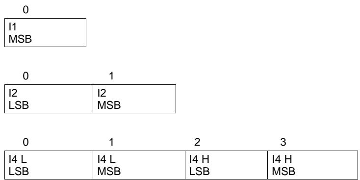

# 15.1.3 Floating Point

Floating point values are stored using the IEEE754 Single Precision 4-byte format in little endian byte order.

<table><tr><td>0</td><td>1</td><td>2</td><td>3</td></tr><tr><td>Fract [07]</td><td>Fract [815]</td><td>Exp[0] + Fract[16-22]</td><td>Sign + Exp[1−7]</td></tr></table>

Where:

Exp: 8-bit exponent stored with an offset bias of 127. The values 00 and FF have unique meanings.

Fract: 23-bit fraction. If the exponent is $> 0$ , then the mantissa is 1.fract. If the exponent is zero, then the mantissa is 0.fract.

The floating point value depends on the unique cases of the exponent:

If the exponent is FF and the fraction is zero, this represents $+ / -$ infinity.   
If the exponent is FF and the fraction is non-zero this represents "not a number" (NaN).   
If the exponent is 00 then the value is a subnormal number represented by $( - 1 ) ^ { \mathsf { s i g n } } \times 2 ^ { - 1 2 6 } \times 0 .$ fraction.   
Otherwise, the value is a normalized number represented by $( - 1 ) ^ { \mathsf { s i g n } } \times 2 ^ { ( \mathsf { e x p o n e n t } - 1 2 7 ) } \times 1$ .fraction.

# 15.1.4 Hex

Bit register definitions are stored in unsigned integer format.

# 15.1.5 String

String values are stored with length byte first, followed by a number of data bytes defined with the length byte.

<table><tr><td>0</td><td>1</td><td></td><td>N</td></tr><tr><td>Length</td><td>Data0</td><td></td><td>DataN</td></tr></table>

# 15.2 Settings

# 15.2.1 Configuration

# 15.2.1.1 FET Options

<table><tr><td rowspan=1 colspan=1>Class</td><td rowspan=1 colspan=1>Subclass</td><td rowspan=1 colspan=1>Name</td><td rowspan=1 colspan=1>Type</td><td rowspan=1 colspan=1>Min</td><td rowspan=1 colspan=1>Max</td><td rowspan=1 colspan=1>Default</td><td rowspan=1 colspan=1>Unit</td></tr><tr><td rowspan=1 colspan=1>Settings</td><td rowspan=1 colspan=1>Configuration</td><td rowspan=1 colspan=1>FET Options</td><td rowspan=1 colspan=1>H1</td><td rowspan=1 colspan=1>0x00</td><td rowspan=1 colspan=1>0xFF</td><td rowspan=1 colspan=1>0x20</td><td rowspan=1 colspan=1>Hex</td></tr></table>

<table><tr><td>7</td><td>6</td><td>5</td><td>4</td><td>3</td><td>2</td><td></td><td>0</td></tr><tr><td>PACK_ FUSE</td><td></td><td>CHGFE</td><td>CHGIN</td><td>CHGSU</td><td>OTFET</td><td>RSVD</td><td>PCHG_ COMM</td></tr></table>

PACK_FUSE (Bit 7): Source of voltage to check for Min Blow Fuse Voltage

1 = Pack+ voltage $0 =$ Battery stack voltage

SLEEPCHG (Bit 6): CHG FET enabled during sleep $1 = C { \mathsf { H G } }$ FET remains on during sleep $0 = { \mathsf { C H G } }$ FET off during sleep (default)

CHGFET (Bit 5): FET action on setting of GaugeStatus()[TC] $\uparrow =$ Charging and Precharging disabled, FET off $0 =$ FET active (default)

CHGIN (Bit 4): FET action in CHARGE INHIBIT mode $\uparrow =$ Charging and Precharging disabled, FETs off $0 =$ FET active (default)

CHGSU (Bit 3): FET action in CHARGE SUSPEND mode $\uparrow =$ Charging and Precharging disabled, FETs off

$0 =$ FET active (default)

OTFET (Bit 2): FET action in OVERTEMPERATURE mode $1 = C { \mathsf { H G } }$ and DSG FETs will be turned off for overtemperature conditions $0 =$ No FET action for overtemperature condition (default)

RSVD (Bit 1): Reserved. Do not use.

PCHG_COMM (Bit 0): Precharge FET selection $1 = C { \mathsf { H G } }$ FET $0 =$ PCHG FET (default)

# 15.2.1.2 SBS Gauging Configuration

<table><tr><td rowspan=1 colspan=1>Class</td><td rowspan=1 colspan=1>Subclass</td><td rowspan=1 colspan=1>Name</td><td rowspan=1 colspan=1>Type</td><td rowspan=1 colspan=1>Min</td><td rowspan=1 colspan=1>Max</td><td rowspan=1 colspan=1>Default</td><td rowspan=1 colspan=1>Unit</td></tr><tr><td rowspan=1 colspan=1>Settings</td><td rowspan=1 colspan=1>Configuration</td><td rowspan=1 colspan=1>SBS GaugingConfiguration</td><td rowspan=1 colspan=1>H1</td><td rowspan=1 colspan=1>0x00</td><td rowspan=1 colspan=1>0xFF</td><td rowspan=1 colspan=1>0x04</td><td rowspan=1 colspan=1>Hex</td></tr></table>

<table><tr><td>7</td><td>6</td><td>5</td><td>4</td><td>3</td><td>2</td><td>1</td><td>0</td></tr><tr><td>RSVD</td><td>RSVD</td><td>RSVD</td><td>RSVD</td><td>RSOC RND_OFF</td><td>LOCKO</td><td>RSOC_HOLD</td><td>RSOCL</td></tr></table>

RSVD (Bits 7–4): Reserved. Do not use.

RSOC_RND_OFF (Bit 3): Enables a round-off option of RSOC (instead of a ceiling function available by default)

$\uparrow =$ Enables RSOC round-off $0 =$ Disables RSOC round-off (A ceiling function is used instead.)

LOCK0 (Bit 2): Keep RemainingCapacity() and RelativeStateOfCharge() jumping back during relaxation   
after 0 was reached during discharge. $\uparrow =$ Enabled (default) $0 =$ Disabled

RSOC_HOLD (Bit 1): Prevent RSOC from increasing during discharge $1 = { \mathsf { R S O C } }$ not allowed to increase during discharge $0 =$ RSOC not limited (default)

RSOCL (Bit 0): RelativeStateOfCharge() and RemainingCapacity() behavior at end of charge $\uparrow =$ Held at $9 9 \%$ until valid charge termination. On entering valid charge termination update to $100 \%$ $0 =$ Actual value shown (default)

# 15.2.1.3 SBS Configuration

<table><tr><td colspan="1" rowspan="1">Class</td><td colspan="1" rowspan="1">Subclass</td><td colspan="1" rowspan="1">Name</td><td colspan="1" rowspan="1">Type</td><td colspan="1" rowspan="1">Min</td><td colspan="1" rowspan="1">Max</td><td colspan="1" rowspan="1">Default</td><td colspan="1" rowspan="1">Unit</td></tr><tr><td colspan="1" rowspan="1">Settings</td><td colspan="1" rowspan="1">Configuration</td><td colspan="1" rowspan="1">SBS Configuration</td><td colspan="1" rowspan="1">H1</td><td colspan="1" rowspan="1">0x7F</td><td colspan="1" rowspan="1">0xFF</td><td colspan="1" rowspan="1">0x20</td><td colspan="1" rowspan="1">Hex</td></tr><tr><td>7</td><td>6</td><td>5</td><td>4</td><td>3</td><td>2</td><td>1</td><td>0</td></tr><tr><td>FLASH BUSY_WAIT</td><td>SMB_CELL _TEMP</td><td>BLT1</td><td>BLTO</td><td>XL</td><td>HPE</td><td>CPE</td><td>BCAST</td></tr></table>

FLASH_BUSY_WAIT (Bit 7): This allows the clock stretching during a flash program or erase operation.

$\uparrow =$ The bq40z50-R2 device will clock stretch (up to the timeout for SMBus devices) during flash operations.   
$0 =$ The bq40z50-R2 device will NACK any SMBus engine interrupt that occurs during a flash operation (program or erase). Note: There is some potential for read errors with this bit. For example, when the master is reading data from the device, there is no NACK from the gauge; therefore, the "NACK" in the hardware releases the bus without writing new data to the SMBDA register, which means the read is whatever is present at the time. PECs should catch this error.

SMB_CELL_TEMP (Bit 6): Enables the host to write the temperature register via MAC command $0 { \times } 3 0 0 8$ . This enables bypassing the gauge’s cell temperature inputs (TS1...TS3).

$\uparrow =$ Host can set the temperature (and bypass TS1...TS4).   
$0 =$ Host cannot set the temperature (temperature is set by the gauge's thermistors).

BLT1 (Bit 5): Bus low timeout $0 , 0 = ~ { \mathsf { N o } }$ SBS bus low timeout $0 , 1 = 1 - 5$ SBS bus low timeout $1 , 0 = 2 \cdots$ SBS bus low timeout (default) $1 , 1 = 3 - 5$ SBS bus low timeout

BLT0 (Bit 4): Bus low timeout

$0 , 0 = ~ { \mathsf { N o } }$ SBS bus low timeout $0 , 1 = 1 - 5$ SBS bus low timeout $1 , 0 = 2 \cdots$ SBS bus low timeout (default) $1 , 1 = 3 - 5$ SBS bus low timeout

XL (Bit 3): Enables 400-kHz COM mode $1 = \ 4 0 0 – \mathbf { k } \mathsf { H } z$ bus speed $0 =$ Normal SBS bus speed (default)

HPE (Bit 2): PEC on host communication $\uparrow =$ Enabled $0 =$ Disabled (default)

CPE (Bit 1): PEC on charger broadcast $\uparrow =$ Enabled $0 =$ Disabled (default)

BCAST (Bit 0): Enables alert and charging broadcast from device to the host $\uparrow =$ Enabled $0 =$ Disabled (default)

# 15.2.1.4 Auth Config

<table><tr><td colspan="1" rowspan="1">Class</td><td colspan="1" rowspan="1">Subclass</td><td colspan="1" rowspan="1">Name</td><td colspan="1" rowspan="1">Type</td><td colspan="1" rowspan="1">Min</td><td colspan="1" rowspan="1">Max</td><td colspan="1" rowspan="1">Default</td><td colspan="1" rowspan="1">Unit</td></tr><tr><td colspan="1" rowspan="1">Settings</td><td colspan="1" rowspan="1">Configuration</td><td colspan="1" rowspan="1">Auth Config</td><td colspan="1" rowspan="1">H1</td><td colspan="1" rowspan="1">0x00</td><td colspan="1" rowspan="1">0x04</td><td colspan="1" rowspan="1">0x00</td><td colspan="1" rowspan="1">Hex</td></tr><tr><td>7</td><td>6</td><td>5</td><td>4</td><td>3</td><td>2</td><td>1</td><td>0</td></tr><tr><td>RSVD</td><td>RSVD</td><td>RSVD</td><td>RSVD</td><td>RSVD</td><td>SHA1 SECURE</td><td>RSVD</td><td>RSVD</td></tr></table>

RSVD (Bits 7–3): Reserved. Do not use.

SHA1_SECURE (Bit 2): Enables secure memory usage for encryption key storage

$\uparrow =$ Enables secure memory usage $0 =$ Disables secure memory usage

RSVD (Bits 1–0): Reserved. Do not use.

# 15.2.1.5 Power Config

<table><tr><td rowspan=1 colspan=1>Class</td><td rowspan=1 colspan=1>Subclass</td><td rowspan=1 colspan=1>Name</td><td rowspan=1 colspan=1>Type</td><td rowspan=1 colspan=1>Min</td><td rowspan=1 colspan=1>Max</td><td rowspan=1 colspan=1>Default</td><td rowspan=1 colspan=1>Unit</td></tr><tr><td rowspan=1 colspan=1>Settings</td><td rowspan=1 colspan=1>Configuration</td><td rowspan=1 colspan=1>Power Config</td><td rowspan=1 colspan=1>H2</td><td rowspan=1 colspan=1>0x00</td><td rowspan=1 colspan=1>0x01</td><td rowspan=1 colspan=1>0x00</td><td rowspan=1 colspan=1>Hex</td></tr></table>

<table><tr><td>15</td><td>14</td><td>13</td><td>12</td><td>11</td><td>10</td><td>9</td><td>8</td></tr><tr><td>RSVD</td><td>RSVD</td><td>RSVD</td><td>RSVD</td><td>RSVD</td><td>RSVD</td><td>SLEEPWKCHG</td><td>SLP_ACCUM</td></tr><tr><td>7</td><td>6</td><td>5</td><td>4</td><td>3</td><td>2</td><td>1</td><td>0</td></tr><tr><td>RSVD</td><td>RSVD</td><td>CHECK WAKE_FET</td><td>CHECK WAKE</td><td>EMSHUT _EXIT_COMM</td><td>EMSHUT EXIT_VPACK</td><td>PWR_SAVE _VSHUT</td><td>AUTO_SHIP _EN</td></tr></table>

RSVD (Bits 15–10): Reserved. Do not use.

SLEEPWKCHG (Bit 9): Enables the sleep wake charge feature

$\uparrow =$ Enables sleep wake charge feature $0 =$ Disables sleep wake charge feature

SLP_ACCUM (Bit 8): Enables charge accumulation while in SLEEP mode

$\uparrow =$ Enables charge accumulation in SLEEP mode $0 =$ Disables charge accumulation in SLEEP mode

RSVD (Bits 7–6): Reserved. Do not use.

CHECK_WAKE_FET (Bit 5): Enables the CHG and DSG FETs not to be forced off during the Delay timer period

$\uparrow =$ FETs are not to be forced off during the Delay timer period.   
$0 =$ FETs are forced off during the Delay timer period.

HECK_WAKE (Bit 4): Enables option to manage unintended wakeup from SHUTDOWN.

$\uparrow =$ Enables this option for unintended wakeup $0 =$ Disables this option for unintended wakeup

EMSHUT_EXIT_COMM (Bit 3): Enables exit from Emergency FET Shutdown if valid SMBus communication is received. Valid SMBus communication means a valid gauge address and any command is received (that is, an invalid command with a valid address is OK).

$\uparrow =$ Enables valid communication reception based exit from EMSHUT $0 =$ Disables valid communication reception based exit from EMSHUT

EMSHUT_EXIT_VPACK (Bit 2): Enables exit from Emergency FET Shutdown if voltage at Pack pin $>$ Charger Present Threshold for two samples (\~2 seconds).

$\uparrow =$ Enables Pack pin voltage based exit from EMSHUT $0 =$ Disables Pack pin voltage based exit from EMSHUT

PWR_SAVE_VSHUT (Bit 1): Enables POWER SAVE SHUTDOWN when specific thresholds have been reached.

$\uparrow =$ Enables POWER SAVE SHUTDOWN $0 =$ Disables POWER SAVE SHUTDOWN

AUTO_SHIP_EN (Bit 0): Automatically Shut Down for Shipment

$\uparrow =$ Enables auto shutdown after the device is in SLEEP mode without communication for a set period of time.   
$0 =$ Disables auto shutdown feature

# 15.2.1.6 IO Config

<table><tr><td rowspan=1 colspan=1>Class</td><td rowspan=1 colspan=1>Subclass</td><td rowspan=1 colspan=1>Name</td><td rowspan=1 colspan=1>Type</td><td rowspan=1 colspan=1>Min</td><td rowspan=1 colspan=1>Max</td><td rowspan=1 colspan=1>Default</td><td rowspan=1 colspan=1>Unit</td></tr><tr><td rowspan=1 colspan=1>Settings</td><td rowspan=1 colspan=1>Configuration</td><td rowspan=1 colspan=1>IO Config</td><td rowspan=1 colspan=1>H1</td><td rowspan=1 colspan=1>0x0</td><td rowspan=1 colspan=1>0x03</td><td rowspan=1 colspan=1>0x00</td><td rowspan=1 colspan=1>Hex</td></tr></table>

<table><tr><td>7</td><td>6</td><td>5</td><td>4</td><td>3</td><td>2</td><td>1</td><td>0</td></tr><tr><td>RSVD</td><td>RSVD</td><td>RSVD</td><td>RSVD</td><td>RSVD</td><td>RSVD</td><td>BTP_POL</td><td>BTP_EN</td></tr></table>

RSVD (Bits 7–2): Reserved. Do not use.

BTP_POL (Bit 1): Controls polarity of the BTP pin $\uparrow =$ BTP pin is asserted high when BTP is triggered. $0 =$ BTP pin is asserted low when BTP is triggered (default).

BTP_EN (Bit 0): Enables assertion of the BTP pin $\uparrow =$ Enables assertion of the BTP pin when BTP is triggered. $0 =$ Disables assertion of the BTP pin when BTP is triggered (default).

# 15.2.1.7 LED Configuration

<table><tr><td rowspan=1 colspan=1>Class</td><td rowspan=1 colspan=1>Subclass</td><td rowspan=1 colspan=1>Name</td><td rowspan=1 colspan=1>Type</td><td rowspan=1 colspan=1>Min</td><td rowspan=1 colspan=1>Max</td><td rowspan=1 colspan=1>Default</td><td rowspan=1 colspan=1>Unit</td></tr><tr><td rowspan=1 colspan=1>Settings</td><td rowspan=1 colspan=1>Configuration</td><td rowspan=1 colspan=1>LED Configuration</td><td rowspan=1 colspan=1>H1</td><td rowspan=1 colspan=1>0x0000</td><td rowspan=1 colspan=1>0xFFFF</td><td rowspan=1 colspan=1>0x00D0</td><td rowspan=1 colspan=1>Hex</td></tr></table>

<table><tr><td>15</td><td>14</td><td>13</td><td>12</td><td>11</td><td>10</td><td>9</td><td>8</td></tr><tr><td>RSVD</td><td>RSVD</td><td>RSVD</td><td>RSVD</td><td>LED ONFC</td><td>BLINK MIDPT</td><td>LEDIF CUV</td><td>LED PFON</td></tr><tr><td>7</td><td>6</td><td>5</td><td>4</td><td>3</td><td>2</td><td>1</td><td>0</td></tr><tr><td>LEDC1</td><td>LEDCO</td><td>LEDPF1</td><td>LEDPFO</td><td>LEDMODE</td><td>LEDCHG</td><td>LEDRCA</td><td>LEDR</td></tr></table>

LEGEND: R/W $=$ Read/Write; ${ \mathsf { R } } =$ Read only; $- \boldsymbol { n } =$ value after reset

RSVD (Bits 15–12): Reserved. Do not use.

LEDONFC (Bit 11): Enables the LED display to stay on showing charge even after full charge (FC) has been achieved. With this bit set, the LED will stay on after FC until the LED FC Time has expired.

$\uparrow =$ Enables LED display functionality after FC until the LED FC Time has expired $0 =$ Disables LED display functionality after FC until the LED FC Time has expired

BLINKMIDPT (Bit 10): Enables LED blinking until the midpoint of each LED segment. The blinking occurs between the bottom and the midway point of each programmed segment level, thus providing more granularity as to where the charge level is within that LED segment.

$\uparrow =$ Enables LED blinking until the midway point of each segment charge levels

$0 =$ Disables LED blinking until the midway point of each segment charge levels

LEDIFCUV (Bit 9): Enables LED display functionality even under CUV conditions without a charger connected (no charging occurring). This option should be used with care so as to not discharge the battery to low.

$\uparrow =$ Enables LED display functionality even under CUV conditions without a charger connected $0 =$ Disables LED display functionality even under CUV conditions without a charger connected

LEDPFON (Bit 8): LED in PF Mode Enable $\uparrow =$ Display available in PF Mode $0 =$ Display not available in PF mode (default)

LEDC1, LEDC0 (Bit 7, Bit 6): LED Current sink 0, $0 = \ 0 . 9 4 \ \mathrm { m A }$ average LED current (default) 0, $1 = \ 1 . 8 7 \ \mathrm { m A }$ average LED current 1, $0 = \ 2 . 8 1 \ \mathrm { m A }$ average LED current 1, $1 = \ 3 . 7 5 \ \mathrm { m A }$ average LED current

LEDPF1, LEDPF0 (Bit 5, Bit 4): LED Display PF Error Code

0, $0 =$ PF Error Code not available   
0, $\uparrow =$ PF Error Code shown after SOC if DISP is held low for LED Hold Time (default)   
1, $0 =$ PF Error code shown if the DISP button is pressed (high-to-low transition of the pin is   
detected).   
1, $1 = { \mathsf { P F } }$ Error Code shown after SOC

LEDMODE (Bit 3): LED Display Capacity Selector $\uparrow =$ Display ASOC/DC $0 =$ Display RSOC (default)

LEDCHG (Bit 2): LED Display During Charging $\uparrow =$ Enabled $0 =$ Disabled

LEDRCA (Bit 1): Flashing of LED Display when [RCA] is set. $\uparrow =$ Enabled $0 =$ Disabled

LEDR (Bit 0): LED Display activation at exit of device reset $\uparrow =$ Enabled $0 =$ Disabled

# 15.2.1.8 SOC Flag Config A

<table><tr><td colspan="1" rowspan="1">Class</td><td colspan="1" rowspan="1">Subclass</td><td colspan="1" rowspan="1">Name</td><td colspan="1" rowspan="1">Type</td><td colspan="1" rowspan="1">Min</td><td colspan="1" rowspan="1">Max</td><td colspan="1" rowspan="1">Default</td><td colspan="1" rowspan="1">Unit</td></tr><tr><td colspan="1" rowspan="1">Settings</td><td colspan="1" rowspan="1">Configuration</td><td colspan="1" rowspan="1">SOC Flag Config A</td><td colspan="1" rowspan="1">H2</td><td colspan="1" rowspan="1">0x0</td><td colspan="1" rowspan="1">0xFFF</td><td colspan="1" rowspan="1">0x0C8C</td><td colspan="1" rowspan="1">Hex</td></tr><tr><td>15</td><td>14</td><td>13</td><td>12</td><td>11</td><td>10</td><td>9</td><td>8</td></tr><tr><td>RSVD</td><td>RSVD</td><td>RSVD</td><td>RSVD</td><td>TCSETVCT</td><td>FCSETVCT</td><td>RSVD</td><td>RSVD</td></tr><tr><td>7</td><td>6</td><td>5</td><td>4</td><td>3</td><td>2</td><td>1</td><td>0</td></tr><tr><td>TCCLEAR RSOC</td><td>TCSETRSOC</td><td>TCCLEARV</td><td>TCSETV</td><td>TDCLEAR RSOC</td><td>TDSETRSOC</td><td>TDCLEARV</td><td>TDSETV</td></tr></table>

RSVD (Bit 15–12): Reserved. Do not use.

TCSETVCT (Bit 11): Enables the TC flag set by primary charge termination $\uparrow =$ Enabled (default) $0 =$ Disabled

FCSETVCT (Bit 10): Enables the FC flag set by primary charge termination $\uparrow =$ Enabled (default) $0 =$ Disabled

RSVD (Bits 9–8): Reserved. Do not use.

TCCLEARRSOC (Bit 7): Enables the TC flag clear by RSOC threshold $\uparrow =$ Enabled (default) $0 =$ Disabled

TCSETRSOC (Bit 6): Enables the TC flag set by RSOC threshold $\uparrow =$ Enabled $0 =$ Disabled (default)

TCCLEARV (Bit 5): Enables the TC flag clear by cell voltage threshold $\uparrow =$ Enabled $0 =$ Disabled (default)

TCSETV (Bit 4): Enables the TC flag set by cell voltage threshold $\uparrow =$ Enabled $0 =$ Disabled (default)

TDCLEARRSOC (Bit 3): Enables the TD flag clear by RSOC threshold $\uparrow =$ Enabled (default) $0 =$ Disabled

TDSETRSOC (Bit 2): Enables the TD flag set by RSOC threshold $\uparrow =$ Enabled (default) $0 =$ Disabled

TDCLEARV (Bit 1): Enables the TD flag clear by cell voltage threshold $\uparrow =$ Enabled $0 =$ Disabled (default)

TDSETV (Bit 0): Enables the TD flag set by cell voltage threshold $\uparrow =$ Enabled $0 =$ Disabled (default)

# 15.2.1.9 SOC Flag Config B

<table><tr><td rowspan=1 colspan=1>Class</td><td rowspan=1 colspan=1>Subclass</td><td rowspan=1 colspan=1>Name</td><td rowspan=1 colspan=1>Type</td><td rowspan=1 colspan=1>Min</td><td rowspan=1 colspan=1>Max</td><td rowspan=1 colspan=1>Default</td><td rowspan=1 colspan=1>Unit</td></tr><tr><td rowspan=1 colspan=1>Settings</td><td rowspan=1 colspan=1>Configuration</td><td rowspan=1 colspan=1>SOC Flag Config B</td><td rowspan=1 colspan=1>H1</td><td rowspan=1 colspan=1>0x00</td><td rowspan=1 colspan=1>0xFF</td><td rowspan=1 colspan=1>0x8C</td><td rowspan=1 colspan=1>Hex</td></tr></table>

<table><tr><td>7</td><td>6</td><td>5</td><td>4</td><td>3</td><td>2</td><td>1</td><td>0</td></tr><tr><td>FCCLEAR RSOC</td><td>FCSETRSOC</td><td>FCCLEARV</td><td>FCSETV</td><td>FDCLEAR RSOC</td><td>FDSETRSOC</td><td>FDCLEARV</td><td>FDSETV</td></tr></table>

FCCLEARRSOC (Bit 7): Enables the FC flag clear by RSOC threshold

$\uparrow =$ Enabled (default) $0 =$ Disabled

FCSETRSOC (Bit 6): Enables the FC flag set by RSOC threshold $\uparrow =$ Enabled $0 =$ Disabled (default)

FCCLEARV (Bit 5): Enables the FC flag clear by cell voltage threshold $\uparrow =$ Enabled $0 =$ Disabled (default)

FCSETV (Bit 4): Enables the FC flag set by cell voltage threshold $\uparrow =$ Enabled $0 =$ Disabled (default)

FDCLEARRSOC (Bit 3): Enables the FD flag clear by RSOC threshold $\uparrow =$ Enabled (default) $0 =$ Disabled

FDSETRSOC Bit 2: Enables the FD flag set by RSOC threshold $\uparrow =$ Enabled (default) $0 =$ Disabled

FDCLEARV (Bit 1): Enables the FD flag clear by cell voltage threshold $\uparrow =$ Enabled $0 =$ Disabled (default)

FDSETV (Bit 0): Enables the FD flag set by cell voltage threshold $\uparrow =$ Enabled $0 =$ Disabled (default)

# 15.2.1.10 IT Gauging Configuration

<table><tr><td colspan="1" rowspan="1">Class</td><td colspan="1" rowspan="1">Subclass</td><td colspan="1" rowspan="1">Name</td><td colspan="1" rowspan="1">Type</td><td colspan="1" rowspan="1">Min</td><td colspan="1" rowspan="1">Max</td><td colspan="1" rowspan="1">Default</td><td colspan="1" rowspan="1">Unit</td></tr><tr><td colspan="1" rowspan="1">Settings</td><td colspan="1" rowspan="1">Configuration</td><td colspan="1" rowspan="1">IT Gauging Configuration</td><td colspan="1" rowspan="1">H2</td><td colspan="1" rowspan="1">0x0</td><td colspan="1" rowspan="1">0xFFFF</td><td colspan="1" rowspan="1">0xD0FE</td><td colspan="1" rowspan="1">Hex</td></tr><tr><td>15</td><td>14</td><td>13</td><td>12</td><td>11</td><td>10</td><td>9</td><td>8</td></tr><tr><td>DOD_R SCALE_EN</td><td>RELAX SMOOTH_OK</td><td>TDELTAV</td><td>SMOOTH</td><td>RELAX JUMP_OK</td><td>DELAY DROP_TO_0</td><td>CELL_TERM</td><td>FAST QMAX_FLD</td></tr><tr><td>7</td><td>6</td><td>5</td><td>4</td><td>3</td><td>2</td><td>1</td><td>0</td></tr><tr><td>FAST_QMAX_ LRN</td><td>RSOC_CONV</td><td>LFP_RELAX</td><td>DODOEW</td><td>OCVFR</td><td>RFACTSTEP</td><td>CSYNC</td><td>CCT</td></tr></table>

DOD_RSCALE_EN (Bit 15): Configures which DOD the new RScale is to be applied.

$\uparrow =$ The RScale is only applied to DODs higher than the DOD where the RScale was calculated.   
$0 =$ The RScale is applied to all DODs during IT simulations.

RELAX_SMOOTH_OK (Bit 14): Smooth RSOC during RELAX mode $\uparrow =$ Enabled (default) $0 =$ Disabled

TDELTAV (Bit 13): TURBO Mode Delta Voltage

$\uparrow =$ Calculate DeltaVoltage that corresponds to the power spike defined in Min Turbo Power and replace Gas Gauging State Delta Voltage in IT calculations with this value. Recommended to set this flag to 1 to accompany TURBO mode.

$0 =$ Use of DeltaVoltage learned as the maximal difference between instantaneous and average voltage (default).

SMOOTH (Bit 12): Smooth RSOC $\uparrow =$ Smoothed FullChargeCapacity() and RemainingCapacity() is used (default). $0 =$ True FullChargeCapacity() and RemainingCapacity() is used.

RELAX_JUMP_OK (Bit 11): Allows RSOC jump during RELAX mode $\uparrow =$ Enabled $0 =$ Disabled (default)

DELAY_DROP_TO_0 (Bit 10): Activate Fast Scaling Before Drop to $0 \%$ $\uparrow =$ Enabled $0 =$ Disabled (default)

CELL_TERM (Bit 9): Cell Based Termination $\uparrow =$ Cell based termination $0 =$ Stack voltage based termination (default)

FAST_QMAX_FLD (Bit 8): Fast Qmax Update in Field $\uparrow =$ Enabled $0 =$ Disabled (default)

FAST_QMAX_LRN (Bit 7): Fast Qmax Update in Learning $\uparrow =$ Enabled (default) $0 =$ Disabled

RSOC_CONV (Bit 6): RSOC Convergence (Fast Scaling) $\uparrow =$ Enabled (default) $0 =$ Disabled

LFP_RELAX (Bit 5): Lithium Iron Phosphate Relax $\uparrow =$ Enabled (default) $0 =$ Disabled

DOD0EW (Bit 4): DOD0 Error Weighting $\uparrow =$ Enabled (default) $0 =$ Disabled

OCVFR (Bit 3): Open Circuit Voltage Flat Region $\uparrow =$ Enabled (default) $0 =$ Disabled

RFACTSTEP (Bit 2): Ra Factor Step $\uparrow =$ Enabled (default). $0 =$ Disabled

CSYNC (Bit 1): Sync RemainingCapacity() with FullChargeCapacity() at valid charge termination $\uparrow =$ Synchronized (default) $0 =$ Not synchronized

CCT (Bit 0): Cycle Count Threshold $\uparrow =$ Use $00 \%$ of FullChargeCapacity() $0 =$ Use $00 \%$ of DesignCapacity() (default)

# 15.2.1.11 IT Gauging Ext

<table><tr><td rowspan=1 colspan=1>Class</td><td rowspan=1 colspan=1>Subclass</td><td rowspan=1 colspan=1>Name</td><td rowspan=1 colspan=1>Type</td><td rowspan=1 colspan=1>Min</td><td rowspan=1 colspan=1>Max</td><td rowspan=1 colspan=1>Default</td><td rowspan=1 colspan=1>Unit</td></tr><tr><td rowspan=1 colspan=1>Settings</td><td rowspan=1 colspan=1>Configuration</td><td rowspan=1 colspan=1>IT Gauging Ext</td><td rowspan=1 colspan=1>H2</td><td rowspan=1 colspan=1>0x0000</td><td rowspan=1 colspan=1>0x00FF</td><td rowspan=1 colspan=1>0X001A</td><td rowspan=1 colspan=1>Hex</td></tr></table>

<table><tr><td>15</td><td>14</td><td>13</td><td>12</td><td>11</td><td>10</td><td>9</td><td>8</td></tr><tr><td>RSVD</td><td>RSVD</td><td>RSVD</td><td>RSVD</td><td>RSVD</td><td>RSVD</td><td>RSVD</td><td>RSVD</td></tr><tr><td>7</td><td>6</td><td>5</td><td>4</td><td>3</td><td>2</td><td>1</td><td>0</td></tr><tr><td>TS1</td><td>TSO</td><td>CELL INTER_IR</td><td>THERM _SAT</td><td>THERM _IV</td><td>AMB_PRED</td><td>CHG_100_ SMOOTH_OK</td><td>DSG_0_ SMOOTH_OK</td></tr></table>

RSVD (Bits 15–8): Reserved. Do not use.

TS1 (Bit 7), TS0 (Bit 6): These two bits are used in conjunction to select which of the individual temperature sensors (TS 1…4) the IT algorithm will use.

$1 , 1 =$ Not used   
$^ { 1 , 0 = }$ Min Temperature is used (IT uses the temperature sensor with the lowest temperature).   
$0 , 1 =$ Avg Temperature is used (IT uses the average temperature of all four temperature sensors).   
$^ { 0 , 0 = }$ Max Temperature is used (IT uses the temperature sensor with the highest temperature). (Default)

CELL_INTER_IR (Bit 5): This enables the cell interconnect resistance to be used to compensate the cell voltage when cell-based EDV detection is selected (versus pack-based EDV detection).

$\uparrow =$ Enables cell interconnect resistance usage to compensate cell voltage in relation to cell EDV detection   
$0 =$ Disables cell interconnect resistance usage to compensate cell voltage in relation to cell EDV detection

THERM_SAT (Bit 4): Thermal saturation enables adjustment of the IT thermal model

$\uparrow =$ Enables the adjustment of the IT thermal model. If this flag is set to 1, IT simulations occurring near termination (the fast scaling region) in a sustained discharge (when thermal equilibrium is reached, typically, $_ { 2 \times }$ the Temp a value of time), assume the simulated temperature to be equal to the measured pack temperature. This behavior does not apply to SOH simulations.   
$0 =$ Disables the adjustment of the IT thermal model

THERM_IV (Bit 3): Enables a freeze of the temperature model at certain points in IT to prevent overestimation by the thermal model

$\uparrow =$ Enables a freeze of the temperature model. If this flag is set to 1, battery heat is held constant near the end of an IT simulation (within one IT simulation when it gets to the fast scaling region). To maintain the constant battery heat, it uses $| ^ { \star } \vee$ instead of $\mathsf { I } ^ { 2 } \mathsf { R }$ to calculate the heat. This helps prevent overestimation of the temperature towards the end of discharge, and applies to SOH simulations.

$0 =$ Disables a freeze of the temperature model

AMB_PRED (Bit 2): Enables ambient temperature prediction in modes other than RELAX $\uparrow =$ Enables ambient temperature prediction. If this flag is set to 1, the thermal model will predict the ambient temperature to get a better estimate of FCC once the discharge/charge stops. The ambient temperature is only predicted once the charge/discharge has been present for at least “Ambient Predict Time” to ensure that the system is in thermal equilibrium. Typically, “Ambient Predict Time” should be set to $> 2 \times$ Temp a value.

$0 =$ Disables ambient temperature prediction

CHG_100_SMOOTH_OK (Bit 1): Allows smoothing in the charge direction when there is a jump to $100 \%$ $\uparrow =$ Enables smoothing to $100 \%$ $0 =$ Disables smoothing to $100 \%$

DSG_0_SMOOTH_OK (Bit 0): Allows smoothing in the discharge direction when there is a jump to $0 \%$ When enabled, this smoothing option must be used in conjunction with Term Smooth Start Cell V Delta, Term Smooth Time, and Term Smooth Final Cell V Delta. If not configured properly, this smoothing option can result in causing remaining capacity to go to 0 early.

$\uparrow =$ Enables smoothing to $0 \%$ $0 =$ Disables smoothing to $0 \%$

# 15.2.1.12 Charging Configuration

<table><tr><td rowspan=1 colspan=1>Class</td><td rowspan=1 colspan=1>Subclass</td><td rowspan=1 colspan=1>Name</td><td rowspan=1 colspan=1>Type</td><td rowspan=1 colspan=1>Min</td><td rowspan=1 colspan=1>Max</td><td rowspan=1 colspan=1>Default</td><td rowspan=1 colspan=1>Unit</td></tr><tr><td rowspan=1 colspan=1>Settings</td><td rowspan=1 colspan=1>Configuration</td><td rowspan=1 colspan=1>Charging Configuration</td><td rowspan=1 colspan=1>H1</td><td rowspan=1 colspan=1>0x0</td><td rowspan=1 colspan=1>0x3F</td><td rowspan=1 colspan=1>0x0</td><td rowspan=1 colspan=1>Hex</td></tr></table>

<table><tr><td>7</td><td>6</td><td>5</td><td>4</td><td>3</td><td>2</td><td>1</td><td>0</td></tr><tr><td>CYCLE_ DEGRADE</td><td>SOH DEGRADE</td><td>DEGRADE _CC</td><td>COMP_IR</td><td>CS_CV</td><td>SOC_CHARGE</td><td>CCC</td><td>CRATE</td></tr></table>

CYCLE_DEGRADE (Bit 7): Cycle Count based charging voltage or charging current degradation $\uparrow =$ Degrade CC/CV based on Cycle Count $0 =$ No degradation of CC/CV based on Cycle Count

SOH_DEGRADE (Bit 6): SOH based charging voltage or charging current degradation $\uparrow =$ Degrade CC/CV based on SOH $0 =$ No degradation of CC/CV based on SOH

DEGRADE_CC (Bit 5): Enables charging current degradation based on Cycle Count or SOH $\uparrow =$ Enables Charging Current degradation $0 =$ Disables Charging Current degradation

COMP_IR (Bit 4): Allows IR compensation at the system level to ensure the correct voltage level required for a specific charging voltage at the battery terminals

$\uparrow =$ Enables system level IR compensation $0 =$ Disables system level IR compensation

CS_CV (Bit 3): This enables the cell swelling control under specific cell voltage and cell temperature thresholds by reducing the charging voltage.

$\uparrow =$ Enables cell swelling control

$0 =$ Disables cell swelling control

SOC_CHARGE (Bit 2) $\uparrow =$ Enables SOC threshold to replace voltage thresholds (CLV, CMV, and CHV) in Advanced Charging Algorithm $0 =$ Uses voltage thresholds (CLV, CMV, and CHV) in Advanced Charging Algorithm

CCC (Bit 1) $\uparrow =$ Enables Charging Loss Compensation feature $0 =$ Charging Loss Compensation disabled (default)

CRATE (Bit 0): ChargeCurrent rate $\uparrow =$ ChargingCurrent() adjusted based on FullChargeCapacity() / DesignCapacity() $0 =$ No adjustment to ChargingCurrent() (default)

# 15.2.1.13 Temperature Enable

<table><tr><td rowspan=1 colspan=1>Class</td><td rowspan=1 colspan=1>Subclass</td><td rowspan=1 colspan=1>Name</td><td rowspan=1 colspan=1>Type</td><td rowspan=1 colspan=1>Min</td><td rowspan=1 colspan=1>Max</td><td rowspan=1 colspan=1>Default</td><td rowspan=1 colspan=1>Unit</td></tr><tr><td rowspan=1 colspan=1>Settings</td><td rowspan=1 colspan=1>Configuration</td><td rowspan=1 colspan=1>Temperature Enable</td><td rowspan=1 colspan=1>H1</td><td rowspan=1 colspan=1>0x0</td><td rowspan=1 colspan=1>0x1F</td><td rowspan=1 colspan=1>0x6</td><td rowspan=1 colspan=1>Hex</td></tr></table>

<table><tr><td>7</td><td>6</td><td>5</td><td>4</td><td>3</td><td>2</td><td>1</td><td>0</td></tr><tr><td>RSVD</td><td>RSVD</td><td>RSVD</td><td>TS4</td><td>TS3</td><td>TS2</td><td>TS1</td><td>TSint</td></tr></table>

RSVD (Bits 7–5): Reserved. Do not use.

TS4 (Bit 4): Enable TS4 $\uparrow =$ Enables TS4 (default) $0 =$ Disables TS4

TS3 (Bit 3): Enable TS3 $\uparrow =$ Enables TS3 (default) $0 =$ Disables TS3

TS2 (Bit 2): Enable TS2 $\uparrow =$ Enables TS2 (default) $0 =$ Disables TS2

TS1 (Bit 1): Enable TS1 $\uparrow =$ Enables TS1 (default) $0 =$ Disables TS1

TSint (Bit 0): Enable internal TS $\uparrow =$ Enables internal TS $0 =$ Disables internal TS (default)

# 15.2.1.14 Temperature Mode

<table><tr><td colspan="1" rowspan="1">Class</td><td colspan="1" rowspan="1">Subclass</td><td colspan="1" rowspan="1">Name</td><td colspan="1" rowspan="1">Type</td><td colspan="1" rowspan="1">Min</td><td colspan="1" rowspan="1">Max</td><td colspan="1" rowspan="1">Default</td><td colspan="1" rowspan="1">Unit</td></tr><tr><td colspan="1" rowspan="1">Settings</td><td colspan="1" rowspan="1">Configuration</td><td colspan="1" rowspan="1">Temperature Mode</td><td colspan="1" rowspan="1">H1</td><td colspan="1" rowspan="1">0x0</td><td colspan="1" rowspan="1">0x1F</td><td colspan="1" rowspan="1">0x4</td><td colspan="1" rowspan="1">Hex</td></tr><tr><td>7</td><td>6</td><td>5</td><td>4</td><td>3</td><td>2</td><td>1</td><td>0</td></tr><tr><td>RSVD</td><td>RSVD</td><td>RSVD</td><td>TS4 Mode</td><td>TS3 Mode</td><td>TS2 Mode</td><td>TS1 Mode</td><td>TSInt Mode</td></tr></table>

RSVD (Bits 7–5): Reserved. Do not use.

TS4 Mode (Bit 4): Cell temperature or FET temperature $\uparrow =$ FET temperature $0 =$ Cell temperature (default)

TS3 Mode (Bit 3): Cell temperature or FET temperature $\uparrow =$ FET temperature $0 =$ Cell temperature (default)

TS2 Mode (Bit 2): Cell temperature or FET temperature $\uparrow =$ FET temperature (default) $0 =$ Cell temperature

TS1 Mode (Bit 1): Cell temperature or FET temperature $\uparrow =$ FET temperature $0 =$ Cell temperature (default)

TSInt Mode (Bit 0): Cell temperature or FET temperature $\uparrow =$ FET temperature $0 =$ Cell temperature (default)

# 15.2.1.15 DA Configuration

<table><tr><td rowspan=1 colspan=1>Class</td><td rowspan=1 colspan=1>Subclass</td><td rowspan=1 colspan=1>Name</td><td rowspan=1 colspan=1>Type</td><td rowspan=1 colspan=1>Min</td><td rowspan=1 colspan=1>Max</td><td rowspan=1 colspan=1>Default</td><td rowspan=1 colspan=1>Unit</td></tr><tr><td rowspan=1 colspan=1>Settings</td><td rowspan=1 colspan=1>Configuration</td><td rowspan=1 colspan=1>DA Configuration</td><td rowspan=1 colspan=1>H1</td><td rowspan=1 colspan=1>0x0</td><td rowspan=1 colspan=1>0xFF</td><td rowspan=1 colspan=1>0x12</td><td rowspan=1 colspan=1>Hex</td></tr></table>

<table><tr><td>15</td><td>14</td><td>13</td><td>12</td><td>11</td><td>10</td><td>9</td><td>8</td></tr><tr><td>CTEMP1</td><td>CTEMPO</td><td>RSVD</td><td>RSVD</td><td>RSVD</td><td>RSVD</td><td>RSVD</td><td>EMSHUT_ PEXIT_DIS</td></tr></table>

<table><tr><td>7</td><td>6</td><td>5</td><td>4</td><td>3</td><td>2</td><td>1</td><td>0</td></tr><tr><td>FTEMP</td><td>RSVD</td><td>EMSHUT_EN</td><td>SLEEP</td><td>IN_SYSTEM SLEEP</td><td>NR</td><td>CC1</td><td>CCO</td></tr></table>

CTEMP (Bits 15–14): Defines which temperature sensor's output is displayed by the SBS Temperature() command

1, $ 1 = { \mathsf { N o t } }$ used   
1, $0 =$ Minimum temperature   
0, $\uparrow =$ Average temperature   
0, $0 =$ Maximum temperature

RSVD (Bits 13–9): Reserved. Do not use.

EMSHUT_PEXIT_DIS (BIT 8): Disables the SHUTDN pin exit option of the Emergency FET Shutdown feature (when a high-to-low transition on the SHUTDN pin is detected).

$\uparrow =$ Prevents usage of SHUTDN pin as exit option $0 =$ Allows usage of SHUTDN pin as an exit option (default)

FTEMP (Bit 7): FET temperature protection source $\uparrow =$ Average

0 = MAX (default)

RSVD (Bit 6): Reserved. Do not use.

EMSHUT_EN (Bit 5): Emergency FET Shutdown Enable $\uparrow =$ Enables $0 =$ Disables

SLEEP (Bit 4): SLEEP mode $\uparrow =$ Enables SLEEP mode (default) $0 =$ Disables SLEEP mode

IN_SYSTEM_SLEEP (Bit 3): In-system SLEEP mode $\uparrow =$ Enables $0 =$ Disables (default)

NR (Bit 2): Use PRES in system detection $\uparrow =$ NON-REMOVABLE mode $0 =$ Use PRES, REMOVABLE mode (default)

CC1, CC0 (Bit 1,0): Cell Count $1 , 1 = 4$ cell $1 , 0 = 3$ cell (default) $0 , 1 = ~ 2$ cell $0 , 0 = ~ 1$ cell

# 15.2.1.16 Balancing Configuration

<table><tr><td rowspan=1 colspan=1>Class</td><td rowspan=1 colspan=1>Subclass</td><td rowspan=1 colspan=1>Name</td><td rowspan=1 colspan=1>Type</td><td rowspan=1 colspan=1>Min</td><td rowspan=1 colspan=1>Max</td><td rowspan=1 colspan=1>Default</td><td rowspan=1 colspan=1>Unit</td></tr><tr><td rowspan=1 colspan=1>Settings</td><td rowspan=1 colspan=1>Configuration</td><td rowspan=1 colspan=1>Balancing Configuration</td><td rowspan=1 colspan=1>H1</td><td rowspan=1 colspan=1>0x0</td><td rowspan=1 colspan=1>0xFF</td><td rowspan=1 colspan=1>0x01</td><td rowspan=1 colspan=1>Hex</td></tr></table>

<table><tr><td>7</td><td>6</td><td>5</td><td>4</td><td>3</td><td>2</td><td>1</td><td>0</td></tr><tr><td>RSVD</td><td>RSVD</td><td>CBS</td><td>CB_RLX_DOD 0EW</td><td>CB_CHG_DOD 0EW</td><td>CBR</td><td>CBM</td><td>CB</td></tr></table>

RSVD (Bits 7–6): Reserved. Do not use.

CBS (Bit 5): Cell balancing in sleep $\uparrow =$ Enables CBS $0 =$ Disables CBS

# CB_RLX_DOD0EW (Bit 4):

$\uparrow =$ Enables Error Weighted DOD0 for cell balancing time updates when in RELAX mode $0 =$ Uses DOD0 for cell balancing time updates when in RELAX mode

# CB_CHG_DOD0EW (Bit 3):

$\uparrow =$ Enables Error Weighted DOD0 for cell balancing time updates when in CHARGE mode $0 =$ Use DOD0 for cell balancing time updates when in CHARGE mode

CBR (Bit 2): Cell balancing at rest $\uparrow =$ Enables cell balancing at rest $0 =$ Disables cell balancing at rest (default)

CBM (Bit 1): Internal versus external cell balancing $\uparrow =$ Enables external cell balancing enabled

$0 =$ Enables internal cell balancing (default) CB (Bit 0): Cell balancing $\uparrow =$ Cell balancing enabled (default) $0 =$ Cell balancing disabled

# 15.2.2 Fuse

# 15.2.2.1 Permanent Fail Fuse A

<table><tr><td rowspan=1 colspan=1>Class</td><td rowspan=1 colspan=1>Subclass</td><td rowspan=1 colspan=1>Name</td><td rowspan=1 colspan=1>Type</td><td rowspan=1 colspan=1>Min</td><td rowspan=1 colspan=1>Max</td><td rowspan=1 colspan=1>Default</td><td rowspan=1 colspan=1>Unit</td></tr><tr><td rowspan=1 colspan=1>Settings</td><td rowspan=1 colspan=1>Fuse</td><td rowspan=1 colspan=1>Permanent Fail Fuse A</td><td rowspan=1 colspan=1>H1</td><td rowspan=1 colspan=1>0x0</td><td rowspan=1 colspan=1>0xFF</td><td rowspan=1 colspan=1>0x0</td><td rowspan=1 colspan=1>—</td></tr></table>

<table><tr><td>7</td><td>6</td><td>5</td><td>4</td><td>3</td><td>2</td><td>1</td><td>0</td></tr><tr><td>QIM</td><td>SOTF</td><td>RSVD</td><td>SOT</td><td>SOCD</td><td>SOCC</td><td>SOV</td><td>SUV</td></tr></table>

Fuse blow action for PFStatus() bits:

QIM (Bit 7): QMax Imbalance $\uparrow =$ Enabled $0 =$ Disabled (default)

SOTF (Bit 6): Safety Overtemperature FET $\uparrow =$ Enabled $0 =$ Disabled (default)

RSVD (Bit 5): Reserved. Do not use.

SOT (Bit 4): Safety Overtemperature $\uparrow =$ Enabled $0 =$ Disabled (default)

SOCD (Bit 3): Safety Overcurrent in Discharge $\uparrow =$ Enabled $0 =$ Disabled (default)

SOCC (Bit 2): Safety Overcurrent in Charge $\uparrow =$ Enabled $0 =$ Disabled (default)

SOV (Bit 1): Safety Cell Overvoltage $\uparrow =$ Enabled $0 =$ Disabled (default)

SUV (Bit 0): Safety Cell Undervoltage $\uparrow =$ Enabled $0 =$ Disabled (default)

# 15.2.2.2 Permanent Fail Fuse B

<table><tr><td colspan="1" rowspan="1">Class</td><td colspan="1" rowspan="1">Subclass</td><td colspan="1" rowspan="1">Name</td><td colspan="1" rowspan="1">Type</td><td colspan="1" rowspan="1">Min</td><td colspan="1" rowspan="1">Max</td><td colspan="1" rowspan="1">Default</td><td colspan="1" rowspan="1">Unit</td></tr><tr><td colspan="1" rowspan="1">Settings</td><td colspan="1" rowspan="1">Fuse</td><td colspan="1" rowspan="1">Permanent Fail Fuse B</td><td colspan="1" rowspan="1">H1</td><td colspan="1" rowspan="1">0x0</td><td colspan="1" rowspan="1">0xFF</td><td colspan="1" rowspan="1">0</td><td colspan="1" rowspan="1">Hex</td></tr><tr><td>7</td><td>6</td><td>5</td><td>4</td><td>3</td><td>2</td><td>1</td><td>0</td></tr><tr><td>RSVD</td><td>RSVD</td><td>RSVD</td><td>VIMA</td><td>VIMR</td><td>CD</td><td>IMP</td><td>CB</td></tr></table>

Fuse blow action for PFStatus() bits: RSVD (Bits 7–5): Reserved. Do not use.

VIMA (Bit 4): Voltage Imbalance Active $\uparrow =$ Enabled $0 =$ Disabled (default)   
VIMR (Bit 3): Voltage Imbalance At Rest $\uparrow =$ Enabled $0 =$ Disabled (default)   
CD (Bit 2): Capacity Degradation $\uparrow =$ Enabled $0 =$ Disabled (default)   
IMP (Bit 1): Cell impedance $\uparrow =$ Enabled $0 =$ Disabled (default)   
CB (Bit 0): Cell balancing $\uparrow =$ Enabled $0 =$ Disabled (default)

# 15.2.2.3 Permanent Fail Fuse C

<table><tr><td rowspan=1 colspan=1>Class</td><td rowspan=1 colspan=1>Subclass</td><td rowspan=1 colspan=1>Name</td><td rowspan=1 colspan=1>Type</td><td rowspan=1 colspan=1>Min</td><td rowspan=1 colspan=1>Max</td><td rowspan=1 colspan=1>Default</td><td rowspan=1 colspan=1>Unit</td></tr><tr><td rowspan=1 colspan=1>Settings</td><td rowspan=1 colspan=1>Fuse</td><td rowspan=1 colspan=1>Permanent Fail Fuse C</td><td rowspan=1 colspan=1>H1</td><td rowspan=1 colspan=1>0x0</td><td rowspan=1 colspan=1>0xFF</td><td rowspan=1 colspan=1>0</td><td rowspan=1 colspan=1>Hex</td></tr></table>

<table><tr><td>7</td><td>6</td><td>5</td><td>4</td><td>3</td><td>2</td><td>1</td><td>0</td></tr><tr><td>PTC</td><td>2LVL</td><td>AFEC</td><td>AFER</td><td>FUSE</td><td>RSVD</td><td>DFETF</td><td>CFETF</td></tr></table>

Fuse blow action for PFStatus() bits:

PTC (Bit 7): Permanent Fail flag Display

$0 =$ Disables the PFStatus[PTC] ${ \mathit { \Psi } } = 1$ when PTC fault is triggered. Function should be enabled/disabled by the PTCEN pin connection.

2LVL (Bit 6): FUSE input indicating fuse trigger by external 2nd level protection $\uparrow =$ Enabled $0 =$ Disabled (default)

AFEC (Bit 5): AFE Communication $\uparrow =$ Enabled $0 =$ Disabled (default)

AFER (Bit 4): AFE Register $\uparrow =$ Enabled $0 =$ Disabled (default)

FUSE (Bit 3): Fuse input to indicate chemical fuse failure

$\uparrow =$ Enabled $0 =$ Disabled (default)   
RSVD (Bit 2): Reserved. Do not use.   
DFETF (Bit 1): Discharge FET $\uparrow =$ Enabled $0 =$ Disabled (default)   
CFETF (Bit 0): Charge FET $\uparrow =$ Enabled $0 =$ Disabled (default)

# 15.2.2.4 Permanent Fail Fuse D

<table><tr><td rowspan=1 colspan=1>Class</td><td rowspan=1 colspan=1>Subclass</td><td rowspan=1 colspan=1>Name</td><td rowspan=1 colspan=1>Type</td><td rowspan=1 colspan=1>Min</td><td rowspan=1 colspan=1>Max</td><td rowspan=1 colspan=1>Default</td><td rowspan=1 colspan=1>Unit</td></tr><tr><td rowspan=1 colspan=1>Settings</td><td rowspan=1 colspan=1>Fuse</td><td rowspan=1 colspan=1>Permanent Fail Fuse D</td><td rowspan=1 colspan=1>H1</td><td rowspan=1 colspan=1>0x0</td><td rowspan=1 colspan=1>0xFF</td><td rowspan=1 colspan=1>0x0</td><td rowspan=1 colspan=1>Hex</td></tr></table>

<table><tr><td>7</td><td>6</td><td>5</td><td>4</td><td>3</td><td>2</td><td>1</td><td>0</td></tr><tr><td>TS4</td><td>TS3</td><td>TS2</td><td>TS1</td><td>RSVD</td><td>DFW</td><td>RSVD</td><td>IFC</td></tr></table>

Fuse blow action for PFStatus() bits:

TS4 (Bit 7) $\uparrow =$ Enabled $0 =$ Disabled (default)

TS3 (Bit 6) $\uparrow =$ Enabled $0 =$ Disabled (default)

TS2 (Bit 5) $\uparrow =$ Enabled $0 =$ Disabled (default)

TS1 (Bit 4) $\uparrow =$ Enabled $0 =$ Disabled (default)

RSVD (Bit 3): Reserved. Do not use.

DFW (Bit 2): DF wearout $\begin{array} { r l } { 1 = } & { \mathsf { E n a b l e d } } \\ { 0 = } & { \mathsf { D i s a b l e d \left( d e f a u l t \right) } } \end{array}$

RSVD (Bit 1): Reserved. Do not use.   
IFC (Bit 0) $\uparrow =$ Enabled $0 =$ Disabled (default)

# 15.2.2.5 Min Blow Fuse Voltage

<table><tr><td rowspan=1 colspan=1>Class</td><td rowspan=1 colspan=1>Subclass</td><td rowspan=1 colspan=1>Name</td><td rowspan=1 colspan=1>Type</td><td rowspan=1 colspan=1>Min</td><td rowspan=1 colspan=1>Max</td><td rowspan=1 colspan=1>Default</td></tr><tr><td rowspan=1 colspan=1>Settings</td><td rowspan=1 colspan=1>Fuse</td><td rowspan=1 colspan=1>Min Blow Fuse Voltage</td><td rowspan=1 colspan=1>I2</td><td rowspan=1 colspan=1>0</td><td rowspan=1 colspan=1>65535</td><td rowspan=1 colspan=1>3500</td></tr></table>

Description: Minimum voltage required to attempt fuse blow, pack based, FET failures bypass this requirement to blow the fuse.

# 15.2.2.6 Fuse Blow Timeout

<table><tr><td rowspan=1 colspan=1>Class</td><td rowspan=1 colspan=1>Subclass</td><td rowspan=1 colspan=1>Name</td><td rowspan=1 colspan=1>Type</td><td rowspan=1 colspan=1>Min</td><td rowspan=1 colspan=1>Max</td><td rowspan=1 colspan=1>Default</td></tr><tr><td rowspan=1 colspan=1>Settings</td><td rowspan=1 colspan=1>Fuse</td><td rowspan=1 colspan=1>Fuse Blow Timeout</td><td rowspan=1 colspan=1>U1</td><td rowspan=1 colspan=1>0</td><td rowspan=1 colspan=1>255</td><td rowspan=1 colspan=1>30</td></tr></table>

Description: Minimum time to keep the fuse blow voltage high

# 15.2.3 BTP

# 15.2.3.1 Init Discharge Set

<table><tr><td rowspan=1 colspan=1>Class</td><td rowspan=1 colspan=1>Subclass</td><td rowspan=1 colspan=1>Name</td><td rowspan=1 colspan=1>Type</td><td rowspan=1 colspan=1>Min</td><td rowspan=1 colspan=1>Max</td><td rowspan=1 colspan=1>Default</td><td rowspan=1 colspan=1>Unit</td></tr><tr><td rowspan=1 colspan=1>Settings</td><td rowspan=1 colspan=1>BTP</td><td rowspan=1 colspan=1>Init Discharge Set</td><td rowspan=1 colspan=1>I2</td><td rowspan=1 colspan=1>0</td><td rowspan=1 colspan=1>32767</td><td rowspan=1 colspan=1>150</td><td rowspan=1 colspan=1>mAH</td></tr></table>

Description: Initial value for BTPDischargeSet()

# 15.2.3.2 Init Charge Set

<table><tr><td rowspan=1 colspan=1>Class</td><td rowspan=1 colspan=1>Subclass</td><td rowspan=1 colspan=1>Name</td><td rowspan=1 colspan=1>Type</td><td rowspan=1 colspan=1>Min</td><td rowspan=1 colspan=1>Max</td><td rowspan=1 colspan=1>Default</td><td rowspan=1 colspan=1>Unit</td></tr><tr><td rowspan=1 colspan=1>Settings</td><td rowspan=1 colspan=1>BTP</td><td rowspan=1 colspan=1>Init Discharge Set</td><td rowspan=1 colspan=1>I2</td><td rowspan=1 colspan=1>0</td><td rowspan=1 colspan=1>32767</td><td rowspan=1 colspan=1>175</td><td rowspan=1 colspan=1>mAH</td></tr></table>

Description: Initial value for BTPChargeSet()

# 15.2.4 Protection

# 15.2.4.1 Protection Configuration

<table><tr><td rowspan=1 colspan=1>Class</td><td rowspan=1 colspan=1>Subclass</td><td rowspan=1 colspan=1>Name</td><td rowspan=1 colspan=1>Type</td><td rowspan=1 colspan=1>Min</td><td rowspan=1 colspan=1>Max</td><td rowspan=1 colspan=1>Default</td><td rowspan=1 colspan=1>Unit</td></tr><tr><td rowspan=1 colspan=1>Settings</td><td rowspan=1 colspan=1>Protection</td><td rowspan=1 colspan=1>Protection Configuration</td><td rowspan=1 colspan=1>H1</td><td rowspan=1 colspan=1>0x00</td><td rowspan=1 colspan=1>0x03</td><td rowspan=1 colspan=1>0x00</td><td rowspan=1 colspan=1>Hex</td></tr></table>

<table><tr><td>7</td><td>6</td><td>5</td><td>4</td><td>3</td><td>2</td><td>1</td><td>0</td></tr><tr><td>RSVD</td><td>RSVD</td><td>RSVD</td><td>RSVD</td><td>RSVD</td><td>RSVD</td><td>CUV_RECOV_ CHG</td><td>SUV_MODE</td></tr></table>

RSVD (Bits 7–2): Reserved. Do not use.

CUV_RECOV_CHG (Bit 1): Require charge to recover SafetyStatus()[CUV]

$\uparrow =$ Enabled $0 =$ Disabled (default)

SUV_MODE (Bit 0): Copper Deposition check for PFStatus()[CUV] $\uparrow =$ Enabled $0 =$ Disabled (default)

# 15.2.4.2 Enabled Protections A

<table><tr><td rowspan=1 colspan=1>Class</td><td rowspan=1 colspan=1>Subclass</td><td rowspan=1 colspan=1>Name</td><td rowspan=1 colspan=1>Type</td><td rowspan=1 colspan=1>Min</td><td rowspan=1 colspan=1>Max</td><td rowspan=1 colspan=1>Default</td><td rowspan=1 colspan=1>Unit</td></tr><tr><td rowspan=1 colspan=1>Settings</td><td rowspan=1 colspan=1>Protection</td><td rowspan=1 colspan=1>Enabled Protections A</td><td rowspan=1 colspan=1>H1</td><td rowspan=1 colspan=1>0x00</td><td rowspan=1 colspan=1>0xFF</td><td rowspan=1 colspan=1>0xFF</td><td rowspan=1 colspan=1>Hex</td></tr></table>

<table><tr><td>7</td><td>6</td><td>5</td><td>4</td><td>3</td><td>2</td><td>1</td><td>0</td></tr><tr><td>AOLDL</td><td>RSVD_ONE</td><td>OCD2</td><td>OCD1</td><td>OCC2</td><td>OCC1</td><td>COV</td><td>CUV</td></tr></table>

AOLDL (Bit 7): Overload in Discharge latch $\uparrow =$ Enabled (default) $0 =$ Disabled

RSVD_ONE (Bit 6): Reserved and programmed to 1. Do not use.

OCD2 (Bit 5): Overcurrent in Discharge 2nd Tier $\uparrow =$ Enabled (default) $0 =$ Disabled

OCD1 (Bit 4): Overcurrent in Discharge 1st Tier $\uparrow =$ Enabled (default) $0 =$ Disabled

OCC2 (Bit 3): Overcurrent in Charge 2nd Tier $\uparrow =$ Enabled (default) $0 =$ Disabled

OCC1 (Bit 2): Overcurrent in Charge 1st Tier $\uparrow =$ Enabled (default) $0 =$ Disabled

COV (Bit 1): Cell Overvoltage $\uparrow =$ Enabled (default) $0 =$ Disabled

CUV (Bit 0): Cell Undervoltage $\uparrow =$ Enabled (default) $0 =$ Disabled

# 15.2.4.3 Enabled Protections B

<table><tr><td rowspan=1 colspan=1>Class</td><td rowspan=1 colspan=1>Subclass</td><td rowspan=1 colspan=1>Name</td><td rowspan=1 colspan=1>Type</td><td rowspan=1 colspan=1>Min</td><td rowspan=1 colspan=1>Max</td><td rowspan=1 colspan=1>Default</td><td rowspan=1 colspan=1>Unit</td></tr><tr><td rowspan=1 colspan=1>Settings</td><td rowspan=1 colspan=1>Protection</td><td rowspan=1 colspan=1>Enabled Protections B</td><td rowspan=1 colspan=1>H1</td><td rowspan=1 colspan=1>0x00</td><td rowspan=1 colspan=1>0xFF</td><td rowspan=1 colspan=1>0xFF</td><td rowspan=1 colspan=1></td></tr></table>

<table><tr><td>7</td><td>6</td><td>5</td><td>4</td><td>3</td><td>2</td><td>1</td><td>0</td></tr><tr><td>RSVD</td><td>CUVC</td><td>OTD</td><td>OTC</td><td>ASCDL</td><td>RSVD_ONE</td><td>ASCCL</td><td>ASCC</td></tr></table>

RSVD (Bit 7): Reserved. Do not use.

CUVC (Bit 6): $| ^ { \star } \mathsf { R }$ compensated CUV $\uparrow =$ Enabled (default) $0 =$ Disabled   
OTD (Bit 5): Overtemperature in discharge

$\uparrow =$ Enabled (default) $0 =$ Disabled

OTC (Bit 4): Overtemperature in charge $\uparrow =$ Enabled (default) $0 =$ Disabled

ASCDL (Bit 3): Short circuit in discharge latch $\uparrow =$ Enabled (default) $0 =$ Disabled

RSVD_ONE (Bit 2): Reserved and programmed to 1. Do not use.

ASCCL (Bit 1): Short circuit in charge latch $\uparrow =$ Enabled (default) $0 =$ Disabled

ASCC (Bit 0): Short circuit in charge $\uparrow =$ Enabled (default) $0 =$ Disables the SafetyAlert() and SafetyStatus() flag only and does NOT disable the FET actions.

# 15.2.4.4 Enabled Protections C

<table><tr><td rowspan=1 colspan=1>Class</td><td rowspan=1 colspan=1>Subclass</td><td rowspan=1 colspan=1>Name</td><td rowspan=1 colspan=1>Type</td><td rowspan=1 colspan=1>Min</td><td rowspan=1 colspan=1>Max</td><td rowspan=1 colspan=1>Default</td><td rowspan=1 colspan=1>Unit</td></tr><tr><td rowspan=1 colspan=1>Settings</td><td rowspan=1 colspan=1>Protection</td><td rowspan=1 colspan=1>Enabled Protections C</td><td rowspan=1 colspan=1>H1</td><td rowspan=1 colspan=1>0x00</td><td rowspan=1 colspan=1>0xFF</td><td rowspan=1 colspan=1>0xFF</td><td rowspan=1 colspan=1>Hex</td></tr></table>

<table><tr><td>7</td><td>6</td><td>5</td><td>4</td><td>3</td><td>2</td><td>1</td><td>0</td></tr><tr><td>CHGC</td><td>OC</td><td>RSVD</td><td>CTO</td><td>RSVD</td><td>PTO</td><td>HWDF</td><td>OTF</td></tr></table>

CHGC (Bit 7): ChargingCurrent() higher than requested

$\uparrow =$ Enabled (default) $0 =$ Disabled

OC (Bit 6): Overcharge $\uparrow =$ Enabled (default) $0 =$ Disabled

RSVD (Bit 5): Reserved. Do not use.

CTO (Bit 4): Charging timeout $\uparrow =$ Enabled (default) $0 =$ Disabled

RSVD (Bit 3): Reserved. Do not use.

PTO (Bit 2): Precharging timeout $\uparrow =$ Enabled (default) $0 =$ Disabled

HWDF (Bit 1): SBS Host watchdog timeout $\uparrow =$ Enabled (default) $0 =$ Disabled

OTF (Bit 0): FET overtemperature $\uparrow =$ Enabled (default)

$0 =$ Disabled

# 15.2.4.5 Enabled Protections D

<table><tr><td rowspan=1 colspan=1>Class</td><td rowspan=1 colspan=1>Subclass</td><td rowspan=1 colspan=1>Name</td><td rowspan=1 colspan=1>Type</td><td rowspan=1 colspan=1>Min</td><td rowspan=1 colspan=1>Max</td><td rowspan=1 colspan=1>Default</td><td rowspan=1 colspan=1>Unit</td></tr><tr><td rowspan=1 colspan=1>Settings</td><td rowspan=1 colspan=1>Protection</td><td rowspan=1 colspan=1>Enabled Protections D</td><td rowspan=1 colspan=1>H1</td><td rowspan=1 colspan=1>0x00</td><td rowspan=1 colspan=1>0xFF</td><td rowspan=1 colspan=1>0xFF</td><td rowspan=1 colspan=1>Hex</td></tr></table>

<table><tr><td>7</td><td>6</td><td>5</td><td>4</td><td>3</td><td>2</td><td>1</td><td>0</td></tr><tr><td>RSVD</td><td>RSVD</td><td>OCDL</td><td>COVL</td><td>UTD</td><td>UTC</td><td>PCHGV</td><td>CHGV</td></tr></table>

RSVD (Bits 7–6): Reserved. Do not use.

OCDL (Bit 5): Overcurrent in Discharge related PF $\uparrow =$ Enabled (default) $0 =$ Disabled

COVL (Bit 4): Cell Overvoltage Latch related PF $\uparrow =$ Enabled (default) $0 =$ Disabled

UTD (Bit 3): Undertemperature while not charging $\uparrow =$ Enabled (default) $0 =$ Disabled

UTC (Bit 2): Undertemperature while charging $\uparrow =$ Enabled (default) $0 =$ Disabled

PCHGV (Bit 1): ChargingVoltage() higher than requested in precharge $\uparrow =$ Enabled (default) $0 =$ Disabled

CHGV (Bit 0): ChargingVoltage() higher than requested $\uparrow =$ Enabled (default) $0 =$ Disabled

# 15.2.5 Permanent Failure

# 15.2.5.1 Enabled PF A

<table><tr><td rowspan=1 colspan=1>Class</td><td rowspan=1 colspan=1>Subclass</td><td rowspan=1 colspan=1>Name</td><td rowspan=1 colspan=1>Type</td><td rowspan=1 colspan=1>Min</td><td rowspan=1 colspan=1>Max</td><td rowspan=1 colspan=1>Default</td><td rowspan=1 colspan=1>Unit</td></tr><tr><td rowspan=1 colspan=1>Settings</td><td rowspan=1 colspan=1>Permanent Failure</td><td rowspan=1 colspan=1>Enabled PF A</td><td rowspan=1 colspan=1>H1</td><td rowspan=1 colspan=1>0x00</td><td rowspan=1 colspan=1>0xFF</td><td rowspan=1 colspan=1>0x00</td><td rowspan=1 colspan=1>Hex</td></tr></table>

<table><tr><td>7</td><td>6</td><td>5</td><td>4</td><td>3</td><td>2</td><td>1</td><td>0</td></tr><tr><td>QIM</td><td>SOTF</td><td>COVL</td><td>SOT</td><td>SOCD</td><td>SOCC</td><td>SOV</td><td>SUV</td></tr></table>

QIM (Bit 7): QMax Imbalance $\uparrow =$ Enabled $0 =$ Disabled (default)   
OTF (Bit 6): Overtemperature FET $\uparrow =$ Enabled $0 =$ Disabled (default)   
COVL (Bit 5): Cell Overvoltage Latch $\uparrow =$ Enabled $0 =$ Disabled   
SOT (Bit 4): Safety Overtemperature $\uparrow =$ Enabled $0 =$ Disabled (default)   
SOCD (Bit 3): Safety Overcurrent in Discharge $\uparrow =$ Enabled $0 =$ Disabled (default)   
SOCC (Bit 2): Safety Overcurrent in Charge $\uparrow =$ Enabled $0 =$ Disabled (default)   
SOV (Bit 1): Safety Cell Overvoltage $\uparrow =$ Enabled $0 =$ Disabled (default)   
SUV (Bit 0): Safety Cell Undervoltage $\uparrow =$ Enabled $0 =$ Disabled (default)

# 15.2.5.2 Enabled PF B

<table><tr><td rowspan=1 colspan=1>Class</td><td rowspan=1 colspan=1>Subclass</td><td rowspan=1 colspan=1>Name</td><td rowspan=1 colspan=1>Type</td><td rowspan=1 colspan=1>Min</td><td rowspan=1 colspan=1>Max</td><td rowspan=1 colspan=1>Default</td><td rowspan=1 colspan=1>Unit</td></tr><tr><td rowspan=1 colspan=1>Settings</td><td rowspan=1 colspan=1>Permanent Failure</td><td rowspan=1 colspan=1>Enabled PF B</td><td rowspan=1 colspan=1>H1</td><td rowspan=1 colspan=1>0x00</td><td rowspan=1 colspan=1>0xFF</td><td rowspan=1 colspan=1>0x00</td><td rowspan=1 colspan=1></td></tr></table>

<table><tr><td>7</td><td>6</td><td>5</td><td>4</td><td>3</td><td>2</td><td>1</td><td>0</td></tr><tr><td>ASCDL</td><td>ASCCL</td><td>AOLDL</td><td>VIMA</td><td>VIMR</td><td>CD</td><td>IMP</td><td>CB</td></tr></table>

ASCDL (Bit 7): Short Circuit in Discharge—PF Enable

$\begin{array} { c } { 1 = \mathsf { E n a b l e d } } \\ { 0 = \mathsf { D i s a b l e d } } \end{array}$   
ASCCL (Bit 6): Short Circuit in Charge—PF Enable $\uparrow =$ Enabled $0 =$ Disabled   
AOLDL (Bit 5): Overload in Discharge—PF Enable $\uparrow =$ Enabled $0 =$ Disabled   
VIMA (Bit 4): Voltage Imbalance Active $\uparrow =$ Enabled $0 =$ Disabled   
VIMR (Bit 3): Voltage Imbalance At Rest $\uparrow =$ Enabled $0 =$ Disabled   
CD (Bit 2): Capacity Degradation $\uparrow =$ Enabled $0 =$ Disabled   
IMP (Bit 1): Cell Impedance $\uparrow =$ Enabled $0 =$ Disabled   
CB (Bit 0): Cell Balancing $\uparrow =$ Enabled $0 =$ Disabled

# 15.2.5.3 Enabled PF C

<table><tr><td rowspan=1 colspan=1>Class</td><td rowspan=1 colspan=1>Subclass</td><td rowspan=1 colspan=1>Name</td><td rowspan=1 colspan=1>Type</td><td rowspan=1 colspan=1>Min</td><td rowspan=1 colspan=1>Max</td><td rowspan=1 colspan=1>Default</td><td rowspan=1 colspan=1>Unit</td></tr><tr><td rowspan=1 colspan=1>Settings</td><td rowspan=1 colspan=1>Permanent Failure</td><td rowspan=1 colspan=1>Enabled PF C</td><td rowspan=1 colspan=1>H1</td><td rowspan=1 colspan=1>0x00</td><td rowspan=1 colspan=1>0xFF</td><td rowspan=1 colspan=1>0x00</td><td rowspan=1 colspan=1>Hex</td></tr></table>

<table><tr><td>7</td><td>6</td><td>5</td><td>4</td><td>3</td><td>2</td><td>1</td><td>0</td></tr><tr><td>PTC</td><td>2LVL</td><td>AFEC</td><td>AFER</td><td>FUSE</td><td>OCDL</td><td>DFET</td><td>CFETF</td></tr></table>

PTC (Bit 7): Permanent Fail Flag Display

$\uparrow =$ Enables PFStatus[PTC] $= 1$ when PTC fault is triggered. Function should be enabled/disabled by the PTCEN pin connection.

$0 =$ Disables the PFStatus[P $\pmb { T } \pmb { C } \pmb { l } = \pmb { \mathrm { 1 } }$ when PTC fault is triggered. Function should be enabled/disabled by the PTCEN pin connection.

2LVL (Bit 6): FUSE input indicating fuse trigger by external 2nd level protection $\uparrow =$ Enabled (default) $0 =$ Disabled

AFEC (Bit 5): AFE Communication $\uparrow =$ Enabled (default) $0 =$ Disabled

AFER (Bit 4): AFE Register $\begin{array} { r } { 1 = \mathsf { E n a b l e d ( d e f a u l t ) } } \\ { 0 = \mathsf { n / a } } \end{array}$

FUSE (Bit 3): Fuse $\begin{array} { l } { 1 = \mathsf { E n a b l e d } \left( \mathsf { d e f a u l t } \right) } \\ { 0 = \mathsf { D i s a b l e d } } \end{array}$

OCDL (Bit 2): Overcurrent in Discharge—PF Enable $\begin{array} { c } { 1 = \mathsf { E n a b l e d } } \\ { 0 = \mathsf { D i s a b l e d } } \end{array}$

DFET (Bit 1): Discharge FET $\uparrow =$ Enabled (default) $0 =$ Disabled

CFETF (Bit 0): Charge FET $\uparrow =$ Enabled (default) $0 =$ Disabled

# 15.2.5.4 Enabled PF D

<table><tr><td rowspan=1 colspan=1>Class</td><td rowspan=1 colspan=1>Subclass</td><td rowspan=1 colspan=1>Name</td><td rowspan=1 colspan=1>Type</td><td rowspan=1 colspan=1>Min</td><td rowspan=1 colspan=1>Max</td><td rowspan=1 colspan=1>Default</td><td rowspan=1 colspan=1>Unit</td></tr><tr><td rowspan=1 colspan=1>Settings</td><td rowspan=1 colspan=1>Permanent Failure</td><td rowspan=1 colspan=1>Enabled PF D</td><td rowspan=1 colspan=1>H1</td><td rowspan=1 colspan=1>0x00</td><td rowspan=1 colspan=1>0xFF</td><td rowspan=1 colspan=1>0x00</td><td rowspan=1 colspan=1>Hex</td></tr></table>

<table><tr><td>7</td><td>6</td><td>5</td><td>4</td><td>3</td><td>2</td><td>1</td><td>0</td></tr><tr><td>TS4</td><td>TS3</td><td>TS2</td><td>TS1</td><td>RSVD</td><td>RSVD</td><td>RSVD</td><td>RSVD</td></tr></table>

TS4 (Bit 7) $\uparrow =$ Enabled (default) $0 =$ Disabled

TS3 (Bit 6) $\uparrow =$ Enabled (default) $0 =$ Disabled

TS2 (Bit 5) $\uparrow =$ Enabled (default) $0 =$ Disabled

TS1 (Bit 4) $\uparrow =$ Enabled (default) $0 =$ Disabled   
RSVD (Bits 3–0): Reserved. Do not use.

# 15.2.6 AFE

# 15.2.6.1 AFE Protection Control

<table><tr><td rowspan=1 colspan=1>Class</td><td rowspan=1 colspan=1>Subclass</td><td rowspan=1 colspan=1>Name</td><td rowspan=1 colspan=1>Type</td><td rowspan=1 colspan=1>Min</td><td rowspan=1 colspan=1>Max</td><td rowspan=1 colspan=1>Default</td><td rowspan=1 colspan=1>Unit</td></tr><tr><td rowspan=1 colspan=1>Configuration</td><td rowspan=1 colspan=1>AFE</td><td rowspan=1 colspan=1>AFE Protection Control</td><td rowspan=1 colspan=1>H1</td><td rowspan=1 colspan=1>0x00</td><td rowspan=1 colspan=1>0xFF</td><td rowspan=1 colspan=1>0x70</td><td rowspan=1 colspan=1>Hex</td></tr></table>

<table><tr><td>7</td><td>6</td><td>5</td><td>4</td><td>3</td><td>2</td><td>1</td><td>0</td></tr><tr><td>RSTRIM</td><td>RSTRIM</td><td>RSTRIM</td><td>RSTRIM</td><td>RSVD</td><td>RSVD</td><td>SCDDx2</td><td>RSNS</td></tr></table>

RSTRIM (Bits 7–4): Unsupport function. Should leave the default setting 0x7. Changing this setting may cause an error to the AFE current protection accuracy.

RSVD (Bits 3–2): Reserved. Do not use.   
SCDDx2 (Bit 1): Double SCD Delay Times $1 = 2 \times \mathsf { S C D }$ delay times $0 =$ Normal SCD delay times (default)   
RSNS (Bit 0): AOLD, ASCC, ASCD1, ASCD2 Thresholds $\uparrow =$ Normal AFE Protection Thresholds $0 = \ 0 . 5 \times$ AFE Protection Thresholds (default)

# 15.2.7 ZVCHG Exit Threshold

<table><tr><td rowspan=1 colspan=1>Class</td><td rowspan=1 colspan=1>Subclass</td><td rowspan=1 colspan=1>Name</td><td rowspan=1 colspan=1>Type</td><td rowspan=1 colspan=1>Min</td><td rowspan=1 colspan=1>Max</td><td rowspan=1 colspan=1>Default</td><td rowspan=1 colspan=1>Unit</td></tr><tr><td rowspan=1 colspan=1>Configuration</td><td rowspan=1 colspan=1>AFE</td><td rowspan=1 colspan=1>ZVCHG Exit Threshold</td><td rowspan=1 colspan=1>I2</td><td rowspan=1 colspan=1>0x0</td><td rowspan=1 colspan=1>0xFFFF</td><td rowspan=1 colspan=1>0x0000</td><td rowspan=1 colspan=1>mV</td></tr></table>

Description: Voltage() threshold where the gauge will exit ZVCHG mode when CFET is used for precharging.

# 15.3 Manufacturing

# 15.3.1 Manufacturing Status Init

<table><tr><td rowspan=1 colspan=1>Class</td><td rowspan=1 colspan=1>Subclass</td><td rowspan=1 colspan=1>Name</td><td rowspan=1 colspan=1>Type</td><td rowspan=1 colspan=1>Min</td><td rowspan=1 colspan=1>Max</td><td rowspan=1 colspan=1>Default</td><td rowspan=1 colspan=1>Unit</td></tr><tr><td rowspan=1 colspan=1>Settings</td><td rowspan=1 colspan=1>Manufacturing</td><td rowspan=1 colspan=1>Manufacturing Status Init</td><td rowspan=1 colspan=1>H2</td><td rowspan=1 colspan=1>0x0</td><td rowspan=1 colspan=1>0xFFFF</td><td rowspan=1 colspan=1>0x0000</td><td rowspan=1 colspan=1>Hex</td></tr></table>

<table><tr><td>15</td><td>14</td><td>13</td><td>12</td><td></td><td>11</td><td>10</td><td>9</td><td>8</td></tr><tr><td>RSVD</td><td>RSVD</td><td>RSVD</td><td></td><td>RSVD</td><td>RSVD</td><td>RSVD</td><td>LED_EN</td><td>FUSE_EN</td></tr><tr><td>7</td><td>6</td><td>5</td><td></td><td>4</td><td>3</td><td>2</td><td>1</td><td>0</td></tr><tr><td>BBR_EN</td><td>PF_EN</td><td>LF_EN</td><td></td><td>FET_EN</td><td>GAUGE_EN</td><td>RSVD</td><td>RSVD</td><td>RSVD</td></tr></table>

RSVD (Bits 15–10): Reserved. Do not use.

LED_EN (Bit 9): LED Display $\uparrow =$ Enabled $0 =$ Disabled

FUSE_EN (Bit 8): FUSE action $\uparrow =$ Enabled $0 =$ Disabled (default)

BBR_EN (Bit 7): Black Box Recorder $\uparrow =$ Enabled $0 =$ Disabled (default)

PF_EN (Bit 6): Permanent Fail $\uparrow =$ Enabled $0 =$ Disabled (default)

LF_EN (Bit 5): Lifetime Data Collection $\uparrow =$ Enabled $0 =$ Disabled

FET_EN (Bit 4): FET action $\uparrow =$ Enabled $0 =$ Disabled (default)

GAUGE_EN (Bit 3): Gauging $\uparrow =$ Enabled $0 =$ Disabled (default)

RSVD (Bits 2–0): Reserved. Do not use.

# 15.4 Advanced Charging Algorithm

# 15.4.1 Temperature Ranges

# 15.4.1.1 T1 Temp

<table><tr><td rowspan=1 colspan=1>Class</td><td rowspan=1 colspan=1>Subclass</td><td rowspan=1 colspan=1>Name</td><td rowspan=1 colspan=1>Type</td><td rowspan=1 colspan=1>Min</td><td rowspan=1 colspan=1>Max</td><td rowspan=1 colspan=1>Default</td><td rowspan=1 colspan=1>Unit</td></tr><tr><td rowspan=1 colspan=1>Advanced ChargingAlgorithm</td><td rowspan=1 colspan=1>Temperature Ranges</td><td rowspan=1 colspan=1>T1 Temp</td><td rowspan=1 colspan=1>I1</td><td rowspan=1 colspan=1>-128</td><td rowspan=1 colspan=1>127</td><td rowspan=1 colspan=1>0</td><td rowspan=1 colspan=1>C</td></tr></table>

Description: T1 low temperature range lower limit

# 15.4.1.2 T2 Temp

<table><tr><td rowspan=1 colspan=1>Class</td><td rowspan=1 colspan=1>Subclass</td><td rowspan=1 colspan=1>Name</td><td rowspan=1 colspan=1>Type</td><td rowspan=1 colspan=1>Min</td><td rowspan=1 colspan=1>Max</td><td rowspan=1 colspan=1>Default</td><td rowspan=1 colspan=1>Unit</td></tr><tr><td rowspan=1 colspan=1>Advanced ChargingAlgorithm</td><td rowspan=1 colspan=1>Temperature Ranges</td><td rowspan=1 colspan=1>T2 Temp</td><td rowspan=1 colspan=1>I1</td><td rowspan=1 colspan=1>-128</td><td rowspan=1 colspan=1>127</td><td rowspan=1 colspan=1>12</td><td rowspan=1 colspan=1>C</td></tr></table>

Description: T2 low temperature range to standard temperature range

# 15.4.1.3 T5 Temp

<table><tr><td rowspan=1 colspan=1>Class</td><td rowspan=1 colspan=1>Subclass</td><td rowspan=1 colspan=1>Name</td><td rowspan=1 colspan=1>Type</td><td rowspan=1 colspan=1>Min</td><td rowspan=1 colspan=1>Max</td><td rowspan=1 colspan=1>Default</td><td rowspan=1 colspan=1>Unit</td></tr><tr><td rowspan=1 colspan=1>Advanced ChargingAlgorithm</td><td rowspan=1 colspan=1>Temperature Ranges</td><td rowspan=1 colspan=1>T5 Temp</td><td rowspan=1 colspan=1>I1</td><td rowspan=1 colspan=1>-128</td><td rowspan=1 colspan=1>127</td><td rowspan=1 colspan=1>20</td><td rowspan=1 colspan=1>C</td></tr></table>

Description: T5 recommended temperature range lower limit

# 15.4.1.4 T6 Temp

<table><tr><td rowspan=1 colspan=1>Class</td><td rowspan=1 colspan=1>Subclass</td><td rowspan=1 colspan=1>Name</td><td rowspan=1 colspan=1>Type</td><td rowspan=1 colspan=1>Min</td><td rowspan=1 colspan=1>Max</td><td rowspan=1 colspan=1>Default</td><td rowspan=1 colspan=1>Unit</td></tr><tr><td rowspan=1 colspan=1>Advanced ChargingAlgorithm</td><td rowspan=1 colspan=1>Temperature Ranges</td><td rowspan=1 colspan=1>T6 Temp</td><td rowspan=1 colspan=1>I1</td><td rowspan=1 colspan=1>-128</td><td rowspan=1 colspan=1>127</td><td rowspan=1 colspan=1>25</td><td rowspan=1 colspan=1>C</td></tr></table>

Description: T6 recommended temperature range upper limit

# 15.4.1.5 T3 Temp

<table><tr><td rowspan=1 colspan=1>Class</td><td rowspan=1 colspan=1>Subclass</td><td rowspan=1 colspan=1>Name</td><td rowspan=1 colspan=1>Type</td><td rowspan=1 colspan=1>Min</td><td rowspan=1 colspan=1>Max</td><td rowspan=1 colspan=1>Default</td><td rowspan=1 colspan=1>Unit</td></tr><tr><td rowspan=1 colspan=1>Advanced ChargingAlgorithm</td><td rowspan=1 colspan=1>Temperature Ranges</td><td rowspan=1 colspan=1>T3 Temp</td><td rowspan=1 colspan=1>I1</td><td rowspan=1 colspan=1>-128</td><td rowspan=1 colspan=1>127</td><td rowspan=1 colspan=1>30</td><td rowspan=1 colspan=1>C</td></tr></table>

Description: T3 standard temperature range to high temperature range

# 15.4.1.6 T4 Temp

<table><tr><td rowspan=1 colspan=1>Class</td><td rowspan=1 colspan=1>Subclass</td><td rowspan=1 colspan=1>Name</td><td rowspan=1 colspan=1>Type</td><td rowspan=1 colspan=1>Min</td><td rowspan=1 colspan=1>Max</td><td rowspan=1 colspan=1>Default</td><td rowspan=1 colspan=1>Unit</td></tr><tr><td rowspan=1 colspan=1>Advanced ChargingAlgorithm</td><td rowspan=1 colspan=1>Temperature Ranges</td><td rowspan=1 colspan=1>T4 Temp</td><td rowspan=1 colspan=1>I1</td><td rowspan=1 colspan=1>-128</td><td rowspan=1 colspan=1>127</td><td rowspan=1 colspan=1>55</td><td rowspan=1 colspan=1>C</td></tr></table>

Description: T4 high temperature range upper limit

# 15.4.1.7 Hysteresis

<table><tr><td rowspan=1 colspan=1>Class</td><td rowspan=1 colspan=1>Subclass</td><td rowspan=1 colspan=1>Name</td><td rowspan=1 colspan=1>Type</td><td rowspan=1 colspan=1>Min</td><td rowspan=1 colspan=1>Max</td><td rowspan=1 colspan=1>Default</td><td rowspan=1 colspan=1>Unit</td></tr><tr><td rowspan=1 colspan=1>Advanced ChargingAlgorithm</td><td rowspan=1 colspan=1>Temperature Ranges</td><td rowspan=1 colspan=1>Hysteresis Temp</td><td rowspan=1 colspan=1>I1</td><td rowspan=1 colspan=1>-128</td><td rowspan=1 colspan=1>127</td><td rowspan=1 colspan=1>1</td><td rowspan=1 colspan=1>C</td></tr></table>

Description: Temperature Hysteresis, applied when temperature is decreasing.

# 15.4.2 Low Temp Charging

# 15.4.2.1 Voltage

<table><tr><td rowspan=1 colspan=1>Class</td><td rowspan=1 colspan=1>Subclass</td><td rowspan=1 colspan=1>Name</td><td rowspan=1 colspan=1>Type</td><td rowspan=1 colspan=1>Min</td><td rowspan=1 colspan=1>Max</td><td rowspan=1 colspan=1>Default</td><td rowspan=1 colspan=1>Unit</td></tr><tr><td rowspan=1 colspan=1>Advanced ChargingAlgorithm</td><td rowspan=1 colspan=1>Low Temp Charging</td><td rowspan=1 colspan=1>Voltage</td><td rowspan=1 colspan=1>I2</td><td rowspan=1 colspan=1>0</td><td rowspan=1 colspan=1>32767</td><td rowspan=1 colspan=1>4000</td><td rowspan=1 colspan=1>mV</td></tr></table>

Description: Low temperature range ChargingVoltage()

# 15.4.2.2 Current Low

<table><tr><td rowspan=1 colspan=1>Class</td><td rowspan=1 colspan=1>Subclass</td><td rowspan=1 colspan=1>Name</td><td rowspan=1 colspan=1>Type</td><td rowspan=1 colspan=1>Min</td><td rowspan=1 colspan=1>Max</td><td rowspan=1 colspan=1>Default</td><td rowspan=1 colspan=1>Unit</td></tr><tr><td rowspan=1 colspan=1>Advanced ChargingAlgorithm</td><td rowspan=1 colspan=1>Low Temp Charging</td><td rowspan=1 colspan=1>Current Low</td><td rowspan=1 colspan=1>I2</td><td rowspan=1 colspan=1>0</td><td rowspan=1 colspan=1>32767</td><td rowspan=1 colspan=1>132</td><td rowspan=1 colspan=1>mA</td></tr></table>

Description: Low temperature range low voltage range ChargingCurrent()

# 15.4.2.3 Current Med

<table><tr><td rowspan=1 colspan=1>Class</td><td rowspan=1 colspan=1>Subclass</td><td rowspan=1 colspan=1>Name</td><td rowspan=1 colspan=1>Type</td><td rowspan=1 colspan=1>Min</td><td rowspan=1 colspan=1>Max</td><td rowspan=1 colspan=1>Default</td><td rowspan=1 colspan=1>Unit</td></tr><tr><td rowspan=1 colspan=1>Advanced ChargingAlgorithm</td><td rowspan=1 colspan=1>Low Temp Charging</td><td rowspan=1 colspan=1>Current Med</td><td rowspan=1 colspan=1>I2</td><td rowspan=1 colspan=1>0</td><td rowspan=1 colspan=1>32767</td><td rowspan=1 colspan=1>352</td><td rowspan=1 colspan=1>mA</td></tr></table>

Description: Low temperature range medium voltage range ChargingCurrent()

# 15.4.2.4 Current High

<table><tr><td rowspan=1 colspan=1>Class</td><td rowspan=1 colspan=1>Subclass</td><td rowspan=1 colspan=1>Name</td><td rowspan=1 colspan=1>Type</td><td rowspan=1 colspan=1>Min</td><td rowspan=1 colspan=1>Max</td><td rowspan=1 colspan=1>Default</td><td rowspan=1 colspan=1>Unit</td></tr><tr><td rowspan=1 colspan=1>Advanced ChargingAlgorithm</td><td rowspan=1 colspan=1>Low Temp Charging</td><td rowspan=1 colspan=1>Current High</td><td rowspan=1 colspan=1>I2</td><td rowspan=1 colspan=1>0</td><td rowspan=1 colspan=1>32767</td><td rowspan=1 colspan=1>264</td><td rowspan=1 colspan=1>mA</td></tr></table>

Description: Low temperature range high voltage range ChargingCurrent()

# 15.4.3 Standard Temp Low Charging

# 15.4.3.1 Voltage

<table><tr><td rowspan=1 colspan=1>Class</td><td rowspan=1 colspan=1>Subclass</td><td rowspan=1 colspan=1>Name</td><td rowspan=1 colspan=1>Type</td><td rowspan=1 colspan=1>Min</td><td rowspan=1 colspan=1>Max</td><td rowspan=1 colspan=1>Default</td><td rowspan=1 colspan=1>Unit</td></tr><tr><td rowspan=1 colspan=1>Advanced ChargingAlgorithm</td><td rowspan=1 colspan=1>Standard Temp LowCharging</td><td rowspan=1 colspan=1>Voltage</td><td rowspan=1 colspan=1>I2</td><td rowspan=1 colspan=1>0</td><td rowspan=1 colspan=1>32767</td><td rowspan=1 colspan=1>4200</td><td rowspan=1 colspan=1>mV</td></tr></table>

Description: Standard temperature range ChargingVoltage()

# 15.4.3.2 Current Low

<table><tr><td rowspan=1 colspan=1>Class</td><td rowspan=1 colspan=1>Subclass</td><td rowspan=1 colspan=1>Name</td><td rowspan=1 colspan=1>Type</td><td rowspan=1 colspan=1>Min</td><td rowspan=1 colspan=1>Max</td><td rowspan=1 colspan=1>Default</td><td rowspan=1 colspan=1>Unit</td></tr><tr><td rowspan=1 colspan=1>Advanced ChargingAlgorithm</td><td rowspan=1 colspan=1>Standard Temp LowCharging</td><td rowspan=1 colspan=1>Current Low</td><td rowspan=1 colspan=1>I2</td><td rowspan=1 colspan=1>0</td><td rowspan=1 colspan=1>32767</td><td rowspan=1 colspan=1>1980</td><td rowspan=1 colspan=1>mA</td></tr></table>

Description: Standard temperature range low voltage range ChargingCurrent()

# 15.4.3.3 Current Med

<table><tr><td rowspan=1 colspan=1>Class</td><td rowspan=1 colspan=1>Subclass</td><td rowspan=1 colspan=1>Name</td><td rowspan=1 colspan=1>Type</td><td rowspan=1 colspan=1>Min</td><td rowspan=1 colspan=1>Max</td><td rowspan=1 colspan=1>Default</td><td rowspan=1 colspan=1>Unit</td></tr><tr><td rowspan=1 colspan=1>Advanced ChargingAlgorithm</td><td rowspan=1 colspan=1>Standard Temp LowCharging</td><td rowspan=1 colspan=1>Current Med</td><td rowspan=1 colspan=1>I2</td><td rowspan=1 colspan=1>0</td><td rowspan=1 colspan=1>32767</td><td rowspan=1 colspan=1>4004</td><td rowspan=1 colspan=1>mA</td></tr></table>

Description: Standard temperature range medium voltage range ChargingCurrent()

# 15.4.3.4 Current High

<table><tr><td rowspan=1 colspan=1>Class</td><td rowspan=1 colspan=1>Subclass</td><td rowspan=1 colspan=1>Name</td><td rowspan=1 colspan=1>Type</td><td rowspan=1 colspan=1>Min</td><td rowspan=1 colspan=1>Max</td><td rowspan=1 colspan=1>Default</td><td rowspan=1 colspan=1>Unit</td></tr><tr><td rowspan=1 colspan=1>Advanced ChargingAlgorithm</td><td rowspan=1 colspan=1>Standard Temp LowCharging</td><td rowspan=1 colspan=1>Current High</td><td rowspan=1 colspan=1>I2</td><td rowspan=1 colspan=1>0</td><td rowspan=1 colspan=1>32767</td><td rowspan=1 colspan=1>2992</td><td rowspan=1 colspan=1>mA</td></tr></table>

Description: Standard temperature range high voltage range ChargingCurrent()

# 15.4.4 Standard Temp High Charging

# 15.4.4.1 Voltage

<table><tr><td rowspan=1 colspan=1>Class</td><td rowspan=1 colspan=1>Subclass</td><td rowspan=1 colspan=1>Name</td><td rowspan=1 colspan=1>Type</td><td rowspan=1 colspan=1>Min</td><td rowspan=1 colspan=1>Max</td><td rowspan=1 colspan=1>Default</td><td rowspan=1 colspan=1>Unit</td></tr><tr><td rowspan=1 colspan=1>Advanced ChargingAlgorithm</td><td rowspan=1 colspan=1>Standard Temp HighCharging</td><td rowspan=1 colspan=1>Voltage</td><td rowspan=1 colspan=1>I2</td><td rowspan=1 colspan=1>0</td><td rowspan=1 colspan=1>32767</td><td rowspan=1 colspan=1>4200</td><td rowspan=1 colspan=1>mV</td></tr></table>

Description: Standard temperature range ChargingVoltage()

# 15.4.4.2 Current Low

<table><tr><td rowspan=1 colspan=1>Class</td><td rowspan=1 colspan=1>Subclass</td><td rowspan=1 colspan=1>Name</td><td rowspan=1 colspan=1>Type</td><td rowspan=1 colspan=1>Min</td><td rowspan=1 colspan=1>Max</td><td rowspan=1 colspan=1>Default</td><td rowspan=1 colspan=1>Unit</td></tr><tr><td rowspan=1 colspan=1>Advanced ChargingAlgorithm</td><td rowspan=1 colspan=1>Standard Temp HighCharging</td><td rowspan=1 colspan=1>Current Low</td><td rowspan=1 colspan=1>I2</td><td rowspan=1 colspan=1>0</td><td rowspan=1 colspan=1>32767</td><td rowspan=1 colspan=1>1980</td><td rowspan=1 colspan=1>mA</td></tr></table>

Description: Standard temperature range low voltage range ChargingCurrent()

# 15.4.4.3 Current Med

<table><tr><td rowspan=1 colspan=1>Class</td><td rowspan=1 colspan=1>Subclass</td><td rowspan=1 colspan=1>Name</td><td rowspan=1 colspan=1>Type</td><td rowspan=1 colspan=1>Min</td><td rowspan=1 colspan=1>Max</td><td rowspan=1 colspan=1>Default</td><td rowspan=1 colspan=1>Unit</td></tr><tr><td rowspan=1 colspan=1>Advanced ChargingAlgorithm</td><td rowspan=1 colspan=1>Standard Temp HighCharging</td><td rowspan=1 colspan=1>Current Med</td><td rowspan=1 colspan=1>I2</td><td rowspan=1 colspan=1>0</td><td rowspan=1 colspan=1>32767</td><td rowspan=1 colspan=1>4004</td><td rowspan=1 colspan=1>mA</td></tr></table>

Description: Standard temperature range medium voltage range ChargingCurrent()

# 15.4.4.4 Current High

<table><tr><td rowspan=1 colspan=1>Class</td><td rowspan=1 colspan=1>Subclass</td><td rowspan=1 colspan=1>Name</td><td rowspan=1 colspan=1>Type</td><td rowspan=1 colspan=1>Min</td><td rowspan=1 colspan=1>Max</td><td rowspan=1 colspan=1>Default</td><td rowspan=1 colspan=1>Unit</td></tr><tr><td rowspan=1 colspan=1>Advanced ChargingAlgorithm</td><td rowspan=1 colspan=1>Standard Temp HighCharging</td><td rowspan=1 colspan=1>Current High</td><td rowspan=1 colspan=1>I2</td><td rowspan=1 colspan=1>0</td><td rowspan=1 colspan=1>32767</td><td rowspan=1 colspan=1>2992</td><td rowspan=1 colspan=1>mA</td></tr></table>

Description: Standard temperature range high voltage range ChargingCurrent()

# 15.4.5 High Temp Charging

# 15.4.5.1 Voltage

<table><tr><td rowspan=1 colspan=1>Class</td><td rowspan=1 colspan=1>Subclass</td><td rowspan=1 colspan=1>Name</td><td rowspan=1 colspan=1>Type</td><td rowspan=1 colspan=1>Min</td><td rowspan=1 colspan=1>Max</td><td rowspan=1 colspan=1>Default</td><td rowspan=1 colspan=1>Unit</td></tr><tr><td rowspan=1 colspan=1>Advanced ChargingAlgorithm</td><td rowspan=1 colspan=1>High Temp Charging</td><td rowspan=1 colspan=1>Voltage</td><td rowspan=1 colspan=1>I2</td><td rowspan=1 colspan=1>0</td><td rowspan=1 colspan=1>32767</td><td rowspan=1 colspan=1>4000</td><td rowspan=1 colspan=1>mV</td></tr></table>

Description: High temperature range ChargingVoltage()

# 15.4.5.2 Current Low

<table><tr><td rowspan=1 colspan=1>Class</td><td rowspan=1 colspan=1>Subclass</td><td rowspan=1 colspan=1>Name</td><td rowspan=1 colspan=1>Type</td><td rowspan=1 colspan=1>Min</td><td rowspan=1 colspan=1>Max</td><td rowspan=1 colspan=1>Default</td><td rowspan=1 colspan=1>Unit</td></tr><tr><td rowspan=1 colspan=1>Advanced ChargingAlgorithm</td><td rowspan=1 colspan=1>High Temp Charging</td><td rowspan=1 colspan=1>Current Low</td><td rowspan=1 colspan=1>I2</td><td rowspan=1 colspan=1>0</td><td rowspan=1 colspan=1>32767</td><td rowspan=1 colspan=1>1012</td><td rowspan=1 colspan=1>mA</td></tr></table>

Description: High temperature range low voltage range ChargingCurrent()

# 15.4.5.3 Current Med

<table><tr><td rowspan=1 colspan=1>Class</td><td rowspan=1 colspan=1>Subclass</td><td rowspan=1 colspan=1>Name</td><td rowspan=1 colspan=1>Type</td><td rowspan=1 colspan=1>Min</td><td rowspan=1 colspan=1>Max</td><td rowspan=1 colspan=1>Default</td><td rowspan=1 colspan=1>Unit</td></tr><tr><td rowspan=1 colspan=1>Advanced ChargingAlgorithm</td><td rowspan=1 colspan=1>High Temp Charging</td><td rowspan=1 colspan=1>Current Med</td><td rowspan=1 colspan=1>I2</td><td rowspan=1 colspan=1>0</td><td rowspan=1 colspan=1>32767</td><td rowspan=1 colspan=1>1980</td><td rowspan=1 colspan=1>mA</td></tr></table>

Description: High temperature range medium voltage range ChargingCurrent()

# 15.4.5.4 Current High

<table><tr><td rowspan=1 colspan=1>Class</td><td rowspan=1 colspan=1>Subclass</td><td rowspan=1 colspan=1>Name</td><td rowspan=1 colspan=1>Type</td><td rowspan=1 colspan=1>Min</td><td rowspan=1 colspan=1>Max</td><td rowspan=1 colspan=1>Default</td><td rowspan=1 colspan=1>Unit</td></tr><tr><td rowspan=1 colspan=1>Advanced ChargingAlgorithm</td><td rowspan=1 colspan=1>High Temp Charging</td><td rowspan=1 colspan=1>Current High</td><td rowspan=1 colspan=1>I2</td><td rowspan=1 colspan=1>0</td><td rowspan=1 colspan=1>32767</td><td rowspan=1 colspan=1>1496</td><td rowspan=1 colspan=1>mA</td></tr></table>

Description: High temperature range high voltage range ChargingCurrent()

# 15.4.6 Rec Temp Charging

# 15.4.6.1 Voltage

<table><tr><td rowspan=1 colspan=1>Class</td><td rowspan=1 colspan=1>Subclass</td><td rowspan=1 colspan=1>Name</td><td rowspan=1 colspan=1>Type</td><td rowspan=1 colspan=1>Min</td><td rowspan=1 colspan=1>Max</td><td rowspan=1 colspan=1>Default</td><td rowspan=1 colspan=1>Unit</td></tr><tr><td rowspan=1 colspan=1>Advanced ChargingAlgorithm</td><td rowspan=1 colspan=1>Rec Temp Charging</td><td rowspan=1 colspan=1>Voltage</td><td rowspan=1 colspan=1>I2</td><td rowspan=1 colspan=1>0</td><td rowspan=1 colspan=1>32767</td><td rowspan=1 colspan=1>4100</td><td rowspan=1 colspan=1>mV</td></tr></table>

Description: Recommended temperature range ChargingVoltage()

# 15.4.6.2 Current Low

<table><tr><td rowspan=1 colspan=1>Class</td><td rowspan=1 colspan=1>Subclass</td><td rowspan=1 colspan=1>Name</td><td rowspan=1 colspan=1>Type</td><td rowspan=1 colspan=1>Min</td><td rowspan=1 colspan=1>Max</td><td rowspan=1 colspan=1>Default</td><td rowspan=1 colspan=1>Unit</td></tr><tr><td rowspan=1 colspan=1>Advanced ChargingAlgorithm</td><td rowspan=1 colspan=1>Rec Temp Charging</td><td rowspan=1 colspan=1>Current Low</td><td rowspan=1 colspan=1>I2</td><td rowspan=1 colspan=1>0</td><td rowspan=1 colspan=1>32767</td><td rowspan=1 colspan=1>2508</td><td rowspan=1 colspan=1>mA</td></tr></table>

Description: Recommended temperature range low voltage range ChargingCurrent()

# 15.4.6.3 Current Med

<table><tr><td rowspan=1 colspan=1>Class</td><td rowspan=1 colspan=1>Subclass</td><td rowspan=1 colspan=1>Name</td><td rowspan=1 colspan=1>Type</td><td rowspan=1 colspan=1>Min</td><td rowspan=1 colspan=1>Max</td><td rowspan=1 colspan=1>Default</td><td rowspan=1 colspan=1>Unit</td></tr><tr><td rowspan=1 colspan=1>Advanced ChargingAlgorithm</td><td rowspan=1 colspan=1>Rec Temp Charging</td><td rowspan=1 colspan=1>Current Med</td><td rowspan=1 colspan=1>I2</td><td rowspan=1 colspan=1>0</td><td rowspan=1 colspan=1>32767</td><td rowspan=1 colspan=1>4488</td><td rowspan=1 colspan=1>mA</td></tr></table>

Description: Recommended temperature range medium voltage range ChargingCurrent()

# 15.4.6.4 Current High

<table><tr><td rowspan=1 colspan=1>Class</td><td rowspan=1 colspan=1>Subclass</td><td rowspan=1 colspan=1>Name</td><td rowspan=1 colspan=1>Type</td><td rowspan=1 colspan=1>Min</td><td rowspan=1 colspan=1>Max</td><td rowspan=1 colspan=1>Default</td><td rowspan=1 colspan=1>Unit</td></tr><tr><td rowspan=1 colspan=1>Advanced ChargingAlgorithm</td><td rowspan=1 colspan=1>Rec Temp Charging</td><td rowspan=1 colspan=1>Current High</td><td rowspan=1 colspan=1>I2</td><td rowspan=1 colspan=1>0</td><td rowspan=1 colspan=1>32767</td><td rowspan=1 colspan=1>3520</td><td rowspan=1 colspan=1>mA</td></tr></table>

Description: Recommended temperature range high voltage range ChargingCurrent()

# 15.4.7 PreCharging

<table><tr><td rowspan=1 colspan=1>Class</td><td rowspan=1 colspan=1>Subclass</td><td rowspan=1 colspan=1>Name</td><td rowspan=1 colspan=1>Type</td><td rowspan=1 colspan=1>Min</td><td rowspan=1 colspan=1>Max</td><td rowspan=1 colspan=1>Default</td><td rowspan=1 colspan=1>Unit</td></tr><tr><td rowspan=1 colspan=1>Advanced ChargingAlgorithm</td><td rowspan=1 colspan=1>PCHG</td><td rowspan=1 colspan=1>Current</td><td rowspan=1 colspan=1>I2</td><td rowspan=1 colspan=1>0</td><td rowspan=1 colspan=1>32767</td><td rowspan=1 colspan=1>88</td><td rowspan=1 colspan=1>mA</td></tr></table>

Description: Precharge ChargingCurrent()

# 15.4.8 Maintenance Charging

<table><tr><td rowspan=1 colspan=1>Class</td><td rowspan=1 colspan=1>Subclass</td><td rowspan=1 colspan=1>Name</td><td rowspan=1 colspan=1>Type</td><td rowspan=1 colspan=1>Min</td><td rowspan=1 colspan=1>Max</td><td rowspan=1 colspan=1>Default</td><td rowspan=1 colspan=1>Unit</td></tr><tr><td rowspan=1 colspan=1>Advanced ChargingAlgorithm</td><td rowspan=1 colspan=1>MCHG</td><td rowspan=1 colspan=1>Current</td><td rowspan=1 colspan=1>I2</td><td rowspan=1 colspan=1>0</td><td rowspan=1 colspan=1>32767</td><td rowspan=1 colspan=1>44</td><td rowspan=1 colspan=1>mA</td></tr></table>

Description: Maintenance ChargingCurrent()

# 15.4.9 Voltage Range

# 15.4.9.1 Precharge Start Voltage

<table><tr><td rowspan=1 colspan=1>Class</td><td rowspan=1 colspan=1>Subclass</td><td rowspan=1 colspan=1>Name</td><td rowspan=1 colspan=1>Type</td><td rowspan=1 colspan=1>Min</td><td rowspan=1 colspan=1>Max</td><td rowspan=1 colspan=1>Default</td><td rowspan=1 colspan=1>Unit</td></tr><tr><td rowspan=1 colspan=1>Advanced ChargingAlgorithm</td><td rowspan=1 colspan=1>Voltage Range</td><td rowspan=1 colspan=1>Precharge StartVoltage</td><td rowspan=1 colspan=1>I2</td><td rowspan=1 colspan=1>0</td><td rowspan=1 colspan=1>32767</td><td rowspan=1 colspan=1>2500</td><td rowspan=1 colspan=1>mV</td></tr></table>

Description: Min cell voltage to enter PRECHARGE mode

# 15.4.9.2 Charging Voltage Low

<table><tr><td rowspan=1 colspan=1>Class</td><td rowspan=1 colspan=1>Subclass</td><td rowspan=1 colspan=1>Name</td><td rowspan=1 colspan=1>Type</td><td rowspan=1 colspan=1>Min</td><td rowspan=1 colspan=1>Max</td><td rowspan=1 colspan=1>Default</td><td rowspan=1 colspan=1>Unit</td></tr><tr><td rowspan=1 colspan=1>Advanced ChargingAlgorithm</td><td rowspan=1 colspan=1>Voltage Range</td><td rowspan=1 colspan=1>Charging Voltage Low</td><td rowspan=1 colspan=1>I2</td><td rowspan=1 colspan=1>0</td><td rowspan=1 colspan=1>32767</td><td rowspan=1 colspan=1>2900</td><td rowspan=1 colspan=1>mV</td></tr></table>

Description: Precharge Voltage range to Charging Voltage Low range

# 15.4.9.3 Charging Voltage Med

<table><tr><td rowspan=1 colspan=1>Class</td><td rowspan=1 colspan=1>Subclass</td><td rowspan=1 colspan=1>Name</td><td rowspan=1 colspan=1>Type</td><td rowspan=1 colspan=1>Min</td><td rowspan=1 colspan=1>Max</td><td rowspan=1 colspan=1>Default</td><td rowspan=1 colspan=1>Unit</td></tr><tr><td rowspan=1 colspan=1>Advanced ChargingAlgorithm</td><td rowspan=1 colspan=1>Voltage Range</td><td rowspan=1 colspan=1>Charging Voltage Med</td><td rowspan=1 colspan=1>I2</td><td rowspan=1 colspan=1>0</td><td rowspan=1 colspan=1>32767</td><td rowspan=1 colspan=1>3600</td><td rowspan=1 colspan=1>mV</td></tr></table>

# Description: Charging Voltage Low range to Charging Voltage Med range

# 15.4.9.4 Charging Voltage High

<table><tr><td rowspan=1 colspan=1>Class</td><td rowspan=1 colspan=1>Subclass</td><td rowspan=1 colspan=1>Name</td><td rowspan=1 colspan=1>Type</td><td rowspan=1 colspan=1>Min</td><td rowspan=1 colspan=1>Max</td><td rowspan=1 colspan=1>Default</td><td rowspan=1 colspan=1>Unit</td></tr><tr><td rowspan=1 colspan=1>Advanced ChargingAlgorithm</td><td rowspan=1 colspan=1>Voltage Range</td><td rowspan=1 colspan=1>Charging Voltage High</td><td rowspan=1 colspan=1>I2</td><td rowspan=1 colspan=1>0</td><td rowspan=1 colspan=1>32767</td><td rowspan=1 colspan=1>4000</td><td rowspan=1 colspan=1>mV</td></tr></table>

# Description: Charging Voltage Med to Charging Voltage High range

# 15.4.9.5 Charging Voltage Hysteresis

<table><tr><td rowspan=1 colspan=1>Class</td><td rowspan=1 colspan=1>Subclass</td><td rowspan=1 colspan=1>Name</td><td rowspan=1 colspan=1>Type</td><td rowspan=1 colspan=1>Min</td><td rowspan=1 colspan=1>Max</td><td rowspan=1 colspan=1>Default</td><td rowspan=1 colspan=1>Unit</td></tr><tr><td rowspan=1 colspan=1>Advanced ChargingAlgorithm</td><td rowspan=1 colspan=1>Voltage Range</td><td rowspan=1 colspan=1>Charging Voltageyysteresis</td><td rowspan=1 colspan=1>U1</td><td rowspan=1 colspan=1>0</td><td rowspan=1 colspan=1>255</td><td rowspan=1 colspan=1>0</td><td rowspan=1 colspan=1>mV</td></tr></table>

Description: Charging Voltage Hysteresis applied when voltage is decreasing.

# 15.4.10 Termination Config

# 15.4.10.1 Charge Term Taper Current

<table><tr><td rowspan=1 colspan=1>Class</td><td rowspan=1 colspan=1>Subclass</td><td rowspan=1 colspan=1>Name</td><td rowspan=1 colspan=1>Type</td><td rowspan=1 colspan=1>Min</td><td rowspan=1 colspan=1>Max</td><td rowspan=1 colspan=1>Default</td><td rowspan=1 colspan=1>Unit</td></tr><tr><td rowspan=1 colspan=1>Advanced ChargingAlgorithm</td><td rowspan=1 colspan=1>Termination Config</td><td rowspan=1 colspan=1>Charge Term TaperCurrent</td><td rowspan=1 colspan=1>I2</td><td rowspan=1 colspan=1>0</td><td rowspan=1 colspan=1>32767</td><td rowspan=1 colspan=1>250</td><td rowspan=1 colspan=1>mA</td></tr></table>

Description: Valid charge termination taper current qualifier threshold

# 15.4.10.2 Charge Term Voltage

<table><tr><td rowspan=1 colspan=1>Class</td><td rowspan=1 colspan=1>Subclass</td><td rowspan=1 colspan=1>Name</td><td rowspan=1 colspan=1>Type</td><td rowspan=1 colspan=1>Min</td><td rowspan=1 colspan=1>Max</td><td rowspan=1 colspan=1>Default</td><td rowspan=1 colspan=1>Unit</td></tr><tr><td rowspan=1 colspan=1>Advanced ChargingAlgorithm</td><td rowspan=1 colspan=1>Termination Config</td><td rowspan=1 colspan=1>Charge Term Voltage</td><td rowspan=1 colspan=1>I2</td><td rowspan=1 colspan=1>0</td><td rowspan=1 colspan=1>32767</td><td rowspan=1 colspan=1>75</td><td rowspan=1 colspan=1>mV</td></tr></table>

Description: Valid charge termination delta voltage qualifier, max cell-based

# 15.4.11 Charging Rate of Change

# 15.4.11.1 Current Rate

<table><tr><td rowspan=1 colspan=1>Class</td><td rowspan=1 colspan=1>Subclass</td><td rowspan=1 colspan=1>Name</td><td rowspan=1 colspan=1>Type</td><td rowspan=1 colspan=1>Min</td><td rowspan=1 colspan=1>Max</td><td rowspan=1 colspan=1>Default</td><td rowspan=1 colspan=1>Unit</td></tr><tr><td rowspan=1 colspan=1>Advanced ChargingAlgorithm</td><td rowspan=1 colspan=1>Charging Rate ofChange</td><td rowspan=1 colspan=1>Current Rate</td><td rowspan=1 colspan=1>U1</td><td rowspan=1 colspan=1>1</td><td rowspan=1 colspan=1>255</td><td rowspan=1 colspan=1>1</td><td rowspan=1 colspan=1>steps/s</td></tr></table>

Description: Number of steps to add between any two ChargingCurrent() settings

# 15.4.11.2 Voltage Rate

<table><tr><td rowspan=1 colspan=1>Class</td><td rowspan=1 colspan=1>Subclass</td><td rowspan=1 colspan=1>Name</td><td rowspan=1 colspan=1>Type</td><td rowspan=1 colspan=1>Min</td><td rowspan=1 colspan=1>Max</td><td rowspan=1 colspan=1>Default</td><td rowspan=1 colspan=1>Unit</td></tr><tr><td rowspan=1 colspan=1>Advanced ChargingAlgorithm</td><td rowspan=1 colspan=1>Charging Rate ofChange</td><td rowspan=1 colspan=1>Voltage Rate</td><td rowspan=1 colspan=1>U1</td><td rowspan=1 colspan=1>1</td><td rowspan=1 colspan=1>255</td><td rowspan=1 colspan=1>1</td><td rowspan=1 colspan=1>steps/s</td></tr></table>

Description: Number of steps to add between any two ChargingVoltage() settings

# 15.4.12 Charge Loss Compensation

# 15.4.12.1 CCC Current Threshold

<table><tr><td rowspan=1 colspan=1>Class</td><td rowspan=1 colspan=1>Subclass</td><td rowspan=1 colspan=1>Name</td><td rowspan=1 colspan=1>Type</td><td rowspan=1 colspan=1>Min</td><td rowspan=1 colspan=1>Max</td><td rowspan=1 colspan=1>Default</td><td rowspan=1 colspan=1>Unit</td></tr><tr><td rowspan=1 colspan=1>Advanced ChargingAlgorithm</td><td rowspan=1 colspan=1>Charge LossCompensation</td><td rowspan=1 colspan=1>CCC CurrentThreshold</td><td rowspan=1 colspan=1>I2</td><td rowspan=1 colspan=1>0</td><td rowspan=1 colspan=1>32767</td><td rowspan=1 colspan=1>3520</td><td rowspan=1 colspan=1>mA</td></tr></table>

# Description: CONSTANT CURRENT CHARGE mode ChargingCurrent() threshold to activate Charge Loss Compensation

# 15.4.12.2 CCC Voltage Threshold

<table><tr><td rowspan=1 colspan=1>Class</td><td rowspan=1 colspan=1>Subclass</td><td rowspan=1 colspan=1>Name</td><td rowspan=1 colspan=1>Type</td><td rowspan=1 colspan=1>Min</td><td rowspan=1 colspan=1>Max</td><td rowspan=1 colspan=1>Default</td><td rowspan=1 colspan=1>Unit</td></tr><tr><td rowspan=1 colspan=1>Advanced ChargingAlgorithm</td><td rowspan=1 colspan=1>Charge LossCompensation</td><td rowspan=1 colspan=1>CCC VoltageThreshold</td><td rowspan=1 colspan=1>I2</td><td rowspan=1 colspan=1>0</td><td rowspan=1 colspan=1>32767</td><td rowspan=1 colspan=1>4200</td><td rowspan=1 colspan=1>mV</td></tr></table>

Description: CONSTANT CURRENT CHARGE mode max ChargingVoltage() increase limit

# 15.4.13 Cell Balancing Config

# 15.4.13.1 Balance Time per mAh Cell 1

<table><tr><td rowspan=1 colspan=1>Class</td><td rowspan=1 colspan=1>Subclass</td><td rowspan=1 colspan=1>Name</td><td rowspan=1 colspan=1>Type</td><td rowspan=1 colspan=1>Min</td><td rowspan=1 colspan=1>Max</td><td rowspan=1 colspan=1>Default</td><td rowspan=1 colspan=1>Unit</td></tr><tr><td rowspan=1 colspan=1>Advanced ChargingAlgorithm</td><td rowspan=1 colspan=1>Cell Balancing Config</td><td rowspan=1 colspan=1>Balance Time permAh Cell 1</td><td rowspan=1 colspan=1>U2</td><td rowspan=1 colspan=1>0</td><td rowspan=1 colspan=1>65535</td><td rowspan=1 colspan=1>367</td><td rowspan=1 colspan=1>s/mAh</td></tr></table>

Description: Required balance time per mAh for Cell 1. For information on how to calculate balancing time, see Section 7.1.

# 15.4.13.2 Balance Time per mAh Cell 2–4

<table><tr><td rowspan=1 colspan=1>Class</td><td rowspan=1 colspan=1>Subclass</td><td rowspan=1 colspan=1>Name</td><td rowspan=1 colspan=1>Type</td><td rowspan=1 colspan=1>Min</td><td rowspan=1 colspan=1>Max</td><td rowspan=1 colspan=1>Default</td><td rowspan=1 colspan=1>Unit</td></tr><tr><td rowspan=1 colspan=1>Advanced ChargingAlgorithm</td><td rowspan=1 colspan=1>Cell Balancing Config</td><td rowspan=1 colspan=1>Balance Time permAh Cell 2-4</td><td rowspan=1 colspan=1>U2</td><td rowspan=1 colspan=1>0</td><td rowspan=1 colspan=1>65535</td><td rowspan=1 colspan=1>514</td><td rowspan=1 colspan=1>s/mAh</td></tr></table>

Description: Required balance time per mAh for Cells 2 to 4. For information on how to calculate balancing time, see Section 7.1.

# 15.4.13.3 Min Start Balance Delta

<table><tr><td rowspan=1 colspan=1>Class</td><td rowspan=1 colspan=1>Subclass</td><td rowspan=1 colspan=1>Name</td><td rowspan=1 colspan=1>Type</td><td rowspan=1 colspan=1>Min</td><td rowspan=1 colspan=1>Max</td><td rowspan=1 colspan=1>Default</td><td rowspan=1 colspan=1>Unit</td></tr><tr><td rowspan=1 colspan=1>Advanced ChargingAlgorithm</td><td rowspan=1 colspan=1>Cell Balancing Config</td><td rowspan=1 colspan=1>Min Start BalanceDelta</td><td rowspan=1 colspan=1>U1</td><td rowspan=1 colspan=1>0</td><td rowspan=1 colspan=1>255</td><td rowspan=1 colspan=1>3</td><td rowspan=1 colspan=1>mV</td></tr></table>

Description: Minimum cell voltage delta to start cell balancing during Relax Balance Interval checks.   
This condition is checked in RELAX mode and so it only applies if cell balancing at rest is enabled.

# 15.4.13.4 Start Rsoc for Bal in Sleep

<table><tr><td rowspan=1 colspan=1>Class</td><td rowspan=1 colspan=1>Subclass</td><td rowspan=1 colspan=1>Name</td><td rowspan=1 colspan=1>Type</td><td rowspan=1 colspan=1>Min</td><td rowspan=1 colspan=1>Max</td><td rowspan=1 colspan=1>Default</td><td rowspan=1 colspan=1>Unit</td></tr><tr><td rowspan=1 colspan=1>Advanced ChargeAlgorithm</td><td rowspan=1 colspan=1>Cell Balancing Config</td><td rowspan=1 colspan=1>Start Rsoc for Bal inSleep</td><td rowspan=1 colspan=1>U1</td><td rowspan=1 colspan=1>0</td><td rowspan=1 colspan=1>100</td><td rowspan=1 colspan=1>95</td><td rowspan=1 colspan=1>%</td></tr></table>

Description: This sets the RSOC threshold below which cell balancing in sleep (if enabled) will be permitted to start. This works in conjunction with the Start time for Bal in Sleep requirement.

# 15.4.13.5 End Rsoc for Bal in Sleep

<table><tr><td rowspan=1 colspan=1>Class</td><td rowspan=1 colspan=1>Subclass</td><td rowspan=1 colspan=1>Name</td><td rowspan=1 colspan=1>Type</td><td rowspan=1 colspan=1>Min</td><td rowspan=1 colspan=1>Max</td><td rowspan=1 colspan=1>Default</td><td rowspan=1 colspan=1>Unit</td></tr><tr><td rowspan=1 colspan=1>Advanced ChargeAlgorithm</td><td rowspan=1 colspan=1>Cell Balancing Config</td><td rowspan=1 colspan=1>End Rsoc for Bal inSleep</td><td rowspan=1 colspan=1>U1</td><td rowspan=1 colspan=1>0</td><td rowspan=1 colspan=1>100</td><td rowspan=1 colspan=1>60</td><td rowspan=1 colspan=1>%</td></tr></table>

Description: This sets the RSOC threshold below which cell balancing in sleep (if enabled) if active will be terminated.

# 15.4.13.6 Start Time for Bal in Sleep

<table><tr><td rowspan=1 colspan=1>Class</td><td rowspan=1 colspan=1>Subclass</td><td rowspan=1 colspan=1>Name</td><td rowspan=1 colspan=1>Type</td><td rowspan=1 colspan=1>Min</td><td rowspan=1 colspan=1>Max</td><td rowspan=1 colspan=1>Default</td><td rowspan=1 colspan=1>Unit</td></tr><tr><td rowspan=1 colspan=1>Advanced ChargeAlgorithm</td><td rowspan=1 colspan=1>Cell Balancing Config</td><td rowspan=1 colspan=1>Start Time for Bal inSleep</td><td rowspan=1 colspan=1>U2</td><td rowspan=1 colspan=1>0</td><td rowspan=1 colspan=1>65520</td><td rowspan=1 colspan=1>100</td><td rowspan=1 colspan=1>h</td></tr></table>

Description: This sets the minimum time threshold the gauge must be in sleep to allow below cell balancing in sleep (if enabled) to start. This works in conjunction with the Start Rsoc for Bal in Sleep requirement.

# 15.4.13.7 Relax Balance Interval

<table><tr><td rowspan=1 colspan=1>Class</td><td rowspan=1 colspan=1>Subclass</td><td rowspan=1 colspan=1>Name</td><td rowspan=1 colspan=1>Type</td><td rowspan=1 colspan=1>Min</td><td rowspan=1 colspan=1>Max</td><td rowspan=1 colspan=1>Default</td><td rowspan=1 colspan=1>Unit</td></tr><tr><td rowspan=1 colspan=1>Advanced ChargingAlgorithm</td><td rowspan=1 colspan=1>Cell Balancing Config</td><td rowspan=1 colspan=1>Relax Balance Interval</td><td rowspan=1 colspan=1>U4</td><td rowspan=1 colspan=1>0</td><td rowspan=1 colspan=1>4294967295</td><td rowspan=1 colspan=1>18000</td><td rowspan=1 colspan=1>s</td></tr></table>

Description: Interval during RELAX mode to check for cell imbalance. This parameter applies to cell balancing at rest only.

# 15.4.13.8 Min RSOC for Balancing

<table><tr><td rowspan=1 colspan=1>Class</td><td rowspan=1 colspan=1>Subclass</td><td rowspan=1 colspan=1>Name</td><td rowspan=1 colspan=1>Type</td><td rowspan=1 colspan=1>Min</td><td rowspan=1 colspan=1>Max</td><td rowspan=1 colspan=1>Default</td><td rowspan=1 colspan=1>Unit</td></tr><tr><td rowspan=1 colspan=1>Advanced ChargingAlgorithm</td><td rowspan=1 colspan=1>Cell Balancing Config</td><td rowspan=1 colspan=1>Min RSOC forBalancing</td><td rowspan=1 colspan=1>U1</td><td rowspan=1 colspan=1>0</td><td rowspan=1 colspan=1>100</td><td rowspan=1 colspan=1>80</td><td rowspan=1 colspan=1>%</td></tr></table>

Description: Minimum RelativeStateOfCharge() threshold for cell balancing. This condition is checked during relaxation and so it only applies if cell balancing at rest is enabled.

# 15.4.14 Degrade Mode 1

# 15.4.14.1 Cycle Threshold

<table><tr><td rowspan=1 colspan=1>Class</td><td rowspan=1 colspan=1>Subclass</td><td rowspan=1 colspan=1>Name</td><td rowspan=1 colspan=1>Type</td><td rowspan=1 colspan=1>Min</td><td rowspan=1 colspan=1>Max</td><td rowspan=1 colspan=1>Default</td><td rowspan=1 colspan=1>Unit</td></tr><tr><td rowspan=1 colspan=1>AdvancedChargingAlgorithm</td><td rowspan=1 colspan=1>Degrade Mode 1</td><td rowspan=1 colspan=1>Cycle Threshold</td><td rowspan=1 colspan=1>U2</td><td rowspan=1 colspan=1>0</td><td rowspan=1 colspan=1>65535</td><td rowspan=1 colspan=1>50</td><td rowspan=1 colspan=1></td></tr></table>

Description: This sets the Cycle Count related threshold at/above which the first Level (Mode 1) CV and CC degradations can begin if CYCLE_DEGRADE is set.

# 15.4.14.2 SOH Threshold

<table><tr><td rowspan=1 colspan=1>Class</td><td rowspan=1 colspan=1>Subclass</td><td rowspan=1 colspan=1>Name</td><td rowspan=1 colspan=1>Type</td><td rowspan=1 colspan=1>Min</td><td rowspan=1 colspan=1>Max</td><td rowspan=1 colspan=1>Default</td><td rowspan=1 colspan=1>Unit</td></tr><tr><td rowspan=1 colspan=1>AdvancedChargingAlgorithm</td><td rowspan=1 colspan=1>Degrade Mode 1</td><td rowspan=1 colspan=1>SOH Threshold</td><td rowspan=1 colspan=1>U1</td><td rowspan=1 colspan=1>0</td><td rowspan=1 colspan=1>100</td><td rowspan=1 colspan=1>95</td><td rowspan=1 colspan=1>%</td></tr></table>

Description: This sets the SOH-related threshold at/above which the first Level (Mode 1) CV and CC degradations can begin if SOH_DEGRADE is set.

# 15.4.14.3 Voltage Degradation

<table><tr><td rowspan=1 colspan=1>Class</td><td rowspan=1 colspan=1>Subclass</td><td rowspan=1 colspan=1>Name</td><td rowspan=1 colspan=1>Type</td><td rowspan=1 colspan=1>Min</td><td rowspan=1 colspan=1>Max</td><td rowspan=1 colspan=1>Default</td><td rowspan=1 colspan=1>Unit</td></tr><tr><td rowspan=1 colspan=1>AdvancedChargingAlgorithm</td><td rowspan=1 colspan=1>Degrade Mode 1</td><td rowspan=1 colspan=1>Voltage Degradation</td><td rowspan=1 colspan=1>I2</td><td rowspan=1 colspan=1>0</td><td rowspan=1 colspan=1>32767</td><td rowspan=1 colspan=1>40</td><td rowspan=1 colspan=1>mV</td></tr></table>

Description: This sets the amount of voltage degradation from the charging voltage that will occur at the Mode 1 level if this feature is enabled.

# 15.4.14.4 Current Degradation

<table><tr><td rowspan=1 colspan=1>Class</td><td rowspan=1 colspan=1>Subclass</td><td rowspan=1 colspan=1>Name</td><td rowspan=1 colspan=1>Type</td><td rowspan=1 colspan=1>Min</td><td rowspan=1 colspan=1>Max</td><td rowspan=1 colspan=1>Default</td><td rowspan=1 colspan=1>Unit</td></tr><tr><td rowspan=1 colspan=1>AdvancedCharging lgorithm</td><td rowspan=1 colspan=1>Degrade Mode 1</td><td rowspan=1 colspan=1>Current Degradation</td><td rowspan=1 colspan=1>I2</td><td rowspan=1 colspan=1>0</td><td rowspan=1 colspan=1>100</td><td rowspan=1 colspan=1>10</td><td rowspan=1 colspan=1>%</td></tr></table>

Description: This sets the percentage of current degradation from the charging current that will occur at the Mode 1 level if this feature is enabled.

# 15.4.15 Degrade Mode 2

# 15.4.15.1 Cycle Threshold

<table><tr><td rowspan=1 colspan=1>Class</td><td rowspan=1 colspan=1>Subclass</td><td rowspan=1 colspan=1>Name</td><td rowspan=1 colspan=1>Type</td><td rowspan=1 colspan=1>Min</td><td rowspan=1 colspan=1>Max</td><td rowspan=1 colspan=1>Default</td><td rowspan=1 colspan=1>Unit</td></tr><tr><td rowspan=1 colspan=1>AdvancedChargingAlgorithm</td><td rowspan=1 colspan=1>Degrade Mode 2</td><td rowspan=1 colspan=1>Cycle Threshold</td><td rowspan=1 colspan=1>U2</td><td rowspan=1 colspan=1>0</td><td rowspan=1 colspan=1>65535</td><td rowspan=1 colspan=1>150</td><td rowspan=1 colspan=1></td></tr></table>

Description: This sets the Cycle Count related threshold at/above which the first Level (Mode 2) CV and CC degradations can begin if CYCLE_DEGRADE is set.

# 15.4.15.2 SOH Threshold

<table><tr><td rowspan=1 colspan=1>Class</td><td rowspan=1 colspan=1>Subclass</td><td rowspan=1 colspan=1>Name</td><td rowspan=1 colspan=1>Type</td><td rowspan=1 colspan=1>Min</td><td rowspan=1 colspan=1>Max</td><td rowspan=1 colspan=1>Default</td><td rowspan=1 colspan=1>Unit</td></tr><tr><td rowspan=1 colspan=1>AdvancedChargingAlgorithm</td><td rowspan=1 colspan=1>Degrade Mode 2</td><td rowspan=1 colspan=1>SOH Threshold</td><td rowspan=1 colspan=1>U1</td><td rowspan=1 colspan=1>0</td><td rowspan=1 colspan=1>100</td><td rowspan=1 colspan=1>80</td><td rowspan=1 colspan=1>%</td></tr></table>

Description: This sets the SOH related threshold at/above which the first Level (Mode 2) CV and CC degradations can begin if SOH_DEGRADE is set.

# 15.4.15.3 Voltage Degradation

<table><tr><td rowspan=1 colspan=1>Class</td><td rowspan=1 colspan=1>Subclass</td><td rowspan=1 colspan=1>Name</td><td rowspan=1 colspan=1>Type</td><td rowspan=1 colspan=1>Min</td><td rowspan=1 colspan=1>Max</td><td rowspan=1 colspan=1>Default</td><td rowspan=1 colspan=1>Unit</td></tr><tr><td rowspan=1 colspan=1>AdvancedCharginglgorithm</td><td rowspan=1 colspan=1>Degrade Mode 2</td><td rowspan=1 colspan=1>Voltage Degradation</td><td rowspan=1 colspan=1>I2</td><td rowspan=1 colspan=1>0</td><td rowspan=1 colspan=1>32767</td><td rowspan=1 colspan=1>10</td><td rowspan=1 colspan=1>mV</td></tr></table>

Description: This sets the amount of voltage degradation from the charging voltage that will occur at the Mode 2 level if this feature is enabled.

# 15.4.15.4 Current Degradation

<table><tr><td rowspan=1 colspan=1>Class</td><td rowspan=1 colspan=1>Subclass</td><td rowspan=1 colspan=1>Name</td><td rowspan=1 colspan=1>Type</td><td rowspan=1 colspan=1>Min</td><td rowspan=1 colspan=1>Max</td><td rowspan=1 colspan=1>Default</td><td rowspan=1 colspan=1>Unit</td></tr><tr><td rowspan=1 colspan=1>AdvancedChargingAlgorithm</td><td rowspan=1 colspan=1>Degrade Mode 2</td><td rowspan=1 colspan=1>Current Degradation</td><td rowspan=1 colspan=1>I2</td><td rowspan=1 colspan=1>0</td><td rowspan=1 colspan=1>100</td><td rowspan=1 colspan=1>20</td><td rowspan=1 colspan=1>%</td></tr></table>

Description: This sets the percentage of current degradation from the charging current that will occur at the Mode 2 level if this feature is enabled.

# 15.4.16 Degrade Mode 3

# 15.4.16.1 Cycle Threshold

<table><tr><td rowspan=1 colspan=1>Class</td><td rowspan=1 colspan=1>Subclass</td><td rowspan=1 colspan=1>Name</td><td rowspan=1 colspan=1>Type</td><td rowspan=1 colspan=1>Min</td><td rowspan=1 colspan=1>Max</td><td rowspan=1 colspan=1>Default</td><td rowspan=1 colspan=1>Unit</td></tr><tr><td rowspan=1 colspan=1>AdvancedChargingAlgorit</td><td rowspan=1 colspan=1>Degrade Mode 3</td><td rowspan=1 colspan=1>Cycle Threshold</td><td rowspan=1 colspan=1>U2</td><td rowspan=1 colspan=1>0</td><td rowspan=1 colspan=1>65535</td><td rowspan=1 colspan=1>350</td><td rowspan=1 colspan=1></td></tr></table>

Description: This sets the Cycle Count related threshold at/above which the first Level (Mode 3) CV and CC degradations can begin if CYCLE_DEGRADE is set.

# 15.4.16.2 SOH Threshold

<table><tr><td rowspan=1 colspan=1>Class</td><td rowspan=1 colspan=1>Subclass</td><td rowspan=1 colspan=1>Name</td><td rowspan=1 colspan=1>Type</td><td rowspan=1 colspan=1>Min</td><td rowspan=1 colspan=1>Max</td><td rowspan=1 colspan=1>Default</td><td rowspan=1 colspan=1>Unit</td></tr><tr><td rowspan=1 colspan=1>AdvancedChargingAlgorithm</td><td rowspan=1 colspan=1>Degrade Mode 3</td><td rowspan=1 colspan=1>SOH Threshold</td><td rowspan=1 colspan=1>U1</td><td rowspan=1 colspan=1>0</td><td rowspan=1 colspan=1>100</td><td rowspan=1 colspan=1>60</td><td rowspan=1 colspan=1>%</td></tr></table>

Description: This sets the SOH related threshold at/above which the first Level (Mode 3) CV and CC degradations can begin if SOH_DEGRADE is set.

# 15.4.16.3 Voltage Degradation

<table><tr><td rowspan=1 colspan=1>Class</td><td rowspan=1 colspan=1>Subclass</td><td rowspan=1 colspan=1>Name</td><td rowspan=1 colspan=1>Type</td><td rowspan=1 colspan=1>Min</td><td rowspan=1 colspan=1>Max</td><td rowspan=1 colspan=1>Default</td><td rowspan=1 colspan=1>Unit</td></tr><tr><td rowspan=1 colspan=1>AdvancedChargingAlgorithm</td><td rowspan=1 colspan=1>Degrade Mode 3</td><td rowspan=1 colspan=1>Voltage Degradation</td><td rowspan=1 colspan=1>I2</td><td rowspan=1 colspan=1>0</td><td rowspan=1 colspan=1>32767</td><td rowspan=1 colspan=1>70</td><td rowspan=1 colspan=1>mV</td></tr></table>

Description: This sets the amount of voltage degradation from the charging voltage that will occur at the Mode 3 level if this feature is enabled.

# 15.4.16.4 Current Degradation

<table><tr><td rowspan=1 colspan=1>Class</td><td rowspan=1 colspan=1>Subclass</td><td rowspan=1 colspan=1>Name</td><td rowspan=1 colspan=1>Type</td><td rowspan=1 colspan=1>Min</td><td rowspan=1 colspan=1>Max</td><td rowspan=1 colspan=1>Default</td><td rowspan=1 colspan=1>Unit</td></tr><tr><td rowspan=1 colspan=1>AdvancedChargingAlgorithm</td><td rowspan=1 colspan=1>Degrade Mode 3</td><td rowspan=1 colspan=1>Current Degradation</td><td rowspan=1 colspan=1>I2</td><td rowspan=1 colspan=1>0</td><td rowspan=1 colspan=1>100</td><td rowspan=1 colspan=1>40</td><td rowspan=1 colspan=1>%</td></tr></table>

Description: This sets the percentage of current degradation from the charging current that will occur at the Mode 3 level if this feature is enabled.

# 15.4.17 IR Correction

# 15.4.17.1 Averaging Interval

<table><tr><td rowspan=1 colspan=1>Class</td><td rowspan=1 colspan=1>Subclass</td><td rowspan=1 colspan=1>Name</td><td rowspan=1 colspan=1>Type</td><td rowspan=1 colspan=1>Min</td><td rowspan=1 colspan=1>Max</td><td rowspan=1 colspan=1>Default</td><td rowspan=1 colspan=1>Unit</td></tr><tr><td rowspan=1 colspan=1>AdvancedCharge Algorithm</td><td rowspan=1 colspan=1>IR Correction</td><td rowspan=1 colspan=1>Averaging Interval</td><td rowspan=1 colspan=1>U1</td><td rowspan=1 colspan=1>1</td><td rowspan=1 colspan=1>255</td><td rowspan=1 colspan=1>12</td><td rowspan=1 colspan=1>S</td></tr></table>

Description: To prevent overcharging by the IR compensation scheme (in case the System Resistance is set too high) the IT algorithm runs an averaging calculation to reduce the charging voltage if needed. This averaging calculation is averaged over the averaging interval defined in this register.

# 15.4.18 CS Degrade

# 15.4.18.1 Temperature Threshold

<table><tr><td rowspan=1 colspan=1>Class</td><td rowspan=1 colspan=1>Subclass</td><td rowspan=1 colspan=1>Name</td><td rowspan=1 colspan=1>Type</td><td rowspan=1 colspan=1>Min</td><td rowspan=1 colspan=1>Max</td><td rowspan=1 colspan=1>Default</td><td rowspan=1 colspan=1>Unit</td></tr><tr><td rowspan=1 colspan=1>AdvancedCharge Algorithm</td><td rowspan=1 colspan=1>CS Degrade</td><td rowspan=1 colspan=1>TemperatureThreshold</td><td rowspan=1 colspan=1>I2</td><td rowspan=1 colspan=1>0</td><td rowspan=1 colspan=1>32767</td><td rowspan=1 colspan=1>3232</td><td rowspan=1 colspan=1>0.1K</td></tr></table>

Description: This sets the temperature threshold that the cell temperature is compared to in the cell swelling control feature.

# 15.4.18.2 Voltage Threshold

<table><tr><td rowspan=1 colspan=1>Class</td><td rowspan=1 colspan=1>Subclass</td><td rowspan=1 colspan=1>Name</td><td rowspan=1 colspan=1>Type</td><td rowspan=1 colspan=1>Min</td><td rowspan=1 colspan=1>Max</td><td rowspan=1 colspan=1>Default</td><td rowspan=1 colspan=1>Unit</td></tr><tr><td rowspan=1 colspan=1>AdvancedCharge Algorithm</td><td rowspan=1 colspan=1>CS Degrade</td><td rowspan=1 colspan=1>Voltage Threshold</td><td rowspan=1 colspan=1>I2</td><td rowspan=1 colspan=1>0</td><td rowspan=1 colspan=1>32767</td><td rowspan=1 colspan=1>4200</td><td rowspan=1 colspan=1>mV</td></tr></table>

Description: This sets the voltage threshold that the max cell voltage is compared to in the cell swelling control feature.

# 15.4.18.3 Time Interval

<table><tr><td rowspan=1 colspan=1>Class</td><td rowspan=1 colspan=1>Subclass</td><td rowspan=1 colspan=1>Name</td><td rowspan=1 colspan=1>Type</td><td rowspan=1 colspan=1>Min</td><td rowspan=1 colspan=1>Max</td><td rowspan=1 colspan=1>Default</td><td rowspan=1 colspan=1>Unit</td></tr><tr><td rowspan=1 colspan=1>AdvancedCharge Algorithm</td><td rowspan=1 colspan=1>CS Degrade</td><td rowspan=1 colspan=1>Time Interval</td><td rowspan=1 colspan=1>U2</td><td rowspan=1 colspan=1>0</td><td rowspan=1 colspan=1>14400</td><td rowspan=1 colspan=1>300</td><td rowspan=1 colspan=1>s</td></tr></table>

Description: This sets the time period that the cell swelling control feature compares with how long the max cell voltage and cell temperature have been above their thresholds. After which the charging voltage is stepped down.

# 15.4.18.4 Delta Voltage

<table><tr><td rowspan=1 colspan=1>Class</td><td rowspan=1 colspan=1>Subclass</td><td rowspan=1 colspan=1>Name</td><td rowspan=1 colspan=1>Type</td><td rowspan=1 colspan=1>Min</td><td rowspan=1 colspan=1>Max</td><td rowspan=1 colspan=1>Default</td><td rowspan=1 colspan=1>Unit</td></tr><tr><td rowspan=1 colspan=1>AdvancedCharge Algorithm</td><td rowspan=1 colspan=1>CS Degrade</td><td rowspan=1 colspan=1>Delta Voltage</td><td rowspan=1 colspan=1>I2</td><td rowspan=1 colspan=1>0</td><td rowspan=1 colspan=1>32767</td><td rowspan=1 colspan=1>25</td><td rowspan=1 colspan=1>mV</td></tr></table>

Description: This sets the voltage level that the charging voltage will be stepped down as part of the swelling control feature.

# 15.4.18.5 Min CV

<table><tr><td rowspan=1 colspan=1>Class</td><td rowspan=1 colspan=1>Subclass</td><td rowspan=1 colspan=1>Name</td><td rowspan=1 colspan=1>Type</td><td rowspan=1 colspan=1>Min</td><td rowspan=1 colspan=1>Max</td><td rowspan=1 colspan=1>Default</td><td rowspan=1 colspan=1>Unit</td></tr><tr><td rowspan=1 colspan=1>AdvancedCharge Algorithm</td><td rowspan=1 colspan=1>CS Degrade</td><td rowspan=1 colspan=1>Min CV</td><td rowspan=1 colspan=1>I2</td><td rowspan=1 colspan=1>0</td><td rowspan=1 colspan=1>32767</td><td rowspan=1 colspan=1>3000</td><td rowspan=1 colspan=1>mV</td></tr></table>

Description: This sets the lowest level that the charging voltage will be allowed to step down to as part of the swelling control feature.

# 15.5 Power

# 15.5.1 Power

<table><tr><td rowspan=1 colspan=1>Class</td><td rowspan=1 colspan=1>Subclass</td><td rowspan=1 colspan=1>Name</td><td rowspan=1 colspan=1>Type</td><td rowspan=1 colspan=1>Min</td><td rowspan=1 colspan=1>Max</td><td rowspan=1 colspan=1>Default</td><td rowspan=1 colspan=1>Unit</td></tr><tr><td rowspan=1 colspan=1>Power</td><td rowspan=1 colspan=1>Power</td><td rowspan=1 colspan=1>Valid UpdateVoltage</td><td rowspan=1 colspan=1>I2</td><td rowspan=1 colspan=1>0</td><td rowspan=1 colspan=1>32767</td><td rowspan=1 colspan=1>3500</td><td rowspan=1 colspan=1>mV</td></tr></table>

Description: Min stack voltage threshold for Flash update

# 15.5.2 Shutdown

# 15.5.2.1 Shutdown Voltage

<table><tr><td rowspan=1 colspan=1>Class</td><td rowspan=1 colspan=1>Subclass</td><td rowspan=1 colspan=1>Name</td><td rowspan=1 colspan=1>Type</td><td rowspan=1 colspan=1>Min</td><td rowspan=1 colspan=1>Max</td><td rowspan=1 colspan=1>Default</td><td rowspan=1 colspan=1>Unit</td></tr><tr><td rowspan=1 colspan=1>Power</td><td rowspan=1 colspan=1>Shutdown</td><td rowspan=1 colspan=1>Shutdown Voltage</td><td rowspan=1 colspan=1>I2</td><td rowspan=1 colspan=1>0</td><td rowspan=1 colspan=1>32767</td><td rowspan=1 colspan=1>1750</td><td rowspan=1 colspan=1>mV</td></tr></table>

Description: Cell-based shutdown voltage trip threshold

# 15.5.2.2 Shutdown Time

<table><tr><td rowspan=1 colspan=1>Class</td><td rowspan=1 colspan=1>Subclass</td><td rowspan=1 colspan=1>Name</td><td rowspan=1 colspan=1>Type</td><td rowspan=1 colspan=1>Min</td><td rowspan=1 colspan=1>Max</td><td rowspan=1 colspan=1>Default</td><td rowspan=1 colspan=1>Unit</td></tr><tr><td rowspan=1 colspan=1>Power</td><td rowspan=1 colspan=1>Shutdown</td><td rowspan=1 colspan=1>Shutdown Time</td><td rowspan=1 colspan=1>U2</td><td rowspan=1 colspan=1>0</td><td rowspan=1 colspan=1>255</td><td rowspan=1 colspan=1>10</td><td rowspan=1 colspan=1>s</td></tr></table>

Description: Cell-based shutdown voltage trip delay

# 15.5.2.3 Charger Present Threshold

<table><tr><td rowspan=1 colspan=1>Class</td><td rowspan=1 colspan=1>Subclass</td><td rowspan=1 colspan=1>Name</td><td rowspan=1 colspan=1>Type</td><td rowspan=1 colspan=1>Min</td><td rowspan=1 colspan=1>Max</td><td rowspan=1 colspan=1>Default</td><td rowspan=1 colspan=1>Unit</td></tr><tr><td rowspan=1 colspan=1>Power</td><td rowspan=1 colspan=1>Shutdown</td><td rowspan=1 colspan=1>Charger PresentThreshold</td><td rowspan=1 colspan=1>I2</td><td rowspan=1 colspan=1>0</td><td rowspan=1 colspan=1>32767</td><td rowspan=1 colspan=1>3000</td><td rowspan=1 colspan=1>mV</td></tr></table>

Description: Pack pin charger present detect threshold

# 15.5.3 Sleep

# 15.5.3.1 Sleep Current

<table><tr><td rowspan=1 colspan=1>Class</td><td rowspan=1 colspan=1>Subclass</td><td rowspan=1 colspan=1>Name</td><td rowspan=1 colspan=1>Type</td><td rowspan=1 colspan=1>Min</td><td rowspan=1 colspan=1>Max</td><td rowspan=1 colspan=1>Default</td><td rowspan=1 colspan=1>Unit</td></tr><tr><td rowspan=1 colspan=1>Power</td><td rowspan=1 colspan=1>Sleep</td><td rowspan=1 colspan=1>Sleep Current</td><td rowspan=1 colspan=1>I2</td><td rowspan=1 colspan=1>0</td><td rowspan=1 colspan=1>32767</td><td rowspan=1 colspan=1>10</td><td rowspan=1 colspan=1>mA</td></tr></table>

Description: $| C u r r e n t ( ) |$ threshold to enter SLEEP mode. If this parameter is set to 0, then the deadband will effectively become the Sleep Current setting, because any current below the deadband will set the $C u r r e n t ( ) = 0 \cdot \mathsf { m A }$ .

# 15.5.3.2 Bus Timeout

<table><tr><td rowspan=1 colspan=1>Class</td><td rowspan=1 colspan=1>Subclass</td><td rowspan=1 colspan=1>Name</td><td rowspan=1 colspan=1>Type</td><td rowspan=1 colspan=1>Min</td><td rowspan=1 colspan=1>Max</td><td rowspan=1 colspan=1>Default</td><td rowspan=1 colspan=1>Unit</td></tr><tr><td rowspan=1 colspan=1>Power</td><td rowspan=1 colspan=1>Sleep</td><td rowspan=1 colspan=1>Bus Timeout</td><td rowspan=1 colspan=1>U1</td><td rowspan=1 colspan=1>0</td><td rowspan=1 colspan=1>255</td><td rowspan=1 colspan=1>5</td><td rowspan=1 colspan=1>s</td></tr></table>

Description: Bus low or no communication time to enter SLEEP mode

# 15.5.3.3 Voltage Time

<table><tr><td rowspan=1 colspan=1>Class</td><td rowspan=1 colspan=1>Subclass</td><td rowspan=1 colspan=1>Name</td><td rowspan=1 colspan=1>Type</td><td rowspan=1 colspan=1>Min</td><td rowspan=1 colspan=1>Max</td><td rowspan=1 colspan=1>Default</td><td rowspan=1 colspan=1>Unit</td></tr><tr><td rowspan=1 colspan=1>Power</td><td rowspan=1 colspan=1>Sleep</td><td rowspan=1 colspan=1>Voltage Time</td><td rowspan=1 colspan=1>U1</td><td rowspan=1 colspan=1>0</td><td rowspan=1 colspan=1>255</td><td rowspan=1 colspan=1>5</td><td rowspan=1 colspan=1>s</td></tr></table>

Description: Voltage() sampling period in SLEEP mode

# 15.5.3.4 Current Time

<table><tr><td rowspan=1 colspan=1>Class</td><td rowspan=1 colspan=1>Subclass</td><td rowspan=1 colspan=1>Name</td><td rowspan=1 colspan=1>Type</td><td rowspan=1 colspan=1>Min</td><td rowspan=1 colspan=1>Max</td><td rowspan=1 colspan=1>Default</td><td rowspan=1 colspan=1>Unit</td></tr><tr><td rowspan=1 colspan=1>Power</td><td rowspan=1 colspan=1>Sleep</td><td rowspan=1 colspan=1>Current Time</td><td rowspan=1 colspan=1>U1</td><td rowspan=1 colspan=1>0</td><td rowspan=1 colspan=1>255</td><td rowspan=1 colspan=1>20</td><td rowspan=1 colspan=1>s</td></tr></table>

Description: Current() sampling period in SLEEP mode

# 15.5.3.5 Wake Comparator

<table><tr><td rowspan=1 colspan=1>Class</td><td rowspan=1 colspan=1>Subclass</td><td rowspan=1 colspan=1>Name</td><td rowspan=1 colspan=1>Type</td><td rowspan=1 colspan=1>Min</td><td rowspan=1 colspan=1>Max</td><td rowspan=1 colspan=1>Default</td><td rowspan=1 colspan=1>Unit</td></tr><tr><td rowspan=1 colspan=1>Power</td><td rowspan=1 colspan=1>Sleep</td><td rowspan=1 colspan=1>Wake Comparator</td><td rowspan=1 colspan=1>H1</td><td rowspan=1 colspan=1>0x00</td><td rowspan=1 colspan=1>0xFF</td><td rowspan=1 colspan=1>0x00</td><td rowspan=1 colspan=1>—</td></tr></table>

<table><tr><td>7</td><td>6</td><td>5</td><td>4</td><td>3</td><td>2</td><td>1</td><td>0</td></tr><tr><td>RSVD</td><td>RSVD</td><td>RSVD</td><td>RSVD</td><td>WK1</td><td>WKO</td><td>RSVD</td><td>RSVD</td></tr></table>

RSVD (Bits 7–4): Reserved. Do not use.

WK1, WK0 (Bits 3–2): Wake Comparator Threshold

$$
\begin{array} { l } { 1 , 1 = \pm 5 \mathrm { ~ m V } } \\ { 1 , 0 = \pm 2 . 5 \mathrm { ~ m V } } \\ { 0 , 1 = \pm 1 . 2 5 \mathrm { ~ m V } } \\ { 0 , 0 = \pm 0 . 6 2 5 \mathrm { ~ m V } } \end{array}
$$

RSVD (Bits 1–0): Reserved. Do not use.

# 15.5.4 Ship

# 15.5.4.1 FET Off Time

<table><tr><td rowspan=1 colspan=1>Class</td><td rowspan=1 colspan=1>Subclass</td><td rowspan=1 colspan=1>Name</td><td rowspan=1 colspan=1>Type</td><td rowspan=1 colspan=1>Min</td><td rowspan=1 colspan=1>Max</td><td rowspan=1 colspan=1>Default</td><td rowspan=1 colspan=1>Unit</td></tr><tr><td rowspan=1 colspan=1>Power</td><td rowspan=1 colspan=1>Ship</td><td rowspan=1 colspan=1>FET Off Time</td><td rowspan=1 colspan=1>U1</td><td rowspan=1 colspan=1>0</td><td rowspan=1 colspan=1>127</td><td rowspan=1 colspan=1>10</td><td rowspan=1 colspan=1>s</td></tr></table>

Description: Delay time to turn off FETs prior to entering SHUTDOWN mode. This setting should not be longer than the Ship Delay setting.

# 15.5.4.2 Delay

<table><tr><td rowspan=1 colspan=1>Class</td><td rowspan=1 colspan=1>Subclass</td><td rowspan=1 colspan=1>Name</td><td rowspan=1 colspan=1>Type</td><td rowspan=1 colspan=1>Min</td><td rowspan=1 colspan=1>Max</td><td rowspan=1 colspan=1>Default</td><td rowspan=1 colspan=1>Unit</td></tr><tr><td rowspan=1 colspan=1>Power</td><td rowspan=1 colspan=1>Ship</td><td rowspan=1 colspan=1>Delay</td><td rowspan=1 colspan=1>U1</td><td rowspan=1 colspan=1>0</td><td rowspan=1 colspan=1>254</td><td rowspan=1 colspan=1>20</td><td rowspan=1 colspan=1>s</td></tr></table>

Description: Delay time to enter SHUTDOWN mode after FETs are turned off.

# 15.5.4.3 Auto Ship Time

<table><tr><td rowspan=1 colspan=1>Class</td><td rowspan=1 colspan=1>Subclass</td><td rowspan=1 colspan=1>Name</td><td rowspan=1 colspan=1>Type</td><td rowspan=1 colspan=1>Min</td><td rowspan=1 colspan=1>Max</td><td rowspan=1 colspan=1>Default</td><td rowspan=1 colspan=1>Unit</td></tr><tr><td rowspan=1 colspan=1>Power</td><td rowspan=1 colspan=1>Ship</td><td rowspan=1 colspan=1>Auto Ship time</td><td rowspan=1 colspan=1>U2</td><td rowspan=1 colspan=1>0</td><td rowspan=1 colspan=1>65535</td><td rowspan=1 colspan=1>1440</td><td rowspan=1 colspan=1>min</td></tr></table>

Description: The bq40z50-R2 device will automatically enter SHUTDOWN mode after staying in SLEEP mode without communication for this amount of time when Power Config[AUTO_SHIP_ $\bar { E M J } = 1$ .

# 15.5.5 Power Off

<table><tr><td rowspan=1 colspan=1>Class</td><td rowspan=1 colspan=1>Subclass</td><td rowspan=1 colspan=1>Name</td><td rowspan=1 colspan=1>Type</td><td rowspan=1 colspan=1>Min</td><td rowspan=1 colspan=1>Max</td><td rowspan=1 colspan=1>Default</td><td rowspan=1 colspan=1>Unit</td></tr><tr><td rowspan=1 colspan=1>Power</td><td rowspan=1 colspan=1>Power Off</td><td rowspan=1 colspan=1>Timeout</td><td rowspan=1 colspan=1>U2</td><td rowspan=1 colspan=1>0</td><td rowspan=1 colspan=1>65535</td><td rowspan=1 colspan=1>30</td><td rowspan=1 colspan=1>min</td></tr></table>

Description: Timeout to exit the Emergency FET Shutdown condition

# 15.5.6 Manual FET Control

<table><tr><td rowspan=1 colspan=1>Class</td><td rowspan=1 colspan=1>Subclass</td><td rowspan=1 colspan=1>Name</td><td rowspan=1 colspan=1>Type</td><td rowspan=1 colspan=1>Min</td><td rowspan=1 colspan=1>Max</td><td rowspan=1 colspan=1>Default</td><td rowspan=1 colspan=1>Unit</td></tr><tr><td rowspan=1 colspan=1>Power</td><td rowspan=1 colspan=1>Manual FET Control</td><td rowspan=1 colspan=1>MFC Delay</td><td rowspan=1 colspan=1>U1</td><td rowspan=1 colspan=1>0</td><td rowspan=1 colspan=1>255</td><td rowspan=1 colspan=1>60</td><td rowspan=1 colspan=1>0.25 s</td></tr></table>

Description: Delay time to turn off FETs through MFC

# 15.5.7 IATA

# 15.5.7.1 IATA Config

<table><tr><td rowspan=1 colspan=1>Class</td><td rowspan=1 colspan=1>Subclass</td><td rowspan=1 colspan=1>Name</td><td rowspan=1 colspan=1>Type</td><td rowspan=1 colspan=1>Min</td><td rowspan=1 colspan=1>Max</td><td rowspan=1 colspan=1>Default</td><td rowspan=1 colspan=1>Unit</td></tr><tr><td rowspan=1 colspan=1>Power</td><td rowspan=1 colspan=1>IATA</td><td rowspan=1 colspan=1>IATA Config</td><td rowspan=1 colspan=1>H1</td><td rowspan=1 colspan=1>0</td><td rowspan=1 colspan=1>0xFF</td><td rowspan=1 colspan=1>0x03</td><td rowspan=1 colspan=1></td></tr></table>

<table><tr><td>7</td><td>6</td><td>5</td><td>4</td><td>3</td><td>2</td><td>1</td><td>0</td></tr><tr><td>RSVD</td><td>RSVD</td><td>RSVD</td><td>RSVD</td><td>RSVD</td><td>RSVD</td><td>ISTORE_RM</td><td>ISTORE_FCC</td></tr></table>

RSVD (Bits 7–2): Reserved. Do not use.

ISTORE_RM (Bit 1): This bit defines whether the stored value of RM (IATA RM) or the true value is displayed during the IATA Delay Time period.

$\uparrow =$ Stored value of RM (IATA RM) is displayed during the IATA Delay Time period. (default) $0 =$ True (present) value of RM is displayed.

ISTORE_FCC (Bit 0): This bit defines whether the stored value of FCC (IATA FCC) or the true value is displayed during the IATA Delay Time period.

$\uparrow =$ Stored value of FCC (IATA FCC) is displayed during the IATA Delay Time period. (default) $0 =$ True (present) value of FCC is displayed.

# 15.5.7.2 IATA Delay Time

<table><tr><td rowspan=1 colspan=1>Class</td><td rowspan=1 colspan=1>Subclass</td><td rowspan=1 colspan=1>Name</td><td rowspan=1 colspan=1>Type</td><td rowspan=1 colspan=1>Min</td><td rowspan=1 colspan=1>Max</td><td rowspan=1 colspan=1>Default</td><td rowspan=1 colspan=1>Unit</td></tr><tr><td rowspan=1 colspan=1>Power</td><td rowspan=1 colspan=1>IATA</td><td rowspan=1 colspan=1>IATA Delay Time</td><td rowspan=1 colspan=1>U2</td><td rowspan=1 colspan=1>0</td><td rowspan=1 colspan=1>65535</td><td rowspan=1 colspan=1>10</td><td rowspan=1 colspan=1>s</td></tr></table>

Description: IATA Delay Time holds the time that the stored RM and FCC values are displayed initially on wake up from IATA shutdown.

# 15.5.7.3 IATA RSOC Threshold

<table><tr><td rowspan=1 colspan=1>Class</td><td rowspan=1 colspan=1>Subclass</td><td rowspan=1 colspan=1>Name</td><td rowspan=1 colspan=1>Type</td><td rowspan=1 colspan=1>Min</td><td rowspan=1 colspan=1>Max</td><td rowspan=1 colspan=1>Default</td><td rowspan=1 colspan=1>Unit</td></tr><tr><td rowspan=1 colspan=1>Power</td><td rowspan=1 colspan=1>IATA</td><td rowspan=1 colspan=1>IATA RSOCThreshold</td><td rowspan=1 colspan=1>U1</td><td rowspan=1 colspan=1>0</td><td rowspan=1 colspan=1>100</td><td rowspan=1 colspan=1>30</td><td rowspan=1 colspan=1>%</td></tr></table>

Description: IATA RSOC Threshold holds the RSOC threshold above which IATA shutdown will not be allowed.

# 15.5.7.4 IATA DeltaV Threshold

<table><tr><td rowspan=1 colspan=1>Class</td><td rowspan=1 colspan=1>Subclass</td><td rowspan=1 colspan=1>Name</td><td rowspan=1 colspan=1>Type</td><td rowspan=1 colspan=1>Min</td><td rowspan=1 colspan=1>Max</td><td rowspan=1 colspan=1>Default</td><td rowspan=1 colspan=1>Unit</td></tr><tr><td rowspan=1 colspan=1>Power</td><td rowspan=1 colspan=1>IATA</td><td rowspan=1 colspan=1>IATA DeltaVThreshold</td><td rowspan=1 colspan=1>U1</td><td rowspan=1 colspan=1>0</td><td rowspan=1 colspan=1>255</td><td rowspan=1 colspan=1>50</td><td rowspan=1 colspan=1>mV</td></tr></table>

Description: Holds the Delta threshold allowed between the max cell voltage and the min cell voltage in the pack. If this threshold is exceeded, only the True (that is, present) value of FCC and RC are displayed on wake up from IATA shutdown.

# 15.5.7.5 IATA Wake AbsRSOC

<table><tr><td rowspan=1 colspan=1>Class</td><td rowspan=1 colspan=1>Subclass</td><td rowspan=1 colspan=1>Name</td><td rowspan=1 colspan=1>Type</td><td rowspan=1 colspan=1>Min</td><td rowspan=1 colspan=1>Max</td><td rowspan=1 colspan=1>Default</td><td rowspan=1 colspan=1>Unit</td></tr><tr><td rowspan=1 colspan=1>Power</td><td rowspan=1 colspan=1>IATA</td><td rowspan=1 colspan=1>IATA WakeAbsRSOC</td><td rowspan=1 colspan=1>U1</td><td rowspan=1 colspan=1>0</td><td rowspan=1 colspan=1>100</td><td rowspan=1 colspan=1>10</td><td rowspan=1 colspan=1>%</td></tr></table>

Description: On wake up from IATA shutdown, if IATA Delay Time $= 0$ , and if true RSOC is $\leq I A T A$ Wake AbsRSOC, then the true value of remaining capacity and FCC will be immediately displayed on wake up.

# 15.5.7.6 IATA Delta RSOC

<table><tr><td rowspan=1 colspan=1>Class</td><td rowspan=1 colspan=1>Subclass</td><td rowspan=1 colspan=1>Name</td><td rowspan=1 colspan=1>Type</td><td rowspan=1 colspan=1>Min</td><td rowspan=1 colspan=1>Max</td><td rowspan=1 colspan=1>Default</td><td rowspan=1 colspan=1>Unit</td></tr><tr><td rowspan=1 colspan=1>Power</td><td rowspan=1 colspan=1>IATA</td><td rowspan=1 colspan=1>IATA Delta RSOC</td><td rowspan=1 colspan=1>U1</td><td rowspan=1 colspan=1>0</td><td rowspan=1 colspan=1>100</td><td rowspan=1 colspan=1>3</td><td rowspan=1 colspan=1>%</td></tr></table>

Description: On wake up from IATA shutdown, if IATA Delay $T i m e = 0$ and if true RSOC is $>$ IATA Wake AbsRSOC, then only after a change in true R $\mathsf { S O C } \geq I A T A$ Delta RSOC is detected, will the display switch from the stored IATA RM and IATA FCC values to the true value of remaining capacity and FCC.

# 15.5.7.7 IATA MIN Temperature

<table><tr><td rowspan=1 colspan=1>Class</td><td rowspan=1 colspan=1>Subclass</td><td rowspan=1 colspan=1>Name</td><td rowspan=1 colspan=1>Type</td><td rowspan=1 colspan=1>Min</td><td rowspan=1 colspan=1>Max</td><td rowspan=1 colspan=1>Default</td><td rowspan=1 colspan=1>Unit</td></tr><tr><td rowspan=1 colspan=1>Power</td><td rowspan=1 colspan=1>IATA</td><td rowspan=1 colspan=1>IATA MINTemperature</td><td rowspan=1 colspan=1>I2</td><td rowspan=1 colspan=1>-32767</td><td rowspan=1 colspan=1>32767</td><td rowspan=1 colspan=1>100</td><td rowspan=1 colspan=1>0.1C</td></tr></table>

Description: IATA MIN Temperature holds the min temperature below which, on wake up from IATA, only the true (present) value of FCC and RM is displayed.

# 15.5.7.8 IATA MAX Temperature

<table><tr><td rowspan=1 colspan=1>Class</td><td rowspan=1 colspan=1>Subclass</td><td rowspan=1 colspan=1>Name</td><td rowspan=1 colspan=1>Type</td><td rowspan=1 colspan=1>Min</td><td rowspan=1 colspan=1>Max</td><td rowspan=1 colspan=1>Default</td><td rowspan=1 colspan=1>Unit</td></tr><tr><td rowspan=1 colspan=1>Power</td><td rowspan=1 colspan=1>IATA</td><td rowspan=1 colspan=1>IATA MAXTemperature</td><td rowspan=1 colspan=1>I2</td><td rowspan=1 colspan=1>0</td><td rowspan=1 colspan=1>32767</td><td rowspan=1 colspan=1>400</td><td rowspan=1 colspan=1>0.1C</td></tr></table>

Description: IATA MAX Temperature holds the max temperature above which, on wake up from IATA, only the true (present) value of FCC and RM is displayed.

# 15.5.7.9 IATA MIN Voltage

<table><tr><td rowspan=1 colspan=1>Class</td><td rowspan=1 colspan=1>Subclass</td><td rowspan=1 colspan=1>Name</td><td rowspan=1 colspan=1>Type</td><td rowspan=1 colspan=1>Min</td><td rowspan=1 colspan=1>Max</td><td rowspan=1 colspan=1>Default</td><td rowspan=1 colspan=1>Unit</td></tr><tr><td rowspan=1 colspan=1>Power</td><td rowspan=1 colspan=1>IATA</td><td rowspan=1 colspan=1>IATA MIN Voltage</td><td rowspan=1 colspan=1>I2</td><td rowspan=1 colspan=1>0</td><td rowspan=1 colspan=1>32767</td><td rowspan=1 colspan=1>3000</td><td rowspan=1 colspan=1>mV</td></tr></table>

Description: IATA MIN Voltage holds the min voltage below which, on wake up from IATA, only the true (present) value of FCC and RM is displayed.

# 15.5.7.10 IATA MAX Voltage

<table><tr><td rowspan=1 colspan=1>Class</td><td rowspan=1 colspan=1>Subclass</td><td rowspan=1 colspan=1>Name</td><td rowspan=1 colspan=1>Type</td><td rowspan=1 colspan=1>Min</td><td rowspan=1 colspan=1>Max</td><td rowspan=1 colspan=1>Default</td><td rowspan=1 colspan=1>Unit</td></tr><tr><td rowspan=1 colspan=1>Power</td><td rowspan=1 colspan=1>IATA</td><td rowspan=1 colspan=1>IATA MAX Voltage</td><td rowspan=1 colspan=1>I2</td><td rowspan=1 colspan=1>0</td><td rowspan=1 colspan=1>32767</td><td rowspan=1 colspan=1>3600</td><td rowspan=1 colspan=1>mV</td></tr></table>

Description: IATA MAX Voltage holds the max voltage above which, on wake up from IATA, only the true (present) value of FCC and RM is displayed.

# 15.5.8 IATA STORE

# 15.5.8.1 IATA Flag

<table><tr><td rowspan=1 colspan=1>Class</td><td rowspan=1 colspan=1>Subclass</td><td rowspan=1 colspan=1>Name</td><td rowspan=1 colspan=1>Type</td><td rowspan=1 colspan=1>Min</td><td rowspan=1 colspan=1>Max</td><td rowspan=1 colspan=1>Default</td><td rowspan=1 colspan=1>Unit</td></tr><tr><td rowspan=1 colspan=1>Power</td><td rowspan=1 colspan=1>IATA STORE</td><td rowspan=1 colspan=1>IATA Flag</td><td rowspan=1 colspan=1>H1</td><td rowspan=1 colspan=1>0</td><td rowspan=1 colspan=1>0xFF</td><td rowspan=1 colspan=1>0x03</td><td rowspan=1 colspan=1>—</td></tr></table>

<table><tr><td>7</td><td>6</td><td>5</td><td>4</td><td>3</td><td>2</td><td>1</td><td>0</td></tr><tr><td>RSVD</td><td>RSVD</td><td>RSVD</td><td>RSVD</td><td>RSVD</td><td>RSVD</td><td>RSVD</td><td>IATA_SHUT</td></tr></table>

RSVD (Bits 7–1): Reserved. Do not use.

IATA_SHUT (Bit 0): Enables the IATA shutdown to proceed. This bit is automatically set if the IATA_SHUTDOWN() MAC command is used. This bit needs to be manually set if the normal ShutdownMode() MAC command is expected to do an IATA shutdown.

$\uparrow =$ IATA shutdown is enabled.   
$0 =$ IATA shutdown is disabled.

# 15.5.8.2 IATA RM mAH

<table><tr><td rowspan=1 colspan=1>Class</td><td rowspan=1 colspan=1>Subclass</td><td rowspan=1 colspan=1>Name</td><td rowspan=1 colspan=1>Type</td><td rowspan=1 colspan=1>Min</td><td rowspan=1 colspan=1>Max</td><td rowspan=1 colspan=1>Default</td><td rowspan=1 colspan=1>Unit</td></tr><tr><td rowspan=1 colspan=1>Power</td><td rowspan=1 colspan=1>IATA STORE</td><td rowspan=1 colspan=1>IATA RM mAH</td><td rowspan=1 colspan=1>I2</td><td rowspan=1 colspan=1>0</td><td rowspan=1 colspan=1>32767</td><td rowspan=1 colspan=1>0</td><td rowspan=1 colspan=1>mAh</td></tr></table>

Description: IATA RM mAH stores the remaining capacity (in mAh) at the time an IATA shutdown occurs.

# 15.5.8.3 IATA RM cWH

<table><tr><td rowspan=1 colspan=1>Class</td><td rowspan=1 colspan=1>Subclass</td><td rowspan=1 colspan=1>Name</td><td rowspan=1 colspan=1>Type</td><td rowspan=1 colspan=1>Min</td><td rowspan=1 colspan=1>Max</td><td rowspan=1 colspan=1>Default</td><td rowspan=1 colspan=1>Unit</td></tr><tr><td rowspan=1 colspan=1>Power</td><td rowspan=1 colspan=1>IATA STORE</td><td rowspan=1 colspan=1>IATA RM cWH</td><td rowspan=1 colspan=1>I2</td><td rowspan=1 colspan=1>0</td><td rowspan=1 colspan=1>32767</td><td rowspan=1 colspan=1>0</td><td rowspan=1 colspan=1>cWh</td></tr></table>

Description: IATA RM cWH stores the remaining capacity (in cWh) at the time an IATA shutdown occurs.

# 15.5.8.4 IATA FCC mAH

<table><tr><td rowspan=1 colspan=1>Class</td><td rowspan=1 colspan=1>Subclass</td><td rowspan=1 colspan=1>Name</td><td rowspan=1 colspan=1>Type</td><td rowspan=1 colspan=1>Min</td><td rowspan=1 colspan=1>Max</td><td rowspan=1 colspan=1>Default</td><td rowspan=1 colspan=1>Unit</td></tr><tr><td rowspan=1 colspan=1>Power</td><td rowspan=1 colspan=1>IATA STORE</td><td rowspan=1 colspan=1>IATA FCC mAH</td><td rowspan=1 colspan=1>I2</td><td rowspan=1 colspan=1>0</td><td rowspan=1 colspan=1>32767</td><td rowspan=1 colspan=1>0</td><td rowspan=1 colspan=1>mAH</td></tr></table>

Description: IATA FCC mAH stores the value of FCC (in mAh) at the time an IATA shutdown occurs.

# 15.5.8.5 IATA FCC cWH

<table><tr><td rowspan=1 colspan=1>Class</td><td rowspan=1 colspan=1>Subclass</td><td rowspan=1 colspan=1>Name</td><td rowspan=1 colspan=1>Type</td><td rowspan=1 colspan=1>Min</td><td rowspan=1 colspan=1>Max</td><td rowspan=1 colspan=1>Default</td><td rowspan=1 colspan=1>Unit</td></tr><tr><td rowspan=1 colspan=1>Power</td><td rowspan=1 colspan=1>IATA STORE</td><td rowspan=1 colspan=1>IATA FCC cWH</td><td rowspan=1 colspan=1>I2</td><td rowspan=1 colspan=1>0</td><td rowspan=1 colspan=1>32767</td><td rowspan=1 colspan=1>0</td><td rowspan=1 colspan=1>cWH</td></tr></table>

Description: IATA FCC cWH stores the value of FCC (in cWh) at the time an IATA shutdown occurs.

# 15.5.9 Unintended Wakeup

# 15.5.9.1 Delay

<table><tr><td rowspan=1 colspan=1>Class</td><td rowspan=1 colspan=1>Subclass</td><td rowspan=1 colspan=1>Name</td><td rowspan=1 colspan=1>Type</td><td rowspan=1 colspan=1>Min</td><td rowspan=1 colspan=1>Max</td><td rowspan=1 colspan=1>Default</td><td rowspan=1 colspan=1>Unit</td></tr><tr><td rowspan=1 colspan=1>Power</td><td rowspan=1 colspan=1>UnintendedWakeup</td><td rowspan=1 colspan=1>Delay</td><td rowspan=1 colspan=1>U1</td><td rowspan=1 colspan=1>0</td><td rowspan=1 colspan=1>240</td><td rowspan=1 colspan=1>2</td><td rowspan=1 colspan=1>s</td></tr></table>

Description: This sets the time in which communication is checked. If during this Delay timer period there is no valid communication with the device, then the device goes back into shutdown (with FETs turned off). If there is valid communication within the Delay timer period, then the device stays in wake and continues like a normal wakeup.

# 15.5.9.2 Count

<table><tr><td rowspan=1 colspan=1>Class</td><td rowspan=1 colspan=1>Subclass</td><td rowspan=1 colspan=1>Name</td><td rowspan=1 colspan=1>Type</td><td rowspan=1 colspan=1>Min</td><td rowspan=1 colspan=1>Max</td><td rowspan=1 colspan=1>Default</td><td rowspan=1 colspan=1>Unit</td></tr><tr><td rowspan=1 colspan=1>Power</td><td rowspan=1 colspan=1>UnintendedWakeup</td><td rowspan=1 colspan=1>Count</td><td rowspan=1 colspan=1>U1</td><td rowspan=1 colspan=1>0</td><td rowspan=1 colspan=1>255</td><td rowspan=1 colspan=1>3</td><td rowspan=1 colspan=1></td></tr></table>

Description: The number of times the gauge wakes up from shutdown unintentionally is recorded. This "unintentional wakeup" counter is reset when the gauge wakes up and sees valid communication. If this count exceeds the threshold set by this register (Count with the default of 3), then the next time the gauge wakes up from shutdown, it will execute a normal wakeup without looking for valid communication (and the counter recording wakeup will be reset). If Count is set to 0, then no threshold exists and the gauge will only wake up with valid communications.

# 15.6 LED Support

# 15.6.1 LED Config

# 15.6.1.1 LED Flash Period

<table><tr><td rowspan=1 colspan=1>Class</td><td rowspan=1 colspan=1>Subclass</td><td rowspan=1 colspan=1>Name</td><td rowspan=1 colspan=1>Type</td><td rowspan=1 colspan=1>Min</td><td rowspan=1 colspan=1>Max</td><td rowspan=1 colspan=1>Default</td><td rowspan=1 colspan=1>Unit</td></tr><tr><td rowspan=1 colspan=1>LED Support</td><td rowspan=1 colspan=1>LED Config</td><td rowspan=1 colspan=1>LED Flash Period</td><td rowspan=1 colspan=1>U2</td><td rowspan=1 colspan=1>32</td><td rowspan=1 colspan=1>65535</td><td rowspan=1 colspan=1>512</td><td rowspan=1 colspan=1>488 μs</td></tr></table>

Description: LED Flashing period for alarm display

# 15.6.1.2 LED Blink Period

<table><tr><td rowspan=1 colspan=1>Class</td><td rowspan=1 colspan=1>Subclass</td><td rowspan=1 colspan=1>Name</td><td rowspan=1 colspan=1>Type</td><td rowspan=1 colspan=1>Min</td><td rowspan=1 colspan=1>Max</td><td rowspan=1 colspan=1>Default</td><td rowspan=1 colspan=1>Unit</td></tr><tr><td rowspan=1 colspan=1>LED Support</td><td rowspan=1 colspan=1>LED Config</td><td rowspan=1 colspan=1>LED Blink Period</td><td rowspan=1 colspan=1>U2</td><td rowspan=1 colspan=1>32</td><td rowspan=1 colspan=1>65535</td><td rowspan=1 colspan=1>1024</td><td rowspan=1 colspan=1>488 μs</td></tr></table>

Description: LED Blinking period for state-of-charge display

# 15.6.1.3 LED Delay

<table><tr><td rowspan=1 colspan=1>Class</td><td rowspan=1 colspan=1>Subclass</td><td rowspan=1 colspan=1>Name</td><td rowspan=1 colspan=1>Type</td><td rowspan=1 colspan=1>Min</td><td rowspan=1 colspan=1>Max</td><td rowspan=1 colspan=1>Default</td><td rowspan=1 colspan=1>Unit</td></tr><tr><td rowspan=1 colspan=1>LED Support</td><td rowspan=1 colspan=1>LED Config</td><td rowspan=1 colspan=1>LED Delay</td><td rowspan=1 colspan=1>U2</td><td rowspan=1 colspan=1>16</td><td rowspan=1 colspan=1>65535</td><td rowspan=1 colspan=1>100</td><td rowspan=1 colspan=1>488 μs</td></tr></table>

Description: Delay time from LED to LED for state-of-charge display

# 15.6.1.4 LED Hold Time

<table><tr><td rowspan=1 colspan=1>Class</td><td rowspan=1 colspan=1>Subclass</td><td rowspan=1 colspan=1>Name</td><td rowspan=1 colspan=1>Type</td><td rowspan=1 colspan=1>Min</td><td rowspan=1 colspan=1>Max</td><td rowspan=1 colspan=1>Default</td><td rowspan=1 colspan=1>Unit</td></tr><tr><td rowspan=1 colspan=1>LED Support</td><td rowspan=1 colspan=1>LED Config</td><td rowspan=1 colspan=1>LED Hold Time</td><td rowspan=1 colspan=1>U1</td><td rowspan=1 colspan=1>1</td><td rowspan=1 colspan=1>63</td><td rowspan=1 colspan=1>16</td><td rowspan=1 colspan=1>0.25 s</td></tr></table>

Description: LED display active time

# 15.6.1.5 LED FC Time

<table><tr><td rowspan=1 colspan=1>Class</td><td rowspan=1 colspan=1>Subclass</td><td rowspan=1 colspan=1>Name</td><td rowspan=1 colspan=1>Type</td><td rowspan=1 colspan=1>Min</td><td rowspan=1 colspan=1>Max</td><td rowspan=1 colspan=1>Default</td><td rowspan=1 colspan=1>Unit</td></tr><tr><td rowspan=1 colspan=1>LED Support</td><td rowspan=1 colspan=1>LED Config</td><td rowspan=1 colspan=1>LED FC Time</td><td rowspan=1 colspan=1>U1</td><td rowspan=1 colspan=1>0</td><td rowspan=1 colspan=1>94</td><td rowspan=1 colspan=1>4</td><td rowspan=1 colspan=1>15 min</td></tr></table>

Description: This threshold sets the time the LED will be left on after FC is achieved (assuming the [LEDONFC] bit is set). It is set in segments of 15 min. It is not recommended to leave the LED on for extended periods after FC is achieved due to the potential of short charge / discharge cycling, which can reduce the battery life.

# 15.6.1.6 CHG Flash Alarm

<table><tr><td rowspan=1 colspan=1>Class</td><td rowspan=1 colspan=1>Subclass</td><td rowspan=1 colspan=1>Name</td><td rowspan=1 colspan=1>Type</td><td rowspan=1 colspan=1>Min</td><td rowspan=1 colspan=1>Max</td><td rowspan=1 colspan=1>Default</td><td rowspan=1 colspan=1>Unit</td></tr><tr><td rowspan=1 colspan=1>LED Support</td><td rowspan=1 colspan=1>LED Config</td><td rowspan=1 colspan=1>CHG Flash Alarm</td><td rowspan=1 colspan=1>I1</td><td rowspan=1 colspan=1>0</td><td rowspan=1 colspan=1>100</td><td rowspan=1 colspan=1>10</td><td rowspan=1 colspan=1>%</td></tr></table>

Description: RelativeStateOfCharge() alarm threshold during charging

# 15.6.1.7 CHG Thresh 1

<table><tr><td rowspan=1 colspan=1>Class</td><td rowspan=1 colspan=1>Subclass</td><td rowspan=1 colspan=1>Name</td><td rowspan=1 colspan=1>Type</td><td rowspan=1 colspan=1>Min</td><td rowspan=1 colspan=1>Max</td><td rowspan=1 colspan=1>Default</td><td rowspan=1 colspan=1>Unit</td></tr><tr><td rowspan=1 colspan=1>LED Support</td><td rowspan=1 colspan=1>LED Config</td><td rowspan=1 colspan=1>CHG Thresh 1</td><td rowspan=1 colspan=1>I1</td><td rowspan=1 colspan=1>0</td><td rowspan=1 colspan=1>100</td><td rowspan=1 colspan=1>0</td><td rowspan=1 colspan=1>%</td></tr></table>

Description: RelativeStateOfCharge() threshold for LED1 during charging

# 15.6.1.8 CHG Thresh 2

<table><tr><td rowspan=1 colspan=1>Class</td><td rowspan=1 colspan=1>Subclass</td><td rowspan=1 colspan=1>Name</td><td rowspan=1 colspan=1>Type</td><td rowspan=1 colspan=1>Min</td><td rowspan=1 colspan=1>Max</td><td rowspan=1 colspan=1>Default</td><td rowspan=1 colspan=1>Unit</td></tr><tr><td rowspan=1 colspan=1>LED Support</td><td rowspan=1 colspan=1>LED Config</td><td rowspan=1 colspan=1>CHG Thresh 2</td><td rowspan=1 colspan=1>I1</td><td rowspan=1 colspan=1>0</td><td rowspan=1 colspan=1>100</td><td rowspan=1 colspan=1>20</td><td rowspan=1 colspan=1>%</td></tr></table>

Description: RelativeStateOfCharge() threshold for LED2 during charging

# 15.6.1.9 CHG Thresh 3

Description: RelativeStateOfCharge() threshold for LED3 during charging   

<table><tr><td rowspan=1 colspan=1>Class</td><td rowspan=1 colspan=1>Subclass</td><td rowspan=1 colspan=1>Name</td><td rowspan=1 colspan=1>Type</td><td rowspan=1 colspan=1>Min</td><td rowspan=1 colspan=1>Max</td><td rowspan=1 colspan=1>Default</td><td rowspan=1 colspan=1>Unit</td></tr><tr><td rowspan=1 colspan=1>LED Support</td><td rowspan=1 colspan=1>LED Config</td><td rowspan=1 colspan=1>CHG Thresh 3</td><td rowspan=1 colspan=1>I1</td><td rowspan=1 colspan=1>0</td><td rowspan=1 colspan=1>100</td><td rowspan=1 colspan=1>40</td><td rowspan=1 colspan=1>%</td></tr></table>

# 15.6.1.10 CHG Thresh 4

<table><tr><td rowspan=1 colspan=1>Class</td><td rowspan=1 colspan=1>Subclass</td><td rowspan=1 colspan=1>Name</td><td rowspan=1 colspan=1>Type</td><td rowspan=1 colspan=1>Min</td><td rowspan=1 colspan=1>Max</td><td rowspan=1 colspan=1>Default</td><td rowspan=1 colspan=1>Unit</td></tr><tr><td rowspan=1 colspan=1>LED Support</td><td rowspan=1 colspan=1>LED Config</td><td rowspan=1 colspan=1>CHG Thresh 4</td><td rowspan=1 colspan=1>I1</td><td rowspan=1 colspan=1>0</td><td rowspan=1 colspan=1>100</td><td rowspan=1 colspan=1>60</td><td rowspan=1 colspan=1>%</td></tr></table>

# Description: RelativeStateOfCharge() threshold for LED4 during charging

# 15.6.1.11 CHG Thresh 5

<table><tr><td rowspan=1 colspan=1>Class</td><td rowspan=1 colspan=1>Subclass</td><td rowspan=1 colspan=1>Name</td><td rowspan=1 colspan=1>Type</td><td rowspan=1 colspan=1>Min</td><td rowspan=1 colspan=1>Max</td><td rowspan=1 colspan=1>Default</td><td rowspan=1 colspan=1>Unit</td></tr><tr><td rowspan=1 colspan=1>LED Support</td><td rowspan=1 colspan=1>LED Config</td><td rowspan=1 colspan=1>CHG Thresh 5</td><td rowspan=1 colspan=1>I1</td><td rowspan=1 colspan=1>0</td><td rowspan=1 colspan=1>100</td><td rowspan=1 colspan=1>80</td><td rowspan=1 colspan=1>%</td></tr></table>

# Description: RelativeStateOfCharge() threshold for LED5 during charging

# 15.6.1.12 DSG Flash Alarm

<table><tr><td rowspan=1 colspan=1>Class</td><td rowspan=1 colspan=1>Subclass</td><td rowspan=1 colspan=1>Name</td><td rowspan=1 colspan=1>Type</td><td rowspan=1 colspan=1>Min</td><td rowspan=1 colspan=1>Max</td><td rowspan=1 colspan=1>Default</td><td rowspan=1 colspan=1>Unit</td></tr><tr><td rowspan=1 colspan=1>LED Support</td><td rowspan=1 colspan=1>LED Config</td><td rowspan=1 colspan=1>DSG Flash Alarm</td><td rowspan=1 colspan=1>I1</td><td rowspan=1 colspan=1>0</td><td rowspan=1 colspan=1>100</td><td rowspan=1 colspan=1>10</td><td rowspan=1 colspan=1>%</td></tr></table>

# Description: RelativeStateOfCharge() alarm threshold during discharging

# 15.6.1.13 DSG Thresh 1

<table><tr><td rowspan=1 colspan=1>Class</td><td rowspan=1 colspan=1>Subclass</td><td rowspan=1 colspan=1>Name</td><td rowspan=1 colspan=1>Type</td><td rowspan=1 colspan=1>Min</td><td rowspan=1 colspan=1>Max</td><td rowspan=1 colspan=1>Default</td><td rowspan=1 colspan=1>Unit</td></tr><tr><td rowspan=1 colspan=1>LED Support</td><td rowspan=1 colspan=1>LED Config</td><td rowspan=1 colspan=1>DSG Thresh 1</td><td rowspan=1 colspan=1>I1</td><td rowspan=1 colspan=1>0</td><td rowspan=1 colspan=1>100</td><td rowspan=1 colspan=1>0</td><td rowspan=1 colspan=1>%</td></tr></table>

Description: RelativeStateOfCharge() threshold for LED1 during discharging

# 15.6.1.14 DSG Thresh 2

<table><tr><td rowspan=1 colspan=1>Class</td><td rowspan=1 colspan=1>Subclass</td><td rowspan=1 colspan=1>Name</td><td rowspan=1 colspan=1>Type</td><td rowspan=1 colspan=1>Min</td><td rowspan=1 colspan=1>Max</td><td rowspan=1 colspan=1>Default</td><td rowspan=1 colspan=1>Unit</td></tr><tr><td rowspan=1 colspan=1>LED Support</td><td rowspan=1 colspan=1>LED Config</td><td rowspan=1 colspan=1>DSG Thresh 2</td><td rowspan=1 colspan=1>I1</td><td rowspan=1 colspan=1>0</td><td rowspan=1 colspan=1>100</td><td rowspan=1 colspan=1>20</td><td rowspan=1 colspan=1>%</td></tr></table>

# Description: RelativeStateOfCharge() threshold for LED2 during discharging

# 15.6.1.15 DSG Thresh 3

<table><tr><td rowspan=1 colspan=1>Class</td><td rowspan=1 colspan=1>Subclass</td><td rowspan=1 colspan=1>Name</td><td rowspan=1 colspan=1>Type</td><td rowspan=1 colspan=1>Min</td><td rowspan=1 colspan=1>Max</td><td rowspan=1 colspan=1>Default</td><td rowspan=1 colspan=1>Unit</td></tr><tr><td rowspan=1 colspan=1>LED Support</td><td rowspan=1 colspan=1>LED Config</td><td rowspan=1 colspan=1>DSG Thresh 3</td><td rowspan=1 colspan=1>I1</td><td rowspan=1 colspan=1>0</td><td rowspan=1 colspan=1>100</td><td rowspan=1 colspan=1>40</td><td rowspan=1 colspan=1>%</td></tr></table>

# Description: RelativeStateOfCharge() threshold for LED3 during discharging

# 15.6.1.16 DSG Thresh 4

<table><tr><td rowspan=1 colspan=1>Class</td><td rowspan=1 colspan=1>Subclass</td><td rowspan=1 colspan=1>Name</td><td rowspan=1 colspan=1>Type</td><td rowspan=1 colspan=1>Min</td><td rowspan=1 colspan=1>Max</td><td rowspan=1 colspan=1>Default</td><td rowspan=1 colspan=1>Unit</td></tr><tr><td rowspan=1 colspan=1>LED Support</td><td rowspan=1 colspan=1>LED Config</td><td rowspan=1 colspan=1>DSG Thresh 4</td><td rowspan=1 colspan=1>I1</td><td rowspan=1 colspan=1>0</td><td rowspan=1 colspan=1>100</td><td rowspan=1 colspan=1>60</td><td rowspan=1 colspan=1>%</td></tr></table>

Description: RelativeStateOfCharge() threshold for LED4 during discharging

# 15.6.1.17 DSG Thresh 5

<table><tr><td rowspan=1 colspan=1>Class</td><td rowspan=1 colspan=1>Subclass</td><td rowspan=1 colspan=1>Name</td><td rowspan=1 colspan=1>Type</td><td rowspan=1 colspan=1>Min</td><td rowspan=1 colspan=1>Max</td><td rowspan=1 colspan=1>Default</td><td rowspan=1 colspan=1>Unit</td></tr><tr><td rowspan=1 colspan=1>LED Support</td><td rowspan=1 colspan=1>LED Config</td><td rowspan=1 colspan=1>DSG Thresh 5</td><td rowspan=1 colspan=1>I1</td><td rowspan=1 colspan=1>0</td><td rowspan=1 colspan=1>100</td><td rowspan=1 colspan=1>80</td><td rowspan=1 colspan=1>%</td></tr></table>

# Description: RelativeStateOfCharge() threshold for LED5 during discharging

# 15.7 System Data

# 15.7.1 Manufacturer Info

<table><tr><td rowspan=1 colspan=1>Class</td><td rowspan=1 colspan=1>Subclass</td><td rowspan=1 colspan=1>Name</td><td rowspan=1 colspan=1>Type</td><td rowspan=1 colspan=1>Min</td><td rowspan=1 colspan=1>Max</td><td rowspan=1 colspan=1>Default</td><td rowspan=1 colspan=1>Units</td></tr><tr><td rowspan=1 colspan=1>System Data</td><td rowspan=1 colspan=1>Manufacturer Data</td><td rowspan=1 colspan=1>ManufacturerInfo</td><td rowspan=1 colspan=1>S33</td><td rowspan=1 colspan=1>—</td><td rowspan=1 colspan=1>—</td><td rowspan=1 colspan=1>abcdefghijkImnopqrstuvwzxy012345</td><td rowspan=1 colspan=1>—</td></tr></table>

Description: ManufacturerInfo() value

# 15.7.2 Static DF Signature

<table><tr><td rowspan=1 colspan=1>Class</td><td rowspan=1 colspan=1>Subclass</td><td rowspan=1 colspan=1>Name</td><td rowspan=1 colspan=1>Type</td><td rowspan=1 colspan=1>Min</td><td rowspan=1 colspan=1>Max</td><td rowspan=1 colspan=1>Default</td><td rowspan=1 colspan=1>Units</td></tr><tr><td rowspan=1 colspan=1>System Data</td><td rowspan=1 colspan=1>Integrity</td><td rowspan=1 colspan=1>Static DF Signature</td><td rowspan=1 colspan=1>H2</td><td rowspan=1 colspan=1>0x0</td><td rowspan=1 colspan=1>0x7FFF</td><td rowspan=1 colspan=1>0x0</td><td rowspan=1 colspan=1>Hex</td></tr></table>

Description: Static data flash signature. Use MAC StaticDFSignature() (with MSB set to 0) to initialize this value.

# 15.7.3 Static Chem DF

<table><tr><td rowspan=1 colspan=1>Class</td><td rowspan=1 colspan=1>Subclass</td><td rowspan=1 colspan=1>Name</td><td rowspan=1 colspan=1>Type</td><td rowspan=1 colspan=1>Min</td><td rowspan=1 colspan=1>Max</td><td rowspan=1 colspan=1>Default</td><td rowspan=1 colspan=1>Units</td></tr><tr><td rowspan=1 colspan=1>System Data</td><td rowspan=1 colspan=1>Integrity</td><td rowspan=1 colspan=1>Static Chem DF Signature</td><td rowspan=1 colspan=1>H2</td><td rowspan=1 colspan=1>0x0</td><td rowspan=1 colspan=1>0x7FFF</td><td rowspan=1 colspan=1>0x0</td><td rowspan=1 colspan=1>Hex</td></tr></table>

Description: Static chemistry data signature. Use MAC StaticChemDFSignature() (with MSB set to 0) to initialize this value.

# 15.7.4 All DF Signature

<table><tr><td rowspan=1 colspan=1>Class</td><td rowspan=1 colspan=1>Subclass</td><td rowspan=1 colspan=1>Name</td><td rowspan=1 colspan=1>Type</td><td rowspan=1 colspan=1>Min</td><td rowspan=1 colspan=1>Max</td><td rowspan=1 colspan=1>Default</td><td rowspan=1 colspan=1>Units</td></tr><tr><td rowspan=1 colspan=1>System Data</td><td rowspan=1 colspan=1>Integrity</td><td rowspan=1 colspan=1>All DF Signature</td><td rowspan=1 colspan=1>H2</td><td rowspan=1 colspan=1>0x0</td><td rowspan=1 colspan=1>0x7FFF</td><td rowspan=1 colspan=1>0x0</td><td rowspan=1 colspan=1>Hex</td></tr></table>

Description: Static data flash signature. Use MAC AllDFSignature() (with MSB set to 0) to initialize this value.

# 15.8 Lifetimes

# 15.8.1 Voltage

# 15.8.1.1 Cell 1 Max Voltage

<table><tr><td rowspan=1 colspan=1>Class</td><td rowspan=1 colspan=1>Subclass</td><td rowspan=1 colspan=1>Name</td><td rowspan=1 colspan=1>Type</td><td rowspan=1 colspan=1>Min</td><td rowspan=1 colspan=1>Max</td><td rowspan=1 colspan=1>Default</td><td rowspan=1 colspan=1>Unit</td></tr><tr><td rowspan=1 colspan=1>Lifetimes</td><td rowspan=1 colspan=1>Voltage</td><td rowspan=1 colspan=1>Cell 1 Max Voltage</td><td rowspan=1 colspan=1>I2</td><td rowspan=1 colspan=1>0</td><td rowspan=1 colspan=1>32767</td><td rowspan=1 colspan=1>0</td><td rowspan=1 colspan=1>mV</td></tr></table>

Description: Maximum reported cell voltage 1

# 15.8.1.2 Cell 2 Max Voltage

<table><tr><td rowspan=1 colspan=1>Class</td><td rowspan=1 colspan=1>Subclass</td><td rowspan=1 colspan=1>Name</td><td rowspan=1 colspan=1>Type</td><td rowspan=1 colspan=1>Min</td><td rowspan=1 colspan=1>Max</td><td rowspan=1 colspan=1>Default</td><td rowspan=1 colspan=1>Unit</td></tr><tr><td rowspan=1 colspan=1>Lifetimes</td><td rowspan=1 colspan=1>Voltage</td><td rowspan=1 colspan=1>Cell 2 Max Voltage</td><td rowspan=1 colspan=1>I2</td><td rowspan=1 colspan=1>0</td><td rowspan=1 colspan=1>32767</td><td rowspan=1 colspan=1>0</td><td rowspan=1 colspan=1>mV</td></tr></table>

Description: Maximum reported cell voltage 2

# 15.8.1.3 Cell 3 Max Voltage

<table><tr><td rowspan=1 colspan=1>Class</td><td rowspan=1 colspan=1>Subclass</td><td rowspan=1 colspan=1>Name</td><td rowspan=1 colspan=1>Type</td><td rowspan=1 colspan=1>Min</td><td rowspan=1 colspan=1>Max</td><td rowspan=1 colspan=1>Default</td><td rowspan=1 colspan=1>Unit</td></tr><tr><td rowspan=1 colspan=1>Lifetimes</td><td rowspan=1 colspan=1>Voltage</td><td rowspan=1 colspan=1>Cell 3 Max Voltage</td><td rowspan=1 colspan=1>I2</td><td rowspan=1 colspan=1>0</td><td rowspan=1 colspan=1>32767</td><td rowspan=1 colspan=1>0</td><td rowspan=1 colspan=1>mV</td></tr></table>

Description: Maximum reported cell voltage 3

# 15.8.1.4 Cell 4 Max Voltage

<table><tr><td rowspan=1 colspan=1>Class</td><td rowspan=1 colspan=1>Subclass</td><td rowspan=1 colspan=1>Name</td><td rowspan=1 colspan=1>Type</td><td rowspan=1 colspan=1>Min</td><td rowspan=1 colspan=1>Max</td><td rowspan=1 colspan=1>Default</td><td rowspan=1 colspan=1>Unit</td></tr><tr><td rowspan=1 colspan=1>Lifetimes</td><td rowspan=1 colspan=1>Voltage</td><td rowspan=1 colspan=1>Cell 4 Max Voltage</td><td rowspan=1 colspan=1>I2</td><td rowspan=1 colspan=1>0</td><td rowspan=1 colspan=1>32767</td><td rowspan=1 colspan=1>0</td><td rowspan=1 colspan=1>mV</td></tr></table>

Description: Maximum reported cell voltage 4

# 15.8.1.5 Cell 1 Min Voltage

<table><tr><td rowspan=1 colspan=1>Class</td><td rowspan=1 colspan=1>Subclass</td><td rowspan=1 colspan=1>Name</td><td rowspan=1 colspan=1>Type</td><td rowspan=1 colspan=1>Min</td><td rowspan=1 colspan=1>Max</td><td rowspan=1 colspan=1>Default</td><td rowspan=1 colspan=1>Unit</td></tr><tr><td rowspan=1 colspan=1>Lifetimes</td><td rowspan=1 colspan=1>Voltage</td><td rowspan=1 colspan=1>Cell 1 Min Voltage</td><td rowspan=1 colspan=1>I2</td><td rowspan=1 colspan=1>0</td><td rowspan=1 colspan=1>32767</td><td rowspan=1 colspan=1>32767</td><td rowspan=1 colspan=1>mV</td></tr></table>

Description: Minimum reported cell voltage 1

# 15.8.1.6 Cell 2 Min Voltage

<table><tr><td rowspan=1 colspan=1>Class</td><td rowspan=1 colspan=1>Subclass</td><td rowspan=1 colspan=1>Name</td><td rowspan=1 colspan=1>Type</td><td rowspan=1 colspan=1>Min</td><td rowspan=1 colspan=1>Max</td><td rowspan=1 colspan=1>Default</td><td rowspan=1 colspan=1>Unit</td></tr><tr><td rowspan=1 colspan=1>Lifetimes</td><td rowspan=1 colspan=1>Voltage</td><td rowspan=1 colspan=1>Cell 2 Min Voltage</td><td rowspan=1 colspan=1>I2</td><td rowspan=1 colspan=1>0</td><td rowspan=1 colspan=1>32767</td><td rowspan=1 colspan=1>32767</td><td rowspan=1 colspan=1>mV</td></tr></table>

Description: Minimum reported cell voltage 2

# 15.8.1.7 Cell 3 Min Voltage

<table><tr><td rowspan=1 colspan=1>Class</td><td rowspan=1 colspan=1>Subclass</td><td rowspan=1 colspan=1>Name</td><td rowspan=1 colspan=1>Type</td><td rowspan=1 colspan=1>Min</td><td rowspan=1 colspan=1>Max</td><td rowspan=1 colspan=1>Default</td><td rowspan=1 colspan=1>Unit</td></tr><tr><td rowspan=1 colspan=1>Lifetimes</td><td rowspan=1 colspan=1>Voltage</td><td rowspan=1 colspan=1>Cell 3 Min Voltage</td><td rowspan=1 colspan=1>I2</td><td rowspan=1 colspan=1>0</td><td rowspan=1 colspan=1>32767</td><td rowspan=1 colspan=1>32767</td><td rowspan=1 colspan=1>mV</td></tr></table>

Description: Minimum reported cell voltage 3

# 15.8.1.8 Cell 4 Min Voltage

<table><tr><td rowspan=1 colspan=1>Class</td><td rowspan=1 colspan=1>Subclass</td><td rowspan=1 colspan=1>Name</td><td rowspan=1 colspan=1>Type</td><td rowspan=1 colspan=1>Min</td><td rowspan=1 colspan=1>Max</td><td rowspan=1 colspan=1>Default</td><td rowspan=1 colspan=1>Unit</td></tr><tr><td rowspan=1 colspan=1>Lifetimes</td><td rowspan=1 colspan=1>Voltage</td><td rowspan=1 colspan=1>Cell 4 Min Voltage</td><td rowspan=1 colspan=1>I2</td><td rowspan=1 colspan=1>0</td><td rowspan=1 colspan=1>32767</td><td rowspan=1 colspan=1>32767</td><td rowspan=1 colspan=1>mV</td></tr></table>

Description: Minimum reported cell voltage 4

# 15.8.1.9 Max Delta Cell Voltage

<table><tr><td rowspan=1 colspan=1>Class</td><td rowspan=1 colspan=1>Subclass</td><td rowspan=1 colspan=1>Name</td><td rowspan=1 colspan=1>Type</td><td rowspan=1 colspan=1>Min</td><td rowspan=1 colspan=1>Max</td><td rowspan=1 colspan=1>Default</td><td rowspan=1 colspan=1>Unit</td></tr><tr><td rowspan=1 colspan=1>Lifetimes</td><td rowspan=1 colspan=1>Voltage</td><td rowspan=1 colspan=1>Max Delta Cell Voltage</td><td rowspan=1 colspan=1>I2</td><td rowspan=1 colspan=1>0</td><td rowspan=1 colspan=1>32767</td><td rowspan=1 colspan=1>0</td><td rowspan=1 colspan=1>mV</td></tr></table>

Description: Maximum reported delta between cell voltages 1..4

# 15.8.2 Current

# 15.8.2.1 Max Charge Current

<table><tr><td rowspan=1 colspan=1>Class</td><td rowspan=1 colspan=1>Subclass</td><td rowspan=1 colspan=1>Name</td><td rowspan=1 colspan=1>Type</td><td rowspan=1 colspan=1>Min</td><td rowspan=1 colspan=1>Max</td><td rowspan=1 colspan=1>Default</td><td rowspan=1 colspan=1>Unit</td></tr><tr><td rowspan=1 colspan=1>Lifetimes</td><td rowspan=1 colspan=1>Current</td><td rowspan=1 colspan=1>Max Charge Current</td><td rowspan=1 colspan=1>I2</td><td rowspan=1 colspan=1>0</td><td rowspan=1 colspan=1>32767</td><td rowspan=1 colspan=1>0</td><td rowspan=1 colspan=1>mA</td></tr></table>

Description: Maximum reported Current() in charge direction

# 15.8.2.2 Max Discharge Current

<table><tr><td rowspan=1 colspan=1>Class</td><td rowspan=1 colspan=1>Subclass</td><td rowspan=1 colspan=1>Name</td><td rowspan=1 colspan=1>Type</td><td rowspan=1 colspan=1>Min</td><td rowspan=1 colspan=1>Max</td><td rowspan=1 colspan=1>Default</td><td rowspan=1 colspan=1>Unit</td></tr><tr><td rowspan=1 colspan=1>Lifetimes</td><td rowspan=1 colspan=1>Current</td><td rowspan=1 colspan=1>Max Discharge Current</td><td rowspan=1 colspan=1>I2</td><td rowspan=1 colspan=1>-32768</td><td rowspan=1 colspan=1>0</td><td rowspan=1 colspan=1>0</td><td rowspan=1 colspan=1>mA</td></tr></table>

Description: Maximum reported Current() in discharge direction

# 15.8.2.3 Max Avg Dsg Current

<table><tr><td rowspan=1 colspan=1>Class</td><td rowspan=1 colspan=1>Subclass</td><td rowspan=1 colspan=1>Name</td><td rowspan=1 colspan=1>Type</td><td rowspan=1 colspan=1>Min</td><td rowspan=1 colspan=1>Max</td><td rowspan=1 colspan=1>Default</td><td rowspan=1 colspan=1>Unit</td></tr><tr><td rowspan=1 colspan=1>Lifetimes</td><td rowspan=1 colspan=1>Current</td><td rowspan=1 colspan=1>Max Avg Dsg Current</td><td rowspan=1 colspan=1>I2</td><td rowspan=1 colspan=1>-32768</td><td rowspan=1 colspan=1>0</td><td rowspan=1 colspan=1>0</td><td rowspan=1 colspan=1>mA</td></tr></table>

Description: Maximum reported AverageCurrent() in discharge direction

# 15.8.2.4 Max Avg Dsg Power

<table><tr><td rowspan=1 colspan=1>Class</td><td rowspan=1 colspan=1>Subclass</td><td rowspan=1 colspan=1>Name</td><td rowspan=1 colspan=1>Type</td><td rowspan=1 colspan=1>Min</td><td rowspan=1 colspan=1>Max</td><td rowspan=1 colspan=1>Default</td><td rowspan=1 colspan=1>Unit</td></tr><tr><td rowspan=1 colspan=1>Lifetimes</td><td rowspan=1 colspan=1>Current</td><td rowspan=1 colspan=1>Max Avg Dsg Power</td><td rowspan=1 colspan=1>I2</td><td rowspan=1 colspan=1>-32768</td><td rowspan=1 colspan=1>0</td><td rowspan=1 colspan=1>0</td><td rowspan=1 colspan=1>cW</td></tr></table>

Description: Maximum reported Power in discharge direction

# 15.8.3 Temperature

# 15.8.3.1 Max Temp Cell

<table><tr><td rowspan=1 colspan=1>Class</td><td rowspan=1 colspan=1>Subclass</td><td rowspan=1 colspan=1>Name</td><td rowspan=1 colspan=1>Type</td><td rowspan=1 colspan=1>Min</td><td rowspan=1 colspan=1>Max</td><td rowspan=1 colspan=1>Default</td><td rowspan=1 colspan=1>Unit</td></tr><tr><td rowspan=1 colspan=1>Lifetimes</td><td rowspan=1 colspan=1>Temperature</td><td rowspan=1 colspan=1>Max Temp Cell</td><td rowspan=1 colspan=1>I1</td><td rowspan=1 colspan=1>-128</td><td rowspan=1 colspan=1>127</td><td rowspan=1 colspan=1>-128</td><td rowspan=1 colspan=1>C</td></tr></table>

Description: Maximum reported cell temperature

# 15.8.3.2 Min Temp Cell

<table><tr><td rowspan=1 colspan=1>Class</td><td rowspan=1 colspan=1>Subclass</td><td rowspan=1 colspan=1>Name</td><td rowspan=1 colspan=1>Type</td><td rowspan=1 colspan=1>Min</td><td rowspan=1 colspan=1>Max</td><td rowspan=1 colspan=1>Default</td><td rowspan=1 colspan=1>Unit</td></tr><tr><td rowspan=1 colspan=1>Lifetimes</td><td rowspan=1 colspan=1>Temperature</td><td rowspan=1 colspan=1>Min Temp Cell</td><td rowspan=1 colspan=1>I1</td><td rowspan=1 colspan=1>-128</td><td rowspan=1 colspan=1>127</td><td rowspan=1 colspan=1>127</td><td rowspan=1 colspan=1>°C</td></tr></table>

Description: Minimum reported cell temperature

# 15.8.3.3 Max Delta Cell Temp

<table><tr><td rowspan=1 colspan=1>Class</td><td rowspan=1 colspan=1>Subclass</td><td rowspan=1 colspan=1>Name</td><td rowspan=1 colspan=1>Type</td><td rowspan=1 colspan=1>Min</td><td rowspan=1 colspan=1>Max</td><td rowspan=1 colspan=1>Default</td><td rowspan=1 colspan=1>Unit</td></tr><tr><td rowspan=1 colspan=1>Lifetimes</td><td rowspan=1 colspan=1>Temperature</td><td rowspan=1 colspan=1>Max Delta Cell Temp</td><td rowspan=1 colspan=1>I1</td><td rowspan=1 colspan=1>-128</td><td rowspan=1 colspan=1>127</td><td rowspan=1 colspan=1>0</td><td rowspan=1 colspan=1>°C</td></tr></table>

Description: Maximum reported temperature delta for TSx inputs configured as cell temperature

# 15.8.3.4 Max Temp Int Sensor

<table><tr><td rowspan=1 colspan=1>Class</td><td rowspan=1 colspan=1>Subclass</td><td rowspan=1 colspan=1>Name</td><td rowspan=1 colspan=1>Type</td><td rowspan=1 colspan=1>Min</td><td rowspan=1 colspan=1>Max</td><td rowspan=1 colspan=1>Default</td><td rowspan=1 colspan=1>Unit</td></tr><tr><td rowspan=1 colspan=1>Lifetimes</td><td rowspan=1 colspan=1>Temperature</td><td rowspan=1 colspan=1>Max Temp Int Sensor</td><td rowspan=1 colspan=1>I1</td><td rowspan=1 colspan=1>-128</td><td rowspan=1 colspan=1>127</td><td rowspan=1 colspan=1>-128</td><td rowspan=1 colspan=1>°C</td></tr></table>

Description: Maximum reported internal temperature sensor temperature

# 15.8.3.5 Min Temp Int Sensor

<table><tr><td rowspan=1 colspan=1>Class</td><td rowspan=1 colspan=1>Subclass</td><td rowspan=1 colspan=1>Name</td><td rowspan=1 colspan=1>Type</td><td rowspan=1 colspan=1>Min</td><td rowspan=1 colspan=1>Max</td><td rowspan=1 colspan=1>Default</td><td rowspan=1 colspan=1>Unit</td></tr><tr><td rowspan=1 colspan=1>Lifetimes</td><td rowspan=1 colspan=1>Temperature</td><td rowspan=1 colspan=1>Min Temp Int Sensor</td><td rowspan=1 colspan=1>I1</td><td rowspan=1 colspan=1>-128</td><td rowspan=1 colspan=1>127</td><td rowspan=1 colspan=1>127</td><td rowspan=1 colspan=1>°C</td></tr></table>

Description: Minimum reported internal temperature sensor temperature

# 15.8.3.6 Max Temp Fet

<table><tr><td rowspan=1 colspan=1>Class</td><td rowspan=1 colspan=1>Subclass</td><td rowspan=1 colspan=1>Name</td><td rowspan=1 colspan=1>Type</td><td rowspan=1 colspan=1>Min</td><td rowspan=1 colspan=1>Max</td><td rowspan=1 colspan=1>Default</td><td rowspan=1 colspan=1>Unit</td></tr><tr><td rowspan=1 colspan=1>Lifetimes</td><td rowspan=1 colspan=1>Temperature</td><td rowspan=1 colspan=1>Max Temp Fet</td><td rowspan=1 colspan=1>I1</td><td rowspan=1 colspan=1>-128</td><td rowspan=1 colspan=1>127</td><td rowspan=1 colspan=1>-128</td><td rowspan=1 colspan=1>°C</td></tr></table>

Description: Maximum reported FET temperature

# 15.8.4 Safety Events

# 15.8.4.1 No Of COV Events

<table><tr><td rowspan=1 colspan=1>Class</td><td rowspan=1 colspan=1>Subclass</td><td rowspan=1 colspan=1>Name</td><td rowspan=1 colspan=1>Type</td><td rowspan=1 colspan=1>Min</td><td rowspan=1 colspan=1>Max</td><td rowspan=1 colspan=1>Default</td><td rowspan=1 colspan=1>Unit</td></tr><tr><td rowspan=1 colspan=1>Lifetimes</td><td rowspan=1 colspan=1>Safety Events</td><td rowspan=1 colspan=1>No Of COV Events</td><td rowspan=1 colspan=1>U2</td><td rowspan=1 colspan=1>0</td><td rowspan=1 colspan=1>32767</td><td rowspan=1 colspan=1>0</td><td rowspan=1 colspan=1>events</td></tr></table>

Description: Total number of SafetyStatus()[COV] events

# 15.8.4.2 Last COV Event

<table><tr><td rowspan=1 colspan=1>Class</td><td rowspan=1 colspan=1>Subclass</td><td rowspan=1 colspan=1>Name</td><td rowspan=1 colspan=1>Type</td><td rowspan=1 colspan=1>Min</td><td rowspan=1 colspan=1>Max</td><td rowspan=1 colspan=1>Default</td><td rowspan=1 colspan=1>Unit</td></tr><tr><td rowspan=1 colspan=1>Lifetimes</td><td rowspan=1 colspan=1>Safety Events</td><td rowspan=1 colspan=1>Last COV Event</td><td rowspan=1 colspan=1>U2</td><td rowspan=1 colspan=1>0</td><td rowspan=1 colspan=1>32767</td><td rowspan=1 colspan=1>0</td><td rowspan=1 colspan=1>cycles</td></tr></table>

# Description: Last SafetyStatus()[COV] event in Cycle Count cycles

# 15.8.4.3 No Of CUV Events

<table><tr><td rowspan=1 colspan=1>Class</td><td rowspan=1 colspan=1>Subclass</td><td rowspan=1 colspan=1>Name</td><td rowspan=1 colspan=1>Type</td><td rowspan=1 colspan=1>Min</td><td rowspan=1 colspan=1>Max</td><td rowspan=1 colspan=1>Default</td><td rowspan=1 colspan=1>Unit</td></tr><tr><td rowspan=1 colspan=1>Lifetimes</td><td rowspan=1 colspan=1>Safety Events</td><td rowspan=1 colspan=1>No Of CUV Events</td><td rowspan=1 colspan=1>U2</td><td rowspan=1 colspan=1>0</td><td rowspan=1 colspan=1>32767</td><td rowspan=1 colspan=1>0</td><td rowspan=1 colspan=1>events</td></tr></table>

Description: Total number of SafetyStatus()[CUV] events

# 15.8.4.4 Last CUV Event

<table><tr><td rowspan=1 colspan=1>Class</td><td rowspan=1 colspan=1>Subclass</td><td rowspan=1 colspan=1>Name</td><td rowspan=1 colspan=1>Type</td><td rowspan=1 colspan=1>Min</td><td rowspan=1 colspan=1>Max</td><td rowspan=1 colspan=1>Default</td><td rowspan=1 colspan=1>Unit</td></tr><tr><td rowspan=1 colspan=1>Lifetimes</td><td rowspan=1 colspan=1>Safety Events</td><td rowspan=1 colspan=1>Last CUV Event</td><td rowspan=1 colspan=1>U2</td><td rowspan=1 colspan=1>0</td><td rowspan=1 colspan=1>32767</td><td rowspan=1 colspan=1>0</td><td rowspan=1 colspan=1>cycles</td></tr></table>

# Description: Last SafetyStatus()[CUV] event in Cycle Count cycles

# 15.8.4.5 No Of OCD1 Events

<table><tr><td rowspan=1 colspan=1>Class</td><td rowspan=1 colspan=1>Subclass</td><td rowspan=1 colspan=1>Name</td><td rowspan=1 colspan=1>Type</td><td rowspan=1 colspan=1>Min</td><td rowspan=1 colspan=1>Max</td><td rowspan=1 colspan=1>Default</td><td rowspan=1 colspan=1>Unit</td></tr><tr><td rowspan=1 colspan=1>Lifetimes</td><td rowspan=1 colspan=1>Safety Events</td><td rowspan=1 colspan=1>No Of OCD1 Events</td><td rowspan=1 colspan=1>U2</td><td rowspan=1 colspan=1>0</td><td rowspan=1 colspan=1>32767</td><td rowspan=1 colspan=1>0</td><td rowspan=1 colspan=1>events</td></tr></table>

Description: Total number of SafetyStatus()[OCD1] events

# 15.8.4.6 Last OCD1 Event

<table><tr><td rowspan=1 colspan=1>Class</td><td rowspan=1 colspan=1>Subclass</td><td rowspan=1 colspan=1>Name</td><td rowspan=1 colspan=1>Type</td><td rowspan=1 colspan=1>Min</td><td rowspan=1 colspan=1>Max</td><td rowspan=1 colspan=1>Default</td><td rowspan=1 colspan=1>Unit</td></tr><tr><td rowspan=1 colspan=1>Lifetimes</td><td rowspan=1 colspan=1>Safety Events</td><td rowspan=1 colspan=1>Last OCD1 Event</td><td rowspan=1 colspan=1>U2</td><td rowspan=1 colspan=1>0</td><td rowspan=1 colspan=1>32767</td><td rowspan=1 colspan=1>0</td><td rowspan=1 colspan=1>cycles</td></tr></table>

# Description: Last SafetyStatus()[OCD1] event in Cycle Count cycles

# 15.8.4.7 No Of OCD2 Events

<table><tr><td rowspan=1 colspan=1>Class</td><td rowspan=1 colspan=1>Subclass</td><td rowspan=1 colspan=1>Name</td><td rowspan=1 colspan=1>Type</td><td rowspan=1 colspan=1>Min</td><td rowspan=1 colspan=1>Max</td><td rowspan=1 colspan=1>Default</td><td rowspan=1 colspan=1>Unit</td></tr><tr><td rowspan=1 colspan=1>Lifetimes</td><td rowspan=1 colspan=1>Safety Events</td><td rowspan=1 colspan=1>No Of OCD2 Events</td><td rowspan=1 colspan=1>U2</td><td rowspan=1 colspan=1>0</td><td rowspan=1 colspan=1>32767</td><td rowspan=1 colspan=1>0</td><td rowspan=1 colspan=1>events</td></tr></table>

Description: Total number of SafetyStatus()[OCD2] events

# 15.8.4.8 Last OCD2 Event

<table><tr><td rowspan=1 colspan=1>Class</td><td rowspan=1 colspan=1>Subclass</td><td rowspan=1 colspan=1>Name</td><td rowspan=1 colspan=1>Type</td><td rowspan=1 colspan=1>Min</td><td rowspan=1 colspan=1>Max</td><td rowspan=1 colspan=1>Default</td><td rowspan=1 colspan=1>Unit</td></tr><tr><td rowspan=1 colspan=1>Lifetimes</td><td rowspan=1 colspan=1>Safety Events</td><td rowspan=1 colspan=1>Last OCD2 Event</td><td rowspan=1 colspan=1>U2</td><td rowspan=1 colspan=1>0</td><td rowspan=1 colspan=1>32767</td><td rowspan=1 colspan=1>0</td><td rowspan=1 colspan=1>cycles</td></tr></table>

# Description: Last SafetyStatus()[OCD2] event in Cycle Count cycles

# 15.8.4.9 No Of OCC1 Events

<table><tr><td rowspan=1 colspan=1>Class</td><td rowspan=1 colspan=1>Subclass</td><td rowspan=1 colspan=1>Name</td><td rowspan=1 colspan=1>Type</td><td rowspan=1 colspan=1>Min</td><td rowspan=1 colspan=1>Max</td><td rowspan=1 colspan=1>Default</td><td rowspan=1 colspan=1>Unit</td></tr><tr><td rowspan=1 colspan=1>Lifetimes</td><td rowspan=1 colspan=1>Safety Events</td><td rowspan=1 colspan=1>No Of OCC1 Events</td><td rowspan=1 colspan=1>U2</td><td rowspan=1 colspan=1>0</td><td rowspan=1 colspan=1>32767</td><td rowspan=1 colspan=1>0</td><td rowspan=1 colspan=1>events</td></tr></table>

Description: Total number of SafetyStatus()[OCC1] events

# 15.8.4.10 Last OCC1 Event

<table><tr><td rowspan=1 colspan=1>Class</td><td rowspan=1 colspan=1>Subclass</td><td rowspan=1 colspan=1>Name</td><td rowspan=1 colspan=1>Type</td><td rowspan=1 colspan=1>Min</td><td rowspan=1 colspan=1>Max</td><td rowspan=1 colspan=1>Default</td><td rowspan=1 colspan=1>Unit</td></tr><tr><td rowspan=1 colspan=1>Lifetimes</td><td rowspan=1 colspan=1>Safety Events</td><td rowspan=1 colspan=1>Last OCC1 Event</td><td rowspan=1 colspan=1>U2</td><td rowspan=1 colspan=1>0</td><td rowspan=1 colspan=1>32767</td><td rowspan=1 colspan=1>0</td><td rowspan=1 colspan=1>cycles</td></tr></table>

# Description: Last SafetyStatus()[OCC1] event in Cycle Count cycles

# 15.8.4.11 No Of OCC2 Events

<table><tr><td rowspan=1 colspan=1>Class</td><td rowspan=1 colspan=1>Subclass</td><td rowspan=1 colspan=1>Name</td><td rowspan=1 colspan=1>Type</td><td rowspan=1 colspan=1>Min</td><td rowspan=1 colspan=1>Max</td><td rowspan=1 colspan=1>Default</td><td rowspan=1 colspan=1>Unit</td></tr><tr><td rowspan=1 colspan=1>Lifetimes</td><td rowspan=1 colspan=1>Safety Events</td><td rowspan=1 colspan=1>No Of OCC2 Events</td><td rowspan=1 colspan=1>U2</td><td rowspan=1 colspan=1>0</td><td rowspan=1 colspan=1>32767</td><td rowspan=1 colspan=1>0</td><td rowspan=1 colspan=1>events</td></tr></table>

Description: Total number of SafetyStatus()[OCC2] events

# 15.8.4.12 Last OCC2 Event

<table><tr><td rowspan=1 colspan=1>Class</td><td rowspan=1 colspan=1>Subclass</td><td rowspan=1 colspan=1>Name</td><td rowspan=1 colspan=1>Type</td><td rowspan=1 colspan=1>Min</td><td rowspan=1 colspan=1>Max</td><td rowspan=1 colspan=1>Default</td><td rowspan=1 colspan=1>Unit</td></tr><tr><td rowspan=1 colspan=1>Lifetimes</td><td rowspan=1 colspan=1>Safety Events</td><td rowspan=1 colspan=1>Last OCC2 Event</td><td rowspan=1 colspan=1>U2</td><td rowspan=1 colspan=1>0</td><td rowspan=1 colspan=1>32767</td><td rowspan=1 colspan=1>0</td><td rowspan=1 colspan=1>cycles</td></tr></table>

# Description: Last SafetyStatus()[OCC2] event in Cycle Count cycles

# 15.8.4.13 No Of AOLD Events

<table><tr><td rowspan=1 colspan=1>Class</td><td rowspan=1 colspan=1>Subclass</td><td rowspan=1 colspan=1>Name</td><td rowspan=1 colspan=1>Type</td><td rowspan=1 colspan=1>Min</td><td rowspan=1 colspan=1>Max</td><td rowspan=1 colspan=1>Default</td><td rowspan=1 colspan=1>Unit</td></tr><tr><td rowspan=1 colspan=1>Lifetimes</td><td rowspan=1 colspan=1>Safety Events</td><td rowspan=1 colspan=1>No Of AOLD Events</td><td rowspan=1 colspan=1>U2</td><td rowspan=1 colspan=1>0</td><td rowspan=1 colspan=1>32767</td><td rowspan=1 colspan=1>0</td><td rowspan=1 colspan=1>events</td></tr></table>

Description: Total number of SafetyStatus()[OLD] events

# 15.8.4.14 Last AOLD Event

<table><tr><td rowspan=1 colspan=1>Class</td><td rowspan=1 colspan=1>Subclass</td><td rowspan=1 colspan=1>Name</td><td rowspan=1 colspan=1>Type</td><td rowspan=1 colspan=1>Min</td><td rowspan=1 colspan=1>Max</td><td rowspan=1 colspan=1>Default</td><td rowspan=1 colspan=1>Unit</td></tr><tr><td rowspan=1 colspan=1>Lifetimes</td><td rowspan=1 colspan=1>Safety Events</td><td rowspan=1 colspan=1>Last AOLD Event</td><td rowspan=1 colspan=1>U2</td><td rowspan=1 colspan=1>0</td><td rowspan=1 colspan=1>32767</td><td rowspan=1 colspan=1>0</td><td rowspan=1 colspan=1>cycles</td></tr></table>

# Description: Last SafetyStatus()[OLD] event in Cycle Count cycles

# 15.8.4.15 No Of ASCD Events

<table><tr><td rowspan=1 colspan=1>Class</td><td rowspan=1 colspan=1>Subclass</td><td rowspan=1 colspan=1>Name</td><td rowspan=1 colspan=1>Type</td><td rowspan=1 colspan=1>Min</td><td rowspan=1 colspan=1>Max</td><td rowspan=1 colspan=1>Default</td><td rowspan=1 colspan=1>Unit</td></tr><tr><td rowspan=1 colspan=1>Lifetimes</td><td rowspan=1 colspan=1>Safety Events</td><td rowspan=1 colspan=1>No Of ASCD Events</td><td rowspan=1 colspan=1>U2</td><td rowspan=1 colspan=1>0</td><td rowspan=1 colspan=1>32767</td><td rowspan=1 colspan=1>0</td><td rowspan=1 colspan=1>events</td></tr></table>

Description: Total number of SafetyStatus()[SCD] events

# 15.8.4.16 Last ASCD Event

<table><tr><td rowspan=1 colspan=1>Class</td><td rowspan=1 colspan=1>Subclass</td><td rowspan=1 colspan=1>Name</td><td rowspan=1 colspan=1>Type</td><td rowspan=1 colspan=1>Min</td><td rowspan=1 colspan=1>Max</td><td rowspan=1 colspan=1>Default</td><td rowspan=1 colspan=1>Unit</td></tr><tr><td rowspan=1 colspan=1>Lifetimes</td><td rowspan=1 colspan=1>Safety Events</td><td rowspan=1 colspan=1>Last ASCD Event</td><td rowspan=1 colspan=1>U2</td><td rowspan=1 colspan=1>0</td><td rowspan=1 colspan=1>32767</td><td rowspan=1 colspan=1>0</td><td rowspan=1 colspan=1>cycles</td></tr></table>

Description: Last SafetyStatus()[SCD] event in CycleCount() cycles

# 15.8.4.17 No Of ASCC Events

<table><tr><td rowspan=1 colspan=1>Class</td><td rowspan=1 colspan=1>Subclass</td><td rowspan=1 colspan=1>Name</td><td rowspan=1 colspan=1>Type</td><td rowspan=1 colspan=1>Min</td><td rowspan=1 colspan=1>Max</td><td rowspan=1 colspan=1>Default</td><td rowspan=1 colspan=1>Unit</td></tr><tr><td rowspan=1 colspan=1>Lifetimes</td><td rowspan=1 colspan=1>Safety Events</td><td rowspan=1 colspan=1>No Of ASCC Events</td><td rowspan=1 colspan=1>U2</td><td rowspan=1 colspan=1>0</td><td rowspan=1 colspan=1>32767</td><td rowspan=1 colspan=1>0</td><td rowspan=1 colspan=1>events</td></tr></table>

Description: Total number of SafetyStatus()[SCC] events

# 15.8.4.18 Last ASCC Event

<table><tr><td rowspan=1 colspan=1>Class</td><td rowspan=1 colspan=1>Subclass</td><td rowspan=1 colspan=1>Name</td><td rowspan=1 colspan=1>Type</td><td rowspan=1 colspan=1>Min</td><td rowspan=1 colspan=1>Max</td><td rowspan=1 colspan=1>Default</td><td rowspan=1 colspan=1>Unit</td></tr><tr><td rowspan=1 colspan=1>Lifetimes</td><td rowspan=1 colspan=1>Safety Events</td><td rowspan=1 colspan=1>Last ASCC Event</td><td rowspan=1 colspan=1>U2</td><td rowspan=1 colspan=1>0</td><td rowspan=1 colspan=1>32767</td><td rowspan=1 colspan=1>0</td><td rowspan=1 colspan=1>cycles</td></tr></table>

# Description: Last SafetyStatus()[SCC] event in Cycle Count cycles

# 15.8.4.19 No Of OTC Events

<table><tr><td rowspan=1 colspan=1>Class</td><td rowspan=1 colspan=1>Subclass</td><td rowspan=1 colspan=1>Name</td><td rowspan=1 colspan=1>Type</td><td rowspan=1 colspan=1>Min</td><td rowspan=1 colspan=1>Max</td><td rowspan=1 colspan=1>Default</td><td rowspan=1 colspan=1>Unit</td></tr><tr><td rowspan=1 colspan=1>Lifetimes</td><td rowspan=1 colspan=1>Safety Events</td><td rowspan=1 colspan=1>No Of OTC Events</td><td rowspan=1 colspan=1>U2</td><td rowspan=1 colspan=1>0</td><td rowspan=1 colspan=1>32767</td><td rowspan=1 colspan=1>0</td><td rowspan=1 colspan=1>events</td></tr></table>

Description: Total number of SafetyStatus()[OTC] events

# 15.8.4.20 Last OTC Event

<table><tr><td rowspan=1 colspan=1>Class</td><td rowspan=1 colspan=1>Subclass</td><td rowspan=1 colspan=1>Name</td><td rowspan=1 colspan=1>Type</td><td rowspan=1 colspan=1>Min</td><td rowspan=1 colspan=1>Max</td><td rowspan=1 colspan=1>Default</td><td rowspan=1 colspan=1>Unit</td></tr><tr><td rowspan=1 colspan=1>Lifetimes</td><td rowspan=1 colspan=1>Safety Events</td><td rowspan=1 colspan=1>Last OTC Event</td><td rowspan=1 colspan=1>U2</td><td rowspan=1 colspan=1>0</td><td rowspan=1 colspan=1>32767</td><td rowspan=1 colspan=1>0</td><td rowspan=1 colspan=1>cycles</td></tr></table>

# Description: Last SafetyStatus()[OTC] event in Cycle Count cycles

# 15.8.4.21 No Of OTD Events

<table><tr><td rowspan=1 colspan=1>Class</td><td rowspan=1 colspan=1>Subclass</td><td rowspan=1 colspan=1>Name</td><td rowspan=1 colspan=1>Type</td><td rowspan=1 colspan=1>Min</td><td rowspan=1 colspan=1>Max</td><td rowspan=1 colspan=1>Default</td><td rowspan=1 colspan=1>Unit</td></tr><tr><td rowspan=1 colspan=1>Lifetimes</td><td rowspan=1 colspan=1>Safety Events</td><td rowspan=1 colspan=1>No Of OTD Events</td><td rowspan=1 colspan=1>U2</td><td rowspan=1 colspan=1>0</td><td rowspan=1 colspan=1>32767</td><td rowspan=1 colspan=1>0</td><td rowspan=1 colspan=1>events</td></tr></table>

Description: Total number of SafetyStatus()[OTD] events

# 15.8.4.22 Last OTD Event

<table><tr><td rowspan=1 colspan=1>Class</td><td rowspan=1 colspan=1>Subclass</td><td rowspan=1 colspan=1>Name</td><td rowspan=1 colspan=1>Type</td><td rowspan=1 colspan=1>Min</td><td rowspan=1 colspan=1>Max</td><td rowspan=1 colspan=1>Default</td><td rowspan=1 colspan=1>Unit</td></tr><tr><td rowspan=1 colspan=1>Lifetimes</td><td rowspan=1 colspan=1>Safety Events</td><td rowspan=1 colspan=1>Last OTD Event</td><td rowspan=1 colspan=1>U2</td><td rowspan=1 colspan=1>0</td><td rowspan=1 colspan=1>32767</td><td rowspan=1 colspan=1>0</td><td rowspan=1 colspan=1>cycles</td></tr></table>

# Description: Last SafetyStatus()[OTD] event in Cycle Count cycles

# 15.8.4.23 No Of OTF Events

<table><tr><td rowspan=1 colspan=1>Class</td><td rowspan=1 colspan=1>Subclass</td><td rowspan=1 colspan=1>Name</td><td rowspan=1 colspan=1>Type</td><td rowspan=1 colspan=1>Min</td><td rowspan=1 colspan=1>Max</td><td rowspan=1 colspan=1>Default</td><td rowspan=1 colspan=1>Unit</td></tr><tr><td rowspan=1 colspan=1>Lifetimes</td><td rowspan=1 colspan=1>Safety Events</td><td rowspan=1 colspan=1>No Of OTF Events</td><td rowspan=1 colspan=1>U2</td><td rowspan=1 colspan=1>0</td><td rowspan=1 colspan=1>32767</td><td rowspan=1 colspan=1>0</td><td rowspan=1 colspan=1>events</td></tr></table>

Description: Total number of SafetyStatus()[OTF] events

# 15.8.4.24 Last OTF Event

<table><tr><td rowspan=1 colspan=1>Class</td><td rowspan=1 colspan=1>Subclass</td><td rowspan=1 colspan=1>Name</td><td rowspan=1 colspan=1>Type</td><td rowspan=1 colspan=1>Min</td><td rowspan=1 colspan=1>Max</td><td rowspan=1 colspan=1>Default</td><td rowspan=1 colspan=1>Unit</td></tr><tr><td rowspan=1 colspan=1>Lifetimes</td><td rowspan=1 colspan=1>Safety Events</td><td rowspan=1 colspan=1>Last OTF Event</td><td rowspan=1 colspan=1>U2</td><td rowspan=1 colspan=1>0</td><td rowspan=1 colspan=1>32767</td><td rowspan=1 colspan=1>0</td><td rowspan=1 colspan=1>cycles</td></tr></table>

# Description: Last SafetyStatus()[OTF] event in Cycle Count cycles

# 15.8.5 Charging Events

# 15.8.5.1 No Valid Charge Term

<table><tr><td rowspan=1 colspan=1>Class</td><td rowspan=1 colspan=1>Subclass</td><td rowspan=1 colspan=1>Name</td><td rowspan=1 colspan=1>Type</td><td rowspan=1 colspan=1>Min</td><td rowspan=1 colspan=1>Max</td><td rowspan=1 colspan=1>Default</td><td rowspan=1 colspan=1>Unit</td></tr><tr><td rowspan=1 colspan=1>Lifetimes</td><td rowspan=1 colspan=1>Charging Events</td><td rowspan=1 colspan=1>No Valid Charge Term</td><td rowspan=1 colspan=1>U2</td><td rowspan=1 colspan=1>0</td><td rowspan=1 colspan=1>32767</td><td rowspan=1 colspan=1>0</td><td rowspan=1 colspan=1>events</td></tr></table>

Description: Total number of valid charge termination events

# 15.8.5.2 Last Valid Charge Term

<table><tr><td rowspan=1 colspan=1>Class</td><td rowspan=1 colspan=1>Subclass</td><td rowspan=1 colspan=1>Name</td><td rowspan=1 colspan=1>Type</td><td rowspan=1 colspan=1>Min</td><td rowspan=1 colspan=1>Max</td><td rowspan=1 colspan=1>Default</td><td rowspan=1 colspan=1>Unit</td></tr><tr><td rowspan=1 colspan=1>Lifetimes</td><td rowspan=1 colspan=1>Charging Events</td><td rowspan=1 colspan=1>Last Valid Charge Term</td><td rowspan=1 colspan=1>U2</td><td rowspan=1 colspan=1>0</td><td rowspan=1 colspan=1>32767</td><td rowspan=1 colspan=1>0</td><td rowspan=1 colspan=1>cycles</td></tr></table>

Description: Last valid charge termination in Cycle Count cycles

# 15.8.6 Gauging Events

# 15.8.6.1 No Of Qmax Updates

<table><tr><td rowspan=1 colspan=1>Class</td><td rowspan=1 colspan=1>Subclass</td><td rowspan=1 colspan=1>Name</td><td rowspan=1 colspan=1>Type</td><td rowspan=1 colspan=1>Min</td><td rowspan=1 colspan=1>Max</td><td rowspan=1 colspan=1>Default</td><td rowspan=1 colspan=1>Unit</td></tr><tr><td rowspan=1 colspan=1>Lifetimes</td><td rowspan=1 colspan=1>Gauging Events</td><td rowspan=1 colspan=1>No Of Qmax Updates</td><td rowspan=1 colspan=1>U2</td><td rowspan=1 colspan=1>0</td><td rowspan=1 colspan=1>32767</td><td rowspan=1 colspan=1>0</td><td rowspan=1 colspan=1>events</td></tr></table>

Description: Total number of GaugingStatus()[QMax] toggles

# 15.8.6.2 Last Qmax Update

<table><tr><td rowspan=1 colspan=1>Class</td><td rowspan=1 colspan=1>Subclass</td><td rowspan=1 colspan=1>Name</td><td rowspan=1 colspan=1>Type</td><td rowspan=1 colspan=1>Min</td><td rowspan=1 colspan=1>Max</td><td rowspan=1 colspan=1>Default</td><td rowspan=1 colspan=1>Unit</td></tr><tr><td rowspan=1 colspan=1>Lifetimes</td><td rowspan=1 colspan=1>Gauging Events</td><td rowspan=1 colspan=1>Last Qmax Update</td><td rowspan=1 colspan=1>U2</td><td rowspan=1 colspan=1>0</td><td rowspan=1 colspan=1>32767</td><td rowspan=1 colspan=1>0</td><td rowspan=1 colspan=1>cycles</td></tr></table>

Description: The Cycle Count cycles made at the last event of GaugingStatus()[QMax] update

# 15.8.6.3 No Of Ra Updates

<table><tr><td rowspan=1 colspan=1>Class</td><td rowspan=1 colspan=1>Subclass</td><td rowspan=1 colspan=1>Name</td><td rowspan=1 colspan=1>Type</td><td rowspan=1 colspan=1>Min</td><td rowspan=1 colspan=1>Max</td><td rowspan=1 colspan=1>Default</td><td rowspan=1 colspan=1>Unit</td></tr><tr><td rowspan=1 colspan=1>Lifetimes</td><td rowspan=1 colspan=1>Gauging Events</td><td rowspan=1 colspan=1>No Of Ra Updates</td><td rowspan=1 colspan=1>U2</td><td rowspan=1 colspan=1>0</td><td rowspan=1 colspan=1>32767</td><td rowspan=1 colspan=1>0</td><td rowspan=1 colspan=1>events</td></tr></table>

Description: Total number of GaugingStatus()[RX] toggles

# 15.8.6.4 Last Ra Update

<table><tr><td rowspan=1 colspan=1>Class</td><td rowspan=1 colspan=1>Subclass</td><td rowspan=1 colspan=1>Name</td><td rowspan=1 colspan=1>Type</td><td rowspan=1 colspan=1>Min</td><td rowspan=1 colspan=1>Max</td><td rowspan=1 colspan=1>Default</td><td rowspan=1 colspan=1>Unit</td></tr><tr><td rowspan=1 colspan=1>Lifetimes</td><td rowspan=1 colspan=1>Gauging Events</td><td rowspan=1 colspan=1>Last Ra Update</td><td rowspan=1 colspan=1>U2</td><td rowspan=1 colspan=1>0</td><td rowspan=1 colspan=1>32767</td><td rowspan=1 colspan=1>0</td><td rowspan=1 colspan=1>cycles</td></tr></table>

# Description: Last GaugingStatus()[RX] toggle in Cycle Count cycles

# 15.8.6.5 No Of Ra Disable

<table><tr><td rowspan=1 colspan=1>Class</td><td rowspan=1 colspan=1>Subclass</td><td rowspan=1 colspan=1>Name</td><td rowspan=1 colspan=1>Type</td><td rowspan=1 colspan=1>Min</td><td rowspan=1 colspan=1>Max</td><td rowspan=1 colspan=1>Default</td><td rowspan=1 colspan=1>Unit</td></tr><tr><td rowspan=1 colspan=1>Lifetimes</td><td rowspan=1 colspan=1>Gauging Events</td><td rowspan=1 colspan=1>No Of Ra Disable</td><td rowspan=1 colspan=1>U2</td><td rowspan=1 colspan=1>0</td><td rowspan=1 colspan=1>32767</td><td rowspan=1 colspan=1>0</td><td rowspan=1 colspan=1>events</td></tr></table>

# Description: Total number of GaugingStatus( $\mathit { \Delta } ) [ R \_ D { I } S ] = 1$ event

# 15.8.6.6 Last Ra Disable

<table><tr><td rowspan=1 colspan=1>Class</td><td rowspan=1 colspan=1>Subclass</td><td rowspan=1 colspan=1>Name</td><td rowspan=1 colspan=1>Type</td><td rowspan=1 colspan=1>Min</td><td rowspan=1 colspan=1>Max</td><td rowspan=1 colspan=1>Default</td><td rowspan=1 colspan=1>Unit</td></tr><tr><td rowspan=1 colspan=1>Lifetimes</td><td rowspan=1 colspan=1>Gauging Events</td><td rowspan=1 colspan=1>Last Ra Disable</td><td rowspan=1 colspan=1>U2</td><td rowspan=1 colspan=1>0</td><td rowspan=1 colspan=1>32767</td><td rowspan=1 colspan=1>0</td><td rowspan=1 colspan=1>cycles</td></tr></table>

Description: The Cycle Count cycles of the last update event of GaugingStatus()[R_DIS] = 1

# 15.8.7 Power Events

<table><tr><td rowspan=1 colspan=1>Class</td><td rowspan=1 colspan=1>Subclass</td><td rowspan=1 colspan=1>Name</td><td rowspan=1 colspan=1>Type</td><td rowspan=1 colspan=1>Min</td><td rowspan=1 colspan=1>Max</td><td rowspan=1 colspan=1>Default</td><td rowspan=1 colspan=1>Unit</td></tr><tr><td rowspan=1 colspan=1>Lifetimes</td><td rowspan=1 colspan=1>Power Events</td><td rowspan=1 colspan=1>No of Shutdowns</td><td rowspan=1 colspan=1>U1</td><td rowspan=1 colspan=1>0</td><td rowspan=1 colspan=1>255</td><td rowspan=1 colspan=1>0</td><td rowspan=1 colspan=1>events</td></tr></table>

Description: Total number of shutdown events

# 15.8.8 Cell Balancing

# 15.8.8.1 CB Time Cell 1

<table><tr><td rowspan=1 colspan=1>Class</td><td rowspan=1 colspan=1>Subclass</td><td rowspan=1 colspan=1>Name</td><td rowspan=1 colspan=1>Type</td><td rowspan=1 colspan=1>Min</td><td rowspan=1 colspan=1>Max</td><td rowspan=1 colspan=1>Default</td><td rowspan=1 colspan=1>Unit</td></tr><tr><td rowspan=1 colspan=1>Lifetimes</td><td rowspan=1 colspan=1>Cell Balancing</td><td rowspan=1 colspan=1>CB Time Cell 1</td><td rowspan=1 colspan=1>U1</td><td rowspan=1 colspan=1>0</td><td rowspan=1 colspan=1>255</td><td rowspan=1 colspan=1>0</td><td rowspan=1 colspan=1>2h</td></tr></table>

Description: Total performed cell balancing bypass time Cell 0

# 15.8.8.2 CB Time Cell 2

<table><tr><td rowspan=1 colspan=1>Class</td><td rowspan=1 colspan=1>Subclass</td><td rowspan=1 colspan=1>Name</td><td rowspan=1 colspan=1>Type</td><td rowspan=1 colspan=1>Min</td><td rowspan=1 colspan=1>Max</td><td rowspan=1 colspan=1>Default</td><td rowspan=1 colspan=1>Unit</td></tr><tr><td rowspan=1 colspan=1>Lifetimes</td><td rowspan=1 colspan=1>Cell Balancing</td><td rowspan=1 colspan=1>CB Time Cell 2</td><td rowspan=1 colspan=1>U1</td><td rowspan=1 colspan=1>0</td><td rowspan=1 colspan=1>255</td><td rowspan=1 colspan=1>0</td><td rowspan=1 colspan=1>2 h</td></tr></table>

Description: Total performed cell balancing bypass time Cell 1

# 15.8.8.3 CB Time Cell 3

<table><tr><td rowspan=1 colspan=1>Class</td><td rowspan=1 colspan=1>Subclass</td><td rowspan=1 colspan=1>Name</td><td rowspan=1 colspan=1>Type</td><td rowspan=1 colspan=1>Min</td><td rowspan=1 colspan=1>Max</td><td rowspan=1 colspan=1>Default</td><td rowspan=1 colspan=1>Unit</td></tr><tr><td rowspan=1 colspan=1>Lifetimes</td><td rowspan=1 colspan=1>Cell Balancing</td><td rowspan=1 colspan=1>CB Time Cell 3</td><td rowspan=1 colspan=1>U1</td><td rowspan=1 colspan=1>0</td><td rowspan=1 colspan=1>255</td><td rowspan=1 colspan=1>0</td><td rowspan=1 colspan=1>2 h</td></tr></table>

Description: Total performed cell balancing bypass time Cell 2

# 15.8.8.4 CB Time Cell 4

<table><tr><td rowspan=1 colspan=1>Class</td><td rowspan=1 colspan=1>Subclass</td><td rowspan=1 colspan=1>Name</td><td rowspan=1 colspan=1>Type</td><td rowspan=1 colspan=1>Min</td><td rowspan=1 colspan=1>Max</td><td rowspan=1 colspan=1>Default</td><td rowspan=1 colspan=1>Unit</td></tr><tr><td rowspan=1 colspan=1>Lifetimes</td><td rowspan=1 colspan=1>Cell Balancing</td><td rowspan=1 colspan=1>CB Time Cell 4</td><td rowspan=1 colspan=1>U1</td><td rowspan=1 colspan=1>0</td><td rowspan=1 colspan=1>255</td><td rowspan=1 colspan=1>0</td><td rowspan=1 colspan=1>2 h</td></tr></table>

Description: Total performed cell balancing bypass time Cell 3

# 15.8.9 Time

# 15.8.9.1 Total Firmware Runtime

<table><tr><td rowspan=1 colspan=1>Class</td><td rowspan=1 colspan=1>Subclass</td><td rowspan=1 colspan=1>Name</td><td rowspan=1 colspan=1>Type</td><td rowspan=1 colspan=1>Min</td><td rowspan=1 colspan=1>Max</td><td rowspan=1 colspan=1>Default</td><td rowspan=1 colspan=1>Unit</td></tr><tr><td rowspan=1 colspan=1>Lifetimes</td><td rowspan=1 colspan=1>Time</td><td rowspan=1 colspan=1>Total Firmware Runtime</td><td rowspan=1 colspan=1>U2</td><td rowspan=1 colspan=1>0</td><td rowspan=1 colspan=1>65535</td><td rowspan=1 colspan=1>0</td><td rowspan=1 colspan=1>2h</td></tr></table>

Description: Total firmware runtime between resets

# 15.8.9.2 Time Spent in UT

<table><tr><td rowspan=1 colspan=1>Class</td><td rowspan=1 colspan=1>Subclass</td><td rowspan=1 colspan=1>Name</td><td rowspan=1 colspan=1>Type</td><td rowspan=1 colspan=1>Min</td><td rowspan=1 colspan=1>Max</td><td rowspan=1 colspan=1>Default</td><td rowspan=1 colspan=1>Unit</td></tr><tr><td rowspan=1 colspan=1>Lifetimes</td><td rowspan=1 colspan=1>Time</td><td rowspan=1 colspan=1>Time Spent in UT</td><td rowspan=1 colspan=1>U2</td><td rowspan=1 colspan=1>0</td><td rowspan=1 colspan=1>65535</td><td rowspan=1 colspan=1>0</td><td rowspan=1 colspan=1>2 h</td></tr></table>

Description: Total firmware runtime spent below T1

# 15.8.9.3 Time Spent in LT

<table><tr><td rowspan=1 colspan=1>Class</td><td rowspan=1 colspan=1>Subclass</td><td rowspan=1 colspan=1>Name</td><td rowspan=1 colspan=1>Type</td><td rowspan=1 colspan=1>Min</td><td rowspan=1 colspan=1>Max</td><td rowspan=1 colspan=1>Default</td><td rowspan=1 colspan=1>Unit</td></tr><tr><td rowspan=1 colspan=1>Lifetimes</td><td rowspan=1 colspan=1>Time</td><td rowspan=1 colspan=1>Time Spent in LT</td><td rowspan=1 colspan=1>U2</td><td rowspan=1 colspan=1>0</td><td rowspan=1 colspan=1>65535</td><td rowspan=1 colspan=1>0</td><td rowspan=1 colspan=1>2 h</td></tr></table>

Description: Total firmware runtime spent between T1 and T2

# 15.8.9.4 Time Spent in STL

<table><tr><td rowspan=1 colspan=1>Class</td><td rowspan=1 colspan=1>Subclass</td><td rowspan=1 colspan=1>Name</td><td rowspan=1 colspan=1>Type</td><td rowspan=1 colspan=1>Min</td><td rowspan=1 colspan=1>Max</td><td rowspan=1 colspan=1>Default</td><td rowspan=1 colspan=1>Unit</td></tr><tr><td rowspan=1 colspan=1>Lifetimes</td><td rowspan=1 colspan=1>Time</td><td rowspan=1 colspan=1>Time Spent in STL</td><td rowspan=1 colspan=1>U2</td><td rowspan=1 colspan=1>0</td><td rowspan=1 colspan=1>65535</td><td rowspan=1 colspan=1>0</td><td rowspan=1 colspan=1>2h</td></tr></table>

Description: Total firmware runtime spent between T2 and T5

# 15.8.9.5 Time Spent in RT

<table><tr><td rowspan=1 colspan=1>Class</td><td rowspan=1 colspan=1>Subclass</td><td rowspan=1 colspan=1>Name</td><td rowspan=1 colspan=1>Type</td><td rowspan=1 colspan=1>Min</td><td rowspan=1 colspan=1>Max</td><td rowspan=1 colspan=1>Default</td><td rowspan=1 colspan=1>Unit</td></tr><tr><td rowspan=1 colspan=1>Lifetimes</td><td rowspan=1 colspan=1>Time</td><td rowspan=1 colspan=1>Time Spent in RT</td><td rowspan=1 colspan=1>U2</td><td rowspan=1 colspan=1>0</td><td rowspan=1 colspan=1>65535</td><td rowspan=1 colspan=1>0</td><td rowspan=1 colspan=1>2h</td></tr></table>

Description: Total firmware runtime spent between T5 and T6

# 15.8.9.6 Time Spent in STH

<table><tr><td rowspan=1 colspan=1>Class</td><td rowspan=1 colspan=1>Subclass</td><td rowspan=1 colspan=1>Name</td><td rowspan=1 colspan=1>Type</td><td rowspan=1 colspan=1>Min</td><td rowspan=1 colspan=1>Max</td><td rowspan=1 colspan=1>Default</td><td rowspan=1 colspan=1>Unit</td></tr><tr><td rowspan=1 colspan=1>Lifetimes</td><td rowspan=1 colspan=1>Time</td><td rowspan=1 colspan=1>Time Spent in STH</td><td rowspan=1 colspan=1>U2</td><td rowspan=1 colspan=1>0</td><td rowspan=1 colspan=1>65535</td><td rowspan=1 colspan=1>0</td><td rowspan=1 colspan=1>2 h</td></tr></table>

Description: Total firmware runtime spent between T6 and T3

# 15.8.9.7 Time Spent in HT

<table><tr><td rowspan=1 colspan=1>Class</td><td rowspan=1 colspan=1>Subclass</td><td rowspan=1 colspan=1>Name</td><td rowspan=1 colspan=1>Type</td><td rowspan=1 colspan=1>Min</td><td rowspan=1 colspan=1>Max</td><td rowspan=1 colspan=1>Default</td><td rowspan=1 colspan=1>Unit</td></tr><tr><td rowspan=1 colspan=1>Lifetimes</td><td rowspan=1 colspan=1>Time</td><td rowspan=1 colspan=1>Time Spent in HT</td><td rowspan=1 colspan=1>U2</td><td rowspan=1 colspan=1>0</td><td rowspan=1 colspan=1>65535</td><td rowspan=1 colspan=1>0</td><td rowspan=1 colspan=1>2h</td></tr></table>

Description: Total firmware runtime spent between T3 and T4

# 15.8.9.8 Time Spent in OT

<table><tr><td rowspan=1 colspan=1>Class</td><td rowspan=1 colspan=1>Subclass</td><td rowspan=1 colspan=1>Name</td><td rowspan=1 colspan=1>Type</td><td rowspan=1 colspan=1>Min</td><td rowspan=1 colspan=1>Max</td><td rowspan=1 colspan=1>Default</td><td rowspan=1 colspan=1>Unit</td></tr><tr><td rowspan=1 colspan=1>Lifetimes</td><td rowspan=1 colspan=1>Time</td><td rowspan=1 colspan=1>Time Spent in OT</td><td rowspan=1 colspan=1>U2</td><td rowspan=1 colspan=1>0</td><td rowspan=1 colspan=1>65535</td><td rowspan=1 colspan=1>0</td><td rowspan=1 colspan=1>2h</td></tr></table>

Description: Total firmware runtime spent above T6

# 15.9 Protections

# 15.9.1 CUV—Cell Undervoltage

# 15.9.1.1 Threshold

<table><tr><td rowspan=1 colspan=1>Class</td><td rowspan=1 colspan=1>Subclass</td><td rowspan=1 colspan=1>Name</td><td rowspan=1 colspan=1>Type</td><td rowspan=1 colspan=1>Min</td><td rowspan=1 colspan=1>Max</td><td rowspan=1 colspan=1>Default</td><td rowspan=1 colspan=1>Unit</td></tr><tr><td rowspan=1 colspan=1>Protections</td><td rowspan=1 colspan=1>CUV</td><td rowspan=1 colspan=1>Threshold</td><td rowspan=1 colspan=1>I2</td><td rowspan=1 colspan=1>0</td><td rowspan=1 colspan=1>32767</td><td rowspan=1 colspan=1>2500</td><td rowspan=1 colspan=1>mV</td></tr></table>

Description: Cell undervoltage trip threshold

# 15.9.1.2 Delay

<table><tr><td rowspan=1 colspan=1>Class</td><td rowspan=1 colspan=1>Subclass</td><td rowspan=1 colspan=1>Name</td><td rowspan=1 colspan=1>Type</td><td rowspan=1 colspan=1>Min</td><td rowspan=1 colspan=1>Max</td><td rowspan=1 colspan=1>Default</td><td rowspan=1 colspan=1>Unit</td></tr><tr><td rowspan=1 colspan=1>Protections</td><td rowspan=1 colspan=1>CUV</td><td rowspan=1 colspan=1>Delay</td><td rowspan=1 colspan=1>U1</td><td rowspan=1 colspan=1>0</td><td rowspan=1 colspan=1>255</td><td rowspan=1 colspan=1>2</td><td rowspan=1 colspan=1>s</td></tr></table>

Description: Cell undervoltage trip delay

# 15.9.1.3 Recovery

<table><tr><td rowspan=1 colspan=1>Class</td><td rowspan=1 colspan=1>Subclass</td><td rowspan=1 colspan=1>Name</td><td rowspan=1 colspan=1>Type</td><td rowspan=1 colspan=1>Min</td><td rowspan=1 colspan=1>Max</td><td rowspan=1 colspan=1>Default</td><td rowspan=1 colspan=1>Unit</td></tr><tr><td rowspan=1 colspan=1>Protections</td><td rowspan=1 colspan=1>CUV</td><td rowspan=1 colspan=1>Recovery</td><td rowspan=1 colspan=1>I2</td><td rowspan=1 colspan=1>0</td><td rowspan=1 colspan=1>32767</td><td rowspan=1 colspan=1>3000</td><td rowspan=1 colspan=1>mV</td></tr></table>

Description: Cell undervoltage recovery threshold

# 15.9.2 CUVC—Cell Undervoltage

# 15.9.2.1 Threshold

<table><tr><td rowspan=1 colspan=1>Class</td><td rowspan=1 colspan=1>Subclass</td><td rowspan=1 colspan=1>Name</td><td rowspan=1 colspan=1>Type</td><td rowspan=1 colspan=1>Min</td><td rowspan=1 colspan=1>Max</td><td rowspan=1 colspan=1>Default</td><td rowspan=1 colspan=1>Unit</td></tr><tr><td rowspan=1 colspan=1>Protections</td><td rowspan=1 colspan=1>CUVC</td><td rowspan=1 colspan=1>Threshold</td><td rowspan=1 colspan=1>I2</td><td rowspan=1 colspan=1>0</td><td rowspan=1 colspan=1>32767</td><td rowspan=1 colspan=1>2400</td><td rowspan=1 colspan=1>mV</td></tr></table>

Description: Cell undervoltage trip threshold

# 15.9.2.2 Delay

<table><tr><td rowspan=1 colspan=1>Class</td><td rowspan=1 colspan=1>Subclass</td><td rowspan=1 colspan=1>Name</td><td rowspan=1 colspan=1>Type</td><td rowspan=1 colspan=1>Min</td><td rowspan=1 colspan=1>Max</td><td rowspan=1 colspan=1>Default</td><td rowspan=1 colspan=1>Unit</td></tr><tr><td rowspan=1 colspan=1>Protections</td><td rowspan=1 colspan=1>CUVC</td><td rowspan=1 colspan=1>Delay</td><td rowspan=1 colspan=1>U1</td><td rowspan=1 colspan=1>0</td><td rowspan=1 colspan=1>255</td><td rowspan=1 colspan=1>2</td><td rowspan=1 colspan=1>s</td></tr></table>

Description: Cell undervoltage trip delay

# 15.9.2.3 Recovery

<table><tr><td rowspan=1 colspan=1>Class</td><td rowspan=1 colspan=1>Subclass</td><td rowspan=1 colspan=1>Name</td><td rowspan=1 colspan=1>Type</td><td rowspan=1 colspan=1>Min</td><td rowspan=1 colspan=1>Max</td><td rowspan=1 colspan=1>Default</td><td rowspan=1 colspan=1>Unit</td></tr><tr><td rowspan=1 colspan=1>Protections</td><td rowspan=1 colspan=1>CUVC</td><td rowspan=1 colspan=1>Recovery</td><td rowspan=1 colspan=1>I2</td><td rowspan=1 colspan=1>0</td><td rowspan=1 colspan=1>32767</td><td rowspan=1 colspan=1>3000</td><td rowspan=1 colspan=1>mV</td></tr></table>

Description: Cell undervoltage recovery threshold

# 15.9.3 COV—Cell Overvoltage

# 15.9.3.1 Threshold Low Temp

<table><tr><td rowspan=1 colspan=1>Class</td><td rowspan=1 colspan=1>Subclass</td><td rowspan=1 colspan=1>Name</td><td rowspan=1 colspan=1>Type</td><td rowspan=1 colspan=1>Min</td><td rowspan=1 colspan=1>Max</td><td rowspan=1 colspan=1>Default</td><td rowspan=1 colspan=1>Unit</td></tr><tr><td rowspan=1 colspan=1>Protections</td><td rowspan=1 colspan=1>COV</td><td rowspan=1 colspan=1>Threshold Low Temp</td><td rowspan=1 colspan=1>I2</td><td rowspan=1 colspan=1>0</td><td rowspan=1 colspan=1>32767</td><td rowspan=1 colspan=1>4300</td><td rowspan=1 colspan=1>mV</td></tr></table>

Description: Cell overvoltage low temperature range trip threshold

# 15.9.3.2 Threshold Standard Temp Low

<table><tr><td rowspan=1 colspan=1>Class</td><td rowspan=1 colspan=1>Subclass</td><td rowspan=1 colspan=1>Name</td><td rowspan=1 colspan=1>Type</td><td rowspan=1 colspan=1>Min</td><td rowspan=1 colspan=1>Max</td><td rowspan=1 colspan=1>Default</td><td rowspan=1 colspan=1>Unit</td></tr><tr><td rowspan=1 colspan=1>Protections</td><td rowspan=1 colspan=1>COV</td><td rowspan=1 colspan=1>Threshold StandardTemp Low</td><td rowspan=1 colspan=1>I2</td><td rowspan=1 colspan=1>0</td><td rowspan=1 colspan=1>32767</td><td rowspan=1 colspan=1>4300</td><td rowspan=1 colspan=1>mV</td></tr></table>

Description: Cell overvoltage standard temperature low range trip threshold

# 15.9.3.3 Threshold Standard Temp High

<table><tr><td rowspan=1 colspan=1>Class</td><td rowspan=1 colspan=1>Subclass</td><td rowspan=1 colspan=1>Name</td><td rowspan=1 colspan=1>Type</td><td rowspan=1 colspan=1>Min</td><td rowspan=1 colspan=1>Max</td><td rowspan=1 colspan=1>Default</td><td rowspan=1 colspan=1>Unit</td></tr><tr><td rowspan=1 colspan=1>Protections</td><td rowspan=1 colspan=1>COV</td><td rowspan=1 colspan=1>Threshold StandardTemp High</td><td rowspan=1 colspan=1>I2</td><td rowspan=1 colspan=1>0</td><td rowspan=1 colspan=1>32767</td><td rowspan=1 colspan=1>4300</td><td rowspan=1 colspan=1>mV</td></tr></table>

Description: Cell overvoltage standard temperature high range trip threshold

# 15.9.3.4 Threshold High Temp

<table><tr><td rowspan=1 colspan=1>Class</td><td rowspan=1 colspan=1>Subclass</td><td rowspan=1 colspan=1>Name</td><td rowspan=1 colspan=1>Type</td><td rowspan=1 colspan=1>Min</td><td rowspan=1 colspan=1>Max</td><td rowspan=1 colspan=1>Default</td><td rowspan=1 colspan=1>Unit</td></tr><tr><td rowspan=1 colspan=1>Protections</td><td rowspan=1 colspan=1>COV</td><td rowspan=1 colspan=1>Threshold High Temp</td><td rowspan=1 colspan=1>I2</td><td rowspan=1 colspan=1>0</td><td rowspan=1 colspan=1>32767</td><td rowspan=1 colspan=1>4300</td><td rowspan=1 colspan=1>mV</td></tr></table>

Description: Cell overvoltage high temperature range trip threshold

# 15.9.3.5 Threshold Rec Temp

<table><tr><td rowspan=1 colspan=1>Class</td><td rowspan=1 colspan=1>Subclass</td><td rowspan=1 colspan=1>Name</td><td rowspan=1 colspan=1>Type</td><td rowspan=1 colspan=1>Min</td><td rowspan=1 colspan=1>Max</td><td rowspan=1 colspan=1>Default</td><td rowspan=1 colspan=1>Unit</td></tr><tr><td rowspan=1 colspan=1>Protections</td><td rowspan=1 colspan=1>COV</td><td rowspan=1 colspan=1>Threshold Rec Temp</td><td rowspan=1 colspan=1>I2</td><td rowspan=1 colspan=1>0</td><td rowspan=1 colspan=1>32767</td><td rowspan=1 colspan=1>4300</td><td rowspan=1 colspan=1>mV</td></tr></table>

Description: Cell overvoltage recommended temperature range trip threshold

# 15.9.3.6 Delay

<table><tr><td rowspan=1 colspan=1>Class</td><td rowspan=1 colspan=1>Subclass</td><td rowspan=1 colspan=1>Name</td><td rowspan=1 colspan=1>Type</td><td rowspan=1 colspan=1>Min</td><td rowspan=1 colspan=1>Max</td><td rowspan=1 colspan=1>Default</td><td rowspan=1 colspan=1>Unit</td></tr><tr><td rowspan=1 colspan=1>Protections</td><td rowspan=1 colspan=1>COV</td><td rowspan=1 colspan=1>Delay</td><td rowspan=1 colspan=1>U1</td><td rowspan=1 colspan=1>0</td><td rowspan=1 colspan=1>255</td><td rowspan=1 colspan=1>2</td><td rowspan=1 colspan=1>s</td></tr></table>

Description: Cell overvoltage trip delay

# 15.9.3.7 Recovery Low Temp

<table><tr><td rowspan=1 colspan=1>Class</td><td rowspan=1 colspan=1>Subclass</td><td rowspan=1 colspan=1>Name</td><td rowspan=1 colspan=1>Type</td><td rowspan=1 colspan=1>Min</td><td rowspan=1 colspan=1>Max</td><td rowspan=1 colspan=1>Default</td><td rowspan=1 colspan=1>Unit</td></tr><tr><td rowspan=1 colspan=1>Protections</td><td rowspan=1 colspan=1>COV</td><td rowspan=1 colspan=1>Recovery Low Temp</td><td rowspan=1 colspan=1>I2</td><td rowspan=1 colspan=1>0</td><td rowspan=1 colspan=1>32767</td><td rowspan=1 colspan=1>3900</td><td rowspan=1 colspan=1>mV</td></tr></table>

Description: Cell overvoltage low temperature range recovery threshold

# 15.9.3.8 Recovery Standard Temp Low

<table><tr><td rowspan=1 colspan=1>Class</td><td rowspan=1 colspan=1>Subclass</td><td rowspan=1 colspan=1>Name</td><td rowspan=1 colspan=1>Type</td><td rowspan=1 colspan=1>Min</td><td rowspan=1 colspan=1>Max</td><td rowspan=1 colspan=1>Default</td><td rowspan=1 colspan=1>Unit</td></tr><tr><td rowspan=1 colspan=1>Protections</td><td rowspan=1 colspan=1>COV</td><td rowspan=1 colspan=1>Recovery StandardTemp Low</td><td rowspan=1 colspan=1>I2</td><td rowspan=1 colspan=1>0</td><td rowspan=1 colspan=1>32767</td><td rowspan=1 colspan=1>3900</td><td rowspan=1 colspan=1>mV</td></tr></table>

Description: Cell overvoltage standard temperature low recovery range threshold

# 15.9.3.9 Recovery Standard Temp High

<table><tr><td rowspan=1 colspan=1>Class</td><td rowspan=1 colspan=1>Subclass</td><td rowspan=1 colspan=1>Name</td><td rowspan=1 colspan=1>Type</td><td rowspan=1 colspan=1>Min</td><td rowspan=1 colspan=1>Max</td><td rowspan=1 colspan=1>Default</td><td rowspan=1 colspan=1>Unit</td></tr><tr><td rowspan=1 colspan=1>Protections</td><td rowspan=1 colspan=1>COV</td><td rowspan=1 colspan=1>Recovery StandardTemp High</td><td rowspan=1 colspan=1>I2</td><td rowspan=1 colspan=1>0</td><td rowspan=1 colspan=1>32767</td><td rowspan=1 colspan=1>3900</td><td rowspan=1 colspan=1>mV</td></tr></table>

Description: Cell overvoltage standard temperature high recovery range threshold

# 15.9.3.10 Recovery High Temp

<table><tr><td rowspan=1 colspan=1>Class</td><td rowspan=1 colspan=1>Subclass</td><td rowspan=1 colspan=1>Name</td><td rowspan=1 colspan=1>Type</td><td rowspan=1 colspan=1>Min</td><td rowspan=1 colspan=1>Max</td><td rowspan=1 colspan=1>Default</td><td rowspan=1 colspan=1>Unit</td></tr><tr><td rowspan=1 colspan=1>Protections</td><td rowspan=1 colspan=1>COV</td><td rowspan=1 colspan=1>Recovery High Temp</td><td rowspan=1 colspan=1>I2</td><td rowspan=1 colspan=1>0</td><td rowspan=1 colspan=1>32767</td><td rowspan=1 colspan=1>3900</td><td rowspan=1 colspan=1>mV</td></tr></table>

Description: Cell overvoltage high temperature range recovery threshold

# 15.9.3.11 Recovery Rec Temp

<table><tr><td rowspan=1 colspan=1>Class</td><td rowspan=1 colspan=1>Subclass</td><td rowspan=1 colspan=1>Name</td><td rowspan=1 colspan=1>Type</td><td rowspan=1 colspan=1>Min</td><td rowspan=1 colspan=1>Max</td><td rowspan=1 colspan=1>Default</td><td rowspan=1 colspan=1>Unit</td></tr><tr><td rowspan=1 colspan=1>Protections</td><td rowspan=1 colspan=1>COV</td><td rowspan=1 colspan=1>Recovery Rec Temp</td><td rowspan=1 colspan=1>I2</td><td rowspan=1 colspan=1>0</td><td rowspan=1 colspan=1>32767</td><td rowspan=1 colspan=1>3900</td><td rowspan=1 colspan=1>mV</td></tr></table>

Description: Cell overvoltage recommended temperature range recovery threshold

# 15.9.3.12

<table><tr><td rowspan=1 colspan=1>Class</td><td rowspan=1 colspan=1>Subclass</td><td rowspan=1 colspan=1>Name</td><td rowspan=1 colspan=1>Type</td><td rowspan=1 colspan=1>Min</td><td rowspan=1 colspan=1>Max</td><td rowspan=1 colspan=1>Default</td><td rowspan=1 colspan=1>Unit</td></tr><tr><td rowspan=1 colspan=1>Protections</td><td rowspan=1 colspan=1>COV</td><td rowspan=1 colspan=1>Latch Limit</td><td rowspan=1 colspan=1>I2</td><td rowspan=1 colspan=1>0</td><td rowspan=1 colspan=1>255</td><td rowspan=1 colspan=1>0</td><td rowspan=1 colspan=1>—</td></tr></table>

Description: Cell overvoltage latch counter trip threshold

# 15.9.3.13

<table><tr><td rowspan=1 colspan=1>Class</td><td rowspan=1 colspan=1>Subclass</td><td rowspan=1 colspan=1>Name</td><td rowspan=1 colspan=1>Type</td><td rowspan=1 colspan=1>Min</td><td rowspan=1 colspan=1>Max</td><td rowspan=1 colspan=1>Default</td><td rowspan=1 colspan=1>Unit</td></tr><tr><td rowspan=1 colspan=1>Protections</td><td rowspan=1 colspan=1>COV</td><td rowspan=1 colspan=1>Counter Dec Delay</td><td rowspan=1 colspan=1>I2</td><td rowspan=1 colspan=1>0</td><td rowspan=1 colspan=1>255</td><td rowspan=1 colspan=1>10</td><td rowspan=1 colspan=1>S</td></tr></table>

Description: Cell overvoltage counter decrement delay

# 15.9.3.14

<table><tr><td rowspan=1 colspan=1>Class</td><td rowspan=1 colspan=1>Subclass</td><td rowspan=1 colspan=1>Name</td><td rowspan=1 colspan=1>Type</td><td rowspan=1 colspan=1>Min</td><td rowspan=1 colspan=1>Max</td><td rowspan=1 colspan=1>Default</td><td rowspan=1 colspan=1>Unit</td></tr><tr><td rowspan=1 colspan=1>Protections</td><td rowspan=1 colspan=1>COV</td><td rowspan=1 colspan=1>Reset</td><td rowspan=1 colspan=1>I2</td><td rowspan=1 colspan=1>0</td><td rowspan=1 colspan=1>255</td><td rowspan=1 colspan=1>15</td><td rowspan=1 colspan=1>s</td></tr></table>

Description: Cell overvoltage latch reset time

# 15.9.4 OCC1—Overcurrent In Charge 1

# 15.9.4.1 Threshold

<table><tr><td rowspan=1 colspan=1>Class</td><td rowspan=1 colspan=1>Subclass</td><td rowspan=1 colspan=1>Name</td><td rowspan=1 colspan=1>Type</td><td rowspan=1 colspan=1>Min</td><td rowspan=1 colspan=1>Max</td><td rowspan=1 colspan=1>Default</td><td rowspan=1 colspan=1>Unit</td></tr><tr><td rowspan=1 colspan=1>Protections</td><td rowspan=1 colspan=1>OCC1</td><td rowspan=1 colspan=1>Threshold</td><td rowspan=1 colspan=1>I2</td><td rowspan=1 colspan=1>-32768</td><td rowspan=1 colspan=1>32767</td><td rowspan=1 colspan=1>6000</td><td rowspan=1 colspan=1>mA</td></tr></table>

Description: Overcurrent in Charge 1 trip threshold

# 15.9.4.2 Delay

<table><tr><td rowspan=1 colspan=1>Class</td><td rowspan=1 colspan=1>Subclass</td><td rowspan=1 colspan=1>Name</td><td rowspan=1 colspan=1>Type</td><td rowspan=1 colspan=1>Min</td><td rowspan=1 colspan=1>Max</td><td rowspan=1 colspan=1>Default</td><td rowspan=1 colspan=1>Unit</td></tr><tr><td rowspan=1 colspan=1>Protections</td><td rowspan=1 colspan=1>OCC1</td><td rowspan=1 colspan=1>Delay</td><td rowspan=1 colspan=1>U1</td><td rowspan=1 colspan=1>0</td><td rowspan=1 colspan=1>255</td><td rowspan=1 colspan=1>6</td><td rowspan=1 colspan=1>s</td></tr></table>

Description: Overcurrent in Charge 1 trip delay

# 15.9.5 OCC2—Overcurrent In Charge 2

# 15.9.5.1 Threshold

<table><tr><td rowspan=1 colspan=1>Class</td><td rowspan=1 colspan=1>Subclass</td><td rowspan=1 colspan=1>Name</td><td rowspan=1 colspan=1>Type</td><td rowspan=1 colspan=1>Min</td><td rowspan=1 colspan=1>Max</td><td rowspan=1 colspan=1>Default</td><td rowspan=1 colspan=1>Unit</td></tr><tr><td rowspan=1 colspan=1>Protections</td><td rowspan=1 colspan=1>OCC2</td><td rowspan=1 colspan=1>Threshold</td><td rowspan=1 colspan=1>I2</td><td rowspan=1 colspan=1>-32768</td><td rowspan=1 colspan=1>32767</td><td rowspan=1 colspan=1>8000</td><td rowspan=1 colspan=1>mA</td></tr></table>

Description: Overcurrent in Charge 2 trip threshold

# 15.9.5.2 Delay

<table><tr><td rowspan=1 colspan=1>Class</td><td rowspan=1 colspan=1>Subclass</td><td rowspan=1 colspan=1>Name</td><td rowspan=1 colspan=1>Type</td><td rowspan=1 colspan=1>Min</td><td rowspan=1 colspan=1>Max</td><td rowspan=1 colspan=1>Default</td><td rowspan=1 colspan=1>Unit</td></tr><tr><td rowspan=1 colspan=1>Protections</td><td rowspan=1 colspan=1>OCC2</td><td rowspan=1 colspan=1>Delay</td><td rowspan=1 colspan=1>U1</td><td rowspan=1 colspan=1>0</td><td rowspan=1 colspan=1>255</td><td rowspan=1 colspan=1>3</td><td rowspan=1 colspan=1>s</td></tr></table>

Description: Overcurrent in Charge 2 trip delay

# 15.9.6 OCC—Overcurrent In Charge Recovery

# 15.9.6.1 Recovery Threshold

<table><tr><td rowspan=1 colspan=1>Class</td><td rowspan=1 colspan=1>Subclass</td><td rowspan=1 colspan=1>Name</td><td rowspan=1 colspan=1>Type</td><td rowspan=1 colspan=1>Min</td><td rowspan=1 colspan=1>Max</td><td rowspan=1 colspan=1>Default</td><td rowspan=1 colspan=1>Unit</td></tr><tr><td rowspan=1 colspan=1>Protections</td><td rowspan=1 colspan=1>OCC</td><td rowspan=1 colspan=1>Recovery Threshold</td><td rowspan=1 colspan=1>I2</td><td rowspan=1 colspan=1>-32768</td><td rowspan=1 colspan=1>32767</td><td rowspan=1 colspan=1>-200</td><td rowspan=1 colspan=1>mA</td></tr></table>

Description: Overcurrent in Charge 1 and 2 recovery threshold

# 15.9.6.2 Recovery Delay

<table><tr><td rowspan=1 colspan=1>Class</td><td rowspan=1 colspan=1>Subclass</td><td rowspan=1 colspan=1>Name</td><td rowspan=1 colspan=1>Type</td><td rowspan=1 colspan=1>Min</td><td rowspan=1 colspan=1>Max</td><td rowspan=1 colspan=1>Default</td><td rowspan=1 colspan=1>Unit</td></tr><tr><td rowspan=1 colspan=1>Protections</td><td rowspan=1 colspan=1>OCC</td><td rowspan=1 colspan=1>Recovery Delay</td><td rowspan=1 colspan=1>U1</td><td rowspan=1 colspan=1>0</td><td rowspan=1 colspan=1>255</td><td rowspan=1 colspan=1>5</td><td rowspan=1 colspan=1>s</td></tr></table>

Description: Overcurrent in Charge 1 and 2 recovery delay

# 15.9.7 OCD1—Overcurrent In Discharge 1

# 15.9.7.1 Threshold

<table><tr><td rowspan=1 colspan=1>Class</td><td rowspan=1 colspan=1>Subclass</td><td rowspan=1 colspan=1>Name</td><td rowspan=1 colspan=1>Type</td><td rowspan=1 colspan=1>Min</td><td rowspan=1 colspan=1>Max</td><td rowspan=1 colspan=1>Default</td><td rowspan=1 colspan=1>Unit</td></tr><tr><td rowspan=1 colspan=1>Protections</td><td rowspan=1 colspan=1>OCD1</td><td rowspan=1 colspan=1>Threshold</td><td rowspan=1 colspan=1>I2</td><td rowspan=1 colspan=1>-32768</td><td rowspan=1 colspan=1>32767</td><td rowspan=1 colspan=1>-6000</td><td rowspan=1 colspan=1>mA</td></tr></table>

# Description: Overcurrent in Discharge 1 trip threshold

# 15.9.7.2 Delay

<table><tr><td rowspan=1 colspan=1>Class</td><td rowspan=1 colspan=1>Subclass</td><td rowspan=1 colspan=1>Name</td><td rowspan=1 colspan=1>Type</td><td rowspan=1 colspan=1>Min</td><td rowspan=1 colspan=1>Max</td><td rowspan=1 colspan=1>Default</td><td rowspan=1 colspan=1>Unit</td></tr><tr><td rowspan=1 colspan=1>Protections</td><td rowspan=1 colspan=1>OCD1</td><td rowspan=1 colspan=1>Delay</td><td rowspan=1 colspan=1>U1</td><td rowspan=1 colspan=1>0</td><td rowspan=1 colspan=1>255</td><td rowspan=1 colspan=1>6</td><td rowspan=1 colspan=1>s</td></tr></table>

Description: Overcurrent in Discharge 1 trip delay

# 15.9.8 OCD2—Overcurrent In Discharge 2

# 15.9.8.1 Threshold

<table><tr><td rowspan=1 colspan=1>Class</td><td rowspan=1 colspan=1>Subclass</td><td rowspan=1 colspan=1>Name</td><td rowspan=1 colspan=1>Type</td><td rowspan=1 colspan=1>Min</td><td rowspan=1 colspan=1>Max</td><td rowspan=1 colspan=1>Default</td><td rowspan=1 colspan=1>Unit</td></tr><tr><td rowspan=1 colspan=1>Protections</td><td rowspan=1 colspan=1>OCD2</td><td rowspan=1 colspan=1>Threshold</td><td rowspan=1 colspan=1>I2</td><td rowspan=1 colspan=1>-32768</td><td rowspan=1 colspan=1>32767</td><td rowspan=1 colspan=1>-8000</td><td rowspan=1 colspan=1>mA</td></tr></table>

Description: Overcurrent in Discharge 2 trip threshold

# 15.9.8.2 Delay

<table><tr><td rowspan=1 colspan=1>Class</td><td rowspan=1 colspan=1>Subclass</td><td rowspan=1 colspan=1>Name</td><td rowspan=1 colspan=1>Type</td><td rowspan=1 colspan=1>Min</td><td rowspan=1 colspan=1>Max</td><td rowspan=1 colspan=1>Default</td><td rowspan=1 colspan=1>Unit</td></tr><tr><td rowspan=1 colspan=1>Protections</td><td rowspan=1 colspan=1>OCD2</td><td rowspan=1 colspan=1>Delay</td><td rowspan=1 colspan=1>U1</td><td rowspan=1 colspan=1>0</td><td rowspan=1 colspan=1>255</td><td rowspan=1 colspan=1>3</td><td rowspan=1 colspan=1>s</td></tr></table>

Description: Overcurrent in Discharge 2 trip delay

# 15.9.9 OCD—Overcurrent In Discharge Recovery

# 15.9.9.1 Recovery Threshold

<table><tr><td rowspan=1 colspan=1>Class</td><td rowspan=1 colspan=1>Subclass</td><td rowspan=1 colspan=1>Name</td><td rowspan=1 colspan=1>Type</td><td rowspan=1 colspan=1>Min</td><td rowspan=1 colspan=1>Max</td><td rowspan=1 colspan=1>Default</td><td rowspan=1 colspan=1>Unit</td></tr><tr><td rowspan=1 colspan=1>Protections</td><td rowspan=1 colspan=1>OCD</td><td rowspan=1 colspan=1>Recovery Threshold</td><td rowspan=1 colspan=1>I2</td><td rowspan=1 colspan=1>-32768</td><td rowspan=1 colspan=1>32767</td><td rowspan=1 colspan=1>200</td><td rowspan=1 colspan=1>mA</td></tr></table>

Description: Overcurrent in Discharge 1 and 2 recovery threshold

# 15.9.9.2 Recovery Delay

<table><tr><td rowspan=1 colspan=1>Class</td><td rowspan=1 colspan=1>Subclass</td><td rowspan=1 colspan=1>Name</td><td rowspan=1 colspan=1>Type</td><td rowspan=1 colspan=1>Min</td><td rowspan=1 colspan=1>Max</td><td rowspan=1 colspan=1>Default</td><td rowspan=1 colspan=1>Unit</td></tr><tr><td rowspan=1 colspan=1>Protections</td><td rowspan=1 colspan=1>OCD</td><td rowspan=1 colspan=1>Recovery Delay</td><td rowspan=1 colspan=1>U1</td><td rowspan=1 colspan=1>0</td><td rowspan=1 colspan=1>255</td><td rowspan=1 colspan=1>5</td><td rowspan=1 colspan=1>s</td></tr></table>

Description: Overcurrent in Discharge 1 and 2 recovery delay

# 15.9.9.3 Latch Limit

<table><tr><td rowspan=1 colspan=1>Class</td><td rowspan=1 colspan=1>Subclass</td><td rowspan=1 colspan=1>Name</td><td rowspan=1 colspan=1>Type</td><td rowspan=1 colspan=1>Min</td><td rowspan=1 colspan=1>Max</td><td rowspan=1 colspan=1>Default</td><td rowspan=1 colspan=1>Unit</td></tr><tr><td rowspan=1 colspan=1>Protections</td><td rowspan=1 colspan=1>OCD</td><td rowspan=1 colspan=1>Latch Limit</td><td rowspan=1 colspan=1>I2</td><td rowspan=1 colspan=1>0</td><td rowspan=1 colspan=1>255</td><td rowspan=1 colspan=1>0</td><td rowspan=1 colspan=1></td></tr></table>

Description: Overcurrent in Discharge (OCD) latch counter trip threshold

# 15.9.9.4 Counter Dec Delay

<table><tr><td rowspan=1 colspan=1>Class</td><td rowspan=1 colspan=1>Subclass</td><td rowspan=1 colspan=1>Name</td><td rowspan=1 colspan=1>Type</td><td rowspan=1 colspan=1>Min</td><td rowspan=1 colspan=1>Max</td><td rowspan=1 colspan=1>Default</td><td rowspan=1 colspan=1>Unit</td></tr><tr><td rowspan=1 colspan=1>Protections</td><td rowspan=1 colspan=1>OCD</td><td rowspan=1 colspan=1>Counter Dec Delay</td><td rowspan=1 colspan=1>I2</td><td rowspan=1 colspan=1>0</td><td rowspan=1 colspan=1>255</td><td rowspan=1 colspan=1>10</td><td rowspan=1 colspan=1>s</td></tr></table>

Description: Overcurrent in Discharge (OCD) counter decrement delay

# 15.9.9.5 Reset

<table><tr><td rowspan=1 colspan=1>Class</td><td rowspan=1 colspan=1>Subclass</td><td rowspan=1 colspan=1>Name</td><td rowspan=1 colspan=1>Type</td><td rowspan=1 colspan=1>Min</td><td rowspan=1 colspan=1>Max</td><td rowspan=1 colspan=1>Default</td><td rowspan=1 colspan=1>Unit</td></tr><tr><td rowspan=1 colspan=1>Protections</td><td rowspan=1 colspan=1>OCD</td><td rowspan=1 colspan=1>Reset</td><td rowspan=1 colspan=1>I2</td><td rowspan=1 colspan=1>0</td><td rowspan=1 colspan=1>255</td><td rowspan=1 colspan=1>15</td><td rowspan=1 colspan=1>s</td></tr></table>

Description: Overcurrent in Discharge (OCD) latch reset time

# 15.9.10 AOLD—Overload in Discharge

# 15.9.10.1 Latch Limit

<table><tr><td rowspan=1 colspan=1>Class</td><td rowspan=1 colspan=1>Subclass</td><td rowspan=1 colspan=1>Name</td><td rowspan=1 colspan=1>Type</td><td rowspan=1 colspan=1>Min</td><td rowspan=1 colspan=1>Max</td><td rowspan=1 colspan=1>Default</td><td rowspan=1 colspan=1>Unit</td></tr><tr><td rowspan=1 colspan=1>Protections</td><td rowspan=1 colspan=1>AOLD</td><td rowspan=1 colspan=1>Latch Limit</td><td rowspan=1 colspan=1>U1</td><td rowspan=1 colspan=1>0</td><td rowspan=1 colspan=1>255</td><td rowspan=1 colspan=1>0</td><td rowspan=1 colspan=1>counts</td></tr></table>

Description: Overload latch counter trip threshold

# 15.9.10.2 Counter Dec Delay

<table><tr><td rowspan=1 colspan=1>Class</td><td rowspan=1 colspan=1>Subclass</td><td rowspan=1 colspan=1>Name</td><td rowspan=1 colspan=1>Type</td><td rowspan=1 colspan=1>Min</td><td rowspan=1 colspan=1>Max</td><td rowspan=1 colspan=1>Default</td><td rowspan=1 colspan=1>Unit</td></tr><tr><td rowspan=1 colspan=1>Protections</td><td rowspan=1 colspan=1>AOLD</td><td rowspan=1 colspan=1>Counter Dec Delay</td><td rowspan=1 colspan=1>U1</td><td rowspan=1 colspan=1>0</td><td rowspan=1 colspan=1>255</td><td rowspan=1 colspan=1>10</td><td rowspan=1 colspan=1>S</td></tr></table>

Description: Overload latch counter decrement delay

# 15.9.10.3 Recovery

<table><tr><td rowspan=1 colspan=1>Class</td><td rowspan=1 colspan=1>Subclass</td><td rowspan=1 colspan=1>Name</td><td rowspan=1 colspan=1>Type</td><td rowspan=1 colspan=1>Min</td><td rowspan=1 colspan=1>Max</td><td rowspan=1 colspan=1>Default</td><td rowspan=1 colspan=1>Unit</td></tr><tr><td rowspan=1 colspan=1>Protections</td><td rowspan=1 colspan=1>AOLD</td><td rowspan=1 colspan=1>Recovery</td><td rowspan=1 colspan=1>U1</td><td rowspan=1 colspan=1>0</td><td rowspan=1 colspan=1>255</td><td rowspan=1 colspan=1>5</td><td rowspan=1 colspan=1>s</td></tr></table>

Description: Overload recovery time

# 15.9.10.4 Reset

<table><tr><td rowspan=1 colspan=1>Class</td><td rowspan=1 colspan=1>Subclass</td><td rowspan=1 colspan=1>Name</td><td rowspan=1 colspan=1>Type</td><td rowspan=1 colspan=1>Min</td><td rowspan=1 colspan=1>Max</td><td rowspan=1 colspan=1>Default</td><td rowspan=1 colspan=1>Unit</td></tr><tr><td rowspan=1 colspan=1>Protections</td><td rowspan=1 colspan=1>AOLD</td><td rowspan=1 colspan=1>Reset</td><td rowspan=1 colspan=1>U1</td><td rowspan=1 colspan=1>0</td><td rowspan=1 colspan=1>255</td><td rowspan=1 colspan=1>15</td><td rowspan=1 colspan=1>s</td></tr></table>

Description: Overload latch reset time

# 15.9.10.5 Threshold

<table><tr><td rowspan=1 colspan=1>Class</td><td rowspan=1 colspan=1>Subclass</td><td rowspan=1 colspan=1>Name</td><td rowspan=1 colspan=1>Type</td><td rowspan=1 colspan=1>Min</td><td rowspan=1 colspan=1>Max</td><td rowspan=1 colspan=1>Default</td><td rowspan=1 colspan=1>Unit</td></tr><tr><td rowspan=1 colspan=1>Protections</td><td rowspan=1 colspan=1>AOLD</td><td rowspan=1 colspan=1>Threshold</td><td rowspan=1 colspan=1>H1</td><td rowspan=1 colspan=1>0x0</td><td rowspan=1 colspan=1>0xFF</td><td rowspan=1 colspan=1>0xF4</td><td rowspan=1 colspan=1>Hex</td></tr></table>

Description: AOLD:Threshold Setting Bits 7–4: OLDD: AOLD delay time Bits 3–0: OLDV: AOLD threshold

# 15.9.11 ASCC—Short Circuit In Charge

# 15.9.11.1 Latch Limit

<table><tr><td rowspan=1 colspan=1>Class</td><td rowspan=1 colspan=1>Subclass</td><td rowspan=1 colspan=1>Name</td><td rowspan=1 colspan=1>Type</td><td rowspan=1 colspan=1>Min</td><td rowspan=1 colspan=1>Max</td><td rowspan=1 colspan=1>Default</td><td rowspan=1 colspan=1>Unit</td></tr><tr><td rowspan=1 colspan=1>Protections</td><td rowspan=1 colspan=1>ASCC</td><td rowspan=1 colspan=1>Latch Limit</td><td rowspan=1 colspan=1>U1</td><td rowspan=1 colspan=1>0</td><td rowspan=1 colspan=1>255</td><td rowspan=1 colspan=1>0</td><td rowspan=1 colspan=1>—</td></tr></table>

Description: Short Circuit in Charge Latch counter trip threshold

# 15.9.11.2 Counter Dec Delay

<table><tr><td rowspan=1 colspan=1>Class</td><td rowspan=1 colspan=1>Subclass</td><td rowspan=1 colspan=1>Name</td><td rowspan=1 colspan=1>Type</td><td rowspan=1 colspan=1>Min</td><td rowspan=1 colspan=1>Max</td><td rowspan=1 colspan=1>Default</td><td rowspan=1 colspan=1>Unit</td></tr><tr><td rowspan=1 colspan=1>Protections</td><td rowspan=1 colspan=1>ASCC</td><td rowspan=1 colspan=1>Counter Dec Delay</td><td rowspan=1 colspan=1>U1</td><td rowspan=1 colspan=1>0</td><td rowspan=1 colspan=1>255</td><td rowspan=1 colspan=1>10</td><td rowspan=1 colspan=1>s</td></tr></table>

Description: Short Circuit in Charge counter decrement delay

# 15.9.11.3 Recovery

<table><tr><td rowspan=1 colspan=1>Class</td><td rowspan=1 colspan=1>Subclass</td><td rowspan=1 colspan=1>Name</td><td rowspan=1 colspan=1>Type</td><td rowspan=1 colspan=1>Min</td><td rowspan=1 colspan=1>Max</td><td rowspan=1 colspan=1>Default</td><td rowspan=1 colspan=1>Unit</td></tr><tr><td rowspan=1 colspan=1>Protections</td><td rowspan=1 colspan=1>ASCC</td><td rowspan=1 colspan=1>Recovery</td><td rowspan=1 colspan=1>U1</td><td rowspan=1 colspan=1>0</td><td rowspan=1 colspan=1>255</td><td rowspan=1 colspan=1>5</td><td rowspan=1 colspan=1>s</td></tr></table>

# Description: Short Circuit in Charge recovery time

# 15.9.11.4 Reset

<table><tr><td rowspan=1 colspan=1>Class</td><td rowspan=1 colspan=1>Subclass</td><td rowspan=1 colspan=1>Name</td><td rowspan=1 colspan=1>Type</td><td rowspan=1 colspan=1>Min</td><td rowspan=1 colspan=1>Max</td><td rowspan=1 colspan=1>Default</td><td rowspan=1 colspan=1>Unit</td></tr><tr><td rowspan=1 colspan=1>Protections</td><td rowspan=1 colspan=1>ASCC</td><td rowspan=1 colspan=1>Reset</td><td rowspan=1 colspan=1>U1</td><td rowspan=1 colspan=1>0</td><td rowspan=1 colspan=1>255</td><td rowspan=1 colspan=1>15</td><td rowspan=1 colspan=1>s</td></tr></table>

Description: Short Circuit in Charge latch reset time

# 15.9.11.5 Threshold

<table><tr><td rowspan=1 colspan=1>Class</td><td rowspan=1 colspan=1>Subclass</td><td rowspan=1 colspan=1>Name</td><td rowspan=1 colspan=1>Type</td><td rowspan=1 colspan=1>Min</td><td rowspan=1 colspan=1>Max</td><td rowspan=1 colspan=1>Default</td><td rowspan=1 colspan=1>Unit</td></tr><tr><td rowspan=1 colspan=1>Protections</td><td rowspan=1 colspan=1>ASCC</td><td rowspan=1 colspan=1>Threshold</td><td rowspan=1 colspan=1>H1</td><td rowspan=1 colspan=1>0x0</td><td rowspan=1 colspan=1>0xFF</td><td rowspan=1 colspan=1>0x77</td><td rowspan=1 colspan=1>Hex</td></tr></table>

Description: ASCC:Threshold Setting Bits 7–4: SCCD: SCC delay time Bit 3: Reserved Bits 2–0: SCCV: SCC threshold

# 15.9.12 ASCD—Short Circuit in Discharge

# 15.9.12.1 Latch Limit

<table><tr><td rowspan=1 colspan=1>Class</td><td rowspan=1 colspan=1>Subclass</td><td rowspan=1 colspan=1>Name</td><td rowspan=1 colspan=1>Type</td><td rowspan=1 colspan=1>Min</td><td rowspan=1 colspan=1>Max</td><td rowspan=1 colspan=1>Default</td><td rowspan=1 colspan=1>Unit</td></tr><tr><td rowspan=1 colspan=1>Protections</td><td rowspan=1 colspan=1>ASCD</td><td rowspan=1 colspan=1>Latch Limit</td><td rowspan=1 colspan=1>U1</td><td rowspan=1 colspan=1>0</td><td rowspan=1 colspan=1>255</td><td rowspan=1 colspan=1>0</td><td rowspan=1 colspan=1></td></tr></table>

Description: Short Circuit in Discharge Latch counter trip threshold

# 15.9.12.2 Counter Dec Delay

<table><tr><td rowspan=1 colspan=1>Class</td><td rowspan=1 colspan=1>Subclass</td><td rowspan=1 colspan=1>Name</td><td rowspan=1 colspan=1>Type</td><td rowspan=1 colspan=1>Min</td><td rowspan=1 colspan=1>Max</td><td rowspan=1 colspan=1>Default</td><td rowspan=1 colspan=1>Unit</td></tr><tr><td rowspan=1 colspan=1>Protections</td><td rowspan=1 colspan=1>ASCD</td><td rowspan=1 colspan=1>Counter Dec Delay</td><td rowspan=1 colspan=1>U1</td><td rowspan=1 colspan=1>0</td><td rowspan=1 colspan=1>255</td><td rowspan=1 colspan=1>10</td><td rowspan=1 colspan=1>S</td></tr></table>

Description: Short Circuit in Discharge counter decrement delay

# 15.9.12.3 Recovery

<table><tr><td rowspan=1 colspan=1>Class</td><td rowspan=1 colspan=1>Subclass</td><td rowspan=1 colspan=1>Name</td><td rowspan=1 colspan=1>Type</td><td rowspan=1 colspan=1>Min</td><td rowspan=1 colspan=1>Max</td><td rowspan=1 colspan=1>Default</td><td rowspan=1 colspan=1>Unit</td></tr><tr><td rowspan=1 colspan=1>Protections</td><td rowspan=1 colspan=1>ASCD</td><td rowspan=1 colspan=1>Recovery</td><td rowspan=1 colspan=1>U1</td><td rowspan=1 colspan=1>0</td><td rowspan=1 colspan=1>255</td><td rowspan=1 colspan=1>5</td><td rowspan=1 colspan=1>s</td></tr></table>

Description: Short Circuit in Discharge recovery time

# 15.9.12.4 Reset

<table><tr><td rowspan=1 colspan=1>Class</td><td rowspan=1 colspan=1>Subclass</td><td rowspan=1 colspan=1>Name</td><td rowspan=1 colspan=1>Type</td><td rowspan=1 colspan=1>Min</td><td rowspan=1 colspan=1>Max</td><td rowspan=1 colspan=1>Default</td><td rowspan=1 colspan=1>Unit</td></tr><tr><td rowspan=1 colspan=1>Protections</td><td rowspan=1 colspan=1>ASCD</td><td rowspan=1 colspan=1>Reset</td><td rowspan=1 colspan=1>U1</td><td rowspan=1 colspan=1>0</td><td rowspan=1 colspan=1>255</td><td rowspan=1 colspan=1>15</td><td rowspan=1 colspan=1>s</td></tr></table>

Description: Short Circuit in Discharge latch reset time

# 15.9.12.5 Thresholds 1 and 2

<table><tr><td rowspan=1 colspan=1>Class</td><td rowspan=1 colspan=1>Subclass</td><td rowspan=1 colspan=1>Name</td><td rowspan=1 colspan=1>Type</td><td rowspan=1 colspan=1>Min</td><td rowspan=1 colspan=1>Max</td><td rowspan=1 colspan=1>Default</td><td rowspan=1 colspan=1>Unit</td></tr><tr><td rowspan=1 colspan=1>Protections</td><td rowspan=1 colspan=1>ASCD</td><td rowspan=1 colspan=1>Threshold 1</td><td rowspan=1 colspan=1>H1</td><td rowspan=1 colspan=1>0x0</td><td rowspan=1 colspan=1>0xFF</td><td rowspan=1 colspan=1>0x77</td><td rowspan=1 colspan=1>Hex</td></tr><tr><td rowspan=1 colspan=1>Protections</td><td rowspan=1 colspan=1>ASCD</td><td rowspan=1 colspan=1>Threshold 2</td><td rowspan=1 colspan=1>H1</td><td rowspan=1 colspan=1>0x0</td><td rowspan=1 colspan=1>0xFF</td><td rowspan=1 colspan=1>0xE7</td><td rowspan=1 colspan=1>Hex</td></tr></table>

# Threshold 1 Description: ASCD:Threshold 1 Setting

Bits 7–4: SCD1D–SCD1 delay time Bit 3: Reserved Bits 2–0: SCD1V: SCD1 threshold

Threshold 2 Description: ASCD:Threshold 2 Setting Bits 7–4: SCD2D–SCD2 delay time Bit 3: Reserved Bits 2–0: SCD2V: SCD2 threshold

# 15.9.13 OTC—Overtemperature in Charge

# 15.9.13.1 Threshold

<table><tr><td rowspan=1 colspan=1>Class</td><td rowspan=1 colspan=1>Subclass</td><td rowspan=1 colspan=1>Name</td><td rowspan=1 colspan=1>Type</td><td rowspan=1 colspan=1>Min</td><td rowspan=1 colspan=1>Max</td><td rowspan=1 colspan=1>Default</td><td rowspan=1 colspan=1>Unit</td></tr><tr><td rowspan=1 colspan=1>Protections</td><td rowspan=1 colspan=1>OTC</td><td rowspan=1 colspan=1>Threshold</td><td rowspan=1 colspan=1>I2</td><td rowspan=1 colspan=1>-400</td><td rowspan=1 colspan=1>1500</td><td rowspan=1 colspan=1>550</td><td rowspan=1 colspan=1>0.1</td></tr></table>

Description: Overtemperature in Charge trip threshold

# 15.9.13.2 Delay

<table><tr><td rowspan=1 colspan=1>Class</td><td rowspan=1 colspan=1>Subclass</td><td rowspan=1 colspan=1>Name</td><td rowspan=1 colspan=1>Type</td><td rowspan=1 colspan=1>Min</td><td rowspan=1 colspan=1>Max</td><td rowspan=1 colspan=1>Default</td><td rowspan=1 colspan=1>Unit</td></tr><tr><td rowspan=1 colspan=1>Protections</td><td rowspan=1 colspan=1>OTC</td><td rowspan=1 colspan=1>Delay</td><td rowspan=1 colspan=1>U1</td><td rowspan=1 colspan=1>0</td><td rowspan=1 colspan=1>255</td><td rowspan=1 colspan=1>2</td><td rowspan=1 colspan=1>s</td></tr></table>

Description: Overtemperature in Charge Cell trip delay

# 15.9.13.3 Recovery

<table><tr><td rowspan=1 colspan=1>Class</td><td rowspan=1 colspan=1>Subclass</td><td rowspan=1 colspan=1>Name</td><td rowspan=1 colspan=1>Type</td><td rowspan=1 colspan=1>Min</td><td rowspan=1 colspan=1>Max</td><td rowspan=1 colspan=1>Default</td><td rowspan=1 colspan=1>Unit</td></tr><tr><td rowspan=1 colspan=1>Protections</td><td rowspan=1 colspan=1>OTC</td><td rowspan=1 colspan=1>Recovery</td><td rowspan=1 colspan=1>I2</td><td rowspan=1 colspan=1>-400</td><td rowspan=1 colspan=1>1500</td><td rowspan=1 colspan=1>500</td><td rowspan=1 colspan=1>0.1</td></tr></table>

Description: Overtemperature in Charge Cell recovery threshold

# 15.9.14 OTD—Overtemperature in Discharge

# 15.9.14.1 Threshold

<table><tr><td rowspan=1 colspan=1>Class</td><td rowspan=1 colspan=1>Subclass</td><td rowspan=1 colspan=1>Name</td><td rowspan=1 colspan=1>Type</td><td rowspan=1 colspan=1>Min</td><td rowspan=1 colspan=1>Max</td><td rowspan=1 colspan=1>Default</td><td rowspan=1 colspan=1>Unit</td></tr><tr><td rowspan=1 colspan=1>Protections</td><td rowspan=1 colspan=1>OTD</td><td rowspan=1 colspan=1>Threshold</td><td rowspan=1 colspan=1>I2</td><td rowspan=1 colspan=1>-400</td><td rowspan=1 colspan=1>1500</td><td rowspan=1 colspan=1>600</td><td rowspan=1 colspan=1>0.1</td></tr></table>

Description: Overtemperature in Discharge trip threshold

# 15.9.14.2 Delay

<table><tr><td rowspan=1 colspan=1>Class</td><td rowspan=1 colspan=1>Subclass</td><td rowspan=1 colspan=1>Name</td><td rowspan=1 colspan=1>Type</td><td rowspan=1 colspan=1>Min</td><td rowspan=1 colspan=1>Max</td><td rowspan=1 colspan=1>Default</td><td rowspan=1 colspan=1>Unit</td></tr><tr><td rowspan=1 colspan=1>Protections</td><td rowspan=1 colspan=1>OTD</td><td rowspan=1 colspan=1>Delay</td><td rowspan=1 colspan=1>U1</td><td rowspan=1 colspan=1>0</td><td rowspan=1 colspan=1>255</td><td rowspan=1 colspan=1>2</td><td rowspan=1 colspan=1>s</td></tr></table>

Description: Overtemperature in Discharge trip delay

# 15.9.14.3 Recovery

<table><tr><td rowspan=1 colspan=1>Class</td><td rowspan=1 colspan=1>Subclass</td><td rowspan=1 colspan=1>Name</td><td rowspan=1 colspan=1>Type</td><td rowspan=1 colspan=1>Min</td><td rowspan=1 colspan=1>Max</td><td rowspan=1 colspan=1>Default</td><td rowspan=1 colspan=1>Unit</td></tr><tr><td rowspan=1 colspan=1>Protections</td><td rowspan=1 colspan=1>OTD</td><td rowspan=1 colspan=1>Recovery</td><td rowspan=1 colspan=1>I2</td><td rowspan=1 colspan=1>-400</td><td rowspan=1 colspan=1>1500</td><td rowspan=1 colspan=1>550</td><td rowspan=1 colspan=1>0.1</td></tr></table>

Description: Overtemperature in Discharge recovery threshold

# 15.9.15 OTF—Overtemperature FET

# 15.9.15.1 Threshold

<table><tr><td rowspan=1 colspan=1>Class</td><td rowspan=1 colspan=1>Subclass</td><td rowspan=1 colspan=1>Name</td><td rowspan=1 colspan=1>Type</td><td rowspan=1 colspan=1>Min</td><td rowspan=1 colspan=1>Max</td><td rowspan=1 colspan=1>Default</td><td rowspan=1 colspan=1>Unit</td></tr><tr><td rowspan=1 colspan=1>Protections</td><td rowspan=1 colspan=1>OTF</td><td rowspan=1 colspan=1>Threshold</td><td rowspan=1 colspan=1>I2</td><td rowspan=1 colspan=1>-400</td><td rowspan=1 colspan=1>1500</td><td rowspan=1 colspan=1>800</td><td rowspan=1 colspan=1>0.1</td></tr></table>

Description: Overtemperature FET trip threshold

# 15.9.15.2 Delay

<table><tr><td rowspan=1 colspan=1>Class</td><td rowspan=1 colspan=1>Subclass</td><td rowspan=1 colspan=1>Name</td><td rowspan=1 colspan=1>Type</td><td rowspan=1 colspan=1>Min</td><td rowspan=1 colspan=1>Max</td><td rowspan=1 colspan=1>Default</td><td rowspan=1 colspan=1>Unit</td></tr><tr><td rowspan=1 colspan=1>Protections</td><td rowspan=1 colspan=1>OTF</td><td rowspan=1 colspan=1>Delay</td><td rowspan=1 colspan=1>U1</td><td rowspan=1 colspan=1>0</td><td rowspan=1 colspan=1>255</td><td rowspan=1 colspan=1>2</td><td rowspan=1 colspan=1>s</td></tr></table>

Description: Overtemperature FET trip delay

# 15.9.15.3 Recovery

<table><tr><td rowspan=1 colspan=1>Class</td><td rowspan=1 colspan=1>Subclass</td><td rowspan=1 colspan=1>Name</td><td rowspan=1 colspan=1>Type</td><td rowspan=1 colspan=1>Min</td><td rowspan=1 colspan=1>Max</td><td rowspan=1 colspan=1>Default</td><td rowspan=1 colspan=1>Unit</td></tr><tr><td rowspan=1 colspan=1>Protections</td><td rowspan=1 colspan=1>OTF</td><td rowspan=1 colspan=1>Recovery</td><td rowspan=1 colspan=1>I2</td><td rowspan=1 colspan=1>-400</td><td rowspan=1 colspan=1>1500</td><td rowspan=1 colspan=1>650</td><td rowspan=1 colspan=1>0.1</td></tr></table>

Description: Overtemperature FET recovery threshold

# 15.9.16 UTC—Undertemperature in Charge

# 15.9.16.1 Threshold

<table><tr><td rowspan=1 colspan=1>Class</td><td rowspan=1 colspan=1>Subclass</td><td rowspan=1 colspan=1>Name</td><td rowspan=1 colspan=1>Type</td><td rowspan=1 colspan=1>Min</td><td rowspan=1 colspan=1>Max</td><td rowspan=1 colspan=1>Default</td><td rowspan=1 colspan=1>Unit</td></tr><tr><td rowspan=1 colspan=1>Protections</td><td rowspan=1 colspan=1>UTC</td><td rowspan=1 colspan=1>Threshold</td><td rowspan=1 colspan=1>I2</td><td rowspan=1 colspan=1>-400</td><td rowspan=1 colspan=1>1500</td><td rowspan=1 colspan=1>0</td><td rowspan=1 colspan=1>0.1</td></tr></table>

Description: Undertemperature in Charge trip threshold

# 15.9.16.2 Delay

<table><tr><td rowspan=1 colspan=1>Class</td><td rowspan=1 colspan=1>Subclass</td><td rowspan=1 colspan=1>Name</td><td rowspan=1 colspan=1>Type</td><td rowspan=1 colspan=1>Min</td><td rowspan=1 colspan=1>Max</td><td rowspan=1 colspan=1>Default</td><td rowspan=1 colspan=1>Unit</td></tr><tr><td rowspan=1 colspan=1>Protections</td><td rowspan=1 colspan=1>UTC</td><td rowspan=1 colspan=1>Delay</td><td rowspan=1 colspan=1>U1</td><td rowspan=1 colspan=1>0</td><td rowspan=1 colspan=1>255</td><td rowspan=1 colspan=1>2</td><td rowspan=1 colspan=1>s</td></tr></table>

Description: Undertemperature in Charge Cell trip delay

# 15.9.16.3 Recovery

<table><tr><td rowspan=1 colspan=1>Class</td><td rowspan=1 colspan=1>Subclass</td><td rowspan=1 colspan=1>Name</td><td rowspan=1 colspan=1>Type</td><td rowspan=1 colspan=1>Min</td><td rowspan=1 colspan=1>Max</td><td rowspan=1 colspan=1>Default</td><td rowspan=1 colspan=1>Unit</td></tr><tr><td rowspan=1 colspan=1>Protections</td><td rowspan=1 colspan=1>UTC</td><td rowspan=1 colspan=1>Recovery</td><td rowspan=1 colspan=1>I2</td><td rowspan=1 colspan=1>-400</td><td rowspan=1 colspan=1>1500</td><td rowspan=1 colspan=1>50</td><td rowspan=1 colspan=1>0.1</td></tr></table>

Description: Undertemperature in Charge Cell recovery threshold

# 15.9.17 UTD—Undertemperature in Discharge

# 15.9.17.1 Threshold

<table><tr><td rowspan=1 colspan=1>Class</td><td rowspan=1 colspan=1>Subclass</td><td rowspan=1 colspan=1>Name</td><td rowspan=1 colspan=1>Type</td><td rowspan=1 colspan=1>Min</td><td rowspan=1 colspan=1>Max</td><td rowspan=1 colspan=1>Default</td><td rowspan=1 colspan=1>Unit</td></tr><tr><td rowspan=1 colspan=1>Protections</td><td rowspan=1 colspan=1>UTD</td><td rowspan=1 colspan=1>Threshold</td><td rowspan=1 colspan=1>I2</td><td rowspan=1 colspan=1>-400</td><td rowspan=1 colspan=1>1500</td><td rowspan=1 colspan=1>0</td><td rowspan=1 colspan=1>0.1</td></tr></table>

Description: Undertemperature in Discharge trip threshold

# 15.9.17.2 Delay

<table><tr><td rowspan=1 colspan=1>Class</td><td rowspan=1 colspan=1>Subclass</td><td rowspan=1 colspan=1>Name</td><td rowspan=1 colspan=1>Type</td><td rowspan=1 colspan=1>Min</td><td rowspan=1 colspan=1>Max</td><td rowspan=1 colspan=1>Default</td><td rowspan=1 colspan=1>Unit</td></tr><tr><td rowspan=1 colspan=1>Protections</td><td rowspan=1 colspan=1>UTD</td><td rowspan=1 colspan=1>Delay</td><td rowspan=1 colspan=1>U1</td><td rowspan=1 colspan=1>0</td><td rowspan=1 colspan=1>255</td><td rowspan=1 colspan=1>2</td><td rowspan=1 colspan=1>s</td></tr></table>

Description: Undertemperature in Discharge trip delay

# 15.9.17.3 Recovery

<table><tr><td rowspan=1 colspan=1>Class</td><td rowspan=1 colspan=1>Subclass</td><td rowspan=1 colspan=1>Name</td><td rowspan=1 colspan=1>Type</td><td rowspan=1 colspan=1>Min</td><td rowspan=1 colspan=1>Max</td><td rowspan=1 colspan=1>Default</td><td rowspan=1 colspan=1>Unit</td></tr><tr><td rowspan=1 colspan=1>Protections</td><td rowspan=1 colspan=1>UTD</td><td rowspan=1 colspan=1>Recovery</td><td rowspan=1 colspan=1>I2</td><td rowspan=1 colspan=1>-400</td><td rowspan=1 colspan=1>1500</td><td rowspan=1 colspan=1>50</td><td rowspan=1 colspan=1>0.1</td></tr></table>

Description: Undertemperature in Discharge recovery threshold

# 15.9.18 HWD—Host Watchdog

<table><tr><td rowspan=1 colspan=1>Class</td><td rowspan=1 colspan=1>Subclass</td><td rowspan=1 colspan=1>Name</td><td rowspan=1 colspan=1>Type</td><td rowspan=1 colspan=1>Min</td><td rowspan=1 colspan=1>Max</td><td rowspan=1 colspan=1>Default</td><td rowspan=1 colspan=1>Unit</td></tr><tr><td rowspan=1 colspan=1>Protections</td><td rowspan=1 colspan=1>HWD</td><td rowspan=1 colspan=1>Delay</td><td rowspan=1 colspan=1>U1</td><td rowspan=1 colspan=1>0</td><td rowspan=1 colspan=1>255</td><td rowspan=1 colspan=1>10</td><td rowspan=1 colspan=1>s</td></tr></table>

Description: SBS Host watchdog trip delay

# 15.9.19 PTO—PreCHARGE mode Time Out

# 15.9.19.1 Charge Threshold

<table><tr><td rowspan=1 colspan=1>Class</td><td rowspan=1 colspan=1>Subclass</td><td rowspan=1 colspan=1>Name</td><td rowspan=1 colspan=1>Type</td><td rowspan=1 colspan=1>Min</td><td rowspan=1 colspan=1>Max</td><td rowspan=1 colspan=1>Default</td><td rowspan=1 colspan=1>Unit</td></tr><tr><td rowspan=1 colspan=1>Protections</td><td rowspan=1 colspan=1>PTO</td><td rowspan=1 colspan=1>Charge Threshold</td><td rowspan=1 colspan=1>I2</td><td rowspan=1 colspan=1>-32768</td><td rowspan=1 colspan=1>32767</td><td rowspan=1 colspan=1>2000</td><td rowspan=1 colspan=1>mA</td></tr></table>

Description: Precharge Timeout Current Threshold

# 15.9.19.2 Suspend Threshold

<table><tr><td rowspan=1 colspan=1>Class</td><td rowspan=1 colspan=1>Subclass</td><td rowspan=1 colspan=1>Name</td><td rowspan=1 colspan=1>Type</td><td rowspan=1 colspan=1>Min</td><td rowspan=1 colspan=1>Max</td><td rowspan=1 colspan=1>Default</td><td rowspan=1 colspan=1>Unit</td></tr><tr><td rowspan=1 colspan=1>Protections</td><td rowspan=1 colspan=1>PTO</td><td rowspan=1 colspan=1>Suspend Threshold</td><td rowspan=1 colspan=1>I2</td><td rowspan=1 colspan=1>-32768</td><td rowspan=1 colspan=1>32767</td><td rowspan=1 colspan=1>1800</td><td rowspan=1 colspan=1>mA</td></tr></table>

# Description: Precharge Timeout Suspend Threshold

# 15.9.19.3 Delay

<table><tr><td rowspan=1 colspan=1>Class</td><td rowspan=1 colspan=1>Subclass</td><td rowspan=1 colspan=1>Name</td><td rowspan=1 colspan=1>Type</td><td rowspan=1 colspan=1>Min</td><td rowspan=1 colspan=1>Max</td><td rowspan=1 colspan=1>Default</td><td rowspan=1 colspan=1>Unit</td></tr><tr><td rowspan=1 colspan=1>Protections</td><td rowspan=1 colspan=1>PTO</td><td rowspan=1 colspan=1>Delay</td><td rowspan=1 colspan=1>U2</td><td rowspan=1 colspan=1>0</td><td rowspan=1 colspan=1>65535</td><td rowspan=1 colspan=1>1800</td><td rowspan=1 colspan=1>s</td></tr></table>

# Description: Precharge Timeout Trip Delay

# 15.9.19.4 Reset

<table><tr><td rowspan=1 colspan=1>Class</td><td rowspan=1 colspan=1>Subclass</td><td rowspan=1 colspan=1>Name</td><td rowspan=1 colspan=1>Type</td><td rowspan=1 colspan=1>Min</td><td rowspan=1 colspan=1>Max</td><td rowspan=1 colspan=1>Default</td><td rowspan=1 colspan=1>Unit</td></tr><tr><td rowspan=1 colspan=1>Protections</td><td rowspan=1 colspan=1>PTO</td><td rowspan=1 colspan=1>Reset</td><td rowspan=1 colspan=1>I2</td><td rowspan=1 colspan=1>-32768</td><td rowspan=1 colspan=1>32767</td><td rowspan=1 colspan=1>2</td><td rowspan=1 colspan=1>mAh</td></tr></table>

Description: Precharge Timeout Reset Threshold

# 15.9.20 CTO—Fast Charge Mode Time Out

# 15.9.20.1 Charge Threshold

<table><tr><td rowspan=1 colspan=1>Class</td><td rowspan=1 colspan=1>Subclass</td><td rowspan=1 colspan=1>Name</td><td rowspan=1 colspan=1>Type</td><td rowspan=1 colspan=1>Min</td><td rowspan=1 colspan=1>Max</td><td rowspan=1 colspan=1>Default</td><td rowspan=1 colspan=1>Unit</td></tr><tr><td rowspan=1 colspan=1>Protections</td><td rowspan=1 colspan=1>CTO</td><td rowspan=1 colspan=1>Charge Threshold</td><td rowspan=1 colspan=1>I2</td><td rowspan=1 colspan=1>-32768</td><td rowspan=1 colspan=1>32767</td><td rowspan=1 colspan=1>2500</td><td rowspan=1 colspan=1>mA</td></tr></table>

Description: Fast Charge Timeout Current Threshold

# 15.9.20.2 Suspend Threshold

<table><tr><td rowspan=1 colspan=1>Class</td><td rowspan=1 colspan=1>Subclass</td><td rowspan=1 colspan=1>Name</td><td rowspan=1 colspan=1>Type</td><td rowspan=1 colspan=1>Min</td><td rowspan=1 colspan=1>Max</td><td rowspan=1 colspan=1>Default</td><td rowspan=1 colspan=1>Unit</td></tr><tr><td rowspan=1 colspan=1>Protections</td><td rowspan=1 colspan=1>CTO</td><td rowspan=1 colspan=1>Suspend Threshold</td><td rowspan=1 colspan=1>I2</td><td rowspan=1 colspan=1>-32768</td><td rowspan=1 colspan=1>32767</td><td rowspan=1 colspan=1>2000</td><td rowspan=1 colspan=1>mA</td></tr></table>

# Description: Fast Charge Timeout Suspend Threshold

# 15.9.20.3 Delay

<table><tr><td rowspan=1 colspan=1>Class</td><td rowspan=1 colspan=1>Subclass</td><td rowspan=1 colspan=1>Name</td><td rowspan=1 colspan=1>Type</td><td rowspan=1 colspan=1>Min</td><td rowspan=1 colspan=1>Max</td><td rowspan=1 colspan=1>Default</td><td rowspan=1 colspan=1>Unit</td></tr><tr><td rowspan=1 colspan=1>Protections</td><td rowspan=1 colspan=1>CTO</td><td rowspan=1 colspan=1>Delay</td><td rowspan=1 colspan=1>U2</td><td rowspan=1 colspan=1>0</td><td rowspan=1 colspan=1>65535</td><td rowspan=1 colspan=1>54000</td><td rowspan=1 colspan=1>s</td></tr></table>

# Description: Fast Charge Timeout Trip Delay

# 15.9.20.4 Reset

<table><tr><td rowspan=1 colspan=1>Class</td><td rowspan=1 colspan=1>Subclass</td><td rowspan=1 colspan=1>Name</td><td rowspan=1 colspan=1>Type</td><td rowspan=1 colspan=1>Min</td><td rowspan=1 colspan=1>Max</td><td rowspan=1 colspan=1>Default</td><td rowspan=1 colspan=1>Unit</td></tr><tr><td rowspan=1 colspan=1>Protections</td><td rowspan=1 colspan=1>CTO</td><td rowspan=1 colspan=1>Reset</td><td rowspan=1 colspan=1>I2</td><td rowspan=1 colspan=1>0</td><td rowspan=1 colspan=1>32767</td><td rowspan=1 colspan=1>2</td><td rowspan=1 colspan=1>mAh</td></tr></table>

# Description: Fast Charge Timeout Reset Threshold

# 15.9.21 OC—Overcharge

# 15.9.21.1 Threshold

<table><tr><td rowspan=1 colspan=1>Class</td><td rowspan=1 colspan=1>Subclass</td><td rowspan=1 colspan=1>Name</td><td rowspan=1 colspan=1>Type</td><td rowspan=1 colspan=1>Min</td><td rowspan=1 colspan=1>Max</td><td rowspan=1 colspan=1>Default</td><td rowspan=1 colspan=1>Unit</td></tr><tr><td rowspan=1 colspan=1>Protections</td><td rowspan=1 colspan=1>OC</td><td rowspan=1 colspan=1>Threshold</td><td rowspan=1 colspan=1>I2</td><td rowspan=1 colspan=1>-32768</td><td rowspan=1 colspan=1>32767</td><td rowspan=1 colspan=1>300</td><td rowspan=1 colspan=1>mAh</td></tr></table>

Description: Overcharge trip threshold

# 15.9.21.2 Recovery

<table><tr><td rowspan=1 colspan=1>Class</td><td rowspan=1 colspan=1>Subclass</td><td rowspan=1 colspan=1>Name</td><td rowspan=1 colspan=1>Type</td><td rowspan=1 colspan=1>Min</td><td rowspan=1 colspan=1>Max</td><td rowspan=1 colspan=1>Default</td><td rowspan=1 colspan=1>Unit</td></tr><tr><td rowspan=1 colspan=1>Protections</td><td rowspan=1 colspan=1>OC</td><td rowspan=1 colspan=1>Recovery</td><td rowspan=1 colspan=1>I2</td><td rowspan=1 colspan=1>-32768</td><td rowspan=1 colspan=1>32767</td><td rowspan=1 colspan=1>2</td><td rowspan=1 colspan=1>mAh</td></tr></table>

Description: Overcharge recovery threshold

# 15.9.21.3 RSOC Recovery

<table><tr><td rowspan=1 colspan=1>Class</td><td rowspan=1 colspan=1>Subclass</td><td rowspan=1 colspan=1>Name</td><td rowspan=1 colspan=1>Type</td><td rowspan=1 colspan=1>Min</td><td rowspan=1 colspan=1>Max</td><td rowspan=1 colspan=1>Default</td><td rowspan=1 colspan=1>Unit</td></tr><tr><td rowspan=1 colspan=1>Protections</td><td rowspan=1 colspan=1>OC</td><td rowspan=1 colspan=1>RSOC Recovery</td><td rowspan=1 colspan=1>U1</td><td rowspan=1 colspan=1>0</td><td rowspan=1 colspan=1>100</td><td rowspan=1 colspan=1>90</td><td rowspan=1 colspan=1>%</td></tr></table>

Description: Overcharge RelativeStateOfCharge() recovery threshold

# 15.9.22 CHGV—ChargingVoltage

# 15.9.22.1 Threshold

<table><tr><td rowspan=1 colspan=1>Class</td><td rowspan=1 colspan=1>Subclass</td><td rowspan=1 colspan=1>Name</td><td rowspan=1 colspan=1>Type</td><td rowspan=1 colspan=1>Min</td><td rowspan=1 colspan=1>Max</td><td rowspan=1 colspan=1>Default</td><td rowspan=1 colspan=1>Unit</td></tr><tr><td rowspan=1 colspan=1>Protections</td><td rowspan=1 colspan=1>CHGV</td><td rowspan=1 colspan=1>Threshold</td><td rowspan=1 colspan=1>I2</td><td rowspan=1 colspan=1>-32768</td><td rowspan=1 colspan=1>32767</td><td rowspan=1 colspan=1>500</td><td rowspan=1 colspan=1>mV</td></tr></table>

Description: ChargingVoltage() delta trip threshold

# 15.9.22.2 Delay

<table><tr><td rowspan=1 colspan=1>Class</td><td rowspan=1 colspan=1>Subclass</td><td rowspan=1 colspan=1>Name</td><td rowspan=1 colspan=1>Type</td><td rowspan=1 colspan=1>Min</td><td rowspan=1 colspan=1>Max</td><td rowspan=1 colspan=1>Default</td><td rowspan=1 colspan=1>Unit</td></tr><tr><td rowspan=1 colspan=1>Protections</td><td rowspan=1 colspan=1>CHGV</td><td rowspan=1 colspan=1>Delay</td><td rowspan=1 colspan=1>U1</td><td rowspan=1 colspan=1>0</td><td rowspan=1 colspan=1>255</td><td rowspan=1 colspan=1>30</td><td rowspan=1 colspan=1>s</td></tr></table>

Description: ChargingVoltage() delta trip delay

# 15.9.22.3 Recovery

<table><tr><td rowspan=1 colspan=1>Class</td><td rowspan=1 colspan=1>Subclass</td><td rowspan=1 colspan=1>Name</td><td rowspan=1 colspan=1>Type</td><td rowspan=1 colspan=1>Min</td><td rowspan=1 colspan=1>Max</td><td rowspan=1 colspan=1>Default</td><td rowspan=1 colspan=1>Unit</td></tr><tr><td rowspan=1 colspan=1>Protections</td><td rowspan=1 colspan=1>CHGV</td><td rowspan=1 colspan=1>Recovery</td><td rowspan=1 colspan=1>I2</td><td rowspan=1 colspan=1>-32768</td><td rowspan=1 colspan=1>32767</td><td rowspan=1 colspan=1>-500</td><td rowspan=1 colspan=1>mV</td></tr></table>

Description: ChargingVoltage() delta recovery threshold

# 15.9.23 CHGC—ChargingCurrent

# 15.9.23.1 Threshold

<table><tr><td rowspan=1 colspan=1>Class</td><td rowspan=1 colspan=1>Subclass</td><td rowspan=1 colspan=1>Name</td><td rowspan=1 colspan=1>Type</td><td rowspan=1 colspan=1>Min</td><td rowspan=1 colspan=1>Max</td><td rowspan=1 colspan=1>Default</td><td rowspan=1 colspan=1>Unit</td></tr><tr><td rowspan=1 colspan=1>Protections</td><td rowspan=1 colspan=1>CHGC</td><td rowspan=1 colspan=1>Threshold</td><td rowspan=1 colspan=1>I2</td><td rowspan=1 colspan=1>-32768</td><td rowspan=1 colspan=1>32767</td><td rowspan=1 colspan=1>500</td><td rowspan=1 colspan=1>mA</td></tr></table>

# Description: ChargingCurrent() delta trip threshold

# 15.9.23.2 Delay

<table><tr><td rowspan=1 colspan=1>Class</td><td rowspan=1 colspan=1>Subclass</td><td rowspan=1 colspan=1>Name</td><td rowspan=1 colspan=1>Type</td><td rowspan=1 colspan=1>Min</td><td rowspan=1 colspan=1>Max</td><td rowspan=1 colspan=1>Default</td><td rowspan=1 colspan=1>Unit</td></tr><tr><td rowspan=1 colspan=1>Protections</td><td rowspan=1 colspan=1>CHGC</td><td rowspan=1 colspan=1>Delay</td><td rowspan=1 colspan=1>U1</td><td rowspan=1 colspan=1>0</td><td rowspan=1 colspan=1>255</td><td rowspan=1 colspan=1>2</td><td rowspan=1 colspan=1>s</td></tr></table>

Description: ChargingCurrent() delta trip delay

# 15.9.23.3 Recovery Threshold

<table><tr><td rowspan=1 colspan=1>Class</td><td rowspan=1 colspan=1>Subclass</td><td rowspan=1 colspan=1>Name</td><td rowspan=1 colspan=1>Type</td><td rowspan=1 colspan=1>Min</td><td rowspan=1 colspan=1>Max</td><td rowspan=1 colspan=1>Default</td><td rowspan=1 colspan=1>Unit</td></tr><tr><td rowspan=1 colspan=1>Protections</td><td rowspan=1 colspan=1>CHGC</td><td rowspan=1 colspan=1>Recovery Threshold</td><td rowspan=1 colspan=1>I2</td><td rowspan=1 colspan=1>-32768</td><td rowspan=1 colspan=1>32767</td><td rowspan=1 colspan=1>100</td><td rowspan=1 colspan=1>mA</td></tr></table>

Description: ChargingCurrent() delta recovery threshold

# 15.9.23.4 Recovery Delay

<table><tr><td rowspan=1 colspan=1>Class</td><td rowspan=1 colspan=1>Subclass</td><td rowspan=1 colspan=1>Name</td><td rowspan=1 colspan=1>Type</td><td rowspan=1 colspan=1>Min</td><td rowspan=1 colspan=1>Max</td><td rowspan=1 colspan=1>Default</td><td rowspan=1 colspan=1>Unit</td></tr><tr><td rowspan=1 colspan=1>Protections</td><td rowspan=1 colspan=1>CHGC</td><td rowspan=1 colspan=1>Recovery Delay</td><td rowspan=1 colspan=1>U1</td><td rowspan=1 colspan=1>0</td><td rowspan=1 colspan=1>255</td><td rowspan=1 colspan=1>2</td><td rowspan=1 colspan=1>s</td></tr></table>

Description: ChargingCurrent() delta recovery delay

# 15.9.24 PCHGC—Pre-ChargingCurrent

# 15.9.24.1 Threshold

<table><tr><td rowspan=1 colspan=1>Class</td><td rowspan=1 colspan=1>Subclass</td><td rowspan=1 colspan=1>Name</td><td rowspan=1 colspan=1>Type</td><td rowspan=1 colspan=1>Min</td><td rowspan=1 colspan=1>Max</td><td rowspan=1 colspan=1>Default</td><td rowspan=1 colspan=1>Unit</td></tr><tr><td rowspan=1 colspan=1>Protections</td><td rowspan=1 colspan=1>PCHGC</td><td rowspan=1 colspan=1>Threshold</td><td rowspan=1 colspan=1>I2</td><td rowspan=1 colspan=1>-32768</td><td rowspan=1 colspan=1>32767</td><td rowspan=1 colspan=1>50</td><td rowspan=1 colspan=1>mA</td></tr></table>

# Description: Pre-ChargingCurrent() trip threshold

# 15.9.24.2 Delay

<table><tr><td rowspan=1 colspan=1>Class</td><td rowspan=1 colspan=1>Subclass</td><td rowspan=1 colspan=1>Name</td><td rowspan=1 colspan=1>Type</td><td rowspan=1 colspan=1>Min</td><td rowspan=1 colspan=1>Max</td><td rowspan=1 colspan=1>Default</td><td rowspan=1 colspan=1>Unit</td></tr><tr><td rowspan=1 colspan=1>Protections</td><td rowspan=1 colspan=1>PCHGC</td><td rowspan=1 colspan=1>Delay</td><td rowspan=1 colspan=1>U1</td><td rowspan=1 colspan=1>0</td><td rowspan=1 colspan=1>255</td><td rowspan=1 colspan=1>2</td><td rowspan=1 colspan=1>s</td></tr></table>

Description: Pre-ChargingCurrent() trip delay

# 15.9.24.3 Recovery Threshold

<table><tr><td rowspan=1 colspan=1>Class</td><td rowspan=1 colspan=1>Subclass</td><td rowspan=1 colspan=1>Name</td><td rowspan=1 colspan=1>Type</td><td rowspan=1 colspan=1>Min</td><td rowspan=1 colspan=1>Max</td><td rowspan=1 colspan=1>Default</td><td rowspan=1 colspan=1>Unit</td></tr><tr><td rowspan=1 colspan=1>Protections</td><td rowspan=1 colspan=1>PCHGC</td><td rowspan=1 colspan=1>Recovery Threshold</td><td rowspan=1 colspan=1>I2</td><td rowspan=1 colspan=1>-32768</td><td rowspan=1 colspan=1>32767</td><td rowspan=1 colspan=1>10</td><td rowspan=1 colspan=1>mA</td></tr></table>

Description: Pre-ChargingCurrent() recovery threshold

# 15.9.24.4 Recovery Delay

<table><tr><td rowspan=1 colspan=1>Class</td><td rowspan=1 colspan=1>Subclass</td><td rowspan=1 colspan=1>Name</td><td rowspan=1 colspan=1>Type</td><td rowspan=1 colspan=1>Min</td><td rowspan=1 colspan=1>Max</td><td rowspan=1 colspan=1>Default</td><td rowspan=1 colspan=1>Unit</td></tr><tr><td rowspan=1 colspan=1>Protections</td><td rowspan=1 colspan=1>PCHGC</td><td rowspan=1 colspan=1>Recovery Delay</td><td rowspan=1 colspan=1>U1</td><td rowspan=1 colspan=1>0</td><td rowspan=1 colspan=1>255</td><td rowspan=1 colspan=1>2</td><td rowspan=1 colspan=1>S</td></tr></table>

Description: Pre-ChargingCurrent() recovery delay

# 15.10 Permanent Fail

# 15.10.1 SUV—Safety Cell Undervoltage

# 15.10.1.1 Threshold

<table><tr><td rowspan=1 colspan=1>Class</td><td rowspan=1 colspan=1>Subclass</td><td rowspan=1 colspan=1>Name</td><td rowspan=1 colspan=1>Type</td><td rowspan=1 colspan=1>Min</td><td rowspan=1 colspan=1>Max</td><td rowspan=1 colspan=1>Default</td><td rowspan=1 colspan=1>Unit</td></tr><tr><td rowspan=1 colspan=1>Permanent Fail</td><td rowspan=1 colspan=1>SUV</td><td rowspan=1 colspan=1>Threshold</td><td rowspan=1 colspan=1>I2</td><td rowspan=1 colspan=1>0</td><td rowspan=1 colspan=1>32767</td><td rowspan=1 colspan=1>2200</td><td rowspan=1 colspan=1>mV</td></tr></table>

Description: Safety Cell Undervoltage trip threshold

# 15.10.1.2 Delay

<table><tr><td rowspan=1 colspan=1>Class</td><td rowspan=1 colspan=1>Subclass</td><td rowspan=1 colspan=1>Name</td><td rowspan=1 colspan=1>Type</td><td rowspan=1 colspan=1>Min</td><td rowspan=1 colspan=1>Max</td><td rowspan=1 colspan=1>Default</td><td rowspan=1 colspan=1>Unit</td></tr><tr><td rowspan=1 colspan=1>Permanent Fail</td><td rowspan=1 colspan=1>SUV</td><td rowspan=1 colspan=1>Delay</td><td rowspan=1 colspan=1>U1</td><td rowspan=1 colspan=1>0</td><td rowspan=1 colspan=1>255</td><td rowspan=1 colspan=1>5</td><td rowspan=1 colspan=1>S</td></tr></table>

Description: Safety Cell Undervoltage trip delay

# 15.10.2 SOV—Safety Cell Overvoltage

# 15.10.2.1 Threshold

<table><tr><td rowspan=1 colspan=1>Class</td><td rowspan=1 colspan=1>Subclass</td><td rowspan=1 colspan=1>Name</td><td rowspan=1 colspan=1>Type</td><td rowspan=1 colspan=1>Min</td><td rowspan=1 colspan=1>Max</td><td rowspan=1 colspan=1>Default</td><td rowspan=1 colspan=1>Unit</td></tr><tr><td rowspan=1 colspan=1>Permanent Fail</td><td rowspan=1 colspan=1>SOV</td><td rowspan=1 colspan=1>Threshold</td><td rowspan=1 colspan=1>I2</td><td rowspan=1 colspan=1>0</td><td rowspan=1 colspan=1>32767</td><td rowspan=1 colspan=1>4500</td><td rowspan=1 colspan=1>mV</td></tr></table>

# Description: Safety Cell Overvoltage trip threshold

# 15.10.2.2 Delay

<table><tr><td rowspan=1 colspan=1>Class</td><td rowspan=1 colspan=1>Subclass</td><td rowspan=1 colspan=1>Name</td><td rowspan=1 colspan=1>Type</td><td rowspan=1 colspan=1>Min</td><td rowspan=1 colspan=1>Max</td><td rowspan=1 colspan=1>Default</td><td rowspan=1 colspan=1>Unit</td></tr><tr><td rowspan=1 colspan=1>Permanent Fail</td><td rowspan=1 colspan=1>SOV</td><td rowspan=1 colspan=1>Delay</td><td rowspan=1 colspan=1>U1</td><td rowspan=1 colspan=1>0</td><td rowspan=1 colspan=1>255</td><td rowspan=1 colspan=1>5</td><td rowspan=1 colspan=1>s</td></tr></table>

Description: Safety Cell Overvoltage trip delay

# 15.10.3 SOCC—Safety Overcurrent in Charge

# 15.10.3.1 Threshold

<table><tr><td rowspan=1 colspan=1>Class</td><td rowspan=1 colspan=1>Subclass</td><td rowspan=1 colspan=1>Name</td><td rowspan=1 colspan=1>Type</td><td rowspan=1 colspan=1>Min</td><td rowspan=1 colspan=1>Max</td><td rowspan=1 colspan=1>Default</td><td rowspan=1 colspan=1>Unit</td></tr><tr><td rowspan=1 colspan=1>Permanent Fail</td><td rowspan=1 colspan=1>SOCC</td><td rowspan=1 colspan=1>Threshold</td><td rowspan=1 colspan=1>I2</td><td rowspan=1 colspan=1>-32768</td><td rowspan=1 colspan=1>32767</td><td rowspan=1 colspan=1>10000</td><td rowspan=1 colspan=1>mA</td></tr></table>

Description: Safety Overcurrent in Charge trip threshold

# 15.10.3.2 Delay

<table><tr><td rowspan=1 colspan=1>Class</td><td rowspan=1 colspan=1>Subclass</td><td rowspan=1 colspan=1>Name</td><td rowspan=1 colspan=1>Type</td><td rowspan=1 colspan=1>Min</td><td rowspan=1 colspan=1>Max</td><td rowspan=1 colspan=1>Default</td><td rowspan=1 colspan=1>Unit</td></tr><tr><td rowspan=1 colspan=1>Permanent Fail</td><td rowspan=1 colspan=1>SOCC</td><td rowspan=1 colspan=1>Delay</td><td rowspan=1 colspan=1>U1</td><td rowspan=1 colspan=1>0</td><td rowspan=1 colspan=1>255</td><td rowspan=1 colspan=1>5</td><td rowspan=1 colspan=1>S</td></tr></table>

Description: Safety Overcurrent in Charge trip delay

# 15.10.4 SOCD—Safety Overcurrent in Discharge

# 15.10.4.1 Threshold

<table><tr><td rowspan=1 colspan=1>Class</td><td rowspan=1 colspan=1>Subclass</td><td rowspan=1 colspan=1>Name</td><td rowspan=1 colspan=1>Type</td><td rowspan=1 colspan=1>Min</td><td rowspan=1 colspan=1>Max</td><td rowspan=1 colspan=1>Default</td><td rowspan=1 colspan=1>Unit</td></tr><tr><td rowspan=1 colspan=1>Permanent Fail</td><td rowspan=1 colspan=1>SOCD</td><td rowspan=1 colspan=1>Threshold</td><td rowspan=1 colspan=1>I2</td><td rowspan=1 colspan=1>-32768</td><td rowspan=1 colspan=1>32767</td><td rowspan=1 colspan=1>-10000</td><td rowspan=1 colspan=1>mA</td></tr></table>

Description: Safety Overcurrent in Discharge trip threshold

# 15.10.4.2 Delay

<table><tr><td rowspan=1 colspan=1>Class</td><td rowspan=1 colspan=1>Subclass</td><td rowspan=1 colspan=1>Name</td><td rowspan=1 colspan=1>Type</td><td rowspan=1 colspan=1>Min</td><td rowspan=1 colspan=1>Max</td><td rowspan=1 colspan=1>Default</td><td rowspan=1 colspan=1>Unit</td></tr><tr><td rowspan=1 colspan=1>Permanent Fail</td><td rowspan=1 colspan=1>SOCD</td><td rowspan=1 colspan=1>Delay</td><td rowspan=1 colspan=1>U1</td><td rowspan=1 colspan=1>0</td><td rowspan=1 colspan=1>255</td><td rowspan=1 colspan=1>5</td><td rowspan=1 colspan=1>s</td></tr></table>

Description: Safety Overcurrent in Discharge trip delay

# 15.10.5 SOT—Overtemperature Cell

# 15.10.5.1 Threshold

<table><tr><td rowspan=1 colspan=1>Class</td><td rowspan=1 colspan=1>Subclass</td><td rowspan=1 colspan=1>Name</td><td rowspan=1 colspan=1>Type</td><td rowspan=1 colspan=1>Min</td><td rowspan=1 colspan=1>Max</td><td rowspan=1 colspan=1>Default</td><td rowspan=1 colspan=1>Unit</td></tr><tr><td rowspan=1 colspan=1>Permanent Fail</td><td rowspan=1 colspan=1>SOT</td><td rowspan=1 colspan=1>Threshold</td><td rowspan=1 colspan=1>I2</td><td rowspan=1 colspan=1>-400</td><td rowspan=1 colspan=1>1500</td><td rowspan=1 colspan=1>650</td><td rowspan=1 colspan=1>0.1</td></tr></table>

Description: Overtemperature Cell trip threshold

# 15.10.5.2 Delay

<table><tr><td rowspan=1 colspan=1>Class</td><td rowspan=1 colspan=1>Subclass</td><td rowspan=1 colspan=1>Name</td><td rowspan=1 colspan=1>Type</td><td rowspan=1 colspan=1>Min</td><td rowspan=1 colspan=1>Max</td><td rowspan=1 colspan=1>Default</td><td rowspan=1 colspan=1>Unit</td></tr><tr><td rowspan=1 colspan=1>Permanent Fail</td><td rowspan=1 colspan=1>SOT</td><td rowspan=1 colspan=1>Delay</td><td rowspan=1 colspan=1>U1</td><td rowspan=1 colspan=1>0</td><td rowspan=1 colspan=1>255</td><td rowspan=1 colspan=1>5</td><td rowspan=1 colspan=1>s</td></tr></table>

Description: Overtemperature Cell trip delay

# 15.10.6 SOTF—Overtemperature FET

# 15.10.6.1 Threshold

<table><tr><td rowspan=1 colspan=1>Class</td><td rowspan=1 colspan=1>Subclass</td><td rowspan=1 colspan=1>Name</td><td rowspan=1 colspan=1>Type</td><td rowspan=1 colspan=1>Min</td><td rowspan=1 colspan=1>Max</td><td rowspan=1 colspan=1>Default</td><td rowspan=1 colspan=1>Unit</td></tr><tr><td rowspan=1 colspan=1>Permanent Fail</td><td rowspan=1 colspan=1>SOTF</td><td rowspan=1 colspan=1>Threshold</td><td rowspan=1 colspan=1>I2</td><td rowspan=1 colspan=1>-400</td><td rowspan=1 colspan=1>1500</td><td rowspan=1 colspan=1>1000</td><td rowspan=1 colspan=1>0.1</td></tr></table>

Description: Overtemperature FET trip threshold

# 15.10.6.2 Delay

<table><tr><td rowspan=1 colspan=1>Class</td><td rowspan=1 colspan=1>Subclass</td><td rowspan=1 colspan=1>Name</td><td rowspan=1 colspan=1>Type</td><td rowspan=1 colspan=1>Min</td><td rowspan=1 colspan=1>Max</td><td rowspan=1 colspan=1>Default</td><td rowspan=1 colspan=1>Unit</td></tr><tr><td rowspan=1 colspan=1>Permanent Fail</td><td rowspan=1 colspan=1>SOTF</td><td rowspan=1 colspan=1>Delay</td><td rowspan=1 colspan=1>U1</td><td rowspan=1 colspan=1>0</td><td rowspan=1 colspan=1>255</td><td rowspan=1 colspan=1>5</td><td rowspan=1 colspan=1>s</td></tr></table>

Description: Overtemperature FET trip delay

# 15.10.7 Open Thermistor—NTC Thermistor Failure

# 15.10.7.1 Threshold

<table><tr><td rowspan=1 colspan=1>Class</td><td rowspan=1 colspan=1>Subclass</td><td rowspan=1 colspan=1>Name</td><td rowspan=1 colspan=1>Type</td><td rowspan=1 colspan=1>Min</td><td rowspan=1 colspan=1>Max</td><td rowspan=1 colspan=1>Default</td><td rowspan=1 colspan=1>Unit</td></tr><tr><td rowspan=1 colspan=1>Permanent Fail</td><td rowspan=1 colspan=1>Open Thermistor</td><td rowspan=1 colspan=1>Threshold</td><td rowspan=1 colspan=1>I2</td><td rowspan=1 colspan=1>0</td><td rowspan=1 colspan=1>32767</td><td rowspan=1 colspan=1>2232</td><td rowspan=1 colspan=1>0.1 °K</td></tr></table>

Description: Temperature threshold for open thermistor

# 15.10.7.2 Delay

<table><tr><td rowspan=1 colspan=1>Class</td><td rowspan=1 colspan=1>Subclass</td><td rowspan=1 colspan=1>Name</td><td rowspan=1 colspan=1>Type</td><td rowspan=1 colspan=1>Min</td><td rowspan=1 colspan=1>Max</td><td rowspan=1 colspan=1>Default</td><td rowspan=1 colspan=1>Unit</td></tr><tr><td rowspan=1 colspan=1>Permanent Fail</td><td rowspan=1 colspan=1>Open Thermistor</td><td rowspan=1 colspan=1>Delay</td><td rowspan=1 colspan=1>U1</td><td rowspan=1 colspan=1>0</td><td rowspan=1 colspan=1>255</td><td rowspan=1 colspan=1>5</td><td rowspan=1 colspan=1>S</td></tr></table>

Description: Trip delay for open thermistor

# 15.10.7.3 FET Delta

<table><tr><td rowspan=1 colspan=1>Class</td><td rowspan=1 colspan=1>Subclass</td><td rowspan=1 colspan=1>Name</td><td rowspan=1 colspan=1>Type</td><td rowspan=1 colspan=1>Min</td><td rowspan=1 colspan=1>Max</td><td rowspan=1 colspan=1>Default</td><td rowspan=1 colspan=1>Unit</td></tr><tr><td rowspan=1 colspan=1>Permanent Fail</td><td rowspan=1 colspan=1>Open Thermistor</td><td rowspan=1 colspan=1>FET Delta</td><td rowspan=1 colspan=1>I2</td><td rowspan=1 colspan=1>0</td><td rowspan=1 colspan=1>-400</td><td rowspan=1 colspan=1>1500</td><td rowspan=1 colspan=1>0.1 °K</td></tr></table>

Description: Delta from internal temperature to enable Open Thermistor check for FET thermistors

# 15.10.7.4 Cell Delta

<table><tr><td rowspan=1 colspan=1>Class</td><td rowspan=1 colspan=1>Subclass</td><td rowspan=1 colspan=1>Name</td><td rowspan=1 colspan=1>Type</td><td rowspan=1 colspan=1>Min</td><td rowspan=1 colspan=1>Max</td><td rowspan=1 colspan=1>Default</td><td rowspan=1 colspan=1>Unit</td></tr><tr><td rowspan=1 colspan=1>Permanent Fail</td><td rowspan=1 colspan=1>Open Thermistor</td><td rowspan=1 colspan=1>Cell Delta</td><td rowspan=1 colspan=1>I2</td><td rowspan=1 colspan=1>0</td><td rowspan=1 colspan=1>-400</td><td rowspan=1 colspan=1>1500</td><td rowspan=1 colspan=1>0.1 °K</td></tr></table>

Description: Delta from internal temperature to enable Open Thermistor check for cell thermistors

# 15.10.8 QIM—QMax Imbalance

# 15.10.8.1 Threshold

<table><tr><td rowspan=1 colspan=1>Class</td><td rowspan=1 colspan=1>Subclass</td><td rowspan=1 colspan=1>Name</td><td rowspan=1 colspan=1>Type</td><td rowspan=1 colspan=1>Min</td><td rowspan=1 colspan=1>Max</td><td rowspan=1 colspan=1>Default</td><td rowspan=1 colspan=1>Unit</td></tr><tr><td rowspan=1 colspan=1>Permanent Fail</td><td rowspan=1 colspan=1>QIM</td><td rowspan=1 colspan=1>Threshold</td><td rowspan=1 colspan=1>I2</td><td rowspan=1 colspan=1>0</td><td rowspan=1 colspan=1>32767</td><td rowspan=1 colspan=1>100</td><td rowspan=1 colspan=1>0.10%</td></tr></table>

Description: QMax Imbalance trip threshold

# 15.10.8.2 Delay

<table><tr><td rowspan=1 colspan=1>Class</td><td rowspan=1 colspan=1>Subclass</td><td rowspan=1 colspan=1>Name</td><td rowspan=1 colspan=1>Type</td><td rowspan=1 colspan=1>Min</td><td rowspan=1 colspan=1>Max</td><td rowspan=1 colspan=1>Default</td><td rowspan=1 colspan=1>Unit</td></tr><tr><td rowspan=1 colspan=1>Permanent Fail</td><td rowspan=1 colspan=1>QIM</td><td rowspan=1 colspan=1>Delay</td><td rowspan=1 colspan=1>U1</td><td rowspan=1 colspan=1>0</td><td rowspan=1 colspan=1>255</td><td rowspan=1 colspan=1>2</td><td rowspan=1 colspan=1>updates</td></tr></table>

Description: QMax Imbalance trip delay

# 15.10.9 CB—Cell Balance

# 15.10.9.1 Max Threshold

<table><tr><td rowspan=1 colspan=1>Class</td><td rowspan=1 colspan=1>Subclass</td><td rowspan=1 colspan=1>Name</td><td rowspan=1 colspan=1>Type</td><td rowspan=1 colspan=1>Min</td><td rowspan=1 colspan=1>Max</td><td rowspan=1 colspan=1>Default</td><td rowspan=1 colspan=1>Unit</td></tr><tr><td rowspan=1 colspan=1>Permanent Fail</td><td rowspan=1 colspan=1>CB</td><td rowspan=1 colspan=1>Max Threshold</td><td rowspan=1 colspan=1>I2</td><td rowspan=1 colspan=1>0</td><td rowspan=1 colspan=1>32767</td><td rowspan=1 colspan=1>120</td><td rowspan=1 colspan=1>2 h</td></tr></table>

Description: Cell Balance max trip threshold

# 15.10.9.2 Delta Threshold

<table><tr><td rowspan=1 colspan=1>Class</td><td rowspan=1 colspan=1>Subclass</td><td rowspan=1 colspan=1>Name</td><td rowspan=1 colspan=1>Type</td><td rowspan=1 colspan=1>Min</td><td rowspan=1 colspan=1>Max</td><td rowspan=1 colspan=1>Default</td><td rowspan=1 colspan=1>Unit</td></tr><tr><td rowspan=1 colspan=1>Permanent Fail</td><td rowspan=1 colspan=1>CB</td><td rowspan=1 colspan=1>Delta Threshold</td><td rowspan=1 colspan=1>U1</td><td rowspan=1 colspan=1>0</td><td rowspan=1 colspan=1>255</td><td rowspan=1 colspan=1>20</td><td rowspan=1 colspan=1>2 h</td></tr></table>

Description: Cell Balance cell delta trip threshold

# 15.10.9.3 Delay

<table><tr><td rowspan=1 colspan=1>Class</td><td rowspan=1 colspan=1>Subclass</td><td rowspan=1 colspan=1>Name</td><td rowspan=1 colspan=1>Type</td><td rowspan=1 colspan=1>Min</td><td rowspan=1 colspan=1>Max</td><td rowspan=1 colspan=1>Default</td><td rowspan=1 colspan=1>Unit</td></tr><tr><td rowspan=1 colspan=1>Permanent Fail</td><td rowspan=1 colspan=1>CB</td><td rowspan=1 colspan=1>Delay</td><td rowspan=1 colspan=1>U1</td><td rowspan=1 colspan=1>0</td><td rowspan=1 colspan=1>255</td><td rowspan=1 colspan=1>2</td><td rowspan=1 colspan=1>cycles</td></tr></table>

Description: Cell Balance trip delay

# 15.10.10 VIMR—Voltage Imbalance At Rest

# 15.10.10.1 Check Voltage

<table><tr><td rowspan=1 colspan=1>Class</td><td rowspan=1 colspan=1>Subclass</td><td rowspan=1 colspan=1>Name</td><td rowspan=1 colspan=1>Type</td><td rowspan=1 colspan=1>Min</td><td rowspan=1 colspan=1>Max</td><td rowspan=1 colspan=1>Default</td><td rowspan=1 colspan=1>Unit</td></tr><tr><td rowspan=1 colspan=1>Permanent Fail</td><td rowspan=1 colspan=1>VIMR</td><td rowspan=1 colspan=1>Check Voltage</td><td rowspan=1 colspan=1>I2</td><td rowspan=1 colspan=1>0</td><td rowspan=1 colspan=1>5000</td><td rowspan=1 colspan=1>3500</td><td rowspan=1 colspan=1>mV</td></tr></table>

Description: Voltage Imbalance At Rest Check Voltage

# 15.10.10.2 Check Current

<table><tr><td rowspan=1 colspan=1>Class</td><td rowspan=1 colspan=1>Subclass</td><td rowspan=1 colspan=1>Name</td><td rowspan=1 colspan=1>Type</td><td rowspan=1 colspan=1>Min</td><td rowspan=1 colspan=1>Max</td><td rowspan=1 colspan=1>Default</td><td rowspan=1 colspan=1>Unit</td></tr><tr><td rowspan=1 colspan=1>Permanent Fail</td><td rowspan=1 colspan=1>VIMR</td><td rowspan=1 colspan=1>Check Current</td><td rowspan=1 colspan=1>I2</td><td rowspan=1 colspan=1>0</td><td rowspan=1 colspan=1>32767</td><td rowspan=1 colspan=1>10</td><td rowspan=1 colspan=1>mA</td></tr></table>

Description: Voltage Imbalance At Rest Check Current

# 15.10.10.3 Delta Threshold

<table><tr><td rowspan=1 colspan=1>Class</td><td rowspan=1 colspan=1>Subclass</td><td rowspan=1 colspan=1>Name</td><td rowspan=1 colspan=1>Type</td><td rowspan=1 colspan=1>Min</td><td rowspan=1 colspan=1>Max</td><td rowspan=1 colspan=1>Default</td><td rowspan=1 colspan=1>Unit</td></tr><tr><td rowspan=1 colspan=1>Permanent Fail</td><td rowspan=1 colspan=1>VIMR</td><td rowspan=1 colspan=1>Delta Threshold</td><td rowspan=1 colspan=1>I2</td><td rowspan=1 colspan=1>0</td><td rowspan=1 colspan=1>5000</td><td rowspan=1 colspan=1>200</td><td rowspan=1 colspan=1>mV</td></tr></table>

Description: Voltage Imbalance At Rest trip threshold

# 15.10.10.4 Delay

<table><tr><td rowspan=1 colspan=1>Class</td><td rowspan=1 colspan=1>Subclass</td><td rowspan=1 colspan=1>Name</td><td rowspan=1 colspan=1>Type</td><td rowspan=1 colspan=1>Min</td><td rowspan=1 colspan=1>Max</td><td rowspan=1 colspan=1>Default</td><td rowspan=1 colspan=1>Unit</td></tr><tr><td rowspan=1 colspan=1>Permanent Fail</td><td rowspan=1 colspan=1>VIMR</td><td rowspan=1 colspan=1>Delay</td><td rowspan=1 colspan=1>U1</td><td rowspan=1 colspan=1>0</td><td rowspan=1 colspan=1>255</td><td rowspan=1 colspan=1>5</td><td rowspan=1 colspan=1>s</td></tr></table>

# Description: Voltage Imbalance At Rest Check trip delay

# 15.10.10.5 Duration

<table><tr><td rowspan=1 colspan=1>Class</td><td rowspan=1 colspan=1>Subclass</td><td rowspan=1 colspan=1>Name</td><td rowspan=1 colspan=1>Type</td><td rowspan=1 colspan=1>Min</td><td rowspan=1 colspan=1>Max</td><td rowspan=1 colspan=1>Default</td><td rowspan=1 colspan=1>Unit</td></tr><tr><td rowspan=1 colspan=1>Permanent Fail</td><td rowspan=1 colspan=1>VIMR</td><td rowspan=1 colspan=1>Duration</td><td rowspan=1 colspan=1>U2</td><td rowspan=1 colspan=1>0</td><td rowspan=1 colspan=1>65535</td><td rowspan=1 colspan=1>100</td><td rowspan=1 colspan=1>s</td></tr></table>

Description: Voltage Imbalance At Rest Check Duration

# 15.10.11 VIMA—Voltage Imbalance Active

# 15.10.11.1 Check Voltage

<table><tr><td rowspan=1 colspan=1>Class</td><td rowspan=1 colspan=1>Subclass</td><td rowspan=1 colspan=1>Name</td><td rowspan=1 colspan=1>Type</td><td rowspan=1 colspan=1>Min</td><td rowspan=1 colspan=1>Max</td><td rowspan=1 colspan=1>Default</td><td rowspan=1 colspan=1>Unit</td></tr><tr><td rowspan=1 colspan=1>Permanent Fail</td><td rowspan=1 colspan=1>VIMA</td><td rowspan=1 colspan=1>Check Voltage</td><td rowspan=1 colspan=1>I2</td><td rowspan=1 colspan=1>0</td><td rowspan=1 colspan=1>5000</td><td rowspan=1 colspan=1>3700</td><td rowspan=1 colspan=1>mV</td></tr></table>

Description: Voltage Imbalance active Check Voltage

# 15.10.11.2 Check Current

<table><tr><td rowspan=1 colspan=1>Class</td><td rowspan=1 colspan=1>Subclass</td><td rowspan=1 colspan=1>Name</td><td rowspan=1 colspan=1>Type</td><td rowspan=1 colspan=1>Min</td><td rowspan=1 colspan=1>Max</td><td rowspan=1 colspan=1>Default</td><td rowspan=1 colspan=1>Unit</td></tr><tr><td rowspan=1 colspan=1>Permanent Fail</td><td rowspan=1 colspan=1>VIMA</td><td rowspan=1 colspan=1>Check Current</td><td rowspan=1 colspan=1>I2</td><td rowspan=1 colspan=1>0</td><td rowspan=1 colspan=1>32767</td><td rowspan=1 colspan=1>50</td><td rowspan=1 colspan=1>mA</td></tr></table>

Description: Voltage Imbalance active Check Current

# 15.10.11.3 Delta Threshold

<table><tr><td rowspan=1 colspan=1>Class</td><td rowspan=1 colspan=1>Subclass</td><td rowspan=1 colspan=1>Name</td><td rowspan=1 colspan=1>Type</td><td rowspan=1 colspan=1>Min</td><td rowspan=1 colspan=1>Max</td><td rowspan=1 colspan=1>Default</td><td rowspan=1 colspan=1>Unit</td></tr><tr><td rowspan=1 colspan=1>Permanent Fail</td><td rowspan=1 colspan=1>VIMA</td><td rowspan=1 colspan=1>Delta Threshold</td><td rowspan=1 colspan=1>I2</td><td rowspan=1 colspan=1>0</td><td rowspan=1 colspan=1>5000</td><td rowspan=1 colspan=1>300</td><td rowspan=1 colspan=1>mV</td></tr></table>

Description: Voltage Imbalance active trip threshold

# 15.10.11.4 Delay

<table><tr><td rowspan=1 colspan=1>Class</td><td rowspan=1 colspan=1>Subclass</td><td rowspan=1 colspan=1>Name</td><td rowspan=1 colspan=1>Type</td><td rowspan=1 colspan=1>Min</td><td rowspan=1 colspan=1>Max</td><td rowspan=1 colspan=1>Default</td><td rowspan=1 colspan=1>Unit</td></tr><tr><td rowspan=1 colspan=1>Permanent Fail</td><td rowspan=1 colspan=1>VIMA</td><td rowspan=1 colspan=1>Delay</td><td rowspan=1 colspan=1>U1</td><td rowspan=1 colspan=1>0</td><td rowspan=1 colspan=1>255</td><td rowspan=1 colspan=1>5</td><td rowspan=1 colspan=1>s</td></tr></table>

Description: Voltage Imbalance active check trip Delay

# 15.10.12 IMP—Impedance Imbalance

# 15.10.12.1 Delta Threshold

<table><tr><td rowspan=1 colspan=1>Class</td><td rowspan=1 colspan=1>Subclass</td><td rowspan=1 colspan=1>Name</td><td rowspan=1 colspan=1>Type</td><td rowspan=1 colspan=1>Min</td><td rowspan=1 colspan=1>Max</td><td rowspan=1 colspan=1>Default</td><td rowspan=1 colspan=1>Unit</td></tr><tr><td rowspan=1 colspan=1>Permanent Fail</td><td rowspan=1 colspan=1>IMP</td><td rowspan=1 colspan=1>Delta Threshold</td><td rowspan=1 colspan=1>I2</td><td rowspan=1 colspan=1>0</td><td rowspan=1 colspan=1>32767</td><td rowspan=1 colspan=1>300</td><td rowspan=1 colspan=1>%</td></tr></table>

Description: Impedance Imbalance delta threshold

# 15.10.12.2 Max Threshold

<table><tr><td rowspan=1 colspan=1>Class</td><td rowspan=1 colspan=1>Subclass</td><td rowspan=1 colspan=1>Name</td><td rowspan=1 colspan=1>Type</td><td rowspan=1 colspan=1>Min</td><td rowspan=1 colspan=1>Max</td><td rowspan=1 colspan=1>Default</td><td rowspan=1 colspan=1>Unit</td></tr><tr><td rowspan=1 colspan=1>Permanent Fail</td><td rowspan=1 colspan=1>IMP</td><td rowspan=1 colspan=1>Max Threshold</td><td rowspan=1 colspan=1>I2</td><td rowspan=1 colspan=1>0</td><td rowspan=1 colspan=1>32767</td><td rowspan=1 colspan=1>400</td><td rowspan=1 colspan=1>%</td></tr></table>

Description: Impedance Imbalance max threshold

# 15.10.12.3 Ra Update Counts

<table><tr><td rowspan=1 colspan=1>Class</td><td rowspan=1 colspan=1>Subclass</td><td rowspan=1 colspan=1>Name</td><td rowspan=1 colspan=1>Type</td><td rowspan=1 colspan=1>Min</td><td rowspan=1 colspan=1>Max</td><td rowspan=1 colspan=1>Default</td><td rowspan=1 colspan=1>Unit</td></tr><tr><td rowspan=1 colspan=1>Permanent Fail</td><td rowspan=1 colspan=1>IMP</td><td rowspan=1 colspan=1>Ra Update Counts</td><td rowspan=1 colspan=1>U1</td><td rowspan=1 colspan=1>0</td><td rowspan=1 colspan=1>255</td><td rowspan=1 colspan=1>2</td><td rowspan=1 colspan=1>counts</td></tr></table>

Description: Impedance Imbalance trip delay

# 15.10.13 CD—Capacity Degradation

# 15.10.13.1 Threshold

<table><tr><td rowspan=1 colspan=1>Class</td><td rowspan=1 colspan=1>Subclass</td><td rowspan=1 colspan=1>Name</td><td rowspan=1 colspan=1>Type</td><td rowspan=1 colspan=1>Min</td><td rowspan=1 colspan=1>Max</td><td rowspan=1 colspan=1>Default</td><td rowspan=1 colspan=1>Unit</td></tr><tr><td rowspan=1 colspan=1>Permanent Fail</td><td rowspan=1 colspan=1>CD</td><td rowspan=1 colspan=1>Threshold</td><td rowspan=1 colspan=1>I2</td><td rowspan=1 colspan=1>0</td><td rowspan=1 colspan=1>32767</td><td rowspan=1 colspan=1>4200</td><td rowspan=1 colspan=1>mAh</td></tr></table>

Description: Capacity Degradation threshold

# 15.10.13.2 Delay

<table><tr><td rowspan=1 colspan=1>Class</td><td rowspan=1 colspan=1>Subclass</td><td rowspan=1 colspan=1>Name</td><td rowspan=1 colspan=1>Type</td><td rowspan=1 colspan=1>Min</td><td rowspan=1 colspan=1>Max</td><td rowspan=1 colspan=1>Default</td><td rowspan=1 colspan=1>Unit</td></tr><tr><td rowspan=1 colspan=1>Permanent Fail</td><td rowspan=1 colspan=1>CD</td><td rowspan=1 colspan=1>Delay</td><td rowspan=1 colspan=1>U1</td><td rowspan=1 colspan=1>0</td><td rowspan=1 colspan=1>255</td><td rowspan=1 colspan=1>2</td><td rowspan=1 colspan=1>cycles</td></tr></table>

Description: Capacity Degradation trip delay

# 15.10.14 CFET—CHG FET Failure

# 15.10.14.1 OFF Threshold

<table><tr><td rowspan=1 colspan=1>Class</td><td rowspan=1 colspan=1>Subclass</td><td rowspan=1 colspan=1>Name</td><td rowspan=1 colspan=1>Type</td><td rowspan=1 colspan=1>Min</td><td rowspan=1 colspan=1>Max</td><td rowspan=1 colspan=1>Default</td><td rowspan=1 colspan=1>Unit</td></tr><tr><td rowspan=1 colspan=1>Permanent Fail</td><td rowspan=1 colspan=1>CFET</td><td rowspan=1 colspan=1>OFF Threshold</td><td rowspan=1 colspan=1>I2</td><td rowspan=1 colspan=1>0</td><td rowspan=1 colspan=1>500</td><td rowspan=1 colspan=1>5</td><td rowspan=1 colspan=1>mA</td></tr></table>

Description: CHG FET OFF current trip threshold

# 15.10.14.2 Delay

<table><tr><td rowspan=1 colspan=1>Class</td><td rowspan=1 colspan=1>Subclass</td><td rowspan=1 colspan=1>Name</td><td rowspan=1 colspan=1>Type</td><td rowspan=1 colspan=1>Min</td><td rowspan=1 colspan=1>Max</td><td rowspan=1 colspan=1>Default</td><td rowspan=1 colspan=1>Unit</td></tr><tr><td rowspan=1 colspan=1>Permanent Fail</td><td rowspan=1 colspan=1>CFET</td><td rowspan=1 colspan=1>Delay</td><td rowspan=1 colspan=1>U1</td><td rowspan=1 colspan=1>0</td><td rowspan=1 colspan=1>255</td><td rowspan=1 colspan=1>5</td><td rowspan=1 colspan=1>s</td></tr></table>

Description: CHG FET OFF trip delay

# 15.10.15 DFET—DFET Failure

# 15.10.15.1 OFF Threshold

<table><tr><td rowspan=1 colspan=1>Class</td><td rowspan=1 colspan=1>Subclass</td><td rowspan=1 colspan=1>Name</td><td rowspan=1 colspan=1>Type</td><td rowspan=1 colspan=1>Min</td><td rowspan=1 colspan=1>Max</td><td rowspan=1 colspan=1>Default</td><td rowspan=1 colspan=1>Unit</td></tr><tr><td rowspan=1 colspan=1>Permanent Fail</td><td rowspan=1 colspan=1>DFET</td><td rowspan=1 colspan=1>OFF Threshold</td><td rowspan=1 colspan=1>I2</td><td rowspan=1 colspan=1>-500</td><td rowspan=1 colspan=1>0</td><td rowspan=1 colspan=1>-5</td><td rowspan=1 colspan=1>mA</td></tr></table>

Description: DSG FET OFF current trip threshold

# 15.10.15.2 Delay

<table><tr><td rowspan=1 colspan=1>Class</td><td rowspan=1 colspan=1>Subclass</td><td rowspan=1 colspan=1>Name</td><td rowspan=1 colspan=1>Type</td><td rowspan=1 colspan=1>Min</td><td rowspan=1 colspan=1>Max</td><td rowspan=1 colspan=1>Default</td><td rowspan=1 colspan=1>Unit</td></tr><tr><td rowspan=1 colspan=1>Permanent Fail</td><td rowspan=1 colspan=1>DFET</td><td rowspan=1 colspan=1>Delay</td><td rowspan=1 colspan=1>U1</td><td rowspan=1 colspan=1>0</td><td rowspan=1 colspan=1>255</td><td rowspan=1 colspan=1>5</td><td rowspan=1 colspan=1>s</td></tr></table>

Description: DSG FET OFF trip delay

# 15.10.16 FUSE—FUSE Failure

# 15.10.16.1 Threshold

<table><tr><td rowspan=1 colspan=1>Class</td><td rowspan=1 colspan=1>Subclass</td><td rowspan=1 colspan=1>Name</td><td rowspan=1 colspan=1>Type</td><td rowspan=1 colspan=1>Min</td><td rowspan=1 colspan=1>Max</td><td rowspan=1 colspan=1>Default</td><td rowspan=1 colspan=1>Unit</td></tr><tr><td rowspan=1 colspan=1>Permanent Fail</td><td rowspan=1 colspan=1>FUSE</td><td rowspan=1 colspan=1>Threshold</td><td rowspan=1 colspan=1>I2</td><td rowspan=1 colspan=1>0</td><td rowspan=1 colspan=1>255</td><td rowspan=1 colspan=1>5</td><td rowspan=1 colspan=1>mA</td></tr></table>

Description: FUSE activation fail trip threshold

# 15.10.16.2 Delay

<table><tr><td rowspan=1 colspan=1>Class</td><td rowspan=1 colspan=1>Subclass</td><td rowspan=1 colspan=1>Name</td><td rowspan=1 colspan=1>Type</td><td rowspan=1 colspan=1>Min</td><td rowspan=1 colspan=1>Max</td><td rowspan=1 colspan=1>Default</td><td rowspan=1 colspan=1>Unit</td></tr><tr><td rowspan=1 colspan=1>Permanent Fail</td><td rowspan=1 colspan=1>FUSE</td><td rowspan=1 colspan=1>Delay</td><td rowspan=1 colspan=1>U1</td><td rowspan=1 colspan=1>0</td><td rowspan=1 colspan=1>255</td><td rowspan=1 colspan=1>5</td><td rowspan=1 colspan=1>S</td></tr></table>

Description: FUSE activation fail trip delay

# 15.10.17 AFER—AFE Register

# 15.10.17.1 Threshold

<table><tr><td rowspan=1 colspan=1>Class</td><td rowspan=1 colspan=1>Subclass</td><td rowspan=1 colspan=1>Name</td><td rowspan=1 colspan=1>Type</td><td rowspan=1 colspan=1>Min</td><td rowspan=1 colspan=1>Max</td><td rowspan=1 colspan=1>Default</td><td rowspan=1 colspan=1>Unit</td></tr><tr><td rowspan=1 colspan=1>Permanent Fail</td><td rowspan=1 colspan=1>AFER</td><td rowspan=1 colspan=1>Threshold</td><td rowspan=1 colspan=1>U1</td><td rowspan=1 colspan=1>0</td><td rowspan=1 colspan=1>255</td><td rowspan=1 colspan=1>100</td><td rowspan=1 colspan=1></td></tr></table>

Description: AFE Register comparison fail trip threshold

# 15.10.17.2 Delay Period

<table><tr><td rowspan=1 colspan=1>Class</td><td rowspan=1 colspan=1>Subclass</td><td rowspan=1 colspan=1>Name</td><td rowspan=1 colspan=1>Type</td><td rowspan=1 colspan=1>Min</td><td rowspan=1 colspan=1>Max</td><td rowspan=1 colspan=1>Default</td><td rowspan=1 colspan=1>Unit</td></tr><tr><td rowspan=1 colspan=1>Permanent Fail</td><td rowspan=1 colspan=1>AFER</td><td rowspan=1 colspan=1>Delay Period</td><td rowspan=1 colspan=1>U1</td><td rowspan=1 colspan=1>0</td><td rowspan=1 colspan=1>255</td><td rowspan=1 colspan=1>5</td><td rowspan=1 colspan=1>S</td></tr></table>

Description: AFE Register comparison counter decrement period

# 15.10.17.3 Compare Period

<table><tr><td rowspan=1 colspan=1>Class</td><td rowspan=1 colspan=1>Subclass</td><td rowspan=1 colspan=1>Name</td><td rowspan=1 colspan=1>Type</td><td rowspan=1 colspan=1>Min</td><td rowspan=1 colspan=1>Max</td><td rowspan=1 colspan=1>Default</td><td rowspan=1 colspan=1>Unit</td></tr><tr><td rowspan=1 colspan=1>Permanent Fail</td><td rowspan=1 colspan=1>AFER</td><td rowspan=1 colspan=1>Compare Period</td><td rowspan=1 colspan=1>U1</td><td rowspan=1 colspan=1>0</td><td rowspan=1 colspan=1>255</td><td rowspan=1 colspan=1>5</td><td rowspan=1 colspan=1>s</td></tr></table>

Description: AFE Register comparison compare period

# 15.10.18 AFEC—AFE Communication

# 15.10.18.1 Threshold

<table><tr><td rowspan=1 colspan=1>Class</td><td rowspan=1 colspan=1>Subclass</td><td rowspan=1 colspan=1>Name</td><td rowspan=1 colspan=1>Type</td><td rowspan=1 colspan=1>Min</td><td rowspan=1 colspan=1>Max</td><td rowspan=1 colspan=1>Default</td><td rowspan=1 colspan=1>Unit</td></tr><tr><td rowspan=1 colspan=1>Permanent Fail</td><td rowspan=1 colspan=1>AFEC</td><td rowspan=1 colspan=1>Threshold</td><td rowspan=1 colspan=1>U1</td><td rowspan=1 colspan=1>0</td><td rowspan=1 colspan=1>255</td><td rowspan=1 colspan=1>100</td><td rowspan=1 colspan=1></td></tr></table>

Description: AFE Communication fail trip threshold

# 15.10.18.2 Delay Period

<table><tr><td rowspan=1 colspan=1>Class</td><td rowspan=1 colspan=1>Subclass</td><td rowspan=1 colspan=1>Name</td><td rowspan=1 colspan=1>Type</td><td rowspan=1 colspan=1>Min</td><td rowspan=1 colspan=1>Max</td><td rowspan=1 colspan=1>Default</td><td rowspan=1 colspan=1>Unit</td></tr><tr><td rowspan=1 colspan=1>Permanent Fail</td><td rowspan=1 colspan=1>AFEC</td><td rowspan=1 colspan=1>Delay Period</td><td rowspan=1 colspan=1>U1</td><td rowspan=1 colspan=1>0</td><td rowspan=1 colspan=1>255</td><td rowspan=1 colspan=1>5</td><td rowspan=1 colspan=1>s</td></tr></table>

Description: AFE Communication counter decrement period

# 15.10.19 2LVL—2nd Level OV

<table><tr><td rowspan=1 colspan=1>Class</td><td rowspan=1 colspan=1>Subclass</td><td rowspan=1 colspan=1>Name</td><td rowspan=1 colspan=1>Type</td><td rowspan=1 colspan=1>Min</td><td rowspan=1 colspan=1>Max</td><td rowspan=1 colspan=1>Default</td><td rowspan=1 colspan=1>Unit</td></tr><tr><td rowspan=1 colspan=1>Permanent Fail</td><td rowspan=1 colspan=1>2LVL</td><td rowspan=1 colspan=1>Delay</td><td rowspan=1 colspan=1>U1</td><td rowspan=1 colspan=1>0</td><td rowspan=1 colspan=1>255</td><td rowspan=1 colspan=1>5</td><td rowspan=1 colspan=1>s</td></tr></table>

Description: 2nd Level Protector trip detection delay

# 15.11 PF Status

The data in this class is saved at the time of the PF event.

# 15.11.1 Device Status Data

# 15.11.1.1 Safety Alert A

<table><tr><td rowspan=1 colspan=1>Class</td><td rowspan=1 colspan=1>Subclass</td><td rowspan=1 colspan=1>Name</td><td rowspan=1 colspan=1>Type</td><td rowspan=1 colspan=1>Min</td><td rowspan=1 colspan=1>Max</td><td rowspan=1 colspan=1>Default</td><td rowspan=1 colspan=1>Units</td></tr><tr><td rowspan=1 colspan=1>PF Status</td><td rowspan=1 colspan=1>Device Status Data</td><td rowspan=1 colspan=1>Safety Alert A</td><td rowspan=1 colspan=1>H1</td><td rowspan=1 colspan=1>0x0</td><td rowspan=1 colspan=1>0xFF</td><td rowspan=1 colspan=1>0x0</td><td rowspan=1 colspan=1>Hex</td></tr></table>

Description: Accumulated safety flags since PF event

# 15.11.1.2 Safety Status A

<table><tr><td rowspan=1 colspan=1>Class</td><td rowspan=1 colspan=1>Subclass</td><td rowspan=1 colspan=1>Name</td><td rowspan=1 colspan=1>Type</td><td rowspan=1 colspan=1>Min</td><td rowspan=1 colspan=1>Max</td><td rowspan=1 colspan=1>Default</td><td rowspan=1 colspan=1>Units</td></tr><tr><td rowspan=1 colspan=1>PF Status</td><td rowspan=1 colspan=1>Device Status Data</td><td rowspan=1 colspan=1>Safety Status A</td><td rowspan=1 colspan=1>H1</td><td rowspan=1 colspan=1>0x0</td><td rowspan=1 colspan=1>0xFF</td><td rowspan=1 colspan=1>0x0</td><td rowspan=1 colspan=1>Hex</td></tr></table>

Description: Accumulated safety flags since PF event

# 15.11.1.3 Safety Alert B

<table><tr><td rowspan=1 colspan=1>Class</td><td rowspan=1 colspan=1>Subclass</td><td rowspan=1 colspan=1>Name</td><td rowspan=1 colspan=1>Type</td><td rowspan=1 colspan=1>Min</td><td rowspan=1 colspan=1>Max</td><td rowspan=1 colspan=1>Default</td><td rowspan=1 colspan=1>Units</td></tr><tr><td rowspan=1 colspan=1>PF Status</td><td rowspan=1 colspan=1>Device Status Data</td><td rowspan=1 colspan=1>Safety Alert B</td><td rowspan=1 colspan=1>H1</td><td rowspan=1 colspan=1>0x0</td><td rowspan=1 colspan=1>0xFF</td><td rowspan=1 colspan=1>0x0</td><td rowspan=1 colspan=1>Hex</td></tr></table>

Description: Accumulated safety flags since PF event

# 15.11.1.4 Safety Status B

<table><tr><td rowspan=1 colspan=1>Class</td><td rowspan=1 colspan=1>Subclass</td><td rowspan=1 colspan=1>Name</td><td rowspan=1 colspan=1>Type</td><td rowspan=1 colspan=1>Min</td><td rowspan=1 colspan=1>Max</td><td rowspan=1 colspan=1>Default</td><td rowspan=1 colspan=1>Units</td></tr><tr><td rowspan=1 colspan=1>PF Status</td><td rowspan=1 colspan=1>Device Status Data</td><td rowspan=1 colspan=1>Safety Status B</td><td rowspan=1 colspan=1>H1</td><td rowspan=1 colspan=1>0x0</td><td rowspan=1 colspan=1>0xFF</td><td rowspan=1 colspan=1>0x0</td><td rowspan=1 colspan=1>Hex</td></tr></table>

Description: Accumulated safety flags since PF event

# 15.11.1.5 Safety Alert C

<table><tr><td rowspan=1 colspan=1>Class</td><td rowspan=1 colspan=1>Subclass</td><td rowspan=1 colspan=1>Name</td><td rowspan=1 colspan=1>Type</td><td rowspan=1 colspan=1>Min</td><td rowspan=1 colspan=1>Max</td><td rowspan=1 colspan=1>Default</td><td rowspan=1 colspan=1>Units</td></tr><tr><td rowspan=1 colspan=1>PF Status</td><td rowspan=1 colspan=1>Device Status Data</td><td rowspan=1 colspan=1>Safety Alert C</td><td rowspan=1 colspan=1>H1</td><td rowspan=1 colspan=1>0x0</td><td rowspan=1 colspan=1>0xFF</td><td rowspan=1 colspan=1>0x0</td><td rowspan=1 colspan=1>Hex</td></tr></table>

Description: Accumulated safety flags since PF event

# 15.11.1.6 Safety Status C

<table><tr><td rowspan=1 colspan=1>Class</td><td rowspan=1 colspan=1>Subclass</td><td rowspan=1 colspan=1>Name</td><td rowspan=1 colspan=1>Type</td><td rowspan=1 colspan=1>Min</td><td rowspan=1 colspan=1>Max</td><td rowspan=1 colspan=1>Default</td><td rowspan=1 colspan=1>Units</td></tr><tr><td rowspan=1 colspan=1>PF Status</td><td rowspan=1 colspan=1>Device Status Data</td><td rowspan=1 colspan=1>Safety Status C</td><td rowspan=1 colspan=1>H1</td><td rowspan=1 colspan=1>0x0</td><td rowspan=1 colspan=1>0xFF</td><td rowspan=1 colspan=1>0x0</td><td rowspan=1 colspan=1>Hex</td></tr></table>

Description: Accumulated safety flags since PF event

# 15.11.1.7 Safety Alert D

<table><tr><td rowspan=1 colspan=1>Class</td><td rowspan=1 colspan=1>Subclass</td><td rowspan=1 colspan=1>Name</td><td rowspan=1 colspan=1>Type</td><td rowspan=1 colspan=1>Min</td><td rowspan=1 colspan=1>Max</td><td rowspan=1 colspan=1>Default</td><td rowspan=1 colspan=1>Units</td></tr><tr><td rowspan=1 colspan=1>PF Status</td><td rowspan=1 colspan=1>Device Status Data</td><td rowspan=1 colspan=1>Safety Alert D</td><td rowspan=1 colspan=1>H1</td><td rowspan=1 colspan=1>0x0</td><td rowspan=1 colspan=1>0xFF</td><td rowspan=1 colspan=1>0x0</td><td rowspan=1 colspan=1>Hex</td></tr></table>

Description: Accumulated safety flags since PF event

# 15.11.1.8 Safety Status D

<table><tr><td rowspan=1 colspan=1>Class</td><td rowspan=1 colspan=1>Subclass</td><td rowspan=1 colspan=1>Name</td><td rowspan=1 colspan=1>Type</td><td rowspan=1 colspan=1>Min</td><td rowspan=1 colspan=1>Max</td><td rowspan=1 colspan=1>Default</td><td rowspan=1 colspan=1>Units</td></tr><tr><td rowspan=1 colspan=1>PF Status</td><td rowspan=1 colspan=1>Device Status Data</td><td rowspan=1 colspan=1>Safety Status D</td><td rowspan=1 colspan=1>H1</td><td rowspan=1 colspan=1>0x0</td><td rowspan=1 colspan=1>0xFF</td><td rowspan=1 colspan=1>0x0</td><td rowspan=1 colspan=1>Hex</td></tr></table>

Description: Accumulated safety flags since PF event

# 15.11.1.9 PF Alert A

<table><tr><td rowspan=1 colspan=1>Class</td><td rowspan=1 colspan=1>Subclass</td><td rowspan=1 colspan=1>Name</td><td rowspan=1 colspan=1>Type</td><td rowspan=1 colspan=1>Min</td><td rowspan=1 colspan=1>Max</td><td rowspan=1 colspan=1>Default</td><td rowspan=1 colspan=1>Units</td></tr><tr><td rowspan=1 colspan=1>PF Status</td><td rowspan=1 colspan=1>Device Status Data</td><td rowspan=1 colspan=1>PF Alert A</td><td rowspan=1 colspan=1>H1</td><td rowspan=1 colspan=1>0x0</td><td rowspan=1 colspan=1>0xFF</td><td rowspan=1 colspan=1>0x0</td><td rowspan=1 colspan=1>Hex</td></tr></table>

Description: Accumulated PF flags since PF event

# 15.11.1.10 PF Status A

<table><tr><td rowspan=1 colspan=1>Class</td><td rowspan=1 colspan=1>Subclass</td><td rowspan=1 colspan=1>Name</td><td rowspan=1 colspan=1>Type</td><td rowspan=1 colspan=1>Min</td><td rowspan=1 colspan=1>Max</td><td rowspan=1 colspan=1>Default</td><td rowspan=1 colspan=1>Units</td></tr><tr><td rowspan=1 colspan=1>PF Status</td><td rowspan=1 colspan=1>Device Status Data</td><td rowspan=1 colspan=1>PF Status A</td><td rowspan=1 colspan=1>H1</td><td rowspan=1 colspan=1>0x0</td><td rowspan=1 colspan=1>0xFF</td><td rowspan=1 colspan=1>0x0</td><td rowspan=1 colspan=1>Hex</td></tr></table>

Description: Accumulated PF flags since PF event

# 15.11.1.11 PF Alert B

<table><tr><td rowspan=1 colspan=1>Class</td><td rowspan=1 colspan=1>Subclass</td><td rowspan=1 colspan=1>Name</td><td rowspan=1 colspan=1>Type</td><td rowspan=1 colspan=1>Min</td><td rowspan=1 colspan=1>Max</td><td rowspan=1 colspan=1>Default</td><td rowspan=1 colspan=1>Units</td></tr><tr><td rowspan=1 colspan=1>PF Status</td><td rowspan=1 colspan=1>Device Status Data</td><td rowspan=1 colspan=1>PF Alert B</td><td rowspan=1 colspan=1>H1</td><td rowspan=1 colspan=1>0x0</td><td rowspan=1 colspan=1>0xFF</td><td rowspan=1 colspan=1>0x0</td><td rowspan=1 colspan=1>Hex</td></tr></table>

Description: Accumulated PF flags since PF event

# 15.11.1.12 PF Status B

<table><tr><td rowspan=1 colspan=1>Class</td><td rowspan=1 colspan=1>Subclass</td><td rowspan=1 colspan=1>Name</td><td rowspan=1 colspan=1>Type</td><td rowspan=1 colspan=1>Min</td><td rowspan=1 colspan=1>Max</td><td rowspan=1 colspan=1>Default</td><td rowspan=1 colspan=1>Units</td></tr><tr><td rowspan=1 colspan=1>PF Status</td><td rowspan=1 colspan=1>Device Status Data</td><td rowspan=1 colspan=1>PF Status B</td><td rowspan=1 colspan=1>H1</td><td rowspan=1 colspan=1>0x0</td><td rowspan=1 colspan=1>0xFF</td><td rowspan=1 colspan=1>0x0</td><td rowspan=1 colspan=1>Hex</td></tr></table>

Description: Accumulated PF flags since PF event

# 15.11.1.13 PF Alert C

<table><tr><td rowspan=1 colspan=1>Class</td><td rowspan=1 colspan=1>Subclass</td><td rowspan=1 colspan=1>Name</td><td rowspan=1 colspan=1>Type</td><td rowspan=1 colspan=1>Min</td><td rowspan=1 colspan=1>Max</td><td rowspan=1 colspan=1>Default</td><td rowspan=1 colspan=1>Units</td></tr><tr><td rowspan=1 colspan=1>PF Status</td><td rowspan=1 colspan=1>Device Status Data</td><td rowspan=1 colspan=1>PF Alert C</td><td rowspan=1 colspan=1>H1</td><td rowspan=1 colspan=1>0x0</td><td rowspan=1 colspan=1>0xFF</td><td rowspan=1 colspan=1>0x0</td><td rowspan=1 colspan=1>Hex</td></tr></table>

Description: Accumulated PF flags since PF event

# 15.11.1.14 PF Status C

<table><tr><td rowspan=1 colspan=1>Class</td><td rowspan=1 colspan=1>Subclass</td><td rowspan=1 colspan=1>Name</td><td rowspan=1 colspan=1>Type</td><td rowspan=1 colspan=1>Min</td><td rowspan=1 colspan=1>Max</td><td rowspan=1 colspan=1>Default</td><td rowspan=1 colspan=1>Units</td></tr><tr><td rowspan=1 colspan=1>PF Status</td><td rowspan=1 colspan=1>Device Status Data</td><td rowspan=1 colspan=1>PF Status C</td><td rowspan=1 colspan=1>H1</td><td rowspan=1 colspan=1>0x0</td><td rowspan=1 colspan=1>0xFF</td><td rowspan=1 colspan=1>0x0</td><td rowspan=1 colspan=1>Hex</td></tr></table>

Description: Accumulated PF flags since PF event

# 15.11.1.15 PF Alert D

<table><tr><td rowspan=1 colspan=1>Class</td><td rowspan=1 colspan=1>Subclass</td><td rowspan=1 colspan=1>Name</td><td rowspan=1 colspan=1>Type</td><td rowspan=1 colspan=1>Min</td><td rowspan=1 colspan=1>Max</td><td rowspan=1 colspan=1>Default</td><td rowspan=1 colspan=1>Units</td></tr><tr><td rowspan=1 colspan=1>PF Status</td><td rowspan=1 colspan=1>Device Status Data</td><td rowspan=1 colspan=1>PF Alert D</td><td rowspan=1 colspan=1>H1</td><td rowspan=1 colspan=1>0x0</td><td rowspan=1 colspan=1>0xFF</td><td rowspan=1 colspan=1>0x0</td><td rowspan=1 colspan=1>Hex</td></tr></table>

Description: Accumulated PF flags since PF event

# 15.11.1.16 PF Status D

<table><tr><td rowspan=1 colspan=1>Class</td><td rowspan=1 colspan=1>Subclass</td><td rowspan=1 colspan=1>Name</td><td rowspan=1 colspan=1>Type</td><td rowspan=1 colspan=1>Min</td><td rowspan=1 colspan=1>Max</td><td rowspan=1 colspan=1>Default</td><td rowspan=1 colspan=1>Units</td></tr><tr><td rowspan=1 colspan=1>PF Status</td><td rowspan=1 colspan=1>Device Status Data</td><td rowspan=1 colspan=1>PF Status D</td><td rowspan=1 colspan=1>H1</td><td rowspan=1 colspan=1>0x0</td><td rowspan=1 colspan=1>0xFF</td><td rowspan=1 colspan=1>0x0</td><td rowspan=1 colspan=1>Hex</td></tr></table>

Description: Accumulated PF flags since PF event

# 15.11.1.17 Fuse Flag

<table><tr><td rowspan=1 colspan=1>Class</td><td rowspan=1 colspan=1>Subclass</td><td rowspan=1 colspan=1>Name</td><td rowspan=1 colspan=1>Type</td><td rowspan=1 colspan=1>Min</td><td rowspan=1 colspan=1>Max</td><td rowspan=1 colspan=1>Default</td><td rowspan=1 colspan=1>Units</td></tr><tr><td rowspan=1 colspan=1>PF Status</td><td rowspan=1 colspan=1>Device Status Data</td><td rowspan=1 colspan=1>Fuse Flag</td><td rowspan=1 colspan=1>H2</td><td rowspan=1 colspan=1>0x0</td><td rowspan=1 colspan=1>0xFFFF</td><td rowspan=1 colspan=1>0x0</td><td rowspan=1 colspan=1>Hex</td></tr></table>

Description: Flag set to indicate fuse blow

# 15.11.1.18 Operation Status A

<table><tr><td rowspan=1 colspan=1>Class</td><td rowspan=1 colspan=1>Subclass</td><td rowspan=1 colspan=1>Name</td><td rowspan=1 colspan=1>Type</td><td rowspan=1 colspan=1>Min</td><td rowspan=1 colspan=1>Max</td><td rowspan=1 colspan=1>Default</td><td rowspan=1 colspan=1>Units</td></tr><tr><td rowspan=1 colspan=1>PF Status</td><td rowspan=1 colspan=1>Device Status Data</td><td rowspan=1 colspan=1>Operation Status A</td><td rowspan=1 colspan=1>H2</td><td rowspan=1 colspan=1>0x0</td><td rowspan=1 colspan=1>0xFFFF</td><td rowspan=1 colspan=1>0x0</td><td rowspan=1 colspan=1>Hex</td></tr></table>

Description: OperationStatus() data at the time of the PF event

# 15.11.1.19 Operation Status B

<table><tr><td rowspan=1 colspan=1>Class</td><td rowspan=1 colspan=1>Subclass</td><td rowspan=1 colspan=1>Name</td><td rowspan=1 colspan=1>Type</td><td rowspan=1 colspan=1>Min</td><td rowspan=1 colspan=1>Max</td><td rowspan=1 colspan=1>Default</td><td rowspan=1 colspan=1>Units</td></tr><tr><td rowspan=1 colspan=1>PF Status</td><td rowspan=1 colspan=1>Device Status Data</td><td rowspan=1 colspan=1>Operation Status B</td><td rowspan=1 colspan=1>H2</td><td rowspan=1 colspan=1>0x0</td><td rowspan=1 colspan=1>0xFFFF</td><td rowspan=1 colspan=1>0x0</td><td rowspan=1 colspan=1>Hex</td></tr></table>

Description: OperationStatus() data at the time of the PF event

# 15.11.1.20 Temp Range

<table><tr><td rowspan=1 colspan=1>Class</td><td rowspan=1 colspan=1>Subclass</td><td rowspan=1 colspan=1>Name</td><td rowspan=1 colspan=1>Type</td><td rowspan=1 colspan=1>Min</td><td rowspan=1 colspan=1>Max</td><td rowspan=1 colspan=1>Default</td><td rowspan=1 colspan=1>Units</td></tr><tr><td rowspan=1 colspan=1>PF Status</td><td rowspan=1 colspan=1>Device Status Data</td><td rowspan=1 colspan=1>Temp Range</td><td rowspan=1 colspan=1>H1</td><td rowspan=1 colspan=1>0x0</td><td rowspan=1 colspan=1>0xFF</td><td rowspan=1 colspan=1>0x0</td><td rowspan=1 colspan=1>Hex</td></tr></table>

Description: Temperature range status at the time of the PF event. The temperature range information returned by ChargingStatus()

# 15.11.1.21 Charging Status A

<table><tr><td rowspan=1 colspan=1>Class</td><td rowspan=1 colspan=1>Subclass</td><td rowspan=1 colspan=1>Name</td><td rowspan=1 colspan=1>Type</td><td rowspan=1 colspan=1>Min</td><td rowspan=1 colspan=1>Max</td><td rowspan=1 colspan=1>Default</td><td rowspan=1 colspan=1>Units</td></tr><tr><td rowspan=1 colspan=1>PF Status</td><td rowspan=1 colspan=1>Device Status Data</td><td rowspan=1 colspan=1>Charging Status A</td><td rowspan=1 colspan=1>H1</td><td rowspan=1 colspan=1>0x0</td><td rowspan=1 colspan=1>0xFF</td><td rowspan=1 colspan=1>0x0</td><td rowspan=1 colspan=1>Hex</td></tr></table>

Description: The charging status at the time of the PF event. See ManufacturerAccess() 0x0055 ChargingStatus for the bit definitions.

<table><tr><td>7</td><td>6</td><td>5</td><td>4</td><td>3</td><td>2</td><td>1</td><td>0</td></tr><tr><td>VCT</td><td>MCHG</td><td>SU</td><td>IN</td><td>HV</td><td>MV</td><td>LV</td><td>PV</td></tr></table>

# 15.11.1.22 Charging Status B

<table><tr><td rowspan=1 colspan=1>Class</td><td rowspan=1 colspan=1>Subclass</td><td rowspan=1 colspan=1>Name</td><td rowspan=1 colspan=1>Type</td><td rowspan=1 colspan=1>Min</td><td rowspan=1 colspan=1>Max</td><td rowspan=1 colspan=1>Default</td><td rowspan=1 colspan=1>Units</td></tr><tr><td rowspan=1 colspan=1>PF Status</td><td rowspan=1 colspan=1>Device Status Data</td><td rowspan=1 colspan=1>Charging Status B</td><td rowspan=1 colspan=1>H1</td><td rowspan=1 colspan=1>0x0</td><td rowspan=1 colspan=1>0xFF</td><td rowspan=1 colspan=1>0x0</td><td rowspan=1 colspan=1>Hex</td></tr></table>

Description: The charging status at the time of the PF event. See ManufacturerAccess() 0x0055 ChargingStatusfor the bit definitions.

<table><tr><td>7</td><td>6</td><td>5</td><td>4</td><td>3</td><td>2</td><td>1</td><td>0</td></tr><tr><td>VCT</td><td>RSVD</td><td>RSVD</td><td>RSVD</td><td>RSVD</td><td>CCC</td><td>CVR</td><td>CCR</td></tr></table>

# 15.11.1.23 Gauging Status

<table><tr><td rowspan=1 colspan=1>Class</td><td rowspan=1 colspan=1>Subclass</td><td rowspan=1 colspan=1>Name</td><td rowspan=1 colspan=1>Type</td><td rowspan=1 colspan=1>Min</td><td rowspan=1 colspan=1>Max</td><td rowspan=1 colspan=1>Default</td><td rowspan=1 colspan=1>Units</td></tr><tr><td rowspan=1 colspan=1>PF Status</td><td rowspan=1 colspan=1>Device Status Data</td><td rowspan=1 colspan=1>Gauging Status</td><td rowspan=1 colspan=1>H1</td><td rowspan=1 colspan=1>0x0</td><td rowspan=1 colspan=1>0xFF</td><td rowspan=1 colspan=1>0x0</td><td rowspan=1 colspan=1>Hex</td></tr></table>

Description: The gauging status at the time of the PF event. See ManufacturerAccess() 0x0056 GaugingStatus for bit definitions.

<table><tr><td>7</td><td>6</td><td>5</td><td>4</td><td>3</td><td>2</td><td>1</td><td>0</td></tr><tr><td>CF</td><td>DSG</td><td>EDV</td><td>BAL_EN</td><td>TCA</td><td>TDA</td><td>FC</td><td>FD</td></tr></table>

# 15.11.1.24 IT Status

<table><tr><td rowspan=1 colspan=1>Class</td><td rowspan=1 colspan=1>Subclass</td><td rowspan=1 colspan=1>Name</td><td rowspan=1 colspan=1>Type</td><td rowspan=1 colspan=1>Min</td><td rowspan=1 colspan=1>Max</td><td rowspan=1 colspan=1>Default</td><td rowspan=1 colspan=1>Units</td></tr><tr><td rowspan=1 colspan=1>PF Status</td><td rowspan=1 colspan=1>Device Status Data</td><td rowspan=1 colspan=1>IT Status</td><td rowspan=1 colspan=1>H2</td><td rowspan=1 colspan=1>0x0</td><td rowspan=1 colspan=1>0xFFFF</td><td rowspan=1 colspan=1>0x0</td><td rowspan=1 colspan=1>Hex</td></tr></table>

Description: The Impedance Track status at the time of the PF event. See ManufacturerAccess() 0x0056 GaugingStatus for the bit definitions.

<table><tr><td>15</td><td>14</td><td>13</td><td>12</td><td>11</td><td>10</td><td>9</td><td>8</td></tr><tr><td>RSVD</td><td>RSVD</td><td>RSVD</td><td>OCFR</td><td>LDMD</td><td>RX</td><td>QMAX</td><td>VDQ</td></tr><tr><td>7</td><td>6</td><td>5</td><td>4</td><td>3</td><td>2</td><td>1</td><td>0</td></tr><tr><td>NSFM</td><td>RSVD</td><td>SLPQ MAX</td><td>QEN</td><td>VOK</td><td>RDIS</td><td>RSVD</td><td>REST</td></tr></table>

# 15.11.2 Device Voltage Data (at the Time of PF Event)

# 15.11.2.1 Cell 1 Voltage

<table><tr><td rowspan=1 colspan=1>Class</td><td rowspan=1 colspan=1>Subclass</td><td rowspan=1 colspan=1>Name</td><td rowspan=1 colspan=1>Type</td><td rowspan=1 colspan=1>Min</td><td rowspan=1 colspan=1>Max</td><td rowspan=1 colspan=1>Default</td><td rowspan=1 colspan=1>Unit</td></tr><tr><td rowspan=1 colspan=1>PF Status</td><td rowspan=1 colspan=1>Device Voltage Data</td><td rowspan=1 colspan=1>Cell 1 Voltage</td><td rowspan=1 colspan=1>I2</td><td rowspan=1 colspan=1>-32768</td><td rowspan=1 colspan=1>32767</td><td rowspan=1 colspan=1>0</td><td rowspan=1 colspan=1>mV</td></tr></table>

Description: Cell 1 voltage

# 15.11.2.2 Cell 2 Voltage

<table><tr><td rowspan=1 colspan=1>Class</td><td rowspan=1 colspan=1>Subclass</td><td rowspan=1 colspan=1>Name</td><td rowspan=1 colspan=1>Type</td><td rowspan=1 colspan=1>Min</td><td rowspan=1 colspan=1>Max</td><td rowspan=1 colspan=1>Default</td><td rowspan=1 colspan=1>Unit</td></tr><tr><td rowspan=1 colspan=1>PF Status</td><td rowspan=1 colspan=1>Device Voltage Data</td><td rowspan=1 colspan=1>Cell 2 Voltage</td><td rowspan=1 colspan=1>I2</td><td rowspan=1 colspan=1>-32768</td><td rowspan=1 colspan=1>32767</td><td rowspan=1 colspan=1>0</td><td rowspan=1 colspan=1>mV</td></tr></table>

Description: Cell 2 voltage

# 15.11.2.3 Cell 3 Voltage

<table><tr><td rowspan=1 colspan=1>Class</td><td rowspan=1 colspan=1>Subclass</td><td rowspan=1 colspan=1>Name</td><td rowspan=1 colspan=1>Type</td><td rowspan=1 colspan=1>Min</td><td rowspan=1 colspan=1>Max</td><td rowspan=1 colspan=1>Default</td><td rowspan=1 colspan=1>Unit</td></tr><tr><td rowspan=1 colspan=1>PF Status</td><td rowspan=1 colspan=1>Device Voltage Data</td><td rowspan=1 colspan=1>Cell 3 Voltage</td><td rowspan=1 colspan=1>I2</td><td rowspan=1 colspan=1>-32768</td><td rowspan=1 colspan=1>32767</td><td rowspan=1 colspan=1>0</td><td rowspan=1 colspan=1>mV</td></tr></table>

Description: Cell 3 voltage

# 15.11.2.4 Cell 4 Voltage

<table><tr><td rowspan=1 colspan=1>Class</td><td rowspan=1 colspan=1>Subclass</td><td rowspan=1 colspan=1>Name</td><td rowspan=1 colspan=1>Type</td><td rowspan=1 colspan=1>Min</td><td rowspan=1 colspan=1>Max</td><td rowspan=1 colspan=1>Default</td><td rowspan=1 colspan=1>Unit</td></tr><tr><td rowspan=1 colspan=1>PF Status</td><td rowspan=1 colspan=1>Device Voltage Data</td><td rowspan=1 colspan=1>Cell 4 Voltage</td><td rowspan=1 colspan=1>I2</td><td rowspan=1 colspan=1>-32768</td><td rowspan=1 colspan=1>32767</td><td rowspan=1 colspan=1>0</td><td rowspan=1 colspan=1>mV</td></tr></table>

Description: Cell 4 voltage

# 15.11.2.5 Battery Direct Voltage

<table><tr><td rowspan=1 colspan=1>Class</td><td rowspan=1 colspan=1>Subclass</td><td rowspan=1 colspan=1>Name</td><td rowspan=1 colspan=1>Type</td><td rowspan=1 colspan=1>Min</td><td rowspan=1 colspan=1>Max</td><td rowspan=1 colspan=1>Default</td><td rowspan=1 colspan=1>Unit</td></tr><tr><td rowspan=1 colspan=1>PF Status</td><td rowspan=1 colspan=1>Device Voltage Data</td><td rowspan=1 colspan=1>Battery DirectVoltage</td><td rowspan=1 colspan=1>I2</td><td rowspan=1 colspan=1>-32768</td><td rowspan=1 colspan=1>32767</td><td rowspan=1 colspan=1>0</td><td rowspan=1 colspan=1>mV</td></tr></table>

Description: Battery voltage

# 15.11.2.6 Pack Voltage

<table><tr><td rowspan=1 colspan=1>Class</td><td rowspan=1 colspan=1>Subclass</td><td rowspan=1 colspan=1>Name</td><td rowspan=1 colspan=1>Type</td><td rowspan=1 colspan=1>Min</td><td rowspan=1 colspan=1>Max</td><td rowspan=1 colspan=1>Default</td><td rowspan=1 colspan=1>Unit</td></tr><tr><td rowspan=1 colspan=1>PF Status</td><td rowspan=1 colspan=1>Device Voltage Data</td><td rowspan=1 colspan=1>Pack Voltage</td><td rowspan=1 colspan=1>I2</td><td rowspan=1 colspan=1>-32768</td><td rowspan=1 colspan=1>32767</td><td rowspan=1 colspan=1>0</td><td rowspan=1 colspan=1>mV</td></tr></table>

Description: Pack pin voltage

# 15.11.3 Device Current Data

<table><tr><td rowspan=1 colspan=1>Class</td><td rowspan=1 colspan=1>Subclass</td><td rowspan=1 colspan=1>Name</td><td rowspan=1 colspan=1>Type</td><td rowspan=1 colspan=1>Min</td><td rowspan=1 colspan=1>Max</td><td rowspan=1 colspan=1>Default</td><td rowspan=1 colspan=1>Unit</td></tr><tr><td rowspan=1 colspan=1>PF Status</td><td rowspan=1 colspan=1>Device Current Data</td><td rowspan=1 colspan=1>Current</td><td rowspan=1 colspan=1>I2</td><td rowspan=1 colspan=1>-32768</td><td rowspan=1 colspan=1>32767</td><td rowspan=1 colspan=1>0</td><td rowspan=1 colspan=1>mV</td></tr></table>

Description: Current()

# 15.11.4 Device Temperature Data (at the Time of PF Event)

# 15.11.4.1 Internal Temperature

<table><tr><td rowspan=1 colspan=1>Class</td><td rowspan=1 colspan=1>Subclass</td><td rowspan=1 colspan=1>Name</td><td rowspan=1 colspan=1>Type</td><td rowspan=1 colspan=1>Min</td><td rowspan=1 colspan=1>Max</td><td rowspan=1 colspan=1>Default</td><td rowspan=1 colspan=1>Unit</td></tr><tr><td rowspan=1 colspan=1>PF Status</td><td rowspan=1 colspan=1>Device TemperatureData</td><td rowspan=1 colspan=1>Internal Temperature</td><td rowspan=1 colspan=1>I2</td><td rowspan=1 colspan=1>-32768</td><td rowspan=1 colspan=1>32767</td><td rowspan=1 colspan=1>0</td><td rowspan=1 colspan=1>0.1°K</td></tr></table>

Description: Internal temperature sensor temperature

# 15.11.4.2 External 1 Temperature

<table><tr><td rowspan=1 colspan=1>Class</td><td rowspan=1 colspan=1>Subclass</td><td rowspan=1 colspan=1>Name</td><td rowspan=1 colspan=1>Type</td><td rowspan=1 colspan=1>Min</td><td rowspan=1 colspan=1>Max</td><td rowspan=1 colspan=1>Default</td><td rowspan=1 colspan=1>Unit</td></tr><tr><td rowspan=1 colspan=1>PF Status</td><td rowspan=1 colspan=1>Device TemperatureData</td><td rowspan=1 colspan=1>External 1 Temperature</td><td rowspan=1 colspan=1>I2</td><td rowspan=1 colspan=1>-32768</td><td rowspan=1 colspan=1>32767</td><td rowspan=1 colspan=1>0</td><td rowspan=1 colspan=1>0.1K</td></tr></table>

Description: External TS1 temperature

# 15.11.4.3 External 2 Temperature

<table><tr><td rowspan=1 colspan=1>Class</td><td rowspan=1 colspan=1>Subclass</td><td rowspan=1 colspan=1>Name</td><td rowspan=1 colspan=1>Type</td><td rowspan=1 colspan=1>Min</td><td rowspan=1 colspan=1>Max</td><td rowspan=1 colspan=1>Default</td><td rowspan=1 colspan=1>Unit</td></tr><tr><td rowspan=1 colspan=1>PF Status</td><td rowspan=1 colspan=1>Device TemperatureData</td><td rowspan=1 colspan=1>External 2 Temperature</td><td rowspan=1 colspan=1>I2</td><td rowspan=1 colspan=1>-32768</td><td rowspan=1 colspan=1>32767</td><td rowspan=1 colspan=1>0</td><td rowspan=1 colspan=1>0.1°K</td></tr></table>

Description: External TS2 temperature

# 15.11.4.4 External 3 Temperature

<table><tr><td rowspan=1 colspan=1>Class</td><td rowspan=1 colspan=1>Subclass</td><td rowspan=1 colspan=1>Name</td><td rowspan=1 colspan=1>Type</td><td rowspan=1 colspan=1>Min</td><td rowspan=1 colspan=1>Max</td><td rowspan=1 colspan=1>Default</td><td rowspan=1 colspan=1>Unit</td></tr><tr><td rowspan=1 colspan=1>PF Status</td><td rowspan=1 colspan=1>Device TemperatureData</td><td rowspan=1 colspan=1>External 3 Temperature</td><td rowspan=1 colspan=1>I2</td><td rowspan=1 colspan=1>-32768</td><td rowspan=1 colspan=1>32767</td><td rowspan=1 colspan=1>0</td><td rowspan=1 colspan=1>0.1°K</td></tr></table>

Description: External TS3 temperature

# 15.11.4.5 External 4 Temperature

<table><tr><td rowspan=1 colspan=1>Class</td><td rowspan=1 colspan=1>Subclass</td><td rowspan=1 colspan=1>Name</td><td rowspan=1 colspan=1>Type</td><td rowspan=1 colspan=1>Min</td><td rowspan=1 colspan=1>Max</td><td rowspan=1 colspan=1>Default</td><td rowspan=1 colspan=1>Unit</td></tr><tr><td rowspan=1 colspan=1>PF Status</td><td rowspan=1 colspan=1>Device TemperatureData</td><td rowspan=1 colspan=1>External 4 Temperature</td><td rowspan=1 colspan=1>I2</td><td rowspan=1 colspan=1>-32768</td><td rowspan=1 colspan=1>32767</td><td rowspan=1 colspan=1>0</td><td rowspan=1 colspan=1>0.1°K</td></tr></table>

Description: External TS4 temperature

# 15.11.5 Device Gauging Data (at the Time of PF Event)

# 15.11.5.1 Cell 1DOD0

<table><tr><td rowspan=1 colspan=1>Class</td><td rowspan=1 colspan=1>Subclass</td><td rowspan=1 colspan=1>Name</td><td rowspan=1 colspan=1>Type</td><td rowspan=1 colspan=1>Min</td><td rowspan=1 colspan=1>Max</td><td rowspan=1 colspan=1>Default</td><td rowspan=1 colspan=1>Unit</td></tr><tr><td rowspan=1 colspan=1>PF Status</td><td rowspan=1 colspan=1>Device Gauging Data</td><td rowspan=1 colspan=1>Cell 1DOD0</td><td rowspan=1 colspan=1>I2</td><td rowspan=1 colspan=1>-32768</td><td rowspan=1 colspan=1>32767</td><td rowspan=1 colspan=1>0</td><td rowspan=1 colspan=1></td></tr></table>

Description: Cell 1 depth of discharge

# 15.11.5.2 Cell 2 DOD0

<table><tr><td rowspan=1 colspan=1>Class</td><td rowspan=1 colspan=1>Subclass</td><td rowspan=1 colspan=1>Name</td><td rowspan=1 colspan=1>Type</td><td rowspan=1 colspan=1>Min</td><td rowspan=1 colspan=1>Max</td><td rowspan=1 colspan=1>Default</td><td rowspan=1 colspan=1>Unit</td></tr><tr><td rowspan=1 colspan=1>PF Status</td><td rowspan=1 colspan=1>Device Gauging Data</td><td rowspan=1 colspan=1>Cell 2 DODO</td><td rowspan=1 colspan=1>I2</td><td rowspan=1 colspan=1>-32768</td><td rowspan=1 colspan=1>32767</td><td rowspan=1 colspan=1>0</td><td rowspan=1 colspan=1>—</td></tr></table>

Description: Cell 2 depth of discharge

# 15.11.5.3 Cell 3 DOD0

<table><tr><td rowspan=1 colspan=1>Class</td><td rowspan=1 colspan=1>Subclass</td><td rowspan=1 colspan=1>Name</td><td rowspan=1 colspan=1>Type</td><td rowspan=1 colspan=1>Min</td><td rowspan=1 colspan=1>Max</td><td rowspan=1 colspan=1>Default</td><td rowspan=1 colspan=1>Unit</td></tr><tr><td rowspan=1 colspan=1>PF Status</td><td rowspan=1 colspan=1>Device Gauging Data</td><td rowspan=1 colspan=1>Cell 3 DOD0</td><td rowspan=1 colspan=1>I2</td><td rowspan=1 colspan=1>-32768</td><td rowspan=1 colspan=1>32767</td><td rowspan=1 colspan=1>0</td><td rowspan=1 colspan=1>—</td></tr></table>

Description: Cell 3 depth of discharge

# 15.11.5.4 Cell 4 DOD0

<table><tr><td rowspan=1 colspan=1>Class</td><td rowspan=1 colspan=1>Subclass</td><td rowspan=1 colspan=1>Name</td><td rowspan=1 colspan=1>Type</td><td rowspan=1 colspan=1>Min</td><td rowspan=1 colspan=1>Max</td><td rowspan=1 colspan=1>Default</td><td rowspan=1 colspan=1>Unit</td></tr><tr><td rowspan=1 colspan=1>PF Status</td><td rowspan=1 colspan=1>Device Gauging Data</td><td rowspan=1 colspan=1>Cell 4 DODO</td><td rowspan=1 colspan=1>I2</td><td rowspan=1 colspan=1>-32768</td><td rowspan=1 colspan=1>32767</td><td rowspan=1 colspan=1>0</td><td rowspan=1 colspan=1>—</td></tr></table>

Description: Cell 4 depth of discharge

# 15.11.5.5 Passed Charge

<table><tr><td rowspan=1 colspan=1>Class</td><td rowspan=1 colspan=1>Subclass</td><td rowspan=1 colspan=1>Name</td><td rowspan=1 colspan=1>Type</td><td rowspan=1 colspan=1>Min</td><td rowspan=1 colspan=1>Max</td><td rowspan=1 colspan=1>Default</td><td rowspan=1 colspan=1>Unit</td></tr><tr><td rowspan=1 colspan=1>PF Status</td><td rowspan=1 colspan=1>Device Gauging Data</td><td rowspan=1 colspan=1>Passed Charge</td><td rowspan=1 colspan=1>I2</td><td rowspan=1 colspan=1>-32768</td><td rowspan=1 colspan=1>32767</td><td rowspan=1 colspan=1>0</td><td rowspan=1 colspan=1>mAh</td></tr></table>

Description: Passed charge since last QMax update

# 15.11.6 AFE Regs

The AFE Regs data is intended for Texas Instruments' use to help with internal firmware diagnostics.

# 15.11.6.1 AFE Interrupt Status

<table><tr><td rowspan=1 colspan=1>Class</td><td rowspan=1 colspan=1>Subclass</td><td rowspan=1 colspan=1>Name</td><td rowspan=1 colspan=1>Type</td><td rowspan=1 colspan=1>Min</td><td rowspan=1 colspan=1>Max</td><td rowspan=1 colspan=1>Default</td><td rowspan=1 colspan=1>Unit</td></tr><tr><td rowspan=1 colspan=1>PF Status</td><td rowspan=1 colspan=1>AFE Regs</td><td rowspan=1 colspan=1>AFE Interrupt Status</td><td rowspan=1 colspan=1>H1</td><td rowspan=1 colspan=1>0x00</td><td rowspan=1 colspan=1>0xFF</td><td rowspan=1 colspan=1>0x00</td><td rowspan=1 colspan=1>Hex</td></tr></table>

# Description: AFE Interrupt Status Register Contents

# 15.11.6.2 AFE FET Status

<table><tr><td rowspan=1 colspan=1>Class</td><td rowspan=1 colspan=1>Subclass</td><td rowspan=1 colspan=1>Name</td><td rowspan=1 colspan=1>Type</td><td rowspan=1 colspan=1>Min</td><td rowspan=1 colspan=1>Max</td><td rowspan=1 colspan=1>Default</td><td rowspan=1 colspan=1>Unit</td></tr><tr><td rowspan=1 colspan=1>PF Status</td><td rowspan=1 colspan=1>AFE Regs</td><td rowspan=1 colspan=1>AFE FET Status</td><td rowspan=1 colspan=1>H1</td><td rowspan=1 colspan=1>0x00</td><td rowspan=1 colspan=1>0xFF</td><td rowspan=1 colspan=1>0x00</td><td rowspan=1 colspan=1>Hex</td></tr></table>

# Description: AFE FET Status Register Contents

# 15.11.6.3 AFE RXIN

<table><tr><td rowspan=1 colspan=1>Class</td><td rowspan=1 colspan=1>Subclass</td><td rowspan=1 colspan=1>Name</td><td rowspan=1 colspan=1>Type</td><td rowspan=1 colspan=1>Min</td><td rowspan=1 colspan=1>Max</td><td rowspan=1 colspan=1>Default</td><td rowspan=1 colspan=1>Unit</td></tr><tr><td rowspan=1 colspan=1>PF Status</td><td rowspan=1 colspan=1>AFE Regs</td><td rowspan=1 colspan=1>AFE RXIN</td><td rowspan=1 colspan=1>H1</td><td rowspan=1 colspan=1>0x00</td><td rowspan=1 colspan=1>0xFF</td><td rowspan=1 colspan=1>0x00</td><td rowspan=1 colspan=1>Hex</td></tr></table>

Description: AFE Rxin Register Contents

# 15.11.6.4 AFE Latch Status

<table><tr><td rowspan=1 colspan=1>Class</td><td rowspan=1 colspan=1>Subclass</td><td rowspan=1 colspan=1>Name</td><td rowspan=1 colspan=1>Type</td><td rowspan=1 colspan=1>Min</td><td rowspan=1 colspan=1>Max</td><td rowspan=1 colspan=1>Default</td><td rowspan=1 colspan=1>Unit</td></tr><tr><td rowspan=1 colspan=1>PF Status</td><td rowspan=1 colspan=1>AFE Regs</td><td rowspan=1 colspan=1>AFE Latch Status</td><td rowspan=1 colspan=1>H1</td><td rowspan=1 colspan=1>0x00</td><td rowspan=1 colspan=1>0xFF</td><td rowspan=1 colspan=1>0x00</td><td rowspan=1 colspan=1>Hex</td></tr></table>

Description: AFE Latch Status Register Contents

# 15.11.6.5 AFE Interrupt Enable

<table><tr><td rowspan=1 colspan=1>Class</td><td rowspan=1 colspan=1>Subclass</td><td rowspan=1 colspan=1>Name</td><td rowspan=1 colspan=1>Type</td><td rowspan=1 colspan=1>Min</td><td rowspan=1 colspan=1>Max</td><td rowspan=1 colspan=1>Default</td><td rowspan=1 colspan=1>Unit</td></tr><tr><td rowspan=1 colspan=1>PF Status</td><td rowspan=1 colspan=1>AFE Regs</td><td rowspan=1 colspan=1>AFE Interrupt Enable</td><td rowspan=1 colspan=1>H1</td><td rowspan=1 colspan=1>0x00</td><td rowspan=1 colspan=1>0xFF</td><td rowspan=1 colspan=1>0x00</td><td rowspan=1 colspan=1>Hex</td></tr></table>

Description: AFE Interrupt Enable Register Contents

# 15.11.6.6 AFE FET Control

<table><tr><td rowspan=1 colspan=1>Class</td><td rowspan=1 colspan=1>Subclass</td><td rowspan=1 colspan=1>Name</td><td rowspan=1 colspan=1>Type</td><td rowspan=1 colspan=1>Min</td><td rowspan=1 colspan=1>Max</td><td rowspan=1 colspan=1>Default</td><td rowspan=1 colspan=1>Unit</td></tr><tr><td rowspan=1 colspan=1>PF Status</td><td rowspan=1 colspan=1>AFE Regs</td><td rowspan=1 colspan=1>AFE FET Control</td><td rowspan=1 colspan=1>H1</td><td rowspan=1 colspan=1>0x00</td><td rowspan=1 colspan=1>0xFF</td><td rowspan=1 colspan=1>0x00</td><td rowspan=1 colspan=1>Hex</td></tr></table>

# Description: AFE FET Control Register Contents

# 15.11.6.7 AFE RXIEN

<table><tr><td rowspan=1 colspan=1>Class</td><td rowspan=1 colspan=1>Subclass</td><td rowspan=1 colspan=1>Name</td><td rowspan=1 colspan=1>Type</td><td rowspan=1 colspan=1>Min</td><td rowspan=1 colspan=1>Max</td><td rowspan=1 colspan=1>Default</td><td rowspan=1 colspan=1>Unit</td></tr><tr><td rowspan=1 colspan=1>PF Status</td><td rowspan=1 colspan=1>AFE Regs</td><td rowspan=1 colspan=1>AFE RXIEN</td><td rowspan=1 colspan=1>H1</td><td rowspan=1 colspan=1>0x00</td><td rowspan=1 colspan=1>0xFF</td><td rowspan=1 colspan=1>0x00</td><td rowspan=1 colspan=1>Hex</td></tr></table>

# Description: AFE RXIEN Register Contents

# 15.11.6.8 AFE RLOUT

<table><tr><td rowspan=1 colspan=1>Class</td><td rowspan=1 colspan=1>Subclass</td><td rowspan=1 colspan=1>Name</td><td rowspan=1 colspan=1>Type</td><td rowspan=1 colspan=1>Min</td><td rowspan=1 colspan=1>Max</td><td rowspan=1 colspan=1>Default</td><td rowspan=1 colspan=1>Unit</td></tr><tr><td rowspan=1 colspan=1>PF Status</td><td rowspan=1 colspan=1>AFE Regs</td><td rowspan=1 colspan=1>AFE RLOUT</td><td rowspan=1 colspan=1>H1</td><td rowspan=1 colspan=1>0x00</td><td rowspan=1 colspan=1>0xFF</td><td rowspan=1 colspan=1>0x00</td><td rowspan=1 colspan=1>Hex</td></tr></table>

# Description: AFE RLOUT Register Contents

# 15.11.6.9 AFE RHOUT

<table><tr><td rowspan=1 colspan=1>Class</td><td rowspan=1 colspan=1>Subclass</td><td rowspan=1 colspan=1>Name</td><td rowspan=1 colspan=1>Type</td><td rowspan=1 colspan=1>Min</td><td rowspan=1 colspan=1>Max</td><td rowspan=1 colspan=1>Default</td><td rowspan=1 colspan=1>Unit</td></tr><tr><td rowspan=1 colspan=1>PF Status</td><td rowspan=1 colspan=1>AFE Regs</td><td rowspan=1 colspan=1>AFE RHOUT</td><td rowspan=1 colspan=1>H1</td><td rowspan=1 colspan=1>0x00</td><td rowspan=1 colspan=1>0xFF</td><td rowspan=1 colspan=1>0x00</td><td rowspan=1 colspan=1>Hex</td></tr></table>

# Description: AFE RHOUT Register Contents

# 15.11.6.10 AFE RHINT

<table><tr><td rowspan=1 colspan=1>Class</td><td rowspan=1 colspan=1>Subclass</td><td rowspan=1 colspan=1>Name</td><td rowspan=1 colspan=1>Type</td><td rowspan=1 colspan=1>Min</td><td rowspan=1 colspan=1>Max</td><td rowspan=1 colspan=1>Default</td><td rowspan=1 colspan=1>Unit</td></tr><tr><td rowspan=1 colspan=1>PF Status</td><td rowspan=1 colspan=1>AFE Regs</td><td rowspan=1 colspan=1>AFE RHINT</td><td rowspan=1 colspan=1>H1</td><td rowspan=1 colspan=1>0x00</td><td rowspan=1 colspan=1>0xFF</td><td rowspan=1 colspan=1>0x00</td><td rowspan=1 colspan=1>Hex</td></tr></table>

# Description: AFE RHINT Register Contents

# 15.11.6.11 AFE Cell Balance

<table><tr><td rowspan=1 colspan=1>Class</td><td rowspan=1 colspan=1>Subclass</td><td rowspan=1 colspan=1>Name</td><td rowspan=1 colspan=1>Type</td><td rowspan=1 colspan=1>Min</td><td rowspan=1 colspan=1>Max</td><td rowspan=1 colspan=1>Default</td><td rowspan=1 colspan=1>Unit</td></tr><tr><td rowspan=1 colspan=1>PF Status</td><td rowspan=1 colspan=1>AFE Regs</td><td rowspan=1 colspan=1>AFE Cell Balance</td><td rowspan=1 colspan=1>H1</td><td rowspan=1 colspan=1>0x00</td><td rowspan=1 colspan=1>0xFF</td><td rowspan=1 colspan=1>0x00</td><td rowspan=1 colspan=1>Hex</td></tr></table>

# Description: AFE Cell Balance Register Contents

# 15.11.6.12 AFE AD/CC Control

<table><tr><td rowspan=1 colspan=1>Class</td><td rowspan=1 colspan=1>Subclass</td><td rowspan=1 colspan=1>Name</td><td rowspan=1 colspan=1>Type</td><td rowspan=1 colspan=1>Min</td><td rowspan=1 colspan=1>Max</td><td rowspan=1 colspan=1>Default</td><td rowspan=1 colspan=1>Unit</td></tr><tr><td rowspan=1 colspan=1>PF Status</td><td rowspan=1 colspan=1>AFE Regs</td><td rowspan=1 colspan=1>AFE AD/CC Control</td><td rowspan=1 colspan=1>H1</td><td rowspan=1 colspan=1>0x00</td><td rowspan=1 colspan=1>0xFF</td><td rowspan=1 colspan=1>0x00</td><td rowspan=1 colspan=1>Hex</td></tr></table>

# Description: AFE AD/CC Control Register Contents

# 15.11.6.13 AFE ADC Mux

<table><tr><td rowspan=1 colspan=1>Class</td><td rowspan=1 colspan=1>Subclass</td><td rowspan=1 colspan=1>Name</td><td rowspan=1 colspan=1>Type</td><td rowspan=1 colspan=1>Min</td><td rowspan=1 colspan=1>Max</td><td rowspan=1 colspan=1>Default</td><td rowspan=1 colspan=1>Unit</td></tr><tr><td rowspan=1 colspan=1>PF Status</td><td rowspan=1 colspan=1>AFE Regs</td><td rowspan=1 colspan=1>AFE ADC Mux</td><td rowspan=1 colspan=1>H1</td><td rowspan=1 colspan=1>0x00</td><td rowspan=1 colspan=1>0xFF</td><td rowspan=1 colspan=1>0x00</td><td rowspan=1 colspan=1>Hex</td></tr></table>

# Description: AFE ADC Mux Register Contents

# 15.11.6.14 AFE LED Output

<table><tr><td rowspan=1 colspan=1>Class</td><td rowspan=1 colspan=1>Subclass</td><td rowspan=1 colspan=1>Name</td><td rowspan=1 colspan=1>Type</td><td rowspan=1 colspan=1>Min</td><td rowspan=1 colspan=1>Max</td><td rowspan=1 colspan=1>Default</td><td rowspan=1 colspan=1>Unit</td></tr><tr><td rowspan=1 colspan=1>PF Status</td><td rowspan=1 colspan=1>AFE Regs</td><td rowspan=1 colspan=1>AFE LED Output</td><td rowspan=1 colspan=1>H1</td><td rowspan=1 colspan=1>0x00</td><td rowspan=1 colspan=1>0xFF</td><td rowspan=1 colspan=1>0x00</td><td rowspan=1 colspan=1>Hex</td></tr></table>

# Description: AFE LED Output Register Contents

# 15.11.6.15 AFE State Control

<table><tr><td rowspan=1 colspan=1>Class</td><td rowspan=1 colspan=1>Subclass</td><td rowspan=1 colspan=1>Name</td><td rowspan=1 colspan=1>Type</td><td rowspan=1 colspan=1>Min</td><td rowspan=1 colspan=1>Max</td><td rowspan=1 colspan=1>Default</td><td rowspan=1 colspan=1>Unit</td></tr><tr><td rowspan=1 colspan=1>PF Status</td><td rowspan=1 colspan=1>AFE Regs</td><td rowspan=1 colspan=1>AFE State Control</td><td rowspan=1 colspan=1>H1</td><td rowspan=1 colspan=1>0x00</td><td rowspan=1 colspan=1>0xFF</td><td rowspan=1 colspan=1>0x00</td><td rowspan=1 colspan=1>Hex</td></tr></table>

# Description: AFE State Control Register Contents

# 15.11.6.16 AFE LED/Wake Control

<table><tr><td rowspan=1 colspan=1>Class</td><td rowspan=1 colspan=1>Subclass</td><td rowspan=1 colspan=1>Name</td><td rowspan=1 colspan=1>Type</td><td rowspan=1 colspan=1>Min</td><td rowspan=1 colspan=1>Max</td><td rowspan=1 colspan=1>Default</td><td rowspan=1 colspan=1>Unit</td></tr><tr><td rowspan=1 colspan=1>PF Status</td><td rowspan=1 colspan=1>AFE Regs</td><td rowspan=1 colspan=1>AFE LED/Wake Control</td><td rowspan=1 colspan=1>H1</td><td rowspan=1 colspan=1>0x00</td><td rowspan=1 colspan=1>0xFF</td><td rowspan=1 colspan=1>0x00</td><td rowspan=1 colspan=1>Hex</td></tr></table>

# Description: AFE LED/Wake Control Register Contents

# 15.11.6.17 AFE Protection Control

<table><tr><td rowspan=1 colspan=1>Class</td><td rowspan=1 colspan=1>Subclass</td><td rowspan=1 colspan=1>Name</td><td rowspan=1 colspan=1>Type</td><td rowspan=1 colspan=1>Min</td><td rowspan=1 colspan=1>Max</td><td rowspan=1 colspan=1>Default</td><td rowspan=1 colspan=1>Unit</td></tr><tr><td rowspan=1 colspan=1>PF Status</td><td rowspan=1 colspan=1>AFE Regs</td><td rowspan=1 colspan=1>AFE Protection Control</td><td rowspan=1 colspan=1>H1</td><td rowspan=1 colspan=1>0x00</td><td rowspan=1 colspan=1>0xFF</td><td rowspan=1 colspan=1>0x00</td><td rowspan=1 colspan=1>Hex</td></tr></table>

# Description: AFE Protection Control Register Contents

# 15.11.6.18 AFE OCD

<table><tr><td rowspan=1 colspan=1>Class</td><td rowspan=1 colspan=1>Subclass</td><td rowspan=1 colspan=1>Name</td><td rowspan=1 colspan=1>Type</td><td rowspan=1 colspan=1>Min</td><td rowspan=1 colspan=1>Max</td><td rowspan=1 colspan=1>Default</td><td rowspan=1 colspan=1>Unit</td></tr><tr><td rowspan=1 colspan=1>PF Status</td><td rowspan=1 colspan=1>AFE Regs</td><td rowspan=1 colspan=1>AFE OCD</td><td rowspan=1 colspan=1>H1</td><td rowspan=1 colspan=1>0x00</td><td rowspan=1 colspan=1>0xFF</td><td rowspan=1 colspan=1>0x00</td><td rowspan=1 colspan=1>Hex</td></tr></table>

# Description: AFE OCD Register Contents

# 15.11.6.19 AFE SCC

<table><tr><td rowspan=1 colspan=1>Class</td><td rowspan=1 colspan=1>Subclass</td><td rowspan=1 colspan=1>Name</td><td rowspan=1 colspan=1>Type</td><td rowspan=1 colspan=1>Min</td><td rowspan=1 colspan=1>Max</td><td rowspan=1 colspan=1>Default</td><td rowspan=1 colspan=1>Unit</td></tr><tr><td rowspan=1 colspan=1>PF Status</td><td rowspan=1 colspan=1>AFE Regs</td><td rowspan=1 colspan=1>AFE SCC</td><td rowspan=1 colspan=1>H1</td><td rowspan=1 colspan=1>0x00</td><td rowspan=1 colspan=1>0xFF</td><td rowspan=1 colspan=1>0x00</td><td rowspan=1 colspan=1>Hex</td></tr></table>

# Description: AFE SCC Register Contents

# 15.11.6.20 AFE SCD1

<table><tr><td rowspan=1 colspan=1>Class</td><td rowspan=1 colspan=1>Subclass</td><td rowspan=1 colspan=1>Name</td><td rowspan=1 colspan=1>Type</td><td rowspan=1 colspan=1>Min</td><td rowspan=1 colspan=1>Max</td><td rowspan=1 colspan=1>Default</td><td rowspan=1 colspan=1>Unit</td></tr><tr><td rowspan=1 colspan=1>PF Status</td><td rowspan=1 colspan=1>AFE Regs</td><td rowspan=1 colspan=1>AFE SCD1</td><td rowspan=1 colspan=1>H1</td><td rowspan=1 colspan=1>0x00</td><td rowspan=1 colspan=1>0xFF</td><td rowspan=1 colspan=1>0x00</td><td rowspan=1 colspan=1>Hex</td></tr></table>

# Description: AFE SCD1 Register Contents

# 15.11.6.21 AFE SCD2

<table><tr><td rowspan=1 colspan=1>Class</td><td rowspan=1 colspan=1>Subclass</td><td rowspan=1 colspan=1>Name</td><td rowspan=1 colspan=1>Type</td><td rowspan=1 colspan=1>Min</td><td rowspan=1 colspan=1>Max</td><td rowspan=1 colspan=1>Default</td><td rowspan=1 colspan=1>Unit</td></tr><tr><td rowspan=1 colspan=1>PF Status</td><td rowspan=1 colspan=1>AFE Regs</td><td rowspan=1 colspan=1>AFE SCD2</td><td rowspan=1 colspan=1>H1</td><td rowspan=1 colspan=1>0x00</td><td rowspan=1 colspan=1>0xFF</td><td rowspan=1 colspan=1>0x00</td><td rowspan=1 colspan=1>Hex</td></tr></table>

# Description: AFE SCD2 Register Contents

# 15.12 Black Box

# 15.12.1 Safety Status

<table><tr><td rowspan=1 colspan=1>Class</td><td rowspan=1 colspan=1>Subclass</td><td rowspan=1 colspan=1>Name</td><td rowspan=1 colspan=1>Type</td><td rowspan=1 colspan=1>Min</td><td rowspan=1 colspan=1>Max</td><td rowspan=1 colspan=1>Default</td><td rowspan=1 colspan=1>Unit</td><td rowspan=1 colspan=1>Description</td></tr><tr><td rowspan=1 colspan=1>Black Box</td><td rowspan=1 colspan=1>Safety Status</td><td rowspan=1 colspan=1>1st StatusStatus A</td><td rowspan=1 colspan=1>H1</td><td rowspan=1 colspan=1>0x0</td><td rowspan=1 colspan=1>0xFF</td><td rowspan=1 colspan=1>0x0</td><td rowspan=1 colspan=1>Hex</td><td rowspan=1 colspan=1>SafetyStatus() data</td></tr><tr><td rowspan=1 colspan=1>Black Box</td><td rowspan=1 colspan=1>Safety Status</td><td rowspan=1 colspan=1>1st StatusSatus B</td><td rowspan=1 colspan=1>H1</td><td rowspan=1 colspan=1>0x0</td><td rowspan=1 colspan=1>0xFF</td><td rowspan=1 colspan=1>0x0</td><td rowspan=1 colspan=1>Hex</td><td rowspan=1 colspan=1>SafetyStatus() data</td></tr><tr><td rowspan=1 colspan=1>Black Box</td><td rowspan=1 colspan=1>Safety Status</td><td rowspan=1 colspan=1>1st SafetyStatus C</td><td rowspan=1 colspan=1>H1</td><td rowspan=1 colspan=1>0x0</td><td rowspan=1 colspan=1>0xFF</td><td rowspan=1 colspan=1>0x0</td><td rowspan=1 colspan=1>Hex</td><td rowspan=1 colspan=1>SafetyStatus() data</td></tr><tr><td rowspan=1 colspan=1>Black Box</td><td rowspan=1 colspan=1>Safety Status</td><td rowspan=1 colspan=1>1st SafetyStatus D</td><td rowspan=1 colspan=1>H1</td><td rowspan=1 colspan=1>0x0</td><td rowspan=1 colspan=1>0xFF</td><td rowspan=1 colspan=1>0x0</td><td rowspan=1 colspan=1>Hex</td><td rowspan=1 colspan=1>SafetyStatus() data</td></tr><tr><td rowspan=1 colspan=1>Black Box</td><td rowspan=1 colspan=1>Safety Status</td><td rowspan=1 colspan=1>1st Time toNext Event</td><td rowspan=1 colspan=1>U1</td><td rowspan=1 colspan=1>0</td><td rowspan=1 colspan=1>255</td><td rowspan=1 colspan=1>0</td><td rowspan=1 colspan=1>S</td><td rowspan=1 colspan=1>Time from 1st event to 2nd event</td></tr><tr><td rowspan=1 colspan=1>Black Box</td><td rowspan=1 colspan=1>Safety Status</td><td rowspan=1 colspan=1>2nd StatusStatus A</td><td rowspan=1 colspan=1>H1</td><td rowspan=1 colspan=1>0x0</td><td rowspan=1 colspan=1>0xFF</td><td rowspan=1 colspan=1>0x0</td><td rowspan=1 colspan=1>Hex</td><td rowspan=1 colspan=1>SafetyStatus() data</td></tr><tr><td rowspan=1 colspan=1>Black Box</td><td rowspan=1 colspan=1>Safety Status</td><td rowspan=1 colspan=1>2nd StatusStatus B</td><td rowspan=1 colspan=1>H1</td><td rowspan=1 colspan=1>0x0</td><td rowspan=1 colspan=1>0xFF</td><td rowspan=1 colspan=1>0x0</td><td rowspan=1 colspan=1>Hex</td><td rowspan=1 colspan=1>SafetyStatus() data</td></tr><tr><td rowspan=1 colspan=1>Black Box</td><td rowspan=1 colspan=1>Safety Status</td><td rowspan=1 colspan=1>2nd SafetyStatus C</td><td rowspan=1 colspan=1>H1</td><td rowspan=1 colspan=1>0x0</td><td rowspan=1 colspan=1>0xFF</td><td rowspan=1 colspan=1>0x0</td><td rowspan=1 colspan=1>Hex</td><td rowspan=1 colspan=1>SafetyStatus() data</td></tr><tr><td rowspan=1 colspan=1>Black Box</td><td rowspan=1 colspan=1>Safety Status</td><td rowspan=1 colspan=1>2nd SafetyStatus D</td><td rowspan=1 colspan=1>H1</td><td rowspan=1 colspan=1>0x0</td><td rowspan=1 colspan=1>0xFF</td><td rowspan=1 colspan=1>0x0</td><td rowspan=1 colspan=1>Hex</td><td rowspan=1 colspan=1>SafetyStatus() data</td></tr><tr><td rowspan=1 colspan=1>Black Box</td><td rowspan=1 colspan=1>Safety Status</td><td rowspan=1 colspan=1>2nd Time toNext Event</td><td rowspan=1 colspan=1>U1</td><td rowspan=1 colspan=1>0</td><td rowspan=1 colspan=1>255</td><td rowspan=1 colspan=1>0</td><td rowspan=1 colspan=1>S</td><td rowspan=1 colspan=1>Time from 2nd event to 3rd event</td></tr><tr><td rowspan=1 colspan=1>Black Box</td><td rowspan=1 colspan=1>Safety Status</td><td rowspan=1 colspan=1>3rd StatusSatus A</td><td rowspan=1 colspan=1>H1</td><td rowspan=1 colspan=1>0x0</td><td rowspan=1 colspan=1>0xFF</td><td rowspan=1 colspan=1>0x0</td><td rowspan=1 colspan=1>Hex</td><td rowspan=1 colspan=1>SafetyStatus() data</td></tr><tr><td rowspan=1 colspan=1>Black Box</td><td rowspan=1 colspan=1>Safety Status</td><td rowspan=1 colspan=1>3rd StatusStatus B</td><td rowspan=1 colspan=1>H1</td><td rowspan=1 colspan=1>0x0</td><td rowspan=1 colspan=1>0xFF</td><td rowspan=1 colspan=1>0x0</td><td rowspan=1 colspan=1>Hex</td><td rowspan=1 colspan=1>SafetyStatus() data</td></tr><tr><td rowspan=1 colspan=1>Black Box</td><td rowspan=1 colspan=1>Safety Status</td><td rowspan=1 colspan=1>3rd SafetyStatus C</td><td rowspan=1 colspan=1>H1</td><td rowspan=1 colspan=1>0x0</td><td rowspan=1 colspan=1>0xFF</td><td rowspan=1 colspan=1>0x0</td><td rowspan=1 colspan=1>Hex</td><td rowspan=1 colspan=1>SafetyStatus() data</td></tr><tr><td rowspan=1 colspan=1>Black Box</td><td rowspan=1 colspan=1>Safety Status</td><td rowspan=1 colspan=1>3rd SafetyStatus D</td><td rowspan=1 colspan=1>H1</td><td rowspan=1 colspan=1>0x0</td><td rowspan=1 colspan=1>0xFF</td><td rowspan=1 colspan=1>0x0</td><td rowspan=1 colspan=1>Hex</td><td rowspan=1 colspan=1>SafetyStatus() data</td></tr><tr><td rowspan=1 colspan=1>Black Box</td><td rowspan=1 colspan=1>Safety Status</td><td rowspan=1 colspan=1>3rd Time toNext Event</td><td rowspan=1 colspan=1>U1</td><td rowspan=1 colspan=1>0</td><td rowspan=1 colspan=1>255</td><td rowspan=1 colspan=1>0</td><td rowspan=1 colspan=1>S</td><td rowspan=1 colspan=1>Time since 3rd event</td></tr></table>

# 15.12.2 PF Status

<table><tr><td colspan="1" rowspan="1">Class</td><td colspan="1" rowspan="1">Subclass</td><td colspan="1" rowspan="1">Name</td><td colspan="1" rowspan="1">Type</td><td colspan="1" rowspan="1">Min</td><td colspan="1" rowspan="1">Max</td><td colspan="1" rowspan="1">Default</td><td colspan="1" rowspan="1">Unit</td><td colspan="1" rowspan="1">Description</td></tr><tr><td colspan="1" rowspan="1">Black Box</td><td colspan="1" rowspan="1">PF Status</td><td colspan="1" rowspan="1">1st PF StatusA</td><td colspan="1" rowspan="1">H1</td><td colspan="1" rowspan="1">0x0</td><td colspan="1" rowspan="1">0xFF</td><td colspan="1" rowspan="1">0x0</td><td colspan="1" rowspan="1">Hex</td><td colspan="1" rowspan="1">PFStatus() data</td></tr><tr><td colspan="1" rowspan="1">Black Box</td><td colspan="1" rowspan="1">PF Status</td><td colspan="1" rowspan="1">1st PF StatusB</td><td colspan="1" rowspan="1">H1</td><td colspan="1" rowspan="1">0x0</td><td colspan="1" rowspan="1">0xFF</td><td colspan="1" rowspan="1">0x0</td><td colspan="1" rowspan="1">Hex</td><td colspan="1" rowspan="1">PFStatus() data</td></tr><tr><td colspan="1" rowspan="1">Black Box</td><td colspan="1" rowspan="1">PF Status</td><td colspan="1" rowspan="1">1st PF Statusc</td><td colspan="1" rowspan="1">H1</td><td colspan="1" rowspan="1">0x0</td><td colspan="1" rowspan="1">0xFF</td><td colspan="1" rowspan="1">0x0</td><td colspan="1" rowspan="1">Hex</td><td colspan="1" rowspan="1">PFStatus() data</td></tr><tr><td colspan="1" rowspan="1">Black Box</td><td colspan="1" rowspan="1">PF Status</td><td colspan="1" rowspan="1">1st PF StatusD</td><td colspan="1" rowspan="1">H1</td><td colspan="1" rowspan="1">0x0</td><td colspan="1" rowspan="1">0xFF</td><td colspan="1" rowspan="1">0x0</td><td colspan="1" rowspan="1">Hex</td><td colspan="1" rowspan="1">PFStatus() data</td></tr><tr><td colspan="1" rowspan="1">Black Box</td><td colspan="1" rowspan="1">PF Status</td><td colspan="1" rowspan="1">1st Time toNext Event</td><td colspan="1" rowspan="1">U1</td><td colspan="1" rowspan="1">0</td><td colspan="1" rowspan="1">255</td><td colspan="1" rowspan="1">0</td><td colspan="1" rowspan="1">S</td><td colspan="1" rowspan="1">Time from 1st event to 2nd event</td></tr><tr><td colspan="1" rowspan="1">Black Box</td><td colspan="1" rowspan="1">PF Status</td><td colspan="1" rowspan="1">2nd PF StatusA</td><td colspan="1" rowspan="1">H1</td><td colspan="1" rowspan="1">0x0</td><td colspan="1" rowspan="1">0xFF</td><td colspan="1" rowspan="1">0x0</td><td colspan="1" rowspan="1">Hex</td><td colspan="1" rowspan="1">PFStatus() data</td></tr><tr><td colspan="1" rowspan="1">Black Box</td><td colspan="1" rowspan="1">PF Status</td><td colspan="1" rowspan="1">2nd PF StatusB</td><td colspan="1" rowspan="1">H1</td><td colspan="1" rowspan="1">0x0</td><td colspan="1" rowspan="1">0xFF</td><td colspan="1" rowspan="1">0x0</td><td colspan="1" rowspan="1">Hex</td><td colspan="1" rowspan="1">PFStatus() data</td></tr><tr><td colspan="1" rowspan="1">Black Box</td><td colspan="1" rowspan="1">PF Status</td><td colspan="1" rowspan="1">2nd PF Statusc</td><td colspan="1" rowspan="1">H1</td><td colspan="1" rowspan="1">0x0</td><td colspan="1" rowspan="1">0xFF</td><td colspan="1" rowspan="1">0x0</td><td colspan="1" rowspan="1">Hex</td><td colspan="1" rowspan="1">PFStatus() data</td></tr><tr><td colspan="1" rowspan="1">Black Box</td><td colspan="1" rowspan="1">PF Status</td><td colspan="1" rowspan="1">2nd PF StatusD</td><td colspan="1" rowspan="1">H1</td><td colspan="1" rowspan="1">0x0</td><td colspan="1" rowspan="1">0xFF</td><td colspan="1" rowspan="1">0x0</td><td colspan="1" rowspan="1">Hex</td><td colspan="1" rowspan="1">PFStatus() data</td></tr><tr><td colspan="1" rowspan="1">Black Box</td><td colspan="1" rowspan="1">PF Status</td><td colspan="1" rowspan="1">2nd Time toNext Event</td><td colspan="1" rowspan="1">U1</td><td colspan="1" rowspan="1">0</td><td colspan="1" rowspan="1">255</td><td colspan="1" rowspan="1">0</td><td colspan="1" rowspan="1">s</td><td colspan="1" rowspan="1">Time from 2nd event to 3rd event</td></tr><tr><td colspan="1" rowspan="1">Black Box</td><td colspan="1" rowspan="1">PF Status</td><td colspan="1" rowspan="1">3rd PF StatusA</td><td colspan="1" rowspan="1">H1</td><td colspan="1" rowspan="1">0x0</td><td colspan="1" rowspan="1">0xFF</td><td colspan="1" rowspan="1">0x0</td><td colspan="1" rowspan="1">Hex</td><td colspan="1" rowspan="1">PFStatus() data</td></tr><tr><td colspan="1" rowspan="1">Black Box</td><td colspan="1" rowspan="1">PF Status</td><td colspan="1" rowspan="1">3rd PF StatusB</td><td colspan="1" rowspan="1">H1</td><td colspan="1" rowspan="1">0x0</td><td colspan="1" rowspan="1">0xFF</td><td colspan="1" rowspan="1">0x0</td><td colspan="1" rowspan="1">Hex</td><td colspan="1" rowspan="1">PFStatus() data</td></tr><tr><td colspan="1" rowspan="1">Black Box</td><td colspan="1" rowspan="1">PF Status</td><td colspan="1" rowspan="1">3rd PF StatusC</td><td colspan="1" rowspan="1">H1</td><td colspan="1" rowspan="1">0x0</td><td colspan="1" rowspan="1">0xFF</td><td colspan="1" rowspan="1">0x0</td><td colspan="1" rowspan="1">Hex</td><td colspan="1" rowspan="1">PFStatus() data</td></tr><tr><td colspan="1" rowspan="1">Black Box</td><td colspan="1" rowspan="1">PF Status</td><td colspan="1" rowspan="1">3rd PF StatusD</td><td colspan="1" rowspan="1">H1</td><td colspan="1" rowspan="1">0x0</td><td colspan="1" rowspan="1">0xFF</td><td colspan="1" rowspan="1">0x0</td><td colspan="1" rowspan="1">Hex</td><td colspan="1" rowspan="1">PFStatus() data</td></tr><tr><td colspan="1" rowspan="1">Black Box</td><td colspan="1" rowspan="1">PF Status</td><td colspan="1" rowspan="1">3rd Time toNext Event</td><td colspan="1" rowspan="1">U1</td><td colspan="1" rowspan="1">0</td><td colspan="1" rowspan="1">255</td><td colspan="1" rowspan="1">0</td><td colspan="1" rowspan="1">s</td><td colspan="1" rowspan="1">Time since 3rd event</td></tr></table>

# 15.13 Gas Gauging

# 15.13.1 Current Thresholds

# 15.13.1.1 Dsg Current Threshold

<table><tr><td rowspan=1 colspan=1>Class</td><td rowspan=1 colspan=1>Subclass</td><td rowspan=1 colspan=1>Name</td><td rowspan=1 colspan=1>Type</td><td rowspan=1 colspan=1>Min</td><td rowspan=1 colspan=1>Max</td><td rowspan=1 colspan=1>Default</td><td rowspan=1 colspan=1>Unit</td></tr><tr><td rowspan=1 colspan=1>Gas Gauging</td><td rowspan=1 colspan=1>Current Thresholds</td><td rowspan=1 colspan=1>Dsg Current Threshold</td><td rowspan=1 colspan=1>I2</td><td rowspan=1 colspan=1>-32768</td><td rowspan=1 colspan=1>32767</td><td rowspan=1 colspan=1>100</td><td rowspan=1 colspan=1>mA</td></tr></table>

# Description: DISCHARGE mode Current() threshold

# 15.13.1.2 Chg Current Threshold

<table><tr><td rowspan=1 colspan=1>Class</td><td rowspan=1 colspan=1>Subclass</td><td rowspan=1 colspan=1>Name</td><td rowspan=1 colspan=1>Type</td><td rowspan=1 colspan=1>Min</td><td rowspan=1 colspan=1>Max</td><td rowspan=1 colspan=1>Default</td><td rowspan=1 colspan=1>Unit</td></tr><tr><td rowspan=1 colspan=1>Gas Gauging</td><td rowspan=1 colspan=1>Current Thresholds</td><td rowspan=1 colspan=1>Chg Current Threshold</td><td rowspan=1 colspan=1>I2</td><td rowspan=1 colspan=1>-32768</td><td rowspan=1 colspan=1>32767</td><td rowspan=1 colspan=1>50</td><td rowspan=1 colspan=1>mA</td></tr></table>

Description: CHARGE mode Current() threshold

# 15.13.1.3 Quit Current

<table><tr><td rowspan=1 colspan=1>Class</td><td rowspan=1 colspan=1>Subclass</td><td rowspan=1 colspan=1>Name</td><td rowspan=1 colspan=1>Type</td><td rowspan=1 colspan=1>Min</td><td rowspan=1 colspan=1>Max</td><td rowspan=1 colspan=1>Default</td><td rowspan=1 colspan=1>Unit</td></tr><tr><td rowspan=1 colspan=1>Gas Gauging</td><td rowspan=1 colspan=1>Current Thresholds</td><td rowspan=1 colspan=1>Quit Current</td><td rowspan=1 colspan=1>I2</td><td rowspan=1 colspan=1>0</td><td rowspan=1 colspan=1>32767</td><td rowspan=1 colspan=1>10</td><td rowspan=1 colspan=1>mA</td></tr></table>

Description: |Current()| threshold to enter rest mode

# 15.13.1.4 Dsg Relax Time

<table><tr><td rowspan=1 colspan=1>Class</td><td rowspan=1 colspan=1>Subclass</td><td rowspan=1 colspan=1>Name</td><td rowspan=1 colspan=1>Type</td><td rowspan=1 colspan=1>Min</td><td rowspan=1 colspan=1>Max</td><td rowspan=1 colspan=1>Default</td><td rowspan=1 colspan=1>Unit</td></tr><tr><td rowspan=1 colspan=1>Gas Gauging</td><td rowspan=1 colspan=1>Current Thresholds</td><td rowspan=1 colspan=1>Dsg Relax Time</td><td rowspan=1 colspan=1>U1</td><td rowspan=1 colspan=1>0</td><td rowspan=1 colspan=1>255</td><td rowspan=1 colspan=1>1</td><td rowspan=1 colspan=1>s</td></tr></table>

Description: Discharge to relax timeout. When discharge is stopped, the device will exit the DISCHARGE mode after this time is passed.

# 15.13.1.5 Chg Relax Time

<table><tr><td rowspan=1 colspan=1>Class</td><td rowspan=1 colspan=1>Subclass</td><td rowspan=1 colspan=1>Name</td><td rowspan=1 colspan=1>Type</td><td rowspan=1 colspan=1>Min</td><td rowspan=1 colspan=1>Max</td><td rowspan=1 colspan=1>Default</td><td rowspan=1 colspan=1>Unit</td></tr><tr><td rowspan=1 colspan=1>Gas Gauging</td><td rowspan=1 colspan=1>Current Thresholds</td><td rowspan=1 colspan=1>Chg Relax Time</td><td rowspan=1 colspan=1>U1</td><td rowspan=1 colspan=1>0</td><td rowspan=1 colspan=1>255</td><td rowspan=1 colspan=1>60</td><td rowspan=1 colspan=1>s</td></tr></table>

Description: Charge to relax timeout. When charging is stopped, the device will exit the CHARGE mode after this time is passed.

# 15.13.2 Design

# 15.13.2.1 Design Capacity mAh

<table><tr><td rowspan=1 colspan=1>Class</td><td rowspan=1 colspan=1>Subclass</td><td rowspan=1 colspan=1>Name</td><td rowspan=1 colspan=1>Type</td><td rowspan=1 colspan=1>Min</td><td rowspan=1 colspan=1>Max</td><td rowspan=1 colspan=1>Default</td><td rowspan=1 colspan=1>Unit</td></tr><tr><td rowspan=1 colspan=1>Gas Gauging</td><td rowspan=1 colspan=1>Design</td><td rowspan=1 colspan=1>Design Capacity mAh</td><td rowspan=1 colspan=1>I2</td><td rowspan=1 colspan=1>0</td><td rowspan=1 colspan=1>32767</td><td rowspan=1 colspan=1>4400</td><td rowspan=1 colspan=1>mAh</td></tr></table>

Description: Design Capacity in mAh. This is reported by DesignCapacity() if $I C A P M J = 0$ .

# 15.13.2.2 Design Capacity in cWh

<table><tr><td rowspan=1 colspan=1>Class</td><td rowspan=1 colspan=1>Subclass</td><td rowspan=1 colspan=1>Name</td><td rowspan=1 colspan=1>Type</td><td rowspan=1 colspan=1>Min</td><td rowspan=1 colspan=1>Max</td><td rowspan=1 colspan=1>Default</td><td rowspan=1 colspan=1>Unit</td></tr><tr><td rowspan=1 colspan=1>Gas Gauging</td><td rowspan=1 colspan=1>Design</td><td rowspan=1 colspan=1>Design Capacity cWh</td><td rowspan=1 colspan=1>I2</td><td rowspan=1 colspan=1>0</td><td rowspan=1 colspan=1>32767</td><td rowspan=1 colspan=1>6336</td><td rowspan=1 colspan=1>cWh</td></tr></table>

Description: Design Capacity in cWh. This is reported by DesignCapacity() if $\begin{array} { r } { I C A P M J = 1 } \end{array}$ .

# 15.13.2.3 Design Voltage

<table><tr><td rowspan=1 colspan=1>Class</td><td rowspan=1 colspan=1>Subclass</td><td rowspan=1 colspan=1>Name</td><td rowspan=1 colspan=1>Type</td><td rowspan=1 colspan=1>Min</td><td rowspan=1 colspan=1>Max</td><td rowspan=1 colspan=1>Default</td><td rowspan=1 colspan=1>Unit</td></tr><tr><td rowspan=1 colspan=1>Gas Gauging</td><td rowspan=1 colspan=1>Design</td><td rowspan=1 colspan=1>Design Voltage</td><td rowspan=1 colspan=1>I2</td><td rowspan=1 colspan=1>0</td><td rowspan=1 colspan=1>32767</td><td rowspan=1 colspan=1>14400</td><td rowspan=1 colspan=1>mV</td></tr></table>

Description: Design Voltage. This is reported by DesignVoltage().

# 15.13.3 Cycle

<table><tr><td rowspan=1 colspan=1>Class</td><td rowspan=1 colspan=1>Subclass</td><td rowspan=1 colspan=1>Name</td><td rowspan=1 colspan=1>Type</td><td rowspan=1 colspan=1>Min</td><td rowspan=1 colspan=1>Max</td><td rowspan=1 colspan=1>Default</td><td rowspan=1 colspan=1>Unit</td></tr><tr><td rowspan=1 colspan=1>Gas Gauging</td><td rowspan=1 colspan=1>Cycle</td><td rowspan=1 colspan=1>Cycle Count Percentage</td><td rowspan=1 colspan=1>U1</td><td rowspan=1 colspan=1>0</td><td rowspan=1 colspan=1>100</td><td rowspan=1 colspan=1>90</td><td rowspan=1 colspan=1>%</td></tr></table>

Description: This is a threshold to increment the cycle count if the accumulated discharge is more than this set percentage of FullChargeCapacity() (if $\iota C C T J = 1 )$ ) or DesignCapacity() (if $I C C T J = 0 )$ . Note that a minimum of $10 \%$ of DesignCapacity() change of the accumulated discharge is required for a cycle count increment. This is to prevent an erroneous cycle count increment due to extremely low FullChargeCapacity().

# 15.13.4 FD

# 15.13.4.1 Set Voltage Threshold

<table><tr><td rowspan=1 colspan=1>Class</td><td rowspan=1 colspan=1>Subclass</td><td rowspan=1 colspan=1>Name</td><td rowspan=1 colspan=1>Type</td><td rowspan=1 colspan=1>Min</td><td rowspan=1 colspan=1>Max</td><td rowspan=1 colspan=1>Default</td><td rowspan=1 colspan=1>Unit</td></tr><tr><td rowspan=1 colspan=1>Gas Gauging</td><td rowspan=1 colspan=1>FD</td><td rowspan=1 colspan=1>Set Voltage Threshold</td><td rowspan=1 colspan=1>I2</td><td rowspan=1 colspan=1>0</td><td rowspan=1 colspan=1>5000</td><td rowspan=1 colspan=1>3000</td><td rowspan=1 colspan=1>mV</td></tr></table>

# Description: GaugingStatus()[FD] and BatteryStatus()[FD] cell voltage set threshold

# 15.13.4.2 Clear Voltage Threshold

<table><tr><td rowspan=1 colspan=1>Class</td><td rowspan=1 colspan=1>Subclass</td><td rowspan=1 colspan=1>Name</td><td rowspan=1 colspan=1>Type</td><td rowspan=1 colspan=1>Min</td><td rowspan=1 colspan=1>Max</td><td rowspan=1 colspan=1>Default</td><td rowspan=1 colspan=1>Unit</td></tr><tr><td rowspan=1 colspan=1>Gas Gauging</td><td rowspan=1 colspan=1>FD</td><td rowspan=1 colspan=1>Clear Voltage Threshold</td><td rowspan=1 colspan=1>I2</td><td rowspan=1 colspan=1>0</td><td rowspan=1 colspan=1>5000</td><td rowspan=1 colspan=1>3100</td><td rowspan=1 colspan=1>mV</td></tr></table>

Description: GaugingStatus()[FD] and BatteryStatus()[FD] cell voltage clear threshold

# 15.13.4.3 Set RSOC $\%$ Threshold

<table><tr><td rowspan=1 colspan=1>Class</td><td rowspan=1 colspan=1>Subclass</td><td rowspan=1 colspan=1>Name</td><td rowspan=1 colspan=1>Type</td><td rowspan=1 colspan=1>Min</td><td rowspan=1 colspan=1>Max</td><td rowspan=1 colspan=1>Default</td><td rowspan=1 colspan=1>Unit</td></tr><tr><td rowspan=1 colspan=1>Gas Gauging</td><td rowspan=1 colspan=1>FD</td><td rowspan=1 colspan=1>Set RSOC % Threshold</td><td rowspan=1 colspan=1>U1</td><td rowspan=1 colspan=1>0</td><td rowspan=1 colspan=1>100</td><td rowspan=1 colspan=1>0</td><td rowspan=1 colspan=1>%</td></tr></table>

# Description: GaugingStatus()[FD] and BatteryStatus()[FD] RelativeStateOfCharge() set threshold

# 15.13.4.4 Clear RSOC $\%$ Threshold

Description: GaugingStatus()[FD] and BatteryStatus()[FD] RelativeStateOfCharge() clear threshold   

<table><tr><td rowspan=1 colspan=1>Class</td><td rowspan=1 colspan=1>Subclass</td><td rowspan=1 colspan=1>Name</td><td rowspan=1 colspan=1>Type</td><td rowspan=1 colspan=1>Min</td><td rowspan=1 colspan=1>Max</td><td rowspan=1 colspan=1>Default</td><td rowspan=1 colspan=1>Unit</td></tr><tr><td rowspan=1 colspan=1>Gas Gauging</td><td rowspan=1 colspan=1>FD</td><td rowspan=1 colspan=1>Clear RSOC % Threshold</td><td rowspan=1 colspan=1>U1</td><td rowspan=1 colspan=1>0</td><td rowspan=1 colspan=1>100</td><td rowspan=1 colspan=1>5</td><td rowspan=1 colspan=1>%</td></tr></table>

# 15.13.5 FC

# 15.13.5.1 Set Voltage Threshold

<table><tr><td rowspan=1 colspan=1>Class</td><td rowspan=1 colspan=1>Subclass</td><td rowspan=1 colspan=1>Name</td><td rowspan=1 colspan=1>Type</td><td rowspan=1 colspan=1>Min</td><td rowspan=1 colspan=1>Max</td><td rowspan=1 colspan=1>Default</td><td rowspan=1 colspan=1>Unit</td></tr><tr><td rowspan=1 colspan=1>Gas Gauging</td><td rowspan=1 colspan=1>FC</td><td rowspan=1 colspan=1>Set Voltage Threshold</td><td rowspan=1 colspan=1>I2</td><td rowspan=1 colspan=1>0</td><td rowspan=1 colspan=1>5000</td><td rowspan=1 colspan=1>4200</td><td rowspan=1 colspan=1>mV</td></tr></table>

# Description: GaugingStatus()[FC] and BatteryStatus()[FC] cell voltage set threshold

# 15.13.5.2 Clear Voltage Threshold

<table><tr><td rowspan=1 colspan=1>Class</td><td rowspan=1 colspan=1>Subclass</td><td rowspan=1 colspan=1>Name</td><td rowspan=1 colspan=1>Type</td><td rowspan=1 colspan=1>Min</td><td rowspan=1 colspan=1>Max</td><td rowspan=1 colspan=1>Default</td><td rowspan=1 colspan=1>Unit</td></tr><tr><td rowspan=1 colspan=1>Gas Gauging</td><td rowspan=1 colspan=1>FC</td><td rowspan=1 colspan=1>Clear Voltage Threshold</td><td rowspan=1 colspan=1>I2</td><td rowspan=1 colspan=1>0</td><td rowspan=1 colspan=1>5000</td><td rowspan=1 colspan=1>4100</td><td rowspan=1 colspan=1>mV</td></tr></table>

# Description: GaugingStatus()[FC] and BatteryStatus()[FC] cell voltage clear threshold

# 15.13.5.3 Set RSOC $\%$ Threshold

<table><tr><td rowspan=1 colspan=1>Class</td><td rowspan=1 colspan=1>Subclass</td><td rowspan=1 colspan=1>Name</td><td rowspan=1 colspan=1>Type</td><td rowspan=1 colspan=1>Min</td><td rowspan=1 colspan=1>Max</td><td rowspan=1 colspan=1>Default</td><td rowspan=1 colspan=1>Unit</td></tr><tr><td rowspan=1 colspan=1>Gas Gauging</td><td rowspan=1 colspan=1>FC</td><td rowspan=1 colspan=1>Set RSOC % Threshold</td><td rowspan=1 colspan=1>U1</td><td rowspan=1 colspan=1>0</td><td rowspan=1 colspan=1>100</td><td rowspan=1 colspan=1>100</td><td rowspan=1 colspan=1>%</td></tr></table>

# Description: GaugingStatus()[FC] and BatteryStatus()[FC] RelativeStateOfCharge() set threshold

# 15.13.5.4 Clear RSOC $\%$ Threshold

<table><tr><td rowspan=1 colspan=1>Class</td><td rowspan=1 colspan=1>Subclass</td><td rowspan=1 colspan=1>Name</td><td rowspan=1 colspan=1>Type</td><td rowspan=1 colspan=1>Min</td><td rowspan=1 colspan=1>Max</td><td rowspan=1 colspan=1>Default</td><td rowspan=1 colspan=1>Unit</td></tr><tr><td rowspan=1 colspan=1>Gas Gauging</td><td rowspan=1 colspan=1>FC</td><td rowspan=1 colspan=1>Clear RSOC % Threshold</td><td rowspan=1 colspan=1>U1</td><td rowspan=1 colspan=1>0</td><td rowspan=1 colspan=1>100</td><td rowspan=1 colspan=1>95</td><td rowspan=1 colspan=1>%</td></tr></table>

Description: GaugingStatus()[FC] and BatteryStatus()[FC] RelativeStateOfCharge() clear threshold

# 15.13.6 TD

GaugingStatus()[TD] sets BatteryStatus()[TDA] when in DISCHARGE mode.

# 15.13.6.1 Set Voltage Threshold

<table><tr><td rowspan=1 colspan=1>Class</td><td rowspan=1 colspan=1>Subclass</td><td rowspan=1 colspan=1>Name</td><td rowspan=1 colspan=1>Type</td><td rowspan=1 colspan=1>Min</td><td rowspan=1 colspan=1>Max</td><td rowspan=1 colspan=1>Default</td><td rowspan=1 colspan=1>Unit</td></tr><tr><td rowspan=1 colspan=1>Gas Gauging</td><td rowspan=1 colspan=1>TD</td><td rowspan=1 colspan=1>Set Voltage Threshold</td><td rowspan=1 colspan=1>I2</td><td rowspan=1 colspan=1>0</td><td rowspan=1 colspan=1>5000</td><td rowspan=1 colspan=1>3200</td><td rowspan=1 colspan=1>mV</td></tr></table>

Description: GaugingStatus()[TD] cell voltage set threshold

# 15.13.6.2 Clear Voltage Threshold

<table><tr><td rowspan=1 colspan=1>Class</td><td rowspan=1 colspan=1>Subclass</td><td rowspan=1 colspan=1>Name</td><td rowspan=1 colspan=1>Type</td><td rowspan=1 colspan=1>Min</td><td rowspan=1 colspan=1>Max</td><td rowspan=1 colspan=1>Default</td><td rowspan=1 colspan=1>Unit</td></tr><tr><td rowspan=1 colspan=1>Gas Gauging</td><td rowspan=1 colspan=1>TD</td><td rowspan=1 colspan=1>Clear Voltage Threshold</td><td rowspan=1 colspan=1>I2</td><td rowspan=1 colspan=1>0</td><td rowspan=1 colspan=1>5000</td><td rowspan=1 colspan=1>3300</td><td rowspan=1 colspan=1>mV</td></tr></table>

Description: GaugingStatus()[TD] cell voltage clear threshold

# 15.13.6.3 Set RSOC $\%$ Threshold

<table><tr><td rowspan=1 colspan=1>Class</td><td rowspan=1 colspan=1>Subclass</td><td rowspan=1 colspan=1>Name</td><td rowspan=1 colspan=1>Type</td><td rowspan=1 colspan=1>Min</td><td rowspan=1 colspan=1>Max</td><td rowspan=1 colspan=1>Default</td><td rowspan=1 colspan=1>Unit</td></tr><tr><td rowspan=1 colspan=1>Gas Gauging</td><td rowspan=1 colspan=1>TD</td><td rowspan=1 colspan=1>Set RSOC % Threshold</td><td rowspan=1 colspan=1>U1</td><td rowspan=1 colspan=1>0</td><td rowspan=1 colspan=1>100</td><td rowspan=1 colspan=1>6</td><td rowspan=1 colspan=1>%</td></tr></table>

# Description: GaugingStatus()[TD] RelativeStateOfCharge() set threshold

# 15.13.6.4 Clear RSOC $\%$ Threshold

<table><tr><td rowspan=1 colspan=1>Class</td><td rowspan=1 colspan=1>Subclass</td><td rowspan=1 colspan=1>Name</td><td rowspan=1 colspan=1>Type</td><td rowspan=1 colspan=1>Min</td><td rowspan=1 colspan=1>Max</td><td rowspan=1 colspan=1>Default</td><td rowspan=1 colspan=1>Unit</td></tr><tr><td rowspan=1 colspan=1>Gas Gauging</td><td rowspan=1 colspan=1>TD</td><td rowspan=1 colspan=1>Clear RSOC % Threshold</td><td rowspan=1 colspan=1>U1</td><td rowspan=1 colspan=1>0</td><td rowspan=1 colspan=1>100</td><td rowspan=1 colspan=1>8</td><td rowspan=1 colspan=1>%</td></tr></table>

Description: GaugingStatus()[TD] RelativeStateOfCharge() clear threshold

# 15.13.7 TC

GaugingStatus()[TC] sets BatteryStatus()[TCA] when in CHARGE mode

# 15.13.7.1 Set Voltage Threshold

<table><tr><td rowspan=1 colspan=1>Class</td><td rowspan=1 colspan=1>Subclass</td><td rowspan=1 colspan=1>Name</td><td rowspan=1 colspan=1>Type</td><td rowspan=1 colspan=1>Min</td><td rowspan=1 colspan=1>Max</td><td rowspan=1 colspan=1>Default</td><td rowspan=1 colspan=1>Unit</td></tr><tr><td rowspan=1 colspan=1>Gas Gauging</td><td rowspan=1 colspan=1>TC</td><td rowspan=1 colspan=1>Set Voltage Threshold</td><td rowspan=1 colspan=1>I2</td><td rowspan=1 colspan=1>0</td><td rowspan=1 colspan=1>5000</td><td rowspan=1 colspan=1>4200</td><td rowspan=1 colspan=1>mV</td></tr></table>

Description: GaugingStatus()[TC] cell voltage set threshold

# 15.13.7.2 Clear Voltage Threshold

<table><tr><td rowspan=1 colspan=1>Class</td><td rowspan=1 colspan=1>Subclass</td><td rowspan=1 colspan=1>Name</td><td rowspan=1 colspan=1>Type</td><td rowspan=1 colspan=1>Min</td><td rowspan=1 colspan=1>Max</td><td rowspan=1 colspan=1>Default</td><td rowspan=1 colspan=1>Unit</td></tr><tr><td rowspan=1 colspan=1>Gas Gauging</td><td rowspan=1 colspan=1>TC</td><td rowspan=1 colspan=1>Clear Voltage Threshold</td><td rowspan=1 colspan=1>I2</td><td rowspan=1 colspan=1>0</td><td rowspan=1 colspan=1>5000</td><td rowspan=1 colspan=1>4100</td><td rowspan=1 colspan=1>mV</td></tr></table>

Description: GaugingStatus()[TC] cell voltage clear threshold

# 15.13.7.3 Set RSOC % Threshold

<table><tr><td rowspan=1 colspan=1>Class</td><td rowspan=1 colspan=1>Subclass</td><td rowspan=1 colspan=1>Name</td><td rowspan=1 colspan=1>Type</td><td rowspan=1 colspan=1>Min</td><td rowspan=1 colspan=1>Max</td><td rowspan=1 colspan=1>Default</td><td rowspan=1 colspan=1>Unit</td></tr><tr><td rowspan=1 colspan=1>Gas Gauging</td><td rowspan=1 colspan=1>TC</td><td rowspan=1 colspan=1>Set RSOC % Threshold</td><td rowspan=1 colspan=1>U1</td><td rowspan=1 colspan=1>0</td><td rowspan=1 colspan=1>100</td><td rowspan=1 colspan=1>100</td><td rowspan=1 colspan=1>%</td></tr></table>

# Description: GaugingStatus()[TC] RelativeStateOfCharge() set threshold

# 15.13.7.4 Clear RSOC $\%$ Threshold

<table><tr><td rowspan=1 colspan=1>Class</td><td rowspan=1 colspan=1>Subclass</td><td rowspan=1 colspan=1>Name</td><td rowspan=1 colspan=1>Type</td><td rowspan=1 colspan=1>Min</td><td rowspan=1 colspan=1>Max</td><td rowspan=1 colspan=1>Default</td><td rowspan=1 colspan=1>Unit</td></tr><tr><td rowspan=1 colspan=1>Gas Gauging</td><td rowspan=1 colspan=1>TC</td><td rowspan=1 colspan=1>Clear RSOC % Threshold</td><td rowspan=1 colspan=1>U1</td><td rowspan=1 colspan=1>0</td><td rowspan=1 colspan=1>100</td><td rowspan=1 colspan=1>95</td><td rowspan=1 colspan=1>%</td></tr></table>

# Description: GaugingStatus()[TC] RelativeStateOfCharge() clear threshold

# 15.13.8 State

# 15.13.8.1 QMax

<table><tr><td rowspan=1 colspan=1>Class</td><td rowspan=1 colspan=1>Subclass</td><td rowspan=1 colspan=1>Name</td><td rowspan=1 colspan=1>Type</td><td rowspan=1 colspan=1>Min</td><td rowspan=1 colspan=1>Max</td><td rowspan=1 colspan=1>Default</td><td rowspan=1 colspan=1>Unit</td><td rowspan=1 colspan=1>Description</td></tr><tr><td rowspan=1 colspan=1>GasGauging</td><td rowspan=1 colspan=1>State</td><td rowspan=1 colspan=1>QMax Cell 1</td><td rowspan=1 colspan=1>I2</td><td rowspan=1 colspan=1>0</td><td rowspan=1 colspan=1>32767</td><td rowspan=1 colspan=1>4400</td><td rowspan=1 colspan=1>mAh</td><td rowspan=1 colspan=1>QMax Cell 1</td></tr><tr><td rowspan=1 colspan=1>GasGauging</td><td rowspan=1 colspan=1>State</td><td rowspan=1 colspan=1>QMax Cell 2</td><td rowspan=1 colspan=1>I2</td><td rowspan=1 colspan=1>0</td><td rowspan=1 colspan=1>32767</td><td rowspan=1 colspan=1>4400</td><td rowspan=1 colspan=1>mAh</td><td rowspan=1 colspan=1>QMax Cell 2</td></tr><tr><td rowspan=1 colspan=1>GasGauging</td><td rowspan=1 colspan=1>State</td><td rowspan=1 colspan=1>QMax Cell 3</td><td rowspan=1 colspan=1>I2</td><td rowspan=1 colspan=1>0</td><td rowspan=1 colspan=1>32767</td><td rowspan=1 colspan=1>4400</td><td rowspan=1 colspan=1>mAh</td><td rowspan=1 colspan=1>QMax Cell 3</td></tr><tr><td rowspan=1 colspan=1>GasGauging</td><td rowspan=1 colspan=1>State</td><td rowspan=1 colspan=1>QMax Cell 4</td><td rowspan=1 colspan=1>I2</td><td rowspan=1 colspan=1>0</td><td rowspan=1 colspan=1>32767</td><td rowspan=1 colspan=1>4400</td><td rowspan=1 colspan=1>mAh</td><td rowspan=1 colspan=1>QMax Cell 4</td></tr><tr><td rowspan=1 colspan=1>GasGauging</td><td rowspan=1 colspan=1>State</td><td rowspan=1 colspan=1>QMax Pack</td><td rowspan=1 colspan=1>I2</td><td rowspan=1 colspan=1>0</td><td rowspan=1 colspan=1>32767</td><td rowspan=1 colspan=1>4400</td><td rowspan=1 colspan=1>mAh</td><td rowspan=1 colspan=1>QMax of the whole stack</td></tr><tr><td rowspan=1 colspan=1>GasGauging</td><td rowspan=1 colspan=1>State</td><td rowspan=1 colspan=1>Qmax CycleCount</td><td rowspan=1 colspan=1>U2</td><td rowspan=1 colspan=1>0</td><td rowspan=1 colspan=1>65535</td><td rowspan=1 colspan=1>0</td><td rowspan=1 colspan=1></td><td rowspan=1 colspan=1>The Cycle Count when Qmaxupdated</td></tr></table>

# 15.13.8.2 Update Status

<table><tr><td rowspan=1 colspan=1>Class</td><td rowspan=1 colspan=1>Subclass</td><td rowspan=1 colspan=1>Name</td><td rowspan=1 colspan=1>Type</td><td rowspan=1 colspan=1>Min</td><td rowspan=1 colspan=1>Max</td><td rowspan=1 colspan=1>Default</td><td rowspan=1 colspan=1>Unit</td></tr><tr><td rowspan=1 colspan=1>GasGauging</td><td rowspan=1 colspan=1>State</td><td rowspan=1 colspan=1>Update Status</td><td rowspan=1 colspan=1>H1</td><td rowspan=1 colspan=1>0x00</td><td rowspan=1 colspan=1>0x0E</td><td rowspan=1 colspan=1>0x00</td><td rowspan=1 colspan=1></td></tr></table>

<table><tr><td>7</td><td>6</td><td>5</td><td>4</td><td>3</td><td>2</td><td>1</td><td>0</td></tr><tr><td>RSVD</td><td>RSVD</td><td>RSVD</td><td>RSVD</td><td>QMax</td><td>Enable</td><td>Update1</td><td>Update0</td></tr></table>

RSVD (Bits 7–4): Reserved. Do not use.

# QMax update in the field (Bit 3)

$\uparrow =$ Updated $0 =$ Not updated

Enable (Bit 2): Impedance Track gauging and lifetime updating enable $\uparrow =$ Enabled $0 =$ Disabled

Update1, Update0 (Bits 1–0): Update Status $^ { 0 , 0 = }$ Impedance Track gauging and lifetime updating is disabled. $0 , 1 =$ QMax updated

$^ { 1 , 0 = }$ QMax and Ra table have been updated.

# 15.13.8.3 Cell 1–4 Chg Voltage at EoC

# 15.13.8.3.1 Cell 1Chg Voltage at EoC

<table><tr><td rowspan=1 colspan=1>Class</td><td rowspan=1 colspan=1>Subclass</td><td rowspan=1 colspan=1>Name</td><td rowspan=1 colspan=1>Type</td><td rowspan=1 colspan=1>Min</td><td rowspan=1 colspan=1>Max</td><td rowspan=1 colspan=1>Default</td><td rowspan=1 colspan=1>Unit</td></tr><tr><td rowspan=1 colspan=1>Gas Gauging</td><td rowspan=1 colspan=1>State</td><td rowspan=1 colspan=1>Cell 1Chg Voltage at EoC</td><td rowspan=1 colspan=1>I2</td><td rowspan=1 colspan=1>0</td><td rowspan=1 colspan=1>32767</td><td rowspan=1 colspan=1>4200</td><td rowspan=1 colspan=1>mV</td></tr></table>

Description: Cell 1 voltage value at end of charge

# 15.13.8.3.2 Cell 2 Chg Voltage at EoC

<table><tr><td rowspan=1 colspan=1>Class</td><td rowspan=1 colspan=1>Subclass</td><td rowspan=1 colspan=1>Name</td><td rowspan=1 colspan=1>Type</td><td rowspan=1 colspan=1>Min</td><td rowspan=1 colspan=1>Max</td><td rowspan=1 colspan=1>Default</td><td rowspan=1 colspan=1>Unit</td></tr><tr><td rowspan=1 colspan=1>Gas Gauging</td><td rowspan=1 colspan=1>State</td><td rowspan=1 colspan=1>Cell 2 Chg Voltage at EoC</td><td rowspan=1 colspan=1>I2</td><td rowspan=1 colspan=1>0</td><td rowspan=1 colspan=1>32767</td><td rowspan=1 colspan=1>4200</td><td rowspan=1 colspan=1>mV</td></tr></table>

Description: Cell 2 voltage value at end of charge

# 15.13.8.3.3 Cell 3 Chg Voltage at EoC

<table><tr><td rowspan=1 colspan=1>Class</td><td rowspan=1 colspan=1>Subclass</td><td rowspan=1 colspan=1>Name</td><td rowspan=1 colspan=1>Type</td><td rowspan=1 colspan=1>Min</td><td rowspan=1 colspan=1>Max</td><td rowspan=1 colspan=1>Default</td><td rowspan=1 colspan=1>Unit</td></tr><tr><td rowspan=1 colspan=1>Gas Gauging</td><td rowspan=1 colspan=1>State</td><td rowspan=1 colspan=1>Cell 3 Chg Voltage at EoC</td><td rowspan=1 colspan=1>I2</td><td rowspan=1 colspan=1>0</td><td rowspan=1 colspan=1>32767</td><td rowspan=1 colspan=1>4200</td><td rowspan=1 colspan=1>mV</td></tr></table>

Description: Cell 3 voltage value at end of charge

# 15.13.8.3.4 Cell 4 Chg Voltage at EoC

<table><tr><td rowspan=1 colspan=1>Class</td><td rowspan=1 colspan=1>Subclass</td><td rowspan=1 colspan=1>Name</td><td rowspan=1 colspan=1>Type</td><td rowspan=1 colspan=1>Min</td><td rowspan=1 colspan=1>Max</td><td rowspan=1 colspan=1>Default</td><td rowspan=1 colspan=1>Unit</td></tr><tr><td rowspan=1 colspan=1>Gas Gauging</td><td rowspan=1 colspan=1>State</td><td rowspan=1 colspan=1>Cell 4 Chg Voltage at EoC</td><td rowspan=1 colspan=1>I2</td><td rowspan=1 colspan=1>0</td><td rowspan=1 colspan=1>32767</td><td rowspan=1 colspan=1>4200</td><td rowspan=1 colspan=1>mV</td></tr></table>

Description: Cell 4 voltage value at end of charge

# 15.13.8.4 Current at EoC

<table><tr><td rowspan=1 colspan=1>Class</td><td rowspan=1 colspan=1>Subclass</td><td rowspan=1 colspan=1>Name</td><td rowspan=1 colspan=1>Type</td><td rowspan=1 colspan=1>Min</td><td rowspan=1 colspan=1>Max</td><td rowspan=1 colspan=1>Default</td><td rowspan=1 colspan=1>Unit</td></tr><tr><td rowspan=1 colspan=1>Gas Gauging</td><td rowspan=1 colspan=1>State</td><td rowspan=1 colspan=1>Current at EoC</td><td rowspan=1 colspan=1>I2</td><td rowspan=1 colspan=1>0</td><td rowspan=1 colspan=1>32767</td><td rowspan=1 colspan=1>250</td><td rowspan=1 colspan=1>mA</td></tr></table>

Description: Current at end of charge

# 15.13.8.5 Average Last Run

# 15.13.8.5.1 Avg I Last Run

<table><tr><td rowspan=1 colspan=1>Class</td><td rowspan=1 colspan=1>Subclass</td><td rowspan=1 colspan=1>Name</td><td rowspan=1 colspan=1>Type</td><td rowspan=1 colspan=1>Min</td><td rowspan=1 colspan=1>Max</td><td rowspan=1 colspan=1>Default</td><td rowspan=1 colspan=1>Unit</td></tr><tr><td rowspan=1 colspan=1>Gas Gauging</td><td rowspan=1 colspan=1>State</td><td rowspan=1 colspan=1>Avg I Last Run</td><td rowspan=1 colspan=1>I2</td><td rowspan=1 colspan=1>-32768</td><td rowspan=1 colspan=1>32767</td><td rowspan=1 colspan=1>-2000</td><td rowspan=1 colspan=1>mA</td></tr></table>

Description: Average current last discharge cycle

# 15.13.8.5.2 Avg P Last Run

<table><tr><td rowspan=1 colspan=1>Class</td><td rowspan=1 colspan=1>Subclass</td><td rowspan=1 colspan=1>Name</td><td rowspan=1 colspan=1>Type</td><td rowspan=1 colspan=1>Min</td><td rowspan=1 colspan=1>Max</td><td rowspan=1 colspan=1>Default</td><td rowspan=1 colspan=1>Unit</td></tr><tr><td rowspan=1 colspan=1>Gas Gauging</td><td rowspan=1 colspan=1>State</td><td rowspan=1 colspan=1>Avg P Last Run</td><td rowspan=1 colspan=1>I2</td><td rowspan=1 colspan=1>-32768</td><td rowspan=1 colspan=1>32767</td><td rowspan=1 colspan=1>-3022</td><td rowspan=1 colspan=1>cW</td></tr></table>

Description: Average power last discharge cycle

# 15.13.8.6 Delta Voltage

<table><tr><td rowspan=1 colspan=1>Class</td><td rowspan=1 colspan=1>Subclass</td><td rowspan=1 colspan=1>Name</td><td rowspan=1 colspan=1>Type</td><td rowspan=1 colspan=1>Min</td><td rowspan=1 colspan=1>Max</td><td rowspan=1 colspan=1>Default</td><td rowspan=1 colspan=1>Unit</td></tr><tr><td rowspan=1 colspan=1>Gas Gauging</td><td rowspan=1 colspan=1>State</td><td rowspan=1 colspan=1>Delta Voltage</td><td rowspan=1 colspan=1>I2</td><td rowspan=1 colspan=1>-32768</td><td rowspan=1 colspan=1>32767</td><td rowspan=1 colspan=1>0</td><td rowspan=1 colspan=1>mV</td></tr></table>

Description: Voltage() delta between normal and short load spikes to optimize run time calculation

# 15.13.8.7 Temp

# 15.13.8.7.1 Temp k

<table><tr><td rowspan=1 colspan=1>Class</td><td rowspan=1 colspan=1>Subclass</td><td rowspan=1 colspan=1>Name</td><td rowspan=1 colspan=1>Type</td><td rowspan=1 colspan=1>Min</td><td rowspan=1 colspan=1>Max</td><td rowspan=1 colspan=1>Default</td><td rowspan=1 colspan=1>Unit</td></tr><tr><td rowspan=1 colspan=1>Gas Gauging</td><td rowspan=1 colspan=1>State</td><td rowspan=1 colspan=1>Temp k</td><td rowspan=1 colspan=1>I2</td><td rowspan=1 colspan=1>0</td><td rowspan=1 colspan=1>32767</td><td rowspan=1 colspan=1>100</td><td rowspan=1 colspan=1>0.1C/2560 mW</td></tr></table>

Description: Initial thermal model temperature factor

# 15.13.8.7.2 Temp a

<table><tr><td rowspan=1 colspan=1>Class</td><td rowspan=1 colspan=1>Subclass</td><td rowspan=1 colspan=1>Name</td><td rowspan=1 colspan=1>Type</td><td rowspan=1 colspan=1>Min</td><td rowspan=1 colspan=1>Max</td><td rowspan=1 colspan=1>Default</td><td rowspan=1 colspan=1>Unit</td></tr><tr><td rowspan=1 colspan=1>Gas Gauging</td><td rowspan=1 colspan=1>State</td><td rowspan=1 colspan=1>Temp a</td><td rowspan=1 colspan=1>I2</td><td rowspan=1 colspan=1>0</td><td rowspan=1 colspan=1>32767</td><td rowspan=1 colspan=1>1000</td><td rowspan=1 colspan=1>S</td></tr></table>

Description: Initial thermal model temperature

# 15.13.8.8 Max Avg Last Run

# 15.13.8.8.1 Max Avg I Last Run

<table><tr><td rowspan=1 colspan=1>Class</td><td rowspan=1 colspan=1>Subclass</td><td rowspan=1 colspan=1>Name</td><td rowspan=1 colspan=1>Type</td><td rowspan=1 colspan=1>Min</td><td rowspan=1 colspan=1>Max</td><td rowspan=1 colspan=1>Default</td><td rowspan=1 colspan=1>Unit</td></tr><tr><td rowspan=1 colspan=1>Gas Gauging</td><td rowspan=1 colspan=1>State</td><td rowspan=1 colspan=1>Max Avg I Last Run</td><td rowspan=1 colspan=1>I2</td><td rowspan=1 colspan=1>-32768</td><td rowspan=1 colspan=1>32767</td><td rowspan=1 colspan=1>-2000</td><td rowspan=1 colspan=1>mA</td></tr></table>

Description: Max current last discharge cycle

# 15.13.8.8.2 Max Avg P Last Run

<table><tr><td rowspan=1 colspan=1>Class</td><td rowspan=1 colspan=1>Subclass</td><td rowspan=1 colspan=1>Name</td><td rowspan=1 colspan=1>Type</td><td rowspan=1 colspan=1>Min</td><td rowspan=1 colspan=1>Max</td><td rowspan=1 colspan=1>Default</td><td rowspan=1 colspan=1>Unit</td></tr><tr><td rowspan=1 colspan=1>Gas Gauging</td><td rowspan=1 colspan=1>State</td><td rowspan=1 colspan=1>Max Avg P Last Run</td><td rowspan=1 colspan=1>I2</td><td rowspan=1 colspan=1>-32768</td><td rowspan=1 colspan=1>32767</td><td rowspan=1 colspan=1>-3022</td><td rowspan=1 colspan=1>cW</td></tr></table>

Description: Max power last discharge cycle

# 15.13.9 Cycle Count

<table><tr><td rowspan=1 colspan=1>Class</td><td rowspan=1 colspan=1>Subclass</td><td rowspan=1 colspan=1>Name</td><td rowspan=1 colspan=1>Type</td><td rowspan=1 colspan=1>Min</td><td rowspan=1 colspan=1>Max</td><td rowspan=1 colspan=1>Default</td><td rowspan=1 colspan=1>Unit</td><td rowspan=1 colspan=1>Description</td></tr><tr><td rowspan=1 colspan=1>Gas Gauging</td><td rowspan=1 colspan=1>State</td><td rowspan=1 colspan=1>Cycle Count</td><td rowspan=1 colspan=1>U2</td><td rowspan=1 colspan=1>0</td><td rowspan=1 colspan=1>65535</td><td rowspan=1 colspan=1>0</td><td rowspan=1 colspan=1></td><td rowspan=1 colspan=1>Cycle Count</td></tr></table>

Description: Value reported by Cycle Count. Updated by the gauge automatically based on Cycle Count Percentage

# 15.13.10 IT Config

# 15.13.10.1 Load Select

<table><tr><td rowspan=1 colspan=1>Class</td><td rowspan=1 colspan=1>Subclass</td><td rowspan=1 colspan=1>Name</td><td rowspan=1 colspan=1>Type</td><td rowspan=1 colspan=1>Min</td><td rowspan=1 colspan=1>Max</td><td rowspan=1 colspan=1>Default</td><td rowspan=1 colspan=1>Unit</td></tr><tr><td rowspan=1 colspan=1>Gas Gauging</td><td rowspan=1 colspan=1>IT Cfg</td><td rowspan=1 colspan=1>Load Select</td><td rowspan=1 colspan=1>U1</td><td rowspan=1 colspan=1>0</td><td rowspan=1 colspan=1>7</td><td rowspan=1 colspan=1>7</td><td rowspan=1 colspan=1>—</td></tr></table>

Description: Defines load compensation mode used by the gauging algorithm

NOTE: Load Select $= 1$ is the recommended setting for systems that use TURBO Mode 2.0. This setting of Load Select produces smooth results for the TURBO powers/currents without rapid fluctuations.

# 15.13.10.2 Fast Scale Load Select

<table><tr><td rowspan=1 colspan=1>Class</td><td rowspan=1 colspan=1>Subclass</td><td rowspan=1 colspan=1>Name</td><td rowspan=1 colspan=1>Type</td><td rowspan=1 colspan=1>Min</td><td rowspan=1 colspan=1>Max</td><td rowspan=1 colspan=1>Default</td><td rowspan=1 colspan=1>Unit</td></tr><tr><td rowspan=1 colspan=1>Gas Gauging</td><td rowspan=1 colspan=1>IT Cfg</td><td rowspan=1 colspan=1>Fast Scale LoadSelect</td><td rowspan=1 colspan=1>U1</td><td rowspan=1 colspan=1>0</td><td rowspan=1 colspan=1>7</td><td rowspan=1 colspan=1>3</td><td rowspan=1 colspan=1></td></tr></table>

Description: Defines load compensation mode used by the gauging algorithm in the fast scaling region

NOTE: Fast Scale Load Select $= 1$ is the recommended setting for systems that use TURBO Mode 2.0. This setting of Fast Scale Load Select produces smooth results for the TURBO powers/currents without rapid fluctuations while in the fast scaling region.

# 15.13.10.3 Load Mode

<table><tr><td rowspan=1 colspan=1>Class</td><td rowspan=1 colspan=1>Subclass</td><td rowspan=1 colspan=1>Name</td><td rowspan=1 colspan=1>Type</td><td rowspan=1 colspan=1>Min</td><td rowspan=1 colspan=1>Max</td><td rowspan=1 colspan=1>Default</td><td rowspan=1 colspan=1>Unit</td></tr><tr><td rowspan=1 colspan=1>Gas Gauging</td><td rowspan=1 colspan=1>IT Cfg</td><td rowspan=1 colspan=1>Load Mode</td><td rowspan=1 colspan=1>U1</td><td rowspan=1 colspan=1>0</td><td rowspan=1 colspan=1>1</td><td rowspan=1 colspan=1>0</td><td rowspan=1 colspan=1></td></tr></table>

Description: Defines unit used by the gauging algorithm:

$0 =$ Constant Current $\uparrow =$ Constant Power

# 15.13.10.4 Design Resistance

<table><tr><td rowspan=1 colspan=1>Class</td><td rowspan=1 colspan=1>Subclass</td><td rowspan=1 colspan=1>Name</td><td rowspan=1 colspan=1>Type</td><td rowspan=1 colspan=1>Min</td><td rowspan=1 colspan=1>Max</td><td rowspan=1 colspan=1>Default</td><td rowspan=1 colspan=1>Unit</td></tr><tr><td rowspan=1 colspan=1>Gas Gauging</td><td rowspan=1 colspan=1>IT Cfg</td><td rowspan=1 colspan=1>Design Resistance</td><td rowspan=1 colspan=1>I2</td><td rowspan=1 colspan=1>1</td><td rowspan=1 colspan=1>32767</td><td rowspan=1 colspan=1>42</td><td rowspan=1 colspan=1>mΩ</td></tr></table>

Description: Averaged cell resistance at Reference Grid point. Automatically updated when Update Status is set to $0 { \times } 6$ by the gauge. To automatically update again, set Update Status to $0 { \times } 4$ or manually set when Update Status is set to $0 { \times } 6$ .

# 15.13.10.5 User Rate-mA

<table><tr><td rowspan=1 colspan=1>Class</td><td rowspan=1 colspan=1>Subclass</td><td rowspan=1 colspan=1>Name</td><td rowspan=1 colspan=1>Type</td><td rowspan=1 colspan=1>Min</td><td rowspan=1 colspan=1>Max</td><td rowspan=1 colspan=1>Default</td><td rowspan=1 colspan=1>Unit</td></tr><tr><td rowspan=1 colspan=1>Gas Gauging</td><td rowspan=1 colspan=1>IT Cfg</td><td rowspan=1 colspan=1>User Rate-mA</td><td rowspan=1 colspan=1>I2</td><td rowspan=1 colspan=1>-9000</td><td rowspan=1 colspan=1>0</td><td rowspan=1 colspan=1>0</td><td rowspan=1 colspan=1>mA</td></tr></table>

Description: Discharge rate used for capacity calculation selected by Load Select $= 6$

# 15.13.10.6 User Rate-cW

<table><tr><td rowspan=1 colspan=1>Class</td><td rowspan=1 colspan=1>Subclass</td><td rowspan=1 colspan=1>Name</td><td rowspan=1 colspan=1>Type</td><td rowspan=1 colspan=1>Min</td><td rowspan=1 colspan=1>Max</td><td rowspan=1 colspan=1>Default</td><td rowspan=1 colspan=1>Unit</td></tr><tr><td rowspan=1 colspan=1>Gas Gauging</td><td rowspan=1 colspan=1>IT Cfg</td><td rowspan=1 colspan=1>User Rate-cW</td><td rowspan=1 colspan=1>I2</td><td rowspan=1 colspan=1>-32768</td><td rowspan=1 colspan=1>0</td><td rowspan=1 colspan=1>0</td><td rowspan=1 colspan=1>cW</td></tr></table>

Description: Discharge rate used for capacity calculation selected by Load Select $= 6$

# 15.13.10.7 Reserve Cap-mAh

<table><tr><td rowspan=1 colspan=1>Class</td><td rowspan=1 colspan=1>Subclass</td><td rowspan=1 colspan=1>Name</td><td rowspan=1 colspan=1>Type</td><td rowspan=1 colspan=1>Min</td><td rowspan=1 colspan=1>Max</td><td rowspan=1 colspan=1>Default</td><td rowspan=1 colspan=1>Unit</td></tr><tr><td rowspan=1 colspan=1>Gas Gauging</td><td rowspan=1 colspan=1>IT Cfg</td><td rowspan=1 colspan=1>Reserve Cap-mAh</td><td rowspan=1 colspan=1>I2</td><td rowspan=1 colspan=1>0</td><td rowspan=1 colspan=1>9000</td><td rowspan=1 colspan=1>0</td><td rowspan=1 colspan=1>mAh</td></tr></table>

Description: Capacity reserved available when the gauging algorithm reports $0 \%$ RelativeStateOfCharge(). The gauge will report a capacity of 0 when approximately Reserve Cap-mAh remains. This parameter is used when Load Mode $= 0$ and predictions are made assuming a constant current load.

# 15.13.10.8 Reserve Cap-cWh

<table><tr><td rowspan=1 colspan=1>Class</td><td rowspan=1 colspan=1>Subclass</td><td rowspan=1 colspan=1>Name</td><td rowspan=1 colspan=1>Type</td><td rowspan=1 colspan=1>Min</td><td rowspan=1 colspan=1>Max</td><td rowspan=1 colspan=1>Default</td><td rowspan=1 colspan=1>Unit</td></tr><tr><td rowspan=1 colspan=1>Gas Gauging</td><td rowspan=1 colspan=1>IT Cfg</td><td rowspan=1 colspan=1>Reserve Cap-cWh</td><td rowspan=1 colspan=1>I2</td><td rowspan=1 colspan=1>0</td><td rowspan=1 colspan=1>32000</td><td rowspan=1 colspan=1>0</td><td rowspan=1 colspan=1>cWh</td></tr></table>

Description: Capacity reserved available when the gauging algorithm reports $0 \%$ RelativeStateOfCharge(). The gauge will report a capacity of 0 when approximately Reserve Cap-cWh remains. This parameter is used when Load Mode $= 1$ and predictions are made using a constant power load.

# 15.13.10.9 Ra Filter

<table><tr><td rowspan=1 colspan=1>Class</td><td rowspan=1 colspan=1>Subclass</td><td rowspan=1 colspan=1>Name</td><td rowspan=1 colspan=1>Type</td><td rowspan=1 colspan=1>Min</td><td rowspan=1 colspan=1>Max</td><td rowspan=1 colspan=1>Default</td><td rowspan=1 colspan=1>Unit</td></tr><tr><td rowspan=1 colspan=1>Gas Gauging</td><td rowspan=1 colspan=1>IT Cfg</td><td rowspan=1 colspan=1>Ra Filter</td><td rowspan=1 colspan=1>U2</td><td rowspan=1 colspan=1>0</td><td rowspan=1 colspan=1>999</td><td rowspan=1 colspan=1>500</td><td rowspan=1 colspan=1>%</td></tr></table>

Description: Filter value used in Ra Updates and specifies what percentage or Ra update is from the new value ( $100 \%$ setting) versus old value (setting). The recommended setting is $80 \%$ if the [RSOC_CONV] feature is enabled. Otherwise, the setting should be $50 \%$ as default.

# 15.13.10.10 Ra Max Delta

<table><tr><td rowspan=1 colspan=1>Class</td><td rowspan=1 colspan=1>Subclass</td><td rowspan=1 colspan=1>Name</td><td rowspan=1 colspan=1>Type</td><td rowspan=1 colspan=1>Min</td><td rowspan=1 colspan=1>Max</td><td rowspan=1 colspan=1>Default</td><td rowspan=1 colspan=1>Unit</td></tr><tr><td rowspan=1 colspan=1>Gas Gauging</td><td rowspan=1 colspan=1>IT Cfg</td><td rowspan=1 colspan=1>Ra Max Delta</td><td rowspan=1 colspan=1>U1</td><td rowspan=1 colspan=1>0</td><td rowspan=1 colspan=1>255</td><td rowspan=1 colspan=1>15</td><td rowspan=1 colspan=1>%</td></tr></table>

Description: Maximum value of allowed Ra change

# 15.13.10.11 Reference Grid

<table><tr><td rowspan=1 colspan=1>Class</td><td rowspan=1 colspan=1>Subclass</td><td rowspan=1 colspan=1>Name</td><td rowspan=1 colspan=1>Type</td><td rowspan=1 colspan=1>Min</td><td rowspan=1 colspan=1>Max</td><td rowspan=1 colspan=1>Default</td><td rowspan=1 colspan=1>Unit</td></tr><tr><td rowspan=1 colspan=1>Gas Gauging</td><td rowspan=1 colspan=1>IT Cfg</td><td rowspan=1 colspan=1>Reference Grid</td><td rowspan=1 colspan=1>U1</td><td rowspan=1 colspan=1>0</td><td rowspan=1 colspan=1>14</td><td rowspan=1 colspan=1>4</td><td rowspan=1 colspan=1>—</td></tr></table>

Description: Reference Grid point used by Design Resistance. The default setting should be used if the [RSOC_CONV] feature is enabled. Otherwise, grid point 11 should be used to ensure resistance updates fast enough at the grid where discharge termination occurs.

# 15.13.10.12 Resistance Parameter Filter

<table><tr><td rowspan=1 colspan=1>Class</td><td rowspan=1 colspan=1>Subclass</td><td rowspan=1 colspan=1>Name</td><td rowspan=1 colspan=1>Type</td><td rowspan=1 colspan=1>Min</td><td rowspan=1 colspan=1>Max</td><td rowspan=1 colspan=1>Default</td><td rowspan=1 colspan=1>Unit</td></tr><tr><td rowspan=1 colspan=1>Gas Gauging</td><td rowspan=1 colspan=1>IT Cfg</td><td rowspan=1 colspan=1>ResistanceParameter Filter</td><td rowspan=1 colspan=1>U2</td><td rowspan=1 colspan=1>1</td><td rowspan=1 colspan=1>65535</td><td rowspan=1 colspan=1>65142</td><td rowspan=1 colspan=1></td></tr></table>

Description: This is one of the filters used for resistance update. Reducing this filter setting can improve low temperature performance at high rates. The default setting is $4 1 \mathrm { ~ s ~ }$ .

It is recommended to keep this filter within the range of $4 \thinspace s$ (DF setting $= 6 1 6 8 0 _ { , } ^ { \cdot }$ ) up to the default $4 1 \mathrm { ~ s ~ }$ (DF setting $= 6 5 1 4 2 )$ . Examine the Term Voltage Delta setting and Fast Scale Start SOC prior to adjusting this parameter when trying to improve the RSOC performance.

The following is the formula to convert the DF setting into the actual filter time constant in units of seconds:

Filter time constan $= [ 0 . 2 5 / \left( 1 - ( \mathsf { D F \_ V a l u e } / 6 5 5 3 6 ) \right) ] - 0 . 2 5 .$

# 15.13.10.13 Near EDV Ra Param Filter

<table><tr><td rowspan=1 colspan=1>Class</td><td rowspan=1 colspan=1>Subclass</td><td rowspan=1 colspan=1>Name</td><td rowspan=1 colspan=1>Type</td><td rowspan=1 colspan=1>Min</td><td rowspan=1 colspan=1>Max</td><td rowspan=1 colspan=1>Default</td><td rowspan=1 colspan=1>Unit</td></tr><tr><td rowspan=1 colspan=1>Gas Gauging</td><td rowspan=1 colspan=1>IT Cfg</td><td rowspan=1 colspan=1>Near EDV RaParam Filter</td><td rowspan=1 colspan=1>U2</td><td rowspan=1 colspan=1>1</td><td rowspan=1 colspan=1>65535</td><td rowspan=1 colspan=1>59220</td><td rowspan=1 colspan=1>—</td></tr></table>

Description: Ra filter used in the fast scaling region if [FF_NEAR_EDV] $= 1$ . Default value should be used.

NOTE: With [FF_NEAR_ $E D V = 1$ , Near EDV Ra Param Filter $= 6 5 1 4 2$ is the recommended setting for systems that use TURBO Mode 2.0. This setting of Near EDV Ra Param Filter provides more consistent resistance learning during system TURBO boost operations while in the fast scaling region.

# 15.13.10.14 Cell 1..4 Interconnect Resistance

# 15.13.10.14.1 Cell 1 Interconnect Resistance

<table><tr><td rowspan=1 colspan=1>Class</td><td rowspan=1 colspan=1>Subclass</td><td rowspan=1 colspan=1>Name</td><td rowspan=1 colspan=1>Type</td><td rowspan=1 colspan=1>Min</td><td rowspan=1 colspan=1>Max</td><td rowspan=1 colspan=1>Default</td><td rowspan=1 colspan=1>Unit</td></tr><tr><td rowspan=1 colspan=1>Gas Gauging</td><td rowspan=1 colspan=1>IT Cfg</td><td rowspan=1 colspan=1>Cell 1 InterconnectResistance</td><td rowspan=1 colspan=1>I2</td><td rowspan=1 colspan=1>0</td><td rowspan=1 colspan=1>32767</td><td rowspan=1 colspan=1>0</td><td rowspan=1 colspan=1>mΩ</td></tr></table>

Description: This is the interconnect resistance value entered by the user that represents the interconnect resistance between the negative rail and the bottom of Cell 1, plus the interconnect resistance of the connection from the bottom of the first cell to the gauge.

# 15.13.10.14.2 Cell 2 Interconnect Resistance

<table><tr><td rowspan=1 colspan=1>Class</td><td rowspan=1 colspan=1>Subclass</td><td rowspan=1 colspan=1>Name</td><td rowspan=1 colspan=1>Type</td><td rowspan=1 colspan=1>Min</td><td rowspan=1 colspan=1>Max</td><td rowspan=1 colspan=1>Default</td><td rowspan=1 colspan=1>Unit</td></tr><tr><td rowspan=1 colspan=1>Gas Gauging</td><td rowspan=1 colspan=1>IT Cfg</td><td rowspan=1 colspan=1>Cell 2 InterconnectResistance</td><td rowspan=1 colspan=1>I2</td><td rowspan=1 colspan=1>0</td><td rowspan=1 colspan=1>32767</td><td rowspan=1 colspan=1>0</td><td rowspan=1 colspan=1>mΩ</td></tr></table>

Description: This is the interconnect resistance value entered by the user that represents the interconnect resistance between the top of Cell 1 and the bottom of the Cell 2, plus the interconnect resistance of the connection from the bottom of Cell 2 to the gauge.

# 15.13.10.14.3 Cell 3 Interconnect Resistance

<table><tr><td rowspan=1 colspan=1>Class</td><td rowspan=1 colspan=1>Subclass</td><td rowspan=1 colspan=1>Name</td><td rowspan=1 colspan=1>Type</td><td rowspan=1 colspan=1>Min</td><td rowspan=1 colspan=1>Max</td><td rowspan=1 colspan=1>Default</td><td rowspan=1 colspan=1>Unit</td></tr><tr><td rowspan=1 colspan=1>Gas Gauging</td><td rowspan=1 colspan=1>IT Cfg</td><td rowspan=1 colspan=1>Cell 3 InterconnectResistance</td><td rowspan=1 colspan=1>I2</td><td rowspan=1 colspan=1>0</td><td rowspan=1 colspan=1>32767</td><td rowspan=1 colspan=1>0</td><td rowspan=1 colspan=1>mΩ</td></tr></table>

Description: This is the interconnect resistance value entered by the user that represents the interconnect resistance between the top of Cell 2 and the bottom of the Cell 3, plus the interconnect resistance of the connection from the bottom of Cell 3 to the gauge

# 15.13.10.14.4 Cell 4 Interconnect Resistance

<table><tr><td rowspan=1 colspan=1>Class</td><td rowspan=1 colspan=1>Subclass</td><td rowspan=1 colspan=1>Name</td><td rowspan=1 colspan=1>Type</td><td rowspan=1 colspan=1>Min</td><td rowspan=1 colspan=1>Max</td><td rowspan=1 colspan=1>Default</td><td rowspan=1 colspan=1>Unit</td></tr><tr><td rowspan=1 colspan=1>Gas Gauging</td><td rowspan=1 colspan=1>IT Cfg</td><td rowspan=1 colspan=1>Cell 4 InterconnectResistance</td><td rowspan=1 colspan=1>I2</td><td rowspan=1 colspan=1>0</td><td rowspan=1 colspan=1>32767</td><td rowspan=1 colspan=1>0</td><td rowspan=1 colspan=1>mΩ</td></tr></table>

Description: This is the interconnect resistance value entered by the user that represents the interconnect resistance between the top of Cell 3 and the bottom of the Cell 4, plus the interconnect resistance of the connection from the bottom of Cell 4 to the gauge

# 15.13.10.15 Max Current Change %

<table><tr><td rowspan=1 colspan=1>Class</td><td rowspan=1 colspan=1>Subclass</td><td rowspan=1 colspan=1>Name</td><td rowspan=1 colspan=1>Type</td><td rowspan=1 colspan=1>Min</td><td rowspan=1 colspan=1>Max</td><td rowspan=1 colspan=1>Default</td><td rowspan=1 colspan=1>Unit</td></tr><tr><td rowspan=1 colspan=1>Gas Gauging</td><td rowspan=1 colspan=1>IT Cfg</td><td rowspan=1 colspan=1>Max CurrentChange %</td><td rowspan=1 colspan=1>U1</td><td rowspan=1 colspan=1>0</td><td rowspan=1 colspan=1>100</td><td rowspan=1 colspan=1>10</td><td rowspan=1 colspan=1>%</td></tr></table>

Description: Close to the end of discharge, if the change in current exceeds this threshold, the resistance update and Ra scale update are not allowed to prevent incorrect FCC drops.

# 15.13.10.16 Qmax Delta

<table><tr><td rowspan=1 colspan=1>Class</td><td rowspan=1 colspan=1>Subclass</td><td rowspan=1 colspan=1>Name</td><td rowspan=1 colspan=1>Type</td><td rowspan=1 colspan=1>Min</td><td rowspan=1 colspan=1>Max</td><td rowspan=1 colspan=1>Default</td><td rowspan=1 colspan=1>Unit</td></tr><tr><td rowspan=1 colspan=1>Gas Gauging</td><td rowspan=1 colspan=1>IT Cfg</td><td rowspan=1 colspan=1>Qmax Delta</td><td rowspan=1 colspan=1>U1</td><td rowspan=1 colspan=1>3</td><td rowspan=1 colspan=1>100</td><td rowspan=1 colspan=1>5</td><td rowspan=1 colspan=1>%</td></tr></table>

Description: Maximum allowed Qmax change from its previous value. The Qmax change will be capped by this setting if the delta from the previous Qmax is larger than Qmax Delta. Qmax Delta is a percentage of Design Capacity.

# 15.13.10.17 Qmax Upper Bound

<table><tr><td rowspan=1 colspan=1>Class</td><td rowspan=1 colspan=1>Subclass</td><td rowspan=1 colspan=1>Name</td><td rowspan=1 colspan=1>Type</td><td rowspan=1 colspan=1>Min</td><td rowspan=1 colspan=1>Max</td><td rowspan=1 colspan=1>Default</td><td rowspan=1 colspan=1>Unit</td></tr><tr><td rowspan=1 colspan=1>Gas Gauging</td><td rowspan=1 colspan=1>IT Cfg</td><td rowspan=1 colspan=1>Qmax Upper Bound</td><td rowspan=1 colspan=1>U1</td><td rowspan=1 colspan=1>100</td><td rowspan=1 colspan=1>255</td><td rowspan=1 colspan=1>130</td><td rowspan=1 colspan=1>%</td></tr></table>

Description: Maximum Qmax value over the lifetime of the pack. If the updated Qmax value is larger than this setting, the updated Qmax will be capped to Qmax Upper Bound. Qmax Upper Bound is a percentage of Design Capacity.

# 15.13.10.18 Term Voltage

<table><tr><td rowspan=1 colspan=1>Class</td><td rowspan=1 colspan=1>Subclass</td><td rowspan=1 colspan=1>Name</td><td rowspan=1 colspan=1>Type</td><td rowspan=1 colspan=1>Min</td><td rowspan=1 colspan=1>Max</td><td rowspan=1 colspan=1>Default</td><td rowspan=1 colspan=1>Unit</td></tr><tr><td rowspan=1 colspan=1>Gas Gauging</td><td rowspan=1 colspan=1>IT Cfg</td><td rowspan=1 colspan=1>Term Voltage</td><td rowspan=1 colspan=1>I2</td><td rowspan=1 colspan=1>0</td><td rowspan=1 colspan=1>32767</td><td rowspan=1 colspan=1>9000</td><td rowspan=1 colspan=1>mV</td></tr></table>

Description: Min stack voltage to be used for capacity calculation

# 15.13.10.19 Term Voltage Delta

<table><tr><td rowspan=1 colspan=1>Class</td><td rowspan=1 colspan=1>Subclass</td><td rowspan=1 colspan=1>Name</td><td rowspan=1 colspan=1>Type</td><td rowspan=1 colspan=1>Min</td><td rowspan=1 colspan=1>Max</td><td rowspan=1 colspan=1>Default</td><td rowspan=1 colspan=1>Unit</td></tr><tr><td rowspan=1 colspan=1>Gas Gauging</td><td rowspan=1 colspan=1>IT Cfg</td><td rowspan=1 colspan=1>Term Voltage Delta</td><td rowspan=1 colspan=1>I2</td><td rowspan=1 colspan=1>0</td><td rowspan=1 colspan=1>32767</td><td rowspan=1 colspan=1>300</td><td rowspan=1 colspan=1>mV</td></tr></table>

Description: Controls when the [RSOC_CONV] feature becomes active. The recommended setting is 3.3 – Term Voltage/Number Cells.

The default setting is $3 0 0 ~ \mathsf { m V }$ , which is assuming a typical 3-V termination voltage per cell. If a different termination voltage is used, this parameter should be adjusted accordingly.

# 15.13.10.20 Term Min Cell V

<table><tr><td rowspan=1 colspan=1>Class</td><td rowspan=1 colspan=1>Subclass</td><td rowspan=1 colspan=1>Name</td><td rowspan=1 colspan=1>Type</td><td rowspan=1 colspan=1>Min</td><td rowspan=1 colspan=1>Max</td><td rowspan=1 colspan=1>Default</td><td rowspan=1 colspan=1>Unit</td></tr><tr><td rowspan=1 colspan=1>Gas Gauging</td><td rowspan=1 colspan=1>IT Cfg</td><td rowspan=1 colspan=1>Term Min Cell V</td><td rowspan=1 colspan=1>I2</td><td rowspan=1 colspan=1>0</td><td rowspan=1 colspan=1>32767</td><td rowspan=1 colspan=1>2800</td><td rowspan=1 colspan=1>mV</td></tr></table>

Description: Minimum cell termination voltage used when $\vert C E L L \_ T E R M J = 1$ . This is intended to enable the IT algorithm to reach $0 \%$ before CUV is triggered; therefore, this value should be set at or above CUV:Threshold.

# 15.13.10.21 Fast Scale Start SOC

<table><tr><td rowspan=1 colspan=1>Class</td><td rowspan=1 colspan=1>Subclass</td><td rowspan=1 colspan=1>Name</td><td rowspan=1 colspan=1>Type</td><td rowspan=1 colspan=1>Min</td><td rowspan=1 colspan=1>Max</td><td rowspan=1 colspan=1>Default</td><td rowspan=1 colspan=1>Unit</td></tr><tr><td rowspan=1 colspan=1>Gas Gauging</td><td rowspan=1 colspan=1>IT Cfg</td><td rowspan=1 colspan=1>Fast Scale StartSOC</td><td rowspan=1 colspan=1>U1</td><td rowspan=1 colspan=1>0</td><td rowspan=1 colspan=1>100</td><td rowspan=1 colspan=1>10</td><td rowspan=1 colspan=1>%</td></tr></table>

Description: Controls the start of convergence when [RSOC_CONV] $= 1$ based on RSOC $\%$ . Raising this setting can improve the RSOC drop at the end of discharge. However, the RSOC $\%$ chosen for this setting must be kept after the sharp drop of the discharge curve (the knee of the discharge curve).

# 15.13.10.22 Pack Resistance

<table><tr><td rowspan=1 colspan=1>Class</td><td rowspan=1 colspan=1>Subclass</td><td rowspan=1 colspan=1>Name</td><td rowspan=1 colspan=1>Type</td><td rowspan=1 colspan=1>Min</td><td rowspan=1 colspan=1>Max</td><td rowspan=1 colspan=1>Default</td><td rowspan=1 colspan=1>Unit</td></tr><tr><td rowspan=1 colspan=1>Gas Gauging</td><td rowspan=1 colspan=1>IT Cfg</td><td rowspan=1 colspan=1>Pack Resistance</td><td rowspan=1 colspan=1>I2</td><td rowspan=1 colspan=1>0</td><td rowspan=1 colspan=1>32767</td><td rowspan=1 colspan=1>30</td><td rowspan=1 colspan=1>mΩ</td></tr></table>

Description: Pack-side resistance value accessed using TURBO_PACK_R()

# 15.13.10.23 Max Simulation Iterations

<table><tr><td rowspan=1 colspan=1>Class</td><td rowspan=1 colspan=1>Subclass</td><td rowspan=1 colspan=1>Name</td><td rowspan=1 colspan=1>Type</td><td rowspan=1 colspan=1>Min</td><td rowspan=1 colspan=1>Max</td><td rowspan=1 colspan=1>Default</td><td rowspan=1 colspan=1>Unit</td></tr><tr><td rowspan=1 colspan=1>Gas Gauging</td><td rowspan=1 colspan=1>IT Cfg</td><td rowspan=1 colspan=1>Max SimulationIterations</td><td rowspan=1 colspan=1>U1</td><td rowspan=1 colspan=1>20</td><td rowspan=1 colspan=1>50</td><td rowspan=1 colspan=1>30</td><td rowspan=1 colspan=1></td></tr></table>

Description: Max Simulation Iterations enables the user to set the max number of simulation iterations IT is allowed to do. If the user finds that the watchdog is tripping, this number can be lowered. The default is set at the optimal setting of 30. For 4-series cell applications, a setting of 50 is not recommended.

# 15.13.10.24 System Resistance

<table><tr><td rowspan=1 colspan=1>Class</td><td rowspan=1 colspan=1>Subclass</td><td rowspan=1 colspan=1>Name</td><td rowspan=1 colspan=1>Type</td><td rowspan=1 colspan=1>Min</td><td rowspan=1 colspan=1>Max</td><td rowspan=1 colspan=1>Default</td><td rowspan=1 colspan=1>Unit</td></tr><tr><td rowspan=1 colspan=1>Gas Gauging</td><td rowspan=1 colspan=1>IT Cfg</td><td rowspan=1 colspan=1>System Resistance</td><td rowspan=1 colspan=1>I2</td><td rowspan=1 colspan=1>0</td><td rowspan=1 colspan=1>32767</td><td rowspan=1 colspan=1>0</td><td rowspan=1 colspan=1>mΩ</td></tr></table>

Description: System side resistance value accessed using TURBO_SYS_R()

# 15.13.10.25 DeltaV Max Voltage Delta

<table><tr><td rowspan=1 colspan=1>Class</td><td rowspan=1 colspan=1>Subclass</td><td rowspan=1 colspan=1>Name</td><td rowspan=1 colspan=1>Type</td><td rowspan=1 colspan=1>Min</td><td rowspan=1 colspan=1>Max</td><td rowspan=1 colspan=1>Default</td><td rowspan=1 colspan=1>Unit</td></tr><tr><td rowspan=1 colspan=1>Gas Gauging</td><td rowspan=1 colspan=1>IT Cfg</td><td rowspan=1 colspan=1>DeltaV Max VoltageDelta</td><td rowspan=1 colspan=1>I2</td><td rowspan=1 colspan=1>-32767</td><td rowspan=1 colspan=1>32767</td><td rowspan=1 colspan=1>10</td><td rowspan=1 colspan=1>mV</td></tr></table>

Description: This sets the maximum bound of how much DeltaV can change.

# 15.13.10.26 Resistance Update Voltage

<table><tr><td rowspan=1 colspan=1>Class</td><td rowspan=1 colspan=1>Subclass</td><td rowspan=1 colspan=1>Name</td><td rowspan=1 colspan=1>Type</td><td rowspan=1 colspan=1>Min</td><td rowspan=1 colspan=1>Max</td><td rowspan=1 colspan=1>Default</td><td rowspan=1 colspan=1>Unit</td></tr><tr><td rowspan=1 colspan=1>Gas Gauging</td><td rowspan=1 colspan=1>Smoothing</td><td rowspan=1 colspan=1>Resistance UpdateVoltage</td><td rowspan=1 colspan=1>I2</td><td rowspan=1 colspan=1>0</td><td rowspan=1 colspan=1>32767</td><td rowspan=1 colspan=1>50</td><td rowspan=1 colspan=1>mV</td></tr></table>

Description: The difference between the voltage based on DoD and the measured voltage is estimated as the IR drop. If this IR drop is less than the value in this register, then the resistance calculation is not done and the resistance table is not updated.

# 15.13.10.27 Smoothing

<table><tr><td rowspan=1 colspan=1>Class</td><td rowspan=1 colspan=1>Subclass</td><td rowspan=1 colspan=1>Name</td><td rowspan=1 colspan=1>Type</td><td rowspan=1 colspan=1>Min</td><td rowspan=1 colspan=1>Max</td><td rowspan=1 colspan=1>Default</td><td rowspan=1 colspan=1>Unit</td></tr><tr><td rowspan=1 colspan=1>Gas Gauging</td><td rowspan=1 colspan=1>Smoothing</td><td rowspan=1 colspan=1>Smooth Relax Time</td><td rowspan=1 colspan=1>I2</td><td rowspan=1 colspan=1>1</td><td rowspan=1 colspan=1>32767</td><td rowspan=1 colspan=1>1000</td><td rowspan=1 colspan=1>s</td></tr></table>

Description: If [RELAX_SMOOTH_ $\mathbf { \boldsymbol { o } } \kappa \mathbf { \boldsymbol { l } } = 1$ , the delta remaining capacity and full charge capacity are smoothed over this set period of time. It is recommended to use the default setting.

# 15.13.10.28 Term Smooth Start Cell V Delta

<table><tr><td rowspan=1 colspan=1>Class</td><td rowspan=1 colspan=1>Subclass</td><td rowspan=1 colspan=1>Name</td><td rowspan=1 colspan=1>Type</td><td rowspan=1 colspan=1>Min</td><td rowspan=1 colspan=1>Max</td><td rowspan=1 colspan=1>Default</td><td rowspan=1 colspan=1>Unit</td></tr><tr><td rowspan=1 colspan=1>Gas Gauging</td><td rowspan=1 colspan=1>Smoothing</td><td rowspan=1 colspan=1>Term Smooth StartCell V Delta</td><td rowspan=1 colspan=1>I2</td><td rowspan=1 colspan=1>0</td><td rowspan=1 colspan=1>32767</td><td rowspan=1 colspan=1>150</td><td rowspan=1 colspan=1>mV</td></tr></table>

Description: If the config bit [DSG_0_SMOOTH_OK] is set, then during discharge and once the pack voltage is below the threshold defined in this register, time-based smoothing is initiated. This will smooth RemCap to 0 mAh over the next Term Smooth Time seconds. Term Smooth Start Cell V Delta is a per cell voltage delta. This value is multiplied by the number of cells, added to Terminate Voltage, and checked against Pack Voltage. Smoothing will continue to $0 \%$ unless charging starts (even in RELAX mode).

# 15.13.10.29 Term Smooth Time

<table><tr><td rowspan=1 colspan=1>Class</td><td rowspan=1 colspan=1>Subclass</td><td rowspan=1 colspan=1>Name</td><td rowspan=1 colspan=1>Type</td><td rowspan=1 colspan=1>Min</td><td rowspan=1 colspan=1>Max</td><td rowspan=1 colspan=1>Default</td><td rowspan=1 colspan=1>Unit</td></tr><tr><td rowspan=1 colspan=1>Gas Gauging</td><td rowspan=1 colspan=1>Smoothing</td><td rowspan=1 colspan=1>Term Smooth Time</td><td rowspan=1 colspan=1>U1</td><td rowspan=1 colspan=1>1</td><td rowspan=1 colspan=1>32767</td><td rowspan=1 colspan=1>20</td><td rowspan=1 colspan=1>S</td></tr></table>

Description: If the config bit [DSG_0_SMOOTH_OK] is set, then during discharge and once the pack voltage is below the threshold defined in Term Smooth Start Cell V Delta, time-based smoothing is initiated. This will smooth RemCap to 0 mAh over the next Term Smooth Time seconds.

# 15.13.10.30 Term Smooth Final Cell V Delta

<table><tr><td rowspan=1 colspan=1>Class</td><td rowspan=1 colspan=1>Subclass</td><td rowspan=1 colspan=1>Name</td><td rowspan=1 colspan=1>Type</td><td rowspan=1 colspan=1>Min</td><td rowspan=1 colspan=1>Max</td><td rowspan=1 colspan=1>Default</td><td rowspan=1 colspan=1>Unit</td></tr><tr><td rowspan=1 colspan=1>Gas Gauging</td><td rowspan=1 colspan=1>Smoothing</td><td rowspan=1 colspan=1>Term Smooth FinalCell V Delta</td><td rowspan=1 colspan=1>I2</td><td rowspan=1 colspan=1>0</td><td rowspan=1 colspan=1>32767</td><td rowspan=1 colspan=1>100</td><td rowspan=1 colspan=1>mV</td></tr></table>

Description: If the config bit [DSG_0_SMOOTH_OK] is set, then during discharge and once the conditions for smoothing are reached, smoothing to 0 is initiated. To assure that the gauge reports $0 \%$ in low voltage situations, Term Smooth Final Cell V Delta is used. This value is multiplied by the number of cells, subtracted from Terminate Voltage, and checked against Pack Voltage. Once voltage passes this threshold, $0 \%$ will be forced even if smoothing has not completed.

NOTE: This DF can be disabled by setting it to 0, and is typically expected to be set low enough to enable the system to shut down properly (without brownout).

# 15.13.11 Condition Flag

<table><tr><td rowspan=1 colspan=1>Class</td><td rowspan=1 colspan=1>Subclass</td><td rowspan=1 colspan=1>Name</td><td rowspan=1 colspan=1>Type</td><td rowspan=1 colspan=1>Min</td><td rowspan=1 colspan=1>Max</td><td rowspan=1 colspan=1>Default</td><td rowspan=1 colspan=1>Unit</td></tr><tr><td rowspan=1 colspan=1>Gas Gauging</td><td rowspan=1 colspan=1>Condition Flag</td><td rowspan=1 colspan=1>Max Error Limit</td><td rowspan=1 colspan=1>U1</td><td rowspan=1 colspan=1>0</td><td rowspan=1 colspan=1>100</td><td rowspan=1 colspan=1>100</td><td rowspan=1 colspan=1>%</td></tr></table>

Description: Max Error Limit Percentage

# 15.13.12 Max Error

# 15.13.12.1 Time Cycle Equivalent

<table><tr><td rowspan=1 colspan=1>Class</td><td rowspan=1 colspan=1>Subclass</td><td rowspan=1 colspan=1>Name</td><td rowspan=1 colspan=1>Type</td><td rowspan=1 colspan=1>Min</td><td rowspan=1 colspan=1>Max</td><td rowspan=1 colspan=1>Default</td><td rowspan=1 colspan=1>Unit</td></tr><tr><td rowspan=1 colspan=1>Gas Gauging</td><td rowspan=1 colspan=1>Max Error</td><td rowspan=1 colspan=1>Time Cycle Equivalent</td><td rowspan=1 colspan=1>U1</td><td rowspan=1 colspan=1>1</td><td rowspan=1 colspan=1>255</td><td rowspan=1 colspan=1>12</td><td rowspan=1 colspan=1>2 h</td></tr></table>

Description: After valid QMax update, each passed time period of Time Cycle Equivalent will increment of MaxError() by Cycle Delta.

# 15.13.12.2 Cycle Delta

<table><tr><td rowspan=1 colspan=1>Class</td><td rowspan=1 colspan=1>Subclass</td><td rowspan=1 colspan=1>Name</td><td rowspan=1 colspan=1>Type</td><td rowspan=1 colspan=1>Min</td><td rowspan=1 colspan=1>Max</td><td rowspan=1 colspan=1>Default</td><td rowspan=1 colspan=1>Unit</td></tr><tr><td rowspan=1 colspan=1>Gas Gauging</td><td rowspan=1 colspan=1>Max Error</td><td rowspan=1 colspan=1>Cycle Delta</td><td rowspan=1 colspan=1>U1</td><td rowspan=1 colspan=1>0</td><td rowspan=1 colspan=1>255</td><td rowspan=1 colspan=1>5</td><td rowspan=1 colspan=1>0.01%</td></tr></table>

Description: Each increment of Cycle Count after a valid QMax update will increment of MaxError() by Cycle Delta. Setting this parameter to 0 disables the MaxError() increment by time or cycle increment.

# 15.13.13 SOH

<table><tr><td rowspan=1 colspan=1>Class</td><td rowspan=1 colspan=1>Subclass</td><td rowspan=1 colspan=1>Name</td><td rowspan=1 colspan=1>Type</td><td rowspan=1 colspan=1>Min</td><td rowspan=1 colspan=1>Max</td><td rowspan=1 colspan=1>Default</td><td rowspan=1 colspan=1>Unit</td></tr><tr><td rowspan=1 colspan=1>Gas Gauging</td><td rowspan=1 colspan=1>SOH</td><td rowspan=1 colspan=1>SOH Load Rate</td><td rowspan=1 colspan=1>U1</td><td rowspan=1 colspan=1>1</td><td rowspan=1 colspan=1>255</td><td rowspan=1 colspan=1>50</td><td rowspan=1 colspan=1>0.1 h rate</td></tr></table>

Description: Current rate used in SOH simulation specified in hour-rate (that is, current $=$ C/SOH Load Rate)

# 15.13.14 Turbo Cfg

# 15.13.14.1 Min Turbo Power

<table><tr><td rowspan=1 colspan=1>Class</td><td rowspan=1 colspan=1>Subclass</td><td rowspan=1 colspan=1>Name</td><td rowspan=1 colspan=1>Type</td><td rowspan=1 colspan=1>Min</td><td rowspan=1 colspan=1>Max</td><td rowspan=1 colspan=1>Default</td><td rowspan=1 colspan=1>Unit</td></tr><tr><td rowspan=1 colspan=1>Gas Gauging</td><td rowspan=1 colspan=1>Turbo Cfg</td><td rowspan=1 colspan=1>Min TurboPower</td><td rowspan=1 colspan=1>I2</td><td rowspan=1 colspan=1>-32768</td><td rowspan=1 colspan=1>32767</td><td rowspan=1 colspan=1>0</td><td rowspan=1 colspan=1>cW</td></tr></table>

Description: This is the minimal turbo power for the TURBO BOOST mode used by the system toward the end of discharge. This value is used to avoid unnecessary SOC jumps when the system is switching from higher to lower TURBO mode levels, reducing its power approaching the end of discharge.

# 15.13.14.2 Ten Second Max C-Rate

<table><tr><td rowspan=1 colspan=1>Class</td><td rowspan=1 colspan=1>Subclass</td><td rowspan=1 colspan=1>Name</td><td rowspan=1 colspan=1>Type</td><td rowspan=1 colspan=1>Min</td><td rowspan=1 colspan=1>Max</td><td rowspan=1 colspan=1>Default</td><td rowspan=1 colspan=1>Unit</td></tr><tr><td rowspan=1 colspan=1>Gas Gauging</td><td rowspan=1 colspan=1>Turbo Cfg</td><td rowspan=1 colspan=1>Ten SecondMax C-Rate</td><td rowspan=1 colspan=1>I1</td><td rowspan=1 colspan=1>-127</td><td rowspan=1 colspan=1>0</td><td rowspan=1 colspan=1>-20</td><td rowspan=1 colspan=1>0.1C-rate</td></tr></table>

Description: This value specifies the maximal discharge current for $\boldsymbol { 1 0 \thinspace s }$ .

# 15.13.14.3 Ten Millisecond Max C-Rate

<table><tr><td rowspan=1 colspan=1>Class</td><td rowspan=1 colspan=1>Subclass</td><td rowspan=1 colspan=1>Name</td><td rowspan=1 colspan=1>Type</td><td rowspan=1 colspan=1>Min</td><td rowspan=1 colspan=1>Max</td><td rowspan=1 colspan=1>Default</td><td rowspan=1 colspan=1>Unit</td></tr><tr><td rowspan=1 colspan=1>Gas Gauging</td><td rowspan=1 colspan=1>Turbo Cfg</td><td rowspan=1 colspan=1>TenMillisecondMax C-Rate</td><td rowspan=1 colspan=1>I1</td><td rowspan=1 colspan=1>-127</td><td rowspan=1 colspan=1>0</td><td rowspan=1 colspan=1>-40</td><td rowspan=1 colspan=1>0.1C-rate</td></tr></table>

Description: This value specifies the maximal discharge current for $1 0 \mathrm { m s }$ .

# 15.13.14.4 Turbo Adjustment Factor

<table><tr><td rowspan=1 colspan=1>Class</td><td rowspan=1 colspan=1>Subclass</td><td rowspan=1 colspan=1>Name</td><td rowspan=1 colspan=1>Type</td><td rowspan=1 colspan=1>Min</td><td rowspan=1 colspan=1>Max</td><td rowspan=1 colspan=1>Default</td><td rowspan=1 colspan=1>Unit</td></tr><tr><td rowspan=1 colspan=1>Gas Gauging</td><td rowspan=1 colspan=1>Turbo Cfg</td><td rowspan=1 colspan=1>TurboAdjustmentFactor</td><td rowspan=1 colspan=1>U1</td><td rowspan=1 colspan=1>0.5</td><td rowspan=1 colspan=1>1.5</td><td rowspan=1 colspan=1>1.00</td><td rowspan=1 colspan=1></td></tr></table>

Description: This is a resistance correction factor that, if used, would be a one-time adjustment the user computes from a 10-s pulse test.

# 15.13.14.5 Reserve Energy $\%$

<table><tr><td rowspan=1 colspan=1>Class</td><td rowspan=1 colspan=1>Subclass</td><td rowspan=1 colspan=1>Name</td><td rowspan=1 colspan=1>Type</td><td rowspan=1 colspan=1>Min</td><td rowspan=1 colspan=1>Max</td><td rowspan=1 colspan=1>Default</td><td rowspan=1 colspan=1>Unit</td></tr><tr><td rowspan=1 colspan=1>Gas Gauging</td><td rowspan=1 colspan=1>Turbo Cfg</td><td rowspan=1 colspan=1>ReserveEnergy %</td><td rowspan=1 colspan=1>I1</td><td rowspan=1 colspan=1>0</td><td rowspan=1 colspan=1>100</td><td rowspan=1 colspan=1>2</td><td rowspan=1 colspan=1>%</td></tr></table>

Description: This is the remaining energy at present average discharge rate (as defined in Load Select) until the maximal peak power reaches the value reported by MaxPeakPower().

15.13.14.6 High Frequency Resistance   

<table><tr><td rowspan=1 colspan=1>Class</td><td rowspan=1 colspan=1>Subclass</td><td rowspan=1 colspan=1>Name</td><td rowspan=1 colspan=1>Type</td><td rowspan=1 colspan=1>Min</td><td rowspan=1 colspan=1>Max</td><td rowspan=1 colspan=1>Default</td><td rowspan=1 colspan=1>Unit</td></tr><tr><td rowspan=1 colspan=1>Gas Gauging</td><td rowspan=1 colspan=1>Turbo Cfg</td><td rowspan=1 colspan=1>HighFrequencyResistance</td><td rowspan=1 colspan=1>I2</td><td rowspan=1 colspan=1>0</td><td rowspan=1 colspan=1>32767</td><td rowspan=1 colspan=1>20</td><td rowspan=1 colspan=1>mΩ</td></tr></table>

Description: This is the high-frequency resistance related to the specific cell chemistry and pack configuration.

# 15.14 RA Table

# 15.14.1 R_a0

<table><tr><td rowspan=1 colspan=1>Class</td><td rowspan=1 colspan=1>Subclass</td><td rowspan=1 colspan=1>Name</td><td rowspan=1 colspan=1>Type</td><td rowspan=1 colspan=1>Min</td><td rowspan=1 colspan=1>Max</td><td rowspan=1 colspan=1>Default</td><td rowspan=1 colspan=1>Unit</td></tr><tr><td rowspan=1 colspan=1>RA Table</td><td rowspan=1 colspan=1>R_a0</td><td rowspan=1 colspan=1>Cell O R_A Flag</td><td rowspan=1 colspan=1>H2</td><td rowspan=1 colspan=1>0x0000</td><td rowspan=1 colspan=1>0xFFFF</td><td rowspan=1 colspan=1>0xFF55</td><td rowspan=1 colspan=1>2-10±</td></tr></table>

# Description:

This value indicates the validity of the cell impedance table for Cell 1. It is recommended not to change this value manually.

The gauge stores and updates the impedance profile for Cell 1, as shown in the following table:   

<table><tr><td>High Byte</td><td>Low Byte</td><td></td><td></td></tr><tr><td>0x00</td><td>Cell impedance and QMax updated</td><td>0x00</td><td>Table is not used and QMax is updated.</td></tr><tr><td>0x05</td><td>RELAX mode and QMax update in progress</td><td>0x55</td><td>Table is used.</td></tr><tr><td>0x55</td><td>DISCHARGE mode and cell impedance updated</td><td>0xFF</td><td>Table is never used; no QMax or cell impedance update.</td></tr><tr><td>0xFF</td><td>Cell impedance never updated</td><td></td><td></td></tr></table>

<table><tr><td rowspan=1 colspan=1>Class</td><td rowspan=1 colspan=1>Subclass</td><td rowspan=1 colspan=1>Name</td><td rowspan=1 colspan=1>Type</td><td rowspan=1 colspan=1>Min</td><td rowspan=1 colspan=1>Max</td><td rowspan=1 colspan=1>Default</td><td rowspan=1 colspan=1>Unit</td><td rowspan=1 colspan=1>Description</td></tr><tr><td rowspan=1 colspan=1>RA Table</td><td rowspan=1 colspan=1>R_a0</td><td rowspan=1 colspan=1>Cell O R_A 0</td><td rowspan=1 colspan=1>12</td><td rowspan=1 colspan=1>0</td><td rowspan=1 colspan=1>32767</td><td rowspan=1 colspan=1>38</td><td rowspan=1 colspan=1>$2-10r$</td><td rowspan=1 colspan=1>Cell O resistance at grid point 0</td></tr><tr><td rowspan=1 colspan=1>RA Table</td><td rowspan=1 colspan=1>R_a0</td><td rowspan=1 colspan=1>Cell O R_A 1</td><td rowspan=1 colspan=1>I2</td><td rowspan=1 colspan=1>0</td><td rowspan=1 colspan=1>32767</td><td rowspan=1 colspan=1>41</td><td rowspan=1 colspan=1>$2-10r$</td><td rowspan=1 colspan=1>Cell 0 resistance at grid point 1</td></tr><tr><td rowspan=1 colspan=1>RA Table</td><td rowspan=1 colspan=1>R_a0</td><td rowspan=1 colspan=1>Cell O R_A 2</td><td rowspan=1 colspan=1>12</td><td rowspan=1 colspan=1>0</td><td rowspan=1 colspan=1>32767</td><td rowspan=1 colspan=1>43</td><td rowspan=1 colspan=1>2-10 </td><td rowspan=1 colspan=1>Cell 0 resistance at grid point 2</td></tr><tr><td rowspan=1 colspan=1>RA Table</td><td rowspan=1 colspan=1>R_a0</td><td rowspan=1 colspan=1>Cell O R_A 3</td><td rowspan=1 colspan=1>12</td><td rowspan=1 colspan=1>0</td><td rowspan=1 colspan=1>32767</td><td rowspan=1 colspan=1>44</td><td rowspan=1 colspan=1>$2-10r$</td><td rowspan=1 colspan=1>Cell 0 resistance at grid point 3</td></tr><tr><td rowspan=1 colspan=1>RA Table</td><td rowspan=1 colspan=1>R_a0</td><td rowspan=1 colspan=1>Cell O R_A 4</td><td rowspan=1 colspan=1>12</td><td rowspan=1 colspan=1>0</td><td rowspan=1 colspan=1>32767</td><td rowspan=1 colspan=1>42</td><td rowspan=1 colspan=1>$2-10or$</td><td rowspan=1 colspan=1>Cell O resistance at grid point 4</td></tr><tr><td rowspan=1 colspan=1>RA Table</td><td rowspan=1 colspan=1>R_a0</td><td rowspan=1 colspan=1>Cell O R_A 5</td><td rowspan=1 colspan=1>12</td><td rowspan=1 colspan=1>0</td><td rowspan=1 colspan=1>32767</td><td rowspan=1 colspan=1>42</td><td rowspan=1 colspan=1>$2-10r$</td><td rowspan=1 colspan=1>Cell 0 resistance at grid point 5</td></tr><tr><td rowspan=1 colspan=1>RA Table</td><td rowspan=1 colspan=1>R_a0</td><td rowspan=1 colspan=1>Cell O R_A 6</td><td rowspan=1 colspan=1>12</td><td rowspan=1 colspan=1>0</td><td rowspan=1 colspan=1>32767</td><td rowspan=1 colspan=1>45</td><td rowspan=1 colspan=1>$2-10r$</td><td rowspan=1 colspan=1>Cell 0 resistance at grid point 6</td></tr><tr><td rowspan=1 colspan=1>RA Table</td><td rowspan=1 colspan=1>R_a0</td><td rowspan=1 colspan=1>Cell O R_A 7</td><td rowspan=1 colspan=1>12</td><td rowspan=1 colspan=1>0</td><td rowspan=1 colspan=1>32767</td><td rowspan=1 colspan=1>48</td><td rowspan=1 colspan=1>$2-10r$</td><td rowspan=1 colspan=1>Cell 0 resistance at grid point 7</td></tr><tr><td rowspan=1 colspan=1>RA Table</td><td rowspan=1 colspan=1>R_a0</td><td rowspan=1 colspan=1>Cell O R_A 8</td><td rowspan=1 colspan=1>12</td><td rowspan=1 colspan=1>0</td><td rowspan=1 colspan=1>32767</td><td rowspan=1 colspan=1>49</td><td rowspan=1 colspan=1>$2-10r$</td><td rowspan=1 colspan=1>Cell O resistance at grid point 8</td></tr><tr><td rowspan=1 colspan=1>RA Table</td><td rowspan=1 colspan=1>R_a0</td><td rowspan=1 colspan=1>Cell O R_A 9</td><td rowspan=1 colspan=1>I2</td><td rowspan=1 colspan=1>0</td><td rowspan=1 colspan=1>32767</td><td rowspan=1 colspan=1>52</td><td rowspan=1 colspan=1>$2-10r$</td><td rowspan=1 colspan=1>Cell 0 resistance at grid point 9</td></tr><tr><td rowspan=1 colspan=1>RA Table</td><td rowspan=1 colspan=1>R_a0</td><td rowspan=1 colspan=1>Cell O R_ A 10</td><td rowspan=1 colspan=1>12</td><td rowspan=1 colspan=1>0</td><td rowspan=1 colspan=1>32767</td><td rowspan=1 colspan=1>56</td><td rowspan=1 colspan=1>$2-10rt$</td><td rowspan=1 colspan=1>Cell O resistance at grid point 10</td></tr><tr><td rowspan=1 colspan=1>RA Table</td><td rowspan=1 colspan=1>R_a0</td><td rowspan=1 colspan=1>Cell O R_A 11</td><td rowspan=1 colspan=1>12</td><td rowspan=1 colspan=1>0</td><td rowspan=1 colspan=1>32767</td><td rowspan=1 colspan=1>64</td><td rowspan=1 colspan=1>$2-10r$</td><td rowspan=1 colspan=1>Cell 0 resistance at grid point 11</td></tr><tr><td rowspan=1 colspan=1>RA Table</td><td rowspan=1 colspan=1>R_a0</td><td rowspan=1 colspan=1>Cell O R_A 12</td><td rowspan=1 colspan=1>I2</td><td rowspan=1 colspan=1>0</td><td rowspan=1 colspan=1>32767</td><td rowspan=1 colspan=1>74</td><td rowspan=1 colspan=1>$2-10or$</td><td rowspan=1 colspan=1>Cell 0 resistance at grid point 12</td></tr><tr><td rowspan=1 colspan=1>RA Table</td><td rowspan=1 colspan=1>R_a0</td><td rowspan=1 colspan=1>Cell O R_A 13</td><td rowspan=1 colspan=1>12</td><td rowspan=1 colspan=1>0</td><td rowspan=1 colspan=1>32767</td><td rowspan=1 colspan=1>128</td><td rowspan=1 colspan=1>2-10or$</td><td rowspan=1 colspan=1>Cell 0 resistance at grid point 13</td></tr><tr><td rowspan=1 colspan=1>RA Table</td><td rowspan=1 colspan=1>R_a0</td><td rowspan=1 colspan=1>Cell 0 R_A 14</td><td rowspan=1 colspan=1>I2</td><td rowspan=1 colspan=1>0</td><td rowspan=1 colspan=1>32767</td><td rowspan=1 colspan=1>378</td><td rowspan=1 colspan=1>2-10r$</td><td rowspan=1 colspan=1>Cell 0 resistance at grid point 14</td></tr></table>

# 15.14.2 R_a1

<table><tr><td rowspan=1 colspan=1>Class</td><td rowspan=1 colspan=1>Subclass</td><td rowspan=1 colspan=1>Name</td><td rowspan=1 colspan=1>Type</td><td rowspan=1 colspan=1>Min</td><td rowspan=1 colspan=1>Max</td><td rowspan=1 colspan=1>Default</td><td rowspan=1 colspan=1>Unit</td></tr><tr><td rowspan=1 colspan=1>RA Table</td><td rowspan=1 colspan=1>R_a1</td><td rowspan=1 colspan=1>Cell 1 R_A Flag</td><td rowspan=1 colspan=1>H2</td><td rowspan=1 colspan=1>0x0000</td><td rowspan=1 colspan=1>0xFFFF</td><td rowspan=1 colspan=1>0xFF55</td><td rowspan=1 colspan=1></td></tr></table>

# Description:

This value indicates the validity of the cell impedance table for Cell 2. It is recommended not to change this value manually.

The gauge stores and updates the impedance profile for Cell 2, as shown in the following table:   

<table><tr><td colspan="2">High Byte</td><td colspan="2">Low Byte</td></tr><tr><td>0x00</td><td>Cell impedance and QMax updated</td><td>0x00</td><td>The table is not used and QMax is updated.</td></tr><tr><td>0x05</td><td>RELAX mode and QMax update in progress</td><td>0x55</td><td>Table is used.</td></tr><tr><td>0x55</td><td>DISCHARGE mode and cell impedance updated</td><td>0xFF</td><td>Table is never used; no QMax or cell impedance update.</td></tr><tr><td>0xFF</td><td>Cell impedance never updated</td><td></td><td></td></tr></table>

<table><tr><td rowspan=1 colspan=1>Class</td><td rowspan=1 colspan=1>Subclass</td><td rowspan=1 colspan=1>Name</td><td rowspan=1 colspan=1>Type</td><td rowspan=1 colspan=1>Min</td><td rowspan=1 colspan=1>Max</td><td rowspan=1 colspan=1>Default</td><td rowspan=1 colspan=1>Unit</td><td rowspan=1 colspan=1>Description</td></tr><tr><td rowspan=1 colspan=1>RA Table</td><td rowspan=1 colspan=1>R_a1</td><td rowspan=1 colspan=1>Cell 1 R_A 0</td><td rowspan=1 colspan=1>12</td><td rowspan=1 colspan=1>-32768</td><td rowspan=1 colspan=1>32768</td><td rowspan=1 colspan=1>38</td><td rowspan=1 colspan=1>2-10</td><td rowspan=1 colspan=1>Cell 1 resistance at grid point 0</td></tr><tr><td rowspan=1 colspan=1>RA Table</td><td rowspan=1 colspan=1>R_a1</td><td rowspan=1 colspan=1>Cell 1 R_A 1</td><td rowspan=1 colspan=1>12</td><td rowspan=1 colspan=1>-32768</td><td rowspan=1 colspan=1>32768</td><td rowspan=1 colspan=1>41</td><td rowspan=1 colspan=1>$2-10or$</td><td rowspan=1 colspan=1>Cell 1 resistance at grid point 1</td></tr><tr><td rowspan=1 colspan=1>RA Table</td><td rowspan=1 colspan=1>R_a1</td><td rowspan=1 colspan=1>Cell 1 R_A 2</td><td rowspan=1 colspan=1>I2</td><td rowspan=1 colspan=1>-32768</td><td rowspan=1 colspan=1>32768</td><td rowspan=1 colspan=1>43</td><td rowspan=1 colspan=1>$2-10rt$</td><td rowspan=1 colspan=1>Cell 1 resistance at grid point 2</td></tr><tr><td rowspan=1 colspan=1>RA Table</td><td rowspan=1 colspan=1>R_a1</td><td rowspan=1 colspan=1>Cell 1 R_A 3</td><td rowspan=1 colspan=1>12</td><td rowspan=1 colspan=1>-32768</td><td rowspan=1 colspan=1>32768</td><td rowspan=1 colspan=1>44</td><td rowspan=1 colspan=1>2-10r$</td><td rowspan=1 colspan=1>Cell 1 resistance at grid point 3</td></tr><tr><td rowspan=1 colspan=1>RA Table</td><td rowspan=1 colspan=1>R_a1</td><td rowspan=1 colspan=1>Cell 1 R_A 4</td><td rowspan=1 colspan=1>12</td><td rowspan=1 colspan=1>-32768</td><td rowspan=1 colspan=1>32768</td><td rowspan=1 colspan=1>42</td><td rowspan=1 colspan=1>$2-10or$</td><td rowspan=1 colspan=1>Cell 1 resistance at grid point 4</td></tr><tr><td rowspan=1 colspan=1>RA Table</td><td rowspan=1 colspan=1>R_a1</td><td rowspan=1 colspan=1>Cell 1 R_A 5</td><td rowspan=1 colspan=1>12</td><td rowspan=1 colspan=1>-32768</td><td rowspan=1 colspan=1>32768</td><td rowspan=1 colspan=1>42</td><td rowspan=1 colspan=1>$2-1or$</td><td rowspan=1 colspan=1>Cell 1 resistance at grid point 5</td></tr><tr><td rowspan=1 colspan=1>RA Table</td><td rowspan=1 colspan=1>R_a1</td><td rowspan=1 colspan=1>Cell 1 R_A 6</td><td rowspan=1 colspan=1>12</td><td rowspan=1 colspan=1>-32768</td><td rowspan=1 colspan=1>32768</td><td rowspan=1 colspan=1>45</td><td rowspan=1 colspan=1>2-10$</td><td rowspan=1 colspan=1>Cell 1 resistance at grid point 6</td></tr><tr><td rowspan=1 colspan=1>RA Table</td><td rowspan=1 colspan=1>R_a1</td><td rowspan=1 colspan=1>Cell 1 R_A 7</td><td rowspan=1 colspan=1>12</td><td rowspan=1 colspan=1>-32768</td><td rowspan=1 colspan=1>32768</td><td rowspan=1 colspan=1>48</td><td rowspan=1 colspan=1>2-10r$</td><td rowspan=1 colspan=1>Cell 1 resistance at grid point 7</td></tr><tr><td rowspan=1 colspan=1>RA Table</td><td rowspan=1 colspan=1>R_a1</td><td rowspan=1 colspan=1>Cell 1 R_A 8</td><td rowspan=1 colspan=1>12</td><td rowspan=1 colspan=1>-32768</td><td rowspan=1 colspan=1>32768</td><td rowspan=1 colspan=1>49</td><td rowspan=1 colspan=1>$2-10r$</td><td rowspan=1 colspan=1>Cell 1 resistance at grid point 8</td></tr><tr><td rowspan=1 colspan=1>RA Table</td><td rowspan=1 colspan=1>R_a1</td><td rowspan=1 colspan=1>Cell 1 R_A 9</td><td rowspan=1 colspan=1>I2</td><td rowspan=1 colspan=1>-32768</td><td rowspan=1 colspan=1>32768</td><td rowspan=1 colspan=1>52</td><td rowspan=1 colspan=1>2-10r$</td><td rowspan=1 colspan=1>Cell 1 resistance at grid point 9</td></tr><tr><td rowspan=1 colspan=1>RA Table</td><td rowspan=1 colspan=1>R_a1</td><td rowspan=1 colspan=1>Cell 1 R_A 10</td><td rowspan=1 colspan=1>I2</td><td rowspan=1 colspan=1>-32768</td><td rowspan=1 colspan=1>32768</td><td rowspan=1 colspan=1>56</td><td rowspan=1 colspan=1>2-10r$</td><td rowspan=1 colspan=1>Cell 1 resistance at grid point 10</td></tr><tr><td rowspan=1 colspan=1>RA Table</td><td rowspan=1 colspan=1>R_a1</td><td rowspan=1 colspan=1>Cell 1 R_A 11</td><td rowspan=1 colspan=1>12</td><td rowspan=1 colspan=1>-32768</td><td rowspan=1 colspan=1>32768</td><td rowspan=1 colspan=1>64</td><td rowspan=1 colspan=1>2-10</td><td rowspan=1 colspan=1>Cell 1 resistance at grid point 11</td></tr><tr><td rowspan=1 colspan=1>RA Table</td><td rowspan=1 colspan=1>R_a1</td><td rowspan=1 colspan=1>Cell 1 R_A 12</td><td rowspan=1 colspan=1>12</td><td rowspan=1 colspan=1>-32768</td><td rowspan=1 colspan=1>32768</td><td rowspan=1 colspan=1>74</td><td rowspan=1 colspan=1>2-10r$</td><td rowspan=1 colspan=1>Cell 1 resistance at grid point 12</td></tr><tr><td rowspan=1 colspan=1>RA Table</td><td rowspan=1 colspan=1>R_a1</td><td rowspan=1 colspan=1>Cell 1 R_A 13</td><td rowspan=1 colspan=1>12</td><td rowspan=1 colspan=1>-32768</td><td rowspan=1 colspan=1>32768</td><td rowspan=1 colspan=1>128</td><td rowspan=1 colspan=1>$2-10rt$</td><td rowspan=1 colspan=1>Cell 1 resistance at grid point 13</td></tr><tr><td rowspan=1 colspan=1>RA Table</td><td rowspan=1 colspan=1>R_a1</td><td rowspan=1 colspan=1>Cell 1 R_A 14</td><td rowspan=1 colspan=1>I2</td><td rowspan=1 colspan=1>-32768</td><td rowspan=1 colspan=1>32768</td><td rowspan=1 colspan=1>378</td><td rowspan=1 colspan=1>2-10</td><td rowspan=1 colspan=1>Cell 1 resistance at grid point 14</td></tr></table>

# 15.14.3 R_a2

<table><tr><td rowspan=1 colspan=1>Class</td><td rowspan=1 colspan=1>Subclass</td><td rowspan=1 colspan=1>Name</td><td rowspan=1 colspan=1>Type</td><td rowspan=1 colspan=1>Min</td><td rowspan=1 colspan=1>Max</td><td rowspan=1 colspan=1>Default</td><td rowspan=1 colspan=1>Unit</td></tr><tr><td rowspan=1 colspan=1>RA Table</td><td rowspan=1 colspan=1>R_a2</td><td rowspan=1 colspan=1>Cell 2 R_A Flag</td><td rowspan=1 colspan=1>H2</td><td rowspan=1 colspan=1>0x0000</td><td rowspan=1 colspan=1>0xFFFF</td><td rowspan=1 colspan=1>0xFF55</td><td rowspan=1 colspan=1></td></tr></table>

# Description:

This value indicates the validity of the cell impedance table for Cell 3. It is recommended not to change this value manually.

<table><tr><td colspan="2">High Byte</td><td colspan="2">Low Byte</td></tr><tr><td>0x00</td><td>Cell impedance and QMax updated</td><td>0x00</td><td>The table is not used and QMax is updated.</td></tr><tr><td>0x05</td><td>RELAX mode and QMax update in progress</td><td>0x55</td><td>Table is used.</td></tr><tr><td>0x55</td><td>DISCHARGE mode and cell impedance updated</td><td>0xFF</td><td>Table is never used; no QMax or cell impedance update.</td></tr></table>

The gauge stores and updates the impedance profile for Cell 3, as shown in the following table:   

<table><tr><td>High Byte</td><td>Low Byte</td></tr><tr><td>0xFF Cell impedance never updated</td><td></td></tr></table>

<table><tr><td rowspan=1 colspan=1>Class</td><td rowspan=1 colspan=1>Subclass</td><td rowspan=1 colspan=1>Name</td><td rowspan=1 colspan=1>Type</td><td rowspan=1 colspan=1>Min</td><td rowspan=1 colspan=1>Max</td><td rowspan=1 colspan=1>Default</td><td rowspan=1 colspan=1>Unit</td><td rowspan=1 colspan=1>Description</td></tr><tr><td rowspan=1 colspan=1>RA Table</td><td rowspan=1 colspan=1>R_a2</td><td rowspan=1 colspan=1>Cell 2 R_A 0</td><td rowspan=1 colspan=1>12</td><td rowspan=1 colspan=1>-32768</td><td rowspan=1 colspan=1>32768</td><td rowspan=1 colspan=1>38</td><td rowspan=1 colspan=1>$2-10r$</td><td rowspan=1 colspan=1>Cell 2 resistance at grid point 0</td></tr><tr><td rowspan=1 colspan=1>RA Table</td><td rowspan=1 colspan=1>R_a2</td><td rowspan=1 colspan=1>Cell 2 R_A 1</td><td rowspan=1 colspan=1>12</td><td rowspan=1 colspan=1>-32768</td><td rowspan=1 colspan=1>32768</td><td rowspan=1 colspan=1>41</td><td rowspan=1 colspan=1>$2-10r$</td><td rowspan=1 colspan=1>Cell 2 resistance at grid point 1</td></tr><tr><td rowspan=1 colspan=1>RA Table</td><td rowspan=1 colspan=1>R_a2</td><td rowspan=1 colspan=1>Cell 2 R_A 2</td><td rowspan=1 colspan=1>12</td><td rowspan=1 colspan=1>-32768</td><td rowspan=1 colspan=1>32768</td><td rowspan=1 colspan=1>43</td><td rowspan=1 colspan=1>$2-10r$</td><td rowspan=1 colspan=1>Cell 2 resistance at grid point 2</td></tr><tr><td rowspan=1 colspan=1>RA Table</td><td rowspan=1 colspan=1>R_a2</td><td rowspan=1 colspan=1>Cell 2 R_A 3</td><td rowspan=1 colspan=1>12</td><td rowspan=1 colspan=1>-32768</td><td rowspan=1 colspan=1>32768</td><td rowspan=1 colspan=1>44</td><td rowspan=1 colspan=1>$2-10r$</td><td rowspan=1 colspan=1>Cell 2 resistance at grid point 3</td></tr><tr><td rowspan=1 colspan=1>RA Table</td><td rowspan=1 colspan=1>R_a2</td><td rowspan=1 colspan=1>Cell 2 R_A 4</td><td rowspan=1 colspan=1>12</td><td rowspan=1 colspan=1>-32768</td><td rowspan=1 colspan=1>32768</td><td rowspan=1 colspan=1>42</td><td rowspan=1 colspan=1>$2-10r$</td><td rowspan=1 colspan=1>Cell 2 resistance at grid point 4</td></tr><tr><td rowspan=1 colspan=1>RA Table</td><td rowspan=1 colspan=1>R_a2</td><td rowspan=1 colspan=1>Cell 2 R_A 5</td><td rowspan=1 colspan=1>12</td><td rowspan=1 colspan=1>-32768</td><td rowspan=1 colspan=1>32768</td><td rowspan=1 colspan=1>42</td><td rowspan=1 colspan=1>2-10r$</td><td rowspan=1 colspan=1>Cell 2 resistance at grid point 5</td></tr><tr><td rowspan=1 colspan=1>RA Table</td><td rowspan=1 colspan=1>R_a2</td><td rowspan=1 colspan=1>Cell 2 R_A 6</td><td rowspan=1 colspan=1>12</td><td rowspan=1 colspan=1>-32768</td><td rowspan=1 colspan=1>32768</td><td rowspan=1 colspan=1>45</td><td rowspan=1 colspan=1>2-10</td><td rowspan=1 colspan=1>Cell 2 resistance at grid point 6</td></tr><tr><td rowspan=1 colspan=1>RA Table</td><td rowspan=1 colspan=1>R_a2</td><td rowspan=1 colspan=1>Cell 2 R_A 7</td><td rowspan=1 colspan=1>I2</td><td rowspan=1 colspan=1>-32768</td><td rowspan=1 colspan=1>32768</td><td rowspan=1 colspan=1>48</td><td rowspan=1 colspan=1>$2-10r$</td><td rowspan=1 colspan=1>Cell 2 resistance at grid point 7</td></tr><tr><td rowspan=1 colspan=1>RA Table</td><td rowspan=1 colspan=1>R_a2</td><td rowspan=1 colspan=1>Cell 2 R_A 8</td><td rowspan=1 colspan=1>12</td><td rowspan=1 colspan=1>-32768</td><td rowspan=1 colspan=1>32768</td><td rowspan=1 colspan=1>49</td><td rowspan=1 colspan=1>2-10r$</td><td rowspan=1 colspan=1>Cell 2 resistance at grid point 8</td></tr><tr><td rowspan=1 colspan=1>RA Table</td><td rowspan=1 colspan=1>R_a2</td><td rowspan=1 colspan=1>Cell 2 R_A 9</td><td rowspan=1 colspan=1>12</td><td rowspan=1 colspan=1>-32768</td><td rowspan=1 colspan=1>32768</td><td rowspan=1 colspan=1>52</td><td rowspan=1 colspan=1>$2-10r$</td><td rowspan=1 colspan=1>Cell 2 resistance at grid point 9</td></tr><tr><td rowspan=1 colspan=1>RA Table</td><td rowspan=1 colspan=1>R_a2</td><td rowspan=1 colspan=1>Cell 2 R_ A 10</td><td rowspan=1 colspan=1>12</td><td rowspan=1 colspan=1>-32768</td><td rowspan=1 colspan=1>32768</td><td rowspan=1 colspan=1>56</td><td rowspan=1 colspan=1>2-10±</td><td rowspan=1 colspan=1>Cell 2 resistance at grid point 10</td></tr><tr><td rowspan=1 colspan=1>RA Table</td><td rowspan=1 colspan=1>R_a2</td><td rowspan=1 colspan=1>Cell 2 R_A 11</td><td rowspan=1 colspan=1>12</td><td rowspan=1 colspan=1>-32768</td><td rowspan=1 colspan=1>32768</td><td rowspan=1 colspan=1>64</td><td rowspan=1 colspan=1>$2-10r$</td><td rowspan=1 colspan=1>Cell 2 resistance at grid point 11</td></tr><tr><td rowspan=1 colspan=1>RA Table</td><td rowspan=1 colspan=1>R_a2</td><td rowspan=1 colspan=1>Cell 2 R_A 12</td><td rowspan=1 colspan=1>12</td><td rowspan=1 colspan=1>-32768</td><td rowspan=1 colspan=1>32768</td><td rowspan=1 colspan=1>74</td><td rowspan=1 colspan=1>$2-10r$</td><td rowspan=1 colspan=1>Cell 2 resistance at grid point 12</td></tr><tr><td rowspan=1 colspan=1>RA Table</td><td rowspan=1 colspan=1>R_a2</td><td rowspan=1 colspan=1>Cell 2 R_A 13</td><td rowspan=1 colspan=1>12</td><td rowspan=1 colspan=1>-32768</td><td rowspan=1 colspan=1>32768</td><td rowspan=1 colspan=1>128</td><td rowspan=1 colspan=1>$2-10r$</td><td rowspan=1 colspan=1>Cell 2 resistance at grid point 13</td></tr><tr><td rowspan=1 colspan=1>RA Table</td><td rowspan=1 colspan=1>R_a2</td><td rowspan=1 colspan=1>Cell 2 R_A 14</td><td rowspan=1 colspan=1>I2</td><td rowspan=1 colspan=1>-32768</td><td rowspan=1 colspan=1>32768</td><td rowspan=1 colspan=1>378</td><td rowspan=1 colspan=1>2-10$</td><td rowspan=1 colspan=1>Cell 2 resistance at grid point 14</td></tr></table>

# 15.14.4 R_a3

<table><tr><td rowspan=1 colspan=1>Class</td><td rowspan=1 colspan=1>Subclass</td><td rowspan=1 colspan=1>Name</td><td rowspan=1 colspan=1>Type</td><td rowspan=1 colspan=1>Min</td><td rowspan=1 colspan=1>Max</td><td rowspan=1 colspan=1>Default</td><td rowspan=1 colspan=1>Unit</td></tr><tr><td rowspan=1 colspan=1>RA Table</td><td rowspan=1 colspan=1>R_a3</td><td rowspan=1 colspan=1>Cell 3 R_A Flag</td><td rowspan=1 colspan=1>H2</td><td rowspan=1 colspan=1>0x0000</td><td rowspan=1 colspan=1>0xFFFF</td><td rowspan=1 colspan=1>0xFF55</td><td rowspan=1 colspan=1>—</td></tr></table>

# Description:

This value indicates the validity of the cell impedance table for Cell 4. It is recommended not to change this value manually.

<table><tr><td>High Byte</td><td>Low Byte</td><td></td><td></td></tr><tr><td>0x00</td><td>Cell impedance and QMax updated</td><td>0x00</td><td>The table is not used and QMax is updated.</td></tr><tr><td>0x05</td><td>RELAX mode and QMax update in progress</td><td>0x55</td><td>Table is used.</td></tr><tr><td>0x55</td><td>DISCHARGE mode and cell impedance updated</td><td>0xFF</td><td>Table is never used; no QMax or cell impedance update.</td></tr><tr><td>0xFF</td><td>Cell impedance never updated</td><td></td><td></td></tr></table>

The gauge stores and updates the impedance profile for Cell 4, as shown in the following table:

<table><tr><td colspan="1" rowspan="1">Class</td><td colspan="1" rowspan="1">Subclass</td><td colspan="1" rowspan="1">Name</td><td colspan="1" rowspan="1">Type</td><td colspan="1" rowspan="1">Min</td><td colspan="1" rowspan="1">Max</td><td colspan="1" rowspan="1">Default</td><td colspan="1" rowspan="1">Unit</td><td colspan="1" rowspan="1">Description</td></tr><tr><td colspan="1" rowspan="1">RA Table</td><td colspan="1" rowspan="1">R_a3</td><td colspan="1" rowspan="1">Cell 3 R_A 0</td><td colspan="1" rowspan="1">12</td><td colspan="1" rowspan="1">-32768</td><td colspan="1" rowspan="1">32768</td><td colspan="1" rowspan="1">38</td><td colspan="1" rowspan="1">2-10r$</td><td colspan="1" rowspan="1">Cell 3 resistance at grid point 0</td></tr><tr><td colspan="1" rowspan="1">RA Table</td><td colspan="1" rowspan="1">R_a3</td><td colspan="1" rowspan="1">Cell 3 R_A 1</td><td colspan="1" rowspan="1">12</td><td colspan="1" rowspan="1">-32768</td><td colspan="1" rowspan="1">32768</td><td colspan="1" rowspan="1">41</td><td colspan="1" rowspan="1">$2-10r$</td><td colspan="1" rowspan="1">Cell 3 resistance at grid point 1</td></tr><tr><td colspan="1" rowspan="1">RA Table</td><td colspan="1" rowspan="1">R_a3</td><td colspan="1" rowspan="1">Cell 3 R_A 2</td><td colspan="1" rowspan="1">I2</td><td colspan="1" rowspan="1">-32768</td><td colspan="1" rowspan="1">32768</td><td colspan="1" rowspan="1">43</td><td colspan="1" rowspan="1">$2-10r$</td><td colspan="1" rowspan="1">Cell 3 resistance at grid point 2</td></tr><tr><td colspan="1" rowspan="1">RA Table</td><td colspan="1" rowspan="1">R_a3</td><td colspan="1" rowspan="1">Cell 3 R_A 3</td><td colspan="1" rowspan="1">12</td><td colspan="1" rowspan="1">-32768</td><td colspan="1" rowspan="1">32768</td><td colspan="1" rowspan="1">44</td><td colspan="1" rowspan="1">2-10</td><td colspan="1" rowspan="1">Cell 3 resistance at grid point 3</td></tr><tr><td colspan="1" rowspan="1">RA Table</td><td colspan="1" rowspan="1">R_a3</td><td colspan="1" rowspan="1">Cell 3 R_A 4</td><td colspan="1" rowspan="1">12</td><td colspan="1" rowspan="1">-32768</td><td colspan="1" rowspan="1">32768</td><td colspan="1" rowspan="1">42</td><td colspan="1" rowspan="1">2-10±</td><td colspan="1" rowspan="1">Cell 3 resistance at grid point 4</td></tr><tr><td colspan="1" rowspan="1">RA Table</td><td colspan="1" rowspan="1">R_a3</td><td colspan="1" rowspan="1">Cell 3 R_A 5</td><td colspan="1" rowspan="1">12</td><td colspan="1" rowspan="1">-32768</td><td colspan="1" rowspan="1">32768</td><td colspan="1" rowspan="1">42</td><td colspan="1" rowspan="1">$2-10r$</td><td colspan="1" rowspan="1">Cell 3 resistance at grid point 5</td></tr><tr><td colspan="1" rowspan="1">RA Table</td><td colspan="1" rowspan="1">R_a3</td><td colspan="1" rowspan="1">Cell 3 R_A 6</td><td colspan="1" rowspan="1">12</td><td colspan="1" rowspan="1">-32768</td><td colspan="1" rowspan="1">32768</td><td colspan="1" rowspan="1">45</td><td colspan="1" rowspan="1">2-10 Ω</td><td colspan="1" rowspan="1">Cell 3 resistance at grid point 6</td></tr><tr><td colspan="1" rowspan="1">RA Table</td><td colspan="1" rowspan="1">R_a3</td><td colspan="1" rowspan="1">Cell 3 R_A 7</td><td colspan="1" rowspan="1">12</td><td colspan="1" rowspan="1">-32768</td><td colspan="1" rowspan="1">32768</td><td colspan="1" rowspan="1">48</td><td colspan="1" rowspan="1">$2-10r$</td><td colspan="1" rowspan="1">Cell 3 resistance at grid point 7</td></tr><tr><td colspan="1" rowspan="1">RA Table</td><td colspan="1" rowspan="1">R_a3</td><td colspan="1" rowspan="1">Cell 3 R_A 8</td><td colspan="1" rowspan="1">I2</td><td colspan="1" rowspan="1">-32768</td><td colspan="1" rowspan="1">32768</td><td colspan="1" rowspan="1">49</td><td colspan="1" rowspan="1">2-10 </td><td colspan="1" rowspan="1">Cell 3 resistance at grid point 8</td></tr><tr><td colspan="1" rowspan="1">RA Table</td><td colspan="1" rowspan="1">R_a3</td><td colspan="1" rowspan="1">Cell 3 R_A 9</td><td colspan="1" rowspan="1">12</td><td colspan="1" rowspan="1">-32768</td><td colspan="1" rowspan="1">32768</td><td colspan="1" rowspan="1">52</td><td colspan="1" rowspan="1">2-10r$</td><td colspan="1" rowspan="1">Cell 3 resistance at grid point 9</td></tr><tr><td colspan="1" rowspan="1">RA Table</td><td colspan="1" rowspan="1">R_a3</td><td colspan="1" rowspan="1">Cell 3 R_A 10</td><td colspan="1" rowspan="1">12</td><td colspan="1" rowspan="1">-32768</td><td colspan="1" rowspan="1">32768</td><td colspan="1" rowspan="1">56</td><td colspan="1" rowspan="1">$2-10or$</td><td colspan="1" rowspan="1">Cell 3 resistance at grid point 10</td></tr><tr><td colspan="1" rowspan="1">RA Table</td><td colspan="1" rowspan="1">R_a3</td><td colspan="1" rowspan="1">Cell 3 R_A 11</td><td colspan="1" rowspan="1">12</td><td colspan="1" rowspan="1">-32768</td><td colspan="1" rowspan="1">32768</td><td colspan="1" rowspan="1">64</td><td colspan="1" rowspan="1">2-10r$</td><td colspan="1" rowspan="1">Cell 3 resistance at grid point 11</td></tr><tr><td colspan="1" rowspan="1">RA Table</td><td colspan="1" rowspan="1">R_a3</td><td colspan="1" rowspan="1">Cell 3 R_A 12</td><td colspan="1" rowspan="1">I2</td><td colspan="1" rowspan="1">-32768</td><td colspan="1" rowspan="1">32768</td><td colspan="1" rowspan="1">74</td><td colspan="1" rowspan="1">2-10r$</td><td colspan="1" rowspan="1">Cell 3 resistance at grid point 12</td></tr><tr><td colspan="1" rowspan="1">RA Table</td><td colspan="1" rowspan="1">R_a3</td><td colspan="1" rowspan="1">Cell 3 R_A 13</td><td colspan="1" rowspan="1">I2</td><td colspan="1" rowspan="1">-32768</td><td colspan="1" rowspan="1">32768</td><td colspan="1" rowspan="1">128</td><td colspan="1" rowspan="1">2-10r$</td><td colspan="1" rowspan="1">Cell 3 resistance at grid point 13</td></tr><tr><td colspan="1" rowspan="1">RA Table</td><td colspan="1" rowspan="1">R_a3</td><td colspan="1" rowspan="1">Cell 3 R_A 14</td><td colspan="1" rowspan="1">I2</td><td colspan="1" rowspan="1">-32768</td><td colspan="1" rowspan="1">32768</td><td colspan="1" rowspan="1">378</td><td colspan="1" rowspan="1">2-10r$</td><td colspan="1" rowspan="1">Cell 3 resistance at grid point 14</td></tr></table>

# 15.14.5 R_a0x

<table><tr><td rowspan=1 colspan=1>Class</td><td rowspan=1 colspan=1>Subclass</td><td rowspan=1 colspan=1>Name</td><td rowspan=1 colspan=1>Type</td><td rowspan=1 colspan=1>Min</td><td rowspan=1 colspan=1>Max</td><td rowspan=1 colspan=1>Default</td><td rowspan=1 colspan=1>Unit</td></tr><tr><td rowspan=1 colspan=1>RA Table</td><td rowspan=1 colspan=1>R_a0x</td><td rowspan=1 colspan=1>xCell 0 R_A Flag</td><td rowspan=1 colspan=1>H2</td><td rowspan=1 colspan=1>0x0000</td><td rowspan=1 colspan=1>0xFFFF</td><td rowspan=1 colspan=1>0xFFFF</td><td rowspan=1 colspan=1>—</td></tr></table>

# Description:

This value indicates the validity of the cell impedance table for Cell 1. It is recommended not to change this value manually.

<table><tr><td colspan="2">High Byte</td><td colspan="2">Low Byte</td></tr><tr><td>0x00</td><td>Cell impedance and QMax updated</td><td>0x00</td><td>The table is not used and QMax is updated.</td></tr><tr><td>0x05</td><td>RELAX mode and QMax update in progress</td><td>0x55</td><td>Table is used.</td></tr><tr><td>0x55</td><td>DISCHARGE mode and cell impedance updated</td><td>0xFF</td><td>Table is never used; no QMax or cell impedance update.</td></tr><tr><td>0xFF</td><td colspan="3">Cell impedance never updated</td></tr></table>

The gauge stores and updates the impedance profile for Cell 1, as shown in the following table:

<table><tr><td rowspan=1 colspan=1>Class</td><td rowspan=1 colspan=1>Subclass</td><td rowspan=1 colspan=1>Name</td><td rowspan=1 colspan=1>Type</td><td rowspan=1 colspan=1>Min</td><td rowspan=1 colspan=1>Max</td><td rowspan=1 colspan=1>Default</td><td rowspan=1 colspan=1>Unit</td><td rowspan=1 colspan=1>Description</td></tr><tr><td rowspan=1 colspan=1>RA Table</td><td rowspan=1 colspan=1>R_a0x</td><td rowspan=1 colspan=1>xCell 0 R_A 0</td><td rowspan=1 colspan=1>12</td><td rowspan=1 colspan=1>-32768</td><td rowspan=1 colspan=1>32768</td><td rowspan=1 colspan=1>38</td><td rowspan=1 colspan=1>$2-10r$</td><td rowspan=1 colspan=1>Cell 0 resistance at grid point 0</td></tr><tr><td rowspan=1 colspan=1>RA Table</td><td rowspan=1 colspan=1>R_a0x</td><td rowspan=1 colspan=1>xCell 0 R_A 1</td><td rowspan=1 colspan=1>I2</td><td rowspan=1 colspan=1>-32768</td><td rowspan=1 colspan=1>32768</td><td rowspan=1 colspan=1>41</td><td rowspan=1 colspan=1>$2-10r$</td><td rowspan=1 colspan=1>Cell 0 resistance at grid point 1</td></tr><tr><td rowspan=1 colspan=1>RA Table</td><td rowspan=1 colspan=1>R_a0x</td><td rowspan=1 colspan=1>xCell 0 R_A 2</td><td rowspan=1 colspan=1>12</td><td rowspan=1 colspan=1>-32768</td><td rowspan=1 colspan=1>32768</td><td rowspan=1 colspan=1>43</td><td rowspan=1 colspan=1>$2-10r$</td><td rowspan=1 colspan=1>Cell 0 resistance at grid point 2</td></tr><tr><td rowspan=1 colspan=1>RA Table</td><td rowspan=1 colspan=1>R_a0x</td><td rowspan=1 colspan=1>xCell 0 R_A 3</td><td rowspan=1 colspan=1>I2</td><td rowspan=1 colspan=1>-32768</td><td rowspan=1 colspan=1>32768</td><td rowspan=1 colspan=1>44</td><td rowspan=1 colspan=1>$2-10r$</td><td rowspan=1 colspan=1>Cell 0 resistance at grid point 3</td></tr><tr><td rowspan=1 colspan=1>RA Table</td><td rowspan=1 colspan=1>R_a0x</td><td rowspan=1 colspan=1>xCell O R_A 4</td><td rowspan=1 colspan=1>12</td><td rowspan=1 colspan=1>-32768</td><td rowspan=1 colspan=1>32768</td><td rowspan=1 colspan=1>42</td><td rowspan=1 colspan=1>$2-10r$</td><td rowspan=1 colspan=1>Cell 0 resistance at grid point 4</td></tr><tr><td rowspan=1 colspan=1>RA Table</td><td rowspan=1 colspan=1>R_a0x</td><td rowspan=1 colspan=1>xCell 0 R_A 5</td><td rowspan=1 colspan=1>12</td><td rowspan=1 colspan=1>-32768</td><td rowspan=1 colspan=1>32768</td><td rowspan=1 colspan=1>42</td><td rowspan=1 colspan=1>$2-10r$</td><td rowspan=1 colspan=1>Cell 0 resistance at grid point 5</td></tr><tr><td rowspan=1 colspan=1>RA Table</td><td rowspan=1 colspan=1>R_a0x</td><td rowspan=1 colspan=1>xCell 0 R_A 6</td><td rowspan=1 colspan=1>12</td><td rowspan=1 colspan=1>-32768</td><td rowspan=1 colspan=1>32768</td><td rowspan=1 colspan=1>45</td><td rowspan=1 colspan=1>2-10r$</td><td rowspan=1 colspan=1>Cell 0 resistance at grid point 6</td></tr><tr><td rowspan=1 colspan=1>RA Table</td><td rowspan=1 colspan=1>R_a0x</td><td rowspan=1 colspan=1>xCell 0 R_A 7</td><td rowspan=1 colspan=1>I2</td><td rowspan=1 colspan=1>-32768</td><td rowspan=1 colspan=1>32768</td><td rowspan=1 colspan=1>48</td><td rowspan=1 colspan=1>$2-10r$</td><td rowspan=1 colspan=1>Cell 0 resistance at grid point 7</td></tr><tr><td rowspan=1 colspan=1>RA Table</td><td rowspan=1 colspan=1>R_a0x</td><td rowspan=1 colspan=1>xCell 0 R_A 8</td><td rowspan=1 colspan=1>I2</td><td rowspan=1 colspan=1>-32768</td><td rowspan=1 colspan=1>32768</td><td rowspan=1 colspan=1>49</td><td rowspan=1 colspan=1>$2-1or$</td><td rowspan=1 colspan=1>Cell O resistance at grid point 8</td></tr><tr><td rowspan=1 colspan=1>RA Table</td><td rowspan=1 colspan=1>R_a0x</td><td rowspan=1 colspan=1>xCell 0 R_A 9</td><td rowspan=1 colspan=1>12</td><td rowspan=1 colspan=1>-32768</td><td rowspan=1 colspan=1>32768</td><td rowspan=1 colspan=1>52</td><td rowspan=1 colspan=1>2-10±</td><td rowspan=1 colspan=1>Cell 0 resistance at grid point 9</td></tr><tr><td rowspan=1 colspan=1>RA Table</td><td rowspan=1 colspan=1>R_a0x</td><td rowspan=1 colspan=1>xCell 0 R_A 10</td><td rowspan=1 colspan=1>12</td><td rowspan=1 colspan=1>-32768</td><td rowspan=1 colspan=1>32768</td><td rowspan=1 colspan=1>56</td><td rowspan=1 colspan=1>$2-10r$</td><td rowspan=1 colspan=1>Cell 0 resistance at grid point 10</td></tr><tr><td rowspan=1 colspan=1>RA Table</td><td rowspan=1 colspan=1>R_a0x</td><td rowspan=1 colspan=1>xCell 0 R_A 11</td><td rowspan=1 colspan=1>12</td><td rowspan=1 colspan=1>-32768</td><td rowspan=1 colspan=1>32768</td><td rowspan=1 colspan=1>64</td><td rowspan=1 colspan=1>2-10r$</td><td rowspan=1 colspan=1>Cell 0 resistance at grid point 11</td></tr><tr><td rowspan=1 colspan=1>RA Table</td><td rowspan=1 colspan=1>R_a0x</td><td rowspan=1 colspan=1>xCell 0 R_A 12</td><td rowspan=1 colspan=1>12</td><td rowspan=1 colspan=1>-32768</td><td rowspan=1 colspan=1>32768</td><td rowspan=1 colspan=1>74</td><td rowspan=1 colspan=1>$2-10r$</td><td rowspan=1 colspan=1>Cell 0 resistance at grid point 12</td></tr><tr><td rowspan=1 colspan=1>RA Table</td><td rowspan=1 colspan=1>R_a0x</td><td rowspan=1 colspan=1>xCell 0 R_A 13</td><td rowspan=1 colspan=1>12</td><td rowspan=1 colspan=1>-32768</td><td rowspan=1 colspan=1>32768</td><td rowspan=1 colspan=1>128</td><td rowspan=1 colspan=1>$2-10r$</td><td rowspan=1 colspan=1>Cell 0 resistance at grid point 13</td></tr><tr><td rowspan=1 colspan=1>RA Table</td><td rowspan=1 colspan=1>R_a0x</td><td rowspan=1 colspan=1>xCell 0 R_A 14</td><td rowspan=1 colspan=1>12</td><td rowspan=1 colspan=1>-32768</td><td rowspan=1 colspan=1>32768</td><td rowspan=1 colspan=1>378</td><td rowspan=1 colspan=1>$2-10r$</td><td rowspan=1 colspan=1>Cell 0 resistance at grid point 14</td></tr></table>

# 15.14.6 R_a1x

<table><tr><td rowspan=1 colspan=1>Class</td><td rowspan=1 colspan=1>Subclass</td><td rowspan=1 colspan=1>Name</td><td rowspan=1 colspan=1>Type</td><td rowspan=1 colspan=1>Min</td><td rowspan=1 colspan=1>Max</td><td rowspan=1 colspan=1>Default</td><td rowspan=1 colspan=1>Unit</td></tr><tr><td rowspan=1 colspan=1>RA Table</td><td rowspan=1 colspan=1>R_a1x</td><td rowspan=1 colspan=1>xCell 1 R_A Flag</td><td rowspan=1 colspan=1>H2</td><td rowspan=1 colspan=1>0x0000</td><td rowspan=1 colspan=1>0xFFFF</td><td rowspan=1 colspan=1>0xFFFF</td><td rowspan=1 colspan=1>—</td></tr></table>

# Description:

This value indicates the validity of the cell impedance table for Cell 2. It is recommended not to change this value manually.

The gauge stores and updates the impedance profile for Cell 2, as shown in the following table:   

<table><tr><td colspan="2">High Byte</td><td colspan="2">Low Byte</td></tr><tr><td>0x00</td><td>Cell impedance and QMax updated</td><td>0x00</td><td>The table is not used and QMax is updated.</td></tr><tr><td>0x05</td><td>RELAX mode and QMax update in progress</td><td>0x55</td><td>Table is used.</td></tr><tr><td>0x55</td><td>DISCHARGE mode and cell impedance updated</td><td>0xFF</td><td>Table is never used; no QMax or cell impedance update.</td></tr><tr><td>0xFF</td><td>Cell impedance never updated</td><td></td><td></td></tr></table>

<table><tr><td rowspan=1 colspan=1>Class</td><td rowspan=1 colspan=1>Subclass</td><td rowspan=1 colspan=1>Name</td><td rowspan=1 colspan=1>Type</td><td rowspan=1 colspan=1>Min</td><td rowspan=1 colspan=1>Max</td><td rowspan=1 colspan=1>Default</td><td rowspan=1 colspan=1>Unit</td><td rowspan=1 colspan=1>Description</td></tr><tr><td rowspan=1 colspan=1>RA Table</td><td rowspan=1 colspan=1>R_a1x</td><td rowspan=1 colspan=1>xCell 1 R_A 0</td><td rowspan=1 colspan=1>12</td><td rowspan=1 colspan=1>-32768</td><td rowspan=1 colspan=1>32768</td><td rowspan=1 colspan=1>38</td><td rowspan=1 colspan=1>2-10 </td><td rowspan=1 colspan=1>Cell 1 resistance at grid point 0</td></tr><tr><td rowspan=1 colspan=1>RA Table</td><td rowspan=1 colspan=1>R_a1x</td><td rowspan=1 colspan=1>xCell 1 R_A 1</td><td rowspan=1 colspan=1>I2</td><td rowspan=1 colspan=1>-32768</td><td rowspan=1 colspan=1>32768</td><td rowspan=1 colspan=1>41</td><td rowspan=1 colspan=1>2-10 </td><td rowspan=1 colspan=1>Cell 1 resistance at grid point 1</td></tr><tr><td rowspan=1 colspan=1>RA Table</td><td rowspan=1 colspan=1>R_a1x</td><td rowspan=1 colspan=1>xCell 1 R_A 2</td><td rowspan=1 colspan=1>12</td><td rowspan=1 colspan=1>-32768</td><td rowspan=1 colspan=1>32768</td><td rowspan=1 colspan=1>43</td><td rowspan=1 colspan=1>$2-10r$</td><td rowspan=1 colspan=1>Cell 1 resistance at grid point 2</td></tr><tr><td rowspan=1 colspan=1>RA Table</td><td rowspan=1 colspan=1>R_a1x</td><td rowspan=1 colspan=1>xCell 1 R_A 3</td><td rowspan=1 colspan=1>12</td><td rowspan=1 colspan=1>-32768</td><td rowspan=1 colspan=1>32768</td><td rowspan=1 colspan=1>44</td><td rowspan=1 colspan=1>2-10 Ω</td><td rowspan=1 colspan=1>Cell 1 resistance at grid point 3</td></tr><tr><td rowspan=1 colspan=1>RA Table</td><td rowspan=1 colspan=1>R_a1x</td><td rowspan=1 colspan=1>xCell 1 R_A 4</td><td rowspan=1 colspan=1>12</td><td rowspan=1 colspan=1>-32768</td><td rowspan=1 colspan=1>32768</td><td rowspan=1 colspan=1>42</td><td rowspan=1 colspan=1>$2-10r$</td><td rowspan=1 colspan=1>Cell 1 resistance at grid point 4</td></tr><tr><td rowspan=1 colspan=1>RA Table</td><td rowspan=1 colspan=1>R_a1x</td><td rowspan=1 colspan=1>xCell 1 R_A 5</td><td rowspan=1 colspan=1>12</td><td rowspan=1 colspan=1>-32768</td><td rowspan=1 colspan=1>32768</td><td rowspan=1 colspan=1>42</td><td rowspan=1 colspan=1>$2-10rt$</td><td rowspan=1 colspan=1>Cell 1 resistance at grid point 5</td></tr><tr><td rowspan=1 colspan=1>RA Table</td><td rowspan=1 colspan=1>R_a1x</td><td rowspan=1 colspan=1>xCell 1 R_A 6</td><td rowspan=1 colspan=1>12</td><td rowspan=1 colspan=1>-32768</td><td rowspan=1 colspan=1>32768</td><td rowspan=1 colspan=1>45</td><td rowspan=1 colspan=1>2-10</td><td rowspan=1 colspan=1>Cell 1 resistance at grid point 6</td></tr><tr><td rowspan=1 colspan=1>RA Table</td><td rowspan=1 colspan=1>R_a1x</td><td rowspan=1 colspan=1>xCell 1 R_A 7</td><td rowspan=1 colspan=1>I2</td><td rowspan=1 colspan=1>-32768</td><td rowspan=1 colspan=1>32768</td><td rowspan=1 colspan=1>48</td><td rowspan=1 colspan=1>$2-10r$</td><td rowspan=1 colspan=1>Cell 1 resistance at grid point 7</td></tr><tr><td rowspan=1 colspan=1>RA Table</td><td rowspan=1 colspan=1>R_a1x</td><td rowspan=1 colspan=1>xCell 1 R_A 8</td><td rowspan=1 colspan=1>12</td><td rowspan=1 colspan=1>-32768</td><td rowspan=1 colspan=1>32768</td><td rowspan=1 colspan=1>49</td><td rowspan=1 colspan=1>$2-10r$</td><td rowspan=1 colspan=1>Cell 1 resistance at grid point 8</td></tr><tr><td rowspan=1 colspan=1>RA Table</td><td rowspan=1 colspan=1>R_a1x</td><td rowspan=1 colspan=1>xCell 1 R_A 9</td><td rowspan=1 colspan=1>12</td><td rowspan=1 colspan=1>-32768</td><td rowspan=1 colspan=1>32768</td><td rowspan=1 colspan=1>52</td><td rowspan=1 colspan=1>2-10 Ω</td><td rowspan=1 colspan=1>Cell 1 resistance at grid point 9</td></tr><tr><td rowspan=1 colspan=1>RA Table</td><td rowspan=1 colspan=1>R_a1x</td><td rowspan=1 colspan=1>xCell 1 R_A 10</td><td rowspan=1 colspan=1>12</td><td rowspan=1 colspan=1>-32768</td><td rowspan=1 colspan=1>32768</td><td rowspan=1 colspan=1>56</td><td rowspan=1 colspan=1>$2-10r$</td><td rowspan=1 colspan=1>Cell 1 resistance at grid point 10</td></tr><tr><td rowspan=1 colspan=1>RA Table</td><td rowspan=1 colspan=1>R_a1x</td><td rowspan=1 colspan=1>xCell 1 R_A 11</td><td rowspan=1 colspan=1>12</td><td rowspan=1 colspan=1>-32768</td><td rowspan=1 colspan=1>32768</td><td rowspan=1 colspan=1>64</td><td rowspan=1 colspan=1>2-10r$</td><td rowspan=1 colspan=1>Cell 1 resistance at grid point 11</td></tr><tr><td rowspan=1 colspan=1>RA Table</td><td rowspan=1 colspan=1>R_a1x</td><td rowspan=1 colspan=1>xCell 1 R_A 12</td><td rowspan=1 colspan=1>12</td><td rowspan=1 colspan=1>-32768</td><td rowspan=1 colspan=1>32768</td><td rowspan=1 colspan=1>74</td><td rowspan=1 colspan=1>2-10 r$</td><td rowspan=1 colspan=1>Cell 1 resistance at grid point 12</td></tr><tr><td rowspan=1 colspan=1>RA Table</td><td rowspan=1 colspan=1>R_a1x</td><td rowspan=1 colspan=1>xCell 1 R_A 13</td><td rowspan=1 colspan=1>12</td><td rowspan=1 colspan=1>-32768</td><td rowspan=1 colspan=1>32768</td><td rowspan=1 colspan=1>128</td><td rowspan=1 colspan=1>$2-10r$</td><td rowspan=1 colspan=1>Cell 1 resistance at grid point 13</td></tr><tr><td rowspan=1 colspan=1>RA Table</td><td rowspan=1 colspan=1>R_a1x</td><td rowspan=1 colspan=1>xCell 1 R_A 14</td><td rowspan=1 colspan=1>12</td><td rowspan=1 colspan=1>-32768</td><td rowspan=1 colspan=1>32768</td><td rowspan=1 colspan=1>378</td><td rowspan=1 colspan=1>2-10</td><td rowspan=1 colspan=1>Cell 1 resistance at grid point 14</td></tr></table>

# 15.14.7 R_a2x

<table><tr><td rowspan=1 colspan=1>Class</td><td rowspan=1 colspan=1>Subclass</td><td rowspan=1 colspan=1>Name</td><td rowspan=1 colspan=1>Type</td><td rowspan=1 colspan=1>Min</td><td rowspan=1 colspan=1>Max</td><td rowspan=1 colspan=1>Default</td><td rowspan=1 colspan=1>Unit</td></tr><tr><td rowspan=1 colspan=1>RA Table</td><td rowspan=1 colspan=1>R_a2x</td><td rowspan=1 colspan=1>xCell 2 R_A Flag</td><td rowspan=1 colspan=1>H2</td><td rowspan=1 colspan=1>0x0000</td><td rowspan=1 colspan=1>0xFFFF</td><td rowspan=1 colspan=1>0xFFFF</td><td rowspan=1 colspan=1>—</td></tr></table>

# Description:

This value indicates the validity of the cell impedance table for Cell 3. It is recommended not to change this value manually.

<table><tr><td colspan="2">High Byte</td><td colspan="2">Low Byte</td></tr><tr><td>0x00</td><td>Cell impedance and QMax updated</td><td>0x00</td><td>The table is not used and QMax is updated.</td></tr><tr><td>0x05</td><td>RELAX mode and QMax update in progress</td><td>0x55</td><td>Table is used.</td></tr><tr><td>0x55</td><td>DISCHARGE mode and cell impedance updated</td><td>0xFF</td><td>Table is never used; no QMax or cell impedance update.</td></tr></table>

The gauge stores and updates the impedance profile for Cell 3, as shown in the following table:   

<table><tr><td>High Byte</td><td>Low Byte</td></tr><tr><td>0xFF</td><td>Cell impedance never updated</td></tr></table>

<table><tr><td rowspan=1 colspan=1>Class</td><td rowspan=1 colspan=1>Subclass</td><td rowspan=1 colspan=1>Name</td><td rowspan=1 colspan=1>Type</td><td rowspan=1 colspan=1>Min</td><td rowspan=1 colspan=1>Max</td><td rowspan=1 colspan=1>Default</td><td rowspan=1 colspan=1>Unit</td><td rowspan=1 colspan=1>Description</td></tr><tr><td rowspan=1 colspan=1>RA Table</td><td rowspan=1 colspan=1>R_a2x</td><td rowspan=1 colspan=1>xCell 2 R_A 0</td><td rowspan=1 colspan=1>I2</td><td rowspan=1 colspan=1>-32768</td><td rowspan=1 colspan=1>32768</td><td rowspan=1 colspan=1>38</td><td rowspan=1 colspan=1>2-10</td><td rowspan=1 colspan=1>Cell 2 resistance at grid point 0</td></tr><tr><td rowspan=1 colspan=1>RA Table</td><td rowspan=1 colspan=1>R_a2x</td><td rowspan=1 colspan=1>xCell 2 R_A 1</td><td rowspan=1 colspan=1>I2</td><td rowspan=1 colspan=1>-32768</td><td rowspan=1 colspan=1>32768</td><td rowspan=1 colspan=1>41</td><td rowspan=1 colspan=1>2-10r$</td><td rowspan=1 colspan=1>Cell 2 resistance at grid point 1</td></tr><tr><td rowspan=1 colspan=1>RA Table</td><td rowspan=1 colspan=1>R_a2x</td><td rowspan=1 colspan=1>xCell 2 R_A 2</td><td rowspan=1 colspan=1>12</td><td rowspan=1 colspan=1>-32768</td><td rowspan=1 colspan=1>32768</td><td rowspan=1 colspan=1>43</td><td rowspan=1 colspan=1>2-10</td><td rowspan=1 colspan=1>Cell 2 resistance at grid point 2</td></tr><tr><td rowspan=1 colspan=1>RA Table</td><td rowspan=1 colspan=1>R_a2x</td><td rowspan=1 colspan=1>xCell 2 R_A 3</td><td rowspan=1 colspan=1>12</td><td rowspan=1 colspan=1>-32768</td><td rowspan=1 colspan=1>32768</td><td rowspan=1 colspan=1>44</td><td rowspan=1 colspan=1>2-10</td><td rowspan=1 colspan=1>Cell 2 resistance at grid point 3</td></tr><tr><td rowspan=1 colspan=1>RA Table</td><td rowspan=1 colspan=1>R_a2x</td><td rowspan=1 colspan=1>xCell 2 R_A 4</td><td rowspan=1 colspan=1>12</td><td rowspan=1 colspan=1>-32768</td><td rowspan=1 colspan=1>32768</td><td rowspan=1 colspan=1>42</td><td rowspan=1 colspan=1>2-10</td><td rowspan=1 colspan=1>Cell 2 resistance at grid point 4</td></tr><tr><td rowspan=1 colspan=1>RA Table</td><td rowspan=1 colspan=1>R_a2x</td><td rowspan=1 colspan=1>xCell 2 R_A 5</td><td rowspan=1 colspan=1>12</td><td rowspan=1 colspan=1>-32768</td><td rowspan=1 colspan=1>32768</td><td rowspan=1 colspan=1>42</td><td rowspan=1 colspan=1>$2-10r$</td><td rowspan=1 colspan=1>Cell 2 resistance at grid point 5</td></tr><tr><td rowspan=1 colspan=1>RA Table</td><td rowspan=1 colspan=1>R_a2x</td><td rowspan=1 colspan=1>xCell 2 R_A 6</td><td rowspan=1 colspan=1>I2</td><td rowspan=1 colspan=1>-32768</td><td rowspan=1 colspan=1>32768</td><td rowspan=1 colspan=1>45</td><td rowspan=1 colspan=1>2-10</td><td rowspan=1 colspan=1>Cell 2 resistance at grid point 6</td></tr><tr><td rowspan=1 colspan=1>RA Table</td><td rowspan=1 colspan=1>R_a2x</td><td rowspan=1 colspan=1>xCell 2 R_A 7</td><td rowspan=1 colspan=1>12</td><td rowspan=1 colspan=1>-32768</td><td rowspan=1 colspan=1>32768</td><td rowspan=1 colspan=1>48</td><td rowspan=1 colspan=1>2-10 </td><td rowspan=1 colspan=1>Cell 2 resistance at grid point 7</td></tr><tr><td rowspan=1 colspan=1>RA Table</td><td rowspan=1 colspan=1>R_a2x</td><td rowspan=1 colspan=1>xCell 2 R_A 8</td><td rowspan=1 colspan=1>I2</td><td rowspan=1 colspan=1>-32768</td><td rowspan=1 colspan=1>32768</td><td rowspan=1 colspan=1>49</td><td rowspan=1 colspan=1>$2-10rt$</td><td rowspan=1 colspan=1>Cell 2 resistance at grid point 8</td></tr><tr><td rowspan=1 colspan=1>RA Table</td><td rowspan=1 colspan=1>R_a2x</td><td rowspan=1 colspan=1>xCell 2 R_A 9</td><td rowspan=1 colspan=1>12</td><td rowspan=1 colspan=1>-32768</td><td rowspan=1 colspan=1>32768</td><td rowspan=1 colspan=1>52</td><td rowspan=1 colspan=1>$2-10r$</td><td rowspan=1 colspan=1>Cell 2 resistance at grid point 9</td></tr><tr><td rowspan=1 colspan=1>RA Table</td><td rowspan=1 colspan=1>R_a2x</td><td rowspan=1 colspan=1>xCell 2 R_A 10</td><td rowspan=1 colspan=1>12</td><td rowspan=1 colspan=1>-32768</td><td rowspan=1 colspan=1>32768</td><td rowspan=1 colspan=1>56</td><td rowspan=1 colspan=1>2-10 Ω</td><td rowspan=1 colspan=1>Cell 2 resistance at grid point 10</td></tr><tr><td rowspan=1 colspan=1>RA Table</td><td rowspan=1 colspan=1>R_a2x</td><td rowspan=1 colspan=1>xCell 2 R_A 11</td><td rowspan=1 colspan=1>12</td><td rowspan=1 colspan=1>-32768</td><td rowspan=1 colspan=1>32768</td><td rowspan=1 colspan=1>64</td><td rowspan=1 colspan=1>2-10r$</td><td rowspan=1 colspan=1>Cell 2 resistance at grid point 11</td></tr><tr><td rowspan=1 colspan=1>RA Table</td><td rowspan=1 colspan=1>R_a2x</td><td rowspan=1 colspan=1>xCell 2 R_A 12</td><td rowspan=1 colspan=1>I2</td><td rowspan=1 colspan=1>-32768</td><td rowspan=1 colspan=1>32768</td><td rowspan=1 colspan=1>74</td><td rowspan=1 colspan=1>$2-10rt$</td><td rowspan=1 colspan=1>Cell 2 resistance at grid point 12</td></tr><tr><td rowspan=1 colspan=1>RA Table</td><td rowspan=1 colspan=1>R_a2x</td><td rowspan=1 colspan=1>xCell 2 R_A 13</td><td rowspan=1 colspan=1>12</td><td rowspan=1 colspan=1>-32768</td><td rowspan=1 colspan=1>32768</td><td rowspan=1 colspan=1>128</td><td rowspan=1 colspan=1>$2-10rt$</td><td rowspan=1 colspan=1>Cell 2 resistance at grid point 13</td></tr><tr><td rowspan=1 colspan=1>RA Table</td><td rowspan=1 colspan=1>R_a2x</td><td rowspan=1 colspan=1>xCell 2 R_A 14</td><td rowspan=1 colspan=1>I2</td><td rowspan=1 colspan=1>-32768</td><td rowspan=1 colspan=1>32768</td><td rowspan=1 colspan=1>378</td><td rowspan=1 colspan=1>2-10or$</td><td rowspan=1 colspan=1>Cell 2 resistance at grid point 14</td></tr></table>

# 15.14.8 R_a3x

<table><tr><td rowspan=1 colspan=1>Class</td><td rowspan=1 colspan=1>Subclass</td><td rowspan=1 colspan=1>Name</td><td rowspan=1 colspan=1>Type</td><td rowspan=1 colspan=1>Min</td><td rowspan=1 colspan=1>Max</td><td rowspan=1 colspan=1>Default</td><td rowspan=1 colspan=1>Unit</td></tr><tr><td rowspan=1 colspan=1>RA Table</td><td rowspan=1 colspan=1>R_a3x</td><td rowspan=1 colspan=1>xCell 3 R_A Flag</td><td rowspan=1 colspan=1>H2</td><td rowspan=1 colspan=1>0x0000</td><td rowspan=1 colspan=1>0xFFFF</td><td rowspan=1 colspan=1>0xFFFF</td><td rowspan=1 colspan=1></td></tr></table>

# Description:

This value indicates the validity of the cell impedance table for Cell 4. It is recommended not to change this value manually.

The gauge stores and updates the impedance profile for Cell 4, as shown in the following table:   

<table><tr><td colspan="2">High Byte</td><td colspan="2">Low Byte</td></tr><tr><td>0x00</td><td>Cell impedance and QMax updated</td><td>0x00</td><td>The table is not used and QMax is updated.</td></tr><tr><td>0x05</td><td>RELAX mode and QMax update in progress</td><td>0x55</td><td>Table is used.</td></tr><tr><td>0x55</td><td>DISCHARGE mode and cell impedance updated</td><td>0xFF</td><td>Table is never used; no QMax or cell impedance update.</td></tr><tr><td>0xFF</td><td>Cell impedance never updated</td><td></td><td></td></tr></table>

<table><tr><td colspan="1" rowspan="1">Class</td><td colspan="1" rowspan="1">Subclass</td><td colspan="1" rowspan="1">Name</td><td colspan="1" rowspan="1">Type</td><td colspan="1" rowspan="1">Min</td><td colspan="1" rowspan="1">Max</td><td colspan="1" rowspan="1">Default</td><td colspan="1" rowspan="1">Unit</td><td colspan="1" rowspan="1">Description</td></tr><tr><td colspan="1" rowspan="1">RA Table</td><td colspan="1" rowspan="1">R_a3x</td><td colspan="1" rowspan="1">xCell 3 R_A 0</td><td colspan="1" rowspan="1">I2</td><td colspan="1" rowspan="1">-32768</td><td colspan="1" rowspan="1">32768</td><td colspan="1" rowspan="1">38</td><td colspan="1" rowspan="1">2-10±</td><td colspan="1" rowspan="1">Cell 3 resistance at grid point 0</td></tr><tr><td colspan="1" rowspan="1">RA Table</td><td colspan="1" rowspan="1">R_a3x</td><td colspan="1" rowspan="1">xCell 3 R_A 1</td><td colspan="1" rowspan="1">I2</td><td colspan="1" rowspan="1">-32768</td><td colspan="1" rowspan="1">32768</td><td colspan="1" rowspan="1">41</td><td colspan="1" rowspan="1">2-10</td><td colspan="1" rowspan="1">Cell 3 resistance at grid point 1</td></tr><tr><td colspan="1" rowspan="1">RA Table</td><td colspan="1" rowspan="1">R_a3x</td><td colspan="1" rowspan="1">xCell 3 R_A 2</td><td colspan="1" rowspan="1">12</td><td colspan="1" rowspan="1">-32768</td><td colspan="1" rowspan="1">32768</td><td colspan="1" rowspan="1">43</td><td colspan="1" rowspan="1">2-10</td><td colspan="1" rowspan="1">Cell 3 resistance at grid point 2</td></tr><tr><td colspan="1" rowspan="1">RA Table</td><td colspan="1" rowspan="1">R_a3x</td><td colspan="1" rowspan="1">xCell 3 R_A 3</td><td colspan="1" rowspan="1">12</td><td colspan="1" rowspan="1">-32768</td><td colspan="1" rowspan="1">32768</td><td colspan="1" rowspan="1">44</td><td colspan="1" rowspan="1">2-10$</td><td colspan="1" rowspan="1">Cell 3 resistance at grid point 3</td></tr><tr><td colspan="1" rowspan="1">RA Table</td><td colspan="1" rowspan="1">R_a3x</td><td colspan="1" rowspan="1">xCell 3 R_A 4</td><td colspan="1" rowspan="1">I2</td><td colspan="1" rowspan="1">-32768</td><td colspan="1" rowspan="1">32768</td><td colspan="1" rowspan="1">42</td><td colspan="1" rowspan="1">$2-10rt$</td><td colspan="1" rowspan="1">Cell 3 resistance at grid point 4</td></tr><tr><td colspan="1" rowspan="1">RA Table</td><td colspan="1" rowspan="1">R_a3x</td><td colspan="1" rowspan="1">xCell 3 R_A 5</td><td colspan="1" rowspan="1">12</td><td colspan="1" rowspan="1">-32768</td><td colspan="1" rowspan="1">32768</td><td colspan="1" rowspan="1">42</td><td colspan="1" rowspan="1">2-10</td><td colspan="1" rowspan="1">Cell 3 resistance at grid point 5</td></tr><tr><td colspan="1" rowspan="1">RA Table</td><td colspan="1" rowspan="1">R_a3x</td><td colspan="1" rowspan="1">xCell 3 R_A 6</td><td colspan="1" rowspan="1">I2</td><td colspan="1" rowspan="1">-32768</td><td colspan="1" rowspan="1">32768</td><td colspan="1" rowspan="1">45</td><td colspan="1" rowspan="1">$2-10rt$</td><td colspan="1" rowspan="1">Cell 3 resistance at grid point 6</td></tr><tr><td colspan="1" rowspan="1">RA Table</td><td colspan="1" rowspan="1">R_a3x</td><td colspan="1" rowspan="1">xCell 3 R_A 7</td><td colspan="1" rowspan="1">I2</td><td colspan="1" rowspan="1">-32768</td><td colspan="1" rowspan="1">32768</td><td colspan="1" rowspan="1">48</td><td colspan="1" rowspan="1">2-10or$</td><td colspan="1" rowspan="1">Cell 3 resistance at grid point 7</td></tr><tr><td colspan="1" rowspan="1">RA Table</td><td colspan="1" rowspan="1">R_a3x</td><td colspan="1" rowspan="1">xCell 3 R_A 8</td><td colspan="1" rowspan="1">I2</td><td colspan="1" rowspan="1">-32768</td><td colspan="1" rowspan="1">32768</td><td colspan="1" rowspan="1">49</td><td colspan="1" rowspan="1">2-10$</td><td colspan="1" rowspan="1">Cell 3 resistance at grid point 8</td></tr><tr><td colspan="1" rowspan="1">RA Table</td><td colspan="1" rowspan="1">R_a3x</td><td colspan="1" rowspan="1">xCell 3 R_A 9</td><td colspan="1" rowspan="1">I2</td><td colspan="1" rowspan="1">-32768</td><td colspan="1" rowspan="1">32768</td><td colspan="1" rowspan="1">52</td><td colspan="1" rowspan="1">$2-10or$</td><td colspan="1" rowspan="1">Cell 3 resistance at grid point 9</td></tr><tr><td colspan="1" rowspan="1">RA Table</td><td colspan="1" rowspan="1">R_a3x</td><td colspan="1" rowspan="1">xCell 3 R_A 10</td><td colspan="1" rowspan="1">I2</td><td colspan="1" rowspan="1">-32768</td><td colspan="1" rowspan="1">32768</td><td colspan="1" rowspan="1">56</td><td colspan="1" rowspan="1">$2-10or$</td><td colspan="1" rowspan="1">Cell 3 resistance at grid point 10</td></tr><tr><td colspan="1" rowspan="1">RA Table</td><td colspan="1" rowspan="1">R_a3x</td><td colspan="1" rowspan="1">xCell 3 R_A 11</td><td colspan="1" rowspan="1">12</td><td colspan="1" rowspan="1">-32768</td><td colspan="1" rowspan="1">32768</td><td colspan="1" rowspan="1">64</td><td colspan="1" rowspan="1">2-10r$</td><td colspan="1" rowspan="1">Cell 3 resistance at grid point 11</td></tr><tr><td colspan="1" rowspan="1">RA Table</td><td colspan="1" rowspan="1">R_a3x</td><td colspan="1" rowspan="1">xCell 3 R_A 12</td><td colspan="1" rowspan="1">I2</td><td colspan="1" rowspan="1">-32768</td><td colspan="1" rowspan="1">32768</td><td colspan="1" rowspan="1">74</td><td colspan="1" rowspan="1">$2-10or$</td><td colspan="1" rowspan="1">Cell 3 resistance at grid point 12</td></tr><tr><td colspan="1" rowspan="1">RA Table</td><td colspan="1" rowspan="1">R_a3x</td><td colspan="1" rowspan="1">xCell 3 R_A 13</td><td colspan="1" rowspan="1">I2</td><td colspan="1" rowspan="1">-32768</td><td colspan="1" rowspan="1">32768</td><td colspan="1" rowspan="1">128</td><td colspan="1" rowspan="1">$2-10or$</td><td colspan="1" rowspan="1">Cell 3 resistance at grid point 13</td></tr><tr><td colspan="1" rowspan="1">RA Table</td><td colspan="1" rowspan="1">R_a3x</td><td colspan="1" rowspan="1">xCell 3 R_A 14</td><td colspan="1" rowspan="1">I2</td><td colspan="1" rowspan="1">-32768</td><td colspan="1" rowspan="1">32768</td><td colspan="1" rowspan="1">378</td><td colspan="1" rowspan="1">2-10</td><td colspan="1" rowspan="1">Cell 3 resistance at grid point 14</td></tr></table>

# 15.15 SBS Configuration

# 15.15.1 Data

# 15.15.1.1 Remaining Capacity Alarm

# 15.15.1.1.1 Remaining Ah Capacity Alarm

<table><tr><td rowspan=1 colspan=1>Class</td><td rowspan=1 colspan=1>Subclass</td><td rowspan=1 colspan=1>Name</td><td rowspan=1 colspan=1>Type</td><td rowspan=1 colspan=1>Min</td><td rowspan=1 colspan=1>Max</td><td rowspan=1 colspan=1>Default</td><td rowspan=1 colspan=1>Unit</td></tr><tr><td rowspan=1 colspan=1>SBS Configuration</td><td rowspan=1 colspan=1>Data</td><td rowspan=1 colspan=1>Remaining Ah CapacityAlarm</td><td rowspan=1 colspan=1>U2</td><td rowspan=1 colspan=1>0</td><td rowspan=1 colspan=1>700</td><td rowspan=1 colspan=1>300</td><td rowspan=1 colspan=1>mAh</td></tr></table>

Description: RemainingCapacityAlarm() value in mAh

# 15.15.1.1.2 Remaining Wh Capacity Alarm

<table><tr><td rowspan=1 colspan=1>Class</td><td rowspan=1 colspan=1>Subclass</td><td rowspan=1 colspan=1>Name</td><td rowspan=1 colspan=1>Type</td><td rowspan=1 colspan=1>Min</td><td rowspan=1 colspan=1>Max</td><td rowspan=1 colspan=1>Default</td><td rowspan=1 colspan=1>Unit</td></tr><tr><td rowspan=1 colspan=1>SBS Configuration</td><td rowspan=1 colspan=1>Data</td><td rowspan=1 colspan=1>Remaining Wh CapacityAlarm</td><td rowspan=1 colspan=1>U2</td><td rowspan=1 colspan=1>0</td><td rowspan=1 colspan=1>1000</td><td rowspan=1 colspan=1>432</td><td rowspan=1 colspan=1>cWh</td></tr></table>

Description: RemainingCapacityAlarm() value in cWh

# 15.15.1.2 RemainingTimeAlarm

<table><tr><td rowspan=1 colspan=1>Class</td><td rowspan=1 colspan=1>Subclass</td><td rowspan=1 colspan=1>Name</td><td rowspan=1 colspan=1>Type</td><td rowspan=1 colspan=1>Min</td><td rowspan=1 colspan=1>Max</td><td rowspan=1 colspan=1>Default</td><td rowspan=1 colspan=1>Unit</td></tr><tr><td rowspan=1 colspan=1>SBS Configuration</td><td rowspan=1 colspan=1>Data</td><td rowspan=1 colspan=1>Remaining Time Alarm</td><td rowspan=1 colspan=1>U2</td><td rowspan=1 colspan=1>0</td><td rowspan=1 colspan=1>30</td><td rowspan=1 colspan=1>10</td><td rowspan=1 colspan=1>min</td></tr></table>

Description: RemainingTimeAlarm() value

# 15.15.1.3 Initial Battery Mode

<table><tr><td colspan="1" rowspan="1">Class</td><td colspan="1" rowspan="1">Subclass</td><td colspan="1" rowspan="1">Name</td><td colspan="1" rowspan="1">Type</td><td colspan="1" rowspan="1">Min</td><td colspan="1" rowspan="1">Max</td><td colspan="1" rowspan="1">Default</td><td colspan="1" rowspan="1">Unit</td></tr><tr><td colspan="1" rowspan="1">SBS Configuration</td><td colspan="1" rowspan="1">Data</td><td colspan="1" rowspan="1">Initial Battery Mode</td><td colspan="1" rowspan="1">H2</td><td colspan="1" rowspan="1">Ox0000</td><td colspan="1" rowspan="1">0xFFFF</td><td colspan="1" rowspan="1">0x0081</td><td colspan="1" rowspan="1"></td></tr><tr><td>15</td><td>14</td><td>13</td><td>12</td><td>11</td><td>10</td><td>9</td><td>8</td></tr><tr><td>CAPM</td><td>CHGM</td><td>AM</td><td>RSVD</td><td>RSVD</td><td>RSVD</td><td>PB</td><td>CC</td></tr><tr><td>7</td><td>6</td><td>5</td><td>4</td><td>3</td><td>2</td><td>1</td><td>0</td></tr><tr><td>CF</td><td>RSVD</td><td>RSVD</td><td>RSVD</td><td>RSVD</td><td>RSVD</td><td>PBS</td><td>ICC</td></tr></table>

CAPM (Bit 15): Capacity_Mode (R/W) $\uparrow =$ Report in cW or cWh $0 =$ Report in mA or mAh (default)

CHGM (Bit 14): Charger_Mode (R/W) $\uparrow =$ Disables ChargingVoltage() and ChargingCurrent() broadcasts to the host and smart battery charger (default) $0 =$ Enables ChargingVoltage() and ChargingCurrent() broadcasts to the host and smart battery charger

AM (Bit 13): ALARM Mode (R/W) $\uparrow =$ Disables AlarmWarning() broadcasts to the host and smart battery charger $0 =$ Enables AlarmWarning() broadcasts to the host and smart battery charger (default)

RSVD (Bits 12–10): Reserved. Do not use.

PB (Bit 9): Primary_Battery (R/W) $\uparrow =$ Battery operating in its primary role $0 =$ Battery operating in its secondary role (default)

CC (Bit 8): Charge_Controller_Enabled (R/W) $\uparrow =$ Internal charge control enabled $0 =$ Internal charge control disabled (default)

CF (Bit 7): Condition_Flag (R) $\uparrow =$ Conditioning cycle requested $0 =$ Battery OK

RSVD (Bits 6–2): Reserved. Do not use.

PBS (Bit 1): Primary_Battery_Support (R) $\uparrow =$ Primary or secondary battery support $0 =$ Function is not supported. (default)

ICC (Bit 0): Internal_Charge_Controller (R) $\uparrow =$ Function is supported. $0 =$ Function is not supported. (default)

# 15.15.1.4 Specification Information

<table><tr><td colspan="1" rowspan="1">Class</td><td colspan="1" rowspan="1">Subclass</td><td colspan="1" rowspan="1">Name</td><td colspan="1" rowspan="1">Type</td><td colspan="1" rowspan="1">Min</td><td colspan="1" rowspan="1">Max</td><td colspan="1" rowspan="1">Default</td><td colspan="1" rowspan="1">Unit</td></tr><tr><td colspan="1" rowspan="1">SBS Configuration</td><td colspan="1" rowspan="1">Data</td><td colspan="1" rowspan="1">Specification Information</td><td colspan="1" rowspan="1">H2</td><td colspan="1" rowspan="1">0x0000</td><td colspan="1" rowspan="1">0xFFFF</td><td colspan="1" rowspan="1">0x0031</td><td colspan="1" rowspan="1"></td></tr><tr><td>15</td><td>14</td><td>13</td><td>12</td><td>11</td><td>10</td><td>9</td><td>8</td></tr><tr><td>IPScale</td><td>IPScale</td><td>IPScale</td><td>IPScale</td><td>VScale</td><td>VScale</td><td>VScale</td><td>VScale</td></tr><tr><td>7</td><td>6</td><td>5</td><td>4</td><td>3</td><td>2</td><td>1</td><td>0</td></tr><tr><td>Version</td><td>Version</td><td>Version</td><td>Version</td><td>Revision</td><td>Revision</td><td>Revision</td><td>Revision</td></tr></table>

# SpecificationInformation() values

IPScale (Bits 15–12): IP Scale Factor

$^ { 0 , 0 , 0 , 0 = }$ Reported currents and capacities scaled by 10E0 except ChargingVoltage() and ChargingCurrent()

$0 { , } 0 { , } 0 { , } 1 =$ Reported currents and capacities scaled by 10E1 except ChargingVoltage() and ChargingCurrent()

$0 , 0 , 1 , 0 =$ Reported currents and capacities scaled by 10E2 except ChargingVoltage() and ChargingCurrent()

$0 , 0 , 1 , 1 =$ Reported currents and capacities scaled by 10E3 except ChargingVoltage() and ChargingCurrent()

VScale (Bits 11–8): Voltage Scale Factor   
$^ { 0 , 0 , 0 , 0 = }$ Reported voltages scaled by 10E0   
$0 { , } 0 { , } 0 { , } 1 =$ Reported voltages scaled by 10E1   
$0 , 0 , 1 , 0 =$ Reported voltages scaled by 10E2   
$0 , 0 , 1 , 1 =$ Reported voltages scaled by 10E3

Version (Bits 7–4): Version $0 { , } 0 { , } 0 { , } 1 =$ Version 1.0 $0 , 0 , 1 , 1 =$ Version 1.1 $0 , 0 , 1 , 1 =$ Version 1.1 with optional PEC support

Revision (Bits 3–0): Revision $0 { , } 0 { , } 0 { , } 1 =$ Version 1.0 and 1.1 (default)

# 15.15.1.5 Manufacturer Date

<table><tr><td rowspan=1 colspan=1>Class</td><td rowspan=1 colspan=1>Subclass</td><td rowspan=1 colspan=1>Name</td><td rowspan=1 colspan=1>Type</td><td rowspan=1 colspan=1>Min</td><td rowspan=1 colspan=1>Max</td><td rowspan=1 colspan=1>Default</td><td rowspan=1 colspan=1>Unit</td></tr><tr><td rowspan=1 colspan=1>SBS Configuration</td><td rowspan=1 colspan=1>Data</td><td rowspan=1 colspan=1>Manufacturer Date</td><td rowspan=1 colspan=1>U2</td><td rowspan=1 colspan=1>0</td><td rowspan=1 colspan=1>65535</td><td rowspan=1 colspan=1>01/01/80</td><td rowspan=1 colspan=1>—</td></tr></table>

Description: ManufacturerDate() value in the following format: Day $^ +$ Month $^ { \star } 3 2 +$ (Year–1980) \* 512

# 15.15.1.6 Serial Number

<table><tr><td rowspan=1 colspan=1>Class</td><td rowspan=1 colspan=1>Subclass</td><td rowspan=1 colspan=1>Name</td><td rowspan=1 colspan=1>Type</td><td rowspan=1 colspan=1>Min</td><td rowspan=1 colspan=1>Max</td><td rowspan=1 colspan=1>Default</td><td rowspan=1 colspan=1>Unit</td></tr><tr><td rowspan=1 colspan=1>SBS Configuration</td><td rowspan=1 colspan=1>Data</td><td rowspan=1 colspan=1>Serial Number</td><td rowspan=1 colspan=1>H2</td><td rowspan=1 colspan=1>0x0000</td><td rowspan=1 colspan=1>0xFFFF</td><td rowspan=1 colspan=1>0x0001</td><td rowspan=1 colspan=1></td></tr></table>

Description: SerialNumber() value

# 15.15.1.7 Manufacturer Name

<table><tr><td rowspan=1 colspan=1>Class</td><td rowspan=1 colspan=1>Subclass</td><td rowspan=1 colspan=1>Name</td><td rowspan=1 colspan=1>Type</td><td rowspan=1 colspan=1>Min</td><td rowspan=1 colspan=1>Max</td><td rowspan=1 colspan=1>Default</td><td rowspan=1 colspan=1>Unit</td></tr><tr><td rowspan=1 colspan=1>SBS Configuration</td><td rowspan=1 colspan=1>Data</td><td rowspan=1 colspan=1>Manufacturer Name</td><td rowspan=1 colspan=1>S20+1</td><td rowspan=1 colspan=1></td><td rowspan=1 colspan=1></td><td rowspan=1 colspan=1>Texas Instruments</td><td rowspan=1 colspan=1>ASCII</td></tr></table>

Description: ManufacturerName() value

# 15.15.1.8 Device Name

<table><tr><td rowspan=1 colspan=1>Class</td><td rowspan=1 colspan=1>Subclass</td><td rowspan=1 colspan=1>Name</td><td rowspan=1 colspan=1>Type</td><td rowspan=1 colspan=1>Min</td><td rowspan=1 colspan=1>Max</td><td rowspan=1 colspan=1>Default</td><td rowspan=1 colspan=1>Unit</td></tr><tr><td rowspan=1 colspan=1>SBS Configuration</td><td rowspan=1 colspan=1>Data</td><td rowspan=1 colspan=1>Device Name</td><td rowspan=1 colspan=1>S20+1</td><td rowspan=1 colspan=1></td><td rowspan=1 colspan=1></td><td rowspan=1 colspan=1>bq40z50-R2</td><td rowspan=1 colspan=1>ASCII</td></tr></table>

Description: DeviceName() value

# 15.15.1.9 Device Chemistry

<table><tr><td rowspan=1 colspan=1>Class</td><td rowspan=1 colspan=1>Subclass</td><td rowspan=1 colspan=1>Name</td><td rowspan=1 colspan=1>Type</td><td rowspan=1 colspan=1>Min</td><td rowspan=1 colspan=1>Max</td><td rowspan=1 colspan=1>Default</td><td rowspan=1 colspan=1>Unit</td></tr><tr><td rowspan=1 colspan=1>SBS Configuration</td><td rowspan=1 colspan=1>Data</td><td rowspan=1 colspan=1>Device Chemistry</td><td rowspan=1 colspan=1>S4+1</td><td rowspan=1 colspan=1></td><td rowspan=1 colspan=1>—</td><td rowspan=1 colspan=1>LION</td><td rowspan=1 colspan=1>ASCII</td></tr></table>

Description: DeviceChemistry() value

# 15.16 Data Flash Summary

Table 15-1. Data Flash Table   

<table><tr><td rowspan=1 colspan=1>Class</td><td rowspan=1 colspan=1>Subclass</td><td rowspan=1 colspan=1>Address</td><td rowspan=1 colspan=1>Name</td><td rowspan=1 colspan=1>Type</td><td rowspan=1 colspan=1>Min Value</td><td rowspan=1 colspan=1>Max Value</td><td rowspan=1 colspan=1>Default</td><td rowspan=1 colspan=1>Units</td></tr><tr><td rowspan=1 colspan=1>Calibration</td><td rowspan=1 colspan=1>Voltage</td><td rowspan=1 colspan=1>0x4000</td><td rowspan=1 colspan=1>Cell Gain</td><td rowspan=1 colspan=1>I2</td><td rowspan=1 colspan=1>-32767</td><td rowspan=1 colspan=1>32767</td><td rowspan=1 colspan=1>12101</td><td rowspan=1 colspan=1></td></tr><tr><td rowspan=1 colspan=1>Calibration</td><td rowspan=1 colspan=1>Voltage</td><td rowspan=1 colspan=1>0x4002</td><td rowspan=1 colspan=1>Pack Gain</td><td rowspan=1 colspan=1>U2</td><td rowspan=1 colspan=1>0</td><td rowspan=1 colspan=1>65535</td><td rowspan=1 colspan=1>49669</td><td rowspan=1 colspan=1>=</td></tr><tr><td rowspan=1 colspan=1>Calibration</td><td rowspan=1 colspan=1>Voltage</td><td rowspan=1 colspan=1>0x4004</td><td rowspan=1 colspan=1>BAT Gain</td><td rowspan=1 colspan=1>U2</td><td rowspan=1 colspan=1>0</td><td rowspan=1 colspan=1>65535</td><td rowspan=1 colspan=1>48936</td><td rowspan=1 colspan=1>−</td></tr><tr><td rowspan=1 colspan=1>Calibration</td><td rowspan=1 colspan=1>Current</td><td rowspan=1 colspan=1>0x4006</td><td rowspan=1 colspan=1>CC Gain</td><td rowspan=1 colspan=1>F4</td><td rowspan=1 colspan=1>1.00E-01</td><td rowspan=1 colspan=1>4.00E+00</td><td rowspan=1 colspan=1>3.58422</td><td rowspan=1 colspan=1>−</td></tr><tr><td rowspan=1 colspan=1>Calibration</td><td rowspan=1 colspan=1>Current</td><td rowspan=1 colspan=1>0x400A</td><td rowspan=1 colspan=1>Capacity Gain</td><td rowspan=1 colspan=1>F4</td><td rowspan=1 colspan=1>2.98262E+04</td><td rowspan=1 colspan=1>1.193046E+06</td><td rowspan=1 colspan=1>1069035.256</td><td rowspan=1 colspan=1></td></tr><tr><td rowspan=1 colspan=1>Calibration</td><td rowspan=1 colspan=1>Current Offset</td><td rowspan=1 colspan=1>0x400E</td><td rowspan=1 colspan=1>CC Offset</td><td rowspan=1 colspan=1>12</td><td rowspan=1 colspan=1>-32767</td><td rowspan=1 colspan=1>32767</td><td rowspan=1 colspan=1>0</td><td rowspan=1 colspan=1></td></tr><tr><td rowspan=1 colspan=1>Calibration</td><td rowspan=1 colspan=1>Current Offset</td><td rowspan=1 colspan=1>0x4010</td><td rowspan=1 colspan=1>Coulomb Counter OffsetSamples</td><td rowspan=1 colspan=1>U2</td><td rowspan=1 colspan=1>0</td><td rowspan=1 colspan=1>65535</td><td rowspan=1 colspan=1>64</td><td rowspan=1 colspan=1></td></tr><tr><td rowspan=1 colspan=1>Calibration</td><td rowspan=1 colspan=1>Current Offset</td><td rowspan=1 colspan=1>0x4012</td><td rowspan=1 colspan=1>Board Offset</td><td rowspan=1 colspan=1>I2</td><td rowspan=1 colspan=1>-32768</td><td rowspan=1 colspan=1>32767</td><td rowspan=1 colspan=1>0</td><td rowspan=1 colspan=1></td></tr><tr><td rowspan=1 colspan=1>Calibration</td><td rowspan=1 colspan=1>Current Offset</td><td rowspan=1 colspan=1>0x40C0</td><td rowspan=1 colspan=1>CC Auto Config</td><td rowspan=1 colspan=1>H1</td><td rowspan=1 colspan=1>0x00</td><td rowspan=1 colspan=1>0x07</td><td rowspan=1 colspan=1>0x03</td><td rowspan=1 colspan=1>Hex</td></tr><tr><td rowspan=1 colspan=1>Calibration</td><td rowspan=1 colspan=1>Current Offset</td><td rowspan=1 colspan=1>0x40C1</td><td rowspan=1 colspan=1>CC Auto Offset</td><td rowspan=1 colspan=1>I2</td><td rowspan=1 colspan=1>-10000</td><td rowspan=1 colspan=1>10000</td><td rowspan=1 colspan=1>0</td><td rowspan=1 colspan=1></td></tr><tr><td rowspan=1 colspan=1>Calibration</td><td rowspan=1 colspan=1>Temperature</td><td rowspan=1 colspan=1>0x4014</td><td rowspan=1 colspan=1>Internal Temp Offset</td><td rowspan=1 colspan=1>I1</td><td rowspan=1 colspan=1>-128</td><td rowspan=1 colspan=1>127</td><td rowspan=1 colspan=1>0</td><td rowspan=1 colspan=1>0.1</td></tr><tr><td rowspan=1 colspan=1>Calibration</td><td rowspan=1 colspan=1>Temperature</td><td rowspan=1 colspan=1>0x4015</td><td rowspan=1 colspan=1>External1 Temp Offset</td><td rowspan=1 colspan=1>I1</td><td rowspan=1 colspan=1>-128</td><td rowspan=1 colspan=1>127</td><td rowspan=1 colspan=1>0</td><td rowspan=1 colspan=1>0.1</td></tr><tr><td rowspan=1 colspan=1>Calibration</td><td rowspan=1 colspan=1>Temperature</td><td rowspan=1 colspan=1>0x4016</td><td rowspan=1 colspan=1>External2 Temp Offset</td><td rowspan=1 colspan=1>I1</td><td rowspan=1 colspan=1>-128</td><td rowspan=1 colspan=1>127</td><td rowspan=1 colspan=1>0</td><td rowspan=1 colspan=1>0.1</td></tr><tr><td rowspan=1 colspan=1>Calibration</td><td rowspan=1 colspan=1>Temperature</td><td rowspan=1 colspan=1>0x4017</td><td rowspan=1 colspan=1>External3 Temp Offset</td><td rowspan=1 colspan=1>I1</td><td rowspan=1 colspan=1>-128</td><td rowspan=1 colspan=1>127</td><td rowspan=1 colspan=1>0</td><td rowspan=1 colspan=1>0.1</td></tr><tr><td rowspan=1 colspan=1>Calibration</td><td rowspan=1 colspan=1>Temperature</td><td rowspan=1 colspan=1>0x4018</td><td rowspan=1 colspan=1>External4 Temp Offset</td><td rowspan=1 colspan=1>I1</td><td rowspan=1 colspan=1>-128</td><td rowspan=1 colspan=1>127</td><td rowspan=1 colspan=1>0</td><td rowspan=1 colspan=1>0.1</td></tr><tr><td rowspan=1 colspan=1>Calibration</td><td rowspan=1 colspan=1>Internal TempModel</td><td rowspan=1 colspan=1>0x4640</td><td rowspan=1 colspan=1>Int Gain</td><td rowspan=1 colspan=1>I2</td><td rowspan=1 colspan=1>-32768</td><td rowspan=1 colspan=1>32767</td><td rowspan=1 colspan=1>-12143</td><td rowspan=1 colspan=1></td></tr><tr><td rowspan=1 colspan=1>Calibration</td><td rowspan=1 colspan=1>Internal TempModel</td><td rowspan=1 colspan=1>0x4642</td><td rowspan=1 colspan=1>Int base offset</td><td rowspan=1 colspan=1>I2</td><td rowspan=1 colspan=1>-32768</td><td rowspan=1 colspan=1>32767</td><td rowspan=1 colspan=1>6232</td><td rowspan=1 colspan=1></td></tr><tr><td rowspan=1 colspan=1>Calibration</td><td rowspan=1 colspan=1>Internal TempModel</td><td rowspan=1 colspan=1>0x4644</td><td rowspan=1 colspan=1>Int Minimum AD</td><td rowspan=1 colspan=1>I2</td><td rowspan=1 colspan=1>-32768</td><td rowspan=1 colspan=1>32767</td><td rowspan=1 colspan=1>0</td><td rowspan=1 colspan=1></td></tr><tr><td rowspan=1 colspan=1>Calibration</td><td rowspan=1 colspan=1>Internal TempModel</td><td rowspan=1 colspan=1>0x4646</td><td rowspan=1 colspan=1>Int Maximum Temp</td><td rowspan=1 colspan=1>I2</td><td rowspan=1 colspan=1>0</td><td rowspan=1 colspan=1>32767</td><td rowspan=1 colspan=1>6232</td><td rowspan=1 colspan=1>0.1°K</td></tr><tr><td rowspan=1 colspan=1>Calibration</td><td rowspan=1 colspan=1>Cell TemperatureModel</td><td rowspan=1 colspan=1>0x4648</td><td rowspan=1 colspan=1>Coeff a1</td><td rowspan=1 colspan=1>I2</td><td rowspan=1 colspan=1>-32768</td><td rowspan=1 colspan=1>32767</td><td rowspan=1 colspan=1>-11130</td><td rowspan=1 colspan=1></td></tr><tr><td rowspan=1 colspan=1>Calibration</td><td rowspan=1 colspan=1>Cell TemperatureModel</td><td rowspan=1 colspan=1>0x464A</td><td rowspan=1 colspan=1>Coeff a2</td><td rowspan=1 colspan=1>I2</td><td rowspan=1 colspan=1>-32768</td><td rowspan=1 colspan=1>32767</td><td rowspan=1 colspan=1>19142</td><td rowspan=1 colspan=1></td></tr><tr><td rowspan=1 colspan=1>Calibration</td><td rowspan=1 colspan=1>Cell TemperatureModel</td><td rowspan=1 colspan=1>0x464C</td><td rowspan=1 colspan=1>Coeff a3</td><td rowspan=1 colspan=1>I2</td><td rowspan=1 colspan=1>-32768</td><td rowspan=1 colspan=1>32767</td><td rowspan=1 colspan=1>-19262</td><td rowspan=1 colspan=1></td></tr><tr><td rowspan=1 colspan=1>Calibration</td><td rowspan=1 colspan=1>Cell TemperatureModel</td><td rowspan=1 colspan=1>0x464E</td><td rowspan=1 colspan=1>Coeff a4</td><td rowspan=1 colspan=1>I2</td><td rowspan=1 colspan=1>-32768</td><td rowspan=1 colspan=1>32767</td><td rowspan=1 colspan=1>28203</td><td rowspan=1 colspan=1></td></tr><tr><td rowspan=1 colspan=1>Calibration</td><td rowspan=1 colspan=1>Cell TemperatureModel</td><td rowspan=1 colspan=1>0x4650</td><td rowspan=1 colspan=1>Coeff a5</td><td rowspan=1 colspan=1>I2</td><td rowspan=1 colspan=1>-32768</td><td rowspan=1 colspan=1>32767</td><td rowspan=1 colspan=1>892</td><td rowspan=1 colspan=1></td></tr><tr><td rowspan=1 colspan=1>Calibration</td><td rowspan=1 colspan=1>Cell TemperatureModel</td><td rowspan=1 colspan=1>0x4652</td><td rowspan=1 colspan=1>Coeff b1</td><td rowspan=1 colspan=1>I2</td><td rowspan=1 colspan=1>-32768</td><td rowspan=1 colspan=1>32767</td><td rowspan=1 colspan=1>328</td><td rowspan=1 colspan=1></td></tr><tr><td rowspan=1 colspan=1>Calibration</td><td rowspan=1 colspan=1>Cell TemperatureModel</td><td rowspan=1 colspan=1>0x4654</td><td rowspan=1 colspan=1>Coeff b2</td><td rowspan=1 colspan=1>I2</td><td rowspan=1 colspan=1>-32768</td><td rowspan=1 colspan=1>32767</td><td rowspan=1 colspan=1>-605</td><td rowspan=1 colspan=1></td></tr></table>

Table 15-1. Data Flash Table (continued)   

<table><tr><td rowspan=1 colspan=1>Class</td><td rowspan=1 colspan=1>Subclass</td><td rowspan=1 colspan=1>Address</td><td rowspan=1 colspan=1>Name</td><td rowspan=1 colspan=1>Type</td><td rowspan=1 colspan=1>Min Value</td><td rowspan=1 colspan=1>Max Value</td><td rowspan=1 colspan=1>Default</td><td rowspan=1 colspan=1>Units</td></tr><tr><td rowspan=1 colspan=1>Calibration</td><td rowspan=1 colspan=1>Cell TemperatureModel</td><td rowspan=1 colspan=1>0x4656</td><td rowspan=1 colspan=1>Coeff b3</td><td rowspan=1 colspan=1>I2</td><td rowspan=1 colspan=1>-32768</td><td rowspan=1 colspan=1>32767</td><td rowspan=1 colspan=1>-2443</td><td rowspan=1 colspan=1></td></tr><tr><td rowspan=1 colspan=1>Calibration</td><td rowspan=1 colspan=1>Cell TemperatureModel</td><td rowspan=1 colspan=1>0x4658</td><td rowspan=1 colspan=1>Coeff b4</td><td rowspan=1 colspan=1>I2</td><td rowspan=1 colspan=1>-32768</td><td rowspan=1 colspan=1>32767</td><td rowspan=1 colspan=1>4696</td><td rowspan=1 colspan=1></td></tr><tr><td rowspan=1 colspan=1>Calibration</td><td rowspan=1 colspan=1>Cell TemperatureModel</td><td rowspan=1 colspan=1>0x465A</td><td rowspan=1 colspan=1>Rc0</td><td rowspan=1 colspan=1>I2</td><td rowspan=1 colspan=1>-32768</td><td rowspan=1 colspan=1>32767</td><td rowspan=1 colspan=1>11703</td><td rowspan=1 colspan=1>—</td></tr><tr><td rowspan=1 colspan=1>Calibration</td><td rowspan=1 colspan=1>Cell TemperatureModel</td><td rowspan=1 colspan=1>0x465C</td><td rowspan=1 colspan=1>Adc0</td><td rowspan=1 colspan=1>I2</td><td rowspan=1 colspan=1>-32768</td><td rowspan=1 colspan=1>32767</td><td rowspan=1 colspan=1>11703</td><td rowspan=1 colspan=1>—</td></tr><tr><td rowspan=1 colspan=1>Calibration</td><td rowspan=1 colspan=1>Cell TemperatureModel</td><td rowspan=1 colspan=1>0x465E</td><td rowspan=1 colspan=1>Rpad</td><td rowspan=1 colspan=1>I2</td><td rowspan=1 colspan=1>-32768</td><td rowspan=1 colspan=1>32767</td><td rowspan=1 colspan=1>0</td><td rowspan=1 colspan=1></td></tr><tr><td rowspan=1 colspan=1>Calibration</td><td rowspan=1 colspan=1>Cell TemperatureModel</td><td rowspan=1 colspan=1>0x4660</td><td rowspan=1 colspan=1>Rint</td><td rowspan=1 colspan=1>I2</td><td rowspan=1 colspan=1>-32768</td><td rowspan=1 colspan=1>32767</td><td rowspan=1 colspan=1>0</td><td rowspan=1 colspan=1>−</td></tr><tr><td rowspan=1 colspan=1>Calibration</td><td rowspan=1 colspan=1>Fet TemperatureModel</td><td rowspan=1 colspan=1>0x4662</td><td rowspan=1 colspan=1>Coeff a1</td><td rowspan=1 colspan=1>I2</td><td rowspan=1 colspan=1>-32768</td><td rowspan=1 colspan=1>32767</td><td rowspan=1 colspan=1>-11130</td><td rowspan=1 colspan=1></td></tr><tr><td rowspan=1 colspan=1>Calibration</td><td rowspan=1 colspan=1>Fet TemperatureModel</td><td rowspan=1 colspan=1>0x4664</td><td rowspan=1 colspan=1>Coeff a2</td><td rowspan=1 colspan=1>I2</td><td rowspan=1 colspan=1>-32768</td><td rowspan=1 colspan=1>32767</td><td rowspan=1 colspan=1>19142</td><td rowspan=1 colspan=1></td></tr><tr><td rowspan=1 colspan=1>Calibration</td><td rowspan=1 colspan=1>Fet TemperatureModel</td><td rowspan=1 colspan=1>0x4666</td><td rowspan=1 colspan=1>Coeff a3</td><td rowspan=1 colspan=1>I2</td><td rowspan=1 colspan=1>-32768</td><td rowspan=1 colspan=1>32767</td><td rowspan=1 colspan=1>-19262</td><td rowspan=1 colspan=1>—</td></tr><tr><td rowspan=1 colspan=1>Calibration</td><td rowspan=1 colspan=1>Fet TemperatureModel</td><td rowspan=1 colspan=1>0x4668</td><td rowspan=1 colspan=1>Coeff a4</td><td rowspan=1 colspan=1>I2</td><td rowspan=1 colspan=1>-32768</td><td rowspan=1 colspan=1>32767</td><td rowspan=1 colspan=1>28203</td><td rowspan=1 colspan=1></td></tr><tr><td rowspan=1 colspan=1>Calibration</td><td rowspan=1 colspan=1>Fet TemperatureModel</td><td rowspan=1 colspan=1>0x466A</td><td rowspan=1 colspan=1>Coeff a5</td><td rowspan=1 colspan=1>I2</td><td rowspan=1 colspan=1>-32768</td><td rowspan=1 colspan=1>32767</td><td rowspan=1 colspan=1>892</td><td rowspan=1 colspan=1></td></tr><tr><td rowspan=1 colspan=1>Calibration</td><td rowspan=1 colspan=1>Fet TemperatureModel</td><td rowspan=1 colspan=1>0x466C</td><td rowspan=1 colspan=1>Coeff b1</td><td rowspan=1 colspan=1>I2</td><td rowspan=1 colspan=1>-32768</td><td rowspan=1 colspan=1>32767</td><td rowspan=1 colspan=1>328</td><td rowspan=1 colspan=1>—</td></tr><tr><td rowspan=1 colspan=1>Calibration</td><td rowspan=1 colspan=1>Fet TemperatureModel</td><td rowspan=1 colspan=1>0x466E</td><td rowspan=1 colspan=1>Coeff b2</td><td rowspan=1 colspan=1>I2</td><td rowspan=1 colspan=1>-32768</td><td rowspan=1 colspan=1>32767</td><td rowspan=1 colspan=1>-605</td><td rowspan=1 colspan=1></td></tr><tr><td rowspan=1 colspan=1>Calibration</td><td rowspan=1 colspan=1>Fet TemperatureModel</td><td rowspan=1 colspan=1>0x4670</td><td rowspan=1 colspan=1>Coeff b3</td><td rowspan=1 colspan=1>I2</td><td rowspan=1 colspan=1>-32768</td><td rowspan=1 colspan=1>32767</td><td rowspan=1 colspan=1>-2443</td><td rowspan=1 colspan=1>−</td></tr><tr><td rowspan=1 colspan=1>Calibration</td><td rowspan=1 colspan=1>Fet TemperatureModel</td><td rowspan=1 colspan=1>0x4672</td><td rowspan=1 colspan=1>Coeff b4</td><td rowspan=1 colspan=1>I2</td><td rowspan=1 colspan=1>-32768</td><td rowspan=1 colspan=1>32767</td><td rowspan=1 colspan=1>4696</td><td rowspan=1 colspan=1>−</td></tr><tr><td rowspan=1 colspan=1>Calibration</td><td rowspan=1 colspan=1>Fet TemperatureModel</td><td rowspan=1 colspan=1>0x4674</td><td rowspan=1 colspan=1>Rc0</td><td rowspan=1 colspan=1>I2</td><td rowspan=1 colspan=1>-32768</td><td rowspan=1 colspan=1>32767</td><td rowspan=1 colspan=1>11703</td><td rowspan=1 colspan=1>−</td></tr><tr><td rowspan=1 colspan=1>Calibration</td><td rowspan=1 colspan=1>Fet TemperatureModel</td><td rowspan=1 colspan=1>0x4676</td><td rowspan=1 colspan=1>Adc0</td><td rowspan=1 colspan=1>I2</td><td rowspan=1 colspan=1>-32768</td><td rowspan=1 colspan=1>32767</td><td rowspan=1 colspan=1>11703</td><td rowspan=1 colspan=1>−</td></tr><tr><td rowspan=1 colspan=1>Calibration</td><td rowspan=1 colspan=1>Fet TemperatureModel</td><td rowspan=1 colspan=1>0x4678</td><td rowspan=1 colspan=1>Rpad</td><td rowspan=1 colspan=1>I2</td><td rowspan=1 colspan=1>-32768</td><td rowspan=1 colspan=1>32767</td><td rowspan=1 colspan=1>0</td><td rowspan=1 colspan=1></td></tr><tr><td rowspan=1 colspan=1>Calibration</td><td rowspan=1 colspan=1>Fet TemperatureModel</td><td rowspan=1 colspan=1>0x467A</td><td rowspan=1 colspan=1>Rint</td><td rowspan=1 colspan=1>I2</td><td rowspan=1 colspan=1>-32768</td><td rowspan=1 colspan=1>32767</td><td rowspan=1 colspan=1>0</td><td rowspan=1 colspan=1></td></tr><tr><td rowspan=1 colspan=1>Calibration</td><td rowspan=1 colspan=1>Current Deadband</td><td rowspan=1 colspan=1>0x4686</td><td rowspan=1 colspan=1>Deadband</td><td rowspan=1 colspan=1>U1</td><td rowspan=1 colspan=1>0</td><td rowspan=1 colspan=1>255</td><td rowspan=1 colspan=1>3</td><td rowspan=1 colspan=1>mA</td></tr><tr><td rowspan=1 colspan=1>Calibration</td><td rowspan=1 colspan=1>Current Deadband</td><td rowspan=1 colspan=1>0x4687</td><td rowspan=1 colspan=1>Coulomb Counter Deadband</td><td rowspan=1 colspan=1>U1</td><td rowspan=1 colspan=1>0</td><td rowspan=1 colspan=1>255</td><td rowspan=1 colspan=1>9</td><td rowspan=1 colspan=1>116 nV</td></tr><tr><td rowspan=1 colspan=1>Settings</td><td rowspan=1 colspan=1>Configuration</td><td rowspan=1 colspan=1>0x4887</td><td rowspan=1 colspan=1>FET Options</td><td rowspan=1 colspan=1>H1</td><td rowspan=1 colspan=1>0x0</td><td rowspan=1 colspan=1>0xFF</td><td rowspan=1 colspan=1>0x20</td><td rowspan=1 colspan=1>Hex</td></tr><tr><td rowspan=1 colspan=1>Settings</td><td rowspan=1 colspan=1>Configuration</td><td rowspan=1 colspan=1>0x4888</td><td rowspan=1 colspan=1>SBS Gauging Configuration</td><td rowspan=1 colspan=1>H1</td><td rowspan=1 colspan=1>Ox0</td><td rowspan=1 colspan=1>0x0F</td><td rowspan=1 colspan=1>0x04</td><td rowspan=1 colspan=1>Hex</td></tr><tr><td rowspan=1 colspan=1>Settings</td><td rowspan=1 colspan=1>Configuration</td><td rowspan=1 colspan=1>0x4889</td><td rowspan=1 colspan=1>Sbs Configuration</td><td rowspan=1 colspan=1>H1</td><td rowspan=1 colspan=1>0x0</td><td rowspan=1 colspan=1>0xFF</td><td rowspan=1 colspan=1>0x20</td><td rowspan=1 colspan=1>Hex</td></tr><tr><td rowspan=1 colspan=1>Settings</td><td rowspan=1 colspan=1>Configuration</td><td rowspan=1 colspan=1>0x488A</td><td rowspan=1 colspan=1>Auth Config</td><td rowspan=1 colspan=1>H1</td><td rowspan=1 colspan=1>Ox0</td><td rowspan=1 colspan=1>0x04</td><td rowspan=1 colspan=1>0x00</td><td rowspan=1 colspan=1>Hex</td></tr><tr><td rowspan=1 colspan=1>Settings</td><td rowspan=1 colspan=1>Configuration</td><td rowspan=1 colspan=1>0x488B</td><td rowspan=1 colspan=1>Power Config</td><td rowspan=1 colspan=1>H2</td><td rowspan=1 colspan=1>0x0</td><td rowspan=1 colspan=1>0x03BF</td><td rowspan=1 colspan=1>0x0000</td><td rowspan=1 colspan=1>Hex</td></tr><tr><td rowspan=1 colspan=1>Settings</td><td rowspan=1 colspan=1>Configuration</td><td rowspan=1 colspan=1>0x488D</td><td rowspan=1 colspan=1>IO Config</td><td rowspan=1 colspan=1>H1</td><td rowspan=1 colspan=1>Ox0</td><td rowspan=1 colspan=1>0x03</td><td rowspan=1 colspan=1>0x00</td><td rowspan=1 colspan=1>Hex</td></tr><tr><td rowspan=1 colspan=1>Settings</td><td rowspan=1 colspan=1>Configuration</td><td rowspan=1 colspan=1>0x48B4</td><td rowspan=1 colspan=1>LED Configuration</td><td rowspan=1 colspan=1>H2</td><td rowspan=1 colspan=1>0x0</td><td rowspan=1 colspan=1>0x0FFF</td><td rowspan=1 colspan=1>0x00D0</td><td rowspan=1 colspan=1>Hex</td></tr><tr><td rowspan=1 colspan=1>Settings</td><td rowspan=1 colspan=1>Configuration</td><td rowspan=1 colspan=1>0x48ED</td><td rowspan=1 colspan=1>SOC Flag Config A</td><td rowspan=1 colspan=1>H2</td><td rowspan=1 colspan=1>0x0</td><td rowspan=1 colspan=1>Ox0FFF</td><td rowspan=1 colspan=1>0x0C8C</td><td rowspan=1 colspan=1>Hex</td></tr><tr><td rowspan=1 colspan=1>Settings</td><td rowspan=1 colspan=1>Configuration</td><td rowspan=1 colspan=1>0x48EF</td><td rowspan=1 colspan=1>SOC Flag Config B</td><td rowspan=1 colspan=1>H1</td><td rowspan=1 colspan=1>0x0</td><td rowspan=1 colspan=1>0xFF</td><td rowspan=1 colspan=1>0x8C</td><td rowspan=1 colspan=1>Hex</td></tr><tr><td rowspan=1 colspan=1>Settings</td><td rowspan=1 colspan=1>Configuration</td><td rowspan=1 colspan=1>0x4908</td><td rowspan=1 colspan=1>Balancing Configuration</td><td rowspan=1 colspan=1>H1</td><td rowspan=1 colspan=1>Ox0</td><td rowspan=1 colspan=1>0xFF</td><td rowspan=1 colspan=1>0x01</td><td rowspan=1 colspan=1>Hex</td></tr><tr><td rowspan=1 colspan=1>Settings</td><td rowspan=1 colspan=1>Configuration</td><td rowspan=1 colspan=1>0x4917</td><td rowspan=1 colspan=1>IT Gauging Configuration</td><td rowspan=1 colspan=1>H2</td><td rowspan=1 colspan=1>0x0</td><td rowspan=1 colspan=1>0xFFFF</td><td rowspan=1 colspan=1>0xDOFE</td><td rowspan=1 colspan=1>Hex</td></tr><tr><td rowspan=1 colspan=1>Settings</td><td rowspan=1 colspan=1>Configuration</td><td rowspan=1 colspan=1>0x491B</td><td rowspan=1 colspan=1>IT Gauging Ext</td><td rowspan=1 colspan=1>H2</td><td rowspan=1 colspan=1>0x0000</td><td rowspan=1 colspan=1>0x00FF</td><td rowspan=1 colspan=1>0x001A</td><td rowspan=1 colspan=1>Hex</td></tr><tr><td rowspan=1 colspan=1>Settings</td><td rowspan=1 colspan=1>Configuration</td><td rowspan=1 colspan=1>0x4A0A</td><td rowspan=1 colspan=1>Charging Configuration</td><td rowspan=1 colspan=1>H1</td><td rowspan=1 colspan=1>Ox0</td><td rowspan=1 colspan=1>0xFF</td><td rowspan=1 colspan=1>0x0</td><td rowspan=1 colspan=1>Hex</td></tr><tr><td rowspan=1 colspan=1>Settings</td><td rowspan=1 colspan=1>Configuration</td><td rowspan=1 colspan=1>0x4A7B</td><td rowspan=1 colspan=1>Temperature Enable</td><td rowspan=1 colspan=1>H1</td><td rowspan=1 colspan=1>0x0</td><td rowspan=1 colspan=1>0x1F</td><td rowspan=1 colspan=1>0x06</td><td rowspan=1 colspan=1>Hex</td></tr><tr><td rowspan=1 colspan=1>Settings</td><td rowspan=1 colspan=1>Configuration</td><td rowspan=1 colspan=1>0x4A7C</td><td rowspan=1 colspan=1>Temperature Mode</td><td rowspan=1 colspan=1>H1</td><td rowspan=1 colspan=1>0x0</td><td rowspan=1 colspan=1>0x1F</td><td rowspan=1 colspan=1>0x04</td><td rowspan=1 colspan=1>Hex</td></tr><tr><td rowspan=1 colspan=1>Settings</td><td rowspan=1 colspan=1>Configuration</td><td rowspan=1 colspan=1>0x4A7D</td><td rowspan=1 colspan=1>DA Configuration</td><td rowspan=1 colspan=1>H2</td><td rowspan=1 colspan=1>0x0</td><td rowspan=1 colspan=1>0xFFFF</td><td rowspan=1 colspan=1>0x0012</td><td rowspan=1 colspan=1>Hex</td></tr><tr><td rowspan=1 colspan=1>Settings</td><td rowspan=1 colspan=1>Fuse</td><td rowspan=1 colspan=1>0x4880</td><td rowspan=1 colspan=1>PF Fuse A</td><td rowspan=1 colspan=1>H1</td><td rowspan=1 colspan=1>0x0</td><td rowspan=1 colspan=1>0xFF</td><td rowspan=1 colspan=1>0x0</td><td rowspan=1 colspan=1>Hex</td></tr><tr><td rowspan=1 colspan=1>Settings</td><td rowspan=1 colspan=1>Fuse</td><td rowspan=1 colspan=1>0x4881</td><td rowspan=1 colspan=1>PF Fuse B</td><td rowspan=1 colspan=1>H1</td><td rowspan=1 colspan=1>0x0</td><td rowspan=1 colspan=1>0xFF</td><td rowspan=1 colspan=1>0x0</td><td rowspan=1 colspan=1>Hex</td></tr></table>

Table 15-1. Data Flash Table (continued)   

<table><tr><td rowspan=1 colspan=1>Class</td><td rowspan=1 colspan=1>Subclass</td><td rowspan=1 colspan=1>Address</td><td rowspan=1 colspan=1>Name</td><td rowspan=1 colspan=1>Type</td><td rowspan=1 colspan=1>Min Value</td><td rowspan=1 colspan=1>Max Value</td><td rowspan=1 colspan=1>Default</td><td rowspan=1 colspan=1>Units</td></tr><tr><td rowspan=1 colspan=1>Settings</td><td rowspan=1 colspan=1>Fuse</td><td rowspan=1 colspan=1>0x4882</td><td rowspan=1 colspan=1>PF Fuse C</td><td rowspan=1 colspan=1>H1</td><td rowspan=1 colspan=1>0x0</td><td rowspan=1 colspan=1>0xFF</td><td rowspan=1 colspan=1>0x0</td><td rowspan=1 colspan=1>Hex</td></tr><tr><td rowspan=1 colspan=1>Settings</td><td rowspan=1 colspan=1>Fuse</td><td rowspan=1 colspan=1>0x4883</td><td rowspan=1 colspan=1>PF Fuse D</td><td rowspan=1 colspan=1>H1</td><td rowspan=1 colspan=1>0x0</td><td rowspan=1 colspan=1>0xFF</td><td rowspan=1 colspan=1>0x0</td><td rowspan=1 colspan=1>Hex</td></tr><tr><td rowspan=1 colspan=1>Settings</td><td rowspan=1 colspan=1>Fuse</td><td rowspan=1 colspan=1>0x4884</td><td rowspan=1 colspan=1>Min Blow Fuse Voltage</td><td rowspan=1 colspan=1>I2</td><td rowspan=1 colspan=1>0</td><td rowspan=1 colspan=1>65535</td><td rowspan=1 colspan=1>3500</td><td rowspan=1 colspan=1>mV</td></tr><tr><td rowspan=1 colspan=1>Settings</td><td rowspan=1 colspan=1>Fuse</td><td rowspan=1 colspan=1>0x4886</td><td rowspan=1 colspan=1>Fuse Blow Timeout</td><td rowspan=1 colspan=1>U1</td><td rowspan=1 colspan=1>0</td><td rowspan=1 colspan=1>255</td><td rowspan=1 colspan=1>30</td><td rowspan=1 colspan=1>s</td></tr><tr><td rowspan=1 colspan=1>Settings</td><td rowspan=1 colspan=1>BTP</td><td rowspan=1 colspan=1>0x488E</td><td rowspan=1 colspan=1>Init Discharge Set</td><td rowspan=1 colspan=1>I2</td><td rowspan=1 colspan=1>0</td><td rowspan=1 colspan=1>32767</td><td rowspan=1 colspan=1>150</td><td rowspan=1 colspan=1>mAh</td></tr><tr><td rowspan=1 colspan=1>Settings</td><td rowspan=1 colspan=1>BTP</td><td rowspan=1 colspan=1>0x4890</td><td rowspan=1 colspan=1>Init Charge Set</td><td rowspan=1 colspan=1>I2</td><td rowspan=1 colspan=1>0</td><td rowspan=1 colspan=1>32767</td><td rowspan=1 colspan=1>175</td><td rowspan=1 colspan=1>mAh</td></tr><tr><td rowspan=1 colspan=1>Settings</td><td rowspan=1 colspan=1>SMBus</td><td rowspan=1 colspan=1>0x4892</td><td rowspan=1 colspan=1>Address</td><td rowspan=1 colspan=1>H1</td><td rowspan=1 colspan=1>0x0</td><td rowspan=1 colspan=1>0xFF</td><td rowspan=1 colspan=1>0x16</td><td rowspan=1 colspan=1></td></tr><tr><td rowspan=1 colspan=1>Settings</td><td rowspan=1 colspan=1>SMBus</td><td rowspan=1 colspan=1>0x4893</td><td rowspan=1 colspan=1>Address Check</td><td rowspan=1 colspan=1>H1</td><td rowspan=1 colspan=1>Ox0</td><td rowspan=1 colspan=1>0xFF</td><td rowspan=1 colspan=1>OxEA</td><td rowspan=1 colspan=1></td></tr><tr><td rowspan=1 colspan=1>Settings</td><td rowspan=1 colspan=1>Protection</td><td rowspan=1 colspan=1>0x4937</td><td rowspan=1 colspan=1>Protection Configuration</td><td rowspan=1 colspan=1>H1</td><td rowspan=1 colspan=1>0x0</td><td rowspan=1 colspan=1>0x03</td><td rowspan=1 colspan=1>0x0</td><td rowspan=1 colspan=1>Hex</td></tr><tr><td rowspan=1 colspan=1>Settings</td><td rowspan=1 colspan=1>Protection</td><td rowspan=1 colspan=1>0x4938</td><td rowspan=1 colspan=1>Enabled Protections A</td><td rowspan=1 colspan=1>H1</td><td rowspan=1 colspan=1>Ox0</td><td rowspan=1 colspan=1>0xFF</td><td rowspan=1 colspan=1>0xFF</td><td rowspan=1 colspan=1>Hex</td></tr><tr><td rowspan=1 colspan=1>Settings</td><td rowspan=1 colspan=1>Protection</td><td rowspan=1 colspan=1>0x4939</td><td rowspan=1 colspan=1>Enabled Protections B</td><td rowspan=1 colspan=1>H1</td><td rowspan=1 colspan=1>0x0</td><td rowspan=1 colspan=1>0xFF</td><td rowspan=1 colspan=1>0x7F</td><td rowspan=1 colspan=1>Hex</td></tr><tr><td rowspan=1 colspan=1>Settings</td><td rowspan=1 colspan=1>Protection</td><td rowspan=1 colspan=1>0x493A</td><td rowspan=1 colspan=1>Enabled Protections C</td><td rowspan=1 colspan=1>H1</td><td rowspan=1 colspan=1>0x0</td><td rowspan=1 colspan=1>0xFF</td><td rowspan=1 colspan=1>0xD5</td><td rowspan=1 colspan=1>Hex</td></tr><tr><td rowspan=1 colspan=1>Settings</td><td rowspan=1 colspan=1>Protection</td><td rowspan=1 colspan=1>0x493B</td><td rowspan=1 colspan=1>Enabled Protections D</td><td rowspan=1 colspan=1>H1</td><td rowspan=1 colspan=1>0x0</td><td rowspan=1 colspan=1>0xFF</td><td rowspan=1 colspan=1>0x0F</td><td rowspan=1 colspan=1>Hex</td></tr><tr><td rowspan=1 colspan=1>Settings</td><td rowspan=1 colspan=1>Permanent Failure</td><td rowspan=1 colspan=1>0x49BF</td><td rowspan=1 colspan=1>Enabled PF A</td><td rowspan=1 colspan=1>H1</td><td rowspan=1 colspan=1>0x0</td><td rowspan=1 colspan=1>0xFF</td><td rowspan=1 colspan=1>0x0</td><td rowspan=1 colspan=1>Hex</td></tr><tr><td rowspan=1 colspan=1>Settings</td><td rowspan=1 colspan=1>Permanent Failure</td><td rowspan=1 colspan=1>0x49C0</td><td rowspan=1 colspan=1>Enabled PF B</td><td rowspan=1 colspan=1>H1</td><td rowspan=1 colspan=1>Ox0</td><td rowspan=1 colspan=1>0xFF</td><td rowspan=1 colspan=1>0x0</td><td rowspan=1 colspan=1>Hex</td></tr><tr><td rowspan=1 colspan=1>Settings</td><td rowspan=1 colspan=1>Permanent Failure</td><td rowspan=1 colspan=1>0x49C1</td><td rowspan=1 colspan=1>Enabled PF C</td><td rowspan=1 colspan=1>H1</td><td rowspan=1 colspan=1>0x0</td><td rowspan=1 colspan=1>0xFF</td><td rowspan=1 colspan=1>0x0</td><td rowspan=1 colspan=1>Hex</td></tr><tr><td rowspan=1 colspan=1>Settings</td><td rowspan=1 colspan=1>Permanent Failure</td><td rowspan=1 colspan=1>0x49C2</td><td rowspan=1 colspan=1>Enabled PF D</td><td rowspan=1 colspan=1>H1</td><td rowspan=1 colspan=1>Ox0</td><td rowspan=1 colspan=1>0xFF</td><td rowspan=1 colspan=1>0x0</td><td rowspan=1 colspan=1>Hex</td></tr><tr><td rowspan=1 colspan=1>Settings</td><td rowspan=1 colspan=1>AFE</td><td rowspan=1 colspan=1>0x4A80</td><td rowspan=1 colspan=1>AFE Protection Control</td><td rowspan=1 colspan=1>H1</td><td rowspan=1 colspan=1>0x0</td><td rowspan=1 colspan=1>0xFF</td><td rowspan=1 colspan=1>0x70</td><td rowspan=1 colspan=1>Hex</td></tr><tr><td rowspan=1 colspan=1>Settings</td><td rowspan=1 colspan=1>AFE</td><td rowspan=1 colspan=1>0x4A86</td><td rowspan=1 colspan=1>ZVCHG Exit Threshold</td><td rowspan=1 colspan=1>I2</td><td rowspan=1 colspan=1>0</td><td rowspan=1 colspan=1>8000</td><td rowspan=1 colspan=1>2200</td><td rowspan=1 colspan=1>mV</td></tr><tr><td rowspan=1 colspan=1>Settings</td><td rowspan=1 colspan=1>Manufacturing</td><td rowspan=1 colspan=1>0x4600</td><td rowspan=1 colspan=1>Mfg Status init</td><td rowspan=1 colspan=1>H2</td><td rowspan=1 colspan=1>0x0</td><td rowspan=1 colspan=1>0xFFFF</td><td rowspan=1 colspan=1>0x0000</td><td rowspan=1 colspan=1>Hex</td></tr><tr><td rowspan=1 colspan=1>Advanced ChargeAlgorithm</td><td rowspan=1 colspan=1>TemperatureRanges</td><td rowspan=1 colspan=1>0x4A0B</td><td rowspan=1 colspan=1>T1 Temp</td><td rowspan=1 colspan=1>I2</td><td rowspan=1 colspan=1>2332</td><td rowspan=1 colspan=1>3932</td><td rowspan=1 colspan=1>2732</td><td rowspan=1 colspan=1>0.1K</td></tr><tr><td rowspan=1 colspan=1>Advanced ChargeAlgorithm</td><td rowspan=1 colspan=1>TemperatureRanges</td><td rowspan=1 colspan=1>0x4A0D</td><td rowspan=1 colspan=1>T2 Temp</td><td rowspan=1 colspan=1>I2</td><td rowspan=1 colspan=1>2332</td><td rowspan=1 colspan=1>3932</td><td rowspan=1 colspan=1>2852</td><td rowspan=1 colspan=1>0.1°K</td></tr><tr><td rowspan=1 colspan=1>Advanced Charge lgorithm</td><td rowspan=1 colspan=1>TemperatureRanges</td><td rowspan=1 colspan=1>0x4A0F</td><td rowspan=1 colspan=1>T5 Temp</td><td rowspan=1 colspan=1>I2</td><td rowspan=1 colspan=1>2332</td><td rowspan=1 colspan=1>3932</td><td rowspan=1 colspan=1>2932</td><td rowspan=1 colspan=1>0.1°K</td></tr><tr><td rowspan=1 colspan=1>Advanced ChargeAlgorithm</td><td rowspan=1 colspan=1>Temperatureanges</td><td rowspan=1 colspan=1>0x4A11</td><td rowspan=1 colspan=1>T6 Temp</td><td rowspan=1 colspan=1>I2</td><td rowspan=1 colspan=1>2332</td><td rowspan=1 colspan=1>3932</td><td rowspan=1 colspan=1>2982</td><td rowspan=1 colspan=1>0.1°K</td></tr><tr><td rowspan=1 colspan=1>Advanced ChargeAlgorithm</td><td rowspan=1 colspan=1>TemperatureRages</td><td rowspan=1 colspan=1>0x4A13</td><td rowspan=1 colspan=1>T3 Temp</td><td rowspan=1 colspan=1>I2</td><td rowspan=1 colspan=1>2332</td><td rowspan=1 colspan=1>3932</td><td rowspan=1 colspan=1>3032</td><td rowspan=1 colspan=1>0.1°K</td></tr><tr><td rowspan=1 colspan=1>Advanced ChargeAlgorithm</td><td rowspan=1 colspan=1>TemperatureRanges</td><td rowspan=1 colspan=1>0x4A15</td><td rowspan=1 colspan=1>T4 Temp</td><td rowspan=1 colspan=1>I2</td><td rowspan=1 colspan=1>2332</td><td rowspan=1 colspan=1>3932</td><td rowspan=1 colspan=1>3282</td><td rowspan=1 colspan=1>0.1°K</td></tr><tr><td rowspan=1 colspan=1>Advanced ChargeAlgorithm</td><td rowspan=1 colspan=1>TemperatureRangges</td><td rowspan=1 colspan=1>Ox4A17</td><td rowspan=1 colspan=1>Hysteresis Temp</td><td rowspan=1 colspan=1>I2</td><td rowspan=1 colspan=1>0</td><td rowspan=1 colspan=1>150</td><td rowspan=1 colspan=1>10</td><td rowspan=1 colspan=1>0.1°K</td></tr><tr><td rowspan=1 colspan=1>Advanced Chargelgorithm</td><td rowspan=1 colspan=1>Low TempLChharging</td><td rowspan=1 colspan=1>0x4A19</td><td rowspan=1 colspan=1>Voltage</td><td rowspan=1 colspan=1>I2</td><td rowspan=1 colspan=1>0</td><td rowspan=1 colspan=1>32767</td><td rowspan=1 colspan=1>4000</td><td rowspan=1 colspan=1>mV</td></tr><tr><td rowspan=1 colspan=1>Advanced Chargegorithm</td><td rowspan=1 colspan=1>Low TempLChharging</td><td rowspan=1 colspan=1>Ox4A1B</td><td rowspan=1 colspan=1>Current Low</td><td rowspan=1 colspan=1>I2</td><td rowspan=1 colspan=1>0</td><td rowspan=1 colspan=1>32767</td><td rowspan=1 colspan=1>132</td><td rowspan=1 colspan=1>mA</td></tr><tr><td rowspan=1 colspan=1>Advanced ChargeAlgorithm</td><td rowspan=1 colspan=1>Low TempLChharging</td><td rowspan=1 colspan=1>0x4A1D</td><td rowspan=1 colspan=1>Current Med</td><td rowspan=1 colspan=1>I2</td><td rowspan=1 colspan=1>0</td><td rowspan=1 colspan=1>32767</td><td rowspan=1 colspan=1>352</td><td rowspan=1 colspan=1>mA</td></tr><tr><td rowspan=1 colspan=1>Advanced ChargeAlgorithm</td><td rowspan=1 colspan=1>Low TempLChharging</td><td rowspan=1 colspan=1>Ox4A1F</td><td rowspan=1 colspan=1>Current High</td><td rowspan=1 colspan=1>I2</td><td rowspan=1 colspan=1>0</td><td rowspan=1 colspan=1>32767</td><td rowspan=1 colspan=1>264</td><td rowspan=1 colspan=1>mA</td></tr><tr><td rowspan=1 colspan=1>Advanced ChargeAlgorithm</td><td rowspan=1 colspan=1>Standard TempLow Charging</td><td rowspan=1 colspan=1>0x4A21</td><td rowspan=1 colspan=1>Voltage</td><td rowspan=1 colspan=1>I2</td><td rowspan=1 colspan=1>0</td><td rowspan=1 colspan=1>32767</td><td rowspan=1 colspan=1>4200</td><td rowspan=1 colspan=1>mV</td></tr><tr><td rowspan=1 colspan=1>Advanced ChargeAlgorithm</td><td rowspan=1 colspan=1>Standard TempLow Charging</td><td rowspan=1 colspan=1>0x4A23</td><td rowspan=1 colspan=1>Current Low</td><td rowspan=1 colspan=1>I2</td><td rowspan=1 colspan=1>0</td><td rowspan=1 colspan=1>32767</td><td rowspan=1 colspan=1>1980</td><td rowspan=1 colspan=1>mA</td></tr><tr><td rowspan=1 colspan=1>Advanced ChargeAlgorithm</td><td rowspan=1 colspan=1>Standard TempLow harging</td><td rowspan=1 colspan=1>0x4A25</td><td rowspan=1 colspan=1>Current Med</td><td rowspan=1 colspan=1>I2</td><td rowspan=1 colspan=1>0</td><td rowspan=1 colspan=1>32767</td><td rowspan=1 colspan=1>4004</td><td rowspan=1 colspan=1>mA</td></tr><tr><td rowspan=1 colspan=1>Advanced ChargeAlgorithm</td><td rowspan=1 colspan=1>Standard TempLow Charging</td><td rowspan=1 colspan=1>0x4A27</td><td rowspan=1 colspan=1>Current High</td><td rowspan=1 colspan=1>I2</td><td rowspan=1 colspan=1>0</td><td rowspan=1 colspan=1>32767</td><td rowspan=1 colspan=1>2992</td><td rowspan=1 colspan=1>mA</td></tr><tr><td rowspan=1 colspan=1>Advanced ChargeAlgorithm</td><td rowspan=1 colspan=1>Standard TempHigh Charging</td><td rowspan=1 colspan=1>0x4A29</td><td rowspan=1 colspan=1>Voltage</td><td rowspan=1 colspan=1>I2</td><td rowspan=1 colspan=1>0</td><td rowspan=1 colspan=1>32767</td><td rowspan=1 colspan=1>4200</td><td rowspan=1 colspan=1>mV</td></tr><tr><td rowspan=1 colspan=1>Advanced Charge Algorithm</td><td rowspan=1 colspan=1>Standard TempHigh harging</td><td rowspan=1 colspan=1>Ox4A2B</td><td rowspan=1 colspan=1>Current Low</td><td rowspan=1 colspan=1>I2</td><td rowspan=1 colspan=1>0</td><td rowspan=1 colspan=1>32767</td><td rowspan=1 colspan=1>1980</td><td rowspan=1 colspan=1>mA</td></tr><tr><td rowspan=1 colspan=1>Advanced ChargeAlgorithm</td><td rowspan=1 colspan=1>Standard TempHigh harging</td><td rowspan=1 colspan=1>0x4A2D</td><td rowspan=1 colspan=1>Current Med</td><td rowspan=1 colspan=1>I2</td><td rowspan=1 colspan=1>0</td><td rowspan=1 colspan=1>32767</td><td rowspan=1 colspan=1>4004</td><td rowspan=1 colspan=1>mA</td></tr><tr><td rowspan=1 colspan=1>Advanced Chargegorithm</td><td rowspan=1 colspan=1>Standard TempHigh Charging</td><td rowspan=1 colspan=1>0x4A2F</td><td rowspan=1 colspan=1>Current High</td><td rowspan=1 colspan=1>I2</td><td rowspan=1 colspan=1>0</td><td rowspan=1 colspan=1>32767</td><td rowspan=1 colspan=1>2992</td><td rowspan=1 colspan=1>mA</td></tr></table>

Table 15-1. Data Flash Table (continued)   

<table><tr><td rowspan=1 colspan=1>Class</td><td rowspan=1 colspan=1>Subclass</td><td rowspan=1 colspan=1>Address</td><td rowspan=1 colspan=1>Name</td><td rowspan=1 colspan=1>Type</td><td rowspan=1 colspan=1>Min Value</td><td rowspan=1 colspan=1>Max Value</td><td rowspan=1 colspan=1>Default</td><td rowspan=1 colspan=1>Units</td></tr><tr><td rowspan=1 colspan=1>Advanced ChargeAlgorithm</td><td rowspan=1 colspan=1>High TempCharging</td><td rowspan=1 colspan=1>0x4A31</td><td rowspan=1 colspan=1>Voltage</td><td rowspan=1 colspan=1>I2</td><td rowspan=1 colspan=1>0</td><td rowspan=1 colspan=1>32767</td><td rowspan=1 colspan=1>4000</td><td rowspan=1 colspan=1>mV</td></tr><tr><td rowspan=1 colspan=1>Advanced ChargeAlgorithm</td><td rowspan=1 colspan=1>High TempCharging</td><td rowspan=1 colspan=1>0x4A33</td><td rowspan=1 colspan=1>Current Low</td><td rowspan=1 colspan=1>I2</td><td rowspan=1 colspan=1>0</td><td rowspan=1 colspan=1>32767</td><td rowspan=1 colspan=1>1012</td><td rowspan=1 colspan=1>mA</td></tr><tr><td rowspan=1 colspan=1>Advanced ChargeAgorithm</td><td rowspan=1 colspan=1>High TempCharging</td><td rowspan=1 colspan=1>0x4A35</td><td rowspan=1 colspan=1>Current Med</td><td rowspan=1 colspan=1>I2</td><td rowspan=1 colspan=1>0</td><td rowspan=1 colspan=1>32767</td><td rowspan=1 colspan=1>1980</td><td rowspan=1 colspan=1>mA</td></tr><tr><td rowspan=1 colspan=1>Advanced ChargeAlgorithm</td><td rowspan=1 colspan=1>High TempCharging</td><td rowspan=1 colspan=1>0x4A37</td><td rowspan=1 colspan=1>Current High</td><td rowspan=1 colspan=1>I2</td><td rowspan=1 colspan=1>0</td><td rowspan=1 colspan=1>32767</td><td rowspan=1 colspan=1>1496</td><td rowspan=1 colspan=1>mA</td></tr><tr><td rowspan=1 colspan=1>Advanced Chargelgorithm</td><td rowspan=1 colspan=1>Rec TempChharging</td><td rowspan=1 colspan=1>0x4A39</td><td rowspan=1 colspan=1>Voltage</td><td rowspan=1 colspan=1>I2</td><td rowspan=1 colspan=1>0</td><td rowspan=1 colspan=1>32767</td><td rowspan=1 colspan=1>4100</td><td rowspan=1 colspan=1>mV</td></tr><tr><td rowspan=1 colspan=1>Advanced Chargelgorithm</td><td rowspan=1 colspan=1>Rec TempCharging</td><td rowspan=1 colspan=1>0x4A3B</td><td rowspan=1 colspan=1>Current Low</td><td rowspan=1 colspan=1>I2</td><td rowspan=1 colspan=1>0</td><td rowspan=1 colspan=1>32767</td><td rowspan=1 colspan=1>2508</td><td rowspan=1 colspan=1>mA</td></tr><tr><td rowspan=1 colspan=1>Advanced ChargeAlgorithm</td><td rowspan=1 colspan=1>Rec TempChharging</td><td rowspan=1 colspan=1>0x4A3D</td><td rowspan=1 colspan=1>Current Med</td><td rowspan=1 colspan=1>I2</td><td rowspan=1 colspan=1>0</td><td rowspan=1 colspan=1>32767</td><td rowspan=1 colspan=1>4488</td><td rowspan=1 colspan=1>mA</td></tr><tr><td rowspan=1 colspan=1>Advanced ChargeAlgorithm</td><td rowspan=1 colspan=1>Rec TempCharging</td><td rowspan=1 colspan=1>Ox4A3F</td><td rowspan=1 colspan=1>Current High</td><td rowspan=1 colspan=1>I2</td><td rowspan=1 colspan=1>0</td><td rowspan=1 colspan=1>32767</td><td rowspan=1 colspan=1>3520</td><td rowspan=1 colspan=1>mA</td></tr><tr><td rowspan=1 colspan=1>Advanced ChargeAlgorithm</td><td rowspan=1 colspan=1>Pre-Charging</td><td rowspan=1 colspan=1>Ox4A41</td><td rowspan=1 colspan=1>Current</td><td rowspan=1 colspan=1>I2</td><td rowspan=1 colspan=1>0</td><td rowspan=1 colspan=1>32767</td><td rowspan=1 colspan=1>88</td><td rowspan=1 colspan=1>mA</td></tr><tr><td rowspan=1 colspan=1>Advanced ChargeAlgorithm</td><td rowspan=1 colspan=1>MaintenanceCharging</td><td rowspan=1 colspan=1>0x4A43</td><td rowspan=1 colspan=1>Current</td><td rowspan=1 colspan=1>I2</td><td rowspan=1 colspan=1>0</td><td rowspan=1 colspan=1>32767</td><td rowspan=1 colspan=1>44</td><td rowspan=1 colspan=1>mA</td></tr><tr><td rowspan=1 colspan=1>Advanced ChargeAlgorithm</td><td rowspan=1 colspan=1>Voltage Range</td><td rowspan=1 colspan=1>0x4A45</td><td rowspan=1 colspan=1>Precharge Start Voltage</td><td rowspan=1 colspan=1>I2</td><td rowspan=1 colspan=1>0</td><td rowspan=1 colspan=1>32767</td><td rowspan=1 colspan=1>2500</td><td rowspan=1 colspan=1>mV</td></tr><tr><td rowspan=1 colspan=1>Advanced ChargeAlgorithm</td><td rowspan=1 colspan=1>Voltage Range</td><td rowspan=1 colspan=1>0x4A47</td><td rowspan=1 colspan=1>Charging Voltage Low</td><td rowspan=1 colspan=1>I2</td><td rowspan=1 colspan=1>0</td><td rowspan=1 colspan=1>32767</td><td rowspan=1 colspan=1>2900</td><td rowspan=1 colspan=1>mV</td></tr><tr><td rowspan=1 colspan=1>Advanced ChargeAgorithm</td><td rowspan=1 colspan=1>Voltage Range</td><td rowspan=1 colspan=1>0x4A49</td><td rowspan=1 colspan=1>Charging Voltage Med</td><td rowspan=1 colspan=1>I2</td><td rowspan=1 colspan=1>0</td><td rowspan=1 colspan=1>32767</td><td rowspan=1 colspan=1>3600</td><td rowspan=1 colspan=1>mV</td></tr><tr><td rowspan=1 colspan=1>Advanced ChargeAlgorithm</td><td rowspan=1 colspan=1>Voltage Range</td><td rowspan=1 colspan=1>0x4A4B</td><td rowspan=1 colspan=1>Charging Voltage High</td><td rowspan=1 colspan=1>I2</td><td rowspan=1 colspan=1>0</td><td rowspan=1 colspan=1>32767</td><td rowspan=1 colspan=1>4000</td><td rowspan=1 colspan=1>mV</td></tr><tr><td rowspan=1 colspan=1>Advanced ChargeAlgorithm</td><td rowspan=1 colspan=1>Voltage Range</td><td rowspan=1 colspan=1>0x4A4D</td><td rowspan=1 colspan=1>Charging Voltage Hysteresis</td><td rowspan=1 colspan=1>U1</td><td rowspan=1 colspan=1>0</td><td rowspan=1 colspan=1>255</td><td rowspan=1 colspan=1>0</td><td rowspan=1 colspan=1>mV</td></tr><tr><td rowspan=1 colspan=1>Advanced ChargeAlgorithm</td><td rowspan=1 colspan=1>SOC Range</td><td rowspan=1 colspan=1>0x4A4E</td><td rowspan=1 colspan=1>Charging SOC Med</td><td rowspan=1 colspan=1>U1</td><td rowspan=1 colspan=1>0</td><td rowspan=1 colspan=1>100</td><td rowspan=1 colspan=1>50</td><td rowspan=1 colspan=1>%</td></tr><tr><td rowspan=1 colspan=1>Advanced ChargeAlgorithm</td><td rowspan=1 colspan=1>SOC Range</td><td rowspan=1 colspan=1>Ox4A4F</td><td rowspan=1 colspan=1>Charging SOC High</td><td rowspan=1 colspan=1>U1</td><td rowspan=1 colspan=1>0</td><td rowspan=1 colspan=1>100</td><td rowspan=1 colspan=1>75</td><td rowspan=1 colspan=1>%</td></tr><tr><td rowspan=1 colspan=1>Advanced ChargeAlgorithm</td><td rowspan=1 colspan=1>SOC Range</td><td rowspan=1 colspan=1>0x4A50</td><td rowspan=1 colspan=1>Charging SOC Hysteresis</td><td rowspan=1 colspan=1>U1</td><td rowspan=1 colspan=1>0</td><td rowspan=1 colspan=1>100</td><td rowspan=1 colspan=1>1</td><td rowspan=1 colspan=1>%</td></tr><tr><td rowspan=1 colspan=1>Advanced Chargelgorithm</td><td rowspan=1 colspan=1>Degrade Mode 1</td><td rowspan=1 colspan=1>0x4A51</td><td rowspan=1 colspan=1>Cycle Threshold</td><td rowspan=1 colspan=1>U2</td><td rowspan=1 colspan=1>0</td><td rowspan=1 colspan=1>65535</td><td rowspan=1 colspan=1>50</td><td rowspan=1 colspan=1></td></tr><tr><td rowspan=1 colspan=1>Advanced Chargegorithm</td><td rowspan=1 colspan=1>Degrade Mode 1</td><td rowspan=1 colspan=1>Ox4A53</td><td rowspan=1 colspan=1>SOH Threshold</td><td rowspan=1 colspan=1>U1</td><td rowspan=1 colspan=1>0</td><td rowspan=1 colspan=1>100</td><td rowspan=1 colspan=1>95</td><td rowspan=1 colspan=1>%</td></tr><tr><td rowspan=1 colspan=1>Advanced ChargeAlgorithm</td><td rowspan=1 colspan=1>Degrade Mode 1</td><td rowspan=1 colspan=1>0x4A54</td><td rowspan=1 colspan=1>Voltage Degradation</td><td rowspan=1 colspan=1>I2</td><td rowspan=1 colspan=1>0</td><td rowspan=1 colspan=1>32767</td><td rowspan=1 colspan=1>10</td><td rowspan=1 colspan=1>mV</td></tr><tr><td rowspan=1 colspan=1>Advanced ChargeAlgorithm</td><td rowspan=1 colspan=1>Degrade Mode 1</td><td rowspan=1 colspan=1>0x4A56</td><td rowspan=1 colspan=1>Current Degradation</td><td rowspan=1 colspan=1>U1</td><td rowspan=1 colspan=1>0</td><td rowspan=1 colspan=1>100</td><td rowspan=1 colspan=1>10</td><td rowspan=1 colspan=1>%</td></tr><tr><td rowspan=1 colspan=1>Advanced ChargeAlgorithm</td><td rowspan=1 colspan=1>Degrade Mode 2</td><td rowspan=1 colspan=1>0x4A57</td><td rowspan=1 colspan=1>Cycle Threshold</td><td rowspan=1 colspan=1>U2</td><td rowspan=1 colspan=1>0</td><td rowspan=1 colspan=1>65535</td><td rowspan=1 colspan=1>150</td><td rowspan=1 colspan=1></td></tr><tr><td rowspan=1 colspan=1>Advanced ChargeAlgorithm</td><td rowspan=1 colspan=1>Degrade Mode 2</td><td rowspan=1 colspan=1>0x4A59</td><td rowspan=1 colspan=1>SOH Threshold</td><td rowspan=1 colspan=1>U1</td><td rowspan=1 colspan=1>0</td><td rowspan=1 colspan=1>100</td><td rowspan=1 colspan=1>80</td><td rowspan=1 colspan=1>%</td></tr><tr><td rowspan=1 colspan=1>Advanced ChargeAlgorithm</td><td rowspan=1 colspan=1>Degrade Mode 2</td><td rowspan=1 colspan=1>0x4A5A</td><td rowspan=1 colspan=1>Voltage Degradation</td><td rowspan=1 colspan=1>I2</td><td rowspan=1 colspan=1>0</td><td rowspan=1 colspan=1>32767</td><td rowspan=1 colspan=1>40</td><td rowspan=1 colspan=1>mV</td></tr><tr><td rowspan=1 colspan=1>Advanced ChargeAlgorithm</td><td rowspan=1 colspan=1>Degrade Mode 2</td><td rowspan=1 colspan=1>0x4A5C</td><td rowspan=1 colspan=1>Current Degradation</td><td rowspan=1 colspan=1>U1</td><td rowspan=1 colspan=1>0</td><td rowspan=1 colspan=1>100</td><td rowspan=1 colspan=1>20</td><td rowspan=1 colspan=1>%</td></tr><tr><td rowspan=1 colspan=1>Advanced ChargeAlgorithm</td><td rowspan=1 colspan=1>Degrade Mode 3</td><td rowspan=1 colspan=1>0x4A5D</td><td rowspan=1 colspan=1>Cycle Threshold</td><td rowspan=1 colspan=1>U2</td><td rowspan=1 colspan=1>0</td><td rowspan=1 colspan=1>65535</td><td rowspan=1 colspan=1>350</td><td rowspan=1 colspan=1>−</td></tr><tr><td rowspan=1 colspan=1>Advanced ChargeAlgorithm</td><td rowspan=1 colspan=1>Degrade Mode 3</td><td rowspan=1 colspan=1>0x4A5F</td><td rowspan=1 colspan=1>SOH Threshold</td><td rowspan=1 colspan=1>U1</td><td rowspan=1 colspan=1>0</td><td rowspan=1 colspan=1>100</td><td rowspan=1 colspan=1>60</td><td rowspan=1 colspan=1>%</td></tr><tr><td rowspan=1 colspan=1>Advanced ChargeAlgorithm</td><td rowspan=1 colspan=1>Degrade Mode 3</td><td rowspan=1 colspan=1>0x4A60</td><td rowspan=1 colspan=1>Voltage Degradation</td><td rowspan=1 colspan=1>I2</td><td rowspan=1 colspan=1>0</td><td rowspan=1 colspan=1>32767</td><td rowspan=1 colspan=1>70</td><td rowspan=1 colspan=1>mV</td></tr><tr><td rowspan=1 colspan=1>Advanced ChargeAlgorithm</td><td rowspan=1 colspan=1>Degrade Mode 3</td><td rowspan=1 colspan=1>0x4A62</td><td rowspan=1 colspan=1>Current Degradation</td><td rowspan=1 colspan=1>U1</td><td rowspan=1 colspan=1>0</td><td rowspan=1 colspan=1>100</td><td rowspan=1 colspan=1>40</td><td rowspan=1 colspan=1>%</td></tr><tr><td rowspan=1 colspan=1>Advanced ChargeAlgorithm</td><td rowspan=1 colspan=1>CS Degrade</td><td rowspan=1 colspan=1>0x4A63</td><td rowspan=1 colspan=1>Temperature Threshold</td><td rowspan=1 colspan=1>I2</td><td rowspan=1 colspan=1>0</td><td rowspan=1 colspan=1>32767</td><td rowspan=1 colspan=1>3232</td><td rowspan=1 colspan=1>0.1°K</td></tr></table>

Table 15-1. Data Flash Table (continued)   

<table><tr><td rowspan=1 colspan=1>Class</td><td rowspan=1 colspan=1>Subclass</td><td rowspan=1 colspan=1>Address</td><td rowspan=1 colspan=1>Name</td><td rowspan=1 colspan=1>Type</td><td rowspan=1 colspan=1>Min Value</td><td rowspan=1 colspan=1>Max Value</td><td rowspan=1 colspan=1>Default</td><td rowspan=1 colspan=1>Units</td></tr><tr><td rowspan=1 colspan=1>Advanced ChargeAgorithm</td><td rowspan=1 colspan=1>CS Degrade</td><td rowspan=1 colspan=1>0x4A65</td><td rowspan=1 colspan=1>Voltage Threshold</td><td rowspan=1 colspan=1>I2</td><td rowspan=1 colspan=1>0</td><td rowspan=1 colspan=1>32767</td><td rowspan=1 colspan=1>4200</td><td rowspan=1 colspan=1>mV</td></tr><tr><td rowspan=1 colspan=1>Advanced ChargeAlgorithm</td><td rowspan=1 colspan=1>CS Degrade</td><td rowspan=1 colspan=1>0x4A67</td><td rowspan=1 colspan=1>Time Interval</td><td rowspan=1 colspan=1>U2</td><td rowspan=1 colspan=1>0</td><td rowspan=1 colspan=1>14400</td><td rowspan=1 colspan=1>300</td><td rowspan=1 colspan=1>S</td></tr><tr><td rowspan=1 colspan=1>Advanced ChargeAlgorithm</td><td rowspan=1 colspan=1>CS Degrade</td><td rowspan=1 colspan=1>0x4A69</td><td rowspan=1 colspan=1>Delta Voltage</td><td rowspan=1 colspan=1>I2</td><td rowspan=1 colspan=1>0</td><td rowspan=1 colspan=1>32767</td><td rowspan=1 colspan=1>25</td><td rowspan=1 colspan=1>mV</td></tr><tr><td rowspan=1 colspan=1>Advanced Chargelgorithm</td><td rowspan=1 colspan=1>CS Degrade</td><td rowspan=1 colspan=1>0x4A6B</td><td rowspan=1 colspan=1>Min CV</td><td rowspan=1 colspan=1>I2</td><td rowspan=1 colspan=1>0</td><td rowspan=1 colspan=1>32767</td><td rowspan=1 colspan=1>3000</td><td rowspan=1 colspan=1>mV</td></tr><tr><td rowspan=1 colspan=1>Advanced ChargeAlgorithm</td><td rowspan=1 colspan=1>Termination Config</td><td rowspan=1 colspan=1>0x4A6D</td><td rowspan=1 colspan=1>Charge Term Taper Current</td><td rowspan=1 colspan=1>I2</td><td rowspan=1 colspan=1>0</td><td rowspan=1 colspan=1>32767</td><td rowspan=1 colspan=1>250</td><td rowspan=1 colspan=1>mA</td></tr><tr><td rowspan=1 colspan=1>Advanced Chargelgorithm</td><td rowspan=1 colspan=1>Termination Config</td><td rowspan=1 colspan=1>0x4A71</td><td rowspan=1 colspan=1>Charge Term Voltage</td><td rowspan=1 colspan=1>I2</td><td rowspan=1 colspan=1>0</td><td rowspan=1 colspan=1>32767</td><td rowspan=1 colspan=1>75</td><td rowspan=1 colspan=1>mV</td></tr><tr><td rowspan=1 colspan=1>Advanced ChargeAlgorithm</td><td rowspan=1 colspan=1>Charging Rate ofChange</td><td rowspan=1 colspan=1>0x4A74</td><td rowspan=1 colspan=1>Current Rate</td><td rowspan=1 colspan=1>U1</td><td rowspan=1 colspan=1>1</td><td rowspan=1 colspan=1>255</td><td rowspan=1 colspan=1>1</td><td rowspan=1 colspan=1>steps</td></tr><tr><td rowspan=1 colspan=1>Advanced ChargeAlgorithm</td><td rowspan=1 colspan=1>Charging Rate ofChange</td><td rowspan=1 colspan=1>0x4A75</td><td rowspan=1 colspan=1>Voltage Rate</td><td rowspan=1 colspan=1>U1</td><td rowspan=1 colspan=1>1</td><td rowspan=1 colspan=1>255</td><td rowspan=1 colspan=1>1</td><td rowspan=1 colspan=1>steps</td></tr><tr><td rowspan=1 colspan=1>Advanced ChargeAlgorithm</td><td rowspan=1 colspan=1>Charge LossCompensation</td><td rowspan=1 colspan=1>0x4A76</td><td rowspan=1 colspan=1>CCC Current Threshold</td><td rowspan=1 colspan=1>I2</td><td rowspan=1 colspan=1>0</td><td rowspan=1 colspan=1>32767</td><td rowspan=1 colspan=1>3520</td><td rowspan=1 colspan=1>mA</td></tr><tr><td rowspan=1 colspan=1>Advanced ChargeAlgorithm</td><td rowspan=1 colspan=1>Charge Lossompensation</td><td rowspan=1 colspan=1>0x4A78</td><td rowspan=1 colspan=1>CCC Voltage Threshold</td><td rowspan=1 colspan=1>I2</td><td rowspan=1 colspan=1>0</td><td rowspan=1 colspan=1>32767</td><td rowspan=1 colspan=1>4200</td><td rowspan=1 colspan=1>mV</td></tr><tr><td rowspan=1 colspan=1>Advanced ChargeAlgorithm</td><td rowspan=1 colspan=1>IR Correction</td><td rowspan=1 colspan=1>Ox4A7A</td><td rowspan=1 colspan=1>Averaging Interval</td><td rowspan=1 colspan=1>U1</td><td rowspan=1 colspan=1>1</td><td rowspan=1 colspan=1>255</td><td rowspan=1 colspan=1>12</td><td rowspan=1 colspan=1>S</td></tr><tr><td rowspan=1 colspan=1>Advanced Chargelgorithm</td><td rowspan=1 colspan=1>Cell BalancingConfig</td><td rowspan=1 colspan=1>0x4909</td><td rowspan=1 colspan=1>Bal Time/mAh Cell 1</td><td rowspan=1 colspan=1>U2</td><td rowspan=1 colspan=1>0</td><td rowspan=1 colspan=1>65535</td><td rowspan=1 colspan=1>367</td><td rowspan=1 colspan=1>s/mAh</td></tr><tr><td rowspan=1 colspan=1>Advanced ChargeAlgorithm</td><td rowspan=1 colspan=1>Cell BalancingConfig</td><td rowspan=1 colspan=1>0x490B</td><td rowspan=1 colspan=1>Bal Time/mAh Cell 2-4</td><td rowspan=1 colspan=1>U2</td><td rowspan=1 colspan=1>0</td><td rowspan=1 colspan=1>65535</td><td rowspan=1 colspan=1>514</td><td rowspan=1 colspan=1>s/mAh</td></tr><tr><td rowspan=1 colspan=1>Advanced ChargeAlgorithm</td><td rowspan=1 colspan=1>Cell BalancingConfig</td><td rowspan=1 colspan=1>0x490D</td><td rowspan=1 colspan=1>Min Start Balance Delta</td><td rowspan=1 colspan=1>U1</td><td rowspan=1 colspan=1>0</td><td rowspan=1 colspan=1>255</td><td rowspan=1 colspan=1>3</td><td rowspan=1 colspan=1>mV</td></tr><tr><td rowspan=1 colspan=1>Advanced ChargeAlgorithm</td><td rowspan=1 colspan=1>Cell BalancingConfig</td><td rowspan=1 colspan=1>0x490E</td><td rowspan=1 colspan=1>Relax Balance Interval</td><td rowspan=1 colspan=1>U4</td><td rowspan=1 colspan=1>0</td><td rowspan=1 colspan=1>4294967295</td><td rowspan=1 colspan=1>18000</td><td rowspan=1 colspan=1>S</td></tr><tr><td rowspan=1 colspan=1>Advanced ChargeAlgorithm</td><td rowspan=1 colspan=1>Cell BalancingConfig</td><td rowspan=1 colspan=1>0x4912</td><td rowspan=1 colspan=1>Min Rsoc for Balancing</td><td rowspan=1 colspan=1>U1</td><td rowspan=1 colspan=1>0</td><td rowspan=1 colspan=1>100</td><td rowspan=1 colspan=1>80</td><td rowspan=1 colspan=1>%</td></tr><tr><td rowspan=1 colspan=1>Advanced ChargeAlgorithm</td><td rowspan=1 colspan=1>Cell BalancingConfig</td><td rowspan=1 colspan=1>0x4913</td><td rowspan=1 colspan=1>Start Rsoc for Bal in Sleep</td><td rowspan=1 colspan=1>U1</td><td rowspan=1 colspan=1>0</td><td rowspan=1 colspan=1>100</td><td rowspan=1 colspan=1>95</td><td rowspan=1 colspan=1>%</td></tr><tr><td rowspan=1 colspan=1>Advanced ChargeAlgorithm</td><td rowspan=1 colspan=1>Cell BalancingConfig</td><td rowspan=1 colspan=1>0x4914</td><td rowspan=1 colspan=1>End Rsoc for Bal in Sleep</td><td rowspan=1 colspan=1>U1</td><td rowspan=1 colspan=1>0</td><td rowspan=1 colspan=1>100</td><td rowspan=1 colspan=1>60</td><td rowspan=1 colspan=1>%</td></tr><tr><td rowspan=1 colspan=1>Advanced ChargeAlgorithm</td><td rowspan=1 colspan=1>Cell BalancingConfig</td><td rowspan=1 colspan=1>0x4915</td><td rowspan=1 colspan=1>Start Time for Bal in Sleep</td><td rowspan=1 colspan=1>U2</td><td rowspan=1 colspan=1>0</td><td rowspan=1 colspan=1>65520</td><td rowspan=1 colspan=1>100</td><td rowspan=1 colspan=1>hrs</td></tr><tr><td rowspan=1 colspan=1>Power</td><td rowspan=1 colspan=1>Power</td><td rowspan=1 colspan=1>0x4894</td><td rowspan=1 colspan=1>Valid Update Voltage</td><td rowspan=1 colspan=1>12</td><td rowspan=1 colspan=1>0</td><td rowspan=1 colspan=1>32767</td><td rowspan=1 colspan=1>3500</td><td rowspan=1 colspan=1>mV</td></tr><tr><td rowspan=1 colspan=1>Power</td><td rowspan=1 colspan=1>Shutdown</td><td rowspan=1 colspan=1>0x4896</td><td rowspan=1 colspan=1>Shutdown Voltage</td><td rowspan=1 colspan=1>I2</td><td rowspan=1 colspan=1>0</td><td rowspan=1 colspan=1>32767</td><td rowspan=1 colspan=1>1750</td><td rowspan=1 colspan=1>mV</td></tr><tr><td rowspan=1 colspan=1>Power</td><td rowspan=1 colspan=1>Shutdown</td><td rowspan=1 colspan=1>0x4898</td><td rowspan=1 colspan=1>Shutdown Time</td><td rowspan=1 colspan=1>U1</td><td rowspan=1 colspan=1>0</td><td rowspan=1 colspan=1>255</td><td rowspan=1 colspan=1>10</td><td rowspan=1 colspan=1>s</td></tr><tr><td rowspan=1 colspan=1>Power</td><td rowspan=1 colspan=1>Shutdown</td><td rowspan=1 colspan=1>0x4899</td><td rowspan=1 colspan=1>PF Shutdown Voltage</td><td rowspan=1 colspan=1>12</td><td rowspan=1 colspan=1>0</td><td rowspan=1 colspan=1>32767</td><td rowspan=1 colspan=1>1750</td><td rowspan=1 colspan=1>mV</td></tr><tr><td rowspan=1 colspan=1>Power</td><td rowspan=1 colspan=1>Shutdown</td><td rowspan=1 colspan=1>0x489B</td><td rowspan=1 colspan=1>PF Shutdown Time</td><td rowspan=1 colspan=1>U1</td><td rowspan=1 colspan=1>0</td><td rowspan=1 colspan=1>255</td><td rowspan=1 colspan=1>10</td><td rowspan=1 colspan=1>S</td></tr><tr><td rowspan=1 colspan=1>Power</td><td rowspan=1 colspan=1>Shutdown</td><td rowspan=1 colspan=1>0x489C</td><td rowspan=1 colspan=1>PS Shutdown Voltage</td><td rowspan=1 colspan=1>12</td><td rowspan=1 colspan=1>0</td><td rowspan=1 colspan=1>32767</td><td rowspan=1 colspan=1>2500</td><td rowspan=1 colspan=1>mV</td></tr><tr><td rowspan=1 colspan=1>Power</td><td rowspan=1 colspan=1>Shutdown</td><td rowspan=1 colspan=1>0x489E</td><td rowspan=1 colspan=1>PS NoLoadResCapThreshold</td><td rowspan=1 colspan=1>I2</td><td rowspan=1 colspan=1>0</td><td rowspan=1 colspan=1>32767</td><td rowspan=1 colspan=1>0</td><td rowspan=1 colspan=1>mAh</td></tr><tr><td rowspan=1 colspan=1>Power</td><td rowspan=1 colspan=1>Shutdown</td><td rowspan=1 colspan=1>0x48A0</td><td rowspan=1 colspan=1>Charger Present Threshold</td><td rowspan=1 colspan=1>12</td><td rowspan=1 colspan=1>0</td><td rowspan=1 colspan=1>32767</td><td rowspan=1 colspan=1>3000</td><td rowspan=1 colspan=1>mV</td></tr><tr><td rowspan=1 colspan=1>Power</td><td rowspan=1 colspan=1>Shutdown</td><td rowspan=1 colspan=1>0x48A2</td><td rowspan=1 colspan=1>Valid Wake up Comm CheckDelay</td><td rowspan=1 colspan=1>U1</td><td rowspan=1 colspan=1>0</td><td rowspan=1 colspan=1>255</td><td rowspan=1 colspan=1>100</td><td rowspan=1 colspan=1>s</td></tr><tr><td rowspan=1 colspan=1>Power</td><td rowspan=1 colspan=1>Sleep</td><td rowspan=1 colspan=1>0x48A3</td><td rowspan=1 colspan=1>Sleep Current</td><td rowspan=1 colspan=1>12</td><td rowspan=1 colspan=1>0</td><td rowspan=1 colspan=1>32767</td><td rowspan=1 colspan=1>10</td><td rowspan=1 colspan=1>mA</td></tr><tr><td rowspan=1 colspan=1>Power</td><td rowspan=1 colspan=1>Sleep</td><td rowspan=1 colspan=1>0x48A5</td><td rowspan=1 colspan=1>Bus Timeout</td><td rowspan=1 colspan=1>U1</td><td rowspan=1 colspan=1>0</td><td rowspan=1 colspan=1>255</td><td rowspan=1 colspan=1>5</td><td rowspan=1 colspan=1>S</td></tr><tr><td rowspan=1 colspan=1>Power</td><td rowspan=1 colspan=1>Sleep</td><td rowspan=1 colspan=1>0x48AA</td><td rowspan=1 colspan=1>Voltage Time</td><td rowspan=1 colspan=1>U1</td><td rowspan=1 colspan=1>1</td><td rowspan=1 colspan=1>20</td><td rowspan=1 colspan=1>5</td><td rowspan=1 colspan=1>S</td></tr><tr><td rowspan=1 colspan=1>Power</td><td rowspan=1 colspan=1>Sleep</td><td rowspan=1 colspan=1>0x48AB</td><td rowspan=1 colspan=1>Current Time</td><td rowspan=1 colspan=1>U1</td><td rowspan=1 colspan=1>1</td><td rowspan=1 colspan=1>60</td><td rowspan=1 colspan=1>20</td><td rowspan=1 colspan=1>S</td></tr><tr><td rowspan=1 colspan=1>Power</td><td rowspan=1 colspan=1>Sleep</td><td rowspan=1 colspan=1>0x48AC</td><td rowspan=1 colspan=1>Wake Comparator</td><td rowspan=1 colspan=1>H1</td><td rowspan=1 colspan=1>Ox0</td><td rowspan=1 colspan=1>OxFF</td><td rowspan=1 colspan=1>Ox0</td><td rowspan=1 colspan=1>Hex</td></tr><tr><td rowspan=1 colspan=1>Power</td><td rowspan=1 colspan=1>Ship</td><td rowspan=1 colspan=1>0x48AD</td><td rowspan=1 colspan=1>FET Off Time</td><td rowspan=1 colspan=1>U1</td><td rowspan=1 colspan=1>0</td><td rowspan=1 colspan=1>127</td><td rowspan=1 colspan=1>10</td><td rowspan=1 colspan=1>S</td></tr><tr><td rowspan=1 colspan=1>Power</td><td rowspan=1 colspan=1>Ship</td><td rowspan=1 colspan=1>0x48AE</td><td rowspan=1 colspan=1>Delay</td><td rowspan=1 colspan=1>U1</td><td rowspan=1 colspan=1>0</td><td rowspan=1 colspan=1>254</td><td rowspan=1 colspan=1>20</td><td rowspan=1 colspan=1>S</td></tr><tr><td rowspan=1 colspan=1>Power</td><td rowspan=1 colspan=1>Ship</td><td rowspan=1 colspan=1>0x48AF</td><td rowspan=1 colspan=1>Auto Ship Time</td><td rowspan=1 colspan=1>U2</td><td rowspan=1 colspan=1>0</td><td rowspan=1 colspan=1>65535</td><td rowspan=1 colspan=1>1440</td><td rowspan=1 colspan=1>min</td></tr><tr><td rowspan=1 colspan=1>Power</td><td rowspan=1 colspan=1>Power Off</td><td rowspan=1 colspan=1>0x48B1</td><td rowspan=1 colspan=1>Timeout</td><td rowspan=1 colspan=1>U2</td><td rowspan=1 colspan=1>0</td><td rowspan=1 colspan=1>65535</td><td rowspan=1 colspan=1>30</td><td rowspan=1 colspan=1>min</td></tr></table>

Table 15-1. Data Flash Table (continued)   

<table><tr><td rowspan=1 colspan=1>Class</td><td rowspan=1 colspan=1>Subclass</td><td rowspan=1 colspan=1>Address</td><td rowspan=1 colspan=1>Name</td><td rowspan=1 colspan=1>Type</td><td rowspan=1 colspan=1>Min Value</td><td rowspan=1 colspan=1>Max Value</td><td rowspan=1 colspan=1>Default</td><td rowspan=1 colspan=1>Units</td></tr><tr><td rowspan=1 colspan=1>Power</td><td rowspan=1 colspan=1>Manual FETControl</td><td rowspan=1 colspan=1>0x48B3</td><td rowspan=1 colspan=1>MFC Delay</td><td rowspan=1 colspan=1>U1</td><td rowspan=1 colspan=1>0</td><td rowspan=1 colspan=1>255</td><td rowspan=1 colspan=1>60</td><td rowspan=1 colspan=1>0.25 s</td></tr><tr><td rowspan=1 colspan=1>Power</td><td rowspan=1 colspan=1>IATA</td><td rowspan=1 colspan=1>0x48D4</td><td rowspan=1 colspan=1>IATA Config</td><td rowspan=1 colspan=1>H1</td><td rowspan=1 colspan=1>Ox0</td><td rowspan=1 colspan=1>OxFF</td><td rowspan=1 colspan=1>0x03</td><td rowspan=1 colspan=1></td></tr><tr><td rowspan=1 colspan=1>Power</td><td rowspan=1 colspan=1>IATA</td><td rowspan=1 colspan=1>0x48D5</td><td rowspan=1 colspan=1>IATA Delay Time</td><td rowspan=1 colspan=1>U2</td><td rowspan=1 colspan=1>0</td><td rowspan=1 colspan=1>65535</td><td rowspan=1 colspan=1>10</td><td rowspan=1 colspan=1>s</td></tr><tr><td rowspan=1 colspan=1>Power</td><td rowspan=1 colspan=1>IATA</td><td rowspan=1 colspan=1>0x48D7</td><td rowspan=1 colspan=1>IATA RSOC Threshold</td><td rowspan=1 colspan=1>U1</td><td rowspan=1 colspan=1>0</td><td rowspan=1 colspan=1>100</td><td rowspan=1 colspan=1>30</td><td rowspan=1 colspan=1>%</td></tr><tr><td rowspan=1 colspan=1>Power</td><td rowspan=1 colspan=1>IATA</td><td rowspan=1 colspan=1>0x48D8</td><td rowspan=1 colspan=1>IATA DeltaV Threshold</td><td rowspan=1 colspan=1>U1</td><td rowspan=1 colspan=1>0</td><td rowspan=1 colspan=1>255</td><td rowspan=1 colspan=1>50</td><td rowspan=1 colspan=1>mV</td></tr><tr><td rowspan=1 colspan=1>Power</td><td rowspan=1 colspan=1>IATA</td><td rowspan=1 colspan=1>0x48D9</td><td rowspan=1 colspan=1>IATA Delta RSOC</td><td rowspan=1 colspan=1>U1</td><td rowspan=1 colspan=1>0</td><td rowspan=1 colspan=1>100</td><td rowspan=1 colspan=1>3</td><td rowspan=1 colspan=1>%</td></tr><tr><td rowspan=1 colspan=1>Power</td><td rowspan=1 colspan=1>IATA</td><td rowspan=1 colspan=1>Ox48DA</td><td rowspan=1 colspan=1>IATA Wake AbsRsoc</td><td rowspan=1 colspan=1>U1</td><td rowspan=1 colspan=1>0</td><td rowspan=1 colspan=1>100</td><td rowspan=1 colspan=1>10</td><td rowspan=1 colspan=1>%</td></tr><tr><td rowspan=1 colspan=1>Power</td><td rowspan=1 colspan=1>IATA</td><td rowspan=1 colspan=1>0x48DB</td><td rowspan=1 colspan=1>IATA Min Temperature</td><td rowspan=1 colspan=1>12</td><td rowspan=1 colspan=1>2332</td><td rowspan=1 colspan=1>3932</td><td rowspan=1 colspan=1>2832</td><td rowspan=1 colspan=1>0.1°K</td></tr><tr><td rowspan=1 colspan=1>Power</td><td rowspan=1 colspan=1>IATA</td><td rowspan=1 colspan=1>0x48DD</td><td rowspan=1 colspan=1>IATA Max Temperature</td><td rowspan=1 colspan=1>I2</td><td rowspan=1 colspan=1>2332</td><td rowspan=1 colspan=1>3932</td><td rowspan=1 colspan=1>3132</td><td rowspan=1 colspan=1>0.1°K</td></tr><tr><td rowspan=1 colspan=1>Power</td><td rowspan=1 colspan=1>IATA</td><td rowspan=1 colspan=1>Ox48DF</td><td rowspan=1 colspan=1>IATA Min Voltage</td><td rowspan=1 colspan=1>12</td><td rowspan=1 colspan=1>0</td><td rowspan=1 colspan=1>32767</td><td rowspan=1 colspan=1>3000</td><td rowspan=1 colspan=1>mV</td></tr><tr><td rowspan=1 colspan=1>Power</td><td rowspan=1 colspan=1>IATA</td><td rowspan=1 colspan=1>0x48E1</td><td rowspan=1 colspan=1>IATA Max Voltage</td><td rowspan=1 colspan=1>12</td><td rowspan=1 colspan=1>0</td><td rowspan=1 colspan=1>32767</td><td rowspan=1 colspan=1>3600</td><td rowspan=1 colspan=1>mV</td></tr><tr><td rowspan=1 colspan=1>Power</td><td rowspan=1 colspan=1>IATA STORE</td><td rowspan=1 colspan=1>Ox4500</td><td rowspan=1 colspan=1>IATA RM mAh</td><td rowspan=1 colspan=1>I2</td><td rowspan=1 colspan=1>0</td><td rowspan=1 colspan=1>32767</td><td rowspan=1 colspan=1>0</td><td rowspan=1 colspan=1>mAh</td></tr><tr><td rowspan=1 colspan=1>Power</td><td rowspan=1 colspan=1>IATA STORE</td><td rowspan=1 colspan=1>0x4502</td><td rowspan=1 colspan=1>IATA RM cWh</td><td rowspan=1 colspan=1>12</td><td rowspan=1 colspan=1>0</td><td rowspan=1 colspan=1>32767</td><td rowspan=1 colspan=1>0</td><td rowspan=1 colspan=1>cWh</td></tr><tr><td rowspan=1 colspan=1>Power</td><td rowspan=1 colspan=1>IATA STORE</td><td rowspan=1 colspan=1>0x4504</td><td rowspan=1 colspan=1>IATA FCC mAh</td><td rowspan=1 colspan=1>12</td><td rowspan=1 colspan=1>0</td><td rowspan=1 colspan=1>32767</td><td rowspan=1 colspan=1>0</td><td rowspan=1 colspan=1>mAh</td></tr><tr><td rowspan=1 colspan=1>Power</td><td rowspan=1 colspan=1>IATA STORE</td><td rowspan=1 colspan=1>0x4506</td><td rowspan=1 colspan=1>IATA FCC cWh</td><td rowspan=1 colspan=1>I2</td><td rowspan=1 colspan=1>0</td><td rowspan=1 colspan=1>32767</td><td rowspan=1 colspan=1>0</td><td rowspan=1 colspan=1>cWh</td></tr><tr><td rowspan=1 colspan=1>Power</td><td rowspan=1 colspan=1>IATA STORE</td><td rowspan=1 colspan=1>0x4508</td><td rowspan=1 colspan=1>IATA Flag</td><td rowspan=1 colspan=1>H1</td><td rowspan=1 colspan=1>0x0</td><td rowspan=1 colspan=1>0xFF</td><td rowspan=1 colspan=1>0x0</td><td rowspan=1 colspan=1>-</td></tr><tr><td rowspan=1 colspan=1>Power</td><td rowspan=1 colspan=1>UnintendedWakeup</td><td rowspan=1 colspan=1>0x48E3</td><td rowspan=1 colspan=1>Delay</td><td rowspan=1 colspan=1>U1</td><td rowspan=1 colspan=1>0</td><td rowspan=1 colspan=1>240</td><td rowspan=1 colspan=1>2</td><td rowspan=1 colspan=1>S</td></tr><tr><td rowspan=1 colspan=1>Power</td><td rowspan=1 colspan=1>UnintendedWakeup</td><td rowspan=1 colspan=1>Ox48E4</td><td rowspan=1 colspan=1>Count</td><td rowspan=1 colspan=1>U1</td><td rowspan=1 colspan=1>0</td><td rowspan=1 colspan=1>255</td><td rowspan=1 colspan=1>3</td><td rowspan=1 colspan=1></td></tr><tr><td rowspan=1 colspan=1>LED Support</td><td rowspan=1 colspan=1>LED Config</td><td rowspan=1 colspan=1>0x48B6</td><td rowspan=1 colspan=1>LED Flash Period</td><td rowspan=1 colspan=1>U2</td><td rowspan=1 colspan=1>32</td><td rowspan=1 colspan=1>65535</td><td rowspan=1 colspan=1>512</td><td rowspan=1 colspan=1>488 μs</td></tr><tr><td rowspan=1 colspan=1>LED Support</td><td rowspan=1 colspan=1>LED Config</td><td rowspan=1 colspan=1>0x48B8</td><td rowspan=1 colspan=1>LED Blink Period</td><td rowspan=1 colspan=1>U2</td><td rowspan=1 colspan=1>32</td><td rowspan=1 colspan=1>65535</td><td rowspan=1 colspan=1>1024</td><td rowspan=1 colspan=1>488 μs</td></tr><tr><td rowspan=1 colspan=1>LED Support</td><td rowspan=1 colspan=1>LED Config</td><td rowspan=1 colspan=1>0x48BA</td><td rowspan=1 colspan=1>LED Delay</td><td rowspan=1 colspan=1>U2</td><td rowspan=1 colspan=1>16</td><td rowspan=1 colspan=1>65535</td><td rowspan=1 colspan=1>100</td><td rowspan=1 colspan=1>488 μs</td></tr><tr><td rowspan=1 colspan=1>LED Support</td><td rowspan=1 colspan=1>LED Config</td><td rowspan=1 colspan=1>Ox48BC</td><td rowspan=1 colspan=1>LED Hold Time</td><td rowspan=1 colspan=1>U1</td><td rowspan=1 colspan=1>1</td><td rowspan=1 colspan=1>63</td><td rowspan=1 colspan=1>16</td><td rowspan=1 colspan=1>0.25 s</td></tr><tr><td rowspan=1 colspan=1>LED Support</td><td rowspan=1 colspan=1>LED Config</td><td rowspan=1 colspan=1>0x48BD</td><td rowspan=1 colspan=1>LED FC Time</td><td rowspan=1 colspan=1>U1</td><td rowspan=1 colspan=1>0</td><td rowspan=1 colspan=1>96</td><td rowspan=1 colspan=1>4</td><td rowspan=1 colspan=1>15 mins</td></tr><tr><td rowspan=1 colspan=1>LED Support</td><td rowspan=1 colspan=1>LED Config</td><td rowspan=1 colspan=1>Ox48BE</td><td rowspan=1 colspan=1>CHG Flash Alarm</td><td rowspan=1 colspan=1>11</td><td rowspan=1 colspan=1>0</td><td rowspan=1 colspan=1>100</td><td rowspan=1 colspan=1>10</td><td rowspan=1 colspan=1>%</td></tr><tr><td rowspan=1 colspan=1>LED Support</td><td rowspan=1 colspan=1>LED Config</td><td rowspan=1 colspan=1>0x48BF</td><td rowspan=1 colspan=1>CHG Thresh 1</td><td rowspan=1 colspan=1>I1</td><td rowspan=1 colspan=1>0</td><td rowspan=1 colspan=1>100</td><td rowspan=1 colspan=1>0</td><td rowspan=1 colspan=1>%</td></tr><tr><td rowspan=1 colspan=1>LED Support</td><td rowspan=1 colspan=1>LED Config</td><td rowspan=1 colspan=1>0x48C0</td><td rowspan=1 colspan=1>CHG Thresh 2</td><td rowspan=1 colspan=1>I1</td><td rowspan=1 colspan=1>0</td><td rowspan=1 colspan=1>100</td><td rowspan=1 colspan=1>20</td><td rowspan=1 colspan=1>%</td></tr><tr><td rowspan=1 colspan=1>LED Support</td><td rowspan=1 colspan=1>LED Config</td><td rowspan=1 colspan=1>Ox48C1</td><td rowspan=1 colspan=1>CHG Thresh 3</td><td rowspan=1 colspan=1>11</td><td rowspan=1 colspan=1>0</td><td rowspan=1 colspan=1>100</td><td rowspan=1 colspan=1>40</td><td rowspan=1 colspan=1>%</td></tr><tr><td rowspan=1 colspan=1>LED Support</td><td rowspan=1 colspan=1>LED Config</td><td rowspan=1 colspan=1>0x48C2</td><td rowspan=1 colspan=1>CHG Thresh 4</td><td rowspan=1 colspan=1>11</td><td rowspan=1 colspan=1>0</td><td rowspan=1 colspan=1>100</td><td rowspan=1 colspan=1>60</td><td rowspan=1 colspan=1>%</td></tr><tr><td rowspan=1 colspan=1>LED Support</td><td rowspan=1 colspan=1>LED Config</td><td rowspan=1 colspan=1>0x48C3</td><td rowspan=1 colspan=1>CHG Thresh 5</td><td rowspan=1 colspan=1>11</td><td rowspan=1 colspan=1>0</td><td rowspan=1 colspan=1>100</td><td rowspan=1 colspan=1>80</td><td rowspan=1 colspan=1>%</td></tr><tr><td rowspan=1 colspan=1>LED Support</td><td rowspan=1 colspan=1>LED Config</td><td rowspan=1 colspan=1>Ox48C4</td><td rowspan=1 colspan=1>DSG Flash Alarm</td><td rowspan=1 colspan=1>11</td><td rowspan=1 colspan=1>0</td><td rowspan=1 colspan=1>100</td><td rowspan=1 colspan=1>10</td><td rowspan=1 colspan=1>%</td></tr><tr><td rowspan=1 colspan=1>LED Support</td><td rowspan=1 colspan=1>LED Config</td><td rowspan=1 colspan=1>0x48C5</td><td rowspan=1 colspan=1>DSG Thresh 1</td><td rowspan=1 colspan=1>I1</td><td rowspan=1 colspan=1>0</td><td rowspan=1 colspan=1>100</td><td rowspan=1 colspan=1>0</td><td rowspan=1 colspan=1>%</td></tr><tr><td rowspan=1 colspan=1>LED Support</td><td rowspan=1 colspan=1>LED Config</td><td rowspan=1 colspan=1>0x48C6</td><td rowspan=1 colspan=1>DSG Thresh 2</td><td rowspan=1 colspan=1>I1</td><td rowspan=1 colspan=1>0</td><td rowspan=1 colspan=1>100</td><td rowspan=1 colspan=1>20</td><td rowspan=1 colspan=1>%</td></tr><tr><td rowspan=1 colspan=1>LED Support</td><td rowspan=1 colspan=1>LED Config</td><td rowspan=1 colspan=1>Ox48C7</td><td rowspan=1 colspan=1>DSG Thresh 3</td><td rowspan=1 colspan=1>I1</td><td rowspan=1 colspan=1>0</td><td rowspan=1 colspan=1>100</td><td rowspan=1 colspan=1>40</td><td rowspan=1 colspan=1>%</td></tr><tr><td rowspan=1 colspan=1>LED Support</td><td rowspan=1 colspan=1>LED Config</td><td rowspan=1 colspan=1>0x48C8</td><td rowspan=1 colspan=1>DSG Thresh 4</td><td rowspan=1 colspan=1>11</td><td rowspan=1 colspan=1>0</td><td rowspan=1 colspan=1>100</td><td rowspan=1 colspan=1>60</td><td rowspan=1 colspan=1>%</td></tr><tr><td rowspan=1 colspan=1>LED Support</td><td rowspan=1 colspan=1>LED Config</td><td rowspan=1 colspan=1>0x48C9</td><td rowspan=1 colspan=1>DSG Thresh 5</td><td rowspan=1 colspan=1>11</td><td rowspan=1 colspan=1>0</td><td rowspan=1 colspan=1>100</td><td rowspan=1 colspan=1>80</td><td rowspan=1 colspan=1>%</td></tr><tr><td rowspan=1 colspan=1>System Data</td><td rowspan=1 colspan=1>Manufacturer Data</td><td rowspan=1 colspan=1>Ox4040</td><td rowspan=1 colspan=1>Manufacturer Info A Length</td><td rowspan=1 colspan=1>U1</td><td rowspan=1 colspan=1>1</td><td rowspan=1 colspan=1>32</td><td rowspan=1 colspan=1>32</td><td rowspan=1 colspan=1>=</td></tr><tr><td rowspan=1 colspan=1>System Data</td><td rowspan=1 colspan=1>Manufacturer Data</td><td rowspan=1 colspan=1>Ox4041</td><td rowspan=1 colspan=1>Manufacturer Info Block A01</td><td rowspan=1 colspan=1>H1</td><td rowspan=1 colspan=1>Ox0</td><td rowspan=1 colspan=1>OxFF</td><td rowspan=1 colspan=1>0x61</td><td rowspan=1 colspan=1>Hex</td></tr><tr><td rowspan=1 colspan=1>System Data</td><td rowspan=1 colspan=1>Manufacturer Data</td><td rowspan=1 colspan=1>0x4042</td><td rowspan=1 colspan=1>Manufacturer Info Block A02</td><td rowspan=1 colspan=1>H1</td><td rowspan=1 colspan=1>0x0</td><td rowspan=1 colspan=1>OxFF</td><td rowspan=1 colspan=1>0x62</td><td rowspan=1 colspan=1>Hex</td></tr><tr><td rowspan=1 colspan=1>System Data</td><td rowspan=1 colspan=1>Manufacturer Data</td><td rowspan=1 colspan=1>0x4043</td><td rowspan=1 colspan=1>Manufacturer Info Block A03</td><td rowspan=1 colspan=1>H1</td><td rowspan=1 colspan=1>0x0</td><td rowspan=1 colspan=1>OxFF</td><td rowspan=1 colspan=1>0x63</td><td rowspan=1 colspan=1>Hex</td></tr><tr><td rowspan=1 colspan=1>System Data</td><td rowspan=1 colspan=1>Manufacturer Data</td><td rowspan=1 colspan=1>Ox4044</td><td rowspan=1 colspan=1>Manufacturer Info Block A04</td><td rowspan=1 colspan=1>H1</td><td rowspan=1 colspan=1>0x0</td><td rowspan=1 colspan=1>0xFF</td><td rowspan=1 colspan=1>0x64</td><td rowspan=1 colspan=1>Hex</td></tr><tr><td rowspan=1 colspan=1>System Data</td><td rowspan=1 colspan=1>Manufacturer Data</td><td rowspan=1 colspan=1>0x4045</td><td rowspan=1 colspan=1>Manufacturer Info Block A05</td><td rowspan=1 colspan=1>H1</td><td rowspan=1 colspan=1>Ox0</td><td rowspan=1 colspan=1>0xFF</td><td rowspan=1 colspan=1>0x65</td><td rowspan=1 colspan=1>Hex</td></tr><tr><td rowspan=1 colspan=1>System Data</td><td rowspan=1 colspan=1>Manufacturer Data</td><td rowspan=1 colspan=1>0x4046</td><td rowspan=1 colspan=1>Manufacturer Info Block A06</td><td rowspan=1 colspan=1>H1</td><td rowspan=1 colspan=1>Ox0</td><td rowspan=1 colspan=1>OxFF</td><td rowspan=1 colspan=1>0x66</td><td rowspan=1 colspan=1>Hex</td></tr><tr><td rowspan=1 colspan=1>System Data</td><td rowspan=1 colspan=1>Manufacturer Data</td><td rowspan=1 colspan=1>0x4047</td><td rowspan=1 colspan=1>Manufacturer Info Block A07</td><td rowspan=1 colspan=1>H1</td><td rowspan=1 colspan=1>Ox0</td><td rowspan=1 colspan=1>0xFF</td><td rowspan=1 colspan=1>Ox67</td><td rowspan=1 colspan=1>Hex</td></tr><tr><td rowspan=1 colspan=1>System Data</td><td rowspan=1 colspan=1>Manufacturer Data</td><td rowspan=1 colspan=1>0x4048</td><td rowspan=1 colspan=1>Manufacturer Info Block A08</td><td rowspan=1 colspan=1>H1</td><td rowspan=1 colspan=1>Ox0</td><td rowspan=1 colspan=1>0xFF</td><td rowspan=1 colspan=1>0x68</td><td rowspan=1 colspan=1>Hex</td></tr><tr><td rowspan=1 colspan=1>System Data</td><td rowspan=1 colspan=1>Manufacturer Data</td><td rowspan=1 colspan=1>0x4049</td><td rowspan=1 colspan=1>Manufacturer Info Block A09</td><td rowspan=1 colspan=1>H1</td><td rowspan=1 colspan=1>0x0</td><td rowspan=1 colspan=1>OxFF</td><td rowspan=1 colspan=1>0x69</td><td rowspan=1 colspan=1>Hex</td></tr><tr><td rowspan=1 colspan=1>System Data</td><td rowspan=1 colspan=1>Manufacturer Data</td><td rowspan=1 colspan=1>Ox404A</td><td rowspan=1 colspan=1>Manufacturer Info Block A10</td><td rowspan=1 colspan=1>H1</td><td rowspan=1 colspan=1>0x0</td><td rowspan=1 colspan=1>0xFF</td><td rowspan=1 colspan=1>0x6A</td><td rowspan=1 colspan=1>Hex</td></tr><tr><td rowspan=1 colspan=1>System Data</td><td rowspan=1 colspan=1>Manufacturer Data</td><td rowspan=1 colspan=1>0x404B</td><td rowspan=1 colspan=1>Manufacturer Info Block A11</td><td rowspan=1 colspan=1>H1</td><td rowspan=1 colspan=1>0x0</td><td rowspan=1 colspan=1>OxFF</td><td rowspan=1 colspan=1>Ox6B</td><td rowspan=1 colspan=1>Hex</td></tr><tr><td rowspan=1 colspan=1>System Data</td><td rowspan=1 colspan=1>Manufacturer Data</td><td rowspan=1 colspan=1>Ox404C</td><td rowspan=1 colspan=1>Manufacturer Info Block A12</td><td rowspan=1 colspan=1>H1</td><td rowspan=1 colspan=1>Ox0</td><td rowspan=1 colspan=1>OxFF</td><td rowspan=1 colspan=1>Ox6C</td><td rowspan=1 colspan=1>Hex</td></tr><tr><td rowspan=1 colspan=1>System Data</td><td rowspan=1 colspan=1>Manufacturer Data</td><td rowspan=1 colspan=1>0x404D</td><td rowspan=1 colspan=1>Manufacturer Info Block A13</td><td rowspan=1 colspan=1>H1</td><td rowspan=1 colspan=1>0x0</td><td rowspan=1 colspan=1>0xFF</td><td rowspan=1 colspan=1>0x6D</td><td rowspan=1 colspan=1>Hex</td></tr></table>

Table 15-1. Data Flash Table (continued)   

<table><tr><td rowspan=1 colspan=1>Class</td><td rowspan=1 colspan=1>Subclass</td><td rowspan=1 colspan=1>Address</td><td rowspan=1 colspan=1>Name</td><td rowspan=1 colspan=1>Type</td><td rowspan=1 colspan=1>Min Value</td><td rowspan=1 colspan=1>Max Value</td><td rowspan=1 colspan=1>Default</td><td rowspan=1 colspan=1>Units</td></tr><tr><td rowspan=1 colspan=1>System Data</td><td rowspan=1 colspan=1>Manufacturer Data</td><td rowspan=1 colspan=1>Ox404E</td><td rowspan=1 colspan=1>Manufacturer Info Block A14</td><td rowspan=1 colspan=1>H1</td><td rowspan=1 colspan=1>0x0</td><td rowspan=1 colspan=1>OxFF</td><td rowspan=1 colspan=1>Ox6E</td><td rowspan=1 colspan=1>Hex</td></tr><tr><td rowspan=1 colspan=1>System Data</td><td rowspan=1 colspan=1>Manufacturer Data</td><td rowspan=1 colspan=1>Ox404F</td><td rowspan=1 colspan=1>Manufacturer Info Block A15</td><td rowspan=1 colspan=1>H1</td><td rowspan=1 colspan=1>Ox0</td><td rowspan=1 colspan=1>0xFF</td><td rowspan=1 colspan=1>0x6F</td><td rowspan=1 colspan=1>Hex</td></tr><tr><td rowspan=1 colspan=1>System Data</td><td rowspan=1 colspan=1>Manufacturer Data</td><td rowspan=1 colspan=1>0x4050</td><td rowspan=1 colspan=1>Manufacturer Info Block A16</td><td rowspan=1 colspan=1>H1</td><td rowspan=1 colspan=1>0x0</td><td rowspan=1 colspan=1>0xFF</td><td rowspan=1 colspan=1>0x70</td><td rowspan=1 colspan=1>Hex</td></tr><tr><td rowspan=1 colspan=1>System Data</td><td rowspan=1 colspan=1>Manufacturer Data</td><td rowspan=1 colspan=1>0x4051</td><td rowspan=1 colspan=1>Manufacturer Info Block A17</td><td rowspan=1 colspan=1>H1</td><td rowspan=1 colspan=1>0x0</td><td rowspan=1 colspan=1>0xFF</td><td rowspan=1 colspan=1>0x71</td><td rowspan=1 colspan=1>Hex</td></tr><tr><td rowspan=1 colspan=1>System Data</td><td rowspan=1 colspan=1>Manufacturer Data</td><td rowspan=1 colspan=1>0x4052</td><td rowspan=1 colspan=1>Manufacturer Info Block A18</td><td rowspan=1 colspan=1>H1</td><td rowspan=1 colspan=1>0x0</td><td rowspan=1 colspan=1>OxFF</td><td rowspan=1 colspan=1>0x72</td><td rowspan=1 colspan=1>Hex</td></tr><tr><td rowspan=1 colspan=1>System Data</td><td rowspan=1 colspan=1>Manufacturer Data</td><td rowspan=1 colspan=1>0x4053</td><td rowspan=1 colspan=1>Manufacturer Info Block A19</td><td rowspan=1 colspan=1>H1</td><td rowspan=1 colspan=1>Ox0</td><td rowspan=1 colspan=1>0×FF</td><td rowspan=1 colspan=1>0x73</td><td rowspan=1 colspan=1>Hex</td></tr><tr><td rowspan=1 colspan=1>System Data</td><td rowspan=1 colspan=1>Manufacturer Data</td><td rowspan=1 colspan=1>0x4054</td><td rowspan=1 colspan=1>Manufacturer Info Block A20</td><td rowspan=1 colspan=1>H1</td><td rowspan=1 colspan=1>0x0</td><td rowspan=1 colspan=1>OxFF</td><td rowspan=1 colspan=1>0x74</td><td rowspan=1 colspan=1>Hex</td></tr><tr><td rowspan=1 colspan=1>System Data</td><td rowspan=1 colspan=1>Manufacturer Data</td><td rowspan=1 colspan=1>0x4055</td><td rowspan=1 colspan=1>Manufacturer Info Block A21</td><td rowspan=1 colspan=1>H1</td><td rowspan=1 colspan=1>0x0</td><td rowspan=1 colspan=1>OxFF</td><td rowspan=1 colspan=1>0x75</td><td rowspan=1 colspan=1>Hex</td></tr><tr><td rowspan=1 colspan=1>System Data</td><td rowspan=1 colspan=1>Manufacturer Data</td><td rowspan=1 colspan=1>0x4056</td><td rowspan=1 colspan=1>Manufacturer Info Block A22</td><td rowspan=1 colspan=1>H1</td><td rowspan=1 colspan=1>Ox0</td><td rowspan=1 colspan=1>OxFF</td><td rowspan=1 colspan=1>0x76</td><td rowspan=1 colspan=1>Hex</td></tr><tr><td rowspan=1 colspan=1>System Data</td><td rowspan=1 colspan=1>Manufacturer Data</td><td rowspan=1 colspan=1>Ox4057</td><td rowspan=1 colspan=1>Manufacturer Info Block A23</td><td rowspan=1 colspan=1>H1</td><td rowspan=1 colspan=1>Ox0</td><td rowspan=1 colspan=1>OxFF</td><td rowspan=1 colspan=1>0x77</td><td rowspan=1 colspan=1>Hex</td></tr><tr><td rowspan=1 colspan=1>System Data</td><td rowspan=1 colspan=1>Manufacturer Data</td><td rowspan=1 colspan=1>0x4058</td><td rowspan=1 colspan=1>Manufacturer Info Block A24</td><td rowspan=1 colspan=1>H1</td><td rowspan=1 colspan=1>Ox0</td><td rowspan=1 colspan=1>0xFF</td><td rowspan=1 colspan=1>0x7A</td><td rowspan=1 colspan=1>Hex</td></tr><tr><td rowspan=1 colspan=1>System Data</td><td rowspan=1 colspan=1>Manufacturer Data</td><td rowspan=1 colspan=1>0x4059</td><td rowspan=1 colspan=1>Manufacturer Info Block A25</td><td rowspan=1 colspan=1>H1</td><td rowspan=1 colspan=1>0x0</td><td rowspan=1 colspan=1>OxFF</td><td rowspan=1 colspan=1>0x78</td><td rowspan=1 colspan=1>Hex</td></tr><tr><td rowspan=1 colspan=1>System Data</td><td rowspan=1 colspan=1>Manufacturer Data</td><td rowspan=1 colspan=1>0x405A</td><td rowspan=1 colspan=1>Manufacturer Info Block A26</td><td rowspan=1 colspan=1>H1</td><td rowspan=1 colspan=1>Ox0</td><td rowspan=1 colspan=1>OxFF</td><td rowspan=1 colspan=1>0x79</td><td rowspan=1 colspan=1>Hex</td></tr><tr><td rowspan=1 colspan=1>System Data</td><td rowspan=1 colspan=1>Manufacturer Data</td><td rowspan=1 colspan=1>0x405B</td><td rowspan=1 colspan=1>Manufacturer Info Block A27</td><td rowspan=1 colspan=1>H1</td><td rowspan=1 colspan=1>Ox0</td><td rowspan=1 colspan=1>OxFF</td><td rowspan=1 colspan=1>0x30</td><td rowspan=1 colspan=1>Hex</td></tr><tr><td rowspan=1 colspan=1>System Data</td><td rowspan=1 colspan=1>Manufacturer Data</td><td rowspan=1 colspan=1>0x405C</td><td rowspan=1 colspan=1>Manufacturer Info Block A28</td><td rowspan=1 colspan=1>H1</td><td rowspan=1 colspan=1>Ox0</td><td rowspan=1 colspan=1>OxFF</td><td rowspan=1 colspan=1>0x31</td><td rowspan=1 colspan=1>Hex</td></tr><tr><td rowspan=1 colspan=1>System Data</td><td rowspan=1 colspan=1>Manufacturer Data</td><td rowspan=1 colspan=1>0x405D</td><td rowspan=1 colspan=1>Manufacturer Info Block A29</td><td rowspan=1 colspan=1>H1</td><td rowspan=1 colspan=1>Ox0</td><td rowspan=1 colspan=1>OxFF</td><td rowspan=1 colspan=1>0x32</td><td rowspan=1 colspan=1>Hex</td></tr><tr><td rowspan=1 colspan=1>System Data</td><td rowspan=1 colspan=1>Manufacturer Data</td><td rowspan=1 colspan=1>Ox405E</td><td rowspan=1 colspan=1>Manufacturer Info Block A30</td><td rowspan=1 colspan=1>H1</td><td rowspan=1 colspan=1>Ox0</td><td rowspan=1 colspan=1>OxFF</td><td rowspan=1 colspan=1>0x33</td><td rowspan=1 colspan=1>Hex</td></tr><tr><td rowspan=1 colspan=1>System Data</td><td rowspan=1 colspan=1>Manufacturer Data</td><td rowspan=1 colspan=1>0x405F</td><td rowspan=1 colspan=1>Manufacturer Info Block A31</td><td rowspan=1 colspan=1>H1</td><td rowspan=1 colspan=1>Ox0</td><td rowspan=1 colspan=1>0×FF</td><td rowspan=1 colspan=1>0x34</td><td rowspan=1 colspan=1>Hex</td></tr><tr><td rowspan=1 colspan=1>System Data</td><td rowspan=1 colspan=1>Manufacturer Data</td><td rowspan=1 colspan=1>0x4060</td><td rowspan=1 colspan=1>Manufacturer Info Block A32</td><td rowspan=1 colspan=1>H1</td><td rowspan=1 colspan=1>Ox0</td><td rowspan=1 colspan=1>0xFF</td><td rowspan=1 colspan=1>0x35</td><td rowspan=1 colspan=1>Hex</td></tr><tr><td rowspan=1 colspan=1>System Data</td><td rowspan=1 colspan=1>Manufacturer InfoB</td><td rowspan=1 colspan=1>0x4062</td><td rowspan=1 colspan=1>Manufacturer Info Block B01</td><td rowspan=1 colspan=1>H1</td><td rowspan=1 colspan=1>0x0</td><td rowspan=1 colspan=1>0xFF</td><td rowspan=1 colspan=1>0x01</td><td rowspan=1 colspan=1>Hex</td></tr><tr><td rowspan=1 colspan=1>System Data</td><td rowspan=1 colspan=1>Manufacturer InfoB</td><td rowspan=1 colspan=1>0x4063</td><td rowspan=1 colspan=1>Manufacturer Info Block B02</td><td rowspan=1 colspan=1>H1</td><td rowspan=1 colspan=1>0x0</td><td rowspan=1 colspan=1>OxFF</td><td rowspan=1 colspan=1>0x23</td><td rowspan=1 colspan=1>Hex</td></tr><tr><td rowspan=1 colspan=1>System Data</td><td rowspan=1 colspan=1>Manufacturer InfoB</td><td rowspan=1 colspan=1>0x4064</td><td rowspan=1 colspan=1>Manufacturer Info Block B03</td><td rowspan=1 colspan=1>H1</td><td rowspan=1 colspan=1>0x0</td><td rowspan=1 colspan=1>0xFF</td><td rowspan=1 colspan=1>0x45</td><td rowspan=1 colspan=1>Hex</td></tr><tr><td rowspan=1 colspan=1>System Data</td><td rowspan=1 colspan=1>Manufacturer InfoB</td><td rowspan=1 colspan=1>Ox4065</td><td rowspan=1 colspan=1>Manufacturer Info Block B04</td><td rowspan=1 colspan=1>H1</td><td rowspan=1 colspan=1>0x0</td><td rowspan=1 colspan=1>0xFF</td><td rowspan=1 colspan=1>0x67</td><td rowspan=1 colspan=1>Hex</td></tr><tr><td rowspan=1 colspan=1>System Data</td><td rowspan=1 colspan=1>Integrity</td><td rowspan=1 colspan=1>0x4066</td><td rowspan=1 colspan=1>Static DF Signature</td><td rowspan=1 colspan=1>H2</td><td rowspan=1 colspan=1>0x0</td><td rowspan=1 colspan=1>0x7FFF</td><td rowspan=1 colspan=1>Ox0</td><td rowspan=1 colspan=1>Hex</td></tr><tr><td rowspan=1 colspan=1>System Data</td><td rowspan=1 colspan=1>Integrity</td><td rowspan=1 colspan=1>Ox4068</td><td rowspan=1 colspan=1>Static Chem DF Signature</td><td rowspan=1 colspan=1>H2</td><td rowspan=1 colspan=1>0x0</td><td rowspan=1 colspan=1>0x7FFF</td><td rowspan=1 colspan=1>0x73B5</td><td rowspan=1 colspan=1>Hex</td></tr><tr><td rowspan=1 colspan=1>System Data</td><td rowspan=1 colspan=1>Integrity</td><td rowspan=1 colspan=1>0x406A</td><td rowspan=1 colspan=1>All DF Signature</td><td rowspan=1 colspan=1>H2</td><td rowspan=1 colspan=1>0x0</td><td rowspan=1 colspan=1>0x7FFF</td><td rowspan=1 colspan=1>0x0</td><td rowspan=1 colspan=1>Hex</td></tr><tr><td rowspan=1 colspan=1>SBS Configuration</td><td rowspan=1 colspan=1>Data</td><td rowspan=1 colspan=1>0x406C</td><td rowspan=1 colspan=1>Manufacture Date</td><td rowspan=1 colspan=1>U2</td><td rowspan=1 colspan=1>0</td><td rowspan=1 colspan=1>65535</td><td rowspan=1 colspan=1>0</td><td rowspan=1 colspan=1>date</td></tr><tr><td rowspan=1 colspan=1>SBS Configuration</td><td rowspan=1 colspan=1>Data</td><td rowspan=1 colspan=1>Ox406E</td><td rowspan=1 colspan=1>Serial Number</td><td rowspan=1 colspan=1>H2</td><td rowspan=1 colspan=1>0x0</td><td rowspan=1 colspan=1>OxFFFF</td><td rowspan=1 colspan=1>0x0001</td><td rowspan=1 colspan=1>Hex</td></tr><tr><td rowspan=1 colspan=1>SBS Configuration</td><td rowspan=1 colspan=1>Data</td><td rowspan=1 colspan=1>0x4070</td><td rowspan=1 colspan=1>Manufacturer Name</td><td rowspan=1 colspan=1>S21</td><td rowspan=1 colspan=1>X</td><td rowspan=1 colspan=1>X</td><td rowspan=1 colspan=1>Texas nstruments</td><td rowspan=1 colspan=1></td></tr><tr><td rowspan=1 colspan=1>SBS Configuration</td><td rowspan=1 colspan=1>Data</td><td rowspan=1 colspan=1>0x4085</td><td rowspan=1 colspan=1>Device Name</td><td rowspan=1 colspan=1>S21</td><td rowspan=1 colspan=1>x</td><td rowspan=1 colspan=1>X</td><td rowspan=1 colspan=1>bq40z50-R</td><td rowspan=1 colspan=1>−</td></tr><tr><td rowspan=1 colspan=1>SBS Configuration</td><td rowspan=1 colspan=1>Data</td><td rowspan=1 colspan=1>Ox409A</td><td rowspan=1 colspan=1>Device Chemistry</td><td rowspan=1 colspan=1>S5</td><td rowspan=1 colspan=1>x</td><td rowspan=1 colspan=1>x</td><td rowspan=1 colspan=1>LION</td><td rowspan=1 colspan=1></td></tr><tr><td rowspan=1 colspan=1>SBS Configuration</td><td rowspan=1 colspan=1>Data</td><td rowspan=1 colspan=1>Ox48CA</td><td rowspan=1 colspan=1>Remaining AH Cap. Alarm</td><td rowspan=1 colspan=1>12</td><td rowspan=1 colspan=1>0</td><td rowspan=1 colspan=1>32767</td><td rowspan=1 colspan=1>300</td><td rowspan=1 colspan=1>mAh</td></tr><tr><td rowspan=1 colspan=1>SBS Configuration</td><td rowspan=1 colspan=1>Data</td><td rowspan=1 colspan=1>0x48CC</td><td rowspan=1 colspan=1>Remaining WH Cap. Alarm</td><td rowspan=1 colspan=1>12</td><td rowspan=1 colspan=1>0</td><td rowspan=1 colspan=1>32767</td><td rowspan=1 colspan=1>432</td><td rowspan=1 colspan=1>cWh</td></tr><tr><td rowspan=1 colspan=1>SBS Configuration</td><td rowspan=1 colspan=1>Data</td><td rowspan=1 colspan=1>Ox48CE</td><td rowspan=1 colspan=1>Remaining Time Alarm</td><td rowspan=1 colspan=1>U2</td><td rowspan=1 colspan=1>0</td><td rowspan=1 colspan=1>65535</td><td rowspan=1 colspan=1>10</td><td rowspan=1 colspan=1>min</td></tr><tr><td rowspan=1 colspan=1>SBS Configuration</td><td rowspan=1 colspan=1>Data</td><td rowspan=1 colspan=1>0x48D0</td><td rowspan=1 colspan=1>Initial Battery Mode</td><td rowspan=1 colspan=1>H2</td><td rowspan=1 colspan=1>Ox0</td><td rowspan=1 colspan=1>OxFFFF</td><td rowspan=1 colspan=1>0x0081</td><td rowspan=1 colspan=1>Hex</td></tr><tr><td rowspan=1 colspan=1>SBS Configuration</td><td rowspan=1 colspan=1>Data</td><td rowspan=1 colspan=1>0x48D2</td><td rowspan=1 colspan=1>Specification Information</td><td rowspan=1 colspan=1>H2</td><td rowspan=1 colspan=1>Ox0</td><td rowspan=1 colspan=1>0xFFFF</td><td rowspan=1 colspan=1>0x0031</td><td rowspan=1 colspan=1>Hex</td></tr><tr><td rowspan=1 colspan=1>Lifetimes</td><td rowspan=1 colspan=1>Voltage</td><td rowspan=1 colspan=1>0x4380</td><td rowspan=1 colspan=1>Cell 1 Max Voltage</td><td rowspan=1 colspan=1>12</td><td rowspan=1 colspan=1>0</td><td rowspan=1 colspan=1>32767</td><td rowspan=1 colspan=1>0</td><td rowspan=1 colspan=1>mV</td></tr><tr><td rowspan=1 colspan=1>Lifetimes</td><td rowspan=1 colspan=1>Voltage</td><td rowspan=1 colspan=1>0x4382</td><td rowspan=1 colspan=1>Cell 2 Max Voltage</td><td rowspan=1 colspan=1>12</td><td rowspan=1 colspan=1>0</td><td rowspan=1 colspan=1>32767</td><td rowspan=1 colspan=1>0</td><td rowspan=1 colspan=1>mV</td></tr><tr><td rowspan=1 colspan=1>Lifetimes</td><td rowspan=1 colspan=1>Voltage</td><td rowspan=1 colspan=1>0x4384</td><td rowspan=1 colspan=1>Cell 3 Max Voltage</td><td rowspan=1 colspan=1>12</td><td rowspan=1 colspan=1>0</td><td rowspan=1 colspan=1>32767</td><td rowspan=1 colspan=1>0</td><td rowspan=1 colspan=1>mV</td></tr><tr><td rowspan=1 colspan=1>Lifetimes</td><td rowspan=1 colspan=1>Voltage</td><td rowspan=1 colspan=1>0x4386</td><td rowspan=1 colspan=1>Cell 4 Max Voltage</td><td rowspan=1 colspan=1>12</td><td rowspan=1 colspan=1>0</td><td rowspan=1 colspan=1>32767</td><td rowspan=1 colspan=1>0</td><td rowspan=1 colspan=1>mV</td></tr><tr><td rowspan=1 colspan=1>Lifetimes</td><td rowspan=1 colspan=1>Voltage</td><td rowspan=1 colspan=1>0x4388</td><td rowspan=1 colspan=1>Cell 1 Min Voltage</td><td rowspan=1 colspan=1>12</td><td rowspan=1 colspan=1>0</td><td rowspan=1 colspan=1>32767</td><td rowspan=1 colspan=1>32767</td><td rowspan=1 colspan=1>mV</td></tr><tr><td rowspan=1 colspan=1>Lifetimes</td><td rowspan=1 colspan=1>Voltage</td><td rowspan=1 colspan=1>0x438A</td><td rowspan=1 colspan=1>Cell 2 Min Voltage</td><td rowspan=1 colspan=1>12</td><td rowspan=1 colspan=1>0</td><td rowspan=1 colspan=1>32767</td><td rowspan=1 colspan=1>32767</td><td rowspan=1 colspan=1>mV</td></tr><tr><td rowspan=1 colspan=1>Lifetimes</td><td rowspan=1 colspan=1>Voltage</td><td rowspan=1 colspan=1>0x438C</td><td rowspan=1 colspan=1>Cell 3 Min Voltage</td><td rowspan=1 colspan=1>I2</td><td rowspan=1 colspan=1>0</td><td rowspan=1 colspan=1>32767</td><td rowspan=1 colspan=1>32767</td><td rowspan=1 colspan=1>mV</td></tr><tr><td rowspan=1 colspan=1>Lifetimes</td><td rowspan=1 colspan=1>Voltage</td><td rowspan=1 colspan=1>0x438E</td><td rowspan=1 colspan=1>Cell 4 Min Voltage</td><td rowspan=1 colspan=1>I2</td><td rowspan=1 colspan=1>0</td><td rowspan=1 colspan=1>32767</td><td rowspan=1 colspan=1>32767</td><td rowspan=1 colspan=1>mV</td></tr><tr><td rowspan=1 colspan=1>Lifetimes</td><td rowspan=1 colspan=1>Voltage</td><td rowspan=1 colspan=1>0x4390</td><td rowspan=1 colspan=1>Max Delta Cell Voltage</td><td rowspan=1 colspan=1>12</td><td rowspan=1 colspan=1>0</td><td rowspan=1 colspan=1>32767</td><td rowspan=1 colspan=1>0</td><td rowspan=1 colspan=1>mV</td></tr><tr><td rowspan=1 colspan=1>Lifetimes</td><td rowspan=1 colspan=1>Current</td><td rowspan=1 colspan=1>0x4392</td><td rowspan=1 colspan=1>Max Charge Current</td><td rowspan=1 colspan=1>12</td><td rowspan=1 colspan=1>0</td><td rowspan=1 colspan=1>32767</td><td rowspan=1 colspan=1>0</td><td rowspan=1 colspan=1>mA</td></tr><tr><td rowspan=1 colspan=1>Lifetimes</td><td rowspan=1 colspan=1>Current</td><td rowspan=1 colspan=1>0x4394</td><td rowspan=1 colspan=1>Max Discharge Current</td><td rowspan=1 colspan=1>I2</td><td rowspan=1 colspan=1>-32768</td><td rowspan=1 colspan=1>0</td><td rowspan=1 colspan=1>0</td><td rowspan=1 colspan=1>mA</td></tr></table>

Table 15-1. Data Flash Table (continued)   

<table><tr><td rowspan=1 colspan=1>Class</td><td rowspan=1 colspan=1>Subclass</td><td rowspan=1 colspan=1>Address</td><td rowspan=1 colspan=1>Name</td><td rowspan=1 colspan=1>Type</td><td rowspan=1 colspan=1>Min Value</td><td rowspan=1 colspan=1>Max Value</td><td rowspan=1 colspan=1>Default</td><td rowspan=1 colspan=1>Units</td></tr><tr><td rowspan=1 colspan=1>Lifetimes</td><td rowspan=1 colspan=1>Current</td><td rowspan=1 colspan=1>0x4396</td><td rowspan=1 colspan=1>Max Avg Dsg Current</td><td rowspan=1 colspan=1>12</td><td rowspan=1 colspan=1>-32768</td><td rowspan=1 colspan=1>0</td><td rowspan=1 colspan=1>0</td><td rowspan=1 colspan=1>mA</td></tr><tr><td rowspan=1 colspan=1>Lifetimes</td><td rowspan=1 colspan=1>Current</td><td rowspan=1 colspan=1>0x4398</td><td rowspan=1 colspan=1>Max Avg Dsg Power</td><td rowspan=1 colspan=1>12</td><td rowspan=1 colspan=1>-32768</td><td rowspan=1 colspan=1>0</td><td rowspan=1 colspan=1>0</td><td rowspan=1 colspan=1>cw</td></tr><tr><td rowspan=1 colspan=1>Lifetimes</td><td rowspan=1 colspan=1>Temperature</td><td rowspan=1 colspan=1>0x439A</td><td rowspan=1 colspan=1>Max Temp Cell</td><td rowspan=1 colspan=1>11</td><td rowspan=1 colspan=1>-128</td><td rowspan=1 colspan=1>127</td><td rowspan=1 colspan=1>-128</td><td rowspan=1 colspan=1>°C</td></tr><tr><td rowspan=1 colspan=1>Lifetimes</td><td rowspan=1 colspan=1>Temperature</td><td rowspan=1 colspan=1>0x439B</td><td rowspan=1 colspan=1>Min Temp Cell</td><td rowspan=1 colspan=1>11</td><td rowspan=1 colspan=1>-128</td><td rowspan=1 colspan=1>127</td><td rowspan=1 colspan=1>127</td><td rowspan=1 colspan=1>°C</td></tr><tr><td rowspan=1 colspan=1>Lifetimes</td><td rowspan=1 colspan=1>Temperature</td><td rowspan=1 colspan=1>0x439C</td><td rowspan=1 colspan=1>Max Delta Cell Temp</td><td rowspan=1 colspan=1>11</td><td rowspan=1 colspan=1>-128</td><td rowspan=1 colspan=1>127</td><td rowspan=1 colspan=1>0</td><td rowspan=1 colspan=1>°C</td></tr><tr><td rowspan=1 colspan=1>Lifetimes</td><td rowspan=1 colspan=1>Temperature</td><td rowspan=1 colspan=1>0x439D</td><td rowspan=1 colspan=1>Max Temp Int Sensor</td><td rowspan=1 colspan=1>I1</td><td rowspan=1 colspan=1>-128</td><td rowspan=1 colspan=1>127</td><td rowspan=1 colspan=1>-128</td><td rowspan=1 colspan=1>°C</td></tr><tr><td rowspan=1 colspan=1>Lifetimes</td><td rowspan=1 colspan=1>Temperature</td><td rowspan=1 colspan=1>0x439E</td><td rowspan=1 colspan=1>Min Temp Int Sensor</td><td rowspan=1 colspan=1>I1</td><td rowspan=1 colspan=1>-128</td><td rowspan=1 colspan=1>127</td><td rowspan=1 colspan=1>127</td><td rowspan=1 colspan=1>°C</td></tr><tr><td rowspan=1 colspan=1>Lifetimes</td><td rowspan=1 colspan=1>Temperature</td><td rowspan=1 colspan=1>0x439F</td><td rowspan=1 colspan=1>Max Temp Fet</td><td rowspan=1 colspan=1>11</td><td rowspan=1 colspan=1>-128</td><td rowspan=1 colspan=1>127</td><td rowspan=1 colspan=1>-128</td><td rowspan=1 colspan=1>°C</td></tr><tr><td rowspan=1 colspan=1>Lifetimes</td><td rowspan=1 colspan=1>Safety Events</td><td rowspan=1 colspan=1>Ox43A0</td><td rowspan=1 colspan=1>No Of COV Events</td><td rowspan=1 colspan=1>U2</td><td rowspan=1 colspan=1>0</td><td rowspan=1 colspan=1>32767</td><td rowspan=1 colspan=1>0</td><td rowspan=1 colspan=1>events</td></tr><tr><td rowspan=1 colspan=1>Lifetimes</td><td rowspan=1 colspan=1>Safety Events</td><td rowspan=1 colspan=1>0x43A2</td><td rowspan=1 colspan=1>Last COV Event</td><td rowspan=1 colspan=1>U2</td><td rowspan=1 colspan=1>0</td><td rowspan=1 colspan=1>32767</td><td rowspan=1 colspan=1>0</td><td rowspan=1 colspan=1>cycles</td></tr><tr><td rowspan=1 colspan=1>Lifetimes</td><td rowspan=1 colspan=1>Safety Events</td><td rowspan=1 colspan=1>0x43A4</td><td rowspan=1 colspan=1>No Of CUV Events</td><td rowspan=1 colspan=1>U2</td><td rowspan=1 colspan=1>0</td><td rowspan=1 colspan=1>32767</td><td rowspan=1 colspan=1>0</td><td rowspan=1 colspan=1>events</td></tr><tr><td rowspan=1 colspan=1>Lifetimes</td><td rowspan=1 colspan=1>Safety Events</td><td rowspan=1 colspan=1>0x43A6</td><td rowspan=1 colspan=1>Last CUV Event</td><td rowspan=1 colspan=1>U2</td><td rowspan=1 colspan=1>0</td><td rowspan=1 colspan=1>32767</td><td rowspan=1 colspan=1>0</td><td rowspan=1 colspan=1>cycles</td></tr><tr><td rowspan=1 colspan=1>Lifetimes</td><td rowspan=1 colspan=1>Safety Events</td><td rowspan=1 colspan=1>0x43A8</td><td rowspan=1 colspan=1>No Of OCD1 Events</td><td rowspan=1 colspan=1>U2</td><td rowspan=1 colspan=1>0</td><td rowspan=1 colspan=1>32767</td><td rowspan=1 colspan=1>0</td><td rowspan=1 colspan=1>events</td></tr><tr><td rowspan=1 colspan=1>Lifetimes</td><td rowspan=1 colspan=1>Safety Events</td><td rowspan=1 colspan=1>0x43AA</td><td rowspan=1 colspan=1>Last OCD1 Event</td><td rowspan=1 colspan=1>U2</td><td rowspan=1 colspan=1>0</td><td rowspan=1 colspan=1>32767</td><td rowspan=1 colspan=1>0</td><td rowspan=1 colspan=1>cycles</td></tr><tr><td rowspan=1 colspan=1>Lifetimes</td><td rowspan=1 colspan=1>Safety Events</td><td rowspan=1 colspan=1>0x43AC</td><td rowspan=1 colspan=1>No Of OCD2 Events</td><td rowspan=1 colspan=1>U2</td><td rowspan=1 colspan=1>0</td><td rowspan=1 colspan=1>32767</td><td rowspan=1 colspan=1>0</td><td rowspan=1 colspan=1>events</td></tr><tr><td rowspan=1 colspan=1>Lifetimes</td><td rowspan=1 colspan=1>Safety Events</td><td rowspan=1 colspan=1>Ox43AE</td><td rowspan=1 colspan=1>Last OCD2 Event</td><td rowspan=1 colspan=1>U2</td><td rowspan=1 colspan=1>0</td><td rowspan=1 colspan=1>32767</td><td rowspan=1 colspan=1>0</td><td rowspan=1 colspan=1>cycles</td></tr><tr><td rowspan=1 colspan=1>Lifetimes</td><td rowspan=1 colspan=1>Safety Events</td><td rowspan=1 colspan=1>0x43B0</td><td rowspan=1 colspan=1>No Of OCC1 Events</td><td rowspan=1 colspan=1>U2</td><td rowspan=1 colspan=1>0</td><td rowspan=1 colspan=1>32767</td><td rowspan=1 colspan=1>0</td><td rowspan=1 colspan=1>events</td></tr><tr><td rowspan=1 colspan=1>Lifetimes</td><td rowspan=1 colspan=1>Safety Events</td><td rowspan=1 colspan=1>Ox43B2</td><td rowspan=1 colspan=1>Last OCC1 Event</td><td rowspan=1 colspan=1>U2</td><td rowspan=1 colspan=1>0</td><td rowspan=1 colspan=1>32767</td><td rowspan=1 colspan=1>0</td><td rowspan=1 colspan=1>cycles</td></tr><tr><td rowspan=1 colspan=1>Lifetimes</td><td rowspan=1 colspan=1>Safety Events</td><td rowspan=1 colspan=1>0x43B4</td><td rowspan=1 colspan=1>No Of OCC2 Events</td><td rowspan=1 colspan=1>U2</td><td rowspan=1 colspan=1>0</td><td rowspan=1 colspan=1>32767</td><td rowspan=1 colspan=1>0</td><td rowspan=1 colspan=1>events</td></tr><tr><td rowspan=1 colspan=1>Lifetimes</td><td rowspan=1 colspan=1>Safety Events</td><td rowspan=1 colspan=1>0x43B6</td><td rowspan=1 colspan=1>Last OCC2 Event</td><td rowspan=1 colspan=1>U2</td><td rowspan=1 colspan=1>0</td><td rowspan=1 colspan=1>32767</td><td rowspan=1 colspan=1>0</td><td rowspan=1 colspan=1>cycles</td></tr><tr><td rowspan=1 colspan=1>Lifetimes</td><td rowspan=1 colspan=1>Safety Events</td><td rowspan=1 colspan=1>0x43B8</td><td rowspan=1 colspan=1>No Of AOLD Events</td><td rowspan=1 colspan=1>U2</td><td rowspan=1 colspan=1>0</td><td rowspan=1 colspan=1>32767</td><td rowspan=1 colspan=1>0</td><td rowspan=1 colspan=1>events</td></tr><tr><td rowspan=1 colspan=1>Lifetimes</td><td rowspan=1 colspan=1>Safety Events</td><td rowspan=1 colspan=1>0x43BA</td><td rowspan=1 colspan=1>Last AOLD Event</td><td rowspan=1 colspan=1>U2</td><td rowspan=1 colspan=1>0</td><td rowspan=1 colspan=1>32767</td><td rowspan=1 colspan=1>0</td><td rowspan=1 colspan=1>cycles</td></tr><tr><td rowspan=1 colspan=1>Lifetimes</td><td rowspan=1 colspan=1>Safety Events</td><td rowspan=1 colspan=1>0x43BC</td><td rowspan=1 colspan=1>No Of ASCD Events</td><td rowspan=1 colspan=1>U2</td><td rowspan=1 colspan=1>0</td><td rowspan=1 colspan=1>32767</td><td rowspan=1 colspan=1>0</td><td rowspan=1 colspan=1>events</td></tr><tr><td rowspan=1 colspan=1>Lifetimes</td><td rowspan=1 colspan=1>Safety Events</td><td rowspan=1 colspan=1>0x43BE</td><td rowspan=1 colspan=1>Last ASCD Event</td><td rowspan=1 colspan=1>U2</td><td rowspan=1 colspan=1>0</td><td rowspan=1 colspan=1>32767</td><td rowspan=1 colspan=1>0</td><td rowspan=1 colspan=1>cycles</td></tr><tr><td rowspan=1 colspan=1>Lifetimes</td><td rowspan=1 colspan=1>Safety Events</td><td rowspan=1 colspan=1>Ox43C0</td><td rowspan=1 colspan=1>No Of ASCC Events</td><td rowspan=1 colspan=1>U2</td><td rowspan=1 colspan=1>0</td><td rowspan=1 colspan=1>32767</td><td rowspan=1 colspan=1>0</td><td rowspan=1 colspan=1>events</td></tr><tr><td rowspan=1 colspan=1>Lifetimes</td><td rowspan=1 colspan=1>Safety Events</td><td rowspan=1 colspan=1>0x43C2</td><td rowspan=1 colspan=1>Last ASCC Event</td><td rowspan=1 colspan=1>U2</td><td rowspan=1 colspan=1>0</td><td rowspan=1 colspan=1>32767</td><td rowspan=1 colspan=1>0</td><td rowspan=1 colspan=1>cycles</td></tr><tr><td rowspan=1 colspan=1>Lifetimes</td><td rowspan=1 colspan=1>Safety Events</td><td rowspan=1 colspan=1>Ox43C4</td><td rowspan=1 colspan=1>No Of OTC Events</td><td rowspan=1 colspan=1>U2</td><td rowspan=1 colspan=1>0</td><td rowspan=1 colspan=1>32767</td><td rowspan=1 colspan=1>0</td><td rowspan=1 colspan=1>events</td></tr><tr><td rowspan=1 colspan=1>Lifetimes</td><td rowspan=1 colspan=1>Safety Events</td><td rowspan=1 colspan=1>0x43C6</td><td rowspan=1 colspan=1>Last OTC Event</td><td rowspan=1 colspan=1>U2</td><td rowspan=1 colspan=1>0</td><td rowspan=1 colspan=1>32767</td><td rowspan=1 colspan=1>0</td><td rowspan=1 colspan=1>cycles</td></tr><tr><td rowspan=1 colspan=1>Lifetimes</td><td rowspan=1 colspan=1>Safety Events</td><td rowspan=1 colspan=1>0x43C8</td><td rowspan=1 colspan=1>No Of OTD Events</td><td rowspan=1 colspan=1>U2</td><td rowspan=1 colspan=1>0</td><td rowspan=1 colspan=1>32767</td><td rowspan=1 colspan=1>0</td><td rowspan=1 colspan=1>events</td></tr><tr><td rowspan=1 colspan=1>Lifetimes</td><td rowspan=1 colspan=1>Safety Events</td><td rowspan=1 colspan=1>0x43CA</td><td rowspan=1 colspan=1>Last OTD Event</td><td rowspan=1 colspan=1>U2</td><td rowspan=1 colspan=1>0</td><td rowspan=1 colspan=1>32767</td><td rowspan=1 colspan=1>0</td><td rowspan=1 colspan=1>cycles</td></tr><tr><td rowspan=1 colspan=1>Lifetimes</td><td rowspan=1 colspan=1>Safety Events</td><td rowspan=1 colspan=1>0x43CC</td><td rowspan=1 colspan=1>No Of OTF Events</td><td rowspan=1 colspan=1>U2</td><td rowspan=1 colspan=1>0</td><td rowspan=1 colspan=1>32767</td><td rowspan=1 colspan=1>0</td><td rowspan=1 colspan=1>events</td></tr><tr><td rowspan=1 colspan=1>Lifetimes</td><td rowspan=1 colspan=1>Safety Events</td><td rowspan=1 colspan=1>0x43CE</td><td rowspan=1 colspan=1>Last OTF Event</td><td rowspan=1 colspan=1>U2</td><td rowspan=1 colspan=1>0</td><td rowspan=1 colspan=1>32767</td><td rowspan=1 colspan=1>0</td><td rowspan=1 colspan=1>cycles</td></tr><tr><td rowspan=1 colspan=1>Lifetimes</td><td rowspan=1 colspan=1>Charging Events</td><td rowspan=1 colspan=1>0x43D0</td><td rowspan=1 colspan=1>No Valid Charge Term</td><td rowspan=1 colspan=1>U2</td><td rowspan=1 colspan=1>0</td><td rowspan=1 colspan=1>32767</td><td rowspan=1 colspan=1>0</td><td rowspan=1 colspan=1>events</td></tr><tr><td rowspan=1 colspan=1>Lifetimes</td><td rowspan=1 colspan=1>Charging Events</td><td rowspan=1 colspan=1>0x43D2</td><td rowspan=1 colspan=1>Last Valid Charge Term</td><td rowspan=1 colspan=1>U2</td><td rowspan=1 colspan=1>0</td><td rowspan=1 colspan=1>32767</td><td rowspan=1 colspan=1>0</td><td rowspan=1 colspan=1>cycles</td></tr><tr><td rowspan=1 colspan=1>Lifetimes</td><td rowspan=1 colspan=1>Gauging Events</td><td rowspan=1 colspan=1>0x43D4</td><td rowspan=1 colspan=1>No Of Qmax Updates</td><td rowspan=1 colspan=1>U2</td><td rowspan=1 colspan=1>0</td><td rowspan=1 colspan=1>32767</td><td rowspan=1 colspan=1>0</td><td rowspan=1 colspan=1>events</td></tr><tr><td rowspan=1 colspan=1>Lifetimes</td><td rowspan=1 colspan=1>Gauging Events</td><td rowspan=1 colspan=1>0x43D6</td><td rowspan=1 colspan=1>Last Qmax Update</td><td rowspan=1 colspan=1>U2</td><td rowspan=1 colspan=1>0</td><td rowspan=1 colspan=1>32767</td><td rowspan=1 colspan=1>0</td><td rowspan=1 colspan=1>cycles</td></tr><tr><td rowspan=1 colspan=1>Lifetimes</td><td rowspan=1 colspan=1>Gauging Events</td><td rowspan=1 colspan=1>0x43D8</td><td rowspan=1 colspan=1>No Of Ra Updates</td><td rowspan=1 colspan=1>U2</td><td rowspan=1 colspan=1>0</td><td rowspan=1 colspan=1>32767</td><td rowspan=1 colspan=1>0</td><td rowspan=1 colspan=1>events</td></tr><tr><td rowspan=1 colspan=1>Lifetimes</td><td rowspan=1 colspan=1>Gauging Events</td><td rowspan=1 colspan=1>0x43DA</td><td rowspan=1 colspan=1>Last Ra Update</td><td rowspan=1 colspan=1>U2</td><td rowspan=1 colspan=1>0</td><td rowspan=1 colspan=1>32767</td><td rowspan=1 colspan=1>0</td><td rowspan=1 colspan=1>cycles</td></tr><tr><td rowspan=1 colspan=1>Lifetimes</td><td rowspan=1 colspan=1>Gauging Events</td><td rowspan=1 colspan=1>0x43DC</td><td rowspan=1 colspan=1>No Of Ra Disable</td><td rowspan=1 colspan=1>U2</td><td rowspan=1 colspan=1>0</td><td rowspan=1 colspan=1>32767</td><td rowspan=1 colspan=1>0</td><td rowspan=1 colspan=1>events</td></tr><tr><td rowspan=1 colspan=1>Lifetimes</td><td rowspan=1 colspan=1>Gauging Events</td><td rowspan=1 colspan=1>Ox43DE</td><td rowspan=1 colspan=1>Last Ra Disable</td><td rowspan=1 colspan=1>U2</td><td rowspan=1 colspan=1>0</td><td rowspan=1 colspan=1>32767</td><td rowspan=1 colspan=1>0</td><td rowspan=1 colspan=1>cycles</td></tr><tr><td rowspan=1 colspan=1>Lifetimes</td><td rowspan=1 colspan=1>Power Events</td><td rowspan=1 colspan=1>0x43E0</td><td rowspan=1 colspan=1>No Of Shutdowns</td><td rowspan=1 colspan=1>U1</td><td rowspan=1 colspan=1>0</td><td rowspan=1 colspan=1>255</td><td rowspan=1 colspan=1>0</td><td rowspan=1 colspan=1>events</td></tr><tr><td rowspan=1 colspan=1>Lifetimes</td><td rowspan=1 colspan=1>Cell Balancing</td><td rowspan=1 colspan=1>0x43E4</td><td rowspan=1 colspan=1>Cb Time Cell 1</td><td rowspan=1 colspan=1>U1</td><td rowspan=1 colspan=1>0</td><td rowspan=1 colspan=1>255</td><td rowspan=1 colspan=1>0</td><td rowspan=1 colspan=1>2h</td></tr><tr><td rowspan=1 colspan=1>Lifetimes</td><td rowspan=1 colspan=1>Cell Balancing</td><td rowspan=1 colspan=1>0x43E5</td><td rowspan=1 colspan=1>Cb Time Cell 2</td><td rowspan=1 colspan=1>U1</td><td rowspan=1 colspan=1>0</td><td rowspan=1 colspan=1>255</td><td rowspan=1 colspan=1>0</td><td rowspan=1 colspan=1>2h</td></tr><tr><td rowspan=1 colspan=1>Lifetimes</td><td rowspan=1 colspan=1>Cell Balancing</td><td rowspan=1 colspan=1>0x43E6</td><td rowspan=1 colspan=1>Cb Time Cell 3</td><td rowspan=1 colspan=1>U1</td><td rowspan=1 colspan=1>0</td><td rowspan=1 colspan=1>255</td><td rowspan=1 colspan=1>0</td><td rowspan=1 colspan=1>2h</td></tr><tr><td rowspan=1 colspan=1>Lifetimes</td><td rowspan=1 colspan=1>Cell Balancing</td><td rowspan=1 colspan=1>Ox43E7</td><td rowspan=1 colspan=1>Cb Time Cell 4</td><td rowspan=1 colspan=1>U1</td><td rowspan=1 colspan=1>0</td><td rowspan=1 colspan=1>255</td><td rowspan=1 colspan=1>0</td><td rowspan=1 colspan=1>2h</td></tr><tr><td rowspan=1 colspan=1>Lifetimes</td><td rowspan=1 colspan=1>Time</td><td rowspan=1 colspan=1>0x43E8</td><td rowspan=1 colspan=1>Total Fw Runtime</td><td rowspan=1 colspan=1>U2</td><td rowspan=1 colspan=1>0</td><td rowspan=1 colspan=1>65535</td><td rowspan=1 colspan=1>0</td><td rowspan=1 colspan=1>2h</td></tr><tr><td rowspan=1 colspan=1>Lifetimes</td><td rowspan=1 colspan=1>Time</td><td rowspan=1 colspan=1>0x43EA</td><td rowspan=1 colspan=1>Time Spent In UT</td><td rowspan=1 colspan=1>U2</td><td rowspan=1 colspan=1>0</td><td rowspan=1 colspan=1>65535</td><td rowspan=1 colspan=1>0</td><td rowspan=1 colspan=1>2h</td></tr><tr><td rowspan=1 colspan=1>Lifetimes</td><td rowspan=1 colspan=1>Time</td><td rowspan=1 colspan=1>0x43EC</td><td rowspan=1 colspan=1>Time Spent In LT</td><td rowspan=1 colspan=1>U2</td><td rowspan=1 colspan=1>0</td><td rowspan=1 colspan=1>65535</td><td rowspan=1 colspan=1>0</td><td rowspan=1 colspan=1>2h</td></tr><tr><td rowspan=1 colspan=1>Lifetimes</td><td rowspan=1 colspan=1>Time</td><td rowspan=1 colspan=1>0x43EE</td><td rowspan=1 colspan=1>Time Spent In STL</td><td rowspan=1 colspan=1>U2</td><td rowspan=1 colspan=1>0</td><td rowspan=1 colspan=1>65535</td><td rowspan=1 colspan=1>0</td><td rowspan=1 colspan=1>2h</td></tr><tr><td rowspan=1 colspan=1>Lifetimes</td><td rowspan=1 colspan=1>Time</td><td rowspan=1 colspan=1>Ox43F0</td><td rowspan=1 colspan=1>Time Spent In RT</td><td rowspan=1 colspan=1>U2</td><td rowspan=1 colspan=1>0</td><td rowspan=1 colspan=1>65535</td><td rowspan=1 colspan=1>0</td><td rowspan=1 colspan=1>2h</td></tr><tr><td rowspan=1 colspan=1>Lifetimes</td><td rowspan=1 colspan=1>Time</td><td rowspan=1 colspan=1>0x43F2</td><td rowspan=1 colspan=1>Time Spent In STH</td><td rowspan=1 colspan=1>U2</td><td rowspan=1 colspan=1>0</td><td rowspan=1 colspan=1>65535</td><td rowspan=1 colspan=1>0</td><td rowspan=1 colspan=1>2h</td></tr></table>

Table 15-1. Data Flash Table (continued)   

<table><tr><td rowspan=1 colspan=1>Class</td><td rowspan=1 colspan=1>Subclass</td><td rowspan=1 colspan=1>Address</td><td rowspan=1 colspan=1>Name</td><td rowspan=1 colspan=1>Type</td><td rowspan=1 colspan=1>Min Value</td><td rowspan=1 colspan=1>Max Value</td><td rowspan=1 colspan=1>Default</td><td rowspan=1 colspan=1>Units</td></tr><tr><td rowspan=1 colspan=1>Lifetimes</td><td rowspan=1 colspan=1>Time</td><td rowspan=1 colspan=1>0x43F4</td><td rowspan=1 colspan=1>Time Spent In HT</td><td rowspan=1 colspan=1>U2</td><td rowspan=1 colspan=1>0</td><td rowspan=1 colspan=1>65535</td><td rowspan=1 colspan=1>0</td><td rowspan=1 colspan=1>2h</td></tr><tr><td rowspan=1 colspan=1>Lifetimes</td><td rowspan=1 colspan=1>Time</td><td rowspan=1 colspan=1>0x43F6</td><td rowspan=1 colspan=1>Time Spent In OT</td><td rowspan=1 colspan=1>U2</td><td rowspan=1 colspan=1>0</td><td rowspan=1 colspan=1>65535</td><td rowspan=1 colspan=1>0</td><td rowspan=1 colspan=1>2h</td></tr><tr><td rowspan=1 colspan=1>Protections</td><td rowspan=1 colspan=1>CUV</td><td rowspan=1 colspan=1>0x493C</td><td rowspan=1 colspan=1>Threshold</td><td rowspan=1 colspan=1>12</td><td rowspan=1 colspan=1>0</td><td rowspan=1 colspan=1>32767</td><td rowspan=1 colspan=1>2500</td><td rowspan=1 colspan=1>mV</td></tr><tr><td rowspan=1 colspan=1>Protections</td><td rowspan=1 colspan=1>CUV</td><td rowspan=1 colspan=1>0x493E</td><td rowspan=1 colspan=1>Delay</td><td rowspan=1 colspan=1>U1</td><td rowspan=1 colspan=1>0</td><td rowspan=1 colspan=1>255</td><td rowspan=1 colspan=1>2</td><td rowspan=1 colspan=1>Ss</td></tr><tr><td rowspan=1 colspan=1>Protections</td><td rowspan=1 colspan=1>CUV</td><td rowspan=1 colspan=1>0x493F</td><td rowspan=1 colspan=1>Recovery</td><td rowspan=1 colspan=1>12</td><td rowspan=1 colspan=1>0</td><td rowspan=1 colspan=1>32767</td><td rowspan=1 colspan=1>3000</td><td rowspan=1 colspan=1>mV</td></tr><tr><td rowspan=1 colspan=1>Protections</td><td rowspan=1 colspan=1>CUVC</td><td rowspan=1 colspan=1>0x4941</td><td rowspan=1 colspan=1>Threshold</td><td rowspan=1 colspan=1>12</td><td rowspan=1 colspan=1>0</td><td rowspan=1 colspan=1>32767</td><td rowspan=1 colspan=1>2400</td><td rowspan=1 colspan=1>mV</td></tr><tr><td rowspan=1 colspan=1>Protections</td><td rowspan=1 colspan=1>CUVC</td><td rowspan=1 colspan=1>0x4943</td><td rowspan=1 colspan=1>Delay</td><td rowspan=1 colspan=1>U1</td><td rowspan=1 colspan=1>0</td><td rowspan=1 colspan=1>255</td><td rowspan=1 colspan=1>2</td><td rowspan=1 colspan=1>s</td></tr><tr><td rowspan=1 colspan=1>Protections</td><td rowspan=1 colspan=1>CUVC</td><td rowspan=1 colspan=1>0x4944</td><td rowspan=1 colspan=1>Recovery</td><td rowspan=1 colspan=1>I2</td><td rowspan=1 colspan=1>0</td><td rowspan=1 colspan=1>32767</td><td rowspan=1 colspan=1>3000</td><td rowspan=1 colspan=1>mV</td></tr><tr><td rowspan=1 colspan=1>Protections</td><td rowspan=1 colspan=1>COV</td><td rowspan=1 colspan=1>0x4946</td><td rowspan=1 colspan=1>Threshold Low Temp</td><td rowspan=1 colspan=1>12</td><td rowspan=1 colspan=1>0</td><td rowspan=1 colspan=1>32767</td><td rowspan=1 colspan=1>4300</td><td rowspan=1 colspan=1>mV</td></tr><tr><td rowspan=1 colspan=1>Protections</td><td rowspan=1 colspan=1>COV</td><td rowspan=1 colspan=1>0x4948</td><td rowspan=1 colspan=1>Threshold Standard TempLow</td><td rowspan=1 colspan=1>I2</td><td rowspan=1 colspan=1>0</td><td rowspan=1 colspan=1>32767</td><td rowspan=1 colspan=1>4300</td><td rowspan=1 colspan=1>mV</td></tr><tr><td rowspan=1 colspan=1>Protections</td><td rowspan=1 colspan=1>COV</td><td rowspan=1 colspan=1>0x494A</td><td rowspan=1 colspan=1>Threshold Standard TempHigh</td><td rowspan=1 colspan=1>I2</td><td rowspan=1 colspan=1>0</td><td rowspan=1 colspan=1>32767</td><td rowspan=1 colspan=1>4300</td><td rowspan=1 colspan=1>mV</td></tr><tr><td rowspan=1 colspan=1>Protections</td><td rowspan=1 colspan=1>COV</td><td rowspan=1 colspan=1>0x494C</td><td rowspan=1 colspan=1>Threshold High Temp</td><td rowspan=1 colspan=1>12</td><td rowspan=1 colspan=1>0</td><td rowspan=1 colspan=1>32767</td><td rowspan=1 colspan=1>4300</td><td rowspan=1 colspan=1>mV</td></tr><tr><td rowspan=1 colspan=1>Protections</td><td rowspan=1 colspan=1>COV</td><td rowspan=1 colspan=1>0x494E</td><td rowspan=1 colspan=1>Threshold Rec Temp</td><td rowspan=1 colspan=1>12</td><td rowspan=1 colspan=1>0</td><td rowspan=1 colspan=1>32767</td><td rowspan=1 colspan=1>4300</td><td rowspan=1 colspan=1>mV</td></tr><tr><td rowspan=1 colspan=1>Protections</td><td rowspan=1 colspan=1>COV</td><td rowspan=1 colspan=1>Ox4950</td><td rowspan=1 colspan=1>Delay</td><td rowspan=1 colspan=1>U1</td><td rowspan=1 colspan=1>0</td><td rowspan=1 colspan=1>255</td><td rowspan=1 colspan=1>2</td><td rowspan=1 colspan=1>Ss</td></tr><tr><td rowspan=1 colspan=1>Protections</td><td rowspan=1 colspan=1>COV</td><td rowspan=1 colspan=1>0x4951</td><td rowspan=1 colspan=1>Recovery Low Temp</td><td rowspan=1 colspan=1>12</td><td rowspan=1 colspan=1>0</td><td rowspan=1 colspan=1>32767</td><td rowspan=1 colspan=1>3900</td><td rowspan=1 colspan=1>mV</td></tr><tr><td rowspan=1 colspan=1>Protections</td><td rowspan=1 colspan=1>COV</td><td rowspan=1 colspan=1>0x4953</td><td rowspan=1 colspan=1>Recovery Standard TempLow</td><td rowspan=1 colspan=1>I2</td><td rowspan=1 colspan=1>0</td><td rowspan=1 colspan=1>32767</td><td rowspan=1 colspan=1>3900</td><td rowspan=1 colspan=1>mV</td></tr><tr><td rowspan=1 colspan=1>Protections</td><td rowspan=1 colspan=1>COV</td><td rowspan=1 colspan=1>0x4955</td><td rowspan=1 colspan=1>Recovery Standard TempHigh</td><td rowspan=1 colspan=1>I2</td><td rowspan=1 colspan=1>0</td><td rowspan=1 colspan=1>32767</td><td rowspan=1 colspan=1>3900</td><td rowspan=1 colspan=1>mV</td></tr><tr><td rowspan=1 colspan=1>Protections</td><td rowspan=1 colspan=1>COV</td><td rowspan=1 colspan=1>Ox4957</td><td rowspan=1 colspan=1>Recovery High Temp</td><td rowspan=1 colspan=1>12</td><td rowspan=1 colspan=1>0</td><td rowspan=1 colspan=1>32767</td><td rowspan=1 colspan=1>3900</td><td rowspan=1 colspan=1>mV</td></tr><tr><td rowspan=1 colspan=1>Protections</td><td rowspan=1 colspan=1>COV</td><td rowspan=1 colspan=1>0x4959</td><td rowspan=1 colspan=1>Recovery Rec Temp</td><td rowspan=1 colspan=1>12</td><td rowspan=1 colspan=1>0</td><td rowspan=1 colspan=1>32767</td><td rowspan=1 colspan=1>3900</td><td rowspan=1 colspan=1>mV</td></tr><tr><td rowspan=1 colspan=1>Protections</td><td rowspan=1 colspan=1>COV</td><td rowspan=1 colspan=1>0x495B</td><td rowspan=1 colspan=1>Latch Limit</td><td rowspan=1 colspan=1>U1</td><td rowspan=1 colspan=1>0</td><td rowspan=1 colspan=1>255</td><td rowspan=1 colspan=1>0</td><td rowspan=1 colspan=1>−</td></tr><tr><td rowspan=1 colspan=1>Protections</td><td rowspan=1 colspan=1>COV</td><td rowspan=1 colspan=1>0x495C</td><td rowspan=1 colspan=1>Counter Dec Delay</td><td rowspan=1 colspan=1>U1</td><td rowspan=1 colspan=1>0</td><td rowspan=1 colspan=1>255</td><td rowspan=1 colspan=1>10</td><td rowspan=1 colspan=1>S</td></tr><tr><td rowspan=1 colspan=1>Protections</td><td rowspan=1 colspan=1>COV</td><td rowspan=1 colspan=1>0x495D</td><td rowspan=1 colspan=1>Reset</td><td rowspan=1 colspan=1>U1</td><td rowspan=1 colspan=1>0</td><td rowspan=1 colspan=1>255</td><td rowspan=1 colspan=1>15</td><td rowspan=1 colspan=1>S</td></tr><tr><td rowspan=1 colspan=1>Protections</td><td rowspan=1 colspan=1>OCC1</td><td rowspan=1 colspan=1>0x495E</td><td rowspan=1 colspan=1>Threshold</td><td rowspan=1 colspan=1>12</td><td rowspan=1 colspan=1>-32768</td><td rowspan=1 colspan=1>32767</td><td rowspan=1 colspan=1>6000</td><td rowspan=1 colspan=1>mA</td></tr><tr><td rowspan=1 colspan=1>Protections</td><td rowspan=1 colspan=1>OCC1</td><td rowspan=1 colspan=1>0x4960</td><td rowspan=1 colspan=1>Delay</td><td rowspan=1 colspan=1>U1</td><td rowspan=1 colspan=1>0</td><td rowspan=1 colspan=1>255</td><td rowspan=1 colspan=1>6</td><td rowspan=1 colspan=1>S</td></tr><tr><td rowspan=1 colspan=1>Protections</td><td rowspan=1 colspan=1>OCC2</td><td rowspan=1 colspan=1>0x4961</td><td rowspan=1 colspan=1>Threshold</td><td rowspan=1 colspan=1>12</td><td rowspan=1 colspan=1>-32768</td><td rowspan=1 colspan=1>32767</td><td rowspan=1 colspan=1>8000</td><td rowspan=1 colspan=1>mA</td></tr><tr><td rowspan=1 colspan=1>Protections</td><td rowspan=1 colspan=1>OCC2</td><td rowspan=1 colspan=1>0x4963</td><td rowspan=1 colspan=1>Delay</td><td rowspan=1 colspan=1>U1</td><td rowspan=1 colspan=1>0</td><td rowspan=1 colspan=1>255</td><td rowspan=1 colspan=1>3</td><td rowspan=1 colspan=1>S</td></tr><tr><td rowspan=1 colspan=1>Protections</td><td rowspan=1 colspan=1>oCC</td><td rowspan=1 colspan=1>0x4964</td><td rowspan=1 colspan=1>Recovery Threshold</td><td rowspan=1 colspan=1>I2</td><td rowspan=1 colspan=1>-32768</td><td rowspan=1 colspan=1>32767</td><td rowspan=1 colspan=1>-200</td><td rowspan=1 colspan=1>mA</td></tr><tr><td rowspan=1 colspan=1>Protections</td><td rowspan=1 colspan=1>OCC</td><td rowspan=1 colspan=1>0x4966</td><td rowspan=1 colspan=1>Recovery Delay</td><td rowspan=1 colspan=1>U1</td><td rowspan=1 colspan=1>0</td><td rowspan=1 colspan=1>255</td><td rowspan=1 colspan=1>5</td><td rowspan=1 colspan=1>S</td></tr><tr><td rowspan=1 colspan=1>Protections</td><td rowspan=1 colspan=1>OCD1</td><td rowspan=1 colspan=1>0x4967</td><td rowspan=1 colspan=1>Threshold</td><td rowspan=1 colspan=1>12</td><td rowspan=1 colspan=1>-32768</td><td rowspan=1 colspan=1>32767</td><td rowspan=1 colspan=1>-6000</td><td rowspan=1 colspan=1>mA</td></tr><tr><td rowspan=1 colspan=1>Protections</td><td rowspan=1 colspan=1>OCD1</td><td rowspan=1 colspan=1>0x4969</td><td rowspan=1 colspan=1>Delay</td><td rowspan=1 colspan=1>U1</td><td rowspan=1 colspan=1>0</td><td rowspan=1 colspan=1>255</td><td rowspan=1 colspan=1>6</td><td rowspan=1 colspan=1>S</td></tr><tr><td rowspan=1 colspan=1>Protections</td><td rowspan=1 colspan=1>OCD2</td><td rowspan=1 colspan=1>0x496A</td><td rowspan=1 colspan=1>Threshold</td><td rowspan=1 colspan=1>12</td><td rowspan=1 colspan=1>-32768</td><td rowspan=1 colspan=1>32767</td><td rowspan=1 colspan=1>-8000</td><td rowspan=1 colspan=1>mA</td></tr><tr><td rowspan=1 colspan=1>Protections</td><td rowspan=1 colspan=1>OCD2</td><td rowspan=1 colspan=1>0x496C</td><td rowspan=1 colspan=1>Delay</td><td rowspan=1 colspan=1>U1</td><td rowspan=1 colspan=1>0</td><td rowspan=1 colspan=1>255</td><td rowspan=1 colspan=1>3</td><td rowspan=1 colspan=1>S</td></tr><tr><td rowspan=1 colspan=1>Protections</td><td rowspan=1 colspan=1>OCD</td><td rowspan=1 colspan=1>0x496D</td><td rowspan=1 colspan=1>Recovery Threshold</td><td rowspan=1 colspan=1>12</td><td rowspan=1 colspan=1>-32768</td><td rowspan=1 colspan=1>32767</td><td rowspan=1 colspan=1>200</td><td rowspan=1 colspan=1>mA</td></tr><tr><td rowspan=1 colspan=1>Protections</td><td rowspan=1 colspan=1>OCD</td><td rowspan=1 colspan=1>0x496F</td><td rowspan=1 colspan=1>Recovery Delay</td><td rowspan=1 colspan=1>U1</td><td rowspan=1 colspan=1>0</td><td rowspan=1 colspan=1>255</td><td rowspan=1 colspan=1>5</td><td rowspan=1 colspan=1>S</td></tr><tr><td rowspan=1 colspan=1>Protections</td><td rowspan=1 colspan=1>OCD</td><td rowspan=1 colspan=1>0x4970</td><td rowspan=1 colspan=1>Latch Limit</td><td rowspan=1 colspan=1>U1</td><td rowspan=1 colspan=1>0</td><td rowspan=1 colspan=1>255</td><td rowspan=1 colspan=1>0</td><td rowspan=1 colspan=1></td></tr><tr><td rowspan=1 colspan=1>Protections</td><td rowspan=1 colspan=1>OCD</td><td rowspan=1 colspan=1>0x4971</td><td rowspan=1 colspan=1>Counter Dec Delay</td><td rowspan=1 colspan=1>U1</td><td rowspan=1 colspan=1>0</td><td rowspan=1 colspan=1>255</td><td rowspan=1 colspan=1>10</td><td rowspan=1 colspan=1>S</td></tr><tr><td rowspan=1 colspan=1>Protections</td><td rowspan=1 colspan=1>OCD</td><td rowspan=1 colspan=1>0x4972</td><td rowspan=1 colspan=1>Reset</td><td rowspan=1 colspan=1>U1</td><td rowspan=1 colspan=1>0</td><td rowspan=1 colspan=1>255</td><td rowspan=1 colspan=1>15</td><td rowspan=1 colspan=1>S</td></tr><tr><td rowspan=1 colspan=1>Protections</td><td rowspan=1 colspan=1>AOLD</td><td rowspan=1 colspan=1>0x4973</td><td rowspan=1 colspan=1>Latch Limit</td><td rowspan=1 colspan=1>U1</td><td rowspan=1 colspan=1>0</td><td rowspan=1 colspan=1>255</td><td rowspan=1 colspan=1>0</td><td rowspan=1 colspan=1>−</td></tr><tr><td rowspan=1 colspan=1>Protections</td><td rowspan=1 colspan=1>AOLD</td><td rowspan=1 colspan=1>0x4974</td><td rowspan=1 colspan=1>Counter Dec Delay</td><td rowspan=1 colspan=1>U1</td><td rowspan=1 colspan=1>0</td><td rowspan=1 colspan=1>255</td><td rowspan=1 colspan=1>10</td><td rowspan=1 colspan=1>S</td></tr><tr><td rowspan=1 colspan=1>Protections</td><td rowspan=1 colspan=1>AOLD</td><td rowspan=1 colspan=1>0x4975</td><td rowspan=1 colspan=1>Recovery</td><td rowspan=1 colspan=1>U1</td><td rowspan=1 colspan=1>0</td><td rowspan=1 colspan=1>255</td><td rowspan=1 colspan=1>5</td><td rowspan=1 colspan=1>S</td></tr><tr><td rowspan=1 colspan=1>Protections</td><td rowspan=1 colspan=1>AOLD</td><td rowspan=1 colspan=1>0x4976</td><td rowspan=1 colspan=1>Reset</td><td rowspan=1 colspan=1>U1</td><td rowspan=1 colspan=1>0</td><td rowspan=1 colspan=1>255</td><td rowspan=1 colspan=1>15</td><td rowspan=1 colspan=1>S</td></tr><tr><td rowspan=1 colspan=1>Protections</td><td rowspan=1 colspan=1>AOLD</td><td rowspan=1 colspan=1>0x4A81</td><td rowspan=1 colspan=1>Threshold</td><td rowspan=1 colspan=1>H1</td><td rowspan=1 colspan=1>0x0</td><td rowspan=1 colspan=1>OxFF</td><td rowspan=1 colspan=1>OxF4</td><td rowspan=1 colspan=1>Hex</td></tr><tr><td rowspan=1 colspan=1>Protections</td><td rowspan=1 colspan=1>ASCC</td><td rowspan=1 colspan=1>0x4977</td><td rowspan=1 colspan=1>Latch Limit</td><td rowspan=1 colspan=1>U1</td><td rowspan=1 colspan=1>0</td><td rowspan=1 colspan=1>255</td><td rowspan=1 colspan=1>0</td><td rowspan=1 colspan=1>−</td></tr><tr><td rowspan=1 colspan=1>Protections</td><td rowspan=1 colspan=1>ASCC</td><td rowspan=1 colspan=1>0x4978</td><td rowspan=1 colspan=1>Counter Dec Delay</td><td rowspan=1 colspan=1>U1</td><td rowspan=1 colspan=1>0</td><td rowspan=1 colspan=1>255</td><td rowspan=1 colspan=1>10</td><td rowspan=1 colspan=1>S</td></tr><tr><td rowspan=1 colspan=1>Protections</td><td rowspan=1 colspan=1>ASCC</td><td rowspan=1 colspan=1>0x4979</td><td rowspan=1 colspan=1>Recovery</td><td rowspan=1 colspan=1>U1</td><td rowspan=1 colspan=1>0</td><td rowspan=1 colspan=1>255</td><td rowspan=1 colspan=1>5</td><td rowspan=1 colspan=1>S</td></tr><tr><td rowspan=1 colspan=1>Protections</td><td rowspan=1 colspan=1>ASCC</td><td rowspan=1 colspan=1>0x497A</td><td rowspan=1 colspan=1>Reset</td><td rowspan=1 colspan=1>U1</td><td rowspan=1 colspan=1>0</td><td rowspan=1 colspan=1>255</td><td rowspan=1 colspan=1>15</td><td rowspan=1 colspan=1>s</td></tr><tr><td rowspan=1 colspan=1>Protections</td><td rowspan=1 colspan=1>ASCC</td><td rowspan=1 colspan=1>0x4A82</td><td rowspan=1 colspan=1>Threshold</td><td rowspan=1 colspan=1>H1</td><td rowspan=1 colspan=1>Ox0</td><td rowspan=1 colspan=1>0xFF</td><td rowspan=1 colspan=1>0x77</td><td rowspan=1 colspan=1>Hex</td></tr><tr><td rowspan=1 colspan=1>Protections</td><td rowspan=1 colspan=1>ASCD</td><td rowspan=1 colspan=1>0x497B</td><td rowspan=1 colspan=1>Latch Limit</td><td rowspan=1 colspan=1>U1</td><td rowspan=1 colspan=1>0</td><td rowspan=1 colspan=1>255</td><td rowspan=1 colspan=1>0</td><td rowspan=1 colspan=1>=</td></tr><tr><td rowspan=1 colspan=1>Protections</td><td rowspan=1 colspan=1>ASCD</td><td rowspan=1 colspan=1>0x497C</td><td rowspan=1 colspan=1>Counter Dec Delay</td><td rowspan=1 colspan=1>U1</td><td rowspan=1 colspan=1>0</td><td rowspan=1 colspan=1>255</td><td rowspan=1 colspan=1>10</td><td rowspan=1 colspan=1>s</td></tr></table>

SLUUBK0B–June 2017–Revised October 2018 Submit Documentation Feedback

Table 15-1. Data Flash Table (continued)   

<table><tr><td rowspan=1 colspan=1>Class</td><td rowspan=1 colspan=1>Subclass</td><td rowspan=1 colspan=1>Address</td><td rowspan=1 colspan=1>Name</td><td rowspan=1 colspan=1>Type</td><td rowspan=1 colspan=1>Min Value</td><td rowspan=1 colspan=1>Max Value</td><td rowspan=1 colspan=1>Default</td><td rowspan=1 colspan=1>Units</td></tr><tr><td rowspan=1 colspan=1>Protections</td><td rowspan=1 colspan=1>ASCD</td><td rowspan=1 colspan=1>0x497D</td><td rowspan=1 colspan=1>Recovery</td><td rowspan=1 colspan=1>U1</td><td rowspan=1 colspan=1>0</td><td rowspan=1 colspan=1>255</td><td rowspan=1 colspan=1>5</td><td rowspan=1 colspan=1>S</td></tr><tr><td rowspan=1 colspan=1>Protections</td><td rowspan=1 colspan=1>ASCD</td><td rowspan=1 colspan=1>Ox497E</td><td rowspan=1 colspan=1>Reset</td><td rowspan=1 colspan=1>U1</td><td rowspan=1 colspan=1>0</td><td rowspan=1 colspan=1>255</td><td rowspan=1 colspan=1>15</td><td rowspan=1 colspan=1>s</td></tr><tr><td rowspan=1 colspan=1>Protections</td><td rowspan=1 colspan=1>ASCD</td><td rowspan=1 colspan=1>0x4A83</td><td rowspan=1 colspan=1>Threshold 1</td><td rowspan=1 colspan=1>H1</td><td rowspan=1 colspan=1>Ox0</td><td rowspan=1 colspan=1>OxFF</td><td rowspan=1 colspan=1>0x77</td><td rowspan=1 colspan=1>Hex</td></tr><tr><td rowspan=1 colspan=1>Protections</td><td rowspan=1 colspan=1>ASCD</td><td rowspan=1 colspan=1>0x4A84</td><td rowspan=1 colspan=1>Threshold 2</td><td rowspan=1 colspan=1>H1</td><td rowspan=1 colspan=1>0x0</td><td rowspan=1 colspan=1>0xFF</td><td rowspan=1 colspan=1>0xE7</td><td rowspan=1 colspan=1>Hex</td></tr><tr><td rowspan=1 colspan=1>Protections</td><td rowspan=1 colspan=1>OTC</td><td rowspan=1 colspan=1>Ox497F</td><td rowspan=1 colspan=1>Threshold</td><td rowspan=1 colspan=1>12</td><td rowspan=1 colspan=1>2332</td><td rowspan=1 colspan=1>3932</td><td rowspan=1 colspan=1>3282</td><td rowspan=1 colspan=1>0.1°K</td></tr><tr><td rowspan=1 colspan=1>Protections</td><td rowspan=1 colspan=1>OTC</td><td rowspan=1 colspan=1>Ox4981</td><td rowspan=1 colspan=1>Delay</td><td rowspan=1 colspan=1>U1</td><td rowspan=1 colspan=1>0</td><td rowspan=1 colspan=1>255</td><td rowspan=1 colspan=1>2</td><td rowspan=1 colspan=1>s</td></tr><tr><td rowspan=1 colspan=1>Protections</td><td rowspan=1 colspan=1>OTC</td><td rowspan=1 colspan=1>0x4982</td><td rowspan=1 colspan=1>Recovery</td><td rowspan=1 colspan=1>12</td><td rowspan=1 colspan=1>2332</td><td rowspan=1 colspan=1>3932</td><td rowspan=1 colspan=1>3232</td><td rowspan=1 colspan=1>0.1°K</td></tr><tr><td rowspan=1 colspan=1>Protections</td><td rowspan=1 colspan=1>OTD</td><td rowspan=1 colspan=1>0x4984</td><td rowspan=1 colspan=1>Threshold</td><td rowspan=1 colspan=1>12</td><td rowspan=1 colspan=1>2332</td><td rowspan=1 colspan=1>3932</td><td rowspan=1 colspan=1>3332</td><td rowspan=1 colspan=1>0.1°K</td></tr><tr><td rowspan=1 colspan=1>Protections</td><td rowspan=1 colspan=1>OTD</td><td rowspan=1 colspan=1>0x4986</td><td rowspan=1 colspan=1>Delay</td><td rowspan=1 colspan=1>U1</td><td rowspan=1 colspan=1>0</td><td rowspan=1 colspan=1>255</td><td rowspan=1 colspan=1>2</td><td rowspan=1 colspan=1>S</td></tr><tr><td rowspan=1 colspan=1>Protections</td><td rowspan=1 colspan=1>OTD</td><td rowspan=1 colspan=1>0x4987</td><td rowspan=1 colspan=1>Recovery</td><td rowspan=1 colspan=1>I2</td><td rowspan=1 colspan=1>2332</td><td rowspan=1 colspan=1>3932</td><td rowspan=1 colspan=1>3282</td><td rowspan=1 colspan=1>0.1°K</td></tr><tr><td rowspan=1 colspan=1>Protections</td><td rowspan=1 colspan=1>OTF</td><td rowspan=1 colspan=1>0x4989</td><td rowspan=1 colspan=1>Threshold</td><td rowspan=1 colspan=1>12</td><td rowspan=1 colspan=1>2332</td><td rowspan=1 colspan=1>3932</td><td rowspan=1 colspan=1>3532</td><td rowspan=1 colspan=1>0.1°K</td></tr><tr><td rowspan=1 colspan=1>Protections</td><td rowspan=1 colspan=1>OTF</td><td rowspan=1 colspan=1>0x498B</td><td rowspan=1 colspan=1>Delay</td><td rowspan=1 colspan=1>U1</td><td rowspan=1 colspan=1>0</td><td rowspan=1 colspan=1>255</td><td rowspan=1 colspan=1>2</td><td rowspan=1 colspan=1>S</td></tr><tr><td rowspan=1 colspan=1>Protections</td><td rowspan=1 colspan=1>OTF</td><td rowspan=1 colspan=1>0x498C</td><td rowspan=1 colspan=1>Recovery</td><td rowspan=1 colspan=1>12</td><td rowspan=1 colspan=1>2332</td><td rowspan=1 colspan=1>3932</td><td rowspan=1 colspan=1>3382</td><td rowspan=1 colspan=1>0.1°K</td></tr><tr><td rowspan=1 colspan=1>Protections</td><td rowspan=1 colspan=1>UTC</td><td rowspan=1 colspan=1>0x498E</td><td rowspan=1 colspan=1>Threshold</td><td rowspan=1 colspan=1>12</td><td rowspan=1 colspan=1>2332</td><td rowspan=1 colspan=1>3932</td><td rowspan=1 colspan=1>2732</td><td rowspan=1 colspan=1>0.1°K</td></tr><tr><td rowspan=1 colspan=1>Protections</td><td rowspan=1 colspan=1>UTC</td><td rowspan=1 colspan=1>0x4990</td><td rowspan=1 colspan=1>Delay</td><td rowspan=1 colspan=1>U1</td><td rowspan=1 colspan=1>0</td><td rowspan=1 colspan=1>255</td><td rowspan=1 colspan=1>2</td><td rowspan=1 colspan=1>S</td></tr><tr><td rowspan=1 colspan=1>Protections</td><td rowspan=1 colspan=1>UTC</td><td rowspan=1 colspan=1>0x4991</td><td rowspan=1 colspan=1>Recovery</td><td rowspan=1 colspan=1>12</td><td rowspan=1 colspan=1>2332</td><td rowspan=1 colspan=1>3932</td><td rowspan=1 colspan=1>2782</td><td rowspan=1 colspan=1>0.1°K</td></tr><tr><td rowspan=1 colspan=1>Protections</td><td rowspan=1 colspan=1>UTD</td><td rowspan=1 colspan=1>0x4993</td><td rowspan=1 colspan=1>Threshold</td><td rowspan=1 colspan=1>I2</td><td rowspan=1 colspan=1>2332</td><td rowspan=1 colspan=1>3932</td><td rowspan=1 colspan=1>2732</td><td rowspan=1 colspan=1>0.1°K</td></tr><tr><td rowspan=1 colspan=1>Protections</td><td rowspan=1 colspan=1>UTD</td><td rowspan=1 colspan=1>Ox4995</td><td rowspan=1 colspan=1>Delay</td><td rowspan=1 colspan=1>U1</td><td rowspan=1 colspan=1>0</td><td rowspan=1 colspan=1>255</td><td rowspan=1 colspan=1>2</td><td rowspan=1 colspan=1>S</td></tr><tr><td rowspan=1 colspan=1>Protections</td><td rowspan=1 colspan=1>UTD</td><td rowspan=1 colspan=1>0x4996</td><td rowspan=1 colspan=1>Recovery</td><td rowspan=1 colspan=1>12</td><td rowspan=1 colspan=1>2332</td><td rowspan=1 colspan=1>3932</td><td rowspan=1 colspan=1>2782</td><td rowspan=1 colspan=1>0.1°K</td></tr><tr><td rowspan=1 colspan=1>Protections</td><td rowspan=1 colspan=1>HWD</td><td rowspan=1 colspan=1>0x4998</td><td rowspan=1 colspan=1>Delay</td><td rowspan=1 colspan=1>U1</td><td rowspan=1 colspan=1>0</td><td rowspan=1 colspan=1>255</td><td rowspan=1 colspan=1>10</td><td rowspan=1 colspan=1>s</td></tr><tr><td rowspan=1 colspan=1>Protections</td><td rowspan=1 colspan=1>PTO</td><td rowspan=1 colspan=1>0x4999</td><td rowspan=1 colspan=1>Charge Threshold</td><td rowspan=1 colspan=1>12</td><td rowspan=1 colspan=1>-32768</td><td rowspan=1 colspan=1>32767</td><td rowspan=1 colspan=1>2000</td><td rowspan=1 colspan=1>mA</td></tr><tr><td rowspan=1 colspan=1>Protections</td><td rowspan=1 colspan=1>PTO</td><td rowspan=1 colspan=1>0x499B</td><td rowspan=1 colspan=1>Suspend Threshold</td><td rowspan=1 colspan=1>I2</td><td rowspan=1 colspan=1>-32768</td><td rowspan=1 colspan=1>32767</td><td rowspan=1 colspan=1>1800</td><td rowspan=1 colspan=1>mA</td></tr><tr><td rowspan=1 colspan=1>Protections</td><td rowspan=1 colspan=1>PTO</td><td rowspan=1 colspan=1>0x499D</td><td rowspan=1 colspan=1>Delay</td><td rowspan=1 colspan=1>U2</td><td rowspan=1 colspan=1>0</td><td rowspan=1 colspan=1>65535</td><td rowspan=1 colspan=1>1800</td><td rowspan=1 colspan=1>s</td></tr><tr><td rowspan=1 colspan=1>Protections</td><td rowspan=1 colspan=1>PTO</td><td rowspan=1 colspan=1>0x499F</td><td rowspan=1 colspan=1>Reset</td><td rowspan=1 colspan=1>12</td><td rowspan=1 colspan=1>0</td><td rowspan=1 colspan=1>32767</td><td rowspan=1 colspan=1>2</td><td rowspan=1 colspan=1>mAh</td></tr><tr><td rowspan=1 colspan=1>Protections</td><td rowspan=1 colspan=1>CTO</td><td rowspan=1 colspan=1>0x49A1</td><td rowspan=1 colspan=1>Charge Threshold</td><td rowspan=1 colspan=1>12</td><td rowspan=1 colspan=1>-32768</td><td rowspan=1 colspan=1>32767</td><td rowspan=1 colspan=1>2500</td><td rowspan=1 colspan=1>mA</td></tr><tr><td rowspan=1 colspan=1>Protections</td><td rowspan=1 colspan=1>CTO</td><td rowspan=1 colspan=1>0x49A3</td><td rowspan=1 colspan=1>Suspend Threshold</td><td rowspan=1 colspan=1>12</td><td rowspan=1 colspan=1>-32768</td><td rowspan=1 colspan=1>32767</td><td rowspan=1 colspan=1>2000</td><td rowspan=1 colspan=1>mA</td></tr><tr><td rowspan=1 colspan=1>Protections</td><td rowspan=1 colspan=1>CTO</td><td rowspan=1 colspan=1>0x49A5</td><td rowspan=1 colspan=1>Delay</td><td rowspan=1 colspan=1>U2</td><td rowspan=1 colspan=1>0</td><td rowspan=1 colspan=1>65535</td><td rowspan=1 colspan=1>54000</td><td rowspan=1 colspan=1>S</td></tr><tr><td rowspan=1 colspan=1>Protections</td><td rowspan=1 colspan=1>CTO</td><td rowspan=1 colspan=1>0x49A7</td><td rowspan=1 colspan=1>Reset</td><td rowspan=1 colspan=1>12</td><td rowspan=1 colspan=1>0</td><td rowspan=1 colspan=1>32767</td><td rowspan=1 colspan=1>2</td><td rowspan=1 colspan=1>mAh</td></tr><tr><td rowspan=1 colspan=1>Protections</td><td rowspan=1 colspan=1>oC</td><td rowspan=1 colspan=1>0x49A9</td><td rowspan=1 colspan=1>Threshold</td><td rowspan=1 colspan=1>I2</td><td rowspan=1 colspan=1>-32768</td><td rowspan=1 colspan=1>32767</td><td rowspan=1 colspan=1>300</td><td rowspan=1 colspan=1>mAh</td></tr><tr><td rowspan=1 colspan=1>Protections</td><td rowspan=1 colspan=1>oC</td><td rowspan=1 colspan=1>0x49AB</td><td rowspan=1 colspan=1>Recovery</td><td rowspan=1 colspan=1>12</td><td rowspan=1 colspan=1>-32768</td><td rowspan=1 colspan=1>32767</td><td rowspan=1 colspan=1>2</td><td rowspan=1 colspan=1>mAh</td></tr><tr><td rowspan=1 colspan=1>Protections</td><td rowspan=1 colspan=1>oc</td><td rowspan=1 colspan=1>0x49AD</td><td rowspan=1 colspan=1>RSOC Recovery</td><td rowspan=1 colspan=1>U1</td><td rowspan=1 colspan=1>0</td><td rowspan=1 colspan=1>100</td><td rowspan=1 colspan=1>90</td><td rowspan=1 colspan=1>%</td></tr><tr><td rowspan=1 colspan=1>Protections</td><td rowspan=1 colspan=1>CHGV</td><td rowspan=1 colspan=1>Ox49AE</td><td rowspan=1 colspan=1>Threshold</td><td rowspan=1 colspan=1>12</td><td rowspan=1 colspan=1>-32768</td><td rowspan=1 colspan=1>32767</td><td rowspan=1 colspan=1>500</td><td rowspan=1 colspan=1>mV</td></tr><tr><td rowspan=1 colspan=1>Protections</td><td rowspan=1 colspan=1>CHGV</td><td rowspan=1 colspan=1>0x49B0</td><td rowspan=1 colspan=1>Delay</td><td rowspan=1 colspan=1>U1</td><td rowspan=1 colspan=1>0</td><td rowspan=1 colspan=1>255</td><td rowspan=1 colspan=1>30</td><td rowspan=1 colspan=1>s</td></tr><tr><td rowspan=1 colspan=1>Protections</td><td rowspan=1 colspan=1>CHGV</td><td rowspan=1 colspan=1>0x49B1</td><td rowspan=1 colspan=1>Recovery</td><td rowspan=1 colspan=1>I2</td><td rowspan=1 colspan=1>-32768</td><td rowspan=1 colspan=1>32767</td><td rowspan=1 colspan=1>-500</td><td rowspan=1 colspan=1>mV</td></tr><tr><td rowspan=1 colspan=1>Protections</td><td rowspan=1 colspan=1>CHGC</td><td rowspan=1 colspan=1>0x49B3</td><td rowspan=1 colspan=1>Threshold</td><td rowspan=1 colspan=1>12</td><td rowspan=1 colspan=1>-32768</td><td rowspan=1 colspan=1>32767</td><td rowspan=1 colspan=1>500</td><td rowspan=1 colspan=1>mA</td></tr><tr><td rowspan=1 colspan=1>Protections</td><td rowspan=1 colspan=1>CHGC</td><td rowspan=1 colspan=1>0x49B5</td><td rowspan=1 colspan=1>Delay</td><td rowspan=1 colspan=1>U1</td><td rowspan=1 colspan=1>0</td><td rowspan=1 colspan=1>255</td><td rowspan=1 colspan=1>2</td><td rowspan=1 colspan=1>S</td></tr><tr><td rowspan=1 colspan=1>Protections</td><td rowspan=1 colspan=1>CHGC</td><td rowspan=1 colspan=1>0x49B6</td><td rowspan=1 colspan=1>Recovery Threshold</td><td rowspan=1 colspan=1>12</td><td rowspan=1 colspan=1>-32768</td><td rowspan=1 colspan=1>32767</td><td rowspan=1 colspan=1>100</td><td rowspan=1 colspan=1>mA</td></tr><tr><td rowspan=1 colspan=1>Protections</td><td rowspan=1 colspan=1>CHGC</td><td rowspan=1 colspan=1>0x49B8</td><td rowspan=1 colspan=1>Recovery Delay</td><td rowspan=1 colspan=1>U1</td><td rowspan=1 colspan=1>0</td><td rowspan=1 colspan=1>255</td><td rowspan=1 colspan=1>2</td><td rowspan=1 colspan=1>S</td></tr><tr><td rowspan=1 colspan=1>Protections</td><td rowspan=1 colspan=1>PCHGC</td><td rowspan=1 colspan=1>0x49B9</td><td rowspan=1 colspan=1>Threshold</td><td rowspan=1 colspan=1>I2</td><td rowspan=1 colspan=1>-32768</td><td rowspan=1 colspan=1>32767</td><td rowspan=1 colspan=1>50</td><td rowspan=1 colspan=1>mA</td></tr><tr><td rowspan=1 colspan=1>Protections</td><td rowspan=1 colspan=1>PCHGC</td><td rowspan=1 colspan=1>0x49BB</td><td rowspan=1 colspan=1>Delay</td><td rowspan=1 colspan=1>U1</td><td rowspan=1 colspan=1>0</td><td rowspan=1 colspan=1>255</td><td rowspan=1 colspan=1>2</td><td rowspan=1 colspan=1>s</td></tr><tr><td rowspan=1 colspan=1>Protections</td><td rowspan=1 colspan=1>PCHGC</td><td rowspan=1 colspan=1>0x49BC</td><td rowspan=1 colspan=1>Recovery Threshold</td><td rowspan=1 colspan=1>12</td><td rowspan=1 colspan=1>-32768</td><td rowspan=1 colspan=1>32767</td><td rowspan=1 colspan=1>10</td><td rowspan=1 colspan=1>mA</td></tr><tr><td rowspan=1 colspan=1>Protections</td><td rowspan=1 colspan=1>PCHGC</td><td rowspan=1 colspan=1>Ox49BE</td><td rowspan=1 colspan=1>Recovery Delay</td><td rowspan=1 colspan=1>U1</td><td rowspan=1 colspan=1>0</td><td rowspan=1 colspan=1>255</td><td rowspan=1 colspan=1>2</td><td rowspan=1 colspan=1>S</td></tr><tr><td rowspan=1 colspan=1>Permanent Fail</td><td rowspan=1 colspan=1>SUV</td><td rowspan=1 colspan=1>0x49C3</td><td rowspan=1 colspan=1>Threshold</td><td rowspan=1 colspan=1>12</td><td rowspan=1 colspan=1>0</td><td rowspan=1 colspan=1>32767</td><td rowspan=1 colspan=1>2200</td><td rowspan=1 colspan=1>mV</td></tr><tr><td rowspan=1 colspan=1>Permanent Fail</td><td rowspan=1 colspan=1>SUV</td><td rowspan=1 colspan=1>0x49C5</td><td rowspan=1 colspan=1>Delay</td><td rowspan=1 colspan=1>U1</td><td rowspan=1 colspan=1>0</td><td rowspan=1 colspan=1>255</td><td rowspan=1 colspan=1>5</td><td rowspan=1 colspan=1>S</td></tr><tr><td rowspan=1 colspan=1>Permanent Fail</td><td rowspan=1 colspan=1>SOV</td><td rowspan=1 colspan=1>0x49C6</td><td rowspan=1 colspan=1>Threshold</td><td rowspan=1 colspan=1>12</td><td rowspan=1 colspan=1>0</td><td rowspan=1 colspan=1>32767</td><td rowspan=1 colspan=1>4500</td><td rowspan=1 colspan=1>mV</td></tr><tr><td rowspan=1 colspan=1>Permanent Fail</td><td rowspan=1 colspan=1>SOV</td><td rowspan=1 colspan=1>Ox49C8</td><td rowspan=1 colspan=1>Delay</td><td rowspan=1 colspan=1>U1</td><td rowspan=1 colspan=1>0</td><td rowspan=1 colspan=1>255</td><td rowspan=1 colspan=1>5</td><td rowspan=1 colspan=1>s</td></tr><tr><td rowspan=1 colspan=1>Permanent Fail</td><td rowspan=1 colspan=1>sOCC</td><td rowspan=1 colspan=1>0x49C9</td><td rowspan=1 colspan=1>Threshold</td><td rowspan=1 colspan=1>12</td><td rowspan=1 colspan=1>-32768</td><td rowspan=1 colspan=1>32767</td><td rowspan=1 colspan=1>10000</td><td rowspan=1 colspan=1>mA</td></tr><tr><td rowspan=1 colspan=1>Permanent Fail</td><td rowspan=1 colspan=1>SOCC</td><td rowspan=1 colspan=1>0x49CB</td><td rowspan=1 colspan=1>Delay</td><td rowspan=1 colspan=1>U1</td><td rowspan=1 colspan=1>0</td><td rowspan=1 colspan=1>255</td><td rowspan=1 colspan=1>5</td><td rowspan=1 colspan=1>s</td></tr><tr><td rowspan=1 colspan=1>Permanent Fail</td><td rowspan=1 colspan=1>SOCD</td><td rowspan=1 colspan=1>0x49CC</td><td rowspan=1 colspan=1>Threshold</td><td rowspan=1 colspan=1>12</td><td rowspan=1 colspan=1>-32768</td><td rowspan=1 colspan=1>32767</td><td rowspan=1 colspan=1>-10000</td><td rowspan=1 colspan=1>mA</td></tr><tr><td rowspan=1 colspan=1>Permanent Fail</td><td rowspan=1 colspan=1>SOCD</td><td rowspan=1 colspan=1>Ox49CE</td><td rowspan=1 colspan=1>Delay</td><td rowspan=1 colspan=1>U1</td><td rowspan=1 colspan=1>0</td><td rowspan=1 colspan=1>255</td><td rowspan=1 colspan=1>5</td><td rowspan=1 colspan=1>s</td></tr><tr><td rowspan=1 colspan=1>Permanent Fail</td><td rowspan=1 colspan=1>SOT</td><td rowspan=1 colspan=1>Ox49CF</td><td rowspan=1 colspan=1>Threshold</td><td rowspan=1 colspan=1>12</td><td rowspan=1 colspan=1>2332</td><td rowspan=1 colspan=1>3932</td><td rowspan=1 colspan=1>3382</td><td rowspan=1 colspan=1>0.1°K</td></tr></table>

Table 15-1. Data Flash Table (continued)   

<table><tr><td rowspan=1 colspan=1>Class</td><td rowspan=1 colspan=1>Subclass</td><td rowspan=1 colspan=1>Address</td><td rowspan=1 colspan=1>Name</td><td rowspan=1 colspan=1>Type</td><td rowspan=1 colspan=1>Min Value</td><td rowspan=1 colspan=1>Max Value</td><td rowspan=1 colspan=1>Default</td><td rowspan=1 colspan=1>Units</td></tr><tr><td rowspan=1 colspan=1>Permanent Fail</td><td rowspan=1 colspan=1>SOT</td><td rowspan=1 colspan=1>0x49D1</td><td rowspan=1 colspan=1>Delay</td><td rowspan=1 colspan=1>U1</td><td rowspan=1 colspan=1>0</td><td rowspan=1 colspan=1>255</td><td rowspan=1 colspan=1>5</td><td rowspan=1 colspan=1>S</td></tr><tr><td rowspan=1 colspan=1>Permanent Fail</td><td rowspan=1 colspan=1>SOTF</td><td rowspan=1 colspan=1>0x49D2</td><td rowspan=1 colspan=1>Threshold</td><td rowspan=1 colspan=1>I2</td><td rowspan=1 colspan=1>2332</td><td rowspan=1 colspan=1>3932</td><td rowspan=1 colspan=1>3732</td><td rowspan=1 colspan=1>0.1°K</td></tr><tr><td rowspan=1 colspan=1>Permanent Fail</td><td rowspan=1 colspan=1>SOTF</td><td rowspan=1 colspan=1>0x49D4</td><td rowspan=1 colspan=1>Delay</td><td rowspan=1 colspan=1>U1</td><td rowspan=1 colspan=1>0</td><td rowspan=1 colspan=1>255</td><td rowspan=1 colspan=1>5</td><td rowspan=1 colspan=1>S</td></tr><tr><td rowspan=1 colspan=1>Permanent Fail</td><td rowspan=1 colspan=1>Open Thermistor</td><td rowspan=1 colspan=1>0x49D5</td><td rowspan=1 colspan=1>Threshold</td><td rowspan=1 colspan=1>12</td><td rowspan=1 colspan=1>0</td><td rowspan=1 colspan=1>32767</td><td rowspan=1 colspan=1>2232</td><td rowspan=1 colspan=1>0.1°K</td></tr><tr><td rowspan=1 colspan=1>Permanent Fail</td><td rowspan=1 colspan=1>Open Thermistor</td><td rowspan=1 colspan=1>0x49D7</td><td rowspan=1 colspan=1>Delay</td><td rowspan=1 colspan=1>U1</td><td rowspan=1 colspan=1>0</td><td rowspan=1 colspan=1>255</td><td rowspan=1 colspan=1>5</td><td rowspan=1 colspan=1>S</td></tr><tr><td rowspan=1 colspan=1>Permanent Fail</td><td rowspan=1 colspan=1>Open Thermistor</td><td rowspan=1 colspan=1>0x49D8</td><td rowspan=1 colspan=1>Fet Delta</td><td rowspan=1 colspan=1>12</td><td rowspan=1 colspan=1>0</td><td rowspan=1 colspan=1>1500</td><td rowspan=1 colspan=1>200</td><td rowspan=1 colspan=1>0.1°K</td></tr><tr><td rowspan=1 colspan=1>Permanent Fail</td><td rowspan=1 colspan=1>Open Thermistor</td><td rowspan=1 colspan=1>0x49DA</td><td rowspan=1 colspan=1>Cell Delta</td><td rowspan=1 colspan=1>12</td><td rowspan=1 colspan=1>0</td><td rowspan=1 colspan=1>1500</td><td rowspan=1 colspan=1>200</td><td rowspan=1 colspan=1>0.1°K</td></tr><tr><td rowspan=1 colspan=1>Permanent Fail</td><td rowspan=1 colspan=1>QIM</td><td rowspan=1 colspan=1>Ox49DC</td><td rowspan=1 colspan=1>Delta Threshold</td><td rowspan=1 colspan=1>12</td><td rowspan=1 colspan=1>0</td><td rowspan=1 colspan=1>32767</td><td rowspan=1 colspan=1>150</td><td rowspan=1 colspan=1>0.1%</td></tr><tr><td rowspan=1 colspan=1>Permanent Fail</td><td rowspan=1 colspan=1>QIM</td><td rowspan=1 colspan=1>0x49DE</td><td rowspan=1 colspan=1>Delay</td><td rowspan=1 colspan=1>U1</td><td rowspan=1 colspan=1>0</td><td rowspan=1 colspan=1>255</td><td rowspan=1 colspan=1>2</td><td rowspan=1 colspan=1>updates</td></tr><tr><td rowspan=1 colspan=1>Permanent Fail</td><td rowspan=1 colspan=1>CB</td><td rowspan=1 colspan=1>0x49DF</td><td rowspan=1 colspan=1>Max Threshold</td><td rowspan=1 colspan=1>12</td><td rowspan=1 colspan=1>0</td><td rowspan=1 colspan=1>32767</td><td rowspan=1 colspan=1>120</td><td rowspan=1 colspan=1>2h</td></tr><tr><td rowspan=1 colspan=1>Permanent Fail</td><td rowspan=1 colspan=1>CB</td><td rowspan=1 colspan=1>Ox49E1</td><td rowspan=1 colspan=1>Delta Threshold</td><td rowspan=1 colspan=1>U1</td><td rowspan=1 colspan=1>0</td><td rowspan=1 colspan=1>255</td><td rowspan=1 colspan=1>20</td><td rowspan=1 colspan=1>2h</td></tr><tr><td rowspan=1 colspan=1>Permanent Fail</td><td rowspan=1 colspan=1>CB</td><td rowspan=1 colspan=1>Ox49E2</td><td rowspan=1 colspan=1>Delay</td><td rowspan=1 colspan=1>U1</td><td rowspan=1 colspan=1>0</td><td rowspan=1 colspan=1>255</td><td rowspan=1 colspan=1>2</td><td rowspan=1 colspan=1>cycles</td></tr><tr><td rowspan=1 colspan=1>Permanent Fail</td><td rowspan=1 colspan=1>VIMR</td><td rowspan=1 colspan=1>0x49E3</td><td rowspan=1 colspan=1>Check Voltage</td><td rowspan=1 colspan=1>12</td><td rowspan=1 colspan=1>0</td><td rowspan=1 colspan=1>5000</td><td rowspan=1 colspan=1>3500</td><td rowspan=1 colspan=1>mV</td></tr><tr><td rowspan=1 colspan=1>Permanent Fail</td><td rowspan=1 colspan=1>VIMR</td><td rowspan=1 colspan=1>0x49E5</td><td rowspan=1 colspan=1>Check Current</td><td rowspan=1 colspan=1>I2</td><td rowspan=1 colspan=1>0</td><td rowspan=1 colspan=1>32767</td><td rowspan=1 colspan=1>10</td><td rowspan=1 colspan=1>mA</td></tr><tr><td rowspan=1 colspan=1>Permanent Fail</td><td rowspan=1 colspan=1>VIMR</td><td rowspan=1 colspan=1>0x49E7</td><td rowspan=1 colspan=1>Delta Threshold</td><td rowspan=1 colspan=1>12</td><td rowspan=1 colspan=1>0</td><td rowspan=1 colspan=1>5000</td><td rowspan=1 colspan=1>500</td><td rowspan=1 colspan=1>mV</td></tr><tr><td rowspan=1 colspan=1>Permanent Fail</td><td rowspan=1 colspan=1>VIMR</td><td rowspan=1 colspan=1>0x49E9</td><td rowspan=1 colspan=1>Delta Delay</td><td rowspan=1 colspan=1>U1</td><td rowspan=1 colspan=1>0</td><td rowspan=1 colspan=1>255</td><td rowspan=1 colspan=1>5</td><td rowspan=1 colspan=1>S</td></tr><tr><td rowspan=1 colspan=1>Permanent Fail</td><td rowspan=1 colspan=1>VIMR</td><td rowspan=1 colspan=1>0x49EA</td><td rowspan=1 colspan=1>Duration</td><td rowspan=1 colspan=1>U2</td><td rowspan=1 colspan=1>0</td><td rowspan=1 colspan=1>65535</td><td rowspan=1 colspan=1>100</td><td rowspan=1 colspan=1>S</td></tr><tr><td rowspan=1 colspan=1>Permanent Fail</td><td rowspan=1 colspan=1>VIMA</td><td rowspan=1 colspan=1>Ox49EC</td><td rowspan=1 colspan=1>Check Voltage</td><td rowspan=1 colspan=1>12</td><td rowspan=1 colspan=1>0</td><td rowspan=1 colspan=1>5000</td><td rowspan=1 colspan=1>3700</td><td rowspan=1 colspan=1>mV</td></tr><tr><td rowspan=1 colspan=1>Permanent Fail</td><td rowspan=1 colspan=1>VIMA</td><td rowspan=1 colspan=1>Ox49EE</td><td rowspan=1 colspan=1>Check Current</td><td rowspan=1 colspan=1>12</td><td rowspan=1 colspan=1>0</td><td rowspan=1 colspan=1>32767</td><td rowspan=1 colspan=1>50</td><td rowspan=1 colspan=1>mA</td></tr><tr><td rowspan=1 colspan=1>Permanent Fail</td><td rowspan=1 colspan=1>VIMA</td><td rowspan=1 colspan=1>0x49F0</td><td rowspan=1 colspan=1>Delta Threshold</td><td rowspan=1 colspan=1>12</td><td rowspan=1 colspan=1>0</td><td rowspan=1 colspan=1>5000</td><td rowspan=1 colspan=1>200</td><td rowspan=1 colspan=1>mV</td></tr><tr><td rowspan=1 colspan=1>Permanent Fail</td><td rowspan=1 colspan=1>VIMA</td><td rowspan=1 colspan=1>0x49F2</td><td rowspan=1 colspan=1>Delay</td><td rowspan=1 colspan=1>U1</td><td rowspan=1 colspan=1>0</td><td rowspan=1 colspan=1>255</td><td rowspan=1 colspan=1>5</td><td rowspan=1 colspan=1>S</td></tr><tr><td rowspan=1 colspan=1>Permanent Fail</td><td rowspan=1 colspan=1>IMP</td><td rowspan=1 colspan=1>0x49F3</td><td rowspan=1 colspan=1>Delta Threshold</td><td rowspan=1 colspan=1>12</td><td rowspan=1 colspan=1>0</td><td rowspan=1 colspan=1>32767</td><td rowspan=1 colspan=1>300</td><td rowspan=1 colspan=1>%</td></tr><tr><td rowspan=1 colspan=1>Permanent Fail</td><td rowspan=1 colspan=1>IMP</td><td rowspan=1 colspan=1>0x49F5</td><td rowspan=1 colspan=1>Max Threshold</td><td rowspan=1 colspan=1>12</td><td rowspan=1 colspan=1>0</td><td rowspan=1 colspan=1>32767</td><td rowspan=1 colspan=1>400</td><td rowspan=1 colspan=1>%</td></tr><tr><td rowspan=1 colspan=1>Permanent Fail</td><td rowspan=1 colspan=1>IMP</td><td rowspan=1 colspan=1>0x49F7</td><td rowspan=1 colspan=1>Ra Update Counts</td><td rowspan=1 colspan=1>U1</td><td rowspan=1 colspan=1>0</td><td rowspan=1 colspan=1>255</td><td rowspan=1 colspan=1>2</td><td rowspan=1 colspan=1>Counts</td></tr><tr><td rowspan=1 colspan=1>Permanent Fail</td><td rowspan=1 colspan=1>CD</td><td rowspan=1 colspan=1>0x49F8</td><td rowspan=1 colspan=1>Threshold</td><td rowspan=1 colspan=1>I2</td><td rowspan=1 colspan=1>0</td><td rowspan=1 colspan=1>32767</td><td rowspan=1 colspan=1>0</td><td rowspan=1 colspan=1>mAh</td></tr><tr><td rowspan=1 colspan=1>Permanent Fail</td><td rowspan=1 colspan=1>CD</td><td rowspan=1 colspan=1>0x49FA</td><td rowspan=1 colspan=1>Delay</td><td rowspan=1 colspan=1>U1</td><td rowspan=1 colspan=1>0</td><td rowspan=1 colspan=1>255</td><td rowspan=1 colspan=1>2</td><td rowspan=1 colspan=1>cycles</td></tr><tr><td rowspan=1 colspan=1>Permanent Fail</td><td rowspan=1 colspan=1>CFET</td><td rowspan=1 colspan=1>0x49FB</td><td rowspan=1 colspan=1>OFF Threshold</td><td rowspan=1 colspan=1>I2</td><td rowspan=1 colspan=1>0</td><td rowspan=1 colspan=1>500</td><td rowspan=1 colspan=1>5</td><td rowspan=1 colspan=1>mA</td></tr><tr><td rowspan=1 colspan=1>Permanent Fail</td><td rowspan=1 colspan=1>CFET</td><td rowspan=1 colspan=1>0x49FD</td><td rowspan=1 colspan=1>OFF Delay</td><td rowspan=1 colspan=1>U1</td><td rowspan=1 colspan=1>0</td><td rowspan=1 colspan=1>255</td><td rowspan=1 colspan=1>5</td><td rowspan=1 colspan=1>S</td></tr><tr><td rowspan=1 colspan=1>Permanent Fail</td><td rowspan=1 colspan=1>DFET</td><td rowspan=1 colspan=1>Ox49FE</td><td rowspan=1 colspan=1>OFF Threshold</td><td rowspan=1 colspan=1>12</td><td rowspan=1 colspan=1>-500</td><td rowspan=1 colspan=1>0</td><td rowspan=1 colspan=1>-5</td><td rowspan=1 colspan=1>mA</td></tr><tr><td rowspan=1 colspan=1>Permanent Fail</td><td rowspan=1 colspan=1>DFET</td><td rowspan=1 colspan=1>0x4A00</td><td rowspan=1 colspan=1>OFF Delay</td><td rowspan=1 colspan=1>U1</td><td rowspan=1 colspan=1>0</td><td rowspan=1 colspan=1>255</td><td rowspan=1 colspan=1>5</td><td rowspan=1 colspan=1>S</td></tr><tr><td rowspan=1 colspan=1>Permanent Fail</td><td rowspan=1 colspan=1>FUSE</td><td rowspan=1 colspan=1>0x4A01</td><td rowspan=1 colspan=1>Threshold</td><td rowspan=1 colspan=1>12</td><td rowspan=1 colspan=1>0</td><td rowspan=1 colspan=1>255</td><td rowspan=1 colspan=1>5</td><td rowspan=1 colspan=1>mA</td></tr><tr><td rowspan=1 colspan=1>Permanent Fail</td><td rowspan=1 colspan=1>FUSE</td><td rowspan=1 colspan=1>0x4A03</td><td rowspan=1 colspan=1>Delay</td><td rowspan=1 colspan=1>U1</td><td rowspan=1 colspan=1>0</td><td rowspan=1 colspan=1>255</td><td rowspan=1 colspan=1>5</td><td rowspan=1 colspan=1>s</td></tr><tr><td rowspan=1 colspan=1>Permanent Fail</td><td rowspan=1 colspan=1>AFER</td><td rowspan=1 colspan=1>0x4A04</td><td rowspan=1 colspan=1>Threshold</td><td rowspan=1 colspan=1>U1</td><td rowspan=1 colspan=1>0</td><td rowspan=1 colspan=1>255</td><td rowspan=1 colspan=1>100</td><td rowspan=1 colspan=1>−</td></tr><tr><td rowspan=1 colspan=1>Permanent Fail</td><td rowspan=1 colspan=1>AFER</td><td rowspan=1 colspan=1>0x4A05</td><td rowspan=1 colspan=1>Delay Period</td><td rowspan=1 colspan=1>U1</td><td rowspan=1 colspan=1>0</td><td rowspan=1 colspan=1>255</td><td rowspan=1 colspan=1>2</td><td rowspan=1 colspan=1>S</td></tr><tr><td rowspan=1 colspan=1>Permanent Fail</td><td rowspan=1 colspan=1>AFER</td><td rowspan=1 colspan=1>0x4A06</td><td rowspan=1 colspan=1>Compare Period</td><td rowspan=1 colspan=1>U1</td><td rowspan=1 colspan=1>0</td><td rowspan=1 colspan=1>255</td><td rowspan=1 colspan=1>5</td><td rowspan=1 colspan=1>S</td></tr><tr><td rowspan=1 colspan=1>Permanent Fail</td><td rowspan=1 colspan=1>AFEC</td><td rowspan=1 colspan=1>Ox4A07</td><td rowspan=1 colspan=1>Threshold</td><td rowspan=1 colspan=1>U1</td><td rowspan=1 colspan=1>0</td><td rowspan=1 colspan=1>255</td><td rowspan=1 colspan=1>100</td><td rowspan=1 colspan=1></td></tr><tr><td rowspan=1 colspan=1>Permanent Fail</td><td rowspan=1 colspan=1>AFEC</td><td rowspan=1 colspan=1>0x4A08</td><td rowspan=1 colspan=1>Delay Period</td><td rowspan=1 colspan=1>U1</td><td rowspan=1 colspan=1>0</td><td rowspan=1 colspan=1>255</td><td rowspan=1 colspan=1>5</td><td rowspan=1 colspan=1>S</td></tr><tr><td rowspan=1 colspan=1>Permanent Fail</td><td rowspan=1 colspan=1>2LVL</td><td rowspan=1 colspan=1>0x4A09</td><td rowspan=1 colspan=1>Delay</td><td rowspan=1 colspan=1>U1</td><td rowspan=1 colspan=1>0</td><td rowspan=1 colspan=1>255</td><td rowspan=1 colspan=1>5</td><td rowspan=1 colspan=1>s</td></tr><tr><td rowspan=1 colspan=1>PF Status</td><td rowspan=1 colspan=1>Device StatusData</td><td rowspan=1 colspan=1>0x4440</td><td rowspan=1 colspan=1>Safety Alert A</td><td rowspan=1 colspan=1>H1</td><td rowspan=1 colspan=1>0x0</td><td rowspan=1 colspan=1>0xFF</td><td rowspan=1 colspan=1>0x0</td><td rowspan=1 colspan=1>Hex</td></tr><tr><td rowspan=1 colspan=1>PF Status</td><td rowspan=1 colspan=1>Device StatusData</td><td rowspan=1 colspan=1>Ox4441</td><td rowspan=1 colspan=1>Safety Status A</td><td rowspan=1 colspan=1>H1</td><td rowspan=1 colspan=1>0x0</td><td rowspan=1 colspan=1>0xFF</td><td rowspan=1 colspan=1>0x0</td><td rowspan=1 colspan=1>Hex</td></tr><tr><td rowspan=1 colspan=1>PF Status</td><td rowspan=1 colspan=1>Device StatusDta</td><td rowspan=1 colspan=1>0x4442</td><td rowspan=1 colspan=1>Safety Alert B</td><td rowspan=1 colspan=1>H1</td><td rowspan=1 colspan=1>0x0</td><td rowspan=1 colspan=1>0xFF</td><td rowspan=1 colspan=1>0x0</td><td rowspan=1 colspan=1>Hex</td></tr><tr><td rowspan=1 colspan=1>PF Status</td><td rowspan=1 colspan=1>Device StatusData</td><td rowspan=1 colspan=1>0x4443</td><td rowspan=1 colspan=1>Safety Status B</td><td rowspan=1 colspan=1>H1</td><td rowspan=1 colspan=1>0x0</td><td rowspan=1 colspan=1>0xFF</td><td rowspan=1 colspan=1>0x0</td><td rowspan=1 colspan=1>Hex</td></tr><tr><td rowspan=1 colspan=1>PF Status</td><td rowspan=1 colspan=1>Device StatusData</td><td rowspan=1 colspan=1>0x4444</td><td rowspan=1 colspan=1>Safety Alert C</td><td rowspan=1 colspan=1>H1</td><td rowspan=1 colspan=1>0x0</td><td rowspan=1 colspan=1>0xFF</td><td rowspan=1 colspan=1>0x0</td><td rowspan=1 colspan=1>Hex</td></tr><tr><td rowspan=1 colspan=1>PF Status</td><td rowspan=1 colspan=1>Device StatusData</td><td rowspan=1 colspan=1>0x4445</td><td rowspan=1 colspan=1>Safety Status C</td><td rowspan=1 colspan=1>H1</td><td rowspan=1 colspan=1>0x0</td><td rowspan=1 colspan=1>0xFF</td><td rowspan=1 colspan=1>0x0</td><td rowspan=1 colspan=1>Hex</td></tr><tr><td rowspan=1 colspan=1>PF Status</td><td rowspan=1 colspan=1>Device StatusDa</td><td rowspan=1 colspan=1>Ox4446</td><td rowspan=1 colspan=1>Safety Alert D</td><td rowspan=1 colspan=1>H1</td><td rowspan=1 colspan=1>0x0</td><td rowspan=1 colspan=1>0xFF</td><td rowspan=1 colspan=1>0x0</td><td rowspan=1 colspan=1>Hex</td></tr><tr><td rowspan=1 colspan=1>PF Status</td><td rowspan=1 colspan=1>Device StatusDta</td><td rowspan=1 colspan=1>0x4447</td><td rowspan=1 colspan=1>Safety Status D</td><td rowspan=1 colspan=1>H1</td><td rowspan=1 colspan=1>0x0</td><td rowspan=1 colspan=1>0xFF</td><td rowspan=1 colspan=1>0x0</td><td rowspan=1 colspan=1>Hex</td></tr></table>

Table 15-1. Data Flash Table (continued)   

<table><tr><td rowspan=1 colspan=1>Class</td><td rowspan=1 colspan=1>Subclass</td><td rowspan=1 colspan=1>Address</td><td rowspan=1 colspan=1>Name</td><td rowspan=1 colspan=1>Type</td><td rowspan=1 colspan=1>Min Value</td><td rowspan=1 colspan=1>Max Value</td><td rowspan=1 colspan=1>Default</td><td rowspan=1 colspan=1>Units</td></tr><tr><td rowspan=1 colspan=1>PF Status</td><td rowspan=1 colspan=1>Device StatusData</td><td rowspan=1 colspan=1>0x4448</td><td rowspan=1 colspan=1>PF Alert A</td><td rowspan=1 colspan=1>H1</td><td rowspan=1 colspan=1>0x0</td><td rowspan=1 colspan=1>0xFF</td><td rowspan=1 colspan=1>0x0</td><td rowspan=1 colspan=1>Hex</td></tr><tr><td rowspan=1 colspan=1>PF Status</td><td rowspan=1 colspan=1>Device StatusDData</td><td rowspan=1 colspan=1>0x4449</td><td rowspan=1 colspan=1>PF Status A</td><td rowspan=1 colspan=1>H1</td><td rowspan=1 colspan=1>0x0</td><td rowspan=1 colspan=1>0xFF</td><td rowspan=1 colspan=1>0x0</td><td rowspan=1 colspan=1>Hex</td></tr><tr><td rowspan=1 colspan=1>PF Status</td><td rowspan=1 colspan=1>Device StatusData</td><td rowspan=1 colspan=1>0x444A</td><td rowspan=1 colspan=1>PF Alert B</td><td rowspan=1 colspan=1>H1</td><td rowspan=1 colspan=1>0x0</td><td rowspan=1 colspan=1>0xFF</td><td rowspan=1 colspan=1>0x0</td><td rowspan=1 colspan=1>Hex</td></tr><tr><td rowspan=1 colspan=1>PF Status</td><td rowspan=1 colspan=1>Device StatusData</td><td rowspan=1 colspan=1>0x444B</td><td rowspan=1 colspan=1>PF Status B</td><td rowspan=1 colspan=1>H1</td><td rowspan=1 colspan=1>0x0</td><td rowspan=1 colspan=1>0xFF</td><td rowspan=1 colspan=1>0x0</td><td rowspan=1 colspan=1>Hex</td></tr><tr><td rowspan=1 colspan=1>PF Status</td><td rowspan=1 colspan=1>Device StatusData</td><td rowspan=1 colspan=1>0x444C</td><td rowspan=1 colspan=1>PF Alert C</td><td rowspan=1 colspan=1>H1</td><td rowspan=1 colspan=1>0x0</td><td rowspan=1 colspan=1>0xFF</td><td rowspan=1 colspan=1>0x0</td><td rowspan=1 colspan=1>Hex</td></tr><tr><td rowspan=1 colspan=1>PF Status</td><td rowspan=1 colspan=1>Device StatusData</td><td rowspan=1 colspan=1>0x444D</td><td rowspan=1 colspan=1>PF Status C</td><td rowspan=1 colspan=1>H1</td><td rowspan=1 colspan=1>0x0</td><td rowspan=1 colspan=1>0xFF</td><td rowspan=1 colspan=1>0x0</td><td rowspan=1 colspan=1>Hex</td></tr><tr><td rowspan=1 colspan=1>PF Status</td><td rowspan=1 colspan=1>Device StatusData</td><td rowspan=1 colspan=1>Ox444E</td><td rowspan=1 colspan=1>PF Alert D</td><td rowspan=1 colspan=1>H1</td><td rowspan=1 colspan=1>0x0</td><td rowspan=1 colspan=1>0xFF</td><td rowspan=1 colspan=1>0x0</td><td rowspan=1 colspan=1>Hex</td></tr><tr><td rowspan=1 colspan=1>PF Status</td><td rowspan=1 colspan=1>Device StatusData</td><td rowspan=1 colspan=1>0x444F</td><td rowspan=1 colspan=1>PF Status D</td><td rowspan=1 colspan=1>H1</td><td rowspan=1 colspan=1>0x0</td><td rowspan=1 colspan=1>0xFF</td><td rowspan=1 colspan=1>0x0</td><td rowspan=1 colspan=1>Hex</td></tr><tr><td rowspan=1 colspan=1>PF Status</td><td rowspan=1 colspan=1>Device StatusData</td><td rowspan=1 colspan=1>0x4450</td><td rowspan=1 colspan=1>Fuse Flag</td><td rowspan=1 colspan=1>H2</td><td rowspan=1 colspan=1>0x0</td><td rowspan=1 colspan=1>0xFFFF</td><td rowspan=1 colspan=1>0x0</td><td rowspan=1 colspan=1>Hex</td></tr><tr><td rowspan=1 colspan=1>PF Status</td><td rowspan=1 colspan=1>Device StatusData</td><td rowspan=1 colspan=1>0x4452</td><td rowspan=1 colspan=1>Operation Status A</td><td rowspan=1 colspan=1>H2</td><td rowspan=1 colspan=1>0x0</td><td rowspan=1 colspan=1>0xFFFF</td><td rowspan=1 colspan=1>0x0</td><td rowspan=1 colspan=1>Hex</td></tr><tr><td rowspan=1 colspan=1>PF Status</td><td rowspan=1 colspan=1>Device StatusData</td><td rowspan=1 colspan=1>0x4454</td><td rowspan=1 colspan=1>Operation Status B</td><td rowspan=1 colspan=1>H2</td><td rowspan=1 colspan=1>0x0</td><td rowspan=1 colspan=1>0xFFFF</td><td rowspan=1 colspan=1>0x0</td><td rowspan=1 colspan=1>Hex</td></tr><tr><td rowspan=1 colspan=1>PF Status</td><td rowspan=1 colspan=1>Device StatusDData</td><td rowspan=1 colspan=1>0x4456</td><td rowspan=1 colspan=1>Temp Range</td><td rowspan=1 colspan=1>H1</td><td rowspan=1 colspan=1>0x0</td><td rowspan=1 colspan=1>0xFF</td><td rowspan=1 colspan=1>0x0</td><td rowspan=1 colspan=1>Hex</td></tr><tr><td rowspan=1 colspan=1>PF Status</td><td rowspan=1 colspan=1>Device StatusData</td><td rowspan=1 colspan=1>0x4457</td><td rowspan=1 colspan=1>Charging Status A</td><td rowspan=1 colspan=1>H1</td><td rowspan=1 colspan=1>0x0</td><td rowspan=1 colspan=1>0xFF</td><td rowspan=1 colspan=1>0x0</td><td rowspan=1 colspan=1>Hex</td></tr><tr><td rowspan=1 colspan=1>PF Status</td><td rowspan=1 colspan=1>Device StatusData</td><td rowspan=1 colspan=1>0x4458</td><td rowspan=1 colspan=1>Charging Status B</td><td rowspan=1 colspan=1>H1</td><td rowspan=1 colspan=1>0x0</td><td rowspan=1 colspan=1>0xFF</td><td rowspan=1 colspan=1>0x0</td><td rowspan=1 colspan=1>Hex</td></tr><tr><td rowspan=1 colspan=1>PF Status</td><td rowspan=1 colspan=1>Device StatusData</td><td rowspan=1 colspan=1>0x4459</td><td rowspan=1 colspan=1>Gauging Status</td><td rowspan=1 colspan=1>H1</td><td rowspan=1 colspan=1>0x0</td><td rowspan=1 colspan=1>0xFF</td><td rowspan=1 colspan=1>0x0</td><td rowspan=1 colspan=1>Hex</td></tr><tr><td rowspan=1 colspan=1>PF Status</td><td rowspan=1 colspan=1>Device StatusData</td><td rowspan=1 colspan=1>0x445A</td><td rowspan=1 colspan=1>IT Status</td><td rowspan=1 colspan=1>H2</td><td rowspan=1 colspan=1>0x0</td><td rowspan=1 colspan=1>0xFFFF</td><td rowspan=1 colspan=1>0x0</td><td rowspan=1 colspan=1>Hex</td></tr><tr><td rowspan=1 colspan=1>PF Status</td><td rowspan=1 colspan=1>Device VoltageData</td><td rowspan=1 colspan=1>Ox445C</td><td rowspan=1 colspan=1>Cell 1 Voltage</td><td rowspan=1 colspan=1>I2</td><td rowspan=1 colspan=1>-32768</td><td rowspan=1 colspan=1>32767</td><td rowspan=1 colspan=1>0</td><td rowspan=1 colspan=1>mV</td></tr><tr><td rowspan=1 colspan=1>PF Status</td><td rowspan=1 colspan=1>Device VoltageData</td><td rowspan=1 colspan=1>0x445E</td><td rowspan=1 colspan=1>Cell 2 Voltage</td><td rowspan=1 colspan=1>I2</td><td rowspan=1 colspan=1>-32768</td><td rowspan=1 colspan=1>32767</td><td rowspan=1 colspan=1>0</td><td rowspan=1 colspan=1>mV</td></tr><tr><td rowspan=1 colspan=1>PF Status</td><td rowspan=1 colspan=1>Device VoltageData</td><td rowspan=1 colspan=1>0x4460</td><td rowspan=1 colspan=1>Cell 3 Voltage</td><td rowspan=1 colspan=1>I2</td><td rowspan=1 colspan=1>-32768</td><td rowspan=1 colspan=1>32767</td><td rowspan=1 colspan=1>0</td><td rowspan=1 colspan=1>mV</td></tr><tr><td rowspan=1 colspan=1>PF Status</td><td rowspan=1 colspan=1>Device VoltageData</td><td rowspan=1 colspan=1>0x4462</td><td rowspan=1 colspan=1>Cell 4 Voltage</td><td rowspan=1 colspan=1>I2</td><td rowspan=1 colspan=1>-32768</td><td rowspan=1 colspan=1>32767</td><td rowspan=1 colspan=1>0</td><td rowspan=1 colspan=1>mV</td></tr><tr><td rowspan=1 colspan=1>PF Status</td><td rowspan=1 colspan=1>Device VoltageData</td><td rowspan=1 colspan=1>0x4464</td><td rowspan=1 colspan=1>Battery Direct Voltage</td><td rowspan=1 colspan=1>I2</td><td rowspan=1 colspan=1>-32768</td><td rowspan=1 colspan=1>32767</td><td rowspan=1 colspan=1>0</td><td rowspan=1 colspan=1>mV</td></tr><tr><td rowspan=1 colspan=1>PF Status</td><td rowspan=1 colspan=1>Device VoltageData</td><td rowspan=1 colspan=1>0x4466</td><td rowspan=1 colspan=1>Pack Voltage</td><td rowspan=1 colspan=1>I2</td><td rowspan=1 colspan=1>-32768</td><td rowspan=1 colspan=1>32767</td><td rowspan=1 colspan=1>0</td><td rowspan=1 colspan=1>mV</td></tr><tr><td rowspan=1 colspan=1>PF Status</td><td rowspan=1 colspan=1>Device CurrentData</td><td rowspan=1 colspan=1>0x4468</td><td rowspan=1 colspan=1>Current</td><td rowspan=1 colspan=1>I2</td><td rowspan=1 colspan=1>-32768</td><td rowspan=1 colspan=1>32767</td><td rowspan=1 colspan=1>0</td><td rowspan=1 colspan=1>mA</td></tr><tr><td rowspan=1 colspan=1>PF Status</td><td rowspan=1 colspan=1>DeviceTemperature Data</td><td rowspan=1 colspan=1>0x446A</td><td rowspan=1 colspan=1>Internal Temperature</td><td rowspan=1 colspan=1>I2</td><td rowspan=1 colspan=1>-1</td><td rowspan=1 colspan=1>32767</td><td rowspan=1 colspan=1>0</td><td rowspan=1 colspan=1>0.1°K</td></tr><tr><td rowspan=1 colspan=1>PF Status</td><td rowspan=1 colspan=1>DeviceTemperature Data</td><td rowspan=1 colspan=1>0x446C</td><td rowspan=1 colspan=1>External 1 Temperature</td><td rowspan=1 colspan=1>I2</td><td rowspan=1 colspan=1>-1</td><td rowspan=1 colspan=1>32767</td><td rowspan=1 colspan=1>0</td><td rowspan=1 colspan=1>0.1°K</td></tr><tr><td rowspan=1 colspan=1>PF Status</td><td rowspan=1 colspan=1>DeviceTemperature Data</td><td rowspan=1 colspan=1>0x446E</td><td rowspan=1 colspan=1>External 2 Temperature</td><td rowspan=1 colspan=1>I2</td><td rowspan=1 colspan=1>-1</td><td rowspan=1 colspan=1>32767</td><td rowspan=1 colspan=1>0</td><td rowspan=1 colspan=1>0.1°K</td></tr><tr><td rowspan=1 colspan=1>PF Status</td><td rowspan=1 colspan=1>DeviceTemperature Data</td><td rowspan=1 colspan=1>0x4470</td><td rowspan=1 colspan=1>External 3 Temperature</td><td rowspan=1 colspan=1>I2</td><td rowspan=1 colspan=1>-1</td><td rowspan=1 colspan=1>32767</td><td rowspan=1 colspan=1>0</td><td rowspan=1 colspan=1>0.1°K</td></tr><tr><td rowspan=1 colspan=1>PF Status</td><td rowspan=1 colspan=1>DeviceTemperature Data</td><td rowspan=1 colspan=1>0x4472</td><td rowspan=1 colspan=1>External 4 Temperature</td><td rowspan=1 colspan=1>I2</td><td rowspan=1 colspan=1>-1</td><td rowspan=1 colspan=1>32767</td><td rowspan=1 colspan=1>0</td><td rowspan=1 colspan=1>0.1°K</td></tr><tr><td rowspan=1 colspan=1>PF Status</td><td rowspan=1 colspan=1>Device GaugingData</td><td rowspan=1 colspan=1>0x4474</td><td rowspan=1 colspan=1>Cell 1 Dod0</td><td rowspan=1 colspan=1>I2</td><td rowspan=1 colspan=1>-32768</td><td rowspan=1 colspan=1>32767</td><td rowspan=1 colspan=1>0</td><td rowspan=1 colspan=1></td></tr><tr><td rowspan=1 colspan=1>PF Status</td><td rowspan=1 colspan=1>Device GaugingData</td><td rowspan=1 colspan=1>0x4476</td><td rowspan=1 colspan=1>Cell 2 Dod0</td><td rowspan=1 colspan=1>I2</td><td rowspan=1 colspan=1>-32768</td><td rowspan=1 colspan=1>32767</td><td rowspan=1 colspan=1>0</td><td rowspan=1 colspan=1></td></tr><tr><td rowspan=1 colspan=1>PF Status</td><td rowspan=1 colspan=1>Device GaugingData</td><td rowspan=1 colspan=1>0x4478</td><td rowspan=1 colspan=1>Cell 3 Dod0</td><td rowspan=1 colspan=1>I2</td><td rowspan=1 colspan=1>-32768</td><td rowspan=1 colspan=1>32767</td><td rowspan=1 colspan=1>0</td><td rowspan=1 colspan=1></td></tr></table>

Table 15-1. Data Flash Table (continued)   

<table><tr><td rowspan=1 colspan=1>Class</td><td rowspan=1 colspan=1>Subclass</td><td rowspan=1 colspan=1>Address</td><td rowspan=1 colspan=1>Name</td><td rowspan=1 colspan=1>Type</td><td rowspan=1 colspan=1>Min Value</td><td rowspan=1 colspan=1>Max Value</td><td rowspan=1 colspan=1>Default</td><td rowspan=1 colspan=1>Units</td></tr><tr><td rowspan=1 colspan=1>PF Status</td><td rowspan=1 colspan=1>Device GaugingData</td><td rowspan=1 colspan=1>Ox447A</td><td rowspan=1 colspan=1>Cell 4 Dod0</td><td rowspan=1 colspan=1>I2</td><td rowspan=1 colspan=1>-32768</td><td rowspan=1 colspan=1>32767</td><td rowspan=1 colspan=1>0</td><td rowspan=1 colspan=1></td></tr><tr><td rowspan=1 colspan=1>PF Status</td><td rowspan=1 colspan=1>Device GaugingData</td><td rowspan=1 colspan=1>Ox447C</td><td rowspan=1 colspan=1>Passed Charge</td><td rowspan=1 colspan=1>I2</td><td rowspan=1 colspan=1>-32768</td><td rowspan=1 colspan=1>32767</td><td rowspan=1 colspan=1>0</td><td rowspan=1 colspan=1>mAh</td></tr><tr><td rowspan=1 colspan=1>PF Status</td><td rowspan=1 colspan=1>AFE Regs</td><td rowspan=1 colspan=1>0x447E</td><td rowspan=1 colspan=1>AFE Interrupt Status</td><td rowspan=1 colspan=1>H1</td><td rowspan=1 colspan=1>0x0</td><td rowspan=1 colspan=1>0xFF</td><td rowspan=1 colspan=1>0x0</td><td rowspan=1 colspan=1>Hex</td></tr><tr><td rowspan=1 colspan=1>PF Status</td><td rowspan=1 colspan=1>AFE Regs</td><td rowspan=1 colspan=1>Ox447F</td><td rowspan=1 colspan=1>AFE FET Status</td><td rowspan=1 colspan=1>H1</td><td rowspan=1 colspan=1>0x0</td><td rowspan=1 colspan=1>OxFF</td><td rowspan=1 colspan=1>0x0</td><td rowspan=1 colspan=1>Hex</td></tr><tr><td rowspan=1 colspan=1>PF Status</td><td rowspan=1 colspan=1>AFE Regs</td><td rowspan=1 colspan=1>0x4480</td><td rowspan=1 colspan=1>AFE RXIN</td><td rowspan=1 colspan=1>H1</td><td rowspan=1 colspan=1>Ox0</td><td rowspan=1 colspan=1>0xFF</td><td rowspan=1 colspan=1>0x0</td><td rowspan=1 colspan=1>Hex</td></tr><tr><td rowspan=1 colspan=1>PF Status</td><td rowspan=1 colspan=1>AFE Regs</td><td rowspan=1 colspan=1>Ox4481</td><td rowspan=1 colspan=1>AFE Latch Status</td><td rowspan=1 colspan=1>H1</td><td rowspan=1 colspan=1>Ox0</td><td rowspan=1 colspan=1>OxFF</td><td rowspan=1 colspan=1>Ox0</td><td rowspan=1 colspan=1>Hex</td></tr><tr><td rowspan=1 colspan=1>PF Status</td><td rowspan=1 colspan=1>AFE Regs</td><td rowspan=1 colspan=1>0x4482</td><td rowspan=1 colspan=1>AFE Interrupt Enable</td><td rowspan=1 colspan=1>H1</td><td rowspan=1 colspan=1>Ox0</td><td rowspan=1 colspan=1>OxFF</td><td rowspan=1 colspan=1>0x0</td><td rowspan=1 colspan=1>Hex</td></tr><tr><td rowspan=1 colspan=1>PF Status</td><td rowspan=1 colspan=1>AFE Regs</td><td rowspan=1 colspan=1>0x4483</td><td rowspan=1 colspan=1>AFE FET Control</td><td rowspan=1 colspan=1>H1</td><td rowspan=1 colspan=1>Ox0</td><td rowspan=1 colspan=1>OxFF</td><td rowspan=1 colspan=1>0x0</td><td rowspan=1 colspan=1>Hex</td></tr><tr><td rowspan=1 colspan=1>PF Status</td><td rowspan=1 colspan=1>AFE Regs</td><td rowspan=1 colspan=1>0x4484</td><td rowspan=1 colspan=1>AFE RXIEN</td><td rowspan=1 colspan=1>H1</td><td rowspan=1 colspan=1>0x0</td><td rowspan=1 colspan=1>OxFF</td><td rowspan=1 colspan=1>Ox0</td><td rowspan=1 colspan=1>Hex</td></tr><tr><td rowspan=1 colspan=1>PF Status</td><td rowspan=1 colspan=1>AFE Regs</td><td rowspan=1 colspan=1>0x4485</td><td rowspan=1 colspan=1>AFE RLOUT</td><td rowspan=1 colspan=1>H1</td><td rowspan=1 colspan=1>0x0</td><td rowspan=1 colspan=1>OxFF</td><td rowspan=1 colspan=1>0x0</td><td rowspan=1 colspan=1>Hex</td></tr><tr><td rowspan=1 colspan=1>PF Status</td><td rowspan=1 colspan=1>AFE Regs</td><td rowspan=1 colspan=1>0x4486</td><td rowspan=1 colspan=1>AFE RHOUT</td><td rowspan=1 colspan=1>H1</td><td rowspan=1 colspan=1>Ox0</td><td rowspan=1 colspan=1>0xFF</td><td rowspan=1 colspan=1>0x0</td><td rowspan=1 colspan=1>Hex</td></tr><tr><td rowspan=1 colspan=1>PF Status</td><td rowspan=1 colspan=1>AFE Regs</td><td rowspan=1 colspan=1>0x4487</td><td rowspan=1 colspan=1>AFE RHINT</td><td rowspan=1 colspan=1>H1</td><td rowspan=1 colspan=1>0x0</td><td rowspan=1 colspan=1>0xFF</td><td rowspan=1 colspan=1>0x0</td><td rowspan=1 colspan=1>Hex</td></tr><tr><td rowspan=1 colspan=1>PF Status</td><td rowspan=1 colspan=1>AFE Regs</td><td rowspan=1 colspan=1>0x4488</td><td rowspan=1 colspan=1>AFE Cell Balance</td><td rowspan=1 colspan=1>H1</td><td rowspan=1 colspan=1>Ox0</td><td rowspan=1 colspan=1>OxFF</td><td rowspan=1 colspan=1>0x0</td><td rowspan=1 colspan=1>Hex</td></tr><tr><td rowspan=1 colspan=1>PF Status</td><td rowspan=1 colspan=1>AFE Regs</td><td rowspan=1 colspan=1>0x4489</td><td rowspan=1 colspan=1>AFE AD/CC Control</td><td rowspan=1 colspan=1>H1</td><td rowspan=1 colspan=1>Ox0</td><td rowspan=1 colspan=1>0xFF</td><td rowspan=1 colspan=1>0x0</td><td rowspan=1 colspan=1>Hex</td></tr><tr><td rowspan=1 colspan=1>PF Status</td><td rowspan=1 colspan=1>AFE Regs</td><td rowspan=1 colspan=1>Ox448A</td><td rowspan=1 colspan=1>AFE ADC Mux</td><td rowspan=1 colspan=1>H1</td><td rowspan=1 colspan=1>Ox0</td><td rowspan=1 colspan=1>OxFF</td><td rowspan=1 colspan=1>0x0</td><td rowspan=1 colspan=1>Hex</td></tr><tr><td rowspan=1 colspan=1>PF Status</td><td rowspan=1 colspan=1>AFE Regs</td><td rowspan=1 colspan=1>0x448B</td><td rowspan=1 colspan=1>AFE LED Output</td><td rowspan=1 colspan=1>H1</td><td rowspan=1 colspan=1>Ox0</td><td rowspan=1 colspan=1>0xFF</td><td rowspan=1 colspan=1>0x0</td><td rowspan=1 colspan=1>Hex</td></tr><tr><td rowspan=1 colspan=1>PF Status</td><td rowspan=1 colspan=1>AFE Regs</td><td rowspan=1 colspan=1>0x448C</td><td rowspan=1 colspan=1>AFE State Control</td><td rowspan=1 colspan=1>H1</td><td rowspan=1 colspan=1>Ox0</td><td rowspan=1 colspan=1>OxFF</td><td rowspan=1 colspan=1>0x0</td><td rowspan=1 colspan=1>Hex</td></tr><tr><td rowspan=1 colspan=1>PF Status</td><td rowspan=1 colspan=1>AFE Regs</td><td rowspan=1 colspan=1>0x448D</td><td rowspan=1 colspan=1>AFE LED/Wake Control</td><td rowspan=1 colspan=1>H1</td><td rowspan=1 colspan=1>0x0</td><td rowspan=1 colspan=1>OxFF</td><td rowspan=1 colspan=1>0x0</td><td rowspan=1 colspan=1>Hex</td></tr><tr><td rowspan=1 colspan=1>PF Status</td><td rowspan=1 colspan=1>AFE Regs</td><td rowspan=1 colspan=1>0x448E</td><td rowspan=1 colspan=1>AFE Protection Control</td><td rowspan=1 colspan=1>H1</td><td rowspan=1 colspan=1>0x0</td><td rowspan=1 colspan=1>OxFF</td><td rowspan=1 colspan=1>0x0</td><td rowspan=1 colspan=1>Hex</td></tr><tr><td rowspan=1 colspan=1>PF Status</td><td rowspan=1 colspan=1>AFE Regs</td><td rowspan=1 colspan=1>0x448F</td><td rowspan=1 colspan=1>AFE OCD</td><td rowspan=1 colspan=1>H1</td><td rowspan=1 colspan=1>Ox0</td><td rowspan=1 colspan=1>OxFF</td><td rowspan=1 colspan=1>0x0</td><td rowspan=1 colspan=1>Hex</td></tr><tr><td rowspan=1 colspan=1>PF Status</td><td rowspan=1 colspan=1>AFE Regs</td><td rowspan=1 colspan=1>0x4490</td><td rowspan=1 colspan=1>AFE SCC</td><td rowspan=1 colspan=1>H1</td><td rowspan=1 colspan=1>Ox0</td><td rowspan=1 colspan=1>OxFF</td><td rowspan=1 colspan=1>0x0</td><td rowspan=1 colspan=1>Hex</td></tr><tr><td rowspan=1 colspan=1>PF Status</td><td rowspan=1 colspan=1>AFE Regs</td><td rowspan=1 colspan=1>Ox4491</td><td rowspan=1 colspan=1>AFE SCD1</td><td rowspan=1 colspan=1>H1</td><td rowspan=1 colspan=1>0x0</td><td rowspan=1 colspan=1>OxFF</td><td rowspan=1 colspan=1>0x0</td><td rowspan=1 colspan=1>Hex</td></tr><tr><td rowspan=1 colspan=1>PF Status</td><td rowspan=1 colspan=1>AFE Regs</td><td rowspan=1 colspan=1>0x4492</td><td rowspan=1 colspan=1>AFE SCD2</td><td rowspan=1 colspan=1>H1</td><td rowspan=1 colspan=1>Ox0</td><td rowspan=1 colspan=1>OxFF</td><td rowspan=1 colspan=1>Ox0</td><td rowspan=1 colspan=1>Hex</td></tr><tr><td rowspan=1 colspan=1>Black Box</td><td rowspan=1 colspan=1>Safety Status</td><td rowspan=1 colspan=1>0x4400</td><td rowspan=1 colspan=1>1st Status Status A</td><td rowspan=1 colspan=1>H1</td><td rowspan=1 colspan=1>0x0</td><td rowspan=1 colspan=1>OxFF</td><td rowspan=1 colspan=1>0x0</td><td rowspan=1 colspan=1>Hex</td></tr><tr><td rowspan=1 colspan=1>Black Box</td><td rowspan=1 colspan=1>Safety Status</td><td rowspan=1 colspan=1>0x4401</td><td rowspan=1 colspan=1>1st Status Status B</td><td rowspan=1 colspan=1>H1</td><td rowspan=1 colspan=1>0x0</td><td rowspan=1 colspan=1>OxFF</td><td rowspan=1 colspan=1>Ox0</td><td rowspan=1 colspan=1>Hex</td></tr><tr><td rowspan=1 colspan=1>Black Box</td><td rowspan=1 colspan=1>Safety Status</td><td rowspan=1 colspan=1>0x4402</td><td rowspan=1 colspan=1>1st Safety Status C</td><td rowspan=1 colspan=1>H1</td><td rowspan=1 colspan=1>0x0</td><td rowspan=1 colspan=1>OxFF</td><td rowspan=1 colspan=1>0x0</td><td rowspan=1 colspan=1>Hex</td></tr><tr><td rowspan=1 colspan=1>Black Box</td><td rowspan=1 colspan=1>Safety Status</td><td rowspan=1 colspan=1>0x4403</td><td rowspan=1 colspan=1>1st Safety Status D</td><td rowspan=1 colspan=1>H1</td><td rowspan=1 colspan=1>Ox0</td><td rowspan=1 colspan=1>OxFF</td><td rowspan=1 colspan=1>Ox0</td><td rowspan=1 colspan=1>Hex</td></tr><tr><td rowspan=1 colspan=1>Black Box</td><td rowspan=1 colspan=1>Safety Status</td><td rowspan=1 colspan=1>0x4404</td><td rowspan=1 colspan=1>1st Time to Next Event</td><td rowspan=1 colspan=1>U1</td><td rowspan=1 colspan=1>0</td><td rowspan=1 colspan=1>255</td><td rowspan=1 colspan=1>0</td><td rowspan=1 colspan=1>s</td></tr><tr><td rowspan=1 colspan=1>Black Box</td><td rowspan=1 colspan=1>Safety Status</td><td rowspan=1 colspan=1>0x4405</td><td rowspan=1 colspan=1>2nd Status Status A</td><td rowspan=1 colspan=1>H1</td><td rowspan=1 colspan=1>Ox0</td><td rowspan=1 colspan=1>OxFF</td><td rowspan=1 colspan=1>0x0</td><td rowspan=1 colspan=1>Hex</td></tr><tr><td rowspan=1 colspan=1>Black Box</td><td rowspan=1 colspan=1>Safety Status</td><td rowspan=1 colspan=1>0x4406</td><td rowspan=1 colspan=1>2nd Status Status B</td><td rowspan=1 colspan=1>H1</td><td rowspan=1 colspan=1>Ox0</td><td rowspan=1 colspan=1>0xFF</td><td rowspan=1 colspan=1>0x0</td><td rowspan=1 colspan=1>Hex</td></tr><tr><td rowspan=1 colspan=1>Black Box</td><td rowspan=1 colspan=1>Safety Status</td><td rowspan=1 colspan=1>Ox4407</td><td rowspan=1 colspan=1>2nd Safety Status C</td><td rowspan=1 colspan=1>H1</td><td rowspan=1 colspan=1>0x0</td><td rowspan=1 colspan=1>OxFF</td><td rowspan=1 colspan=1>0x0</td><td rowspan=1 colspan=1>Hex</td></tr><tr><td rowspan=1 colspan=1>Black Box</td><td rowspan=1 colspan=1>Safety Status</td><td rowspan=1 colspan=1>0x4408</td><td rowspan=1 colspan=1>2nd Safety Status D</td><td rowspan=1 colspan=1>H1</td><td rowspan=1 colspan=1>0x0</td><td rowspan=1 colspan=1>OxFF</td><td rowspan=1 colspan=1>Ox0</td><td rowspan=1 colspan=1>Hex</td></tr><tr><td rowspan=1 colspan=1>Black Box</td><td rowspan=1 colspan=1>Safety Status</td><td rowspan=1 colspan=1>0x4409</td><td rowspan=1 colspan=1>2nd Time to Next Event</td><td rowspan=1 colspan=1>U1</td><td rowspan=1 colspan=1>0</td><td rowspan=1 colspan=1>255</td><td rowspan=1 colspan=1>0</td><td rowspan=1 colspan=1>S</td></tr><tr><td rowspan=1 colspan=1>Black Box</td><td rowspan=1 colspan=1>Safety Status</td><td rowspan=1 colspan=1>0x440A</td><td rowspan=1 colspan=1>3rd Status Status A</td><td rowspan=1 colspan=1>H1</td><td rowspan=1 colspan=1>Ox0</td><td rowspan=1 colspan=1>OxFF</td><td rowspan=1 colspan=1>Ox0</td><td rowspan=1 colspan=1>Hex</td></tr><tr><td rowspan=1 colspan=1>Black Box</td><td rowspan=1 colspan=1>Safety Status</td><td rowspan=1 colspan=1>Ox440B</td><td rowspan=1 colspan=1>3rd Status Status B</td><td rowspan=1 colspan=1>H1</td><td rowspan=1 colspan=1>0x0</td><td rowspan=1 colspan=1>OxFF</td><td rowspan=1 colspan=1>0x0</td><td rowspan=1 colspan=1>Hex</td></tr><tr><td rowspan=1 colspan=1>Black Box</td><td rowspan=1 colspan=1>Safety Status</td><td rowspan=1 colspan=1>Ox440C</td><td rowspan=1 colspan=1>3rd Safety Status C</td><td rowspan=1 colspan=1>H1</td><td rowspan=1 colspan=1>Ox0</td><td rowspan=1 colspan=1>OxFF</td><td rowspan=1 colspan=1>Ox0</td><td rowspan=1 colspan=1>Hex</td></tr><tr><td rowspan=1 colspan=1>Black Box</td><td rowspan=1 colspan=1>Safety Status</td><td rowspan=1 colspan=1>0x440D</td><td rowspan=1 colspan=1>3rd Safety Status D</td><td rowspan=1 colspan=1>H1</td><td rowspan=1 colspan=1>Ox0</td><td rowspan=1 colspan=1>OxFF</td><td rowspan=1 colspan=1>0x0</td><td rowspan=1 colspan=1>Hex</td></tr><tr><td rowspan=1 colspan=1>Black Box</td><td rowspan=1 colspan=1>Safety Status</td><td rowspan=1 colspan=1>0x440E</td><td rowspan=1 colspan=1>3rd Time to Next Event</td><td rowspan=1 colspan=1>U1</td><td rowspan=1 colspan=1>0</td><td rowspan=1 colspan=1>255</td><td rowspan=1 colspan=1>0</td><td rowspan=1 colspan=1>s</td></tr><tr><td rowspan=1 colspan=1>Black Box</td><td rowspan=1 colspan=1>PF Status</td><td rowspan=1 colspan=1>Ox440F</td><td rowspan=1 colspan=1>1st PF Status A</td><td rowspan=1 colspan=1>H1</td><td rowspan=1 colspan=1>Ox0</td><td rowspan=1 colspan=1>0xFF</td><td rowspan=1 colspan=1>Ox0</td><td rowspan=1 colspan=1>Hex</td></tr><tr><td rowspan=1 colspan=1>Black Box</td><td rowspan=1 colspan=1>PF Status</td><td rowspan=1 colspan=1>0x4410</td><td rowspan=1 colspan=1>1st PF Status B</td><td rowspan=1 colspan=1>H1</td><td rowspan=1 colspan=1>0x0</td><td rowspan=1 colspan=1>OxFF</td><td rowspan=1 colspan=1>0x0</td><td rowspan=1 colspan=1>Hex</td></tr><tr><td rowspan=1 colspan=1>Black Box</td><td rowspan=1 colspan=1>PF Status</td><td rowspan=1 colspan=1>0x4411</td><td rowspan=1 colspan=1>1st PF Status C</td><td rowspan=1 colspan=1>H1</td><td rowspan=1 colspan=1>0x0</td><td rowspan=1 colspan=1>0xFF</td><td rowspan=1 colspan=1>0x0</td><td rowspan=1 colspan=1>Hex</td></tr><tr><td rowspan=1 colspan=1>Black Box</td><td rowspan=1 colspan=1>PF Status</td><td rowspan=1 colspan=1>0x4412</td><td rowspan=1 colspan=1>1st PF Status D</td><td rowspan=1 colspan=1>H1</td><td rowspan=1 colspan=1>0x0</td><td rowspan=1 colspan=1>OxFF</td><td rowspan=1 colspan=1>0x0</td><td rowspan=1 colspan=1>Hex</td></tr><tr><td rowspan=1 colspan=1>Black Box</td><td rowspan=1 colspan=1>PF Status</td><td rowspan=1 colspan=1>0x4413</td><td rowspan=1 colspan=1>1st Time to Next Event</td><td rowspan=1 colspan=1>U1</td><td rowspan=1 colspan=1>0</td><td rowspan=1 colspan=1>255</td><td rowspan=1 colspan=1>0</td><td rowspan=1 colspan=1>s</td></tr><tr><td rowspan=1 colspan=1>Black Box</td><td rowspan=1 colspan=1>PF Status</td><td rowspan=1 colspan=1>0x4414</td><td rowspan=1 colspan=1>2nd PF Status A</td><td rowspan=1 colspan=1>H1</td><td rowspan=1 colspan=1>Ox0</td><td rowspan=1 colspan=1>0xFF</td><td rowspan=1 colspan=1>0x0</td><td rowspan=1 colspan=1>Hex</td></tr><tr><td rowspan=1 colspan=1>Black Box</td><td rowspan=1 colspan=1>PF Status</td><td rowspan=1 colspan=1>0x4415</td><td rowspan=1 colspan=1>2nd PF Status B</td><td rowspan=1 colspan=1>H1</td><td rowspan=1 colspan=1>0x0</td><td rowspan=1 colspan=1>OxFF</td><td rowspan=1 colspan=1>Ox0</td><td rowspan=1 colspan=1>Hex</td></tr><tr><td rowspan=1 colspan=1>Black Box</td><td rowspan=1 colspan=1>PF Status</td><td rowspan=1 colspan=1>0x4416</td><td rowspan=1 colspan=1>2nd PF Status C</td><td rowspan=1 colspan=1>H1</td><td rowspan=1 colspan=1>0x0</td><td rowspan=1 colspan=1>OxFF</td><td rowspan=1 colspan=1>0x0</td><td rowspan=1 colspan=1>Hex</td></tr><tr><td rowspan=1 colspan=1>Black Box</td><td rowspan=1 colspan=1>PF Status</td><td rowspan=1 colspan=1>Ox4417</td><td rowspan=1 colspan=1>2nd PF Status D</td><td rowspan=1 colspan=1>H1</td><td rowspan=1 colspan=1>0x0</td><td rowspan=1 colspan=1>OxFF</td><td rowspan=1 colspan=1>0x0</td><td rowspan=1 colspan=1>Hex</td></tr><tr><td rowspan=1 colspan=1>Black Box</td><td rowspan=1 colspan=1>PF Status</td><td rowspan=1 colspan=1>0x4418</td><td rowspan=1 colspan=1>2nd Time to Next Event</td><td rowspan=1 colspan=1>U1</td><td rowspan=1 colspan=1>0</td><td rowspan=1 colspan=1>255</td><td rowspan=1 colspan=1>0</td><td rowspan=1 colspan=1>s</td></tr><tr><td rowspan=1 colspan=1>Black Box</td><td rowspan=1 colspan=1>PF Status</td><td rowspan=1 colspan=1>Ox4419</td><td rowspan=1 colspan=1>3rd PF Status A</td><td rowspan=1 colspan=1>H1</td><td rowspan=1 colspan=1>0x0</td><td rowspan=1 colspan=1>OxFF</td><td rowspan=1 colspan=1>Ox0</td><td rowspan=1 colspan=1>Hex</td></tr><tr><td rowspan=1 colspan=1>Black Box</td><td rowspan=1 colspan=1>PF Status</td><td rowspan=1 colspan=1>Ox441A</td><td rowspan=1 colspan=1>3rd PF Status B</td><td rowspan=1 colspan=1>H1</td><td rowspan=1 colspan=1>0x0</td><td rowspan=1 colspan=1>OxFF</td><td rowspan=1 colspan=1>0x0</td><td rowspan=1 colspan=1>Hex</td></tr></table>

Table 15-1. Data Flash Table (continued)   

<table><tr><td rowspan=1 colspan=1>Class</td><td rowspan=1 colspan=1>Subclass</td><td rowspan=1 colspan=1>Address</td><td rowspan=1 colspan=1>Name</td><td rowspan=1 colspan=1>Type</td><td rowspan=1 colspan=1>Min Value</td><td rowspan=1 colspan=1>Max Value</td><td rowspan=1 colspan=1>Default</td><td rowspan=1 colspan=1>Units</td></tr><tr><td rowspan=1 colspan=1>Black Box</td><td rowspan=1 colspan=1>PF Status</td><td rowspan=1 colspan=1>0x441B</td><td rowspan=1 colspan=1>3rd PF Status C</td><td rowspan=1 colspan=1>H1</td><td rowspan=1 colspan=1>Ox0</td><td rowspan=1 colspan=1>OxFF</td><td rowspan=1 colspan=1>0x0</td><td rowspan=1 colspan=1>Hex</td></tr><tr><td rowspan=1 colspan=1>Black Box</td><td rowspan=1 colspan=1>PF Status</td><td rowspan=1 colspan=1>Ox441C</td><td rowspan=1 colspan=1>3rd PF Status D</td><td rowspan=1 colspan=1>H1</td><td rowspan=1 colspan=1>0x0</td><td rowspan=1 colspan=1>0xFF</td><td rowspan=1 colspan=1>0x0</td><td rowspan=1 colspan=1>Hex</td></tr><tr><td rowspan=1 colspan=1>Black Box</td><td rowspan=1 colspan=1>PF Status</td><td rowspan=1 colspan=1>0x441D</td><td rowspan=1 colspan=1>3rd Time to Next Event</td><td rowspan=1 colspan=1>U1</td><td rowspan=1 colspan=1>0</td><td rowspan=1 colspan=1>255</td><td rowspan=1 colspan=1>0</td><td rowspan=1 colspan=1>s</td></tr><tr><td rowspan=1 colspan=1>Gas Gauging</td><td rowspan=1 colspan=1>CurrentThesholds</td><td rowspan=1 colspan=1>0x4A89</td><td rowspan=1 colspan=1>Dsg Current Threshold</td><td rowspan=1 colspan=1>I2</td><td rowspan=1 colspan=1>-32768</td><td rowspan=1 colspan=1>32767</td><td rowspan=1 colspan=1>100</td><td rowspan=1 colspan=1>mA</td></tr><tr><td rowspan=1 colspan=1>Gas Gauging</td><td rowspan=1 colspan=1>CurrentThresholds</td><td rowspan=1 colspan=1>Ox4A8B</td><td rowspan=1 colspan=1>Chg Current Threshold</td><td rowspan=1 colspan=1>I2</td><td rowspan=1 colspan=1>-32768</td><td rowspan=1 colspan=1>32767</td><td rowspan=1 colspan=1>50</td><td rowspan=1 colspan=1>mA</td></tr><tr><td rowspan=1 colspan=1>Gas Gauging</td><td rowspan=1 colspan=1>CurrentThresholds</td><td rowspan=1 colspan=1>0x4A8D</td><td rowspan=1 colspan=1>Quit Current</td><td rowspan=1 colspan=1>I2</td><td rowspan=1 colspan=1>0</td><td rowspan=1 colspan=1>32767</td><td rowspan=1 colspan=1>10</td><td rowspan=1 colspan=1>mA</td></tr><tr><td rowspan=1 colspan=1>Gas Gauging</td><td rowspan=1 colspan=1>Current Thresholds</td><td rowspan=1 colspan=1>Ox4A8F</td><td rowspan=1 colspan=1>Dsg Relax Time</td><td rowspan=1 colspan=1>U1</td><td rowspan=1 colspan=1>0</td><td rowspan=1 colspan=1>255</td><td rowspan=1 colspan=1>1</td><td rowspan=1 colspan=1>S</td></tr><tr><td rowspan=1 colspan=1>Gas Gauging</td><td rowspan=1 colspan=1>CurrentThresholds</td><td rowspan=1 colspan=1>0x4A90</td><td rowspan=1 colspan=1>Chg Relax Time</td><td rowspan=1 colspan=1>U1</td><td rowspan=1 colspan=1>0</td><td rowspan=1 colspan=1>255</td><td rowspan=1 colspan=1>60</td><td rowspan=1 colspan=1>S</td></tr><tr><td rowspan=1 colspan=1>Gas Gauging</td><td rowspan=1 colspan=1>Design</td><td rowspan=1 colspan=1>Ox48E5</td><td rowspan=1 colspan=1>Design Capacity mAh</td><td rowspan=1 colspan=1>12</td><td rowspan=1 colspan=1>100</td><td rowspan=1 colspan=1>32767</td><td rowspan=1 colspan=1>4400</td><td rowspan=1 colspan=1>mAh</td></tr><tr><td rowspan=1 colspan=1>Gas Gauging</td><td rowspan=1 colspan=1>Design</td><td rowspan=1 colspan=1>Ox48E7</td><td rowspan=1 colspan=1>Design Capacity cWh</td><td rowspan=1 colspan=1>12</td><td rowspan=1 colspan=1>144</td><td rowspan=1 colspan=1>32767</td><td rowspan=1 colspan=1>6336</td><td rowspan=1 colspan=1>cWh</td></tr><tr><td rowspan=1 colspan=1>Gas Gauging</td><td rowspan=1 colspan=1>Design</td><td rowspan=1 colspan=1>0x48E9</td><td rowspan=1 colspan=1>Design Voltage</td><td rowspan=1 colspan=1>12</td><td rowspan=1 colspan=1>0</td><td rowspan=1 colspan=1>32767</td><td rowspan=1 colspan=1>14400</td><td rowspan=1 colspan=1>mV</td></tr><tr><td rowspan=1 colspan=1>Gas Gauging</td><td rowspan=1 colspan=1>Cycle</td><td rowspan=1 colspan=1>0x48EB</td><td rowspan=1 colspan=1>Cycle Count Percentage</td><td rowspan=1 colspan=1>U1</td><td rowspan=1 colspan=1>0</td><td rowspan=1 colspan=1>100</td><td rowspan=1 colspan=1>90</td><td rowspan=1 colspan=1>%</td></tr><tr><td rowspan=1 colspan=1>Gas Gauging</td><td rowspan=1 colspan=1>FD</td><td rowspan=1 colspan=1>0x48F0</td><td rowspan=1 colspan=1>Set Voltage Threshold</td><td rowspan=1 colspan=1>12</td><td rowspan=1 colspan=1>0</td><td rowspan=1 colspan=1>5000</td><td rowspan=1 colspan=1>3000</td><td rowspan=1 colspan=1>mV</td></tr><tr><td rowspan=1 colspan=1>Gas Gauging</td><td rowspan=1 colspan=1>FD</td><td rowspan=1 colspan=1>Ox48F2</td><td rowspan=1 colspan=1>Clear Voltage Threshold</td><td rowspan=1 colspan=1>12</td><td rowspan=1 colspan=1>0</td><td rowspan=1 colspan=1>5000</td><td rowspan=1 colspan=1>3100</td><td rowspan=1 colspan=1>mV</td></tr><tr><td rowspan=1 colspan=1>Gas Gauging</td><td rowspan=1 colspan=1>FD</td><td rowspan=1 colspan=1>0x48F4</td><td rowspan=1 colspan=1>Set % RSOC Threshold</td><td rowspan=1 colspan=1>U1</td><td rowspan=1 colspan=1>0</td><td rowspan=1 colspan=1>100</td><td rowspan=1 colspan=1>0</td><td rowspan=1 colspan=1>%</td></tr><tr><td rowspan=1 colspan=1>Gas Gauging</td><td rowspan=1 colspan=1>FD</td><td rowspan=1 colspan=1>0x48F5</td><td rowspan=1 colspan=1>Clear % RSOC Threshold</td><td rowspan=1 colspan=1>U1</td><td rowspan=1 colspan=1>0</td><td rowspan=1 colspan=1>100</td><td rowspan=1 colspan=1>5</td><td rowspan=1 colspan=1>%</td></tr><tr><td rowspan=1 colspan=1>Gas Gauging</td><td rowspan=1 colspan=1>FC</td><td rowspan=1 colspan=1>0x48F6</td><td rowspan=1 colspan=1>Set Voltage Threshold</td><td rowspan=1 colspan=1>12</td><td rowspan=1 colspan=1>0</td><td rowspan=1 colspan=1>5000</td><td rowspan=1 colspan=1>4200</td><td rowspan=1 colspan=1>mV</td></tr><tr><td rowspan=1 colspan=1>Gas Gauging</td><td rowspan=1 colspan=1>FC</td><td rowspan=1 colspan=1>0x48F8</td><td rowspan=1 colspan=1>Clear Voltage Threshold</td><td rowspan=1 colspan=1>12</td><td rowspan=1 colspan=1>0</td><td rowspan=1 colspan=1>5000</td><td rowspan=1 colspan=1>4100</td><td rowspan=1 colspan=1>mV</td></tr><tr><td rowspan=1 colspan=1>Gas Gauging</td><td rowspan=1 colspan=1>FC</td><td rowspan=1 colspan=1>Ox48FA</td><td rowspan=1 colspan=1>Set % RSOC Threshold</td><td rowspan=1 colspan=1>U1</td><td rowspan=1 colspan=1>0</td><td rowspan=1 colspan=1>100</td><td rowspan=1 colspan=1>100</td><td rowspan=1 colspan=1>%</td></tr><tr><td rowspan=1 colspan=1>Gas Gauging</td><td rowspan=1 colspan=1>FC</td><td rowspan=1 colspan=1>Ox48FB</td><td rowspan=1 colspan=1>Clear % RSOC Threshold</td><td rowspan=1 colspan=1>U1</td><td rowspan=1 colspan=1>0</td><td rowspan=1 colspan=1>100</td><td rowspan=1 colspan=1>95</td><td rowspan=1 colspan=1>%</td></tr><tr><td rowspan=1 colspan=1>Gas Gauging</td><td rowspan=1 colspan=1>TD</td><td rowspan=1 colspan=1>Ox48FC</td><td rowspan=1 colspan=1>Set Voltage Threshold</td><td rowspan=1 colspan=1>12</td><td rowspan=1 colspan=1>0</td><td rowspan=1 colspan=1>5000</td><td rowspan=1 colspan=1>3200</td><td rowspan=1 colspan=1>mV</td></tr><tr><td rowspan=1 colspan=1>Gas Gauging</td><td rowspan=1 colspan=1>TD</td><td rowspan=1 colspan=1>Ox48FE</td><td rowspan=1 colspan=1>Clear Voltage Threshold</td><td rowspan=1 colspan=1>12</td><td rowspan=1 colspan=1>0</td><td rowspan=1 colspan=1>5000</td><td rowspan=1 colspan=1>3300</td><td rowspan=1 colspan=1>mV</td></tr><tr><td rowspan=1 colspan=1>Gas Gauging</td><td rowspan=1 colspan=1>TD</td><td rowspan=1 colspan=1>Ox4900</td><td rowspan=1 colspan=1>Set % RSOC Threshold</td><td rowspan=1 colspan=1>U1</td><td rowspan=1 colspan=1>0</td><td rowspan=1 colspan=1>100</td><td rowspan=1 colspan=1>6</td><td rowspan=1 colspan=1>%</td></tr><tr><td rowspan=1 colspan=1>Gas Gauging</td><td rowspan=1 colspan=1>TD</td><td rowspan=1 colspan=1>0x4901</td><td rowspan=1 colspan=1>Clear % RSOC Threshold</td><td rowspan=1 colspan=1>U1</td><td rowspan=1 colspan=1>0</td><td rowspan=1 colspan=1>100</td><td rowspan=1 colspan=1>8</td><td rowspan=1 colspan=1>%</td></tr><tr><td rowspan=1 colspan=1>Gas Gauging</td><td rowspan=1 colspan=1>TC</td><td rowspan=1 colspan=1>0x4902</td><td rowspan=1 colspan=1>Set Voltage Threshold</td><td rowspan=1 colspan=1>12</td><td rowspan=1 colspan=1>0</td><td rowspan=1 colspan=1>5000</td><td rowspan=1 colspan=1>4200</td><td rowspan=1 colspan=1>mV</td></tr><tr><td rowspan=1 colspan=1>Gas Gauging</td><td rowspan=1 colspan=1>TC</td><td rowspan=1 colspan=1>Ox4904</td><td rowspan=1 colspan=1>Clear Voltage Threshold</td><td rowspan=1 colspan=1>12</td><td rowspan=1 colspan=1>0</td><td rowspan=1 colspan=1>5000</td><td rowspan=1 colspan=1>4100</td><td rowspan=1 colspan=1>mV</td></tr><tr><td rowspan=1 colspan=1>Gas Gauging</td><td rowspan=1 colspan=1>TC</td><td rowspan=1 colspan=1>Ox4906</td><td rowspan=1 colspan=1>Set % RSOC Threshold</td><td rowspan=1 colspan=1>U1</td><td rowspan=1 colspan=1>0</td><td rowspan=1 colspan=1>100</td><td rowspan=1 colspan=1>100</td><td rowspan=1 colspan=1>%</td></tr><tr><td rowspan=1 colspan=1>Gas Gauging</td><td rowspan=1 colspan=1>TC</td><td rowspan=1 colspan=1>Ox4907</td><td rowspan=1 colspan=1>Clear % RSOC Threshold</td><td rowspan=1 colspan=1>U1</td><td rowspan=1 colspan=1>0</td><td rowspan=1 colspan=1>100</td><td rowspan=1 colspan=1>95</td><td rowspan=1 colspan=1>%</td></tr><tr><td rowspan=1 colspan=1>Gas Gauging</td><td rowspan=1 colspan=1>State</td><td rowspan=1 colspan=1>0x4306</td><td rowspan=1 colspan=1>Qmax Cell 1</td><td rowspan=1 colspan=1>12</td><td rowspan=1 colspan=1>0</td><td rowspan=1 colspan=1>32767</td><td rowspan=1 colspan=1>4400</td><td rowspan=1 colspan=1>mAh</td></tr><tr><td rowspan=1 colspan=1>Gas Gauging</td><td rowspan=1 colspan=1>State</td><td rowspan=1 colspan=1>0x4308</td><td rowspan=1 colspan=1>Qmax Cell 2</td><td rowspan=1 colspan=1>12</td><td rowspan=1 colspan=1>0</td><td rowspan=1 colspan=1>32767</td><td rowspan=1 colspan=1>4400</td><td rowspan=1 colspan=1>mAh</td></tr><tr><td rowspan=1 colspan=1>Gas Gauging</td><td rowspan=1 colspan=1>State</td><td rowspan=1 colspan=1>0x430A</td><td rowspan=1 colspan=1>Qmax Cell 3</td><td rowspan=1 colspan=1>12</td><td rowspan=1 colspan=1>0</td><td rowspan=1 colspan=1>32767</td><td rowspan=1 colspan=1>4400</td><td rowspan=1 colspan=1>mAh</td></tr><tr><td rowspan=1 colspan=1>Gas Gauging</td><td rowspan=1 colspan=1>State</td><td rowspan=1 colspan=1>Ox430C</td><td rowspan=1 colspan=1>Qmax Cell 4</td><td rowspan=1 colspan=1>12</td><td rowspan=1 colspan=1>0</td><td rowspan=1 colspan=1>32767</td><td rowspan=1 colspan=1>4400</td><td rowspan=1 colspan=1>mAh</td></tr><tr><td rowspan=1 colspan=1>Gas Gauging</td><td rowspan=1 colspan=1>State</td><td rowspan=1 colspan=1>0x430E</td><td rowspan=1 colspan=1>Qmax Pack</td><td rowspan=1 colspan=1>12</td><td rowspan=1 colspan=1>0</td><td rowspan=1 colspan=1>32767</td><td rowspan=1 colspan=1>4400</td><td rowspan=1 colspan=1>mAh</td></tr><tr><td rowspan=1 colspan=1>Gas Gauging</td><td rowspan=1 colspan=1>State</td><td rowspan=1 colspan=1>0x4310</td><td rowspan=1 colspan=1>Qmax Cycle Count</td><td rowspan=1 colspan=1>U2</td><td rowspan=1 colspan=1>0</td><td rowspan=1 colspan=1>65535</td><td rowspan=1 colspan=1>0</td><td rowspan=1 colspan=1>-</td></tr><tr><td rowspan=1 colspan=1>Gas Gauging</td><td rowspan=1 colspan=1>State</td><td rowspan=1 colspan=1>0x4312</td><td rowspan=1 colspan=1>Update Status</td><td rowspan=1 colspan=1>H1</td><td rowspan=1 colspan=1>Ox0</td><td rowspan=1 colspan=1>Ox0E</td><td rowspan=1 colspan=1>0x0</td><td rowspan=1 colspan=1>-</td></tr><tr><td rowspan=1 colspan=1>Gas Gauging</td><td rowspan=1 colspan=1>State</td><td rowspan=1 colspan=1>0x4313</td><td rowspan=1 colspan=1>Cell 1 Chg Voltage at EoC</td><td rowspan=1 colspan=1>12</td><td rowspan=1 colspan=1>0</td><td rowspan=1 colspan=1>32767</td><td rowspan=1 colspan=1>4200</td><td rowspan=1 colspan=1>mV</td></tr><tr><td rowspan=1 colspan=1>Gas Gauging</td><td rowspan=1 colspan=1>State</td><td rowspan=1 colspan=1>Ox4315</td><td rowspan=1 colspan=1>Cell 2 Chg Voltage at EoC</td><td rowspan=1 colspan=1>12</td><td rowspan=1 colspan=1>0</td><td rowspan=1 colspan=1>32767</td><td rowspan=1 colspan=1>4200</td><td rowspan=1 colspan=1>mV</td></tr><tr><td rowspan=1 colspan=1>Gas Gauging</td><td rowspan=1 colspan=1>State</td><td rowspan=1 colspan=1>0x4317</td><td rowspan=1 colspan=1>Cell 3 Chg Voltage at EoC</td><td rowspan=1 colspan=1>12</td><td rowspan=1 colspan=1>0</td><td rowspan=1 colspan=1>32767</td><td rowspan=1 colspan=1>4200</td><td rowspan=1 colspan=1>mV</td></tr><tr><td rowspan=1 colspan=1>Gas Gauging</td><td rowspan=1 colspan=1>State</td><td rowspan=1 colspan=1>0x4319</td><td rowspan=1 colspan=1>Cell 4 Chg Voltage at EoC</td><td rowspan=1 colspan=1>12</td><td rowspan=1 colspan=1>0</td><td rowspan=1 colspan=1>32767</td><td rowspan=1 colspan=1>4200</td><td rowspan=1 colspan=1>mV</td></tr><tr><td rowspan=1 colspan=1>Gas Gauging</td><td rowspan=1 colspan=1>State</td><td rowspan=1 colspan=1>0x431B</td><td rowspan=1 colspan=1>Current at EoC</td><td rowspan=1 colspan=1>12</td><td rowspan=1 colspan=1>0</td><td rowspan=1 colspan=1>32767</td><td rowspan=1 colspan=1>250</td><td rowspan=1 colspan=1>mA</td></tr><tr><td rowspan=1 colspan=1>Gas Gauging</td><td rowspan=1 colspan=1>State</td><td rowspan=1 colspan=1>0x431D</td><td rowspan=1 colspan=1>Avg I Last Run</td><td rowspan=1 colspan=1>12</td><td rowspan=1 colspan=1>-32768</td><td rowspan=1 colspan=1>32767</td><td rowspan=1 colspan=1>-2000</td><td rowspan=1 colspan=1>mA</td></tr><tr><td rowspan=1 colspan=1>Gas Gauging</td><td rowspan=1 colspan=1>State</td><td rowspan=1 colspan=1>Ox431F</td><td rowspan=1 colspan=1>Avg P Last Run</td><td rowspan=1 colspan=1>12</td><td rowspan=1 colspan=1>-32768</td><td rowspan=1 colspan=1>32767</td><td rowspan=1 colspan=1>-3022</td><td rowspan=1 colspan=1>cw</td></tr><tr><td rowspan=1 colspan=1>Gas Gauging</td><td rowspan=1 colspan=1>State</td><td rowspan=1 colspan=1>Ox4321</td><td rowspan=1 colspan=1>Delta Voltage</td><td rowspan=1 colspan=1>12</td><td rowspan=1 colspan=1>-32768</td><td rowspan=1 colspan=1>32767</td><td rowspan=1 colspan=1>0</td><td rowspan=1 colspan=1>mV</td></tr><tr><td rowspan=1 colspan=1>Gas Gauging</td><td rowspan=1 colspan=1>State</td><td rowspan=1 colspan=1>0x4323</td><td rowspan=1 colspan=1>Temp k</td><td rowspan=1 colspan=1>I2</td><td rowspan=1 colspan=1>0</td><td rowspan=1 colspan=1>32767</td><td rowspan=1 colspan=1>100</td><td rowspan=1 colspan=1>0.1°C/256</td></tr><tr><td rowspan=1 colspan=1>Gas Gauging</td><td rowspan=1 colspan=1>State</td><td rowspan=1 colspan=1>0x4325</td><td rowspan=1 colspan=1>Temp a</td><td rowspan=1 colspan=1>12</td><td rowspan=1 colspan=1>0</td><td rowspan=1 colspan=1>32767</td><td rowspan=1 colspan=1>1000</td><td rowspan=1 colspan=1>s</td></tr><tr><td rowspan=1 colspan=1>Gas Gauging</td><td rowspan=1 colspan=1>State</td><td rowspan=1 colspan=1>0x4327</td><td rowspan=1 colspan=1>Max Avg I Last Run</td><td rowspan=1 colspan=1>12</td><td rowspan=1 colspan=1>-32768</td><td rowspan=1 colspan=1>32767</td><td rowspan=1 colspan=1>-2000</td><td rowspan=1 colspan=1>mA</td></tr><tr><td rowspan=1 colspan=1>Gas Gauging</td><td rowspan=1 colspan=1>State</td><td rowspan=1 colspan=1>0x4329</td><td rowspan=1 colspan=1>Max Avg P Last Run</td><td rowspan=1 colspan=1>12</td><td rowspan=1 colspan=1>-32768</td><td rowspan=1 colspan=1>32767</td><td rowspan=1 colspan=1>-3022</td><td rowspan=1 colspan=1>cw</td></tr></table>

Table 15-1. Data Flash Table (continued)   

<table><tr><td rowspan=1 colspan=1>Class</td><td rowspan=1 colspan=1>Subclass</td><td rowspan=1 colspan=1>Address</td><td rowspan=1 colspan=1>Name</td><td rowspan=1 colspan=1>Type</td><td rowspan=1 colspan=1>Min Value</td><td rowspan=1 colspan=1>Max Value</td><td rowspan=1 colspan=1>Default</td><td rowspan=1 colspan=1>Units</td></tr><tr><td rowspan=1 colspan=1>Gas Gauging</td><td rowspan=1 colspan=1>State</td><td rowspan=1 colspan=1>0x4340</td><td rowspan=1 colspan=1>Cycle Count</td><td rowspan=1 colspan=1>U2</td><td rowspan=1 colspan=1>0</td><td rowspan=1 colspan=1>65535</td><td rowspan=1 colspan=1>0</td><td rowspan=1 colspan=1></td></tr><tr><td rowspan=1 colspan=1>Gas Gauging</td><td rowspan=1 colspan=1>Turbo Cfg</td><td rowspan=1 colspan=1>0x44C0</td><td rowspan=1 colspan=1>Min Turbo Power</td><td rowspan=1 colspan=1>12</td><td rowspan=1 colspan=1>-32768</td><td rowspan=1 colspan=1>0</td><td rowspan=1 colspan=1>0</td><td rowspan=1 colspan=1>cw</td></tr><tr><td rowspan=1 colspan=1>Gas Gauging</td><td rowspan=1 colspan=1>Turbo Cfg</td><td rowspan=1 colspan=1>Ox44C2</td><td rowspan=1 colspan=1>Ten Second Max C Rate</td><td rowspan=1 colspan=1>11</td><td rowspan=1 colspan=1>-127</td><td rowspan=1 colspan=1>0</td><td rowspan=1 colspan=1>-20</td><td rowspan=1 colspan=1>0.1°</td></tr><tr><td rowspan=1 colspan=1>Gas Gauging</td><td rowspan=1 colspan=1>Turbo Cfg</td><td rowspan=1 colspan=1>0x44C3</td><td rowspan=1 colspan=1>Ten Millisecond Max C Rate</td><td rowspan=1 colspan=1>11</td><td rowspan=1 colspan=1>-127</td><td rowspan=1 colspan=1>0</td><td rowspan=1 colspan=1>-40</td><td rowspan=1 colspan=1>0.1°C</td></tr><tr><td rowspan=1 colspan=1>Gas Gauging</td><td rowspan=1 colspan=1>Turbo Cfg</td><td rowspan=1 colspan=1>0x44C4</td><td rowspan=1 colspan=1>High Frequency Resistance</td><td rowspan=1 colspan=1>12</td><td rowspan=1 colspan=1>0</td><td rowspan=1 colspan=1>32767</td><td rowspan=1 colspan=1>36</td><td rowspan=1 colspan=1>mΩ</td></tr><tr><td rowspan=1 colspan=1>Gas Gauging</td><td rowspan=1 colspan=1>Turbo Cfg</td><td rowspan=1 colspan=1>Ox44C6</td><td rowspan=1 colspan=1>Reserve Energy %</td><td rowspan=1 colspan=1>11</td><td rowspan=1 colspan=1>0</td><td rowspan=1 colspan=1>100</td><td rowspan=1 colspan=1>0</td><td rowspan=1 colspan=1>%</td></tr><tr><td rowspan=1 colspan=1>Gas Gauging</td><td rowspan=1 colspan=1>Turbo Cfg</td><td rowspan=1 colspan=1>0x44C7</td><td rowspan=1 colspan=1>Turbo Adjustment Factor</td><td rowspan=1 colspan=1>U1</td><td rowspan=1 colspan=1>50</td><td rowspan=1 colspan=1>150</td><td rowspan=1 colspan=1>100</td><td rowspan=1 colspan=1>%</td></tr><tr><td rowspan=1 colspan=1>Gas Gauging</td><td rowspan=1 colspan=1>IT Cfg</td><td rowspan=1 colspan=1>0x4300</td><td rowspan=1 colspan=1>Design Resistance</td><td rowspan=1 colspan=1>I2</td><td rowspan=1 colspan=1>1</td><td rowspan=1 colspan=1>32767</td><td rowspan=1 colspan=1>96</td><td rowspan=1 colspan=1>$2-1or$</td></tr><tr><td rowspan=1 colspan=1>Gas Gauging</td><td rowspan=1 colspan=1>IT Cfg</td><td rowspan=1 colspan=1>0x4302</td><td rowspan=1 colspan=1>Pack Resistance</td><td rowspan=1 colspan=1>I2</td><td rowspan=1 colspan=1>0</td><td rowspan=1 colspan=1>32767</td><td rowspan=1 colspan=1>0</td><td rowspan=1 colspan=1>$2-10r$</td></tr><tr><td rowspan=1 colspan=1>Gas Gauging</td><td rowspan=1 colspan=1>IT Cfg</td><td rowspan=1 colspan=1>0x4304</td><td rowspan=1 colspan=1>System Resistance</td><td rowspan=1 colspan=1>12</td><td rowspan=1 colspan=1>0</td><td rowspan=1 colspan=1>32767</td><td rowspan=1 colspan=1>0</td><td rowspan=1 colspan=1>$2-10r$</td></tr><tr><td rowspan=1 colspan=1>Gas Gauging</td><td rowspan=1 colspan=1>IT Cfg</td><td rowspan=1 colspan=1>Ox480E</td><td rowspan=1 colspan=1>Ra Filter</td><td rowspan=1 colspan=1>U2</td><td rowspan=1 colspan=1>0</td><td rowspan=1 colspan=1>999</td><td rowspan=1 colspan=1>800</td><td rowspan=1 colspan=1>0.1%</td></tr><tr><td rowspan=1 colspan=1>Gas Gauging</td><td rowspan=1 colspan=1>IT Cfg</td><td rowspan=1 colspan=1>Ox4811</td><td rowspan=1 colspan=1>Ra Max Delta</td><td rowspan=1 colspan=1>U1</td><td rowspan=1 colspan=1>0</td><td rowspan=1 colspan=1>255</td><td rowspan=1 colspan=1>15</td><td rowspan=1 colspan=1>%</td></tr><tr><td rowspan=1 colspan=1>Gas Gauging</td><td rowspan=1 colspan=1>IT Cfg</td><td rowspan=1 colspan=1>0x4813</td><td rowspan=1 colspan=1>Reference Grid</td><td rowspan=1 colspan=1>U1</td><td rowspan=1 colspan=1>0</td><td rowspan=1 colspan=1>14</td><td rowspan=1 colspan=1>4</td><td rowspan=1 colspan=1>-</td></tr><tr><td rowspan=1 colspan=1>Gas Gauging</td><td rowspan=1 colspan=1>IT Cfg</td><td rowspan=1 colspan=1>0x4814</td><td rowspan=1 colspan=1>Resistance Parameter Filter</td><td rowspan=1 colspan=1>U2</td><td rowspan=1 colspan=1>1</td><td rowspan=1 colspan=1>65535</td><td rowspan=1 colspan=1>65142</td><td rowspan=1 colspan=1>−</td></tr><tr><td rowspan=1 colspan=1>Gas Gauging</td><td rowspan=1 colspan=1>IT Cfg</td><td rowspan=1 colspan=1>0x4816</td><td rowspan=1 colspan=1>Near EDV Ra Param Filter</td><td rowspan=1 colspan=1>U2</td><td rowspan=1 colspan=1>1</td><td rowspan=1 colspan=1>65535</td><td rowspan=1 colspan=1>59220</td><td rowspan=1 colspan=1></td></tr><tr><td rowspan=1 colspan=1>Gas Gauging</td><td rowspan=1 colspan=1>IT Cfg</td><td rowspan=1 colspan=1>Ox4818</td><td rowspan=1 colspan=1>Cell 1 InterconnectResistance</td><td rowspan=1 colspan=1>I2</td><td rowspan=1 colspan=1>0</td><td rowspan=1 colspan=1>32767</td><td rowspan=1 colspan=1>0</td><td rowspan=1 colspan=1>2-10</td></tr><tr><td rowspan=1 colspan=1>Gas Gauging</td><td rowspan=1 colspan=1>IT Cfg</td><td rowspan=1 colspan=1>Ox481A</td><td rowspan=1 colspan=1>Cell 2 InterconnectResistance</td><td rowspan=1 colspan=1>I2</td><td rowspan=1 colspan=1>0</td><td rowspan=1 colspan=1>32767</td><td rowspan=1 colspan=1>0</td><td rowspan=1 colspan=1>2-10</td></tr><tr><td rowspan=1 colspan=1>Gas Gauging</td><td rowspan=1 colspan=1>IT Cfg</td><td rowspan=1 colspan=1>Ox481C</td><td rowspan=1 colspan=1>Cell 3 InterconnectResistance</td><td rowspan=1 colspan=1>I2</td><td rowspan=1 colspan=1>0</td><td rowspan=1 colspan=1>32767</td><td rowspan=1 colspan=1>0</td><td rowspan=1 colspan=1>2-10 </td></tr><tr><td rowspan=1 colspan=1>Gas Gauging</td><td rowspan=1 colspan=1>IT Cfg</td><td rowspan=1 colspan=1>Ox481E</td><td rowspan=1 colspan=1>Cell 4 InterconnectResistance</td><td rowspan=1 colspan=1>I2</td><td rowspan=1 colspan=1>0</td><td rowspan=1 colspan=1>32767</td><td rowspan=1 colspan=1>0</td><td rowspan=1 colspan=1>2-10</td></tr><tr><td rowspan=1 colspan=1>Gas Gauging</td><td rowspan=1 colspan=1>IT Cfg</td><td rowspan=1 colspan=1>0x4820</td><td rowspan=1 colspan=1>Max Current Change %</td><td rowspan=1 colspan=1>U1</td><td rowspan=1 colspan=1>0</td><td rowspan=1 colspan=1>100</td><td rowspan=1 colspan=1>10</td><td rowspan=1 colspan=1>%</td></tr><tr><td rowspan=1 colspan=1>Gas Gauging</td><td rowspan=1 colspan=1>IT Cfg</td><td rowspan=1 colspan=1>0x4821</td><td rowspan=1 colspan=1>Resistance Update Voltage</td><td rowspan=1 colspan=1>12</td><td rowspan=1 colspan=1>0</td><td rowspan=1 colspan=1>32767</td><td rowspan=1 colspan=1>50</td><td rowspan=1 colspan=1>mV</td></tr><tr><td rowspan=1 colspan=1>Gas Gauging</td><td rowspan=1 colspan=1>IT Cfg</td><td rowspan=1 colspan=1>0x4848</td><td rowspan=1 colspan=1>Qmax Delta</td><td rowspan=1 colspan=1>U1</td><td rowspan=1 colspan=1>3</td><td rowspan=1 colspan=1>100</td><td rowspan=1 colspan=1>5</td><td rowspan=1 colspan=1>%</td></tr><tr><td rowspan=1 colspan=1>Gas Gauging</td><td rowspan=1 colspan=1>IT Cfg</td><td rowspan=1 colspan=1>0x4849</td><td rowspan=1 colspan=1>Qmax Upper Bound</td><td rowspan=1 colspan=1>U1</td><td rowspan=1 colspan=1>100</td><td rowspan=1 colspan=1>255</td><td rowspan=1 colspan=1>130</td><td rowspan=1 colspan=1>%</td></tr><tr><td rowspan=1 colspan=1>Gas Gauging</td><td rowspan=1 colspan=1>IT Cfg</td><td rowspan=1 colspan=1>Ox484A</td><td rowspan=1 colspan=1>Term Voltage</td><td rowspan=1 colspan=1>12</td><td rowspan=1 colspan=1>0</td><td rowspan=1 colspan=1>32767</td><td rowspan=1 colspan=1>9000</td><td rowspan=1 colspan=1>mV</td></tr><tr><td rowspan=1 colspan=1>Gas Gauging</td><td rowspan=1 colspan=1>IT Cfg</td><td rowspan=1 colspan=1>0x484C</td><td rowspan=1 colspan=1>Term V Hold Time</td><td rowspan=1 colspan=1>U1</td><td rowspan=1 colspan=1>0</td><td rowspan=1 colspan=1>255</td><td rowspan=1 colspan=1>1</td><td rowspan=1 colspan=1>S</td></tr><tr><td rowspan=1 colspan=1>Gas Gauging</td><td rowspan=1 colspan=1>IT Cfg</td><td rowspan=1 colspan=1>0x484D</td><td rowspan=1 colspan=1>Term Voltage Delta</td><td rowspan=1 colspan=1>12</td><td rowspan=1 colspan=1>0</td><td rowspan=1 colspan=1>32767</td><td rowspan=1 colspan=1>300</td><td rowspan=1 colspan=1>mV</td></tr><tr><td rowspan=1 colspan=1>Gas Gauging</td><td rowspan=1 colspan=1>IT Cfg</td><td rowspan=1 colspan=1>0x484F</td><td rowspan=1 colspan=1>Term Min Cell V</td><td rowspan=1 colspan=1>12</td><td rowspan=1 colspan=1>0</td><td rowspan=1 colspan=1>32767</td><td rowspan=1 colspan=1>2800</td><td rowspan=1 colspan=1>mV</td></tr><tr><td rowspan=1 colspan=1>Gas Gauging</td><td rowspan=1 colspan=1>IT Cfg</td><td rowspan=1 colspan=1>0x4858</td><td rowspan=1 colspan=1>Max Simulation Iterations</td><td rowspan=1 colspan=1>U1</td><td rowspan=1 colspan=1>20</td><td rowspan=1 colspan=1>50</td><td rowspan=1 colspan=1>30</td><td rowspan=1 colspan=1>-</td></tr><tr><td rowspan=1 colspan=1>Gas Gauging</td><td rowspan=1 colspan=1>IT Cfg</td><td rowspan=1 colspan=1>0x486B</td><td rowspan=1 colspan=1>Fast Scale Start SOC</td><td rowspan=1 colspan=1>U1</td><td rowspan=1 colspan=1>0</td><td rowspan=1 colspan=1>100</td><td rowspan=1 colspan=1>10</td><td rowspan=1 colspan=1>%</td></tr><tr><td rowspan=1 colspan=1>Gas Gauging</td><td rowspan=1 colspan=1>IT Cfg</td><td rowspan=1 colspan=1>0x4873</td><td rowspan=1 colspan=1>Min Delta Voltage</td><td rowspan=1 colspan=1>12</td><td rowspan=1 colspan=1>-32768</td><td rowspan=1 colspan=1>32767</td><td rowspan=1 colspan=1>0</td><td rowspan=1 colspan=1>mV</td></tr><tr><td rowspan=1 colspan=1>Gas Gauging</td><td rowspan=1 colspan=1>IT Cfg</td><td rowspan=1 colspan=1>0x4875</td><td rowspan=1 colspan=1>Max Delta Voltage</td><td rowspan=1 colspan=1>12</td><td rowspan=1 colspan=1>-32768</td><td rowspan=1 colspan=1>32767</td><td rowspan=1 colspan=1>200</td><td rowspan=1 colspan=1>mV</td></tr><tr><td rowspan=1 colspan=1>Gas Gauging</td><td rowspan=1 colspan=1>IT Cfg</td><td rowspan=1 colspan=1>0x4877</td><td rowspan=1 colspan=1>DeltaV Max Voltage Delta</td><td rowspan=1 colspan=1>12</td><td rowspan=1 colspan=1>-32768</td><td rowspan=1 colspan=1>32767</td><td rowspan=1 colspan=1>10</td><td rowspan=1 colspan=1>mV</td></tr><tr><td rowspan=1 colspan=1>Gas Gauging</td><td rowspan=1 colspan=1>IT Cfg</td><td rowspan=1 colspan=1>Ox491D</td><td rowspan=1 colspan=1>Load Select</td><td rowspan=1 colspan=1>U1</td><td rowspan=1 colspan=1>0</td><td rowspan=1 colspan=1>7</td><td rowspan=1 colspan=1>7</td><td rowspan=1 colspan=1>−</td></tr><tr><td rowspan=1 colspan=1>Gas Gauging</td><td rowspan=1 colspan=1>IT Cfg</td><td rowspan=1 colspan=1>Ox491E</td><td rowspan=1 colspan=1>Fast Scale Load Select</td><td rowspan=1 colspan=1>U1</td><td rowspan=1 colspan=1>0</td><td rowspan=1 colspan=1>7</td><td rowspan=1 colspan=1>3</td><td rowspan=1 colspan=1>−</td></tr><tr><td rowspan=1 colspan=1>Gas Gauging</td><td rowspan=1 colspan=1>IT Cfg</td><td rowspan=1 colspan=1>0x491F</td><td rowspan=1 colspan=1>Load Mode</td><td rowspan=1 colspan=1>U1</td><td rowspan=1 colspan=1>0</td><td rowspan=1 colspan=1>1</td><td rowspan=1 colspan=1>0</td><td rowspan=1 colspan=1>=</td></tr><tr><td rowspan=1 colspan=1>Gas Gauging</td><td rowspan=1 colspan=1>IT Cfg</td><td rowspan=1 colspan=1>0x4920</td><td rowspan=1 colspan=1>User Rate-mA</td><td rowspan=1 colspan=1>12</td><td rowspan=1 colspan=1>-9000</td><td rowspan=1 colspan=1>0</td><td rowspan=1 colspan=1>0</td><td rowspan=1 colspan=1>mA</td></tr><tr><td rowspan=1 colspan=1>Gas Gauging</td><td rowspan=1 colspan=1>IT Cfg</td><td rowspan=1 colspan=1>0x4922</td><td rowspan=1 colspan=1>User Rate-cW</td><td rowspan=1 colspan=1>12</td><td rowspan=1 colspan=1>-32768</td><td rowspan=1 colspan=1>0</td><td rowspan=1 colspan=1>0</td><td rowspan=1 colspan=1>cw</td></tr><tr><td rowspan=1 colspan=1>Gas Gauging</td><td rowspan=1 colspan=1>IT Cfg</td><td rowspan=1 colspan=1>0x4924</td><td rowspan=1 colspan=1>Reserve Cap-mAh</td><td rowspan=1 colspan=1>12</td><td rowspan=1 colspan=1>0</td><td rowspan=1 colspan=1>9000</td><td rowspan=1 colspan=1>0</td><td rowspan=1 colspan=1>mAh</td></tr><tr><td rowspan=1 colspan=1>Gas Gauging</td><td rowspan=1 colspan=1>IT Cfg</td><td rowspan=1 colspan=1>0x4926</td><td rowspan=1 colspan=1>Reserve Cap-cWh</td><td rowspan=1 colspan=1>12</td><td rowspan=1 colspan=1>0</td><td rowspan=1 colspan=1>32000</td><td rowspan=1 colspan=1>0</td><td rowspan=1 colspan=1>cWh</td></tr><tr><td rowspan=1 colspan=1>Gas Gauging</td><td rowspan=1 colspan=1>IT Cfg</td><td rowspan=1 colspan=1>0x4935</td><td rowspan=1 colspan=1>Predict Ambient Time</td><td rowspan=1 colspan=1>U2</td><td rowspan=1 colspan=1>0</td><td rowspan=1 colspan=1>65535</td><td rowspan=1 colspan=1>2000</td><td rowspan=1 colspan=1>S</td></tr><tr><td rowspan=1 colspan=1>Gas Gauging</td><td rowspan=1 colspan=1>Smoothing</td><td rowspan=1 colspan=1>0x4928</td><td rowspan=1 colspan=1>Smooth Relax Time</td><td rowspan=1 colspan=1>I2</td><td rowspan=1 colspan=1>1</td><td rowspan=1 colspan=1>32767</td><td rowspan=1 colspan=1>1000</td><td rowspan=1 colspan=1>S</td></tr><tr><td rowspan=1 colspan=1>Gas Gauging</td><td rowspan=1 colspan=1>Smoothing</td><td rowspan=1 colspan=1>0x492A</td><td rowspan=1 colspan=1>Term Smooth Start Cell VDelta</td><td rowspan=1 colspan=1>I2</td><td rowspan=1 colspan=1>0</td><td rowspan=1 colspan=1>32767</td><td rowspan=1 colspan=1>150</td><td rowspan=1 colspan=1>mV</td></tr><tr><td rowspan=1 colspan=1>Gas Gauging</td><td rowspan=1 colspan=1>Smoothing</td><td rowspan=1 colspan=1>0x492C</td><td rowspan=1 colspan=1>Term Smooth Final Cell VDelta</td><td rowspan=1 colspan=1>I2</td><td rowspan=1 colspan=1>0</td><td rowspan=1 colspan=1>32767</td><td rowspan=1 colspan=1>100</td><td rowspan=1 colspan=1>mV</td></tr><tr><td rowspan=1 colspan=1>Gas Gauging</td><td rowspan=1 colspan=1>Smoothing</td><td rowspan=1 colspan=1>0x492E</td><td rowspan=1 colspan=1>Term Smooth Time</td><td rowspan=1 colspan=1>U1</td><td rowspan=1 colspan=1>1</td><td rowspan=1 colspan=1>32767</td><td rowspan=1 colspan=1>20</td><td rowspan=1 colspan=1>S</td></tr><tr><td rowspan=1 colspan=1>Gas Gauging</td><td rowspan=1 colspan=1>Condition Flag</td><td rowspan=1 colspan=1>0x492F</td><td rowspan=1 colspan=1>Max Error Limit</td><td rowspan=1 colspan=1>U1</td><td rowspan=1 colspan=1>0</td><td rowspan=1 colspan=1>100</td><td rowspan=1 colspan=1>100</td><td rowspan=1 colspan=1>%</td></tr><tr><td rowspan=1 colspan=1>Gas Gauging</td><td rowspan=1 colspan=1>Max Error</td><td rowspan=1 colspan=1>0x4933</td><td rowspan=1 colspan=1>Time Cycle Equivalent</td><td rowspan=1 colspan=1>U1</td><td rowspan=1 colspan=1>1</td><td rowspan=1 colspan=1>255</td><td rowspan=1 colspan=1>12</td><td rowspan=1 colspan=1>2h</td></tr><tr><td rowspan=1 colspan=1>Gas Gauging</td><td rowspan=1 colspan=1>Max Error</td><td rowspan=1 colspan=1>0x4934</td><td rowspan=1 colspan=1>Cycle Delta</td><td rowspan=1 colspan=1>U1</td><td rowspan=1 colspan=1>0</td><td rowspan=1 colspan=1>255</td><td rowspan=1 colspan=1>5</td><td rowspan=1 colspan=1>0.01%</td></tr></table>

Table 15-1. Data Flash Table (continued)   

<table><tr><td rowspan=1 colspan=1>Class</td><td rowspan=1 colspan=1>Subclass</td><td rowspan=1 colspan=1>Address</td><td rowspan=1 colspan=1>Name</td><td rowspan=1 colspan=1>Type</td><td rowspan=1 colspan=1>Min Value</td><td rowspan=1 colspan=1>Max Value</td><td rowspan=1 colspan=1>Default</td><td rowspan=1 colspan=1>Units</td></tr><tr><td rowspan=1 colspan=1>Gas Gauging</td><td rowspan=1 colspan=1>SOH</td><td rowspan=1 colspan=1>0x4879</td><td rowspan=1 colspan=1>SOH Load Rate</td><td rowspan=1 colspan=1>U1</td><td rowspan=1 colspan=1>0</td><td rowspan=1 colspan=1>255</td><td rowspan=1 colspan=1>50</td><td rowspan=1 colspan=1>0.1 Hrrate</td></tr><tr><td rowspan=1 colspan=1>Ra Table</td><td rowspan=1 colspan=1>R_a0</td><td rowspan=1 colspan=1>0x4100</td><td rowspan=1 colspan=1>Cell O R_ a flag</td><td rowspan=1 colspan=1>H2</td><td rowspan=1 colspan=1>0x0</td><td rowspan=1 colspan=1>OxFFFF</td><td rowspan=1 colspan=1>0xFF55</td><td rowspan=1 colspan=1></td></tr><tr><td rowspan=1 colspan=1>Ra Table</td><td rowspan=1 colspan=1>R_a0</td><td rowspan=1 colspan=1>0x4102</td><td rowspan=1 colspan=1>Cell O R_a 0</td><td rowspan=1 colspan=1>I2</td><td rowspan=1 colspan=1>0</td><td rowspan=1 colspan=1>32767</td><td rowspan=1 colspan=1>67</td><td rowspan=1 colspan=1>$2-10r$</td></tr><tr><td rowspan=1 colspan=1>Ra Table</td><td rowspan=1 colspan=1>R_a0</td><td rowspan=1 colspan=1>0x4104</td><td rowspan=1 colspan=1>Cell 0 R_a 1</td><td rowspan=1 colspan=1>12</td><td rowspan=1 colspan=1>0</td><td rowspan=1 colspan=1>32767</td><td rowspan=1 colspan=1>71</td><td rowspan=1 colspan=1>$2-1or$</td></tr><tr><td rowspan=1 colspan=1>Ra Table</td><td rowspan=1 colspan=1>R_a0</td><td rowspan=1 colspan=1>0x4106</td><td rowspan=1 colspan=1>Cell O R_a 2</td><td rowspan=1 colspan=1>12</td><td rowspan=1 colspan=1>0</td><td rowspan=1 colspan=1>32767</td><td rowspan=1 colspan=1>83</td><td rowspan=1 colspan=1>$2-10or$</td></tr><tr><td rowspan=1 colspan=1>Ra Table</td><td rowspan=1 colspan=1>R_a0</td><td rowspan=1 colspan=1>0x4108</td><td rowspan=1 colspan=1>Cell O R_a 3</td><td rowspan=1 colspan=1>I2</td><td rowspan=1 colspan=1>0</td><td rowspan=1 colspan=1>32767</td><td rowspan=1 colspan=1>110</td><td rowspan=1 colspan=1>$2-10r$</td></tr><tr><td rowspan=1 colspan=1>Ra Table</td><td rowspan=1 colspan=1>R_a0</td><td rowspan=1 colspan=1>0x410A</td><td rowspan=1 colspan=1>Cell O R_a 4</td><td rowspan=1 colspan=1>I2</td><td rowspan=1 colspan=1>0</td><td rowspan=1 colspan=1>32767</td><td rowspan=1 colspan=1>96</td><td rowspan=1 colspan=1>$2-10r$</td></tr><tr><td rowspan=1 colspan=1>Ra Table</td><td rowspan=1 colspan=1>R_a0</td><td rowspan=1 colspan=1>0x410C</td><td rowspan=1 colspan=1>Cell O R_a 5</td><td rowspan=1 colspan=1>12</td><td rowspan=1 colspan=1>0</td><td rowspan=1 colspan=1>32767</td><td rowspan=1 colspan=1>77</td><td rowspan=1 colspan=1>$2-1or$</td></tr><tr><td rowspan=1 colspan=1>Ra Table</td><td rowspan=1 colspan=1>R_a0</td><td rowspan=1 colspan=1>Ox410E</td><td rowspan=1 colspan=1>Cell O R_a 6</td><td rowspan=1 colspan=1>12</td><td rowspan=1 colspan=1>0</td><td rowspan=1 colspan=1>32767</td><td rowspan=1 colspan=1>96</td><td rowspan=1 colspan=1>$2-10r$</td></tr><tr><td rowspan=1 colspan=1>Ra Table</td><td rowspan=1 colspan=1>R_a0</td><td rowspan=1 colspan=1>Ox4110</td><td rowspan=1 colspan=1>Cell O R_a 7</td><td rowspan=1 colspan=1>12</td><td rowspan=1 colspan=1>0</td><td rowspan=1 colspan=1>32767</td><td rowspan=1 colspan=1>86</td><td rowspan=1 colspan=1>$2-10r</td></tr><tr><td rowspan=1 colspan=1>Ra Table</td><td rowspan=1 colspan=1>R_a0</td><td rowspan=1 colspan=1>Ox4112</td><td rowspan=1 colspan=1>Cell O R_a 8</td><td rowspan=1 colspan=1>I2</td><td rowspan=1 colspan=1>0</td><td rowspan=1 colspan=1>32767</td><td rowspan=1 colspan=1>84</td><td rowspan=1 colspan=1>$2-10rt$</td></tr><tr><td rowspan=1 colspan=1>Ra Table</td><td rowspan=1 colspan=1>R_a0</td><td rowspan=1 colspan=1>0x4114</td><td rowspan=1 colspan=1>Cell O R_a 9</td><td rowspan=1 colspan=1>12</td><td rowspan=1 colspan=1>0</td><td rowspan=1 colspan=1>32767</td><td rowspan=1 colspan=1>82</td><td rowspan=1 colspan=1>$2-10r$</td></tr><tr><td rowspan=1 colspan=1>Ra Table</td><td rowspan=1 colspan=1>R_a0</td><td rowspan=1 colspan=1>Ox4116</td><td rowspan=1 colspan=1>Cell 0 R_a 10</td><td rowspan=1 colspan=1>12</td><td rowspan=1 colspan=1>0</td><td rowspan=1 colspan=1>32767</td><td rowspan=1 colspan=1>81</td><td rowspan=1 colspan=1>$2-10r$</td></tr><tr><td rowspan=1 colspan=1>Ra Table</td><td rowspan=1 colspan=1>R_a0</td><td rowspan=1 colspan=1>Ox4118</td><td rowspan=1 colspan=1>Cell O R_a 11</td><td rowspan=1 colspan=1>12</td><td rowspan=1 colspan=1>0</td><td rowspan=1 colspan=1>32767</td><td rowspan=1 colspan=1>92</td><td rowspan=1 colspan=1>$2-10r$</td></tr><tr><td rowspan=1 colspan=1>Ra Table</td><td rowspan=1 colspan=1>R_a0</td><td rowspan=1 colspan=1>Ox411A</td><td rowspan=1 colspan=1>Cell O R_a 12</td><td rowspan=1 colspan=1>12</td><td rowspan=1 colspan=1>0</td><td rowspan=1 colspan=1>32767</td><td rowspan=1 colspan=1>103</td><td rowspan=1 colspan=1>2-10rt$</td></tr><tr><td rowspan=1 colspan=1>Ra Table</td><td rowspan=1 colspan=1>R_a0</td><td rowspan=1 colspan=1>0x411C</td><td rowspan=1 colspan=1>Cell 0 R_a 13</td><td rowspan=1 colspan=1>12</td><td rowspan=1 colspan=1>0</td><td rowspan=1 colspan=1>32767</td><td rowspan=1 colspan=1>123</td><td rowspan=1 colspan=1>$2-10r</td></tr><tr><td rowspan=1 colspan=1>Ra Table</td><td rowspan=1 colspan=1>R_a0</td><td rowspan=1 colspan=1>Ox411E</td><td rowspan=1 colspan=1>Cell 0 R_a 14</td><td rowspan=1 colspan=1>I2</td><td rowspan=1 colspan=1>0</td><td rowspan=1 colspan=1>32767</td><td rowspan=1 colspan=1>658</td><td rowspan=1 colspan=1>$2-1or$</td></tr><tr><td rowspan=1 colspan=1>Ra Table</td><td rowspan=1 colspan=1>R_a1</td><td rowspan=1 colspan=1>0x4140</td><td rowspan=1 colspan=1>Cell 1 R_a flag</td><td rowspan=1 colspan=1>H2</td><td rowspan=1 colspan=1>Ox0</td><td rowspan=1 colspan=1>OxFFFF</td><td rowspan=1 colspan=1>0xFF55</td><td rowspan=1 colspan=1></td></tr><tr><td rowspan=1 colspan=1>Ra Table</td><td rowspan=1 colspan=1>R_a1</td><td rowspan=1 colspan=1>0x4142</td><td rowspan=1 colspan=1>Cell 1 R_a 0</td><td rowspan=1 colspan=1>12</td><td rowspan=1 colspan=1>0</td><td rowspan=1 colspan=1>32767</td><td rowspan=1 colspan=1>67</td><td rowspan=1 colspan=1>$2-10rt$</td></tr><tr><td rowspan=1 colspan=1>Ra Table</td><td rowspan=1 colspan=1>R_a1</td><td rowspan=1 colspan=1>0x4144</td><td rowspan=1 colspan=1>Cell 1 R_a 1</td><td rowspan=1 colspan=1>I2</td><td rowspan=1 colspan=1>0</td><td rowspan=1 colspan=1>32767</td><td rowspan=1 colspan=1>71</td><td rowspan=1 colspan=1>$2-10r$</td></tr><tr><td rowspan=1 colspan=1>Ra Table</td><td rowspan=1 colspan=1>R_a1</td><td rowspan=1 colspan=1>0x4146</td><td rowspan=1 colspan=1>Cell 1 R_a 2</td><td rowspan=1 colspan=1>12</td><td rowspan=1 colspan=1>0</td><td rowspan=1 colspan=1>32767</td><td rowspan=1 colspan=1>83</td><td rowspan=1 colspan=1>$2-10fra$</td></tr><tr><td rowspan=1 colspan=1>Ra Table</td><td rowspan=1 colspan=1>R_a1</td><td rowspan=1 colspan=1>0x4148</td><td rowspan=1 colspan=1>Cell 1 R_ a 3</td><td rowspan=1 colspan=1>12</td><td rowspan=1 colspan=1>0</td><td rowspan=1 colspan=1>32767</td><td rowspan=1 colspan=1>110</td><td rowspan=1 colspan=1>$2-1or$</td></tr><tr><td rowspan=1 colspan=1>Ra Table</td><td rowspan=1 colspan=1>R_a1</td><td rowspan=1 colspan=1>0x414A</td><td rowspan=1 colspan=1>Cell 1 R_ a 4</td><td rowspan=1 colspan=1>I2</td><td rowspan=1 colspan=1>0</td><td rowspan=1 colspan=1>32767</td><td rowspan=1 colspan=1>96</td><td rowspan=1 colspan=1>$2-1or$</td></tr><tr><td rowspan=1 colspan=1>Ra Table</td><td rowspan=1 colspan=1>R_a1</td><td rowspan=1 colspan=1>0x414C</td><td rowspan=1 colspan=1>Cell 1 R_a 5</td><td rowspan=1 colspan=1>I2</td><td rowspan=1 colspan=1>0</td><td rowspan=1 colspan=1>32767</td><td rowspan=1 colspan=1>77</td><td rowspan=1 colspan=1>$2-10r</td></tr><tr><td rowspan=1 colspan=1>Ra Table</td><td rowspan=1 colspan=1>R_a1</td><td rowspan=1 colspan=1>0x414E</td><td rowspan=1 colspan=1>Cell 1 R_a 6</td><td rowspan=1 colspan=1>I2</td><td rowspan=1 colspan=1>0</td><td rowspan=1 colspan=1>32767</td><td rowspan=1 colspan=1>96</td><td rowspan=1 colspan=1>$2-10frt$</td></tr><tr><td rowspan=1 colspan=1>Ra Table</td><td rowspan=1 colspan=1>R_a1</td><td rowspan=1 colspan=1>0x4150</td><td rowspan=1 colspan=1>Cell 1 R_a 7</td><td rowspan=1 colspan=1>I2</td><td rowspan=1 colspan=1>0</td><td rowspan=1 colspan=1>32767</td><td rowspan=1 colspan=1>86</td><td rowspan=1 colspan=1>$2-10r$</td></tr><tr><td rowspan=1 colspan=1>Ra Table</td><td rowspan=1 colspan=1>R_a1</td><td rowspan=1 colspan=1>0x4152</td><td rowspan=1 colspan=1>Cell 1 R_a 8</td><td rowspan=1 colspan=1>I2</td><td rowspan=1 colspan=1>0</td><td rowspan=1 colspan=1>32767</td><td rowspan=1 colspan=1>84</td><td rowspan=1 colspan=1>$2-10r$</td></tr><tr><td rowspan=1 colspan=1>Ra Table</td><td rowspan=1 colspan=1>R_a1</td><td rowspan=1 colspan=1>0x4154</td><td rowspan=1 colspan=1>Cell 1 R_a 9</td><td rowspan=1 colspan=1>I2</td><td rowspan=1 colspan=1>0</td><td rowspan=1 colspan=1>32767</td><td rowspan=1 colspan=1>82</td><td rowspan=1 colspan=1>$2-1ort$</td></tr><tr><td rowspan=1 colspan=1>Ra Table</td><td rowspan=1 colspan=1>R_a1</td><td rowspan=1 colspan=1>0x4156</td><td rowspan=1 colspan=1>Cell 1 R_a 10</td><td rowspan=1 colspan=1>12</td><td rowspan=1 colspan=1>0</td><td rowspan=1 colspan=1>32767</td><td rowspan=1 colspan=1>81</td><td rowspan=1 colspan=1>$2-10r</td></tr><tr><td rowspan=1 colspan=1>Ra Table</td><td rowspan=1 colspan=1>R_a1</td><td rowspan=1 colspan=1>0x4158</td><td rowspan=1 colspan=1>Cell 1 R_a 11</td><td rowspan=1 colspan=1>12</td><td rowspan=1 colspan=1>0</td><td rowspan=1 colspan=1>32767</td><td rowspan=1 colspan=1>92</td><td rowspan=1 colspan=1>$2-10r</td></tr><tr><td rowspan=1 colspan=1>Ra Table</td><td rowspan=1 colspan=1>R_a1</td><td rowspan=1 colspan=1>0x415A</td><td rowspan=1 colspan=1>Cell 1 R_a 12</td><td rowspan=1 colspan=1>12</td><td rowspan=1 colspan=1>0</td><td rowspan=1 colspan=1>32767</td><td rowspan=1 colspan=1>103</td><td rowspan=1 colspan=1>$2-10r$</td></tr><tr><td rowspan=1 colspan=1>Ra Table</td><td rowspan=1 colspan=1>R_a1</td><td rowspan=1 colspan=1>0x415C</td><td rowspan=1 colspan=1>Cell 1 R_a 13</td><td rowspan=1 colspan=1>12</td><td rowspan=1 colspan=1>0</td><td rowspan=1 colspan=1>32767</td><td rowspan=1 colspan=1>123</td><td rowspan=1 colspan=1>$2-10r$</td></tr><tr><td rowspan=1 colspan=1>Ra Table</td><td rowspan=1 colspan=1>R_a1</td><td rowspan=1 colspan=1>0x415E</td><td rowspan=1 colspan=1>Cell 1 R_a 14</td><td rowspan=1 colspan=1>I2</td><td rowspan=1 colspan=1>0</td><td rowspan=1 colspan=1>32767</td><td rowspan=1 colspan=1>658</td><td rowspan=1 colspan=1>$2-10r$</td></tr><tr><td rowspan=1 colspan=1>Ra Table</td><td rowspan=1 colspan=1>R_a2</td><td rowspan=1 colspan=1>0x4180</td><td rowspan=1 colspan=1>Cell 2 R_ a flag</td><td rowspan=1 colspan=1>H2</td><td rowspan=1 colspan=1>Ox0</td><td rowspan=1 colspan=1>0xFFFF</td><td rowspan=1 colspan=1>0xFF55</td><td rowspan=1 colspan=1></td></tr><tr><td rowspan=1 colspan=1>Ra Table</td><td rowspan=1 colspan=1>R_a2</td><td rowspan=1 colspan=1>Ox4182</td><td rowspan=1 colspan=1>Cell 2 R_a 0</td><td rowspan=1 colspan=1>12</td><td rowspan=1 colspan=1>0</td><td rowspan=1 colspan=1>32767</td><td rowspan=1 colspan=1>67</td><td rowspan=1 colspan=1>$2-1or$</td></tr><tr><td rowspan=1 colspan=1>Ra Table</td><td rowspan=1 colspan=1>R_a2</td><td rowspan=1 colspan=1>0x4184</td><td rowspan=1 colspan=1>Cell 2 R_a 1</td><td rowspan=1 colspan=1>12</td><td rowspan=1 colspan=1>0</td><td rowspan=1 colspan=1>32767</td><td rowspan=1 colspan=1>71</td><td rowspan=1 colspan=1>$2-10r$</td></tr><tr><td rowspan=1 colspan=1>Ra Table</td><td rowspan=1 colspan=1>R_a2</td><td rowspan=1 colspan=1>0x4186</td><td rowspan=1 colspan=1>Cell 2 R_ a 2</td><td rowspan=1 colspan=1>I2</td><td rowspan=1 colspan=1>0</td><td rowspan=1 colspan=1>32767</td><td rowspan=1 colspan=1>83</td><td rowspan=1 colspan=1>$2-10r$</td></tr><tr><td rowspan=1 colspan=1>Ra Table</td><td rowspan=1 colspan=1>R_a2</td><td rowspan=1 colspan=1>0x4188</td><td rowspan=1 colspan=1>Cell 2 R_a 3</td><td rowspan=1 colspan=1>I2</td><td rowspan=1 colspan=1>0</td><td rowspan=1 colspan=1>32767</td><td rowspan=1 colspan=1>110</td><td rowspan=1 colspan=1>$2-10fra$</td></tr><tr><td rowspan=1 colspan=1>Ra Table</td><td rowspan=1 colspan=1>R_a2</td><td rowspan=1 colspan=1>0x418A</td><td rowspan=1 colspan=1>Cell 2 R_ a 4</td><td rowspan=1 colspan=1>12</td><td rowspan=1 colspan=1>0</td><td rowspan=1 colspan=1>32767</td><td rowspan=1 colspan=1>96</td><td rowspan=1 colspan=1>$2-10fra$</td></tr><tr><td rowspan=1 colspan=1>Ra Table</td><td rowspan=1 colspan=1>R_a2</td><td rowspan=1 colspan=1>0x418C</td><td rowspan=1 colspan=1>Cell 2 R_a 5</td><td rowspan=1 colspan=1>I2</td><td rowspan=1 colspan=1>0</td><td rowspan=1 colspan=1>32767</td><td rowspan=1 colspan=1>77</td><td rowspan=1 colspan=1>$2-10r$</td></tr><tr><td rowspan=1 colspan=1>Ra Table</td><td rowspan=1 colspan=1>R_a2</td><td rowspan=1 colspan=1>Ox418E</td><td rowspan=1 colspan=1>Cell 2 R_a 6</td><td rowspan=1 colspan=1>I2</td><td rowspan=1 colspan=1>0</td><td rowspan=1 colspan=1>32767</td><td rowspan=1 colspan=1>96</td><td rowspan=1 colspan=1>$2-10r</td></tr><tr><td rowspan=1 colspan=1>Ra Table</td><td rowspan=1 colspan=1>R_a2</td><td rowspan=1 colspan=1>0x4190</td><td rowspan=1 colspan=1>Cell 2 R_a 7</td><td rowspan=1 colspan=1>I2</td><td rowspan=1 colspan=1>0</td><td rowspan=1 colspan=1>32767</td><td rowspan=1 colspan=1>86</td><td rowspan=1 colspan=1>$2-10r</td></tr><tr><td rowspan=1 colspan=1>Ra Table</td><td rowspan=1 colspan=1>R_a2</td><td rowspan=1 colspan=1>0x4192</td><td rowspan=1 colspan=1>Cell 2 R_a 8</td><td rowspan=1 colspan=1>I2</td><td rowspan=1 colspan=1>0</td><td rowspan=1 colspan=1>32767</td><td rowspan=1 colspan=1>84</td><td rowspan=1 colspan=1>$2-10$</td></tr><tr><td rowspan=1 colspan=1>Ra Table</td><td rowspan=1 colspan=1>R_a2</td><td rowspan=1 colspan=1>0x4194</td><td rowspan=1 colspan=1>Cell 2 R_a 9</td><td rowspan=1 colspan=1>I2</td><td rowspan=1 colspan=1>0</td><td rowspan=1 colspan=1>32767</td><td rowspan=1 colspan=1>82</td><td rowspan=1 colspan=1>$2-10r$</td></tr><tr><td rowspan=1 colspan=1>Ra Table</td><td rowspan=1 colspan=1>R_a2</td><td rowspan=1 colspan=1>0x4196</td><td rowspan=1 colspan=1>Cell 2 R_a 10</td><td rowspan=1 colspan=1>I2</td><td rowspan=1 colspan=1>0</td><td rowspan=1 colspan=1>32767</td><td rowspan=1 colspan=1>81</td><td rowspan=1 colspan=1>$2-10or$</td></tr><tr><td rowspan=1 colspan=1>Ra Table</td><td rowspan=1 colspan=1>R_a2</td><td rowspan=1 colspan=1>0x4198</td><td rowspan=1 colspan=1>Cell 2 R_a 11</td><td rowspan=1 colspan=1>I2</td><td rowspan=1 colspan=1>0</td><td rowspan=1 colspan=1>32767</td><td rowspan=1 colspan=1>92</td><td rowspan=1 colspan=1>$2-10r$</td></tr><tr><td rowspan=1 colspan=1>Ra Table</td><td rowspan=1 colspan=1>R_a2</td><td rowspan=1 colspan=1>0x419A</td><td rowspan=1 colspan=1>Cell 2 R_a 12</td><td rowspan=1 colspan=1>I2</td><td rowspan=1 colspan=1>0</td><td rowspan=1 colspan=1>32767</td><td rowspan=1 colspan=1>103</td><td rowspan=1 colspan=1>2-10 </td></tr></table>

Table 15-1. Data Flash Table (continued)   

<table><tr><td rowspan=1 colspan=1>Class</td><td rowspan=1 colspan=1>Subclass</td><td rowspan=1 colspan=1>Address</td><td rowspan=1 colspan=1>Name</td><td rowspan=1 colspan=1>Type</td><td rowspan=1 colspan=1>Min Value</td><td rowspan=1 colspan=1>Max Value</td><td rowspan=1 colspan=1>Default</td><td rowspan=1 colspan=1>Units</td></tr><tr><td rowspan=1 colspan=1>Ra Table</td><td rowspan=1 colspan=1>R_a2</td><td rowspan=1 colspan=1>Ox419C</td><td rowspan=1 colspan=1>Cell 2 R_a 13</td><td rowspan=1 colspan=1>12</td><td rowspan=1 colspan=1>0</td><td rowspan=1 colspan=1>32767</td><td rowspan=1 colspan=1>123</td><td rowspan=1 colspan=1>2-10r$</td></tr><tr><td rowspan=1 colspan=1>Ra Table</td><td rowspan=1 colspan=1>R_a2</td><td rowspan=1 colspan=1>Ox419E</td><td rowspan=1 colspan=1>Cell 2 R_a 14</td><td rowspan=1 colspan=1>I2</td><td rowspan=1 colspan=1>0</td><td rowspan=1 colspan=1>32767</td><td rowspan=1 colspan=1>658</td><td rowspan=1 colspan=1>$2-10or$</td></tr><tr><td rowspan=1 colspan=1>Ra Table</td><td rowspan=1 colspan=1>R_a3</td><td rowspan=1 colspan=1>Ox41Co</td><td rowspan=1 colspan=1>Cell 3 R_ a flag</td><td rowspan=1 colspan=1>H2</td><td rowspan=1 colspan=1>0x0</td><td rowspan=1 colspan=1>OxFFFF</td><td rowspan=1 colspan=1>OxFF55</td><td rowspan=1 colspan=1>-</td></tr><tr><td rowspan=1 colspan=1>Ra Table</td><td rowspan=1 colspan=1>R_a3</td><td rowspan=1 colspan=1>Ox41C2</td><td rowspan=1 colspan=1>Cell 3 R_a 0</td><td rowspan=1 colspan=1>I2</td><td rowspan=1 colspan=1>0</td><td rowspan=1 colspan=1>32767</td><td rowspan=1 colspan=1>67</td><td rowspan=1 colspan=1>$2-1or$</td></tr><tr><td rowspan=1 colspan=1>Ra Table</td><td rowspan=1 colspan=1>R_a3</td><td rowspan=1 colspan=1>0x41C4</td><td rowspan=1 colspan=1>Cell 3 R_a 1</td><td rowspan=1 colspan=1>I2</td><td rowspan=1 colspan=1>0</td><td rowspan=1 colspan=1>32767</td><td rowspan=1 colspan=1>71</td><td rowspan=1 colspan=1>$2-10r$</td></tr><tr><td rowspan=1 colspan=1>Ra Table</td><td rowspan=1 colspan=1>R_a3</td><td rowspan=1 colspan=1>0x41C6</td><td rowspan=1 colspan=1>Cell 3 R_a 2</td><td rowspan=1 colspan=1>12</td><td rowspan=1 colspan=1>0</td><td rowspan=1 colspan=1>32767</td><td rowspan=1 colspan=1>83</td><td rowspan=1 colspan=1>$2-10$</td></tr><tr><td rowspan=1 colspan=1>Ra Table</td><td rowspan=1 colspan=1>R_a3</td><td rowspan=1 colspan=1>0x41C8</td><td rowspan=1 colspan=1>Cell 3 R_a 3</td><td rowspan=1 colspan=1>12</td><td rowspan=1 colspan=1>0</td><td rowspan=1 colspan=1>32767</td><td rowspan=1 colspan=1>110</td><td rowspan=1 colspan=1>$2-10rt$</td></tr><tr><td rowspan=1 colspan=1>Ra Table</td><td rowspan=1 colspan=1>R_a3</td><td rowspan=1 colspan=1>Ox41CA</td><td rowspan=1 colspan=1>Cell 3 R_a 4</td><td rowspan=1 colspan=1>12</td><td rowspan=1 colspan=1>0</td><td rowspan=1 colspan=1>32767</td><td rowspan=1 colspan=1>96</td><td rowspan=1 colspan=1>$2-10rt$</td></tr><tr><td rowspan=1 colspan=1>Ra Table</td><td rowspan=1 colspan=1>R_a3</td><td rowspan=1 colspan=1>0x41CC</td><td rowspan=1 colspan=1>Cell 3 R_a 5</td><td rowspan=1 colspan=1>12</td><td rowspan=1 colspan=1>0</td><td rowspan=1 colspan=1>32767</td><td rowspan=1 colspan=1>77</td><td rowspan=1 colspan=1>$2-10r</td></tr><tr><td rowspan=1 colspan=1>Ra Table</td><td rowspan=1 colspan=1>R_a3</td><td rowspan=1 colspan=1>0x41CE</td><td rowspan=1 colspan=1>Cell 3 R_a 6</td><td rowspan=1 colspan=1>I2</td><td rowspan=1 colspan=1>0</td><td rowspan=1 colspan=1>32767</td><td rowspan=1 colspan=1>96</td><td rowspan=1 colspan=1>$2-1ort$</td></tr><tr><td rowspan=1 colspan=1>Ra Table</td><td rowspan=1 colspan=1>R_a3</td><td rowspan=1 colspan=1>0x41D0</td><td rowspan=1 colspan=1>Cell 3 R_a 7</td><td rowspan=1 colspan=1>I2</td><td rowspan=1 colspan=1>0</td><td rowspan=1 colspan=1>32767</td><td rowspan=1 colspan=1>86</td><td rowspan=1 colspan=1>$2-1oqrt$</td></tr><tr><td rowspan=1 colspan=1>Ra Table</td><td rowspan=1 colspan=1>R_a3</td><td rowspan=1 colspan=1>0x41D2</td><td rowspan=1 colspan=1>Cell 3 R_a 8</td><td rowspan=1 colspan=1>I2</td><td rowspan=1 colspan=1>0</td><td rowspan=1 colspan=1>32767</td><td rowspan=1 colspan=1>84</td><td rowspan=1 colspan=1>$2-10ofrt}$</td></tr><tr><td rowspan=1 colspan=1>Ra Table</td><td rowspan=1 colspan=1>R_a3</td><td rowspan=1 colspan=1>0x41D4</td><td rowspan=1 colspan=1>Cell 3 R_a 9</td><td rowspan=1 colspan=1>12</td><td rowspan=1 colspan=1>0</td><td rowspan=1 colspan=1>32767</td><td rowspan=1 colspan=1>82</td><td rowspan=1 colspan=1>$2-10or$</td></tr><tr><td rowspan=1 colspan=1>Ra Table</td><td rowspan=1 colspan=1>R_a3</td><td rowspan=1 colspan=1>0x41D6</td><td rowspan=1 colspan=1>Cell 3 R_a 10</td><td rowspan=1 colspan=1>I2</td><td rowspan=1 colspan=1>0</td><td rowspan=1 colspan=1>32767</td><td rowspan=1 colspan=1>81</td><td rowspan=1 colspan=1>$2-10ra$</td></tr><tr><td rowspan=1 colspan=1>Ra Table</td><td rowspan=1 colspan=1>R_a3</td><td rowspan=1 colspan=1>0x41D8</td><td rowspan=1 colspan=1>Cell 3 R_a 11</td><td rowspan=1 colspan=1>I2</td><td rowspan=1 colspan=1>0</td><td rowspan=1 colspan=1>32767</td><td rowspan=1 colspan=1>92</td><td rowspan=1 colspan=1>$2-10r$</td></tr><tr><td rowspan=1 colspan=1>Ra Table</td><td rowspan=1 colspan=1>R_a3</td><td rowspan=1 colspan=1>0x41DA</td><td rowspan=1 colspan=1>Cell 3 R_a 12</td><td rowspan=1 colspan=1>I2</td><td rowspan=1 colspan=1>0</td><td rowspan=1 colspan=1>32767</td><td rowspan=1 colspan=1>103</td><td rowspan=1 colspan=1>$2-10r$</td></tr><tr><td rowspan=1 colspan=1>Ra Table</td><td rowspan=1 colspan=1>R_a3</td><td rowspan=1 colspan=1>0x41DC</td><td rowspan=1 colspan=1>Cell 3 R_a 13</td><td rowspan=1 colspan=1>12</td><td rowspan=1 colspan=1>0</td><td rowspan=1 colspan=1>32767</td><td rowspan=1 colspan=1>123</td><td rowspan=1 colspan=1>$2-10ora$</td></tr><tr><td rowspan=1 colspan=1>Ra Table</td><td rowspan=1 colspan=1>R_a3</td><td rowspan=1 colspan=1>Ox41DE</td><td rowspan=1 colspan=1>Cell 3 R_a 14</td><td rowspan=1 colspan=1>I2</td><td rowspan=1 colspan=1>0</td><td rowspan=1 colspan=1>32767</td><td rowspan=1 colspan=1>658</td><td rowspan=1 colspan=1>$2-10rt$</td></tr><tr><td rowspan=1 colspan=1>Ra Table</td><td rowspan=1 colspan=1>R_a0x</td><td rowspan=1 colspan=1>0x4200</td><td rowspan=1 colspan=1>xCell 0 R_a flag</td><td rowspan=1 colspan=1>H2</td><td rowspan=1 colspan=1>0x0</td><td rowspan=1 colspan=1>0xFFFF</td><td rowspan=1 colspan=1>OxFFFF</td><td rowspan=1 colspan=1></td></tr><tr><td rowspan=1 colspan=1>Ra Table</td><td rowspan=1 colspan=1>R_a0x</td><td rowspan=1 colspan=1>0x4202</td><td rowspan=1 colspan=1>xCell 0 R_a 0</td><td rowspan=1 colspan=1>I2</td><td rowspan=1 colspan=1>0</td><td rowspan=1 colspan=1>32767</td><td rowspan=1 colspan=1>67</td><td rowspan=1 colspan=1>$2-10r$</td></tr><tr><td rowspan=1 colspan=1>Ra Table</td><td rowspan=1 colspan=1>R_a0x</td><td rowspan=1 colspan=1>0x4204</td><td rowspan=1 colspan=1>xCell 0 R_a 1</td><td rowspan=1 colspan=1>I2</td><td rowspan=1 colspan=1>0</td><td rowspan=1 colspan=1>32767</td><td rowspan=1 colspan=1>71</td><td rowspan=1 colspan=1>$2-10$</td></tr><tr><td rowspan=1 colspan=1>Ra Table</td><td rowspan=1 colspan=1>R_a0x</td><td rowspan=1 colspan=1>0x4206</td><td rowspan=1 colspan=1>xCell 0 R_a 2</td><td rowspan=1 colspan=1>I2</td><td rowspan=1 colspan=1>0</td><td rowspan=1 colspan=1>32767</td><td rowspan=1 colspan=1>83</td><td rowspan=1 colspan=1>$2-10$</td></tr><tr><td rowspan=1 colspan=1>Ra Table</td><td rowspan=1 colspan=1>R_a0x</td><td rowspan=1 colspan=1>0x4208</td><td rowspan=1 colspan=1>xCell 0 R_ a 3</td><td rowspan=1 colspan=1>I2</td><td rowspan=1 colspan=1>0</td><td rowspan=1 colspan=1>32767</td><td rowspan=1 colspan=1>110</td><td rowspan=1 colspan=1>2-10$</td></tr><tr><td rowspan=1 colspan=1>Ra Table</td><td rowspan=1 colspan=1>R_a0x</td><td rowspan=1 colspan=1>0x420A</td><td rowspan=1 colspan=1>xCell 0 R_a 4</td><td rowspan=1 colspan=1>12</td><td rowspan=1 colspan=1>0</td><td rowspan=1 colspan=1>32767</td><td rowspan=1 colspan=1>96</td><td rowspan=1 colspan=1>$2-10r$</td></tr><tr><td rowspan=1 colspan=1>Ra Table</td><td rowspan=1 colspan=1>R_a0x</td><td rowspan=1 colspan=1>0x420C</td><td rowspan=1 colspan=1>xCell 0 R_a 5</td><td rowspan=1 colspan=1>I2</td><td rowspan=1 colspan=1>0</td><td rowspan=1 colspan=1>32767</td><td rowspan=1 colspan=1>77</td><td rowspan=1 colspan=1>$2-10r$</td></tr><tr><td rowspan=1 colspan=1>Ra Table</td><td rowspan=1 colspan=1>R_a0x</td><td rowspan=1 colspan=1>0x420E</td><td rowspan=1 colspan=1>xCell 0 R_a 6</td><td rowspan=1 colspan=1>I2</td><td rowspan=1 colspan=1>0</td><td rowspan=1 colspan=1>32767</td><td rowspan=1 colspan=1>96</td><td rowspan=1 colspan=1>$2-10r$</td></tr><tr><td rowspan=1 colspan=1>Ra Table</td><td rowspan=1 colspan=1>R_a0x</td><td rowspan=1 colspan=1>0x4210</td><td rowspan=1 colspan=1>xCell 0 R_a 7</td><td rowspan=1 colspan=1>I2</td><td rowspan=1 colspan=1>0</td><td rowspan=1 colspan=1>32767</td><td rowspan=1 colspan=1>86</td><td rowspan=1 colspan=1>$2-1or$</td></tr><tr><td rowspan=1 colspan=1>Ra Table</td><td rowspan=1 colspan=1>R_a0x</td><td rowspan=1 colspan=1>0x4212</td><td rowspan=1 colspan=1>xCell 0 R_a 8</td><td rowspan=1 colspan=1>12</td><td rowspan=1 colspan=1>0</td><td rowspan=1 colspan=1>32767</td><td rowspan=1 colspan=1>84</td><td rowspan=1 colspan=1>$2-1or$</td></tr><tr><td rowspan=1 colspan=1>Ra Table</td><td rowspan=1 colspan=1>R_a0x</td><td rowspan=1 colspan=1>0x4214</td><td rowspan=1 colspan=1>xCell 0 R_a 9</td><td rowspan=1 colspan=1>I2</td><td rowspan=1 colspan=1>0</td><td rowspan=1 colspan=1>32767</td><td rowspan=1 colspan=1>82</td><td rowspan=1 colspan=1>$2-10r$</td></tr><tr><td rowspan=1 colspan=1>Ra Table</td><td rowspan=1 colspan=1>R_a0x</td><td rowspan=1 colspan=1>0x4216</td><td rowspan=1 colspan=1>xCell 0 R_a 10</td><td rowspan=1 colspan=1>I2</td><td rowspan=1 colspan=1>0</td><td rowspan=1 colspan=1>32767</td><td rowspan=1 colspan=1>81</td><td rowspan=1 colspan=1>$2-10r$</td></tr><tr><td rowspan=1 colspan=1>Ra Table</td><td rowspan=1 colspan=1>R_a0x</td><td rowspan=1 colspan=1>0x4218</td><td rowspan=1 colspan=1>xCell 0 R_a 11</td><td rowspan=1 colspan=1>I2</td><td rowspan=1 colspan=1>0</td><td rowspan=1 colspan=1>32767</td><td rowspan=1 colspan=1>92</td><td rowspan=1 colspan=1>$2-10r$</td></tr><tr><td rowspan=1 colspan=1>Ra Table</td><td rowspan=1 colspan=1>R_a0x</td><td rowspan=1 colspan=1>0x421A</td><td rowspan=1 colspan=1>xCell 0 R_a 12</td><td rowspan=1 colspan=1>I2</td><td rowspan=1 colspan=1>0</td><td rowspan=1 colspan=1>32767</td><td rowspan=1 colspan=1>103</td><td rowspan=1 colspan=1>2-10r$</td></tr><tr><td rowspan=1 colspan=1>Ra Table</td><td rowspan=1 colspan=1>R_a0x</td><td rowspan=1 colspan=1>0x421C</td><td rowspan=1 colspan=1>xCell 0 R_a 13</td><td rowspan=1 colspan=1>I2</td><td rowspan=1 colspan=1>0</td><td rowspan=1 colspan=1>32767</td><td rowspan=1 colspan=1>123</td><td rowspan=1 colspan=1>$2-10r$</td></tr><tr><td rowspan=1 colspan=1>Ra Table</td><td rowspan=1 colspan=1>R_a0x</td><td rowspan=1 colspan=1>0x421E</td><td rowspan=1 colspan=1>xCell 0 R_a 14</td><td rowspan=1 colspan=1>I2</td><td rowspan=1 colspan=1>0</td><td rowspan=1 colspan=1>32767</td><td rowspan=1 colspan=1>658</td><td rowspan=1 colspan=1>$2-10or$</td></tr><tr><td rowspan=1 colspan=1>Ra Table</td><td rowspan=1 colspan=1>R_a1x</td><td rowspan=1 colspan=1>0x4240</td><td rowspan=1 colspan=1>xCell 1 R_a flag</td><td rowspan=1 colspan=1>H2</td><td rowspan=1 colspan=1>0x0</td><td rowspan=1 colspan=1>0xFFFF</td><td rowspan=1 colspan=1>OxFFFF</td><td rowspan=1 colspan=1></td></tr><tr><td rowspan=1 colspan=1>Ra Table</td><td rowspan=1 colspan=1>R_a1x</td><td rowspan=1 colspan=1>0x4242</td><td rowspan=1 colspan=1>xCell 1 R_a 0</td><td rowspan=1 colspan=1>I2</td><td rowspan=1 colspan=1>0</td><td rowspan=1 colspan=1>32767</td><td rowspan=1 colspan=1>67</td><td rowspan=1 colspan=1>2-10r$</td></tr><tr><td rowspan=1 colspan=1>Ra Table</td><td rowspan=1 colspan=1>R_a1x</td><td rowspan=1 colspan=1>0x4244</td><td rowspan=1 colspan=1>xCell 1 R_a 1</td><td rowspan=1 colspan=1>I2</td><td rowspan=1 colspan=1>0</td><td rowspan=1 colspan=1>32767</td><td rowspan=1 colspan=1>71</td><td rowspan=1 colspan=1>$2-10r$</td></tr><tr><td rowspan=1 colspan=1>Ra Table</td><td rowspan=1 colspan=1>R_a1x</td><td rowspan=1 colspan=1>0x4246</td><td rowspan=1 colspan=1>xCell 1 R_a 2</td><td rowspan=1 colspan=1>I2</td><td rowspan=1 colspan=1>0</td><td rowspan=1 colspan=1>32767</td><td rowspan=1 colspan=1>83</td><td rowspan=1 colspan=1>$2-10r$</td></tr><tr><td rowspan=1 colspan=1>Ra Table</td><td rowspan=1 colspan=1>R_a1x</td><td rowspan=1 colspan=1>0x4248</td><td rowspan=1 colspan=1>xCell 1 R_a 3</td><td rowspan=1 colspan=1>12</td><td rowspan=1 colspan=1>0</td><td rowspan=1 colspan=1>32767</td><td rowspan=1 colspan=1>110</td><td rowspan=1 colspan=1>$2-10r$</td></tr><tr><td rowspan=1 colspan=1>Ra Table</td><td rowspan=1 colspan=1>R_a1x</td><td rowspan=1 colspan=1>0x424A</td><td rowspan=1 colspan=1>xCell 1 R_a 4</td><td rowspan=1 colspan=1>I2</td><td rowspan=1 colspan=1>0</td><td rowspan=1 colspan=1>32767</td><td rowspan=1 colspan=1>96</td><td rowspan=1 colspan=1>$2-10r</td></tr><tr><td rowspan=1 colspan=1>Ra Table</td><td rowspan=1 colspan=1>R_a1x</td><td rowspan=1 colspan=1>0x424C</td><td rowspan=1 colspan=1>xCell 1 R_a 5</td><td rowspan=1 colspan=1>I2</td><td rowspan=1 colspan=1>0</td><td rowspan=1 colspan=1>32767</td><td rowspan=1 colspan=1>77</td><td rowspan=1 colspan=1>$2-10r$</td></tr><tr><td rowspan=1 colspan=1>Ra Table</td><td rowspan=1 colspan=1>R_a1x</td><td rowspan=1 colspan=1>0x424E</td><td rowspan=1 colspan=1>xCell 1 R_a 6</td><td rowspan=1 colspan=1>I2</td><td rowspan=1 colspan=1>0</td><td rowspan=1 colspan=1>32767</td><td rowspan=1 colspan=1>96</td><td rowspan=1 colspan=1>2-10r$</td></tr><tr><td rowspan=1 colspan=1>Ra Table</td><td rowspan=1 colspan=1>R_a1x</td><td rowspan=1 colspan=1>0x4250</td><td rowspan=1 colspan=1>xCell 1 R_a 7</td><td rowspan=1 colspan=1>I2</td><td rowspan=1 colspan=1>0</td><td rowspan=1 colspan=1>32767</td><td rowspan=1 colspan=1>86</td><td rowspan=1 colspan=1>$2-1or$</td></tr><tr><td rowspan=1 colspan=1>Ra Table</td><td rowspan=1 colspan=1>R_a1x</td><td rowspan=1 colspan=1>Ox4252</td><td rowspan=1 colspan=1>xCell 1 R_a 8</td><td rowspan=1 colspan=1>I2</td><td rowspan=1 colspan=1>0</td><td rowspan=1 colspan=1>32767</td><td rowspan=1 colspan=1>84</td><td rowspan=1 colspan=1>$2-1or$</td></tr><tr><td rowspan=1 colspan=1>Ra Table</td><td rowspan=1 colspan=1>R_a1x</td><td rowspan=1 colspan=1>Ox4254</td><td rowspan=1 colspan=1>xCell 1 R_a 9</td><td rowspan=1 colspan=1>I2</td><td rowspan=1 colspan=1>0</td><td rowspan=1 colspan=1>32767</td><td rowspan=1 colspan=1>82</td><td rowspan=1 colspan=1>$2-10r$</td></tr><tr><td rowspan=1 colspan=1>Ra Table</td><td rowspan=1 colspan=1>R_a1x</td><td rowspan=1 colspan=1>Ox4256</td><td rowspan=1 colspan=1>xCell 1 R_a 10</td><td rowspan=1 colspan=1>I2</td><td rowspan=1 colspan=1>0</td><td rowspan=1 colspan=1>32767</td><td rowspan=1 colspan=1>81</td><td rowspan=1 colspan=1>$2-10rt$</td></tr><tr><td rowspan=1 colspan=1>Ra Table</td><td rowspan=1 colspan=1>R_a1x</td><td rowspan=1 colspan=1>0x4258</td><td rowspan=1 colspan=1>xCell 1 R_a 11</td><td rowspan=1 colspan=1>12</td><td rowspan=1 colspan=1>0</td><td rowspan=1 colspan=1>32767</td><td rowspan=1 colspan=1>92</td><td rowspan=1 colspan=1>$2-10$</td></tr><tr><td rowspan=1 colspan=1>Ra Table</td><td rowspan=1 colspan=1>R_a1x</td><td rowspan=1 colspan=1>0x425A</td><td rowspan=1 colspan=1>xCell 1 R_a 12</td><td rowspan=1 colspan=1>I2</td><td rowspan=1 colspan=1>0</td><td rowspan=1 colspan=1>32767</td><td rowspan=1 colspan=1>103</td><td rowspan=1 colspan=1>2-10 Ω</td></tr></table>

SLUUBK0B–June 2017–Revised October 2018 Submit Documentation Feedback

Table 15-1. Data Flash Table (continued)   

<table><tr><td rowspan=1 colspan=1>Class</td><td rowspan=1 colspan=1>Subclass</td><td rowspan=1 colspan=1>Address</td><td rowspan=1 colspan=1>Name</td><td rowspan=1 colspan=1>Type</td><td rowspan=1 colspan=1>Min Value</td><td rowspan=1 colspan=1>Max Value</td><td rowspan=1 colspan=1>Default</td><td rowspan=1 colspan=1>Units</td></tr><tr><td rowspan=1 colspan=1>Ra Table</td><td rowspan=1 colspan=1>R_a1x</td><td rowspan=1 colspan=1>0x425C</td><td rowspan=1 colspan=1>xCell 1 R_a 13</td><td rowspan=1 colspan=1>I2</td><td rowspan=1 colspan=1>0</td><td rowspan=1 colspan=1>32767</td><td rowspan=1 colspan=1>123</td><td rowspan=1 colspan=1>2-10r$</td></tr><tr><td rowspan=1 colspan=1>Ra Table</td><td rowspan=1 colspan=1>R_a1x</td><td rowspan=1 colspan=1>0x425E</td><td rowspan=1 colspan=1>xCell 1 R_a 14</td><td rowspan=1 colspan=1>I2</td><td rowspan=1 colspan=1>0</td><td rowspan=1 colspan=1>32767</td><td rowspan=1 colspan=1>658</td><td rowspan=1 colspan=1>2-10$</td></tr><tr><td rowspan=1 colspan=1>Ra Table</td><td rowspan=1 colspan=1>R_a2x</td><td rowspan=1 colspan=1>0x4280</td><td rowspan=1 colspan=1>xCell 2 R_a flag</td><td rowspan=1 colspan=1>H2</td><td rowspan=1 colspan=1>0x0</td><td rowspan=1 colspan=1>0xFFFF</td><td rowspan=1 colspan=1>0xFFFF</td><td rowspan=1 colspan=1></td></tr><tr><td rowspan=1 colspan=1>Ra Table</td><td rowspan=1 colspan=1>R_a2x</td><td rowspan=1 colspan=1>0x4282</td><td rowspan=1 colspan=1>xCell 2 R_a 0</td><td rowspan=1 colspan=1>I2</td><td rowspan=1 colspan=1>0</td><td rowspan=1 colspan=1>32767</td><td rowspan=1 colspan=1>67</td><td rowspan=1 colspan=1>2-10Ω</td></tr><tr><td rowspan=1 colspan=1>Ra Table</td><td rowspan=1 colspan=1>R_a2x</td><td rowspan=1 colspan=1>0x4284</td><td rowspan=1 colspan=1>xCell 2 R_a 1</td><td rowspan=1 colspan=1>12</td><td rowspan=1 colspan=1>0</td><td rowspan=1 colspan=1>32767</td><td rowspan=1 colspan=1>71</td><td rowspan=1 colspan=1>2-10</td></tr><tr><td rowspan=1 colspan=1>Ra Table</td><td rowspan=1 colspan=1>R_a2x</td><td rowspan=1 colspan=1>0x4286</td><td rowspan=1 colspan=1>xCell 2 R_a 2</td><td rowspan=1 colspan=1>I2</td><td rowspan=1 colspan=1>0</td><td rowspan=1 colspan=1>32767</td><td rowspan=1 colspan=1>83</td><td rowspan=1 colspan=1>2-10Ω</td></tr><tr><td rowspan=1 colspan=1>Ra Table</td><td rowspan=1 colspan=1>R_a2x</td><td rowspan=1 colspan=1>0x4288</td><td rowspan=1 colspan=1>xCell 2 R_a 3</td><td rowspan=1 colspan=1>I2</td><td rowspan=1 colspan=1>0</td><td rowspan=1 colspan=1>32767</td><td rowspan=1 colspan=1>110</td><td rowspan=1 colspan=1>2-10</td></tr><tr><td rowspan=1 colspan=1>Ra Table</td><td rowspan=1 colspan=1>R_a2x</td><td rowspan=1 colspan=1>0x428A</td><td rowspan=1 colspan=1>xCell 2 R_a 4</td><td rowspan=1 colspan=1>12</td><td rowspan=1 colspan=1>0</td><td rowspan=1 colspan=1>32767</td><td rowspan=1 colspan=1>96</td><td rowspan=1 colspan=1>$2-10r$</td></tr><tr><td rowspan=1 colspan=1>Ra Table</td><td rowspan=1 colspan=1>R_a2x</td><td rowspan=1 colspan=1>0x428C</td><td rowspan=1 colspan=1>xCell 2 R_a 5</td><td rowspan=1 colspan=1>I2</td><td rowspan=1 colspan=1>0</td><td rowspan=1 colspan=1>32767</td><td rowspan=1 colspan=1>77</td><td rowspan=1 colspan=1>2-10$</td></tr><tr><td rowspan=1 colspan=1>Ra Table</td><td rowspan=1 colspan=1>R_a2x</td><td rowspan=1 colspan=1>0x428E</td><td rowspan=1 colspan=1>xCell 2 R_a 6</td><td rowspan=1 colspan=1>I2</td><td rowspan=1 colspan=1>0</td><td rowspan=1 colspan=1>32767</td><td rowspan=1 colspan=1>96</td><td rowspan=1 colspan=1>2-10Ω</td></tr><tr><td rowspan=1 colspan=1>Ra Table</td><td rowspan=1 colspan=1>R_a2x</td><td rowspan=1 colspan=1>0x4290</td><td rowspan=1 colspan=1>xCell 2 R_a 7</td><td rowspan=1 colspan=1>12</td><td rowspan=1 colspan=1>0</td><td rowspan=1 colspan=1>32767</td><td rowspan=1 colspan=1>86</td><td rowspan=1 colspan=1>2-10</td></tr><tr><td rowspan=1 colspan=1>Ra Table</td><td rowspan=1 colspan=1>R_a2x</td><td rowspan=1 colspan=1>0x4292</td><td rowspan=1 colspan=1>xCell 2 R_a 8</td><td rowspan=1 colspan=1>I2</td><td rowspan=1 colspan=1>0</td><td rowspan=1 colspan=1>32767</td><td rowspan=1 colspan=1>84</td><td rowspan=1 colspan=1>2-10</td></tr><tr><td rowspan=1 colspan=1>Ra Table</td><td rowspan=1 colspan=1>R_a2x</td><td rowspan=1 colspan=1>0x4294</td><td rowspan=1 colspan=1>xCell 2 R_a 9</td><td rowspan=1 colspan=1>I2</td><td rowspan=1 colspan=1>0</td><td rowspan=1 colspan=1>32767</td><td rowspan=1 colspan=1>82</td><td rowspan=1 colspan=1>2-10$</td></tr><tr><td rowspan=1 colspan=1>Ra Table</td><td rowspan=1 colspan=1>R_a2x</td><td rowspan=1 colspan=1>0x4296</td><td rowspan=1 colspan=1>xCell 2 R_a 10</td><td rowspan=1 colspan=1>12</td><td rowspan=1 colspan=1>0</td><td rowspan=1 colspan=1>32767</td><td rowspan=1 colspan=1>81</td><td rowspan=1 colspan=1>2-10Ω</td></tr><tr><td rowspan=1 colspan=1>Ra Table</td><td rowspan=1 colspan=1>R_a2x</td><td rowspan=1 colspan=1>0x4298</td><td rowspan=1 colspan=1>xCell 2 R_a 11</td><td rowspan=1 colspan=1>I2</td><td rowspan=1 colspan=1>0</td><td rowspan=1 colspan=1>32767</td><td rowspan=1 colspan=1>92</td><td rowspan=1 colspan=1>2-10 Ω</td></tr><tr><td rowspan=1 colspan=1>Ra Table</td><td rowspan=1 colspan=1>R_a2x</td><td rowspan=1 colspan=1>0x429A</td><td rowspan=1 colspan=1>xCell 2 R_a 12</td><td rowspan=1 colspan=1>I2</td><td rowspan=1 colspan=1>0</td><td rowspan=1 colspan=1>32767</td><td rowspan=1 colspan=1>103</td><td rowspan=1 colspan=1>2-10</td></tr><tr><td rowspan=1 colspan=1>Ra Table</td><td rowspan=1 colspan=1>R_a2x</td><td rowspan=1 colspan=1>0x429C</td><td rowspan=1 colspan=1>xCell 2 R_a 13</td><td rowspan=1 colspan=1>I2</td><td rowspan=1 colspan=1>0</td><td rowspan=1 colspan=1>32767</td><td rowspan=1 colspan=1>123</td><td rowspan=1 colspan=1>2-10</td></tr><tr><td rowspan=1 colspan=1>Ra Table</td><td rowspan=1 colspan=1>R_a2x</td><td rowspan=1 colspan=1>0x429E</td><td rowspan=1 colspan=1>xCell 2 R_a 14</td><td rowspan=1 colspan=1>I2</td><td rowspan=1 colspan=1>0</td><td rowspan=1 colspan=1>32767</td><td rowspan=1 colspan=1>658</td><td rowspan=1 colspan=1>2-10</td></tr><tr><td rowspan=1 colspan=1>Ra Table</td><td rowspan=1 colspan=1>R_a3x</td><td rowspan=1 colspan=1>0x42C0</td><td rowspan=1 colspan=1>xCell 3 R_a flag</td><td rowspan=1 colspan=1>H2</td><td rowspan=1 colspan=1>0x0</td><td rowspan=1 colspan=1>0xFFFF</td><td rowspan=1 colspan=1>0xFFFF</td><td rowspan=1 colspan=1>−</td></tr><tr><td rowspan=1 colspan=1>Ra Table</td><td rowspan=1 colspan=1>R_a3x</td><td rowspan=1 colspan=1>0x42C2</td><td rowspan=1 colspan=1>xCell 3 R_a 0</td><td rowspan=1 colspan=1>I2</td><td rowspan=1 colspan=1>0</td><td rowspan=1 colspan=1>32767</td><td rowspan=1 colspan=1>67</td><td rowspan=1 colspan=1>2-10</td></tr><tr><td rowspan=1 colspan=1>Ra Table</td><td rowspan=1 colspan=1>R_a3x</td><td rowspan=1 colspan=1>0x42C4</td><td rowspan=1 colspan=1>xCell 3 R_a 1</td><td rowspan=1 colspan=1>I2</td><td rowspan=1 colspan=1>0</td><td rowspan=1 colspan=1>32767</td><td rowspan=1 colspan=1>71</td><td rowspan=1 colspan=1>2-10Ω</td></tr><tr><td rowspan=1 colspan=1>Ra Table</td><td rowspan=1 colspan=1>R_a3x</td><td rowspan=1 colspan=1>0x42C6</td><td rowspan=1 colspan=1>xCell 3 R_a 2</td><td rowspan=1 colspan=1>I2</td><td rowspan=1 colspan=1>0</td><td rowspan=1 colspan=1>32767</td><td rowspan=1 colspan=1>83</td><td rowspan=1 colspan=1>$2-10rt$</td></tr><tr><td rowspan=1 colspan=1>Ra Table</td><td rowspan=1 colspan=1>R_a3x</td><td rowspan=1 colspan=1>0x42C8</td><td rowspan=1 colspan=1>xCell 3 R_a 3</td><td rowspan=1 colspan=1>I2</td><td rowspan=1 colspan=1>0</td><td rowspan=1 colspan=1>32767</td><td rowspan=1 colspan=1>110</td><td rowspan=1 colspan=1>2-10 Ω</td></tr><tr><td rowspan=1 colspan=1>Ra Table</td><td rowspan=1 colspan=1>R_a3x</td><td rowspan=1 colspan=1>0x42CA</td><td rowspan=1 colspan=1>xCell 3 R_a 4</td><td rowspan=1 colspan=1>12</td><td rowspan=1 colspan=1>0</td><td rowspan=1 colspan=1>32767</td><td rowspan=1 colspan=1>96</td><td rowspan=1 colspan=1>2-10</td></tr><tr><td rowspan=1 colspan=1>Ra Table</td><td rowspan=1 colspan=1>R_a3x</td><td rowspan=1 colspan=1>0x42CC</td><td rowspan=1 colspan=1>xCell 3 R_a 5</td><td rowspan=1 colspan=1>I2</td><td rowspan=1 colspan=1>0</td><td rowspan=1 colspan=1>32767</td><td rowspan=1 colspan=1>77</td><td rowspan=1 colspan=1>$2-10rt$</td></tr><tr><td rowspan=1 colspan=1>Ra Table</td><td rowspan=1 colspan=1>R_a3x</td><td rowspan=1 colspan=1>0x42CE</td><td rowspan=1 colspan=1>xCell 3 R_a 6</td><td rowspan=1 colspan=1>12</td><td rowspan=1 colspan=1>0</td><td rowspan=1 colspan=1>32767</td><td rowspan=1 colspan=1>96</td><td rowspan=1 colspan=1>2-10 Ω</td></tr><tr><td rowspan=1 colspan=1>Ra Table</td><td rowspan=1 colspan=1>R_a3x</td><td rowspan=1 colspan=1>0x42D0</td><td rowspan=1 colspan=1>xCell 3 R_a 7</td><td rowspan=1 colspan=1>I2</td><td rowspan=1 colspan=1>0</td><td rowspan=1 colspan=1>32767</td><td rowspan=1 colspan=1>86</td><td rowspan=1 colspan=1>2-10</td></tr><tr><td rowspan=1 colspan=1>Ra Table</td><td rowspan=1 colspan=1>R_a3x</td><td rowspan=1 colspan=1>0x42D2</td><td rowspan=1 colspan=1>xCell 3 R_a 8</td><td rowspan=1 colspan=1>I2</td><td rowspan=1 colspan=1>0</td><td rowspan=1 colspan=1>32767</td><td rowspan=1 colspan=1>84</td><td rowspan=1 colspan=1>$2-10r$</td></tr><tr><td rowspan=1 colspan=1>Ra Table</td><td rowspan=1 colspan=1>R_a3x</td><td rowspan=1 colspan=1>0x42D4</td><td rowspan=1 colspan=1>xCell 3 R_a 9</td><td rowspan=1 colspan=1>I2</td><td rowspan=1 colspan=1>0</td><td rowspan=1 colspan=1>32767</td><td rowspan=1 colspan=1>82</td><td rowspan=1 colspan=1>2-10r$</td></tr><tr><td rowspan=1 colspan=1>Ra Table</td><td rowspan=1 colspan=1>R_a3x</td><td rowspan=1 colspan=1>0x42D6</td><td rowspan=1 colspan=1>xCell 3 R_a 10</td><td rowspan=1 colspan=1>12</td><td rowspan=1 colspan=1>0</td><td rowspan=1 colspan=1>32767</td><td rowspan=1 colspan=1>81</td><td rowspan=1 colspan=1>2-10</td></tr><tr><td rowspan=1 colspan=1>Ra Table</td><td rowspan=1 colspan=1>R_a3x</td><td rowspan=1 colspan=1>0x42D8</td><td rowspan=1 colspan=1>xCell 3 R_a 11</td><td rowspan=1 colspan=1>I2</td><td rowspan=1 colspan=1>0</td><td rowspan=1 colspan=1>32767</td><td rowspan=1 colspan=1>92</td><td rowspan=1 colspan=1>2-10Ω</td></tr><tr><td rowspan=1 colspan=1>Ra Table</td><td rowspan=1 colspan=1>R_a3x</td><td rowspan=1 colspan=1>0x42DA</td><td rowspan=1 colspan=1>xCell 3 R_a 12</td><td rowspan=1 colspan=1>I2</td><td rowspan=1 colspan=1>0</td><td rowspan=1 colspan=1>32767</td><td rowspan=1 colspan=1>103</td><td rowspan=1 colspan=1>2-10</td></tr><tr><td rowspan=1 colspan=1>Ra Table</td><td rowspan=1 colspan=1>R_a3x</td><td rowspan=1 colspan=1>0x42DC</td><td rowspan=1 colspan=1>xCell 3 R_a 13</td><td rowspan=1 colspan=1>I2</td><td rowspan=1 colspan=1>0</td><td rowspan=1 colspan=1>32767</td><td rowspan=1 colspan=1>123</td><td rowspan=1 colspan=1>2-10</td></tr><tr><td rowspan=1 colspan=1>Ra Table</td><td rowspan=1 colspan=1>R_a3x</td><td rowspan=1 colspan=1>0x42DE</td><td rowspan=1 colspan=1>xCell 3 R_a 14</td><td rowspan=1 colspan=1>12</td><td rowspan=1 colspan=1>0</td><td rowspan=1 colspan=1>32767</td><td rowspan=1 colspan=1>658</td><td rowspan=1 colspan=1>2-10 Ω</td></tr></table>

# A.1 Overload in Discharge Protection (AOLD)

Table A-1. Overload in Discharge Protection Threshold (Settings:AFE:AFE Protection Control $[ \mathsf { R S N S } ] = 0 )$ (1)   

<table><tr><td rowspan=1 colspan=4>OLD Threshold ([RSNS] = 0)</td></tr><tr><td rowspan=1 colspan=1>Setting</td><td rowspan=1 colspan=1>Threshold</td><td rowspan=1 colspan=1>Setting</td><td rowspan=1 colspan=1>Threshold</td></tr><tr><td rowspan=1 colspan=1>0x00</td><td rowspan=1 colspan=1>-8.30 mV</td><td rowspan=1 colspan=1>0x08</td><td rowspan=1 colspan=1>-30.54 mV</td></tr><tr><td rowspan=1 colspan=1>0x01</td><td rowspan=1 colspan=1>-11.08 mV</td><td rowspan=1 colspan=1>0x09</td><td rowspan=1 colspan=1>-33.32 mV</td></tr><tr><td rowspan=1 colspan=1>0x02</td><td rowspan=1 colspan=1>-13.86 mV</td><td rowspan=1 colspan=1>0x0A</td><td rowspan=1 colspan=1>-36.10 mV</td></tr><tr><td rowspan=1 colspan=1>0x03</td><td rowspan=1 colspan=1>-16.64 mV</td><td rowspan=1 colspan=1>0x0B</td><td rowspan=1 colspan=1>-38.88 mV</td></tr><tr><td rowspan=1 colspan=1>0x04</td><td rowspan=1 colspan=1>-19.42 mV</td><td rowspan=1 colspan=1>0x0C</td><td rowspan=1 colspan=1>-41.66 mV</td></tr><tr><td rowspan=1 colspan=1>0x05</td><td rowspan=1 colspan=1>-22.20 mV</td><td rowspan=1 colspan=1>0x0D</td><td rowspan=1 colspan=1>-44.44 mV</td></tr><tr><td rowspan=1 colspan=1>0x06</td><td rowspan=1 colspan=1>-24.98 mV</td><td rowspan=1 colspan=1>Ox0E</td><td rowspan=1 colspan=1>-47.22 mV</td></tr><tr><td rowspan=1 colspan=1>0x07</td><td rowspan=1 colspan=1>-27.76 mV</td><td rowspan=1 colspan=1>0x0F</td><td rowspan=1 colspan=1>-50.00 mV</td></tr></table>

(1) The data flash setting Protection:AFE Thresholds:OLD Threshold[3:0] sets the voltage threshold.

Table A-2. Overload in Discharge Protection Threshold (Settings:AFE:AFE Protection Control $[ \mathsf { R S N S } ] = 1 )$ (1)   

<table><tr><td rowspan=1 colspan=4>OLD Threshold ([RSNS] = 1)</td></tr><tr><td rowspan=1 colspan=1>Setting</td><td rowspan=1 colspan=1>Threshold</td><td rowspan=1 colspan=1>Setting</td><td rowspan=1 colspan=1>Threshold</td></tr><tr><td rowspan=1 colspan=1>0x00</td><td rowspan=1 colspan=1>-16.60 mV</td><td rowspan=1 colspan=1>0x08</td><td rowspan=1 colspan=1>-61.08 mV</td></tr><tr><td rowspan=1 colspan=1>0x01</td><td rowspan=1 colspan=1>-22.16 mV</td><td rowspan=1 colspan=1>0x09</td><td rowspan=1 colspan=1>-66.64 mV</td></tr><tr><td rowspan=1 colspan=1>0x02</td><td rowspan=1 colspan=1>-27.72 mV</td><td rowspan=1 colspan=1>0x0A</td><td rowspan=1 colspan=1>-72.20 mV</td></tr><tr><td rowspan=1 colspan=1>0x03</td><td rowspan=1 colspan=1>-33.28 mV</td><td rowspan=1 colspan=1>0x0B</td><td rowspan=1 colspan=1>-77.76 mV</td></tr><tr><td rowspan=1 colspan=1>0x04</td><td rowspan=1 colspan=1>-38.84 mV</td><td rowspan=1 colspan=1>0x0C</td><td rowspan=1 colspan=1>-83.32 mV</td></tr><tr><td rowspan=1 colspan=1>0x05</td><td rowspan=1 colspan=1>-44.40 mV</td><td rowspan=1 colspan=1>0x0D</td><td rowspan=1 colspan=1>-88.88 mV</td></tr><tr><td rowspan=1 colspan=1>0x06</td><td rowspan=1 colspan=1>-49.96 mV</td><td rowspan=1 colspan=1>0x0E</td><td rowspan=1 colspan=1>-94.44 mV</td></tr><tr><td rowspan=1 colspan=1>0x07</td><td rowspan=1 colspan=1>-55.52 mV</td><td rowspan=1 colspan=1>0x0F</td><td rowspan=1 colspan=1>-100.00 mV</td></tr></table>

(1) The data flash setting Protection:AFE Thresholds:OLD Threshold[3:0] sets the voltage threshold.

Table A-3. Overload in Discharge Protection Delay(1)   

<table><tr><td rowspan=1 colspan=1>Setting</td><td rowspan=1 colspan=1>Time</td><td rowspan=1 colspan=1>Setting</td><td rowspan=1 colspan=1>Time</td><td rowspan=1 colspan=1>Setting</td><td rowspan=1 colspan=1>Time</td><td rowspan=1 colspan=1>Setting</td><td rowspan=1 colspan=1>Time</td></tr><tr><td rowspan=1 colspan=1>0x00</td><td rowspan=1 colspan=1>1 ms</td><td rowspan=1 colspan=1>0x04</td><td rowspan=1 colspan=1>9 ms</td><td rowspan=1 colspan=1>0x08</td><td rowspan=1 colspan=1>17 ms</td><td rowspan=1 colspan=1>0x0C</td><td rowspan=1 colspan=1>25 ms</td></tr><tr><td rowspan=1 colspan=1>0x01</td><td rowspan=1 colspan=1>3 ms</td><td rowspan=1 colspan=1>0x05</td><td rowspan=1 colspan=1>11 ms</td><td rowspan=1 colspan=1>0x09</td><td rowspan=1 colspan=1>19 ms</td><td rowspan=1 colspan=1>0x0D</td><td rowspan=1 colspan=1>27 ms</td></tr><tr><td rowspan=1 colspan=1>0x02</td><td rowspan=1 colspan=1>5 ms</td><td rowspan=1 colspan=1>0x06</td><td rowspan=1 colspan=1>13 ms</td><td rowspan=1 colspan=1>0x0A</td><td rowspan=1 colspan=1>21 ms</td><td rowspan=1 colspan=1>0x0E</td><td rowspan=1 colspan=1>29 ms</td></tr><tr><td rowspan=1 colspan=1>0x03</td><td rowspan=1 colspan=1>7 ms</td><td rowspan=1 colspan=1>0x07</td><td rowspan=1 colspan=1>15 ms</td><td rowspan=1 colspan=1>0x0B</td><td rowspan=1 colspan=1>23 ms</td><td rowspan=1 colspan=1>0x0F</td><td rowspan=1 colspan=1>31 ms</td></tr></table>

(1) The data flash setting Protection:AFE Thresholds:OLD Threshold[7:4] sets the delay time.

# A.2 Short Circuit in Charge (ASCC)

# Table A-4. Short Circuit in Charge Threshold (Settings:AFE:AFE Protection Control $[ { \mathsf { R } } { \mathsf { S N S } } ] = { \mathsf { 0 } } ) ^ { ( 1 }$

<table><tr><td rowspan=1 colspan=1>Setting</td><td rowspan=1 colspan=1>Threshold</td><td rowspan=1 colspan=1>Setting</td><td rowspan=1 colspan=1>Threshold</td></tr><tr><td rowspan=1 colspan=1>0x00</td><td rowspan=1 colspan=1>22.2 mV</td><td rowspan=1 colspan=1>0x04</td><td rowspan=1 colspan=1>66.65 mV</td></tr><tr><td rowspan=1 colspan=1>0x01</td><td rowspan=1 colspan=1>33.3 mV</td><td rowspan=1 colspan=1>0x05</td><td rowspan=1 colspan=1>77.75 mV</td></tr><tr><td rowspan=1 colspan=1>0x02</td><td rowspan=1 colspan=1>44.4 mV</td><td rowspan=1 colspan=1>0x06</td><td rowspan=1 colspan=1>88.85 mV</td></tr><tr><td rowspan=1 colspan=1>0x03</td><td rowspan=1 colspan=1>55.5 mV</td><td rowspan=1 colspan=1>0x07</td><td rowspan=1 colspan=1>100 mV</td></tr></table>

(1) The data flash setting Protection:AFE Thresholds:SCC Threshold[2:0] sets the voltage threshold.

Table A-5. Short Circuit in Charge Threshold (Settings:AFE:AFE Protection Control $[ \mathsf { R } \mathsf { \pmb { s } } \mathsf { N } \mathsf { \pmb { s } } ] = 1 ) ^ { ( \prime }$ 1)   

<table><tr><td rowspan=1 colspan=1>Setting</td><td rowspan=1 colspan=1>Threshold</td><td rowspan=1 colspan=1>Setting</td><td rowspan=1 colspan=1>Threshold</td></tr><tr><td rowspan=1 colspan=1>0x00</td><td rowspan=1 colspan=1>44.4 mV</td><td rowspan=1 colspan=1>0x04</td><td rowspan=1 colspan=1>133.3 mV</td></tr><tr><td rowspan=1 colspan=1>0x01</td><td rowspan=1 colspan=1>66.6 mV</td><td rowspan=1 colspan=1>0x05</td><td rowspan=1 colspan=1>155.5 mV</td></tr><tr><td rowspan=1 colspan=1>0x02</td><td rowspan=1 colspan=1>88.8 mV</td><td rowspan=1 colspan=1>0x06</td><td rowspan=1 colspan=1>177.7 mV</td></tr><tr><td rowspan=1 colspan=1>0x03</td><td rowspan=1 colspan=1>111.1 mV</td><td rowspan=1 colspan=1>0x07</td><td rowspan=1 colspan=1>200 mV</td></tr></table>

(1) The data flash setting Protection:AFE Thresholds:SCC Threshold[2:0] sets the voltage threshold.

Table A-6. Short Circuit in Charge Delay(1)   

<table><tr><td rowspan=1 colspan=1>Setting</td><td rowspan=1 colspan=1>Time</td><td rowspan=1 colspan=1>Setting</td><td rowspan=1 colspan=1>Time</td><td rowspan=1 colspan=1>Setting</td><td rowspan=1 colspan=1>Time</td><td rowspan=1 colspan=1>Setting</td><td rowspan=1 colspan=1>Time</td></tr><tr><td rowspan=1 colspan=1>0x00</td><td rowspan=1 colspan=1>0 μs</td><td rowspan=1 colspan=1>0x04</td><td rowspan=1 colspan=1>244 μs</td><td rowspan=1 colspan=1>0x08</td><td rowspan=1 colspan=1>488 μs</td><td rowspan=1 colspan=1>0x0C</td><td rowspan=1 colspan=1>732 μs</td></tr><tr><td rowspan=1 colspan=1>0x01</td><td rowspan=1 colspan=1>61 μs</td><td rowspan=1 colspan=1>0x05</td><td rowspan=1 colspan=1>305 μs</td><td rowspan=1 colspan=1>0x09</td><td rowspan=1 colspan=1>549 μs</td><td rowspan=1 colspan=1>0x0D</td><td rowspan=1 colspan=1>793 μs</td></tr><tr><td rowspan=1 colspan=1>0x02</td><td rowspan=1 colspan=1>122 μs</td><td rowspan=1 colspan=1>0x06</td><td rowspan=1 colspan=1>366 μs</td><td rowspan=1 colspan=1>Ox0A</td><td rowspan=1 colspan=1>610 μs</td><td rowspan=1 colspan=1>0x0E</td><td rowspan=1 colspan=1>854 μs</td></tr><tr><td rowspan=1 colspan=1>0x03</td><td rowspan=1 colspan=1>183 μs</td><td rowspan=1 colspan=1>0x07</td><td rowspan=1 colspan=1>427 μs</td><td rowspan=1 colspan=1>0x0B</td><td rowspan=1 colspan=1>671 μs</td><td rowspan=1 colspan=1>0x0F</td><td rowspan=1 colspan=1>915 μs</td></tr></table>

(1) The data flash setting Protection:AFE Thresholds:SCC Threshold[7:4] sets the delay time.

# A.3 Short Circuit in Discharge (ASCD1 and ASCD2)

Table A-7. Short Circuit in Discharge Threshold (Settings:AFE:AFE Protection Control $[ \mathsf { R S N S } ] = 0 )$ (1)   

<table><tr><td rowspan=1 colspan=1>Setting</td><td rowspan=1 colspan=1>Threshold</td><td rowspan=1 colspan=1>Setting</td><td rowspan=1 colspan=1>Threshold</td></tr><tr><td rowspan=1 colspan=1>0x00</td><td rowspan=1 colspan=1>-22.2 mV</td><td rowspan=1 colspan=1>0x04</td><td rowspan=1 colspan=1>-66.65 mV</td></tr><tr><td rowspan=1 colspan=1>0x01</td><td rowspan=1 colspan=1>-33.3 mV</td><td rowspan=1 colspan=1>0x05</td><td rowspan=1 colspan=1>-77.75 mV</td></tr><tr><td rowspan=1 colspan=1>0x02</td><td rowspan=1 colspan=1>-44.4 mV</td><td rowspan=1 colspan=1>0x06</td><td rowspan=1 colspan=1>-88.85 mV</td></tr><tr><td rowspan=1 colspan=1>0x03</td><td rowspan=1 colspan=1>-55.5 mV</td><td rowspan=1 colspan=1>0x07</td><td rowspan=1 colspan=1>-100 mV</td></tr></table>

(1) The data flash setting Protection:AFE Thresholds:SCD1 Threshold[2:0] and Protection:AFE Thresholds:SCD2 Threshold[2:0] sets the voltage thresholds.

Table A-8. Short Circuit in Discharge Threshold (Settings:AFE:AFE Protection Control $[ \mathsf { R S N S } ] = 1 )$ (1)   

<table><tr><td rowspan=1 colspan=1>Setting</td><td rowspan=1 colspan=1>Threshold</td><td rowspan=1 colspan=1>Setting</td><td rowspan=1 colspan=1>Threshold</td></tr><tr><td rowspan=1 colspan=1>0x00</td><td rowspan=1 colspan=1>-44.4 mV</td><td rowspan=1 colspan=1>0x04</td><td rowspan=1 colspan=1>-133.3 mV</td></tr><tr><td rowspan=1 colspan=1>0x01</td><td rowspan=1 colspan=1>-66.6 mV</td><td rowspan=1 colspan=1>0x05</td><td rowspan=1 colspan=1>-155.5 mV</td></tr><tr><td rowspan=1 colspan=1>0x02</td><td rowspan=1 colspan=1>-88.8 mV</td><td rowspan=1 colspan=1>0x06</td><td rowspan=1 colspan=1>-177.7 mV</td></tr><tr><td rowspan=1 colspan=1>0x03</td><td rowspan=1 colspan=1>-111.1 mV</td><td rowspan=1 colspan=1>0x07</td><td rowspan=1 colspan=1>-200 mV</td></tr></table>

(1) The data flash setting Protection:AFE Thresholds:SCD1 Threshold[2:0] and Protection:AFE Thresholds:SCD2 Threshold[2:0] sets the voltage thresholds.

Table A-9. Short Circuit in Discharge 1 Delay (Settings:AFE:AFE Protection Control $[ \bar { \mathsf { S } } \mathsf { C D D } \mathsf { x } 2 ] = \boldsymbol { 0 } ) ^ { ( 1 }$ )   

<table><tr><td rowspan=1 colspan=1>Setting</td><td rowspan=1 colspan=1>Time</td><td rowspan=1 colspan=1>Setting</td><td rowspan=1 colspan=1>Time</td><td rowspan=1 colspan=1>Setting</td><td rowspan=1 colspan=1>Time</td><td rowspan=1 colspan=1>Setting</td><td rowspan=1 colspan=1>Time</td></tr><tr><td rowspan=1 colspan=1>0x00</td><td rowspan=1 colspan=1>0 μs</td><td rowspan=1 colspan=1>0x04</td><td rowspan=1 colspan=1>244 μs</td><td rowspan=1 colspan=1>0x08</td><td rowspan=1 colspan=1>488 μs</td><td rowspan=1 colspan=1>Ox0C</td><td rowspan=1 colspan=1>732 μs</td></tr><tr><td rowspan=1 colspan=1>0x01</td><td rowspan=1 colspan=1>61 μs</td><td rowspan=1 colspan=1>0x05</td><td rowspan=1 colspan=1>305 μs</td><td rowspan=1 colspan=1>0x09</td><td rowspan=1 colspan=1>549 μs</td><td rowspan=1 colspan=1>0x0D</td><td rowspan=1 colspan=1>793 μs</td></tr><tr><td rowspan=1 colspan=1>0x02</td><td rowspan=1 colspan=1>122 μs</td><td rowspan=1 colspan=1>0x06</td><td rowspan=1 colspan=1>366 μs</td><td rowspan=1 colspan=1>Ox0A</td><td rowspan=1 colspan=1>610 μs</td><td rowspan=1 colspan=1>0x0E</td><td rowspan=1 colspan=1>854 μs</td></tr><tr><td rowspan=1 colspan=1>0x03</td><td rowspan=1 colspan=1>183 μs</td><td rowspan=1 colspan=1>0x07</td><td rowspan=1 colspan=1>427 μs</td><td rowspan=1 colspan=1>0x0B</td><td rowspan=1 colspan=1>671 μs</td><td rowspan=1 colspan=1>0x0F</td><td rowspan=1 colspan=1>915 μs</td></tr></table>

(1) The data flash setting Protection:AFE Thresholds:SCD1Threshold[7:4] sets the delay time.

Table A-10. Short Circuit in Discharge 1 Delay (Settings:AFE:AFE Protection Control $[ \bar { \mathsf { S } } \mathsf { C D D } \mathsf { x } 2 ] \overset { ^ { \prime } } { = } 1 ) ^ { ( 1 }$ )   

<table><tr><td rowspan=1 colspan=1>Setting</td><td rowspan=1 colspan=1>Time</td><td rowspan=1 colspan=1>Setting</td><td rowspan=1 colspan=1>Time</td><td rowspan=1 colspan=1>Setting</td><td rowspan=1 colspan=1>Time</td><td rowspan=1 colspan=1>Setting</td><td rowspan=1 colspan=1>Time</td></tr><tr><td rowspan=1 colspan=1>0x00</td><td rowspan=1 colspan=1>0 μs</td><td rowspan=1 colspan=1>0x04</td><td rowspan=1 colspan=1>488 μs</td><td rowspan=1 colspan=1>0x08</td><td rowspan=1 colspan=1>976 μs</td><td rowspan=1 colspan=1>0x0C</td><td rowspan=1 colspan=1>1464 μs</td></tr><tr><td rowspan=1 colspan=1>0x01</td><td rowspan=1 colspan=1>122 μs</td><td rowspan=1 colspan=1>0x05</td><td rowspan=1 colspan=1>610 μs</td><td rowspan=1 colspan=1>0x09</td><td rowspan=1 colspan=1>1098 μs</td><td rowspan=1 colspan=1>0x0D</td><td rowspan=1 colspan=1>1586 μs</td></tr><tr><td rowspan=1 colspan=1>0x02</td><td rowspan=1 colspan=1>244 μs</td><td rowspan=1 colspan=1>0x06</td><td rowspan=1 colspan=1>732 μs</td><td rowspan=1 colspan=1>0x0A</td><td rowspan=1 colspan=1>1220 μs</td><td rowspan=1 colspan=1>0x0E</td><td rowspan=1 colspan=1>1708 μs</td></tr><tr><td rowspan=1 colspan=1>0x03</td><td rowspan=1 colspan=1>366 μs</td><td rowspan=1 colspan=1>0x07</td><td rowspan=1 colspan=1>854 μs</td><td rowspan=1 colspan=1>0x0B</td><td rowspan=1 colspan=1>1342 μs</td><td rowspan=1 colspan=1>0x0F</td><td rowspan=1 colspan=1>1830 μs</td></tr></table>

(1) The data flash setting Protection:AFE Thresholds:SCD1 Threshold[7:4] sets the delay time.

Table A-11. Short Circuit in Discharge 2 Delay (Settings:AFE:AFE Protection Control $[ \bar { \mathsf { S } } \mathsf { C } \mathsf { D } \mathsf { D } \mathsf { x } 2 ] \bar { \mathsf { = } } \mathsf { 0 } ) ^ { ( }$ (1)   

<table><tr><td rowspan=1 colspan=1>Setting</td><td rowspan=1 colspan=1>Time</td><td rowspan=1 colspan=1>Setting</td><td rowspan=1 colspan=1>Time</td><td rowspan=1 colspan=1>Setting</td><td rowspan=1 colspan=1>Time</td><td rowspan=1 colspan=1>Setting</td><td rowspan=1 colspan=1>Time</td></tr><tr><td rowspan=1 colspan=1>0x00</td><td rowspan=1 colspan=1>0 μs</td><td rowspan=1 colspan=1>0x04</td><td rowspan=1 colspan=1>122 μs</td><td rowspan=1 colspan=1>0x08</td><td rowspan=1 colspan=1>244 μs</td><td rowspan=1 colspan=1>Ox0C</td><td rowspan=1 colspan=1>366 μs</td></tr><tr><td rowspan=1 colspan=1>0x01</td><td rowspan=1 colspan=1>31 μs</td><td rowspan=1 colspan=1>0x05</td><td rowspan=1 colspan=1>153 μs</td><td rowspan=1 colspan=1>0x09</td><td rowspan=1 colspan=1>275 μs</td><td rowspan=1 colspan=1>0x0D</td><td rowspan=1 colspan=1>396 μs</td></tr><tr><td rowspan=1 colspan=1>0x02</td><td rowspan=1 colspan=1>61 μs</td><td rowspan=1 colspan=1>0x06</td><td rowspan=1 colspan=1>183 μs</td><td rowspan=1 colspan=1>0x0A</td><td rowspan=1 colspan=1>305 μs</td><td rowspan=1 colspan=1>0x0E</td><td rowspan=1 colspan=1>427 μs</td></tr><tr><td rowspan=1 colspan=1>0x03</td><td rowspan=1 colspan=1>92 μs</td><td rowspan=1 colspan=1>0x07</td><td rowspan=1 colspan=1>214 μs</td><td rowspan=1 colspan=1>0x0B</td><td rowspan=1 colspan=1>335 μs</td><td rowspan=1 colspan=1>0x0F</td><td rowspan=1 colspan=1>458 μs</td></tr></table>

(1) The data flash setting Protection:AFE Thresholds:SCD2 Threshold[7:4] sets the delay time.

Table A-12. Short Circuit in Discharge 2 Delay (Settings:AFE:AFE Protection Control $[ \bar { \mathsf { S } } \mathsf { C D D } \mathsf { x } 2 ] \overset { ^ { \prime } } { = } 1 ) ^ { ( 1 }$ )   

<table><tr><td rowspan=1 colspan=1>Setting</td><td rowspan=1 colspan=1>Time</td><td rowspan=1 colspan=1>Setting</td><td rowspan=1 colspan=1>Time</td><td rowspan=1 colspan=1>Setting</td><td rowspan=1 colspan=1>Time</td><td rowspan=1 colspan=1>Setting</td><td rowspan=1 colspan=1>Time</td></tr><tr><td rowspan=1 colspan=1>0x00</td><td rowspan=1 colspan=1>0 μs</td><td rowspan=1 colspan=1>0x04</td><td rowspan=1 colspan=1>244 μs</td><td rowspan=1 colspan=1>0x08</td><td rowspan=1 colspan=1>488 μs</td><td rowspan=1 colspan=1>0x0C</td><td rowspan=1 colspan=1>732 μs</td></tr><tr><td rowspan=1 colspan=1>0x01</td><td rowspan=1 colspan=1>62 μs</td><td rowspan=1 colspan=1>0x05</td><td rowspan=1 colspan=1>306 μs</td><td rowspan=1 colspan=1>0x09</td><td rowspan=1 colspan=1>550 μs</td><td rowspan=1 colspan=1>0x0D</td><td rowspan=1 colspan=1>792 μs</td></tr><tr><td rowspan=1 colspan=1>0x02</td><td rowspan=1 colspan=1>122 μs</td><td rowspan=1 colspan=1>0x06</td><td rowspan=1 colspan=1>366 μs</td><td rowspan=1 colspan=1>0x0A</td><td rowspan=1 colspan=1>610 μs</td><td rowspan=1 colspan=1>Ox0E</td><td rowspan=1 colspan=1>854 μs</td></tr><tr><td rowspan=1 colspan=1>0x03</td><td rowspan=1 colspan=1>184 μs</td><td rowspan=1 colspan=1>0x07</td><td rowspan=1 colspan=1>428 μs</td><td rowspan=1 colspan=1>0x0B</td><td rowspan=1 colspan=1>670 μs</td><td rowspan=1 colspan=1>0x0F</td><td rowspan=1 colspan=1>916 μs</td></tr></table>

(1) The data flash setting Protection:AFE Thresholds:SCD2 Threshold[7:4] sets the delay time.

# Table B-1. Sample V/I/P Filter Settings and Associated Low-Pass Filter Time Constants(1)

<table><tr><td rowspan=1 colspan=1>Average V/VP Filter</td><td rowspan=1 colspan=1>Effective Low-Pass Time Constant</td></tr><tr><td rowspan=1 colspan=1>10</td><td rowspan=1 colspan=1>0.25 seconds</td></tr><tr><td rowspan=1 colspan=1>50</td><td rowspan=1 colspan=1>0.5 seconds</td></tr><tr><td rowspan=1 colspan=1>145</td><td rowspan=1 colspan=1>1 second</td></tr><tr><td rowspan=1 colspan=1>200</td><td rowspan=1 colspan=1>3 seconds</td></tr></table>

(1) The data flash setting Calibration:Filter:Average V/I/P sets this threshold.

# Revision History

NOTE: Page numbers for previous revisions may differ from page numbers in the current version.

Changes from A Revision (August 2017) to B Revision Page

Changed Cell Overvoltage Protection.. 14   
Changed Short Circuit in Discharge Protection.. ........................................................ 18   
Changed Safety Overcurrent in Charge Permanent Fail . ........................................................... .... 26   
Changed Safety Overcurrent in Discharge Permanent Fail.. ............................................................... 26   
Changed Safety Overcurrent Overtemperature Cell Permanent Fail .. ................................................. 26   
Changed Safety Overtemperature FET Permanent Fail............................................................................ 26   
Changed Device Sleep......... ..................................................................................... 46   
Changed ManufacturerAccess() MAC Shutdown.. ............................................................................ 49   
Changed Introduction ........................................................................ 52   
Changed Impedance Track Configuration. .... 52   
Changed QMax and Ra. 55   
Changed QMax Update Conditions . 56   
Changed FullChargeCapacity(FCC), RemainingCapacity(RemCap), and RelativeStateOfCharge(RSOC) . ............ 58   
Changed Impedance Track Configuration Options.. 58   
Changed LED Display of State-of-Charge.. 72   
Changed LED Display of PF Error Code . ....................................................................... 72   
Changed LED Blinking Option for State of Charge . ............................................................................ 74   
Changed Description ........... ............................................................................... 78   
Changed HMAC Description . ........................................................... •. 79   
Changed Authentication . ...................................................................... 79   
Changed ManufacturerAccess() 0x0037 Authentication Key . ............................................................... 98   
Changed ManufacturerAccess() 0x0072 DSStatus2 ....................................................... 118   
Added ManufacturerAccess() 0x0076 CBStatus . 120   
Added ManufacturerAccess() 0x0078 FilterCapacity.. ........................................................................ 120   
Changed 0x03 BatteryMode() ........................................................................................................ 124   
Changed 0x04 AtRate() ............................................................................................................... 125   
Changed 0x08 Temperature() . ................................................................................................... 126   
Changed 0x0F RemainingCapacity() . .................................................................................. 127   
Changed 0x10 FullChargeCapacity().... .......................................................................................... 128   
Changed 0x18 DesignCapacity().. ............................................................................................. 130   
Changed 0x4F State-of-Health (SOH)............................................................................................... 134   
Changed 0x72 DAStatus2 . .... ............................................................................... .................... 138   
Changed Auth Config .................................................................................................................. 144   
Added LED Configuration ............................................................................................................. 145   
Changed IT Gauging Configuration. ..................................................................................... 148   
Changed IT Gauging Ext ........ ........................................................................................... 150   
Changed Charging Configuration .................................................................................................... 151   
Changed Protection Configuration . ................................................................................................ 158   
Changed Enabled Protections D ..................................................................................................... 161   
Changed Enabled PF A . ............................................................................................................ 162   
Changed Reset .. 207   
Changed Reset .. .......................................................................................................... 208   
Changed IT Status . ............................................................................................................... 222   
Changed Avg P Last Run ............................................................................................................. 235   
Changed Temp a....... .............................................................................................. 235   
Changed Load Select.. .................................................................................................... 236   
Changed Fast Scale Load Select ................................................................................................ 236   
Changed Reserve Cap-mAh.. 237   
Changed Reserve Cap-cWh . ........................................................ 237   
Changed Resistance Parameter Filter . 238   
Changed Near EDV Ra Param Filter .. 238   
Changed Remaining Wh Capacity Alarm . 250   
Changed Initial Battery Mode. 250

Changes from Original (June 2017) to A Revision Page • Changed ManufacturerAccess() Command List. 92 • Changed 0x0055 Charging Status . 109 • Changed 0x005A NoLoadRemCap . 114

# IMPORTANT NOTICE AND DISCLAIMER

TI PROVIDES TECHNICAL AND RELIABILITY DATA (INCLUDING DATASHEETS), DESIGN RESOURCES (INCLUDING REFERENCE DESIGNS), APPLICATION OR OTHER DESIGN ADVICE, WEB TOOLS, SAFETY INFORMATION, AND OTHER RESOURCES “AS IS” AND WITH ALL FAULTS, AND DISCLAIMS ALL WARRANTIES, EXPRESS AND IMPLIED, INCLUDING WITHOUT LIMITATION ANY IMPLIED WARRANTIES OF MERCHANTABILITY, FITNESS FOR A PARTICULAR PURPOSE OR NON-INFRINGEMENT OF THIRD PARTY INTELLECTUAL PROPERTY RIGHTS.

These resources are intended for skilled developers designing with TI products. You are solely responsible for (1) selecting the appropriate TI products for your application, (2) designing, validating and testing your application, and (3) ensuring your application meets applicable standards, and any other safety, security, or other requirements. These resources are subject to change without notice. TI grants you permission to use these resources only for development of an application that uses the TI products described in the resource. Other reproduction and display of these resources is prohibited. No license is granted to any other TI intellectual property right or to any third party intellectual property right. TI disclaims responsibility for, and you will fully indemnify TI and its representatives against, any claims, damages, costs, losses, and liabilities arising out of your use of these resources.

TI’s products are provided subject to TI’s Terms of Sale (www.ti.com/legal/termsofsale.html) or other applicable terms available either on ti.com or provided in conjunction with such TI products. TI’s provision of these resources does not expand or otherwise alter TI’s applicable warranties or warranty disclaimers for TI products.