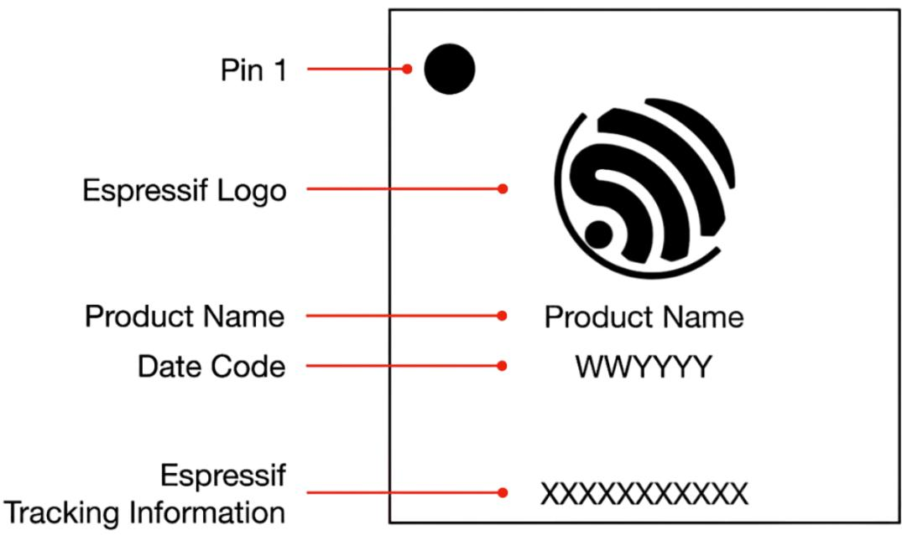
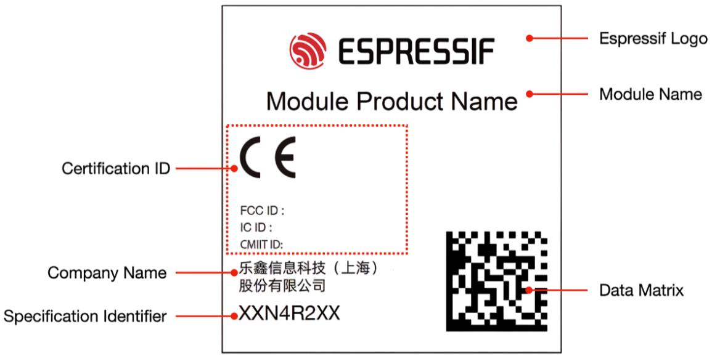
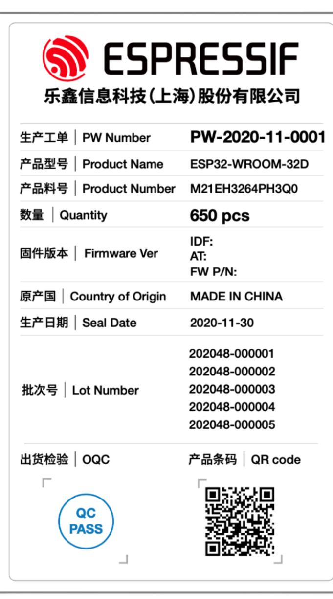

# ESP32-S3

# Series SoC Errata Version v1.3

# Table of contents

Table of contents

Chip Revision Identification 1

1.1 Chip Revision Numbering Scheme 1   
1.2 Primary Identification Methods 1   
1.3 Additional Identification Methods 3   
1.4 ESP-IDF Release Compatibility 4   
1.5 Related Documents 5

Errata Summary 5

All Errata Descriptions 5

3.1 [CACHE-126] Cache Hit Error During Cache Write-Backs 5   
3.2 [RTC-126] RTC Register Read Error After Wake-up from Light-sleep Mode 6   
3.3 [ANALOG-160] Chip Will Be Damaged When BIAS_SLEEP $= 0$ and $\mathsf { P D \_ C U R } = 1$ 7   
3.4 [LCD-239] The LCD Module Exhibits Unreliable Behavior When Certain Clock Di  
viders Are Used 7   
3.5 [USBOTG-4289] The USB-OTG Download Function Is Unavailable 9   
3.6 [RMT-176] The Idle State Signal Level Might Run into Error in RMT Continuous TX   
Mode 9   
3.7 [TOUCH-100] The TOUCH_SCAN_DONE_INT Interrupt Raw Data Value Is Undefined 10   
3.8 [ADC-183] The Digital Controller (DMA) of SAR ADC2 Cannot Work 10

4 Revision History 11

Related Documentation and Resources 11

5.1 Related Documentation 12

5.2 Developer Zone 12

5.3 Products 12

5.4 Contact Us 13

Disclaimer and Copyright Notice 13

# 1 Chip Revision Identification

Espressif is introducing a new vM.X numbering scheme to indicate chip revisions. This guide outlines the structure of this scheme and provides information on chip errata and additional identification methods.

# 1.1 Chip Revision Numbering Scheme

The new numbering scheme vM.X consists of the major and minor numbers described below.

M –Major number, indicating the major revision of the chip product. If this number changes, it means the software used for the previous version of the product is incompatible with the new product, and the software version shall be upgraded for the use of the new product.

X –Minor number, indicating the minor revision of the chip product. If this number changes, it means the software used for the previous version of the product is compatible with the new product, and there is no need to upgrade the software.

The vM.X scheme replaces previously used chip revision schemes, including ECOx numbers, Vxxx, and other formats if any.

# 1.2 Primary Identification Methods

# eFuse Bits

The chip revision is encoded using two eFuse fields:

• EFUSE_RD_MAC_SPI_SYS_5_REG[25:23] • EFUSE_RD_MAC_SPI_SYS_3_REG[20:18]

Table 1.1: Chip Revision Identification by eFuse Bits   

<table><tr><td rowspan=2 colspan=1></td><td rowspan=2 colspan=1>eFuse Bit</td><td rowspan=1 colspan=3>Chip Revision</td></tr><tr><td rowspan=1 colspan=1>vO.O</td><td rowspan=1 colspan=1>vO.1</td><td rowspan=1 colspan=1>vO.2</td></tr><tr><td rowspan=2 colspan=1>Major Number</td><td rowspan=1 colspan=1>EFUSE_RD_MAC_SPI_SYS_5_REG[25]</td><td rowspan=1 colspan=1>0</td><td rowspan=1 colspan=1>O</td><td rowspan=1 colspan=1>O</td></tr><tr><td rowspan=1 colspan=1>EFUSE_RD_MAC_SPI_SYS_5_REG[24]</td><td rowspan=1 colspan=1>O</td><td rowspan=1 colspan=1>0</td><td rowspan=1 colspan=1>0</td></tr><tr><td rowspan=4 colspan=1>Minor Number</td><td rowspan=1 colspan=1>EFUSE__RD__MAC__SPI__SYS_5_REG[23]</td><td rowspan=1 colspan=1>O</td><td rowspan=1 colspan=1>0</td><td rowspan=1 colspan=1>0</td></tr><tr><td rowspan=1 colspan=1>EFUSE_F_RD__MAC__SPI__SYS_3_REG[20]</td><td rowspan=1 colspan=1>0</td><td rowspan=1 colspan=1>O</td><td rowspan=1 colspan=1>0</td></tr><tr><td rowspan=1 colspan=1>EFUSE_RD_MAC_SPI_SYS_3_REG[19]</td><td rowspan=1 colspan=1>O</td><td rowspan=1 colspan=1>O</td><td rowspan=1 colspan=1>1</td></tr><tr><td rowspan=1 colspan=1>EFUSE_RD_MAC_SPI_SYS_3_REG[18]</td><td rowspan=1 colspan=1>O</td><td rowspan=1 colspan=1>1</td><td rowspan=1 colspan=1>O</td></tr></table>

# Chip Marking

• Espressif Tracking Information line in chip marking

  
Figure 1.1: Chip Marking Diagram

Table 1.2: Chip Revision Identification by Chip Marking   

<table><tr><td rowspan=1 colspan=1>Chip Revision</td><td rowspan=1 colspan=1>Espressif Tracking Information</td></tr><tr><td rowspan=1 colspan=1>vO.O</td><td rowspan=1 colspan=1>X A XXXXXX</td></tr><tr><td rowspan=1 colspan=1>VO.1</td><td rowspan=1 colspan=1>X B XXXXXX</td></tr><tr><td rowspan=1 colspan=1>VO.2</td><td rowspan=1 colspan=1>X C xXXXXX</td></tr></table>

# Module Marking

• Specification Identifier line in module marking

  
Figure 1.2: Module Marking Diagram

Table 1.3: Chip Revision Identification by Module Marking   

<table><tr><td rowspan=1 colspan=1>Chip Revision</td><td rowspan=1 colspan=1>Specification Identifier</td></tr><tr><td rowspan=1 colspan=1>vO.O</td><td rowspan=1 colspan=1>-1</td></tr><tr><td rowspan=1 colspan=1>VO.1</td><td rowspan=1 colspan=1>M0 XXXX</td></tr><tr><td rowspan=1 colspan=1>VO.2</td><td rowspan=1 colspan=1>MC XXXX</td></tr></table>

1 Missing specification identifier “—”means modules with this chip revision are not mass produced.

# 1.3 Additional Identification Methods

# Date Code

Some errors in the chip product don’t need to be fixed at the silicon level, or in other words in a new chip revision.

In this case, the chip may be identified by Date Code in chip marking (see Chip Marking). For more information, please refer to ESP32-S3 Chip Packaging Information $>$ Chip Silk Marking.

# PW Number

Modules built around the chip may be identified by PW Number in product label (see Module Product Label). For more information, please refer to ESP32-S3 Module Packaging Information $>$ Pizza Box.

  
Figure 1.3: Module Product Label

Note: Please note that PW Number is only provided for reels packaged in aluminum moisture barrier bags (MBB).

# 1.4 ESP-IDF Release Compatibility

Information about ESP-IDF release that supports a specific chip revision is provided in Compatibility Between ESP-IDF Releases and Revisions of Espressif SoCs.

# 1.5 Related Documents

• For more information about the chip revision upgrade and their identification of series products, please refer to ESP32-S3 Product/Process Change Notifications (PCN).

• For more information about the chip revision numbering scheme, see Compatibility Advisory for Chip Revision Numbering Scheme.

# 2 Errata Summary

Table 2.1: Errata summary   

<table><tr><td rowspan=2 colspan=1>Cate-gory</td><td rowspan=2 colspan=1>ErrataNo.</td><td rowspan=2 colspan=1>Descriptions</td><td rowspan=1 colspan=3>Affected Revi-sions 1</td></tr><tr><td rowspan=1 colspan=1>vO.O</td><td rowspan=1 colspan=1>VO.1</td><td rowspan=1 colspan=1>vO.2</td></tr><tr><td rowspan=1 colspan=1>Cache</td><td rowspan=1 colspan=2>CACHE-  [CACHE-126] Cache Hit Error During Cache Write-Backs126</td><td rowspan=1 colspan=1>Y</td><td rowspan=1 colspan=1>Y</td><td rowspan=1 colspan=1>Y</td></tr><tr><td rowspan=1 colspan=1>RTC</td><td rowspan=1 colspan=2>RTC-126  [RTC-126] RTC Register Read Error After Wake-up fromLight-sleep Mode</td><td rowspan=1 colspan=1>Y</td><td rowspan=1 colspan=1>Y</td><td rowspan=1 colspan=1>Y</td></tr><tr><td rowspan=1 colspan=1>AnalogPower</td><td rowspan=1 colspan=2>ANALOG-[ANALOG-16O] Chip Will Be Damaged When BIAS_ SLEEP160       = 0 and PD_CUR = 1</td><td rowspan=1 colspan=1>Y</td><td rowspan=1 colspan=1>Y</td><td rowspan=1 colspan=1>Y</td></tr><tr><td rowspan=1 colspan=1>LCD</td><td rowspan=1 colspan=2>LCD-     [LCD-239] The LCD Module Exhibits Unreliable Behavior239       When Certain Clock Dividers Are Used</td><td rowspan=1 colspan=1>Y</td><td rowspan=1 colspan=1>Y</td><td rowspan=1 colspan=1>Y</td></tr><tr><td rowspan=1 colspan=1>USB-OTG</td><td rowspan=1 colspan=2>USBOTG-[USBOTG-4289] The USB-OTG Download Function Is Un-4289     available</td><td rowspan=1 colspan=1>Y</td><td rowspan=1 colspan=1>Y</td><td rowspan=1 colspan=1>Y*</td></tr><tr><td rowspan=1 colspan=1>RMT</td><td rowspan=1 colspan=2>RMT-176  [RMT-176] The Idle State Signal Level Might Run into Errorin RMT Continuous TX Mode</td><td rowspan=1 colspan=1>Y</td><td rowspan=1 colspan=1>Y</td><td rowspan=1 colspan=1>Y</td></tr><tr><td rowspan=1 colspan=1>TouchSensor</td><td rowspan=1 colspan=2>TOUCH-  [TOUCH-100] The TOUCH_SCAN_DONE_INT Interrupt100        Raw Data Value Is Undefined</td><td rowspan=1 colspan=1>Y</td><td rowspan=1 colspan=1>Y</td><td rowspan=1 colspan=1>Y</td></tr><tr><td rowspan=1 colspan=1>SARADC</td><td rowspan=1 colspan=2>ADC-183  [ADC-183] The Digital Controller (DMA) of SAR ADC2 Can-not Work</td><td rowspan=1 colspan=1>Y</td><td rowspan=1 colspan=1>Y</td><td rowspan=1 colspan=1>Y</td></tr></table>

$ 1 \bigtriangledown ^ { \star }$ means some batches of a revision are affected.

# 3 All Errata Descriptions

# 3.1 [CACHE-126] Cache Hit Error During Cache Write-Backs

Affected revisions: v0.0 v0.1 v0.2

# Description

When a cache write-back is in progress, if the CPU accesses other addresses within the same cache line, the access request will be treated as a cache miss. This triggers the miss handling module to reload the cache line from external memory, resulting in two identical cache data entries in the same cache line.

Due to hardware logic issues, the cache hit logic may select incorrect cache data, causing the CPU to return incorrect results. If the CPU also writes to the cache line, it may cause the data being written back to be lost.

For example, the following scenarios may lead to cache hit errors in ESP32-S3:

• Accessing data in a cache line that is being written back to the cache during an interrupt: During the cache write-back process, when the CPU is waiting for the write-back completion signal, an interrupt request occurs and the interrupt handler is entered, accessing the memory in   
the same buffer. If the data accessed by the handler and the write-back address are in the same cache line, cache hit errors may occur.   
Conflicts in a multi-core system: In a multi-core system, if CPU0 is waiting for a cache write-back to complete while CPU1   
accesses the same cache line address, cache hit errors may occur.

# Workarounds

During a cache write-back, it is recommended that users take the following precautions at the same time:

• Disable interrupts on the current CPU, and re-enable them only after the cache write-back has completed. • Enable the cache freeze feature to stop another CPU from accessing the cache.

This issue has been automatically bypassed using the above methods in ESP-IDF v4.4.6+, ${ \mathsf { V } } { 5 } . 0 . 4 ^ { + }$ , ${ \vee } 5 . { \ - } 1 . 1 +  \ - \{ $ , v5.2, and above versions.

# Solution

No fix scheduled.

3.2 [RTC-126] RTC Register Read Error After Wake-up from Light-sleep Mode

Affected revisions: v0.0 v0.1 v0.2

# Description

If an RTC peripheral is turned off in Light-sleep mode, there is a certain probability that after waking up from Light-sleep, the CPU of ESP32-S3 will read the registers in the RTC power domain incorrectly.

# Workarounds

Users are suggested not to power down RTC peripherals in Light-sleep mode. There will be no impact on power consumption.

This issue has been bypassed in ESP-IDF v4.4 and above.

# Solution

No fix scheduled.

# 3.3 [ANALOG-160] Chip Will Be Damaged When BIAS_SLEEP $= 0$ and PD_CUR $= 1$ I

Affected revisions: v0.0 v0.1 v0.2

# Description

If the analog power is configured as BIAS_SLEEP $= 0$ and ${ \mathsf { P D \_ C U R } } = 1 ,$ the chip will be permanently damaged. This issue might be triggered when ULP and/or touch sensor is used during Light-sleep or Deep-sleep.

# Workarounds

Users are suggested to disable such analog power configuration in sleep mode through software.

This issue has been bypassed by disabling the above configuration in ESP-IDF ${ \lor } 4 . 4 . 2 + { }$ , v5.0 and above.

# Solution

No fix scheduled.

# 3.4 [LCD-239] The LCD Module Exhibits Unreliable Behavior When Certain Clock Dividers Are Used

Affected revisions: v0.0 v0.1 v0.2

# Description

1. When the RGB format is used, if the clock divider is set to 1, i.e., LCD_CAM_LCD_CLK_EQU_SYSCLK $= 1$ :   
• The pixel clock output (LCD_PCLK) will not be able to be set to falling edge trigger.   
• When frames are continuously sent in this mode (i.e., LCD_CAM_LCD_NEXT_FRAME_EN = 1), it might occur that the second frame inserts the last data of the previous frame in the first frame.

2. When the I8080 format is used, if the clock cycle of the LCD core clock (LCD_CLK) before data transmission is less than or equal to 2, it can result in incorrect value of the first data and the subsequent data quantity.

Note: Please refer to the following steps to obtain the clock cycle before data transmission with the I8080 format.

The clock cycle before data transmission depends on the following factors:

• VFK cycle length (unit: LCD_PCLK): The clock cycle length during the VFK phase   
• CMD cycle length (unit: LCD_PCLK): The clock cycle length during the CMD phase   
• DUMMY cycle length (unit: LCD_PCLK): The clock cycle length during the DUMMY phase   
• LCD_CAM_LCD_CLK_EQU_SYSCLK: Decides if LCD_PCLK equals LCD_CLK   
• LCD_CAM_LCD_CLKCNT_N: Decides the division relationship between LCD_PCLK and LCD_CLK

Based on the information above, three variables are defined below:

• total_pixels $=$ VFK cycle length $^ +$ CMD cycle length $^ +$ DUMMY cycle length   
• cycle_unit $=$ – 1, if LCD_CAM_LCD_CLK_EQU_SYSCLK $= 1$ – LCD_CAM_LCD_CLKCNT_ $N + 1 ,$ , if LCD_CAM_LCD_CLK_EQU_SYSCLK = 0   
• ahead_cycle $=$ total_pixels \* cycle_unit

ahead_cycle indicates the clock cycle before data transmission, which, if less than or equal to 2, will cause an error.

# Workarounds

Users are suggested to do the following:

• When using the RGB format, avoid configuring LCD_CAM_LCD_CLK_EQU_SYSCLK as 1.   
• When using the I8080 format: – try to avoid configuring LCD_CAM_LCD_CLK_EQU_SYSCLK as 1. – ensure that ahead_cycle is larger than 2 if LCD_CAM_LCD_CLK_EQU_SYSCLK has to be set as 1.

This issue has been bypassed through the methods described above in ESP-IDF v4.4.5+, ${ \mathsf { V } } { 5 } . 0 . 3 + { }$ , v5.1 and above.

# Solution

No fix scheduled.

# 3.5 [USBOTG-4289] The USB-OTG Download Function Is Unavailable

Affected revisions: v0.0 v0.1 v0.2

# Description

For ESP32-S3 series chips manufactured before the Date Code 2219 and series of modules and development boards with the PW Number before PW-2022-06-XXXX, the EFUSE_DIS_USB_OTG_DOWNLOAD_MODE (BLK0 B19[7]) bit of eFuse is set by default and cannot be modified. Therefore, the USB-OTG Download function is unavailable for these products.

Note: For detailed information about the Date Code and the PW Number, please refer to Chip Revision Identification.

# Workarounds

ESP32-S3 also supports downloading firmware through USB-Serial-JTAG. Please refer to USB Serial/JTAG Controller Console.

# Solution

This issue has been fixed in some batches of chip revision v0.2.

For ESP32-S3 series chips manufactured on and after the Date Code 2219 and ESP32-S3 series modules and development boards with the PW Number of and after PW-2022-06-XXXX, the bit (BLK0 B19[7]) will not be programmed by default and thus is open for users to program. This will enable the USB-OTG Download function.

For more details and recommendations for users, please refer to Security Advisory for USB_OTG & USB_Serial_JTAG Download Functions of ESP32-S3 Series Products.

# 3.6 [RMT-176] The Idle State Signal Level Might Run into Error in RMT Continuous TX Mode

Affected revisions: v0.0 v0.1 v0.2

# Description

In ESP32-S3’s RMT module, if the continuous TX mode is enabled, it is expected that the data transmission stops after the data is sent for RMT_TX_LOOP_NUM_CHn rounds, and after that, the signal level in idle state should be controlled by the “level”field of the end-marker.

However, in real situation, after the data transmission stops, the channel’s idle state signal level is not controlled by the “level”field of the end-marker, but by the level in the data wrapped back, which is indeterminate.

# Workarounds

Users are suggested to set RMT_IDLE_OUT_EN_CHn to 1 to only use registers to control the idle level.

This issue has been bypassed since the first ESP-IDF version that supports continuous TX mode (v5.0) In these versions of ESP-IDF, it is configured that the idle level can only be controlled by registers.

# Solution

No fix scheduled.

# 3.7 [TOUCH-100] The TOUCH_SCAN_DONE_INT Interrupt Raw Data Value IsUndefined

Affected revisions: v0.0 v0.1 v0.2

# Description

For ESP32-S3’s touch sensor, the raw data value is undefined for the first two TOUCH_SCAN_DONE_INT interrupts.

# Workarounds

Users are suggested to skip the first two TOUCH_SCAN_DONE_INT interrupts, then turn them off and stop using them.

# Solution

No fix scheduled.

# 3.8 [ADC-183] The Digital Controller (DMA) of SAR ADC2 Cannot Work

Affected revisions: v0.0 v0.1 v0.2

# Description

The Digital Controller of SAR ADC2, i.e., DIG ADC2 controller, may receive a false sampling enable signal. In such a case, the controller will enter an inoperative state.

# Workarounds

It is suggested to use RTC controller to control SAR ADC2.

# Solution

No fix scheduled.

# 4 Revision History

Table 4.1: Revision History   

<table><tr><td>Date</td><td>Version</td><td>Release Notes</td></tr><tr><td>2025-03-31</td><td>V1.3 V1.2</td><td>Added Section [CACHE-126] Cache Hit Error During Cache Write-Backs</td></tr><tr><td>2023-11-15</td><td></td><td>•Chip Revision Identification - Added information about how to identify chip revisions in modules - Added Section Additional Identification Methods •All Errata Descriptions - Adjusted the section order - Added Section [RTC-126] RTC Register Read Error After Wake-up from Light-sleep Mode - Added Section [LCD-239] The LCD Module Exhibits Un- reliable Behavior When Certain Clock Dividers Are Used - Added Section [RMT-176] The Idle State Signal Level Might Run into Error in RMT Continuous TX Mode - Added Section [TOUCH-100] The TOUCH_SCAN_DONE_INT Interrupt Raw Data Value Is Undefined</td></tr><tr><td>2023-01-20</td><td>V1.1</td><td>Other minor updates Added Section [USBOTG-4289] The USB-OTG Download Function Is</td></tr><tr><td>2022-10-14</td><td>V1.0</td><td>Unavailable First release</td></tr></table>

# 5 Related Documentation and Resources

# 5.1 Related Documentation

• ESP32-S3 Datasheet –Specifications of the ESP32-S3 hardware.   
• ESP32-S3 Technical Reference Manual –Detailed information on how to use the ESP32-S3 memory and peripherals.   
• ESP32-S3 Hardware Design Guidelines –Guidelines on how to integrate the ESP32-S3 into your hardware product.   
• Certificates https://espressif.com/en/support/documents/certificates   
• ESP32-S3 Product/Process Change Notifications (PCN) https://espressif.com/en/support/documents/pcns?keys $\equiv$ ESP32-S3   
• ESP32-S3 Advisories –Information on security, bugs, compatibility, component reliability. https://espressif.com/en/support/documents/advisories?keys $\cdot =$ ESP32-S3   
• Documentation Updates and Update Notification Subscription https://espressif.com/en/support/download/documents

# 5.2 Developer Zone

• ESP-IDF Programming Guide for ESP32-S3 –Extensive documentation for the ESP-IDF development framework.   
• ESP-IDF and other development frameworks on GitHub. https://github.com/espressif   
• ESP32 BBS Forum –Engineer-to-Engineer (E2E) Community for Espressif products where you can   
post questions, share knowledge, explore ideas, and help solve problems with fellow engineers. https://esp32.com/   
• The ESP Journal –Best Practices, Articles, and Notes from Espressif folks.   
https://blog.espressif.com/   
• See the tabs SDKs and Demos, Apps, Tools, AT Firmware. https://espressif.com/en/support/download/sdks-demos

# 5.3 Products

• ESP32-S3 Series SoCs –Browse through all ESP32-S3 SoCs. https://espressif.com/en/products/socs?id $=$ ESP32-S3   
• ESP32-S3 Series Modules –Browse through all ESP32-S3-based modules. https://espressif.com/en/products/modules?id $=$ ESP32-S3   
• ESP32-S3 Series DevKits –Browse through all ESP32-S3-based devkits. https://espressif.com/en/products/devkits?id $=$ ESP32-S3   
• ESP Product Selector –Find an Espressif hardware product suitable for your needs by comparing or applying filters. https://products.espressif.com/#/product-selector

# 5.4 Contact Us

• See the tabs Sales Questions, Technical Enquiries, Circuit Schematic & PCB Design Review, Get Samples (Online stores), Become Our Supplier, Comments & Suggestions. https://espressif.com/en/contact-us/sales-questions

# 6 Disclaimer and Copyright Notice

Information in this document, including URL references, is subject to change without notice.

All third party’s information in this document is provided as is with no warranties to its authenticity and accuracy.

No warranty is provided to this document for its merchantability, non-infringement, fitness for any particular purpose, nor does any warranty otherwise arising out of any proposal, specification or sample.

All liability, including liability for infringement of any proprietary rights, relating to use of information in this document is disclaimed. No licenses express or implied, by estoppel or otherwise, to any intellectual property rights are granted herein.

The Wi-Fi Alliance Member logo is a trademark of the Wi-Fi Alliance. The Bluetooth logo is a registered trademark of Bluetooth SIG.

All trade names, trademarks and registered trademarks mentioned in this document are property of their respective owners, and are hereby acknowledged.