# ESP32-S3 Hardware Design Guidelines

# Table of contents

# Table of contents

# 1 Latest Version of This Document

#

3   
1.1 About This Document 3   
1.1.1 Introduction 3   
1.1.2 Latest Version of This Document 3   
1.2 Product Overview . 3   
1.3 Schematic Checklist 4   
1.3.1 Overview 4   
1.3.2 Power Supply 5   
1.3.3 Chip Power-up and Reset Timing 8   
1.3.4 Flash and PSRAM . 9   
1.3.5 Clock Source 10   
1.3.6 RF . 11   
1.3.7 UART 13   
1.3.8 SPI 13   
1.3.9 Strapping Pins 13   
1.3.10 GPIO 14   
1.3.11 ADC . 17   
1.3.12 SDIO 17   
1.3.13 USB 18   
1.3.14 Touch Sensor 18   
1.4 PCB Layout Design 19   
1.4.1 General Principles of PCB Layout for the Chip 19   
1.4.2 Power Supply 19   
1.4.3 Crystal . 23   
1.4.4 RF . 23   
1.4.5 Flash and PSRAM . 27   
1.4.6 UART . 27   
1.4.7 General Principles of PCB Layout for Modules (Positioning a Module on a Base Board) 27   
1.4.8 USB . 30   
1.4.9 SDIO 30   
1.4.10 Touch Sensor 31   
1.4.11 Typical Layout Problems and Solutions 33   
1.5 Download Guidelines 34   
1.6 Related Documentation and Resources 35   
1.6.1 ESP32-S3 Modules 35   
1.6.2 ESP32-S3 Development Boards 35   
1.6.3 Other Related Documentation and Resources 35   
1.7 Glossary 36   
1.8 Revision History 36   
1.9 Disclaimer and Copyright Notice 38

This document provides guidelines for the ESP32-S3 SoC.

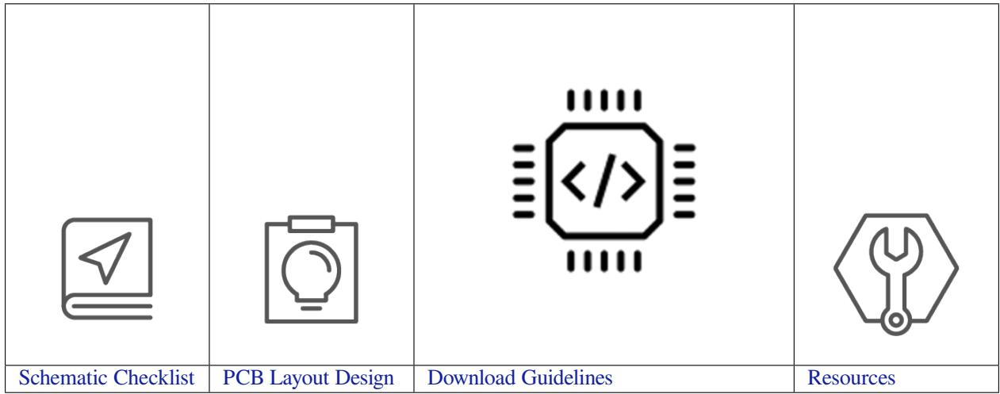

# Chapter 1

# Latest Version of This Document

Check the link to make sure that you use the latest version of this document: https://docs.espressif.com/projects/ esp-hardware-design-guidelines/en/latest/esp32s3/index.html

# 1.1 About This Document

# 1.1.1 Introduction

The hardware design guidelines advise on how to integrate ESP32-S3 into a product. These guidelines will help to achieve optimal performance of your product, ensuring technical accuracy and adherence to Espressif’s standards. The guidelines are intended for hardware and application engineers.

The document assumes that you possess a certain level of familiarity with the ESP32-S3 SoC. In case you lack prior knowledge, we recommend utilizing this document in conjunction with the ESP32-S3 Series Datasheet.

# 1.1.2 Latest Version of This Document

Check the link to make sure that you use the latest version of this document: https://docs.espressif.com/projects/ esp-hardware-design-guidelines/en/latest/esp32s3/index.html

# 1.2 Product Overview

ESP32-S3 is a system on a chip that integrates the following features:

• Wi-Fi $2 . 4 \ : \mathrm { G H z }$ band)   
• Bluetooth $^ \mathrm { \textregistered }$ 5 (LE)   
• Dual high-performance Xtensa $^ \mathrm { \textregistered }$ 32-bit LX7 CPU cores   
• Ultra Low Power coprocessor running either RISC-V or FSM core   
• Multiple peripherals   
• Built-in security hardware   
• USB OTG interface   
• USB Serial/JTAG Controller

Powered by $4 0 \mathrm { n m }$ technology, ESP32-S3 provides a robust, highly-integrated platform, which helps meet the continuous demands for efficient power usage, compact design, security, high performance, and reliability. Typical application scenarios for ESP32-S3 include:

• Smart Home   
• Industrial Automation   
• Health Care   
• Consumer Electronics   
• Smart Agriculture   
• POS Machines   
• Service Robot   
• Audio Devices   
• Generic Low-power IoT Sensor Hubs   
• Generic Low-power IoT Data Loggers   
• Cameras for Video Streaming   
USB Devices   
• Speech Recognition   
• Image Recognition   
• Wi-Fi $^ +$ Bluetooth Networking Card   
• Touch and Proximity Sensing

For more information about ESP32-S3, please refer to ESP32-S3 Series Datasheet.

# 1.3 Schematic Checklist

# 1.3.1 Overview

The integrated circuitry of ESP32-S3 requires only 20 electrical components (resistors, capacitors, and inductors) and a crystal, as well as an SPI flash. The high integration of ESP32-S3 allows for simple peripheral circuit design. This chapter details the schematic design of ESP32-S3.

The following figure shows a reference schematic design of ESP32-S3. It can be used as the basis of your schematic design.

Note that Figure ESP32-S3 Reference Schematic shows the connection for $3 . 3 \mathrm { V }$ , quad, off-package SPI flash/PSRAM.

• In cases where $1 . 8 \mathrm { V }$ or $3 . 3 \mathrm { V }$ , octal, in-package or off-package SPI flash/PSRAM is used, GPIO33 \~ GPIO37 are occupied and cannot be used for other functions.   
• If an in-package SPI flash/PSRAM is used and VDD_SPI is configured to $1 . 8 \mathrm { ~ V ~ }$ or $3 . 3 \mathrm { ~ V ~ }$ via the VDD_SPI_FORCE eFuse, the GPIO45 strapping pin no longer affects the VDD_SPI voltage. In these cases, the presence of R1 is optional. For all other cases, refer to ESP32-S3 Chip Series Datasheet $>$ Section VDD_SPI Voltage Control $>$ Table VDD_SPI Voltage Control to determine whether R1 should be populated or not.   
• The connection for $1 . 8 \mathrm { ~ V ~ }$ , octal, off-package flash/PSRAM is as shown in Figure ESP32-S3 Schematic for Off-Package $I . 8 ~ V$ Octal Flash/PSRAM.   
• When only in-package flash/PSRAM is used, there is no need to populate the resistor on the SPI traces or to care the SPI traces.

Any basic ESP32-S3 circuit design may be broken down into the following major building blocks:

• Power supply   
• Chip power-up and reset timing   
• Flash and PSRAM   
• Clock source   
• RF   
UART   
• Strapping pins   
• GPIO   
• ADC   
• SDIO   
• USB   
• Touch sensor

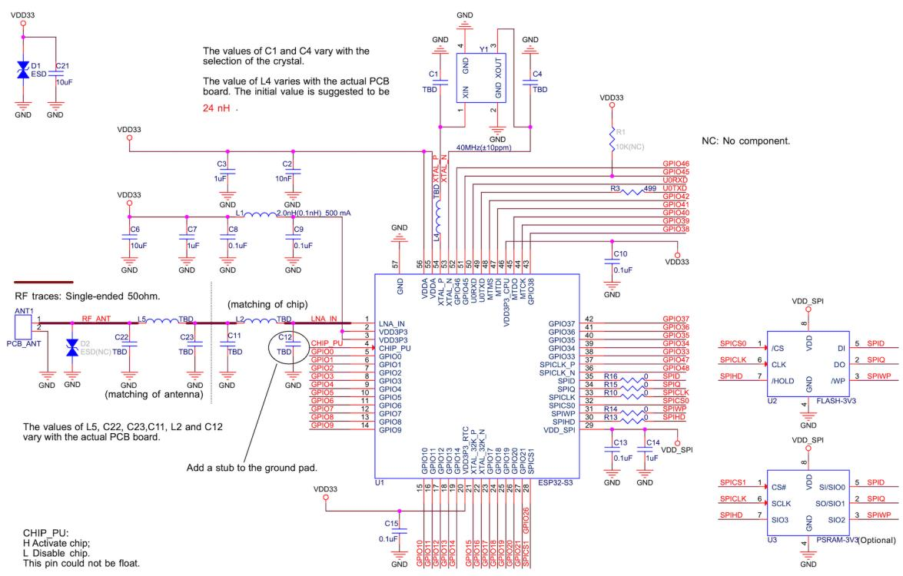  
Fig. 1: ESP32-S3 Reference Schematic

The rest of this chapter details the specifics of circuit design for each of these sections.

# 1.3.2 Power Supply

The general recommendations for power supply design are:

• When using a single power supply, the recommended power supply voltage is $3 . 3 \mathrm { ~ V ~ }$ and the output current is no less than $5 0 0 \mathrm { m A }$ . • It is suggested to add an ESD protection diode and at least $1 0 \mu \mathrm { F }$ capacitor at the power entrance.

The power scheme is shown in Figure ESP32-S3 Power Scheme.

More information about power supply pins can be found in ESP32-S3 Series Datasheet $>$ Section Power Supply.

# Digital Power Supply

ESP32-S3 has pin46 VDD3P3_CPU as the digital power supply pin, and pin 20 VDD3P3_RTC as the RTC and partial digital power supply pin, with an operating voltage range of $3 . 0 \mathrm { V } \sim 3 . 6 \mathrm { V }$ . It is recommended to add a $0 . 1 \mu \mathrm { F }$ capacitor close to the digital power supply pins in the circuit.

Pin VDD_SPI serves as the power supply for the external device at either $1 . 8 \mathrm { V }$ or $3 . 3 \mathrm { V }$ (default). It is recommended to add extra $0 . 1 \mu \mathrm { F }$ and $1 \mu \mathrm { F }$ decoupling capacitors close to VDD_SPI. Please do not add excessively large capacitors.

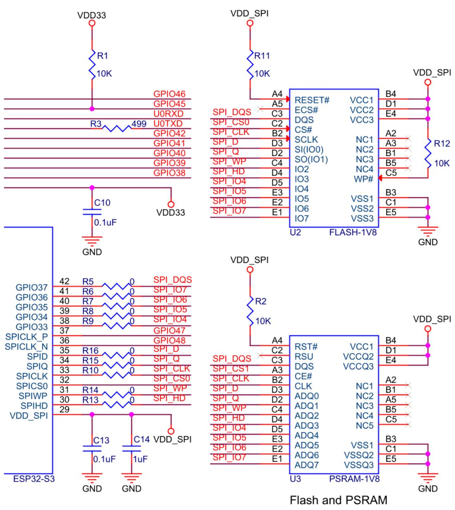  
Fig. 2: ESP32-S3 Schematic for Off-Package $1 . 8 \mathrm { V }$ Octal Flash/PSRAM

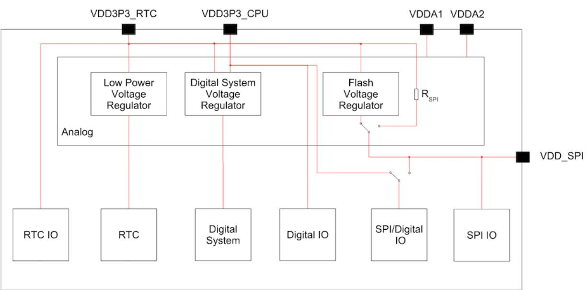  
Fig. 3: ESP32-S3 Power Scheme

• When VDD_SPI operates at $1 . 8 \mathrm { V }$ , it is powered by ESP32-S3’s internal LDO. The typical current this LDO can offer is $4 0 \mathrm { m A }$ .

• When VDD_SPI operates at $3 . 3 \mathrm { ~ V ~ }$ , it is driven directly by VDD3P3_RTC through a $1 4 \Omega$ resistor, therefore, there will be some voltage drop from VDD3P3_RTC.

# Attention:

• When using VDDVDD_SPI_SPI as the power supply pin for in-package or off-package $3 . 3 \mathrm { ~ V ~ }$ flash/PSRAM, please ensure that VDD3P3_RTC remains above $3 . 0 \mathrm { V }$ to meet the operating voltage requirements of the flash/PSRAM, considering the voltage drop mentioned earlier. • Note that VDD3P3_RTC cannot supply power alone; all power supplies must be powered on at the same time.

Depending on the value of EFUSE_VDD_SPI_FORCE, the VDD_SPI voltage can be controlled in two ways, as Table VDD_SPI Voltage Control shows.

Table 1: VDD_SPI Voltage Control   

<table><tr><td rowspan=1 colspan=1>EFUSE_</td><td rowspan=1 colspan=1>VGDIS#5</td><td rowspan=1 colspan=1>FERSE</td><td rowspan=1 colspan=1>VDDItael_TIEH</td><td rowspan=1 colspan=1>VDD_SPI Power Source</td></tr><tr><td rowspan=1 colspan=1>0</td><td rowspan=1 colspan=1>0</td><td rowspan=1 colspan=1>Ignored</td><td rowspan=1 colspan=1>3.3 V</td><td rowspan=1 colspan=1>VDD3P3_RTC via RsPI (default)</td></tr><tr><td rowspan=1 colspan=1>0</td><td rowspan=1 colspan=1>1</td><td rowspan=1 colspan=1>Ignored</td><td rowspan=1 colspan=1>1.8 V</td><td rowspan=1 colspan=1>Flash Voltage Regulator</td></tr><tr><td rowspan=1 colspan=1>1</td><td rowspan=1 colspan=1>Ignored</td><td rowspan=1 colspan=1>0</td><td rowspan=1 colspan=1>1.8 V</td><td rowspan=1 colspan=1>Flash Voltage Regulator</td></tr><tr><td rowspan=1 colspan=1>1</td><td rowspan=1 colspan=1>Ignored</td><td rowspan=1 colspan=1>1</td><td rowspan=1 colspan=1>3.3 V</td><td rowspan=1 colspan=1>VDD3P3_RTC via RsPI</td></tr></table>

VDD_SPI can also be driven by an external power supply.

It is recommended to use the VDD_SPI output to supply power to external or internal flash/PSRAM.

# Analog Power Supply

ESP32-S3’s VDD3P3 pins (pin2 and pin3) and VDDA pins (pin55 and pin56) are the analog power supply pins, working at $3 . 0 \ : \mathrm { V } \sim 3 . 6 \ : \mathrm { V }$ .

For VDD3P3, when ESP32-S3 is transmitting signals, there may be a sudden increase in the current draw, causing power rail collapse. Therefore, it is highly recommended to add a $1 0 \mu \mathrm { F }$ capacitor to the power rail, which can work in conjunction with the $1 \mu \mathrm { F }$ capacitor(s) or other capacitors.

It is suggested to add an extra $1 0 \mu \mathrm { F }$ capacitor at the power entrance. If the power entrance is close to VDD3P3, then two $1 0 \mu \mathrm { F }$ capacitors can be merged into one.

Add an LC circuit to the VDD3P3 power rail to suppress high-frequency harmonics. The inductor’s rated current is preferably $5 0 0 \mathrm { m A }$ and above.

For the remaining capacitor circuits, please refer to ESP32-S3 Reference Schematic.

# 1.3.3 Chip Power-up and Reset Timing

ESP32-S3’s CHIP_PU pin can enable the chip when it is high and reset the chip when it is low.

When ESP32-S3 uses a $3 . 3 \mathrm { ~ V ~ }$ system power supply, the power rails need some time to stabilize before CHIP_PU is pulled up and the chip is enabled. Therefore, CHIP_PU needs to be asserted high after the $3 . 3 \mathrm { ~ V ~ }$ rails have been brought up.

To reset the chip, keep the reset voltage $\mathrm { V _ { I L \_ n R S T } }$ in the range of $( - 0 . 3 \sim 0 . 2 5 \times \mathrm { V D D 3 P 3 \_ R T C } ) \vee$ . To avoid reboots caused by external interferences, make the CHIP_PU trace as short as possible.

Figure ESP32-S3 Power-up and Reset Timing shows the power-up and reset timing of ESP32-S3.

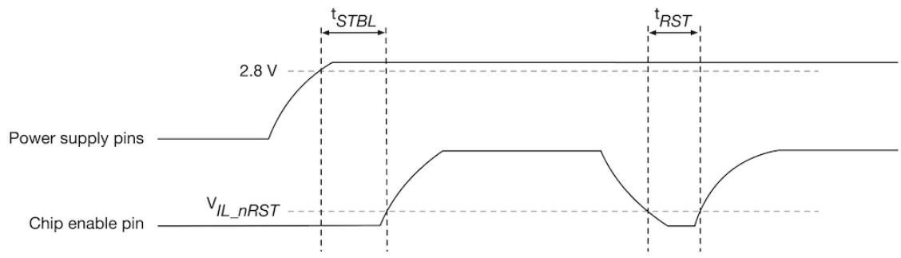  
Fig. 4: ESP32-S3 Power-up and Reset Timing

Table Description of Timing Parameters for Power-up and Reset provides the specific timing requirements.

Table 2: Description of Timing Parameters for Power-up and Reset   

<table><tr><td rowspan=1 colspan=1>Parameter</td><td rowspan=1 colspan=1>Description</td><td rowspan=1 colspan=1>Minimum (μs)</td></tr><tr><td rowspan=1 colspan=1>tsTBL</td><td rowspan=1 colspan=1>Time reserved for the power rails to stabilize before the CHIP_PUpin is pulled high to activate the chip</td><td rowspan=1 colspan=1>50</td></tr><tr><td rowspan=1 colspan=1>tRST</td><td rowspan=1 colspan=1>Time reserved for CHIP_PU to stay below VIL_nRST to reset thechip</td><td rowspan=1 colspan=1>50</td></tr></table>

# Attention:

• CHIP_PU must not be left floating.   
• To ensure the correct power-up and reset timing, it is advised to add an RC delay circuit at the CHIP_PU pin. The recommended setting for the RC delay circuit is usually $\mathrm { R } = 1 0 \mathrm { k } \Omega$ and $\mathrm { C } = 1 \mu \mathrm { F }$ . However, specific parameters should be adjusted based on the characteristics of the actual power supply and the power-up and reset timing of the chip.

• If the user application has one of the following scenarios: – Slow power rise or fall, such as during battery charging. – Frequent power on/off operations. – Unstable power supply, such as in photovoltaic power generation.

Then, the RC circuit itself may not meet the timing requirements, resulting in the chip being unable to boot correctly. In this case, additional designs need to be added, such as:

– Adding an external reset chip or a watchdog chip, typically with a threshold of around $3 . 0 \mathrm { V }$ .   
– Implementing reset functionality through a button or the main controller.

# 1.3.4 Flash and PSRAM

ESP32-S3 requires in-package or off-package flash to store application firmware and data. In-package PSRAM or off-package PSRAM is optional.

# In-Package Flash and PSRAM

The tables list the pin-to-pin mapping between the chip and in-package flash/PSRAM. Please note that the following chip pins can connect at most one flash and one PSRAM. That is to say, when there is only flash in the package, the pin occupied by flash can only connect PSRAM and cannot be used for other functions; when there is only PSRAM, the pin occupied by PSRAM can only connect flash; when there are both flash and PSRAM, the pin occupied cannot connect any more flash or PSRAM.

Table 3: Pin-to-Pin Mapping Between Chip and In-Package Quad SPI Flash   

<table><tr><td rowspan=1 colspan=1>ESP32-S3FN8/ESP32-S3FH4R2</td><td rowspan=1 colspan=1>In-Package Flash (Quad SPI)</td></tr><tr><td rowspan=1 colspan=1>SPICLK</td><td rowspan=1 colspan=1>CLK</td></tr><tr><td rowspan=1 colspan=1>SPICSO</td><td rowspan=1 colspan=1>CS#</td></tr><tr><td rowspan=1 colspan=1>SPID</td><td rowspan=1 colspan=1>DI</td></tr><tr><td rowspan=1 colspan=1>SPIQ</td><td rowspan=1 colspan=1>DO</td></tr><tr><td rowspan=1 colspan=1>SPIWP</td><td rowspan=1 colspan=1>WP#</td></tr><tr><td rowspan=1 colspan=1>SPIHD</td><td rowspan=1 colspan=1>HOLD#</td></tr></table>

Table 4: Pin-to-Pin Mapping Between Chip and In-Package Quad SPI PSRAM   

<table><tr><td rowspan=1 colspan=1>ESP32-S3R2/ESP32-S3FH4R2</td><td rowspan=1 colspan=1>In-Package PSRAM (2 MB, Quad SPI)</td></tr><tr><td rowspan=1 colspan=1>SPICLK</td><td rowspan=1 colspan=1>CLK</td></tr><tr><td rowspan=1 colspan=1>SPICS1</td><td rowspan=1 colspan=1>CE#</td></tr><tr><td rowspan=1 colspan=1>SPID</td><td rowspan=1 colspan=1>SI/SIO0</td></tr><tr><td rowspan=1 colspan=1>SPIQ</td><td rowspan=1 colspan=1>SO/SIO1</td></tr><tr><td rowspan=1 colspan=1>SPIWP</td><td rowspan=1 colspan=1>SIO2</td></tr><tr><td rowspan=1 colspan=1>SPIHD</td><td rowspan=1 colspan=1>SIO3</td></tr></table>

Table 5: Pin-to-Pin Mapping Between Chip and In-Package Octal SPI PSRAM   

<table><tr><td rowspan=1 colspan=1>ESP32-S3R8/ESP32-S3R8V</td><td rowspan=1 colspan=1>In-Package PSRAM (8 MB, Octal SPI)</td></tr><tr><td rowspan=1 colspan=1>SPICLK</td><td rowspan=1 colspan=1>CLK</td></tr><tr><td rowspan=1 colspan=1>SPICS1</td><td rowspan=1 colspan=1>CE#</td></tr><tr><td rowspan=1 colspan=1>SPID</td><td rowspan=1 colspan=1>DQ0</td></tr><tr><td rowspan=1 colspan=1>SPIQ</td><td rowspan=1 colspan=1>DQ1</td></tr><tr><td rowspan=1 colspan=1>SPIWP</td><td rowspan=1 colspan=1>DQ2</td></tr><tr><td rowspan=1 colspan=1>SPIHD</td><td rowspan=1 colspan=1>DQ3</td></tr><tr><td rowspan=1 colspan=1>GPIO33</td><td rowspan=1 colspan=1>DQ4</td></tr><tr><td rowspan=1 colspan=1>GPIO34</td><td rowspan=1 colspan=1>DQ5</td></tr><tr><td rowspan=1 colspan=1>GPIO35</td><td rowspan=1 colspan=1>DQ6</td></tr><tr><td rowspan=1 colspan=1>GPIO36</td><td rowspan=1 colspan=1>DQ7</td></tr><tr><td rowspan=1 colspan=1>GPIO37</td><td rowspan=1 colspan=1>DQS/DM</td></tr></table>

# Off-Package Flash and PSRAM

To reduce the risk of software compatibility issues, it is recommended to use flash and PSRAM models officially validated by Espressif. For detailed model selection, consult the sales or technical support team. If VDD_SPI is used to supply power, make sure to select the appropriate off-package flash and RAM according to the power voltage on

VDD_SPI $( 1 . 8 \mathrm { ~ V } / 3 . 3 \mathrm { ~ V } )$ ). It is recommended to add zero-ohm resistor footprints in series on the SPI communication lines. These footprints provide flexibility for future adjustments, such as tuning drive strength, mitigating RF interference, correcting signal timing, and reducing noise, if needed.

# 1.3.5 Clock Source

ESP32-S3 supports two external clock sources:

• External crystal clock source (Compulsory) • RTC clock source (Optional)

# External Crystal Clock Source (Compulsory)

The ESP32-S3 firmware only supports $4 0 \ : \mathrm { M H z }$ crystal.

The circuit for the crystal is shown in Figure ESP32-S3 Schematic for External Crystal. Note that the accuracy of the selected crystal should be within $\pm 1 0 \mathrm { p p m }$ .

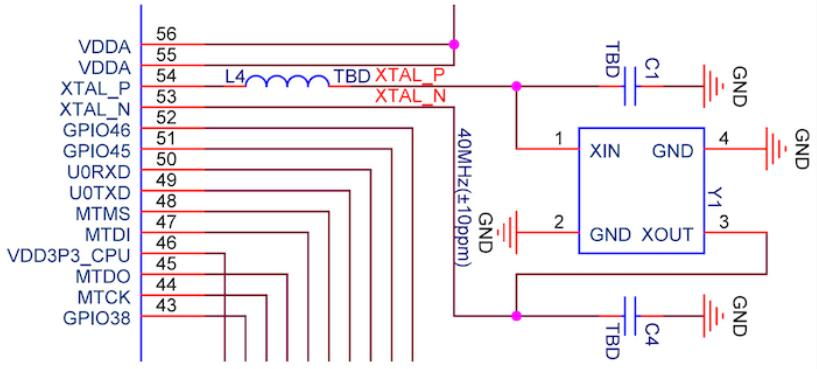  
Fig. 5: ESP32-S3 Schematic for External Crystal

Please add a series component on the XTAL_P clock trace. Initially, it is suggested to use an inductor of $2 4 ~ \mathrm { n H }$ to reduce the impact of high-frequency crystal harmonics on RF performance, and the value should be adjusted after an overall test.

The initial values of external capacitors C1 and C4 can be determined according to the formula:

$$
C _ { L } = \frac { C 1 \times C 4 } { C 1 + C 4 } + C _ { s t r a y }
$$

where the value of $\mathrm { C _ { L } }$ (load capacitance) can be found in the crystal’s datasheet, and the value of $\mathrm { C _ { \mathrm { { s t r a y } } } }$ refers to the PCB’s stray capacitance. The values of C1 and C4 need to be further adjusted after an overall test as below:

1. Select TX tone mode using the Certification and Test Tool.   
2. Observe the $2 . 4 \ : \mathrm { G H z }$ signal with a radio communication analyzer or a spectrum analyzer and demodulate it to obtain the actual frequency offset.   
3. Adjust the frequency offset to be within $\pm 1 0 \mathrm { p p m }$ (recommended) by adjusting the external load capacitance.   
• When the center frequency offset is positive, it means that the equivalent load capacitance is small, and the external load capacitance needs to be increased.   
• When the center frequency offset is negative, it means the equivalent load capacitance is large, and the external load capacitance needs to be reduced.   
• External load capacitance at the two sides are usually equal, but in special cases, they may have slightly different values.

# Note:

• Defects in the manufacturing of crystal (for example, large frequency deviation of more than $\pm 1 0 \mathrm { p p m }$ , unstable performance within the operating temperature range, etc) may lead to the malfunction of ESP32-S3, resulting in a decrease of the RF performance.   
• It is recommended that the amplitude of the crystal is greater than $5 0 0 \mathrm { m V }$ .   
• When Wi-Fi or Bluetooth connection fails, after ruling out software problems, you may follow the steps mentioned above to ensure that the frequency offset meets the requirements by adjusting capacitors at the two sides of the crystal.

# RTC Clock Source (Optional)

ESP32-S3 supports an external $3 2 . 7 6 8 \mathrm { k H z }$ crystal to act as the RTC clock. The external RTC clock source enhances timing accuracy and consequently decreases average power consumption, without impacting functionality.

Figure ESP32-S3 Schematic for 32.768 kHz Crystal shows the schematic for the external $3 2 . 7 6 8 \mathrm { k H z }$ crystal.

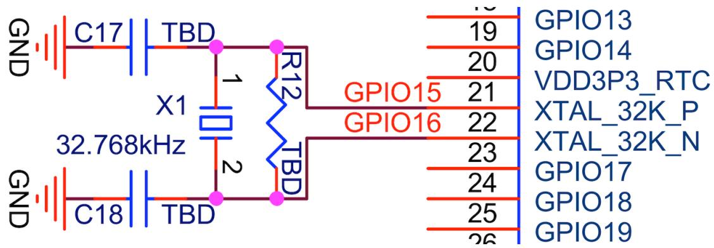  
Fig. 6: ESP32-S3 Schematic for 32.768 kHz Crystal

Please note the requirements for the $3 2 . 7 6 8 \mathrm { k H z }$ crystal:

• Equivalent series resistance (ESR) $\leq 7 0 \mathrm { k } \Omega$ .   
• Load capacitance at both ends should be configured according to the crystal’s specification.

The parallel resistor R is used for biasing the crystal circuit $( 5 \mathrm { M } \Omega < \mathrm { R } \leq 1 0 \mathrm { M } \Omega$ ).

In general, you do not need to populate the resistor.

If the RTC clock source is not required, then the pins for the $3 2 . 7 6 8 \mathrm { k H z }$ crystal can be used as GPIOs.

# 1.3.6 RF

# RF Circuit

ESP32-S3’s RF circuit is mainly composed of three parts, the RF traces on the PCB board, the chip matching circuit, the antenna and the antenna matching circuit. Each part should meet the following requirements:

• For the RF traces on the PCB board, $5 0 \Omega$ impedance control is required.   
• For the chip matching circuit, it must be placed close to the chip. A CLC structure is preferred. – The CLC structure is mainly used to adjust the impedance point and suppress harmonics.   
– The RF matching circuit is shown in Figure ESP32-S3 Schematic for RF Matching.

• For the antenna and the antenna matching circuit, to ensure radiation performance, the antenna’s characteristic impedance must be around $5 0 \Omega$ . Adding a CLC matching circuit near the antenna is recommended to adjust the antenna. However, if the available space is limited and the antenna impedance point can be guaranteed to be $5 0 \Omega$ by simulation, then there is no need to add a matching circuit near the antenna.

• It is recommended to include ESD protection devices for the antenna to mitigate electrostatic interference.

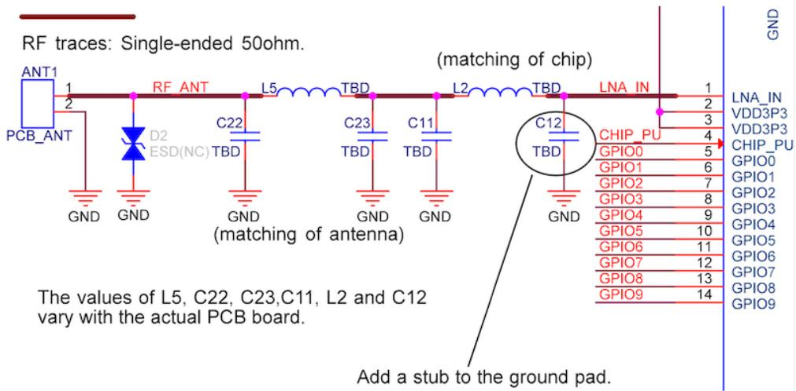  
Fig. 7: ESP32-S3 Schematic for RF Matching

# RF Tuning

The RF matching parameters vary with the board, so the ones used in Espressif modules could not be applied directly.   
Follow the instructions below to do RF tuning.

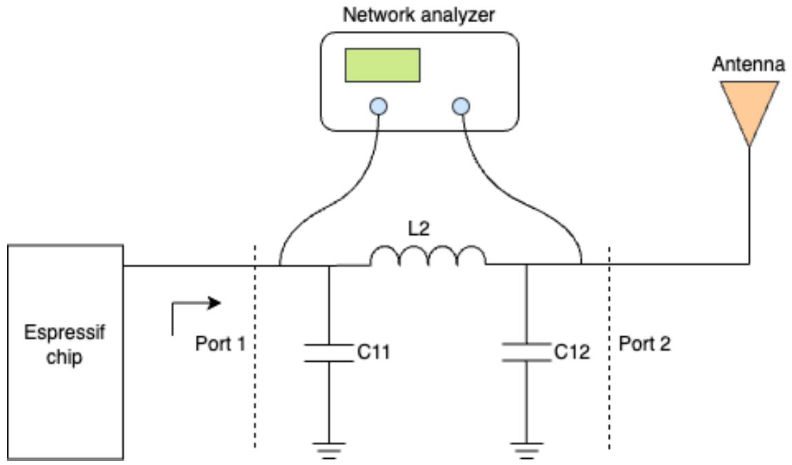  
Figure ESP32-S3 RF Tuning Diagram shows the general process of RF tuning.   
Fig. 8: ESP32-S3 RF Tuning Diagram

In the matching circuit, define the port near the chip as Port 1 and the port near the antenna as Port 2. S11 describes the ratio of the signal power reflected back from Port 1 to the input signal power, the transmission performance is best if the matching impedance is conjugate to the chip impedance. S21 is used to describe the transmission loss of signal from Port 1 to Port 2. If S11 is close to the chip conjugate point $3 5 + \mathrm { j 0 }$ and S21 is less than $- 3 5 \ \mathrm { d B }$ at $4 . 8 \ : \mathrm { G H z }$ and $7 . 2 \ : \mathrm { G H z }$ , the matching circuit can satisfy transmission requirements.

Connect the two ends of the matching circuit to the network analyzer, and test its signal reflection parameter S11 and transmission parameter S21. Adjust the values of the components in the circuit until S11 and S21 meet the requirements. If your PCB design of the chip strictly follows the PCB design stated in Chapter PCB Layout Design, you can refer to the value ranges in Table Recommended Value Ranges for Components to debug the matching circuit.

Table 6: Recommended Value Ranges for Components   

<table><tr><td rowspan=1 colspan=1>Reference Desig-nator</td><td rowspan=1 colspan=1>Recommended Value Range</td><td rowspan=1 colspan=1>Serial No.</td></tr><tr><td rowspan=1 colspan=1>C11</td><td rowspan=1 colspan=1>1.2 ~ 1.8 pF</td><td rowspan=1 colspan=1>GRM0335C1H1RXBA01D</td></tr><tr><td rowspan=1 colspan=1>L2</td><td rowspan=1 colspan=1>2.4 ~ 3.0 nH</td><td rowspan=1 colspan=1>LQP03TN2NXB02D</td></tr><tr><td rowspan=1 colspan=1>C12</td><td rowspan=1 colspan=1>1.8 ~ 1.2 pF</td><td rowspan=1 colspan=1>GRM0335C1H1RXBA01D</td></tr></table>

Please use 0201 packages for RF matching components and add a stub to the first capacitor in the matching circuit at the chip end.

Note: If RF function is not required, it is recommended not to initialize the RF stack in firmware. In this case, the RF pin can be left floating. However, if RF function is enabled, make sure an antenna is connected. Operation without an antenna may result in unstable behavior or potential damage to the RF circuit.

# 1.3.7 UART

ESP32-S3 includes 3 UART interfaces, UART0, UART1, and UART2. U0TXD and U0RXD are GPIO43 and GPIO44 by default. Other UART signals can be mapped to any available GPIOs by software configurations.

Usually, UART0 is used as the serial port for download and log printing. For instructions on download over UART0, please refer to Section Download Guidelines. It is recommended to connect a $4 9 9 \ \Omega$ series resistor to the U0TXD line to suppress harmonics.

If possible, use other UART interfaces as serial ports for communication. For these interfaces, it is suggested to add a series resistor to the TX line to suppress harmonics.

# 1.3.8 SPI

When using the SPI function, to improve EMC performance, add a series resistor (or ferrite bead) and a capacitor to ground on the SPI_CLK trace. If space allows, it is recommended to also add a series resistor and capacitor to ground on other SPI traces. Ensure that the RC/LC components are placed close to the pins of the chip or module.

# 1.3.9 Strapping Pins

At each startup or reset, a chip requires some initial configuration parameters, such as in which boot mode to load the chip, etc. These parameters are passed over via the strapping pins. After reset, the strapping pins work as normal function pins.

GPIO0, GPIO3, GPIO45, and GPIO46 are strapping pins.

All the information about strapping pins is covered in ESP32-S3 Series Datasheet $>$ Chapter Boot Configurations.

For strapping pin information related to VDD_SPI, please refer to Section Digital Power Supply.

In this section, we will mainly cover the strapping pins related to boot mode.

After chip reset is released, the combination of GPIO0 and GPIO46 controls the boot mode. See Table Boot Mode Control.

Table 7: Boot Mode Control   

<table><tr><td rowspan=1 colspan=1>Boot Mode</td><td rowspan=1 colspan=1>GPIOO</td><td rowspan=1 colspan=1>GPI046</td></tr><tr><td rowspan=1 colspan=1>Default Config</td><td rowspan=1 colspan=1>1 (Pull-up)</td><td rowspan=1 colspan=1>0 (Pull-down)</td></tr><tr><td rowspan=1 colspan=1>SPI Boot (default)</td><td rowspan=1 colspan=1>1</td><td rowspan=1 colspan=1>Any value</td></tr><tr><td rowspan=1 colspan=1>Joint Download Boot</td><td rowspan=1 colspan=1>0</td><td rowspan=1 colspan=1>0</td></tr></table>

1 Joint Download Boot mode supports the following download methods:

• USB Download Boot:– USB-Serial-JTAG Download Boot– USB-OTG Download Boot  
• UART Download Boot

2 In addition to SPI Boot and Joint Download Boot modes, ESP32-S3 also supports SPI Download Boot mode. For details, please see ESP32-S3 Technical Reference Manual $>$ Chapter Chip Boot Control.

Signals applied to the strapping pins should have specific setup time and hold time. For more information, see Figure Setup and Hold Times for Strapping Pins and Table Description of Timing Parameters for Strapping Pins.

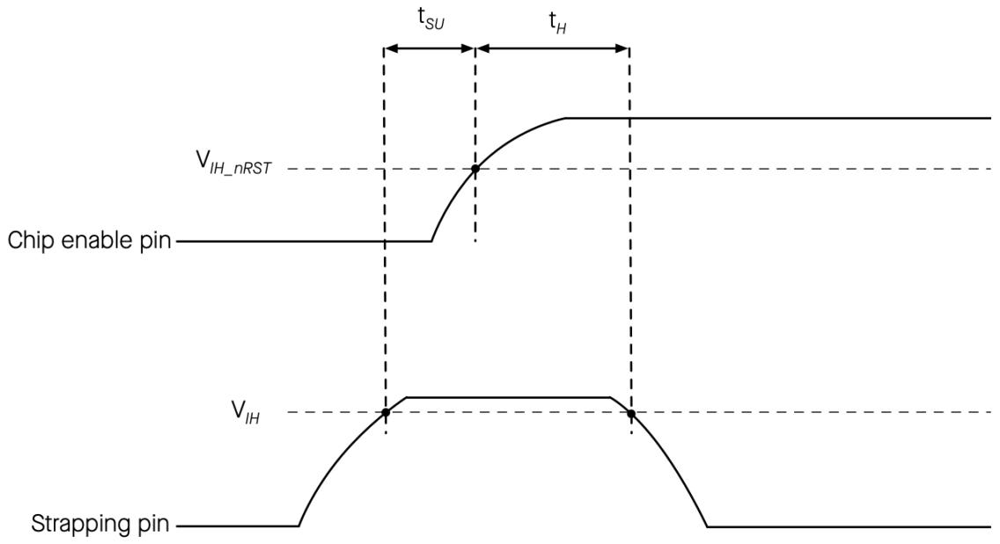  
Fig. 9: Setup and Hold Times for Strapping Pins

Table 8: Description of Timing Parameters for Strapping Pins   

<table><tr><td rowspan=1 colspan=1>Parameter</td><td rowspan=1 colspan=1>Description</td><td rowspan=1 colspan=1>Minimum (ms)</td></tr><tr><td rowspan=1 colspan=1>tsu</td><td rowspan=1 colspan=1>Time reserved for the power rails to stabilize before the chip enablepin (CHIP_PU) is pulled high to activate the chip.</td><td rowspan=1 colspan=1>0</td></tr><tr><td rowspan=1 colspan=1>tH</td><td rowspan=1 colspan=1>Time reserved for the chip to read the strapping pin values afterCHIP_PU is already high and before these pins start operating asregular 10 pins.</td><td rowspan=1 colspan=1>3</td></tr></table>

# Attention:

• It is recommended to place a pull-up resistor at the GPIO0 pin.   
• Do not add high-value capacitors at GPIO0, or the chip may enter download mode.

# 1.3.10 GPIO

The pins of ESP32-S3 can be configured via IO MUX or GPIO matrix. IO MUX provides the default pin configurations (see ESP32-S3 Series Datasheet $>$ Appendix ESP32-S3 Consolidated Pin Overview), whereas the GPIO matrix is used to route signals from peripherals to GPIO pins. For more information about IO MUX and GPIO matrix, please refer to ESP32-S3 Technical Reference Manual $>$ Chapter IO MUX and GPIO Matrix.

Some peripheral signals have already been routed to certain GPIO pins, while some can be routed to any available GPIO pins. For details, please refer to ESP32-S3 Series Datasheet $>$ Section Peripherals.

When using GPIOs, please:

• Pay attention to the states of strapping pins during power-up.   
• Pay attention to the default configurations of the GPIOs after reset. The default configurations can be found in the table below. It is recommended to add a pull-up or pull-down resistor to pins in the high-impedance state or enable the pull-up and pull-down during software initialization to avoid extra power consumption.   
• Avoid using the pins already occupied by flash/PSRAM.   
• Some pins will have glitches during power-up. Refer to Table Power-Up Glitches on Pins for details.   
• When USB-OTG Download Boot mode is enabled, some pins will have level output. Refer to Table IO Pad Status After Chip Initialization in the USB-OTG Download Boot Mode for details.   
• SPICLK_N, SPICLK_P, and GPIO33 \~ GPIO37 work in the same power domain, so if octal $1 . 8 \mathrm { ~ V ~ }$ flash/PSRAM is used, then SPICLK_P and SPICLK_N also work in the $1 . 8 \mathrm { V }$ power domain.   
• Only GPIOs in the VDD3P3_RTC power domain can be controlled in Deep-sleep mode.

Table 9: IO Pin Default Configuration   

<table><tr><td rowspan=1 colspan=1>No.</td><td rowspan=1 colspan=1>Name</td><td rowspan=1 colspan=1>Power</td><td rowspan=1 colspan=1>At Reset</td><td rowspan=1 colspan=1>After Reset</td></tr><tr><td rowspan=1 colspan=1>1</td><td rowspan=1 colspan=1>LNA_IN</td><td rowspan=1 colspan=1></td><td rowspan=1 colspan=1></td><td rowspan=1 colspan=1></td></tr><tr><td rowspan=1 colspan=1>2</td><td rowspan=1 colspan=1>VDD3P3</td><td rowspan=1 colspan=1></td><td rowspan=1 colspan=1></td><td rowspan=1 colspan=1></td></tr><tr><td rowspan=1 colspan=1>3</td><td rowspan=1 colspan=1>VDD3P3</td><td rowspan=1 colspan=1></td><td rowspan=1 colspan=1></td><td rowspan=1 colspan=1></td></tr><tr><td rowspan=1 colspan=1>4</td><td rowspan=1 colspan=1>CHIP_PU</td><td rowspan=1 colspan=1>VDD3P3_RTC</td><td rowspan=1 colspan=1></td><td rowspan=1 colspan=1></td></tr><tr><td rowspan=1 colspan=1>5</td><td rowspan=1 colspan=1>GPIO0</td><td rowspan=1 colspan=1>VDD3P3_RTC</td><td rowspan=1 colspan=1>IE, WPU</td><td rowspan=1 colspan=1>IE, WPU</td></tr><tr><td rowspan=1 colspan=1>6</td><td rowspan=1 colspan=1>GPIO1</td><td rowspan=1 colspan=1>VDD3P3RTC</td><td rowspan=1 colspan=1>IE</td><td rowspan=1 colspan=1>IE</td></tr><tr><td rowspan=1 colspan=1>7</td><td rowspan=1 colspan=1>GPIO2</td><td rowspan=1 colspan=1>VDD3P3RTC</td><td rowspan=1 colspan=1>IE</td><td rowspan=1 colspan=1>IE</td></tr><tr><td rowspan=1 colspan=1>8</td><td rowspan=1 colspan=1>GPIO3</td><td rowspan=1 colspan=1>VDD3P3RTC</td><td rowspan=1 colspan=1>IE</td><td rowspan=1 colspan=1>IE</td></tr><tr><td rowspan=1 colspan=1>9</td><td rowspan=1 colspan=1>GPIO4</td><td rowspan=1 colspan=1>VDD3P3RTC</td><td rowspan=1 colspan=1></td><td rowspan=1 colspan=1></td></tr><tr><td rowspan=1 colspan=1>10</td><td rowspan=1 colspan=1>GPIO5</td><td rowspan=1 colspan=1>VDD3P3RTC</td><td rowspan=1 colspan=1></td><td rowspan=1 colspan=1></td></tr><tr><td rowspan=1 colspan=1>11</td><td rowspan=1 colspan=1>GPI06</td><td rowspan=1 colspan=1>VDD3P3RTC</td><td rowspan=1 colspan=1></td><td rowspan=1 colspan=1></td></tr><tr><td rowspan=1 colspan=1>12</td><td rowspan=1 colspan=1>GPIO7</td><td rowspan=1 colspan=1>VDD3P3RTC</td><td rowspan=1 colspan=1></td><td rowspan=1 colspan=1></td></tr><tr><td rowspan=1 colspan=1>13</td><td rowspan=1 colspan=1>GPIO8</td><td rowspan=1 colspan=1>VDD3P3RTC</td><td rowspan=1 colspan=1></td><td rowspan=1 colspan=1></td></tr><tr><td rowspan=1 colspan=1>14</td><td rowspan=1 colspan=1>GPIO9</td><td rowspan=1 colspan=1>VDD3P3RTC</td><td rowspan=1 colspan=1></td><td rowspan=1 colspan=1>IE</td></tr><tr><td rowspan=1 colspan=1>15</td><td rowspan=1 colspan=1>GPIO10</td><td rowspan=1 colspan=1>VDD3P3RTC</td><td rowspan=1 colspan=1></td><td rowspan=1 colspan=1>IE</td></tr><tr><td rowspan=1 colspan=1>16</td><td rowspan=1 colspan=1>GPIO11</td><td rowspan=1 colspan=1>VDD3P3RTC</td><td rowspan=1 colspan=1></td><td rowspan=1 colspan=1>IE</td></tr><tr><td rowspan=1 colspan=1>17</td><td rowspan=1 colspan=1>GPIO12</td><td rowspan=1 colspan=1>VDD3P3RTC</td><td rowspan=1 colspan=1></td><td rowspan=1 colspan=1>IE</td></tr><tr><td rowspan=1 colspan=1>18</td><td rowspan=1 colspan=1>GPIO13</td><td rowspan=1 colspan=1>VDD3P3RTC</td><td rowspan=1 colspan=1></td><td rowspan=1 colspan=1>IE</td></tr><tr><td rowspan=1 colspan=1>19</td><td rowspan=1 colspan=1>GPIO14</td><td rowspan=1 colspan=1>VDD3P3_B_RTC</td><td rowspan=1 colspan=1></td><td rowspan=1 colspan=1>IE</td></tr><tr><td rowspan=1 colspan=1>20</td><td rowspan=1 colspan=1>VDD3P3_RTC</td><td rowspan=1 colspan=1></td><td rowspan=1 colspan=1></td><td rowspan=1 colspan=1></td></tr><tr><td rowspan=1 colspan=1>21</td><td rowspan=1 colspan=1>XTAL_32K_P</td><td rowspan=1 colspan=1>VDD3P3_RTC</td><td rowspan=1 colspan=1></td><td rowspan=1 colspan=1></td></tr><tr><td rowspan=1 colspan=1>22</td><td rowspan=1 colspan=1>XTAL_32K_N</td><td rowspan=1 colspan=1>VDD3P3_B_RTC</td><td rowspan=1 colspan=1></td><td rowspan=1 colspan=1></td></tr><tr><td rowspan=1 colspan=1>23</td><td rowspan=1 colspan=1>GPI017</td><td rowspan=1 colspan=1>VDD3P3RTC</td><td rowspan=1 colspan=1></td><td rowspan=1 colspan=1>IE</td></tr><tr><td rowspan=1 colspan=1>24</td><td rowspan=1 colspan=1>GPIO18</td><td rowspan=1 colspan=1>VDD3P3RTC</td><td rowspan=1 colspan=1></td><td rowspan=1 colspan=1>IE</td></tr><tr><td rowspan=1 colspan=1>25</td><td rowspan=1 colspan=1>GPIO19</td><td rowspan=1 colspan=1>VDD3P3RTC</td><td rowspan=1 colspan=1></td><td rowspan=1 colspan=1></td></tr><tr><td rowspan=1 colspan=1>26</td><td rowspan=1 colspan=1>GPIO20</td><td rowspan=1 colspan=1>VDD3P3RTC</td><td rowspan=1 colspan=1>USB_PU</td><td rowspan=1 colspan=1>USB_PU</td></tr><tr><td rowspan=1 colspan=1>27</td><td rowspan=1 colspan=1>GPIO21</td><td rowspan=1 colspan=1>VDD3P3_RTC</td><td rowspan=1 colspan=1></td><td rowspan=1 colspan=1></td></tr><tr><td rowspan=1 colspan=1>28</td><td rowspan=1 colspan=1>SPICS1</td><td rowspan=1 colspan=1>VDD_SPI</td><td rowspan=1 colspan=1>IE, WPU</td><td rowspan=1 colspan=1>IE, WPU</td></tr><tr><td rowspan=1 colspan=1>29</td><td rowspan=1 colspan=1>VDD_SPI</td><td rowspan=1 colspan=1></td><td rowspan=1 colspan=1></td><td rowspan=1 colspan=1></td></tr><tr><td rowspan=1 colspan=1>30</td><td rowspan=1 colspan=1>SPIHD</td><td rowspan=1 colspan=1>VDD_SPI</td><td rowspan=1 colspan=1>IE, WPU</td><td rowspan=1 colspan=1>IE, WPU</td></tr><tr><td rowspan=1 colspan=1>31</td><td rowspan=1 colspan=1>SPIWP</td><td rowspan=1 colspan=1>VDD__SPI</td><td rowspan=1 colspan=1>IE, WPU</td><td rowspan=1 colspan=1>IE, WPU</td></tr><tr><td rowspan=1 colspan=1>32</td><td rowspan=1 colspan=1>SPICSO</td><td rowspan=1 colspan=1>VDD_SPI</td><td rowspan=1 colspan=1>IE, WPU</td><td rowspan=1 colspan=1>IE, WPU</td></tr><tr><td rowspan=1 colspan=1>33</td><td rowspan=1 colspan=1>SPICLK</td><td rowspan=1 colspan=1>VDD__SPI</td><td rowspan=1 colspan=1>IE, WPU</td><td rowspan=1 colspan=1>IE, WPU</td></tr><tr><td rowspan=1 colspan=1>34</td><td rowspan=1 colspan=1>SPIQ</td><td rowspan=1 colspan=1>VDD__SPI</td><td rowspan=1 colspan=1>IE, WPU</td><td rowspan=1 colspan=1>IE, WPU</td></tr><tr><td rowspan=1 colspan=1>35</td><td rowspan=1 colspan=1>SPID</td><td rowspan=1 colspan=1>VDDSPI</td><td rowspan=1 colspan=1>IE, WPU</td><td rowspan=1 colspan=1>IE, WPU</td></tr><tr><td rowspan=1 colspan=1>36</td><td rowspan=1 colspan=1>SPICLK_N</td><td rowspan=1 colspan=1>VDDSPI / VDD3P3_CPU</td><td rowspan=1 colspan=1>IE</td><td rowspan=1 colspan=1>IE</td></tr><tr><td rowspan=1 colspan=1>37</td><td rowspan=1 colspan=1>SPICLK_P</td><td rowspan=1 colspan=1>VDDSPI / VDD3P3_CPU</td><td rowspan=1 colspan=1>IE</td><td rowspan=1 colspan=1>IE</td></tr><tr><td rowspan=1 colspan=1>38</td><td rowspan=1 colspan=1>GPIO33</td><td rowspan=1 colspan=1>VDD_SPI / VDD3P3_CPU</td><td rowspan=1 colspan=1></td><td rowspan=1 colspan=1>IE</td></tr></table>

continues on next page

Table 9 – continued from previous page   

<table><tr><td rowspan=1 colspan=1>No.</td><td rowspan=1 colspan=1>Name</td><td rowspan=1 colspan=1>Power</td><td rowspan=1 colspan=1>At Reset</td><td rowspan=1 colspan=1>After Reset</td></tr><tr><td rowspan=1 colspan=1>39</td><td rowspan=1 colspan=1>GPI034</td><td rowspan=1 colspan=1>VDD_SPI /VDD3P3_CPU</td><td rowspan=1 colspan=1></td><td rowspan=1 colspan=1>IE</td></tr><tr><td rowspan=1 colspan=1>40</td><td rowspan=1 colspan=1>GPI035</td><td rowspan=1 colspan=1>VDD_SPI /VDD3P3_CPU</td><td rowspan=1 colspan=1></td><td rowspan=1 colspan=1>IE</td></tr><tr><td rowspan=1 colspan=1>41</td><td rowspan=1 colspan=1>GPIO36</td><td rowspan=1 colspan=1>VDDSPI / VDD3P3__CPU</td><td rowspan=1 colspan=1></td><td rowspan=1 colspan=1>IE</td></tr><tr><td rowspan=1 colspan=1>42</td><td rowspan=1 colspan=1>GPIO37</td><td rowspan=1 colspan=1>VDD_SPI/ VDD3P3_CPU</td><td rowspan=1 colspan=1></td><td rowspan=1 colspan=1>IE</td></tr><tr><td rowspan=1 colspan=1>43</td><td rowspan=1 colspan=1>GPI038</td><td rowspan=1 colspan=1>VDD3P3_CPU</td><td rowspan=1 colspan=1></td><td rowspan=1 colspan=1>IE</td></tr><tr><td rowspan=1 colspan=1>44</td><td rowspan=1 colspan=1>MTCK</td><td rowspan=1 colspan=1>VDD3P3_B_CPU</td><td rowspan=1 colspan=1></td><td rowspan=1 colspan=1>IE</td></tr><tr><td rowspan=1 colspan=1>45</td><td rowspan=1 colspan=1>MTDO</td><td rowspan=1 colspan=1>VDD3P3_CPU</td><td rowspan=1 colspan=1></td><td rowspan=1 colspan=1>IE</td></tr><tr><td rowspan=1 colspan=1>46</td><td rowspan=1 colspan=1>VDD3P3_CPU</td><td rowspan=1 colspan=1></td><td rowspan=1 colspan=1></td><td rowspan=1 colspan=1></td></tr><tr><td rowspan=1 colspan=1>47</td><td rowspan=1 colspan=1>MTDI</td><td rowspan=1 colspan=1>VDD3P3_CPU</td><td rowspan=1 colspan=1></td><td rowspan=1 colspan=1>IE</td></tr><tr><td rowspan=1 colspan=1>48</td><td rowspan=1 colspan=1>MTMS</td><td rowspan=1 colspan=1>VDD3P3_CPU</td><td rowspan=1 colspan=1></td><td rowspan=1 colspan=1>IE</td></tr><tr><td rowspan=1 colspan=1>49</td><td rowspan=1 colspan=1>UOTXD</td><td rowspan=1 colspan=1>VDD3P3_CPU</td><td rowspan=1 colspan=1>IE, WPU</td><td rowspan=1 colspan=1>IE, WPU</td></tr><tr><td rowspan=1 colspan=1>50</td><td rowspan=1 colspan=1>UORXD</td><td rowspan=1 colspan=1>VDD3P3CPU</td><td rowspan=1 colspan=1>IE, WPU</td><td rowspan=1 colspan=1>IE, WPU</td></tr><tr><td rowspan=1 colspan=1>51</td><td rowspan=1 colspan=1>GPI045</td><td rowspan=1 colspan=1>VDD3P3CPU</td><td rowspan=1 colspan=1>IE,WPD</td><td rowspan=1 colspan=1>IE, WPD</td></tr><tr><td rowspan=1 colspan=1>52</td><td rowspan=1 colspan=1>GPI046</td><td rowspan=1 colspan=1>VDD3P3_CPU</td><td rowspan=1 colspan=1>IE, WPD</td><td rowspan=1 colspan=1>IE, WPD</td></tr><tr><td rowspan=1 colspan=1>53</td><td rowspan=1 colspan=1>XTAL_N</td><td rowspan=1 colspan=1></td><td rowspan=1 colspan=1></td><td rowspan=1 colspan=1></td></tr><tr><td rowspan=1 colspan=1>54</td><td rowspan=1 colspan=1>XTAL_P</td><td rowspan=1 colspan=1></td><td rowspan=1 colspan=1></td><td rowspan=1 colspan=1></td></tr><tr><td rowspan=1 colspan=1>55</td><td rowspan=1 colspan=1>VDDA</td><td rowspan=1 colspan=1></td><td rowspan=1 colspan=1></td><td rowspan=1 colspan=1></td></tr><tr><td rowspan=1 colspan=1>56</td><td rowspan=1 colspan=1>VDDA</td><td rowspan=1 colspan=1></td><td rowspan=1 colspan=1></td><td rowspan=1 colspan=1></td></tr><tr><td rowspan=1 colspan=1>57</td><td rowspan=1 colspan=1>GND</td><td rowspan=1 colspan=1></td><td rowspan=1 colspan=1></td><td rowspan=1 colspan=1></td></tr></table>

• IE –input enabled • WPU –internal weak pull-up resistor enabled • WPD –internal weak pull-down resistor enabled • USB_PU –USB pull-up resistor enabled

– By default, the USB function is enabled for USB pins (i.e., GPIO19 and GPIO20), and the pin pull-up is decided by the USB pull-up resistor. The USB pull-up resistor is controlled by USB_SERIAL_JTAG_DP/DM_PULLUP and the pull-up value is controlled by USB_SERIAL_JTAG_PULLUP_VALUE. For details, see ESP32-S3 Technical Reference Manual $>$ Chapter USB Serial/JTAG Controller.

– When the USB function is disabled, USB pins are used as regular GPIOs and the pin’s internal weak pull-up and pull-down resistors are disabled by default (configurable by IO_MUX_FUN_WPU/WPD)

Table 10: Power-Up Glitches on Pins   

<table><tr><td rowspan=1 colspan=1>Pin</td><td rowspan=1 colspan=1>GlitchPage 17, 3</td><td rowspan=1 colspan=1>Typical Time (μs)</td></tr><tr><td rowspan=1 colspan=1>GPIO1</td><td rowspan=1 colspan=1>Low-level glitch</td><td rowspan=1 colspan=1>60</td></tr><tr><td rowspan=1 colspan=1>GPIO2</td><td rowspan=1 colspan=1>Low-level glitch</td><td rowspan=1 colspan=1>60</td></tr><tr><td rowspan=1 colspan=1>GPIO3</td><td rowspan=1 colspan=1>Low-level glitch</td><td rowspan=1 colspan=1>60</td></tr><tr><td rowspan=1 colspan=1>GPIO4</td><td rowspan=1 colspan=1>Low-level glitch</td><td rowspan=1 colspan=1>60</td></tr><tr><td rowspan=1 colspan=1>GPIO5</td><td rowspan=1 colspan=1>Low-level glitch</td><td rowspan=1 colspan=1>60</td></tr><tr><td rowspan=1 colspan=1>GPIO6</td><td rowspan=1 colspan=1>Low-level glitch</td><td rowspan=1 colspan=1>60</td></tr><tr><td rowspan=1 colspan=1>GPI07</td><td rowspan=1 colspan=1>Low-level glitch</td><td rowspan=1 colspan=1>60</td></tr><tr><td rowspan=1 colspan=1>GPIO8</td><td rowspan=1 colspan=1>Low-level glitch</td><td rowspan=1 colspan=1>60</td></tr><tr><td rowspan=1 colspan=1>GPIO9</td><td rowspan=1 colspan=1>Low-level glitch</td><td rowspan=1 colspan=1>60</td></tr><tr><td rowspan=1 colspan=1>GPIO10</td><td rowspan=1 colspan=1>Low-level glitch</td><td rowspan=1 colspan=1>60</td></tr><tr><td rowspan=1 colspan=1>GPIO11</td><td rowspan=1 colspan=1>Low-level glitch</td><td rowspan=1 colspan=1>60</td></tr><tr><td rowspan=1 colspan=1>GPIO12</td><td rowspan=1 colspan=1>Low-level glitch</td><td rowspan=1 colspan=1>60</td></tr><tr><td rowspan=1 colspan=1>GPIO13</td><td rowspan=1 colspan=1>Low-level glitch</td><td rowspan=1 colspan=1>60</td></tr><tr><td rowspan=1 colspan=1>GPIO14</td><td rowspan=1 colspan=1>Low-level glitch</td><td rowspan=1 colspan=1>60</td></tr><tr><td rowspan=1 colspan=1>XTAL_32K_P</td><td rowspan=1 colspan=1>Low-level glitch</td><td rowspan=1 colspan=1>60</td></tr><tr><td rowspan=1 colspan=1>XTAL_32K_N</td><td rowspan=1 colspan=1>Low-level glitch</td><td rowspan=1 colspan=1>60</td></tr><tr><td rowspan=1 colspan=1>GPI017</td><td rowspan=1 colspan=1>Low-level glitch</td><td rowspan=1 colspan=1>60</td></tr><tr><td rowspan=1 colspan=1>GPIO18</td><td rowspan=1 colspan=1>Low-level/High-level glitch</td><td rowspan=1 colspan=1>60</td></tr><tr><td rowspan=1 colspan=1>GPIO19</td><td rowspan=1 colspan=1>Low-level glitch/High-level glitch4</td><td rowspan=1 colspan=1>60</td></tr><tr><td rowspan=1 colspan=1>GPIO20</td><td rowspan=1 colspan=1>Pull-downglitch/High-level glitch 17</td><td rowspan=1 colspan=1>60</td></tr></table>

# 1.3.11 ADC

Table below shows the correspondence between ADC channels and GPIOs.

Table 11: ADC Functions   

<table><tr><td rowspan=1 colspan=1>GPIO Pin Name</td><td rowspan=1 colspan=1>ADC Function</td></tr><tr><td rowspan=1 colspan=1>GPIO1</td><td rowspan=1 colspan=1>ADC1_CH0</td></tr><tr><td rowspan=1 colspan=1>GPIO2</td><td rowspan=1 colspan=1>ADC1_CH1</td></tr><tr><td rowspan=1 colspan=1>GPIO3</td><td rowspan=1 colspan=1>ADC1_CH2</td></tr><tr><td rowspan=1 colspan=1>GPIO4</td><td rowspan=1 colspan=1>ADC1_CH3</td></tr><tr><td rowspan=1 colspan=1>GPIO5</td><td rowspan=1 colspan=1>ADC1CH4</td></tr><tr><td rowspan=1 colspan=1>GPIO6</td><td rowspan=1 colspan=1>ADC1CH5</td></tr><tr><td rowspan=1 colspan=1>GPI07</td><td rowspan=1 colspan=1>ADC1_CH6</td></tr><tr><td rowspan=1 colspan=1>GPIO8</td><td rowspan=1 colspan=1>ADC1CH7</td></tr><tr><td rowspan=1 colspan=1>GPIO9</td><td rowspan=1 colspan=1>ADC1_CH8</td></tr><tr><td rowspan=1 colspan=1>GPIO10</td><td rowspan=1 colspan=1>ADC1CH9</td></tr><tr><td rowspan=1 colspan=1>GPIO11</td><td rowspan=1 colspan=1>ADC2_CHO</td></tr><tr><td rowspan=1 colspan=1>GPIO12</td><td rowspan=1 colspan=1>ADC2__CH1</td></tr><tr><td rowspan=1 colspan=1>GPIO13</td><td rowspan=1 colspan=1>ADC2_CH2</td></tr><tr><td rowspan=1 colspan=1>GPIO14</td><td rowspan=1 colspan=1>ADC2_CH3</td></tr><tr><td rowspan=1 colspan=1>GPIO15</td><td rowspan=1 colspan=1>ADC2_CH4</td></tr><tr><td rowspan=1 colspan=1>GPIO16</td><td rowspan=1 colspan=1>ADC2_CH5</td></tr><tr><td rowspan=1 colspan=1>GPIO17</td><td rowspan=1 colspan=1>ADC2_CH6</td></tr><tr><td rowspan=1 colspan=1>GPIO18</td><td rowspan=1 colspan=1>ADC2_CH7</td></tr><tr><td rowspan=1 colspan=1>GPI019</td><td rowspan=1 colspan=1>ADC2_CH8</td></tr><tr><td rowspan=1 colspan=1>GPIO20</td><td rowspan=1 colspan=1>ADC2_CH9</td></tr></table>

Please add a $0 . 1 \mu \mathrm { F }$ filter capacitor between ESP pins and ground when using the ADC function to improve accuracy.

ADC1 is recommended for use.

The calibrated ADC results after hardware calibration and software calibration are shown in the list below. For higher accuracy, you may implement your own calibration methods.

• When ATTEN $\scriptstyle - 0$ and the effective measurement range is $0 \sim 8 5 0 \mathrm { m V }$ , the total error is $\pm 5 \mathrm { m V }$ .   
• When ATTEN $\mathrm { \Sigma } = 1$ and the effective measurement range is $0 \sim 1 1 0 0 \mathrm { m V }$ , the total error is $\pm 6 \mathrm { m V }$ .   
• When ATTEN $\scriptstyle = 2$ and the effective measurement range is $0 \sim 1 6 0 0 \mathrm { m V }$ , the total error is $\pm 1 0 \mathrm { m V }$ .   
• When ATTEN $\lceil = 3$ and the effective measurement range is $0 \sim 2 9 0 0 \mathrm { m V }$ , the total error is $\pm 5 0 \mathrm { m V }$ .

# 1.3.12 SDIO

ESP32-S3 only has one SD/MMC Host controller, which cannot be used as a slave device.

The SDIO interface can be configured to any free GPIO by software. Please add pull-up resistors to the SDIO GPIO pins, and it is recommended to reserve a series resistor on each trace.

4 GPIO19 and GPIO20 pins both have two high-level glitches during chip power-up, each lasting for about $6 0 \mu \mathrm { s }$ . The total duration for the glitches and the delay are $3 . 2 \mathrm { m s }$ and 2 ms respectively for GPIO19 and GPIO20.

# 1.3.13 USB

ESP32-S3 has a full-speed USB On-The-Go (OTG) peripheral with integrated transceivers. The USB peripheral is compliant with the USB 2.0 specification.

ESP32-S3 integrates a USB Serial/JTAG controller that supports USB 2.0 full-speed device.

GPIO19 and GPIO20 can be used as $\mathrm { D } \mathrm { - }$ and $\textrm { D + }$ of USB respectively. It is recommended to populate 22/33 ohm series resistors between the mentioned pins and the USB connector. Also, reserve a footprint for a capacitor to ground on each trace. Note that both components should be placed close to the chip.

The USB RC circuit is shown in Figure ESP32-S3 USB RC Schematic.

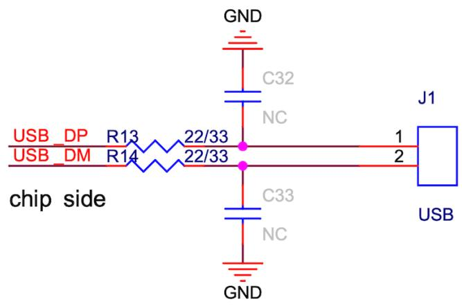  
Fig. 10: ESP32-S3 USB RC Schematic

Note that upon power-up, the $\mathrm { U S B } \_ { \mathrm { D + } }$ signal will fluctuate between high and low states. The high-level signal is relatively strong and requires a robust pull-down resistor to drive it low. Therefore, if you need a stable initial state, adding an external pull-up resistor is recommended to ensure a consistent high-level output voltage at startup.

ESP32-S3 also supports download functions and log message printing via USB. For details please refer to Section Download Guidelines.

When USB-OTG Download Boot mode is enabled, the chip initializes the IO pad connected to the external PHY in ROM when starts up. The status of each IO pad after initialization is as follows.

Table 12: IO Pad Status After Chip Initialization in the USB-OTG Download Boot Mode   

<table><tr><td rowspan=1 colspan=1>IO Pad</td><td rowspan=1 colspan=1>Input/Output Mode</td><td rowspan=1 colspan=1>Level Status</td></tr><tr><td rowspan=1 colspan=1>VP (MTMS)</td><td rowspan=1 colspan=1>INPUT</td><td rowspan=1 colspan=1></td></tr><tr><td rowspan=1 colspan=1>VM (MTDI)</td><td rowspan=1 colspan=1>INPUT</td><td rowspan=1 colspan=1>−</td></tr><tr><td rowspan=1 colspan=1>RCV (GPIO21)</td><td rowspan=1 colspan=1>INPUT</td><td rowspan=1 colspan=1>−</td></tr><tr><td rowspan=1 colspan=1>OEN (MTDO)</td><td rowspan=1 colspan=1>OUTPUT</td><td rowspan=1 colspan=1>HIGH</td></tr><tr><td rowspan=1 colspan=1>VPO (MTCK)</td><td rowspan=1 colspan=1>OUTPUT</td><td rowspan=1 colspan=1>LOW</td></tr><tr><td rowspan=1 colspan=1>VMO(GPI038)</td><td rowspan=1 colspan=1>OUTPUT</td><td rowspan=1 colspan=1>LOW</td></tr></table>

If the USB-OTG Download Boot mode is not needed, it is suggested to disable the USB-OTG Download Boot mode by setting the eFuse bit EFUSE_DIS_USB_OTG_DOWNLOAD_MODE to avoid IO pad state change.

# 1.3.14 Touch Sensor

ESP32-S3 has 14 capacitive-sensing GPIOs, which detect variations induced by touching or approaching the GPIOs with a finger or other objects. The low-noise nature of the design and the high sensitivity of the circuit allow relatively small pads to be used. Arrays of pads can also be used, so that a larger area or more points can be detected.

The touch sensing performance is further enhanced by the waterproof design and digital filtering feature.

Attention: ESP32-S3 touch sensor has not passed the Conducted Susceptibility (CS) test for now, and thus has limited application scenarios.

Table below shows the correspondence between touch sensor channels and GPIOs.

Table 13: Touch Sensor Functions   

<table><tr><td rowspan=1 colspan=1>GPIO Pin Name</td><td rowspan=1 colspan=1>Touch Sensor Function</td></tr><tr><td rowspan=1 colspan=1>GPIO1</td><td rowspan=1 colspan=1>TOUCH1</td></tr><tr><td rowspan=1 colspan=1>GPIO2</td><td rowspan=1 colspan=1>TOUCH2</td></tr><tr><td rowspan=1 colspan=1>GPIO3</td><td rowspan=1 colspan=1>TOUCH3</td></tr><tr><td rowspan=1 colspan=1>GPIO4</td><td rowspan=1 colspan=1>TOUCH4</td></tr><tr><td rowspan=1 colspan=1>GPIO5</td><td rowspan=1 colspan=1>TOUCH5</td></tr><tr><td rowspan=1 colspan=1>GPIO6</td><td rowspan=1 colspan=1>TOUCH6</td></tr><tr><td rowspan=1 colspan=1>GPIO7</td><td rowspan=1 colspan=1>TOUCH7</td></tr><tr><td rowspan=1 colspan=1>GPIO8</td><td rowspan=1 colspan=1>TOUCH8</td></tr><tr><td rowspan=1 colspan=1>GPIO9</td><td rowspan=1 colspan=1>TOUCH9</td></tr><tr><td rowspan=1 colspan=1>GPIO10</td><td rowspan=1 colspan=1>TOUCH10</td></tr><tr><td rowspan=1 colspan=1>GPIO11</td><td rowspan=1 colspan=1>TOUCH11</td></tr><tr><td rowspan=1 colspan=1>GPIO12</td><td rowspan=1 colspan=1>TOUCH12</td></tr><tr><td rowspan=1 colspan=1>GPIO13</td><td rowspan=1 colspan=1>TOUCH13</td></tr><tr><td rowspan=1 colspan=1>GPIO14</td><td rowspan=1 colspan=1>TOUCH14</td></tr></table>

Note that only GPIO14 (TOUCH14) can drive the shield electrode.

When using the touch function, it is recommended to populate a series resistor at the chip side to reduce the coupling noise and interference on the line, and to strengthen the ESD protection. The recommended resistance is from 470 $\Omega$ to $2 \ : \mathrm { k } \Omega$ , preferably $5 1 0 \Omega$ . The specific value depends on the actual test results of the product.

# 1.4 PCB Layout Design

This chapter introduces the key points of how to design an ESP32-S3 PCB layout using an ESP32-S3 module (see Figure ESP32-S3 Reference PCB Layout) as an example.

# 1.4.1 General Principles of PCB Layout for the Chip

It is recommended to use a four-layer PCB design:

• Layer 1 (TOP): Signal traces and components.   
• Layer 2 (GND): No signal traces here to ensure a complete GND plane.   
• Layer 3 (POWER): GND plane should be applied to better isolate the RF and crystal. Route power traces and a few signal traces on this layer, provided that there is a complete GND plane under the RF and crystal.   
• Layer 4 (BOTTOM): Route a few signal traces here. It is not recommended to place any components on this layer.

A two-layer PCB design can also be used:

• Layer 1 (TOP): Signal traces and components.   
• Layer 2 (BOTTOM): Do not place any components on this layer and keep traces to a minimum. Please make sure there is a complete GND plane for the chip, RF, and crystal.

# 1.4.2 Power Supply

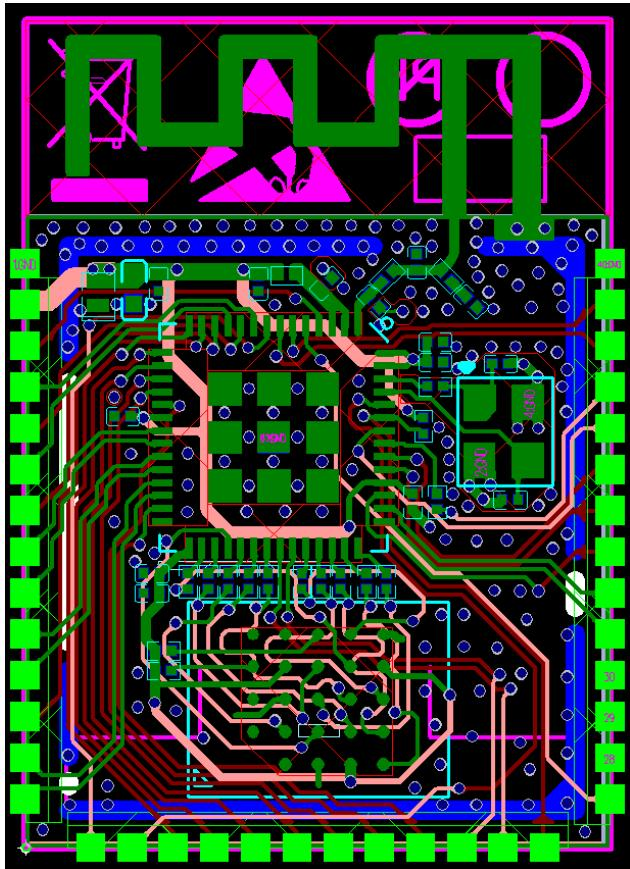  
Fig. 11: ESP32-S3 Reference PCB Layout

Four-Layer PCB Design

Figure ESP32-S3 Power Traces in a Four-Layer PCB Design shows the power traces in a four-layer PCB design.

• A four-layer PCB design is recommended. Whenever possible, route the power traces on the inner layers (not the ground layer) and connect them to the chip pins through vias. There should be at least two vias if the main power traces need to cross layers. The drill diameter on other power traces should be no smaller than the width of the power traces.   
• The $3 . 3 \mathrm { V }$ power traces, highlighted in yellow, are routed as shown in Figure ESP32-S3 Power Traces in a FourLayer PCB Design. The width of the main power traces should be no less than $2 5 \mathrm { { m i l } }$ . The width of VDD3P3 at pin2 and pin3 power traces should be no less than $2 0 \mathrm { { m i l } }$ . The recommended width of other power traces is $1 0 \mathrm { { m i l } }$ . Ensure the power traces are surrounded by ground copper.   
• The red circles in ESP32-S3 Power Traces in a Four-Layer PCB Design show ESD protection diodes. Place them close to the power input. Add a $1 0 \mu \mathrm { F }$ capacitor before the power trace enters the chip. You can also add a $0 . 1 \mu \mathrm { F }$ or $1 \mu \mathrm { F }$ capacitor in parallel. After that, the power trace can branch out in a star-shaped layout to reduce coupling between different power pins.   
• The power supply for pin2 and pin3 is RF related, so please place a $1 0 \mu \mathrm { F }$ capacitor for each pin. You can also add a $0 . 1 \mu \mathrm { F }$ or $1 \mu \mathrm { F }$ capacitor in parallel.   
• Add a CLC/LC filter circuit near pin2 and pin3 to suppress high-frequency harmonics.The power trace can be routed at a 45-degree angle to maintain distance from adjacent RF traces. Except for the $1 0 \mu \mathrm { F }$ capacitor, it is recommended to use 0201 components. This allows the filter circuit for pin2 and pin3 to be placed closer to the pins, with a GND isolation layer separating them from surrounding RF and GPIO traces, while also maximizing the placement of ground vias. Using 0201 components enables placing a via to the bottom layer at the first capacitor near the chip, while maintaining a keep-out area on other layers, further reducing harmonic interference. See Figure ESP32-S3 Power Traces in a Four-Layer PCB Design.   
• In Figure ESP32-S3 Power Traces in a Four-Layer PCB Design, the $1 0 \mu \mathrm { F }$ capacitor is shared by the analog power supply VDD3P3 at pin2 and pin3, and the power entrance since the analog power is close to the chip power entrance. If the chip power entrance is not near VDD3P3 at pin2 and pin3, it is recommended to add a $1 0 \mu \mathrm { F }$ capacitor to both the chip power entrance and VDD3P3 at pin2 and pin3.   
• Place appropriate decoupling capacitors at the rest of the power pins. Ground vias should be added close to the capacitor’s ground pad to ensure a short return path.   
• The ground pad at the bottom of the chip should be connected to the ground plane through at least nine ground vias.   
• The ground pads of the chip and surrounding circuit components should make full contact with the ground copper pour rather than being connected via traces.   
• If you need to add a thermal pad EPAD under the chip on the bottom of the module, it is recommended to employ a square grid on the EPAD, cover the gaps with solder paste, and place ground vias in the gaps, as shown in Figure ESP32-S3 Power Traces in a Four-Layer PCB Design. This helps effectively reduce solder leakage issues when soldering the module EPAD to the substrate.   
• For optimal grounding, connect the EPAD to a large external ground area using wide traces or copper planes. See the figure below.

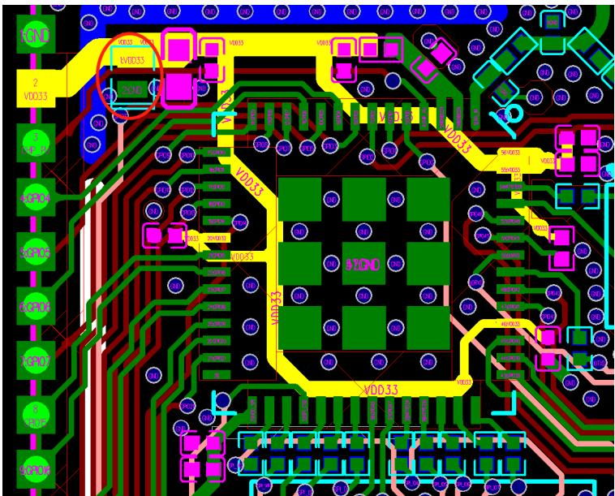  
Fig. 12: ESP32-S3 Power Traces in a Four-Layer PCB Design

# Two-Layer PCB Design

Figure ESP32 Power Traces in a Two-Layer PCB Design shows the power traces in a two-layer PCB design.

• For a two-layer design, ensure to provide a continuous reference ground for the chip, RF, and crystal oscillator, as shown in the figure above.   
• In the figure above, the trace VDD33 represents the $3 . 3 \mathrm { ~ V ~ }$ power trace. Unlike a four-layer design, the power trace should be routed on the top layer as much as possible. Therefore, the thermal pad in the center of the chip should be reduced in size, allowing the power trace to pass between the signal pads and the thermal pad. Vias to the bottom layer should only be used when absolutely necessary.   
• Other layout considerations are the same as for a four-layer design.   
• Note that there are no official two-layer modules. The figure above uses the ESP32 module as an example.

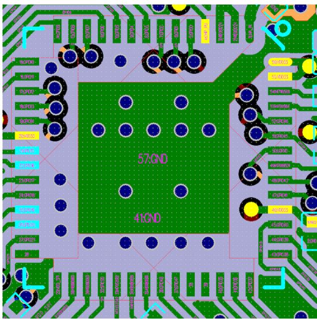  
Fig. 13: ESP32-S3 EPAD Design at Chip Bottom

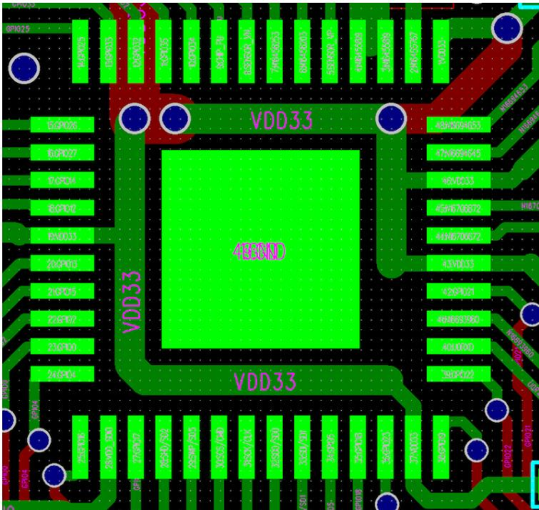  
Fig. 14: ESP32 Power Traces in a Two-Layer PCB Design

# 1.4.3 Crystal

Figure ESP32-S3 Crystal Layout (with Keep-out Area on Top Layer) shows a reference PCB layout where the crystal is connected to the ground through vias and a keep-out area is maintained around the crystal on the top layer for ground isolation.

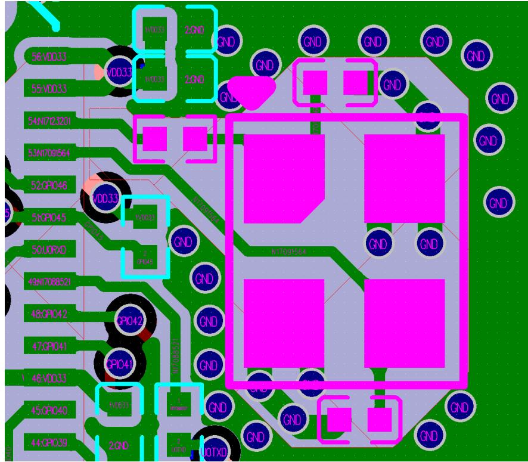  
Fig. 15: ESP32-S3 Crystal Layout (with Keep-out Area on Top Layer)

Figure ESP32-S3 Crystal Layout (without Keep-out Area on Top Layer) shows the layout for the crystal that is connected to the ground through vias but there is no keep-out area on the top layer for ground isolation.

If there is sufficient ground on the top layer, it is recommended to maintain a keep-out area around the crystal for ground isolation. This helps to reduce the value of parasitic capacitance and suppress temperature conduction, which can otherwise affect the frequency offset. If there is no sufficient ground, do not maintain any keep-out area.

The layout of the crystal should follow the guidelines below:

• Ensure a complete GND plane for the RF, crystal, and chip.   
• The crystal should be placed far from the clock pin to avoid interference on the chip. The gap should be at least $2 . 0 \mathrm { m m }$ . It is good practice to add high-density ground vias stitching around the clock trace for better isolation.   
• There should be no vias for the clock input and output traces.   
• Components in series to the crystal trace should be placed close to the chip side.   
• The external matching capacitors should be placed on the two sides of the crystal, preferably at the end of the clock trace, but not connected directly to the series components. This is to make sure the ground pad of the capacitor is close to that of the crystal.   
• Do not route high-frequency digital signal traces under the crystal. It is best not to route any signal trace under the crystal. The vias on the power traces on both sides of the crystal clock trace should be placed as far away from the clock trace as possible, and the two sides of the clock trace should be surrounded by ground copper.   
• As the crystal is a sensitive component, do not place any magnetic components nearby that may cause interference, for example large inductance component, and ensure that there is a clean large-area ground plane around the crystal.

# 1.4.4 RF

The RF trace is routed as shown highlighted in pink in Figure ESP32-S3 RF Layout in a Four-layer PCB Design.

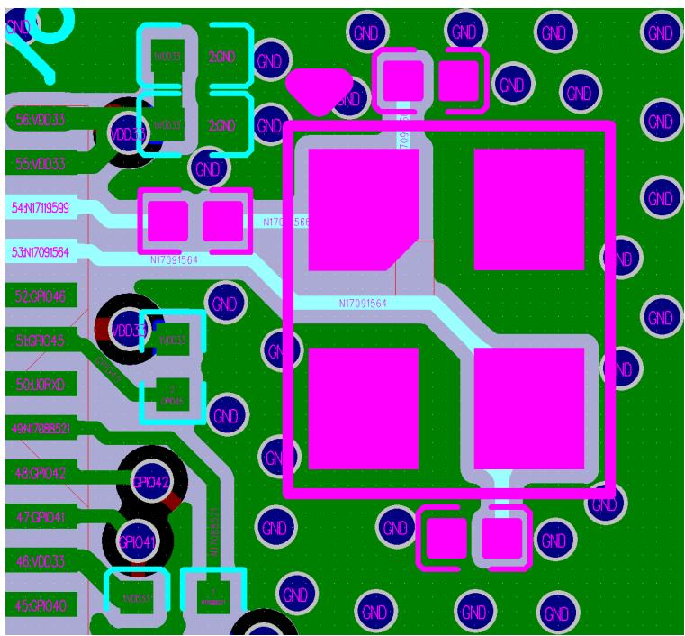  
Fig. 16: ESP32-S3 Crystal Layout (without Keep-out Area on Top Layer)

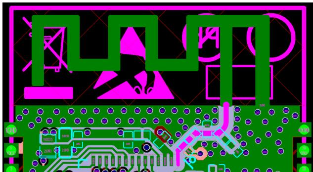  
Fig. 17: ESP32-S3 RF Layout in a Four-layer PCB Design

The RF layout should meet the following guidelines:

• The RF trace should have a $5 0 \Omega$ characteristic impedance. The reference plane is the layer next to the chip. For designing the RF trace at $5 0 \Omega$ impedance, you could refer to the PCB stack-up design shown below.

<table><tr><td rowspan=1 colspan=1>Thickness (mm)</td><td rowspan=1 colspan=1>Impedance (Ohm)</td><td rowspan=1 colspan=1>Gap (mil)</td><td rowspan=1 colspan=1>Width (mil)</td><td rowspan=1 colspan=1>Gap (mil)</td></tr><tr><td rowspan=1 colspan=1></td><td rowspan=1 colspan=1>50</td><td rowspan=1 colspan=1>12.2</td><td rowspan=1 colspan=1>12.6</td><td rowspan=1 colspan=1>12.2</td></tr></table>

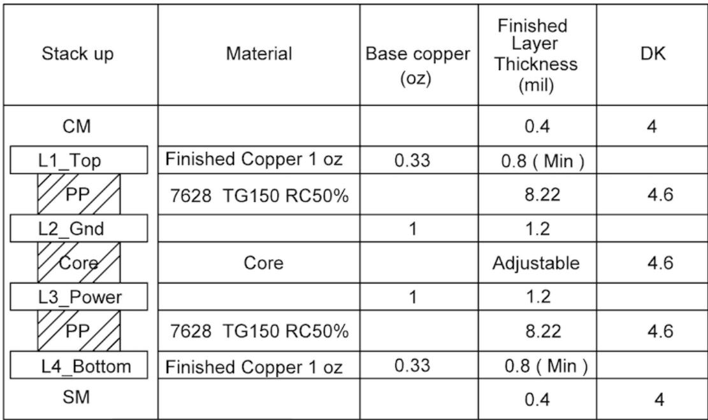  
Fig. 18: ESP32-S3 PCB Stack-up Design

• A CLC matching circuit is required for chip tuning. Please use 0201 components and place them close to the pin in a zigzag. In other words, the two capacitors should not be oriented in the same direction to minimize interference.

• Add a stub on the grounding capacitor near the chip side in the CLC matching circuit to suppress the second harmonics. It is preferable to keep the stub length $1 5 \mathrm { { m i l } }$ , and determine the stub width according to the PCB stack-up so that the characteristic impedance of the stub is $1 0 0 \Omega \pm 1 0 \%$ . In addition, please connect the stub via to the third layer, and maintain a keep-out area on the first and second layers. The trace highlighted in figure below is the stub. Note that a stub is not required for package types of 0402 and above.

• It is recommended to keep all layers clear under the IPEX antenna connector. See Figure ESP32-S3 IPEX Layout.

• For PCB antennas, make sure to validate them through both simulation and real-world testing on a development board. It is recommended to include an additional CLC matching circuit for antenna tuning. Place this circuit as close to the antenna as possible.

• The RF trace should have a consistent width and not branch out. It should be as short as possible with dense ground vias around for interference shielding.

• The RF trace should be routed on the outer layer without vias, i.e., should not cross layers. The RF trace should be routed at a $1 3 5 ^ { \circ }$ angle, or with circular arcs if trace bends are required.

• The ground plane on the adjacent layer needs to be complete. Do not route any traces under the RF trace whenever possible.

• There should be no high-frequency signal traces routed close to the RF trace. The RF antenna should be placed away from high-frequency components, such as crystals, DDR SDRAM, high-frequency clocks, etc. In addition, the USB port, USB-to-serial chip, UART signal lines (including traces, vias, test points, header pins, etc.) must be as far away from the antenna as possible. The UART signal line should be surrounded by ground copper and ground vias.

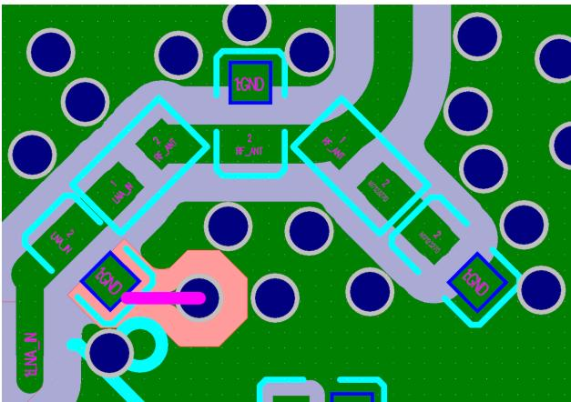  
Fig. 19: ESP32-S3 Stub in a Four-layer PCB Design

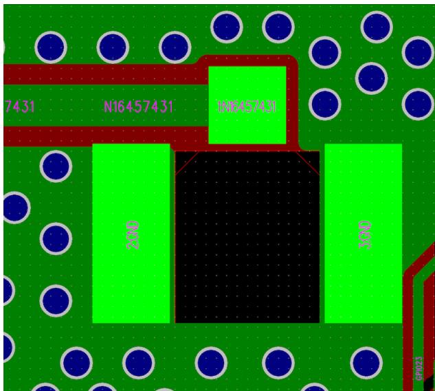  
Fig. 20: ESP32-S3 IPEX Layout

# 1.4.5 Flash and PSRAM

The layout for flash and PSRAM should follow the guidelines below:

• Place the zero-ohm resistors in series on the SPI lines close to ESP32-S3.   
• Route the SPI traces on the inner layer (e.g., the third layer) whenever possible, and add ground copper and ground vias around the clock and data traces of SPI separately.   
• Octal SPI traces should have matching lengths.   
• If the flash and PSRAM are located far from ESP32-S3, it is recommended to place appropriate decoupling capacitors both at VDD_SPI and near the flash and PSRAM power supply.

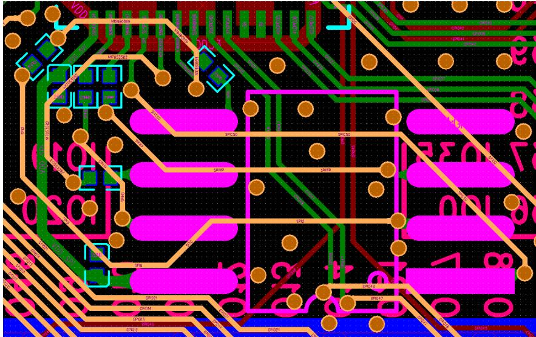  
Figure ESP32-S3 Quad SPI Flash Layout shows the quad SPI flash layout.   
Fig. 21: ESP32-S3 Quad SPI Flash Layout

Figure ESP32-S3 Octal SPI Flash Layout shows the octal SPI flash layout.

# 1.4.6 UART

Figure ESP32-S3 UART Layout shows the UART layout.

The UART layout should meet the following guidelines:

• The series resistor on the U0TXD trace needs to be placed close to the chip side and away from the crystal.   
• The U0TXD and U0RXD traces on the top layer should be as short as possible.   
• The UART trace should be surrounded by ground copper and ground vias stitching.

# 1.4.7 General Principles of PCB Layout for Modules (Positioning a Module on a Base Board)

If module-on-board design is adopted, attention should be paid while positioning the module on the base board. The interference of the baseboard on the module’s antenna performance should be minimized.

It is suggested to place the module’s on-board PCB antenna outside the base board, and the feed point of the antenna close to the edge of the base board. In the following example figures, positions with mark $\checkmark$ are strongly recommended, while positions without a mark are not recommended.

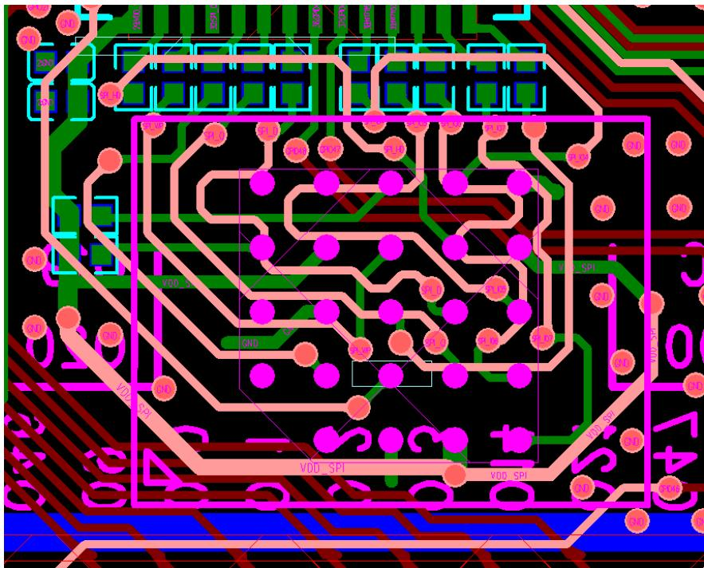  
Fig. 22: ESP32-S3 Octal SPI Flash Layout

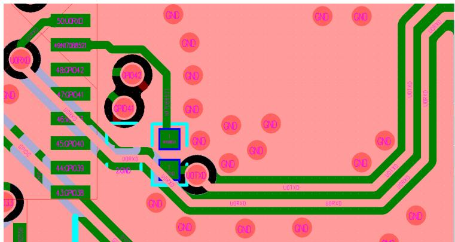  
Fig. 23: ESP32-S3 UART Layout

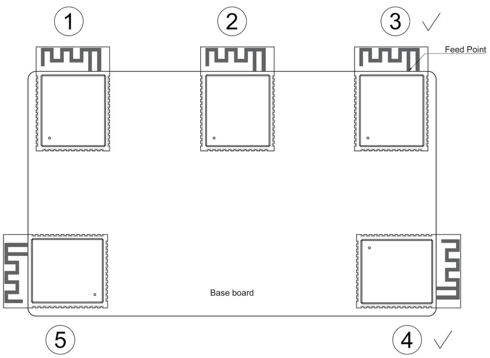  
Fig. 24: Placement of ESP32-S3 Modules on Base Board (antenna feed point on the right)

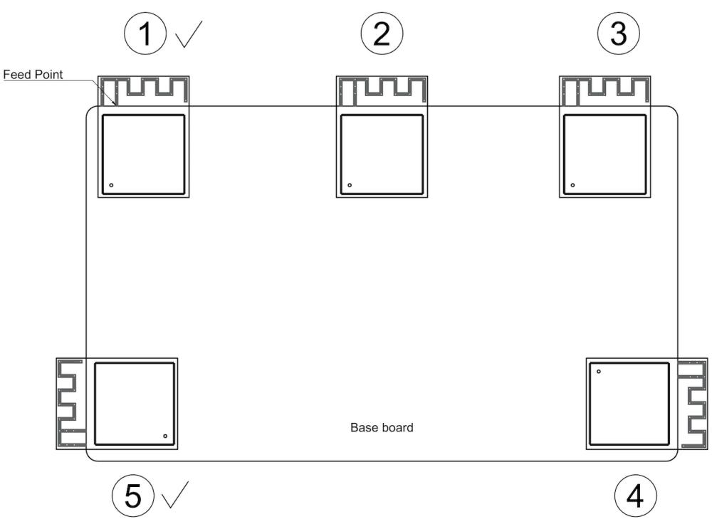  
Fig. 25: Placement of ESP32-S3 Modules on Base Board (antenna feed point on the left)

If the PCB antenna cannot be placed outside the board, please ensure a clearance of at least $1 5 \mathrm { m m }$ (in all directions) around the antenna area (no copper, routing, or components on it), and place the feed point of the antenna closest to the board. If there is a base board under the antenna area, it is recommended to cut it off to minimize its impact on the antenna. Figure Keepout Zone for ESP32-S3 Module’s Antenna on the Base Board shows the suggested clearance for modules whose antenna feed point is on the right.

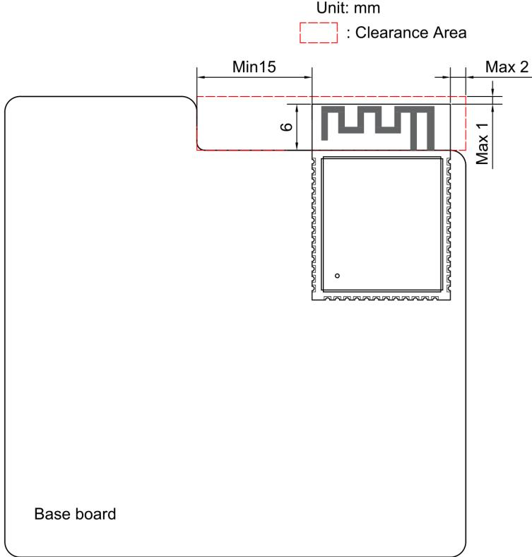  
Fig. 26: Keepout Zone for ESP32-S3 Module’s Antenna on the Base Board

When designing an end product, attention should be paid to the interference caused by the housing of the antenna and it is recommended to carry out RF verification. It is necessary to test the throughput and communication signal range of the whole product to ensure the product’s actual RF performance.

# 1.4.8 USB

The USB layout should meet the following guidelines:

• Reserve space for resistors and capacitors on the USB traces close to the chip side.   
• Use differential pairs and route them in parallel at equal lengths. Maintain a differential pair impedance of 90 $\Omega$ with a tolerance of $\pm 1 0 \%$ .   
• USB differential traces should minimize via transitions as much as possible to ensure better impedance control and avoid signal reflections. If vias are necessary, add a pair of ground return vias at each transition point.   
• Ensure there is a continuous reference layer (a ground layer is recommended) beneath the USB traces.   
• Surround the USB traces with ground copper.

# 1.4.9 SDIO

The SDIO layout should follow the guidelines below:

• Minimize parasitic capacitance of SDIO traces as they involve high-speed signals. • The trace lengths for SDIO_CMD and SDIO_DATA0 \~ SDIO_DATA3 should be within $\pm \ 5 0 \ \mathrm { m i l }$ of the SDIO_CLK trace length. Use serpentine routing if necessary.

• For SDIO routing, maintain a $5 0 \Omega$ single-ended impedance with a tolerance of $\pm 1 0 \%$ .   
• Keep the total trace length from SDIO GPIOs to the master SDIO interface as short as possible, ideally within 2000 mil.   
• Ensure that SDIO traces do not cross layers. Besides, a reference plane (preferably a ground plane) must be placed beneath the traces, and continuity of the reference plane must be ensured.   
• It is recommended to surround the SDIO_CLK trace with ground copper.

# 1.4.10 Touch Sensor

ESP32-S3 offers up to 14 capacitive IOs that detect changes in capacitance on touch sensors due to finger contact or proximity. The chip’s internal capacitance detection circuit features low noise and high sensitivity. It allows to use touch pads with smaller area to implement the touch detection function. You can also use the touch panel array to detect a larger area or more test points.

Figure ESP32-S3 Typical Touch Sensor Application depicts a typical touch sensor application.

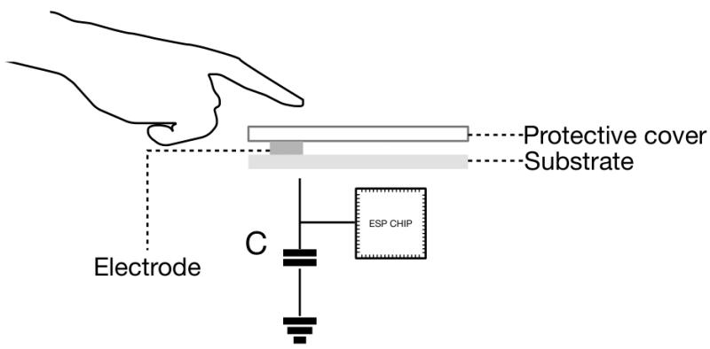  
Fig. 27: ESP32-S3 Typical Touch Sensor Application

To prevent capacitive coupling and other electrical interference to the sensitivity of the touch sensor system, the following factors should be taken into account.

# Electrode Pattern

The proper size and shape of an electrode improves system sensitivity. Round, oval, or shapes similar to a human fingertip are commonly applied. Large size or irregular shape might lead to incorrect responses from nearby electrodes.

Figure ESP32-S3 Electrode Pattern Requirements shows the proper and improper size or shape of electrode. Please note that the examples illustrated in the figure are not of actual scale. It is suggested to use a human fingertip as reference.

# PCB Layout

Figure ESP32-S3 Sensor Track Routing Requirements illustrates the general guidelines to routing traces. Specifically,

• The trace should be as short as possible and no longer than $3 0 0 \mathrm { m m }$ .   
• The trace width (W) can not be larger than $0 . 1 8 \mathrm { m m }$ (7 mil).   
• The alignment angle (R) should not be less than $9 0 ^ { \circ }$ .   
• The trace-to-ground gap (S) should be in the range of $0 . 5 \mathrm { m m }$ to $1 \mathrm { m m }$ .   
• The electrode diameter (D) should be in the range of $8 \mathrm { m m }$ to $1 5 \mathrm { m m }$ .   
• Hatched ground should be added around the electrodes and traces.   
• The traces should be isolated well and routed away from that of the antenna.

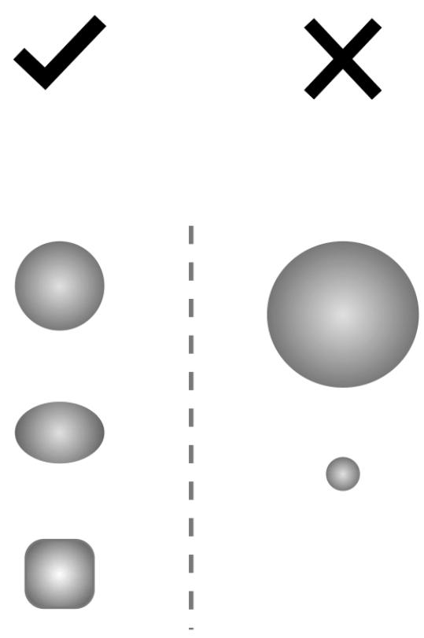  
Fig. 28: ESP32-S3 Electrode Pattern Requirements

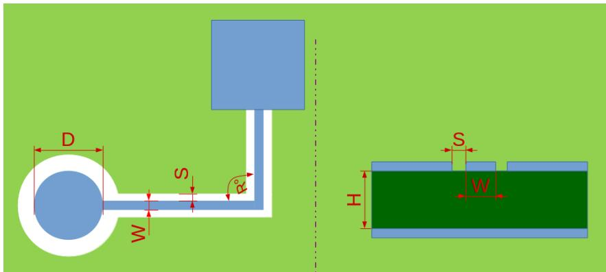  
Fig. 29: ESP32-S3 Sensor Track Routing Requirements

# Waterproof and Proximity Sensing Design

ESP32-S3 touch sensor has a waterproof design and features proximity sensor function. Figure ESP32-S3 Waterproof and Proximity Sensing Design shows an example layout of a waterproof and proximity sensing design.

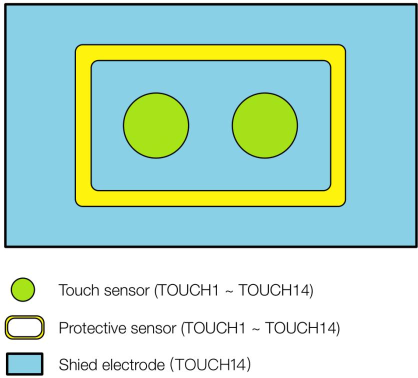  
Fig. 30: ESP32-S3 Waterproof and Proximity Sensing Design

Note the following guidelines to better implement the waterproof and proximity sensing design:

• The recommended width of the shield electrode width is $2 \mathrm { c m }$ .   
• Employ a grid on the top layer with a trace width of 7 mil and a grid width of $4 5 \mathrm { m i l }$ ( $2 5 \%$ fill). The filled grid is connected to the driver shield signal.   
• Employ a grid on the bottom layer with a trace width of $7 \mathrm { m i l }$ and a grid width of $7 0 \mathrm { m i l }$ $1 7 \%$ fill). The filled grid is connected to the driver shield signal.   
• The protective sensor should be in a rectangle shape with curved edges and surround all other sensors.   
• The recommended width of the protective sensor is $2 \mathrm { m m }$ .   
• The recommended gap between the protective sensor and shield sensor is $1 \mathrm { m m }$ .   
• The sensing distance of the proximity sensor is directly proportional to the area of the proximity sensor. However, increasing the sensing area will introduce more noise. Actual testing is needed for optimized performance.   
• It is recommended that the shape of the proximity sensor is a closed loop. The recommended width is $1 . 5 \mathrm { m m }$ .

# 1.4.11 Typical Layout Problems and Solutions

When ESP32-S3 sends data packages, the voltage ripple is small, but RF TX performance is poor.

Analysis: The RF TX performance can be affected not only by voltage ripples, but also by the crystal itself. Poor quality and big frequency offsets of the crystal decrease the RF TX performance. The crystal clock may be corrupted by other interfering signals, such as high-speed output or input signals. In addition, high-frequency signal traces, such as the SDIO traces and UART traces under the crystal, could also result in the malfunction of the crystal. Besides, sensitive components or radiating components, such as inductors and antennas, may also decrease the RF performance.

Solution: This problem is caused by improper layout for the crystal and can be solved by re-layout. Please refer to Section Crystal for details.

When ESP32-S3 sends data packages, the power value is much higher or lower than the target power value, and the EVM is relatively poor.

Analysis: The disparity between the tested value and the target value may be due to signal reflection caused by the impedance mismatch on the transmission line connecting the RF pin and the antenna. Besides, the impedance mismatch will affect the working state of the internal PA, making the PA prematurely access the saturated region in an abnormal way. The EVM becomes poor as the signal distortion happens.

Solution: Match the antenna’s impedance with the $\pi$ -type circuit on the RF trace, so that the impedance of the antenna as seen from the RF pin matches closely with that of the chip. This reduces reflections to the minimum.

TX performance is not bad, but the RX sensitivity is low.

Analysis: Good TX performance indicates proper RF impedance matching. Poor RX sensitivity may result from external coupling to the antenna. For instance, the crystal signal harmonics could couple to the antenna. If the TX and RX traces of UART cross over with RF trace, they will affect the RX performance, as well. If there are many high-frequency interference sources on the board, signal integrity should be considered.

Solution: Keep the antenna away from crystals. Do not route high-frequency signal traces close to the RF trace.   
Please refer to Section $R F$ for details.

# 1.5 Download Guidelines

You can download firmware to ESP32-S3 via UART and USB.

To download via UART:

1. Before the download, make sure to set the chip or module to Joint Download Boot mode, according to Table Boot Mode Control.   
2. Power up the chip or module and check the log via the UART0 serial port. If the log shows “waiting for download”, the chip or module has entered Joint Download Boot mode.   
3. Download your firmware into flash via UART using the Flash Download Tool.   
4. After the firmware has been downloaded, pull GPIO0 high or leave it floating to make sure that the chip or module enters SPI Boot mode.   
5. Power up the chip or module again. The chip will read and execute the new firmware during initialization.

To download via USB:

1. If the flash is empty, set the chip or module to Joint Download Boot mode, according to Table Boot Mode Control.   
2. Power up the chip or module and check the log via USB serial port. If the log shows “waiting for download” , the chip or module has entered Joint Download Boot mode.   
3. Download your firmware into flash via USB using Flash Download Tool.   
4. After the firmware has been downloaded, pull GPIO0 high or leave it floating to make sure that the chip or module enters SPI Boot mode.   
5. Power up the chip or module again. The chip will read and execute the new firmware during initialization.   
6. If the flash is not empty, start directly from Step 3.

# Note:

• It is advised to download the firmware only after the “waiting for download”log shows via the serial port.   
• Serial tools cannot be used simultaneously with the Flash Download Tool on one COM port.

• The USB auto-download will be disabled if the following conditions occur in the application, where it will be necessary to set the chip or module to Joint Download Boot mode first by configuring the strapping pin.

– USB PHY is disabled by the application;   
– USB is secondary developed for other USB functions, e.g., USB host, USB standard device;   
– USB IOs are configured to other peripherals, such as UART and LEDC.

• It is recommended that the user retains control of the strapping pins to avoid the USB download function not being available in case of the above scenario.

# 1.6 Related Documentation and Resources

# 1.6.1 ESP32-S3 Modules

For a list of ESP32-S3 modules please check the Modules section on Espressif’s official website.

For module reference designs please refer to:

• Download links

Note: Use the following tools to open the files in module reference designs:

• .DSN files: OrCAD Capture V16.6   
• .pcb files: Pads Layout VX.2. If you cannot open the .pcb files, please try importing the .asc files into your software to view the PCB layout.

# 1.6.2 ESP32-S3 Development Boards

For a list of the latest designs of ESP32-S3 boards please check the Development Boards section on Espressif’s official website.

# 1.6.3 Other Related Documentation and Resources

• Chip Datasheet (PDF)   
• Technical Reference Manual (PDF)   
• Chip Errata   
• ESP32-S3 Chip Variants   
• Espressif KiCad Library   
• ESP Product Selector   
• Regulatory Certificates   
• User Forum (Hardware)   
• Technical Support   
• ESP-FAQ

# 1.7 Glossary

The glossary contains terms and acronyms that are used in this document.

<table><tr><td rowspan=1 colspan=1>Term</td><td rowspan=1 colspan=1>Description</td></tr><tr><td rowspan=1 colspan=1>CLC</td><td rowspan=1 colspan=1>Capacitor-Inductor-Capacitor</td></tr><tr><td rowspan=1 colspan=1>DDR SDRAM</td><td rowspan=1 colspan=1>Double Data Rate Synchronous Dynamic Random-Access Memory</td></tr><tr><td rowspan=1 colspan=1>ESD</td><td rowspan=1 colspan=1>Electrostatic Discharge</td></tr><tr><td rowspan=1 colspan=1>LC</td><td rowspan=1 colspan=1>Inductor-Capacitor</td></tr><tr><td rowspan=1 colspan=1>PA</td><td rowspan=1 colspan=1>Power Amplifier</td></tr><tr><td rowspan=1 colspan=1>RC</td><td rowspan=1 colspan=1>Resistor-Capacitor</td></tr><tr><td rowspan=1 colspan=1>RTC</td><td rowspan=1 colspan=1>Real-Time Clock</td></tr><tr><td rowspan=1 colspan=1>Zero-ohm resistor</td><td rowspan=1 colspan=1>A zero-ohm resistor acts as a placeholder in the circuit, allowing for the replacement witha higher-ohm resistor based on specific design requirements.</td></tr></table>

# 1.8 Revision History

Table 14: Revision History   

<table><tr><td rowspan=1 colspan=3>2025-07-03          v1.8Schematic ChecklistSection Overview:Updated Figure ESP32-S3 ReferenceSchematicSection Power Supply: Added Figure ESP32-S3 PowerScheme; deleted Figure ESP32-S3 Schematic for Digital PowerSupply Pins and the RTC Power Supply section; updated de-scriptionsSection External Crystal Clock Source (Compulsory): UpdatedFigure ESP32-3 Schematic for External CrystalSection RF Tuning: Updated descriptionsSection UART: Updated descriptionsSection Strapping Pins: Updated descriptionsSection GPIO: Simplified Table IO Pin Default ConfigurationSection ADC: Added Table ADC FunctionsSection USB: Added Figure ESP32-S3 USB RC SchematicSection Touch Sensor: Added Table Touch Sensor Functions;updated descriptionsPCB Layout DesignSection Power Supply: Restructured the section and updateddescriptionsSection RF: Updated Figure ESP32-S3 PCB Stack-up Design;added Figure ESP32-S3 IPEX Layout; updated descriptionsSection RF Circuit: Updated Figure ESP32-S3 Schematic forRF Matching</td></tr><tr><td rowspan=1 colspan=1>2025-06-05</td><td rowspan=1 colspan=1>v1.7</td><td rowspan=1 colspan=1>PCB Layout DesignSection USB: Updated descriptions about the USB layoutguidelines</td></tr><tr><td rowspan=1 colspan=1>2025-05-23</td><td rowspan=1 colspan=1>v1.6</td><td rowspan=1 colspan=1>PCB Layout Design Section SDIO: Updated descriptions about the SDIO layoutguidelinesSection Crystal: Updated descriptions about the crystal layoutguidelines</td></tr><tr><td rowspan=1 colspan=1>2025-04-02</td><td rowspan=1 colspan=1>v1.5</td><td rowspan=1 colspan=1>Schematic Checklist Section Strapping Pins: Updated Table Boot Mode Control</td></tr><tr><td rowspan=1 colspan=1>2025-01-07</td><td rowspan=1 colspan=1>v1.4</td><td rowspan=1 colspan=1>ESP32-S3 Modules:- Added download links to module reference designs</td></tr><tr><td rowspan=1 colspan=1>2024-11-15</td><td rowspan=1 colspan=1>v1.3</td><td rowspan=1 colspan=1>Schematic Checklist Section SPI: Newly added section</td></tr><tr><td rowspan=1 colspan=1>2024-01-09</td><td rowspan=1 colspan=1>v1.2</td><td rowspan=1 colspan=1>Schematic Checklist Section RF Tuning: Updated RF matching description</td></tr><tr><td rowspan=1 colspan=1>2023-12-25</td><td rowspan=1 colspan=1>v1.1</td><td rowspan=1 colspan=1>PCB Layout Design Section Crystal: Updated crystal PCB layout</td></tr><tr><td rowspan=1 colspan=1>2023-12-22</td><td rowspan=1 colspan=1>v1.0</td><td rowspan=1 colspan=1>Migrated ESP32-S3 Hardware Design Guidelines from PDF to HTML for-</td></tr><tr><td rowspan=1 colspan=1>Espressif Systems</td><td rowspan=1 colspan=1></td><td rowspan=1 colspan=1>mat. During the migration from PDF to HTML format, minorRdatematerprovsunfit DdclanientipreeuøacRade throughout the documentation. Ifyou would like to check previous versions of the document, please submit doc-umentation feedback.</td></tr></table>

# 1.9 Disclaimer and Copyright Notice

Information in this document, including URL references, is subject to change without notice.

All third party’s information in this document is provided as is with no warranties to its authenticity and accuracy.

No warranty is provided to this document for its merchantability, non-infringement, fitness for any particular purpose, nor does any warranty otherwise arising out of any proposal, specification or sample.

All liability, including liability for infringement of any proprietary rights, relating to use of information in this document is disclaimed. No licenses express or implied, by estoppel or otherwise, to any intellectual property rights are granted herein.

The Wi-Fi Alliance Member logo is a trademark of the Wi-Fi Alliance. The Bluetooth logo is a registered trademark of Bluetooth SIG.

All trade names, trademarks and registered trademarks mentioned in this document are property of their respective owners, and are hereby acknowledged.