# ESP32-S3 Espressif Product Packaging Information

# Table of contents

Table of contents i

1 ESP32-S3 Chip Packaging Information 1   
1.1 Chip Silk Marking . 1   
1.2 Chip Packing 5   
1.3 Dry Packing Requirement 9   
2 ESP32-S3 Module Packaging Information 10   
2.1 Module Silk Marking 11   
2.2 Module Packing 13   
2.3 Dry Packing Requirement 17   
3 Disclaimer and Copyright Notice 19

This document summarizes the packaging requirements of Espressif’s ESP32-S3 series of products, including the product silk marking, dry-packing requirements, and product packing.

# ESP32-S3 Chip Packaging Information

This document summarizes the packaging requirements of Espressif’s ESP32-S3 series of chips, including the chip silk marking, dry-packing requirements, and chip product packing.

# 1.1 Chip Silk Marking

Espressif chip silk marking provides information such as chip name, flash size, and operating temperature.

# Marking Convention

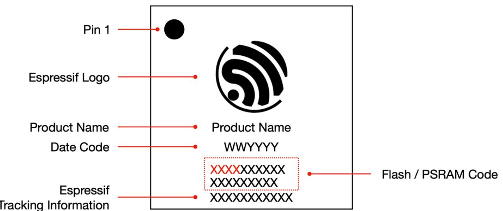  
Fig. 1: Chip Silk Marking Diagram

• Pin 1: Position of Pin 1.

• Espressif Logo: Company logo.

• Product Name: Specifies the chip name.

• Date Code: WW is the week number of year YYYY. Example: Date Code “122017”stands for the 12th week of year 2017.

• Flash Code is a code that indicates: – (Optional) Temperature and flash size. – The tracking information of the in-package flash.

The arrangement of the flash code can vary by product. Please see Flash Code and PSRAM Code Conventions for details.

• PSRAM Code is a code that indicates: – (Optional) Temperature and PSRAM size.

– The tracking information of the in-package PSRAM. The arrangement of the PSRAM code can vary by product. Please see Flash Code and PSRAM Code Conventions for details.

• Espressif Tracking Information: The second character of this code correlates to the chip revision. See the detailed mapping in ESP Chip Errata.

# Flash Code and PSRAM Code Conventions

Based on the in-package flash or PSRAM, ESP32-S3 chips can be divided into the following categories.

No Flash, No PSRAM This section applies to ESP32-S3 chips without any in-package flash or PSRAM. For such chips, flash code and PSRAM code are simply left empty.

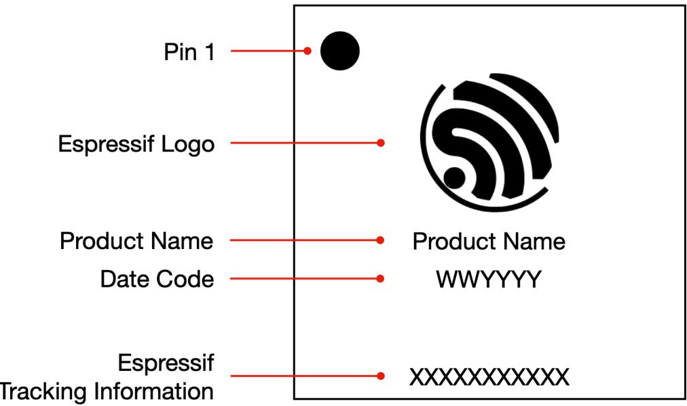  
Fig. 2: Flash Code and PSRAM Code Diagram - No Flash, No PSRAM

In-package Flash, No PSRAM This section applies to ESP32-S3 chips with only in-package flash. For such chips, only the flash code is used. PSRAM code is left empty.

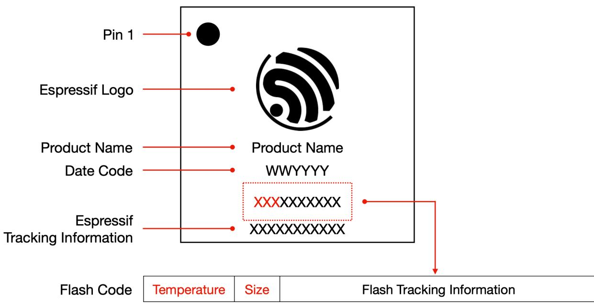  
Fig. 3: Flash Code and PSRAM Code Diagram - In-package Flash, No PSRAM

• (Optional) Temperature (2 characters): – FH: $1 0 5 ~ ^ { \circ } \mathrm { C }$ – FN: 85 °C

• (Optional) Size (1 character): – 2: 2 MB – 4: 4 MB – 8: 8 MB

• Flash Tracking Information (7 characters).

In-package PSRAM, No Flash This section applies to ESP32-S3 chips with only in-package PSRAM. For such chips, only the PSRAM code is used.

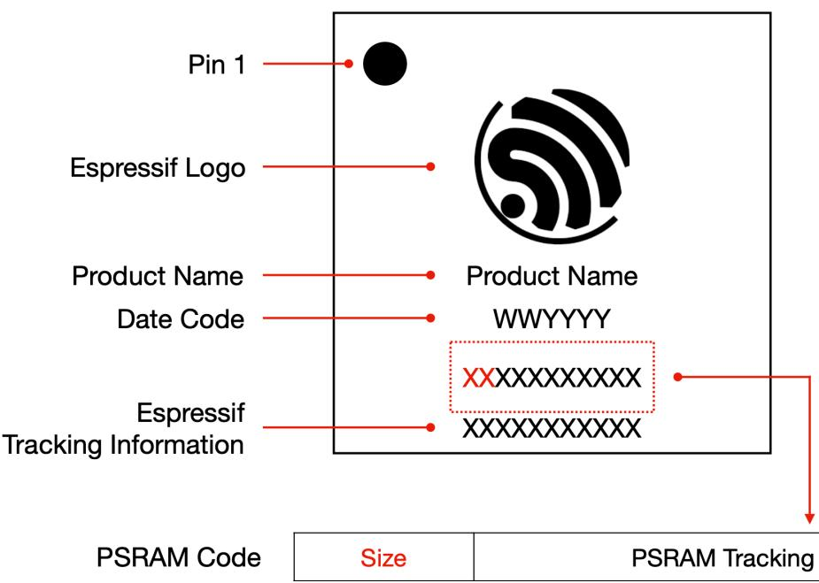  
Fig. 4: Flash Code and PSRAM Code Diagram - In-package PSRAM, No Flash

• Size (2 or 3 characters): – R2: 2 MB, $- 4 0 \ ^ { \circ } \mathbf { C } \sim 8 5 \ ^ { \circ } \mathbf { C }$ – R8: 8 MB, $- 4 0 \ ^ { \circ } \mathbf { C } \sim 8 5 \ ^ { \circ } \mathbf { C }$ – RH2: 2 MB, ${ \bf \Gamma } - 4 0 { \bf \Lambda } ^ { \circ } { \bf C } \sim 1 0 5 { \bf \Lambda } ^ { \circ } { \bf C }$ – RH8: 8 MB, ${ \bf \Gamma } - 4 0 { \bf \Lambda } ^ { \circ } { \bf C } \sim 1 0 5 { \bf \Lambda } ^ { \circ } { \bf C }$ • PSRAM Tracking Information (9 characters).

Note: ESP32-S3R8V and ESP32-S3R16V have an additional character (V) between the Size field and PSRAM Tracking Information field, indicating that this is a 1.8 V PSRAM.

In-package Flash, In-package PSRAM This section applies to ESP32-S3 chips with both in-package flash and PSRAM. For such chips, both flash code and PSRAM code are used.

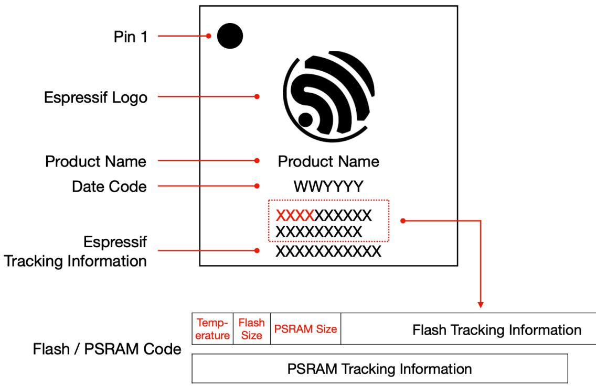  
Fig. 5: Flash Code and PSRAM Code Diagram - In-package Flash, In-package PSRAM

• (Optional) Temperature (1 character): – H: $1 0 5 ~ ^ { \circ } \mathrm { C }$ – N: 85 °C

• (Optional) Flash Size (1 character): – 4: 4 MB – 8: 8 MB

• (Optional) PSRAM Size (2 characters): – R2: 2 MB – R8: 8 MB

• Flash Tracking Information (7 characters).

• PSRAM Tracking Information (9 characters).

# Note:

• For ESP32-S3FH4R2, the Flash/PSRAM Code line is FH4R2;   
• For ESP32-S3-PICO-1-N8R2, the Flash/PSRAM Code line is N8R2;   
• For ESP32-S3-PICO-1-N8R8, the Flash/PSRAM Code line is N8R8.

# 1.2 Chip Packing

Espressif chips are packed on tape and reel. Then the reel is packed in an aluminum moisture barrier bag (MBB) in vacuum state to protect chips from absorbing moisture during transportation and storage. At last, the MBB is packed into a pizza box.

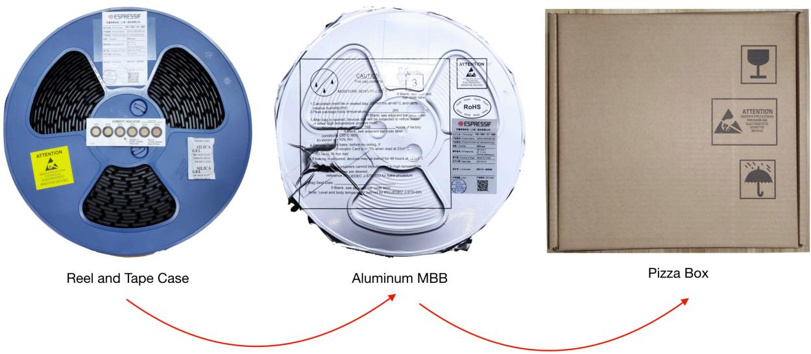  
Fig. 6: Espressif Product Packing Method

Note: The figure(s) above is for illustration purposes only. Actual product may vary.

Tape

This section introduces the dimensions of the carrier tape.

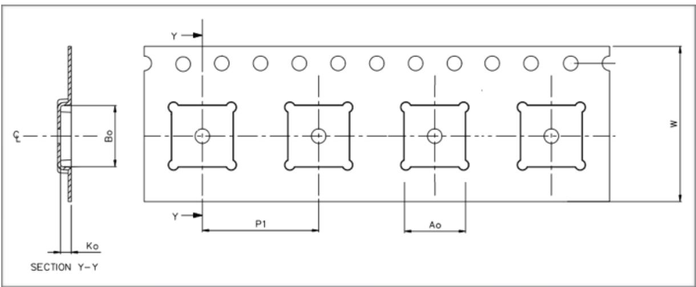

Table 1: Carrier Tape Dimensions (Unit: mm)   

<table><tr><td>Package</td><td>Carrier Width (W)</td><td>Cavity Pitch (P 1)</td><td>Cavity Width (A 0)</td><td>Cavity Length (B 0)</td></tr><tr><td>7 *7</td><td>16.0 ± 0.30</td><td>12.0 ± 0.10</td><td>7.30 ± 0.10</td><td>7.30 ± 0.10</td></tr></table>

Note: The surface resistance of the carrier tape is 10 4 \~ 10 11 ohms.

# Pin1 Location

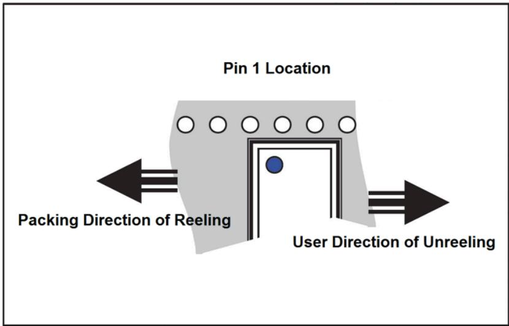  
Fig. 7: Pin 1 Orientation of Chips in Carrier Tape

# Reel

This section introduces the dimensions of the reel.

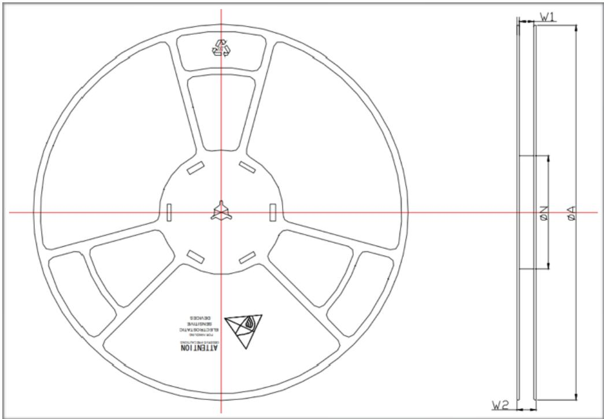

Table 2: Reel Dimensions   

<table><tr><td>Package</td><td>Reel Size</td><td>Quantity Per Reel</td></tr><tr><td>7 *7</td><td>13&#x27;&#x27;</td><td>2,000</td></tr></table>

Note: The surface resistance of the carrier tape is 10 4 \~ 10 11 ohms.

# Pizza Box

Inside of the pizza box of typical Espressif chips, together with the tape and reel, product label and dry-packing related items are also packed.

This section describes the product label. For information about dry packing related items, please go to Section Dry Packing Requirement.

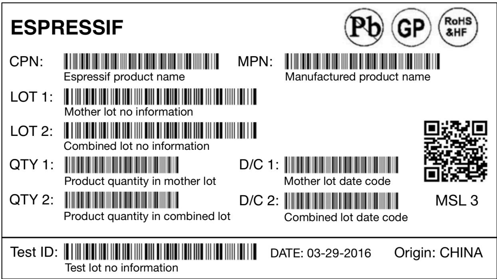  
Fig. 8: Espressif Chip Label - One

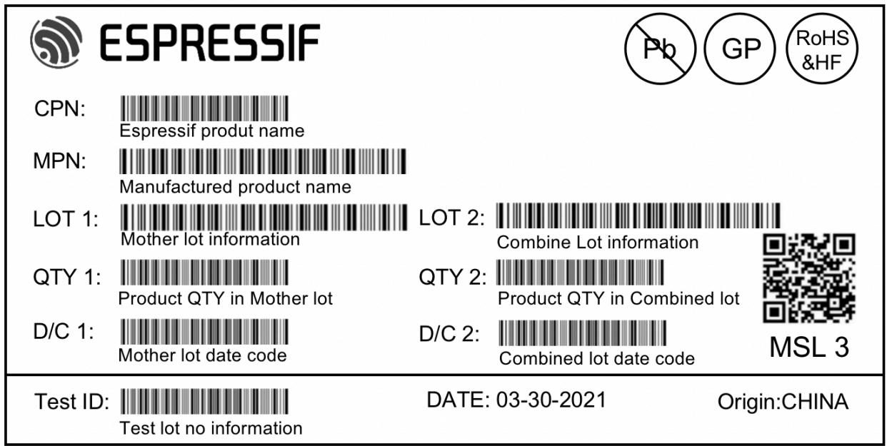  
Fig. 9: Espressif Chip Label - Two

# • ESPRESSIF logo: Company logo and name

• CPN: Espressif product name, e.g. ESP32-D0WDQ6   
• MPN: Manufacturing product name   
• LOT1: Number of mother lot   
• LOT2: Number of combined lot   
QTY1: Quantity of mother lot   
• QTY2: Quantity of combined lot   
D/C 1: Assembly date code for LOT1   
• D/C 2: Assembly date code for LOT2   
• Test ID: Test information   
• DATE: Packing date, MM-DD-YYYY, DATE “03-29-2016”stands for Mar 29th in 2016

# 1.3 Dry Packing Requirement

All Espressif chip’s moisture sensitivity level (MSL) is 3, thus must be dry-packed. Dry packing usually consists of desiccant material, a humidity-indicator card (HIC), as well as a Moisture Sensitivity Caution Label sealed with the populated reel inside a moisture barrier bag (MBB).

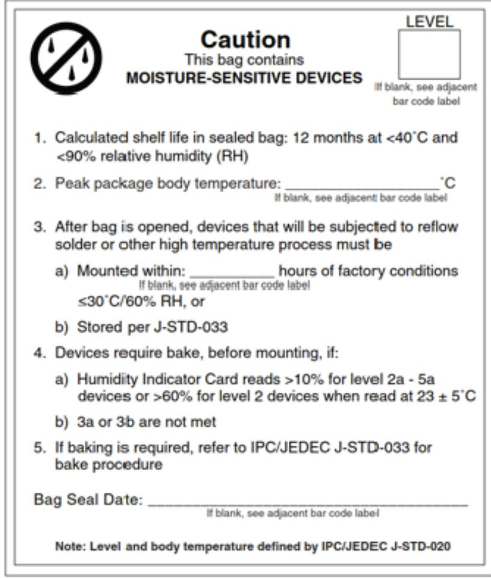  
Fig. 10: Moisture Sensitivity Caution Label

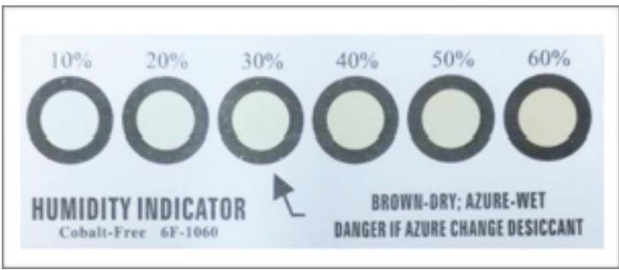  
Fig. 11: Humidity-indicator Card

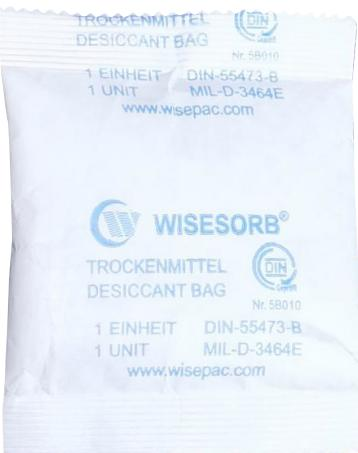  
Fig. 12: Desiccant

Note: The figure(s) above is for illustration purposes only. Actual product may vary.

The floor life (the allowable period of time, after removal from a moisture barrier bag, dry storage or dry bake and before the reflow soldering process) is shown in the table below.

<table><tr><td>Level</td><td>Floor life (out of bag) at factory ambient ≤ 30°C/60% RH, or as stated</td></tr><tr><td>3</td><td>168 hours</td></tr></table>

# Products require bake, before mounting, if:

• The humidity-indicator card reads $> 1 0 \%$ , when reading at $2 3 \pm 5 ^ { \circ } \mathrm { C }$ ;   
• Or the period of time after removal from a moisture barrier bag or dry storage or dry bake and before the reflow soldering process is larger than the value listed in table above.

If baking is required, make sure that the products are taken out of the tape, and IPC/JEDEC J-STD-033 is followed during the bake procedure.

# 2 ESP32-S3 Module Packaging Information

This document summarizes the packaging requirements of Espressif’s ESP32-S3 series of modules, including the module silk marking, dry-packing requirements, and module product packing.

# 2.1 Module Silk Marking

Espressif module silk marking provides information such as module name, flash size, and operating temperature.

# Marking Convention

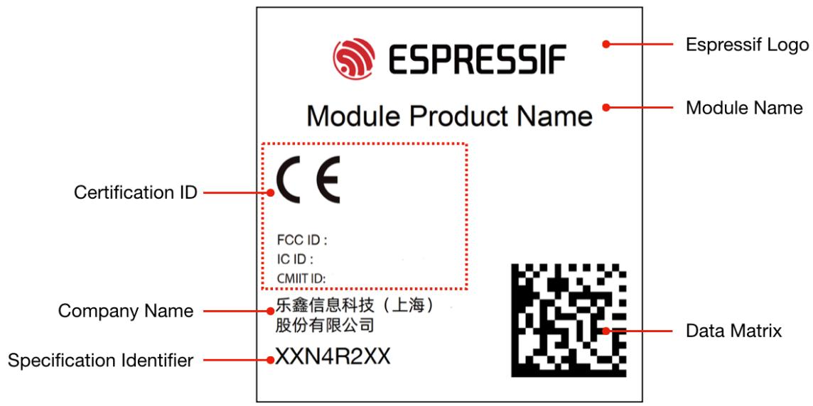  
Fig. 13: Module Silk Marking Diagram

• Company Logo: ESPRESSIF logo.   
• Module Name: Espressif module name.   
• Certification ID: Indicates the certification this module has passed.   
• Company Name: Espressif Systems (Shanghai) Co., Ltd (in Chinese).   
• Specification Identifier: See Specification Identifier Convention below.   
• Data Matrix: See Data Matrix Convention below.

Specification Identifier Convention The Specification Identifier is defined by Espressif to indicate the product status, operating temperature, and the memory inside Espressif modules.

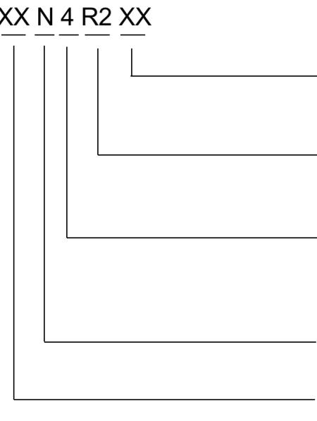

Optional for customization Default: None

PSRAM on module (optional)   
${ \sf R } 2 = 2$ MB   
${ \mathsf { R 4 } } = 4$ MB   
$\mathsf { R 8 } = 8$ MB   
flash on module   
$_ { 2 } = 2$ MB   
$4 = 4$ MB   
$\textstyle 8 = 8$ MB   
$1 6 = 1 6$ MB   
$3 2 = 3 2$ MB   
Operating temperature   
$N = - 4 0 ^ { \circ } C \sim + 6 5 ^ { \circ } C$ or ${ \cdot } 4 0 ^ { \circ } \mathrm { C } \sim { + } 8 5 ^ { \circ } \mathrm { C }$ (please refer to module datasheet)   
$\mathsf { H } = - 4 0 ^ { \circ } \mathrm { C } \sim + 1 0 5 ^ { \circ } \mathrm { C }$

Product status Default: XX or MN

Fig. 14: Module Specification Identifier Diagram •Product Status (2 characters): – XX or MN: mass production – Others: NPI product See details in the Note below.

•Temperature (1 character): – N: $: 8 5 ~ ^ { \circ } C / 6 5 ~ ^ { \circ } C$ – H: 105 °C

•Flash Size (1 character or 2 characters): – 2: 2 MB – 4: 4 MB – 8: 8 MB – 16: 16 MB – 32: 32 MB

•PSRAM (1 character): – R: PSRAM inside   
•PSRAM Size (1 character): – 2: 2 MB – 8: 8 MB

•Reserved: – 2 characters: for customized product – 0 character: mass production product

# Note:

# Product Status:

• XX is used for products launched earlier;   
• MN is commonly used for newly launched products or products with new chip revisions launched. For example, M0, M1 or MA, MB….   
• Examples of other possible codes can be E1, D2, and P3, indicating this is an NPI product under development or in trail run.

# Note:

# The PSRAM and PSRAM Size fields only exist if this module comes with PSRAM. For example,

XXN4: indicates the module comes with 4 MB flash and no PSRAM.

• XXN4R2: indicates the module comes with 4 MB flash and 2 MB PSRAM.

Data Matrix Convention Scanning the Data Matrix on Espressif modules returns you an 18-character code. The convention for this code is described below:

<table><tr><td>Char (fro left to rihDescon</td><td></td></tr><tr><td>Character 1 and Character 2</td><td>Reserved for Espressif use</td></tr><tr><td>Character 3 to Character 6</td><td>The production Date Code (YYWW), indicating the WW week of YYYY year</td></tr><tr><td>Character 7 to Character 18</td><td>Module MAC ID</td></tr></table>

# 2.2 Module Packing

Espressif modules are packed on tape and reel. Then the reel is packed in an aluminum moisture barrier bag (MBB) in vacuum state to protect modules from absorbing moisture during transportation and storage. At last, the MBB is packed into a pizza box.

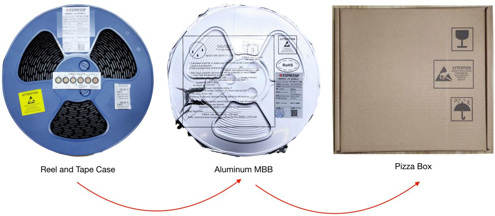  
Fig. 15: Espressif Product Packing Method

Note: The figure(s) above is for illustration purposes only. Actual product may vary.

# Tape

This section introduces the dimensions of the carrier tape.

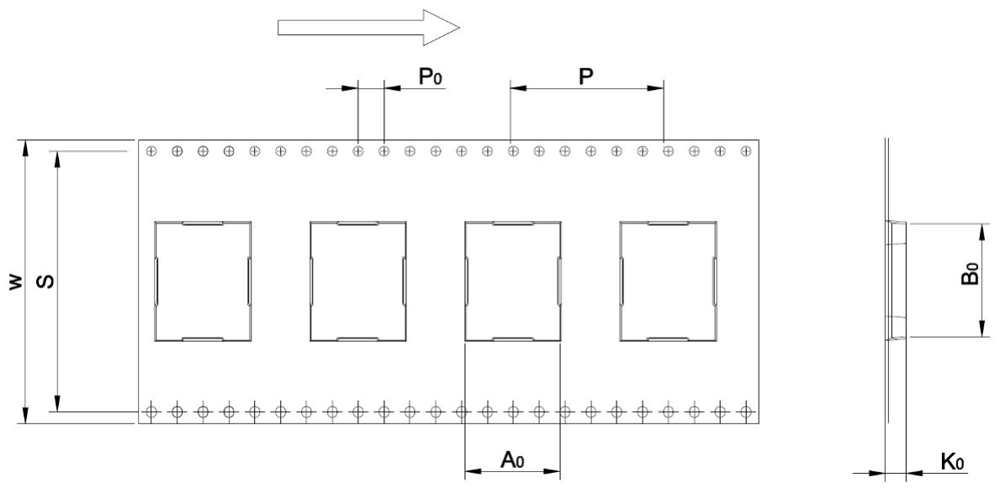

# Carrier Tape Dimensions

<table><tr><td>Carrier Tape Width (W)</td><td>Sprocket Hole Width (s) 0)</td><td>Sprocket Hole Pitch (P Cavity Pitch (P)</td></tr><tr><td>44.0 40.4</td><td>4.0</td><td>24.0</td></tr></table>

# Cavity Dimensions

<table><tr><td>Cavity Width (A o)</td><td>Cavity Length (B o)</td><td>Cavity Depth (K o)</td></tr><tr><td>MW + 0.5</td><td>ML + 0.5</td><td>MH + 0.5</td></tr></table>

Note: The cavity dimensions may differ from different module width (MW), module length (ML) and module height (MH).

Note: Dimensions in the above tables are in millimeters (mm), with tolerances of $\pm 0 . 2 \mathrm { m m }$ .

<table><tr><td></td></tr><tr><td></td></tr><tr><td>Note: The surface resistance of the carrier tape is 10 4 ~ 10 11 ohms.</td></tr></table>

# Module Placement and Tape Direction

This section introduces the module placement position in the carrier tape and the tape pull-out direction.

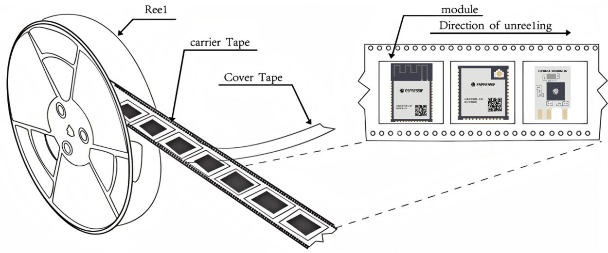

Note: Please refer to the expanded view on the right for module placement orientation in the carrier tape. The module’s silk marking text direction should be parallel to the pull-out direction.

# Reel

This section introduces the dimensions of the reel.

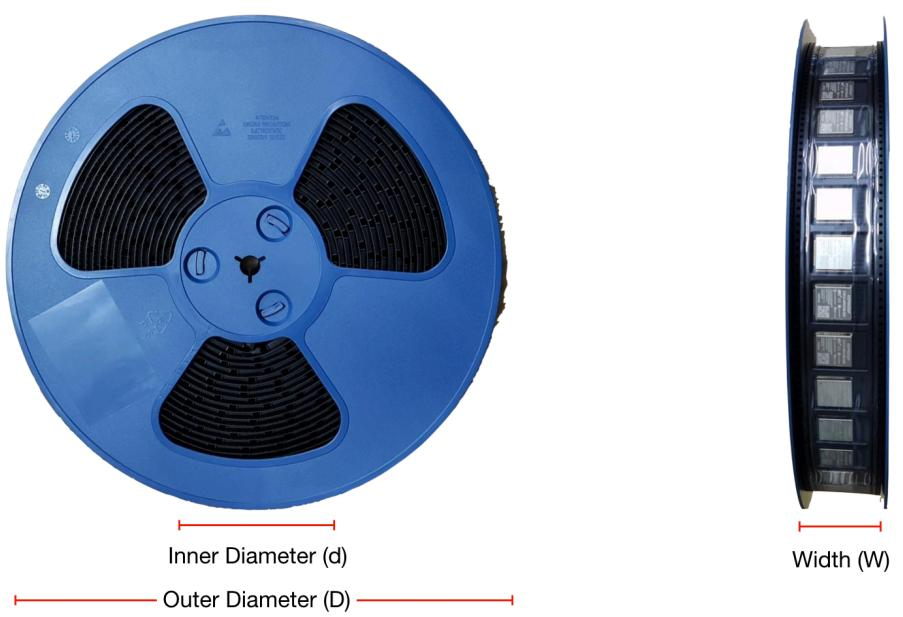

Table 3: Reel Dimensions   
Note: The figure(s) above is for illustration purposes only. Actual product may vary.   

<table><tr><td>Reel Size </td><td>Outr Damr ) Innr Dier ) Reel Wh W) Quanit eel</td><td></td><td></td><td></td></tr><tr><td>13&#x27;</td><td>330 mm</td><td>100 mm</td><td>44 mm</td><td>650</td></tr></table>

Note: The surface resistance of the carrier tape is $1 0 ^ { 4 } \sim 1 0$ 11 ohms.

# Pizza Box

Inside of the pizza box of typical Espressif modules, together with the tape and reel, product label and dry-packing related items are also packed.

This section describes the product label. For information about dry packing related items, please go to Section $_ { D r y }$ Packing Requirement.

# ESPRESSIF

I | PW Number PW-2022-03-0001| Product Name ESP32-S3-WROOM-1

Product Number ESP32-S3-WROOM-1-N4 |Country of Origin MADE IN CHINA Seal Date 2022-03-10 | Lot Number 202205-000001

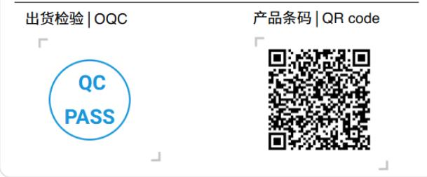  
Fig. 16: Espressif Module label

• PW Number: Espressif’s order number at the module manufacturers.   
• Product Name: Module name.   
• Product Number: Espressif’s MPN (internal use).   
• Quantity: The quantity of modules per package.   
•Firmware Version: Indicates the firmware version downloaded to the modules: –No firmware: $^ *$ IDF: N/A $^ *$ AT: N/A $^ *$ FW P/N: N/A ∗ MBM NO: Specification Identifier, see Section Specification Identifier Convention.

# –Espressif default firmware:

$^ *$ IDF: IDF version   
$^ *$ AT: AT version   
$^ *$ FW P/N: firmware code   
$^ *$ MBM NO: Specification Identifier, see Section Specification Identifier Convention.

–Customized firmware: $^ *$ IDF: Customized firmware version $^ *$ AT: N/A $^ *$ FW P/N: firmware code $^ *$ MBM NO: Specification Identifier, see Section Specification Identifier Convention.

• Country of Origin: MADE IN CHINA.

• Seal Date: Date of packing.

• Lot Number: Used internally by Espressif for tracking production.

• OQC: Indicates the QC inspection is passed.

•OR code: Scanning this OR code returns you production information including: – Product name – Product number – Lot number – Quantity – Production number – Espressif internal code

# 2.3 Dry Packing Requirement

All Espressif module’s moisture sensitivity level (MSL) is 3, thus must be dry-packed. Dry packing usually consists of desiccant material, a humidity-indicator card (HIC), as well as a Moisture Sensitivity Caution Label sealed with the populated reel inside a moisture barrier bag (MBB).

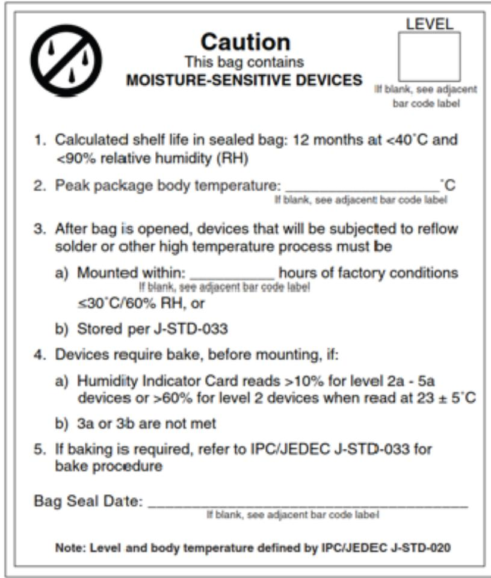  
Fig. 17: Moisture Sensitivity Caution Label

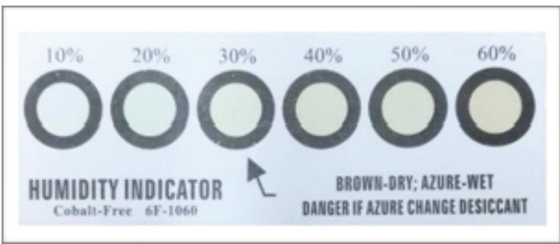  
Fig. 18: Humidity-indicator Card

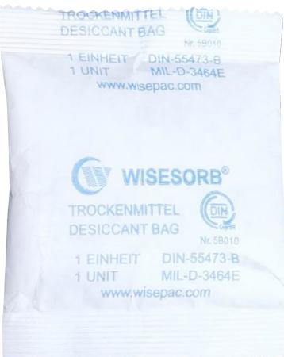  
Fig. 19: Desiccant

Note: The figure(s) above is for illustration purposes only. Actual product may vary.

The floor life (the allowable period of time, after removal from a moisture barrier bag, dry storage or dry bake and before the reflow soldering process) is shown in the table below.

<table><tr><td>Level</td><td>Floor life (out of bag) at factory ambient ≤ 30°C/60% RH, or as stated</td></tr><tr><td>3</td><td>168 hours</td></tr></table>

# Products require bake, before mounting, if:

• The humidity-indicator card reads $> 1 0 \%$ , when reading at $2 3 \pm 5 ^ { \circ } \mathrm { C }$ ;   
• Or the period of time after removal from a moisture barrier bag or dry storage or dry bake and before the reflow soldering process is larger than the value listed in table above.

If baking is required, make sure that the products are taken out of the tape, and IPC/JEDEC J-STD-033 is followed during the bake procedure.

# 3 Disclaimer and Copyright Notice

Information in this document, including URL references, is subject to change without notice.

All third party’s information in this document is provided as is with no warranties to its authenticity and accuracy.

No warranty is provided to this document for its merchantability, non-infringement, fitness for any particular purpose, nor does any warranty otherwise arising out of any proposal, specification or sample.

All liability, including liability for infringement of any proprietary rights, relating to use of information in this document is disclaimed. No licenses express or implied, by estoppel or otherwise, to any intellectual property rights are granted herein.

The Wi-Fi Alliance Member logo is a trademark of the Wi-Fi Alliance. The Bluetooth logo is a registered trademark of Bluetooth SIG.

All trade names, trademarks and registered trademarks mentioned in this document are property of their respective owners, and are hereby acknowledged.