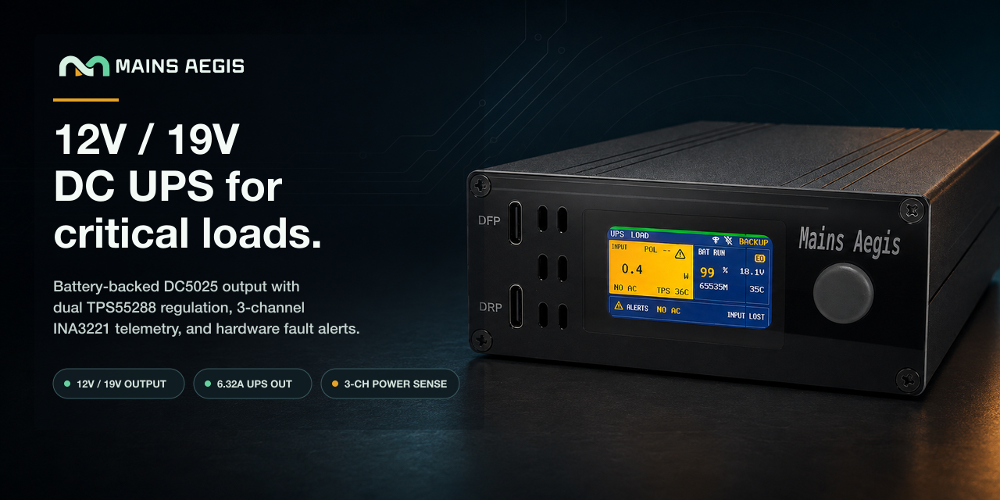
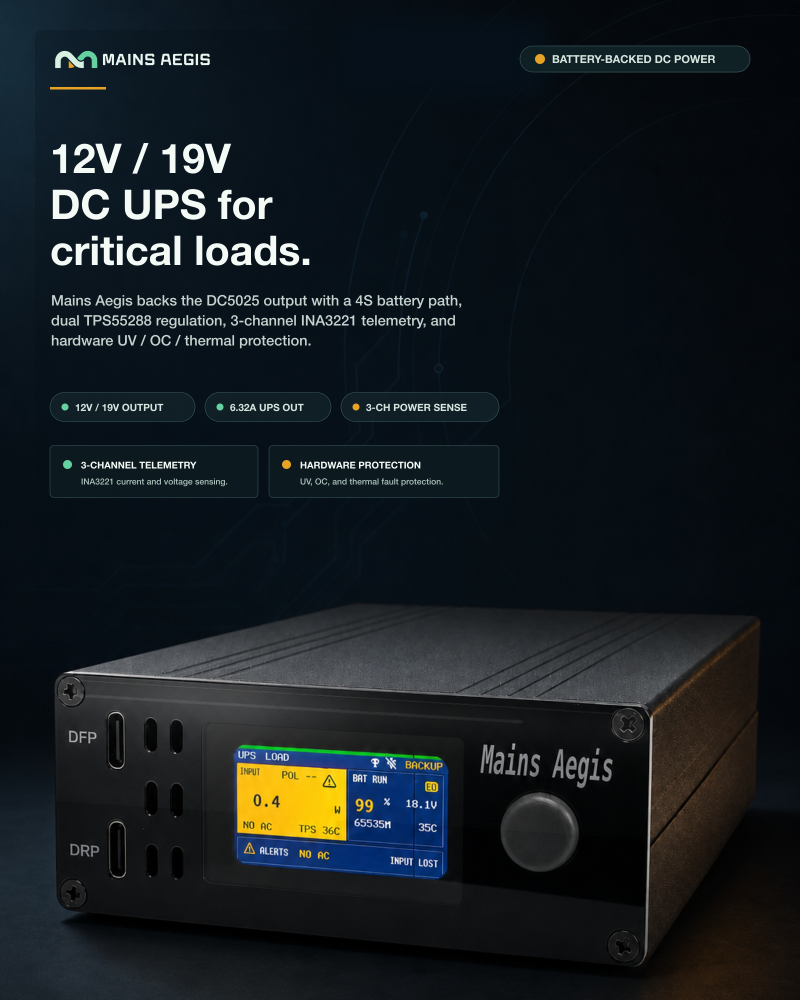

# Mains Aegis Marketing Assets

This directory intentionally ships only the four final marketing images that are needed for owner-facing use and PR review.

## Final Assets

The light assets use the approved product render from thread `codex://threads/019f8b0e-e051-7f43-a810-1a673f8c3970` and product-specific English copy. The dark assets use a `gpt-image-2` high-fidelity edit through the CVM image-generation workflow for the product studio scene, with all exterior marketing copy rendered locally for accuracy.

| Asset | Dimensions | Theme | Primary use |
| --- | ---: | --- | --- |
| `social-preview.png` | `1280x640` | Light | GitHub social preview |
| `social-preview-dark.png` | `1280x640` | Dark | GitHub social preview on dark surfaces |
| `product-poster.png` | `1600x2000` | Light | Product poster |
| `product-poster-dark.png` | `1600x2000` | Dark | Product poster for dark surfaces |

## Source Record

- Source file: `/Users/ivan/Documents/Codex/2026-07-22/new-chat-3/outputs/mains-aegis-final-cvm-white-studio-balanced-reflections.png`
- Source SHA-256: `3d982d168ca7a4ac0a4f0a2812c75e4276f2a2a13646de6c2f4552f1c310a11e`
- Source dimensions: `1448x1086`
- PR scope note: intermediate renders, JPG exports, CVM candidates, and generation scripts are intentionally kept out of the tracked asset set for this branch
