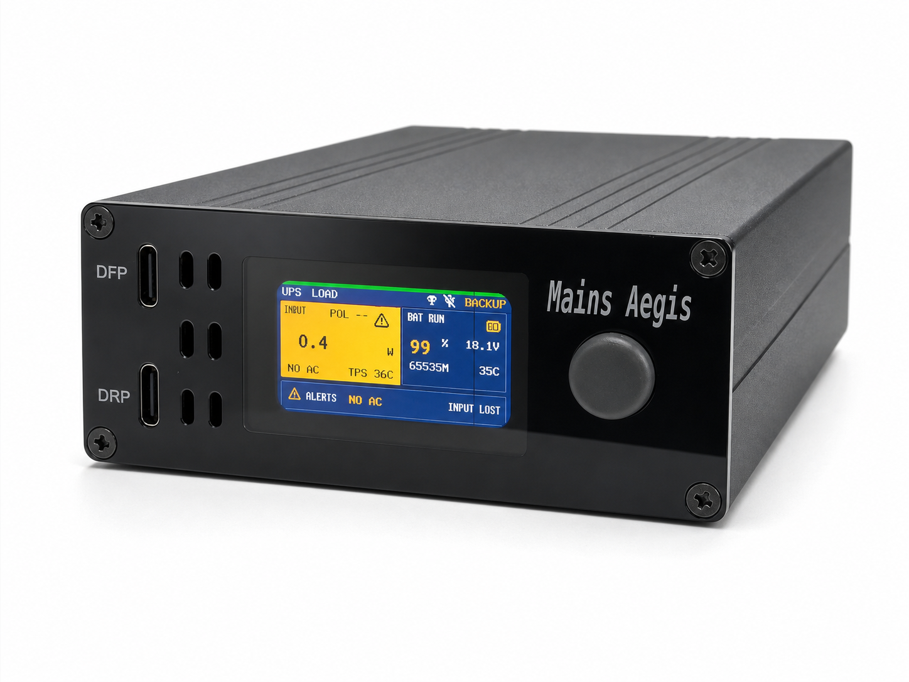
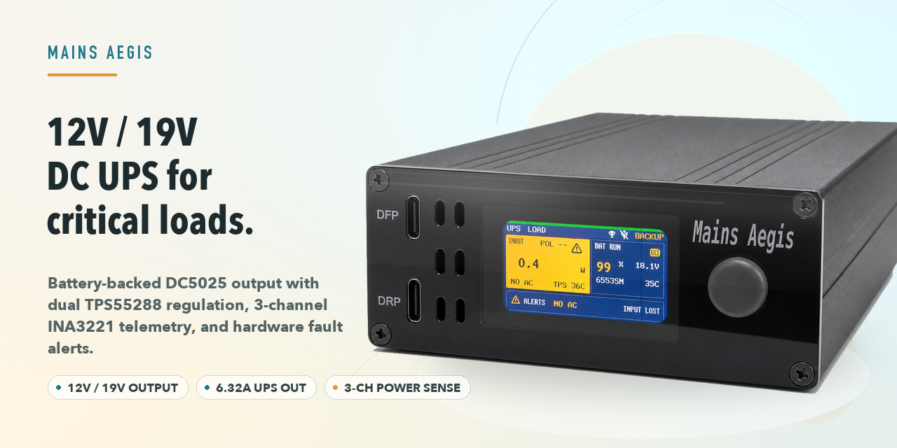
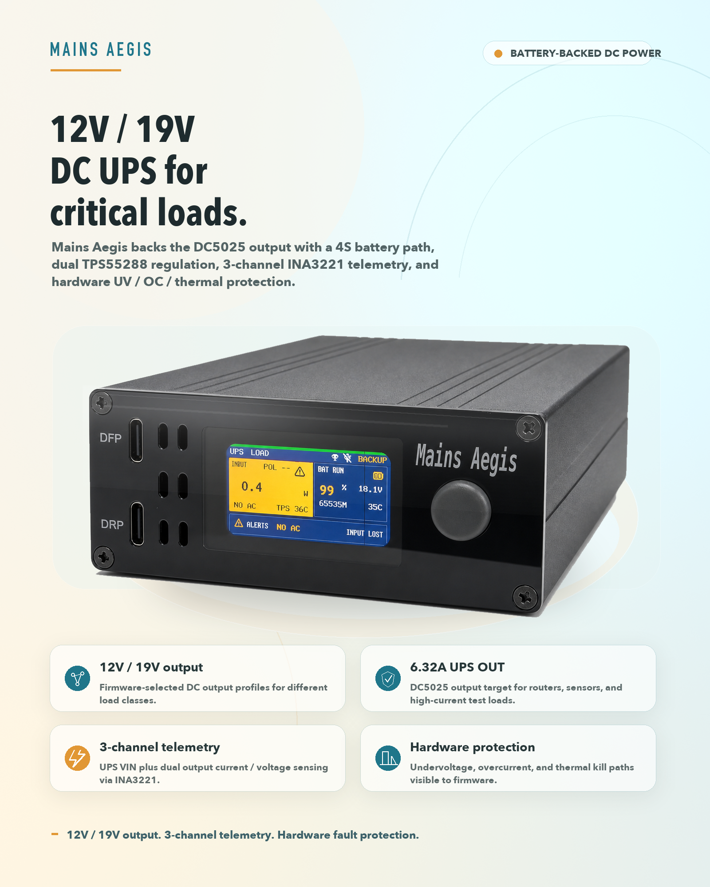
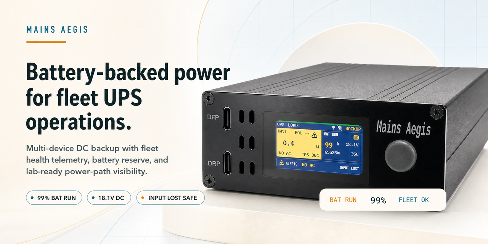
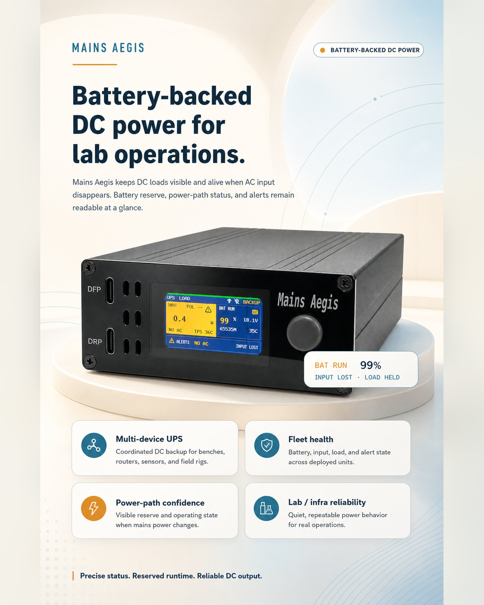

# Mains Aegis Marketing Assets

This directory contains project-bound visual assets for social previews, product posters, and product-render references.

## Source Product Render

- Source thread: `codex://threads/019f8b0e-e051-7f43-a810-1a673f8c3970`
- Source file: `/Users/ivan/Documents/Codex/2026-07-22/new-chat-3/outputs/mains-aegis-final-cvm-white-studio-balanced-reflections.png`
- Project copy: `product-render-white-studio.png`
- SHA-256: `3d982d168ca7a4ac0a4f0a2812c75e4276f2a2a13646de6c2f4552f1c310a11e`
- Dimensions: `1448x1086`

## Final Assets

These files are deterministic composites based on the source product render. They keep the product render locked, use project-derived English copy, and place the product in a bright non-dark marketing setting with warm porcelain, pale sand, and light engineering-blue accents rather than a plain white studio background.

The final composites are generated by `render_marketing_assets.py`. The script keeps copy and product imagery as separate composition layers so wording can be changed without asking CVM to redraw the product. Floating status overlay cards are intentionally omitted from the final assets.

| Asset | Dimensions | Primary use |
| --- | ---: | --- |
| `social-preview.png` | `1280x640` | GitHub social preview PNG |
| `social-preview.jpg` | `1280x640` | Compressed social preview fallback |
| `product-poster.png` | `1600x2000` | High-resolution product poster |
| `product-poster.jpg` | `1600x2000` | Compressed product poster fallback |

## CVM Candidates

The CVM candidates are generated with `$cvm-imagegen` from the deterministic light composites. They are retained as comparison candidates and do not replace the deterministic final assets.

| Asset | Dimensions | Notes |
| --- | ---: | --- |
| `social-preview-cvm-candidate-source.png` | `1774x887` | CVM source output |
| `social-preview-cvm-candidate.png` | `1280x640` | Exact-size social candidate |
| `social-preview-cvm-candidate.jpg` | `1280x640` | Compressed social candidate |
| `product-poster-cvm-candidate-source.png` | `1024x1536` | CVM source output |
| `product-poster-cvm-candidate.png` | `1600x2000` | Exact-size poster candidate |
| `product-poster-cvm-candidate.jpg` | `1600x2000` | Compressed poster candidate |

