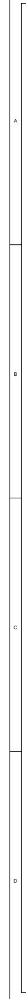
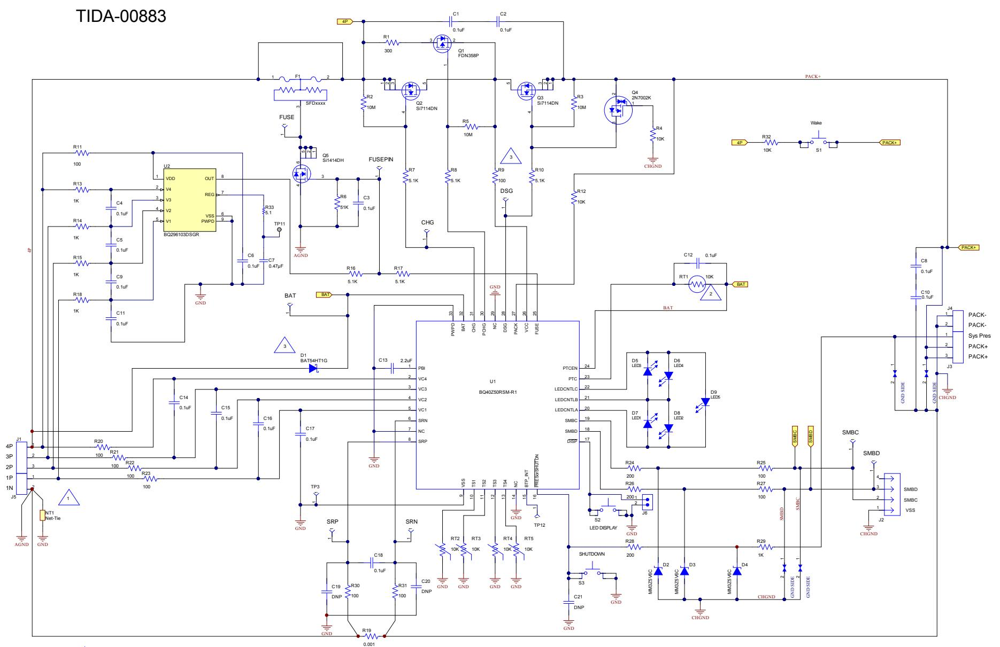

# IMPORTANT NOTICE FOR TI REFERENCE DESIGNS

Texas Instruments Incorporated ("TI") reference designs are solely intended to assist designers (“Buyers”) who are developing systems tha incorporate TI semiconductor products (also referred to herein as “components”). Buyer understands and agrees that Buyer remains responsible for using its independent analysis, evaluation and judgment in designing Buyer’s systems and products.

TI reference designs have been created using standard laboratory conditions and engineering practices. TI has not conducted any testing other than that specifically described in the published documentation for a particular reference design. TI may make corrections, enhancements, improvements and other changes to its reference designs.

Buyers are authorized to use TI reference designs with the TI component(s) identified in each particular reference design and to modify the reference design in the development of their end products. HOWEVER, NO OTHER LICENSE, EXPRESS OR IMPLIED, BY ESTOPPEL OR OTHERWISE TO ANY OTHER TI INTELLECTUAL PROPERTY RIGHT, AND NO LICENSE TO ANY THIRD PARTY TECHNOLOGY OR INTELLECTUAL PROPERTY RIGHT, IS GRANTED HEREIN, including but not limited to any patent right, copyright, mask work right, or other intellectual property right relating to any combination, machine, or process in which TI components or services are used. Information published by TI regarding third-party products or services does not constitute a license to use such products or services, or a warranty or endorsement thereof. Use of such information may require a license from a third party under the patents or other intellectual property of the third party, or a license from TI under the patents or other intellectual property of TI.

TI REFERENCE DESIGNS ARE PROVIDED "AS IS". TI MAKES NO WARRANTIES OR REPRESENTATIONS WITH REGARD TO THE REFERENCE DESIGNS OR USE OF THE REFERENCE DESIGNS, EXPRESS, IMPLIED OR STATUTORY, INCLUDING ACCURACY OR COMPLETENESS. TI DISCLAIMS ANY WARRANTY OF TITLE AND ANY IMPLIED WARRANTIES OF MERCHANTABILITY, FITNESS FOR A PARTICULAR PURPOSE, QUIET ENJOYMENT, QUIET POSSESSION, AND NON-INFRINGEMENT OF ANY THIRD PARTY INTELLECTUAL PROPERTY RIGHTS WITH REGARD TO TI REFERENCE DESIGNS OR USE THEREOF. TI SHALL NOT BE LIABLE FOR AND SHALL NOT DEFEND OR INDEMNIFY BUYERS AGAINST ANY THIRD PARTY INFRINGEMENT CLAIM THAT RELATES TO OR IS BASED ON A COMBINATION OF COMPONENTS PROVIDED IN A TI REFERENCE DESIGN. IN NO EVENT SHALL TI BE LIABLE FOR ANY ACTUAL, SPECIAL, INCIDENTAL, CONSEQUENTIAL OR INDIRECT DAMAGES, HOWEVER CAUSED, ON ANY THEORY OF LIABILITY AND WHETHER OR NOT TI HAS BEEN ADVISED OF THE POSSIBILITY OF SUCH DAMAGES, ARISING IN ANY WAY OUT OF TI REFERENCE DESIGNS OR BUYER’S USE OF TI REFERENCE DESIGNS.

TI reserves the right to make corrections, enhancements, improvements and other changes to its semiconductor products and services per JESD46, latest issue, and to discontinue any product or service per JESD48, latest issue. Buyers should obtain the latest relevant information before placing orders and should verify that such information is current and complete. All semiconductor products are sold subject to TI’s terms and conditions of sale supplied at the time of order acknowledgment.

TI warrants performance of its components to the specifications applicable at the time of sale, in accordance with the warranty in TI’s terms and conditions of sale of semiconductor products. Testing and other quality control techniques for TI components are used to the extent TI deems necessary to support this warranty. Except where mandated by applicable law, testing of all parameters of each component is not necessarily performed.

TI assumes no liability for applications assistance or the design of Buyers’ products. Buyers are responsible for their products and applications using TI components. To minimize the risks associated with Buyers’ products and applications, Buyers should provide adequate design and operating safeguards.

Reproduction of significant portions of TI information in TI data books, data sheets or reference designs is permissible only if reproduction is without alteration and is accompanied by all associated warranties, conditions, limitations, and notices. TI is not responsible or liable for such altered documentation. Information of third parties may be subject to additional restrictions.

Buyer acknowledges and agrees that it is solely responsible for compliance with all legal, regulatory and safety-related requirements concerning its products, and any use of TI components in its applications, notwithstanding any applications-related information or support that may be provided by TI. Buyer represents and agrees that it has all the necessary expertise to create and implement safeguards that anticipate dangerous failures, monitor failures and their consequences, lessen the likelihood of dangerous failures and take appropriate remedial actions. Buyer will fully indemnify TI and its representatives against any damages arising out of the use of any TI components in Buyer’s safety-critical applications.

In some cases, TI components may be promoted specifically to facilitate safety-related applications. With such components, TI’s goal is to help enable customers to design and create their own end-product solutions that meet applicable functional safety standards and requirements. Nonetheless, such components are subject to these terms.

No TI components are authorized for use in FDA Class III (or similar life-critical medical equipment) unless authorized officers of the parties have executed an agreement specifically governing such use.

Only those TI components that TI has specifically designated as military grade or “enhanced plastic” are designed and intended for use in military/aerospace applications or environments. Buyer acknowledges and agrees that any military or aerospace use of TI components that have not been so designated is solely at Buyer's risk, and Buyer is solely responsible for compliance with all legal and regulatory requirements in connection with such use.

TI has specifically designated certain components as meeting ISO/TS16949 requirements, mainly for automotive use. In any case of use of non-designated products, TI will not be responsible for any failure to meet ISO/TS16949.