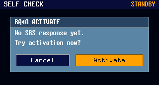
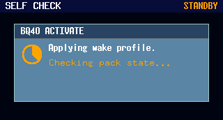
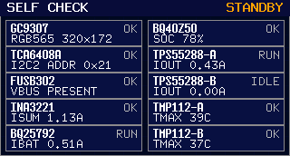
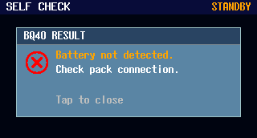
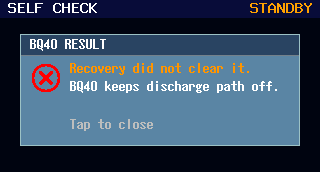
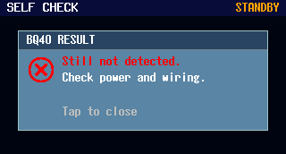

# BQ40 自检异常态与结果弹窗（#5cvrj）

## 状态

- Status: 部分完成（4/5）
- Created: 2026-03-11
- Last: 2026-03-12

## 背景 / 问题陈述

- 现有 `SELF CHECK` 页面会把 `BQ40Z50` 的多种异常混在 `WARN/ERR` 与单一失败弹窗里，难以区分“设备存在但异常”与“完全未识别到设备”。
- 激活结果弹窗关闭后不会保留结果语义，后续再次点击 `BQ40Z50` 卡片时无法直接回看最近一次结果。
- 新需求要求先补足结果弹窗渲染图，并让运行时把激活结果固化为可复看的状态。

## 目标 / 非目标

### Goals

- 把 `BQ40Z50` 卡片收敛为三层状态：`OK`、`WARN`、`ERR`。
- `WARN` 固定表示“设备存在但非正常态”，不再把 `RCA` 作为独立卡片状态词；`RCA ALARM` 仅作为副文案显示。
- 默认自检只做普通 SMBus/SBS 访问探测；普通访问未识别到设备时显示 `ERR`，并允许尝试激活。
- 激活结果词汇固定保留 5 类：`SUCCESS`、`NO BATTERY`、`ROM MODE`、`ABNORMAL`、`NOT DETECTED`。
- `NO BATTERY` 只能由 BQ40 自身可读证据触发，禁止由 `BQ25792`、`FUSB302` 或其它器件状态推断。
- 结果弹窗关闭后保留最近一次结果；再次点击 `BQ40Z50` 卡片时直接回显对应结果弹窗。
- 主固件的激活链路必须移植工具已验证有效的 `wake-window + delayed read + keepalive + confirm` 读法，但该链路只在 `Try Activation` 期间生效。
- 诊断阶段允许存在“一次性开机自动激活”临时流，用来验证主固件激活链路是否已经能把健康硬件收敛到 `SUCCESS`；验证通过后必须移除。

### Non-goals

- 不在前面板直接触发 `recover/flash` 之类 ROM 写入流程。
- 不改 `Variant C` 的 10 卡布局与其它 9 张卡片语义。
- 不实现“成功后自动重试/自动恢复”之外的额外交互菜单。

## 范围（Scope）

### In scope

- `firmware/src/front_panel_scene.rs`
  - 新增持久结果枚举与结果驱动 overlay。
  - 更新 `BQ40Z50` 卡片状态词与副文案映射。
- `firmware/src/front_panel.rs`
  - 点击/按键行为改为“`ERR` 首次可激活；已有结果则直接回显结果弹窗”。
  - 关闭结果弹窗时仅清 overlay，不清最近一次结果。
- `firmware/src/output/mod.rs`
  - 普通访问状态映射：`OK/WARN/ERR`。
  - 激活结果状态持久化，并把运行态结果同步到 `SelfCheckUiSnapshot`。
  - 激活结果分类只允许使用 BQ40 自身 SMBus/ROM 证据；其它器件状态只可用于“能否尝试激活”的门禁与诊断日志。
  - 激活唤醒参数对齐到 `VREG=16.8V / ICHG=200mA / IINDPM=500mA`。
  - 激活路径内新增 staged wake probe、keepalive、trusted snapshot confirm，以及诊断阶段的一次性自动激活验证流。
- `firmware/src/bq25792.rs`
  - 补足 `CHARGE_VOLTAGE_LIMIT` 与设置 `VREG` 的 helper。
- `tools/front-panel-preview/src/main.rs`
  - 新增 5 个结果弹窗场景与对应 PNG 导出。
- 视觉文档与规格资产
  - `firmware/ui/self-check-design.md`
  - `firmware/ui/visual-regression-checklist.md`
  - `firmware/ui/README.md`
  - `firmware/README.md`

### Out of scope

- 新增中文屏幕字体或中英混排排版方案。
- 为 `BQ40Z50` 新增更多细粒度结果分类。
- 修改 `tools/bq40-comm-tool` 的工具链契约。

## 接口变更（Interfaces）

- `front_panel_scene::BmsResultKind`：新增，固定 5 类结果状态。
- `front_panel_scene::SelfCheckOverlay`：从布尔成功/失败结果改为显式结果 overlay。
- `front_panel_scene::SelfCheckUiSnapshot::bq40z50_last_result`：新增，承载最近一次激活结果。
- `output::PowerManager::clear_bms_activation_state()`：改为只清当前激活态，不清最近一次结果。
- `bq25792::set_charge_voltage_limit_mv(...)`：新增。

## 验收标准（Acceptance Criteria）

- Given 普通访问拿到可信且正常的 BQ40 快照，When 查看 `BQ40Z50` 卡片，Then 状态显示 `OK`。
- Given 普通访问确认设备存在但状态不正常，When 查看 `BQ40Z50` 卡片，Then 状态显示 `WARN`，副文案显示 `ABNORMAL` 或 `RCA ALARM`。
- Given 普通访问未识别到设备，When 查看 `BQ40Z50` 卡片，Then 状态显示 `ERR`，副文案显示 `NOT DETECTED`。
- Given `BQ40Z50` 卡片为 `ERR`，When 点击或按键触发激活，Then 先进入确认弹窗，再进入进度弹窗，并最终落到 5 类结果之一。
- Given 任一结果弹窗已关闭，When 再次点击 `BQ40Z50` 卡片，Then 直接显示最近一次结果弹窗，不重复进入确认流程。
- Given 最近一次结果为 `NOT DETECTED`，When 结果弹窗关闭后回到自检页，Then `BQ40Z50` 卡片仍保持 `ERR`。
- Given 最近一次结果为 `ABNORMAL`，When 结果弹窗关闭后回到自检页，Then `BQ40Z50` 卡片保持 `WARN`。
- Given 激活窗口内 `BQ40Z50` 始终 `i2c_nack` / `i2c_timeout` 或无有效快照，When 激活流程结束，Then 结果必须是 `NOT DETECTED`，不得因为其它芯片状态改判为 `NO BATTERY`。
- Given 激活流程没有拿到 BQ40 原生“无电池”证据，When 结束分类，Then 不得输出 `NO BATTERY`。
- Given 激活流程进入 staged wake probe，When `0 / 800 / 1600 ms` 任一阶段命中可信运行态快照，Then 结果只能由该可信快照收敛为 `SUCCESS` 或 `ABNORMAL`。
- Given 激活流程只拿到零散 raw 读数或无效快照，When keepalive / confirm 全部失败且窗口结束，Then 结果必须是 `NOT DETECTED`。
- Given 诊断阶段启用临时自动激活流，When 设备启动完成且 `BQ40=ERR`、输入电源存在、充电器状态已知，Then 日志中必须只出现一次 `activation auto_request reason=boot_diag`。
- Given 当前这块硬件已经通过项目工具验证健康，When 临时自动激活流执行，Then 它必须在同一轮激活中收敛到 `SUCCESS`，否则视为主固件激活链路仍未修复完成。
- Given 运行 `tools/front-panel-preview` 的结果场景，When 导出 PNG，Then 5 张结果弹窗图分辨率均为 `320x172`。

## 具体判断流程（Decision flow）

### 1. 默认自检：只看 BQ40 普通访问结果

1. 对 `BQ40Z50` 执行普通 SMBus/SBS 访问。
2. 若可读出可信快照，且 `RCA=0` 且放电路径 ready，则卡片显示 `OK`。
3. 若可读出快照，但快照无效、`RCA=1`、放电路径未 ready 或其它 BQ40 自身异常成立，则卡片显示 `WARN`。
4. 若普通访问持续 `i2c_nack` / `i2c_timeout` / 无法形成有效快照，则卡片显示 `ERR`。
5. 以上步骤禁止读取 `BQ25792`、`FUSB302`、`INA3221` 等其它器件状态来改判 `BQ40Z50` 的 `OK/WARN/ERR`。
6. 默认自检里的 `NO BATTERY` 只能由“常规 strict snapshot 连续两次得到一致的低包压快照”触发；不得把激活期间允许保留的单次低压候选值直接写进日常 UI。

### 2. 触发激活：其它器件只负责门禁，不负责结果分类

1. 默认情况下，卡片落到 `ERR` 时允许进入 `Try Activation`；若普通轮询已经拿到 BQ40 自身的低包压证据并显示 `NO BATTERY`，在尚无最近一次激活结果时也允许手动进入 `Try Activation`，避免被瞬态低压样本卡死在不可重试状态。
2. `BQ25792`、输入电源存在与否、充电器配置写入结果，只能决定“本次是否能执行激活动作”。
3. 若激活动作因为前置条件不满足而无法推进，结果统一回落为 `NOT DETECTED`；不得借此推断 `NO BATTERY`、`ABNORMAL` 或 `SUCCESS`。

### 3. 激活结果分类：只使用 BQ40 自身证据

1. 若探测到 BQ40 ROM 签名，则结果为 `ROM MODE`。
2. 若激活窗口内读到 BQ40 正常可信快照，并满足正常态条件，则结果为 `SUCCESS`。
3. 若激活窗口内读到带有可信运行时字段的 BQ40 快照，但其状态仍为异常态，则结果为 `ABNORMAL`。
4. 若激活窗口结束前始终无法访问 BQ40，或只能得到无效/不可信访问结果（例如只有异常原始值、没有可信运行时字段），则结果为 `NOT DETECTED`。
5. `NO BATTERY` 只允许在 BQ40 自身返回了明确的无电池证据时使用；当前实现不得使用 `BQ25792` 的 `VBAT_PRESENT`、输入电源状态或其它外部器件信息来触发该结果。
6. 激活确认链路里的 core 5-word snapshot 与 strict snapshot 都必须经过同一套 stale-pattern 过滤；禁止因为“core 先成功”而绕过重复假值判定。

### 4. 激活链路：工具式 no-charge probe + wake-window / keepalive / confirm

1. `Try Activation` 成功进入 pending 后，主固件必须先进入 `ProbeWithoutCharge` 主路径：不启用 min-charge 覆盖，并沿用历史 PASS 固件的“低流量 observe”方式先做 no-charge 运行态探测。
2. `ProbeWithoutCharge` 必须保留一个 `12 s` 的 observe window，并以 `2 s` cadence 重复执行；在该窗口内禁止发送 wake touch burst，只允许先做 `Voltage()` 单字 presence probe，只有当 `Voltage()` 已进入可信范围后，才允许继续读取 core 5-word snapshot；`Voltage()` 缺失、超范围或仅落在 low-pack/no-battery 区间时，都必须直接记为 observe miss，不能升级成 confirm 读取。
3. `ProbeWithoutCharge` miss 后，激活链路必须无条件进入工具同款补救链路：`WaitChargeOff -> WaitMinChargeSettle -> MinChargeProbe -> WakeProbe -> follow-up`。这条链路属于激活流程本身，不得再受编译期 `force_min_charge` 总开关约束。
4. 仅对“临时开机一次自动验证”入口，`ProbeWithoutCharge` 允许沿用 boot prewarm 已建立的最小充电 profile，不得在 `auto_request` 边界先把 wake profile 释放掉再开始观测；这样才能复现历史 PASS 固件的“30 s 连续偏置后直接发现可信快照”路径。
5. 手动 `Try Activation` 的 `ProbeWithoutCharge` 必须保持 no-charge 语义：不得为了激活而保持 charger 处于 normal profile host-enable，也不得提前写入 min-charge 覆盖。只有进入 `WaitChargeOff` 之后，才允许开始 `10 s` 的 charger-off repower window；`WaitMinChargeSettle`、`MinChargeProbe`、`WakeProbe` 与 `follow-up` 必须维持激活态最小充电 profile。
6. `WaitMinChargeSettle` 结束后，必须先进入 `MinChargeProbe`，不能直接跳进 `WakeProbe`。`MinChargeProbe` 期间必须保留至少一轮与常规自检相同的严格 snapshot 轮询，只看 `BQ40` 自身 SMBus 结果；只有 `MinChargeProbe` 窗口结束仍未拿到可信运行态快照时，才允许进入 `WakeProbe`。
7. `WakeProbe` 阶段必须按 `0 / 800 / 1600 ms` 三个阶段执行唤醒探测。
8. 每个阶段都按固定顺序执行：
   - `touch RSOC -> delayed read`
   - `touch TEMP -> delayed read`
   - 若得到候选运行态读数，则进入 keepalive / confirm
   - 只要任一 touch 已经成功，即使首个 raw/read 没成功，也必须继续执行后续 wake follow-up / keepalive 探测；只有 `RSOC` 与 `TEMP` 的 touch 都失败时，才允许把该阶段记为 miss。
9. delayed read 的读间隔固定使用 `[22, 40, 66] ms`；`2 ms` 只允许作为 strict snapshot reader 的 word-to-word gap，不能混入 delayed read / keepalive 的 gap 集合。
10. 一旦 `RSOC == 0x9002`，立即收敛到 `ROM MODE`，不再继续后续 keepalive。
11. 命中候选读数后，必须继续执行有限轮数的 keepalive，并使用激活专用的 trusted snapshot confirm 逻辑读取运行态快照。
12. 激活确认必须先走低流量的 “core 5-word” confirm：只读取 `Temperature / Voltage / Current / RSOC / BatteryStatus` 这 5 个历史 PASS 过的核心 SBS 字段，不追加 `Cell1..4`、`OP_STATUS` 或额外 block/MAC 访问；目的不是放宽结果口径，而是避免在 fragile wake window 内先用整包 strict 读取把器件重新拖回假值窗口。
13. 只有当 core 5-word confirm miss，或 core 5-word confirm 命中 stale-pattern 时，才允许在同一轮激活里继续尝试激活专用 strict snapshot reader；strict reader 读取 `Temperature / Voltage / Current / RSOC / BatteryStatus / Cell1..4`，且不得把 `OP_STATUS` 之类可选读数塞进 wake confirm 路径；该 reader 的 word-to-word gap 固定为 `2 ms`。`22 / 40 / 66 ms` 只用于 wake touch 后的 delayed read，不得误用于 strict snapshot reader。
14. 只有 core 5-word confirm 或 strict confirm 通过的快照才允许驱动 `SUCCESS` 或 `ABNORMAL`；未 confirm 的候选值只能作为“继续保活”的依据，不能直接驱动结果分类。`ProbeWithoutCharge`、`MinChargeProbe` 与 follow-up runtime probe 都不得因为一次未 confirm 的 lean/core 候选值就提前返回 Working。
15. 若通过的是 core 5-word confirm，则结果分类仍然只能依据 `BQ40` 自身字段：`Voltage / Temperature / Current / RSOC / BatteryStatus` 合法且 `RCA=0` 时可判 `SUCCESS`；若 `RCA=1` 则判 `ABNORMAL`；不得因为 `OP_STATUS` 缺失就自动降级成 `ABNORMAL`，也不得引入其它器件信息补判。
16. follow-up 的 runtime probe 必须先尝试 core 5-word confirm；若 core confirm miss 或命中 stale-pattern，再退到激活专用 strict snapshot reader。只要 core confirm 或 strict confirm 任一通过，就允许继续按该确认结果分类；不得直接退回普通轮询用的弱校验快照路径。
17. staged wake 三段全部 miss 后，激活流程必须立即进入 follow-up：初始延迟固定为 `0 ms`，保证 `WakeProbe` 结束后立刻补一轮 post-wake follow-up；后续 probe 周期固定为 `2 s`。follow-up 的前 `6 s` 允许保留工具同款的 limited exit exercise，并且同一轮 follow-up 必须先做 exit exercise，再做 runtime probe；超过该窗口后必须停止额外 touch，只保留 confirm。该 cadence 必须对齐工具“wake probe 结束后先立刻补一轮，再回到约 `2 s` tick”的实际节奏，不能在主固件里把 post-wake follow-up 提升成持续 `250 ms` 刷总线。
18. 激活 pending 期间，charger 行为必须分阶段约束：
   - `ProbeWithoutCharge` 必须保持 no-charge；不得临时保持 normal profile host-enable，也不得写入 min-charge 覆盖。
   - `WaitChargeOff` 必须显式关闭 charger 并保持 `10 s` repower window。
   - `WaitMinChargeSettle`、`MinChargeProbe`、`WakeProbe` 与 `follow-up` 必须保留工具同款的 charger keepalive / 轮询，让 `16.8V / 200mA / 500mA` 的最小充电偏置持续稳定；charger poll cadence 必须独立于 `BQ40` fast probe，不能因为 `BQ40` 进入更密的探测窗口就把 charger 轮询也提升到同样频率。
   - `WakeProbe / follow-up` 期间允许保留正常 cadence 的 charger keepalive，但不得新增任何比正常 cadence 更激进的 charger fast poll。
19. 激活态的 min-charge 覆盖只允许存在于 `WaitChargeOff` 之后的手动激活内部阶段；仅自动验证入口允许把 boot prewarm 连续保持到 `ProbeWithoutCharge` 的首轮观测。除此之外，主固件的常规 charger 策略不能变成“只要有输入就一直保持最小充电”。
20. BQ40 诊断事务结束后仍需保留短暂的 SMBus quiet window；该 quiet window 固定为 `40 ms`，并且主循环必须像工具一样在该窗口内直接跳过后续 I2C 工作，避免 charger/BQ40 事务在窗口边界交错。该 quiet window 是附加保护，不能拿它替代激活阶段本身的 charger cadence 约束。
21. 该 wake probe / follow-up 逻辑只允许存在于激活流程里；默认自检和常规轮询仍保持现有普通访问行为，不得复用 activation 专用的 priming、consistent-reader 或多轮 keepalive 读法。

### 5. 临时自动验证流：只允许用于修复验证

1. 临时自动激活只允许在诊断阶段存在，且每次开机最多执行一次。
2. 自动激活的触发条件固定为：
   - `BQ40Z50` 默认自检结果为 `ERR`
   - 输入电源存在
   - 充电器状态已经完成一次正常轮询
   - 自动验证的开机等待时间固定为 `30 s`，与工具当前 `wake_settle` 约束保持一致
   - 自动验证等待期间，普通 `BQ40` 轮询必须整体 defer；到达 `30 s` 边界后，必须先进入 `activation auto_request reason=boot_diag`，不能先放开普通轮询把 `BQ40` 推入无效 `WARN`
3. 自动激活只用于验证主固件修复是否生效，不得成为正式产品行为。
4. 自动验证阶段允许保留更细的 raw 级 `defmt::info!` 日志，用于证明主固件命中了工具同款 wake window。
5. 自动验证一旦确认通过，必须移除自动激活入口；正式候选固件只保留激活开始、wake stage 摘要、confirm 摘要与最终结果日志。
6. 自动验证允许绕过“手动入口仅 `ERR` 才能触发”的 UI 门禁，但仅限于“无可信运行态字段的 diag-offline `WARN`”这一类暂态；该放宽只用于临时自动验证，不得泄漏到正式手动交互。
7. 自动验证等待窗口内，普通 `BQ40` 轮询必须整体 defer 到自动触发完成；该约束只允许存在于临时自动验证流中，目的是避免主固件在自动激活前先把设备打进无效快照状态。
8. 自动验证等待窗口内，允许临时关闭与诊断无关的 demo 业务流（例如 audio demo playlist），保证启动后的短暂等待与后续探测尽量接近工具的安静环境；正式候选固件必须移除这类临时静默措施。
9. 临时自动验证流允许在 `30 s` 的 `wake_settle` 窗口内临时维持工具同款 `16.8V / 200mA / 500mA` charger prewarm，用来复现工具已经验证有效的唤醒条件；该 prewarm 只服务于“自动验证是否已修复”的试验入口，不得参与结果分类。
10. 临时自动验证流的 prewarm 必须无缝衔接到 `activation auto_request reason=boot_diag` 之后的首轮 `ProbeWithoutCharge` 观测；不得在 `auto_request` 边界先释放 wake profile，再重新依赖普通 charger 策略。是否可访问 `BQ40` 只允许由 `BQ40` 自身 SMBus/ROM 事务结果决定。
11. 临时自动验证流启用时，boot self-test 不得在 `30 s` prewarm 之前主动访问 `BQ40`；只能把 `BQ40` 标成 `ERR` 并等待 `activation auto_request reason=boot_diag` 后的正式激活链路。这样可以避免早期普通探测扰动唤醒条件。
12. 只要主固件准备写入 `16.8V / 200mA / 500mA` 激活档位，无论入口来自手动 `Try Activation` 还是 boot auto-validation prewarm，都必须先保存原始 charger 配置（至少包括 `CTRL0 / VREG / ICHG / IINDPM / chg_enabled`）。
13. boot auto-validation 若在 due 时间点发现不需要激活，或 prewarm/hold 已结束而未进入真正的 activation finish，主固件也必须恢复上述原始 charger 配置，不能把预热档位残留给后续正常策略。
14. boot auto-validation 只要把 `auto_due_at` 往后延，普通 BQ40 轮询的 quiet release 也必须同步往后延；在 auto-request 真的发生前，不得提前恢复普通 BQ40 轮询去污染 quiet bus 假设。

### 6. 明确禁止的误判

- 禁止把 `BQ25792` 的 `VBAT_PRESENT=false` 解释成 `BQ40Z50 = NO BATTERY`。
- 禁止把 `FUSB302` 的 `VBUS` 结果解释成 `BQ40Z50` 已恢复或不存在。
- 禁止把 `OperationStatus()[PRES]` 当作“电池存在位”；该位是 system-present 语义，不能直接作为 `NO BATTERY` 判据。
- 当 BQ40 完全不可访问时，唯一允许的结果是 `NOT DETECTED`。

## 非功能性验收 / 质量门槛（Quality Gates）

### Testing

- Firmware build: `cargo +esp build --manifest-path firmware/Cargo.toml --release --target xtensa-esp32s3-none-elf -Zbuild-std=core,alloc`
- Preview build/run: `cargo run --manifest-path tools/front-panel-preview/Cargo.toml -- --variant C --mode standby --focus idle --scenario <scenario> --out-dir <ABS_PATH>`
- Auto validation: 开机后允许仅为临时验证入口维持 `30 s` 的工具同款 `16.8V / 200mA / 500mA` charger prewarm；到达边界后仅在 `BQ40` 仍处于 `ERR` 且输入电源存在、充电器状态已知时自动触发且只触发一次 `activation auto_request reason=boot_diag`；同一轮激活必须收敛到 `SUCCESS`，且结果分类仍只能依赖 `BQ40` 自身证据。
- Manual final validation: 移除自动流后，由主人手动触发 `SELF CHECK -> BQ40Z50 -> Try Activation`，结果必须仍可复现同一条有效激活链路。

### Quality checks

- 新增结果弹窗 PNG 必须全部为 `320x172`。
- `Variant C` 其它模块卡片几何与字体层级不得漂移。

## 文档更新（Docs to Update）

- `firmware/ui/self-check-design.md`: 更新 BQ40 卡片口径与结果弹窗资产。
- `firmware/ui/visual-regression-checklist.md`: 新增 5 类结果弹窗检查项。
- `firmware/ui/README.md`: 同步新的 self-check 资产清单。
- `firmware/README.md`: 更新前面板 BQ40 激活说明与预览命令说明。

## SPEC 归属边界（Spec ownership）

- 本任务的规格说明、判断流程与验收口径只允许维护在当前文件：`/Users/ivan/Projects/Ivan/mains-aegis/docs/specs/5cvrj-bq40-self-check-result-dialogs/SPEC.md`。
- 禁止把本任务的结果弹窗语义、判断流程或里程碑回写到其它 `docs/specs/**/SPEC.md`。
- 禁止为了本任务去更新 `docs/specs/README.md`；索引变更不属于本任务范围。

## 计划资产（Plan assets）

- Directory: `docs/specs/5cvrj-bq40-self-check-result-dialogs/assets/`
- Result dialog assets:
  - `self-check-c-bq40-result-success.png`
  - `self-check-c-bq40-result-no-battery.png`
  - `self-check-c-bq40-result-rom-mode.png`
  - `self-check-c-bq40-result-abnormal.png`
  - `self-check-c-bq40-result-not-detected.png`
  - `self-check-c-bq40-offline-activate-dialog.png`
  - `self-check-c-bq40-activating.png`

## Visual Evidence (PR)

## 资产晋升（Asset promotion）

| Asset | Plan source (path) | Used by (runtime/test/docs) | Promote method (copy/derive/export) | Target (project path) | References to update | Notes |
| --- | --- | --- | --- | --- | --- | --- |
| Result dialog PNG set | `docs/specs/5cvrj-bq40-self-check-result-dialogs/assets/*.png` | docs | copy | `firmware/ui/assets/*.png` | `firmware/ui/*.md`, `firmware/README.md` | PR 展示与项目文档共用同一批冻结图 |

## 实现里程碑（Milestones / Delivery checklist）

- [x] M1: 新增 `BQ40Z50` 三层卡片状态与结果持久化枚举
- [x] M2: 补齐 5 类结果弹窗 renderer 与预览场景
- [x] M3: 激活运行态改为 BQ40-only 分类，完全不可访问时固定落 `NOT DETECTED`
- [x] M4: 文档与规格资产同步完成
- [ ] M5: 构建、预览验证与快车道 PR 收敛完成

## 方案概述（Approach, high-level）

- 用显式结果枚举替代布尔成功/失败 overlay，避免文案与交互逻辑继续分叉。
- 普通访问仅负责区分“正常 / 异常 / 未识别”；激活结果负责补充更明确的弹窗级结论。
- 最近一次结果作为只读 UI 状态保存在运行态快照中，由前面板统一渲染，不额外引入新页面。

## 风险 / 开放问题 / 假设（Risks, Open Questions, Assumptions）

- 风险：若运行态无法稳定给出 `ROM MODE` 证据，只能退回 `NOT DETECTED` 或 `ABNORMAL`。
- 风险：`NO BATTERY` 目前缺少稳定的 BQ40 原生判据，在新增该判据前将保留词汇但不允许由其它器件状态触发。
- 风险：若把工具式 wake probe 限定在激活流程后仍无法把健康硬件收敛到 `SUCCESS`，下一轮应优先排查 I2C 总线时序差异，而不是扩大结果分类口径。
- 需要决策的问题：None。
- 假设（已确认）：`WARN` 就是统一异常态；结果弹窗先固定 5 类，不继续细分。
