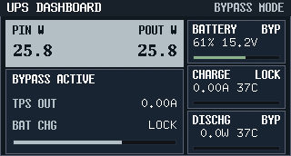
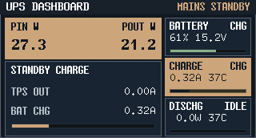
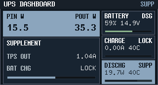
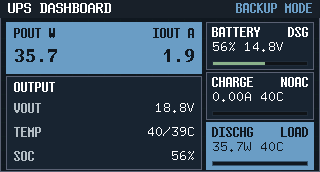

# 前面板工业仪表风 UI + 1:1 预览（#6qrjs）

## 状态

- Status: 已完成
- Created: 2026-02-26
- Last: 2026-02-27

## 背景 / 问题陈述

- 前面板当前固件已具备 GC9307 屏幕初始化与按键联动能力，但文档口径仍停留在旧的 `Hello World + fps`，与当前实现和目标风格不一致。
- 需要一个可复用的“同源渲染”链路，确保主机预览图与固件上屏逻辑 1:1 一致，避免双实现漂移。
- 需要在 `320x172` 横屏有效区内交付可评审的工业仪表风视觉方案，并采用“标签字体/数值等宽字体”双字体策略。

## 目标 / 非目标

### Goals

- 固定 `320x172` 横屏有效区，交付工业仪表风英文 UI。
- 新增共享渲染模块，由固件与主机预览工具复用同一渲染代码。
- 交付 4 个视觉变体（A/B/C/D）与 7 个交互状态帧（idle/up/down/left/right/center/touch）。
- 默认固化 Variant B 作为 Dashboard 主界面；Variant C 收敛为“高级设置/自检页”风格。
- 在 Dashboard 中明确 UPS 四工作模式（`BYPASS / STANDBY / ASSIST / BACKUP`）与充电策略约束。
- Variant C 自检页固定展示“全部可通信模块 + 通信状态 + 关键参数”。
- 建立 `docs/specs` 主规格目录并与实现保持同步。

### Non-goals

- 不接入真实电源遥测数据。
- 不实现菜单路由、触摸手势解析、复杂页面状态机。
- 不变更 GC9307/TCA6408A 硬件初始化时序与连线。
- 不推进远端 `push` 或 PR 创建。

## 范围（Scope）

### In scope

- `firmware/src/front_panel_scene.rs`：共享 UI 渲染与字体风格定义。
- `firmware/src/front_panel.rs`：改造为调用共享渲染模块，保留硬件层逻辑。
- `tools/front-panel-preview`：主机侧 1:1 预览工具（输出 `framebuffer.bin` + `preview.png`）。
- 文档更新：`firmware/README.md`、`docs/specs/README.md`、本规格文档。

### Out of scope

- 触摸芯片协议解析。
- 运行时主题切换功能。
- 真实机台显示亮度主观标定。

## 需求（Requirements）

### MUST

- 渲染逻辑同源：固件与预览必须复用同一 scene renderer。
- 预览输出像素必须是 `320x172`、`RGB565 little-endian`。
- 支持 `UiFocus` 七态与 `touch_irq` 状态展示。
- 支持 `UpsMode` 四态展示：`BYPASS`（关闭/旁路）、`STANDBY`（待机）、`ASSIST`（补充）、`BACKUP`（后备）。
- 充电策略口径固定：仅 `STANDBY` 允许电池充电；`BYPASS/ASSIST/BACKUP` 在本轮 Dashboard 一律显示充电锁定（`LOCK` 或 `NOAC`）。
- 字体策略固定：非数值文本使用 A（现代无衬线），数值/对齐字段使用 B（等宽）。
- 自检页（Variant C）必须覆盖全部通信模块：`GC9307 / TCA6408A / FUSB302 / INA3221 / BQ25792 / BQ40Z50 / TPS55288-A / TPS55288-B / TMP112-A / TMP112-B`。
- 自检页每行必须同时包含 `module + comm + key param` 三列。
- 文档不再将前面板 UI 目标描述为 `Hello World + fps`。

### SHOULD

- 保持按键几何布局与现有硬件联调布局一致（不重排触摸区与 D-pad）。
- 预览工具参数明确且可脚本化批量调用。

### COULD

- 后续在不破坏同源渲染前提下增加局部刷新优化。

## 功能与行为规格（Functional/Behavior Spec）

### Core flows

- 固件启动后读入当前按键状态，使用共享 renderer 绘制完整首帧。
- 周期轮询输入，状态变化时重绘界面并更新 focus/highlight。
- 长按 `CENTER` 约 `800ms` 在两页间切换：`Variant B Dashboard <-> Variant C Self-check`。
- 主机工具根据 `--variant`、`--mode` 与 `--focus` 调用同一 renderer，输出 raw framebuffer 与 PNG。
- Dashboard 冻结语义（项目工作模式口径）：
  - `BYPASS`（关闭）: 输入直通输出（bypass），不提供 UPS 功能；本轮 UI 充电状态固定为 `LOCK`。
  - `STANDBY`（待机）: 输入存在，TPS 无实际输出电流；允许充电。
  - `ASSIST`（补充）: 输入存在，TPS 有实际输出电流；不允许充电。
  - `BACKUP`（后备）: 输入不存在；不允许充电，输出由电池侧供能。
  - 右侧三卡固定语义：`BATTERY`（SOC + 最高电池温度 + 电池状态）、`CHARGE`（仅电池充电电流与状态）、`DISCHG`（电池放电电流与状态）。

### Self-check 视觉冻结（Variant C）

- 顶栏：`SELF CHECK`，右上状态位显示当前 UPS 工作模式（`BYPASS/STANDBY/ASSIST/BACKUP`）。
- 主体：紧凑表格（1:1 `320x172`），列固定为 `MODULE / COMM / KEY PARAM`。
- 模块覆盖固定为 10 行（按实现顺序）：
  - `GC9307`：屏幕链路状态与分辨率参数。
  - `TCA6408A`：前面板按键/IRQ 通信状态。
  - `FUSB302`：Type-C/PD 控制器通信与 VBUS 存在态。
  - `INA3221`：输入侧关键电流参数（IIN）。
  - `BQ25792`：充电器通信状态与充电电流（仅待机允许充电）。
  - `BQ40Z50`：BMS 通信状态与 SOC/均衡状态。
  - `TPS55288-A`：A 路输出模块状态与输出电流。
  - `TPS55288-B`：B 路输出模块状态与输出电流。
  - `TMP112-A`：A 路热点温度状态与温度值。
  - `TMP112-B`：B 路热点温度状态与温度值。

### Dashboard 视觉冻结（Variant B）

- 冻结对象：`Variant B (Neutral)` 作为默认 Dashboard；`Variant C` 仅用于自检页。
- 主 KPI 面板：`x=6 y=22 w=196 h=52`。
  - 顶栏模式标签（右上）使用全称：`BYPASS / STANDBY / ASSIST / BACKUP`（不使用缩写）。
  - 标签行：`y=27`（市电模式固定 `PIN W` 在前、`POUT W` 在后；后备模式为 `POUT W / IOUT A`）
  - 数值行：`y=44`（`NumBig`，数值字体 B）
- 次级信息面板：`x=6 y=76 w=196 h=94`。
  - 按工作模式切换文本块：
    - `BYPASS`：`BYPASS ACTIVE / TPS OUT / BAT CHG`
    - `STANDBY`：`STANDBY CHARGE / TPS OUT / BAT CHG`
    - `ASSIST`：`ASSIST / TPS OUT / BAT CHG`
    - `BACKUP`：`OUTPUT / VOUT / TEMP / SOC`
- 所有冻结布局均按 `320x172` 有效区评审，不允许缩放、裁切或旋转补偿。

### 冲突检查（按四模式口径）

- 旧冲突 1：将 `focus` 直接当作工作模式来源。已修正为显式 `UiModel.mode`，`focus` 仅用于高亮。
- 旧冲突 2：非待机模式仍显示可充电语义。已修正为仅 `STANDBY` 显示 `READY/CHG`，其余模式显示 `LOCK/NOAC`。
- 旧冲突 3：放电卡片和输出负载混用。已修正为 `DISCHG` 卡片仅表示电池侧放电电流（`BYPASS/STANDBY=0`）。
- 旧冲突 4：电池卡片值区语义漂移。已修正为 `BATTERY` 值区固定显示 `SOC + Tmax`（不再显示电压），状态位单独显示 `BAL/CHG/DSG/...`。

### 冻结参考图（Spec assets）

- BYPASS: `assets/dashboard-b-off-mode.png`
- STANDBY: `assets/dashboard-b-standby-mode.png`
- ASSIST: `assets/dashboard-b-supplement-mode.png`
- BACKUP: `assets/dashboard-b-backup-mode.png`

### Edge cases / errors

- 读取按键失败：界面回退到 idle 模型继续运行。
- 字体字形缺失：忽略该字符，不影响渲染流程。
- 预览参数非法：命令行报错并退出，禁止产出不完整文件。

## 接口契约（Interfaces & Contracts）

### 接口清单（Inventory）

| 接口（Name） | 类型（Kind） | 范围（Scope） | 变更（Change） | 契约文档（Contract Doc） | 负责人（Owner） | 使用方（Consumers） | 备注（Notes） |
| --- | --- | --- | --- | --- | --- | --- | --- |
| `render_frame` | Rust API | internal | New | None | firmware | firmware + host preview tool | 同源渲染入口 |
| `UiModel` | Rust type | internal | Updated | None | firmware | firmware + host preview tool | UI 状态模型（新增 `mode`） |
| `UpsMode` | Rust type | internal | New | None | firmware | firmware + host preview tool | UPS 工作模式四态 |
| `front-panel-preview CLI` | CLI | internal | Updated | None | firmware tooling | local developer | `--variant --mode --focus --out-dir` |

### 契约文档（按 Kind 拆分）

None

## 验收标准（Acceptance Criteria）

- Given 固件构建成功且屏幕硬件可访问，When 前面板输入状态变化，Then 屏幕渲染由共享 scene renderer 产出并正确显示对应 focus 高亮。
- Given 主机运行预览工具，When 指定任意 `variant/mode/focus`，Then 产出 `framebuffer.bin`（固定 `110080` bytes）与 `preview.png`（固定 `320x172`）。
- Given `mode=standby`，When 查看 CHARGE 卡片，Then 仅显示电池充电电流且状态允许充电（`READY/CHG`）。
- Given `mode=off/supplement/backup`，When 查看 CHARGE 卡片，Then 状态必须为非充电（`LOCK/NOAC`）且充电电流为 0。
- Given 切到 `Variant C` 自检页，When 查看表格，Then 必须完整显示 10 个可通信模块且每行包含 `COMM` 与 `KEY PARAM`。
- Given 自检页已显示，When 长按 `CENTER` 约 `800ms`，Then 页面在 Dashboard 与 Self-check 间切换且不会连发抖动切换。
- Given 文档更新完成，When 查阅前面板说明，Then 不再以 `Hello World + fps` 作为当前 UI 目标。

## 实现前置条件（Definition of Ready / Preconditions）

- 范围与非目标已冻结。
- `flow_type=normal` 已锁定。
- 字体来源与许可证口径已明确（u8g2 fonts 需注明字体许可差异）。

## 非功能性验收 / 质量门槛（Quality Gates）

### Testing

- Firmware build: `cargo build --manifest-path firmware/Cargo.toml --release`
- Preview build/run: `cargo run --manifest-path tools/front-panel-preview/Cargo.toml -- --variant B --mode standby --focus idle --out-dir <ABS_PATH>`

### Quality checks

- 预览图分辨率检查为 `320x172`。
- raw framebuffer 大小检查为 `320*172*2`。

## 文档更新（Docs to Update）

- `firmware/README.md`：前面板章节更新为工业仪表风 + 同源预览流程。
- `docs/specs/README.md`：新增规格索引行。
- `docs/plan/3kz8p:front-panel-screen-ui/PLAN.md`：标记为重新设计。

## 计划资产（Plan assets）

- Directory: `docs/specs/6qrjs-front-panel-industrial-ui-preview/assets/`
- In-plan references:
  - `assets/dashboard-b-off-mode.png`
  - `assets/dashboard-b-standby-mode.png`
  - `assets/dashboard-b-supplement-mode.png`
  - `assets/dashboard-b-backup-mode.png`

## 资产晋升（Asset promotion）

None

## 实现里程碑（Milestones / Delivery checklist）

- [x] M1: 建立 `docs/specs` 根目录与新规格文档
- [x] M2: 新增共享 scene renderer 并接入固件
- [x] M3: 集成 A/B 双字体策略（标签 A、数值 B 等宽）
- [x] M4: 新增主机预览工具并输出 raw + PNG
- [x] M5: 批量导出 21 张状态预览图
- [x] M6: 更新 README 与旧计划口径漂移
- [x] M7: Dashboard 视觉冻结（主人评审通过，按 Variant B 锁定）

## 方案概述（Approach, high-level）

- 使用 `UiPainter` 抽象屏幕绘制能力，保证固件硬件写屏与主机 framebuffer 共用一套渲染逻辑。
- 使用 u8g2 字体渲染器输出英文标签与数值：标签统一 A，数值统一 B（monospace），不在 Python 中重写渲染逻辑。
- 通过工具链批量导出状态图，先看效果再决定后续迭代。

## 风险 / 开放问题 / 假设（Risks, Open Questions, Assumptions）

- 风险：逐像素字体渲染在 MCU 侧吞吐较低，后续可能需要局部刷新优化。
- 需要决策的问题：A/D 是否保留为后续主题实验样式。
- 假设（已确认）：当前阶段默认 Variant B 满足 Dashboard 首轮上板验证，Variant C 用于自检页面方向。

## 变更记录（Change log）

- 2026-02-26: 新建规格并完成第一轮实现同步（共享渲染 + 预览工具 + 文档更新）。
- 2026-02-26: 根据评审反馈将 Dashboard 文案收敛到项目功能域，并固定 A/B 字体分工（标签 A，数值 B）。
- 2026-02-26: 根据评审反馈将默认 Dashboard 切换为 Variant B，并将 Variant C 重定位为自检页视觉。
- 2026-02-26: 冻结 Variant B Dashboard 间距与留白（主 KPI 面板 + 次级面板行距），并归档 AC/BATT 参考图。
- 2026-02-27: 修正 AC 电流语义（`ICHG BAT` 不再混同为线侧输入电流），并移除 BATT 模式次级面板中的 `POUT` 重复字段。
- 2026-02-27: 按 UPS 四工作模式重构 Dashboard 语义：新增 `UpsMode`、明确充电策略（仅 STANDBY 可充）、并归档四张冻结参考图。
- 2026-02-27: 模式命名统一升级为专业全称（`BYPASS / STANDBY / ASSIST / BACKUP`），界面右上状态位不再使用缩写。
- 2026-02-27: 自检页升级为“全模块通信诊断表”（10 模块覆盖），并新增长按 CENTER 页面切换（Dashboard <-> Self-check）。

## 参考（References）

- `firmware/src/front_panel.rs`
- `firmware/src/front_panel_scene.rs`
- `tools/front-panel-preview/src/main.rs`
- `docs/specs/6qrjs-front-panel-industrial-ui-preview/assets/dashboard-b-off-mode.png`
- `docs/specs/6qrjs-front-panel-industrial-ui-preview/assets/dashboard-b-standby-mode.png`
- `docs/specs/6qrjs-front-panel-industrial-ui-preview/assets/dashboard-b-supplement-mode.png`
- `docs/specs/6qrjs-front-panel-industrial-ui-preview/assets/dashboard-b-backup-mode.png`
- [u8g2-fonts docs](https://docs.rs/u8g2-fonts/latest/u8g2_fonts/fonts/index.html)
- [u8g2 license](https://raw.githubusercontent.com/olikraus/u8g2/master/LICENSE)
