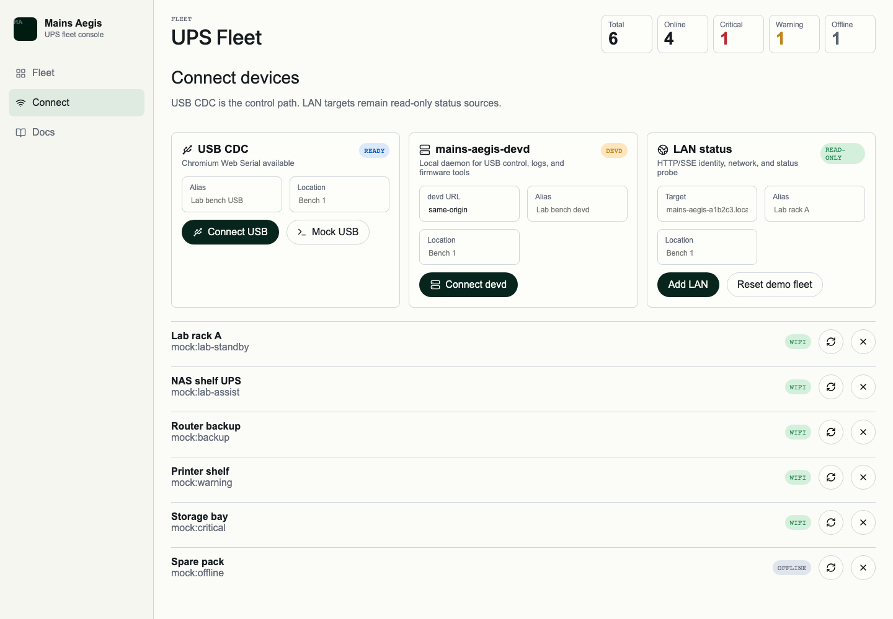
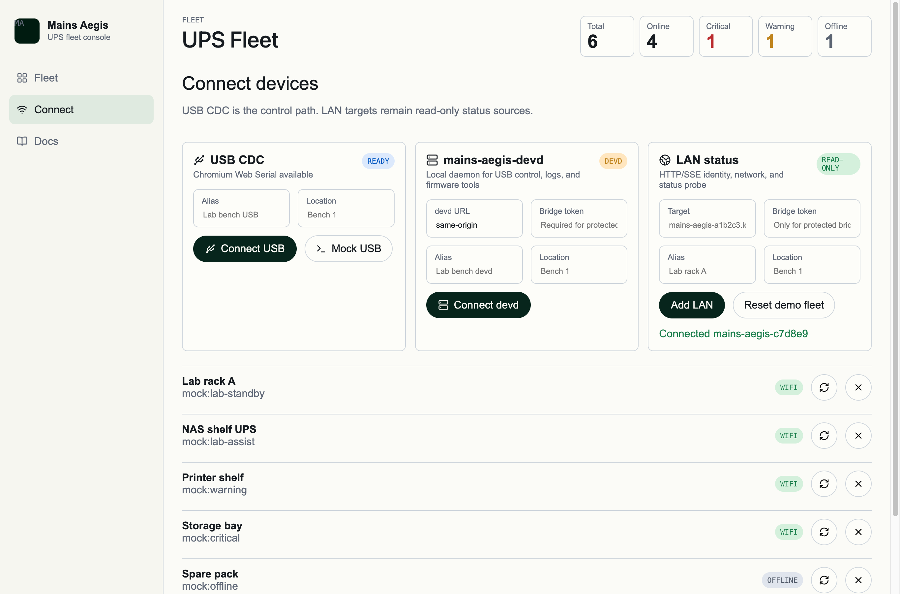

# Mains Aegis CLI / devd alignment（#7jqrq）

## 状态

- Status: 已完成
- Created: 2026-06-02
- Last: 2026-06-06

## 接管说明

- 本规格记录的是 host-tools single-crate、IPC-only `serve`、显式 `bridge-http` 与 release/install 对齐。
- 其中 CLI `device session` 用户命令面、`session/safeSettings` 历史模型，以及新的 `connection / identity / status / settings / trace` 查询面，已转由 [`#k4vzn`](../k4vzn-lan-management-convergence/SPEC.md) 接管。
- 当前默认推进路径为：在当前 PR #80 上先完成该新规格与契约收敛，再视差异规模继续增量实现。

## 背景 / 问题陈述

Mains Aegis 过去只有 `mains-aegis-devd` HTTP daemon；用户机器安装时容易把源码构建、localhost HTTP、Web 控制面和未来 CLI 混成同一件事。对齐后的主机工具必须是一个可发布的 host-tools 产品：同一 Rust crate 产出 `mains-aegis` CLI 与 `mains-aegis-devd` daemon，用户操作依赖 release 包安装，开发操作才允许源码构建。

## 目标 / 非目标

### Goals

- 新增 `tools/mains-aegis-host`，统一产出 `mains-aegis` 与 `mains-aegis-devd` 两个二进制。
- `mains-aegis-devd serve` 改为 IPC-only；HTTP/Web 暴露只能通过显式 `mains-aegis-devd bridge-http` 开启。
- `mains-aegis` CLI 通过 IPC 调用 devd，覆盖设备、artifact、flash dry-run/reset/monitor、serial lease、settings 与 host power 命令族；历史 `device session` 命令面由 #k4vzn 替换为 `connection / settings / trace`。
- devd HTTP bridge 只能在显式启用且配置 bearer token 时绑定非 loopback 地址。
- 发布流程产出 Linux x86_64、macOS arm64、Windows x86_64 host-tools archive、安装脚本与 `SHA256SUMS`。
- repo skills 拆分为默认仓库开发/诊断层与显式用户操作层；Codex 在本仓内默认使用 `$mains-aegis-devd-flow`，用户操作层仅在主人明确要求 end-user/released host-tools 操作、安装验证或点名 `$mains-aegis-user-operations` 时触发。

### Non-goals

- 不新增桌面 App。
- 不把 CLI 变成直接串口/espflash/mcu-agentd 包装器。
- 不删除 Web Serial 作为正式 Web 路径。
- 不把 devd HTTP bridge 作为默认本地控制面。

## 功能规格

### Host tools crate

- `tools/mains-aegis-host` 是 canonical host-tools crate。
- crate 内共享 devd 状态机、持久状态文件、HTTP bridge、IPC server/client 与 CLI 参数解析。
- 旧 `tools/mains-aegis-devd` crate 不再作为构建或文档入口。

### devd commands

- `mains-aegis-devd serve [--ipc <endpoint>] [--idle-timeout-secs <n>] [--allow-host-power-actions]` 启动 IPC daemon。
- `serve` 不接受 `--bind`、`--web-root` 或 HTTP 相关参数。
- `mains-aegis-devd bridge-http [--ipc <endpoint>] --bind 127.0.0.1:30080 [--web-root <dir>] [--allow-dev-cors]` 启动 HTTP/Web bridge，并在同一进程内启动共享状态的 IPC listener。
- `bridge-http` 绑定非 loopback 地址时必须同时传入 `--allow-lan-bridge` 与 `--auth-token-file <file>`；API 请求必须携带 `Authorization: Bearer <token>`，浏览器 EventSource 请求可使用 `bridge_token=<token>` query 参数。
- `GET /api/v1/bootstrap` 必须在 token 模式下保持免认证，用于浏览器发现 bridge 是否需要 token；响应的 `token_required` 必须反映当前 `bridge-http` 配置。

### CLI commands

- CLI 全局支持 `--ipc <endpoint>`，默认 endpoint 与 devd 一致。
- CLI 发起 newline JSON IPC 请求，不直接枚举串口、不直接切换端口、不直接调用 espflash。
- CLI 的 flash 与 host power state-changing 命令默认发送 dry-run；真实动作必须显式传入 `--real`。
- CLI v1 覆盖：
  - `health`
  - `devices list|scan`
  - `device <id> bind|unbind|connect|disconnect|identity|session|artifact|get|artifact select|flash|reset|monitor start|monitor stop`
  - `serial lease create|heartbeat|release`
  - `settings wifi set|clear`、`settings log-level`、`settings manual-charge`
  - `host power status|profile|suspend|shutdown`

### Release and install

- Host-tools release tag 使用 `host-tools-v*`。
- Release archive 必须至少包含 `bin/mains-aegis`、`bin/mains-aegis-devd` 和对应平台安装脚本。
- 发布资产必须包含 `SHA256SUMS`。
- 手动触发 release 时，构建 checkout 必须跟随输入的 host-tools tag，避免按工作流触发 ref 构建错误提交；release build 必须把该 tag 注入 host-tools 二进制版本信息。
- 用户操作 skill 是显式 end-user/released-tool 路径，只接受已安装 release 工具；缺少 release 工具时阻断并提示安装 release，不自动 `cargo run`。本仓内 Codex 默认开发、验证、诊断与硬件 read/session-read 检查走 `$mains-aegis-devd-flow`。

### Web bridge

- Web dev proxy 默认指向 `http://127.0.0.1:30080`，可通过 `MAINS_AEGIS_DEVD_URL`、`VITE_DEFAULT_DEVD_URL` 或 `VITE_DEVD_API_BASE` 指向显式启动的 `bridge-http`；该地址代表显式启动的 HTTP bridge，不是默认 daemon。需要 Web 与 CLI 共用状态时，CLI 连接同一个 `bridge-http --ipc <endpoint>`。
- Connect 页的默认 devd 地址可通过 `VITE_DEFAULT_DEVD_URL` 或兼容的 `VITE_DEVD_API_BASE` 注入；demo 模式仍固定使用 `mock:devd`。
- `bridge-http --allow-dev-cors` 只允许 loopback HTTP development origins（`localhost`、`127.0.0.1`、`[::1]`，任意端口），用于 Vite 租约端口或直接 dev bridge 调试；非 loopback bridge 仍必须走 token-gated LAN bridge 规则。
- Connect 页在 devd 发现结果里只展示 `identity.firmware.protocol === "mains-aegis.cdc.v1"` 的 LAN 设备；其他 LAN 候选不应进入可连接列表。
- Web API client 支持从 `localStorage["mains-aegis.bridgeAuthToken"]` 读取 bearer token，以便 devd bridge 显式授权场景使用；该 token 只能附加到明确的 devd/bridge API 与 devd EventSource 请求，不能发送给普通 LAN 设备探活或 LAN status SSE。Connect 页的 LAN 入口只接受硬件本体 HTTP/SSE 端点，不暴露 bridge token 表单，也不得把 `mains-aegis-devd bridge-http` 当作 LAN 设备添加。
- Web Serial 与 devd HTTP bridge 仍按既有租约、心跳和 release 语义工作。
- devd bridge 与 CLI 观察同一进程内状态；绑定、别名和 artifact selection 还会写入用户配置目录的 devd 状态文件，daemon 重启后恢复为 disconnected 的安全运行态并保留用户配置态。

## 验收标准

- `cargo check --manifest-path tools/mains-aegis-host/Cargo.toml --all-targets` 通过。
- `cargo test --manifest-path tools/mains-aegis-host/Cargo.toml` 通过。
- `mains-aegis-devd serve --help` 中不出现 `--bind`。
- `mains-aegis-devd bridge-http --bind 0.0.0.0:30080` 在缺少 token 文件时失败。
- `mains-aegis` CLI 能通过 IPC 调用 mock devd 的 health/list/devices 命令。
- `mains-aegis device <id> bind` 创建的绑定在 devd 重启后仍可由 `devices list` 看到；`connect` 和 Web lease 不跨重启恢复。
- `mains-aegis device <id> flash` 和 `mains-aegis host power ...` 默认 dry-run，真实动作必须显式 `--real`。
- `bun run --cwd web check` 通过。
- CI 与 host-power VM workflow 使用 `tools/mains-aegis-host`。
- Host-tools release workflow 覆盖 Linux x86_64、macOS arm64、Windows x86_64。
- 文档、skills 与 AGENTS 不再把 `tools/mains-aegis-devd` 或 `serve --bind` 当作当前入口，并明确本仓 Codex 默认路由为 `$mains-aegis-devd-flow`；`$mains-aegis-user-operations` 仅作为显式 end-user/released-tool 路径。

## Visual Evidence

视觉证据由 Vite 纯前端 mock UI 生成，使用正式路由和 mock fixtures，不连接真实 UPS 设备。

- source_type: mock_ui
  demo_entry_or_title: `/connect?seed=default`
  requested_viewport: `1440x1000`
  viewport_strategy: `headless-browser`
  capture_scope: `browser-viewport`
  target_program: `mock-only`
  scenario: host-tools bridge connect entry
  evidence_note: 验证 Connect 页仍保留 USB CDC、显式 `mains-aegis-devd` bridge 与硬件 LAN read-only 三入口；本次 host-tools 对齐没有破坏 mock UI 连接面。

- source_type: mock_ui
  demo_entry_or_title: Storybook `UPS Management/Connect / Add LAN target`
  requested_viewport: `1365x900`
  viewport_strategy: `storybook-viewport`
  capture_scope: `browser-viewport`
  target_program: `mock-only`
  scenario: devd-only bridge token input
  evidence_note: 验证 Connect 页只在 protected `mains-aegis-devd bridge-http` 场景暴露 token 输入，普通 LAN 添加流程保持硬件直连语义。

