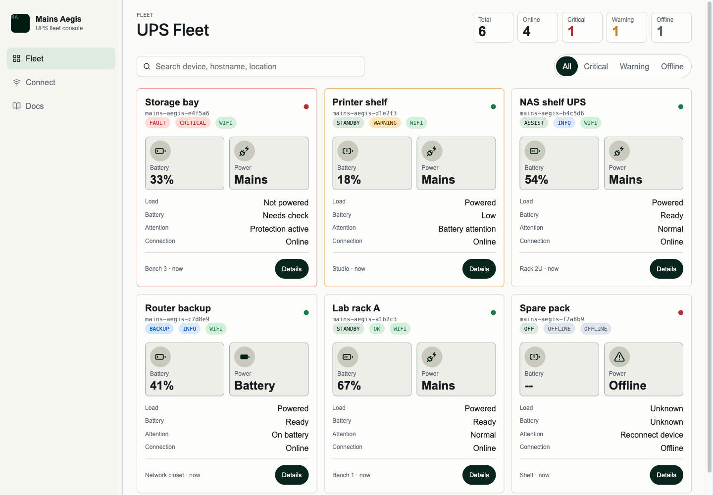
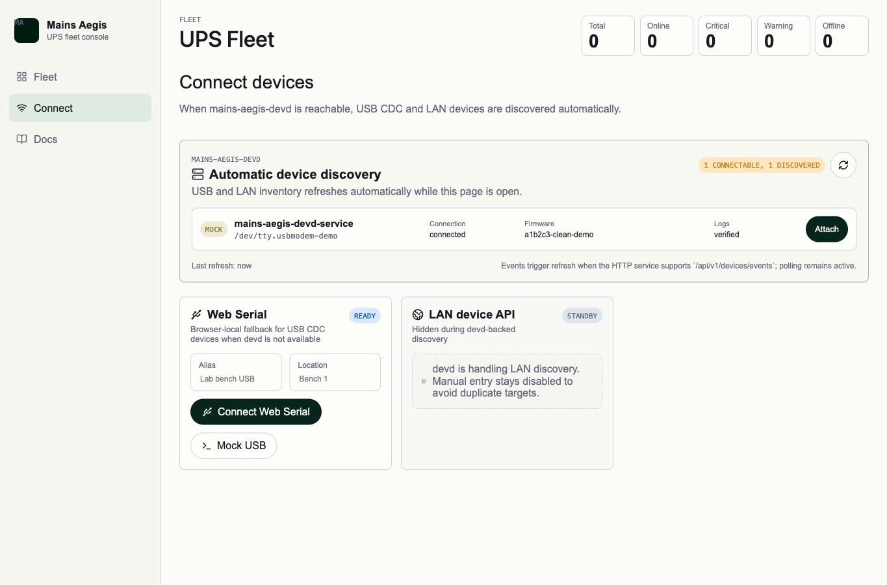

# Mains Aegis CLI / devd alignment（#7jqrq）

## 状态

- Status: 已完成
- Created: 2026-06-02
- Last: 2026-06-07

## 接管说明

- 本规格记录的是 host-tools single-crate、IPC-only `serve`、显式 `serve-http`、嵌入式 hosted Web 与 release/install 对齐。
- 其中 CLI `device session` 用户命令面、`session/safeSettings` 历史模型，以及新的 `connection / identity / status / settings / trace` 查询面，已转由 [`#k4vzn`](../k4vzn-lan-management-convergence/SPEC.md) 接管。
- 当前默认推进路径为：在当前 PR #80 上先完成该新规格与契约收敛，再视差异规模继续增量实现。

## 背景 / 问题陈述

Mains Aegis 过去只有 `mains-aegis-devd` HTTP daemon；用户机器安装时容易把源码构建、localhost HTTP、Web 控制面和未来 CLI 混成同一件事。对齐后的主机工具必须是一个可发布的 host-tools 产品：同一 Rust crate 产出 `mains-aegis` CLI 与 `mains-aegis-devd` daemon，用户操作依赖 release 包安装，开发操作才允许源码构建。

## 目标 / 非目标

### Goals

- 新增 `tools/mains-aegis-host`，统一产出 `mains-aegis` 与 `mains-aegis-devd` 两个二进制。
- `mains-aegis-devd serve` 改为 IPC-only；HTTP/Web 暴露只能通过显式 `mains-aegis-devd serve-http` 开启。
- `mains-aegis` CLI 只能通过系统原生 IPC 调用 devd；Unix 使用 Unix domain socket，Windows 使用 named pipe。CLI 不得使用 HTTP、TCP、localhost URL 或 `serve-http` 作为 devd 通信路径。
- `mains-aegis` CLI 覆盖设备、artifact、flash dry-run/reset/monitor、serial lease、settings 与 host power 命令族；历史 `device session` 命令面由 #k4vzn 替换为 `connection / settings / trace`。
- devd HTTP service 只能在显式启用且配置 bearer token 时绑定非 loopback 地址。
- 发布流程产出 Linux x86_64、macOS arm64、Windows x86_64 host-tools archive、安装脚本与 `SHA256SUMS`。
- repo skills 拆分为默认仓库开发/诊断层与显式用户操作层；Codex 在本仓内默认使用 `$mains-aegis-devd-flow`，用户操作层仅在主人明确要求 end-user/released host-tools 操作、安装验证或点名 `$mains-aegis-user-operations` 时触发。

### Non-goals

- 不新增桌面 App。
- 不把 CLI 变成直接串口/espflash/mcu-agentd 包装器。
- 不删除 Web Serial 作为正式 Web 路径。
- 不把 devd HTTP service API-only 开发入口作为默认本地控制面。

## 功能规格

### Host tools crate

- `tools/mains-aegis-host` 是 canonical host-tools crate。
- crate 内共享 devd 状态机、持久状态文件、HTTP service、IPC server/client 与 CLI 参数解析。
- 旧 `tools/mains-aegis-devd` crate 不再作为构建或文档入口。

### devd commands

- `mains-aegis-devd serve [--ipc <endpoint>] [--idle-timeout-secs <n>] [--allow-host-power-actions]` 启动 IPC daemon。
- `serve` 不接受 `--bind`、`--open-browser` 或其他 HTTP 相关参数。
- `mains-aegis-devd serve-http [--ipc <endpoint>] --bind 127.0.0.1:30080 [--allow-dev-cors] [--open-browser]` 启动显式 HTTP/Web 服务，并在同一进程内启动共享状态的 IPC listener。
- 默认 hosted 模式下，`serve-http` 托管嵌入式 `web/dist` 产物，并以 same-origin 方式同时提供 `/` 和 `/api`；根路径保持 Fleet Home，不再跳到 `/connect`。
- hosted 模式会为当前进程生成内存态 app-session secret，并注入 HTML；后续 API 请求必须携带 `x-mains-aegis-app-session` header，浏览器 EventSource 使用 `app_session=<secret>` query 参数。`GET /api/v1/bootstrap` 与静态 hosted 资源保持免认证。
- `serve-http --allow-dev-cors` 进入 API-only 开发模式：仅允许 loopback HTTP development origins（`localhost`、`127.0.0.1`、`[::1]`，任意端口）跨源访问 `/api`，不托管嵌入式 hosted app，且不得与 `--open-browser` 组合。
- `serve-http` 绑定非 loopback 地址时必须同时传入 `--allow-lan-bridge` 与 `--auth-token-file <file>`；API 请求额外接受 `Authorization: Bearer <token>`，浏览器 EventSource 兼容 `service_token=<token>` 与 legacy `bridge_token=<token>` query 参数。
- `GET /api/v1/bootstrap` 必须在 token 模式下保持免认证，用于浏览器判断当前 HTTP service 是否需要额外 bearer token；响应的 `token_required` 必须反映当前 `serve-http` 配置。
- host-tools Rust 构建只消费预构建的 `web/dist` 嵌入产物；若缺失，构建必须明确失败并提示开发者先执行 `bun run build`。

### CLI commands

- CLI 全局支持 `--ipc <endpoint>`，默认 endpoint 与 devd 一致。
- `--ipc <endpoint>` 只接受系统原生 IPC endpoint：Unix socket path 或 Windows named pipe name。它不得接受 `http://`、`https://`、`tcp://`、`localhost:<port>`、`127.0.0.1:<port>` 或其它 TCP/URL 形式。
- CLI 发起 newline JSON native IPC 请求，不直接枚举串口、不直接切换端口、不直接调用 espflash。
- CLI 不得为了执行设备、artifact、flash/reset/monitor、settings 或 host power 命令而启动、依赖或要求 `mains-aegis-devd serve-http`。
- CLI 的 flash 与 host power state-changing 命令默认发送 dry-run；真实动作必须显式传入 `--real`。
- `mains-aegis device <id> bind` 在交互式 TTY 场景下，若 devd 返回可确认的 `companion_lan_candidate`，必须就地提示是否同时绑定 LAN companion；非交互场景不得弹提示、不得自动持久化，只返回候选详情与后续显式命令。
- host-tools 必须提供显式的 companion-LAN 契约面：`POST /api/v1/devices/{id}/companion-lan`、`DELETE /api/v1/devices/{id}/companion-lan`、IPC `device.companion_lan.bind|clear`，以及 CLI `device <id> companion-lan bind|clear`。该契约面只负责“确认/清除 companion 绑定”，不得隐式代替 `bind`。
- CLI v1 覆盖：
  - `health`
  - `devices list|scan`
  - `device <id> bind|unbind|connect|disconnect|identity|status|power-diag|settings|trace|artifact get|artifact select|flash|reset|monitor start|monitor stop`
  - `serial lease create|heartbeat|release`
  - `settings wifi set|clear`、`settings log-level`、`settings manual-charge`
  - `host power status|profile|suspend|shutdown`
- `mains-aegis device <id> status` 与 `mains-aegis device <id> power-diag` 是 UPS 只读观测的正式 CLI 面，必须通过 IPC 调用 devd，不得要求操作者直接拼 JSON-RPC 或依赖 `serve-http`。
- 两个只读命令都支持 `--fresh`、`--cache-only`、`--include-meta`、`--watch`、`--interval-ms` 与 `--samples`。`--fresh` 与 `--cache-only` 互斥；单次读取默认允许 devd 按自身策略使用 fresh 或 cache。`--watch` 的默认语义固定为 monitor-cache telemetry stream：优先按节拍返回 monitor cache，并通过 `meta.cache_fresh/sample_fresh` 标示新鲜度；若 monitor cache 尚不可用，则返回带 `miss=true` 的 JSONL miss 行，而不是隐式退回 direct CDC 读。需要逐样本强制 CDC fresh 读时，操作者必须显式传入 `--fresh`。

### Release and install

- Host-tools release tag 使用 `host-tools-v*`。
- Release archive 必须至少包含 `bin/mains-aegis`、`bin/mains-aegis-devd` 和对应平台安装脚本。
- 发布资产必须包含 `SHA256SUMS`。
- 手动触发 release 时，构建 checkout 必须跟随输入的 host-tools tag，避免按工作流触发 ref 构建错误提交；release build 必须把该 tag 注入 host-tools 二进制版本信息。
- 用户操作 skill 是显式 end-user/released-tool 路径，只接受已安装 release 工具；缺少 release 工具时阻断并提示安装 release，不自动 `cargo run`。本仓内 Codex 默认开发、验证、诊断与硬件 read/session-read 检查走 `$mains-aegis-devd-flow`。

### Web HTTP service

- Web dev proxy 默认指向 `http://127.0.0.1:30080`，可通过 `MAINS_AEGIS_DEVD_URL`、`VITE_DEFAULT_DEVD_URL` 或 `VITE_DEVD_API_BASE` 指向显式启动的 `serve-http --allow-dev-cors`；该地址代表显式启动的开发 HTTP service，不是默认 daemon。需要 Web 与 CLI 共用状态时，CLI 连接同一个 `serve-http --ipc <endpoint>`；CLI 与 devd 的通信仍只能通过系统原生 IPC endpoint，不能连接 Web proxy、HTTP service URL 或任何 TCP 地址。
- Hosted 模式固定使用 same-origin devd HTTP service；Connect 页在 hosted app 中不暴露 devd URL 或 token 输入。demo 模式仍固定使用前端内置 mock fixtures，不依赖 devd runtime device。
- Hosted Connect 只保留 devd discovery；不再渲染 Web Serial 或手动 LAN fallback 面板。独立浏览器 / Vite 开发场景继续保留这些 fallback 入口。
- `serve-http --allow-dev-cors` 只允许 loopback HTTP development origins（`localhost`、`127.0.0.1`、`[::1]`，任意端口），用于 Vite 租约端口或直接 dev API 调试；非 loopback HTTP service 仍必须走 token-gated LAN bridge 规则。
- Connect 页在 devd 发现结果里只展示 `identity.firmware.protocol === "mains-aegis.cdc.v1"` 的 LAN 设备；其他 LAN 候选不应进入可连接列表。
- Hosted Connect 中，devd 发现出的 USB 设备必须通过 devd Web lease / usb-http bridge 接入；devd 发现出的 LAN 设备必须落为硬件本体 HTTP target，而不是持久化成 `devd transport` 记录。
- Hosted Web client 从页面 meta 读取 app-session secret，并且只把该 secret 附加到 same-origin devd API 与 devd EventSource 请求；普通 LAN 设备探活与 LAN status SSE 不得携带该 secret。
- Web Serial 与 devd HTTP service 仍按既有租约、心跳和 release 语义工作。
- 绑定、别名和 artifact selection 写入用户配置目录的 devd 状态文件，daemon 重启后恢复为 disconnected 的安全运行态并保留用户配置态。CLI 只能通过系统原生 IPC 观察和修改这些 devd 状态。

- 跨 `Web App` / `mains-aegis-devd` / `mains-aegis` CLI 的通信方案优先级矩阵由 [`#rzx5v`](../rzx5v-client-transport-priority/SPEC.md) 统一定义；本规格只记录 host-tools crate、IPC/HTTP 命令面与 release/install 对齐，不再重复定义跨客户端优先级表。

## 验收标准

- `cargo check --manifest-path tools/mains-aegis-host/Cargo.toml --all-targets` 通过。
- `cargo test --manifest-path tools/mains-aegis-host/Cargo.toml` 通过。
- `mains-aegis-devd serve --help` 中不出现 `--bind`。
- `mains-aegis-devd serve-http --bind 0.0.0.0:30080` 在缺少 token 文件时失败。
- `mains-aegis-devd serve-http --allow-dev-cors --open-browser` 参数冲突并失败。
- `mains-aegis` CLI 能通过 IPC 调用 devd 的 health/list/devices 命令；当 daemon 尚未发现任何设备时返回空设备列表而不是 synthetic mock 设备。
- `mains-aegis --ipc http://127.0.0.1:30080 health`、`mains-aegis --ipc tcp://127.0.0.1:30080 health` 与裸 `host:port` 形式必须失败，且不得发起 TCP 连接。
- `mains-aegis device <id> bind` 创建的绑定在 devd 重启后仍可由 `devices list` 看到；`connect` 和 Web lease 不跨重启恢复。
- `mains-aegis device <id> flash` 和 `mains-aegis host power ...` 默认 dry-run，真实动作必须显式 `--real`。
- `bun run --cwd web check` 通过。
- CI 与 host-power VM workflow 使用 `tools/mains-aegis-host`。
- Host-tools release workflow 覆盖 Linux x86_64、macOS arm64、Windows x86_64。
- 文档、skills 与 AGENTS 不再把 `tools/mains-aegis-devd` 或 `serve --bind` 当作当前入口，并明确本仓 Codex 默认路由为 `$mains-aegis-devd-flow`；`$mains-aegis-user-operations` 仅作为显式 end-user/released-tool 路径。

## Visual Evidence

视觉证据由 Vite 纯前端 mock UI 生成，使用正式路由和 mock fixtures，不连接真实 UPS 设备。

- source_type: mock_ui
  demo_entry_or_title: `/`
  requested_viewport: `1440x1000`
  viewport_strategy: `headless-browser`
  capture_scope: `browser-viewport`
  target_program: `mock-only`
  scenario: hosted root fleet home
  evidence_note: 验证 hosted 模式根路径保持 Fleet Home，而不是跳到 `/connect`；Fleet 入口仍使用 same-origin Web App 结构。

- source_type: storybook_canvas
  story_id_or_title: `UPS Management/Connect / Hosted devd discovery`
  requested_viewport: `1440x980`
  viewport_strategy: `storybook-viewport`
  capture_scope: `browser-viewport`
  target_program: `mock-only`
  scenario: hosted connect desktop discovery-only layout
  evidence_note: 验证桌面态 hosted Connect 页不再暴露 devd URL 或 token 输入，也不再渲染 Web Serial / 手动 LAN fallback；LAN 候选只作为 direct HTTP target 出现。

