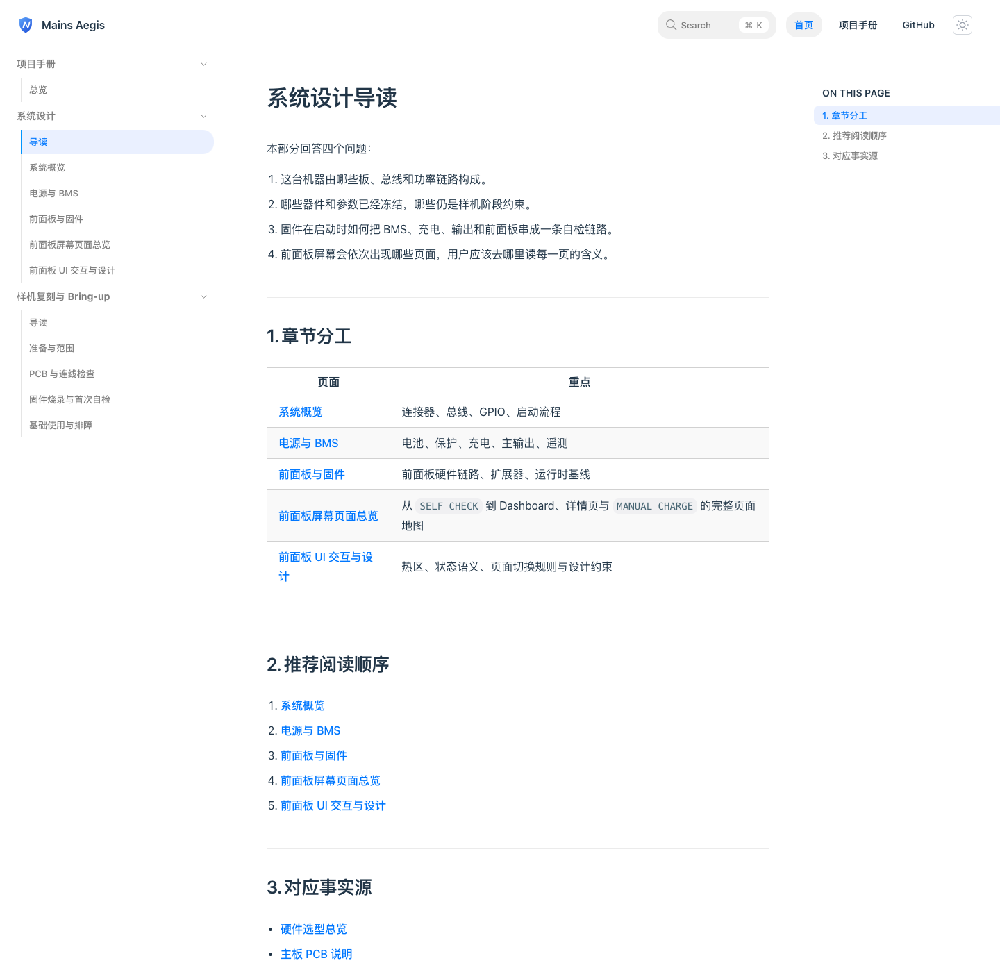
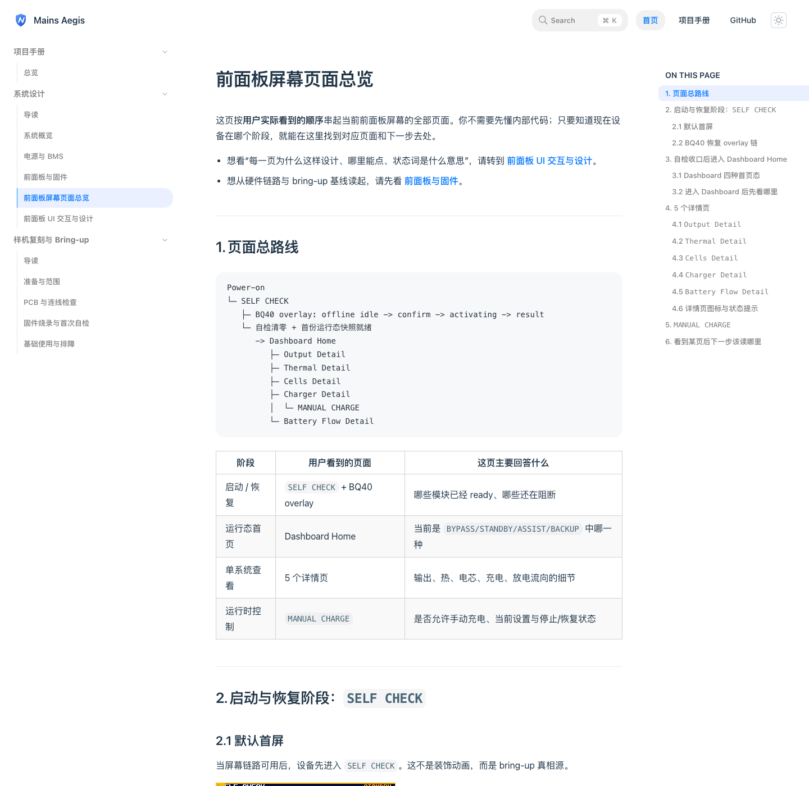
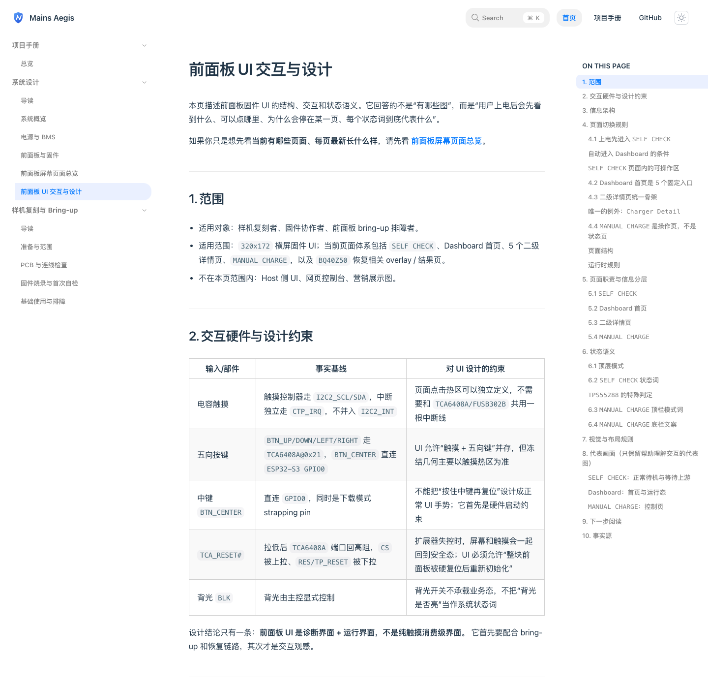

# 前面板屏幕文档重构（#9rmmn）

## 状态

- Status: 部分完成（2/3）
- Created: 2026-04-09
- Last: 2026-04-09

## 背景 / 问题陈述

- 当前公开文档里存在独立的“前面板 UI 图集”页面，它把截图堆在一起，但没有按照用户真实阅读路径组织信息。
- active docs 对屏幕文档的职责切分不清：`前面板与固件`、`前面板 UI 交互与设计`、gallery 页面之间存在重复、跳转割裂与事实分散。
- `firmware/ui/self-check-design.md` 仍保留“自检后停留在 SELF CHECK”的旧口径，与已完成规格 `g2kte-dashboard-live-after-self-check` 冲突，已经会误导读者。
- 不重构的话，用户会继续在错误页面读到过时结构，且无法从用户角度一次看懂“这块屏会出现哪些页面”。

## 目标 / 非目标

### Goals

- 从 active docs 中移除“前面板 UI 图集”这一文档角色与路由。
- 新增一份面向用户的“前面板屏幕页面总览”，按真实页面路径串起全部屏幕面与最新图。
- 重新切分 `docs-site` 中前面板专题的文档职责：硬件链路、页面总览、交互设计各司其职。
- 同步修正 `firmware/ui` 当前 SoT，尤其是 `self-check-design.md` 的运行语义与手动充电图片引用口径。
- 产出新的视觉证据并把本轮改动推进到 merge-ready PR。

### Non-goals

- 不改固件行为、屏幕布局、PCB 网表或器件参数。
- 不重写 vendor 资料库和与前面板无关的公开手册页。
- 不清理所有历史 specs 的遗留措辞；只要求 active docs 与当前 SoT 不再依赖或暴露 gallery 概念。

## 范围（Scope）

### In scope

- `docs-site` 中所有 active 前面板屏幕相关入口、命名、导航、阅读顺序与相关文案。
- 新增 `docs-site/docs/design/front-panel-screen-pages.md`，并让它成为唯一的全页面串联文档。
- 调整 `前面板与固件`、`前面板 UI 交互与设计`、`固件烧录与首次自检` 等页中的配图分布与跳转。
- 同步 `firmware/ui/README.md`、`firmware/ui/self-check-design.md`、`firmware/ui/dashboard-detail-design.md` 的当前真相源口径。
- 新规格、视觉证据、PR 与 review-loop 收敛。

### Out of scope

- 固件源码、运行逻辑与硬件设计改动。
- 非前面板专题的系统设计页大改版。
- 旧 specs 的系统性迁移或历史截图回收。

## 需求（Requirements）

### MUST

- active docs 中不得再存在“前面板 UI 图集”作为页面标题、正文主称谓或导航入口。
- `/design/front-panel-screen-pages` 必须覆盖 `SELF CHECK`、BQ40 overlay / 结果态、Dashboard 首页、5 个详情页和 `MANUAL CHARGE`。
- `前面板与固件` 只能保留硬件链路、运行时基线和少量代表图。
- `前面板 UI 交互与设计` 必须聚焦热区、状态语义、交互路径与设计约束，不再承担全量截图索引。
- `firmware/ui/self-check-design.md` 必须明确“自检收口后进入 Dashboard”。
- `firmware/ui` 中 `MANUAL CHARGE` 图引用必须改到当前 promoted assets，而不是 legacy spec 路径。
- `docs-site` 必须完成 build / preview / browser smoke。

### SHOULD

- 站点首页、手册总览和系统设计导读应能把读者自然导向新的屏幕总览页。
- 视觉证据应至少覆盖更新后的侧边栏、屏幕总览页和一份改造后的专题页。
- `firmware/ui/README.md` 应清楚说明 public handbook 与 internal SoT 的对应关系。

### COULD

- 在新总览页中增加“看到某页后下一步该读哪里”的阅读表。

## 功能与行为规格（Functional/Behavior Spec）

### Core flows

- 用户从系统设计导读或手册目录进入前面板专题时，应看到“前面板与固件 -> 前面板屏幕页面总览 -> 前面板 UI 交互与设计”的顺序。
- 用户打开新的屏幕总览页时，应能按真实页面路径看到：启动自检、BQ40 恢复、Dashboard 四态、5 个详情页与 `MANUAL CHARGE`。
- 用户打开 `前面板 UI 交互与设计` 时，应获取交互路径、热区、状态词与设计约束，而不是被导向截图堆叠页。
- 用户打开 bring-up 文档时，应知道正常路径是“`SELF CHECK` -> Dashboard”，而不是误以为 `SELF CHECK` 是 steady-state 默认页。

### Edge cases / errors

- 历史 specs 中允许保留“图集”字样与旧截图，只要 active docs 不再暴露这些入口。
- 若历史截图仍被 active docs 当作当前 SoT 引用，则必须在本轮清理掉该引用。
- 如果 preview 端口默认值已被其他 scope 占用，必须改走当前租约端口，不得直接复用别人的 localhost 服务。

## 接口契约（Interfaces & Contracts）

### 接口清单（Inventory）

| 接口（Name） | 类型（Kind） | 范围（Scope） | 变更（Change） | 契约文档（Contract Doc） | 负责人（Owner） | 使用方（Consumers） | 备注（Notes） |
| --- | --- | --- | --- | --- | --- | --- | --- |
| `/design/front-panel-ui-gallery` | internal | internal | Delete | None | docs-site | docs-site readers | active route removed |
| `/design/front-panel-screen-pages` | internal | internal | New | None | docs-site | docs-site readers | new screen journey page |
| `firmware/ui/assets/manual-charge-*.png` | internal | internal | New | None | firmware/ui docs | docs-site + firmware/ui docs | promoted manual-charge assets |

### 契约文档（按 Kind 拆分）

None

## 验收标准（Acceptance Criteria）

- Given 打开 `docs-site` 侧边栏，When 浏览系统设计分组，Then 不再出现“前面板 UI 图集”，而出现“前面板屏幕页面总览”。
- Given 打开 `/design/front-panel-screen-pages`，When 顺序阅读，Then 能看到当前全部屏幕面及其出现时机与下一跳。
- Given 打开 `前面板 UI 交互与设计`，When 阅读页面末尾，Then 只会被引导到“屏幕页面总览 / 前面板与固件 / bring-up”而不是图集页。
- Given 打开 `固件烧录与首次自检`，When 阅读前面板参考图段落，Then 能明确知道正常 steady-state 路径是自检后自动进入 Dashboard。
- Given 打开 `firmware/ui/self-check-design.md`，When 阅读运行语义，Then 不再出现“自检后保持 SELF CHECK 页面并持续刷新真实运行数据”。
- Given `docs-site` 已安装依赖，When 执行 `bun run build` 并启动 preview，Then 站点可构建、页面可打开且 local preview URL 来源可证明为当前 worktree。

## 实现前置条件（Definition of Ready / Preconditions）

- 新的前面板文档 IA 已冻结为“两页屏幕专题”：页面总览 + 交互与设计
- active route 改名与删除口径已冻结
- 视觉证据目标已确定为 docs-site preview 页面截图
- 当前仓库允许 docs-only 规格、文档、资产与 PR 收敛改动

## 非功能性验收 / 质量门槛（Quality Gates）

### Testing

- Build: `cd docs-site && bun install --frozen-lockfile`
- Build: `cd docs-site && bun run build`
- Preview smoke: `cd docs-site && DOCS_PORT=<leased_port> bun run preview`

### UI / Storybook (if applicable)

- Storybook 覆盖：不适用（Rspress 文档站）
- Visual evidence: preview browser capture for updated docs pages

### Quality checks

- `rg -n "前面板 UI 图集|front-panel-ui-gallery" docs-site firmware/ui` 不得命中 active docs
- 文档中不得重新引入 revision markers 或外链图片

## 文档更新（Docs to Update）

- `docs/specs/README.md`: 新增当前规格索引行，并在完成时更新状态
- `docs-site/rspress.config.ts`: 删除 gallery 导航，新增 screen pages 路由
- `docs-site/docs/design/index.md`: 调整系统设计导读与阅读顺序
- `docs-site/docs/handbook/index.md`: 调整手册目录
- `docs-site/docs/index.md`: 增加屏幕总览入口
- `docs-site/docs/design/front-panel-and-firmware.md`: 重写文档职责与配图分工
- `docs-site/docs/design/front-panel-ui-design.md`: 移除 gallery 依赖，保留交互设计职责
- `docs-site/docs/design/front-panel-screen-pages.md`: 新增
- `docs-site/docs/manual/firmware-flash-and-self-test.md`: 同步 steady-state 路径
- `firmware/ui/README.md`: 更新当前 SoT 说明
- `firmware/ui/self-check-design.md`: 修正运行语义
- `firmware/ui/dashboard-detail-design.md`: 修正 `MANUAL CHARGE` 图片引用

## 计划资产（Plan assets）

- Directory: `docs/specs/9rmmn-front-panel-screen-docs/assets/`
- In-plan references: ``
- Visual evidence source: maintain `## Visual Evidence` in this spec when owner-facing or PR-facing screenshots are needed.

## Visual Evidence

PR: include
更新后的系统设计导读与侧边栏。

PR: include
新的前面板屏幕页面总览。

PR: include
更新后的前面板 UI 交互与设计页。

## 资产晋升（Asset promotion）

None

## 实现里程碑（Milestones / Delivery checklist）

- [x] M1: 新建规格并冻结前面板屏幕文档 IA、路由改名与当前 SoT 修正范围
- [x] M2: 完成 docs-site 与 firmware/ui 的文档重构、路由切换和 manual-charge 资产引用统一
- [ ] M3: 完成 docs-site build / preview / 浏览器取证，并把结果推进到 merge-ready PR

## 方案概述（Approach, high-level）

- 以用户旅程重新组织前面板专题：先讲页面全貌，再讲交互规则，最后保留硬件链路页作为基线入口。
- active docs 不再维护单纯截图堆叠页；所有当前页面统一收敛到新的屏幕总览页。
- internal SoT 与 public docs 同步修正，确保 runtime truth 不再被旧 specs 口径反向覆盖。

## 风险 / 开放问题 / 假设（Risks, Open Questions, Assumptions）

- 风险：如果只改 docs-site 而不改 `firmware/ui`，active docs 与 internal SoT 会继续相互打架。
- 风险：preview 依赖当前本地未安装的 `docs-site/node_modules`，需要先补依赖。
- 需要决策的问题：None。
- 假设（需主人确认）：历史 specs 保留原样，仅 active docs 与 current SoT 做这轮收敛。

## 变更记录（Change log）

- 2026-04-09: 新建规格，冻结“移除 gallery / 新增页面总览 / 同步 current SoT”的范围与验收口径。

## 参考（References）

- `docs-site/docs/design/front-panel-and-firmware.md`
- `docs-site/docs/design/front-panel-ui-design.md`
- `firmware/ui/README.md`
- `firmware/ui/self-check-design.md`
- `docs/specs/g2kte-dashboard-live-after-self-check/SPEC.md`
- `docs/specs/jxz2t-docs-site-handbooks/SPEC.md`
