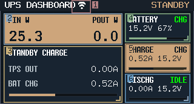
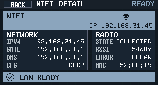
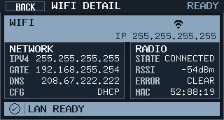
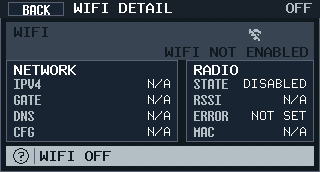
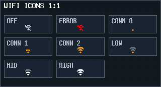

# WiFi / 服务发现 / 只读 API 底座（#amc32）

## 状态

- Status: 部分完成（4/5）
- Created: 2026-04-09
- Last: 2026-06-03

## 接管说明

- 本规格的“LAN 只读 API 底座”结论仅作为历史基础成立。
- 设备本体 LAN 管理 API、`GET /api/v1/settings`、LAN 写接口与 transport 收敛设计已转由 [`#k4vzn`](../k4vzn-lan-management-convergence/SPEC.md) 接管。
- 本规格继续保留 mDNS / DNS-SD、身份口径、`/api/v1/status` SSE 与 `net_http` 主固件底座的历史真相。

## 背景 / 问题陈述

- 当前 `mains-aegis` 主固件已经具备 UPS 自检、运行态输出管理、前面板 UI 与 host-side 纯逻辑测试，但仍缺少一条稳定的网络接入面，后续客户端和 Web 端没有统一可依赖的发现与读取入口。
- 项目里已经存在 `front_panel`、`output`、`bq40z50`、`bq25792` 等真实运行态真相源，但这些状态目前只在设备内和串口日志里流动，缺少可复用的对外契约。
- 参考 `loadlynx` 的 `esp-radio + esp-rtos + embassy-net` 方案，可以在不破坏默认主循环的前提下，为 ESP32-S3 固件增加 feature-gated 的 WiFi / mDNS / HTTP 只读能力。
- 若不先冻结设备标识、服务发现、只读 JSON 与 SSE 契约，后续电脑端 agent、用户侧 Web 与 bench 调试工具都会各自发明一套接入方式，导致身份口径、字段命名和兼容策略分裂。

## 目标 / 非目标

### Goals

- 为主固件提供默认启用的 `net_http` 网络底座；需要无网络最小构建时显式使用 `--no-default-features`。
- 首版支持编译期 STA WiFi、DHCP/静态 IPv4、mDNS `.local` 主机名、DNS-SD 服务发现、HTTP 只读 API 与 `/api/v1/status` SSE 状态流。
- 冻结设备身份口径：`mains-aegis-<mac后三字节hex>` 作为 `device_id` 与 hostname 真相源。
- 抽出稳定的 `UpsStatusSnapshot` 与 `NetworkUiSummary`，供 HTTP、SSE 与后续上层客户端复用。
- 提供最小但稳定的 host-side 纯逻辑验证与固件构建验证。

### Non-goals

- 不做 host/agent 注册、绑定、心跳或代理控制。
- 不做运行时改 WiFi、AP 配网页或蓝牙配网。
- 不做任何远程写控制、写配置或 UPS 执行动作接口。
- 不实现独立 Web App / 桌面客户端，只提供它们后续接入所需的设备侧底座。

## 范围（Scope）

### In scope

- `firmware/build.rs` 与 `firmware/build_support/wifi_env.rs`：编译期 `MAINS_AEGIS_WIFI_*` 注入与 `net_http` 配置校验。
- `firmware/src/net.rs`：共享 WiFi 状态、联网任务、HTTP router、CORS/PNA、SSE 与只读 JSON API。
- `firmware/src/mdns.rs` / `firmware/src/mdns_wire.rs`：mDNS A/PTR/SRV/TXT 响应与 DNS-SD 广播。
- `firmware/src/net_types.rs` / `firmware/src/net_contract.rs` / `firmware/src/net_bridge.rs`：只读状态模型、JSON/SSE 渲染契约与主循环状态桥接。
- `firmware/src/main.rs`：主入口在默认构建下使用 `net_http` 的 `esp_rtos + embassy` 异步入口；无网络最小构建保留阻塞式入口。
- `firmware/host-unit-tests/`：env 解析、mDNS 编解码、HTTP 契约与桥接逻辑测试。
- `firmware/ui/dashboard-design.md` / `firmware/ui/dashboard-detail-design.md` / `firmware/ui/touch-targets.md`：Dashboard WiFi 入口、WiFi 详情页与首页触摸热区说明。

### Out of scope

- 电脑侧 UPS companion、浏览器 UI、用户账号、鉴权、设备绑定模型。
- 多设备目录、远程配置同步、历史采样、持久化存储或告警订阅。
- HTTPS/TLS、身份认证、跨网段发现、IPv6、NTP、OTA。
- 自检页面的文案、布局、状态摘要或其它可见 UI 改动。

## 需求（Requirements）

### MUST

- 默认主固件构建必须启用 `net_http` 与 `web_serial`，使 WiFi HTTP 与 USB CDC 管理能力成为默认运行能力。
- 固件不得包含默认 WiFi SSID/PSK；启动时若 EEPROM 没有 USB 写入的 WiFi 配置，WiFi 必须保持 `disabled`。
- 如需无网络最小构建，必须显式使用 `--no-default-features`；该路径不要求 WiFi 环境变量。
- `device_id`、`hostname`、`hostname_fqdn`、DNS-SD `service_instance` 都必须从同一 `short_id` 真相源派生。
- mDNS 必须发布 `.local` A 记录与 `_mains-aegis-ups._tcp.local` 服务；TXT 至少包含 `device_id`、`api_version`、`role=ups`。
- HTTP 公开契约固定为：`GET /api/v1/ping`、`GET /health`、`GET /api/v1/identity`、`GET /api/v1/network`、`GET /api/v1/status`，以及同一路径在 `Accept: text/event-stream` 下的 SSE。
- JSON 字段统一使用 `snake_case`；错误响应统一为 `{ "error": { code, message, retryable, details } }`。
- `PSK` 不得出现在 API 或日志里。

### SHOULD

- WiFi 连接失败、DHCP 超时、链路丢失、静态地址配置异常都应映射到可观测的 `state` / `last_error`。
- HTTP 层应统一支持 `/api/v1/*` 的 `OPTIONS` 预检和 CORS/PNA 头，为后续 Web/桌面端接入保留兼容壳层。
- SSE 至少输出 `status` 与 `heartbeat` 事件，并让浏览器 `EventSource` 与 `curl` 都能消费。
- 主固件网络状态与 HTTP / SSE 契约应共享同一份 `NetworkUiSummary` 真相源。

### COULD

- 后续在不改 `v1` 口径的前提下，为 `identity` / `network` 增补更多只读 capability 字段。

## 功能与行为规格（Functional/Behavior Spec）

### Core flows

- 默认构建时，build script 只读取可选 hostname/static IPv4/DNS 环境变量，不读取或注入默认 WiFi 凭据。
- 设备启动后，默认 `net_http` 入口初始化 heap、`esp_rtos` 调度器、WiFi 驱动与 `embassy-net` stack；仅 `--no-default-features` 构建沿用无网络阻塞式主入口。
- WiFi 任务在 `Disabled -> Connecting -> Connected/Error` 之间切换；USB 写入凭据后立即连接，USB 清除凭据后立即断开并回到 `disabled`。
- mDNS 任务在 IPv4 就绪后加入 `224.0.0.251:5353` 组播，发送 unsolicited announce，并对匹配的 hostname/service 查询返回 A/PTR/SRV/TXT 响应。
- HTTP 任务监听 `:80`，对外暴露 ping/health、identity、network、status 与 SSE；`/api/v1/status` 在 `Accept: text/event-stream` 下切换为长连接流。
- 主循环每次拿到新的 `SelfCheckUiSnapshot` 时，都通过桥接层提炼 `UpsStatusSnapshot`，同时把当前网络状态合并进只读 API / SSE 快照。

### Edge cases / errors

- 若静态 IP / netmask / gateway 任一项格式非法，固件必须回退 DHCP，并通过 `last_error=bad_static_config` 暴露问题。
- 若 WiFi 在获取 IPv4 前长时间未 ready，必须暴露 `dhcp_timeout`，而不是静默卡在 connecting。
- 若 `DEVICE_IDENTITY` 尚未准备好，HTTP 必须返回 `503 unavailable`，而不是空 JSON。
- SSE 首版只允许单个活跃 `status` stream；第二个连接应返回 `409 unavailable`，避免资源竞争导致主路径不稳定。
- 对未知路径、非 `GET/OPTIONS`、非 UTF-8 header 或 malformed request，HTTP 必须返回统一错误 envelope。
- `OPTIONS` 只为 `/api/v1/*` 与 `/health` 提供兼容处理；未知路径仍返回 `404`。

## 接口契约（Interfaces & Contracts）

### 接口清单（Inventory）

| 接口（Name） | 类型（Kind） | 范围（Scope） | 变更（Change） | 契约文档（Contract Doc） | 负责人（Owner） | 使用方（Consumers） | 备注（Notes） |
| --- | --- | --- | --- | --- | --- | --- | --- |
| `MAINS_AEGIS_WIFI_HOSTNAME/STATIC_IP/NETMASK/GATEWAY/DNS` build env | internal | internal | New | None | firmware | build.rs / CI / bench 构建 | 只允许网络元配置，不包含 SSID/PSK |
| `/api/v1/*` HTTP API | http | external | New | `./contracts/http-apis.md` | firmware | 后续桌面端 / Web / bench 工具 | 只读 `v1` |
| `_mains-aegis-ups._tcp.local` | external | external | New | None | firmware | 局域网发现方 | mDNS + DNS-SD |
| `UpsStatusSnapshot` / `NetworkUiSummary` | internal | internal | New | None | firmware | HTTP / SSE / front-panel | 单一真相源 |

### 契约文档（按 Kind 拆分）

- [contracts/README.md](./contracts/README.md)
- [contracts/http-apis.md](./contracts/http-apis.md)

## 验收标准（Acceptance Criteria）

- Given 未提供 WiFi 凭据环境变量，When 执行默认 `cargo +esp check`，Then 固件以 `net_http + web_serial` 成功编译链接且不注入默认 SSID/PSK。
- Given EEPROM 没有 WiFi 配置或 USB clear 成功，When WiFi task 观察到配置为空，Then 立即断开/停止 STA 并通过 status/network 反馈 `state=disabled`。
- Given 需要无网络最小构建，When 执行 `cargo +esp check --no-default-features`，Then 构建继续通过且不要求任何 WiFi 环境变量。
- Given 设备获得 IPv4 地址，When 局域网内执行 mDNS / DNS-SD 查询，Then 能解析 `mains-aegis-<short_id>.local` 且能发现 `_mains-aegis-ups._tcp.local:80`。
- Given 请求 `/api/v1/identity`、`/api/v1/network`、`/api/v1/status`，When 固件返回 JSON，Then 字段为 `snake_case`，且不包含 `PSK`。
- Given `GET /api/v1/status` 且 `Accept: text/event-stream`，When 连接建立，Then 固件连续输出 `status` 与周期性 `heartbeat` 事件。
- Given host-side 纯逻辑测试与构建验证执行完成，When 快车道收口，Then 规格、契约、代码与 PR 证据齐全，并停在 merge-ready 而非自动合并。

## 实现前置条件（Definition of Ready / Preconditions）

- 设备标识、服务名、API 版本、错误 envelope 与 SSE 口径已冻结。
- 首版 scope 已明确为“UPS 本机只读能力”，不包含 host 注册和写接口。
- `net_http` 是默认主固件能力；无网络构建必须显式 opt out。
- 当前 PR 不修改任何自检页面可见 UI。

## 非功能性验收 / 质量门槛（Quality Gates）

### Testing

- Unit tests: `cargo +stable test --manifest-path firmware/host-unit-tests/Cargo.toml`
- Integration tests: 默认 `cargo +esp check` 与 `cargo +esp check --no-default-features`
- E2E tests (if applicable): bench 条件允许时，用 `.local` 解析、HTTP GET 与 SSE `curl` 做最小烟测

### UI / Storybook (if applicable)

- Storybook覆盖：不适用（非 Web UI，且当前 PR 不改自检页面）

### Quality checks

- `cargo +stable fmt --manifest-path firmware/Cargo.toml --all`
- `cargo +stable check --manifest-path tools/front-panel-preview/Cargo.toml`
- `bash firmware/scripts/run-host-unit-tests.sh`

## 文档更新（Docs to Update）

- `docs/specs/README.md`: 新增当前规格索引行，并在收口时同步状态与 PR 备注。
- `docs/specs/amc32-wifi-service-discovery-api-foundation/contracts/http-apis.md`: 冻结 v1 API 口径。
- `firmware/ui/dashboard-design.md`: 补充 Dashboard 标题栏 WiFi 入口与热区说明。
- `firmware/ui/dashboard-detail-design.md`: 补充 `Wifi` 二级详情页的页面口径。
- `firmware/ui/touch-targets.md`: 记录 Dashboard 首页触摸热区、命中框约束与标注图。

## 计划资产（Plan assets）

- Directory: `docs/specs/amc32-wifi-service-discovery-api-foundation/assets/`
- In-plan references: ``
- Visual evidence source: maintain `## Visual Evidence` in this spec when owner-facing or PR-facing screenshots are needed.

## Visual Evidence

按主人要求，本规格不修改自检页面；当前 owner-facing 视觉证据仅覆盖 Dashboard / WiFi 相关交互。

### Dashboard 首页触摸热区

- 标注图直接来自固件 renderer 叠加 `dashboard_hit_test()` 的真实命中范围。
- `WiFi` 入口采用“图标小、热区放大”的策略；当前稳定热区为 `x=118 y=0 w=32 h=22`。
- 该图同时作为 `firmware/ui/touch-targets.md` 的长期引用资产。

### Wifi detail 页面

### Dashboard WiFi 图标状态

- 图集由固件 renderer 按 `320x172` 前面板尺寸 1:1 导出。
- `CONN 0 -> CONN 1 -> CONN 2 -> CONN 0` 对应连接中动画帧；图标结构为完整底部点、点加第一弧、点加两弧。
- 已连接态按 RSSI 映射为 `LOW / MID / HIGH`，正常强度使用 Dashboard 文本同色白色，低强度使用注意色。

## 资产晋升（Asset promotion）

None。

## 实现里程碑（Milestones / Delivery checklist）

- [x] M1: 新增 `net_http` feature、编译期 WiFi env 注入与 feature-gated 主入口
- [x] M2: 实现共享网络状态模型、WiFi 连接任务、mDNS / DNS-SD 与只读 HTTP/SSE 底座
- [x] M3: 抽出 `UpsStatusSnapshot` / `NetworkUiSummary`，补齐 host-side 契约测试并接入只读 API / SSE 桥接
- [x] M4: 补齐 Dashboard / WiFi 相关视觉证据（不修改自检页面）
- [ ] M5: 完成 fast-track 提交、push、PR 与 review-loop 收敛到 merge-ready

## 方案概述（Approach, high-level）

- 沿用 `loadlynx` 的 `esp-radio + esp-rtos + embassy-net` 技术路线，但把身份与 HTTP 契约收拢为 `mains-aegis` 自己的只读 `UPS SoT`。
- 用 `net_bridge` 把现有 `SelfCheckUiSnapshot` 转为网络/API 可消费的稳定快照，避免把前面板内部结构直接暴露给外部契约。
- 把高变化、与编译期注入相关的 WiFi 配置限定在 build script 与 feature gate 内，避免污染默认构建。
- 把外部可见协议冻结在 `v1`，未来扩展通过新增字段或新版本进行，而不是在 `v1` 上无序漂移。
- 把 Dashboard 的 WiFi 入口和首页热区几何同步写入 `firmware/ui/touch-targets.md`，避免后续只改图标不改命中框，或只改命中框不更新文档。

## 风险 / 开放问题 / 假设（Risks, Open Questions, Assumptions）

- 风险：当前只做编译期配网，bench 若缺少稳定 AP / mDNS 解析器，实机烟测可能需要后补。
- 风险：SSE 首版限制单连接，后续若 Web 与桌面端同时订阅，可能需要升级为 fan-out 广播模型。
- 风险：WiFi 堆和 `esp-radio`/`embassy` 运行时占用新增内存，实机仍需继续观察 heap 裕量与长时间稳定性。
- 假设：首版 `v1` 只需要 IPv4、局域网发现与只读接口，暂不做 TLS、鉴权和多客户端并发优化。

## 变更记录（Change log）

- 2026-04-09: 新建规格，冻结 WiFi / 服务发现 / 只读 API 底座的范围、契约与验收口径。
- 2026-04-09: 增补 Dashboard WiFi 入口与首页热区文档，补充长期维护的触摸热区说明与标注图资产。

## 参考（References）

- `/Users/ivan/Projects/Ivan/loadlynx/firmware/digital/src/main.rs`
- `/Users/ivan/Projects/Ivan/loadlynx/firmware/digital/src/net.rs`
- `/Users/ivan/Projects/Ivan/loadlynx/firmware/digital/src/mdns.rs`
- `firmware/src/net.rs`
- `firmware/src/mdns.rs`
- `firmware/src/net_contract.rs`
- `firmware/src/net_bridge.rs`
