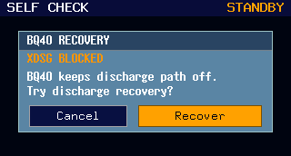
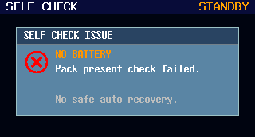
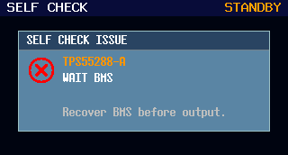

# 自检后切入真实仪表盘

> 当前有效规范以本文为准；实现覆盖与当前状态见 `./IMPLEMENTATION.md`，关键演进原因见 `./HISTORY.md`。

## 背景 / 问题陈述

- 现有主固件会在开机自检后停留在 `Variant C` 自检页。
- `Variant B` Dashboard 仍由演示模型驱动，关键读数不是来自真实外设采样。
- 新需求要求：保留开机自检过程展示，但自检完成后自动进入 Dashboard，并且 Dashboard 的所有数值都必须来自真实外设。

## 目标 / 非目标

### Goals

- 开机阶段继续显示 `Variant C` 自检页，并按既有阶段回调逐步更新状态。
- 自检完成且运行态首份快照准备好后，自动切换到 `Variant B` Dashboard。
- 正常主固件只有在 `requested_outputs=both` 中两路都进入 `active_outputs` 后才算自检完成；
  缺任一路时保持或退回自检/阻断页并发布 `mode=blocked`。
- Dashboard 所有指标改为真实数据源：
  - `PIN W`：`VIN / INA3221 CH3`
  - `POUT / VOUT / IOUT / TPS OUT`：`INA3221 + TPS55288`
  - `BATTERY / DISCHG`：`BQ40Z50`
  - `TEMP`：`TMP112`
- 严格真实源：任何缺失值显示 `N/A`，不再回落到演示波动值。
- `PIN W` 只允许使用 `INA3221 CH3` 的 `VIN` 电压/输入电流样本；仅在 `VIN` 遥测已就绪时才允许进入 Dashboard。
- 自动运行态 `STANDBY / ASSIST / BACKUP` 的定义与切换规则引用 `docs/specs/runtime-mode-switching/SPEC.md`；本规格继续拥有 Dashboard live 数据源与 `VIN` 真相源。

### Non-goals

- 不新增 Dashboard 返回自检页的入口。
- 不改 `Variant B` 的布局、文案体系与视觉 token。
- 不改既有 BMS 激活/告警流程，只改变自检完成后的默认落点。

## 范围（Scope）

### In scope

- `firmware/src/front_panel_scene.rs`
  - 扩展 `SelfCheckUiSnapshot` 承载 Dashboard 真实字段。
  - 保留演示 fallback 渲染路径，仅在传入真实快照时启用 live Dashboard。
- `firmware/src/output/mod.rs`
  - 启动自检、运行态 TPS/INA/BQ40 轮询统一写回 Dashboard 所需真实字段。
- `firmware/src/output/tps55288.rs`
  - `TelemetryCapture` 带回 `vbus_mv`。
- `firmware/src/front_panel.rs`
  - 自检完成后切换到 `Variant B`，运行期默认停留 Dashboard。
- `tools/front-panel-preview/src/main.rs`
  - 新增真实 Dashboard fixture 场景：`dashboard-runtime-standby` / `assist` / `backup`。

### Out of scope

- 新增远程遥测、存档或历史趋势图。
- 修改 `VIN / INA3221 CH3` 以外的输入功率来源。

## 接口变更（Interfaces）

- `front_panel_scene::SelfCheckUiSnapshot`
  - 新增：`vin_vbus_mv`、`vin_iin_ma`、`out_a_vbus_mv`、`out_b_vbus_mv`、`bq40z50_pack_mv`、`bq40z50_current_ma`
- `tps55288::TelemetryCapture`
  - 新增：`vbus_mv`
- `FrontPanel`
  - 新增：`enter_dashboard()`

## 验收标准（Acceptance Criteria）

- Given 屏幕链路可用，When 开机进入主固件，Then 首屏仍为 `SELF CHECK`。
- Given 自检结束且 `PowerManager` 已产出运行态快照，When UI 进入 steady state，Then 自动切换到 `UPS DASHBOARD`，且运行中不再回切自检页。
- Given Dashboard 某个真实字段缺失，When 渲染对应区域，Then 显示 `N/A`，meter 归零，且不显示任何演示波动数值。
- Given 运行态 `VIN` 遥测存在，When Dashboard 显示 `PIN W`，Then 读数来自 `INA3221 CH3` 的 `vin_vbus_mv * vin_iin_ma`。
- Given `vin_iin_ma<=0` 但 `VIN` 仍在线，When Dashboard 计算 `PIN W`，Then 显示 `0.0W`，不再把逆流/空载样本转成正功率。
- Given `VIN` 遥测缺失，When Dashboard 渲染 `PIN W`，Then 显示 `N/A`。
- Given 正常主固件请求 `both` 且仅一路输出 active，When 前面板评估 Dashboard eligibility，Then
  结果为不可进入，并在自检页标出缺失通道。
- Given charger `input_present` 不在线但 `VIN>=3V`，When Dashboard 进入 live 渲染，Then `PIN W` 区块仍显示，且 live Dashboard 仍按“有市电”分支渲染。
- Given `tools/front-panel-preview` 运行真实 Dashboard 场景，When 导出 PNG，Then `preview.png` 分辨率为 `320x172`。

## 实现记录

- 通过 `FrontPanel::enter_dashboard()` 把页面状态从自检页切到 Dashboard，并在切换时清空 overlay。
- `render_variant_b` 改为优先消费 `SelfCheckUiSnapshot`；只有未传快照时才保留历史 demo fallback。
- `PowerManager` 在 INA/TPS/BQ40 轮询中持续维护 Dashboard 真实字段，保证启动自检与运行态共用同一份 UI 快照。
- `PIN W` 改为消费 `vin_vbus_mv` / `vin_iin_ma`，不再绑定 `BQ25792` 的输入侧寄存器样本。
- live Dashboard 的 mains 判定统一改为 `VIN>=3V`；`BQ25792 input_present` 仅保留给 charger 诊断，不再影响 Dashboard 的“有市电”分支。
- Preview 工具增加 3 组 runtime fixture，用于验证 `standby / assist / backup` 三个 Dashboard 场景。
- live Dashboard 的 `mains_present` 改为只消费 `vin_vbus_mv>=3V`；即使 charger `input_present` 临时抖动，只要 `DC5025 VIN` 在线，模式、强调色与 `NOAC/LOCK` 分支都保持一致。
- 若 `VIN` 只发生瞬时采样缺失，或因运行态暂时跳过 `VIN` 遥测而错过单个采样周期，live Dashboard 继续沿用最近一次已知的 `VIN` 市电状态；只把 `PIN W` 数值回退为 `N/A`。
- 若 `VIN` 连续缺失，或连续多个周期都在跳过 `VIN` 遥测而超出瞬时容错窗口，live Dashboard 回退到“聚合输入存在信号”作为降级兜底，避免整页长期卡在过期的市电状态。
- 自检页会把安全的 `BMS` 放电授权恢复自动发起；恢复成功且输出恢复条件满足时，自动恢复启动期请求的输出，从而继续进入 Dashboard。
- 当 BMS 在线且确认电池存在，但 `RCA/低电芯电压` 阻断放电时，充电策略以可信 BMS 遥测为准自动开启低电量充电恢复，不因 `BQ25792 VBAT_PRESENT=false` 把恢复锁死。
- 对需要用户确认或无法恢复的硬件问题，自检页支持点击对应硬件条目打开确认弹窗或问题说明弹窗。

## 验证记录

- `cargo build --manifest-path <REPO_ROOT>/tools/front-panel-preview/Cargo.toml`
- `cargo test --manifest-path <REPO_ROOT>/firmware/Cargo.toml front_panel_scene --lib`
- `cargo build --release --manifest-path <REPO_ROOT>/firmware/Cargo.toml`
- `cargo run --manifest-path <REPO_ROOT>/tools/front-panel-preview/Cargo.toml -- --variant B --focus idle --scenario dashboard-runtime-standby --out-dir <ABS_PATH>`
- `cargo run --manifest-path <REPO_ROOT>/tools/front-panel-preview/Cargo.toml -- --variant B --focus idle --scenario dashboard-runtime-assist --out-dir <ABS_PATH>`
- `cargo run --manifest-path <REPO_ROOT>/tools/front-panel-preview/Cargo.toml -- --variant B --focus idle --scenario dashboard-runtime-backup --out-dir <ABS_PATH>`
- 上板验证：设备当前 `PIN W` 已恢复正常显示。

## 关联规格

- `docs/specs/mcu-self-check-live-panel/SPEC.md`
- `docs/specs/front-panel-industrial-ui-preview/SPEC.md`

## Visual Evidence

PR: none

