# BQ25792 500mA 充电策略与 DC 过流降档（#eu2b8）

## 状态

- Status: 已完成
- Created: 2026-03-28
- Last: 2026-04-06

## 背景 / 问题陈述

- 主线固件此前只做 `BQ25792` 的安全门控，没有把“何时开始充电、何时继续、何时停充、何时降档”固化成明确的运行时策略。
- 设计文档里曾有 `1A/500mA/100mA` 多档设想，但当前产品需求已经收敛为“常规 `500mA`、`DC5025` 过流时降到 `100mA`、快充暂不做”。
- 如果继续依赖硬件默认寄存器值或瞬时 `allow_charge` 条件，充电行为不可解释，也无法满足“低于 `80%` 或最低单体低于 `3.70V` 才开始、开始后持续到满充”的口径。

## 目标 / 非目标

### Goals

- 固化主线充电策略：默认 `500mA`，不实现任何 `>500mA` 快充。
- 使用 `BQ40Z50` 可信遥测决定是否开始充电：`RSOC < 80%` 或 `最低单体电压 < 3.70V`。
- 充电一旦开始，保持到“满充”才停止；满充定义为 `BQ40 FC` 或 `BQ25792 termination_done` 任一成立。
- 仅在 `DC5025` 独占输入且 `IBUS > 3.0A` 持续 `1s` 时，把 `ICHG` 降到 `100mA`；回落到 `<2.7A` 持续 `5s` 后恢复 `500mA`。
- `TPS55288` 总输出功率门控必须有回差：连续 `2` 个 poll `>5.0W` 才停充，进入 `LOAD` 后连续 `3` 个 poll `<4.5W` 才恢复。
- 任一路输出已开启但聚合输出功率不可可信计算时，必须保守禁充，并在 notice/log 中明确标成 `blocked_output_power_unknown`。
- 扩充运行时日志与前面板 detail 状态，让 `WAIT / CHG500 / CHG100 / FULL / LOCK / NOAC / TEMP / LOAD / WARM` 等状态可直接观察，并优先显示实际 `IBAT_ADC`。
- 首页 `ChargeCard` 必须与 runtime charger state 同源；首页显示紧凑 token `CHG / WAIT / FULL / WARM / TEMP / LOAD / LOCK / NOAC`，detail 保留完整 runtime token。
- 当 `BQ25792 TS_WARM=true` 且未进入 `TS_HOT/TREG/fault` 时，charger detail 必须显示 `WARM`，并明确说明这是 charger TS warm。
- 当 `BQ40 OperationStatus()[XCHG]=1` 导致 `LOCK` 时，运行时日志必须额外输出 `ChargingStatus(0x55)` 原始值与关键位，便于区分包侧阻断来源。
- `BQ25792` 的 ADC 遥测寄存器必须按 `MSB-first` 解码，避免 `IBUS/VBUS/VBAT/VSYS` 因端序误读出现 byte-swapped 假值。

### Non-goals

- 不实现 `1A/2A` 快充、不调 USB-C/PD/PPS 协商。
- 不修改 `BQ40Z50` Data Flash、JEITA 曲线或 termination current 校准；针对重复 `OC/LOCK` 的顶充终止对齐例外由 `/Users/ivan/Projects/Ivan/mains-aegis/docs/specs/h6sae-bq40-lock-root-cause/SPEC.md` 单独承接。
- 不改 `tps-test-fw` 的独立充电逻辑。

## 范围（Scope）

### In scope

- `firmware/src/output/mod.rs` 里的主线 charger poll 逻辑。
- `BQ40Z50` 运行时快照到充电策略状态机的连接。
- `BQ25792` 正常充电电流/电压写入，以及 `DC5025` 独占输入的降档恢复逻辑。
- `firmware/src/front_panel_scene.rs` 的 charger detail 状态呈现。
- `tools/front-panel-preview/` 的 charger policy 预览场景。

### Out of scope

- 新增对外控制命令、设置项或持久化配置。
- 任何硬件改板、电阻档位调整、输入源优先级改动。
- 将预览图以外的 UI 视觉语言重做。

## 需求（Requirements）

### MUST

- 正常充电目标电流固定为 `500mA`。
- `RSOC < 80%` 或 `cell_min_mv < 3700` 时启动充电。
- 启动后持续充到满，不因中途回到阈值上方而停充。
- 满充后进入锁存停充，直到再次跌破启动阈值才允许重启。
- `DC5025` 独占输入下，`IBUS > 3000mA/1s` 降到 `100mA`，`IBUS < 2700mA/5s` 恢复 `500mA`。
- `TPS55288` 输出功率连续 `2` 个 poll 超过 `5W` 时停充；进入 `LOAD` 后连续 `3` 个 poll 低于 `4.5W` 才允许恢复。
- 任一路输出已开启但聚合输出功率不可可信计算时，必须 fail-safe 禁充。
- BMS 遥测缺失、`charge_ready=false`、输入缺失、`VBAT_PRESENT=false`、`TS_COLD=true` 或 `TS_HOT=true` 时 fail-safe 禁充。

### SHOULD

- 日志应直接输出策略状态、启动原因、满充原因、目标 `ICHG`、输入源与 DC 降档计时器。
- Dashboard charger detail 应显示短状态 token，同时在 notice 里保留精确状态名。
- `TS_WARM` 时 Dashboard charger detail 应优先显示 `WARM`，即使充电策略本身仍处于 `CHG500/CHG100`。
- Dashboard charger detail 与首页 charge 区域应优先显示 `BQ25792 IBAT_ADC` 实测电流；若 `IBAT_ADC` 暂时不可用，则回退到目标 `ICHG`。
- 首页 `ChargeCard` 应直接从 runtime charger state 派生紧凑 token，而不是按 `UpsMode` 或 `allow_charge + current` 推导。
- `IBUS/VBUS/VBAT/VSYS/IBAT` 的 BQ25792 ADC 遥测应保持真实量级，不得把 `~5.2V/102mA` 误解成 `~21.8V/26.1A` 一类 swapped 假值。

### COULD

- 后续在不改状态机语义的前提下，把阈值提升为配置项。

## 功能与行为规格（Functional/Behavior Spec）

### Core flows

- 正常空闲时，如果 `RSOC >= 80%` 且 `cell_min_mv >= 3700`，策略状态为 `idle_wait_threshold`，charger detail 显示 `WAIT`，不写入正常充电目标。
- 一旦任一启动阈值满足，且输入/BMS/温度都允许，策略进入 `charging_500ma`，固件显式写入 `VREG=16.8V` 与 `ICHG=500mA`，再打开 `EN_CHG` 和 `CE`。
- 充电保持期间，即使 `RSOC` 或 `cell_min_mv` 回升到阈值上方，也继续保持 `charging_500ma` 或 `charging_100ma_dc_derated`，直到满充。
- 满充后策略进入 `full_latched`，固件停充并保持停充；只有当后续再次满足启动阈值才释放锁存。
- 当输入源明确为 `DcIn` 且 `IBUS` 连续过高时，策略从 `charging_500ma` 切到 `charging_100ma_dc_derated`；当 `IBUS` 低于恢复阈值足够久后，回到 `charging_500ma`。
- 当 `TPS55288` 总输出功率连续 `2` 个 poll 超过 `5W` 时，策略进入 `blocked_output_over_limit` 并停充；只有连续 `3` 个 poll 低于 `4.5W` 才退出该阻断态。
- 当任一路输出已开启但聚合输出功率不可可信计算时，策略进入保守禁充分支；前台 token 继续显示 `LOAD`，notice/log 使用 `blocked_output_power_unknown`。
- 前面板的 charger 电流显示优先取 `BQ25792 IBAT_ADC`，不再把 `ICHG` 设定值伪装成实测电流。
- `BQ25792` ADC 遥测读数使用专用 helper，以 `MSB-first` 解释只读 ADC word；普通限流/配置 word 继续沿用 little-endian 读写，禁止混用。
- `TS_WARM` 期间前面板 charger detail 的状态 token 必须显示 `WARM`，notice 要说明风扇已被强制拉到高转。
- 首页 `ChargeCard` 只做 `CHG500/CHG100 -> CHG` 的紧凑映射；`WAIT/FULL/WARM/TEMP/LOAD/LOCK/NOAC` 必须与 runtime token 同形。

### Edge cases / errors

- `BQ40Z50` 快照不可用、最低单体缺失、`charge_ready=false`、`VBAT_PRESENT=false` 时，策略统一进入 `blocked_no_bms`，停止任何已有的充电保持态。
- `TS_COLD` 或 `TS_HOT` 时，策略进入 `blocked_temp`。
- 输入消失时，策略进入 `blocked_no_input`。
- `TPS55288` 输出功率超过门槛并满足 `2入3出` 回差时，策略进入 `blocked_output_over_limit`。
- 任一路输出已开启但聚合输出功率不可可信计算时，策略仍进入 `blocked_output_over_limit`，但运行时原因必须区分为 `blocked_output_power_unknown`。
- 双输入同时在线时，input source 记为 `Auto`，不触发 `DC > 3A -> 100mA` 降档规则。
- BMS activation / recovery 的强制 `200mA` 唤醒路径保持独立优先级，不被正常充电策略篡改。

## 接口契约（Interfaces & Contracts）

None。

## 验收标准（Acceptance Criteria）

- Given 空闲且输入/BMS/温度均允许，When `RSOC = 79%` 且 `cell_min_mv >= 3700`，Then 系统进入 `charging_500ma` 并把目标 `ICHG` 写成 `500mA`。
- Given 空闲且输入/BMS/温度均允许，When `RSOC >= 80%` 但 `cell_min_mv = 3690`，Then 系统仍进入 `charging_500ma`。
- Given 当前已在充电，When `RSOC` 与 `cell_min_mv` 回升到阈值上方，Then 系统继续保持充电直到满充。
- Given 已进入满充停充，When 阈值未再次跌破，Then 系统保持 `full_latched`，不得自行重启充电。
- Given 输入源为 `DcIn`，When `IBUS > 3000mA` 连续 `1s`，Then 系统把目标电流降到 `100mA` 并进入 `charging_100ma_dc_derated`。
- Given 系统已处于 `charging_100ma_dc_derated`，When `IBUS < 2700mA` 连续 `5s`，Then 恢复 `500mA`。
- Given 输入源为 `Auto`，When `IBUS > 3000mA`，Then 不应用 DC 独占降档。
- Given `BQ40` 遥测缺失或 `charge_ready=false`，When 进入 charger poll，Then 系统进入 `blocked_no_bms` 并禁止充电。
- Given `TS_COLD=true` 或 `TS_HOT=true`，When 进入 charger poll，Then 系统进入 `blocked_temp` 并禁止充电。
- Given `TS_WARM=true` 且 `TS_HOT=false`，When 进入 charger poll，Then 充电策略可继续运行，但 charger detail 必须显示 `WARM` 且 notice 说明这是 charger TS warm。
- Given `TPS55288` 总输出功率单次超过 `5W`，When 进入 charger poll，Then 系统不得立刻进入 `blocked_output_over_limit`。
- Given `TPS55288` 总输出功率连续 `2` 个 poll 超过 `5W`，When 进入 charger poll，Then 系统进入 `blocked_output_over_limit` 并禁止充电。
- Given 系统已处于 `blocked_output_over_limit`，When 总输出功率仅短暂回落，Then 不得立刻恢复；只有连续 `3` 个 poll 低于 `4.5W` 才允许回到正常充电判定。
- Given 任一路输出已开启但聚合输出功率不可可信计算，When 进入 charger poll，Then 系统必须保守禁充，detail token 显示 `LOAD`，notice/log 使用 `blocked_output_power_unknown`。
- Given `IBAT_ADC` 可用，When 前面板显示 charger 电流，Then 应显示实测 `IBAT` 而不是目标 `ICHG`。
- Given runtime charger state=`CHG500/CHG100`，When 首页显示 `ChargeCard`，Then 状态必须压缩为 `CHG`。
- Given runtime charger state=`WAIT/FULL/WARM/TEMP/LOAD/LOCK/NOAC`，When 首页显示 `ChargeCard`，Then 状态必须直接沿用对应 token。
- Given `BQ25792` 返回 `VBUS_ADC=[0x14, 0x55]` 与 `IBUS_ADC=[0x00, 0x66]`，When 固件解码 charger ADC 遥测，Then monitor 与 UI 关联值必须分别落在 `5205mV` 与 `102mA` 的真实量级，而不是 swapped 假值。
- Given 待机输入下 `BQ25792` ADC 遥测已恢复真实量级，When 进入 charger poll，Then `input_power_anomaly(reason=ibus_out_of_range)` 不得再由 ADC 端序误读触发。
- Given `LOCK` 由 `XCHG` 触发，When 输出运行时阻断诊断，Then monitor 中必须包含 `ChargingStatus(0x55)` 原始位图与 `UT/LT/STL/RT/STH/HT/OT/PV/LV/MV/HV/IN/SU` 等关键字段。

## 实现前置条件（Definition of Ready / Preconditions）

- 启停口径、DC 独占降档阈值和满充定义均已由主人确认。
- 主线固件已有可用的 `BQ40Z50` 严格快照、`BQ25792` 状态寄存器与前面板 detail 渲染入口。
- `tools/front-panel-preview/` 已可复用前面板真实渲染代码导出 host-side PNG。

## 非功能性验收 / 质量门槛（Quality Gates）

### Testing

- Unit tests: 为 `charge_policy_step()`、`ChargePolicyDerateTracker` 和状态 token 映射补充覆盖。
- Integration tests: `cargo build --release` 必须通过。
- E2E tests (if applicable): None。

### UI / Storybook (if applicable)

- Stories to add/update: None。
- Docs pages / state galleries to add/update: None。
- `play` / interaction coverage to add/update: None。
- Visual regression baseline changes (if any): 使用 `tools/front-panel-preview/` 导出 charger detail 状态图与首页 runtime 场景图。

### Quality checks

- Lint / typecheck / formatting: `cargo fmt --all`

## 文档更新（Docs to Update）

- `docs/specs/README.md`: 更新摘要，明确主线 charger state machine 为 SoT。
- `firmware/ui/component-contracts.md`、`firmware/ui/design-language.md`、`firmware/ui/dashboard-design.md`: 同步首页 `ChargeCard` 紧凑 token 与 runtime 同源口径。

## 计划资产（Plan assets）

- Directory: `docs/specs/eu2b8-bq25792-charge-policy/assets/`
- In-plan references: ``
- Visual evidence source: maintain `## Visual Evidence` in this spec when owner-facing or PR-facing screenshots are needed.

## Visual Evidence

- 首页 `CHG`: runtime `CHG500` 在首页压缩为 `CHG`。

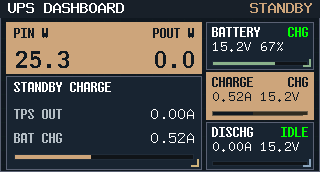

- 首页 `LOAD`: `ASSIST` 场景下首页直接显示 runtime `LOAD`，不再按 `UpsMode` 强行写成 `LOCK`。

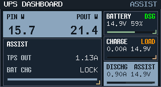

- 首页 `NOAC`: `BACKUP` 场景下首页直接显示 runtime `NOAC`。

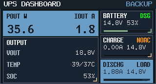

- `WAIT`: 充电未达到启动阈值，保持待机。

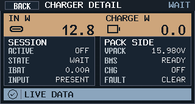

- `CHG500`: 正常 `500mA` 充电，优先显示实际 `IBAT_ADC`。

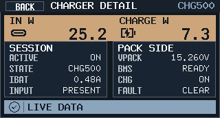

- `CHG100`: `DC5025` 独占输入且 `IBUS > 3A` 降到 `100mA`。

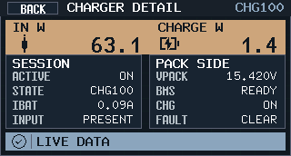

- `FULL`: 满充锁存后停充。

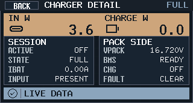

- `LOAD`: `TPS55288` 总输出功率超过 `5W` 时停充。

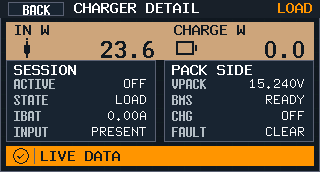

- `LOAD(power unknown)`: 输出已开启但聚合输出功率不可可信计算时，前台仍显示 `LOAD`，notice/log 区分为 `blocked_output_power_unknown`。

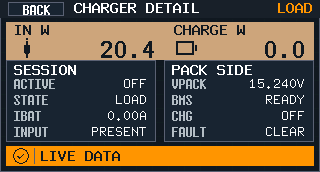

- `LOCK`: `BMS` 不允许充电或遥测缺失时停充。

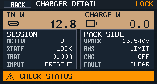

- `WARM`: `BQ25792 TS_WARM` 已进入预警温区，UI 提示并强制风扇高转，但不因此停充。

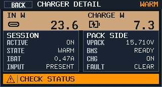

## 资产晋升（Asset promotion）

None。

## 实现里程碑（Milestones / Delivery checklist）

- [x] M1: 建立 charger policy 规格并登记到 `docs/specs/README.md`
- [x] M2: 在主线 charger runtime 中落地 `80% / 3.70V` 启充、持续到满充、满充锁存停充
- [x] M3: 落地 `DC5025` 独占输入 `3.0A -> 100mA`、`2.7A -> 500mA` 的降档恢复逻辑，并显式写入 `16.8V / 500mA / 100mA`
- [x] M4: 扩充日志、前面板 charger detail 状态、首页紧凑 token、`IBAT_ADC` 实测显示与 host-side preview 场景，并完成 `cargo fmt --all`、`cargo build --release` 与 host-side 预览测试
- [x] M5: 收敛 `LOAD` 的 `2入3出` 回差、`blocked_output_power_unknown` 保守禁充，并带着最终视觉证据完成 fast-track PR 收敛到 merge-ready

## 方案概述（Approach, high-level）

- 使用轻量的 `charge_policy_step()` 状态机统一处理“开始充电、保持充电、满充停充、异常阻断、输出过功率阻断、输出功率未知保守禁充、DC 独占降档”。
- 将策略锁存与降档计时器保存在 `PowerManager` 内部，避免每轮 poll 只靠瞬时条件抖动。
- 用现有 `dashboard_detail.charger_status / charger_notice` 承载状态 token 与精确状态名；首页 `ChargeCard` 直接从 runtime token 做紧凑映射，不新增外部协议。
- 使用 `tools/front-panel-preview/` 复用固件真实渲染链路，生成 owner-facing charger detail 预览图。

## 风险 / 开放问题 / 假设（Risks, Open Questions, Assumptions）

- 风险：`cargo test --lib` 在当前 `xtensa-esp32s3-none-elf` 目标下需要 `std/test`，不能作为本仓库现状下的可执行验证命令；本轮以编译通过和新增单测源码覆盖为主。
- 风险：首页与 detail 虽已同源，但首页只保留紧凑 token；若后续需要暴露更多诊断细节，仍需继续通过 notice/log 或详情页承载。
- 假设：`BQ40 FC` 与 `BQ25792 termination_done` 任一成立即可视为满充停充。

## 变更记录（Change log）

- 2026-03-28: 建立规格并按“500mA 常规充电 + DC 独占过流降到 100mA + 80%/3.70V 启停 + 满充锁存”收敛主线策略口径。
- 2026-04-05: charger detail 补充 `TS_WARM -> WARM` 状态与说明文案；`LOCK` 诊断补充 `ChargingStatus(0x55)` 原始位图，便于区分包侧 inhibit / suspend。
- 2026-04-05: `BQ25792` ADC 遥测改为 `MSB-first` 解码；`IBUS/VBUS/VBAT/VSYS` 从 byte-swapped 假值恢复到真实量级，并把 `input_power_anomaly` 的端序误报从主线诊断中排除。
- 2026-04-06: 主线 charger state machine 正式作为 SoT；`LOAD` 增加 `2入3出` 回差，输出功率未知改为保守禁充，首页 `ChargeCard` 同步到 runtime 紧凑 token。

## 参考（References）

- `docs/charger-design.md`
- `docs/plan/b3qzy:bq25792-charging-enable/PLAN.md`
- `firmware/src/output/mod.rs`
- `firmware/src/front_panel_scene.rs`
- `tools/front-panel-preview/src/main.rs`
