# BQ25792 500mA 充电策略与 DC 过流降档（#eu2b8）

## 状态

- Status: 已完成
- Created: 2026-03-28
- Last: 2026-06-04

## 背景 / 问题陈述

- 主线固件此前只做 `BQ25792` 的安全门控，没有把“何时开始充电、何时继续、何时停充、何时降档”固化成明确的运行时策略。
- 设计文档里曾有 `1A/500mA/100mA` 多档设想，但当前产品需求已经收敛为“常规 `500mA`、`DC5025` 过流时降到 `100mA`、快充暂不做”。
- 如果继续依赖硬件默认寄存器值或瞬时 `allow_charge` 条件，充电行为不可解释，也无法满足“低于 `80%` 或最低单体低于 `3.70V` 才开始、开始后持续到满充”的口径。

## 目标 / 非目标

### Goals

- 固化主线充电策略：默认 `500mA`，不实现任何 `>500mA` 快充。
- 使用 `BQ40Z50` 可信遥测决定是否开始充电：`RSOC < 80%` 或 `最低单体电压 < 3.70V`。
- 充电一旦开始，保持到“满充”才停止；常规充电满充定义为 `BQ40 FC` 或 `BQ25792 termination_done` 任一成立。
- 仅在 `DC5025` 独占输入且 `IBUS > 3.0A` 持续 `1s` 时，把 `ICHG` 降到 `100mA`；回落到 `<2.7A` 持续 `5s` 后恢复 `500mA`。
- `DC IN` 独占输入时，新增自适应限充闭环：`TPS55288` 总输出电流 `out_a_iout_ma + out_b_iout_ma > 100mA` 为最高优先级停充判据，命中后立即停充并进入现有 `30s cooldown + 10s recovery hold + 100mA restart ramp`；`UPS VIN / INA3221 CH3` 的 `4%` 压降与 `VINDPM/IINDPM/POORSRC` 保留为次级输入压力判据。
- DC IN/VAC2 被 BQ25792 实际选中时，输入源判定必须优先使用 charger-side VBUS/VAC ADC 事实，而不是 USB PD attach 状态；DC 输入 profile 必须写入 `IINDPM=1000mA`，`VINDPM=当前 DC 输入电压 * 96%`。
- 当固件把输入源判为 `DcIn` 或 `UsbC` 时，必须同时把 BQ25792 `ACDRV` 实际路径切到对应的 `VAC2` 或 `VAC1`；仅修改 owner-facing `input_source` 文案而不切换 `EN_ACDRV1/EN_ACDRV2` 不算满足本规格。
- BMS CUV 低电恢复允许在 `PCHG=true`、`PF=0`、`CUVC=false` 且 DC IN 或 USB-C 输入在线时进入受控 `100mA` 恢复；该恢复态显示为 `RECOV`，不同于 DC 过流降档 `CHG100`。所有 `100mA` 充电/恢复模式必须把 BQ25792 `ITERM` 写到低于目标电流的安全值（当前 `40mA`），否则 BQ 会立即进入 `termination_done` 而不持续充电。
- 低压恢复采用两段式：`charge_ready=false` 且 BQ40 `PCHG` 可用时为 `policy.recovery_stage=bq40_pchg`；BQ40 在 `CUV Recovery=2550mV/cell` 释放 CUV 后，只要 `cell_min_mv < 3000`、`PCHG=true`、`XCHG=false` 且无 Safety/PF/charging-inhibit，主固件仍保持 `RECOV/100mA`，随后 `charge_ready=true` 时转入 `policy.recovery_stage=bq25792_precharge`。只有 `cell_min_mv >= 3000` 后才恢复常规 `500mA`。
- BQ25792 必须显式写入并诊断 `REG08`: `VBAT_LOWV=71.4%`、`IPRECHG=120mA`。
- `TPS55288` 总输出功率门控必须有回差：连续 `2` 个 poll `>5.0W` 才停充，进入 `LOAD` 后连续 `3` 个 poll `<4.5W` 才恢复。
- 任一路输出已开启但聚合输出功率不可可信计算时，必须保守禁充，并在 notice/log 中明确标成 `blocked_output_power_unknown`。
- `ASSIST` 的 non-charging mode 边界由 `docs/specs/xjpvj-runtime-mode-switching/SPEC.md` 接管；`BACKUP` 默认也停充，但本规格拥有唯一受控例外：`mode=backup`、VIN 已确认无市电、当前源为可充电 USB-C PD 且既有 BMS/温度/输入安全门通过时，自动策略可在低输出功率下保持 `500mA` 充电。
- 扩充运行时日志与前面板 detail 状态，让 `WAIT / CHG500 / CHG100 / RECOV / FULL / LOCK / NOAC / TEMP / LOAD / WARM` 等状态可直接观察，并优先显示实际 `IBAT_ADC`。
- 首页 `ChargeCard` 必须与 runtime charger state 同源；首页显示紧凑 token `CHG / WAIT / FULL / WARM / TEMP / LOAD / LOCK / NOAC`，detail 保留完整 runtime token。
- 当 `BQ25792 TS_WARM=true` 且未进入 `TS_HOT/TREG/fault` 时，charger detail 必须显示 `WARM`，并明确说明这是 charger TS warm。
- 当 `BQ40 OperationStatus()[XCHG]=1` 导致 `LOCK` 时，运行时日志必须额外输出 `ChargingStatus(0x55)` 原始值与关键位，便于区分包侧阻断来源。
- `BQ25792` 的 ADC 遥测寄存器必须按 `MSB-first` 解码，避免 `IBUS/VBUS/VBAT/VSYS` 因端序误读出现 byte-swapped 假值。

### Non-goals

- 不实现 `1A/2A` 快充、不调 USB-C/PD/PPS 协商。
- 主固件不自动修改 `BQ40Z50` Data Flash、JEITA 曲线或 termination current 校准；`CUV Recovery=2550mV` 与 `CUV_RECOV_CHG=0` 只由显式维护工具/DF baseline 承接。针对重复 `OC/LOCK` 的顶充终止对齐例外由 `/Users/ivan/Projects/Ivan/mains-aegis/docs/specs/h6sae-bq40-lock-root-cause/SPEC.md` 单独承接。
- 不改 `tps-test-fw` 的独立充电逻辑。

## 范围（Scope）

### In scope

- `firmware/src/output/mod.rs` 里的主线 charger poll 逻辑。
- `BQ40Z50` 运行时快照到充电策略状态机的连接。
- `BQ25792` 正常充电电流/电压写入，以及 `DC5025` 独占输入的降档恢复逻辑。
- `firmware/src/front_panel_scene.rs` 的 charger detail 状态呈现。
- `tools/front-panel-preview/` 的 charger policy 预览场景。

### Out of scope

- 新增对外控制命令、设置项或持久化配置。
- 任何硬件改板、电阻档位调整、输入源优先级改动。
- 将预览图以外的 UI 视觉语言重做。

## 需求（Requirements）

### MUST

- 正常充电目标电流固定为 `500mA`。
- `RSOC < 80%` 或 `cell_min_mv < 3700` 时启动充电。
- 启动后持续充到满，不因中途回到阈值上方而停充。
- 满充后进入锁存停充，直到再次跌破启动阈值才允许重启。
- `DC5025` 独占输入下，`IBUS > 3000mA/1s` 降到 `100mA`，`IBUS < 2700mA/5s` 恢复 `500mA`。
- `TPS55288` 输出功率连续 `2` 个 poll 超过 `5W` 时停充；进入 `LOAD` 后连续 `3` 个 poll 低于 `4.5W` 才允许恢复。
- 任一路输出已开启但聚合输出功率不可可信计算时，必须 fail-safe 禁充。
- `BACKUP + USB-C` 例外的自动首次放行必须使用本会话内新鲜、可信的聚合 TPS 输出功率，且严格为 `P < 2.0W`；输出关闭视为已知 `0W`。
- 已由该例外放行后，`2.0W <= P < 3.0W` 保持充电；任一新鲜样本 `P >= 3.0W` 必须立即停充并锁存 `backup_usb_output_high_latched`。
- 输出开启时，已放行会话连续两次独立 TPS 遥测采样尝试都不能得到可信聚合功率，必须停充并锁存 `backup_usb_telemetry_lost_latched`；更快的 charger poll 不得重复计数同一采样缺失。
- 上述两类 `BACKUP + USB-C` 锁存只可由新的前面板手动 `START` 判定或真实 USB-C detach 后的新会话清除；临时运行模式波动不得清除锁存。
- 手动确认仅能绕过本段新增的 `<2W`、两次 TPS 缺样和 `>=3W` 门，不得绕过 BMS、温度、PD、输入故障或既有通用输出过载安全门。
- BMS 遥测缺失、输入缺失、`VBAT_PRESENT=false`、`TS_COLD=true` 或 `TS_HOT=true` 时 fail-safe 禁充。
- `charge_ready=false` 默认 fail-safe 禁充；唯一例外是 DC IN 或 USB-C 输入在线且 BMS 明确处于可恢复 CUV 预充窗口（`PCHG=true`、`CUV=true`、`CUVC=false`、`PF=0`、无 charge inhibit/suspend）时，允许 `recovering_low_voltage`。

### SHOULD

- 日志应直接输出策略状态、启动原因、满充原因、目标 `ICHG`、输入源与 DC 降档计时器。
- Dashboard charger detail 应显示短状态 token，同时在 notice 里保留精确状态名。
- `TS_WARM` 时 Dashboard charger detail 应优先显示 `WARM`，即使充电策略本身仍处于 `CHG500/CHG100`。
- `DC IN` 自适应限充的当前输入压力、限流值与限流原因必须作为 owner-facing 状态输出，不允许只存在于 defmt 或局部寄存器日志里。
- Dashboard charger detail 与首页 charge 区域应优先显示 `BQ25792 IBAT_ADC` 实测电流；若 `IBAT_ADC` 暂时不可用，则回退到目标 `ICHG`。
- 首页 `ChargeCard` 应直接从 runtime charger state 派生紧凑 token，而不是按 `UpsMode` 或 `allow_charge + current` 推导。
- `LOAD / NOAC` 是否生效首先服从运行态 mode coupling；唯一例外是本规格定义的已受控放行 `BACKUP + USB-C` 会话，其余 `CHG100 / CHG500 / CHG1A / RECOV / FULL / WARM / TEMP / WAIT` 等内部细节仍由主线 policy 决定。
- `IBUS/VBUS/VBAT/VSYS/IBAT` 的 BQ25792 ADC 遥测应保持真实量级，不得把 `~5.2V/102mA` 误解成 `~21.8V/26.1A` 一类 swapped 假值。
- 当目标 `ICHG` 已写入但实测 `IBAT/BMS current` 长时间明显低于目标，日志应输出 `charger: delivery_diag`，明确区分目标值、实测值、PD 合约、电流限制寄存器与 `IINDPM/VINDPM` 限流状态。

### COULD

- 后续在不改状态机语义的前提下，把阈值提升为配置项。

## 功能与行为规格（Functional/Behavior Spec）

### Core flows

- 正常空闲时，如果 `RSOC >= 80%` 且 `cell_min_mv >= 3700`，策略状态为 `idle_wait_threshold`，charger detail 显示 `WAIT`，不写入正常充电目标。
- 一旦任一启动阈值满足，且输入/BMS/温度都允许，策略进入 `charging_500ma`，固件显式写入 `VREG=16.8V` 与 `ICHG=500mA`，再打开 `EN_CHG` 和 `CE`。
- 充电保持期间，即使 `RSOC` 或 `cell_min_mv` 回升到阈值上方，也继续保持 `charging_500ma` 或 `charging_100ma_dc_derated`，直到满充。
- 满充后策略进入 `full_latched`，固件停充并保持停充；只有当后续再次满足启动阈值才释放锁存。
- 当输入源明确为 `DcIn` 且 `IBUS` 连续过高时，策略从 `charging_500ma` 切到 `charging_100ma_dc_derated`；当 `IBUS` 低于恢复阈值足够久后，回到 `charging_500ma`。
- 当 `AC2/DC IN` 与 USB-C 同时存在，且 BQ25792 `VBUS_ADC` 约等于 `VAC2_ADC` 而明显高于 `VAC1_ADC` 时，策略输入源必须判为 `DcIn`；USB PD attach 不得覆盖这个事实。进入该路径后固件必须重新写入 DC 输入 profile，至少包括 `IINDPM=1000mA` 与基于当前/稳定输入电压 `96%` 的 `VINDPM`。
- 当 `AC1` 与 `AC2` 同时存在且输入源被判为 `DcIn`，固件必须把 BQ25792 实际 ACDRV 路径切到 `ACDRV2/VAC2`，并允许 `diag-snapshot` 观察到当前 `acdrv_path=ac2`。
- 当 BMS 处于 CUV 但 `PCHG` 可用、无 PF、无 CUVC 且 DC IN 或 USB-C 输入在线时，策略可进入 `recovering_low_voltage`，写入 `ICHG=100mA` 并显示 `RECOV`。该状态不参与常规 top-off，不因 `charge_ready=false` 进入 `blocked_no_bms`。
- `recovering_low_voltage` 期间，BQ25792 的 `termination_done` 不能作为满充依据；策略必须保持 `full_latched=false`，直到 `cell_min_mv >= 3000` 并重新满足常规满充定义。该路径还必须把 `ITERM` 降到低于 `ICHG=100mA`，不能仅在软件层忽略 `termination_done`。
- 当 `TPS55288` 总输出功率连续 `2` 个 poll 超过 `5W` 时，策略进入 `blocked_output_over_limit` 并停充；只有连续 `3` 个 poll 低于 `4.5W` 才退出该阻断态。
- 当任一路输出已开启但聚合输出功率不可可信计算时，策略进入保守禁充分支；前台 token 继续显示 `LOAD`，notice/log 使用 `blocked_output_power_unknown`。
- 在 `BACKUP` 中，只有 VIN 已确认无市电、USB-C PD 已可充电且主线 policy 已允许时才评估 USB 例外。输出关闭立即按 `0W` 放行；输出开启时必须等待本会话内新鲜的 `<2.0W` 聚合 TPS 样本，放行后保持自动 `500mA`。
- USB 例外保持期间，`2.0W <= P < 3.0W` 不改变充电；一个新鲜 `P >= 3.0W` 样本立刻停充、状态为 `LOAD`、notice 为 `backup_usb_output_high_latched`。两次不同 TPS 遥测采样尝试缺失则状态为 `LOCK`、notice 为 `backup_usb_telemetry_lost_latched`。
- USB-C detach 创建新判断周期而不恢复旧会话；只在 detach 或确认后的新手动 `START` 清除上述锁存。确认手动会话由 `zp4cg` 拥有，但在它有效时可绕过本段三个新回环门。
- 前面板的 charger 电流显示优先取 `BQ25792 IBAT_ADC`，不再把 `ICHG` 设定值伪装成实测电流。
- `BQ25792` 16-bit 配置/限流寄存器和只读 ADC word 都必须按 datasheet 的 `MSB-first` 顺序读写；日志中的 `REG03/REG06` 读回必须能解码成已写入的 `ICHG/IINDPM` 目标值，禁止把字节序写反后只记录软件期望值。
- 充电保持期间若目标 `ICHG` 与实测电流出现稳定差异，固件必须把它记录为 delivery diagnostic，而不是把目标电流当作实际充电结果；当 `IINDPM/VINDPM` 正在调节时，诊断原因应指向输入 DPM 限流。负的 `IBAT/BMS current` 表示放电，在 under-delivery 判定中必须按 `0mA` 已交付充电电流处理。
- `TS_WARM` 期间前面板 charger detail 的状态 token 必须显示 `WARM`，notice 要说明风扇已被强制拉到高转。
- 首页 `ChargeCard` 只做 `CHG500/CHG100/RECOV -> CHG` 的紧凑映射；`WAIT/FULL/WARM/TEMP/LOAD/LOCK/NOAC` 必须与 runtime token 同形。

### Edge cases / errors

- `BQ40Z50` 快照不可用、最低单体缺失、`VBAT_PRESENT=false` 时，策略统一进入 `blocked_no_bms`，停止任何已有的充电保持态。
- `charge_ready=false` 但不满足 CUV recovery 例外条件时，策略统一进入 `blocked_no_bms`；如果 USB-C 是当前输入源，也不得启动 CUV 预充。
- `TS_COLD` 或 `TS_HOT` 时，策略进入 `blocked_temp`。
- 输入消失时，策略进入 `blocked_no_input`。
- `TPS55288` 输出功率超过门槛并满足 `2入3出` 回差时，策略进入 `blocked_output_over_limit`。
- 任一路输出已开启但聚合输出功率不可可信计算时，策略仍进入 `blocked_output_over_limit`，但运行时原因必须区分为 `blocked_output_power_unknown`。
- `BACKUP + USB-C` 的专用遥测缺样只能在已经自动放行且输出开启时按 TPS 采样尝试计数；首次放行阶段缺样只保持等待，不能把旧样本当作新鲜样本。
- 双输入遥测允许共存；当实际 charger/DC 路由已落在 `VAC2/DCIN` 且 `VAC2` 为约 `12V`、`VAC1/VBUS` 仅为并行 `5V` 遥测时，input source 必须记为 `dcin`，不得因 USB 共存误记为 `Auto` 或 `usbc`。
- BMS activation / recovery 的强制 `200mA` 唤醒路径保持独立优先级，不被正常充电策略篡改。

## 接口契约（Interfaces & Contracts）

None。

## 验收标准（Acceptance Criteria）

- Given 空闲且输入/BMS/温度均允许，When `RSOC = 79%` 且 `cell_min_mv >= 3700`，Then 系统进入 `charging_500ma` 并把目标 `ICHG` 写成 `500mA`。
- Given 空闲且输入/BMS/温度均允许，When `RSOC >= 80%` 但 `cell_min_mv = 3690`，Then 系统仍进入 `charging_500ma`。
- Given 当前已在充电，When `RSOC` 与 `cell_min_mv` 回升到阈值上方，Then 系统继续保持充电直到满充。
- Given 已进入满充停充，When 阈值未再次跌破，Then 系统保持 `full_latched`，不得自行重启充电。
- Given 输入源为 `DcIn`，When `IBUS > 3000mA` 连续 `1s`，Then 系统把目标电流降到 `100mA` 并进入 `charging_100ma_dc_derated`。
- Given 系统已处于 `charging_100ma_dc_derated`，When `IBUS < 2700mA` 连续 `5s`，Then 恢复 `500mA`。
- Given 输入源为 `Auto`，When `IBUS > 3000mA`，Then 不应用 DC 独占降档。
- Given `BQ40` 遥测缺失或 `charge_ready=false`，When 进入 charger poll，Then 系统进入 `blocked_no_bms` 并禁止充电。
- Given `charge_ready=false`、`CUV=true`、`PCHG=true`、`CUVC=false`、`PF=0` 且输入源为 `DcIn` 或 `UsbC`，When `RSOC < 80%` 或 `cell_min_mv < 3700`，Then 系统进入 `recovering_low_voltage`，目标 `ICHG=100mA`，状态 token 为 `RECOV`，`policy.recovery_stage=bq40_pchg`。
- Given `charge_ready=true` 且 `cell_min_mv < 3000`，When 进入 charger poll，Then 系统继续进入 `recovering_low_voltage`，目标 `ICHG=100mA`，`policy.recovery_stage=bq25792_precharge`。
- Given 系统处于 `recovering_low_voltage`，When `BQ25792 CHG_STAT=termination_done`，Then 系统不得进入 `full_latched`，`full_reason` 保持为空，并继续允许 `100mA` 恢复充电。
- Given `cell_min_mv >= 3000` 且常规启充条件仍成立，When 进入 charger poll，Then 系统离开 `RECOV` 并恢复常规 `CHG500`。
- Given charger poll 有效，When 读取 `diag-snapshot`，Then `charger.vbat_lowv_pct_x10=714`、`charger.iprechg_ma=120` 可见。
- Given 系统目标为 `ICHG=100mA`，When 写入 BQ25792 充电参数，Then `ITERM` 必须低于 `100mA`（当前 `40mA`），不得保留 `120mA` 或更高终止电流导致硬件立即停充。
- Given USB PD attached、`AC1=true`、`AC2=true`、`VAC1≈5V` 且 `VBUS/VAC2≈12V`，When 进入 charger poll，Then 输入源必须判为 `DcIn`，并把 `IINDPM` 写为 `3000mA`。
- Given USB `5V` 与 DCIN `12V` 同时存在，When 运行时将输入源判为 `DcIn`，Then `diag-snapshot.charger.acdrv_path` 必须为 `ac2`，且 `ctrl4.EN_ACDRV2=1`、`ctrl4.EN_ACDRV1=0`。
- Given `TS_COLD=true` 或 `TS_HOT=true`，When 进入 charger poll，Then 系统进入 `blocked_temp` 并禁止充电。
- Given `TS_WARM=true` 且 `TS_HOT=false`，When 进入 charger poll，Then 充电策略可继续运行，但 charger detail 必须显示 `WARM` 且 notice 说明这是 charger TS warm。
- Given `TPS55288` 总输出功率单次超过 `5W`，When 进入 charger poll，Then 系统不得立刻进入 `blocked_output_over_limit`。
- Given `TPS55288` 总输出功率连续 `2` 个 poll 超过 `5W`，When 进入 charger poll，Then 系统进入 `blocked_output_over_limit` 并禁止充电。
- Given 系统已处于 `blocked_output_over_limit`，When 总输出功率仅短暂回落，Then 不得立刻恢复；只有连续 `3` 个 poll 低于 `4.5W` 才允许回到正常充电判定。
- Given 任一路输出已开启但聚合输出功率不可可信计算，When 进入 charger poll，Then 系统必须保守禁充，detail token 显示 `LOAD`，notice/log 使用 `blocked_output_power_unknown`。
- Given `mode=backup`、VIN 已确认无市电、USB-C PD 可充电且既有安全门通过，When 输出关闭，Then 自动策略按已知 `0W` 允许 `500mA` 充电。
- Given 同一上下文的输出开启，When 本会话内新鲜聚合功率为 `1.9W`，Then 自动策略允许 `CHG500`；When 为 `2.0W`，Then 不得自动启充。
- Given 已由 `P < 2.0W` 自动放行，When 新鲜样本处于 `2.0W <= P < 3.0W`，Then 保持充电；When 单个新鲜样本为 `3.0W`，Then 立即停充并显示 `LOAD / backup_usb_output_high_latched`。
- Given 已自动放行且输出开启，When 两次不同 TPS 遥测采样尝试均无法得到可信聚合功率，Then 立即停充并显示 `LOCK / backup_usb_telemetry_lost_latched`；有效新样本必须将缺样计数归零，重复同一缺样不得增加计数。
- Given 任一 USB 例外锁存，When 只有临时模式波动发生，Then 锁存保持；When 真实 USB-C detach 或确认后的新手动 `START` 发生，Then 才开始新的判断周期。
- Given `IBAT_ADC` 可用，When 前面板显示 charger 电流，Then 应显示实测 `IBAT` 而不是目标 `ICHG`。
- Given 目标 `ICHG=1000mA`、实测 `IBAT/BMS current` 持续低于目标超过 margin 且 `IINDPM=true`，When charger poll 继续运行，Then monitor 必须输出 `charger: delivery_diag reason=charge_under_target_input_dpm`，并包含目标电流、实测电流、PD 合约和限流寄存器快照。
- Given runtime charger state=`CHG500/CHG100/RECOV`，When 首页显示 `ChargeCard`，Then 状态必须压缩为 `CHG`。
- Given runtime charger state=`WAIT/FULL/WARM/TEMP/LOAD/LOCK/NOAC`，When 首页显示 `ChargeCard`，Then 状态必须直接沿用对应 token。
- Given `BQ25792` 返回 `VBUS_ADC=[0x14, 0x55]` 与 `IBUS_ADC=[0x00, 0x66]`，When 固件解码 charger ADC 遥测，Then monitor 与 UI 关联值必须分别落在 `5205mV` 与 `102mA` 的真实量级，而不是 swapped 假值。
- Given 待机输入下 `BQ25792` ADC 遥测已恢复真实量级，When 进入 charger poll，Then `input_power_anomaly(reason=ibus_out_of_range)` 不得再由 ADC 端序误读触发。
- Given `LOCK` 由 `XCHG` 触发，When 输出运行时阻断诊断，Then monitor 中必须包含 `ChargingStatus(0x55)` 原始位图与 `UT/LT/STL/RT/STH/HT/OT/PV/LV/MV/HV/IN/SU` 等关键字段。

## 实现前置条件（Definition of Ready / Preconditions）

- 启停口径、DC 独占降档阈值和满充定义均已由主人确认。
- 主线固件已有可用的 `BQ40Z50` 严格快照、`BQ25792` 状态寄存器与前面板 detail 渲染入口。
- `tools/front-panel-preview/` 已可复用前面板真实渲染代码导出 host-side PNG。

## 非功能性验收 / 质量门槛（Quality Gates）

### Testing

- Unit tests: 为 `charge_policy_step()`、`ChargePolicyDerateTracker` 和状态 token 映射补充覆盖。
- Integration tests: `cargo build --release` 必须通过。
- E2E tests (if applicable): None。

### UI / Storybook (if applicable)

- Stories to add/update: None。
- Docs pages / state galleries to add/update: None。
- `play` / interaction coverage to add/update: None。
- Visual regression baseline changes (if any): 使用 `tools/front-panel-preview/` 导出 charger detail 状态图与首页 runtime 场景图。

### Quality checks

- Lint / typecheck / formatting: `cargo fmt --all`

## 文档更新（Docs to Update）

- `docs/specs/README.md`: 更新摘要，明确主线 charger state machine 为 SoT。
- `firmware/ui/component-contracts.md`、`firmware/ui/design-language.md`、`firmware/ui/dashboard-design.md`: 同步首页 `ChargeCard` 紧凑 token 与 runtime 同源口径。

## 计划资产（Plan assets）

- Directory: `docs/specs/eu2b8-bq25792-charge-policy/assets/`
- In-plan references: ``
- Visual evidence source: maintain `## Visual Evidence` in this spec when owner-facing or PR-facing screenshots are needed.

## Visual Evidence

- 首页 `CHG`: runtime `CHG500` 在首页压缩为 `CHG`。

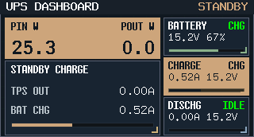

- 首页 `LOAD`: `ASSIST` 场景下首页直接显示 runtime `LOAD`，不再按 `UpsMode` 强行写成 `LOCK`。

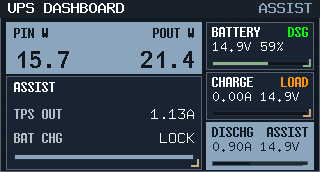

- 首页 `NOAC`: `BACKUP` 场景下首页直接显示 runtime `NOAC`。

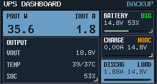

- `BACKUP USB low output`: 已确认无市电的 USB-C PD 输入在新鲜输出功率 `<2W` 时自动以 `CHG500` 放行；detail footer 明示 `USB OUT <2W`。

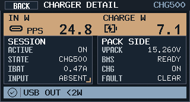

- `BACKUP USB high output`: 一个新鲜 `>=3W` 样本立即锁存停充，状态为 `LOAD`。

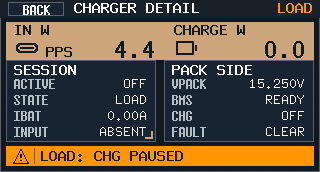

- `BACKUP USB telemetry lost`: 两次独立 TPS 遥测缺失后锁存停充，状态为 `LOCK`。

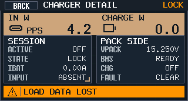

- `WAIT`: 充电未达到启动阈值，保持待机。

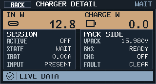

- `CHG500`: 正常 `500mA` 充电，优先显示实际 `IBAT_ADC`。

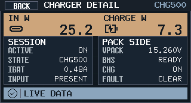

- `CHG100`: `DC5025` 独占输入且 `IBUS > 3A` 降到 `100mA`。

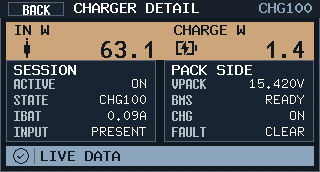

- `RECOV`: `cell_min_mv < 3000` 或 BQ40 CUV/PCHG 阶段的低压恢复，目标 `100mA`。

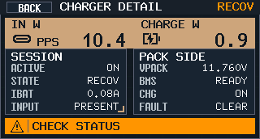

- `FULL`: 满充锁存后停充。

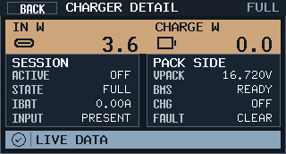

- `LOAD`: `TPS55288` 总输出功率超过 `5W` 时停充。

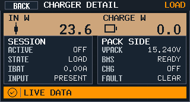

- `LOAD(power unknown)`: 输出已开启但聚合输出功率不可可信计算时，前台仍显示 `LOAD`，notice/log 区分为 `blocked_output_power_unknown`。

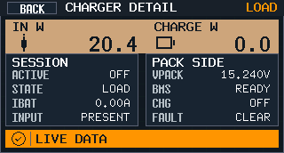

- `LOCK`: `BMS` 不允许充电或遥测缺失时停充。

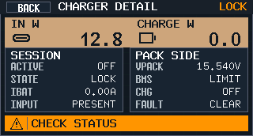

- `WARM`: `BQ25792 TS_WARM` 已进入预警温区，UI 提示并强制风扇高转，但不因此停充。

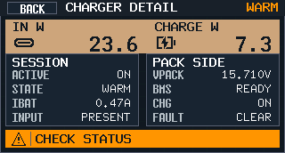

- `HEADROOM`: `DC IN` 输入充裕时，Input 面板显示 `headroom`，Charger 面板显示当前生效目标且无主动限流。

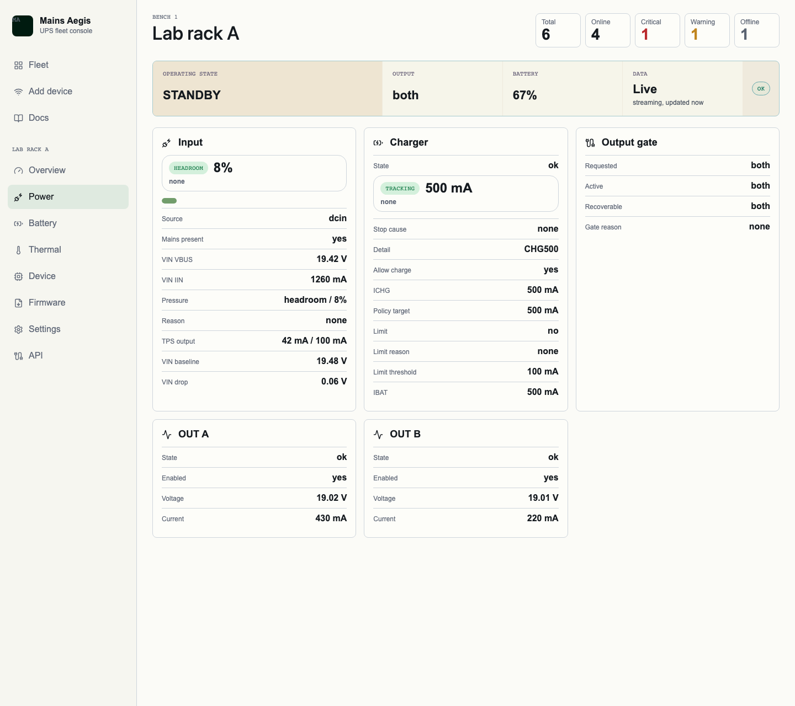

- `WATCH`: `DC IN` 刚出现输入压力迹象时，Input 面板显示 `watch`，Charger 面板显示当前受限目标与恢复保持原因。

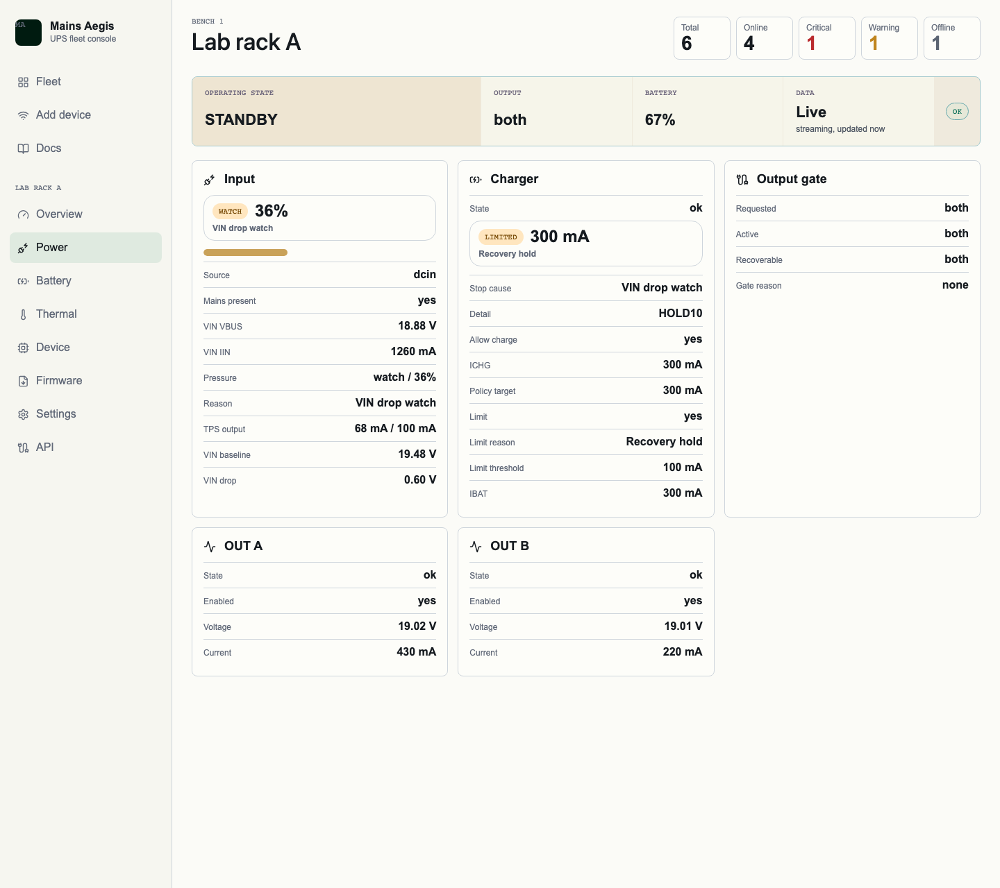

- `LIMITED`: `TPS 总输出电流 > 100mA` 命中时，Input 面板显示 `limited` 并附带 `TPS actual / threshold`；Charger 面板显示 `Stopped: TPS output current <actual> mA > 100 mA` 与 `pressure_tps_output_current`。

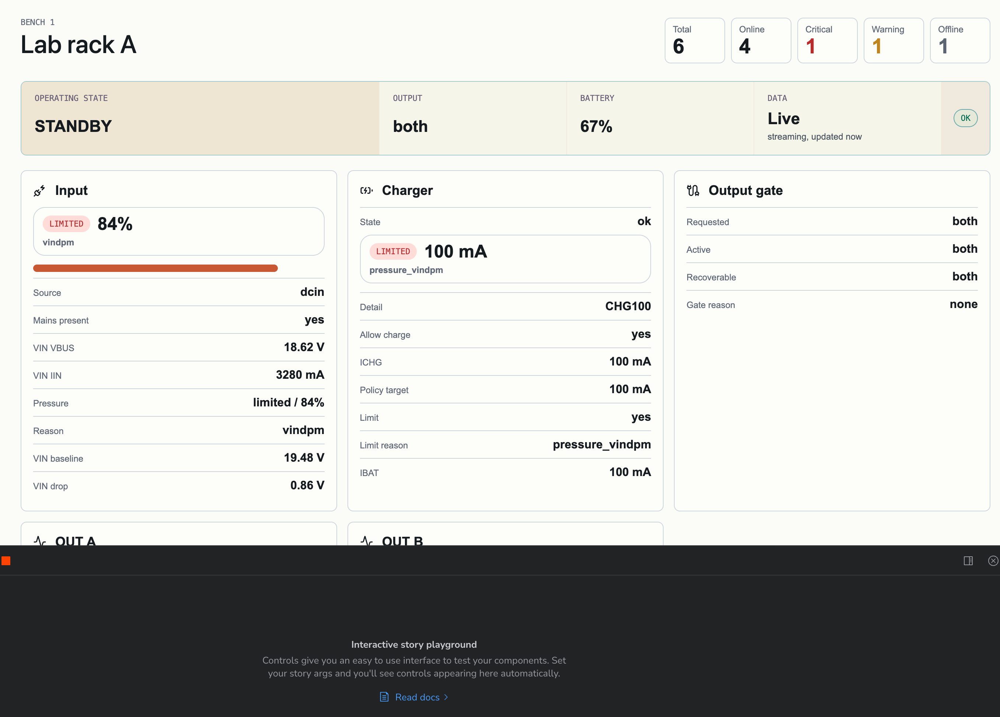

- `COOLDOWN`: `TPS 总输出电流` 或其它输入压力在 `100mA` 起步档仍无法恢复时，Input 面板显示 `cooldown`，Charger 面板继续保留根因与阈值证据，Charger 面板显示停充等待窗口与 `cooldown_retry_wait`。

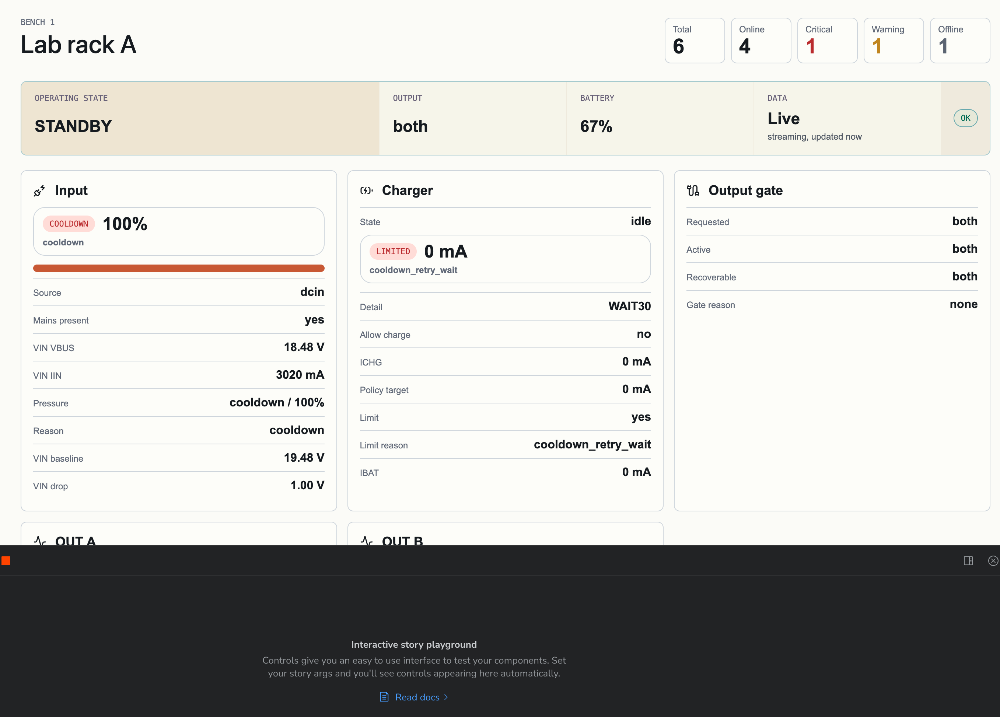

## 资产晋升（Asset promotion）

None。

## 实现里程碑（Milestones / Delivery checklist）

- [x] M1: 建立 charger policy 规格并登记到 `docs/specs/README.md`
- [x] M2: 在主线 charger runtime 中落地 `80% / 3.70V` 启充、持续到满充、满充锁存停充
- [x] M3: 落地 `DC5025` 独占输入 `3.0A -> 100mA`、`2.7A -> 500mA` 的降档恢复逻辑，并显式写入 `16.8V / 500mA / 100mA`
- [x] M4: 扩充日志、前面板 charger detail 状态、首页紧凑 token、`IBAT_ADC` 实测显示与 host-side preview 场景，并完成 `cargo fmt --all`、`cargo build --release` 与 host-side 预览测试
- [x] M5: 收敛 `LOAD` 的 `2入3出` 回差、`blocked_output_power_unknown` 保守禁充，并带着最终视觉证据完成 fast-track PR 收敛到 merge-ready

## 方案概述（Approach, high-level）

- 使用轻量的 `charge_policy_step()` 状态机统一处理“开始充电、保持充电、满充停充、异常阻断、输出过功率阻断、输出功率未知保守禁充、DC 独占降档”。
- 将策略锁存与降档计时器保存在 `PowerManager` 内部，避免每轮 poll 只靠瞬时条件抖动。
- 用现有 `dashboard_detail.charger_status / charger_notice` 承载状态 token 与精确状态名；首页 `ChargeCard` 直接从 runtime token 做紧凑映射，不新增外部协议。
- 使用 `tools/front-panel-preview/` 复用固件真实渲染链路，生成 owner-facing charger detail 预览图。

## 风险 / 开放问题 / 假设（Risks, Open Questions, Assumptions）

- 风险：`cargo test --lib` 在当前 `xtensa-esp32s3-none-elf` 目标下需要 `std/test`，不能作为本仓库现状下的可执行验证命令；本轮以编译通过和新增单测源码覆盖为主。
- 风险：首页与 detail 虽已同源，但首页只保留紧凑 token；若后续需要暴露更多诊断细节，仍需继续通过 notice/log 或详情页承载。
- 假设：常规充电中 `BQ40 FC` 与 `BQ25792 termination_done` 任一成立即可视为满充停充；CUV recovery 预充态下 `termination_done` 只作为 charger 状态观测值，不触发满充锁存。`ICHG=100mA` 模式必须配套低于目标电流的 `ITERM`。

## 变更记录（Change log）

- 2026-03-28: 建立规格并按“500mA 常规充电 + DC 独占过流降到 100mA + 80%/3.70V 启停 + 满充锁存”收敛主线策略口径。
- 2026-04-05: charger detail 补充 `TS_WARM -> WARM` 状态与说明文案；`LOCK` 诊断补充 `ChargingStatus(0x55)` 原始位图，便于区分包侧 inhibit / suspend。
- 2026-04-05: `BQ25792` ADC 遥测改为 `MSB-first` 解码；`IBUS/VBUS/VBAT/VSYS` 从 byte-swapped 假值恢复到真实量级，并把 `input_power_anomaly` 的端序误报从主线诊断中排除。
- 2026-04-06: 主线 charger state machine 正式作为 SoT；`LOAD` 增加 `2入3出` 回差，输出功率未知改为保守禁充，首页 `ChargeCard` 同步到 runtime 紧凑 token。
- 2026-06-14: DC IN 停充判据改为 `TPS 总输出电流 > 100mA` 优先；根因在 cooldown 期间持续可见。DC profile 改为 `IINDPM=1000mA`、`VINDPM=输入电压*96%`；`/api/v1/status`、`diag-snapshot`、CLI trace 与 Web PowerPage/trace console 同步暴露 `tps_total_iout_ma`、阈值和停充原因。
- 2026-06-04: 现场复核发现 `ICHG=100mA` 搭配 `ITERM=120mA` 会让 BQ25792 立即进入 `termination_done` 且 `IBAT_ADC=0`；修正 `REG09` 16-bit 写入路径，并让 `100mA` 模式写入 `ITERM=40mA`，确保硬件能持续预充。

## 参考（References）

- `docs/charger-design.md`
- `docs/plan/b3qzy:bq25792-charging-enable/PLAN.md`
- `firmware/src/output/mod.rs`
- `firmware/src/front_panel_scene.rs`
- `tools/front-panel-preview/src/main.rs`
