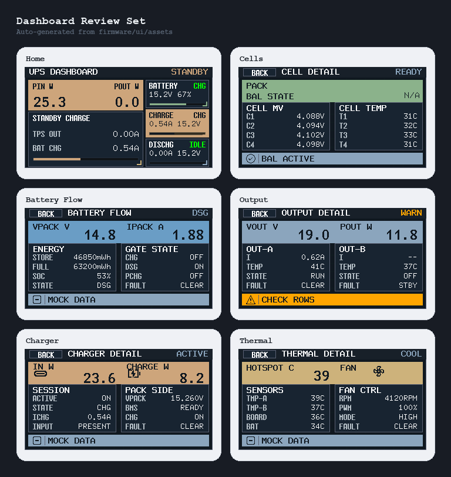
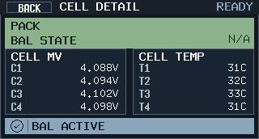
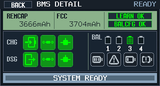
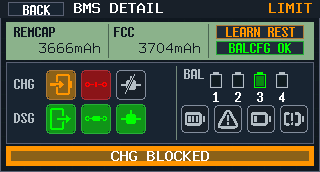
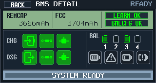
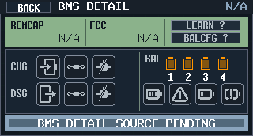
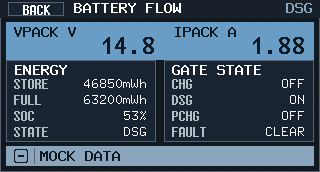
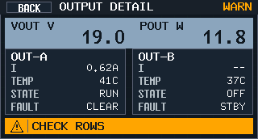
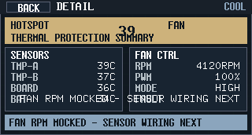

# Dashboard 二级详情页点击钻取（#f3c2g）

## 状态

- Status: 已完成
- Created: 2026-03-15
- Last: 2026-04-09

## 背景 / 问题陈述

- 当前 `Variant B` Dashboard 已改为真实运行态首页，但普通详情仍停留在“首页摘要”层级。
- 主页上的 `KPI / info panel / BATTERY / CHARGE / DISCHG` 已具备清晰信息分区，却没有点击钻取能力。
- 新需求要求在不打散现有首页骨架的前提下，为一般用户提供 5 个二级仪表盘页面，先完成界面与交互壳层，再对接真实细粒度数据源。
- 之后的 BMS 排障表明：`CELL DETAIL` 仍缺少一页真正用于解释 `REMCAP / FCC / FET / XCHG / RCA` 的高级信息页，用户无法在小屏上直接判断“为什么锁充/为什么判满”。

## 目标 / 非目标

### Goals

- 在 `320x172` 前面板上新增 Dashboard 内部路由：`Home` 与 5 个详情页。
- 首页 5 个固定入口映射：
  - `主 KPI` -> `Output`
  - `次级信息面板` -> `Thermal`
  - `BATTERY` -> `Cells`
  - `CHARGE` -> `Charger`
  - `DISCHG` -> `Battery Flow`
- 详情页统一采用“全屏单页 + 左上 BACK 返回”的结构；仅 `Cells` 允许再下钻一层 `BMS DETAIL`，不引入通用 history stack、滚动或横滑。
- 详情页视觉延续 `Variant B` 的工业仪表基底，但文案、留白和状态标签更偏消费级、可读性更强。
- 未接线字段统一显示 `N/A` 或 `--`，不得伪造演示波动值。
- 通过 `tools/front-panel-preview` 产出首页、5 个详情页与 `BMS DETAIL` 冻结 PNG，作为评审基线。

### Non-goals

- 不在本规格中接入新的 BQ40 单体数据、INA 历史曲线、TMP/Fan 新采样链路。
- 不新增返回 `SELF CHECK` 页入口。
- 不引入图表历史回放、分页容器、滚动列表、趋势线或通用多级页面 history stack。
- 不改变当前 bitmap 字体白名单、分辨率和主色板基底。

## 范围（Scope）

### In scope

- `firmware/src/front_panel_scene.rs`
  - 新增 Dashboard 路由、触摸命中区与 `Cells -> BMS DETAIL` 子页 renderer。
  - 扩展 `DashboardDetailSnapshot` 与详情页 mock/fallback 结构，承载 render-ready BMS 高级字段。
- `firmware/src/front_panel.rs`
  - 接入 Dashboard 详情页状态机、触摸进入和返回逻辑。
- `firmware/src/output/mod.rs`
  - 复用现有 steady-state BQ40 snapshot，并新增 1 条常规 `GaugingStatus()` block read，把 `REMCAP / FCC / learn / balance config / charge-discharge path / FET / flags / reason` 投影到 UI。
- `tools/front-panel-preview/src/main.rs`
  - 新增 `dashboard-detail-bms*` 预览场景导出。
- `firmware/ui/`
  - 更新 Dashboard 文档与新增 `BMS DETAIL` 冻结文档。

### Out of scope

- `output/mod.rs` 中新增 Data Flash / SafetyStatus 常驻诊断轮询、细粒度采样协议解析或实时存储。
- 新增其它屏幕主题或自检页重构。

## 功能与行为规格

### 1. Dashboard 路由

- 新增 `DashboardRoute`：
  - `Home`
  - `Detail(DashboardDetailPage)`
- 新增 `DashboardDetailPage`：
  - `Cells`
  - `BmsDetail`
  - `BatteryFlow`
  - `Output`
  - `Charger`
  - `Thermal`

### 1.1 `Cells` 下钻例外

- `DashboardRoute::Detail(Cells)` 主体区（不含顶栏/底栏）作为唯一高级入口热区。
- 点击该区域进入 `DashboardRoute::Detail(BmsDetail)`。
- `BMS DETAIL` 的 `BACK`、`LEFT`、`CENTER` 都返回 `Cells`。
- 其它二级详情页仍保持“返回首页”的单层规则。

### 2. 首页入口映射

- 首页保持现有 `Variant B` 骨架与数据口径。
- 5 个热区使用现有模块几何，不重排主布局：
  - `x=6 y=22 w=196 h=52` -> `Output`
  - `x=6 y=76 w=196 h=94` -> `Thermal`
  - `x=206 y=22 w=108 h=48` -> `Cells`
  - `x=206 y=72 w=108 h=48` -> `Charger`
  - `x=206 y=122 w=108 h=48` -> `BatteryFlow`
- 首页仅增加轻量“可点语义”：活跃边框、角标或提示文案；不改卡片主文案。

### 3. 详情页结构

- 顶栏：`BACK`、页面标题、状态 chip。
- 主体：2~4 个固定信息块，全部单屏可见。
- 底栏：异常/提示条，优先显示 fault/warning，其次显示数据源占位提示。
- 返回规则：
  - 点击左上 `BACK` 返回首页。
  - 详情页状态下按 `LEFT` 或 `CENTER` 视为返回首页。
  - 唯一例外：`BMS DETAIL` 的 `BACK` / `LEFT` / `CENTER` 返回 `CELL DETAIL`。

### 4. 页面口径

- `Cells`
  - 4 节 cell 电压
  - balancing 状态
  - 4 路 cell temp
  - 充/放电状态与异常条
- `BMS Detail`
  - 顶部主数值只显示 `REMCAP / FCC`（单位固定 `mAh`）
  - 顶部右侧补充两个高价值 badge：`LEARN` 与 `BALCFG`
  - `LEARN` 基于 `QEN / VOK / REST` 显示 `LEARN OFF / OK / REST / WAIT / ?`
  - `BALCFG` 基于 `balance_cfg_match` 显示 `BALCFG OK / MIS / ?`
  - `BAL MASK` 只以 4 节 cell 高亮图形表达，不显示 `0101 / 0x5`
  - 中部状态组使用 icon-first：`CHG flow / CHG path / CHG FET / DSG flow / DSG path / DSG FET / FC / PF / FD / RCA`
  - 底栏显示友好主原因，不显示内部 token/raw reason
  - 有限状态统一语义色：`绿色=ok`、`黄色=warn/limit`、`红色=fault/alarm`、`灰色=off/unknown`
- `Battery Flow`
  - pack voltage / current
  - stored energy / full capacity（mWh）
  - `CHG / DSG / PCHG` gate 状态
  - battery status / faults
- `Output`
  - `VOUT / POUT`
  - `OUT-A / OUT-B` 各自电流与温度
  - 若某个 `TPS` 关闭，其电流固定显示 `--`
  - faults / warning summary
- `Charger`
  - input source（`DC IN` / `USB-C` / `AUTO`）
  - input power
  - charging active
  - charger state / abnormal info
- `Thermal`
  - TMP / board / battery 温度槽位
  - fan level / PWM / tach 状态
  - thermal fault summary

### 5. 空态与异常态

- 缺失值：数值统一 `N/A`。
- 关闭输出路电流：统一 `--`。
- 底部异常条优先级：`FAULT > WARN > SOURCE PENDING > READY`。

## 接口变更（Interfaces）

- `front_panel_scene`
  - 新增 `DashboardRoute`
  - 新增 `DashboardDetailPage`
  - 新增 `DashboardTouchTarget`
  - 扩展 `DashboardDetailSnapshot`
- `FrontPanel`
  - 新增 Dashboard 当前 route 状态
  - 运行态输入处理从“Dashboard 无触摸行为”扩展为“首页触摸钻取 + 详情返回”
- `front-panel-preview`
  - 新增 `dashboard-home`
  - 新增 `dashboard-detail-cells`
  - 新增 `dashboard-detail-bms`
  - 新增 `dashboard-detail-bms-charge-blocked`
  - 新增 `dashboard-detail-bms-balance-multi`
  - 新增 `dashboard-detail-bms-no-data`
  - 新增 `dashboard-detail-battery-flow`
  - 新增 `dashboard-detail-output`
  - 新增 `dashboard-detail-charger`
  - 新增 `dashboard-detail-thermal`

## 验收标准（Acceptance Criteria）

- Given Dashboard 首页，When 点击任一入口区，Then 必须进入唯一绑定的详情页。
- Given 任一详情页，When 点击 `BACK` 或按 `LEFT/CENTER`，Then 返回 Dashboard 首页。
- Given `CELL DETAIL` 主体区，When 点击非顶栏/底栏任意位置，Then 进入 `BMS DETAIL`。
- Given `BMS DETAIL`，When 点击 `BACK` 或按 `LEFT/CENTER`，Then 返回 `CELL DETAIL`，而不是首页。
- Given `Output` 详情页中某一路 `TPS` 关闭，When 渲染对应电流，Then 显示 `--`。
- Given 详情字段未接入真实数据，When 渲染页面，Then 使用 `N/A` / `--`，且不回落到 demo 波动值。
- Given `BMS DETAIL`，When `BAL MASK` 可用，Then 只用 4 节 cell 高亮图形表达，不显示 raw bitmask 文本。
- Given `BMS DETAIL`，When `GaugingStatus()` 可用，Then `LEARN` badge 按 `QEN / VOK / REST` 显示 `OFF / OK / REST / WAIT / ?`。
- Given `BMS DETAIL`，When `balance_cfg_match` 可用，Then `BALCFG` badge 显示 `OK / MIS / ?`。
- Given `BMS DETAIL`，When `REASON` 可用，Then 底栏显示友好短标签，不显示 `xchg_blocked` 之类内部 token。
- Given preview 导出详情页，When 检查图片，Then 每张图均为 `320x172`。
- Given 首页和详情页对比评审，When 观察视觉语言，Then 首页仍可识别为现有 Variant B，详情页明显更易读、更像一般用户仪表盘。

## 实现记录

- 新增 Dashboard 内部路由：`Home` 与 5 个详情页。
- 首页 5 个固定热区已接入触摸钻取，并补上详情页 `BACK` 返回。
- 新增 `DashboardDetailSnapshot` 作为详情页 UI 壳层字段容器；未接线字段统一走 `N/A` / `--`。
- `Output` 详情页把“TPS 关闭时电流显示 `--`”固化为渲染规则。
- 本轮新增 `Cells -> BMS DETAIL` 单一子页例外，不引入通用 history stack。
- `BMS DETAIL` 在现有 runtime snapshot 基础上补充了 1 条 steady-state `GaugingStatus()` block read，用于 `LEARN` badge。
- `BMS DETAIL` 顶栏已收敛为 `REMCAP / FCC + LEARN / BALCFG`，底栏负责显示主阻塞原因。
- 预览工具新增 `dashboard-detail-bms*` 4 个场景，并已导出冻结 PNG 到本 spec `assets/`。

## 验证记录

- `cargo test --manifest-path /Users/ivan/Projects/Ivan/mains-aegis/tools/front-panel-preview/Cargo.toml`
- `cargo +esp check --manifest-path /Users/ivan/Projects/Ivan/mains-aegis/firmware/Cargo.toml --features main-vout-19v`
- `cargo run --manifest-path /Users/ivan/Projects/Ivan/mains-aegis/tools/front-panel-preview/Cargo.toml -- --variant B --focus idle --scenario dashboard-detail-bms --out-dir /tmp/mains-aegis-bms-detail-preview`
- `cargo run --manifest-path /Users/ivan/Projects/Ivan/mains-aegis/tools/front-panel-preview/Cargo.toml -- --variant B --focus idle --scenario dashboard-detail-bms-charge-blocked --out-dir /tmp/mains-aegis-bms-detail-preview`
- `cargo run --manifest-path /Users/ivan/Projects/Ivan/mains-aegis/tools/front-panel-preview/Cargo.toml -- --variant B --focus idle --scenario dashboard-detail-bms-balance-multi --out-dir /tmp/mains-aegis-bms-detail-preview`
- `cargo run --manifest-path /Users/ivan/Projects/Ivan/mains-aegis/tools/front-panel-preview/Cargo.toml -- --variant B --focus idle --scenario dashboard-detail-bms-no-data --out-dir /tmp/mains-aegis-bms-detail-preview`

## Visual Evidence

当前冻结版评审图如下，包含首页与 5 个二级详情页：

### Home

### Cells

### BMS Detail

#### Nominal

#### Charge blocked / lock

#### Balance multi-cell

#### No data / unknown

### Battery Flow

### Output

### Charger

### Thermal

### Icons

