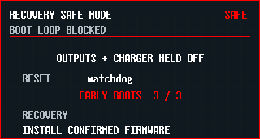

# Firmware fault recovery

## Background

The normal firmware previously disabled both timer-group watchdogs. Peripheral recovery could not recover a stalled critical control loop, and the single-image release layout had no boot-confirmation or rollback contract.

## Goals

- Reset the MCU when the normal firmware stops completing useful critical-loop work.
- Preserve a bounded, integrity-checked boot-health journal across watchdog and software resets.
- Enter a controlled, owner-visible safe mode after repeated abnormal early boots.
- Expose reset, boot-health, safe-mode, and firmware-slot truth through device diagnostics.
- Require a rollback-capable bootloader and dual-slot image layout before firmware candidates can be activated.

## Non-goals

- Peripheral watchdogs do not satisfy MCU liveness recovery.
- Manual host reflashing is not automatic rollback.
- This contract does not authorize hardware reset, flash, EEPROM writes, or power actions during development validation.

## Recovery contract

### MCU watchdog

- Normal firmware owns the TIMG0 MWDT after `esp_rtos::start` takes TIMG0 timer0.
- Stage 0 uses a 60-second boot window during hardware self-check and initialization, then is re-armed to an 8-second runtime window immediately before the main loop.
- After that initialization checkpoint, feeding occurs only after one complete critical-loop slice has serviced power policy, fan output, front-panel state, status publication, and enabled transport work.
- Focused USB-PD negotiation and other bounded subloops do not feed independently. A wedged subloop therefore remains recoverable.
- Explicit diagnostic firmware variants may use a different policy only behind a compile-time feature and must not silently disable the normal-firmware contract.
- The HIL-only `hil-watchdog-stall` feature deliberately stops before the first runtime feed while the boot is not in safe mode. Once repeated abnormal boots enter safe mode, injection is bypassed so diagnostics and the recovery surface remain reachable.

### Reset taxonomy

Reset causes are normalized as `power_on`, `software`, `watchdog`, `brownout`, `external_debug`, or `unknown`. MWDT0/MWDT1/RTC watchdog CPU/core/system reasons are all abnormal watchdog resets. Brownout starts a new sequence and remains visible but does not count as a firmware crash.

### Boot-health journal

- Two RTC slow-domain store slots hold a versioned record with generation, abnormal-boot count, boot phase, safe-mode reason, candidate state, and CRC.
- The older slot is written first as the next generation; readers select the newest valid generation. Missing or corrupt records fall back to defaults.
- RTC retention is required only across software and watchdog resets. Power-on/brownout creates a fresh sequence; EEPROM is not consumed for per-boot accounting.
- A boot is `stabilizing` until initialization/self-check succeeds and 30 seconds of main-loop liveness have elapsed. Only then is it marked `healthy` and the abnormal count cleared.
- A watchdog or software reset while the previous boot was `stabilizing` increments the abnormal count. Three consecutive abnormal early boots enter safe mode.

### Safe mode

- Safe mode is a blocked self-check surface, never Dashboard.
- Firmware holds controllable outputs and charger policy in their existing safe-state paths, leaves independent BMS/TPS/`THERM_KILL_N` protection intact, and continues diagnostics plus owner-visible recovery communication.
- The panel displays `RECOVERY SAFE MODE`, reset reason, and the explicit recovery path `install confirmed firmware`.
- Safe mode exits only after a confirmed firmware is installed or an authorized recovery action clears the boot-health journal. Merely surviving another reboot does not clear it.

### Candidate confirmation and rollback

- A candidate is activated only into an inactive OTA slot and must boot as `pending_verify`.
- Candidate confirmation uses the same initialization/self-check and 30-second stable-runtime gate as boot health.
- Reset before confirmation must cause the bootloader to mark the candidate aborted and boot the last valid slot.
- The release bundle must contain a rollback-enabled ESP-IDF second-stage bootloader, partition table with `otadata + ota_0 + ota_1`, and application image(s). The artifact manifest and devd dry-run must validate all offsets and hashes as one atomic layout.
- Until that bundle exists, diagnostics report rollback `unsupported_layout`; candidate activation is prohibited. A host-side single-image reflash is not a substitute.

## Diagnostics

`status` and `diag-snapshot` expose normalized reset cause, abnormal boot count, boot phase, safe-mode state/reason, active slot, candidate state, confirmation state, rollback capability, and rollback blocker.

## Acceptance

- Host tests cover healthy stabilization, abnormal reset counting, threshold safe mode, healthy clearing, corrupt/missing records, safe-mode recovery, and candidate transitions.
- ESP firmware checks prove the MWDT is enabled and fed at the completed critical-loop checkpoint.
- Controlled front-panel preview evidence shows the safe-mode blocked surface.
- Release/catalog validation refuses to describe the current single-image layout as rollback-capable.

## Visual Evidence

PR: include

