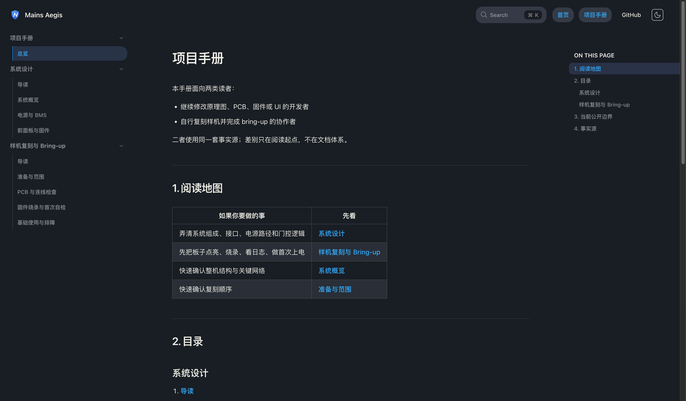
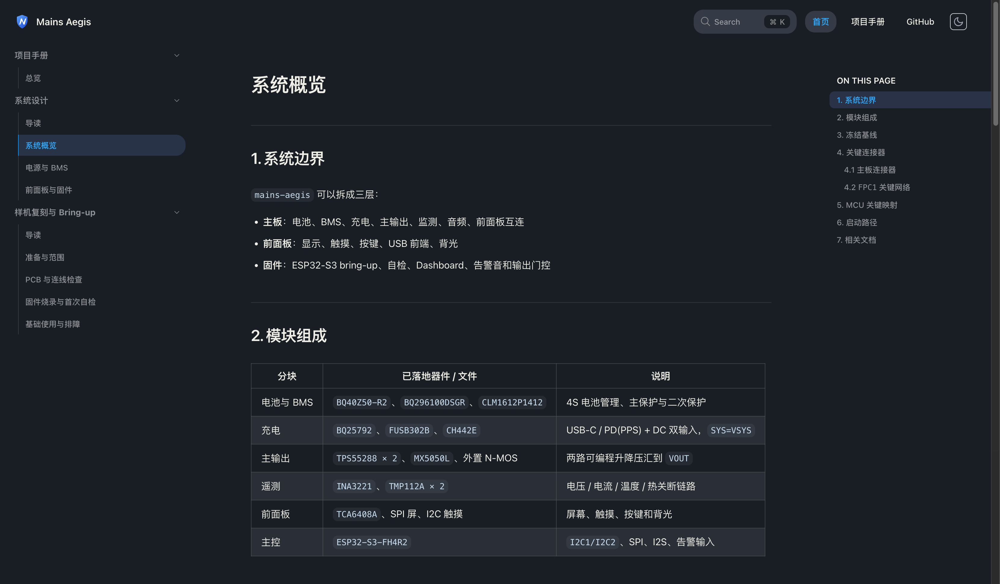
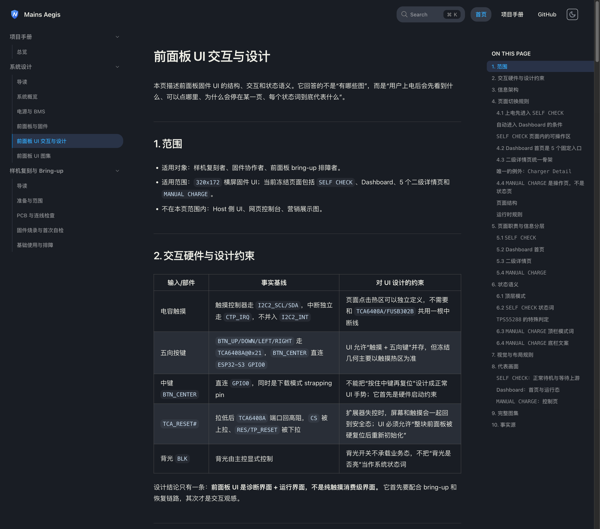
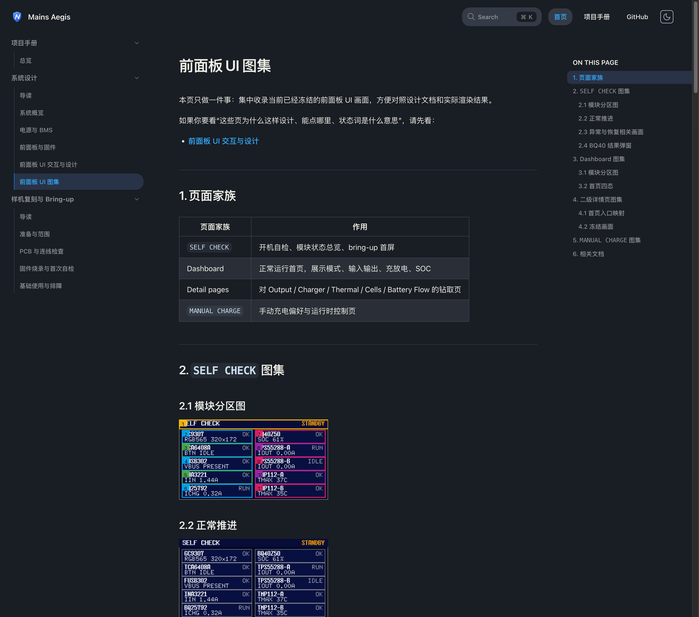
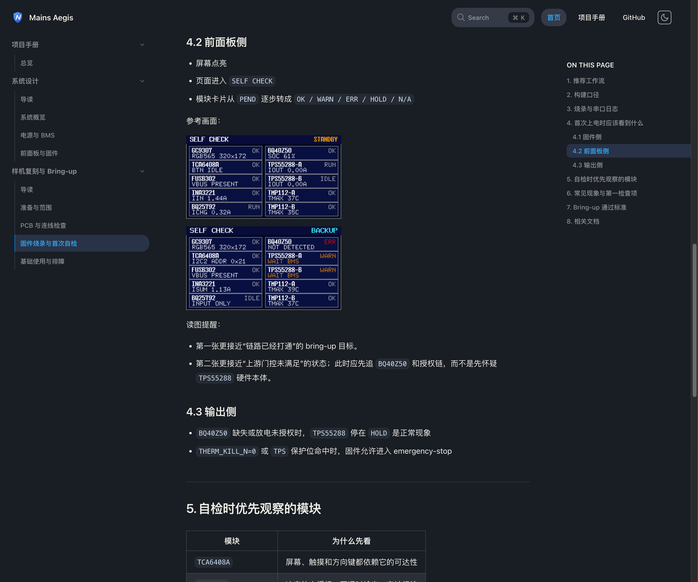

# GitHub Pages 项目手册站（#jxz2t）

## 状态

- Status: 已完成
- Created: 2026-04-08
- Last: 2026-04-08

## 背景 / 问题陈述

- 当前仓库已经积累了大量系统设计、PCB、固件与 bring-up 文档，但它们主要以仓库内专题 Markdown 的形式存在，缺少一个对外公开、适合新协作者快速进入的统一入口。
- `mains-aegis` 是开源硬件项目，不存在可直接购买的成品；真正会使用它的人，通常也需要承担一部分硬件复刻、固件烧录、排障与设计理解工作。
- 现有文档更偏“事实仓库”，对第一次接触项目的人来说，信息分散、进入路径不明确，也缺少可直接部署到 GitHub Pages 的稳定站点。
- 需要新增一个公开文档站，把系统设计与样机复刻内容收敛到同一份项目手册中，并在不重造事实源的前提下，把现有专题文档组织成更可读的入口。

## 目标 / 非目标

### Goals

- 在当前仓库内新增独立 `docs-site/`，用 Rspress 构建一个可部署到 GitHub Pages 的公开文档站。
- 站点只保留中文单语导航，主导航固定为“首页 / 项目手册 / GitHub”。
- 重写一组面向外部读者的手册页，把现有 `docs/**`、`docs/pcbs/**`、`firmware/README.md` 等资料整理成同一份项目手册中的两条阅读路径。
- 明确站点定位：这是一个开源硬件项目的手册站，而不是产品营销页，也不是全量 vendor 资料库入口。
- 补齐 GitHub Pages workflow、本地预览入口与视觉证据，确保快车道可以推进到 merge-ready。

### Non-goals

- 不把 `docs/datasheets/**`、`docs/manuals/**`、`docs/reference-designs/**` 全量迁入主站导航。
- 不凭空补造完整可下单 BOM、生产文件打包、成品说明书或未在仓库中冻结的量产承诺。
- 不引入英文版、多版本文档、Storybook 联合发布或独立营销官网。

## 范围（Scope）

### In scope

- 新增 `docs-site/` 独立文档站工作区与本地构建脚本。
- 新增 Rspress 配置、品牌资源、首页、404 与项目手册页面。
- 新增 GitHub Pages workflow，并修正现有构建类 workflow 的 `paths-ignore`。
- 新建本规格目录、索引行与 `## Visual Evidence`，把最终验收图写回当前规格。
- 本地预览、浏览器检查、截图与快车道 PR 收敛。

### Out of scope

- 迁移旧 `docs/plan/**` 结构。
- 修改现有固件行为、PCB 网表或硬件设计决策。
- 对 vendor 原始资料做二次整理与公开站点索引化。

## 需求（Requirements）

### MUST

- 站点必须以 `docs-site/` 独立工作区存在，并能通过 `bun run dev/build/preview` 工作。
- Rspress 配置必须支持 `DOCS_BASE`，以适配 GitHub Pages 的仓库子路径部署。
- 站点公开路由必须包含：`/`、`/handbook/`、`/design/`、`/design/system-overview`、`/design/power-and-bms`、`/design/front-panel-and-firmware`、`/manual/`、`/manual/prepare-and-scope`、`/manual/pcb-and-wiring-checks`、`/manual/firmware-flash-and-self-test`、`/manual/basic-use-and-troubleshooting`。
- 首页必须清楚说明：项目是开源硬件、没有成品、目标受众是 DIY 复刻者与半开发者。
- 系统设计与样机复刻章节都必须在页尾提供延伸阅读，深链回仓库现有事实源文档。
- GitHub Pages workflow 必须在 PR 上执行构建检查，在 `main` 上执行构建并部署。
- 现有 `ci.yml` 与 `firmware.yml` 必须把 `docs-site/**` 加入 `paths-ignore`；`dependency-review.yml` 必须避免被 `docs-site/docs/**` 内容页误触发，同时保留对 `docs-site` 依赖清单变更的检查。
- 必须提供视觉证据并回填到当前规格的 `## Visual Evidence`。

### SHOULD

- 站点应使用稳定的品牌资源（logo mark / favicon）与一致的站内导航结构。
- 手册页面应优先讲清“当前已冻结事实 / 候选项 / 待定项”的边界，避免给出过度承诺。
- 本地预览应通过端口租约注入 `DOCS_PORT`，避免与其他 worktree 冲突。

### COULD

- 首页可增加“先看这几件事”的快速入口与“适合谁看”的受众说明。
- 页面可补充适度的代码块/示意框图，但不要求引入额外插件。

## 功能与行为规格（Functional/Behavior Spec）

### Core flows

- 协作者打开 GitHub Pages 首页时，应立即理解项目定位、当前公开范围，以及应该从系统设计还是样机复刻入口开始阅读。
- 进入项目手册后，应能沿“系统设计”入口快速看到系统概览、电源/BMS 设计、前面板与固件边界，并沿“样机复刻与 Bring-up”入口依次获得：准备前提、PCB 与连线检查、固件构建烧录与首次自检、基础使用与常见排障。
- PR 打开后，Docs Pages workflow 应执行构建验证；本地预览与截图必须基于当前分支最新实现。

### Edge cases / errors

- 若站点部署在仓库子路径而不是根路径，静态资源与导航链接仍必须正确。
- 若仓库中某些设计决策仍是“候选”或“待定”，手册必须保留该状态，而不是擅自写成“已定”。
- 若没有完整 BOM / Gerber 打包事实源，手册必须明确说明这一边界，并把读者导向现有 `docs/pcbs/**` 与设计文档，而不是编造缺失内容。

## 接口契约（Interfaces & Contracts）

### 接口清单（Inventory）

| 接口（Name） | 类型（Kind） | 范围（Scope） | 变更（Change） | 契约文档（Contract Doc） | 负责人（Owner） | 使用方（Consumers） | 备注（Notes） |
| --- | --- | --- | --- | --- | --- | --- | --- |
| `docs-site/package.json` scripts | internal | internal | New | None | docs-site | 本地开发 / CI | `dev/build/preview` |
| `DOCS_BASE` | internal | internal | New | None | docs-site | GitHub Pages workflow | 仓库页子路径基址 |
| `DOCS_PORT` | internal | internal | New | None | docs-site | 本地预览 | 通过端口租约注入 |
| `.github/workflows/docs-pages.yml` | internal | internal | New | None | repo | PR / main | PR 构建，main 部署 |

### 契约文档（按 Kind 拆分）

None

## 验收标准（Acceptance Criteria）

- Given 已安装 `docs-site` 依赖，When 执行 `bun run build --cwd docs-site`，Then 构建成功并生成 `docs-site/doc_build`。
- Given `DOCS_BASE=/${repo}/`，When 预览构建产物，Then 首页、项目手册、系统设计、样机复刻与 Bring-up、404 页面都能正常加载，静态资源路径不丢失。
- Given 只修改 `docs-site/docs/**` 内容页，When GitHub Actions 触发，Then 新增的 Docs Pages workflow 会运行，而现有 firmware / host / dependency review workflow 不会被误触发。
- Given 修改 `docs-site/package.json` 或 `docs-site/bun.lock`，When GitHub Actions 触发，Then `dependency-review` 仍会运行以覆盖 docs 站依赖变更。
- Given 打开首页，When 首次阅读，Then 能明确理解“开源硬件 / 无成品 / DIY 复刻者与半开发者”的项目定位。
- Given 打开项目手册中的系统设计与样机复刻章节，When 阅读各页，Then 每页都能提供明确范围与延伸阅读深链，不把 vendor 资料库暴露到主导航。
- Given 当前规格关联视觉证据，When 快车道收口前检查，Then 当前规格的 `## Visual Evidence` 已回填最终截图，并与当前提交绑定。

## 实现前置条件（Definition of Ready / Preconditions）

- 站点定位、导航结构、公开范围已冻结。
- 项目手册的页面列表已确定。
- GitHub Pages 作为部署目标已确定。
- 事实源范围已确定为现有 `docs/**`、`docs/pcbs/**`、`firmware/README.md` 与相关规格截图，不要求新增成体系生产资料。

## 非功能性验收 / 质量门槛（Quality Gates）

### Testing

- Build: `bun install --cwd docs-site --frozen-lockfile`
- Build: `bun run build --cwd docs-site`
- Preview smoke: `DOCS_BASE=/<repo>/ bun run preview --cwd docs-site`
- Browser validation: 项目手册首页、系统概览页、至少一页 bring-up 细节页截图。

### UI / Storybook (if applicable)

- Storybook覆盖：不适用（独立文档站，不依赖 Storybook）

### Quality checks

- 站点页面不得引用外链图片。
- 页面标题、文件名、正文不得出现文档修订标记。
- GitHub Actions workflow YAML 必须通过基本语法与路径逻辑校验。

## 文档更新（Docs to Update）

- `docs/specs/README.md`: 新增当前规格索引行，并在收口时更新状态与 PR 备注。
- `docs/specs/jxz2t-docs-site-handbooks/SPEC.md`: 回填视觉证据与最终状态。

## 计划资产（Plan assets）

- Directory: `docs/specs/jxz2t-docs-site-handbooks/assets/`
- In-plan references: ``
- Visual evidence source: maintain `## Visual Evidence` in this spec when owner-facing or PR-facing screenshots are needed.

## Visual Evidence

项目手册首页

系统概览页（完整侧栏）

前面板 UI 交互与设计页

前面板 UI 图集页

固件烧录与首次自检页（含 Self-check 参考图）

## 资产晋升（Asset promotion）

None

## 实现里程碑（Milestones / Delivery checklist）

- [x] M1: 新建 `docs-site/`、Rspress 配置与 GitHub Pages workflow
- [x] M2: 完成首页、项目手册与章节页面
- [x] M3: 完成本地构建、预览与浏览器烟测
- [x] M4: 回填视觉证据到当前规格
- [x] M5: 快车道 PR 创建并收敛到 merge-ready

## 方案概述（Approach, high-level）

- 复用 `octo-rill` 的独立 `docs-site/` 模式，把公开文档站与仓库事实源分层：站点负责对外入口，仓库原文负责深度事实。
- 页面内容以“重写手册 + 深链原始专题文档”的方式组织，避免把现有资料树直接暴露给首次阅读者。
- GitHub Pages 构建采用 Rspress 默认产物 `doc_build`，并用 `DOCS_BASE` 保证仓库子路径部署可用。
- 视觉证据以本地预览截图为准，统一写回当前规格。

## PR

- PR: [#63](https://github.com/IvanLi-CN/mains-aegis/pull/63)

## 风险 / 开放问题 / 假设（Risks, Open Questions, Assumptions）

- 风险：仓库中没有完整 BOM/生产文件总表，手册必须清楚写明“当前事实范围”，否则容易误导读者。
- 风险：若 GitHub Pages 权限未启用，workflow 只能构建不能实际部署。
- 需要决策的问题：None。
- 假设（已确认）：站点只公开项目手册，不公开 vendor 资料库导航。

## 变更记录（Change log）

- 2026-04-08: 新建规格，冻结项目手册站的范围、路由与验收口径。

## 参考（References）

- `octo-rill` `docs-site/` 组织方式与 `docs-pages.yml`
- `/Users/ivan/.codex/worktrees/7f07/mains-aegis/docs/hardware-selection.md`
- `/Users/ivan/.codex/worktrees/7f07/mains-aegis/docs/bms-design.md`
- `/Users/ivan/.codex/worktrees/7f07/mains-aegis/docs/charger-design.md`
- `/Users/ivan/.codex/worktrees/7f07/mains-aegis/docs/ups-output-design.md`
- `/Users/ivan/.codex/worktrees/7f07/mains-aegis/docs/pcbs/front-panel/README.md`
- `/Users/ivan/.codex/worktrees/7f07/mains-aegis/docs/pcbs/mainboard/README.md`
- `/Users/ivan/.codex/worktrees/7f07/mains-aegis/firmware/README.md`
