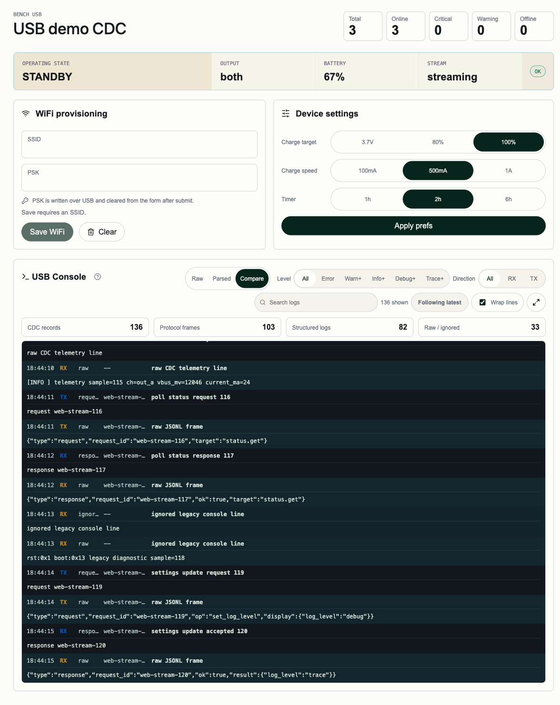
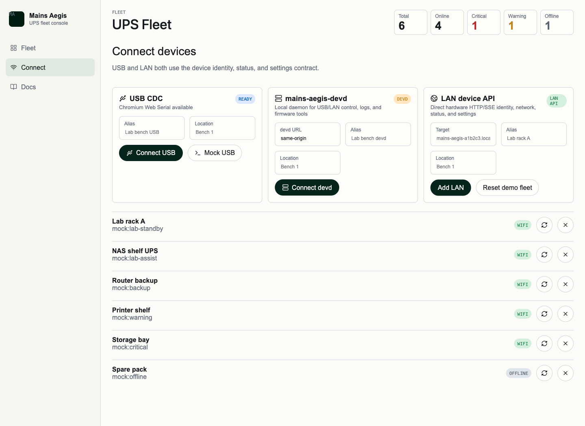

# LAN management convergence（#k4vzn）

## 状态

- Status: 已完成（5/5）
- Created: 2026-06-03
- Last: 2026-06-03

## 背景 / 问题陈述

- 现有 `amc32` 把设备本体 HTTP API 定义为 LAN 只读底座，`ypfpu` Web 管理端也据此把 LAN 作为只读状态源；但当前产品边界已改为：**Web 无 devd 场景也必须通过 LAN 提供与 devd LAN 路径同等的已支持功能覆盖**。
- `mains-aegis-devd` 与 CLI 仍然保留 `session` / `safeSettings` 这类历史兼容概念；这些接口把“当前连接状态”“控制台尾巴”“设置态回填”混在一起，既不适合作为用户可见 CLI 命令，也不适合作为后续 LAN / USB / Web 统一信息架构。
- 当前仓库已经有 LAN 只读状态面、USB/devd 写控制面、Web Serial 烧录与 devd 代理烧录，但这几条链路的真相源和用户心智并不统一。若不先冻结新的真相层与迁移顺序，后续实现会继续在 firmware、devd、CLI、Web 四处堆兼容分叉。

## 目标 / 非目标

### Goals

- 把**设备本体 API**收敛为 LAN 管理真相源：Web 直连 LAN 与 devd 走 LAN 时都消费同一组设备端点与同一组字段语义。
- 在保持当前 `api_version=v1` 开发期口径的前提下，把设备本体 API 从“只读 + USB 写入”升级为“LAN 提供所有当前已支持的设备管理功能；不支持的功能不强塞”。
- 明确主机/客户端层与设备本体层分工：`connection`、scan run、transport 选择、持久化 trace 属于 devd / Web / CLI 层；`identity`、`status`、`settings` 与对应写接口属于设备本体 API。
- 以 `identity.device_id` 作为同一硬件的唯一主键，把 USB 与 LAN 收敛到同一 logical device 模型；默认首选 USB，但切换 transport 时必须显式提示。
- 全局废弃 `session` / `safeSettings` 旧模型，重设计为 `connection / identity / status / settings / trace` 五类清晰能力面。
- 为 Web 无 devd 与 devd/CLI 两条路径都补齐结构化 HTTP client trace，并给出持久化窗口、scan trace 和设备 trace 的统一模型。
- 跨 `Web App` / `mains-aegis-devd` / `mains-aegis` CLI 的通信方案优先级矩阵由 [`#rzx5v`](../rzx5v-client-transport-priority/SPEC.md) 统一定义；本规格只描述 LAN management convergence 本身，不再承载跨客户端默认 transport 规则。

### Non-goals

- 当前不为设备本体新增 LAN `flash` 或 LAN `monitor/defmt` API。只要设备本体尚未真实支持，这些能力就不纳入 LAN 目标面。
- 当前不为 LAN 写接口补鉴权。首版仍基于“可信局域网”假设工作，但必须在规格与 UI 中把该风险写明，不把它误表述成安全边界。
- 不把 `connection`、当前 transport 选择、Web lease 或 devd owner 状态塞回设备本体 API。
- 不要求浏览器自动推断 CIDR；Web 端子网扫描范围继续由用户手填并持久记忆。

## 范围（Scope）

### In scope

- `firmware/src/net.rs`、`firmware/src/net_contract.rs`、相关 host-unit-tests 与 HTTP 契约文档：补齐设备本体 `v1` 管理 API。
- `tools/mains-aegis-host/`：新增 LAN discovery / transport / trace / connection 查询模型，废弃 CLI `device session` 用户命令面。
- `web/`：把 LAN 直连、devd transport、Settings、Connect、Trace、DeviceRegistry 收敛到新的信息架构。
- `docs/specs/**`、`docs/usb-cdc-web-serial-protocol.md`、`docs/web-management-ui.md` 等：去掉 “LAN 只读” 和 `session/safeSettings` 作为未来真相源的叙述。

### Out of scope

- LAN API 的安全鉴权方案、TLS、跨网段发现、IPv6、OTA。
- 把 host power 搬到设备本体 API；host power 仍是 devd host-scoped 能力。
- 浏览器端 USB owner 改成长期持久 owner；真实 `SerialPort` 仍不落本地持久化。

## 需求（Requirements）

### MUST

- 设备本体 API 继续保留 `GET /api/v1/identity`、`GET /api/v1/network`、`GET /api/v1/status`，并继续以 `GET /api/v1/status` + `Accept: text/event-stream` 作为唯一状态 SSE 入口。
- 设备本体必须新增 `GET /api/v1/settings`，一次返回完整设置快照；当前至少包含 `wifi`、`log_level`、`manual_charge`、`advanced_power` 与 `advanced_power_capabilities`。
- 设备本体写接口继续按主题分开：`POST|DELETE /api/v1/wifi-config`、`POST /api/v1/settings/log-level`、`POST /api/v1/settings/manual-charge`、`POST /api/v1/settings/advanced-power`、`POST /api/v1/settings/advanced-power/reset`、`POST /api/v1/reset`。
- 客户端写成功后必须重新读取完整 `settings` 快照；不得依赖局部返回拼接设置状态。
- Web 无 devd 模式必须支持手填 IPv4 CIDR 的子网扫描，并记住最近范围；扫描只探测 `http://<ip>:80/api/v1/identity`。
- devd LAN 发现顺序固定为 `mDNS/DNS-SD -> 子网扫描`；Web 无 devd 模式只走子网扫描。
- 所有扫描结果必须经 `/api/v1/identity` 二次确认；只有满足 `role=ups` / `device_id` / `api_version` 契约的目标才能进入设备列表。
- 同一 `device_id` 出现在多个 IP 上时，必须标记冲突并阻断自动接入。
- logical device 以 `device_id` 为主键；USB 与 LAN transport 必须关联到同一设备记录。默认首选 USB；从已连接 transport 切到另一种 transport 时必须显式提示。
- CLI `--transport` 为可选偏好参数；不传时默认 `usb`。显式选 `usb` 但 USB 不可用时直接失败并提示，不自动降级到 LAN。
- LAN 日志能力接受为 HTTP client 侧结构化 trace，不要求等价于 USB monitor/defmt。

### SHOULD

- 设备本体 `settings` 读接口与 `identity` / `status` 一样使用稳定、可直接消费的 JSON shape，避免 Web 与 devd 再做各自字段重命名。
- devd `connection` 查询应返回：`device_id`、当前已选 transport、可用 transports、每个 transport 的 reachability / last_error，以及必要的切换提示。
- 设备 trace 与 scan run trace 都应持久化，但保持 bounded 保留窗口，服务排障回放而非长期审计。

## 功能与行为规格（Functional / Behavior Spec）

### 1. 设备本体 API

- 保留现有只读入口：`/api/v1/ping`、`/health`、`/api/v1/identity`、`/api/v1/network`、`/api/v1/status`。
- 保留现有状态 SSE：`GET /api/v1/status` + `Accept: text/event-stream`；不新增 `/events`。
- 新增 `GET /api/v1/settings`，返回完整设置快照。
- 保留并提升为设备本体写入口：
  - `POST /api/v1/wifi-config`
  - `DELETE /api/v1/wifi-config`
  - `POST /api/v1/settings/log-level`
  - `POST /api/v1/settings/manual-charge`
  - `POST /api/v1/settings/advanced-power`
  - `POST /api/v1/settings/advanced-power/reset`
  - `POST /api/v1/reset`
- 当前设备本体 API 不新增：
  - LAN `flash`
  - LAN `monitor`
  - 任何“当前是否连接/当前 transport”字段

### 2. discovery 与 logical device

- Web 无 devd 场景：用户手填 IPv4 CIDR；前端记住范围；扫描默认参数统一为并发 `32`、单 IP 超时 `800ms`、整轮可取消。
- devd 场景：先做 mDNS/DNS-SD，再做相同参数的子网扫描补充。
- 扫描只打 `/api/v1/identity`；`/health`、`/ping` 不能作为设备命中判据。
- 扫到的 LAN 目标以 `device_id` 聚合；若 mDNS 与子网扫描命中同一设备，则合并为同一 LAN transport，展示优先使用 mDNS 主机名，内部保留最近成功 IP。
- 同一 `device_id` 的 USB / LAN transport 关联到同一 logical device；允许用户主动切换，程序根据命令能力给出切换建议或硬阻断。
- USB `bind` 成功后，devd 允许做一次只读 companion-LAN 探测：先读 USB `identity`，必要时补 `status.network`；若设备报告已连 LAN，则分别验证 `http://<ipv4>:80/api/v1/identity` 与 `http://<hostname_fqdn>:80/api/v1/identity`。只有两条路径都返回与 USB 相同的 `device_id` 时，才生成运行态 `companion_lan_candidate`。
- `companion_lan_candidate` 只作为待确认提示存在于运行态；它不得自动落盘，也不得在 Web/CLI 中自动升级为 active LAN transport。只有显式确认后，才允许把 `lan_companion { mdns_host, ip, port, confirmed_at, last_verified_at }` 持久化到同一 logical device 的绑定记录。
- 若同一 `device_id` 在 companion-LAN 验证阶段命中多个 LAN 地址，沿用现有 `lan_identity_conflict` 语义：允许保留 USB 绑定，但阻断 companion-LAN 持久化。

### 3. 取代 `session` 的五类查询面

- `connection`：只存在于 devd / Web / CLI 层，返回 transport 选择上下文，不进入设备本体 API。
- `identity`：设备本体真相。
- `status`：设备本体运行态快照真相。
- `settings`：设备本体可管理设置真相。
- `trace`：客户端/宿主层的持久化诊断记录。

`session` / `safeSettings` 全局废弃，不再作为公开语义保留；任何“当前控制台尾巴”类接口若仍需要存在，也只允许作为 Web 内部补状态机制，不得成为公开 CLI 概念。

### 4. Trace 模型

- Trace 记录结构至少包含：`timestamp`、`direction`、`target`、`summary`、`payload`。
- `direction` 至少区分：`tx`、`rx`、`sse`、`error`、`info`。
- 设备 trace 以 `device_id -> transport -> trace` 组织；USB 与 LAN 分开存放，不混成一个流。
- devd `devices.scan` 接受可选 IPv4 CIDR，按 `mDNS/DNS-SD -> CIDR/default routed /24` 探测 `:80` 上的 `GET /api/v1/identity`；返回的 scan run trace 用于复盘候选来源、probe 数量和命中数量。
- Web 设备级 trace：每个 `device_id + transport` 最多 `2000` 条，最长保留 `24h`，支持手动清空。
- Web scan run trace：保留最近 `20` 次扫描或最近 `6h`。
- devd 设备级 trace 与 scan run trace 采用同样的 bounded 保留窗口，并落磁盘，供跨进程/跨命令排障。

## 接口契约（Interfaces & Contracts）

### 接口清单（Inventory）

| 接口（Name） | 类型（Kind） | 范围（Scope） | 变更（Change） | 契约文档（Contract Doc） | Owner | Consumers | Notes |
| --- | --- | --- | --- | --- | --- | --- | --- |
| `GET /api/v1/settings` | http | external | New | follow-up in `amc32` contract docs | firmware | Web, devd LAN client, CLI via devd | 完整设置快照真相源 |
| `POST|DELETE /api/v1/wifi-config` | http | external | Modify | existing contract updated in follow-up | firmware | Web, devd LAN client, CLI via devd | 从 USB/localhost 专属提升为设备本体 API |
| `POST /api/v1/settings/log-level` | http | external | Modify | same as above | firmware | Web, devd LAN client, CLI via devd | 同上 |
| `POST /api/v1/settings/manual-charge` | http | external | Modify | same as above | firmware | Web, devd LAN client, CLI via devd | 同上 |
| `POST /api/v1/settings/advanced-power` | http | external | Modify | same as above | firmware | Web, devd LAN client, CLI via devd | 高级 staged assist/takeover 偏移量整块写入 |
| `POST /api/v1/settings/advanced-power/reset` | http | external | New | same as above | firmware | Web, devd LAN client, CLI via devd | 恢复设备默认 advanced power 参数 |
| `POST /api/v1/reset` | http | external | New/reshape | follow-up | firmware | Web, devd LAN client, CLI via devd | 当前已由 devd 提供，本次要求设备本体具备 |
| `trace` query surface | cli/http/internal | external/internal | New | this spec | devd/web | owner-facing diagnostics | 取代 `session` 历史命令面 |

## 验收标准（Acceptance Criteria）

- 设备本体 `GET /api/v1/settings` 能返回完整设置快照，且不包含 PSK，并包含 `advanced_power` 与 `advanced_power_capabilities`。
- Web 无 devd 模式可通过手填 CIDR 子网扫描找到设备，并在 `device_id` 层聚合已保存 LAN 记录。
- devd 可通过 mDNS/DNS-SD 或子网扫描发现同一设备的 LAN transport，并把其关联到已有 USB logical device。
- CLI 用户命令面不再暴露 `device session`；新的用户查询面只保留 `connection / identity / status / settings / trace`。
- `session` / `safeSettings` 不再作为新的真相模型出现在 Web、devd、CLI 设计里。
- Web 与 devd 的 LAN trace 都按 `device_id -> transport` 有界持久化，且 scan run trace 可用于复盘“为什么这次没扫到/超时/失败”。

## 文档更新（Docs to Update）

- `docs/specs/amc32-wifi-service-discovery-api-foundation/SPEC.md`: 标记“只读 API 底座”假设被本规格接管的边界。
- `docs/specs/p8k3d-mains-aegis-devd/SPEC.md`: 标记 `session` / localhost `safeSettings` 兼容面由本规格重设计。
- `docs/specs/7jqrq-mains-aegis-cli-devd-alignment/SPEC.md`: 标记 CLI `device session` 废弃与新查询面迁移。
- `docs/specs/ypfpu-web-management-ui/SPEC.md`: 标记 “LAN 只读”“Settings 仅 USB” 等历史假设由本规格接管。
- `docs/specs/amc32-wifi-service-discovery-api-foundation/contracts/http-apis.md`: 在实现阶段重写为新的设备本体 `v1` 管理 API 契约。
- `docs/usb-cdc-web-serial-protocol.md`、`docs/web-management-ui.md`: 在实现阶段去掉 `session` / `safeSettings` / “LAN 只读” 的未来真相叙述。

## 实现里程碑（Milestones / Delivery Checklist）

- [x] M1: 冻结新的设备本体 API 契约，明确 `settings` 读接口与 LAN 写接口边界
- [x] M2: 固件实现设备本体 API 真相层，补齐 host-side 契约测试
- [x] M3: devd 增加 LAN discovery / transport / trace / `connection` 查询面，并从 CLI 用户命令面移除 `device session`
- [x] M4: Web 改接新的 `connection / settings / trace` 模型，移除 `safeSettings` 与 LAN 只读假设
- [x] M5: 清理历史兼容叙述与旧接口，完成文档、验证和视觉证据收口

## 风险 / 假设

- 风险：当前 PR #80 原主题是 host-tools 对齐；若同时承载 firmware + Web + docs 全量改动，review 面会变大。本规格默认允许在当前 PR 渐进推进，但若 diff 失控，是否拆分由主人后续明确决定。
- 风险：无鉴权 LAN 写入仍然建立在可信局域网假设上；规格必须把此限制写清楚，避免用户误解。
- 假设：设备本体 `api_version` 在开发期继续沿用 `v1`，当前不存在跨版本互联兼容压力，因此不单独引入 `v2`。

## Visual Evidence

Evidence source: `ui_demo`, mock route `/devices/mains-aegis-a1b2c3/settings?seed=usb`, viewport strategy `devtools-emulate`, capture scope `main`, bound to local HEAD `9b65024`.

Evidence source: `ui_demo`, mock route `/connect?seed=default`, viewport `1440x1050`, viewport strategy `devtools-emulate`, capture scope `browser-viewport`, verifies the Connect UI no longer labels LAN as read-only and presents LAN as the device API path; updated after devd LAN candidate support.

## 变更记录（Change log）

- 2026-06-03: 新建规格，接管 LAN 只读假设、`session/safeSettings` 历史模型与 USB/LAN transport 收敛设计。
- 2026-06-03: 设备本体 `settings` 读取与 LAN settings 写接口落地；HTTP 契约补齐为 `202 Accepted` 队列语义。
- 2026-06-03: devd `devices.scan` 增加 LAN discovery、CIDR/default subnet probe、scan trace 返回与 `identity.device_id` 逻辑归并；settings 写路径可在无 Web USB lease 时走设备 LAN API。
- 2026-06-03: M3 完成；devd `connection` 返回 per-transport reachability/switch hint，device trace 返回 USB/LAN 分组，scan/device trace 进入 bounded state persistence。
- 2026-06-03: M4/M5 完成；Web 直连 LAN 与 devd LAN transport 可读写设备 settings，Connect/Settings 移除 LAN 只读与 `safeSettings` 假设，USB CDC hello capability 改为 `settings`，最终验证与视觉证据已收口。

## 参考（References）

- `docs/specs/amc32-wifi-service-discovery-api-foundation/SPEC.md`
- `docs/specs/p8k3d-mains-aegis-devd/SPEC.md`
- `docs/specs/7jqrq-mains-aegis-cli-devd-alignment/SPEC.md`
- `docs/specs/ypfpu-web-management-ui/SPEC.md`
