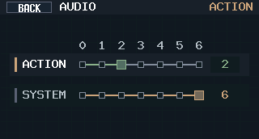
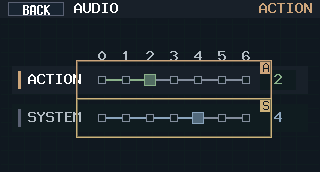

# 主固件运行时音效接入，替代开机 Demo 播放链路

> 当前有效规范以本文为准；实现覆盖与当前状态见 `./IMPLEMENTATION.md`，关键演进原因见 `./HISTORY.md`。

## 背景 / 问题陈述

- 当前主固件会在启动阶段阻塞播放 `firmware/assets/audio/demo-playlist/*.wav`，导致音频链路验证与实际运行时提示音语义混在一起。
- 已定义的 15 组状态/告警/错误提示音目前只在 `test-fw` 手动测试路径中可用，主固件未复用这些 cue 语义与资产。
- 音频播放核心、提示音资产映射、优先级队列当前只存在于 `firmware/src/test_audio.rs`，主固件与测试固件之间存在重复实现和错误接入风险。

## 目标 / 非目标

### Goals

- 将主固件切换为常驻运行时音效服务，不再在启动阶段播放 demo playlist。
- 抽出共享音频核心，让主固件与 `test-fw` 复用同一套 cue、优先级、WAV 解析/重采样与 DMA 填充逻辑。
- 按当前可可靠判定的运行时状态接入 cue：开机、市电、充电、电池低电、高压力、保护、过压/过流、模块故障、电池保护。
- 运行态 `STANDBY / ASSIST / BACKUP` 切换规则引用 `docs/specs/runtime-mode-switching/SPEC.md`；本规格继续拥有 cue 映射与音频优先级。
- 保留 `test-fw` 作为音频回归入口，继续支持人工点播与优先级/FIFO 验证。

### Non-goals

- 不修改 GPIO 分配与板级音频链路。
- 不重做音频素材，也不把 `firmware/assets/audio/demo-playlist/` 继续作为运行时资产维护。
- 不新增真实 shutdown flow，也不伪造 `shutdown_mode_entered` 与 `io_over_power` 的运行时触发条件。

## 范围（Scope）

### In scope

- `firmware/src/main.rs`：主循环并入常驻音效服务，移除 demo playlist 调用。
- 共享音频模块：统一 cue 枚举、优先级、调度语义（`one_shot` / `interval_loop` / `continuous_loop`）、WAV 解析/重采样、DMA `fill()`、状态接口。
- `firmware/src/bin/test-fw.rs`：改为使用共享音频模块。
- `firmware/src/output/mod.rs`：暴露供主固件音效策略消费的紧凑运行时信号/边沿接口。
- 文档：`firmware/README.md`、`docs/audio-design.md`、`docs/specs/README.md`。

### Out of scope

- 新增音效素材、混音、持久化配置、在线音源管理。
- 新增第三种以上播放入口或改变 `test-fw` 的 UI 结构。
- 为当前不存在真实状态源的 cue 扩展新的电源/关机业务逻辑。

## 接口变更（Interfaces）

- 新增共享运行时音频模块（供主固件与 `test-fw` 共同使用）。
- 新增运行时音效调度接口，至少覆盖：
  - `request_cue(...)`
  - `tick(now)`
  - `fill(buf)`
  - `status()`
  - 面向主固件的循环/抢占策略入口。
- `PowerManager` 新增供主循环消费的音效信号访问器，输出：
  - mains presence 边沿
  - charge phase 边沿
  - thermal stress 状态
  - battery low / battery protection 状态
  - module fault 状态
  - decoded over-voltage / over-current 状态
- 删除主固件对 `audio_demo::play_demo_playlist(...)` 的运行时依赖。

## 运行时 cue 映射冻结

- `boot_startup`：上电进入自检后立即请求一次，可与自检并行，且允许被更高优先级 cue 抢占。
- `mains_present_dc` / `mains_absent_dc`：以 `DC5025 VIN>=3V` 的运行时采样作为真相源，在“已知状态之间”变化时触发；聚合输入存在信号只作为 VIN 连续缺样后的降级兜底。若只是 `VIN <-> fallback` 的来源切换且 `mains_present` 未翻转，则保持静默；若真假确实变化则仍应触发边沿。
- `charge_started` / `charge_completed`：charger 状态在“已知相位之间”进入“充电中 / 完成”时触发；首次建链或通信恢复后的 unknown -> known 不补播 one-shot。
- `battery_low_no_mains` / `battery_low_with_mains`：BMS `RCA` 低电告警按市电有无拆分。
- `high_stress`：`TS_COOL` / `TREG` 或 TMP112 到达 `TLOW` 但尚未触发停机时触发；`TS_WARM` 仅驱动 UI/散热，不再播放 warning cue。
- `shutdown_protection`：`THERM_KILL_N` 断言或保护导致输出被关时触发。
- `io_over_voltage` / `io_over_current`：charger/TPS 解码后的保护位触发。
- `module_fault`：运行期关键模块通信错误期间触发。
- 若开机自检已判定 BMS 缺失/通信失败，且本板充电路径已探测存在或输出恢复受 BMS 门控，则该故障必须立即种子化到 `module_fault`，不能等 runtime 曾成功建链后才播报。
- `battery_protection`：BMS `PF`/保护位触发。
- Dormant cue：
  - `shutdown_mode_entered`：本轮不接入，等待真实 shutdown flow。
  - `io_over_power`：本轮不接入，等待独立 over-power 状态源或阈值策略。
- 交互操作音：
  - `interaction_touch`：有效触摸 / 有效按键触发，使用 `ACTION` route 的 one-shot cue。有效操作定义为输入边沿被成功识别，且导致页面、路由、选择、偏好、弹层状态变化，或产生对应业务 `UiAction`；空白命中、未定义 target、状态未变化的重复操作保持静默。
  - `usb_c_insert`：USB-PD `attached` 从 false/unknown 进入 true 的物理插入边沿触发，使用 `ACTION` route 的 one-shot cue；PD 协商刷新、contract 更新、source caps 重发或 attach 保持态不得重复播放。

## 验收标准（Acceptance Criteria）

- 构建通过：
  - `cargo build --release --bin mains-aegis-firmware`
  - `cargo build --release --bin test-fw --features test-fw-audio-playback`
- 主固件上电后只请求一次 `boot_startup`，允许在自检期间开始播放且不阻塞自检，不再出现 6 段 demo playlist 的阻塞播放与对应日志序列。
- 主循环期间 power/front-panel tick 节奏保持可用，音频服务每轮并入调度而不独占流程。
- 若 I2S / DMA 音频初始化失败，主固件必须记录告警并继续进入主循环；音频链路允许降级为静默，但不得因音频 bring-up 失败而 panic。
- 启动 / 自检阶段不得因 DMA underrun 打出 `audio: dma available failed during self-test err=Late`；`boot_startup` 听感必须连续，不得出现明显截断后整机永久静音。
- DMA ring 容量可大于运行期常驻水位，但启动 / 自检与运行期都必须使用受控 refill 水位，避免把 `boot_startup` 或静音一次性灌满整条 ring，导致高优先级 cue 听感延迟失控。
- 若运行期 DMA `available()` / `push_with()` 连续失败，主固件必须关闭运行时音频调度并静默降级；不得让 cue 在无 DMA 消费者时停留在“假播放”状态。
- 对当前 idle 主板（BMS `rca=false`、无业务 cue 新边沿）连续 monitor 至少 120 秒时，不得出现用户可感知的周期性“滴”声；若存在 DMA underrun，只允许出现有界的 `detected -> recovered` 或 `detected -> disabled` 日志序列，不得再按主循环频率重复刷同一条 `Late` 告警。
- 运行期 DMA underrun 恢复策略冻结为：首次 `Late` 立即触发一次 transport re-prime；后续正常 `available()/push_with()` 必须清除 burst；若同一 5 秒窗口内 3 次 recovery attempt 后仍再次命中 `Late`，则主固件必须静默降级并只输出一次终止告警。
- BMS 激活 / isolation 窗口期间，运行时音效快照仍需持续刷新；激活流程可以短路主循环中的其他动作，但不能让 cue 状态冻结。
- 调度语义固定为：
  - `status` -> `one_shot`
  - `warning` -> `interval_loop(2000ms)`
  - `error` -> `continuous_loop`
  - 优先级：`Error > Warning > Status > Boot`
  - 同优先级 `one_shot` 保持 FIFO。
- `interaction_touch` 与 `usb_c_insert` 固定为 `ACTION` route one-shot cue，不计入 15 组 `SYSTEM` runtime loop index；二者可使用独立于系统告警音的 ACTION 音量偏好。
- 有效触摸 / 有效按键只在实际 UI/业务动作发生时播放；同坐标空白触摸、未定义菜单项、动画期间被忽略的触摸、按键重复但目标状态不变时不得播放。
- USB-C 插入音只在 attach 上升沿播放一次；同一次连接中的 PD negotiation focus、contract/PPS 刷新、source caps 重发和状态保持刷新不得再次触发。
- 运行时场景正确触发/停播：市电恢复/丢失、充电开始/完成、电池低电（区分有无市电）、高压力进入/退出、模块通信故障进入/恢复、保护/过压/过流进入/清除。
- `BQ25792 TS_WARM` 期间不得触发 `high_stress` 提示音；若同时存在 `TS_COOL`、`TREG` 或 TMP112 `TLOW`，仍按原 warning/error 口径播报更高等级热事件。
- 当 `battery_protection` 与低电条件同时成立时，只允许播放 `battery_protection`；`BatteryLowNoMains` / `BatteryLowWithMains` 必须被全局压制，直到保护解除后再按当前 `RCA + mains_present` 状态恢复。
- `continuous_loop` cue 必须在单段 PCM 末尾无缝回绕，不能每播完 1 段就重新触发一次 `start_playback`；否则错误音会在每轮边界听出额外起音/断点。
- 通信恢复语义：
  - charger 输入/相位从 unknown 恢复到 known 时，不得伪造 `mains_present_dc`、`charge_started`、`charge_completed`；只要 `VIN` 未跨过 `3V` 门槛，就不得仅因 `VIN <-> charger fallback` 的来源切换且 `mains_present` 未翻转而产生来电/断电边沿；若 `mains_present` 真假确实改变，则仍应按当前已知状态正常播报。
  - 冷启动时若 `mains_present == Some(false)`，不得仅凭初始快照就触发 `mains_absent_dc`；该 cue 只能由已知状态之间的掉电边沿首发，随后再按 loop 语义保持。
  - 自检阶段已观察到的 TPS OVP/OCP/SCP 必须能种子化到运行时音效状态；运行期只能在成功读取到对应 TPS 通道状态后覆盖该通道 fault 位，不能因为该路输出被门控或单次读失败就把 seed 清零。
  - 自检阶段已观察到的 BMS protection / permanent-failure 状态必须能种子化到运行时音效状态，不能等首次 runtime poll 才补发 `battery_protection`。
  - 自检阶段带入的 warning/error loop cue 必须在进入主循环前完成首次调度，不能在首轮 `power.tick()` 前被静默清掉。
  - 已在播放中的 active loop cue 若被更高优先级 cue 抢占，必须保留待播资格；高优先级 cue 结束后应立即恢复，而不是等待下一个 loop interval。
  - `module_fault` 只针对运行期实际检测到且必需的模块；因配置关闭或本板未装的可选模块不得常驻拉高该 cue。
- `shutdown_mode_entered` 与 `io_over_power` 在主固件本轮保持静默，且文档明确注明等待真实状态源后再接入。

## 验证记录

- 已通过：
  - `cargo test --manifest-path firmware/host-unit-tests/Cargo.toml audio`
  - `cargo build --manifest-path tools/front-panel-preview/Cargo.toml`
  - `cd firmware && cargo +esp build --release --bin mains-aegis-firmware`
  - `cd firmware && cargo +esp build --release --bin test-fw --no-default-features --features test-fw-audio-playback`
- 本轮交互操作音接入需通过：
  - `python3 tools/audio/gen_interaction_feedback_previews.py`
  - `python3 -m py_compile tools/audio/gen_interaction_feedback_previews.py`
  - `cargo test --manifest-path firmware/host-unit-tests/Cargo.toml audio`
  - `cargo test --manifest-path firmware/host-unit-tests/Cargo.toml front_panel`
  - `cd firmware && cargo +esp build --release --bin mains-aegis-firmware`
  - devd-backed flash 到 `/dev/cu.usbmodem212201` 并 monitor 至少 120 秒

## 风险 / 假设

- 当前 worktree 初始化前 `ina3221-async` 与 `tps55288` submodule 为空目录；本轮实现前需要补齐子模块内容后再执行构建验证。
- 运行时资产继续复用 `firmware/assets/audio/test-fw-cues/*.wav`，不直接从 `docs/audio-cues-preview/**` 读取。
- 交互操作音固件资产由 `tools/audio/gen_interaction_feedback_previews.py` 生成到 `firmware/assets/audio/interaction-cues/`；docs preview 资产仍保留在 `docs/audio-cues-preview/interaction-feedback/` 便于浏览器试听。
- 当前 `esp-hal` I2S circular DMA 生命周期仍未提供无缝热恢复路径；本轮修复继续采用“保留现有 cue 状态 + transport 级 re-prime + 有界止损”策略，而不是重做整套音频框架。
- 当前主固件没有真实 shutdown flow，且没有独立 over-power 状态源，因此对应 cue 必须保持 dormant。
- `ACTION / SYSTEM` 音量默认 `L4/L4`，调整后立即作用于试听与对应 route，并通过 eeprom-storage-layout 定义的 EEPROM beeper prefs record 持久化。
- 在当前环境里，`cd firmware && cargo +esp build --release --bin test-fw --features test-fw-audio-playback` 仍会命中既有 `esp_rtos_*` 链接缺口；本轮对 `test-fw` 的共享音频编译验证改用 `--no-default-features` 路径完成。

## Visual Evidence

PR: none

