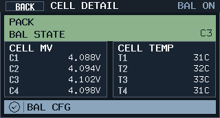
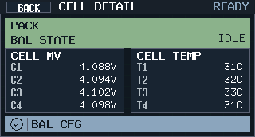
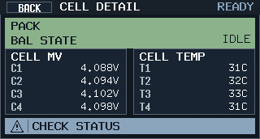

# BQ40 主板均衡基线与运行态可观测性（#nq7s2）

## 状态

- Status: 部分完成（4/5）

## 背景 / 问题陈述

- 当前主板硬件已经固定为 `BQ40Z50 + 外部 PMOS + 16Ω` 的外部被动均衡链路，但项目主线还没有把均衡 DF 基线、运行态观测语义和界面语义统一冻结。
- 现有工具侧主板 DF 修复只覆盖了 `DA Configuration / Manufacturing Status Init / FET Options / 温度 / OCC/OCD...`，未把均衡策略写回主板基线。
- 现有 Cells 详情页只能依赖 `OperationStatus[CB]` 给出“是否正在均衡”的单比特语义，无法区分“配置关闭 / 允许但空闲 / 正在均衡哪一串 / 只知道 CB 置位但无 AFE 细节”。
- 本规格把主板均衡能力按 `BQ40Z50` 的常规做法收敛为：**外部均衡 + charge/rest 开启 + sleep 关闭**，同时只补“配置与活动态可观测性”，不在本轮发明额外均衡算法或硬件闭环诊断。

## 目标 / 非目标

### Goals

- 冻结主板均衡 DF 基线：
  - `0x4908 Balancing Configuration = 0x07`
  - `0x490D Min Start Balance Delta = 3mV`
  - `0x490E Relax Balance Interval = 18000s`
  - `0x4912 Min RSOC for Balancing = 80%`
- 明确主线策略：`CB=1 / CBM=1 / CBR=1 / CBS=0`，即 **外部均衡、充电均衡开启、静置均衡开启、睡眠均衡关闭**。
- 让 `asset-df-mainboard` 与 `live-df-mainboard` 都能把 pack 拉回这套均衡基线。
- 主固件补齐均衡配置与活动态观测：读取 `Balancing Configuration`，在 `CB=1` 时读取 `AFE Register[KK]`，并把 Cells 页 `BAL STATE` 固定为 `OFF / IDLE / C1 / C2 / C3 / C4 / MULTI / ACTIVE / N/A`。
- 补齐设计文档、工具文档与稳定预览图，把最终视觉证据落到本 spec 的 `## Visual Evidence`。

### Non-goals

- 不启用 `CBS=1`，即不在本轮开启 sleep balancing。
- 不调整 `Bal Time/mAh Cell 1/2-4`，相关地址保持默认值。
- 不新增 `>200mV` 或 `0.5V` 初始失衡的自动恢复策略；严重失衡仍归预均衡 / 服务处理。
- 不输出“外部均衡硬件链路完整=true”或 “suspect-open” 这类强诊断结论；本轮只交付 `DF 配置 + AFE 活动态` 观测。

## 范围（Scope）

### In scope

- `tools/bq40-comm-tool`
  - 在 `live-df-mainboard` 与 `asset-df-mainboard` 中写入主板均衡基线。
  - 更新 operator docs，使 `apply-df` 与 `recover` 的均衡口径对齐。
- `firmware`
  - 在 `bq40z50` helper 中加入均衡 DF 地址和 `AFE Register[KK]` 读取。
  - 在 BMS detail snapshot 中缓存低频 balance config，并在 live snapshot 中携带 AFE mask。
  - 更新 Cells 详情页的 `BAL STATE`、footer notice 与诊断日志解码。
- `docs`
  - 更新 `docs/bms-design.md`、`firmware/ui/dashboard-detail-design.md`、`docs/specs/README.md`。
  - 在本 spec 记录冻结口径、验证命令与视觉证据。

### Out of scope

- 重做 BQ40 学习/计量算法、在线恢复大失衡策略、或应用层主动指定某一串均衡。
- 新增睡眠均衡参数调优与 `0x4913..0x4915` 的项目化校准。
- 利用 UI/日志去“猜”均衡硬件开路；缺少活动态时只能回退到 `ACTIVE / N/A` 语义。

## DF 基线

### 1. 主板固定均衡配置

| 地址 | 字段 | 值 | 说明 |
| --- | --- | --- | --- |
| `0x4908` | `Balancing Configuration` | `0x07` | `CB=1`、`CBM=1`、`CBR=1`、`CBS=0` |
| `0x490D` | `Min Start Balance Delta` | `3mV` | 采用 TI 默认起步值 |
| `0x490E` | `Relax Balance Interval` | `18000s` | 采用 TI 默认起步值 |
| `0x4912` | `Min RSOC for Balancing` | `80%` | 采用 TI 默认起步值 |

### 2. 保持默认且本轮不生效的项

- `0x4913..0x4915`（`Bal Time/mAh Cell 1/2-4`）保持当前默认值。
- 因本轮固定 `CBS=0`，sleep balancing 相关行为不进入项目主线承诺范围。

### 3. 业务边界

- 常规自动均衡只面向“小到中等失衡”的维护场景。
- `>200mV` 初始失衡不纳入常规自动拉回承诺。
- `0.5V` 初始失衡直接归类为装配预均衡 / 服务处理，不要求在线均衡自动修复。

## 运行态观测与 UI 语义

### 1. 运行态真相源

- 配置层：`Balancing Configuration` + `Min Start Balance Delta` + `Relax Balance Interval` + `Min RSOC for Balancing`
- 活动态：`OperationStatus[CB]`
- AFE 细节：`AFE Register[KK]`（低 4 bit 为当前 cell balance mask）

### 2. `BAL STATE` 冻结规则

按以下顺序判定：

1. `DF` 已读到且 `CB=0` -> `OFF`
2. `DF` 已读到且 `CB=1`，同时 `OperationStatus[CB]=0` -> `IDLE`
3. `CB=1` 且 `OperationStatus[CB]=1`，`AFE KK` 为 one-hot -> `C1 / C2 / C3 / C4`
4. `CB=1` 且 `OperationStatus[CB]=1`，`AFE KK` 多 bit -> `MULTI`
5. `CB=1` 且 `OperationStatus[CB]=1`，但没有可用 `AFE KK` -> `ACTIVE`
6. 配置或活动态不可得 -> `N/A`

### 3. Cells 页 footer notice

- 配置匹配主板基线：`EXT CHG+RELAX`
- 配置可读但不匹配主板基线：`CFG MISMATCH`
- 配置未读到：`BAL CFG PENDING`

### 4. Cells 页 footer badge

- `EXT CHG+RELAX` -> `BAL CFG`
- `CFG MISMATCH` -> `CHECK STATUS`
- 其他未知 / pending 情况沿用 `NO DATA` / `SOURCE NXT` 降级语义

### 5. 诊断日志

`bms_diag_cfg` 必须解码并打印：

- `balance_raw`
- `balance_match`
- `balance_cb/cbm/cbr/cbs`
- `balance_min_start_mv`
- `balance_relax_s`
- `balance_min_rsoc`

日志只允许走低频配置诊断路径，不新增高频 spam。

## 验收标准（Acceptance Criteria）

- `asset-df-mainboard` 与 `live-df-mainboard` 最终都明确写入：
  - `0x4908 = 0x07`
  - `0x490D = 3`
  - `0x490E = 18000`
  - `0x4912 = 80`
- 工具文档与设计文档明确写出：**外部均衡 + charge/rest 开启 + sleep 关闭**，并声明严重初始失衡不纳入自动拉回承诺。
- 主固件 `bms_diag_cfg` 能打印并解码均衡 DF；Cells 详情页在同一套输入下稳定区分 `OFF / IDLE / Cn / MULTI / ACTIVE / N/A`。
- 至少生成三张稳定 preview：`cells-balance-active`、`cells-balance-idle`、`cells-balance-config-mismatch`，并写入本 spec 的 `## Visual Evidence`。

## 实现记录

- 工具侧已把主板均衡基线加入 `asset-df-mainboard` 与 `live-df-mainboard`。
- 主固件已补齐 `BalanceConfig` 与 `AFE Register[KK]` 观测，并把 Cells 页 `BAL STATE` 与 footer 语义对齐到本规格。
- Preview 工具已新增三组稳定 Cells 详情场景，用于冻结均衡 active / idle / config mismatch 画面。

## 验证记录

- `cargo test --manifest-path /Users/ivan/.codex/worktrees/8824/mains-aegis/tools/front-panel-preview/Cargo.toml`
- `cargo test --manifest-path /Users/ivan/.codex/worktrees/8824/mains-aegis/firmware/host-unit-tests/Cargo.toml`
- `cargo run --manifest-path /Users/ivan/.codex/worktrees/8824/mains-aegis/tools/front-panel-preview/Cargo.toml -- --variant B --focus idle --scenario dashboard-detail-cells-balance-active --out-dir /Users/ivan/.codex/worktrees/8824/mains-aegis/docs/specs/nq7s2-bq40-balance-baseline-and-observability/assets/render`
- `cargo run --manifest-path /Users/ivan/.codex/worktrees/8824/mains-aegis/tools/front-panel-preview/Cargo.toml -- --variant B --focus idle --scenario dashboard-detail-cells-balance-idle --out-dir /Users/ivan/.codex/worktrees/8824/mains-aegis/docs/specs/nq7s2-bq40-balance-baseline-and-observability/assets/render`
- `cargo run --manifest-path /Users/ivan/.codex/worktrees/8824/mains-aegis/tools/front-panel-preview/Cargo.toml -- --variant B --focus idle --scenario dashboard-detail-cells-balance-config-mismatch --out-dir /Users/ivan/.codex/worktrees/8824/mains-aegis/docs/specs/nq7s2-bq40-balance-baseline-and-observability/assets/render`

## Visual Evidence

### Cells balance active

PR: include

### Cells balance idle

PR: include

### Cells balance config mismatch

PR: include

