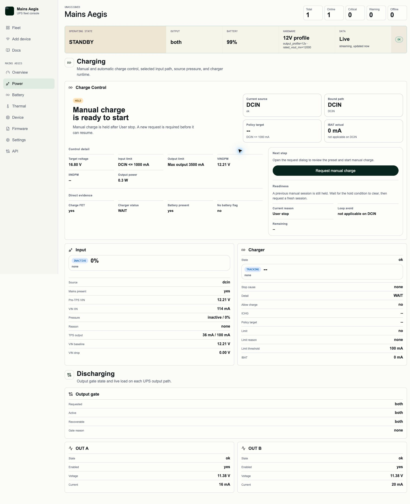

# Owner-facing Charge Control Implementation（#q7mzc）

- 设备本体 HTTP、devd device HTTP 与 USB CDC 已统一支持 `charge-control` detail / preview / action 合同。
- `status.charge_control` 收缩为紧凑摘要；Web 详情读取和控制反馈转移到正式 detail payload。
- Power 页移除常驻手动充电表单与常驻合同大表；手动充电改为单弹窗 preview/start/stop/confirm 流。
- Web 侧不再使用 SOC、`diag-snapshot` 或 transport 错误去推断阻断原因。

## Visual Evidence

- 2026-07-18：真实 LAN 设备 Power 页稳定态已落盘，当前 owner-facing 画面直接显示 `DCIN` 绑定、手动充电 hold 原因与直接证据，不再把缺失 detail/preview 端点渲染成 `not_found` 或 `transport_error`。

