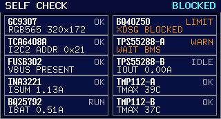

# UPS 运行态模式切换与充电联动（#xjpvj）

## 状态

- Status: active
- Created: 2026-06-16
- Last: 2026-07-12

## 背景 / 问题陈述

- 运行态 `STANDBY / ASSIST / BACKUP` 切换语义此前散落在 Dashboard、自检、音效与 charger policy 多份规格中，且代码仍保留了“TPS enable 即有输出”“`mains_present=None` 且输出开启即 `BACKUP`”等过时判据。
- 现有主线实现已把 `DC5025 VIN >= 3V` 建立为 UI/音效的市电真相源，但 `ASSIST` 与 `BACKUP` 的进入条件、缺样保持策略、以及与 charger `LOAD/NOAC` token 的关系仍缺少统一 topic-level contract。
- 若继续让模式判定、charger token 和 owner-facing `status/diag-snapshot/trace` 各自演进，运行态会再次出现 UI、音效、主机工具与实际固件行为不一致的问题。

## 目标 / 非目标

### Goals

- 建立单一 runtime-mode topic spec，统一 `BYPASS / STANDBY / ASSIST / BACKUP` 的定义、自动切换边界与 owner-facing 可观测性。
- 固定自动运行态集合仅为 `STANDBY / ASSIST / BACKUP`；`BYPASS` 仅表示显式 UPS-off / 旁路管理态。
- 固定 owner-facing `ASSIST / supplement` 由内部 `assist_low | assist_rated` 阶段映射得到，不再让 `100mA / 50mA` 直接驱动 owner-facing mode。
- 固定 `assist_low` 入口为 `dcin` 在线场景下的双判据：运行时内部绝对 `VIN` 门槛 + `TPS total output current` 已实际参与，并要求连续 fresh 样本锁存。
- 固定 `standby -> assist_low` 通过限速爬升推进到低补能目标，不再一帧跳到固定 `assist_low` 电压目标。
- 固定 `BACKUP` 表示 UPS 已接管负载；进入原因必须可区分为 `backup_reason=input_absent` 或 `backup_reason=source_limited`。
- 固定 `input_absent` 只在确认无输入时进入；当 `mains_present` 未知时保持上一确认模式，不得因输出活跃而直接跳 `BACKUP`。
- 固定 `source_limited` 表示 `VIN` 仍在线，但上级电源已进入限流/棕断或低于合理工作电压，MCU 主动切入 `BACKUP` 以减少输出长时间深跌落。
- 固定 `ASSIST` 是 non-charging mode。`BACKUP` 默认停充；`source_limited` 必须停充，而唯一受控 USB-C 低输出充电例外仅适用于 `input_absent`，并且不得改变 VIN 或 mode 的真相源。

### Non-goals

- 不重写 `eu2b8` 中完整的 `CHG500 / CHG100 / RECOV / FULL / WARM / TEMP / WAIT30` 状态机。
- 不新增 owner-facing 的“强制切换 UPS 模式”控制命令。
- 不把 `BYPASS` 重新纳入自动运行态切换。
- 不覆盖 UI 视觉资产、Dashboard layout 或音频 cue 优先级本身。

## 范围（Scope）

### In scope

- 运行态 `UpsMode` 的自动切换口径。
- `VIN` 主真相源、VIN 缺样保持、fallback 输入存在信号的命名与优先级。
- `assist_low / assist_rated / backup` 内部阶段判定、owner-facing mode 映射、以及 fresh-sample 约束。
- `ASSIST / BACKUP` 与 charger allow/token 的硬联动。
- owner-facing `status / diag-snapshot / trace` 需要暴露的最小字段。

### Out of scope

- 手动 charge、BMS 激活、USB PD 恢复、DC input adaptive derate 的完整行为定义。
- 脱离 `settings.advanced_power` 契约之外的额外 owner-facing mode/control surface。
- 运行态声音素材或前面板视觉风格变更。

## 接管说明

- 本规格是运行态模式切换主题的 canonical source。
- `docs/specs/6qrjs-front-panel-industrial-ui-preview/SPEC.md` 仅保留视觉与文案冻结，不再拥有模式切换语义。
- `docs/specs/g2kte-dashboard-live-after-self-check/SPEC.md` 继续拥有 `VIN` 主真相源与 transient miss 行为，但自动模式切换规则引用本规格。
- `docs/specs/eu2b8-bq25792-charge-policy/SPEC.md` 继续拥有 charger policy 状态机；仅在 `ASSIST/BACKUP` 非充电边界上引用本规格。
- `docs/specs/h43mk-main-firmware-runtime-audio-cues/SPEC.md` 继续拥有音频 cue 规则；其市电/模式基础引用本规格与 #g2kte。

## 术语与真相源

- `VIN mains truth source`: `DC5025 VIN >= 3V`。只要有 fresh VIN 电压样本并跨过 `3V` 门槛，运行态模式必须优先使用该结果。
- `聚合输入存在信号` (`aggregate input-present signal`): 当 VIN 连续缺样并超过 latch 容错窗口时，允许使用的降级布尔输入存在信号。当前实现可继续复用现有聚合布尔源，但文档不再把它笼统写成 charger `input_present`。
- `TPS total output current`: owner-facing 聚合输出电流，来源为运行时 `tps_total_iout_ma`。
- `fresh sample`: 在模式判定上下文中，指本轮相对于上一个已消费 sample_seq 的新 `tps_total_iout_ma` 样本。
- `confirmed mode`: 最近一次满足进入条件并完成锁存的自动运行态结果。
- `assist_low absolute VIN gate`: 只存在于运行时内部的绝对 `VIN` 比较门槛，按设备额定输出派生，不进入 EEPROM、CLI/Web 可写设置或 owner-facing JSON 契约。
- `dcin assist presence`: 内部 `assist_low / assist_rated` 与 `dcin pressure` 门控必须使用实际 `dcin_present` / `dcin_assist_allowed`，而不是 owner-facing `input.source` 标签；并行 USB `5V` 遥测允许共存，不得单独压住 DCIN 在线接管。

## 模式定义

- `BYPASS`
  - 仅表示显式 UPS-off / 旁路管理态。
  - 不属于自动运行态切换集合。
- `STANDBY`
  - 输入确认在线。
  - TPS 目标保持在“近乎零补能”的热备档位，不应持续明显分担负载。
  - 内部阶段为 `standby`；owner-facing `mode=standby`。
  - 允许 charger policy 在自身条件满足时继续充电。
- `ASSIST`
  - 输入确认在线。
  - owner-facing 仍只暴露一个 `ASSIST / supplement` 模式名，但它只在内部阶段为 `assist_low` 或 `assist_rated` 时出现。
  - `assist_low`
    - 仅在 `input_source=dcin` 且输入确认在线时适用。
    - 进入条件固定为：
      - 运行时内部绝对 `VIN` 门槛成立；并且
      - `TPS total output current` 已达到 `assist_low` 进入门槛；并且
      - 连续 `assist_required_samples` 个 fresh 样本满足。
    - 退出条件固定为：
      - 绝对 `VIN` 门槛解除；并且
      - `TPS total output current` 回落到 `assist_low` 退出门槛；并且
      - 连续 `assist_required_samples` 个 fresh 样本满足。
    - 目标电压从 `standby_target` 以固定步进和固定时间节拍向 `assist_low_target` 限速爬升，不得一帧跳到终点。
  - `assist_rated`
    - 只允许在已处于 `assist_low` 后评估。
    - 当 `VIN` 相对基线持续下陷且 `TPS total output current` 持续升高时，TPS 升到额定输出接管档位。
  - 固定为 non-charging mode。
- `BACKUP`
  - UPS 已接管负载，进入原因由 `backup_reason` 标明：
    - `input_absent`: 输入确认离线。
    - `source_limited`: 输入仍在线，但 MCU 判定上级电源不可继续承担当前负载。
  - 输出由电池侧供能。
  - TPS 目标保持额定输出档位。
  - 默认 non-charging；只有 `eu2b8` 定义的 USB-C PD 低输出例外可改变 charger allow，不能改变 `BACKUP` 本身的 VIN/运行态定义。
- `BLOCKED`
  - owner-facing 阻断态，不是新的内部供电阶段。
  - 当自动状态机候选结果为 `STANDBY / ASSIST / BACKUP`，但本轮请求的 TPS 输出没有全部进入
    `active_outputs` 时，对外必须发布 `mode=blocked`。
  - 前面板不得把 `mode=blocked` 渲染为 Dashboard；若当前已在 Dashboard，必须退回自检/阻断界面。
  - 固定为 non-charging mode。

## 自动运行态切换规则

### 1. 自动切换集合

- 自动运行态只允许在 `STANDBY / ASSIST / BACKUP` 之间切换。
- `BYPASS` 只能由显式管理态进入/退出，自动判定逻辑不得自行产出 `BYPASS`。
- `BLOCKED` 只能由 owner-facing 发布门槛产生；内部候选阶段仍保留原始
  `standby / assist_low / assist_rated / backup` 判定，便于恢复后回到正确目标。

### 2. 输入在线 / 离线判定

- 若 `VIN` 有 fresh 电压样本：
  - `VIN >= 3V` => 输入确认在线。
  - `VIN < 3V` => 输入确认离线。
- 若 `VIN` 只是瞬时缺样，且仍在现有 VIN latch 容错窗口内：
  - 保持最近一次已知 `VIN` 在线/离线状态。
- 若 `VIN` 连续缺样并超出 latch 容错窗口：
  - 允许回退到“聚合输入存在信号”。
  - fallback 为 `true` => 输入确认在线。
  - fallback 为 `false` => 输入确认离线。
  - fallback 仍未知 => 输入状态未知。

### 3. `STANDBY / ASSIST` 内部阶段判定

- 前提：输入确认在线。
- 若 `tps_total_iout_ma` 样本缺失、不 fresh、或 sample_seq 未前进：
  - 保持上一确认的内部阶段
  - 不得因为 enable flag、零值默认值或单次缺样而切换
- `standby -> assist_low`
  - 仅在 `input_source=dcin` 且输入仍确认在线时适用。
  - 主判据固定为：
    - 运行时内部绝对 `VIN` 门槛成立；并且
    - `tps_total_iout_ma >= assist_enter_threshold_ma`
    - 连续 `assist_required_samples` 个 fresh 样本同时满足
  - `tps_total_iout_ma` 单独升高或 `VIN` 单独偏低，都不得进入 `assist_low`。
- `assist_low -> standby`
  - 必须满足回差：
    - 运行时内部绝对 `VIN` 退出门槛成立；并且
    - `tps_total_iout_ma <= assist_exit_threshold_ma`
    - 连续 `assist_required_samples` 个 fresh 样本同时满足
- `assist_low -> assist_rated`
  - 主判据固定为：
    - `vin_drop_mv` 相对 `vin_baseline_mv` 持续超过当前基线自适应阈值；并且
    - `tps_total_iout_ma >= rated_enter_threshold_ma`
    - 连续 `required_samples` 个 fresh 样本同时满足
- `assist_rated -> assist_low`
  - 退出必须满足回差：
    - `vin_drop_mv` 回落到升额阈值的一半以内；并且
    - `tps_total_iout_ma <= rated_exit_threshold_ma`
    - 连续 `required_samples` 个 fresh 样本同时满足

### 4. `BACKUP` 进入 / 退出

- `BACKUP` 的 owner-facing mode 不新增名字；对外仍是 `mode=backup`。
- `backup_reason=input_absent` 的充分条件：
  - fresh `VIN < 3V`；或
  - `VIN` 连续缺样超过 latch 窗口后，fallback `aggregate input-present=false`
- `backup_reason=source_limited` 的充分条件：
  - 输入确认在线；并且
  - `input_source=dcin` / `dcin_assist_allowed=true`；并且
  - `TPS total output current >= source_limited_enter_threshold_ma`；并且
  - 出现以下任一上级不可承担负载信号：
    - `VIN <= rated_vout_mv - source_limited_recover_margin_mv`；或
    - `vin_drop_mv` 超过 `source_limited_vin_drop_pct` 派生阈值，且 `vin_iin_ma` 已接近 DCIN 限流门槛；并且
  - 连续 `source_limited_required_samples` 个 fresh 样本满足。
- 若已连续观测到 DCIN 在线且 `vin_iin_ma` 达到 source-limited 入口门槛，随后
  在同一高载窗口内发生 VIN 棕断，则必须保留 `source_limited` 原因接管，不能因
  `mains_present=false` 先到而覆盖成 `input_absent`。
- 已锁存 `source_limited` 后的物理 VIN cut 必须转换为 `input_absent`；这表示上级电源
  已从“不可承担负载”变为“实际离线”。
- 当输入状态未知时：
  - 必须保持上一确认模式
  - 不得因 `TPS` 有输出、输出 enable、或其它保守推断而直接切到 `BACKUP`
- `backup_reason=input_absent` 一旦输入再次确认在线：
  - 自动离开 `BACKUP`
  - 下一状态按 `TPS total output current` 锁存结果进入 `STANDBY` 或 `ASSIST`
- `backup_reason=source_limited` 的恢复必须满足回差：
  - `VIN > rated_vout_mv - source_limited_recover_margin_mv`
  - `vin_drop_mv` 回落到 source-limited 进入阈值的一半以内
  - `TPS total output current <= source_limited_exit_threshold_ma`
  - 连续 `source_limited_required_samples` 个 fresh 样本满足

### 5. TPS 输出活跃发布门槛

- `STANDBY / ASSIST / BACKUP` 都属于需要 TPS 输出契约成立后才可对外发布的运行态。
- 若 `requested_outputs != none`，则 `requested_outputs` 中每一路都必须同时存在于
  `active_outputs`。
- 若候选 mode 为 `STANDBY / ASSIST / BACKUP`，但上述条件不成立：
  - API / diag 必须发布 `mode=blocked`
  - front-panel 必须保持或退回自检/阻断界面，不得渲染 Dashboard
  - 不得发布 `mode=backup`、`mode=supplement` 或 `mode=standby`
  - charger policy 必须按 non-charging mode 处理
- 若 `requested_outputs == none`，发布门槛不阻断候选 mode；该场景表示当前没有要求 TPS
  输出供电。

## 与 charger policy 的硬联动

- `STANDBY`
  - charger 是否允许工作，继续由 `eu2b8` 主线策略决定。
  - `CHG / WAIT / FULL / WARM / TEMP / CHG100 / RECOV` 等语义只在此模式内讨论。
- `ASSIST`
  - 必须视为 non-charging mode。
  - `charger.allow_charge=false`
  - owner-facing charger token/notice 收敛到 `LOAD` 语义边界。
- `BACKUP`
  - `backup_reason=source_limited` 必须视为 non-charging mode，`charger.allow_charge=false`，token/notice 收敛到 `LOAD` 与 source-limited backup notice。
  - `backup_reason=input_absent` 默认视为 non-charging mode，`charger.allow_charge=false`，token/notice 收敛到 `NOAC`。
  - 唯一例外由 `eu2b8` 定义：当 `backup_reason=input_absent`、VIN 已确认无市电、USB-C PD 可充电、既有安全门通过且输出功率满足专用回环门时，可发布 `CHG500`；其 `LOAD/LOCK` 锁存、TPS 采样、手动确认与会话重置均不属于 mode state machine。
- `BLOCKED`
  - 必须视为 non-charging mode。
  - `charger.allow_charge=false`
  - owner-facing charger token/notice 收敛到 `LOCK` 语义边界。
- 本联动只定义模式与 charger 的边界，不覆盖 `eu2b8` 内部关于 `DC IN` 压力、cooldown、recovery ramp 或手动 charge 的全部细节。

## owner-facing 可观测性要求

- `status` 至少暴露：
  - `mode`
  - `input.mains_present`
  - `input.vin_vbus_mv`
  - `input.assist_power_stage`
  - `input.assist_target_vout_mv`
  - `input.backup_reason`
  - `input.tps_total_iout_ma`
  - `charger.allow_charge`
  - `charger.detail_status`
- `diag-snapshot` 至少暴露：
  - 输入在线/离线结果
  - `assist_power_stage`
  - `assist_target_vout_mv`
  - `backup_reason`
  - `tps_total_iout_ma`
  - `vin_baseline_mv`
  - `vin_drop_mv`
  - charger allow/token 结果
- 当输入仍在线但 charger policy 处于 `WAIT / LOAD / NOAC` 等非主动充电路径时，`diag-snapshot` 里的 `vin_baseline_mv / vin_drop_mv` 仍必须保持可解释，不得仅因 idle/no-charge 路径而被整体清空。
- `trace(kind=event,target=power)` 应能让 owner 看到：
  - 输入真相源变化
  - `TPS total output current` 停充或恢复相关根因

## 验收标准（Acceptance Criteria）

- Given `mains_present=true`、`input_source=dcin`，When `VIN` 只是在运行时内部绝对门槛以下但 `TPS total output current` 未达到 `assist_low` 进入门槛，Then 内部阶段保持 `standby`。
- Given `mains_present=true`、`input_source=dcin`，When `TPS total output current` 单独升高但 `VIN` 未进入运行时内部绝对门槛，Then 内部阶段保持 `standby`。
- Given `mains_present=true`、`input_source=dcin`，When 绝对 `VIN` 门槛与 `TPS total output current` 门槛都成立且满足 `assist_required_samples` fresh 样本窗口，Then 内部阶段进入 `assist_low`，owner-facing `mode=supplement`。
- Given `assist_low` 已成立，When 观察 `assist_target_vout_mv`，Then 目标电压必须从 `standby_target` 按 `assist_ramp_step_mv` / `assist_ramp_interval_ms` 限速爬升，不得一帧跳到 `assist_low_target`。
- Given 输出已处于活动状态，When `standby / assist_low / assist_rated / backup` 这些运行态只是在微调 `assist_target_vout_mv`，Then 固件只能原位直写 TPS `VOUT` 目标，不得走 `disable -> init -> enable` 或重配 `MODE/OE/ILIM` 的 full-configure 路径。
- Given `mode=supplement` 且 `vin_drop_mv` 未持续超过基线自适应阈值，When `tps_total_iout_ma` 单独升高，Then 内部阶段保持 `assist_low`，不得直接升到额定接管档。
- Given `mode=supplement`、`vin_drop_mv` 持续超过基线自适应阈值且 `tps_total_iout_ma >= rated_enter_threshold_ma` 连续 `required_samples` 个 fresh 样本，When 自动模式判定更新，Then 内部阶段升到 `assist_rated`，但 owner-facing `mode` 仍为 `supplement`。
- Given 已处于 `assist_rated`，When `vin_drop_mv` 回落到退出回差内且 `tps_total_iout_ma <= rated_exit_threshold_ma` 连续 `required_samples` 个 fresh 样本，Then 内部阶段降回 `assist_low`，不抖动。
- Given 已处于 `assist_low`，When 绝对 `VIN` 退出门槛与 `TPS total output current` 退出门槛都满足 `assist_required_samples` fresh 样本窗口，Then 内部阶段回到 `standby`。
- Given `dcin_present=true` 且 USB `5V` 遥测同时存在，When 自动模式判定更新，Then `assist_low / assist_rated` 的资格判断必须继续跟随 DCIN 在线事实与 `VIN/TPS` 双判据，而不是被 owner-facing `input.source` 标签单独阻断。
- Given `input_source` 不是 `dcin`，When 输入仍确认在线，Then 内部阶段不得仅因在线输入存在而进入 `assist_low` 或 `assist_rated`。
- Given `requested_outputs=both` 且 `active_outputs=none`，When 内部候选 mode 为 `backup`，Then
  owner-facing `mode=blocked`，不得发布 `mode=backup`。
- Given `requested_outputs` 包含某路输出且 `active_outputs` 不包含该路，When 内部候选 mode 为
  `standby` 或 `supplement`，Then owner-facing `mode=blocked`。
- Given 输入状态未知，When `TPS` 仍在输出，Then 模式保持上一确认态，不得仅因输出活跃直接进入 `BACKUP`。
- Given `VIN < 3V`，When 自动模式判定更新，Then 结果为 `BACKUP` 且 `backup_reason=input_absent`。
- Given `VIN` 连续缺样超过窗口且 `aggregate input-present=false`，When 自动模式判定更新，Then 结果为 `BACKUP` 且 `backup_reason=input_absent`。
- Given 输入仍在线、`TPS total output current` 超过 source-limited 进入门槛、`VIN` 低于合理工作电压或 `VIN drop + VIN input current` 显示上级限流，When 连续 fresh 样本满足，Then 结果为 `BACKUP` 且 `backup_reason=source_limited`，TPS 目标切到额定输出。
- Given 已处于 `backup_reason=source_limited`，When `VIN` 与 `vin_drop_mv` 恢复到回差内且输出电流低于退出门槛，Then 必须连续满足样本数后才退出 `BACKUP`，不得在阈值附近抖动。
- Given `ASSIST` 已锁存，When 查看 `status/diag-snapshot`，Then `charger.allow_charge=false` 且 charger token 对齐 `LOAD`。
- Given `backup_reason=input_absent` 已锁存且不满足 `eu2b8` 的 USB-C 例外，When 查看 `status/diag-snapshot`，Then `charger.allow_charge=false` 且 charger token 对齐 `NOAC`。
- Given `backup_reason=source_limited` 已锁存，When 查看 `status/diag-snapshot`，Then `charger.allow_charge=false` 且 charger token 对齐 `LOAD` / source-limited backup notice。
- Given `mode=backup`、`backup_reason=input_absent`、VIN 已确认无市电且 `eu2b8` 已以新鲜 `<2W` USB-C 输出样本放行，When 查看 mode，Then mode 仍为 `backup`，但 charger 可显示 `CHG500`；该例外不得把 mode 改写为 `standby`。
- Given 执行 `--suite-contract source-limited-12v`，When Power Path Validation 生成执行计划，Then 必须只生成 `12V backup_only / 1000mA`、`12V source_limited_online / 3900mA`、`12V source_limited_cut / 3900mA` 三个独立 scene；不得复用 dual-voltage 四场景的签核合同。
- Given `source_limited_online` 的 `3900mA` 负载已下发，When hold phase 开始，Then UPS 必须在 `2s` 内发布 `mode=backup`、`assist_power_stage=backup`、`backup_reason=source_limited`，并观察到额定 `assist_target_vout_mv`。
- Given `source_limited_online` 已锁存，When VIN 仍在线，Then LoadLynx 电压必须保持不低于 `11000mV`；锁存前的低于 `11000mV` 连续时间不得超过 `1s`。
- Given `source_limited_cut` 尚未观察到 source-limited backup，When runner 到达 source-cut 边界，Then 必须跳过物理 VIN cut 并将 scene 标记为 diagnostic failure。
- Given `source_limited_cut` 已观察到 source-limited backup，When runner 切断 VIN，Then `mode=backup` 与 `assist_power_stage=backup` 必须连续保持，且 `backup_reason` 必须转为 `input_absent`。
- Given 执行 `--suite-contract source-limited-19v`，When Power Path Validation 生成执行计划，Then 必须只生成 `19V backup_only / 1000mA`、`19V source_limited_online / 3900mA`、`19V source_limited_cut / 3900mA` 三个独立 scene，且 source 固定为 `19000mV / 3000mA`。
- Given 19V 的 source-limited scene 已锁存，When VIN 仍在线，Then LoadLynx 电压必须保持不低于 `18000mV`；锁存前或后低于该门槛的连续时间不得超过 `1s`。
- Given 19V VIN drop 与输入电流已接近 source-limited 门槛，When ADC 与线损误差使 drop 距百分比门槛不超过 `25mV`，Then MCU 可以将其视为 drop 条件满足；该容差不得改变低 VIN 或连续样本门槛。
- Given 当前 topic 进入 `12V` Power Path Validation sign-off，When 判定任何边界、在线接管、切断或恢复结论，Then 必须同时满足 `docs/hil-runtime-mode-switching.md` 中定义的三设备实时数据、输出电压波动与 scene-complete gate。
- Given 当前 topic 进入 formal dual-voltage suite，When 执行 `12V assist_path / 12V backup_only / 19V assist_path / 19V backup_only` 四场景，Then source profile、load target 与保护栏必须固定为 `12V|19V @ 3000mA`、`3900mA|1000mA`、`UVP=3000mV/OCP=4000mA/OPP=80000mW`，不得按口头约定漂移。
- Given 需要在 formal suite 中从 `12V` 切到 `19V` 或从 `19V` 切回 `12V`，When 做 artifact select / flash，Then 必须先 disable load、cut IsolaPurr `port_c`、确认 UPS 已脱离外部 `DCIN` 高压输入，再进行切换或烧录；并行 USB-C 供电/通信允许保留，不构成切换阻断。
- Given formal dual-voltage suite 运行完成，When 交付 owner-facing Power Path Validation 证据，Then 必须同时保留四个独立 scene report、suite summary、suite verification 和一个包含四张交互图表的 overview HTML。
- Given 任一正式 Power Path Validation scene 的任一采样点缺失了 `Power Source / UPS / Load` 任一设备的要求字段，When 评估该 scene，Then 该 scene 只能作为诊断证据，不能作为验收通过、默认值冻结或逻辑定论的证明。

## 参考（References）

- `docs/specs/g2kte-dashboard-live-after-self-check/SPEC.md`
- `docs/specs/eu2b8-bq25792-charge-policy/SPEC.md`
- `docs/specs/h43mk-main-firmware-runtime-audio-cues/SPEC.md`
- `docs/hil-runtime-mode-switching.md`
- `firmware/src/output/mod.rs`
- `firmware/src/output/pure.rs`

## Visual Evidence

- source_type: firmware_preview
  evidence_scope: requested output blocked before Dashboard entry
  command: `cargo run --manifest-path tools/front-panel-preview/Cargo.toml -- --variant C --focus idle --scenario bq40-discharge-blocked --out-dir /tmp/mains-aegis-self-check-blocked-preview`
  image: `assets/front-panel-self-check-output-blocked.png`
  evidence_note: 同源固件渲染入口显示自检阻断态；TPS 未 active 的状态不得渲染为 `BACKUP`、`STANDBY`、`SUPPLEMENT` 或 `BLOCKED` Dashboard。

- source_type: firmware_preview
  evidence_scope: Backup mode retains its VIN-derived identity while the controlled USB-C low-output charger exception shows `CHG500`.
  command: `tools/front-panel-preview/target/debug/front-panel-preview --variant B --focus idle --mode backup --scenario dashboard-detail-charger-backup-usb-low-output --out-dir /tmp/mains-aegis-usb-backup-loopback-preview`
  image: `assets/backup-usb-low-output-charge.png`

- source_type: real_hil_capture
  evidence_scope: passing formal `12V` runtime-mode scene
  report: `tools/hil/reports/20260624T150204Z-formal-12v-3900-corrected-rerun-r16-lanmonitor/results.json`
  scenario: `3900mA` hold, input cut, input restore, unload
  evidence_note: 当前 topic 的 formal sign-off 真相源。后续任何 12V runtime-mode 结论都必须继续服从 `docs/hil-runtime-mode-switching.md` 中定义的完整 scene 合同，而不是回退到旧的 partial diagnostic 图表。
