# Web management UI（#ypfpu）

## 状态

- Status: 已完成（USB CDC safe-control follow-up, firmware flash addendum, hosted Connect semantics）
- Created: 2026-04-28
- Last: 2026-06-07

## 接管说明

- 本规格完成的是 Web 管理端 v1 基线；当前 LAN 设置语义与 hosted Connect 收敛以 [`#k4vzn`](../k4vzn-lan-management-convergence/SPEC.md) 为准，本规格保留 UI foundation 与 USB / devd 会话约束的历史记录。
- Web 无 devd 的 LAN 管理、LAN/USB logical device 收敛、`safeSettings` 废弃与新的 `connection / settings / trace` 信息架构，已转由 [`#k4vzn`](../k4vzn-lan-management-convergence/SPEC.md) 接管。
- 本规格保留 Fleet、Connect、DeviceRegistry、USB CDC / Web Serial、firmware mismatch gate 等 v1 UI foundation 的历史记录。

## 背景 / 问题陈述

- `mains-aegis` 已具备设备侧只读 `v1` HTTP API、mDNS / DNS-SD 与 `/api/v1/status` SSE 底座，但缺少浏览器侧管理界面。
- UPS 可能有多台硬件同时在线；单设备 Dashboard 不能作为唯一入口。
- 管理界面必须优先支持多设备快速扫视；LAN 设备始终通过设备本体 HTTP API 连接，USB CDC / Web Serial 则承担本地可写 USB 会话，只允许安全设置与 WiFi 配网。

## 目标 / 非目标

### Goals

- 新增独立 `web/` 管理端，使用 Vite + React + TypeScript + Bun。
- 使用根目录 `DESIGN.md` 的 Cohere 风格作为视觉基线。
- 实现多设备 Fleet 卡片网格，覆盖 online、offline、warning、critical、assist、backup 等状态。
- 实现设备接入页、单设备总览、电源路径、电池与 BMS、温度与保护、设备信息、API 调试页面。
- 对接设备侧现有只读接口：`/api/v1/ping`、`/api/v1/identity`、`/api/v1/network`、`/api/v1/status` 和 status SSE。
- 提供 mock fixtures 和正式路由 seed 场景，使无实机环境也能稳定预览、交互测试与截图验证。
- 在现有 `web/` 管理台上新增 USB CDC / Web Serial 数据源，复用 `Identity`、`NetworkSummary`、`UpsStatus` 状态模型。
- 使用 `mains-aegis-devd` 作为本地 USB 控制 owner；CLI 通过 IPC 访问，Web/App 通过显式 `serve-http` 使用同一 USB CDC 安全控制面。
- 通过 USB CDC structured JSONL 协议支持握手、状态读取、结构化日志、安全设置与 WiFi 配网。
- 首版写入范围限制为 WiFi SSID/PSK 覆盖或清除、手动充电偏好、USB session 日志级别；PSK 不在 API、日志或 UI 中回显。

### Non-goals

- LAN HTTP/SSE 不实现远程写控制、清故障、切输出、改充电动作或高风险 UPS 状态改变。
- 不实现 broker、桌面 companion、多消费者串口分发或 WebUSB 首版路径；devd 是允许的单 owner CDC 本地控制层。
- 不新增设备侧聚合 API；多设备汇总由浏览器端 `DeviceRegistry` 完成。
- 不做用户账号、鉴权、设备绑定、TLS、跨网段发现或云端服务。
- 不改造 `docs-site/`；文档站与管理端保持独立。
- Demo 复用 Web 管理端正式路由和正式交互，仅通过 mock 数据源替换真实设备接口；截图资产默认作为 owner-facing evidence，不自动进入 PR 正文。

## 功能规格

### Fleet 总览

- `/` 为默认入口，使用响应式设备卡片网格。
- 每张卡片固定展示设备别名/hostname、位置、在线状态、运行模式、最高告警、SOC、供电来源、负载是否供电、电池是否可用、是否需要处理、连接状态和 stale 时间。
- Fleet 卡片不得默认展示 OUT A/B、charger、pack voltage 等技术细节；这些字段保留在单设备详情与 API 调试页。
- 支持搜索设备、hostname、位置，并支持 `all / critical / warning / offline` 过滤。
- 排序规则：Critical 优先，Warning 次之，Info/OK 在后，Offline 保留并显示 stale 时间。

### 设备管理

- `/connect` 在 hosted/self-hosted devd UI 中只保留 devd discovery，USB 设备通过 devd 接入，LAN 设备则按 devd 提供的地址直连硬件 HTTP API。GitHub Pages/public-static 构建明确收口为 browser-direct LAN 入口：默认显示手动 LAN 目标和手动 IPv4 CIDR 扫描，不再隐式假设 same-origin devd。
- USB 连接入口必须显示浏览器支持状态、连接/断开状态、用户取消授权、串口不可用或已占用等错误。
- devd 入口在发现多个 USB CDC candidates 时必须显示候选设备选择器；用户明确选择某个 devd device id 后才可创建控制 session。Web 不得基于已连接、已识别、第一个或最近使用自动替用户选择硬件。
- 若 USB `Bind USB` 成功后 devd 返回 `companion_lan_candidate`，Connect 必须在同一卡片内就地显示 inline `Bind LAN companion` 提示，展示 mDNS 与 `IP:Port`；在用户确认前，该候选不得自动变成 `Use WiFi` 按钮，也不得写入 localStorage。
- companion-LAN 确认成功后，Web 本地记录必须同时保存可直连的 mDNS HTTP 地址与回退 `IP:Port`：`rememberedChannels.http.baseUrl=http://<hostname_fqdn>`、`rememberedChannels.http.mdnsHost=<hostname_fqdn>`、`rememberedChannels.http.fallbackBaseUrl=http://<ip>:<port>`，并把 `preferredTransport` 切到 `http`；devd companion 仍保留在同一 logical device 的 remembered `devd` channel 中。
- Web 的默认直连选择统一遵循 [`#rzx5v`](../rzx5v-client-transport-priority/SPEC.md)；本规格不再重复定义 `hostname_fqdn > hostname > ip:port` 矩阵，只要求未确认 companion 时不得把 pending candidate 自动提升为默认连接路径。
- 真实 USB `SerialPort` 不写入 localStorage；刷新页面后需要重新授权。mock USB 设备可用于视觉证据与无硬件验证。
- 添加时按 `ping -> identity -> network -> status` 探活；失败显示 API-compatible error envelope。
- GitHub Pages/public-static 构建中的手动 LAN 目标合同固定为：接受 `hostname` / `FQDN` / `IPv4` / `IPv4:port`，兼容完整 `http://...` URL；输入缺省时自动补成 `http://`。若探活命中的是 devd HTTP service，而不是设备本体 API，则必须拒绝并把用户导向 devd discovery 面板。
- GitHub Pages/public-static 构建中的 browser-direct LAN 只正式支持 `Chrome 142+` 且 secure context；不满足条件时，Connect 必须保留只读说明与迁移指引，并禁用手动连接和 CIDR 扫描按钮。
- GitHub Pages/public-static 构建中的手动 IPv4 CIDR 扫描只在用户点击后执行，发现阶段只请求 `GET /api/v1/identity`，固定并发 `8`、单地址超时 `800ms`，且只接受展开后 `2..256` 个 host 的 IPv4 CIDR。扫描命中先作为 session-local 候选显示，不得自动写入 localStorage。
- CIDR 扫描候选必须按 `identity.device_id` 与现有 saved record 合并；只有用户显式点击 `Add WiFi` 或 `Open` 后，才运行完整 `probeDevice` 并刷新/持久化对应 `DeviceRegistry` 记录。
- 浏览器侧保存 `DeviceRegistry` 到 `localStorage`，并提供 demo fleet reset。

### 单设备详情

- `/devices/:device_id` 展示单设备运行状态带与关键摘要。
- `/devices/:device_id/power` 展示 input、charger、output gate、OUT A/B。
- `/devices/:device_id/battery` 展示 pack status、四节 cell voltage、cell delta、均衡起步阈值、BAL 状态、BMS readiness、三路 BMS MOS 状态与 issue detail。
- Cell voltage 面板必须把每串相对最低电芯的 mV 偏差写在 tile 内，并在当前 `balance_mask` 命中的 cell 上标注 `BAL`；颜色分级只做辅助，不能替代 delta 与 BAL 文本。
- `/devices/:device_id/thermal` 展示 TMP A/B 与保护上下文。
- `/devices/:device_id/device` 展示 identity、network、firmware。
- `/devices/:device_id/firmware` 展示 firmware artifact 选择、来源去重、Web Serial 直烧与 devd 代理烧录。
- `/devices/:device_id/settings` 对 LAN、USB CDC 或 devd 连接设备开放，提供 WiFi 配网、手动充电偏好与日志级别设置。
- `/devices/:device_id/api` 展示固定只读 endpoints 与当前 JSON snapshot。

### USB CDC / Web Serial 协议

- Framing: USB CDC 串口上使用 LF 分隔 JSON frame（JSONL）。
- 固定 frame type: `hello`、`status`、`log`、`request`、`response`、`error`、`wifi_config`。
- Web 写命令必须带 `request_id`；固件以同一 `request_id` 返回 `response` 或 `error`。
- `hello` 返回协议名 `mains-aegis.cdc.v1`、capabilities、identity；USB identity 的 `capabilities.write_controls=true`。
- Web Serial 与 devd 在建立可写 USB session 前必须用 `identity.firmware.build_id`、`build_profile` 与 `features` 匹配可用 firmware artifact catalog；不匹配时必须阻断连接并显示 `firmware_artifact_mismatch` 气泡警告。用户只有点击显式的 “Ignore warning and connect” 后，才允许继续建立会话。
- USB Console 可以保留 raw/ignored 串口记录用于调试，但不得为缺少 defmt decoder 额外发明显著诊断标签；连接前的固件 artifact 匹配门禁才负责拦截不匹配固件。
- `request` 支持 `get_identity`、`get_status`、`set_log_level`、`set_manual_charge_prefs`。
- `wifi_config` 支持 `op=set` 与 `op=clear`；`set` 接收 `ssid` 与 `psk`，固件仅回传 SSID 与 ack，不回传 PSK；`clear` 必须清空 EEPROM WiFi slot 并让固件运行时 WiFi 立即进入 `disabled`。
- WiFi 保存/清除在固件 ack 与后续 `status.network` 反馈完成前，Settings UI 必须保持对应按钮 loading/spinning，不能提前显示成功。
- `log` frame 是结构化开发日志入口，字段至少包含 `level`、`target`、`message`。
- Web App 将非 JSON legacy serial line 降级为 `raw_serial` debug log；协议响应必须保持 JSONL，以免阻塞 request ack。
- `error` frame 与 HTTP error envelope 对齐：`{ code, message, retryable, details }`。

### 固件烧录

- Web App 合并 bundled static catalog 与 GitHub Release catalog，按 `artifact_id` 去重，bundled 优先；`artifact_id` 必须包含 `build_id` 级身份，避免同 commit 的 dirty/local build 遮蔽 clean release build。
- Web Serial 只烧录带 `flash_address` 的 `image` 文件，并在写入前校验 `sha256`。
- devd 通过现有 artifact select + dry-run + flash API 完成代理烧录，仍然要求绑定设备；devd 只允许烧录本地 staged bundled artifact，不能把 GitHub Release-only artifact 当作 daemon 本地文件。
- devd 烧录目标必须用 `identity.device_id` 精确匹配当前 Firmware record；多设备或 identity 缺失时必须阻断，不得选择任意 bound/connected device。

### mains-aegis-devd 本地控制面

- host tools 位于 `tools/mains-aegis-host/`，使用 Rust 实现，并产出 `mains-aegis` CLI 与 `mains-aegis-devd`。
- devd 通过 scan/list/bind/connect 管理设备；真实写入要求已连接且 identity 可用的 USB CDC 设备。
- Web App 的 devd 入口先执行 devd scan；没有候选时显示无设备，单候选时可直接提交，多个候选时必须渲染选择器并等待用户选择。多设备场景不得自动选择，也不得要求用户拔掉其它设备作为常规工作流。
- hosted/self-hosted devd UI 不再重复渲染 Web Serial 与手动 LAN fallback 面板；devd discovery 中的 LAN 候选连接后必须落为 direct HTTP record，而不是 `devd transport` record。
- Web devd 控制必须由 devd Web lease 支撑。Web 创建 lease 后按 devd 返回的 `heartbeat_interval_ms` 续租；所有 WiFi config、settings、USB Console hydration 与 event stream 请求必须携带有效 lease。
- Web 正常断开、移除设备或页面关闭时必须尽量优雅释放 lease：优先普通 `DELETE`，页面卸载时使用 keepalive request 或 `sendBeacon`。释放成功后 UI 移除 USB connected 标记，但保留同一设备的 LAN/WiFi 记录。
- 网络抖动时 UI 不应立即误报断开：SSE 断开或单次 heartbeat 失败先进入 reconnecting / degraded 状态；只要在 devd TTL 内续租恢复，USB 标记保持。devd 返回 `web_session_expired` 后，UI 才移除 USB connected 标记并提示重新连接。
- Web 不得在本地 localStorage 中持久化 devd lease；刷新页面后必须重新创建 lease，不能复用过期 session。
- 连接硬件、保存 WiFi、清除 WiFi 与 settings 失败必须以气泡 callout 展示；成功反馈可以保留为低噪音 inline status。
- devd 连接在创建 Web lease 并读取 identity 后必须执行同样的 firmware artifact 匹配门禁；不匹配时释放刚创建的 lease，不得继续占用 USB，除非用户显式忽略警告并重新发起连接。
- devd 对 Web/App 暴露显式 localhost HTTP service：`/api/v1/ping`、`/api/v1/identity`、`/api/v1/network`、`/api/v1/status`、`/api/v1/settings`、WiFi config、settings endpoints，以及 Web Console 兼容 hydration；CLI 使用 IPC。
- Trace 查询返回 bounded tail logs/trace，默认 `logs_limit=200`、`trace_limit=600`，上限分别为 `500` 和 `2000`。
- 同一 `identity.device_id` 通过 LAN 与 USB 同时发现时，Web App 合并为一条 `DeviceRecord`，并显示 WiFi/LAN 与 USB 两个连接标记。

### 纯前端 Demo

- Demo 站点与正式站点使用同一套前端、同一套路由、同一套导航和交互，只把设备接口替换为 `mock:` 数据源。
- 支持 `seed=default|empty|offline|large` 查询参数，用于一键复现默认 fleet、空数据、全离线和大数量设备场景。
- 典型演示脚本：
  - 普通路径：`/` -> `/devices/mains-aegis-c7d8e9` -> `/devices/mains-aegis-c7d8e9/api`
  - 异常路径：`/devices/mains-aegis-e4f5a6/battery?seed=default`
  - 空数据路径：`/?seed=empty` -> `/connect?seed=empty`
  - 大数量路径：`/?seed=large`

## 接口与数据流

- Web 端以 `docs/specs/amc32-wifi-service-discovery-api-foundation/contracts/http-apis.md` 为只读 API 契约来源。
- `DeviceRegistry` 保存 `device_id -> base_url -> latest snapshot -> connection state`。
- 在线设备优先使用 `EventSource` 订阅 `/api/v1/status`；SSE 失败后关闭 stream 并回退到 `GET /api/v1/status` 轮询。
- mock 设备使用 `mock:` base URL，不发真实网络请求，供视觉验证和开发预览使用。
- 所有错误统一映射为 `{ code, message, retryable, details }`，页面不得拼接非契约形状错误。

## 验收标准

- `bun install` 成功，并保留根项目 commitlint workflow。
- `bun run web:check` 通过。
- `bun run web:build` 通过。
- Fleet mock 页至少显示 6 台设备，覆盖 standby、assist、backup、warning、critical、offline。
- `/connect` 能显示已保存设备，支持添加设备与探活错误显示。
- GitHub Pages/public-static 构建默认不轮询 same-origin `/api/v1/devices`；无 hosted metadata、无显式 devd URL 时必须直接显示 browser-direct LAN 入口。
- `/connect` 能连接 USB CDC 设备、附加 mock USB 设备、断开 USB session，并展示 Web Serial 不支持或串口不可用错误。
- `/connect` 在 devd 报告多个 USB candidates 时显示候选列表，用户选择后才占用设备；未选择时不得连接。
- `/connect` 通过 Web Serial 或 devd 连接 USB 设备时必须先校验 firmware artifact 是否匹配；不匹配时显示 `Firmware mismatch` 气泡并要求用户显式忽略警告后才可继续。
- Web devd session 正常断开后 devd 立即释放 USB 占用；异常断开后按 devd lease TTL 自动释放，UI 在 TTL 内抖动恢复时不误删设备。
- USB 设备连接后能在 `/devices/:device_id/settings` 写入 WiFi SSID/PSK、清除 WiFi、调整日志级别和手动充电偏好；PSK 提交后清空且不回显。
- `/devices/:device_id/api` 或 settings 页面能显示 USB structured logs。
- 正式路由能通过 `seed` 参数打开可复现 mock 场景，并保持与正式产品一致的导航和页面结构。
- 单设备详情页可从 Fleet 卡片进入，并展示 power、battery、thermal、device、api 子页。
- 浏览器视觉验证覆盖 desktop Fleet、mobile Fleet、empty Fleet、large Fleet、单设备 Dashboard、USB Connect、USB structured logs 和 WiFi settings。
- Storybook 或等价稳定预览必须覆盖：Pages direct LAN 支持态、非支持浏览器降级态、手动目标成功态、CIDR 扫描命中态。

## 文档更新

- `DESIGN.md`: Cohere 设计基线。
- `docs/web-management-ui.md`: 管理端信息架构与实现结构。
- `docs/README.md`: 增加 Web management UI plan 入口。
- `docs/specs/README.md`: 增加当前 spec 索引。
- `docs/firmware-catalog.md`: 记录 image `flash_address`、bundled 优先去重和 Web Serial flashing 约束。
- `docs/web-management-ui.md`: 增加 Firmware/Flash 信息架构。

## Visual Evidence

视觉证据由 Vite 纯前端 mock UI 生成，使用正式路由和 mock fixtures，不连接真实 UPS 设备。以下截图用于 owner review；未标记 `PR: include`，因此不默认进入 PR 正文。

- source_type: mock_ui
  demo_entry_or_title: `/`
  requested_viewport: `1440x1000`
  viewport_strategy: `devtools-emulate`
  capture_scope: `browser-viewport`
  target_program: `mock-only`
  scenario: desktop fleet overview
  evidence_note: 验证多设备卡片网格、严重程度排序、owner-facing 摘要字段，以及总览页不暴露 OUT A/B、charger、API 等技术细节。

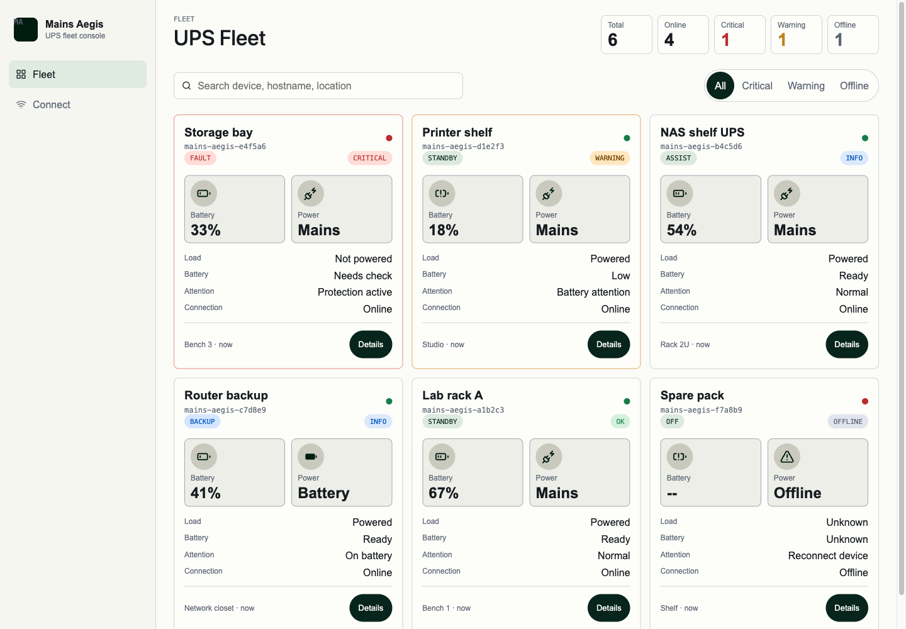

- source_type: mock_ui
  demo_entry_or_title: `/`
  requested_viewport: `390x844`
  viewport_strategy: `devtools-emulate`
  capture_scope: `browser-viewport`
  target_program: `mock-only`
  scenario: mobile fleet overview
  evidence_note: 验证 Fleet 卡片在移动端单列布局下可读、可扫描，顶部统计和设备摘要不横向溢出，并保留主要设备操作入口。

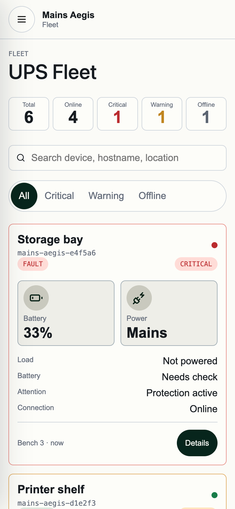

- source_type: mock_ui
  demo_entry_or_title: `/?seed=empty`
  requested_viewport: `390x844`
  viewport_strategy: `devtools-emulate`
  capture_scope: `browser-viewport`
  target_program: `mock-only`
  scenario: mobile empty fleet
  evidence_note: 验证空数据场景复用正式 Fleet 路由，并提供进入 Connect 的自然恢复路径。

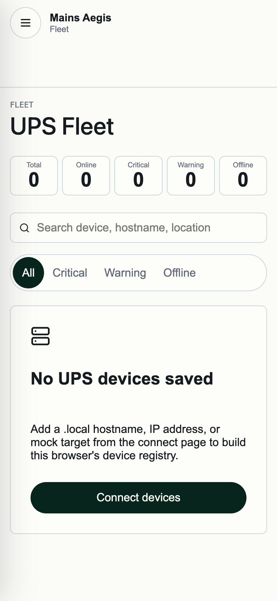

- source_type: mock_ui
  demo_entry_or_title: `/?seed=large`
  requested_viewport: `1440x1000`
  viewport_strategy: `devtools-emulate`
  capture_scope: `browser-viewport`
  target_program: `mock-only`
  scenario: large fleet
  evidence_note: 验证大数量 mock 设备仍使用正式 Fleet 路由、排序和卡片网格，且顶部计数与列表一致。

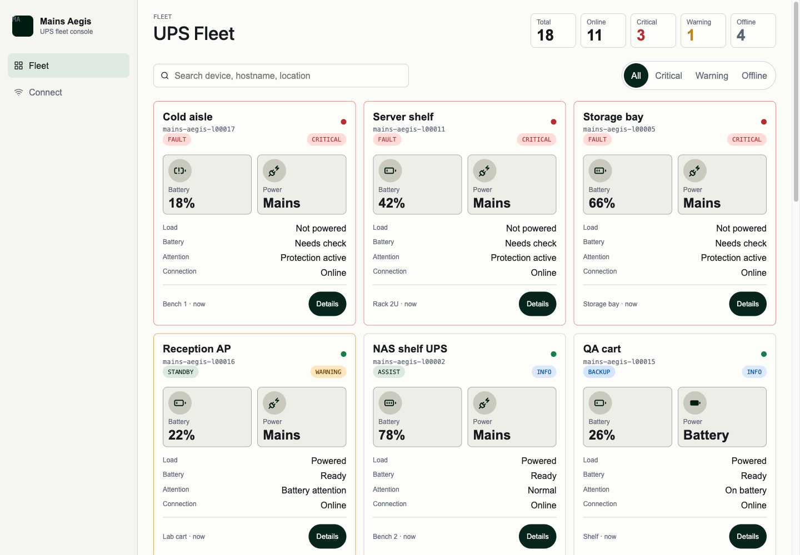

- source_type: mock_ui
  demo_entry_or_title: `/devices/mains-aegis-e4f5a6/battery?seed=default`
  requested_viewport: `1280x900`
  viewport_strategy: `devtools-emulate`
  capture_scope: `browser-viewport`
  target_program: `mock-only`
  scenario: critical device battery
  evidence_note: 验证单设备 critical 状态、battery fault、BMS readiness 和 issue detail 的视觉层级。

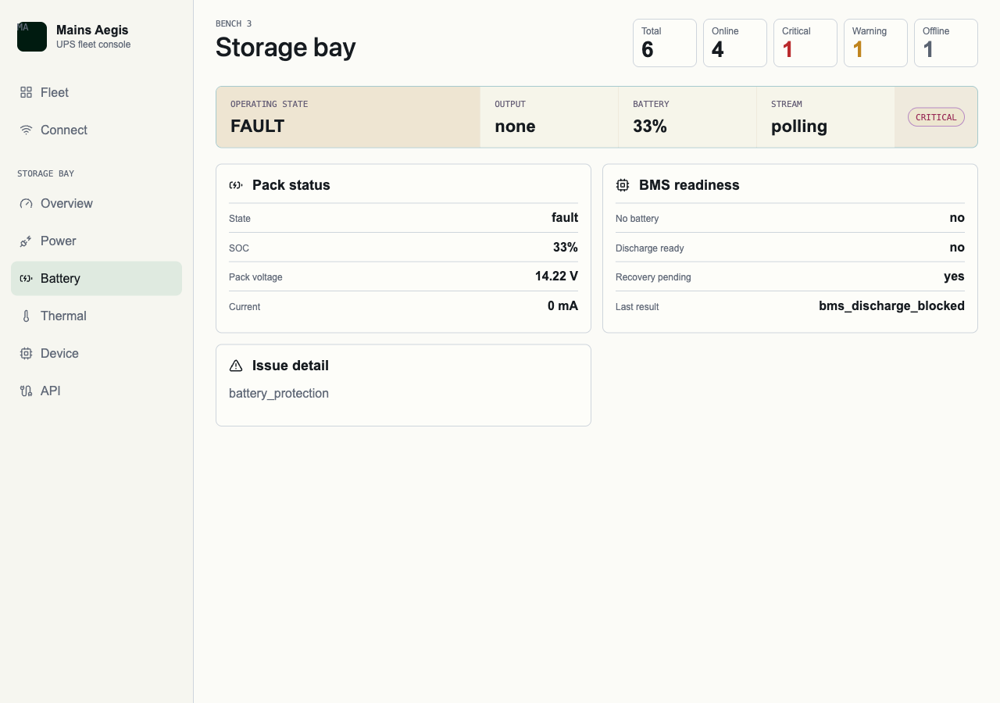

- source_type: mock_ui
  demo_entry_or_title: `/devices/mains-aegis-a1b2c3/battery?seed=default`
  requested_viewport: `1800x980`
  viewport_strategy: `headless-browser`
  capture_scope: `browser-viewport`
  target_program: `mock-only`
  scenario: battery cell balance and BMS MOS
  evidence_note: 验证 Battery 页展示四节 cell voltage、delta、BAL 状态、起步阈值、当前均衡 cell 标记和 CHG / DSG / PCHG 三路 BMS MOS 状态，且 mock 数据路径不依赖真实 UPS 设备。

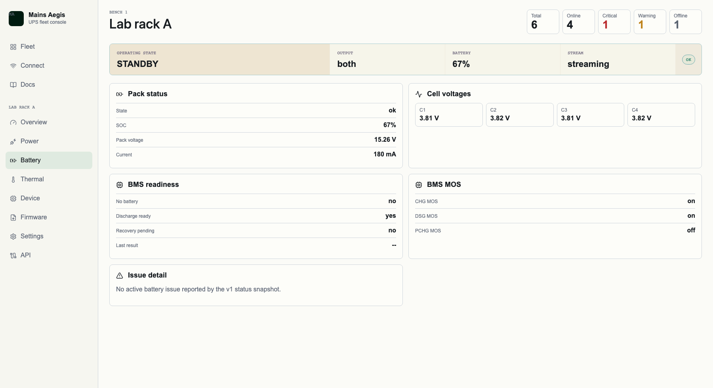

- source_type: target_app_window
  demo_entry_or_title: `/connect`
  requested_viewport: `browser-default`
  viewport_strategy: `element-screenshot`
  capture_scope: `element`
  target_program: `mains-aegis-web Vite preview backed by live mains-aegis-devd records`
  scenario: hosted add-device records flow
  evidence_note: 验证 `/connect` 已收口为 `Add device` 页面，顶部说明聚焦“添加新设备 / 绑定新 USB / 添加 LAN endpoint”，同时展示实时 devd device records，不再使用旧 `Connect` 语义。

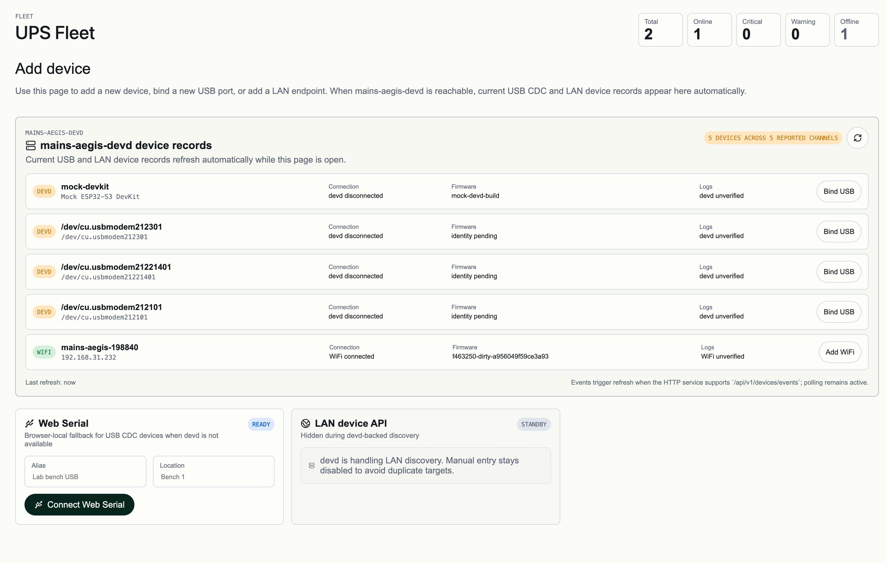

- source_type: mock_ui
  demo_entry_or_title: `/connect?seed=empty&mock_hosted=1&mock_devd_target=mock:devd-bind-target&stored_target_preset=lan-companion-bind-target`
  requested_viewport: `1440x1024`
  viewport_strategy: `devtools-emulate`
  capture_scope: `element`
  target_program: `mock-only`
  scenario: USB bind triggers LAN companion prompt
  evidence_note: 验证用户先把 pending USB 绑定到已有 logical device，绑定成功后同一卡片立即出现 `LAN companion detected` / `Bind LAN companion` 提示，并保留 `Bound USB for ...` 成功反馈；连接方式切换收纳到 `Open` 自带的下拉里，不再平铺额外主按钮。

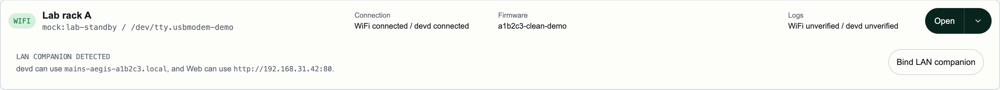

- source_type: mock_ui
  demo_entry_or_title: `/connect?mock_hosted=1&mock_devd_target=mock:devd-multi&stored_target_preset=lan-companion-confirmed`
  requested_viewport: `1440x1024`
  viewport_strategy: `devtools-emulate`
  capture_scope: `element`
  target_program: `mock-only`
  scenario: confirmed LAN companion dual-channel state
  evidence_note: 验证确认后同一 logical device 同时保留 WiFi 与 devd channel，默认偏好切到 WiFi，remembered state 可见 `Web direct http://<hostname_fqdn>`、`WiFi fallback http://<ip>:<port>` 与 `devd mDNS <hostname_fqdn>`，且不再重复显示 pending companion 提示。

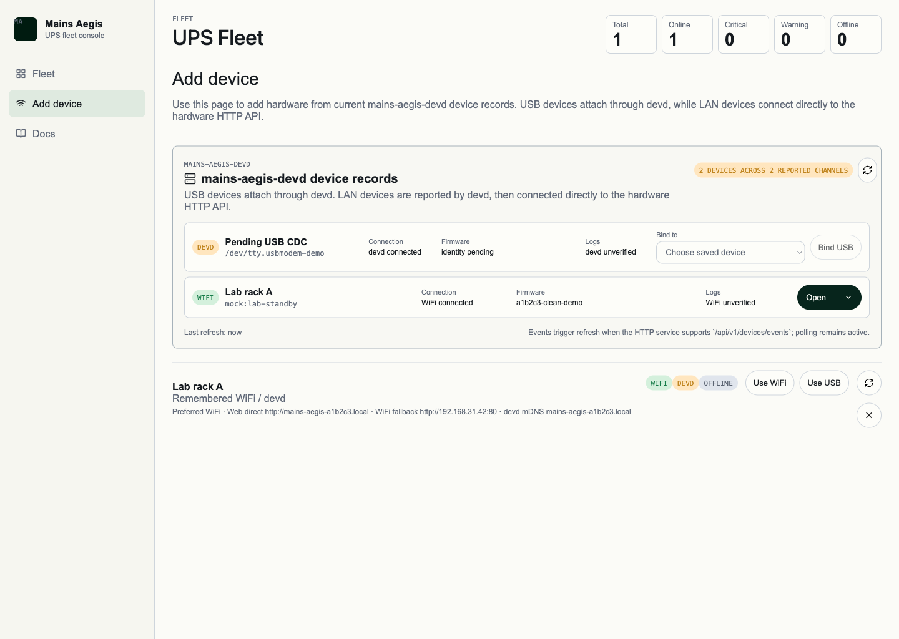

- source_type: storybook_canvas
  story_id_or_title: `UPS Management/Connect/Firmware mismatch warning`
  requested_viewport: `none`
  viewport_strategy: `storybook-viewport`
  capture_scope: `element`
  target_program: `mock-only`
  scenario: USB firmware mismatch connection gate
  evidence_note: 验证 Web Serial/devd 可写连接前的 firmware artifact 不匹配会显示 `Firmware mismatch` 气泡并提供显式 `Ignore warning and connect` 继续入口；该门禁独立于 USB Console raw/ignored 日志保留策略。

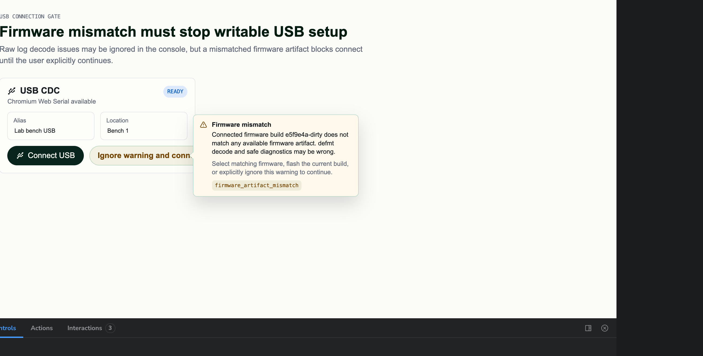

- source_type: target_app_window
  demo_entry_or_title: `/`
  requested_viewport: `browser-default`
  viewport_strategy: `element-screenshot`
  capture_scope: `element`
  target_program: `mains-aegis-web Vite preview backed by live mains-aegis-devd records`
  scenario: hosted fleet records overview
  evidence_note: 验证 Fleet 首屏直接展示当前 devd records；未保存设备仍以 `devd record` 标记出现，卡片只保留单一 `Open` 入口，不再出现旧的 connect 分流按钮。

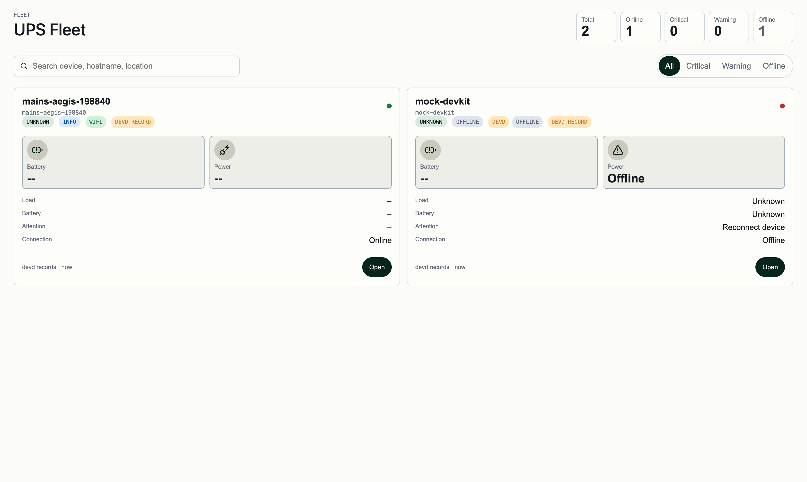

- source_type: target_app_window
  demo_entry_or_title: `/devices/mains-aegis-198840`
  requested_viewport: `browser-default`
  viewport_strategy: `element-screenshot`
  capture_scope: `element`
  target_program: `mains-aegis-web Vite preview backed by live mains-aegis-devd records`
  scenario: hosted temporary record hydration
  evidence_note: 验证从 devd record 直接打开未添加设备详情页后，Overview 会完成只读 hydration，并把 `DATA` 状态翻到 `Live data`，页面不再停留在全 `--` 的空壳状态。

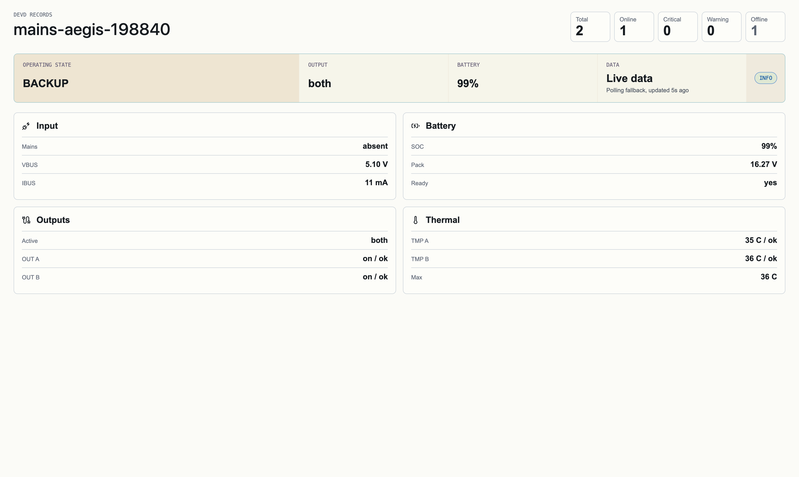

- source_type: mock_ui
  demo_entry_or_title: `/devices/mains-aegis-usb-demo/settings`
  requested_viewport: `1440x1000`
  viewport_strategy: `devtools-emulate`
  capture_scope: `browser-viewport`
  target_program: `mock-only`
  scenario: USB WiFi settings
  evidence_note: 验证 USB settings 页包含 WiFi SSID/PSK 写入、清除、手动充电偏好、日志级别和 structured log 面板；PSK 提交后清空且不出现在页面文本中。

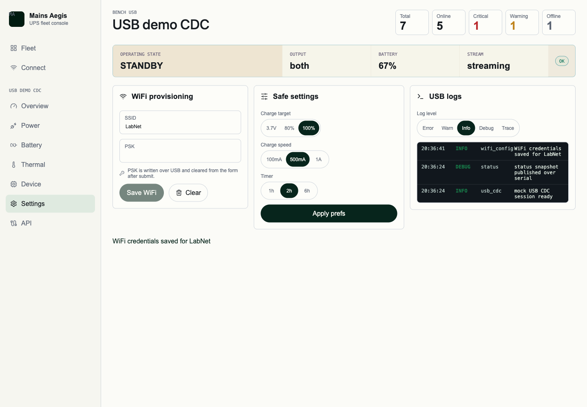

- source_type: storybook_canvas
  story_id_or_title: `UPS Management/Settings/WiFi Provisioning Feedback/State Gallery`
  requested_viewport: `none`
  viewport_strategy: `storybook-viewport`
  capture_scope: `element`
  target_program: `mock-only`
  scenario: WiFi provisioning feedback state gallery
  evidence_note: 验证连接硬件、保存 WiFi、清除 WiFi 的失败均以气泡 callout 展示；保存/清除在固件确认前保持按钮 spinning 且禁用并发写入；保存失败保留固件错误码 `wifi_connect_failed`，不再误标为 `serial_transport_error`；成功状态只显示低噪音硬件结果反馈。

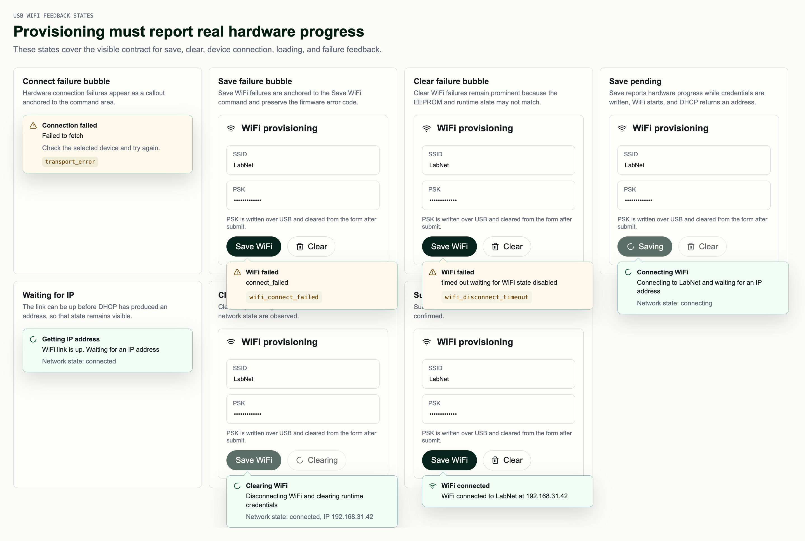

- source_type: mock_ui
  demo_entry_or_title: `/devices/mains-aegis-usb-demo/settings?seed=usb`
  requested_viewport: `1440x1000`
  viewport_strategy: `devtools-emulate`
  capture_scope: `browser-viewport`
  target_program: `mock-only`
  scenario: USB Console desktop
  evidence_note: 验证 Settings 页只保留 USB Console，过滤器、搜索、折行开关、全屏入口、计数指标和虚拟滚动日志区域位于同一控制面，且 mock trace 至少覆盖 100 条 CDC records。

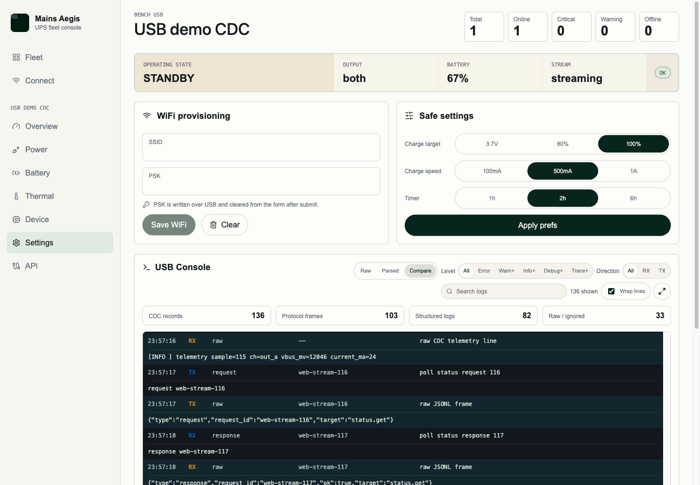

- source_type: mock_ui
  demo_entry_or_title: `/devices/mains-aegis-usb-demo/settings?seed=usb`
  requested_viewport: `390x844`
  viewport_strategy: `devtools-emulate`
  capture_scope: `browser-viewport`
  target_program: `mock-only`
  scenario: USB Console mobile
  evidence_note: 验证小屏下 USB Console 控件仍可访问，日志区域使用稳定高度与虚拟滚动，不依赖桌面宽度。

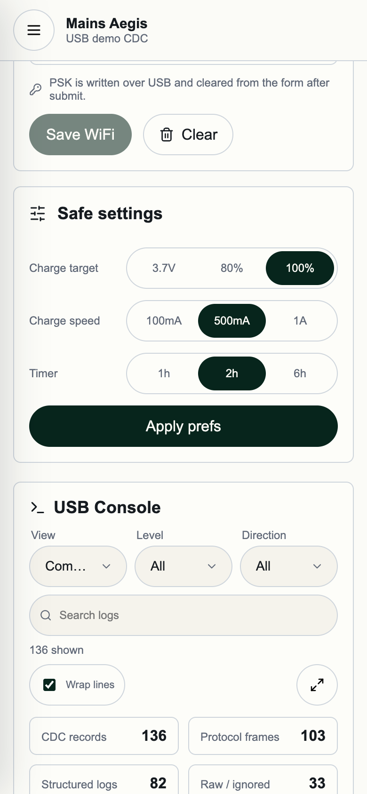

- source_type: mock_ui
  demo_entry_or_title: `/devices/mains-aegis-usb-demo/api`
  requested_viewport: `1440x1000`
  viewport_strategy: `devtools-emulate`
  capture_scope: `browser-viewport`
  target_program: `mock-only`
  scenario: USB structured logs and API debug
  evidence_note: 验证 API debug 页保留 endpoint 视图，同时显示 USB CDC JSONL 状态、settings snapshot 和 structured log。

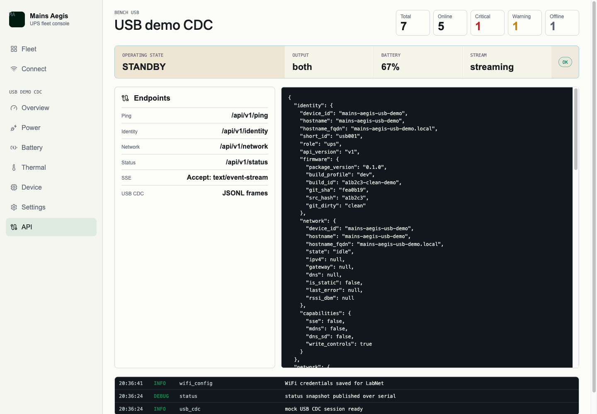

- source_type: mock_ui
  demo_entry_or_title: `/devices/mains-aegis-e4f5a6/firmware?seed=default`
  requested_viewport: `1440x1000`
  viewport_strategy: `devtools-emulate`
  capture_scope: `browser-viewport`
  target_program: `mock-only`
  scenario: firmware flash desktop
  evidence_note: 验证 Firmware 页的 catalog 去重提示、Web Serial 缺少 image 时的禁用文案、确认区、进度面板和完成态结果摘要。

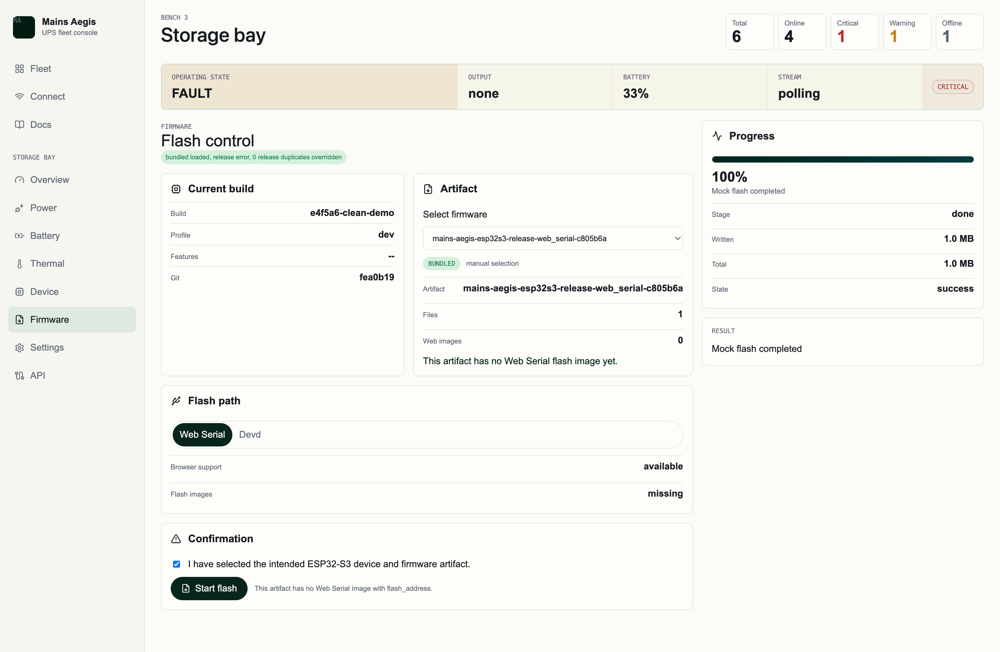

- source_type: mock_ui
  demo_entry_or_title: `/devices/mains-aegis-e4f5a6/firmware?seed=default`
  requested_viewport: `390x844`
  viewport_strategy: `devtools-emulate`
  capture_scope: `browser-viewport`
  target_program: `mock-only`
  scenario: firmware flash mobile
  evidence_note: 验证 Firmware 页在移动端保持可读、可滚动，确认区和进度摘要不横向溢出。

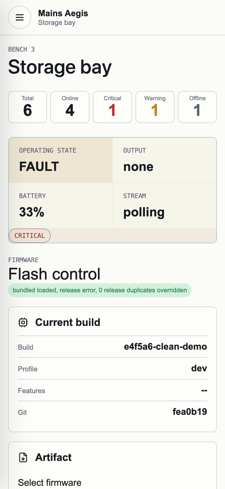

- source_type: mock_ui
  demo_entry_or_title: `/devices/mains-aegis-devd-service/firmware?seed=usb`
  requested_viewport: `390x844`
  viewport_strategy: `devtools-emulate`
  capture_scope: `browser-viewport`
  target_program: `mock-only`
  scenario: firmware devd bound mobile
  evidence_note: 验证 devd 路径在 mock 已绑定设备上默认选中代理烧录方式，并展示绑定设备选择、确认区和进度摘要的移动端布局。

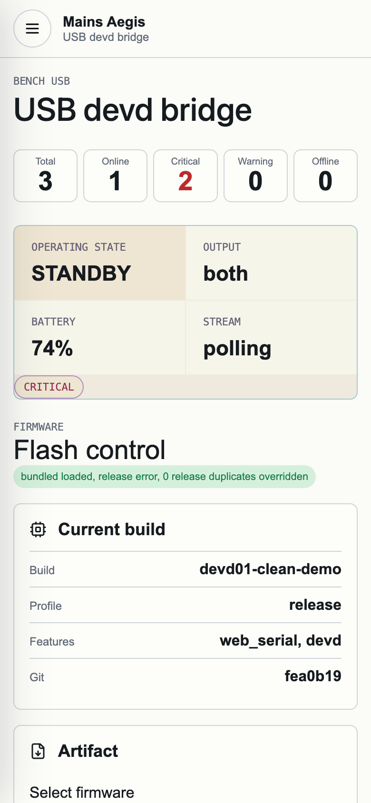

- source_type: mock_ui
  demo_entry_or_title: `/devices/mains-aegis-a1b2c3/firmware?seed=usb`
  requested_viewport: `1440x1000`
  viewport_strategy: `chrome-devtools-protocol`
  capture_scope: `browser-viewport`
  target_program: `mock-only`
  scenario: firmware mock flash running lock
  evidence_note: 验证 Web Serial mock 烧录运行中会拦截页面刷新/关闭，禁用抽屉关闭、确认框与烧录按钮，并保持进度和阶段日志可见。

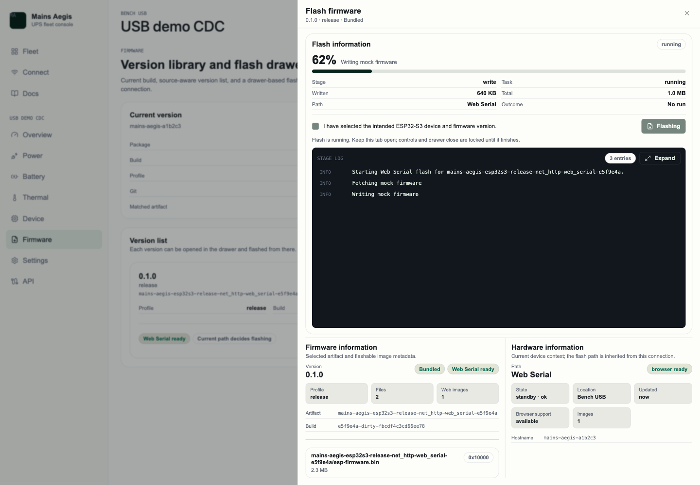

- source_type: mock_ui
  demo_entry_or_title: `/devices/mains-aegis-a1b2c3/firmware?seed=usb`
  requested_viewport: `1440x1000`
  viewport_strategy: `chrome-devtools-protocol`
  capture_scope: `browser-viewport`
  target_program: `mock-only`
  scenario: firmware mock flash completion unlock
  evidence_note: 验证 Web Serial mock 烧录完成后解除页面刷新/关闭拦截，恢复抽屉关闭能力，并保留成功状态与完整阶段日志。

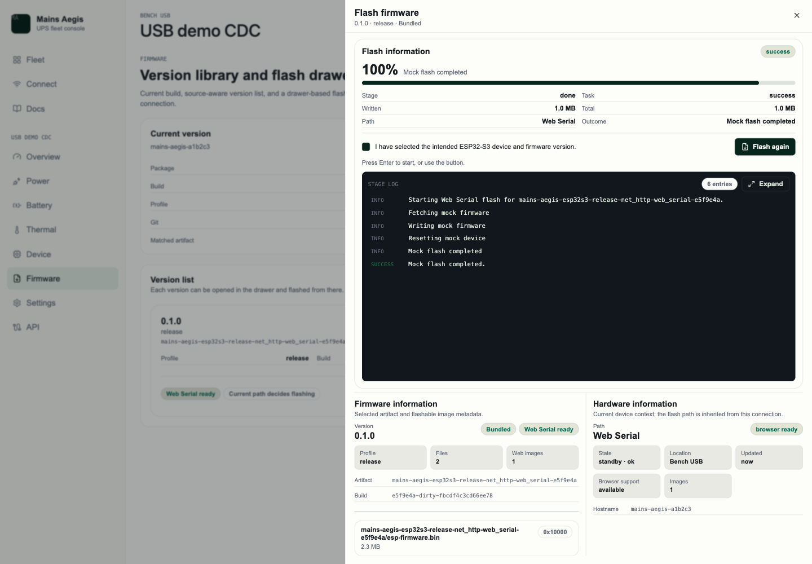

- source_type: ui_demo
  demo_entry_or_title: `/connect?seed=empty&mock_browser_capability=supported`
  requested_viewport: `1440x1080`
  viewport_strategy: `ui-demo-source`
  capture_scope: `element`
  target_program: `mock-only`
  scenario: Pages direct LAN supported
  evidence_note: 验证 GitHub Pages/public-static 构建默认直接展示 browser-direct LAN 入口与 CIDR scan，不再依赖 same-origin devd 发现。

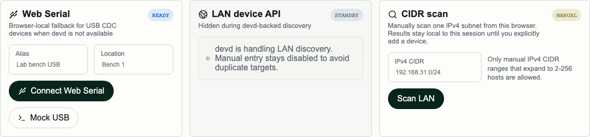

- source_type: ui_demo
  demo_entry_or_title: `/connect?seed=empty&mock_browser_capability=unsupported`
  requested_viewport: `1440x1080`
  viewport_strategy: `ui-demo-source`
  capture_scope: `element`
  target_program: `mock-only`
  scenario: Pages unsupported browser downgrade
  evidence_note: 验证 public-static 构建在非支持浏览器或非 secure context 下显示明确迁移指引，并禁用 Add LAN / Scan LAN 操作。

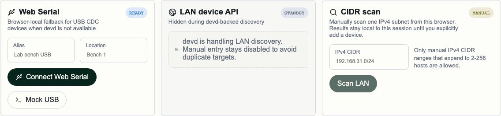

- source_type: ui_demo
  demo_entry_or_title: `/connect?seed=empty&mock_browser_capability=supported`
  requested_viewport: `1440x1080`
  viewport_strategy: `ui-demo-source`
  capture_scope: `element`
  target_program: `mock-only`
  scenario: Pages CIDR scan candidates
  evidence_note: 验证手动 IPv4 CIDR 扫描只在用户点击后执行，命中结果先显示 session-local 候选，再由用户显式决定 `Add WiFi` 或 `Open`。

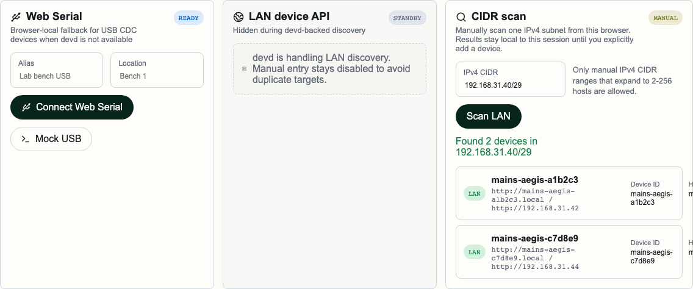

## 实现里程碑

- [x] M1: 安装 Cohere `DESIGN.md` 并建立 Web 管理端规划。
- [x] M2: 新增 `web/` Vite + React + TypeScript + Bun 应用骨架。
- [x] M3: 完成多设备 Fleet 卡片网格、设备管理与单设备详情页。
- [x] M4: 完成只读 API/SSE 客户端、mock fixtures、类型检查、生产构建和 mock UI 视觉验证。
- [x] M5: 创建 PR #71 并完成快车道 review / CI 收敛到 merge-ready。
- [x] M6: 增加 USB CDC / Web Serial safe-control follow-up，完成协议、Web UI、固件处理、文档与视觉证据。
