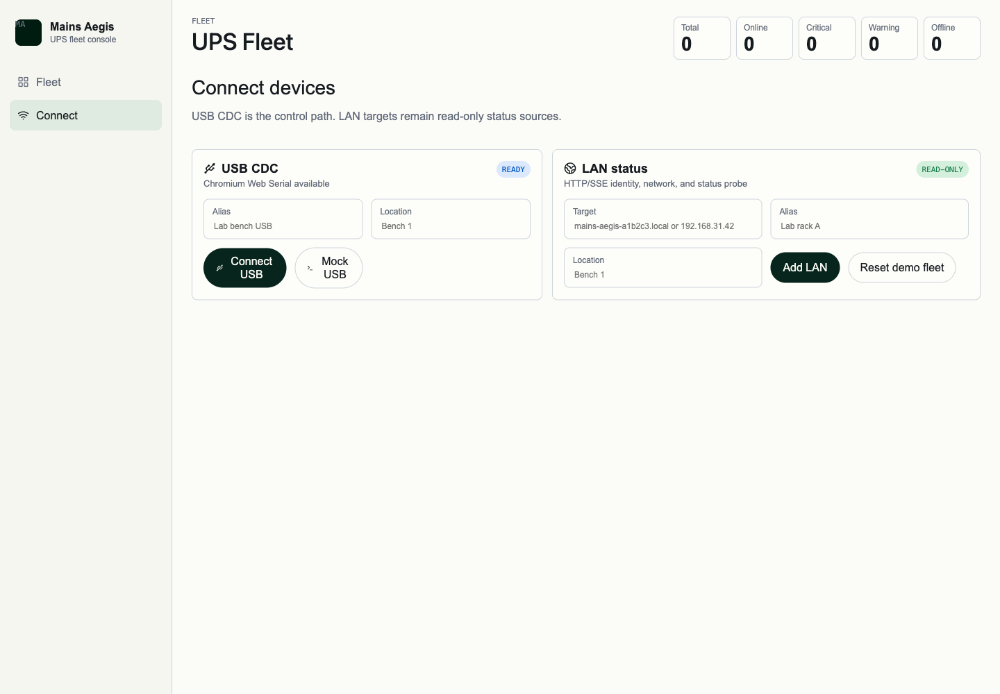

# Web management UI（#ypfpu）

## 状态

- Status: 已完成（USB CDC safe-control follow-up）
- Created: 2026-04-28
- Last: 2026-04-29

## 背景 / 问题陈述

- `mains-aegis` 已具备设备侧只读 `v1` HTTP API、mDNS / DNS-SD 与 `/api/v1/status` SSE 底座，但缺少浏览器侧管理界面。
- UPS 可能有多台硬件同时在线；单设备 Dashboard 不能作为唯一入口。
- 管理界面必须优先支持多设备快速扫视；LAN HTTP/SSE 保持只读，USB CDC / Web Serial 作为首个受限写入通道，只允许安全设置与 WiFi 配网。

## 目标 / 非目标

### Goals

- 新增独立 `web/` 管理端，使用 Vite + React + TypeScript + Bun。
- 使用根目录 `DESIGN.md` 的 Cohere 风格作为视觉基线。
- 实现多设备 Fleet 卡片网格，覆盖 online、offline、warning、critical、assist、backup 等状态。
- 实现设备接入页、单设备总览、电源路径、电池与 BMS、温度与保护、设备信息、API 调试页面。
- 对接设备侧现有只读接口：`/api/v1/ping`、`/api/v1/identity`、`/api/v1/network`、`/api/v1/status` 和 status SSE。
- 提供 mock fixtures 和正式路由 seed 场景，使无实机环境也能稳定预览、交互测试与截图验证。
- 在现有 `web/` 管理台上新增 USB CDC / Web Serial 数据源，复用 `Identity`、`NetworkSummary`、`UpsStatus` 状态模型。
- 通过 USB CDC structured JSONL 协议支持握手、状态读取、结构化日志、安全设置与 WiFi 配网。
- 首版写入范围限制为 WiFi SSID/PSK 覆盖或清除、手动充电偏好、USB session 日志级别；PSK 不在 API、日志或 UI 中回显。

### Non-goals

- LAN HTTP/SSE 不实现远程写控制、清故障、切输出、改充电动作或高风险 UPS 状态改变。
- 不实现 broker、本地 helper、桌面 companion、多消费者串口分发或 WebUSB 首版路径。
- 不新增设备侧聚合 API；多设备汇总由浏览器端 `DeviceRegistry` 完成。
- 不做用户账号、鉴权、设备绑定、TLS、跨网段发现或云端服务。
- 不改造 `docs-site/`；文档站与管理端保持独立。
- Demo 复用 Web 管理端正式路由和正式交互，仅通过 mock 数据源替换真实设备接口；截图资产默认作为 owner-facing evidence，不自动进入 PR 正文。

## 功能规格

### Fleet 总览

- `/` 为默认入口，使用响应式设备卡片网格。
- 每张卡片固定展示设备别名/hostname、位置、在线状态、运行模式、最高告警、SOC、供电来源、负载是否供电、电池是否可用、是否需要处理、连接状态和 stale 时间。
- Fleet 卡片不得默认展示 OUT A/B、charger、pack voltage 等技术细节；这些字段保留在单设备详情与 API 调试页。
- 支持搜索设备、hostname、位置，并支持 `all / critical / warning / offline` 过滤。
- 排序规则：Critical 优先，Warning 次之，Info/OK 在后，Offline 保留并显示 stale 时间。

### 设备管理

- `/connect` 支持 USB CDC / Web Serial 连接入口，并保留手动添加 `.local` hostname、IP 或完整 URL 的 LAN 只读入口。
- USB 连接入口必须显示浏览器支持状态、连接/断开状态、用户取消授权、串口不可用或已占用等错误。
- 真实 USB `SerialPort` 不写入 localStorage；刷新页面后需要重新授权。mock USB 设备可用于视觉证据与无硬件验证。
- 添加时按 `ping -> identity -> network -> status` 探活；失败显示 API-compatible error envelope。
- 浏览器侧保存 `DeviceRegistry` 到 `localStorage`，并提供 demo fleet reset。

### 单设备详情

- `/devices/:device_id` 展示单设备运行状态带与关键摘要。
- `/devices/:device_id/power` 展示 input、charger、output gate、OUT A/B。
- `/devices/:device_id/battery` 展示 pack status、BMS readiness 与 issue detail。
- `/devices/:device_id/thermal` 展示 TMP A/B 与保护上下文。
- `/devices/:device_id/device` 展示 identity、network、firmware。
- `/devices/:device_id/settings` 仅对 USB CDC 连接设备开放，提供 WiFi 配网、手动充电偏好与日志级别设置。
- `/devices/:device_id/api` 展示固定只读 endpoints 与当前 JSON snapshot。

### USB CDC / Web Serial 协议

- Framing: USB CDC 串口上使用 LF 分隔 JSON frame（JSONL）。
- 固定 frame type: `hello`、`status`、`log`、`request`、`response`、`error`、`wifi_config`。
- Web 写命令必须带 `request_id`；固件以同一 `request_id` 返回 `response` 或 `error`。
- `hello` 返回协议名 `mains-aegis.cdc.v1`、capabilities、identity；USB identity 的 `capabilities.write_controls=true`。
- `request` 支持 `get_identity`、`get_status`、`set_log_level`、`set_manual_charge_prefs`。
- `wifi_config` 支持 `op=set` 与 `op=clear`；`set` 接收 `ssid` 与 `psk`，固件仅回传 SSID 与 ack，不回传 PSK。
- `log` frame 是结构化开发日志入口，字段至少包含 `level`、`target`、`message`。
- Web App 将非 JSON legacy serial line 降级为 `raw_serial` debug log；协议响应必须保持 JSONL，以免阻塞 request ack。
- `error` frame 与 HTTP error envelope 对齐：`{ code, message, retryable, details }`。

### 纯前端 Demo

- Demo 站点与正式站点使用同一套前端、同一套路由、同一套导航和交互，只把设备接口替换为 `mock:` 数据源。
- 支持 `seed=default|empty|offline|large` 查询参数，用于一键复现默认 fleet、空数据、全离线和大数量设备场景。
- 典型演示脚本：
  - 普通路径：`/` -> `/devices/mains-aegis-c7d8e9` -> `/devices/mains-aegis-c7d8e9/api`
  - 异常路径：`/devices/mains-aegis-e4f5a6/battery?seed=default`
  - 空数据路径：`/?seed=empty` -> `/connect?seed=empty`
  - 大数量路径：`/?seed=large`

## 接口与数据流

- Web 端以 `docs/specs/amc32-wifi-service-discovery-api-foundation/contracts/http-apis.md` 为只读 API 契约来源。
- `DeviceRegistry` 保存 `device_id -> base_url -> latest snapshot -> connection state`。
- 在线设备优先使用 `EventSource` 订阅 `/api/v1/status`；SSE 失败后关闭 stream 并回退到 `GET /api/v1/status` 轮询。
- mock 设备使用 `mock:` base URL，不发真实网络请求，供视觉验证和开发预览使用。
- 所有错误统一映射为 `{ code, message, retryable, details }`，页面不得拼接非契约形状错误。

## 验收标准

- `bun install` 成功，并保留根项目 commitlint workflow。
- `bun run web:check` 通过。
- `bun run web:build` 通过。
- Fleet mock 页至少显示 6 台设备，覆盖 standby、assist、backup、warning、critical、offline。
- `/connect` 能显示已保存设备，支持添加设备与探活错误显示。
- `/connect` 能连接 USB CDC 设备、附加 mock USB 设备、断开 USB session，并展示 Web Serial 不支持或串口不可用错误。
- USB 设备连接后能在 `/devices/:device_id/settings` 写入 WiFi SSID/PSK、清除 WiFi、调整日志级别和手动充电偏好；PSK 提交后清空且不回显。
- `/devices/:device_id/api` 或 settings 页面能显示 USB structured logs。
- 正式路由能通过 `seed` 参数打开可复现 mock 场景，并保持与正式产品一致的导航和页面结构。
- 单设备详情页可从 Fleet 卡片进入，并展示 power、battery、thermal、device、api 子页。
- 浏览器视觉验证覆盖 desktop Fleet、mobile Fleet、empty Fleet、large Fleet、单设备 Dashboard、USB Connect、USB structured logs 和 WiFi settings。

## 文档更新

- `DESIGN.md`: Cohere 设计基线。
- `docs/web-management-ui.md`: 管理端信息架构与实现结构。
- `docs/README.md`: 增加 Web management UI plan 入口。
- `docs/specs/README.md`: 增加当前 spec 索引。

## Visual Evidence

视觉证据由 Vite 纯前端 mock UI 生成，使用正式路由和 mock fixtures，不连接真实 UPS 设备。以下截图用于 owner review；未标记 `PR: include`，因此不默认进入 PR 正文。

- source_type: mock_ui
  demo_entry_or_title: `/`
  requested_viewport: `1440x1000`
  viewport_strategy: `devtools-emulate`
  capture_scope: `browser-viewport`
  target_program: `mock-only`
  scenario: desktop fleet overview
  evidence_note: 验证多设备卡片网格、严重程度排序、owner-facing 摘要字段，以及总览页不暴露 OUT A/B、charger、API 等技术细节。

- source_type: mock_ui
  demo_entry_or_title: `/`
  requested_viewport: `390x844`
  viewport_strategy: `devtools-emulate`
  capture_scope: `browser-viewport`
  target_program: `mock-only`
  scenario: mobile fleet overview
  evidence_note: 验证 Fleet 卡片在移动端单列布局下可读、可扫描，顶部统计和设备摘要不横向溢出，并保留主要设备操作入口。

- source_type: mock_ui
  demo_entry_or_title: `/?seed=empty`
  requested_viewport: `390x844`
  viewport_strategy: `devtools-emulate`
  capture_scope: `browser-viewport`
  target_program: `mock-only`
  scenario: mobile empty fleet
  evidence_note: 验证空数据场景复用正式 Fleet 路由，并提供进入 Connect 的自然恢复路径。

- source_type: mock_ui
  demo_entry_or_title: `/?seed=large`
  requested_viewport: `1440x1000`
  viewport_strategy: `devtools-emulate`
  capture_scope: `browser-viewport`
  target_program: `mock-only`
  scenario: large fleet
  evidence_note: 验证大数量 mock 设备仍使用正式 Fleet 路由、排序和卡片网格，且顶部计数与列表一致。

- source_type: mock_ui
  demo_entry_or_title: `/devices/mains-aegis-e4f5a6/battery?seed=default`
  requested_viewport: `1280x900`
  viewport_strategy: `devtools-emulate`
  capture_scope: `browser-viewport`
  target_program: `mock-only`
  scenario: critical device battery
  evidence_note: 验证单设备 critical 状态、battery fault、BMS readiness 和 issue detail 的视觉层级。

- source_type: mock_ui
  demo_entry_or_title: `/connect`
  requested_viewport: `1440x1000`
  viewport_strategy: `devtools-emulate`
  capture_scope: `browser-viewport`
  target_program: `mock-only`
  scenario: USB CDC connect
  evidence_note: 验证 `/connect` 同屏提供 USB CDC / Web Serial 控制入口与 LAN 只读入口，展示浏览器支持状态、mock USB 入口和已保存设备列表结构。

- source_type: mock_ui
  demo_entry_or_title: `/devices/mains-aegis-usb-demo/settings`
  requested_viewport: `1440x1000`
  viewport_strategy: `devtools-emulate`
  capture_scope: `browser-viewport`
  target_program: `mock-only`
  scenario: USB WiFi settings
  evidence_note: 验证 USB settings 页包含 WiFi SSID/PSK 写入、清除、手动充电偏好、日志级别和 structured log 面板；PSK 提交后清空且不出现在页面文本中。

- source_type: mock_ui
  demo_entry_or_title: `/devices/mains-aegis-usb-demo/api`
  requested_viewport: `1440x1000`
  viewport_strategy: `devtools-emulate`
  capture_scope: `browser-viewport`
  target_program: `mock-only`
  scenario: USB structured logs and API debug
  evidence_note: 验证 API debug 页保留只读 endpoint 视图，同时显示 USB CDC JSONL 状态、safe settings snapshot 和 structured log。

## 实现里程碑

- [x] M1: 安装 Cohere `DESIGN.md` 并建立 Web 管理端规划。
- [x] M2: 新增 `web/` Vite + React + TypeScript + Bun 应用骨架。
- [x] M3: 完成多设备 Fleet 卡片网格、设备管理与单设备详情页。
- [x] M4: 完成只读 API/SSE 客户端、mock fixtures、类型检查、生产构建和 mock UI 视觉验证。
- [x] M5: 创建 PR #71 并完成快车道 review / CI 收敛到 merge-ready。
- [x] M6: 增加 USB CDC / Web Serial safe-control follow-up，完成协议、Web UI、固件处理、文档与视觉证据。
