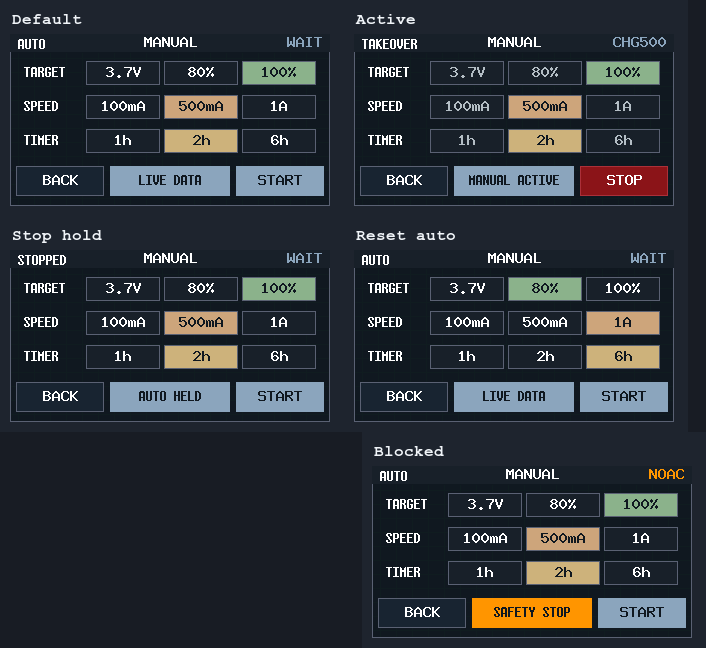
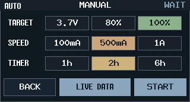
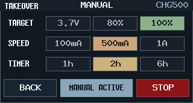
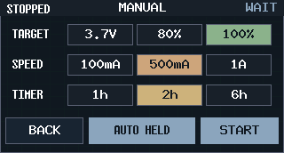
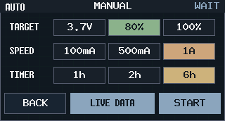
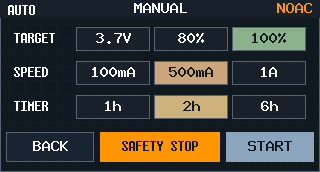

# Dashboard 手动充电页与 EEPROM 偏好持久化（#zp4cg）

## 状态

- Status: 已完成
- Created: 2026-04-07
- Last: 2026-04-08

## 背景 / 问题陈述

- `CHARGER DETAIL` 已能展示主线充电状态，但还缺少“手动充电”入口与显式控制页。
- 主人要求在 charger 二级页左侧会话面板新增点击入口，进入专用的 `MANUAL CHARGE` 页面。
- 手动页需要记忆用户偏好，但手动接管、开始/停止与抑制状态必须严格限定为运行时 RAM，不能跨 MCU 上电或复位恢复。
- EEPROM 后续还会存更多配置，因此必须从一开始就采用带 `schema_version` 的可扩展布局，而不是把单个设置散落写死。

## 目标 / 非目标

### Goals

- 在 `CHARGER DETAIL` 左侧会话面板新增三级入口，进入 `MANUAL CHARGE` 页面。
- `MANUAL CHARGE` 页面单屏展示：
  - `TARGET`: `3.7V / 80% / 100%`
  - `SPEED`: `100mA / 500mA / 1A`
  - `TIMER`: `1h / 2h / 6h`
  - 底部动作：`BACK + START/STOP`
- 仅持久化 `ManualChargePrefs`：默认值固定为 `100% / 500mA / 2h`。
- 所有手动会话状态（`active / takeover / stop_inhibit / deadline / last_stop_reason`）只保存在运行时 RAM；MCU 复位后回到自动策略。
- 手动会话可接管主线 charger state machine，但不绕过已有硬安全门。
- 在 EEPROM 中落地通用布局：`superblock + record table + ManualChargePrefsV1 + reserved future area`。

### Non-goals

- 不在本规格中持久化手动会话本身。
- 不引入新的充电策略阈值来源；`3.7V / 80% / 100%` 只映射到已确定的停充口径。
- 不新增多页设置、滚动列表或实时编辑中的热更新体验。

## 范围（Scope）

### In scope

- `firmware/src/front_panel_scene.rs`
  - 新增 `DashboardRoute::ManualCharge`
  - 新增 charger detail 入口热区、manual page 命中区与 renderer
  - 新增 `ManualChargePrefs` / `ManualChargeRuntimeState` / `ManualChargeUiSnapshot`
- `firmware/src/front_panel.rs`
  - 新增 `UiAction::ManualCharge(...)`
  - 支持 `LEFT/CENTER/BACK` 从 manual page 返回 `Detail(Charger)`
- `firmware/src/output/mod.rs`
  - 接入手动充电 runtime 与 EEPROM 偏好持久化
  - 在 charger state machine 中实现手动接管 / 停止 / 自动恢复
- `firmware/src/main.rs`
  - 把 front panel 手动操作转发给 `PowerManager`
- `tools/front-panel-preview/src/main.rs`
  - 新增 `dashboard-manual-charge-*` 预览场景
- `firmware/ui/`
  - 更新 Dashboard / detail / component / design language 文档
- `docs/specs/zp4cg-manual-charge-dashboard/`
  - 记录功能规格、验证与视觉证据

### Out of scope

- 重新设计首页 Dashboard 布局。
- 为手动充电加入历史曲线、图表或持久化日志。
- 改变主线 `charge_policy_step()` 的自动策略阈值定义。

## 功能与行为规格

### 1. 页面与路由

- `DashboardRoute` 新增 `ManualCharge`。
- 在 `CHARGER DETAIL` 页面左侧会话面板增加热区：`x=6 y=60 w=150 h=82`。
- 命中该热区后进入 `MANUAL CHARGE` 页面。
- `MANUAL CHARGE` 页面中：
  - 顶栏压缩为单层信息条，仅显示 `MODE / MANUAL / status chip`，不承载触摸返回。
  - 底部仅保留一个 `BACK` 触点。
  - `LEFT/CENTER` 按键与底部 `BACK` 均返回 `DashboardRoute::Detail(DashboardDetailPage::Charger)`。

### 2. 手动页布局

- 顶部仅保留单层非交互信息区：
  - 左侧：`MODE`（`AUTO / AUTO CHG / MANUAL / TAKEOVER / STOPPED`）
  - 中间：紧凑标题 `MANUAL`
  - 右侧：charger status chip
- 中部使用 3 条横向 segmented rows，尽量把可点面积留给选项：
  - `TARGET` row：`3.7V / 80% / 100%`
  - `SPEED` row：`100mA / 500mA / 1A`
  - `TIMER` row：`1h / 2h / 6h`
- 三组字段不再额外包一层 row card，只保留左侧标签与右侧可点选项，减少小屏视觉噪声。
- 底部统一为唯一操作条：`BACK + footer notice + START/STOP`。
- 当系统当前正在充电时，设置区锁定只读，只允许 `STOP/BACK`。

### 3. 目标定义与停止条件

- `3.7V`：`bq40z50_pack_mv >= 14_800` 时结束手动会话。
- `80%`：`bq40z50_soc_pct >= 80` 时结束手动会话。
- `100%`：复用现有 `full_latched || policy_full_reason.is_some()` 判定。
- 任一情况下，以下事件均可结束手动会话：
  - 达到目标
  - 定时器到期
  - 用户点击 `STOP`
  - 硬安全门阻断（如 charger disabled / no mains / no BMS / output overload / TS cold/hot）

### 4. 运行时语义

- `START`
  - 建立手动会话
  - 清除 `stop_inhibit`
  - 若系统已在自动充电，则 `takeover=true`
  - deadline 由当前 `timer_limit` 计算
- `STOP`
  - 结束手动会话
  - 置位 RAM-only `stop_inhibit`
  - 防止自动策略在同次运行中立刻重新拉起
- `目标完成 / timer expiry / full reached`
  - 结束手动会话
  - 同样保持 RAM-only `stop_inhibit`
  - 防止自动策略在同次运行中立刻重新拉起，避免手动停止条件刚达成就被自动策略重新拉起
- `硬安全门阻断`
  - 结束手动会话
  - 不保留 `stop_inhibit`
  - 页面需保留 `SAFETY STOP` 提示供用户观察
- 手动会话期间：
  - 目标充电电流映射为 `100 / 500 / 1000mA`
  - 允许依据现有 DC derate 逻辑降档到 `100mA`
  - UI status chip 可显示 `CHG100 / CHG500 / CHG1A`
- MCU 每次上电或复位：
  - `manual_active=false`
  - `manual_takeover=false`
  - `manual_stop_inhibit=false`
  - `deadline=None`
  - 系统重新按自动策略评估

### 5. EEPROM 持久化边界

- 仅 `ManualChargePrefs` 持久化。
- 不得持久化：
  - `manual_active`
  - `manual_takeover`
  - `manual_stop_inhibit`
  - `remaining_timer`
  - `last_stop_reason`
- 首次启动、CRC 失败或 schema 不兼容时，回退默认值：
  - `target=100%`
  - `speed=500mA`
  - `timer_limit=2h`

## EEPROM 布局

设备：`I2C1 @ 0x50`

| Offset | Size | Record | 说明 |
| --- | --- | --- | --- |
| `0x0000` | `32B` | `StorageSuperblockV1` | `magic="AEG1"`、`schema_version=1`、CRC |
| `0x0020` | `32B` | `StorageRecordTableV1` | `ManualChargePrefsV1` 的 record id / version / offset / size |
| `0x0040` | `32B` | `ManualChargePrefsRecordV1` | `target / speed / timer_limit` 与 CRC |
| `0x0060+` | reserved | future records | 保留给后续 EEPROM 配置 |

`ManualChargePrefsRecordV1` 编码：

- byte `0`: record version (`1`)
- byte `1`: target (`0=3.7V`, `1=80%`, `2=100%`)
- byte `2`: speed (`0=100mA`, `1=500mA`, `2=1A`)
- byte `3`: timer (`0=1h`, `1=2h`, `2=6h`)
- byte `31`: CRC8

## 接口变更（Interfaces）

- `front_panel_scene`
  - `DashboardRoute::ManualCharge`
  - `DashboardTouchTarget::{ChargerManualEntry, ManualBack, ManualTarget3V7, ManualTarget80, ManualTarget100, ManualSpeed100, ManualSpeed500, ManualSpeed1A, ManualTimer1h, ManualTimer2h, ManualTimer6h, ManualStart, ManualStop}`
  - `ManualChargeUiAction`
  - `ManualChargePrefs`
  - `ManualChargeRuntimeState`
  - `ManualChargeUiSnapshot`
- `front_panel`
  - `UiAction::ManualCharge(ManualChargeUiAction)`
- `PowerManager`
  - `request_manual_charge_action(...)`
  - `manual_charge_prefs`
  - `manual_charge_runtime`
- `front-panel-preview`
  - `dashboard-manual-charge-default`
  - `dashboard-manual-charge-active`
  - `dashboard-manual-charge-stop-hold`
  - `dashboard-manual-charge-reset-auto`
  - `dashboard-manual-charge-blocked`

## 验收标准（Acceptance Criteria）

- Given `CHARGER DETAIL`，When 点击左侧会话面板热区，Then 必须进入 `MANUAL CHARGE` 页面。
- Given `MANUAL CHARGE`，When 点击 `BACK` 或按 `LEFT/CENTER`，Then 返回 `CHARGER DETAIL`。
- Given EEPROM 首次为空、CRC 失败或 schema 不兼容，When 进入手动页，Then 默认选中 `100% / 500mA / 2h`。
- Given 用户修改偏好并重启，When 再次进入手动页，Then 能读回相同偏好。
- Given 系统已在自动充电，When 进入手动页，Then 动作按钮显示 `STOP` 且设置锁定。
- Given 用户在本次运行中执行 `STOP`，When charger 下一轮 poll，Then 自动策略不得立刻恢复充电。
- Given MCU 在手动会话中复位，When 系统重新启动，Then 手动会话状态与停止抑制必须全部清空。
- Given 手动速度偏好为 `1A` 且输入侧超出 derate 阈值，When charger runtime 决策，Then 允许降为 `100mA`，同时状态文案更新为实际 runtime token。

## 实现记录

- 已在 charger detail 左侧面板增加 `MANUAL CHARGE` 入口热区与高亮 marker。
- 已将手动页重排为 1.47 英寸小屏优先布局：顶部压缩为单层只读信息条、三条无外层卡片的横向 segmented rows、底部唯一操作条与单一 `BACK`。
- 已新增手动页路由、命中区、`START/STOP` 动作映射与 `LEFT/CENTER/BACK` 返回逻辑。
- 已新增 `ManualChargePrefs`、`ManualChargeRuntimeState`、`ManualChargeUiSnapshot`，并把 runtime 状态保持在 `PowerManager` RAM 中。
- 已把手动会话接到 charger state machine，支持：用户启动/停止、目标完成停充、timer expiry、safety blocked、stop inhibit 与自动恢复。
- 已在 EEPROM 中实现 `schema_version + record table + ManualChargePrefsV1` 布局，并在设置变化时仅写入 prefs record，避免每次偏好调整都重写 superblock / table。
- 已扩展 `front-panel-preview`，覆盖默认、活动、停止抑制、复位后回自动、以及安全阻断 5 类场景，并与最终 UI 配色/对齐同步。

## 验证记录

- `cargo fmt --manifest-path /Users/ivan/Projects/Ivan/mains-aegis/firmware/Cargo.toml --all`
- `cargo fmt --manifest-path /Users/ivan/Projects/Ivan/mains-aegis/tools/front-panel-preview/Cargo.toml --all`
- `cargo test --manifest-path /Users/ivan/Projects/Ivan/mains-aegis/firmware/host-unit-tests/Cargo.toml`
- `cargo build --manifest-path /Users/ivan/Projects/Ivan/mains-aegis/tools/front-panel-preview/Cargo.toml`
- `cargo +esp check --manifest-path /Users/ivan/Projects/Ivan/mains-aegis/firmware/Cargo.toml --bin esp-firmware --target xtensa-esp32s3-none-elf -Zbuild-std=core,alloc`
- `tools/front-panel-preview/target/debug/front-panel-preview --variant B --focus idle --mode standby --scenario dashboard-manual-charge-default --out-dir /tmp/mains-aegis-manual-charge-final`
- `tools/front-panel-preview/target/debug/front-panel-preview --variant B --focus idle --mode standby --scenario dashboard-manual-charge-active --out-dir /tmp/mains-aegis-manual-charge-final`
- `tools/front-panel-preview/target/debug/front-panel-preview --variant B --focus idle --mode standby --scenario dashboard-manual-charge-stop-hold --out-dir /tmp/mains-aegis-manual-charge-final`
- `tools/front-panel-preview/target/debug/front-panel-preview --variant B --focus idle --mode standby --scenario dashboard-manual-charge-reset-auto --out-dir /tmp/mains-aegis-manual-charge-final`
- `tools/front-panel-preview/target/debug/front-panel-preview --variant B --focus idle --mode standby --scenario dashboard-manual-charge-blocked --out-dir /tmp/mains-aegis-manual-charge-final`
- `mcu-agentd --non-interactive flash esp`
- `mcu-agentd --non-interactive monitor esp --reset`

## Visual Evidence

### Default

### Active

### Stop hold

### Reset to auto after reboot

### Safety blocked

