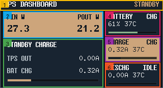
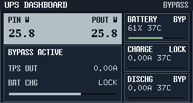
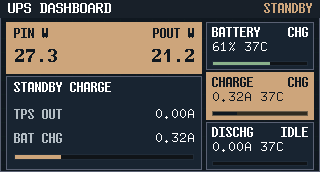
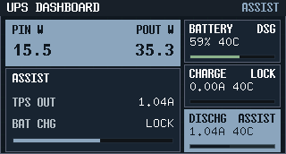
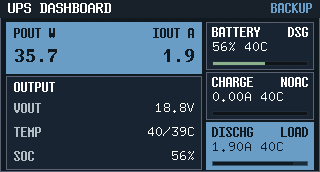
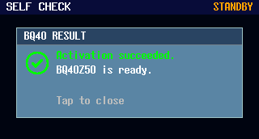
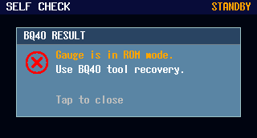
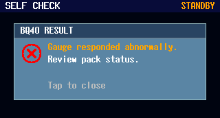

# ESP firmware（ESP32-S3 / esp-hal / `no_std`）

本目录是本仓库固件 bring-up 的最小基线：**可构建、可烧录、可观测（串口日志）**，但不包含任何业务功能。

## Agent 协作规则（重要）

本 README 里的“烧录 / 监视 / 端口选择”等命令默认是**给人类开发者执行**的；Agent 若需代执行，必须严格遵守“禁止枚举/禁止换端口”等纪律。

- Agent 禁止直接调用 `espflash`（含 `cargo espflash` / `cargo-espflash`）。注意：`mcu-agentd` 可能使用 `espflash` 作为后端，但通过 `mcu-agentd` 执行烧录/监视是允许的。
- Agent 禁止枚举候选端口（例如 `mcu-agentd selector list <MCU_ID>`、列 `/dev/*`）。
- Agent 禁止切换端口（例如 `mcu-agentd selector set <MCU_ID> <PORT>`），也不得自行“换一个端口试试”。
- 除端口枚举/切换外，Agent 可以执行其他 `mcu-agentd` 命令（含 `flash` / `monitor` / `erase` / `reset` 等），且不需要额外确认或频繁读取当前端口。

## 目录结构（契约）

```text
firmware/
  README.md
  Cargo.toml
  rust-toolchain.toml
  (repo root) mcu-agentd.toml
  .esp32-port          # 由 mcu-agentd selector 写入（不提交；可能包含 mac=... 绑定行）
  (repo root) .mcu-agentd/  # 运行态目录（不提交）
  .cargo/
    config.toml
  src/
    main.rs
  build.rs
```

## 环境安装（macOS / Linux）

### 1) 安装 ESP Rust 工具链（`espup`）

```bash
cargo install espup
espup install
source ~/export-esp.sh
```

验证（应能看到 `esp` toolchain）：

```bash
rustup toolchain list
```

### 2) 安装 `cargo-espflash`（fallback 工作流需要）

```bash
cargo install cargo-espflash
```

### 3) `mcu-agentd`（默认工作流）

本仓库默认使用 `mcu-agentd` 统一进行串口选择、烧录与 `defmt` 解码监视。请确保你的环境中已能运行：

```bash
mcu-agentd --version
```

## 构建

```bash
cd firmware

cargo build
cargo build --release
# Main firmware voltage defaults to 12V; enable 19V explicitly when needed.
cargo build --release --bin esp-firmware
cargo build --release --bin esp-firmware --features main-vout-19v
# 开发阶段需要“最小电流强制充电唤醒”时，显式打开该特性
cargo build --release --features force-min-charge
# 仅在诊断阶段需要双地址探测时，显式打开该特性（默认只访问 0x0B）
cargo build --release --features bms-dual-probe-diag
```

> 注意：本工程将 target / toolchain 配置隔离在 `firmware/` 内，不要求仓库根目录存在 Rust workspace。

> 备注：当前固件将 CPU 频率固定为 `160MHz`（early bring-up 更稳），避免上电初始化阶段的偶发异常影响验证。
> 备注：本计划的音频素材已收敛为 PCM-only（`WAV(PCM16LE)`），固件侧不再包含 ADPCM 解码路径。

## 运行时音效服务（Plan #h43mk）

主固件已改为常驻运行时音效服务；上电进入自检后就会请求一次 `boot_startup`，音频播放与自检并行推进，后续由主循环按电源/BMS/保护状态驱动 cue 播放，不再阻塞播放 6 段 Demo playlist。

- 链路：`ESP32-S3 I2S/TDM TX -> MAX98357A -> 8Ω/1W Speaker`
- GPIO：`GPIO4=BCLK`，`GPIO5=WS(LRCLK)`，`GPIO6=DOUT`
- 共享播放核心：`firmware/src/audio.rs`
- 运行时资产：`firmware/assets/audio/test-fw-cues/*.wav`
- 调度语义：`Boot/Status=one_shot`、`Warning=interval_loop(2000ms)`、`Error=continuous_loop`
- 优先级：`Error > Warning > Status > Boot`

当前主固件会接入以下运行时 cue：

- `boot_startup`
- `mains_present_dc` / `mains_absent_dc`
- `charge_started` / `charge_completed`
- `battery_low_no_mains` / `battery_low_with_mains`
- `high_stress`
- `shutdown_protection`
- `io_over_voltage` / `io_over_current`
- `module_fault`
- `battery_protection`

本轮保持 dormant 的 cue：

- `shutdown_mode_entered`：等待真实 shutdown flow
- `io_over_power`：等待独立 over-power 状态源或阈值策略

手工验证（端到端，建议按以下顺序执行）：

```bash
cd firmware
cargo build --release --bin esp-firmware
cd ..

# (Human-only) Ensure the selected port is correct
mcu-agentd selector get esp

# Flash + monitor
mcu-agentd flash esp
mcu-agentd monitor esp --reset
```

验证关注点：

- 启动阶段不再出现 `demo playlist` 相关日志序列，也不会阻塞主循环。
- 上电后只请求一次 `boot_startup`，允许在自检期间开始播放。
- 在市电丢失/恢复、充电开始/完成、低电/保护/过压/过流等状态切换时，能听到对应 cue。

## TPS55288 双路输出控制（Plan #0005）

本固件在启动时会通过 `I2C1` 对两颗 `TPS55288` 做最小 bring-up，并冻结一个“默认 profile”（用于上板联调与回归）。模块 SoT 见 `docs/modules/regulated-output.md`。

### 默认 profile（冻结口径）

- I2C 总线：`I2C1`（`GPIO48=SDA`，`GPIO47=SCL`），`25kHz`
- OUT-A：`addr=0x74`（`TPS55288 OUT-A` / `VOUT_TPSA`）
- OUT-B：`addr=0x75`（`TPS55288 OUT-B` / `VOUT_TPSB`）
- 默认启用：`out_a`
- 目标输出：默认 `12V`；启用 `main-vout-19v` 时切到 `19V`
- 目标限流：`3.5A`
- 非默认输出路：通过寄存器关闭输出（`OE=0`），不主动稳压输出
- 运行态软保护：温度/电流超阈值时会逐步下调 `IOUT_LIMIT`，若降额期间 `VOUT < 14V` 持续则进入 `active_protection` 关断

> 以上默认 profile 由主固件 Cargo feature 决定：未显式选择时回落到 `12V`，启用 `main-vout-19v` 时切到 `19V`。`main-vout-12v` 与 `main-vout-19v` 不允许同时启用（不要在上电状态下频繁刷写造成误判）。

### 预期日志（`defmt`）

启动阶段（配置结果）：

- 默认 12V：`power: requested_outputs=out_a active_outputs=out_a recoverable_outputs=none gate_reason=none target_vout_mv=12000 target_ilimit_ma=3500`
- 19V feature：`power: requested_outputs=out_a active_outputs=out_a recoverable_outputs=none gate_reason=none target_vout_mv=19000 target_ilimit_ma=3500`
- `power: ina3221 ok ...`
- `power: tps addr=0x74 configured enabled=true ...`
- `power: tps addr=0x75 configured enabled=false ...`

故障/告警（`I2C1_INT(GPIO33)` 触发时，最小可观测口径）：

- `power: fault ch=out_a addr=0x74 status=0x..`
- `power: fault ch=out_b addr=0x75 status=0x..`
- `TPS55288` 配置阶段不会在 `enable_output()` 之后立刻读取 `STATUS`；固件会先把 `SC/OCP/OVP` 指示重新打开，再由 `I2C1_INT` 常驻捕获并在软件侧锁存故障位

若 I2C 通信失败（缺件/焊接/总线故障等）：

- 固件不会 panic
- 日志包含 `addr` + `stage` + `err=<i2c_nack|i2c_timeout|i2c_...>`
- `i2c_nack / i2c_timeout / i2c_arbitration / i2c` 这类瞬态错误只给有限次退避重试（默认 `5s` 一次）
- 超出预算后会锁存为运行期 `tps_config_failed`，停止无限整套重配，等待显式 restore
- `invalid_config / out_of_range` 这类非瞬态错误不进入延迟重试，直接锁存

## INA3221 遥测（Plan #0005）

固件会初始化 `INA3221 (addr=0x40)` 并每 `500ms` 输出两行遥测（`out_a/out_b` 各一行）。`CH1/CH2` 属于稳压输出模块，`CH3` 只作为输入侧 `VIN` 共享观测，不改变输出模块的通道契约。

若自检门控导致 `enabled_outputs=none`（例如 `BQ40Z50` 缺失），固件仍会继续输出 INA 诊断行，便于单独验证 INA3221 是否可读：

```text
telemetry ch=ina_diag addr=0x40 ch1_vbus_mv=... ch1_current_ma=... ch2_vbus_mv=... ch2_current_ma=...
```

### 通道映射（冻结口径）

- `out_a` ← INA3221 `CH2`（`Rshunt=10mΩ`）
- `out_b` ← INA3221 `CH1`（`Rshunt=10mΩ`）

### 遥测日志格式（契约）

每 `500ms` 输出 **2 行**，字段顺序固定：

```text
telemetry ch=out_a addr=0x74 vset_mv=12000 vbus_mv=12000 current_ma=0
telemetry ch=out_b addr=0x75 vset_mv=12000 vbus_mv=12000 current_ma=0
```

字段含义：

- `vset_mv`：从 `TPS55288` 寄存器读回的设置电压（mV）
- `vbus_mv/current_ma`：从 `INA3221` 读取的实际电压/电流（单位见行内字段）

> 允许追加字段：固件会在行尾追加 bring-up/debug 字段（例如 `dv_mv` / `vbus_reg` / `shunt_uv` / `oe` / `fpwm` / `status` 等）；前 6 个字段的语义与顺序保持不变。

若某个字段读取失败，该字段会变为 `err(<kind>)`（例如 `err(i2c_nack)`），但该行仍会输出。

## TMP112A 温度采样（Plan #0006）

固件会在每行 `telemetry ...` 末尾追加 TPS 热点温度与 `THERM_KILL_N` 电平，用于 bring-up 与回归时快速对齐“电压/电流/温度”。

### I2C（冻结口径）

- 总线：`I2C1`（`GPIO48=SDA`，`GPIO47=SCL`），`25kHz`
- 地址：
  - `out_a`：`TMP112A addr=0x48`
  - `out_b`：`TMP112A addr=0x49`

### 追加字段（冻结口径）

每行追加以下字段（顺序固定，单位固定）：

- `tmp_addr=<0x48|0x49>`
- `temp_c_x16=<int|err(kind)>`（温度 `°C * 16`；`temp_c = temp_c_x16 / 16`）
- `therm_kill_n=<0|1>`（`GPIO40(THERM_KILL_N)` 电平；1=高，0=低）

示例：

```text
telemetry ch=out_a addr=0x74 vset_mv=12000 vbus_mv=12000 current_ma=0 ... tmp_addr=0x48 temp_c_x16=400 therm_kill_n=1
telemetry ch=out_b addr=0x75 vset_mv=12000 vbus_mv=12000 current_ma=0 ... tmp_addr=0x49 temp_c_x16=err(i2c_nack) therm_kill_n=1
```

### 上板验证（人类操作）

1) 正常路径：`tmp_addr/temp_c_x16/therm_kill_n` 均可见，且 `temp_c_x16/16` 与环境温度趋势一致。
2) 断开/缺件路径：拔掉/不焊其中一颗 `TMP112A` 后，固件不 panic；对应通道输出 `temp_c_x16=err(i2c_...)`，但仍保持 `500ms` 两行 `telemetry ...` 稳定输出。

## TMP112A 过温告警（Plan v5hze）

固件会在启动阶段对两颗 `TMP112A(0x48/0x49)` 写入 `ALERT` 配置，使 `ALERT -> THERM_KILL_N` 满足“过温时保持输出（电平型）”的硬件级保护语义：

- 模式：Comparator（`TEMP >= T(HIGH)` 触发；`TEMP < T(LOW)` 才释放）
- 极性：active-low（`ALERT` 拉低；`THERM_KILL_N=0`）
- 去抖：Fault queue = `4`
- 采样：Conversion rate = `1 Hz`
- 阈值：`T(HIGH)=50°C`，`T(LOW)=40°C`（两路一致）

若任一 `TMP112A` 配置写入失败，固件会进入 fail-safe：**不允许使能 TPS 输出**，并打印错误信息（包含地址与错误类型）。

当 `THERM_KILL_N=0` 时，固件会额外打印一条“可能来源”的提示（`out_a/out_b/both/unknown`）：通过读取两颗 `TMP112A` 当前温度并与 `T(LOW)/T(HIGH)` 比较得到（不新增硬件信号）。

## 开机自检流程（模块门控）

开机自检采用“先准备、后探测、再门控”的固定流程，详见 `docs/boot-self-test-flow.md`。核心原则如下：

- 未命中紧急条件时，自检阶段不主动改 `TPS55288` 输出状态。
- 固定顺序：`SYNC` → 独立传感器（`INA3221`/`TMP112`）→ 屏幕模块 → `BQ40Z50` → `BQ25792` → `TPS55288`。
- 初始化应用阶段按探测结果与授权决策门控模块；其中 `BQ40Z50` 缺失或放电未就绪时会先把输出保持在 `HOLD`，只有安全条件满足时才允许发起一次放电授权恢复尝试。
- 启动期这条放电授权链以 `Type-C / BQ25792` 的输入存在为前置条件之一，不要求 `INA3221 CH3` 的 `VIN` 采样先稳定。
- `BQ25792` 充电默认也会被禁用；仅 `--features force-min-charge` 构建时保留充电模块，并以最小 `ICHG/IINDPM` 唤醒（不改充电电压）。
- `BQ40Z50` 默认只使用 `7-bit 0x0B`（等价 `8-bit W=0x16/R=0x17`）；只有 `--features bms-dual-probe-diag` 才会额外探测 `0x16` 以做兼容诊断。
- 只要 `BQ40Z50` 普通通信正常，就不走“离线激活”语义；启动期这类状态属于“放电授权恢复”而不是“激活缺失设备”。
- 启动期自检里的 `self_test: discharge_authorization decision=eligible` 只代表“允许发起恢复尝试”，不代表放电已经恢复；只有运行期真正观测到 `discharge_ready=true`，这次授权才算成功。
- 仅在 emergency-stop（如 `THERM_KILL_N` 断言、`TPS` 保护位命中）时，允许在自检阶段执行 `TPS disable_output()`。运行态门控解除后，本轮固件只转入“可恢复未恢复”，不会自动重新打开输出。
- 当 `BQ40Z50` 普通通信正常、但路径仍被 `XDSG/XCHG` 阻断时，固件会额外打印 `bms_diag_block: ...`，把 `SafetyStatus/PFStatus/ManufacturingStatus` 和常用保护位一起展开；这条诊断在自检、放电授权恢复失败、以及运行期持续阻断时都会使用。
- 运行期首次拿到 `BQ40Z50` 有效快照时，固件会额外打印 `bms_diag_cfg: ...`，展开 `OperationStatus[EMSHUT]`、`DA Configuration`、`Power Config`，并给出 `pin16_mode`（`pres` / `shutdown` / `non_removable_no_emshut`）用于判断 `PRES#/SHUTDN#` 的真实配置与 `EMSHUT` 退出条件。
- 运行期若某路输出已经 `OE=1`、`TPS55288` 没有报告 `SCP/OCP/OVP`、但 `INA3221` 看到该路实际电压长时间低于目标且输出电流几乎为零，固件会打印 `power: output_diag ... anomaly=output_not_rising`。这条日志只用于运行期定位，不参与自检判定。
- `power: output_diag` 会同时给出 `expected_mode`、`status_mode`、`suspected_path` 和 `check_parts`。例如当目标是 `12V`、包电压约 `16.7V` 时，它会推断 `expected_mode=buck`；若这时输出仍停在几百毫伏并且无 fault，则优先怀疑 `DR1H/DR1L`、`Q9/Q16`、`L5`、`BOOT1`、`SW1` 这条外置 buck 功率链。

## TPS 冻结控制项

`TPS55288` 的以下控制项属于开发冻结项：

- `PFM/FPWM`
- `MODE` 控制来源与 override/strap 语义
- `SYNC` 相关配置

没有主人的明确批准，不允许为了诊断或 bring-up 临时改动这些项。默认允许的诊断动作仅限于：

- 读取寄存器、状态位与中断
- 采集 `INA/TMP/BMS/charger` 遥测
- 记录日志与外部仪器观测

若确需改动冻结项，必须先在开发文档中记录变更目的、范围、回退方式与批准结论，然后才能执行。

## 前面板屏幕显示（Spec 6qrjs / 7n4qd）

固件会在启动阶段尝试 bring-up 前面板 TFT 屏幕（`GC9307`，有效显示区 `320x172`，横屏，SPI）并渲染工业仪表风 UI：

- Dashboard 模块设计：`firmware/ui/dashboard-design.md`
- Self-check 模块设计：`firmware/ui/self-check-design.md`
- 规格追溯：`docs/specs/7n4qd-mcu-self-check-live-panel/SPEC.md` 与 `docs/specs/6qrjs-front-panel-industrial-ui-preview/SPEC.md`
- Dashboard 工作模式（项目口径）：
  - `BYPASS`（关闭）：不提供 UPS 功能，输入直通输出（bypass）
  - `STANDBY`（待机）：输入存在，TPS55288 无实际输出电流
  - `ASSIST`（补充）：输入存在，TPS55288 有实际输出电流
  - `BACKUP`（后备）：输入不存在
- 充电策略（本轮 UI 冻结）：
  - 仅 `STANDBY` 允许电池充电
  - `BYPASS/ASSIST/BACKUP` 不允许充电（`BYPASS` 手动充电能力不在本轮 Dashboard 展示范围）
- Dashboard 字段分层（项目口径）：
  - 市电存在（`BYPASS/STANDBY/ASSIST`）：主 KPI 显示 `PIN` 与 `POUT`
  - 市电缺失（`BACKUP`）：主 KPI 显示 `POUT` 与 `IOUT`
  - 右侧三卡固定：`BATTERY`（SOC/最高电池温度/电池状态）、`CHARGE`（仅电池充电电流）、`DISCHG`（电池放电电流）
- 顶栏右上模式标签使用全称（不使用缩写）：`BYPASS / STANDBY / ASSIST / BACKUP`
- 五向按键映射为功能焦点切换：`UP->OUT-A`、`DOWN->OUT-B`、`LEFT->BMS`、`RIGHT->CHARGER`、`CENTER->THERM`
- 触摸中断仅作为告警指示（`IRQ ON/OFF`）
- 上电自检页：屏幕可用时先进入 `Variant C Self-check`，自检阶段按探测进度实时刷新模块状态（`PEND -> OK/WARN/ERR/N/A`）
- `BQ40Z50` 卡片语义：
  - `OK`=普通访问可信且放电路径 ready
  - `LIMIT`=普通访问可信，但 `DSG` 路径未就绪
  - `RECOVER`=启动期已批准放电恢复尝试，恢复链路进行中
  - `ERR`=普通访问未识别；只有这种情况才允许手动打开“激活”对话框
- `BQ25792` 卡片语义：芯片正常但当前未充电时显示 `IDLE`，不把“电池路径受限”误判成 charger 故障。
- `TPS55288-A/B` 卡片语义：自检阶段两路都只做相同的只读探测，并保持 `OE=0`；当 `BMS` 尚未允许放电或仍无法确认 `VBAT` 网络有合理电压时，`TPS` 的 `I2C NACK/not_present` 要显示为 `WARN`（并给出上游等待提示），而不是 `ERR`；只有在上游供电前提已满足后仍探测失败，才显示 `ERR`。
- 自检页只有在本模式必需模块全部 clear 时才会切到 Dashboard；若 `BMS` 仍为 `LIMIT`，页面继续停留在 `Variant C` 并显示运行期真实数据。
- 页面切换：本版本禁用 `CENTER` 长按切页，不再从自检页切回 Dashboard
- Dashboard 视觉基线：`Variant B`（仅用于 Dashboard 场景）
- `Variant C` 重定位为“高级设置/自检页”风格，不作为默认 Dashboard
- `Variant C` 自检页固定显示 10 个可通信模块，采用“双列大字号诊断卡”布局（每卡两行：`MODULE+COMM` 与 `KEY PARAM`）：
  - `GC9307`、`TCA6408A`、`FUSB302`、`INA3221`、`BQ25792`
  - `BQ40Z50`、`TPS55288-A`、`TPS55288-B`、`TMP112-A`、`TMP112-B`
- Dashboard 当前验收口径固定为 `Variant B = Neutral`；`Variant A/D` 仅保留为历史参考样式
- Dashboard 间距与行距冻结参数见：`firmware/ui/dashboard-design.md`（来源追溯仍在 `docs/specs/6qrjs-front-panel-industrial-ui-preview/SPEC.md`）

固件 UI 渲染图（文档内直显）：















渲染架构采用“同源渲染”：

- 固件显示路径：`firmware/src/front_panel.rs` -> `firmware/src/front_panel_scene.rs`
- 主机预览路径：`tools/front-panel-preview` 复用同一 `front_panel_scene.rs`

字体方案（互联网来源，u8g2）：

- A（非数值文本）：`u8g2_font_8x13B_tf` + `u8g2_font_7x14B_tf`
- B（数值文本，等宽）：`u8g2_font_t0_22b_tn` + `u8g2_font_8x13_mf`
- 字体使用规则：非数值信息一律使用 A；数值与对齐字段一律使用 B（monospace）
- 许可说明：`u8g2-fonts` crate 本身是 MIT/Apache-2.0；具体字体许可需按 [U8g2 license](https://raw.githubusercontent.com/olikraus/u8g2/master/LICENSE) 核对。

屏幕物理尺寸口径（用于 UI 密度评审）：

- 仓库内机械图当前状态：`未检查`（未收录屏幕模组 AA/mm 明确参数）
- 同分辨率 1.47" 模组参考：AA 约 `17.39 x 32.35mm`、约 `250 PPI`（用于字体/留白密度估算，来源：[Waveshare 1.47inch LCD](https://www.waveshare.com/1.47inch-lcd-module.htm)、[Adafruit 1.47\" 172x320](https://www.adafruit.com/product/5393)）

硬件要点（冻结口径）：

- SPI（屏幕）：
  - `GPIO12`：`SCLK`
  - `GPIO11`：`MOSI`
  - `GPIO10`：`DC`
  - `CS/RES` 不直连 MCU：由面板 `TCA6408A` 提供（作为“使能/闸门 + 复位”慢控制线）
- I2C2（面板侧）：
  - `GPIO8`：`I2C2_SDA`
  - `GPIO9`：`I2C2_SCL`
  - `TCA6408A` 地址：`0x21`
- 背光：
  - `GPIO13`：`BLK`（控制面板 `Q16(BSS84)` 高边开关；当前固件按“低电平点亮背光”实现）
- 触摸：
  - 读取 `CST816D` 单点坐标（`0x01..0x06`）并用于 `SELF CHECK` 页面命中测试
  - `BQ40Z50` 为 `ERR` 时，触摸卡片先弹出英文激活确认对话框（`Cancel` / `Activate`）；已有最近结果时直接回显对应结果弹窗

预期日志（`defmt`）：

- 成功：`ui: front panel ready (driver=gc9307-async mode=industrial-demo variant=C ...)`
- 失败：`ui: ... failed ...`（并退回到安全态：屏幕不选中、复位保持、背光关闭）

### 功能验证测试固件（`test-fw`，feature 驱动）

用于前面板测试功能验证，不进入主电源控制流程。当前支持：

- `test-fw-screen-static`：屏幕静态显示测试（方向锚点 + 四角色块 + 色条 + 灰阶 + BACK 控件）
- `test-fw-audio-playback`：音频播放与优先级测试（抢占 + 同级 FIFO）
  - 共享播放核心：`firmware/src/audio.rs`
  - 音频素材：`firmware/assets/audio/test-fw-cues/*.wav`（同步自 `docs/audio-cues-preview/audio/`）

路由规则：

- 仅启用一个功能时：开机直达该测试页。
- 启用多个功能且未指定默认：开机进入导航页（五向 + 触摸可切换并进入）。
- 启用多个功能并指定默认：开机直达默认测试页；可通过返回回到导航页。

默认测试 feature（多选会在编译期报错）：

- `test-fw-default-screen-static`
- `test-fw-default-audio-playback`

构建与烧录（仓库根目录）：

```bash
cd firmware
# 单功能：屏幕静态
cargo build --release --bin test-fw --features test-fw-screen-static

# 双功能 + 默认音频测试
cargo build --release --bin test-fw --features "test-fw-screen-static test-fw-audio-playback test-fw-default-audio-playback"

cd display-test
mcu-agentd flash esp-test
```

屏幕静态测试拍照复核建议：

- 先拍整屏（含四角和顶部 `UP ^`），再近拍中部色条与灰阶条；
- 若出现颜色/方向/镜像异常，保持同角度再拍一张，用于前后对比修复结果。

### 电源链路测试固件（`tps-test-fw`，feature 驱动测试套件）

`tps-test-fw` 用于独立验证 `BQ25792 + 双路 TPS55288 + INA3221 + TMP112 + 前面板`，绕开 `BQ40Z50/BMS` 授权链，只保留基础硬件保护与故障锁存。它现在是本项目的**标准电源联调套件**，推荐用于 `TPS55288` 单路验证、并联验证、charger 基线核对和板级波形排查。

重要警示：

- 此固件**不会**执行主固件的 `BQ40Z50` 自检/授权恢复流程。
- 此固件按编译期 feature 固定测试 profile；改变输出通道、模式、电压、限流或强制充电档位，都需要重新编译并重新烧录。
- 运行期仍保留以下保护：
  - `THERM_KILL_N` 断言后锁存关闭双路输出
  - `TPS55288` 的 `SCP/OCP/OVP` 锁存关闭对应输出
  - `BQ25792` 输入缺失、`TS_COLD/TS_HOT`、通信失败时强制关充

#### Profile 选择（编译期 feature）

`tps-test-fw` 的 profile 由 feature 组控制；**同一组只能选一个**，未显式选择时会回落到最保守默认值。

- 输出使能组：
  - `tps-test-out-a`
  - `tps-test-out-b`
  - `tps-test-out-both`
  - 默认：`tps-test-out-a`
- 轻载模式组：
  - `tps-test-fpwm`
  - `tps-test-pfm`
  - 默认：`tps-test-fpwm`
- 输出电压组：
  - `tps-test-vout-5v`
  - `tps-test-vout-12v`
  - `tps-test-vout-15v`
  - `tps-test-vout-19v`
  - 默认：`tps-test-vout-5v`
- 每路限流组：
  - `tps-test-ilim-1p5a`
  - `tps-test-ilim-3p5a`
  - 默认：`tps-test-ilim-1p5a`
- 强制充电组：
  - `tps-test-charge-off`
  - `tps-test-charge-min`
  - `tps-test-charge-1a`
  - 默认：`tps-test-charge-off`

充电 feature 的冻结口径：

- `tps-test-charge-off`
  - charger 请求关闭
  - 仍预写 `VREG=16.8V`、`ICHG=50mA`、`IINDPM=100mA`
- `tps-test-charge-min`
  - charger 请求开启
  - `VREG=16.8V`
  - `ICHG=50mA`（`BQ25792` 的最小合法充电电流）
  - `IINDPM=100mA`（`BQ25792` 的最小合法输入限流）
- `tps-test-charge-1a`
  - charger 请求开启
  - `VREG=16.8V`
  - `ICHG=1000mA`
  - `IINDPM=2000mA`

> 说明：这里的 “min” 指芯片寄存器定义允许的最小档位，不等同于项目级“推荐唤醒偏置”。若后续要冻结专门的 pack wake-up 档位，应单独引入新的 charger profile，而不是复用 `min`。

#### 推荐构建命令

默认安全基线（`A-only + FPWM + 5V + 1.5A/路 + 不强制充电`）：

```bash
cd firmware
cargo build --release --bin tps-test-fw --features tps-test-fw
```

单测 A 通道、`FPWM`、`15V`、`1.5A/路`、不强制充电：

```bash
cd firmware
cargo build --release --bin tps-test-fw --features "tps-test-fw tps-test-out-a tps-test-fpwm tps-test-vout-15v tps-test-ilim-1p5a tps-test-charge-off"
```

双路并联、`PFM`、`19V`、`3.5A/路`、强制 `1A` 充电：

```bash
cd firmware
cargo build --release --bin tps-test-fw --features "tps-test-fw tps-test-out-both tps-test-pfm tps-test-vout-19v tps-test-ilim-3p5a tps-test-charge-1a"
```

屏幕页内容：

- 顶部：共享输出档位、每路 `ILIM`、`A/B` 请求态、build profile
- `BQ25792` 区：请求态 / 实际态、输入存在、`VBAT/IBAT/VREG/ICHG`、故障标签
- `OUT-A` / `OUT-B` 区：配置 OE、实际 OE、目标档位、`VOUT/IOUT/TEMP`、锁存故障

#### 板级 bring-up / 排查笔记

以下笔记针对当前 `TPS55288` 并联样机，属于**样机联调流程**，不是器件通用应用笔记。

1. 外部供电起步条件
   - 首轮排查不要强制充电，优先使用外部台式电源直接供 `VBAT`
   - 输入建议保持在 `10V ~ 20V` 之间
   - 先用 `1.5A/路`，先不直接上 `3.5A/路`

2. 单通道验证阶段
   - 并联 `COMP` 连接电阻（当前样机为 `R90`）先保持 `DNP/开路`
   - A/B 两路各自的 `COMP` 引脚环路补偿网络（例如 `Rcomp/Ccomp/Cff`）分别独立装配并验证
   - 在 `FPWM` 模式下，分别验证单路 `5V / 15V / 19V / 12V` 输出
   - 每个档位至少覆盖：
     - 空载纹波
     - 轻载纹波

3. 并联补偿阶段
   - 单路波形与纹波都稳定后，再装 `COMP` 连接电阻
   - 当前样机可优先评估“只保留一套共享补偿网络”的做法；若采用该口径，可去掉 B 通道的 `COMP` 引脚补偿网络，只保留一套共享网络后再连 `COMP`
   - 重新验证 `5V / 12V / 15V / 19V` 的空载与轻载输出

4. 大电流并联系统阶段
   - 确认前两阶段稳定后，再切到 `3.5A/路`
   - `PFM` 模式下验证总输出 `2A ~ 2.5A` 时的稳定性与温升
   - 对双路电流分担的观察，建议额外记录 `COMP` 共点 + `180°` 反相 `SYNC` 条件下的对比结果；当前样机经验是，在 PWM/FPWM 连续开关条件下，两路电流更容易表现出较好的均衡性
   - 没问题后再做 `6A` 级短时间测试
   - 最后装好散热再跑稳态/时长测试

5. 调试观察重点
   - `PFM` 模式下，单路输出电流约 `1A` 以内时，可能出现较轻的可闻啸叫；若声音柔和且不大，属于可接受待观察项
   - 温度异常时先撤负载，不要一边升负载一边临时改探头位置
   - 建议先把示波器探头固定好，再缓慢增加负载；中途插拔/改挂点容易把系统直接打崩

6. 当前样机已验证可行的装配结论
   - 外置 MOS gate 串联电阻：不装有阻值器件（保持 `0Ω` 直连）
   - `SW` 节点 RC snubber：不装
   - B 通道 `COMP` 引脚补偿网络：不装

> 术语说明：这里统一使用 “`COMP` 引脚环路补偿网络” 表达控制环补偿，不再使用“COMP 阻容”这类口语化叫法。

### 1:1 预览工具（主机）

预览工具会输出与固件同源渲染的两类产物：

- `framebuffer.bin`（RGB565 little-endian）
- `preview.png`（`320x172`）

示例：

```bash
cargo run --manifest-path tools/front-panel-preview/Cargo.toml -- \\
  --variant B \\
  --focus idle \\
  --out-dir /abs/path/to/front-panel-preview \\
  --frame-no 12
```

## 烧录与监视（推荐：`mcu-agentd`，从仓库根目录运行）

## 风扇温控与故障保护（Spec #ygmqn）

固件会在运行期接管 `GPIO35(FAN_EN)`、`GPIO36(FAN_VSET_PWM)` 与 `GPIO34(FAN_TACH)`，形成一个以 `TMP112A/B` 为输入的 V1 风扇策略。

### 冻结口径

- PWM：`25kHz`，`GPIO36 -> FAN_VSET_PWM`
- 档位：`off=0%`、`mid=60%`、`high=100%`
- 温控：取 `max(tmp_a, tmp_b)`
  - `< 40C` => `off`
  - `40C .. < 50C` => `mid`
  - `>= 50C` => `high`
- 回滞：`3C`
- 余冷：从 `mid/high` 退出后保留 `10s` 低速
- `tach` 看门狗：命令为 `mid/high` 且 `2s` 内没有 `FAN_TACH` 脉冲时，记录故障并强制 `high`
- `tach` 故障恢复：需要确认到连续脉冲活动，单个毛刺边沿不会解除强制 `high`
- 温度退化：单路温度缺失时退化到另一侧；双路都缺失时直接 `high`
- PWM 失败兜底：若 `FAN_VSET_PWM` 的 LEDC 初始化失败，或运行期 duty 更新失败，固件会直接拉高 `FAN_EN`，并把 `FAN_VSET_PWM` 切到高电平 fail-safe，避免“日志还在跑但风扇硬件失效”

### 预期日志（`defmt`）

策略/状态变化：

- `fan: command mode=mid pwm_pct=60 ...`
- `fan: command mode=high pwm_pct=100 ...`
- `fan: telemetry requested_mode=off requested_pwm_pct=0 applied_mode=high applied_pwm_pct=100 output_degraded=true ...`

异常/恢复：

- `fan: temp_source degraded source=tmp_a ...`
- `fan: temp_source missing fallback=full_speed ...`
- `fan: tach_timeout mode=high pwm_pct=100 ...`
- `fan: tach_recovered mode=mid pwm_pct=60 ...`
- `irq: fan_tach=...`（限频 `info` 日志，默认 `DEFMT_LOG=info` 下即可确认 tach 脉冲可见性，不跟随每个边沿刷屏）
- `tach_recovered` 的判定允许主循环在两次真实 tach 脉冲之间看到短暂的 `irq_events.fan_tach=0`；只有静默时间达到 `2s` 看门狗窗口后，恢复取证才会被丢弃并重新开始

### Bench 验证（人类操作）

1. 正常热升路径：
   - 运行 `mcu-agentd monitor esp --reset`
   - 观察 `fan: command ...` / `fan: telemetry ...`
   - 让 `tmp_a/tmp_b` 升过 `40C` 与 `50C`，确认依次进入 `mid` / `high`
2. 回落路径：
   - 温度降回阈值以下后，确认会先进入 `10s` 余冷低速，再关风扇
3. 故障路径：
   - 断开 `FAN_TACH` 或让风扇停转
   - 在 `mid/high` 命令下应看到 `fan: tach_timeout ...`，并保持 `high`
   - 恢复 tach 脉冲后应看到 `fan: tach_recovered ...`

`mcu-agentd` 的配置文件固定在仓库根目录：`mcu-agentd.toml`。
说明：本项目约定 `mcu_id = esp`。

```bash
cd firmware
cargo build --release
cd ..

# (Human-only) List candidate ports
mcu-agentd selector list esp

# (Human-only) Select one explicitly (writes firmware/.esp32-port)
PORT=/dev/cu.usbmodemXXXX mcu-agentd selector set esp "$PORT"

# (Agent-allowed: read-only; optional) Inspect selected target port
mcu-agentd selector get esp

# (Agent-allowed: write) Flash
mcu-agentd flash esp

# (Agent-allowed: state-changing) Monitor (+ reset)
mcu-agentd monitor esp --reset
```

首次 `mcu-agentd monitor esp` 可能会提示绑定设备 MAC（用于防止“串口节点复用导致连错设备”）；确认后会在 `firmware/.esp32-port` 追加 `mac=<MAC>` 行。

## 烧录与监视（兜底：`cargo espflash`）

```bash
cd firmware

# Build only
cargo build
cargo build --release

# (Human-only) Flash
DEFMT_LOG=info cargo espflash flash --release --log-format defmt

# (Human-only) Flash + monitor
DEFMT_LOG=info cargo espflash flash --release --monitor --baud 115200 --log-format defmt
```

如果需要显式指定串口，可使用 `ESPFLASH_PORT=/dev/...` 或 `espflash.toml`（参考 `cargo-espflash` 文档）。

## 常见问题（Troubleshooting）

- `failed to load config ... config file not found at .../mcu-agentd.toml`：请在仓库根目录运行 `mcu-agentd`，并确认根目录存在 `mcu-agentd.toml`（本项目要求该文件必须在 root）。
- `rustup toolchain list` 里没有 `esp`：重新执行 `espup install`，并确认已 `source ~/export-esp.sh`。
- Linux 下串口权限不足：确保当前用户对 `/dev/ttyACM*` / `/dev/ttyUSB*` 有访问权限（常见做法是加入 `dialout` 组后重新登录）。
- `defmt` 看不到 `info/debug`：确认使用 `DEFMT_LOG=info`（或更详细）并且监视器使用 `--log-format defmt`。
- 监视器输出停在 `boot:0x0 (DOWNLOAD(USB/UART0))` / `waiting for download`：通常表示设备被置于下载模式，或当前串口不是应用日志通道。请检查启动拉脚/复位方式，并重新选择正确的串口设备节点（同一设备在 macOS 下常同时出现 `/dev/cu.usbmodem...` 与 `/dev/tty.usbmodem...`）。
- `telemetry ... vbus_mv` 明显偏高（例如比万用表高 `0.5–1V`）：优先按“测点/参考地”排查，而不是先改固件换算。建议顺序：
  - 用同一个地参考：请用 `U22(INA3221)` 的 `CHGND`（pin3/EP）作为万用表地，复测你认为的 `VOUT` 测点。
  - 直接在芯片脚边测：测 `U22 IN-1(pin11)`/`IN-2(pin14)` 对 `CHGND`，应该与日志 `vbus_reg/vbus_mv` 一致。
  - 对比路由后的 `VOUT_B/VOUT_A/VOUT`：若你测的是 `VOUT_B` 或 `VOUT`，而 INA 采样在 `VOUT_TPSB`，中间还隔着跳线 `J1/J3` 与后级大电流 MOSFET（见 `docs/pcbs/mainboard/README.md` 的 `J1/J2/J3` 与 `Q1/Q28`），不一致是可能的（尤其当跳线未焊或 MOSFET 未进入理想二极管导通状态）。
  - 检查 INA 输入串阻是否误贴：`R107/R106/R103/R104` 设计值为 `10Ω`（网表），若误贴到 `kΩ` 档位，会因为 `IN-` 输入偏置电流导致 `VBUS` 产生明显 DC 偏差。
