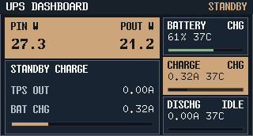
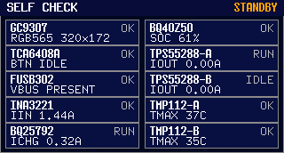

# Front panel UI docs

This directory consolidates the current confirmed front panel UI design view from specs.

## Scope

- Firmware screen UI (implemented now):
  - Design language (SoT): [design-language.md](design-language.md)
  - Component contracts: [component-contracts.md](component-contracts.md)
  - Touch target design: [touch-targets.md](touch-targets.md)
  - Visual regression checklist: [visual-regression-checklist.md](visual-regression-checklist.md)
  - Dashboard module design: [dashboard-design.md](dashboard-design.md)
  - Dashboard detail design: [dashboard-detail-design.md](dashboard-detail-design.md)
  - Self-check module design: [self-check-design.md](self-check-design.md)
- Host-side UI (future implementation): reserved, not frozen in this directory yet
- Runtime behavior baseline: [../../docs/specs/mcu-self-check-live-panel/SPEC.md](../../docs/specs/mcu-self-check-live-panel/SPEC.md)
- Visual freeze baseline: [../../docs/specs/front-panel-industrial-ui-preview/SPEC.md](../../docs/specs/front-panel-industrial-ui-preview/SPEC.md)
- BQ40 result dialog baseline: [../../docs/specs/bq40-self-check-result-dialogs/SPEC.md](../../docs/specs/bq40-self-check-result-dialogs/SPEC.md)

## Assets

- Frozen renders: `assets/dashboard-b-*.png`, `assets/self-check-c-*.png`（含 BQ40 结果弹窗 5 态）
- Dashboard detail renders: `assets/dashboard-b-detail-*.png`
- WiFi detail renders: `assets/dashboard-b-detail-wifi*.png`
- Dashboard touch target overlay: `assets/dashboard-b-touch-zones.png`
- Dashboard detail icons: `assets/dashboard-detail-icons.png`
- Module maps (2):
  - `assets/dashboard-b-module-map.png`
  - `assets/self-check-c-module-map.png`
  - Used in module-level docs (`dashboard-design.md`, `self-check-design.md`)
- Design-language previews (2):
  - `../../docs/specs/front-panel-visual-language/assets/color-preview.svg`
  - `../../docs/specs/front-panel-visual-language/assets/typography-preview.svg`
- All assets are `320x172` and offline-readable.

## Preview (representative final renders)

## Read order

1. [design-language.md](design-language.md)
2. [component-contracts.md](component-contracts.md)
3. [touch-targets.md](touch-targets.md)
4. [dashboard-design.md](dashboard-design.md)
5. [dashboard-detail-design.md](dashboard-detail-design.md)
6. [self-check-design.md](self-check-design.md)
7. [visual-regression-checklist.md](visual-regression-checklist.md)
8. Source specs for traceability:
   - [../../docs/specs/mcu-self-check-live-panel/SPEC.md](../../docs/specs/mcu-self-check-live-panel/SPEC.md)
   - [../../docs/specs/bq40-self-check-result-dialogs/SPEC.md](../../docs/specs/bq40-self-check-result-dialogs/SPEC.md)
   - [../../docs/specs/bq40-self-check-result-dialogs/SPEC.md](../../docs/specs/bq40-self-check-result-dialogs/SPEC.md)
   - [../../docs/specs/front-panel-visual-language/SPEC.md](../../docs/specs/front-panel-visual-language/SPEC.md)
   - [../../docs/specs/front-panel-industrial-ui-preview/SPEC.md](../../docs/specs/front-panel-industrial-ui-preview/SPEC.md)

## Notes

- `firmware/ui` is the stable entry for current confirmed firmware UI design.
- `docs/specs` remains the source of record for historical scope, milestones, and acceptance details.
- Visual style and token-level constraints are normalized in `design-language.md`; page docs reference it instead of redefining style terms.
- `touch-targets.md` 是 Dashboard 命中框几何与约束的集中说明，命中范围变更时优先更新该文件。
- Asset synchronization rule: `firmware/ui/assets/` is the display source for current reviews; when visual baseline changes, update `firmware/ui/assets` and reference specs in the same PR.
- Historical reference images `dashboard-b-ac-mode.png` and `dashboard-b-batt-mode.png` stay only under `docs/specs/.../assets/`.
