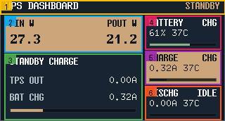
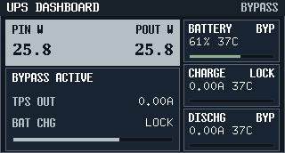
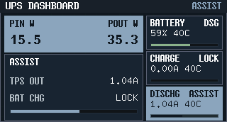
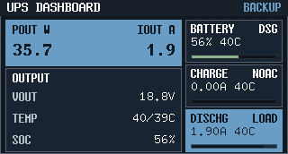

# Dashboard UI 设计（Variant B）

本文件定义固件屏幕 Dashboard 页面（Variant B）的模块布局、渲染语义与冻结图。

## 1. 基线

- 视觉冻结基线：[../../docs/specs/6qrjs-front-panel-industrial-ui-preview/SPEC.md](../../docs/specs/6qrjs-front-panel-industrial-ui-preview/SPEC.md)
- 运行语义基线：[../../docs/specs/7n4qd-mcu-self-check-live-panel/SPEC.md](../../docs/specs/7n4qd-mcu-self-check-live-panel/SPEC.md)
- 视觉规范来源：[design-language.md](design-language.md)
- 组件契约来源：[component-contracts.md](component-contracts.md)
- 触摸热区与约束来源：[touch-targets.md](touch-targets.md)
- 分辨率：`320x172`

## 2. 页面模块分区图

## 3. 模块拆解

| 编号 | 模块 | 几何（px） | 固定语义 | 关键数据/状态 |
| --- | --- | --- | --- | --- |
| 1 | 顶栏 Top bar | `x=0 y=0 w=320 h=18` | 左侧标题 `UPS DASHBOARD`，右侧模式位（`BYPASS/STANDBY/ASSIST/BACKUP` 或 `IRQ ON`） | 模式色随 `UpsMode` 切换 |
| 2 | 主 KPI 面板 | `x=6 y=22 w=196 h=52` | 市电存在：`PIN W + POUT W`；市电缺失：`POUT W + IOUT A` | 标签行 `y=27`，数值行 `y=44`（数值字体 B） |
| 3 | 次级信息面板 | `x=6 y=76 w=196 h=94` | 四模式文本块固定：`BYPASS ACTIVE / STANDBY CHARGE / ASSIST / OUTPUT` | 右侧数值随模式切换（TPS 输出、充电锁定、温度、SOC） |
| 4 | `BATTERY` 卡 | `x=206 y=22 w=108 h=48` | 固定展示 `SOC + Tmax + 电池状态` | 状态位示例：`BAL/CHG/DSG/LOW/BYP/IDLE` |
| 5 | `CHARGE` 卡 | `x=206 y=72 w=108 h=48` | 固定展示电池充电电流与状态 | 首页使用 runtime 紧凑 token：`CHG/WAIT/FULL/WARM/TEMP/LOAD/LOCK/NOAC` |
| 6 | `DISCHG` 卡 | `x=206 y=122 w=108 h=48` | 固定展示电池放电电流与状态 | `BYPASS/STANDBY` 通常为 `0A`，`ASSIST/BACKUP` 随负载变化 |

## 4. 页面业务口径（冻结）

- 工作模式固定四态：`BYPASS / STANDBY / ASSIST / BACKUP`。
- 充电策略以主线 charger state machine 为准；`UpsMode` 不再直接冻结 `CHARGE` 卡状态。
- 首页 `CHARGE` 卡只做紧凑映射：`CHG1A/CHG500/CHG100/RECOV -> CHG`，其余 runtime token 保留 `WAIT/FULL/WARM/TEMP/LOAD/LOCK/NOAC`。
- 右侧三卡语义固定，不与负载侧字段混用。
- 首页 5 个模块同时承担二级仪表盘入口：主 KPI=`Output`、次级信息=`Thermal`、`BATTERY`=`Cells`、`CHARGE`=`Charger`、`DISCHG`=`Battery Flow`。
- 首页新增 `DashboardHomeFocus`，五向开关只在上述 5 个入口卡片之间移动；`WiFi` 图标继续保持触摸独立入口，不并入卡片焦点网格。
- 标题右侧 `WiFi` 图标是独立入口；视觉图标保持小尺寸，但命中范围按 `touch-targets.md` 中的放大热区执行。
- `CHARGER DETAIL` 不是终点页：其左侧会话面板继续向下钻取到 `MANUAL`，用于手动充电偏好与运行时控制；该页采用小屏优先布局，顶部压缩为单层只读信息条、操作集中在底部唯一 action bar。
- `Dashboard` 与 `MENU` 视为纵向双屏：`Dashboard` 在上、`MENU` 在下。切换动画是视口在 `320x344` 虚拟长画布中的上下滑动；`MENU -> AUDIO` 不建立额外空间连续性，采用直接切页。
- `AUDIO` 设置页使用双行紧凑布局：`ACTION` 与 `PROMPT` 共用一套 `OFF + 1..6` 刻度，`UP/DOWN` 只切换编辑分组，`LEFT/RIGHT` 只调整当前分组级别。
- 视觉样式（色板、字体分工、状态词形）以 [design-language.md](design-language.md) 为准，本页不再重复定义 Token 细节。

详情页冻结口径见：[dashboard-detail-design.md](dashboard-detail-design.md)

## 5. 首页触摸入口

- 首页当前共有 6 个稳定入口，其中 5 个是卡片入口，1 个是头部 `WiFi` 入口。
- 卡片入口默认直接沿用卡片几何；`WiFi` 入口使用“视觉图标 + 放大命中框”的做法。
- 当前稳定热区标注图如下，实际数值与约束以 [touch-targets.md](touch-targets.md) 为准：

## 6. 冻结渲染图（四模式）

