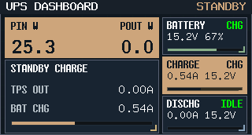
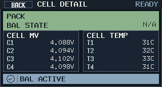
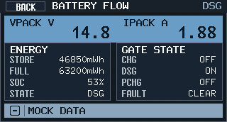
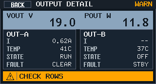
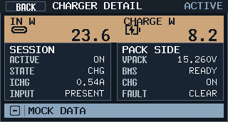
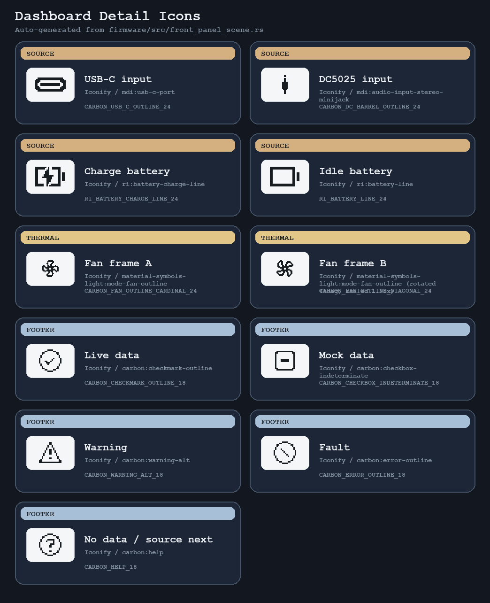

# Dashboard Detail UI 设计（Variant B Drill-down）

本文件定义 Dashboard 二级详情页的模块布局、入口映射与文案冻结口径。

## 1. 基线

- 首页基线：`dashboard-design.md`
- 视觉规范：`design-language.md`
- 组件契约：`component-contracts.md`
- 分辨率：`320x172`

## 2. 首页入口映射

| 首页区域 | 几何（px） | 进入页面 |
| --- | --- | --- |
| 主 KPI 面板 | `x=6 y=22 w=196 h=52` | `Output` |
| 次级信息面板 | `x=6 y=76 w=196 h=94` | `Thermal` |
| `BATTERY` | `x=206 y=22 w=108 h=48` | `Cells` |
| `CHARGE` | `x=206 y=72 w=108 h=48` | `Charger` |
| `DISCHG` | `x=206 y=122 w=108 h=48` | `Battery Flow` |

首页只加轻量可点语义，不改模块主信息架构。

## 3. 详情页通用骨架

- 顶栏：左侧 `BACK`，中间页面标题，右侧状态 chip。
- 主体上半区：主指标块（大数值 + 摘要标签）。
- 主体下半区：2~4 个信息卡，承载状态、分组指标与子系统摘要。
- 底栏：异常/提示条，固定 1 行。

## 4. 页面冻结口径

### `Cells`

- 顶栏标题：`CELL DETAIL`
- 状态 chip：`BAL ON / READY / WARN / FAULT`
- 主区：4 节电压栅格
- 次区：均衡状态、4 路温度、充放电状态
- 底栏：cell fault / balance hint

### `Battery Flow`

- 顶栏标题：`BATTERY FLOW`
- 状态 chip：`CHG / DSG / IDLE / FAULT`
- 主区：`VPACK` + `IPACK`
- 次区：`ENERGY / FULL CAP / CHG / DSG / PCHG`
- 底栏：battery abnormal summary

### `Output`

- 顶栏标题：`OUTPUT DETAIL`
- 状态 chip：`REG OK / WARN / FAULT`
- 主区：`VOUT` + `POUT`
- 次区：`OUT-A`、`OUT-B`、温度、异常
- 关闭路规则：电流固定 `--`

### `Charger`

- 顶栏标题：`CHARGER DETAIL`
- 状态 chip：`ACTIVE / IDLE / LOCK / FAULT`
- 主区：输入来源图标 + `IN W`；电池图标 + `CHARGE W`
- 次区：charging state / source select / status detail
- 底栏：charger abnormal summary

### `Thermal`

- 顶栏标题：`THERMAL DETAIL`
- 状态 chip：`COOL / WARM / HOT / FAULT`
- 主区：最高温度 + fan 状态
- 次区：TMP / board / battery / fan PWM / tach
- 底栏：thermal protection hint

## 5. 视觉方向

- 保持 `Variant B` 的深色工业底板与橙色强调色。
- 相比首页，详情页减少缩写密度，优先使用完整英文词组。
- 信息卡留白略增，数字分层更明确，异常条用更稳定的语义色。

## 6. 冻结渲染图

