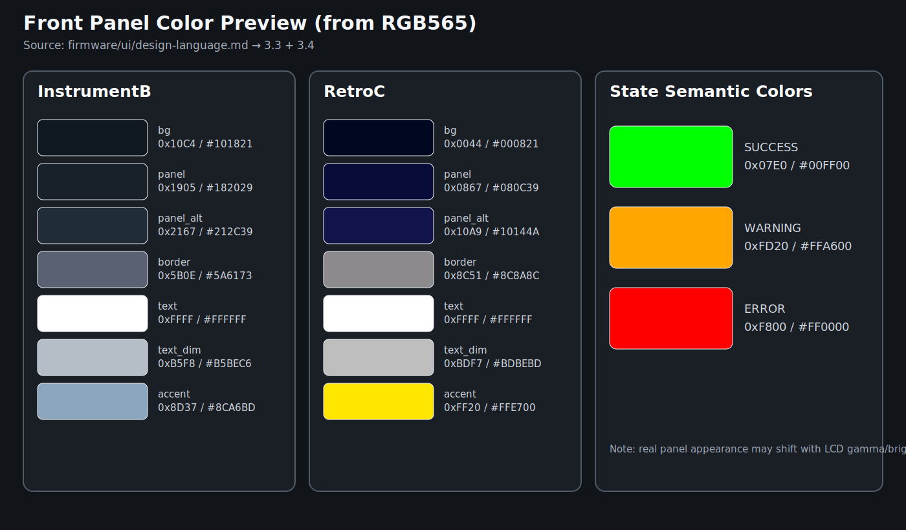
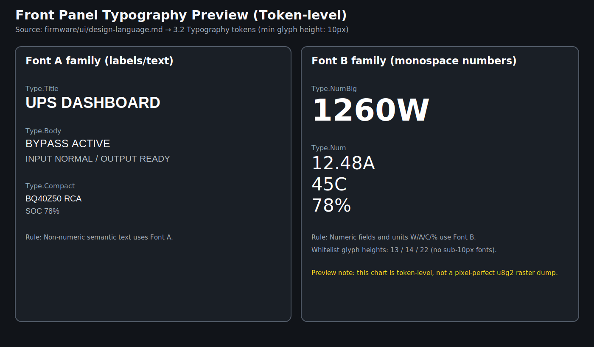

# Front panel design language

本文件是前面板 UI 的视觉语言单一来源（SoT）。页面文档用于说明布局与业务语义，不重复定义视觉规则。

## 1. Scope

- 适用范围：`Dashboard (Variant B)`、`Self-check (Variant C)`、`BQ40 activation overlays`。
- 目标分辨率：`320x172`（横屏有效区）。
- 规则来源代码：`firmware/src/front_panel_scene.rs`（palette/font/state 映射）。

## 2. Visual principles

### Principle A: Readability first

- Do: 优先保证标签、单位、数值在 1x 缩放下可读。
- Do: 主要信息放在高对比区域（header/KPI/card value）。
- Don't: 用低对比色表达关键状态（如 `ERR`、`BACKUP`）。

### Principle B: Numeric-first hierarchy

- Do: 数值、百分比、电流、电功率使用等宽数字字体。
- Do: 标签与数值分层排版，防止单位跳动影响可读性。
- Don't: 在同一字段混用标签字体与数字字体。

### Principle C: Deterministic state signaling

- Do: 所有状态词（`LOCK/NOAC/PEND/WARN/ERR/N/A`）使用固定文案与固定语义。
- Do: 交互高亮颜色仅由 `UiFocus` 与 `touch_irq` 驱动。
- Don't: 让同一状态在不同页面出现不同词形。

## 3. Token system

### 3.1 Canvas and spacing tokens

- `Canvas.320x172`: 页面有效画布，不允许缩放或裁切评审。
- `TopBar.h18`: 顶栏高度固定 `18px`（与 `HEADER_H` 一致）。
- `Space.2`, `Space.4`, `Space.6`, `Space.8`, `Space.10`, `Space.12`: 间距刻度，仅允许按该刻度扩展新组件。
- `Stroke.1`: 边框线宽固定 `1px`。
- `Radius.0`: 当前前面板卡片为矩形风格，圆角保持 `0`。

### 3.2 Typography tokens

- `Type.Title`: 标题/模块名，使用 Font A（u8g2 title/body family）。
- `Type.Body`: 正文与标签，使用 Font A。
- `Type.Compact`: 紧凑诊断卡标签，使用 Font A body（复用 `Type.Body` 字体，避免小字形）。
- `Type.Num`: 常规数值字段，使用 Font B monospace。
- `Type.NumCompact`: 紧凑诊断卡数字字段，使用 Font B monospace（复用 `Type.Num` 字体，避免小字形）。
- `Type.NumBig`: KPI 大号数值，使用 Font B big digits。

字体分工约束：

- 非数字语义文本必须使用 Font A 体系。
- 可对齐数字字段必须使用 Font B 体系。
- 单位（`W/A/C/%`）跟随数值字段时使用 `Type.Num`。

#### Bitmap font whitelist (hard gate)

> 以下白名单以 `firmware/src/front_panel_scene.rs` 中静态字体绑定为准，后续新增字体必须先通过该白名单门禁。

| Token | Code binding | u8g2 font | Nominal box | Glyph height |
| --- | --- | --- | --- | --- |
| `Type.Title` | `FONT_A_TITLE` | `u8g2_font_8x13B_tf` | `8x13` | `13px` |
| `Type.Body` | `FONT_A_BODY` | `u8g2_font_7x14B_tf` | `7x14` | `14px` |
| `Type.Compact` | `FONT_A_BODY` | `u8g2_font_7x14B_tf` | `7x14` | `14px` |
| `Type.Num` | `FONT_B_NUM` | `u8g2_font_8x13_mf` | `8x13` | `13px` |
| `Type.NumCompact` | `FONT_B_NUM` | `u8g2_font_8x13_mf` | `8x13` | `13px` |
| `Type.NumBig` | `FONT_B_NUM_BIG` | `u8g2_font_t0_22b_tn` | `t0_22` | `22px` |

字高白名单（允许值）：

- `13px`, `14px`, `22px`

新增字体准入规则：

1. 必须是 bitmap 字体（u8g2 family），并映射到唯一 Token。
2. 字高必须属于白名单，且不得小于 `10px`；若需要新字高，必须先更新 `design-language.md`、`component-contracts.md`、`visual-regression-checklist.md` 与对应 SPEC，再允许落地实现。
3. 不允许对 bitmap 字体做运行时缩放来“模拟字号”。
4. 新增字体后必须补充预览图与回归清单检查项。

### 3.3 Color tokens

Color token 采用语义命名；具体值由变体 palette 提供。

#### Surface and border

- `Color.Surface.Base` -> `palette.bg`
- `Color.Surface.Panel` -> `palette.panel`
- `Color.Surface.PanelAlt` -> `palette.panel_alt`
- `Color.Border.Default` -> `palette.border`

#### Text

- `Color.Text.Primary` -> `palette.text`
- `Color.Text.Secondary` -> `palette.text_dim`

#### State

- `Color.State.Success` -> 固定 `0x07E0`
- `Color.State.Warning` -> 固定 `0xFD20`
- `Color.State.Error` -> 固定 `0xF800`
- `Color.State.Accent` -> `palette.accent`

#### Focus/interaction

- `Color.Focus.Up` -> `palette.up`
- `Color.Focus.Down` -> `palette.down`
- `Color.Focus.Left` -> `palette.left`
- `Color.Focus.Right` -> `palette.right`
- `Color.Focus.Center` -> `palette.center`
- `Color.Focus.Touch` -> `palette.touch`

### 3.4 Variant palette baselines

`Dashboard` 视觉冻结基线默认对应 `UiVariant::InstrumentB`，`Self-check` 运行基线对应 `UiVariant::RetroC`。

- `InstrumentB`: `bg=0x10C4`, `panel=0x1905`, `panel_alt=0x2167`, `border=0x5B0E`, `text=0xFFFF`, `text_dim=0xB5F8`, `accent=0x8D37`
- `RetroC`: `bg=0x0044`, `panel=0x0867`, `panel_alt=0x10A9`, `border=0x8C51`, `text=0xFFFF`, `text_dim=0xBDF7`, `accent=0xFF20`

### 3.5 Visual previews

- Color preview: `../../docs/specs/hg3dw-front-panel-visual-language/assets/color-preview.svg`
- Typography preview: `../../docs/specs/hg3dw-front-panel-visual-language/assets/typography-preview.svg`

## 4. State mapping contract

### 4.1 UpsMode

- `BYPASS`: 输入直通输出，`ChargeCard` 显示 `LOCK/NOAC`。
- `STANDBY`: 允许充电，`ChargeCard` 显示 `READY/CHG`。
- `ASSIST`: 负载补偿，`ChargeCard` 显示 `LOCK/NOAC`。
- `BACKUP`: 电池供电，`ChargeCard` 显示 `LOCK/NOAC`。

### 4.2 SelfCheckCommState

基础通信态：

- `PEND`: 初始化中，使用中性色（secondary text + default border）。
- `OK`: 通过，文案固定 `OK`，当前基线使用中性色文本（`Color.Text.Secondary`）。
- `WARN`: 可运行但异常，文案固定 `WARN`，当前基线使用中性色文本（`Color.Text.Secondary`）。
- `ERR`: 失败，文案固定 `ERR`，当前基线使用中性色文本（`Color.Text.Secondary`）。
- `N/A`: 模块不可用或未接入，文案固定 `N/A`。

模块派生态（由基础态与模块上下文派生）：

- Charger: `RUN` / `LOCK`
- BQ40: `RCA`
- TPS: `RUN` / `IDLE`
- TMP: `HOT`

### 4.3 BmsActivationState

- `Idle`: 无 overlay。
- `Pending`: 进入 progress overlay。
- `Succeeded`: 显示成功结果 overlay。
- `FailedNoInput` / `FailedTimeout` / `FailedComm`: 显示失败结果 overlay，错误语义不混用。

### 4.4 UiFocus and touch_irq

- `UiFocus` 仅控制交互高亮，不改变 UPS 业务状态。
- `touch_irq=true` 时优先显示触摸焦点色，保留当前业务状态文案不变。

## 5. Naming and copywriting rules

- 文档说明使用中文，组件/Token/状态标识使用英文。
- 状态词必须使用固定词形：`BYPASS`、`STANDBY`、`ASSIST`、`BACKUP`、`PEND`、`OK`、`WARN`、`ERR`、`N/A`、`LOCK`、`NOAC`、`RUN`、`IDLE`、`RCA`、`HOT`。
- 模块名必须与实现一致：`GC9307`、`TCA6408A`、`FUSB302`、`INA3221`、`BQ25792`、`BQ40Z50`、`TPS55288-A`、`TPS55288-B`、`TMP112-A`、`TMP112-B`。
- 单位规范：`W`（功率）、`A`（电流）、`C`（温度）、`%`（SOC）。
- 禁止同义词漂移：同一状态不得在不同文档中出现别名。

## 6. Traceability

- 页面布局与模块划分：`dashboard-design.md`、`self-check-design.md`
- 组件职责边界：`component-contracts.md`
- 视觉验收执行：`visual-regression-checklist.md`
- 规格追踪：`../../docs/specs/hg3dw-front-panel-visual-language/SPEC.md`
