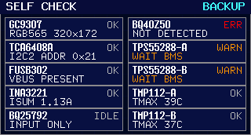

# Self-check UI 设计（Variant C，启动 / 恢复阶段）

本文件定义固件屏幕 Self-check 页面（Variant C）的模块布局、运行语义与冻结图。

## 1. 基线

- 运行语义基线：[../../docs/specs/g2kte-dashboard-live-after-self-check/SPEC.md](../../docs/specs/g2kte-dashboard-live-after-self-check/SPEC.md)
- 视觉冻结基线：[../../docs/specs/6qrjs-front-panel-industrial-ui-preview/SPEC.md](../../docs/specs/6qrjs-front-panel-industrial-ui-preview/SPEC.md)
- 视觉规范来源：[design-language.md](design-language.md)
- 组件契约来源：[component-contracts.md](component-contracts.md)
- 分辨率：`320x172`

## 2. 页面模块分区图

## 3. 页面级模块拆解

| 编号 | 模块 | 几何（px） | 固定语义 |
| --- | --- | --- | --- |
| 1 | 顶栏 Top bar | `x=0 y=0 w=320 h=18` | 标题固定 `SELF CHECK`，右侧显示当前 UPS 模式 |
| 2-6 | 左列 5 张诊断卡 | `x=6 y=22..166 w=151 h=29` | 每卡两行：`MODULE + COMM` / `KEY PARAM` |
| 7-11 | 右列 5 张诊断卡 | `x=163 y=22..166 w=151 h=29` | 每卡两行：`MODULE + COMM` / `KEY PARAM` |

## 4. 10 个通信模块清单（与实现一致）

| 模块 | COMM 状态 | KEY PARAM（渲染口径） |
| --- | --- | --- |
| `GC9307` | `PEND/OK/WARN/ERR/N/A` | `RGB565 320x172` |
| `TCA6408A` | `PEND/OK/WARN/ERR/N/A` | `I2C2 ADDR 0x21` |
| `FUSB302` | `PEND/OK/WARN/ERR/N/A` | `VBUS ON/OFF/UNKNOWN` |
| `INA3221` | `PEND/OK/WARN/ERR/N/A` | `ISUM x.xxA` |
| `BQ25792` | `PEND/RUN/LOCK/WARN/ERR/N/A` | `ICHG x.xxA` 或 `CHG DISABLED` |
| `BQ40Z50` | `PEND/OK/WARN/ERR/N/A` | `SOC xx%` / `ABNORMAL` / `RCA ALARM` / `NOT DETECTED` |
| `TPS55288-A` | `PEND/RUN/IDLE/HOLD/WARN/ERR/N/A` | `IOUT x.xxA` |
| `TPS55288-B` | `PEND/RUN/IDLE/HOLD/WARN/ERR/N/A` | `IOUT x.xxA` |
| `TMP112-A` | `PEND/OK/WARN/ERR/N/A` | `TMAX xxC` |
| `TMP112-B` | `PEND/OK/WARN/ERR/N/A` | `TMAX xxC` |

## 5. 页面运行语义（冻结）

- 开机后屏幕可用即进入 `SELF CHECK`（Variant C）。
- 自检阶段按模块探测进度实时更新状态；大多数卡片按 `PEND -> OK/WARN/ERR/N/A` 收口，输出相关卡片会按门控条件进入 `HOLD`。
- `SELF CHECK` 是启动 / 恢复阶段页面，不是 steady-state 默认页。
- 当自检清零且首份运行态快照准备好后，页面自动切换到 Dashboard；运行期默认停留在 Dashboard，而不是回退到 `SELF CHECK`。
- `BQ40Z50` 卡片语义固定为：`OK`=普通访问可信正常态，`WARN`=设备存在但非正常态，`ERR`=普通访问未识别。
- `TPS55288-A/B` 卡片语义固定为：当 `BMS` 尚未允许放电、`VBAT` 网络仍不可确认，或输出链路还在等待上游门控前提时，卡片允许停在 `HOLD`；若此时伴随 `I2C NACK/not_present`，仍按门控未满足处理并显示 `WAIT BMS` / `VBAT UNK`。只有在上游供电前提已满足后仍探测失败，才显示 `ERR`。
- 本版本不提供从 Dashboard 主动返回 `SELF CHECK` 的常规入口；`SELF CHECK` 只在启动 / 恢复链路出现。
- 视觉样式（状态颜色、字体层级、交互高亮）以 [design-language.md](design-language.md) 为准，本页保留布局与语义冻结。

## 6. 冻结渲染图（启动 / 恢复阶段，包括 BQ40 结果弹窗）

