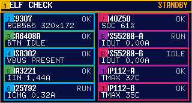
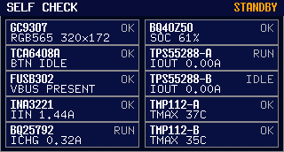
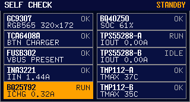
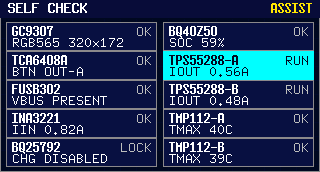
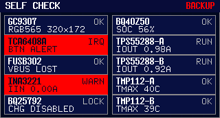
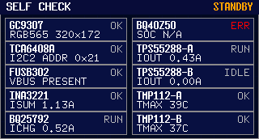
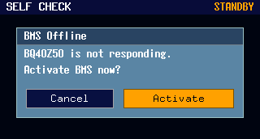
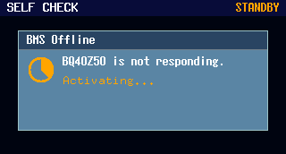
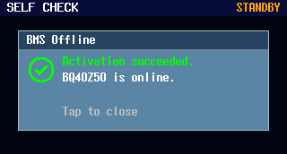
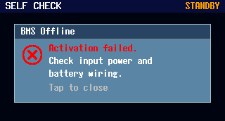

# Self-check UI 设计（Variant C）

本文件定义固件屏幕 Self-check 页面（Variant C）的模块布局、运行语义与冻结图。

## 1. 基线

- 运行语义基线：[../../docs/specs/7n4qd-mcu-self-check-live-panel/SPEC.md](../../docs/specs/7n4qd-mcu-self-check-live-panel/SPEC.md)
- 视觉冻结基线：[../../docs/specs/6qrjs-front-panel-industrial-ui-preview/SPEC.md](../../docs/specs/6qrjs-front-panel-industrial-ui-preview/SPEC.md)
- 分辨率：`320x172`

## 2. 页面模块分区图

## 3. 页面级模块拆解

| 编号 | 模块 | 几何（px） | 固定语义 |
| --- | --- | --- | --- |
| 1 | 顶栏 Top bar | `x=0 y=0 w=320 h=20` | 标题固定 `SELF CHECK`，右侧显示当前 UPS 模式 |
| 2-6 | 左列 5 张诊断卡 | `x=6 y=22..166 w=151 h=29` | 每卡两行：`MODULE + COMM` / `KEY PARAM` |
| 7-11 | 右列 5 张诊断卡 | `x=163 y=22..166 w=151 h=29` | 每卡两行：`MODULE + COMM` / `KEY PARAM` |

## 4. 10 个通信模块清单（与实现一致）

| 模块 | COMM 状态 | KEY PARAM（渲染口径） |
| --- | --- | --- |
| `GC9307` | `PEND/OK/WARN/ERR/N/A` | `RGB565 320x172` |
| `TCA6408A` | `PEND/OK/WARN/ERR/N/A` | `I2C2 ADDR 0x21` |
| `FUSB302` | `PEND/OK/WARN/ERR/N/A` | `VBUS ON/OFF/UNKNOWN` |
| `INA3221` | `PEND/OK/WARN/ERR/N/A` | `ISUM x.xxA` |
| `BQ25792` | `PEND/RUN/LOCK/WARN/ERR/N/A` | `ICHG x.xxA` 或 `CHG DISABLED` |
| `BQ40Z50` | `PEND/OK/RCA/WARN/ERR/N/A` | `SOC xx%` 或 `RCA ALARM` |
| `TPS55288-A` | `PEND/RUN/IDLE/WARN/ERR/N/A` | `IOUT x.xxA` |
| `TPS55288-B` | `PEND/RUN/IDLE/WARN/ERR/N/A` | `IOUT x.xxA` |
| `TMP112-A` | `PEND/OK/WARN/ERR/N/A` | `TMAX xxC` |
| `TMP112-B` | `PEND/OK/WARN/ERR/N/A` | `TMAX xxC` |

## 5. 页面运行语义（冻结）

- 开机后屏幕可用即进入 `SELF CHECK`（Variant C）。
- 自检阶段按模块探测进度实时更新状态：`PEND -> OK/WARN/ERR/N/A`。
- 自检完成后保持 `SELF CHECK` 页面并持续刷新真实运行数据。
- 本版本禁用 `CENTER` 长按切页，不再从自检页切回 Dashboard。

## 6. 冻结渲染图（四场景）

